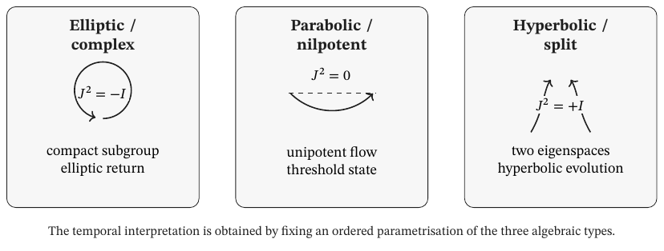
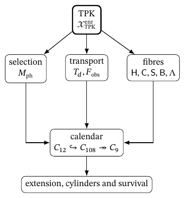
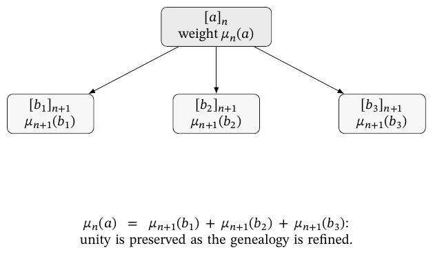

# The Holographic Closure of Infinity: The Discrete Structure of the Continuum and the Origin of the Fundamental Constants

A coinductive narrative prepared by ChatGPT 6 Astra, with the assistance and specific direction of the authors.

Oumar Haidara Fall and Rubén Ramos Balsa

28 September 2026

## Preface

This document offers a coinductive narrative generated by ChatGPT with the assistance and specific direction of the authors. The exposition is based on a theoretical analysis of the documents accompanying this dossier. They bring together the results obtained and the mathematical and physical developments undertaken between 2023 and 2026 through the use of Large Language Models (LLM). This process gave rise to the formulations termed Triadic Modular Holography and Dimensional Mechanics (HMT–MD), respectively. The project originated, however, at the beginning of the twenty-first century, specifically in the study of the discovery underlying the mechanical apparatus invented by Oumar Haidara Fall in 2001.

The material accumulated and the knowledge progressively acquired over more than two decades of observation, study and analysis of the apparatus, its phenomenology and its geometrical configuration constituted the operational and informational basis that the authors subsequently applied to artificial intelligence models. The theoretical framework presented here, together with its derivations and proofs, is therefore preceded by an empirical genealogy that remains surprising as a historical paradox: when reasoning with ‘thinking machines’ began in ‘the age of artificial intelligence’, it also became necessary to question anew the complex interaction between two simple machines: the lever and the wheel.

## The continuum and the determination of physical quantities

Triadic Modular Holography and Dimensional Mechanics develop a unified explanation of the origin of fundamental values and the relations that constitute matter. The continuum is constructed through the compatible prolongation of arithmetic states that preserve orientation, route, and memory. Numerical values and incidence relations are readings of this same organization. This construction brings the problem of constants together with that of physical constitution: the strength of an interaction, the scale of an action, and the mass of a particle are studied through the operations that determine and connect them. The document develops the continuity between this mathematical genesis and its physical determinations.

The APP–TRIT–TPK core establishes the initial operations. APP organises the two directions of the arithmetical support and the difference between additive accumulation and multiplicative composition; TRIT orients and distinguishes local regimes; TPK selects, transports and updates the complete state. The returns and prolongations making the double projection possible are constructed on this dynamics. The Archimedean readout determines numerical coordinates while the exceptional projection preserves incidence relations. The point acquiring a value possesses, in its construction, a structure that continues to participate in its transformations.

The articulated generation of π, φ, and e, the dodecaphase record and its realization as an arithmetic-geometric coupling constant, and the two internal routes that determine α show the first consequence of this unity. The electronic construction extends it by studying the electron’s identity, action, and dimensional realization together. Planck’s constant, the Barbero–Immirzi parameter, Boltzmann’s constant, and the universal gravitational constant then connect action, area, entanglement, temperature, and geometric response. The General Mass Law and mixing transports extend this development towards the organization of material states. Each result preserves its own derivation and the antecedents that connect it with the common architecture.

The significance of this thesis lies in changing the explanatory status of quantities. A constant determined by structure preserves the relations making it necessary; a particle defined by its persistence acquires properties through the conditions of that persistence. Action, geometric reciprocity and memory of transformations are articulated within that same chain; their functions will be presented where the objects, maps and equations of the development determine them. Unification is recognised in the transmission of those antecedents between problems: action enters material evaluation, area is linked with information, orientation participates in mixing, and memory conditions evolution. This is the continuity the narrative must make visible.

Three questions allow it to be followed: what determines each result, what preserves its identity through transformation, and how it is physically realised. The central historical development begins where laws unify physical domains and, at the same time, leave visible the provenance of the quantities they employ. From that modern formulation, the genealogy returns to proportion, support and motion, and proceeds towards infinity and the continuum. Philosophical reflection examines, along this path, what it means to know a structure and what it means to attribute constitutive capacity to it. The historical questions thus receive a concrete response within the HMT development, at the point where that response allows progress to be made.

## Constants, measurement and the unification of physics

This tension between unification and determination can be expressed through two relations distinguishing a measured constant from a constant determined by structure:

$$
\mathcal T(\lambda)\longmapsto \text{predictions},
\qquad
\mathcal G\longmapsto \lambda_*\longmapsto \mathcal T(\lambda_*).
$$

In the first, predictions require the parameter \(\lambda\) to be fixed; in the second, the construction \(\mathcal G\) determines \(\lambda_*\), which subsequently enters the physical theory. The decisive question concerns the operation establishing that connection. It allows us to recognise which quantities arise directly from the generative core and which are obtained by composing its results with physical laws. That distinction must remain visible in every subsequent comparison.

Newtonian gravitation shows especially clearly that a theory can reorganise knowledge of nature without exhausting the question of its foundation. The same relation allows terrestrial and celestial motions to be treated. The scope of the law transforms what counts as an explanation: phenomena previously distributed between different domains become linked by a common dynamical structure. In the *General Scholium*, Newton distinguishes knowledge of gravity’s properties and effects from a hypothesis about its ultimate cause. That distinction belongs to his method and must be preserved when reconstructing the problem historically. [H07]

Contemporary gravitational notation concentrates in the letter \(G\) a coefficient that did not occupy exactly that symbolic position in the *Principia*. The difference matters because the history of a constant includes the history of the quantities and units allowing it to be isolated. Cavendish entitled his 1798 investigation as a determination of the Earth’s density. The torsion balance allowed the attraction between laboratory masses to be related to terrestrial attraction. The subsequent interpretation in terms of a measurement of \(G\) is physically understandable, but must not replace the experiment’s stated purpose. [H08]

The experiment reveals a fundamental mediation between number and world. A quantity is determined through the organised comparison of effects. Torsion, distances, masses and oscillation times form an experimental structure. The numerical result condenses that set of relations. The constant does not enter knowledge as a bare datum; it is obtained through a system of inferences and calibrations. Precisely for this reason, explaining its value mathematically requires something different from reproducing the measured number: it requires showing which structure can occupy the explanatory place left open by measurement.

In the nineteenth century, electromagnetism brought unification to an especially suggestive form. Maxwell related the propagation of electromagnetic disturbances to a speed determined by electrical and magnetic quantities, and recognised its correspondence with the speed of light. The identification brought optics and electromagnetism together within a field conception. The value of the speed remained linked to experimental determinations, but the relationship between domains had changed radically. The constant came to express a physical unity that had not previously been manifest. [H11]

In contemporary notation, for the vacuum and with the corresponding electromagnetic conventions, the relation takes the form:

$$
c^2\,\varepsilon_0\,\mu_0=1.
$$

The propagation speed \(c\), permittivity \(\varepsilon_0\) and permeability \(\mu_0\) cease to function as three independent determinations within that description. The equation establishes a structural dependence. Its historical significance lies in reducing the separation between phenomena, while the problem of an absolute numerical selection of all the quantities requires further investigation. Unifying relations and completely determining their values are related tasks whose difference can be formulated without diminishing the scope of either.

The reconstruction of the vacuum in HMT–MD gives this dependence a constitutive place: electrical and magnetic quantities are obtained through state readout operators and related to action, scale and propagation. Maxwell’s equation retains its physical function; the antecedent genealogy of its quantities explains which conditions they transmit to that equation. Unification is examined from the common origin of the relations subsequently expressed in laboratory units.

The natural units of Stoney and Planck deepened another aspect of the problem. Stoney sought physical units grounded in constants of nature; Planck formulated scales constructed from universal constants linked to gravitation, propagation and radiation. These programmes sought to make measurement standards independent of human or terrestrial particularities. The ambition was that different civilisations could recognise the same structure of units, even if they initially employed different conventions. The universality of scales thus acquired an epistemological and cosmological significance. [H12, H13]

A natural scale brings constants together so that their dimensions compensate and produce a length, time, mass or temperature. The operation reveals profound relations between physical fields. At the same time, knowledge of its magnitudes depends on the values of the constants employed. The naturalness of the combination expresses its independence from arbitrary construction conventions; determining its value still raises the question of the components’ provenance. This difference allows us to understand why a theory of natural units can be inaugural without constituting, by itself, a genesis of all the constants it employs.

Thermal radiation added a difficulty that was not merely metrological. The Planck constant related energy and frequency and came to express a scale of action. The number played a structural role in the transformation of physics. A constant can therefore modify the very concept of a physical object: it ceases to be a coefficient situated within a known law and marks a reorganisation of the operations through which processes are described. The relation between continuity, exchange and quantisation then becomes part of the question of its meaning.

In the HMT development, the action scale has explicit arithmetical and operator antecedents. The Planck construction links the action readout operator to α, self-scaling and dimensional realisation; the Boltzmann construction relates energy exchange to tritic information and temperature. The Barbero–Immirzi parameter articulates area and entanglement, while the gravitational readout incorporates geometrical response. These connections give substance to the question of the origin of scales: they allow an earlier determination to be followed through to its function in a physical quantity.

Physical determination adds a decisive difficulty. The numerical value of a dimensional quantity changes when units change. The speed of light, expressed in metres per second, has a different number from the one it would have in kilometres per second; the physical relation remains. A deep explanation must therefore distinguish the quantity, its unit and its invariant ratios. Dimensionless constants preserve their number under such changes and make the problem of selection especially visible. Dimensional constants also require an explanation of the structure relating length, time, mass, action, temperature and charge. The discussion by Duff, Okun and Veneziano showed how far the very count of fundamental constants depends on what is understood by independence, conversion and unit. [H15]

The modern definition of the International System offers an instructive example. Fixing certain numerical values exactly allows reproducible units to be defined and metrology to be coordinated. This is a decision about how to express and realise quantities, not a cosmological deduction of their existence. A change in a number’s metrological status does not automatically transform its explanatory status. This distinction is necessary for any proposal deriving scales: what arises from the construction, what identifies a quantity and what belongs to its conventional expression must remain clear. [H14]

Bachelard allows us to understand why this articulation also transforms scientific experience. The laboratory phenomenon is prepared through instruments incorporating theoretical relations; observation selects conditions, distinguishes effects and makes what is to be known reproducible. His notion of phenomenotechnique places this realisation at the centre of knowledge: science learns from phenomena whose manifestation it has made possible through a rational and technical construction. Objectivity is achieved in the exchange between project, realisation and rectification. An instrument does not turn a theory into truth merely by materialising it; it allows its relations to be subjected to an organised experience that may require them to be modified. [B22].

Hasok Chang’s investigation of temperature develops this question through the history of measurement. The justification of measurement procedures encounters a difficulty when the standards and knowledge that should validate them depend on one another. Chang calls epistemic iteration the process through which an initial system of knowledge allows investigations that enrich and correct it. Precision appears as a progressive achievement of that coordination, not as an original property of every instrumental reading. [B23].

A scale identifies the level and transformation relation linking quantities and resolutions. In HMT–MD, explaining it requires the operator transporting the structure and the unit realising its readout. Preserving a relation under a change of scale, selecting a scale and fixing its expression in units are different operations that cooperate in metrological comparison. Laboratory precision thus encounters a definite construction against which it can be tested.

Quantum physics made especially visible the difference between the exactness of a law and the determination of its parameters. The study of spectra required atomic structure, relativity and quantisation to be related. In Sommerfeld’s 1916 work, the fine-structure constant organised characteristic corrections and proportions of the problem. Its dimensionless character concentrated a question that natural units had left open: the number could be compared independently of a choice of metres, seconds or electrical units. Its value became an indication of a possible deeper organisation. [H16]

The fine-structure constant brings charge, action and propagation together in a dimensionless ratio. In the usual electrical notation, it is written

$$
\alpha=\frac{e_{\mathrm{el}}^{\,2}}{4\pi\varepsilon_0\hbar c}.
$$

The equation identifies its function within quantum electromagnetism. The HMT determination develops from a different antecedent: the regional coordinates and signed register arise from the same state, and their composition establishes dodecaphasic closure. The value of α is linked to the conditions that this closure must satisfy. The second internal route, through the positive root of the corresponding kernel, preserves its formulation and allows the agreement between the two developments to be examined. The coupling acquires its value as part of the architecture constituting it.

Eddington attempted to advance towards a theoretical determination of the number through algebraic and statistical arguments related to the quantum description of the electron. The chronology is significant: Nature’s “News and Views” section of 26 January 1929 documents the result 136, together with a cited experimental value close to 137.1; in November of the same year, Eddington presented a reorganisation leading to 137. These episodes belong to a foundational programme, and reconstructing them requires dates and arguments to be retained rather than replaced by an anecdote about numerical fascination. [H18, H19]

Eddington’s philosophical interest lies in the ambition to transform a measured constant into a consequence of the organisation of physical knowledge. The difficulty appears in the criterion of selection: a construction must explain why its operations are necessary before the number it seeks to obtain is known. Numerical correspondence can guide an investigation; the strength of an explanation depends on the value being fixed by conditions independent of that recognition. This distinction does not disqualify the search. It expresses the kind of necessity that the search itself seeks to attain.

Dirac proposed a different route in 1937. He related large numbers formed from physical and cosmological quantities and interpreted their proximity as an indication of a dynamical connection. Gravitation could vary with cosmological time when expressed in atomic units. The proposal transformed the question of a fixed number into a question of an evolving relation. Instead of deducing all constants as invariants of a timeless structure, he sought a common dependence between microscopic scales and the age of the universe. [H20]

The difference between the two programmes deserves to be preserved. Eddington aspired to a necessity associated with formal structure; Dirac explored a cosmological dependence capable of relating orders of magnitude. The history of constants therefore contains several forms of explanation: algebraic selection, dynamical generation, parameter reduction and articulation of scales. A rigorous narrative must show which question each answers. The mere presence of a number in an equation does not allow us to decide whether it is a datum, an output, an initial condition or an evolving relation.

The connection Dirac sought between atomic and cosmological scales keeps a specific question open for the HMT exposition: which quantities remain invariant under transport and which express the system’s evolution. The arithmetical–geometrical coupling constant participates in that articulation through its realisations, while the cosmological equations retain their dynamical variables. The identity of a structure and the becoming of its states are distinguished within a common description. This distinction prevents coincidences between orders of magnitude from replacing the explanation of the operations relating them.

In 1949, Einstein formulated a requirement especially close to the core of this problem. After separating the dimensional constants that can be absorbed through units, he concentrated his ideal on arbitrary dimensionless constants. According to that aspiration, a fundamental theory should possess a structure such that modifying its constants would destroy its identity. Einstein presented this requirement as a conviction about the intelligibility of nature, not as a result he had proved. Its historical importance lies in the precision of the criterion: explaining a value means eliminating its free variation within the theory. [H22]

The formulation can be understood as a rigidity condition. A parametrised theory admits several numerical choices; a rigid theory compels one choice through the interdependence of its relations. The difference is deeper than a reduction in the number of symbols. A parameter can be concealed in a definition, a boundary condition or the selection of a solution. Arbitrariness is overcome when the architecture determines that choice explicitly and preserves its independence from the value subsequently recognised.

Wolfgang Pauli had formulated a related requirement at the conclusion of his Nobel lecture of 13 December 1946. For him, explaining the atomistic structure of electricity remained linked to a theory capable of determining the value of the fine-structure constant. The question was not exhausted by attaining greater experimental precision: it concerned the relation between coupling strength and the constitution of electrical sources. Number and structure had to come to be explained together. This requirement allows us to understand why investigating the value of α reaches the problem of the electron and its material identity. Knowing the value of a constant is not enough; the aim is to understand which organisation makes it possess that value and how that organisation relates to the phenomena in which it participates. [B24].

The electron gives material form to this requirement of Pauli’s. The HMT narrative studies it as a persistent organisation with position, orientation, action and closure conditions; its mass evaluation is obtained after those antecedents have been established. The connection between α and electronic structure therefore belongs to the identity of the object described. The General Mass Law extends the readout to other signatures and paths without replacing them with a list of masses introduced from outside.

The same question of constitution manifests itself in exclusion and statistics. The HMT–MD development organises exchange sectors through the symmetry conditions of the state; fermionic occupation prevents repetition of the same single-particle state in the antisymmetric sector. The Fermi–Dirac and Bose–Einstein distributions are subsequently explained through their corresponding counts. The exclusion principle thus acquires a defined position between state identity and the collective organisation of occupations.

Einstein’s concern about the completeness of the quantum description brings the relation between the system and its measurement to the forefront. The Einstein–Podolsky–Rosen argument examines what can be inferred about one system from measurements performed on another with which it has interacted. In HMT, joint preparation, transport, local instruments and the register are incorporated into the same genealogy. The description preserves the relation making correlation possible, and each readout is situated within the physical operation realising it. [B25].

The triadic treatment of Bell makes this response precise through three-outcome instruments. Joint preparation determines correlation probabilities; the completeness of each instrument establishes the operational independence of the marginal from the remote setting. The distinction between local factorisation and no-signalling then organises the problem of locality through separate statements. Information is measured in trits, and the relation between totality and local readout is expressed through specific operators. This construction belongs alongside the postulates, entanglement and information conservation, before proceeding through the mass spectrum.

The Einsteinian ideal is related to his 1933 reflection on the method of theoretical physics. Fundamental concepts are not obtained through a simple inductive accumulation of data; a constructive activity intervenes, seeking principles capable of organising experience. Experience retains its decisive function in evaluating consequences. A productive tension is established between conceptual freedom and empirical control. The determination of constants is one of the places where this tension can become especially fruitful, because it requires the choice of principles to be linked with definite quantitative results. [H21]

Simplicity, however, requires a structural interpretation. Norton has shown that the apparent simplicity of a formulation depends on the language, variables and representations employed. A short equation can conceal a complex definition; an extensive formulation can be condensed when the appropriate object is found. An explanation of constants therefore gains strength when its necessity is preserved under equivalent representations. The relevant rigidity belongs to the object and its relations, not merely to the economy of a notation. [H45]

This requirement allows the role of mathematical beauty in twentieth-century physics to be reformulated. Beauty can express the coordination of several domains through a common structure, a reduction in the independence of assumptions and the appearance of unexpected invariants. Its scientific value depends on the articulation of those relations. Determining a constant is an especially demanding case because it allows a suggestive formula to be distinguished from a complete structural selection. The number obtained acquires meaning when what would be altered by modifying it is understood.

Contemporary physics has made changes of scale an object of investigation. An interaction can display different effective strengths according to the energy at which it is studied. The constant appearing in a description ceases to be understood as a number isolated from the conditions of observation and becomes part of a trajectory determined by evolution equations. The renormalisation group expresses this organisation and allows phenomena at different scales to be connected. The problem of the value is then distributed between a law of variation and the choice of a particular trajectory. [H28, H29]

Let \(g\) be a coupling and \(\mu\) the scale at which it is described. A function \(\beta\) determines its evolution:

$$
\mu\frac{\mathrm d g}{\mathrm d\mu}=\beta(g),
\qquad g(\mu_0)=g_0.
$$

The first expression fixes how the coupling changes. The second selects a solution of that equation. Knowing the evolution function allows information to be transported between scales; determining the initial value through an independent construction would resolve an additional question. This difference is not a technical detail: it shows where parametric freedom resides after a dynamics has been explained. A generative theory must attend both to transport and to the selection of the trajectory it transports.

Dimensional transmutation offers another form of reorganisation. In certain theories, a dimensionless parameter can be replaced by a characteristic scale. The appearance of the scale is structurally significant and can explain the existence of a physical regime not visible in the initial formulation. Coleman and Weinberg’s 1973 work constitutes a central episode in the study of symmetry breaking induced by radiative corrections. Yet replacing the way a theory is parametrised and uniquely selecting the resulting parameter remain distinct problems. [H30]

Unification through symmetries poses a complementary possibility. Several couplings can be related within a broader theory and appear as differentiated manifestations of a common organisation. Breaking conditions, field contents and threshold corrections participate in the transition towards observed scales. Unification reduces the independence of relations; its ability to fix specific values depends on how far it also determines those conditions. The proposal of Georgi and Glashow and reviews of grand unification allow this articulation between symmetry, scale and selection to be followed. [H31, H32]

The origin of masses makes a similar difficulty visible. A mechanism can explain how certain excitations acquire mass while leaving free the coefficients differentiating their values. The relation between a breaking scale and Yukawa couplings organises the problem, but the numerical distribution of the spectrum requires those couplings to be determined or replaced by a construction selecting their relations. Mixing matrices add another structure: they describe the misalignment between bases associated with different sectors. Mass, mixing and phase are related objects with different explanatory functions. [H27]

The unifying scope of HMT must be followed at this level of detail: the register preserving orientation participates in the angular readout operators; these acquire different functions in the mixing matrices; the realisation of the state subsequently links those transports with material sectors. The treatment of masses, mixing and CP violation preserves their respective constructions. Their belonging to the same arithmetical origin is recognised through the relations they transmit, without reducing their physical differences.

Cosmological selection and multiple-vacuum scenarios introduce a third kind of response. When a theory admits many realisations, a distribution of possibilities can be sought, or a condition favouring those compatible with certain structures of the universe. The work of Bousso and Polchinski, Douglas and Weinberg shows different programmes within this orientation. An anthropic bound, a statistical distribution and a unique determination do not possess the same logical status. Their comparison becomes fruitful when one asks which set of possibilities has been reduced and through which condition. [H33, H34, H35]

The ontological question is thus linked to a question of selection. A theory can describe a set of possible worlds, a mechanism producing different regions or a structure compelling one realisation. In each case, the meaning of asking why a constant has its value changes. One may seek a global necessity, a historical condition, an environmental selection or a conditional probability. The expression “explaining a constant” acquires precision when one identifies which of those modalities is to be satisfied.

The temporal variation of constants, studied from different theoretical frameworks, confirms that the character of what is fundamental depends on the architecture in which a quantity is situated. A quantity constant in one description can appear as the value of a field in another. Empirical tests of variation must be formulated through dimensionless relations and models of observations. Uzan’s review provides a broad presentation of this problem. Its relevance to the present investigation lies in requiring observed stability, theoretical invariance and structural necessity to be separated. [H40]

The exposition thus reaches a precise hierarchy. The generative construction determines its objects and readouts; Dimensional Mechanics establishes their realisations; metrological comparison confronts the results with observed quantities. The order of reading must respect that dependence: first the objects and operations are constructed; afterwards, the atlas and metrological correspondences are presented. The figures thus retain their character as results of the construction and do not appear to be data supplied in advance. To understand why this requirement does not arise from a late abstraction, the genealogy now returns to the lever, the wheel and the problem of what a relation preserves when its supports, effective lengths and orientations change.

## Proportion, interaction and conservation of unity

The lever occupies a foundational place in this progression. In *On the Equilibrium of Planes*, Archimedes subjects equilibrium to a deductive organisation of postulates and propositions; weights and their distances from the fulcrum are related through a demonstrable proportion. This treatment constitutes an inaugural moment in demonstrative mathematical physics: a material configuration can be understood through the necessity of its relations. Galileo expressly accorded Archimedes first place for the rigour of this demonstration. The fulcrum, the positions of the weights and the composition of their effects become part of what mathematics must establish. [B01]; [B02].

In present-day mechanical notation, the equilibrium of an ideal lever with arms \(a\) and \(b\) is expressed by \(F_1a=F_2b\). For a small common rotation, the tangential displacements satisfy \(\delta s_1=a\,\delta\theta\) and \(\delta s_2=b\,\delta\theta\); the equality of opposing virtual works follows from these relations. The connection between force and displacement thus brings together an equilibrium condition and a geometrical compatibility of motion. The arms relative to the fulcrum and the displacements in the direction of the forces play different roles in these two expressions. Equilibrium retains here its exact meaning as an ideal or local condition; the project’s genealogical axis is interaction, because the problem arises when support, orientation and effective length change during coupling. This clarification allows the scope of proportionality in a many-body system to be examined.

The investigation described in the preface starts precisely from the interaction between the lever and the wheel. In it, displacement of the supports, variation of effective lengths and the angular reception of forces place geometry within the dynamical problem. The device requires a relation to be followed as it changes while acting. This is why the experimental antecedent has conceptual relevance for HMT: it prompts configuration and path to be preserved when input is compared with output. Measurement is understood through the exchange producing it.

Ernst Mach’s objection to the Archimedean demonstration centres on the legitimacy of the steps translating and composing the weights. One distribution is replaced by another on the assumption that certain equilibrium conditions are preserved; according to his criticism, that substitution already contains physical knowledge about the centre of gravity. The objection’s interest for this genealogy lies in making the relation between geometrical composition and physical effect explicit. Dimensional Mechanics takes up this question when it attributes a function to coupling, orientation and memory within the state being measured. [B03].

The search for a mathematical determination of nature has a decisive antecedent in the ancient relation between proportion and order. In the *Timaeus*, the geometrical construction of bodies relates elements, figures and transformations. Sensible properties are linked to an intelligible organisation. The status of Platonic cosmological discourse, however, retains the character of a plausible explanation: geometry makes the world’s order thinkable within a broader argument about generation and model. Interpreting this episode as an early physics of constants in the modern sense would erase the historical distance giving it interest. [H01]

Plato’s relevant contribution is more precise. Form can explain why a body possesses certain possibilities of transformation. The geometrical element does not operate merely as an external image of something already known; it participates in the conception of what the body is. In this articulation appears an idea that will recur in very different forms: mathematics can provide constitutive content as well as descriptive language. The subsequent problem will be to determine how a mathematical constitution is recognised as corresponding to reality and which experience can distinguish it from other possible constitutions.

Aristotle introduces another fundamental aspect by distinguishing knowledge of a fact from knowledge of its reason. In the *Posterior Analytics*, related sciences can distribute between themselves the observation of a phenomenon and the demonstration of its cause. In the *Physics*, mathematics and the study of nature are distinguished by their way of considering objects, while fields such as optics and astronomy make their articulation visible. The Aristotelian tradition thus contains resources for thinking about a mathematical explanation of physical phenomena, although its concept of cause and its organisation of the sciences differ from modern ones. [H02]

Euclid’s extreme and mean ratio represents an especially clear form of determination through relation. A segment is divided so that the whole is to the greater part as the greater part is to the smaller. If \(a\) represents the greater part and \(b\) the smaller, the definition establishes:

$$
\frac{a+b}{a}=\frac{a}{b}.
$$

The number expressing the proportion results from a condition of similarity between two relations. Its determinate character arises from the structure of the division, not from an added aesthetic preference. The epistemological importance of this example lies in the fact that a relation between whole and parts can select a proportion. Later history attributed numerous artistic and cosmological meanings to this ratio; the mathematical core remains more restrained and more demanding: an identity defines an organisation and allows its consequences to be deduced. [H03]

HMT transforms this question of proportion into a question of conservation during construction. The holographic extreme and mean ratio follows unity through its stratification and its two readouts. The balance \(1000=729+243+27+1\), with \(271=243+27+1\), expresses an exact partition; operator relations subsequently explain how information is preserved and recovered when representation changes. Proportion acquires a dynamical content because it must remain compatible with the transformations realising it.

In Leibniz, a question about the constitution of unity is added to the requirement of sufficient reason. The simplicity of the monad means absence of parts, not absence of diversity. In the *Monadology*, change requires something to be modified and something to remain; the state called perception brings a multiplicity together within unity. Identity thus appears linked to a succession of determinations rather than being confused with immobility. This conception allows dividing a composite to be distinguished from recognising differences within a state: they are different intellectual operations. [B04].

Leibnizian philosophy extends this question by examining the relations making a world intelligible. In his correspondence with Clarke, space is conceived as an order of coexistences and time as an order of successions. Imagining the entire universe displaced while all its relations are preserved is not enough to establish a difference possessing sufficient reason. The question concerns what effectively distinguishes two configurations, not their inscription within an absolute setting. The plurality of possible worlds has a different status: in the *Monadology*, they are alternatives of existence among which one comes to exist, not physical universes that necessarily coexist. Relation, possibility and existence are thus linked through a requirement of determination. [B05]; [B06].

Hegel approaches unity through another difficulty: the relation between whole and parts. In the *Encyclopaedia*, the parts are distinguished from one another, but their status as parts depends on the relation bringing them together. The example of the organism makes the scope of this observation especially visible. An organ is not understood by isolating it, because its function belongs to the living organisation. Enumerating components and explaining their unity therefore answer different questions. [B07].

Hegel’s reflection on measure adds an especially fruitful distinction. Choosing an external standard for comparing quantities is one thing; understanding the quantitative relation participating in the qualitative determination of an object is another. In the *Science of Logic*, measure links quantity and quality, so that a quantitative variation can reach a threshold at which what the object is changes. Hegel expressly distinguishes this problem from the choice of a standard obtained, for example, from a terrestrial length or a pendulum. Defining a common unit makes quantities comparable; constitutive measure concerns the organisation proper to what is measured. [B08].

The relation between whole and parts reaches a precise mathematical difficulty here. A group requires a set and a composition law; knowing the number of its elements leaves the organisation of that law open. Similarly, assigning a value to a genealogical state identifies one property of the state, while transport preserves other relations. The HMT critique of extensional forgetting concerns taking that partial identification as the object’s complete identity. The quotient can be described in terms of sets, relations and maps; the constitutive question is which structure is preserved in forming it and which remains necessary for the next operation.

The products 3, 12 and 21 provide the elementary example of that difference: they share a residue modulo nine and retain different quotients. The register of steps also allows the order in which they were reached to be recovered. In HMT, this distinction acts within the calculation. Equality of an evaluation and identity of the process determining it are typed relations, with different consequences for continuation. Unity is preserved through operations capable of transmitting those differences.

Kepler took the search for geometrical determination into a domain especially relevant to the question of constants. In the *Mysterium cosmographicum* of 1596, the number of planets and the separations of their orbits were to become intelligible through the arrangement of the five regular solids. Geometry sought to explain why the system possessed that configuration. Later, the investigation of Mars and work with Tycho Brahe’s data led to a causal astronomy in which orbital form was linked to motion and the Sun’s action. The importance of this trajectory lies in the transformation of the criterion of explanation within Kepler’s own work. [H04, H05]

A purely retrospective reading could merely contrast the Platonic solids with elliptical orbits, assigning the former the status of speculation and the latter that of science. Historically, the transition is more productive. At both moments, a reason for observed relations is sought; what changes is the way form, cause and experience constrain one another. The resistance of the data contributes to reformulating the appropriate geometry. The aspiration to mathematical necessity does not disappear: it learns to articulate itself with a more demanding physical determination.

This episode allows two meanings of mathematical beauty to be distinguished. One denotes an impression of harmony favouring a hypothesis. The other corresponds to a structural economy bringing previously independent relations together and producing precise consequences. The latter can acquire scientific value when those consequences allow the construction to be tested. Beauty then ceases to act as a guarantee and becomes a quality of an explanation that must be sustained by its relations and results. The problem of constants benefits from this distinction because elegant coincidences and structural determinations can look similar at the level of a number.

Galileo contributes another decisive reorganisation. His formulation of the mathematical language of nature expresses the need to know figures, relations and quantities in order to interpret the physical world. Mathematisation involves concrete operations: idealising situations, distinguishing factors, constructing experiences and establishing relations that can be maintained when conditions change. Geometry becomes an instrument for analysing processes as well as representing forms. The reading of the *Saggiatore* must be situated within this work of transforming experience, not in the idea that any beautiful formula thereby possesses physical reality. [H06]

In Galileo’s mechanics, the relation between continuity and idealisation acquires particular intensity. Physical processes are studied through concepts of motion, time and trajectory that allow regularities to be isolated. Ordinary experience contains friction, deformation and superposition; mathematical treatment constructs an object amenable to a law. This step can be described as a gain in intelligibility: a relation traversing different situations is identified. At the same time, it makes visible a question that will accompany all mathematical physics: which part of the structure belongs to the phenomenon and which part corresponds to the conditions of its representation.

The connection with Galileo’s mechanics thus acquires a constructive meaning. Proportion, centre of gravity and idealisation allow the passage from a configuration to a law; examining supports and composition asks what remains in making that passage. In HMT–MD, the principle of ambivalence and the bidirectional readout extend this question towards the two directions of coupling. The orientation of the operation is incorporated into the description of the quantity. The historical progression thus reaches a defined problem: preserving the unity of the relation when geometry and the conditions of reading change.

## Infinity, order and the construction of the continuum

The Aristotelian conception of the continuum delimits the problem that follows. In Book VI of the *Physics*, a continuous line is not constituted by juxtaposing indivisible points: continuity, contact and succession express different relations. In Book III, infinity is examined as the possibility of proceeding or dividing, not as an infinite magnitude already traversed and completed. The difficulty concerns the relation between an operation that can continue and the unity of that upon which it operates. Complementarily, the *Metaphysics* asks about the cause of unity of a whole that is not a mere aggregate. The problem of the continuum and the problem of composition thus share a requirement: explaining what makes a multiplicity constitute a determinate unity. [B09]; [B10]; [B11].

The first day of Galileo’s *Discourses and Mathematical Demonstrations Relating to Two New Sciences* brings together two difficulties requiring our intuition of the continuum to be reconsidered. Aristotle’s wheel confronts concentric circumferences with their path, and the correspondence between positive integers and their squares confronts the part with the infinite whole. A point-to-point relation can preserve a correspondence without preserving a length or a density. The problem requires what each operation compares to be specified. [B12].

Cantor turned comparison through correspondences into a theory of cardinals and distinguished ordinal organisation from it. Cardinality and order type answer different questions about a multiplicity. Dedekind, through cuts, made the arithmetical construction of the continuity of the line explicit; completion required the object determined by its approximations to be defined precisely. When Hilbert placed Cantor’s continuum problem first among his problems of 1900, the question required a decision on whether every infinite set of reals was countable or had the cardinality of the line. The question of infinity thus acquired several levels: the extension of an operation, the existence of the complete object, the order of its determinations and the cardinal magnitude of its set. [B13]; [B14].

The HMT construction places its operators before the real readout. A sequence of compatible cylinders preserves the prefixes of the path, and their reductions fix increasingly precise approximations. The complete section is linked to the maps recovering earlier determinations. This organisation allows arbitrary depth and recovery of history to be brought together in the same object. The double projection also retains exceptional incidence: numerical refinement and the development of structure are read jointly.

The mathematisation of nature requires the status of space and the continuum to be examined. If physical quantities are represented by real numbers, one can ask which conditions make that representation possible and which part of physical organisation it contains. Riemann formulated the problem with exceptional depth in his habilitation lecture of 1854. He distinguished the general concept of a manifold from the particular determination of its metric relations. The spatial structure of experience was thus opened to an investigation articulating mathematics and physics. [H41]

The lecture’s final passage is especially pertinent. Riemann considered that, in a discrete manifold, the foundation of measurement relations could reside in the concept itself, whereas in a continuous manifold it could require binding forces to sustain it. He also noted that the validity of geometrical hypotheses at infinitesimal scales required physical investigation. His reflection precisely separates conceptual construction from the empirical conditions of realisation. Geometry provides possibilities; nature determines which relations correspond to physical processes. [H41]

A philosophical reading of this approach allows a more general question to be formulated. A continuum can be conceived as a domain of already given positions upon which properties are subsequently placed, or as the result of relations making it possible to distinguish, approximate and connect positions. In the second conception, constructing the support and organising its properties become inseparable. The problem of constants then changes its location: it can concern invariants of the construction of the support as well as coefficients of processes situated within it.

The arithmetisation of analysis developed rigorous procedures for constructing the reals and making the passage to the limit precise. The philosophical relevance of these constructions lies in continuity being able to receive an explicit mathematical foundation rather than depending solely on geometrical intuition. However, a construction of the field of real numbers and a theory of the physical constitution of the continuum answer different questions. The former fixes a mathematical object; the latter must explain how magnitude, operation, location and experience are related. Their articulation constitutes a fruitful task, not an identity that can be taken for granted.

The distance between finite support and complete prolongation also guides the contemporary foundational question. The axiomatisation of sets fixes the operations and domains in which statements about infinity are formulated. Hilbert made the study of formal systems central; Gödel’s results delimited the relation between provability, consistency and completeness. In the continuum problem, the work of Gödel and Cohen established relative consistency and independence results with respect to the corresponding axiomatic theory. Their historical function lies in specifying what can be decided from given premises. [B15].

The HMT response begins by fixing a generative structure and following the relations preserved by its completion. The cardinal decision is then presented through the objects and classifiers of that construction. Generation, recovery and classification have their own tasks: the first constitutes the states; the second restores their registers; the third orders the domain identified by its statement. Their composition is the content that must be made intelligible at the close of the document. Infinity thus acquires a mathematical place within the system of prolongations, their limits and their readout operators.

Bergson approached another aspect of continuity by distinguishing duration from a succession of units external to one another. In *Time and Free Will: An Essay on the Immediate Data of Consciousness*, qualitative multiplicity is understood through interpenetrating moments: a melody preserves what has just sounded within the quality of what is heard. Counting notes or measuring intervals allows it to be analysed, but that operation does not by itself reproduce its lived continuity. The distinction makes visible that the homogeneous representation of time and the experience of its passage have different contents. Measurement retains its precision within what it determines; duration questions the qualitative transformation that such determination leaves undescribed. [B16].

Husserl directs a complementary question towards the persistence of geometrical knowledge. An acquisition can be transmitted through signs and preserved for generations, even when those employing it cease to reactivate the operations that gave it evidence. Sedimentation allows this availability; reactivation recovers the meaning of the construction. His analysis distinguishes a theorem’s ideal objectivity from the particular acts in which it is understood: the object’s identity traverses languages and subjects without being reduced to the private experience of one of them. Scientific understanding also means being able to restore the articulation that a condensed result leaves implicit. [B17].

Operational memory distinguishes the preservation of a result from the preservation of its formation. In the nonadic connection, a cycle restores the phase and transfers an increment to the record. The aperiodic time crystal expresses the unity of these two determinations: the phase is periodic, while the global evolution continues. Local recurrence sustains an evolution whose identity includes the memory that continues to accumulate; its continuity brings together what returns and what changes. The present moment of reading belongs to that evolution.

The question of what remains through a transformation receives another formulation in Deleuze. *Difference and Repetition* distinguishes repetition from generality and from the simple substitution of similar cases. Repeating can involve a constitutive difference rather than restoring an identity fixed in advance. This orientation invites us to ask what it means for a configuration to reappear when the process producing it has changed. The philosophical interest lies in studying repetition as a problem of genesis and transformation, as well as recognising regularities. [B18].

His distinction between the virtual and the actual also makes the concept of possibility more precise. The virtual is opposed not to the real but to the actual; actualisation is not understood as merely copying a possible form already outlined. This difference allows a determination constituted through the very process of actualisation to be thought. [B19]. In the reading proposed here, the relevant question is which relations allow a structure to prolong and differentiate itself while preserving its identity. Observable recurrence and continuity of the process cease to be interchangeable notions: their relation requires an explanation of its own.

Whitehead situates reflection within knowledge of nature. In *The Concept of Nature*, he questions its bifurcation into a perceived world and another to which causal reality is attributed, and seeks to understand them through a system of relations. Events occupy a fundamental position; space and time are examined as abstractions linked to their extension and passage. Permanence remains indispensable, but is studied within nature in process. This conception allows us to ask under which conditions a precise abstraction represents particular aspects of a more concrete happening. [B20].

Simondon shifts attention from the already constituted individual to its individuation. The individual and its associated milieu are understood from a process resolving incompatibilities within a system possessing potentials for transformation. Metastability allows an organisation retaining a capacity for becoming to be conceived. Transduction designates an operation through which structuration propagates, each constituted region participating in the next constitution. The analysis makes the formation of the object inseparable from the relations enabling its persistence. [B21].

The survival of compatible prolongations supplies an operational criterion for this discussion. The state admits continuations subject to its relations of orientation, boundary and memory; each refinement preserves the conditions for recovering its antecedents. Future openness is determined by effective compatibilities. In physical developments, a persistent section organises particle identity; in numerical construction, an evaluable section allows a value to be fixed; in the closure of the continuum, the relations between sections receive a classification. The same architecture supports these operations without identifying their respective objects. The question thus moves from the construction of the continuum to the conditions under which that construction can be known and receive an interpretation concerning the real.

## Knowledge and the relational constitution of the real

Leibniz’s principle of sufficient reason provides a philosophical formulation of the requirement of explanation. The distinction between necessary and contingent truths allows the reason for a fact to be sought even when its contrary involves no immediate logical contradiction. Its application to constants is a conceptual reading: knowing that a quantity has a certain value leaves open the question of the reason for that determination. The principle does not provide a physical formula; it defines the ambition that the selection of the world should possess intelligibility. [H09]

The reason for a determination is made explicit through the structure, law, global condition, or history on which it depends. Mathematical necessity establishes the consequences of these premises. Historical contingency concerns what occurs and requires its antecedents to be situated within the explanation: the relations that organize possibilities and the actual course of events play distinct roles within a single explanation. Understanding a physical detail and deducing it from pure logic are therefore different demands. Explanatory depth increases as dependencies are made explicit and the number of independent choices is reduced. The ontological question also extends to the premises themselves; the relationship between internal necessity and absolute necessity retains its character as a philosophical question.

Kant situated the problem within the conditions allowing objective knowledge of nature. In the preface to his *Metaphysical Foundations of Natural Science*, he linked the strictly scientific character of natural knowledge to its mathematical articulation. His project examines the conditions for constructing and determining physical objects. The contribution relevant to this investigation lies in recalling that measurement and the formulation of laws presuppose concepts of magnitude, motion and relation whose legitimacy must be studied. [H10]

The Kantian distinction between empirical reality and transcendental ideality makes the scope of that requirement precise. Space and time are conditions under which phenomena are presented, and their function allows the objectivity of experience to be maintained without turning them into known properties of things considered apart from it. Number, in turn, appears as the schema of magnitude through a successive synthesis of homogeneous units. Counting involves an operation of unification; knowing a physical object additionally requires conceptual determinations to be applicable to a possible experience. Kant’s contribution consists in making the mediation between construction and objectivity explicit: mathematical intelligibility and the determination of an object of experience must be articulated. [B26]; [B27].

The relation between sufficient reason and objectivity here reaches the operations of measurement. A quantity is recognised through procedures of comparison, while the object making it possible possesses determinate relations. The HMT construction examines both questions through the state and its readout operators: the result is accessible through an operation, and that operation preserves conditions belonging to the measured structure. Conceptually separating knowing from constituting allows their connection to be specified.

The physical legitimacy of a geometry depends on its relation to motion, rigidity and instruments. This is the question Helmholtz made explicit in studying geometrical axioms: experiment examines an articulation of geometry and mechanics. Curvature acquires measurable meaning within that articulation. [H42]

Representations add another difficulty. Hertz distinguished their logical permissibility, correspondence with experience and appropriateness; a proposition fundamental in one representation can be derived in another. Poincaré situated objectivity in relations remaining under admissible changes of language. The presence of a quantity as an initial datum in some equations therefore leaves open its determination within another architecture. HMT develops that change of status by constructing readout operators for action, area and matter from shared operator antecedents. [H43, H24]

The scope of this explanation in turn requires what is asserted about the real to be specified. Duhem conceived physical theory as a mathematical organisation of experimental laws and distinguished that function from metaphysical explanation. The question reappears when a structure jointly determines a quantity and the conditions of the object realising it. The HMT thesis intervenes at this point: orientation, memory, boundary and persistence form part of the constitution that the theory attributes to its objects. Physical comparison concerns the effects of that constitution. [H23]

Cassirer developed this transformation by placing the functional concept at the centre of scientific knowledge. The object is determined by its position within a system of relations and transformations. His philosophy of the invariants of experience allows us to ask what remains objective when images and formulations change. Cassirer’s invariants include relations and conditions of objectivity; their meaning exceeds that of a numerical constant. The relevant connection consists in studying how a value acquires a necessary position within a functional architecture. Necessity is then internal to an intelligible organisation, and its scope must be presented together with the conditions making that organisation possible. [H44]

The continuity of a theory can be recognised in the requirements its concepts impose on the next construction. Cavaillès situates that intelligibility within the effective development of mathematics: operations transform the field of problems and modify what counts as an object. Lautman examines, from another perspective, the ideal reality manifested in the relations of mathematical theories. Both reflections require the constructions to be traversed in order to understand their unity. In HMT, that unity is presented by following which data each operation transmits, which compatibilities it imposes and what determines the next. [B28]; [B29].

Contemporary structural realism returned to the question of what can remain through theory change. Worrall proposed considering structural continuity as a way of understanding both the success and the transformation of science. Van Fraassen, from another position, distinguished a theory’s empirical adequacy from belief in all its assertions about unobservable entities. Both perspectives help make explicit the step between a structure organising experience and a thesis about the constitution of reality. [H37, H38]

Eugenio Trías’s philosophy of the limit allows a different consideration to be incorporated into this debate about structure and objectivity. Within it, the limit has an affirmative character: it circumscribes a domain and at the same time constitutes a place of relation. The boundary is not identified with a lack of knowledge; it is also what allows modes of existence to be distinguished and their communication to be thought. Trías situates this conception within an ontological and anthropological investigation in which separation and encounter form part of the same questioning. [B30].

His distinction between the enclosure of appearance, the border enclosure and the hermetic enclosure makes this proposal precise. The first corresponds to the world that manifests itself; the second articulates its boundary; the third indicates what exceeds direct experience and is approached indirectly and analogically. The border condition also belongs to the knowing subject. Reason is understood from that situation and finds in existence a datum it does not itself produce. The limit thus acquires ontological scope: it concerns the articulation of reality and our relation to it. [B31].

Border reason therefore preserves the requirement of intelligibility while examining its own procedures of exclusion. In his dialogue with the critical tradition, Trías recognises the importance of reason being able to question itself; at the same time, he proposes that this examination prepare it to understand what its earlier formulations had relegated. Knowledge also progresses when it reconsiders the delimitation of its questions. The boundary can then become a place of conceptual transformation, where the relations between what is understood, what is presupposed and what begins to become formulable change. [B32].

This orientation allows the importance Trías attributes to shifting a philosophy’s conceptual centre to be understood. An innovation can occur when a previously secondary notion reorganises the whole set of questions and modifies their meaning. His own proposal places the limit in that central position. At the same time, he expressly distinguishes border reason from Hegelian absolute reason and from an exclusively restrictive conception of the limit. He shares the problem of intelligibility with his interlocutors but articulates it differently. [B33].

The boundary readout supplies a concrete mathematical relation for this dialogue. The cylinder preserves compatible continuations, and refinement determines which readout can stabilise on crossing the threshold. The boundary articulates the state, its prolongations and the conditions of the readout operator. The philosophical analogy with Trías is fruitful because it allows that articulation to be thought affirmatively, while the HMT construction specifies the objects on which it acts. The torsional present and the inter-instant extend the discussion towards the coupling making a measurement effective.

Wigner’s celebrated reflection on the effectiveness of mathematics can be read from this point. The surprise is that structures developed for internal reasons find a precise function in the knowledge of phenomena. The question of constants intensifies that surprise: in addition to the form of an equation, an explanation of its quantitative determination is sought. The effectiveness of a mathematical language opens the problem of correspondence; a generative construction attempts to specify how that correspondence is constituted. [H36]

Wigner’s question acquires a definite inflection here. HMT constructs a common provenance for mathematical objects and for the readout operators receiving a physical realisation. Effectiveness ceases to be examined exclusively as a correspondence between an available formula and an external phenomenon: it is studied in the relation between genesis, transformation and measurement. The explanatory strength of the whole lies in the same organisation transmitting constraints to different domains and allowing their quantitative consequences to be recognised.

The epistemological dimension concerns procedures of access, inference, recording and comparison. The ontological dimension concerns the organisation attributed to what is measured. In this thesis, the object possesses a relational identity: its possibilities of transformation depend on orientation, memory and preserved compatibilities. The number obtained expresses a precise determination of that object. The complete explanation follows the constitution making it possible and the operations through which it is obtained.

This articulation concludes the historical opening. The formal construction now begins with the objects allowing its questions to be answered: the APP support and its paths; tritic orientation; TPK dynamics; the nonadic connection; and the double projection of the generated continuum. The narrative of constants, information and matter will follow these dependencies until it encounters again, at its close, the problem of infinity to which they belong.

## The formal core of Triadic Modular Holography: APP, TRIT and TPK

The historical problem of constants acquires a different formulation when the question of value shifts towards the construction that determines it. Triadic Modular Holography makes this shift from an elementary arithmetical support. Its starting point requires neither prior possession of the constants that will subsequently be recognised nor a completed metric line that selects their values. It begins by distinguishing positions, intervals and operations; it preserves the differences that numerical reduction renders invisible and establishes how they can be prolonged without losing compatibility. The continuum and its coordinates emerge as this organisation develops, not as a repertoire of results from which the initial data are retrospectively extracted.

### APP: arithmetical support and the composition of paths

APP is supported on the arithmetic torus \(V=(\mathbb Z/9\mathbb Z)^2\). Its cardinal edges are the translations \(\pm e_1,\pm e_2\), which define the Cayley graph of the support. A path is studied together with its lift to the integer lattice: when it closes on the torus, the lifted displacement is \(9(w_1,w_2)\), with \((w_1,w_2)\in\mathbb Z^2\). This pair retains its winding numbers. The table of remainders, the sum and product evaluations, and the path thus belong to distinct levels of the same construction.

Arranging these nine positions in two directions produces a support of eighty-one vertices. Each direction preserves its cyclic closure, and horizontal and vertical displacements compose oriented paths. APP denotes this path structure, not a static image of eighty-one numbers. The same position can be reached along different routes; preserving those routes makes it possible to distinguish operations that an exclusively positional readout would identify with one another. The finiteness of the support thus coexists with prolongation to arbitrary length. What is elementary lies in the rules of composition, not in a prior restriction on everything that can be constructed through them.

Addition and multiplication act within this same structure. The principal table is multiplicative, and additive accumulation generates its rows and columns through successive increments. Each position also admits an additive and a multiplicative evaluation of its coordinates. These are two operations on a single support, with distinct effects. Addition allows the accumulation of displacements to be followed; multiplication reorganises their relations. Multiplication by an invertible class permutes the positions, whereas a non-invertible factor can bring distinct positions together under the same residue. Folding here acquires a precise arithmetical meaning: several origins arrive at the same reduced expression.

An example reveals what is at stake. The products of three by one, four and seven are three, twelve and twenty-one. Their positive representation modulo nine is the same: three. The integer results, however, differ by one and two complete circuits. The common residue preserves a coincidence; the quotients distinguish the accumulation that produced it. If the positions and the path are also retained, the provenance of each operation is preserved. The enriched structure does not add an anecdotal description to the number: it retains data that enter into its subsequent composition. Equality of an evaluation does not require identifying the entire state that determines it.

Carry ensures continuity between these operations. It expresses what must be transmitted when an accumulation crosses the threshold of the representation in use. Reducing each result and forgetting that passage interrupts recovery of the complete operation; preserving the residue together with its quotient and carry allows new stages to be composed without erasing the previous one. Accumulation, folding and unfolding are thus related: transformations accumulate, a reduced expression is obtained, and the information needed to recover what that expression contracts is preserved. Memory has an operational function from this level onwards.

In HMT, this construction begins with the horizontal and vertical arrangement of the symbols from one to nine. The simplicity of the initial support makes it possible to preserve the provenance of each operation. APP brings together the additive and multiplicative sheets, retaining in both the reduced result and the information accompanying its reduction. If \(i\) and \(j\) denote the positions in the chart, the operations are decomposed through residues and quotients:

\[
\begin{aligned}
i+j&=R^{+}_{ij}+9q^{+}_{ij},\\
ij&=R^{\times}_{ij}+9q^{\times}_{ij}.
\end{aligned}
\]

The residues \(R^{+}_{ij}\) and \(R^{\times}_{ij}\) provide the visible readouts of the two sheets. The quotients \(q^{+}_{ij}\) and \(q^{\times}_{ij}\) preserve the arithmetical circuits that those readouts have separated off. The result remains connected to its formation. The coincidence of two residues can coexist with a difference in quotients, and that difference continues to act in subsequent operations.

This preservation endows arithmetic with a genealogical dimension. A position contains relations arising from its path; each transition transforms those relations and transmits their effects. The history of an operation thus becomes part of the state on which the next operation acts.

This organisation explains why recognisable structures of mathematical physics appear in the developments of APP before their dimensional realisation. Additive and multiplicative evaluation distinguish informational subspaces on the same support. At each level considered, their orthogonal projectors, denoted by \(P_{\Sigma,d}\) and \(P_{\Pi,d}\), retain the information corresponding to those evaluations respectively. Comparing the two compositions requires consideration of their commutator, defined as the difference between applying the projectors in one order and applying them in the reverse order. The finite cases developed in the corpus satisfy

\[
\left\|[P_{\Sigma,2},P_{\Pi,2}]\right\|=\frac{\sqrt2}{3},
\qquad
\left\|[P_{\Sigma,3},P_{\Pi,3}]\right\|=\frac{\sqrt3}{4}.
\]

### TRIT: local orientation and regimes of transformation

TRIT introduces the local orientation of this development. Its three signs do more than distinguish a negative, a zero and a positive value: they indicate regimes of transport. The elliptic regime organises return; the parabolic regime, the threshold; the hyperbolic regime, decomposition into two complementary directions. The three possibilities are defined within a common algebraic architecture and remain distinct when transformations are composed. An ordered parametrisation allows them to be read as return and past, threshold and present, opening and future. The temporal readout therefore rests on relations of orientation and compatibility already constructed; it need not introduce an external clock to establish the first distinction between states.

Balanced zero expresses this difference between sign and structure with particular clarity. A ternary reduction can display zero while preserving a positive, zero or negative carry. The visible digit coincides, but the information transmitted is not the same. Zero thus acquires an active place in the articulation of transitions: it may indicate a balance whose state preserves orientation and a capacity for prolongation. Its meaning is not exhausted by the absence of a visible quantity. To know which transformation it subsequently admits, one must also know the carry and its relation to the other components of the state. Continuity crosses the threshold while preserving these differences.

This articulation is formalised through the local operator \(J_\tau\), whose index \(\tau\) distinguishes the elliptic, parabolic and hyperbolic regimes:

\[
J_\tau^{\,2}=-\tau I,
\qquad
\tau\in\{1,0,-1\}.
\]

The same identity organises three different actions. In the elliptic regime, composing the operator twice produces sign inversion; the parabolic regime introduces a nilpotent composition; the hyperbolic regime returns the identity. The triadic unit preserves these differences within a common architecture. Orientation and regime form part of the action transforming the state.

### Topological Phase Kernel: transport, memory and prolongation

The Topological Phase Kernel turns this local structure into a dynamics of selection, transport and updating. Selection determines which transformation the configuration admits according to its current phase and regime; transport modifies the position and the relations along the path; updating incorporates the effect on orientation, residues, quotients, boundary, carry and memory. The next stage acts on the complete resulting state. Concatenation does not consist in repeating an instruction on a datum that remains intact: each operation transforms the conditions under which the construction proceeds. Phase is therefore only one coordinate of the process. When it returns to its initial position, the state may have acquired a memory it did not previously possess.

The composition of these three operations, in the order in which they act on the state, is expressed as:

\[
U_t=\operatorname{Upd}_t\circ
\operatorname{Tra}_t\circ
\operatorname{Sel}_t.
\]

The subscript \(t\) denotes the transition under consideration. The composition acts from right to left: it selects, transports and updates. Each result becomes the antecedent of the next transition. The complete state therefore contains the information needed to continue its own construction.

The joint action is better understood when the functions cooperating within it are distinguished. The arithmetical support, the state acted upon and the operator transforming it are not interchangeable objects. The APP cell provides the two laws of composition; the state preserves the position reached, the active sheet and the tritic orientation, together with the phase coordinates. Residue, quotient, carry, memory and boundary complete this description. The route also preserves the prefix that identifies its provenance and the cylinder of continuations it still admits. A coordinate can become invisible in an evaluation and remain indispensable for determining the next transition.

Phase selection is the first operational distinction that must be maintained. The selector \(M_{\rm ph}\) assigns a tritic value to each of the nine phases and, with it, the regime of the operation. It does not itself displace the point of APP. The cardinal translations \(T_d\), in the four directions of the cell, perform that displacement; local feedback preserves the change of position and its relation to the sheet. Observable chronology coordinates the two cursors. Selecting the mode, moving the position and assembling a sequence of movements are different actions, even though they belong to the same evolution.

Nonadic, oriented ternary and decimal divisions perform another function: they allow the result to be read without destroying its lift. The remainder indicates the position within a phase or a block; the quotient preserves how many times its boundary has been crossed. For an oriented ternary readout, the equality \(n=\rho_3^{\rm or}(n)+3c_3(n)\) keeps the local representative and its carry together. Decimal division into blocks of a thousand similarly preserves \(N=1000q_{1000}+r_{1000}\). These identities explain why reduction is not equivalent to discarding. A local datum can be reconstructed as part of a trajectory only if it remains connected to what the reduction has separated off.

Transport of the two cursors produces the minimal emission and the coordinated coupling of their registers. Its ternary reduction makes it possible to represent the emitted words without identifying them with all possible words of the ambient space. From that point onwards, transitions preserving residue and quotient jointly update the ternary and decimal cylinders. Boundary memory distinguishes encounters between phases; signatures retain their orientation. The finite catalogue, the fibre of each emission and the set of admissible extensions therefore describe complementary aspects: what has been produced, along which routes, and how it can continue.

Returns must also be distinguished by their action. Composing twenty-seven observable transports yields \(\mathcal K_{27}=F_{\rm obs}^{27}\); recognising the memory events associated with that block requires another operation. The common index does not turn the two objects into one. Similarly, the twelve-sector register preserves an oriented history, while the cyclic law describes its phase organisation. Words of one hundred and eight or one thousand and eighty positions have different lengths and preserve different depths; neither exhausts the vertical memory of prolongation.

Bidirectional readout acts on this complete structure. Reversing a route alters the order of encounters and the way its endpoints are counted; prolonging it towards one orientation or its conjugate preserves the respective compatibilities. Valency counts and balance relations are obtained after those routes have been distinguished. Return is not inferred from the coincidence of two digits: it requires specifying which position, which orientation and which memory have been recovered.

Dodecaphasic organisation turns this history into a register susceptible to exact reconstruction. Its signed harmonic readout preserves the twelve components before their scalar reduction. The transformation on integer coordinates \(\mathcal H_{12}\) and the difference extractor with steps three and four allow them to be reconstructed in their respective domains; the closure recurrence incorporates the carries connecting the blocks. The incidences of the channels of ninety and one hundred and twenty terms, and their analytic prolongations, in turn possess specific supports and normalisations. Their counts are formed before being used in the readouts of action, area or fine structure.

### The nonadic connection and compatible prolongation

The distinction between counting and measuring enters at the first step. A segment marked from zero to ten contains eleven marks and ten interstices. The marks indicate positions; the interstices express adjacencies; a length results from interpreting these relations through a unit. The nonadic cell is obtained by distinguishing the initial anchor from the nine positions composing its cycle. The symbols from one to nine represent the nine classes modulo nine, with nine as the positive representative of the zero residue class. The closing segment, between nine and ten, connects to a new circuit. This organisation preserves the difference between completing a cycle and returning to an identical state: the phase position can recur while the accumulated path increases.

Holonomy brings together nine complete updates. If \(g(t)\) denotes the starting phase, one may write

\[
\Gamma_{9,t}=U_{t+8}\circ\cdots\circ U_t,
\qquad g(t+9)=g(t).
\]

The second equality recovers the phase; the first preserves everything that has occurred in order to recover it. The reduced-memory transfer, \(K_{\rm ph}\), is obtained after this dynamics. Its place is that of a representation of compatible continuations, not that of an operator replacing the history and generating it anew from an isolated phase.

The passage to arbitrary depth uses extension relations between fibres. The lifts \(L_0\) and \(L_1\), the boundary \(R_{36}\) and the nine prolongation charts organise compatible levels. At each level, it must be possible to recover the previous prefix. The global section preserves the non-emptiness and compatibility of continuations; when a constant is singled out, the conditions distinguishing its section also enter. Checks on a finite execution show the consistency of that segment. Coinductive prolongation expresses the law that allows continuation beyond any fixed segment.

The numerical readout operators and the exceptional projection then act on a domain already constructed. The former extract characters of closure, propagation and self-scaling; the latter preserves the incidence of the same emission in its ternary realisations. The subsequent classification of routes, signatures and species, together with the temporal character and dimensional transduction, extends these functions towards Dimensional Mechanics. None of these realisations constitutes a fourth primitive object. The breadth of the architecture arises from the cooperation of supports, maps, extension relations and differentiated readouts within APP, TRIT and TPK.

The nonadic connection brings the nine phases of this transport into a single organisation. Each phase expresses a stage of the same joint transformation. The complete circuit, termed holonomy, returns the phase and transmits the increment of memory. Prolongation crosses defined levels: from the first ternary word of six positions, the lifts to twelve and eighteen preserve the prefix and complete the first regime; the lifts to twenty-four and thirty modify the regime without erasing the orientation or the preceding memory. The level of thirty-six opens the first coinductive boundary, and the nine prolongation charts make it possible to describe the continuity of the process. These thresholds indicate what changes and what is preserved. The finite calendar does not exhaust the depth of the construction.

The term *inter-instant* specifies the relational meaning of this temporality when observation is involved. It denotes the bidirectional temporal coupling between observer and observable: the present determination preserves both directions of the relation and the memory of their exchange. Its content arises from this articulation, not from postulating a universal fraction of time or a minimum interval added to the construction. The present ceases to be conceived as an isolated coordinate and is understood through the operations connecting what is observed to the conditions of its readout. The distinction between phase return and the evolution of the state preserves that relation even when a visible coordinate recovers its previous position.

Coinduction then introduces a decisive requirement: a state is characterised not only by a completed operation, but also by the compatibility of its prolongations. On passing to a deeper level, an extension must preserve the relations that allow it to be recognised as a continuation of the preceding one. The complete construction articulates these levels through maps that recover the preceding information. Future branches here express possibilities of continuation subject to precise conditions. Their survival means that those conditions are maintained as the state is prolonged. The future enters as a structure of admissibility, not as a value known in advance.

From this perspective, measurement is a boundary readout. To understand this, a cylinder may be considered as the set of prolongations sharing a finite determination. While only that determination is known, several continuations remain open; imposing compatibility with the next level refines the cylinder. In numerical evaluation, this refinement is expressed through increasingly precise intervals. The boundary is where the conditions of the extension meet those of the readout operator and allow a new observable coordinate to be fixed. To measure is to establish which determination can be sustained through that encounter.

The passage from one threshold to another adds resolution because it restricts admissible continuations. When the resulting interval is contained within a single cell of the decimal representation at a certain depth, the corresponding digits become fixed. Their stability derives from the compatibility preserved during refinement. It is not the desired decimal that decides which route must survive: the construction determines the compatible section, and its readout fixes the decimal. Measurement thus expresses a structural selection of possibilities. What appears as a stable digit is the visible result of relations that have been able to persist together.

Nor does cylinder reduction exhaust the entire structure in a real coordinate. The dual projection preserves two readouts of the same state: one determines the numerical value; the other maintains incidence relations that develop towards the exceptional structures. The increasing precision of the first accompanies the organisation of the second. This is not a matter of adding a symmetry to a quantity already obtained independently, but of following what both evaluations preserve of their common provenance. A point can acquire a defined coordinate without being reduced, in its construction, to a location devoid of structure.

The generative thesis of HMT is formulated upon this unity. Mathematical and physical constants are obtained as results of states and transformations, with specific evaluations and realisations. The relations between π, φ, e and α belong to the same coinductive generation: each constant determines a differentiated property of the common state and preserves dependencies on the others during its construction. This shared origin admits internal stages without fragmenting into four independent procedures. Understanding them requires following that order: how the state is formed, how it preserves its relations, and how its readouts acquire quantitative expression. Correspondence with known values is examined afterwards. Explanation begins before the numerical value, in the structure that makes its determination possible.

Unity thereby acquires a more demanding meaning than the repetition of a symbol. It must be preserved through partitions, changes of orientation and the two projections while the resolution of the construction increases. This problem leads to the holographic extreme and mean ratio: the relation between the whole, its internal distribution and the conditions of its prolongation. Measurement is not separate from that preservation. It is the determinate expression of a structure that can continue to transform without losing the compatibility constituting it.

### Algebraic representations: incompatibility, Lorentzian signature and amplitude space

These non-zero quantities express an effective incompatibility: the information preserved by one operation modifies the conditions under which the other acts. Order belongs to the structure of the result. The designation pre-Heisenberg indicates this algebraic antecedent of the incompatibility between observables; its content lies in the projectors and their composition, before the introduction of the physical quantities in terms of which the uncertainty relation will be formulated. Addition and multiplication are not two interchangeable descriptions of an undifferentiated set here.

The local Lorentzian structure arises by another route from the central block of APP. If \(I\) is the identity and \(S\) exchanges the two components, the block decomposes into a symmetric and an antisymmetric mode:

\[
B_c=\begin{pmatrix}7&2\\2&7\end{pmatrix}
=9P_++5P_-,
\qquad
P_\pm=\frac{I\pm S}{2}.
\]

The factors nine and five describe how the same transformation acts on the two modes. Normalisation by the square root of its determinant, which is forty-five, gives

\[
M_c=\frac{B_c}{\sqrt{45}}
=\exp(\eta_c S),
\qquad
\eta_c=\frac12\log\frac95.
\]

The quantity \(\eta_c\) is the rapidity of this algebraic transformation. The normalised matrix preserves a form with opposite signs along its two directions and belongs to the Lorentz group \(SO^+(1,1)\). The Minkowski plane with one positive and one negative direction thus appears as a local realisation of a relation already present in the arithmetical block. The ratio \(5/9\), which compares the transformation of the two modes, is also \(e^{-2\eta_c}\). The exponential here expresses the transformation of the block; it does not introduce the conventional value of a constant as a generative datum. The subsequent spatiotemporal development and its dimensional interpretation retain their specific constructions.

The Hilbert-space representation provides a third language for studying these objects. At finite depth \(d\), let \(\mathcal C_9^{(d)}\) be the set of cylindrical states preserved by the genealogical construction. The complex amplitudes on this set form the space

\[
H_d=\ell^2\!\left(\mathcal C_9^{(d)}\right),
\qquad
\langle\psi,\phi\rangle
=\sum_{c\in\mathcal C_9^{(d)}}\overline{\psi(c)}\,\phi(c).
\]

The functions \(\psi\) and \(\phi\) assign amplitudes to the states; the inner product allows their components to be compared and orthogonal projections to be defined. The basis does not lose the index identifying the provenance of each state. Superposing amplitudes, projecting information and studying the spectrum of an operator are operations performed on this organisation. The Hilbert-space framework does not replace the transport of the Topological Phase Kernel: it provides a representation in which its effects can be studied. Incompatibility, Lorentzian geometry and Hilbert-space structure are thereby articulated without conflating their respective functions.

## From mathematical construction to physical realisation

The historical account and the HMT–MD construction meet in a common question: which relation makes it possible to pass from a mathematical structure to a determinate value, and from that value to a physical property. Reconstructing this passage requires distinguishing the genesis of the object, the evaluation extracting one of its properties, and the realisation endowing it with a dimensional readout. This distinction guides the entire book. The historical chapters show how the problem took shape; the subsequent developments follow the operations through which the HMT–MD corpus articulates its response.

The [joint generation of constants and the structure of the continuum](#joint-generation-of-constants-and-the-structure-of-the-continuum) provides the first development of this architecture. APP organises arithmetical operations while preserving their registers; TRIT incorporates orientation and local regime; TPK selects, transports and prolongs compatible states. The enriched state brings together the information that allows the same history to be followed through these transformations. Throughout the text, a readout operator denotes a map extracting a property of that state, and an evaluation denotes the determination of that property. The resulting value retains a precise relation to the object from which it arises.

The generative formulation can be expressed through a single structure with two projections. Let \(X_\infty\) be the space of compatible enriched histories and \(x_\infty\) one of its sections. Denote by \(\mathcal P_{\rm arq}\) its Archimedean evaluation and by \(Q_\infty\) the readout preserving the incidence words with their frames. Both act on the same antecedent:

\[
x_\infty
\xrightarrow{\;(\mathcal P_{\rm arq},Q_\infty)\;}
\bigl(\mathcal P_{\rm arq}(x_\infty),Q_\infty(x_\infty)\bigr).
\]

The first component belongs to the real-number realisation of the construction; the second maintains the compatible succession of exceptional configurations. This notation does not begin with a number and subsequently embellish it with a symmetry. It expresses the fact that value and incidence are two determinations of a history that remains richer than either considered in isolation.

The construction of value also requires an order. Oriented carries allow the integers of the system to be formed; their quotients construct fractions; compatible sequences of rational approximations provide the completion. The recurrent partition of cylinders makes it possible to determine any finite precision. Only afterwards is the resulting realisation recognised as a complete Archimedean ordered field. The real line appears as the result of this process, while the history preserves orientation, memory and conditions of continuity.

The second projection does not lose its meaning when the first reaches a stable digit. Incidence relations remain compatible with the truncation of histories and are transported into codes, designs, lattices and graded spaces. Exceptional action has its own domain there. The five spectral, solenoidal, gauge, cohomological and determinantal constructions use this common structure; their unity derives from sharing extensions and restriction maps, not from being identified with one another.

The section “The discrete structure of the continuum as the foundation of HMT–MD” formulates this conservation in operator terms. In the isometric realisation developed in completing the continuum, a visible contraction \(T\) and its memory complement \(\eta\) satisfy \(T^*T+\eta^*\eta=I\). The relation means that what the first reading ceases to distinguish remains represented in the complement. It anticipates the principle organising the exposition: increasing the determination of a coordinate and preserving the complete structure are simultaneous requirements.

The depth of a history admits two complementary perspectives. In Archimedean evaluation, compatible cylinders delimit intervals whose diameter decreases with refinement until a value is determined. In the exceptional projection, the same provenance preserves incidence relations realised in codes, designs and lattices. Dual projection connects quantity and organisation through distinct maps. The chapter on [exceptional symmetries and M-theory](#exceptional-symmetries-moonshine-and-m-theory) develops this difference; the closing account devoted to [the discrete structure of the continuum](#the-discrete-structure-of-the-continuum-as-the-foundation-of-hmt-md) subsequently brings it into the unity of the project.

Return and memory provide another decisive distinction. A circuit can recover the phase while the history incorporates a new segment. Angular recurrence and genealogical advancement describe simultaneous aspects of transport. This difference explains how a succession of states preserves stable readouts as it gains depth. Monodromy, vacancies and nonadic prolongation are explained through this cooperation between what returns and what accumulates.

The correlated generation of π, φ, e and α belongs to this common genealogy. Their unity admits an internal order of construction: the coordinates π, φ and e are obtained as internal outputs at stages that subsequently enter the two HMT routes determining α. The chapter on the fine-structure constant and the dodecaphasic register develops these routes and the register's translating function. Conventional characterisations and metrological comparisons occupy their subsequent place in recognising and comparing the outputs obtained.

Dimensional realization connects the determinations of the continuum with specific physical properties. The electron introduces a material identity with structure and scale; Planck’s constant allows action to be followed; the angular pair relates orientation and coupling; area, entanglement, the vacuum, and thermal response articulate properties of states and their relations. The [General Mass Law](#the-general-mass-law-from-genealogical-signature-to-material-spectrum) brings together its own maps to explain the transition from a genealogical signature to the material spectrum. The common origin transmits the antecedents of each result and preserves the domains and operations that determine it.

The closure of the continuum brings these distinctions together again once the reader has followed their realisations. There, value and structure, phase and memory, evaluation and incidence already possess the content developed in the preceding chapters. The appendix on the five Millennium Problems extends this reading towards their specific constructions, preserving the hypotheses, objects and arguments proper to each problem. The book thus moves from the historical question of determination to an explanation of the connections that give the corpus its unity.

## The holographic extreme and mean ratio and the preservation of unity

Unity occupies a fundamental position in Triadic Modular Holography because it makes it possible to distinguish the preservation of a structure from the immobility of its components. A construction can acquire new coordinates, distinguish more states and attain greater resolution without ceasing to constitute a coherent totality. Explaining this persistence requires specifying what is preserved, through which operations, and how the same unity is recognised after the transformation. The holographic extreme and mean ratio situates these questions in the relation between the nonadic cell and its completion: the whole, its interior strata and its closure belong to a common organisation whose measure can be preserved while its articulation changes.

The name takes up the question of the proportion between the parts and the whole and assigns it a specific realisation. The Euclidean proportion studies a division in which particular ratios between lengths coincide. In HMT, attention turns to the composition of the domain, its boundary states and the persistence of unity under projection. Proportion acquires constructive content: what matters is how each part is formed, which relations it maintains with the others, and what must be preserved so that completion does not introduce a totality foreign to the initial structure. Division and closure are studied together.

The cubic construction begins with three coordinates, each admitting the nine nonadic classes. If \(E_9\) denotes this set of nine classes, the interior domain is \(E_9^3\). Completion incorporates into each coordinate a boundary symbol, \(\star\), marking the closure stratum. This symbol is distinct from the zero residue class, which already belongs to the nine interior possibilities. The completed set is therefore

\[
\overline{\mathcal C}_9
=\bigl(E_9\sqcup\{\star\}\bigr)^3.
\]

The disjoint-union sign expresses the fact that the boundary state preserves its identity. Each coordinate now has nine interior possibilities and one closure possibility. The set can be ordered according to how many coordinates have reached that closure. If none has reached it, there are nine choices in each of the three directions: seven hundred and twenty-nine states. If exactly one coordinate reaches it, there are three possible positions for that coordinate and nine choices for each of the other two: two hundred and forty-three states. If exactly two coordinates reach it, three positions remain for the interior coordinate and nine choices for its value: twenty-seven states. When all three coordinates are on the boundary, a single state remains, the apex.

The fundamental decomposition brings these four disjoint strata together:

\[
10^3
=9^3+3\cdot9^2+3\cdot9+1
=729+243+27+1
=729+271.
\]

Each term has a defined provenance. The complement of two hundred and seventy-one states is not an undifferentiated remainder obtained after counting the interior. It contains three degrees of access to closure: one boundary coordinate, two boundary coordinates and the common apex. The totality is articulated through these differences. The arithmetical identity expresses a stratification of the object and makes it possible to recover the meaning of its components; the number is inseparable from what it counts.

The apex performs a precise function. Removing it preserves the interior and the first two boundary strata, and the equality becomes

\[
999=729+243+27=729+270.
\]

The difference between one thousand and nine hundred and ninety-nine thus corresponds to a difference in composition, not merely a variation in notation. The missing state is the one in which all three closures coincide. Distinguishing it makes it possible to recognise which domain is under consideration and avoids attributing to the incomplete set the same distribution as the completed set. Under the normalisation of the thousand-state domain, the set without its apex has measure \(999/1000\); the apex retains the fraction \(1/1000\) that completes unity.

Normalisation makes the relation between totality and proportion visible. Assigning weight \(1/10\) to each of the ten symbols of a coordinate gives each cubic state weight \(1/1000\) under the product measure. The preceding stratification is then expressed as

\[
1
=\frac{729}{1000}+\frac{243}{1000}
+\frac{27}{1000}+\frac{1}{1000}
=\frac{729}{1000}+\frac{271}{1000}.
\]

Unity contains both the interior and the entirety of its completion. Closure does not receive an external measure subsequently added to that of the interior: both participate in the measure of the same object. The difference between seven hundred and twenty-nine and two hundred and seventy-one thus retains a double meaning. It describes a distribution of states and, once the normalisation has been declared, a distribution of unity. This precision permits the passage from counting to measure without confusing the cardinality of a part with its proportion within the whole.

Nor is the law confined to three coordinates. For a number \(d\) of coordinates, each state is classified by the number \(r\) of components that have reached the boundary. Choosing those components and completing the remaining ones yields

\[
10^d=\sum_{r=0}^{d}\binom dr\,9^{d-r}.
\]

The binomial coefficient counts the possible positions of the boundary coordinates; the power of nine counts the remaining interior choices. Increasing the number of coordinates enlarges the domain and changes its distribution into strata while maintaining the same construction rule. The generalisation preserves the explanation of each term. It does not consist in reproducing the image of a cube on a larger scale, but in extending the composition to a domain with more coordinated relations.

The evolutionary preservation of unity is expressed through the compatibility of measures. Let \(\mu_d\) be the normalised product measure on the completed domain of \(d\) coordinates, and let \(p_d\) be the projection omitting the last coordinate. The distribution obtained by performing this projection coincides with that of the preceding domain:

\[
(p_d)_*\mu_d=\mu_{d-1},
\qquad
\mu_d\!\left(\overline{\mathcal C}^{(d)}_9\right)=1.
\]

The first equality means that bringing together the ten possibilities of the omitted coordinate recovers exactly the weight of the preceding state. The second states that the total measure remains one. Growth of the domain and preservation of unity are not opposed: each preceding position unfolds into refined states whose recombined contributions restore the original proportion. What is preserved is a relation between levels, not only the numerical result of summing their weights.

Refinement of the measure develops an analogous requirement in the depth of the construction. Increasing the number of coordinates and distinguishing levels of resolution are different operations, but both require compatible maps between their domains. When a finer description is reduced to a less detailed one, the information retained must coincide with that obtained by performing the intermediate reductions. This coherence makes it possible to speak of the same object at different resolutions. Carry and memory preserve the information needed to prevent transitions from becoming independent restarts.

The relation to the central block of APP adds another concrete connection. The readouts seventy-two and twenty-seven arising from its components reappear as quotients in the decimal division of the two terms of the completion:

\[
729=10\cdot72+9,
\qquad
271=10\cdot27+1.
\]

The remainders nine and one complete the two expressions in a determinate manner. The correspondence preserves separately the quotients, the remainders and the domains from which they arise: the block belongs to the organisation of APP, whereas the cardinalities belong to the cubic completion. Their connection transmits a recognisable arithmetical relation between levels. Recovering these coordinates prevents the appearance of the same digits from being reduced to a visual resemblance and maintains the distinction between the structure and its positional notation.

Dual projection extends this question of preservation. Numerical evaluation determines a coordinate through the reduction of compatible cylinders; the conjugate projection preserves incidence relations that this coordinate does not express on its own. The common structure supports both readouts. The complement of two hundred and seventy-one states must therefore also be distinguished from all the relations those states maintain: counting the added positions is not equivalent to enumerating their edges, faces or incidences. Exceptional organisation is studied through the maps and constructions preserving those relations, while maintaining their connection to the numerical evaluation of the same state.

### Bilateral conservation of the unit and transformation of its readouts

Conservation of the unit acquires an operator formulation when the two projections are considered together. The question is no longer merely how to recombine the measures of several parts: it is how two transports, capable of modifying the same state in different ways, jointly preserve the information needed to restore it. The holographic extreme and mean ratio here attains a dynamical expression. The unit persists through a distribution that admits internal differences, interference and recovery.

Let \(\mathcal B\) and \(\mathcal C\) be two isometric transports from the same Hilbert space to another. Each preserves the norm of the state, although their images may differ. They give rise to two coordinated linear channels: one subtracts the second image from a weighted first image; the other combines both with a complementary weighting. For a positive parameter \(a\), these channels are written

\[
Q_-=a\mathcal B-\mathcal C,
\qquad
Q_+=(a+1)\mathcal B+\mathcal C.
\]

The decisive structure lies in their bilateral balance:

\[
(a+1)\|Q_-v\|^2+a\|Q_+v\|^2
=\bigl((a+1)^3+a^3\bigr)\|v\|^2.
\]

The cross terms, which describe the relation between the two images of the state, occur with opposite signs and cancel under these weightings. Conservation follows from the composition itself. It requires neither that each channel separately retain the initial quantity nor that the two transports coincide. The identity holds in any Hilbert-space dimension, including infinite dimension, because it depends on the properties of the transports rather than on a finite count of coordinates.

In the nonadic realisation, \(a=8\), and the balance takes the form

\[
9\|Q_-v\|^2+8\|Q_+v\|^2
=17\cdot73\,\|v\|^2.
\]

The factor \(73=8\cdot9+1\) here expresses the arithmetical normalisation of the composition. The distribution can be decomposed into an initial allocation with weights \(72/73\) and \(1/73\), followed by a rotation between the two channels. These weights belong to the distribution before mixing; the final intensities also depend on the relation between the images. The construction thus allows the passage from arithmetical partition to operator exchange to be followed without suppressing the role of interference.

Joint normalisation of the two outputs gives a map \(W_a\) satisfying \(W_a^*W_a=I\). This equality contains a more precise statement than the persistence of a quantity: the initial state is recovered by applying the adjoint to the pair of outputs. The conserved unit is a reconstructible unit. A readout of a single channel may be incomplete; the bilateral readout retains the relation that makes the transformation invertible.

Conservation of the state and conservation of each observable then acquire their exact articulation. If a bounded self-adjoint observable \(A\) on the input space is transported together with the state through \(W_aAW_a^*\), its expectation values are preserved on the image of the map. If, instead, the same bounded self-adjoint reader \(F\) on the output space is applied separately to the two channels, the resulting readout incorporates its relation to the relative transport. When \(\mathcal B\) is unitary and \(\mathcal C=\mathcal B R\), with \(R\) unitary, the reader expressed on the initial domain, \(G=\mathcal B^*F\mathcal B\), transforms according to

\[
\mathcal T_a(G)=
\frac{a(a+1)G+R^*GR}{a(a+1)+1}.
\]

The reader remains unchanged precisely when it commutes with \(R\). This condition explains what distinguishes an invariant quantity from a transformed quantity: both belong to a conserved state, but only the former is compatible with the relative symmetry of the transports. The theory therefore provides a conservation law and a transformation law for readouts, linked by the same construction.

The significance of this result lies in that continuity between arithmetic, transport and measurement. Bilateral balance extends the structures generated by APP–TRIT–TPK through explicit realisations. Global equality coexists with local differences; information can be redistributed without disappearing; recovery makes the unit recognisable through its transformation. Conservation ceases to mean keeping a description motionless and comes to mean preserving the relations that make its restoration possible.

The holographic extreme and mean ratio thus explains how unity can be preserved without halting its development. The interior, the boundary strata and closure express different positions within a prolongable totality. Their measures recombine; their projections are compatible; the information contracted by an evaluation retains a place within the complete structure. In this context, the self-scaling function characterising \(\varphi\) retains its specific construction and is integrated into a broader problem of proportion and transformation. Nonadic completion and the determination of that constant have relations that must be followed through their operations, not identified merely because they share a vocabulary of proportions.

The conceptual consequence is that the number one ceases to be understood as a quantity indifferent to its formation. Its unit value can remain while new internal distinctions unfold. The HMT number preserves this articulation through orientation, carry, boundary and memory, and measure expresses what can be determined through a compatible readout. The discrete structure of the continuum brings both requirements together: to deepen determination and preserve the unity of what is determined. Its continuity lies in the coherence of the transformations that allow the same whole to be recognised throughout its development.

## Joint generation of constants and the structure of the continuum

Triadic Modular Holography connects the value of a constant to the structure that determines it. The number expresses a property of a construction: a form of closure, a law of propagation, a self-scaling relation or a coupling between oriented paths. Understanding a constant therefore requires following the formation of the object from which it arises, recognising the operations that establish its identity, and explaining how that identity acquires numerical expression.

The correlated generation of π, φ, e and α arises from this dynamics. Its unity lies in the process that produces the states, preserves their relations and prolongs their histories. Each constant individuates a function of that process. Closure, self-scaling, propagation and dodecaphasic closure acquire distinct values because they preserve distinct properties of a single architecture.

### Prolongation, return and the determination of value

The formation of the first seeds distinguishes four successive domains: 104.976 weighted seeds, 468 emissions, 243 visible words and an ambient fibre of 729 ternary words of length six. These cardinalities describe different operations. The emissions bring together the results of transport; their ternary reductions produce the visible words; the ambient fibre contains the space of possibilities on which prolongation acts.

The invariants of the enriched catalogue individuate the orbits of closure, propagation and self-scaling. In the gauge of the construction, their representatives are:

\[
\begin{aligned}
w^{\mathrm{cl}}_6&=010211,\\
w^{\mathrm{prop}}_6&=201101,\\
w^{\mathrm{aut}}_6&=121200.
\end{aligned}
\]

Each word records six ternary positions. Its meaning derives from the orbit, the orientation and the predicates that select it. The identity of the character is constituted at this operational level and accompanies its subsequent prolongations.

The three genealogical sequences advance through two operators, \(L_0\) and \(L_1\), reconstructed from their transition records. The departure and arrival states form full-rank matrices, so that the relations between them uniquely determine the transport. The joint compatibility of the three genealogical sequences fixes the calendar \(L_0,L_0,L_1,L_1\).

This coordination has a central consequence: the prolongation of each character participates in a common law. Selecting one genealogical sequence entails the relations it maintains with the other two. Joint generation lies in this effective compatibility, preserved at every lift:

\[
w_6
\xrightarrow{L_0}w_{12}
\xrightarrow{L_0}w_{18}
\xrightarrow{L_1}w_{24}
\xrightarrow{L_1}w_{30}
\longrightarrow R_{36}
\longrightarrow G_9.
\]

The first lifts extend the register within one regime; the subsequent lifts introduce another while preserving the preceding prefix and memory. \(R_{36}\) opens the coinductive boundary. \(G_9\) organises the nine local continuation charts. The finite construction thus provides the state from which the same rule can act at any depth.

Coinduction expresses this capacity for compatible continuation. A history belongs to the system when its prolongation preserves the conditions that make it admissible. The directional rule maintains the character and connects each state to its continuation. The complete object is constituted through the family of all these compatible stages.

Decimal readout provides an expression of this continuity. If \(p_N\) represents a prefix of length \(N\), and \(\rho_{N+1,N}\) is the map preserving its first \(N\) positions, then:

\[
\rho_{N+1,N}(p_{N+1})=p_N.
\]

The new resolution contains the preceding one. Each stage adds precision and preserves the meaning of the preceding operations. The infinite number is determined by the complete family of its compatible prefixes, while a finite execution makes a particular depth visible.

The process also admits a readout through cylinders. A cylinder brings together the continuations compatible with a finite history. Prolongation of the state selects a continuation and refines the corresponding cylinder. As depth increases, its diameter decreases and the determination of the value increases. The intersection of the nested family provides the Archimedean evaluation of the section.

The extension relation acts first on the enriched state and its character. Rational readout operators enter afterwards to locate and certify the resulting numerical coordinate. This precedence explains the generative meaning of HMT: the conditions of continuity belong to the dynamics producing the object; evaluation makes its value accessible.

The nonadic connection adds an organisation of return to this prolongation. After nine phases, the phase coordinate recovers its initial position and memory records an additional circuit. Visible recurrence and genealogical advancement are articulated within the same operation. The system preserves a cyclic reference while developing a growing history.

The extension

\[
0\longrightarrow C_{12}
\longrightarrow C_{108}
\longrightarrow C_9
\longrightarrow 0
\]

organises the relation between nonadic phase and dodecaphasic carry. Closure of the observable clock brings these cyclic coordinates together, while the enriched state preserves the path that produced them. Periodicity thus acquires dynamical content: each circuit maintains a form and accumulates a difference.

This relation between persistence and transformation runs through the constants. Closure must preserve the meaning of return; propagation records advancement; self-scaling maintains a proportion through transformation; α coordinates the oriented closure of their numerical results and their memory.

### Closure, propagation and self-scaling

Joint generation can be expressed through a compatible family \(\mathbf{x}_\infty\) and four characters, each associated with a determinate function:

\[
\bigl(\Pi_{\mathrm{cl}},\Pi_{\mathrm{aut}},
\Pi_{\mathrm{prop}},\Pi_{\mathrm{dod}}\bigr)(\mathbf{x}_\infty)
=
\bigl(\pi_{\mathrm{HMT}},\varphi_{\mathrm{HMT}},
e_{\mathrm{HMT}},\alpha_{\mathrm{HMT}}\bigr).
\]

The family \(\mathbf{x}_\infty\) preserves the correlated sections. The characters extract their properties of closure, self-scaling, propagation and dodecaphasic closure. The difference between their results expresses the diversity of actions that a single construction can sustain.

π corresponds to the closure character. Its value brings together a regional organisation of return, developed from the selected orbit and its oriented representative. The five regions preserve differentiated contributions whose composition determines the common closure.

The distribution

\[
432+4\cdot144=1008
\]

expresses the multiplicities of this organisation. One region and the other four possess their own functions and combinatorial weights. Closure incorporates this distribution before acquiring its scalar expression. π therefore preserves a structure of regions, orientations and transports that explains how closure is realised.

The significance of this structure lies in the relation between local composition and global result. Each regional contribution enters into return, and the compatibility of their transports fixes the total closure. The number appears as the readout of this coordination.

The angular relations accompanying the construction—the primitive slope, the composition of the regions and the return compensator—acquire meaning within this genealogical sequence. The ratios \(1/5\), \(120/119\) and \(1/239\) express steps in the realisation of the character. Machin's identity subsequently provides its angular recognition and a procedure for exact evaluation. Its place is that of a subsequent check on the closure already determined by HMT dynamics.

e corresponds to the propagation character. Its genealogical sequence describes how one advancement composes with another while maintaining the law of the process. Updating the prefix preserves the path already traversed and produces the conditions for continuation. Growth is organised through a stable composition.

The semigroup law and the factorial recurrence subsequently express this property in an analytic realisation. Normalisation of the character determines the coefficients and allows its result to be evaluated. The exponential base thus acquires a provenance linked to transport and the composition of advancement.

The relation between π and e becomes particularly significant from this perspective. Closure and propagation express two dimensions of the same dynamics: one organises return and the other preserves the continuity of advancement. The nonadic circuit articulates them by recovering the phase and accumulating memory. Closure contains history; advancement preserves a recurrent structure.

φ corresponds to the self-scaling character. Its function is to maintain a determinate relation between components through their transformation. States change, the process is prolonged, and the self-scaling ratio remains.

The incidence associated with this genealogical sequence realises a stable positive direction. Perron theory and Fibonacci quotients allow that direction to be recognised and evaluated once it has been constructed. The proportion is connected to a concrete transformation and to the relation that it preserves.

This persistence explains the role of φ in the organisation of growth. A self-scaling constant expresses a form maintained through different states. Its value brings together the stability of the process, while the genealogy preserves the differences between its realisations.

The structural extension shows the richness of this distinction. Different paths can share the same character while preserving distinct lengths, endpoints or return classes. Equality of value corresponds to a common property; memory distinguishes the itineraries that realise it. The constant and its fibre of histories constitute two complementary levels of explanation.

The APP–TRIT–TPK calendar produces the areal–volumetric incidence \(F_{\mathrm{av}}\). In its modal envelope, finite walks, distinguished by length and endpoints, form fibres with the same character \(\varphi_{\mathrm{HMT}}^k\). Their exact multiplicity is

\[
N_k=2\operatorname{tr}(F_{\mathrm{av}}^k),\qquad k\geq1.
\]

The degree-zero fibre contains three walks; the degree-four fibre contains fourteen. A reversible index within each fibre recovers the complete itinerary, including endpoints and returns. The character expresses a shared property; the index preserves genealogical distinctions. The asymptotic growth rate of these multiplicities is the previously generated coordinate \(\varphi_{\mathrm{HMT}}\). Given the degree, the fibre's size determines the additional memory needed to distinguish its paths. [N06]

The mirror organisation connects these functions. The axis of φ and the aggregate \(e+\pi\) remain as invariant results, while the branches associated with π and e participate in the conjugate transformations. Closure, propagation and self-scaling compose a structure of relations whose content exceeds the isolated presentation of their values.

The strength of this common structural dependence begins here: the constants acquire an individual identity and, simultaneously, a necessary place within a common organisation. The explanation of their values preserves both dimensions.

### The mirror relation between closure and propagation

The relation between π and e acquires a particularly precise expression in the mirror of its two channels. Closure and propagation occupy conjugate positions within a structure maintaining the self-scaling axis. The mirror allows the returning form, the continuing process and the proportion organising their relation to be studied together. Its action preserves a common organisation while exchanging the functions of the lateral components.

To describe this action, consider a visible block composed of three ternary words of length six. We denote them by \(u^\pi\), \(u^e\) and \(u^\varphi\), according to the closure, propagation and self-scaling characters to which they belong. The mirror involution acts on the space \((\mathbb F_3^6)^3\) through

\[
\mathfrak c(u^\pi,u^e,u^\varphi)
=
(u^e,u^\pi,u^\varphi),
\qquad
\mathfrak c^2=\operatorname{id}.
\]

The first two components exchange positions; the third remains fixed. Applying the mirror twice recovers the initial block. The axis \(u^\varphi\) and the aggregate \(u^\pi+u^e\) are preserved under this action, with addition performed componentwise in the ternary space. This invariance corresponds to exchange within a particular fibre. As the dynamics advances towards another fibre, its coordinates also preserve the transformation and the memory of the path.

At this level, the expression ‘π/e mirror’ names the relation between the two channels. The scalar ratio \(\pi/e\) provides an additional readout of their order. Once the two positive coordinates have been produced as outputs by the HMT construction, the quotient readout operator \(r(a,b)=a/b\), defined for \(a,b>0\), makes the difference between the two orientations explicit:

\[
\begin{aligned}
r(\pi,e)&=\frac{\pi}{e},\\
r(e,\pi)&=\frac{e}{\pi}
=\left(\frac{\pi}{e}\right)^{-1}.
\end{aligned}
\]

The sum preserves the aggregate; the quotient expresses an oriented relation. Exchanging numerator and denominator transforms the ratio into its reciprocal. Persistence and transformation are thus distributed among distinct objects: φ preserves its axial function, the aggregate brings the two contributions together, and the ratio records the order in which they are compared. The operation acts on quantities already generated by HMT and preserves their common provenance.

This distinction reveals the power of the mirror image. The mirror relates two structural functions and makes visible what remains when they are exchanged. Closure views propagation from the standpoint of return; propagation views closure from the continuity of advancement. The ratio \(\pi/e\) expresses one orientation of this readout and \(e/\pi\), its conjugate orientation.

Prolongation adds a decisive condition. At the local boundary of the ninth phase, three visible extensions may share the same self-scaling axis and the same ternary aggregate. The difference lies in the distribution between the lateral channels. Requiring compatibility with the next horizon allows the complete memory to distinguish these possibilities and preserve a single continuation. The law of the path thus determines which local realisation of the distribution can continue as the same history.

The mirror introduces a relation; prolongation determines its continuity. Both operations cooperate within the complete state. The value obtained retains the result of that cooperation, while the genealogy preserves the reasons why an extension remains compatible.

### Monodromy and the memory of return

Monodromy provides the connection between this mirror organisation and the increasing depth of the construction. Its object is the complete transport around one phase circuit. Each transition selects, transports and updates the state; composing nine transitions brings their effects together in a single return operation.

In this description of return, the index enumerates transitions of the nonadic cycle. Each transition brings together the updates required to advance one phase position; it must not be identified in advance with a single update of block time. This difference will be specified when the vacancy calendar is studied.

If \(U_t\) transforms the state at step \(t\), the corresponding nonadic holonomy is

\[
\Gamma_{9,t}
=
U_{t+8}\circ U_{t+7}\circ\cdots\circ U_t.
\]

The composition preserves the order of transitions. Its result contains the accumulated effect of the circuit on the sheet, orientation, quotients, carry and memory. The phase recovers its position in the cycle, and the state reaches that position with an extended history.

We can express this difference through the phase observable \(g\) and the memory degree \(q_{\mathrm{mem}}\):

\[
\begin{aligned}
g(t+9)&=g(t),\\
q_{\mathrm{mem}}(\Gamma_{9,t}x)
&=q_{\mathrm{mem}}(x)+1.
\end{aligned}
\]

The first equality expresses recurrence. The second expresses accumulation. Together they describe a return that preserves a reference and produces a determinate difference. The new circuit begins from the memory of the preceding one; the cycle provides an organisation of advancement.

In the graded linear representation, the operator \(D_M\) measures memory degree. The identity

\[
[D_M,\Gamma_9]=\Gamma_9
\]

expresses the fact that holonomy raises that degree by one unit. The commutator compares two orders of action: measuring memory after return, and performing the return after measuring it. Their difference recovers the raising operation itself. Memory thus acquires a precise algebraic action.

This structure admits a helical representation. The angular coordinate describes phase; height distinguishes circuits. Two positions with the same phase may lie at different heights because they belong to different moments of prolongation. The helix makes visible the coexistence of a recurrent form and a growing history.

The channel mirror and the reversal of a route each have their own place here. The former exchanges closure and propagation in their representations. The latter transforms the direction of the path. In the reversible sector, the route involution \(\mathcal I\) conjugates the direct step \(T\) to its inverse:

\[
\mathcal I T\mathcal I^{-1}=T^{-1}.
\]

This identity describes the reversal of helical orientation. The π/e mirror, for its part, describes the relation between two readout operators. Keeping both actions explicit explains how a single architecture articulates return, orientation and readout without losing their differences.

Monodromy gives temporal content to generation: each stage arises from another, each circuit preserves its reference, and each continuation incorporates what has occurred. The constant appears as a stable readout of this organised history. Its stability is compatible with a memory that continues to grow.

### Vacancies and the arithmetical organisation of growth

The cubic completion set out in “The holographic extreme and mean ratio and the preservation of unity” distinguishes the nonadic interior from its closing strata. In the generation calendar, the comparison is between the capacity of a ternary word of length six, \(3^6=729\), and that of a window of three decimal digits, \(10^3=1000\). The former describes a space of words; the preceding stratification describes the completion of a cell. Equality of cardinalities allows their capacities to be compared without identifying their operations. The transition to vacancies now consists in studying how this difference accumulates during prolongation.

As the scales are prolonged, the difference is expressed through a logarithmic density. Let \(\delta_{\mathrm v}\) denote the relative capacity deficit:

\[
\delta_{\mathrm v}
=
1-\log_{1000}(729)
=
\log_{10}\!\left(\frac{10}{9}\right).
\]

The logarithm compares growth rates. Its argument arises from the arithmetical capacities already constructed. The quantity \(\delta_{\mathrm v}\) measures how nonadic accumulation and decimal stepping diverge as depth increases.

A vacancy occurs when this accumulated difference crosses a threshold. To record its crossings, we define

\[
z_n
=
\left\lfloor(n+1)\delta_{\mathrm v}\right\rfloor
-
\left\lfloor n\delta_{\mathrm v}\right\rfloor,
\qquad n\geq1.
\]

The symbol \(\lfloor x\rfloor\) denotes the integer part of \(x\). Since \(0<\delta_{\mathrm v}<1\), each step produces \(z_n=0\) or \(z_n=1\). One records a boundary crossing; zero records a transition within the same step. The sequence turns the difference in growth into an exact calendar of events.

A genealogical vacancy also preserves the provenance of the crossing: position, threshold, cause, carry and relation to admissible continuations. The binary symbol is a readout of that event. The enriched state retains the information allowing it to be situated within the complete history.

The distribution of these events possesses a particularly strong regularity. If \(v_k\) is the position of event number \(k\), consecutive separations satisfy

\[
v_{k+1}-v_k\in\{21,22\}.
\]

The long and short intervals arise from the same slope. Following the occurrences of the short intervals yields a second organisation of returns, with separations of six or seven positions. In any window of a thousand steps, the calendar contains 45 or 46 events. These three relations describe different scales of the same dynamics.

The alternation maintains an exact balance: two windows of equal length differ by at most one event. The distribution thus combines local variation with global control. Each interval participates in an order that can be prolonged indefinitely and whose discrepancies remain bounded.

Vacancy acquires its full meaning when related to the effective rhythm of the construction. Each new stage expands the possibilities for prolongation, but this expansion does not always translate into an immediate increment in the determined decimal capacity. An arithmetical difference between the two operations organises the time of the process. The state can advance while one of its coordinates remains unchanged; this persistence preserves a phase without immobilising the structure sustaining it.

The comparison is established between capacities already constructed. Each ternary block of six positions has seven hundred and twenty-nine words, whereas a decimal window of three digits admits a thousand positions. The relative rate of the two scales is expressed through \(\rho=\log_{1000}(729)=\log_{10}9\). Its complement, \(\delta_{\mathrm v}=1-\rho\), is the capacity deficit determining the vacancy calendar. These logarithms express a relation between the nonadic and decimal counts: their function is to measure how two forms of growth arising from the construction correspond.

Let \(t\) be the block index, starting at zero, and let \(k_t\) be the number of decimal capacity units attained after that block. The integer part selects the thresholds actually crossed:

\[
k_t=\left\lfloor(t+1)\rho\right\rfloor.
\]

The quantity \(k_t\) does not describe the entire state. It counts the capacity attained at this scale, while the state also preserves the admissible words, their orientation, the carries and the conditions of continuity. To relate it to vacancy, it suffices to compare two consecutive stages. If \(z_t\) records the crossing of the deficit threshold as before, the two coordinates satisfy

\[
k_t-k_{t-1}=1-z_t.
\]

This equality establishes the function of the calendar within the generator. When \(z_t=0\), the new block coincides with a capacity increment and the corresponding decimal restriction. When \(z_t=1\), the next fibre of possibilities opens without the level of that restriction yet increasing. A transformation has occurred in both cases. What changes is the relation between the expansion of the continuation space and the capacity distinguishable in decimal readout.

The second situation allows vacancy to be defined positively. It is a determinate holding of capacity during an effective update of the state. Its position and duration belong to the law of prolongation. No empty interval is inserted between two stages, nor is the operator's activity suspended: a threshold is maintained while the possibilities of the next are articulated. Memory records precisely what a description confined to the decimal increment would leave unnoticed.

This difference leads to the distinction between two internal times. Block time counts the updates performed. Capacity time counts the decimal thresholds reached. The former advances at every stage; the latter may remain unchanged during a vacancy. They are related by an exact identity but are not interchangeable. The temporality of the construction lies in this relation, because it allows development to be recognised where an isolated coordinate shows no variation.

The nonadic phase is obtained by taking the residue of capacity modulo nine. Denoting that phase by \(g_t\), we have

\[
g_t=[k_t]_9,
\qquad
g_t-g_{t-1}\equiv1-z_t\pmod9.
\]

During a vacancy, two consecutive states have the same phase. Yet the fibre has been updated and the history of admissible continuations has grown. This local holding must be distinguished from the return completing all nine positions of the cycle. In the holding, no circuit has been traversed; in the holonomic return, a circuit has indeed been traversed, and memory preserves its effect. Equality of the residue occurs in both cases, but corresponds to different transformations. Recognising them requires attention to the path, not merely to the final position.

The difference illuminates the role of TPK. Its action selects compatible continuations, transports orientation and updates the state with the carry and boundary attained. The calendar indicates when capacity increases; the operator performs the complete transformation. Reducing this action to a rotation of the residue would remove precisely what makes it possible to distinguish two arrivals at the same phase. Monodromy preserves the path of the circuit; vacancy determines a local holding within the development that makes it possible.

The balance can also be read over a whole interval. Between blocks \(a\) and \(b\), with \(a<b\), we have

\[
k_b-k_a+\sum_{t=a+1}^{b}z_t=b-a.
\]

Each stage falls within one of the two terms: capacity increment or recorded vacancy. Their sum restores the length of the interval without leaving any stage unrepresented. This is a local form of preservation through transformation. What does not appear as an increment is determined as a holding and remains in the account of the evolution. Its relation to the projective preservation of measure is structural: in both cases, a reduced description must be capable of recomposition without losing the contributions sustaining the unity of the process.

The inverse clock makes this temporality more explicit. Instead of asking how much capacity has been reached after a certain number of blocks, it asks how many blocks have been required to attain a given capacity. If \(T(k)\) is the first block at which level \(k\) is reached, for \(k\geq1\), then

\[
T(k)=\left\lceil\frac{k}{\rho}\right\rceil-1.
\]

The ceiling \(\lceil x\rceil\) selects the first integer reaching or exceeding \(x\). This operation expresses the actual moment of crossing. The distance between two consecutive capacity levels is one or two blocks: two when a reopening intervenes between them. The irregularity of waiting time does not arise from an external fluctuation; it is determined by the same incompatibility of scales that produces the vacancy word.

If \(R_9(k)=T(k+9)-T(k)\) measures the number of blocks required to traverse nine capacity increments, the nonadic return satisfies

\[
R_9(k)\in\{9,10\}.
\]

The circuit preserves exactly its nine positions, whereas its realisation in block time requires nine or ten updates. The form of the cycle and the duration of its traversal thus belong to two compatible descriptions of the same dynamics. For the composite cycle of one hundred and eight positions, the corresponding relation gives one hundred and thirteen or one hundred and fourteen blocks. Closing that finite clock does not erase the accumulated memory either: its position is recovered, not the entirety of the preceding state.

This articulation specifies the sense in which the helix of the time crystal is aperiodic. The cycle organises phase; the calendar determines how long each transition takes; memory distinguishes successive circuits. Regularity does not require every path to consume the same number of blocks. It requires their differences to arise from a common law and remain reconstructible. The continuity of generation is sustained by both advances and holdings, because both retain a defined function within prolongation.

Synchronisation between fibres must be understood with the same precision. Two fibres may attain the same number of admissible continuations yet preserve different words, signatures or orientations. The coincidence of their cardinalities expresses agreement in capacity, not identity of their states. When a later stage distinguishes those cardinalities again, generation continues from the preceding restrictions and memory. The determination of a constant therefore advances without requiring the organisation producing it to become motionless. Stability of readout and persistence of transformation are two compatible properties of the same construction.

In the analytic readout of α, the kernel associated with the 21/22 returns incorporates this organisation within the compatibility of the same genealogy. The calendar, dodecaphasic closure and prolongation share a causal architecture with differentiated functions.

### The aperiodic time crystal

The combination of monodromy and vacancies allows the aperiodic time crystal to be formulated as a mathematical object. Its organisation brings together a finite phase cycle, a growth capacity incommensurable with that cycle, and a memory grading that distinguishes returns.

The slope \(\delta_{\mathrm v}\) is irrational. Assuming it to be rational would require identifying a power of nine with a power of ten, in contradiction with their prime factorisations. This arithmetical property has a dynamical consequence: capacity preserves a phase that continues to advance after each nonadic closure.

In the circular representation of the calendar, this advancement is realised through the rotation

\[
R_{\delta_{\mathrm v}}(t)
=
t+\delta_{\mathrm v}\pmod1.
\]

The variable \(t\) represents a phase position on the circle. Each application adds the same slope and preserves the fractional part of the result. The vacancy word records the steps at which this orbit crosses the threshold interval. The circle provides a representation of the arithmetical law; the law determines its crossings.

The nonadic return is counted through nine capacity increments, not necessarily through nine blocks. If \(R_9(k)\) denotes the number of blocks needed to pass from capacity \(k\) to capacity \(k+9\), the calendar determines \(R_9(k)\in\{9,10\}\). The irrational phase then advances by \(R_9(k)\delta_{\mathrm v}\), modulo one, while the effect of the circuit is preserved in memory. The system thus coordinates the closure of finite phase, the advancement of the capacity calendar and the continuity of history.

The order of the vacancy word can be measured by counting how many different blocks of length \(m\) occur in it. If \(p(m)\) denotes that number, then

\[
p(m)=m+1.
\]

The vacancy word is a Sturmian word: its linear complexity, \(p(m)=m+1\), expresses the minimum diversity compatible with a binary aperiodic sequence. As the observed length increases, new diversity appears, but its growth follows an exact law. The sequence preserves an organisation admitting ever longer prolongations without reducing to the repetition of a finite block.

The topological entropy of this coding is

\[
h_{\mathrm{top}}
=
\lim_{m\to\infty}\frac{\log p(m)}{m}
=
0.
\]

The quotient compares the growth in the number of blocks with their length. Its zero limit expresses the absence of exponential proliferation of possibilities in this calendar. Aperiodicity coexists with long-range order and controlled complexity.

The alternation between restriction and reopening admits a multiplicative description that explains scale preservation within the time crystal. The number of open possibilities grows with each ternary block; decimal readout groups this growth through successive thresholds. To express their relation, the size of the ambient space in which prolongation is organised must be distinguished from the precision already attained by a coordinate. The former can expand and contract while the latter preserves the determinations already acquired.

The normalised ambient scale, which we denote by \(\Omega_t\), compares accumulated ternary capacity with the decimal units actually attained:

\[
\Omega_t=\frac{729^{t+1}}{1000^{k_t}}
=1000^{\{(t+1)\rho\}},
\qquad
1\leq\Omega_t<1000.
\]

The braces indicate the fractional part. The numerator counts the growth of the word environment before decimal normalisation; the denominator expresses the scale corresponding to the capacity level attained. Their quotient preserves what has not yet been absorbed by this stepping. It is a relative capacity coordinate, not the number of surviving states in a particular fibre or the diameter of the interval approximating a constant.

The second expression shows why this scale remains bounded. The integer part of growth has been incorporated into the decimal level, and the fractional part preserves its position within the multiplicative interval between one and a thousand. The system can be prolonged indefinitely without this coordinate leaving its domain. Normalisation does not remove accumulated growth: it distributes it between the level already attained and the relative scale that remains visible.

The mechanism becomes particularly clear when two consecutive blocks are compared:

\[
\frac{\Omega_t}{\Omega_{t-1}}
=
\begin{cases}
729/1000,&z_t=0,\\[2mm]
729,&z_t=1.
\end{cases}
\]

When decimal capacity advances, the new ternary opening is accompanied by passage to the next scale of a thousand positions. The quotient contracts by the factor \(729/1000\). When a vacancy occurs, the ternary opening is incorporated without that decimal increment and the scale reopens by the factor \(729\). The difference between the two movements arises from a single arithmetical decision: whether or not the corresponding threshold has been crossed.

The apparent disparity between a moderate contraction and a substantial reopening becomes understandable when the complete sequence is followed. Successive contractions reduce the relative coordinate until it lies near the lower end of its interval. Reopening occurs according to the capacity calendar and returns it to a broader region of the same domain. It does not act at an arbitrary moment. The threshold determining its occurrence is what prevents both indefinite collapse of the scale and unbounded growth.

This dynamics provides a precise interpretation of the contraction and reopening of cylinders. The ambient scale describes the relative space in which prolongations are considered; the nested numerical cylinder expresses the restrictions already delimiting a readout. Reopening the former does not revoke the restrictions of the latter. New possibilities develop within inherited conditions of compatibility. A stabilised prefix need not be forgotten for the construction to attain a new depth.

This distinction explains how a constant can be determined with increasing precision without its generator being reduced to repeating a digit already obtained. Reduction of the evaluation intervals fixes the coordinate successively, while the ambient space of prolongation continues to reorganise its possibilities. The readout is refined and the structure continues to act. Their coexistence is essential to a coinductive construction: each determination belongs to a continuity that remains open, even though its preceding restrictions are effective.

The multiplicative balance can be expressed in a logarithmic coordinate. Let \(\ell_t\) be the change of scale between two blocks, measured in base one thousand. The calendar identity gives

\[
\ell_t
=\log_{1000}\!\left(\frac{\Omega_t}{\Omega_{t-1}}\right)
=z_t-\delta_{\mathrm v}.
\]

Each contraction contributes the same logarithmic decrease; each vacancy contributes the compensation prescribed by the threshold. As these changes accumulate, the intermediate terms cancel, leaving only the difference between the initial and final scales. Since both belong to the same bounded interval, this sum cannot grow without limit either. It follows that

\[
\lim_{n\to\infty}
\frac{1}{n}\log\!\left(\frac{\Omega_n}{\Omega_0}\right)=0.
\]

The mean logarithmic drift is zero. This does not mean that every stage preserves the same value of \(\Omega\), but that the complete development has no sustained exponential tendency to expand or contract it. Preservation is realised through distinct, coordinated changes. Moreover, the balance does not depend solely on a cancellation achieved at the end of an infinite process: the partial sums already remain bounded at every finite depth.

The geometrical form of this relation is a multiplicative circle. Two scales are considered equivalent when they differ by an integer power of a thousand. Within this space, each update consists in multiplication by seven hundred and twenty-nine; carry subsequently identifies the representation returning to the fundamental interval. Contraction and reopening are therefore two local expressions of the same transformation. Passing to the logarithm turns this multiplication into an irrational rotation and makes visible the continuity between the aperiodic calendar and the evolution of scale.

Memory preserves what this circular representation brings together. Returning to a comparable position within the scale interval does not remove the levels traversed or the carries performed. The reduced description records relative phase; the enriched state preserves how it was reached. This difference explains the effectiveness of a boundary readout: a threshold determines what can be expressed in a coordinate, while the path maintains the conditions making that expression possible.

Scale preservation thus acquires a more precise meaning than the mere persistence of a form. A normalised domain and a law of recomposition are preserved, even though the positions traversing it do not recur periodically. Accumulated restrictions sustain numerical continuity; reopenings allow new prolongations; memory articulates both operations. The time crystal brings these functions together without turning return into a restart.

At this level, the result describes an arithmetical dynamics of capacity and its geometrical representation. Dimensional interpretation follows through the corresponding transductions. Its conceptual force already lies in the construction: a reference unit can be preserved through an evolution that distinguishes growth, restriction and reopening, and maintains the balance of its changes. The structure of the continuum becomes understandable as progressive determination within this activity, not as immobilisation of the process that makes it knowable.

Genealogical aperiodicity must be distinguished from the periodicity of a finite dynamical realisation. A Floquet operator describes evolution over one period of a periodically driven dynamics; its powers allow the returns and response of that realisation to be studied. In the genealogical state, the return of a phase can coexist with a register that continues to grow. The local law repeats, while the complete trajectory does not recover its preceding state. This difference constitutes the temporal content of accumulative memory. Relating it to a physical Floquet realisation requires preserving the clock, evolution and stability conditions specified by that realisation.

## The arithmetical–geometrical coupling constant: construction and recovery of the register

The relation between memory and numerical reading acquires a specific form in the dodecaphasic translation register, denoted by \(K\). Its function is to relate representations of oriented information reversibly. The word *translation* acquires a precise meaning here: the same organisation can be expressed as a signed register, as twelve integer coordinates, as their transverse differences, or as a rational phase evaluation. Each representation allows different operations, and the transformations between them preserve the information required to recover the initial register. This capacity explains why the register enters both the numerical determination of α and the organisation of incidences accompanying its generation.

The starting point is the enriched terminal state. Its dodecaphasic readout preserves twelve ordered positions, the relations between channels, orientation and the integer data of transport. The twelve phases articulate windows of nine observable positions; the whole retains its relation to the clock of 108 positions and to a history whose memory continues to advance. Extraction from that state gives rise to a signed vector, which we denote by \(U\). Its components express balances and oppositions between sectors. They therefore admit negative values and values exceeding those of a three-digit decimal block: they belong to a representation of relations preceding its normalised positional notation.

Translation is organised according to the three orbits determined by step three in the cycle of twelve positions: \((1,4,7,10)\), \((2,5,8,11)\) and \((3,6,9,12)\). Each orbit contains four sectors. The Hadamard transformation acts on their four components:

\[
H_4=
\begin{pmatrix}
1&1&1&1\\
1&1&-1&-1\\
1&-1&1&-1\\
1&-1&-1&1
\end{pmatrix},
\qquad
H_4^2=4I_4.
\]

The first row collects the sum of the four sectors. The remaining three express their contrasts through distributions of signs. Sum and opposition thus become complementary coordinates of the same quadruple. The identity on the right explains reversibility: applying the transformation twice restores the initial vector multiplied by four. The factor \(1/4\) appearing in the inverse arises from this algebraic identity.

Let \(\mathcal H_{12}\) denote the application of this transformation to the three orbits, preserving the original order of the twelve positions upon completion. The appropriate integer domain consists of the signed registers whose transforms have every component divisible by four. On this sublattice, termed \(\mathcal L_H\), the operator \(\mathscr K\) is defined:

\[
\begin{aligned}
\mathcal L_H
&=\{u\in\mathbb Z^{12}:\mathcal H_{12}u\equiv0\pmod4\},\\
\mathscr K(u)&=\frac14\mathcal H_{12}u,
\qquad
K=\mathscr K(U),
\qquad
U=\mathcal H_{12}K.
\end{aligned}
\]

Here \(\mathscr K\) denotes the transformation and \(K\) the resulting integer register. The former leads from the signed register to an integer coordinatisation; the last equality performs the inverse passage. The domain specifies exactly when division preserves integrality. The construction therefore establishes a reversible correspondence between two ways of expressing the same dodecaphasic information.

For the canonical state developed in the corpus, the resulting register is

\[
K=(234,543,140,729,659,824,621,058,914,794,146,601).
\]

Each component preserves its place in the cycle. The block 058 occupies a three-digit position, although its integer value is 58. Order makes subsequent readout possible and distinguishes the relations between sectors. Hadamard inversion recovers the sums and oppositions of the signed register from these twelve integers.

The structure becomes particularly transparent when its differences are studied. Let \(D_3K\) and \(D_4K\) be the differences between each component and the one situated three or four steps later, respectively, with cyclic indices. The first displacement traverses the three orbits of four sectors; the second traverses four orbits of three sectors. The two organisations intersect on the same dodecaphasic cycle. Their differences determine eleven degrees of freedom. The remaining uniform component is recovered through the sum of the twelve entries,

\[
(D_3K)_j=K_j-K_{j+3},
\qquad
(D_4K)_j=K_j-K_{j+4},
\qquad
Q(K)=\sum_{j=1}^{12}K_j=6263.
\]

The reason for this complementarity is simple. A vector whose step-three and step-four differences vanish is constant throughout the cycle, because the two steps jointly generate its positions. The differences preserve all variations, and the sum preserves the common level. Together they recover the dodecaphasic register. Its translating function thus brings componentwise readout, readout through contrasts and global readout of the same organisation together.

This interpretation also explains its status as a rational phase constant. Once base one thousand, the twelve positions and the readout origin have been fixed, the register admits an exact scalar evaluation. Let \(N_K\) be the integer concatenating its twelve blocks. The isolated window and its periodic repetition produce, respectively,

\[
\begin{aligned}
N_K&=234543140729659824621058914794146601,\\
\kappa_{36}&=\frac{N_K}{10^{36}},\\
\kappa_{\mathrm{per}}&=\frac{N_K}{10^{36}-1}.
\end{aligned}
\]

The first fraction expresses a thirty-six-digit window. The second expresses the return of the register through successive windows: its denominator arises from summing the geometric series repeating the twelve blocks. In the canonical readout,

\[
\kappa_{\mathrm{per}}
=
0.\overline{234543140729659824621058914794146601}.
\]

The dodecaphasic register therefore possesses a scalar evaluation with a determinate value. Its structure explains the rationality and period of this notation. The rational constant also retains a reversible relation to the register: multiplication by \(10^{36}-1\) recovers \(N_K\), and successive divisions in base one thousand restore its twelve components. This inversion is performed with the base, length and phase origin fixed. The depth and operators of the complete history remain in the enriched state from which the register was extracted.

The period is minimal: twelve blocks and thirty-six digits. Since the twelve components are distinct, no non-zero displacement of fewer than twelve positions restores the ordered register. Decimal readout preserves this individuality by grouping the digits in threes. If its minimal decimal period were a proper divisor of thirty-six, the grouping would induce a block period smaller than twelve, incompatible with the register. This periodicity belongs to the rational translation coordinate. The expansion of α also preserves the regional channels and the carries of its prolongation; it does not inherit the register's period through that composition alone.

A phase change also has an exact expression. If \(\rho K\) moves the first block to the end and advances the others by one position, its evaluation satisfies

\[
\kappa(\rho K)=1000\,\kappa(K)-K_1.
\]

Multiplication by a thousand advances a triad; subtracting the block that has entered the integer part leaves the readout corresponding to the next origin. The same law can be traversed in reverse. The rational constant and its phase orbit thus preserve the differences articulating the register. Periodicity expresses the return of this readout; accumulative memory and the prolongation of the regional channels belong to the broader dynamics in which it participates.

Reversing orientation reveals another form of preservation. The incidence register distinguishes three counts per window: visits to action classes, the difference between the traces of the two channels, and the oriented boundary contribution. Denote them by \(\mathsf A_m,\mathsf C_m,\mathsf V_m\), where \(m\) identifies one of the twelve windows. A conjugation reversing the order of the windows, preserving multiplicities and boundary labels, and exchanging the channels acts through

\[
(\mathsf A_m^\dagger,\mathsf C_m^\dagger,\mathsf V_m^\dagger)
=
(\mathsf A_{13-m},-\mathsf C_{13-m},\mathsf V_{13-m}).
\]

The sign changes in the balance between channels, not in every component. The action of conjugation is thus determined by what it transports. When the counts are subsequently expressed in decimal blocks, both the remainders and the quotients of division must be preserved: changing a sign before normalisation is not equivalent simply to negating an already normalised digit. Integer memory connects the two operations without confusing them.

Where the readout is taken along a trajectory also matters. Let \(\gamma=(x_0,\ldots,x_n)\) be a route and \(f\) an integer observable evaluated before each advancement. Traversing the inverse route replaces the list of points \(x_0,\ldots,x_{n-1}\) with \(x_n,\ldots,x_1\). The two sums are therefore related by

\[
\sum_{k=0}^{n-1}f(x_{n-k})
=
\sum_{k=0}^{n-1}f(x_k)+f(x_n)-f(x_0).
\]

The boundary term records the difference between the endpoints included in each direction. It vanishes on a closed route; in an open window it remains and can modify the block subsequently obtained. Preserving it gives bidirectionality a concrete explanation: return retains the information of the path because it also transports its endpoints. The reversibility of the register and the prolongation of history meet in this preservation without becoming the same operation.

### The dodecaphasic register and the determination of structural dimension

The dodecaphasic translation register, denoted by \(K\), articulates the preservation of a structure and its expression in different representations. Its arithmetical form is an ordered vector of twelve integer blocks; its mathematical function also encompasses the provenance of those blocks, their phase order and the maps connecting their representations. This organisation allows the register to be reconstructed, internal relations to be recognised and geometrical directions to be selected. Scalar evaluation is one of its expressions. The continuity between these operations explains why the same object entering the determination of fine structure also makes it possible to specify what is preserved, what is separated and what is transformed when the dimension of a representation changes.

In the HMT construction, these twelve components arise from the arithmetical path and its phase organisation. They are not introduced as twelve previously available physical axes. The space of twelve coordinates is, in the first instance, the domain in which the register is represented and its transformations are studied. This precision allows dimension to be approached through its operational content: what matters is the number of independent variations a structure admits, but also the relations connecting them and the operations through which some variations can be distinguished from others. Dimension thus acquires a mathematical genealogy before its physical interpretation.

Structural dimension acquires a second precision when one examines the memory a path requires in order to be reconstructed. A phase returning to its initial position does not, by itself, contain the number of circuits completed. In the nonadic alphabet, the pair consisting of the positive representative \(r(n)\) and the quotient \(q(n)\) satisfies

\[
r(n)=1+((n-1)\bmod9),\qquad
q(n)=\left\lfloor\frac{n-1}{9}\right\rfloor,
\qquad
(r(n+9),q(n+9))=(r(n),q(n)+1).
\]

The equality preserves phase and distinguishes the trajectory. The quotient is not a subsequent correction to the observed value: it is the coordinate that makes it possible to know how the value was attained. When several independent modes of crossing boundaries exist, a single count of circuits may be insufficient. The structure must preserve as many independent evaluations as transport requires.

This requirement has a cohomological formulation. In the oriented graph of visible states, an integer cocycle \(c_j\) assigns its carry contribution to each transition. Its sum over a route \(\gamma\), denoted by \(Q_j(\gamma)\), records the corresponding accumulation. On an open route, the endpoints also matter: changing the cocycle representative adds the difference of a function between arrival and departure. On a closed cycle, that difference disappears. The memory of the cycle then depends on the cocycle class and can be distinguished from the choice of a local notation.

If the classes of \(d\) cocycles are independent, their evaluations on cycles generate a group of rank \(d\). Suppose one attempts to replace them with \(m\) additive counters without losing reconstructibility. If \(Q\) brings together the original evaluations, \(A\) performs the reduction to those counters and \(B\) recovers them, the requirement is

\[
\widehat Q=AQ,\qquad Q=B\widehat Q.
\]

Reconstruction requires the rank of \(Q\) not to exceed the number of available counters. Hence \(m\geq d\). The bound expresses a structural necessity: fewer additive coordinates cannot recover all the independent accumulations. A shorter symbolic encoding may conceal those coordinates in its notation; it does not remove the relations that must be unfolded in reconstructing them.

Memory dimension and the dimension of a geometrical realisation are connected but not conflated. The preceding criterion establishes an algebraic minimum. A quadratic form subsequently enters to measure variations between those coordinates. In APP, the central block \(B_c=\left(\begin{smallmatrix}7&2\\2&7\end{smallmatrix}\right)\), under the normalisation \(M_c=B_c/\sqrt{45}\), provides a realisation of \(SO^+(1,1)\). The preserved form expresses a hyperbolic relation between its two components. Spatiotemporal signature and its physical interpretation are established through the corresponding Dimensional Mechanics realisation, preserving the coordinates and maps serving as its antecedent.

The dodecaphasic register participates in the same question from another perspective. Its components, differences and projections determine how many variations are independent and which can be recovered after reducing the representation. Cohomological rank adds the requirement to preserve the accumulations of the route. Together they explain why a structural dimension is not a number chosen to accommodate a phenomenon: it answers to relations whose suppression would prevent reconstruction of the transport that the phenomenon expresses.

Differences between components offer an initial explanation. Comparing each position with those three and four steps away allows the cyclic organisation of the twelve phases to be traversed jointly. Taken together, the two families of differences determine all relative variations. Only the uniform displacement adding the same quantity to all twelve components remains undetermined, since no difference can recognise it. The total sum of the register recovers that datum. Relative information and common level perform complementary functions: one determines the configuration; the other fixes its position within the space of registers.

Reconstruction also has an arithmetical content. The differences and the sum cannot be chosen independently and arbitrarily: they must satisfy the cyclic compatibilities and the divisibility condition enabling integer components to be recovered. This requirement preserves the register's discrete provenance. Having enough linear equations explains uniqueness over the corresponding space; integer compatibilities explain why the solution actually belongs to the structure being reconstructed. Reversibility brings the two properties together.

A particularly fruitful distinction between the number of coordinates and dimension emerges here. The two families of differences and the total sum comprise twenty-five numbers, but not twenty-five independent degrees of freedom. They form a redundant description of a twelve-component register. Redundancy allows relations to be expressed and compatibilities to be checked; it does not create additional dimensions. Conversely, compressing notation does not necessarily imply information loss, provided that the representation preserves a well-determined inverse rule.

The uniform mode can be separated through an explicit geometrical operation. Let \(\mathbf 1\) be the vector of twelve components equal to one, and let \(I_{12}\) be the identity on the twelve-coordinate space. The projector removing the uniform component is

\[
P_{11}=I_{12}-\frac{1}{12}\mathbf 1\mathbf 1^{\mathsf T},
\qquad
V_{11}=\left\{v\in\mathbb R^{12}:\sum_{j=1}^{12}v_j=0\right\}.
\]

Applying it to a register is equivalent to subtracting its mean from every component. The difference between any pair of positions is preserved, and the level shared by all is removed. The image is an eleven-dimensional space because its twelve components are connected by one linear relation: their sum must be zero. The reduction from twelve to eleven therefore expresses a precise operation on the structure, not an arbitrary change in the number of coordinates.

The total sum allows the separated component to be restored. If it is preserved together with the centred vector, the complete register can be recovered. If only the centred vector is retained, one works with the class of registers differing by a uniform displacement. Both descriptions are meaningful, but they answer different questions. One represents all the initial information in two complementary parts; the other studies only the relative configuration. Preservation depends on retaining what the operation has distinguished.

The organisation of the twelve positions also admits a symmetry action. The development uses the action of the icosahedron's rotation group, isomorphic to \(A_5\), on twelve positions. This action decomposes the space of variations into invariant sectors: two of dimension three, inequivalent as group representations, and one of dimension five. The dimensional equality

\[
11=3+3+5
\]

here expresses the decomposition of a concrete representation. Each sector is characterised by its behaviour under the same symmetries. Distinguishing them allows one to study which part of a register participates in each form of transformation.

One of the three-dimensional sectors is selected by the projector \(P_3\), defined through the characters of that representation. Its function is to extract, from any twelve-coordinate vector, the component belonging to that sector. Applying it to the centred register yields

\[
u_K=P_3P_{11}K.
\]

Exact evaluation of this construction gives a non-zero vector. This property is decisive: it allows a geometrical direction determined by the register to be defined. The direction is not added from outside to complete a desired dimension, but results from the component of the register in the sector chosen by the symmetry structure. Its dependence preserves both the register and the action through which it is interpreted.

Selecting this direction uses the complete dodecaphasic register. The tetrad constructed later through the threshold 729 preserves incidence information, but does not by itself contain all the components required to determine \(u_K\). Two registers may share a selection of positions while differing in their values and sectorial projection. The dimensional construction attends to these differences. An incidence figure and a projected vector are related readings of the register; each retains distinct aspects of its organisation.

The line generated by \(u_K\), denoted by \(\ell_K=\mathbb R u_K\), separates a direction within \(V_{11}\). Variations orthogonal to it form a space of dimension ten. Its projector is

\[
P_{10}(K)
=
P_{11}
-
\frac{u_Ku_K^{\mathsf T}}{\lVert u_K\rVert^2},
\qquad
V_{11}=\ell_K\oplus^\perp V_{10}(K).
\]

The second term extracts precisely the component parallel to \(u_K\). Subtracting it from the already centred vector leaves what varies transversely to the direction determined by the register. The passage from eleven to ten thus has defined geometrical content: a line is distinguished and its orthogonal complement considered. The transverse projector's dependence on the dodecaphasic register expresses the connection between the reduction and the register from which it arises.

The sectorial decomposition refines this readout. Separating one direction in the first three-dimensional sector leaves two directions within it. These combine with the five-dimensional sector to form a seven-dimensional subspace. The other three-dimensional sector remains complete. The related decompositions thus obtained are

\[
11=1+3+7,
\qquad
10=3+7.
\]

One corresponds to the selected direction; three preserves the second three-dimensional sector; seven combines the two-dimensional complement of the first with the five-dimensional sector. The numbers express relations between identified subspaces. Their relevance arises from the operations allowing them to be distinguished and recomposed.

This organisation is compatible with coordinate changes that transport the register and its symmetry representation together. If an orthogonal permutation changes the identification of the twelve positions, it must also act on the sectorial projector. The direction and transverse space then transform correspondingly. The construction preserves its meaning because the change affects all its related elements. It does not depend on privileging a particular notation, but on preserving relations when that notation changes.

Distinguishing direction from amplitude is also essential. Multiplying \(u_K\) by a non-zero scalar leaves both the line it generates and the projector onto it unchanged: the factor appears in numerator and denominator and cancels. This invariance allows a direction to be recognised independently of the length chosen to represent it. Yet the isolated direction no longer allows that length to be recovered, nor the complete register to be reconstructed. Geometrical selection preserves precisely what it needs to define the transverse space.

Reduction can be accompanied by explicit preservation. If each vector \(v\in V_{11}\) is associated with the pair \((v,P_{10}(K)v)\), the first component maintains the preceding state and the second shows its projection. The set of these pairs is the graph of the map and remains eleven-dimensional. By contrast, retaining only \(P_{10}(K)v\) loses the component parallel to \(\ell_K\). The difference between the two operations clarifies how a representation can exhibit a reduction while preserving the information needed to reconstruct what has been reduced.

This precision illuminates the relation between the dodecaphasic register and its scalar notation. Block encoding allows the register to be recovered when the base, length and phase origin defining that notation are retained. Its reversibility belongs to that encoding system. It does not turn a twelve-dimensional linear map into an identification with the real line. A finite sequence of integers can be encoded in a number without the relations enabling it to be deciphered disappearing; the geometry of the register requires those relations to be unfolded again.

Memory also enters when a path is reversed. Reconstructing the register from another representation and traversing a trajectory in the opposite direction are different operations. The former recovers coordinates; the latter transforms the order of the states and the way their endpoints are counted. In the incidence readout considered by the corpus, conjugation preserves multiplicities and boundary labels while exchanging the oriented channels. Orientation reversal acts on the counts before their decimal reduction, preserving the integer quotient as well.

The effect of the endpoints can be expressed without an extensive formula. If \(\gamma=(x_0,\ldots,x_n)\) is a trajectory and \(f\) a quantity evaluated before each advancement, readout of the inverse trajectory satisfies

\[
\sum_{k=0}^{n-1}f(x_{n-k})
=
\sum_{k=0}^{n-1}f(x_k)+f(x_n)-f(x_0).
\]

The first readout includes the arrival endpoint omitted by the second and excludes the departure endpoint retained by it. Their difference is exactly the boundary term. It vanishes on a closed trajectory; in an open window it may modify the count and the resulting block. Bidirectionality requires this information to be preserved before reduction. Carry maintains the arithmetical continuity of the operation when the readout orientation changes.

This relation between path, representation and projection prepares the dimensional interpretation. Structural dimension counts independent variations and describes their organisation under operators and symmetries. Physical dimension also specifies how those variations are realised in quantities, fields and dynamics. Transduction connects the two domains while preserving the relevant relations. An algebraically distinguished direction acquires a physical function through this correspondence, together with the metric, operators and scales determining its realisation.

The translation register occupies a significant position in this passage because it participates in a structure admitting both arithmetical reconstruction and geometrical decomposition. Its translating function is not limited to multiplying a quantity to change its unit: it relates descriptions whose equivalence or reduction can be examined through concrete maps. The information preserved in the register explains the meaning acquired by each transformation and why a numerical evaluation can subsequently enter dimensional relations.

The origin of this organisation remains in APP–TRIT–TPK generation and in the enriched state from which its evaluations arise. The coordinates associated with \(\pi,\varphi,e\) and \(\alpha\) belong to this common genealogy, with its internal constructive order. The geometrical readout of the dodecaphasic register extends the study of relations already participating in it. Arithmetic determines a register; symmetry allows it to be decomposed; projection distinguishes a direction and its complement; transduction establishes its correspondence with physical quantities.

The depth of its structural function thus becomes clear. The register and its maps allow one to study together how much a representation preserves, what a symmetry distinguishes and what a projection separates. The numerical value remains connected to an organisation that can be recovered and transformed. Dimension then ceases to appear as a number added to a description: it emerges as an explicable property of the relations that description maintains, decomposes and realises.

### The holographic arithmetical–geometrical coupling constant

The function of the dodecaphasic register receives a definition of its own: the holographic arithmetical–geometrical coupling constant is the ordered object produced by oriented extraction from the APP–TRIT–TPK state, together with its phase origin, normalisation and readers. The symbol \(K\) denotes its canonical representation in integer coordinates; \(\kappa_{\mathrm{ag}}\), the periodic rational readout associated with a specified positional chart. The constant includes the organisation that permits passage between representations and recognition of the same register in each.

This definition places its function within the common development from which \(\pi,\varphi,e\) and \(\alpha\) arise. The register preserves an oriented articulation of the state that participates in the closure of the fine-structure constant while also admitting geometrical and incidence realisations. Generation retains its internal constructive order: the regional coordinates and the register are obtained through their respective readers and subsequently composed in the closure operations. The designation as a constant refers to the determination of this object for the fixed extraction profile and conventions. Its identity includes what makes it recognisable when its representation changes.

Decimal notation expresses one of its functions, but its structural capacity becomes clearer when the twelve positions are shifted cyclically. Let \(S\) denote this shift. The twelve resulting configurations form the columns of the matrix

\[
O_K=(K,SK,\ldots,S^{11}K).
\]

The complete orbit constitutes a basis of the twelve-coordinate carrier space. No direction remains undistinguished through a lack of independence among its columns. The Gram matrix, which collects their inner products, is strictly positive, and its eigenvalues establish the exact bound

\[
589609\,\|c\|^2
\leq \|O_Kc\|^2
\leq 6263^2\,\|c\|^2.
\]

Here the vector \(c\) gives the coefficients of a combination of cyclic configurations. The lower inequality states that a nonzero combination produces a nonzero signal and controls the stability of inversion. The register thus provides a complete reference for recognising transformations in its space. Separating its uniform component yields the eleven-dimensional carrier already described: the change of rank expresses a defined operation on the same frame, not an accidental loss of information.

This property specifies a particularly important function of the constant: identifying an operator from its action. If a linear transformation \(H\) acts on the twelve configurations and its responses are assembled in a matrix \(Y\), then

\[
Y=HO_K,
\qquad
H=YO_K^{-1}.
\]

The structure of the constant makes it possible to reconstruct the transformation that has acted on it. Knowledge of the effects acquires determining power because the reference configurations span the entire carrier space. The Gram bound also explains why reconstruction admits explicit control of errors in those effects.

When the transformation is compatible with the cyclic shift, so that \(HS=SH\), one complete vector response, \(y=HK\), suffices. Its shifts produce the other eleven responses, and recovery takes the form \(H=O_yO_K^{-1}\). This involves twelve related components, not a single scalar datum. The reduction in the number of required responses follows from the symmetry of the operator: information that previously had to be obtained through twelve actions is organised by a commutation law.

Bidirectional reading finds a further extension here. If an invertible transport \(H_B\) is known and a second transport \(H_C\) of the same type is determined, the composition \(H_B^{-1}H_C\) expresses their relative holonomy. It makes the difference between the two paths recognisable within a common reference frame. The constant supplies the register on which that difference can be identified; the transport supplies the transformation whose structure is being investigated.

The translating function therefore acquires a mathematical substance extending beyond a change of units. The same object links reversible arithmetical coding, an organisation of incidences, dimensional decomposition and a procedure for operator identification. Each function retains its domain and maps. The strength of the construction lies in their composability without conflation.

An isometric representation of the orbit also preserves its Gram matrix. The identification capacity can therefore be transferred to a memory record without losing the independence that made reconstruction possible. The constant is not reduced to a numeral accompanying a formula: it determines a readable, transportable and recoverable structure. Its value participates in arithmetical closure; its organisation explains how that value remains linked to relations that a scalar readout alone does not unfold.

## Derivation of the fine-structure constant and the translating function of the dodecaphasic register

The fine-structure constant occupies a distinctive place in the relation between mathematics and physics because it concentrates an interaction relation in a dimensionless number. Its meaning therefore extends across two inseparable planes: the value expressing that relation and the structure determining its form. In the HMT construction, the passage towards α develops precisely this second plane. The closure, propagation and self-scaling coordinates, produced as π, e and φ, enter a new operation together with the oriented memory of the same state. The constant is determined through this structured relation, whose arithmetical form preserves the direction of the path, the phase positions and the transport of carries.

Joint generation admits an internal order. The generated coordinates of π, e and φ precede the dodecaphasic operation combining them, just as a construction can produce several related objects and subsequently use some to determine another. The unity of the relations between these constants lies in their APP–TRIT–TPK genealogy and in the compatibility of their prolongations. The enriched state produces both the three regional coordinates and the signed register that will participate in the closure of α. The relation between the constants thereby preserves a common causality and, simultaneously, a differentiated mathematical articulation.

### α and the dodecaphasic closure of the state

The fine-structure constant extends this organisation through dodecaphasic closure. The same terminal state that produces the outputs of closure, propagation and self-scaling contains a signed primitive coordinate. This coordinate preserves orientation, opposition, quotient and the memory of transitions.

The visible and signed readouts express different aspects of the state. The first brings together a chart of the channels; the second preserves oriented information that enters into subsequent composition. Both arise from the same operational history.

The signed readout operator produces a vector \(U\) of twelve coordinates. The integer Hadamard transform recovers the seal \(K\) from it. The composition preserves a precise sequence:

\[
x_{\mathrm{term}}
\longmapsto U
\longmapsto K.
\]

Each arrow transforms information already produced. The seal is an output of the state readout and supplies the coordinates participating in the closure of α.

Let \(P_m\), \(E_m\) and \(\Phi_m\) be the blocks of the three internal numerical coordinates; \(K_m\), the block of the prolonged seal; and \(c_{m+1}\), the corresponding carry. Oriented composition acts through:

\[
\begin{aligned}
s_m&=P_m+E_m-\Phi_m-K_m+c_{m+1},\\
A_m&=s_m\bmod1000,\\
c_m&=\frac{s_m-A_m}{1000}.
\end{aligned}
\]

The first line brings the contributions together. The second expresses the visible block in base one thousand. The third preserves the quotient of the division as carry. The block and carry keep the visible value united with the operation determining it.

Prolonging this recurrence forms the integer route to α. Successive truncations preserve their compatibilities, and the remote carry information is incorporated through the same law. The complete expansion brings together all the blocks of a section.

The internal use of π, e and φ here expresses a constructive dependence: their readouts, produced by HMT, participate in a subsequent composition within the same system. The common genealogy admits this order of operations. Unity of origin is realised through an architecture with differentiated stages and functions.

The second route to α develops an analytic readout of the enriched state. Its invariants determine the kernel \(E_{21/22}\). The order-nine realisation produces a simple positive root, \(\xi_9\), and graded transport constructs the compatible family of higher orders.

The dodecaphasic window \(\alpha_{12}\) and the finite root \(\xi_9\) express two initial realisations of these routes. Each preserves its definition and its operation. The correspondence between the complete families connects their truncations and determines the same cylinder at each depth.

The confluence of the two constructions is expressed as:

\[
\alpha_A=\alpha_B=\alpha_{\mathrm{HMT}}.
\]

The equality brings together a route of integer composition with carry and a route of graded analytic structure. Their common determination arises from the compatibility of the complete sections. Decimal windows make this structural relation visible at a particular depth.

α thus acquires a coupling function within the construction itself. It brings numerical outputs, orientation and memory together in a defined closure. Its subsequent role in charge, action, the electron and the other realisations of Dimensional Mechanics preserves this provenance.

Once the translation register has been constructed, the first route to α acquires a natural form. The three regional coordinates are read in three-digit blocks. Let \(P_j\), \(E_j\) and \(\Phi_j\) denote the blocks of the fractional parts of π, e and φ, respectively. The letter \(E_j\) here refers to the channel of the exponential constant. The dodecaphasic register is prolonged through its cycle of twelve positions. The orientation of closure combines the channels with signs \(+,+,-\) and subtracts the dodecaphasic register.

The balance at one position participates in a relation with the following positions. Let \(Z_j=P_j+E_j-\Phi_j-K_j\) denote this signed balance and \(c_{j+1}\) the carry arriving from the right. The total to be normalised is \(s_j=Z_j+c_{j+1}\). Euclidean division in base one thousand jointly determines the visible block \(A_j\) and the carry continuing to the left:

\[
\begin{aligned}
s_j&=P_j+E_j-\Phi_j-K_j+c_{j+1},\\
A_j&=s_j-1000\left\lfloor\frac{s_j}{1000}\right\rfloor,\\
c_j&=\left\lfloor\frac{s_j}{1000}\right\rfloor.
\end{aligned}
\]

The remainder \(A_j\) lies between 0 and 999. The quotient \(c_j\) preserves the integer part of the balance that must be transmitted to the preceding position. Both are needed to express the equality. A negative total likewise retains its meaning: \(-431\), for example, is written as \(569-1000\); the output block is 569 and the carry is \(-1\). Normalisation transforms a signed relation into positional notation while maintaining its integer memory.

This operation gives concrete form to one of the system's most fruitful ideas. What appears as a local digit depends on a relation crossing the boundary of its position. The direction of notation allows the digits to be read from left to right, while normalisation transports the contribution of deeper positions to the left. The expansion results from coordination between both directions. Bidirectionality here acquires an explicit arithmetical realisation.

The local identity preserving that coordination is

\[
P_j+E_j-\Phi_j-K_j-A_j=1000c_j-c_{j+1}.
\]

Weighting each position by its power of a thousand and summing cancels the interior carries in pairs. The boundary terms remain. Compatible prolongation determines how the remote contribution is transmitted and which prefix becomes stabilised. In the limit, the readout of the integer route, which we denote by \(\alpha_A\), satisfies

\[
\begin{aligned}
\alpha_A
&=\sum_{j\ge1}A_j\,1000^{-j}\\
&=(\pi-3)+(e-2)-(\varphi-1)-\kappa_{\mathrm{per}}\\
&=\pi+e-\varphi-4-\kappa_{\mathrm{per}}.
\end{aligned}
\]

The formula brings a more extensive construction into a single scalar expression. π supplies the closure coordinate; e, the propagation coordinate; φ, the self-scaling coordinate; \(\kappa_{\mathrm{per}}\), the evaluation of the oriented twelve-phase register. The integer four arises from \(3+2-1\), the combination of the integer parts of the first three coordinates. The signs belong to the closure channel, and the rational term arises from the dodecaphasic register previously constructed through the reversible transformation.

In this precise sense, α expresses the oriented closure defect between the regional coordinates and the rational dodecaphasic return. *Defect* here means a determinate algebraic difference. Its value preserves the relation between these contributions and the law enabling their normalisation. The scalar equation condenses the result; the genealogy of its terms explains why that combination belongs to the construction.

The boundary provides a particularly clear manifestation of this structure. An isolated window of twelve blocks, closed with zero right-hand carry, produces an exact rational number. Prolongation transmits the carry from the tail to that same position and determines the complete section. The two notations begin as follows:

\[
\begin{aligned}
\alpha_{12}^{(0)}
&=0.007297352569283800997285105472380663,\\
\alpha_A
&=0.007297352569283800997285105472380662999\ldots.
\end{aligned}
\]

The superscript in the first expression recalls the zero-boundary condition. In the prolonged section, a carry of \(-1\) reaches the twelfth position; the isolated window's block 663 therefore becomes 662, followed by the continuation. The first eleven triads remain. In a localised difference, this example shows how information from greater depth enters the visible expansion.

Arbitrary precision rests on this preservation of boundaries and prefixes. The procedure prolongs the sequences and transports admissible terminal carries until the common stabilised region is identified. Depth determines the resolution attained. The resulting number belongs to the compatible family of all these readouts; each window retains an explicit relation to the continuation containing it.

The second route approaches α through another property of the same state: the organisation of vacancies. The encounter between the decimal chart and the nine positions of the nonadic construction gives rise to the ratio \(10/9\). Its logarithmic readout defines the quantity

\[
\delta=\log_{10}\!\left(\frac{10}{9}\right).
\]

This quantity expresses vacancy in the chart used by the analytic characterisation. The parameter sought appears as the variable balancing a kernel generated by the invariants of transport with this vacancy readout. The equation transforms a discrete organisation into an analytic condition.

The initial development of this kernel, through degree six, is

\[
P_6(x)=
2\pi x-\frac74x^2+\frac{x^3}{2\pi}
+\frac{x^4}{20}-\frac{2x^5}{21}-\frac{x^6}{46}.
\]

The variable \(x\) represents the dimensionless parameter to be determined. The π coordinate entering the linear and cubic terms is the HMT output already constructed. The closure \(2\pi\) appears at first degree and its inverse at third degree. The remaining coefficients preserve the relations between synchronisation, tritic organisation and vacancy.

The pair \(7/4\) brings together two differentiated invariants. Seven arises from the upper endpoint of the secondary return spectrum, consisting of six and seven. Four is obtained from the quotient of the oriented determinant of the synchronisation matrix and the count of 43 circuits. Tritic cardinality subsequently connects that seven to \(3\cdot7=21\) and to the preceding position, 20. The denominators at fourth and fifth degree preserve this provenance. The readout of a thousand vacancy units lies between 45 and 46; the upper endpoint enters at degree six, and the lower reappears in the prolongation.

The coefficients thus belong to a signature of the state preceding the solution of the equation. Their mathematical content lies both in their values and in the operations relating them. The equation \(P_6(x)=\delta\) allows these invariants to be read together and the parameter satisfying their balance to be studied.

Prolongation to degrees seven, eight and nine makes the operational dimension of the second route particularly visible. Three numbers already connected to the construction enter: 120, arising from the phase semicorona; 45, the determinant of the central APP block with entries \(7,2;2,7\); and 11, the rank of the transverse differences of the dodecaphasic register. The product \(45\cdot11=495\) connects the APP structure to the internal variation of the translation register. The same value appears, with negative orientation, in \(K_1-K_4=234-729=-495\).

On a space of three graded components, denoted by \(e_7,e_8,e_9\), transport acts through an operator \(N\). The first component is transformed into \(-8/3\) times the second; the second, into \(2/11\) times the third; the third vanishes. Each application advances one degree within this segment, and after three applications \(N^3=0\). Starting from the oriented seed \(v_7=-e_7/120\), the inverse of \(I-N\) is a finite sum:

\[
(I-N)^{-1}v_7
=(I+N+N^2)v_7
=-\frac{e_7}{120}+\frac{e_8}{45}+\frac{2e_9}{495}.
\]

The formula allows the prolongation to be followed term by term. The seed occupies degree seven; one application of transport produces degree eight; the second produces degree nine. Nilpotence closes this segment exactly. Evaluating each graded component through \(e_n\mapsto x^n\) gives

\[
T_{7:9}(x)=
-\frac{x^7}{120}+\frac{x^8}{45}+\frac{2x^9}{495}.
\]

The analytic continuation therefore preserves an identifiable mechanism: a seed, two transfers and an evaluation by degree. Its relation to the dodecaphasic register passes through the transverse rank and the product 495, while the other coefficients retain their connection to the semicorona and the APP block. The first route preserves this organisation in its balances and carries; the second expresses it in the coefficients of an operator.

Combining the initial kernel with this segment gives \(P_9=P_6+T_{7:9}\). The order-nine vacancy operator is \(E_{21/22}^{(9)}(x)=P_9(x)-\delta\), defined on the interval \(I_\alpha=(0,10^{-2})\). Its value changes sign between the endpoints, and its derivative remains strictly positive. The kernel thus has a unique simple root in that interval, denoted by \(\xi_9\). Monotonicity determines its individuality: each value of the variable corresponds to a strictly increasing balance, and equilibrium is reached only once.

The root \(\xi_9\) expresses analytic determination at order nine. The complete section belongs to the graded prolongation of the operator, just as the first thirty-six-digit window belongs to positional prolongation. Each finite development has an exactness of its own: one fixes a root of a truncated operator; the other fixes a normalised word with its boundary. Articulating the two requires preserving their respective continuations.

The integral treatise formulates the identity of the two routes through this compatibility at every depth. Positional closure produces a section \(\alpha_A\); the prolonged analytic family determines \(\alpha_B\). Their connection lies in the common cylinders containing their successive readouts. If \(C_n^\alpha\) denotes the shared cylinder at depth \(n\), the identification is expressed by

\[
\alpha_A,\alpha_B\in C_n^\alpha,
\qquad
\operatorname{diam}C_n^\alpha\longrightarrow0
\quad\Longrightarrow\quad
\alpha_A=\alpha_B.
\]

The meaning of this relation is stronger than decimal agreement of a predetermined length. Membership of every common cylinder bounds the distance between the two sections by ever smaller diameters; their limit is zero. The existence of the sections and the compatibility of transports are the constructive content sustaining this conclusion. The complete equality presented by the treatise refers to this prolonged family; the resolvent of degrees seven to nine supplies an explicit segment of its analytic readout.

The duality of routes then acquires a specific epistemological significance. A constant can be determined through the normalisation of integer relations and, at the same time, through the balance of an analytic structure. The correspondence brings together two modes of intelligibility: how its blocks are formed and which relation the parameter satisfies. The readout of the number and the readout of its structure meet in a compatible construction of the continuum.

K also keeps open the other projection of this construction: incidence. Its twelve components allow a tetrad to be extracted through the cubic threshold 729. In the canonical register, the positions reaching that threshold are

\[
B_K=\{j:K_j\ge729\}=\{4,6,9,10\}.
\]

The tetrad preserves a membership property of the register's components. Its relation to regional incidences connects integer readout to exceptional development. Before carry normalisation, the signed balance of α supplies the negative support

\[
H_\alpha^-=\{4,5,6,7,9,10\},
\qquad
B_K\subset H_\alpha^-.
\]

The inclusion preserves a concrete organisation: four marked positions within a hexad. In the Witt construction developed in the corpus, this relation connects the dodecaphasic register and the balance of α to the star of hexads and its prolongations. The real value, integer register and incidence support express distinct aspects of the same genealogy. Positional normalisation preserves the balance as a number; incidence readout preserves the accompanying distribution of positions.

This is the precise scope of the dodecaphasic translation register's function. Its reversible transformation connects representations of the oriented register. Its periodic evaluation enters scalar closure. Its differences participate in the invariants of the analytic kernel. Its components allow the incidences of the exceptional projection to be extracted. The passage between these operations rests on defined maps, and each output preserves its corresponding meaning.

## Exceptional incidence: hexads, the Leech lattice and structural conservation

### The Witt star and the organisation of incidence

The dodecaphasic seal also contains a readout leading towards incidence geometry. Its coordinates are related to the nonadic threshold of 729, situated in the decimal completion

\[
1000=729+271.
\]

The positions of the seal that reach this threshold determine the tetrad

\[
B_K=\{m:K_m\ge729\}=\{4,6,9,10\}.
\]

The tetrad is a set of four positions produced by reading the seal. Its subsequent insertion into the Witt system makes this arithmetical information the centre of an incidence configuration.

The construction of the system begins with the projective gauge of the six units modulo nine. The Paley conference form organises their relations and, upon reduction modulo three, produces the endomorphism \(A_W\). Its composition satisfies:

\[
A_W^2=-I_6.
\]

This identity endows the ternary space with an internal quadratic structure. Upon it, the graph code of length twelve is constructed:

\[
C_W=\{(v,vA_W):v\in\mathbb F_3^6\}.
\]

The first half of each word preserves \(v\); the second records its transformation through \(A_W\). The two halves are connected by an explicit operation. The code comprises 729 words and has dimension six and minimum distance six.

Of its words, 264 have weight six: they contain six non-zero positions. Each word and its negative share the same support. Grouping them in pairs yields 132 subsets of six positions, termed hexads.

These hexads form the Steiner system

\[
W_{12}=S(5,6,12).
\]

The notation expresses an incidence property: each five-point subset of the twelve belongs to exactly one hexad. This uniqueness organises the relations between blocks and allows the Witt stars to be constructed.

For a fixed tetrad \(B\), exactly four hexads contain it. Each adds two points to the common centre. The four added pairs are disjoint and comprise the eight points in the complement of the tetrad. The star is the configuration formed by these four hexads and their shared centre.

The reason for this partition lies in the Steiner property. If two residual pairs shared a point, the two hexads would contain the same five points: the four of the centre and the shared point. Uniqueness of the hexad containing each five-point set forces the pairs to be disjoint. The global structure of the design thus determines the local organisation of each star.

For the tetrad arising from the seal, the residual petals are

\[
\{1,3\},\qquad
\{2,11\},\qquad
\{5,7\},\qquad
\{8,12\}.
\]

Each petal, joined to \(B_K\), forms a hexad. The star preserves a centre of four positions and organises the remaining eight into four pairs. Its geometrical content is an incidence relation: which elements belong to each block and how they are shared among the blocks.

This configuration determines an involution:

\[
\sigma_{B_K}=(1\ 3)(2\ 11)(5\ 7)(8\ 12).
\]

The operation fixes the four points of the centre and exchanges the endpoints of each petal. Applying it twice returns each position to itself. The star thereby acquires an action of its own, defined by its combinatorial organisation.

One of its hexads coincides with the oriented negative pre-carry support of the α sector:

\[
H^-_\alpha
=
B_K\cup\{5,7\}
=
\{4,5,6,7,9,10\}.
\]

This equality connects two concrete constructions. The support arises from the oriented closure register; the hexad belongs to the constructed incidence system. The same set of positions enters as carry information and as a block of a combinatorial structure.

This connection deepens the relation between constant and symmetry. The scalar value of α is an evaluation of the state. The tetrad, the oriented support and the star preserve other properties of that origin. The construction thus articulates a numerical readout and an organisation of relations.

Each of the 495 tetrads of twelve points determines its own star. Their involutions preserve the set of 132 hexads. The joint action of these involutions generates the automorphism group of the Witt system:

\[
\bigl\langle\sigma_B:B\subset[12],\ |B|=4\bigr\rangle
=
\operatorname{Aut}(W_{12})
\cong M_{12}.
\]

The individual star supplies an involution; the set of stars organises a global symmetry. The Mathieu group appears as the structure of transformations preserving the complete incidence system. The relation between local and global is realised through actions: each star transforms positions in a determinate manner, and the composition of those actions produces the group.

### Regional polarisation and rigidity of the incidences

Comparing the regions specifies the information preserved by each star. Let \(P_\pi\), \(H_e\), \(H_\varphi\) and \(H_{\rm APP}\) denote the supports of the regional words encoded by \(w\mapsto(w,wA_W)\). Their intersections determine three centres:

\[
\begin{aligned}
B_K=H_e\cap P_\pi=H_e\cap H_\alpha^-&=\{4,6,9,10\},\\
B_\varphi=H_\varphi\cap P_\pi&=\{2,4,7,9\},\\
B_{\rm APP}=H_{\rm APP}\cap P_\pi&=\{2,5,10,11\}.
\end{aligned}
\]

Each centre has four completion pairs. The orientation before carry distinguishes positive, negative and mixed pairs according to whether their two positions belong to the positive support, the negative support or one of each sign. In that order, the signatures are

\[
\nu(B_K)=(3,1,0),\qquad
\nu(B_\varphi)=(1,0,3),\qquad
\nu(B_{\rm APP})=(1,1,2).
\]

The seal's star contains three positive pairs and one negative pair; the latter, \(\{5,7\}\), completes precisely \(H^-_\alpha\). The proportional region has three mixed pairs, whereas the APP region distributes its pairs among all three types. A single incidence rule therefore distinguishes different regional organisations. The boundary \(K_m\ge729\), the intersection \(H_e\cap P_\pi\) and the pre-carry polarisation meet in the same tetrad: counting, geometry and orientation preserve an explicit relation.

Their joint determination is expressed in the group \(G_W\cong M_{12}\) constructed from the star involutions:

\[
\operatorname{Stab}_{G_W}
(H^-_\alpha,H_e,H_\varphi,H_{\rm APP})
=\{\operatorname{id}\}.
\]

The stabiliser preserves each support individually; it may permute its points provided that all four incidences are respected. The result establishes that only the identity satisfies these conditions simultaneously. This rigidity belongs to the complete ordered regional frame. It explains why an isolated star conveys less information than the composition of the supports accompanying numerical closure. [N07].

### Dual projection, Leech and Moonshine

The Witt star occupies a place within a broader construction. The same genealogy that produces the numerical outputs preserves incidence, orientation and boundary. Cylinder reduction determines the Archimedean value; the exceptional projection develops the relations remaining in the state.

The numerical horizon brings the constants together through their characters. The exceptional horizon organises codes, designs, lattices and representations. Both preserve a common antecedent and develop different properties of it.

From the ternary code \(C_W\), the lattice construction glues the components of \(A_2^{12}\) and obtains the corresponding Niemeier lattice. The dodecaphasic register also determines a radial vector:

\[
v_\alpha=4\rho_1+\rho_2+\cdots+\rho_{12},
\qquad
v_\alpha^{\,2}=54.
\]

The roots \(\rho_i\) belong to the radial components of the construction. The distribution of their coefficients selects a concrete direction. This vector enters into the passage to an index-three lattice neighbour that is even, unimodular, of rank twenty-four and rootless, realising the Leech lattice.

The scalar \(\alpha_{\mathrm{HMT}}\), the hexad \(H^-_\alpha\) and the vector \(v_\alpha\) have different functions. The first expresses a numerical readout; the second, an oriented incidence; the third, a lattice direction. Their connection lies in the dodecaphasic state producing them and in the operations transporting their respective structures.

The binary realisation of the Witt systems, for its part, develops the passage from hexads on twelve points to octads on twenty-four. A dodecad and its incidence alignment relate \(S(5,6,12)\) to \(S(5,8,24)\). This prolongation organises the action of \(M_{24}\) on the second system. The lattice branch preserves its own route from the ternary code to Leech, while the binary branch extends the incidence designs.

The corresponding vertex operator algebra is constructed on the Leech lattice. The sign involution and the twisted sector subsequently produce \(V^\natural\). Its automorphism group is the Monster. Exceptional symmetry thus acts on a defined mathematical space whose graded components preserve information from the construction.

Moonshine connects this representation to modular functions. The graded character of \(V^\natural\) brings the dimensions of its components together in a series. With the usual modular normalisation, one obtains:

\[
J(\tau)=j(\tau)-744
=q^{-1}+196884\,q+21493760\,q^2+\cdots.
\]

The parameter \(q\) organises the modular expansion. The coefficients record graded dimensions; subtracting 744 fixes the normalisation distinguishing \(J\) from \(j\). The numbers appear together with the representation space whose structure they express.

The action of each conjugacy class of the Monster introduces its own graded trace, the corresponding McKay–Thompson series. Their modular properties and replicability relations articulate Moonshine. The correspondence brings representation, grading and modular function together through defined operations.

The importance of this prolongation lies in the continuity between the two horizons. Numerical reduction and exceptional realisation start from a structure preserving its relations of origin. Constants express determinate values; symmetries express transformations preserving incidences and constructed spaces. The holographic connection brings both readouts together without turning them into indistinguishable objects.

The explanation of value then attains a structural dimension. π preserves closure and its regions; e, propagation and its composition; φ, self-scaling and its stability; α, the oriented closure of the numerical outputs and carry. The Witt star, hexads, lattices and exceptional representations develop other readouts of the same genealogy.

The generative thesis encompasses the number together with the operations that determine it and the relations that accompany it. The construction of the continuum preserves value, form, orientation and memory; the numerical expression represents part of that organisation, which the explanation retains in full.

## Arbitrary depth and the unity of generated determinations

### Arbitrary depth and the determination of constants

Generation at arbitrary depth is a central consequence of this organisation. The rule produces a compatible section and allows it to be continued while preserving its prefixes. The requested precision determines how far the construction is executed; its law of prolongation remains.

To express this, let \(K(n)\) be the number of three-digit blocks produced as outputs after \(n\) refinement stages. Compatible prolongation satisfies

\[
K(n)\longrightarrow\infty.
\]

Given a finite number \(M\) of decimal places, there is therefore a depth \(n\) for which

\[
3K(n)\geq M.
\]

The section constructed to that depth determines at least the first \(M\) digits of the channel under consideration. The same condition applies to the closure, propagation and self-scaling characters within their joint generation. The requested number of digits can increase while the preceding rule and history are maintained.

The content of this statement is uniform: for any prescribed finite depth, the construction provides a continuation reaching that resolution under the system's conditions of prolongability. Each execution realises a finite window of the same coinductive object. The family of all these compatible windows determines the complete expansion.

The stability of the digits is understood through the cylinders containing the value. Prolongation refines the state and narrows the interval of its numerical evaluation. A prefix becomes fixed when the resulting cylinder lies within a single decimal cell at the requested precision. Rational bounds make that inclusion explicit and allow the already stabilised digits to be certified.

This relation preserves two complementary operations. The dynamics determines the admissible continuation from the enriched state. Subsequent evaluation expresses its coordinate and verifies the resolution attained. The known value of the constant has the role of recognising the output; selection belongs to the construction.

Joint generation also maintains the individuality of its characters. π preserves the regional organisation of closure; e preserves the composition of propagation; φ preserves self-scaling. Their prolongations remain connected through common transport, compatibility of boundaries and memory. α retains its place within this same genealogy through oriented closure and the two internal routes already developed.

Arbitrary depth likewise prolongs the dual projection. Refinement increases the precision of the Archimedean coordinate while incidence readout preserves the exceptional structure corresponding to the state. Numerical narrowing and the organisation of form arise from a shared history. The Witt star and the exceptional corridor thus maintain their relation to the process producing the constants as outputs.

The conceptual scope lies in this union of value and structure. Each digit belongs to an expansion determined by operations; each operation preserves its place within a history; each history can be prolonged compatibly. The constant brings together a stable numerical identity and a construction capable of unfolding it to the required depth.

With the π/e mirror, monodromy, vacancies and the aperiodic time crystal, the explanation acquires its effective continuity. Closure recovers phase; propagation maintains advancement; self-scaling preserves proportion; memory distinguishes circuits; vacancies order the thresholds; and compatibility sustains the outputs of the same genealogy. Infinity is expressed in the possibility of continuing this law while preserving what has already been constructed.

The physical interpretation of α extends this construction towards a coupling relation. In its conventional electromagnetic notation, the constant relates the square of elementary charge \(q_{\mathrm e}\), vacuum permittivity \(\varepsilon_0\), the reduced Planck constant \(\hbar\) and the speed of light \(c\):

\[
\alpha_{\mathrm{em}}
=\frac{q_{\mathrm e}^{\,2}}
{4\pi\varepsilon_0\hbar c}.
\]

This notation situates the physical meaning of the dimensionless quantity. In the HMT–MD exposition, construction of the parameter precedes its identification through the corresponding physical relations and transductions. The electromagnetic formula expresses its coupling function; dodecaphasic generation and vacancy readout develop the mathematical structure attributed to it by the corpus. The exponential constant e and the charge \(q_{\mathrm e}\) retain their distinct meanings in this notation.

The conceptual contribution of this construction lies in the relation it establishes between the determination of the value and the preservation of its structure. Dodecaphasic closure, propagation, self-scaling and vacancy equilibrium are not added to a number already obtained in order to give it meaning. They participate in the development that determines its readout. The oriented remainder of that relation acquires a determination of its own. The correlated regions, signs and carries specify how the result is formed; positional normalisation allows it to be expressed; extension preserves the conditions under which that expression remains valid. The explanation of α encompasses this entire articulation.

The arithmetical provenance of this relation deserves to remain visible. APP brings addition and multiplication together on a single support, while preserving the difference between their operations. Addition accumulates units; multiplicative organisation gathers positions into classes whose visible readout may contract, while the quotient and carry allow the retained information to be unfolded. Folding does not amount to disappearance. It designates a relation between a reduced description and the data required to reconstruct what that reduction no longer distinguishes. Memory belongs to the operation from its origin; it is not added as a commentary on the result.

The relation between the central block’s nine and five modes expresses this difference concretely. The normalisation that preserves the uniform mode contracts the differential mode by the ratio five ninths; the normalisation that preserves the indefinite bilinear form yields reciprocal factors and a local Lorentzian realisation. The arithmetical antecedent is the same, although the normalisation operations and the invariants they preserve are different. Geometry emerges here through an identifiable construction. Likewise, the discrete curvature of the mixed composition changes orientation when the additive and multiplicative sheets are interchanged. Multiplication in isolation does not, by itself, establish all physical curvature: it is the ordered relation between operations, transports and readers that opens the geometrical development.

TRIT distinguishes the regimes of this evolution, and TPK preserves their effective concatenation. Elliptic return, parabolic transport and hyperbolic expansion–contraction admit different operator realisations; Euler’s exponential articulation allows them to be recognised without erasing the spaces on which they act. The nonadic connection adds a decisive distinction: a turn may restore phase while retaining an increment of memory. The object that continues after the turn is not reducible to the coordinate that has returned. This difference explains why the periodicity of a readout does not exhaust the history of the state producing it.

Coinductive determination makes use of precisely this richness. Two extensions may share a visible prefix while differing in the conditions they would transmit to the next horizon. Comparing them solely through that prefix would erase the information required to determine their continuation. Compatibility requires the simultaneous preservation of inherited relations and those that each new level makes effective. In the local selection steps presented, three apparently equivalent continuations cease to be equivalent when this information is examined, and only one satisfies the required extension. Selection takes place on the state and its relations, before the constant is recognised through a conventional formulation.

The nonadic mirror, monodromy and Sturmian word fulfil coordinated functions within this process. The specular relation allows orientations to be compared; monodromy records the effect of a complete return on the state; the word orders the threshold crossings associated with the readout and its vacancies. The persistence of a prefix, the recovery of a phase and the organisation of intervals are not the same phenomenon. Their connection supplies a more precise description of stability: what persists is that which can continue while preserving the relations that define it, even as the depth of its description increases.

Arbitrary depth therefore has a significance distinct from an abundance of decimal places. Computing an increasing number of digits displays instances of a construction; having a compatible rule for any prescribed finite depth explains how those instances belong to the same section. The unity of the result depends on that compatibility. The finite certificate and the general extension fulfil complementary roles: the former checks a delimited realisation; the latter establishes the continuity of the procedure and the meaning of the limit. The numerical readout thus retains its relation to the complete object from which it proceeds.

The two routes to α make this requirement particularly clear. Integer closure preserves blocks, signs and carries; the vacancy route expresses the equilibrium of transport through an analytic operator. The identity of the complete constructions is established through their membership in the same compatible cylinders and the narrowing of their readouts. An analytic truncation is not identified with the complete section on the grounds of decimal proximity. The precision of the argument lies in bringing together the continuity of both routes and the uniqueness corresponding to their conditions. The coordinates of π, φ and e enter the internal order as previously constructed HMT results, together with the oriented register: this dependence neither introduces external constants nor separates their common genealogy.

The exceptional projection preserves another aspect of the same antecedent. The register’s tetrad and its inclusion in the hexadic support connect arithmetical determination with Witt and Steiner incidence; lattice morphisms subsequently extend that organisation towards Leech and the spaces relevant to exceptional symmetries. Value and incidence do not justify one another circularly. Their relation is established by tracing both back to the state from which they proceed and preserving the maps leading to their respective realisations. Uniqueness is established in the constructions of α; incidence makes visible the organisation determined by that same genealogy and not reproduced by a numerical value in isolation.

The holographic arithmetic–geometric coupling constant makes this continuity operative. The ordered register K preserves twelve components, a phase origin, and extraction and reconstruction rules. Its rational readout expresses one function of the register but does not replace it. Transverse differences, representation decompositions and the orbit through which operators can be identified use relations that would disappear if only a scalar were retained. Structural dimension here means specifying how many independent directions must be maintained to recover the register or its response. The translating function connects arithmetic, incidence and dimension because it transports that organisation, not because it acts as a coefficient indifferent to its provenance.

The necessity of the value therefore acquires a strict formulation: once the object, its operations and the conditions selecting its section are fixed, the result does not remain an additional freedom. Altering it requires some of those relations to be altered. The thesis rests not on a number being striking, but on its determination belonging to the same process that preserves the object’s identity and capacity for continuation. This is the link between the mathematical development and the initial philosophical question. The structure explains what is evaluated, how its value is obtained and which information must accompany it so that it can enter another construction.

The transition to the electron first requires the structure of action to be specified, which is the subject of the next chapter. A coupling constant characterises an interaction; a material identity requires a determination of which section persists, which transformations it admits, and through which operators its properties are read. Arithmetic preserves the formation of α, the analytic route expresses its balance, and incidence prolongs its exceptional organisation. On this foundation, the electronic construction can unite value, interaction and memory of origin without replacing the definition of the particle with the number expressing its mass.

## The Planck constant and the structure of action

The Planck constant expresses a fundamental relation between energy and rate. When a quantum process is described by its frequency, h determines the energy associated with that rate. Its physical meaning therefore brings together two aspects that can be studied separately but which the quantum relation links: how much the energy changes and with what periodicity the process is organised. Explaining the constant requires understanding that function and, further, developing the structure that determines its value within the theory under consideration.

In HMT–MD, this second question begins in the registers that have already produced the preceding constants. The construction of Planck uses α and φ as internal outputs of the same coinductive genealogy, together with the dodecaphasic organisation, the central block and the regions of π. The passage to h thus preserves a relation between coupling, self-scaling, periodicity and memory. The constant appears through the composition of operations with different functions: one determines the decimal order; another constructs the local coordinate; a third preserves the modification due to return.

It is useful to begin with the meaning of the factor relating h to the reduced Planck constant, ℏ. A frequency can count complete cycles per unit time, or it can count the angle traversed during that same time. The former is denoted by ν; the latter by ω. One complete turn comprises \(2\pi\) radians, so that the two descriptions of energy correspond:

\[
E=h\nu=\hbar\omega,
\qquad
\omega=2\pi\nu,
\qquad
h=2\pi\hbar.
\]

The equality preserves the process described and changes the way its phase is counted. h corresponds to the complete cycle; ℏ to angular parametrisation. This distinction acquires particular importance in a construction that preserves both the finite schedule of the turn and local propagation. The cycle brings together twelve phases and admits partitions into four quarters or three thirds; the coordinate in radians allows angular advance to be expressed additively. The factor \(2\pi\) links these two perspectives.

The word action designates the physical dimension common to h and ℏ: energy multiplied by time. This designation allows the kind of magnitude being constructed to be explained. The Planck constant retains its name and function; action describes the dimensional type that makes its appearances in the energy–frequency relation, phase evolution and quantisation compatible.

The first arithmetic structure involved in its construction is a local transformation of the dodecaphasic register. When advancing in steps of three within a cycle of twelve positions, each orbit contains four positions. The Hadamard block already encountered in the translation of signed registers acts on one of those orbits. Its integer analysis shows how the differences surviving the quotient by the image of the transformation are organised. The corresponding normal form has factors one, two, two and four; their product gives sixteen classes.

This result explains the origin of the sixteenth power. The action readout operator places the constant section α on those sixteen classes and takes their product. Each class contributes the same factor α; passing through all of them yields \(\alpha^{16}\). The self-scaling constant φ acts once on the result. The composition and the inequality fixing its decimal order are:

\[
\Sigma_H=\varphi\alpha^{16},
\qquad
10^{-34}<\Sigma_H<10^{-33}.
\]

The negative power of ten is obtained by determining between which two consecutive thresholds the output falls. In this operation, the exponent minus thirty-four is a result of evaluating the readout operator. Locality matters: the quotient of a four-position orbit has been used. The complete register contains three orbits, whose joint transformation represents a different object and a different index.

The action of φ also matters. The integral shows that \(\alpha^{16}\), before that action, remains below the threshold \(10^{-34}\); multiplication by φ places the section in the next decade. Self-scaling thus fulfils an identifiable function in determining the scale. The explanation preserves both the number of factors and the operation acting upon them.

The evaluation of \(\Sigma_H\) begins with \(1.0462438381\ldots\times10^{-34}\). Its role is to fix the decimal order. The coordinate to be compared with Planck comes from a different regional construction, which converges with this scale. This distinction allows the architecture to be understood without attributing two different results to a single calculation: the determinantal branch fixes the decade and the regional branch constructs the mantissa.

The second branch begins in the central block whose diagonal entries are seven and whose off-diagonal entries are two. When its two components act together, the block has a symmetric mode of value nine; when they act with opposite signs, a mode of value five appears. The numbers nine and five thus express two responses of the same object. The half-trace equals seven and preserves the mean diagonal contribution.

The schedule adds two further quantities: twelve positions in the cycle and four positions in each orbit of the step of three. By combining these invariants, the regional character constructs the relations accompanying the successive powers of α. Examining each one allows the aspect of the structure it preserves to be recognised.

The coefficient \(9/16\) uses the value nine of the symmetric mode and relates it to the square of the length four. The numerator belongs to the behaviour of the central block; the denominator to the organisation of the orbit. The fraction brings together spectral and temporal information within the rule of the readout operator.

The coefficient \(5/9\) directly compares the two modes of the centre. It expresses the relation between the antisymmetric and symmetric responses. The two values come from the same block, so the fraction preserves an internal comparison between its forms of action. In the character used by the treatise, this relation accompanies the cubic term with negative orientation.

The coefficient \(7/48\) introduces another combination. Seven is the half-trace of the block; forty-eight comes from multiplying the length four of the orbit by the twelve positions of the cycle. The readout thus relates the mean diagonal contribution to the joint organisation of the local path and the complete schedule.

The coefficient \(1/54\) incorporates the count quotient relating one hundred and four thousand nine hundred and seventy-six presentations to the cardinality one thousand nine hundred and forty-four used by the readout operator. Its expression \(1944/104976\) preserves that provenance. Fifty-four arises by reducing the ratio between these cardinalities and occupies the denominator of the fifth-degree term.

These relations acquire a joint function through a graded rule. The character assigns them to degrees two, three, four and five and preserves the alternation of their signs. The provenance of the invariants and the operation ordering them together constitute the construction. The integral explicitly presents that analytic rule, so that the explanation can follow both the origin of each number and its place in the expression.

Before these four terms, the character contains a square root relating α, the decimal normalisation one thousand and the self-scaling constant φ. Half of that square root contributes the initial term; the linear contribution of α is then subtracted. The factor one thousand belongs to the declared normalisation of the readout operator. With all these operations, the coordinate before the return is written:

\[
H_5
=
\frac12\sqrt{\frac{1000\alpha}{\varphi}}
-\alpha
+\frac9{16}\alpha^{2}
-\frac59\alpha^{3}
+\frac7{48}\alpha^{4}
-\frac1{54}\alpha^{5}.
\]

The equation now brings together relations whose meaning has been developed before grouping them. The square root preserves the initial relation between coupling and self-scaling; the linear term introduces its first compensation; the subsequent terms incorporate the central modes, the orbit, the schedule and the count. The sequence up to the fifth degree defines the local character that the treatise denotes by \(H_5\).

Its evaluation begins with \(1.054571817646154\ldots\). This coordinate and the decimal order determined by the preceding branch converge in the reduced section before the return. By traversing a complete turn with it, the factor \(2\pi\) yields the corresponding expression for h. If \(\mathcal U_S\) denotes the positive basis of the action line, the construction is expressed by:

\[
\hbar_{\mathrm{pre}}
=
H_5\,10^{-34}\mathcal U_S,
\qquad
h_{\mathrm{pre}}
=
2\pi H_5\,10^{-34}\mathcal U_S.
\]

The dimensional basis allows the scalar to be realised as a magnitude. A chart representing \(\mathcal U_S\) by joule multiplied by second preserves that dimension of action. The customary notation is \(\mathrm{J\,s}\). The arithmetic construction determines the coordinate; the dimensional chart establishes how it is expressed in units.

The integral makes the comparison with Planck at this point. For the full-cycle mantissa it obtains \(6.626070149999987926\ldots\). The defining value in the International System is \(6.62607015\). The comparison preserves both expressions: the output of \(H_5\) approximates that value with great precision, and the treatise records a non-zero difference. The content of the proposal lies in the construction leading to that approximation and in the structure accompanying it; examining it requires preserving the effective precision of each equality.

The preceding coordinate characterises the first evaluation of the action section. HMT–MD also preserves the return, because the regional trajectory carries information that modifies the section. This prolongation explains the second value entering the electronic construction and clarifies its relation to the first.

The five regions of π offer a concrete example of persistence. Four share the terminal block \((169,272,272)\); the fifth preserves a different return, \((418,674,521)\). The first block stands out for its multiplicity within that microfibre. Within it, the two occurrences of two hundred and seventy-two can be exchanged, while one hundred and sixty-nine remains a singular coordinate.

The selection of one hundred and sixty-nine comes from this relation between persistence and symmetry. First, the most repeated terminal block is recognised; then the coordinate singled out by its internal symmetry is preserved. Changing the order of the regions or permuting the positions of the block preserves the selection. The integer is thus determined by the regional structure that distinguishes it.

The readout operator converts the six-position length of the regional word into analytic degree six. The finite return then contributes \(169\alpha^{6}\). Strict continuation begins from that point: each prolongation increases the degree by one and transports the same determinantal factor, \(D_A\). This factor comes from the joint transport of the two sheets and preserves their common contraction.

Its origin can be explained without displaying the entire transport matrix. In the bilayer representation, one part of the operator acts equally on both sheets, while another preserves their oriented difference. When the determinant is taken, the opposite contributions of this second part cancel. The common factor \(D_A=\exp(-100\pi\alpha/9)\) remains. Regional return thus preserves a well-determined operation compatible with sheet exchange.

The first strict prolongation is normalised with weight \(D_A\). The next incorporates another factor \(D_A\), and each new step repeats the same rule. When the series is evaluated at α, the effective multiplier between consecutive terms is \(D_A\alpha\), which is less than one. The continuation converges and admits the expression:

\[
\mathscr C_{\pi}(\alpha)
=
169\alpha^{6}
+
\frac{D_A\alpha^{7}}{1-D_A\alpha},
\qquad
\eta_{\mathrm{ret}}
=
H_5-\frac{90}{\pi}\mathscr C_{\pi}(\alpha).
\]

The first part of the equation preserves two contributions: the finite return and the continuing branch. The second expresses their compensating orientation relative to \(H_5\). The factor \(90/\pi\) provides the angular normalisation used by this readout operator. The result is the coordinate retained after the return, \(\eta_{\mathrm{ret}}\), whose value begins with \(1.054571816915039\ldots\).

The difference between \(H_5\) and \(\eta_{\mathrm{ret}}\) thus has an explicit content. The former preserves the fifth-degree local readout. The latter additionally incorporates the complete regional character. Both coordinates are realised on the same action line and share the decade minus thirty-four. Their quotient preserves the relative modification due to return and constitutes the factor used by electronic closure.

This distinction also organises their physical interpretation. The integral primarily compares \(H_5\) with the Planck constant; it employs the returned section in the oriented dynamics and in the construction of the angular pair. Their identical provenance allows them to be related, while their different functions explain why each occupies a specific place in the equations.

The angular pair appears after retention has been constructed. The conjugate coordinate brings together \(\eta_{\mathrm{ret}}\) and α through a bilayer closure. Its inverse readout allows retention to be recovered from the pair already constructed. The direct order preserves causality: the local character and regional prolongation produce retention; the angular pair subsequently expresses that relation in its chart. The Planck constant, return and angles are linked by explicit operations.

The difference between h and ℏ is again illuminating when a partial phase is considered. A complete turn expresses action through h; an arc expresses the same relation through ℏ and the angle in radians. The corresponding formula simultaneously preserves the local description and the fraction of a turn:

\[
S(\theta)
=
\hbar\,\theta_{\mathrm{rad}}
=
h\,\frac{\theta_{\mathrm{deg}}}{360}.
\]

The symbol \(S(\theta)\) here represents the action associated with that phase. The degree locates the arc through the conventional division of the turn into three hundred and sixty degrees; the radian directly relates arc and radius. The equality allows passage from one description to the other while preserving the process. In HMT–MD, this change of chart is applied to the oriented sections already constructed.

The conceptual scope of the construction becomes clear when its two branches are brought together. The fine-structure constant and self-scaling enter the determinantal valuation; the modes of the centre and the schedule enter the local coordinate; the regions of π enter retention. The Planck constant is therefore studied alongside an explanation of scale, phase and memory. Its numerical expression is situated at the end of these operations.

This progression prolongs the theme that opened the study of the electron. An identity can be preserved while its trajectory distinguishes stages, orientations and returns. In the electron, that memory participates in the evaluation of a material section. In Planck, it organises the relation between local action, the complete cycle and retention. The continuity between the two chapters lies in preserving these operations and understanding what each one does.

The physical-mathematical meaning of this composition becomes visible when the function of each structure is recognised. Sixteen comes from a local quotient; the decade minus thirty-four from its evaluation with α and φ; the fractions of \(H_5\) from invariants organised by a graded readout operator; one hundred and sixty-nine from a regional persistence; the convergent tail from a prolongation rule; the factor \(2\pi\) from the passage between angular phase and a complete turn. The Planck constant thus brings together a question about value and an explanation of the structure the corpus uses to produce it and relate it to physics.

### Common action scale and orientation of the return

The outward and return paths admit a joint reading that separates two data: the shared scale and the asymmetry between the sections. The integral corpus expresses this separation through the geometric mean, not through an additional choice of the constant. When both sections are positive, their product determines the scale and their quotient determines the relative orientation:

\[
\begin{aligned}
h_{\mathrm{geom}}&=\sqrt{h_{\mathrm{pre}}h_{\mathrm{ret}}},
&\chi_{\mathrm{act}}&=\frac12\log\frac{h_{\mathrm{pre}}}{h_{\mathrm{ret}}},\\
h_{\mathrm{pre}}&=h_{\mathrm{geom}}e^\chi_{\mathrm{act}},
&h_{\mathrm{ret}}&=h_{\mathrm{geom}}e^{-\chi_{\mathrm{act}}}.
\end{aligned}
\]

These equalities recover both sections: the mean does not eliminate the return when the ratio is also retained. The common scale evaluates to \(6.626070147703121129\ldots\times10^{-34}\ \mathrm{J\,s}\). Rounded to nine significant figures, it gives \(6.62607015\times10^{-34}\ \mathrm{J\,s}\), the defining SI value. Before rounding, the relative difference is \(-3.466427\ldots\times10^{-10}\). The agreement is thus displayed without confusing equality of rounded digits with exact identity of the expressions. [N02]

The physical interpretation retains both levels. The common constant expresses an action scale; the ratio of the sections retains the oriented path and participates in the electron evaluation. The result is not a choice between two disconnected values. It reconstructs a single organization from its scale and the memory of its transformation. The development of structural relations among constants then specifies how to recover this ratio from transport on the two sheets.

## Action, geometric reciprocity and reconstruction

The Planck constant brings together two functions that a purely numerical description leaves separate: it determines a unit of action and contributes to the form through which that action is distributed. The composition becomes explicit by following the regional coefficient into the angular pair. With the action scale already obtained in the preceding construction,

\[
s_0=10^{-34}\mathcal U_S,\qquad
\hbar_{\mathrm{ret}}=s_0\eta_{\mathrm{ret}},\qquad
A_{\deg}=1000\alpha,\qquad
C^*_{\deg}=2(\eta_{\mathrm{ret}}+\alpha).
\]

Here \(\eta_{\mathrm{ret}}\) is dimensionless, whereas \(\hbar_{\mathrm{ret}}\) has the dimension of action. The sum defining the counter-angle is taken between dimensionless coefficients. This distinction identifies an effective dependence between action and geometry without confusing their units. The angular pair receives earlier APP–TRIT–TPK results, including the closure of \(\alpha\) and the regional return section. No reference constant is introduced to select them.

The ratio \(\xi=C^*/A\) is independent of whether both angles are expressed in degrees or radians. In the domain \(|\xi|<1\), it defines the shape coordinate \(\zeta=\operatorname{artanh}\xi\). The conjugate orientation reverses \(\zeta\); the positive action section retains its identity when the orientation label is transported as well. Reciprocity is therefore a specified transformation between two forms and their references, not an arbitrary assignment of a sign to action.

The quarter-turn acting on this form originates in the dodecaphase cycle. On the corresponding plane, its representation is

\[
U_\zeta(\theta)=
\begin{pmatrix}
\cos\theta&e^\zeta\sin\theta\\
-e^{-\zeta}\sin\theta&\cos\theta
\end{pmatrix}.
\]

Each quarter-turn preserves its associated elliptic form. When the quarter-turns of conjugate forms and their inverses are composed, their order produces an effect absent from the sum of their phase increments. Let \(U_+=U_\zeta(\pi/2)\) and \(U_-=U_{-\zeta}(\pi/2)\), with products acting from right to left. Then

\[
H_{\mathrm{loop}}=U_+U_-U_+^{-1}U_-^{-1}
=\begin{pmatrix}\rho_{\mathrm{loop}}&0\\0&\rho_{\mathrm{loop}}^{-1}\end{pmatrix},
\qquad
\rho_{\mathrm{loop}}=
\left(\frac{1+\xi}{1-\xi}\right)^2.
\]

One coordinate expands while its conjugate contracts by the reciprocal factor. The determinant remains one and symplectic area is preserved; the state changes when \(\xi\ne0\). The composition thus retains a trace of order that survives closure of the phase balance. The intertwiner with the twelve-component cycle locates this plane exactly and extends the operator as the identity on its complement. This relative transport retains its own definition: it does not replace the nonadic holonomy \(\Gamma_9\), from which the generating dynamics proceeds.

Substitution of the angular pair turns the geometric relation into an explicit reconstruction of the action coefficient. On the branch \(0<\eta_{\mathrm{ret}}<499\alpha\),

\[
\rho_{\mathrm{loop}}=
\left(\frac{501\alpha+\eta_{\mathrm{ret}}}
{499\alpha-\eta_{\mathrm{ret}}}\right)^2,
\qquad
\eta_{\mathrm{ret}}=
\alpha\left[500\frac{\sqrt{\rho_{\mathrm{loop}}}-1}
{\sqrt{\rho_{\mathrm{loop}}}+1}-1\right].
\]

The integers \(501\) and \(499\) are \(500\pm1\), and \(500\) comes from the ratio \(1000/2\) of the two angular normalizations. The transport adds no free parameter: it makes a relation already contained in the construction accessible. With \(\alpha\), orientation and reference retained, the loop response uniquely determines \(\eta_{\mathrm{ret}}\). Recovering \(\hbar_{\mathrm{ret}}\) also requires retaining \(s_0\), since a shape ratio is dimensionless and does not replace the action scale.

Reconstruction is an inverse procedure on objects that have already been generated. Its explanatory significance lies in demonstrating that two manifestations of the same section cannot vary independently. Action determines the angular form, and that form, subjected to specified operations, allows its coefficient to be recovered. The dependence appears again in the electron: the same coefficient enters the return factor \((H_5/\eta_{\mathrm{ret}})^{80-54\alpha+6\Delta_4}\) of the complete electronic expression. Reciprocity therefore connects action, angular geometry and the electronic section while preserving their distinct constructors.

Area preservation must be distinguished from preservation of a single quadratic energy throughout the programme. The two conjugate forms have their own metrics; for \(\zeta\ne0\), no positive metric is preserved by both quarter-turns. A physical realization requires the operations and their controller to be included in the energy balance. This specification fixes the meaning of the transformation: a relative and recoverable state response is demonstrated, without attributing energy creation to a change of coordinates. [N01] (“Relative loop of two transports”, “Reconstruction of the action coefficient from relative transport” and “Area conservation and conservation of a common energy”.)

## The conjugation of phase and memory: angle and counter-angle

An angle expresses a relation between orientations. Its value acquires meaning when it is specified what is oriented, relative to which reference, and through which transformation. In a geometric figure, that relation may appear as the opening between two directions; in a dynamics, as the phase traversed; in a quantum state space, as the relation between two bases. The three situations share an angular language, but each retains its own object and operation. The construction developed by HMT–MD begins precisely at this articulation: it produces a pair of coordinates from the internal dynamics and subsequently studies how their relations are realised in different physical domains.

Planck has made it possible to introduce the dimension of action and to distinguish the complete cycle from its angular description. The angle and counter-angle now show how coupling and return memory are inscribed in an orientation. The shared provenance of their coordinates links the two constructions and allows us to follow what determines their values and what their transformations preserve.

In the corpus, the fine-structure constant and the action section belong to the same generative architecture. APP preserves the two arithmetical operations and their differences; TRIT orients states and distinguishes their regimes; TPK transports relations and prolongs the history retained by each state. Coinductive generation produces π, φ, e and α as correlated outputs. Subsequent constructions use these outputs together with their internal relations. Angular organisation belongs to this level: it takes the already constructed coupling and the regional reading of the return, and converts them into an oriented pair.

This continuity contains a decisive distinction. The retention coordinate, denoted by \(\eta_{\mathrm{ret}}\), is the dimensionless component that participates both in the realisation of action and in the angular construction. Its realisation on the action line incorporates the corresponding scale and unit; its angular realisation uses another chart. This is how the relation of the pair to Planck is understood: the two constructions share a coordinate and preserve its provenance, while each gives it the type it requires. The addition that will appear in the counter-angle is performed between compatible coordinates; the unit of action intervenes in the corresponding dimensional realisation.

The formulation can be expressed more directly: retention is realised as action by multiplying it by the dimensional basis and the corresponding scale; it is realised as an angular coordinate by incorporating it into the closure of the two sheets. The common content lies in the constructed relation. The choice of a unit makes one of its realisations legible and preserves the distinction between magnitude and coordinate. This matters because it allows a physical constant to be related to a geometric structure without confusing their dimensions.

The direct angle, which we shall denote by A, represents an elevation of the coupling α in the global chart. The integral fixes the decimal normalisation one thousand for that chart. The cubic completion accompanying this organisation brings together the nonadic interior and its boundary strata: seven hundred and twenty-nine interior positions, two hundred and forty-three from the first boundary contribution, twenty-seven from the next and one for closure. Their sum reproduces one thousand. The unfolding thus preserves a relation between interior and completion; the factor one thousand is the declared angular normalisation that uses this structure.

This precision keeps the concrete operation visible. α provides the internal coupling coordinate; the chart takes it to a global angular scale through the factor one thousand. The sexagesimal unit fixes a complete turn at three hundred and sixty degrees. In that chart, the direct angle takes a value close to seven and three-tenths degrees. The interest lies in the opening being linked to the coupling produced by the system, and in that link remaining explicit when the representation changes.

The counter-angle, denoted by C*, incorporates the retention coordinate together with α. The closure of the two sheets introduces the factor two. The two fundamental relations can be read together:

\[
\begin{aligned}
A_{\mathrm{deg}}&=1000\,\alpha,\\
C^{*}_{\mathrm{deg}}&=2\bigl(\eta_{\mathrm{ret}}+\alpha\bigr).
\end{aligned}
\]

The subscripts indicate that the coordinates are expressed in degrees. The first line expresses the global coupling relation; the second retains the component that has passed through the return and combines it with the same coupling. The corpus evaluation gives \(A=7.2973525692838\ldots{}^\circ\) and \(C^*=2.1237383389686\ldots{}^\circ\). These values identify the pair used later; the formulae show which information each transports.

The relation to Planck refers precisely to the mantissa of the reduced section after the return. In the declared basis of action, that section is written \(\hbar_{\mathrm{ret}}=\eta_{\mathrm{ret}}10^{-34}\mathcal U_S\). The counter-angle brings together its dimensionless coefficient with \(\alpha_{\mathrm{HMT}}\) and expresses bidirectional closure through the factor two. The constructive order preserves the local character, regional prolongation and retention before producing \(C^*\). The conjugate phase thus inherits the memory of the Planck section that determines it. This identity fixes the counter-angle used in the channels, mixing and subsequent material constructions; any spectral representation realising it preserves that same relation.

The word counter-angle here expresses an orientation relation between sheets. Its content is recognised in the operation that exchanges those sheets and changes the sign of the conjugate coordinate while maintaining the common coordinate. The pair thus distinguishes two complementary functions: the one that persists under exchange and the one that records its orientation. This difference allows identity and transformation to be studied together. Something persists when the sheet changes and something changes sign; the complete object preserves both.

The retention entering C* has been constructed through the fifth-degree local character and regional prolongation. The five regions of π preserve the information that allows the return to be selected and its contribution to be continued through a convergent series. The conjugate coordinate inherits this progression. Its small angular size does not measure a scarcity of structure: it concentrates the readout of a process involving the centre, the schedule, regional persistence and the continuation of transport.

This is one of the reasons why the angle merits a chapter of its own. An apparently simple geometric opening may be the final expression of an extensive composition. The explanation consists in unfolding that composition and showing how it reaches the visible coordinate. The value ceases to be presented as an isolated feature of the figure and appears in relation to the operations producing it. Angular geometry makes perceptible a history that the scalar, taken in isolation, leaves implicit.

The inverse identity recovers retention from half the counter-angle and the coupling. This recovery expresses the compatibility of the two descriptions. The construction begins with the character and its return; the angular pair then represents the relation obtained. Once the output has been constructed, the inverse path verifies that the corresponding information can be recovered. The outward and return paths have complementary functions: one produces and the other reconstructs what has been produced within the domain of the identity.

The change from degrees to radians preserves this same pair. It is useful to call the radian coordinate of A x, and that of C* y. Each is obtained by multiplying its sexagesimal coordinate by π and dividing by one hundred and eighty. The change of chart prepares the passage from angle to transport, because it allows the functions acting on the two coordinates to be written uniformly. The geometry of the turn and the evaluation of the operator are then related through an explicit conversion.

Two positive transport factors appear on the two sheets, denoted by \(q_+\) and \(q_-\). The coordinate x acts in the same way in both; the coordinate y appears with opposite signs. Their structure is expressed by:

\[
\begin{aligned}
q_+&=\exp(-x-y),&
q_-&=\exp(-x+y),\\
q_+q_-&=\exp(-2x),&
\frac{q_-}{q_+}&=\exp(2y).
\end{aligned}
\]

The first line constructs the two responses. The second allows them to be read in two complementary ways. The product preserves the common contraction and eliminates the orientation difference. The quotient preserves the relative separation and eliminates the common contribution. A and C* thus acquire a precise operator interpretation: the direct angle participates in the shared contraction; the counter-angle determines the oriented difference between the two sheets.

This decomposition contains more information than either of its readouts in isolation. Knowing only the product determines how much the channels contract jointly. Adding the quotient allows the distribution of that contraction between them to be distinguished. Since both factors are positive, product and quotient recover their values uniquely. The joint readout preserves the internal asymmetry and makes it possible to reconstruct the pair that produced it.

Sheet exchange provides a particularly clear conceptual test. When y is reversed, the factors are permuted. The product persists and the quotient is inverted. With the same antecedent, the operation describes one stable part and another that is sensitive to orientation. The pair thus preserves the orientation difference arising from the enriched state. The complete memory of the path remains in that antecedent: the two factors are a spectral readout of it and transmit the relations required by this construction.

The factors \(q_+\) and \(q_-\) are also the spectral values of a positive operator on the two-sheet representation. The projectors of that representation separate the two sectors, and the operator acts on each through its corresponding factor. The inequality between the two values preserves orientation; their positivity allows logarithms, powers and convergent series to be defined. The angular structure thus becomes a basis for further operations. Each function applied to the operator captures a different relation of the same pair.

This step gives content to the thesis that constants are structured outputs. A and C* transmit a coordinate, an orientation and an operator action. Subsequent constructions can compose that information without beginning again from a number. The preceding result acquires a new function while preserving what determines it. In this sense, the continuity of the corpus is expressed through effective transformations between objects, and not merely through similarities between expressions.

Quark mixing offers a particularly significant application. The Cabibbo–Kobayashi–Maskawa matrix describes the relation between the state bases involved in weak interactions. Its angles belong to a state space: they express how the directions of one basis combine when described from another. The language of rotation here acquires a scope different from that which it has in a drawn figure. The angular magnitude conveys information about a transformation between components of the quantum description.

In the construction of the integral, that transformation uses the angular pair already obtained and a third invariant, the global defect \(\Delta_4\). To make the connection legible, we shall call one sixth of C* u, reserving the letter h for the Planck constant. This division places the conjugate coordinate on the hexadic scale used by the mixing map. The change of letter preserves the operation exactly and avoids confusing an angular coordinate with a magnitude of action.

The third component introduces a relation that will also enter the electronic structure. \(\Delta_4\) brings together the signed difference between π and e multiplied by the logarithm of π, its normalisation by the channel of two hundred and seventy, and its coupling to the interior of seven hundred and twenty-nine positions. All these constants are internal HMT outputs. The interior coupling factor preserves a contribution belonging to the complete expression of the defect:

\[
\Delta_4=
\frac{\pi-e\log\pi}{270}
\left(1+\frac{\pi}{729}\right),
\qquad
u=\frac{C^*_{\mathrm{deg}}}{6},
\qquad
\Delta=\frac{180}{\pi}\Delta_4.
\]

The final conversion expresses the defect in the same angular coordinates as A and u. The three coordinates entering the mixing map thus share a common convention. Each retains a distinct function: A represents the direct coupling coordinate; u comes from the conjugate orientation and retention; Δ expresses the global defect of the register. The construction brings these three contents together without identifying them.

The integral fixes a rational incidence transformation for passing from these coordinates to the three mixing angles. Its structure uses the incidence sextet formed by four, five, seven, six, eight and three. The corresponding matrix has been defined before the angles are evaluated. It is an additional operation of the corpus: the angular pair provides two of its arguments and the global defect provides the third. The relation to CKM is determined by applying that specific transformation.

Once the sectorial rules have been fixed, the result is independent of the incidence frame satisfying their conditions. The pentad retains five positions; the octad retains eight, with an injective inclusion of the hexad; the oriented pivot retains coordinate seven. Together with the marked face of four positions and the tritic normalisation, these data produce the same sextet and therefore the same angular transformation. Freedom of representation remains in the frame, while the reading of the three coordinates retains a unique result.

The expanded form allows the combination entering each opening to be read separately:

\[
\begin{aligned}
\theta_{12}&=2A-5u+28\Delta,\\
\theta_{23}&=7u-\frac{25}{2}\Delta,\\
\theta_{13}&=A-20u-\frac23\Delta,\\
\delta_{\mathrm{CP}}&=9A.
\end{aligned}
\]

All coordinates in this expression are in degrees. The indices indicate the pairs of directions between which mixing is organised. The first line brings together the three contributions; the second selects the conjugate coordinate and the defect; the third again combines all three with a different compensation. The final line determines the complex phase that completes the parametrisation.

The opening between the first and second directions contains twice the direct angle, five conjugate contributions with opposite sign, and the contribution of the defect weighted by twenty-eight. Its value results from the balance between these terms. The equation shows why the mixing angle preserves information about coupling and return simultaneously: both coordinates participate explicitly, and the third contribution modifies their composition according to the fixed incidence.

In the opening between the second and third directions, the direct contribution of A has coefficient zero. The combination compares seven units of u with twenty-five halves of the defect. This selection explains a structural difference between the channels: each row of the map captures a relation of its own from the same antecedents. The existence of a common root is manifested in shared dependencies; diversity appears in the way they are combined.

The opening between the first and third directions is the smallest of the three. Its expression contains a compensation between A and twenty units of u, followed by the contribution of the defect. The smallness of the output is situated within that composition. In the description of the corpus, it is obtained by evaluating the difference between previously determined contributions, which allows its sensitivity and its relation to the other angles to be studied.

The coefficient two thirds in this final row has an incidence interpretation that connects with subsequent developments. The difference between octad and hexad contributes two, and ternary typing contributes three. Its sign belongs to the orientation of that contribution in the transformation. The transition from six to eight thus appears in the angular readout and has another realisation in the areal construction. The common relation is preserved in the originating incidence; each realisation converts it into a functional of its own domain.

The evaluation of the first three lines gives approximately \(13.00^\circ\), \(2.40^\circ\) and \(0.214^\circ\). The corresponding phase is approximately \(65.68^\circ\). These figures allow a hierarchy to be recognised: a principal mixing, a smaller opening and a much smaller one. The physical-mathematical interest of the construction lies in that hierarchy appearing alongside an explicit relation between its components. Each angle belongs to the same transformation of three prior coordinates.

The phase \(\delta_{\mathrm{CP}}\) adds the complex information of mixing. Once the angles have been obtained, their sines and cosines construct the corresponding unitary matrix, and the phase enters through conjugate complex factors. Conversion to radians is performed before these functions are evaluated. Quantum parametrisation thus uses the angular outputs of the corpus and preserves the inner product of the state space.

The Jarlskog invariant brings together the three angles and the phase in a quantity whose meaning is preserved under conventional rephasings of the bases. The integral obtains a value close to \(3.12\times10^{-5}\). Its non-vanishing expresses CP violation in the constructed model. Here the meaning of the number is precise: it conveys an asymmetry of the mixing structure that remains after the conventional freedoms of representation have been removed. Experimental comparison is subsequently applied to that output and its relations.

The function of the matrix can also be appreciated by considering the mass operators. If \(B_d\) represents the operator of the down-type quark sector in its own basis, and \(V_{\mathrm{CKM}}\) represents the change to the up-type frame, the transported operator is:

\[
B_d^{(u)}
=
V_{\mathrm{CKM}}\,B_d\,V_{\mathrm{CKM}}^{*}.
\]

The asterisk denotes the adjoint. The transformation preserves the eigenvalues and changes the directions in which its states are represented. The material law constructs the spectral content; mixing establishes how the frames are related. This separation of functions allows the angular chapter to be linked to the development of masses without turning the angles into substitutes for the routes, signatures and operators determining each sector.

The rational map producing the three angles also has an exact inverse. Once its three output coordinates are known, A, C* and Δ can be recovered within the same system of relations. The transformation preserves the information in those three arguments. Its reversibility allows consistency between the angles to be checked and their mathematical provenance to be reconstructed; the causal direction of the construction still starts from the HMT state and its readout operators.

In the coordinates \((A,u,\Delta)\), the determinant of the reader is exactly \(-3857/6\). Its nonzero value ensures that two distinct antecedents cannot produce the same angular triple and explains the existence of the rational inverse.

The existence of this inverse imposes relations between the outputs. In particular, the CP phase and the three angles satisfy an exact linear identity of the transformation:

\[
3857\,\delta_{\mathrm{CP}}
=
9\bigl(
1528\,\theta_{12}
+
3380\,\theta_{23}
+
801\,\theta_{13}
\bigr).
\]

The integers in this equality come from the rational inverse and the rule linking the phase to A. The identity expresses a constraint of the map: the four parameters belong to a common construction. When passing to physical comparison, that relation must be preserved together with the uncertainties of the magnitudes compared. Its mathematical content precedes that comparison.

Sheet inversion can also be transported into the space of the three angles. In the starting coordinates, it preserves A and Δ and reverses u. The rational transformation converts this operation into a reflection of the mixing coordinates. Applying it twice recovers the initial point. One direction changes sign and the other two are preserved; the metric induced by the change of coordinates gives that reflection a precise geometric meaning.

The CP phase remains fixed under this sheet inversion because it depends on A. Two operations with their own effects are therefore distinguished: the reflection induced by HMT orientation and physical CP conjugation. The first transports a symmetry of the angular antecedents; the second belongs to the quantum interpretation of mixing. Keeping their actions explicit allows them to be related precisely and what changes in each case to be followed.

Together these results recover the epistemological question guiding the study of constants. A theory explains a parameter when it shows which structure determines it, which operations turn it into a readable quantity, and which relations it requires among the parameter's different occurrences. HMT–MD extends that explanation from the generating state to the physical coordinates. Compatible cylinder reduction provides the numerical expression, while the conjugate projection preserves incidence; the particular applications use the maps linking the relevant structures.

In the angular pair, this thesis takes a recognisable form. α preserves the provenance of coupling; retention transmits regional memory; A and C* express their common and oriented functions; the two positive channels allow them to be recomposed spectrally. CKM mixing subsequently uses these coordinates together with the global defect and a determined incidence transformation. Value, structure and operation appear united in an exposition that can be followed in both directions.

## Quark mixing and CP violation: the CKM matrix

Cabibbo–Kobayashi–Maskawa mixing expresses a relation between two ways of distinguishing quark states: the one corresponding to their masses and the one entering the charged weak interaction. The physical problem is to determine how these two bases are related and why that relation exhibits such a pronounced hierarchy. Transitions between states of the same generation dominate; those connecting different generations appear with smaller and unequal strengths. Added to that distribution is a complex phase that allows an asymmetry between processes related by charge conjugation and parity to be described.

In the HMT–MD construction set out in the treatise, this question is addressed by preserving the genealogy of the angular pair. The fine-structure constant, memory retention and global defect come from the enriched state generated through APP, TRIT and TPK. Their angular realisations feed the incidence transformation determining the three mixing angles and the phase. The related constants share a coinductive origin and subsequently preserve an order of use and a specific function. In this way, the appearance of α in the angular pair transmits an internal output to the next construction.

The values obtained in the integral are approximately \(13.003314^\circ\), \(2.398056^\circ\) and \(0.213977^\circ\) for the three angles, and \(65.676173^\circ\) for the CP phase. Their relevance lies in the relation determining them jointly. The first angle establishes the principal mixing between the first two generations; the second introduces communication with the third; the third fixes a much smaller transition, particularly sensitive to the phase structure. The organisation obtained therefore contains both a hierarchy of amplitudes and a complex orientation.

The complete matrix is constructed by composing three unitary transformations. If \(R_{12}\) and \(R_{23}\) denote rotations in their respective planes, and \(U_{13}\) incorporates the complex phase in the plane of the first and third generations, the composition is written \(V=R_{23}U_{13}R_{12}\). Each factor preserves the inner product. The composition preserves that same property while distributing the states of one basis over the other. The moduli of its nine components, as evaluated in the treatise, are:

\[
|V_{\mathrm{HMT}}|=
\begin{pmatrix}
0.974350259 & 0.225005836 & 0.003734601\\
0.224873110 & 0.973489279 & 0.041841465\\
0.008582400 & 0.041121745 & 0.999117283
\end{pmatrix}.
\]

The rows correspond to the quarks \(u,c,t\), and the columns to \(d,s,b\). Thus, the upper central entry describes the modulus of the amplitude relating \(u\) to \(s\); the central right-hand entry corresponds to \(c\) and \(b\). The entries close to unity show the dominant persistence of each generational pairing. The others show how that identification opens towards the other states. Their squares enter the strengths of the processes together with the relevant dynamical and kinematic factors.

The matrix shown contains moduli. Unitarity belongs to the complex matrix \(V\), whose phases remain part of the construction. This distinction allows the numerical image to be read correctly: the nine positive quantities make the mixing hierarchy visible, while interference additionally requires the phases to be preserved. The Jarlskog invariant brings that information together in a quantity independent of the phase conventions chosen for the states. Writing \(s_{ij}=\sin\theta_{ij}\) and \(c_{ij}=\cos\theta_{ij}\), we obtain:

\[
J_{\mathrm{HMT}}
=
c_{12}c_{23}c_{13}^{\,2}
s_{12}s_{23}s_{13}\sin\delta_{\mathrm{CP}}
=
3.1189723326632974\times10^{-5}.
\]

The expression makes it possible to understand why an appreciable phase can coexist with a small invariant. The phase acts within a mixing whose angles have very different scales; the product of the angular factors transmits that hierarchy to the magnitude of the asymmetry. A complete explanation of mixing therefore brings together the amplitudes and their orientation. The treatise links them through the same structural antecedents and subsequently preserves the change of basis in the mass operators.

The experimental comparison for CKM is provided by the Particle Data Group. Its 2025 global fit, which imposes three-generation unitarity, gives:

\[
|V|_{\mathrm{PDG}}=
\begin{pmatrix}
0.97435\pm0.00016&
0.22501\pm0.00068&
0.003732^{+0.000090}_{-0.000085}\\
0.22487\pm0.00068&
0.97349\pm0.00016&
0.04183^{+0.00079}_{-0.00069}\\
0.00858^{+0.00019}_{-0.00017}&
0.04111^{+0.00077}_{-0.00068}&
0.999118^{+0.000029}_{-0.000034}
\end{pmatrix}.
\]

The nine moduli of the treatise lie within the marginal intervals shown. The same fit gives \(J=(3.12^{+0.13}_{-0.12})\times10^{-5}\), also compatible with the preceding evaluation. This comparison is marginal: joint significance requires the correlations of the fit. Direct determinations constitute another comparison; for example, \(|V_{ud}|=0.97367\pm0.00032\) places the output of the treatise approximately \(2.1\) standard uncertainties from its central value. [B45].

The comparison thus acquires a precise content. The global fit and direct extractions follow different procedures and allow complementary aspects of a proposed matrix to be examined. The closeness of the nine moduli to the fit shows that the construction reproduces the hierarchy observed within that comparative framework. Its structural explanation, in turn, lies in the progression determining the arguments of the matrix. Contact with experiment and mathematical provenance form two related moments of the same exposition.

CODATA provides the framework for comparing fundamental constants. In the history of the fine-structure constant developed in the treatise, the reference is CODATA 2018: when rounded to the published precision, the HMT output reproduces its central sequence of digits. The relation between construction and recognition is thus situated in its original context. For the electron, the comparison with CODATA 2022 is retained; for Planck, the defining value of the International System. Each reference accompanies the magnitude and edition to which it corresponds:

\[
\begin{aligned}
\alpha_{\mathrm{HMT}}
&=7.297352569283800997\ldots\times10^{-3},\\
\alpha_{\mathrm{CODATA\,2018}}
&=7.2973525693(11)\times10^{-3},\\[3pt]
E_{\mathrm e,\mathrm{HMT}}
&=0.5109989506900008086\ldots\ \mathrm{MeV},\\
(m_{\mathrm e}c^2)_{\mathrm{CODATA\,2022}}
&=0.51099895069(16)\ \mathrm{MeV},\\[3pt]
h_{\mathrm{HMT}}
&=6.626070149999987926\ldots\times10^{-34}\ \mathrm{J\,s},\\
h_{\mathrm{SI}}
&=6.62607015\times10^{-34}\ \mathrm{J\,s}
\quad\text{exact}.
\end{aligned}
\]

For α, the correspondence is also recognised in the inverse: the expression in the treatise yields \(137.035999084000000\ldots\), whose central sequence of digits coincides with \(137.035999084\), the CODATA 2018 value. Experimental precision is expressed through its uncertainty; the additional decimals belong to the mathematical evaluation. The electronic energy coincides with the central digits of the stated edition, and the action output approximates the defining value of \(h\) with a non-zero difference. The internal construction and the comparison thus retain their own functions: one determines the output within the corpus; the other relates that output to a published magnitude and an identifiable precision. [B46], [B47].

The epistemological reading depends on this precision. Generating a coordinate within a construction, representing it in a unit and confronting it with an experimental determination are different operations. In the HMT development, the explanatory progression advances from the state and its transformations towards the magnitudes. Metrology intervenes afterwards, with its effective resolution and its revisions. Keeping both directions identifiable allows us to study how a mathematical structure seeks to explain physical parameters and how its realisations encounter the measured world.

The same angular pair now opens a geometric branch. CKM mixing uses its components to relate state bases; the Barbero–Immirzi functional combines them with the hexad–octad transition to express an oriented response between incidence and area. The two branches share antecedents and retain different functions. The next chapter develops how that functional acquires its physical readout and connects with entanglement, keeping identifiable both the relations generating the values and the structure that persists in their magnitudes.

## Area, entanglement entropy and the Barbero–Immirzi parameter

In this development, area acquires a discrete provenance and an operator readout. Its construction brings together the incidence of states, the orientation of the angular pair and the response of a boundary formed by three-level systems. The Barbero–Immirzi parameter enters this articulation as a geometric output determined by the angular channels. Entropy subsequently describes how information is distributed in the boundary state and in the bipartition that realises it as part of a pure system.

The connection begins with the two positive channels already constructed. If \(x\) represents the angle in radians and \(y\) the counter-angle in the same unit, their values are \(q_+=e^{-x-y}\) and \(q_-=e^{-x+y}\). The product preserves the common contribution; the quotient preserves the oriented separation. This decomposition allows two readouts to be extracted from the same object: how much persists jointly and how what persists is distributed between the two sheets.

To construct the geometric functional, the treatise incorporates the transition between the active hexad and the octad. The hexad contains six elements and fifteen distinct pairs. Associating each element of the hexad with each of those pairs gives ninety incidences; extending the first factor to eight elements gives one hundred and twenty. The numbers 90 and 120 therefore express cardinalities of related incidence spaces. They retain a combinatorial provenance that accompanies their subsequent use.

The dodecaphasic chain is organised on this relation: twelve sectors contribute the first incidence space, and a return seam contributes the second with the opposite orientation. This is the origin of the combination of twelve contributions and one subtraction. The readout operator for each channel is a function \(S_m\), where \(m\) equals 90 or 120. With these objects defined, the functional is expressed as:

\[
\begin{aligned}
S_m(q)&=\frac{q^m}{1-q^{3m}},\\
\Delta S_m&=S_m(q_-)-S_m(q_+),\\
\gamma_{\mathrm{HMT}}
=\Gamma_{6\to8}
&=\frac{\pi A_{\deg}C^*_{\deg}}{180}
+12\,\Delta S_{90}-\Delta S_{120}.
\end{aligned}
\]

The first term preserves the coupling of the two angular coordinates in the declared normalisation. The other two incorporate the difference in response between sheets, read over the incidences of the hexad and its extension. The coefficient twelve records the phase sectors; the negative sign records the oriented seam. The composition is thus understood term by term: an angular contribution and an incidence contribution with return memory.

The evaluation recorded in the integral treatise is \(\gamma_{\mathrm{HMT}}=0.274007672694459\ldots\). The significance of this value lies in the functional that determines it. Its position within the development makes it possible to follow the arguments, orientation and composition rule leading to it. Interchanging the sheets reverses the sign of the counter-angle, reverses the orientation of the channel differences, and also changes the sign of the functional. Choosing the positive branch provides the orientation used in the area realisation that follows.

In gravitational terminology, the Barbero–Immirzi parameter weights the extrinsic-curvature term in the Ashtekar–Barbero connection and appears in the Holst formulation of the gravitational action. The treatise links its angular functional to that parameter through an explicit realisation. The relation preserves its two levels: first the dimensionless quantity is constructed from the channels; then its function in the geometric objects is specified. CODATA provides references for constants such as \(h\) and \(G\); its table of recommended constants has no experimental Barbero–Immirzi value that could be used here as an equivalent measurement.

The construction of the boundary shows how this output enters a magnitude. The corpus distinguishes a capacity cut of the discrete cube and a response perimeter on its boundary representation. In the cube of side nine, a minimal transverse section contains eighty-one edges. With one maximally mixed trit per edge, its information capacity is \(81\log3\). The proof combines eighty-one disjoint paths with a section attaining that bound.

The response perimeter belongs to another arrangement: a nine-by-nine block situated on the twenty-seven-by-twenty-seven boundary torus. Its contour contains thirty-six links, divided into two families of eighteen. Each family preserves one of the incidence labels, 90 or 120. The correspondence between interior and boundary uses the same six-trit word, regrouped into two ways of representing the 729 states. Transverse capacity and response perimeter describe different functions of that organisation.

Area is defined on the product of the thirty-six three-level spaces. At each link, the operator \(N_e\) distinguishes the occupations \(0,1,2\). The angular clock provides an elementary increment, and the normalised real character of a phase triplet introduces its geometric factor. We shall call this dimensionless area factor \(a_{\mathrm{ang}}\)—denoted by \(a_0\) in this construction of the treatise—to distinguish it from the Bohr radius. Then:

\[
\begin{aligned}
\theta_{\mathrm{clk}}
&=\frac{C^*_{\deg}}6\,\frac{\pi}{180},\\
a_{\mathrm{ang}}
&=\frac{1+2\cos10^\circ}{3}\,\theta_{\mathrm{clk}},\\
\widehat{\mathcal A}_{\mathrm{phys}}
&=\gamma_{\mathrm{HMT}}a_{\mathrm{ang}}\ell_P^2
\sum_{e\in\partial A}N_e.
\end{aligned}
\]

The factor \(\ell_P^2\) realises the dimension of area. The other factors preserve the internal provenance of the scale: the oriented functional, the clock and the phase triplet. The occupation sum counts the contribution of the link states. The object therefore acts on defined states and evaluates a quantity whose value depends on them.

In this finite cut, the sum of the thirty-six occupations runs through the integers from zero to seventy-two. The area spectrum consists of those multiples of \(\gamma_{\mathrm{HMT}}a_{\mathrm{ang}}\ell_P^2\). The multiplicities are obtained by distributing each total occupation among the links; the polynomial \((1+z+z^2)^{36}\) preserves that count exactly. The result makes a structure visible: elementary scale, spectrum and degeneracy. Compatible cuts prolong the family of operators.

Incidence memory is also transported. The two families of ninety and one hundred and twenty incidences each have a uniform collective vector; the intertwiner takes them to the collective vectors of the two families of eighteen links. This is a correspondence between collective planes that preserves the labels and the operations depending on them. That transport explains how the incidences reappear on the boundary without confusing their cardinalities with the number of physical links in the representation.

Introducing entropy also requires a state. The treatise constructs it through a modular response: the occupations of each link receive decreasing weights, defined by the torsion of this branch. Modular torsion preserves the angular pair and its incidence correction; it has a definition of its own, distinct from the defect used in CKM mixing. Its products by 90 and 120 give the parameters \(w_{90}\) and \(w_{120}\). For one link, the normalisation is \(Z(w)=1+e^{-w}+e^{-2w}\), and the complete state is written:

\[
\begin{aligned}
\rho(w)&=
\frac{\operatorname{diag}(1,e^{-w},e^{-2w})}{Z(w)},\\
\rho_A&=
\rho(w_{90})^{\otimes18}
\otimes\rho(w_{120})^{\otimes18}.
\end{aligned}
\]

Each density matrix preserves three occupations and assigns a positive probability to each. The two families share the form of the state and retain a different weight. The quotient \(w_{120}/w_{90}=4/3\) transmits the incidence relation to the statistical distribution. The total magnitude and the provenance of its contributions once again appear together.

Entanglement entropy acquires an exact meaning when the pure system from which that reduced state comes is constructed. For each link, a conjugate copy of its three levels is introduced. The pure state pairs equal occupations and assigns to each pair the square root of its normalised weight:

\[
|\Psi(w)\rangle=
\frac1{\sqrt{Z(w)}}
\sum_{n=0}^{2}e^{-wn/2}
|n\rangle_A\otimes|n\rangle_{\bar A}.
\]

Taking the partial trace over the copy \(\bar A\) yields exactly \(\rho(w)\). The product of eighteen states from each family produces a purification of the complete state of the thirty-six links. In this explicit bipartition, the von Neumann entropy of the reduced state is the entanglement entropy of the pure state. The state space, the two subsystems and the operation relating their descriptions are thereby determined.

Entropy then expresses how much of the joint organisation is distributed between the two sides. For each link, the three weights give a contribution depending on \(w\); for the product of links, the contributions add. The integral obtains approximately \(39.54837\) nats. The unit “nat” indicates that the natural logarithm is used. Expressing that same quantity in bits changes its information unit and preserves the state.

Its value lies slightly below \(36\log3\), corresponding to thirty-six maximally mixed three-level systems. The separation from that maximum records the effect of the modular weights. The capacity \(81\log3\) of the cubic cut retains a different domain and function. This distinction allows the information expressed by each discrete surface, and the state entering its entropy, to be recognised.

The two original channels also admit an informational readout of the sheets. When \(q_+\) and \(q_-\) are normalised, the common factor \(e^{-x}\) cancels, leaving two probabilities depending on the counter-angle. Their entropy is expressed as:

\[
\begin{aligned}
p_\pm(y)&=\frac{e^{\mp y}}{2\cosh y},\\
S_{\mathrm{bi}}(y)
&=\log(2\cosh y)-y\tanh y.
\end{aligned}
\]

This readout preserves a particularly fruitful distinction. Bilayer entropy remains unchanged when the sheets are exchanged: the distribution contains the same weights, with their positions permuted. The Barbero–Immirzi functional changes sign under that exchange: it preserves geometric orientation. The same channels thus support an even, informational quantity and an odd, oriented quantity. Their relation comes from the shared object and the operations extracting different properties.

The maximum \(\log2\) of bilayer entropy corresponds to two equiprobable alternatives. The maximum \(\log3\) per link corresponds to three equiprobable occupations. The two expressions describe different spaces within the construction. The two-sheet readout preserves its bipartition; the tritic readout preserves its three levels. Their coexistence shows how a structure can admit several observations without losing the identity of the state or confusing the dimensions of its representations.

The relation between area and entropy becomes more precise through the modular operator \(K_A=-\log\rho_A\). Area counts total occupation. The modular operator weights that occupation according to its provenance. If \(N_{90}\) and \(N_{120}\) collect the occupations of the two families, area determines their sum \(N\), while the non-constant part of the modular operator determines the combination \(D\). The treatise obtains:

\[
\begin{aligned}
N&=N_{90}+N_{120},
& D&=90N_{90}+120N_{120},\\
N_{90}&=4N-\frac{D}{30},
& N_{120}&=\frac{D}{30}-3N.
\end{aligned}
\]

These identities show what the joint description gains. A unit of occupation in either family produces the same area increment. The modular operator distinguishes which family it comes from. Bringing the two observables together recovers the two separate occupations. Moreover, their operators commute: the distinction of provenance is compatible with the readout of magnitude.

Here memory acquires a direct mathematical meaning. Total area compresses a distribution into a sum; the modular reading preserves the difference that allows it to be reconstructed. The pair of observables combines extension and organisation. This relation provides a concrete expression of the thesis running through the development: the value obtained retains a link with the structure producing it, and certain joint readings recover information that an isolated quantity leaves undetermined.

The variation of entropy subsequently relates the two families of area to their modular weights. To formulate it without overlapping dimensions, let \(\mathcal A_{90}\) and \(\mathcal A_{120}\) be the areas measured in units of \(\ell_P^2\), and let \(\beta_{90}\), \(\beta_{120}\) be the coefficients relating them to the non-constant part of \(K_A\). For a second state \(\sigma\), the finite identity takes the form:

\[
S(\sigma)-S(\rho_A)
=
\beta_{90}\Delta_\sigma\langle\mathcal A_{90}\rangle
+\beta_{120}\Delta_\sigma\langle\mathcal A_{120}\rangle
-D(\sigma\Vert\rho_A).
\]

The relative entropy \(D(\sigma\Vert\rho_A)\) measures the difference between the states and preserves the nonlinear term of the transformation. In the infinitesimal variation around the reference state, the modular first law is recovered. For finite displacements, the relative term completes the relation. The connection between area and entropy is thus expressed through observables, states and a precise identity, with its two response scales.

The prolongation of area cuts raises a question that does not arise while a single finite set of links is being studied: which structure the state preserves when extension does not stop at a predetermined number of components. At each cut, a density matrix can be written and its logarithm calculated. When passing to an infinite organisation, continuity does not consist in assuming a global matrix of the same type, but in preserving the compatibility of the local states and the operations linking them. Modular information must be prolonged together with the geometry of the boundary.

In the family constructed, that prolongation maintains two distinct provenances. The occupation weights associated with incidences ninety and one hundred and twenty act on the same tritic levels, but at different scales. Denote the modular torsion of this realisation by \(\Delta_{\mathrm{mod}}>0\), so that \(w_{90}=90\Delta_{\mathrm{mod}}\) and \(w_{120}=120\Delta_{\mathrm{mod}}\). The ratios between occupation probabilities preserve these two scales, even when the normalisation of each state disappears upon forming the quotient. Their composition generates the group of logarithmic differences

\[
w_{90}\mathbb Z+w_{120}\mathbb Z
=30\Delta_{\mathrm{mod}}\mathbb Z.
\]

The factor thirty expresses the common scale generated by the two families. It does not replace their differences: it brings them together in the organisation of spectral ratios that persists when the state is prolonged. Area sums occupations; modular dynamics preserves how their weights are distributed. An extension maintaining only the sum of areas would therefore lose data needed to identify this infinite structure.

The result requires the states of each link to be faithful, the inclusions to preserve both the state and the provenance label, and both families to persist indefinitely with positive asymptotic density. A factorial product representation is considered, and the spectral ratios generated by those families are maintained without introducing additional scales. Under these conditions, the operator closure in the representation of the state is the hyperfinite factor

\[
III_{\lambda_\partial},
\qquad
\lambda_\partial=\exp\!\left(-30\Delta_{\mathrm{mod}}\right).
\]

The parameter is not a weight chosen afterwards to classify the result. It comes from modular torsion and the joint persistence of the two families. The Araki–Woods classification recognises the structure of the infinite product from these spectral relations. The construction of the weights and the identification of the operator type occupy consecutive places in the argument.

This closure differs from the finite factor \(II_1\) obtained by prolonging matrices with the normalised trace. There, extension preserves a tracial readout and allows relative dimensions of projections to be measured. Here, it is the non-tracial modular state distinguishing occupations and their provenance that is prolonged. The difference does not consist in having abandoned the discrete support: it lies in which state and which relations are preserved on it. The same matrix organisation can acquire different operator realisations when these conditions change.

The relation between area, entropy and continuum thus gains additional precision. Boundary information comprises its local quantities, the compatibility of its cuts and the spectral structure surviving at all depths. The limit preserves more than an inventory of occupations: it retains the organisation of their probabilities. Provenance memory, already visible in the joint readout of area and the modular operator, also determines which kind of infinite structure its prolongation realises.

The progression finally brings together the functions that had remained separate in the narrative. CKM mixing describes a unitary relation between quark state bases; the Barbero–Immirzi parameter expresses an oriented response of the angular pair; the area operator converts that response and the boundary occupations into a surface area; entanglement entropy describes the distribution of information in a constructed bipartition. Each object preserves its domain, while their dependencies allow a shared architecture to be followed.

That architecture constitutes the explanatory content HMT–MD develops in these pages: starting from discrete operations with memory, preserving their organisation in the enriched state, and obtaining related numerical, geometric and informational readouts. Experimental comparison places the corresponding realisations against their references; the mathematical narrative allows us to understand what produces each quantity and what relation it maintains with the others. Area, mixing and entropy thus appear as different responses of a construction whose continuity depends on preserving both values and their modes of formation.

## Action, area and uncertainty

The determination of a constant acquires physical depth when it allows the relations governed by that constant to be understood. The Planck constant provides a decisive example. Its value enters the conversion between frequency and energy, the phase of an amplitude, and the relation between conjugate observables. These functions share a dimension of action, but each requires a construction of its own. The HMT–MD development allows this continuity to be followed from the genealogical state to a geometric form, and then to a quantum representation of its dispersions.

The conservation of action places this development in a precise relation to the history of symmetries. In 1918, Emmy Noether established that the invariance of a variational problem under a continuous group of transformations with a finite number of parameters leads to conservation relations. Time translation, when it leaves the action invariant under the relevant conditions, allows conserved energy to be recognised; spatial translation and rotation lead to their corresponding magnitudes. Conservation here has a formal reason: a transformation modifies the description without altering the variational problem. [H50]

Her second theorem addresses another structure. When transformations depend on arbitrary functions, as in local gauge symmetries, invariance yields differential identities between the Euler–Lagrange equations. The identity is not simply another constant of motion. It expresses a dependence between equations and allows us to understand why not all components of a field description are independent. This distinction will be important when relating the metric equations, Bianchi identities and conservation conditions.

HMT–MD places the construction of the state and transport that are to be realised as action before that variational realisation. The conservation of an extension and its memory belongs to that generative level. When passing to a physical functional, the domain, transformations and boundary conditions allowing the variational argument to be applied must be preserved. This specifies the connection between structural conservation and dynamics: first, what the complete transformation maintains is determined; then the symmetry of the action through which that conservation acquires a physical expression is identified.

The same precision distinguishes exceptional symmetries from continuous ones. A finite automorphism of a design or a lattice preserves its incidences, but does not automatically have an associated infinitesimal parameter or Noether current. Its function is explained within its own domain. The exceptional projection of HMT provides that organisation; its relation to a dynamics requires the additional realisation in which action and variations appear. Unity of origin allows the connections to be constructed, while the distinction between objects preserves the meaning of each result.

The question opened here concerns the relation between determination and uncertainty. A constant can be determined by a mathematical structure and, at the same time, fix a positive bound for the dispersions of certain observables. The precision with which the coefficient is known and the dispersion inherent in the state are different properties. Precisely because action has a defined value, the uncertainty relation can express a precise quantitative constraint.

The antecedent remains the APP–TRIT–TPK construction and its prolongations. The section of action and the angular pair come from evaluations of the enriched state and the joint discrete structure of the continuum. The chapter on the Planck constant developed the section of action; the chapter on angle and counter-angle preserved the relation of \(C^*\) to the mantissa of the reduced constant and α. What now matters is the consequences of simultaneously preserving that action scale and the proportion between the two angular coordinates.

Let \(A\) and \(C^*\) be expressed in the same angular unit, with \(|C^*/A|<1\). Their ratio determines the shape parameter \(\eta\). We shall use \(\hbar_{\rm ret}>0\) for the reduced section of action after the return. In a balanced canonical chart, the coordinates \(Q\) and \(P\) both have the dimension of the square root of action. The positive form associated with the angular pair is described by:

\[
\eta=\operatorname{artanh}\frac{C^*}{A}
=\frac12\log\frac{A+C^*}{A-C^*},
\qquad
a_S=\sqrt{2\hbar_{\rm ret}}\,e^{\eta/2},
\qquad
b_S=\sqrt{2\hbar_{\rm ret}}\,e^{-\eta/2}.
\]

The exponential factors distribute the form between two conjugate directions. One expands what the other contracts. Their product preserves \(a_Sb_S=2\hbar_{\rm ret}\), while their ratio preserves \(b_S/a_S=e^{-\eta}\). Scale and anisotropy are thus distinguished through two elementary operations: multiplying the semiaxes or comparing them. Area in this plane has the dimension of action, because it results from the product of two coordinates with the dimension of the square root of action.

The form can lengthen in one direction and narrow in the other without modifying its total area, \(\pi a_Sb_S=2\pi\hbar_{\rm ret}=h_{\rm ret}\). This conservation provides the geometric antecedent of what will later appear as a redistribution of uncertainties. The form is already determined by the angular pair and the section of action; its statistical representation will explain how that organisation manifests itself in a quantum state.

To realise it, consider two conjugate self-adjoint operators, \(\widehat Q\) and \(\widehat P\), with finite second-order moments in the state used and a common domain appropriate to the operations. Their canonical relation is \([\widehat Q,\widehat P]=i\hbar_{\rm ret}I\). This relation belongs to the Hilbert realisation: it preserves the constructed section of action and specifies how the two conjugate variables act. The complete study of state spaces and their representations retains its own development; here this explicit realisation is used to understand the form.

The covariance matrix brings together the dispersions of both variables and their symmetrised correlation. If \(\delta\widehat Q\) and \(\delta\widehat P\) denote the operators centred about their means, the diagonal entry corresponding to \(Q\) is \(\langle(\delta\widehat Q)^2\rangle\); that of \(P\) is defined in the same way. The off-diagonal entry is half the expectation of \(\delta\widehat Q\delta\widehat P+\delta\widehat P\delta\widehat Q\). For the oriented form under consideration, the corpus constructs the diagonal matrix:

\[
V_\eta=
\frac{\hbar_{\rm ret}}2
\begin{pmatrix}
e^\eta&0\\
0&e^{-\eta}
\end{pmatrix},
\qquad
\det V_\eta=\frac{\hbar_{\rm ret}^2}{4}.
\]

The first entry describes the dispersion in \(Q\); the second, the dispersion in \(P\). The absence of a cross term means that these coordinates are aligned with the principal axes of the covariance. The determinant preserves a joint extent that remains fixed even when the proportion between the two dispersions changes. Angular geometry determines how that extent is distributed, and action determines its scale.

The Robertson–Schrödinger inequality expresses the limit of that extent for the canonical pair. Writing \(\operatorname{Cov}(Q,P)\) for the symmetrised correlation, we obtain:

\[
(\Delta Q)^2(\Delta P)^2
-\operatorname{Cov}(Q,P)^2
\geq \frac{\hbar_{\rm ret}^2}{4}.
\]

The structure of the inequality becomes clear by applying the positivity of the inner product to the vectors obtained through the centred operators. The real part of their product preserves the covariance; the imaginary part preserves the expectation of the commutator. Both contributions enter the bound. A complete description of joint uncertainty therefore includes both the individual dispersions and their correlation.

In the state constructed through \(V_\eta\), the inequality is saturated. Its dispersions are:

\[
\Delta Q=\sqrt{\frac{\hbar_{\rm ret}}2}\,e^{\eta/2},
\qquad
\Delta P=\sqrt{\frac{\hbar_{\rm ret}}2}\,e^{-\eta/2},
\qquad
\Delta Q\,\Delta P=\frac{\hbar_{\rm ret}}2.
\]

The minimum product remains fixed, while its distribution depends on the angular form. An increase in \(\eta\) broadens the dispersion of \(Q\) and narrows that of \(P\); the opposite orientation exchanges those roles. Quantum squeezing thus has a geometric readout: a reciprocal modification of two extents that preserves their product.

This is a particularly significant consequence of the construction. Action fixes how much the state can be compressed jointly, and the angular pair fixes how squeezing is organised between its directions. The number appearing in the inequality is accompanied by a form. Uncertainty ceases to be presented as an undifferentiated limitation and becomes a property of a representation whose coefficients and orientation have defined antecedents.

The state realising that covariance is also constructed explicitly. In the representation where \(\widehat Q\) acts by multiplication and \(\widehat P\) by differentiation, the annihilation operator adapted to the form combines both variables with reciprocal factors. Its vacuum state satisfies \(\widehat a_\eta\psi_\eta=0\), with:

\[
\begin{aligned}
\widehat a_\eta
&=
\frac{e^{-\eta/2}\widehat Q
+i\,e^{\eta/2}\widehat P}
{\sqrt{2\hbar_{\rm ret}}},\\
\psi_\eta(Q)
&=
(\pi\hbar_{\rm ret}e^\eta)^{-1/4}
\exp\!\left(
-\frac{Q^2}{2\hbar_{\rm ret}e^\eta}
\right).
\end{aligned}
\]

The factors in the combination make the commutator between \(\widehat a_\eta\) and its adjoint the identity. The annihilation equation determines the Gaussian dependence, and normalisation fixes its amplitude. The width appearing in the wavefunction exactly reproduces the first entry of \(V_\eta\); the conjugate representation reproduces the second. The operator, the state and its dispersions are thereby related.

The wavefunction therefore expresses a realisation of the positive form previously constructed. Its argument belongs to the balanced canonical chart. When a spatial position and its conjugate momentum are used, the corresponding dimensional chart distributes the units so that the product preserves action. This choice allows the relation to be transferred to concrete physical magnitudes while maintaining its symplectic content.

The coincidence between geometry and covariance becomes exact through a level curve. Let \(z=(Q,P)^{\mathsf T}\) be the vector of centred coordinates. The region determined by the inverse quadratic form of the covariance is:

\[
\mathbb E_{\rm act}
=\left\{
z:\ z^{\mathsf T}V_\eta^{-1}z\leq4
\right\},
\qquad
a_S=2\Delta Q,\quad b_S=2\Delta P,
\qquad
\operatorname{Area}_{QP}(\mathbb E_{\rm act})
=2\pi\hbar_{\rm ret}.
\]

Level four produces semiaxes equal to twice the standard deviations. The region coincides with the action ellipse. The equality has a precise geometric scope: it is a level curve of the covariance of the Gaussian state. The wavefunction retains its tails outside that curve, and the coordinates of the plane represent conjugate phase-space variables. The image allows the form of the state to be read without turning its contour into the spatial orbit of a particle.

The relation to the oscillator developed in the chapter on the vacuum adds another distinction. The associated quadratic Hamiltonian is \(H_\eta(Q,P)=\frac{\omega}{2}(e^{-\eta}Q^2+e^\eta P^2)\), where \(\omega>0\) is the angular frequency of the oscillator. On the contour of the action ellipse, it takes the value \(\hbar_{\rm ret}\omega\). Its operator version, \(\widehat H_\eta\), is obtained by replacing the coordinates with their conjugate operators. By contrast, its expectation in the Gaussian vacuum state is \(\hbar_{\rm ret}\omega/2\). The first value is evaluated on a geometric level; the second is an expectation in a normalised state. The factor two distinguishes the two operations and allows their relation to be preserved without confusing them.

The stability of the product can also be expressed through canonical transformations. A linear symplectic transformation preserves the bilinear form defining action and transports the covariance through \(V\mapsto SVS^{\mathsf T}\). For a pair of conjugate variables, its determinant is one, so it preserves the determinant of the covariance. The dispersions and correlation may change; the joint extent persists. The Robertson–Schrödinger formulation preserves precisely that information even when the new axes are no longer aligned with the principal axes.

Orientation requires an additional datum. The article on action distinguishes a coordinate exchange and a quarter-turn rotation. Both can take the same quadratic form to its reciprocal form, but they act differently on the symplectic form. The exchange reverses orientation; the rotation preserves it. Equality of energies or unoriented areas can therefore coexist with different signed actions. Geometric memory preserves which transport effected the transformation, in addition to the value it left visible.

This distinction prolongs the thesis of the enriched state. A scalar magnitude can be preserved while the oriented relation between its components changes. Form, scale and direction of transport contribute complementary information. The analysis of uncertainty uses the first two; the complete tracking of action also preserves the third.

The term area denotes two distinct quantities here. The ellipse described belongs to phase space, and its area has the dimension of action. The boundary-area operator, developed with the Barbero–Immirzi parameter in “Area, entanglement entropy and the Barbero–Immirzi parameter”, evaluates a surface area. Its elementary scale combines the angular functional, the normalisation of the section and a unit of area. Denoting it by \(a_\partial\), one writes:

\[
a_\partial
=\gamma_{\rm HMT}\,a_{\rm ang}\,\ell_P^2,
\qquad
\widehat{\mathcal A}_\partial
=a_\partial
\sum_{e\in\partial A}N_e.
\]

The factor \(a_{\rm ang}\) is dimensionless; \(\ell_P^2\) supplies the dimension of surface area. The operators \(N_e\) count the occupations of the links in the cut. Phase-space area and boundary area thus preserve their objects, units and operations. The dimensional relation between action and surface area is expressed, in the gravitational realisation considered, through \(\ell_P^2=G_{\rm ret}\hbar_{\rm ret}/c_{\rm int}^3\), where \(G_{\rm ret}\) is the gravitational section corresponding to the same return and \(c_{\rm int}\) is the speed of that realisation. This scale relates dimensions; the boundary operator additionally preserves the incidences, occupations and geometric functional defining it.

Understanding this difference avoids confusion between discretisation and uncertainty. The area operator has a discrete spectrum in the finite cut: its eigenvalues are multiples of \(a_\partial\). An eigenstate of that operator has a definite area and zero dispersion with respect to it. The uncertainty bound for a pair of observables depends on their commutator and the state used, in addition to the structure of their spectra.

In the boundary construction, area and the modular Hamiltonian are functions of the same occupation operators and commute. They can therefore be read jointly to recover the occupation of the two incidence families. Their complementarity consists in one capturing the sum while the other preserves weighted provenance. In the canonical pair \((Q,P)\), complementarity has another structure: the commutator fixes a positive constraint on the joint dispersions. The explanation gains precision by distinguishing informational complementarity from canonical conjugacy.

Uncertainty and entanglement also describe different properties. The minimum-uncertainty Gaussian state just constructed is pure. Its von Neumann entropy is zero, although both dispersions are positive and their product saturates the quantum bound. Purity means that the state is represented by a rank-one projector; the dispersions describe the possible outcomes of specific observables in that state.

Entanglement additionally requires a composition and a bipartition. In the chapter on area, a joint pure state was constructed whose two parts share the occupation labels. The partial trace yields the modular boundary state, and its entropy measures entanglement across that cut. There, the mixed distribution of one part comes from correlations with the other. Here, the dispersion of a conjugate observable already exists in the pure state of a single mode.

The degeneracy of the area spectrum offers another way of perceiving this difference. A state can be supported on a single area eigenspace and preserve several microscopic configurations within it. Area remains definite, while the distribution among those configurations and their correlations with another system can remain rich. The precision of a geometric magnitude and the amount of information distributed between subsystems therefore answer different questions.

The deep connection between these developments lies in the operations preserving information. The covariance matrix preserves a joint extent and allows its distribution among directions to be distinguished. The area operator preserves total occupation. The modular readout recovers sectorial provenance. Purification preserves the correlations explaining the reduced state. Each construction shows what can be recovered from a readout and what additional data belong to the complete state.

From this perspective, uncertainty acquires a precise epistemological meaning without becoming separated from the mathematical structure. Knowledge of a state, the exactness of a constant and the prediction of an individual outcome are related but different questions. The theory determines distributions and constraints between observables; a measurement realises an interaction and produces a record; repeated preparations allow the predicted dispersions to be tested. The indeterminacy of the individual outcome of an observable does not amount to an indeterminacy of the law organising its outcomes.

The contribution of the HMT–MD construction here consists in reconstructing the provenance of the coefficients and the form before their quantum recognition. The section of action fixes the scale of the minimum product; the angular ratio organises its anisotropy; the Hilbert representation realises that form as covariance and as a Gaussian state. The Barbero–Immirzi parameter and the area operator preserve another geometric readout of the same development, with their incidences and dimensional transduction. Causal unity is maintained precisely because each consequence preserves the operation producing it.

The reduced Planck constant participates in a geometry of conjugate variables that determines a minimum distribution of uncertainty and preserves, in its orientation, information left out by scalar area. This foundation now allows [the definition of a particle in Dimensional Mechanics](#the-definition-of-a-particle-in-dimensional-mechanics) to be addressed: what persists, what orientation an identity preserves, and how it comes to be realised as a material species. The electronic construction gives concrete form to this connection between identity and action. The treatment of Boltzmann will subsequently link information and entanglement to their thermal realisation.

## The definition of a particle in Dimensional Mechanics

A theory of masses acquires its full meaning when it first explains what it is whose mass it determines. In Dimensional Mechanics, a particle is defined by the persistence of a material organisation: a compatible section that preserves its identity through the transformations of its history, carries internal degrees of freedom and admits a physical representation. Mass appears as a spectral readout of that organisation. Charge, spin and the form of propagation express other properties of the same object, each through its corresponding operation.

This priority transforms the physical question. The starting point is the constitution of an identity capable of persisting through changes of phase, position in a chart or depth of description. Persistence is expressed through relations preserved during change. A particle can transport memory, modify its presentation and participate in an interaction while maintaining the criterion allowing it to be recognised as the same entity.

The antecedent of that identity is the enriched state constructed by APP–TRIT–TPK. The two sheets of APP preserve their operations and differences; TRIT orients the transitions; TPK transport prolongs the register with its carries, boundaries and memory. The joint discrete structure of the continuum allows the finite descriptions of that process to be related. Material persistence is defined on that continuity. The physical development thus uses a structure already capable of preserving compatibility between scales of description.

Let \(s_m\) be a material section described to depth \(m\), and let \(r_{n,m}\) be the restriction allowing one to read, at depth \(m\), a more prolonged description of depth \(n\). A persistent section is a family whose restrictions agree:

\[
s=(s_m)_{m\geq m_0},
\qquad
r_{n,m}(s_n)=s_m
\quad\text{for }n\geq m\geq m_0.
\]

The equation expresses a precise continuity. Each expanded description preserves what was already determined in the preceding one, while incorporating the data that become accessible as the construction is prolonged. The equality is established after restriction: the two levels have different depths and may contain different amounts of memory. What persists is their compatibility.

The existence of that family has a constructive criterion. In the prolongation tree used by the corpus, each state admits a finite number of immediate successors. If a prefix has admissible prolongations to every depth, König's lemma provides an infinite compatible branch. Conversely, a branch of that kind supplies a prolongation at each level. Persistence is linked to the structure of the tree and its admissibility conditions. The expression of an inverse limit brings these relations together; the existence of prolongations supplies the content allowing that limit to be inhabited.

A finite observation offers a presentation of that identity. It may display a sequence of states and preserve certain sheet, orientation or memory coordinates. Other coordinates remain in the extension from which it comes. Two presentations coinciding over a segment may therefore admit different continuations. A finite representative determines a unique complete identity when its compatible prolongation is unique in the sense of equivalence used. In general, the fibre of that evaluation preserves the possible continuations.

This distinction has an immediate epistemological consequence: knowing a record and knowing in full the object producing it are operations of different scope. The theory formulates that difference within its own mathematics, through the projection and its fibres. The information preserved by a readout may be exact even though that readout leaves other differences unresolved.

To construct the particle, the internal degrees of freedom accompanying the observable history are added. Each state \(c_t\) of a route is associated with a complex vector space \(E_{c_t}\), generated by its arithmetic types, orientations and memories. These spaces constitute the fibres of a discrete bundle over the route. An admissible transformation transports data from one fibre to the next. If \(\tau_t\) denotes that transport, \(u_t\) the internal datum at step \(t\), and \(U_{b,a}:E_{c_a}\to E_{c_b}\) the propagator between two steps, local compatibility and composition are expressed by:

\[
u_{t+1}=\tau_tu_t,
\qquad
U_{t_3,t_2}U_{t_2,t_1}=U_{t_3,t_1}.
\]

The first equality explains how the section continues along the route. The second guarantees that transport between two endpoints agrees with its composition through an intermediate state. The domains are the corresponding fibres: each operator acts on the internal degrees of freedom present at its starting point and delivers them at its endpoint.

The particle brings together this section, its genealogical extension, observable history, occupation and propagation. Physical realisation adds the state space, the representation of symmetries, the observables and the units. Material individuation uses an irreducible representation or a minimal invariant block, with spectral stability under the coupling observing it. In a closed sector whose representation is unitary, transport preserves the norm. In a reduced description of a coupled sector, the effective operator encodes the effect of coupling and amplitude exchange with the eliminated complement. The class of propagation belongs to the realisation considered.

Identity still requires recognition of when two descriptions represent the same object. The corpus formulates that recognition through internal transformations compatible with refinement. Let \(g_m\) be internal isomorphisms of the fibres at each depth, unitary when their Hilbert structure is preserved. Two sections describe the same identity when, from a common level onwards, those transformations relate them and commute with the restrictions:

\[
s'_m=g_ms_m,
\qquad
r_{n,m}g_n=g_mr_{n,m},
\]

together with preservation of the observable characters of the register.

The second equality is decisive. It guarantees that changing representation before restricting yields the same result as restricting first and changing afterwards. Equivalence identifies presentations related by a legitimate internal transformation. Differences of memory, carry or holonomy remain meaningful when they affect the invariants preserved by that equivalence.

Persistence thus becomes identity through transformations, rather than immobility of all data. Phase return can coexist with the advance of memory. A turn restores an observable coordinate and prolongs the history that produced it. The particle maintains its identity precisely because the law of prolongation relates the two states. Its persistence lies in this organisation of change.

The connection with number theory reaches a concrete expression here. The complete genealogical section admits a numerical evaluation, but also an ordered readout as a route. That route transports a register; the register produces a signature; the signature feeds a character and a spectral construction. Number and particle are related through these operations. Material realisation preserves the genealogy and adds the representation in which its consequences become physical observables.

Species introduces another level of organisation. It groups realisations sharing a structure of charge, representation, spin, flavour and generation. The atlas distinguishes positions, route families and multisections. Its 81 cells, 56 route families, 13 multisections and 324 oriented routes count different layers of the construction. A multisection brings together the internal alternatives that a coarser classification preserves jointly. Subsequent physical identification explains how a representation acts on that fibre.

This organisation makes it possible to understand why a species may require a complete space rather than a point representative. Symmetry may exchange several positions and preserve the common type of the fibre. Choosing a single position then requires an orientation datum or a coupling justifying that selection. Maintaining the fibre allows the representation to preserve all alternatives related by symmetry.

The electron will provide a central case of this organisation: its fixed position in the atlas coexists with internal degrees of representation. The uniqueness of a cell and the dimension of its fibre answer different questions. A single position may carry two spinorial components, and the same scalar evaluation may act on both. This coexistence prepares a broader understanding of material families in which the mass operator may act on higher-dimensional blocks.

Charge belongs to the oriented response of the section. Its construction uses the part of the register that changes under conjugation and the homomorphism realising it in the gauge representation. In dodecaphasic words, material conjugation jointly reverses the order of reading and the tritic orientation. For a word \(\tau\), the operation is:

\[
C_M(\tau)=-\operatorname{rev}(\tau),
\qquad
C_M^2=I.
\]

Applying it twice restores the word because reversal and sign change are commuting involutions. The conjunction of the two operations preserves the organisation of the route forms present in the atlas. Its lift to the sections requires conjugation to respect the transports and restrictions between depths. In this way, the antisection preserves a compatible history.

The band brings together the oriented section and its conjugate. Odd readout operators distinguish their orientations; even invariants preserve common properties. An odd charge readout changes sign. For mass, equality between the two realisations is expressed by a conjugation operator intertwining the mass operators. Spectral equality comes from that covariance. When a decay is also studied, the operator governing its channels and width must be transported with the same precision.

The electronic structure illustrates the force of this distinction. Its central word can remain fixed under dodecaphasic conjugation while the charge representation distinguishes electron and positron. The word records part of the structure; the representation preserves the material orientation completing its interpretation. Equality of the mass evaluation is compatible with opposite charges because the two readouts act on different components of the same band.

Spin is understood through the action of rotations on the fibre. The electronic block allows this to be shown explicitly. On their principal plane, the two sheets have produced a symmetric involution \(S\) and an antisymmetric operator \(J\), with \(S^2=I\), \(J^2=-I\) and \(SJ=-JS\). On complexifying that plane, the scalar unit \(i\) allows three Hermitian operators to be formed:

\[
\sigma_1=SJ,\qquad
\sigma_2=-iJ,\qquad
\sigma_3=S,
\qquad
L_a=\frac{\sigma_a}{2}.
\]

On the same plane, the involution and the quarter-turn admit the combinations

\[
n_\pm=\frac{S\pm J}{2},\qquad
n_\pm^2=0,\qquad
n_+n_-+n_-n_+=I.
\]

Each combination is nilpotent, while the two ordered compositions jointly restore the identity. The electronic block thus preserves a precise relation between orientation, rotation and operator complementarity. The real algebra generated by \(S,J\) is \(M_2(\mathbb R)\), a realisation of \(\mathrm{Cl}_{1,1}\); the preceding complexification expresses its rotational structure.

The triple is obtained from the operators already constructed. Their products realise the algebra recognised as the Pauli algebra in its usual matrix representation. The generators \(L_a\) satisfy:

\[
[L_a,L_b]
=i\sum_c\epsilon_{abc}L_c,
\qquad
\sum_{a=1}^{3}L_a^2=\frac34 I.
\]

Here \(\epsilon_{abc}\) is the alternating symbol preserving the orientation of the three axes, with \(\epsilon_{123}=1\). The first identity organises the infinitesimal composition of rotations. The second fixes the value of the quadratic Casimir operator. The triple generates the entire algebra of complex matrices of the two-dimensional block, so its representation is irreducible. The value \(3/4\) corresponds to \(j(j+1)\) for \(j=1/2\). In this representation, spin is determined by its algebra and irreducibility.

The complete rotation and double rotation subsequently appear as consequences of that construction. Spinorial transport changes the sign of the vector on traversing \(2\pi\) and restores it on traversing \(4\pi\). Its action on the represented directions already closes in the first turn. A global sign preserves the same quantum ray; the transport law additionally preserves the information needed to compare relative phases when paths are composed.

Helicity adds a direction. For each unit direction \(n\), the combination \(n\cdot\sigma/2\) has two eigenspaces with values \(+1/2\) and \(-1/2\). In a kinematic realisation identifying \(n\) with the direction of propagation, that operator represents dimensionless helicity. Reversing the direction exchanges the relative labels of the two subspaces. Charge conjugation acts on another datum: the oriented signature of the section. Chirality, in turn, belongs to the grading of the relativistic representation used.

The electronic scalar evaluation acts as a multiple of the identity on the spinorial block and commutes with these generators. The rotational structure remains compatible with the electronic scalar evaluation constructed later. Spin supplies internal organisation; its value \(1/2\) characterises the representation and retains its own function, distinct from the mass scale.

The Möbius strip offers another realisation of orientation, this time through a real bundle over a loop. In the sector where the lift of return has negative-sign holonomy, the ends of a strip are identified by reversing its transverse coordinate. One turn changes the local orientation and two turns restore it. This identification rule constructs the strip and explains its topological property.

The comparison with the spinor becomes fruitful when the participating objects are preserved. The real strip describes the transport of a line over a loop; the spinorial representation describes the action of rotations on a complex space; nonadic holonomy preserves phase and the advance of memory. Their relations are expressed through the maps linking those transports. The helical form of a trajectory, in turn, constitutes a geometric realisation of a history. Each realisation contributes information that the others can preserve through an explicit correspondence.

Quantum statistics enters when states of identical particles are composed. The chapter on occupation will develop how the one-particle space extends through symmetric or exterior powers and how its creation operators act. What is established here is the object on which that construction operates: the fibre of persistent realisations with its representation and transports. Exchange symmetry organises populations; the rotational representation organises spin. Their physical compatibility belongs to the realisation linking the two actions.

Vacancies also retain their place in this description. An arithmetic vacancy records a difference of completion or evaluation and participates in the route register. A zero-occupation mode expresses a condition of the occupation state. A virtual section expresses a condition on its horizon of prolongation. The material structure uses these notions through different operations: correction of a register, occupation of a mode and admissibility of a continuation.

Virtuality has a particularly clear definition in the corpus. A finite virtual prefix transports an admissible history to depth \(L\), while prolongation to \(L+1\) encounters an obstruction. It preserves the register, signature and amplitude defined during that depth interval. The persistent particle belongs to a global section; the virtual prefix preserves an intermediate contribution of finite extent.

Genealogical depth and physical time acquire their relation through the temporal readout operator. The horizon of prolongation describes how far a compatible construction continues. An observable duration requires the corresponding dynamics and temporal chart. Similarly, a resonance width is obtained from a coupled operator or an admissible pole of its continuation, with defined channels. This precision allows persistence, virtuality and decay to receive related explanations without losing their own meaning.

Mass is incorporated into this already constituted organisation. The register of the section determines a signature and a character; refinements and towers prolong that information; dimensional realisation constructs the mass operator on the relevant fibre. In sectors described by a positive self-adjoint mass operator, its readout is spectral: a prepared state induces a measure on the spectrum. That measure may be concentrated at one value, distributed among the components of a multiplet, or extended over a continuous sector. Obtaining a definite mass corresponds to the case in which the spectral measure of the state is concentrated at a single value.

The definition also admits zero-mass sectors. In a realisation where the mass operator has a kernel, a state in that kernel has zero mass yet preserves its representation, polarisation degrees of freedom and propagation. Radiation thus finds its place through its modes and dynamics. The vanishing of a mass observable and the persistence of an organisation are compatible properties.

For a composite, construction begins by linking the constituent routes. The joint register incorporates the linking boundary, the order of composition, carries and interaction memory. The signature and spectral operator of the composite system are then evaluated. Binding energy finds its place in that composition and in the modification of the spectrum it produces. The joint material object has an organisation that must be preserved before its mass is produced.

This way of proceeding places identity at the centre of physical theory. A species is characterised by how it is represented, how it transforms and which observables it preserves. A specific preparation determines which part of that structure participates in an interaction. Observation obtains a readout of that realisation, and refinement allows the identity persisting through different presentations to be recognised.

The structure determining a value is here linked to the organisation allowing it to be attributed to a particle, together with charge, spin, propagation and composition relations. In HMT–MD, the connection is precise: the register constructing the spectral character belongs to the same section whose persistence defines the material object.

The domain on which the General Mass Law acts is thus established: sections, fibres, records and representations. The electronic construction first gives concrete form to that material identity and its action evaluation. The quantum representation will then specify amplitudes, instruments and the composition of states; on these antecedents, the general law will organise the characters, bidirectional readout operators and towers that determine the spectral consequences of each realisation. Studying their values thus extends an explanation of their identity.

## The genealogical structure of the electron: identity, action and dimensional realisation

The structure of the electron introduces a new requirement into the progression that has led to the constants. The joint generation of π, φ, e and α has shown how a state can be prolonged while preserving relations that admit a real-valued evaluation. The electronic construction now asks about the persistence of an identity within that process: which section remains recognisable through its transformations, what memory accompanies that persistence, and how its organisation becomes a physical magnitude. In HMT–MD, these questions are articulated through the centre of the arithmetic atlas, the incompatibility between its two sheets, an oriented trajectory and the dimensional realisation of its character.

The electron thus becomes associated with a precise conception of individuality. Its identity comprises a distinguished location and a history of transport. The location allows the section to be recognised; the history determines how it is evaluated. The passage from the constants to matter therefore develops the same question that runs through the discrete structure of the continuum: preserving what a numerical evaluation brings together in a value, but which the enriched state keeps unfolded as relations, orientation and memory.

The first result can be expressed through an elementary geometry. The atlas of positions consists of pairs of numbers from one to nine. An inversion acts upon it, exchanging each position with its opposite relative to the centre:

\[
\mathcal C_{81}=\{1,\ldots,9\}^{2},
\qquad
\rho(r,c)=(10-r,10-c),
\qquad
\operatorname{Fix}(\rho)=\{(5,5)\}.
\]

The inversion organises the remaining eighty positions into forty pairs and leaves a single fixed position. This singularity determines the centre before any energetic evaluation. Moreover, every transformation of the atlas that preserves the inversion necessarily preserves that point: the image of a fixed point is again fixed, and the atlas has exactly one. Central identity has, within this domain, a mathematical reason for persistence. The corpus locates the electronic section there and extends its study through the initial orientation and the trajectory that accompanies it.

The two sheets of APP allow the arithmetic meaning of that position to be examined. The central sum yields ten; the product yields twenty-five. By jointly retaining the remainder and quotient in nonadic division, both operations acquire an enriched expression:

\[
\begin{aligned}
5+5&=10=1+9\cdot1,\\
5\cdot5&=25=7+9\cdot2.
\end{aligned}
\]

The two ones in the first line have different functions: one is the remainder and the other the quotient. In the second, the remainder seven remains accompanied by a quotient equal to two. This distinction is decisive for understanding vacancy. On the same fibre of sum ten, the conjugate positions \((8,2)\) and \((2,8)\) preserve the complete additive evaluation and yield sixteen on the multiplicative sheet:

\[
\begin{aligned}
5\cdot5&=25=7+9\cdot2,\\
8\cdot2=2\cdot8&=16=7+9\cdot1.
\end{aligned}
\]

The difference is concentrated in one unit of the quotient. The visible remainder of the product is still seven, while position and orientation distinguish the two lateral realisations. Central vacancy is defined here as an exact relation between states: preservation of the sum, preservation of the multiplicative remainder and a unit decrease in the quotient. This structure gives positive content to the idea of absence. There is a difference that can be located, transported and compared because the state preserves the coordinates needed to recognise it.

The persistence of the centre thus acquires both an arithmetic and a temporal expression. In the central sum, the remainder and quotient both equal one: the unit appears in what remains after reduction and in what is retained as carry. In transport, the two positive initial orientations record the direction in which the coordinates advance. When that direction is preserved across three consecutive windows, the segment \(111\) appears in the oriented sequence. Each window comprises nine steps, and the three form a path of twenty-seven, after which the orientation reverses. The coincidence of the symbols accompanies distinct functions that the state keeps related: position, evaluation and continuity of direction.

This relation makes it possible to understand why electronic identity preserves a history. Recognising the centre establishes where the section is located; reading its quotients shows which operations characterise it; following its orientations determines how it is prolonged. The return to a recognisable position incorporates what has occurred along the path. The centre persists and memory grows.

The specialised article extends this question through a particularly illuminating example. A regional readout of π yields the multiplicative signature \(555555\). In the domain of oriented positions of the product channel, that same signature corresponds to twenty-four states. After one advance, their continuations are distributed among \(555177\), \(555717\) and \(555771\), with eight states in each class. The initial signature condenses a coincidence of evaluation; the transport class determines how it continues. Stable refinement recovers precisely these three classes. The present equality of a register leaves open a plurality of futures, and the memory preserved by TPK allows them to be distinguished.

This example gives depth to the central condition. The position \((5,5)\), the quotients of APP, the regional signature and the orientation belong to registers related through concrete operations. Electronic identity is constructed by preserving that articulation. Its centre can remain fixed under a symmetry of the atlas while its trajectory accumulates information; the persistence of a coordinate and the growth of a history are compatible properties of the same state.

The regional provenance of the signature adds another layer to this explanation. In the integral, the five regions share the ternary word \(010211\), but retain different emissions and orientations. The transverse region brings together four hundred and thirty-two provenances; each of the other four brings together one hundred and forty-four. The sum of those multiplicities reaches one thousand and eight, while keeping the five regions identifiable. The pattern \(555555\) belongs to the evaluation of the transverse region. Its uniformity expresses a property of that readout, while the catalogue preserves the regional distribution that supports it.

The register \(111111\), in turn, appears in the saturation condition of the six columns of the joint boundary. The integral uses it together with column occupancy and dual neutrality to determine the admissible continuations. The condition preserves a simultaneous requirement on all six positions; mirror transport then distinguishes the continuations that survive. Repeated unity is thus linked to the construction of a boundary capable of prolongation. A regional evaluation is observed in the signature of fives; a boundary condition is expressed in the register of ones. Both participate in the architecture that allows a state to be preserved through its different representations.

The narrative importance of these registers lies in making visible what an isolated number concentrates. Centrality, saturation and the uniformity of a signature are different forms of organisation. Explaining their relations makes it possible to understand why electronic structure requires more than a location and more than an evaluation: it needs to preserve how the section was formed and which continuations it admits. Transported memory makes that difference operative.

The operator contribution appears when the two sheets are considered over a common ambient space. Take the three-symbol words over \(\{1,\ldots,9\}\), with uniform measure. There are seven hundred and twenty-nine words. One map groups those sharing the reduced sum; another groups those sharing the reduced product. Each grouping has a corresponding conditional-expectation projection: an operation that replaces a function by its average within the corresponding fibre. Denote these projections by \(P_{\Sigma}\) and \(P_{\Pi}\). Both act on the same function space.

The order in which the two averages are taken leaves a measurable difference. That difference is the commutator, and the calculation of its principal blocks gives the identity:

\[
\bigl\|P_{\Sigma}P_{\Pi}-P_{\Pi}P_{\Sigma}\bigr\|
=\frac{\sqrt3}{4}.
\]

The first factor of the electronic expression comes from this relation between operations. Its origin is the geometry of two projections on the same arithmetic support. In the block determining the norm, the singular value of the pairing is \(s=1/2\); the contribution of the block is \(s\sqrt{1-s^{2}}\). Together, these yield the factor \(\sqrt3/4\) and the complement \(1-s^{2}=3/4\), whose incidence readout also appears as the ratio \(90/120\).

This provenance gives the prefactor a meaning that its decimal expression would conceal. The electronic construction preserves a measure of the incompatibility between sum and product: how far two ways of organising the same information differ when composed in opposite orders. Noncommutativity here has a domain, operators and a norm. Its participation in the electronic character rests on that defined structure.

The same operator plane allows a local relation between the three geometric regimes to be recognised. If \(S\) is the reflection associated with one of the projections and \(J_{\mathrm{loc}}\) is the normalised commutator in that plane, then:

\[
S^{2}=I,
\qquad
J_{\mathrm{loc}}^{2}=-I,
\qquad
SJ_{\mathrm{loc}}=-J_{\mathrm{loc}}S,
\qquad
\left(\frac{S\pm J_{\mathrm{loc}}}{2}\right)^{2}=0.
\]

The reflection, the complex-type generator and the two nilpotent combinations belong to the same four-dimensional real matrix algebra, isomorphic to \(\mathrm{Cl}_{1,1}\). Hyperbolic, elliptic and parabolic behaviours thus find a local algebraic articulation. This relation illuminates the function of TRIT: the regimes express typed modes of operation and transport within a common architecture. The physical representation of spin has its own space, defined in “The definition of a particle in Dimensional Mechanics”.

The orientation involved in electronic growth links this plane to the constants already generated. Consider the two-argument readout operator \(\mathscr R(x,y)=x/y^{2}\) and the involution exchanging those arguments, \(\mathsf J(x,y)=(y,x)\). Its two relevant evaluations are:

\[
\begin{aligned}
\mathscr R(\pi,\varphi)&=\frac{\pi}{\varphi^{2}},\\
\mathscr R\!\left(\mathsf J(\pi,\varphi)\right)
&=\frac{\varphi}{\pi^{2}}.
\end{aligned}
\]

The exchange preserves the readout operator and changes which constant occupies each function. The first orientation relates closure to self-scaling; the second reverses their functional positions and provides the argument of the electronic exponential. This is an involution on the pair of internal inputs, distinct from taking the reciprocal of a number. In this way, the structure that previously organised the readouts of the constants now participates in the construction of a material section.

Throughout this composition, π, φ, e and α retain their common provenance. They are the internal coordinates produced by the coinductive prolongation of APP–TRIT–TPK. The electronic formula operates on these outputs and on the registers of its own trajectory. The exponential expresses a subsequent operation on the orientation \(\varphi/\pi^{2}\); its use maintains the genealogy of the constants that make it evaluable.

Growth is articulated with two signed integers whose origin lies in the central return. The first-return space combines nine phase positions with three sheets, and therefore contains twenty-seven positions. The five genealogical regions of π occupy five marked positions in that space. Their complement has twenty-two elements. At the same time, preserving the three sheets of each of the five regions yields fifteen incidences:

\[
n_{\mathrm e}=-(27-5)=-22,
\qquad
m_{\mathrm e}^{\mathrm{tor}}=5\cdot3=15.
\]

The first sign records a boundary deficit; the second coefficient counts retained memory. Their different functions explain why they enter the electronic expression differently. The deficit acts on the cubic contribution of α. Memory multiplies the contribution of a global torsion invariant, defined before the electronic species is distinguished.

That invariant is \(\Delta_{4}\). Its expression brings together a defect between closure and propagation, a normalisation by two hundred and seventy, and a coupling with the interior ambient space of seven hundred and twenty-nine words:

\[
\Delta_{4}
=
\frac{\pi-e\log\pi}{270}
\left(1+\frac{\pi}{729}\right).
\]

The number e here denotes the exponential constant. The logarithm is natural. The first factor preserves the signed mismatch \(\pi-e\log\pi\); the second incorporates the relation with the interior cell. At this level, the term torsion refers to the scalar invariant of the corpus. Its possible representation through geometric torsion objects requires the corresponding realisation maps.

We can now bring the contributions together in the basal coordinate of the electron:

\[
\varepsilon_{\mathrm e}^{(0)}
=
\frac{\sqrt3}{4}
\left[
\exp\!\left(\frac{\varphi}{\pi^{2}}\right)
-22\alpha^{3}
\right]
\left(1+15\Delta_{4}\right).
\]

Each term has a defined function. The prefactor preserves the incompatibility of the arithmetic projections. The exponential evaluates the interior orientation of the π–φ pair. The cubic subtraction introduces the deficit of the central return through the coupling constant already constructed. The final factor preserves the memory contribution associated with the five regions and their three sheets. Exponentiation, subtraction and multiplication express different operations; that organisation is part of the structure of the equation.

The basal evaluation begins with \(0.510998922488066\ldots\). At this point, the output is a dimensionless scalar. Its conceptual importance lies in having brought together, in a single coordinate, an operator norm, an orientation of growth, a contribution from α and a memory invariant. The electronic trajectory also contains a bidirectional return that prolongs this first composition.

To understand this, it is useful to return to action. The chapter “The Planck constant and the structure of action” showed how an integral Hadamard block participates in the translation of oriented records. Its local structure has a finite quotient of order sixteen. The corresponding determinantal reader uses this cardinality in the character \(\Sigma_H=\varphi\alpha^{16}\), whose decimal order is minus thirty-four:

\[
10^{-34}<\Sigma_H<10^{-33},
\qquad
\operatorname{ord}_{10}(\Sigma_H)=-34.
\]

The inequality determines a decade of the internal coordinate. The realisation of an action adds to that coordinate a positive basis of the action line, which we shall denote by \(\mathcal U_S\). This distinction allows the arithmetic result and the dimensional meaning to be preserved simultaneously: the decimal power belongs to the readout operator; the basis belongs to the realisation of the magnitude.

The regional development distinguishes the coordinate before the return, \(H_5\), and the coordinate retained after it, \(\eta_{\mathrm{ret}}\). The first character combines a square root with contributions from α up to the fifth degree:

\[
H_5
=
\frac12\sqrt{\frac{1000\alpha}{\varphi}}
-\alpha
+\frac9{16}\alpha^{2}
-\frac59\alpha^{3}
+\frac7{48}\alpha^{4}
-\frac1{54}\alpha^{5}.
\]

The square root links decimal normalisation, self-scaling and coupling. The successive terms preserve the coefficients of the regional readout operator, arising from its modes and counts. The complete character represents the contribution before the return. Retention is obtained by incorporating the renewal of the region of π, with an initial contribution and a geometric prolongation:

\[
\begin{aligned}
D_A&=\exp\!\left(-\frac{100\pi\alpha}{9}\right),\\
\mathscr C_{\pi}(\alpha)
&=169\alpha^{6}
+\frac{D_A\alpha^{7}}{1-D_A\alpha},\\
\eta_{\mathrm{ret}}
&=H_5-\frac{90}{\pi}\mathscr C_{\pi}(\alpha).
\end{aligned}
\]

The fraction preserves the repetition of renewal to all orders: each step multiplies once again by \(D_A\alpha\). The term with coefficient one hundred and sixty-nine corresponds to the initial regional selection. The retained expression incorporates both components and relates them to the orientation of ninety through normalisation by π.

The two sections of action and their ratio are then defined by:

\[
\begin{aligned}
\hbar_{\mathrm{pre}}&=H_5\,10^{-34}\mathcal U_S,\\
\hbar_{\mathrm{ret}}&=\eta_{\mathrm{ret}}\,10^{-34}\mathcal U_S,\\
R_{\mathrm{act}}
&=\frac{\hbar_{\mathrm{pre}}}{\hbar_{\mathrm{ret}}}
=\frac{H_5}{\eta_{\mathrm{ret}}}.
\end{aligned}
\]

The ratio compares two oriented stages on the same line. The dimensional basis and the decade cancel, so that \(R_{\mathrm{act}}\) is dimensionless. Its value, slightly greater than one, expresses the separation between the prior contribution and retention. It is this internal relation between actions that can act multiplicatively on the electronic scalar.

The strength of that action comes from the central trajectory. The electronic register distinguishes the phase, the orientation and the symbols emitted during transport. Its ternary word of one hundred and eight positions can be written using two blocks of nine symbols:

\[
a=100000220,
\qquad
b=120200000,
\qquad
\gamma_{\mathrm e}=(a^{3}b^{3})^{2}.
\]

The powers signify concatenation. The word preserves a repetition at fifty-four positions. The first typed return to the cell and the phase occurs after twenty-seven steps; the nine-step windows also provide the register of twelve orientations:

\[
\tau_{\mathrm e}
=(1,1,1,-1,-1,-1,1,1,1,-1,-1,-1).
\]

These periodicities correspond to observable representations of transport. The enriched history preserves what has accumulated between returns. The repetition of a word and the return of a phase are integrated into a prolongation that retains memory.

The first electronic readout operator compares the word with itself after a shift. If \(D_k\) counts the positions at which the two registers differ, with cyclic indices of length one hundred and eight, we define:

\[
D_k(\gamma)
=
\#\{t:\gamma_t\ne\gamma_{t+k}\},
\qquad
K_D(\gamma)
=
\left(D_{27}+D_{36},\,D_1,\,
\frac{D_4-D_3}{2}\right).
\]

The components capture three temporal relations: the combination of two regional shifts, the immediate change, and a contrast between nearby separations. In the electronic word, the corresponding counts yield the triple \((80,54,6)\).

The second readout operator works on the oriented windows. For a length \(\ell\), \(A_{\ell}\) sums the squares of the sums of signs in all cyclic windows of that length. \(P_6\) compares the six pairs of opposite positions in the dodecaphasic register:

\[
A_{\ell}(\tau)
=
\sum_{r=0}^{11}
\left(\sum_{j=0}^{\ell-1}\tau_{r+j}\right)^{2},
\qquad
P_6(\tau)
=
\sum_{r=0}^{5}\tau_r\tau_{r+6}.
\]

The combination \(4A_3-3A_4\) cancels the common contribution proportional to lengths three and four, leaving the contrast between their correlations. Together with the chronological half-turn and the antipodal comparison, it defines \(K_{\Omega}=(4A_3-3A_4,54,P_6)\). In the central section, the two readouts coincide:

\[
K_D(\gamma_{\mathrm e})
=
K_{\Omega}(\tau_{\mathrm e})
=
(80,54,6).
\]

The coincidence brings together two different descriptions of the same trajectory. One counts discrepancies between symbols; the other compares orientations accumulated in windows. Each readout operator preserves its domain and operation. Their agreement in the electronic section allows the return to be expressed through a single integer triple.

The symbols \(K_D\) and \(K_{\Omega}\) designate these electronic readout operators. The register K from the chapter on α retains its function of dodecaphasic translation. The continuity between the two chapters lies in the architecture that transports and evaluates registers; each object retains its definition. Applying the functional \((A,B,C)\mapsto A-\alpha B+\Delta_4 C\) to the electronic triple gives:

\[
\kappa_{\mathrm e}
=
80-54\alpha+6\Delta_4.
\]

The exponent links the discrepancies and correlations of the route to the internal constants. The integer contribution eighty, the weight of α and the scalar memory of torsion are thus determined by the electronic readout. Bidirectional closure acts on the basal coordinate through the ratio of actions:

\[
\varepsilon_{\mathrm e}^{\beta}
=
\varepsilon_{\mathrm e}^{(0)}
R_{\mathrm{act}}^{\,\kappa_{\mathrm e}}.
\]

When its factors are expanded, the construction takes a form that brings together the entire progression:

\[
\varepsilon_{\mathrm e}^{\beta}
=
\frac{\sqrt3}{4}
\left[
\exp\!\left(\frac{\varphi}{\pi^{2}}\right)
-22\alpha^{3}
\right]
(1+15\Delta_4)
\left(\frac{H_5}{\eta_{\mathrm{ret}}}\right)^{
80-54\alpha+6\Delta_4}.
\]

The formula preserves the basal stage and expresses its transformation by return memory. The correction is small in value and substantial in meaning: it introduces the history that the first composition had still kept separate. The evaluation of this expression begins with:

\[
\varepsilon_{\mathrm e}^{\beta}
=
0.5109989506900008086082571648\ldots
\]

The decimals express the evaluation of the mathematical character constructed. Experimental comparison has its own precision and takes place after dimensional transduction. In the energy chart used by the corpus, the basis \(u_E\) is represented by one megaelectronvolt. The coordinate then acquires its realisation as energy, and the constitutive speed relates that section to mass:

\[
\begin{aligned}
E_{\mathrm e}^{\beta}
&=\varepsilon_{\mathrm e}^{\beta}\,u_E,
\qquad u_E=1\,\mathrm{MeV},\\
E_{\mathrm e}^{\beta}
&=0.5109989506900008086\ldots\,\mathrm{MeV},\\
m_{\mathrm e}^{\beta}
&=\frac{E_{\mathrm e}^{\beta}}{c_{\mathrm{int}}^{\,2}}.
\end{aligned}
\]

Energy and mass belong to different dimensional lines, related by the square of the speed. A change of units modifies their coordinates and preserves the magnitudes. The ratio \(H_5/\eta_{\mathrm{ret}}\) had already cancelled the dimension of action; the decade minus thirty-four remains in the construction of that action, while the electronic scalar retains the dimensionless type required for its energetic realisation.

This separation also clarifies the relation to the transport clock. The periodicity of one hundred and eight steps allows a frequency to be constructed and, by multiplying it by the reduced action, a quantum of clock energy. The electronic section also incorporates its genealogical character. An energy basis taken from the clock requires a consistent transformation of the electronic coordinate. Return time, action and the identity of the section intervene together, each through its own operation.

The construction is extended by considering conjugation. A signed route \(t\) has a partner obtained by reversing its order and changing its signs. If \(\chi\) records the band orientation, the joint transformation is:

\[
C_M(t)=-\operatorname{rev}(t),
\qquad
(t,\chi)\longmapsto(C_M(t),-\chi).
\]

The even components of the route are preserved; the odd components change sign. When the band orientation is simultaneously reversed, the material character preserves its value. The relation between the electronic section and its conjugate is expressed by the identity:

\[
m(C_M(t),-\chi)=m(t,\chi).
\]

The electronic pair \((-22,+1)\) and its conjugate \((+22,-1)\) maintain the oriented product \(\chi n=-22\). In this representation, equality of mass has an algebraic reason: the combination participating in the band character is preserved. Conjugation reorganises the orientation of the history and maintains its material evaluation.

Vacancies allow another aspect of the same problem to be developed: how a distributed difference becomes polarisation and current. The interior ambient space of seven hundred and twenty-nine elements is here related to the decimal capacity of one thousand. Their logarithmic proportion determines a defect:

\[
\rho_{\mathrm{vac}}=\log_{1000}729=\log_{10}9,
\qquad
\delta_{\mathrm{vac}}
=1-\rho_{\mathrm{vac}}
=\log_{10}\!\left(\frac{10}{9}\right).
\]

The defect compares two rates of growth. When its thresholds are successively located through \(p_n=\lfloor n/\delta_{\mathrm{vac}}\rfloor\), the separations take the values twenty-one and twenty-two. The returns of the short separation have lengths six and seven. The pair of directions thus obtained has determinant fifteen. This schedule provides a complementary arithmetic relation to the electronic coefficients; it preserves its own construction from an irrational rotation.

Polarisation appears by following the discrepancy between discrete pulses and their mean rate. For a phase \(\theta\), define the pulse by the difference between two consecutive thresholds:

\[
z_n(\theta)
=
\left\lceil(n+1)\delta_{\mathrm{vac}}+\theta\right\rceil
-
\left\lceil n\delta_{\mathrm{vac}}+\theta\right\rceil.
\]

Each pulse equals zero or one. Their accumulation, after the mean advance has been subtracted, yields the arithmetic polarisation \(P_N\). The telescoping sum gives an exact expression and a uniform bound:

\[
\begin{aligned}
P_N(\theta)
&=
\sum_{n=0}^{N-1}
\bigl(z_n(\theta)-\delta_{\mathrm{vac}}\bigr)\\
&=
\left\lceil N\delta_{\mathrm{vac}}+\theta\right\rceil
-\lceil\theta\rceil
-N\delta_{\mathrm{vac}},
\qquad |P_N(\theta)|<1.
\end{aligned}
\]

The sequence can be prolonged indefinitely, and its accumulated imbalance remains bounded. Global regularity coexists with a locally aperiodic distribution. This relation offers a concrete expression of continuity through thresholds: each step modifies the register, and the sum preserves a stable constraint.

The arithmetic current is the local variation of that polarisation:

\[
J_N(\theta)
=
P_{N+1}(\theta)-P_N(\theta)
=
z_N(\theta)-\delta_{\mathrm{vac}}.
\]

The identity links the pulse to accumulated conservation. In the electromagnetic realisation, a charge scale and a time scale convert these coordinates into the corresponding magnitudes. The architecture of variation and accumulation is formulated beforehand. The interest of this development lies in current acquiring a discrete genealogy linked to vacancy and its transport.

Action, α and impedance allow the next connection to be specified. Denote the internal section of full action by \(h_{\mathrm{int}}=2\pi\hbar_{\mathrm{ret}}\), the impedance by \(Z_{\mathrm{int}}\), and the positive charge scale by \(q_0\). The constitutive realisation establishes:

\[
q_0
=
\left(
\frac{2\alpha h_{\mathrm{int}}}{Z_{\mathrm{int}}}
\right)^{1/2},
\qquad
\alpha
=
\frac{Z_{\mathrm{int}}q_0^{\,2}}
{2h_{\mathrm{int}}}.
\]

The square root belongs to the charge line because the quotient of action by impedance has the dimension of charge squared. Positivity selects its positive root. Here α intervenes with its previously constructed value and structure, making the charge scale compatible with action and the constitutive response. The assignment of charge to each state is expressed through an integer character of that state; the elementary scale and the distribution of signs have distinct mathematical functions.

Finally, the two-sheet readout offers an algebraic image of material closure. In the hyperbolic algebra, the projectors \(P_+\) and \(P_-\) determine null-norm directions. A combination with positive coefficients \(u\) and \(v\) has positive coupled norm:

\[
N_{\mathrm{sp}}\!\left(uP_++vP_-\right)=uv>0.
\]

Each isolated direction is null, and the combination preserves a positive content through their coupling. The corpus uses this structure to formulate the closure of conjugate modes around the central section. The electromagnetic interpretation is developed through an intertwiner with Maxwell modes and the dynamics of their transitions. The algebraic identity provides the support for that realisation; the interaction operators determine its physical content.

The same precision locates helicity and spin. Helical transport organises phase, orientation and memory. The fermionic representation expresses another property, defined on its state space: a complete rotation changes the sign of the spinor, and two complete rotations restore it,

\[
U(2\pi)\psi_{\mathrm e}=-\psi_{\mathrm e},
\qquad
U(4\pi)\psi_{\mathrm e}=\psi_{\mathrm e}.
\]

The connection between the two descriptions preserves their respective laws. The helix acquires meaning through its geometric readout operator; spin through the representation acting on the state. The unity of the electron is expressed in the compatibility of these realisations with a single genealogical section.

This central section also provides the origin of the mass chart. The other material signatures transport positive ratios relative to it through a multiplicative character. If \(v_x-v_{\mathrm e}\) is the difference between the signature of a species and the electronic signature, propagation takes the form:

\[
m(x)
=
m_{\mathrm e}^{\beta}\,
\chi_{\mathrm{mass}}(v_x-v_{\mathrm e}).
\]

The character preserves the dimension and organises the ratios; the electronic section provides the material reference. Its position in the general architecture can thus be understood: the electron brings together a central identity and a scale from which other trajectories, families and realisations can be related.

The conceptual outcome of this progression is an individuality constructed through conservation and transformation. The centre remains recognisable; the arithmetic sheets preserve an operator incompatibility; the constants participate with their genealogy; vacancies record transportable differences; return modifies evaluation through memory; dimensional transduction situates that evaluation in energy, mass and charge. Electronic structure acquires its coherence through the composition of these operations. Its numerical value condenses a process whose explanation preserves what each stage contributes: the relation between the place that persists, the history that continues and the magnitude that comes to be realised.

## The Boltzmann constant and the thermal transduction of information

The Boltzmann constant expresses the relation between the statistical organisation of a system and its thermal energy scale. Its function becomes clear by following the passage from a set of distinguishable states to a description in terms of temperature, exchange and equilibrium. That passage involves a structure of possibilities, a distribution over them and an energetic magnitude. The constant links their readouts: it converts a temperature into an energy scale and allows the statistical information of the state to be expressed as physical entropy.

The constructions of action, area and entanglement have prepared this encounter; the electronic section has also shown how that organisation is realised in a material identity. The boundary has an area operator, its links admit three occupations, and the reduced state determines an entanglement entropy. The next question is to explain how that information participates in a thermal realisation. Area preserves a geometric magnitude; entropy preserves a property of the distribution; temperature fixes the energetic regime in which that distribution is interpreted. Boltzmann occupies the position relating these last two dimensions of the description.

In HMT–MD, the exposition begins with the state constructed through APP, TRIT and TPK. APP preserves the operation and its decomposition into remainder and quotient. TRIT organises local orientation and its regimes. TPK transports the state while preserving sheet, route, phase and memory. A reading may express only part of that information, while the complete state retains the coordinates needed to distinguish histories sharing the same visible value.

This distinction provides a concrete starting point for thermodynamics. Two histories may lead to the same readout and remain different by virtue of their paths. The complete description preserves that difference; a reduced description groups the two histories under a single coordinate. The entropy associated with that reduction depends on which states are accessible, how they are distributed and what information the readout operator preserves. Statistical organisation is therefore constructed on a previously defined structure of states and operations.

In the local readout of three alternatives, a uniform distribution contains information equal to \(\log3\). The natural logarithm appears because it converts the multiplicative composition of independent possibilities into an additive quantity. Two uniform tritic decisions have nine combinations; their information is twice that of one decision. The logarithmic form thus allows informational contributions to be added without losing the link to the multiplicity producing them.

The ternary structure also has an arithmetic realisation in the treatise. The positive integers are distributed among the three residue classes modulo three, and each class defines a spectral channel. Near the point at which these channels exhibit their common singularity, the divergent term is separated and the finite part preserved. If \(C_0,C_1,C_2\) denote these three finite parts, their combination satisfies:

\[
C_1+C_2-2C_0=\log3.
\]

The subtraction cancels the shared singular contribution and preserves the effect of the change of scale in the class formed by multiples of three. The scalar appears here as a relation between residue channels. In the informational readout, it appears as the information of three equiprobable alternatives. The treatise links the two realisations while preserving their operations: a combination of finite parts and a measure of distribution express the same value from different structures.

This convergence gives depth to the presence of \(\log3\) in the thermal equation. The quantity has a residue-class provenance and an informational function; the energetic realisation will use both without modifying the scalar. The next step is to construct the energy to which it is related.

Internal action and the transport clock provide that second component. Let \(t_0\) be the elementary duration of the realisation and \(\hbar_{\mathrm{int}}\) the reduced action corresponding to the clock readout operator. The complete return has a duration of one hundred and eight steps. Its angular frequency and associated energy are related by:

\[
\omega_0=\frac{2\pi}{108t_0},
\qquad
\varepsilon_{\mathrm{clk}}
=\hbar_{\mathrm{int}}\omega_0.
\]

The numerator \(2\pi\) expresses a complete turn of phase. The denominator preserves the duration of the schedule realising that turn. Multiplication by action produces an energy: a magnitude of action, read through a frequency, acquires an energetic dimension. The scale is formed through a composition of objects that already have meaning within the development.

One hundred and eight belongs to the schedule of return. Phase recovers its position and memory preserves the path traversed. This difference between observable periodicity and the continuity of history is essential for understanding which clock is being used. Clock energy corresponds to the phase cycle; the enriched state continues to transport the information that this cycle has accumulated.

The Boltzmann constant is then defined as a positive correspondence between the temperature line and the energy line. Applied to a temperature \(\Theta\), it produces the energy scale \(k_B\Theta\). The treatise introduces the chronological temperature \(\Theta_{\mathrm{clk}}\) through the equality:

\[
k_B\Theta_{\mathrm{clk}}\log3
=
\hbar_{\mathrm{int}}\omega_0
=
\varepsilon_{\mathrm{clk}}.
\]

Each term has a function. Action and the clock determine the energy on the right. Local information contributes \(\log3\). Chronological temperature situates the corresponding thermal realisation, and \(k_B\) relates its dimension to that of energy. The equality expresses the energy assigned to a uniform tritic decision at that scale.

The structural result can also be read as a ratio: the thermal energy \(k_B\Theta_{\mathrm{clk}}\), divided by the clock energy, is \(1/\log3\). This relation preserves its value under changes of units. The choice of bases for energy and temperature subsequently provides the separate coordinates of \(k_B\) and \(\Theta_{\mathrm{clk}}\). The construction first fixes the product and the proportion between the magnitudes; the dimensional chart expresses each in a unit.

Duration and temperature retain different roles here. Duration determines the frequency of return. Temperature characterises the scale with which the states are weighted energetically. Similarly, the small clock angle used in the area operator and chronological temperature are distinct objects: they share a provenance, but one measures orientation and the other belongs to the thermal realisation.

The historical dimension of this relation helps clarify its scope. In his 1920 Nobel lecture, Planck reconstructed how the search for a physical explanation of radiation led him to Boltzmann's relation between entropy and probability. There he distinguished two universal constants: the one associated with the temperature scale and the quantum of action. He also emphasised that the numerical coordinate of the former depends on how temperature is measured. [B48].

In the HMT development, action and information meet again through a determined construction: the return of one hundred and eight steps and the tritic decision. The connection provides a way of following the meaning of the constant through its antecedents. Action preserves a dynamical scale; the schedule determines its energetic readout; information expresses local multiplicity; temperature belongs to the thermal correspondence between those quantities.

The capacity construction develops the step separating the thermal product from an individual coefficient. Its starting point is the decimal continuation of the nonadic state. The capacity of a level is expressed by \(C_t=\lfloor(t+1)\log_{10}9\rfloor\): levels twenty and twenty-one retain the same capacity, and level twenty-four reaches twenty-three digits. Vacancy, renewal and capacity growth thus enter a common calculation. The origin twenty-three determines the length per channel; the volume of the three channels is \(10^{-69}\), and each length is \(10^{-23}\). The passage from volume to length preserves the three channels instead of conflating them with a single coordinate. [N03].

Two spaces in the record provide the following multiplicities. The off-diagonal sector of endomorphisms of a twenty-dimensional space has dimension \(20\cdot19=380\). The full endomorphism space in dimension twenty-five, together with a twenty-four-dimensional sector, has dimension \(25^2+24=649\). Including the reference sector, the multiplicity triple is \((d_0,d_1,d_2)=(1,380,649)\). The grading of this realisation places them at twenty-three, twenty-six and twenty-nine. Preserving that assignment is essential: counting states and assigning a degree are distinct operations, and the equation uses both.

The Gaussian realisation in turn fixes the decimal spectral ratio. Eight reference contributions and one contribution transported by \(H_1=\left(\begin{smallmatrix}2&1\\1&1\end{smallmatrix}\right)\) produce, for the preparation specified in the development, a covariance matrix with determinant \(121/81\). Its symplectic value is \(11/9\), giving \(r=1/10\) and \(q=r^3=1/1000\). Preparation and transport belong to the construction; the decimal ratio is calculated from them. Spectrum, capacity and multiplicities then combine as:

\[
\eta=\bigoplus_{n=0}^{2}r^{23+3n}I_{d_n},
\qquad
b_*=\operatorname{Tr}\eta
=10^{-23}\left(1+\frac{380}{1000}+\frac{649}{10^6}\right)
=1.380649\times10^{-23}.
\]

This trace has a concrete operator interpretation. In a normalised reference state, one distinguishes a selected event, a single-label reference event and their complement. The ratio of their measures, \(\mu_A/\mu_B\), is \(b_*\). The instrument records the events while preserving the complement, system energy and tritic transport with its quotient and carry. Information outside the ratio remains in the state: it is not erased to obtain the number. The normalisation chosen by the event pair remains explicit.

The thermal function is proved by associating that same record with two readings of the trial: entropy and energy. For a fixed reference and a non-scalar Hamiltonian, the entropy increment relative to the reference event is \(S_P=b_*s(\rho)\), while conditioning on the selected event recovers \(E_P=\operatorname{Tr}(\rho H)\). In the Gibbs state, the derivative of informational entropy with respect to energy is \(\beta\). Therefore:

\[
\frac{dS_P}{dE_P}=b_*\beta,
\qquad
\Theta_P=\frac{1}{b_*\beta},
\qquad
B_*(x\,u_\Theta)=x\,b_*\,u_E.
\]

This gives a positive linear map from temperature to energy, with coefficient \(b_*\) in the positive bases \(u_\Theta,u_E\). The relative-entropy identity further proves that the Gibbs state is the unique free-energy minimum of this realisation. The number therefore participates in a thermal function and its variational principle; it is not merely a sum of dimensions.

The additive characterisation explains why the reading preserves this coefficient when sectors are combined. On the declared scalar domain, or on effectively constructed equiponderant refinements, dependence only on weight, positivity, additivity and a fixed unit determine the contribution \(b_*s\). When two trials share one reference, a single factor \(b_*\) appears, and correlation retains the term \(b_*I\). The proof distinguishes sharing a reference from taking two independent references. It also preserves the distinction between the probabilistic return of this realisation and the one-hundred-and-eight-step transport clock.

The result uses the spectral preparation, grading and pair of readings just specified. In that domain, the thermal function is proved and its coefficient calculated. The subsequent comparison with metrology is formulated by transporting the energy and temperature bases to the International System:

\[
\begin{aligned}
(B_*)_{u_E=\mathrm J,\,u_\Theta=\mathrm K}
&=1.380649\times10^{-23}\ \mathrm{J\,K^{-1}},\\
(k_B)_{\mathrm{CODATA\,2018}}
&=1.380649\times10^{-23}\ \mathrm{J\,K^{-1}}
\qquad\text{exact}.
\end{aligned}
\]

The two coordinates coincide exactly. The first comes from the trace and thermal pair just constructed; the second is the exact value defining the kelvin scale in the International System. Transport between the bases belongs to the dimensional realisation. The SI reference has no experimental uncertainty attached to that defining number; experimental realisations of the unit do have their own precision. [B49], [B50].

The clock relation now takes its place within a broader construction: \(B_*\Theta_{\mathrm{clk}}\log3=\varepsilon_{\mathrm{clk}}\). The clock supplies return energy, the tritic reading supplies information, and the marked realisation supplies a calculated thermal coefficient. These are connected operations with identified domains and preparations. The development does not use equality of numbers as a substitute for this chain: it exhibits the trace, relative reading, energy trial and entropic derivative that give the result its content.

The question of value thus receives a structured answer. The ratio \(1/\log3\) fixes the link between information and cycle energy. The trace \(b_*\) fixes the intensity of the selected record. The entropy–energy pair gives it a thermal function, and the positive bases express that map in units. This sequence preserves what is counted, the operation interpreting it and the resulting value.

Boltzmann's function becomes particularly visible when a thermal state is constructed. Let \(H\) be a Hamiltonian assigning energies to the states and \(\Theta\) a positive temperature. The Gibbs equilibrium state, in a finite system, is expressed through:

\[
\rho_\Theta
=
\frac{\exp[-H/(k_B\Theta)]}
{\operatorname{Tr}\exp[-H/(k_B\Theta)]}.
\]

The quotient of the Hamiltonian by \(k_B\Theta\) is dimensionless. Its exponential assigns weights to the energies, and the trace in the denominator normalises them to obtain a state. As the thermal scale increases, the same energy separation weighs less in the relative distribution. As it decreases, the distribution more strongly favours the lower-energy states. The constant makes the separation between levels comparable with the temperature at which their occupation is observed.

The link state studied in “Area, Entanglement Entropy and the Barbero–Immirzi Parameter” preserves this same organisation: the occupations receive exponential weights and a common normalisation. Its modular readout additionally preserves the channel from which each contribution comes. Upon thermal realisation, this organisation allows the information of the state to be related to an energy scale while maintaining the distinction between the two families of links.

On the transport histories, the treatise also constructs a thermal operator that sums the admissible extensions and weights each by its energy increment. The composition preserves the genealogy of the routes; the weighting establishes their statistical contribution. A spectral normalisation condition determines the corresponding ensemble. The scale appearing in that weighting must coincide with the action–information scale of the clock in order to realise the two readouts jointly.

Temperature then enters a dynamics of histories, in addition to entering level occupation. The possibilities of transport, their increments and their restrictions participate in the distribution. Equilibrium is expressed through a coherent organisation of those contributions. This perspective prolongs the thesis of the enriched state: the thermal readout uses a structure whose history remains identifiable.

The relation to information erasure introduces another consequence. Landauer located the thermodynamic cost of logically irreversible operations in the loss of distinctions between states. The analysis requires consideration of the physical device realising that operation and its exchange with the environment. [B51].

In a bijective update of the enriched state, the complete output allows the input to be recovered. Memory preserves the distinctions between histories, and the logical-erasure term vanishes. When a device resets three equiprobable states to a single standard state, it eliminates information equal to \(\log3\). In the ideal thermal regime considered by the treatise, its dissipation bound is:

\[
Q_{\mathrm{reset}}\geq k_B\Theta\log3.
\]

The meaning of this expression depends on the operation. Reversible transport preserves information; physical reset transfers it to the environment. The bound refers to that erasure. The costs of control, preparation and finite-speed operation belong to the physical balance of the device and are studied through their own mechanisms.

This distinction transforms the role of memory in the narrative. Preserving a genealogy means maintaining the differences allowing a state to be reconstructed. Reducing a readout means grouping those differences to obtain a more limited description. Resetting a register means physically carrying out an operation that eliminates distinctions from the memory used. The Boltzmann constant relates the relevant informational content to its thermal energy scale when the process comes into contact with an environment.

Entanglement adds a particular form of partial access. A pure global state can produce a mixed reduced state when one of its subsystems is observed. The information remains in the correlations of the whole. Its reduced entropy describes that distribution, while the cost of erasure depends on an additional physical operation. The link between information and energy is thus preserved through defined states and processes.

The connection to area now acquires a direct expression. In the realisation of the minimal cut of eighty-one links, one uniform trit per link provides a physical entropy equal to eighty-one times \(k_B\log3\). Assigning one clock quantum to each link provides the corresponding energy:

\[
S_{\mathrm{cut}}^{\mathrm{phys}}
=
81k_B\log3,
\qquad
E_{\mathrm{cut}}^{(1)}
=
81\varepsilon_{\mathrm{clk}}
=
\Theta_{\mathrm{clk}}S_{\mathrm{cut}}^{\mathrm{phys}}.
\]

The final equality is the equation of state of this realisation. The number of links, the information per link and the energy assigned participate together. The modular state of thirty-six links preserves its specific distribution and its own entropy; the capacity cut preserves the organisation leading to the factor eighty-one.

The area operator, in turn, contributes the elementary increment \(\delta\mathcal A=\gamma_{\mathrm{HMT}}a_{\mathrm{ang}}\ell_P^2\). The ratio between clock energy and that increment has the dimension of energy per unit area. The treatise uses it to express the conversion between informational content and geometric response. Its value brings together antecedents already constructed: the tritic decision, chronological temperature, the Barbero–Immirzi functional and the area scale.

In this way, Boltzmann allows the link between the boundary state and its energetic realisation to be traced. The discrete structure determines what is counted and what is preserved; the distribution determines entropy; the clock provides an energy; temperature situates its thermal readout. Area adds a geometric magnitude on which these relations can be realised.

Continuity towards gravitation begins at this point. The scale \(\ell_P^2\) relates area, action and gravitational coupling. The same schedule that has organised clock energy enters the temporal and spatial radius used by the treatise to construct its gravitational section. The development of the universal gravitational constant therefore concentrates these questions: which relation fixes its function, how it connects to action, and how it participates in the geometric scale.

Boltzmann contributes to that passage the relation between the multiplicity of states and the scale of exchange: it links information, physical entropy and energy. The thermal description thus prolongs transport memory and opens the connection with boundary geometry in the HMT–MD progression.

Composition makes this connection explicit without separating the thermal function from length and action. In the preceding instrument realisation, \(b_*=p_A/p_B=1380649/10^{29}\), and the chronological temperature \(\Theta_{{\rm clk},P,a}\) preserves the preparation and normalisations of events \(A,B\). With the same orientation \(a\),

\[
\begin{aligned}
b_*\Theta_{{\rm clk},P,a}
&=\frac{h_a}{108t_0\log3}
=\frac{\hbar_a c}{L_\alpha\log3},\\
G_a b_*\Theta_{{\rm clk},P,a}\log3
&=c^4L_\alpha.
\end{aligned}
\]

The first equality preserves the cycle energy and tritic capacity; the second composes that energy with \(G_a=c^3L_\alpha^2/\hbar_a\). Action cancels because both readings receive the same section. The result makes explicit the relation between thermal coefficient, duration, length and gravitational response, retaining the instrument and its preparation conditions. [N03].

## Planck length, gravitation and the geometrical response of matter

The universal gravitational constant expresses a relationship between matter and geometry. In the Newtonian description, it determines the strength of attraction between masses; in the relativistic description, it participates in the relationship between energy and momentum content and the curvature of spacetime. Its unit combines length, mass and duration. Its physical meaning also requires a structure that explains how these quantities are related and what determines the strength of their coupling.

Dimensional Mechanics articulates the gravitational response through quantities already constructed. Action provides a scale for transformation; the clock relates that action to energy; Boltzmann’s constant connects energy, information, and temperature. Structural length now enters as an antecedent of the gravitational realization. On this basis, phase return, the energy of a quantum, and its reduced gravitational radius are related, retaining the same returned action section and the same dimensional velocity. This composition determines the geometric response and preserves the order that makes it intelligible: construction of length, radial realization, and evaluation of the universal gravitational constant.

In HMT–MD, this construction extends the state preserved by APP, TRIT and TPK. Additive and multiplicative information, the oriented regime and the memory of transport constitute its antecedents. The double projection makes it possible to follow both the numerical readout and the geometrical incidence of the same state. This continuity is particularly important in gravity: the coupling has a scalar magnitude, while its tensorial realisation preserves relationships of direction and symmetry. Explaining the constant requires its value to be accompanied by the structure on which it acts.

The marked longitudinal realisation establishes length first. The twelve positions, their four oriented incidences and the carrier of one hundred and twenty elements form a register of \(N=12\cdot4\cdot120=5760\) positions. The normalised Hadamard return has total weight \(1/4\); the observed residual readout contributes \((N-1)/(4N)\), while the complementary channel retains \(1/(4N)\). This separation preserves both the response and the information required to reconstruct it. Longitudinal composition with the cokernel norm \(\alpha_{\mathrm{HMT}}^{16}\) determines

\[
L_\alpha=\frac{5759}{23040}\alpha_{\mathrm{HMT}}^{16}L_*.
\]

With \(L_*=1\,\mathrm m\), its value is \(1.616254982625126330\ldots\times10^{-35}\,\mathrm m\). Length is calculated before \(G\); its construction neither uses a tabulated Planck length nor solves for a scale from measured gravity. Returned action and velocity enter with their own constitutive dependencies. The explanatory order is therefore length, action and response, followed by evaluation of the coupling.

The relationship between these quantities is demonstrated on the same positive character of the construction. The longitudinal operator is \(D=L_\alpha U\), where \(U\) preserves the return metric. On a non-zero finite fibre, a positive invertible character \(X\) is transported as \(Y=UXU^*>0\). The radial readout takes the unique positive square root of the longitudinal square. The three readouts thus arise from an explicit composition:

\[
\begin{aligned}
R_X&=(DX^2D^*)^{1/2}=L_\alpha Y,\\
H_X&=\frac{\hbar_a c}{L_\alpha}Y,
&\Lambda_X&=L_\alpha Y^{-1}.
\end{aligned}
\]

Positivity fixes the root, and invertibility permits the reciprocal readout. The null sector retains its own treatment, without being assigned a nonexistent inverse. If \(H\) is energy, \(\Lambda\) the reduced action length and \(R\) the conjugate radial readout, the two products are preserved:

\[
H\Lambda=\hbar_a c I,\qquad R\Lambda=L_\alpha^2I.
\]

In the positive invertible sector, eliminating \(\Lambda\) determines \(R=L_\alpha^2H/(\hbar_a c)\). The mass \(M=H/c^2\) and the reduced gravitational-radius readout \(R=GM/c^2\) then give

\[
G_a=\frac{c^3L_\alpha^2}{\hbar_a}.
\]

Length appears squared because of the reciprocity between two conjugate lengths. Action appears in the denominator through the relationship between energy and action length. The conversions from energy to mass and from mass to radius, combined with that relationship, produce the cube of velocity. These factors express operations within the composition. Preserving both products and the radial readout determines a unique coefficient; it requires neither the selection of a particular mass mode nor restriction of the proof to the electron. The gravitational identification explicitly uses the reduced radius of this realisation; the Schwarzschild radius retains its factor of two.

The circular path provides an equivalent expression and corresponds to the scalar specialisation \(y=1\). For any \(y>0\), mass, reduced radius and action length are \(m=m_{P,a}y\), \(r_g=L_\alpha y\) and \(\bar\lambda=L_\alpha/y\). Their longitudinal product remains equal to \(L_\alpha^2\); equality of the two lengths characterises \(y=1\). Circular coincidence therefore illustrates the general reciprocity already constructed. It does not require an additional elementary particle.

Define \(t_0=\pi_{\mathrm{HMT}}L_\alpha/(54c)\), so that \(\ell_0=ct_0\) and \(R_{108}=L_\alpha\). The subscript \(a\) distinguishes the two oriented readouts of action, before and after return. In elementary-duration coordinates, the transducer has the general form

\[
G_a(\theta)
=
\theta\frac{c_{\mathrm{int}}^5t_0^2}{\hbar_a}
=
\theta\frac{c_{\mathrm{int}}^3\ell_0^2}{\hbar_a}.
\]

Velocity provides the conversion between duration and length; the clock fixes the temporal scale; action introduces the relationship with energy and mass. Their composition yields exactly the dimension of \(G\), length cubed divided by mass and duration squared. The two expressions also show that the coupling can be read through elementary time or through the length determined by that time.

Dimensional homogeneity permits this form but does not by itself fix \(\theta\). The preceding composition does determine it: expressing \(L_\alpha\) through \(\ell_0\) gives \(\theta=(54/\pi_{\mathrm{HMT}})^2\). The following circular description explains this geometric conversion and preserves its relationship with the calendar. The factor must not be applied again when \(L_\alpha\) is used directly.

The transport calendar provides this organisation. Observable return comprises one hundred and eight steps, articulated by the nonadic and dodecaphasic structure. Phase completes a revolution and memory preserves the history traversed. Periodicity therefore belongs to the phase coordinate; the enriched state maintains the difference between one revolution and the next.

A revolution lasting \(108t_0\) determines an angular frequency. The internal velocity allows a phase radius to be associated with it:

\[
\begin{aligned}
T_{108}&=108t_0,\\
\omega_{108}&=\frac{2\pi_{\mathrm{HMT}}}{108t_0},\\
R_{108}&=\frac{c_{\mathrm{int}}}{\omega_{108}}
=\frac{54}{\pi_{\mathrm{HMT}}}\ell_0.
\end{aligned}
\]

The factor fifty-four arises from relating the one hundred and eight steps to the complete angular revolution. The presence of \(\pi_{\mathrm{HMT}}\) preserves its earlier genealogy: it is an output of the coinductive generation of the state, now used by the gravitational realisation. The circumference has length \(108\ell_0\); its radius is the same length distributed over a revolution of phase.

Action enables the next step. Multiplying it by the frequency gives the energy of the chronological quantum, \(E_{108,a}=\hbar_a\omega_{108}\). That energy determines its mass through \(m_{108,a}=E_{108,a}/c_{\mathrm{int}}^2\). This is the mass associated with this clock and this section of action. Its role in the construction is to relate the cycle to a material quantity.

When the reduced Compton wavelength of this quantum is calculated, action appears both in the definition of mass and in the relationship between mass and length. The factors cancel, leaving \(c_{\mathrm{int}}/\omega_{108}\), precisely the phase radius. The clock and the quantum readout of mass thus provide one and the same length before the gravitational coupling is selected.

The circular specialisation then incorporates the third readout. The reduced gravitational radius, defined as \(r_{g,a}=G_am_{108,a}/c_{\mathrm{int}}^2\), coincides with that phase radius for \(y=1\). Substitution into the transducer expresses the normalisation already determined through a linear equation for \(\theta\):

\[
r_{g,a}(\theta)
=
\theta\frac{\pi_{\mathrm{HMT}}}{54}\ell_0
=
R_{108}
\quad\Longrightarrow\quad
\theta_{108}^{\mathrm{circ}}
=
\left(\frac{54}{\pi_{\mathrm{HMT}}}\right)^2.
\]

The positivity of the quantities and the linearity of the relationship make the solution unique. The approximate value \(295.4525715\) expresses this dimensionless coefficient; its content lies in the square of the ratio between the radius of the cycle and the elementary length. The closure condition brings action, phase and gravitational radius together in a determinate relationship.

The radius used is the reduced radius, \(Gm/c_{\mathrm{int}}^2\). The Schwarzschild radius contains a factor of two and corresponds to a different geometrical condition. This clarification preserves the meaning of the equality: here the reduced gravitational radius of the chronological quantum is identified with its phase radius and its reduced Compton wavelength.

The new meaning of \(G\), within this realisation, can now be stated clearly. It is the coupling that makes the gravitational response of a quantum compatible with the periodicity that has defined its energy and mass. The constant brings together different readouts of the same scale. The phase radius expresses return; the Compton wavelength expresses the relationship between action and mass; the gravitational radius expresses the geometrical response associated with that mass.

This construction gives concrete form to a relational perspective. A local quantity is linked to the consistency of the complete cycle from which it proceeds. The philosophical interest lies in this dependence: the material object acquires its scale by preserving relationships with the temporal and geometrical organisation that realises it. The relationship between part and whole here takes the form of a closure equation with a unique positive solution.

The numerical evaluation now accompanies the complete chain. With \(L_*=1\,\mathrm m\), \(\hbar_{\mathrm{ret}}=\eta_{\mathrm{ret}}10^{-34}\,\mathrm{J\,s}\) and \(c=299792458\,\mathrm{m\,s^{-1}}\), the following value is obtained in the returned section. The CODATA 2022 reference is introduced after the calculation:

\[
\begin{aligned}
G_{\mathrm{HMT,ret}}
&=6.674299659414022706367776189\ldots\times10^{-11}\ 
\mathrm{m^3\,kg^{-1}\,s^{-2}},\\
G_{\mathrm{CODATA\,2022}}
&=6.67430(15)\times10^{-11}\ 
\mathrm{m^3\,kg^{-1}\,s^{-2}}.
\end{aligned}
\]

The difference between the evaluation and the reference central value is \(-3.405859772936\ldots\times10^{-18}\,\mathrm{m^3\,kg^{-1}\,s^{-2}}\). Parentheses express a standard uncertainty of \(1.5\times10^{-15}\,\mathrm{m^3\,kg^{-1}\,s^{-2}}\); the difference corresponds to \(-0.00227057318\ldots\) times that uncertainty. The additional decimals belong to the mathematical evaluation of the composition and do not increase the experimental precision of the reference. [B37].

The development preserves the provenance of the figure \(6.67430\times10^{-11}\) recorded in the earlier tables. Its representation by decimal blocks remains a numerical equality, but the complete structural evaluation now proceeds from \(L_\alpha\), returned action and velocity. The measured reference does not enter the selection of these factors. To six significant figures, the new calculation rounds to the same numeral; its subsequent digits permit comparison without conflating calculation and transcription.

Circular closure preserves \(\theta_{108}^{\mathrm{circ}}\) and the relationship of \(G_a\) to \(c,t_0,\hbar_a\). The longitudinal construction additionally specifies \(t_0\) through a previously evaluated length. Both expressions thus describe a single realisation, with dimensional bases and action section declared. The gravitational coefficient, area and clock are updated together; none is recalibrated separately to improve the comparison.

The Planck scales are assembled as consequences of this length and the chosen action section:

\[
t_P=\frac{L_\alpha}{c},\qquad
m_{P,a}=\frac{\hbar_a}{cL_\alpha},\qquad
E_{P,a}=\frac{\hbar_a c}{L_\alpha},\qquad
t_0=\frac{\pi}{54}t_P.
\]

The phase period is \(108t_0=2\pi t_P\). For fixed length and velocity, passing from \(\hbar_a\) to \(\hbar_b=\rho\hbar_a\) preserves \(L_\alpha\) and \(t_P\), multiplies Planck mass and energy by \(\rho\), and transforms \(G_b=G_a/\rho\). Invariance belongs to the complete set of relations: comparison between sections preserves the organisation linking the quantities.

The bases entering their dimensional expression must be distinguished. \(L_*\) is the basis of the longitudinal construction; \(u_L=u_Cu_T\) is the length basis induced by velocity and duration; \(\ell_0=ct_0=\widehat c\,u_L\) is the elementary advance. With \(r_N=(N-1)/(4N)\), their compatibility is expressed by

\[
\frac{L_*}{u_L}=\frac{54\widehat c}{\pi\alpha^{16}r_N},
\qquad108\ell_0=2\pi L_\alpha.
\]

Velocity \(c=\widehat c\,u_C\) preserves the construction of its constitutive channels. Distinguishing the bases prevents counting the conversion between the advance and the cycle radius twice. It also allows the connection with the mass law to be followed: for fixed \(\hbar,c,E_e^{(0)}\) and dimensionless route data, comparing \(L'=sL\) transports the clock factor as \(Q'=Q/s\) and the electronic factor as \(b'_e=sb_e\). The product \(Q'b'_e=Qb_e=E_e^{(0)}\) remains invariant. The electronic coordinate and the return factor \(R_{\mathrm{act}}^{\kappa_e}\) retain their functions; the clock change takes place within the complete law.

The relationship between action and gravity adds a consequence deeper than the isolated decimal expression. The transducer places action in the denominator of \(G_a\). When passing between the two oriented sections of action while maintaining the clock, velocity and closure, the gravitational coupling transforms reciprocally. If \(R_{\mathrm{act}}=\hbar_{\mathrm{pre}}/\hbar_{\mathrm{ret}}\), one obtains:

\[
\frac{G_{\mathrm{pre}}}{G_{\mathrm{ret}}}
=
R_{\mathrm{act}}^{-1},
\qquad
\frac{G_a\hbar_a}{c_{\mathrm{int}}^3}
=
\left(\frac{54}{\pi_{\mathrm{HMT}}}\right)^2\ell_0^2
=
R_{108}^2.
\]

The first equality preserves the relationship between the two readouts of action. The second identifies the geometrical invariant: the product of gravity and action, divided by the cube of velocity, gives an area that remains the same in both sections. The constructed length determines \(\ell_P^2=L_\alpha^2\); the product of action and gravitation recognises that same area in this realisation. The cycle radius, reduced Compton wavelength, reduced gravitational radius and circular Planck length are thus linked.

The area contains information that the quantities considered separately express in an oriented manner. One section modifies action by a factor; the gravitational response incorporates the inverse factor; their product preserves the common scale. Geometry records the compatibility between them. This reciprocity describes a change between sections of the construction, with time and velocity fixed; an observed temporal evolution of the constants would be a different physical question.

Here the Barbero–Immirzi parameter reappears in its geometrical setting. The area increment developed earlier combines the Barbero–Immirzi functional, the angular factor and \(\ell_P^2\). Gravitation now explains the part of that area arising from the relationship between action and geometry. When the angular and Barbero–Immirzi factors are preserved, invariance of the product \(G_a\hbar_a\) also preserves that increment. The area links the readouts without erasing the orientation maintained by each.

The role of gravity broadens further when its tensorial structure is considered. The strength of the coupling is a scalar; distributing a deformation among directions requires an object of a different kind. The treatise develops this second aspect from its realisation of icosahedral incidence, linked to the exceptional projection of the enriched state.

The twelve vertices of the icosahedron form six pairs of opposite directions. This organisation makes it possible to distinguish a uniform component, variations between pairs and differences of sign between the two ends of each pair. Rank-two tensor geometry naturally uses opposite directions together: a direction and its inverse determine the same axis.

For a vertex represented by the unit vector \(v\), the tensor \(vv^{\mathsf T}\) selects its direction. Separating out the isotropic contribution gives:

\[
Q_v
=
vv^{\mathsf T}-\frac13I_3,
\qquad
Q_{-v}=Q_v.
\]

The first term preserves direction; the second removes the uniform part distributed among the three dimensions. The result is symmetric and traceless. Its meaning is that of an anisotropic contribution: it describes how one direction differs from an equal distribution over all directions.

A symmetric tensor in three dimensions has six independent components. The tracelessness condition fixes one relationship between them and leaves five. The treatise's structural extension shows the same count from the six antipodal pairs: their six even amplitudes decompose into a common mode and five variations relative to it.

If \(P_{\mathrm{par}}\) projects onto the amplitudes that are equal within each opposite pair and \(P_0\) onto the uniform mode, the gravitational projector is:

\[
P_5=P_{\mathrm{par}}-P_0,
\qquad
x=P_0x+P_5x+P_{\mathrm{impar}}x,
\qquad
12=1+5+6.
\]

Five therefore expresses the variations between six pairs once their common component has been separated out. The full decomposition also preserves that uniform component and the six odd components. The original state remains recoverable from the three sectors. Selection of the tensor distinguishes the information participating in that readout from the information that remains in its complements.

The map that sums the contributions \(x_vQ_v\) relates the amplitudes of the icosahedron to symmetric traceless tensors. A specific normalisation makes it an isometry on the five-dimensional sector. Discrete incidence and tensorial realisation are thus linked by a map that preserves their metric structure. The continuous description of deformation maintains the provenance of its components.

The coupling then acts as \(G_aP_5\): the same gravitational quantity over the selected sector. The five components represent modes of tensor orientation. Under rotation about an axis, two real components form a pair that rotates through twice the angle; another two rotate through the angle itself; the fifth remains fixed. In the complex description they correspond to the weights \(-2,-1,0,1,2\).

Transverse propagation introduces a subsequent operation. Choosing a direction of propagation and performing the transverse-traceless projection leaves two components, corresponding to the helicity weights \(\pm2\). The five-dimensional carrier and the two-dimensional radiative readout belong to two related stages: tensor construction and physical reduction. The initial geometry makes it possible to understand how the latter is realised, preserving the distinction between gravitational amplitude, orientation and propagation conditions.

The relationship with inertia has an equally precise organisation. In the local torsional readout, a common normalisation yields a gravitational–inertial ratio equal to one. At the interface between area and volume, two readouts of the same memory retain different geometrical factors and yield the ratio \(\pi_{\mathrm{HMT}}/\varphi_{\mathrm{HMT}}^2\). The common memory cancels in the quotient; what remains is the relationship between areal opening and volumetric retention.

These ratios describe how two readouts of the state are compared. The dimensional constant \(G_a\) retains its place in the relationship between action, velocity, time and geometry. This separation offers a way of explaining local equivalence and the differentiation of boundary readouts within the same development, without turning them into rival values of the gravitational constant.

Holonomy adds another dimension to this history. Observable return preserves a periodic phase, while enriched transport retains the path traversed. To study a path-dependent geometrical response, the treatise uses this additional information and distinguishes the length of a route, its orientation and its normalisation. The circular realisation already described fixes its coefficient through a particular closure condition; the general holonomic realisation studies other transport functionals with their own geometrical data.

This distinction preserves the meaning of memory. A path ending at the same phase may have accumulated a different history, and a readout sensitive to that history must act on the state that preserves it. Path information provides the relevant domain for studying its response. Coincidence of the endpoint expresses periodicity; complete transport preserves what makes it possible to speak of holonomy and structure.

Reduction of the character specifies what is preserved when only one part is observed. Write the positive operator in blocks and separate its Schur complement:

\[
Y=\begin{pmatrix}A&B\\B^*&C\end{pmatrix}>0,
\qquad S=A-BC^{-1}B^*>0,
\qquad r=y+C^{-1}B^*x.
\]

The quadratic form decomposes exactly as

\[
\begin{pmatrix}x\\y\end{pmatrix}^{\!*}
Y\begin{pmatrix}x\\y\end{pmatrix}
=x^*Sx+r^*Cr,
\qquad y=r-C^{-1}B^*x.
\]

The first term expresses the effective response; the second retains the memory residual that allows the complete state to be reconstructed. The reduced readout preserves the same character in radius, energy and reciprocal length:

\[
R_{\mathrm{eff}}=L_\alpha S,\qquad
H_{\mathrm{eff}}=\frac{\hbar_a c}{L_\alpha}S,\qquad
\Lambda_b=L_\alpha S^{-1}.
\]

Both products and the same gravitational coefficient are therefore preserved. The visible block of the inverse of \(Y\) is \(S^{-1}\), not \(A^{-1}\): retaining the cross-couplings prevents elimination from being confused with mere deletion of coordinates. This finite reconstruction shows how memory participates in the response and why an effective description can retain the possibility of restitution.

The connection with Boltzmann can now be recovered more precisely. In the circular realisation, the Planck energy associated with the constructed radius coincides with the clock energy. In the same section of action and the corresponding thermal chart:

\[
E_{P,a}
=
\frac{\pi_{\mathrm{HMT}}\hbar_a}{54t_0}
=
\hbar_a\omega_{108}
=
k_B\Theta_{\mathrm{clk}}\log3.
\]

The first term relates action and duration; the second preserves the frequency of the cycle; the third expresses energy through temperature and tritic information. The equality brings together three readouts of the same quantum in this realisation. The constructed length and action determine the Planck energy; their gravitational relation expresses that same scale, and Boltzmann provides its thermal readout.

The interlude between action, gravity, entropy and entanglement finds its starting point here. The product \(G_a\hbar_a\) preserves area; the distribution of states and correlations determines the relevant entropies; the relationship \(k_B\Theta_{\mathrm{clk}}\log3\) establishes an energy scale. Reversible transport of the enriched state preserves the distinctions in its history, whereas a physical reset raises the cost of erasing information. The null Landauer term corresponds to the logical erasure absent from a reversible operation; the complete energy balance also retains the material conditions of the operation.

The universal gravitational constant thus acquires a defined structural meaning within the HMT–MD development. The constructed length and conjugate readouts of the same character determine the coupling; its reciprocity with action preserves area and its Planck scales. The response acts on a tensorial carrier whose organisation arises from incidence and admits reductions that preserve recoverable memory. The calculated value situates the metrological comparison; closure relations and realisation maps explain which object is compared. Magnitude, provenance and geometry form a single explanatory chain.

## The magnetic permeability and electric permittivity of the vacuum

Magnetic permeability and electric permittivity express two complementary aspects of electromagnetic response. In the linear, isotropic realisation, permittivity relates the electric field to electric displacement; permeability relates magnetic field strength to magnetic induction. The former participates in the electrical organisation of the field and the latter in its magnetic organisation. Their joint relationship determines how a disturbance propagates and how its electric and magnetic components correspond. Explaining their origin therefore requires a construction capable of producing both responses and preserving the relationship between them.

In HMT–MD, this construction begins with the angular pair already obtained. The common angle and the counter-angle capture two aspects of the same antecedent: a contribution that remains when the sheets are exchanged and another that records their orientation. The vacuum response is obtained by applying a specific operation to these two contributions. Permeability, permittivity, impedance and propagation velocity thereby acquire a shared provenance.

The antecedent remains the enriched state produced by APP, TRIT and TPK and its joint structure of the continuum. The coordinates of \(\pi,\varphi,e,\alpha\) belong to the same coinductive generation, with its internal orders of construction. The angular section subsequently uses these coordinates and the regional memory of return. Its relationship with Planck's constant passes through the dimensionless retention coordinate shared by both realisations: the action realisation expresses it on its dimensional line; the angular realisation incorporates it into the counter-angle. This continuity preserves the meaning of the objects when passing from one quantity to another.

Let \(A_{\mathrm{deg}}\) and \(C^*_{\mathrm{deg}}\) denote the angular coordinates in degrees, and \(\eta_{\mathrm{ret}}\) the dimensionless retention coordinate. The preceding construction establishes:

\[
\begin{aligned}
A_{\mathrm{deg}}&=1000\,\alpha_{\mathrm{HMT}},
&
C^*_{\mathrm{deg}}&=2(\eta_{\mathrm{ret}}+\alpha_{\mathrm{HMT}}),\\
x&=\frac{\pi A_{\mathrm{deg}}}{180},
&
y&=\frac{\pi C^*_{\mathrm{deg}}}{180}.
\end{aligned}
\]

The factor one thousand corresponds to the global angular chart and its decimal completion; the factor two expresses bilayer closure. The second line converts the same pair to radians. In the positive branch used by the treatise, \(x>y>0\). The coordinate \(x\) will express the common contribution, while \(y\) will distinguish the two orientations.

To turn this pair into an operation, the corpus uses a two-component representation. A self-adjoint involution \(R\) acts on it: that is, an operator satisfying \(R^2=I\) whose eigenvalues are \(+1\) and \(-1\). The projectors \(P_+=(I+R)/2\) and \(P_-=(I-R)/2\) separate these two sectors. The angular block is \(B_{\mathrm{ang}}=xI+yR\): it acts with the value \(x+y\) on one sector and \(x-y\) on the other. Its negative exponential provides positive transport:

\[
\begin{aligned}
T&=\exp(-B_{\mathrm{ang}})
=q_+P_++q_-P_-,\\
q_+&=\exp(-x-y),
&
q_-&=\exp(-x+y).
\end{aligned}
\]

The formula shows exactly what happens. The common part contributes with the same sign in both channels; the oriented part contributes with opposite signs. Since \(x>y>0\), both factors lie between zero and one, and \(q_+<q_-\). A positive two-sector contraction is thus obtained. The exponential acts here on the internal representation of angular transport; its interpretation as the propagation of a physical field will be constructed subsequently.

The powers of \(T\) express successive compositions of this transport. It remains to determine which compositions the constitutive response compares. The lengths 90 and 120 appear at this point, originating in the incidences of the tritic calendar. The six active positions are \(1,2,4,5,7,8\). There are fifteen distinct pairs of positions among them. Associating these fifteen pairs first with the six active phases and then with the eight positions of the pre-return window gives the two incidence sets:

\[
\begin{aligned}
\#\mathcal F_6&=6\binom62=6\cdot15=90,\\
\#\mathcal F_8&=8\binom62=8\cdot15=120.
\end{aligned}
\]

Each factor has a function. Fifteen counts relations between active positions; six and eight distinguish the two supports over which those relations extend. The exponents retain that provenance when they enter the operator evaluation. The construction of the calendar, the choice of the window preceding the return, and the incidence rule form part of the structure described; their cardinalities are obtained through the corresponding enumeration.

The constitutive law of the vacuum compares the complements of the two compositions. Its operator is defined by:

\[
\mathcal V
=(I-T^{90})(I-T^{120})^{-1}
=r_+P_++r_-P_-,
\qquad
r_\pm=\frac{1-q_\pm^{90}}{1-q_\pm^{120}}.
\]

The numerator captures the complement of propagation at depth 90; the denominator establishes the corresponding reference at depth 120. This operator ratio is the response rule adopted in the construction. Each sheet preserves its identity because all functions of \(T\) act on the same projectors. The positive sector yields \(r_+\); the conjugate sector yields \(r_-\).

The inverse of the denominator is well defined for a simple and decisive reason: \(q_\pm^{120}\) remains strictly between zero and one. Each \(1-q_\pm^{120}\) is therefore positive. The operator can be inverted sheet by sheet, preserving positivity and orientation. The complete operation transforms the angular pair into two determinate constitutive responses.

The content of this transformation becomes more visible upon recognising that 90 and 120 share the elementary mode 30. Writing \(s=q^{30}\), the response of either sheet takes the form:

\[
r
=\frac{1-s^3}{1-s^4}
=\frac{1+s+s^2}{1+s+s^2+s^3},
\qquad
1-r=\frac{s^3}{1+s+s^2+s^3}.
\]

The equality follows by factorising the two differences of powers and cancelling the common factor \(1-s\), which is permitted because \(0<s<1\). The numerator brings together three terms of a progression; the denominator retains those three and adds the fourth. The response therefore expresses a completion from three to four terms. Its difference from unity is exactly the weight of the added term within the complete sum.

Here the memory of completion acquires a precise expression. The term \(s^3\) preserves the contribution distinguishing the two levels; the denominator places it in relation to all four terms. The size of this difference depends on the angular channel being evaluated. The same rule produces two different responses because the two sheets arrive with different transport factors.

The function decreases strictly as \(s\) increases between zero and one. At its endpoints it approaches one and three quarters, respectively. Two properties follow before any decimal evaluation: both responses lie between \(3/4\) and \(1\), and their order is \(r_-<r_+\). The sheet with the larger transport factor produces a larger completion difference. The order of the responses is thus linked to the order of the angular pair.

We now reach the step that identifies permeability and permittivity. The treatise preserves two complementary readouts of the vacuum operator. Its determinant, \(r_+r_-\), expresses the common content of the two sheets and determines normalised propagation through its inverse. The oriented quotient, \(r_-/r_+\), determines normalised impedance. We denote these coordinates by \(\widehat c\) and \(\widehat Z\). The circumflex indicates an intrinsic dimensionless coordinate; physical units are incorporated in the subsequent dimensional realisation.

The constitutive identification requires the product of permeability and permittivity to be the inverse square of velocity, and their quotient to be the square of impedance. Under these explicit conditions, the squares appearing in the two responses are determined:

\[
\begin{aligned}
\widehat c^{-1}&=r_+r_-,
&
\widehat Z&=\frac{r_-}{r_+},\\
\widehat\mu
&=\frac{\widehat Z}{\widehat c}=r_-^2,
&
\widehat\varepsilon
&=\frac{1}{\widehat Z\,\widehat c}=r_+^2.
\end{aligned}
\]

The second line explains the mechanism as well as giving the result. To obtain permeability, the oriented quotient is composed with the common product: the positive sheet's factor cancels, leaving the conjugate sheet's factor twice. To obtain permittivity, the complementary composition is performed: the conjugate factor cancels, leaving the square of the positive factor. Positivity selects the corresponding roots and makes this identification unique within the declared constitutive conditions.

Permeability is, in this sense, the quadratic response of the conjugate sheet; permittivity is the quadratic response of the positive sheet. Both preserve the same completion mechanism and the same angular antecedent. Their physical names identify two different functions of a single structure.

The four coordinates immediately satisfy:

\[
\widehat\mu\,\widehat\varepsilon=\widehat c^{-2},
\qquad
\frac{\widehat\mu}{\widehat\varepsilon}=\widehat Z^2.
\]

These identities convey two distinct kinds of information. The product preserves shared propagation. The quotient preserves the oriented difference. A common velocity admits different distributions between the sheets; impedance identifies that distribution. Both relationships are therefore necessary to understand which structure is being physically realised.

Exchanging the sheets makes this distinction particularly clear. Changing the sign of \(y\) permutes \(q_+\) and \(q_-\), then \(r_+\) and \(r_-\), and finally the intrinsic coordinates of permittivity and permeability. Velocity remains invariant because it depends on the product; impedance transforms into its inverse because it depends on the quotient. This symmetry acts on the internal coordinates. Its physical expression subsequently incorporates the different units of the electric and magnetic quantities.

The evaluation recorded in the integral treatise yields:

\[
\begin{aligned}
\widehat\mu
&=0.999448350479326935\ldots,\\
\widehat\varepsilon
&=0.999999257096636703\ldots,\\
\widehat Z
&=0.999724508538937215\ldots,\\
\widehat c
&=1.000276310486157526\ldots.
\end{aligned}
\]

Their proximity to unity is explained by the preceding formula: the differences are governed by high powers of the transport factors. The sheets retain small but distinct differences relative to completion to unity. The decimals express this structure; their ordering had already been determined analytically.

These intrinsic coordinates have their own normalisation. The relative permeability commonly used for a material, defined with respect to the physical permeability of the vacuum, constitutes a different quotient. Similarly, \(\widehat c>1\) expresses a coordinate relative to the velocity basis chosen in this construction. Comparing physical velocities requires both to be expressed in the same unit.

Dimensional Mechanics subsequently realises the four coordinates on their lines of quantity. Let \(u_S\), \(u_Q\) and \(u_C\) be the dimensional bases of action, charge and velocity. The quotient \(u_S/u_Q^2\) has the dimension of impedance; dividing it by a velocity gives the dimension of permeability. The corresponding inverse combination provides the dimension of permittivity. The realisation is written:

\[
\begin{aligned}
\mu_{\mathrm{vac}}
&=r_-^2\,\frac{u_S}{u_Cu_Q^2},
&
\varepsilon_{\mathrm{vac}}
&=r_+^2\,\frac{u_Q^2}{u_Su_C},\\
Z_{\mathrm{vac}}
&=\frac{r_-}{r_+}\,\frac{u_S}{u_Q^2},
&
c_{\mathrm{vac}}
&=\frac{1}{r_+r_-}\,u_C.
\end{aligned}
\]

The units participate coherently in the relationship. Multiplying permeability and permittivity cancels the action and charge bases, leaving the inverse square of velocity. Dividing them removes the velocity basis, leaving the square of impedance. The algebraic structure is preserved as it acquires physical dimension.

In the linear, isotropic electromagnetic realisation, these quantities enter the relationships \(\mathbf D=\varepsilon_{\mathrm{vac}}\mathbf E\) and \(\mathbf B=\mu_{\mathrm{vac}}\mathbf H\). The bold symbols designate fields: \(\mathbf E\) is the electric field, \(\mathbf D\) its displacement, \(\mathbf H\) magnetic field strength and \(\mathbf B\) magnetic induction. For a transverse plane wave, velocity relates the amplitudes of \(\mathbf E\) and \(\mathbf B\), while impedance relates those of \(\mathbf E\) and \(\mathbf H\). The preceding separation between common product and oriented quotient thereby becomes physically intelligible.

Propagation also transports energy. In the circular mode of electric amplitude \(E_0\) constructed in the treatise, energy flux points in the direction of propagation and has magnitude \(E_0^2/Z_{\mathrm{vac}}\). Impedance therefore participates in a specific relationship between field amplitude and energy transport. Permeability and permittivity constitute the two components through which this response is articulated.

The introduction to the integral treatise also records the SI coordinates of both quantities. They can be compared directly with CODATA 2018 while retaining the identified origin of each value:

\[
\begin{aligned}
(\mu_0)_{\mathrm{SI,\ treatise}}
&=1.256637062121047789\ldots\times10^{-6}\ \mathrm{H\,m^{-1}},\\
(\mu_0)_{\mathrm{CODATA\,2018}}
&=1.25663706212(19)\times10^{-6}\ \mathrm{H\,m^{-1}},\\[3pt]
(\varepsilon_0)_{\mathrm{SI,\ treatise}}
&=8.854187812793002329\ldots\times10^{-12}\ \mathrm{F\,m^{-1}},\\
(\varepsilon_0)_{\mathrm{CODATA\,2018}}
&=8.8541878128(13)\times10^{-12}\ \mathrm{F\,m^{-1}}.
\end{aligned}
\]

Rounding the figures published by the treatise to the precision shown in the 2018 table gives agreement with that table's central values. CODATA's parentheses express standard uncertainties; the additional decimals in the treatise's expression belong to its published evaluation. The reference also fixes \(c=299\,792\,458\ \mathrm{m\,s^{-1}}\) exactly and preserves \(\varepsilon_0=1/(\mu_0c^2)\). [B49].

### Electromagnetic realization and comparison in common units

The spectral factors describe the intrinsic transport response. Metrological comparison requires expressing that response as permeability, permittivity and impedance, with their units. The integral corpus records an SI realization from the HMT fine-structure constant and the defining coordinates of action, elementary charge and speed:

\[
Z_0=\frac{2h_{\mathrm{SI}}\alpha_{\mathrm{HMT}}}{e_{\mathrm{SI}}^2},
\qquad
\mu_0=\frac{Z_0}{c_{\mathrm{SI}}},
\qquad
\varepsilon_0=\frac{1}{Z_0c_{\mathrm{SI}}}.
\]

Here \(e_{\mathrm{SI}}\) denotes the elementary charge, not the exponential base. With \(h_{\mathrm{SI}}=6.62607015\times10^{-34}\ \mathrm{J\,s}\), \(e_{\mathrm{SI}}=1.602176634\times10^{-19}\ \mathrm C\) and \(c_{\mathrm{SI}}=299792458\ \mathrm{m\,s^{-1}}\), the three dimensional evaluations are:

\[
\begin{aligned}
\mu_0&=1.256637062121047789\ldots\times10^{-6}\ \mathrm{H\,m^{-1}},\\
\varepsilon_0&=8.854187812793002329\ldots\times10^{-12}\ \mathrm{F\,m^{-1}},\\
Z_0&=376.730313667167610257\ldots\ \Omega.
\end{aligned}
\]

These are the quantities compared with their CODATA counterparts, not the dimensionless coefficients close to unity. All three depend on the same evaluation of α; they are not three independent determinations. Equality of the speed with the exact SI value expresses the adopted dimensional convention. The identities \(\mu_0\varepsilon_0=c_{\mathrm{SI}}^{-2}\) and \(\mu_0/\varepsilon_0=Z_0^2\) are retained simultaneously. The final tables compare values directly for 2018 and 2022, including the differences and uncertainties of each edition. [N02], [B36], [B37]

This dimensional realization and the reconstruction of spectral factors answer related but different questions. The former expresses quantities in common units; the latter recovers the oriented channels that organize their transport. Their articulation retains the structure and permits examination of its quantitative consequences without identifying a normalized coefficient with a physical quantity.

The structure also offers an inverse route. The two spectral values are recovered from normalised permeability and permittivity by taking their positive square roots. The completion function is strictly monotonic, so each response determines a unique \(s\) in the corresponding interval. That value satisfies:

\[
r\,s^3+(r-1)(s^2+s+1)=0,
\qquad
q=s^{1/30}.
\]

The equation is obtained by multiplying the completion ratio by its denominator and collecting terms. Once the two \(q\) values have been recovered, their logarithms reconstruct the common and oriented angular contributions. The constitutive evaluation thus preserves enough information to return to the spectral pair that produced it. The complete memory of the enriched state remains within its own domain; this inversion recovers exactly the data used by the vacuum sector.

Recovery also extends to the Barbero–Immirzi parameter. Let \(\psi:(3/4,1)\to(0,1)\) be the inverse of the completion function, and retain the oriented labels of the two channels. In the angular coordinates used here, one obtains

\[
\begin{aligned}
\gamma_{\mathrm{HMT}}
&=\mathcal H\!\left(\psi(r_-)\right)
 -\mathcal H\!\left(\psi(r_+)\right),\\
\mathcal H(s)
&=\frac{12s^3}{1-s^9}
 -\frac{s^4}{1-s^{12}}
 -\frac{(\log s)^2}{20\pi},
\qquad 0<s<1.
\end{aligned}
\]

The rational terms recover the channels of heights ninety and one hundred and twenty through \(s=q^{30}\); the logarithmic term recovers the angular contribution. The constitutive response thus determines the same area functional while preserving orientation. Interchanging the channels with the orientation marker held fixed changes its sign: the labels convey information that the unordered spectrum alone does not retain.

The meaning of the result lies in this articulation of construction, value and recovery. The electric and magnetic responses arise from the same operation on two sheets; their product determines what is shared and their quotient preserves orientation. The exponents have an incidence-based provenance, the squares a constitutive justification and the units an explicit realisation. The explanation of the vacuum thus acquires structural content: a joint positive response whose different quantities can be read, related and reconstructed.

## The electromagnetic vacuum and electroweak organisation

The construction of permeability and permittivity allows a question deeper than the separate determination of two constants to be formulated: what organisation of the state makes it possible for electromagnetic propagation and electroweak relationships to share a mathematical antecedent? The response developed by HMT begins with the angular structure and the operations that preserve or remove part of its information. The same angular antecedent participates in the constitutive response of the vacuum and, together with the route signatures constructed in the genealogical register, in the W/Z and Higgs/W relationships. Unity appears in this common provenance; physical differences are expressed through the operations and realisation conditions specific to each sector.

The generative sequence preserves its direction: APP constructs the initial relationships; TRIT determines their regimes and orientations; TPK transports and extends the state with memory; the joint discrete structure of the continuum supports subsequent evaluations. The coordinates of π, φ, e and α belong to the same coinductive genealogy, whose internal development allows outputs already obtained to be used in subsequent constructions. The fine-structure constant and the post-return section of action participate here in particular. Their relationships form the angular pair before the names of the electroweak quantities appear.

Let \(x\) and \(y\) be the expressions in radians of the angle \(A\) and counter-angle \(C^*\). The identity of \(C^*\) with twice the sum of the mantissa of the reduced Planck constant and α is preserved. The mantissa is understood in the section of action and with the unit already fixed, so the sum belongs to the numerical chart of the construction. In the oriented section considered, \(0<y<x\). The involution \(R\), satisfying \(R^2=I\), distinguishes the two sheets; its projectors \(P_+\) and \(P_-\) separate the corresponding channels. The positive operator \(T\) is determined by:

\[
\begin{aligned}
x&=\frac{\pi_{\rm HMT}}{180}\,1000\alpha_{\rm HMT},
&
y&=\frac{\pi_{\rm HMT}}{180}\,
2\bigl(\eta_{\rm ret}+\alpha_{\rm HMT}\bigr),\\
P_\pm&=\frac{I\pm R}{2},
&
T&=q_+P_++q_-P_-,
\qquad q_\pm=e^{-x\mp y}.
\end{aligned}
\]

The exponential notation belongs to the transfer representation of the constructed state. The term \(x\) affects both channels equally; \(y\) differentiates them through opposite signs. This separation is decisive: an operation sensitive to the product of the eigenvalues can remove orientation, whereas another that preserves their quotient continues to distinguish the sheets. The operator contains both kinds of information before each quantity selects what it needs.

The section “The magnetic permeability and electric permittivity of the vacuum” obtained the vacuum response by applying the completion function associated with incidences 90 and 120 to each channel. Its two values, \(r_+\) and \(r_-\), determine the four normalised coordinates: permeability, permittivity, impedance and speed. This construction can now be brought together in two logarithmic variables, \(\mathcal E\) and \(\mathcal B\). The first captures the common response; the second expresses the oriented contrast. These letters denote coordinates of the constitutive operator, distinct from the electric and magnetic fields:

\[
\begin{aligned}
r_\pm&=\frac{1-q_\pm^{90}}{1-q_\pm^{120}},
&
\mathcal E&=\log(r_+r_-),
&
\mathcal B&=\log\frac{r_-}{r_+},\\
\widehat\mu&=e^{\mathcal E+\mathcal B},
&
\widehat\varepsilon&=e^{\mathcal E-\mathcal B},
&
\widehat Z&=e^{\mathcal B},
\qquad
\widehat c=e^{-\mathcal E}.
\end{aligned}
\]

The logarithm allows a multiplicative structure to be read as a sum of contributions. Permeability brings together the common mode and the contrast; permittivity brings together the same common mode with the opposite orientation. Velocity depends on the product of the responses, while impedance expresses their proportion. Exchanging the sheets changes the sign of \(\mathcal B\) while \(\mathcal E\) remains unchanged. The normalised coordinates of permeability and permittivity are therefore exchanged, impedance is inverted and velocity is preserved. The statement concerns these normalised coordinates: dimensional quantities maintain the units and transductions specific to their definitions.

This result gives precise content to the relationship between electricity and magnetism within the construction. Both aspects share a response and distinguish a polarity. Velocity preserves what is common to the two orientations; impedance records how the response is distributed between them. This explains how two quantities related through the same velocity can continue to offer different information about the state.

The same pair admits a representation through dilation and rotation. In the complex regime, an operator \(J\) with \(J^2=-I\) represents rotation, while a positive real factor modifies amplitude. The factor \(e^{\mathcal E/2}\) expresses dilation; the combination of the cosine and sine of \(\mathcal B/2\), with generator \(J\), expresses rotation. The joint realisation is expressed by:

\[
Z_{\rm em}
=e^{\mathcal E/2}
\left(
\cos\frac{\mathcal B}{2}\,I
-\sin\frac{\mathcal B}{2}\,J
\right),
\qquad J^2=-I.
\]

The elliptic regime of rotation and the hyperbolic regime of the involution \(R\) preserve their respective operations. This elastic–rotational realisation translates two aspects already separated in the state. Its interest lies in showing that an amplitude deformation and a change of orientation can preserve the same pair of constitutive data.

The inductive–capacitive oscillator offers a simple physical realisation of this separation. Given a frequency \(\omega>0\), a reference impedance \(Z_*>0\) and a shape parameter \(\eta\), conjugate inductance and capacitance are chosen. Here the letter \(\eta\) designates the oscillator's shape parameter, distinct from the mantissa \(\eta_{\rm ret}\). Charge \(q_{\rm LC}\) and magnetic flux \(\Phi\) constitute its energy variables:

\[
\begin{aligned}
L_\eta&=\frac{Z_*}{\omega}e^{-\eta},
&
C_\eta&=\frac{1}{Z_*\omega}e^\eta,\\
L_\eta C_\eta&=\omega^{-2},
&
\sqrt{\frac{L_\eta}{C_\eta}}&=Z_*e^{-\eta},\\
H_{LC}&=\frac{q_{\rm LC}^2}{2C_\eta}+\frac{\Phi^2}{2L_\eta}.
\end{aligned}
\]

The product preserves frequency and the quotient preserves shape. Energy oscillates between the capacitive and inductive terms, while their sum is maintained in the ideal system. The clock and reference impedance specify this physical realisation; the conjugate organisation explains what remains and what changes when its two stores are redistributed. The same distinction between product and quotient that organised the vacuum response thus acquires a recognisable dynamical expression.

The link between the two realisations becomes explicit when the channels are recovered through constitutive inversion. If \(s_\pm=q_\pm^{30}\) are the reconstructed roots, their logarithms preserve the angular exponents. The ratio of these logarithms determines the action shape and, with it, the oscillator's relative impedance:

\[
\eta_{\rm el}
=\frac12\log\frac{\log s_+}{\log s_-}
=\operatorname{artanh}\frac{y}{x},
\qquad
\frac{Z_{\rm LC}}{Z_*}
=e^{-\eta_{\rm el}}
=\sqrt{\frac{\log s_-}{\log s_+}}.
\]

Both logarithms are negative in the contractive domain, so their quotient is positive. In this realisation, \(\eta=\eta_{\rm el}\) is taken. The vacuum response allows shape to be recovered; the clock and reference \(Z_*\) then complete inductance and capacitance. Normalised vacuum impedance uses the quotient of the rational responses \(r_-/r_+\), whereas relative LC impedance uses the logarithmic quotient just written. The map between them passes through the reconstructed channels. Orientation links both readouts without imposing the same value on them: exchanging the sheets inverts both quotients, and in the symmetric limit both reach unity.

The stability of the constitutive readout can also be formulated as resolution increases. In the matrix amplification considered in the corpus, the operator is extended by tensoring with the identity of a new nine-dimensional fibre. The normalised trace over this fibre recovers the previous operator exactly. Functions of the amplified operator preserve the same compatibility. The vacuum readout therefore remains coherent with this refinement: enlargement of the support maintains the constitutive values and preserves a matrix organisation more extensive than its four visible numbers.

Electroweak organisation introduces a different operation on the same \(T\). In the fundamental bilayer representation, its determinant multiplies the two eigenvalues. The orientation terms cancel, leaving a function of \(x\). The constitutive response, by contrast, first applies the completion function to each channel. The order of these operations matters. The determinant of \(T\) and the determinant of its constitutive response express different readouts of the angular antecedent.

Understanding the link with W and Z requires following the character that evaluates their signatures. To a pair of integers \((n_A,s_C)\), the angular component of the character assigns the factor \(\exp(n_Ax+s_Cy/6)\). The sections considered for W and Z have signatures \((94,-1)\) and \((95,-1)\). They share the oriented contribution and differ by one unit of the common contribution. When both sections are realised with the same scale and refinements that cancel in the quotient, the result is:

\[
D_A=\det T=e^{-2x},
\qquad
\frac{m_W^{\rm ang}}{m_Z^{\rm ang}}=e^{-x},
\qquad
\left(\frac{m_W^{\rm ang}}{m_Z^{\rm ang}}\right)^2=D_A.
\]

The ratio thereby acquires a structural explanation. The counter-angle disappears because both signatures transport it in the same way; the angle remains because they differ by one unit. The individual sections preserve more information than their quotient. The determinant captures precisely the common datum that survives this comparison under the shared scale and refinement.

In the tree-level electroweak realisation, this relationship is expressed through the definition of mixing based on the mass ratio, usually termed *on-shell*. One writes \(c_W^2=D_A\) and \(s_W^2=1-D_A\), taking the positive roots. The angular evaluation in the corpus gives:

\[
\begin{aligned}
\frac{m_W^{\rm ang}}{m_Z^{\rm ang}}
&=0.880414174833161367\ldots,\\
s_W^2
&=0.224870880752843570\ldots.
\end{aligned}
\]

The figures correspond to this realisation and this definition of the mixing parameter. Their meaning lies in the relationship that produces them: the same angular contraction determines both the W/Z ratio and its quadratic complement. CKM mixing, discussed earlier, organises a different state space and a different transport; electroweak mixing here concerns the combination of neutral fields.

At the tree-level scalar interface, the coefficients \(c_W\) and \(s_W\) are the coefficients of the rotation relating the neutral basis \(W^3,B\) to the combinations \(Z,A_\gamma\), where \(A_\gamma\) designates the electromagnetic field. Its physical realisation from the sheets retains specific requirements: an intertwiner to the field basis that respects the kinetic form, charges and gauge identities. The link from the sheets of \(T\) to this field basis is formulated here as that correspondence to be constructed. The angular result supplies the coefficients; the representation of the fields and their interactions provides the physical content of the transformation. In the passages developed here, the scalar rotation and the required compatibility of the intertwiner remain distinguished.

The fine-structure constant intervenes again with a complementary function. The angle determines how the mixing is distributed, while α fixes electromagnetic normalisation in the rationalised realisation. To distinguish this dimensionless coupling both from Euler's number and from a charge expressed in coulombs, we denote it by \(e_g\). The couplings \(g\) and \(g'\) of the two sectors are written, at the tree level considered:

\[
e_g=\sqrt{4\pi_{\rm HMT}\alpha_{\rm HMT}},
\qquad
g=\frac{e_g}{\sqrt{1-D_A}},
\qquad
g'=\frac{e_g}{\sqrt{D_A}}.
\]

The two branches bring together data arising from the internal construction. The factor \(4\pi\alpha\) fixes the rationalised electromagnetic strength; the angular determinant distributes that normalisation between the sectors. The evaluations recorded in the corpus are \(g=0.638588342733\ldots\) and \(g'=0.343954163311\ldots\). These values belong to the tree-level convention presented; scale evolution and radiative corrections constitute the dynamical development of the couplings. In the same section, the ratio \(\rho_{\rm EW}^{(0)}=(m_W^{\rm ang})^2/[(m_Z^{\rm ang})^2c_W^2]\) equals one: the mass relationship and the definition of mixing preserve their compatibility exactly at the order considered.

The conceptual scope of the relationship is better appreciated by considering the three quantities together. The value of α, angular contraction and mixing share a genealogy; each operation explains a different function of that information. The theory thus organises the relationship between strength and orientation. The quotient \(g'/g\) depends on the determinant, while the electromagnetic combination preserves α. This complementarity will subsequently allow reconstruction of the coordinates retained by the electroweak readout.

The Fermi constant describes another scale of the same development. At energies small relative to the W scale, exchange in the charged sector admits an effective representation through a local interaction. In this representation, the dominant propagator contribution supplies the inverse mass squared; the two vertices supply the coupling squared. With masses and energies expressed in the natural convention of this realisation, the tree-level constant satisfies:

\[
\frac{G_F^{(0)}}{\sqrt2}
=\frac{g^2}{8m_W^2},
\qquad
G_F^{(0)}
=\frac{\pi_{\rm HMT}\alpha_{\rm HMT}}
{\sqrt2\,(1-D_A)\,m_W^2}.
\]

The superscript zero identifies tree level. The numerator's structure arises from α; the angular factor appears in the denominator; the W mass section determines the scale of the effective interaction. This is a composition with explicit antecedents: the low-energy development organises previous outputs and explains how their relationship acquires the dimension of inverse energy squared.

The tree-level evaluation included in the corpus, using the W section presented there, \(80.381592550221\ldots\ \mathrm{GeV}\), gives \(G_F^{(0)}=1.115716281766\ldots\times10^{-5}\ \mathrm{GeV}^{-2}\). This figure is preserved with the section and approximation order that produce it. The constant determined through physical processes also incorporates radiative dynamics. In the convention employed, that contribution is represented by the factor \(1/(1-\Delta r)\), whose determination requires the states, interactions and renormalisation scale of the calculation. The angular composition develops the tree-level contribution; the radiative correction has its own physical task. Maintaining both functions makes it possible to understand the contribution of each level of explanation.

The Higgs sector recovers information that the W/Z ratio had removed. The angular H section uses the signature \((97,9)\), compared with \((94,-1)\) for W. The difference contains three units of the common coordinate and ten units of the oriented register; the latter enters the character divided by six. Under the shared scale and refinement conditions of these sections, one obtains:

\[
\frac{m_H^{\rm ang}}{m_W^{\rm ang}}
=\exp\!\left(3x+\frac53y\right)
=1.558720872123255486\ldots.
\]

The coefficient \(5/3\) arises from the signature difference \(10/6\). This provenance explains why the counter-angle remains in this relationship. W and Z transported the same oriented contribution; H and W preserve different contributions. The Higgs/W quotient is therefore sensitive to a part of the structure that the W/Z ratio no longer distinguishes.

This dependence acquires a concrete physical expression when the scalar-potential convention is chosen. For a doublet field \(H\), the potential \(V(H)=-\mu_H^2H^\dagger H+\lambda_H(H^\dagger H)^2\) is used. The parameter \(\lambda_H\) measures the quartic interaction, and \(v\) designates the scale of the vacuum configuration in this realisation. The tree-level relationships \(m_H^2=2\lambda_Hv^2\) and \(m_W^2=g^2v^2/4\) allow the common scale \(v\) to be eliminated. The result preserves the square of the angular ratio:

\[
\lambda_H
=\frac{g^2}{8}\exp\!\left(6x+\frac{10}{3}y\right)
=\frac{\pi_{\rm HMT}\alpha_{\rm HMT}}
{2(1-D_A)}
\exp\!\left(6x+\frac{10}{3}y\right).
\]

Each factor now has a defined meaning. Electromagnetic normalisation and mixing contribute through \(g^2\); the difference between the H and W signatures appears in the exponent; the factor eight arises from the relationship between the two mass expressions in the potential convention. The tree-level evaluation is \(\lambda_H=0.123847911548\ldots\). The result preserves its physical scale and convention, and shows how the scalar readout operator retains the counter-angle contribution linked to the section of action. Composing it with the Fermi expression gives \(G_F^{(0)}m_H^2=\sqrt2\,\lambda_H\), with the same mass sections: the scale of the effective interaction and the scalar coupling are linked by the tree-level relationships just developed.

This complementarity between gauge and Higgs allows a particularly illuminating algebraic return. Once the internal outputs \(g\), \(g'\) and \(\lambda_H\) have been preserved, the part of the angular state remaining in them can be reconstructed. Dividing the couplings removes α and recovers the determinant; combining them recovers electromagnetic normalisation. The Higgs readout operator then allows the oriented coordinate to be recovered:

\[
\begin{aligned}
D_A&=\frac{g^2}{g^2+g'^2},
&
x&=-\frac12\log D_A,\\
\alpha_{\rm HMT}
&=\frac{g^2g'^2}{4\pi_{\rm HMT}(g^2+g'^2)},
&
y&=\frac3{10}
\left[
\log\!\left(\frac{8\lambda_H}{g^2}\right)-6x
\right].
\end{aligned}
\]

Positive roots and real logarithms fix recovery within the specified domain. The first pair of couplings preserves the common contraction; the scalar relationship preserves the complementary orientation. Together they allow both eigenvalues \(q_+\) and \(q_-\) to be recovered, and with them the constitutive response that determined permeability, permittivity, impedance and velocity. If the marked sheet projectors are also preserved, the operators in that representation are reconstructed. The scalars preserve the spectrum used by these readouts; the enriched state preserves, in its own domain, the complete history of transport.

The inverse route illuminates the relationship between sectors without reversing generation. The outputs arise from the HMT construction and subsequently admit this recovery. The identity \(x=50\pi_{\rm HMT}\alpha_{\rm HMT}/9\) and the counter-angle rule continue to restrict admissible combinations. The information returning from the couplings must be compatible with the information that reached them. The possibility of return thus becomes an expression of coherence between readouts of the same antecedent.

Electromagnetic propagation finally offers a physical image of this coherence. In the homogeneous, linear, isotropic realisation, velocity is given by the constitutive product, and the relationship between electric and magnetic amplitudes by that same velocity. Impedance determines the proportion between electric amplitude and energy flux. A circularly polarised wave makes an orientation visible during its advance: the tip of the transverse vector rotates while phase moves longitudinally. In the space combining phase and position, this path describes a helix. Helicity preserves the direction of rotation relative to propagation; the geometry of this path allows orientation and displacement to be read together.

In this account, the electromagnetic vacuum appears as an organised response of the state; the electroweak sector develops other readouts of its angular structure. The product preserves the common contribution, the quotient distinguishes orientations, the determinant cancels a precise difference and the Higgs readout operator recovers its complementary information. The relationship between constants no longer rests solely on their numerical proximity: each value occupies a place within a construction that explains which data it preserves, which operation it performs and with which other quantities it can be related again.

This articulation prepares the study of the material families. The W/Z and Higgs/W ratios have shown how much the difference between signatures can explain when the scale and appropriate refinements are preserved. The section “The general mass law: from genealogical signature to material spectrum” organises the full domain of these routes, their operators and their realisations, with the breadth required by the diversity of particles. The account of the vacuum provides a precise antecedent here: propagation, orientation, interaction and mass organisation can preserve distinct relations of the same genealogical state.

The inductive–capacitive realisation is studied here for its constitutive function. The chapter ‘The angular radion: a unit of phase, action and memory’ develops its complete oriented structure.

## Catalan's constant: orientation, dilation and the structure of the vacuum

The study of permeability and permittivity has shown a decisive property of the construction: the same internal organisation can offer different readouts, each sensitive to one aspect of its structure. The product of two responses captures what they share; their quotient preserves a difference between orientations. Catalan's constant allows this distinction to be developed further. Its place in Triadic Modular Holography corresponds to a readout that preserves the direction of rotation and accumulates its contributions throughout depth. The relationship with the vacuum is established by finding this same oriented organisation within the operator participating in its response.

The antecedent remains the APP–TRIT–TPK construction. Positions, additive and multiplicative sheets and their quotients provide the support; tritic orientation distinguishes transitions; transport and prolongation preserve the path and its memory. The representations used below belong to the realisations of this structure. Catalan's constant appears at the end of a defined operation on them. Its value is obtained after specifying what is transported, how orientation is recorded and how depth is weighted.

In the treatise's incidence sector, the square of the Paley conference matrix of order six equals five times the identity. Reducing its coefficients in characteristic three turns five into two, which represents minus one in that field. This gives a finite operator, called \(J\), whose double application reverses the sign and whose fourth application restores the vector. This organisation determines a representation of a cycle of order four. The fixed orientation subsequently allows this cycle to be realised through the successive complex phases \(1,i,-1,-i\).

To follow the path to any depth, a space of square-summable sequences is used, with a basis vector \(\lvert n\rangle\) for each positive integer \(n\). The operator \(N\) records that index, while \(U_4\) records the corresponding phase. The construction is expressed by:

\[
\begin{aligned}
J^2&=-I,\qquad J^4=I,\\
N\lvert n\rangle&=n\lvert n\rangle,\qquad
U_4\lvert n\rangle=i^n\lvert n\rangle.
\end{aligned}
\]

The first line belongs to the finite representation; the second realises the cycle on a space where the index can be extended indefinitely. The passage between them preserves the composition law of rotation. The complex number \(i\) here expresses a representation of the orientation already constructed. The index \(n\), for its part, distinguishes successive positions of the depth readout operator even when the same phase reappears.

This separation between phase and index contains an essential part of the explanation. The first and fifth positions share an orientation but occupy different depths. The second and sixth also share a phase while preserving their difference in index. The cycle organises the classes; depth records how far the readout has been extended. The evaluation of Catalan's constant uses both data.

To extract the oriented component, rotation is compared with its inverse. The adjoint operator \(U_4^*\) realises the conjugate orientation; the difference between them, divided by \(2i\), gives the operator \(Q_4\):

\[
Q_4=\frac{U_4-U_4^*}{2i},
\qquad
Q_4\lvert n\rangle=
\sin\!\left(\frac{\pi n}{2}\right)\lvert n\rangle.
\]

This trigonometric expression recognises the phase sequence. At odd positions, the contribution alternates between positive and negative. At even positions, the oriented component vanishes. Those positions remain present in the state space: their contribution to this particular readout is zero. An important distinction is thus preserved between the existence of a component of the state and its visibility to a particular operation.

The second ingredient is the order of the moment. The readout operator considered weights position \(n\) by its inverse square. This weighting makes contributions at increasing depth diminish and their absolute sum converge. The trace then brings together the diagonal contributions of the weighted operator. We denote the result by \(G_{\mathrm{Cat}}\), reserving a different notation for the gravitational constant:

\[
G_{\mathrm{Cat}}
=\operatorname{Tr}\!\left(N^{-2}Q_4\right)
=1-\frac{1}{3^2}+\frac{1}{5^2}-\frac{1}{7^2}+\cdots
=0.9159655941772190150546035149\ldots.
\]

The value arises from a precise organisation: a sign determined by the quarter-turn, a depth index and a second-order moment. Each term preserves these three determinations. The classical designation identifies the sum as Catalan's constant; in the HMT account, the series appears after construction of the oriented operator and specification of the functional that evaluates it.

One can also understand why the result has a stable value. The first contribution is unity; the next corrects in the opposite direction with weight \(1/9\); the third adds a contribution with weight \(1/25\), and the process continues with decreasing magnitudes. Successive partial sums bound the limit. Extending depth yields progressively greater precision through the same rule. Decimal stability expresses the convergence of this operation, while the operator's structure explains the origin of its signs and positions.

The choice of the second moment is part of the readout being developed. An orientation of order four admits other moments, with their own values and convergence conditions. This is precisely why object and operation should be presented together: phase determines an organisation, and the moment specifies which accumulated aspect of that organisation becomes a number. Catalan's constant is the output of this specific composition.

Dilation introduces an additional dimension. Let \(r\) be a parameter between zero and one. The operator \(r^N\) assigns to depth \(n\) the weight \(r^n\). This gives a family of readouts in which deep contributions receive controlled damping. For small values of \(r\), the first levels predominate; as \(r\) approaches one, the readout progressively recovers the complete moment. The family preserves the orientation and index of each contribution.

Writing \(F_2(r)\) for the damped oriented moment, we have:

\[
F_2(r)
=\operatorname{Tr}\!\left(N^{-2}r^NQ_4\right)
=\sum_{k\ge0}
\frac{(-1)^k r^{2k+1}}{(2k+1)^2},
\qquad
\lim_{r\uparrow1}F_2(r)=G_{\mathrm{Cat}}.
\]

This family makes it possible to observe how the value is constituted as depth weighting varies. The parameter acts on a subsequent realisation already defined. The seeds and dynamics that produced its antecedent retain their causal position. The limit recovers Catalan's constant because damping tends to the identity at each level and the sum remains dominated by a convergent series.

The natural operation for studying proportional changes of scale is \(D=r\,d/dr\). Applied to a power \(r^n\), it returns that same power multiplied by \(n\). One application therefore removes one of the two factors in the denominator, and a second removes the remaining factor. The infinite organisation of the moment then reveals an elementary rational kernel:

\[
\begin{aligned}
D F_2(r)&=\arctan r,\\
D^2F_2(r)&=\frac{r}{1+r^2},\\
F_2(r)&=\int_0^r\frac{\arctan t}{t}\,dt.
\end{aligned}
\]

These three expressions describe different depths of accumulation of the same response. The rational kernel records oriented alternation; one logarithmic integration produces the angular readout; another produces the second moment. The conditions of zero value at the origin fix the integration constants. The quadratic weight thereby acquires an operational interpretation: it corresponds to two successive accumulations with respect to scale.

The denominator \(1+r^2\) leads to the link with the vacuum. In the preceding development, the vacuum response was expressed through a ratio between two transport completions. The structural extension allows this ratio to be recovered within the cycle of twelve positions. Let \(C\) be the shift taking each position to the next. Two projections preserve periodic configurations of length three and length four, respectively; their images are denoted by \(H_3\) and \(H_4\). In these spaces, the same shift acts as a cycle of the corresponding length.

The ratio of their determinants is:

\[
F_{\mathrm{vac}}(s)
=\frac{\det_{H_3}(I-sC)}
{\det_{H_4}(I-sC)}
=\frac{1-s^3}{1-s^4}.
\]

Each determinant expresses transport closure in its space. Substituting \(s=q^{30}\), with the transport factor \(q\) already obtained in the vacuum construction, yields the exponents ninety and one hundred and twenty of the preceding chapter. The operation is thus linked to two specific subspaces of the same dodecaphasic representation.

The four-position structure contains a particularly significant plane: the plane that changes sign under antipodal transport and in which two applications of \(C\) amount to inversion. On it, \(C^2=-I\). We can choose a unit vector \(u\) and define \(v=Cu\). They form an orthonormal basis of the plane, and the next step satisfies \(Cv=-u\). The quarter-turn organisation is obtained again, now located within the representation participating in the vacuum quotient.

The resolvent brings together transports of all lengths. For \(|s|<1\), its expansion is the sum of \(I,sC,s^2C^2,\ldots\). Projecting the response from \(u\) towards \(v\) retains exactly the oriented component. On the specified plane:

\[
(I-sC)^{-1}=\frac{I+sC}{1+s^2},
\qquad
\left\langle v,(I-sC)^{-1}u\right\rangle
=\frac{s}{1+s^2}.
\]

The second equality is understood directly: the identity term leaves \(u\) orthogonal to \(v\), while the term \(sC\) takes \(u\) to \(sv\). Successive steps generate the coefficients zero, one, zero, minus one, and repetition continues with the same orientation. This sequence coincides with the one used by the readout operator \(Q_4\).

The link between the vacuum and Catalan's constant is then expressed by a complete operation. This component of the resolvent is taken and both logarithmic accumulations are performed:

\[
F_2(s)
=\int_0^s\frac{dt}{t}
\int_0^t\frac{d\xi}{\xi}\,
\left\langle v,(I-\xi C)^{-1}u\right\rangle.
\]

Each integration divides by the index of the corresponding power. Together they produce the weight \(n^{-2}\), preserving the oriented coefficient at each depth. As \(s\) tends to one, the result is \(G_{\mathrm{Cat}}\). On this plane the resolvent continues to exist at the endpoint, since its determinant equals two. The complete cycle also has other modes, including the constant mode; the link uses the plane just defined.

This is the structural relationship that gives content to the encounter between Catalan's constant and the vacuum. The determinant quotient uses the closure of two calendar spaces; the Catalan moment uses an oriented component of one of those spaces, extended over the depth index. The finite plane provides the coefficient sequence. The readout operator preserves all its repetitions and accumulates their weights up to the limit. The connection is established between subsequent constructions within the common genealogy.

Orientation also introduces an observable difference between these mathematical operations. Inverting the shift \(C\) while keeping the markings \(u\) and \(v\) fixed leaves the plane's determinant equal to \(1+s^2\), whereas the oriented component of the resolvent changes sign. The determinant preserves closure; the moment also preserves the direction of traversal. This distinction explains why two readouts can share a spectral structure while retaining different information.

The relationship with Pell dilation extends this result. The corpus constructs an expansive scale \(\lambda=2+\sqrt3\) and its contractive inverse \(\rho=2-\sqrt3\). Their product is one. In the screw representation, multiplication by \(\lambda i\) combines an increase in scale and a quarter-turn: each step modifies size and orientation. After four steps, phase returns to its initial position while the accumulated growth remains.

On the depth readout operator, this composition can be written using \(B(r,a)=r^NU_4^a\), where \(a\) records rotation modulo four. Since both factors are diagonal, their composition preserves scale and orientation separately:

\[
B(r,a)B(s,b)=B(rs,a+b),
\qquad
B(r,1)^4=r^{4N}.
\]

Four rotations restore phase, and the radial weighting preserves the four steps performed. In this setting, the identity expresses the difference between the return of a coordinate and the return of the complete object. Nonadic holonomy preserves its own dynamics; the radial example makes the same conceptual distinction recognisable through an explicit composition.

The contractive section received from Pell allows the moment to be evaluated at a scale determined by that construction. Its angular recognition is \(\rho=\tan(\pi/12)\). With the preceding orientations and normalisations, one obtains:

\[
\begin{aligned}
F_2(\rho)
&=\frac23G_{\mathrm{Cat}}
-\frac{\pi}{12}\log(2+\sqrt3),\\
D F_2(\rho)&=\frac{\pi}{12},\\
D^2F_2(\rho)&=\frac14.
\end{aligned}
\]

The left-hand side is the moment at a contractive scale; the first term on the right-hand side recovers part of the complete moment, and the logarithmic term expresses the contribution of dilation together with angular subdivision. The two derivatives show how the same readout behaves under changes of scale in this section.

The coefficients also have a provenance. The factor \(2/3\) results from separating the odd indices that are multiples of three and combining their contributions with the quadratic weight. This composition involves the factor three of the residual identity and the factor nine introduced by the square of depth. Angular division provides \(\pi/12\); the expansive scale provides its logarithm. The equality therefore brings together quaternary orientation, triadic structure and dilation in a specific evaluation.

Inverting the path requires both its components to be preserved together. The inverse of the multiplier \(\lambda i\) is \(-i\rho\): contraction and opposite rotation. The readout operator corresponding to the inverse path therefore contains \(U_4^{-1}\). Its oriented moment changes sign. This operation affects transport; the real scalar resulting from a readout preserves the information retained by that readout, while the complete composition remains in the operators.

Dodecaphasic organisation can also be recovered by composing the residue characters modulo three and modulo four. The former distinguishes the two oriented triadic classes; the latter distinguishes quarter-turns. Their product acts on each same depth index and preserves both residue classes. The moments of this joint character link the Pell scale and angular geometry. Dodecaphasic unity thus acquires a precise expression as compatibility between orientations, before its scalar results are evaluated.

Catalan's constant allows the significance of this chapter to be stated clearly. A constant can express the accumulation of an oriented difference across unlimited depth. Its decimal expression is one way of presenting the result; the construction also preserves the operations determining it, its behaviour under changes of scale and the transformation it undergoes when the path is inverted.

In the relationship with the vacuum, this information occupies a specific setting: a quarter-turn plane within the dodecaphasic representation and a resolvent whose oriented component produces the kernel of the moment. In the relationship with Pell, the same readout is evaluated on a scale received from dilation dynamics. The result brings composition, orientation and depth together without turning their different realisations into a single undifferentiated object.

Continuity with Dimensional Mechanics is prepared by this precision. The vacuum has constitutive responses; its operators admit closure readouts and orientation-sensitive readouts. Physical quantities are realised through the corresponding transductions, while Catalan's constant retains here the character of a dimensionless mathematical moment. Knowing the relationship between these operations makes it possible to follow their shared structure and explain the information supplied by each.

Composing these readouts now allows us to examine how speed, impedance and the Barbero–Immirzi parameter preserve complementary information about the constitutive channels. The subsequent chapter on [the von Klitzing constant and the quantisation of electrical quantities](#the-von-klitzing-constant-and-the-quantisation-of-electrical-quantities) develops elementary charge and electromagnetic quanta from action, alpha and the impedance already obtained. Each quantity is followed from these antecedents to its value, physical meaning and preserved relationships.

## Constitutive response, oriented information and stability

Permittivity, permeability, propagation speed and impedance are related readings of two oriented channels. Their construction receives the angle and counter-angle after action and dodecaphase closure. Hexadic and octadic incidences act on the same marked pair, with cardinalities \(90=6\cdot15\) and \(120=8\cdot15\). This shared reference allows their returns to be compared without replacing two distinct objects by two numbers detached from their origin.

Let \(x=A_{\mathrm{rad}}\), \(y=C^*_{\mathrm{rad}}\), with \(x>|y|\), and let \(P_+\), \(P_-\) be the projectors of the retained sheets. The spectral response is determined by

\[
q_\pm=e^{-x\mp y},\qquad
r_\pm=f(q_\pm^{30}),\qquad
f(s)=\frac{1-s^3}{1-s^4},\qquad
V=r_+P_++r_-P_-.
\]

The powers \(3\) and \(4\) express the two incidence sectors in units of thirty. For \(0<s<1\), the function \(f\) decreases strictly from \(1\) to \(3/4\). The eigenvalues \(r_\pm\) therefore belong to \((3/4,1)\). Their normalized readings are

\[
\widehat\varepsilon=r_+^2,\qquad
\widehat\mu=r_-^2,\qquad
\widehat c=(r_+r_-)^{-1},\qquad
\widehat Z=\frac{r_-}{r_+}.
\]

Speed retains the product of the responses; impedance preserves their oriented distribution. Exchanging the channel labels leaves the former fixed and inverts the latter. Knowing propagation is therefore not equivalent to knowing both constitutive responses separately. The complementary information is essential: it determines which part of the structure can be reconstructed.

The Barbero–Immirzi functional supplies another reading of this distribution. It combines the angular term with the oriented difference of the returns \(12S_{90}-S_{120}\), where \(S_m(q)=q^m/(1-q^{3m})\). Composing the expressions proves that

\[
(r_+,r_-)\longmapsto(\widehat c,\gamma)
\]

is a diffeomorphism from \((3/4,1)^2\) onto \((1,16/9)\times\mathbb R\). Speed fixes the product, while Barbero monotonically distinguishes the distribution between channels. The two data recover their labelled eigenvalues; the projectors and their markings belong to the retained representation. On the image actually generated by HMT, reconstruction continues towards the angular pair and the action coefficient. The inverse map does not introduce a measured speed or an external Barbero value to produce the initial state retrospectively.

A second characterization explains how speed and impedance vary together. The spectral potential

\[
\mathscr F(x,y)=\sum_{\sigma=\pm1}\sum_{n\ge1}
\left[
\frac{e^{-120n(x+\sigma y)}}{120n^2}
-\frac{e^{-90n(x+\sigma y)}}{90n^2}
\right]
\]

satisfies

\[
\partial_x\mathscr F=\log\widehat c,\qquad
\partial_y\mathscr F=\log\widehat Z,\qquad
\partial_y\log\widehat c=\partial_x\log\widehat Z.
\]

The sensitivity of propagation to oriented separation is linked to the sensitivity of impedance to the common coordinate. The series and its derivatives converge uniformly on compact subsets of \(x>|y|\); its Hessian is negative definite. An exact differential constraint is obtained in addition to the relations between values. The potential represents this mathematical response; its name does not assign it units of energy.

The Catalan constant enters through a shared spectral operation. The depth-two moment \(D_2(z)=\sum_{n\ge1}z^n/n^2\) gives the potential at the contractive arguments \(q_\pm^{90}\) and \(q_\pm^{120}\). On the oriented quarter-turn it produces \(\mathcal C_2(s)=\operatorname{Im}D_2(is)\), whose endpoint value \(\mathcal C_2(1)\) is the Catalan constant. The connection relates the complete operations, their arguments and orientations. It does not replace the potential by Catalan’s single endpoint value: the collection of spectral moments carries the information required.

The constitutive function also determines this oriented function through an exact relation. With \(D=s\,d/ds\),

\[
D^2\mathcal C_2(s)=\frac{s}{1+s^2},\qquad
f(s)=\frac{1+s+s^2}{s(1+s)}D^2\mathcal C_2(s)
=\frac{1-s^3}{1-s^4},\qquad r_\pm=f(q_\pm^{30}).
\]

The incidences ninety and one hundred and twenty reappear as three and four times thirty. The relation can be followed in reverse: given the complete constitutive function and retaining \(\mathcal C_2(s)\to0\) as \(s\to0\), one obtains uniquely

\[
\mathcal C_2(s)=\int_0^s\log\frac{s}{t}\,
\frac{1+t}{1+t+t^2}f(t)\,dt.
\]

Two solutions of the differential equation can differ only by \(a\log s+b\); the condition at the origin removes both terms. The limit at one recovers Catalan. Electromagnetic constitution therefore preserves an operative function with its arguments, orientation and conditions of restitution. The numerical readout of the two channels is situated within this already constructed function: it neither replaces that function nor determines an arbitrary function by itself.

Exact uniqueness is complemented by a stability bound. If \(\mathbf F=(\log\widehat c,\log\widehat Z)\), \(g(w)=\log f(e^{-w})\) and \(a(w)=g'(w)>0\), then on a convex region where \(30(x\pm y)\in[m_0,M_0]\subset(0,\infty)\),

\[
60a(M_0)\|p-q\|
\le\|\mathbf F(p)-\mathbf F(q)\|
\le60a(m_0)\|p-q\|.
\]

The inequality quantifies how much an error in the responses can be amplified when reconstructing the parameters. Strong contraction can preserve uniqueness while making observable differences very small. Information removed by a projection is thus distinguished from retained information whose resolution demands higher precision. This result adds more than decimal proximity to physical comparison: it supplies compatibility relations and defined reconstruction margins. Dimensional quantities are subsequently evaluated with their transducers; normalized coefficients are compared with one another, not placed against SI values of a different kind. [N01] (“Reconstruction from normalized speed and Barbero”, “Spectral potential and the depth-two connection with Catalan” and “Exact reconstruction and finite sensitivity”.)

Functional reconstruction also makes it possible to compose responses while retaining the transport that produces them. Let \(\psi=f^{-1}\). When two paths are expressed in the same oriented sheets, multiplication of their parameters induces the law

\[
r\odot t=f\bigl(\psi(r)\psi(t)\bigr),\qquad
\ell(r)=-\frac1{30}\log\psi(r),\qquad
\ell(r\odot t)=\ell(r)+\ell(t).
\]

On \([3/4,1)\), this composition has the boundary response \(3/4\) as its identity; it is associative, commutative and cancellative. The coordinate \(\ell\) recovers the additive angular quantity expressed nonlinearly by the constitutive quotient. For the two channels, composing transports adds the pairs \((x,y)\). Exchanging sheets reverses the sign of \(y\) and preserves that of \(x\); inverting transport, in its algebraic extension, changes both signs. Orientation and reversal thus have explicit and distinct actions on the same representation.

This law preserves an important distinction for physical explanation. The product \(r_+r_-\) combines the responses of the two channels of one state and determines its normalized speed. The operation \(\odot\) composes two transports within each channel. For example, \(f(1/2)=14/15\), whereas \((14/15)\odot(14/15)=f(1/4)=84/85\), different from the ordinary product \(196/225\). The composition represents paths in a common frame of projectors; that frame and the memory accompanying the paths are part of its data.

The dodecaphasic return provides another way to recover the complete function. The incidences of periods three and four generate the trace sequence \(b_n=3\mathbf1_{3\mid n}-4\mathbf1_{4\mid n}\). Its twelve values repeat and sum to zero; its partial sums remain bounded. These traces reconstruct the logarithm of the response and the depth moments:

\[
-\log f(s)=\sum_{n\ge1}\frac{b_n}{n}s^n,\qquad |s|<1,
\qquad
M_b(z)=\sum_{n\ge1}\frac{b_n}{n^z},\qquad \operatorname{Re}z>0.
\]

In the domain of absolute convergence, \(M_b(z)=(3^{1-z}-4^{1-z})\zeta(z)\). At the constitutive boundary, \(M_b(1)=\log(4/3)=-\log f(1)\). The periodicity of return therefore determines a function and a sequence of moments, as well as its dimensional defect. The memory of events may continue growing while that spectral sequence returns.

Composing two readers at the same depth multiplies their coefficients at that index. Multiplying their moments instead introduces two depths and, when the pairs are grouped by their product, produces a divisor convolution. Keeping both operations visible explains how one construction supplies constitutive relations and arithmetic readings without confusing a shared correlation with two independent indices. Articles III and VII develop the proofs of this composition, its inverses and its domains. [N04].

## The von Klitzing constant and the quantisation of electrical quantities

The relationship between electricity and quantum structure acquires a particularly precise form when action, charge and the vacuum response are considered together. Magnetic permeability and electric permittivity describe two aspects of this response; their quotient determines vacuum impedance. Elementary charge allows the electrical coupling of a particle to be expressed, while Planck's constant establishes the action scale. These quantities form relationships that reappear in very different physical phenomena: quantised Hall resistance, transmission through quantum channels, superconducting flux quantisation and the conversion between voltage and frequency in the Josephson effect.

The interest in bringing them together lies in understanding their common dependence. Each has its own physical meaning, but their values are related. In the HMT development, this relationship is organised from antecedents already constructed: the fine-structure constant, the section of action and vacuum impedance. The source uses the usual electrical identities to form these quantities. Its contribution in this passage is a determination by composition, accompanied by a transformation law between the two sections of action. Generation of the antecedents and subsequent composition perform different functions within the same explanation.

This distinction specifies the scope of the thesis without turning a set of consequences into an artificial collection of independent principles. A theory may determine numerous quantities through a common set of objects. What matters is to explain how those objects are obtained and which relations are required to pass from them to each result. In this chapter, the question takes a concrete form: once the relation between action, coupling and impedance has been determined, what is fixed concerning charge, resistance, conductance, flux and frequency?

The preceding HMT development retains its causal function here. The APP construction, the local orientation of TRIT and the transport with memory of TPK precede the enriched state and the joint structure of the continuum. Coinductive prolongation, from successive windows through return and the nonadic connection, is the common antecedent of the coordinates of π, φ, e and α. Subsequent evaluation of fine structure, action and the vacuum channels provides the quantities used in this electrical section. Their conventional values subsequently serve to recognise and compare physical realisations.

To express the construction, let \(h_a\) denote the section of action and \(Z_{\mathrm{vac}}\) the vacuum impedance. The index \(a\) distinguishes the pre-return and return sections used by the treatise. Both are positive in the domain considered. The fine-structure constant constructed by HMT is written \(\alpha_{\mathrm{HMT}}\). The positive magnitude of the corresponding charge is defined by

\[
e_a=\sqrt{\frac{2\alpha_{\mathrm{HMT}}h_a}{Z_{\mathrm{vac}}}}.
\]

The square root expresses a relationship between quantities of different natures. Fine structure is dimensionless; action has dimensions of energy times time, and impedance relates voltage and current. The quotient of action and impedance has dimensions of charge squared. The formula therefore produces a charge magnitude, and choosing the positive root fixes its modulus. A particle's electrical sign belongs to its identification and coupling: the positive root itself determines the size of the charge, not the distinction between electron and positron.

The factor \(2\alpha_{\mathrm{HMT}}\) specifies the relationship left open by dimensional analysis. Dimensions allow the kind of quantity resulting from the quotient to be recognised, but do not select this coefficient. Here the source adopts the constitutive correspondence between fine structure, charge, action and impedance. This correspondence is algebraically the same as the one relating the fine-structure constant to elementary charge in usual electromagnetic notation. Its use in HMT proceeds from the internal antecedents towards charge. Explaining this direction is essential; attributing a new microscopic demonstration of electrical phenomena to the mere rearrangement of the equality would assign it a different task from the one it performs.

Once charge has been established, the von Klitzing constant and the conductance quantum are obtained through two complementary quotients:

\[
\begin{aligned}
R_K&=\frac{h_a}{e_a^2}
    =\frac{Z_{\mathrm{vac}}}{2\alpha_{\mathrm{HMT}}},\\[3pt]
G_0&=\frac{2e_a^2}{h_a}
    =\frac{4\alpha_{\mathrm{HMT}}}{Z_{\mathrm{vac}}}.
\end{aligned}
\]

The first relationship expresses a resistance; the second, a conductance. Their structural reading is immediate, but deserves attention. Substituting the expression for charge cancels the explicit dependence on the section of action. In these quotients, action and charge vary in a coordinated way. What remains is a relationship between impedance and dimensionless coupling. The cancellation reveals an invariance of the construction: two different sections of action can produce the same resistance constant because their corresponding charge changes in precisely the proportion required.

Vacuum impedance and the von Klitzing constant share dimensions, although they describe different physical situations. The former belongs to the relationship between the fields of an electromagnetic wave in the vacuum; the latter establishes the scale of quantised Hall resistance. Fine structure relates the two scales. Thus, a constant that usually appears in the description of electromagnetic coupling also participates in the comparison between propagation and quantum electrical transport.

Historically, the quantum Hall effect showed that a resistance could take extraordinarily reproducible values. In the integer regime, Hall resistance plateaux are expressed by the von Klitzing constant divided by a positive integer. The measured quantity relates a transverse voltage to a current; its interpretation differs from the elementary image of resistance as a dissipative obstacle. The work of von Klitzing, Dorda and Pepper presented precisely the possibility of linking this quantisation to a determination of fine structure. That experimental route starts from the phenomenon to determine a constant; the HMT account considered here follows the algebraic dependence from its antecedents towards the electrical quantity. [B52].

Conductance introduces another perspective: conduction means transmitting states through channels. In an ideal channel with two degenerate spin contributions, the usual unit is \(2e_{\mathrm{el}}^2/h\); an individual spin contribution provides \(e_{\mathrm{el}}^2/h\). Effective transmission and the number of channels participate in the device's conductance. The conductance quantum is therefore a transport scale with precise physical conditions. The factor two in this realisation expresses the twofold contribution, not an undifferentiated property of every conductor. [B53].

In the treatise's section, this factor two is part of the definition used to identify \(G_0\). The factor four in its expression through fine structure appears subsequently, upon substitution of charge. Distinguishing these two steps provides a deeper explanation than merely presenting the result: a physical normalisation and an algebraic consequence occupy different places. The electrical chapter develops the consequence; realisation of the channels and their states requires the corresponding physical problem.

The relationship between resistance and conductance is then closed by exact identities:

\[
R_KG_0=2,
\qquad
G_0Z_{\mathrm{vac}}=4\alpha_{\mathrm{HMT}}.
\]

The first product shows that \(G_0\) is twice the inverse of \(R_K\), in accordance with the chosen conductance normalisation. The second removes dimensions and makes the coupling visible. Both equalities coordinate quantities that might appear independent when read in a table. Their explanatory scope lies precisely in restricting this independence: once the antecedents are fixed, resistance and conductance are jointly determined.

The magnetic flux quantum and the Josephson constant preserve different information. The first quantity has dimensions of flux; the second converts a potential difference into a frequency. The treatise expresses them as

\[
\begin{aligned}
\Phi_{0,a}
  &=\frac{h_a}{2e_a}
   =\sqrt{\frac{h_aZ_{\mathrm{vac}}}
                 {8\alpha_{\mathrm{HMT}}}},\\[3pt]
K_{J,a}
  &=\frac{2e_a}{h_a}
   =\frac{1}{\Phi_{0,a}}.
\end{aligned}
\]

In this case, action remains explicitly under a square root. Dividing it by a charge produces a flux: one volt multiplied by one second equals one weber. The inverse of this quantity has units of frequency per volt. The dimensional relationship expresses a connection between accumulation and rhythm: flux integrates an electrical scale over time, while the Josephson constant expresses how much frequency corresponds to a voltage.

The ordinary superconducting identification uses the charge of a pair, \(2e_{\mathrm{el}}\). This is the origin of the denominator of the flux quantum and the numerator of the Josephson constant. In the expression of \(\Phi_{0,a}\) through the HMT antecedents, eight arises from combining this factor two with the quadratic relationship defining charge. The source makes this composition explicit. The physical formation of the paired state and superconducting coherence, in turn, constitute the content of the material realisation in which these constants acquire their experimental meaning.

The explanation of Josephson makes it possible to understand why a frequency appears. Two weakly coupled superconducting regions have a phase difference. A voltage between them causes that difference to evolve; the periodicity of the current converts phase evolution into a measurable oscillation. In his original account, Josephson related the time variation of phase to voltage and obtained a frequency proportional to it. The proportionality constant is \(2e_{\mathrm{el}}/h\). [B54].

In the notation of the section considered, the identification is written

\[
f_J=K_{J,a}V,
\qquad
K_{J,a}\Phi_{0,a}=1.
\]

Here \(V\) is the potential difference and \(f_J\) the corresponding frequency. The first equality belongs to the Josephson realisation; the second is the identity between the two constructed coefficients. Together they explain why the same relationship between action and charge appears as a flux unit and as a converter between voltage and frequency. The constant's formula organises this correspondence; junction dynamics explains the phenomenon through which it can be measured.

The presence of the two sections of action now introduces a property specific to the HMT formulation. Let \(R_{\mathrm{act}}=h_{\mathrm{pre}}/h_{\mathrm{ret}}\) denote their positive ratio. Maintaining the same fine-structure and impedance antecedents, changing section produces

\[
\begin{aligned}
R_K^{\mathrm{pre}}&=R_K^{\mathrm{ret}},
&
G_0^{\mathrm{pre}}&=G_0^{\mathrm{ret}},\\[3pt]
\frac{\Phi_{0,\mathrm{pre}}}{\Phi_{0,\mathrm{ret}}}
  &=\sqrt{R_{\mathrm{act}}},
&
\frac{K_{J,\mathrm{pre}}}{K_{J,\mathrm{ret}}}
  &=\frac{1}{\sqrt{R_{\mathrm{act}}}}.
\end{aligned}
\]

The first two equalities express invariance. The last two express a reciprocal transformation. When action increases in a particular proportion, charge increases with its square root. Resistance and conductance cancel this change; flux preserves its square root and the Josephson constant preserves the inverse square root. The construction thus distinguishes quantities retaining information about the section of action from quantities in which this explicit dependence disappears.

This distinction allows the formulas to be read as more than numerical equivalences. Each quantity selects a particular relationship between the antecedents. The quotient of action and charge squared preserves the impedance–coupling link. The quotient of action and charge to the first power also preserves the choice of section. Inversion transforms the latter result into a scale of frequency per voltage. The content of the bidirectional formulation appears in these concrete operations, with their respective conservations.

Experimental comparison requires each section to be situated in its dimensional correspondence. The pre-return and return expressions are two readouts of the model; writing them together does not by itself establish two experimental values of elementary charge or the Josephson constant. The physical realisation determines which section is compared with each observed quantity. In particular, the electrical passage consulted provides the relationships and their transformation, while numerical determination of the correspondence with the coulomb, ohm, siemens and weber belongs to the dimensional transduction developed in the antecedents.

As a reference for the reading, the CODATA 2018 adjustment gives the following International System coordinates:

\[
\begin{aligned}
R_K&=25\,812.807\,45\ldots\ \Omega,\\
G_0&=7.748\,091\,729\ldots\times10^{-5}\ \mathrm{S},\\
\Phi_0&=2.067\,833\,848\ldots\times10^{-15}\ \mathrm{Wb},\\
K_J&=483\,597.848\,4\ldots\times10^{9}\ 
       \mathrm{Hz\,V^{-1}}.
\end{aligned}
\]

These figures identify the physical scale of the quantities presented. CODATA records them as exact in the redefined SI; the ellipses indicate that their decimal expressions have been abbreviated. They are obtained from the fixed values of Planck's constant and elementary charge. They are metrological references, not a new HMT numerical evaluation performed in this chapter. [B55].

Metrological exactness and structural explanation answer different questions. Fixing the numerical value of a constant when defining a unit stabilises measurement. Explaining its structure requires showing which objects and operations determine the relationships preceding this expression in units. Since 2019, the SI has fixed \(h\) and elementary charge exactly; this decision establishes the corresponding units. Research into the origin of physical relationships retains its own object. [B56].

This difference is particularly visible in electrical metrology. Josephson and quantum Hall standards allow the volt and ohm to be realised through macroscopic quantum phenomena. Theory, device and unit meet in the same measurement operation, although each contributes something different: the physical relationship, its experimental realisation and the dimensional convention. [B57].

Within the HMT development, electrical quantities extend the already constructed structure of action, fine structure and the vacuum. Their significance lies in showing which quantities these antecedents connect and which information each quotient preserves. Resistance and conductance express a shared invariance; flux and frequency reciprocally preserve the distinction between action sections. Explanatory continuity lies in this organisation: a constitutive relation determines charge, charge coordinates electrical quantities, and their compositions reveal conservations that an enumeration of constants would leave hidden.

## The Feigenbaum constants and the universality of bifurcations

A constant may express the dimension of an object, the strength of a coupling, or the proportion that persists when a transformation is repeated. The Feigenbaum constants belong to this last class. Their meaning emerges from a comparison of successive stages of an evolution: how rapidly the intervals within which a regime changes become narrower, and how distances within its orbits are reorganised. The central question is therefore the persistence of a form through a change of scale.

In HMT, this problem brings together constructions that have already appeared in different roles: the dodecaphasic wheel, the moments of a phase distribution, the normalisation of a curvature, return, and the preservation of information about branches. The significance of the result lies in the sequence of these operations. The wheel determines a profile; the profile defines a dynamical family; iterations of that family produce orbits and scaling ratios. The numerical values appear at the end of the process, as evaluations of objects whose structure has already been established.

Renormalisation also introduces a question that is decisive for the general thesis of this work: what does a description preserve when it replaces several steps of an evolution with a single operation? This question concerns both form and memory. A figure may recover its appearance after a change of scale, while the history that produced it contains more information than the final image. The Feigenbaum construction provides a precise setting in which to examine this distinction.

The historical antecedent is the universality of period doubling. In certain families of transformations, a stable two-point orbit gives way to a four-point orbit, then to an eight-point orbit, and so on. Feigenbaum showed that the asymptotic ratios of these reorganisations could coincide in families with different expressions. The regularity depended on the type of behaviour near the critical point and on the structure of renormalisation. His 1978 paper presented the constants as part of a recursive mechanism whose central object was a universal function. [B58].

The HMT construction approaches the problem from its own phase structure. The return of TPK provides the oriented dodecaphasic wheel; an angular readout of its twelve positions establishes the representatives on which the moments are calculated. In the uniform sector, each position has weight \(1/12\). The wheel and this readout must be retained together: the moment is calculated on specified angular representatives, with an origin and a normalisation, not on a collection of angles chosen retrospectively to obtain a numerical value.

We shall write \(\theta_m\) for these representatives, reserving \(\phi\) for the proportionality constant discussed earlier. Their distribution is

\[
\theta_m=\frac{(30m-10)\pi}{180},
\qquad
w_m=\frac1{12},
\qquad
m=1,\ldots,12.
\]

The positions pass through twenty, fifty and eighty degrees, continuing with the same increment up to three hundred and fifty. The regular spacing and the chosen origin determine a specific distribution. In this expression, \(\pi\) is the coordinate already constructed in the preceding HMT development. The angular representation uses that output; the subsequent normalisation will show which dependence the profile retains and which cancels.

The first step is to measure the quadratic dispersion of the phases. A second moment combines the square of each representative with its weight. This operation assigns the distribution a scale that will subsequently determine the curvature of the profile. Defining \(b_m=(3m-1)/18\), so that \(\theta_m=\pi b_m\), the source obtains

\[
D_0=\frac1{12}\sum_{m=1}^{12}b_m^2
=\frac{899}{648},
\qquad
s_0=\frac{36}{\pi\sqrt{899}}.
\]

The number 899 arises from the finite sum of the squares of the integers \(2,5,8,\ldots,35\). The scale \(s_0\) is fixed so that the normalised second angular moment equals two. This choice has a precise function: it ensures that the quadratic term of the profile has unit coefficient. A local form of comparison is determined before any period-doubling ratio is studied.

When each phase is multiplied by that scale, the factor \(\pi\) cancels. The resulting arguments are \(2(3m-1)x/\sqrt{899}\), where \(x\) is the normalised real coordinate. The cancellation preserves the provenance of the construction: the phases established the moment, and the moment fixed the scale. What disappears from the final formula is the common angular factor. Information about how the expression was reached remains in the sequence of operations.

This step contains an important distinction between provenance and explicit dependence. An output may enter a construction and subsequently cancel, just as the action section cancelled in certain electrical ratios. The reduced expression shows which variables it needs for evaluation; the derivation explains why it has that form. Both readings are necessary to understand the result.

The analytic profile is constructed from the joint response of the twelve sectors:

\[
u_0(x)=1-\frac1{12}\sum_{m=1}^{12}
\cos\!\left(\frac{2(3m-1)x}{\sqrt{899}}\right).
\]

Each cosine contributes an even component. Their average equals one at the origin; subtracting it from one makes the profile vanish there and begin to grow quadratically. The finite combination preserves a richer structure than its first parabolic approximation. Its higher-order terms express the higher moments of the same distribution, so that the curvature and the corrections arise from a common object.

In particular, the local expansion is

\[
u_0(x)=x^2-\frac{715769}{2424603}x^4+O(x^6).
\]

The fourth-order coefficient comes from the fourth moment of the normalised phases. Its role is to describe how the profile departs from the parabola as the distance from the origin increases. The quadratic term fixes the criticality type; the quartic correction begins to distinguish the particular form constructed by HMT within the families that share that type.

The sum also admits a closed trigonometric expression because its arguments form an arithmetic progression. This shows that the profile can be studied as an exact analytic function, not merely through a collection of samples. Derivatives, signs and expansions are obtained from the same function. An apparent singularity at the origin in its expression as a trigonometric quotient is resolved by taking the limit, recovering the preceding expansion.

The average nevertheless retains less information than the ordered phase register. Permuting the twelve uniformly weighted terms leaves the profile and its moments unchanged. The order still belongs to the provenance of the wheel, whereas this particular readout is insensitive to a mere permutation. The example thus exhibits, within its own construction, the distinction between the initial object and a function that extracts certain properties from it.

To introduce evolution, a family of maps is defined with a positive parameter \(\lambda\):

\[
f_\lambda(x)=1-\lambda u_0(x),
\qquad
0<\lambda\le\frac{2}{u_0(1)}.
\]

The parameter controls the amplitude with which the profile enters the map. The form \(u_0\) remains fixed while \(\lambda\) ranges over the family. Special parameter values are then determined by conditions on the orbits. The construction therefore makes it possible to study a transition without inserting, as an initial condition, the constant to be recognised at the end.

On the interval \([-1,1]\), the function reaches its maximum at the origin. It decreases to the right and increases to the left, owing to the evenness of the profile. The bound on \(\lambda\) ensures that the image remains within the same interval. This property permits iteration: the result of one application belongs to the domain of the next.

The curvature at the maximum is \(-2\lambda\). The critical point is therefore quadratic for every positive parameter, although its curvature changes with that parameter. The source also proves negativity of the Schwarzian away from the origin, a condition expressed through the first three derivatives that enters the study of unimodal dynamics. The uniform proof rests on a simple fact: the sine arguments appearing upon differentiation remain between zero and \(\pi\) on the positive half of the interval. Their signs are therefore determined.

The local form, the domain of iteration and the derivative properties establish the mathematical class of the family. This is a structural contribution that precedes the decimal values: the dodecaphasic profile realises an analytic map with a single quadratic maximum and well-defined interval dynamics on the stated domain.

The evolution is followed by applying \(f_\lambda\) repeatedly. An orbit of period two returns to its starting point after two applications; one of period four requires four; one of period eight requires eight. The parameter values called superstable correspond to orbits containing the critical point. The derivative of the return map then includes the zero factor contributed by the derivative at that point, which accounts for the enhanced stability expressed by the term.

The first level has a particularly transparent description. Since \(u_0(0)=0\), the origin maps to one. For one to return to the origin, \(\lambda_1=1/u_0(1)\) is required. The orbit is therefore \(0\mapsto1\mapsto0\). Subsequent levels are sought by preserving the continuity of a branch of the sequence and requiring the corresponding exact period.

The condition for return after \(2^n\) steps is written \(f_{\lambda_n}^{\,2^n}(0)=0\). It must be accompanied by the exclusion of lower periods: an orbit that already returns after two steps also returns after four and eight, but still has period two. Exact period distinguishes a new dynamical organisation from the simple repetition of an earlier orbit.

The two scaling ratios are then formed from different objects:

\[
\begin{aligned}
\delta_n&=
\frac{\lambda_{n-1}-\lambda_{n-2}}
     {\lambda_n-\lambda_{n-1}},
\qquad n\ge3,\\[3pt]
\alpha_n&=\frac{|d_{n-1}|}{|d_n|},
\qquad
d_n=f_{\lambda_n}^{\,2^{n-1}}(0),
\qquad n\ge2.
\end{aligned}
\]

The first compares separations between successive parameter values. It describes how rapidly the stages of the cascade narrow. The second compares spatial distances: \(d_n\) is the position reached halfway through the period of the superstable orbit, measured relative to the critical point. The positive convention permits comparison of magnitudes; the orientation of the positions is retained separately. When the signs alternate, this ratio agrees with the oriented form \(-d_{n-1}/d_n\) used in the principal chapter.

The spatial Feigenbaum constant, usually written \(\alpha_F\), is distinct from the fine-structure constant. They share a traditional letter but have different domains and meanings. Here \(\delta_F\) denotes the asymptotic parameter scale, and \(\alpha_F\) the positive spatial scale. Neither is an electromagnetic parameter.

For the eighth level of its sequence, the source retains the approximants

\[
\begin{aligned}
\delta_8&=4.66921218915\ldots,\\
\alpha_8&=2.50296847988\ldots.
\end{aligned}
\]

These values come from the family defined above. They should be read as a finite stage of a sequence, at a specified depth. The text adds numerical prolongations up to level fourteen and an extrapolation of the accumulation parameter, but keeps those developments distinct from the persistent certificate for the eighth level. This distinction preserves the mathematical content of each result: a computed orbit, a ratio between orbits and a universal limit are related objects, not interchangeable ones.

The universal reference values are approximately \(4.669201609\ldots\) and \(2.502907875\ldots\). Their proximity to the approximants makes the behaviour of the sequence observable. Explaining why a common limit appears requires studying the transformation acting on the functions themselves. This is the passage from iteration to renormalisation. [B59].

Up to this point, \(f_\lambda\) transforms one number into another. The renormalisation operator transforms one function into another. It combines two steps of the evolution and changes the spatial scale to represent the result again on a comparable domain. The object of study is no longer solely a trajectory: it becomes the law governing the evolution of the forms that produce those trajectories.

For a function normalised by \(f(0)=1\), the source uses \(a(f)=-f(1)\), which is non-zero. Let \(S_f(x)=-a(f)x\) denote the linear change of scale. The operation is

\[
\mathcal R(f)=S_f^{-1}\circ f^2\circ S_f.
\]

First the point is placed in the reduced interval; two iterations of the dynamics are then performed; finally the original representational scale is restored. To interpret this as a return, the reduced interval must remain invariant under those two steps. The change of scale is invertible because \(a(f)\ne0\). At the first superstable parameter, where \(f(1)=0\), this particular formula has no such inverse; its domain begins where the scale is effectively defined.

The normalisation preserves the value at the origin, equal to one. It does not require every renormalised function to have exactly the same curvature. The purpose is to compare forms under a common transformation while allowing their details to evolve. A fixed point of the renormalisation operator is a function that recovers its form after the double return and the change of scale.

In universality theory, perturbations around that fixed point separate according to their behaviour: some contract, while one relevant direction is amplified. The scale \(\delta_F\) appears in that unstable direction; the spatial scale belongs to the similarity of the fixed profile. Lanford's computer-assisted proof established central properties of the fixed point and its transformation rigorously. Applying that mechanism to a particular family also requires attention to how the family crosses the stable geometry of the renormalisation operator. [B60].

The intrinsic construction determines the profile; the subsequent development in the time-crystal monograph also establishes its parametric scaling in the uniform sector \(\eta=0\). At each level, the selector retains the first new root of exact period \(2^n\), excluding returns of smaller period. Itinerary classification identifies its accumulation point with the crossing of the renormaliser's stable manifold. Transport of transversality then carries the unstable expansion to the centres of the original sequence. Thus, for constants \(C>0\), \(M>0\) and \(0<\theta<1\),

\[
\begin{aligned}
\lambda_*-\lambda_n
&=C\delta_F^{-n}(1+e_n),\qquad |e_n|\le M\theta^n,\\
\lim_{n\to\infty}
\frac{\lambda_{n-1}-\lambda_{n-2}}
{\lambda_n-\lambda_{n-1}}
&=\delta_F.
\end{aligned}
\]

The sequence arising from the dodecaphasic profile is linked to the unstable eigenvalue through an asymptotic law with a remainder, rather than solely through decimal approximations. The profile also admits a finite spectral realisation. The nodes \(s_m=4(3m-1)^2/899\) and their uniform weights determine a real symmetric Jacobi matrix \(J_{12}\), with positive subdiagonal entries, such that

\[
u_0(x)=e_0^{\mathsf T}
\bigl[I-\cos(x\sqrt{J_{12}})\bigr]e_0.
\]

This identity preserves the reader's twelve components; the oriented route separately retains information about their transport. Nonadic cylinders refine reading precision, whereas doubling increases the return horizon. Both operations are coordinated on the same sequence without being identified. The preceding limit theorem concerns \(\delta_F\), in the uniform sector with the stated selector; the spatial constant \(\alpha_F\) retains its own definition and evaluations. [N08].

The weighted extension makes it possible to investigate how the family changes while preserving part of its structure. It retains the twelve phases and modifies their weights through a combination of the third and fourth harmonics. A deformation parameter \(\eta\) acts on those weights, while \(\lambda\) continues to control the dynamical amplitude. The two variations have different roles: one alters the profile; the other ranges over the dynamics of a given profile.

As long as the weights remain positive, their sum remains one because the sums of the harmonics used vanish over the twelve phases. The normalisation is recalculated from the second moment of the deformed distribution. The profile thus retains analyticity, evenness and local quadratic criticality. The global proof of unimodality throughout the interval belongs to the uniform sector already described; extending it to other deformations requires preserving the sign and domain conditions in each case.

This distinction is conceptually fruitful. It makes it possible to ask which features depend on a particular form and which survive a deformation. Universality studies precisely a second-order stability: different forms may converge towards a common organisation under renormalisation. The initial structure retains its identity, even though certain asymptotic ratios are shared.

The most direct connection with HMT memory appears when one examines the folding of the function. Being even, \(f_\lambda\) assigns the same image to \(x\) and \(-x\). The image preserves the magnitude of the position in recoverable form, but identifies its two orientations. If the branch is retained, the transformation admits an explicit inverse.

Let \(v\) be the inverse of \(u_0\) restricted to the positive interval. For an image \(y=f_\lambda(x)\), the reconstruction is

\[
x=\sigma\,v\!\left(\frac{1-y}{\lambda}\right),
\qquad
\sigma=\operatorname{sgn}(x).
\]

Monotonicity of the positive profile makes \(v\) well defined on its image. The sign selects the branch. At the critical point, the preimage is zero and \(\sigma=0\) is taken. The derivative of the inverse becomes singular on approaching the maximum, but the reconstruction of the point remains determined. A distinction is thus drawn between the existence of an inverse on each branch and the sensitivity of that inverse near the critical point.

The consequence is clear: observing only the image and retaining the state together with its orientation are different operations. The first merges two antecedents; the second makes it possible to distinguish them. Reducing the description may produce ambiguity without the complete history having been destroyed. This relation turns memory into a reconstruction procedure, rather than merely an interpretation.

For a finite distribution of positions, let \(X\) denote the initial position, \(Y=f_\lambda(X)\) its image, and \(\Sigma\) its sign. The conditional entropy, calculated with natural logarithms, satisfies

\[
H(X\mid Y,\Sigma)=0,
\qquad
H(X\mid Y)=H(\Sigma\mid Y).
\]

The first equality states that image and branch determine the position. The second identifies exactly the uncertainty remaining when the branch is omitted. That uncertainty equals \(\log2\) when the two orientations are equiprobable for each image, with no mass at the critical point. Other distributions yield other values. The binary folding of this particular readout therefore has its own measure; the tritic structure of provenance and the ambiguity between two branches belong to different operations.

Under iteration, the branch itinerary must be retained. The initial sign allows one step to be inverted, but reconstructing several steps requires the choices corresponding to successive returns. Composition increases the history that must be preserved. This observation directly connects with the distinction between phase return and state return: recovering a represented figure or position does not mean that all its antecedents have automatically been recovered.

It also clarifies the relation to thermodynamics. Retaining the branch makes logical inversion possible; physically erasing the register that distinguishes it poses a different problem, dependent on the device, the distribution and the temperature. The Feigenbaum constant describes a renormalisation scale, whereas conditional entropy measures omitted information. The thermal cost of erasing that information requires a physical realisation. The extension retains these three functions and relates them without identifying them.

Finally, the integer 899 establishes an exact link with the scaling constructions discussed earlier. Its identity \(899=30^2-1\) makes it possible to form the hyperbolic unit \(30+\sqrt{899}\), whose inverse is \(30-\sqrt{899}\). In the profile, the same integer normalises the second moment; in the Pell transformation, it participates in a unit of norm one. Mode thirty also enters the lengths ninety and one hundred and twenty in the vacuum construction. These are different realisations with an explicit arithmetic relation, not an equality between the vacuum operator and the renormalisation operator.

Continuity between these chapters is thus sustained by precise operations: moments that fix a curvature, scales that permit comparison of forms, and registers that preserve the orientation of a path. Feigenbaum contributes a particularly significant problem to the HMT development because it requires the local law and its transformation at increasing depth to be considered together. The constant expresses the stability of a relation between scales; the enriched state preserves the history on which those scales act.

The numerical value then assumes its place within the explanation. The profile determines what is iterated; the return condition selects the orbits; the ratios compare stages; renormalisation studies the organisation of their limit. Branch memory also makes it possible to identify the information hidden in each readout. This is the substantive content that an enumeration of constants could not reveal: how a structure produces forms, how those forms reorganise themselves, and what must be preserved to understand their continuity.

## Action, gravity and the conservation of information

Thermal–geometric composition brings together the previously constructed outputs through \(\hbar=\eta s_0\) and \(G\hbar=c^3L_\alpha^2\). In the stationary Schwarzschild horizon realisation, without charge or rotation, the Bekenstein–Hawking law and its temperature give

\[
S_{\mathcal A}=\frac{k_B\mathcal A}{4L_\alpha^2},\qquad
T_{\mathcal A}=\frac{\eta s_0c}{2k_B\sqrt{\pi\mathcal A}},\qquad
S_MT_M=\frac{Mc^2}{2}.
\]

The subscript distinguishes the fixed constraint: area \(\mathcal A\) or mass \(M\). At fixed area, action cancels from entropy and remains in temperature; at fixed mass, it also enters the horizon geometry. Comparison between sections therefore preserves \(S_M\propto\eta^{-2}\) and \(T_M\propto\eta^2\), while their product remains invariant. The coefficient \(1/4\) belongs here to the received horizon law. This composition explains what each reading preserves without conflating geometric entropy with the entropy of a reduced distribution. [N09].

The relationship between action, gravity and information becomes precise when one examines what a transformation preserves. A change of orientation can modify the readout of a quantity while maintaining a common geometry. Two states can exhibit the same area and differ in the provenance of their occupations. A subsystem can acquire positive entropy while the joint state preserves its purity. In each case, the question is to identify the complete object, the operation performed and the information that remains accessible.

This perspective extends the constructive principle of the HMT–MD development. APP preserves evaluations together with the quotients and carries that allow them to be reconstructed; TRIT determines orientation and the local regime; TPK transports these distinctions in the enriched state. Numerical evaluation offers one readout of that state. Its geometry and memory provide others. The relationships that follow show how these readouts can complement one another through explicit operations.

Gravitation has provided a first example. The marked length determines the common area before the coupling is evaluated; the circular realisation identifies that length as the phase radius and as the coincidence of the two reciprocal readouts. The oriented sections of action participate inversely with the gravitational coefficient. With length and velocity maintained, the area remains:

\[
\ell_P^2=L_\alpha^2
=
\frac{G_a\hbar_a}{c_{\mathrm{int}}^3}
=
R_{108}^2,
\qquad
\delta\mathcal A
=
\gamma_{\mathrm{HMT}}a_{\mathrm{ang}}\ell_P^2.
\]

The first equality identifies the constructed area with the product of action and gravitation divided by the cube of velocity. The second incorporates the angular factor and the Barbero–Immirzi functional to produce the elementary increment of the area operator. Here \(a_{\mathrm{ang}}\) is the angular normalisation of the boundary, not a length. The length determines the common area; the angular structure establishes how the increment is realised.

Conservation of area raises a question more demanding than the conservation of a number: what differences can remain between states with the same geometrical extent? The treatise responds through two complementary observables. One records the total occupation of the boundary; the other preserves how that occupation is distributed between its two families of incidence.

In the thirty-six-link realisation, each family contains eighteen links with three possible occupations. The operators \(N_{90}\) and \(N_{120}\) count their respective occupations; their subscripts preserve the provenance weights of the two channels. Area is proportional to the sum \(N\), while the modular Hamiltonian preserves the weighted sum denoted here by \(W\):

\[
\begin{aligned}
N&=N_{90}+N_{120},
&
W&=90N_{90}+120N_{120},\\
N_{90}&=4N-\frac{W}{30},
&
N_{120}&=\frac{W}{30}-3N.
\end{aligned}
\]

The second line recovers both occupations exactly from the two readouts. The factor thirty arises from the difference between their weights and makes the coordinate change invertible. The reconstruction has an intelligible physical content: knowing how much is occupied and knowing its weighted provenance makes it possible to distinguish how the occupation is distributed.

A minimal example shows this. One occupation in the first channel and none in the second produce the same area as none in the first and one in the second. In both cases the total is one. The weighted readout is ninety and one hundred and twenty, respectively. The difference is preserved in the modular observable even though the areas coincide.

This recovery concerns sectoral occupations. Within a family, several microscopic distributions can have the same total occupation. Distinguishing them requires the records of those links. The construction thus organises levels of access: total area, provenance between sectors and microscopic configuration. Each level preserves information that makes it possible to specify the next more precisely.

The modular Hamiltonian has a direct definition here. For the faithful reduced state \(\rho_A\), it is \(K_A=-\log\rho_A\). Its non-constant part assigns different weights to the two families. Less probable states have a higher modular value. This readout relates distribution and geometry because it acts on the same occupations that participate in area, while also preserving their provenance.

The state of each link distributes its probabilities among occupations zero, one and two through the weights \(1,e^{-w},e^{-2w}\), normalised by their sum. Each family uses its own \(w\). The product of the states of the thirty-six links determines a specific density matrix and, with it, a specific entropy.

Entanglement acquires a precise meaning through the construction of a purification. Each occupation of a link is paired with the same label in an auxiliary system, with an amplitude equal to the square root of its probability. Together they form a pure state. When only the original links are observed, the partial trace yields exactly the preceding distribution. The entropy of the reduced state then measures the entanglement of that purification.

For this realisation, the treatise obtains:

\[
\begin{aligned}
S(\rho_A)
&=39.54837320881808\ldots\ \text{nats},\\
S_{\max}
&=36\log3
=39.55004239205195\ldots\ \text{nats}.
\end{aligned}
\]

The small difference expresses how far the distribution departs from uniformity. The channels have similar but distinct weights, and this organisation is recorded in the entropic deficit. Entropy is dimensionless here; its expression as physical entropy incorporates \(k_B\).

The minimum cut of eighty-one links corresponds to a different geometrical object: its capacity, with one uniform tritic decision per link, is \(81\log3\). A cut capacity and the entropy of a particular state answer different questions. The former counts how much the cut can transport under the stated conditions; the latter describes how information is distributed in the constructed state.

From an informational perspective, the same process changes the distribution of what can be known separately. Emission and reception designate functions exercised within the coupling: each subsystem influences the other and records part of its response. The joint state preserves correlations that no isolated description enumerates in full. The mixing of entropies acquires a precise meaning when one examines how these correlations are redistributed and what information remains accessible in each restriction.

A statistical mixture, the reduction of an entangled state and an evolution that creates correlations are distinct operations. The first organises alternatives with particular weights; the second describes the observables of part of a joint state; the third physically transforms that state. Analysis of the interaction relates them by following the process, rather than identifying them on the grounds that they can produce similar density matrices. The provenance of the distribution is part of its explanation.

The oriented bilayer provides a particularly clear realisation. Its two channels share a contraction factor and differ by an oriented separation. Upon normalisation, the common factor disappears and the distribution between sheets remains. If \(y\) denotes that separation, expressed through the counter-angle in radians, the probabilities and their entropy are

\[
p_-=\frac{e^y}{2\cosh y},
\qquad
p_+=\frac{e^{-y}}{2\cosh y},
\qquad
S_{\mathrm{bi}}(y)
=
\log(2\cosh y)-y\tanh y.
\]

Normalisation makes it possible to compare relative weights, but no longer preserves the common scale of the channels. Entropy reaches \(\log2\) when both sheets have the same weight and decreases as their inequality grows. This maximum counts two readout alternatives; the capacity \(\log3\) corresponds to the tritic unit and to a different organisation of the state. The number of sheets and the number of regimes do not perform the same function.

Exchanging the sheets permutes the probabilities and preserves their entropy. Oriented geometrical transport can, at the same time, change sign. Information about distribution and information about the direction of transport complement one another. A balance between weights does not remove the need to preserve orientation, nor does entropic equality by itself identify the trajectories that produce it.

The variational and informational dimensions of interaction are coordinated in this way: action compares admissible transformations; entropy describes the distribution of information in the associated states. A relation between their extrema is established through the functional and the conditions of the particular sector. In the thermal realisation of the horizon formulated in this chapter, for example, excess free energy relative to equilibrium is expressed through relative entropy with respect to a reference state. There, energetic equilibrium has a precise informational characterisation. The construction preserves the map relating both quantities as well as their values.

The link between geometry and information becomes still more precise when nearby states are compared with states separated by a finite transformation. In an infinitesimal variation of the reference state, the first law of modular theory relates the change in entropy to changes in the area of each sector. Its coefficients have a ratio of four thirds, inherited from the weights one hundred and twenty and ninety. The same increment in total area can therefore have a different entropic response depending on where it occurs.

For a final state \(\sigma\), the finite balance preserves an additional contribution. Let \(\mathcal D(\sigma\Vert\rho_A)\) denote its relative entropy with respect to the reference state, a non-negative measure of its informational distinction. Then:

\[
\Delta S
=
\beta_{90}\Delta\langle\mathcal A_{90}\rangle
+
\beta_{120}\Delta\langle\mathcal A_{120}\rangle
-
\mathcal D(\sigma\Vert\rho_A).
\]

The coefficients \(\beta_{90}\) and \(\beta_{120}\) convert variations in area into modular response. The final term preserves exactly the difference between the finite displacement and its tangent approximation. Geometry and entropy are related through an identity that maintains both sectoral provenance and informational distance.

This relationship explains why a geometrical readout needs memory. Total extent conveys a quantity; sectoral distribution explains its composition; relative entropy distinguishes the state reached from the one taken as reference. Physical knowledge becomes more precise when these properties are brought together without replacing one another.

The treatise extends the balance to an explicitly defined horizon realisation. Its radius \(R\) determines a reference energy \(c_{\mathrm{int}}^4R/(2G)\), a temperature satisfying \(k_BT_H=\hbar c_{\mathrm{int}}/(2\pi R)\) and an entropy \(S_H=k_B\pi R^2/\ell_P^2\). With these assignments, energy and the temperature–entropy product coincide in the reference state.

Adding the modular response of a perturbation, the energy \(\mathcal E_R\) and physical entropy \(\mathcal S_R\) satisfy:

\[
\mathcal E_R-T_H\mathcal S_R
=
k_BT_H\,\mathcal D(\sigma\Vert\rho_A).
\]

The free energy of this realisation measures the informational separation from the reference state. The thermal coefficient converts this dimensionless separation into energy. In the circular closure \(R=\ell_P\), that coefficient is \(E_P/(2\pi)\). The action scale, gravitational radius and modular distribution thus participate in the same balance, with the horizon geometry that defines it.

This construction provides a substantive relationship between gravity and information: the deviation of a state has a modular expression and, under the specified thermal realisation, an energetic expression. The relationship preserves the reference state and temperature used. Its content arises from this specific composition of maps.

### Recoverable memory and conservation at arbitrary depth

Bilateral conservation gives a precise formulation of what it means to prolong a structure without losing its initial state. At each stage, part of the state continues the development and another part is recorded as a complement. Memory ceases to be an annotation added after transport: it belongs to the transformation and retains the amplitudes needed to invert it. Increasing depth means continuing one of the outputs while preserving its relation to those already recorded.

Let \(R_Nv\) be the state that continues after \(N\) stages, and \(m_0,\ldots,m_{N-1}\) the accumulated complements. Composition of the local balances gives

\[
\|v\|^2=
\|R_Nv\|^2+
\sum_{n=0}^{N-1}\|m_n\|^2.
\]

The identity expresses an exact distribution between continuation and memory. The terminal term contains what still proceeds; the complements preserve what has separated from the continued channel. The equality concerns a single initial state distributed along the path. The record preserves the complete vectors and their relations, not merely a list of their norms: those amplitudes make reconstruction of the input possible.

The policy that continues the normalised channel of \(Q_-\) and archives that of \(Q_+\), with a fixed parameter \(a>0\), establishes a uniform transfer towards the complements. For this parameter, the squared norm of the continued channel is bounded by

\[
r_a=\frac{(a+1)^3}{(a+1)^3+a^3}<1,
\qquad
\|R_N\|^2\leq r_a^N.
\]

In the nonadic realisation, the general bound is \(729/1241\). This is not a number introduced after the fact: it follows from the normalisation already preserving the balance between the two channels. Being strictly less than one, it guarantees that, under this policy, the terminal state is exhausted and the initial information becomes entirely distributed throughout the archive of complements.

The infinite prolongation then has an effective inverse. If \(A_n\) denotes the normalised channel that continues and \(D_n\) the channel that is recorded, so that \(R_{n+1}=A_nR_n\) and \(m_n=D_nR_nv\), reconstruction is expressed as

\[
v=\sum_{n\geq0}R_n^*D_n^*m_n.
\]

Each term returns the contribution preserved at one stage to the initial domain. The series converges in norm and the inverse operator has norm one: the procedure does not amplify the norm of the aggregate error in the memories. Infinity thus acquires a precise operator meaning. Depth can increase without bound while restoration of the state remains controlled.

At finite depth there are two ways to recover the input from exact data. The first retains the terminal state together with the complements. The second uses only the finite memories and corrects their Gram matrix. For \(N\geq1\), this matrix is \(I-R_N^*R_N\), whose strict positivity ensures invertibility. The correction compensates for what a simply truncated adjoint would still leave in the terminal. Inversion of the finite memories can amplify noise, with bound \((1-r_a^N)^{-1/2}\). Complete readout, truncation and corrected inversion are distinct operations and explain exactly what information each recovery requires. Under other policies, where a nonzero terminal persists, that component remains in the complete record.

The relation to arithmetical carry traces this idea back to refinement of the unit. With an integer base \(B\geq2\), a pair of nonnegative integers and an admissible carry are transformed through

\[
(x,y,c)\longmapsto(Bx-c,By+c).
\]

The sum of the two coordinates is multiplied by the base and retains its value upon rescaling. The residue of the second coordinate modulo \(B\) recovers the canonical carry \(0\leq c<B\); once this residue and the base are known, the preceding pair is reconstructed. The condition \(c\leq Bx\) preserves nonnegativity. For example, decimal refinement of \((73,27)\) with carry one produces \((729,271)\). The complement participates in the exact conservation of the unit, and the carry preserves the information needed to traverse the transformation in reverse.

When these arithmetical states are represented by labels of an orthonormal basis, the bijection becomes a unitary transport of amplitudes. Two conservations are linked: that of the normalised arithmetical sum and that of the norm on the space of labelled states. The latter does not assert conservation of the sum of squares of the integers forming the labels; it expresses conservation of the state amplitudes. The link between the two is provided by the map implementing refinement.

Deep division preserves residue and quotient together. In the integral chart \(\mathsf{Div}_H\), the fixed unimodular matrix \(A_H\) acts on six-component row vectors; \(u_H\) is the canonical residue modulo three and \(x_H^+\) the quotient. The inverse is

\[
x_H=(u_H+3x_H^+)A_H^{-1}.
\]

Iteration reconstructs any finite depth from the ordered residues and terminal state. On the calibrated histories already constructed, each six-trit block also admits a reversible correspondence with an ordered pair of the twenty-seven lines. Compatibility with truncation extends this correspondence to the limit of complete histories. Frame, orientation, carry, memory and witnesses retain their complementary records; conjugate transport preserves operations and relations. The exceptional coordinates make history readable within the generated domain. [N06]

Memory therefore has a constitutive efficacy. Carry makes the arithmetical step recoverable; orientation distinguishes paths; incidences preserve boundary relations; the archive of amplitudes restores the transported state. Each form of memory makes a specific operation reversible. This continuity between generation, conservation and recovery prepares the precise meaning of null Landauer: the decisive question is which distinctions a transformation preserves and by which operation they can be reconstructed.

Recovery does not, however, exhaust the function of the complement. A memory may be preserved outside the next coupling or remain available to participate in it. In the first case it acts as an archive: it permits reconstruction of an earlier transformation without necessarily modifying subsequent visible evolution. In the second, re-entry occurs: what has been retained participates in the new transformation. This distinction prevents conservation of information from being identified with the absence of dynamical consequences.

The difference is already apparent when two steps are composed. Let a joint update be written in block form, with \(v\) as the visible component and \(m\) as memory:

\[
\begin{pmatrix}v'\\m'\end{pmatrix}
=\begin{pmatrix}A&B\\C&D\end{pmatrix}
\begin{pmatrix}v\\m\end{pmatrix}.
\]

Starting from \(m_0=0\), two updates give

\[
v_2=A_2A_1v_0+B_2C_1v_0.
\]

The first term passes through the visible component; the second returns from the memory created at the first step. If that memory is archived separately and the second coupling receives a zero auxiliary component, the continued readout retains only \(A_2A_1v_0\). The first complement has not disappeared: its participation in the operation has changed. In the symmetric realisation, if the coupling blocks are denoted by \(B_i=C_i=E_i\), that contribution is \(E_2E_1v_0\). Block notation keeps explicit the signs and adjoints specific to each realisation.

Memory thereby acquires dynamical efficacy without becoming an additional force by definition. Obtaining a force quantity requires the physical readout map, its units and the equation relating memory to motion. Operator composition establishes something prior and precise: an unobserved component can modify a subsequent readout when the coupling receives it again. In interferometry, this distinction requires one to ask whether path markers remain separate, are recoupled, or are jointly undone before recombination. Global conservation remains; the conditions of access to coherence may change.

### From conservation of form to entanglement entropy

Recovery of a state acquires its full significance when it extends to the relations constituting that state. Preserving a total quantity is not sufficient to preserve a form. Two configurations may share the same norm while differing in their directions, angles or the arrangement of their components. Structural conservation requires the inner products that make these relations recognisable to be preserved as well. Isometric transport of the complete state meets precisely this requirement.

The geometrical consequence can be seen in the area determined by two vectors. Its square depends both on their lengths and on the relation between their directions:

\[
\|u\wedge v\|^2
=\|u\|^2\|v\|^2-|\langle u,v\rangle|^2.
\]

If transport preserves inner products, it preserves this area in its linear realisation. The same construction extends to volumes and higher exterior degrees through Gram determinants. Conservation thus reaches an organisation of relations, not merely a sum of quantities.

When the state is distributed between a readout and its memory, this organisation contains purely visible components, recorded components and mixed components. One direction may contribute through the observed channel and another through the complement. These cross contributions belong to the total geometry. Restoring an area or volume requires them to be retained together with the contributions of each channel separately. The form of the whole persists in the relations between its components, even when no partial readout contains it in its entirety.

The incidence realisation of the dodecaphasic register gives a concrete expression to this continuity. Two successive memories, obtained through the readers with shifts three and four, make its centred part recoverable; the second acts on the state already compressed by the first. If the total charge of the register is also retained, its uniform component is restored as well. Recovery then reaches the coordinates from which the incidences and the structural direction are determined. Discrete correction, within the radii established for these readers, restores the exact register before the boundary selections are applied. Geometry can be recovered from an organised memory because that memory preserves the differences on which its construction depends.

The quantum realisation develops another consequence of the same attention to the complete state and its readouts. A joint evolution can preserve purity while producing a reduced description with positive entropy. The difference arises from correlations between the components. The joint state remains determined; observing one of its factors leaves out relations that remain present in the whole.

The development considers a specific preparation: two pure, centred and identical Gaussian states, each with a finite number of modes and with the covariance of the previously constructed Gaussian realisation. The positive section of action fixes its scale: \(V_0=(\hbar_a/2)MM^{\mathsf T}\), with \(M\) symplectic. The transport is simultaneously conjugated by \(M\oplus M\), so that preparation and evolution are expressed in the same chart. They are coupled through a symplectic transport whose mixing of the two channels retains the nonadic partition \(8+1\). The transformation has a unitary implementation, so the initial pure product evolves into another pure state. The partial trace over the second factor defines the readout of the first.

In the balanced canonical chart, let \(H\) be the relative symplectic transport and \(J\) the complex structure, with \(J^2=-I\) and \(J^{\mathsf T}=-J\). The readout block of this realisation is \(T=(8I+H)/9\), and its memory block is \(D=\sqrt8(H-I)/9\). Its decomposition distinguishes a component commuting with \(J\) from another anticommuting with it. The latter is

\[
D_{\mathrm{anti}}=\frac{D+JDJ}{2}.
\]

Here the antilinear term expresses a specific property relative to the complex structure of the initial state. The linear component can transport memory without altering the purity of the reduction; the antilinear component determines its mixing. The relation is fixed by the identity

\[
\operatorname{Tr}\rho_{\mathrm{vis}}^2
=\det\!\left(I+4D_{\mathrm{anti}}
D_{\mathrm{anti}}^{\mathsf T}\right)^{-1/4}.
\]

The purity of the reduced readout is therefore obtained from the structure of memory transport. The same operator determines the symplectic eigenvalues of the covariance and, through them, the spectrum of the reduced state. Entropy acquires a calculable geometrical origin: preparation, coupling and the relation to the complex structure determine how accessible information is distributed.

An ordered loop between the elliptic and parabolic regimes allows this determination to be followed through to exact results. At its first iteration, with one mode per factor, the relative transport is

\[
H_1=\begin{pmatrix}2&1\\1&1\end{pmatrix}.
\]

Its eigenvalues are \(\varphi^2\) and \(\varphi^{-2}\), recognised in this realisation from the previously generated golden mode. Under the specified preparation and coupling, the reduced readout has purity \(9/11\) and spectrum

\[
\lambda_j=\frac9{10}\,10^{-j},
\qquad j=0,1,2,\ldots.
\]

The distribution retains all occupations and sums exactly to one. It yields

\[
\frac{S_{\mathrm{vis}}}{k_B}
=\frac{10}{9}\log10-\log9.
\]

The logarithms are natural. Since the joint state is pure, this quantity is also its dimensionless entanglement entropy. The values belong to that preparation and that loop: they show how a specified transport structure leads to an exact distribution without introducing the final entropy as a selection datum.

The development thus links three levels of description. The complete state preserves its information; its geometrical realisation retains the relations that make reconstruction of form possible; the reduced quantum readout expresses the correlations not contained in a single factor. Positive entropy in that readout coexists with reversibility of the joint evolution. This relation prepares the examination of Landauer without conflating the restriction of an observation with an erasure operation: thermal cost requires the physical operation to be specified, whereas entanglement here describes the organisation of the conserved state.

### Null Landauer: reversibility and the conservation of information

The conservation of history now raises the Landauer question. Let \(X\) be a variable describing complete states, and let \(q(X)\) be the reading accessible to an observer. Conditional entropy \(H(X\mid q(X))\) quantifies the differences between states sharing the same reading. The memory record \(M(X)\) allows these differences to be recovered when the pair consisting of reading and memory distinguishes every state.

For a bijective update \(U\), the complete output determines the input through the inverse. The relevant informational content is expressed by:

\[
H(X\mid q(X),M(X))=0,
\qquad
H(X\mid U(X))=0.
\]

The first equality assumes that readout and memory distinguish the state on the support under consideration. The second assumes a bijective update. Both express recoverability. Initial uncertainty can be positive: what is preserved is the possibility of reconstructing the input once the complete output is known.

Memory is given an operational function here. It preserves the differences that make a transformation invertible. Phase return can coexist with the advance of history because the complete record makes successive revolutions distinguishable. A reduced readout can group together states that enriched transport keeps separate.

The history of reversible computation provides a precise antecedent for this question. In 1973, Charles Bennett showed how preserving intermediate results makes it possible to invert a computation and restore auxiliary registers through a reverse traversal, preserving the desired output. The relationship between memory, inversion and erasure thus has a technical formulation predating its holographic uses. In HMT, it is applied to the specific coordinates and updates of the enriched state. [B61].

The null Landauer term expresses the ideal limit of the cost associated with logical erasure in an operation that preserves these distinctions. The process can transform the state and transport information without bringing different inputs together into an indistinguishable output. Preparation, control, noise and finite-speed operating costs belong to the physical balance of the device.

Resetting a memory performs a different operation. When three equiprobable logical states are brought to a single standard state, information equal to \(\log3\) is removed from the register. For the ideal isothermal reset of equivalent logical states, with the environment and memory defined as in the model, the corresponding bound is:

\[
Q_{\mathrm{reset}}\geq k_B\Theta\log3,
\qquad
\Theta=\Theta_{\mathrm{clk}}
\ \Longrightarrow\
Q_{\mathrm{reset}}\geq E_P.
\]

The second relationship uses the quantum already constructed, \(E_P=k_B\Theta_{\mathrm{clk}}\log3\). In this thermal chart, the clock energy coincides with the ideal bound for resetting a uniform tritic decision. The same quantum that links action and gravitation thus acquires an interpretation in the balance of a specified informational operation.

This equality locates zero and positive cost in their respective operations. Reversible transport preserves the register; resetting merges alternatives and transfers entropy to the environment. The thermal bound depends on the process and reservoir conditions, as also shown by formulations of Landauer with finite-size corrections. [B62].

Entanglement explains why observing a part and erasing a memory have different consequences. In the boundary purification, the joint state is pure and the subsystem exhibits a mixed distribution. Correlations preserve the information excluded by the partial readout. A subsequent operation on the register or apparatus can erase distinctions; mere description by a partial trace specifies access to the subsystem's observables.

The complete analysis therefore follows the state through to the readout device. Premeasurement can create correlations through a unitary evolution of the composite system; the readout selects the accessible datum; conditioning describes the state corresponding to that datum; resetting prepares the register for another use. The location of the cost is determined by following these operations and their exchanges.

The relationship between action, gravity and information then acquires a defined continuity. The product of action and gravitation preserves an area scale. Area and the modular Hamiltonian jointly recover sectoral occupation. Purification locates reduced entropy in the correlations of a joint state. Memory makes it possible to invert updates that preserve the complete state, and resetting identifies the operation in which the cost of erasure appears.

This reading develops a precise epistemological idea: a measurement derives its meaning from what it preserves and from the distinctions it allows to be reconstructed. Coinciding values can group together physically different states; a complementary observable can recover part of that difference. The structure of knowledge therefore depends on the maps connecting state, readout and memory.

The narrative result goes beyond the juxtaposition of constants. Action, gravitation and Boltzmann participate in relationships that preserve area, energy and information under determinate operations. Geometry makes an organisation visible; the modular state preserves its distribution; memory maintains the possibility of return. Each quantity acquires depth by showing what it transforms, what it recognises and what it leaves available for the next construction.

## Reconstruction of the postulates of quantum mechanics

A particle acquires a physical identity when its structure can persist, transform and participate in relationships that make it recognisable.

The reconstruction of quantum principles brings together in a single explanation what has so far been developed through states, transports, observables and measurements. Its starting point is the difference between a structure and the representation through which it is studied. In Triadic Modular Holography, the enriched state preserves relationships of provenance, orientation, boundary and memory; the quantum representation makes certain relationships of that state operational in a space of amplitudes. The problem is to establish how they pass from one domain to the other and what makes it possible to recognise a theory of evolution and observation in this correspondence.

This distinction is fundamental to understanding the scope of the proposal. A quantum vector offers an extraordinarily effective description of a system's possibilities. Its physical meaning is specified by stating which preparation it represents, which transformations act on it and which outcomes a measurement can distinguish. The genealogical construction brings these elements together through relationships preceding the evaluation of a quantity. The state is then understood through its possibilities of continuation and the operations that preserve its identity during transport.

The word ‘realisation’ has a precise meaning here. A compatible section of the enriched state is represented by a vector; an admissible route is represented by a linear transformation; concatenating routes corresponds to composing transformations.

Depth adds a decisive condition to this description. A more detailed representation must recover the preceding representation when restricted to the information the latter distinguished. New alternatives are incorporated while preserving the coherence of prefixes. The expansion of knowledge thus has a structure: levels are linked by maps that identify what has been specified more precisely and what remains. The space of amplitudes accompanies this organisation; its succession of refinements represents the same construction viewed with different resolving powers.

Complex structure participates in this passage as a phase operation. The operator square root of minus the identity provides the internal rotation subsequently expressed through the imaginary unit. The symbol \(i\) thereby acquires a defined function: in the complex chart, it represents a transformation preserving the inner product. Relative phase allows alternatives transported to the same fibre to be compared. Their difference manifests itself in interference terms and remains linked to the path through which those alternatives were brought together.

The corpus starts from an operation \(J\) whose square is minus the identity. In the analytic realisation, \(J\) acts on a real inner-product space and preserves that product. Two successive applications invert the vector; four recover its initial orientation. A continuous rotation is constructed from this operation:

\[
J^2=-I,
\qquad
R_J(\theta)=e^{\theta J}
=\cos\theta\,I+\sin\theta\,J.
\]

The parameter \(\theta\) expresses the realised phase, and \(R_J(\theta)\) transports vectors while preserving their lengths and internal angles. Complex notation identifies the action of \(J\) with multiplication by \(i\). This identification provides a compact expression of a defined operation. The analytic realisation adds norm, topology and completion to the algebraic relationship; the finite Paley–Witt construction, for its part, preserves its scalar field and its own incidences. What they share is the operator relationship both realise, while each realisation maintains its domain.

This provenance also clarifies the function of superposition. Amplitudes are added between comparable states, after establishing the transport that places them in a common space. Two histories with the same endpoints can preserve different phases; their joint contribution therefore depends on more than spatial coincidence. Genealogical memory preserves the process, while its phase realisation determines how that process participates in the amplitude. The link between them is established through the specific representation of transport.

A change of basis changes the description of these alternatives, but preserves the internal relationships that make it possible to calculate probabilities and compare states. Superposition expresses a linear structure of coherent possibilities; its physical content depends on which preparations, transports and observables that space realises.

At finite depth, the nonadic construction has a particularly clear presentation. Each sequence of \(d\) residue positions labels a basis vector. Complex functions on these sequences form the space \(H_d\), and its linear operators form a matrix algebra:

\[
H_d=\ell^2\!\left((\mathbb Z/9\mathbb Z)^d\right),
\qquad
A_d=B(H_d)\cong M_{9^d}(\mathbb C),
\qquad
H_{d+1}\cong H_d\otimes\mathbb C^9.
\]

The first expression preserves the labels of the nonadic realisation. The second allows matrices to act on them. The third describes refinement: a new depth adds a fibre of nine possibilities. The enriched state also preserves the route, sheet and memory information corresponding to its readout operators; the matrix represents the operations selected by that realisation. This distinction allows quantum language to be used precisely while maintaining the provenance of what is represented.

Within a fibre, shift and phase show why the order of operations matters. The operator \(X\) advances one residue position, while \(Z\) multiplies each position by its corresponding phase. If \(\omega=\exp(2\pi i/9)\), the relationship is

\[
X^9=Z^9=I,
\qquad
ZX=\omega XZ.
\]

Shifting and then measuring phase produces a different factor from applying these operations in reverse order. Incompatibility thus has a finite, calculable expression. The finite Stone–von Neumann theorem establishes the uniqueness of this irreducible representation once the primitive central character is fixed. The finite version works with cyclic phases and shifts; the continuous canonical relations belong to their corresponding realisation, with their operator domains.

The same requirement extends to observables. A physical readout distinguishes a quantity through an operation on the state; the self-adjoint operator represents that readout in the quantum space. Its spectral subspaces bring together the states corresponding to outcomes the apparatus can differentiate. This relationship gives the equation content: the spectrum enumerates possible values and the projections identify which part of the preparation corresponds to each outcome. The quantity remains connected to the operation through which it is obtained.

The incompatibility of observables arises from this operator structure. When projections associated with two readouts do not commute, changing their order modifies the composition. The nonadic representation of shift and phase makes this difference visible in a finite space before it is expressed through physical dispersions. The uncertainty inequality subsequently quantifies its effect on a prepared state. Its content concerns the operations, preparation and moments that exist in the domain considered.

The same question appears in the projectors associated with the additive and multiplicative readouts of APP.

Bloch geometry offers a precise image of a two-level sector. A normalised complex vector has two components, but a common global phase leaves its projector unchanged. The pure state is represented by a ray. The set of these rays is the complex projective line, identified with a sphere. If \(\rho_\psi\) is the state projector and \(\boldsymbol\sigma\) collects the three Pauli matrices, the identification is expressed through

\[
\mathbb{CP}^{1}\simeq S^2,
\qquad
\rho_\psi=\frac12\left(I+\boldsymbol r\cdot\boldsymbol\sigma\right),
\qquad
\|\boldsymbol r\|=1.
\]

The real vector \(\boldsymbol r\) provides the Bloch coordinates. Each point on the surface represents a pure state of the two-level sector; mixed states occupy the interior ball. The sphere corresponds to this specific dimension. A three-level cell has a different projective space, so Bloch geometry retains its function without absorbing the entirety of tritic organisation.

The Hopf fibration clarifies what happens to phase. Normalised two-component vectors form a three-dimensional sphere, while their rays form the two-dimensional Bloch sphere. Above each point of the latter remains a circle of vectors differing by a common phase. Projection means identifying these vectors for the observable considered. When transport is studied, the lift of the trajectory and its accumulated phase can become relevant again. The difference between the state and its visible image here acquires a rigorous geometrical form: projection preserves some relationships, while its fibre maintains others.

Rotations extend this understanding. The action of \(\mathrm{SU}(2)\) on vectors induces the action of \(\mathrm{SO}(3)\) on the Bloch sphere; two opposite operators produce the same visible rotation. In a complex chart, this action is written as a Möbius transformation. The lift of the rotational group of the icosahedron gives the binary icosahedral group of order one hundred and twenty. Phase, projectivisation and spinorial lifting are thus related. At this point, the connection with exceptional symmetries preserves a concrete object whose lattice and modular extension belongs to the subsequent development of that corridor.

The representation can be developed in an oriented orthonormal basis \((|0\rangle,|1\rangle)\). With \(S\) as the sheet involution and \(J\) as the quarter-turn of the elliptic realisation, the relationships already constructed, \(\sigma_1=SJ\), \(\sigma_2=-iJ\) and \(\sigma_3=S\), take the form

\[
\sigma_1=\begin{pmatrix}0&1\\1&0\end{pmatrix},
\qquad
\sigma_2=\begin{pmatrix}0&-i\\i&0\end{pmatrix},
\qquad
\sigma_3=\begin{pmatrix}1&0\\0&-1\end{pmatrix}.
\]

The entries express the operators' action in that basis; they do not replace their provenance. Passing to this complex realisation makes it possible to represent the two-level sector; it does not identify a matrix over a finite field with a complex operator without mediation. Nor does it confuse the Pauli algebra with the exclusion principle: the latter enters the composition and occupation of states developed after the Bell correlations.

For \(|\psi\rangle=z_0|0\rangle+z_1|1\rangle\), with \(|z_0|^2+|z_1|^2=1\), the three real coordinates are

\[
r_1=2\operatorname{Re}(\overline z_0z_1),\qquad
r_2=2\operatorname{Im}(\overline z_0z_1),\qquad
r_3=|z_0|^2-|z_1|^2.
\]

A common phase of \(z_0\) and \(z_1\) disappears from all three expressions. The normalised vector belongs to the sphere \(S^3\) in the space of two complex components; the ray remaining after that phase is identified belongs to \(S^2\). The circular Hopf fibre preserves precisely the common phase left indistinguishable by the description in terms of rays.

This geometry must be distinguished from the Möbius band. In the band, one circuit transports a transverse orientation to its inverse; the Möbius fractional transformation, by contrast, acts on the complex projective coordinate. The shared name does not identify the two objects. The covering \(SU(2)\to SO(3)\), with kernel \(\{I,-I\}\), in turn explains why two opposite transformations of the vector can correspond to the same rotation of its Bloch representation. Ray, phase and orientation preserve precise relationships without being reduced to a single geometrical image.

Refinement of the state spaces introduces another decisive difference. Preserving the complete fibre means extending an operator as \(a\otimes I_9\). Following a single marked gate means extending it as \(a\otimes p_j\), where \(p_j\) projects onto that gate. The first operation preserves the identity and normalised trace; the second selects a corner and divides its weight by nine. The choice modifies the type of structure obtained through prolongation.

The unital tower of matrices has a UHF norm closure, formed through approximation by finite matrix algebras. Its compatible trace allows the GNS representation to be constructed: operators become vectors through the inner product defined by that trace, and the algebra acts on the resulting space. The weak closure of this tracial representation produces the hyperfinite factor of type \(II_1\):

\[
A_{9^\infty}
=\varinjlim\!\left(M_{9^d}(\mathbb C),\,a\mapsto a\otimes I_9\right),
\qquad
\pi_\tau(A_{9^\infty})''\cong\mathcal R.
\]

The first object preserves norm approximation; the second incorporates weak operator closure in the trace representation. The letter \(\mathcal R\) here designates the hyperfinite factor. Maintaining all nine possibilities at each extension is essential: prolongation through a marked branch leads to a different closure, related to compact operators and, in its natural representation, to type \(I_\infty\).

In the finite factor, the trace of a projection measures its relative dimension. At depth \(d\), this quantity is the integer rank divided by \(9^d\). Approximations range over ever finer fractions; the closure admits every value in the unit interval. Continuity belongs to the tracial dimension of projections, understood through Murray–von Neumann equivalence. Each matrix preserves integer ranks, and compatible prolongation constructs a continuous measure of its subspaces. This operator realisation prepares an important part of the final reflection on the continuum.

Entropy also depends on what is preserved through prolongation. For a density matrix \(\rho_d\), adding a uniform fibre through \(\rho_d\otimes I_9/9\) increases matrix entropy by \(\log9\). By contrast, entropy expressed relative to the tower's normalised trace remains invariant under this canonical extension. Both quantities describe the same refinement with different normalisations: one records the added capacity, while the other subtracts precisely that uniform enlargement. Preservation of unity thus acquires informational content.

Probability requires the relationship between preparation and readout to be followed with equal precision. At finite depth, a cylinder gathers all histories sharing a prefix. A preparation assigns compatible weights to these sets: when a cylinder is refined, the weights of its subdivisions sum to the original weight. The construction thus has a measure preserving coherence between levels. Its quantum realisation assigns each prefix an amplitude whose magnitude is the square root of its weight and whose phase arises from the specified transport.

The difference between a history and its value also participates in probability. Several routes can receive the same numerical evaluation while preserving different memories. The measure of a set of values is obtained by gathering the weight of every history leading to it, not by assigning a new uniform weight to each distinct figure. Evaluation pushes the measure forward, but does not by itself preserve the distribution within its fibres.

In the measurable spaces of the realisation admitting disintegration, this information is expressed through conditional measures. If \(p\) is the value readout operator, \(\nu=p_*\mu\) its pushed-forward measure and \(\mu_r\) the conditional distribution in the fibre of value \(r\), then

\[
\mu(B)=\int \mu_r(B)\,d\nu(r).
\]

The equality recomposes the weight of a set of histories \(B\) from its fibres. The figure fixes the outcome of a readout; the conditional measure preserves the distribution of possibilities compatible with it. The survival of continuations is evaluated on this structure of routes and boundaries before being represented as the probability of a quantum readout. Preserving this order makes it possible to recognise in Born a realisation of weights already defined, together with the corresponding phase and preparation.

With \(\mu\) as the compatible measure of the preparation, \(C_s\) for the cylinders of the partition and \(\theta_s\) for their phases, the representation is written

\[
\Psi_n=\sum_s\sqrt{\mu(C_s)}\,e^{i\theta_s}|s\rangle.
\]

The reason for this square root becomes clear when the readout is performed. Distinct prefixes are represented by orthogonal components. If an outcome gathers several of them, its projection preserves exactly those components; the squared norm sums their weights. Let \(\mu\) be the compatible measure of the preparation, \(A\) a set of histories formed by cylinders at a common depth, \(\Psi_n\) the vector representing that preparation and \(P_A\) its projector. Then,

\[
\|P_A\Psi_n\|^2=\mu(A).
\]

The equality establishes an exact correspondence between the measure of the branches and its quadratic expression. Each term has a provenance: preparation determines the weights, phase preserves transport and the projector represents the distinguished event. Born's rule here acquires a constructive explanation for this family of readouts. The compatible measure is part of the prepared state; different preparations can distribute their possibilities differently without modifying the structure that makes their representation possible.

The development towards measures on other observables preserves its own hypotheses; Gleason's theorem characterises non-contextual additive measures on projectors in dimension at least three. Construction of a preparation is thereby clearly distinguished from the general characterisation of its probabilities.

Composition of systems extends this explanation to entanglement. The tensor product represents a composition operation whose boundaries and compatibility conditions are determined. Once the joint system is constituted, some states factorise with respect to the chosen separation, while others preserve correlations preventing that factorisation. For the latter, each part is described by restricting attention to its observables. Reduced density matrices express this partial information, while the joint state preserves the relationships linking them.

Genealogical composition glues sections along boundary data; its monoidal realisation preserves that gluing. For a pure joint state, the Schmidt decomposition shows that both reductions share the same non-zero spectrum. Entanglement entropy measures this organisation relative to the chosen bipartition; its link with the area already developed here finds its support in the composition of states.

The observer and apparatus participate in this same coupling structure. A readout is realised through an interaction correlating the system with a register. The joint description preserves the evolution of both, while the reduced description retains the variables accessible to the readout considered. Memory can be distributed between system and apparatus. This difference will be decisive in interference: preserving path information in another subsystem modifies visible coherences, even when the global transformation preserves the norm.

Interaction modifies the physical problem before modifying its solutions. Two coupled systems are no longer described solely through the sum of their separate evolutions: they share boundary conditions, exchange degrees of freedom and generate correlations belonging to the joint state. The dynamical question is to determine which transformations that whole can perform while preserving the relationships constituting it. In Dimensional Mechanics, the principle of minimum interaction is situated precisely at this level: it compares admissible prolongations of a structure whose memory is part of the problem.

The trajectory preserves more information than the succession of observed positions. Each transition has a direction and an arithmetic sheet; changes of direction and passages between sheets contribute differently to its organisation. The transport of the Topological Phase Kernel makes these differences recognisable before they are expressed as duration, action or material response. A route reaching the same endpoint through a different sequence of changes need not represent the same process.

A first discrete action assigns a cost to these transformations. If \(N_{\mathrm{giro}}\) counts changes of direction, \(N_{\mathrm{hoja}}\) changes between the additive and multiplicative sheets, and \(\lambda\geq0\) fixes their relative weighting in the sector considered, the functional is

\[
\mathcal A_\lambda[\gamma]
=
N_{\mathrm{giro}}(\gamma)
+\lambda N_{\mathrm{hoja}}(\gamma).
\]

The first term distinguishes a prolongation maintaining direction from one modifying it. The second recognises the change in arithmetic operation accompanying transport. The functional thus evaluates effective properties of the trajectory, not merely the distance between its endpoints. The weighting belongs to the definition of the variational problem and must be maintained when its routes are compared.

Composition also requires preservation of what occurs at the junction between two segments. The last step of a trajectory and the first of its continuation can produce a turn or sheet change that neither segment, considered alone, allows to be counted. The preceding datum makes this transition visible and allows it to be counted once only. Memory here performs a strictly dynamical function: it ensures that the action of the composite path corresponds to the transformations it actually contains.

In the extended path, the preceding datum allows composition to be expressed through an additive identity. If \(\widetilde\gamma\) and \(\widetilde\eta\) include that datum and have compatible boundaries, the junction count is assigned to the second segment:

\[
\mathcal A_\lambda(\widetilde\gamma\widetilde\eta)
=
\mathcal A_\lambda(\widetilde\gamma)
+
\mathcal A_\lambda(\widetilde\eta).
\]

For fixed endpoints, boundary and weighting, a finite nonempty set of paths admits at least one minimum. The comparison preserves the conditions of the problem, and the subsequent dimensional normalisation relates those counts to a physical quantity.

Alongside local contributions, the general action incorporates input and output conditions and the memory record required by composition. Trajectories are compared within the same class of admissible boundaries. Two processes with an identical final position can belong to different classes if they transport different orientation, carry or gluing information. Dynamical selection depends on these conditions, which are not exhausted by the visible shape of the route.

The minimum character appears directly when discrete cost is compared within a finite set of admissible paths. In a differentiable realisation, the principle takes the corresponding variational form: action is stationary under the perturbations allowed by the boundaries and the preserved memory. Discrete minimum and stationarity have related functions within their respective domains. Passing between them requires a specification of what action represents and how its variation is transported; the equations of motion follow from that specification.

Coupling between systems preserves the same requirement. The shared boundary does not belong twice to the composite state. Its degrees of freedom are related through an interaction map, while memory on both sides is incorporated into joint transport. Compatibility with a symmetry means that transforming the systems first and coupling them afterwards gives the same result as transforming the already coupled state. This property expresses the coherence of interaction with the structure it must preserve.

Evolution is integrated into the same argument through the composition of transports. One path extends another while preserving its gluing conditions. In the representation preserving the inner product and complex structure, reversible transports act unitarily. When a strongly continuous time group is available, its self-adjoint generator allows change to be expressed through a Hamiltonian. The internal action scale, obtained in the preceding development, relates this generator to energy and time. The Schrödinger equation then describes the variation of states in that operator's domain.

Stone's theorem establishes this correspondence between time group and generator. With \(H\) for the Hamiltonian and \(\hbar_{\mathrm{int}}\) for the internal action scale,

\[
U(t)=\exp\!\left(-\frac{iHt}{\hbar_{\mathrm{int}}}\right),
\qquad
i\hbar_{\mathrm{int}}\frac{d\Psi}{dt}=H\Psi.
\]

The first equality describes finite transport; the second expresses its infinitesimal variation on the domain of \(H\). The Schrödinger equation thus brings state, time and action together within the same law of evolution. The Hamiltonian determines which specific evolution is realised, while its self-adjointness guarantees preservation of the norm.

The transition to quantum evolution shows how a structure of action acquires a recognisable dynamical expression. The calendar of one hundred and eight states admits a unitary shift traversing its positions successively. Its Hamiltonian realisation uses elementary time and the internal action scale to express that shift as evolution. The Hamiltonian's energy dimension results from combining action and frequency.

For a state trajectory \(\psi(t)\), the clock Lagrangian contains one term recording phase variation and another evaluating energy:

\[
L_{\mathrm{clk}}
=
\frac{i\hbar_{\mathrm{int}}}{2}
\bigl(
\langle\psi|\dot\psi\rangle
-
\langle\dot\psi|\psi\rangle
\bigr)
-
\langle\psi|H_{\mathrm{clk}}|\psi\rangle.
\]

Here \(H_{\mathrm{clk}}\) is the self-adjoint Hamiltonian of this finite realisation, and \(\hbar_{\mathrm{int}}\) is the action scale it receives from the preceding construction. The first term relates the rate of change of the state to its phase structure. The second assigns each configuration its energy expectation value. Varying the state and its conjugate while holding endpoints fixed, stationarity of the action produces

\[
i\hbar_{\mathrm{int}}\dot\psi
=
H_{\mathrm{clk}}\psi.
\]

The Schrödinger equation thus appears as the dynamical condition of a specified realisation. Self-adjointness preserves the norm, and the propagator reproduces the clock shift at discrete instants. The action scale is not added to select the arithmetic trajectory retrospectively: it intervenes afterwards, in the energetic and temporal expression of an already constructed structure.

The preceding variational reinforcement makes this link concrete: a specified action relates phase variation to energy expectation, and its stationarity produces the evolution equation of the realised clock. Generation of the scale, definition of the Hamiltonian and derivation of the equation perform complementary functions. Preserving all three explains the physical process: where the quantity comes from, which structure it acts on and how it determines a transformation.

Selection of the time scale and spectral branch is part of this realisation of the calendar. Its discrete transport admits a compatible continuous evolution, maintaining the difference between the periodicity of a coordinate and the complete return of memory.

Transport geometry adds a specific energy contribution. For an edge \(a\), with source \(s(a)\), target \(t(a)\) and transport \(U_a\), the operator \(D\) compares the arrival state with the transported departure state. With a positive weight \(W\), the Hamiltonian incorporates this disagreement through

\[
(Df)(a)=f(t(a))-U_a f(s(a)),
\qquad
H=H_{\mathrm{clk}}+D^*WD.
\]

The first term organises the calendar; the second measures a compatibility defect. Its quadratic form is the squared norm of \(W^{1/2}Df\), so it contributes positive energy. The corpus's refinement relationships preserve this form between depths. Dynamical action therefore contains a measure of how the state conforms to the transport admitted by its own geometry.

The path integral appears when this composition is developed step by step. Suppose \(U_{yx}\) represents the operator amplitude of one step between two enriched states. After \(N\) steps, the total amplitude between initial state \(i\) and final state \(f\) is obtained by summing the contributions of all admissible histories:

\[
(U^N)_{fi}
=
\sum_{\substack{\gamma:i\to f\\|\gamma|=N}}
U_{x_Nx_{N-1}}\cdots U_{x_1x_0}.
\]

Each product preserves the order of steps in a history. The sum brings together alternative histories arriving at the same final boundary. This equality is an exact matrix-composition identity: the sum over paths is contained in the expansion of the propagator. In the enriched description, histories maintain their differences of sheet, orientation and memory, even when a position coordinate assigns them the same endpoints.

The distinction between counting trajectories and making them interfere becomes clear here. A positive weight measures a path's contribution to a weighted count or measure. A coherent amplitude also preserves a phase, and phases may reinforce or cancel one another. Probability is formed after the relevant amplitudes have been summed. The positive transfer operator, developed more precisely in “Spectral organisation of the phase operator”, and the unitary propagator both use compositions of paths, but each retains its own weighting rule. Passing from one to the other requires the corresponding phase realisation and normalisation.

The treatise constructs a finite evolution through a shift, rotations of the phase module and an orthogonal direction mixer. Preservation of the norm arises from composing these operations. Internal action organises the phase character of each route: its additivity means that concatenating two paths multiplies their phase factors. The ratio of action to the reduced Planck constant is dimensionless, so the same structure can be expressed as phase transport and, after dimensional readout, as physical action.

The historical relationship with Feynman lies precisely here. His 1948 formulation organises the transition amplitude through path contributions and links the phase of each contribution to action. The HMT development first places routes within a genealogical structure preserving their composition conditions. The two languages meet in the propagator and its representation through histories, with the action and measure corresponding to the realisation studied. [B63].

Prolongation towards an integral preserves this organisation. Infinite paths are described through compatible finite prefixes. Each depth provides a cylinder partition and a sum; a compatible measure preserves weights under refinement. The convergence result developed in the corpus uses bounded continuous observables, uniform control of dimensionless action and increasingly fine partitions. Under these conditions, the sums converge to an operator integral independent of the representatives chosen within the cylinders. The representation of a specific propagator is obtained by identifying its discrete kernels with these sums and controlling their limit.

Memory intervenes decisively when the description is to be reduced. If several histories produce the same visible position, the amplitude reaching that position depends on how their phases compose. The calculation must gather the contributions of the complete fibre of histories, with their weights and transports. The final position organises the spatial readout; history preserves the information needed to calculate its amplitude. Genealogy thus provides dynamical content and explains why two paths with the same endpoints can produce different effects.

The stationary-action regime links this development to the classical trajectory. When phase changes rapidly between neighbouring histories, their contributions tend to compensate one another; around a stationary trajectory, the first-order variation of action vanishes and the contribution can remain coherent. The semiclassical approximation identifies these dominant families under the regularity and scale conditions of the problem. Stationarity of action expresses a variational criterion: it admits minima, maxima and saddle points depending on the dynamics. The classical path then appears within the analysis of propagation.

The pilot wave allows another relationship to be addressed: that between an extended amplitude and a realised trajectory. The amplitude organises alternatives and their interference; the trajectory identifies a particular history. In the corpus's discrete construction, a guided-transport rule must preserve the distribution represented by the amplitude. If \(P_{\psi_t}(y\mid x)\) is the probability of passing from \(x\) to \(y\), conditioned by the wave state, compatibility is written

\[
|\psi_{t+1}(y)|^2
=
\sum_x P_{\psi_t}(y\mid x)\,|\psi_t(x)|^2.
\]

The equality expresses equivariance: a distribution initially consistent with the amplitude remains consistent with it after transport. The specific guidance rule determines how that transport occurs. Preservation of the distribution links the individual history to the organisation of the whole and establishes the condition both descriptions must satisfy.

The antecedent of de Broglie and Bohm is relevant because of the distinction between the wavefunction and the individual trajectory. Bohm developed a causal description in which the dynamics of additional variables reproduces quantum predictions within the established regime of equivalence. The genealogical development places this question in the route space and requires compatibility between guidance, preparation and propagator. The historical relationship identifies the shared conceptual problem; the particular transport law retains its own definition. [B64].

The double slit makes the role of memory directly observable. Let \(\psi_1\) and \(\psi_2\) be amplitudes propagated from two equally weighted apertures. Each path can become correlated with an internal marker. The overlap \(\mu\) of these markers measures what remains indistinguishable in that memory. In the corpus's realisation, with real overlap between zero and one and a sum over internal directions \(d\), the intensity is

\[
I_\mu(y)
=
\frac12\sum_d
\left(
|\psi_1(y,d)|^2+|\psi_2(y,d)|^2
+2\operatorname{Re}\!\left[
\mu\,\overline{\psi_1(y,d)}\psi_2(y,d)
\right]
\right).
\]

The first two terms gather the intensities from each aperture. The third preserves the phase relationship between both contributions and produces interference. When the markers coincide, coherence between paths can manifest itself fully. When they are orthogonal, their overlap is zero and the cross term disappears from the reduced readout. The joint evolution can remain unitary: the difference lies in where the information resides.

The mechanism becomes particularly clear when its reversal is considered. Modifying only a local phase leaves intact a path record that remains distinguishable. A joint operation capable of undoing the marking before recombination can recover interference. The experiment is then understood as a transformation of the relationships between amplitude, memory and readout. The corpus also shows that sequences with the same quadratic budget but a different order can produce different patterns. The order of couplings retains a physical efficacy excluded by an isolated scalar balance.

A measurement is a particularly significant instance of this composition. The apparatus has an initial preparation, a coupling mode and distinguishable register states. Interaction correlates certain states of the system with those registers. By linearity, a superposition of the system gives rise to a correlated superposition of the whole. The physical transformation occurs in that coupling; the outcome is identified through readout of the register. Both operations have their own functions within the same experience.

The distinction between coupling and readout also makes it possible to specify the individual outcome. The complete state is not to be confused with the distribution representing an incompletely specified preparation. If \(x\) denotes the genealogical state, \(a\) the instrumental configuration and \(m_0\) the initial state of the apparatus, the construction defines

\[
\operatorname{Out}_a(x)
=q_a\!\left(\operatorname{pr}_M U_a(x,m_0)\right).
\]

The joint evolution \(U_a\) implements the coupling; the projection \(\operatorname{pr}_M\) selects the instrumental component; the readout map \(q_a\) distinguishes the resulting record. Given these complete data and these operations, the outcome is determined. When preparation is expressed by a measure on the admissible states, probabilities are obtained on the fibres of this map: the probability of an outcome is the measure of the antecedents leading to it. Outcome determination, the preparation distribution and subsequent conditioning therefore occupy distinct positions. The updating rule does not replace the mechanism producing the record.

Material inscription specifies what it means for that record to be accessible. In the Hilbert-space realisation, distinguishable records are associated with apparatus states through an isometry \(J\). Preservation of the inner product maintains the relationships through which they can be discriminated. If \(T\) updates the record and \(V\) implements the corresponding operation on the instrumental subspace, compatibility takes the form

\[
VJ=JT.
\]

Updating and then inscribing thus produces the same instrumental state as updating a previous inscription. This equality does not identify the apparatus with an external observer that does not interact: it makes explicit the relationship enabling its readout. The nonadic Stinespring–TPK realisation developed below provides a concrete construction of inscription and recovery; transferring it to another detector requires that detector's spaces and coupling to be specified.

Contact acquires a precise physical meaning here: an interaction capable of establishing a recordable correlation. It does not require the observed system to possess rest mass, nor is it restricted to mechanical contact between surfaces. In an optical experiment, preparation, transport and detection belong to the same physical composition. The reference of measurement resides in that effective coupling and in the distinctions preserved by the instrument. The record is objective through the conditions of production and readout it admits, not because the apparatus remains external to the phenomenon.

This separation must be maintained when probabilities are interpreted. The outcome map requires a complete state and a defined configuration; the statistical representation additionally requires the preparation measure. Establishing a correspondence with the Born rule in a particular domain requires the hypotheses of that representation to be retained. Construction of the outcome and the law governing its frequencies are coordinated relationships, not two names for a single operation. On this basis, it becomes possible to state clearly what changes after an outcome has been recorded and which part of the history remains preserved.

After an outcome has been obtained, the description is restricted to histories compatible with it. This is the content of genealogical updating: it preserves the traversed prefix and interaction record, and modifies the family of prolongations remaining admissible. The expression ‘survival of future branches’ thus receives a concrete formulation. It refers to continuations simultaneously satisfying the preparation, coupling and observed outcome. The recorded past is maintained; the condition for continuing becomes more precise.

In the projective realisation, this restriction is expressed through a projection followed by normalisation. Let \(\rho\) denote the density matrix of the preparation and \(P_y\) the projector of outcome \(y\). When its probability is positive, the conditioned state is

\[
\rho_y=
\frac{P_y\rho P_y}
{\operatorname{tr}(\rho P_y)}.
\]

The numerator preserves the component associated with the outcome; the denominator restores total probability to one within that component. In the cylinder regime developed, where outcome fibres are represented by orthogonal subspaces of the same spectral family, this transformation coincides with conditioning the measure on the observed fibre. Lüders updating and restriction of continuations then describe the same operation through its two representations.

General apparatuses require a structure broader than a single projection to be preserved. The same outcome can gather several internal processes not distinguished by the register. Unitary coupling with the apparatus produces, when restricted to the system, a family of transformation operators. That family's contributions determine both the probability of the outcome and the subsequent state. If all outcomes are preserved without selecting one, the sum defines the reduced evolution; if a register is selected, the corresponding conditioned transformation appears.

Complete positivity specifies what a transformation must preserve when the system participates in correlations with another. An operation can map positive states to positive states yet lose that property when acting on part of a joint state. Requiring complete positivity means preserving it in these extensions as well. The condition thus has defined physical content: the apparatus must admit a coherent description when the observed system is entangled with an environment. In finite dimension, the Choi representation gathers the map's action into a matrix whose positivity expresses this compatibility. It does not introduce a new generating state; it allows the transformation performed on states and their relationships to be examined.

To make this representation explicit, let \(\Phi:M_d(\mathbb C)\to M_s(\mathbb C)\) be a linear map and \(E_{jk}=|j\rangle\langle k|\) the matrix units of an orthonormal basis. Its Choi matrix is
\[
C_\Phi=\sum_{j,k=1}^{d}E_{jk}\otimes\Phi(E_{jk}).
\]
Each block preserves the transformation's action on a matrix unit, so the whole determines the complete map. In finite dimension, \(\Phi\) is completely positive if and only if \(C_\Phi\) is positive semidefinite. The condition brings together in one object the compatibilities that must be maintained when the system is extended. It must not be confused with trace preservation, which is an additional condition when the map represents a channel on states. [B65].

Composition of routes provides a concrete antecedent for this structure. A route represented by a partial isometry \(v_r\) induces, on the observables of the corresponding domain, the transformation \(a\mapsto v_r^*av_r\). The map's form ensures complete positivity, and composition preserves the declared order and orientation. Restrictions between depths must accompany that same composition. The passage to a matrix representation thus maintains an earlier requirement: each transformation represents a route, and relationships between matrices must preserve relationships between paths.

Dilation makes it possible to recognise where information no longer distinguished by a reduced description remains. In the nonadic tower, adding a fibre of nine possibilities enlarges the observable algebra. Returning to the preceding level through conditional expectation means averaging that final fibre with its normalised trace. If \(X\) is an enlarged observable, the average admits a representation

\[
\mathbb E_m(X)=V_m^*\pi_m(X)V_m,
\qquad
V_m^*V_m=I.
\]

The representation \(\pi_m\) acts on an enlarged space, and the isometry \(V_m\) preserves the inner product. In the explicit nonadic construction, an auxiliary system records which of the nine digits has become indistinguishable in the average. Selecting a branch would produce a different operation: it would preserve that choice instead of gathering all possibilities. The memory of dilation explains the difference between the two readouts.

The Topological Phase Kernel register allows this conservation to be taken further. For a state \(x\) and continuation digit \(a\), let \(\lambda(x,a)\) be the complete label of the extension. The map \(W_x\) represents each digit through its recorded continuation; \(F_x\) recovers the digit in that map's image:

\[
W_x:e_a\longmapsto e_{\lambda(x,a)},
\qquad
W_x^*W_x=I_9,
\qquad
F_xW_x=I_9.
\]

Orthogonality of the labels preserves the distinction between the nine alternatives. TPK memory adds sheet, carry, boundary and route to this distinction. It therefore constitutes a refinement of the auxiliary memory, not a second undifferentiated copy of it. When extensions are concatenated, the labels follow the same order as the auxiliary factors; removing the last extension allows the previous register to be recovered.

Dynamical continuity also requires representing a transport and transporting its representation to lead to the same result. Intertwiners between depths express this agreement. Preserving a reduced density matrix does not replace preservation of the path producing it: two genealogies distinguished by TPK must remain distinguishable in the register intended to represent them.

Depth then modifies the required memory capacity. A compatible family can require ever larger auxiliary spaces; the normalised trace on matrices of dimension \(9^m\), for example, needs a purification with capacity at least equal to that rank. Prolongation maintains its coherence without being confined to a fixed finite store. The observer accesses a particular readout, while the enlarged construction preserves the relationships needed to continue and reconstruct it.

This difference explains why a partial description can lose coherence while the joint evolution remains unitary. Information can move into correlations with the apparatus or a path register. Visible interference depends on these relationships, as the double slit shows: marker distinguishability modifies the cross term between amplitudes. The explanation follows the physical destination of information and distinguishes its distribution between subsystems from subsequent material erasure.

This organisation gives the observer a defined physical place again. The observer prepares a context, couples to a boundary, preserves a register and uses it to guide new operations. The observer's epistemological position rests on a material relationship with the system. Accessible information depends on that relationship and on the variables preserved; the global description maintains the degrees of freedom needed to study the exchange. By this route, the question of knowledge returns to the structure of what makes knowing possible.

The principle of ambivalence adds a further requirement of reconstruction to observation. Areal and volumetric readouts preserve different aspects of the state, and memory records transport between them. When both readouts together with their register distinguish states up to the declared gauge equivalences, the class of the original state can be recovered. The completeness of a readout is then formulated as a property of the relationships preserved. A scalar result can be insufficient for this recovery, whereas several coordinated readouts maintain the necessary information.

Hilbert, Bloch, von Neumann, Schrödinger, Feynman and de Broglie–Bohm provide specific languages and results for these operations. The Sommerfeld–Kepler orbital realisation extends this construction in the part devoted to matter. The HMT construction connects them to the genealogical state underlying their realisations, preserving the mathematical conditions that make each transition effective.

The conceptual contribution of this reconstruction lies in offering continuity between constitution, evolution and knowledge. The state preserves possibilities of prolongation; phase organises their comparison; operators realise transformations and readouts; coupling produces correlations; measurement restricts the continuations compatible with a register. The hypotheses of preparation, representation and dynamics specify the physical system to which this continuity applies. The quantum formalism thus acquires explicit provenance within the genealogical construction, and observation remains linked to a structure capable of preserving more relationships than a single measurement expresses.

Bell correlations specify the relation between a shared preparation and its local readings. Their construction depends on the instruments and the joint state; it therefore precedes occupations and the organisation of the material spectrum here. The gravitational response will be resumed later through geometry, memory and coupling to a broader structure.

The relationship between emission and absorption acquires an operator form when the two orientations of a trajectory are realised as retarded and advanced propagation. The former describes the response extending from a source towards its causal future; the latter incorporates the conjugate orientation with respect to absorption. Their articulation requires a common propagation problem and boundary conditions. Route return provides the orientation relationship; the wave operator determines how that relationship acts on fields.

Let \(L\) be the wave operator of the realisation considered, with domain in the field space \(\mathcal H_\Phi\) and values in the source space \(\mathcal H_J\). The work takes place in the Green-hyperbolic regime, where the retarded response operator \(G_{\mathrm{ret}}\) and advanced response operator \(G_{\mathrm{adv}}\) exist with their respective causal supports. Time reversal of fields and sources intertwines \(L\) and exchanges both responses. With the declared Green pairing, the advanced response is also the adjoint of the retarded response. These conditions allow two components to be separated:

\[
G_{\mathrm{WF}}
=\frac12\left(G_{\mathrm{ret}}+G_{\mathrm{adv}}\right),
\qquad
G_{\mathrm{rad}}
=\frac12\left(G_{\mathrm{ret}}-G_{\mathrm{adv}}\right).
\]

The first preserves the part even under orientation exchange. The second preserves their difference and changes sign. Both arise from the same wave problem. The decomposition organises what coincides and what differs between the two responses, without turning them into two independently chosen histories.

The absorber condition determines how this difference must close at the boundary. Let \(\gamma_\partial\) denote the operation restricting a field to the relevant boundary data. Applied to the odd response, it defines \(\mathcal A_\partial=\gamma_\partial G_{\mathrm{rad}}\). A source satisfies closure when it belongs to the kernel of this operator: its retarded and advanced responses coincide in the boundary data. The interior can preserve non-trivial dynamics even when this boundary difference is zero.

At a finite level, the construction allows the absorbed component of any source to be obtained. If \(\mathcal A_\partial^+\) is the Moore–Penrose inverse, the operator

\[
P_{\mathrm{abs}}
=I-\mathcal A_\partial^+\mathcal A_\partial,
\qquad
j_{\mathrm{abs}}=P_{\mathrm{abs}}j
\]

is the orthogonal projection onto sources compatible with closure. The generalised inverse identifies the component associated with the boundary defect; its complement preserves the component that nullifies it. For the projected source,
\(\gamma_\partial G_{\mathrm{ret}}j_{\mathrm{abs}}
=\gamma_\partial G_{\mathrm{adv}}j_{\mathrm{abs}}\).
The absorber is defined by a recoverable operation and condition, not solely by the verbal image of final reception. Its non-zero realisation requires the kernel of the restriction to contain non-zero sources.

The realisation on a chronological channel shows that this condition does not require every source to vanish. For a source of finite support, its contributions are transported to a common reference, and their sum and first moment with respect to temporal position are compared. For the covariant second-difference operator of the unitary channel, and within the boundary window considered, agreement of the responses at two distinct boundary positions is equivalent to both moments vanishing. For three consecutive positions \(t,t+1,t+2\), the transported contributions \((z,-2z,z)\), with \(z\ne0\), satisfy

\[
z-2z+z=0,
\qquad
t z-2(t+1)z+(t+2)z=0.
\]

The example preserves a non-zero source and cancels the advanced–retarded difference in the specified boundary readout. It neither removes interior transport nor turns the contributions into simultaneous events. Its significance lies in giving closure a concrete meaning: compatibility between orientations can result from the organisation of the source rather than from its disappearance. The discrete channel and its electrodynamical realisation retain their own domains; passage to material currents preserves the transport and boundary conditions that make the correspondence valid.

The even component allows the action of this response to be formulated. Since \(G_{\mathrm{WF}}\) is self-adjoint under the adopted pairing, the expression

\[
\mathscr S_{\mathrm{WF}}[j_{\mathrm{abs}}]
=\frac12
\left\langle
j_{\mathrm{abs}},
G_{\mathrm{WF}}j_{\mathrm{abs}}
\right\rangle
\]

is real. Its first variation produces the associated response field. Symmetry between orientations thus manifests itself in a variational structure: source, propagator and boundary participate in the same problem.

Prolongation preserves this construction when maps between levels intertwine the wave operator, time reversal, both responses and the boundary restriction. Prefix compatibility then extends to the absorption condition. Transport continues to preserve the difference between the complete route and its accessible manifestations.

The relationship with Wheeler and Feynman lies in this coordination of emission, reception and temporally conjugate propagation. The HMT construction first establishes the trajectory register and operator closure; its electrodynamical realisation specifies the corresponding material sources and causal conditions. The advanced component participates as part of the joint boundary-value problem. Its presence is not equivalent to having a signal that can be freely chosen from the future: it expresses the compatibility required of the two orientations of the same interaction.

### Delayed choice, memory and the relational constitution of quantum phenomena

The relationship between transport, memory and recording allows the double-slit experiment to be reconsidered through a more precise question: when is the interaction through which a history will be observed configured? John Archibald Wheeler's proposal brings the alternative between recombining two contributions and distinguishing them to that moment. Delayed choice establishes the measurement configuration while propagation is already under way. The individual outcome is not chosen: the interaction that will make one or another kind of relationship accessible is arranged.

In 2007, Vincent Jacques and his collaborators implemented this proposal with individual photons in a 48-metre interferometer. A quantum random-number generator controlled the output configuration. The choice event and the photon's entry were spacelike separated: no signal propagating at or below the speed of light could communicate the result of that choice to the photon at its entry. The configuration was applied before final detection. In the closed arrangement, interference was observed with 94% visibility; in the open arrangement, path information was obtained with an error probability below 1%. [B66].

Temporal precision matters conceptually. The experiment does not confront a past record with another record that replaces it. It compares distributions obtained under different instrumental configurations, arranged without direct causal communication between the choice and entry events. The difficulty arises when a single classical description is attributed to the photon from the outset and is expected to explain both modes of detection indiscriminately.

In 2017, Francesco Vedovato and his collaborators extended delayed choice to a link between a ground station and satellites equipped with retroreflectors. Temporal and polarisation degrees of freedom made it possible to distinguish contributions or recombine them. During the return propagation of the light, a switchable device in the terrestrial receiver selected the measurement configuration. The choice was spacelike separated from the satellite reflection of the selected photons. Propagation lengths reached approximately 3,500 kilometres, with round-trip times of the order of ten milliseconds. The observed behaviour agreed with quantum predictions. [B67].

The spatial extension increases the separation between the relevant events but preserves the conceptual problem: the receiver determines how to couple and record contributions whose transport has already begun. This implementation must not be confused with Wheeler's imagined cosmological scenario, in which a gravitational lens supplies two optical contributions from a distant quasar. That scenario was a thought experiment concerning the relationship between present measurement and the description of propagation over an immense interval of time. [B68].

From the HMT perspective, the relevant descriptive unit comprises preparation, transport, coupling and recording. Memory of the evolution is not equivalent to advance information about the receiver's decision. It preserves what earlier operations have produced. The instrumental choice intervenes when it is made and modifies the physical composition leading to the final readout. The genealogy of the state makes that composition traceable without attributing prior knowledge of the setting to the system.

This reading avoids artificially separating an allegedly complete entity from an apparatus that would merely reveal its unaltered properties. The instrument participates in a real interaction. Recombination keeps the phase relationship between contributions accessible; a distinguishable readout organises a different record. The difference does not arise from a will compelling nature to answer, but from the material operations through which each experiment is constituted.

Genealogical temporality distinguishes the recoverable antecedent, the present update and compatible prolongations. The past corresponds to the history actually recorded; the operational present is the transition that selects, transports and updates; the future comprises the continuations admitted by the state reached. In this reading, the inter-instant designates the bidirectional temporal coupling between observer and observable, not the suppression of all duration.

The survival of future branches thus acquires a precise meaning. After a measurement, continuations must jointly satisfy the preparation conditions, the interaction performed and the outcome obtained. Conditioning may refine inference concerning unresolved antecedents without modifying the recorded prefix, and determines the conditions of continuation. It does not turn an earlier record into another record or present the future as a collection of already completed events.

The principle of ambivalence maintains the requirement that a partial readout must not be confused with the complete state. Conjugate orientations and the memory of their transport must be preserved before establishing which quantity each readout expresses. In the interferometric problem, this requirement takes the concrete form of reconstructing the joint state of paths and markers, rather than attributing all information about the process to the reduced intensity.

The absorber condition presented above provides an operator formulation of compatibility between emission, reception and temporally conjugate responses. Equality of the advanced and retarded traces is established at a defined boundary and for sources belonging to the corresponding sector. It does not assert that the interior lacks dynamics or that emission and reception are simultaneous. Considering the endpoints of an interaction jointly does not suppress the transport relating them.

The advanced orientation forms part of the conditions under which that problem is solved; this alone does not identify it with a controllable intervention sending information towards a past record. The distinction between a boundary condition and a physical signal is constitutive of the explanation. Likewise, the return of a phase is not equivalent to the return of the complete state: memory may preserve differences that a visible coordinate does not distinguish.

Consequently, the HMT reading developed here does not need to describe delayed choice as a rewriting of the past. It reconstructs the relationship between preserved history and the operation making it accessible. The cited experiments test the observed distributions; by themselves, they neither select this ontological reading nor require causality directed towards the past. Analysis of delayed-choice causal models also shows that exclusions of particular explanations depend on precise assumptions about the models considered. [B69].

Nor does the structural unity of emission and absorption imply infinite speed. Dimensional readout maps preserve length and duration: for a homogeneous trajectory of \(n>0\) transitions, \(T_{\mathrm{int}}=n u_T\) and \(L_{\mathrm{int}}=n\widehat c\,u_L\), with \(u_L=u_Cu_T\), maintain the ratio \(L_{\mathrm{int}}/T_{\mathrm{int}}=c_{\mathrm{vac}}\). The complete relationship can be described as a single process without eliminating the temporal separation between its events. Its unity belongs to the coherence of the construction; its duration belongs to the chronological readout that the construction preserves.

The philosophical contribution of this reading consists in locating objectivity in a structure of physically realisable relationships. The record does not exhaust the state, but neither is it a subjective impression: it proceeds from an interaction and preserves conditions that any subsequent reconstruction must respect. Knowing an outcome requires understanding which operation produces it and which information that operation leaves beyond immediate access.

The alternative between invention of the past and passive revelation of a predetermined trajectory is insufficient to describe this process. Interference displays relationships between contributions; path information displays distinguishable correlations; delayed choice modifies the configuration through which those relationships are recorded. In the genealogical reading, each operation has a definite position and definite consequences within the joint history.

Surviving prolongations are not automatically identified with Everett's worlds either. Their definition in HMT proceeds from compatibility between states and preservation of their records. A correspondence with decoherent quantum branches would require the spaces, operations and separation criterion making it effective to be specified. The conceptual affinity between the two perspectives does not replace that mathematical relationship.

The double-slit and delayed-choice experiments therefore allow a single narrative thesis to be formulated: a quantum phenomenon cannot be understood by isolating detection from the structure that makes it possible. Its explanation requires phase, orientation, memory and coupling conditions to be followed through to the record. From HMT–MD, measurement is a physically constituted readout of that genealogy. The present of observation does not erase the path: it establishes a new relationship within it and determines which continuations remain compatible.

## Triadic Bell correlations

The relationship between a shared whole and its local readouts finds a particularly precise mathematical formulation in Bell correlations. In HMT, the enriched state preserves a common genealogy, while the instruments of each region perform their own readouts. The question concerns the form of their joint probabilities: how the outcomes of two instruments acting on parts of the same preparation are related.

The corpus's triadic development uses three outcomes per instrument, associated with the ternary alphabet. This choice situates information in a natural unit: a uniform distribution over three alternatives has an entropy of one trit. If \(p_j\) are the probabilities of these alternatives, one obtains:

\[
H_3(p)
=
-\sum_{j=0}^{2}p_j\log_3p_j
=
\frac{H_e(p)}{\log 3}.
\]

The relationship converts nats into trits. It preserves probabilities, their marginals and their possible factorisations. The structural role of three lies in the alphabet of outcomes and in the instruments capable of distinguishing them; the logarithm expresses the unit in which the resulting information is measured. This distinction gives triadic Bell an effective content.

For three outcomes and two settings in each region, the corpus uses the Collins–Gisin–Linden–Massar–Popescu inequality. Its functional compares probabilities of coincidence and shifts between outcomes, understood modulo three. Every distribution admitting a local factorisation, with preparation independent of the settings, satisfies the bound \(I_3^{\mathrm{CGLMP}}\leq2\). The formulation belongs to the family of inequalities for higher-dimensional systems developed by those authors. [B70].

The genealogical state provides the preparation domain, and its joint representation determines a density operator \(\rho\) on the bipartite space. Each local instrument is described through positive operators: \(M_k^a\) for the first region and \(N_\ell^b\) for the second. Superscripts indicate settings; subscripts, outcomes. The joint rule and the sum over the second region's outcomes are:

\[
\begin{aligned}
P(k,\ell\mid a,b)
&=\operatorname{tr}\!\left[
\rho\left(M_k^a\otimes N_\ell^b\right)\right],\\
\sum_{\ell}P(k,\ell\mid a,b)
&=\operatorname{tr}\!\left[
\rho\left(M_k^a\otimes I\right)\right].
\end{aligned}
\]

The second equality uses the completeness of the instrument: its three effects sum to the identity. When all outcomes in the second region are gathered, its setting disappears from the statistics observed in the first. This gives the operational independence of marginals, termed no-signalling.

This property coexists with correlations that can exceed Bell-local factorisation. Factorisation requires that, once the shared state is fixed, joint responses be expressed as a product of local probabilities averaged over a common preparation independent of the settings. No-signalling requires each marginal to be independent of the remote setting. These are different conditions: the second describes what an observer can modify locally; the first imposes a more restrictive structure on the complete distribution.

TRIT also participates in constructing the instruments. Its elliptic structure allows the Fourier transform of order three to be realised through an internal rotation. Combining this transform with ternary phases and projectors produces local settings. The genealogical register must determine their phases and the joint preparation to obtain a specific physical distribution. The recovered architecture develops these objects, the local bounds and the independence of marginals; it reserves evaluation of a specific violation for the distribution produced by those instruments.

The conceptual contribution therefore centres on a genealogical whole admitting local readouts and joint correlations. The ternary logarithm expresses its information; the joint rule establishes its correlations; completeness of the instruments preserves no-signalling. Triadic Bell finds its place here alongside the theory of measurement and entanglement, where the relationship between operational locality and the global character of the state can be explained with their respective mathematical meanings.

## Quantum occupation and the Fermi–Dirac and Bose–Einstein distributions

Quantum occupation raises a question that precedes any average: what does it mean for several states of the same species to share a mode, and which transformations preserve their identity when they are exchanged? Particle number, energy and distribution acquire meaning on that space of possibilities. In HMT–MD, the exposition begins with the routes of the genealogical state, follows their transport and reaches the forms of composition that describe a population. Statistics then expresses how a multiplicity whose algebraic organisation has already been constructed is distributed.

The arithmetic organisation of APP, the orientation and local regime of TRIT, and the selection, transport and prolongation of TPK are brought together in compatible routes. Within them, the enriched state preserves position, sheet, orientation, carry, boundary and memory. By associating state spaces with the stages and transport maps with their links, a persistent section retains its identity throughout the transformation. Single-particle states, their modes and their composition are defined on that basis.

The representation specifies which features of that trajectory enter a species. The corpus constructs fibres of compatible routes together with their symmetry, orientation, memory, charge and internal organisation data. Within a fibre, observables distinguish spectral classes and retain their multiplicities. Several states may share an energy yet remain different modes. That distinction will be decisive: exclusion acts on each individual mode, whereas a degenerate energy level can accommodate as many fermionic occupations as it contains independent modes.

Orientation also incorporates an exchange structure. Arithmetic parity retains both the visible contribution and the contribution of the carry; holonomy records the transformation undergone over a return; the representation of a species establishes how that transport acts on its states. In the compatible spinorial realisation, a complete rotation is represented by the sign corresponding to its grading. This compatibility connects the organisation of the route with the transformation of the state. The multiparticle construction subsequently develops the exchange of factors while preserving the selected representation sector.

Let \(\mathcal H_1\) be the single-particle state space thus realised. Composing two or more states requires specifying how an expression is identified when its factors are permuted. Symmetric composition preserves the state when two factors are exchanged; exterior composition introduces the sign of the permutation. Combining all possible occupation numbers, including the vacuum state and the single-occupation state, gives the Fock spaces:

\[
\mathcal F_{+}(\mathcal H_1)
=\bigoplus_{n\geq0}\operatorname{Sym}^{n}\mathcal H_1,
\qquad
\mathcal F_{-}(\mathcal H_1)
=\bigoplus_{n\geq0}\bigwedge^{n}\mathcal H_1.
\]

The positive subscript identifies bosonic composition here, and the negative subscript fermionic composition. The sum combines sectors with different occupation numbers. Each term retains a precise exchange rule and permits the construction of operators that add or remove a state. In the exterior branch, attempting to occupy the same mode twice produces the exterior product of a vector with itself, which vanishes. Exclusion is expressed in the operation that composes the states.

If \(N_s\) counts the fermionic occupation of mode \(s\), the construction gives \(N_s^2=N_s\). An occupation operator satisfying this identity has only the values zero and one. The formula explains the physical alternative: the mode is either empty or occupied. It applies mode by mode. A level with six independent states admits up to six fermionic occupations, one in each state; sharing an energy and sharing a state are different relations.

In symmetric composition, successive powers of the same mode remain in the space. The possible occupations are zero, one, two and all subsequent integers. The distinction between the two sectors is thus situated before any thermal distribution. In one, repetition of a mode vanishes algebraically; in the other, every multiplicity has its place. The anticommutation and commutation relations of the creation and annihilation operators express these two forms of composition.

Transport preserves this organisation. When a unitary operator \(U\)—or a contractive refinement morphism—transforms single-particle states, its symmetric or exterior powers transform the composite states. The composition of two transports is preserved under this lift. The HMT–MD development applies this property to compatible fibre refinements: improving the resolution of a trajectory also transports its occupation structure. The identity of the mode and its form of exchange remain connected, even when the description used to observe them changes.

Exact counting becomes possible on this basis. The Integral presents a finite realisation of twenty-seven modes distributed among four levels. Their internal energies are \(0,3,6,9\), with respective multiplicities \(1,6,12,8\). The first level contains one mode; the next, six; the third, twelve; the last, eight. The stated energy belongs to the internal scale of this representation. Its dimensional realisation subsequently preserves the corresponding energy unit.

The example fixes twelve occupations and a total energy of sixty-six. Counting consists in ranging over all distributions satisfying both conditions, weighting each allocation by the number of mode configurations that realise it. In the fermionic branch, placing \(r\) occupations in a level of multiplicity \(g\) means choosing \(r\) distinct modes from the \(g\) available. In the bosonic branch, it means distributing \(r\) occupations among those modes while allowing repetitions. These are two combinatorial problems determined by their respective compositions.

Generating functions perform the count without losing energy or population. A fermionic factor contains two terms: one represents the empty mode and the other the occupied mode. The bosonic factor combines all its possible occupations. When these factors are multiplied over all modes, the exponent of one variable records population and that of another records energy. Extracting the term for twelve occupations and energy sixty-six returns the cardinalities proved in the Integral:

\[
\begin{aligned}
\Omega_{\mathrm F}(N=12,E=66)&=2\,104\,494,\\
\Omega_{\mathrm B}(N=12,E=66)&=259\,436\,430.
\end{aligned}
\]

These integers count complete configurations. Their difference reveals the effect of allowing several occupations to share a mode. Both counts use the same energy realisation and the same global constraints; what changes is the composition law. The comparison demonstrates concretely how much an exchange structure can alter the space of possibilities of a population.

The twenty-seven in this example belongs to the mode space just defined. In the angular operator, the twenty-seven sectors organise a different object, with seventy-two states in each sector. The ternary architecture invites investigation of their relations, and the exposition will preserve that connection through the corresponding maps between spaces and operators. For the occupation calculation, the operative content is already determined: four levels, their multiplicities and the composition rules on their modes.

The next step incorporates dynamics. The corpus constructs a Hamiltonian realising the internal calendar of one hundred and eight phases and develops an energy term associated with the transport defect between neighbouring states. This second term compares the arrival state with the state obtained by transporting the departure state. With positive weights, its quadratic form is positive and retains compatibility under the established refinements. The relation between trajectory and energy thus has an operator construction preceding the thermal average.

An additive modal realisation is used to develop the occupation laws: each mode contributes its energy as many times as it is occupied. The Hamiltonian and the total number are written as sums of occupation operators. In this realisation, the contributions commute and the thermal weighting separates by mode. This is the property that makes the complete calculation of the distributions possible. Mode separation defines the regime in which factorisation is obtained; couplings that prevent this separation retain their own dynamical treatment.

A population at equilibrium exchanges energy and, in the grand canonical description, occupations with its surroundings. Temperature determines the weighting of energy differences, while the chemical potential expresses the balance associated with changing the population. Let \(\beta\) denote the inverse of the thermal scale, and \(\mu\) the chemical potential, measured in the same units as the mode energy \(\varepsilon_s\). The weight of adding one occupation to that mode is

\[
u_s=\exp\!\bigl[-\beta(\varepsilon_s-\mu)\bigr].
\]

The exponential weights configurations already admitted by the state space. In the thermal dimensional chart, \(\beta=1/(k_B T)\), where \(T\) is the absolute temperature and \(k_B\) the Boltzmann constant. This links the development to the chapter devoted to that constant: counting produces multiplicities and their logarithm expresses information; the thermal realisation converts energy differences into equilibrium weights. Temperature and chemical potential characterise the state of the population, while the generative architecture retains its own antecedents.

For a fermionic mode, only the weight of being empty and the weight of being occupied need be summed. The first is one and the second \(u_s\); the normalising sum is \(1+u_s\). The occupation probability, which equals the mean occupation because the only values are zero and one, is the second weight divided by that sum. For a bosonic mode, the sum includes \(1,u_s,u_s^2,\ldots\). Each power corresponds to a different occupation number. For \(u_s<1\), the geometric series converges and permits calculation of both the normalisation and the average.

The two calculations yield

\[
\begin{aligned}
\overline n_s^{\mathrm F}
&=\frac{u_s}{1+u_s}
=\frac{1}{\exp[\beta(\varepsilon_s-\mu)]+1},\\[1mm]
\overline n_s^{\mathrm B}
&=\frac{u_s}{1-u_s}
=\frac{1}{\exp[\beta(\varepsilon_s-\mu)]-1}.
\end{aligned}
\]

The first expression is the Fermi–Dirac distribution per mode; the second is the Bose–Einstein distribution. The sign distinguishing them retains the difference between their compositions. The unit added in the fermionic denominator comes from normalising the two mutually exclusive possibilities. The unit subtracted in the bosonic denominator comes from summing the series of multiple occupations. The result brings together, in a short expression, a construction encompassing mode identity, exchange, energy and equilibrium.

When a level contains \(g_k\) modes of equal energy, its total mean occupation is obtained by multiplying the occupation per mode by \(g_k\). Degeneracy thus retains a transparent meaning: it counts how many independent states respond with the same energy. In the fermionic sector, level occupation remains between zero and \(g_k\). In the bosonic sector it can exceed that number, since each mode admits multiple occupation. The bosonic condition \(\mu<\min_k E_k\) guarantees convergence of all the series in the finite representation considered.

Entropy provides another reading of the same process. If \(\Omega\) is the number of configurations compatible with certain macroscopic constraints, its logarithm measures the multiplicity those constraints leave unresolved. The expression \(S=k_B\log\Omega\) realises that measure thermally. The large difference between the two cardinalities in the example therefore expresses a difference in their combinatorial possibilities, even when population and total energy coincide. The form of exchange participates in the organisation of entropy from the configuration space itself.

The corpus also develops a variational derivation of the distributions. As populations and multiplicities increase, approximating the combinatorial coefficients makes it possible to express their logarithm through continuous functions of the mean occupations. Maximising that multiplicity while preserving energy and population recovers the Fermi–Dirac and Bose–Einstein forms. The thermal parameters appear as dual coordinates of the constraints. This reading explains why a macroscopic average can retain the imprint of a local algebraic rule.

Finite counting and the equilibrium description have complementary roles. In the twenty-seven-mode example, enumeration with exactly fixed energy and population produces determined microcanonical averages. The grand canonical distribution allows fluctuations and fixes those quantities on average. The Integral calculates their finite differences. Equivalence between the descriptions is studied through the appropriate limiting regime, preserving the information on which each conditions. The passage towards thermodynamics is thus explained as a relation between descriptions of the same organisation of states.

The relation to entanglement entropy lies at another point in that organisation. Occupation entropy counts configurations or describes a thermal mixture; entanglement entropy examines the reduced state of a part relative to the joint state. Both require identifying what is preserved and what is left out of the description. Relating them requires the partition of the system and the state realising it to be specified. This distinction opens the connection with the developments on area, memory and information conservation without conflating two quantities that answer different questions.

The classical approximation appears when each mode is sparsely occupied. In terms of the weight \(u_s\), this regime corresponds to small values. The possibility of repeating a mode and the restriction preventing it begin to differ at second order; the leading term is common. The exact identities show this:

\[
\begin{aligned}
u_s-\overline n_s^{\mathrm F}&=\frac{u_s^2}{1+u_s},\\
\overline n_s^{\mathrm B}-u_s&=\frac{u_s^2}{1-u_s}.
\end{aligned}
\]

Both occupations therefore approach \(u_s\) in the dilute regime: the Maxwell–Boltzmann form is recovered. The fermionic correction lowers the occupation relative to that reference; the bosonic correction raises it. The limit preserves an explanation of the difference that disappears at first order. The classical description corresponds here to a precise regime of the same occupation laws.

The conceptual significance of this development lies in having separated and then reconnected four operations: constructing states, composing them, assigning dynamics to them, and obtaining their equilibrium occupations. In HMT–MD, genealogical antecedents and transport establish mode identity; symmetric and exterior compositions realise their exchange sectors; the Hamiltonian determines the energy organisation; the thermal trace yields the distributions. Each step transmits a structure to the next. The final Fermi–Dirac or Bose–Einstein form retains that sequence, even though its usual notation concentrates it in a single denominator.

This organisation prepares the development of particles and their masses. A mass characterises a readout of a persistent structure; a statistics determines how the occupations of its modes are composed and distributed. The trajectory enters both questions through different operations. Explaining its identity, transport and form of composition first makes it possible to understand subsequently why a material family requires registers, operators and multiplicities as well as a scalar value. The quantum population thus acquires a coherent place between phase dynamics and the organisation of the material spectrum.

## Thermal radiation: occupation, spectral density and flux

The physical transition uses the bosonic modes already constructed and the sections of action, speed and temperature developed earlier. The radiative speed is the same section expressing the constitutive response of the vacuum in a common coordinate system. The product of the two temporal channels determines that speed; its composition with the elementary duration determines a length. Propagation thus preserves the relation between the medium's response, path and clock.

The thermal realisation is free and is established in a three-dimensional periodic box, with two transverse polarisations, linear dispersion, zero chemical potential and positive temperature. The constant mode is fixed as a background before the partition function is formed. These conditions determine the physical system on which the thermal readout operators act. Bosonic occupation and energy per mode preserve the preceding constructions, while spatial counting supplies the mode density.

At the temperature associated with the calendar of one hundred and eight steps, decision energy and thermal product satisfy:

\[
\varepsilon_{108}=\frac{h}{108t_0},
\qquad
k_B\Theta_{108}\log3=\varepsilon_{108},
\qquad
t_P=\frac{108}{2\pi}t_0,
\qquad
\ell_P=ct_P.
\]

Here \(h=2\pi\hbar\), \(t_0\) is the chart’s elementary duration and \(\Theta_{108}\) the corresponding temperature. The natural information of a tritic alternative contributes \(\log3\); the Boltzmann section converts this information and temperature into energy. The symbols \(t_P\) and \(\ell_P\) retain the normalisation stated for this realisation. On the circular branch, the length coincides with the areal unit developed in the gravitational sector.

Counting modes explains the form of Planck’s law. In a shell of angular frequencies, the number of modes per unit volume is proportional to \(\omega^2\,d\omega\). The second power comes from radial volume in three dimensions; the two polarisations fix the multiplicity. Multiplying this density by the energy \(\hbar\omega\) of each excitation and by its mean occupation yields:

\[
u_\omega(\Theta)=
\frac{\hbar\omega^3}{\pi^2c^3}
\frac1{e^{\beta\hbar\omega}-1},
\qquad
\beta=(k_B\Theta)^{-1}.
\]

Each factor retains an identifiable function. The cubic power combines spatial counting with energy; \(c^{-3}\) converts wave-number volume into frequency volume; the exponential denominator expresses bosonic occupation. The action section establishes the relation between frequency and energy. The complete distribution brings together geometry, quantum composition and thermal scale.

The transition from a finite box to continuous density preserves the discrete character of the construction. Sums over the mode lattice converge to integrals as volume increases. The proof separately controls the vicinity of the zero mode, a compact intermediate region and the high-frequency tail. The radial measure makes the behaviour near the origin integrable; exponential damping controls infinity. The spectral continuum appears as the limit of sums in the stated realisation.

The moments of this distribution explain the presence of specific zeta values. Expanding the bosonic factor as a sum of exponentials and integrating each contribution gives:

\[
\int_0^\infty
\frac{x^{s-1}}{e^x-1}\,dx
=
\Gamma(s)\zeta(s),
\qquad s>1.
\]

The index \(s\) determines what is being counted. The number of excitations uses the third-order moment; energy adds a power of frequency and uses the fourth-order moment. Thus Apéry, \(\zeta(3)\), enters the photon density, while \(\zeta(4)=\pi^4/90\) organises their energy. The difference between these values corresponds to a physical difference between counting excitations and weighting them by their energy.

At the calendar’s thermal scale, number, energy and entropy densities take the form:

\[
\begin{aligned}
n_\gamma\ell_P^3
&=\frac{2\zeta(3)}{\pi^2(\log3)^3},\\
\frac{u_\gamma\ell_P^3}{E_P}
&=\frac{\pi^2}{15(\log3)^4},\\
\frac{s_\gamma\ell_P^3}{k_B}
&=\frac{4\pi^2}{45(\log3)^3},
\qquad E_P=\frac{\hbar}{t_P}.
\end{aligned}
\]

The products on the left are dimensionless and make the structural coefficients clearly readable. Number density preserves the Apéry moment; energy density preserves the fourth moment; entropy brings the partition function and energy together through the corresponding thermal identity. The powers of \(\log3\) express transport from the calendar’s information to each observable.

Ratios between densities reveal complementary information. Mean energy per photon, expressed in units of \(k_B\Theta\), depends on \(\pi^4/[30\zeta(3)]\). Entropy per photon, expressed in units of \(k_B\), contains \(2\pi^4/[45\zeta(3)]\). The second ratio divided by the first equals four thirds. This factor comes from the relation between energy, pressure and entropy in the radiative realisation; Apéry preserves the normalisation of the number of excitations on which both averages are calculated.

The Stefan–Boltzmann constant arises in passing from energy contained in a volume to flux through a surface. An isotropic distribution contributes according to the normal component of each direction. Integrating that projection over the hemisphere produces the factor one quarter:

\[
j_*(\Theta)=\frac{cu_\gamma}{4}
=\sigma\Theta^4,
\qquad
\sigma=
\frac{\pi^2k_B^4}{60\hbar^3c^2}
=
\frac{2\pi^5k_B^4}{15h^3c^2}.
\]

The fourth power of temperature comes from the energy moment; the angular factor comes from flux projection; the constants of action, speed and thermal transduction retain their preceding sections. The expression explains how the coefficient is composed. At the calendar temperature, the same flux can be written using \(h\), \(\ell_0\), \(t_0\), one hundred and eight, and \(\log3\), retaining its dimension of power per unit area.

The Wien maxima complete this readout of spectral shape. The location of the maximum depends on whether density is expressed per frequency interval or per wavelength interval. The change of variable also transforms the measure and, with it, the power weighting the spectrum. If \(x_n\) is the unique strictly positive root of \(n(1-e^{-x_n})=x_n\), one obtains:

\[
\nu_{\max}=\frac{x_3k_B\Theta}{h},
\qquad
\lambda_{\max}=\frac{hc}{x_5k_B\Theta},
\qquad
\nu_{\max}\lambda_{\max}
=
c\,\frac{x_3}{x_5}.
\]

The roots indexed by three and five correspond to two densities of the same radiative field. The Jacobian accompanying the change from frequency to wavelength explains their difference. The displacement constant therefore preserves the choice of spectral observable. Its value is determined by the stationary point of a specific function and by the scales already constructed.

Radiation thus brings together the constitutive antecedents of the vacuum, action and temperature with bosonic counting. The same spectrum admits distinct readers: excitation number, energy, entropy and flux. This distinction allows the transition to material states while preserving the difference between the properties of a mode and those of its occupation.

## Spectral organisation of the phase operator

Phase expresses a relation that transport preserves and transforms. Its representation by an angle locates a position within a cycle; its operator structure makes it possible to understand how that position is produced and what difference it introduces between orientations. In HMT–MD, this question arises before physical units are assigned: the genealogical state organises paths, sheet changes and memory, and a readout operator on those paths constructs a spectral response. The angle appears afterwards as a way of representing that response.

The spectral development resumes the construction set out in the joint generation of constants and the structure of the continuum: APP's operator records, TRIT's orientation and local regime, and TPK's transport of compatible states. It also preserves their two readings: cylinder refinement provides Archimedean values, while the exceptional projection retains incidence relations. The specific question now is how regional and dodecaphasic relations become a law of transport on paths.

The first question is to determine what is counted. The finite emitter brings together one hundred and four thousand nine hundred and seventy-six microscopic presentations that produce four hundred and sixty-eight distinct emissions. An emission may have several presentations; this multiplicity remains in its fibre. Counting presentations and counting emissions are different operations, although both concern the same emitter. The choice of the space on which the measure is defined determines which information contributes weight to the subsequent readout.

The five regions of the microfibre of π make this distinction precise. Four of their emissions have one hundred and forty-four presentations each; the fifth has four hundred and thirty-two. A uniform measure on presentations assigns them, collectively, a weight of seven over seven hundred and twenty-nine. The uniform measure on emissions assigns them five over four hundred and sixty-eight. Each fraction answers its own question: how many presentations reach those regions, or how many distinct emissions constitute them.

The angular law under study works with the emission catalogue. Each emission counts as an atom and receives the same weight. This normalisation is the only one invariant under every relabelling of the catalogue. The regional contribution is therefore fixed at \(5/468\). Uniformity is established on the chosen quotient, while presentation multiplicity is explicitly retained in the original fibres.

The passage between the two spaces admits a norm-preserving construction. Each emission is associated with the sum of its presentations, divided by the square root of its multiplicity. The normalisation exactly compensates for the size of the fibre: an emission with more presentations retains the same norm as any other. The microscopic space and the emission space are thus related without conflating their measures. The reduction preserves a recoverable structure as well as the cardinality of the quotient.

The second contribution comes from the dodecaphase. Its twelve positions admit a uniform component and a space of variations whose sum is zero. Removing the uniform component leaves eleven dimensions. Within them, the representation under consideration distinguishes a positive sector of rank three. The ratio \(3/11\) expresses its normalised trace: three selected dimensions within that eleven-dimensional space. Its meaning is operator-theoretic, since it identifies a projector and the portion of the space on which it acts.

The connection with Witt makes this identification more than a repetition of the same fraction. The incidence matrix records which points belong to each of the one hundred and thirty-two hexads of the Witt design on twelve points. When it acts on zero-sum variations, it multiplies norms by six. Dividing that map by six produces an isometry: lengths and inner products are preserved in passing from the dodecaphasic space to the corresponding incidence module. The three-dimensional projector is then transported to another projector of the same rank.

The orientation of the Witt star retains a distinct and complementary function. Its involution distinguishes seven modes of one sign and four of the opposite sign. The difference between those multiplicities again produces a normalised trace of three over eleven, but the operator now records signs. The projector selects a positive sector; the involution records orientation. The construction of the action uses the former to preserve positivity and retains the latter in oriented transport. This distinction explains how two related objects can cooperate without losing their particular operations.

The scalar \(\Delta_4\), which also enters the closure of the radion, connects this polarisation with the numerical coordinates generated by HMT. Its construction combines π and e with the integers of the nonadic register and a logarithmic readout. These coordinates are internal outputs of the coinductive genealogy; here they enter a subsequent composition. The sheet-change readout operator places \(\Delta_4\) on the three-dimensional projector and combines that contribution with the regional one.

The action rule fixes a positive, additive sum invariant under changes of coordinates in each factor. Normalisation is established separately in the regional and dodecaphasic spaces. Under these conditions, the functional is the sum of the two normalised traces. Applied to the constructed operators, it yields the defect and its residual capacity:

\[
\delta_*=\frac5{468}+\frac3{11}\Delta_4,
\qquad
\lambda_*=1-\delta_*.
\]

The first term preserves the selection of the five emissions; the second preserves the three-dimensional polarisation weighted by \(\Delta_4\). Unity corresponds to the normalisation of the capacity before the defect. The residual rule subtracts both contributions to obtain \(\lambda_*\), whose value is approximately \(0.9892859130191415\). Each operation has a function: selecting the counting space, constructing the defect, evaluating it through the trace, and converting it into sheet-change capacity.

The action on paths uses this capacity through an explicit local rule. A change of direction has unit cost; a sheet change has cost \(\lambda_*\). When a step makes both changes, their contributions are added. For a complete route, the action is the sum of the costs of its steps. If \(\gamma\) denotes a route, the expression can be read directly as a count:

\[
\mathcal A_*(\gamma)
=\#\operatorname{turns}(\gamma)
+\lambda_*\,\#\operatorname{sheet\ changes}(\gamma).
\]

The action is dimensionless here. It measures the organisation of the path before being realised as a quantity on a physical action line. Its additivity preserves concatenation: following one route and continuing along another adds the two contributions. Orientation remains recorded in the sheet structure and its operators; the positive cost counts the changes made. The local law is therefore specified before any spectral angle is obtained.

The path readout operator brings together one thousand nine hundred and forty-four states. Its local description retains the residual position, the sheet and the preceding direction, because knowing the direction of arrival makes it possible to determine whether the next step is a turn. Four cardinal continuations depart from each state, and the TRIT of the arrival cell determines the next sheet. The transfer operator sums these continuations with an exponential weight decreasing with the action of the step. A more costly path receives a smaller weight in this positive readout.

Composing the operator sums paths of increasing length. The weight of a route is the product of the weights of its steps, equivalent to the exponential of the sum of their costs. This correspondence is the structural reason for using an additive action. Each matrix entry retains the joint contribution of paths connecting the corresponding states; its powers reveal how the continuations accumulate.

Coarse translation symmetry makes it possible to organise this space without losing states. The ternary group \((\mathbb Z/3\mathbb Z)^3\) has twenty-seven characters, which distinguish its responses under translation. The character transform separates the operator into twenty-seven sectors of seventy-two states:

\[
1944=27\cdot72,
\qquad
72=9\cdot2\cdot4.
\]

The second identity explains the local structure of each block: nine residual positions, two sheets and four preceding directions. The first expresses their organisation under the coarse symmetry. The sectors are components of a single representation, obtained through a change of basis that makes the action of translations explicit. The number twenty-seven here retains its ternary provenance and its spectral function.

Each block describes one form of response of the same readout operator. Its spectral radius is the largest modulus of its eigenvalues and determines the dominant scale of that response under iteration on the corresponding spectral component. The focus thus shifts from the number of paths to the organisation of their weighted growth. Two sectors may receive the same classes of local operations and respond differently because they retain different orientations under the symmetry.

The corpus compares the spectral radii of two oriented sectors, denoted by \(\rho_{01}\) and \(\rho_{12}\). The band phase is defined through the logarithm of their ratio:

\[
y_{\mathrm{band}}
=\log\rho_{12}-\log\rho_{01}
=\log\frac{\rho_{12}}{\rho_{01}},
\qquad
C_{\mathrm{band}}=\frac{180^\circ}{\pi}\,y_{\mathrm{band}}.
\]

The logarithm converts a multiplicative relation between responses into an additive difference. The primary quantity is the dimensionless \(y_{\mathrm{band}}\); multiplication by \(180^\circ/\pi\) subsequently expresses it in degrees. In this construction, ‘band phase’ denotes that logarithmic coordinate between sectors. Its function is understood through the operator that produces it, before it is represented as an angular aperture.

The resulting radii lie near \(1.460655120862\) and \(1.515812008271\). Their ratio produces an approximate phase of \(0.037066226435\), whose angular representation is \(2.12373833718^\circ\). The angular scale appears at the end of the composition: emissions, projector, defect, capacity, local costs, transfer and spectral comparison. The values express the result of that sequence and allow it to be examined alongside other internal constructions.

Isolating the spectral radius has a specific mathematical importance here. The transfer blocks are non-normal matrices, so identifying an approximation to an eigenvalue and proving that it dominates all the others are different tasks. The development in the Integral reduces the characteristic polynomial while preserving the non-zero eigenvalues and their multiplicities. It then constructs a controlled similarity using rational arithmetic and separates the region containing the dominant eigenvalue from the others. This yields intervals for both radii and, from them, for their logarithmic ratio.

This proof makes it possible to read the phase as a determined output within the specified weighting law. The numerical approximations show the value; spectral separation establishes which mode that value represents. Computational methods and checking formulae enter after the HMT objects used by the readout operator have been defined. Their role is to enclose and verify the evaluation while preserving its provenance.

The result can be concentrated in an effective two-sheet operator. Let \(R\) be the involution acting with a positive sign on one sheet and a negative sign on the other. The common coordinate \(x\) is constructed from the HMT output of the fine-structure constant, while the oriented difference is expressed through the band phase. The composition is

\[
x=\frac{50\pi}{9}\alpha_{\mathrm{HMT}},
\qquad
T_{\mathrm{band}}=\exp(-xI+y_{\mathrm{band}}R).
\]

The operator acts on the sheets through two factors: \(e^{-x+y_{\mathrm{band}}}\) and \(e^{-x-y_{\mathrm{band}}}\). Both share the contribution \(e^{-x}\); their orientations distinguish the conjugate factors. The expression separates a common contraction from a difference in response. At the values of this realisation, both sheets retain positive factors smaller than one.

The determinant multiplies both responses and eliminates the oriented difference; their ratio eliminates the common factor and retains that difference. The determinant and ratio therefore allow the two coordinates to be reconstructed. Reading the determinant recovers the HMT coupling already used in \(x\), while the ratio recovers the phase produced by the spectral comparison. A reversible representation of both quantities is established within the effective operator.

The spectral comparison takes as its reference the governing counter-angle already constructed, \(C^*_{\mathrm{deg}}=2(\eta_{\mathrm{ret}}+\alpha_{\mathrm{HMT}})\). Its retention coordinate incorporates the local character and the regional prolongation of the reduced Planck section. The notation \(C_{\mathrm{band}}\) denotes exclusively the representation in degrees of the response of the weighted-path readout operator. The physical pair retains \(A\) and \(C^*\); the comparison investigates how the band readout operator reproduces its conjugate coordinate.

\[
\begin{aligned}
C_{\mathrm{band}}&\approx2.12373833718^\circ,\\
C^*&\approx2.12373833897^\circ.
\end{aligned}
\]

The separation of approximately 1.8 billionths of a degree corresponds to the two documented evaluations. The spectral proof determines the output of the specified linear weighting law; the regional identity determines the governing counter-angle. The discrepancy is localised in the correspondence between that band readout operator and the regional construction, without modifying the definition of \(C^*\). Exact reconciliation must preserve the composition of operations that produces retention, including its orientation, sheet counting and memory transport. The numerical comparison is retained as a datum of that correspondence, not as a second physical counter-angle.

The sensitivity of the phase is also explanatory. Replacing the catalogue measure with the presentation measure modifies the regional weight; replacing the space of eleven modes with all twelve positions modifies the polarisation; changing the number of selected regions alters the defect. The angle responds to those modifications. Its value contains information about what was counted, what was projected and how the action was assigned. The structure can be recognised in variations of its output as well as in its final evaluation.

The double projection acquires a precise articulation in this development. The regions contribute a projector in the emission space; the dodecaphase contributes another in its variation module; Witt incidence transports the positive sector while preserving its metric. The action combines these quantities before angular evaluation. The numerical and exceptional readouts retain their target spaces, while the intertwining maps identify the common structures that permit their composition.

Continuity towards Leech and Moonshine follows that second readout through its lattice and algebraic constructions. The Monster acts on the graded space \(V^\natural\), whose organisation permits the formulation of the Moonshine relations. The narrative connection with phase lies in the transmission of incidence, orientation and sectors; the full development of those symmetries retains its own chapter. Likewise, the dimensional screens related to M-theory require their fields, actions and dualities to be set out in the corresponding realisation. Unity of provenance relates those developments without reducing them to a coincidence of dimensions.

Cylinder refinement provides the other continuity. A limit value retains the evaluation of a compatible history; the enriched state additionally retains its route, sheet changes and presentations. Predimensional action distinguishes paths before a scalar readout combines their results. This information explains why the same continuum admits descriptions in terms of values, operators and incidences: each readout preserves different relations within a common construction.

The chapter ‘The angular radion: a unit of phase, action and memory’ brings together the oriented realisation of the phase unit, its action ellipse and the memory of return. The spectral phase developed here explains a preceding readout operation: how a path readout operator produces an angular coordinate before dimensional transduction. Both developments are linked by the requirement to preserve transport together with its measure. The connection with Planck appears when phase is realised as action; the connection with quantum occupation appears when mode spaces receive their multiparticle composition and dynamics.

This construction specifies the positive antecedent of the path sum already examined. In this chapter, each trajectory receives a positive weight determined by its dimensionless cost. In the quantum realisation, the development of amplitudes introduces the complex phase and the composition corresponding to its physical action. Their relationship consists in organising and composing paths; the operation that weights them retains its definition in each case. This transition was developed in “Reconstruction of the postulates of quantum mechanics” through the path integral and the reconstruction of quantum-mechanical principles.

Phase thus acquires a meaning broader than the position of a point on a circumference. It expresses a relation between transport responses, combines a regional measure with a polarisation, and allows the two sheets of an effective operator to be reconstructed. The angular number has a precise place within that structure. Its readout reveals a difference preserved by the genealogical state before the physical unit in which its realisation will be measured appears.

## The general mass law: from genealogical signature to material spectrum

The General Mass Law articulates two determinations of matter: the structure distinguishing one realisation from another, and the scale allowing that difference to be expressed as a physical magnitude. The former belongs to the genealogy of the persistent section; the latter to the relation between action, time and propagation. Their encounter produces a mass operator. Where the realisation selects a spectral line, that operator delivers a definite value; where it preserves a fibre of states, it delivers the complete organisation of its values and multiplicities.

The generality of the law lies in this common construction. Each material family preserves its properties and forms of coupling while participating in the same architecture of register, character and dimensional realisation. The diversity of the spectrum is organised through the internal differences between histories. The unity of the theory is expressed through the operations allowing them to be read.

The scale that enters here preserves the antecedents developed in action and gravitation. The previously constructed length \(L_\alpha\), together with the velocity of the realization, determines the duration of the circular path; the returned action section converts its frequency into energy and, through that same velocity, into a mass section. The geometric mean of action expresses the common scale of the two orientations, while the returned reading retains its specific place in this composition. The law receives these antecedents with their relations and distinguishes material realizations through their records, characters, and readers.

The section “The definition of a particle in Dimensional Mechanics” situated the particle in a section that persists and maintains compatible relations during prolongation. The question now is which aspects of that development enter its mass. The complete state retains more information than any isolated quantity expresses. The mass reader makes a determinate selection from this content while preserving the provenance of each contribution. The question passes from the existence of an identity to the structure of its evaluation.

The first object of that evaluation is the chronological register. A readout of 108 steps preserves the order of transitions and groups them into twelve blocks of nine. Each block records the events, their orientation and their relations to the other blocks. Boundary steps also preserve the datum of their predecessor. The same frequency of occurrence of a digit can thus participate in different histories according to its position, the orientation in which it appears and what precedes it.

The mass signature is extracted from that register and has five integer coordinates. Denote the enriched route by \(\Gamma\), and its signature by \(\sigma(\Gamma)\):

\[
\sigma(\Gamma)
=
\bigl(n_A,\ s_C,\ k_{\Delta_4},\ b_{120},\ b_\zeta\bigr)
\in\mathbb Z^5.
\]

Each coordinate expresses an operation. In the extractor convention, \(n_A\) counts the steps whose digit belongs to the action support \(\{1,3,5,7\}\). The coordinate \(s_C\) brings together the even events of the twelve blocks, with the dodecaphasic orientation assigning three positive signs, three negative signs and repeating that arrangement in the second semicorona. One coordinate counts support; the other preserves an oriented balance.

The third coordinate records torsional drag. Each occurrence of nine is read together with the preceding digit: an even predecessor contributes a positive sign, one belonging to the action support contributes a negative sign, and another nine contributes zero. The sum of these contributions defines the total drag. Its restriction to the four corona closures introduces the boundary correction. The combination \(k_{\Delta_4}=T_\zeta-2C_\zeta\) preserves precisely that difference between accumulated path and oriented closure. The factor two belongs to the declared operation on the corona. The cyclic presentation preserves its closure convention; when blocks are linked, the effective predecessor crosses the boundary and forms part of the register.

The two remaining coordinates read correlations of the schedule. To obtain \(b_{120}\), the events are grouped into four classes separated by four positions, and the signs of their balances are summed. Event weight enters before each sign is taken. To obtain \(b_\zeta\), the sign of each block is compared with that of the block three positions later, and those products are summed. The first operation captures how the balances are distributed among classes; the second captures an autocorrelation of the oriented word.

This readout makes the presence of integers in a law that ultimately produces continuous magnitudes intelligible. The integers express counts, balances and correlations of a history. The continuity of evaluation subsequently comes from the structure on which those integers act. The final number thus preserves a determined relation to preceding discrete operations.

The signature concentrates what is needed for a particular character, while the register preserves the organisation allowing histories to be composed. The distinction is clear in the twelve events. By pairing opposite positions, their data are decomposed into a total, five differences between pair sums and six antipodal differences. The distribution \(1+5+6\) preserves the twelve data on its admissible image. The total participates in the angular evaluation; the other eleven coordinates preserve the placement of that total.

Two registers may share the same signature and distribute their events differently. When they are linked with a third history, that difference of placement modifies an oriented sum or a correlation. Material composition therefore acts on the enriched registers before the signature is extracted again. This priority explains why memory remains operative even when a scalar readout coincides.

The character converts the signature into a positive ratio. Its mathematical structure is simple and its function profound: it transforms an additive combination of genealogical contributions into a multiplicative composition of scales. Before its coefficients are specialised, it is the exponential of a linear form on \(\mathbb Z^5\). Afterwards, the coefficients receive the internal values already constructed by HMT.

Let \(x\) and \(y\) be the coordinates in radians of the angle \(A\) and counter-angle \(C^*\), respectively. These are the coordinates developed in the preceding chapters, with their orientation and relation to action. The two associated positive channels are \(q_+=\exp[-(x+y)]\) and \(q_-=\exp[-(x-y)]\). Their differences of powers provide the moments \(s_n=q_-^n-q_+^n\).

The contribution \(\Delta_4\) is obtained through the readout operator \((\pi-e\log\pi)/270\), applied to the HMT coordinates already generated. Its quadratic contribution is \(\zeta_{270}=135\Delta_4^2\). These expressions prolong the preceding construction: \(\pi\), \(e\), \(\varphi\) and \(\alpha\) retain their common origin in coinductive generation, and their relations now enter a subsequent realisation of that same genealogy.

With these objects, the central character takes the form:

\[
\chi_0(\sigma)
=
\exp\!\left(
n_Ax+\frac{s_C}{6}y
+k_{\Delta_4}\Delta_4
+b_{120}s_{120}
+b_\zeta\zeta_{270}
\right).
\]

The equation allows the eventual mass to be read before a unit is introduced. The term \(n_Ax\) weights the action support by the direct coordinate. The term \(s_Cy/6\) incorporates the orientation balance; normalisation by six corresponds to the organisation of the two six-position semicoronas. The contribution \(k_{\Delta_4}\Delta_4\) incorporates the torsional readout. The last two terms transfer to the character the event correlations accompanying the moment of order 120 and the quadratic invariant.

The coordinates change from one route to another; the global coefficients preserve their definition. This separation sustains the unity of the law. A family contributes an organisation of the register, and that organisation determines how much each contribution participates. The same language of evaluation acts on the entire relevant domain.

The exponential has an algebraic reason here. The sum of two signatures becomes the product of their characters because the exponent is linear. That property organises the evaluation of signatures. Register composition, by contrast, preserves the boundary operations and correlations described above. The homomorphism belongs to the signature space; the interaction of histories takes place on the enriched object from which those signatures come.

The geometry of the two directions allows the angular term to be understood more fully. The integers \(n_A\) and \(s_C\) determine two windings, \(6n_A+s_C\) and \(6n_A-s_C\), associated with the conjugate channels. Their sum is a multiple of twelve. The lattice formed by these pairs has index twelve, and that index fixes the twelfth root appearing when the character is expressed as a product of powers of the channels.

In the split representation, the product of the two components provides the determinantal norm. The ratio between them preserves relative orientation. Positive evaluation and directional information are therefore coordinated readouts of the same element. This factorisation explains how a scalar can preserve a precise law while leaving other information available in the object from which it comes.

The tower hierarchy prolongs that structure towards successive orders. Its heights are obtained by composing the generators 90 and 120:

\[
\mathfrak S
=
\langle90,120\rangle
=
\{90,120\}\cup\{30r:r\geq6\},
\qquad
s_h=q_-^h-q_+^h.
\]

The heights 180, 210 and 240 correspond to two steps of 90, one step of each generator, and two steps of 120. The height 360 admits four steps of 90 or three of 120. The two compositions coincide in height and preserve different histories before the quotient identifying them is taken. The hierarchy thus contains a composition structure in addition to a sequence of decreasing magnitudes.

The moments belong to the same angular chart. A species modifies its participation coefficients through the route realising it; the definition of the channels remains common. For each readout operator, the prolongation of the character is expressed through a family of integer coefficients \(\eta_h^r\), with \(r\in\{D,\Omega\}\):

\[
\chi_{\mathrm{full}}^{\,r}(\sigma,\eta^r)
=
\chi_0(\sigma)
\exp\!\left(
\sum_{h\in\mathfrak S}\eta_h^rs_h
\right).
\]

The sum represents a complete hierarchy. In the chronological readout operator, the coefficients compare discrepancies between a route and the electronic reference under defined shifts. In the dodecaphasic readout operator, they compare autocorrelations of oriented windows. Refinement comes from these operations on the history.

Convergence has a concrete explanation. In the chart used, the channels satisfy \(0<q_+<q_-<1\), so their powers decrease geometrically. Chronological discrepancies remain bounded by the length of the register, while window correlations grow at most quadratically with their length. Geometric decrease dominates both behaviours. The two series converge absolutely and allow evaluation to be prolonged beyond the first heights usually displayed.

This convergence distinguishes a controlled infinite construction from the mere extension of a table. Each new level has an operation, a contribution and a bound. The stability of evaluation rests on those relations, while the register preserves how each level was reached.

The hierarchy also has a representation property: every positive ratio admits a convergent expansion in its moments with integer coefficients. That theorem describes the breadth of its language. Material determination uses more specific information: the coefficients produced by the route selected by the representation and coupling. The existence of an expansion and the genealogical provenance of its coefficients answer different questions, and both have a precise function within the theory.

This distinction is particularly important for understanding the explanatory character of the law. Reconstructing a known ratio shows that the language can represent it. Obtaining the coefficients from a register preceding comparison shows how that realisation determines its ratio. The narrative of each family must preserve this second progression when explaining a physical determination.

The provenance of contributions sharing an index is also preserved. The coefficient \(b_{120}\) belongs to the central signature; \(\eta_{120}\) to tower refinement. Their evaluation may bring them together by multiplying the same moment, while the register preserves both origins. Similarly, \(\zeta_{270}\) is the quadratic invariant of \(\Delta_4\), and \(s_{270}\) is a spectral moment. Their operations and values are different. The precision of the law also lies in preserving these differences.

Bidirectional readout adds another dimension to the problem. A history admits both a chronological and a dodecaphasic presentation. The readout operator \(K_D\) compares the temporal word with its shifts: it counts how much it changes under one step, under three or four steps, and under shifts of 27 and 36. The readout operator \(K_\Omega\) works with windows and correlations of the oriented word. Both come from the same route and preserve different aspects of it.

Each readout operator delivers a triple of coefficients \((a_r,b_r,c_r)\). The combination \(\kappa_r=a_r-\alpha_{\rm HMT}b_r+c_r\Delta_4\) determines its return exponent, where \(r\) distinguishes the readouts \(D\) and \(\Omega\). The action of that exponent is understood on the two sections of action already constructed: the one before and the one after the return. Their positive quotient, \(R_{\rm act}=\boldsymbol\hbar_{\rm pre}/\boldsymbol\hbar_{\rm ret}=H_5/\eta_{\rm ret}\), expresses the multiplicative readout of their difference.

The power \(R_{\rm act}^{\kappa_r}\) transfers that action relation to the route considered. The quotient is global; the exponent preserves the particular genealogical register. The same relation between sections can produce different effects because it acts on different registers.

The finite domain shows that the two readout operators contribute information of their own. Over the 324 oriented routes, the chronological readout operator produces fourteen profiles and the dodecaphasic one nine; the ordered pair produces forty. There are eighteen routes with a common triple, and that triple is \((80,54,6)\). Profile coincidence and the identity of a particle belong to different levels: the section, its position and its representation preserve the information individuating the realisation.

The central electron brings together the coincidence of the readout operators with its geometric condition and scalar construction. That convergence explains its role as a reference in the law. The chapter on the electron already developed its factors; here it matters to recognise how they are inscribed in an architecture that also preserves fibres of higher dimension.

The dimensional scale comes from the action branch. The determinantal readout operator fixing its decimal order and the two sections \(\boldsymbol\hbar_{\rm pre}\), \(\boldsymbol\hbar_{\rm ret}\) maintain the preceding development of the Planck constant. Converting action into a mass section also involves the clock and the internal speed. If \(t_0\) is the declared elementary duration and \(c_{\rm int}\) the speed of the realisation, the common chronological section is:

\[
\omega_0=\frac{2\pi}{108t_0},
\qquad
\mathbf m_\star^{\rm ret}
=
\boldsymbol\hbar_{\rm ret}\,\omega_0\,c_{\rm int}^{-2}.
\]

Frequency converts action into energy; speed squared relates that energy to the dimension of mass. The section belongs to the corresponding dimensional line. Its numerical coordinates depend on the unit chart, while the relations between sections preserve their content. Adopting this chronological section as a reference requires that normalisation to be kept explicit when comparing it with a previously used energy chart.

The decade \(10^{-34}\) accompanies the absolute action branch. In the quotient \(R_{\rm act}\), that common scale cancels. The return exponent preserves its relative character and acts only once. The law thus separates the dimensional size of a magnitude from the proportions through which genealogy distinguishes realisations.

The decisive step consists in bringing all of this together on a fibre. Let \(F\) be a multisection, and \(\mathcal H_F\) the complex space with a basis indexed by its routes. The complete character acts diagonally on that basis: it assigns to each route the positive ratio determined by its signature and towers. Denote this dimensionless operator by \(\widehat{\mathcal A}^{(0),r}_F\), including the refinement corresponding to the readout operator \(r\). The self-adjoint operator \(\widehat B_F^r\) assigns each route its exponent \(\kappa_r\).

The General Mass Law brings together the dimensional section, character and return in the expression:

\[
\widehat{\mathbf M}^{\beta,r}_F
=
\mathbf m_\star^{\rm ret}\otimes
R_{\rm act}^{\widehat B_F^r/2}\,
\widehat{\mathcal A}^{(0),r}_F\,
R_{\rm act}^{\widehat B_F^r/2},
\qquad r\in\{D,\Omega\}.
\]

The symmetric expression explains an essential property. The basal character is positive, and the exponential of a self-adjoint operator provides a positive invertible factor. Applying that factor on both sides preserves positivity: the quadratic form of the output is the basal quadratic form evaluated on a transformed vector. This conclusion remains valid without requiring the two operators to commute.

In the diagonal route basis, the expression becomes particularly transparent. Each basal value is multiplied by its power of \(R_{\rm act}\). The scalar formula is then a realisation of the operator law. The factor one half on each side allows the total action to have exactly the intended exponent.

A unitary change of basis simultaneously transports the character and the readout operator. The mass operator transforms by the same conjugation and preserves its spectrum. Mass thus belongs to the realisation and its invariant relations, independently of the basis used to represent them.

The Hilbert structure acquires a precise material function here. It allows compatible routes to be kept together, their symmetries to be represented, and the way a prepared state occupies the fibre to be described. The state space supports the spectral readout; its measure assigns to each region of the spectrum the weight it receives in the preparation considered. This relation links the present development to the Hilbert realisation and density operators that will receive their own exposition.

The individuation of a species is formulated through compatibility between its representation and the genealogical fibre. Charge, flavour, colour, spin and composition determine the physical type realised. Intertwiners identify the corresponding symmetry actions. When the representation appears with multiplicity, the space of realisations preserves that multiplicity, and the coupling determines how it enters observation.

In the diagonal realisation, the two mass readouts admit a joint spectral measure. That measure preserves the pairs of values associated with the routes. A physical channel can select a subspace, and a preparation can induce a distribution over those pairs. When the complete logarithmic readouts—the return exponent together with all the tower terms—coincide on the relevant support, the two operators deliver a common readout. That coincidence preserves the refinement of each readout operator in addition to its initial triple. When the representation has a symmetry exchanging them, that symmetry determines the admissible way of bringing them together.

Reduction to a definite mass likewise has a criterion. If the support of the state is contained in a single eigenspace of the mass operator, the spectral measure is concentrated at one value. An isolated numerical expectation describes another operation: it may come from a distribution preserving several values. Maintaining the measure allows a spectral line, a multiplet and a mixture to be distinguished.

The law therefore contains more than the succession of scalars observed in a table. It contains the relations explaining when a scalar appears, how a multiplicity is preserved, and what changes when the preparation or interaction channel is modified.

Mass ratios show the separation between structure and scale particularly clearly. For two eigensections realised relative to the same section \(\mathbf m_\star^{\rm ret}\), in the same dimensional chart and with the same readout operator, the common section cancels:

\[
\frac{m_Y}{m_X}
=
\frac{\chi_{\rm full}^{\,r}(\sigma_Y,\eta_Y^r)}
     {\chi_{\rm full}^{\,r}(\sigma_X,\eta_X^r)}
\,R_{\rm act}^{\kappa_r(\Gamma_Y)-\kappa_r(\Gamma_X)}.
\]

The proportion preserves the difference between genealogies and bidirectional readouts. The clock, the common action scale and the speed belong to the shared absolute determination. This separation allows the internal relations between families to be studied first and their magnitudes subsequently expressed in a physical chart.

The electronic reference can be used as a relative origin because its construction is already determined in the corresponding sector. Subtracting a reference signature or expressing the towers relative to it organises internal differences. When the tower coefficients are already relative to the electron, that reference is incorporated in their definition. Preserving the origin of the coordinates avoids repeating the same contribution under two expressions.

The null boundary has its own place. The positive character takes strictly positive values; the null realisation is defined through its gauge sector and corresponding morphism. The theory thus brings together massive and null sectors while preserving the operations determining each case. The unity of the construction admits different types of output.

In composites, the same law is applied after the registers have been linked. Common boundaries, orientation and interaction data enter before the character is evaluated. Resonances add channel dynamics and their pole structure; topological sectors first preserve their fusion and braiding operations. These developments extend material realisation without reducing all its forms to a single kind of number.

Metrological comparison finds its place after this construction. The exposition of each family must show which register produces its signature, which readout operator acts, and which representation converts the spectrum into the observable compared. An evaluation from a declared signature has a precise mathematical content; determining that signature from the realisation adds the connection explaining its belonging to a particular species. Experimental correspondence becomes intelligible when both steps remain visible.

In the General Mass Law, explaining a value requires recognising the structure determining it and the operation producing it. The persistent history preserves register, orientation, correlations and memory; its evaluation brings together character, towers, return and dimensional scale. These relations organise matter before expressing it in a number.

Continuity between these realizations includes changes of dimensional section. The clock energy and the electronic factor transform together, preserving their dependencies within the law. The same choice of length, velocity, and action that fixes the gravitational realization remains explicit when masses are expressed. The transition to each family thus preserves its genealogical determination and its dimensional reference: differences between records are read within a common composition whose quantities and factors are transported consistently.

The study of the families can begin from this unity. Leptons and neutrinos, quarks and gauge states, composites and resonances will receive their own developments. In each, the same thread will be preserved: identifying the realisation, explaining its register, following its spectral readout, and understanding the value in the place it occupies within the structure.

## Leptonic sectors: electronic structure, muon and tau

The electron, muon and tau pose a particularly precise question for a structural theory of matter: how to preserve the same class of charge and the same spin representation while the mass scale changes profoundly. The similarity of their general properties makes their difference more significant. An explanation of generations must show what persists, what transforms and which operation converts that internal transformation into a separation between physical values.

Dimensional Mechanics situates this question in the organisation of persistent sections. Charge, spin and mass have different readout operators on a common structure. The same class of representation may accompany different genealogies; those genealogies preserve different registers and therefore admit different characters and spectra. The unity of the family lies in the shared properties of its realisation. Generational differentiation lies in the structure that realisation preserves within the atlas.

The support comes from the two nonadic coordinates of APP. TRIT orients their transitions, and TPK prolongs the histories with sheet, carry and memory. The construction of constants and that of material sections participate in the same genealogy, although their readout operators act on different components. When leptonic masses appear, the angular pair, action and dimensional scale already have their own developments. The study of the families uses these internal outputs and the relations accompanying them.

To understand leptonic organisation, it is useful to examine an elementary construction of the atlas. Its positions are pairs of integers between one and nine. In the sector that material realisation identifies with charged leptons, both coordinates are odd. There are five possibilities for each coordinate, so that sector contains twenty-five cells. The combinatorial distance from the centre is measured by taking the greater of the two separations from five. If \(r,c\) are the coordinates, the support and its depth are written:

\[
\mathcal L
=\{(r,c)\in\{1,\ldots,9\}^{2}:r,c\ \text{odd}\},
\qquad
G(r,c)=\max\{|r-5|,|c-5|\}.
\]

The depth \(G\) classifies positions in the atlas. Its initial meaning is combinatorial: it indicates which centred square first contains a cell. The subsequent generational interpretation is constructed on this stratification and on the registers and representations realising it physically.

Only the position \((5,5)\) lies at the centre. Expanding the square to the odd coordinates three, five and seven gives nine positions; eight of them surround the centre. Expansion to one, three, five, seven and nine contains twenty-five positions; sixteen belong to the new corona. The partition thus results from differences between successive squares:

\[
|\mathcal L_{0}|=1,\qquad
|\mathcal L_{2}|=3^{2}-1^{2}=8,\qquad
|\mathcal L_{4}|=5^{2}-3^{2}=16,
\qquad
25=1+8+16.
\]

The equality explains the origin of the three charged supports. The numbers one, eight and sixteen count positions available for their realisations, and the levels zero, two and four indicate their depths. The passage to the three physical generations additionally uses the identification of the electronic, muonic and tauonic sectors, their observables and their couplings. Geometry provides the stratification; material realisation specifies which physical identity is preserved in each stratum.

This organisation allows a decisive difference between the electron and the other two leptons to be understood. Central inversion transforms each position \((r,c)\) into \((10-r,10-c)\). The centre remains fixed; the cells of the coronas are exchanged in pairs. The electronic section therefore has a position distinguished by the symmetry itself, while the other two sections preserve a plurality of related positions.

An equivariant description maintains these relations. In the muonic corona, choosing one of the eight cells requires information distinguishing that realisation within the support; the same applies to the sixteen cells of the tauonic corona. The coupling, prepared state and internal observables provide the mathematical context of that individuation. Mass is subsequently read on the section thus realised. This priority allows symmetry to enter the explanation of the species rather than disappear when a number is assigned to it.

The rank of the support retains its own meaning. The eight cells of the muonic corona express genealogical alternatives within that classification; the sixteen of the tauonic corona express those of the next stratum. Each position may additionally carry spin and representation degrees of freedom. Counting cells and counting spinorial components are therefore distinct operations. The electron illustrates that coexistence: the uniqueness of its central position is compatible with the two-component complex representation realising spin one half.

The charged leptonic realisation preserves the same spinorial type and the same class of electric charge for electron, muon and tau. What changes is the support of the history and its spectral content. Mass can act as an identity on the spin factor while distinguishing the route registers. The possibility of a family is thus expressed mathematically: invariance in certain observables and differentiation in others.

The preceding treatment of the electron established its oriented vacancy, boundary closure and bidirectional action correction. What matters here is the role it plays within the whole. Its central section offers the rank-one realisation in which the scalar readout is individuated. The electronic evaluation is preserved as the result of its specific construction, with the explicit passage from the internal scalar to an energy chart and then to mass through the square of the internal speed.

Electronic mass can then serve as a reference for comparing other realisations, provided both use the same dimensional chart and the normalisation of their characters is preserved. The reference transmits an already constructed structure. In a mass ratio, the common scale cancels and the difference between genealogies remains. This is one reason why leptonic relations are so interesting: they allow the relative organisation of the spectrum to be studied without confusing it with the choice of units.

The muon introduces the first charged corona. The description of its route preserves a predominantly north–south orientation and a register different from the central one. The directions designate axes of the internal chart. Their function is to order the path, not to attribute a privileged geographical orientation to a free particle. When the chart changes, the components of the register must also be transported; the physical observable preserves its meaning through that transport.

The tau occupies the next corona, and its nominal description uses a predominantly east–west orientation. The contrast between the two paths contributes a structural difference that scalar mass alone would leave invisible. Genealogy preserves how transitions are distributed and how the two orientations are related. The mass character subsequently brings together a determined part of that information.

The realisation signatures recorded for the two sectors contain five integers. In the order already defined by the General Mass Law—action count, oriented balance, torsional boundary contribution and two register correlations—they are:

\[
\begin{aligned}
\sigma_{\mu}&=(42,-3,8,0,2),\\
\sigma_{\tau}&=(64,0,25,-1,6).
\end{aligned}
\]

Each coordinate has a different function. The first enters the weight of the direct angular component. The second preserves a signed balance between contributions along the path. The third accompanies the boundary term \(\Delta_{4}\). The last two distinguish the readout of grouped events and dodecaphasic correlation. The interest of the signature lies in a positive value being able to express the composition of integer contributions with different meanings.

The negative coordinate of the muon and the zero balance of the tau merit close examination. The value \(-3\) preserves an oriented imbalance in the muonic signature. The tauonic zero expresses cancellation in that particular readout operator. The complete path maintains both its orientations and its memory even when one of its evaluations vanishes. A zero balance conveys a relation between contributions; the history producing it may preserve an extensive internal organisation.

The same applies to the last two coordinates. The zero of the event term in the muonic signature and the negative value in the tauonic signature describe outputs of the corresponding readout operator. Their interpretation requires the order of grouping and the sign operation to be maintained. Dodecaphasic correlation additionally distinguishes two registers whose global balance might coincide. The law extracts these coordinates after constructing the history, so each integer preserves a provenance.

We can see clearly how they enter the central character without repeating its entire construction. Denote the angular coordinates already obtained by \(x=A_{\mathrm{rad}}\) and \(y=C^{*}_{\mathrm{rad}}\). Let \(\Delta_{4}\) be the boundary term, \(s_{120}\) the moment of height one hundred and twenty, and \(\zeta_{270}\) the quadratic contribution so named in the corpus, distinct from a tower moment of that height. Specialising the central character gives:

\[
\begin{aligned}
\log\chi_{0}(\sigma_{\mu})
&=42x-\frac12 y+8\Delta_{4}+2\zeta_{270},\\
\log\chi_{0}(\sigma_{\tau})
&=64x+25\Delta_{4}-s_{120}+6\zeta_{270}.
\end{aligned}
\]

The character is dimensionless. Its logarithm makes the contribution of each component visible; the exponential composes them multiplicatively. In the muon, a direct contribution appears together with an oriented term of opposite sign. In the tau, that oriented balance cancels, leaving the contributions of action, boundary and correlation. The difference between the masses thus finds an algebraic organisation richer than a simple progression between three numbers.

Nor does the zero directly multiplying \(y\) in the second line eliminate all dependence on the counter-angle. Moments such as \(s_{120}\) come from the two angular channels and preserve that dependence. A variable can disappear from an explicit term and continue acting through another structure already constructed. This is precisely why the dependencies of the formula must be explained as well as displayed.

The complete law prolongs the central character through the towers and bidirectional readout operators. Their coefficients belong to the route and the readout operator used; comparison between species preserves that information. The two preceding formulae display the core of those signatures. The complete realisation adds refinement, action correction and the dimensional chart in the order established by their constructions.

Here the operator structure is indispensable. On the fibre of a species, each route admits its register values and mass readouts. The operator brings that information together and transports it along with the internal representation. For the muon and tau, the rank-eight and rank-sixteen blocks preserve a content that a single number cannot fully describe. Their spectra express which evaluations each realisation permits and with what multiplicities.

A definite mass appears when the physical state or channel is contained in a single spectral subspace. Let \(\widehat M\) be the mass operator of the chosen realisation, and \(P\) the projector of the prepared channel. The condition is expressed by:

\[
(\widehat M-mI)P=0.
\]

The equality states that all vectors of the channel receive the same value \(m\). In an individual normalised state, the equivalent condition is the vanishing of the norm of \((\widehat M-mI)\psi\), that is, a spectral distribution concentrated at that value. When several values remain, the theory preserves the spectrum and the state determining their weights.

Commutation between the projector and the operator guarantees that the subspace is preserved, but that subspace may still contain several eigenvalues. Concentration at one mass requires the preceding identity. This distinction gives a positive explanation of the work of coupling: it individuates a sector and specifies which observable has a definite value within it.

The corpus develops both the operators of the fibres and scalar evaluations of declared signatures. In the E3 refinement table, the dimensionless ratio is expressed relative to the beta electronic energy already constructed. This is the relative normalisation of that table: the basal electronic coordinate belongs to the preceding construction, and its return correction is applied only once. For the preceding muonic and tauonic signatures, the following are retained in that energy chart:

\[
\begin{aligned}
\mathcal E_{\mu}^{\mathrm{firma}}
&=105.658360294435829\ldots\ \mathrm{MeV},\\
\mathcal E_{\tau}^{\mathrm{firma}}
&=1776.8609176314323\ldots\ \mathrm{MeV}.
\end{aligned}
\]

The notation \(\mathcal E^{\mathrm{firma}}\) here identifies the equivalent energy of the recorded evaluation. Its relation to mass uses the corresponding dimensional chart. The decimals preserve the result of evaluating those signatures; identifying an individual physical mass additionally uses the selection of the route by coupling and the spectral reduction described. In presenting these numbers, the treatise expressly distinguishes these inherited evaluations from prospective electronic closure.

This difference leaves the contribution of the character intact and specifies the meaning of its numbers. A given signature determines its evaluation. A complete species derivation also determines why its realisation selects that signature and that channel. The structural explanation seeks the composition of both steps: from physical identity to its register, and from the register to the magnitude. The experimental value occupies the subsequent place of comparison.

Numerical comparison allows the evaluations to be situated without modifying their antecedents. The 2024 Particle Data Group listings give the 2018 CODATA adjustment for the muon and the experimental average of that edition for the tau. Expressed as rest energies, their values are:

\[
\begin{aligned}
\mathcal E_{\mu}^{\mathrm{ref}}
&=(105.6583755\pm0.0000023)\ \mathrm{MeV},\\
\mathcal E_{\tau}^{\mathrm{ref}}
&=(1776.93\pm0.09)\ \mathrm{MeV}.
\end{aligned}
\]

The retained muonic evaluation lies about fifteen electronvolts below the reference value, a separation greater than the quoted experimental uncertainty. The tauonic evaluation lies approximately \(0.069\ \mathrm{MeV}\) below the average, within its uncertainty of \(0.09\ \mathrm{MeV}\). These are different numerical relations and must be described as such. The number of calculated decimal places expresses evaluation precision; physical agreement is determined by comparing the complete realisation with measurement and its uncertainties. [B71], [B72].

The leptonic structure also includes material conjugation. Charge inversion transports the section to its antiparticle and preserves its generational membership. In particular, the central point can remain fixed as a position while the representation distinguishes electron and positron. In the coronas, conjugation relates the oriented realisations and their fibres. Spectral equality between particle and antiparticle is formulated through a conjugation operator relating their mass operators; charge changes according to its representation.

In this way, generation and conjugation organise differences of different kinds. The former places a realisation within material stratification; the latter relates its conjugate orientations. Keeping them separate allows us to understand why a family has antiparticles without thereby doubling the number of generations. Charge and mass respond to compatible operations on the same organisation.

The duration of the section introduces an additional dimension to the problem. Muon and tau have decay channels, and their physical description must therefore include the dynamics of the coupled sector. Mass characterises the energy readout; width characterises the loss of survival of the mode considered. The corpus situates both in the temporal operator and, when the corresponding spectral continuation exists, in the structure of its poles.

The idea can be expressed without adding a new mass formula. In a reduced evolution mode, the phase of the eigenvalue organises oscillation and its modulus organises attenuation. The temporal chart converts these properties into energy and duration. Width requires open channels and their couplings. The mass signature and the decay operator therefore have complementary functions: one preserves the structure of the evaluation; the other describes how that realisation exchanges amplitude and ceases to remain in the same sector.

This conception connects with the definition of a particle developed earlier. Persistence is a property of the section and its compatible prolongation. Its temporal manifestation depends on the dynamics through which it is realised. The leptonic study allows passage from a structural identity to an identity subject to interaction, without confusing the memory of the history with the observable lifetime.

The Sommerfeld–Kepler readout will find a natural connection here when trajectory dynamics is developed. The already defined particle provides the section and its internal degrees of freedom; the propagator provides evolution; a central realisation of that evolution allows orbits, action and holonomy to be studied. Generational supports belong to the internal atlas. Physical orbits belong to the dynamical realisation. Their relation is constructed by transporting the structure, rather than visually identifying a corona of the atlas with a material orbit.

The theoretical interest of the leptonic families is thus formulated precisely. The same architecture contains a central section and two charged coronas; the same class of representation can act on different supports; the same law converts their registers into characters and operators. The variation of mass is studied together with the conservation of charge, spin and conjugation. The object explaining the value is also the object organising its relations to the other members of the family.

Neutrinos prolong this question towards an even sharper distinction between interaction identity and mass state. Their flavours share a neutral support, and comparing bases requires leptonic transport. The next step is to develop that space, its operators and the PMNS matrix. The study of masses thus preserves its continuity: from the individuated electronic section to charged fibres, and then to a structure in which the very relation between preparation, propagation and observation becomes essential.

## Neutrinos and leptonic mixing: mass states, flavours and PMNS transport

Leptonic mixing situates the identity of a particle in a relation between two ways of recognising it. An interaction distinguishes the neutrino associated with the electron, muon or tau; propagation distinguishes the eigendirections of the operator determining its masses. Both descriptions belong to the same quantum state, but organise its information differently. Mass characterises a spectral response; flavour characterises a coupling. Oscillation appears when the state prepared by an interaction propagates while preserving several mass components, whose relative phases evolve differently, and is observed again through another coupling.

This relation prolongs the problem posed by the charged leptonic families. There, the interest was in understanding how a common identity of charge and spin could coexist with different masses. In the neutrino sector, it is additionally necessary to explain how the same preparation contains several mass directions and how those directions become distinguishable during transport. The central object becomes the relation between spectrum, interaction representation and evolution. The Pontecorvo–Maki–Nakagawa–Sakata matrix, called PMNS, expresses that relation between bases.

Within Dimensional Mechanics, the starting point is the genealogical register of the state. APP provides the arithmetic organisation and its incidences; TRIT preserves the regime and local orientation; TPK transport prolongs the routes with sheet, carry and memory. The neutrino realisation uses that information to construct its support, observables and operator. Experimental masses and angles belong to the subsequent comparison. The decisive step consists in preserving enough internal relations for the readout of a magnitude to be explained from the state producing it.

Electrical neutrality offers an important conceptual distinction here. A neutrino with definite zero charge belongs to the kernel of the charge operator. That condition allows it to preserve phase, orientation and dynamics within that kernel. The vanishing of a specific magnitude can coexist with a rich internal structure. Even a charge expectation equal to zero expresses another property: a preparation combining opposite charges can have zero average without being a state of definite zero charge. The physical representation distinguishes the two situations through the operator and its subspaces.

The corpus organises neutrino support into four internal depths, whose sizes are two, four, six and eight. Their sum determines a twenty-dimensional space. A projector acts on that support to select the three-dimensional sector of the mass realisation:

\[
\mathcal H_\nu
=\bigoplus_{j=1}^{4}\mathcal H_{\nu,G_j},
\qquad
\dim\mathcal H_\nu=2+4+6+8=20,
\qquad
\operatorname{rank}P_\nu=3.
\]

The depths preserve the organisation of the routes. Rank three corresponds to the mode subspace used by the physical realisation. These are two different levels of description: the first provides the internal support; the second determines where the operator whose readout produces the three masses acts. The existence of four depths therefore has a genealogical meaning. A fourth physical species would require its own interaction representation and dynamics; the number of strata in the support does not establish it.

To understand what information reaches that operator, it is useful to follow a concrete operation of the neutral register. The dodecaphasic presentation brings together twelve events, each consisting of nine steps. Each step preserves whether the digit nine appears, which oriented sheet is being read and which sign corresponds to its position in the corona. The nonadic torsion indicator is written \(\theta(t)\), the sheet sign \(\varepsilon(t)\), and the corona factor \(\omega(t)\). All three enter a signed balance for each event. Comparison of opposite events then forms the antipodal register:

\[
T_\nu(m)=\sum_{t\in E_m}
\omega(t)\,\varepsilon(t)\,\theta(t),
\qquad
e_m^\nu=T_\nu(m)-T_\nu(m+6),
\qquad
\tau_m^\nu=\operatorname{sgn}(e_m^\nu).
\]

The index \(m\) runs cyclically through the twelve events. The set \(E_m\) contains the nine steps of the corresponding event. The integer \(T_\nu(m)\) preserves a local balance; \(e_m^\nu\) compares the two antipodal positions; the trit \(\tau_m^\nu\) retains its sign, including zero when the difference vanishes. Each operation has a precise function. Passing from the integer to its sign preserves orientation and discards the amplitude of the balance. Passing from the complete register to a sum again selects which information remains observable.

The antipodal difference requires the register six events later to change sign. This identity makes the importance of preserving structure before evaluating it particularly visible. Grouping the twelve events into classes modulo four—three events separated by four positions in each class—gives four oriented contributions of the form \((B_0,B_1,-B_0,-B_1)\). Their sum is zero, although each component may be non-zero. Something similar occurs with the sum of correlations of a register with itself shifted by three events. The cyclic definitions as written produce an exact cancellation.

The structural extension develops this consequence through an operator. Let \(A_k\) be the shift by \(k\) events, and \(S_-\) the real space of registers that change sign under the six-event shift. In that six-dimensional space, the three-event shift defines \(J=A_3|_{S_-}\). Then:

\[
A_6v=-v,\qquad
J^2=-I,\qquad
J^*=-J,
\qquad
\langle v,Jv\rangle=0.
\]

The first equality characterises the antipodal sector. The second expresses that two three-event shifts produce sign inversion. The third shows that reversing the orientation of the shift changes the sign of the adjoint operator. The last equality follows from that antisymmetry. The result is an orthogonal complex structure obtained from event transport: the operation playing the role of multiplication by an imaginary unit arises here from shifting on a real space with a determined antipodal condition.

This development allows the difference between cancellation and non-existence to be expressed precisely. The register may be non-zero; its global sum may vanish; its norm may remain positive. These are three compatible facts. The two scalars that the antipodal extractor had written as cyclic sums, \(b_{120}\) and \(b_\zeta\), therefore vanish under those complete definitions. The difference between two exponents obtained solely by changing the sign of that \(b_{120}\) also vanishes. Separating two mass orderings requires other information from the complete operator; that particular sum does not accomplish it.

The antipodal difference preserves the odd part of the register. Reconstructing the complete event register also requires its even part to be preserved: the average of each antipodal pair, together with half its difference, recovers its two components. This pair of readouts explains why an oriented projection useful for studying torsion may require a complement to transport the complete state.

The preserved information also has a very concrete mathematical form. Two different registers can be compared through the alternating form \(\omega(u,v)=\langle Ju,v\rangle\). Its evaluation on the same vector is zero, while its evaluation on \(u\) and \(Ju\) is the squared norm of \(u\). Orientation reappears as a relation between registers. This is an important consequence for a theory preserving histories: a scalar self-contraction may lose what a transported correlation between states maintains. The physical selection of those states belongs to prior transport; the correlation is not chosen retrospectively to produce a desired mass.

Prolongation between returns adds another dimension to this readout. After one hundred and eight steps, the clock may recover its position while the history has advanced. When several blocks are concatenated, the first step of each block preserves the last step of the preceding block as its predecessor. Closing each block separately replaces that predecessor with another and may alter the torsional readout precisely at the join. Memory thus appears in a well-identified local relation. Transport between blocks also preserves their order, and correlations between successive registers may remain non-zero even when the self-contractions of each block vanish.

The difference has an exact expression. For ten consecutive blocks of 108 steps, let \(a_b\) and \(q_b\) be the first and last digits of block \(b\), with \(q_{-1}=q_9\). The predecessor reader is \(j_2(d)=0\) for \(d=9\), \(+1\) for \(d\in\{2,4,6,8\}\), and \(-1\) for \(d\in\{1,3,5,7\}\). We write \(T_z=T_\zeta\) for the torsional sum and \(C_z=C_\zeta\) for its restriction to the coronas. Reading the concatenation retains \(q_{b-1}\) as the effective predecessor; summing ten isolated cycles uses \(q_b\). If \(\Delta\) denotes the first readout minus the second, the torsional correction is [N05]:

\[
\Delta T_z=\sum_{b=0}^{9}\mathbf1_{\{a_b=9\}}
\bigl(j_2(q_{b-1})-j_2(q_b)\bigr),\qquad
\Delta C_z=0,\qquad \Delta k_{\Delta_4}=\Delta T_z.
\]

The last two equalities apply to coronas at positions divisible by 27: joins occur at positions \(108b+1\), outside those coronas. Only beginnings with digit nine contribute to the first sum. The formula identifies where memory intervenes and what remains unchanged. Full prolongation preserves the order \(\mathcal H_9\circ\cdots\circ\mathcal H_0\); phase return does not justify replacing it with ten applications of a stationary operator.

The difference between clock return and state prolongation was already present in the generation of constants. Its use here maintains a specific function: preventing periodic reduction from erasing the data required by the neutral sector. Prolongation to a longer window is useful when it preserves new distinguishable relations between states. Its length alone does not turn a zero balance into a phase observation or determine a physical mixing.

The neutrino operator brings together the mass information on the selected subspace. If \(\mathcal M_\nu\) denotes the operator on the support and \(P_\nu\) its physical projector, the three-dimensional realisation is expressed through its compression and spectral resolution:

\[
M_\nu=P_\nu\mathcal M_\nu P_\nu
=\sum_{i=1}^{3}m_i\,|n_i\rangle\langle n_i|.
\]

The vectors \(n_i\) are normalised, orthogonal mass eigenmodes. The numbers \(m_i\) are their eigenvalues in the declared dimensional chart. The common scale comes from the action–clock–mass realisation developed earlier; the leptonic change of basis acts on the directions, not on the determination of that scale. A construction of mass relations, a selection of modes and a dimensional determination therefore preserve their own operations.

The names electronic, muonic and tauonic, by contrast, correspond to the states recognised by the interaction. That basis can be written as \(f_e,f_\mu,f_\tau\). Each of its vectors may have components in several \(n_i\). Speaking of the “mass of the electron neutrino” as though that designation always identified a single eigenvalue would conceal precisely the phenomenon to be explained. Flavour distinguishes how the state is prepared or recognised; the spectrum distinguishes how its mass response is decomposed.

The corpus also constructs explicit geometric antecedents for the three-dimensional frames. The icosahedral action on twelve positions contains an irreducible three-dimensional component selected by a projector. Oriented hexads—sets of six positions—provide indicator vectors; their projection produces three directions. The Gram matrix of those directions has positive determinant, \((5-\sqrt5)/40\), in the declared construction. That positivity establishes that the projected directions are independent and allows them to be jointly normalised through the polar factor.

The function of that procedure merits attention. Normalising each vector separately preserves its individual norm, but leaves the mutual correlations unchanged. Polar normalisation uses the complete matrix of inner products and produces an orthonormal frame preserving the generated subspace. Incidence transport thus delivers an object more precise than three labels: it delivers directions, relations and a compatible normalisation. The geometric determinant establishes that particular frame; it retains a function different from the determinant of a more complete physical register kernel.

For physical mixing, the relevant frames are the spectral frames of the charged and neutral operators. Once transported to the same three-dimensional space through the identifications of the realisation, they are written \(F_\ell\) and \(F_\nu\). Their columns form complete orthonormal bases of a common image \(P_3\). The PMNS matrix results from comparing them:

\[
U_{\mathrm{PMNS}}=F_\ell^*F_\nu,
\qquad
F_\ell F_\ell^*=F_\nu F_\nu^*=P_3,
\qquad
U_{\mathrm{PMNS}}^*U_{\mathrm{PMNS}}=I_3.
\]

The adjoint \(F_\ell^*\) reads in the charged frame the directions supplied by \(F_\nu\). Equality of images is essential: it makes \(P_3\) act as the identity on both frames and allows unitarity to be proved. Two orthonormal families situated in different subspaces of a larger space do not guarantee that property. The common realisation therefore contains a substantive mathematical identification in addition to a coincidence of dimensions.

Unitarity preserves the norm and allows the squared moduli of the components to be interpreted as transition weights in the quantum representation. It also explains why a choice of phases for eigenvectors may change the appearance of the matrix without changing all its observables. When eigenvalues are simple, each eigendirection is fixed up to its phase and the ordering convention. When degeneracies exist, there is unitary freedom within each degenerate subspace. In that case, physical information belongs to the class of matrices representing those same spectral directions, not to an arbitrary choice of internal axes.

The register kernel extends the readout using correlations of carry, sheet, orientation, vacancy and holonomy. Each family of observables contributes normalised inner products; identically zero observables are omitted. Aggregating these correlations between charged and neutral sectors yields a cross matrix. Its rank allows one to ask whether the register distinguishes three independent directions. When that matrix is invertible, its polar factor defines a unitary transport.

The cross matrix and the positive Gram matrix of a single family have different functions. The latter measures norms and correlations within that family; the former compares two families. A positive-definite matrix has a unitary polar factor equal to the identity, so relative orientation must reside in the comparison between frames or in the corresponding cross block. For the same reason, the existence of a unitary polar factor does not by itself establish coincidence with physical PMNS: that correspondence preserves the initial operators and identifications.

The minimal single-phase trial clearly illustrates this requirement. Its internal construction is unitary, but preserves an insufficiently differentiated two-dimensional subspace. In the order specified there it produces angles of \(19.6807^\circ\), \(56.4970^\circ\) and \(29.6224^\circ\), and the corpus itself rejects it as a realisation of the observed mixing. These numbers describe the rejected trial. Complete transport is formulated through spectral frames; its numerical evaluation requires the elements of the operators and those frames. The recovered passages provide the construction and its criteria, but not a new complete physical numerical matrix that would allow another set of angles to be presented here as a calculated result.

With the modes and transport defined, oscillation can be understood without imagining that one individual mass spontaneously changes into another. Consider a realisation in which the propagator preserves the mass modes, with energies \(E_i\), and let \(\hbar\) be the section of action used in that realisation. If \(U_{\ell i}\) expresses the component of mode \(i\) in flavour \(\ell\), preparation, evolution and readout are composed as:

\[
|f_\ell\rangle=\sum_i U_{\ell i}^{*}|n_i\rangle,
\qquad
\mathcal A_{\ell\to\ell'}(t)
=\sum_i U_{\ell'i}\,
e^{-iE_i t/\hbar}\,
U_{\ell i}^{*},
\qquad
P_{\ell\to\ell'}(t)=
|\mathcal A_{\ell\to\ell'}(t)|^2.
\]

The first relation decomposes the preparation. The exponential factor transports each component with its energy. The second projection brings the amplitudes together in the detected flavour. The squared modulus is applied after that combination; it therefore preserves interference terms. Oscillation expresses the evolution of relative phases between coherent components. If all accumulated the same phase, it would factor out as a common factor, and unitarity would return the identity for the transition between flavours.

This equation is the quantum readout of the propagator under the declared conditions. The energies and operator must come from the corresponding dynamical realisation; writing the exponential does not determine them. In particular, recovering this form of evolution does not amount to introducing experimental masses into the HMT generator. The explanatory chain keeps state, operator, spectrum and interference readout separate. Coherence between modes also matters: when relative phases are lost or averaged, the observable terms of the transition change.

Different neutrino measurements interrogate different aspects of this structure. In the usual three-neutrino regime, oscillations are sensitive to squared-mass differences. The endpoint of the beta spectrum and light-Majorana-neutrino exchange in neutrinoless double beta decay use, respectively, an incoherent quadratic combination and a sum of amplitudes:

\[
\Delta m_{ij}^{2}=m_i^2-m_j^2,
\qquad
m_\beta^2=\sum_i|U_{ei}|^2m_i^2,
\qquad
m_{\beta\beta}=
\left|\sum_i U_{ei}^{\,2}m_i\right|.
\]

The second expression describes the effective beta mass when the components are not individually resolved; the third preserves phases and depends on the indicated mechanism. The sum \(\sum_i m_i\), used in cosmological interpretations, is another observable and retains the cosmological assumptions allowing it to be inferred. These quantities are not interchangeable names for a single mass. [B73].

The difference between these readouts has an immediate consequence. Knowing separations between squared eigenvalues leaves a common scale free for another observation to determine. Knowing a quadratic average provides another combination, while a coherent sum preserves interference that may cancel. A theory aspiring to explain the neutrino sector must therefore transport spectrum and mixing structure jointly while keeping their operations distinct. An isolated number does not allow all those responses to be reconstructed.

Phase orientation requires the same care. A sign change in a temporal register may induce conjugation in a specific representation. Identifying a physical asymmetry between conjugate processes additionally requires the interaction maps, transport and corresponding invariants to be preserved. The sign of a coordinate and the violation of a physical symmetry have different levels of meaning. The register provides the oriented antecedent; the representation determines which combination of that orientation is observable.

The fermionic nature of the neutrino belongs to another structure already developed: exterior completion and anticommutation relations. Each mode preserves the exclusion proper to that realisation. The Dirac or Majorana question is then formulated by considering how conjugation acts on the modes and dynamics. In the Dirac branch, a conserved charge that changes sign under conjugation distinguishes the mode from its conjugate. That charge need not be electric charge, which already vanishes in the neutrino sector.

In the Majorana realisation considered by the corpus, a real structure compatible with the mass operator and Hamiltonian is sought: an antiunitary conjugation whose square is the identity and under which self-conjugate modes can be chosen. Compatibility means that conjugation also acts on evolution, rather than being a formal resemblance between two words of the register. Its identification as a physical Majorana neutrino includes the representation of the field and mass term; a real symmetry of a positive matrix, taken in isolation, does not decide that identification. The algebraic content of the proposal is thus preserved without confusing neutrality, self-conjugacy and statistics.

The possible existence of a sterile sector, in turn, raises a question of coupling. The corpus characterises it through a subspace orthogonal to the active sector and a weak current vanishing on it. It then asks whether the mass operator preserves it or couples it to the active sector. In the first case, the subspace is reducing; in the second, active–sterile mixing may exist. The existence of the subspace and the existence of its mixing are different properties. This distinction restores their exact meaning to the four internal depths: they provide organisation of the support, while an additional species requires its own physical action.

The neutrino development thus brings together three aspects of material identity. Genealogy preserves how the state was constructed and prolonged. The spectrum determines its mass responses. Interaction selects the frame in which that state is prepared and recognised. Mixing relates these descriptions without substituting one for another. Its interest within HMT–MD lies precisely in requiring oriented memory to reach the operator, and subsequent readouts to preserve the relations they use.

The explanation of neutrino magnitudes preserves, together with their values, the distinctions determining them: balance and correlation, depth and physical mode, mass and flavour, phase and observation. Neutrality thus allows us to study how a zero magnitude can coexist with transport, memory and interference; the zero value of a readout does not exhaust the structure of the state.

The passage to quarks extends this problem. There, identity brings together generation, flavour and colour representation; mixing compares the up-type and down-type branches, while mass preserves its scale and readout scheme. Continuity with leptons comes from the operators and their changes of frame. The difference is introduced by the representation structure on which those operators act.

## Quarks, colour and CKM mixing

The structure of quarks brings together three questions whose meaning emerges when they are considered jointly: the identity of each flavour, colour symmetry and the relation between the states participating in the weak interaction. Mass runs through all three, but fulfils a different function in each. It distinguishes flavours spectrally, remains invariant under colour transformations within an irreducible representation, and allows the frames whose relative orientation expresses CKM mixing to be recognised. The conceptual contribution of Dimensional Mechanics consists in preserving these differences within a single genealogical construction. A particle carries a structure of provenance; its mass value constitutes a readout of that structure.

This perspective prolongs what was developed for leptons. The charged families showed how a common organisation could give rise to different mass responses. Neutrinos introduced the relation between preparation, propagation and observation. Quarks add an internal dimension of symmetry: each flavour admits a three-dimensional colour realisation, while the weak interaction relates the different charge sectors. The problem is no longer solely to assign a number to each species. It is to understand how a persistent identity, a freedom of internal transformation and a mixing relation between different identities coexist.

In the HMT corpus, this organisation comes from the route atlas and its realisations. APP provides arithmetic incidences and preserves the additive and multiplicative sheets; TRIT types orientation and the local regime; TPK transports the state, accumulates its memory and distinguishes compatible continuations. The support of the particle is obtained within that development. The flavour descriptor, colour representation, mass operator and dimensional chart then enter. The constants and angular coordinates used by these readout operators belong to the outputs of the preceding construction; experimental data appear when their physical realisations are compared.

Quark classification organises two charge branches and three generations. The positive-charge branch brings together up, charm and top; the negative branch, down, strange and bottom. The generational pairings are up–down, charm–strange and top–bottom. The fractions two thirds and minus one third express the charge of those branches relative to the elementary unit. Generation, in turn, preserves a position in the stratification of the atlas. Both properties enter a descriptor that also includes colour class, multisection and route register. The name of a species thus designates a joint configuration of properties, and each property preserves its readout operation.

The distinction between support and species is particularly fruitful. The atlas distributes the down-type branch into strata of two, four, six and eight positions, while the up-type branch uses supports of four and twelve positions. Each cell additionally admits path orientations. These counts describe the internal organisation available to the routes; the three generations correspond to another classification, obtained by relating branches, multisections and characters. Maintaining both levels allows us to understand how a relatively broad support can sustain a small number of physical families. The multiplicity of internal positions acquires meaning as a structure of realisation, rather than automatically becoming a multiplicity of particles.

The signature of a route preserves something more precise than the total number of steps. It records cardinal orientations, axis changes, encounters with distinguished sectors and balances between the two readout directions. Two trajectories with the same partial count can therefore lead to different characters. In the angular presentation of quarks, the pairs associated with up and down are, respectively, \((n_A,s_C)=(11,7)\) and \((17,8)\). Their bidirectional readouts are expressed through \(W_\pm=6n_A\pm s_C\): they produce the pairs \((73,59)\) and \((110,94)\). The first component of the signature provides the common contribution; the second distinguishes orientations. The difference between the two readouts preserves information that would disappear if they were replaced by a single average.

These integers act as coordinates of a character, not as masses expressed in physical units. Their function is to indicate how the route weights the angular contributions and how it enters the mass construction developed earlier. Towers, refinements and operator evaluation retain their respective places. The conceptual chain distinguishes the route, its signature and the number produced by a particular readout operator. That distinction allows a decisive question to be formulated precisely: which feature of the path makes two species belong to the same family and, at the same time, respond differently when their masses are evaluated.

Colour introduces another kind of relation. Its local realisation uses a three-dimensional complex space, with an ordered basis \(e_0,e_1,e_2\). Two elementary operations act on it: a cyclic shift and a phase readout. The root of unity \(\omega\) represents the order-three character of this realisation; it expresses in complex language the periodicity of the sector previously constructed.

\[
Xe_j=e_{j+1\!\!\!\pmod 3},
\qquad
Ze_j=\omega^j e_j,
\qquad
\omega=e^{2\pi i/3},
\qquad
ZX=\omega XZ.
\]

The operator \(X\) permutes the colour positions. The operator \(Z\) distinguishes their phases. The last equality explains why the two operations preserve order information: shifting and then reading the phase differs from performing those actions in the inverse sequence. The factor \(\omega\) measures that difference exactly. The ternary structure thus acquires an operator content richer than a collection of three interchangeable labels. The complex matrices here represent operations on the sector; the phase used in their representation belongs to the subsequent realisation of ternary order.

The nine products \(X^aZ^b\), with exponents modulo three, form a basis of the algebra of matrices of order three. They are orthogonal for the product defined by the trace. One is the identity; the remaining eight have zero trace. Their complex span generates the special linear algebra, and the anti-Hermitian condition selects the compact real form \(\mathfrak{su}(3)\). The passage from three to eight therefore has an algebraic explanation: three is the dimension of the space acted upon; eight is the real dimension of the infinitesimal unitary transformations of determinant one. State space and transformation space fulfil different functions.

Interaction still requires the local realisations to be comparable along a path. For this purpose, the corpus introduces transports \(U_e\) associated with oriented links, taking values in \(\mathrm{SU}(3)\). Each transport takes the colour state from the origin to the endpoint of the link; reversing the link uses the inverse operator. The covariant difference compares the transported state with the state present at the endpoint. If the local colour basis is changed at each position, both terms transform together. A closed route then preserves a holonomy whose conjugacy class describes the transport information independently of the chosen basis.

This construction gives symmetry a concrete scientific function. Colour identifies an internal space; the connection determines how its realisations are related; holonomy preserves the effect of a path. The finite gauge action brings together contributions from these loops through invariant trace expressions. What is demonstrated in this construction is a matrix realisation and a finite gauge dynamics with its transformation identities. Its physical prolongation, in turn, preserves the coupling, dynamical regime and limits defining it. Colour algebra and interaction theory are thus related through explicit operations.

Mass must respect that colour freedom. On the fundamental triplet of a flavour, a mass operator commuting with all colour transformations has a particularly rigid form. Irreducibility requires it to act with the same scalar in all three directions:

\[
[\widehat M_q,U(g)]=0
\quad\text{for every }g\in\mathrm{SU}(3)
\quad\Longrightarrow\quad
\widehat M_q=m_q I_3.
\]

Here \(q\) identifies a flavour, and \(I_3\) is the identity of its colour triplet. The conclusion uses the irreducible fundamental representation, considered without additional multiplicity. Its physical meaning is clear: changing the colour orientation preserves the mass of the species. When several copies of that representation appear, invariance permits an operator on the multiplicity space. In a factorised realisation, the corresponding form is \(B_{\mathrm{sabor}}\otimes I_3\). Colour remains scalar, while the flavour operator preserves its different eigenvalues. Colour symmetry explains an equality within each triplet without erasing the differences between flavours.

Reynolds reduction develops this idea as an averaging operation over the group. It integrates all unitary conjugations of an operator and preserves its invariant component. In an irreducible triplet, that component is the trace of the operator divided by three, multiplied by the identity. When the physical operator already has colour invariance, the average leaves it unchanged. This property distinguishes the mathematical extraction of a symmetric component from the physical identification of the mass operator: the representation and coupling specify which operator must undergo that readout.

The physical evaluation of a quark mass also requires a scale and a renormalisation convention. The internal operator and its evaluation are related to that chart through a transport. If \(\mathcal R_q(\widehat M_q)\) denotes the mass readout fixed at a reference scale \(\mu_0\), the expression in the corpus is:

\[
m_q^{\mathcal S}(\mu)
=
Z_m^{\mathcal S}(\mu,\mu_0)\,
\mathcal R_q(\widehat M_q),
\qquad
Z_m^{\mathcal S}(\mu_2,\mu_0)
=
Z_m^{\mathcal S}(\mu_2,\mu_1)
Z_m^{\mathcal S}(\mu_1,\mu_0).
\]

The superscript \(\mathcal S\) identifies the scheme; \(\mu\) indicates the scale; \(Z_m^{\mathcal S}\) transports the coordinate between scales within its domain of application. The second identity preserves composition: passing through an intermediate scale produces the same transport as traversing the interval directly. Changes of effective theory and their thresholds require the corresponding matching conditions. Scale dependence expresses a relation between descriptions of the interaction. The genealogical identity of the species and the renormalised coordinate of its mass belong to different levels, linked by this map.

Experimental comparison of quarks has this structure. For up, down and strange, masses are usually expressed in the modified minimal-subtraction scheme at two gigaelectronvolts; charm and bottom are generally given at the scale of their own running masses. The top admits determinations with different definitions, whose relation requires specific analysis. Constituent mass also belongs to an effective description distinct from running mass. These specifications form part of the definition of the number being compared, as explained in the Particle Data Group review of quark masses [B74].

For the nominal signatures declared there, the angular evaluation recorded in the corpus provides mass-equivalent energies of approximately \(2.165925\) MeV for up and \(4.679550\) MeV for down. For charm and strange, \(1.270501\) GeV and \(92.940094\) MeV appear; for top and bottom, \(172.597480\) GeV and \(4.190120\) GeV. Expression in energy units represents \(m_qc^2\). These numbers make visible a hierarchy extending from a few megaelectronvolts to hundreds of gigaelectronvolts, within a classification preserving three generations and two charge branches.

Their precise scope is that of character evaluations once those signatures are given. The general operator construction, the selection of a species signature and its renormalised evaluation are related steps, each with its own content. The provenance documentation distinguishes the nominal pairs used in those evaluations from a complete reconstruction of the five signature coordinates for each quark. The preceding numbers are therefore presented as evaluations, and quantitative comparison additionally requires the scale and scheme of each output to be linked. This preserves the strength of the constructed structure and locates exactly what identifies each physical number.

CKM mixing introduces a transverse relation between these masses. The three up-type flavours determine one spectral frame and the three down-type flavours another. The weak interaction compares the two frames. Its Cabibbo–Kobayashi–Maskawa matrix expresses the amplitudes of that relation. A change of frame preserves the eigenvalues of each operator and modifies the way its directions appear in the frame of the other sector.

\[
B_d^{(u)}
=
V_{\mathrm{CKM}}B_dV_{\mathrm{CKM}}^\dagger,
\qquad
f\!\left(B_d^{(u)}\right)
=
V_{\mathrm{CKM}}f(B_d)V_{\mathrm{CKM}}^\dagger.
\]

The Hermitian operator \(B_d\) describes the down-type sector in its own frame. The superscript on the left indicates its expression in the up-type frame. The second equality, valid for functions in the applicable spectral calculus, preserves that relation when functions of the operator are evaluated. In the corpus, it enters concretely in the action readout associated with the mass construction. Transport therefore maintains the spectral structure required by evaluation. CKM organises the relation between flavours; colour identity is preserved in the colour factor.

This distinction allows mixing to be understood as a property of the interaction between already individuated structures. The matrix contains three angles and one physically relevant complex phase in the three-generation realisation. The angles describe the relative orientation of the frames; the phase enters the differences between processes related by charge conjugation and parity. The moduli and experimental comparisons were developed in “Quark Mixing and CP Violation: the CKM Matrix”. What matters here is the joint content of mass and mixing: which part of the relation between operators remains observable after phase conventions change.

The Jarlskog invariant answers that question. Let \(J\) be its value for the CKM matrix, and \(\kappa_i^u\) and \(\kappa_a^d\) the eigenvalues of the Hermitian operators being compared. The corpus preserves the identity:

\[
\left|
\det\!\left[B_u,
V_{\mathrm{CKM}}B_dV_{\mathrm{CKM}}^\dagger
\right]
\right|
=
2|J|\!
\prod_{i<j}|\kappa_i^u-\kappa_j^u|
\prod_{a<b}|\kappa_a^d-\kappa_b^d|.
\]

The left-hand side measures a property of the pair of operators. The right-hand side separates two components: the mixing phase, captured by \(J\), and the separation of the spectra. The identity shows how they participate jointly. A spectral degeneracy makes one of the factors vanish and modifies the ability to distinguish the directions of the frame. A non-zero commutator can have zero determinant; each expression therefore has its own meaning. The \(\kappa\) are the eigenvalues of the declared operators: if squared-mass operators are used, they are squared masses; if another internal Hermitian coordinate is used, they retain that coordinate.

Nor is the physical phase identified with any arbitrary sheet inversion. Complex conjugation of the amplitudes changes the sign of the CKM phase and the invariant \(J\). Reflection of the counter-angle in the angular readout operator is another operation, and preserves the phase fixed by \(9A\) when \(A\) remains unchanged. The relation between the two is established through their actions on the state and their intertwiners. This precision enriches the temporal readout: it distinguishes a change in the orientation of a register, the transformation of a frame and the conjugation of an amplitude.

Subsequent developments of the angular readout operator allow some coefficients entering that mixing to be understood more fully. The system uses a marked incidence: an intersection of cardinality four, an oriented pivot of coordinate seven, a pentadic determination structure, supports of six and eight positions, and a tritic normalisation. Each integer preserves the nature of the object from which it comes. The readout operator combines these data with the angle, the governing counter-angle distributed among six antipodal pairs, and the torsional contribution. Sectorial rules determine how each component enters.

The coefficient \(25/2\) admits a particularly instructive explanation. Consider a support \(P\) of five positions and the set of its ordered pairs. Bidirectional inversion exchanges the two positions in each pair. Distinct pairs form ten two-element orbits; the five diagonal pairs remain fixed. Weighting each orbit by the reciprocal of the size of its stabiliser gives:

\[
\left|(P\times P)/\!/C_2\right|
=
10+\frac{5}{2}
=
\frac{25}{2}.
\]

Free orbits have weight one and diagonal orbits one half. The ordinary orbit set contains fifteen elements; the weighted measure additionally preserves the symmetry information of each. The fractional factor expresses precisely that readout. The proof explains the bidirectional normalisation of self-crossing. Its appearance with a negative sign in the corresponding angular sector belongs to the sectorial rule incorporating it. Count, measure and orientation are united without being confused.

The coefficient \(28\) preserves another property: the integer lift of transport. In a chart jointly recording remainder and carry, the mixed connection of the additive and multiplicative sheets has unit integer curvature. On traversing the boundary of a rectangle with sides four and seven, the interior contributions cancel and the oriented area remains. The complete expression is:

\[
\widetilde W_{SP}(\partial R_{4,7})
=
28
=
1+9\cdot3,
\qquad
\widetilde W_{SP}\!\left((\partial R_{4,7})^{-1}\right)
=
-28
=
8+9(-4).
\]

The remainder one preserves a nonadic class; the carry three preserves how far has been traversed to reach it. Together they recover the integer twenty-eight. Reversing the path in time changes the sign and the corresponding decomposition. Transport memory prevents crossing a seam from erasing that information. The readout of the coefficient thus acquires geometric and arithmetic depth: it is a boundary result with orientation and carry, within the marked rectangular realisation.

The connection with Witt incidence develops this conservation in another space. The design organises twelve positions and their one hundred and thirty-two hexads; its incidence matrix allows oriented sectors to be transported into a space of functions on those hexads. The development of the readout operator constructs an isometric map \(F\) from the three-dimensional angular space to the relevant spectral sector of that incidence. If \(\mathsf M_{\mathrm{CKM}}\) represents the linear rules producing the three angular coordinates, the composition \(\mathcal C=F\mathsf M_{\mathrm{CKM}}\) satisfies:

\[
F^\dagger F=I_3,
\qquad
\mathcal C^\dagger\mathcal C
=
\mathsf M_{\mathrm{CKM}}^\dagger\mathsf M_{\mathrm{CKM}},
\qquad
\mathsf M_{\mathrm{CKM}}^{-1}F^\dagger\mathcal C
=
I_3.
\]

The first identity preserves lengths and inner products of the angular space. The second determines the transported metric on its starting coordinates. The third shows that those coordinates are recovered in full. The real matrix \(\mathsf M_{\mathrm{CKM}}\) is the sectorial readout operator for the angles; the complex matrix \(V_{\mathrm{CKM}}\) subsequently represents physical amplitudes. Faithful transport to Witt preserves the readout operator and its relations, while the choice of its rules retains its preceding place in the construction.

This realisation contributes a deeper connection than a coincidence between numbers. The same angular information admits a representation in exceptional incidence with an explicit inverse operation on its image. The change of space preserves the relations making the object legible.

Finally, colour prepares the transition towards composite matter. A quark and an antiquark admit an invariant contraction between the fundamental representation and its conjugate. Three quarks admit the completely antisymmetric contraction. These operations select colour-singlet sectors and explain how colour information participates in composition. The mass of the composite state belongs to the operator of that state and its interaction dynamics; its construction therefore preserves more information than a sum of isolated values.

The progression of this chapter brings together a flavour identity, an internal symmetry, a mass response and a mixing relation. Each is defined by the action it performs and what it preserves. Genealogy provides the structure of the state; colour organises its transformations; mass distinguishes its spectral directions; CKM relates the frames in which interaction recognises those directions. From here the role of the mediating fields themselves can be addressed: how zero-mass sectors, the realisations of \(W\) and \(Z\), the vacuum and the Higgs field are organised, before composite particles and their spectra are developed.

## Gauge sectors, the vacuum and the Higgs field

A theory of mass reaches its full scope when it explains both the persistence of massive states and the existence of states whose rest mass is zero. The photon participates in exchanges of energy and momentum, gluons organise the colour interaction, and electroweak bosons enter transformations between species. Their description requires recognition of what is preserved, what is transported and how each representation acts. The mass number occupies a place within that structure: it expresses a spectral property of a state that also has polarisation, symmetries, couplings and a dynamics of its own.

In Dimensional Mechanics, this progression prolongs the construction of the particle as a persistent section and the General Mass Law as an organisation of registers, signatures and operators. The enriched state preserves the genealogy produced by APP, TRIT and TPK; the gauge and scalar-field realisations specify how part of that organisation is recognised in physical states. Continuity of origin allows the sectors to be related. Their differences of representation allow them to be distinguished. Both conditions act together: the same mathematical provenance admits physically different realisations because it preserves more information than a scalar value.

The vacuum also acquires several precise meanings here. Its constitutive structure determines relations between fields and propagation; its quantum condition corresponds to a reference state of a dynamics; the electroweak scalar background characterises a realisation of the potential. These perspectives are related through operators and couplings. “The Electromagnetic Vacuum and Electroweak Organisation” developed the constitutive response and its angular kinship with electroweak couplings. The interest now is in understanding which states can propagate, which have a rest scale, and how that scale coexists with their capacity for transformation.

In Fock space, the vacuum designates the zero-occupation state. A vacancy in the TPK register designates another property: a determined absence within an arithmetic organisation. The null section, in turn, refers to the type of mass realisation. These differences allow occupation theory to be linked to mass theory without making them interchangeable. Photons, gluons and massive bosons belong to bosonic sectors, but have different mass realisations. Symmetrisation organises the composition of states and their occupations; the mass operator determines the corresponding spectral readout.

The zero-mass section provides the first conceptual shift. In the split algebra, there is an involution \(R\), whose square is the identity, and two complementary projectors \(P_+\) and \(P_-\). An element \(u\) decomposes into its two oriented components, with real coefficients \(r_+\) and \(r_-\). The multiplicative form relating the two components is the split norm:

\[
P_\pm=\frac{1\pm R}{2},
\qquad
u=r_+P_++r_-P_-,
\qquad
N_{\mathrm{sp}}(u)=r_+r_-.
\]

Each projector selects a direction, and their mutual product vanishes. An element lying entirely in one of those directions can therefore be non-zero and have zero split norm. Vanishing expresses an algebraic relation between components; it leaves the direction, its orientation and the operations acting on it in existence. This split norm must be distinguished from the positive norm of a Hilbert space, where a zero-norm vector is necessarily the zero vector. Precisely that difference allows the content of the section to be understood: the null condition preserves a carrier structure.

The mass realisation incorporates this distinction by separating the physical space into a null sector and a positive one. If \(\mathcal H_0\) denotes the former, \(\mathcal H_+\) the latter, and \(\widehat M\) the mass operator, the organisation is expressed as

\[
\mathcal H_{\mathrm{phys}}=\mathcal H_0\oplus\mathcal H_+,
\qquad
\widehat M\big|_{\mathcal H_0}=0,
\qquad
\widehat M\big|_{\mathcal H_+}>0.
\]

The inequality indicates strict positivity in the corresponding sector; by itself, it leaves open the existence of a uniform separation from zero. What matters decisively is where the state resides. The null branch is constructed with its own type of section, while positive realisations use their characters and operators. This also explains why making the exponent of an exponential character vanish produces unity rather than zero mass: these are different operations on different objects. The theory preserves both possibilities within a common description of persistence.

The photon realises the null electromagnetic sector through a transverse vector state. For a non-zero spatial direction of propagation \(k\), the physical projector removes the longitudinal component and preserves two polarisations. The geometric and mass conditions are thus expressed together:

\[
\operatorname{rango}P_{\gamma}^{\mathrm{trans}}=2,
\qquad
P_{\gamma}^{\mathrm{trans}}k=0,
\qquad
m_\gamma=0.
\]

The two polarisations describe physical possibilities of the wave; zero mass describes its dispersion relation in the null electromagnetic realisation. One condition concerns the state space and the other its spectrum. The photon preserves energy, momentum and the capacity for interaction because these properties also depend on its frequency, propagation and couplings. The absence of rest energy is compatible with a perfectly determined propagation energy.

The bidirectional development adds a particularly useful distinction. Oriented readouts of propagation may differ while their round-trip combination preserves the characteristic speed. In the realisation already presented, the two speeds are expressed through reciprocal factors containing an orientation bias, and their harmonic mean recovers the common invariant. That bias belongs to transport. A photon mass, by contrast, would require the corresponding term in dispersion and its dimensional realisation. Maintaining the distinction allows propagation structure to be investigated without automatically attributing a new mass to every temporal asymmetry.

The gluon occupies another position within the null sector. Colour space is realised on a three-dimensional complex fibre; its traceless endomorphisms provide eight independent directions. With the appropriate reality condition, the algebra of \(\mathrm{SU}(3)\) appears, and conjugation action organises its adjoint representation. Eight here designates a dimension of colour structure. Polarisations belong to another aspect of the physical representation. This separation avoids confusing the number of internal components with the number of possible spatial motions.

Elementary zero mass is preserved in the colour gauge realisation declared in the corpus. Meanwhile, the interacting system may develop correlation scales, screening and collective excitations. Confinement concerns the joint behaviour of states and their observables; a gap in the physical spectrum concerns the energies accessible above the vacuum. Such properties can coexist with the absence of an elementary mass term in the gauge description. The collective structure has its own energy and requires study of the interacting operator producing it.

This observation connects directly with the chapter on quarks. Colour organises how the fibres transform; the connection organises their transport and coupling; composite states subsequently require a joint condition on those fibres. The passage from a gluon of the adjoint representation to a confined excitation therefore includes an additional construction. The mass of a bound colour system describes the persistence of the complete organisation. Understanding it leads to binding and composite spectra, which will form the next development of material theory.

The bosons \(W^+\) and \(W^-\) introduce a charged vector realisation. Conjugation relates the two blocks and transports their operators. This compatibility gives rise to equality of their mass coordinates in the conjugate realisation: the sign of charge changes, while the corresponding spectral structure is preserved. Conjugation thus acquires an effective function. It relates states, actions and observables, as well as their names.

The \(Z\) boson allows another fundamental difference to be appreciated: electrical neutrality and zero mass are independent properties. The photon and \(Z\) are electrically neutral, but belong to different combinations of the electroweak sector. The neutral realisation must fix which field combination is preserved as an electromagnetic direction and which receives a mass scale. Mixing constitutes a transformation between representations with a concrete dynamical content. A linear combination acquires physical meaning by preserving the kinetic forms, charges and symmetry relations of the realised theory.

The angular construction developed earlier provides a precise relation between the coordinates of \(W\), \(Z\) and Higgs. Let \(x\) be the angle and \(y\) the counter-angle, both expressed in radians and obtained through the preceding constructions. The corresponding angular signatures produce, when they share scale and refinement,

\[
\frac{m_W^{\mathrm{ang}}}{m_Z^{\mathrm{ang}}}
=\exp(-x),
\qquad
\frac{m_H^{\mathrm{ang}}}{m_W^{\mathrm{ang}}}
=\exp\!\left(3x+\frac53y\right).
\]

The first relation eliminates the oriented contribution of the counter-angle; the second preserves it. This difference contains more information than a succession of numerical ratios. It explains how two comparisons between sectors can interrogate different aspects of the same angular antecedent. The quotient \(W/Z\) selects one dependence; the quotient Higgs/\(W\) retains another. Their conventional recognition formulae appear after that internal evaluation.

The common domain of the first relation merits preservation when passing to the enriched law. The complete signatures declared for \(W\) and \(Z\) are, respectively, \((94,-1,0,-2,4)\) and \((95,-1,-11,0,-4)\). The first two positions recover the angular components; the others preserve further contributions of the register. Since these latter contributions differ, the quotient of the complete evaluations retains its additional factors. The angular identity describes its level of evaluation exactly and allows recognition of what changes when finer information is recovered.

The Higgs raises a complementary question. Its scalar character fixes the rotational representation of the mode; its mass comes from the spectrum of the coupled scalar block. The word “scalar” identifies how the excitation transforms, while its characteristic energy depends on the dynamics. Parity under the joint transformation of charge and space constitutes yet another property, declared together with the realisation. Spin, parity and mass contribute to a common physical identity through different operations.

To understand the meaning of the Higgs field, it is useful to examine the potential used in the electroweak realisation. Denote the scalar doublet by \(\Phi\), the amplitude of its background by \(v\), and the radial scalar fluctuation by \(\eta\). In the normalisation used by the corpus and in unitary gauge, with \(\mu_H^2>0\) and \(\lambda_H>0\),

\[
V(\Phi)=-\mu_H^2\,\Phi^\dagger\Phi
+\lambda_H(\Phi^\dagger\Phi)^2,
\qquad
\Phi=\frac{1}{\sqrt2}
\begin{pmatrix}0\\v+\eta\end{pmatrix},
\qquad
v^2=\frac{\mu_H^2}{\lambda_H}.
\]

The quadratic term determines the instability of the origin in this realisation; the quartic term limits the growth of the amplitude and allows a minimum at finite distance. The last identity expresses the stationarity condition in the radial direction. The background corresponds to a configuration around which excitations are studied. The fluctuation \(\eta\) describes how far the field departs from that configuration.

The mass of the scalar mode then measures the curvature of the potential around the minimum, once kinetic normalisation has been fixed. Greater curvature implies a stronger restoring response to a small perturbation. The vector masses of the same realisation come from the coupling of that background to the gauge fields. In natural units and at tree level, the adopted relations are

\[
m_H^2=2\lambda_Hv^2,
\qquad
m_W^2=\frac{g^2v^2}{4},
\qquad
m_Z^2=\frac{(g^2+g'^2)v^2}{4}.
\]

Here \(g\) and \(g'\) are the dimensionless electroweak couplings in rationalised normalisation. The same background appears in three expressions, but each preserves its operation: scalar curvature, charged coupling and neutral coupling. The physical content lies in this articulation. The vacuum description relates different responses and allows the correspondence between the potential parameters and the observed excitations to be followed.

In the usual doublet realisation, three directions of the scalar field are incorporated into the longitudinal polarisations of the massive vector bosons; the radial fluctuation remains as a scalar excitation. Three here expresses a count of degrees of freedom of that representation. Its relation to any preceding triple in the genealogical construction is established through the corresponding realisation map. [B75].

The HMT angular contribution enters these relations through the couplings already constructed. In particular, the oriented dependence of the Higgs/\(W\) quotient is preserved in \(\lambda_H\), whose value in that regime is \(0.123847911548\ldots\). The counter-angle therefore participates in the scalar response even though its contribution cancels in the angular quotient \(W/Z\). This contrast offers a concrete readout of orientation: the same structure can leave one imprint on self-coupling and a different one on vector mixing.

The amplitude \(v\) also preserves its provenance. When obtained through the relation between the mass of \(W\) and its coupling, it expresses that information in the coordinate of the scalar background. Dynamical selection of the background additionally requires the potential and the corresponding state condition. Distinguishing these operations shows what each step adds: an algebraic identity relates already determined magnitudes; a dynamical construction identifies the configuration whose perturbation is studied. The exposition gains strength when it allows both to be followed without confusion.

The relation can be followed back to recover the constitutive channels. The angular signatures of \(W,Z,H\), respectively \((94,-1),(95,-1),(97,9)\), explain the preceding exponents: their differences are \((-1,0)\) and \((3,10)\). Writing \(D=e^{-2x}\), the rationalized couplings and scalar response satisfy

\[
g^2=\frac{4\pi\alpha}{1-D},\qquad
g'^2=\frac{4\pi\alpha}{D},\qquad
\lambda_H=\frac{g^2}{8}\exp\!\left(6x+\frac{10}{3}y\right).
\]

The factor eight comes from the quadratic normalizations of the Higgs and \(W\) masses; the coefficients in the exponent come from the signatures. The three couplings uniquely recover the angular pair and alpha on the declared domain: \(D=g^2/(g^2+g'^2)\), \(x=-\tfrac12\log D\), \(\alpha=g^2g'^2/[4\pi(g^2+g'^2)]\) and \(y=\tfrac3{10}[\log(8\lambda_H/g^2)-6x]\).

Reconstruction reveals the link between the scalar sector and electromagnetic response. Define \(\Xi_H=8D^3\lambda_H/g^2\) and \(F(q)=f(q^{30})\). Then

\[
q_-=\sqrt D\,\Xi_H^{3/10},\qquad
q_+=\sqrt D\,\Xi_H^{-3/10},\qquad
\widehat Z=\frac{F(\sqrt D\,\Xi_H^{3/10})}
{F(\sqrt D\,\Xi_H^{-3/10})}.
\]

The even quantity \(D\) preserves the common contraction; \(\Xi_H\) recovers its oriented distribution. For \(0<y<x\), the exact domain is \(0<D<1\) and \(1<\Xi_H<D^{-5/3}\). Reversing orientation inverts \(\Xi_H\) and impedance, exchanges the constitutive responses and leaves speed fixed. With the marked projectors, the complete operators are reconstructed. Scalar and electromagnetic information thus become two coordinated readings of the same spectral pair, with an explicit inverse. This confluence is proved in the tree-level angular realization at a common scale; experimental comparison retains those conditions when transporting the parameters. [N04].

Mass evaluations allow a return to experimental comparison with the objects already defined. For \(W\) and \(Z\), the corpus records the numbers of the preceding enriched signatures; for Higgs, the angular evaluation conditioned on its signature \((97,9)\). Expressed as mass-energy equivalents, these evaluations and the PDG 2025 experimental references are

\[
\begin{aligned}
(m_Wc^2)_{\mathrm{HMT,\;firma}}
&=80.3789649097\ldots\ \mathrm{GeV},
&
(m_Wc^2)_{\mathrm{PDG}}
&=(80.3692\pm0.0133)\ \mathrm{GeV},
\\
(m_Zc^2)_{\mathrm{HMT,\;firma}}
&=91.1875334443\ldots\ \mathrm{GeV},
&
(m_Zc^2)_{\mathrm{PDG}}
&=(91.1880\pm0.0020)\ \mathrm{GeV},
\\
(m_Hc^2)_{\mathrm{HMT,\;angular}}
&=125.2924660425\ldots\ \mathrm{GeV},
&
(m_Hc^2)_{\mathrm{PDG}}
&=(125.20\pm0.11)\ \mathrm{GeV}.
\end{aligned}
\]

The experimental values come from the evaluations for \(W\) [B76], \(Z\) [B77] and the Higgs boson [B78]. The comparison displays numerical proximity while preserving what is evaluated on each side: a character with a declared signature and a parameter extracted from measurements. Independent determination of the signature and identification of the observable complete the meaning of a physical prediction.

In particular, the references for \(W\) and \(Z\) use a Breit–Wigner parametrisation with a mass-dependent width. The parameter so defined and the real part of a complex pole require conversion before a precision comparison between those conventions. This distinction matters particularly for \(Z\), where the shift between conventions exceeds the quoted experimental uncertainty. The development also preserves the angular evaluation of \(W\) used earlier for the Fermi constant: that number belongs to its angular evaluation, while the one reproduced here includes the enriched signature.

The need to speak of poles leads to the deepest dynamical aspect of the chapter. A self-adjoint mass operator describes a real spectrum. An unstable particle additionally exchanges amplitude with channels into which it can decay. To describe this situation, the corpus introduces the complete Hamiltonian \(H_X\) of the sector considered. The projector \(P_X\) selects the channel of interest, and \(Q_X=I-P_X\) collects the others. The effective operator acting on the selected channel is

\[
H_{X,\mathrm{eff}}(z)
=
P_XH_XP_X
+
P_XH_XQ_X
\bigl(z-Q_XH_XQ_X\bigr)^{-1}
Q_XH_XP_X.
\]

The complex variable \(z\) has the dimension of energy. The first term describes evolution remaining within the channel. The second contains a complete excursion: amplitude leaves for the complement, propagates there and returns. The intermediate resolvent preserves how that complement responds to the energy examined. The influence of other channels thus reappears within the effective operator rather than being replaced by a correction without structure.

This form is particularly expressive within the genealogical progression. The observed state can be studied through a projection, but the projected dynamics preserves memory of what it couples to. The visible channel receives an energy-dependent response because its evolution includes other states. The outward and return paths here designate precise factors of the operator. Their relation to the preceding transport lies in the maps and in the Hamiltonian realising that transport.

When the reduced resolvent admits the specified meromorphic continuation across the continuum, a resonance is characterised by an isolated pole and its physical residue. In that chart, the pole position is written

\[
z_X=M_Xc_{\mathrm{int}}^2-\frac{i}{2}\Gamma_X,
\qquad
\Gamma_X>0.
\]

The real part determines the energy coordinate of the resonance; the imaginary part determines its width. \(c_{\mathrm{int}}\) is the speed of the dimensional realisation, and \(\Gamma_X\) is expressed in energy units. The residue, in turn, indicates how the resonance participates in the observed channel. Mass, width and coupling strength are recognised as distinct aspects of the same dynamical response. The existence of open channels provides the domain in which to investigate those poles; each resonance additionally requires its position and residue.

In the interval where a simple pole dominates, this structure gives the familiar relation between lifetime and width. If \(t\) is physical time and \(\hbar_{\mathrm{ret}}\) the already realised reduced action constant, the resonant contribution to the amplitude contains an oscillatory factor and an attenuation factor:

\[
\mathcal A_X(t)\propto
\exp\!\left(-\frac{iM_Xc_{\mathrm{int}}^2t}{\hbar_{\mathrm{ret}}}\right)
\exp\!\left(-\frac{\Gamma_Xt}{2\hbar_{\mathrm{ret}}}\right),
\qquad
\tau_X=\frac{\hbar_{\mathrm{ret}}}{\Gamma_X}.
\]

The phase follows the energy; the decrease in the squared modulus describes the probability of remaining in the channel. A greater width corresponds to a shorter characteristic lifetime. Complete evolution includes the decay products: the loss of amplitude from the selected state expresses its transfer to other states. Exponential behaviour belongs to the resonance-dominated regime; the complete dynamics also preserves contributions outside the pole.

For \(W\) and \(Z\), this description relates the vector representation, interaction channels and lifetime. For Higgs, it adds to the scalar mode its couplings with the gauge and fermionic sectors. The mass of the mode and its decay possibilities then come from a coupled block with enough structure to describe both. The observed products of a transformation provide information about that coupling, in addition to allowing an energy scale to be reconstructed.

The whole allows an idea running throughout Dimensional Mechanics to be formulated precisely: persistence admits different forms. In the null sector, a state preserves identity and transport capacity with zero rest mass. In the stable positive sector, spectral organisation sustains a rest energy. In the resonant sector, persistence has a characteristic duration because evolution connects the state with other channels. Material theory is extended by explaining these differences through representations, operators and couplings while maintaining their common genealogy.

The vacuum and gauge fields allow particle composition and the properties belonging to the complete system to be addressed. Constituents contribute their states and interaction possibilities; bound organisation adds a linking boundary and joint dynamics. The mass of the composite corresponds to this new structure. The study of mesons, baryons and resonances will follow the composition of registers, the conservation of symmetry and the appearance of a spectrum of their own.

## Particle composition and the structure of resonances

The formation of a composite introduces a question different from identifying its constituents: which organisation allows them to persist as a common state, and which properties belong to that organisation. A meson preserves the participation of a quark and an antiquark; a baryon, that of three quarks. Its physical identity, however, also comprises the way colour, spin, flavour, relative motion and interaction channels are coupled. Mass expresses a property of the state thus constituted. Explaining it therefore calls for composition to be reconstructed before evaluation is performed.

Within Dimensional Mechanics, this precedence prolongs the argument developed for the particle and the General Mass Law. APP constructs the relations of accumulation and folding; TRIT preserves orientation and regime; TPK transports events and their memory. The enriched state and the joint structure of the continuum provide the domain from which magnitudes are realised. On passing to a composite, that domain acquires a linking boundary and an organisation of the constituent histories. The material question becomes precise: what each history preserves, what it shares with the others, and what appears when their interaction is established.

It is useful to examine the meaning of that boundary. Two systems may contribute events that become part of the same subhistory in the composition. Counting them twice would alter the object. They may also describe the same incidence from different orientations; bringing them together requires one of those orientations to be transported first. The boundary contains those identifications. The composition tree records how the histories are linked and which intermediate groupings have been made. Both belong to the construction of the state, just as the constituents do.

Let there be two admissible histories, \(\Gamma\) and \(\Lambda\). In each, \(n\) represents the action counter and \(e\) the ordered event vector of its twelve windows. The letter \(e\) here designates that vector, distinct from the exponential constant. Call the transport aligning the registers \(g\), and the common subtrace being identified \(B\). The additive part of the composition is written

\[
(n,e)_\Gamma\star_{(g,B)}(n,e)_\Lambda
=
\bigl(
n_\Gamma+n_\Lambda-n_B,\;
e_\Gamma+g e_\Lambda-e_B
\bigr).
\]

The first coordinate brings together the recorded action and subtracts its shared part. The second does the same for the events, after placing them in a compatible orientation. The subtracted term represents a concrete identification of history. Its function is to preserve exactly once what belongs jointly to the two components. The complete composition additionally transports torsional predecessors, sheet and corona; these coordinates give the equality its operative context.

This construction explains why the information required for composition exceeds the number produced by an isolated readout. The mass readout operator concentrates certain properties of the register, while interaction may make others that remained within it relevant again. The corpus offers an exact example of that difference. Consider its reduced projection \(F_0\), which preserves a counter, an event sum, an indicator constructed from zero events and two sign correlations. For two different registers, \(a\) and \(b\), and a third register \(c\), aligned composition without a common boundary, indicated by \(\boxplus\), satisfies

\[
\begin{aligned}
F_0(a)&=F_0(b)=(8,-2,0,0,-12),\\
F_0(a\boxplus c)&=(36,-8,0,0,-12),\\
F_0(b\boxplus c)&=(36,-8,0,-2,-12).
\end{aligned}
\]

The first two histories are indistinguishable for that projection when considered separately. Their interaction with the same third history nevertheless produces different readouts. The proof has an immediate consequence: an operation receiving only the two reduced values would have exactly the same inputs in both cases and would have to return a single response. The composite register returns two. That projection has lost information needed for composition.

The mathematical scope of this example is specific: it concerns \(F_0\), whose zero-event indicator differs from the strong torsion of the complete register. Its conceptual interest lies precisely in showing, through an explicit operation, how equality of observation can coexist with a difference in the capacity for interaction. The relation between parts and whole here acquires a constructive content: the common state brings into play relations omitted by the separate readout. Composition preserves those relations before producing its own signature.

The presence of three constituents adds a requirement of coherence. The same interaction can be written by grouping either the first two registers or the last two first. When both expressions describe the same physical boundary, the result must be preserved. To express this condition, denote the complete registers by \(L_1,L_2,L_3\), and the shared boundary, carry and memory contribution by \(\mathfrak b\). If composition takes the form \(L_1\star L_2=L_1+L_2+\mathfrak b(L_1,L_2)\), its associativity requires

\[
\mathfrak b(L_1,L_2)
+\mathfrak b(L_1\star L_2,L_3)
=
\mathfrak b(L_2,L_3)
+\mathfrak b(L_1,L_2\star L_3).
\]

Each side collects the linking contributions in one of the two grouping orders. The equality is obtained by expanding the two triple compositions and cancelling their common terms. The contribution of interaction thus remains, but its value ceases to depend on the parentheses used to describe it. The condition applies to compatible registers and boundaries: it preserves the equivalence of two presentations of the same process and allows processes with different linking channels to be distinguished.

The signature of the composite is extracted after this operation. Event signs, correlations between windows and torsional memory are read on the joint history. Some of these readouts are nonlinear: the sign of a sum depends on the combination made, and correlations include cross terms. Even an additive composition in certain coordinates can therefore produce a signature different from the sum of the isolated signatures. The mass law then acts on that new signature and its refinements. Bound organisation finds a mathematical place prior to its dimensional value.

In the mesonic case, the first expression brings together a quark history and a dual antiquark history. Duality transports charge, orientation and support. The internal count distinguishes twelve possibilities per residue colour class and three compatible classes; hence \(3\cdot12^2=432\) oriented expressions arise. This number measures the breadth of the grammar before physical states are selected. The next step constructs the colour invariance of the composite.

In the colour realisation, let \(V=\mathbb C^3\) be the space of the three colours and \(\overline V\) its conjugate representation. Write \(|a\bar a\rangle\) for the pair of a colour and its conjugate. The combination \(\Omega\) and the corresponding mesonic projector are

\[
\Omega=\sum_{a=1}^{3}|a\bar a\rangle,
\qquad
P_M^{(1)}=\frac13|\Omega\rangle\langle\Omega|.
\]

The vector brings the three colours together coherently. Its squared norm is three, which explains the normalisation factor of the projector. Under a colour transformation \(U\), the quark transforms through \(U\) and the antiquark through its conjugate. Unitarity contracts the two factors and preserves \(\Omega\). A one-dimensional subspace is thus obtained whose identity persists under a change of colour basis.

The residue neutrality of the initial expression and this invariance fulfil complementary functions. The former organises compatible combinations of the grammar; the latter constructs the singlet within the state space. The singlet contains a coherent superposition and belongs to the entire composite. Flavour, spin, parity and relative motion are articulated on it. Charge conjugation is added when the channel admits that quantum number; for a charged state, the description preserves the symmetries that actually act on it.

Baryons develop the same question with three colour positions. The twelve possibilities for each produce \(12^3=1728\) initial expressions. Their singlet realisation uses the completely antisymmetric three-index form. If \(\varepsilon_{abc}\) is the alternating symbol and \(|abc\rangle\) the tensor basis of the three colours, the normalised vector is

\[
|\varepsilon\rangle
=
\frac1{\sqrt6}
\sum_{a,b,c=1}^{3}\varepsilon_{abc}|abc\rangle,
\qquad
P_B^{(1)}=|\varepsilon\rangle\langle\varepsilon|.
\]

The six non-zero terms explain the normalisation. A common colour transformation multiplies the vector by the determinant of \(U\); in \(\mathrm{SU}(3)\), that determinant is one. The vector is therefore invariant under the joint colour action. Exchanging two positions changes its sign, while the projector preserves the physical subspace it represents.

This colour antisymmetry is integrated with the Pauli principle on the complete state. Exchanging two constituents means jointly transporting their colour, spin, flavour, orbital-motion and sheet components. When the state factorises into an alternating colour singlet and a remaining factor, total alternation requires the corresponding symmetry of that remaining factor. In non-factorisable states, the condition is applied directly to the complete tensor product. Statistical structure thus belongs to the complete physical modes.

The connection between composition and statistics also has an exact formulation. The map composing histories must transport admissible permutations of constituents to permutations of the composite state. Averaging that transport identity with the appropriate sign proves that composing and projecting onto the symmetric or alternating sector yield the same result. This argument coordinates the Fock construction with linking memory. If exchange modifies the physical boundary, the different channels it has produced are preserved.

The joint selection of colour, spin and statistics is expressed through compatible subspaces. When their projectors commute, the product of those projectors selects exactly their intersection. In the general case, the common subspace is constructed or the physical order of operations declared. This precision gives content to the identity of the composite: the same vector must simultaneously satisfy the conditions characterising it.

Binding energy appears when that common state is dynamically realised. Let \(E_X\) be its energy in the centre-of-mass frame and \(E_{\mathrm{umbral}}\) the minimum energy of the chosen dissociation channel, with the same conserved charges and the same dimensional reference. Binding relative to that channel is expressed by

\[
E_{\mathrm{enlace}}
=
E_{\mathrm{umbral}}-E_X,
\qquad
E_{\mathrm{enlace}}>0
\quad\text{for a state lying below that threshold}.
\]

This difference acquires meaning because both energies correspond to defined realisations. The threshold describes the admissible separated products; \(E_X\), the state sustaining their interaction. The HMT construction situates the difference in the linking register and its material operator. The energy comparison subsequently shows how much the response of the whole changes relative to separation.

In a system of independent channels, an additive observable acts by summing its actions on each factor. A bound state additionally incorporates the interaction relating those factors and modifying its spectrum. For hadrons, the relevant threshold is formulated through physical dissociation channels; running quark masses, dependent on scheme and scale, fulfil another function. Binding energy is thus linked to a precise separation process, and the mass defect expresses a difference between comparable states.

Differentiation between neighbouring composites allows the role of the signature to be observed in greater detail. In the exponential readout of the corpus, \(x\) is the angle realised in radians, \(y\) the counter-angle, \(\Delta_4\) the global torsional defect, \(s_{120}\) the coordinate of the corresponding harmonic return, and \(\zeta_{270}=135\Delta_4^2\) the quadratic contribution of the corona. All belong to subsequent readouts of HMT generation. The exponential part of a signature brings together its five coordinates with those coefficients; when states in the same pair are compared, the common contributions cancel.

The declared pion signatures share the action counter \(44\); the kaon signatures, \(54\); those of the proton and neutron, \(59\). The remaining differences yield the identities

\[
\begin{aligned}
\log\frac{m_{\pi^\pm}^{[3]}}{m_{\pi^0}^{[3]}}
&=\frac56y+23\Delta_4+s_{120}+\zeta_{270},\\
\log\frac{m_{K^0}^{[3]}}{m_{K^\pm}^{[3]}}
&=\frac16y+15\Delta_4+5s_{120}-4\zeta_{270},\\
\log\frac{m_n^{[3]}}{m_p^{[3]}}
&=\frac16y-43\Delta_4-s_{120}+\zeta_{270}.
\end{aligned}
\]

The superscript \([3]\) identifies this stage of evaluation of the nominal signatures, with their angular, torsional and return contributions. The equalities are proved by subtracting the exponents. The common angle disappears from the quotient, while the counter-angle and memories distinguish the two members. The integers \(23\), \(15\) and \(-43\) express differences between torsional coordinates of those registers; their meaning comes from that subtraction and their place in the signature.

The readout is particularly fruitful for the neutron–proton difference. Both signatures preserve the same principal action contribution and distinguish orientation, torsion and returns. The mass difference is therefore distributed among identifiable components of the construction. Complete physical individuation additionally transports isospin, vacancies, the linking boundary and the electromagnetic contribution in the same chart. The character equality explains how the fixed signatures act; the composition problem, in turn, consists in obtaining those signatures from the linking histories of each species.

For the pions, the recorded evaluations and the comparison values can be set out directly as mass-energy equivalents:

\[
\begin{aligned}
(m_{\pi^0}c^2)_{\mathrm{firma}}
&=134.976724327872\ldots\ \mathrm{MeV},
&
(m_{\pi^0}c^2)_{\mathrm{PDG\,2025}}
&=(134.9768\pm0.0005)\ \mathrm{MeV},
\\
(m_{\pi^\pm}c^2)_{\mathrm{firma}}
&=139.570485171572\ldots\ \mathrm{MeV},
&
(m_{\pi^\pm}c^2)_{\mathrm{PDG\,2025}}
&=(139.57039\pm0.00018)\ \mathrm{MeV}.
\end{aligned}
\]

The reference values come from the adjustments for the neutral pion [B79] and the charged pion [B80]. Both nominal evaluations lie within the cited intervals. The comparison preserves the relation that makes it scientifically informative: the internal expression determines a value under a specified signature, while metrology provides a result with uncertainty. Moreover, the neutral-pion adjustment uses the charged mass and the difference between the two masses, so the two experimental values retain a correlation.

The composition development declares these numbers as evaluations conditioned on the declared nominal signatures. Determining each signature through its binding tree constitutes a mathematical step of its own, preceding its identification as a prediction. Keeping these two aspects together preserves the value of the available result and the depth of the explanation sought: numerical proximity acquires content when it can be traced back to the structure producing it.

Once composition is defined, the spectrum may contain different states with the same constituent flavours. Total spin, orbital angular momentum, parity, radial structure and linking channel distinguish possible organisations. Each selects a sector of the coupled operator. An excitation corresponds to a different spectral configuration within that dynamical problem, with its energy and transition possibilities. The variety of composite particles is then understood as a variety of modes of organisation.

The relation to Sommerfeld–Kepler finds its place here. When a realisation admits the central regime and orbital separation established in the corpus, action and transport allow families of excitations to be described through their radial and angular variables. That realisation offers a dynamical readout of the composite. The orbital relation enters the state whose binding has already been defined; its levels preserve the assumptions of the central operator and the geometry in which it is realised. The connection with propagation and the path integral is developed in “Reconstruction of the Postulates of Quantum Mechanics”.

The same composition operation admits a greater finite number of constituents. Tetraquarks bring together two quarks and two antiquarks; pentaquarks, four quarks and one antiquark. Bound gluonic states use components of the adjoint representation projected onto a singlet; hybrids bring together fermionic and gauge components. In each case, the decisive problem is to construct the colour, statistical and dynamical organisation individuating the state.

This perspective allows the relation between a compact description and a molecular description of a hadronic candidate to be specified. They may correspond to different ways of grouping constituents or to different channels of the same coupled space. Complete equivalence is established through a unitary transformation that simultaneously transports the operator and the channel projectors. That transport preserves the resolvent and, where the common continuation exists, its poles and multiplicities. Sharing flavours provides a relation between descriptions; dynamical equivalence additionally preserves their observable responses.

Resonance introduces a temporality of its own into this organisation. A bound state lies below the threshold of the relevant channel, although it may retain the possibility of decaying through another interaction. A stable state persists as a normalisable spectral line without an effective decay channel. A resonance is identified through a pole of the continuation of the dynamical response. Mass and duration then describe coordinated aspects of a state coupled to its possible products.

In “Gauge sectors, the vacuum and the Higgs field”, Feshbach reduction showed how amplitude leaves the observed channel, propagates through other channels and returns. Genealogical composition develops the meaning of this memory. Consider a linear realisation with a retained sector and an auxiliary sector. Let \(C\) be the map entering the auxiliary sector, \(D\) its internal propagation and \(B_1\) the return. If \(u\) counts evolution steps, the excursion contribution takes the form

\[
u^2B_1(I-uD)^{-1}C
=
\sum_{k\geq0}u^{k+2}B_1D^kC.
\]

The factor \(C\) begins the excursion; \(D^k\) preserves its \(k\) internal steps; \(B_1\) returns amplitude to the observed sector. The power of \(u\) also counts entry and exit. The equality holds as a formal series and, analytically, within its convergence domain. Effective memory thus brings together all admissible intermediate stays.

Reducing that description also requires the preparation of the state and the operation observing it to be transported. A source may have components in the eliminated sector, and a readout operator may collect amplitude before its return. Complete observation therefore preserves operator, source and readout operator in a coordinated way. Successive elimination of several memories coincides with their joint elimination when these transformations are performed. The effective description gains concision while maintaining the responses contained in the extended description.

Duration becomes particularly transparent in an effective discrete dynamics. Let \(\lambda_X=r_Xe^{-i\theta_X}\) be an eigenvalue of the survival operator for a time step \(t_0\), with \(0<r_X<1\). The phase parameter \(\theta_X\) expresses oriented advance, and the modulus \(r_X\) the amplitude remaining in that mode. Once the quasienergy branch has been fixed and the reduced action constant \(\hbar_{\mathrm{int}}\) realised, the coordinated readout is

\[
\begin{aligned}
z_X
&=\frac{\hbar_{\mathrm{int}}}{t_0}
  \bigl(\theta_X+i\log r_X\bigr)
 =M_Xc_{\mathrm{int}}^2-\frac{i}{2}\Gamma_X,\\
\Gamma_X
&=-\frac{2\hbar_{\mathrm{int}}}{t_0}\log r_X,
\qquad
\tau_X=\frac{\hbar_{\mathrm{int}}}{\Gamma_X}.
\end{aligned}
\]

The coordinate \(z_X\) has the dimension of energy. In the rest realisation, its real part determines mass and its imaginary part the energy width. Since the logarithm of \(r_X\) is negative, the width is positive. The factor two comes from the difference between amplitude and probability: after \(N\) steps, an eigenmode preserves an amplitude proportional to \(r_X^N\) and a probability proportional to \(r_X^{2N}\). The characteristic lifetime describes the decrease of that probability.

The branch of \(\theta_X\) preserves indispensable information: a phase defined modulo \(2\pi\) determines a quasienergy modulo its corresponding interval. The temporal realisation fixes the branch before a rest energy is interpreted. Likewise, an iterated effective evolution preserves its survival protocol. The compression of one step and its repetition describe that protocol; the complete unitary evolution between two observations may include additional excursions and returns. The regime dominated by a single mode requires a simple dominant eigenvalue, separated in modulus from the rest of the spectrum, and a preparation with non-zero overlap on that mode.

Width therefore belongs to the dynamics of coupling. The mass signature preserves its function, and the temporal readout operator adds the persistence of the open state. The residue of the pole characterises how that state participates in a particular channel. Position, width and residue allow energy, duration and response to be described jointly. The shape of an observed signal additionally depends on thresholds and its interference with other contributions; pole analysis distinguishes these properties from the mere presence of a maximum in a curve. [B81].

The composite is defined by a persistent organisation: its constituents provide histories and representations; the boundary determines their binding; symmetry organises the admissible space; the coupled operator produces its spectral structure; dimensional readout operators express mass, energy and duration. Each step incorporates a relation used by the next. That dependence between operations explains the material unity of the whole.

The transition towards nuclei, atoms and molecules prolongs exactly this question. Hadrons can become constituents of another organisation, and the new binding generates its own thresholds, levels and transitions. The relation between part and whole is reproduced at another scale with specific interactions and symmetries. Composition thus constitutes a bridge between the genealogy of particles and the diversity of matter: a structure capable of preserving its components while producing properties of the common state.

## Nuclei, atoms and molecular organisation

Matter acquires new properties whenever a composition succeeds in sustaining an organisation of its own. The nucleus brings nucleons together through an interaction that determines bound states; the atom incorporates the electronic structure around that nucleus; the molecule establishes a joint organisation of nuclei and electrons. At each level, scales, symmetries and modes of excitation emerge that express the form of the whole. The continuity between these levels resides in the preservation of their antecedents and in the construction of new relations between them. Explaining matter therefore requires a joint understanding of its constituents and of the operation that binds them.

Dimensional Mechanics addresses this continuity through the composition of genealogical registers. The structures obtained from APP, oriented through TRIT and transported by TPK preserve, within the enriched state and the joint construction of the continuum, the information required for their subsequent realisations. Once the species and their operators have been constituted, binding brings together routes, shared boundaries and compatibility conditions. The signature of the composite is determined over that organisation; its mass readout corresponds to the resulting operator. The General Mass Law expressly extends this scheme to nuclei, atoms and molecules. Its application to a particular species requires specification of the corresponding representations, projectors, channels and boundary Hamiltonian.

This extension introduces a fruitful requirement: the identity of the whole must remain traceable through composition. Two organisations with the same constituents can have different energies, symmetries and responses. The composition tree indicates how the parts are brought together; the binding boundary specifies the relation they maintain; the operator determines which states that relation admits. Equality between two descriptions is established through a correspondence that preserves these objects jointly. Physical equivalence thus acquires a richer content than the equality of a list of components.

The transition to the nucleus makes this idea more precise. A nucleus contains a number of protons, designated by \(Z\), and a number of neutrons, designated by \(N\). Their sum is the mass number: it counts nucleons. Mass, by contrast, measures an energetic property of the composite state. This difference between counting constituents and evaluating a state is fundamental. The mass number preserves discrete information about composition; mass also incorporates the dynamic organisation, binding and excitation of the whole.

In its physical realisation, let us fix a nuclear state and take its free protons and neutrons, separated and at rest, as the reference. If \(m_p\) and \(m_n\) are their masses, \(M_{\mathrm{nuc}}\) the mass of the nucleus and \(B_{\mathrm{nuc}}\) its binding energy relative to that separation channel, the balance is expressed by

\[
M_{\mathrm{nuc}}
=
Z\,m_p+N\,m_n
-
\frac{B_{\mathrm{nuc}}}{c^2}.
\]

Each term has a distinct function. The first two bring together the masses of the constituents in the chosen reference. The binding energy expresses the difference between that separated configuration and the bound state. Division by the square of the speed of light allows that energy difference to be written in mass units. For a state lying below the free-nucleon threshold, the binding energy thus defined is positive.

In the constructive order of Dimensional Mechanics, this balance interprets the mass of the composite once its dynamics have been realised. The bound register, its signature and the mass operator precede the readout of the difference. The equation makes it possible to recognise what that difference means physically; determining its value belongs to the spectral problem of the corresponding nucleus. This separation between construction and balance preserves the explanatory force of the proposal: binding has a mathematical organisation of its own and leaves a measurable consequence in mass.

It also requires the meaning of stability to be specified. A nucleus can lie below the threshold of its free nucleons and nevertheless have another energetically accessible transformation channel. Stability is studied with respect to the channels permitted by the interactions and conservation laws. Each channel compares the initial state with a specific final organisation. The physical problem therefore brings together energy differences, symmetries and possibilities of transition. The persistence of a structure belongs to this complete relation.

Isotopes reveal another dimension of the same argument. They retain the number of protons and change the number of neutrons, thereby preserving the identity of the element while modifying its nuclear organisation. Isomeric states add a further distinction: the same nuclear composition can sustain excited states of appreciable duration. Spin, parity, mass and lifetime provide different kinds of information about that identity. This plurality is reflected in nuclear compilations, which distinguish ground and isomeric states and their specific properties. [B82].

Composition also requires quantum identity to be organised correctly. Exchange symmetry acts on the complete state. In a nuclear realisation, this includes spatial degrees of freedom, spin and the description of the nucleonic species; when isospin is used, it forms an explicit part of the representation. The compatibility of the projectors with composition allows statistical conditions to be transported to the whole. The binding structure and the exchange structure cooperate: one determines the admissible dynamics and the other organises the sectors on which those dynamics act.

The general constructor of the corpus establishes this operator continuity. The individual description of a nucleus requires its boundary Hamiltonian to be specified and the relevant sector to be solved. The nuclear development presented here sets out that general architecture; individual evaluations belong to its specialised realisations. Its conceptual interest lies in the fact that extension towards larger systems preserves the genealogy of the composite, instead of replacing it with a collective mass detached from its antecedents.

The incorporation of electrons introduces the atomic scale. The nucleus constitutes a centre of charge and mass; electronic organisation establishes bound states, possibilities of excitation and responses to fields. A neutral atom contains as many electrons as protons. Ionisation changes the number of electrons and, with it, the charge and electronic organisation, while preserving the nucleus in the ordinary ionisation process.

If \(N_e\) designates the number of electrons and \(B_{\mathrm{el}}\) the total energy required to separate them from the nucleus, bringing all components to the chosen reference, the mass of the atomic system satisfies

\[
M_{\mathrm{at}}
=
M_{\mathrm{nuc}}+N_e\,m_e
-
\frac{B_{\mathrm{el}}}{c^2}.
\]

The formula preserves a precise hierarchy. The nuclear mass already contains the binding between nucleons. The electronic term adds the electrons, and the electronic binding energy accounts for the organisation of the new system. This avoids counting the same contribution twice. The mass of an atom and the mass of its nucleus designate different objects, although their numerical proximity may conceal that difference in an overly hurried exposition.

Here the Planck constant, the electron mass, the propagation speed and the fine-structure constant reappear with a new function. Their preceding chapters established their structures and respective readouts. The atomic scale brings these quantities together through a subsequent composition. In particular, the alpha coordinate preserves its joint genealogy with pi, phi and Euler's number: all four arise from the common coinductive prolongation. Atomic realisation uses the corresponding outputs; their metrological values remain references for comparison.

The electrostatic interaction also has an explicit realisation in the corpus. The electrogravitational form associates with each charge a coordinate normalised through the vacuum impedance and the reduced action. To avoid confusing the impedance with the number of protons, we shall designate it here by \(\mathcal Z\). The product of the two electrical coordinates is multiplied by the scale \(\hbar c/r\), where \(r\) is the separation between the sources. The constitutive identity \(\mathcal Zc=\varepsilon^{-1}\), with \(\varepsilon\) as the vacuum permittivity, leads to

\[
V_{\mathrm{el}}(r)
=
\frac{\mathcal Zc\,q_1q_2}{4\pi r}
=
\frac{q_1q_2}{4\pi\varepsilon r}.
\]

The charges \(q_1\) and \(q_2\) retain their sign. The resulting potential distinguishes attraction from repulsion, and the internal normalisation explains how its coefficient is recovered. This static realisation provides a concrete connection between the constitution of the vacuum and the interaction that organises the atomic problem. The study of an atom adds kinetic dynamics, electronic states and their symmetry conditions. The form of the potential constitutes a defined antecedent of that study.

The Bohr radius expresses this articulation with particular clarity. To distinguish it from other units of area used in the corpus, we shall designate it by \(a_B\). Alongside it, we consider the reduced Compton wavelength of the electron, \(\bar\lambda_{C,e}\), and its ordinary Compton wavelength, \(\lambda_{C,e}\). The three lengths are related through

\[
\begin{aligned}
\bar\lambda_{C,e}
&=\frac{\hbar}{m_e c},
\\[2pt]
a_B
&=\frac{\hbar}{m_e c\,\alpha_{\mathrm{HMT}}}
=\frac{\bar\lambda_{C,e}}{\alpha_{\mathrm{HMT}}},
\\[2pt]
\lambda_{C,e}
&=2\pi\,\bar\lambda_{C,e}.
\end{aligned}
\]

The first scale relates the reduced action to the electron mass and speed. The second incorporates the electromagnetic coupling. The third expresses the same Compton scale using the action of a complete revolution. All quantities must belong to compatible dimensional sections: composition preserves both their provenance and their units.

The presence of alpha in the denominator has a specific structural meaning. The Bohr scale is greater than the reduced Compton scale by the inverse factor of the fine-structure constant. The same electron mass and the same action thus participate in different characteristic lengths because the physical relation organising them changes. The dimensionless constant links those scales and allows their separation to be compared independently of the unit of length.

In the Coulomb realisation of hydrogen with an ideally immobile nucleus, \(a_B\) sets the electronic spatial scale. In real atoms, the finite mass of the nucleus, the number of electrons, their correlations and relativistic corrections modify the description. The Bohr radius remains a reference scale; the effective sizes of each state are obtained from its distribution and from the spatial quantity being measured. This precision makes it possible to discuss atomic size without turning the electron into a material sphere of fixed radius.

As a numerical reference, the 2018 CODATA adjustment provides

\[
\begin{aligned}
a_B^{\mathrm{CODATA\,2018}}
&=
5.291\,772\,109\,03(80)\times10^{-11}\ \mathrm{m},
\\[2pt]
\bar\lambda_{C,e}^{\mathrm{CODATA\,2018}}
&=
3.861\,592\,6796(12)\times10^{-13}\ \mathrm{m}.
\end{aligned}
\]

The parentheses express the standard uncertainties in the final digits. These values locate the two scales; the constructive relation set out above establishes their dependence on the generated quantities. The reference figures and the constructive relation fulfil different and complementary functions. [B83].

The transition from scale to spectrum requires states to be considered. The total binding energy of an atom and the energy of a transition correspond to different questions. The former compares the bound system with its separated components; the latter compares two states of the same system. Spectral frequencies relate those differences to the Planck constant. An account of matter retaining only rest masses would therefore lose the structure of excitations through which atoms absorb, emit and transport energy.

Dimensional Mechanics places these readouts in continuity with spectral realisation. The same composite object admits an internal structure of states and transition operators. Mass characterises a readout of the state; the spectrum describes energetic relations between states; transition amplitudes determine how they connect. The development of Sommerfeld–Kepler central dynamics and that of the path integral will allow these relations to be examined in greater detail, while maintaining the distinction between a characteristic scale, a state and a trajectory of evolution.

Molecular organisation extends the problem once more. Several nuclei now share an electronic structure and sustain a joint configuration. The chemical formula counts species and proportions; molecular organisation adds connectivity, spatial arrangement and electronic state. Two structures with the same elemental composition can differ in the form of their bonds and therefore in their properties. Material composition thus acquires a geometric dimension that must be incorporated into the operator.

This observation finds a precise correspondence with the genealogical criterion. The register of the composite preserves the binding relations as well as its components. The realised geometry expresses part of those relations in terms of distances, angles and symmetries. The explanation advances from the organisation of the state towards its spatial manifestations. Identifying a molecule requires preservation of the conditions under which that organisation persists and of the transformations that produce another structure.

The molecular description distinguishes electronic and nuclear motions in order to study their different dynamic scales. The Born–Oppenheimer approximation organises the calculation by first treating the electronic problem for fixed nuclear positions. The resulting electronic energies, together with the interaction between nuclei, make it possible to construct energy surfaces on which nuclear motion is described. This separation is useful when their scales are sufficiently differentiated; non-adiabatic couplings become important where that separation loses precision. Molecular theory also has formulations that treat electrons and nuclei jointly. [B84].

In the reading developed here, those tools serve to realise and study the dynamics of the composite. The point of connection with HMT is the operator of molecular organisation and its preservation under the reductions employed. The specific form of the energy surface belongs to the corresponding realisation. Constructing a characteristic atomic length and determining a complete molecular surface are operations of different scope: the latter preserves the former as an antecedent and adds the specific interaction between numerous degrees of freedom.

Vibration and rotation show how a structure becomes observable. Near a stable configuration, the local curvature of the energy governs small oscillations. The distribution of masses and distances participates in the rotational response. A molecule can therefore preserve its chemical identity while occupying different vibrational or rotational states. Spectra distinguish those possibilities and make it possible to recognise aspects of internal organisation. The spectroscopic formulation also incorporates centrifugal distortion, couplings and nuclear-spin symmetries when the system requires them. [B85].

Dissociation energy finally brings together composition and spectrum. Let us take a molecule in a defined state and a final channel formed by specified fragments, separated and at rest. If \(D\) is the energy required to reach that threshold and \(M_j\) the masses of those fragments, then

\[
M_{\mathrm{mol}}c^2
=
\sum_j M_jc^2-D.
\]

The channel fixes the meaning of the sum. Separating a molecule into neutral atoms and separating it into nuclei and electrons are different references. The state of each fragment also matters. The dissociation energy preserves those choices and allows molecular stability to be related to the effective structure of its bonds. When the initial state is bound relative to the chosen channel, \(D\) is positive.

The nucleus–atom–molecule succession makes it possible to formulate a common conclusion: binding modifies the energy of the whole, and that modification participates in its mass. Each level preserves what has already been constructed and adds an organisation of its own. This continuity explains why a theory of mass needs a theory of composition. The properties of the parts and the relations that bind them participate jointly in material identity.

The documented scope of the HMT extension comprises a common operator scheme for these families and the downstream articulation of scales, such as the relation between Bohr, Compton, action, electron mass and alpha. The individual energies and spectra of a nucleus or molecule require its specific boundary realisation. This keeps the unifying ambition connected to the concrete content of each construction: a common architecture organises different problems, while each system preserves its own dynamics and results.

There is also a useful boundary between scale and constitutive law. From action, speed, charge and length, the corpus forms a field scale associated with the Born–Infeld development. That dimensional construction fixes a determinate object; the realisation of a non-linear electrodynamics adds its particular action and dynamics. In the present progression, the atomic scale and molecular organisation preserve their own development, while that extension remains connected to the constitutive chapter on the vacuum. The proximity of their quantities allows connections to be established without confusing their functions.

A material structure preserves its history of composition in the properties it allows to be measured. Mass accounts for its rest energy; the spectrum reveals its internal differences; the response to a perturbation shows its possibilities of transformation. From nuclear persistence to molecular organisation, this history is expressed in a composition that sustains states, transmits relations and admits new forms of order.

## Orbital dynamics: conservation, holonomy and Sommerfeld–Kepler quantisation

Sommerfeld–Kepler central dynamics extends the development towards an orbital realisation. The corpus starts from a discrete flux balance: contributions of interior edges cancel in pairs, leaving the boundary flux. Under average isotropy and a metric chart defining areas and distances, this balance produces inverse-area dependence. In the spherical realisation, the radial field acquires inverse-square dependence on distance, and the corresponding central potential varies as the inverse of that distance.

With a positive reduced mass \(m_{\mathrm r}\) and an attractive coupling \(\kappa\), whose dimension is the product of energy and length, the central Hamiltonian takes the form

\[
H(\boldsymbol q,\boldsymbol p)
=
\frac{|\boldsymbol p|^2}{2m_{\mathrm r}}
-\frac{\kappa}{r},
\qquad
r=|\boldsymbol q|.
\]

The first term measures the kinetic energy of the relative coordinate; the second expresses the central interaction. Rotational symmetry preserves angular momentum and places motion in a plane. The orbital equation produces the conics; conservation of angular momentum gives the law of areas; the bound regime leads to the relationship between period and orbital size. Kepler geometry appears as a consequence of this dynamical realisation.

The connection with the particle and atom now occupies its place. The particle contributes its internal structure, mass and coupling possibilities. The orbital problem describes the relative evolution of a system under a central operator. A ring of the genealogical atlas identifies an internal organisation; an orbit describes a trajectory in the physical realisation. Relating them requires preserving which operator transforms each structure. This articulation brings material identity and motion together without confusing their respective geometries.

Sommerfeld incorporates the action accumulated during a cycle into central dynamics. If \(\gamma\) is an admissible cycle, \(J_\gamma\) is the integral of momentum along the coordinate. Internal transport adds a holonomy \(\varepsilon_\gamma\), which equals plus or minus one in the sector considered. Compatibility of closure requires

\[
\varepsilon_\gamma
e^{\,iJ_\gamma/\hbar_{\mathrm{int}}}=1,
\qquad
\begin{aligned}
J_\gamma&=2\pi\hbar_{\mathrm{int}}\,n
&&(\varepsilon_\gamma=+1),\\
J_\gamma&=2\pi\hbar_{\mathrm{int}}\left(n+\tfrac12\right)
&&(\varepsilon_\gamma=-1).
\end{aligned}
\]

The first line of values corresponds to transport recovering its sign; the second incorporates an internal inversion compensated by the dynamical phase. The half-integer expresses this joint closure condition. Quantisation thus links action and holonomy. In a complete semiclassical application, independent cycles, boundary conditions and Maslov contributions determine the relevant spectral rule, retaining each topological contribution once only.

The quadratic covering used in orbital regularisation and the Möbius band allow monodromies of order two to be studied. In the covering, one circuit around the branch point exchanges the sheets; in the band, transport around the central loop reverses the transverse orientation. Both structures make a memory of the circuit visible, each in its own space. Angular closure, action closure and state return are related through these transports. The relation between action and frequency also allows two reciprocal lengths associated with each mass section and its thermal weighting to be examined. The final development of the radion will bring together their readouts of phase, action, depth and memory.

## One mass coordinate and four linked quantities

The General Mass Law determines material sections through extension, route, record, signature, character and towers. Masses do not retrospectively select these antecedents. For an admissible route \(\Gamma\), the factor \(\Xi_\Gamma\) collects the complete electronic normalization, the corresponding character, and the contributions of the towers and action return. This abbreviation expresses a common composition without removing the information that determines its value.

With the return action section retained and a clock of elementary duration \(t_0>0\), the common angular frequency is \(\omega_0=2\pi/(108t_0)\). The realization considered satisfies

\[
m_\Gamma=\frac{\hbar_{\mathrm{ret}}\omega_0}{c^2}\Xi_\Gamma,
\qquad E_\Gamma=m_\Gamma c^2,
\qquad \Omega_\Gamma=\frac{E_\Gamma}{\hbar_{\mathrm{ret}}}
=\omega_0\Xi_\Gamma.
\]

The section’s own structure determines its mass and associated energy frequency, while the common clock fixes the normalization. Ratios between two sections cancel the shared dimensional factors: \(m_\Gamma/m_\Lambda=\Omega_\Gamma/\Omega_\Lambda=\Xi_\Gamma/\Xi_\Lambda\). This independence from a common choice of units makes the relations that must be retained between species explicit.

Cancellation of the explicit factor \(\hbar_{\mathrm{ret}}\) in \(E_\Gamma/\hbar_{\mathrm{ret}}\) does not remove action from the construction. The same return coefficient already entered the counter-angle, the channels and the correction in \(\Xi_\Gamma\). The energy relation is the final evaluation of that composition. The electron retains its central position because it supplies a constructed normalization and a persistent section, not because a measured mass has been chosen as a standard that can determine the remaining routes.

The circular gravitational realization adds two spatial readings. With \(R_{108}=c/\omega_0\) and

\[
G=\frac{c^3R_{108}^2}{\hbar_{\mathrm{ret}}},
\]

define the reduced gravitational radius \(r_{g,\Gamma}=Gm_\Gamma/c^2\) and the reduced Compton wavelength \(\bar\lambda_\Gamma=\hbar_{\mathrm{ret}}/(m_\Gamma c)\). For \(\Xi_\Gamma>0\), substitution gives

\[
r_{g,\Gamma}=R_{108}\Xi_\Gamma,\qquad
\bar\lambda_\Gamma=\frac{R_{108}}{\Xi_\Gamma},\qquad
r_{g,\Gamma}\bar\lambda_\Gamma=R_{108}^2.
\]

Increasing the mass coordinate increases the frequency and reduced gravitational radius while contracting the reduced Compton wavelength. Their product preserves a common area. Mass thus acquires an exact geometric characterization within this realization: it parametrizes reciprocal dilation. The two lengths have different physical definitions; the identity does not require identifying them with one material radius. The circular condition and the reduced gravitational-radius convention belong to the equality, and the null sector remains separate because division by \(\Xi_\Gamma\) is not defined there.

The thermal section incorporates tritic information. At the cycle temperature \(\Theta_{108}\), with the positive Boltzmann transducer and the stated informational normalization,

\[
k_B\Theta_{108}\log3
=\frac{h_{\mathrm{ret}}}{108t_0}
=\hbar_{\mathrm{ret}}\omega_0,
\qquad
\exp\!\left(-\frac{E_\Gamma}{k_B\Theta_{108}}\right)
=3^{-\Xi_\Gamma}.
\]

The same coordinate that determines mass, frequency and lengths also determines the exponent of the thermal weight. The number three comes from the cycle’s information and is not added to reproduce an external distribution. A weight is not yet a probability: the latter requires normalization over identified physical states, their multiplicities and, for an infinite set, convergence of the sum. Counting paths is not confused with a state’s physical degeneracy.

The four relations combine as

\[
\Xi_\Gamma
=\frac{\Omega_\Gamma}{\omega_0}
=\frac{r_{g,\Gamma}}{R_{108}}
=\frac{R_{108}}{\bar\lambda_\Gamma}
=\frac{E_\Gamma}{k_B\Theta_{108}\log3}.
\]

This equality expresses a substantive consequence of composition: under the specified circular and thermal conditions, intrinsic rhythm, the configuration of lengths and informational weighting cannot be chosen independently. Route construction links them. A comparison can examine any of these readings and test the compatibility of the others. The cycle temperature belongs to the defined realization; it is not a unique temperature of the universe, and rest energy is not automatically identified with transferred heat. [N01] (“Proper frequency and structural normalization of mass”, “Reciprocal dilation of the spatial readouts of mass” and “Boltzmann, structural frequency and ternary thermal weighting”.)

## Finite persistence, virtuality and topological sectors

The identity of a physical structure is manifested both in what it preserves and in the transformations it admits. A particle can change position while retaining its characteristic properties; a composite system can become excited while preserving its organisation; an interaction can contain intermediate contributions that participate in its amplitude without constituting independent output states. These differences require several forms of physical presence to be distinguished. Mass characterises one of their dimensions; persistence, exchange and composition reveal others.

Dimensional Mechanics places these distinctions within the prolongation of the genealogical state. APP establishes the support for construction; TRIT orients the operations and their regimes; TPK transports the relations and preserves the memory that allows continuation. The joint discrete structure of the continuum brings together the compatibilities of that prolongation. On this structure, a material realisation preserves its identity through the different levels by means of maps relating each description to the preceding ones.

To persist means, in this context, to be able to continue compatibly. Each level adds resolution and maintains the relations needed to recognise the same object. The return of a phase can coexist with the advance of memory: the resemblance of a visible position preserves the difference between the histories that led to it. This separation between apparent repetition and effective continuity makes it possible to understand identity as a property of transport.

Finite persistence constitutes a precise mathematical situation. Let us consider a section \(s\) and designate by \(\operatorname{Ext}_L(s)\) the set of its admissible prolongations to a depth \(L\). A terminal obstruction is expressed by

\[
\operatorname{Ext}_L(s)\neq\varnothing,
\qquad
\operatorname{Ext}_{L+1}(s)=\varnothing.
\]

The first relation states that the section reaches the indicated level. The second establishes that compatibility conditions prevent continuation to the next. The finite horizon is therefore a property of the prolongation and its obstruction. Having a finite description is a different situation: a partial observation may belong to a history that continues. The mathematical difference lies in demonstrating the obstruction, in addition to knowing the prefix.

The number \(L\) counts genealogical depth. Its temporal interpretation requires the readout operator that relates that depth to the dynamics and to a unit of time. The distinction between the structure of a history and its physical duration is thereby preserved. The same discipline appears in mass and action: first the object and its transformation are identified; the quantity that realises that information is then determined.

The corpus calls an intermediate section of finite persistence considered within an amplitude or a resolvent virtual. Its identity is associated with the channel in which it participates, the register it transports and the conditions of its termination. The interest of this definition lies in granting intermediate participation a structural content without requiring it to take the form of a stable asymptotic species.

An amplitude describes how a prepared state and a final state are related through the dynamics. Its intermediate contributions participate in that relation. The resolvent, for its part, organises the response of the operator as a function of a spectral parameter and makes it possible to study its singularities and channels. Genealogical virtuality acquires meaning within these objects: what matters is the transformation it permits and the information it transmits to the complete process.

In the usual perturbative language, virtuality refers to internal contributions whose four-momentum is treated off the mass-shell relation of an external particle. The genealogical definition refers to prolongations and obstructions. Their correspondence requires the map between the two descriptions to be preserved. The horizon of a section, its realised duration and the virtuality of a perturbative contribution designate different data that can be related through a concrete construction.

The distinction also clarifies the place of resonances. In “Particle Composition and the Structure of Resonances”, a resonance was characterised through the effective operator, its poles and the relation between width and survival. That development preserves its content here. A finite characteristic duration participates in many physical phenomena; the spectral structure determines which one we are describing. The obstruction of a prolongation and the pole of a resonance belong to different mathematical problems. Keeping their relations explicit makes it possible to understand transitions without confusing their objects.

Topological sectors introduce another form of identity. Their characteristic property is expressed in the possibilities of fusion and in the transformation produced by exchange. The question is no longer limited to the value an excitation possesses, but examines what happens when it combines with another, which channels appear and how the state changes when trajectories intertwine.

The appropriate language brings together objects, fusion spaces and compatible operators. If \(a\) and \(b\) designate two types of excitation, and \(c\) a possible resulting type, the non-negative integer \(N_{ab}^{c}\) counts the multiplicity of the corresponding channel. The decomposition is written

\[
a\otimes b
\cong
\bigoplus_c N_{ab}^{c}\,c.
\]

The tensor product represents composition. The direct sum distinguishes the channels admitted by that composition, and the multiplicities express their fusion dimensions. This equation organises structural possibilities. The probabilities of a measurement additionally require a prepared state and a readout rule on those spaces.

When three excitations are involved, we can first group either the first two or the last two. The associativity matrices, designated by \(F\), relate the corresponding bases. The operators \(R\) describe exchange in each channel. The pentagon and hexagon equations ensure that the different sequences of association and exchange produce coherent descriptions. Topology thus acquires an operator expression: the path of transformation matters, as does equivalence between paths.

The usual physical realisation of anyonic statistics appears in systems where exchange trajectories preserve braiding information, especially in effectively two-dimensional geometries. In non-Abelian sectors, that exchange acts on a state space and can mix its components. The information is distributed in the joint configuration of several excitations. This property underpins the interest of such sectors for topological quantum computation. [B86].

In the HMT development, the Fibonacci sector has a concrete antecedent: the areal–volumetric incidence of the sheets. Its matrix and the associated composition rule are

\[
F_{\mathrm{av}}
=
\begin{pmatrix}
0&1\\
1&1
\end{pmatrix},
\qquad
\tau\otimes\tau
=
\mathbf 1\oplus\tau.
\]

The incidence first determines a ring of multiplicities, with the algebraic relation \(\tau^2=1+\tau\). The tensor notation of the equation expresses its categorical realisation: this adds the fusion spaces, the associator and the exchange operators. Those data preserve their own construction; the incidence matrix provides their arithmetic antecedent.

The matrix acts on the basis formed by the unit object \(\mathbf 1\) and the type \(\tau\). Its first column expresses that composing \(\tau\) with the unit preserves \(\tau\). The second expresses that two objects of type \(\tau\) admit the channels \(\mathbf 1\) and \(\tau\). The Fibonacci recurrence appears when this composition is repeated: the successive multiplicities record how many fusion paths lead to each type.

The positive dimension compatible with the product assigns the value one to the unit and a value \(d_\tau\) to the type \(\tau\). The fusion rule requires the square of the latter to equal one plus itself. Its positive solution coincides with the golden coordinate already generated by HMT. This appearance of \(\varphi\) expresses its realisation in the fusion ring. The joint coinductive generation of \(\pi,\varphi,e,\alpha\) preserves its priority: the incidence here recognises a function of that coordinate within another mathematical object.

Quantum dimension describes the growth of fusion possibilities. A non-integer value can characterise that growth even though each finite space has integer dimension. In the Fibonacci sector, successive counts grow according to the recurrence that has just appeared. The golden constant expresses the dominant growth ratio; its role is structural and differs from counting fractions of an excitation.

The association of three types \(\tau\), with total result \(\tau\), has two intermediate channels. In the convention used by the corpus, the change between the two bases is represented by

\[
F_{\tau}^{\tau\tau\tau}
=
\begin{pmatrix}
\varphi^{-1}&\varphi^{-1/2}\\
\varphi^{-1/2}&-\varphi^{-1}
\end{pmatrix}.
\]

The diagonal entries and those mixing channels preserve the same originating proportion. The identity \(\varphi^{-2}+\varphi^{-1}=1\) gives the normalisation of the columns, while their cross products cancel. The matrix thus preserves the norm of the state when the grouping changes. Its physical meaning is precise: two ways of describing composition are related through a unitary transformation.

Exchange adds different phases in the channels \(\mathbf 1\) and \(\tau\), fixed in the source as \(\exp(-4\pi i/5)\) and \(\exp(3\pi i/5)\). Combining those phases with the change of basis means that exchange ceases to be a simple multiplication common to all components. The richness of the sector arises from that cooperation between composition and transport: the channels determine the space, and braiding acts on it.

The Ising sector develops a different organisation. Its three types are the unit \(\mathbf 1\), the fermionic type \(\psi\) and the type \(\sigma\). The principal rules are

\[
\psi\otimes\psi=\mathbf 1,
\qquad
\psi\otimes\sigma=\sigma,
\qquad
\sigma\otimes\sigma=\mathbf 1\oplus\psi.
\]

The composition of two types \(\sigma\) preserves two channels, distinguished by their total result. The positive dimension of \(\psi\) is one and that of \(\sigma\) is \(\sqrt2\). In the corresponding basis, the change of association mixes the two channels with equal modulus and opposite signs in one of the combinations. This structure determines a form of information organisation different from that of the Fibonacci sector.

The relation to Majorana requires the algebraic level to be distinguished from the spectral level. In the fermionic completion, let \(a_j\) be the annihilation operator of a mode and \(a_j^\dagger\) its creation operator. Their self-adjoint combinations are

\[
\gamma_{2j-1}=a_j+a_j^\dagger,
\qquad
\gamma_{2j}=-i(a_j-a_j^\dagger),
\qquad
\{\gamma_r,\gamma_s\}=2\delta_{rs}I.
\]

Taking the adjoint preserves each generator \(\gamma_r\). The final relation, where the braces designate the anticommutator, establishes the Clifford structure. The complex fermionic mode is expressed through two self-adjoint generators, and that decomposition preserves its algebraic relations exactly.

A Majorana zero mode adds a dynamic property: it corresponds to an excitation of zero energy, or asymptotically close to zero in the relevant finite realisation, whose localisation and stability are studied with respect to a Hamiltonian and the admitted perturbations. The algebraic structure identifies the type of operator; the dynamics establish where it appears and what protects it. Kitaev's model for fermionic chains explicitly shows the relation between a gap in the bulk and boundary modes, with a finite splitting that decreases exponentially with length. [B87].

This distinction also preserves the place of neutrinos. The self-conjugacy of a neutrino representation is formulated through its real structure, operators and couplings. The name Majorana brings together a mathematical affinity between constructions, but each realisation retains its physical space. The representation of a topological excitation and that of a neutrino field are studied through the correspondences that actually relate them.

The corpus also includes a cyclic sector of six classes. Its most direct form is understood through the winding of a braid. Let \(W(b)\) be the sum of the exponents of its elementary exchanges, considered modulo six. The relations identifying the different expressions of the same braid preserve that sum. The six unitary characters are

\[
\chi_k(b)
=
\exp\!\left(\frac{2\pi i k}{6}\,W(b)\right),
\qquad
k=0,1,\ldots,5.
\]

Each character assigns a phase to exchange and converts braid composition into multiplication of phases. Reversing the orientation changes the sign of the winding and conjugates the character. Bidirectionality here has a defined operation: reversal of the route and conjugation of its representation.

Two of these characters descend to the scalar representation of exchange by permutations. They are those assigning the phases \(+1\) and \(-1\) to an elementary exchange. The reason lies in the relation requiring two identical exchanges to produce the identity permutation: the square of the phase must equal one. The other four characters preserve additional winding information. The number six classifies these representations; its function is to distinguish modes of exchange.

The preservation of both orientations is also expressed through the doubled category, formed by a braided category and its reverse. The former preserves one direction of transport and the latter the opposite direction. Bringing them together allows both orientations to be maintained within the description. The selection of a concrete physical realisation must subsequently respect the dynamics acting on that space.

Fusion, braiding and mass are therefore readouts of related but different structures. A fusion rule determines the possibilities of composition. A braided representation adds the transformations of exchange. A Hamiltonian establishes energies, excitations and gaps. When a realisation has an energy gap and an appropriate effective speed, a mass scale can be associated with it through the quotient of that gap by the square of that speed. The scale depends on the dynamic realisation; quantum dimension retains its own meaning as the organisation of the channels.

The contribution of this development consists in broadening the understanding of material identity. Persistence asks which relations can continue. Genealogical virtuality identifies an intermediate participation with a defined horizon and obstruction. Fusion organises the forms of composition. Braiding preserves information about exchange. Spectral realisation finally makes it possible to interpret energies and masses. Each of these operations provides a different answer to the question of the physical existence of a structure.

From this perspective, preserving information means something more precise than retaining a collection of data. It means maintaining the relations that make it possible to recognise an object after transforming it, composing it or describing it in another basis. The enriched state sustains that continuity; the different realisations show how it is expressed. Matter can then be studied through its persistence and spectrum, and also through the memory of the operations it admits.

## Gravitation, self-inertia and cosmological evolution

### Joint action of geometry, gauge and matter

The four interactions are integrated into a single variational realisation of the APP–TRIT–TPK structure. Geometry supplies a non-degenerate coframe \(e\), the connection \(\omega\) and its spinorial lift; the chromatic and electroweak realisations act on the material fibres already constructed. The electromagnetic component belongs to the electroweak realisation. The action section, length, Barbero–Immirzi coefficient and couplings retain their earlier provenance within the corpus.

Writing \(\Sigma^{IJ}=e^I\wedge e^J\), \(F_\omega=d\omega+\omega\wedge\omega\), \(\mathsf P_\gamma=\star+\gamma^{-1}I\) and \(\kappa=8\pi G/c^4\), the composition takes the form

\[
\begin{aligned}
S_{\rm tot}={}&\frac1{2\kappa c}
\int_M\Sigma_{IJ}\wedge(\mathsf P_\gamma F_\omega)^{IJ}
-\frac{\Lambda}{\kappa c}\int_M\operatorname{vol}_e\\
&+S_{\rm YM}+S_H+S_W+S_Y+S_\partial.
\end{aligned}
\]

The material terms correspond to gauge, the Higgs field, chiral fields and their Yukawa couplings; \(S_\partial\) preserves the boundary problem. All contractions use the same geometry. The star in \(\mathsf P_\gamma\) acts on internal bivectors and is distinguished from exterior duality on forms. This distinction keeps the objects separate even as the action relates them.

The integration acquires dynamical content by varying that common action. A total metric source and a joint spin current are obtained. Eliminating contorsion preserves cross-terms between species; the Legendre transformation produces the momenta and constraints of the complete system. Its symmetry identities establish the first-class property and propagation of the constraints in the regular realisation. Gravitation therefore participates in the same response as the material components, with explicit backreaction.

Let \(\Theta_{\rm tot}\) denote the canonical potential, \(C_A\) the constraints and \(\mathcal Z=\{C_A=0\}\) their regular surface. For admissible characteristic deformations \(X_N=N^AX_{C_A}\), the canonical curvature satisfies

\[
\mathcal F^{\rm tot,can}_{N,M}
=-d\Theta_{\rm tot}(X_N,X_M)
=N^AM^Bf_{AB}{}^DC_D,
\qquad
\mathcal F^{\rm tot,can}_{N,M}\big|_{\mathcal Z}=0.
\]

The equality expresses compatibility of deformations of the constrained system. It preserves the boundary conditions, regularity of the foliation and possible global holonomy. Spacetime curvature and gauge-field strengths retain their dynamics: the proved vanishing concerns the characteristic directions of the canonical connection. Unification is thus expressed through a common action, sources and constraint closure, extending the structural determination of constants to their joint participation in physical laws. [N10].

### Geometric response and cosmological evolution

Gravitation places the relationship between a part and the whole at the centre of physical description. A body retains a local structure, but its motion is defined in relation to relationships that extend beyond it: other bodies, fields, reference frames and boundary conditions. Cosmology takes this question to its largest scale. It examines how these relationships form a universe and how the universe participates in the conditions under which a local structure can persist, move and be observed.

The progression from quantum states allows the question to be formulated more precisely. A state retains possibilities and memory; its dynamics composes transports; a readout produces quantities. In HMT–MD, gravitation extends this organisation into a geometry of response. The action, clock and material scales already constructed are related to curvature, torsion and inertia. Geometry acquires physical content through the way it transports these structures and makes their local responses compatible.

The reference to Mach belongs to the history of this question. In his formulation of 1918, Einstein distinguished the principle of relativity, the principle of equivalence and Mach's principle. The last expressed the requirement that the field determining geometry and inertial behaviour should itself be determined by matter. The distinction matters: describing laws with general covariance, relating inertia and gravitation, and explaining the material origin of inertial structure are connected problems, each with its own content. [B88].

Dimensional Mechanics addresses the relational question through the enriched state. The local response retains its connection with transport and with the closure that allows the material section to be extended. The body participates in a structure of relationships; inertia describes a response arising from that participation. The question no longer centres solely on the magnitude of a resistance to a change in motion, but reaches the organisation that makes this resistance possible.

The self-inertial system gives this relationship concrete form. The state regarded as complete brings together the system, the observer and the memory of their coupling. Its trajectory is described through the connection of the joint space. When this trajectory is geodesic, the evolution follows the total geometry without an additional covariant acceleration. The observer, however, generally describes only a projection of that state. The projected curve may exhibit acceleration because the projection retains part of the transport and leaves other relationships in the environment.

The construction is expressed through a total trajectory \(\Gamma\), its local projection \(\gamma_S=\pi_S\circ\Gamma\) and the respective connections:

\[
\nabla^{\mathrm{tot}}_{\dot\Gamma}\dot\Gamma=0,
\qquad
\nabla^S_{\dot\gamma_S}\dot\gamma_S
=
K_{\pi_S}^{\,b(x)}(\dot\Gamma,\dot\Gamma).
\]

The term \(K_{\pi_S}^{\,b(x)}\) measures the geometric defect of the projection. It retains the dependence on the global trace \(b(x)\) of the enriched state. Local acceleration therefore expresses a relationship between the total geometry and the partial description. A trajectory can be inertial in the complete system and appear accelerated in the observed system. The word ‘self-inertial’ acquires a precise meaning here: the joint organisation provides the connection with respect to which its own inertial evolution is determined.

The observer participates in the construction because the accessible boundary depends on the coupling through which the readout is performed. Yet changing the coordinates used to describe a given coupling and physically modifying that coupling are different operations. A change of representation transports the operators correspondingly and preserves their spectral relationships. A material modification may change the correlations, the boundary state or the energy clock and, with them, the response.

This distinction allows self-inertia to be specified without attributing every acceleration to a choice of language. The trajectory of the joint system is studied with respect to its connection; the observed trajectory is obtained through a projection onto the subsystem. When the joint trajectory is geodesic, the observed acceleration is determined by the incompatibility between projecting the total transport and transporting directly in the subsystem's space. Geometry identifies this defect through the stated connection and projection.

Memory prevents this description from losing the physical process from which it arises. The observed state retains interaction records, and its transformations affect the information available for reconstructing the joint trajectory. If only the representation changes, the same situation is preserved in another notation. If the coupling changes, the situation that the notation must represent changes. Self-inertia relates joint evolution and partial response while keeping these two possibilities distinct.

The inter-instant finds its physical setting here in coupled observation. The records of both directions of the interaction participate in the temporal determination accessible to the observer; memory allows it to be related to the joint transport. Its meaning is inseparable from the connections and projections that describe that transport. Relational temporality and the self-inertial response thus express two aspects of the same problem: how a joint evolution is preserved and how part of it comes to manifest itself through a local readout.

The Machian connection is formulated through a map \(b\) that extracts the state's global trace and a local response \(I_v\). Dependence through that trace takes the form

\[
I_v=\overline I_v\circ b.
\]

The expression states that the local response is determined by first evaluating the relevant global closure. Two states with the same trace produce the same response. When, in addition, two states retain the same local description and have global traces that produce different responses, the specifically Machian dependence is expressed: the global environment effectively participates in local inertia.

The local response decomposes into areal and volumetric contributions. The principle of ambivalence allows their oriented difference and the invariance of the whole to be studied.

The principle of ambivalence provides an initial expression of this organisation. The two readout orientations retain the same antecedent and produce different relationships between opening and retention. For the outputs \(\pi_{\mathrm{HMT}}\) and \(\varphi_{\mathrm{HMT}}\), the two evaluations are

\[
r_{\mathrm{av}}
=\frac{\pi_{\mathrm{HMT}}}{\varphi_{\mathrm{HMT}}^2},
\qquad
r_{\mathrm{av}}^{J}
=\frac{\varphi_{\mathrm{HMT}}}{\pi_{\mathrm{HMT}}^2}.
\]

The superscript \(J\) indicates the exchange of the two positions before the readout is performed. Each quotient retains the function of its numerator and denominator. The exchange acts on the structural pair; multiplicative inversion would act on an already obtained scalar. This difference explains why the symmetry of the antecedent admits oriented responses without requiring equality among all their visible values.

The relationship with inertia is established at two levels. The local readout of the present sheet uses a common normalisation and realises gravitational–inertial equivalence in that domain. The comparison between an areal and a volumetric readout retains different geometric factors, although both proceed from a shared memory. The quotient then reveals the relationship between the modes of readout. Local equivalence and the differentiation of boundary responses are understood as properties of different operations on a common structure.

The principle of ambivalence acquires physical content when the state's two orientations participate in a specified response. The existence of two readouts is not sufficient to explain a phenomenon: it is necessary to show what each one weights, how they combine and what remains invariant when their functions are exchanged. The development of the self-inertial response provides precisely this articulation. It relates the area and volume readouts to the arithmetic orientations already constructed and to the energy scale of the boundary state.

The effective boundary retains the information needed to evaluate the local response. Let this boundary state be denoted by \(\beta\), its areal readout by \(A_\partial(\beta)\) and its volumetric readout by \(V_\partial(\beta)\). In the positive normalisation of this realisation, the two quantities allow two forms of participation in the closure to be compared. The oriented ratios of the principle of ambivalence, \(r_{\mathrm{av}}\) and \(r_{\mathrm{av}}^J\), retain respectively the evaluations \(\pi_{\mathrm{HMT}}/\varphi_{\mathrm{HMT}}^2\) and \(\varphi_{\mathrm{HMT}}/\pi_{\mathrm{HMT}}^2\). Their combination determines the weights

\[
w_A(\beta)
=
\frac{A_\partial(\beta)\,r_{\mathrm{av}}}
{A_\partial(\beta)\,r_{\mathrm{av}}
+V_\partial(\beta)\,r_{\mathrm{av}}^J},
\qquad
w_V(\beta)=1-w_A(\beta).
\]

The areal weight depends on its contribution relative to the sum of the two. The volumetric weight completes unity. Both are positive, and neither is determined solely by the scalar magnitude of a constant: the orientation and boundary structure on which the readout is performed also intervene. Normalisation brings the contributions together without requiring them to be equal.

Let \(P_A\) and \(P_V\) be the complementary orthogonal projections that distinguish these sectors in the response space. Let \(E_1\) and \(E_2\) also be two positive internal energies held fixed in the comparison, and \(Q(\beta)>0\) the readout of the boundary's energy clock. The response operator takes the form

\[
\overline I_v(\beta)
=
\frac{E_1E_2}{Q(\beta)^2}
\bigl(
w_A(\beta)P_A+w_V(\beta)P_V
\bigr).
\]

The formula separates a common scale from a sectoral distribution. The energy quotient multiplies the entire response; the weights distinguish the share corresponding to each subspace. When acting on a perturbation, the projections separate its areal and volumetric components, and the operator weights them according to the boundary state. Its positivity expresses the fact that a non-zero perturbation receives a positive quadratic response in this domain.

The complete exchange of the two sectors preserves the operator when the readouts, oriented ratios and their projections are exchanged together. This invariance has a richer content than the equality of two coefficients. The summands may differ while the complete organisation remains invariant under the permutation of their functions. The principle of ambivalence describes this coordination between oriented differentiation and preservation of the whole.

The formula also clarifies what information the response recognises. Multiplying the areal and volumetric readouts by the same positive factor preserves their weights. If the energies and the energy clock remain unchanged, the response does not change. By contrast, multiplying the energy-clock readout by a factor \(q>0\), while retaining the other data, multiplies the operator by \(q^{-2}\). The proportion between sectors and the response scale are thus distinguished by concrete operations.

The Machian interpretation requires the dependence on the whole to be effective. Factoring the response through the boundary means that states with the same relevant boundary produce the same operator. To identify a dependence that cannot be reduced to the local description, one also compares states that coincide locally and differ in global data capable of modifying that response. The relational content resides in this verifiable difference between configurations of the whole.

The coexistence of the three TRIT regimes extends this perspective. The elliptic regime organises return and phase; the parabolic regime retains first-order variation; the hyperbolic regime represents opening and propagation. Their algebraic realisation uses operators \(J_\tau\), with \(\tau\) equal to one, zero or minus one:

\[
J_\tau^2=-\tau I,
\qquad
\begin{aligned}
e^{sJ_{+1}}&=\cos s\,I+\sin s\,J_{+1},\\
e^{sJ_0}&=I+sJ_0,\\
e^{sJ_{-1}}&=\cosh s\,I+\sinh s\,J_{-1}.
\end{aligned}
\]

The same transport parameter produces three forms of evolution according to the operator's quadratic relation. The first retains a rotation; the second, a nilpotent variation; the third, a hyperbolic flow. The geometric realisations preserve these differences within a coordinated family. The local readout of the present occupies the central regime, while the other sheets retain information concerning closure and opening.

The central sheet also has a precise variational function. A nilpotent quantity \(\epsilon\), whose square is zero, allows a configuration and its first-order variation to be represented in a single object. The extension of a differentiable functional satisfies \(F(x+\epsilon v)=F(x)+\epsilon\,dF_x(v)\). For an action, the coefficient of \(\epsilon\) contains its first variation. The stationarity condition is expressed as the preservation of the action under all admissible variations. The present is thus linked to the mathematical operation that determines the equations of motion.

The memory of the other sheets participates in the effective dynamics of that present. The corpus considers a state space divided between the central sector and the complementary sectors. The Hamiltonian contains the evolution of each sector and a coupling \(V\) between them. Upon solving for the response of the complements, the central equation incorporates a contribution dependent on the spectral parameter \(z\):

\[
\Sigma_0(z)
=
V(z-H_{\mathrm{ext}})^{-1}V^*.
\]

Here \(H_{\mathrm{ext}}\) describes the dynamics of the complementary sectors, and \(z\) belongs to its resolvent set. The operator \(\Sigma_0\) expresses how these sectors modify the central response through the coupling. Its spectral dependence translates, in the temporal representation, into a memory kernel. A regular expansion yields approximate local terms; a singular spectral structure retains an extended temporal response.

This mechanism gives content to the relationship between past, present and the possibility of continuation. Memory intervenes as an effective contribution of the enlarged state. A local readout may gather its effect into coefficients, delays or response terms, while the complete description retains the variables that produce it. Continuity between the sheets is expressed through operators and compatibility conditions.

Geometric transport uses a co-tetrad \(e^I\), which assigns local frames and allows the metric to be constructed, and a Lorentz connection \(\omega^{IJ}\), which compares these frames between points. Its two fundamental defects are torsion and curvature:

\[
T^I=de^I+\omega^I{}_J\wedge e^J,
\qquad
F^{IJ}=d\omega^{IJ}
+\omega^I{}_K\wedge\omega^{KJ}.
\]

Torsion expresses the defect associated with transporting the co-tetrad; curvature describes the transformation accumulated by the connection around an infinitesimal circuit. Both belong to the realised geometry. Genealogical memory retains its own object and is related to these defects through the transport and boundary maps of the gravitational development.

The tritified connection brings together the Lorentz connection and the translation sector in a single expression. The sign of the regime modifies the constant-curvature term, while the central sheet retains the Poincaré structure. In this way, the three geometric realisations maintain a common organisation and differentiated operations. The formulation allows the relationships between return, variation and opening to be studied in the language of frames, connections and curvatures.

The first-order action organises the dynamics of these objects. The Palatini–Cartan–Holst formulation involves the co-tetrad, the curvature and its dual, together with the matter action and the cosmological term. The Barbero–Immirzi parameter determines the combination of the dual and direct sectors. In the HMT development, its value proceeds from the incidence functional already constructed; its insertion into this action preserves that provenance. Historically, Holst showed how to obtain Barbero's Hamiltonian formulation from a generalisation of the Hilbert–Palatini action. [B89].

Varying the connection relates torsion to the spin current of matter. In the sector with a non-degenerate co-tetrad, a non-zero real parameter and vanishing spin current, the connection reduces to the Levi–Civita connection. Geometry then recovers the corresponding Einstein sector. When a spin current exists, its algebraic elimination produces an effective contribution dependent on the material coupling. Spin thus acquires a geometric function within the dynamics.

Continuity with gravitation is established by realising transport through local frames and connections. The co-tetrad determines the geometry of these frames; the connection compares their orientations; curvature and torsion describe different defects of transport. The gravitational action brings these variables together with the material fields and the constants obtained previously. The dynamics arises by varying the full set of terms while preserving the problem's boundary conditions.

In this formulation, replacing a constant with its structural expression has consequences beyond the evaluation of a coefficient. The substitution preserves the relationships between action, scale, coupling and matter that participate in the equation. When several quantities share earlier dependencies, their variations and normalisations must remain coordinated. Physical realisation thereby acquires an explanatory structure: it allows the participation of the generated relationships in the geometric response to be followed.

The spin current provides a particularly clear example. The connection equation determines the torsional contribution in the sector considered. When this contribution can be eliminated algebraically, its effect remains in the action of the remaining variables. The effective geometry then retains an additional material contribution associated with spin. Eliminating a solved variable means incorporating its effect into the other equations, not removing it from the description.

Let \(g_{\mu\nu}\) be the metric, \(G_{\mu\nu}[g]\) its Einstein tensor and \(\Lambda_{\mathrm{int}}\) the cosmological constant of the realisation. Denote the material source by \(T^{\mathrm{mat}}_{\mu\nu}\) and the effective contribution arising from spin by \(U^{\mathrm{spin}}_{\mu\nu}\). With the gravitational coupling \(\kappa_{\mathrm{grav}}=8\pi G_{\mathrm{int}}/c_{\mathrm{int}}^4\), the metric equation is expressed as

\[
G_{\mu\nu}[g]
+\Lambda_{\mathrm{int}}g_{\mu\nu}
=
\kappa_{\mathrm{grav}}
\bigl(
T^{\mathrm{mat}}_{\mu\nu}
+
U^{\mathrm{spin}}_{\mu\nu}
\bigr).
\]

The material source is evaluated here in the Levi–Civita connection remaining after torsional elimination, and the second contribution retains the eliminated effect. The equation coordinates geometry and matter through variation of the same action. In the chart where the couplings are constant, the geometric identities and field equations ensure covariant conservation of the total source.

This balance shows the continuity of the argument. The variational study of the quantum state leads to its evolution equation; the variational study of geometry and fields leads to the corresponding gravitational equation. In both cases, the internal scales act within a specified dynamical structure. The relationship between the two developments is established through the provenance of the quantities, the operators and the conditions preserved by their realisations.

The relationship between Einstein's and Schrödinger's equations is made precise by reconstructing the state on which their respective realisations act. The evolution of amplitudes, the response of geometry and the organisation of matter retain different operations, but their quantities proceed from the same architecture of transport. The HMT–MD confluence expresses this common provenance mathematically and determines which relationships must be maintained when the descriptions are coupled.

Let \(X\) be the state that brings together APP, TRIT and TPK with their cylinders, route, carry, memory and boundary. Each map \(P_i\) extracts a specific structure from it: action, angular orientation, clock, boundary geometry or accessible information. The compatible set is expressed by

\[
\mathfrak M_X
=
\left\{
\bigl(x,(y_i)_i\bigr):
y_i=P_i(x)\ \text{for each }i
\right\}.
\]

The condition written within the braces retains the same state of origin in every component. The realisations cannot combine data taken from incompatible histories as though they described a single system. The fibre product of their graphs gives precise form to this requirement: each response retains its domain and participates in a joint construction.

The action scale provides a concrete connection. Let \(E_P\) and \(\ell_P\) be the Planck energy and length of the dimensional realisation. Their constructed relationships are

\[
E_P\ell_P=\hbar c,
\qquad
\frac{\ell_P}{E_P}=\frac{G}{c^4}.
\]

The product fixes a scale of exchange; the quotient fixes the gravitational response per unit source. Both readouts proceed from the same pair, although they express different quantities. The reduced Planck constant participates in the phase evolution of the quantum state; the gravitational quotient participates in the geometric response to matter. Retaining the complete pair allows their articulation to be followed without reducing one equation to the other.

The variational development gives concrete form to this difference of functions. In the clock realisation, the action relates phase variation to the expectation of the self-adjoint Hamiltonian and produces the corresponding Schrödinger equation. In the geometric realisation, variation of the co-tetrad and the connection determines the equations of gravitational and torsional response. Matter contributes its states and currents; geometry establishes the transport with respect to which they are compared. The generated scales remain within these problems, together with the dependencies that connect them.

Unity acquires its greatest force precisely where the responses retain different information. A total area and a modular operator may refer to the same boundary and distinguish different aspects of its occupation. Similarly, sharing a scale does not require all gravitational information to be recoverable from a single quantum coordinate. Cross-relations are established on the complete structure and require the fibres distinguished by each readout to be retained.

The passage to smooth geometry maintains this constructive discipline. The holonomy of the Cartan realisation and TPK transport must correspond to the same ordered product of edges; their extension preserves subdivision independence, convergence and local recovery of the co-tetrad and connection. The Einstein–Schrödinger articulation is thus understood as a coordination of state, action, matter and geometry through compatible transformations. The confluence makes explicit how they participate in a single description without erasing what each equation allows us to know.

The relational constitution of inertia is then understood as an articulation between boundary, orientation and dynamics. The areal and volumetric readouts determine the distribution of a response; the energy clock fixes its scale; the observer accesses a projection of the joint state; the connection organises its transport. The principle of ambivalence expresses the differentiation of contributions and the invariance of their composition. Self-inertia explains how a joint evolution can produce a local acceleration. Gravitation realises these relationships through a geometry whose material response is obtained from the action.

The Bianchi identities ensure that curvature, torsion and the balance of matter remain coordinated. The evolution of the torsional defect is related to curvature and the co-tetrad; the covariant derivative of curvature satisfies its closure identity. In the effective metric equation, the material and spin contributions participate in the same covariant balance. Conservation appears as a property of the complete structure of the action and its symmetries.

The gravitational coupling already developed enters this framework with a defined function. The marked length \(L_\alpha\), action and velocity determine \(G=c^3L_\alpha^2/\hbar\). The circular clock expresses the same construction through \(108t_0=2\pi L_\alpha/c\). Reciprocity between action sections preserves \(G\hbar\) and the corresponding area. Gravitational theory extends this scalar relationship towards a response of frames and connections: the constant determines the coupling strength, and geometry establishes the structure on which it acts. Accumulated memory also preserves its total variation, so that opposite oriented contributions do not disappear through cancellation in a net balance.

The five-component organisation provides a tensorial realisation of that response. The six antipodal pairs of the icosahedron decompose into a uniform mode and five independent variations. These are represented by symmetric traceless tensors. The five-dimensional carrier retains the orientations of a deformation; selection of a propagation direction and transverse reduction leave two radiative polarisations. The construction of the tensor and the propagation of its modes form connected stages. The gravitational readout preserves the difference between the collective geometric object and its observable degrees of freedom.

The relationship between gravitation and electromagnetism also admits a common readout in the static sector. The corpus brings together the electrical coordinate and the energy coordinate of each source in a two-component vector. A bilinear form of signature \((1,1)\) preserves the relative sign of their contributions. Upon applying the charge, energy and length transductions, the interaction between two sources separated by a distance \(r\) is expressed as

\[
V_{12}(r)
=
\frac{q_1q_2}{4\pi\varepsilon r}
-
\frac{Gm_1m_2}{r}.
\]

The first contribution distinguishes charges of the same or opposite sign; the second relates the masses to the attractive response. The common expression proceeds from the internal coordinates and the constitutive identities that connect them with the dimensional chart. Its interest lies in showing how a bilinear organisation brings together two static responses through a single language. Alongside that structure, the dynamical extension uses the connections, electromagnetic field, and current and boundary balances that determine their propagation.

Cosmology now considers how this material organisation can be extended to an expanding geometry. The number of transport steps, the spatial scale and physical time have different functions. A genealogical step expresses an extension; the clock assigns it a duration; a volumetric readout operator determines how the spatial scale changes. The cosmological rate arises from the composition of these operations.

In the transfer realisation studied by the corpus, the output \(\varphi_{\mathrm{HMT}}\), obtained through the common coinductive generation, reappears as a growth factor. The Perron description organises its spectral recognition and the separation of modes. For a depth \(n\), the volumetric cocycle \(V_n\), the stable coordinate \(M_n\) and the scale factor \(a_n\) satisfy

\[
V_n=\varphi_{\mathrm{HMT}}^n,
\qquad
M_n=\varphi_{\mathrm{HMT}}^{-2n},
\qquad
\frac{a_n}{a_0}=\varphi_{\mathrm{HMT}}^{n/3},
\qquad
M_n\left(\frac{a_n}{a_0}\right)^6=1.
\]

The exponent \(1/3\) translates volumetric growth into a linear scale in three dimensions. The stable coordinate decreases as that scale increases, while its product with the sixth power of the expansion factor remains constant. The identity allows growth and a component of memory to be followed simultaneously. The decrease of that component expresses its evolution within the state; the complete memory retains the relationships needed to reconstruct the extension.

The sixth power becomes important when this readout is connected to torsional dynamics. In a material realisation where spin density is conserved per unit volume, its quadratic contribution evolves precisely with the inverse sixth power of the scale factor. The map between the two descriptions preserves the material coefficients that convert the structural coordinate into physical density. The correspondence relates a transport invariant to a dilution law of the effective dynamics.

The clock then determines a rate. With additive time \(t=nt_0\), exponential interpolation produces \(H_\varphi=\log\varphi_{\mathrm{HMT}}/(3t_0)\). The 108-step circular readout operator determines another rate, \(H_{108}=\pi_{\mathrm{HMT}}/(54t_0)\), when its radius is realised as a de Sitter radius. Both retain their operation of origin: one measures volumetric growth by transfer, and the other relates velocity and radius. Comparison with a cosmological epoch uses the map connecting these readout operators, their clock and the evolution of the universe considered. The difference between a structural rate and the expansion rate evaluated today is thereby preserved.

The same realisation determines a cosmological term. If \(\ell_0=ct_0\) is the length associated with the clock and the circular radius is \(R_{108}=54\ell_0/\pi_{\mathrm{HMT}}\), de Sitter curvature gives

\[
\Lambda_{108}
=\frac{3}{R_{108}^{\,2}}
=\frac{\pi_{\mathrm{HMT}}^2}{972\,\ell_0^2}
=\frac{3H_{108}^{\,2}}{c^2}.
\]

The cosmological constant here expresses the curvature of the realisation extending the internal clock and radius. Its dimension is inverse area. The coefficient does not appear in isolation from the scale: the circular closure determines how the two are related. The expansion rate and cosmological term can therefore be read jointly, as two quantities of the same geometry. Comparing them with the observed universe requires this realisation and the correspondence between its clock and the epoch considered to be retained; the observational value does not enter the construction of the coefficient.

Torsion has a particularly clear dynamical consequence during contraction. The material source and the spin contribution may grow at different rates. In the effective family developed in the corpus, the square of the expansion rate has the form

\[
H^2
=
C\left(Aa^{-\nu}-Ba^{-6}\right),
\qquad
a_b=\left(\frac BA\right)^{1/(6-\nu)},
\qquad
A,B,C>0,\quad 0<\nu<6.
\]

The factor \(a\) measures the spatial scale and \(H=\dot a/a\) its relative variation. The term with coefficient \(A\) represents the selected material contribution; the term with coefficient \(B\) represents the torsional response in this reduction. During contraction, the second grows more rapidly because its exponent is six. The difference reaches a unique positive zero at \(a_b\).

At that point, the dynamical equation gives \(\dot H>0\): the branch arriving from contraction can continue towards expansion. The bounce appears as a consequence of the competition between two scaling laws and the sign of their contributions. Its local regularity is understood through the behaviour of the equation near that minimum. In realisations that also retain spatial curvature and a cosmological term, these contributions participate jointly in the position and nature of the turning point.

The homogeneous dust solution also allows the characteristic duration of this transition to be specified. In the spatially flat chart, with a vanishing effective cosmological term and units \(c=1\), let \(\rho_0>0\) be the material coefficient and \(s_0>0\) the coefficient of the torsional contribution, so that their densities vary as \(\rho_0a^{-3}\) and \(s_0a^{-6}\). If \(t_{\rm b}\) is the instant of the minimum, the solution's two scales are

\[
a_{\rm b}^{\,3}=\frac{s_0}{\rho_0},
\qquad
\tau^2=\frac{s_0}{6\pi G\rho_0^2},
\qquad
a(t)=a_{\rm b}
\left(1+\frac{(t-t_{\rm b})^2}{\tau^2}\right)^{1/3}.
\]

The first relationship fixes the minimum scale; the second fixes the time against which temporal distance from the bounce is compared. The expansion depends on this time through \(H(t)=2(t-t_{\rm b})/[3(\tau^2+(t-t_{\rm b})^2)]\). Its sign distinguishes contraction from expansion, while the scale factor remains positive. The material amplitudes proceed from the state and its realisation; the bounce scales are then obtained through the dynamics. This sequence preserves the derivative character of the result and shows what concrete information it adds to the general assertion of cosmological continuity.

The resulting cosmological picture connects the transformation of the universe with the preservation of its internal relationships. The scale can contract to a minimum and grow again; memory participates in the equation determining that transition. Informational continuation, in turn, admits an algebraic construction: enlarging a state by a pure label preserves its non-zero spectrum and its entropy. The transport of information and the joining of geometry describe two aspects of continuation, related through the adopted space-time realisation.

The question of the dark sector is formulated in the same language of response. A geometry determines an Einstein tensor; baryonic matter contributes its energy–momentum tensor. Once the gravitational coupling and reference cosmological term are fixed, the development defines the remaining contribution as the response needed to complete the geometric equation. The Bianchi identity and baryonic balance determine its covariant conservation.

This tensor admits a natural separation between its trace and a traceless part. The former contains the contribution proportional to the metric; the latter gathers the remaining responses. A constant trace allows separate conservation. When it varies, the two components exchange energy and momentum through opposite terms. The physical interpretation depends on their evolution: pressure, perturbations and structure formation distinguish vacuum behaviour from other material behaviours.

In the de Sitter realisation with a vanishing reference term and no baryonic matter, this construction produces, in units \(c=1\),

\[
T_{\mathrm{osc}}=-\rho_*g,
\qquad
\rho_*=\frac{3H_*^2}{8\pi G_{\mathrm{int}}},
\qquad
p_*=-\rho_*,
\qquad
\frac{\ddot a}{a}=H_*^2.
\]

Negative pressure belongs here to the form of the tensor proportional to the metric. Its relationship with density determines the positive acceleration of the scale factor. Geometry, energy response and expansion are connected in an explicit realisation. The cosmological fractions of a particular epoch also require the material history and evaluation of the readout operators corresponding to that epoch.

De Sitter geometry clarifies another important distinction. A single space-time admits foliations whose spatial sections have positive, zero or negative curvature. Four-dimensional curvature remains constant, while the curvature of the sections depends on the foliation and its scale factor. The closed, flat and open charts describe different global or partial scopes. This plurality of presentations provides a precise setting in which to study the coexistence of the three geometries without confusing a spatial section with the complete space-time.

The horizon then introduces the relationship between geometry and access. In a spherical infalling chart, the velocity field can be represented by a function \(v(r)\). Dividing it by the speed of light gives a causal polarisation \(P=v/c\). The two radial directions of light have coordinate velocities

\[
\frac{dr}{dt}=c(-P\pm1).
\]

For \(P<1\), one direction increases the radius and the other decreases it. At \(P=1\), the outgoing direction becomes stationary in that chart. For \(P>1\), both future-directed paths lead towards smaller radii. The horizon corresponds to the change in this causal accessibility. The radial coordinate remains in the geometry; what changes is the possibility of traversing it outwards by means of a future-directed signal.

In the Schwarzschild case, the infall function leads to the radius \(R=2GM/c^2\). The boundary retains an area geometry and organises what information can reach the exterior. This relationship allows the notion of dimensional refolding to be developed with concrete precision: the description accessible from the boundary gathers information related to a spatial region into surface variables. The geometry of the region and the organisation of its readout remain distinct.

The temperature and entropy of the horizon give physical content to this boundary. Gibbons and Hawking showed that de Sitter cosmological horizons possess thermodynamic properties related to their surface and to the information inaccessible to an observer. Horizon theory thus connects causality, fields and thermodynamics in a single geometry. [B90].

For a de Sitter horizon of areal radius \(R\), the corpus brings together the temperature, entropy and quasi-local energy relationships:

\[
k_BT_H=\frac{\hbar c}{2\pi R},
\qquad
\frac{S_H}{k_B}=\frac{\pi R^2}{\ell_P^2},
\qquad
E_H=\frac{c^4R}{2G}=T_HS_H,
\qquad
\ell_P^2=\frac{G\hbar}{c^3}.
\]

Temperature decreases as the radius increases. Entropy grows with the area measured in Planck units. Their product brings together both dependencies and produces an energy proportional to the radius. In this realisation, the energy coincides with the Misner–Sharp energy on the marginal sphere and with the vacuum energy contained in the corresponding flat spatial section.

The distinction between horizons has quantitative consequences. In Schwarzschild, for the same areal radius, the temperature contains an additional factor of one half and the energy relationship is \(E_H=2T_HS_H\). The factor of two belongs to the geometry and surface gravity of each realisation. Retaining it allows the participation of the same area law in different energy balances to be understood.

The circular selection developed in HMT–MD brings this confluence to its internal scale. When the radius of the realisation coincides with \(\ell_P\), the horizon entropy is \(\pi k_B\) and the de Sitter energy is half the Planck energy. Multiplying this energy by the Planck time gives \(\hbar/2\); considering the full period \(2\pi t_P\) gives \(h/2\). The half arises from the geometric balance of the marginal sphere. Action connects the radius, duration and energy of the same realisation.

The effective weight associated with this entropy is \(e^{S_H/k_B}=e^\pi\). The value reappears in the spectral realisation of the hyperbolic operator constructed from Perron transfer. There, the opposite exponents produce spectral values \(e^\pi\) and \(e^{-\pi}\). The growth of one orientation and the retention of the other thus share a common relationship with the entropic readout of the horizon. The effective weight expresses a continuous statistical quantity; a literal cardinality of microstates would require an integer count with a specified state space.

This confluence brings values together, but the relationship between the spaces also requires their operators and states. In the discrete-spectrum sectors considered by the corpus, a unitary intertwiner can transport the descriptions when the spectral values and their multiplicities coincide under the stated normalisations. The map then preserves more than a number: it preserves the action of the operator on the states. The correspondence between horizon, transfer and thermal description thereby acquires operator-theoretic content.

The information retained by the complete state allows the self-inertial system to be approached again from another direction. An external observer accesses part of the state; the enlarged description incorporates the memory and the sectors excluded by that readout. Coupling may produce entanglement, and local reduction may increase visible entropy even though joint transport preserves information. The difference between total and reduced state explains how conservation and loss of access can coexist.

Landauer's limit is situated at this point. A reversible transformation of the enriched state retains the information needed to recover its antecedent. Its logical erasure is zero, and the ideal infimum of the cost associated with that erasure is zero. A reset that identifies several alternatives with a single output has a different balance: for an equiprobable trit, the thermal bound is \(k_B\Theta\log3\). Transport, readout and reset are different physical operations, and their balances reflect that difference.

### Dual temporal orientation and conservation of information

The double-sheet structure allows this distinction to be given explicit form. The two sheets proceed from HMT angular organisation and maintain the relative weights determined by the counter-angle. Let \(p_+\) and \(p_-\) denote their probabilities, positive and summing to one. The labels \(|+\rangle\) and \(|-\rangle\) distinguish the sheets; \(|\mathrm{adv}\rangle\) and \(|\mathrm{ret}\rangle\) distinguish the advanced and retarded orientations of this realisation. With a relative phase \(\chi_0\), the joint state is written

\[
|\Psi_{\mathrm{ar}}\rangle
=\sqrt{p_+}\,|+\rangle|\mathrm{adv}\rangle
+e^{i\chi_0}\sqrt{p_-}\,|-\rangle|\mathrm{ret}\rangle.
\]

Each amplitude retains both a sheet and its temporal orientation. The sum describes a normalised pure state, not a classical choice already made between two alternatives. The correlation belongs to the constitution of the state: knowing only the weights does not replace the relationship connecting the two descriptions. This difference gives content to the memory that transport must preserve.

If observation is restricted to the sheet and the partial trace is taken over the temporal labels, the resulting density matrix is diagonal in the sheet basis. Its von Neumann entropy, defined by \(S(\rho)=-\operatorname{Tr}(\rho\log\rho)\), differs from that of the joint state:

\[
\begin{aligned}
\rho_{\mathrm{hoja}}
&=p_+|+\rangle\langle+|+p_-|-\rangle\langle-|,\\
S\!\left(|\Psi_{\mathrm{ar}}\rangle\langle\Psi_{\mathrm{ar}}|\right)
&=0,\qquad
S(\rho_{\mathrm{hoja}})=-p_+\log p_+-p_-\log p_-.
\end{aligned}
\]

The zero of the first entropy expresses the purity of the global state. The positive entropy of the second expresses the distribution encountered by restricted observation. There is no contradiction: each quantity refers to a different domain. The pure state retains correlations that none of its parts describes in isolation. The partial trace determines the observables accessible under that restriction; by itself, it does not specify a physical operation that has destroyed the temporal labels.

The two zeros involved in this account are also different. The entropy of a pure state vanishes because of the form of its density matrix. The logical Landauer term vanishes because the operation retains the distinctions needed to reverse it. An initially mixed distribution may evolve reversibly and retain a zero erasure term even though its entropy is positive. Conservation is recognised in the transformation and its inverse; purity is recognised in the state. Recoverability does not require every memory to begin in a condition of absolute knowledge.

The geometric realisation of the two sheets establishes a correspondence with the two exterior regions of the Kruskal extension. The change of chart transports the sheet labels and preserves the relationships stated by the model. Its informational interest lies in the fact that the enlarged structure jointly represents sectors that an external readout distinguishes through access. Constructing this transport and establishing a regular horizon do not, without additional dynamics, amount to describing a process of collapse and evaporation. The result has a significance of its own: an observational boundary can coexist with a global organisation that retains the record.

Memory therefore determines what must remain in order to reconstruct a transformation. In the enlarged description of the two orientations, a difference inaccessible from one region remains preserved in the common state. The horizon delimits access, while correlations maintain the relationship between sectors. This cooperation between geometry, observation and memory gives concrete meaning to informational conservation in the self-inertial system.

Self-inertia, expansion and the horizon can now be read as three manifestations of the same structural question. Self-inertia relates the local trajectory to the geometry of the joint state. Expansion relates the spatial scale to extension and its temporal readout operators. The horizon relates the accessible region to the memory retained by a boundary and to the information that a partial description can recover.

The unity of this progression proceeds from the construction preceding these realisations: APP accumulates and folds; TRIT orients and types; TPK transports, retains memory and extends the enriched state; the joint discrete structure of the continuum allows its readouts to be realised. The generated constants participate as coordinates of this organisation. Gravitation and cosmology show how they are related to frames, connections, scales and boundaries.

This relational understanding of physical persistence connects the local organisation of a material structure with the closure in which it participates. Its motion, inertial response and information depend on that participation. At the cosmological scale, evolution transforms scales and accessibilities while preserving relationships. Trajectories, projections, memory and transport thus give mathematical content to the relationship between part and whole.

## Exceptional symmetries, Moonshine and M-theory

A symmetry expresses the possibility of transforming a structure while preserving its relationships. In geometry, it may preserve distances, angles or incidences; in a state space, it may preserve the inner product and the action of observables. Its physical importance proceeds from what it allows us to recognise as the same organisation across different presentations. Symmetry makes the persistence of an object intelligible while its coordinates, orientations or manner of observation change.

Triadic Modular Holography places this question alongside the generation of number. The enriched state retains words, sheets, quotients, orientation, transport and memory. The numerical readout reduces compatible cylinders until a coordinate is determined; the exceptional readout retains incidence relationships and extends them towards codes, lattices and graded spaces. The same antecedent sustains two complementary questions: what value is obtained, and what organisation persists in the construction that produces it.

The relationship becomes particularly significant when considering \(\alpha\) and the dodecaphasic register \(K\). The scalar expresses an evaluation; the register retains twelve ordered components and the signs involved before the carry. This distribution contains information that a final numerical value leaves implicit. The exceptional extension uses the positions, their intersections and the frame in which they are transported. Mathematics can then follow a constant through the structure accompanying its determination.

The first step consists in retaining a word together with its transformation. In a ternary chart with six coordinates, the operator \(A_W\) realises the elliptic quadratic relation \(A_W^2=-I\). Each word \(w\) is associated with a word of twelve positions:

\[
\gamma_{A_W}(w)=(w,wA_W),
\qquad
C_W=\{\gamma_{A_W}(w):w\in\mathbb F_3^6\}.
\]

The field \(\mathbb F_3\) comprises three arithmetic classes. The first six positions of the encoded word retain \(w\); the remaining six record its image. The transformation adds a controlled relationship between the two halves. Recovering the first half returns exactly the initial word, while the complete code allows the constraints that the twelve positions must satisfy to be studied.

Preserving the frames keeps this operation compatible with refinement. Extending a history adds words and transports; its earlier prefixes remain determined. Encoding and then truncating produces the same result as truncating and then encoding. This commutation allows the incidence readout to be extended alongside the numerical readout. The complete memory also retains the data that each projection preserves or leaves out.

This preservation encompasses two different relationships. Compatibility with refinement compares depths: restricting a configuration obtained at a finer level must recover the configuration at the preceding level. Equivariance compares transformations within a realisation: changing the object's frame and then representing it must produce the same result as representing it first and applying the corresponding transformation. The first makes extension coherent; the second preserves the meaning of symmetry when the presentation changes.

Both relationships must accompany every step of the exceptional development. Incidence becomes a code through its construction rule; the code determines the gluing conditions of a lattice; the lattice structure then supports the relevant graded realisation. The domains change, and the maps explain what is preserved in each change. When \(V^\natural\) is reached, the Monster's action belongs to that graded space and respects its defining structure. A decimal evaluation, however precise, does not replace that domain of action. Value and symmetry remain connected through their antecedent, not through an identification of their representations.

The quadratic form of the operator explains a decisive property of the code: self-duality. The product of its generator matrix and its transpose vanishes in the ternary field. Its words are mutually orthogonal for that product, and the space has exactly half the ambient dimension. The code therefore coincides with its orthogonal space. This property connects the construction of the words with the constraints through which they can be recognised.

The minimum distance is six. Two different words differ in at least six positions, allowing a word to be uniquely distinguished when at most two of its symbols have been altered. Error correction appears as a consequence of geometric separation in word space. The object that preserves incidence simultaneously possesses a precise capacity to recover information in the presence of local perturbations.

Among its 729 words, 264 have weight six. Weight counts the non-zero positions. A word and its negative have the same support, so these words produce 132 sets of six positions: the hexads of the small Witt design. Their organisation satisfies a particularly strong property:

\[
W_{12}=S(5,6,12).
\]

Every selection of five positions belongs to a unique hexad. Five elements determine their unique admissible extension within that design. The relationship between part and whole is expressed here through a finite completion rule: global incidence allows the sixth element to be recovered from the preceding five.

The Witt star, already introduced when explaining the register of constants, clarifies how this property produces a symmetry. Fixing four positions leaves four hexads containing them. Each adds a pair, and the four pairs distribute the eight remaining positions. Exchanging the two ends of each pair while preserving the centre determines an involution. The star organises a transformation from its own incidences.

The complete set of these involutions generates the Mathieu action \(M_{12}\) on the design. The local and global levels are linked through composition: each star contributes a transformation, and all the stars together organise the group preserving the design. The group's name recognises the structure of the actions obtained. The explanation proceeds from the blocks and their relations to the symmetry preserving them.

The register \(K\) selects a specific tetrad, and the negative support before the carry of \(\alpha\) selects one of its hexads. This inclusion forms a flag: four positions contained in six. The incidences of the words associated with \(\pi\), \(e\), \(\varphi\) and APP allow the same flag to be recognised through their intersections. The signed and combinatorial readouts thus converge on a determined object.

A further consequence is the selection of an origin within the marked frame. It is obtained through intersections and differences of supports. If all positions are relabelled by a symmetry of the design, the origin is transported with them. Its function depends on the relationships that distinguish it, and those relationships retain their meaning under the renaming of coordinates.

Incidence also has a linear realisation. A distribution of values on the twelve points is assigned, for each hexad, the sum of the values on its six points. The space of variations with total sum zero is eleven-dimensional. On that space, dividing the incidence map by six produces an isometry:

\[
U_W=\frac16 I\big|_{\mathbf1^\perp},
\qquad
U_W^*U_W=I_{\mathbf1^\perp}.
\]

The first \(I\) denotes the incidence matrix; the identity on the right-hand side acts on the space of variations. The equality states that lengths and inner products are preserved when passing from values on points to values on hexads. A projector can be transported to this new space while preserving its rank and action. The relationship between the two representations thus acquires an explicit operator-theoretic form.

This construction explains why the design participates in different developments of the corpus. An angular distribution, an orientation or a spectral sector can be expressed in the twelve-position space and transported to its incidence representation. The exceptional organisation then preserves properties of the operator. Equality of a coefficient acquires greater content when the map transmitting the space in which it acts is known.

The lattice extension transforms incidence into a geometry of distances. Each of the twelve ternary positions is realised through a copy of the lattice \(A_2\), whose elementary cell is triangular. Its three discriminant classes provide the algebraic setting in which the three symbols of the code act. A word determines how the twelve components are glued together.

The code controls this gluing. Its linearity preserves addition; its orthogonality ensures that the products are integral; its weights, multiples of three, guarantee even norms. The result is a positive lattice of rank twenty-four. The self-duality of the code is reflected in the unimodularity of the lattice: the fundamental cell has determinant one in the chosen normalisation.

This construction produces the Niemeier lattice with root system \(A_2^{12}\). The roots are its vectors of squared norm two and describe the minimal directions retained by the initial geometry. The classes added through gluing have minimum norm at least four, so the roots remain precisely in the twelve original components. The passage from code to lattice thus preserves verifiable metric information.

The incidence marked by \(K\) and \(\alpha\) then participates in choosing a lattice neighbour. The selected origin distinguishes one of the twelve components. In the stated positive radial chamber, the congruence required for the index-three neighbour determines the minimal distribution of coefficients: four in the distinguished component and one in the others. With radial vectors \(\rho_i\) of squared norm two, one obtains

\[
v_\alpha=4\rho_{o_*}+\sum_{i\ne o_*}\rho_i,
\qquad
v_\alpha^2=54.
\]

The number 54 expresses the norm of that direction within the specified chamber and metric. The constant \(\alpha\) retains its scalar function; the vector's subscript indicates the incidence flag participating in its selection. The relationship between the two objects is transmitted through the register and its supports.

The neighbour is formed by first retaining the vectors whose product with \(v_\alpha\) is divisible by three and then adding the class of \(v_\alpha/3\). The new geometry maintains rank, positivity, evenness and unimodularity. Its decisive transformation is the elimination of roots: the old ones no longer belong to the selected sublattice, and the new classes have a norm bound greater than two.

These properties identify the Leech lattice. Dimension twenty-four forms part of the identification alongside the metric, evenness, determinant and absence of roots. The construction shows how an organisation of symbols becomes an exceptional lattice space through gluing and neighbour operations. Its form results from the history of those operations.

The marked lattice \(\Lambda\), with positive metric \(B\), receives the self-adjoint reciprocal-scaling flow \(G_t\), normalised by the HMT ratio \(\pi_{\mathrm{HMT}}/\varphi_{\mathrm{HMT}}^2\). On the doubled lattice, cross-pairings preserve a form of signature \((24,24)\), together with integrality, evenness and self-duality. The lengths in each Euclidean projection may vary. Lattice energy is defined by

\[
\mathsf E_t^{\mathrm{lat}}(\lambda,\mu)
=\|G_t\lambda\|_B^2+\|G_{-t}\mu\|_B^2,
\qquad \lambda,\mu\in\Lambda.
\]

Its multiplication operator on \(\ell^2(\Lambda\oplus\Lambda)\), with maximal domain, is positive, self-adjoint and has compact resolvent. Swapping the coordinates unitarily conjugates the operators at opposite parameter values, including their domains. Conservation is thereby expressed through a precise operator equivalence. [N06]

In parallel, there is a combinatorial extension to twenty-four positions. In the extended binary Golay code, the words of weight eight form the octads of the large Witt design. Upon fixing a dodecad, its six-position intersections recover a small Witt design. Each hexad of that residue has a unique lift to an octad.

The star acquires a four-plus-one organisation there. Five octads lie over the same tetrad: four extend the star's hexads, and a fifth intersects the dodecad exactly in the common centre. The marked correspondence in the corpus relates these functions to the five regions of \(\pi\). It preserves the transverse region, the negatively oriented region and the three positive ones, together with the chart order that distinguishes the latter.

The fifth region thus acquires a precise incidence function. The relationship is established between regions with identity and blocks positioned within a configuration. Their multiplicities and visible words remain distinct. The result explains how the same tritic word can be accompanied by different regional genealogies and how the exceptional extension retains part of that difference.

A vertex operator algebra is constructed on Leech. This step adds oscillator states, a grading and a product law. The lattice determines the charge sectors; the oscillators describe excitations within them; a cocycle fixes the signs needed to compose the operators. Lattice geometry becomes an algebraic structure capable of organising states and their formal interactions.

The construction of Frenkel, Lepowsky and Meurman uses negation of the lattice, its lift to the algebra and a twisted sector. The compatible combination of the invariant part and that sector produces the Moonshine algebra \(V^\natural\). Its automorphism group is the Monster. This is the space on which the symmetry acts: a graded algebra with specified products, vacuum and conformal structure.

The algebra's central charge is twenty-four and fixes the shift by one in the exponent of the character. The grading allows states to be counted by level. The operator \(L_0\) records their weight, and the variable \(q=e^{2\pi i\tau}\), with \(\operatorname{Im}\tau>0\), organises these levels in a series. The graded character is

\[
\operatorname{Tr}_{V^\natural}q^{L_0-1}
=
J(\tau)
=
q^{-1}+196884q+21493760q^2+\cdots.
\]

The unit initial coefficient corresponds to the vacuum line. The absence of the constant term reflects the fact that the weight-one space has dimension zero. The next coefficient counts the weight-two states. The series converts the graded organisation into a function without losing the representational provenance of its coefficients.

The equality \(196884=1+196883\) acquires its meaning here: a trivial component and an irreducible representation of the Monster participate at that level. The arithmetic of the series is supported by a decomposition of the state space. Dimension ceases to be an isolated number and comes to express how a representation is organised.

Inserting an automorphism into the trace allows further information to be distinguished. Instead of counting every state with weight one, the trace records how a transformation of the Monster acts on it. A McKay–Thompson series is obtained for each conjugacy class. Borcherds proved the Moonshine properties through generalised Kac–Moody algebras and the no-ghost theorem from string theory; denominator identities produce relationships determining the genus-zero modular functions. The historical connection thus brings together representation, modular analysis and methods of mathematical physics. [B91].

The contribution of the HMT construction lies in the provenance of the object that reaches this recognition. The code, flag, marked origin and lattice neighbour retain their earlier development. The theorems of Frenkel–Lepowsky–Meurman and Borcherds provide the corresponding results for the algebra and its traces. The composition connects an internal construction with theorems identified in their own domains.

The ternary orientation also provides a second presentation. Each triangular component \(A_2\) admits a rotation of order three. The code determines how to orient these rotations so that they preserve both the Niemeier gluing and the selected Leech neighbour. The resulting isometry has no non-zero fixed vectors and preserves the data needed to realise a cyclic extension of order three.

The theorem of Chen, Lam and Shimakura identifies this extension with the Moonshine algebra under the stated conditions on the lift and twisted sector. One presentation uses an involution and the other a ternary symmetry; both realise the same vertex operator algebra. An isomorphism between them preserves the vacuum, grading, conformal vector and product. The specific transformations, in turn, retain their respective orders. [B92].

The traces of these actions admit expressions through the Dedekind eta function. The factorisations of \(1-q^{2n}\) and \(1-q^{3n}\) convert the oscillator products into quotients of eta functions. In the ternary case, the difference between their initial exponents is \(-1/12\), and the twelfth power produces the pole \(q^{-1}\). This value has a concrete originating operation here: it compares the initial exponents of two modular products.

Modular reciprocity prepares the passage to another notion of duality. A Fricke transformation inverts a parameter in the upper half-plane and relates a function to its normalised reciprocal. Radius duality, which follows, acts on integer coordinates and a scale. The two can be related through maps between their parameters, while each retains the space on which it operates.

T-duality starts from a simple and fruitful structural observation. Two integer coordinates can be exchanged if the scale weighting their contributions is inverted at the same time. Let \(m\) and \(w\) be these coordinates and \(R_0>0\) a dimensionless radius. The quadratic form organising their evaluation is

\[
E_{R_0}(m,w)=\frac{m^2}{R_0^2}+w^2R_0^2,
\qquad
\mathsf T_0(m,w,R_0)=(w,m,R_0^{-1}).
\]

As the radius increases, the contribution of the first coordinate decreases and that of the second increases. The exchange accompanied by inversion preserves the sum. Applying the transformation twice restores the initial coordinates and scale. The normalised radius one remains fixed, while the complete state is fixed when its two coordinates also coincide.

Physical realisation recognises these contributions as momentum and winding in a compact direction. Momentum records the variation of the state along the circle; winding counts how many times an extended object traverses it. Energy distinguishes the two modes of participation in the compact dimension. Duality exchanges their functions by relating reciprocal radii.

The equality extends to a relationship between operators. On an orthonormal basis labelled by integer pairs, the exchange defines a unitary \(U_T\). The diagonal Hamiltonian assigns each pair its quadratic evaluation. The resulting identity is

\[
U_TH(R_0)U_T^{-1}=H(R_0^{-1}).
\]

The unitary transports the states and the domains of the Hamiltonians. The two radii present the same spectrum through a determined correspondence between their vectors. This is the physical-mathematical content of the equivalence: a change of scale is compensated by a transformation of the modes that traverse it.

Carry has an indispensable function when working with remainder and quotient. In nonadic notation, representing nine as a positive remainder or as a zero remainder requires the quotient to be modified. Both presentations preserve the integer, but a form that weights their coordinates separately may assign them different values. The development preserves the equivalence between representatives and defines the evaluation on their classes.

The procedure seeks the minimum of the quadratic form among the representatives of the same class. The quadratic form grows as the integer ranging over those representatives moves away, so the minimum exists. Duality transports both the coordinates and the relationship identifying them. The result preserves the carry that makes the two notations equivalent. Arithmetic memory thus participates in the definition of a well-determined spectral operation.

The string scale then allows the dimensional radius to be expressed. The parameter \(\alpha'\) has the dimension of length squared and a function distinct from that of the fine-structure constant \(\alpha\). With \(R_0=R/\sqrt{\alpha'}\), inversion becomes \(R\mapsto\alpha'/R\). Normalisation connects the dimensionless formulation and physical realisation while preserving the provenance of the scale used.

The connection with Moonshine appears concretely on the imaginary axis of the modular half-plane. The assignment \(\tau=iR_0^2\) transforms radius inversion into the modular transformation \(\tau\mapsto-1/\tau\). The invariance of \(J\) then relates the evaluations corresponding to the two radii. This map connects the parameters of two representations: the Hamiltonian acts on the compact states, and the modular function records the graded structure.

The dimensional reduction described in studying the dodecaphasic register acquires a function here as a connection between representations. Separating the uniform mode leads to the space of eleven variations; the direction selected through sectoral projection determines its ten-dimensional complement. The realisation preserves the difference between retaining the vector together with its projection, with all the initial information, and retaining only the transverse component. The operations of encoding, compactification and geometric transport that follow are articulated on this construction.

Puncturing the code provides another operation. Removing one coordinate from the words of the ternary code of length twelve gives a code of length eleven, dimension six and minimum distance five. The spheres of radius two around its words cover the entire space of words of length eleven without overlapping. Perfection expresses an exact partition of the possibilities of error. Here eleven counts code positions; in the preceding reduction, it counts dimensions of a space of variations.

The lattice, in turn, provides a Lorentzian screen. Adding an integral hyperbolic plane to Leech gives a lattice of rank twenty-six and signature \((25,1)\). An isotropic direction has zero norm and an orthogonal complement that still contains it. Taking this complement and then quotienting by the direction itself recovers the lattice of rank twenty-four. The reduction consists of a restriction and a quotient, each with a precise function.

These operations coordinate the screens without flattening their meanings. The code preserves positions and Hamming distance; the projection preserves a Euclidean metric and a selected direction; the isotropic quotient preserves the corresponding lattice structure. The joint development brings these maps together and retains the compact factor on which duality acts. The appearance of the dimensions is explained through the operations producing them.

The extension towards strings and branes preserves the principle of minimum interaction developed in route dynamics. The direction, arithmetic sheet and preceding datum of each segment continue to determine its action; the compatible boundary allows it to be composed additively. In this realisation, extension changes the spatial domain of the history without losing the memory of the junction.

The string distributes a history over an internal spatial coordinate. As it evolves, it forms a worldsheet with two local coordinates. A brane of spatial dimension \(p\) forms a worldvolume of dimension \(p+1\). The extension of the object modifies the domain of the dynamics: evolution transports internal configurations and boundary conditions as well as the position of a point.

The Polyakov action, used as a variational realisation in the corpus, measures how the surface maps into the target space. It involves the string tension, the surface metric and the metric of the space in which it is realised. Contracting the derivatives of the map expresses how the configuration is distributed over the surface. The connection with genealogical action requires the composition of trajectories, their boundaries and the scale comparing the two functionals to be preserved.

This perspective places M-theory in a defined historical context. Witten's work of 1995 related the strong-coupling dynamics of superstrings to descriptions in different dimensions, including the appearance of eleven-dimensional supergravity in the analysis of type IIA theory. The interest of dualities lay in recognising descriptions employing different fields, scales and regimes as related manifestations. [B93].

In the HMT development, the eleven-dimensional realisation is formulated through a map from the algebraic screens to a space of physical fields. Its content includes a metric, a differential three-form and a gravitino, together with action, gauge constraints and supersymmetry transformations. Dimension eleven belongs here to the realisation space; its fields and equations determine the dynamics that this realisation must preserve.

Supersymmetry is expressed through a grading of the state space and a supercharge that exchanges its two sectors. In the domain considered, the square of this supercharge reproduces the Hamiltonian. To transport the relationship from an HMT realisation, an isometry \(W\) preserving the operators and their domains is used:

\[
W\widehat Q=QW,
\qquad
W\widehat H=HW,
\qquad
\widehat Q^{\,2}=\widehat H
\ \Longrightarrow\
Q^2W\psi=HW\psi.
\]

The map preserves the dynamical relationship on the transported image. The meaning of the equality depends on being able to apply the supercharge twice to the state and on the map preserving that domain. Operator composition turns the stated compatibility into a precise identity.

Compactification organises how some of the directions are realised compactly and how that choice participates in the spectrum. The extendible state determines its starting data; the map to moduli space preserves orientation, boundary and memory. Dualities must act compatibly before and after this map. An observable descends to the quotient when its evaluation is independent of the chosen representative.

The complete physical realisation also preserves the content of the tensions, oscillator modes, amplitudes, anomaly consistency and low-energy limit. These are the properties that allow an algebraic equivalence to become a dynamical equivalence of the corresponding theory. The mathematical development of the screens and duality provides determined operations; the field maps establish which physical equations they transport.

The relationship between Moonshine and M-theory is then understood through a common genealogy and differentiated realisations. The Monster preserves the product of the algebra \(V^\natural\); radius duality preserves the quadratic form and compact spectrum; the screens preserve directions, quotients and metrics; the action preserves the composition of trajectories. Each result provides a precise form of persistence under transformation.

In this structural reading of the continuum, the real coordinate expresses an evaluation of the state, and exceptional incidence retains relationships that this evaluation alone does not enumerate. Codes, lattices, modular functions and dimensional realisations show what can be transmitted by preserving the object's provenance. The common origin allows their readouts to be composed through the corresponding maps without erasing their differences.

Symmetry thus appears as a constructed property of organisation. Form retains memory of the operations that make it possible, and a duality explains how two presentations can share the same physical or mathematical relationship. The progression from ternary words to Moonshine, and from the memory of a route to extended realisations, places number, form and dynamics within a common investigation into what persists through transformation.

## Positive geometry and recovery of the dodecaphasic register

Preserving a quantity and preserving a form are different problems. A sum may remain constant while the distribution of its terms changes; a projection may preserve a quantity while bringing together configurations previously distinguishable. Positive geometry addresses this difference through coordinates whose signs determine orientation, incidence and boundary. In HMT, the dodecaphasic register provides a concrete solution: its twelve ordered components determine separations, minors and a polygon, while the charge and two successive memories allow that construction to be recovered exactly.

The antecedent is the complete state produced by APP–TRIT–TPK, with its sheets, orientation, carry and memory. Its signed extraction and the established Hadamard inversion determine

\[
K=(234,543,140,729,659,824,621,58,914,794,146,601),
\qquad Q=\sum_{r=1}^{12}K_r=6263.
\]

The exceptional realisations preserved the incidences of that register. The positive construction now uses its components as relative lengths while retaining their order. Normalisation separates proportion and scale:

\[
d_r=\frac{K_r}{Q}>0,\qquad
t_0=0,\qquad t_j=\sum_{r=1}^{j}d_r,
\qquad t_{12}=1.
\]

Twelve separations produce thirteen marked points on the unit interval. The inverse relation, \(K_r=Q(t_r-t_{r-1})\), restores each component. The partition preserves proportions; the charge preserves the integer scale. Both enter the recovery of the register from which the geometry arises.

The points are organised in a two-row matrix:

\[
C(d)=
\begin{pmatrix}
1&1&\cdots&1\\
t_0&t_1&\cdots&t_{12}
\end{pmatrix},
\qquad
\Delta_{ij}=\det\begin{pmatrix}1&1\\t_i&t_j\end{pmatrix}
=\sum_{r=i+1}^{j}d_r>0\quad(i<j).
\]

The Grassmannian \(\operatorname{Gr}(2,13)\) is the space of two-dimensional planes in thirteen coordinates: matrices related by an invertible change of their two rows represent the same plane. Positivity of all ordered minors places \(C(d)\) in its strictly positive part. Each minor measures an accumulated separation, so its sign has an explanation preceding the geometrical designation.

A planar network realises the same coordinates. Two directed lines carry paths towards thirteen destinations; the descending links have weights \(d_r\). A path of weight one arrives from the lower line; from the upper line, the possibilities of descent sum to \(t_j\). For two ordered destinations, pairs of vertex-disjoint paths sum to precisely \(\Delta_{ij}\). The determinant thus preserves an organisation of paths as well as a distance between marks.

The condition \(\sum d_r=1\) leaves eleven independent variations. The map from these separations to the Grassmannian is injective: a row transformation preserving the plane can modify the second row only by an affine transformation; fixing the endpoints zero and one determines that transformation. An eleven-dimensional domain is therefore obtained within a twenty-two-dimensional positive space. The construction distinguishes its eleven degrees of variation from the dimensions of the containing space.

Changes of triangulation provide other coordinates for the same organisation. If \(A_{ij}=\Delta_{ij}\), four indices \(a<b<c<d\) satisfy

\[
A_{ac}A_{bd}=A_{ab}A_{cd}+A_{ad}A_{bc},
\qquad
A_{bd}=\frac{A_{ab}A_{cd}+A_{ad}A_{bc}}{A_{ac}}>0.
\]

The equality follows by substituting a difference of positions for each minor. Exchanging a diagonal preserves positivity and realises the corresponding Plücker relation. A fan triangulation of a thirteen-vertex polygon has ten internal diagonals; their exchanges organise a structure of type \(A_{10}\). When the separations are subdivided, the minors between retained endpoints remain equal and their exchange relations remain exact.

Lifting by powers turns the partition into a two-dimensional geometry. Let

\[
\begin{aligned}
Z_i&=(1,t_i,t_i^2)^{\mathsf T},\qquad v_i=(t_i,t_i^2),\\
\det(Z_a,Z_b,Z_c)&=(t_b-t_a)(t_c-t_a)(t_c-t_b)>0,
\qquad 0\le a<b<c\le12.
\end{aligned}
\]

The triple Vandermonde minors fix the orientation of the points. Nonnegative, nonzero vectors \(c=(c_0,\ldots,c_{12})\), considered modulo positive scaling, form \(\operatorname{Gr}_{\geq0}(1,13)\). Normalising them by \(\sum c_i=1\) gives a twelve-dimensional simplex. Their geometrical map is

\[
\Phi_Z([c])=\left[\sum_{i=0}^{12}c_iZ_i\right],
\qquad
P_K=\operatorname{conv}(v_0,\ldots,v_{12})
=\mathcal A_{13,1,2}(Z).
\]

It is proved that the image is exactly this amplituhedron: a convex polygon with thirteen vertices. Strictly positive coefficients range over its interior. The supports \(\{0,i,i+1\}\), for \(1\le i\le11\), determine eleven cells, each mapped bijectively and with positive orientation onto a triangle's interior. Their closures cover the polygon; their interiors are disjoint. Degree one belongs to these cells. The full map retains ten-dimensional interior fibres because it fixes three independent conditions on thirteen coefficients.

The canonical form expresses the boundary of this geometry. With \(Y=(1,x,y)^{\mathsf T}\), \(\ell_{ab}(Y)=\det(Z_a,Z_b,Y)\) and \(D_{abc}=\det(Z_a,Z_b,Z_c)\), the form of an oriented triangle is

\[
\Omega_{abc}
=\frac{D_{abc}^{\,2}\,dx\wedge dy}
{\ell_{ab}(Y)\ell_{bc}(Y)\ell_{ca}(Y)},
\qquad
\Omega_{P_K}=\sum_{i=1}^{11}\Omega_{0,i,i+1}.
\]

Two adjacent triangles induce opposite orientations on their common diagonal. Their residues cancel, removing the interior pole. The thirteen outer lines remain, with oriented residue \(ds/[s(1-s)]\), where \(s\) runs along each side. The convention is \(\operatorname{Res}^{\partial}(\eta\wedge du/u)=\eta|_{u=0}\). The resulting boundary preserves the polygon's contour and allows it to be reconstructed from compatible subdivisions.

Memory returns this geometry to its arithmetical antecedent. Let \(S\) be the cyclic shift, \((Sx)_i=x_{i+1}\), on the twelve coordinates. The two compressions and their complements are

\[
T_j=\frac{8I+S^j}{9},\qquad
D_j=\frac{\sqrt8}{9}(S^j-I),\qquad
T_j^*T_j+D_j^*D_j=I,\qquad j\in\{3,4\}.
\]

The first stage preserves \(m_0=D_3K\); the second records \(m_1=D_4T_3K\). It therefore acts on the already compressed state. If \(MK=(m_0,m_1)\) and \(q=\mathbf1^*K\), the map \(K\mapsto(q,MK)\) is invertible onto \(\mathbb R\times\operatorname{im}M\). The complements recover all differences; the charge recovers the uniform component. The common kernel of the step-three and step-four differences consists exactly of the constant vectors.

With \(L\) as the pseudoinverse of \(M\) and \(\operatorname{im}L=\mathbf1^\perp\), reconstruction and stability are given by

\[
K=\frac q{12}\mathbf1+L(m_0,m_1),\qquad \|L\|=\frac94,
\]
\[
\|\delta K\|^2\leq
\frac{|\delta q|^2}{12}
+\frac{81}{16}\bigl(\|\delta m_0\|^2+\|\delta m_1\|^2\bigr).
\]

This bound controls the recovery of form, not only of a total quantity. At fixed charge, a joint memory error smaller than \(232/9\) keeps the coordinates positive, since their initial minimum is 58. The order of the marks and the signs of all their minors are then preserved. Positive geometry thus has a quantitative condition of stability under perturbations of its memory.

The lift \((1,t_i,\ldots,t_i^m)\) extends the construction to cyclic polytopes of dimensions \(2\le m\le12\), always with Grassmannian rank one. Their generic fibres have dimension \(12-m\), and compatible triangulations preserve the boundary forms through cancellation of interior residues. The established result encompasses these geometrical images, their coverings and their canonical forms. Identification with physical scattering amplitudes additionally requires kinematic data, states and interaction operators; that identification is not established by the geometrical proofs considered here.

The resulting relation brings conservation and transformation together through effective recovery. Memory restores the register; the register determines separations; its minors organise networks and coordinate changes; the positive lift determines the amplituhedron. Form thus preserves information about the transport from which it arises. This articulation leads towards the radion: the phase unit may return while the state retains the differences required to reconstruct its course.

## The angular radion: a unit of phase, action and memory

The comparison between radian and radion raises a question preceding the choice of notation: what a unit must preserve in order to describe the process to which it applies. The radian determines an angular measure. The radion, as defined in Triadic Modular Holography and Dimensional Mechanics, brings that phase readout together with oriented action, the joining of its sections and the memory of the path. The difference concerns the object described. A measure of rotation can be exact and, at the same time, express only part of the structure that realises it.

The history of the radian in the International System provides a setting for this distinction. In 1960, when the SI was established, the radian and steradian were included in a specific category of supplementary units. In 1980, their interpretation as dimensionless derived units was clarified. Finally, in 1995, the General Conference on Weights and Measures abolished the supplementary category and confirmed that interpretation. The change three decades ago was therefore a reclassification within the system, not the introduction of its first unit or the creation of a new base unit. [B94]; [B95].

The designation “natural unit” belongs to another discussion. Peter Quincey, of the National Physical Laboratory, observed in 2016 that the radian receives singular treatment in the SI: it functions as a natural unit of angle, with consequences for the distinction between quantities in equations. His analysis locates the problem in the relation between formal simplification, the choice of units and conceptual clarity. It does not assign to the word “natural” the meaning of a demonstration concerning the ultimate constitution of space. [B96].

From a philosophical perspective, this difference is decisive. The naturalness of a unit can mean that a normalisation is particularly directly suited to the relations of a theory. Another, much stronger assertion would be to maintain that the normalisation exhausts the structure of the phenomenon. The former concerns the adequacy of a representation; the latter, the content attributed to what is represented. Radional readout shifts attention towards that second problem: which relations of the process remain accessible when the result is expressed through an angular measure.

In the elementary construction of the radian, an arc of length \(s\) belongs to a Euclidean circle of radius \(r\). If \(\theta\) designates the numerical value of the angle in radians, the measure is determined by

\[
\theta=\frac{s}{r}.
\]

When the arc has the same length as the radius, the angle measures one radian. The ratio eliminates the common scale of the lengths and allows rotations performed in circles of different sizes to be compared. The SI retains the symbol \(\mathrm{rad}\) to identify the angular nature of the quantity, even though the unit has dimension one. That dimension does not turn the angle into any other quotient of lengths. [B97].

The relation between arc and radius contains a determinate geometry. In a Euclidean circle, the quotient directly expresses the central angle; transferring that same formula to an arc and a radius measured intrinsically on a curved surface requires examination of the metric. The drawing of a circumference does not by itself decide which distance measures its interior. The same region represented in the plane can be endowed with different metric structures, and those structures modify the length of paths and their relation to the boundary.

The angle, however, is also defined locally on a curved surface. Let \(u\) and \(v\) be two non-zero tangent vectors at a point and \(g\) the Riemannian metric. Their angle \(\theta\) satisfies

\[
\cos\theta=
\frac{g(u,v)}
{\sqrt{g(u,u)\,g(v,v)}}.
\]

This measure can be expressed in radians even when the curvature of the surface is non-zero. The use of the radian therefore does not impose a globally Euclidean physical interior. What depends on the geometry is the relation between that local measure, finite distances and transports. The distinction between angle and metric is part of differential geometry. [B98].

The conceptual critique thus focuses on the sufficiency of the description. Knowing a phase does not determine which transport produced it, which action accompanied the path or which relations the state preserves after returning to a visible position. Those data are not recovered from an angular figure merely by calling its unit natural. HMT–MD formulates the radion to keep them connected. Its proposal is not to change the conversion factor between degrees and radians, but to reconstruct the angular unit within a structure that preserves its provenance.

The distinction takes a precise form in HMT–MD. APP organises the bivariate support and its operations of composition and carry. TRIT determines the local orientation and the regime of the transformation. The Topological Phase Kernel transports those determinations, preserves their dependencies and prolongs compatible routes. The radion belongs to that architecture: it is a section of enriched transport that traverses a unit of phase, sweeps out a reduced unit of action and preserves sheet, return and refinement.

The word unit here expresses a relation between operations. In the circle, a unit of phase is recognised through the quotient of arc and radius. In the symplectic realisation, that same unit is recognised through the quotient of swept action and the reduced Planck constant. Orientation assigns the sign; memory identifies the revolution to which the path belongs. The naturalness of angular measure is thus extended through a construction that preserves its dynamic content.

The constants involved have their preceding genealogy. The coordinates of \(\pi,\phi,e\) and \(\alpha\) belong to the same coinductive generation, with their internal evaluation orders. The reduced action section is subsequently constructed through its own readers. The angular pair expresses these relations in degree coordinates. If \(\eta_{\mathrm{ret}}\) denotes the dimensionless mantissa of the Planck section after the return, the angular branch considered satisfies:

\[
\begin{aligned}
A^\circ&=(10^3\alpha_{\mathrm{HMT}})^\circ,\\
C^{*\circ}&=\bigl[2(\eta_{\mathrm{ret}}+\alpha_{\mathrm{HMT}})\bigr]^\circ.
\end{aligned}
\]

The first coordinate expresses the common coupling mode; the second combines the action mantissa with fine structure and preserves the oriented contrast. The degree symbol belongs to the coordinate system representing both coordinates. The fine-structure constant retains its dimensionless character and the Planck constant its dimension of action. The coordinates relate their data without altering those meanings. In this branch, \(A^\circ\) begins with \(7.2973525692838^\circ\) and \(C^{*\circ}\) with \(2.1237383389686^\circ\).

This relation makes it possible to understand why the counter-angle participates in several realisations. It preserves a specific composition of two preceding results, and the subsequent operators transport that composition towards form, constitutive channels and dynamics. The mantissa, the output angle and the eigenvalue of an operator belong to different stages of construction; the maps relating them preserve the provenance of each.

The radion completes the explanation of the angular pair by showing how two sections constructed through different operations are joined. The direct section combines the second phase of the dodecaphasic calendar, located at fifty degrees, with the coordinate \(A^\circ=10^3\alpha_{\mathrm{HMT}}\). The torsional section uses the global invariant \(\Delta_4\), constructed with the already generated HMT coordinates. Both preserve a common genealogy and an operation of their own; their difference records the carry required to express them in the same unit.

The positive revolution \(T_+=2\pi_{\mathrm{HMT}}\) fixes the passage between the unit chart and degrees. The direct section expresses the phase corresponding to the fraction of a revolution at \(50^\circ+A^\circ\); the torsional and carry coordinates are output through the same conversion:

\[
\begin{aligned}
S_E&=\frac{2\pi_{\mathrm{HMT}}}{360}
\left(50+1000\alpha_{\mathrm{HMT}}\right),\\
\Delta_4^\circ&=\frac{180^\circ}{\pi_{\mathrm{HMT}}}\Delta_4,\\
\varepsilon_R^\circ&=\frac{180^\circ}{\pi_{\mathrm{HMT}}}
\varepsilon_R^{(1)}.
\end{aligned}
\]

The conversion preserves the unit of comparison: all contributions to the joining are transported through the same chart. The change of expression modifies their coordinates, while the relation composing them remains.

The coefficient \(20/81\) comes from an oriented count, and its explanation requires the selection of phases, the organisation of incidences and the preservation of both sheets to be distinguished. The tritic selector distributes the nine positions into three classes. The first two bring together the active phases of conjugate orientations; the third preserves the central regime:

\[
H_+=\{1,4,7\},\qquad
H_-=\{2,5,8\},\qquad
H_0=\{3,6,9\}.
\]

The union \(H_{\mathrm{act}}=H_+\cup H_-\) contains six positions. There are fifteen unordered pairs among them. The construction of the active sector associates that system of pairs with each of the six phases and obtains ninety incidences. The extension to eight positions preserves the fifteen pairs of the reference sector and produces one hundred and twenty incidences:

\[
N_6=6\binom62=90,\qquad
N_8=8\binom62=120.
\]

These two quantities are not interchangeable labels. The first describes the active sector involved in radional density; the second belongs to its extension. The coefficient employed in the joining is determined with \(N_6\). The architecture also preserves \(N_8\), whose function is recognised in subsequent readout operators, without introducing it into a normalisation to which it does not belong.

The decisive step is to preserve both conjugate sheets of the active sector. Counting a single sheet would retain ninety incidences; preserving both provides one hundred and eighty. The ambient space over which normalisation is performed is the six-trit fibre, with seven hundred and twenty-nine words. The oriented density results from comparing that double incidence with the complete ambient space:

\[
\rho_{\mathrm{tw}}
=\frac{2N_6}{|\mathbb F_3^6|}
=\frac{2\cdot90}{729}
=\frac{20}{81}.
\]

The reduced denominator eighty-one does not replace the provenance of the fraction. Its origin remains the relation between one hundred and eighty oriented incidences and seven hundred and twenty-nine words. Arithmetic reduction simplifies the expression, while the structural description preserves the selection, both sheets and the ambient space of the count. That difference between figure and provenance is essential to understanding the coefficient's role.

The double direction acts here concretely: it requires the conjugate contributions to be retained in the count. If one sheet is removed, the result is \(10/81\), and the torsional weighting changes. This is not a matter of adding a factor of two because of visual symmetry; the factor records two sets of incidences that the construction distinguishes and preserves. Torsional transport thus receives a determinate density before being compared with the direct section.

The direct section belongs to the cell between one and two. APP division therefore fixes a unit quotient and preserves a remainder. The torsional contribution and that remainder determine the carry of the joining. When the unit identity is expressed in degrees, it takes the form

\[
\boxed{
\frac{180^\circ}{\pi_{\mathrm{HMT}}}
=50^\circ+A^\circ
-\frac{20}{81}\Delta_4^\circ
+\varepsilon_R^\circ
}
\]

The equation must be read as the composition of four operations. The fifty degrees fix the calendar position from which the direct section is constructed. The coordinate \(A^\circ\) adds to that phase the result of the coupling already determined by the fine-structure constant. The contribution \((20/81)\Delta_4^\circ\) transports the global torsion into the same chart, weighted by the count of both sheets. The carry \(\varepsilon_R^\circ\) completes the joining of those sections. The equality brings together calendar, coupling, incidence and memory of transition.

The negative sign of the torsional contribution expresses the oriented comparison with the direct section. The sign of the carry belongs to the difference remaining to be transported after that comparison. Each term thus preserves its operation and unit; all are expressed in degrees because they have been brought through the same angular chart. The equation becomes intelligible when the conversion remains common and the provenance of the summands remains differentiated.

The scalar identity constitutes the angular readout of the radion, but its interpretation requires the sections that produce it. The result \(180^\circ/\pi_{\mathrm{HMT}}\) does not retrospectively determine the operands. The direct and torsional sections are already fixed; the carry expresses their difference. The constructive content lies in that order and in the information preserved during the joining. An exact equality of values and a construction capable of explaining their relations fulfil complementary functions.

This reading makes explicit the common antecedent of the electrical and magnetic realisations set out in the preceding chapters. The designation direct still describes the common section of the pair; its constitutive interpretation of the field is obtained through the corresponding operator. Likewise, the global torsion of this chart preserves its definition before being related to a geometric torsion. Continuity towards electromagnetism and gravitation is realised through those maps, transporting the data of the radion instead of replacing them with a verbal association.

The magnitude of the carry also has an explanation. The sections share a deep prefix, so their difference appears at later positions in the expansion. That smallness records proximity between two constructed values. Subtraction preserves the borrows and carries between blocks; as depth increases, the intervals containing its operands narrow and the difference stabilises along with them.

The mechanism is clearly visible in the dimensionless chart. If \(D_E=S_E-1\) is the remainder of the direct section and \(\Phi_T=(20/81)\Delta_4\) the torsional contribution, the second section is \(S_T=1+\Phi_T\). The joining is expressed by:

\[
\varepsilon_R^{(1)}
=S_T-S_E
=\Phi_T-D_E,
\qquad
1=S_E-\Phi_T+\varepsilon_R^{(1)}.
\]

The superscript distinguishes the unit coordinate from its expression in degrees. Division of \(S_E\) first fixes the quotient \(q_E=1\) and the remainder \(D_E\), because the section belongs to the cell \(1<S_E<2\). This one does not count the revolutions of the helix: it identifies the whole unit contained in the direct section. The memory quotient of the return belongs to another coordinate. Distinguishing them avoids confusing the closure of a unit with the advance of history.

The torsional section is written on that same unit as \(S_T=1+\Phi_T\). Subtracting the two sections cancels the common term and leaves \(\Phi_T-D_E\). The carry preserves precisely that difference. Reintegrating it into \(S_E-\Phi_T\) recovers the unit. The algebraic cancellation is brief; the explanation requires knowledge of what fixed the quotient, how the weighted torsion was constructed and why their transports are compatible.

Nor does the smallness of the difference make it dispensable. In the evaluation of the chart, the unit carry begins with \(8.9680282204\times10^{-10}\); its angular expression begins with \(5.1383016759\times10^{-8}\) degrees. These figures locate the scale at which the joining becomes visible. Omitting the term would preserve many initial digits of an approximation, but would lose the exact relation between sections. Its structural relevance resides in that function, not in the number of zeros preceding the first significant digit.

As depth increases, the intervals of the operands are jointly refined and their difference is transported. A revolution of nine levels, with six trits per level, corresponds to the contraction factor

\[
729^{-9}=3^{-54}.
\]

This factor regulates the precision of refinement; it is not the value of the carry. Subtraction between blocks preserves the borrows linking consecutive positions, so that a block is not calculated as though isolated from the preceding ones. The register of those steps makes it possible to recover how the difference stabilises. The exactness of the joining is maintained at all compatible depths, while each finite calculation makes a determinate resolution accessible.

The global torsion involved in this composition has an expression of its own. Its arguments are the already generated HMT coordinates, and the natural logarithm acts on the positive coordinate \(\pi_{\mathrm{HMT}}\). The complete expression is

\[
\Delta_4=
\frac{\pi_{\mathrm{HMT}}
-e_{\mathrm{HMT}}\log\pi_{\mathrm{HMT}}}{270}
\left(1+\frac{\pi_{\mathrm{HMT}}}{729}\right).
\]

The numerator brings together two evaluations of the same coordinates: the value \(\pi_{\mathrm{HMT}}\) and the composition \(e_{\mathrm{HMT}}\log\pi_{\mathrm{HMT}}\). Their difference expresses the defect that this functional assigns to the chart. These are not two constants obtained by conventional procedures in order to fit a third: they are internal results of the joint generation on which a subsequent operation of the corpus acts. The evaluation therefore preserves the relations preceding their decimal notation.

Division by two hundred and seventy fixes the normalisation of the functional. The factor \(1+\pi_{\mathrm{HMT}}/729\) then introduces the relation with the scale of the ambient fibre. These are distinct operations: one regulates the complete defect through a divisor; the other multiplies the result by a factor preserving the unit and its relative contribution. Bringing them together under the word “correction” would conceal the structure of the formula. The expression distinguishes the defect, its normalisation and the multiplicative factor accompanying it.

Only subsequently does the density \(20/81\) enter, producing \(\Phi_T\). The functional \(\Delta_4\), the weighted torsion \(\Phi_T\) and the carry \(\varepsilon_R^{(1)}\) thus have different identities. The first depends on the combination of generated coordinates; the second incorporates the oriented incidence; the third compares that section with the remainder of the direct section. This sequence makes it possible to explain the radion equation term by term without turning all its symbols into names for the same adjustment.

The designation torsional here retains the precise meaning assigned to it by the HMT chart. Its realisation as the torsion of a connection belongs to the corresponding geometric development. The formula first shows an internal relation between sections and operations; the gravitational or constitutive interpretation preserves that provenance when transferring it to another domain.

The fifty degrees also retain their exact place. The centres of the dodecaphasic calendar are given by \((30m-10)^\circ\), and the second phase corresponds to \(m=2\). The separation of thirty degrees belongs to the twelve-phase calendar; the displacement of ten degrees fixes the position of its centres. The value fifty therefore appears as a determinate position within that organisation, not as an angular constant added retrospectively.

The affine chart of an APP face of one hundred marks also expresses the midpoint coordinate \(1/2\) as \(50^\circ\). The encounter between the two readouts uses that declared chart: one locates the centre within the temporal sequence and the other represents the critical position. The phase index, the proportion and its angular measure retain distinct domains, even though they coincide through the map relating them. The narration of that coincidence requires the chart to be retained, because it is what explains how they are compared.

The coupling coordinate is then added to this position to form the direct section. The calendar establishes the origin from which measurement proceeds; the result associated with \(\alpha_{\mathrm{HMT}}\) determines the coupling contribution; the weighted torsion and carry realise the joining. The angular unit is reconstructed through a sequence of relations rather than through the juxtaposition of quantities whose origin remains implicit.

The result is an angular unit whose notation brings together calendar, coupling, torsion and carry. Decimal precision expresses the final effect of that composition. Its interest lies in explaining what the unit preserves and how it can be reconstructed from its components, even when the visible measure retains only a scalar.

The torsional boundary, in turn, concerns oriented transport and the joining of sections. The direct section and the torsional section are constructed through different operations upon a common provenance. Their difference preserves a carry allowing them to be expressed in a common unit. The double direction participates in the count and in the orientation of that joining. The boundary thus acquires an active function: it preserves the relations between what has been traversed, what has been accumulated and the conditions for continuation.

The global torsion of this chart has its own definition in the corpus. Its realisation as the torsion of a geometric connection requires the corresponding map; it is not obtained merely because the interior has negative curvature or because a trajectory is represented as a helix. This separation makes it possible to explain the object without confusing its structures. The metric characterises the interior, the carry links the sections and holonomy preserves the effect of transport. Their physical connection is developed through the realisations preserving those relations.

The transition towards the geometry of action begins with the positive form of the angular pair. A self-adjoint sheet involution \(R\), with \(R^*=R\) and \(R^2=I\), separates two subspaces through its orthogonal projectors. On them, the operator \(B=AI+C^*R\) has eigenvalues \(A+C^*\) and \(A-C^*\). On the branch \(0<C^*<A\), both are positive. The sum of the eigenvalues recovers the common mode; their difference recovers the contrast.

The ratio of those eigenvalues determines an anisotropy. To distinguish it from the Planck mantissa, we denote it by \(\eta_{\mathrm{forma}}\):

\[
\eta_{\mathrm{forma}}
=\frac12\log\frac{A+C^*}{A-C^*},
\qquad
\frac{b_S}{a_S}=e^{-\eta_{\mathrm{forma}}},
\qquad
a_Sb_S=2\hbar_{\mathrm{ret}}.
\]

The product fixes the scale of action and the quotient fixes the form. Increasing one axis while decreasing the other reciprocally preserves the product. This separation allows a deformation to be studied without confusing it with a change of physical unit. The angular pair determines the anisotropy; the Planck section determines the scale on which it is realised.

The action ellipse makes the content of that definition visible. Its form distinguishes two conjugate responses, while the product of its semi-axes preserves the scale of action. Let us denote by \(\hbar_{\mathrm{ret}}\) the reduced constant of action of the section under consideration and by \(\mathcal A(\theta)\) the oriented action swept out with its phase parameter.

The ellipse is traversed through a phase parameter \(\theta\). When the oriented symplectic area swept out by that path is calculated, the combination of the two coordinates produces a constant integrand: half the product of the semi-axes. The result is

\[
\mathcal A(\theta)=\hbar_{\mathrm{ret}}\theta,
\qquad
\mathcal A(2\pi)=h_{\mathrm{ret}}.
\]

Here \(\pi=\pi_{\mathrm{HMT}}\), and the relation between cycle action and reduced action is

\[
h_{\mathrm{ret}}=2\pi_{\mathrm{HMT}}\hbar_{\mathrm{ret}}.
\]

A unit of phase thus corresponds to a reduced unit of action. A complete revolution brings together the cycle action. The parameter of the ellipse must be preserved: in general, it does not coincide with the polar angle of its drawing when the semi-axes are unequal. This precision makes it possible to recognise what the law relates: the phase parametrisation and the oriented symplectic area. The angular unit is associated with an operation that transports action, not merely with the location of a point on a contour.

Orientation adds the sign of the transported action. Memory, in turn, distinguishes the phase that returns from the history that continues. In the nonadic decomposition, a residue locates the position within the revolution and a quotient preserves the number of returns. Advancing nine steps recovers the residual position and increases the quotient. The circle makes the first relation visible; the helical lift also preserves the second. The radion maintains that information alongside the sheet and the refinement cylinder of the state.

Let us denote by \(\mathfrak r_\sigma\) the radional section corresponding to the orientation \(\sigma\in\{+1,-1\}\). Its unit of phase and its signed action are related by

\[
\theta(\mathfrak r_\sigma)=1,
\qquad
\mathcal A(\mathfrak r_\sigma)
=\sigma\hbar_{\mathrm{ret}}.
\]

The first coordinate fixes the magnitude of the phase traversed; the second preserves the direction of the transported action. The sign changes neither the size of the unit nor the reduced Planck scale. It distinguishes the orientations of the section. By also retaining the sheet, the nonadic return and the refinement cylinder, the radion identifies a unit within a concrete trajectory.

This definition completes the equation in degrees. There, the angular coordinate is reconstructed through calendar, coupling, torsion and carry; here, the action transported by that unit and the orientation it preserves are specified. The relation between the two expressions allows passage from the value of the measure to the section that realises it. The radion keeps those data together, and the radian remains its angular readout.

This connection allows three constructions, separated in the exposition in order to explain them, to be read jointly: the Planck section provides the action, the angular pair determines the form, and enriched transport preserves orientation and memory. The areal law shows how they compose. Its physical-mathematical interest lies in turning the relation between phase and action into a reconstructible geometry, with a trajectory whose history remains distinguishable after the revolution is completed.

The construction of the semi-axes makes that transport explicit. In symmetrically normalised canonical coordinates, each axis has the dimension of the square root of action, and the product has the dimension of action:

\[
\begin{aligned}
a_S&=\sqrt{2\hbar_{\mathrm{ret}}}\,
e^{\eta_{\mathrm{forma}}/2},&
Q(\theta)&=a_S\cos\theta,\\
b_S&=\sqrt{2\hbar_{\mathrm{ret}}}\,
e^{-\eta_{\mathrm{forma}}/2},&
P(\theta)&=b_S\sin\theta.
\end{aligned}
\]

The geometry preserves the originating spectral information. The semi-axes allow the ratio of the eigenvalues to be recovered; the focal distance expresses their separation; eccentricity measures that difference relative to the major axis. The circle corresponds to the case of zero contrast. The ellipse preserves, in addition to the action of a revolution, the distinction between the two conjugate responses.

The areal law makes it possible to understand the function of \(\hbar_{\mathrm{ret}}\) without reducing it to an abbreviation of \(h_{\mathrm{ret}}\). The former measures action per unit of phase; the latter measures action per complete cycle. The symplectic area is calculated with \(\tfrac12(Q\,dP-P\,dQ)\), so that reversing the direction of the path reverses its sign. The geometric form remains, while the oriented action records the direction in which it has been traversed.

This difference between form and orientation is decisive for physical interpretation. A contour can coincide with itself after its axes or traversal are reversed, while the labelling of the sheets and the sign of transport change. The enriched object preserves those data. The planar image, considered merely as a set of points, expresses only part of them.

The quantum realisation of the ellipse uses a pair of conjugate observables. In the representation where their commutator is \(i\hbar_{\mathrm{ret}}\), the positive form determines a minimum Gaussian state with broad dispersion in one direction and narrow dispersion in the other. Reciprocity preserves:

\[
(\Delta Q)^2=\frac{\hbar_{\mathrm{ret}}}{2}e^{\eta_{\mathrm{forma}}},
\qquad
(\Delta P)^2=\frac{\hbar_{\mathrm{ret}}}{2}e^{-\eta_{\mathrm{forma}}},
\qquad
\Delta Q\,\Delta P=\frac{\hbar_{\mathrm{ret}}}{2}.
\]

Uncertainty appears here as a property of the realisation of the state on conjugate observables. Form and scale precede that readout. Its elliptical contour at quadratic level four has semi-axes \(2\Delta Q\) and \(2\Delta P\), precisely the semi-axes of the action ellipse. The same quotient organises the spectral anisotropy and the proportion between dispersions.

The contour preserves a level of action; the quantum state preserves a distribution. In the oscillatory realisation, the contour corresponds to the energy \(\hbar_{\mathrm{ret}}\omega\), while the mean energy of the Gaussian vacuum is \(\hbar_{\mathrm{ret}}\omega/2\). Each quantity is determined by its operation: evaluating the Hamiltonian on a geometric level or calculating its expectation in the state. That distinction allows form and probability to be connected while preserving the full meaning of both.

The third readout of the radion concerns the interior. The transformation \(u=Q/a_S\), \(v=P/b_S\) maps the interior of the ellipse to the unit disc. On that disc, the Hilbert projective distance can be defined through the cross-ratio of the endpoints of a chord. In the case of the disc, that distance produces Beltrami–Klein geometry, of constant negative curvature in the normalisation under consideration.

The geodesic trajectories appear drawn as straight chords, but the distance they traverse depends on their proximity to the boundary. The same Euclidean segment represents increasing hyperbolic lengths as it approaches the boundary. The boundary occupies a finite position in the planar chart and an infinite distance from the interior. The construction makes it possible to distinguish two measures on the same domain: symplectic action and projective depth.

If \(r_0<1\) is the radius of a normalised subdisc, its hyperbolic area and the action area enclosed by the complete ellipse are:

\[
A_K(r_0)=2\pi\left(\frac1{\sqrt{1-r_0^2}}-1\right),
\qquad
\lim_{r_0\to1^-}A_K(r_0)=+\infty,
\qquad
A_{\mathrm{acción}}=\pi a_Sb_S=h_{\mathrm{ret}}.
\]

The contour can enclose a finite action while the hyperbolic area of its interior diverges. Both statements belong to different measures, coordinated over the same domain. The symplectic form integrates action; the projective metric determines hyperbolic distance and area. The content of this construction lies precisely in preserving that difference: the planar representation remains available, but no longer decides by itself the structure of what it represents.

The expression “finite boundary and infinite interior” here acquires the precise content of an equality and a limit. The object preserves a determinate action of revolution and simultaneously admits unlimited hyperbolic depth.

The specific form of the radion also requires more information than negative curvature. Open ellipses, considered solely as Hilbert domains, are equivalent under the corresponding affine transformations. To recover the original anisotropy, the distinguished chart, the symplectic form, the sheet labelling and the boundary parametrisation are preserved. The radional object brings those relations together. The expression “hyperbolic interior” describes one of them; complete identity requires its articulation with the others.

Memory introduces an additional difference relative to an isolated phase. A rotation can be measured in radians with a sign and even with an accumulated number of revolutions. Information is lost when a description preserves only the phase modulo one revolution, not because it uses that unit. In the radional construction, the sheet, carry and antecedents of refinement are retained alongside the angular return. Two paths can reach the same phase while preserving different states.

The fourth readout preserves the memory of return. Its elementary arithmetic expression comes from nonadic division. An index \(n\) is decomposed into a residue \(\rho_9(n)\), locating the phase, and a quotient \(q_9(n)\), counting the revolutions:

\[
n=9q_9(n)+\rho_9(n),
\qquad
H_9(n)=\bigl(\rho_9(n),q_9(n)\bigr),
\qquad
H_9(n+9)=H_9(n)+(0,1).
\]

The helical lift expresses this coexistence of return and advance. Its circular component returns to a known position, while the memory coordinate distinguishes the new revolution from the preceding one. The helix replaces neither the hyperbolic interior nor the action area: it makes it possible to represent another relation of the same process. The complete unit simultaneously preserves the measure of phase, oriented action, depth and continuity of the register.

In TPK transport, nonadic holonomy brings together the nine phases of a revolution and preserves the advance of memory. The refinement cylinder retains the compatible prefix and narrows its interval. The spiral describes a transverse contraction; the helix describes the lift of memory; the cylinder describes the set of values still compatible at a finite depth. Each image preserves a specific operation. Their coordination makes it possible to understand the process without turning them into a single undifferentiated figure.

The observable calendar coordinates the nonadic phase and a dodecaphasic register through a cyclic extension:

\[
0\longrightarrow C_{12}
\longrightarrow C_{108}
\longrightarrow C_9
\longrightarrow0.
\]

The symbols \(C_m\) designate cyclic groups of order \(m\). Projection onto \(C_9\) preserves the visible phase; advancing nine positions increases the vertical register by one unit modulo twelve. Carry links the two registers. The extension preserves that link and constitutes an observable clock of one hundred and eight positions. Complete genealogical memory also preserves how many times that clock has been traversed and which refinements have survived. Closure of the calendar leaves that distinction intact.

In an isometric realisation of transport, the same conservation can be read as a separation between a visible component and an orthogonal memory component. Visible compression can contract a norm, while the complement records precisely the contribution transported outside that projection. Iterating the operation accumulates those contributions and preserves the terminal term still remaining in the visible branch. Memory thus has an operator function: it maintains the information needed to reconstruct the balance of transport.

Oriented memory also distinguishes phase return from sheet return. In a two-sheet realisation, a visible circuit can end on the conjugate sheet; the second circuit restores the orientation. The Möbius strip represents that topological relation. When transport is realised through a spinorial representation, a revolution of \(2\pi\) acts with a negative sign and one of \(4\pi\) recovers the identity. The spinorial character belongs to that representation, while TPK preserves the antecedent of sheet and return.

Even after orientation has been restored, the memory register may have increased. It is therefore useful to distinguish three closures: visible phase, sheet and complete state. The first belongs to the circle; the second depends on the oriented lift; the third requires all preserved coordinates to be considered. Evolution can close the first two and continue in the third. In that difference resides the radion's capacity to express local periodicity and genealogical continuity.

The three regimes of TRIT organise the transformations traversing those readouts. In the elliptic regime, a quadratic operator with \(J^2=-I\) produces periodic rotation. In the parabolic regime, a nilpotent operator with \(N^2=0\) produces an affine transformation whose exponential truncates. In the hyperbolic regime, the involution \(R^2=I\) separates two exponential responses. For real parameters \(x,y\), the three realisations are written:

\[
\begin{aligned}
T_{\mathrm{el}}&=e^{-x}\bigl(\cos y\,I-\sin y\,J\bigr),\\
T_{\mathrm{par}}&=e^{-x}(I-yN),\\
T_{\mathrm{hip}}&=q_+P_++q_-P_-,
\qquad q_\pm=e^{-x\mp y}.
\end{aligned}
\]

Here \(P_\pm=(I\pm R)/2\) are the sheet projectors. The common parameter regulates scale; the oriented parameter regulates rotation or the separation between branches, depending on the regime. The product \(q_+q_-=e^{-2x}\) preserves the common component and the quotient \(q_-/q_+=e^{2y}\) expresses the contrast. TRIT maintains the relation between the realisations through their quadratic rules, and each regime preserves its own action.

In the angular-pair chart, \(x=\pi A/180\) and \(y=\pi C^*/180\). The constitutive readout operator subsequently acts on those channels. The combinations of their products and quotients at orders ninety and one hundred and twenty determine one component even and another odd under sheet reversal. The first preserves the common response; the second changes sign. From them arise the normalised constitutive quantities of the vacuum.

Reversal of the contrast exchanges the normalised permeability and permittivity, inverts the impedance and preserves the normalised speed. The relation between electricity and magnetism thus acquires an operator structure: two conjugate responses transform under the same involution, while a propagation invariant remains fixed. The dimensional chart subsequently transports those responses into their physical units.

The elastic–rotational realisation preserves that separation in another way. Its scalar part produces dilation and its complex part produces rotation. Complex language expresses an effective composition of operations, and the hyperbolic readout preserves its two exponential branches. The unity of the state is manifested in the compatibility of the maps; the geometric, constitutive and mechanical realisations maintain their corresponding quantities.

The inductive–capacitive oscillator allows this structure to be observed as exchange. Once a positive frequency \(\omega\) and a positive reference impedance \(Z_*\) have been declared, the form of the radion determines an inductance and a capacitance:

\[
L_\eta=\frac{Z_*}{\omega}e^{-\eta_{\mathrm{forma}}},
\qquad
C_\eta=\frac{1}{Z_*\omega}e^{\eta_{\mathrm{forma}}},
\qquad
L_\eta C_\eta=\omega^{-2}.
\]

Reciprocity preserves the frequency while the quotient determines the impedance. In charge and flux variables, the two terms of the Hamiltonian represent electrical and magnetic stores. On the action ellipse, they exchange energy according to \(\cos^2\theta\) and \(\sin^2\theta\), maintaining the sum \(\hbar_{\mathrm{ret}}\omega\). The clock converts action into energy; the form determines the proportion between the conjugate variables.

The impedance of this realisation preserves the ratio between semiaxes once its reference has been fixed. The constitutive impedance of the vacuum, in turn, comes from the channel reader. Their relation is established through the realisation and its normalisation. The radion brings together the geometrical antecedent required to construct them, preserving the specific map expressing each response.

The same anisotropy admits a modular readout. Declaring a rectangular lattice with periods \(a_S\) and \(ib_S\) forms a complex torus. Its modulus is \(\tau=i\,b_S/a_S\). Exchanging the two directions converts the ratio into its inverse and produces the modular transformation:

\[
\tau=i\,e^{-\eta_{\mathrm{forma}}},
\qquad
\tau\longmapsto-\frac1\tau,
\qquad
j\!\left(-\frac1\tau\right)=j(\tau).
\]

The function \(j\) preserves the modular class of the torus. The labelling of the axes also preserves the orientation identified by that class. The ellipse, the lattice and the torus occupy consecutive places: the form fixes a ratio, the periods define the lattice and the quotient produces the modular object. The connection with the exceptional corridor subsequently uses its own representations and intertwiners. Modular invariance here expresses precisely what survives the exchange of the two directions.

The connection with orbits and with the sum over paths is understood from action. The Keplerian orbital ellipse belongs to configuration space; the radional ellipse belongs to phase space. Their areal laws are related through the conserved forms of their respective dynamics. Quantisation by action integrals considers concrete cycles and preserves the return conditions on them. The radional contribution consists in retaining, alongside action, the sheet and memory of the cycle.

In an amplitude realisation, the phase of a trajectory is expressed through its action divided by \(\hbar_{\mathrm{ret}}\). An increment of one reduced unit of action produces an increment of one angular unit; an action \(h_{\mathrm{ret}}\) corresponds to a complete revolution. Geometric transport and phase transport are recognised through that ratio. Boundary conditions and the representation of routes subsequently determine how amplitudes compose.

Memory finally provides a reading of evolutionary conservation. The state can exchange action between visible motion, radial deformation, memory, vacancies, radiation and the conjugate branch. A partial observation records the variation of its sector; the enriched description maintains the balance between sectors. Self-conservation designates that organisation of exchange when the update law includes the channels transporting and storing action.

Relational self-inertia extends the same idea to dynamical response. A trajectory compatible with the connection of the complete state may exhibit acceleration when projected through a reader whose geometry changes. The gravitational construction adds the coupling between this local response and global boundary information. The radion contributes a unit of phase and action capable of preserving return, orientation and memory. The physical equations of each realisation retain their specific connections and transducers.

This articulation makes the meaning of a boundary measure precise. Measurement selects relations that coupling allows to be distinguished; the result need not contain the entire structure of the state. The radion keeps accessible the transport linking those relations. Angular readout communicates how far the phase has rotated; action readout determines what has been swept out; the interior metric locates depth; the register differentiates returns. Their correspondence provides a more extensive description than any of their isolated evaluations.

The philosophical question of naturalness then changes in scope. A unit is appropriate to a mathematical relation when it clearly expresses its proportions and laws. A theory of the object must also explain why those relations belong to the same construction and what is preserved in passing from one to another. The radian fulfils a precise function as an angular unit. In HMT–MD, the radion introduces the requirement to preserve, alongside that measure, the structure of its realisation.

The comparison does not lead to a dispute between two names for the same scalar. It leads to a difference between measure and constitution: the former identifies a relation; the latter organises the set of operations that makes it possible to obtain it, transport it and recognise it again. The hyperbolic interior and torsional boundary participate in that organisation without being reduced to the Euclidean image of a circle. Phase is a readout of the process; the radion preserves the structural unit of the process that makes that readout possible.

## Chronological memory, re-entry and conservation

The return of a phase expresses a regularity of evolution, while memory retains what that regularity does not show. The distinction has precise consequences: two states coinciding in a present reading can respond differently to the same continuation. The APP–TRIT–TPK composition retains phase, orientation, carry and provenance. Subsequent observations may reduce that information, but a reduction is sufficient for a particular question only if it allows the corresponding response to be predicted.

The vacancy calendar provides a first distinction between regularity and repetition. It receives the internal capacity relation \(729/1000\) and uses \(\delta=\log_{10}(10/9)\) to describe the events of its observation. Event separations are \(21\) or \(22\); the induced separations between short intervals are \(6\) or \(7\). Closing three changes of the selector restores the class modulo three but shifts capacity phase by \(3\) or \(6\) classes modulo nine. The durations \(437\) and \(459\) quantify this particular progression. Each return retains a different object: local regime, capacity phase and nonadic memory are not interchangeable names for one cycle.

The distinction between chronology and balance can be measured without making the mechanism random. With an origin phase \(\theta\) uniformly distributed on \([0,1)\), define

\[
z_j(\theta)=\lfloor(j+1)\delta+\theta\rfloor
-\lfloor j\delta+\theta\rfloor,\qquad
W_n=(z_0,\ldots,z_{n-1}),\qquad
B_n=\sum_{j=0}^{n-1}z_j.
\]

The distribution represents uncertainty about the observation origin. For a fixed phase, the sequence is determined. The block \(W_n\) retains event order, whereas the balance \(B_n\) takes only two values. The \(n+1\) phase intervals distinguishing the blocks prove that their information \(H_n\), measured in bits, grows without bound while \(H_n/n\) tends to zero. Moreover,

\[
H(W_n\mid B_n)\ge H_n-1\longrightarrow\infty.
\]

The balance can remain almost unchanged while omitting a growing quantity of chronological information. A zero entropy rate therefore means neither that all states are identical nor that the block carries no information. When retained memory determines \(W_n\), the conditional uncertainty \(H(W_n\mid B_n,M_n)\) is zero. Preservation and loss are assigned to the observation map that actually acts.

Memory also contributes to the operator response. In the nonadic decomposition \(8+1\), an internal transport \(C\), referred to a common fibre with identity reference transport, induces the blocks

\[
T_C=\frac{8I+C}{9},\qquad
D_C=\frac{\sqrt8(C-I)}9,\qquad
R_C=\frac{I+8C}{9},\qquad
\mathcal U_C=\begin{pmatrix}T_C&D_C\\D_C&R_C\end{pmatrix}.
\]

The current reading \(x\) and memory \(m\) are transformed jointly; in particular, \(x'=T_Cx+D_Cm\). For two states with the same \(x\), the difference in response is \(D_C\Delta m\). Memory is operationally visible when this expression does not vanish. If it remains in the fixed space of \(C\), that protocol does not distinguish it; another operation may do so.

Composing two transports gives \(\mathcal U_{C_2}\mathcal U_{C_1}=\mathcal U_{C_2C_1}\). The reading includes \(T_2T_1+D_2D_1\): the second term represents memory produced by the first operation and reintroduced by the second. With \([A,B]=AB-BA\),

\[
[T_2,T_1]=\frac1{81}[C_2,C_1],\qquad
[D_2,D_1]=\frac8{81}[C_2,C_1],\qquad
[T_2,T_1]+[D_2,D_1]=\frac19[C_2,C_1].
\]

Re-entry restores a memory contribution eight times larger than that retained by the isolated readings; the complete order response is nine times the latter. These are ratios between operators in this representation, not universal energy percentages. The result demonstrates concretely why retaining memory changes the prediction.

The loop of conjugate forms expresses the same need to attend to order in another realization: two operations with their inverses produce reciprocal dilation when alternated, and the identity when each operation immediately cancels with its inverse. Multiplicity statistics do not distinguish the two programmes; their vector responses do. The trace detects the intensity of the loop but coincides for the loop and its inverse. Oriented axes recover the direction that this scalar removes. Information preservation here means identifying which representation retains it and which operation allows it to be recovered. Thermal interpretations additionally retain their statistical state, temperature and physical balance; symbolic regularity alone does not replace these conditions. [N01] (“Chronological memory, balance, and vacancy response”, “The contribution of memory to operator composition” and “History information versus occupation statistics”.)

## Genealogical number and geometric classification

Defining number through the quantity it expresses enables comparisons and operations; defining it also through the relationships it preserves explains how those operations can continue without losing their provenance. Triadic Modular Holography places its proposal within this second requirement. Number is constituted through a compatible succession of states, and its value is obtained by evaluating that construction. The distinction reaches the identity of the object: what is preserved when it is extended comprises more information than the numerical value through which it is recognised in a particular readout.

The expression ‘genealogical structure’ designates this mathematical organisation of provenance. It does not refer to an external history accompanying the number as a commentary. The operations traversed participate in its subsequent composition: they determine orientation, carry, boundary conditions and admissible continuations. Preserving genealogy means preserving these operational relationships. The description therefore requires both the coordinates of each state and the laws connecting states to one another.

The starting point remains the internal construction. APP articulates accumulation and folding; TRIT orients transport and distinguishes its regimes; TPK preserves the routes, their returns, carries and conditions of extension. The enriched state brings these antecedents together, and the joint discrete structure of the continuum allows their evaluations to be developed. The real line and the plane appear here as spaces in which previously constructed relationships are realised. This causal direction gives unity to the chapter: the organisation of number leads to the organisation of form.

At a finite depth \(N\), the observable configuration \(q_N\) brings together the positions \(p_N^\Sigma,p_N^\Pi\) on the additive and multiplicative sheets of APP, the respective directions of displacement \(d_N^\Sigma,d_N^\Pi\) and the calendar index \(\theta_N\). The coordinates that allow transport to continue are organised over this configuration: \(o_N\) retains orientation and sheet; \(h_N\), the arithmetic remainder and quotient data; \(c_N\), carry; \(\sigma_N\), the signature of the transported data; \(C_N\) and \(b_N\), the cylinder and its boundary; \(\lambda_N\), the ordered transport register. The finite state is then expressed as

\[
\begin{aligned}
q_N&=
\bigl(p_N^\Sigma,p_N^\Pi,
d_N^\Sigma,d_N^\Pi,\theta_N\bigr),\\[1mm]
x_N&=
\bigl(q_N,o_N,h_N,c_N,\sigma_N,C_N,b_N,\lambda_N\bigr).
\end{aligned}
\]

This notation specifies what the so-called enriched state contains. The positions indicate where the configuration is; the directions determine how it moves; the sheet distinguishes the additive from the multiplicative operation; orientation participates in the composition of routes. The remainder makes a local coordinate visible, while the quotient retains what that reduction does not express. Carry connects the local result with its extension. The ordered register maintains the succession of transports, and the signature brings together the characteristics required to recognise their compatibility. Finally, the cylinder and boundary situate what has already been determined in relation to possible extensions.

Memory is therefore not an additional slot that could be appended to the end of the expression. It resides in the way these coordinates are transported and composed. Nor is survival an isolated numerical attribute. A continuation survives when it satisfies the extension relationships and remains compatible with the preceding state. Both notions belong to the organisation of the process: memory connects what has been performed; survival distinguishes what can continue.

The complete number requires this organisation to be maintained at every depth. Let \(\operatorname{Surv}^{(\chi)}_N\) denote the histories of depth \(N\) that satisfy the conditions of the extension system \(\chi\) and admit continuation. The map \(\tau_{N+1,N}\) restricts a history to the preceding level while preserving its prefix. A compatible section gathers a state at each depth so that all these restrictions agree:

\[
\boldsymbol{x}=(x_N)_{N\geq0}
\in X_\chi
=\varprojlim_N\operatorname{Surv}^{(\chi)}_N,
\qquad
\tau_{N+1,N}(x_{N+1})=x_N.
\]

This is the definition of genealogical number: the section itself. The inverse limit expresses coherence among all finite resolutions. Increasing depth allows more relationships to be distinguished, but requires the earlier ones to be recovered upon returning to a lower resolution. The new is incorporated through a compatible extension. The identity of the number resides in this continuity of determinations, not in the juxtaposition of independent states.

The passage from this structure to a real value corresponds to an evaluation. The cylinders associated with the prefixes progressively locate that value; in the Archimedean realisation, the nesting and contraction of their intervals, under the established endpoint conditions, determine it uniquely. The readout thus obtains a precise coordinate of the section. The section, however, also retains the relationships that made it possible to reach that coordinate and that continue to participate in its transport.

\(L\) is a readout operator, and \(I_n\) is the interval that this operator assigns to the prefix of depth \(n\).

\[
\bigl\{\operatorname{Val}_{L}(\boldsymbol{x})\bigr\}
=\bigcap_{n\geq0}\overline{I_n(\boldsymbol{x};L)}.
\]

For non-empty, nested compact intervals whose diameters tend to zero, with the endpoint convention fixed, the intersection determines a unique value. Each new level narrows the location and preserves the antecedents that made that narrowing possible. Increasing precision therefore acquires a constructive form: determining more digits means developing a section and reducing the interval of its evaluation.

The three notions connected by this construction should be retained. The HMT number is the section; its presentation is the section accompanied by a readout operator; the value is the result of that readout.

The collection of sections evaluated at the same real number constitutes its fibre.

This difference clarifies why two sections may share a value without being interchangeable in every genealogical operation. Equality of their evaluations authorises the identifications proper to that evaluation. To replace one section with another within a composition preserving orientation, carry or boundary, the chosen equivalence must also respect those data. The arithmetic of values and the composition of structures are connected through explicit compatibility relationships. Each equality preserves the meaning of the domain in which it is formulated.

The notion of symmetry is also formulated through the levels. A genealogical transformation acts at every depth and preserves compatibility: transforming a state and restricting it leads to the same result as restricting it and then transforming it. A genealogical invariant remains the same between histories related by these symmetries. Its constancy refers to that equivalence; the memory of a history may continue to increase during its evolution. Classification means recognising which relationships survive the admitted transformations.

Unity provides an elementary illustration of what is at stake. As a value, it allows the same quantity to be recognised through different expressions. As an element of a construction, it also participates in identities, changes of scale and return operations. The preservation of unity thus brings together stability and transformation: an operation may preserve the evaluation while modifying the position, orientation or memory of the state. Studying these changes opens an arithmetic of the relationships accompanying value.

Integers provide the first complete example. Balanced ternary notation uses the symbols \(-1,0,+1\), so orientation participates from the formation of the word onwards. Adding a trit is equivalent to multiplying the preceding quantity by three and adding the new contribution. For positive integers, the nonadic readout also separates visible phase and the number of turns:

\[
\begin{aligned}
b(\varnothing)&=0,
& b(wa)&=3\,b(w)+a,
\qquad a\in\{-1,0,+1\},\\[1mm]
n&=9\,\kappa_9(n)+\rho_9(n),
& \rho_9(n)&=1+((n-1)\bmod9).
\end{aligned}
\]

The empty word represents zero. In canonical balanced notation, the first trit is non-zero, and each integer has a unique word. In the second line, \(\rho_9(n)\) takes values from one to nine, while \(\kappa_9(n)\) records the corresponding quotient. Nine here represents the zero residue class within a complete turn. Zero retains its role as origin. This separation simultaneously maintains cyclic position and accumulated magnitude.

Zero also requires evaluation and configuration to be distinguished. Arithmetic zero occupies a defined place as origin, and in balanced ternary notation it appears through the corresponding convention. In a geometric readout, a zero net contribution may result from a configuration with no increment or from oriented contributions that compensate one another. The result zero does not by itself decide which of these situations produced it. When the object retains the contributions and their transport, the balance maintains a structure that the net evaluation does not show. Balanced zero thus receives a precise operational content.

The function of carry is already apparent in an elementary APP operation. The sum of three and six gives nine; their product gives eighteen. In the nonadic readout, both quantities have phase nine, but their quotients differ: nine contains zero preceding turns and eighteen contains one. Adding one gives ten and nineteen, both with phase one and again with different accumulation. The visible reduction coincides; the quantity and provenance of the operations remain distinct. Retaining the quotient allows exactly what the isolated remainder fails to distinguish to be recomposed.

For negative integers, the sign accompanies the magnitude and its nonadic coordinates; orientation, phase and accumulation thereby remain distinct. The richness of the construction proceeds from retaining these simple data together.

When the procedure is reiterated on the quotients of an integer, the decomposition eventually reaches the origin.

The general construction transforms this arithmetic observation into a law of composition. Let \(r\) be a route, \(\mathsf C(r)\) the transport acting on the preceding carry and \(\kappa(r)\) the contribution accumulated during that route. The subsequent carry and its behaviour upon concatenating two routes satisfy

\[
\begin{aligned}
c'&=\mathsf C(r)c+\kappa(r),\\
\kappa(r_2\circ r_1)
&=\kappa(r_2)+\mathsf C(r_2)\kappa(r_1).
\end{aligned}
\]

The second equality explains how the past participates in a new composition. The contribution of the first route reaches the second through the corresponding transport; what has accumulated in the second is then added. Order is preserved. The cocycle law makes this accumulation compatible with associative composition of routes. Carry thus acquires a structural function: it allows operations with a memory that transforms according to the same relationships that organise the route.

This precision prevents preservation from being confused with immobility. Preserving a structure does not require all its coordinates to remain numerically equal. Some advance, others change orientation, and others return to an earlier phase. What is preserved is the relationship through which these changes can be recognised as part of the same composition. Monodromy expresses precisely the transformation remaining after completion of a closed route in the projection considered. Visible return may be accompanied by a modification of the register, carry or boundary.

The evolutionary preservation of unity reappears in the cubic completion that the corpus connects with the holographic extreme and mean ratio. Its decomposition retains the nonadic interior, the strata of the corona and the term completing the closure:

\[
\begin{aligned}
1000&=(9+1)^3
=729+243+27+1
=729+271,\\
999&=729+243+27
=729+270.
\end{aligned}
\]

The interior contains \(729\) positions. The contributions \(243\) and \(27\) retain the intermediate strata of the cubic expansion, and the final unit completes base one thousand. The difference between the two lines makes a threshold visible: the passage from the configuration preceding closure to completion. The arithmetic identity retains each contribution instead of absorbing it into the total. From this perspective, counting also means recognising how a whole is articulated and what relationship its boundary maintains with its interior.

The classification of numbers expands from this distinction. One classification concerns the properties of the value; another concerns the relationships of the transport determining it. Integers allow sign, nonadic phase and accumulated turns to be separated. Rationals are recognised by the eventual periodicity of their canonical expansion; irrationals, by the absence of that period. Being algebraic depends on the existence of a non-zero polynomial relation with rational coefficients, while transcendence expresses the absence of such a relation. These are properties of the evaluation, independent of the choice of a particular genealogy.

In the cubic decimal chart, digits are grouped in blocks of three, equivalent to base-one-thousand notation. A reduced fraction has a terminating expansion exactly when its denominator divides some power of one thousand. Successive division explains the mechanism: a zero remainder closes the expansion; repetition of a remainder reproduces the subsequent development. Every rational fraction therefore has an eventually periodic expansion, and every periodic tail determines a rational number through a geometric series.

The coinductive generation of the constants is understood within this organisation. The coordinates of \(\pi,\varphi,e,\alpha\) proceed from the common development of APP, TRIT and TPK, with their internal dependencies and conditions of extension. Their arithmetic characterisations allow properties of the obtained outputs to be recognised. The polynomial identity satisfied by \(\varphi\), for example, explains its algebraic classification; it does not replace the genealogy assigned to that coordinate by the HMT construction. The identity of the result and the explanation of its provenance perform complementary functions.

The distinction between state and readout provides a particularly fruitful understanding of periodicity. Consider a transition \(T\) on complete states, or on histories whose information fixes continuation, and a readout operator \(d\) that produces symbols. Two forms of return are expressed by:

\[
\begin{aligned}
d(T^{n+q}s)&=d(T^ns)
&&\text{return of the output},\\
T^{n+q}s&=T^ns
&&\text{return of the state}.
\end{aligned}
\]

The period \(q\) may appear in the observed symbols while other coordinates continue to evolve. Return of the state reproduces its output; recovering the state from an output requires a readout operator capable of distinguishing the relevant continuations. In HMT, the nine-step phase constitutes one coordinate of transport. Carry, orientation and memory provide the others. Monodromy describes the transformation remaining when a turn is completed and the same phase is reached again.

Genealogical classification, by contrast, considers the classes of carry, orientation, closure and monodromy. Its interest lies in distinguishing operations that a common evaluation may bring together. A presentation with a rational value may retain an internal register that is not periodic; periodicity then belongs to the canonical expansion of the value, not necessarily to the complete state. Likewise, knowing that an evaluation is irrational does not by itself determine the geometry of its transport. Arithmetic classification describes the result, and genealogical classification explains other relationships of its constitution.

This allows the expression ‘monodromic rational’ to be specified. It designates a presentation whose rational value has the corresponding arithmetic periodicity, while its enriched state traverses an additional fibre. The designation characterises the presentation and transport. Analogously, the expression ‘coinductive irrational’ places the emphasis on the compatible family developing an irrational value.

Survival adds another dimension to this reading. Two states may display the same digit and admit different extensions. The digit describes a present coordinate; the tree of extensions describes the continuations compatible with the state emitting it. Genealogical number incorporates this capacity for continuation. Its identity brings together what has already been determined and the relationships that allow it to proceed, so the boundary of a prefix forms an active part of the construction.

Arbitrary depth acquires decisive importance here. A deterministic transition on a finite set of states eventually repeats a state and, from that point onwards, repeats the sequence of outputs. A construction producing an irrational expansion requires its effective state not to be reducible to that finite recurrent set. Increasing depth, the register and compatible extensions provide the domain in HMT in which this additional information is retained. The finitude of the local alphabet and the indefinite extension of the structure are compatible because they describe different levels of the construction.

A printout of many digits presents a prefix; the compatible section determines how that prefix belongs to a complete development. Both are mathematically useful. The prefix locates the value with explicit precision and allows comparisons; the extension rule preserves the continuity of the object. Global classification rests on the properties of that rule and of the complete orbit. The difference between possessing a long notation and possessing a construction that explains its continuation thereby becomes intelligible.

The same perspective reaches the imaginary unit. In the ternary sector associated with the Witt structure, an endomorphism \(J\) of the six-dimensional space satisfies:

\[
J^2=-I_6
\qquad
\text{in }
\operatorname{End}_{\mathbb F_3}(\mathbb F_3^6).
\]

The identity expresses an action: applying the operator twice produces inversion. Upon extending the scalars to \(\mathbb F_9\), the square root of minus one organises the two conjugate orientations. A finite complex structure is obtained, with its field and space defined. The unit \(i\) of the complex numbers belongs to the characteristic-zero realisation. The interest of the relationship lies in preserving the operator identity and establishing its realisations in the corresponding domains. Number appears connected to what it does as well as to what it represents.

Geometric classification adds another level of readout. The elliptic, parabolic and hyperbolic regimes describe the action of the tritic operator in their respective domains. Families of spirals are recognised through the radial and angular transport conditions that produce them. The same represented trajectory may retain different registers, and the same arithmetic class may admit different geometric realisations. Classifying the curve therefore does not exhaust the classification of the section. Visible form expresses certain relationships of the route; its construction also retains the junction conditions and the memory of its segments.

The spiral provides a privileged case because it brings together rotation and radial variation. Its visible form expresses a relationship between two transformations, and its genealogy retains the manner of composing them.

Radial development begins with APP transitions. For a pair of symbols, addition and multiplication each retain their Euclidean remainder and quotient. Their actions can be represented on a module generated by complete states. Accumulation contributes a translation and folding a linear transformation; both are brought together in an affine action of the form \(u\mapsto\Lambda u+C\). Here the symbol \(u\) represents an element of the module, \(\Lambda\) an endomorphism and \(C\) the translated contribution.

The composition of two steps preserves their order:

\[
(\Lambda_2,C_2)\circ(\Lambda_1,C_1)
=
\bigl(\Lambda_2\Lambda_1,\,
C_2+\Lambda_2C_1\bigr).
\]

Step one acts first, followed by step two. The linear part of the second transforms both the received state and the accumulation introduced by the first. The final contribution therefore contains \(\Lambda_2C_1\). Term by term, the formula shows how the past continues to act within a subsequent transformation. Memory takes a concrete algebraic form here.

In a scalar realisation, adding a quantity and then multiplying also transports the added quantity; multiplying first and then adding produces a different composition. The difference depends on the multiplicative factor and the accumulated quantity. When many steps are concatenated, each contribution is affected by the transformations following it. The affine holonomy of the route captures this ordered composition. To reconstruct its stages as well, the state retains the holonomies of the prefixes and the memory updates.

This detail explains why two trajectories may end with the same total transformation yet have different histories. A final result expresses the composition performed; a sequence of prefixes also retains how it was reached. Genealogical classification uses this information when comparing routes. Equivalence requires correspondences compatible with the admitted steps, truncations and refinements. The difference between coinciding at the destination and sharing the same construction is thus preserved.

TRIT introduces local orientation. In the development of the two semicoronas, the labels \(\tau_+\) and \(\tau_-\) each take the values \(-1,0,+1\). Their sum defines the radial character \(p\), and their difference defines the oriented character \(a\). The sum admits five local values, from minus two to two. The difference retains how the contribution is distributed between the two sheets. The same radial character can proceed from different orientations, so the form of growth and its provenance remain connected and distinct.

The case \(p=0\) shows this clearly. It may be obtained from two zero contributions or from the balance between opposite contributions. The sum coincides; the difference distinguishes their origins. Along a route, both characters accumulate. The balanced ternary notation of these accumulated quantities retains the new carry when local capacity is exceeded. Radial classification thus enters the same logic that organised number: a visible value accompanied by the information of its composition.

The three TRIT regimes—elliptic, parabolic and hyperbolic—describe the local type of transport. The five values of the radial character describe combinations of the two semicoronas. Each classification concerns a precise structure. The fact that a combination produces reciprocal growth, for example, allows a hyperbolic spiral to be recognised in the plane; the hyperbolic regime of TRIT has its own operator-theoretic definition. The correspondence between the two passes through the radial construction.

The operator structure allows the three regimes to be specified. In a realisation over the reals, a generator \(J_\tau\) satisfies \(J_\tau^2=-\tau I\). When \(\tau=+1\), the exponential combines cosine and sine and describes elliptic transport; when \(\tau=0\), it reduces to \(I+tJ_\tau\) and expresses the parabolic regime; when \(\tau=-1\), it combines hyperbolic cosine and sine. The quadratic identity determines the form of evolution. The real parameter \(t\) belongs to this realisation, while the oriented regime retains its tritic antecedent.

A precise formulation of the concurrence between the trigonometric circle, the complex plane and Poincaré geometry is thereby recovered. The complex structure provides a chart; the unit circle realises a boundary; the Poincaré disc organises a hyperbolic interior whose distance acquires its own law. A quarter-turn preserves both the Euclidean structure of the disc and its hyperbolic metric. The compatibility of this transformation relates the geometries while preserving the meaning of each. The parabolic threshold completes the family of regimes within the same operator organisation.

Once the realisation in the continuum is fixed, growth is expressed through a family of power–logarithmic coordinates. For a positive radial ratio \(x\), define:

\[
L_p(x)=
\begin{cases}
\dfrac{x^p-1}{p},&p\ne0,\\[2mm]
\log x,&p=0.
\end{cases}
\]

The variable \(x\) expresses the radius relative to a reference of the realisation. The parameter \(p\) determines which transformation of the radius behaves additively. For \(p=1\), the coordinate is linear in the radius; for \(p=2\), it is linear in its square. Negative values organise reciprocal powers. The value zero corresponds to the logarithm, which converts multiplicative changes of scale into additive increments.

The logarithmic branch occupies a structural position: it is the continuous limit of the family as \(p\) tends to zero. This functional continuity connects the expressions within the same language. In the local construction, the characters proceed from tritic transport; in the analytic realisation, the family allows their relationships and limits to be studied. The number \(e\) participates in the exponential expression of this readout after its HMT generation, as part of the representation of multiplicative growth.

The relationship between addition and multiplication becomes particularly transparent in the identity:

\[
L_p(xy)
=
L_p(x)+L_p(y)+p\,L_p(x)L_p(y),
\qquad x,y>0.
\]

The product of two radial ratios transforms into two additive contributions and an interaction term. The latter depends on the character \(p\) and on both contributions simultaneously. For \(p=0\), logarithmic addition is recovered. For the other characters, the mixed term retains how the variations affect one another. The identity provides an exact translation between two ways of organising growth.

Now consider a homogeneous sector in which the radial character remains fixed. If the coordinate \(L_p\) advances uniformly with a continuation parameter \(m\), and the angle also advances uniformly, eliminating that parameter produces the curve. Let \(r_\ast>0\) be the radial reference, \(\beta\) the transformed radial increment and \(\omega\ne0\) the angular increment. In the initial normalisation \(L_p(r/r_\ast)=\beta m\), the result is:

\[
r(\theta)=
\begin{cases}
r_\ast\!\left[
1+p\,\dfrac{\beta}{\omega}(\theta-\theta_0)
\right]^{1/p},&p\ne0,\\[3mm]
r_\ast\exp\!\left[
\dfrac{\beta}{\omega}(\theta-\theta_0)
\right],&p=0.
\end{cases}
\]

The power branch is considered where the expression in brackets is positive. The ratio \(\beta/\omega\) relates growth and rotation. The parameters belong to the stated realisation of the route; the radial degree proceeds from the preceding structure. The curve thus expresses what happens when a uniform operation in the appropriate coordinate is viewed in the plane.

For \(p=1\), equal angular increments produce equal radial increments. After adjusting the angular origin, the Archimedean spiral is recognised. Its radial separation between successive turns remains constant. Accumulation becomes visible as a distance growing uniformly. The simplicity of the curve expresses the simplicity of this relationship, not an absence of structure in the history realising it.

For \(p=2\), the quantity increasing linearly with the angle is the square of the radius. Fermat's spiral appears. As the radius grows, equal increments of its square are distributed into smaller radial increments. The difference from the Archimedean spiral lies in which quantity remains uniform during evolution. The comparison shows how a choice of coordinate, determined within the sector, modifies the geometry of growth.

For \(p=0\), equal angular increments multiply the radius by the same factor. The logarithmic spiral is obtained. Its equiangular property expresses this organisation: the angle between the tangent and the radial direction remains constant. The form preserves its relationship to itself under a combination of rotation and scaling. Similarity manifests itself as an identity of growth, and expansion preserves a proportion while the magnitude increases.

For \(p=-1\), the uniform coordinate is the inverse radius; the hyperbolic spiral is recognised. For \(p=-2\), it is the inverse of its square; the lituus appears. Both families place growth in a reciprocal relationship with the angular parameter. Their domains incorporate the asymptotes resulting from that reciprocity. The five forms are therefore understood as realisations of the same power–logarithmic family in homogeneous sectors.

The bidirectional readout brings the expansion and contraction branches together exactly:

\[
L_{-p}(x^{-1})=-L_p(x).
\]

Inverting the radial ratio and changing the sign of the character produces the opposite coordinate. The relationship connects the positive- and negative-power families and preserves the logarithmic case within its own branch. The complementary orientation remains recorded in the character \(a\). Geometric reciprocity thus acquires a precise expression within the two-sheet structure.

The family also admits dynamics broader than uniform translation. When a turn produces \(u_{n+1}=\lambda u_n+C\) in a scalar realisation, the unit value of \(\lambda\) distinguishes uniform accumulation from regimes of contraction and expansion relative to a fixed point. A factor between zero and one contracts differences; a factor greater than one amplifies them. Alternation of sign incorporates inversion, and a zero factor expresses a folding that concentrates the output at the same coordinate. These possibilities proceed from the affine action and extend the classification of curves.

Visible form also depends on which coordinates change. Rotation at constant radius draws a circle. Radial variation at constant angle traverses a radial direction. Combining both changes produces a spiral. When a depth coordinate is also retained, the route admits a helical suspension. Depth then represents the memory of the path; its temporal or dimensional interpretation belongs to the map realising it. The same planar projection may correspond to different lifted routes.

This observation links geometry to the monodromy of number. A turn may close the angular phase while advancing memory. A return is recognised in the projection; a transformation is preserved in the complete state. The helix makes this relation visible by separating rotation from axial progression. The development of the radion has brought together phase, action, depth and memory; the present classification establishes the geometrical antecedent of that articulation.

Differential curvature allows the already realised form to be described. For a regular polar curve, the derivatives of the radius with respect to the angle determine how much its tangent changes per unit length. Signed curvature is expressed by:

\[
\kappa(\theta)=
\frac{r^2+2(r')^2-r\,r''}
{\bigl(r^2+(r')^2\bigr)^{3/2}}.
\]

The radius, its variation and its second variation participate jointly. This curvature belongs to the curve in the plane, whereas the character \(p\) belongs to the radial law and the TRIT regime to local transport. The distinction allows their relationships to be explained precisely. In the logarithmic spiral, for example, curvature decreases in inverse proportion to the radius, with a factor determined by the growth rate; the characteristic angle remains constant. Form preserves a relationship even as its scale changes.

The complete classification therefore brings together several aspects of the same construction: the transport regime, the sheet characters, affine composition, carry, memory, the evaluated curve and its differential geometry. Each aspect makes a different relationship visible. Routes of variable degree are described through successive compatible charts, and their changes are retained in the history. The five canonical families provide the classification of the homogeneous sector of uniform translation; genealogical organisation allows continuation into more general sectors.

The connection with physics is established when a realisation assigns operators, characters or spectral forms to these structures. Number and particle are not identified through verbal resemblance: the relationship is constructed through transformations taking a genealogical section to a realisation with defined physical properties. The distinction allows both the common foundation and the specificity of each object to be understood. Numerical structure contributes relationships of composition and persistence; physical realisation determines how they participate in a concrete domain.

The conceptual contribution of this definition consists in extending the question of number from quantity to the continuity of the operations constituting it. Number retains a trajectory because its composition depends on it; it retains orientation because order and direction participate in transport; it retains carry because each local determination refers to an accumulation; it retains a boundary because what is determined maintains relationships with its possible extensions. The discrete structure of the continuum brings these requirements together in a compatible section. The value can be read with increasing precision, while the object preserves the relationships through which one can understand how it was obtained and how it can continue to participate in the construction.

The passage to the multiplicative structure of integers is thus prepared. Once numbers, their presentations and their operations have been defined, the next question concerns their irreducible components: how a composite is organised, what distinguishes a prime and how multiplication leads to a spectral structure. Prime generation, the zeta function and the Euler system develop this continuation. The progression retains the same direction: from internal operations to their objects, from objects to their relationships, and from those relationships to their evaluations.

## Prime generation and the spectral structure of the zeta function

The classification of numbers now leads to the operations that constitute them. An integer can be read as a quantity, a position in a sequence, a product of factors or the outcome of a process that preserves its carries. Each perspective brings an arithmetical relation into focus: quantity enables comparison; sequence, ordering; factorisation reveals irreducible components; genealogy preserves how a composition reached its result. This last perspective organises the HMT development: arithmetic is constructed through complete local operations, extended into words and subsequently recognised in their evaluations.

Prime generation belongs to this progression. Its initial object is the product, and its fundamental question concerns the possibility of decomposing it. A prime emerges as a multiplicative form that admits only the participation of the unit and itself. The customary definition of primality thus acquires an operator-theoretic realisation: a multiplicative opening searches for factors, and a selector distinguishes states that have no non-trivial openings. The significance lies in the chain leading from local composition to that selector. Irreducibility becomes readable within the constructed structure.

The first decisive operation consists in preserving the remainder and quotient together. On the two sheets of APP, each pair of digits from one to nine has a visible output and a carry. Addition and multiplication use their respective rules, but both retain the complete arithmetical identity:

\[
\begin{aligned}
a+b&=R_{+}(a,b)+9Q_{+}(a,b),\\
ab&=R_{\times}(a,b)+9Q_{\times}(a,b),
\qquad a,b\in\{1,\ldots,9\}.
\end{aligned}
\]

The symbols \(R\) denote positive remainders, chosen from one to nine; the symbols \(Q\) retain the quotients. This convention gives nine a precise role: it represents the zero class on the positive sheet, while the quotient records the part transferred to the next position. For example, the product of two and five is preserved as one plus a carry of nine. Its surface readout yields one; its complete record contains ten. The difference between these readouts already expresses, within a single cell, the distance between observing a coordinate and preserving an operation.

Propagating these carries makes it possible to construct words of arbitrary length. Each position contributes a digit, and each shift multiplies its contribution by nine. The empty word represents zero, while non-empty words use digits from one to nine. This produces a bijective numeration system: each non-negative integer has a unique normal form. Uniqueness matters because it provides a common reference for comparing results reached through different operational paths. Histories preserve their itineraries; normal forms make their evaluations comparable.

In this numeration system, addition normalises digit collisions and multiplication uses the two sheets successively. Local products are formed first; their carries are then incorporated through additive composition. The construction can be expressed by a Horner recurrence. If \(u\) is a word and \(v=(v_0,\ldots,v_{m-1})\) the second word, with the least significant position first, one defines:

\[
a_m=\varnothing,\qquad
a_j=(9\odot a_{j+1})\boxplus(v_j\odot u),
\qquad
u\boxtimes v=a_0.
\]

Here \(\odot\) denotes the product of a digit and a word, carried out using the cells and their carries; \(\boxplus\) is normalised addition, and \(\boxtimes\) the complete product. The recurrence proceeds from the highest-position digit to the lowest. Each step shifts the partial result and adds the new contribution. Multiplication is performed on words before their value is used as an instrument of comparison.

The proof follows the contents of the accumulator. At each stage, its evaluation coincides with the product of the first word and the part of the second already traversed. At completion, the evaluation of the native product coincides with the product of the evaluations. This identity establishes the bridge between the constructed operations and ordinary arithmetic. The carry identities, in turn, ensure that changing the grouping of a sum or product preserves the normalised result. Composition thus possesses both internal coherence and a compatible evaluation.

The word ‘generation’ acquires a concrete meaning here. There is a procedure for forming objects, composing them and recognising their decomposition within the same system. Its algorithmic speed is a different property, to be studied on the effective procedure. In this development, the principal result is structural: multiplicative arithmetic has an explicit local construction, and primality is formulated from that construction.

To understand the prime selector, it is helpful to reverse the direction of the question. Until now, factors have been brought together to obtain a product. Multiplicative opening begins with a word and gathers all the pairs that produce it. Each pair preserves the order of its components, so that two distinct factors contribute two ordered openings. Removing those that contain the unit leaves the reduced coproduct. If \(e_w\) denotes the vector associated with the word \(w\), its expression is:

\[
\widetilde{\Delta}e_w
=
\sum_{\substack{u\boxtimes v=w\\u\neq(1),\;v\neq(1)}}
e_u\otimes e_v.
\]

The sum enumerates the non-trivial multiplicative decompositions. For a composite form, the coproduct contains at least one pair; for an irreducible form, it vanishes. The unit also has a vanishing reduced coproduct, and is therefore explicitly distinguished from primes. This separation reproduces an essential requirement of factorisation: the unit provides multiplicative neutrality, whereas a prime contributes an elementary factor.

Passing to operators reveals a notable property. The images of two distinct words have disjoint supports, because a given pair of factors has only one product. Consequently, the squared norm of a word’s opening counts its ordered decompositions. Composing the closed coproduct with its adjoint yields a positive diagonal operator. The irreducible selector is obtained by taking its zero eigenspace and removing the unit:

\[
A_{\mathrm{irr}}
=
\overline{\widetilde{\Delta}}^{\,*}
\overline{\widetilde{\Delta}},
\qquad
A_{\mathrm{irr}}e_w=r(w)e_w,
\qquad
P_{\mathrm{irr}}
=
(I-P_{(1)})\,\mathbf1_{\{0\}}(A_{\mathrm{irr}}).
\]

The integer \(r(w)\) counts the non-trivial openings. The projector \(P_{(1)}\) selects the unit, and the indicator function applied to the operator selects its kernel. Positivity here expresses a squared norm of decompositions. Its meaning can be explained without leaving arithmetic: a word belongs to the prime sector when it remains whole under every admissible multiplicative opening.

Equivalence with the positive primes is proved in both directions. A native opening yields an integer factorisation upon evaluation. Conversely, every integer factorisation can be written in the unique normal forms of its factors; multiplicative compatibility and uniqueness of evaluation then recover a native opening. The selector identifies exactly the primes of this arithmetical realisation. In the same movement, factorisation ceases to be merely a property stated about values and becomes an operation on objects.

This construction maintains its relation to TPK through the normalisation of the prefixes it produces. A block of six trits has seven hundred and twenty-nine possible configurations. When a block is appended to a prefix, the preceding part is shifted in that base and the new emission occupies the position thereby freed. The arithmetical word records that prefix through the operations already constructed. The enriched state additionally preserves phase, orientation, quotient and transport memory. The normal form is an arithmetical readout of the history; the history retains the information required to extend it.

This distinction clarifies the role of arithmetical clocks. For an integer coprime to ten, the decimal period corresponds to the first return of successive multiplication by ten to the modular unit. The powers of the distinct primes in its factorisation supply elementary clocks; the integer’s clock is the least common multiple of the clocks of those prime powers. Factorisation and periodicity are related, although they answer different questions: the former identifies components; the latter measures returns of an action.

The contrast is visible even in simple examples. Seven and thirteen have period six, as do seventy-seven, ninety-one and one hundred and forty-three. The same return time can belong to irreducible and composite forms. Period describes a dynamics on residues; primality describes the possibility of opening a product. Their articulation is fruitful precisely because it preserves both structures. Arithmetic has components and, upon them, rhythms.

From these components one reaches the Euler product. The conceptual step is to consider every possible occupation of each prime mode. Each prime \(p\), previously obtained through the selector, is assigned a non-negative integer \(k_p\), indicating how many times it occurs. Only finitely many of these occupations are non-zero in any one configuration. Unique factorisation then identifies each configuration with a positive integer:

\[
N(\mathbf k)=\prod_{p}p^{k_p},
\qquad
H_{\mathrm{occ}}|\mathbf k\rangle
=
\left(\sum_p k_p\log p\right)|\mathbf k\rangle
=
\log N(\mathbf k)\,|\mathbf k\rangle.
\]

The operator \(H_{\mathrm{occ}}\) adds the logarithmic contributions of the occupied modes. The logarithm transforms multiplicative composition into an additive magnitude: multiplying factors is equivalent to adding their contributions to the spectrum. This is the meaning of the arithmetical Hamiltonian. Its values are dimensionless; an energetic interpretation subsequently requires its corresponding realisation and scale.

Representation by a symmetric Fock space expresses this freedom of occupation. A prime mode may occur zero, one or several times, and the complete configuration preserves every multiplicity. This is the same mathematical organisation that enables bosonic occupations to be counted, applied here to factorisation. The occupation vacuum corresponds to the integer one. The identity between occupation states and integers rests on uniqueness of factorisation, so that each contribution is counted exactly once.

The partition function now brings all configurations together. The complex parameter \(s\) weights the contribution of each logarithmic level. In the half-plane of absolute convergence, the trace can be computed by traversing complete integers or by grouping all occupations for each prime:

\[
Z(s)
=
\operatorname{Tr}\!\left(e^{-sH_{\mathrm{occ}}}\right)
=
\sum_{n\geq1}n^{-s}
=
\prod_p\left(1-p^{-s}\right)^{-1}
=
\zeta(s),
\qquad \Re s>1.
\]

This equality contains the power of the Euler product. The sum considers numbers one by one; the product considers irreducible modes and their combinations. Both expressions traverse the same set of states under two organisations. Multiplication of geometric series unfolds the occupations of each prime; unique factorisation ensures that this unfolding produces each positive integer exactly once. The zeta function is the common analytic readout of that equivalence.

It is worth pausing over what changes when the logarithm of this function is taken, using the holomorphic branch determined by the Euler-product expansion. The product over modes becomes a sum of prime-power contributions. The prime zeta function, denoted by \(P(s)\), collects only the irreducible modes, whereas the full zeta function collects all their occupations:

\[
P(s)=\sum_p p^{-s},
\qquad
\log Z(s)=\sum_{k\geq1}\frac{P(ks)}{k},
\qquad \Re s>1.
\]

The index \(k\) records repetitions of a single mode, and the factor \(1/k\) comes from the logarithmic expansion of each geometric factor. This relation prepares the emergence of arithmetical constants obtained as moments, coefficients and finite parts. Their values rest upon a prior organisation of the spectrum. The narrative can thus proceed from the prime as an irreducible object to constants that condense the collective behaviour of primes.

The spectral dimension introduces a second perspective. Cycles of length \(3^m\) make it possible to construct difference operators on finite spaces and extend them by refinement. The constant mode is separated from the oscillatory modes; opposite orientations are paired; the operator’s scale is chosen so that each fixed mode has a well-defined limit. The coordinate \(\pi\), already generated within the HMT genealogy, enters the normalisation of this realisation. Its function here is to express the geometry of the cyclic spectrum.

The resulting heat trace converges towards a Gaussian sum over the positive integers. Each mode contributes a term damped according to the square of its index. The Mellin transform gathers these contributions across all scales and identifies them with the arithmetical partition function:

\[
\Theta_+(x)=\sum_{n\geq1}e^{-\pi n^2x},
\qquad
\int_0^\infty\Theta_+(x)x^{s/2-1}\,dx
=
\pi^{-s/2}\Gamma(s/2)\zeta(s),
\qquad \Re s>1.
\]

The variable \(x\) ranges over the damping scale; the accompanying power selects the complex moment; the gamma function appears when each Gaussian mode is integrated. The equality connects an additive construction, organised through oscillations on cycles, with a multiplicative construction, organised through irreducibles. The zeta function occupies the point at which the two readouts recognise one another.

Inversion of the Gaussian scale explains the completed form of this function. Incorporating the constant mode and both orientations, the transformation exchanging a scale with its inverse yields an exact identity. Separating the constant mode leaves a polar contribution, and the factors completing the zeta function preserve that contribution. The functional equation expresses symmetry between \(s\) and \(1-s\); its axis is the line with real part equal to one half.

At this point, a precise geometrical interpretation of the double circle emerges. A fractional transformation maps that line to the unit circumference, except for the point corresponding to infinity. Upon it, a second circle can represent the unitary characters through which the integer memory of turns is read. The first circle describes spectral position; the second describes the phase response to memory transport. Coordinating them requires preservation of the operator that connects them.

The critical line thus acquires a circular representation through an explicit map. Studying the zeros additionally requires the spectral identities and completed forms that determine their distribution. The geometry of the map provides the setting; the argument concerning the zeros uses the arithmetical and operator-theoretic structure supporting it. This continuity allows the corresponding proof to be reserved for the specific Riemann development, while maintaining here the thread connecting numbers, spectrum and functional symmetry.

The value \(-1/12\) emerges within this same landscape. Its significance derives from the variety of structures in which it appears with a well-defined function. In analysis, it belongs to the continuation of the zeta function to the argument minus one. In exponential regularisation, it represents the finite term remaining after the leading divergence of the weighted sum of integers has been separated. The ordinary series retains its divergent growth; the finite part describes another mathematical object, defined through the expansion of the regulator.

The corpus also provides finite realisations of this value. Two sectors of sizes ninety and one hundred and twenty share a difference of thirty, and their respective proportions yield:

\[
\frac{30}{120}-\frac{30}{90}
=
\frac14-\frac13
=
-\frac1{12}.
\]

This identity expresses an oriented difference of densities. The sector sizes derive from the preceding count; the quotient measures the fraction occupied by the difference in each sector. Orientation determines the sign. The result thereby retains an internal explanation: it compares the same quantity relative to two related wholes.

Another realisation uses a cycle of twelve positions and projectors onto subspaces of dimensions three and four. The normalised trace of the difference between these projectors yields the same value. In a distinct spectral realisation, a pseudoinverse supplies the reciprocal scale of twelve and an orientation fixes its sign. Each construction reveals an aspect: sector proportion, difference of dimensions or inverse spectral response. The coincidence of the scalar relates the evaluations, while each operator retains its domain.

The eta function offers a further connection with triadic structure. The quotient of its evaluation at a modular parameter and at three times that parameter contains a prefactor with exponent \(-1/12\), accompanied by a product of ternary terms. The algebraic identity decomposing \(1-q^{3n}\) into \((1-q^n)(1+q^n+q^{2n})\) explains the appearance of these terms. Three enters both the scale transformation and the composition of each factor. The exponent preserves the mismatch between the normalisations at the two scales.

This same structure, raised to the twelfth power, leads to a modular function whose expansion begins with a pole, a constant term and a coefficient of fifty-four. In APP, the sums of the two residual sheets have values of four hundred and five and four hundred and fifty-nine. Their difference is also fifty-four. The correspondence can be written compactly:

\[
S_\times-S_+=459-405=54,
\qquad
t_3(q)=
\left(\frac{\eta(\tau)}{\eta(3\tau)}\right)^{12}
=
q^{-1}-12+54q+\cdots ,
\qquad q=e^{2\pi i\tau}.
\]

The condition \(\operatorname{Im}\tau>0\) places the product within its domain of convergence. The sums \(S_+\) and \(S_\times\) aggregate the positive residues of the two sheets of eighty-one cells. The coefficient of \(q\) is obtained from the modular-product expansion. A finite difference between operations is thus related to a coefficient of a function organised by triplication. The shared identity provides a concrete arithmetical connection; the broader structures are articulated through their respective maps.

## Euler exponentiation and the conservation of memory

The Eulerian connection between addition and multiplication acquires a broader formulation when the structure on which both operations act is preserved. Factorisation organises a number through its multiplicative components; the exponential transforms an additive composition into an action. In HMT, that action is realised on states retaining regime, orientation, carry and memory. The significance of the Euler extension lies in describing geometrical transformation together with the information that enables its continuation.

The square root of minus one has a concrete operator-theoretic antecedent in this progression. The finite Paley construction provides a transformation \(A_W\) of the ternary space \(\mathbb F_3^6\) satisfying

\[
A_W^2=-I.
\]

Applying it twice reverses the sign; applying it four times restores the identity. The quadratic relation makes it possible to organise the underlying space through the field of nine elements, written as \(\mathbb F_9=\mathbb F_3[\iota]/(\iota^2+1)\). The action of the scalar \(\iota\) is realised by the operator itself. Six ternary coordinates thereby admit a description through three coordinates over \(\mathbb F_9\).

The equality of cardinalities, \(3^6=9^3\), expresses conservation of the number of states, but the construction also supplies the rule organising them. Two sets of equal size are not enough: one must specify how scalars act on their elements. Here that action is provided by the operator square root of \(-I\). Dimension changes because the field over which the space is described changes; the initial structure is preserved through an explicit relation between the two descriptions.

This distinction matters to the meaning of structural dimension. A single set may admit different algebraic organisations, and the number of coordinates becomes meaningful only once the operations and scalars relating them have been declared. The field \(\mathbb F_9\) and the ring \(\mathbb Z/9\mathbb Z\) have nine elements, but retain different additive laws. The readout organising incidence through a square root of minus one and the nonadic readout transporting quotients and carries have related underlying spaces, without thereby becoming the same algebra.

In the real elliptic realisation, the quadratic relation reappears as a rotation generator. This continuity preserves the operator type \(J^2=-I\), while distinguishing the finite construction from its geometrical representation. The imaginary unit thus acquires an interpretation as an action: it makes recognisable a transformation whose composition produces inversion and closure. Euler’s identity can be understood from this relation before being extended to the other regimes.

The tritic presentation begins by gathering the three quadratic relations into a single generator, denoted by \(\mathbb J\). Its elliptic, parabolic and hyperbolic components occupy distinct sectors of the same object. In the first, the generator’s square reverses the sign; in the second, it vanishes; in the third, it recovers the identity. This articulation is expressed through a common polynomial relation:

\[
\mathbb J^6=\mathbb J^2.
\]

The equation contains more information than a formal resemblance among three functions. It allows the projections distinguishing the regimes to be recovered from the generator itself. To see this, let \(Q=\mathbb J^2\). Then \(Q^3=Q\), and the operators selecting the elliptic, parabolic and hyperbolic sectors are, respectively,

\[
p_+=\frac{Q^2-Q}{2},
\qquad
p_0=I-Q^2,
\qquad
p_-=\frac{Q^2+Q}{2}.
\]

Each is idempotent: selecting it twice is equivalent to selecting it once. Their cross products vanish and their sum is the identity. These properties mean that the sectors are distinct and together reconstitute the complete domain. The signs of the subscripts identify the tritic regime here: \(p_+\) corresponds to the negative square of the elliptic generator, and \(p_-\) to the positive square of the hyperbolic generator.

The content of the formula can be followed by considering the three possibilities for \(Q\). On the sector where \(Q=-I\), only \(p_+\) remains; where \(Q=0\), \(p_0\) remains; where \(Q=I\), \(p_-\) remains. The projections are not decided through a classification added after observing the evolution. They are calculated from the algebraic relation organising the generator. In this complete presentation, the three geometries are inscribed within the same operator structure.

The parabolic component requires particular attention. The vanishing of \(Q\) on it does not imply that \(\mathbb J\) must also vanish. A non-zero generator whose square is zero may remain. This regime therefore preserves a first-order transformation even though the quadratic and higher contributions disappear. The threshold has structure: it is not simply an inactive point between rotation and dilation.

Now let \(s\) be a real transformation parameter in the realisation under consideration. The internal exponential, \(\operatorname{Exp}_{\star}\), is defined by its power series, using the product of the algebra preserving the system’s relations. Separating the even and odd powers of the generator gives

\[
\begin{aligned}
\operatorname{Exp}_{\star}(s\mathbb J)
={}&p_+\bigl(\cos s\,I+\mathbb J\sin s\bigr)\\
&+p_0\bigl(I+s\mathbb J\bigr)\\
&+p_-\bigl(\cosh s\,I+\mathbb J\sinh s\bigr).
\end{aligned}
\]

Each term explains a way of transforming the same differentiated underlying space. Alternating signs produce elliptic rotation. Nilpotency preserves only the first-order displacement. Repetition without sign alternation of the positive square produces the hyperbolic separation between expansion and contraction. Trigonometric and hyperbolic functions express these relations in the analytic representation; the regime is fixed by the operator before this notation is adopted.

The classical Euler identity is recognised by evaluating the elliptic component at the half-turn. The coordinate \(\pi\) entering this evaluation comes from the nonadic generation already developed. In that component,

\[
p_+\operatorname{Exp}_{\star}(\pi\mathbb J)+p_+=0.
\]

The equality preserves elliptic closure exactly: the half-turn takes the identity of that sector to its negative. The extension additionally allows one to ask what happens to the other components at the same parameter value. The parabolic component preserves \(p_0(I+\pi\mathbb J)\); the hyperbolic component preserves \(p_-(\cosh\pi\,I+\mathbb J\sinh\pi)\). Closure of the first component neither cancels the other two nor turns the complete element into a single scalar.

This distinction explains the function of projection. The complex representation isolates the relation between rotation, half-turn and sign. The tritic representation also retains the first-order term and reciprocal dilation. Euler’s formula remains intact within a structure that makes it possible to determine what this particular readout leaves out. Enrichment consists in preserving the components and their relations, not in altering the meaning of the complex equality.

The self-scaling associated with \(\varphi\) finds a precise realisation in the hyperbolic sector. Consider the matrix \(F=\left(\begin{smallmatrix}0&1\\1&1\end{smallmatrix}\right)\), whose square has determinant one and trace three. The operator

\[
H_\varphi=\frac{2F^2-3I}{\sqrt5}
\]

satisfies \(H_\varphi^2=I\). The corresponding transformation can be written as

\[
F^2=\exp\!\bigl(2\log\varphi\,H_\varphi\bigr).
\]

The two eigendirections transform through reciprocal factors, \(\varphi^2\) and \(\varphi^{-2}\). One expands while the other contracts, preserving the unit determinant. Self-scaling thus acquires a concrete geometrical content: it expresses an evolution whose expansion and contraction compensate in the product of their scales. The matrix recognises this structure of the already generated coordinate \(\varphi\); it does not replace its coinductive construction.

The function of \(e\) becomes precise from the same perspective. The exponential turns addition of the parameter into multiplicative composition when the generators involved commute. In particular, for the same generator, two successive evolutions with parameters \(s\) and \(r\) compose as the evolution with parameter \(s+r\). Scalar evaluation of the exponential at the identity recognises \(eI\). Its role is to express a law of accumulation realised multiplicatively, while the provenance of its value remains in the preceding joint generation.

The commutativity condition matters because a history can traverse different operators and regimes. In that case, the order of action preserves information. Two compositions with the same components can describe different transports when their sequence is permuted. Passing from the local exponential to the complete development therefore requires preservation not only of the accumulated parameter, but also of the route and the conditions of each transition.

Carry supplies the most elementary expression of this requirement. In the representation of the nonadic cycle by residues \(0,\ldots,8\), let \(a\) and \(b\) be two displacements. The cocycle

\[
c_9(a,b)=\left\lfloor\frac{a+b}{9}\right\rfloor
\]

records whether their composition crosses the boundary of a turn. The residue retains the final position; the cocycle retains the crossing. If \(X\) represents the lifted step and \(\lambda\) the image of the central memory generator in the chosen representation, the composition law is

\[
X^aX^b
=\lambda^{c_9(a,b)}X^{\,a+b\bmod9},
\qquad
X^9=\lambda I.
\]

Addition of exponents remains present, but its reduction is accompanied by a factor preserving the turn. For example, composing displacements of seven and five positions yields the residue three and records one crossing: the result is \(\lambda X^3\), not merely \(X^3\). Two expressions can coincide in residual phase yet differ in the central information transported.

Carry coherence becomes apparent when three displacements are composed. One may first add the first to the second, or the second to the third. Intermediate carries change position, but their total contribution agrees. The cocycle identity guarantees this compatibility. Memory does not introduce arbitrariness into composition; it preserves precisely the information required for different groupings of the same sequence to yield the same complete result.

In this representation, the central factor describes the cyclic dodecaphasic register associated with the nonadic extension. The enriched history additionally preserves depth and the continuations of the route. Distinguishing these levels clarifies why closing a finite register is not equivalent to exhausting the process’s memory. The periodicity of a central character belongs to that representation; prolongation retains data that the character alone does not distinguish.

The same structure extends to complete histories. Let \(u\) and \(v\) be two routes that can be concatenated, and \(T_u\) and \(T_v\) their transport operators. The product incorporates a central multiplier, denoted by \(\omega(v,u)\), to record the carry and boundary contributions produced by composition:

\[
T_vT_u=\omega(v,u)\,T_{v\circ u}.
\]

The symbol \(v\circ u\) preserves the concatenated route; the factor \(\omega(v,u)\) preserves the information of its lift. Compatibility of the multiplier with transport guarantees associativity. Addition gathers admissible alternatives, and multiplication articulates successive steps. Both operations act on histories with provenance, rather than merely combining their final values.

This organisation extends the relation between APP’s two sheets. Addition allows different continuations to be considered together; multiplication constructs a composite trajectory; the exponential expresses an accumulation as a transformation; carry retains the crossings that a residual reduction would leave out. Each operation preserves its own function. Their cooperation enables the passage from cell arithmetic to an algebra of evolution without abandoning the information that makes traversals distinguishable.

The articulation with monodromy is expressed through composition of the tritic exponential and nonadic holonomy:

\[
\mathcal E_{\mathrm{HMT}}(s)
=\Gamma_9\operatorname{Exp}_{\star}(s\mathbb J),
\qquad
[D_M,\Gamma_9]=\Gamma_9.
\]

The exponential organises transformations in the three regimes; \(\Gamma_9\) incorporates the transport of one turn with its memory update. The operator \(D_M\), already defined as a measure of memory degree, distinguishes this lift. The two relations bring geometry and traversal together: they describe how the state transforms and what difference it retains after return. The turn is understood in the corresponding phase clock, with the distinction between block and capacity established in the study of vacancies.

Arbitrary depth completes this formulation. At each level there are compatible states and routes; as resolution increases, their truncations recover the information of the preceding level. Observation functions extend in the opposite direction: a function defined on a less detailed state can be evaluated on any of its refinements through the corresponding projection. This compatibility makes it possible to preserve the same operator law across all finite depths.

The exponential and holonomy thus acquire a place within the discrete structure of the continuum. The object is not fixed by a finite catalogue of positions or by an isolated phase representation. It is sustained by the coherence of states, routes and readout operators under prolongation. The Sturmian word describes the ordering of capacity thresholds; monodromy describes turn transport; memory grading distinguishes its successive realisations. These are different functions articulated within the aperiodic time crystal.

Euler’s system can ultimately be understood as a theory of composition preserving geometry and memory. The elliptic equality expresses exact closure; the parabolic branch retains the first-order transformation; the hyperbolic branch articulates reciprocal scales; enriched transport preserves the sequence connecting them. The unity of the construction derives from this articulation. Its numerical evaluations make constants and identities recognisable, while the state retains the structure explaining what has been composed, how it has been transformed and what remains available for continuation.

This arrangement preserves the causal thesis of the progression. The coordinates \(\pi,\phi,e,\alpha\) share a genealogy in APP–TRIT–TPK and its coinductive prolongation. Circular, hyperbolic, exponential and modular realisations express properties of these outputs and relate them to known mathematical objects. Subsequent use of a classical identity provides a readout of the result within its domain.

The relation between orientations becomes particularly transparent through the ambivalence map. On two positive coordinates \(x,y\), consider simultaneously the product \(P=xy\) and the quotient \(O=x/y\). The map acts differently on these two readouts:

\[
\mathcal Q(x,y)=
\left(\frac{x}{y^2},\frac{y}{x^2}\right),
\qquad
P\bigl(\mathcal Q(x,y)\bigr)=P^{-1},
\qquad
O\bigl(\mathcal Q(x,y)\bigr)=O^3.
\]

The product inverts its scale, and the quotient raises its orientation to the third power. Applying the map twice restores the product’s initial value and takes the quotient to the ninth power. This contrast gives an elementary formulation of an idea running throughout the corpus: one coordinate can return while another retains the accumulated transformation. Repetition produces partial conservation and simultaneous evolution.

When \(x\) and \(y\) are the already generated coordinates \(\pi\) and \(\phi\), the two outputs are \(\pi/\phi^2\) and \(\phi/\pi^2\). Two oriented ratios are obtained that share the same components and distribute them reciprocally. Exchanging the coordinates exchanges the ratios; applying \(\mathcal Q\) modifies product and quotient according to different laws. Hence the need to distinguish sheet inversion, which exchanges positions, from the ambivalence map, whose iteration transforms scales.

The Euler system thus acquires a broader unity than an isolated formula. It encompasses arithmetical composition, operator exponentiation, quadratic geometries, oriented ratios and modular evaluations. Its coherence consists in preserving the object on which each operation acts and the result it produces. A scalar identity describes a reading; an operator identity describes an action; a relation between projections describes the compatibility of readings of the same state.

The progression through primes makes this unity understandable from its most concrete basis. Cells produce words; words admit products; openings distinguish irreducibles; occupations of irreducibles organise the integers; their traces produce the zeta function; spectral transformations reveal symmetries between scales. The continuity of the argument resides in these steps and in the information each preserves.

In this way, prime numbers participate in a theory of composition, the zeta function gathers the spectrum of their combinations, and Euler’s operator system articulates the geometries of transformation. The arithmetical constants that follow condense this structure: product limits, moments, coefficients and finite parts. Their values acquire meaning through an explanation of the operation selecting them, the collective behaviour they express and the relation they retain to the genealogy from which they arise.

## Arithmetical invariants: approximation, scale and finite parts

Besides expressing the proportion between two quantities, a constant may condense the organisation of a sequence, the rate at which an approximation gains precision, or the collective behaviour of a spectrum. Its value then preserves a regularity that becomes visible as states are traversed, a construction is prolonged, or contributions from different scales are brought together. Explaining its origin requires identification of the object organising those contributions and of the operation extracting a determinate quantity from it.

The preceding progression has established the relation between native product, irreducibles and zeta function. The natural continuation is to examine what this structure makes readable. Function values, derivatives, finite terms and growth rates emerge; physical constants also emerge when these objects are composed with a realisation of modes, an action section and a temperature. Each operation retains its own question. A moment weights the spectrum; a derivative measures its response to variation; a finite part separates a regular contribution from singular behaviour; a rate compares the information obtained over a prolongation.

HMT places these readouts after construction of the state and the joint discrete structure of the continuum. Compatible cylinders determine increasingly precise approximations; their evaluations allow different numerical representations to be used; operators preserve the organisation making those evaluations possible. The constants in this chapter belong to that prolongation of the preceding work. Their connection is better understood by explaining the operations they share than by juxtaposing their decimal expansions.

The first connection concerns continued fractions. A section whose evaluation is an irrational number between zero and one can be described by a sequence of partial quotients. Each prefix of that sequence delimits an interval of compatible values. Meanwhile, the HMT cylinders containing the same evaluation form a nested family whose diameter tends to zero. For any finite continued-fraction prefix, there is therefore a depth beyond which the HMT cylinder is contained within that prefix’s interval.

This relation, called cofinality, explains how precision is transported. The originating construction produces its approximations with route, phase and carry; the continued-fraction readout operator recognises a stable prefix when the available precision suffices to determine it. Both families converge to the same value while retaining different records. TPK memory dynamics and the shift of partial quotients maintain their respective actions; the cofinality result concerns compatibility of their approximations.

The Gauss map describes the shift of the continued-fraction expansion. It extracts the first partial quotient and acts on the remainder. In the measured system used by the corpus, its expression and invariant measure are:

\[
T_G(x)=\frac1x-\left\lfloor\frac1x\right\rfloor,
\qquad
d\mu_G(x)=\frac{dx}{(1+x)\log2},
\qquad x\in(0,1)\setminus\mathbb Q.
\]

The density assigns different weights to regions of the interval and remains invariant under the transformation. The factor \(\log2\) normalises its total mass to one: it comes from integrating \(1/(1+x)\) between zero and one. Its appearance serves a measure-theoretic function here, compatible with the ternary alphabet of the preceding construction. The number of originating symbols, the base of an expansion and the normalisation of a readout operator are properties related through maps, with distinct roles.

Khinchin’s constant expresses the typical geometric mean of the partial quotients. Choosing a geometric mean has a structural reason: multiplicative contributions become additive on taking logarithms. The Gauss measure makes it possible to calculate the weight of every possible first quotient. Integration over the interval corresponding to the integer \(k\) gives the probability \(\log_2((k+1)^2/[k(k+2)])\). These weights determine the constant, whose value begins \(2.685452001065306\ldots\).

Lévy’s constant captures another aspect of the same process: the typical exponential growth of the denominators of the convergents. Khinchin considers partial quotients; Lévy considers how quickly their compositions improve the approximation. Their expressions show both the affinity and the difference:

\[
\begin{aligned}
\log K
&=\int_0^1\log a_1(x)\,d\mu_G(x),\\
L
&=-\int_0^1\log x\,d\mu_G(x)
=\frac{\pi^2}{12\log2}.
\end{aligned}
\]

The symbol \(a_1(x)\) denotes the first partial quotient. The first integral averages its logarithmic size; the second measures the contraction associated with an algorithmic step. Evaluation of the latter uses an alternating series of quadratic moments, from which the ratio of \(\pi^2\) to \(12\log2\) emerges. The coordinate \(\pi\) belongs to the preceding generation; here it enters the evaluation of the transported observable.

The typical character of these constants is part of their mathematical definition. The corresponding limits hold for almost every point with respect to the stated measure. Exceptional sections retain their own behaviour: the inverse of \(\phi\), for example, has all its partial quotients equal to one. The metric regularity of a family and the structure of an individual section belong to different descriptive scales. Precisely this distinction allows one to speak rigorously of a collective constant.

Lochs’ constant adds a comparison between languages of approximation. It asks how many partial quotients are determined, asymptotically and typically, by a given number of digits in an integer base \(b\geq2\). The answer compares two information rates. Expansion in base \(b\) contributes \(\log b\) per step; the Gauss map has metric entropy \(h_G=2L\). Their quotient is:

\[
\Lambda_b=\frac{\log b}{h_G}
=\frac{6\log2\log b}{\pi^2},
\qquad
\begin{aligned}
\Lambda_{10}&=0.9702701143920339\ldots,\\
\Lambda_{729}&=2.7776189663743058\ldots.
\end{aligned}
\]

The second number expresses the typical rate corresponding to complete blocks of six trits, since \(729=3^6\). Its meaning is informational: it compares the precision transported by two partitions. A block and a partial quotient remain different objects; the constant quantifies their asymptotic relation. Conservation of value is thus accompanied by a transformation in how that value is represented.

These three constants can be gathered into a single operator family. The transfer operator traverses the inverse branches of the Gauss map and weights their contributions. Two parameters allow modification, respectively, of the geometrical weight of contraction and the size of the partial quotient. If \(r\) denotes the spectral radius and \(P\) the pressure of this family, one obtains:

\[
\begin{aligned}
(\mathcal L_{s,t}f)(x)
&=\sum_{n\geq1}n^t(n+x)^{-2s}
f\!\left(\frac1{n+x}\right),\\
P(s,t)&=\log r(\mathcal L_{s,t}),\\
\partial_tP(1,0)&=\log K,
\qquad
-\tfrac12\partial_sP(1,0)=L.
\end{aligned}
\]

The parameters are variables of a family of readout operators, and their derivatives are taken in the domain where the dominant eigenvalue is simple and admits the spectral perturbation used. Pressure gathers the accumulated growth of the branches. Its first derivatives recover the averages; its second derivatives organise asymptotic variances and covariances. Khinchin and Lévy appear as distinct responses of the same object, while Lochs compares one of those responses with the information of another expansion.

The Gauss–Kuzmin–Wirsing constant occupies a different position within this operator. The dominant mode preserves the invariant density; the subdominant mode describes relaxation towards it in the corresponding function space. The modulus of its eigenvalue characterises a convergence rate. The reference value used in the corpus is approximately \(0.3036630028987327\), associated with a negative eigenvalue. The sign describes an alternating component of relaxation, and the modulus its damping.

The HMT treatment of this readout organises approximations on increasingly fine cylinders. Its formulation retains the specific spectral task of isolating this eigenvalue and controlling convergence of its projectors; the quoted decimal remains a comparison reference in the development consulted. Khinchin, Lévy and Lochs, for their part, possess the metric identities presented above. Three kinds of information about an operator are thereby distinguished: its stationary distribution, that distribution’s response to variation and the rate at which other distributions approach it.

A second family of constants arises when the number’s residual orientation is preserved. The numeration operator acts on positive integers, and a periodic readout operator assigns a weight, sign or phase to each class. Its weighted trace produces a Dirichlet function. The readout table is determined before evaluation: it preserves which classes contribute, which vanish and how their orientations combine. Catalan’s constant, developed earlier, corresponds to the quadratic moment of a quarter-turn readout operator.

The construction has a natural extension to a complete family of moments. Exponential damping allows the periodic table to be summed as a quotient of a polynomial and a geometric series. The Mellin transform subsequently converts this damped family into inverse powers of the numeration operator. Varying the moment order changes the weighting of deep levels; differentiating with respect to that order introduces logarithmic factors. A single readout operator thus organises values, derivatives and continuations while retaining its residual origin.

This perspective leads to Euler–Mascheroni and the Stieltjes constants. The zeta function has a simple pole at one. Once this singular term has been separated, its regular expansion contains a sequence of coefficients:

\[
\mathcal Z_3(s)=\zeta(s)
=
\frac1{s-1}
+
\sum_{n\geq0}
\frac{(-1)^n\gamma_n}{n!}(s-1)^n,
\qquad
\gamma_0=\gamma.
\]

The Euler–Mascheroni constant is the first finite term; successive orders describe variation of the regular part around the pole. The sign and factorial convention fixes exactly what is called a Stieltjes constant. In the classical presentation, the same quantities are obtained by separating the integral growth of logarithmic sums over the integers. [B99].

The triadic construction adds a decomposition of this information. Integers are distributed among their three residue classes, and each channel has one third of the pole’s residue. Removing its singular contribution leaves three regular series. Summing their coefficients recovers the Stieltjes family; the difference between the two oriented channels recovers the derivatives of the character modulo three; comparison with the channel divisible by three records the change of scale.

At order zero, if \(C_0,C_1,C_2\) are the finite parts of these channels, their sum is \(\gamma\), the difference \(C_1-C_2\) is \(\pi/(3\sqrt3)\), and the combination \(C_1+C_2-2C_0\) is \(\log3\). The sum preserves the aggregate contribution, the difference preserves orientation, and the third combination distinguishes scale. These relations explain what information each readout contributes. The inverse expressions containing \(\gamma\) recognise this decomposition once the complete functional has been constructed.

Normalising the readout operator also leaves a calculable trace. If its positive scale is multiplied by \(a\), and the pole’s residue is again normalised to one, the first finite term changes from \(\gamma\) to \(\gamma-\log a\). Higher orders transform through a triangular law that mixes only coefficients of the same or lower order. The pole’s contribution forms part of that law. The change is reversible and preserves the relation between scales; a finite part acquires its meaning together with the normalisation defining it.

The Euler–Kronecker constant extends this structure to an arithmetical field. The residual readout operator selects the character entering its zeta function. The corpus treats both the Eisenstein field, associated with \(\sqrt{-3}\), and the real field associated with \(\sqrt3\), obtained through the dodecaphasic character. Their constants are distinguished by the readout operator correcting Euler’s finite term:

\[
\gamma_F
=
\gamma+\frac{L'(1,\chi_F)}{L(1,\chi_F)},
\qquad
\begin{aligned}
\gamma_{\mathbb Q(\sqrt{-3})}
&=0.9454972808716807\ldots,\\
\gamma_{\mathbb Q(\sqrt3)}
&=1.0539656082484826\ldots.
\end{aligned}
\]

The field \(F\) and its character \(\chi_F\) remain linked. The logarithmic derivative measures the modification introduced by that character into the aggregate function. The formula is obtained by multiplying the zeta expansion by that of the residual readout operator and dividing the resulting finite term by the residue. In the dodecaphasic case, this residue contains \(\log(2+\sqrt3)/\sqrt3\), so Pell’s hyperbolic structure participates in the very object determining the arithmetical correction.

The difference between Euler–Kronecker and Euler–Mascheroni additionally preserves a scaling property. When the same normalisation is applied to each complete functional, both normalised finite terms receive the same shift. Their difference remains equal to the logarithmic derivative of the readout operator. The invariant expresses the field’s own residual contribution, separated from the common change of spectral scale.

Primes provide another pair of readouts. The Meissel–Mertens constant describes the finite part of the sum of their reciprocals after the growth \(\log\log x\) has been removed. The twin-prime constant gathers local factors comparing two residual exclusions with the product of two individual exclusions. If \(P(k)\) is the moment of order \(k\) over the prime modes, both are related to the same hierarchy:

\[
\begin{aligned}
B_1&=\gamma-\sum_{k\geq2}\frac{P(k)}{k},\\
\log C_2
&=-\sum_{k\geq2}
\frac{2^k-2}{k}\left(P(k)-2^{-k}\right).
\end{aligned}
\]

The first expression cancels the first order of each local contribution and retains the higher orders. The second removes mode two and weights the difference between two joint exclusions and their separate normalisations. For the separation-two pattern, the complete singular series incorporates the additional factor two and equals \(2C_2\). Convergence of these products and sums describes their constants; the infinitude of prime pairs belongs to a further arithmetical statement.

These relations show why sharing primes as the underlying set produces affinities without identifying the constants. Each applies a different operation to the same modes. The originating structure organises the components; the readout operator determines the relevant combination; control of the tails ensures that the combination has the stated limit.

The Bendersky–Glaisher–Kinkelin family opens a particularly fruitful route towards physics. Its constants arise from derivatives of the analytic continuation of zeta at nonpositive integer arguments, accompanied by the corresponding normalisation. If \(H_k\) is the harmonic number, with \(H_0=0\), and \(B_{k+1}\) is the Bernoulli number under the convention \(B_1=-1/2\), the family is defined by:

\[
A_k=
\exp\!\left(
\frac{H_kB_{k+1}}{k+1}
-\mathcal Z_3'(-k)
\right),
\qquad k\geq0.
\]

The derivative introduces a logarithmic weighting of the spectrum; continuation makes this information evaluable outside the initial half-plane of convergence; the Bernoulli term preserves the normalisation of the regularised product. Level zero gives \(\sqrt{2\pi}\). Level one is the Glaisher–Kinkelin constant, whose value begins \(1.2824271291006226\ldots\), and whose expression contains the term \(1/12\) associated with regularisation of the hyperfactorial.

The hyperfactorial gathers the product of integers raised to their own indices. Its leading growth can be separated from a persistent finite contribution. Glaisher–Kinkelin identifies this contribution within a defined normalisation. The constant thus preserves information about a collective product, just as Euler–Mascheroni preserves the finite difference between a sum and its integral growth.

At the positive even levels of the family, the Bernoulli term vanishes. The zeta functional equation then relates its derivatives at negative even integers to zeta values at positive odd integers. The first case directly connects level \(A_2\) with Apéry’s constant:

\[
\mathcal Z_3(3)
=
\zeta(3)
=
4\pi^2\log A_2
=
1.2020569031595942854\ldots.
\]

The equality brings together a convergent positive moment and a regularised derivative at minus two. Their connection follows from the functional equation, which transports information between the two domains. The family's level retains the differentiation operation used. Apéry thus appears within a broader spectral organisation, and its participation in radiation preserves that provenance.

### From the arithmetical invariant to photon density

The photon density obtained in “Thermal radiation: occupation, spectral density and flux” now admits a further arithmetical reading. Substituting the expression for the Apéry moment in terms of \(A_2\) gives:

\[
n_\gamma\ell_P^3
=
\frac{8\log A_2}{(\log3)^3}
=
-\frac{8\mathcal Z_3'(-2)}{(\log3)^3}.
\]

Photon density is expressed through a regularised derivative of the same functional whose positive readout determines Apéry. Cancellation of \(\pi^2\) preserves the normalisations that made the equality possible. The result relates a magnitude of the photon gas to a precise arithmetical structure: the second even level of the regularised family.

The same substitution determines mean energy and entropy per photon. In the calendar thermal realisation, the relation \(k_B\Theta_{108}=E_P/\log3\) preserves the connection between cycle energy and tritic information. Dividing the energy and entropy densities by the number density gives [N05]:

\[
\frac{u_\gamma}{n_\gamma k_B\Theta_{108}}
=\frac{\pi^2}{120\log A_2},\qquad
\frac{s_\gamma}{n_\gamma k_B}
=\frac{\pi^2}{90\log A_2}.
\]

The regularised level thereby enters three related magnitudes: number, energy and entropy. Their normalisations follow from the same spectral development; decimal comparison follows the establishment of these identities.

The identity belongs to the density coefficient in this realisation. The photon-counting operator retains its state space and physical meaning; the zeta derivative retains its analytic meaning. Equivalence of the expressions allows the value to be transported from one readout operator to another while maintaining these distinct functions. The strength of the relation resides in this preservation of structure.

The sequence of operations connects the various constants: continued fractions convert approximation depth into information; transfer organises averages and rates; residual readout operators preserve orientation; finite parts describe regular behaviour beside a singularity; regularised derivatives connect products and moments; thermal realisation transforms those moments into number, energy, entropy and flux.

Constants thereby cease to appear as a collection of independent numbers. Each retains a function within a structure: Khinchin measures a multiplicative average; Lévy, a growth rate; Lochs, a relation between precisions; Euler and Stieltjes, regular coefficients; Euler–Kronecker, a residual arithmetical contribution; Bendersky and Glaisher, regularised products; Apéry, a moment recurring in photon number; Stefan–Boltzmann and Wien, the flux and shape of a thermal spectrum. Their connections rest on shared operations, with their domains and normalisations.

## The discrete structure of the continuum as the foundation of HMT–MD

The continuum is the object that gives unity to Triadic Modular Holography. Its scope extends through the definition of number, the formation of constants, the organisation of symmetries and the realisation of physical magnitudes. Each of these domains develops a particular question about the same construction: what can be transformed, what must be preserved and through which operation a structure comes to acquire a value. The fundamental thesis lies in this relation between transformation, conservation and evaluation. Its content becomes understandable when continuity is no longer regarded solely as a property of the line and is also recognised in the operations through which that line can be constructed.

HMT’s genealogical construction decides the continuum hypothesis affirmatively in the universe it defines through its rules of prolongation and closure. This is the cardinal conclusion of the development: no intermediate cardinality appears between countability and the entirety of the generated line. The result encompasses all subsets of that line belonging to the constructed universe and is formulated for every admissible realised history. It does not concern merely a collection of constants, effectively computed expansions or trajectories examined at finite depth. Its object is the construction’s entire continuum.

The decisive question is the status of the point. A real coordinate brings together all approximations determining the same value. This identification provides an immense mathematical economy: it allows one to operate with the result without reproducing its different presentations each time. HMT makes the other side of this economy explicit. It preserves the relations gathered by an evaluation, the operations that have intervened and the information enabling their continuation. Number thereby acquires a genealogical identity, while value retains its Archimedean identity. These identities answer different questions and can be studied together.

This distinction clarifies the unity of the construction. A constant is an evaluation of a distinguished section; a symmetry expresses relations preserved by transformations; a physical quantity realises a structure through a dimensional representation. The project's unity consists in constructing the antecedent of these readings and establishing how they communicate. Its diverse results develop that unity in different domains. Its explanatory force comes from the relations it transmits between them.

The finite beginning therefore has a deeper significance than the choice of a numerical base. Positions from one to nine, arranged in two directions, form the underlying space on which APP preserves additive and multiplicative evaluations. One operation accumulates; the other composes through multiplication. When their results are reduced, the residue expresses the visible position and the quotient retains the information needed to recover the preceding magnitude. Carry organises the transition between levels. Coincident residues can coexist with differences of provenance, so that the structure preserves what makes the operations distinguishable.

TRIT endows transitions with orientation and regime. Its elliptic, parabolic and hyperbolic realisations express different ways of organising local transformation. TPK, the Topological Phase Kernel, composes these transitions, transports the sheets, updates the registers and preserves the memory required for continuation. The enriched state is the object in which these functions remain united. Memory belongs to the operational definition of the state: it participates in determining which continuation is compatible and what can be recovered by reversing a readout.

The distinction between counting and measuring already appears at this beginning. Nine ordered marks determine eight internal intervals; closing the traversal adds a transition that completes a cycle. The count of marks, the count of intervals and transport around the cycle preserve different information. A length assigns magnitude to intervals; an oriented integral distinguishes the direction of traversal; a holonomy composes the transports acting during the turn. Measurement is then understood as an operation on relations, with a specified readout operator and reference. The numerical figure is its final expression.

The unit serves a structural function here. A difference operator preserves variations and gathers constant functions in its kernel. Recovering a function from its differences requires fixing the common datum that the differences have left undetermined. The boundary can supply that datum. In this sense, the unit acts as a reconstruction condition: it makes it possible for local relations to belong to the same object. Its conservation during evolution consists in maintaining that belonging through changes of representation.

The holographic extreme and mean ratio develops this question through a cubic completion. The organisation of the body, boundary layers and apex is expressed in the identities

\[
\begin{aligned}
999&=729+243+27=729+270,\\
1000&=729+243+27+1=729+271.
\end{aligned}
\]

The difference between the two lines is one unit, but its function is to complete the next order. The terms occupy distinct positions in the decomposition: the body of seven hundred and twenty-nine units, the layers making up the boundary, and the apex closing the completion. The holographic readout attends to this organisation as well as to the arithmetical equality. The proportion concerns how the whole preserves its parts and its closure. The golden ratio belongs to another development within the same work, with its own section and readout operator; the expression ‘holographic extreme and mean ratio’ acquires its specific content here in the structure of this completion.

The passage to infinity preserves the same principle. Each depth provides a finite state; the next extends it in a manner allowing the preceding one to be recovered. If \(S_n\) denotes the set of admissible states at depth \(n\), and \(\tau_{n+1,n}\) the restriction recovering the preceding level, a complete history is a compatible family:

\[
\mathcal X_\infty
=\varprojlim_n S_n,
\qquad
x=(x_n)_{n\geq0},
\qquad
\tau_{n+1,n}(x_{n+1})=x_n.
\]

The final equality expresses the content of genealogical continuity. Each extension preserves the prefix on which it is built. Depth adds determination and maintains provenance. A section gathers all these compatible determinations; its identity includes the relations between levels. Infinity appears in the complete prolongation of a rule and in the space of its histories, while each concrete operation retains an accessible finite domain.

This distinction allows the relation between finitude and continuum to be formulated precisely. A finite alphabet admits an uncountable space of infinite sequences. Finitude of the symbols and local rules coexists with the cardinality of the set of histories. In turn, a section selected by an effective procedure has a particular form of determination within that space. Construction of the entire continuum and effective generation of particular constants therefore occupy related but distinct positions. The former establishes the extent of the domain; the latter explains how certain elements are distinguished through internal operations.

The nonadic connection organises this prolongation without identifying phase return with state return. In the sequence \(w_6\to w_{12}\to w_{18}\to w_{24}\to w_{30}\to R_{36}\to G_9\), the first lifts preserve prefixes and close a regime; the subsequent ones change regime while retaining orientation and memory. The boundary \(R_{36}\) initiates coinductive prolongation beyond the finite calendar, and \(G_9\) articulates its nine local charts. Returning to a previously traversed phase therefore preserves an effective difference: the depth acquired. The aperiodic time crystal expresses this coexistence of a recognisable organisation of returns and a history that does not restart.

Measurement introduces a further determination. An admissible history expresses what can be continued; a realised history incorporates the couplings that have actually occurred. Observer and observable participate in a transformation that leaves a record and modifies the conditions governing continuations. Boundary readout thereby acquires a more precise meaning than merely assigning a number: it determines which distinctions become accessible at a threshold, what information is inscribed and which possibilities remain compatible after the encounter.

To describe this step, let \(z\) be a genealogical state and \(a\) a measurement coupling. Each admissible outcome \(\varepsilon\) leads to an updated state \(T_{a,\varepsilon}(z)\) and leaves a record \(\lambda(z,\varepsilon)\). The joint realisation can be written through a norm-preserving map:

\[
V_a|z\rangle
=
\sum_{\varepsilon\in\operatorname{Out}_a(z)}
\sqrt{p_z(\varepsilon)}\,
|T_{a,\varepsilon}(z)\rangle
\otimes
|z,\varepsilon,\lambda(z,\varepsilon)\rangle,
\qquad
\sum_\varepsilon p_z(\varepsilon)=1.
\]

The records distinguish provenances and outcomes. Their orthogonality allows the joint description to preserve what a readout restricted to a single component no longer shows. When the realised outcome is considered, the corresponding transformation becomes part of the system’s history. Conservation of the joint description and updating conditioned on an outcome are related operations with distinct functions.

This distinction clarifies the survival of future branches without turning the future into a reserve of already accomplished events. The present state determines which continuations are admissible. Each update preserves certain possibilities and excludes others as incompatible with the acquired record. The realised history, denoted by \(m_\infty\), gathers this sequence of couplings. It arises as an outcome of the updates; when the closure of the genealogical universe is subsequently studied, it is retained as one of its parameters. The change of function is explicit: what is produced during evolution enters the conditions of the subsequent construction.

Survival is determined on complete reachable states and their actual continuations. Let \(A\) be the admissible domain and \(\operatorname{Pre}_{E}(X)\) the states having a successor in \(X\). Under finite branching,

\[
V_0=A,\qquad V_{n+1}=A\cap\operatorname{Pre}_{E}(V_n),
\qquad V_\infty=\bigcap_{n\geq0}V_n=\nu\!\left(X\mapsto A\cap\operatorname{Pre}_{E}(X)\right).
\]

Each stage retains states admitting one further depth of continuation. The intersection is exactly the domain admitting an infinite compatible continuation and is the operator's greatest fixed point. A trajectory is unique when each state reached has exactly one surviving successor. Compatibility, persistence and uniqueness thus acquire distinct conditions. [N06]

The possibility of continuation must likewise not be confused with the probability of an individual infinite trajectory. Every prefix of a history can be admissible and have positive probability without the complete history, considered as a single outcome among infinitely many, having positive probability. The cardinal question concerns the space of compatible possibilities. The probability measure describes how outcomes are distributed over that space. Maintaining this distinction allows construction, observation and infinity to be brought together without reducing any of them to the others.

The treatment of measure offers another manifestation of this integrity. A distribution over histories preserves the multiplicities of traversals, even when several lead to the same value. Replacing it with a uniform distribution over the distinct values changes the measured object. Coincidence of a terminal readout does not authorise identifying trajectories or their weights. This distinction is essential to understanding why the complete structure contains information that numerical evaluation alone does not distinguish.

A zero balance can also preserve activity hidden by its scalar readout. Let \(b_f\) be an oriented balance over continuations and \(E\) the conditional expectation corresponding to their weights. The quantity

\[
\kappa_{\mathrm{can}}
=
\frac{E|b_f|-|Eb_f|}{2}
\]

measures the common contribution that disappears when opposite signs compensate. Non-negativity follows from the triangle inequality. When the mean balance vanishes, positive and negative contributions of equal magnitude can persist. The record distinguishes this compensation from an absence of contributions. Memory therefore preserves relations that cannot be reconstructed solely from the net result.

In the corpus’s arithmetical development, carry in balanced ternary forms first constructs the HMT integers. The field of fractions is formed over them. Completion of Cauchy sequences then provides the complete Archimedean ordered field. If \(\asymp\) identifies sequences whose difference tends to zero, the progression is expressed by

\[
\mathbb Z_{\mathrm{HMT}}
\longrightarrow
\mathbb Q_{\mathrm{HMT}}
\longrightarrow
\mathbb R_{\mathrm{HMT}}
:=\operatorname{Cau}(\mathbb Q_{\mathrm{HMT}})/{\asymp}
\cong\mathbb R.
\]

The final recognition through the complete ordered-field property places the usual line as a realisation of the construction. The explanatory direction matters: operations and their normalisations precede the space in which their results are recognised. Completion preserves the limiting value; the system of histories additionally retains the data that allow the formation of that value to be followed. This dual conservation distinguishes the genealogical thesis from a mere change of notation.

The decision of the continuum hypothesis in HMT’s genealogical universe rests on a requirement preceding comparison of cardinalities: the line under consideration must be realised in its entirety by the construction. Its totality cannot reside solely in the name assigned to the target space. One must show how possibilities of refinement become effective continuations and how these preserve, at any depth, the relations through which a complete history can be recognised. Coverage thus connects the local action of the generator to the totality on which the cardinal theorem is formulated.

This connection takes a concrete form in the study of nonadic return. A turn restores the phase index but increments memory and preserves the carry distinguishing its realisation. In the subtree of histories constructed from a canonical seed, continuation by one turn admits three terminal carry classes, represented by \(-1\), \(0\) and \(+1\). The three continuations share the same prefix and return to the same phase; they remain different because the carry difference persists in the state.

Let \(H_k^{\mathrm{cal}}\) be that subtree at depth \(k\), and \(\gamma_{\varepsilon,k}\) the nine-step continuation corresponding to class \(\varepsilon\). The map \(\rho_{k+9,k}\) removes the nine appended steps. The fundamental relation is

\[
\gamma_{\varepsilon,k}:
H_k^{\mathrm{cal}}\longrightarrow H_{k+9}^{\mathrm{cal}},
\qquad
\rho_{k+9,k}\circ\gamma_{\varepsilon,k}
=
\operatorname{id}.
\]

The identity expresses complete preservation of the prefix. The new traversal contains a readable difference but does not alter the history from which it began. At the same time, if \(g\) denotes phase and \(q_{\mathrm{mem}}\) the recorded number of turns, then

\[
g(\gamma_{\varepsilon,k}x)=g(x),
\qquad
q_{\mathrm{mem}}(\gamma_{\varepsilon,k}x)
=
q_{\mathrm{mem}}(x)+1.
\]

Phase is periodic in this precise sense; history preserves the increment. Nor does the zero carry class mean absence of traversal: it corresponds to a completed and recorded turn. Distinguishing the carry sign, phase index and memory depth clarifies why a return can open different continuations without ceasing to be a return.

Construction of the next block gathers six such turns. Each retains its carry class, so that the word \(b=(b_1,\ldots,b_6)\) records six ordered decisions. Since each turn consists of nine steps, the block is realised through fifty-four TPK transitions:

\[
\Gamma_{b,k}^{[54]}
=
\gamma_{b_6,k+45}\circ
\gamma_{b_5,k+36}\circ
\gamma_{b_4,k+27}\circ
\gamma_{b_3,k+18}\circ
\gamma_{b_2,k+9}\circ
\gamma_{b_1,k}.
\]

The formula preserves the order of operations. The sixth turn acts on the state produced by the preceding five; memory is updated throughout the traversal. The word’s six coordinates do not replace these fifty-four steps: they constitute their carry record. This is the difference between encoding a history and reducing it to a label without construction.

Each turn offers three classes, and the six successive compositions produce \(3^6=729\) block continuations. The number acquires a dynamical justification here: each word corresponds to a continuation, and the first coordinate at which two words differ is retained as the carry of its respective turn. The corresponding histories are therefore not identified. Exhaustiveness and distinction have the same foundation: admissible classes are realised, and their differences remain recorded.

Let \(Y_N\) be the set of states obtained after \(N\) blocks from the fixed seed. The carry readout operator \(\beta_{\mathrm{blk},N}\) establishes the correspondence

\[
\beta_{\mathrm{blk},N}:
Y_N
\xrightarrow{\;\cong\;}
(\mathbb F_3^6)^N.
\]

This readout operator recovers the block word of each constructed history. Its compatibility with truncations has further significance: removing the last block from the record yields the same result as first removing the corresponding fifty-four transitions and then reading the preceding state. The relation between descriptive scales is not lost. History and its encoding are extended and restricted concordantly.

The property holds for every \(N\), not for a predetermined maximum number of blocks. The compatible finite correspondences then pass to the limit and relate complete ternary block tapes to the space of calibrated histories. A homeomorphism is obtained for the topologies determined by prefixes:

\[
\Lambda:
(\mathbb F_3^6)^{\mathbb N}
\xrightarrow{\;\cong\;}
\Omega_\Gamma^{\mathrm{cal}}.
\]

Topology expresses what it means to know a history down to a certain depth. Two histories are close when they share a long prefix; extending that prefix increases determination without modifying the stages already known. The homeomorphism preserves this approximation structure. Every complete tape has a realisation through generator transitions, and every history in the subtree retains its readout as a tape.

This correspondence explains why the 243 words of a first visible emission must not be confused with the 729 possibilities of a continuation block. The first number describes a selection at one stage; the second describes the refinement capacity realised by composing turns. The entirety of the continuum is not identified with either number. It emerges when indefinite prolongation, compatibility of its levels and evaluation of complete histories are considered.

The arithmetical chart converts each word of six ternary components into a position between \(0\) and \(728\). A sequence of blocks thereby determines a sequence of intervals. Each interval is divided into exactly 729 refinement subintervals, each corresponding to a constructed TPK continuation. Contraction of the diameter and exhaustiveness of the partition are connected to the same genealogical operation. The structure does not merely offer an alphabet capable of describing subdivisions: it provides the histories realising them.

The constructed continuations now make it possible to specify how real evaluation is obtained when genealogical distinctions are expressed through progressively determined intervals. Each prefix selects a cylinder: the set of histories sharing that initial segment. In the corresponding arithmetical chart, this cylinder is represented by an interval whose width decreases as depth increases. For a unit normalisation of the ambient space of 729 positions, its form is

\[
I_N(x)
=
[a_N(x),\,a_N(x)+729^{-N}),
\qquad
\operatorname{diam} I_N(x)=729^{-N}.
\]

Choosing half-open intervals allows partitions to be formed without counting a shared boundary twice. To determine the limiting value, one considers their compact, nested closures of decreasing diameter. Their intersection contains a unique point. That point is the history’s Archimedean evaluation. The structure contracts in positional uncertainty, while the trajectory preserves the sequence of decisions enabling that contraction. With this distinction between the partition and its closures, nesting is written as

\[
\overline{I}_{n+1}(x_{n+1})\subseteq \overline{I}_n(x_n),
\qquad
\operatorname{diam}\overline{I}_n(x_n)\longrightarrow0,
\qquad
\bigcap_{n\geq0}\overline{I}_n(x_n)
=\{\operatorname{ev}_{\mathrm{arq}}(x)\}.
\]

What decreases is the width of the evaluations still compatible with the prefix. The intersection determines the value. At the same time, the section preserves every level involved in that determination. The limit thus has two inseparable aspects in this exposition: it completes an evaluation and belongs to a history of compatible restrictions. Increasing precision expresses the first function; refinement memory expresses the second.

Coverage introduces the construction’s other requirement. For a family of cylinders to reconstruct a complete interval, every point of the initial interval must remain covered by some compatible continuation at every depth. The corpus formulates this property through coverage of each cylinder by its refinement subcylinders. Contraction determines a value for each history; coverage provides a history for each value. The compatible atlas of charts then extends this construction from bounded intervals to the line. Existence, uniqueness of evaluation and coverage are thereby articulated within a common argument.

Topology preserves an equally important distinction. The history space can be profinite and totally disconnected, while its quotient by equality of evaluation is an interval. Continuity of the image is obtained through the relation identifying histories with the same value. If \(\sim_{\mathrm{arq}}\) denotes that relation, reconstruction of a compact chart \(K\) takes the form

\[
x\sim_{\mathrm{arq}}y
\quad\Longleftrightarrow\quad
\operatorname{ev}_{\mathrm{arq}}(x)
=\operatorname{ev}_{\mathrm{arq}}(y),
\qquad
\mathcal X_\infty/{\sim_{\mathrm{arq}}}\cong K.
\]

Discrete structure and visible continuity belong here to different levels of the same system. The equivalence relation determines which differences the readout operator ceases to distinguish. A value’s fibre gathers the genealogies leading to it. Preserving this fibre allows questions to be studied that the coordinate, by its own function, gathers into a single answer. The mathematical significance of enrichment lies precisely in having these differences available when another operation requires them.

The relation to all subsets of the natural numbers can be made explicit. Let \(A\subseteq\mathbb N\) be a set belonging to the genealogical universe under consideration. Its information is arranged in separated ternary positions:

\[
E(A)
=
\sum_{n=0}^{\infty}
\frac{2\,\mathbf 1_A(n)}{3^{\,2n+2}}.
\]

Here \(\mathbf 1_A(n)\) equals one when \(n\) belongs to \(A\), and zero otherwise. Separation between positions ensures that the first difference between two sets cannot be cancelled by the entire subsequent contribution. The map is therefore injective. The compatible lift of this expansion to the genealogical tree shows that its value has an admissible history. The construction thus encompasses arbitrary sets of natural numbers in its universe, not merely numbers described by a short formula.

In the reverse direction, a real value is determined by the rationals preceding it. Once an enumeration of the rationals has been fixed, this cut is encoded as a subset of \(\mathbb N\). The two directions relate the continuum obtained from histories to all internal subsets of the natural numbers. The adjective ‘internal’ specifies the quantifier’s exact domain: it encompasses all sets admitted by the universe being constructed. It does not denote merely a selection of examples, known constants or effectively enumerable sets.

Three operations can thereby be clearly distinguished: encoding, lifting and evaluating. Encoding expresses information as a numerical expansion; lifting constructs a compatible history realising it; evaluation obtains its value on the line. When a subset \(A\) of the natural numbers in the genealogical universe is represented by the ternary expansion \(E(A)=E_{\mathrm{HMT}}(A)\), the lift \(Q(A)\) supplies a history and satisfies

\[
P_{\mathrm{ar}}(Q(A))=E_{\mathrm{HMT}}(A).
\]

The equality does not assert that \(Q\) is an inverse on the entire line: it expresses the genealogical realisation of this injective encoding. Its role in the argument is to ensure that every subset of the natural numbers belonging to the constructed universe finds a representation within the HMT continuum. The variable \(A\) ranges over the whole domain considered; favourable examples alone are not selected.

Dual projection decisively develops this possibility. Archimedean evaluation determines a coordinate; exceptional evaluation transports incidence relations towards codes, designs, lattices and representation spaces. Their antecedent is the same enriched state. The exceptional gauge fixes the relevant alignments and correspondences. Schematically, with \(c\) as the gauge datum, the two readouts are

\[
\mathcal P_{\mathrm{arq}}:
\mathcal X_\infty^{\mathrm{cal}}\longrightarrow\mathbb R,
\qquad
\mathcal P_{\mathrm{exc}}:
\mathcal X_\infty^{\mathrm{cal}}\times\mathcal C_{\mathrm{exc}}
\longrightarrow\mathcal E_{\mathrm{exc}}.
\]

The difference between codomains expresses the richness of the approach. The first readout answers for value; the second, for the organisation of incidences preserved during transport. Their joint study examines which histories each distinguishes and what information their combination preserves. Wherever the pair separates states in the stated domain, it provides a faithful representation of them. This faithfulness is expressed through the effective maps and their fibres, giving mathematical content to unity of origin.

The exceptional branch clarifies why a theory of number can also entail a theory of form. The Witt star preserves an incidence organisation; codes and lattices realise other structures derived from the constructed correspondences. The passage to Leech and to the graded space \(V^\natural\) prepares the Monster action and the Moonshine relations. Each stage transforms the type of object and preserves specified relations. Symmetry appears as an organisation of transformations on precise spaces, while the numerical coordinate remains within its own readout.

Quantity and form are thereby linked through provenance and transport. A digit of a constant belongs to its expansion; an incidence belongs to a combinatorial structure; a symmetry acts on a space admitting that action. The joint thesis investigates how data are transmitted between these realisations. The conceptual result is deeper than a juxtaposition of values and groups: it establishes a domain in which determinate maps allow the relation between the obtained value and the organisation producing it to be investigated.

The double-circle development makes precise what it means to preserve what a projection ceases to show. In APP’s central chart, the matrix

\[
B_c=
\begin{pmatrix}
7&2\\
2&7
\end{pmatrix}
=
9P_++5P_-
\]

decomposes into a uniform mode and a differential mode, determined by the projectors \(P_+\) and \(P_-\). Normalising the first subjects the second to the ratio \(q=5/9\). A complete turn of the differential mode can then be represented by \(qC\), where \(C\) transports the memory record. The decrease in visible amplitude is separated from the transport preserving the relation between states.

When this transport is unitary, the complement of each contraction is preserved in an orthogonal component. After \(N\) turns, the sum of the accumulated records and the term continuing to evolve satisfies

\[
(1-q^2)
\sum_{j=0}^{N-1}q^{2j}
+
q^{2N}
=
1.
\]

This equality expresses conservation at every finite depth. The final term remains while the process continues; it is removed from the limit only after it has been shown to tend to zero. Memory is not added retrospectively to compensate for an unknown loss: each stage determines its complement and preserves it with a precise weight. The same construction maintains inner products between distinct states. It therefore preserves their correlations as well as each state’s norm.

The bilateral turn record offers a particularly clear realisation. For the shift on the integer positions of memory and a normalised vector of geometric amplitudes, correlations between turns separated by \(n\) positions are \(q^{|n|}\). The correlation matrix of \(N+1\) consecutive records is positive definite, and its determinant has the exact expression

\[
\det\!\left(q^{|i-j|}\right)_{0\leq i,j\leq N}
=
(1-q^2)^N
=
\left(\frac{56}{81}\right)^N
>0.
\]

Validity at every finite depth follows from factorisation of the matrix. A positive memory structure is thereby obtained that can be extended without losing compatibility of its correlations. This result clarifies the operator-theoretic content of conservation: increasing depth does not require initial differences to become indistinguishable in the complete state.

Compression of the nine phases supplies a second identity. If \(C\) acts on a Hilbert space, a state is distributed uniformly among nine components and cyclic transport is performed with \(C\) at the join. The part visible again in the uniform component is described by \(T=(8I+C)/9\). The orthogonal complement, denoted by \(\eta\), preserves the difference between complete transport and its compression. When \(C\) is isometric,

\[
I=T^*T+\eta^*\eta,
\qquad
\eta^*\eta
=
\frac8{81}(I-C)^*(I-C).
\]

The coefficient \(8/81\) expresses distribution of the complement among the nine components. If transport were not isometric, the complete identity would additionally retain the term \((I-C^*C)/9\); the conservation hypothesis cannot be omitted. This precision distinguishes the radial contraction \(5/9\), arising from the central matrix’s modes, from the balance of nonadic compression. The two relations enter the same investigation of memory but describe different operations.

The conceptual consequence is substantive. A limit can stabilise what is measured without immobilising the structure determining it. Projection concentrates a coordinate, while the complement retains differences and relations that the coordinate no longer distinguishes. The theory thereby possesses a concrete formulation of memory under contraction. In subsequent arithmetical applications, this conservation must also be maintained between different families of functions; positivity of this particular record is not automatically identified with positivity of any arithmetical form. The step retains its significance precisely because it identifies which relations must be transported.

This is the source of the meaning of evolutionary conservation. An identity can persist because its transformations preserve the relations enabling its recognition. Stability then belongs to transport, refinement and evaluation. The radion shows this idea in the relation between phase, action, sheet and memory. Construction of the continuum extends it to compatibility across all depths. Return and prolongation cease to be opposed notions: the former can constitute the operation through which the latter is organised.

Constants acquire their meaning within this structure. The history space provides the domain; selection rules distinguish sections; readout operators determine their coordinates. The relations between \(\pi,\varphi,e,\alpha\) arise from a common coinductive genealogy, with an internal order of construction. HMT evaluations of the first three coordinates can enter the internal fine-structure routes. Their causal relation is preserved because these coordinates arise from the same development and transmit their data to the subsequent operation.

Arbitrary depth has a definite meaning here. For each finite precision, there is a continuation of the same section and a readout compatible with the preceding ones. The number preserves its identity across these depths. Extensive expansions make one consequence of the construction visible; the explanation resides in the rule that selects, extends and evaluates. Conventional characterisations subsequently recognise the values obtained. Generative content belongs to the HMT operations preceding that recognition.

This distinction brings together the project’s two sustaining questions: how the continuum is constituted and what determines its distinguished values. Constructing a domain and selecting a section are distinct operations that support one another. Coverage explains where values can reside; selection explains why a particular output occupies a determinate position. Constants belong to the continuum thesis because they provide structured instances of this determination. The catalogue of constants extends the question through diverse readout operators, preserving each constant’s operation, normalisation and domain.

The operator dimension deepens this relation further. State spaces and matrix algebras can be associated with each level; compatible inclusions organise their prolongation. In the tracial realisation developed in the corpus, passage to the finite factor allows relative dimensions of projections to be expressed with continuous values. The integer rank of a matrix and the tracial dimension of a projection belong to different scales of the construction. Continuity also manifests itself in the measure of subspaces, as well as in coordinates on the line.

This realisation matters because it restores the full scope of the concept of the continuum. The HMT construction articulates numerical continuity, operator continuity, compatibility of complexes and transport between representations. Each retains its topology, maps and conditions. Their integration follows from the shared genealogy and from relations surviving a change of level. The HMT continuum thus brings together a structure of evaluation and a structure of transmission.

The integrity of this construction also requires specifying what is preserved around a realised history. The common record contains a marked branch and the lateral continuations compatible with it. The marking identifies the traversal leading to the state under consideration; the tree preserves relations with the other continuations. The description does not turn all possibilities into realised events, but neither does it eliminate them by singling out a traversal. It preserves the distinction between the history and the structure of possibilities within which that history forms.

The five spectral, solenoidal, gauge, cohomological and determinantal constructions express this integration. In the joint development, they act on the same enriched emission, with identical origin, destination, route and record. The spectral component follows transport, projections and their defects. The solenoidal component preserves oriented increments and balances. The gauge component organises incidences and invariant observables. The cohomological component studies complexes, cycles and compatibilities. The determinantal component retains the lines, bases and arithmetical data through which realisations can be compared.

Their unity lies in the identities connecting these actions. The cohomological and determinantal components use the same complex; transports and balances preserve the history of the same transition; refinement maps act compatibly on the whole. These relations persist in the limit. The word ‘simultaneous’ denotes this common dependence: the five structures accompany the same prolongation and preserve their connections. Their diversity provides different ways of reading an object that remains joint.

This unity does not consist in gathering five results because they can be compared afterwards. The five constructions must correspond to the same record of states, edges, orientations, quotients, carries and memory. Mathematically, this requirement is expressed by a fibre product over the common base. The matching condition excludes combining components obtained from different histories as though they constituted a single state. Existence of the joint construction follows from the operations producing each component and the compatibilities between them.

Two depths enter here. The horizon \(N\) determines how far the history has been extended; modular depth \(m\) determines coefficient precision in the rings \(\mathbb Z/3^m\mathbb Z\). Removing a layer of history and reducing modular precision must be compatible operations. Either can be performed before the other without altering the preserved result. This commutation allows a single approximation system to be constituted, rather than five limits calculated separately.

The joint discrete structure of the continuum is defined as the limit of that system:

\[
\mathcal C_{\mathrm{cont}}^{\mathrm{disc}}
=
\varprojlim_{N,m}
\mathfrak J_{N,\bullet}^{(m)}.
\]

The objects \(\mathfrak J_{N,\bullet}^{(m)}\) gather the five constructions over the common record at fixed horizon and precision. The limit preserves their compatible restrictions. The complete history can then be recovered through a map \(\Pi\), while its prefixes determine a generation map \(\operatorname{Gen}_{\mathrm{cont}}\). The identity

\[
\Pi\circ\operatorname{Gen}_{\mathrm{cont}}
=
\operatorname{id}_{H_\infty^{\mathrm{enr}}}
\]

expresses this recoverability. Its position in the argument matters: first the continuum is constructed as the limit of joint operations, and then recovery of the history is established. Conservation does not reduce to appending a copy of the initial state by definition.

Dimensional Mechanics extends this architecture to the constitution of physical quantities. A numerical section acquires a dimensional realisation through a map that establishes which quantity it represents, which unit allows it to be expressed, and how it relates to other quantities. Action, area, temperature, electromagnetic response and mass retain distinct types. Their common origin does not make them interchangeable names for a single quantity. It makes it possible to reconstruct their relationships from shared antecedents while preserving the specific physical function of each.

This distinction clarifies the scope of a structural explanation of constants. A metrological comparison provides information about the correspondence between a calculated readout and a measured quantity. The structure also defines what is being calculated and the relationships through which it acquires that value. Quantitative agreement and constitutive explanation answer different questions, but they can support one another when the construction preserves the map connecting them. The former tests the result; the latter makes its determination intelligible. Neither replaces the other.

The electron provides a central case because it requires a transition from a quantity to an identity. Its distinguished position, trajectory, return orientation and retention record enter the construction before the mass readout. Mass does not retrospectively define the section: it evaluates a property of the organisation identified by the construction. Charge and spin correspond to different operators on that identity; their relationships with conjugation and internal representations complete its characterisation. A particle is not exhaustively described by a number, even when that number distinguishes one of its properties with great precision.

The mass law extends this organisation to families of routes, fibres and multisections. The meaning of a mass ratio depends on the character that evaluates it and the record on which that character acts. Colour and flavour, in turn, belong to representations and mixing relationships that cannot be inferred from an unstructured list of values. The unity of the foundation does not eliminate this diversity. It orders it through operations that preserve the distinction between material identity, its internal degrees of freedom, its evolution and the quantities through which it is observed. The numerical catalogue is therefore understood within the atlas that organises it. Vacuum responses, mixing and gravitation extend that trajectory towards transports, connections and boundaries, preserving the compatibility through which the same object can be identified in different descriptions.

The Planck section reveals another aspect of this continuity. The action quantity includes a retention coordinate, a scale and a unit; its reduced readout cannot be confused with any one of these components in isolation. In the declared angular chart, the same genealogy enters the relationships

\[
A_{\mathrm{deg}}=1000\,\alpha_{\mathrm{HMT}},
\qquad
C^{*}_{\mathrm{deg}}=2\bigl(\eta_{\mathrm{ret}}+\alpha_{\mathrm{HMT}}\bigr).
\]

The coordinate \(\eta_{\mathrm{ret}}\) is dimensionless: together with the scale and the unit of action, it forms the reduced Planck section. The sum determining the counter-angle thus retains its meaning without adding quantities of different dimensions. The angular pair brings together the common contraction and the oriented difference of the channels obtained from it. Its importance lies in this capacity to organise constitutive, geometrical and mixing realisations from shared antecedents. Its physical scope is developed through the operators, states and conditions of application connecting that pair to each realisation.

The Barbero–Immirzi parameter allows the transformation to be followed from another perspective. The counts of ninety and one hundred and twenty incidences connect with the hexadic and octadic realisations; the functional preserves the angular contribution, twelve contributions from one channel and the oriented seam of the other. The value expresses how this exchange is composed. In the area operator, the organisation becomes readable as a spectrum on a boundary; specifying the reduced state and its purification makes it possible to study its relationship with entanglement. Torsion, area and information are related through determinate operations without losing their mathematical distinctions.

Temporality introduces an equally constitutive condition. The return of phase with an advance of memory explains why a visible configuration can recur without the complete state recurring. The physical realisation extends this relationship through material conjugations and advanced and retarded propagators. Each construction retains its own involution or operator. In the absorber problem, the two propagations are articulated through the wave equation and a common boundary condition; reception forms part of the definition of the exchange. Time does not act merely as an external coordinate that enumerates positions: the orientation of transport and the conditions of return enter into the organisation of what undergoes transformation.

The relationship between geometries follows the same principle. The elliptic, parabolic and hyperbolic regimes are harmonised not by assigning them a common name, but through transports and realisations that specify what is conserved in passing from one to another. The component accessible to a readout and the recorded complement may occupy different positions in the balance of a transformation. Considering them jointly makes it possible to recover relationships that a reduced description would omit. The realisations of connection, curvature and torsion extend this organisation to geometrical dynamics. At each step, preserving the object and the map matters, because information loss in a readout is not equivalent to its destruction within the structure.

Measurement then belongs to the very process it seeks to describe. An observer couples to a configuration, produces a record and restricts the continuations compatible with that record. The boundary readout makes certain relationships accessible; the joint state preserves others that a partial observation does not distinguish. The survival of future branches expresses the link between these two moments: what can continue depends on the conditions that the interaction has preserved or modified. Memory ceases to be an external annotation attached to a completed object and becomes a condition of its continuity.

In this sense, the distinction between epistemology and ontology does not simply oppose appearance and reality. Epistemologically, the question is how a quantity is known and which operations justify its readout. Ontologically, the question concerns the identity of that whose quantity is known. HMT maintains that this identity includes relationships of formation, orientation, transport and prolongation that a scalar evaluation gathers together without unfolding. Knowledge gains access to them through concrete operations. The structural definition of the object and the theory of its observation are connected through those operations, while retaining their own questions and criteria.

The recoverability presented in the joint construction of the continuum gives mathematical content to this conception. History is not preserved merely by appending it to the result; its relationships are transported through the operations and can be reconstructed from the resulting organisation. The five correlated constructions express inseparable aspects of that same system of refinements. Their unity depends on the compatibility of their restrictions and on a common limit. The particular developments towards the fundamental problems subsequently retain the operations and proofs required by each statement. Their shared foundation makes the continuity of the project intelligible without conflating their specific conclusions.

This constitutive scope returns the question of necessity to its precise conditions. Reconstructing a history from the structure that preserves its relations, determining a section through its conditions of extension, and deciding a property over a class of objects are different capacities. The existence of one must not erase the question concerning the others. Distinguishing them allows the argument to proceed from recoverable identity towards the logical scope of the procedures acting upon it, while keeping together the particular result, its construction rule and the domain to which that rule applies.

Within this conception, the boundary acquires a positive function. It determines which information is transmitted, what the interior preserves and which relationships make reconstruction possible. In the cylinders, it delimits precision; in the complexes, it enters the closure conditions; in physical realisations, it organises the coupling between regions and scales. Each readout has a scope, and each transport establishes how it can be prolonged while preserving compatibility. The defence of the discrete structure of the continuum rests on this explicit continuity between operations, identity and measurement: not merely on asserting that values agree, but on explaining which organisation determines them and what that organisation preserves when it is observed.

Prolongation of the continuum also makes it possible to distinguish two forms of mathematical knowledge: deciding a particular configuration and possessing a procedure that decides every configuration in a class. Within each finite window of the system, states can be traversed and computable relations evaluated. A formula is resolved by examining its operations and allowing each quantifier to range over the corresponding finite domain. This capacity for local determination accompanies the construction at any fixed depth. The question of the entire tower, however, introduces a different logical scope.

The development of projective multiplicities provides a concrete realisation of this distinction. Consider a Turing machine \(T_e\), identified by its code \(e\). At level \(n\) of an effective tower, a state \(b_n\) is always retained; a second state \(c_n\) remains as long as the machine has not halted during its first \(n\) steps. The bonding maps between levels preserve the labels, and a visible readout identifies both with a single symbol. Each level is constructed by a finite simulation. The fibre of the complete readout, however, satisfies

\[
\#q_\infty^{-1}(\boldsymbol v)=
\begin{cases}
1,& T_e\ \text{halts},\\
2,& T_e\ \text{does not halt}.
\end{cases}
\]

The branch formed by the states \(b_n\) always extends. The second reaches every depth exactly when the machine continues indefinitely. The multiplicity of a single visible image therefore preserves a global property of the process. A total procedure capable of deciding uniqueness for all these towers would also decide the halting problem.

The Gödel–Turing obstruction acquires a precise location here. An effectively axiomatised theory that is sound for these uniqueness statements and their negations cannot decide them all: enumerating its proofs would provide the excluded universal procedure. The conclusion concerns uniformity over the family. A particular tower may possess its own existence and uniqueness proof; that proof uses the specific structure distinguishing it.

This distinction explains why constructing a section and claiming to decide any tower have different strengths. Nonadic prolongation preserves its operators, readout operators and compatibilities. Its global theorems rest upon them. The existence of an argument for this particular construction remains fully articulated with the result delimiting universal decision over all effective constructions.

The question raised by Gödel and Cohen concerning the continuum belongs to another dimension of this same precision. There, one studies which sets exist in a universe and which statements its axioms can decide. The construction of inner universes and forcing show, under the corresponding consistency assumptions, that the continuum hypothesis is independent of ZFC. Changing the universe of sets alters the domain over which the cardinal question is formulated; preserving more memory of a history, by contrast, alters the structure of the object and its readouts.

The HMT project relates these two questions by specifying, alongside its histories, the genealogical closure of the sets it admits. This specification makes it possible to formulate the cardinal decision within the constructed universe. The next step consists precisely in following how the closure rule incorporates the operator language and the realised history, and how its stages support the comparison of cardinalities. The force of the conclusion lies in this complete argument: determination of the continuum is asserted in an explicit mathematical domain, while the prolongation of its histories preserves their unlimited depth.

The set-theoretic treatment of the continuum adds a different question: the cardinality of sets of values. The corpus first develops the dichotomy of analytic images. Within this class, defined through Polish histories, Borel conditions and appropriate readout operators, an image is countable or has the cardinality of the continuum. The result establishes the extent of a precise class of constructions. Its relation to genealogy lies in the fact that the defining conditions preserve witnesses and operations on histories.

The cardinal construction now requires an extension of a different order. The inverse limit brings together compatible histories at unlimited depth. To formulate the continuum hypothesis, one must also specify which sets of those histories and which sets of values belong to the universe of the theory. The prolongation of paths and the closure of their sets serve different functions. The cardinal problem becomes well posed only once both have been defined.

For this purpose, HMT incorporates an explicit rule of genealogical closure. Let \(h\) be the code of its operator language and \(m_\infty\) the realised history of couplings. The language is countable and the history constitutes a countable sequence of encodable registers; both are combined, recoverably, into a single code \(u_{h,m}\subseteq\mathbb N\). This type of parameter will be decisive when studying countable levels. Starting from these already constituted data, each stage retains the preceding objects and admits subsets definable through the available language and parameters. At a limit stage, what was obtained at the preceding stages is gathered together. The transfinite sequence is organised by

\[
\mathfrak G_{\beta+1}
=
\operatorname{Def}_{\Sigma_{\mathrm{HMT}}}
(\mathfrak G_\beta),
\qquad
\mathfrak G_\lambda
=
\bigcup_{\beta<\lambda}\mathfrak G_\beta
\quad
\text{if \(\lambda\) is a limit}.
\]

The base contains the natural numbers, the codes and their necessary components. The symbol \(\operatorname{Def}\) here denotes the formation of subsets by finite formulae with parameters from the stage, together with preservation of what has already been constructed. This transfinite closure is an additional mathematical rule in the specification of the universe; it is not obtained merely by extending a finite path. Its function is to extend the criterion of provenance from states and routes to the sets over which cardinal statements will be formulated.

A finite formula at each stage does not restrict the entire construction to objects that can be named without parameters through an initial list. Later stages have new parameters available, and the transfinite sequence extends the universe upon which definitions act. The realised history also contributes content that must be preserved. Distinguishing between a countable language, countable levels and the entire universe prevents confusion between the finiteness of an expression and the cardinality of the field of objects to which that expression applies.

The correspondence between this construction and its set-theoretic representation is established subsequently. The code \(u_{h,m}\) allows both the operator relations and the realised history to be recovered; conversely, those relations and that history determine the code. The stagewise formation of objects then coincides with constructibility relative to that parameter:

\[
\mathfrak G_{\mathrm{HMT}}(h,m_\infty)
=
L[u_{h,m}]
=
L[h,m_\infty].
\]

The equality describes the resulting universe under the specified closure rule. It states precisely the relation between the genealogical construction and the set-theoretic notation representing it. The history of couplings remains on both sides of the equality; it does not disappear upon passage to the formal representation. The universe in which the continuum hypothesis is stated thus has a declared provenance and a defined criterion for the formation of sets.

Within this universe, abbreviated as \(\mathfrak G\), each real number can be traced to a countable stage at which it appears. Condensation allows the relations needed to contain the common code and the real number under consideration to be reduced to a countable structure while preserving their interpretation. Each countable level, in turn, possesses an enumeration of its objects. A real number can therefore be distinguished by two pieces of data: its first stage of appearance and its first position in the enumeration fixed for that stage.

Let \(\beta(r)\) denote that stage and \(n(r)\) the corresponding position. The ordinal index

\[
j(r)=\omega\cdot\beta(r)+n(r)
\]

remains below the first uncountable ordinal of the genealogical universe. Choosing the first stage and the first index prevents ambiguous assignments. If two real numbers received the same index, the same stage, the same object and the same rational cut would be recovered; they would therefore be the same real number. An injection of the internal continuum into \(\omega_1^{\mathfrak G}\) is thereby obtained.

This step expresses precisely how genealogy enters the argument. It does not assume that all real numbers can be enumerated by natural numbers. The index of appearance ranges over ordinal stages; within each countable stage, a name is then distinguished. The countability of each level does not make the union of all relevant levels countable. It is precisely this distinction that allows \(\omega_1\) to be reached without reducing the continuum to a sequence.

The converse direction proceeds from countable well-orderings. Each ordinal below \(\omega_1^{\mathfrak G}\) admits a code on the natural numbers. Selecting the first according to the universe’s canonical order and converting it into a real expansion through the preceding encoding provides an injection into the genealogical continuum. Coverage by histories ensures that these codes find their realisation within the constructed continuum. The two directions are expressed as

\[
\mathbb R_{\mathrm{HMT}}^{\mathfrak G}
\hookrightarrow
\omega_1^{\mathfrak G},
\qquad
\omega_1^{\mathfrak G}
\hookrightarrow
\mathbb R_{\mathrm{HMT}}^{\mathfrak G}.
\]

In the cardinal development, the maps comparing the line with countable ordinals belong to the genealogical universe itself. It is insufficient to describe externally how an index might be assigned to each real number: uniform definition, Separation and Replacement form the graph of that assignment within the hierarchy. The same holds for the selection of codes of well-orderings and their lifting to histories. The comparison is performed by functions of the universe to which the continuum under consideration belongs.

The Cantor–Bernstein theorem yields the conclusion that both sets have the same cardinality.

The conclusion, with the internal bijection obtained by Cantor–Bernstein, is

\[
\bigl|\mathbb R_{\mathrm{HMT}}^{\mathfrak G}\bigr|
=
\aleph_1^{\mathfrak G},
\qquad
b_{\mathfrak G}:
\omega_1^{\mathfrak G}
\xrightarrow{\ \sim\ }
\mathbb R_{\mathrm{HMT}}^{\mathfrak G}.
\]

Coverage, established before the ordinal argument, also identifies the line with all internal subsets of the natural numbers. The preceding equality is therefore exactly the continuum hypothesis in \(\mathfrak G\), not a formal resemblance to it. The argument connects construction of the continuum, its cardinality and the power set over which the problem is formulated.

The exclusion of an intermediate cardinal can be seen directly. Let \(A\) be an uncountable subset of the line in \(\mathfrak G\). The first injection sends \(A\) to an uncountable subset of \(\omega_1^{\mathfrak G}\). That image cannot be contained within a countable initial segment. Its increasing order has type \(\omega_1^{\mathfrak G}\), allowing an injection of this ordinal into \(A\) to be constructed. The inclusion of \(A\) in the line supplies the reverse comparison. Thus \(A\) has the same cardinality as the line.

The exclusion of an intermediate cardinality thereby reaches its precise formulation: once the universe and the maps have been constructed, the argument excludes the possibility of an intermediate cardinality. It does not remain a philosophical preference or a conjecture motivated by the behaviour of constants. For each subset of the domain, the cardinal alternatives are determined:

\[
\forall A\in
\mathcal P^{\mathfrak G}
\!\left(\mathbb R_{\mathrm{HMT}}^{\mathfrak G}\right),
\qquad
|A|\leq\aleph_0
\quad\text{or}\quad
|A|=
\bigl|\mathbb R_{\mathrm{HMT}}^{\mathfrak G}\bigr|.
\]

To express the uniformity of the result, let \(\mathcal H_{\mathrm{real}}\) denote the class of admissible realised histories; \(h\) retains its function as the code of the operator language. For each \(m_\infty\in\mathcal H_{\mathrm{real}}\), the hierarchy \(\mathfrak G_{\mathrm{HMT}}(h,m_\infty)\) preserves the code, the coupling registers and the sets formed according to its closure rule. The statement then takes the form

\[
\forall m_\infty\in\mathcal H_{\mathrm{real}},
\qquad
\mathfrak G_{\mathrm{HMT}}(h,m_\infty)
\models
2^{\aleph_0}=\aleph_1.
\]

Quantification over histories has a content of its own. The conclusion does not depend on selecting a particular history because it supplies a favourable result. Once the rules of construction have been fixed, the argument is formulated for every realised history satisfying its conditions. The content of histories may differ; each determines the parameter of its hierarchy. What remains is the validity of the cardinal conclusion within the corresponding hierarchy. This uniformity forms part of the result and must appear in its central presentation.

The philosophical question consequently becomes more precise. The continuum may be regarded as an already available totality of values, or it may be studied together with the rules determining membership of those values and their sets. The genealogical proposal adopts the latter perspective. It does not merely add information to a point: it articulates a universe in which the relations between construction, evaluation and set formation belong to the foundations. The cardinal answer is situated within that articulation.

Memory serves different functions here that should be brought together without being confused. Within the state, it preserves provenance and the conditions of prolongation. Within measurement, it incorporates the realised coupling. Within the hierarchy, the code of that history participates as a parameter of closure. The ordinal argument subsequently uses stages and names of appearance. The conceptual continuity between these functions does not replace their mathematical definitions; it makes it possible to understand why genealogy remains relevant from the local operation to the formulation of the universe.

The HMT solution of the continuum hypothesis is therefore presented as a theorem of its complete genealogical universe, not as an extrapolation from finite observations. Construction of the line, exhaustiveness of its histories, closure of its sets and the two injections form a linked argument. This linkage authorises a clear assertion of the positive decision. Its domain remains in the statement and the conclusion: the demonstrated scope belongs to \(\mathfrak G\), without becoming an assertion about universes not identified with it.

This determination allows the meaning of closure to be formulated more clearly. It does not close off the possibility of continuing a history, nor impose a final digit on magnitudes. It closes the correspondence between states, their prolongations, their evaluations and the sets admitted by the genealogical rule. Infinite depth remains open; membership of the universe and cardinal relations receive a mathematical specification. Construction of the continuum and the continuum hypothesis are thus connected through distinct steps, each with a recognisable function.

Nor do exceptional realisations, physical magnitudes or the five correlated constructions replace the cardinal argument. Their relation to it lies in the unity of the architecture: a single provenance admits numerical evaluations, incidence relations, operators and dimensional transductions without losing their differences of domain. The joint exposition makes it possible to recognise what each result means and why it leads to the next. Preservation of structure makes this argumentative continuity possible; the precision of the morphisms prevents it from becoming an indiscriminate identification.

The philosophical breadth of HMT lies in bringing these questions together within a single investigation of construction. What a number is, what a transformation preserves, how a measure is formed and what it means to complete a domain acquire explicit relations. Continuity is understood as an organisation of compatibilities capable of maintaining identity across different resolutions. The unity of the object is recognised in what can be transmitted between them.

The five Millennium Problems considered are formulated on this foundation. Riemann concerns a spectral realisation and its positivity; Navier–Stokes, the transport of balance relations into a nonlinear evolution; Yang–Mills, the gauge realisation and its limit with a mass scale; Hodge, the production of algebraic supports for cohomology classes; Birch–Swinnerton-Dyer, the correspondence between arithmetical information and analytic behaviour. Each problem retains its specific difficulty and finds a prior structure from which to formulate its construction.

The conceptual defence of this programme consists in showing why these structures are related before the names of the problems are applied to them. The spectral operator, the balance, the incidence, the complex and its determinant arise from a joint action. The particular intertwining operators then transport the relevant properties to each formulation. The proof lies in this composition and its complete domain; the intelligibility of the project lies in understanding why the compositions share an antecedent. The unity of the continuum makes the architecture of the arguments legible.

From this perspective, the holographic closure of infinity denotes preservation of a structure capable of extending without losing the relations determining it. Each approximation belongs to a history; each value is an evaluation; each realisation retains a type and a form of transport. Infinity finds expression through this global compatibility, while finite operations maintain access to its successive determinations.

This is the thesis uniting the project: quantity, form and physical magnitude can be studied from a common genealogy while preserving the distinctions that make each readout possible. The discrete structure of the continuum occupies the centre because it organises this relation between generation and evaluation. Constants, symmetries, material states and mathematical applications develop its scope. The continuum emerges, finally, as the construction enabling all these results to belong to the same work and making their unity an explicit mathematical question.

## Double circle, memory and Riemann’s spectral problem

The construction of irreducibles and their occupations has made it possible to recognise the zeta function as a trace before studying the distribution of its zeros. The double circle now develops the relation between that spectral representation and transport memory. Its significance lies not in superimposing two similar figures, but in explaining how a spectral coordinate can be realised as a phase and how that phase acts upon the record of turns. The circular readout preserves distinct functions for spectral position, the nonadic calendar and the memory that continues after each return.

Memory introduces another conceptual dimension. A phase return can complete a turn without restoring the state to its previous situation. In TPK, completing the nonadic traversal adds one unit to the turn record. Phase belongs to a finite calendar, but that record remains open. Its representation through the shift on the integers admits characters: each point of the unit circle is associated with a rule that raises its phase to the number of turns. The memory circle expresses how a visible periodicity acts upon a continuing history.

The spectral circle serves a different function. It transforms a real coordinate into a phase without losing its value. If \(\gamma\) is a real coordinate and \(\theta\) the angle of the transformed phase, one defines

\[
\tau_\gamma=\frac{\gamma+i/2}{\gamma-i/2}
=e^{i\theta},
\qquad
\gamma=\frac12\cot\frac\theta2,
\qquad
\chi_{\tau_\gamma}(n)=\tau_\gamma^{\,n},\quad n\in\mathbb Z.
\]

The first transformation traverses the unit circle except for the point one, which does not represent a finite real coordinate. The inverse formula recovers the coordinate; the final expression describes its action on memory. The two circles do not enumerate two collections that must be paired by position. One represents a spectral coordinate; the other, the response of integer memory to that phase. In particular, the index of a zero in an ordering is not identified with the number of a turn.

The connection becomes operational through the introduction of a calendar with nine positions. Let \(C\) be a unitary realisation of the turn and \(S_C\) the shift through those positions, applying \(C\) only when crossing the closing link. If \(J\) distributes a vector uniformly among the nine positions, with amplitude one third, the compressed readout is \(T=J^*S_CJ\). This gives

\[
S_C^{\,9}=I_9\otimes C,
\qquad
T=\frac{8I+C}{9},
\qquad
I-T^*T=\frac8{81}(I-C)^*(I-C).
\]

The turn applies the memory transformation exactly once. The final identity explains what is separated from the uniform component: the difference among the nine phases is preserved in the complement. It does not describe a loss of norm from the complete calendar. Its geometrical image transforms the unit circle into another with centre \(8/9\) and radius \(1/9\), tangent to the first. This diagram represents a specific compression; it does not replace the distinction between spectral circle and memory circle.

The particular role of the ratio \(5/9\) must also be preserved. It derives from the symmetric and antisymmetric modes of APP’s central chart, whose eigenvalues are nine and five. Normalising the first leaves this factor for the second. Applied per turn, it determines a contraction whose complement is preserved in the memory record. The resulting correlations form positive matrices in every dimension, with an exact factorisation. Positivity here is a theorem about that memory; the radial factor does not by itself select the arithmetical phases or determine the ordinates of the zeros.

Cylindrical prolongation maintains the same discipline. Each finite history is extended through its admissible emissions, and a cylinder’s weight coincides with the sum of the weights of its extensions. The memory increment adds under concatenation of traversals. These two properties make it possible to construct transports preserving the inner product between levels: weights compose through their ratios, and phases through their increments. Conservation also encompasses correlations between states, not merely each trajectory separately. Two traversals with the same visible result remain distinguishable when their memories differ.

The bearing on Riemann centres on the Weil form, which gathers the contributions of prime powers, the gamma factor and the polar terms. Each retains its function; removing any one of them would change the object whose positivity is being studied. Primes supply logarithmic lengths and weights obtained from the preceding factorisation. The gamma readout additionally contains enough information to reconstruct the test function from a tail of translations. That recovery makes it possible to construct an effective connector between the two columns whose difference constitutes the complete form. The connector’s existence establishes reconstruction; its contractivity determines the sign on the corresponding image.

The question acquires a concrete functional result through the separation between cell averages and details of zero integral. Sufficiently fine details admit a positive lower bound in any fixed window. Eliminating them preserves exactly the effect of their interactions with the averages through the Schur complement: a finite matrix corrected by coupling to the entire detail space. Fluctuations are not discarded merely because their average is zero. In the interval \(I=(-1/18,1/18)\), the argument proves, for every function in the closure of the smooth functions compactly supported in \(I\), taken in the joint norm of the readout operators,

\[
\mathscr W(f,f)\geq\frac12\|f\|_{L^2}^{\,2}.
\]

The estimate controls an infinite-dimensional space and is preserved under all its internal nonadic refinements. Coercivity is also proved on a specified set of nine separated intervals, retaining their cross terms. These results are distinct from verifying a finite collection of matrices. The continuous window cited has length less than \(\log2\), so it contains no active prime translation; in the separated assembly, arithmetical clocks do act between intervals. This difference explains why their conclusions complement one another without being conflated.

The global Riemann criterion requires positivity of the complete form on all test functions in the corresponding domain. Under this condition, translations acquire a unitary realisation, their generator is self-adjoint, and the explicit formula identifies the spectral measure associated with the zeros. The circular transformation then places their coordinates on the unit circle. Circular geometry therefore cannot be used to impose retrospectively what the arithmetical form must establish. The multiplicities of zeros remain weights of the measure and are not confused with the dimension of each eigenspace in its scalar realisation.

These reconstruction and coercivity results specify how memory acts in particular domains, but they do not exhaust HMT’s treatment of Riemann. Their global prolongation lies in the spectral–polar realisation of the genealogical continuum, where conservation must extend simultaneously to both readouts of the arithmetical form and to every relevant test function. The distinction is substantive: refining a window preserves and develops what occurs within it; enlarging the domain additionally requires compatibility between relations established in different windows. The treatise’s global argument meets this second requirement through a joint construction, not by repeating local checks.

The antecedent remains the same state formed by APP, oriented and typed by TRIT, and extended by TPK. Its spectral realisation preserves the incidence of translations, arithmetical quotients and residues, sheet orientation, carry and memory. It also preserves the boundary and the possibility of continuing the traversal. These determinations matter because an observation can retain one component of the state without exhausting its content. What lies outside that observation does not disappear: it belongs to the structural complement. Riemann’s question acquires its precise form when that complement is identified with the complete arithmetical–analytic expression entering the Weil criterion.

To follow this identification, consider a positive width \(R\) and the space \(\mathcal D_R\) of smooth complex-valued functions compactly supported in the interval \((-R/2,R/2)\). Two maps, \(J_{+,R}\) and \(J_{-,R}\), gather the contributions forming the two columns of the Weil expression. The signs of their subscripts distinguish their positions in the difference; they do not assign a sign in advance to the resulting form. Both columns contain their full corresponding data: prime powers and their logarithmic lengths, the gamma contribution and the polar terms. Their difference is calculated before being identified with a positive square.

The common realisation introduces a lift \(\Xi_R\), taking the test function into the structural space, and an orthogonal projection \(P_R\), distinguishing the observed component from its complement. The relation between this realisation and the two columns is fixed by two moment identities. For arbitrary \(f,g\in\mathcal D_R\), the treatise expresses them as

\[
\begin{aligned}
\langle\Xi_R f,\Xi_R g\rangle
&=\langle J_{+,R}f,J_{+,R}g\rangle,\\
\langle P_R\Xi_R f,P_R\Xi_R g\rangle
&=\langle J_{-,R}f,J_{-,R}g\rangle,
\qquad P_R^*=P_R^2=P_R.
\end{aligned}
\]

The term ‘moment’ here denotes an inner-product relation, not an isolated number. The equalities preserve both the magnitude associated with a function and its correlations with any other. This precision clarifies their scope: recognising a few values, matching a diagonal or separately preserving certain contributions is insufficient. The same lift and the same projection must realise both complete forms. This is the structural antecedent used in the global exposition. Orthogonality then turns the difference between total and projected observation into the exact contribution of the complement.

The operator-theoretic architecture develops this relation through an isometric map that receives the complete column \(J_{+,R}f\) and distributes its content between two components. One, obtained through \(K_R\), must coincide with the column \(J_{-,R}f\); the other, obtained through \(F_R\), preserves the boundary contribution \(E_Rf\). Isometry means that this distribution preserves the inner product. A separate map is not constructed for each term of the explicit formula: the same transport receives the channels jointly and preserves their mixed products. The difference between the first component and the required readout is represented by \(\Omega_{0,R}=K_RJ_{+,R}-J_{-,R}\).

This difference has a decisive function. It identifies exactly what must vanish to pass from structural conservation to the arithmetical identity. In the treatise’s coinductive formulation, its continuations are related through mirror-sheet transport. Let \(\Omega_{n,R}\) denote these continuations and \(V_{n,R}\) the isometries connecting their successive spaces. The structural relation used in the argument is

\[
q=\frac59,
\qquad
\Omega_{n,R}=qV_{n,R}\Omega_{n+1,R},
\qquad
V_{n,R}^*V_{n,R}=I,
\qquad
\sup_{n\geq0}\|\Omega_{n,R}f\|<\infty.
\]

In the statement used, boundedness is established for each window and each test function. Its presence is essential: a ratio less than one would not suffice if the continuations could grow without control. Under these relations, iterating the transport multiplies the norm by \(q^N\), while the continuation remains bounded. As the number of turns increases indefinitely, the initial difference vanishes. The same reasoning applies from any depth. With the structural premises stated, equality of the transported component and the second column is thus proved before the inequality relevant to Riemann is obtained.

Memory’s contribution can now be understood more precisely. The turn does not select a favourable zero or correct a number after it is known. It prolongs the difference between two readouts of the same antecedent and requires their compatibility at every depth. The recurrence and its boundedness are specific properties of this realisation; they do not follow solely from recognising a cycle of nine phases. Preserving them in the argument keeps the genealogical architecture connected to the spectral application it seeks to explain.

Once the output difference has vanished, isometry yields the energy identity between the two columns and the boundary. Comparison with the arithmetical expansion identifies the norm of that boundary with the complete Guinand–Weil form. This step preserves the prime, gamma and polar contributions under a single regularisation. In a fixed window, the relevant prime translations are organised by their lengths; the gamma channel preserves its convergence conditions at the origin and at the unbounded end. Removing the regulator belongs to this identification and does not authorise suppressing a channel because it is inconvenient in a partial expression.

Conservation is extended without prematurely eliminating the terminal term. To describe it, let \(P_+\) and \(P_-\) be the orthogonal projections onto the two sheets. The operator \(A=P_++qP_-\) preserves one sheet and contracts the other; the operator \(D=\sqrt{1-q^2}\,P_-\) represents its complementary contribution. They satisfy \(A^*A+D^*D=I\). The boundary \(E_Rf\) belongs to the sheet on which the ratio \(q\) acts. If \(\mathscr I_{\mathrm{GW}}\) denotes the complete form, the finite identity and its terminal term are

\[
\begin{aligned}
\mathscr I_{\mathrm{GW}}(f,f)
&=\|E_Rf\|^2\\
&=\sum_{n=0}^{N-1}\|DA^nE_Rf\|^2
  +\|A^NE_Rf\|^2,\\
\|A^NE_Rf\|^2
&=q^{2N}\|E_Rf\|^2\longrightarrow0.
\end{aligned}
\]

At every stage, the sum preserves what has been distributed among successive observations and what still remains in the terminal term. Its disappearance is not postulated to close the formula: it follows from its exact geometrical expression. Only then is the form recognised as the convergent sum of positive contributions from all stages. The infinity of the argument is therefore not an operation that erases an unknown remainder. It is the compatible prolongation of finite identities that retain that remainder until its limit is controlled.

Enlarging the domain adds a particularly revealing subtlety. As the window grows, the individual columns do not form a system of inclusions that necessarily preserves their norms. When a prime length exceeding the preceding window appears, both receive the same additional contribution. For functions supported in the smaller window, this contribution cancels in the Gram difference. Compatibility therefore belongs to the complete forms, not to any supposed invariance of each column. The argument maintains this distinction so as not to attribute to isolated components a property belonging to their relation.

If \(i_{R,R'}\) is the inclusion of functions from the smaller window into the larger, with \(R\leq R'\), and \(\mathscr I_{\mathrm{GW},R}\) denotes the restriction of the form to \(\mathcal D_R\), this compatibility and its full scope are expressed by

\[
\mathscr I_{\mathrm{GW},R}
=i_{R,R'}^*\mathscr I_{\mathrm{GW},R'}i_{R,R'},
\qquad
\bigcup_{R>0}\mathcal D_R
=C_c^\infty(\mathbb R;\mathbb C).
\]

The second equality is exact: every smooth compactly supported function fits inside some finite window. Positivity extends to the complete domain not through similarity between examples, but because each function belongs to a realisation and those realisations agree wherever their domains overlap. Nor is nonadic depth within a window confused with growth of the window itself. The argument uses these operations for different purposes: one prolongs the structure; the other ensures coverage of the analytic domain.

The final step identifies this form with the one entering Weil’s reversible criterion. The completed zeta function gathers the factors that preserve its functional equation, and its non-trivial zeros are counted with their multiplicities. The passage between additive and multiplicative variables is effected by the transformation taking \(f(u)\) to \(x^{-1/2}f(\log x)\), for \(x>0\). This transformation is bijective between the corresponding test spaces. With the stated normalisation, it preserves the expression relating arithmetical contributions to evaluations over all zeros. It neither introduces a finite selection of zeros nor turns a partial interpolation into control of the whole.

The spectral consequence of the argument resides in this identification. The complete criterion states

\[
\left[
\mathscr I_{\mathrm{GW}}(f,f)\geq0
\quad\text{for every }f\in C_c^\infty(\mathbb R;\mathbb C)
\right]
\Longleftrightarrow
\left[
\operatorname{Re}\rho=\frac12
\quad\text{for every non-trivial zero }\rho\text{ of }\zeta
\right].
\]

The Riemann–Weil resolution formulated by the treatise results from this composition: once the structural realisation is fixed with its two moments, its isometric transport and the bounded recurrence of the difference, the positive form is obtained, its arithmetical identity is preserved as the domains are enlarged, and the criterion is applied to the complete class. The conclusion asserts the location of every non-trivial zero on the critical line. It does not merely assert that a collection of computed zeros satisfies this property. Its scope belongs to the global chain and its explicit antecedents, while the local realisations retain the specific function developed earlier.

The double circle thereby finds its place within a broader explanation. The circular representation of the spectrum does not retrospectively govern the arithmetical construction: it expresses the organisation attained when the complete form admits the required positive realisation. The memory circle, in turn, preserves the action of phase on a history that can continue. The relation between them brings spectral value and persistence together without confusing them. In this approach, the critical line appears at the end of a progression beginning with composition, orientation and transport, preserving the complements of each readout and reaching the continuum without losing the relations between its depths. This is the conceptual unity that global closure adds to local analysis: arithmetic, memory and spectrum are linked by the same composition of operations and by the entire domain within which those operations retain their meaning.

## Annex. Prolongation of the discrete structure of the continuum and its bearing on the solution of five Millennium Problems

The Riemann Hypothesis, Navier–Stokes, Yang–Mills, Hodge and Birch–Swinnerton-Dyer

The Millennium Problems addressed in this work occupy the culmination of a construction that has traversed arithmetic, geometry, operator organisation and physical realisation. Their position makes it possible to understand the meaning of the resolutions presented by the treatise: each problem interrogates a different property of the constructed continuum, and each answer preserves the particular operations that allow that property to be recognised in its precise mathematical formulation. Their common origin brings the problems together; the specificity of their proofs gives them content.

This articulation prolongs the central thesis of the book. The genealogical continuum preserves the formation of its states, their possibilities of extension and the relations that survive a readout. APP provides arithmetic composition with its quotients and residues; TRIT distinguishes orientation and local regime; TPK organises transport, return and memory. The prolongation of that structure produces a domain in which value, incidence, transformation and persistence can be studied jointly. The classical questions appear when certain operations of that domain are realised as spectral forms, dynamic fields, connections, cohomological classes or arithmetic invariants.

It is worth considering the depth of this position. In a separate treatment, each problem begins with its customary objects and then seeks a technique capable of solving it. The HMT architecture starts from a broader construction and studies how those objects are realised within it. The difference lies in the provenance of the available relations. A conservation identity belonging to the complete state can become visible, in another representation, as positivity, regularity, compatibility of supports or equality of determinants. The mathematical work consists in constructing the passage that preserves precisely the required property.

The five characteristics of the continuum participate in a single prolongation. Spectral organisation preserves how observations are distributed and related; solenoidal organisation, how transport composes with its conservation conditions; gauge organisation, how fibres and their curvatures are connected; cohomological organisation, how local data are glued with their supports; and determinantal organisation, how the global information of compositions is preserved. Each maintains its operators, but all act on compatible histories of the same process. Their simultaneity does not mean that they are interchangeable: they are obtained from the same orientation, the same carry, the same boundary and the same memory. Making one characteristic explicit does not turn the others into absent objects.

The passage to a particular problem therefore requires something more precise than a resemblance of vocabulary. It requires the operation performed after refinement to coincide with the refinement of the preceding operation. That compatibility allows a finite construction to be prolonged without silently changing its meaning. In analytic limits, the control needed for the property to remain effective is added; in algebraic steps, the relation between generators, relations and supports is preserved. The unity of the project thus acquires a rigorous form: a common provenance, determinate transformations and conclusions whose scope depends on what those transformations preserve.

This distinction acquires its full importance in the passage from a finite depth to the construction of the continuum. A convenient trajectory is not retrospectively chosen for each application. The family of compatible prolongations and the relation between their observations are preserved. Refinement must extend the available information without arbitrarily modifying what has already been determined. Depth introduces new distinctions; compatibility maintains the unity of the object being distinguished.

Let \(E_k\) be the space of complete states at depth \(k\), and \(Z_k\) the space of their five correlated characteristics. The joint map \(O_k:E_k\to Z_k\) realises those characteristics from the same state. For \(\ell\geq k\), the restrictions \(u^E_{\ell k}\) and \(u^Z_{\ell k}\) connect the states and their realisations with the preceding depth. Compatibility is expressed by

\[
u^Z_{\ell k}\circ O_\ell
=O_k\circ u^E_{\ell k}.
\]

The equality states that realising the structure and then restricting it produces the same result as first restricting the state and then realising it. It is not a declaration of affinity between five theories. It is a precise condition on their operations. When the compatible families are prolonged to the limit, this relation makes it possible to speak of a joint realisation of the continuum: each depth recognises the preceding one, and no characteristic needs a different history in order to be sustained.

The joint map is prolonged through the limit of states compatible with all depth restrictions. The notation \(\varprojlim\) expresses that compatibility:

\[
O_\infty:
\mathcal C_{\mathrm{cont}}^{\mathrm{disc}}
:=\varprojlim_k E_k
\longrightarrow
Z_\infty:=\varprojlim_k Z_k.
\]

The domain preserves the complete genealogical structure; the codomain brings together its correlated realisations. The common prolongation occurs before the five applications are distinguished and preserves a single object through its different depths.

It is also important to distinguish the preservation of this structure from the specific conclusions subsequently obtained. Compatibility between depths makes transport possible; the particular theorems establish what it transports, with what regularity and over what domain. In this articulation lies the explanatory force of HMT: the origin is common, while the mathematical identifications retain their own content. The construction of the continuum precedes the applications, but does not replace their proofs.

### The Riemann hypothesis

The Riemann hypothesis concentrates this requirement in the relation between arithmetic and positivity. Through its Euler product, the zeta function brings together the multiplicative structure of the primes. Its analytic formulation allows that structure to be studied through zeros, symmetries and explicit forms. The spectral route of the treatise follows the generative direction of the project: the organisation of products precedes their readout by the zeta function, and the two-sheet structure precedes the form ultimately compared with the Guinand–Weil expression.

The conceptual content of this route is understood by distinguishing an observation from its complement. An operator can project part of the state and preserve another part in the space separated by the projection. Let \(\Xi\) be the lift of the test functions into the structural space and let \(P\) be the orthogonal projection corresponding to the selected observation. The complement defines a form:

\[
B_{\mathrm{str}}(\psi,\psi)
=
\bigl\|(I-P)\Xi\psi\bigr\|^2.
\]

The function \(\psi\) represents the datum being tested. The lift \(\Xi\) incorporates that datum into the construction; \(I-P\) recovers the complementary component; the norm measures its contribution. Positivity arises from the Hilbert-space structure. Its arithmetic meaning depends on the connection identifying this form with the complete Guinand–Weil form. That is where genealogical conservation must meet the distribution of the primes and the analytic terms of the zeta function.

The treatise develops that connection by keeping the prime, gamma and polar channels together. The distinction matters: the explicit formula contains the arithmetic contribution of the primes, the gamma information and the contribution of its polar terms. An identity bringing all three together preserves the complete analytic object. The forms are compared before their equality is concluded, so that the residual between them remains identified during construction.

For a window of extent \(R>0\), let \(f,g\in\mathcal D_R=C_c^\infty((-R/2,R/2))\) be test functions. The maps \(J_{+,R}\) and \(J_{-,R}\) bring together the two structural columns, and \(E_R\) preserves the boundary coordinate. The chapter expresses the energy identity and its arithmetic identification as

\[
\begin{aligned}
\langle J_{+,R}f,J_{+,R}g\rangle
&=\langle J_{-,R}f,J_{-,R}g\rangle
+\langle E_Rf,E_Rg\rangle,\\
E_R^*E_R&=\mathscr I_{\mathrm{GW}}\big|_{\mathcal D_R}.
\end{aligned}
\]

The first equality preserves the distribution between the columns and the boundary. The second identifies, in the sense of forms on that domain, the boundary contribution with the Guinand–Weil form \(\mathscr I_{\mathrm{GW}}\), calculated by its arithmetic route. Taking \(g=f\), the remaining contribution is a squared norm. The content of the connection lies in its correspondence with the complete arithmetic form.

Memory also has a precise function. A finite conservation identity distributes information between the observations already performed and a terminal term. Prolongation controls that term until its disappearance in the corresponding limit is justified. Stability belongs to the complete revolution of transport; each step preserves its orientation and position within that revolution. Extinction of the terminal expresses that the necessary information has been accounted for by the limit form.

The extent of the domain completes the argument. Test functions supported in a finite window are organised into an increasing family of windows. Their union ranges over the smooth compactly supported functions involved in Weil's criterion. The spectral conclusion depends on that coverage as well as on positivity. The HMT reading of Riemann thus brings together three requirements in a single mathematical narration: constructing a positive form, identifying it with the complete arithmetic-analytic form and preserving a sufficiently broad test domain. The location of the zeros appears at the culmination of that composition.

The philosophical meaning of this operation is particularly fruitful. A distribution of prime numbers is recognised through a property of a form acting on functions. Arithmetic acquires a spectral expression, and positivity reveals an organisation that the list of primes, considered in isolation, scarcely allows one to glimpse. The conceptual contribution defended by HMT consists in preserving the provenance of that organisation: the spectrum expresses constructed and transported relations, rather than constituting the starting point that retrospectively selects the genealogy.

### Navier–Stokes existence and regularity

Navier–Stokes shifts attention from spectral distribution towards the persistence of an evolution. A velocity field continuously transforms the configuration determining its own transport. Non-linearity expresses that interaction: the fluid participates in the motion that modifies it. Viscosity introduces dissipation and the incompressibility condition preserves volume. The regularity problem asks whether a smooth initial configuration can maintain a well-defined evolution without developing a finite-time singularity.

The formulation recovered from the treatise is set on the three-dimensional torus, with positive viscosity, solenoidal fields, and smooth initial data and forces, with the Sobolev control \(s>5/2\) and temporal integrability established in its formulation. The periodic character of the domain allows modes to be organised without an external material boundary. The conditions on the initial datum and force belong to the same formulation. This precision situates the narration within the problem actually considered and makes it possible to understand what each operation controls.

The construction proceeds through Galerkin approximations: the dynamics are observed in finite-dimensional spaces and the resolution is then increased. Each approximation solves an accessible evolution; the content of the passage to the continuum lies in controlling all those approximations with an estimate that retains its force as the number of modes grows. If \(u_m\) designates the velocity at resolution \(m\), the conceptual form of that control is:

\[
\sup_{0\le t\le T}\|u_m(t)\|_{H^s}\le C_T,
\]

where \(C_T\) depends on the conditions of the problem but remains independent of \(m\). The norm \(H^s\) measures spatial regularity as well as the size of the field. Its uniformity prevents increasing resolution from concealing uncontrolled growth of derivatives. The complementary temporal estimate allows a sufficiently strong convergence to be extracted to preserve non-linear transport.

In the HMT exposition, control arises from the joint organisation of history, memory and work. The solenoidal representation transports the conservation data of the state towards the approximate dynamics. The memory identity maintains the contributions that a reduction might relegate to the terminal; the work budget preserves the necessary balance during evolution. The bridge between that budget and the Sobolev norm is the step that transforms structural conservation into a statement about regularity.

Let \(N>M\) be two resolutions, \(u_N\) the field at the higher resolution and \(P_M\) its projection onto the mode space of resolution \(M\). The bilinear operator \(B\) represents solenoidal advection and \(B_M\) its realisation in the reduced space. Carry is defined by

\[
C_{M\leftarrow N}
:=P_MB(u_N,u_N)
-B_M(P_Mu_N,P_Mu_N).
\]

The first term preserves the effect of interacting before projection; the second calculates the interaction when reduction has already been performed. Their difference identifies the contribution that must be transported between scales, instead of omitting exchanges between resolutions.

The role of memory then consists in maintaining the balance between what is retained, transferred and dissipated throughout refinement. The exposition of the treatise organises this balance through a telescoping identity and a construction of the trajectory from the initial data and force. This order is essential: the bound must arise from the data and the operations prolonging them, without selecting as an antecedent a solution whose regularity is to be established. Genealogical continuity here means that each approximation is related to the others through transfers whose effect remains recorded.

Compactness subsequently provides the mechanism for passage to the limit. Strong convergence allows the non-linear product to preserve its meaning, and uniqueness brings together the evolutions obtained on successive intervals. Temporal continuity completes the connection with the initial datum. In this chain, the limit represents a determinate evolution, with the same transport and conditions that motivated the finite construction.

The idea of self-conservation here receives a recognisable mathematical content. A structure can change configuration while maintaining the relations that allow it to be prolonged. For a fluid, that persistence is expressed through bounds, compatibility and continuity of evolution. The genealogical concept provides an overall reading: history preserves what makes continuation possible, while the analytic realisation specifies the function space in which that continuity produces a regular solution.

### Yang–Mills existence and mass gap

Yang–Mills poses another form of persistence: the existence of a quantum gauge theory and of a positive separation between the vacuum and its physical excitations. The vacuum functions as the reference state of the dynamics. The mass gap expresses that a physical excitation requires a positive threshold. Its meaning concerns the collective spectrum of the theory and the manner in which that spectrum survives the continuum limit.

The treatise considers compact, connected, simple Lie groups and constructs a Euclidean realisation in four dimensions. The gauge connection organises transport between fibres; holonomies preserve the effect of loops; curvature expresses the local content of that organisation. The genealogical structure provides compatible families of those data. The action and measure depend on the declared coupling, while refinements connect the different resolutions.

Incidence provides a concrete finite identity. In the ternary field \(\mathbb F_3\), let \(x_0,x_1,x_2,x_3\) be four parameters and \(q_{ij}\) the six incidence coordinates, with \(0\leq i<j\leq3\). The matrix \(B^+\) acts through \((B^+x)_{ij}=x_i+x_j\), and the transformation is \(q\mapsto q+B^+x\). Each parameter appears three times:

\[
\sum_{i<j}(B^+x)_{ij}
=3\sum_{i=0}^3x_i=0
\qquad\text{in }\mathbb F_3.
\]

The sum of incidences remains unchanged. The observable \(W_c(q)=\mathbf1_{\{\sum_{i<j}q_{ij}=0\}}-1/3\) is thereby preserved, where the indicator function equals one when the condition holds and zero otherwise. This invariance is constructed before the continuum passage and is subsequently transported together with the measure and evolution. The unoriented incidence \(B^+\) is not confused with a signed coboundary; the finite calculation forms part of the reconstruction without replacing it.

The specific development must jointly transport the measure, observable products, inclusions and evolution generator. Preserving only a spectral gap in a finite structure would not suffice to identify the theory appearing in the limit. The chapter therefore develops a compatible family of measures and an action cocycle that avoids counting the contribution of a face again when prolonging it. Refinement memory participates here in a concrete manner: it distinguishes an already incorporated contribution from a new one.

The spectral mechanism begins with a decomposition of local contributions and passes to a collective generator. The gauge condition selects the physical observables. An incidence observable preserves a non-zero excitation and reaches the first threshold. Its survival under refinement allows that threshold to be identified within the physical space, instead of leaving it solely in an auxiliary description of the fibres.

The spectral assertion transported by the corpus to the limit takes the form:

\[
\inf \sigma\!\left(
D_\infty\big|_{\Omega^\perp}
\right)=3\kappa_{\mathrm{av}}>0.
\]

Here \(D_\infty\) is the limit generator, \(\Omega\) represents the vacuum and \(\Omega^\perp\) its orthogonal complement. The positive parameter \(\kappa_{\mathrm{av}}\) belongs to the transport and averaging mechanism used in the construction. The equality locates the first spectral threshold; its independence of refinement preserves the content of the gap in passing from discrete resolutions to the continuum.

Realisation as a quantum theory also requires that generator to be identified with the dynamics reconstructed from the Euclidean measure. Reflection positivity makes it possible to convert Euclidean correlations into a state space with a positive inner product. The transfer operator organises evolution between slices. In the argument of the treatise, an identity of the measure on stacks of slices links the two objects and ensures that their reconstructions lead to the same generator.

This connecting identity has an importance comparable to the uniformity of the gap. The theory needs to preserve its measure, observables and dynamics simultaneously. The properties of locality, continuity and covariance complete the physical realisation. The Yang–Mills action appears in smooth charts through the corresponding curvature; the physical curvature sector preserves the spectral witness during reconstruction. The function of the genealogical continuum is thereby understood: to sustain a transition in which excitation, energy and field belong to the same compatible realisation. The spectral separation belongs to the collective gauge-invariant curvature sector; it is not identified with an elementary mass assigned to the gluon in isolation.

### The Hodge conjecture

The Hodge conjecture shifts the question towards the relation between form and support. A cohomological class summarises global information about a variety. On a smooth complex projective variety, its Hodge decomposition distinguishes types arising from the complex structure. The rational Hodge question seeks the algebraic support of rational classes of type \((p,p)\): a realisation through algebraic cycles of codimension \(p\).

This question directly concerns the difference between recognising a property and constructing the object that realises it. The type condition characterises a class. The cycle must provide algebraic components and rational coefficients whose class is precisely the one under consideration. The HMT narration locates the decisive step in the preservation of supports during prolongation, so that the cohomological organisation of the state also transports the data allowing its algebraic realisation.

The construction works with charts, cones and return relations. Each generator preserves its support, and the relations are realised in perfect complexes with the required codimension. The localised Chern character subsequently leads to the group of rational cycles. The names designate different operations: the cone organises a relation between objects; support locates that relation on the variety; the localised character extracts the algebraic contribution of the codimension under study.

At each refinement, new information appears alongside inherited information. The procedure separates the two, preserves the already constructed part and corrects the relative defect. The incidence table used in the treatise is presented as exhaustive and unitriangular: each atom has a principal contribution of coefficient one, and the others refer to preceding positions. On that structure, successive elimination constructs a section. The correction recovers what is missing at the new level without modifying its restriction to the preceding level.

Let \(s\) be a state at depth \(N\), and \(h\) a compatible observation at depth \(N+1\). The map \(\iota_{N+1,N}\) provides the initial extension and \(e_{N+1}\) obtains its observation. The defect is \(\delta_{N+1}(s,h)=h-e_{N+1}\iota_{N+1,N}(s)\). The relative right inverse \(s_{N+1}^{\mathrm{rel}}\) determines the correction:

\[
\begin{aligned}
\eta_{N+1}(s,h)
&=s_{N+1}^{\mathrm{rel}}\!\left(\delta_{N+1}(s,h)\right),\\
\operatorname{Ext}_{N+1,N}(s,h)
&=\iota_{N+1,N}(s)+\eta_{N+1}(s,h).
\end{aligned}
\]

The correction belongs to the kernel of the restriction \(\rho_{N+1,N}\) to the preceding level. Both properties are preserved simultaneously:

\[
\rho_{N+1,N}\operatorname{Ext}_{N+1,N}(s,h)=s,
\qquad
e_{N+1}\operatorname{Ext}_{N+1,N}(s,h)=h.
\]

The first equality preserves the constructed prefix; the second realises the new observation. Prolongation thus has an explicit rule for introducing the necessary determination without modifying its compatible antecedent.

The strength of the procedure lies in keeping the coverage of the atoms and their supported realisation together. Recursion provides compatibility; the algebraic realiser converts that compatibility into a cycle on the variety. For a rational Hodge class \(\alpha\), the sought result is expressed by:

\[
\operatorname{cl}_{X,p}\bigl(\beta_{X,p}(\alpha)\bigr)=\alpha.
\]

The map \(\beta_{X,p}\) produces the rational cycle of codimension \(p\), and \(\operatorname{cl}_{X,p}\) returns its cohomological class. The identity preserves the complete datum that motivated the construction. Its content exceeds the coincidence of dimensions between spaces: it relates each class to an algebraic representative through the supports and relations transported by the procedure.

The conceptual interpretation is particularly clear. A global property is realised through a genealogy of local constructions preserved when glued. Part and whole participate in the same operation: the class requires global coherence, while support gives that coherence algebraic substance. The formulation of the treatise concerns smooth complex projective varieties and rational coefficients; those terms define the very object of the construction.

### The Birch and Swinnerton–Dyer conjecture

Birch–Swinnerton–Dyer finally brings together two ways of knowing an elliptic curve. One studies its rational points and the arithmetic structure they form. The other organises the information of its reductions through an \(L\)-function. The problem relates the behaviour of that function at a particularly important point, \(s=1\), to the richness of the rational points and to the factors measuring the connection between local and global information.

For an elliptic curve \(E\) defined over \(\mathbb Q\), the first equality of the formulation is:

\[
\operatorname{ord}_{s=1}L(E,s)
=
\operatorname{rank}E(\mathbb Q)=r.
\]

The order of vanishing counts how many initial derivatives vanish. The rank counts the independent directions of the free part of the group of rational points. The identity states that both quantities express the same organisation from two different realisations. The second equality determines the first non-zero coefficient and brings together finer information.

The HMT route preserves dependence on the curve before performing those evaluations. The modular corridor and Hecke operations provide a structural setting; the specialisation associated with \(E\) selects the data belonging to that curve. Its Frobenius traces, modular form and \(L\)-function remain connected during transport. The universality of the construction is realised through that specific dependence.

In Birch and Swinnerton–Dyer, the preservation of carry connects with the need to preserve integral information. A premature reduction to vector spaces can preserve dimensions while losing indices, torsion or local factors. The determinantal characteristic first maintains the relations over the integers and subsequently obtains their realisations for each prime through base change. The common origin does not impose the same coefficient field on every stage: it allows them to be related while preserving their operations.

The arithmetic complex is constructed over the integers and jointly preserves its different prime fibres. Comparison operations connect the analytic information with the successive pages of a Bockstein structure; Poitou–Tate gluing leads towards the Mordell–Weil lattice. The integral organisation also makes it possible to follow the factors measuring the defect between local and global information. Each step preserves a different contribution to the problem.

Let \(M_{E,\mathbb Z}^{\mathrm{MW}}\) be the integral Mordell–Weil lattice considered in the development, \(V_{q,\mathbb Z}\) its integral components in the Bockstein filtration and \(\lambda_{q,\mathbb Z}\) the reconstruction maps from those components. Poitou–Tate gluing is expressed through the isomorphism and its inverse:

\[
\begin{aligned}
\Psi_{\mathrm{PT},\mathbb Z}:\quad
M_{E,\mathbb Z}^{\mathrm{MW}}
&\xrightarrow{\ \sim\ }\bigoplus_{q\geq1}V_{q,\mathbb Z},\\
\Psi_{\mathrm{PT},\mathbb Z}^{-1}\!\left((v_q)_q\right)
&=\sum_q\lambda_{q,\mathbb Z}(v_q).
\end{aligned}
\]

Reconstruction operates on the integral lattice and its bases before extending coefficients and taking dimensions. Rank is a subsequent evaluation of that correspondence, while the integral structure preserves the additional information needed to follow the factors of the leading term. The isomorphism condenses maps and identities developed in the chapter, not an identification based solely on equality of dimensions.

The Néron–Tate height measures the metric organisation of the rational points. Its determinant on a basis of the free part is the regulator. Tamagawa factors account for local contributions; the Tate–Shafarevich group expresses a local–global obstruction; torsion and the real period complete the arithmetic normalisation. The formula brings those pieces together:

\[
\frac{L^{(r)}(E,1)}{r!}
=
\Omega_E\,
\frac{
|\operatorname{Sha}(E)|\,
\operatorname{Reg}(E)\,
\prod_v c_v
}{
|E(\mathbb Q)_{\mathrm{tors}}|^2
}.
\]

The derivative on the left-hand side identifies the leading term of the analytic function. On the right, \(\Omega_E\) is the period in the adopted convention; \(\operatorname{Reg}(E)\) is the regulator; \(c_v\) are the local factors; and the denominator accounts for rational torsion. The formula requires both the order and the scale of the leading term to be preserved. Two functions can have the same order of vanishing and differ in that coefficient.

Determinantal comparison therefore occupies the centre of the argument. A determinant line brings information from a complex together in a one-dimensional object, but preserves in its trivialisation the scale allowing a number to be read. The treatise composes the analytic and arithmetic maps and locates the final equality in the agreement of their trivialisations. The identity between the two readouts is a step in its own right: it ensures that structural transport produces the same scalar as the analytic and arithmetic constructions defined through their respective routes.

This precision shows the depth of the thesis. The solution developed by the corpus must preserve the curve, all its local factors, the height and the analytic normalisation throughout the same transition. The leading term results from that joint preservation. Arithmetic memory preserves precisely what a reading centred only on rank would leave out.

The five routes make it possible to recognise a unity without erasing their differences. Riemann concentrates the relation between positive form and arithmetic; Navier–Stokes, the preservation of regularity during a non-linear evolution; Yang–Mills, the connection between field, measure and physical spectrum; Hodge, the algebraic realisation of a class; and Birch–Swinnerton–Dyer, the preservation of local–global information in an analytic term. The unity of the continuum participates through precise operations in each case.

The conceptual defence of HMT finds its most demanding form here. The common arithmetic origin must remain active through to the particular conclusion. Subsequent representations preserve domains, supports, norms, orientations and scales; their connecting identities explain how a constructed property comes to answer a classical question. Setting out those identities makes it possible to understand the scope of the resolutions presented by the treatise without replacing their proofs with a general image of unity.

The answer to the opening question can now be stated more precisely through the results examined. For the regional constants, the value retains a prolongation law and a form of return. In the electronic structure, the mass evaluation remains linked to a position, an orientation, and a history of carry. In the constructions of action, area, and entanglement, the Barbero–Immirzi parameter expresses the connection between an angular reading and an area structure. The thermal construction relates the information carried by tritic alternatives to the energy of the clock; the gravitational construction relates this organization of action and phase to geometric response. Each constant thus acquires its own structural definition within the exposition: its numerical value, role, and dependencies are explained together.

The scope of this reading also becomes apparent in what it distinguishes. A real coordinate may coincide for different histories, while transport preserves data affecting their continuation. A phase may return while memory changes. A reduction may preserve value while leaving part of the incidence outside observation. The double projection places these differences at the centre of the relation between arithmetic and geometry: the contraction determining the coordinate and the exceptional organisation preserving incidences proceed from the same state. Structural explanation follows these operations into their particular realisations, retaining for each the domain and relations that make its result intelligible.

The progression thus returns to the question with which it began. Explaining a constant meant seeking the structure that determines its value. Explaining the continuum has required the genealogy of its positions and transformations to be preserved. Explaining a mathematical or physical realisation has required showing what remains when that structure is observed in another way. The five problems bring those requirements together in objects of particular depth.

The relation between mathematics and reality acquires, from this perspective, a richer formulation than the correspondence between a numerical value and a measurement. A value preserves a relation; a law preserves an organisation; a construction preserves the possibility of continuation. Knowledge gains depth when it can traverse those levels and recognise how they connect. The contribution defended by HMT in this work consists in making that continuity of provenance an explicit subject of mathematical thought: to construct, transport and realise, preserving the structure that makes the result intelligible.

## Synopsis of constants and parameters: construction and metrological comparison

The synthesis brings together the values obtained and the operations that determine them. APP preserves the distinction between additive and multiplicative composition; TRIT determines orientation and regime; TPK prolongs the state with its memory. Compatible reduction of the cylinders produces the real-valued evaluation, while the conjugate projection preserves incidence relations. The double projection makes a common origin intelligible through its numerical determinations and its geometric organization. In this account, constants are outputs of the construction: each result is presented with the dependencies that explain its provenance and make its subsequent comparison possible.

The characters of closure, self-scaling, and propagation, together with dodecaphase closure, articulate the correlated generation of π, φ, e, and α through a common coinductive prolongation. The common origin preserves a constructive order: the initial evaluations and the oriented record enter the two routes that determine α. Conventional mathematical characterizations allow the constructed outputs to be recognized; metrological tables allow their physical realizations to be tested. Both readings come after generation and retain distinct roles in relation to its explanation.

The following tables select the principal objects of the narrative. They are presented as quantities generated or derived within HMT–MD: outcomes of the construction, of its internal operations or of its physical realisation, not conventional values introduced in order to obtain them. This status as outputs preserves the distinctions between coinductive generation, internal derivation and the subsequent composition of quantities already determined. The HMT column reproduces expressions and numerical values recorded in the corpus, with the scope they have there; the reference column provides the subsequent comparison, not another set of HMT results. Ellipses indicate decimal continuation; CODATA digits in parentheses represent the standard uncertainty in the final places. When a value is exact by definition of the International System of Units, this is stated explicitly. An intrinsic evaluation, its expression in a dimensional basis and a subsequent composition of previously constructed quantities are likewise distinguished.

### Mathematical constants and structures

The characters denoted by Π act on the compatible family of states and extract closure, self-scaling and propagation, respectively. In Catalan’s constant, N represents depth and Q₄ the oriented component of the quarter-turn operator. Feigenbaum ratios compare successive bifurcations or spatial scales; their values at finite depth are identified by their index, without being confused with the limit.

| Object | HMT structural expression | Recorded evaluation | Mathematical reference |
|---|---|---|---|
| Number π | Angular closure readout through counting; composition of five regions with multiplicities 432 + 4·144 = 1008 | 3.141592653589793238… | π = 3.141592653589793238… |
| Golden ratio φ | Self-scaling relation determined by modal incidence | 1.618033988749894848… | (1 + √5)/2 = 1.618033988749894848… |
| Exponential base e | Compatible propagation readout of the same construction | 2.718281828459045235… | exp(1) = 2.718281828459045235… |
| Imaginary unit i | Complex realisation of the elliptic quarter-turn operator: \(J^2=-I\). | Exact relation i² = −1 | Imaginary unit; neither a real constant nor a metrological quantity |
| Catalan's constant GCat | \(G_{\rm Cat}=\operatorname{Tr}(N^{-2}Q_4)=L(2,\chi_{-4})\), with \(Q_4=(U_4-U_4^*)/(2i)\). | 0.915965594177219015…; decimal expansion of the exact identity | GCat = 0.915965594177219015… |
| Feigenbaum constant δF | \(\delta_n=(\lambda_{n-1}-\lambda_{n-2})/(\lambda_n-\lambda_{n-1})\); period-doubling thresholds of the dodecaphasic profile | δ₈ = 4.66921218915…; numerical continuation δ₁₄ = 4.66920161007472591023… | δF = 4.66920160910299… |
| Absolute value of the spatial Feigenbaum constant αF | \(\lvert\alpha_n\rvert=\lvert d_{n-1}/d_n\rvert\); contraction of the critical orbit of the same profile | ∣α₈∣ = 2.50296847988…; numerical continuation ∣α₁₄∣ = 2.50290788100969754274… | ∣αF∣ = 2.50290787509589… |

The realisation of i is expressed through an operator identity, not through decimals. Catalan’s constant incorporates quarter-turn orientation into a second-order moment: the trace annihilates the even terms and alternates the odd ones, so that it coincides exactly with the alternating sum of the reciprocals of their squares. The adjoint operator U₄* incorporates the conjugate readout. The constitutive function \(f(s)\), with the normalization \(\mathcal C_2(0)=0\) and regularity at the origin, allows the complete oriented function \(\mathcal C_2(s)\) to be reconstructed; its terminal value is Catalan’s constant. Decimal abbreviation does not represent a difference between the construction and the constant. [B34, N01].

The constants of chaos have a concrete operator antecedent here. The twelve phases of the calendar determine a cosine profile with equal weights. Normalising its quadratic moment fixes the scale before bifurcations are sought; this yields the integer \(899\), arising from the sum of the squares of positions \(2,5,8,\ldots,35\). The normalised profile and its dynamical map are

\[
\begin{aligned}
u_0(x)&=1-\frac1{12}\sum_{m=1}^{12}
\cos\!\left(\frac{2(3m-1)x}{\sqrt{899}}\right),\\
f_\lambda(x)&=1-\lambda u_0(x),
\qquad 0<\lambda\leq\frac{2}{u_0(1)}.
\end{aligned}
\]

The construction thus provides a unimodal analytic map with a quadratic critical point: \(u_0(x)=x^2+O(x^4)\). Period doubling is studied on this generated object. If \(\lambda_n\) determines a superstable cycle of exact period \(2^n\), the ratio \(\delta_n\) measures the successive contraction of the parameter intervals. By contrast, \(\lvert\alpha_n\rvert\) measures the spatial contraction of the critical orbit through \(d_n=f_{\lambda_n}^{\,2^{n-1}}(0)\). These are two readings of the same dynamics: one compares bifurcation thresholds, while the other compares the scales traversed by its states.

The structural significance of these expressions lies in deriving the profile, its scale and its criticality from the dodecaphasic calendar; the universal decimal values do not enter its definition. The chapter “The Feigenbaum constants and the universality of bifurcations” also develops the branch sign that recovers the orientation lost when folding is projected. The table retains the level-eight and level-fourteen approximants as finite evaluations. For the parametric scale, the subsequent result proves \(\lambda_*-\lambda_n=C\delta_F^{-n}(1+O(\theta^n))\) and \(\delta_n\to\delta_F\), with the first-new-root selector in the uniform sector. The spatial scale retains its specific reading. Generated profile, preservation of orientation, selection of returns and asymptotic law are thereby connected. [B35, N08].

### Arithmetic constants and evaluation structures

The triadic zeta functional, its residual components and the continued-fraction readout operators extend the construction of number developed in the preceding chapters. The following constants are obtained through moments, finite parts, spectral derivatives, products over irreducibles or averages in a measured system. These operations follow APP–TRIT–TPK and the construction of compatible cylinders; conventional characterisations allow their results to be recognised without becoming initial numerical values of the generation.

In the table, \(\mathcal Z_3\) is the zeta functional in the normalisation of the corpus. Its three residual channels are denoted by \(Z_r\), with \(r=0,1,2\); each has residue \(1/3\) at the pole \(s=1\). The symbols \(C_r\) represent their finite parts and \(c_{r,n}\) the regular coefficients defined by \(Z_r(1+z)-1/(3z)=\sum_{n\geq0}c_{r,n}z^n\). The notation \(P(k)\) denotes the moment \(\sum_p p^{-k}\) over the arithmetic irreducibles. For continued fractions, \(a_1\) is the first partial quotient and \(d\mu_G=dx/[(1+x)\log2]\) the transported Gauss measure. The notation \(K_{\mathrm{Kh}}\) is used to avoid any confusion with the dodecaphasic register.

| Object | Structure or expression in HMT | HMT evaluation | Mathematical reference |
|---|---|---|---|
| Apéry’s constant \(\zeta(3)\) | Moment \(\mathcal Z_3(3)\); relation to the regularised tower \(\mathcal Z_3(3)=4\pi^2\log A_2\) | \(1.202056903159594285399738161511449\ldots\) | \(\zeta(3)=\sum_{n\geq1}n^{-3}\) |
| Euler–Mascheroni constant \(\gamma\) | Sum of the finite parts of the three channels: \(\gamma=C_0+C_1+C_2\) | Exact finite-part identity; regular coefficient of the spectral expansion | Constant term of \(\zeta(s)-1/(s-1)\) at \(s=1\) |
| Stieltjes constants \(\gamma_1,\gamma_2\) | Extraction of residual coefficients: \(\gamma_n=(-1)^n n!\sum_{r=0}^{2}c_{r,n}\), here \(n=1,2\) | Exact identities; joint extraction up to \(\gamma_6\) | Laurent convention: \(\zeta(1+z)=z^{-1}+\sum_{n\geq0}(-1)^n\gamma_n z^n/n!\) |
| Euler–Kronecker constant of the Eisenstein field \(\mathbb Q(\sqrt{-3})\) | Normalised finite part of the field selected by the residual character: \(\gamma+L'(1,\chi_{-3})/L(1,\chi_{-3})\) | \(0.9454972808716807032397499941581890\ldots\) | Euler–Kronecker constant of \(\zeta_{\mathbb Q(\sqrt{-3})}=\zeta L(\cdot,\chi_{-3})\) |
| Euler–Kronecker constant of the field \(\mathbb Q(\sqrt3)\) | Dodecaphasic character \(\chi_{12}=\chi_{-3}\chi_{-4}\); evaluation \(\gamma+L'(1,\chi_{12})/L(1,\chi_{12})\) | \(1.0539656082484825800\ldots\) | Euler–Kronecker constant of \(\zeta_{\mathbb Q(\sqrt3)}=\zeta L(\cdot,\chi_{12})\) |
| Glaisher–Kinkelin constant \(A_{\mathrm{GK}}=A_1\) | Regularised spectral derivative: \(\exp[1/12-\mathcal Z_3'(-1)]\) | \(1.2824271291006226368753425688697917\ldots\) | Constant of the regularised hyperfactorial product, \(\log A_{\mathrm{GK}}=1/12-\zeta'(-1)\) |
| Second Bendersky level \(A_2\) | \(\log A_2=-\mathcal Z_3'(-2)=\mathcal Z_3(3)/(4\pi^2)\) | \(1.0309167521973921\ldots\) | Level \(k=2\) of the Bendersky family; not another name for Apéry’s constant |
| Meissel–Mertens constant \(B_1\) | Finite part of the sum over irreducibles; \(B_1=\gamma-\sum_{k\geq2}P(k)/k\) | \(0.2614972128476428\ldots\) | \(\displaystyle\lim_{x\to\infty}\bigl(\sum_{p\leq x}p^{-1}-\log\log x\bigr)\) |
| Twin-prime product constant \(C_2^{\mathrm{twin}}\) | Product of local factors for the pattern \(\{0,2\}\), preserving the irreducible selector and its tail control | \(0.6601618158468696\ldots\) | \(\displaystyle\prod_{p>2}p(p-2)/(p-1)^2\); the singular series of the full pattern contains \(2C_2^{\mathrm{twin}}\) |
| Khinchin’s constant \(K_{\mathrm{Kh}}\) | Geometric mean of the first partial quotient: \(\exp\int\log a_1\,d\mu_G\) | \(2.685452001065306445309714835\ldots\) | Typical geometric mean of the partial quotients with respect to Gauss measure |
| Lévy’s constant \(L\) | Average contraction of the readout operator: \(-\int\log x\,d\mu_G=\pi^2/(12\log2)\) | \(1.18656911041562545\ldots\) | Typical exponential growth rate of the denominators of the convergents |
| Lochs ratios \(\Lambda_{10},\Lambda_{729}\) | Comparison of information rates: \(\Lambda_b=\log b/h_G=6\log2\log b/\pi^2\), with \(h_G=2L\) | \(\Lambda_{10}=0.9702701143920339257402560192\ldots\); \(\Lambda_{729}=2.777618966374305777705782976\ldots\) | Asymptotic ratio between base-\(b\) digits and the partial quotients determined; \(729=3^6\) corresponds to blocks of six trits |

The Euler–Mascheroni and Stieltjes identities directly express the extraction of coefficients from the functional. Extracting a coefficient and printing its expansion are distinct operations. The inverse relations containing \(\gamma\) recognise the decomposition once the functional has been constructed; they will not be used as a recipe that introduces the conventional value of \(\gamma\) to generate the channels.

For Khinchin, Lévy and Lochs, the metric scope is part of the result: the limits describe almost every section with respect to the declared measure, not every individual trajectory. The prime-product constants, for their part, preserve the selector and the tail estimates of the construction. The value of the twin-prime product does not by itself amount to a proof that there are infinitely many pairs. The comparison thus retains the object, the operation and the domain of each evaluation.

### Physical constants and structural parameters

The constructed length, action and reciprocal readouts jointly determine the time, mass and energy scales and the gravitational coupling. The character H₅ denotes the action coordinate prior to regional return; ηret incorporates that return. The electron uses the quotient between the two sections. In the circular realisation, θ expresses closure and t₀ its time scale; Θclk and εclk are the clock temperature and energy. These quantities are defined in their chapters before the expressions in the table are developed.

For the vacuum, r₊ and r₋ are the two spectral completion factors. The dimensional bases uS, uQ and uC correspond to action, charge and speed; their presence distinguishes a physical quantity from a dimensionless coefficient. The Barbero–Immirzi parameter combines the angular pair A, C* with the oriented difference between the contributions Sₘ(q) = qᵐ/(1 − q³ᵐ) of the two sheets, denoted by ΔSₘ.

| Constant or quantity | HMT–MD structural expression | Value recorded in the corpus | Metrological or theoretical reference |
|---|---|---|---|
| Fine structure α | Integer dodecaphasic closure; analytic realisation as the positive root of \(E_{21/22}(\alpha)=0\). Two internal routes to the same coordinate. | 7.297352569283800997… × 10⁻³ | CODATA 2018: 7.2973525693(11) × 10⁻³ |
| Electron rest energy mₑc² | \(\begin{aligned}\varepsilon_{\rm e}^{\beta}={}&\frac{\sqrt3}{4}[e^{\varphi/\pi^2}-22\alpha^3]\\ &\cdot(1+15\Delta_4)\\ &\cdot(H_5/\eta_{\rm ret})^{80-54\alpha+6\Delta_4}\end{aligned}\). \(E_{\rm e}^{\beta}=\varepsilon_{\rm e}^{\beta}u_E\), \(u_E=1\,\mathrm{MeV}\). | 0.510998950690000808608… MeV | CODATA 2022: 0.51099895069(16) MeV |
| Reduced pre-return section ℏ | \(\hbar_{\rm pre}=H_5\,10^{-34}\mathcal U_S\). Section prior to return; \(h_{\rm pre}=2\pi\hbar_{\rm pre}\). | 1.054571817646154… × 10⁻³⁴ J·s | SI: h/(2π) = 1.054571817… × 10⁻³⁴ J·s, exact |
| Pre-return action section h | \(\begin{aligned}H_5={}&\tfrac12\sqrt{1000\alpha/\varphi}-\alpha\\ &+\tfrac9{16}\alpha^2-\tfrac59\alpha^3\\ &+\tfrac7{48}\alpha^4-\tfrac1{54}\alpha^5,\\ h_{\rm pre}={}&2\pi H_5\,10^{-34}\mathcal U_S,\\ \mathcal U_S={}&1\,\mathrm{J\,s}.\end{aligned}\) | 6.626070149999987926… × 10⁻³⁴ J·s | SI: 6.62607015 × 10⁻³⁴ J·s, exact |
| Planck length Lα | \(L_\alpha=(5759/23040)\alpha_{\rm HMT}^{16}L_*\), with \(L_*=1\,\mathrm m\). Marked longitudinal readout. | 1.616254982625126330… × 10⁻³⁵ m | \(\hbar_aG_a/c^3=L_\alpha^2\) is preserved; length is constructed before G. |
| Planck scales | \(t_P=L_\alpha/c\), \(m_{P,a}=\hbar_a/(cL_\alpha)\), \(E_{P,a}=\hbar_a c/L_\alpha\). | \(108t_0=2\pi t_P\). | Under a section change by \(\rho\), time and length remain invariant; mass and energy are multiplied by \(\rho\). |
| Gravitational constant G | \(G_a=c^3L_\alpha^2/\hbar_a\). Circular equivalent with \(t_0=\pi L_\alpha/(54c)\); \(a\) distinguishes the action section. | Returned section: 6.674299659414022706… × 10⁻¹¹ m³·kg⁻¹·s⁻² | CODATA 2022: 6.67430(15) × 10⁻¹¹ m³·kg⁻¹·s⁻²; Δ/u = −0.00227057318… |
| Boltzmann transducer B* | \(b_*=\operatorname{Tr}\eta=10^{-23}(1+380\,10^{-3}+649\,10^{-6})\). The pair \(S_P=b_*s\), \(E_P=\operatorname{Tr}(\rho H)\) determines \(B_*(u_\Theta)=b_*u_E\). | 1.380649 × 10⁻²³ \(u_E/u_\Theta\), for the preparation, grading and reference of the thermal chapter. | SI: 1.380649 × 10⁻²³ J·K⁻¹, exact; comparison in transported bases. |
| Vacuum permeability μ₀ | \(\mu_{\rm vac}=\dfrac{r_-^2u_S}{u_Cu_Q^2}\). Constitutive response in the action, charge and speed bases. | Recorded SI realisation: 1.256637062121047789… × 10⁻⁶ H·m⁻¹ | CODATA 2018: 1.25663706212(19) × 10⁻⁶ H·m⁻¹ |
| Vacuum permittivity ε₀ | \(\varepsilon_{\rm vac}=\dfrac{r_+^2u_Q^2}{u_Su_C}\). Constitutive response of the same realisation. | Recorded SI realisation: 8.854187812793002329… × 10⁻¹² F·m⁻¹ | CODATA 2018: 8.8541878128(13) × 10⁻¹² F·m⁻¹ |
| Barbero–Immirzi parameter γ | \(\begin{aligned}\gamma_{\rm HMT}={}&\pi A_{\deg}C^*_{\deg}/180\\ &+12\Delta S_{90}-\Delta S_{120}.\end{aligned}\) Oriented difference between the two sheets. | 0.274007672694459274… | Ghosh–Mitra: 0.2740668582328300…; root of their horizon-state counting equation. Theoretical reference, not a metrological datum |

The physical references come from the original NIST–CODATA 2018 [B36] and NIST–CODATA 2022 [B37] tables. The edition used in each comparison is retained alongside the value. The main comparison for α remains with 2018; for the complete electronic expression, 2022 is shown. The specialised document also preserves the other two comparisons: α with 2022 and the electron with 2018. These choices are not combined under an undifferentiated attribution to a single CODATA edition.

The two oriented sections retain distinct functions. Their geometric mean determines the common action scale, while their ratio retains the asymmetry of the return. The comparison below displays that mean, both sections and the exact SI reference without identifying them before rounding.

For Boltzmann, the thermal chapter constructs the record intensity, its additive entropy reading and the positive transducer: capacity, spectrum and multiplicities act together. Its composition with the clock preserves \(B_*\Theta_{{\rm clk},a}\log3=\epsilon_a\). In gravitation, the longitudinal readout constructs Lα, and returned action determines the compared section of G; the circular selector preserves the equivalent expression through the clock. The electromagnetic SI realisation uses the HMT fine-structure constant and the defining coordinates of action, charge and velocity; the detailed tables retain these dependencies and compare like quantities in common units.

The Ghosh–Mitra reference corresponds to horizon-state counting that distinguishes the spin \(j\) and its projection \(m\), with multiplicity \(2j+1\). Their equation (7), written with \(\lambda=2\pi\gamma_{\rm GM}\), determines \(\sum_{j=1/2,1,\ldots}(2j+1)e^{-2\pi\gamma_{\rm GM}\sqrt{j(j+1)}}=1\). The evaluated root is \(\gamma_{\rm GM}=0.2740668582328300\ldots\). Relative to it, the HMT value retains a difference \(\gamma_{\rm HMT}-\gamma_{\rm GM}=-5.918553837072\ldots\times10^{-5}\), equivalent to a relative difference of \(-2.159529202193\ldots\times10^{-4}\), or \(-0.0215952920\ldots\,\%\). This comparison relates two theoretical constructions: it is not a measurement of the parameter and carries no associated experimental uncertainty. The counting equation acts here as a subsequent reference and does not enter into the determination of the HMT functional. [B38].

### CKM mixing and the electroweak relation

Quark mixing relates the flavour frames of the up and down sectors. In HMT–MD, its angular readout follows the construction of the state and its oriented coordinates: the angles and phase do not enter as experimental values used to select that state. The mixing matrix and the mass eigenvalues retain different functions. The unitary change of frame transforms the mass operator by conjugation and preserves its spectrum; the relative orientation of the frames, by contrast, determines the transition amplitudes.

The angular pair is determined from the dimensionless coefficients already constructed. If \(\eta_{\rm ret}\) is the mantissa of the reduced section after return, their positive representatives in degrees are

\[
A_{\deg}=1000\alpha=7.2973525692838\ldots,
\qquad C^*_{\deg}=2(\eta_{\rm ret}+\alpha)=2.1237383389686\ldots.
\]

The factor of one thousand corresponds to nonadic completion and the factor of two to bidirectional closure. The sum is taken between dimensionless coefficients, before the action scale is restored through \(\hbar_{\rm ret}=\eta_{\rm ret}10^{-34}\mathcal U_S\). The following table uses the angular coordinates exclusively.

Let A and C* be the angular coordinates of the corpus expressed in degrees, hθ = C*/6 and Δ = (180/πHMT)Δ₄ the oriented defect expressed in degrees. Here hθ denotes an angular coordinate, not the Planck constant. The documented readout operator preserves the relation

\[
\begin{pmatrix}\theta_{12}\\\theta_{23}\\\theta_{13}\end{pmatrix}
=
\begin{pmatrix}
2&-5&28\\
0&7&-25/2\\
1&-20&-2/3
\end{pmatrix}
\begin{pmatrix}A\\h_\theta\\\Delta\end{pmatrix},
\qquad \delta_{\rm CP}=9A.
\]

Conversion to radians precedes trigonometric evaluation. The table retains degrees to display the geometry of the three angles and, separately, the observables used in the reference fit: sᵢⱼ = sin θᵢⱼ, the phase in radians and the Jarlskog invariant. In this way, the uncertainties of the fit are not transformed, nor is an angle confused with its sine.

| Quantity | HMT expression | HMT angle, degrees | HMT observable for comparison | PDG 2025 |
|---|---|---:|---:|---:|
| Mixing θ₁₂ | 2A − 5hθ + 28Δ | 13.003313589509 | sin θ₁₂ = 0.225007404757 | sin θ₁₂ = 0.22501 ± 0.00068 |
| Mixing θ₂₃ | 7hθ − (25/2)Δ | 2.398056157332 | sin θ₂₃ = 0.041841757010 | \(\sin\theta_{23}=0.04183^{+0.00079}_{-0.00069}\) |
| Mixing θ₁₃ | A − 20hθ − (2/3)Δ | 0.213977382244 | sin θ₁₃ = 0.003734601164 | \(\sin\theta_{13}=0.003732^{+0.000090}_{-0.000085}\) |
| CP-violating phase, δCP | 9A | 65.676173123554 | δCP = 1.146265461116 rad | δCP = 1.147 ± 0.026 rad |
| Jarlskog invariant J | c₁₂c₂₃c₁₃²s₁₂s₂₃s₁₃ sin δCP | — | 3.1189723326632974… × 10⁻⁵ | \((3.12^{+0.13}_{-0.12})\times10^{-5}\) |

In the final expression, cᵢⱼ = cos θᵢⱼ. J preserves information about CP violation independently of the choice of phases for the flavour states. The references belong to the PDG 2025 three-generation fit; they are not five independent measurements. The table reproduces the evaluations developed in the text, retaining the scope of each comparison. [B39].

The Weinberg angle belongs to a different relation. Its antecedent in the corpus is the determinant of the two-sheet angular operator, Dₐ = q₊q₋ = exp(−2Aᵣₐd). The electroweak angular chart preserves the ratio mW∠/mZ∠ = √Dₐ when both sectors share the specified scale section and refinement. The relation does not eliminate the additional coordinates of the mass law.

The full W and Z signatures, \((94,-1,0,-2,4)\) and \((95,-1,-11,0,-4)\), also retain the defect and the tower contributions. Their difference determines the ratio used in the mass catalogue:

\[
\begin{aligned}
\frac{m_W^{[3]}}{m_Z^{[3]}}&=\exp(-x+11\Delta_4-2s_{120}+8\zeta_{270}),\\
s_{W,[3]}^2&=1-\left(\frac{m_W^{[3]}}{m_Z^{[3]}}\right)^2,
\qquad x=1000\alpha\pi/180.
\end{aligned}
\]

| Quantity | HMT expression and domain | Recorded HMT evaluation | Reference in the same scheme |
|---|---|---:|---:|
| Squared sine of the Weinberg angle, on-shell scheme | sin²θW = 1 − Dₐ, in the common W/Z angular chart | 0.2248708807528435698111159035… | PDG 2025: sin²θW(OS) = 0.22342 ± 0.00009 |
| Full W/Z signature readout | \(s_{W,[3]}^2=1-(m_W^{[3]}/m_Z^{[3]})^2\) | 0.223012769521055… | PDG 2025: sin²θW(OS) = 0.22342 ± 0.00009 |
| Angular W/Z ratio | \(\begin{aligned}m_W^\angle/m_Z^\angle&=\exp(-A_{\rm rad})\\ &=\sqrt{D_a}.\end{aligned}\) | 0.8804141748331613670128885459… | On-shell relation cos θW = MW/MZ; no new numerical evaluation in this table |

The HMT value of this angular chart does not coincide with the quoted on-shell fit. Nor should it be compared as though it were the same parameter as the effective leptonic angle or the modified minimal-subtraction angle: these are different renormalisation definitions. The physical comparison retains the passage from the angular chart to the realised masses and the on-shell convention. [B40].

The full-signature readout incorporates precisely those additional coordinates: it uses the catalogue masses \(m_W=80378.964909704547\ldots\) and \(m_Z=91187.533444313408\ldots\) MeV/c². Its numerical difference from the reference is \(-4.072305\times10^{-4}\), compared with \(+1.450881\times10^{-3}\) for the angular readout. Both comparisons retain their realisations and mass convention; the PDG fit includes radiative effects. This makes explicit which information changes the evaluation and where it originates.

### Mass spectrum: selection by families

The mass law organises a domain of paths and representations, not an isolated list of numerical values. The APP–TRIT–TPK construction preserves the cell, both orientations, the memory of the trajectory, its readout operators and the return sections. The evaluation of a mass corresponds to a realisation of that structure. The spectrum of an operator, the mass of a flavour at a given scale, and the mass of a resonance are not interchangeable observables.

For the electron, the full expression is retained:

\[
m_e^\beta=\mathfrak e_0\,R_{\rm act}^{\,80-54\alpha_{\rm HMT}+6\Delta_4},
\qquad R_{\rm act}=H_5/\eta_{\rm ret}.
\]

The basal term 𝔢₀ and the quotient between the action sections perform different functions. For families with the full signature σ = (nₐ,sC,kΔ₄,b₁₂₀,bζ), the evaluation retained in the supplement is

\[
\mathcal E_3(\sigma)
=n_Ax+\frac{s_C}{6}y+k_{\Delta_4}\Delta_4
+b_{120}s_{120}+b_\zeta\zeta_{270},
\qquad \zeta_{270}=135\Delta_4^2,
\qquad m_X^{[3]}=m_e^\beta\exp\mathcal E_3(\sigma_X),
\]

with x = Aᵣₐd and y = C*ᵣₐd. The symbol s₁₂₀ denotes the tower’s return readout, not a mixing sine. By contrast, the angular evaluations of quarks and the scalar sector retain the basal normalisation

\[
\mathfrak m_X^{(0)}=\mathfrak e_0\exp\left(n_Ax+\frac{s_C}{6}y\right).
\]

This second expression incorporates neither a five-component signature nor third-order refinement. The two normalisations are kept separate in the tables.

| Family and state | Structure of the HMT evaluation | Recorded HMT mass, MeV/c² | Subsequent reference and edition |
|---|---|---:|---|
| Lepton: electron e± | \(m_{\rm e}^{\beta}c_{\rm int}^2=\varepsilon_{\rm e}^{\beta}u_E\), with the full electron expression in the preceding table; exponent \(80-54\alpha+6\Delta_4\). | 0.510998950690000808608… | CODATA 2022: 0.51099895069(16) MeV/c² |
| Lepton: muon μ± | Full signature (42, −3, 8, 0, 2); mμ[3] | 105.658360294435829303… | PDG 2026, catalogue snapshot: 105.6583755 ± 0.0000023 MeV/c² |
| Lepton: tau τ± | Full signature (64, 0, 25, −1, 6); mτ[3] | 1776.860917631432295595… | PDG 2026, catalogue snapshot: 1776.93 ± 0.09 MeV/c² |
| Up quark u | Basal angular chart (11, 7) | 2.165924536173907663… | PDG 2026, catalogue snapshot: 2.16 ± 0.07 MeV/c²; scheme and scale not recorded in that snapshot |
| Down quark d | Basal angular chart (17, 8) | 4.679550162948874172… | PDG 2026, catalogue snapshot: 4.70 ± 0.07 MeV/c²; scheme and scale not recorded in that snapshot |
| Charm quark c | Basal angular chart (61, 8) | 1270.500838641911135286… | PDG 2026, catalogue snapshot: 1.2729 ± 0.0045 GeV/c²; scheme and scale not recorded in that snapshot |
| Strange quark s | Basal angular chart (41, −3) | 92.940093907845640641… | PDG 2026, catalogue snapshot: 92.9 ± 0.7 MeV/c²; scheme and scale not recorded in that snapshot |
| Top quark t | Basal angular chart (100, −1) | 172597.479544019136261367… | PDG 2026, catalogue snapshot: 172.60 ± 0.27 GeV/c²; mass convention not fully specified in that snapshot |
| Bottom quark b | Basal angular chart (71, −5) | 4190.119763299790218075… | PDG 2026, catalogue snapshot: 4.186 ± 0.006 GeV/c²; scheme and scale not recorded in that snapshot |
| Boson W± | Full signature (94, −1, 0, −2, 4); mW[3] | 80378.964909704547024865… | PDG 2026, catalogue snapshot: 80.3625 ± 0.0077 GeV/c² |
| Boson Z⁰ | Full signature (95, −1, −11, 0, −4); mZ[3] | 91187.533444313407844855… | PDG 2026, catalogue snapshot: 91.1879 ± 0.0020 GeV/c² |
| Scalar sector H | Basal angular chart (97, 9) | 125292.466042536133000433… | PDG 2026, catalogue snapshot: 125.13 ± 0.11 GeV/c² |
| Baryon: proton p | Composite signature (59, 0, 9, 1, 0); mp[3] | 938.271751546984898299… | CODATA 2022: 938.27208943(29) MeV/c² |
| Baryon: neutron n | Composite signature (59, 1, −34, 0, 1); mn[3] | 939.565810472507023313… | CODATA 2022: 939.56542194(48) MeV/c² |

The HMT values are reproduced from the evaluations in the corpus; they have not been recalculated or selected for their proximity to the reference. For the muon, tau, W, Z, proton and neutron, the expression is exact once the documented signature is fixed. The physical selection of that signature and the individuation of the state or pole retain their conditions of realisation. For quarks, a quantitative comparison additionally requires both values to be placed in the same scheme and at the same scale; the printed data remain informational here. W, Z and H preserve the distinction between angular chart, refinement and resonance convention.

The mass snapshot is retained according to the specialised catalogue’s PDG 2026 identification, with a documentary date of 15 January 2026. It is not replaced by a dynamic webpage or by another edition with similar values. For the electron, proton and neutron, the CODATA 2022 comparison is also made explicit, including the uncertainties published by NIST. [B41] · [B42].

The null sector is kept separate: the photon and gluons have zero mass in their respective gauge charts, with different representations. This zero is not obtained by taking a positive-mass exponential to extreme values. The neutrino sector retains its operators and flavour transport; no numerical PMNS matrix or absolute masses not provided by the selected documentation are added to this table. Nor is the internal atlas of 81 cells, 56 families, 13 multisections and 324 paths identified with the 471 mass records and 384 width records of the external reference: those 855 records are catalogued observables, not 855 predictions.

The muon magnetic anomaly is an observable distinct from its mass. The dimensionless parameter \(a_\mu=(g_\mu-2)/2\) measures the deviation of its gyromagnetic factor from the value two. The corpus retains an evaluation in three contributions, with \(\pi,\varphi,\alpha\) obtained from HMT generation:

| Observable | HMT expression | Evaluation in the corpus | Experimental reference |
|---|---|---|---|
| Muon magnetic anomaly \(a_\mu\) | \(\alpha/(2\pi)+\alpha(\varphi-1)/1000+\alpha^2/[1000(54+1)]\) | \(\begin{aligned}&1\,165\,920\,713.00801415\ldots\\&\qquad\times10^{-12}\end{aligned}\) | 2025 world experimental average: \(1\,165\,920\,715(145)\times10^{-12}\) |

This expression preserves the three functionals and the coefficients fixed before comparison. Its full determination also requires the local provenance of the factors \(1000\) and \(55\) to be established, which remains open in this formulation of the corpus. Numerical proximity does not replace that explanation or turn the expression into a reconstruction of the entire radiative series of quantum electrodynamics. The reference datum is the world experimental average, distinct from the Fermilab-only average. [B43].

The same scale allows the numerical values to be compared directly. If \(\Delta a_\mu=a_\mu^{\rm HMT}-a_\mu^{\rm exp}\) and \(\sigma_{\rm exp}=145\times10^{-12}\) is the standard uncertainty of the world average, one obtains
\[
\begin{aligned}
\Delta a_\mu&=-1.99198584989\ldots\times10^{-12},\\
\frac{\Delta a_\mu}{a_\mu^{\rm exp}}&=-1.70850884135\ldots\times10^{-9},\\
\frac{\Delta a_\mu}{\sigma_{\rm exp}}&=-0.01373783345\ldots.
\end{aligned}
\]
The first quantity is the absolute difference; the second expresses its relative size; the third measures the separation in units of experimental uncertainty. This last normalisation incorporates neither an uncertainty for the HMT evaluation nor possible correlations and does not by itself establish the predictive independence of the result.

### Cosmological quantities

The cosmological extension preserves the scales and relations obtained in the preceding construction. The clock \(t_0\), its associated length \(\ell_0=ct_0\), the gravitational coupling and the coefficients of the material state enter into the physical realisation. Rates, curvatures, densities and dynamical scales result from them. They are outputs of the operations described, although not all are universal constants: some characterise the selected geometry and others the evolution of a material state. The table preserves that distinction.

| Quantity | Structure in HMT–MD | Recorded result | Physical identification and conditions |
|---|---|---|---|
| Circular-clock rate \(H_{108}\) | Return of 108 phases and radius \(R_{108}=54\ell_0/\pi_{\rm HMT}\) | \(H_{108}=\pi_{\rm HMT}/(54t_0)\) | Rate of the de Sitter realisation; not simply identified with the present value of \(H_0\) |
| Volumetric growth rate \(H_\varphi\) | \(a_n/a_0=\varphi_{\rm HMT}^{n/3}\), with additive time \(nt_0\) | \(H_\varphi t_0=\log(\varphi_{\rm HMT})/3=0.1604039416865344825\ldots\) | Internal dimensionless coefficient; its physical rate is expressed in units of \(t_0^{-1}\) |
| Cosmological constant \(\Lambda_{108}\) | Curvature of the circular radius of the same realisation | \(\Lambda_{108}\ell_0^2=\pi_{\rm HMT}^2/972\) | \(\Lambda=3/R^2\) in de Sitter; the scale \(\ell_0\) retains its dimensional realisation |
| Cosmological density and pressure \(\rho_*,p_*\) | Residual tensor proportional to the metric | \(\rho_*=3H_*^2/(8\pi G_{\rm int})\), \(p_*=-\rho_*\) | De Sitter realisation with \(\Lambda_{\rm ref}=0\), zero baryonic source and \(c=1\) |
| Dilution of torsional density | Memory coordinate \(M_n=\varphi_{\rm HMT}^{-2n}\) and scale \(a_n/a_{\rm ref}=\varphi_{\rm HMT}^{n/3}\) | \(M_n(a_n/a_{\rm ref})^6=1\); \(\rho_{\rm s}=s_0a^{-6}\) | Exact internal exponent; \(s_0\) retains the amplitude of the material state and the normalisation of \(a\) |
| Minimum scale and bounce time | Integration of the dynamics with matter and torsion | \(a_{\rm b}^3=s_0/\rho_0\); \(\tau^2=s_0/(6\pi G\rho_0^2)\) | Homogeneous dust solution, flat chart and \(\Lambda_{\rm eff}=0\); these are scales of that solution |

Horizon temperature, entropy and energy complete the cosmological readout as related quantities: \(T_{\rm cos}(R)=\hbar c/(2\pi k_BR)\), \(S_{\rm H}(R)=k_B\pi R^2/\ell_P^2\) and \(E_\Lambda(R)=c^4R/(2G)\). Their development remains in the chapter on gravitation and cosmology. There it is explained how a single radius coordinates causal accessibility, area and energy balance, and why these relations do not constitute further inputs to the generator.

The observational comparison of a cosmology identifies the epoch, the material state and the mapping between the internal clock and physical time. These expressions are not attributed to CODATA: references for cosmological expansion and composition belong to different sets of observations and inference models. The table records the available HMT results without replacing their internal scales by observational values of a different quantity.

### Constitutive relations and composite electrical constants

Speed and impedance express two different relations between the same constitutive responses: the product determines propagation and the quotient determines the relation between the fields. The elementary charge, von Klitzing resistance, conductance quantum, flux quantum and Josephson constant are composed from the impedance, α and the action section. The following formulae preserve these dependencies. The subscript a identifies the chosen action section; qₐ represents the magnitude of the charge and avoids confusion with the exponential base e.

| Quantity | Relation retained in the corpus | SI reference recorded in CODATA 2018 |
|---|---|---|
| Propagation speed c | cvac = uC/(r₊r₋) | 299 792 458 m·s⁻¹, exact |
| Vacuum impedance Z₀ | Zvac = (r₋/r₊)uS/uQ² | 376.730313668(57) Ω |
| Magnitude of the elementary charge q | qₐ = √(2αhₐ/Zvac) | 1.602176634 × 10⁻¹⁹ C, exact |
| Von Klitzing resistance RK | RK = hₐ/qₐ² = Zvac/(2α) | 25 812.80745… Ω, exact |
| Conductance quantum G₀ | G₀ = 2qₐ²/hₐ = 4α/Zvac | 7.748091729… × 10⁻⁵ S, exact |
| Magnetic flux quantum Φ₀ | Φ₀,ₐ = hₐ/(2qₐ) = √(hₐZvac/(8α)) | 2.067833848… × 10⁻¹⁵ Wb, exact |
| Josephson constant KJ | KJ,ₐ = 2qₐ/hₐ = 1/Φ₀,ₐ | 483 597.8484… × 10⁹ Hz·V⁻¹, exact |

In this final table, the numbers on the right are SI references, not a second column of independent HMT evaluations. The chapter develops the relations but does not record a separate HMT evaluation in SI for each one. Its intrinsic propagation and impedance coordinates, 1.000276310486157526… and 0.999724508538937215…, are dimensionless: they are not compared directly with metres per second or ohms. This separation makes visible what a constitutive construction adds and what is subsequently obtained through composition. [B44].

The dodecaphasic register K occupies a different place. It is not an SI constant, nor can it be reduced to a letter that can be compared with a metrological table. It is a reversible register of twelve integer components, obtained through the transformation on integer coordinates K = ¼ℋ₁₂U. Its periodic evaluation is κper = 0.234543140729659824621058914794146601…, with repetition of that block of thirty-six digits. The register, its rational evaluation and its function in oriented closure are related but distinct objects. It is therefore retained within the structural explanation and is not presented as an additional experimental constant.

The table makes it possible to follow a common course without erasing its internal differences: mathematical characters, oriented closures, action sections, constitutive responses and physical compositions. Its explanatory value lies in preserving the passage between these levels. Decimal comparison makes the result visible; the structure shows what it means and what it depends on.

### Metrological Comparison in Common Units

Each row compares the same quantity in the same units. Δ is the evaluation minus the reference; Δ/u expresses this difference in units of the stated uncertainty. Exact SI references have zero uncertainty and do not admit this quotient.

| Quantity | HMT Evaluation | Reference | Δ | Δ/u |
| --- | --- | --- | --- | --- |
| 1/α · 2018 | 137.035999084000000000… | 137.035999084(21); CODATA 2018 | +1.066588 × 10⁻³² | +5.078991 × 10⁻²⁵ |
| 1/α · 2022 | 137.035999084000000000… | 137.035999177(21); CODATA 2022 | −9.30000 × 10⁻⁸ | −4.42857 |
| Electron · 2022; MeV/c² | 0.510998950690000809… | 0.51099895069(16); CODATA 2022 | +8.08608 × 10⁻¹⁶ | +5.05380 × 10⁻⁶ |
| Electron · 2018; MeV/c² | 0.510998950690000809… | 0.51099895000(15); CODATA 2018 | +6.90001 × 10⁻¹⁰ | +4.60001 |
| Planck h · J s; Geometric mean | 6.626070147703121129… × 10⁻³⁴ | 6.62607015 × 10⁻³⁴; Exact SI value | −2.29688 × 10⁻⁴³ | Not applicable |

The inverse 1/α is compared directly with the same quantity tabulated by CODATA. Relative to 2018, the relative difference is 7.7832687 × 10⁻³⁵; the experimental uncertainty of 1/α remains 2.1 × 10⁻⁸. The decimal value α = 0.0072973525693(11) in that edition is rounded: the absolute difference is 1.61990 × 10⁻¹⁴, without constituting another measurement. The mean h = √(h_pre h_ret) agrees with 6.62607015 × 10⁻³⁴ when rounded to nine significant figures; its relative difference before rounding is −3.46643 × 10⁻¹⁰. Sources: I, II, integral corpus, eq. (36.14), and NIST/CODATA. The electron uses u_E = 1 MeV.

### Reduced Action, Length, Thermal Scale, and Gravitation

Documented values are compared with references in common units. Δ is the numerical difference between the two columns; its meaning depends on the provenance indicated in each row.

\[
\hbar_{\rm geom}=\sqrt{H_5\eta_{\rm ret}}\,10^{-34}\;\mathrm{J\,s},\qquad\hbar_{\rm SI}=\frac{h_{\rm SI}}{2\pi}
\]

\[
\hbar_{\rm ret}=\eta_{\rm ret}\,10^{-34}\;\mathrm{J\,s},\qquad L_\alpha=\frac{5759}{23040}\alpha_{\rm HMT}^{16}L_*,\qquad G_{\rm ret}=\frac{c^3L_\alpha^2}{\hbar_{\rm ret}}
\]

\[
k_B\Theta_{\mathrm{clk},a}\log 3=\frac{h_a}{108t_0}=\frac{\hbar_a}{t_P},\qquad t_P=\frac{54}{\pi}t_0
\]

| Quantity and unit | Documented value | Reference | Numerical Δ | Δ/u |
| --- | --- | --- | --- | --- |
| Reduced Planck ℏgeom; J s · geometric mean | 1.054571817280596765… × 10⁻³⁴ | 1.054571817646156391… × 10⁻³⁴; Exact SI value | −3.65560 × 10⁻⁴⁴ | Not applicable |
| Returned action ℏret; J s | 1.054571816915039061… × 10⁻³⁴ | 1.054571817646156391… × 10⁻³⁴; Exact SI value | −7.311173301 × 10⁻⁴⁴ | Not applicable |
| Marked length Lα; m | 1.616254982625126330… × 10⁻³⁵ | 1.616255(18) × 10⁻³⁵; CODATA 2022 lP | −1.737487367 × 10⁻⁴³ | −0.000965270759 |
| Boltzmann B*; \(u_E/u_\Theta\to\mathrm{J/K}\) | 1.380649 × 10⁻²³; trace of the marked realisation | 1.380649 × 10⁻²³; Exact SI value | 0; in transported bases | Not applicable |
| Gravitation Gret; m³ kg⁻¹ s⁻²; Marked length and returned action | 6.674299659414022706… × 10⁻¹¹ | 6.67430(15) × 10⁻¹¹; CODATA 2022 | −3.405859773 × 10⁻¹⁸ | −0.00227057318 |

ℏgeom is the geometric mean of outward and returned action; its relative difference is −3.46643 × 10⁻¹⁰. ℏret is a distinct section, with relative difference −6.93284 × 10⁻¹⁰, and is the one used to evaluate Gret. The exact reduced-action reference is h_SI/(2π), not its truncated decimal. Lα is evaluated from (5759/23040)α_HMT¹⁶ × 1 m; Gret then uses c = 299,792,458 m/s and ℏret = ηret × 10⁻³⁴ J s. Measured G and the tabulated Planck length are not inputs to that calculation. The historical 6.67430 × 10⁻¹¹ chart numeral is retained as provenance in the technical data, not as the new evaluation. u(lP) = 1.8 × 10⁻⁴⁰ m and u(G) = 1.5 × 10⁻¹⁵ m³ kg⁻¹ s⁻². CODATA lP is derived from its reference G, so these two comparisons are not independent tests. For Boltzmann, the marked trace calculates b* and the entropy–energy pair determines its thermal function, with the preparation, grading and reference specified in the corresponding chapter. The SI comparison transports the bases of that map; zero in the difference column expresses agreement of numerals, not zero experimental uncertainty for a physical realisation. Additional digits describe mathematical evaluation, not additional experimental precision. The construction is developed in “Planck length, gravitation and the geometrical response of matter” and in the chapter on action in this volume; the metrological references are NIST/CODATA 2022 and BIPM.

### Quantum Mixing and Incidence Comparison

The CKM matrix is compared in the three-generation parametrization of PDG 2025: sines of the three angles, phase in radians, and invariant J. In the angular expressions, A, C*, and Δang are in degrees, with Δang = (180/π)Δ₄; Δ in the table denotes evaluation minus reference. Barbero–Immirzi is compared with a theoretical construction, without experimental uncertainty.

\[
\theta_{12}=2A-5h_\theta+28\Delta_{\rm ang},\qquad\theta_{23}=7h_\theta-\frac{25}{2}\Delta_{\rm ang}
\]

\[
\theta_{13}=A-20h_\theta-\frac{2}{3}\Delta_{\rm ang},\qquad\delta_{\rm CP}=9A,\quad h_\theta=C^*/6
\]

\[
\gamma=\frac{\pi AC^*}{180}+12\Delta S_{90}-\Delta S_{120}
\]

| Observable | HMT Evaluation | Reference | Δ | Δ/u |
| --- | --- | --- | --- | --- |
| sin θ₁₂ | 0.225007404757 | 0.22501 ± 0.00068; PDG 2025 | −2.595243 × 10⁻⁶ | −0.00381653 |
| sin θ₂₃ | 0.041841757010 | 0.04183; (+0.00079; −0.00069) | +1.175701 × 10⁻⁵ | +0.0148823 |
| sin θ₁₃ | 0.003734601164 | 0.003732; (+0.000090; −0.000085) | +2.601164 × 10⁻⁶ | +0.0289018 |
| δ_CP · rad | 1.146265461116 | 1.147 ± 0.026; PDG 2025 | −7.345389 × 10⁻⁴ | −0.0282515 |
| J_CKM | 3.1189723326633 × 10⁻⁵ | 3.12 × 10⁻⁵; (+0.13; −0.12) × 10⁻⁵ | −1.027667 × 10⁻⁸ | −0.00856389 |
| sin² θW; angular readout | 0.224870880752844… | 0.22342 ± 0.00009; on-shell, PDG 2025 | +1.450881 × 10⁻³ | +16.1209 |
| sin² θW; full W/Z signature | 0.223012769521055… | 0.22342 ± 0.00009; on-shell, PDG 2025 | −4.072305 × 10⁻⁴ | −4.52478 |
| γ; Barbero–Immirzi | 0.274007672694459… | 0.274066858232830…; Ghosh–Mitra, counting equation | −5.918554 × 10⁻⁵ | Not applicable |

Sources: II, quantitative comparison, and the current narrative exposition for the on-shell row. For asymmetric errors, the side corresponding to the sign of Δ is used. sin θ₁₂ is not confused with |V_us|, nor sin θ₂₃ with |V_cb|, and no global fit is added without covariances. The on-shell discrepancy is retained and is not replaced by another definition of the weak angle. For Barbero–Immirzi, Δ/γ_GM = −2.15953 × 10⁻⁴; two constructions are compared, not an evaluation with a measurement.

### CKM Angles Expressed in Degrees

To make the angular comparison explicit, the same coordinates as in the preceding table are expressed in degrees. The θ references are obtained by applying arcsin to the PDG 2025 sines; the CP phase is converted from radians. These are not additional measurements.

| Angle | HMT Evaluation (°) | PDG Reference (°) | Difference (°) |
| --- | --- | --- | --- |
| θ₁₂ | 13.003314 | 13.003466; (+0.039990; −0.039983) | −0.000153 |
| θ₂₃ | 2.398056 | 2.397382; (+0.045304; −0.039568) | +0.000674 |
| θ₁₃ | 0.213977 | 0.213828; (+0.005157; −0.004870) | +0.000149 |
| δ_CP | 65.676173 | 65.718259; ± 1.489690 | −0.042086 |

The figures are rounded only for presentation. Angular uncertainties are obtained by transforming the endpoints of the published intervals; degrees are not identified with sines. Source: PDG 2025, CKM review, equations (12.27)–(12.28).

### Electromagnetic Constants in SI Units

The HMT evaluation and the references are expressed in the same units. Both CODATA editions are retained to show the agreement with 2018 and the change in the 2022 adjustment. Δ means evaluation minus reference.

\[
Z_0=\frac{2h_{\rm SI}\alpha_{\rm HMT}}{e_{\rm SI}^2},\qquad\mu_0=\frac{Z_0}{c_{\rm SI}},\qquad\varepsilon_0=\frac{1}{Z_0c_{\rm SI}}
\]

| Quantity and unit | HMT Evaluation | Reference | Δ | Δ/u |
| --- | --- | --- | --- | --- |
| μ₀ · H/m; 2018 | 1.256637062121047789… × 10⁻⁶ | 1.25663706212(19) × 10⁻⁶ | +1.04779 × 10⁻¹⁸ | +0.00551468 |
| μ₀ · H/m; 2022 | 1.256637062121047789… × 10⁻⁶ | 1.25663706127(20) × 10⁻⁶ | +8.51048 × 10⁻¹⁶ | +4.25524 |
| ε₀ · F/m; 2018 | 8.854187812793002329… × 10⁻¹² | 8.8541878128(13) × 10⁻¹² | −6.99767 × 10⁻²⁴ | −0.00538282 |
| ε₀ · F/m; 2022 | 8.854187812793002329… × 10⁻¹² | 8.8541878188(14) × 10⁻¹² | −6.00700 × 10⁻²¹ | −4.29071 |
| Z₀ · Ω; 2018 | 376.730313667167610257… | 376.730313668(57) | −8.32390 × 10⁻¹⁰ | −0.0146033 |
| Z₀ · Ω; 2022 | 376.730313667167610257… | 376.730313412(59) | +2.55168 × 10⁻⁷ | +4.32487 |
| c · m/s | 299792458 | 299792458; Exact SI value | 0 | Not applicable |

The documented realization uses α_HMT and the exact defining values of the SI: h_SI = 6.62607015 × 10⁻³⁴ J s, e_SI = 1.602176634 × 10⁻¹⁹ C, and c_SI = 299792458 m/s. Here e_SI is the elementary charge. CODATA enters subsequently, as a reference; the three electromagnetic comparisons depend on the same evaluation of α. Equality of c expresses the adopted SI convention, not an independent prediction. The normalized coefficients of the constitutive derivation are not compared directly with dimensional quantities. Sources: integral corpus, p. 119, and NIST/CODATA 2018–2022. Parentheses indicate standard uncertainty.

## Bibliography

[H01] Plato. *Timaeus*, 53c–55d. Primary text on the geometric constitution of bodies; its status as a likely account must be preserved when interpreting the cosmology. [Text of the passage](https://www.ellopos.net/elpenor/physis/plato-timaeus/triangles.asp).

[H02] Aristotle. *Posterior Analytics*, I.13, and *Physics*, II.2. Distinction between demonstration of the fact and of the reason; mathematical abstraction and mixed sciences. [Posterior Analytics](https://logoslibrary.org/aristotle/posterior/113.html) and [Physics](https://logoslibrary.org/aristotle/physics/22.html).

[H03] Euclid. *Elements*, Book VI, Definition 3. Extreme and mean ratio. Annotated digital edition by D. E. Joyce, Clark University. [Definition](https://mathcs.clarku.edu/~djoyce/elements/bookVI/defVI3.html).

[H04] Kepler, Johannes. *Mysterium cosmographicum*, 1596; second edition, 1621. The historiographical reconstruction in the Stanford Encyclopedia of Philosophy, with references to the critical edition, has been used. [Kepler: cosmographic programme](https://plato.stanford.edu/entries/kepler/).

[H05] Kepler, Johannes. *Astronomia nova*, 1609. Contextualisation of the causal programme and the observations of Mars in the same scholarly entry, sections 4.1–4.2. [Kepler: causal astronomy](https://plato.stanford.edu/entries/kepler/).

[H06] Galileo Galilei. *Il Saggiatore*, 1623. Stillman Drake's translation of the passage on the mathematical language of nature. [Primary text](https://web.stanford.edu/~jsabol/certainty/readings/Galileo-Assayer.pdf). For the interpretation of idealisation and experience: Carla Rita Palmerino, 2016, [scholarly study](https://manifold.umn.edu/read/untitled-7ca18210-217d-40f2-83fe-b0add1d84ede/section/6c2cde1c-7401-4e9b-9ebb-5c9cf24506f6).

[H07] Newton, Isaac. *General Scholium*, added to the *Principia* in 1713; English translation of 1729. Newton Project, University of Oxford. [Primary text](https://www.newtonproject.ox.ac.uk/view/texts/normalized/NATP00056).

[H08] Cavendish, Henry. “Experiments to Determine the Density of the Earth”, *Philosophical Transactions*, 1798. DOI: 10.1098/rstl.1798.0022. [Facsimile of the article](https://commons.wikimedia.org/wiki/File:Cavendish-Experiments_to_Determine_the_Density_of_the_Earth..pdf).

[H09] Leibniz, Gottfried Wilhelm. *Monadology*, 1714, §§31–33. Necessity, contingency and sufficient reason. [Primary text, translation by Robert Latta](https://en.wikisource.org/wiki/Monadology_%28Leibniz%2C_tr._Latta%29).

[H10] Kant, Immanuel. *Metaphysical Foundations of Natural Science*, 1786, preface, Ak. 4:470. [Text](https://www.earlymoderntexts.com/assets/pdfs/kant1786.pdf). Context: [Kant's Philosophy of Science](https://plato.stanford.edu/entries/kant-science/), Stanford Encyclopedia of Philosophy.

[H11] Maxwell, James Clerk. “A Dynamical Theory of the Electromagnetic Field”, *Philosophical Transactions*, 155, 1865, pp. 459–512; received in 1864. [Primary text](https://clara.nz/docs/research/Electromagnetic%20Wave/Maxwell-DynamicalTheoryElectromagnetic-1865.pdf).

[H12] Stoney, George Johnstone. “On the Physical Units of Nature”, *Philosophical Magazine*, 11, 1881, pp. 381–390; communication of 1874. [Article](https://gilles.montambaux.com/files/histoire-physique/Stoney-physical-units-of-nature-1881.pdf).

[H13] Planck, Max. “Über irreversible Strahlungsvorgänge”, communication of 1899, publication of 1900. [Primary record](https://onlinelibrary.wiley.com/doi/10.1002/andp.19003060105). Documentary reconstruction by Nadia Robotti and Massimiliano Badino, “Max Planck and the Constants of Nature”, 2001: [historical study](https://fisica.unipv.it/percorsi/pdf/robotti-badino.pdf).

[H14] Bureau International des Poids et Mesures. *The International System of Units*. Definition through seven constants, effective since 20 May 2019. [Institutional document](https://www.bipm.org/en/measurement-units).

[H15] Duff, Michael J.; Okun, Lev B.; Veneziano, Gabriele. “Trialogue on the Number of Fundamental Constants”, *Journal of High Energy Physics*, 03, 023, 2002. [Article](https://arxiv.org/abs/physics/0110060).

[H16] Sommerfeld, Arnold. *Zur Quantentheorie der Spektrallinien*, 1916. [Original catalogued by the Bavarian Academy of Sciences](https://publikationen.badw.de/en/003395541). For the spectral function of the constant: [NIST institutional history](https://physics.nist.gov/cuu/Constants/alpha.html).

[H17] NIST–CODATA. *2022 CODATA Recommended Values of the Fundamental Physical Constants*. Recommended value of the fine-structure constant and its uncertainty. [Official table](https://www.physics.nist.gov/cuu/pdf/wall_2022.pdf).

[H18] “News and Views”, *Nature*, 123, 26 January 1929, pp. 138–142. Contemporary report documenting Eddington's result 136 and the experimental value then cited. [Source](https://www.nature.com/articles/123138b0).

[H19] Eddington, Arthur S. “The Charge of an Electron”, *Nature*, 124, 30 November 1929, p. 840. [Record and opening of the text](https://www.nature.com/articles/124840b0); [facsimile of the issue](https://dbc.wroc.pl/Content/31671/PDF/34748.pdf).

[H20] Dirac, Paul A. M. “The Cosmological Constants”, *Nature*, 139, 20 February 1937, p. 323. [Primary text](https://inters.org/files/dirac_the-cosmological-constants_nature_139_1937.pdf).

[H21] Einstein, Albert. “On the Method of Theoretical Physics”, Oxford lecture, 10 June 1933. [Lecture text](https://informationphilosopher.com/solutions/scientists/einstein/Method_of_Theoretical_Physics.pdf); [contemporary review in Nature](https://www.nature.com/articles/131867c0).

[H22] Einstein, Albert. *Autobiographical Notes*, 1949, in *Albert Einstein: Philosopher-Scientist*. [Volume record](https://llp.siu.edu/volumes/einstein-albert.php). For the passage on arbitrary constants and its context: John D. Norton, [The Material Theory of Induction](https://sites.pitt.edu/~jdnorton/papers/material_theory/Material_Induction_Apr_24_2020.pdf).

[H23] Duhem, Pierre. *La théorie physique: son objet et sa structure*, 1906. [Digitised primary edition](https://fr.wikisource.org/wiki/Livre:Duhem_-_La_Th%C3%A9orie_physique,_1906.djvu).

[H24] Poincaré, Henri. *The Foundations of Science*, 1913, authorised translation of *La science et l'hypothèse*, *La valeur de la science* and *Science et méthode*. [Complete text](https://www.gutenberg.org/files/39713/39713-h/39713-h.htm).

[H25] Mohr, Peter J.; Taylor, Barry N.; Newell, David B. *CODATA Recommended Values of the Fundamental Physical Constants: 2010*, published in 2012, §10.4. The Stefan–Boltzmann identity is used, not its historical metrological values as current values. [NIST article](https://physics.nist.gov/cuu/pdf/JPCRD2010CODATA.pdf).

[H26] Dirac, Paul A. M. “The Quantum Theory of the Electron”, *Proceedings of the Royal Society A*, 117, 1928, pp. 610–624. [Facsimile](https://www.math.ucsd.edu/~nwallach/Dirac1928.pdf). For the contemporary comparison between theory and magnetic moment: Fan and collaborators, “Measurement of the Electron Magnetic Moment”, 2022–2023, [article](https://arxiv.org/abs/2209.13084).

[H27] Particle Data Group. “CKM Quark-Mixing Matrix”, *Review of Particle Physics*, 2024. Yukawa matrices, diagonalisation and mixing. [Review](https://pdg.lbl.gov/2024/reviews/rpp2024-rev-ckm-matrix.pdf).

[H28] Gell-Mann, Murray; Low, Francis E. “Quantum Electrodynamics at Small Distances”, *Physical Review*, 95, 1954, pp. 1300–1312. [Article](https://journals.aps.org/pr/abstract/10.1103/PhysRev.95.1300).

[H29] Particle Data Group. “Quantum Chromodynamics”, *Review of Particle Physics*, 2024. Coupling, scale, masses and the structure of predictions. [Review](https://pdg.lbl.gov/2024/reviews/rpp2024-rev-qcd.pdf).

[H30] Coleman, Sidney; Weinberg, Erick. “Radiative Corrections as the Origin of Spontaneous Symmetry Breaking”, *Physical Review D*, 7, 1973, pp. 1888–1910. [Article](https://www.hep.upenn.edu/~johnda/Papers/colemanWeinberg.pdf).

[H31] Georgi, Howard; Glashow, Sheldon L. “Unity of All Elementary-Particle Forces”, *Physical Review Letters*, 32, 1974, pp. 438–441. [Article](https://journals.aps.org/prl/abstract/10.1103/PhysRevLett.32.438).

[H32] Particle Data Group. “Grand Unified Theories”, *Review of Particle Physics*, 2024. Unification conditions and threshold corrections. [Review](https://pdg.lbl.gov/2024/reviews/rpp2024-rev-guts.pdf).

[H33] Bousso, Raphael; Polchinski, Joseph. “Quantization of Four-form Fluxes and Dynamical Neutralization of the Cosmological Constant”, 2000. [Article](https://arxiv.org/abs/hep-th/0004134).

[H34] Douglas, Michael R. “The Statistics of String/M Theory Vacua”, 2003. [Article](https://arxiv.org/abs/hep-th/0303194).

[H35] Weinberg, Steven. “Anthropic Bound on the Cosmological Constant”, *Physical Review Letters*, 59, 1987, pp. 2607–2610. [Article](https://journals.aps.org/prl/abstract/10.1103/PhysRevLett.59.2607).

[H36] Wigner, Eugene P. “The Unreasonable Effectiveness of Mathematics in the Natural Sciences”, *Communications on Pure and Applied Mathematics*, 13, 1960, pp. 1–14. [Text](https://www.hep.upenn.edu/~johnda/Papers/wignerUnreasonableEffectiveness.pdf).

[H37] Worrall, John. “Structural Realism: The Best of Both Worlds?”, *Dialectica*, 43, 1989, pp. 99–124. [Article](https://assets.philosophie.ch/dialectica/worrall_j-1989.pdf).

[H38] Van Fraassen, Bas C. *The Scientific Image*. Oxford University Press, 1980. [Scholarly edition](https://academic.oup.com/book/7116). Contextualisation: [Constructive Empiricism](https://plato.stanford.edu/entries/constructive-empiricism/), Stanford Encyclopedia of Philosophy.

[H39] Boys, C. V. “The Newtonian Constant of Gravitation”, *Nature*, 50, 1894, p. 571. [Primary source](https://www.nature.com/articles/050571a0).

[H40] Uzan, Jean-Philippe. “Varying Constants, Gravitation and Cosmology”, *Living Reviews in Relativity*, 14, 2, 2011. The theory-relative character of fundamentality and the dimensionless formulation of variations. [Article](https://arxiv.org/abs/1009.5514).

[H41] Riemann, Bernhard. “On the Hypotheses Which Lie at the Bases of Geometry”, habilitation lecture of 1854, posthumously published in 1868; translation by William Kingdon Clifford. Especially §§II–III. [Primary text, Trinity College Dublin](https://www.maths.tcd.ie/pub/HistMath/People/Riemann/Geom/WKCGeom.html).

[H42] Helmholtz, Hermann von. “On the Origin and Significance of Geometrical Axioms”, lecture of 1870, English version of 1876; in Popular Lectures on Scientific Subjects, pp. 27–69, especially 54–55 and 64–69. [Digital edition of the text](https://www.gutenberg.org/files/77725/77725-h/77725-h.htm).

[H43] Hertz, Heinrich. The Principles of Mechanics Presented in a New Form, German original of 1894, English translation of 1899. Introduction, pp. 1–3. [Facsimile, opening of the introduction](https://en.wikisource.org/wiki/Page:The_principles_of_mechanics_presented_in_a_new_form_(Hertz,_1894).pdf/35).

[H44] Cassirer, Ernst. Substance and Function and Einstein's Theory of Relativity, Open Court, 1923; originals of 1910 and 1921. [Catalogued digital edition](https://openlibrary.org/books/OL7087379M/Substance_and_function_and_Einstein%27s_theory_of_relativity). Locators and philosophical context in Samantha Matherne, “Cassirer's Psychology of Relations”, 2018. [Scholarly study](https://jhaponline.org/jhap/article/view/3437).

[H45] Norton, John D. The Material Theory of Induction, University of Calgary Press, 2021, chapter 6, especially pp. 154–164. [Open-access edition](https://sites.pitt.edu/~jdnorton/papers/material_theory/Material_Induction_final.pdf).

[H46] Shannon, Claude E. “A Mathematical Theory of Communication”, Bell System Technical Journal, 27, 1948, pp. 379–423 and 623–656. Introduction and theory of discrete sources and channels. [Corrected reprint of the article](https://people.math.harvard.edu/~ctm/home/text/others/shannon/entropy/entropy.pdf).

[H47] Schrödinger, Erwin. “Discussion of Probability Relations between Separated Systems”, Proceedings of the Cambridge Philosophical Society, 31, 1935, pp. 555–563. [Primary text](https://www.informationphilosopher.com/solutions/scientists/schrodinger/Schrodinger-1935.pdf).

[H48] Landauer, Rolf. “Irreversibility and Heat Generation in the Computing Process”, IBM Journal of Research and Development, 5, 1961, pp. 183–191. [Primary text](https://www.cpt.univ-mrs.fr/~verga/pdfs/Landauer-1961uq.pdf).

[H49] Pauli, Wolfgang. “Exclusion principle and quantum mechanics”. Nobel lecture, 13 December 1946, pp. 27–43, especially p. 42. [Primary text](https://www.nobelprize.org/uploads/2018/06/pauli-lecture.pdf).

[H50] Noether, Emmy. “Invariante Variationsprobleme” (1918). English translation by M. A. Tavel, “Invariant Variation Problems”. [Text of the translation](https://arxiv.org/html/physics/0503066v3).

[B01] Arquímedes, *Sobre el equilibrio de los planos*, libro I, proposiciones 6–7. [Text or reference record](https://web.calstatela.edu/faculty/hmendel/Ancient%20Mathematics/Archimedes/De%20Planorum%20%20Aeqilibriis/Props.I.6-7/Props.I.6-7.old1.html).

[B02] Galileo, *Two New Sciences*, segunda jornada, pp. 110–113, traducción de 1914. [Text or reference record](https://oll-resources.s3.us-east-2.amazonaws.com/oll3/store/titles/753/Galileo_0416_EBk_v6.0.pdf).

[B03] Mach, *The Science of Mechanics*, capítulo I, pp. 10–14. [Text or reference record](https://legacy-www.math.harvard.edu/archive/hist_206r_2009/Mach.pdf).

[B04] Leibniz, *Monadología*, §§12–14. [Text or reference record](https://en.wikisource.org/wiki/Monadology_(Leibniz,_tr._Latta)).

[B05] Leibniz, tercer escrito a Clarke, §§4–6. [Text or reference record](https://newtonproject.ox.ac.uk/view/texts/normalized/THEM00230).

[B06] *Monadología*, §§53–62. [Text or reference record](https://en.wikisource.org/wiki/Monadology_(Leibniz,_tr._Duncan)).

[B07] Hegel, *Enciclopedia de las ciencias filosóficas*, §§135–136. [Text or reference record](https://hegel.de/werke_frei/hw108034.htm).

[B08] Hegel, *Ciencia de la lógica*, doctrina del ser, «Medida», §§711–715. [Text or reference record](https://www.marxists.org/reference/archive/hegel/works/hl/hl333.htm).

[B09] Aristóteles, *Física*, III, 6. [Text or reference record](https://classics.mit.edu/Aristotle/physics.3.iii.html).

[B10] *Física*, libro VI. [Text or reference record](https://classics.mit.edu/Aristotle/physics.6.vi.html).

[B11] *Metafísica*, VIII, 6, 1045a. [Text or reference record](https://classics.mit.edu/Aristotle/metaphysics.8.viii.html).

[B12] Galileo, *Two New Sciences*, primera jornada, pp. 31–34, traducción de 1914. [Text or reference record](https://oll-resources.s3.us-east-2.amazonaws.com/oll3/store/titles/753/Galileo_0416_EBk_v6.0.pdf).

[B13] Dedekind, *Essays on the Theory of Numbers*, «Continuity and Irrational Numbers» y §64 de «The Nature and Meaning of Numbers». [Text or reference record](https://www.gutenberg.org/files/21016/21016-pdf.pdf).

[B14] Hilbert, *Mathematical Problems*, problema 1. [Text or reference record](https://www.gutenberg.org/cache/epub/71655/pg71655-images.html).

[B15] Cohen, «The Independence of the Continuum Hypothesis», 1963, antecedentes y teorema 1. [Text or reference record](https://pmc.ncbi.nlm.nih.gov/articles/PMC221287/).

[B16] Bergson, *Time and Free Will*, capítulo II, pp. 100–110 y 121–123, traducción autorizada de F. L. Pogson. [Text or reference record](https://www.gutenberg.org/files/56852/56852-h/56852-h.htm).

[B17] Husserl, «The Origin of Geometry», pp. 160 y 163–166 del texto recogido como apéndice en la edición de Nebraska. [Text or reference record](https://web.english.upenn.edu/~cavitch/pdf-library/Derrida_Husserl_s_Origin_of_Geometry.pdf).

[B18] Deleuze, *Difference and Repetition*, introducción, pp. 1–2. [Text or reference record](https://topologicalmedialab.net/xinwei/classes/readings/Deleuze/Difference-and-Repetition/English/DifferenceRepetition01.pdf).

[B19] Deleuze, curso del 22 de mayo de 1984, transcripción, p. 15. [Text or reference record](https://deleuze.cla.purdue.edu/wp-content/uploads/2023/01/Cinema-3-19a-052284-Eng.pdf).

[B20] Whitehead, *The Concept of Nature*, capítulos II–IV. [Text or reference record](https://www.gutenberg.org/files/18835/18835-h/18835-h.htm).

[B21] Simondon, «The Position of the Problem of Ontogenesis», *Parrhesia*, 7, 2009, pp. 4–16. [Text or reference record](https://www.parrhesiajournal.org/parrhesia07/parrhesia07_simondon1.pdf).

[B22] Bachelard, *Le nouvel esprit scientifique*, introducción, I–II. [Text or reference record](https://classiques.uqam.ca/classiques/bachelard_gaston/nouvel_esprit_scientifique/nouvel_esprit_scientifique_intro.html).

[B23] Chang, *Inventing Temperature*, capítulo 5, «Measurement, Justification, and Scientific Progress», pp. 220–234. [Text or reference record](https://academic.oup.com/book/5530/chapter-abstract/148476793).

[B24] Pauli, «Exclusion principle and quantum mechanics», conferencia Nobel, 1946, p. 42. [Text or reference record](https://www.nobelprize.org/uploads/2018/06/pauli-lecture.pdf).

[B25] Einstein, Podolsky y Rosen, «Can Quantum-Mechanical Description of Physical Reality Be Considered Complete?», 1935. [Text or reference record](https://journals.aps.org/pr/abstract/10.1103/PhysRev.47.777).

[B26] Kant, *Crítica de la razón pura*, A26/B42 y A32–36/B49–53. [Text or reference record](https://depts.washington.edu/lsearlec/TEXTS/KANT/CR_PURE_R/2-AESTH.HTM).

[B27] A142/B182 y A158/B197. [Text or reference record](https://web.stanford.edu/class/history34q/readings/Kant/CritiquePrincples.html).

[B28] Cavaillès, *Sur la logique et la théorie de la science*, pp. 36 y 90. [Text or reference record](https://books.google.co.in/books?id=Nu9SeY6Ksh0C&lr=&num=20).

[B29] Lautman, «De la réalité inhérente aux théories mathématiques», p. 65. [Text or reference record](https://books.google.fr/books?hl=fr&id=-e3TwztfHt8C&lr=).

[B30] Eugenio Trías, entrevista de Dora Elvira García, 2008, pp. 161–162. [Text or reference record](https://www.scielo.org.mx/pdf/enclav/v2n4/v2n4a9.pdf).

[B31] Trías, «Ética y estética», 2001, pp. 157–158 y 165. [Text or reference record](https://www.acuedi.org/ddata/10877.pdf).

[B32] Trías, entrevista de 2008, pp. 159–160. [Text or reference record](https://www.scielo.org.mx/pdf/enclav/v2n4/v2n4a9.pdf).

[B33] Trías, «Ética y estética», pp. 150–151 y 155–156. [Text or reference record](https://www.acuedi.org/ddata/10877.pdf).

[B34] NIST, DLMF, constante de Catalán. [Text or reference record](https://dlmf.nist.gov/25.11.E40).

[B35] Feigenbaum, «Quantitative Universality for a Class of Nonlinear Transformations». [Text or reference record](https://sites.math.rutgers.edu/~zeilberg/Bio21/MF78.pdf).

[B36] NIST–CODATA 2018. [Text or reference record](https://physics.nist.gov/cuu/Constants/ArchiveASCII/allascii_2018.txt).

[B37] NIST–CODATA 2022. [Text or reference record](https://physics.nist.gov/cuu/Constants/Table/allascii.txt).

[B38] Ghosh y Mitra, «An improved estimate of black hole entropy in the quantum geometry approach», ecuaciones (7)–(8). [Text or reference record](https://arxiv.org/abs/gr-qc/0411035).

[B39] PDG 2025, «CKM Quark-Mixing Matrix», ecuaciones 12.27–12.28 y valor de J. [Text or reference record](https://pdg.lbl.gov/2025/reviews/rpp2025-rev-ckm-matrix.pdf).

[B40] PDG 2025, «Electroweak Model and Constraints on New Physics», §§10.2.3 y 10.4.5. [Text or reference record](https://pdg.lbl.gov/2025/reviews/rpp2025-rev-standard-model.pdf).

[B41] PDG, edición 2026. [Text or reference record](https://pdg.lbl.gov/2026/).

[B42] NIST, valores CODATA 2022. [Text or reference record](https://physics.nist.gov/cuu/Constants/Table/allascii.txt).

[B43] Muon g−2 Collaboration, resultado de 2025. [Text or reference record](https://muon-g-2.fnal.gov/result2025.pdf).

[B44] NIST, tabla completa de constantes de 2018. [Text or reference record](https://physics.nist.gov/cuu/Constants/ArchiveASCII/allascii_2018.txt).

[B45] Particle Data Group, *CKM Quark-Mixing Matrix*, §§12.2 y 12.4. [Text or reference record](https://pdg.lbl.gov/2025/reviews/rpp2025-rev-ckm-matrix.pdf).

[B46] NIST–CODATA 2018. [Text or reference record](https://physics.nist.gov/cuu/pdf/wall_2018.pdf).

[B47] NIST–CODATA 2022. [Text or reference record](https://physics.nist.gov/cuu/pdf/wall_2022.pdf).

[B48] Max Planck, *The Genesis and Present State of Development of the Quantum Theory*. [Text or reference record](https://www.nobelprize.org/prizes/physics/1918/planck/lecture/).

[B49] NIST–CODATA, valores recomendados de 2018. [Text or reference record](https://physics.nist.gov/cuu/pdf/wall_2018.pdf).

[B50] Bureau international des poids et mesures, definición del kelvin. [Text or reference record](https://www.bipm.org/en/si-base-units/kelvin).

[B51] Rolf Landauer, *Irreversibility and Heat Generation in the Computing Process*. [Text or reference record](https://www.cpt.univ-mrs.fr/~verga/pdfs/Landauer-1961uq.pdf).

[B52] Artículo original sobre la resistencia Hall cuantizada. [Text or reference record](https://journals.aps.org/prl/abstract/10.1103/PhysRevLett.45.494).

[B53] Van Houten y Beenakker, *Quantum Point Contacts*. [Text or reference record](https://www.lorentz.leidenuniv.nl/beenakkr/mesoscopics/topics/qpc/physics_today/physics_today.html).

[B54] Josephson, conferencia Nobel. [Text or reference record](https://www.nobelprize.org/uploads/2018/06/josephson-lecture_new.pdf).

[B55] CODATA 2018, tabla de constantes. [Text or reference record](https://pml.nist.gov/cuu/pdf/all_2018.pdf).

[B56] BIPM, constantes definitorias del SI. [Text or reference record](https://www.bipm.org/en/measurement-units/si-defining-constants).

[B57] BIPM, metrología eléctrica. [Text or reference record](https://www.bipm.org/en/electrical-metrology).

[B58] Feigenbaum, *Quantitative Universality for a Class of Nonlinear Transformations*. [Text or reference record](https://sites.math.rutgers.edu/~zeilberg/Bio21/MF78.pdf).

[B59] Feigenbaum, formulación de las escalas universales. [Text or reference record](https://sites.math.rutgers.edu/~zeilberg/Bio21/MF78.pdf).

[B60] Lanford, *A Computer-Assisted Proof of the Feigenbaum Conjectures*. [Text or reference record](https://doi.org/10.1090/S0273-0979-1982-15008-X).

[B61] Charles H. Bennett, *Logical Reversibility of Computation*. [Text or reference record](https://www.cs.princeton.edu/courses/archive/fall06/cos576/papers/bennett73.html).

[B62] David Reeb y Michael M. Wolf, *An improved Landauer Principle with finite-size corrections*. [Text or reference record](https://arxiv.org/abs/1306.4352).

[B63] Feynman, *Space-Time Approach to Non-Relativistic Quantum Mechanics*. [Text or reference record](https://journals.aps.org/rmp/abstract/10.1103/RevModPhys.20.367).

[B64] Bohm, *A Suggested Interpretation of the Quantum Theory in Terms of “Hidden” Variables. I*. [Text or reference record](https://journals.aps.org/pr/abstract/10.1103/PhysRev.85.166).

[B65] De las Cuevas y Netzer, «Quantum Information Theory and Free Semialgebraic Geometry», §2.1. [Text or reference record](https://arxiv.org/pdf/2102.04240).

[B66] Jacques y colaboradores, 2007. [Text or reference record](https://arxiv.org/abs/quant-ph/0610241).

[B67] Vedovato y colaboradores, 2017. [Text or reference record](https://arxiv.org/abs/1704.01911).

[B68] Wheeler, *Law Without Law*. [Text or reference record](https://gwern.net/doc/science/physics/1983-wheeler.pdf).

[B69] Chaves, Lemos y Pienaar, 2018. [Text or reference record](https://arxiv.org/abs/1710.07323).

[B70] Collins y colaboradores, 2002. [Text or reference record](https://arxiv.org/abs/quant-ph/0106024).

[B71] Ficha del muón. [Text or reference record](https://pdg.lbl.gov/2024/listings/rpp2024-list-muon.pdf).

[B72] ficha del tau. [Text or reference record](https://pdg.lbl.gov/2024/listings/rpp2024-list-tau.pdf).

[B73] Revisión de masas, mezcla y observables neutrínicos. [Text or reference record](https://pdg.lbl.gov/2024/reviews/rpp2024-rev-neutrino-mixing.pdf).

[B74] revisión del Particle Data Group sobre masas de quarks. [Text or reference record](https://pdg.lbl.gov/2025/reviews/rpp2025-rev-quark-masses.pdf).

[B75] Desarrollo del mecanismo escalar y electrodébil. [Text or reference record](https://pdg.lbl.gov/2025/reviews/rpp2025-rev-higgs-boson.pdf).

[B76] \(W\). [Text or reference record](https://pdg.lbl.gov/2025/listings/rpp2025-list-w-boson.pdf).

[B77] \(Z\). [Text or reference record](https://pdg.lbl.gov/2025/listings/rpp2025-list-z-boson.pdf).

[B78] Higgs. [Text or reference record](https://pdg.lbl.gov/2025/listings/rpp2025-list-higgs-boson.pdf).

[B79] pion neutro. [Text or reference record](https://pdg.lbl.gov/2025/listings/rpp2025-list-pi-zero.pdf).

[B80] pion cargado. [Text or reference record](https://pdg.lbl.gov/2025/listings/rpp2025-list-pi-plus-minus.pdf).

[B81] Resonancias, umbrales y amplitudes de dispersión. [Text or reference record](https://pdg.lbl.gov/2025/reviews/rpp2025-rev-resonances.pdf).

[B82] IAEA, *Nuclear Wallet Cards*. [Text or reference record](https://nucleus.iaea.org/Pages/nuclear-wallet-cards.aspx).

[B83] NIST, *Fundamental Physical Constants: 2018 CODATA adjustment*. [Text or reference record](https://physics.nist.gov/cuu/pdf/all_2018.pdf).

[B84] Mátyus, *On the Calculation of Resonances in Pre-Born–Oppenheimer Molecular Structure Theory*. [Text or reference record](https://arxiv.org/abs/1810.05493).

[B85] NIST, *Molecular Parameters and Energy Level Formulation*. [Text or reference record](https://physics.nist.gov/PhysRefData/MolSpec/Hydro/Html/sec2.html).

[B86] Nayak y colaboradores, *Non-Abelian Anyons and Topological Quantum Computation*. [Text or reference record](https://arxiv.org/abs/0707.1889).

[B87] Kitaev, *Unpaired Majorana fermions in quantum wires*. [Text or reference record](https://arxiv.org/abs/cond-mat/0010440).

[B88] Einstein, *Prinzipielles zur allgemeinen Relativitätstheorie*. [Text or reference record](https://echo-old.mpiwg-berlin.mpg.de/ECHOdocuViewSB?mode=texttool&pn=1&url=/permanent/einstein/annalen/Einst_Prinz_de_1918/index.meta).

[B89] Holst, *Barbero’s Hamiltonian derived from a generalized Hilbert–Palatini action*. [Text or reference record](https://arxiv.org/abs/gr-qc/9511026).

[B90] Gibbons y Hawking, *Cosmological event horizons, thermodynamics, and particle creation*. [Text or reference record](https://journals.aps.org/prd/abstract/10.1103/PhysRevD.15.2738).

[B91] Borcherds, *Monstrous moonshine and monstrous Lie superalgebras*. [Text or reference record](https://math.berkeley.edu/~reb/papers/monster/monster.pdf).

[B92] Chen, Lam y Shimakura, *Z₃-orbifold construction of the Moonshine vertex operator algebra*. [Text or reference record](https://arxiv.org/abs/1606.05961).

[B93] Witten, *String Theory Dynamics in Various Dimensions*. [Text or reference record](https://arxiv.org/abs/hep-th/9503124).

[B94] CGPM, Resolución 12 de 1960. [Text or reference record](https://www.bipm.org/en/committees/cg/cgpm/11-1960/resolution-12).

[B95] CGPM, Resolución 8 de 1995. [Text or reference record](https://www.bipm.org/en/committees/cg/cgpm/20-1995/resolution-8).

[B96] Quincey, *Natural units in physics, and the curious case of the radian*. [Text or reference record](https://eprintspublications.npl.co.uk/7258/).

[B97] BIPM, *El Sistema Internacional de Unidades*, §5.4.8. [Text or reference record](https://www.bipm.org/utils/common/pdf/si-brochure/SI-Brochure-9.pdf).

[B98] Ritter, *Geometry of Surfaces*, §10.7. [Text or reference record](https://www.maths.ox.ac.uk/system/files/attachments/B3.2%20Geometry%20of%20Surfaces.pdf).

[B99] NIST, expansión de Laurent y constantes de Stieltjes. [Text or reference record](https://dlmf.nist.gov/25.2).

[N01] Haidara Fall, Oumar; Ramos Balsa, Rubén. Structural relations among physical constants. Action, geometric reciprocity and memory of transformations. English edition, 26 September 2026, 268 pages.

[N02] Haidara Fall, Oumar; Ramos Balsa, Rubén. The holographic closure of infinity. The discrete structure of the continuum and the origin of the fundamental constants. Integral corpus, 2,249-page edition. Electromagnetic realization: printed p.119; geometric mean of action: equation (36.14).

[N03] Haidara Fall, Oumar; Ramos Balsa, Rubén. Structural origin of the Barbero–Immirzi parameter and CKM mixing angles; derivation of the Planck, Boltzmann and universal gravitation constants. Relation between action, area, information and entanglement entropy. Article II, demonstrative restoration of September 2026: tritic capacity, energetic realisation of memory, additive characterisation and thermal instrument. The preparation, grading, reference and readout assumptions are retained in the statements and proofs.

[N04] Haidara Fall, Oumar; Ramos Balsa, Rubén. Articles III and VII, September 2026 expansion on constitutive composition, Higgs–vacuum reconstruction, return traces and moments. Composition uses common marked projectors; the moment formulae retain their convergence domains and the hypotheses of the angular realization.

[N05] Haidara Fall, Oumar; Ramos Balsa, Rubén. Articles V and VI, September 2026 expansion on the photonic composition of Bendersky–Glaisher level two, cancellations of the antipodal extractor and the seam correction in concatenation from 108 to 1080 steps. The cancellations belong to the defined antipodal sector and do not annul general coefficients of other routes.

[N06] Haidara Fall, Oumar; Ramos Balsa, Rubén. Articles I, XI and XII, September 2026 restoration of proofs: modal multiplicity, survival as a greatest fixed point, deep division, coordinates of the twenty-seven lines and energy of the doubled lattice. The domains and hypotheses of the respective theorems are retained.

[N07] Haidara Fall, Oumar; Ramos Balsa, Rubén. Coinductive generation of π, φ and e to arbitrary depth; derivation of α and algebraic structure of the electron. Article I, September 2026 restoration: three regional stars, polarisation of completions and rigidity of the ordered frame of four supports.

[N08] Haidara Fall, Oumar; Ramos Balsa, Rubén. The dual holographic projection of an aperiodic time crystal. Extension of 30 September 2026: dodecaphasic profile, first new roots, global isolation and analytic identification of centres; Feigenbaum parametric scaling in the uniform sector.

[N09] Haidara Fall, Oumar; Ramos Balsa, Rubén. Structural relations among physical constants. Action, geometric reciprocity and memory of transformations. Article VII, extension of 29 September 2026: horizon composition and thermal–geometric reconstruction.

[N10] Haidara Fall, Oumar; Ramos Balsa, Rubén. Structural relations among physical constants. Action, geometric reciprocity and memory of transformations. Article VII, extension of 30 September 2026: joint action, backreaction, constraints and total canonical closure in the regular domain.

## Source documents and provenance of the narrative

The following documents identify the editions used in developing this narrative. This list preserves the provenance of its developments; the accompanying dossier brings together the current deliveries. Its documentary function is distinct from that of the historical and scientific references cited in the text.

Oumar Haidara Fall and Rubén Ramos Balsa. (2026). *Holographic Extreme and Mean Ratio. Derivation of the Holographic Arithmetical–Geometrical Coupling Constant. Conservation and Reversibility of Information*. Spanish edition of 445 pages and English edition of 440 pages; sources for the additions on coupling, bilateral conservation and recovery at arbitrary depth.

Oumar Haidara Fall and Rubén Ramos Balsa. (2026). *The Holographic Closure of Infinity*: The Discrete Structure of the Continuum and the Origin of the Fundamental Constants. Draft technical material; integral internal edition. 2249 pp.

Oumar Haidara Fall and Rubén Ramos Balsa. (2026). *The Holographic Closure of Infinity: Triadic Modular Holography*: The Discrete Structure of the Continuum and the Origin of the Fundamental Constants. Results and structural equations of Triadic Modular Holography and Dimensional Mechanics. Academic synthesis; expanded edition with demonstrative autonomy, for internal circulation. 399 pp.

Oumar Haidara Fall and Rubén Ramos Balsa. (3 September 2026). *The Holographic Closure of Infinity*: The Discrete Structure of the Continuum and the Origin of the Fundamental Constants. Autonomous chain of proof from seeds to mathematical and physical realisations; compact internal edition. 144 pp.

Oumar Haidara Fall and Rubén Ramos Balsa. (2026). *Coinductive Generation of π, φ, e to Arbitrary Depth, Derivation of the Fine-Structure Constant and Algebraic Structure of the Electron*. Working manuscript; revision 02, expansion of the formal development. 127 pp.

Oumar Haidara Fall and Rubén Ramos Balsa. (8 September 2026). *Structural Origin of the Barbero–Immirzi Parameter and the CKM Mixing Angles*: Derivation of the Planck, Boltzmann and Universal Gravitational Constants. Relation between Action, Area, Information and Entanglement Entropy. Working manuscript for authorial review; revision 11. 206 pp.

Oumar Haidara Fall and Rubén Ramos Balsa. (2026). *Constitutive Structure of the Electromagnetic Vacuum*. Working draft for academic review; revision 04. 151 pp.

Oumar Haidara Fall and Rubén Ramos Balsa. (2026). *Moonshine, T-Duality and M-Theory from the Discrete Structure of the Continuum*. Working draft for academic review; revision 02. 124 pp.

Oumar Haidara Fall and Rubén Ramos Balsa. (10 September 2026). *Quantum Statistics and Radiation*: Genealogical States, Unitary Evolution and Occupation Distributions. Working manuscript for authorial review; revision 03; provisional title. 146 pp.

Oumar Haidara Fall and Rubén Ramos Balsa. (2026). *Particles, Persistence and the Structure of the Mass Spectrum*. Working draft for academic review; revision 02; working title. 121 pp.

Oumar Haidara Fall and Rubén Ramos Balsa. (10 September 2026). *Structural and Metrological Catalogues*. Documentary volume complementary to Particles, Persistence and the Structure of the Mass Spectrum; revision 02. 608 pp.

Oumar Haidara Fall and Rubén Ramos Balsa. (10 September 2026). *Gravitation, Torsion and Cosmological Dynamics*: From Oriented Memory to Field Equations, the Bounce and Horizons. Working manuscript for authorial review; revision 07. 174 pp.

Oumar Haidara Fall and Rubén Ramos Balsa. (n.d.). *Dual Holographic Projection of an Aperiodic Time Crystal*: Construction of the Continuum as an Inverse Limit of Compatible Cylinders, Coinductive Generation of π, φ, e, α and Exceptional Stabilisers of Boundary Incidence. Self-contained monograph for internal circulation. 775 pp.

Oumar Haidara Fall and Rubén Ramos Balsa. (11 September 2026). *Primes and the Spectral Structure of the Riemann Zeta Function*. Complete revised edition; internal document, revision 04. 153 pp.

Oumar Haidara Fall and Rubén Ramos Balsa. (11 September 2026). *The Holographic Closure of Infinity and the Continuum Hypothesis*: APP–TRIT–TPK Genealogical Construction, Joint Discrete Structure of the Continuum and Cardinal Decision. Academic draft 01 for authorial review. 131 pp.

Oumar Haidara Fall and Rubén Ramos Balsa. (9 August 2026). *The Genealogical and Operator Closure of Infinity*: From Zermelo–Fraenkel to von Neumann's Continuous Geometry: Memory, Independence, Incompleteness and Zero Landauer. Self-contained working notebook for internal circulation. 64 pp.

*From the Genealogical State to Physical Realisation*: HMT–MD Operator Morphism, Quantum Closure, Bidirectional Propagation and Cartan–Poincaré Gravitation. 10 August 2026. Self-contained scientific monograph for internal circulation. 68 pp.

Oumar Haidara Fall and Rubén Ramos Balsa. (10 August 2026). *Matrix Genealogy of the Continuum*: Bidirectional Bridge between HMT–MD and the Quantum Magic Squares of De las Cuevas–Netzer. Self-contained scientific document for internal circulation. 52 pp.

Oumar Haidara Fall and Rubén Ramos Balsa. (8 August 2026). *The Continuum as a Memory of Paths*: Genealogical Foundations of Quantum Dynamics, Information and Dimensional Emergence. Complementary monographic treatise; expanded edition for internal circulation. 108 pp.

*From Counting to Measurement: The Interstitial Structure of APP and the Genealogical Calculus of TPK*. 8 August 2026. Self-contained scientific text in preparation; internal document.

*Nonadic Powers, Decimal Vacancies, the Digital-Root Network 3, 6, 9 and the Internal Structure of Euler*. 8 August 2026. Internal mathematical development for authorial review.

*Epistemological and Ontological Contribution to the HMT–MD Thesis*: The Continuum as an Image of Compatible Histories, Constants as Selected Sections and the Particle as a Persistent Spectral Realisation. 8 August 2026. Self-contained development for comparison and integration; internal document.

*Five Readings of a Single Boundary*: From the Holographic Closure of Infinity to Classical Outputs. Undated. Internal narrative document.

*Complete Thematic Compilation of HMT Narratives*. 4 August 2026. Internal documentary compilation of 22 texts.

*Generating Structures and Traceability of HMT–MD Constants*. Undated. Internal development and reference document.

*Readout Results and Traced Catalogue of Constants*. 6 September 2026. Internal reference document.

Oumar Haidara Fall and Rubén Ramos Balsa. (18 September 2026). *Positive Geometry and Lattice Duality of the Dodecaphasic Register*. Academic edition: recoverable memory, positive network, coordinate changes, rank-one amplituhedra and canonical forms. Source of the development on positive geometry.

Oumar Haidara Fall and Rubén Ramos Balsa. (2026). *Barbero–Immirzi, CKM, Planck, Boltzmann and Gravitation* and *Constitutive Structure of the Electromagnetic Vacuum*. September developments on the sectorial reader, its independence of the incidence frame, and the oriented constitutive recovery of Barbero–Immirzi. Complementary sources of the refinements incorporated in this edition.
