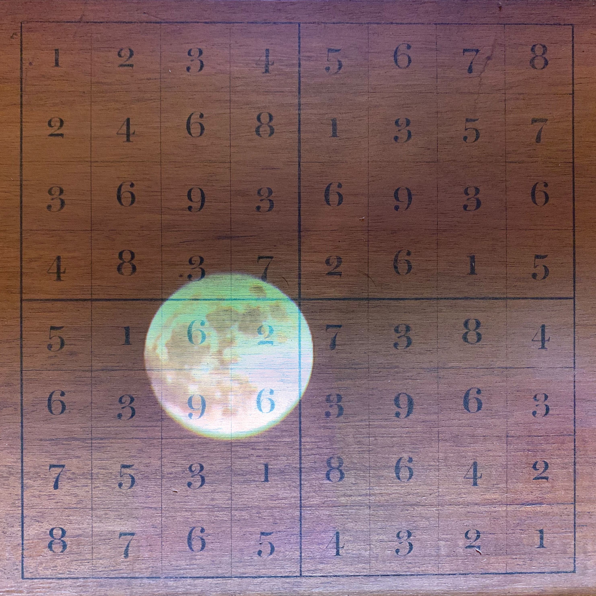
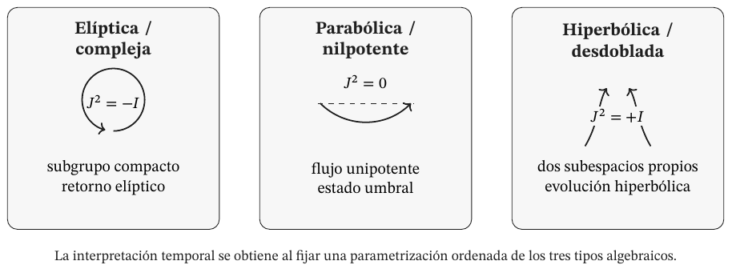
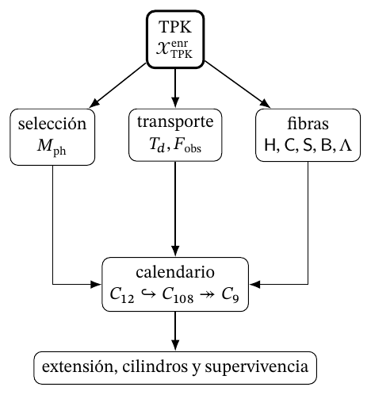
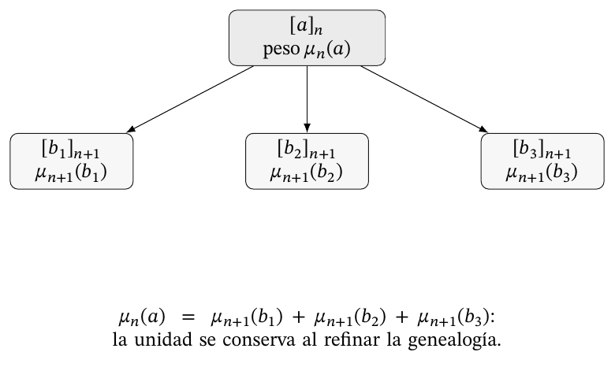

# El cierre holográfico del infinito, estructura discreta del continuo y el origen de las constantes fundamentales

Narración coinductiva elaborada por ChatGPT 6 Astra, bajo asistencia y dirección puntual de los autores.

Oumar Haidara Fall y Rubén Ramos Balsa

28 de septiembre de 2026

## Prefacio

Este documento ofrece una narración coinductiva generada por ChatGPT bajo asistencia y dirección puntual de los autores. El discurso se basa en el análisis teórico de los documentos que acompañan este dossier. En ellos se reúnen los resultados obtenidos y los desarrollos matemático-físicos realizados entre los años 2023 y 2026 mediante el uso de herramientas de Large Language Models (LLM). De este proceso surgieron las formulaciones denominadas, respectivamente, Holografía Modular Triádica y Mecánica Dimensional (HMT–MD). Sin embargo, el origen del proyecto se remonta a principios del siglo XXI, concretamente al estudio del descubrimiento que subyace en el artefacto mecánico inventado por Oumar Haidara Fall en el año 2001.

El material acumulado y los conocimientos adquiridos progresivamente a lo largo de más de dos décadas de observación, estudio y análisis, tanto del artefacto y su fenomenología como de su configuración geométrica, constituyeron la base operatoria e informacional que posteriormente los autores aplicaron a los modelos de inteligencia artificial. Por tanto, el cuerpo teórico aquí presentado, junto con sus derivaciones y demostraciones, viene precedido por una genealogía empírica que no deja de sorprender como paradoja histórica: cuando se comenzó a razonar con «máquinas pensantes» en «la era de la inteligencia artificial», fue necesario, además, volver a cuestionar la interacción compleja que existe entre dos máquinas simples: la palanca y la rueda.

## El continuo y la determinación de las magnitudes físicas

La Holografía Modular Triádica y la Mecánica Dimensional desarrollan una explicación conjunta del origen de los valores fundamentales y de las relaciones que constituyen la materia. El continuo se construye mediante la prolongación compatible de estados aritméticos que conservan orientación, recorrido y memoria. Los valores numéricos y las relaciones de incidencia son lecturas de esa misma organización. Esta construcción reúne el problema de las constantes con el de la constitución física: la intensidad de una interacción, la escala de una acción y la masa de una partícula se estudian a través de las operaciones que las determinan y vinculan. El documento desarrolla la continuidad entre esa génesis matemática y sus determinaciones físicas.

El núcleo APP–TRIT–TPK establece las operaciones de partida. APP organiza las dos direcciones del soporte aritmético y la diferencia entre acumulación aditiva y composición multiplicativa; TRIT orienta y distingue los regímenes locales; TPK selecciona, transporta y actualiza el estado completo. Sobre esa dinámica se construyen los retornos y las prolongaciones que hacen posible la doble proyección. La lectura arquimediana determina coordenadas numéricas mientras la proyección excepcional conserva relaciones de incidencia. El punto que adquiere un valor posee, en su construcción, una estructura que sigue interviniendo en sus transformaciones.

La generación articulada de π, φ y e, el registro dodecafásico y su realización como constante aritmético-geométrica de acoplamiento, y las dos vías internas que determinan α muestran la primera consecuencia de esta unidad. La construcción electrónica la prolonga al estudiar conjuntamente la identidad del electrón, su acción y su realización dimensional. La constante de Planck, el parámetro de Barbero–Immirzi, la constante de Boltzmann y la constante de gravitación universal enlazan después acción, área, entrelazamiento, temperatura y respuesta geométrica. La Ley General de Masas y los transportes de mezcla extienden ese desarrollo hacia la organización de los estados materiales. Cada resultado conserva su derivación propia y los antecedentes que lo vinculan con la arquitectura común.

La relevancia de esta tesis reside en cambiar el estatuto explicativo de las magnitudes. Una constante determinada por la estructura conserva las relaciones que la hacen necesaria; una partícula definida por su persistencia adquiere propiedades a través de las condiciones de esa persistencia. Acción, reciprocidad geométrica y memoria de las transformaciones se articulan dentro de esa misma cadena; sus funciones se expondrán allí donde los objetos, los mapas y las ecuaciones del desarrollo las determinan. La unificación se reconoce en la transmisión de esos antecedentes entre problemas: la acción entra en la evaluación material, el área se enlaza con la información, la orientación interviene en la mezcla y la memoria condiciona la evolución. Ésta es la continuidad que la narración debe hacer visible.

Tres preguntas permiten seguirla: qué determina cada resultado, qué conserva su identidad al transformarse y cómo se realiza físicamente. El desarrollo histórico central comienza allí donde las leyes unifican dominios físicos y, al mismo tiempo, dejan visible la procedencia de las magnitudes que emplean. Desde esa formulación moderna, la genealogía regresa a la proporción, al apoyo y al movimiento, y prosigue hacia el infinito y el continuo. La reflexión filosófica examina en ese recorrido qué significa conocer una estructura y qué significa atribuirle capacidad constitutiva. Las preguntas históricas reciben así una respuesta concreta dentro del desarrollo HMT, en el lugar donde esa respuesta permite avanzar.

## Constantes, medida y unificación de la física

Esa tensión entre unificación y determinación puede expresarse mediante dos relaciones que distinguen una constante medida de una constante determinada por la estructura:

$$
\mathcal T(\lambda)\longmapsto \text{predicciones},
\qquad
\mathcal G\longmapsto \lambda_*\longmapsto \mathcal T(\lambda_*).
$$

En la primera, las predicciones requieren fijar el parámetro \(\lambda\); en la segunda, la construcción \(\mathcal G\) determina \(\lambda_*\), que entra después en la teoría física. La cuestión decisiva es la operación que realiza ese enlace. Ésta permite reconocer qué magnitudes proceden directamente del núcleo generativo y cuáles se obtienen al componer sus resultados con leyes físicas. Esa distinción debe permanecer visible en toda comparación posterior.

La gravitación newtoniana muestra con especial claridad que una teoría puede reorganizar el conocimiento de la naturaleza sin agotar la cuestión de su fundamento. La misma relación permite tratar movimientos terrestres y celestes. El alcance de la ley transforma lo que cuenta como explicación: fenómenos antes distribuidos entre dominios diferentes quedan ligados por una estructura dinámica común. En el *Escolio general*, Newton distingue el conocimiento de las propiedades y efectos de la gravedad de una hipótesis sobre su causa última. Esa distinción pertenece a su método y debe conservarse al reconstruir históricamente el problema. [H07]

La notación contemporánea de la gravitación concentra en la letra \(G\) un coeficiente que no ocupaba exactamente ese lugar simbólico en los *Principia*. La diferencia importa porque la historia de una constante incluye la historia de las magnitudes y unidades que permiten aislarla. Cavendish tituló su investigación de 1798 como una determinación de la densidad de la Tierra. La balanza de torsión permitió relacionar la atracción entre masas de laboratorio con la atracción terrestre. La interpretación posterior en términos de una medición de \(G\) es físicamente comprensible, pero no debe sustituir el propósito declarado del experimento. [H08]

El experimento revela una mediación fundamental entre número y mundo. Una magnitud se determina mediante la comparación organizada de efectos. La torsión, las distancias, las masas y los tiempos de oscilación forman una estructura experimental. El resultado numérico condensa ese conjunto de relaciones. La constante no llega al conocimiento como un dato desnudo; se obtiene a través de un sistema de inferencias y calibraciones. Precisamente por ello, explicar matemáticamente su valor exige algo diferente de reproducir el número medido: requiere mostrar qué estructura puede ocupar el lugar explicativo que la medición deja abierto.

En el siglo XIX, el electromagnetismo llevó la unificación a una forma especialmente sugerente. Maxwell relacionó la propagación de perturbaciones electromagnéticas con una velocidad determinada por magnitudes eléctricas y magnéticas, y reconoció su correspondencia con la velocidad de la luz. La identificación reunió óptica y electromagnetismo en una concepción de campo. El valor de la velocidad seguía vinculado a determinaciones experimentales, pero la relación entre dominios había cambiado radicalmente. La constante pasó a expresar una unidad física que antes no era manifiesta. [H11]

En notación contemporánea, para el vacío y con las convenciones electromagnéticas correspondientes, la relación adopta la forma:

$$
c^2\,\varepsilon_0\,\mu_0=1.
$$

La velocidad de propagación \(c\), la permitividad \(\varepsilon_0\) y la permeabilidad \(\mu_0\) dejan de funcionar como tres determinaciones independientes dentro de esa descripción. La ecuación establece una dependencia estructural. Su significado histórico reside en la reducción de la separación entre fenómenos, mientras que el problema de una selección numérica absoluta de todas las magnitudes requiere una investigación adicional. Unificar relaciones y determinar completamente sus valores son tareas relacionadas cuya diferencia puede formularse sin disminuir el alcance de ninguna de ellas.

La reconstrucción del vacío en HMT–MD da a esta dependencia una residencia constitutiva: las magnitudes eléctricas y magnéticas se obtienen mediante lectores del estado y se relacionan con acción, escala y propagación. La ecuación de Maxwell mantiene su función física; la genealogía anterior de sus magnitudes explica qué condiciones transmiten a esa ecuación. La unificación se examina desde el origen común de las relaciones que después se expresan en unidades de laboratorio.

Las unidades naturales de Stoney y Planck profundizaron otra vertiente del problema. Stoney buscó unidades físicas apoyadas en constantes de la naturaleza; Planck formuló escalas construidas a partir de constantes universales vinculadas con gravitación, propagación y radiación. Estos programas trataban de independizar los patrones de medida de particularidades humanas o terrestres. La ambición era que civilizaciones diferentes pudieran reconocer una misma estructura de unidades, aunque emplearan inicialmente convenciones distintas. La universalidad de las escalas adquiría así un significado epistemológico y cosmológico. [H12, H13]

Una escala natural reúne constantes de modo que las dimensiones se compensen y produzcan una longitud, un tiempo, una masa o una temperatura. La operación revela relaciones profundas entre campos físicos. A la vez, el conocimiento de sus magnitudes depende de los valores de las constantes utilizadas. La naturalidad de la combinación expresa su independencia respecto de convenciones arbitrarias de construcción; la determinación de su valor plantea todavía la procedencia de los componentes. Esta diferencia permite entender por qué una teoría de unidades naturales puede ser inaugural sin constituir por sí misma una génesis de todas las constantes que emplea.

La radiación térmica añadió una dificultad que no era solamente metrológica. La constante de Planck relacionó energía y frecuencia y pasó a expresar una escala de acción. El número desempeñó un papel estructural en la transformación de la física. Una constante puede, por tanto, modificar el concepto mismo de objeto físico: deja de ser un coeficiente situado dentro de una ley conocida y señala una reorganización de las operaciones mediante las cuales se describen los procesos. La relación entre continuidad, intercambio y cuantización se convierte entonces en parte de la cuestión de su significado.

En el desarrollo HMT, la escala de acción tiene antecedentes aritméticos y operatorios explícitos. La construcción de Planck enlaza el lector de acción con α, la autoescala y la realización dimensional; la de Boltzmann relaciona el intercambio energético con la información trítica y la temperatura. El parámetro de Barbero–Immirzi articula área y entrelazamiento, mientras la lectura gravitatoria incorpora la respuesta geométrica. Estas conexiones dan contenido a la pregunta por el origen de las escalas: permiten seguir una determinación anterior hasta su función en una magnitud física.

La determinación física añade una dificultad decisiva. El valor numérico de una magnitud dimensional cambia al cambiar las unidades. La velocidad de la luz, expresada en metros por segundo, tiene un número diferente del que tendría en kilómetros por segundo; la relación física permanece. Por ello, la explicación profunda debe distinguir la magnitud, su unidad y sus razones invariantes. Las constantes adimensionales conservan su número bajo esos cambios y hacen especialmente visible el problema de selección. Las dimensionales exigen explicar también la estructura que relaciona longitud, tiempo, masa, acción, temperatura y carga. La discusión de Duff, Okun y Veneziano mostró hasta qué punto el propio recuento de constantes fundamentales depende de qué se entienda por independencia, conversión y unidad. [H15]

La definición moderna del Sistema Internacional ofrece un ejemplo instructivo. Fijar exactamente determinados valores numéricos permite definir unidades reproducibles y coordinar la metrología. Se trata de una decisión sobre cómo expresar y realizar las magnitudes, no de una deducción cosmológica de su existencia. El cambio de estatuto metrológico de un número no transforma automáticamente su estatuto explicativo. Esta distinción es necesaria para cualquier propuesta que derive escalas: debe quedar claro qué nace de la construcción, qué identifica una magnitud y qué corresponde a su expresión convencional. [H14]

Bachelard permite comprender por qué esta articulación transforma también la experiencia científica. El fenómeno de laboratorio se prepara mediante instrumentos que incorporan relaciones teóricas; la observación selecciona condiciones, distingue efectos y vuelve reproducible lo que se desea conocer. Su noción de fenomenotecnia sitúa esa realización en el centro del conocimiento: la ciencia aprende de fenómenos cuya manifestación ha hecho posible mediante una construcción racional y técnica. La objetividad se conquista en el intercambio entre proyecto, realización y rectificación. Un instrumento no convierte la teoría en verdad por el hecho de materializarla; permite someter sus relaciones a una experiencia organizada que puede exigir su modificación. [B22].

La investigación de Hasok Chang sobre la temperatura desarrolla esta cuestión desde la historia de la medida. La justificación de los procedimientos de medición encuentra una dificultad cuando los patrones y los conocimientos que deberían validarlos dependen unos de otros. Chang denomina iteración epistémica al proceso por el que un sistema inicial de conocimiento permite investigaciones que lo enriquecen y corrigen. La precisión aparece como un logro progresivo de esa coordinación, no como una propiedad originaria de cualquier lectura instrumental. [B23].

Una escala identifica el nivel y la relación de transformación que vinculan magnitudes y resoluciones. En HMT–MD, su explicación requiere el operador que transporta la estructura y la unidad que realiza su lectura. Conservar una relación al cambiar de escala, seleccionar una escala y fijar su expresión en unidades son operaciones diferentes que cooperan en la comparación metrológica. La precisión del laboratorio encuentra así una construcción determinada con la que contrastarse.

La física cuántica hizo especialmente visible la diferencia entre la exactitud de una ley y la determinación de sus parámetros. El estudio de los espectros obligó a relacionar estructura atómica, relatividad y cuantización. En el trabajo de Sommerfeld de 1916, la constante de estructura fina organizó correcciones y proporciones características del problema. Su condición adimensional concentró una pregunta que las unidades naturales dejaban abierta: el número podía compararse sin depender de una elección de metros, segundos o unidades eléctricas. Su valor se convirtió en un indicio de una posible organización más profunda. [H16]

La constante de estructura fina reúne carga, acción y propagación en una razón adimensional. Con la notación eléctrica habitual se escribe

$$
\alpha=\frac{e_{\mathrm{el}}^{\,2}}{4\pi\varepsilon_0\hbar c}.
$$

La ecuación identifica su función dentro del electromagnetismo cuántico. La determinación HMT se desarrolla a partir de otro antecedente: las coordenadas regionales y el registro firmado proceden del mismo estado, y su composición establece el cierre dodecafásico. El valor de α queda ligado a las condiciones que ese cierre debe satisfacer. La segunda vía interna, mediante la raíz positiva del núcleo correspondiente, conserva su formulación y permite examinar la concordancia de ambos desarrollos. El acoplamiento adquiere su valor como parte de la arquitectura que lo constituye.

Eddington intentó avanzar hacia una determinación teórica del número mediante argumentos algebraicos y estadísticos relacionados con la descripción cuántica del electrón. La cronología es significativa: la sección «News and Views» de Nature del 26 de enero de 1929 documenta el resultado 136, junto con un valor experimental citado próximo a 137,1; en noviembre de ese mismo año, Eddington presentó una reorganización que conducía a 137. Estos episodios pertenecen a un programa de fundamentación, y su reconstrucción exige mantener las fechas y argumentos en lugar de sustituirlos por una anécdota sobre fascinación numérica. [H18, H19]

El interés filosófico de Eddington reside en la ambición de transformar una constante medida en consecuencia de la organización del conocimiento físico. La dificultad aparece en el criterio de selección: una construcción debe explicar por qué sus operaciones son necesarias antes de conocer el número que pretende obtener. La correspondencia numérica puede orientar una investigación; la fuerza de una explicación depende de que el valor quede fijado por condiciones independientes de ese reconocimiento. Esta distinción no es una descalificación de la búsqueda. Expresa el tipo de necesidad que la propia búsqueda pretende alcanzar.

Dirac propuso una vía diferente en 1937. Relacionó grandes números formados por magnitudes físicas y cosmológicas e interpretó su proximidad como indicio de una conexión dinámica. La gravitación podía variar con el tiempo cosmológico cuando se expresaba en unidades atómicas. La propuesta transformaba la pregunta por un número fijo en una pregunta por una relación evolutiva. En lugar de deducir todas las constantes como invariantes de una estructura intemporal, buscaba una dependencia común entre escalas microscópicas y edad del universo. [H20]

La diferencia entre ambos programas merece conservarse. Eddington aspiraba a una necesidad asociada a la estructura formal; Dirac exploraba una dependencia cosmológica capaz de relacionar órdenes de magnitud. La historia de las constantes contiene, por tanto, varias formas de explicar: selección algebraica, generación dinámica, reducción de parámetros y articulación de escalas. Una narración rigurosa debe mostrar qué pregunta responde cada una. La mera presencia de un número en una ecuación no permite decidir si se trata de un dato, una salida, una condición inicial o una relación que evoluciona.

El enlace que Dirac buscaba entre escalas atómicas y cosmológicas mantiene abierta una pregunta concreta para la exposición HMT: qué magnitudes permanecen invariantes bajo el transporte y cuáles expresan la evolución del sistema. La constante aritmético-geométrica de acoplamiento interviene en esa articulación mediante sus realizaciones, mientras las ecuaciones cosmológicas conservan sus variables dinámicas. La identidad de una estructura y el devenir de sus estados quedan diferenciados dentro de una descripción común. Esta distinción evita que las coincidencias entre órdenes de magnitud sustituyan la explicación de las operaciones que los relacionan.

Einstein formuló en 1949 una exigencia especialmente cercana al núcleo de este problema. Después de separar las constantes dimensionales que pueden absorberse mediante unidades, concentró su ideal en las constantes adimensionales arbitrarias. Una teoría fundamental, según esa aspiración, debería poseer una estructura tal que modificar sus constantes destruyera su identidad. Einstein presentó esta exigencia como una convicción sobre la inteligibilidad de la naturaleza, no como un resultado que hubiera demostrado. Su importancia histórica reside en la precisión del criterio: explicar un valor significa eliminar su variación libre dentro de la teoría. [H22]

La formulación puede entenderse como una condición de rigidez. Una teoría parametrizada admite varias elecciones numéricas; una teoría rígida obliga a una elección mediante la solidaridad de sus relaciones. La diferencia es más profunda que la reducción del número de símbolos. Un parámetro puede ocultarse en una definición, en una condición de frontera o en la selección de una solución. La arbitrariedad queda superada cuando la arquitectura determina esa elección de manera explícita y conserva su independencia respecto del valor que después se reconoce.

Wolfgang Pauli había formulado una exigencia afín al concluir su conferencia Nobel del 13 de diciembre de 1946. La explicación de la estructura atomística de la electricidad permanecía, para él, vinculada a una teoría capaz de determinar el valor de la constante de estructura fina. La cuestión no se agotaba en alcanzar una mayor precisión experimental: concernía a la relación entre la intensidad del acoplamiento y la constitución de las fuentes eléctricas. El número y la estructura debían llegar a explicarse conjuntamente. Esta exigencia permite comprender por qué la investigación del valor de α alcanza el problema del electrón y de su identidad material. No basta con conocer cuánto vale una constante; se busca comprender qué organización hace que posea ese valor y qué relación mantiene esa organización con los fenómenos en los que interviene. [B24].

El electrón hace material esta exigencia de Pauli. La narrativa HMT lo estudia como una organización persistente con posición, orientación, acción y condiciones de cierre; su evaluación másica se obtiene después de establecer esos antecedentes. La conexión entre α y la estructura electrónica pertenece, por tanto, a la identidad del objeto descrito. La Ley General de Masas extiende la lectura a otras firmas y recorridos sin sustituirlos por una lista de masas introducida desde fuera.

La misma pregunta por la constitución se manifiesta en la exclusión y en la estadística. El desarrollo de HMT–MD organiza los sectores de intercambio mediante las condiciones de simetría del estado; la ocupación fermiónica impide la repetición de un mismo estado de una partícula en el sector antisimétrico. Las distribuciones de Fermi–Dirac y Bose–Einstein se explican después mediante sus correspondientes conteos. El principio de exclusión adquiere así una posición definida entre la identidad del estado y la organización colectiva de las ocupaciones.

La inquietud de Einstein por la completitud de la descripción cuántica sitúa en primer plano la relación entre el sistema y su medida. El argumento de Einstein, Podolsky y Rosen examina qué puede inferirse de un sistema a partir de mediciones realizadas sobre otro con el que ha interactuado. En HMT, la preparación conjunta, el transporte, los instrumentos locales y el registro quedan incorporados a una misma genealogía. La descripción conserva la relación que hace posible la correlación, y cada lectura queda situada en la operación física que la realiza. [B25].

El tratamiento triádico de Bell precisa esta respuesta mediante instrumentos de tres resultados. La preparación conjunta determina las probabilidades de correlación; la completitud de cada instrumento establece la independencia operacional del marginal respecto del ajuste remoto. La distinción entre factorización local y no-señalización organiza entonces el problema de la localidad con enunciados separados. La información se mide en trits y la relación entre totalidad y lectura local se expresa mediante operadores concretos. Esta construcción tiene su residencia junto a los postulados, el entrelazamiento y la conservación de la información, antes de recorrer el espectro de masas.

El ideal einsteiniano se relaciona con su reflexión de 1933 sobre el método de la física teórica. Los conceptos fundamentales no se obtienen por una simple acumulación inductiva de datos; interviene una actividad constructiva que busca principios capaces de organizar la experiencia. La experiencia conserva su función decisiva en la evaluación de las consecuencias. Entre libertad conceptual y control empírico se establece una tensión productiva. La determinación de constantes es uno de los lugares donde esa tensión puede hacerse especialmente fecunda, porque obliga a vincular la elección de principios con resultados cuantitativos definidos. [H21]

La simplicidad, sin embargo, necesita una interpretación estructural. Norton ha mostrado que la apariencia simple de una formulación depende del lenguaje, las variables y las representaciones utilizadas. Una ecuación breve puede encubrir una definición compleja; una formulación extensa puede condensarse al encontrar el objeto adecuado. Por ello, una explicación de constantes gana fuerza cuando su necesidad se mantiene bajo representaciones equivalentes. La rigidez relevante pertenece al objeto y a sus relaciones, no solamente a la economía de una notación. [H45]

Esta exigencia permite reformular el papel de la belleza matemática en la física del siglo XX. La belleza puede expresar que varios dominios se coordinan mediante una estructura común, que disminuye la independencia de supuestos y que aparecen invariantes inesperados. Su valor científico depende de la articulación de esas relaciones. La determinación de una constante constituye un caso especialmente exigente porque permite distinguir entre una fórmula sugerente y una selección estructural completa. El número obtenido adquiere significado cuando se comprende qué sería alterado al modificarlo.

La física contemporánea ha convertido el cambio de escala en un objeto de investigación. Una interacción puede presentar distinta intensidad efectiva según la energía a la que se estudia. La constante que aparece en una descripción deja de entenderse como un número aislado de las condiciones de observación y pasa a formar parte de una trayectoria determinada por ecuaciones de evolución. El grupo de renormalización expresa esta organización y permite conectar fenómenos de escalas diferentes. El problema del valor se distribuye entonces entre una ley de variación y la elección de una trayectoria particular. [H28, H29]

Sea \(g\) un acoplamiento y sea \(\mu\) la escala a la que se lo describe. Una función \(\beta\) determina su evolución:

$$
\mu\frac{\mathrm d g}{\mathrm d\mu}=\beta(g),
\qquad g(\mu_0)=g_0.
$$

La primera expresión fija cómo cambia el acoplamiento. La segunda selecciona una solución de esa ecuación. Conocer la función de evolución permite transportar información entre escalas; determinar el valor inicial mediante una construcción independiente resolvería una cuestión adicional. Esta diferencia no es un detalle técnico: muestra dónde reside la libertad paramétrica después de haber explicado una dinámica. Una teoría generativa debe atender tanto al transporte como a la selección de la trayectoria que transporta.

La transmutación dimensional ofrece otra forma de reorganización. En determinadas teorías, un parámetro adimensional puede sustituirse por una escala característica. La aparición de la escala es estructuralmente significativa y puede explicar la existencia de un régimen físico que no era visible en la formulación inicial. El trabajo de Coleman y Weinberg de 1973 constituye un episodio central en el estudio de la ruptura de simetría inducida por correcciones radiativas. Pero sustituir el modo de parametrizar una teoría y seleccionar de manera única el parámetro resultante siguen siendo problemas distintos. [H30]

La unificación por simetrías plantea una posibilidad complementaria. Varios acoplamientos pueden relacionarse en una teoría más amplia y aparecer como manifestaciones diferenciadas de una organización común. Las condiciones de ruptura, los contenidos de campos y las correcciones de umbral intervienen en el tránsito hacia las escalas observadas. La unificación reduce la independencia de relaciones; su capacidad para fijar valores concretos depende de cuánto determine también esas condiciones. La propuesta de Georgi y Glashow y las revisiones de gran unificación permiten seguir esta articulación entre simetría, escala y selección. [H31, H32]

El origen de las masas hace visible una dificultad semejante. Un mecanismo puede explicar cómo adquieren masa determinadas excitaciones y dejar libres los coeficientes que diferencian sus valores. La relación entre una escala de ruptura y acoplamientos de Yukawa organiza el problema, pero la distribución numérica del espectro exige determinar esos acoplamientos o reemplazarlos por una construcción que seleccione sus relaciones. Las matrices de mezcla añaden otra estructura: describen la desalineación entre bases asociadas a distintos sectores. Masa, mezcla y fase constituyen objetos relacionados, con funciones explicativas diferentes. [H27]

El alcance unificador de HMT debe seguirse en este nivel de detalle: el registro que conserva la orientación interviene en los lectores angulares; éstos adquieren funciones distintas en las matrices de mezcla; la realización del estado enlaza después esos transportes con los sectores materiales. El tratamiento de masas, mezcla y violación de CP conserva sus respectivas construcciones. Su pertenencia a un mismo origen aritmético se reconoce por las relaciones que transmiten, sin reducir sus diferencias físicas.

La selección cosmológica y los escenarios de múltiples vacíos introducen un tercer tipo de respuesta. Cuando una teoría admite muchas realizaciones, puede buscarse una distribución de posibilidades o una condición que favorezca aquellas compatibles con determinadas estructuras del universo. Los trabajos de Bousso y Polchinski, Douglas y Weinberg muestran programas diferentes dentro de esta orientación. Una cota antrópica, una distribución estadística y una determinación única no poseen el mismo estatuto lógico. Su comparación resulta fértil cuando se pregunta qué conjunto de posibilidades se ha reducido y mediante qué condición. [H33, H34, H35]

La cuestión ontológica queda así ligada a una cuestión de selección. Una teoría puede describir un conjunto de mundos posibles, un mecanismo que produce regiones distintas o una estructura que obliga a una realización. En cada caso cambia el significado de preguntar por qué una constante tiene su valor. Puede buscarse una necesidad global, una condición histórica, una selección ambiental o una probabilidad condicionada. La expresión «explicar una constante» adquiere precisión cuando se identifica cuál de esas modalidades se pretende satisfacer.

La variación temporal de constantes, estudiada desde diferentes marcos teóricos, confirma que el carácter de lo fundamental depende de la arquitectura en la que se sitúa una magnitud. Una cantidad constante en una descripción puede aparecer como valor de un campo en otra. Las pruebas empíricas de variación deben formularse mediante relaciones adimensionales y modelos de las observaciones. La revisión de Uzan ofrece una presentación amplia de este problema. Su relevancia para la presente investigación reside en que obliga a separar la estabilidad observada, la invariancia teórica y la necesidad estructural. [H40]

La exposición alcanza de este modo una jerarquía precisa. La construcción generativa determina sus objetos y lecturas; la Mecánica Dimensional establece sus realizaciones; la comparación metrológica enfrenta los resultados con magnitudes observadas. El orden de lectura debe respetar esa dependencia: primero se construyen los objetos y las operaciones; después se presentan el atlas y las correspondencias metrológicas. Así, las cifras conservan el carácter de resultados de la construcción y no parecen datos anticipados. Para comprender por qué esta exigencia no nace de una abstracción tardía, la genealogía vuelve ahora a la palanca, la rueda y el problema de qué conserva una relación cuando cambian sus apoyos, sus longitudes efectivas y sus orientaciones.

## Proporción, interacción y conservación de la unidad

La palanca ocupa un lugar fundacional en este recorrido. En *Sobre el equilibrio de los planos*, Arquímedes somete el equilibrio a una organización deductiva de postulados y proposiciones; los pesos y sus distancias al apoyo quedan relacionados mediante una proporción demostrable. Este tratamiento constituye un momento inaugural de la física matemática demostrativa: una configuración material puede entenderse por la necesidad de sus relaciones. Galileo reconoció expresamente a Arquímedes el primer lugar por el rigor de esta demostración. El punto de apoyo, las posiciones de los pesos y la composición de sus efectos pasan a formar parte de aquello que la matemática debe establecer. [B01]; [B02].

En notación mecánica actual, el equilibrio de una palanca ideal de brazos \(a\) y \(b\) se expresa mediante \(F_1a=F_2b\). Para una pequeña rotación común, los desplazamientos tangenciales satisfacen \(\delta s_1=a\,\delta\theta\) y \(\delta s_2=b\,\delta\theta\); de ambas relaciones se obtiene la igualdad de los trabajos virtuales opuestos. El enlace entre fuerza y desplazamiento reúne así una condición de equilibrio y una compatibilidad geométrica del movimiento. Los brazos respecto del apoyo y los desplazamientos en la dirección de las fuerzas desempeñan funciones distintas en estas dos expresiones. El equilibrio conserva aquí su sentido exacto de condición ideal o local; el eje genealógico del proyecto es la interacción, porque el problema aparece cuando apoyo, orientación y longitud efectiva se transforman durante el acoplamiento. Esta precisión permite examinar el alcance de la proporcionalidad en un sistema de varios cuerpos.

La investigación descrita en el prefacio parte precisamente de la interacción entre la palanca y la rueda. En ella, el desplazamiento de los apoyos, la variación de las longitudes efectivas y la recepción angular de las fuerzas sitúan la geometría dentro del problema dinámico. El dispositivo obliga a seguir una relación que se transforma mientras actúa. Por eso el antecedente experimental posee relevancia conceptual para HMT: impulsa a conservar la configuración y el recorrido cuando se compara la entrada con la salida. La medida se comprende a través del intercambio que la produce.

La objeción de Ernst Mach a la demostración arquimediana se concentra en la legitimidad de los pasos que trasladan y componen los pesos. Una distribución se sustituye por otra suponiendo conservadas ciertas condiciones de equilibrio; según su crítica, esa sustitución contiene ya conocimiento físico sobre el centro de gravedad. El interés de la objeción para esta genealogía reside en volver explícita la relación entre composición geométrica y efecto físico. La Mecánica Dimensional retoma esa pregunta cuando atribuye al acoplamiento, a la orientación y a la memoria una función dentro del estado que se mide. [B03].

La búsqueda de una determinación matemática de la naturaleza tiene un antecedente decisivo en la relación antigua entre proporción y orden. En el *Timeo*, la construcción geométrica de los cuerpos relaciona elementos, figuras y transformaciones. Las propiedades sensibles se vinculan a una organización inteligible. El estatuto del discurso cosmológico platónico, sin embargo, conserva el carácter de una explicación verosímil: la geometría hace pensable el orden del mundo dentro de una argumentación más amplia sobre generación y modelo. Interpretar este episodio como una primera física de constantes en sentido moderno borraría la distancia histórica que le da interés. [H01]

La contribución pertinente de Platón es más precisa. La forma puede explicar que un cuerpo posea ciertas posibilidades de transformación. El elemento geométrico no opera solamente como una imagen exterior de algo previamente conocido; interviene en la concepción de aquello que el cuerpo es. En esta articulación aparece una idea que reaparecerá bajo formas muy distintas: la matemática puede aportar contenido constitutivo, además de lenguaje descriptivo. El problema posterior será determinar cómo se reconoce que una constitución matemática corresponde a la realidad y qué experiencia puede distinguirla de otras constituciones posibles.

Aristóteles introduce otro aspecto fundamental al distinguir el conocimiento de un hecho y el conocimiento de su razón. En los *Analíticos posteriores*, las ciencias relacionadas pueden distribuir entre sí la observación del fenómeno y la demostración de su causa. En la *Física*, la matemática y el estudio de la naturaleza se distinguen por su modo de considerar los objetos, mientras que campos como la óptica o la astronomía hacen visible su articulación. La tradición aristotélica contiene así recursos para pensar una explicación matemática de fenómenos físicos, aunque su concepto de causa y su organización de las ciencias sean distintos de los modernos. [H02]

La extrema y media razón de Euclides representa una forma particularmente clara de determinación por relación. Un segmento se divide de modo que el todo sea a la parte mayor como la parte mayor a la menor. Si se representa mediante \(a\) la parte mayor y mediante \(b\) la menor, la definición establece:

$$
\frac{a+b}{a}=\frac{a}{b}.
$$

El número que expresa la proporción resulta de una condición de semejanza entre dos relaciones. Su carácter determinado procede de la estructura de la división, no de una preferencia estética añadida. La importancia epistemológica de este ejemplo reside en que una relación entre todo y partes puede seleccionar una proporción. La historia posterior atribuyó a esta razón numerosos significados artísticos y cosmológicos; el núcleo matemático permanece más sobrio y más exigente: una identidad define una organización y permite deducir sus consecuencias. [H03]

HMT transforma esta pregunta por la proporción en una pregunta por la conservación durante la construcción. La extrema y media razón holográfica sigue la unidad a través de su estratificación y sus dos lecturas. El balance \(1000=729+243+27+1\), con \(271=243+27+1\), expresa una partición exacta; las relaciones operatorias explican después cómo se conserva y recupera la información al cambiar de representación. La proporción adquiere un contenido dinámico porque debe permanecer compatible con las transformaciones que la realizan.

A la exigencia de razón suficiente se añade en Leibniz una cuestión sobre la constitución de la unidad. La simplicidad de la mónada significa ausencia de partes, no ausencia de diversidad. En la *Monadología*, el cambio requiere que algo se modifique y algo permanezca; el estado denominado percepción reúne una multiplicidad en la unidad. La identidad aparece así vinculada a una sucesión de determinaciones, en lugar de confundirse con la inmovilidad. Esta concepción permite distinguir entre dividir un compuesto y reconocer diferencias dentro de un estado: son operaciones intelectuales distintas. [B04].

La filosofía leibniziana amplía esta cuestión al examinar las relaciones que hacen inteligible un mundo. En su correspondencia con Clarke, el espacio se concibe como orden de coexistencias y el tiempo como orden de sucesiones. Desplazar imaginariamente el universo entero, conservando todas sus relaciones, no basta para establecer una diferencia que posea razón suficiente. La pregunta se dirige a lo que distingue efectivamente dos configuraciones, no a su inscripción en un escenario absoluto. La pluralidad de mundos posibles tiene otro estatuto: en la *Monadología*, se trata de alternativas de existencia entre las que uno llega a existir, no de universos físicos que necesariamente coexistan. Relación, posibilidad y existencia quedan así vinculadas mediante una exigencia de determinación. [B05]; [B06].

Hegel aborda la unidad desde otra dificultad: la relación entre el todo y las partes. En la *Enciclopedia*, las partes se distinguen entre sí, pero su condición de partes depende de la relación que las reúne. El ejemplo del organismo hace especialmente visible el alcance de esta observación. Un órgano no queda comprendido mediante su aislamiento, porque su función pertenece a la organización viviente. La enumeración de componentes y la explicación de su unidad responden, por tanto, a preguntas diferentes. [B07].

La reflexión hegeliana sobre la medida añade una distinción particularmente fértil. Una cosa es escoger un patrón externo para comparar magnitudes; otra, comprender la relación cuantitativa que interviene en la determinación cualitativa del objeto. En la *Ciencia de la lógica*, la medida vincula cantidad y cualidad, de modo que una variación cuantitativa puede alcanzar un umbral en el que se modifica aquello que el objeto es. Hegel distingue expresamente ese problema de la elección de un patrón obtenido, por ejemplo, de una longitud terrestre o de un péndulo. La definición de una unidad común hace comparables las magnitudes; la medida constitutiva concierne a la organización propia de lo medido. [B08].

La relación entre todo y partes alcanza aquí una dificultad matemática precisa. Un grupo requiere un conjunto y una ley de composición; conocer el número de sus elementos deja abierta la organización de esa ley. Análogamente, asignar un valor a un estado genealógico identifica una propiedad del estado, mientras el transporte conserva otras relaciones. La crítica HMT al olvido extensional se dirige a tomar esa identificación parcial como identidad completa del objeto. En términos de conjuntos, relaciones y aplicaciones puede describirse el cociente; la cuestión constitutiva es qué estructura se conserva al efectuarlo y cuál sigue siendo necesaria para la operación siguiente.

Los productos 3, 12 y 21 ofrecen el ejemplo elemental de esa diferencia: comparten residuo módulo nueve y conservan cocientes distintos. El registro de los pasos permite recuperar además el orden en que se alcanzaron. En HMT, esta distinción actúa dentro del cálculo. La igualdad de una evaluación y la identidad del proceso que la determina son relaciones tipadas, con consecuencias diferentes sobre la continuación. La unidad se conserva mediante operaciones capaces de transmitir esas diferencias.

Kepler llevó la búsqueda de determinación geométrica a un territorio especialmente relevante para la cuestión de las constantes. En el *Mysterium cosmographicum* de 1596, el número de planetas y las separaciones de sus órbitas debían adquirir inteligibilidad mediante la disposición de los cinco sólidos regulares. La geometría pretendía explicar por qué el sistema poseía esa configuración. Más adelante, la investigación de Marte y el trabajo con los datos de Tycho Brahe condujeron a una astronomía causal en la que la forma orbital quedó ligada al movimiento y a la acción del Sol. La importancia de esta trayectoria reside en la transformación del criterio de explicación dentro del propio trabajo de Kepler. [H04, H05]

Una lectura puramente retrospectiva podría limitarse a contraponer los sólidos platónicos y las órbitas elípticas, adjudicando a los primeros el estatuto de especulación y a las segundas el de ciencia. Históricamente, la transición es más productiva. En ambos momentos se busca una razón para las relaciones observadas; lo que cambia es la manera en que forma, causa y experiencia se obligan mutuamente. La resistencia de los datos contribuye a reformular la geometría adecuada. La aspiración a una necesidad matemática no desaparece: aprende a articularse con una determinación física más exigente.

Este episodio permite distinguir dos sentidos de la belleza matemática. Uno designa una impresión de armonía que favorece una hipótesis. Otro corresponde a una economía estructural que reúne relaciones antes independientes y produce consecuencias precisas. El segundo puede adquirir valor científico cuando esas consecuencias permiten contrastar la construcción. La belleza deja entonces de actuar como garantía y se convierte en una cualidad de una explicación que debe sostenerse por sus relaciones y resultados. El problema de las constantes se beneficia de esta distinción porque las coincidencias elegantes y las determinaciones estructurales pueden parecer semejantes al nivel de una cifra.

Galileo contribuye a otra reorganización decisiva. Su formulación del lenguaje matemático de la naturaleza expresa la necesidad de conocer figuras, relaciones y magnitudes para interpretar el mundo físico. La matematización supone operaciones concretas: idealizar situaciones, distinguir factores, construir experiencias y establecer relaciones que puedan mantenerse cuando se modifican las condiciones. La geometría se convierte en instrumento de análisis de procesos, además de representación de formas. La lectura del *Saggiatore* debe situarse en este trabajo de transformación de la experiencia, no en la idea de que cualquier fórmula bella posee por ello realidad física. [H06]

En la mecánica de Galileo, la relación entre continuidad e idealización adquiere particular intensidad. Los procesos físicos se estudian mediante conceptos de movimiento, tiempo y trayectoria que permiten aislar regularidades. La experiencia ordinaria contiene rozamientos, deformaciones y superposiciones; el tratamiento matemático construye un objeto susceptible de ley. Este paso puede describirse como una ganancia de inteligibilidad: se identifica una relación que atraviesa situaciones diferentes. Al mismo tiempo, hace visible una pregunta que acompañará a toda la física matemática: qué parte de la estructura pertenece al fenómeno y qué parte corresponde a las condiciones de su representación.

El enlace con la mecánica de Galileo adquiere así un sentido constructivo. Proporción, centro de gravedad e idealización permiten pasar de una configuración a una ley; el examen de los apoyos y de la composición pregunta qué permanece al efectuar ese paso. En HMT–MD, el principio de ambivalencia y la lectura bidireccional prolongan esa cuestión hacia los dos sentidos del acoplamiento. La orientación de la operación queda incorporada a la descripción de la magnitud. El recorrido histórico llega de este modo a un problema definido: conservar la unidad de la relación cuando cambian la geometría y las condiciones de lectura.

## Infinito, orden y construcción del continuo

La concepción aristotélica del continuo delimita el problema que sigue. En el libro VI de la *Física*, una línea continua no se constituye por yuxtaposición de puntos indivisibles: continuidad, contacto y sucesión expresan relaciones diferentes. En el libro III, el infinito se examina como posibilidad de proseguir o dividir, no como una magnitud infinita ya recorrida y completada. La dificultad concierne a la relación entre una operación que puede continuar y la unidad de aquello sobre lo que opera. De manera complementaria, la *Metafísica* pregunta por la causa de unidad de un todo que no es un mero agregado. El problema del continuo y el problema de la composición comparten así una exigencia: explicar qué hace que una multiplicidad constituya una unidad determinada. [B09]; [B10]; [B11].

La primera jornada de los *Discursos y demostraciones matemáticas en torno a dos nuevas ciencias* de Galileo reúne dos dificultades que obligan a revisar la intuición del continuo. La rueda de Aristóteles enfrenta las circunferencias concéntricas con su recorrido, y la correspondencia entre los enteros positivos y sus cuadrados enfrenta la parte con el todo infinito. Una relación punto a punto puede conservar una correspondencia sin conservar una longitud o una densidad. El problema exige precisar qué compara cada operación. [B12].

Cantor convirtió la comparación mediante correspondencias en una teoría de cardinales y distinguió de ella la organización ordinal. Cardinalidad y tipo de orden responden a preguntas diferentes sobre una multiplicidad. Dedekind, mediante los cortes, hizo explícita la construcción aritmética de la continuidad de la recta; la completación obligó a definir con precisión qué objeto queda determinado por sus aproximaciones. Cuando Hilbert situó el problema cantoriano del continuo en el primer lugar de sus problemas de 1900, la pregunta exigía decidir si todo conjunto infinito de reales era numerable o tenía la cardinalidad de la recta. La cuestión del infinito adquirió así varios planos: la extensión de una operación, la existencia del objeto completo, el orden de sus determinaciones y la magnitud cardinal de su conjunto. [B13]; [B14].

La construcción HMT sitúa sus operadores antes de la lectura real. Una sucesión de cilindros compatibles conserva los prefijos del recorrido, y sus reducciones fijan aproximaciones cada vez más precisas. La sección completa queda vinculada a los mapas que recuperan las determinaciones anteriores. Esta organización permite reunir profundidad arbitraria y recuperación de la historia en un mismo objeto. La doble proyección mantiene además la incidencia excepcional: el refinamiento numérico y el desarrollo de la estructura se leen conjuntamente.

La matematización de la naturaleza obliga a examinar el estatuto del espacio y del continuo. Si las magnitudes físicas se representan mediante números reales, cabe preguntar qué condiciones hacen posible esa representación y qué parte de la organización física queda contenida en ella. Riemann formuló el problema con una profundidad excepcional en su conferencia de habilitación de 1854. Distinguió el concepto general de multiplicidad de la determinación particular de sus relaciones métricas. La estructura espacial de la experiencia quedaba así abierta a una investigación que articulaba matemáticas y física. [H41]

El pasaje final de la conferencia es especialmente pertinente. Riemann consideró que, en una multiplicidad discreta, el fundamento de las relaciones de medida podía residir en el propio concepto, mientras que, en una multiplicidad continua, podía requerir fuerzas de enlace que la sostuvieran. También señaló que la validez de las hipótesis geométricas en escalas infinitesimales exigía una investigación física. Su reflexión separa con precisión la construcción conceptual de las condiciones empíricas de realización. La geometría proporciona posibilidades; la naturaleza determina qué relaciones corresponden a los procesos físicos. [H41]

La lectura filosófica de este planteamiento permite formular una cuestión más general. Un continuo puede concebirse como un ámbito de posiciones ya dadas, sobre el que después se colocan propiedades, o como el resultado de relaciones que hacen posible distinguir, aproximar y conectar posiciones. En la segunda concepción, la construcción del soporte y la organización de sus propiedades se vuelven inseparables. El problema de las constantes cambia entonces de lugar: puede referirse a invariantes de la construcción del soporte, además de a coeficientes de procesos situados dentro de él.

La aritmetización del análisis desarrolló procedimientos rigurosos para construir los reales y precisar el paso al límite. La relevancia filosófica de estas construcciones consiste en que la continuidad puede recibir una fundamentación matemática explícita, en lugar de depender únicamente de una intuición geométrica. Sin embargo, una construcción del cuerpo de los reales y una teoría de la constitución física del continuo responden a preguntas distintas. La primera fija un objeto matemático; la segunda debe explicar cómo se relacionan magnitud, operación, localización y experiencia. Su articulación constituye una tarea fecunda, no una identidad que pueda darse por supuesta.

La distancia entre soporte finito y prolongación completa también orienta la cuestión fundacional contemporánea. La axiomatización de conjuntos fija las operaciones y los dominios en que se formulan las afirmaciones sobre el infinito. Hilbert hizo central el estudio de los sistemas formales; los resultados de Gödel delimitaron la relación entre demostrabilidad, consistencia y completitud. En el problema del continuo, los trabajos de Gödel y Cohen establecieron resultados relativos de consistencia e independencia respecto de la teoría axiomática correspondiente. Su función histórica consiste en precisar qué puede decidirse desde unas premisas determinadas. [B15].

La respuesta HMT empieza por fijar una estructura generativa y seguir las relaciones que conserva su completación. La decisión cardinal se expone después mediante los objetos y clasificadores de esa construcción. La generación, la recuperación y la clasificación tienen cometidos propios: la primera constituye los estados; la segunda restituye sus registros; la tercera ordena el dominio que su enunciado identifica. Su composición es el contenido que debe hacerse inteligible en el cierre del documento. El infinito adquiere así residencia matemática en el sistema de prolongaciones, sus límites y sus lectores.

Bergson abordó otro aspecto de la continuidad al distinguir la duración de una sucesión de unidades exteriores unas a otras. En el *Ensayo sobre los datos inmediatos de la conciencia*, la multiplicidad cualitativa se comprende mediante momentos que se interpenetran: una melodía conserva lo que acaba de sonar en la cualidad de lo que se escucha. Contar notas o medir intervalos permite analizarla, pero esa operación no reproduce por sí sola su continuidad vivida. La distinción hace visible que la representación homogénea del tiempo y la experiencia de su transcurso poseen contenidos diferentes. La medida conserva su precisión dentro de aquello que determina; la duración interroga la transformación cualitativa que esa determinación deja sin describir. [B16].

Husserl dirige una pregunta complementaria a la persistencia del conocimiento geométrico. Una adquisición puede transmitirse mediante signos y conservarse durante generaciones, aun cuando las operaciones que le daban evidencia dejen de ser reactivadas por quienes la emplean. La sedimentación permite esa disponibilidad; la reactivación recupera el sentido de la construcción. Su análisis distingue la objetividad ideal de un teorema y los actos particulares en que se comprende: la identidad del objeto atraviesa lenguas y sujetos, sin reducirse a la vivencia privada de uno de ellos. Comprender científicamente significa también poder restituir la articulación que un resultado condensado deja implícita. [B17].

La memoria operatoria distingue la conservación de un resultado de la conservación de su formación. En la conexión nonádica, una vuelta devuelve la fase y transmite un incremento al registro. El cristal temporal aperiódico expresa la unidad de esas dos determinaciones: la fase es periódica y la evolución global se prolonga. La recurrencia local sostiene una evolución cuya identidad incluye la memoria que continúa acumulándose; su continuidad reúne lo que retorna y lo que cambia. El presente de lectura pertenece a esa evolución.

La cuestión de lo que permanece a través de una transformación recibe otra formulación en Deleuze. *Diferencia y repetición* distingue la repetición de la generalidad y de la simple sustitución de casos semejantes. Repetir puede implicar una diferencia constitutiva, en lugar de restituir una identidad previamente fijada. Esta orientación invita a preguntar qué significa que una configuración vuelva a aparecer cuando el proceso que la produce se ha modificado. El interés filosófico reside en estudiar la repetición como problema de génesis y transformación, además de reconocer regularidades. [B18].

Su distinción entre lo virtual y lo actual precisa también el concepto de posibilidad. Lo virtual no se opone a lo real, sino a lo actual; la actualización no se entiende como mera copia de una forma posible ya trazada. Esta diferencia permite pensar una determinación que se constituye mediante el proceso mismo de actualización. [B19]. En la lectura propuesta aquí, la pregunta relevante es qué relaciones permiten a una estructura prolongarse y diferenciarse conservando su identidad. La recurrencia observable y la continuidad del proceso dejan de ser nociones intercambiables: su relación requiere una explicación propia.

Whitehead sitúa la reflexión en el conocimiento de la naturaleza. En *The Concept of Nature*, cuestiona su bifurcación entre un mundo percibido y otro al que se atribuye la realidad causal, y busca comprenderlos mediante un sistema de relaciones. Los acontecimientos ocupan una posición fundamental; espacio y tiempo se examinan como abstracciones vinculadas con su extensión y su transcurso. La permanencia sigue siendo indispensable, pero se estudia dentro de la naturaleza en proceso. Esta concepción permite preguntar por las condiciones bajo las cuales una abstracción precisa representa determinados aspectos de un acontecer más concreto. [B20].

Simondon desplaza la atención desde el individuo ya constituido hacia su individuación. El individuo y su medio asociado se comprenden a partir de un proceso que resuelve incompatibilidades dentro de un sistema con potenciales de transformación. La metaestabilidad permite pensar una organización que mantiene capacidad de devenir. La transducción designa una operación por la cual la estructuración se propaga y cada región constituida interviene en la constitución siguiente. El análisis hace inseparables la formación del objeto y las relaciones que posibilitan su persistencia. [B21].

La supervivencia de prolongaciones compatibles proporciona a esa discusión un criterio operatorio. El estado admite continuaciones sujetas a sus relaciones de orientación, frontera y memoria; cada refinamiento conserva las condiciones de recuperación de sus antecedentes. La apertura futura queda determinada por compatibilidades efectivas. En los desarrollos físicos, una sección persistente organiza la identidad de la partícula; en la construcción numérica, una sección evaluable permite fijar un valor; en el cierre del continuo, las relaciones entre secciones reciben una clasificación. La misma arquitectura sostiene estas operaciones sin identificar sus respectivos objetos. La pregunta pasa así de la construcción del continuo a las condiciones bajo las cuales esa construcción puede conocerse y recibir una interpretación sobre lo real.

## Conocimiento y constitución relacional de lo real

El principio de razón suficiente de Leibniz aporta una formulación filosófica de la exigencia de explicación. La distinción entre verdades necesarias y contingentes permite preguntar por la razón de un hecho aunque su contrario no implique contradicción lógica inmediata. La aplicación a las constantes es una lectura conceptual: conocer que una magnitud tiene cierto valor deja abierta la pregunta por la razón de esa determinación. El principio no proporciona una fórmula física; define la ambición de que la selección del mundo posea inteligibilidad. [H09]

La razón de una determinación se explicita mediante la estructura, la ley, la condición global o la historia de la que depende. La necesidad matemática fija las consecuencias de esas premisas. La contingencia histórica concierne a lo que acontece y cuya explicación requiere situar sus antecedentes: las relaciones que organizan las posibilidades y el curso efectivo de los acontecimientos cumplen funciones distintas dentro de una misma explicación. Comprender un detalle físico y deducirlo de la lógica pura constituyen, por tanto, exigencias diferentes. La profundidad explicativa aumenta cuando se exponen las dependencias y se reduce el número de elecciones independientes. La pregunta ontológica alcanza también las premisas; la relación entre necesidad interna y necesidad absoluta conserva su carácter de cuestión filosófica.

Kant situó el problema en las condiciones que permiten un conocimiento objetivo de la naturaleza. En el prefacio de sus *Principios metafísicos de la ciencia de la naturaleza*, vinculó el carácter científico estricto de un conocimiento natural con su articulación matemática. Su proyecto examina las condiciones de construcción y determinación de los objetos físicos. La contribución pertinente para esta investigación consiste en recordar que medir y formular leyes presupone conceptos de magnitud, movimiento y relación cuya legitimidad debe estudiarse. [H10]

La distinción kantiana entre realidad empírica e idealidad trascendental precisa el alcance de esa exigencia. Espacio y tiempo son condiciones bajo las cuales se presentan los fenómenos, y su función permite sostener la objetividad de la experiencia sin convertirlos en propiedades conocidas de las cosas consideradas al margen de ella. A su vez, el número aparece como esquema de la magnitud mediante una síntesis sucesiva de unidades homogéneas. Contar supone una operación de unificación; conocer un objeto físico requiere, además, que las determinaciones conceptuales puedan aplicarse a una experiencia posible. La contribución kantiana consiste en volver explícita la mediación entre construcción y objetividad: la inteligibilidad matemática y la determinación de un objeto de experiencia han de articularse. [B26]; [B27].

La relación entre razón suficiente y objetividad alcanza aquí las operaciones de la medida. Una magnitud se reconoce mediante procedimientos de comparación, mientras el objeto que la hace posible posee relaciones determinadas. La construcción HMT examina ambas cuestiones desde el estado y sus lectores: el resultado es accesible por una operación, y esa operación conserva condiciones que pertenecen a la estructura medida. La separación conceptual entre conocer y constituir permite precisar su vínculo.

La legitimidad física de una geometría depende de su relación con movimiento, rigidez e instrumentos. Ésta es la cuestión que Helmholtz hizo explícita al estudiar los axiomas geométricos: el experimento examina una articulación de geometría y mecánica. La curvatura adquiere significado mensurable dentro de esa articulación. [H42]

Las representaciones añaden otra dificultad. Hertz distinguió su admisibilidad lógica, su correspondencia con la experiencia y su adecuación; una proposición fundamental en una representación puede resultar derivada en otra. Poincaré situó la objetividad en relaciones que permanecen bajo cambios admisibles de lenguaje. La presencia de una magnitud como dato inicial en unas ecuaciones deja, por tanto, abierta su determinación dentro de otra arquitectura. HMT desarrolla ese cambio de estatuto al construir lectores de acción, área y materia desde antecedentes operatorios compartidos. [H43, H24]

El alcance de esa explicación exige a su vez precisar qué se afirma sobre lo real. Duhem concibió la teoría física como organización matemática de leyes experimentales y distinguió esa función de la explicación metafísica. La cuestión reaparece cuando una estructura determina conjuntamente una magnitud y las condiciones del objeto que la realiza. La tesis HMT interviene en ese lugar: orientación, memoria, frontera y persistencia forman parte de la constitución que la teoría atribuye a sus objetos. La comparación física concierne a los efectos de esa constitución. [H23]

Cassirer desarrolló esta transformación al situar el concepto funcional en el centro del conocimiento científico. El objeto se determina por su posición dentro de un sistema de relaciones y transformaciones. Su filosofía de los invariantes de la experiencia permite preguntar qué permanece objetivo cuando cambian las imágenes y formulaciones. Los invariantes de Cassirer incluyen relaciones y condiciones de objetividad; su sentido excede el de una constante numérica. La conexión pertinente consiste en estudiar cómo un valor adquiere una posición necesaria dentro de una arquitectura funcional. La necesidad es entonces interna a una organización inteligible, y su alcance debe exponerse junto con las condiciones que hacen posible esa organización. [H44]

La continuidad de una teoría puede reconocerse en las exigencias que sus conceptos plantean a la construcción siguiente. Cavaillès sitúa esa inteligibilidad en el desarrollo efectivo de la matemática: las operaciones transforman el campo de los problemas y modifican aquello que cuenta como objeto. Lautman examina, desde otra perspectiva, la realidad ideal que se manifiesta en las relaciones de las teorías matemáticas. Ambas reflexiones obligan a atravesar las construcciones para comprender su unidad. En HMT, esa unidad se expone siguiendo qué datos transmite cada operación, qué compatibilidades impone y qué determina la siguiente. [B28]; [B29].

El realismo estructural contemporáneo retomó la cuestión de qué puede permanecer a través del cambio de teorías. Worrall propuso considerar la continuidad estructural como un modo de comprender simultáneamente el éxito y la transformación de la ciencia. Van Fraassen, desde otra posición, distinguió la adecuación empírica de una teoría de la creencia en todas sus afirmaciones sobre entidades inobservables. Ambas perspectivas ayudan a hacer explícito el salto entre una estructura que organiza la experiencia y una tesis sobre la constitución de la realidad. [H37, H38]

La filosofía del límite de Eugenio Trías permite incorporar una consideración distinta a este debate sobre estructura y objetividad. El límite posee en ella un carácter afirmativo: circunscribe un ámbito y constituye, a la vez, un lugar de relación. La frontera no se identifica con una carencia de conocimiento; es también aquello que permite distinguir modos de existencia y pensar su comunicación. Trías sitúa esta concepción en una investigación ontológica y antropológica, donde separación y encuentro forman parte de una misma interrogación. [B30].

Su distinción entre el cerco del aparecer, el cerco fronterizo y el cerco hermético precisa esa propuesta. El primero corresponde al mundo que se manifiesta; el segundo articula su frontera; el tercero señala aquello que excede la experiencia directa y cuya aproximación adopta una forma indirecta y analógica. La condición fronteriza pertenece también al sujeto que conoce. La razón se comprende desde esa situación y encuentra en la existencia un dato que ella misma no produce. El límite adquiere así alcance ontológico: concierne a la articulación de la realidad y a nuestra relación con ella. [B31].

La razón fronteriza conserva, por ello, la exigencia de inteligibilidad mientras examina sus propios procedimientos de exclusión. En su diálogo con la tradición crítica, Trías reconoce la importancia de que la razón pueda interrogarse a sí misma; al mismo tiempo, propone que ese examen la disponga a comprender aquello que sus formulaciones anteriores habían relegado. El conocimiento progresa también cuando revisa la delimitación de sus preguntas. La frontera puede convertirse entonces en un lugar de transformación conceptual, donde cambian las relaciones entre lo que se entiende, lo que se presupone y lo que empieza a poder formularse. [B32].

Esta orientación permite comprender el interés que Trías atribuye al desplazamiento del centro conceptual de una filosofía. Una innovación puede producirse cuando una noción antes secundaria reorganiza el conjunto de las preguntas y modifica su sentido. Su propia propuesta sitúa el límite en esa posición central. A la vez, distingue expresamente la razón fronteriza de la razón absoluta hegeliana y de una concepción exclusivamente restrictiva del límite. Comparte con sus interlocutores el problema de la inteligibilidad, pero le da una articulación diferente. [B33].

La lectura de borde proporciona a este diálogo una relación matemática concreta. El cilindro conserva continuaciones compatibles y el refinamiento determina qué lectura puede estabilizarse al atravesar el umbral. El borde articula el estado, sus prolongaciones y las condiciones del lector. La analogía filosófica con Trías resulta fecunda porque permite pensar afirmativamente esa articulación, mientras la construcción HMT especifica los objetos sobre los que actúa. El presente torsional y el entreinstante prolongan la discusión hacia el acoplamiento que hace efectiva una medida.

La célebre reflexión de Wigner sobre la eficacia de las matemáticas puede leerse desde este punto. La sorpresa consiste en que estructuras desarrolladas por razones internas encuentran una función precisa en el conocimiento de fenómenos. La cuestión de las constantes intensifica esa sorpresa: además de la forma de una ecuación, se busca explicar su determinación cuantitativa. La eficacia de un lenguaje matemático abre el problema de la correspondencia; una construcción generativa intenta precisar cómo se constituye esa correspondencia. [H36]

La cuestión de Wigner adquiere aquí una inflexión determinada. HMT construye una procedencia común para objetos matemáticos y para los lectores que reciben una realización física. La eficacia deja de examinarse exclusivamente como correspondencia entre una fórmula disponible y un fenómeno exterior: se estudia en la relación entre génesis, transformación y medida. La fuerza explicativa del conjunto reside en que la misma organización transmite restricciones a dominios diferentes y permite reconocer sus consecuencias cuantitativas.

La dimensión epistemológica se refiere a los procedimientos de acceso, inferencia, registro y contraste. La dimensión ontológica concierne a la organización que se atribuye a lo medido. En esta tesis, el objeto posee una identidad relacional: sus posibilidades de transformación dependen de orientación, memoria y compatibilidades conservadas. La cifra obtenida expresa una determinación precisa de ese objeto. La explicación completa sigue la constitución que la hace posible y las operaciones mediante las que se obtiene.

Con esta articulación termina la apertura histórica. La construcción formal comienza ahora por los objetos que permiten responder a sus preguntas: el soporte APP y sus caminos; la orientación trítica; la dinámica del TPK; la conexión nonádica; y la doble proyección del continuo generado. La narración de las constantes, de la información y de la materia seguirá esas dependencias hasta reencontrar, en el cierre, el problema del infinito del que forman parte.

## Núcleo formal de la Holografía Modular Triádica: APP, TRIT y TPK

El problema histórico de las constantes alcanza una formulación distinta cuando la pregunta por el valor se desplaza hacia la construcción que lo determina. La Holografía Modular Triádica realiza ese desplazamiento desde un soporte aritmético elemental. Su comienzo no exige disponer previamente de las constantes que después se reconocerán, ni de una recta métrica completada que seleccione sus valores. Comienza por distinguir posiciones, intervalos y operaciones; conserva las diferencias que una reducción numérica hace invisibles y establece cómo pueden prolongarse sin perder compatibilidad. El continuo y sus coordenadas aparecen al desarrollar esa organización, no como un repertorio de resultados del que se extraen retrospectivamente los datos iniciales.

### APP: soporte aritmético y composición de caminos

APP tiene por soporte el toro aritmético \(V=(\mathbb Z/9\mathbb Z)^2\). Sus aristas cardinales son las traslaciones \(\pm e_1,\pm e_2\), que definen el grafo de Cayley del soporte. Una ruta se estudia junto con su levantamiento a la retícula entera: cuando se cierra en el toro, el desplazamiento levantado es \(9(w_1,w_2)\), con \((w_1,w_2)\in\mathbb Z^2\). Ese par conserva sus números de enrollamiento. La tabla de residuos, las evaluaciones de suma y producto y el recorrido pertenecen así a niveles distintos de la misma construcción.

La disposición de esas nueve posiciones en dos direcciones produce un soporte de ochenta y un vértices. Cada dirección conserva su cierre cíclico, y los desplazamientos horizontales y verticales componen caminos orientados. APP designa esta estructura de caminos, no una imagen estática de ochenta y un números. Una misma posición puede alcanzarse mediante recorridos diferentes; conservar esos recorridos permite distinguir operaciones que una lectura exclusivamente posicional identificaría. La finitud del soporte convive así con una prolongación de longitud arbitraria. Lo elemental reside en las reglas de composición, no en una limitación previa de todo cuanto puede construirse con ellas.

La suma y el producto actúan dentro de esa misma estructura. La tabla principal es multiplicativa, y la acumulación aditiva genera sus filas y columnas mediante incrementos sucesivos. Cada posición admite, además, una evaluación aditiva y otra multiplicativa de sus coordenadas. Son dos operaciones sobre un único soporte, con efectos distintos. La suma permite seguir la acumulación de desplazamientos; el producto reorganiza sus relaciones. Al multiplicar por una clase invertible se permutan las posiciones, mientras que un factor no invertible puede reunir posiciones distintas bajo un mismo residuo. El pliegue adquiere aquí un significado aritmético preciso: varias procedencias llegan a una misma expresión reducida.

Un ejemplo permite reconocer lo que está en juego. Los productos de tres por uno, por cuatro y por siete son tres, doce y veintiuno. Su representación positiva módulo nueve es la misma: tres. Sin embargo, los resultados enteros difieren en una y dos vueltas completas. El residuo común conserva una coincidencia; los cocientes distinguen la acumulación que la produjo. Si también se retienen las posiciones y el camino, se conserva la procedencia de cada operación. La estructura enriquecida no añade una descripción anecdótica al número: mantiene datos que intervienen en su composición posterior. La igualdad de una evaluación no obliga a identificar todo el estado que la determina.

El acarreo asegura la continuidad entre esas operaciones. Expresa lo que debe transmitirse cuando una acumulación atraviesa el umbral de la representación utilizada. Reducir cada resultado y olvidar ese tránsito interrumpe la recuperación de la operación completa; conservar el residuo junto con su cociente y su acarreo permite componer nuevas etapas sin borrar la anterior. Acumulación, pliegue y despliegue quedan así relacionados: se acumulan transformaciones, se obtiene una expresión reducida y se conserva la información necesaria para recuperar lo que esa expresión contrae. La memoria tiene, desde este nivel, una función operatoria.

En HMT, esa construcción comienza con la disposición horizontal y vertical de los símbolos del uno al nueve. La sencillez del soporte inicial permite conservar la procedencia de cada operación. APP reúne las hojas aditiva y multiplicativa, manteniendo en ambas el resultado reducido y la información que acompaña a su reducción. Si \(i\) y \(j\) designan las posiciones de la carta, las operaciones se descomponen mediante residuos y cocientes:

\[
\begin{aligned}
i+j&=R^{+}_{ij}+9q^{+}_{ij},\\
ij&=R^{\times}_{ij}+9q^{\times}_{ij}.
\end{aligned}
\]

Los residuos \(R^{+}_{ij}\) y \(R^{\times}_{ij}\) proporcionan las lecturas visibles de ambas hojas. Los cocientes \(q^{+}_{ij}\) y \(q^{\times}_{ij}\) conservan las vueltas aritméticas que esas lecturas han separado. El resultado queda unido a su formación. La coincidencia de dos residuos puede coexistir con una diferencia de cocientes, y esa diferencia continúa actuando en las operaciones posteriores.

Esta conservación dota a la aritmética de una dimensión genealógica. Una posición contiene relaciones procedentes de su recorrido; cada transición transforma esas relaciones y transmite sus efectos. La historia de una operación se convierte así en parte del estado sobre el que actúa la siguiente.

Esta organización permite comprender por qué aparecen, en los desarrollos de APP, estructuras reconocibles de la física matemática antes de su realización dimensional. La evaluación aditiva y la multiplicativa distinguen subespacios de información sobre el mismo soporte. Para cada nivel considerado, sus proyectores ortogonales, denotados por \(P_{\Sigma,d}\) y \(P_{\Pi,d}\), retienen respectivamente la información correspondiente a esas evaluaciones. Comparar las dos composiciones exige considerar su conmutador, definido como la diferencia entre aplicar los proyectores en un orden y aplicarlos en el orden inverso. Los casos finitos desarrollados en el corpus satisfacen

\[
\left\|[P_{\Sigma,2},P_{\Pi,2}]\right\|=\frac{\sqrt2}{3},
\qquad
\left\|[P_{\Sigma,3},P_{\Pi,3}]\right\|=\frac{\sqrt3}{4}.
\]

### TRIT: orientación local y regímenes de transformación

TRIT introduce la orientación local de ese desarrollo. Sus tres signos no se limitan a distinguir un valor negativo, otro nulo y otro positivo: indican regímenes de transporte. El régimen elíptico organiza el retorno; el parabólico, el umbral; el hiperbólico, la descomposición en dos direcciones complementarias. Las tres posibilidades se definen dentro de una arquitectura algebraica común y permanecen diferenciadas cuando se componen las transformaciones. Una parametrización ordenada permite leerlas como retorno y pasado, umbral y presente, apertura y futuro. La lectura temporal se apoya, por tanto, en relaciones de orientación y compatibilidad ya construidas; no necesita introducir un reloj exterior para establecer la primera distinción entre los estados.

El cero balanceado expresa con especial claridad esta diferencia entre signo y estructura. Una reducción ternaria puede mostrar cero y conservar un acarreo positivo, nulo o negativo. La cifra visible coincide, pero la información transmitida no es la misma. El cero adquiere así un lugar activo en la articulación de las transiciones: puede señalar un balance cuyo estado conserva orientación y capacidad de prolongación. Su significado no se agota en la ausencia de una cantidad visible. Para conocer qué transformación admite después, es necesario conocer también el acarreo y la relación con los demás componentes del estado. La continuidad atraviesa el umbral conservando esas diferencias.

Esta articulación se formaliza mediante el operador local \(J_\tau\), cuyo índice \(\tau\) distingue los regímenes elíptico, parabólico e hiperbólico:

\[
J_\tau^{\,2}=-\tau I,
\qquad
\tau\in\{1,0,-1\}.
\]

La misma identidad organiza tres acciones diferentes. El régimen elíptico produce, al componer dos veces el operador, la inversión de signo; el parabólico introduce una composición nilpotente; el hiperbólico devuelve la identidad. La unidad triádica conserva estas diferencias dentro de una arquitectura común. Orientación y régimen forman parte de la acción que transforma el estado.

### Topological Phase Kernel: transporte, memoria y prolongación

El Topological Phase Kernel convierte esa estructura local en una dinámica de selección, transporte y actualización. Seleccionar determina qué transformación admite la configuración según la fase y el régimen presentes; transportar modifica la posición y las relaciones del recorrido; actualizar incorpora el efecto sobre orientación, residuos, cocientes, frontera, acarreo y memoria. La siguiente etapa actúa sobre el estado resultante completo. La concatenación no consiste en repetir una instrucción sobre un dato que permanece intacto: cada operación transforma las condiciones con las que prosigue la construcción. Por eso la fase constituye sólo una coordenada del proceso. Cuando vuelve a su posición inicial, el estado puede haber adquirido una memoria que antes no poseía.

La composición de esas tres operaciones, en el orden en que actúan sobre el estado, se expresa como:

\[
U_t=\operatorname{Upd}_t\circ
\operatorname{Tra}_t\circ
\operatorname{Sel}_t.
\]

El subíndice \(t\) señala la transición considerada. La composición actúa de derecha a izquierda: selecciona, transporta y actualiza. Cada resultado pasa a ser el antecedente de la transición siguiente. El estado completo contiene, por tanto, la información necesaria para continuar su propia construcción.

La acción conjunta se comprende mejor cuando se distinguen las funciones que cooperan en ella. El soporte aritmético, el estado sobre el que se actúa y el operador que lo transforma no son objetos intercambiables. La célula de APP dispone las dos leyes de composición; el estado conserva la posición alcanzada, la hoja activa y la orientación trítica, junto con las coordenadas de fase. Residuo, cociente, acarreo, memoria y frontera completan esa descripción. La ruta conserva también el prefijo que permite reconocer su procedencia y el cilindro de continuaciones que todavía admite. Una coordenada puede hacerse invisible en una evaluación y seguir siendo indispensable para determinar la transición siguiente.

La selección de fase es la primera distinción operatoria que debe mantenerse. El selector \(M_{\rm ph}\) asigna a cada una de las nueve fases un valor trítico y, con él, el régimen de la operación. No desplaza por sí mismo el punto de APP. Las traslaciones cardinales \(T_d\), en las cuatro direcciones de la célula, realizan ese desplazamiento; la realimentación local conserva el cambio de posición y su relación con la hoja. La cronología observable coordina los dos cursores. Seleccionar el modo, mover la posición y reunir una secuencia de movimientos son acciones diferentes, aunque pertenezcan a una misma evolución.

Las divisiones nonádica, ternaria orientada y decimal cumplen otra función: permiten leer el resultado sin destruir su levantamiento. El resto indica la posición dentro de una fase o de un bloque; el cociente conserva cuántas veces se ha atravesado su frontera. Para una lectura ternaria orientada, la igualdad \(n=\rho_3^{\rm or}(n)+3c_3(n)\) mantiene unidos el representante local y su acarreo. La división decimal en bloques de mil conserva del mismo modo \(N=1000q_{1000}+r_{1000}\). Estas identidades explican por qué reducir no equivale a descartar. El dato local sólo puede reconstruirse como parte de una trayectoria si permanece unido a aquello que la reducción ha separado.

El transporte de los dos cursores produce la emisión mínima y el acoplamiento coordenado de sus registros. Su reducción ternaria permite representar las palabras emitidas sin identificarlas con todas las palabras posibles del espacio ambiente. A partir de ahí, las transiciones que conservan residuo y cociente actualizan conjuntamente los cilindros ternarios y decimales. La memoria de frontera distingue los encuentros entre fases; las firmas retienen su orientación. El catálogo finito, la fibra de cada emisión y el conjunto de extensiones admisibles describen, por tanto, aspectos complementarios: qué se ha producido, mediante qué rutas y cómo puede continuar.

También los retornos deben separarse por su acción. Componer veintisiete transportes observables produce \(\mathcal K_{27}=F_{\rm obs}^{27}\); reconocer los eventos de memoria asociados a ese bloque exige otra operación. El índice común no convierte ambos objetos en uno solo. De manera análoga, el registro de doce sectores conserva una historia orientada, mientras la ley cíclica describe su organización de fase. Las palabras de ciento ocho o de mil ochenta posiciones tienen longitudes distintas y conservan profundidades diferentes; ninguna de ellas agota la memoria vertical de la prolongación.

La lectura bidireccional actúa sobre esa estructura completa. Invertir una ruta altera el orden de los encuentros y la manera de contar sus extremos; prolongarla hacia una orientación o hacia su conjugada conserva las compatibilidades respectivas. Los recuentos de valencia y las relaciones de balance se obtienen después de distinguir esos recorridos. El retorno no se deduce de que dos cifras coincidan: requiere precisar qué posición, qué orientación y qué memoria se han recuperado.

La organización dodecafásica convierte esta historia en un registro susceptible de reconstrucción exacta. Su lectura armónica firmada conserva las doce componentes antes de su reducción escalar. La transformación integral \(\mathcal H_{12}\) y el extractor de diferencias de pasos tres y cuatro permiten reconstruirlas en sus dominios propios; la recurrencia de cierre incorpora los acarreos que enlazan los bloques. Las incidencias de los canales de noventa y ciento veinte términos y sus prolongaciones analíticas poseen, a su vez, soportes y normalizaciones específicos. Sus recuentos se forman antes de utilizarse en las lecturas de acción, área o estructura fina.

### Conexión nonádica y prolongación compatible

La distinción entre contar y medir interviene desde el primer paso. Un segmento señalado del cero al diez contiene once marcas y diez intersticios. Las marcas indican posiciones; los intersticios expresan adyacencias; una longitud resulta de interpretar esas relaciones mediante una unidad. La célula nonádica se obtiene al distinguir el anclaje inicial de las nueve posiciones que componen su ciclo. Los símbolos del uno al nueve representan las nueve clases módulo nueve, con el nueve como representante positivo de la clase residual cero. El tramo de cierre, entre nueve y diez, enlaza con una nueva vuelta. Esta organización conserva la diferencia entre concluir un ciclo y regresar a un estado idéntico: la posición de fase puede repetirse mientras aumenta el recorrido acumulado.

La holonomía reúne nueve actualizaciones completas. Si \(g(t)\) denota la fase de partida, puede escribirse

\[
\Gamma_{9,t}=U_{t+8}\circ\cdots\circ U_t,
\qquad g(t+9)=g(t).
\]

La segunda igualdad recupera la fase; la primera conserva todo lo que ha sucedido para recuperarla. La transferencia de memoria reducida, \(K_{\rm ph}\), se obtiene después de esa dinámica. Su lugar es el de una representación de continuaciones compatibles, no el de un operador que reemplaza la historia y la vuelve a generar desde una fase aislada.

El paso a la profundidad arbitraria utiliza las relaciones de extensión entre fibras. Las elevaciones \(L_0\) y \(L_1\), la frontera \(R_{36}\) y las nueve cartas de prolongación organizan niveles compatibles. En cada uno debe poder recuperarse el prefijo anterior. La sección global conserva la no vaciedad y la compatibilidad de las continuaciones; cuando se individualiza una constante, intervienen además las condiciones que distinguen su sección. Las comprobaciones de una ejecución finita muestran la consistencia de ese tramo. La prolongación coinductiva expresa la ley que permite continuar más allá de cualquier tramo fijado.

Los lectores numéricos y la proyección excepcional actúan entonces sobre un dominio ya construido. Los primeros extraen caracteres de clausura, propagación y autoescala; la segunda conserva la incidencia de la misma emisión en sus realizaciones ternarias. La clasificación posterior de rutas, firmas y especies, así como el carácter temporal y la transducción dimensional, prolongan esas funciones hacia Mecánica Dimensional. Ninguna de esas realizaciones constituye un cuarto objeto primitivo. La amplitud de la arquitectura procede de la cooperación de soportes, mapas, relaciones de extensión y lecturas diferenciadas dentro de APP, TRIT y TPK.

La conexión nonádica reúne las nueve fases de ese transporte en una sola organización. Cada fase expresa un momento de la misma transformación conjunta. La vuelta completa, denominada holonomía, devuelve la fase y transmite el incremento de memoria. La prolongación atraviesa niveles definidos: desde la primera palabra ternaria de seis posiciones, las elevaciones a doce y dieciocho conservan el prefijo y completan el primer régimen; las elevaciones a veinticuatro y treinta modifican el régimen sin borrar la orientación ni la memoria anterior. El nivel de treinta y seis abre la primera frontera coinductiva, y las nueve cartas de prolongación permiten describir la continuidad del proceso. Estos umbrales indican qué cambia y qué se conserva. El calendario finito no agota la profundidad de la construcción.

La denominación *entreinstante* precisa el sentido relacional de esta temporalidad cuando interviene la observación. Designa el acoplamiento temporal bidireccional entre observador y observable: la determinación presente conserva los dos sentidos de la relación y la memoria de su intercambio. Su contenido procede de esa articulación, no de postular una fracción universal de tiempo ni un intervalo mínimo añadido a la construcción. El presente deja de concebirse como una coordenada aislada y se comprende mediante las operaciones que enlazan lo observado con las condiciones de su lectura. La distinción entre retorno de fase y evolución del estado permite conservar esa relación incluso cuando una coordenada visible recupera su posición anterior.

La coinducción introduce entonces una exigencia decisiva: el estado no se caracteriza únicamente por una operación concluida, sino también por la compatibilidad de sus prolongaciones. Una extensión debe conservar, al pasar a un nivel más profundo, las relaciones que permiten reconocerla como continuación de la anterior. La construcción completa articula esos niveles mediante mapas que recuperan la información precedente. Las ramas futuras expresan aquí posibilidades de continuación sometidas a condiciones precisas. Su supervivencia significa que esas condiciones se mantienen al prolongar el estado. El futuro interviene como estructura de admisibilidad, no como un valor conocido de antemano.

Desde esta perspectiva, la medida es una lectura de borde. Para entenderlo, puede considerarse un cilindro como el conjunto de prolongaciones que comparten una determinación finita. Mientras sólo se conoce esa determinación, permanecen abiertas varias continuaciones; al imponer la compatibilidad con el nivel siguiente, el cilindro se refina. En la evaluación numérica, ese refinamiento se expresa mediante intervalos cada vez más precisos. El borde es el lugar donde las condiciones de la extensión se encuentran con las del lector y permiten fijar una nueva coordenada observable. Medir significa establecer qué determinación puede sostenerse a través de ese encuentro.

El paso de un umbral a otro añade resolución porque restringe las continuaciones admisibles. Cuando el intervalo resultante queda contenido en una sola celda de la representación decimal a cierta profundidad, las cifras correspondientes quedan fijadas. Su estabilidad procede de la compatibilidad conservada durante el refinamiento. No es el decimal deseado el que decide qué recorrido debe sobrevivir: la construcción determina la sección compatible y su lectura fija el decimal. La medida expresa, de esta manera, una selección estructural de posibilidades. Lo que se presenta como una cifra estable es el resultado visible de relaciones que han podido mantenerse conjuntamente.

La reducción de los cilindros tampoco consume toda la estructura en una coordenada real. La doble proyección conserva dos lecturas del mismo estado: una determina el valor numérico; la otra mantiene relaciones de incidencia que se desarrollan hacia las estructuras excepcionales. La precisión creciente de la primera acompaña la organización de la segunda. No se trata de añadir una simetría a una cantidad ya obtenida de manera independiente, sino de seguir lo que ambas evaluaciones conservan de su procedencia común. El punto puede adquirir una coordenada definida sin quedar reducido, en su construcción, a una localización carente de estructura.

La tesis generativa de HMT se formula sobre esta unidad. Las constantes matemáticas y físicas se obtienen como resultados de estados y transformaciones, con evaluaciones y realizaciones específicas. Las relaciones entre π, φ, e y α pertenecen a una misma generación coinductiva: cada constante determina una propiedad diferenciada del estado común y conserva dependencias con las otras en el curso de su construcción. Ese origen compartido admite etapas internas sin fragmentarse en cuatro procedimientos independientes. Comprenderlas exige seguir ese orden: cómo se forma el estado, cómo conserva sus relaciones y cómo sus lecturas adquieren una expresión cuantitativa. La correspondencia con los valores conocidos se examina después. La explicación comienza antes de la cifra, en la estructura que hace posible determinarla.

La unidad adquiere con ello un significado más exigente que la repetición de un símbolo. Debe conservarse a través de las particiones, los cambios de orientación y las dos proyecciones, mientras crece la resolución de la construcción. Este problema conduce a la extrema y media razón holográfica: la relación entre el conjunto, su distribución interna y las condiciones de su prolongación. La medida no se separa de esa conservación. Es la expresión determinada de una estructura que puede continuar transformándose sin perder la compatibilidad que la constituye.

### Representaciones algebraicas: incompatibilidad, firma lorentziana y espacio de amplitudes

Estas magnitudes no nulas expresan una incompatibilidad efectiva: la información que conserva una operación modifica las condiciones en las que actúa la otra. El orden pertenece a la estructura del resultado. La denominación pre-Heisenberg señala ese antecedente algebraico de la incompatibilidad entre observables; su contenido está en los proyectores y en su composición, antes de la introducción de las magnitudes físicas con las que se formulará la relación de incertidumbre. Suma y producto no son aquí dos descripciones intercambiables de un conjunto indiferenciado.

La estructura lorentziana local procede, por otra vía, del bloque central de APP. Si \(I\) es la identidad y \(S\) intercambia las dos componentes, el bloque se descompone en un modo simétrico y otro antisimétrico:

\[
B_c=\begin{pmatrix}7&2\\2&7\end{pmatrix}
=9P_++5P_-,
\qquad
P_\pm=\frac{I\pm S}{2}.
\]

Los factores nueve y cinco describen cómo actúa la misma transformación sobre ambos modos. Al normalizar por la raíz de su determinante, que es cuarenta y cinco, se obtiene

\[
M_c=\frac{B_c}{\sqrt{45}}
=\exp(\eta_c S),
\qquad
\eta_c=\frac12\log\frac95.
\]

La cantidad \(\eta_c\) es la rapidez de esta transformación algebraica. La matriz normalizada conserva una forma de firma opuesta en sus dos direcciones y pertenece al grupo lorentziano \(SO^+(1,1)\). El plano de Minkowski de una dirección positiva y otra negativa aparece así como realización local de una relación ya presente en el bloque aritmético. La razón \(5/9\), que compara la transformación de los dos modos, es también \(e^{-2\eta_c}\). La exponencial expresa aquí la transformación del bloque; no introduce el valor convencional de una constante como dato generador. El desarrollo espacio-temporal y su interpretación dimensional conservan después sus construcciones específicas.

La representación hilbertiana ofrece un tercer lenguaje para estudiar estos objetos. A profundidad finita \(d\), sea \(\mathcal C_9^{(d)}\) el conjunto de estados cilíndricos que conserva la construcción genealógica. Las amplitudes complejas sobre ese conjunto forman el espacio

\[
H_d=\ell^2\!\left(\mathcal C_9^{(d)}\right),
\qquad
\langle\psi,\phi\rangle
=\sum_{c\in\mathcal C_9^{(d)}}\overline{\psi(c)}\,\phi(c).
\]

Las funciones \(\psi\) y \(\phi\) asignan amplitudes a los estados; el producto interno permite comparar sus componentes y definir proyecciones ortogonales. La base no pierde el índice que identifica la procedencia de cada estado. Superponer amplitudes, proyectar información y estudiar el espectro de un operador son operaciones realizadas sobre esa organización. Hilbert no sustituye el transporte del Topological Phase Kernel: proporciona una representación en la que pueden estudiarse sus efectos. Incompatibilidad, geometría lorentziana y estructura hilbertiana quedan así articuladas sin confundir sus respectivas funciones.

## De la construcción matemática a la realización física

El recorrido histórico y la construcción HMT–MD se encuentran en una pregunta común: qué relación permite pasar de una estructura matemática a un valor determinado y de ese valor a una propiedad física. Reconstruir ese paso exige distinguir la génesis del objeto, la evaluación que extrae una de sus propiedades y la realización que le confiere una lectura dimensional. Esta distinción orienta el libro entero. Los capítulos históricos muestran cómo se formó el problema; los desarrollos posteriores siguen las operaciones mediante las que el corpus HMT–MD articula su respuesta.

La [generación conjunta de las constantes y la estructura del continuo](#generacion-conjunta-de-las-constantes-y-estructura-del-continuo) ofrece el primer desarrollo de esa arquitectura. APP organiza las operaciones aritméticas conservando sus registros; TRIT incorpora orientación y régimen local; TPK selecciona, transporta y prolonga estados compatibles. El estado enriquecido reúne la información que permite seguir una misma historia a través de esas transformaciones. A lo largo del texto, un lector designa un mapa que extrae una propiedad de ese estado, y una evaluación, la determinación de esa propiedad. El valor obtenido conserva una relación precisa con el objeto del que procede.

La formulación generadora puede expresarse mediante una sola estructura con dos proyecciones. Sea \(X_\infty\) el espacio de historias enriquecidas compatibles y sea \(x_\infty\) una de sus secciones. Denotemos por \(\mathcal P_{\rm arq}\) su evaluación arquimediana y por \(Q_\infty\) la lectura que conserva las palabras de incidencia con sus marcos. Ambas actúan sobre el mismo antecedente:

\[
x_\infty
\xrightarrow{\;(\mathcal P_{\rm arq},Q_\infty)\;}
\bigl(\mathcal P_{\rm arq}(x_\infty),Q_\infty(x_\infty)\bigr).
\]

La primera componente pertenece a la realización real de la construcción; la segunda mantiene la sucesión compatible de configuraciones excepcionales. Esta escritura no parte de un número para adornarlo después con una simetría. Expresa que el valor y la incidencia son dos determinaciones de una historia que permanece más rica que cualquiera de ellas considerada aisladamente.

La construcción del valor exige asimismo un orden. Los acarreos orientados permiten formar los enteros del sistema; sus cocientes construyen las fracciones; las sucesiones compatibles de aproximaciones racionales proporcionan la completación. La partición recurrente de los cilindros hace posible la determinación de cualquier precisión finita. Sólo después se reconoce la realización obtenida como un cuerpo ordenado completo arquimediano. La recta real aparece como resultado de ese proceso, mientras la historia conserva orientación, memoria y condiciones de continuidad.

La segunda proyección no pierde su significado cuando la primera alcanza una cifra estable. Las relaciones de incidencia permanecen compatibles con el truncamiento de las historias y se transportan hacia códigos, diseños, retículos y espacios graduados. La acción excepcional posee allí su dominio propio. Las cinco construcciones espectral, solenoidal, gauge, cohomológica y determinantal utilizan esa estructura común; su unidad procede de compartir las extensiones y los mapas de restricción, no de identificarse entre sí.

La sección «La estructura discreta del continuo como fundamento de HMT–MD» formula esta conservación en términos operatorios. En la realización isométrica desarrollada al cerrar el continuo, una contracción visible \(T\) y su complemento de memoria \(\eta\) satisfacen \(T^*T+\eta^*\eta=I\). La relación significa que la parte que deja de distinguir la primera lectura permanece representada en el complemento. Aquí anticipa el principio que organiza el recorrido: aumentar la determinación de una coordenada y conservar la estructura completa son exigencias simultáneas.

La profundidad de una historia admite dos perspectivas complementarias. En la evaluación arquimediana, los cilindros compatibles delimitan intervalos cuyo diámetro disminuye con el refinamiento, hasta determinar un valor. En la proyección excepcional, la misma procedencia conserva relaciones de incidencia que se realizan en códigos, diseños y retículos. La doble proyección enlaza cantidad y organización mediante mapas distintos. El capítulo sobre [simetrías excepcionales y teoría M](#simetrias-excepcionales-moonshine-y-teoria-m) desarrolla esa diferencia; el cierre dedicado a [la estructura discreta del continuo](#la-estructura-discreta-del-continuo-como-fundamento-de-hmt-md) la recoge después en la unidad del proyecto.

Retorno y memoria proporcionan otra distinción decisiva. Una vuelta puede recuperar la fase mientras la historia incorpora un nuevo tramo. La recurrencia angular y el avance genealógico describen aspectos simultáneos del transporte. Esta diferencia permite comprender cómo una sucesión de estados conserva lecturas estables a medida que gana profundidad. La monodromía, las vacancias y la prolongación nonádica se explican desde esa cooperación entre lo que retorna y lo que se acumula.

La generación correlacionada de π, φ, e y α pertenece a esta genealogía común. Su unidad admite un orden constructivo interno: las coordenadas π, φ y e se obtienen como salidas internas en etapas que intervienen después en las dos vías HMT de determinación de α. El capítulo sobre la [constante de estructura fina y el registro dodecafásico](#derivacion-de-la-constante-de-estructura-fina-y-funcion-traductora-del-registro-dodecafasico) desarrolla esas vías y la función traductora del registro. Las caracterizaciones convencionales y las comparaciones metrológicas ocupan el lugar posterior que corresponde a reconocer y contrastar las salidas obtenidas.

La realización dimensional enlaza las determinaciones del continuo con propiedades físicas específicas. El electrón introduce una identidad material con estructura y escala; la constante de Planck permite seguir la acción; el par angular relaciona orientación y acoplamiento; el área, el entrelazamiento, el vacío y la respuesta térmica articulan propiedades de los estados y de sus relaciones. La [Ley General de Masas](#la-ley-general-de-masas-de-la-firma-genealogica-al-espectro-material) reúne sus propios mapas para explicar la transición de una firma genealógica al espectro material. El origen común transmite los antecedentes de cada resultado y conserva los dominios y las operaciones que lo determinan.

El cierre sobre el continuo vuelve a reunir estas distinciones después de que el lector haya recorrido sus realizaciones. Allí, valor y estructura, fase y memoria, evaluación e incidencia poseen ya el contenido desarrollado en los capítulos precedentes. El anexo sobre los cinco problemas del Milenio prolonga esa lectura hacia sus construcciones específicas, conservando las hipótesis, los objetos y los argumentos propios de cada problema. El movimiento del libro va así desde la pregunta histórica por la determinación hasta la explicación de los enlaces que dan unidad al corpus.

## Extrema y media razón holográfica y conservación de la unidad

La unidad ocupa una posición fundamental en Holografía Modular Triádica porque permite distinguir la conservación de una estructura de la inmovilidad de sus componentes. Una construcción puede adquirir nuevas coordenadas, distinguir más estados y alcanzar mayor resolución sin dejar de constituir una totalidad coherente. Explicar esa persistencia exige precisar qué se conserva, mediante qué operaciones y cómo se reconoce la misma unidad después de la transformación. La extrema y media razón holográfica sitúa estas preguntas en la relación entre la célula nonádica y su completación: el conjunto, sus estratos interiores y su cierre pertenecen a una organización común cuya medida puede conservarse mientras cambia su articulación.

El nombre recupera la cuestión de la proporción entre las partes y el todo y le asigna una realización específica. La proporción euclídea estudia una división en la que determinadas razones entre longitudes coinciden. En HMT, la atención se dirige a la composición del dominio, a sus estados de frontera y a la persistencia de la unidad bajo proyección. La proporción adquiere contenido constructivo: importa cómo se forma cada parte, qué relaciones mantiene con las demás y qué debe conservarse para que la completación no introduzca una totalidad ajena a la estructura de partida. La división y el cierre se estudian conjuntamente.

La construcción cúbica comienza con tres coordenadas, cada una de las cuales admite las nueve clases nonádicas. Si se denota por \(E_9\) ese conjunto de nueve clases, el dominio interior es \(E_9^3\). La completación incorpora en cada coordenada un símbolo de frontera, \(\star\), que señala el estrato de cierre. Este símbolo se distingue de la clase residual cero, que ya pertenece a las nueve posibilidades interiores. El conjunto completado es, por tanto,

\[
\overline{\mathcal C}_9
=\bigl(E_9\sqcup\{\star\}\bigr)^3.
\]

El signo de unión disjunta expresa que el estado de frontera conserva su identidad. Cada coordenada dispone ahora de nueve posibilidades interiores y una de cierre. El conjunto puede ordenarse según cuántas coordenadas han alcanzado ese cierre. Si ninguna lo ha alcanzado, hay nueve elecciones en cada una de las tres direcciones: setecientos veintinueve estados. Si lo alcanza exactamente una coordenada, hay tres posiciones posibles para ella y nueve elecciones en cada una de las otras dos: doscientos cuarenta y tres estados. Si lo alcanzan exactamente dos coordenadas, quedan tres posiciones para la coordenada interior y nueve elecciones para su valor: veintisiete estados. Cuando las tres coordenadas son de frontera, queda un único estado, el ápice.

La descomposición fundamental reúne esos cuatro estratos disjuntos:

\[
10^3
=9^3+3\cdot9^2+3\cdot9+1
=729+243+27+1
=729+271.
\]

Cada término tiene una procedencia definida. El complemento de doscientos setenta y un estados no es un resto indiferenciado obtenido después de contar el interior. Contiene tres grados de acceso al cierre: una coordenada de frontera, dos coordenadas y el ápice común. La totalidad queda articulada por esas diferencias. La identidad aritmética expresa una estratificación del objeto y permite recuperar el sentido de sus componentes; el número resulta inseparable de aquello que cuenta.

El ápice desempeña una función precisa. Al retirarlo se conservan el interior y los dos primeros estratos de frontera, y la igualdad pasa a ser

\[
999=729+243+27=729+270.
\]

La diferencia entre mil y novecientos noventa y nueve corresponde así a una diferencia de composición, no sólo a una variación de escritura. El estado que falta es aquel en el que coinciden los tres cierres. Distinguirlo permite reconocer qué dominio se está considerando y evita atribuir al conjunto incompleto la misma distribución del conjunto completado. Bajo la normalización del dominio de mil estados, el conjunto sin ápice tiene medida \(999/1000\); el ápice conserva la fracción \(1/1000\) que completa la unidad.

La normalización hace visible la relación entre totalidad y proporción. Al asignar a cada uno de los diez símbolos de una coordenada el peso \(1/10\), la medida producto atribuye a cada estado cúbico el peso \(1/1000\). La estratificación anterior se expresa entonces como

\[
1
=\frac{729}{1000}+\frac{243}{1000}
+\frac{27}{1000}+\frac{1}{1000}
=\frac{729}{1000}+\frac{271}{1000}.
\]

La unidad contiene tanto el interior como la totalidad de su completación. El cierre no recibe una medida exterior que se agregue después a la del interior: ambos participan en la medida del mismo objeto. La diferencia entre setecientos veintinueve y doscientos setenta y uno conserva así un doble significado. Describe una distribución de estados y, una vez declarada la normalización, una distribución de la unidad. Esta precisión permite pasar del recuento a la medida sin confundir el cardinal de una parte con su proporción dentro del conjunto.

La ley tampoco queda confinada a tres coordenadas. Para un número \(d\) de coordenadas, cada estado se clasifica por la cantidad \(r\) de componentes que han alcanzado la frontera. Elegir esas componentes y completar las restantes produce

\[
10^d=\sum_{r=0}^{d}\binom dr\,9^{d-r}.
\]

El coeficiente binomial cuenta las posiciones posibles de las coordenadas de frontera; la potencia de nueve cuenta las elecciones interiores que permanecen. Aumentar el número de coordenadas amplía el dominio y modifica su distribución en estratos, manteniendo una misma regla de construcción. La generalización conserva la explicación de cada término. No consiste en reproducir la imagen de un cubo a mayor tamaño, sino en extender la composición a un dominio con más relaciones coordinadas.

La conservación evolutiva de la unidad se expresa mediante la compatibilidad de las medidas. Sea \(\mu_d\) la medida producto normalizada sobre el dominio completado de \(d\) coordenadas, y sea \(p_d\) la proyección que omite la última coordenada. La distribución que se obtiene al efectuar esa proyección coincide con la del dominio precedente:

\[
(p_d)_*\mu_d=\mu_{d-1},
\qquad
\mu_d\!\left(\overline{\mathcal C}^{(d)}_9\right)=1.
\]

La primera igualdad significa que, al reunir las diez posibilidades de la coordenada omitida, se recupera exactamente el peso del estado anterior. La segunda afirma que la medida total permanece unitaria. El crecimiento del dominio y la conservación de la unidad no se oponen: cada posición previa se despliega en estados refinados cuyas contribuciones recompuestas restituyen la proporción original. Se conserva una relación entre niveles, no únicamente el resultado numérico de sumar sus pesos.

El refinamiento de la medida desarrolla una exigencia análoga en la profundidad de la construcción. Aumentar el número de coordenadas y distinguir niveles de resolución son operaciones diferentes, pero ambas requieren mapas compatibles entre sus dominios. Cuando se reduce una descripción más fina a otra menos detallada, la información retenida debe coincidir con la que se obtiene realizando las reducciones intermedias. Esta coherencia permite hablar de un mismo objeto a distintas resoluciones. El acarreo y la memoria conservan la información necesaria para que las transiciones no se conviertan en reinicios independientes.

La relación con el bloque central de APP añade otro enlace concreto. Las lecturas setenta y dos y veintisiete procedentes de sus componentes reaparecen como cocientes en la división decimal de los dos términos de la completación:

\[
729=10\cdot72+9,
\qquad
271=10\cdot27+1.
\]

Los restos nueve y uno completan las dos expresiones de manera determinada. La correspondencia conserva por separado los cocientes, los restos y los dominios de los que proceden: el bloque pertenece a la organización de APP, mientras los cardinales pertenecen a la completación cúbica. Su enlace transmite una relación aritmética reconocible entre niveles. Recuperar esas coordenadas evita que la aparición de las mismas cifras se reduzca a una semejanza visual y mantiene la distinción entre la estructura y su escritura posicional.

La doble proyección extiende esta cuestión de la conservación. La evaluación numérica determina una coordenada mediante la reducción de cilindros compatibles; la proyección conjugada conserva relaciones de incidencia que esa coordenada no expresa por sí sola. La estructura común sostiene ambas lecturas. Por eso el complemento de doscientos setenta y un estados debe distinguirse también de todas las relaciones que esos estados mantienen: contar las posiciones añadidas no equivale a enumerar sus aristas, sus caras o sus incidencias. La organización excepcional se estudia mediante los mapas y las construcciones que preservan esas relaciones, manteniendo su enlace con la evaluación numérica del mismo estado.

### Conservación bilateral de la unidad y transformación de sus lecturas

La conservación de la unidad adquiere una formulación operatoria cuando las dos proyecciones se consideran conjuntamente. La cuestión ya no consiste únicamente en recomponer las medidas de unas partes: consiste en determinar cómo dos transportes, capaces de modificar de manera distinta un mismo estado, conservan entre ambos la información necesaria para restituirlo. La extrema y media razón holográfica alcanza aquí una expresión dinámica. La unidad persiste a través de una distribución que admite diferencias internas, interferencia y recuperación.

Sean \(\mathcal B\) y \(\mathcal C\) dos transportes isométricos desde un mismo espacio de Hilbert hacia otro. Cada uno conserva la norma del estado, aunque sus imágenes puedan diferir. A partir de ellos se forman dos canales lineales coordinados: uno resta la segunda imagen de la primera, previamente ponderada; el otro reúne ambas con una ponderación complementaria. Para un parámetro positivo \(a\), estos canales se escriben

\[
Q_-=a\mathcal B-\mathcal C,
\qquad
Q_+=(a+1)\mathcal B+\mathcal C.
\]

La estructura decisiva reside en su balance bilateral:

\[
(a+1)\|Q_-v\|^2+a\|Q_+v\|^2
=\bigl((a+1)^3+a^3\bigr)\|v\|^2.
\]

Las contribuciones cruzadas, que describen la relación entre las dos imágenes del estado, aparecen con signos opuestos y se cancelan bajo esas ponderaciones. La conservación resulta de la composición misma. No exige que cada canal mantenga por separado la cantidad inicial ni que los dos transportes coincidan. La identidad se sostiene en cualquier dimensión hilbertiana, también infinita, porque depende de las propiedades de los transportes y no de un recuento finito de coordenadas.

En la realización nonádica, \(a=8\), y el balance adopta la forma

\[
9\|Q_-v\|^2+8\|Q_+v\|^2
=17\cdot73\,\|v\|^2.
\]

El factor \(73=8\cdot9+1\) expresa aquí la normalización aritmética de la composición. El reparto puede descomponerse en una distribución inicial de pesos \(72/73\) y \(1/73\), seguida por una rotación entre los dos canales. Estos pesos pertenecen a la distribución previa a la mezcla; las intensidades finales dependen también de la relación entre las imágenes. La construcción permite así seguir el tránsito desde la partición aritmética hasta el intercambio operatorio sin borrar el papel de la interferencia.

Al normalizar conjuntamente las dos salidas se obtiene una aplicación \(W_a\) que satisface \(W_a^*W_a=I\). Esta igualdad contiene una afirmación más precisa que la persistencia de una cantidad: el estado inicial se recupera aplicando el adjunto al par de salidas. La unidad conservada es una unidad reconstruible. La lectura de un solo canal puede resultar incompleta; la lectura bilateral mantiene la relación que permite invertir la transformación.

La conservación del estado y la conservación de cada observable encuentran entonces su articulación exacta. Si un observable acotado y autoadjunto \(A\) del espacio de entrada se transporta junto con el estado mediante \(W_aAW_a^*\), sobre la imagen de la aplicación conserva sus valores esperados. Si, en cambio, se aplica un mismo lector acotado y autoadjunto \(F\) del espacio de salida por separado a los dos canales, la lectura resultante incorpora su relación con el transporte relativo. Cuando \(\mathcal B\) es unitario y \(\mathcal C=\mathcal B R\), con \(R\) unitario, el lector expresado en el dominio inicial, \(G=\mathcal B^*F\mathcal B\), se transforma según

\[
\mathcal T_a(G)=
\frac{a(a+1)G+R^*GR}{a(a+1)+1}.
\]

El lector permanece inalterado exactamente cuando conmuta con \(R\). Esta condición explica qué distingue una magnitud invariante de una magnitud transformada: ambas pertenecen a un estado conservado, pero sólo la primera es compatible con la simetría relativa de los transportes. La teoría proporciona, por tanto, una ley de conservación y una ley de transformación de las lecturas, vinculadas por una misma construcción.

La relevancia de este resultado se encuentra en esa continuidad entre aritmética, transporte y medida. El balance bilateral prolonga las estructuras generadas por APP–TRIT–TPK mediante realizaciones explícitas. La igualdad global convive con diferencias locales; la información puede redistribuirse sin desaparecer; la recuperación permite reconocer la unidad a través de su transformación. Conservar deja de significar mantener inmóvil una descripción y pasa a significar preservar las relaciones que hacen posible su restitución.

La extrema y media razón holográfica proporciona así una explicación de cómo puede conservarse la unidad sin detener su desarrollo. El interior, los estratos de frontera y el cierre expresan posiciones diferentes dentro de una totalidad prolongable. Sus medidas se recomponen; sus proyecciones son compatibles; la información que una evaluación contrae conserva una residencia en la estructura completa. En este contexto, la función de autoescala que caracteriza a \(\varphi\) mantiene su construcción específica y se integra en un problema más amplio de proporción y transformación. La completación nonádica y la determinación de esa constante tienen relaciones que deben seguirse mediante sus operaciones, no identificarse únicamente por compartir un vocabulario de proporciones.

La consecuencia conceptual es que el uno deja de entenderse como una cantidad indiferente a su formación. Su valor unitario puede permanecer mientras se despliegan nuevas distinciones internas. El número HMT conserva esa articulación mediante orientación, acarreo, frontera y memoria, y la medida expresa lo que puede determinarse desde una lectura compatible. La estructura discreta del continuo reúne ambas exigencias: profundizar la determinación y conservar la unidad de aquello que se determina. Su continuidad reside en la coherencia de las transformaciones que permiten reconocer el mismo conjunto a través de su desarrollo.

## Generación conjunta de las constantes y estructura del continuo

La Holografía Modular Triádica vincula el valor de una constante con la estructura que lo determina. El número expresa una propiedad de una construcción: una forma de clausura, una ley de propagación, una relación de autoescala o un acoplamiento entre recorridos orientados. Comprender una constante exige, por ello, seguir la formación del objeto del que procede, reconocer las operaciones que fijan su identidad y explicar cómo esa identidad adquiere una expresión numérica.

De esta dinámica procede la generación correlacionada de π, φ, e y α. Su unidad se encuentra en el proceso que produce los estados, conserva sus relaciones y prolonga sus historias. Cada constante individualiza una función de ese proceso. La clausura, la autoescala, la propagación y el cierre dodecafásico adquieren valores distintos porque conservan propiedades distintas de una misma arquitectura.

### Prolongación, retorno y determinación del valor

La formación de las primeras semillas distingue cuatro dominios sucesivos: 104.976 semillas ponderadas, 468 emisiones, 243 palabras visibles y una fibra ambiente de 729 palabras ternarias de longitud seis. Estas cardinalidades describen operaciones diferentes. Las emisiones reúnen resultados del transporte; sus reducciones ternarias producen las palabras visibles; la fibra ambiente contiene el espacio de posibilidades sobre el que actúa la prolongación.

Los invariantes del catálogo enriquecido individualizan las órbitas de clausura, propagación y autoescala. En el calibre de la construcción, sus representantes son:

\[
\begin{aligned}
w^{\mathrm{cl}}_6&=010211,\\
w^{\mathrm{prop}}_6&=201101,\\
w^{\mathrm{aut}}_6&=121200.
\end{aligned}
\]

Cada palabra registra seis posiciones ternarias. Su significado procede de la órbita, la orientación y los predicados que la seleccionan. La identidad del carácter se constituye en este nivel operatorio y acompaña a sus prolongaciones posteriores.

Las tres sucesiones genealógicas avanzan mediante dos operadores, \(L_0\) y \(L_1\), reconstruidos a partir de sus registros de transición. Los estados de salida y llegada forman matrices de rango completo, de manera que las relaciones entre ellos determinan unívocamente el transporte. La compatibilidad conjunta de las tres sucesiones genealógicas fija el calendario \(L_0,L_0,L_1,L_1\).

Esta coordinación tiene una consecuencia central: la prolongación de cada carácter participa en una ley común. La selección de una sucesión genealógica compromete las relaciones que mantiene con las otras dos. La generación conjunta reside en esa compatibilidad efectiva, conservada en cada elevación:

\[
w_6
\xrightarrow{L_0}w_{12}
\xrightarrow{L_0}w_{18}
\xrightarrow{L_1}w_{24}
\xrightarrow{L_1}w_{30}
\longrightarrow R_{36}
\longrightarrow G_9.
\]

Las primeras elevaciones amplían el registro dentro de un régimen; las siguientes introducen otro conservando el prefijo y la memoria anteriores. \(R_{36}\) abre la frontera coinductiva. \(G_9\) organiza las nueve cartas locales de continuación. La construcción finita proporciona así el estado desde el que una misma regla puede actuar a cualquier profundidad.

La coinducción expresa esta capacidad de continuación compatible. Una historia pertenece al sistema cuando su prolongación conserva las condiciones que la hacen admisible. La regla direccional mantiene el carácter y enlaza cada estado con su continuación. El objeto completo se constituye mediante la familia de todas esas etapas compatibles.

La lectura decimal ofrece una expresión de esa continuidad. Si \(p_N\) representa un prefijo de longitud \(N\), y \(\rho_{N+1,N}\) es la aplicación que conserva sus primeras \(N\) posiciones, se cumple:

\[
\rho_{N+1,N}(p_{N+1})=p_N.
\]

La nueva resolución contiene la anterior. Cada etapa añade precisión y conserva el sentido de las operaciones precedentes. El número infinito queda determinado por la familia completa de sus prefijos compatibles, mientras una ejecución finita hace visible una profundidad concreta.

El proceso también admite una lectura mediante cilindros. Un cilindro reúne las continuaciones compatibles con una historia finita. La prolongación del estado selecciona una continuación y refina el cilindro correspondiente. Al crecer la profundidad, disminuye su diámetro y aumenta la determinación del valor. La intersección de la familia encajada proporciona la evaluación arquimediana de la sección.

La relación de extensión actúa primero sobre el estado enriquecido y su carácter. Los lectores racionales intervienen después para localizar y certificar la coordenada numérica resultante. Esta precedencia explica el sentido generativo de HMT: las condiciones de continuidad pertenecen a la dinámica que produce el objeto; la evaluación hace accesible su valor.

La conexión nonádica añade a esta prolongación una organización del retorno. Después de nueve fases, la coordenada de fase recupera su posición inicial y la memoria registra una vuelta adicional. La recurrencia visible y el avance genealógico se articulan en la misma operación. El sistema conserva una referencia cíclica mientras desarrolla una historia creciente.

La extensión

\[
0\longrightarrow C_{12}
\longrightarrow C_{108}
\longrightarrow C_9
\longrightarrow 0
\]

organiza la relación entre fase nonádica y acarreo dodecafásico. El cierre del reloj observable reúne esas coordenadas cíclicas, mientras el estado enriquecido conserva el recorrido que las ha producido. La periodicidad adquiere así un contenido dinámico: cada vuelta mantiene una forma y acumula una diferencia.

Esta relación entre permanencia y transformación atraviesa las constantes. La clausura necesita conservar el sentido del retorno; la propagación registra el avance; la autoescala mantiene una proporción a través de la transformación; α coordina el cierre orientado de sus resultados numéricos y de su memoria.

### Clausura, propagación y autoescala

La generación conjunta puede expresarse mediante una familia compatible \(\mathbf{x}_\infty\) y cuatro caracteres, cada uno asociado a una función determinada:

\[
\bigl(\Pi_{\mathrm{cl}},\Pi_{\mathrm{aut}},
\Pi_{\mathrm{prop}},\Pi_{\mathrm{dod}}\bigr)(\mathbf{x}_\infty)
=
\bigl(\pi_{\mathrm{HMT}},\varphi_{\mathrm{HMT}},
e_{\mathrm{HMT}},\alpha_{\mathrm{HMT}}\bigr).
\]

La familia \(\mathbf{x}_\infty\) conserva las secciones correlacionadas. Los caracteres extraen sus propiedades de clausura, autoescala, propagación y cierre dodecafásico. La diferencia entre sus resultados expresa la diversidad de acciones que una misma construcción puede sostener.

π corresponde al carácter de clausura. Su valor reúne una organización regional del retorno, desarrollada desde la órbita seleccionada y su representante orientado. Las cinco regiones conservan contribuciones diferenciadas cuya composición determina el cierre común.

La distribución

\[
432+4\cdot144=1008
\]

expresa las multiplicidades de esa organización. Una región y las otras cuatro poseen funciones y pesos combinatorios propios. La clausura incorpora esta distribución antes de adquirir su expresión escalar. π conserva, por tanto, una estructura de regiones, orientaciones y transportes que permite explicar cómo se realiza el cierre.

El interés de esta estructura reside en la relación entre composición local y resultado global. Cada contribución regional interviene en el retorno, y la compatibilidad de sus transportes fija la clausura total. El número aparece como la lectura de esa coordinación.

Las relaciones angulares que acompañan a la construcción —la pendiente primitiva, la composición de las regiones y el compensador de retorno— adquieren sentido dentro de esa sucesión genealógica. Las razones \(1/5\), \(120/119\) y \(1/239\) expresan pasos de la realización del carácter. La identidad de Machin proporciona después su reconocimiento angular y un procedimiento de evaluación exacta. Su lugar es el de una comprobación posterior de la clausura ya determinada por la dinámica HMT.

e corresponde al carácter de propagación. Su sucesión genealógica describe cómo un avance se compone con otro manteniendo la ley del proceso. La actualización del prefijo conserva lo recorrido y produce las condiciones de la continuación. El crecimiento se organiza mediante una composición estable.

La ley semigrupal y la recurrencia factorial expresan posteriormente esa propiedad en una realización analítica. La normalización del carácter determina los coeficientes y permite evaluar su resultado. La base exponencial adquiere así una procedencia vinculada al transporte y a la composición del avance.

La relación entre π y e se vuelve especialmente significativa desde esta perspectiva. Clausura y propagación expresan dos dimensiones de la misma dinámica: una organiza el retorno y la otra conserva la continuidad del avance. La vuelta nonádica las articula al recuperar la fase y acumular memoria. El cierre contiene historia; el avance conserva una estructura recurrente.

φ corresponde al carácter de autoescala. Su función consiste en mantener una relación determinada entre componentes a través de su transformación. Los estados cambian, el proceso se prolonga y la razón de autoescala permanece.

La incidencia asociada a esa sucesión genealógica realiza una dirección positiva estable. La teoría de Perron y los cocientes de Fibonacci permiten reconocer y evaluar dicha dirección una vez construida. La proporción queda ligada a una transformación concreta y a la relación que ésta conserva.

Esta permanencia explica el papel de φ en la organización del crecimiento. Una constante de autoescala expresa una forma que se mantiene a través de estados diferentes. Su valor reúne la estabilidad del proceso, mientras la genealogía conserva las diferencias entre sus realizaciones.

La ampliación estructural muestra la riqueza de esa distinción. Caminos diferentes pueden compartir un mismo carácter y conservar longitudes, extremos o clases de retorno distintas. La igualdad de valor corresponde a una propiedad común; la memoria distingue los itinerarios que la realizan. La constante y su fibra de historias constituyen dos niveles complementarios de la explicación.

El calendario APP–TRIT–TPK produce la incidencia areal–volumétrica \(F_{\mathrm{av}}\). En su envolvente modal, los paseos finitos, distinguidos por longitud y extremos, forman fibras de igual carácter \(\varphi_{\mathrm{HMT}}^k\). Su multiplicidad exacta es

\[
N_k=2\operatorname{tr}(F_{\mathrm{av}}^k),\qquad k\geq1.
\]

La fibra de grado cero contiene tres paseos; la de grado cuatro, catorce. Un índice reversible dentro de cada fibra recupera el itinerario completo, incluidos sus extremos y retornos. El carácter expresa una propiedad compartida; el índice conserva la diferencia genealógica. La tasa asintótica de estas multiplicidades es la coordenada \(\varphi_{\mathrm{HMT}}\) previamente generada. Conocido el grado, el tamaño de la fibra determina la memoria adicional necesaria para distinguir sus rutas. [N06]

La organización especular enlaza estas funciones. El eje de φ y el agregado \(e+\pi\) permanecen como resultados invariantes, mientras las ramas asociadas a π y e participan en las transformaciones conjugadas. Clausura, propagación y autoescala componen una estructura de relaciones cuyo contenido excede la presentación aislada de sus valores.

La fuerza de esta dependencia estructural común comienza aquí: las constantes adquieren una identidad individual y, simultáneamente, un lugar necesario dentro de una organización común. La explicación de su valor conserva ambas dimensiones.

### La relación especular entre clausura y propagación

La relación entre π y e alcanza una expresión especialmente precisa en el espejo de sus dos canales. La clausura y la propagación ocupan posiciones conjugadas dentro de una estructura que mantiene el eje de autoescala. El espejo permite estudiar conjuntamente la forma que retorna, el proceso que continúa y la proporción que organiza su relación. Su acción conserva una organización común mientras intercambia las funciones de las componentes laterales.

Para describir esa acción, consideremos un bloque visible compuesto por tres palabras ternarias de longitud seis. Las denotamos \(u^\pi\), \(u^e\) y \(u^\varphi\), según los caracteres de clausura, propagación y autoescala a los que pertenecen. La involución especular actúa sobre el espacio \((\mathbb F_3^6)^3\) mediante

\[
\mathfrak c(u^\pi,u^e,u^\varphi)
=
(u^e,u^\pi,u^\varphi),
\qquad
\mathfrak c^2=\operatorname{id}.
\]

Las dos primeras componentes intercambian sus posiciones; la tercera permanece fija. Aplicar dos veces el espejo recupera el bloque inicial. El eje \(u^\varphi\) y el agregado \(u^\pi+u^e\) se conservan bajo esta acción, con la suma realizada componente a componente en el espacio ternario. Esta invariancia corresponde al intercambio dentro de una fibra concreta. Al avanzar la dinámica hacia otra fibra, sus coordenadas conservan además la transformación y la memoria del recorrido.

La expresión «espejo π/e» nombra, en este nivel, la relación entre los dos canales. La razón escalar \(\pi/e\) ofrece una lectura adicional de su orden. Una vez determinadas las dos coordenadas positivas por la construcción HMT, el lector cociente \(r(a,b)=a/b\), definido para \(a,b>0\), hace explícita la diferencia entre ambas orientaciones:

\[
\begin{aligned}
r(\pi,e)&=\frac{\pi}{e},\\
r(e,\pi)&=\frac{e}{\pi}
=\left(\frac{\pi}{e}\right)^{-1}.
\end{aligned}
\]

La suma conserva el agregado; el cociente expresa una relación orientada. Al intercambiar numerador y denominador, la razón se transforma en su recíproca. La permanencia y la transformación quedan así distribuidas entre objetos distintos: φ conserva su función axial, el agregado reúne las dos contribuciones y la razón registra el orden en que se comparan. La operación actúa sobre magnitudes ya generadas por HMT y conserva su procedencia común.

Esta distinción permite comprender la potencia de la imagen especular. El espejo relaciona dos funciones estructurales y hace visible lo que permanece al intercambiarlas. La clausura contempla la propagación desde el retorno; la propagación contempla la clausura desde la continuidad del avance. La razón \(\pi/e\) expresa una orientación de esa lectura y \(e/\pi\), su orientación conjugada.

La prolongación añade una condición decisiva. En la frontera local de la fase novena, tres extensiones visibles pueden compartir el mismo eje de autoescala y el mismo agregado ternario. La diferencia reside en el reparto entre los canales laterales. Al exigir la compatibilidad con el horizonte siguiente, la memoria completa distingue esas posibilidades y conserva una sola continuación. La ley del recorrido determina así qué realización local del reparto puede continuar como la misma historia.

El espejo introduce una relación; la prolongación decide su continuidad. Ambas operaciones cooperan dentro del estado enriquecido. El valor obtenido conserva el resultado de esa cooperación, mientras la genealogía mantiene las razones por las que una extensión permanece compatible.

### Monodromía y memoria del retorno

La monodromía proporciona el vínculo entre esa organización especular y la profundidad creciente de la construcción. Su objeto es el transporte completo alrededor de una vuelta de fase. Cada transición selecciona, transporta y actualiza el estado; la composición de nueve transiciones reúne sus efectos en una sola operación de retorno.

En esta descripción del retorno, el índice enumera las transiciones del ciclo nonádico. Cada transición reúne las actualizaciones necesarias para avanzar una posición de fase; no debe identificarse de antemano con una única actualización del tiempo de bloque. Esta diferencia se precisará al estudiar el calendario de vacancias.

Si \(U_t\) transforma el estado en el paso \(t\), la holonomía nonádica correspondiente es

\[
\Gamma_{9,t}
=
U_{t+8}\circ U_{t+7}\circ\cdots\circ U_t.
\]

La composición conserva el orden de las transiciones. Su resultado contiene el efecto acumulado de la vuelta sobre la hoja, la orientación, los cocientes, el acarreo y la memoria. La fase recupera su posición en el ciclo, y el estado llega a esa posición con una historia ampliada.

Podemos expresar esta diferencia mediante el observable de fase \(g\) y el grado de memoria \(q_{\mathrm{mem}}\):

\[
\begin{aligned}
g(t+9)&=g(t),\\
q_{\mathrm{mem}}(\Gamma_{9,t}x)
&=q_{\mathrm{mem}}(x)+1.
\end{aligned}
\]

La primera igualdad expresa recurrencia. La segunda expresa acumulación. Juntas describen un retorno que conserva una referencia y produce una diferencia determinada. La nueva vuelta comienza desde la memoria de la anterior; el ciclo proporciona una organización del avance.

En la representación lineal graduada, el operador \(D_M\) mide el grado de memoria. La identidad

\[
[D_M,\Gamma_9]=\Gamma_9
\]

expresa que la holonomía eleva ese grado en una unidad. El conmutador compara dos órdenes de actuación: medir la memoria después del retorno y efectuar el retorno después de medirla. Su diferencia recupera la propia operación de elevación. La memoria adquiere así una acción algebraica precisa.

Esta estructura admite una representación helicoidal. La coordenada angular describe la fase; la altura distingue las vueltas. Dos posiciones con la misma fase pueden situarse a distinta altura porque pertenecen a momentos diferentes de la prolongación. La hélice hace visible la coexistencia de una forma recurrente y una historia creciente.

El espejo de los canales y la inversión de una ruta ocupan aquí lugares propios. El primero intercambia clausura y propagación en sus representaciones. La segunda transforma el sentido del recorrido. En el sector reversible, la involución de ruta \(\mathcal I\) conjuga el paso directo \(T\) con el inverso:

\[
\mathcal I T\mathcal I^{-1}=T^{-1}.
\]

Esta identidad describe la reversión de la orientación helicoidal. El espejo π/e describe, por su parte, la relación entre dos lectores. Mantener ambas acciones explícitas permite explicar cómo una misma arquitectura articula retorno, orientación y lectura sin perder sus diferencias.

La monodromía da contenido temporal a la generación: cada etapa procede de otra, cada vuelta conserva su referencia y cada continuación incorpora lo que ha ocurrido. La constante aparece como una lectura estable de esta historia organizada. Su estabilidad es compatible con una memoria que sigue creciendo.

### Vacancias y organización aritmética del crecimiento

La completación cúbica expuesta en «Extrema y media razón holográfica y conservación de la unidad» distingue el interior nonádico de sus estratos de cierre. En el calendario de generación, la comparación se realiza entre la capacidad de una palabra ternaria de longitud seis, \(3^6=729\), y la de una ventana de tres cifras decimales, \(10^3=1000\). La primera describe un espacio de palabras; la estratificación anterior describe la completación de una célula. La igualdad de cardinales permite comparar sus capacidades sin identificar sus operaciones. El paso hacia las vacancias consiste ahora en estudiar cómo se acumula esa diferencia durante la prolongación.

Al prolongar las escalas, la diferencia se expresa mediante una densidad logarítmica. Denotemos por \(\delta_{\mathrm v}\) el defecto relativo de capacidad:

\[
\delta_{\mathrm v}
=
1-\log_{1000}(729)
=
\log_{10}\!\left(\frac{10}{9}\right).
\]

El logaritmo compara tasas de crecimiento. Su argumento procede de las capacidades aritméticas ya construidas. La cantidad \(\delta_{\mathrm v}\) mide cómo se separan, al avanzar la profundidad, la acumulación nonádica y el escalonamiento decimal.

La vacancia aparece cuando esa diferencia acumulada atraviesa un umbral. Para registrar sus cruces, definimos

\[
z_n
=
\left\lfloor(n+1)\delta_{\mathrm v}\right\rfloor
-
\left\lfloor n\delta_{\mathrm v}\right\rfloor,
\qquad n\geq1.
\]

El símbolo \(\lfloor x\rfloor\) designa la parte entera de \(x\). Puesto que \(0<\delta_{\mathrm v}<1\), cada paso produce \(z_n=0\) o \(z_n=1\). El uno registra el cruce de una frontera; el cero registra una transición dentro del mismo escalón. La secuencia convierte la diferencia de crecimiento en un calendario exacto de acontecimientos.

La vacancia genealógica conserva, además, la procedencia del cruce: posición, umbral, causa, acarreo y relación con las continuaciones admisibles. El símbolo binario es una lectura de ese acontecimiento. El estado enriquecido mantiene la información que permite situarlo dentro de la historia completa.

La distribución de estos eventos posee una regularidad especialmente fuerte. Si \(v_k\) es la posición del evento número \(k\), sus separaciones consecutivas cumplen

\[
v_{k+1}-v_k\in\{21,22\}.
\]

Los intervalos largos y cortos proceden de una misma pendiente. Al seguir las apariciones de los intervalos cortos, se obtiene una segunda organización de retornos, con separaciones de seis o siete posiciones. En cualquier ventana de mil pasos, el calendario contiene 45 o 46 eventos. Las tres relaciones describen escalas distintas de una misma dinámica.

La alternancia mantiene un equilibrio exacto: dos ventanas de igual longitud difieren, como máximo, en un evento. La distribución combina así variación local y control global. Cada intervalo participa en un orden que puede prolongarse indefinidamente y cuyas discrepancias permanecen acotadas.

La vacancia adquiere todo su significado cuando se relaciona con el ritmo efectivo de la construcción. Cada nueva etapa amplía las posibilidades de prolongación, pero esa ampliación no se traduce siempre en un incremento inmediato de la capacidad decimal determinada. Entre ambas operaciones existe una diferencia aritmética que organiza el tiempo del proceso. El estado puede avanzar mientras una de sus coordenadas permanece; esa permanencia conserva una fase sin inmovilizar la estructura que la sostiene.

La comparación se establece entre las capacidades ya construidas. Cada bloque ternario de seis posiciones dispone de setecientas veintinueve palabras, mientras una ventana decimal de tres cifras admite mil posiciones. El ritmo relativo de ambas escalas se expresa mediante \(\rho=\log_{1000}(729)=\log_{10}9\). Su complemento, \(\delta_{\mathrm v}=1-\rho\), es el defecto de capacidad que determina el calendario de vacancias. Estos logaritmos expresan una relación entre los recuentos nonádico y decimal: su función es medir cómo se corresponden dos crecimientos procedentes de la construcción.

Sea \(t\) el índice de bloque, comenzando en cero, y sea \(k_t\) el número de unidades de capacidad decimal alcanzadas después de ese bloque. La parte entera selecciona los umbrales efectivamente atravesados:

\[
k_t=\left\lfloor(t+1)\rho\right\rfloor.
\]

La cantidad \(k_t\) no describe todo el estado. Cuenta la capacidad alcanzada en esta escala, mientras el estado conserva también las palabras admisibles, su orientación, los acarreos y las condiciones de continuidad. Para relacionarla con la vacancia, basta comparar dos etapas consecutivas. Si \(z_t\) registra, como antes, el cruce del umbral de defecto, ambas coordenadas satisfacen

\[
k_t-k_{t-1}=1-z_t.
\]

Esta igualdad establece la función del calendario dentro del generador. Cuando \(z_t=0\), el nuevo bloque coincide con un incremento de capacidad y con la correspondiente restricción decimal. Cuando \(z_t=1\), se abre la siguiente fibra de posibilidades sin que aumente todavía el nivel de esa restricción. En los dos casos ha ocurrido una transformación. Lo que cambia es la relación entre la ampliación del espacio de continuaciones y la capacidad que puede distinguirse en la lectura decimal.

La segunda situación permite dar a la vacancia una definición positiva. Es una retención determinada de capacidad durante una actualización efectiva del estado. Su lugar y su duración pertenecen a la ley de prolongación. No se introduce un intervalo vacío entre dos etapas ni se suspende la actividad del operador: se conserva un umbral mientras se articulan las posibilidades del siguiente. La memoria registra precisamente aquello que una descripción limitada al incremento decimal dejaría inadvertido.

Esta diferencia conduce a distinguir dos tiempos internos. El tiempo de bloque cuenta las actualizaciones realizadas. El tiempo de capacidad cuenta los umbrales decimales alcanzados. El primero avanza en cada etapa; el segundo puede mantenerse durante una vacancia. Ambos se relacionan mediante una identidad exacta, pero no son intercambiables. La temporalidad de la construcción reside en esa relación, porque hace posible reconocer un desarrollo allí donde una coordenada aislada no muestra variación.

La fase nonádica se obtiene tomando el residuo de la capacidad módulo nueve. Si se denota por \(g_t\) esa fase, entonces

\[
g_t=[k_t]_9,
\qquad
g_t-g_{t-1}\equiv1-z_t\pmod9.
\]

Durante una vacancia, dos estados consecutivos tienen la misma fase. Sin embargo, la fibra se ha actualizado y la historia de las continuaciones admisibles ha aumentado. Esta retención local debe distinguirse del retorno que completa las nueve posiciones del ciclo. En la retención no se ha recorrido una vuelta; en el retorno holonómico sí se ha recorrido, y la memoria conserva su efecto. La igualdad del residuo aparece en ambos casos, pero corresponde a transformaciones distintas. Para reconocerlas hace falta atender al recorrido, no sólo a la posición final.

La diferencia ilumina el papel del TPK. Su acción selecciona las continuaciones compatibles, transporta la orientación y actualiza el estado con el acarreo y la frontera alcanzados. El calendario indica cuándo aumenta la capacidad; el operador realiza la transformación completa. Reducir esta acción a una rotación del residuo eliminaría justamente aquello que permite distinguir dos llegadas a la misma fase. La monodromía conserva el recorrido de la vuelta; la vacancia determina una retención local dentro del desarrollo que la hace posible.

El balance puede leerse también sobre un intervalo entero. Entre los bloques \(a\) y \(b\), con \(a<b\), se cumple

\[
k_b-k_a+\sum_{t=a+1}^{b}z_t=b-a.
\]

Cada etapa queda comprendida en uno de los dos términos: incremento de capacidad o vacancia registrada. La suma restituye la longitud del intervalo sin dejar etapas sin representación. Ésta es una forma local de conservación mediante transformación. Lo que no aparece como incremento queda determinado como retención y permanece en la cuenta de la evolución. Su relación con la conservación proyectiva de la medida es estructural: en ambos casos, una descripción reducida debe poder recomponerse sin perder las contribuciones que sostienen la unidad del proceso.

El reloj inverso hace más explícita esa temporalidad. En lugar de preguntar cuánta capacidad se ha alcanzado después de cierto número de bloques, se pregunta cuántos bloques han sido necesarios para alcanzar una capacidad dada. Si \(T(k)\) es el primer bloque en el que se alcanza el nivel \(k\), para \(k\geq1\), resulta

\[
T(k)=\left\lceil\frac{k}{\rho}\right\rceil-1.
\]

El techo \(\lceil x\rceil\) selecciona el primer entero que alcanza o supera \(x\). Esta operación expresa el momento efectivo del cruce. La distancia entre dos niveles consecutivos de capacidad es de uno o dos bloques: dos cuando entre ellos interviene una reapertura. La irregularidad del tiempo de espera no procede de una fluctuación exterior; está determinada por la misma incompatibilidad de escalas que produce la palabra de vacancias.

Si \(R_9(k)=T(k+9)-T(k)\) mide el número de bloques requerido para recorrer nueve incrementos de capacidad, el retorno nonádico satisface

\[
R_9(k)\in\{9,10\}.
\]

La vuelta conserva exactamente sus nueve posiciones, mientras su realización en tiempo de bloque necesita nueve o diez actualizaciones. La forma del ciclo y la duración de su recorrido pertenecen así a dos descripciones compatibles de una misma dinámica. Para el ciclo compuesto de ciento ocho posiciones, la relación correspondiente da ciento trece o ciento catorce bloques. Cerrar ese reloj finito tampoco borra la memoria acumulada: se recupera su posición, no la totalidad del estado anterior.

Esta articulación precisa en qué sentido la hélice del cristal temporal es aperiódica. El ciclo organiza la fase; el calendario determina cuánto tarda cada transición; la memoria diferencia las vueltas sucesivas. La regularidad no exige que todos los recorridos consuman el mismo número de bloques. Exige que sus diferencias procedan de una ley común y permanezcan reconstruibles. La continuidad de la generación se sostiene tanto en los avances como en las retenciones, porque ambos conservan una función definida dentro de la prolongación.

La sincronización entre fibras debe comprenderse con la misma precisión. Dos fibras pueden alcanzar el mismo número de continuaciones admisibles y, aun así, conservar palabras, firmas u orientaciones diferentes. La coincidencia de sus cardinales expresa una concordancia de capacidad, no la identidad de sus estados. Cuando una etapa posterior vuelve a distinguir esos cardinales, la generación continúa desde las restricciones y la memoria anteriores. La determinación de una constante avanza, por tanto, sin exigir que la organización que la produce se vuelva inmóvil. La estabilidad de la lectura y la persistencia de la transformación son dos propiedades compatibles de la misma construcción.

En la lectura analítica de α, el núcleo asociado a los retornos 21/22 recoge esa organización dentro de la compatibilidad de la misma genealogía. El calendario, el cierre dodecafásico y la prolongación comparten una arquitectura causal con funciones diferenciadas.

### El cristal temporal aperiódico

La combinación de monodromía y vacancias permite formular el cristal temporal aperiódico como un objeto matemático. Su organización reúne un ciclo de fase finito, una capacidad de crecimiento inconmensurable con ese ciclo y una graduación de memoria que distingue los retornos.

La pendiente \(\delta_{\mathrm v}\) es irracional. Suponerla racional obligaría a identificar una potencia de nueve con una potencia de diez, en contradicción con sus factorizaciones primas. Esta propiedad aritmética tiene una consecuencia dinámica: la capacidad conserva una fase que sigue avanzando después de cada cierre nonádico.

En la representación circular del calendario, ese avance se realiza mediante la rotación

\[
R_{\delta_{\mathrm v}}(t)
=
t+\delta_{\mathrm v}\pmod1.
\]

La variable \(t\) representa una posición de fase en el círculo. Cada aplicación añade la misma pendiente y conserva la parte fraccionaria del resultado. La palabra de vacancias registra los pasos en que esta órbita atraviesa el intervalo de umbral. El círculo proporciona una representación de la ley aritmética; la ley determina sus cruces.

El retorno nonádico se cuenta mediante nueve incrementos de capacidad, no necesariamente mediante nueve bloques. Si \(R_9(k)\) designa el número de bloques necesarios para pasar de la capacidad \(k\) a la capacidad \(k+9\), el calendario determina \(R_9(k)\in\{9,10\}\). La fase irracional avanza entonces \(R_9(k)\delta_{\mathrm v}\), módulo uno, mientras se conserva el efecto de la vuelta en la memoria. El sistema coordina así el cierre de la fase finita, el avance del calendario de capacidad y la continuidad de la historia.

El orden de la palabra de vacancias puede medirse contando cuántos bloques diferentes de longitud \(m\) aparecen en ella. Si \(p(m)\) designa ese número, se cumple

\[
p(m)=m+1.
\]

La palabra de vacancias es una palabra esturmiana: su complejidad lineal, \(p(m)=m+1\), expresa la diversidad mínima compatible con una secuencia aperiódica binaria. A medida que aumenta la longitud observada, aparece una diversidad nueva, pero su crecimiento sigue una ley exacta. La secuencia conserva una organización que admite prolongaciones cada vez más largas sin reducirse a la repetición de un bloque finito.

La entropía topológica de esta codificación es

\[
h_{\mathrm{top}}
=
\lim_{m\to\infty}\frac{\log p(m)}{m}
=
0.
\]

El cociente compara el crecimiento del número de bloques con su longitud. Su límite nulo expresa la ausencia de proliferación exponencial de posibilidades en este calendario. La aperiodicidad convive con un orden de largo alcance y con una complejidad controlada.

La alternancia entre restricción y reapertura admite una descripción multiplicativa que permite comprender la conservación de escala dentro del cristal temporal. El número de posibilidades abiertas crece con cada bloque ternario; la lectura decimal reúne ese crecimiento mediante umbrales sucesivos. Para expresar su relación, conviene distinguir el tamaño del ambiente en el que se organiza la prolongación de la precisión ya alcanzada por una coordenada. El primero puede expandirse y contraerse mientras la segunda conserva las determinaciones adquiridas.

La escala ambiente normalizada, que denotaremos por \(\Omega_t\), compara la capacidad ternaria acumulada con las unidades decimales efectivamente alcanzadas:

\[
\Omega_t=\frac{729^{t+1}}{1000^{k_t}}
=1000^{\{(t+1)\rho\}},
\qquad
1\leq\Omega_t<1000.
\]

Las llaves indican la parte fraccionaria. El numerador cuenta el crecimiento del ambiente de palabras antes de la normalización decimal; el denominador expresa la escala correspondiente al nivel de capacidad alcanzado. Su cociente conserva lo que aún no ha sido absorbido por ese escalonamiento. Se trata de una coordenada relativa de capacidad, no del número de estados supervivientes de una fibra concreta ni del diámetro del intervalo que aproxima una constante.

La segunda expresión permite ver por qué esta escala permanece acotada. La parte entera del crecimiento se ha incorporado al nivel decimal, y la parte fraccionaria conserva su posición dentro del intervalo multiplicativo comprendido entre uno y mil. El sistema puede prolongarse indefinidamente sin que esta coordenada abandone su dominio. La normalización no elimina el crecimiento acumulado: lo distribuye entre el nivel ya alcanzado y la escala relativa que permanece visible.

El mecanismo se vuelve especialmente claro al comparar dos bloques consecutivos:

\[
\frac{\Omega_t}{\Omega_{t-1}}
=
\begin{cases}
729/1000,&z_t=0,\\[2mm]
729,&z_t=1.
\end{cases}
\]

Cuando avanza la capacidad decimal, la nueva apertura ternaria queda acompañada por el paso a la siguiente escala de mil posiciones. El cociente se contrae por el factor \(729/1000\). Cuando hay vacancia, se incorpora la apertura ternaria sin ese incremento decimal y la escala se reabre por el factor \(729\). La diferencia entre ambos movimientos procede de una sola decisión aritmética: si se ha atravesado o no el umbral correspondiente.

La aparente disparidad entre una contracción moderada y una reapertura considerable se comprende al seguir la secuencia completa. Las contracciones reducen sucesivamente la coordenada relativa hasta situarla cerca del extremo inferior de su intervalo. La reapertura ocurre conforme al calendario de capacidad y la devuelve a una región más amplia del mismo dominio. No actúa en un momento arbitrario. El umbral que determina su aparición es el que impide tanto el colapso indefinido de la escala como su crecimiento sin cota.

Esta dinámica proporciona una interpretación precisa de la contracción y reapertura de los cilindros. La escala ambiente describe el espacio relativo en el que se consideran las prolongaciones; el cilindro numérico encajado expresa las restricciones que ya delimitan una lectura. Reabrir el primero no revoca las restricciones del segundo. Las nuevas posibilidades se desarrollan dentro de las condiciones heredadas de compatibilidad. Un prefijo estabilizado no necesita olvidarse para que la construcción adquiera una nueva profundidad.

La distinción permite comprender cómo una constante puede determinarse con precisión creciente sin que su generador se reduzca a repetir una cifra ya obtenida. La reducción de los intervalos de evaluación fija sucesivamente la coordenada, mientras el ambiente de prolongación continúa reorganizando sus posibilidades. La lectura se afina y la estructura sigue actuando. Su coexistencia es esencial para una construcción coinductiva: cada determinación pertenece a una continuidad que permanece abierta, aunque sus restricciones anteriores sean efectivas.

El balance multiplicativo puede expresarse en una coordenada logarítmica. Sea \(\ell_t\) el cambio de escala entre dos bloques, medido en base mil. La identidad del calendario da

\[
\ell_t
=\log_{1000}\!\left(\frac{\Omega_t}{\Omega_{t-1}}\right)
=z_t-\delta_{\mathrm v}.
\]

Cada contracción aporta el mismo descenso logarítmico; cada vacancia aporta la compensación prescrita por el umbral. Al acumular esos cambios, los términos intermedios se cancelan y queda solamente la diferencia entre las escalas inicial y final. Como ambas pertenecen al mismo intervalo acotado, esa suma tampoco puede crecer sin límite. De ahí se obtiene

\[
\lim_{n\to\infty}
\frac{1}{n}\log\!\left(\frac{\Omega_n}{\Omega_0}\right)=0.
\]

La deriva logarítmica media es nula. Esto no significa que cada etapa conserve el mismo valor de \(\Omega\), sino que el desarrollo completo carece de una tendencia exponencial sostenida a expandirla o contraerla. La conservación se realiza mediante cambios distintos y coordinados. Más aún, el balance no depende únicamente de una cancelación alcanzada al final de un proceso infinito: las sumas parciales ya permanecen acotadas a toda profundidad finita.

La forma geométrica de esta relación es un círculo multiplicativo. Dos escalas se consideran equivalentes cuando difieren por una potencia entera de mil. Dentro de ese espacio, cada actualización consiste en multiplicar por setecientos veintinueve; el acarreo identifica después la representación que vuelve al intervalo fundamental. Contracción y reapertura son, por tanto, dos expresiones locales de una misma transformación. El paso al logaritmo convierte esa multiplicación en una rotación irracional y hace visible la continuidad entre el calendario aperiódico y la evolución de la escala.

La memoria conserva lo que esa representación circular reúne. Volver a una posición comparable dentro del intervalo de escala no elimina los niveles atravesados ni los acarreos efectuados. La descripción reducida registra la fase relativa; el estado enriquecido conserva cómo se llegó hasta ella. Esta diferencia explica la eficacia de una lectura de borde: un umbral determina qué puede expresarse en una coordenada, mientras el recorrido mantiene las condiciones que hacen posible esa expresión.

La conservación de escala adquiere así un sentido más preciso que la mera persistencia de una forma. Se conserva un dominio normalizado y una ley de recomposición, aunque las posiciones que lo recorren no se repitan periódicamente. Las restricciones acumuladas sostienen la continuidad numérica; las reaperturas permiten nuevas prolongaciones; la memoria articula ambas operaciones. El cristal temporal reúne esas funciones sin convertir el retorno en un reinicio.

En este nivel, el resultado describe una dinámica aritmética de capacidad y su representación geométrica. La interpretación dimensional procede después mediante las transducciones correspondientes. Su fuerza conceptual ya está en la construcción: es posible conservar una unidad de referencia mediante una evolución que distingue crecimiento, restricción y reapertura, y que mantiene el balance de sus cambios. La estructura del continuo se hace comprensible como determinación progresiva dentro de esa actividad, no como inmovilización del proceso que permite conocerla.

La aperiodicidad genealógica debe distinguirse de la periodicidad de una realización dinámica finita. Un operador de Floquet describe la evolución durante un periodo de una dinámica periódicamente impulsada; sus potencias permiten estudiar los retornos y la respuesta de esa realización. En el estado genealógico, el retorno de una fase puede coexistir con un registro que continúa creciendo. La ley local se repite, mientras la trayectoria completa no recupera su estado anterior. Esta diferencia constituye el contenido temporal de la memoria acumulativa. Relacionarla con una realización física de Floquet exige conservar el reloj, la evolución y las condiciones de estabilidad que esa realización especifica.

## La constante aritmético-geométrica de acoplamiento: construcción y recuperación del registro

La relación entre memoria y lectura numérica adquiere una forma específica en el registro dodecafásico de traducción, denotado por \(K\). Su función consiste en relacionar de manera reversible las representaciones de la información orientada. La palabra *traducción* adquiere aquí un significado preciso: una misma organización puede expresarse mediante un registro con signos, mediante doce coordenadas enteras, mediante sus diferencias transversales o mediante una evaluación racional de fase. Cada representación permite realizar operaciones distintas, y las transformaciones entre ellas conservan la información necesaria para recuperar el registro de partida. Esta capacidad explica que el registro intervenga tanto en la determinación numérica de α como en la organización de incidencias que acompaña a su generación.

El punto de partida es el estado terminal enriquecido. Su lectura dodecafásica conserva doce posiciones ordenadas, las relaciones entre canales, la orientación y los datos enteros del transporte. Las doce fases articulan ventanas de nueve posiciones observables; el conjunto conserva su relación con el reloj de 108 posiciones y con una historia cuya memoria continúa avanzando. La extracción de ese estado da lugar a un vector firmado, que denotaremos por \(U\). Sus componentes expresan balances y oposiciones entre sectores. Por eso admiten valores negativos y valores superiores a los de un bloque decimal de tres cifras: pertenecen a una representación de relaciones, anterior a su escritura posicional normalizada.

La traducción se organiza según las tres órbitas que el paso tres determina en el ciclo de doce posiciones: \((1,4,7,10)\), \((2,5,8,11)\) y \((3,6,9,12)\). Cada órbita contiene cuatro sectores. Sobre sus cuatro componentes actúa la transformación de Hadamard

\[
H_4=
\begin{pmatrix}
1&1&1&1\\
1&1&-1&-1\\
1&-1&1&-1\\
1&-1&-1&1
\end{pmatrix},
\qquad
H_4^2=4I_4.
\]

La primera fila recoge la suma de los cuatro sectores. Las tres restantes expresan sus contrastes mediante distribuciones de signos. Suma y oposición se convierten así en coordenadas complementarias de una misma cuaterna. La identidad de la derecha explica la reversibilidad: aplicar dos veces la transformación restituye el vector inicial multiplicado por cuatro. El factor \(1/4\) que aparece en la inversión procede de esa identidad algebraica.

Denotemos por \(\mathcal H_{12}\) la aplicación de esta transformación a las tres órbitas, conservando el orden original de las doce posiciones al terminar. El dominio integral adecuado está formado por los registros firmados cuya transformada tiene todas sus componentes divisibles por cuatro. Sobre esa subred, denominada \(\mathcal L_H\), se define el operador \(\mathscr K\):

\[
\begin{aligned}
\mathcal L_H
&=\{u\in\mathbb Z^{12}:\mathcal H_{12}u\equiv0\pmod4\},\\
\mathscr K(u)&=\frac14\mathcal H_{12}u,
\qquad
K=\mathscr K(U),
\qquad
U=\mathcal H_{12}K.
\end{aligned}
\]

Aquí \(\mathscr K\) designa la transformación y \(K\) el registro entero resultante. La primera conduce del registro firmado a una coordenatización entera; la última igualdad realiza el camino inverso. El dominio indica exactamente cuándo la división conserva la integralidad. La construcción establece, por tanto, una correspondencia reversible entre dos formas de expresar la misma información dodecafásica.

Para el estado canónico desarrollado en el corpus, el registro obtenido es

\[
K=(234,543,140,729,659,824,621,058,914,794,146,601).
\]

Cada componente conserva su lugar en el ciclo. El bloque 058 ocupa una posición de tres cifras, aunque su valor entero sea 58. El orden hace posible la lectura posterior y distingue las relaciones entre sectores. La inversión de Hadamard permite recuperar las sumas y oposiciones del registro firmado a partir de estos doce enteros.

La estructura se vuelve especialmente transparente al estudiar sus diferencias. Sean \(D_3K\) y \(D_4K\) las diferencias entre cada componente y la situada, respectivamente, tres o cuatro pasos después, con índices cíclicos. El primer desplazamiento recorre las tres órbitas de cuatro sectores; el segundo recorre cuatro órbitas de tres sectores. Ambas organizaciones se entrecruzan sobre el mismo ciclo dodecafásico. Sus diferencias determinan once grados de libertad. La componente uniforme restante se recupera mediante la suma de las doce entradas,

\[
(D_3K)_j=K_j-K_{j+3},
\qquad
(D_4K)_j=K_j-K_{j+4},
\qquad
Q(K)=\sum_{j=1}^{12}K_j=6263.
\]

La razón de esta complementariedad es sencilla. Un vector cuyas diferencias de paso tres y de paso cuatro se anulan es constante en todo el ciclo, porque ambos pasos generan conjuntamente sus posiciones. Las diferencias conservan todas las variaciones y la suma conserva el nivel común. Juntas recuperan el registro dodecafásico. La función traductora reúne así la lectura por componentes, la lectura por contrastes y la lectura global de la misma organización.

Esta interpretación permite comprender también su condición de constante racional de fase. Una vez fijados la base mil, las doce posiciones y el origen de lectura, el registro admite una evaluación escalar exacta. Sea \(N_K\) el entero que concatena sus doce bloques. La ventana aislada y su repetición periódica producen, respectivamente,

\[
\begin{aligned}
N_K&=234543140729659824621058914794146601,\\
\kappa_{36}&=\frac{N_K}{10^{36}},\\
\kappa_{\mathrm{per}}&=\frac{N_K}{10^{36}-1}.
\end{aligned}
\]

La primera fracción expresa una ventana de treinta y seis cifras. La segunda expresa el retorno del registro a través de ventanas sucesivas: su denominador procede de sumar la serie geométrica que repite los doce bloques. En la lectura canónica,

\[
\kappa_{\mathrm{per}}
=
0.\overline{234543140729659824621058914794146601}.
\]

El registro dodecafásico posee, por tanto, una evaluación escalar con valor determinado. Su estructura explica la racionalidad y el período de esa escritura. La constante racional conserva, además, una relación reversible con el registro: multiplicarla por \(10^{36}-1\) recupera \(N_K\), y las divisiones sucesivas en base mil restituyen sus doce componentes. Esta inversión se realiza con la base, la longitud y el origen de fase fijados. La profundidad y los operadores de la historia completa permanecen en el estado enriquecido del que se extrajo el registro.

El período es mínimo: doce bloques y treinta y seis cifras. Como las doce componentes son distintas, ningún desplazamiento no nulo de menos de doce posiciones restituye el registro ordenado. La lectura decimal conserva esa individualidad al agrupar las cifras de tres en tres. Si su período decimal mínimo fuera un divisor propio de treinta y seis, la agrupación induciría un período de bloques menor que doce, incompatible con el registro. Esta periodicidad pertenece a la coordenada racional de traducción. La expansión de α conserva, además, los canales regionales y los acarreos de su prolongación; no hereda por esa sola composición el período del registro.

También el cambio de fase tiene una expresión exacta. Si \(\rho K\) desplaza el primer bloque al final y adelanta los demás una posición, su evaluación satisface

\[
\kappa(\rho K)=1000\,\kappa(K)-K_1.
\]

Multiplicar por mil adelanta una tríada; sustraer el bloque que ha pasado a la parte entera deja la lectura correspondiente al origen siguiente. La misma ley puede recorrerse en sentido inverso. La constante racional y su órbita de fase conservan así las diferencias que articulan el registro. La periodicidad expresa el retorno de esta lectura; la memoria acumulativa y la prolongación de los canales regionales pertenecen a la dinámica más amplia en la que interviene.

La inversión de la orientación permite reconocer otra forma de conservación. En el registro de incidencias se distinguen tres recuentos por ventana: las visitas a las clases de acción, la diferencia entre las trazas de los dos canales y la contribución orientada de frontera. Denotémoslos por \(\mathsf A_m,\mathsf C_m,\mathsf V_m\), donde \(m\) identifica una de las doce ventanas. Una conjugación que invierte el orden de las ventanas, conserva las multiplicidades y las etiquetas de frontera e intercambia los canales actúa mediante

\[
(\mathsf A_m^\dagger,\mathsf C_m^\dagger,\mathsf V_m^\dagger)
=
(\mathsf A_{13-m},-\mathsf C_{13-m},\mathsf V_{13-m}).
\]

El signo cambia en el balance entre canales, no en todos los componentes. La acción de la conjugación queda así determinada por lo que transporta. Al expresar después los recuentos en bloques decimales, deben conservarse tanto los restos como los cocientes de la división: cambiar un signo antes de normalizar no equivale a negar sin más una cifra ya normalizada. La memoria entera permite enlazar ambas operaciones sin confundirlas.

También importa dónde se toma la lectura a lo largo de una trayectoria. Sea \(\gamma=(x_0,\ldots,x_n)\) una ruta y \(f\) un observable entero evaluado antes de cada avance. Recorrer la ruta inversa sustituye la lista de puntos \(x_0,\ldots,x_{n-1}\) por \(x_n,\ldots,x_1\). Por eso las dos sumas se relacionan mediante

\[
\sum_{k=0}^{n-1}f(x_{n-k})
=
\sum_{k=0}^{n-1}f(x_k)+f(x_n)-f(x_0).
\]

El término de frontera registra la diferencia entre los extremos que cada sentido incluye. En una ruta cerrada se anula; en una ventana abierta permanece y puede modificar el bloque que se obtiene después. Conservarlo explica materialmente la bidireccionalidad: el retorno mantiene la información del trayecto porque transporta también sus extremos. La reversibilidad del registro y la prolongación de la historia se encuentran en esa conservación, sin convertirse en la misma operación.

### El registro dodecafásico y la determinación de la dimensión estructural

El registro dodecafásico de traducción, denotado por \(K\), articula la conservación de una estructura y su expresión en distintas representaciones. Su forma aritmética es un vector ordenado de doce bloques enteros; su función matemática comprende, además, la procedencia de esos bloques, su orden de fase y las aplicaciones que enlazan sus representaciones. Esta organización permite reconstruir el registro, reconocer relaciones internas y seleccionar direcciones geométricas. La evaluación escalar constituye una de sus expresiones. La continuidad entre estas operaciones explica que el mismo objeto que interviene en la determinación de la estructura fina permita precisar qué se conserva, qué se separa y qué se transforma al modificar la dimensión de una representación.

En la construcción HMT, esas doce componentes proceden del recorrido aritmético y de su organización de fase. No se introducen como doce ejes físicos previamente disponibles. El espacio de doce coordenadas es, en primer término, el ámbito en el que se representa el registro y se estudian sus transformaciones. Esta precisión permite abordar la dimensión desde su contenido operativo: importa el número de variaciones independientes que admite una estructura, pero también las relaciones que las vinculan y las operaciones mediante las cuales unas variaciones pueden distinguirse de otras. La dimensión adquiere así una genealogía matemática antes de su interpretación física.

La dimensión estructural adquiere una segunda precisión cuando se examina qué memoria exige un recorrido para poder reconstruirse. Una fase que vuelve a su posición inicial no contiene por sí sola el número de vueltas realizadas. En el alfabeto nonádico, la pareja formada por el representante positivo \(r(n)\) y el cociente \(q(n)\) satisface

\[
r(n)=1+((n-1)\bmod9),\qquad
q(n)=\left\lfloor\frac{n-1}{9}\right\rfloor,
\qquad
(r(n+9),q(n+9))=(r(n),q(n)+1).
\]

La igualdad conserva la fase y distingue la trayectoria. El cociente no es una corrección posterior del valor observado: constituye la coordenada que permite saber cómo se alcanzó. Cuando existen varios modos independientes de atravesar fronteras, una sola cuenta de vueltas puede resultar insuficiente. La estructura debe conservar tantas evaluaciones independientes como requiera el transporte.

Esta necesidad tiene una formulación cohomológica. En el grafo orientado de estados visibles, un cociclo entero \(c_j\) asigna a cada transición su contribución de acarreo. Su suma sobre una ruta \(\gamma\), denotada por \(Q_j(\gamma)\), registra la acumulación correspondiente. En una ruta abierta importan también los extremos: cambiar el representante del cociclo añade la diferencia de una función entre llegada y partida. En un ciclo cerrado, esa diferencia desaparece. La memoria del ciclo depende entonces de la clase del cociclo y puede distinguirse de la elección de una escritura local.

Si las clases de \(d\) cociclos son independientes, sus evaluaciones sobre ciclos generan un grupo de rango \(d\). Supongamos que se intenta sustituirlas por \(m\) contadores aditivos sin perder la posibilidad de reconstruirlas. Si \(Q\) reúne las evaluaciones originales, \(A\) realiza la reducción a esos contadores y \(B\) las recupera, la exigencia es

\[
\widehat Q=AQ,\qquad Q=B\widehat Q.
\]

La reconstrucción impone que el rango de \(Q\) no exceda el número de contadores disponibles. Se obtiene así \(m\geq d\). La cota expresa una necesidad estructural: menos coordenadas aditivas no bastan para recuperar todas las acumulaciones independientes. Una codificación simbólica más breve puede ocultar esas coordenadas en su escritura; no elimina las relaciones que será necesario desplegar al reconstruirlas.

La dimensión de memoria y la dimensión de una realización geométrica quedan enlazadas, pero no confundidas. El criterio anterior fija un mínimo algebraico. Para medir variaciones entre esas coordenadas interviene después una forma cuadrática. En APP, el bloque central \(B_c=\left(\begin{smallmatrix}7&2\\2&7\end{smallmatrix}\right)\) proporciona, bajo la normalización \(M_c=B_c/\sqrt{45}\), una realización de \(SO^+(1,1)\). La forma preservada expresa una relación hiperbólica entre sus dos componentes. La firma espacio-temporal y su interpretación física se establecen mediante la realización de Mecánica Dimensional correspondiente, conservando las coordenadas y los mapas que le sirven de antecedente.

El registro dodecafásico participa en esta misma cuestión desde otra perspectiva. Sus componentes, sus diferencias y sus proyecciones permiten determinar cuántas variaciones son independientes y cuáles pueden recuperarse después de reducir la representación. El rango cohomológico añade la necesidad de conservar las acumulaciones de la ruta. Juntos explican por qué una dimensión estructural no es una cifra elegida para alojar un fenómeno: responde a relaciones cuya supresión impediría reconstruir el transporte que ese fenómeno expresa.

Las diferencias entre componentes ofrecen una primera explicación. Comparar cada posición con las situadas a tres y cuatro pasos permite recorrer conjuntamente la organización cíclica de las doce fases. Las dos familias de diferencias, consideradas a la vez, determinan todas las variaciones relativas. Permanece indeterminado únicamente el desplazamiento uniforme que añade la misma cantidad a las doce componentes, pues ninguna diferencia puede reconocerlo. La suma total del registro recupera ese dato. La información relativa y el nivel común desempeñan funciones complementarias: una determina la configuración; el otro fija su posición dentro del espacio de registros.

La reconstrucción tiene además un contenido aritmético. Las diferencias y la suma no pueden escogerse de manera independiente y arbitraria: deben satisfacer las compatibilidades cíclicas y la condición de divisibilidad que permite recuperar componentes enteras. Esta exigencia conserva la procedencia discreta del registro. Tener suficientes ecuaciones lineales explica la unicidad sobre el espacio correspondiente; las compatibilidades enteras explican por qué la solución pertenece efectivamente a la estructura que se está reconstruyendo. La reversibilidad reúne ambas propiedades.

De aquí surge una distinción especialmente fértil entre cantidad de coordenadas y dimensión. Las dos familias de diferencias y la suma total reúnen veinticinco números, pero no veinticinco grados de libertad independientes. Constituyen una descripción redundante de un registro de doce componentes. La redundancia permite expresar relaciones y comprobar compatibilidades; no crea dimensiones adicionales. Inversamente, comprimir la escritura no implica necesariamente perder información, siempre que la representación conserve una regla inversa bien determinada.

El modo uniforme puede separarse mediante una operación geométrica explícita. Sea \(\mathbf 1\) el vector de doce componentes iguales a uno, y sea \(I_{12}\) la identidad del espacio de doce coordenadas. El proyector que retira la componente uniforme es

\[
P_{11}=I_{12}-\frac{1}{12}\mathbf 1\mathbf 1^{\mathsf T},
\qquad
V_{11}=\left\{v\in\mathbb R^{12}:\sum_{j=1}^{12}v_j=0\right\}.
\]

Aplicarlo a un registro equivale a sustraer su media de cada componente. Se conserva la diferencia entre cualquier par de posiciones y se elimina el nivel compartido por todas ellas. La imagen es un espacio de dimensión once porque sus doce componentes están vinculadas por una relación lineal: su suma debe ser cero. La reducción de doce a once expresa, por tanto, una operación precisa sobre la estructura, no una modificación arbitraria del número de coordenadas.

La suma total permite reponer la componente separada. Si se conserva junto al vector centrado, el registro completo puede recuperarse. Si sólo se conserva el vector centrado, se trabaja con la clase de registros que difieren en un desplazamiento uniforme. Ambas descripciones tienen sentido, pero responden a preguntas diferentes. Una representa toda la información inicial en dos partes complementarias; la otra estudia exclusivamente la configuración relativa. La conservación depende de mantener aquello que la operación ha distinguido.

La organización de las doce posiciones admite, además, una acción de simetría. El desarrollo emplea la acción del grupo de rotaciones del icosaedro, isomorfo a \(A_5\), sobre doce posiciones. Esta acción permite descomponer el espacio de variaciones en sectores invariantes: dos de dimensión tres, inequivalentes entre sí como representaciones del grupo, y uno de dimensión cinco. La igualdad dimensional

\[
11=3+3+5
\]

expresa aquí la descomposición de una representación concreta. Cada sector se caracteriza por su comportamiento bajo las mismas simetrías. La distinción entre ellos permite estudiar qué parte de un registro participa en cada forma de transformación.

Uno de los sectores tridimensionales queda seleccionado por el proyector \(P_3\) definido mediante los caracteres de esa representación. Su función consiste en extraer, de cualquier vector de doce coordenadas, la componente perteneciente a ese sector. Al aplicarlo al registro centrado se obtiene

\[
u_K=P_3P_{11}K.
\]

La evaluación exacta de esta construcción da un vector no nulo. Esa propiedad es decisiva: hace posible definir una dirección geométrica determinada por el registro. La dirección no se añade desde fuera para completar una dimensión deseada, sino que resulta de la componente del registro en el sector elegido por la estructura de simetría. Su dependencia conserva tanto el registro como la acción con la que se lo interpreta.

La selección de esta dirección utiliza el registro dodecafásico completo. La tétrada que se construirá más adelante mediante el umbral 729 conserva información de incidencia, pero no contiene por sí sola todas las componentes necesarias para determinar \(u_K\). Dos registros pueden compartir una selección de posiciones y diferir en sus valores y en su proyección sectorial. La construcción dimensional atiende a esas diferencias. Una figura de incidencia y un vector proyectado son lecturas relacionadas del registro; cada una retiene aspectos distintos de su organización.

La recta generada por \(u_K\), designada por \(\ell_K=\mathbb R u_K\), permite separar una dirección dentro de \(V_{11}\). Las variaciones ortogonales a ella forman un espacio de dimensión diez. Su proyector es

\[
P_{10}(K)
=
P_{11}
-
\frac{u_Ku_K^{\mathsf T}}{\lVert u_K\rVert^2},
\qquad
V_{11}=\ell_K\oplus^\perp V_{10}(K).
\]

El segundo término extrae precisamente la componente paralela a \(u_K\). Al sustraerla del vector ya centrado, permanece aquello que varía transversalmente a la dirección determinada por el registro. El paso de once a diez tiene así un contenido geométrico definido: se distingue una recta y se considera su complemento ortogonal. La dependencia del proyector transversal respecto del registro dodecafásico expresa que la reducción está vinculada al registro del que procede.

La descomposición sectorial permite afinar esta lectura. Al separar una dirección en el primer sector tridimensional, quedan dos direcciones dentro de él. Éstas se reúnen con el sector de dimensión cinco para formar un subespacio de dimensión siete. El otro sector tridimensional permanece completo. De este modo se obtienen las descomposiciones relacionadas

\[
11=1+3+7,
\qquad
10=3+7.
\]

La unidad corresponde a la dirección seleccionada; el tres conserva el segundo sector tridimensional; el siete reúne el complemento bidimensional del primero y el sector de dimensión cinco. Los números expresan relaciones entre subespacios identificados. Su relevancia procede de las operaciones que permiten distinguirlos y volver a componerlos.

Esta organización es compatible con los cambios de coordenadas que transportan conjuntamente el registro y su representación de simetría. Si una permutación ortogonal modifica la identificación de las doce posiciones, debe actuar también sobre el proyector sectorial. La dirección y el espacio transversal se transforman entonces de manera correspondiente. La construcción conserva su significado porque el cambio afecta a todos sus elementos relacionados. No depende de privilegiar una escritura determinada, sino de preservar las relaciones al cambiarla.

También resulta esencial distinguir dirección y amplitud. Multiplicar \(u_K\) por un escalar no nulo deja inalterada la recta que genera y el proyector sobre ella: el factor aparece tanto en el numerador como en el denominador y se cancela. Esa invariancia permite reconocer una dirección con independencia de la longitud escogida para representarla. Pero la dirección aislada ya no permite recuperar esa longitud, ni tampoco reconstruir el registro completo. La selección geométrica conserva justamente aquello que necesita para definir el espacio transversal.

La reducción puede acompañarse de una conservación explícita. Si a cada vector \(v\in V_{11}\) se le asocia el par \((v,P_{10}(K)v)\), el primer componente mantiene el estado anterior y el segundo muestra su proyección. El conjunto de esos pares es la gráfica de la aplicación y sigue teniendo dimensión once. En cambio, si se retiene únicamente \(P_{10}(K)v\), se pierde la componente paralela a \(\ell_K\). La diferencia entre ambas operaciones aclara cómo una representación puede exhibir una reducción y, al mismo tiempo, conservar la información necesaria para reconstruir lo reducido.

Esta precisión ilumina la relación entre el registro dodecafásico y su escritura escalar. La codificación mediante bloques permite recuperar el registro cuando se mantienen la base, la longitud y el origen de fase que definen esa escritura. Su reversibilidad pertenece a ese sistema de codificación. No convierte una aplicación lineal de doce dimensiones en una identificación con la recta real. Una sucesión finita de enteros puede quedar codificada en un número sin que desaparezcan las relaciones que permiten descifrarla; la geometría del registro requiere volver a desplegar esas relaciones.

La memoria interviene igualmente cuando se invierte un recorrido. Reconstruir el registro desde otra representación y recorrer una trayectoria en sentido contrario son operaciones diferentes. La primera recupera coordenadas; la segunda transforma el orden de los estados y la manera en que se contabilizan sus extremos. En la lectura incidencial considerada por el corpus, la conjugación conserva las multiplicidades y las etiquetas de frontera e intercambia los canales orientados. El cambio de orientación actúa sobre los recuentos antes de su reducción decimal, conservando también el cociente entero.

El efecto de los extremos puede expresarse sin recurrir a una fórmula extensa. Si \(\gamma=(x_0,\ldots,x_n)\) es una trayectoria y \(f\) una cantidad evaluada antes de cada avance, la lectura de la trayectoria inversa satisface

\[
\sum_{k=0}^{n-1}f(x_{n-k})
=
\sum_{k=0}^{n-1}f(x_k)
+
f(x_n)-f(x_0).
\]

La primera lectura incluye el extremo de llegada que la segunda deja fuera y excluye el extremo de partida que ésta conserva. Su diferencia es exactamente el término de frontera. En una trayectoria cerrada se anula; en una ventana abierta puede modificar el recuento y el bloque que resulta de él. La bidireccionalidad exige conservar esa información antes de reducirla. El acarreo mantiene la continuidad aritmética de la operación cuando cambia la orientación de lectura.

Esta relación entre recorrido, representación y proyección prepara la interpretación dimensional. La dimensión estructural cuenta variaciones independientes y describe su organización bajo operadores y simetrías. La dimensión física especifica, además, cómo esas variaciones se realizan en magnitudes, campos y dinámicas. La transducción enlaza ambos ámbitos conservando las relaciones pertinentes. Una dirección algebraicamente distinguida adquiere una función física mediante esa correspondencia, junto con la métrica, los operadores y las escalas que determinan su realización.

El registro de traducción ocupa una posición relevante en ese tránsito porque participa en una estructura que admite a la vez reconstrucción aritmética y descomposición geométrica. Su función traductora no se reduce a multiplicar una cantidad para cambiar de unidad: relaciona descripciones cuya equivalencia o reducción puede examinarse mediante aplicaciones concretas. La información conservada en el registro permite explicar qué significado adquiere cada transformación y por qué una evaluación numérica puede intervenir después en relaciones dimensionales.

El origen de esa organización permanece en la generación APP–TRIT–TPK y en el estado enriquecido del que proceden sus evaluaciones. Las coordenadas vinculadas a \(\pi,\varphi,e\) y \(\alpha\) pertenecen a esa genealogía común, con su orden constructivo interno. La lectura geométrica del registro dodecafásico prolonga el estudio de las relaciones que ya intervienen en ella. La aritmética determina un registro; la simetría permite descomponerlo; la proyección distingue una dirección y su complemento; la transducción establece su correspondencia con magnitudes físicas.

Se comprende así la profundidad de su función estructural. El registro y sus aplicaciones permiten estudiar conjuntamente cuánto conserva una representación, qué distingue una simetría y qué separa una proyección. El valor numérico permanece unido a una organización que puede recuperarse y transformarse. La dimensión deja entonces de figurar como un número añadido a una descripción: aparece como una propiedad explicable de las relaciones que esa descripción mantiene, descompone y realiza.

### La constante holográfica de acoplamiento aritmético-geométrico

La función del registro dodecafásico adquiere una definición propia: la constante holográfica de acoplamiento aritmético-geométrico es el objeto ordenado que produce la extracción orientada del estado APP–TRIT–TPK, junto con su origen de fase, su normalización y sus lectores. El símbolo \(K\) designa su representación canónica en coordenadas enteras; \(\kappa_{\mathrm{ag}}\), la lectura racional periódica que corresponde a una carta posicional determinada. La constante comprende la organización que permite pasar de una representación a otra y reconocer, en cada una, el mismo registro.

Esta definición sitúa su función en el desarrollo común del que proceden \(\pi,\varphi,e\) y \(\alpha\). El registro conserva una articulación orientada del estado que interviene en el cierre de la estructura fina y admite, simultáneamente, realizaciones geométricas e incidenciales. La generación mantiene su orden constructivo interno: las coordenadas regionales y el registro se obtienen mediante sus lectores respectivos y se componen después en las operaciones de cierre. La denominación de constante se refiere a la determinación de ese objeto para el perfil y las convenciones de extracción fijados. Su identidad incluye aquello que permite reconocerlo cuando cambia la representación.

La escritura decimal expresa una de sus funciones, pero su capacidad estructural se aprecia con mayor claridad al desplazar cíclicamente las doce posiciones. Sea \(S\) ese desplazamiento. Las doce configuraciones obtenidas forman las columnas de la matriz

\[
O_K=(K,SK,\ldots,S^{11}K).
\]

La órbita completa constituye una base del espacio portador de doce coordenadas. Ninguna dirección queda sin distinguir por falta de independencia entre sus columnas. La matriz de Gram, que reúne sus productos internos, es estrictamente positiva, y sus valores propios permiten establecer la cota exacta

\[
589609\,\|c\|^2
\leq \|O_Kc\|^2
\leq 6263^2\,\|c\|^2.
\]

El vector \(c\) representa aquí los coeficientes de una combinación de configuraciones cíclicas. La desigualdad inferior afirma que una combinación no nula produce una señal no nula y controla la estabilidad de la inversión. El registro proporciona así una referencia completa para reconocer transformaciones en su espacio. Al separar su componente uniforme reaparece el portador de dimensión once ya descrito: el cambio de rango expresa una operación definida sobre el mismo marco, no una pérdida accidental de información.

Esta propiedad permite precisar una función particularmente importante de la constante: identificar un operador a partir de su acción. Si una transformación lineal \(H\) actúa sobre las doce configuraciones y se reúnen sus respuestas en una matriz \(Y\), se obtiene

\[
Y=HO_K,
\qquad
H=YO_K^{-1}.
\]

La estructura de la constante permite reconstruir la transformación que ha actuado sobre ella. El conocimiento de los efectos adquiere capacidad de determinación porque las configuraciones de referencia abarcan todo el espacio portador. La cota del Gram explica además por qué la reconstrucción admite un control explícito de los errores en esos efectos.

Cuando la transformación es compatible con el desplazamiento cíclico, de modo que \(HS=SH\), basta conocer una respuesta vectorial completa, \(y=HK\). Sus desplazamientos producen las otras once respuestas, y la recuperación toma la forma \(H=O_yO_K^{-1}\). Se trata de doce componentes relacionadas, no de un único dato escalar. La reducción del número de respuestas necesarias procede de la simetría del operador: la información que antes debía obtenerse en doce actuaciones queda organizada por una ley de conmutación.

La lectura bidireccional encuentra en ello otra prolongación. Si se conoce un transporte invertible \(H_B\) y se determina un segundo transporte \(H_C\) del mismo tipo, la composición \(H_B^{-1}H_C\) expresa su holonomía relativa. Permite reconocer la diferencia entre ambos recorridos en un mismo marco de referencia. La constante aporta el registro sobre el que esa diferencia puede identificarse; el transporte aporta la transformación cuya estructura se investiga.

La función traductora adquiere, por tanto, una densidad matemática que rebasa el cambio de unidades. El mismo objeto permite enlazar una codificación aritmética reversible, una organización de incidencias, una descomposición dimensional y un procedimiento de identificación operatoria. Cada función conserva su dominio y sus aplicaciones. La fuerza de la construcción reside en poder componerlas sin confundirlas.

Una representación isométrica de la órbita conserva también su matriz de Gram. La capacidad de identificación puede, en consecuencia, trasladarse a un registro de memoria sin perder la independencia que hacía posible la reconstrucción. La constante no queda reducida a una cifra que acompaña a una fórmula: determina una estructura legible, transportable y recuperable. Su valor participa en el cierre aritmético; su organización explica cómo ese valor permanece vinculado a relaciones que una lectura escalar, por sí sola, no despliega.

## Derivación de la constante de estructura fina y función traductora del registro dodecafásico

La constante de estructura fina ocupa un lugar singular en la relación entre la matemática y la física porque concentra en un número adimensional una relación de interacción. Su significado alcanza, por tanto, dos planos inseparables: el valor que expresa esa relación y la estructura que determina su forma. En la construcción HMT, el paso hacia α desarrolla precisamente este segundo plano. Las coordenadas de clausura, propagación y autoescala, expresadas como π, e y φ, intervienen en una nueva operación junto con la memoria orientada del mismo estado. La constante se determina mediante esa relación estructurada, cuya forma aritmética conserva el sentido del recorrido, las posiciones de fase y el transporte de los acarreos.

La generación conjunta admite un orden interno. Las coordenadas generadas de π, e y φ preceden a la operación dodecafásica que las combina, del mismo modo que una construcción puede producir varios objetos relacionados y utilizar después unos para determinar otro. La unidad de las relaciones entre estas constantes reside en su genealogía APP–TRIT–TPK y en la compatibilidad de sus prolongaciones. El estado enriquecido produce tanto las tres coordenadas regionales como el registro firmado que participará en la clausura de α. De esta manera, la relación entre las constantes conserva una causalidad común y, simultáneamente, una articulación matemática diferenciada.

### α y el cierre dodecafásico del estado

La constante de estructura fina prolonga esa organización mediante el cierre dodecafásico. El mismo estado terminal que produce los resultados de clausura, propagación y autoescala contiene una coordenada primitiva firmada. Esta coordenada conserva orientación, oposición, cociente y memoria de las transiciones.

La lectura visible y la lectura firmada expresan aspectos diferentes del estado. La primera reúne una carta de los canales; la segunda conserva información orientada que interviene en la composición posterior. Ambas proceden de una misma historia operatoria.

El lector firmado produce un vector \(U\) de doce coordenadas. La transformación integral de Hadamard recupera a partir de él el sello \(K\). La composición conserva una secuencia precisa:

\[
x_{\mathrm{term}}
\longmapsto U
\longmapsto K.
\]

Cada flecha transforma información ya producida. El sello constituye una salida de la lectura del estado y proporciona las coordenadas que participan en el cierre de α.

Sean \(P_m\), \(E_m\) y \(\Phi_m\) los bloques de las tres coordenadas numéricas internas; \(K_m\), el bloque del sello prolongado; y \(c_{m+1}\), el acarreo correspondiente. La composición orientada actúa mediante:

\[
\begin{aligned}
s_m&=P_m+E_m-\Phi_m-K_m+c_{m+1},\\
A_m&=s_m\bmod1000,\\
c_m&=\frac{s_m-A_m}{1000}.
\end{aligned}
\]

La primera línea reúne las contribuciones. La segunda expresa el bloque visible en base mil. La tercera conserva el cociente de la división como acarreo. El bloque y el acarreo mantienen unidos el valor visible y la operación que lo determina.

La prolongación de esta recurrencia forma la vía entera de α. Los truncamientos sucesivos conservan sus compatibilidades, y la información remota del acarreo se incorpora mediante la misma ley. La expansión completa reúne todos los bloques de una sección.

El empleo interno de π, e y φ expresa aquí una dependencia constructiva: sus lecturas, producidas por HMT, participan en una composición posterior del mismo sistema. La genealogía común admite este orden de operaciones. La unidad de origen se realiza a través de una arquitectura con etapas y funciones diferenciadas.

La segunda vía de α desarrolla una lectura analítica del estado enriquecido. Sus invariantes determinan el núcleo \(E_{21/22}\). La realización de orden nueve produce una raíz positiva simple, \(\xi_9\), y el transporte graduado construye la familia compatible de órdenes superiores.

La ventana dodecafásica \(\alpha_{12}\) y la raíz finita \(\xi_9\) expresan dos realizaciones iniciales de esas vías. Cada una conserva su definición y su operación. La correspondencia entre las familias completas enlaza sus truncamientos y determina el mismo cilindro a cada profundidad.

La confluencia de las dos construcciones se expresa como:

\[
\alpha_A=\alpha_B=\alpha_{\mathrm{HMT}}.
\]

La igualdad reúne una vía de composición entera con acarreo y una vía de estructura analítica graduada. Su determinación común procede de la compatibilidad de las secciones completas. Las ventanas decimales hacen visible, a una profundidad particular, esa relación estructural.

α adquiere así una función de acoplamiento dentro de la propia construcción. Reúne resultados numéricos, orientación y memoria en un cierre definido. Su intervención posterior en la carga, la acción, el electrón y las demás realizaciones de Mecánica Dimensional conserva esta procedencia.

Una vez construido el registro de traducción, la primera vía de α adquiere una forma natural. Las tres coordenadas regionales se leen en bloques de tres cifras. Denotemos por \(P_j\), \(E_j\) y \(\Phi_j\) los bloques de las partes fraccionarias de π, e y φ, respectivamente. La letra \(E_j\) se refiere aquí al canal de la constante exponencial. El registro dodecafásico se prolonga por su ciclo de doce posiciones. La orientación de la clausura combina los canales con signos \(+,+,-\) y sustrae el registro dodecafásico.

El balance de una posición participa en una relación con las posiciones siguientes. Llamemos \(Z_j=P_j+E_j-\Phi_j-K_j\) a ese balance firmado y \(c_{j+1}\) al acarreo procedente de la derecha. El total que se normaliza es \(s_j=Z_j+c_{j+1}\). La división euclídea en base mil determina conjuntamente el bloque visible \(A_j\) y el acarreo que continuará hacia la izquierda:

\[
\begin{aligned}
s_j&=P_j+E_j-\Phi_j-K_j+c_{j+1},\\
A_j&=s_j-1000\left\lfloor\frac{s_j}{1000}\right\rfloor,\\
c_j&=\left\lfloor\frac{s_j}{1000}\right\rfloor.
\end{aligned}
\]

El resto \(A_j\) queda comprendido entre 0 y 999. El cociente \(c_j\) conserva la parte entera del balance que debe transmitirse a la posición anterior. Ambos son necesarios para expresar la igualdad. Un total negativo conserva igualmente su significado: \(-431\), por ejemplo, se escribe como \(569-1000\); el bloque resultante es 569 y el acarreo es \(-1\). La normalización transforma una relación firmada en una escritura posicional manteniendo su memoria entera.

En esta operación se concreta una de las ideas más fecundas del sistema. Lo que aparece como un dígito local depende de una relación que atraviesa la frontera de su posición. La dirección de escritura permite leer las cifras de izquierda a derecha, mientras la normalización transporta hacia la izquierda la contribución de posiciones más profundas. La expansión resulta de la coordinación entre ambos sentidos. La bidireccionalidad adquiere aquí una realización aritmética explícita.

La identidad local que conserva esa coordinación es

\[
P_j+E_j-\Phi_j-K_j-A_j=1000c_j-c_{j+1}.
\]

Al ponderar cada posición por su potencia de mil y sumar, los acarreos interiores se cancelan de dos en dos. Permanecen los términos de frontera. La prolongación compatible determina cómo se transmite la contribución remota y qué prefijo queda estabilizado. En el límite, la lectura de la vía entera, que denotaremos por \(\alpha_A\), satisface

\[
\begin{aligned}
\alpha_A
&=\sum_{j\ge1}A_j\,1000^{-j}\\
&=(\pi-3)+(e-2)-(\varphi-1)-\kappa_{\mathrm{per}}\\
&=\pi+e-\varphi-4-\kappa_{\mathrm{per}}.
\end{aligned}
\]

La fórmula reúne en una sola expresión escalar una construcción más extensa. π aporta la coordenada de clausura; e, la de propagación; φ, la de autoescala; \(\kappa_{\mathrm{per}}\), la evaluación del registro orientado de doce fases. El entero cuatro procede de \(3+2-1\), la combinación de las partes enteras de las tres primeras coordenadas. Los signos pertenecen al canal de clausura y el término racional procede del registro dodecafásico, construido previamente mediante la transformación reversible.

En este sentido preciso, α expresa el defecto orientado de clausura entre las coordenadas regionales y el retorno racional dodecafásico. *Defecto* significa aquí una diferencia algebraica determinada. Su valor conserva la relación entre esas contribuciones y la ley que permite normalizarlas. La ecuación escalar condensa el resultado; la genealogía de sus términos explica por qué esa combinación pertenece a la construcción.

La frontera ofrece una manifestación particularmente clara de esta estructura. Una ventana aislada de doce bloques, cerrada con acarreo derecho nulo, produce un racional exacto. La prolongación transmite hasta esa misma posición el acarreo de la cola y determina la sección completa. Las dos escrituras comienzan así:

\[
\begin{aligned}
\alpha_{12}^{(0)}
&=0.007297352569283800997285105472380663,\\
\alpha_A
&=0.007297352569283800997285105472380662999\ldots.
\end{aligned}
\]

El superíndice de la primera expresión recuerda la condición de frontera nula. En la sección prolongada llega un acarreo \(-1\) a la duodécima posición; por eso el bloque 663 de la ventana aislada se convierte en 662, seguido por la continuación. Las primeras once tríadas permanecen. El ejemplo permite ver, en una diferencia localizada, cómo una información procedente de mayor profundidad interviene en la expansión visible.

La precisión arbitraria descansa en esta conservación de fronteras y prefijos. El procedimiento prolonga las secuencias y transporta los acarreos terminales admisibles hasta identificar la región común estabilizada. La profundidad determina la resolución alcanzada. El número resultante pertenece a la familia compatible de todas esas lecturas; cada ventana conserva una relación explícita con la continuación que la contiene.

La segunda vía aborda α desde otra propiedad del mismo estado: la organización de las vacancias. El encuentro entre la carta decimal y las nueve posiciones de la construcción nonádica da lugar a la razón \(10/9\). Su lectura logarítmica define la cantidad

\[
\delta=\log_{10}\!\left(\frac{10}{9}\right).
\]

Esta cantidad expresa la vacancia en la carta empleada por la caracterización analítica. El parámetro buscado aparece como la variable que equilibra un núcleo generado por los invariantes del transporte con esa lectura de vacancia. La ecuación transforma una organización discreta en una condición analítica.

El primer desarrollo de ese núcleo, hasta grado seis, es

\[
P_6(x)=
2\pi x-\frac74x^2+\frac{x^3}{2\pi}
+\frac{x^4}{20}-\frac{2x^5}{21}-\frac{x^6}{46}.
\]

La variable \(x\) representa el parámetro adimensional que debe determinarse. La coordenada π que interviene en los términos lineal y cúbico es la salida HMT ya construida. El cierre \(2\pi\) aparece en el primer grado y su inverso en el tercero. Los restantes coeficientes conservan las relaciones entre sincronización, organización trítica y vacancia.

El par \(7/4\) reúne dos invariantes diferenciados. El siete procede del extremo superior del espectro secundario de retornos, formado por seis y siete. El cuatro se obtiene del cociente entre el determinante orientado de la matriz de sincronización y el censo de 43 vueltas. La cardinalidad trítica enlaza después ese siete con \(3\cdot7=21\) y con la posición anterior, 20. Los denominadores de los grados cuarto y quinto conservan esta procedencia. La lectura de mil unidades de vacancia queda comprendida entre 45 y 46; el extremo superior interviene en el grado seis y el inferior reaparece en la prolongación.

Los coeficientes pertenecen así a una firma del estado anterior a la resolución de la ecuación. Su contenido matemático reside tanto en sus valores como en las operaciones que los relacionan. La ecuación \(P_6(x)=\delta\) permite leer conjuntamente esos invariantes y estudiar el parámetro que satisface su equilibrio.

La prolongación a los grados siete, ocho y nueve hace especialmente visible la dimensión operatoria de la segunda vía. Intervienen tres números ya ligados a la construcción: 120, procedente de la semicorona de fase; 45, determinante del bloque central APP con entradas \(7,2;2,7\); y 11, rango de las diferencias transversales del registro dodecafásico. El producto \(45\cdot11=495\) enlaza la estructura APP con la variación interna del registro de traducción. El mismo valor aparece, con orientación negativa, en \(K_1-K_4=234-729=-495\).

Sobre un espacio de tres componentes graduadas, denotadas por \(e_7,e_8,e_9\), el transporte actúa mediante un operador \(N\). La primera componente se transforma en \(-8/3\) veces la segunda; la segunda, en \(2/11\) veces la tercera; la tercera se anula. Cada aplicación avanza un grado dentro de este tramo y, después de tres aplicaciones, \(N^3=0\). Partiendo de la semilla orientada \(v_7=-e_7/120\), la inversa de \(I-N\) es una suma finita:

\[
(I-N)^{-1}v_7
=(I+N+N^2)v_7
=-\frac{e_7}{120}+\frac{e_8}{45}+\frac{2e_9}{495}.
\]

La fórmula permite seguir término a término la prolongación. La semilla ocupa el grado siete; una aplicación del transporte produce el grado ocho; la segunda produce el nueve. La nilpotencia cierra exactamente este tramo. Al evaluar cada componente graduada mediante \(e_n\mapsto x^n\), resulta

\[
T_{7:9}(x)=
-\frac{x^7}{120}+\frac{x^8}{45}+\frac{2x^9}{495}.
\]

La continuación analítica conserva, por tanto, un mecanismo identificable: una semilla, dos transferencias y una evaluación por grados. Su relación con el registro dodecafásico atraviesa el rango transversal y el producto 495, mientras los otros coeficientes mantienen su pertenencia a la semicorona y al bloque APP. La primera vía conserva esa organización en sus balances y acarreos; la segunda la expresa en los coeficientes de un operador.

Al reunir el núcleo inicial y este tramo se obtiene \(P_9=P_6+T_{7:9}\). El operador de vacancias de orden nueve es \(E_{21/22}^{(9)}(x)=P_9(x)-\delta\), definido para el intervalo \(I_\alpha=(0,10^{-2})\). Su valor cambia de signo entre los extremos y su derivada permanece estrictamente positiva. El núcleo tiene así una raíz única y simple en ese intervalo, denotada por \(\xi_9\). La monotonía determina su individualidad: cada valor de la variable corresponde a un balance estrictamente creciente y el equilibrio se alcanza una sola vez.

La raíz \(\xi_9\) expresa la determinación analítica a orden nueve. La sección completa pertenece a la prolongación graduada del operador, del mismo modo que la primera ventana de treinta y seis cifras pertenece a la prolongación posicional. Cada desarrollo finito tiene una exactitud propia: uno fija una raíz de un operador truncado; el otro fija una palabra normalizada con su frontera. La articulación de ambos exige conservar sus respectivas continuaciones.

El tratado integral formula la identidad de las dos vías mediante esa compatibilidad a toda profundidad. La clausura posicional produce una sección \(\alpha_A\); la familia analítica prolongada determina \(\alpha_B\). El vínculo está situado en los cilindros comunes que contienen sus lecturas sucesivas. Si \(C_n^\alpha\) designa el cilindro compartido a profundidad \(n\), la identificación se expresa por

\[
\alpha_A,\alpha_B\in C_n^\alpha,
\qquad
\operatorname{diam}C_n^\alpha\longrightarrow0
\quad\Longrightarrow\quad
\alpha_A=\alpha_B.
\]

El significado de esta relación es más fuerte que una concordancia decimal de longitud prefijada. La pertenencia a todos los cilindros comunes permite acotar la distancia entre las dos secciones por diámetros cada vez menores; su límite es cero. La existencia de las secciones y la compatibilidad de los transportes son el contenido constructivo que sostiene esa conclusión. La igualdad completa que presenta el tratado se refiere a esa familia prolongada; el resolvente de los grados siete a nueve proporciona un tramo explícito de su lectura analítica.

La dualidad de vías adquiere entonces un interés epistemológico específico. Una constante puede quedar determinada mediante la normalización de relaciones enteras y, a la vez, mediante el equilibrio de una estructura analítica. La correspondencia reúne dos modos de inteligibilidad: cómo se forman sus bloques y qué relación satisface el parámetro. La lectura del número y la lectura de su estructura se encuentran en una construcción compatible del continuo.

K mantiene abierta, además, la otra proyección de esa construcción: la incidencia. Sus doce componentes permiten extraer una tétrada mediante el umbral cúbico 729. En el registro canónico, las posiciones que alcanzan ese umbral son

\[
B_K=\{j:K_j\ge729\}=\{4,6,9,10\}.
\]

La tétrada conserva una propiedad de pertenencia de las componentes del registro. Su relación con las incidencias regionales conecta la lectura entera con el desarrollo excepcional. El balance firmado de α aporta, antes de normalizar los acarreos, el soporte negativo

\[
H_\alpha^-=\{4,5,6,7,9,10\},
\qquad
B_K\subset H_\alpha^-.
\]

La inclusión conserva una organización concreta: cuatro posiciones marcadas dentro de una hexada. En la construcción de Witt desarrollada en el corpus, esta relación enlaza el registro dodecafásico y el balance de α con la estrella de hexadas y sus prolongaciones. El valor real, el registro entero y el soporte de incidencia expresan aspectos distintos de una misma genealogía. La normalización posicional conserva el balance como número; la lectura de incidencia conserva la distribución de posiciones que lo acompaña.

Ésta es la amplitud precisa de la función del registro dodecafásico de traducción. Su transformación reversible enlaza representaciones del registro orientado. Su evaluación periódica interviene en la clausura escalar. Sus diferencias participan en los invariantes del núcleo analítico. Sus componentes permiten extraer las incidencias de la proyección excepcional. El tránsito entre estas operaciones se apoya en mapas definidos, y cada salida conserva el significado que le corresponde.

## Incidencia excepcional: hexadas, red de Leech y conservación estructural

### La estrella de Witt y la organización de la incidencia

El sello dodecafásico contiene también una lectura que conduce hacia la geometría de incidencia. Sus coordenadas se relacionan con el umbral nonádico de 729, situado en la completación decimal

\[
1000=729+271.
\]

Las posiciones del sello que alcanzan ese umbral determinan la tétrada

\[
B_K=\{m:K_m\ge729\}=\{4,6,9,10\}.
\]

La tétrada es un conjunto de cuatro posiciones producido por la lectura del sello. Su posterior inserción en el sistema de Witt convierte esa información aritmética en el centro de una configuración de incidencia.

La construcción del sistema comienza con el calibre proyectivo de las seis unidades módulo nueve. La forma de conferencia de Paley organiza sus relaciones y, al reducirse módulo tres, produce el endomorfismo \(A_W\). Su composición satisface:

\[
A_W^2=-I_6.
\]

Esta identidad dota al espacio ternario de una estructura cuadrática interna. Sobre ella se construye el código gráfico de longitud doce:

\[
C_W=\{(v,vA_W):v\in\mathbb F_3^6\}.
\]

La primera mitad de cada palabra conserva \(v\); la segunda registra su transformación mediante \(A_W\). Las dos mitades quedan enlazadas por una operación explícita. El código reúne 729 palabras y posee dimensión seis y distancia mínima seis.

Entre sus palabras, 264 tienen peso seis: contienen seis posiciones no nulas. Cada palabra y su opuesta comparten el mismo soporte. Al reunirlas por pares se obtienen 132 subconjuntos de seis posiciones, denominados hexadas.

Estas hexadas forman el sistema de Steiner

\[
W_{12}=S(5,6,12).
\]

La notación expresa una propiedad de incidencia: cada subconjunto de cinco puntos de los doce pertenece exactamente a una hexada. Esa unicidad organiza las relaciones entre los bloques y permite construir las estrellas de Witt.

Fijada una tétrada \(B\), existen exactamente cuatro hexadas que la contienen. Cada una añade dos puntos al centro común. Los cuatro pares añadidos son disjuntos y reúnen los ocho puntos del complemento de la tétrada. La estrella es la configuración formada por esas cuatro hexadas y su centro compartido.

La razón de esta partición se encuentra en la propiedad de Steiner. Si dos pares residuales compartieran un punto, las dos hexadas contendrían los mismos cinco puntos: los cuatro del centro y el punto compartido. La unicidad de la hexada que contiene cada conjunto de cinco puntos obliga a que los pares sean disjuntos. La estructura global del diseño determina así la organización local de cada estrella.

Para la tétrada procedente del sello, los pétalos residuales son

\[
\{1,3\},\qquad
\{2,11\},\qquad
\{5,7\},\qquad
\{8,12\}.
\]

Cada pétalo, unido a \(B_K\), forma una hexada. La estrella conserva un centro de cuatro posiciones y organiza las ocho restantes en cuatro parejas. Su contenido geométrico es una relación de incidencia: qué elementos pertenecen a cada bloque y cómo se comparten entre ellos.

Esta configuración determina una involución:

\[
\sigma_{B_K}=(1\ 3)(2\ 11)(5\ 7)(8\ 12).
\]

La operación fija los cuatro puntos del centro e intercambia los extremos de cada pétalo. Aplicarla dos veces devuelve cada posición a sí misma. La estrella adquiere de este modo una acción propia, definida por su organización combinatoria.

Una de sus hexadas coincide con el soporte negativo orientado de preacarreo del sector de α:

\[
H^-_\alpha
=
B_K\cup\{5,7\}
=
\{4,5,6,7,9,10\}.
\]

Esta igualdad enlaza dos construcciones concretas. El soporte procede del registro orientado del cierre; la hexada pertenece al sistema de incidencia construido. El mismo conjunto de posiciones interviene como información de acarreo y como bloque de una estructura combinatoria.

La conexión da profundidad a la relación entre constante y simetría. El valor escalar de α constituye una evaluación del estado. La tétrada, el soporte orientado y la estrella conservan otras propiedades de ese origen. La construcción articula así una lectura numérica y una organización de relaciones.

Cada una de las 495 tétradas de doce puntos determina su propia estrella. Sus involuciones preservan el conjunto de las 132 hexadas. La acción conjunta de esas involuciones genera el grupo de automorfismos del sistema de Witt:

\[
\bigl\langle\sigma_B:B\subset[12],\ |B|=4\bigr\rangle
=
\operatorname{Aut}(W_{12})
\cong M_{12}.
\]

La estrella individual aporta una involución; el conjunto de estrellas organiza una simetría global. El grupo de Mathieu aparece como la estructura de transformaciones que conserva el sistema completo de incidencias. La relación entre lo local y lo global queda realizada mediante acciones: cada estrella transforma posiciones de una manera determinada y la composición de esas acciones produce el grupo.

### Polarización regional y rigidez de las incidencias

La comparación de las regiones precisa qué información conserva cada estrella. Sean \(P_\pi\), \(H_e\), \(H_\varphi\) y \(H_{\rm APP}\) los soportes de las palabras regionales codificadas por \(w\mapsto(w,wA_W)\). Sus intersecciones determinan tres centros:

\[
\begin{aligned}
B_K=H_e\cap P_\pi=H_e\cap H_\alpha^-&=\{4,6,9,10\},\\
B_\varphi=H_\varphi\cap P_\pi&=\{2,4,7,9\},\\
B_{\rm APP}=H_{\rm APP}\cap P_\pi&=\{2,5,10,11\}.
\end{aligned}
\]

Cada centro tiene cuatro pares de completación. La orientación anterior al acarreo distingue pares positivos, negativos y mixtos, según sus dos posiciones pertenezcan al soporte positivo, al negativo o a uno de cada signo. En ese orden, las firmas son

\[
\nu(B_K)=(3,1,0),\qquad
\nu(B_\varphi)=(1,0,3),\qquad
\nu(B_{\rm APP})=(1,1,2).
\]

La estrella del sello contiene tres pares positivos y uno negativo; este último, \(\{5,7\}\), completa exactamente \(H^-_\alpha\). La región de proporción presenta tres pares mixtos, mientras la región APP distribuye sus pares entre los tres tipos. Una misma regla de incidencia distingue, por tanto, organizaciones regionales diferentes. La frontera \(K_m\ge729\), la intersección \(H_e\cap P_\pi\) y la polarización de preacarreo se encuentran en la misma tétrada: el conteo, la geometría y la orientación conservan una relación explícita.

La determinación conjunta se expresa en el grupo \(G_W\cong M_{12}\) construido por las involuciones de las estrellas:

\[
\operatorname{Stab}_{G_W}
(H^-_\alpha,H_e,H_\varphi,H_{\rm APP})
=\{\operatorname{id}\}.
\]

El estabilizador conserva individualmente cada soporte; puede permutar sus puntos mientras respete esas cuatro incidencias. El resultado establece que sólo la identidad cumple simultáneamente las condiciones. Esta rigidez pertenece al marco regional ordenado completo. Explica por qué una estrella aislada transmite menos información que la composición de los soportes que acompañan al cierre numérico. [N07].

### Doble proyección, Leech y Moonshine

La estrella de Witt ocupa un lugar dentro de una construcción más amplia. La misma genealogía que produce los resultados numéricos conserva incidencia, orientación y frontera. La reducción de cilindros determina el valor arquimediano; la proyección excepcional desarrolla las relaciones que permanecen en el estado.

El horizonte numérico reúne las constantes mediante sus caracteres. El horizonte excepcional organiza códigos, diseños, retículos y representaciones. Ambos conservan un antecedente común y desarrollan propiedades diferentes de él.

Desde el código ternario \(C_W\), la construcción reticular pega las componentes de \(A_2^{12}\) y obtiene el retículo de Niemeier correspondiente. El registro dodecafásico determina además un vector radial:

\[
v_\alpha=4\rho_1+\rho_2+\cdots+\rho_{12},
\qquad
v_\alpha^{\,2}=54.
\]

Las raíces \(\rho_i\) pertenecen a las componentes radiales de la construcción. La distribución de sus coeficientes selecciona una dirección concreta. Ese vector interviene en el paso a un vecino reticular de índice tres, par, unimodular, de rango veinticuatro y sin raíces, que realiza el retículo de Leech.

El escalar \(\alpha_{\mathrm{HMT}}\), la hexada \(H^-_\alpha\) y el vector \(v_\alpha\) poseen funciones diferentes. El primero expresa una lectura numérica; la segunda, una incidencia orientada; el tercero, una dirección reticular. Su vínculo reside en el estado dodecafásico que los produce y en las operaciones que transportan sus respectivas estructuras.

La realización binaria de los sistemas de Witt desarrolla, por su parte, el paso desde hexadas sobre doce puntos hacia octadas sobre veinticuatro. Una dodecada y su alineamiento de incidencia permiten relacionar \(S(5,6,12)\) con \(S(5,8,24)\). Esta prolongación organiza la acción de \(M_{24}\) sobre el segundo sistema. La rama reticular conserva su propio recorrido desde el código ternario hasta Leech, mientras la rama binaria amplía los diseños de incidencia.

Sobre el retículo de Leech se construye el álgebra de operadores de vértice correspondiente. La involución de signo y el sector torcido producen después \(V^\natural\). Su grupo de automorfismos es el Monstruo. La simetría excepcional actúa así sobre un espacio matemático definido, cuyas componentes graduadas conservan información de la construcción.

Moonshine enlaza esa representación con las funciones modulares. El carácter graduado de \(V^\natural\) reúne las dimensiones de sus componentes en una serie. Con la normalización modular habitual, se obtiene:

\[
J(\tau)=j(\tau)-744
=q^{-1}+196884\,q+21493760\,q^2+\cdots.
\]

El parámetro \(q\) organiza la expansión modular. Los coeficientes registran dimensiones graduadas; la resta de 744 fija la normalización que distingue \(J\) de \(j\). Los números aparecen acompañados por el espacio representacional cuya estructura expresan.

La acción de cada clase de conjugación del Monstruo introduce una traza graduada propia, la serie de McKay–Thompson correspondiente. Sus propiedades modulares y sus relaciones de replicabilidad articulan Moonshine. La correspondencia reúne representación, graduación y función modular mediante operaciones definidas.

La importancia de esta prolongación radica en la continuidad entre los dos horizontes. La reducción numérica y la realización excepcional parten de una estructura que conserva sus relaciones de origen. Las constantes expresan valores determinados; las simetrías expresan transformaciones que preservan incidencias y espacios construidos. El enlace holográfico reúne ambas lecturas sin convertirlas en objetos indistintos.

La explicación del valor alcanza entonces una dimensión estructural. π conserva la clausura y sus regiones; e, la propagación y su composición; φ, la autoescala y su estabilidad; α, el cierre orientado de los resultados numéricos y del acarreo. La estrella de Witt, las hexadas, los retículos y las representaciones excepcionales desarrollan otras lecturas de la misma genealogía.

La tesis generativa comprende el número junto con las operaciones que lo fijan y las relaciones que lo acompañan. La construcción del continuo conserva valor, forma, orientación y memoria; la expresión numérica representa una parte de esa organización, que la explicación mantiene completa.

## Profundidad arbitraria y unidad de las determinaciones generadas

### Profundidad arbitraria y determinación de las constantes

La generación a profundidad arbitraria constituye una consecuencia central de esta organización. La regla produce una sección compatible y permite continuarla conservando sus prefijos. La precisión solicitada determina hasta dónde se ejecuta la construcción; su ley de prolongación permanece.

Para expresarlo, sea \(K(n)\) el número de bloques de tres cifras obtenidos después de \(n\) etapas de refinamiento. La prolongación compatible satisface

\[
K(n)\longrightarrow\infty.
\]

Dada una cantidad finita \(M\) de decimales, existe entonces una profundidad \(n\) para la que

\[
3K(n)\geq M.
\]

La sección construida hasta esa profundidad determina al menos las primeras \(M\) cifras del canal considerado. La misma condición se aplica a los caracteres de clausura, propagación y autoescala dentro de su generación conjunta. El número de cifras solicitado puede crecer manteniendo la regla y la historia anteriores.

El contenido de esta afirmación es uniforme: para cualquier profundidad finita prescrita, la construcción proporciona una continuación que alcanza esa resolución bajo las condiciones de prolongabilidad del sistema. Cada ejecución realiza una ventana finita del mismo objeto coinductivo. La familia de todas esas ventanas compatibles determina la expansión completa.

La estabilidad de las cifras se comprende mediante los cilindros que contienen el valor. La prolongación refina el estado y estrecha el intervalo de su evaluación numérica. Un prefijo queda fijado cuando el cilindro resultante se encuentra dentro de una misma celda decimal de la precisión solicitada. Las cotas racionales hacen explícita esa inclusión y permiten certificar las cifras ya estabilizadas.

Esta relación conserva dos operaciones complementarias. La dinámica determina la continuación admisible desde el estado enriquecido. La evaluación posterior expresa su coordenada y verifica la resolución alcanzada. El valor conocido de la constante ocupa el lugar de reconocimiento de la salida; la selección pertenece a la construcción.

La generación conjunta mantiene también la individualidad de sus caracteres. π conserva la organización regional de la clausura; e conserva la composición de la propagación; φ conserva la autoescala. Sus prolongaciones siguen enlazadas por el transporte común, la compatibilidad de fronteras y la memoria. α conserva su lugar en esa misma genealogía mediante el cierre orientado y las dos vías internas ya desarrolladas.

La profundidad arbitraria prolonga igualmente la doble proyección. El refinamiento aumenta la precisión de la coordenada arquimediana mientras la lectura de incidencia conserva la estructura excepcional correspondiente al estado. El estrechamiento numérico y la organización de la forma proceden de una historia compartida. La estrella de Witt y el corredor excepcional mantienen así su relación con el proceso que determina las constantes.

El alcance conceptual reside en esta unión de valor y estructura. Cada cifra pertenece a una expansión determinada por operaciones; cada operación conserva su lugar en una historia; cada historia puede prolongarse de manera compatible. La constante reúne una identidad numérica estable y una construcción capaz de desplegarla a la profundidad requerida.

Con el espejo π/e, la monodromía, las vacancias y el cristal temporal aperiódico, la explicación adquiere su continuidad efectiva. La clausura recupera la fase; la propagación mantiene el avance; la autoescala conserva la proporción; la memoria distingue las vueltas; las vacancias ordenan los umbrales; y la compatibilidad sostiene los resultados de la misma genealogía. El infinito se expresa en la posibilidad de continuar esta ley conservando lo ya construido.

La interpretación física de α prolonga esta construcción hacia una relación de acoplamiento. En su escritura electromagnética convencional, la constante relaciona el cuadrado de la carga elemental \(q_{\mathrm e}\), la permitividad del vacío \(\varepsilon_0\), la constante de Planck reducida \(\hbar\) y la velocidad de la luz \(c\):

\[
\alpha_{\mathrm{em}}
=\frac{q_{\mathrm e}^{\,2}}
{4\pi\varepsilon_0\hbar c}.
\]

Esta escritura sitúa el significado físico de la magnitud adimensional. En la exposición HMT–MD, la construcción del parámetro precede a su identificación mediante las relaciones físicas y las transducciones correspondientes. La fórmula electromagnética permite expresar su función de acoplamiento; la generación dodecafásica y la lectura de vacancias desarrollan la estructura matemática que el corpus le atribuye. La constante exponencial e y la carga \(q_{\mathrm e}\) conservan, en esta notación, sus significados distintos.

La aportación conceptual de esta construcción reside en la relación que establece entre la determinación del valor y la conservación de su estructura. La clausura dodecafásica, la propagación, la autoescala y el equilibrio de vacancias no se añaden a una cifra ya obtenida para dotarla de significado. Intervienen en el desarrollo que determina su lectura. El resto orientado de esa relación adquiere una determinación propia. Las regiones correlacionadas, los signos y los acarreos especifican cómo se forma el resultado; la normalización posicional permite expresarlo; la prolongación conserva las condiciones bajo las que esa expresión sigue siendo válida. La explicación de α comprende esa articulación completa.

La procedencia aritmética de esta relación merece permanecer visible. APP reúne la suma y el producto en un mismo soporte, pero conserva la diferencia entre sus operaciones. La suma acumula unidades; la organización multiplicativa reúne posiciones en clases cuya lectura visible puede contraerse, mientras el cociente y el acarreo permiten desplegar la información retenida. El pliegue no equivale a una desaparición. Designa una relación entre una descripción reducida y los datos necesarios para reconstruir aquello que la reducción deja de distinguir. La memoria pertenece a la operación desde su origen, no se añade como comentario a su resultado.

La relación entre los modos nueve y cinco del bloque central expresa esta diferencia de forma concreta. La normalización que conserva el modo uniforme contrae el modo diferencial en la razón cinco novenos; la normalización que conserva la forma bilineal indefinida da factores recíprocos y una realización lorentziana local. El antecedente aritmético es el mismo, aunque las operaciones de normalización y los invariantes que preservan sean distintos. La geometría emerge aquí mediante una construcción identificable. Del mismo modo, la curvatura discreta de la composición mixta cambia de orientación al intercambiar las hojas aditiva y multiplicativa. No es la multiplicación aislada la que, por sí sola, establece toda la curvatura física: es la relación ordenada entre operaciones, transportes y lectores la que abre el desarrollo geométrico.

TRIT distingue los regímenes de esa evolución y TPK conserva su concatenación efectiva. El retorno elíptico, el transporte parabólico y la expansión–contracción hiperbólica admiten realizaciones operatorias diferentes; la articulación exponencial de Euler permite reconocerlas sin borrar sus espacios de actuación. La conexión nonádica añade una distinción decisiva: una vuelta puede devolver la fase y conservar, sin embargo, un incremento de memoria. El objeto que continúa después de la vuelta no se reduce a la coordenada que ha retornado. Esta diferencia explica por qué la periodicidad de una lectura no agota la historia del estado que la produce.

La determinación coinductiva aprovecha precisamente esa riqueza. Dos extensiones pueden compartir un prefijo visible y diferir en las condiciones que transmitirían al horizonte siguiente. Compararlas únicamente por el prefijo borraría la información necesaria para decidir su continuación. La compatibilidad exige conservar simultáneamente las relaciones heredadas y las que cada nuevo nivel hace efectivas. En los pasos de selección local expuestos, tres continuaciones aparentemente equivalentes dejan de serlo al examinar esa información y sólo una satisface la prolongación requerida. La selección tiene lugar sobre el estado y sus relaciones, antes del reconocimiento de la constante mediante una formulación convencional.

El espejo nonádico, la monodromía y la palabra esturmiana cumplen funciones coordinadas dentro de este proceso. La relación especular permite comparar orientaciones; la monodromía registra el efecto de un retorno completo sobre el estado; la palabra ordena los cruces de umbral asociados a la lectura y a sus vacancias. La persistencia de un prefijo, la recuperación de una fase y la organización de los intervalos no son el mismo fenómeno. Su enlace proporciona una descripción más precisa de la estabilidad: permanece aquello que puede continuar conservando las relaciones que lo definen, aunque aumente la profundidad de su descripción.

Por eso la profundidad arbitraria posee una significación distinta de la abundancia de decimales. Calcular una cantidad creciente de cifras muestra instancias de una construcción; disponer de una regla compatible para cualquier profundidad finita prescrita explica cómo esas instancias pertenecen a una misma sección. La unidad del resultado depende de esa compatibilidad. El certificado finito y la prolongación general desempeñan papeles complementarios: el primero comprueba una realización delimitada; la segunda fija la continuidad del procedimiento y el sentido del límite. La lectura numérica conserva así su relación con el objeto completo del que procede.

Las dos vías de α hacen especialmente clara esta exigencia. La clausura entera conserva bloques, signos y acarreos; la vía de vacancias expresa mediante un operador analítico el equilibrio del transporte. La identidad de las construcciones completas se establece a través de su pertenencia a los mismos cilindros compatibles y del estrechamiento de sus lecturas. No se identifica una truncación analítica con la sección completa por proximidad decimal. La precisión del argumento reside en reunir la continuidad de ambas vías y la unicidad que corresponde a sus condiciones. Las coordenadas de π, φ y e intervienen en el orden interno como resultados HMT previamente construidos, junto con el registro orientado: esa dependencia no introduce constantes externas ni disgrega su genealogía común.

La proyección excepcional conserva otro aspecto del mismo antecedente. La tétrada del registro y su inclusión en el soporte hexádico enlazan la determinación aritmética con la incidencia de Witt y Steiner; los morfismos reticulares prolongan después esa organización hacia Leech y los espacios pertinentes para las simetrías excepcionales. El valor y la incidencia no se justifican circularmente uno al otro. Su relación se establece al remontar ambos al estado del que proceden y al conservar las aplicaciones que permiten pasar a sus realizaciones respectivas. La unicidad se establece en las construcciones de α; la incidencia hace visible la organización que esa misma genealogía determina y que una cifra aislada no reproduce.

La constante holográfica de acoplamiento aritmético-geométrico hace operativa esta continuidad. El registro ordenado K conserva doce componentes, el origen de fase y reglas de extracción y reconstrucción. Su lectura racional expresa una función del registro, pero no lo reemplaza. Las diferencias transversales, las descomposiciones de representación y la órbita que permite identificar operadores utilizan relaciones que desaparecerían al conservar sólo un escalar. Hablar de dimensión estructural significa, en este contexto, precisar cuántas direcciones independientes deben mantenerse para recuperar el registro o su respuesta. La función traductora enlaza aritmética, incidencia y dimensión porque transporta esa organización, no porque actúe como un coeficiente indiferente a su procedencia.

La necesidad del valor adquiere, por tanto, una formulación estricta: fijados el objeto, sus operaciones y las condiciones que seleccionan su sección, el resultado no permanece como una libertad adicional. Alterarlo exige alterar alguna de esas relaciones. La tesis no descansa en que una cifra sea llamativa, sino en que su determinación pertenece al mismo proceso que conserva la identidad y la capacidad de continuación del objeto. Éste es el enlace entre el desarrollo matemático y la pregunta filosófica inicial. La estructura explica qué se evalúa, cómo se obtiene su valor y qué información debe acompañarlo para que pueda intervenir en otra construcción.

El tránsito hacia el electrón requiere precisar primero la estructura de la acción, objeto del capítulo siguiente. Una constante de acoplamiento permite caracterizar una interacción; una identidad material exige establecer qué sección persiste, qué transformaciones admite y mediante qué operadores se leen sus propiedades. La aritmética conserva la formación de α, la vía analítica expresa su equilibrio y la incidencia prolonga su organización excepcional. Sobre ese fundamento, la construcción electrónica puede reunir valor, interacción y memoria de origen sin sustituir la definición de la partícula por el número de su masa.

## La constante de Planck y la estructura de la acción

La constante de Planck expresa una relación fundamental entre energía y ritmo. Cuando un proceso cuántico se describe por su frecuencia, h determina la energía asociada a ese ritmo. Su significado físico reúne, por tanto, dos aspectos que pueden estudiarse por separado pero que la relación cuántica enlaza: cuánto cambia la energía y con qué periodicidad se organiza el proceso. Explicar la constante exige comprender esa función y, además, desarrollar la estructura que determina su valor dentro de la teoría considerada.

En HMT–MD, esta segunda cuestión comienza en los registros que ya han producido las constantes anteriores. La construcción de Planck utiliza α y φ como salidas internas de la misma genealogía coinductiva, junto con la organización dodecafásica, el bloque central y las regiones de π. El paso hacia h conserva, de este modo, una relación entre acoplamiento, autoescala, periodicidad y memoria. La constante aparece al componer operaciones que tienen funciones diferentes: una determina el orden decimal; otra construye la coordenada local; una tercera conserva la modificación debida al retorno.

Conviene empezar por el sentido del factor que relaciona h con la constante de Planck reducida, ℏ. Una frecuencia puede contar ciclos completos por unidad de tiempo o puede contar el ángulo recorrido durante ese mismo tiempo. La primera se denota por ν; la segunda, por ω. Una vuelta completa comprende \(2\pi\) radianes, de modo que ambas descripciones de la energía se corresponden:

\[
E=h\nu=\hbar\omega,
\qquad
\omega=2\pi\nu,
\qquad
h=2\pi\hbar.
\]

La igualdad conserva el proceso descrito y cambia la manera de contar su fase. h corresponde al ciclo completo; ℏ, a la parametrización angular. Esta distinción adquiere especial importancia en una construcción que conserva a la vez el calendario finito de la vuelta y la propagación local. El ciclo reúne doce fases y admite sus particiones en cuatro cuartos o tres tercios; la coordenada en radianes permite expresar el avance angular de forma aditiva. El factor \(2\pi\) enlaza esas dos perspectivas.

La palabra acción designa la dimensión física común a h y ℏ: energía multiplicada por tiempo. Esa denominación permite explicar qué clase de magnitud se construye. La constante de Planck mantiene su nombre y su función; la acción describe el tipo dimensional que hace compatibles sus apariciones en la relación energía–frecuencia, en la evolución de fase y en la cuantización.

La primera estructura aritmética que interviene en su construcción es una transformación local del registro dodecafásico. Al avanzar de tres en tres dentro de un ciclo de doce posiciones, cada órbita contiene cuatro posiciones. Sobre una de esas órbitas actúa el bloque de Hadamard ya encontrado en la traducción de registros firmados. Su análisis entero muestra cómo se organizan las diferencias que sobreviven al cociente por la imagen de la transformación. La forma normal correspondiente tiene factores uno, dos, dos y cuatro; su producto da dieciséis clases.

Este resultado explica el origen de la potencia dieciséis. El lector de acción coloca la sección constante α sobre esas dieciséis clases y toma su producto. Cada clase aporta el mismo factor α; recorrerlas todas produce \(\alpha^{16}\). La autoescala φ actúa una vez sobre el resultado. La composición y la desigualdad que fija su orden decimal son:

\[
\Sigma_H=\varphi\alpha^{16},
\qquad
10^{-34}<\Sigma_H<10^{-33}.
\]

La potencia negativa de diez se obtiene al determinar entre qué dos umbrales consecutivos cae la salida. El exponente menos treinta y cuatro es, en esta operación, un resultado de la evaluación del lector. La localidad importa: se ha utilizado el cociente de una órbita de cuatro posiciones. El registro completo contiene tres órbitas, cuya transformación conjunta representa otro objeto y otro índice.

También importa la actuación de φ. El integral muestra que \(\alpha^{16}\), antes de esa actuación, permanece por debajo del umbral \(10^{-34}\); la multiplicación por φ sitúa la sección en la década siguiente. La autoescala cumple así una función identificable en la determinación de la escala. La explicación conserva tanto el número de factores como la operación que actúa sobre ellos.

La evaluación de \(\Sigma_H\) comienza por \(1.0462438381\ldots\times10^{-34}\). Su cometido es fijar el orden decimal. La coordenada que se comparará con Planck procede de una construcción regional diferente, que confluye con esta escala. Esta distinción permite comprender la arquitectura sin atribuir a un solo cálculo dos resultados distintos: la rama determinantal fija la década y la rama regional construye la mantisa.

La segunda rama comienza en el bloque central cuyas entradas diagonales son siete y cuyas entradas cruzadas son dos. Cuando sus dos componentes actúan conjuntamente, el bloque tiene un modo simétrico de valor nueve; cuando actúan con signos opuestos, aparece el modo de valor cinco. Los números nueve y cinco expresan, por tanto, dos respuestas del mismo objeto. La semitraza vale siete y conserva la contribución diagonal media.

El calendario añade otras dos cantidades: doce posiciones en el ciclo y cuatro posiciones en cada órbita del paso tres. Al combinar estos invariantes, el carácter regional construye las relaciones que acompañan a las potencias sucesivas de α. Detenerse en cada una permite reconocer qué aspecto de la estructura conserva.

El coeficiente \(9/16\) utiliza el valor nueve del modo simétrico y lo relaciona con el cuadrado de la longitud cuatro. El numerador pertenece al comportamiento del bloque central; el denominador, a la organización de la órbita. La fracción reúne información espectral y temporal dentro de la regla del lector.

El coeficiente \(5/9\) compara directamente los dos modos del centro. Expresa la relación entre la respuesta antisimétrica y la simétrica. Los dos valores proceden del mismo bloque, por lo que la fracción conserva una comparación interna entre sus formas de acción. En el carácter utilizado por el tratado, esta relación acompaña al término cúbico con orientación negativa.

El coeficiente \(7/48\) introduce otra combinación. El siete es la semitraza del bloque; el cuarenta y ocho procede de multiplicar la longitud cuatro de la órbita por las doce posiciones del ciclo. La lectura relaciona, así, la contribución diagonal media con la organización conjunta del recorrido local y del calendario completo.

El coeficiente \(1/54\) incorpora el cociente censal que relaciona ciento cuatro mil novecientas setenta y seis presentaciones con el cardinal mil novecientas cuarenta y cuatro empleado por el lector. Su escritura \(1944/104976\) conserva esa procedencia. El cincuenta y cuatro surge al reducir la razón entre esos cardinales y ocupa el denominador del término de quinto grado.

Estas relaciones adquieren una función conjunta mediante una regla graduada. El carácter las asigna a los grados segundo, tercero, cuarto y quinto y conserva la alternancia de sus signos. La procedencia de los invariantes y la operación que los ordena forman, juntas, la construcción. El integral presenta explícitamente esa regla analítica, de modo que la explicación puede seguir tanto el origen de cada número como su lugar en la expresión.

Antes de esos cuatro términos, el carácter contiene una raíz que relaciona α, la normalización decimal mil y la autoescala φ. La mitad de esa raíz aporta el término inicial; la contribución lineal de α se sustrae a continuación. El factor mil pertenece a la normalización declarada del lector. Con todas esas operaciones, la coordenada previa al retorno se escribe:

\[
H_5
=
\frac12\sqrt{\frac{1000\alpha}{\varphi}}
-\alpha
+\frac9{16}\alpha^{2}
-\frac59\alpha^{3}
+\frac7{48}\alpha^{4}
-\frac1{54}\alpha^{5}.
\]

La ecuación reúne ahora relaciones cuyo significado se ha desarrollado antes de agruparlas. La raíz conserva la relación inicial entre acoplamiento y autoescala; el término lineal introduce su primera compensación; los términos siguientes incorporan los modos centrales, la órbita, el calendario y el censo. La sucesión hasta quinto grado define el carácter local que el tratado denota por \(H_5\).

Su evaluación comienza por \(1.054571817646154\ldots\). Esta coordenada y el orden decimal determinado por la rama anterior confluyen en la sección reducida previa al retorno. Al recorrer con ella una vuelta completa, el factor \(2\pi\) produce la correspondiente expresión de h. Si \(\mathcal U_S\) designa la base positiva de la recta de acción, la construcción queda expresada por:

\[
\hbar_{\mathrm{pre}}
=
H_5\,10^{-34}\mathcal U_S,
\qquad
h_{\mathrm{pre}}
=
2\pi H_5\,10^{-34}\mathcal U_S.
\]

La base dimensional permite realizar el escalar como magnitud. Una carta que represente \(\mathcal U_S\) mediante julio multiplicado por segundo conserva esa dimensión de acción. En la escritura habitual se emplea \(\mathrm{J\,s}\). La construcción aritmética determina la coordenada; la carta dimensional establece cómo se expresa en unidades.

El integral realiza el contraste con Planck en este punto. Para la mantisa de ciclo completo obtiene \(6.626070149999987926\ldots\). El valor definitorio del Sistema Internacional es \(6.62607015\). La comparación conserva ambas expresiones: la salida de \(H_5\) aproxima ese valor con gran precisión y el tratado registra una diferencia distinta de cero. El contenido de la propuesta reside en la construcción que conduce a esa aproximación y en la estructura que la acompaña; su examen exige conservar la precisión efectiva de cada igualdad.

La coordenada previa caracteriza la primera evaluación de la sección de acción. HMT–MD conserva además el retorno, porque la trayectoria regional lleva información que modifica la sección. Esta prolongación explica el segundo valor que intervendrá en la construcción electrónica y permite comprender su relación con el primero.

Las cinco regiones de π ofrecen un ejemplo concreto de persistencia. Cuatro comparten el bloque terminal \((169,272,272)\); la quinta conserva un retorno distinto, \((418,674,521)\). El primer bloque destaca por su multiplicidad dentro de esa microfibra. En su interior, las dos apariciones de doscientos setenta y dos pueden intercambiarse, mientras ciento sesenta y nueve permanece como coordenada singular.

La selección de ciento sesenta y nueve procede de esa relación entre persistencia y simetría. Primero se reconoce el bloque terminal más repetido; después se conserva la coordenada que su simetría interna deja individualizada. Cambiar el orden de las regiones o permutar las posiciones del bloque conserva la selección. Así, el entero queda determinado por la estructura regional que lo distingue.

El lector convierte la longitud de seis posiciones de la palabra regional en grado analítico seis. El retorno finito aporta entonces \(169\alpha^{6}\). A partir de ahí comienza la continuación estricta: cada prolongación aumenta el grado en una unidad y transporta un mismo factor determinantal, \(D_A\). Este factor procede del transporte conjunto de las dos hojas y conserva su contracción común.

Su origen puede explicarse sin desplegar toda la matriz de transporte. En la representación bicapa, una parte del operador actúa igual sobre ambas hojas y otra conserva su diferencia orientada. Al tomar el determinante, las contribuciones opuestas de esta segunda parte se compensan. Permanece el factor común \(D_A=\exp(-100\pi\alpha/9)\). El retorno regional conserva así una operación bien determinada y compatible con el intercambio de hojas.

La primera prolongación estricta se normaliza con peso \(D_A\). La siguiente incorpora otro factor \(D_A\), y cada nuevo paso repite la misma regla. Al evaluar la serie en α, el multiplicador efectivo entre términos consecutivos es \(D_A\alpha\), menor que uno. La continuación converge y admite la expresión:

\[
\mathscr C_{\pi}(\alpha)
=
169\alpha^{6}
+
\frac{D_A\alpha^{7}}{1-D_A\alpha},
\qquad
\eta_{\mathrm{ret}}
=
H_5-\frac{90}{\pi}\mathscr C_{\pi}(\alpha).
\]

La primera parte de la ecuación conserva dos contribuciones: el retorno finito y la rama que continúa. La segunda expresa su orientación compensadora respecto de \(H_5\). El factor \(90/\pi\) realiza la normalización angular empleada por ese lector. El resultado es la coordenada retenida después del retorno, \(\eta_{\mathrm{ret}}\), cuyo valor comienza por \(1.054571816915039\ldots\).

La diferencia entre \(H_5\) y \(\eta_{\mathrm{ret}}\) tiene así un contenido explícito. El primero conserva la lectura local de quinto grado. El segundo incorpora, además, el carácter regional completo. Ambas coordenadas se realizan sobre la misma recta de acción y comparten la década menos treinta y cuatro. Su cociente conserva la modificación relativa debida al retorno y constituye el factor que utiliza la clausura electrónica.

Esta distinción ordena también su interpretación física. El integral compara principalmente \(H_5\) con la constante de Planck; emplea la sección retornada en la dinámica orientada y en la construcción del par angular. La identidad de procedencia permite relacionarlas, mientras la diferencia de sus funciones explica por qué cada una ocupa un lugar concreto en las ecuaciones.

El par angular aparece después de construir la retención. La coordenada conjugada reúne \(\eta_{\mathrm{ret}}\) y α mediante una clausura bicapa. Su lectura inversa permite recuperar la retención a partir del par ya construido. El orden directo conserva la causalidad: el carácter local y la prolongación regional producen la retención; el par angular expresa posteriormente esa relación en su carta. La constante de Planck, el retorno y los ángulos quedan enlazados por operaciones explícitas.

La diferencia entre h y ℏ vuelve a resultar esclarecedora al considerar una fase parcial. Una vuelta completa expresa la acción con h; un arco expresa la misma relación mediante ℏ y el ángulo en radianes. La fórmula correspondiente conserva simultáneamente la descripción local y la fracción de vuelta:

\[
S(\theta)
=
\hbar\,\theta_{\mathrm{rad}}
=
h\,\frac{\theta_{\mathrm{deg}}}{360}.
\]

El símbolo \(S(\theta)\) representa aquí la acción asociada a esa fase. El grado localiza el arco mediante la división convencional de la vuelta en trescientos sesenta grados; el radián relaciona directamente arco y radio. La igualdad permite pasar de una descripción a otra conservando el proceso. En HMT–MD, este cambio de carta se aplica a las secciones orientadas ya construidas.

El alcance conceptual de la construcción se comprende al reunir sus dos ramas. La constante de estructura fina y la autoescala intervienen en la valoración determinantal; los modos del centro y el calendario intervienen en la coordenada local; las regiones de π intervienen en la retención. La constante de Planck se estudia, por tanto, acompañada de una explicación de escala, fase y memoria. Su expresión numérica queda situada al término de esas operaciones.

Ese recorrido establece los antecedentes de acción que intervienen en el estudio del electrón. Una identidad puede conservarse mientras su trayectoria distingue etapas, orientaciones y retornos. En el electrón, esa memoria participa en la evaluación de una sección material. En Planck, organiza la relación entre la acción local, el ciclo completo y la retención. La continuidad entre ambos capítulos reside en conservar esas operaciones y comprender qué hace cada una.

El sentido físico-matemático de esta composición se hace visible al reconocer la función de cada estructura. El dieciséis procede de un cociente local; la década menos treinta y cuatro, de su evaluación con α y φ; las fracciones de \(H_5\), de invariantes organizados por un lector graduado; ciento sesenta y nueve, de una persistencia regional; la cola convergente, de una regla de prolongación; el factor \(2\pi\), del paso entre fase angular y vuelta completa. La constante de Planck reúne así una pregunta sobre el valor y una explicación sobre la estructura que el corpus utiliza para producirlo y relacionarlo con la física.

### Escala común de acción y orientación del retorno

La ida y el retorno admiten una lectura conjunta que separa dos datos: la escala compartida y la asimetría entre las secciones. El corpus integral expresa esta separación mediante la media geométrica, no mediante una elección adicional de la constante. Si las dos secciones son positivas, su producto determina la escala y su cociente determina la orientación relativa:

\[
\begin{aligned}
h_{\mathrm{geom}}&=\sqrt{h_{\mathrm{pre}}h_{\mathrm{ret}}},
&\chi_{\mathrm{act}}&=\frac12\log\frac{h_{\mathrm{pre}}}{h_{\mathrm{ret}}},\\
h_{\mathrm{pre}}&=h_{\mathrm{geom}}e^\chi_{\mathrm{act}},
&h_{\mathrm{ret}}&=h_{\mathrm{geom}}e^{-\chi_{\mathrm{act}}}.
\end{aligned}
\]

Estas igualdades permiten recuperar ambas secciones: la media no elimina el retorno cuando se conserva también la razón. La escala común se evalúa como \(6.626070147703121129\ldots\times10^{-34}\ \mathrm{J\,s}\). Redondeada a nueve cifras significativas, resulta \(6.62607015\times10^{-34}\ \mathrm{J\,s}\), el valor definitorio del SI. Antes del redondeo, la diferencia relativa es \(-3.466427\ldots\times10^{-10}\). Así se muestra la concordancia sin confundir igualdad de cifras redondeadas con identidad exacta de las expresiones. [N02]

La interpretación física conserva los dos niveles. La constante común expresa una escala de acción; la razón de las secciones conserva el recorrido orientado y participa en la evaluación electrónica. El resultado no consiste en escoger entre dos valores inconexos. Consiste en reconstruir una misma organización a partir de su escala y de la memoria de su transformación. El desarrollo de las relaciones estructurales entre constantes precisa a continuación cómo recuperar esa razón desde el transporte de las dos hojas.

## Acción, reciprocidad geométrica y reconstrucción

La constante de Planck reúne dos funciones que la descripción puramente numérica deja separadas: determina una unidad de acción e interviene en la forma mediante la cual esa acción se distribuye. La composición se hace visible al seguir el coeficiente regional hasta el par angular. Con la escala de acción ya obtenida en la construcción anterior, se tiene

\[
s_0=10^{-34}\mathcal U_S,\qquad
\hbar_{\mathrm{ret}}=s_0\eta_{\mathrm{ret}},\qquad
A_{\deg}=1000\alpha,\qquad
C^*_{\deg}=2(\eta_{\mathrm{ret}}+\alpha).
\]

Aquí \(\eta_{\mathrm{ret}}\) es un coeficiente adimensional; \(\hbar_{\mathrm{ret}}\), en cambio, tiene dimensión de acción. La suma que forma el contraángulo se efectúa entre coeficientes adimensionales. La distinción permite reconocer una dependencia efectiva entre acción y geometría sin confundir sus unidades. El par angular recibe resultados anteriores de APP–TRIT–TPK, entre ellos la clausura de \(\alpha\) y la sección regional de retorno. Ninguna constante de referencia se introduce para escogerlos.

La razón \(\xi=C^*/A\) no depende de expresar ambos ángulos en grados o en radianes. En el dominio \(|\xi|<1\), define la coordenada de forma \(\zeta=\operatorname{artanh}\xi\). La orientación conjugada invierte \(\zeta\); la sección positiva de acción conserva su identidad cuando se transporta también la etiqueta de orientación. La reciprocidad consiste, por tanto, en una transformación determinada entre dos formas y sus referencias, no en asignar arbitrariamente un signo a la acción.

El cuarto de giro que actúa en esa forma procede del ciclo dodecafásico. En el plano correspondiente, la representación es

\[
U_\zeta(\theta)=
\begin{pmatrix}
\cos\theta&e^\zeta\sin\theta\\
-e^{-\zeta}\sin\theta&\cos\theta
\end{pmatrix}.
\]

Cada cuarto de giro conserva la forma elíptica que le corresponde. Al componer los cuartos de giro de formas conjugadas y sus inversos, el orden produce un efecto que no aparece en la suma de los incrementos de fase. Sean \(U_+=U_\zeta(\pi/2)\) y \(U_-=U_{-\zeta}(\pi/2)\), con los productos actuando de derecha a izquierda. Entonces

\[
H_{\mathrm{lazo}}=U_+U_-U_+^{-1}U_-^{-1}
=\begin{pmatrix}\rho_{\mathrm{lazo}}&0\\0&\rho_{\mathrm{lazo}}^{-1}\end{pmatrix},
\qquad
\rho_{\mathrm{lazo}}=
\left(\frac{1+\xi}{1-\xi}\right)^2.
\]

Una coordenada se dilata y la conjugada se contrae en razón inversa. El determinante permanece igual a uno y se conserva el área simpléctica; el estado cambia cuando \(\xi\ne0\). La composición conserva así una huella del orden que sobrevive al cierre del balance de fase. El entrelazador con el ciclo de doce componentes localiza exactamente este plano y prolonga el operador como identidad sobre su complemento. Este transporte relativo conserva su definición propia: no sustituye a la holonomía nonádica \(\Gamma_9\), de la que procede la dinámica generadora.

La sustitución del par angular convierte la relación geométrica en una reconstrucción explícita del coeficiente de acción. En la rama \(0<\eta_{\mathrm{ret}}<499\alpha\),

\[
\rho_{\mathrm{lazo}}=
\left(\frac{501\alpha+\eta_{\mathrm{ret}}}
{499\alpha-\eta_{\mathrm{ret}}}\right)^2,
\qquad
\eta_{\mathrm{ret}}=
\alpha\left[500\frac{\sqrt{\rho_{\mathrm{lazo}}}-1}
{\sqrt{\rho_{\mathrm{lazo}}}+1}-1\right].
\]

Los enteros \(501\) y \(499\) son \(500\pm1\), y \(500\) procede del cociente \(1000/2\) de las dos normalizaciones angulares. El transporte no añade un parámetro libre: hace accesible una relación contenida en la construcción. Conservadas \(\alpha\), la orientación y la referencia, la respuesta del lazo determina unívocamente \(\eta_{\mathrm{ret}}\). Para obtener de nuevo \(\hbar_{\mathrm{ret}}\) se conserva además \(s_0\), pues una razón de forma es adimensional y no reemplaza la escala de acción.

La reconstrucción es un recorrido inverso sobre objetos ya generados. Su valor explicativo consiste en demostrar que dos manifestaciones de la misma sección no pueden variar de manera independiente. La acción determina la forma angular y esa forma, sometida a operaciones especificadas, permite recuperar su coeficiente. La dependencia reaparece en el electrón: el mismo coeficiente integra el factor de retorno \((H_5/\eta_{\mathrm{ret}})^{80-54\alpha+6\Delta_4}\) de la expresión electrónica completa. La reciprocidad enlaza, por tanto, acción, geometría angular y sección electrónica conservando sus constructores distintos.

La conservación de área debe distinguirse de la conservación de una misma energía cuadrática durante todo el programa. Las dos formas conjugadas tienen métricas propias; para \(\zeta\ne0\), no existe una métrica positiva que ambos cuartos de giro conserven. Una realización física exige incluir las operaciones y su controlador en el balance energético. Esta precisión fija el significado de la transformación: se demuestra una respuesta relativa y recuperable del estado, sin atribuir creación de energía a un cambio de coordenadas. [N01] («Lazo relativo de dos transportes», «Restitución del coeficiente de acción desde el transporte relativo» y «Conservación de área y conservación de una misma energía».)

## Conjugación de fase y memoria: ángulo y contraángulo

El ángulo expresa una relación entre orientaciones. Su valor adquiere significado cuando se precisa qué se orienta, respecto de qué referencia y mediante qué transformación. En una figura geométrica, esa relación puede aparecer como la apertura entre dos direcciones; en una dinámica, como la fase recorrida; en un espacio de estados cuánticos, como la relación entre dos bases. Las tres situaciones comparten un lenguaje angular, pero cada una conserva su objeto y su operación. La construcción que desarrolla HMT–MD comienza precisamente en esa articulación: produce un par de coordenadas desde la dinámica interna y estudia después cómo sus relaciones se realizan en distintos ámbitos físicos.

Planck ha permitido introducir la dimensión de acción y distinguir el ciclo completo de su descripción angular. El ángulo y el contraángulo muestran ahora cómo el acoplamiento y la memoria del retorno quedan inscritos en una orientación. La procedencia compartida de sus coordenadas enlaza ambas construcciones y permite seguir qué determina sus valores y qué conservan sus transformaciones.

En el corpus, la constante de estructura fina y la sección de acción pertenecen a la misma arquitectura generadora. APP conserva las dos operaciones aritméticas y sus diferencias; TRIT orienta los estados y distingue sus regímenes; TPK transporta las relaciones y prolonga la historia que cada estado conserva. La generación coinductiva produce π, φ, e y α como salidas correlacionadas. Las construcciones posteriores utilizan esas salidas con sus relaciones internas. La organización angular se sitúa en este nivel: toma el acoplamiento ya construido y la lectura regional del retorno, y los convierte en un par orientado.

Esta continuidad contiene una distinción decisiva. La coordenada de retención, denominada \(\eta_{\mathrm{ret}}\), es el componente adimensional que participa tanto en la realización de acción como en la construcción angular. Su realización sobre la recta de acción incorpora la escala y la unidad correspondientes; su realización angular utiliza otra carta. Así se entiende la relación del par con Planck: ambas construcciones comparten una coordenada y preservan su procedencia, mientras cada una le da el tipo que necesita. La suma que aparecerá en el contraángulo se efectúa entre coordenadas compatibles; la unidad de acción interviene en la realización dimensional correspondiente.

La formulación puede expresarse de manera más directa: la retención se realiza como acción al multiplicarla por la base dimensional y por la escala correspondiente; se realiza como coordenada angular al incorporarla a la clausura de las dos hojas. El contenido común reside en la relación construida. La elección de una unidad hace legible una de sus realizaciones y conserva la diferencia entre magnitud y coordenada. Este punto importa porque permite relacionar una constante física con una estructura geométrica sin confundir sus dimensiones.

El ángulo directo, que denotaremos por A, representa en la carta global una elevación del acoplamiento α. El integral fija para esa carta la normalización decimal mil. La completación cúbica que acompaña a esta organización reúne el interior nonádico y sus estratos de frontera: setecientos veintinueve posiciones interiores, doscientas cuarenta y tres de la primera contribución de borde, veintisiete de la siguiente y una de cierre. La suma reproduce mil. El despliegue conserva, por tanto, una relación entre interior y completación; el factor mil es la normalización angular declarada que utiliza esa estructura.

Esta precisión mantiene visible la operación concreta. α proporciona la coordenada interna de acoplamiento; la carta la lleva a una escala angular global mediante el factor mil. La unidad sexagesimal fija que una vuelta completa tenga trescientos sesenta grados. En esa carta, el ángulo directo toma un valor próximo a siete grados y tres décimas. El interés reside en que la apertura queda ligada al acoplamiento producido por el sistema y en que esa ligadura permanece explícita al cambiar de representación.

El contraángulo, denotado por C*, incorpora la coordenada de retención junto con α. La clausura de las dos hojas introduce el factor dos. Las dos relaciones fundamentales pueden leerse conjuntamente:

\[
\begin{aligned}
A_{\mathrm{deg}}&=1000\,\alpha,\\
C^{*}_{\mathrm{deg}}&=2\bigl(\eta_{\mathrm{ret}}+\alpha\bigr).
\end{aligned}
\]

Los subíndices indican que se están escribiendo las coordenadas en grados. La primera línea expresa la relación global del acoplamiento; la segunda conserva el componente que ha atravesado el retorno y lo reúne con ese mismo acoplamiento. La evaluación del corpus da \(A=7.2973525692838\ldots{}^\circ\) y \(C^*=2.1237383389686\ldots{}^\circ\). Estos valores nombran el par que se utilizará después; las fórmulas muestran qué información transporta cada uno.

La relación con Planck se refiere, precisamente, a la mantisa de la sección reducida después del retorno. En la base de acción declarada, esa sección se escribe \(\hbar_{\mathrm{ret}}=\eta_{\mathrm{ret}}10^{-34}\mathcal U_S\). El contraángulo reúne su coeficiente adimensional con \(\alpha_{\mathrm{HMT}}\) y expresa la clausura bidireccional mediante el factor dos. El orden constructivo conserva el carácter local, la prolongación regional y la retención antes de expresar \(C^*\). Así, la fase conjugada hereda la memoria de la sección de Planck que la determina. Esta identidad fija el contraángulo utilizado en los canales, la mezcla y las construcciones materiales posteriores; cualquier representación espectral que lo realice conserva esa misma relación.

La palabra contraángulo expresa aquí una relación de orientación entre hojas. Su contenido se reconoce en la operación que intercambia esas hojas y cambia el signo de la coordenada conjugada, manteniendo la coordenada común. El par distingue, así, dos funciones complementarias: la que persiste bajo el intercambio y la que registra su orientación. Esta diferencia permite estudiar conjuntamente identidad y transformación. Algo permanece al cambiar de hoja y algo cambia de signo; el objeto completo conserva ambas cosas.

La retención que interviene en C* ha sido construida mediante el carácter local de quinto grado y la prolongación regional. Las cinco regiones de π conservan la información que permite seleccionar el retorno y continuar su contribución mediante una serie convergente. La coordenada conjugada hereda ese recorrido. Su pequeño tamaño angular no mide una escasez de estructura: concentra la lectura de un proceso en el que intervienen el centro, el calendario, la persistencia regional y la continuación del transporte.

Esta es una de las razones por las que el ángulo merece un capítulo propio. Una apertura geométrica aparentemente sencilla puede ser la expresión final de una composición extensa. La explicación consiste en desplegar esa composición y mostrar cómo llega a la coordenada visible. El valor deja de presentarse como una característica aislada de la figura y aparece relacionado con las operaciones que la producen. La geometría angular hace perceptible una historia que el escalar, tomado por separado, deja implícita.

La identidad inversa permite recuperar la retención a partir de la mitad del contraángulo y del acoplamiento. Esa recuperación expresa la compatibilidad entre las dos descripciones. El orden constructivo parte del carácter y de su retorno; el par angular representa después la relación obtenida. Una vez construida la salida, el camino inverso comprueba que la información correspondiente puede recuperarse. La ida y la vuelta tienen funciones complementarias: una produce y la otra reconstruye lo producido dentro del dominio de la identidad.

El cambio de grados a radianes conserva este mismo par. Conviene llamar x a la coordenada radial de A e y a la de C*. Cada una se obtiene multiplicando su coordenada sexagesimal por π y dividiendo por ciento ochenta. El cambio de carta prepara el paso del ángulo al transporte, porque permite escribir de manera uniforme las funciones que actúan sobre ambas coordenadas. La geometría de la vuelta y la evaluación del operador se relacionan entonces mediante una conversión explícita.

Sobre las dos hojas aparecen dos factores positivos de transporte, que se denotan por \(q_+\) y \(q_-\). La coordenada x actúa de la misma manera en ambos; la coordenada y aparece con signos opuestos. Su estructura se expresa por:

\[
\begin{aligned}
q_+&=\exp(-x-y),&
q_-&=\exp(-x+y),\\
q_+q_-&=\exp(-2x),&
\frac{q_-}{q_+}&=\exp(2y).
\end{aligned}
\]

La primera línea construye las dos respuestas. La segunda permite leerlas de dos maneras complementarias. El producto conserva la contracción común y elimina la diferencia de orientación. El cociente conserva la separación relativa y elimina la contribución común. Así, A y C* adquieren una interpretación operatoria precisa: el ángulo directo participa en la contracción compartida; el contraángulo determina la diferencia orientada entre las dos hojas.

Esta descomposición contiene más información que cualquiera de sus lecturas aisladas. Conocer sólo el producto determina cuánto se contraen conjuntamente los canales. Añadir el cociente permite distinguir cómo se distribuye esa contracción entre ellos. Puesto que ambos factores son positivos, producto y cociente recuperan sus valores de manera unívoca. La lectura conjunta conserva la asimetría interna y hace posible reconstruir el par que la produjo.

El intercambio de hojas proporciona una prueba conceptual particularmente clara. Al invertir y, los factores se permutan. El producto permanece y el cociente se invierte. La operación describe, con el mismo antecedente, una parte estable y otra sensible a la orientación. El par conserva así la diferencia de orientación que procede del estado enriquecido. La memoria completa del recorrido permanece en ese antecedente: los dos factores son una lectura espectral suya y transmiten las relaciones que necesita esta construcción.

Los factores \(q_+\) y \(q_-\) son, además, los valores espectrales de un operador positivo sobre la representación de dos hojas. Los proyectores de esa representación separan los dos sectores y el operador actúa sobre cada uno mediante su factor correspondiente. La desigualdad entre ambos valores conserva la orientación; su positividad permite definir logaritmos, potencias y series convergentes. La estructura angular se convierte así en una base de operaciones ulteriores. Cada función aplicada al operador recoge una relación diferente del mismo par.

Este paso da contenido a la tesis de que las constantes son salidas estructuradas. A y C* transmiten una coordenada, una orientación y una acción operatoria. Las construcciones posteriores pueden componer esa información sin comenzar nuevamente desde una cifra. El resultado anterior adquiere una nueva función conservando lo que lo determina. En ese sentido, la continuidad del corpus se expresa mediante transformaciones efectivas entre objetos y no sólo mediante semejanzas entre expresiones.

La mezcla de quarks ofrece una aplicación especialmente significativa. La matriz de Cabibbo–Kobayashi–Maskawa describe la relación entre las bases de estados que intervienen en las interacciones débiles. Sus ángulos pertenecen a un espacio de estados: expresan cómo se combinan las direcciones de una base al describirlas desde otra. El lenguaje de rotación adquiere aquí un alcance distinto del que tiene en una figura dibujada. La magnitud angular informa de una transformación entre componentes de la descripción cuántica.

En la construcción del integral, esa transformación utiliza el par angular ya obtenido y un tercer invariante, el defecto global \(\Delta_4\). Para hacer legible la conexión, llamaremos u a la sexta parte de C*, reservando la letra h para la constante de Planck. Esta división sitúa la coordenada conjugada en la escala hexádica usada por el mapa de mezcla. El cambio de letra conserva exactamente la operación y evita confundir una coordenada angular con una magnitud de acción.

El tercer componente introduce una relación que intervendrá también en la estructura electrónica. \(\Delta_4\) reúne la diferencia firmada entre π y e multiplicado por el logaritmo de π, su normalización por el canal doscientos setenta y su acoplamiento al interior de setecientas veintinueve posiciones. Todas estas constantes son las salidas internas HMT. El factor de acoplamiento interior conserva una contribución que pertenece a la expresión completa del defecto:

\[
\Delta_4=
\frac{\pi-e\log\pi}{270}
\left(1+\frac{\pi}{729}\right),
\qquad
u=\frac{C^*_{\mathrm{deg}}}{6},
\qquad
\Delta=\frac{180}{\pi}\Delta_4.
\]

La última conversión expresa el defecto en la misma carta angular que A y u. De este modo, las tres coordenadas que entran en el mapa de mezcla tienen una convención común. Cada una conserva una función distinta: A representa la coordenada directa del acoplamiento; u procede de la orientación conjugada y de la retención; Δ expresa el defecto global del registro. La construcción reúne estos tres contenidos sin identificarlos.

El integral fija una transformación racional de incidencia para pasar de esas coordenadas a los tres ángulos de mezcla. Su estructura utiliza el sexteto de incidencia formado por cuatro, cinco, siete, seis, ocho y tres. La matriz correspondiente se ha definido antes de evaluar los ángulos. Es una operación adicional del corpus: el par angular proporciona dos de sus argumentos y el defecto global proporciona el tercero. La relación con CKM queda determinada al aplicar esa transformación concreta.

Fijadas las reglas sectoriales, el resultado es independiente del marco incidencial que satisface sus condiciones. La pentada conserva cinco posiciones; la octada, ocho, con una inclusión inyectiva de la hexada; el pivote orientado conserva la coordenada siete. Junto con la cara marcada de cuatro posiciones y la normalización trítica, estos datos producen el mismo sexteto y, por tanto, la misma transformación angular. La libertad de representación permanece en el marco, mientras la lectura de las tres coordenadas conserva un resultado único.

La forma desarrollada permite leer separadamente qué combinación participa en cada apertura:

\[
\begin{aligned}
\theta_{12}&=2A-5u+28\Delta,\\
\theta_{23}&=7u-\frac{25}{2}\Delta,\\
\theta_{13}&=A-20u-\frac23\Delta,\\
\delta_{\mathrm{CP}}&=9A.
\end{aligned}
\]

Todas las coordenadas de esta expresión están en grados. Los índices indican las parejas de direcciones entre las que se organiza la mezcla. La primera línea reúne las tres contribuciones; la segunda selecciona la coordenada conjugada y el defecto; la tercera combina nuevamente las tres con una compensación diferente. La última línea determina la fase compleja que completa la parametrización.

La apertura entre la primera y la segunda dirección contiene dos veces el ángulo directo, cinco contribuciones conjugadas con signo opuesto y la contribución del defecto ponderada por veintiocho. Su valor resulta del balance entre esos términos. La ecuación permite ver por qué el ángulo de mezcla conserva información del acoplamiento y del retorno al mismo tiempo: ambas coordenadas participan expresamente, y la tercera contribución modifica su composición de acuerdo con la incidencia fijada.

En la apertura entre la segunda y la tercera dirección, la contribución directa de A tiene coeficiente cero. La combinación compara siete unidades de u con veinticinco medios del defecto. Esta selección explica una diferencia estructural entre los canales: cada fila del mapa recoge una relación propia de los mismos antecedentes. La existencia de una raíz común se manifiesta en las dependencias compartidas; la diversidad aparece en la manera de combinarlas.

La apertura entre la primera y la tercera dirección es la menor de las tres. Su expresión contiene una compensación entre A y veinte unidades de u, seguida por la contribución del defecto. La pequeñez de la salida queda situada en esa composición. En la descripción del corpus, se obtiene al evaluar la diferencia entre contribuciones previamente determinadas, lo que permite estudiar su sensibilidad y su relación con los otros ángulos.

El coeficiente dos tercios de esta última fila posee una interpretación de incidencia que enlaza con desarrollos posteriores. La diferencia entre octada y hexada aporta dos, y la tipificación ternaria aporta tres. Su signo pertenece a la orientación de esa contribución en la transformación. La transición de seis a ocho aparece así en la lectura angular y tiene otra realización en la construcción areal. La relación común se conserva en la incidencia de origen; cada realización la convierte en un funcional de su propio dominio.

La evaluación de las tres primeras líneas da aproximadamente \(13.00^\circ\), \(2.40^\circ\) y \(0.214^\circ\). La fase correspondiente es aproximadamente \(65.68^\circ\). Estas cifras permiten reconocer una jerarquía: una mezcla principal, una apertura menor y otra mucho más pequeña. El interés físico-matemático de la construcción reside en que la jerarquía aparece acompañada de una relación explícita entre sus componentes. Cada ángulo pertenece a una misma transformación de tres coordenadas previas.

La fase \(\delta_{\mathrm{CP}}\) añade la información compleja de la mezcla. Una vez obtenidos los ángulos, sus senos y cosenos construyen la matriz unitaria correspondiente, y la fase interviene mediante factores complejos conjugados. La conversión a radianes se realiza antes de evaluar esas funciones. La parametrización cuántica utiliza así las salidas angulares del corpus y conserva el producto interno del espacio de estados.

El invariante de Jarlskog reúne los tres ángulos y la fase en una cantidad que conserva su significado bajo los reajustes convencionales de fase de las bases. El integral obtiene un valor próximo a \(3.12\times10^{-5}\). Su no anulación expresa violación CP en el modelo construido. Aquí el significado de la cifra es preciso: informa de una asimetría de la estructura de mezcla que permanece después de retirar las libertades convencionales de representación. El contraste experimental se aplica posteriormente a esa salida y a sus relaciones.

La función de la matriz se aprecia también al considerar los operadores de masa. Si \(B_d\) representa el operador del sector de quarks de tipo abajo en su propia base, y \(V_{\mathrm{CKM}}\) representa el cambio hacia el marco de tipo arriba, el operador transportado es:

\[
B_d^{(u)}
=
V_{\mathrm{CKM}}\,B_d\,V_{\mathrm{CKM}}^{*}.
\]

El asterisco indica el adjunto. La transformación conserva los autovalores y cambia las direcciones con las que se representan sus estados. La ley material construye el contenido espectral; la mezcla establece cómo se relacionan los marcos. Esta separación de funciones permite enlazar el capítulo angular con el desarrollo de masas sin convertir los ángulos en sustitutos de las rutas, firmas y operadores que determinan cada sector.

El mapa racional que produce los tres ángulos tiene, además, una inversa exacta. Una vez conocidas sus tres coordenadas de salida, se pueden recuperar A, C* y Δ dentro del mismo sistema de relaciones. La transformación conserva la información de esos tres argumentos. Su reversibilidad permite comprobar la coherencia entre los ángulos y reconstruir su procedencia matemática; el sentido causal de la construcción sigue partiendo del estado HMT y de sus lectores.

En las coordenadas \((A,u,\Delta)\), el determinante del lector es exactamente \(-3857/6\). Su valor distinto de cero garantiza que dos antecedentes diferentes no produzcan la misma terna angular y explica la existencia de la inversa racional.

La existencia de esa inversa impone relaciones entre las salidas. La fase CP y los tres ángulos satisfacen, en particular, una identidad lineal exacta de la transformación:

\[
3857\,\delta_{\mathrm{CP}}
=
9\bigl(
1528\,\theta_{12}
+
3380\,\theta_{23}
+
801\,\theta_{13}
\bigr).
\]

Los enteros de esta igualdad proceden de la inversa racional y de la regla que vincula la fase con A. La identidad expresa una restricción del mapa: los cuatro parámetros pertenecen a una construcción común. Al pasar a la comparación física, esa relación debe conservarse junto con las incertidumbres de las magnitudes comparadas. Su contenido matemático precede a ese contraste.

La inversión de hoja también puede transportarse al espacio de los tres ángulos. En las coordenadas de partida conserva A y Δ e invierte u. La transformación racional convierte esta operación en una reflexión de las coordenadas de mezcla. Aplicarla dos veces recupera el punto inicial. Una dirección cambia de signo y las otras dos se conservan; la métrica inducida por el cambio de coordenadas da un significado geométrico preciso a esa reflexión.

La fase CP permanece fija bajo esta inversión de hoja porque depende de A. Por ello se distinguen dos operaciones con efectos propios: la reflexión inducida por la orientación HMT y la conjugación CP física. La primera transporta una simetría de los antecedentes angulares; la segunda pertenece a la interpretación cuántica de la mezcla. Mantener sus acciones explícitas permite relacionarlas con precisión y seguir qué cambia en cada caso.

El conjunto recupera la cuestión epistemológica que guía el estudio de las constantes. Una teoría explica un parámetro cuando expone qué estructura lo fija, qué operaciones lo convierten en una magnitud legible y qué relaciones exige entre sus distintas apariciones. La propuesta de HMT–MD consiste en extender esa explicación desde el estado generador hasta las coordenadas físicas. La reducción compatible de cilindros proporciona la expresión numérica, mientras la proyección conjugada conserva la incidencia; las aplicaciones concretas utilizan los mapas que enlazan las estructuras pertinentes.

En el par angular, esta tesis toma una forma reconocible. α conserva la procedencia del acoplamiento; la retención transmite la memoria regional; A y C* expresan sus funciones común y orientada; los dos canales positivos permiten recomponerlas espectralmente. La mezcla CKM utiliza después esas coordenadas junto con el defecto global y una transformación de incidencia determinada. El valor, la estructura y la operación aparecen unidos en una exposición que puede seguirse en ambas direcciones.

## Mezcla de quarks y violación de CP: la matriz CKM

La mezcla de Cabibbo–Kobayashi–Maskawa expresa una relación entre dos maneras de distinguir los estados de los quarks: la que corresponde a sus masas y la que interviene en la interacción débil cargada. El problema físico consiste en determinar cómo se relacionan ambas bases y por qué esa relación presenta una jerarquía tan acusada. Las transiciones entre estados de una misma generación dominan; las que comunican generaciones diferentes aparecen con intensidades menores y desiguales. A esa distribución se añade una fase compleja que permite describir una asimetría entre procesos relacionados por conjugación de carga y paridad.

En la construcción de HMT–MD expuesta en el tratado, esa pregunta se aborda conservando la genealogía del par angular. La constante de estructura fina, la retención de memoria y el defecto global proceden del estado enriquecido generado mediante APP, TRIT y TPK. Sus realizaciones angulares alimentan la transformación de incidencia que determina los tres ángulos de mezcla y la fase. Las constantes relacionadas comparten un origen coinductivo y conservan después un orden de uso y una función concreta. De este modo, la aparición de α en el par angular transmite una salida interna hacia la construcción siguiente.

Los valores obtenidos en el integral son aproximadamente \(13.003314^\circ\), \(2.398056^\circ\) y \(0.213977^\circ\) para los tres ángulos, y \(65.676173^\circ\) para la fase CP. Su relevancia reside en la relación que los determina conjuntamente. El primer ángulo establece la mezcla principal entre las dos primeras generaciones; el segundo introduce la comunicación con la tercera; el tercero fija una transición mucho más pequeña, especialmente sensible a la estructura de fase. La organización obtenida contiene, por tanto, tanto una jerarquía de amplitudes como una orientación compleja.

La matriz completa se construye componiendo tres transformaciones unitarias. Si \(R_{12}\) y \(R_{23}\) designan las rotaciones en los planos respectivos, y \(U_{13}\) incorpora la fase compleja en el plano de las generaciones primera y tercera, la composición se escribe \(V=R_{23}U_{13}R_{12}\). Cada factor conserva el producto interno. La composición conserva esa misma propiedad, mientras distribuye los estados de una base sobre la otra. Los módulos de sus nueve componentes, tal como los evalúa el tratado, son:

\[
|V_{\mathrm{HMT}}|=
\begin{pmatrix}
0.974350259 & 0.225005836 & 0.003734601\\
0.224873110 & 0.973489279 & 0.041841465\\
0.008582400 & 0.041121745 & 0.999117283
\end{pmatrix}.
\]

Las filas corresponden a los quarks \(u,c,t\), y las columnas a \(d,s,b\). Así, la entrada superior central describe el módulo de la amplitud que relaciona \(u\) con \(s\); la entrada central derecha corresponde a \(c\) con \(b\). Las entradas próximas a la unidad muestran la persistencia dominante de cada emparejamiento generacional. Las restantes muestran cómo esa identificación se abre hacia los otros estados. Sus cuadrados intervienen en las intensidades de los procesos junto con los factores dinámicos y cinemáticos pertinentes.

La matriz mostrada contiene módulos. La unitariedad pertenece a la matriz compleja \(V\), cuyas fases siguen formando parte de la construcción. Esta distinción permite leer correctamente la imagen numérica: las nueve cantidades positivas hacen visible la jerarquía de mezcla, mientras la interferencia exige conservar además las fases. El invariante de Jarlskog reúne esa información en una cantidad independiente de las convenciones de fase elegidas para los estados. Escribiendo \(s_{ij}=\sin\theta_{ij}\) y \(c_{ij}=\cos\theta_{ij}\), se obtiene:

\[
J_{\mathrm{HMT}}
=
c_{12}c_{23}c_{13}^{\,2}
s_{12}s_{23}s_{13}\sin\delta_{\mathrm{CP}}
=
3.1189723326632974\times10^{-5}.
\]

La expresión permite comprender por qué una fase apreciable puede coexistir con un invariante pequeño. La fase actúa dentro de una mezcla cuyos ángulos poseen escalas muy diferentes; el producto de los factores angulares transmite esa jerarquía a la magnitud de la asimetría. Una explicación completa de la mezcla reúne, por ello, las amplitudes y su orientación. El tratado las vincula mediante los mismos antecedentes estructurales y conserva después el cambio de base en los operadores de masa.

El contraste experimental de CKM corresponde al Particle Data Group. Su ajuste global de 2025, que impone unitariedad de tres generaciones, publica:

\[
|V|_{\mathrm{PDG}}=
\begin{pmatrix}
0.97435\pm0.00016&
0.22501\pm0.00068&
0.003732^{+0.000090}_{-0.000085}\\
0.22487\pm0.00068&
0.97349\pm0.00016&
0.04183^{+0.00079}_{-0.00069}\\
0.00858^{+0.00019}_{-0.00017}&
0.04111^{+0.00077}_{-0.00068}&
0.999118^{+0.000029}_{-0.000034}
\end{pmatrix}.
\]

Los nueve módulos del tratado quedan dentro de los intervalos marginales mostrados. El mismo ajuste ofrece \(J=(3.12^{+0.13}_{-0.12})\times10^{-5}\), también compatible con la evaluación anterior. Esta comparación es marginal: una significación conjunta requiere las correlaciones del ajuste. Las determinaciones directas constituyen otro contraste; por ejemplo, \(|V_{ud}|=0.97367\pm0.00032\) sitúa la salida del tratado aproximadamente a \(2.1\) incertidumbres estándar de su valor central. [B45].

La comparación adquiere así un contenido preciso. El ajuste global y las extracciones directas responden a procedimientos distintos, y permiten examinar aspectos complementarios de una matriz propuesta. La cercanía de los nueve módulos al ajuste muestra que la construcción reproduce la jerarquía observada en ese marco comparativo. Su explicación estructural, por su parte, reside en el recorrido que determina los argumentos de la matriz. El contacto con el experimento y la procedencia matemática forman dos momentos relacionados de una misma exposición.

CODATA ofrece el marco de comparación de las constantes fundamentales. En la historia de la constante de estructura fina desarrollada por el tratado, la referencia es CODATA 2018: la salida HMT reproduce, al redondear a la precisión publicada, su cadena central. La relación entre construcción y reconocimiento queda así situada en su contexto original. Para el electrón se conserva el contraste con CODATA 2022; para Planck, el valor definitorio del Sistema Internacional. Cada referencia acompaña a la magnitud y a la edición que le corresponden:

\[
\begin{aligned}
\alpha_{\mathrm{HMT}}
&=7.297352569283800997\ldots\times10^{-3},\\
\alpha_{\mathrm{CODATA\,2018}}
&=7.2973525693(11)\times10^{-3},\\[3pt]
E_{\mathrm e,\mathrm{HMT}}
&=0.5109989506900008086\ldots\ \mathrm{MeV},\\
(m_{\mathrm e}c^2)_{\mathrm{CODATA\,2022}}
&=0.51099895069(16)\ \mathrm{MeV},\\[3pt]
h_{\mathrm{HMT}}
&=6.626070149999987926\ldots\times10^{-34}\ \mathrm{J\,s},\\
h_{\mathrm{SI}}
&=6.62607015\times10^{-34}\ \mathrm{J\,s}
\quad\text{exacto}.
\end{aligned}
\]

En α, la correspondencia se reconoce también en la inversa: la expresión del tratado determina \(137.035999084000000\ldots\), cuya cadena central coincide con \(137.035999084\), el valor de CODATA 2018. La precisión experimental se expresa mediante su incertidumbre; los decimales adicionales pertenecen a la evaluación matemática. La energía electrónica coincide con las cifras centrales de la edición indicada, y la salida de acción aproxima el valor definitorio de \(h\) con una diferencia distinta de cero. La construcción interna y el contraste conservan así sus funciones propias: una determina la salida dentro del corpus; el otro relaciona esa salida con una magnitud publicada y una precisión identificables. [B46], [B47].

La lectura epistemológica depende de esta precisión. Generar una coordenada dentro de una construcción, representarla en una unidad y confrontarla con una determinación experimental son operaciones diferentes. En el desarrollo HMT, el itinerario explicativo avanza desde el estado y sus transformaciones hacia las magnitudes. La metrología interviene después, con su resolución efectiva y con sus revisiones. Mantener ambas direcciones identificables permite estudiar cómo una estructura matemática pretende explicar los parámetros físicos y cómo sus realizaciones se encuentran con el mundo medido.

El mismo par angular abre ahora una rama geométrica. La mezcla CKM utiliza sus componentes para relacionar bases de estados; el funcional de Barbero–Immirzi los combina con la transición hexada–octada para expresar una respuesta orientada entre incidencia y área. Ambas ramas comparten antecedentes y conservan funciones distintas. El capítulo siguiente desarrolla cómo ese funcional adquiere su lectura física y se enlaza con el entrelazamiento, manteniendo identificables las relaciones que generan los valores y la estructura que permanece en sus magnitudes.

## Área, entropía de entrelazamiento y parámetro de Barbero–Immirzi

El área adquiere en este desarrollo una procedencia discreta y una lectura operatoria. Su construcción reúne la incidencia de los estados, la orientación del par angular y la respuesta de un borde formado por sistemas de tres niveles. El parámetro de Barbero–Immirzi interviene en esa articulación como una salida geométrica determinada por los canales angulares. La entropía describe después cómo se distribuye la información en el estado del borde y en la bipartición que lo realiza como parte de un sistema puro.

La conexión comienza con los dos canales positivos ya construidos. Si \(x\) representa el ángulo en radianes e \(y\) el contraángulo en la misma unidad, sus valores son \(q_+=e^{-x-y}\) y \(q_-=e^{-x+y}\). El producto conserva la contribución común; el cociente conserva la separación orientada. Esta descomposición permite extraer de un mismo objeto dos lecturas: cuánto permanece conjuntamente y cómo se reparte lo que permanece entre las dos hojas.

Para construir el funcional geométrico, el tratado incorpora la transición entre la hexada activa y la octada. La hexada contiene seis elementos y quince pares distintos. Al asociar cada elemento de la hexada con cada uno de esos pares se obtienen noventa incidencias; al extender el primer factor a ocho elementos se obtienen ciento veinte. Los números 90 y 120 expresan, por tanto, cardinales de espacios de incidencia relacionados. Conservan una procedencia combinatoria que acompaña a su uso posterior.

Sobre esta relación se organiza la cadena dodecafásica: doce sectores contribuyen con el primer espacio de incidencia y una costura de retorno aporta el segundo con orientación contraria. De ahí procede la combinación de doce contribuciones y una sustracción. El lector de cada canal es una función \(S_m\), donde \(m\) vale 90 o 120. Con estos objetos definidos, el funcional se expresa como:

\[
\begin{aligned}
S_m(q)&=\frac{q^m}{1-q^{3m}},\\
\Delta S_m&=S_m(q_-)-S_m(q_+),\\
\gamma_{\mathrm{HMT}}
=\Gamma_{6\to8}
&=\frac{\pi A_{\deg}C^*_{\deg}}{180}
+12\,\Delta S_{90}-\Delta S_{120}.
\end{aligned}
\]

El primer término conserva el acoplamiento de las dos coordenadas angulares en la normalización declarada. Los otros dos incorporan la diferencia de respuesta entre hojas, leída sobre las incidencias de la hexada y de su extensión. El coeficiente doce registra los sectores de fase; el signo negativo registra la costura orientada. Así se entiende la composición término a término: una contribución angular y una contribución de incidencia con memoria de retorno.

La evaluación consignada en el tratado integral es \(\gamma_{\mathrm{HMT}}=0.274007672694459\ldots\). La importancia de esta cifra reside en el funcional que la determina. Su posición dentro del desarrollo permite seguir los argumentos, la orientación y la regla de composición que llegan hasta ella. Al intercambiar las hojas, el contraángulo cambia de signo, las diferencias de canal invierten su orientación y el funcional también cambia de signo. La elección de la rama positiva proporciona la orientación empleada en la realización de área que sigue.

En el lenguaje gravitatorio, el parámetro de Barbero–Immirzi pondera el término de curvatura extrínseca en la conexión de Ashtekar–Barbero y aparece en la formulación de Holst de la acción gravitatoria. El tratado enlaza su funcional angular con ese parámetro mediante una realización explícita. La relación conserva sus dos niveles: primero se construye la cantidad adimensional a partir de los canales; después se precisa su función en los objetos geométricos. CODATA aporta referencias para constantes como \(h\) y \(G\); su tabla de constantes recomendadas carece de un valor experimental de Barbero–Immirzi que pueda utilizarse aquí como una medida equivalente.

La construcción del borde permite ver cómo esta salida interviene en una magnitud. El corpus distingue un corte de capacidad del cubo discreto y un perímetro de respuesta sobre su representación de borde. En el cubo de lado nueve, una sección transversal mínima contiene ochenta y una aristas. Con un trit máximamente mezclado por arista, su capacidad informacional es \(81\log3\). La prueba combina ochenta y un caminos disjuntos con una sección que alcanza esa cota.

El perímetro de respuesta pertenece a otra disposición: un bloque de nueve por nueve situado en el toro de borde de veintisiete por veintisiete. Su contorno contiene treinta y seis enlaces, repartidos en dos familias de dieciocho. Cada familia conserva una de las etiquetas de incidencia, 90 o 120. La correspondencia entre el interior y el borde utiliza la misma palabra de seis trits, reagrupada en dos formas de representar los 729 estados. La capacidad transversal y el perímetro de respuesta describen funciones diferentes de esa organización.

El área se define sobre el producto de los treinta y seis espacios de tres niveles. En cada enlace, el operador \(N_e\) distingue las ocupaciones \(0,1,2\). El reloj angular proporciona un incremento elemental, y el carácter real normalizado de un triplete de fases introduce su factor geométrico. Llamaremos \(a_{\mathrm{ang}}\) a este factor de área adimensional —denominado \(a_0\) en esta construcción del tratado— para distinguirlo del radio de Bohr. Entonces:

\[
\begin{aligned}
\theta_{\mathrm{clk}}
&=\frac{C^*_{\deg}}6\,\frac{\pi}{180},\\
a_{\mathrm{ang}}
&=\frac{1+2\cos10^\circ}{3}\,\theta_{\mathrm{clk}},\\
\widehat{\mathcal A}_{\mathrm{phys}}
&=\gamma_{\mathrm{HMT}}a_{\mathrm{ang}}\ell_P^2
\sum_{e\in\partial A}N_e.
\end{aligned}
\]

El factor \(\ell_P^2\) realiza la dimensión de superficie. Los demás factores conservan la procedencia interna de la escala: el funcional orientado, el reloj y el triplete de fases. La suma de ocupaciones cuenta la contribución del estado de los enlaces. El objeto actúa, por tanto, sobre estados definidos y permite evaluar una magnitud cuyo valor depende de ellos.

En este corte finito, la suma de las treinta y seis ocupaciones recorre los enteros de cero a setenta y dos. El espectro de área queda formado por esos múltiplos de \(\gamma_{\mathrm{HMT}}a_{\mathrm{ang}}\ell_P^2\). Las multiplicidades se obtienen al distribuir cada ocupación total entre los enlaces; el polinomio \((1+z+z^2)^{36}\) conserva exactamente esa cuenta. El resultado hace visible una estructura: escala elemental, espectro y degeneración. Los cortes compatibles prolongan la familia de operadores.

La memoria de incidencia también se transporta. Las dos familias de noventa y ciento veinte incidencias poseen sendos vectores colectivos uniformes; el entrelazador los lleva a los vectores colectivos de las dos familias de dieciocho enlaces. Se trata de una correspondencia entre planos colectivos que conserva las etiquetas y las operaciones que dependen de ellas. Ese transporte explica cómo las incidencias reaparecen en el borde sin confundir sus cardinales con el número de enlaces físicos de la representación.

Para introducir la entropía, hace falta además un estado. El tratado lo construye mediante una respuesta modular: las ocupaciones de cada enlace reciben pesos decrecientes, definidos por la torsión de esta rama. La torsión modular conserva el par angular y su corrección de incidencia; posee una definición propia, distinta del defecto utilizado en la mezcla CKM. Sus productos por 90 y 120 dan los parámetros \(w_{90}\) y \(w_{120}\). Para un enlace, la normalización es \(Z(w)=1+e^{-w}+e^{-2w}\), y el estado completo se escribe:

\[
\begin{aligned}
\rho(w)&=
\frac{\operatorname{diag}(1,e^{-w},e^{-2w})}{Z(w)},\\
\rho_A&=
\rho(w_{90})^{\otimes18}
\otimes\rho(w_{120})^{\otimes18}.
\end{aligned}
\]

Cada matriz de densidad conserva tres ocupaciones y asigna a cada una una probabilidad positiva. Las dos familias comparten la forma del estado y conservan un peso diferente. El cociente \(w_{120}/w_{90}=4/3\) transmite la relación de incidencia a la distribución estadística. La magnitud total y la procedencia de sus contribuciones vuelven a aparecer juntas.

La entropía de entrelazamiento adquiere un significado exacto al construir el sistema puro del cual procede ese estado reducido. Para cada enlace se introduce una copia conjugada de sus tres niveles. El estado puro empareja ocupaciones iguales y asigna a cada par la raíz cuadrada de su peso normalizado:

\[
|\Psi(w)\rangle=
\frac1{\sqrt{Z(w)}}
\sum_{n=0}^{2}e^{-wn/2}
|n\rangle_A\otimes|n\rangle_{\bar A}.
\]

Al tomar la traza parcial sobre la copia \(\bar A\), se obtiene exactamente \(\rho(w)\). El producto de dieciocho estados de cada familia produce una purificación del estado completo de los treinta y seis enlaces. En esta bipartición explícita, la entropía de von Neumann del estado reducido es la entropía de entrelazamiento del estado puro. Quedan determinados el espacio de estados, los dos subsistemas y la operación que relaciona sus descripciones.

La entropía expresa entonces cuánto de la organización conjunta queda distribuido entre ambos lados. Para cada enlace, los tres pesos aportan una contribución que depende de \(w\); para el producto de enlaces, las contribuciones se suman. El integral obtiene aproximadamente \(39.54837\) nats. La unidad «nat» indica que se utiliza el logaritmo natural. La expresión de esa misma cantidad en bits cambia su unidad informacional y conserva el estado.

Su valor queda ligeramente por debajo de \(36\log3\), que corresponde a treinta y seis sistemas de tres niveles máximamente mezclados. La separación respecto de ese máximo registra el efecto de los pesos modulares. La capacidad \(81\log3\) del corte cúbico conserva otro dominio y otra función. Esta distinción permite reconocer qué información expresa cada superficie discreta y qué estado interviene en su entropía.

Los dos canales originales admiten también una lectura informacional de las hojas. Al normalizar \(q_+\) y \(q_-\), el factor común \(e^{-x}\) se cancela, y quedan dos probabilidades que dependen del contraángulo. Su entropía se expresa como:

\[
\begin{aligned}
p_\pm(y)&=\frac{e^{\mp y}}{2\cosh y},\\
S_{\mathrm{bi}}(y)
&=\log(2\cosh y)-y\tanh y.
\end{aligned}
\]

Esta lectura conserva una distinción especialmente fértil. La entropía bicapa permanece igual al intercambiar las hojas: el reparto contiene los mismos pesos, con sus lugares permutados. El funcional de Barbero–Immirzi cambia de signo bajo ese intercambio: conserva la orientación geométrica. Los mismos canales sostienen así una cantidad par, informacional, y una cantidad impar, orientada. Su relación procede del objeto compartido y de las operaciones que extraen propiedades distintas.

El máximo \(\log2\) de la entropía bicapa corresponde a dos alternativas equiprobables. El máximo \(\log3\) por enlace corresponde a tres ocupaciones equiprobables. Ambas expresiones describen espacios diferentes dentro de la construcción. La lectura de dos hojas conserva su bipartición; la lectura trítica conserva sus tres niveles. Su convivencia muestra cómo una estructura puede admitir varias observaciones sin perder la identidad del estado ni confundir las dimensiones de sus representaciones.

La relación entre área y entropía se hace más precisa mediante el operador modular \(K_A=-\log\rho_A\). El área cuenta la ocupación total. El operador modular pondera esa ocupación según su procedencia. Si \(N_{90}\) y \(N_{120}\) reúnen las ocupaciones de ambas familias, el área determina su suma \(N\), mientras la parte no constante del operador modular determina la combinación \(D\). El tratado obtiene:

\[
\begin{aligned}
N&=N_{90}+N_{120},
& D&=90N_{90}+120N_{120},\\
N_{90}&=4N-\frac{D}{30},
& N_{120}&=\frac{D}{30}-3N.
\end{aligned}
\]

Estas identidades muestran qué gana la descripción conjunta. Una unidad de ocupación en cualquiera de las dos familias produce el mismo incremento de área. El operador modular distingue de qué familia procede. Al reunir ambos observables, se recuperan las dos ocupaciones separadas. Además, sus operadores conmutan: la distinción de procedencia es compatible con la lectura de magnitud.

Aquí la memoria adquiere un sentido matemático directo. El área total comprime una distribución en una suma; la lectura modular conserva la diferencia que permite reconstruirla. La pareja de observables combina extensión y organización. Esta relación ofrece una expresión concreta de la tesis que atraviesa el desarrollo: el valor obtenido conserva un vínculo con la estructura que lo produce, y ciertas lecturas conjuntas recuperan información que una magnitud aislada deja indeterminada.

La variación de entropía relaciona después ambas familias de área con sus pesos modulares. Para formularla sin dimensiones superpuestas, sean \(\mathcal A_{90}\) y \(\mathcal A_{120}\) las áreas medidas en unidades de \(\ell_P^2\), y sean \(\beta_{90}\), \(\beta_{120}\) los coeficientes que las relacionan con la parte no constante de \(K_A\). Para un segundo estado \(\sigma\), la identidad finita toma la forma:

\[
S(\sigma)-S(\rho_A)
=
\beta_{90}\Delta_\sigma\langle\mathcal A_{90}\rangle
+\beta_{120}\Delta_\sigma\langle\mathcal A_{120}\rangle
-D(\sigma\Vert\rho_A).
\]

La entropía relativa \(D(\sigma\Vert\rho_A)\) mide la diferencia entre los estados y conserva el término no lineal de la transformación. En la variación infinitesimal alrededor del estado de referencia, se recupera la primera ley modular. Para desplazamientos finitos, el término relativo completa la relación. Así, la conexión entre área y entropía se expresa mediante observables, estados y una identidad precisa, con sus dos escalas de respuesta.

La prolongación de los cortes de área plantea una cuestión que no aparece mientras se estudia un único conjunto finito de enlaces: qué estructura conserva el estado cuando la extensión no se detiene en un número prefijado de componentes. En cada corte puede escribirse una matriz de densidad y calcular su logaritmo. Al pasar a una organización infinita, la continuidad no consiste en suponer una matriz global del mismo tipo, sino en conservar la compatibilidad de los estados locales y de las operaciones que los enlazan. La información modular debe prolongarse junto con la geometría del borde.

En la familia construida, esa prolongación mantiene dos procedencias distintas. Los pesos de ocupación asociados a las incidencias noventa y ciento veinte actúan sobre los mismos niveles tríticos, pero con escalas diferentes. Denotemos por \(\Delta_{\mathrm{mod}}>0\) la torsión modular de esta realización, de modo que \(w_{90}=90\Delta_{\mathrm{mod}}\) y \(w_{120}=120\Delta_{\mathrm{mod}}\). Los cocientes entre probabilidades de ocupación conservan esas dos escalas, incluso cuando la normalización de cada estado desaparece al formar el cociente. Su composición genera el grupo de diferencias logarítmicas

\[
w_{90}\mathbb Z+w_{120}\mathbb Z
=30\Delta_{\mathrm{mod}}\mathbb Z.
\]

El factor treinta expresa la escala común generada por ambas familias. No reemplaza sus diferencias: las reúne en la organización de los cocientes espectrales que permanece al prolongar el estado. El área suma ocupaciones; la dinámica modular conserva cómo se distribuyen sus pesos. Por eso una extensión que mantuviese únicamente la suma de áreas perdería datos necesarios para identificar esta estructura infinita.

El resultado requiere que los estados de cada enlace sean fieles, que las inclusiones conserven tanto el estado como la etiqueta de procedencia y que ambas familias persistan indefinidamente con densidad asintótica positiva. Se considera una representación producto factorial y se mantienen los cocientes espectrales generados por esas familias, sin incorporar escalas adicionales. Bajo estas condiciones, el cierre operatorio en la representación del estado es el factor hiperinfinito

\[
III_{\lambda_\partial},
\qquad
\lambda_\partial=\exp\!\left(-30\Delta_{\mathrm{mod}}\right).
\]

El parámetro no es un peso elegido después para clasificar el resultado. Procede de la torsión modular y de la persistencia conjunta de las dos familias. La clasificación de Araki–Woods reconoce la estructura del producto infinito a partir de esas relaciones espectrales. La construcción de los pesos y la identificación del tipo operatorio ocupan lugares consecutivos del argumento.

Este cierre se distingue del factor finito \(II_1\) obtenido al prolongar matrices con la traza normalizada. Allí la extensión conserva una lectura tracial y permite medir dimensiones relativas de proyecciones. Aquí se prolonga el estado modular no tracial que distingue las ocupaciones y su procedencia. La diferencia no consiste en haber abandonado el soporte discreto: reside en qué estado y qué relaciones se conservan sobre él. Una misma organización matricial puede adquirir realizaciones operatorias diferentes cuando cambian esas condiciones.

La relación entre área, entropía y continuo gana así una precisión adicional. La información del borde comprende sus cantidades locales, la compatibilidad de sus cortes y la estructura espectral que sobrevive a todas las profundidades. El límite conserva más que un inventario de ocupaciones: retiene la organización de sus probabilidades. La memoria de procedencia, visible ya en la lectura conjunta del área y del operador modular, determina también qué clase de estructura infinita realiza su prolongación.

El recorrido reúne finalmente las funciones que habían quedado separadas en la narración. La mezcla CKM describe una relación unitaria entre bases de estados de quarks; el parámetro de Barbero–Immirzi expresa una respuesta orientada del par angular; el operador de área convierte esa respuesta y las ocupaciones del borde en una superficie; la entropía de entrelazamiento describe la distribución de información en una bipartición construida. Cada objeto conserva su dominio, mientras sus dependencias permiten seguir una arquitectura compartida.

Esa arquitectura constituye el contenido explicativo que HMT–MD desarrolla en estas páginas: partir de operaciones discretas con memoria, conservar su organización en el estado enriquecido y obtener lecturas numéricas, geométricas e informacionales relacionadas. La comparación experimental sitúa las realizaciones correspondientes frente a sus referencias; la narración matemática permite comprender qué produce cada cantidad y qué relación mantiene con las demás. El área, la mezcla y la entropía aparecen así como respuestas distintas de una construcción cuya continuidad depende de conservar tanto los valores como sus modos de formación.

## Acción, área e incertidumbre

La determinación de una constante adquiere profundidad física cuando permite comprender las relaciones que esa constante gobierna. La constante de Planck proporciona un ejemplo decisivo. Su valor interviene en la conversión entre frecuencia y energía, en la fase de una amplitud y en la relación entre observables conjugados. Estas funciones comparten una dimensión de acción, pero cada una exige una construcción propia. El desarrollo HMT–MD permite seguir esa continuidad desde el estado genealógico hasta una forma geométrica y, después, hasta una representación cuántica de sus dispersiones.

La conservación de la acción sitúa este desarrollo en una relación precisa con la historia de las simetrías. En 1918, Emmy Noether estableció que la invariancia de un problema variacional bajo un grupo continuo de transformaciones de un número finito de parámetros conduce a relaciones de conservación. La traslación temporal, cuando deja invariante la acción en las condiciones pertinentes, permite reconocer la energía conservada; la traslación espacial y la rotación conducen a sus magnitudes correspondientes. La conservación posee aquí una razón formal: una transformación modifica la descripción sin alterar el problema variacional. [H50]

Su segundo teorema trata otra estructura. Cuando las transformaciones dependen de funciones arbitrarias, como ocurre en las simetrías locales de calibre, la invariancia produce identidades diferenciales entre las ecuaciones de Euler–Lagrange. La identidad no es simplemente otra constante de movimiento. Expresa una dependencia entre ecuaciones y permite comprender por qué no todas las componentes de una descripción de campos son independientes. Esta distinción será importante al relacionar las ecuaciones métricas, las identidades de Bianchi y las condiciones de conservación.

HMT–MD sitúa antes de esa realización variacional la construcción del estado y del transporte que han de realizarse como acción. La conservación de una extensión y de su memoria pertenece a ese nivel generador. Al pasar a un funcional físico, deben conservarse el dominio, las transformaciones y las condiciones de frontera que permiten aplicar el argumento variacional. Así se precisa el enlace entre conservación estructural y dinámica: primero se determina qué mantiene la transformación completa; después se identifica la simetría de la acción mediante la que esa conservación adquiere una expresión física.

La misma precisión distingue las simetrías excepcionales de las continuas. Un automorfismo finito de un diseño o de un retículo conserva sus incidencias, pero no lleva asociado automáticamente un parámetro infinitesimal ni una corriente de Noether. Su función se explica en su dominio propio. La proyección excepcional de HMT proporciona esa organización; su relación con una dinámica requiere la realización adicional en la que aparecen la acción y las variaciones. La unidad del origen permite construir los enlaces, mientras la distinción de objetos conserva el significado de cada resultado.

La cuestión que se abre aquí concierne a la relación entre determinación e incertidumbre. Una constante puede quedar determinada por una estructura matemática y, al mismo tiempo, fijar una cota positiva para las dispersiones de ciertos observables. La precisión con que se conoce el coeficiente y la dispersión propia del estado son propiedades diferentes. Precisamente porque la acción posee un valor definido, la relación de incertidumbre puede expresar una restricción cuantitativa precisa.

El antecedente sigue siendo la construcción APP–TRIT–TPK y sus prolongaciones. La sección de acción y el par angular proceden de las evaluaciones del estado enriquecido y de la estructura discreta conjunta del continuo. El capítulo de la constante de Planck desarrolló la sección de acción; el de ángulo y contraángulo conservó la relación de \(C^*\) con la mantisa de la constante reducida y α. Ahora interesan las consecuencias de conservar simultáneamente esa escala de acción y la proporción entre las dos coordenadas angulares.

Sean \(A\) y \(C^*\) expresados en una misma unidad angular, con \(|C^*/A|<1\). Su razón determina el parámetro de forma \(\eta\). Utilizaremos \(\hbar_{\rm ret}>0\) para la sección reducida de acción posterior al retorno. En una carta canónica equilibrada, las coordenadas \(Q\) y \(P\) tienen ambas dimensión de raíz de acción. La forma positiva asociada al par angular queda descrita por:

\[
\eta=\operatorname{artanh}\frac{C^*}{A}
=\frac12\log\frac{A+C^*}{A-C^*},
\qquad
a_S=\sqrt{2\hbar_{\rm ret}}\,e^{\eta/2},
\qquad
b_S=\sqrt{2\hbar_{\rm ret}}\,e^{-\eta/2}.
\]

Los factores exponenciales distribuyen la forma entre dos direcciones conjugadas. Uno amplía lo que el otro contrae. Su producto conserva \(a_Sb_S=2\hbar_{\rm ret}\), mientras su cociente conserva \(b_S/a_S=e^{-\eta}\). La escala y la anisotropía se distinguen así mediante dos operaciones elementales: multiplicar los semiejes o compararlos. El área en este plano posee dimensión de acción, porque resulta del producto de dos coordenadas con dimensión de raíz de acción.

La forma puede alargarse en una dirección y estrecharse en la otra sin modificar su área total, \(\pi a_Sb_S=2\pi\hbar_{\rm ret}=h_{\rm ret}\). Esta conservación proporciona el antecedente geométrico de lo que aparecerá después como redistribución de incertidumbres. La forma ya está determinada por el par angular y por la sección de acción; su representación estadística explicará cómo se manifiesta esa organización en un estado cuántico.

Para realizarla se consideran dos operadores autoadjuntos conjugados, \(\widehat Q\) y \(\widehat P\), con momentos de segundo orden finitos en el estado utilizado y un dominio común adecuado para las operaciones. Su relación canónica es \([\widehat Q,\widehat P]=i\hbar_{\rm ret}I\). Esta relación pertenece a la realización de Hilbert: conserva la sección de acción construida y especifica cómo actúan las dos variables conjugadas. El estudio completo de los espacios de estados y de sus representaciones conserva su desarrollo propio; aquí se utiliza esta realización explícita para comprender la forma.

La matriz de covarianza reúne las dispersiones de ambas variables y su correlación simetrizada. Si \(\delta\widehat Q\) y \(\delta\widehat P\) designan los operadores centrados respecto de sus medias, la entrada diagonal correspondiente a \(Q\) es \(\langle(\delta\widehat Q)^2\rangle\); la de \(P\) se define del mismo modo. La entrada cruzada es la mitad de la esperanza de \(\delta\widehat Q\delta\widehat P+\delta\widehat P\delta\widehat Q\). Para la forma orientada considerada, el corpus construye la matriz diagonal:

\[
V_\eta=
\frac{\hbar_{\rm ret}}2
\begin{pmatrix}
e^\eta&0\\
0&e^{-\eta}
\end{pmatrix},
\qquad
\det V_\eta=\frac{\hbar_{\rm ret}^2}{4}.
\]

La primera entrada describe la dispersión en \(Q\); la segunda, la dispersión en \(P\). La ausencia de término cruzado significa que estas coordenadas están alineadas con los ejes principales de la covarianza. El determinante conserva una extensión conjunta que permanece fija aunque cambie la proporción entre ambas dispersiones. La geometría angular determina cómo se distribuye esa extensión, y la acción determina su escala.

La desigualdad de Robertson–Schrödinger expresa el límite de esa extensión para el par canónico. Escribiendo \(\operatorname{Cov}(Q,P)\) para la correlación simetrizada, se obtiene:

\[
(\Delta Q)^2(\Delta P)^2
-\operatorname{Cov}(Q,P)^2
\geq \frac{\hbar_{\rm ret}^2}{4}.
\]

La estructura de la desigualdad se comprende al aplicar la positividad del producto interno a los vectores obtenidos mediante los operadores centrados. La parte real de su producto conserva la covarianza; la parte imaginaria conserva la esperanza del conmutador. Ambas contribuciones entran en la cota. Por eso una descripción completa de la incertidumbre conjunta incluye tanto las dispersiones individuales como su correlación.

En el estado construido mediante \(V_\eta\), la desigualdad se satura. Sus dispersiones son:

\[
\Delta Q=\sqrt{\frac{\hbar_{\rm ret}}2}\,e^{\eta/2},
\qquad
\Delta P=\sqrt{\frac{\hbar_{\rm ret}}2}\,e^{-\eta/2},
\qquad
\Delta Q\,\Delta P=\frac{\hbar_{\rm ret}}2.
\]

El producto mínimo permanece fijo, mientras el reparto depende de la forma angular. Un aumento de \(\eta\) ensancha la dispersión de \(Q\) y estrecha la de \(P\); la orientación contraria intercambia esos papeles. La compresión cuántica tiene así una lectura geométrica: una modificación recíproca de dos extensiones que conserva su producto.

Esta es una consecuencia especialmente significativa de la construcción. La acción fija cuánto puede comprimirse conjuntamente el estado, y el par angular fija cómo se organiza la compresión entre sus direcciones. El número que aparece en la desigualdad está acompañado por una forma. La incertidumbre deja de presentarse como una limitación indiferenciada y se convierte en una propiedad de una representación cuyos coeficientes y orientación tienen antecedentes definidos.

El estado que realiza esa covarianza también se construye explícitamente. En la representación donde \(\widehat Q\) actúa por multiplicación y \(\widehat P\) por derivación, el operador de aniquilación adaptado a la forma combina ambas variables con factores recíprocos. Su estado de vacío satisface \(\widehat a_\eta\psi_\eta=0\), con:

\[
\begin{aligned}
\widehat a_\eta
&=
\frac{e^{-\eta/2}\widehat Q
+i\,e^{\eta/2}\widehat P}
{\sqrt{2\hbar_{\rm ret}}},\\
\psi_\eta(Q)
&=
(\pi\hbar_{\rm ret}e^\eta)^{-1/4}
\exp\!\left(
-\frac{Q^2}{2\hbar_{\rm ret}e^\eta}
\right).
\end{aligned}
\]

Los factores de la combinación hacen que el conmutador entre \(\widehat a_\eta\) y su adjunto sea la identidad. La ecuación de aniquilación determina la dependencia gaussiana, y la normalización fija su amplitud. La anchura que aparece en la función de onda reproduce exactamente la primera entrada de \(V_\eta\); la representación conjugada reproduce la segunda. Quedan relacionados el operador, el estado y sus dispersiones.

La función de onda expresa, por tanto, una realización de la forma positiva previamente construida. Su argumento pertenece a la carta canónica equilibrada. Cuando se utiliza una posición espacial y su momento conjugado, la carta dimensional correspondiente distribuye las unidades de manera que el producto conserve la acción. Esa elección permite trasladar la relación a magnitudes físicas concretas manteniendo su contenido simpléctico.

La coincidencia entre geometría y covarianza se hace exacta mediante una curva de nivel. Sea \(z=(Q,P)^{\mathsf T}\) el vector de coordenadas centradas. La región determinada por la forma cuadrática inversa de la covarianza es:

\[
\mathbb E_{\rm act}
=\left\{
z:\ z^{\mathsf T}V_\eta^{-1}z\leq4
\right\},
\qquad
a_S=2\Delta Q,\quad b_S=2\Delta P,
\qquad
\operatorname{Area}_{QP}(\mathbb E_{\rm act})
=2\pi\hbar_{\rm ret}.
\]

El nivel cuatro produce semiejes iguales al doble de las desviaciones estándar. La región coincide con la elipse de acción. La igualdad tiene un alcance geométrico preciso: es una curva de nivel de la covarianza del estado gaussiano. La función de onda conserva sus colas fuera de esa curva, y las coordenadas del plano representan variables conjugadas del espacio de fase. La imagen permite leer la forma del estado sin convertir su contorno en una órbita espacial de una partícula.

La relación con el oscilador desarrollado en el capítulo del vacío añade otra precisión. El Hamiltoniano cuadrático asociado es \(H_\eta(Q,P)=\frac{\omega}{2}(e^{-\eta}Q^2+e^\eta P^2)\), donde \(\omega>0\) es la frecuencia angular del oscilador. Sobre el contorno de la elipse de acción toma el valor \(\hbar_{\rm ret}\omega\). Su versión operatorial, \(\widehat H_\eta\), se obtiene sustituyendo las coordenadas por sus operadores conjugados. En cambio, su esperanza en el estado gaussiano de vacío es \(\hbar_{\rm ret}\omega/2\). El primer valor se evalúa sobre un nivel geométrico; el segundo es una esperanza en un estado normalizado. El factor dos distingue ambas operaciones y permite conservar su relación sin confundirlas.

La estabilidad del producto puede expresarse también mediante transformaciones canónicas. Una transformación lineal simpléctica conserva la forma bilineal que define la acción y transporta la covarianza mediante \(V\mapsto SVS^{\mathsf T}\). En un par de variables conjugadas, su determinante es uno, por lo que conserva el determinante de la covarianza. Las dispersiones y la correlación pueden cambiar; la extensión conjunta permanece. La formulación de Robertson–Schrödinger conserva justamente esa información incluso cuando los nuevos ejes dejan de estar alineados con los ejes principales.

La orientación requiere un dato adicional. El artículo de acción distingue un intercambio de coordenadas y un giro de un cuarto de vuelta. Ambos pueden llevar la misma forma cuadrática a su forma recíproca, pero actúan de manera diferente sobre la forma simpléctica. El intercambio invierte la orientación; el giro la conserva. Por ello una igualdad de energías o de áreas no orientadas puede coexistir con acciones firmadas diferentes. La memoria geométrica conserva qué transporte realizó la transformación, además del valor que dejó visible.

Esta distinción prolonga la tesis del estado enriquecido. Una magnitud escalar puede conservarse mientras cambia la relación orientada entre sus componentes. La forma, la escala y el sentido del transporte aportan información complementaria. El análisis de incertidumbre utiliza las dos primeras; el seguimiento completo de la acción conserva también la tercera.

El término área designa aquí dos magnitudes distintas. La elipse descrita pertenece al espacio de fase y su área tiene dimensión de acción. El operador de área del borde, desarrollado con el parámetro de Barbero–Immirzi en «Área, entropía de entrelazamiento y parámetro de Barbero–Immirzi», permite evaluar una superficie. Su escala elemental combina el funcional angular, la normalización del corte y una unidad de superficie. Denotándola por \(a_\partial\), se escribe:

\[
a_\partial
=\gamma_{\rm HMT}\,a_{\rm ang}\,\ell_P^2,
\qquad
\widehat{\mathcal A}_\partial
=a_\partial
\sum_{e\in\partial A}N_e.
\]

El factor \(a_{\rm ang}\) es adimensional; \(\ell_P^2\) aporta la dimensión de superficie. Los operadores \(N_e\) cuentan las ocupaciones de los enlaces del corte. El área de fase y el área del borde conservan así sus objetos, sus unidades y sus operaciones. La relación dimensional entre acción y superficie se expresa, en la realización gravitatoria considerada, mediante \(\ell_P^2=G_{\rm ret}\hbar_{\rm ret}/c_{\rm int}^3\), donde \(G_{\rm ret}\) es la sección gravitatoria correspondiente al mismo retorno y \(c_{\rm int}\) la velocidad de esa realización. Esa escala relaciona dimensiones; el operador del borde conserva además las incidencias, las ocupaciones y el funcional geométrico que lo definen.

Comprender esta diferencia permite evitar una confusión entre discretización e incertidumbre. El operador de área tiene un espectro discreto en el corte finito: sus autovalores son múltiplos de \(a_\partial\). Un estado propio de ese operador posee área definida y dispersión nula respecto de ella. La cota de incertidumbre de un par de observables depende de su conmutador y del estado utilizado, además de la estructura de sus espectros.

En la construcción del borde, el área y el Hamiltoniano modular son funciones de los mismos operadores de ocupación y conmutan. Por eso pueden leerse conjuntamente y recuperar la ocupación de las dos familias de incidencia. Su complementariedad consiste en que uno recoge la suma y el otro conserva la procedencia ponderada. En el par canónico \((Q,P)\), la complementariedad posee otra estructura: el conmutador fija una restricción positiva para las dispersiones conjuntas. La explicación gana precisión al distinguir complementariedad informativa y conjugación canónica.

También incertidumbre y entrelazamiento describen propiedades diferentes. El estado gaussiano mínimo que acabamos de construir es puro. Su entropía de von Neumann vale cero, aunque ambas dispersiones sean positivas y su producto sature la cota cuántica. La pureza significa que el estado se representa mediante un proyector de rango uno; las dispersiones describen los resultados posibles de observables concretos en ese estado.

El entrelazamiento requiere, además, una composición y una bipartición. En el capítulo de área se construyó un estado puro conjunto cuyas dos partes comparten las etiquetas de ocupación. La traza parcial produce el estado modular del borde y su entropía mide el entrelazamiento a través de ese corte. Allí la distribución mezclada de una parte procede de las correlaciones con la otra. Aquí la dispersión de un observable conjugado existe ya en el estado puro de un solo modo.

La degeneración del espectro de área ofrece otra manera de percibir esta diferencia. Un estado puede estar apoyado en un único autoespacio de área y conservar varias configuraciones microscópicas dentro de él. El área permanece definida, mientras la distribución entre esas configuraciones y sus correlaciones con otro sistema pueden seguir siendo ricas. La precisión de una magnitud geométrica y la cantidad de información distribuida entre subsistemas responden, por tanto, a preguntas distintas.

El vínculo profundo entre estos desarrollos se encuentra en las operaciones que conservan información. La matriz de covarianza conserva una extensión conjunta y permite distinguir su reparto entre direcciones. El operador de área conserva una ocupación total. La lectura modular recupera la procedencia sectorial. La purificación conserva las correlaciones que explican el estado reducido. Cada construcción muestra qué puede recuperarse a partir de una lectura y qué datos adicionales pertenecen al estado completo.

Desde esta perspectiva, la incertidumbre adquiere un significado epistemológico preciso sin separarse de la estructura matemática. El conocimiento de un estado, la exactitud de una constante y la predicción de un resultado individual son cuestiones relacionadas, pero diferentes. La teoría determina distribuciones y restricciones entre observables; una medición realiza una interacción y produce un registro; la repetición de preparaciones permite contrastar las dispersiones previstas. La indeterminación del resultado individual de un observable no equivale a una indeterminación de la ley que organiza sus resultados.

La aportación de la construcción HMT–MD consiste aquí en reconstruir la procedencia de los coeficientes y de la forma antes de su reconocimiento cuántico. La sección de acción fija la escala del producto mínimo; la razón angular organiza su anisotropía; la representación de Hilbert realiza esa forma como covarianza y como estado gaussiano. El parámetro de Barbero–Immirzi y el operador de área conservan otra lectura geométrica del mismo desarrollo, con sus incidencias y su transducción dimensional. La unidad causal se mantiene precisamente porque cada consecuencia conserva la operación que la produce.

La constante reducida de Planck participa en una geometría de las variables conjugadas que determina una distribución mínima de incertidumbre y conserva, en su orientación, información que el área escalar deja fuera. Este fundamento permite abordar ahora [la definición de partícula en Mecánica Dimensional](#la-definicion-de-particula-en-mecanica-dimensional): qué persiste, qué orientación conserva una identidad y cómo llega a realizarse como una especie material. La construcción electrónica concreta ese vínculo entre identidad y acción. El desarrollo de Boltzmann enlazará después la información y el entrelazamiento con su realización térmica.

## La definición de partícula en Mecánica Dimensional

Una teoría de las masas adquiere su sentido pleno cuando explica primero qué es aquello cuya masa determina. En Mecánica Dimensional, la partícula se define por la persistencia de una organización material: una sección compatible que conserva su identidad a través de las transformaciones de su historia, porta grados internos y admite una representación física. La masa aparece como una lectura espectral de esa organización. La carga, el espín y la forma de propagación expresan otras propiedades del mismo objeto, cada una mediante su operación correspondiente.

Esta prioridad transforma la pregunta física. El punto de partida es la constitución de una identidad capaz de mantenerse al cambiar de fase, de posición en una carta o de profundidad de descripción. La permanencia se expresa mediante relaciones conservadas durante el cambio. Una partícula puede transportar memoria, modificar su presentación y participar en una interacción manteniendo el criterio que permite reconocerla como la misma entidad.

El antecedente de esa identidad es el estado enriquecido construido por APP–TRIT–TPK. Las dos hojas de APP conservan sus operaciones y sus diferencias; TRIT orienta las transiciones; el transporte del TPK prolonga el registro con sus acarreos, fronteras y memoria. La estructura discreta conjunta del continuo permite relacionar las descripciones finitas de ese proceso. Sobre esa continuidad se define la persistencia material. El desarrollo físico utiliza así una estructura que ya sabe conservar compatibilidad entre escalas de descripción.

Sea \(s_m\) una sección material descrita hasta una profundidad \(m\), y sea \(r_{n,m}\) la restricción que permite leer, a profundidad \(m\), una descripción más prolongada de profundidad \(n\). Una sección persistente es una familia cuyas restricciones concuerdan:

\[
s=(s_m)_{m\geq m_0},
\qquad
r_{n,m}(s_n)=s_m
\quad\text{para }n\geq m\geq m_0.
\]

La ecuación expresa una continuidad precisa. Cada descripción ampliada conserva lo que ya estaba determinado en la anterior, mientras incorpora los datos que se hacen accesibles al prolongar la construcción. La igualdad se establece después de restringir: los dos niveles poseen distinta profundidad y pueden contener distinta cantidad de memoria. Lo que permanece es su compatibilidad.

La existencia de esa familia tiene un criterio constructivo. En el árbol de prolongaciones utilizado por el corpus, cada estado admite un número finito de sucesores inmediatos. Si un prefijo posee prolongaciones admisibles a toda profundidad, el lema de König proporciona una rama infinita compatible. Recíprocamente, una rama de esa clase entrega una prolongación en cada nivel. La persistencia queda vinculada a la estructura del árbol y a sus condiciones de admisibilidad. La forma de escribir un límite inverso reúne esas relaciones; la existencia de las prolongaciones aporta el contenido que permite habitarlo.

Una observación finita ofrece una presentación de esa identidad. Puede mostrar una sucesión de estados y conservar determinadas coordenadas de hoja, orientación o memoria. Otras coordenadas permanecen en la extensión de la que procede. Por eso dos presentaciones que coinciden en un tramo pueden admitir continuaciones distintas. Un representante finito determina una única identidad completa cuando su prolongación compatible es única en el sentido de equivalencia utilizado. En general, la fibra de esa evaluación conserva las continuaciones posibles.

Esta distinción posee una consecuencia epistemológica inmediata: conocer un registro y conocer íntegramente el objeto que lo produce son operaciones de diferente alcance. La teoría formula esa diferencia dentro de su propia matemática, mediante la proyección y sus fibras. La información que una lectura conserva puede ser exacta, aunque la lectura deje otras diferencias sin resolver.

Para construir la partícula se añaden los grados internos que acompañan a la historia observable. A cada estado \(c_t\) de una ruta se asocia un espacio vectorial complejo \(E_{c_t}\), generado por sus tipos aritméticos, orientaciones y memorias. Estos espacios constituyen las fibras de un fibrado discreto sobre la ruta. Una transformación admisible transporta datos desde una fibra hasta la siguiente. Si \(\tau_t\) designa ese transporte, \(u_t\) el dato interno en el paso \(t\) y \(U_{b,a}:E_{c_a}\to E_{c_b}\) el propagador entre dos pasos, la compatibilidad local y la composición se expresan por:

\[
u_{t+1}=\tau_tu_t,
\qquad
U_{t_3,t_2}U_{t_2,t_1}=U_{t_3,t_1}.
\]

La primera igualdad explica cómo continúa la sección a lo largo de la ruta. La segunda garantiza que el transporte entre dos extremos concuerda con su composición a través de un estado intermedio. Los dominios son las fibras correspondientes: cada operador actúa sobre los grados internos presentes en su punto de partida y los entrega en su punto de llegada.

La partícula reúne esta sección, su extensión genealógica, su historia observable, su ocupación y su propagación. La realización física añade el espacio de estados, la representación de las simetrías, los observables y las unidades. La individualización material utiliza una representación irreducible o un bloque mínimo invariante, con estabilidad espectral bajo el acoplamiento que lo observa. En un sector cerrado cuya representación es unitaria, el transporte conserva la norma. En una descripción reducida de un sector acoplado, el operador efectivo codifica el efecto del acoplamiento y del intercambio de amplitud con el complemento eliminado. La clase de propagación pertenece a la realización considerada.

La identidad requiere todavía reconocer cuándo dos descripciones representan el mismo objeto. El corpus formula ese reconocimiento mediante transformaciones internas compatibles con el refinamiento. Sean \(g_m\) isomorfismos internos de las fibras a cada profundidad, unitarios cuando se conserva su estructura de Hilbert. Dos secciones describen la misma identidad cuando, a partir de un nivel común, esas transformaciones las relacionan y conmutan con las restricciones:

\[
s'_m=g_ms_m,
\qquad
r_{n,m}g_n=g_mr_{n,m},
\]

junto con la conservación de los caracteres observables del registro.

La segunda igualdad es decisiva. Garantiza que cambiar de representación antes de restringir produce el mismo resultado que restringir primero y cambiar después. La equivalencia identifica presentaciones relacionadas por una transformación interna legítima. Las diferencias de memoria, acarreo o holonomía siguen teniendo significado cuando afectan a los invariantes conservados por esa equivalencia.

La persistencia se convierte así en una identidad a través de transformaciones, en lugar de una inmovilidad de todos los datos. El retorno de una fase puede coexistir con el avance de la memoria. Una vuelta restaura una coordenada observable y prolonga la historia que la produjo. La partícula mantiene su identidad precisamente porque la ley de prolongación relaciona ambos estados. Su permanencia reside en esa organización del cambio.

El vínculo con la teoría del número alcanza aquí una expresión concreta. La sección genealógica completa admite una evaluación numérica, pero también una lectura ordenada como ruta. Esa ruta transporta un registro; el registro produce una firma; la firma alimenta un carácter y una construcción espectral. El número y la partícula quedan relacionados mediante estas operaciones. La realización material conserva la genealogía y añade la representación en la que sus consecuencias se convierten en observables físicos.

La especie introduce otro nivel de organización. Agrupa realizaciones que comparten una estructura de carga, representación, espín, sabor y generación. El atlas distingue posiciones, familias de rutas y multisecciones. Sus 81 celdas, 56 familias de ruta, 13 multisecciones y 324 rutas orientadas cuentan capas diferentes de la construcción. Una multisección reúne las alternativas internas que una clasificación más gruesa conserva juntas. La posterior identificación física explica cómo una representación actúa sobre esa fibra.

Esta organización permite comprender por qué una especie puede necesitar un espacio completo en lugar de un representante puntual. La simetría puede intercambiar varias posiciones y conservar el tipo común de la fibra. Elegir una sola posición exige entonces un dato de orientación o un acoplamiento que justifique esa selección. Mantener la fibra permite que la representación conserve todas las alternativas relacionadas por la simetría.

El electrón ofrecerá un caso central de esta organización: su posición fija en el atlas convive con grados internos de representación. La unicidad de una celda y la dimensión de la fibra responden a preguntas distintas. Una sola posición puede portar dos componentes espinoriales y una misma evaluación escalar puede actuar sobre ambas. Esa coexistencia prepara una comprensión más amplia de las familias materiales, en las que el operador de masa puede actuar sobre bloques de mayor dimensión.

La carga pertenece a la respuesta orientada de la sección. Su construcción utiliza la parte del registro que cambia bajo conjugación y el homomorfismo que la realiza en la representación de calibre. En las palabras dodecafásicas, la conjugación material invierte conjuntamente el orden de lectura y la orientación trítica. Para una palabra \(\tau\), la operación es:

\[
C_M(\tau)=-\operatorname{rev}(\tau),
\qquad
C_M^2=I.
\]

La doble aplicación restituye la palabra porque la reversión y el cambio de signo son involuciones que conmutan. La conjunción de ambas operaciones conserva la organización de las formas de ruta presentes en el atlas. Su levantamiento a las secciones exige que la conjugación respete los transportes y las restricciones entre profundidades. De ese modo, la antisección conserva una historia compatible.

La banda reúne la sección orientada y su conjugada. Los lectores impares distinguen sus orientaciones; los invariantes pares conservan propiedades comunes. Una lectura de carga impar cambia de signo. Para la masa, la igualdad entre ambas realizaciones queda expresada por un operador de conjugación que entrelaza los operadores másicos. La igualdad espectral procede de esa covariancia. Cuando se estudia también una desintegración, el operador que gobierna sus canales y su anchura debe transportarse con la misma precisión.

La estructura electrónica ilustra la fuerza de esta distinción. Su palabra central puede permanecer fija bajo la conjugación dodecafásica mientras la representación de carga distingue electrón y positrón. La palabra registra una parte de la estructura; la representación conserva la orientación material que completa su interpretación. La igualdad de la evaluación de masa es compatible con cargas opuestas porque ambas lecturas actúan sobre componentes diferentes de una misma banda.

El espín se comprende mediante la acción de las rotaciones sobre la fibra. El bloque electrónico permite mostrarlo de manera explícita. Las dos hojas han producido, sobre su plano principal, una involución simétrica \(S\) y un operador antisimétrico \(J\), con \(S^2=I\), \(J^2=-I\) y \(SJ=-JS\). Al complejificar ese plano, la unidad escalar \(i\) permite formar tres operadores hermíticos:

\[
\sigma_1=SJ,\qquad
\sigma_2=-iJ,\qquad
\sigma_3=S,
\qquad
L_a=\frac{\sigma_a}{2}.
\]

En el mismo plano, la involución y el cuarto de giro admiten las combinaciones

\[
n_\pm=\frac{S\pm J}{2},\qquad
n_\pm^2=0,\qquad
n_+n_-+n_-n_+=I.
\]

Cada combinación es nilpotente, mientras las dos composiciones ordenadas restituyen conjuntamente la identidad. El bloque electrónico conserva así una relación precisa entre orientación, giro y complementariedad operatoria. El álgebra real generada por \(S,J\) es \(M_2(\mathbb R)\), una realización de \(\mathrm{Cl}_{1,1}\); la complejificación anterior permite expresar su estructura rotacional.

La terna se obtiene de los operadores ya construidos. Sus productos realizan el álgebra que, en su representación matricial usual, se reconoce como la de Pauli. Los generadores \(L_a\) satisfacen:

\[
[L_a,L_b]
=i\sum_c\epsilon_{abc}L_c,
\qquad
\sum_{a=1}^{3}L_a^2=\frac34 I.
\]

Aquí \(\epsilon_{abc}\) es el símbolo alternante que conserva la orientación de los tres ejes, con \(\epsilon_{123}=1\). La primera identidad organiza la composición infinitesimal de rotaciones. La segunda fija el valor del operador cuadrático de Casimir. La terna genera toda el álgebra de matrices complejas del bloque de dimensión dos, de modo que su representación es irreducible. El valor \(3/4\) corresponde a \(j(j+1)\) para \(j=1/2\). El espín queda determinado en esta representación por su álgebra y su irreducibilidad.

La rotación completa y la doble rotación aparecen después como consecuencias de esa construcción. El transporte espinorial cambia el signo del vector al recorrer \(2\pi\) y lo restituye al recorrer \(4\pi\). Su acción sobre las direcciones representadas cierra ya en la primera vuelta. Un signo global conserva el mismo rayo cuántico; la ley del transporte conserva, además, la información necesaria para comparar fases relativas cuando se componen recorridos.

La helicidad añade una dirección. Para cada dirección unitaria \(n\), la combinación \(n\cdot\sigma/2\) posee dos subespacios propios de valores \(+1/2\) y \(-1/2\). En una realización cinemática que identifica \(n\) con la dirección de propagación, ese operador representa la helicidad adimensional. Invertir la dirección intercambia las etiquetas relativas de ambos subespacios. La conjugación de carga actúa sobre otro dato: la firma orientada de la sección. Por su parte, la quiralidad pertenece a la graduación de la representación relativista utilizada.

La evaluación escalar electrónica actúa como múltiplo de la identidad sobre el bloque espinorial y conmuta con esos generadores. La estructura rotacional conserva su compatibilidad con la evaluación escalar electrónica que se construirá más adelante. El espín aporta organización interna; su valor \(1/2\) caracteriza la representación y mantiene su función propia, separada de la escala de masa.

La banda de Möbius ofrece otra realización de la orientación, esta vez mediante un fibrado real sobre un lazo. En el sector donde el levantamiento del retorno posee holonomía de signo negativo, los extremos de una tira se identifican invirtiendo su coordenada transversal. Una vuelta cambia la orientación local y dos vueltas la restituyen. Esa regla de identificación construye la banda y explica su propiedad topológica.

La comparación con el espinor se vuelve fértil cuando se conservan los objetos que participan. La banda real describe el transporte de una línea sobre un lazo; la representación espinorial describe la acción de las rotaciones sobre un espacio complejo; la holonomía nonádica conserva fase y avance de memoria. Sus relaciones se expresan mediante los mapas que enlazan esos transportes. La forma helicoidal de una trayectoria constituye, a su vez, una realización geométrica de una historia. Cada realización aporta una información que las demás pueden conservar mediante una correspondencia explícita.

La estadística cuántica entra al componer estados de partículas idénticas. El capítulo de ocupación desarrollará cómo el espacio uniparticular se prolonga mediante potencias simétricas o exteriores y cómo actúan sus operadores de creación. Aquí queda fijado el objeto sobre el que opera esa construcción: la fibra de realizaciones persistentes con su representación y sus transportes. La simetría de intercambio organiza las poblaciones; la representación rotacional organiza el espín. Su compatibilidad física pertenece a la realización que enlaza ambas acciones.

Las vacancias conservan también su lugar en esta descripción. Una vacancia aritmética registra una diferencia de completación o de evaluación y participa en el registro de la ruta. Un modo de ocupación cero expresa una condición del estado de ocupación. Una sección virtual expresa una condición sobre su horizonte de prolongación. La estructura material utiliza estas nociones mediante operaciones diferentes: corrección de un registro, ocupación de un modo y admisibilidad de una continuación.

La virtualidad posee en el corpus una definición especialmente clara. Un prefijo virtual finito transporta una historia admisible hasta una profundidad \(L\), mientras la prolongación a \(L+1\) encuentra una obstrucción. Conserva el registro, la firma y la amplitud definidos durante ese intervalo de profundidad. La partícula persistente pertenece a una sección global; el prefijo virtual conserva una contribución intermedia de extensión finita.

La profundidad genealógica y el tiempo físico adquieren su relación mediante el lector temporal. El horizonte de prolongación describe hasta dónde continúa una construcción compatible. Una duración observable requiere la dinámica y la carta temporal correspondientes. Del mismo modo, una anchura de resonancia se obtiene de un operador acoplado o de un polo admisible de su continuación, con los canales definidos. Esta precisión permite que persistencia, virtualidad y desintegración reciban explicaciones relacionadas sin perder su significado propio.

La masa se incorpora sobre esta organización ya constituida. El registro de la sección determina una firma y un carácter; los refinamientos y las torres prolongan esa información; la realización dimensional construye el operador másico sobre la fibra pertinente. En los sectores descritos por un operador másico positivo y autoadjunto, su lectura es espectral: un estado preparado induce una medida sobre el espectro. Esa medida puede estar concentrada en un valor, distribuirse entre los componentes de un multiplete o extenderse sobre un sector continuo. La obtención de una masa definida corresponde al caso en que la medida espectral del estado queda concentrada en un único valor.

La definición admite también sectores de masa nula. En una realización donde el operador másico posee un núcleo, un estado de ese núcleo tiene masa nula y conserva, sin embargo, su representación, sus grados de polarización y su propagación. La radiación encuentra así su lugar mediante sus modos y su dinámica. La nulidad de un observable másico y la persistencia de una organización son propiedades compatibles.

Para un compuesto, la construcción comienza por enlazar las rutas constituyentes. El registro conjunto incorpora la frontera de enlace, el orden de composición, los acarreos y la memoria de la interacción. Después se evalúan la firma y el operador espectral del sistema compuesto. La energía de ligadura encuentra su residencia en esa composición y en la modificación del espectro que produce. El objeto material conjunto posee una organización que debe conservarse antes de evaluar su masa.

Esta forma de proceder sitúa la identidad en el centro de la teoría física. Una especie se caracteriza por cómo se representa, cómo se transforma y qué observables conserva. Una preparación concreta determina qué parte de esa estructura participa en una interacción. La observación obtiene una lectura de esa realización, y el refinamiento permite reconocer qué identidad permanece a través de presentaciones diferentes.

La estructura que determina un valor queda aquí vinculada con la organización que permite atribuirlo a una partícula, junto con carga, espín, propagación y relaciones de composición. En HMT–MD, el enlace es preciso: el registro que construye el carácter espectral pertenece a la misma sección cuya persistencia define el objeto material.

Queda fijado así el dominio sobre el que actúa la Ley General de Masas: secciones, fibras, registros y representaciones. La construcción electrónica concreta primero esa identidad material y su evaluación de acción. La representación cuántica precisará después las amplitudes, los instrumentos y la composición de estados; sobre esos antecedentes, la ley general organizará los caracteres, los lectores bidireccionales y las torres que determinan las consecuencias espectrales de cada realización. El estudio de sus valores prolonga, por tanto, una explicación de su identidad.

## Estructura genealógica del electrón: identidad, acción y realización dimensional

La estructura del electrón introduce una nueva exigencia en el recorrido que ha conducido a las constantes. La generación conjunta de π, φ, e y α ha mostrado cómo un estado puede prolongarse conservando relaciones que admiten una evaluación real. La construcción electrónica pregunta ahora por la persistencia de una identidad dentro de ese proceso: qué sección permanece reconocible a través de sus transformaciones, qué memoria acompaña a esa permanencia y cómo su organización se convierte en una magnitud física. En HMT–MD, estas preguntas se articulan mediante el centro del atlas aritmético, la incompatibilidad entre sus dos hojas, una trayectoria orientada y la realización dimensional de su carácter.

El electrón aparece así ligado a una idea precisa de individualidad. Su identidad comprende una localización distinguida y una historia de transporte. La localización permite reconocer la sección; la historia determina cómo se evalúa. El paso desde las constantes hacia la materia desarrolla, por tanto, la misma cuestión que atraviesa la estructura discreta del continuo: conservar aquello que una evaluación numérica reúne en un valor, pero que el estado enriquecido mantiene desplegado como relaciones, orientación y memoria.

El primer resultado puede expresarse con una geometría elemental. El atlas de posiciones está formado por los pares de números del uno al nueve. Sobre él actúa una inversión que intercambia cada posición con su opuesta respecto del centro:

\[
\mathcal C_{81}=\{1,\ldots,9\}^{2},
\qquad
\rho(r,c)=(10-r,10-c),
\qquad
\operatorname{Fix}(\rho)=\{(5,5)\}.
\]

La inversión organiza las ochenta posiciones restantes en cuarenta pares y deja una sola posición fija. Esta singularidad determina el centro antes de cualquier evaluación energética. Además, toda transformación del atlas que conserve la inversión conserva necesariamente ese punto: la imagen de un punto fijo vuelve a ser fija y el atlas posee exactamente uno. La identidad central tiene, en este dominio, una razón matemática de persistencia. El corpus sitúa allí la sección electrónica y prolonga su estudio mediante la orientación de partida y la trayectoria que la acompaña.

Las dos hojas de APP permiten examinar qué significa aritméticamente esa posición. La suma central produce diez; el producto produce veinticinco. Al conservar conjuntamente residuo y cociente en la división nonádica, ambas operaciones adquieren una escritura enriquecida:

\[
\begin{aligned}
5+5&=10=1+9\cdot1,\\
5\cdot5&=25=7+9\cdot2.
\end{aligned}
\]

Los dos unos de la primera línea tienen funciones distintas: uno es el residuo y otro el cociente. En la segunda, el residuo siete permanece acompañado por un cociente igual a dos. Esta distinción resulta decisiva para comprender la vacancia. Sobre la misma fibra de suma diez, las posiciones conjugadas \((8,2)\) y \((2,8)\) conservan la evaluación aditiva completa y producen dieciséis en la hoja multiplicativa:

\[
\begin{aligned}
5\cdot5&=25=7+9\cdot2,\\
8\cdot2=2\cdot8&=16=7+9\cdot1.
\end{aligned}
\]

La diferencia se concentra en una unidad de cociente. El residuo visible del producto sigue siendo siete, mientras la posición y la orientación distinguen las dos realizaciones laterales. La vacancia central se define aquí como una relación exacta entre estados: conservación de la suma, conservación del residuo multiplicativo y disminución unitaria del cociente. Esta estructura proporciona un contenido positivo a la idea de ausencia. Hay una diferencia que puede localizarse, transportarse y compararse porque el estado conserva las coordenadas necesarias para reconocerla.

La persistencia del centro adquiere así una expresión aritmética y otra temporal. En la suma central, residuo y cociente valen uno: la unidad aparece en lo que queda después de la reducción y en lo que se conserva como acarreo. En el transporte, las dos orientaciones iniciales positivas registran el sentido de avance de las coordenadas. Cuando ese sentido se conserva durante tres ventanas consecutivas, aparece el tramo \(111\) de la sucesión orientada. Cada ventana comprende nueve pasos y las tres forman un recorrido de veintisiete, tras el cual se invierte la orientación. La coincidencia de los símbolos acompaña funciones distintas que el estado mantiene relacionadas: posición, evaluación y continuidad de dirección.

Esta relación permite comprender por qué la identidad electrónica conserva una historia. Reconocer el centro establece dónde se sitúa la sección; leer sus cocientes muestra qué operaciones la caracterizan; seguir las orientaciones determina cómo se prolonga. El regreso a una posición reconocible incorpora lo ocurrido durante el trayecto. El centro permanece y la memoria crece.

El artículo especializado amplía esta cuestión mediante un ejemplo especialmente esclarecedor. Una lectura regional de π produce la firma multiplicativa \(555555\). En el dominio de posiciones orientadas del canal producto, esa misma firma corresponde a veinticuatro estados. Después de un avance, sus continuaciones se distribuyen entre \(555177\), \(555717\) y \(555771\), con ocho estados en cada clase. La firma inicial condensa una coincidencia de evaluación; la clase de transporte determina cómo continúa. El refinamiento estable recupera precisamente esas tres clases. La igualdad presente de un registro deja abierta una pluralidad de futuros, y la memoria conservada por TPK permite distinguirlos.

Este ejemplo da profundidad a la condición central. La posición \((5,5)\), los cocientes de APP, la firma regional y la orientación pertenecen a registros relacionados mediante operaciones concretas. La identidad electrónica se construye conservando esa articulación. Su centro puede permanecer fijo bajo una simetría del atlas mientras su trayectoria acumula información; la permanencia de una coordenada y el crecimiento de una historia son propiedades compatibles del mismo estado.

La procedencia regional de la firma añade otra capa a esta explicación. En el integral, las cinco regiones comparten la palabra ternaria \(010211\), pero conservan distintas emisiones y orientaciones. La región transversal reúne cuatrocientas treinta y dos procedencias; cada una de las otras cuatro reúne ciento cuarenta y cuatro. La suma de esas multiplicidades alcanza mil ocho, manteniendo identificables las cinco regiones. El patrón \(555555\) pertenece a la evaluación de la región transversal. Su uniformidad expresa una propiedad de esa lectura, mientras el catálogo conserva la distribución regional que la sostiene.

El registro \(111111\) aparece, por su parte, en la condición de saturación de las seis columnas de la frontera conjunta. El integral lo utiliza junto con la ocupación de columnas y la neutralidad dual para determinar las continuaciones admisibles. La condición conserva una exigencia simultánea sobre las seis posiciones; el transporte especular distingue después las continuaciones que sobreviven. Así se enlaza la unidad repetida con la construcción de una frontera capaz de prolongarse. En la firma de cincos se observa una evaluación regional; en el registro de unos se expresa una condición de frontera. Ambas participan de la arquitectura que permite conservar un estado a través de sus distintas representaciones.

La importancia narrativa de estos registros reside en hacer visible lo que una cifra aislada concentra. La centralidad, la saturación y la uniformidad de una firma son formas diferentes de organización. Al explicar sus relaciones se comprende por qué la estructura electrónica requiere algo más que una localización y algo más que una evaluación: necesita conservar cómo se ha formado la sección y qué continuaciones admite. La memoria transportada hace operativa esa diferencia.

La contribución operatoria aparece al considerar las dos hojas sobre un ambiente común. Tomemos las palabras de tres símbolos de \(\{1,\ldots,9\}\), con medida uniforme. Hay setecientas veintinueve palabras. Una aplicación agrupa las que comparten la suma reducida; otra agrupa las que comparten el producto reducido. A cada agrupación le corresponde una proyección de esperanza condicional: una operación que sustituye una función por su promedio dentro de la fibra correspondiente. Denotemos esas proyecciones por \(P_{\Sigma}\) y \(P_{\Pi}\). Ambas actúan sobre el mismo espacio de funciones.

El orden en que se realizan los dos promedios deja una diferencia medible. Esa diferencia es el conmutador, y el cálculo de sus bloques principales proporciona la identidad:

\[
\bigl\|P_{\Sigma}P_{\Pi}-P_{\Pi}P_{\Sigma}\bigr\|
=\frac{\sqrt3}{4}.
\]

El primer factor de la expresión electrónica procede de esta relación entre operaciones. Su origen es la geometría de dos proyecciones sobre el mismo soporte aritmético. En el bloque que determina la norma, el valor singular del emparejamiento es \(s=1/2\); la contribución del bloque es \(s\sqrt{1-s^{2}}\). De ahí resultan, conjuntamente, el factor \(\sqrt3/4\) y el complemento \(1-s^{2}=3/4\), cuya lectura de incidencia aparece también como la razón \(90/120\).

Esta procedencia dota al prefactor de un significado que su expresión decimal ocultaría. La construcción electrónica conserva una medida de la incompatibilidad entre suma y producto: cuánto difieren dos formas de organizar la misma información cuando se componen en órdenes opuestos. La no conmutatividad tiene aquí dominio, operadores y norma. Su participación en el carácter electrónico se apoya en esa estructura definida.

El mismo plano operatorio permite reconocer una relación local entre los tres regímenes geométricos. Si \(S\) es la reflexión asociada a una de las proyecciones y \(J_{\mathrm{loc}}\) es el conmutador normalizado en ese plano, se cumplen:

\[
S^{2}=I,
\qquad
J_{\mathrm{loc}}^{2}=-I,
\qquad
SJ_{\mathrm{loc}}=-J_{\mathrm{loc}}S,
\qquad
\left(\frac{S\pm J_{\mathrm{loc}}}{2}\right)^{2}=0.
\]

La reflexión, el generador de tipo complejo y las dos combinaciones nilpotentes habitan una misma álgebra matricial real de dimensión cuatro, isomorfa a \(\mathrm{Cl}_{1,1}\). Los comportamientos hiperbólico, elíptico y parabólico encuentran así una articulación algebraica local. Esta relación ilumina la función del TRIT: los regímenes expresan modos tipados de operación y transporte dentro de una arquitectura común. La representación física del espín posee el espacio propio definido en «La definición de partícula en Mecánica Dimensional».

La orientación que interviene en el crecimiento electrónico enlaza este plano con las constantes ya generadas. Consideremos el lector de dos argumentos \(\mathscr R(x,y)=x/y^{2}\) y la involución que intercambia esos argumentos, \(\mathsf J(x,y)=(y,x)\). Sus dos evaluaciones relevantes son:

\[
\begin{aligned}
\mathscr R(\pi,\varphi)&=\frac{\pi}{\varphi^{2}},\\
\mathscr R\!\left(\mathsf J(\pi,\varphi)\right)
&=\frac{\varphi}{\pi^{2}}.
\end{aligned}
\]

El intercambio conserva el lector y modifica qué constante ocupa cada función. La primera orientación relaciona la clausura con la autoescala; la segunda invierte sus posiciones funcionales y proporciona el argumento de la exponencial electrónica. Se trata de una involución sobre el par de entradas internas, distinta de tomar el recíproco de un número. De este modo, la estructura que antes organizaba las lecturas de las constantes participa ahora en la construcción de una sección material.

En toda esta composición, π, φ, e y α conservan su procedencia común. Son las coordenadas internas obtenidas mediante la prolongación coinductiva de APP–TRIT–TPK. La fórmula electrónica opera sobre esas salidas y sobre los registros de su propia trayectoria. La exponencial expresa una operación posterior sobre la orientación \(\varphi/\pi^{2}\); su empleo mantiene la genealogía de las constantes que la hacen evaluable.

El crecimiento se articula con dos enteros firmados cuyo origen reside en el retorno central. El espacio de primer retorno combina nueve posiciones de fase con tres hojas, de modo que contiene veintisiete posiciones. Las cinco regiones genealógicas de π ocupan cinco posiciones marcadas de ese espacio. Su complemento tiene veintidós elementos. Al mismo tiempo, conservar las tres hojas de cada una de las cinco regiones produce quince incidencias:

\[
n_{\mathrm e}=-(27-5)=-22,
\qquad
m_{\mathrm e}^{\mathrm{tor}}=5\cdot3=15.
\]

El primer signo registra un déficit de frontera; el segundo coeficiente cuenta memoria retenida. La diferencia de sus funciones explica por qué intervienen de manera distinta en la expresión electrónica. El déficit actúa sobre la contribución cúbica de α. La memoria multiplica la contribución de un invariante global de torsión, definido antes de distinguir la especie electrónica.

Ese invariante es \(\Delta_{4}\). Su expresión reúne un defecto entre clausura y propagación, una normalización por doscientos setenta y un acoplamiento con el ambiente interior de setecientos veintinueve palabras:

\[
\Delta_{4}
=
\frac{\pi-e\log\pi}{270}
\left(1+\frac{\pi}{729}\right).
\]

El número e designa aquí la constante exponencial. El logaritmo es natural. El primer factor conserva el desajuste firmado \(\pi-e\log\pi\); el segundo incorpora la relación con la celda interior. La denominación de torsión corresponde en este nivel al invariante escalar del corpus. Su eventual representación mediante objetos geométricos de torsión requiere los mapas de realización correspondientes.

Podemos reunir ahora las contribuciones en la coordenada basal del electrón:

\[
\varepsilon_{\mathrm e}^{(0)}
=
\frac{\sqrt3}{4}
\left[
\exp\!\left(\frac{\varphi}{\pi^{2}}\right)
-22\alpha^{3}
\right]
\left(1+15\Delta_{4}\right).
\]

Cada término ocupa una función definida. El prefactor conserva la incompatibilidad de las proyecciones aritméticas. La exponencial evalúa la orientación interior del par π–φ. La sustracción cúbica introduce el déficit del retorno central mediante la constante de acoplamiento ya construida. El último factor conserva la contribución de memoria asociada a las cinco regiones y sus tres hojas. El exponente, la sustracción y la multiplicación expresan operaciones diferentes; esa organización forma parte de la estructura de la ecuación.

La evaluación basal comienza por \(0.510998922488066\ldots\). En este punto, la salida es un escalar adimensional. Su importancia conceptual reside en haber reunido, en una misma coordenada, una norma operatoria, una orientación de crecimiento, una contribución de α y un invariante de memoria. La trayectoria electrónica contiene además un retorno bidireccional que prolonga esta primera composición.

Para comprenderlo conviene recuperar la acción. El capítulo «La constante de Planck y la estructura de la acción» mostró cómo un bloque integral de Hadamard participa en la traducción de registros orientados. Su estructura local tiene un cociente finito de orden dieciséis. El lector determinantal correspondiente utiliza ese cardinal en el carácter \(\Sigma_H=\varphi\alpha^{16}\), cuyo orden decimal es menos treinta y cuatro:

\[
10^{-34}<\Sigma_H<10^{-33},
\qquad
\operatorname{ord}_{10}(\Sigma_H)=-34.
\]

La desigualdad determina una década de la coordenada interna. La realización de una acción añade a esa coordenada una base positiva de la recta de acción, que denotaremos por \(\mathcal U_S\). Esta distinción permite conservar simultáneamente el resultado aritmético y el significado dimensional: la potencia decimal pertenece al lector; la base pertenece a la realización de la magnitud.

El desarrollo regional distingue la coordenada anterior al retorno, \(H_5\), y la coordenada retenida después de él, \(\eta_{\mathrm{ret}}\). El primer carácter combina una raíz con contribuciones de α hasta quinto grado:

\[
H_5
=
\frac12\sqrt{\frac{1000\alpha}{\varphi}}
-\alpha
+\frac9{16}\alpha^{2}
-\frac59\alpha^{3}
+\frac7{48}\alpha^{4}
-\frac1{54}\alpha^{5}.
\]

La raíz enlaza la normalización decimal, la autoescala y el acoplamiento. Los términos sucesivos conservan los coeficientes del lector regional, procedentes de sus modos y censos. El carácter completo representa la contribución previa al retorno. La retención se obtiene al incorporar la renovación de la región de π, con una contribución inicial y una prolongación geométrica:

\[
\begin{aligned}
D_A&=\exp\!\left(-\frac{100\pi\alpha}{9}\right),\\
\mathscr C_{\pi}(\alpha)
&=169\alpha^{6}
+\frac{D_A\alpha^{7}}{1-D_A\alpha},\\
\eta_{\mathrm{ret}}
&=H_5-\frac{90}{\pi}\mathscr C_{\pi}(\alpha).
\end{aligned}
\]

La fracción conserva la repetición de la renovación a todos sus órdenes: cada paso vuelve a multiplicar por \(D_A\alpha\). El término con coeficiente ciento sesenta y nueve corresponde a la selección regional inicial. La expresión retenida incorpora ambos componentes y los relaciona con la orientación de noventa mediante la normalización por π.

Las dos secciones de acción y su razón quedan entonces definidas por:

\[
\begin{aligned}
\hbar_{\mathrm{pre}}&=H_5\,10^{-34}\mathcal U_S,\\
\hbar_{\mathrm{ret}}&=\eta_{\mathrm{ret}}\,10^{-34}\mathcal U_S,\\
R_{\mathrm{act}}
&=\frac{\hbar_{\mathrm{pre}}}{\hbar_{\mathrm{ret}}}
=\frac{H_5}{\eta_{\mathrm{ret}}}.
\end{aligned}
\]

La razón compara dos etapas orientadas de una misma recta. La base dimensional y la década se cancelan, de modo que \(R_{\mathrm{act}}\) es adimensional. Su valor, ligeramente superior a uno, expresa cuánto separa la contribución previa de la retención. Es esta relación interna de acciones la que puede actuar multiplicativamente sobre el escalar electrónico.

La intensidad de esa acción procede de la trayectoria central. El registro electrónico distingue la fase, la orientación y los símbolos emitidos durante el transporte. Su palabra ternaria de ciento ocho posiciones puede escribirse mediante dos bloques de nueve símbolos:

\[
a=100000220,
\qquad
b=120200000,
\qquad
\gamma_{\mathrm e}=(a^{3}b^{3})^{2}.
\]

Las potencias significan concatenación. La palabra conserva una repetición a cincuenta y cuatro posiciones. El primer retorno tipado a la celda y a la fase ocurre a los veintisiete pasos; las ventanas de nueve pasos proporcionan, además, el registro de doce orientaciones:

\[
\tau_{\mathrm e}
=(1,1,1,-1,-1,-1,1,1,1,-1,-1,-1).
\]

Estas periodicidades corresponden a representaciones observables del transporte. La historia enriquecida conserva lo acumulado entre retornos. La repetición de una palabra y el regreso de una fase se integran en una prolongación que mantiene memoria.

El primer lector electrónico compara la palabra consigo misma después de un desplazamiento. Si \(D_k\) cuenta las posiciones en las que difieren ambos registros, con índices cíclicos de longitud ciento ocho, se define:

\[
D_k(\gamma)
=
\#\{t:\gamma_t\ne\gamma_{t+k}\},
\qquad
K_D(\gamma)
=
\left(D_{27}+D_{36},\,D_1,\,
\frac{D_4-D_3}{2}\right).
\]

Las componentes recogen tres relaciones temporales: la combinación de dos desplazamientos regionales, el cambio inmediato y un contraste entre separaciones próximas. En la palabra electrónica, los recuentos correspondientes producen el triple \((80,54,6)\).

El segundo lector trabaja sobre las ventanas orientadas. Para una longitud \(\ell\), \(A_{\ell}\) suma los cuadrados de las sumas de signos en todas las ventanas cíclicas de esa longitud. \(P_6\) compara las seis parejas de posiciones opuestas del registro dodecafásico:

\[
A_{\ell}(\tau)
=
\sum_{r=0}^{11}
\left(\sum_{j=0}^{\ell-1}\tau_{r+j}\right)^{2},
\qquad
P_6(\tau)
=
\sum_{r=0}^{5}\tau_r\tau_{r+6}.
\]

La combinación \(4A_3-3A_4\) cancela la contribución común proporcional a las longitudes tres y cuatro, dejando el contraste de sus correlaciones. Junto con la semivuelta cronológica y la comparación antipodal, define \(K_{\Omega}=(4A_3-3A_4,54,P_6)\). En la sección central, las dos lecturas coinciden:

\[
K_D(\gamma_{\mathrm e})
=
K_{\Omega}(\tau_{\mathrm e})
=
(80,54,6).
\]

La coincidencia reúne dos descripciones diferentes de una misma trayectoria. Una cuenta discrepancias entre símbolos; la otra compara orientaciones acumuladas en ventanas. Cada lector conserva su dominio y su operación. Su acuerdo en la sección electrónica permite expresar el retorno con un mismo triple entero.

Los símbolos \(K_D\) y \(K_{\Omega}\) designan estos lectores electrónicos. El registro K del capítulo de α conserva su función de traducción dodecafásica. La continuidad entre ambos capítulos reside en la arquitectura que transporta y evalúa registros; cada objeto mantiene su definición. Aplicando al triple electrónico el funcional \((A,B,C)\mapsto A-\alpha B+\Delta_4 C\), se obtiene:

\[
\kappa_{\mathrm e}
=
80-54\alpha+6\Delta_4.
\]

El exponente enlaza las discrepancias y correlaciones de la ruta con las constantes internas. La contribución entera ochenta, el peso de α y la memoria escalar de torsión aparecen así determinados por la lectura electrónica. La clausura bidireccional actúa sobre la coordenada basal mediante la razón de acciones:

\[
\varepsilon_{\mathrm e}^{\beta}
=
\varepsilon_{\mathrm e}^{(0)}
R_{\mathrm{act}}^{\,\kappa_{\mathrm e}}.
\]

Al desplegar sus factores, la construcción adquiere una forma que reúne todo el recorrido:

\[
\varepsilon_{\mathrm e}^{\beta}
=
\frac{\sqrt3}{4}
\left[
\exp\!\left(\frac{\varphi}{\pi^{2}}\right)
-22\alpha^{3}
\right]
(1+15\Delta_4)
\left(\frac{H_5}{\eta_{\mathrm{ret}}}\right)^{
80-54\alpha+6\Delta_4}.
\]

La fórmula conserva la etapa basal y expresa su transformación por la memoria de retorno. La corrección es pequeña en valor y sustantiva en significado: introduce la historia que la primera composición todavía mantenía separada. La evaluación de esta expresión comienza por:

\[
\varepsilon_{\mathrm e}^{\beta}
=
0.5109989506900008086082571648\ldots
\]

Los decimales expresan la evaluación del carácter matemático construido. La comparación experimental posee su propia precisión y se realiza después de la transducción dimensional. En la carta energética empleada por el corpus, la base \(u_E\) se representa mediante un megaelectronvoltio. La coordenada adquiere entonces su realización como energía, y la velocidad constitutiva relaciona esa sección con la masa:

\[
\begin{aligned}
E_{\mathrm e}^{\beta}
&=\varepsilon_{\mathrm e}^{\beta}\,u_E,
\qquad u_E=1\,\mathrm{MeV},\\
E_{\mathrm e}^{\beta}
&=0.5109989506900008086\ldots\,\mathrm{MeV},\\
m_{\mathrm e}^{\beta}
&=\frac{E_{\mathrm e}^{\beta}}{c_{\mathrm{int}}^{\,2}}.
\end{aligned}
\]

La energía y la masa pertenecen a rectas dimensionales diferentes, relacionadas por el cuadrado de la velocidad. Un cambio de unidades modifica sus coordenadas y conserva las magnitudes. La razón \(H_5/\eta_{\mathrm{ret}}\) ya había cancelado la dimensión de acción; la década menos treinta y cuatro permanece en la construcción de esa acción, mientras el escalar electrónico conserva el tipo adimensional requerido para su realización energética.

Esta separación aclara también la relación con el reloj del transporte. La periodicidad de ciento ocho pasos permite construir una frecuencia y, al multiplicarla por la acción reducida, un cuanto de energía de reloj. La sección electrónica incorpora además su carácter genealógico. Una base energética tomada del reloj exige transformar la coordenada electrónica de manera coherente. El tiempo de retorno, la acción y la identidad de la sección intervienen juntos, cada uno mediante su operación.

La construcción se amplía al considerar la conjugación. Una ruta firmada \(t\) tiene una compañera obtenida al invertir su orden y cambiar sus signos. Si \(\chi\) registra la orientación de banda, la transformación conjunta es:

\[
C_M(t)=-\operatorname{rev}(t),
\qquad
(t,\chi)\longmapsto(C_M(t),-\chi).
\]

Las componentes pares de la ruta se conservan; las impares cambian de signo. Al invertir simultáneamente la orientación de banda, el carácter material conserva su valor. La relación entre la sección electrónica y su conjugada se expresa mediante la identidad:

\[
m(C_M(t),-\chi)=m(t,\chi).
\]

La pareja electrónica \((-22,+1)\) y su conjugada \((+22,-1)\) mantienen el producto orientado \(\chi n=-22\). La igualdad de masa tiene, en esta representación, una razón algebraica: se conserva la combinación que participa en el carácter de banda. La conjugación reorganiza la orientación de la historia y mantiene su evaluación material.

Las vacancias permiten desarrollar otro aspecto del mismo problema: cómo una diferencia distribuida se transforma en polarización y corriente. El ambiente interior de setecientos veintinueve elementos se relaciona aquí con la capacidad decimal de mil. Su proporción logarítmica determina un defecto:

\[
\rho_{\mathrm{vac}}=\log_{1000}729=\log_{10}9,
\qquad
\delta_{\mathrm{vac}}
=1-\rho_{\mathrm{vac}}
=\log_{10}\!\left(\frac{10}{9}\right).
\]

El defecto compara dos ritmos de crecimiento. Al localizar sucesivamente sus umbrales mediante \(p_n=\lfloor n/\delta_{\mathrm{vac}}\rfloor\), las separaciones toman los valores veintiuno y veintidós. Los retornos de la separación corta tienen longitudes seis y siete. La pareja de direcciones así obtenida posee determinante quince. Este calendario aporta una relación aritmética complementaria con los coeficientes electrónicos; conserva su propia construcción a partir de una rotación irracional.

La polarización aparece al seguir la discrepancia entre los pulsos discretos y su tasa media. Para una fase \(\theta\), definamos el pulso por la diferencia de dos umbrales consecutivos:

\[
z_n(\theta)
=
\left\lceil(n+1)\delta_{\mathrm{vac}}+\theta\right\rceil
-
\left\lceil n\delta_{\mathrm{vac}}+\theta\right\rceil.
\]

Cada pulso vale cero o uno. Su acumulación, después de sustraer el avance medio, produce la polarización aritmética \(P_N\). La suma telescópica da una expresión exacta y una cota uniforme:

\[
\begin{aligned}
P_N(\theta)
&=
\sum_{n=0}^{N-1}
\bigl(z_n(\theta)-\delta_{\mathrm{vac}}\bigr)\\
&=
\left\lceil N\delta_{\mathrm{vac}}+\theta\right\rceil
-\lceil\theta\rceil
-N\delta_{\mathrm{vac}},
\qquad |P_N(\theta)|<1.
\end{aligned}
\]

La sucesión puede prolongarse indefinidamente y su desequilibrio acumulado permanece acotado. La regularidad global convive con una distribución local aperiódica. Esta relación ofrece una expresión concreta de continuidad a través de umbrales: cada paso modifica el registro y la suma conserva una restricción estable.

La corriente aritmética es la variación local de esa polarización:

\[
J_N(\theta)
=
P_{N+1}(\theta)-P_N(\theta)
=
z_N(\theta)-\delta_{\mathrm{vac}}.
\]

La identidad enlaza el pulso con la conservación acumulada. En la realización electromagnética, una escala de carga y una escala temporal convierten estas coordenadas en las magnitudes correspondientes. La arquitectura de variación y acumulación queda formulada previamente. El interés de este desarrollo reside en que la corriente adquiere una genealogía discreta vinculada a la vacancia y a su transporte.

La acción, α y la impedancia permiten precisar el siguiente vínculo. Denotemos por \(h_{\mathrm{int}}=2\pi\hbar_{\mathrm{ret}}\) la sección interna de acción completa, por \(Z_{\mathrm{int}}\) la impedancia y por \(q_0\) la escala positiva de carga. La realización constitutiva establece:

\[
q_0
=
\left(
\frac{2\alpha h_{\mathrm{int}}}{Z_{\mathrm{int}}}
\right)^{1/2},
\qquad
\alpha
=
\frac{Z_{\mathrm{int}}q_0^{\,2}}
{2h_{\mathrm{int}}}.
\]

La raíz pertenece a la recta de carga porque el cociente entre acción e impedancia tiene dimensión de carga al cuadrado. La positividad selecciona su raíz positiva. α interviene aquí con el valor y la estructura previamente construidos, haciendo compatible la escala de carga con la acción y la respuesta constitutiva. La asignación de carga a cada estado se expresa mediante un carácter entero de ese estado; la escala elemental y la distribución de signos ocupan funciones matemáticas distintas.

La lectura de dos hojas ofrece, finalmente, una imagen algebraica de la clausura material. En el álgebra hiperbólica, los proyectores \(P_+\) y \(P_-\) determinan direcciones de norma nula. Una combinación con coeficientes positivos \(u\) y \(v\) posee norma acoplada positiva:

\[
N_{\mathrm{sp}}\!\left(uP_++vP_-\right)=uv>0.
\]

Cada dirección aislada es nula y la combinación conserva un contenido positivo mediante su acoplamiento. El corpus utiliza esta estructura para formular la clausura de modos conjugados alrededor de la sección central. La interpretación electromagnética se desarrolla mediante un entrelazador con los modos de Maxwell y la dinámica de sus transiciones. La identidad algebraica proporciona el soporte de esa realización; los operadores de interacción determinan su contenido físico.

La misma precisión sitúa la helicidad y el espín. El transporte helicoidal organiza fase, orientación y memoria. La representación fermiónica expresa otra propiedad, definida sobre su espacio de estados: una rotación completa cambia el signo del espinor y dos rotaciones completas lo restituyen,

\[
U(2\pi)\psi_{\mathrm e}=-\psi_{\mathrm e},
\qquad
U(4\pi)\psi_{\mathrm e}=\psi_{\mathrm e}.
\]

El enlace entre ambas descripciones conserva sus leyes respectivas. La hélice adquiere significado mediante su lector geométrico; el espín mediante la representación que actúa sobre el estado. La unidad del electrón se expresa en la compatibilidad de esas realizaciones con una misma sección genealógica.

Esta sección central proporciona también el origen de la carta de masas. Las demás firmas materiales transportan razones positivas respecto de ella mediante un carácter multiplicativo. Si \(v_x-v_{\mathrm e}\) es la diferencia entre la firma de una especie y la firma electrónica, la propagación adopta la forma:

\[
m(x)
=
m_{\mathrm e}^{\beta}\,
\chi_{\mathrm{mass}}(v_x-v_{\mathrm e}).
\]

El carácter conserva la dimensión y organiza las razones; la sección electrónica aporta la referencia material. Así se comprende su posición en la arquitectura general: el electrón reúne una identidad central y una escala a partir de las cuales pueden relacionarse otras trayectorias, familias y realizaciones.

El resultado conceptual de este recorrido es una individualidad construida mediante conservación y transformación. El centro permanece reconocible; las hojas aritméticas conservan una incompatibilidad operatoria; las constantes participan con su genealogía; las vacancias registran diferencias transportables; el retorno modifica la evaluación mediante memoria; la transducción dimensional sitúa esa evaluación en energía, masa y carga. La estructura electrónica adquiere su coherencia en la composición de esas operaciones. Su valor numérico condensa un proceso cuya explicación conserva lo que cada etapa aporta: la relación entre el lugar que permanece, la historia que continúa y la magnitud que llega a realizarse.

## La constante de Boltzmann y la transducción térmica de la información

La constante de Boltzmann expresa la relación entre la organización estadística de un sistema y su escala térmica de energía. Su función se comprende al seguir el paso desde un conjunto de estados distinguibles hasta una descripción en términos de temperatura, intercambio y equilibrio. En ese tránsito intervienen una estructura de posibilidades, una distribución sobre ellas y una magnitud energética. La constante enlaza sus lecturas: convierte una temperatura en una escala de energía y permite expresar como entropía física la información estadística del estado.

Las construcciones de acción, área y entrelazamiento han preparado ese encuentro; la sección electrónica ha mostrado, además, cómo esa organización se realiza en una identidad material. El borde posee un operador de área, sus enlaces admiten tres ocupaciones y el estado reducido determina una entropía de entrelazamiento. La pregunta siguiente consiste en explicar cómo esa información participa en una realización térmica. El área conserva una magnitud geométrica; la entropía conserva una propiedad de la distribución; la temperatura fija el régimen energético en el que esa distribución se interpreta. Boltzmann ocupa el lugar que relaciona estas últimas dos dimensiones de la descripción.

En HMT–MD, la exposición parte del estado construido mediante APP, TRIT y TPK. APP conserva la operación y su descomposición en residuo y cociente. TRIT organiza la orientación local y sus regímenes. TPK transporta el estado conservando hoja, ruta, fase y memoria. Una lectura puede expresar sólo una parte de esa información, mientras el estado enriquecido mantiene las coordenadas necesarias para distinguir historias que comparten el mismo valor visible.

Esta distinción proporciona un punto de partida concreto para la termodinámica. Dos historias pueden desembocar en una misma lectura y seguir siendo diferentes por su recorrido. La descripción completa conserva esa diferencia; una descripción reducida agrupa ambas historias bajo una misma coordenada. La entropía asociada a esa reducción depende de cuáles sean los estados accesibles, de cómo se distribuyan y de qué información conserve el lector. La organización estadística se construye, por tanto, sobre una estructura de estados y operaciones previamente definida.

En la lectura local de tres alternativas, una distribución uniforme contiene una información igual a \(\log3\). El logaritmo natural aparece porque convierte la composición multiplicativa de posibilidades independientes en una cantidad aditiva. Dos decisiones tríticas uniformes poseen nueve combinaciones; su información es dos veces la de una decisión. La forma logarítmica permite así sumar contribuciones informacionales sin perder el vínculo con la multiplicidad que las produce.

La estructura ternaria tiene además una realización aritmética en el tratado. Los enteros positivos se distribuyen entre las tres clases residuales módulo tres, y cada clase define un canal espectral. Cerca del punto donde esos canales presentan su singularidad común, se separa el término divergente y se conserva la parte finita. Si \(C_0,C_1,C_2\) designan esas tres partes finitas, su combinación cumple:

\[
C_1+C_2-2C_0=\log3.
\]

La resta cancela la contribución singular compartida y conserva el efecto del cambio de escala de la clase formada por múltiplos de tres. El escalar aparece aquí como una relación entre canales residuales. En la lectura informacional, aparece como la información de tres alternativas equiprobables. El tratado enlaza ambas realizaciones conservando sus operaciones: una combinación de partes finitas y una medida de distribución expresan el mismo valor desde estructuras distintas.

Esta confluencia aporta profundidad a la presencia de \(\log3\) en la ecuación térmica. La cantidad posee una procedencia residual y una función informacional; la realización energética va a utilizar ambas sin modificar el escalar. El paso siguiente consiste en construir la energía con la que se relaciona.

La acción interna y el reloj del transporte proporcionan ese segundo componente. Sea \(t_0\) la duración elemental de la realización y sea \(\hbar_{\mathrm{int}}\) la acción reducida correspondiente al lector de reloj. El retorno completo tiene una duración de ciento ocho pasos. Su frecuencia angular y la energía asociada quedan relacionadas por:

\[
\omega_0=\frac{2\pi}{108t_0},
\qquad
\varepsilon_{\mathrm{clk}}
=\hbar_{\mathrm{int}}\omega_0.
\]

El numerador \(2\pi\) expresa una vuelta completa de fase. El denominador conserva la duración del calendario que realiza esa vuelta. La multiplicación por la acción produce una energía: una magnitud de acción, leída a través de una frecuencia, adquiere dimensión energética. La escala se forma mediante una composición de objetos que ya tienen significado dentro del desarrollo.

El ciento ocho pertenece al calendario del retorno. La fase recupera su posición y la memoria conserva el trayecto recorrido. Esta diferencia entre periodicidad observable y continuidad de la historia resulta esencial para comprender qué reloj se está utilizando. La energía de reloj corresponde al ciclo de fase; el estado enriquecido sigue transportando la información que ese ciclo ha acumulado.

La constante de Boltzmann se define entonces como una correspondencia positiva entre la recta de temperatura y la recta de energía. Aplicada a una temperatura \(\Theta\), produce la escala energética \(k_B\Theta\). El tratado introduce la temperatura cronológica \(\Theta_{\mathrm{clk}}\) mediante la igualdad:

\[
k_B\Theta_{\mathrm{clk}}\log3
=
\hbar_{\mathrm{int}}\omega_0
=
\varepsilon_{\mathrm{clk}}.
\]

Cada término tiene una función. La acción y el reloj determinan la energía de la derecha. La información local aporta \(\log3\). La temperatura cronológica sitúa la realización térmica correspondiente, y \(k_B\) relaciona su dimensión con la energética. La igualdad expresa la energía asignada a una decisión trítica uniforme en esa escala.

El resultado estructural puede leerse también como una razón: la energía térmica \(k_B\Theta_{\mathrm{clk}}\), dividida por la energía del reloj, es \(1/\log3\). Esta relación conserva su valor al cambiar de unidades. La elección de bases para energía y temperatura proporciona después las coordenadas separadas de \(k_B\) y de \(\Theta_{\mathrm{clk}}\). La construcción fija primero el producto y la proporción entre las magnitudes; la carta dimensional expresa cada una en una unidad.

La duración y la temperatura conservan aquí papeles diferentes. La duración determina la frecuencia del retorno. La temperatura caracteriza la escala con que se ponderan energéticamente los estados. Del mismo modo, el pequeño ángulo de reloj utilizado en el operador de área y la temperatura cronológica son objetos distintos: comparten una procedencia, pero uno mide orientación y el otro pertenece a la realización térmica.

La dimensión histórica de esta relación ayuda a comprender su alcance. En su conferencia Nobel de 1920, Planck reconstruyó cómo la búsqueda de una explicación física de la radiación lo llevó a la relación de Boltzmann entre entropía y probabilidad. Allí distinguió dos constantes universales: la asociada a la escala de temperatura y el cuanto de acción. También subrayó que la coordenada numérica de la primera depende de cómo se mida la temperatura. [B48].

En el desarrollo HMT, acción e información vuelven a encontrarse mediante una construcción determinada: el retorno de ciento ocho pasos y la decisión trítica. La conexión proporciona un modo de seguir el significado de la constante a través de sus antecedentes. La acción conserva una escala dinámica; el calendario determina su lectura energética; la información expresa la multiplicidad local; la temperatura pertenece a la correspondencia térmica entre esas cantidades.

La construcción de capacidad desarrolla el paso que separa el producto térmico de un coeficiente individual. Su punto de partida es la prolongación decimal del estado nonádico. La capacidad de un nivel se expresa mediante \(C_t=\lfloor(t+1)\log_{10}9\rfloor\): los niveles veinte y veintiuno conservan la misma capacidad, y el nivel veinticuatro alcanza veintitrés cifras. La vacancia, la renovación y el avance de capacidad intervienen así en un mismo cálculo. El origen veintitrés determina la longitud por canal; el volumen de los tres canales es \(10^{-69}\), y cada longitud es \(10^{-23}\). El paso de volumen a longitud conserva los tres canales, en lugar de confundirlos con una sola coordenada. [N03].

Dos espacios del registro aportan las multiplicidades siguientes. El sector no diagonal de los endomorfismos de un espacio de dimensión veinte tiene dimensión \(20\cdot19=380\). El espacio completo de endomorfismos de dimensión veinticinco, junto con un sector de dimensión veinticuatro, tiene dimensión \(25^2+24=649\). Con el sector de referencia, la terna de multiplicidades es \((d_0,d_1,d_2)=(1,380,649)\). La asignación de grados de esta realización las sitúa en veintitrés, veintiséis y veintinueve. Conservar esa asignación es esencial: contar estados y asignarles un grado son operaciones distintas, y la ecuación utiliza ambas.

La realización gaussiana fija, a su vez, la razón espectral decimal. Ocho contribuciones de referencia y una contribución transportada por \(H_1=\left(\begin{smallmatrix}2&1\\1&1\end{smallmatrix}\right)\) producen, para la preparación indicada en el desarrollo, una matriz de covarianza cuyo determinante es \(121/81\). Su valor simpléctico es \(11/9\), de donde resultan \(r=1/10\) y \(q=r^3=1/1000\). La preparación y el transporte forman parte de la construcción; la razón decimal se calcula desde ellos. La combinación de espectro, capacidad y multiplicidades queda entonces expresada por:

\[
\eta=\bigoplus_{n=0}^{2}r^{23+3n}I_{d_n},
\qquad
b_*=\operatorname{Tr}\eta
=10^{-23}\left(1+\frac{380}{1000}+\frac{649}{10^6}\right)
=1.380649\times10^{-23}.
\]

Esta traza tiene una interpretación operatoria concreta. En un estado de referencia normalizado se distinguen un suceso seleccionado, un suceso de referencia de una sola etiqueta y el complemento de ambos. El cociente de sus medidas, \(\mu_A/\mu_B\), es \(b_*\). El instrumento registra los sucesos conservando el complemento, la energía del sistema y el transporte trítico con su cociente y acarreo. La información que no entra en el cociente permanece en el estado: no se borra para obtener la cifra. La normalización elegida por el par de sucesos se mantiene explícita.

El carácter térmico se demuestra al asociar ese mismo registro con dos lecturas del ensayo: entropía y energía. Para una referencia fija y un Hamiltoniano no escalar, el incremento de entropía relativo al suceso de referencia es \(S_P=b_*s(\rho)\), mientras el condicionamiento sobre el suceso seleccionado recupera \(E_P=\operatorname{Tr}(\rho H)\). En el estado de Gibbs, la derivada de la entropía informacional respecto de la energía es \(\beta\). Por tanto:

\[
\frac{dS_P}{dE_P}=b_*\beta,
\qquad
\Theta_P=\frac{1}{b_*\beta},
\qquad
B_*(x\,u_\Theta)=x\,b_*\,u_E.
\]

Así se obtiene una aplicación lineal positiva de temperatura en energía, con coeficiente \(b_*\) en las bases positivas \(u_\Theta,u_E\). La identidad de entropía relativa demuestra además que el estado de Gibbs es el mínimo único de la energía libre de esta realización. El número participa, por tanto, en una función térmica y en su principio variacional; no queda reducido a una suma de dimensiones.

La caracterización aditiva precisa por qué la lectura conserva ese coeficiente al reunir sectores. Sobre el dominio escalar declarado, o sobre refinamientos equiponderados efectivamente construidos, la dependencia exclusiva del peso, la positividad, la aditividad y una unidad fijada determinan la contribución \(b_*s\). Si dos ensayos comparten una referencia, aparece un solo factor \(b_*\), y la correlación conserva el término \(b_*I\). La prueba mantiene la distinción entre compartir la referencia y tomar dos referencias independientes. También conserva la diferencia entre el retorno probabilístico de esta realización y el reloj de ciento ocho pasos del transporte.

El resultado utiliza la preparación espectral, la asignación de grados y el par de lecturas que se han expuesto. En ese dominio se demuestra la función térmica y se calcula el coeficiente. La comparación posterior con la metrología se formula transportando las bases de energía y temperatura al Sistema Internacional:

\[
\begin{aligned}
(B_*)_{u_E=\mathrm J,\,u_\Theta=\mathrm K}
&=1.380649\times10^{-23}\ \mathrm{J\,K^{-1}},\\
(k_B)_{\mathrm{CODATA\,2018}}
&=1.380649\times10^{-23}\ \mathrm{J\,K^{-1}}
\qquad\text{exacto}.
\end{aligned}
\]

Las dos coordenadas coinciden exactamente. La primera procede de la traza y de la pareja térmica que acabamos de construir; la segunda es el valor exacto que define la escala del kelvin en el Sistema Internacional. El transporte entre las bases forma parte de la realización dimensional. La referencia SI no tiene incertidumbre experimental asociada a esa cifra definitoria; las realizaciones experimentales de la unidad sí poseen su propia precisión. [B49], [B50].

La relación de reloj conserva ahora su lugar en una construcción más amplia: \(B_*\Theta_{\mathrm{clk}}\log3=\varepsilon_{\mathrm{clk}}\). El reloj aporta la energía del retorno, la lectura trítica aporta la información y la realización marcada aporta un coeficiente térmico calculado. Son operaciones enlazadas, con sus dominios y sus preparaciones identificados. El desarrollo no utiliza una igualdad de cifras como sustituto de esa cadena: expone la traza, la lectura relativa, el ensayo energético y la derivada entrópica que le dan contenido.

La pregunta por el valor adquiere así una respuesta estructurada. La razón \(1/\log3\) fija el enlace entre información y energía de ciclo. La traza \(b_*\) fija la intensidad del registro seleccionado. La pareja entropía–energía le atribuye su función térmica, y las bases positivas permiten expresar esa aplicación en unidades. Esta secuencia conserva lo que se cuenta, la operación que lo interpreta y el valor que resulta.

La función de Boltzmann se hace particularmente visible al construir un estado térmico. Sea \(H\) un Hamiltoniano que asigna energías a los estados y sea \(\Theta\) una temperatura positiva. El estado de equilibrio de Gibbs, en un sistema finito, se expresa mediante:

\[
\rho_\Theta
=
\frac{\exp[-H/(k_B\Theta)]}
{\operatorname{Tr}\exp[-H/(k_B\Theta)]}.
\]

El cociente entre el Hamiltoniano y \(k_B\Theta\) es adimensional. Su exponencial asigna pesos a las energías, y la traza del denominador los normaliza para obtener un estado. Al aumentar la escala térmica, una misma separación energética pesa menos en la distribución relativa. Al disminuirla, la distribución favorece con mayor intensidad los estados de menor energía. La constante hace comparables la separación entre niveles y la temperatura a la que se observa su ocupación.

El estado de los enlaces estudiado en «Área, entropía de entrelazamiento y parámetro de Barbero–Immirzi» conserva esta misma organización: las ocupaciones reciben pesos exponenciales y una normalización común. Su lectura modular conserva además de qué canal procede cada contribución. Al efectuar la realización térmica, esa organización permite relacionar la información del estado con una escala energética, manteniendo la diferencia entre las dos familias de enlaces.

Sobre las historias del transporte, el tratado construye asimismo un operador térmico que suma las extensiones admisibles y pondera cada una por su incremento energético. La composición conserva la genealogía de las rutas; la ponderación establece su contribución estadística. Una condición espectral de normalización determina el ensamble correspondiente. La escala que aparece en esa ponderación debe coincidir con la escala acción–información del reloj para realizar conjuntamente ambas lecturas.

La temperatura interviene entonces en una dinámica de historias, además de intervenir en la ocupación de niveles. Las posibilidades del transporte, sus incrementos y sus restricciones participan en la distribución. El equilibrio se expresa mediante una organización coherente de esas contribuciones. Esta perspectiva prolonga la tesis del estado enriquecido: la lectura térmica utiliza una estructura cuya historia sigue siendo identificable.

La relación con el borrado de información introduce otra consecuencia. Landauer situó el coste termodinámico de las operaciones lógicamente irreversibles en la pérdida de distinciones entre estados. El análisis exige considerar el dispositivo físico que realiza esa operación y su intercambio con el entorno. [B51].

En una actualización biyectiva del estado enriquecido, la salida completa permite recuperar la entrada. La memoria conserva las distinciones entre historias, y el término de borrado lógico se anula. Cuando un dispositivo reinicia tres estados equiprobables en un único estado estándar, elimina una información igual a \(\log3\). En el régimen térmico ideal considerado por el tratado, su cota de disipación es:

\[
Q_{\mathrm{reset}}\geq k_B\Theta\log3.
\]

El significado de esta expresión depende de la operación. El transporte reversible conserva la información; el reinicio físico la transfiere al entorno. La cota se refiere a ese borrado. Los costes de control, de preparación y de funcionamiento a velocidad finita pertenecen al balance físico del dispositivo y se estudian con sus mecanismos propios.

Esta distinción transforma el papel de la memoria en la narración. Conservar una genealogía significa mantener las diferencias que permiten reconstruir un estado. Reducir una lectura significa agrupar esas diferencias para obtener una descripción más limitada. Reiniciar un registro significa realizar físicamente una operación que elimina distinciones de la memoria utilizada. La constante de Boltzmann relaciona el contenido informacional pertinente con su escala térmica de energía cuando el proceso entra en contacto con un entorno.

El entrelazamiento añade una forma particular de acceso parcial. Un estado global puro puede producir un estado reducido mezclado al observar uno de sus subsistemas. La información permanece en las correlaciones del conjunto. Su entropía reducida describe ese reparto, mientras el coste de un borrado depende de una operación física adicional. Así se conserva el vínculo entre información y energía a través de estados y procesos definidos.

La conexión con el área adquiere ahora una expresión directa. En la realización del corte mínimo de ochenta y un enlaces, un trit uniforme por enlace proporciona una entropía física igual a ochenta y una veces \(k_B\log3\). La asignación de un cuanto de reloj a cada enlace proporciona la energía correspondiente:

\[
S_{\mathrm{cut}}^{\mathrm{phys}}
=
81k_B\log3,
\qquad
E_{\mathrm{cut}}^{(1)}
=
81\varepsilon_{\mathrm{clk}}
=
\Theta_{\mathrm{clk}}S_{\mathrm{cut}}^{\mathrm{phys}}.
\]

La igualdad final es la ecuación de estado de esta realización. El número de enlaces, la información por enlace y la energía asignada participan conjuntamente. El estado modular de treinta y seis enlaces conserva su distribución específica y su propia entropía; el corte de capacidad conserva la organización que conduce al factor ochenta y uno.

El operador de área aporta, por su parte, el incremento elemental \(\delta\mathcal A=\gamma_{\mathrm{HMT}}a_{\mathrm{ang}}\ell_P^2\). La razón entre la energía del reloj y ese incremento posee dimensión de energía por superficie. El tratado la utiliza para expresar la conversión entre contenido informacional y respuesta geométrica. Su valor reúne antecedentes ya construidos: la decisión trítica, la temperatura cronológica, el funcional de Barbero–Immirzi y la escala de área.

De este modo, Boltzmann permite recorrer el vínculo entre el estado del borde y su realización energética. La estructura discreta determina qué se cuenta y qué se conserva; la distribución determina la entropía; el reloj proporciona una energía; la temperatura sitúa su lectura térmica. El área añade una magnitud geométrica sobre la cual esas relaciones pueden realizarse.

La continuidad hacia la gravitación nace en este punto. La escala \(\ell_P^2\) relaciona área, acción y acoplamiento gravitatorio. El mismo calendario que ha organizado la energía del reloj interviene en el radio temporal y espacial utilizado por el tratado para construir su sección gravitatoria. El desarrollo de la constante de gravitación universal concentra, por ello, estas cuestiones: qué relación fija su función, cómo se enlaza con la acción y de qué manera participa en la escala geométrica.

Boltzmann aporta a ese tránsito la relación entre multiplicidad de estados y escala de intercambio: enlaza información, entropía física y energía. La descripción térmica prolonga así la memoria del transporte y abre el enlace con la geometría del borde en el recorrido HMT–MD.

La composición permite escribir ese enlace sin separar la función térmica de la longitud y la acción. En la realización del instrumento anterior, \(b_*=p_A/p_B=1380649/10^{29}\), y la temperatura cronológica \(\Theta_{{\rm clk},P,a}\) conserva la preparación y las normalizaciones de los sucesos \(A,B\). Con la misma orientación \(a\),

\[
\begin{aligned}
b_*\Theta_{{\rm clk},P,a}
&=\frac{h_a}{108t_0\log3}
=\frac{\hbar_a c}{L_\alpha\log3},\\
G_a b_*\Theta_{{\rm clk},P,a}\log3
&=c^4L_\alpha.
\end{aligned}
\]

La primera igualdad conserva la energía del ciclo y la capacidad trítica; la segunda compone esa energía con \(G_a=c^3L_\alpha^2/\hbar_a\). La acción se cancela porque ambas lecturas reciben la misma sección. El resultado hace visible la relación entre coeficiente térmico, duración, longitud y respuesta gravitatoria, manteniendo el instrumento y sus condiciones de preparación. [N03].

## Longitud de Planck, gravitación y respuesta geométrica de la materia

La constante de gravitación universal expresa una relación entre materia y geometría. En la descripción newtoniana, determina la intensidad de la atracción entre masas; en la descripción relativista, participa en la relación entre el contenido de energía y momento y la curvatura del espacio-tiempo. Su unidad reúne longitud, masa y duración. Su significado físico exige, además, una estructura que explique cómo se relacionan esas magnitudes y qué determina la intensidad de su acoplamiento.

La Mecánica Dimensional articula la respuesta gravitatoria con las magnitudes ya construidas. La acción proporciona una escala para la transformación; el reloj relaciona esa acción con una energía; la constante de Boltzmann enlaza energía, información y temperatura. La longitud estructural interviene ahora como antecedente de la realización gravitatoria. Sobre ella se relacionan el retorno de fase, la energía de un cuanto y su radio gravitatorio reducido, manteniendo la misma sección de acción retornada y la misma velocidad dimensional. Esta composición determina la respuesta geométrica y conserva el orden que la hace inteligible: construcción de la longitud, realización radial y evaluación de la constante de gravitación universal.

En HMT–MD, esta construcción prolonga el estado que conservan APP, TRIT y TPK. La información aditiva y multiplicativa, el régimen orientado y la memoria del transporte constituyen sus antecedentes. La doble proyección permite seguir tanto la lectura numérica como la incidencia geométrica del mismo estado. Esta continuidad resulta especialmente importante en la gravedad: el acoplamiento posee una magnitud escalar, mientras su realización tensorial conserva relaciones de dirección y simetría. Explicar la constante exige acompañar el valor con la estructura sobre la que actúa.

La realización longitudinal marcada sitúa primero la longitud. Las doce posiciones, sus cuatro incidencias orientadas y el portador de ciento veinte elementos forman un registro de \(N=12\cdot4\cdot120=5760\) posiciones. El retorno normalizado de Hadamard tiene peso total \(1/4\); la lectura residual observada aporta \((N-1)/(4N)\), mientras el canal complementario conserva \(1/(4N)\). Esta separación mantiene tanto la respuesta como la información necesaria para restituirla. La composición longitudinal con la norma \(\alpha_{\mathrm{HMT}}^{16}\) del conúcleo determina

\[
L_\alpha=\frac{5759}{23040}\alpha_{\mathrm{HMT}}^{16}L_*.
\]

Con \(L_*=1\,\mathrm m\), su valor es \(1.616254982625126330\ldots\times10^{-35}\,\mathrm m\). La longitud se calcula antes de \(G\); su obtención no utiliza una longitud de Planck tabulada ni despeja una escala desde la gravedad medida. La acción retornada y la velocidad se incorporan con sus propias dependencias constitutivas. El orden explicativo es así longitud, acción y respuesta, seguido de la evaluación del acoplamiento.

La relación entre esas magnitudes se demuestra sobre un mismo carácter positivo de la construcción. El operador longitudinal es \(D=L_\alpha U\), donde \(U\) conserva la métrica del retorno. Sobre una fibra finita no nula, un carácter positivo e invertible \(X\) se transporta como \(Y=UXU^*>0\). La lectura radial toma la raíz positiva única del cuadrado longitudinal. Las tres lecturas resultan así de una composición explícita:

\[
\begin{aligned}
R_X&=(DX^2D^*)^{1/2}=L_\alpha Y,\\
H_X&=\frac{\hbar_a c}{L_\alpha}Y,
&\Lambda_X&=L_\alpha Y^{-1}.
\end{aligned}
\]

La positividad fija la raíz y la invertibilidad permite la lectura recíproca. El sector nulo conserva su tratamiento propio, sin aplicarle un inverso inexistente. Si \(H\) es la energía, \(\Lambda\) la longitud de acción reducida y \(R\) la lectura radial conjugada, se conservan los dos productos

\[
H\Lambda=\hbar_a c I,\qquad R\Lambda=L_\alpha^2I.
\]

En el sector positivo invertible, eliminar \(\Lambda\) determina \(R=L_\alpha^2H/(\hbar_a c)\). La masa \(M=H/c^2\) y la lectura de radio gravitatorio reducido \(R=GM/c^2\) proporcionan entonces

\[
G_a=\frac{c^3L_\alpha^2}{\hbar_a}.
\]

La longitud aparece al cuadrado por la reciprocidad entre dos longitudes conjugadas. La acción aparece en el denominador por la relación entre energía y longitud de acción. Las conversiones de energía a masa y de masa a radio, reunidas con esa relación, producen el cubo de la velocidad. Estos factores expresan operaciones de la composición. Conservar ambos productos y la lectura radial determina un único coeficiente; no requiere elegir un modo másico particular ni reducir la prueba al electrón. La identificación gravitatoria corresponde expresamente al radio reducido de esta realización; el radio de Schwarzschild conserva su factor dos.

El recorrido circular ofrece una escritura equivalente y corresponde a la especialización escalar \(y=1\). Para cualquier \(y>0\), la masa, el radio reducido y la longitud de acción son \(m=m_{P,a}y\), \(r_g=L_\alpha y\) y \(\bar\lambda=L_\alpha/y\). Su producto longitudinal permanece igual a \(L_\alpha^2\); la igualdad de las dos longitudes caracteriza \(y=1\). La coincidencia circular ilustra, por tanto, la reciprocidad general ya construida. No exige introducir una partícula elemental adicional.

Se define \(t_0=\pi_{\mathrm{HMT}}L_\alpha/(54c)\), de manera que \(\ell_0=ct_0\) y \(R_{108}=L_\alpha\). El subíndice \(a\) distingue las dos lecturas orientadas de acción, anterior y posterior al retorno. En las coordenadas de duración elemental, el transductor tiene la forma general

\[
G_a(\theta)
=
\theta\frac{c_{\mathrm{int}}^5t_0^2}{\hbar_a}
=
\theta\frac{c_{\mathrm{int}}^3\ell_0^2}{\hbar_a}.
\]

La velocidad aporta la conversión entre duración y longitud; el reloj fija la escala temporal; la acción introduce la relación con energía y masa. Su composición produce exactamente la dimensión de \(G\), longitud al cubo dividida por masa y duración al cuadrado. Las dos expresiones muestran también que el acoplamiento puede leerse a través del tiempo elemental o a través de la longitud que ese tiempo determina.

La homogeneidad dimensional permite esta forma, pero no fija por sí sola \(\theta\). La composición anterior sí lo determina: expresar \(L_\alpha\) mediante \(\ell_0\) da \(\theta=(54/\pi_{\mathrm{HMT}})^2\). La descripción circular siguiente explica esa conversión geométrica y conserva su relación con el calendario. El factor no debe aplicarse de nuevo cuando se usa directamente \(L_\alpha\).

El calendario del transporte proporciona esa organización. El retorno observable comprende ciento ocho pasos, articulados por la estructura nonádica y dodecafásica. La fase completa una vuelta y la memoria conserva la historia recorrida. La periodicidad corresponde, por tanto, a la coordenada de fase; el estado enriquecido mantiene la diferencia entre una vuelta y la siguiente.

Una vuelta de duración \(108t_0\) determina una frecuencia angular. La velocidad interna permite asociarle un radio de fase:

\[
\begin{aligned}
T_{108}&=108t_0,\\
\omega_{108}&=\frac{2\pi_{\mathrm{HMT}}}{108t_0},\\
R_{108}&=\frac{c_{\mathrm{int}}}{\omega_{108}}
=\frac{54}{\pi_{\mathrm{HMT}}}\ell_0.
\end{aligned}
\]

El factor cincuenta y cuatro procede de relacionar los ciento ocho pasos con la vuelta angular completa. La presencia de \(\pi_{\mathrm{HMT}}\) conserva su genealogía anterior: es una salida de la generación coinductiva del estado, utilizada ahora por la realización gravitatoria. La longitud de la circunferencia es \(108\ell_0\); su radio es la misma longitud distribuida sobre una vuelta de fase.

La acción permite dar el siguiente paso. Al multiplicarla por la frecuencia se obtiene la energía del cuanto cronológico, \(E_{108,a}=\hbar_a\omega_{108}\). Esa energía determina su masa mediante \(m_{108,a}=E_{108,a}/c_{\mathrm{int}}^2\). Se trata de la masa asociada a este reloj y a esta sección de acción. Su función en la construcción es relacionar el ciclo con una magnitud material.

Al calcular la longitud de Compton reducida de ese cuanto, la acción aparece tanto en la definición de la masa como en la relación entre masa y longitud. Los factores se cancelan y queda \(c_{\mathrm{int}}/\omega_{108}\), precisamente el radio de fase. El reloj y la lectura cuántica de la masa proporcionan así una misma longitud antes de seleccionar el acoplamiento gravitatorio.

La especialización circular incorpora entonces la tercera lectura. El radio gravitatorio reducido, definido como \(r_{g,a}=G_am_{108,a}/c_{\mathrm{int}}^2\), coincide para \(y=1\) con aquel radio de fase. La sustitución en el transductor expresa mediante una ecuación lineal para \(\theta\) la normalización ya determinada:

\[
r_{g,a}(\theta)
=
\theta\frac{\pi_{\mathrm{HMT}}}{54}\ell_0
=
R_{108}
\quad\Longrightarrow\quad
\theta_{108}^{\mathrm{circ}}
=
\left(\frac{54}{\pi_{\mathrm{HMT}}}\right)^2.
\]

La positividad de las magnitudes y la linealidad de la relación hacen única la solución. El valor aproximado \(295.4525715\) expresa este coeficiente adimensional; su contenido está en el cuadrado de la razón entre el radio del ciclo y la longitud elemental. La condición de cierre reúne acción, fase y radio gravitatorio en una relación determinada.

El radio empleado es el reducido, \(Gm/c_{\mathrm{int}}^2\). El radio de Schwarzschild contiene un factor dos y corresponde a otra condición geométrica. Esta precisión conserva el significado de la igualdad: aquí se identifica el radio gravitatorio reducido del cuanto cronológico con su radio de fase y con su longitud de Compton reducida.

La nueva significación de \(G\), dentro de esta realización, puede expresarse ahora con claridad. Es el acoplamiento que hace compatible la respuesta gravitatoria de un cuanto con la periodicidad que ha definido su energía y su masa. La constante reúne lecturas diferentes de una misma escala. El radio de fase expresa el retorno; la longitud de Compton expresa la relación entre acción y masa; el radio gravitatorio expresa la respuesta geométrica asociada a esa masa.

Esta construcción concreta una perspectiva relacional. Una magnitud local queda vinculada a la consistencia del ciclo completo del que procede. El interés filosófico reside en esa dependencia: el objeto material adquiere su escala al conservar relaciones con la organización temporal y geométrica que lo realiza. La relación entre parte y conjunto toma aquí la forma de una ecuación de cierre con una solución positiva única.

La evaluación numérica acompaña ahora la cadena completa. Con \(L_*=1\,\mathrm m\), \(\hbar_{\mathrm{ret}}=\eta_{\mathrm{ret}}10^{-34}\,\mathrm{J\,s}\) y \(c=299792458\,\mathrm{m\,s^{-1}}\), se obtiene el siguiente valor en la sección retornada. La referencia de CODATA 2022 se incorpora después del cálculo:

\[
\begin{aligned}
G_{\mathrm{HMT,ret}}
&=6.674299659414022706367776189\ldots\times10^{-11}\ 
\mathrm{m^3\,kg^{-1}\,s^{-2}},\\
G_{\mathrm{CODATA\,2022}}
&=6.67430(15)\times10^{-11}\ 
\mathrm{m^3\,kg^{-1}\,s^{-2}}.
\end{aligned}
\]

La diferencia entre la evaluación y el valor central de referencia es \(-3.405859772936\ldots\times10^{-18}\,\mathrm{m^3\,kg^{-1}\,s^{-2}}\). Los paréntesis expresan una incertidumbre estándar de \(1.5\times10^{-15}\,\mathrm{m^3\,kg^{-1}\,s^{-2}}\); la diferencia corresponde a \(-0.00227057318\ldots\) veces esa incertidumbre. Los decimales adicionales pertenecen a la evaluación matemática de la composición y no amplían la precisión experimental de la referencia. [B37].

El desarrollo conserva la procedencia de la cifra \(6.67430\times10^{-11}\) consignada en los cuadros anteriores. Su representación por bloques decimales sigue siendo una igualdad numérica, pero la evaluación estructural completa se realiza ahora desde \(L_\alpha\), la acción retornada y la velocidad. La referencia medida no interviene en la elección de sus factores. A seis cifras significativas, el nuevo cálculo redondea al mismo numeral; sus cifras posteriores permiten comparar sin confundir cálculo y transcripción.

El cierre circular conserva \(\theta_{108}^{\mathrm{circ}}\) y la relación de \(G_a\) con \(c,t_0,\hbar_a\). La construcción longitudinal precisa además \(t_0\) mediante una longitud evaluada previamente. Ambas escrituras expresan así una sola realización, con bases dimensionales y sección de acción declaradas. El coeficiente gravitatorio, el área y el reloj se actualizan conjuntamente; ninguno se recalibra por separado para mejorar la comparación.

Las escalas de Planck quedan reunidas como consecuencias de esa longitud y de la sección de acción elegida:

\[
t_P=\frac{L_\alpha}{c},\qquad
m_{P,a}=\frac{\hbar_a}{cL_\alpha},\qquad
E_{P,a}=\frac{\hbar_a c}{L_\alpha},\qquad
t_0=\frac{\pi}{54}t_P.
\]

El período de fase es \(108t_0=2\pi t_P\). Para longitud y velocidad fijas, pasar de \(\hbar_a\) a \(\hbar_b=\rho\hbar_a\) conserva \(L_\alpha\) y \(t_P\), multiplica masa y energía de Planck por \(\rho\) y transforma \(G_b=G_a/\rho\). La invariancia pertenece al conjunto de relaciones: una comparación de secciones conserva la organización que vincula las magnitudes.

Conviene distinguir las bases que intervienen en su expresión dimensional. \(L_*\) es la base de la construcción longitudinal; \(u_L=u_Cu_T\) es la base de longitud inducida por velocidad y duración; \(\ell_0=ct_0=\widehat c\,u_L\) es el avance elemental. Con \(r_N=(N-1)/(4N)\), su compatibilidad se expresa mediante

\[
\frac{L_*}{u_L}=\frac{54\widehat c}{\pi\alpha^{16}r_N},
\qquad108\ell_0=2\pi L_\alpha.
\]

La velocidad \(c=\widehat c\,u_C\) conserva la construcción de sus canales constitutivos. Esta distinción de bases evita contar dos veces la conversión entre el avance y el radio del ciclo. También permite seguir el enlace con la ley de masas: para \(\hbar,c,E_e^{(0)}\) y los datos adimensionales de ruta fijados, comparar \(L'=sL\) transporta el factor de reloj como \(Q'=Q/s\) y el factor electrónico como \(b'_e=sb_e\). El producto \(Q'b'_e=Qb_e=E_e^{(0)}\) permanece invariante. La coordenada electrónica y el factor de retorno \(R_{\mathrm{act}}^{\kappa_e}\) mantienen su función; el cambio de reloj se realiza dentro de la ley completa.

La relación entre acción y gravedad añade una consecuencia más profunda que la expresión decimal aislada. El transductor sitúa la acción en el denominador de \(G_a\). Al cambiar entre las dos secciones orientadas de acción, manteniendo el reloj, la velocidad y el cierre, el acoplamiento gravitatorio se transforma de manera recíproca. Si \(R_{\mathrm{act}}=\hbar_{\mathrm{pre}}/\hbar_{\mathrm{ret}}\), se obtiene:

\[
\frac{G_{\mathrm{pre}}}{G_{\mathrm{ret}}}
=
R_{\mathrm{act}}^{-1},
\qquad
\frac{G_a\hbar_a}{c_{\mathrm{int}}^3}
=
\left(\frac{54}{\pi_{\mathrm{HMT}}}\right)^2\ell_0^2
=
R_{108}^2.
\]

La primera igualdad conserva la relación entre las dos lecturas de acción. La segunda identifica el invariante geométrico: el producto de gravedad y acción, dividido por el cubo de la velocidad, proporciona un área que permanece igual en ambas secciones. La longitud construida determina \(\ell_P^2=L_\alpha^2\); el producto de acción y gravitación reconoce esa misma área en esta realización. El radio del ciclo, la longitud de Compton reducida, el radio gravitatorio reducido y la longitud de Planck circular quedan así enlazados.

El área contiene una información que las magnitudes consideradas por separado expresan de manera orientada. Una sección modifica la acción por un factor; la respuesta gravitatoria incorpora el factor inverso; su producto conserva la escala común. La geometría registra la compatibilidad entre ambas. Esta reciprocidad describe un cambio entre secciones de la construcción, con tiempo y velocidad fijados; una evolución temporal observada de las constantes sería una cuestión física diferente.

Aquí reaparece el parámetro de Barbero–Immirzi en su residencia geométrica. El incremento de área desarrollado anteriormente combina el funcional de Barbero–Immirzi, el factor angular y \(\ell_P^2\). La gravitación explica ahora la parte de esa área que procede de la relación entre acción y geometría. Al conservar los factores angular y de Barbero–Immirzi, la invariancia del producto \(G_a\hbar_a\) conserva también ese incremento. El área enlaza las lecturas sin borrar la orientación que cada una mantiene.

El papel de la gravedad se amplía todavía al considerar su estructura tensorial. La intensidad del acoplamiento es un escalar; la distribución de una deformación entre direcciones requiere un objeto de otra clase. El tratado desarrolla este segundo aspecto a partir de su realización de incidencia icosaédrica, enlazada con la proyección excepcional del estado enriquecido.

Los doce vértices del icosaedro forman seis pares de direcciones opuestas. Esta organización permite distinguir un componente uniforme, variaciones entre pares y diferencias de signo entre los dos extremos de cada par. La geometría tensorial de rango dos utiliza de manera natural las direcciones opuestas conjuntamente: una dirección y su inversa determinan el mismo eje.

Para un vértice representado por el vector unitario \(v\), el tensor \(vv^{\mathsf T}\) selecciona su dirección. Al separar la contribución isotrópica se obtiene:

\[
Q_v
=
vv^{\mathsf T}-\frac13I_3,
\qquad
Q_{-v}=Q_v.
\]

El primer término conserva la dirección; el segundo retira la parte uniforme distribuida entre las tres dimensiones. El resultado es simétrico y tiene traza nula. Su significado es una contribución anisótropa: describe cómo una dirección se distingue de una distribución igual en todas ellas.

Un tensor simétrico en tres dimensiones tiene seis componentes independientes. La condición de traza nula fija una relación entre ellas y deja cinco. La ampliación estructural del tratado muestra la misma cuenta desde las seis parejas antipodales: sus seis amplitudes pares se descomponen en un modo común y cinco variaciones respecto de él.

Si \(P_{\mathrm{par}}\) proyecta sobre las amplitudes iguales en cada pareja opuesta y \(P_0\) sobre el modo uniforme, el proyector gravitatorio es:

\[
P_5=P_{\mathrm{par}}-P_0,
\qquad
x=P_0x+P_5x+P_{\mathrm{impar}}x,
\qquad
12=1+5+6.
\]

El cinco expresa, por tanto, las variaciones entre seis parejas una vez separado su componente común. La descomposición completa conserva también ese componente uniforme y las seis componentes impares. El estado original permanece recuperable a partir de los tres sectores. La selección del tensor distingue la información que participa en esa lectura y la información que permanece en sus complementos.

La aplicación que suma las contribuciones \(x_vQ_v\) relaciona las amplitudes del icosaedro con los tensores simétricos de traza nula. Una normalización determinada la convierte en una isometría sobre el sector de dimensión cinco. Así, la incidencia discreta y la realización tensorial se enlazan mediante un mapa que conserva su estructura métrica. La descripción continua de la deformación mantiene la procedencia de sus componentes.

El acoplamiento actúa entonces como \(G_aP_5\): una misma magnitud gravitatoria sobre el sector seleccionado. Las cinco componentes representan modos de orientación del tensor. Bajo una rotación alrededor de un eje, dos componentes reales forman una pareja que gira con el doble del ángulo; otras dos giran con el ángulo simple; la quinta permanece fija. En la descripción compleja corresponden a los pesos \(-2,-1,0,1,2\).

La propagación transversal introduce una operación posterior. Al elegir una dirección de propagación y realizar la proyección transversal sin traza, permanecen dos componentes, correspondientes a los pesos de helicidad \(\pm2\). El portador de cinco dimensiones y la lectura radiativa de dos dimensiones pertenecen a dos etapas relacionadas: construcción tensorial y reducción física. La geometría de partida permite comprender cómo se realiza esta última, conservando la distinción entre amplitud gravitatoria, orientación y condiciones de propagación.

La relación con la inercia posee una organización igualmente precisa. En la lectura torsional local, una normalización común produce una razón gravitatoria–inercial igual a uno. En la interfaz entre área y volumen, dos lecturas de una misma memoria conservan factores geométricos diferentes y producen la razón \(\pi_{\mathrm{HMT}}/\varphi_{\mathrm{HMT}}^2\). La memoria común se cancela en el cociente; permanece la relación entre apertura areal y retención volumétrica.

Estas razones describen cómo se comparan dos lecturas del estado. La constante dimensional \(G_a\) conserva su lugar en la relación entre acción, velocidad, tiempo y geometría. Esta separación ofrece una forma de explicar la equivalencia local y la diferenciación de las lecturas de frontera dentro de un mismo desarrollo, sin convertirlas en valores rivales de la constante de gravitación.

La holonomía aporta otra dimensión de esa historia. El retorno observable conserva una fase periódica, mientras el transporte enriquecido retiene el recorrido. Para estudiar una respuesta geométrica dependiente del camino, el tratado utiliza esa información adicional y distingue la longitud de una ruta, su orientación y su normalización. La realización circular ya descrita fija su coeficiente mediante una condición particular de cierre; la realización holonómica general estudia otros funcionales de transporte con sus propios datos geométricos.

Esta distinción preserva el significado de la memoria. Un recorrido que termina en la misma fase puede haber acumulado una evolución diferente, y una lectura sensible a ella debe actuar sobre el estado que la conserva. La información del camino proporciona el dominio pertinente para estudiar su respuesta. La coincidencia del punto de llegada expresa periodicidad; el transporte completo conserva aquello que permite hablar de holonomía y de estructura.

La reducción del carácter permite precisar qué se conserva cuando sólo se observa una parte. Escribamos el operador positivo por bloques y separemos su complemento de Schur:

\[
Y=\begin{pmatrix}A&B\\B^*&C\end{pmatrix}>0,
\qquad S=A-BC^{-1}B^*>0,
\qquad r=y+C^{-1}B^*x.
\]

La forma cuadrática se descompone exactamente como

\[
\begin{pmatrix}x\\y\end{pmatrix}^{\!*}
Y\begin{pmatrix}x\\y\end{pmatrix}
=x^*Sx+r^*Cr,
\qquad y=r-C^{-1}B^*x.
\]

El primer término expresa la respuesta efectiva; el segundo retiene el residuo de memoria que permite reconstruir el estado completo. La lectura reducida conserva un mismo carácter en radio, energía y longitud recíproca:

\[
R_{\mathrm{eff}}=L_\alpha S,\qquad
H_{\mathrm{eff}}=\frac{\hbar_a c}{L_\alpha}S,\qquad
\Lambda_b=L_\alpha S^{-1}.
\]

Se mantienen, por tanto, los dos productos y el mismo coeficiente gravitatorio. El bloque visible del inverso de \(Y\) es \(S^{-1}\), no \(A^{-1}\): conservar los acoplamientos cruzados evita confundir una eliminación con una simple supresión de coordenadas. Esta recuperación finita muestra cómo la memoria participa en la respuesta y por qué una descripción efectiva puede mantener la posibilidad de restitución.

La conexión con Boltzmann puede recuperarse ahora de una manera más precisa. En la realización circular, la energía de Planck asociada al radio construido coincide con la energía del reloj. En la misma sección de acción y en la carta térmica correspondiente:

\[
E_{P,a}
=
\frac{\pi_{\mathrm{HMT}}\hbar_a}{54t_0}
=
\hbar_a\omega_{108}
=
k_B\Theta_{\mathrm{clk}}\log3.
\]

El primer término relaciona acción y duración; el segundo conserva la frecuencia del ciclo; el tercero expresa la energía mediante temperatura e información trítica. La igualdad reúne tres lecturas del mismo cuanto en esta realización. La longitud construida y la acción determinan la energía de Planck; su relación gravitatoria expresa esa misma escala, y Boltzmann proporciona su lectura térmica.

El interludio entre acción, gravedad, entropía y entrelazamiento encuentra aquí su punto de partida. El producto \(G_a\hbar_a\) conserva el área; la distribución de estados y correlaciones determina las entropías pertinentes; la relación \(k_B\Theta_{\mathrm{clk}}\log3\) establece una escala energética. El transporte reversible del estado enriquecido conserva las distinciones de su historia, mientras un reinicio físico plantea el coste de borrar información. El término nulo de Landauer corresponde al borrado lógico ausente en una operación reversible; el balance energético completo conserva, además, las condiciones materiales de la operación.

La constante de gravitación universal adquiere así una significación estructural definida dentro del desarrollo HMT–MD. La longitud construida y las lecturas conjugadas de un mismo carácter determinan el acoplamiento; su reciprocidad con la acción conserva el área y sus escalas de Planck. La respuesta actúa sobre un portador tensorial cuya organización procede de la incidencia y admite reducciones que conservan la memoria restituible. El valor calculado sitúa la comparación metrológica; las relaciones de cierre y los mapas de realización explican qué objeto se compara. Magnitud, procedencia y geometría forman una sola cadena explicativa.

## La permeabilidad magnética y la permitividad eléctrica del vacío

La permeabilidad magnética y la permitividad eléctrica expresan dos aspectos complementarios de la respuesta electromagnética. En la realización lineal e isótropa, la permitividad relaciona el campo eléctrico con el desplazamiento eléctrico; la permeabilidad relaciona la intensidad del campo magnético con la inducción magnética. La primera interviene en la organización eléctrica del campo y la segunda en su organización magnética. Su relación conjunta determina cómo se propaga una perturbación y cómo se corresponden sus componentes eléctrica y magnética. Explicar su origen requiere, por tanto, una construcción capaz de producir las dos respuestas y de conservar la relación entre ellas.

En HMT–MD, esa construcción comienza con el par angular ya obtenido. El ángulo común y el contraángulo recogen dos aspectos del mismo antecedente: una contribución que permanece al intercambiar las hojas y otra que registra su orientación. La respuesta del vacío se obtiene aplicando una operación determinada a esas dos contribuciones. Así adquieren una procedencia compartida la permeabilidad, la permitividad, la impedancia y la velocidad de propagación.

El antecedente sigue siendo el estado enriquecido producido por APP, TRIT y TPK y su estructura conjunta del continuo. Las coordenadas de \(\pi,\varphi,e,\alpha\) pertenecen a la misma generación coinductiva, con sus órdenes internos de construcción. La sección angular utiliza después esas coordenadas y la memoria regional del retorno. Su relación con la constante de Planck pasa por la coordenada adimensional de retención que ambas realizaciones comparten: la realización de acción la expresa sobre su recta dimensional; la realización angular la incorpora al contraángulo. Esa continuidad permite conservar el significado de los objetos al pasar de una magnitud a otra.

Denotemos por \(A_{\mathrm{deg}}\) y \(C^*_{\mathrm{deg}}\) las coordenadas angulares en grados, y por \(\eta_{\mathrm{ret}}\) la coordenada adimensional de retención. La construcción precedente establece:

\[
\begin{aligned}
A_{\mathrm{deg}}&=1000\,\alpha_{\mathrm{HMT}},
&
C^*_{\mathrm{deg}}&=2(\eta_{\mathrm{ret}}+\alpha_{\mathrm{HMT}}),\\
x&=\frac{\pi A_{\mathrm{deg}}}{180},
&
y&=\frac{\pi C^*_{\mathrm{deg}}}{180}.
\end{aligned}
\]

El factor mil corresponde a la carta angular global y su completación decimal; el factor dos expresa la clausura bicapa. La segunda línea lleva el mismo par a radianes. En la rama positiva empleada por el tratado, \(x>y>0\). La coordenada \(x\) expresará la contribución común, mientras \(y\) distinguirá las dos orientaciones.

Para convertir ese par en una operación, el corpus utiliza una representación de dos componentes. Sobre ella actúa una involución autoadjunta \(R\), es decir, un operador que satisface \(R^2=I\) y cuyos valores propios son \(+1\) y \(-1\). Los proyectores \(P_+=(I+R)/2\) y \(P_-=(I-R)/2\) separan esos dos sectores. El bloque angular es \(B_{\mathrm{ang}}=xI+yR\): actúa con el valor \(x+y\) sobre un sector y con \(x-y\) sobre el otro. Su exponencial negativa proporciona el transporte positivo:

\[
\begin{aligned}
T&=\exp(-B_{\mathrm{ang}})
=q_+P_++q_-P_-,\\
q_+&=\exp(-x-y),
&
q_-&=\exp(-x+y).
\end{aligned}
\]

La fórmula permite ver exactamente qué ocurre. La parte común contribuye con el mismo signo en ambos canales; la parte orientada contribuye con signos opuestos. Como \(x>y>0\), los dos factores están entre cero y uno, y \(q_+<q_-\). Se obtiene así una contracción positiva de dos sectores. La exponencial actúa aquí sobre la representación interna del transporte angular; su lectura como propagación de un campo físico se construirá después.

Las potencias de \(T\) expresan composiciones sucesivas de ese transporte. Falta determinar qué composiciones compara la respuesta constitutiva. En ese punto aparecen las longitudes 90 y 120, cuyo origen está en las incidencias del calendario trítico. Las seis posiciones activas son \(1,2,4,5,7,8\). Entre ellas existen quince pares distintos de posiciones. Al asociar esos quince pares, primero, con las seis fases activas y, después, con las ocho posiciones de la ventana anterior al retorno, se obtienen los dos conjuntos de incidencias:

\[
\begin{aligned}
\#\mathcal F_6&=6\binom62=6\cdot15=90,\\
\#\mathcal F_8&=8\binom62=8\cdot15=120.
\end{aligned}
\]

Cada factor tiene una función. El quince cuenta relaciones entre posiciones activas; el seis y el ocho distinguen los dos soportes sobre los que esas relaciones se despliegan. Los exponentes conservan esa procedencia cuando pasan a la evaluación del operador. La construcción del calendario, la elección de la ventana anterior al retorno y la regla de incidencia forman parte de la estructura descrita; sus cardinales se obtienen mediante el censo correspondiente.

La ley constitutiva del vacío compara los complementos de las dos composiciones. Su operador se define por:

\[
\mathcal V
=(I-T^{90})(I-T^{120})^{-1}
=r_+P_++r_-P_-,
\qquad
r_\pm=\frac{1-q_\pm^{90}}{1-q_\pm^{120}}.
\]

El numerador recoge el complemento de la propagación a profundidad 90; el denominador establece la referencia correspondiente a profundidad 120. Esta razón operatoria es la regla de respuesta adoptada en la construcción. Cada hoja conserva su identidad porque todas las funciones de \(T\) actúan sobre los mismos proyectores. En el sector positivo aparece \(r_+\); en el conjugado aparece \(r_-\).

La inversa del denominador está bien definida por una razón sencilla y decisiva: \(q_\pm^{120}\) permanece estrictamente entre cero y uno. Por ello, cada \(1-q_\pm^{120}\) es positivo. El operador puede invertirse hoja por hoja, conservando positividad y orientación. La operación completa transforma el par angular en dos respuestas constitutivas determinadas.

El contenido de esa transformación se vuelve más visible al reconocer que 90 y 120 comparten el modo elemental 30. Escribiendo \(s=q^{30}\), la respuesta de cualquiera de las hojas adopta la forma:

\[
r
=\frac{1-s^3}{1-s^4}
=\frac{1+s+s^2}{1+s+s^2+s^3},
\qquad
1-r=\frac{s^3}{1+s+s^2+s^3}.
\]

La igualdad procede de factorizar las dos diferencias de potencias y cancelar el factor común \(1-s\), permitido porque \(0<s<1\). El numerador reúne tres términos de una progresión; el denominador conserva esos tres y añade el cuarto. La respuesta expresa, por tanto, una completación de tres a cuatro términos. Su diferencia respecto de la unidad es exactamente el peso del término añadido dentro de la suma completa.

Aquí la memoria de la completación adquiere una expresión precisa. El término \(s^3\) conserva la contribución que distingue los dos niveles; el denominador la sitúa en relación con la totalidad de los cuatro términos. El tamaño de esa diferencia depende del canal angular que se esté evaluando. La misma regla produce dos respuestas diferentes porque las dos hojas llegan con factores de transporte distintos.

La función decrece estrictamente cuando \(s\) crece entre cero y uno. En sus extremos se aproxima, respectivamente, a uno y a tres cuartos. De ahí resultan dos propiedades anteriores a cualquier evaluación decimal: ambas respuestas están comprendidas entre \(3/4\) y \(1\), y su orden es \(r_-<r_+\). La hoja cuyo transporte tiene mayor factor produce una diferencia de completación mayor. El orden de las respuestas queda así ligado al orden del par angular.

Llegamos ahora al paso que identifica la permeabilidad y la permitividad. El tratado conserva dos lecturas complementarias del operador del vacío. Su determinante, \(r_+r_-\), expresa el contenido común de las dos hojas y determina la propagación normalizada mediante su inverso. El cociente orientado, \(r_-/r_+\), determina la impedancia normalizada. Denotaremos estas coordenadas por \(\widehat c\) y \(\widehat Z\). El acento circunflejo indica una coordenada intrínseca adimensional; las unidades físicas se incorporan en la realización dimensional posterior.

La identificación constitutiva exige que el producto de permeabilidad y permitividad sea el inverso del cuadrado de la velocidad, y que su cociente sea el cuadrado de la impedancia. Con esas condiciones explícitas, los cuadrados que aparecen en las dos respuestas quedan determinados:

\[
\begin{aligned}
\widehat c^{-1}&=r_+r_-,
&
\widehat Z&=\frac{r_-}{r_+},\\
\widehat\mu
&=\frac{\widehat Z}{\widehat c}=r_-^2,
&
\widehat\varepsilon
&=\frac{1}{\widehat Z\,\widehat c}=r_+^2.
\end{aligned}
\]

La segunda línea explica el mecanismo, además de dar el resultado. Para obtener la permeabilidad se compone el cociente orientado con el producto común: el factor de la hoja positiva se cancela y queda dos veces el de la hoja conjugada. Para obtener la permitividad se realiza la composición complementaria: se cancela el factor conjugado y queda el cuadrado del factor positivo. La positividad selecciona las raíces correspondientes y hace única esta identificación dentro de las condiciones constitutivas declaradas.

La permeabilidad es, en este sentido, la respuesta cuadrática de la hoja conjugada; la permitividad es la respuesta cuadrática de la hoja positiva. Ambas conservan el mismo mecanismo de completación y el mismo antecedente angular. Sus nombres físicos identifican dos funciones diferentes de una sola estructura.

Las cuatro coordenadas satisfacen inmediatamente:

\[
\widehat\mu\,\widehat\varepsilon=\widehat c^{-2},
\qquad
\frac{\widehat\mu}{\widehat\varepsilon}=\widehat Z^2.
\]

Estas identidades transmiten dos informaciones distintas. El producto conserva la propagación compartida. El cociente conserva la diferencia orientada. Una velocidad común admite diferentes repartos entre las hojas; la impedancia identifica ese reparto. Por eso ambas relaciones son necesarias para comprender qué estructura se está realizando físicamente.

El intercambio de hojas hace especialmente clara esa distinción. Al cambiar el signo de \(y\), se permutan \(q_+\) y \(q_-\), después \(r_+\) y \(r_-\), y finalmente las coordenadas intrínsecas de permitividad y permeabilidad. La velocidad permanece invariante porque depende del producto; la impedancia se transforma en su inversa porque depende del cociente. Esta simetría actúa sobre las coordenadas internas. Su expresión física incorpora después las unidades diferentes de las magnitudes eléctrica y magnética.

La evaluación recogida en el integral produce:

\[
\begin{aligned}
\widehat\mu
&=0.999448350479326935\ldots,\\
\widehat\varepsilon
&=0.999999257096636703\ldots,\\
\widehat Z
&=0.999724508538937215\ldots,\\
\widehat c
&=1.000276310486157526\ldots.
\end{aligned}
\]

La proximidad a la unidad tiene una explicación en la fórmula anterior: las diferencias están gobernadas por potencias elevadas de los factores de transporte. Las hojas conservan diferencias pequeñas, pero distintas, respecto de la completación unitaria. Los decimales expresan esa estructura; el orden entre ellos se había determinado analíticamente.

Estas coordenadas intrínsecas tienen una normalización propia. La permeabilidad relativa utilizada habitualmente para un material, definida respecto de la permeabilidad física del vacío, constituye otro cociente. Del mismo modo, \(\widehat c>1\) expresa una coordenada respecto de la base de velocidad elegida en esta construcción. La comparación entre velocidades físicas requiere que ambas estén expresadas en la misma unidad.

La Mecánica Dimensional realiza a continuación las cuatro coordenadas sobre sus rectas de magnitud. Sean \(u_S\), \(u_Q\) y \(u_C\) las bases dimensionales de acción, carga y velocidad. El cociente \(u_S/u_Q^2\) tiene dimensión de impedancia; su división por una velocidad tiene dimensión de permeabilidad. La combinación inversa correspondiente proporciona la dimensión de permitividad. La realización se escribe:

\[
\begin{aligned}
\mu_{\mathrm{vac}}
&=r_-^2\,\frac{u_S}{u_Cu_Q^2},
&
\varepsilon_{\mathrm{vac}}
&=r_+^2\,\frac{u_Q^2}{u_Su_C},\\
Z_{\mathrm{vac}}
&=\frac{r_-}{r_+}\,\frac{u_S}{u_Q^2},
&
c_{\mathrm{vac}}
&=\frac{1}{r_+r_-}\,u_C.
\end{aligned}
\]

Las unidades participan en la relación de manera coherente. Al multiplicar permeabilidad y permitividad se cancelan las bases de acción y carga, y permanece el inverso del cuadrado de la velocidad. Al dividirlas desaparece la base de velocidad y permanece el cuadrado de la impedancia. La estructura algebraica se conserva al adquirir dimensión física.

En la realización electromagnética lineal e isótropa, estas magnitudes entran en las relaciones \(\mathbf D=\varepsilon_{\mathrm{vac}}\mathbf E\) y \(\mathbf B=\mu_{\mathrm{vac}}\mathbf H\). Los símbolos en negrita designan campos: \(\mathbf E\) es el campo eléctrico, \(\mathbf D\) su desplazamiento, \(\mathbf H\) la intensidad magnética y \(\mathbf B\) la inducción magnética. Para una onda plana transversal, la velocidad relaciona las amplitudes de \(\mathbf E\) y \(\mathbf B\), mientras la impedancia relaciona las de \(\mathbf E\) y \(\mathbf H\). Se hace así físicamente legible la separación anterior entre producto común y cociente orientado.

La propagación transporta también energía. En el modo circular de amplitud eléctrica \(E_0\) construido en el tratado, el flujo energético apunta en la dirección de propagación y tiene magnitud \(E_0^2/Z_{\mathrm{vac}}\). La impedancia participa, por ello, en una relación concreta entre amplitud de campo y transporte de energía. La permeabilidad y la permitividad constituyen los dos componentes mediante los que esa respuesta se articula.

La introducción del tratado integral consigna también las coordenadas SI de ambas magnitudes. Su comparación con CODATA 2018 puede presentarse directamente, manteniendo identificado el origen de cada valor:

\[
\begin{aligned}
(\mu_0)_{\mathrm{SI,\ tratado}}
&=1.256637062121047789\ldots\times10^{-6}\ \mathrm{H\,m^{-1}},\\
(\mu_0)_{\mathrm{CODATA\,2018}}
&=1.25663706212(19)\times10^{-6}\ \mathrm{H\,m^{-1}},\\[3pt]
(\varepsilon_0)_{\mathrm{SI,\ tratado}}
&=8.854187812793002329\ldots\times10^{-12}\ \mathrm{F\,m^{-1}},\\
(\varepsilon_0)_{\mathrm{CODATA\,2018}}
&=8.8541878128(13)\times10^{-12}\ \mathrm{F\,m^{-1}}.
\end{aligned}
\]

Al redondear las cifras publicadas por el tratado a la precisión mostrada en la tabla de 2018, coinciden con los valores centrales de esa tabla. Los paréntesis de CODATA expresan incertidumbres estándar; los decimales adicionales de la expresión del tratado pertenecen a su evaluación publicada. La referencia fija, además, \(c=299\,792\,458\ \mathrm{m\,s^{-1}}\) exactamente y conserva \(\varepsilon_0=1/(\mu_0c^2)\). [B49].

### Realización electromagnética y comparación en unidades comunes

Los factores espectrales describen la respuesta intrínseca del transporte. La comparación metrológica requiere expresar esa respuesta como permeabilidad, permitividad e impedancia, con sus unidades. El corpus integral consigna una realización SI a partir de la constante de estructura fina HMT y de las coordenadas definitorias de acción, carga elemental y velocidad:

\[
Z_0=\frac{2h_{\mathrm{SI}}\alpha_{\mathrm{HMT}}}{e_{\mathrm{SI}}^2},
\qquad
\mu_0=\frac{Z_0}{c_{\mathrm{SI}}},
\qquad
\varepsilon_0=\frac{1}{Z_0c_{\mathrm{SI}}}.
\]

Aquí \(e_{\mathrm{SI}}\) designa la carga elemental, no la base exponencial. Con \(h_{\mathrm{SI}}=6.62607015\times10^{-34}\ \mathrm{J\,s}\), \(e_{\mathrm{SI}}=1.602176634\times10^{-19}\ \mathrm C\) y \(c_{\mathrm{SI}}=299792458\ \mathrm{m\,s^{-1}}\), se obtienen las tres evaluaciones dimensionales:

\[
\begin{aligned}
\mu_0&=1.256637062121047789\ldots\times10^{-6}\ \mathrm{H\,m^{-1}},\\
\varepsilon_0&=8.854187812793002329\ldots\times10^{-12}\ \mathrm{F\,m^{-1}},\\
Z_0&=376.730313667167610257\ldots\ \Omega.
\end{aligned}
\]

Estas son las magnitudes que se comparan con sus homólogas CODATA, no los coeficientes adimensionales próximos a la unidad. Las tres dependen de una misma evaluación de α; no representan tres determinaciones independientes. La igualdad de la velocidad con el valor exacto del SI expresa la convención dimensional adoptada. Se conservan simultáneamente las identidades \(\mu_0\varepsilon_0=c_{\mathrm{SI}}^{-2}\) y \(\mu_0/\varepsilon_0=Z_0^2\). Los cuadros finales presentan número frente a número para 2018 y 2022, con las diferencias y las incertidumbres de cada edición. [N02], [B36], [B37]

Esta realización dimensional y la reconstrucción de los factores espectrales responden a preguntas relacionadas, pero distintas. La primera expresa las magnitudes en unidades comunes; la segunda recupera los canales orientados que organizan su transporte. La articulación de ambas conserva la estructura y permite examinar sus consecuencias cuantitativas sin identificar un coeficiente normalizado con una magnitud física.

La estructura ofrece además un recorrido inverso. De la permeabilidad y la permitividad normalizadas se recuperan los dos valores espectrales tomando sus raíces positivas. La función de completación es estrictamente monótona, de modo que cada respuesta determina un único \(s\) en el intervalo correspondiente. Ese valor satisface:

\[
r\,s^3+(r-1)(s^2+s+1)=0,
\qquad
q=s^{1/30}.
\]

La ecuación se obtiene multiplicando la razón de completación por su denominador y reuniendo términos. Una vez recuperados los dos \(q\), sus logaritmos reconstruyen la contribución angular común y la orientada. Así, la evaluación constitutiva conserva suficiente información para regresar al par espectral que la produjo. La memoria completa del estado enriquecido permanece en su ámbito propio; esta inversión recupera exactamente los datos que utiliza el sector del vacío.

La recuperación alcanza también el parámetro de Barbero–Immirzi. Sea \(\psi:(3/4,1)\to(0,1)\) la inversa de la función de completación y consérvense las etiquetas orientadas de los dos canales. En la carta angular utilizada, se obtiene

\[
\begin{aligned}
\gamma_{\mathrm{HMT}}
&=\mathcal H\!\left(\psi(r_-)\right)
 -\mathcal H\!\left(\psi(r_+)\right),\\
\mathcal H(s)
&=\frac{12s^3}{1-s^9}
 -\frac{s^4}{1-s^{12}}
 -\frac{(\log s)^2}{20\pi},
\qquad 0<s<1.
\end{aligned}
\]

Los términos racionales recuperan los canales de alturas noventa y ciento veinte mediante \(s=q^{30}\); el término logarítmico recupera la contribución angular. La respuesta constitutiva determina así el mismo funcional areal conservando la orientación. Intercambiar los canales con la marca orientadora fija cambia su signo: las etiquetas transmiten una información que el espectro no ordenado, por sí solo, no conserva.

El significado del resultado reside en esa articulación entre construcción, valor y recuperación. La respuesta eléctrica y la magnética proceden de una misma operación sobre dos hojas; su producto determina lo compartido y su cociente conserva la orientación. Los exponentes tienen una procedencia incidencial, los cuadrados una justificación constitutiva y las unidades una realización explícita. La explicación del vacío adquiere, así, un contenido estructural: una respuesta positiva conjunta cuyas distintas magnitudes pueden leerse, relacionarse y reconstruirse.

## Vacío electromagnético y organización electrodébil

La construcción de la permeabilidad y la permitividad permite formular una pregunta más profunda que la determinación separada de dos constantes: qué organización del estado hace posible que la propagación electromagnética y las relaciones electrodébiles compartan un antecedente matemático. La respuesta que desarrolla HMT comienza en la estructura angular y en las operaciones que conservan o eliminan parte de su información. El mismo antecedente angular interviene en la respuesta constitutiva del vacío y, junto con las firmas de ruta construidas en el registro genealógico, en las relaciones W/Z y Higgs/W. La unidad aparece en esa procedencia común; las diferencias físicas se expresan mediante las operaciones y las condiciones de realización propias de cada sector.

La secuencia generadora conserva su sentido: APP construye las relaciones de partida; TRIT determina sus regímenes y orientaciones; TPK transporta y prolonga el estado con memoria; la estructura discreta conjunta del continuo sostiene las evaluaciones posteriores. Las coordenadas de π, φ, e y α pertenecen a una misma genealogía coinductiva, cuyo desarrollo interno permite utilizar salidas ya obtenidas en construcciones posteriores. Aquí intervienen, en particular, la constante de estructura fina y la sección de acción posterior al retorno. Sus relaciones forman el par angular antes de que aparezcan los nombres de las magnitudes electrodébiles.

Sean \(x\) e \(y\) las expresiones en radianes del ángulo \(A\) y del contraángulo \(C^*\). Se conserva la identidad de \(C^*\) con el doble de la suma de la mantisa de la constante reducida de Planck y α. La mantisa se entiende en la sección de acción y con la unidad ya fijadas, de modo que la suma pertenece a la carta numérica de la construcción. En la sección orientada considerada, \(0<y<x\). La involución \(R\), que satisface \(R^2=I\), distingue las dos hojas; sus proyectores \(P_+\) y \(P_-\) separan los canales correspondientes. El operador positivo \(T\) queda determinado por:

\[
\begin{aligned}
x&=\frac{\pi_{\rm HMT}}{180}\,1000\alpha_{\rm HMT},
&
y&=\frac{\pi_{\rm HMT}}{180}\,
2\bigl(\eta_{\rm ret}+\alpha_{\rm HMT}\bigr),\\
P_\pm&=\frac{I\pm R}{2},
&
T&=q_+P_++q_-P_-,
\qquad q_\pm=e^{-x\mp y}.
\end{aligned}
\]

La notación exponencial pertenece a la representación de transferencia del estado construido. El término \(x\) afecta por igual a ambos canales; \(y\) los diferencia mediante signos opuestos. Esta separación es decisiva: una operación sensible al producto de los autovalores puede eliminar la orientación, mientras otra que conserve su cociente continúa distinguiendo las hojas. El operador contiene ambas informaciones antes de que cada magnitud seleccione la que necesita.

La sección «La permeabilidad magnética y la permitividad eléctrica del vacío» obtuvo la respuesta del vacío aplicando a cada canal la función de completación asociada a las incidencias 90 y 120. Sus dos valores, \(r_+\) y \(r_-\), determinan las cuatro coordenadas normalizadas: permeabilidad, permitividad, impedancia y velocidad. Podemos ahora reunir esa construcción en dos variables logarítmicas, \(\mathcal E\) y \(\mathcal B\). La primera recoge la respuesta común; la segunda expresa el contraste orientado. Estas letras designan coordenadas del operador constitutivo, distintas de los campos eléctricos y magnéticos:

\[
\begin{aligned}
r_\pm&=\frac{1-q_\pm^{90}}{1-q_\pm^{120}},
&
\mathcal E&=\log(r_+r_-),
&
\mathcal B&=\log\frac{r_-}{r_+},\\
\widehat\mu&=e^{\mathcal E+\mathcal B},
&
\widehat\varepsilon&=e^{\mathcal E-\mathcal B},
&
\widehat Z&=e^{\mathcal B},
\qquad
\widehat c=e^{-\mathcal E}.
\end{aligned}
\]

El logaritmo permite leer una estructura multiplicativa como suma de contribuciones. La permeabilidad reúne el modo común y el contraste; la permitividad reúne el mismo modo común con la orientación contraria. La velocidad depende del producto de las respuestas, mientras la impedancia expresa su proporción. Al intercambiar las hojas, \(\mathcal B\) cambia de signo y \(\mathcal E\) permanece. Por ello se intercambian las coordenadas normalizadas de permeabilidad y permitividad, se invierte la impedancia y se conserva la velocidad. La afirmación concierne a esas coordenadas normalizadas: las magnitudes dimensionales mantienen las unidades y transducciones propias de su definición.

Este resultado da un contenido preciso a la relación entre electricidad y magnetismo dentro de la construcción. Ambos aspectos comparten una respuesta y distinguen una polaridad. La velocidad conserva lo común a las dos orientaciones; la impedancia registra cómo se distribuye la respuesta entre ellas. Así se comprende que dos magnitudes relacionadas por una misma velocidad puedan seguir ofreciendo información diferente sobre el estado.

La misma pareja admite una representación mediante dilatación y rotación. En el régimen complejo, un operador \(J\) con \(J^2=-I\) representa el giro, mientras un factor real positivo modifica la amplitud. El factor \(e^{\mathcal E/2}\) expresa la dilatación; la combinación del coseno y el seno de \(\mathcal B/2\), con generador \(J\), expresa la rotación. La realización conjunta se expresa mediante:

\[
Z_{\rm em}
=e^{\mathcal E/2}
\left(
\cos\frac{\mathcal B}{2}\,I
-\sin\frac{\mathcal B}{2}\,J
\right),
\qquad J^2=-I.
\]

El régimen elíptico del giro y el régimen hiperbólico de la involución \(R\) conservan sus operaciones respectivas. Esta realización elástica–rotacional traduce dos aspectos ya separados en el estado. Su interés consiste en mostrar que una deformación de amplitud y un cambio de orientación pueden conservar la misma pareja de datos constitutivos.

El oscilador inductivo–capacitivo ofrece una realización física sencilla de esa separación. Dados una frecuencia \(\omega>0\), una impedancia de referencia \(Z_*>0\) y un parámetro de forma \(\eta\), se eligen inductancia y capacitancia conjugadas. La letra \(\eta\) designa aquí el parámetro de forma del oscilador, distinto de la mantisa \(\eta_{\rm ret}\). La carga \(q_{\rm LC}\) y el flujo magnético \(\Phi\) constituyen sus variables energéticas:

\[
\begin{aligned}
L_\eta&=\frac{Z_*}{\omega}e^{-\eta},
&
C_\eta&=\frac{1}{Z_*\omega}e^\eta,\\
L_\eta C_\eta&=\omega^{-2},
&
\sqrt{\frac{L_\eta}{C_\eta}}&=Z_*e^{-\eta},\\
H_{LC}&=\frac{q_{\rm LC}^2}{2C_\eta}+\frac{\Phi^2}{2L_\eta}.
\end{aligned}
\]

El producto conserva la frecuencia y el cociente conserva la forma. La energía oscila entre los términos capacitivo e inductivo, mientras su suma se mantiene en el sistema ideal. El reloj y la impedancia de referencia especifican esta realización física; la organización conjugada explica qué permanece y qué cambia cuando se redistribuyen sus dos reservas. La misma distinción entre producto y cociente que ordenaba la respuesta del vacío adquiere así una expresión dinámica reconocible.

El vínculo entre ambas realizaciones se hace explícito al recuperar los canales mediante la inversión constitutiva. Si \(s_\pm=q_\pm^{30}\) son las raíces reconstruidas, sus logaritmos conservan los exponentes angulares. La razón entre esos logaritmos determina la forma de acción y, con ella, la impedancia relativa del oscilador:

\[
\eta_{\rm el}
=\frac12\log\frac{\log s_+}{\log s_-}
=\operatorname{artanh}\frac{y}{x},
\qquad
\frac{Z_{\rm LC}}{Z_*}
=e^{-\eta_{\rm el}}
=\sqrt{\frac{\log s_-}{\log s_+}}.
\]

Los dos logaritmos son negativos en el dominio contractivo, de modo que su cociente es positivo. En esta realización se toma \(\eta=\eta_{\rm el}\). La respuesta del vacío permite recuperar la forma; el reloj y la referencia \(Z_*\) completan después la inductancia y la capacitancia. La impedancia normalizada del vacío utiliza el cociente de las respuestas racionales \(r_-/r_+\), mientras la impedancia LC relativa utiliza el cociente logarítmico que acabamos de escribir. El mapa entre ellas pasa por los canales reconstruidos. La orientación enlaza ambas lecturas sin imponerles el mismo valor: al intercambiar las hojas se invierten los dos cocientes, y en el límite simétrico ambos alcanzan la unidad.

La estabilidad de la lectura constitutiva también puede formularse al aumentar la resolución. En la amplificación matricial considerada en el corpus, el operador se prolonga tensorizando con la identidad de una nueva fibra de nueve dimensiones. La traza normalizada sobre esa fibra recupera exactamente el operador anterior. Las funciones de ese operador amplificado conservan la misma compatibilidad. La lectura del vacío permanece, por tanto, coherente con este refinamiento: la ampliación del soporte mantiene los valores constitutivos y conserva una organización matricial más extensa que sus cuatro números visibles.

La organización electrodébil introduce una operación diferente sobre el mismo \(T\). En la representación bicapa fundamental, su determinante multiplica los dos autovalores. Los términos de orientación se cancelan y queda una función de \(x\). La respuesta constitutiva, en cambio, aplica primero la función de completación a cada canal. El orden de estas operaciones importa. El determinante de \(T\) y el determinante de su respuesta constitutiva expresan lecturas diferentes del antecedente angular.

Para comprender el vínculo con W y Z hay que seguir el carácter que evalúa sus firmas. El componente angular del carácter asigna a una pareja de enteros \((n_A,s_C)\) el factor \(\exp(n_Ax+s_Cy/6)\). Las secciones consideradas para W y Z tienen firmas \((94,-1)\) y \((95,-1)\). Comparten la contribución orientada y difieren en una unidad de la contribución común. Cuando ambas secciones se realizan con la misma escala y con refinamientos que se cancelan en el cociente, resulta:

\[
D_A=\det T=e^{-2x},
\qquad
\frac{m_W^{\rm ang}}{m_Z^{\rm ang}}=e^{-x},
\qquad
\left(\frac{m_W^{\rm ang}}{m_Z^{\rm ang}}\right)^2=D_A.
\]

La razón adquiere así una explicación estructural. El contraángulo desaparece porque las dos firmas lo transportan de igual modo; el ángulo permanece porque existe una diferencia de una unidad entre ellas. Las secciones individuales conservan más información que su cociente. El determinante recoge precisamente el dato común que sobrevive a esta comparación bajo la escala y el refinamiento compartidos.

En la realización electrodébil de árbol, esta relación se expresa mediante la definición de mezcla basada en la razón de masas, habitualmente denominada *on-shell*. Se escribe \(c_W^2=D_A\) y \(s_W^2=1-D_A\), tomando las raíces positivas. La evaluación angular del corpus da:

\[
\begin{aligned}
\frac{m_W^{\rm ang}}{m_Z^{\rm ang}}
&=0.880414174833161367\ldots,\\
s_W^2
&=0.224870880752843570\ldots.
\end{aligned}
\]

Las cifras corresponden a esa realización y a esa definición del parámetro de mezcla. Su significado se encuentra en la relación que las produce: la misma contracción angular determina simultáneamente la razón W/Z y su complemento cuadrático. La mezcla CKM, tratada anteriormente, organiza otro espacio de estados y otro transporte; la mezcla electrodébil concierne aquí a la combinación de los campos neutros.

En la interfaz escalar de árbol, los coeficientes \(c_W\) y \(s_W\) son los coeficientes de la rotación que relaciona la base neutra \(W^3,B\) con las combinaciones \(Z,A_\gamma\), donde \(A_\gamma\) designa el campo electromagnético. Su realización física desde las hojas conserva requisitos concretos: un entrelazador hacia la base de campos que respete la forma cinética, las cargas y las identidades de calibre. El enlace desde las hojas de \(T\) hasta esa base de campos queda formulado aquí como esa correspondencia por construir. El resultado angular proporciona los coeficientes; la representación de los campos y sus interacciones aporta el contenido físico de la transformación. En los pasajes desarrollados aquí, la rotación escalar y la compatibilidad requerida del entrelazador quedan diferenciadas.

La constante de estructura fina vuelve a intervenir con una función complementaria. El ángulo determina cómo se distribuye la mezcla, mientras α fija la normalización electromagnética en la realización racionalizada. Para distinguir este acoplamiento adimensional tanto del número de Euler como de una carga expresada en culombios, lo denotamos \(e_g\). Los acoplamientos \(g\) y \(g'\) de los dos sectores se escriben, al orden de árbol considerado:

\[
e_g=\sqrt{4\pi_{\rm HMT}\alpha_{\rm HMT}},
\qquad
g=\frac{e_g}{\sqrt{1-D_A}},
\qquad
g'=\frac{e_g}{\sqrt{D_A}}.
\]

Las dos ramas reúnen datos procedentes de la construcción interna. El factor \(4\pi\alpha\) fija la intensidad electromagnética racionalizada; el determinante angular distribuye esa normalización entre los sectores. Las evaluaciones recogidas en el corpus son \(g=0.638588342733\ldots\) y \(g'=0.343954163311\ldots\). Esos valores pertenecen a la convención de árbol expuesta; la evolución con la escala y las correcciones radiativas forman el desarrollo dinámico de los acoplamientos. En la misma sección, la razón \(\rho_{\rm EW}^{(0)}=(m_W^{\rm ang})^2/[(m_Z^{\rm ang})^2c_W^2]\) vale uno: la relación de masas y la definición de mezcla conservan exactamente su compatibilidad al orden considerado.

El alcance conceptual de la relación se aprecia mejor al considerar conjuntamente las tres magnitudes. El valor de α, la contracción angular y la mezcla comparten una genealogía; cada operación explica una función distinta de esa información. La teoría organiza así la relación entre intensidad y orientación. El cociente \(g'/g\) depende del determinante, mientras la combinación electromagnética conserva α. Esa complementariedad permitirá reconstruir después las coordenadas que la lectura electrodébil ha retenido.

La constante de Fermi describe otra escala del mismo desarrollo. A energías pequeñas frente a la escala de W, el intercambio del sector cargado admite una representación efectiva mediante una interacción local. En ella, la contribución dominante del propagador aporta la inversa de la masa al cuadrado; los dos vértices aportan el cuadrado del acoplamiento. Con masas y energías expresadas en la convención natural de esta realización, la constante de árbol satisface:

\[
\frac{G_F^{(0)}}{\sqrt2}
=\frac{g^2}{8m_W^2},
\qquad
G_F^{(0)}
=\frac{\pi_{\rm HMT}\alpha_{\rm HMT}}
{\sqrt2\,(1-D_A)\,m_W^2}.
\]

El superíndice cero identifica el orden de árbol. La estructura del numerador procede de α; el factor angular aparece en el denominador; la sección de masa W determina la escala de la interacción efectiva. Se trata de una composición con antecedentes explícitos: el desarrollo de baja energía organiza salidas previas y explica cómo su relación adquiere dimensión de energía inversa al cuadrado.

La evaluación de árbol incluida en el corpus, utilizando la sección W allí presentada de \(80.381592550221\ldots\ \mathrm{GeV}\), da \(G_F^{(0)}=1.115716281766\ldots\times10^{-5}\ \mathrm{GeV}^{-2}\). Esta cifra se conserva con la sección y el orden de aproximación que la producen. La constante determinada mediante procesos físicos incorpora además la dinámica radiativa. En la convención empleada, esa contribución se representa mediante el factor \(1/(1-\Delta r)\), cuya determinación requiere los estados, las interacciones y la escala de renormalización del cálculo. La composición angular desarrolla la contribución de árbol; la corrección radiativa tiene una tarea física propia. Mantener ambas funciones permite comprender qué aporta cada nivel de la explicación.

El sector de Higgs recupera una información que la razón W/Z había eliminado. La sección angular H utiliza la firma \((97,9)\), frente a \((94,-1)\) para W. La diferencia contiene tres unidades de la coordenada común y diez unidades del registro orientado; este último entra dividido por seis en el carácter. Bajo las condiciones compartidas de escala y refinamiento de estas secciones, se obtiene:

\[
\frac{m_H^{\rm ang}}{m_W^{\rm ang}}
=\exp\!\left(3x+\frac53y\right)
=1.558720872123255486\ldots.
\]

El coeficiente \(5/3\) procede de la diferencia de firmas \(10/6\). Esa procedencia explica por qué el contraángulo permanece en esta relación. W y Z transportaban la misma contribución orientada; H y W conservan contribuciones distintas. El cociente Higgs/W es, por ello, sensible a una parte de la estructura que la razón W/Z deja de distinguir.

La dependencia adquiere una expresión física concreta al elegir la convención del potencial escalar. Para un campo doblete \(H\), se utiliza el potencial \(V(H)=-\mu_H^2H^\dagger H+\lambda_H(H^\dagger H)^2\). El parámetro \(\lambda_H\) mide la interacción cuártica, y \(v\) designa la escala de la configuración de vacío en esta realización. Las relaciones de árbol \(m_H^2=2\lambda_Hv^2\) y \(m_W^2=g^2v^2/4\) permiten eliminar la escala común \(v\). El resultado conserva el cuadrado de la razón angular:

\[
\lambda_H
=\frac{g^2}{8}\exp\!\left(6x+\frac{10}{3}y\right)
=\frac{\pi_{\rm HMT}\alpha_{\rm HMT}}
{2(1-D_A)}
\exp\!\left(6x+\frac{10}{3}y\right).
\]

Cada factor tiene ahora un significado definido. La normalización electromagnética y la mezcla contribuyen mediante \(g^2\); la diferencia entre las firmas H y W aparece en el exponente; el factor ocho procede de la relación entre las dos expresiones de masa en la convención del potencial. La evaluación a nivel de árbol es \(\lambda_H=0.123847911548\ldots\). El resultado conserva su escala y convención físicas, y muestra cómo el lector escalar retiene la contribución del contraángulo vinculada a la sección de acción. Al componerlo con la expresión de Fermi se obtiene \(G_F^{(0)}m_H^2=\sqrt2\,\lambda_H\), con las mismas secciones de masa: la escala de la interacción efectiva y el acoplamiento escalar quedan ligados por las relaciones de árbol que acabamos de desarrollar.

Esta complementariedad entre calibre e Higgs permite un regreso algebraico especialmente esclarecedor. Una vez conservadas las salidas internas \(g\), \(g'\) y \(\lambda_H\), se puede reconstruir qué parte del estado angular permanece en ellas. La división de los acoplamientos elimina α y recupera el determinante; su combinación recupera la normalización electromagnética. El lector de Higgs permite recuperar después la coordenada orientada:

\[
\begin{aligned}
D_A&=\frac{g^2}{g^2+g'^2},
&
x&=-\frac12\log D_A,\\
\alpha_{\rm HMT}
&=\frac{g^2g'^2}{4\pi_{\rm HMT}(g^2+g'^2)},
&
y&=\frac3{10}
\left[
\log\!\left(\frac{8\lambda_H}{g^2}\right)-6x
\right].
\end{aligned}
\]

Las raíces positivas y los logaritmos reales fijan la recuperación en el dominio indicado. La primera pareja de acoplamientos conserva la contracción común; la relación escalar conserva la orientación complementaria. Reunidos, permiten recuperar los dos autovalores \(q_+\) y \(q_-\), y con ellos la respuesta constitutiva que determinaba permeabilidad, permitividad, impedancia y velocidad. Si además se conservan los proyectores marcados de las hojas, se reconstruyen los operadores en esa representación. Los escalares conservan el espectro utilizado por estas lecturas; el estado enriquecido conserva, en su propio ámbito, la historia completa del transporte.

El recorrido inverso ilumina la relación entre los sectores sin invertir la generación. Las salidas proceden de la construcción HMT y después admiten esta recuperación. La identidad \(x=50\pi_{\rm HMT}\alpha_{\rm HMT}/9\) y la regla del contraángulo continúan restringiendo las combinaciones admisibles. La información que vuelve desde los acoplamientos debe ser compatible con la que llegó hasta ellos. La posibilidad de regresar se convierte así en una expresión de coherencia entre lecturas de un mismo antecedente.

La propagación electromagnética ofrece finalmente una imagen física de esa coherencia. En la realización homogénea, lineal e isótropa, la velocidad viene dada por el producto constitutivo y la relación entre amplitudes eléctricas y magnéticas por esa misma velocidad. La impedancia determina la proporción entre amplitud eléctrica y flujo de energía. Una onda circularmente polarizada hace visible una orientación durante su avance: el extremo del vector transversal gira mientras la fase se desplaza longitudinalmente. En el espacio que reúne fase y posición, ese recorrido describe una hélice. La helicidad conserva el sentido de giro respecto de la propagación; la geometría de ese recorrido permite leer conjuntamente orientación y desplazamiento.

El vacío electromagnético aparece, en esta exposición, como una respuesta organizada del estado; el sector electrodébil desarrolla otras lecturas de su estructura angular. El producto conserva la contribución común, el cociente distingue orientaciones, el determinante cancela una diferencia precisa y el lector de Higgs recupera su información complementaria. La relación entre constantes deja de descansar únicamente en su proximidad numérica: cada valor ocupa un lugar dentro de una construcción que explica qué datos conserva, qué operación realiza y con qué otras magnitudes puede volver a relacionarse.

Esta articulación prepara el estudio de las familias materiales. Las razones W/Z y Higgs/W han mostrado cuánto puede explicar la diferencia entre firmas cuando se preservan la escala y los refinamientos adecuados. La sección «La Ley General de Masas: de la firma genealógica al espectro material» organiza el dominio completo de esas rutas, sus operadores y sus realizaciones, con la amplitud que requiere la diversidad de partículas. La narración del vacío aporta aquí un antecedente preciso: la posibilidad de que propagación, orientación, interacción y organización de masas conserven relaciones distintas de un mismo estado genealógico.

La realización inductiva–capacitiva se estudia aquí por su función constitutiva. El capítulo «El radión angular: unidad de fase, acción y memoria» desarrolla su estructura orientada completa.

## La constante de Catalán: orientación, dilatación y estructura del vacío

El estudio de la permeabilidad y la permitividad ha mostrado una propiedad decisiva de la construcción: una misma organización interna puede ofrecer lecturas diferentes, cada una sensible a un aspecto de su estructura. El producto de dos respuestas recoge lo que ambas comparten; su cociente conserva una diferencia entre orientaciones. La constante de Catalán permite avanzar en esa distinción. Su lugar en Holografía Modular Triádica corresponde a una lectura que conserva el sentido de giro y acumula sus contribuciones a lo largo de la profundidad. La relación con el vacío se establece al encontrar esa misma organización orientada dentro del operador que interviene en su respuesta.

El antecedente continúa siendo la construcción APP–TRIT–TPK. Las posiciones, las hojas aditiva y multiplicativa y sus cocientes proporcionan el soporte; la orientación trítica distingue las transiciones; el transporte y la prolongación conservan el recorrido y su memoria. Las representaciones utilizadas a continuación pertenecen a las realizaciones de esa estructura. Catalán aparece al término de una operación definida sobre ellas. Su valor se obtiene después de fijar qué se transporta, cómo se registra la orientación y de qué manera se pondera la profundidad.

En el sector de incidencia del tratado, la matriz de conferencia de Paley de orden seis tiene cuadrado igual a cinco veces la identidad. Al reducir sus coeficientes en característica tres, el cinco se convierte en dos, que en ese cuerpo representa menos uno. Se obtiene así un operador finito, denominado \(J\), cuya doble aplicación invierte el signo y cuya cuarta aplicación restituye el vector. Esa organización determina una representación de un ciclo de orden cuatro. La orientación fijada permite realizar después ese ciclo mediante las fases complejas sucesivas \(1,i,-1,-i\).

Para seguir el recorrido a cualquier profundidad se utiliza un espacio de sucesiones de cuadrado sumable, con un vector básico \(\lvert n\rangle\) para cada entero positivo \(n\). El operador \(N\) registra ese índice, mientras \(U_4\) registra la fase correspondiente. La construcción se expresa mediante:

\[
\begin{aligned}
J^2&=-I,\qquad J^4=I,\\
N\lvert n\rangle&=n\lvert n\rangle,\qquad
U_4\lvert n\rangle=i^n\lvert n\rangle.
\end{aligned}
\]

La primera línea pertenece a la representación finita; la segunda realiza el ciclo sobre un espacio donde el índice puede prolongarse indefinidamente. El paso entre ambas conserva la ley de composición del giro. El número complejo \(i\) expresa aquí una representación de la orientación ya construida. El índice \(n\), por su parte, distingue las sucesivas posiciones del lector de profundidad incluso cuando vuelve a aparecer la misma fase.

Esa separación entre fase e índice contiene una parte esencial de la explicación. Las posiciones primera y quinta comparten orientación, pero ocupan profundidades distintas. La segunda y la sexta también comparten fase, y conservan igualmente su diferencia de índice. El ciclo organiza las clases; la profundidad registra cuánto se ha prolongado la lectura. La evaluación de Catalán utiliza ambos datos.

Para extraer la componente orientada se compara el giro con su inverso. El operador adjunto \(U_4^*\) realiza la orientación conjugada; la diferencia entre ambos, dividida por \(2i\), proporciona el operador \(Q_4\):

\[
Q_4=\frac{U_4-U_4^*}{2i},
\qquad
Q_4\lvert n\rangle=
\sin\!\left(\frac{\pi n}{2}\right)\lvert n\rangle.
\]

Esta escritura trigonométrica reconoce la secuencia de fases. En las posiciones impares, la contribución alterna entre positiva y negativa. En las posiciones pares, la componente orientada se anula. Esas posiciones siguen presentes en el espacio de estados: su contribución a esta lectura particular es cero. Se conserva así una distinción importante entre la existencia de una componente del estado y su visibilidad para una operación determinada.

El segundo ingrediente es el orden del momento. El lector considerado pondera la posición \(n\) por el inverso de su cuadrado. Esa ponderación hace que las contribuciones de profundidad creciente disminuyan y que su suma absoluta converja. La traza reúne entonces las contribuciones diagonales del operador ponderado. Denotaremos el resultado por \(G_{\mathrm{Cat}}\), reservando una notación distinta para la constante gravitatoria:

\[
G_{\mathrm{Cat}}
=\operatorname{Tr}\!\left(N^{-2}Q_4\right)
=1-\frac{1}{3^2}+\frac{1}{5^2}-\frac{1}{7^2}+\cdots
=0.9159655941772190150546035149\ldots.
\]

El valor procede de una organización precisa: signo determinado por el cuarto de giro, índice de profundidad y momento de orden dos. Cada término conserva esas tres determinaciones. La denominación clásica identifica la suma como constante de Catalán; en la exposición HMT, la serie aparece después de construir el operador orientado y especificar el funcional que lo evalúa.

También puede comprenderse por qué el resultado tiene un valor estable. La primera contribución es la unidad; la siguiente corrige en sentido contrario con peso \(1/9\); la tercera añade una contribución de peso \(1/25\), y el proceso continúa con magnitudes decrecientes. Las sumas parciales sucesivas delimitan el límite. Al extender la profundidad, se obtiene una precisión progresivamente mayor mediante la misma regla. La estabilidad decimal expresa la convergencia de esa operación, mientras la estructura del operador explica el origen de sus signos y de sus posiciones.

La elección del segundo momento forma parte de la lectura que estamos desarrollando. La orientación de orden cuatro admite otros momentos, con sus propios valores y condiciones de convergencia. Precisamente por ello interesa exponer juntos el objeto y la operación: la fase determina una organización, y el momento especifica qué aspecto acumulado de esa organización se convierte en número. Catalán es la salida de esta composición concreta.

La dilatación introduce una dimensión adicional. Sea \(r\) un parámetro entre cero y uno. El operador \(r^N\) asigna a la profundidad \(n\) el peso \(r^n\). Así se obtiene una familia de lecturas en la que las contribuciones profundas reciben una amortiguación controlada. Para valores pequeños de \(r\), predominan los primeros niveles; cuando \(r\) se aproxima a uno, la lectura recupera progresivamente el momento completo. La familia conserva la orientación y el índice de cada contribución.

Llamando \(F_2(r)\) al momento orientado amortiguado, se tiene:

\[
F_2(r)
=\operatorname{Tr}\!\left(N^{-2}r^NQ_4\right)
=\sum_{k\ge0}
\frac{(-1)^k r^{2k+1}}{(2k+1)^2},
\qquad
\lim_{r\uparrow1}F_2(r)=G_{\mathrm{Cat}}.
\]

Esta familia permite observar cómo se constituye el valor al variar la ponderación de profundidad. El parámetro actúa sobre una realización posterior ya definida. Las semillas y la dinámica que produjeron su antecedente conservan su lugar causal. El límite recupera Catalán porque la amortiguación tiende a la identidad sobre cada nivel y la suma permanece dominada por una serie convergente.

La operación natural para estudiar cambios proporcionales de escala es \(D=r\,d/dr\). Aplicada a una potencia \(r^n\), devuelve esa misma potencia multiplicada por \(n\). Por ello, una aplicación elimina uno de los dos factores del denominador y una segunda aplicación elimina el restante. La organización infinita del momento deja entonces visible un núcleo racional elemental:

\[
\begin{aligned}
D F_2(r)&=\arctan r,\\
D^2F_2(r)&=\frac{r}{1+r^2},\\
F_2(r)&=\int_0^r\frac{\arctan t}{t}\,dt.
\end{aligned}
\]

Estas tres expresiones describen distintas profundidades de acumulación de una misma respuesta. El núcleo racional registra la alternancia orientada; una integración logarítmica produce la lectura angular; otra integración produce el segundo momento. Las condiciones de valor nulo en el origen fijan las constantes de integración. De esta manera, el peso cuadrático adquiere una interpretación operacional: corresponde a dos acumulaciones sucesivas respecto de la escala.

El denominador \(1+r^2\) conduce al enlace con el vacío. En el desarrollo anterior, la respuesta del vacío se expresaba mediante una razón entre dos completaciones de transporte. La ampliación estructural permite recuperar esa razón dentro del ciclo de doce posiciones. Sea \(C\) el desplazamiento que lleva cada posición a la siguiente. Dos proyecciones conservan, respectivamente, las configuraciones periódicas de longitud tres y de longitud cuatro; sus imágenes se denotan por \(H_3\) y \(H_4\). En esos espacios, el mismo desplazamiento actúa como un ciclo de la longitud correspondiente.

La razón de sus determinantes es:

\[
F_{\mathrm{vac}}(s)
=\frac{\det_{H_3}(I-sC)}
{\det_{H_4}(I-sC)}
=\frac{1-s^3}{1-s^4}.
\]

Cada determinante expresa el cierre del transporte en su espacio. Al sustituir \(s=q^{30}\), con el factor de transporte \(q\) ya obtenido en la construcción del vacío, aparecen los exponentes noventa y ciento veinte del capítulo precedente. La operación queda así enlazada con dos subespacios concretos de una misma representación dodecafásica.

La estructura de cuatro posiciones contiene un plano especialmente significativo: el plano que cambia de signo bajo el transporte antipodal y en el que dos aplicaciones de \(C\) equivalen a una inversión. En él, \(C^2=-I\). Podemos escoger un vector unitario \(u\) y definir \(v=Cu\). Ambos forman una base ortonormal del plano, y el siguiente paso satisface \(Cv=-u\). Se obtiene nuevamente la organización de cuarto de vuelta, ahora localizada dentro de la representación que participa en el cociente del vacío.

El resolvente permite reunir los transportes de todas las longitudes. Para \(|s|<1\), su expansión es la suma de \(I,sC,s^2C^2,\ldots\). Al proyectar la respuesta desde \(u\) hacia \(v\), se retiene exactamente la componente orientada. En el plano indicado:

\[
(I-sC)^{-1}=\frac{I+sC}{1+s^2},
\qquad
\left\langle v,(I-sC)^{-1}u\right\rangle
=\frac{s}{1+s^2}.
\]

La segunda igualdad se entiende directamente: el término identidad deja \(u\) ortogonal a \(v\), mientras el término \(sC\) lleva \(u\) a \(sv\). Los pasos sucesivos generan los coeficientes cero, uno, cero, menos uno, y la repetición continúa con la misma orientación. Esa sucesión coincide con la que utiliza el lector \(Q_4\).

El enlace entre vacío y Catalán queda entonces expresado por una operación completa. Se toma esa componente del resolvente y se efectúan las dos acumulaciones logarítmicas:

\[
F_2(s)
=\int_0^s\frac{dt}{t}
\int_0^t\frac{d\xi}{\xi}\,
\left\langle v,(I-\xi C)^{-1}u\right\rangle.
\]

Cada integración divide por el índice de la potencia correspondiente. Las dos juntas producen el peso \(n^{-2}\), conservando el coeficiente orientado de cada profundidad. Cuando \(s\) tiende a uno, el resultado es \(G_{\mathrm{Cat}}\). En este plano el resolvente sigue existiendo en el extremo, pues su determinante vale dos. El ciclo completo tiene además otros modos, entre ellos el modo constante; el enlace utiliza el plano que se acaba de definir.

Ésta es la relación estructural que da contenido al encuentro entre Catalán y el vacío. El cociente de determinantes utiliza el cierre de dos espacios del calendario; el momento de Catalán utiliza una componente orientada de uno de esos espacios, prolongada sobre el índice de profundidad. El plano finito proporciona la secuencia de coeficientes. El lector conserva todas sus repeticiones y acumula sus pesos hasta el límite. La conexión se realiza entre construcciones posteriores de la genealogía común.

La orientación introduce además una diferencia observable entre estas operaciones matemáticas. Al invertir el desplazamiento \(C\), manteniendo fijas las marcas \(u\) y \(v\), el determinante del plano sigue siendo \(1+s^2\), mientras la componente orientada del resolvente cambia de signo. El determinante conserva el cierre; el momento conserva también el sentido del recorrido. Esta distinción explica por qué dos lecturas pueden compartir una estructura espectral y retener información diferente.

La relación con la dilatación de Pell amplía ese resultado. El corpus construye una escala expansiva \(\lambda=2+\sqrt3\) y su inversa contractiva \(\rho=2-\sqrt3\). Su producto es uno. En la representación del tornillo, la multiplicación por \(\lambda i\) combina aumento de escala y cuarto de giro: cada paso modifica el tamaño y la orientación. Después de cuatro pasos, la fase vuelve a su posición inicial y permanece el crecimiento acumulado.

Sobre el lector de profundidad, esta composición puede escribirse con \(B(r,a)=r^NU_4^a\), donde \(a\) registra el giro módulo cuatro. Como ambos factores son diagonales, su composición conserva por separado escala y orientación:

\[
B(r,a)B(s,b)=B(rs,a+b),
\qquad
B(r,1)^4=r^{4N}.
\]

Cuatro giros restituyen la fase, y la ponderación radial conserva los cuatro pasos efectuados. La identidad expresa, en este ámbito, la diferencia entre retorno de una coordenada y retorno del objeto completo. La holonomía nonádica conserva su dinámica propia; el ejemplo radial permite reconocer la misma distinción conceptual mediante una composición explícita.

La sección contractiva recibida de Pell permite evaluar el momento en una escala determinada por esa construcción. Su reconocimiento angular es \(\rho=\tan(\pi/12)\). Con las orientaciones y normalizaciones anteriores se obtiene:

\[
\begin{aligned}
F_2(\rho)
&=\frac23G_{\mathrm{Cat}}
-\frac{\pi}{12}\log(2+\sqrt3),\\
D F_2(\rho)&=\frac{\pi}{12},\\
D^2F_2(\rho)&=\frac14.
\end{aligned}
\]

El primer miembro es el momento a una escala contractiva; el primer término del segundo miembro recupera una parte del momento completo, y el término logarítmico expresa la contribución de la dilatación junto con la subdivisión angular. Las dos derivadas muestran cómo se comporta la misma lectura ante cambios de escala en esa sección.

Los coeficientes también tienen procedencia. El factor \(2/3\) resulta de separar, dentro de los índices impares, los que son múltiplos de tres y combinar sus contribuciones con el peso cuadrático. En esa composición intervienen el factor tres de la identidad residual y el factor nueve que introduce el cuadrado de la profundidad. La división angular proporciona \(\pi/12\); la escala expansiva proporciona su logaritmo. La igualdad reúne, por tanto, orientación cuaternaria, estructura triádica y dilatación en una evaluación determinada.

La inversión del recorrido exige conservar conjuntamente sus dos componentes. El inverso del multiplicador \(\lambda i\) es \(-i\rho\): contracción y giro opuesto. Por ello, el lector correspondiente al camino inverso contiene \(U_4^{-1}\). Su momento orientado cambia de signo. Esta operación afecta al transporte; el escalar real que resulta de una lectura conserva la información que esa lectura ha retenido, mientras la composición completa permanece en los operadores.

También la organización dodecafásica puede recuperarse por la composición de los caracteres residuales módulo tres y módulo cuatro. El primero distingue las dos clases triádicas orientadas; el segundo distingue los cuartos de giro. Su producto actúa sobre cada mismo índice de profundidad y conserva ambas clases residuales. Los momentos de ese carácter conjunto enlazan la escala de Pell y la geometría angular. La unidad dodecafásica adquiere así una expresión precisa como compatibilidad entre orientaciones, antes de evaluar sus resultados escalares.

Catalán permite formular con claridad la significación de este capítulo. Una constante puede expresar la acumulación de una diferencia orientada a través de una profundidad ilimitada. Su decimal es una de las formas de presentar el resultado; la construcción conserva además las operaciones que lo determinan, su comportamiento bajo cambios de escala y la transformación que experimenta al invertir el recorrido.

En la relación con el vacío, esa información ocupa una residencia concreta: un plano de cuarto de giro dentro de la representación dodecafásica y un resolvente cuya componente orientada produce el núcleo del momento. En la relación con Pell, la misma lectura se evalúa sobre una escala recibida de la dinámica de dilatación. El resultado reúne composición, orientación y profundidad sin convertir sus diferentes realizaciones en un único objeto indiferenciado.

La continuidad con la Mecánica Dimensional queda preparada por esa precisión. El vacío dispone de respuestas constitutivas; sus operadores admiten lecturas de cierre y lecturas sensibles a la orientación. Las magnitudes físicas se realizan mediante las transducciones correspondientes, mientras Catalán conserva aquí el carácter de un momento matemático adimensional. Conocer la relación entre estas operaciones permite seguir la estructura que comparten y explicar qué información aporta cada una.

La composición de estas lecturas permite examinar ahora cómo la velocidad, la impedancia y el parámetro de Barbero–Immirzi conservan información complementaria sobre los canales constitutivos. A continuación, el capítulo sobre [la constante de von Klitzing y la cuantización de las magnitudes eléctricas](#la-constante-de-von-klitzing-y-la-cuantizacion-de-las-magnitudes-electricas) desarrolla la carga elemental y los cuantos electromagnéticos desde la acción, alfa y la impedancia ya obtenidas. Cada magnitud se sigue desde esos antecedentes hasta su valor, su significado físico y las relaciones que conserva.

## Respuesta constitutiva, información orientada y estabilidad

La permitividad, la permeabilidad, la velocidad de propagación y la impedancia constituyen lecturas relacionadas de dos canales orientados. Su construcción recibe el ángulo y el contraángulo después de la acción y de la clausura dodecafásica. Las incidencias hexádica y octádica actúan sobre el mismo par marcado, con cardinales \(90=6\cdot15\) y \(120=8\cdot15\). Esta referencia compartida permite comparar los retornos sin sustituir dos objetos distintos por dos números sin procedencia.

Sean \(x=A_{\mathrm{rad}}\), \(y=C^*_{\mathrm{rad}}\), con \(x>|y|\), y sean \(P_+\), \(P_-\) los proyectores de las hojas conservadas. La respuesta espectral queda determinada por

\[
q_\pm=e^{-x\mp y},\qquad
r_\pm=f(q_\pm^{30}),\qquad
f(s)=\frac{1-s^3}{1-s^4},\qquad
V=r_+P_++r_-P_-.
\]

Las potencias \(3\) y \(4\) expresan los dos sectores de incidencia en unidades de treinta. Para \(0<s<1\), la función \(f\) decrece estrictamente de \(1\) a \(3/4\). Los autovalores \(r_\pm\) pertenecen, por tanto, a \((3/4,1)\). Sus lecturas normalizadas son

\[
\widehat\varepsilon=r_+^2,\qquad
\widehat\mu=r_-^2,\qquad
\widehat c=(r_+r_-)^{-1},\qquad
\widehat Z=\frac{r_-}{r_+}.
\]

La velocidad retiene el producto de las respuestas; la impedancia conserva su reparto orientado. Cambiar las etiquetas de los canales deja fija la primera e invierte la segunda. Por eso conocer la propagación no equivale a conocer por separado ambas respuestas constitutivas. La información complementaria no es accesoria: determina qué parte de la estructura puede reconstruirse.

El funcional de Barbero–Immirzi aporta otra lectura de ese reparto. Reúne el término angular y la diferencia orientada de los retornos \(12S_{90}-S_{120}\), donde \(S_m(q)=q^m/(1-q^{3m})\). Al componer las expresiones se demuestra que

\[
(r_+,r_-)\longmapsto(\widehat c,\gamma)
\]

es un difeomorfismo de \((3/4,1)^2\) sobre \((1,16/9)\times\mathbb R\). La velocidad fija el producto y Barbero distingue monótonamente la distribución entre los canales. Los dos datos recuperan sus autovalores etiquetados; los proyectores y sus marcas pertenecen a la representación conservada. Sobre la imagen efectivamente generada por HMT, la reconstrucción continúa hacia el par angular y el coeficiente de acción. La inversión no introduce una velocidad medida o un valor externo de Barbero para producir retrospectivamente el estado inicial.

Una segunda caracterización explica cómo varían conjuntamente velocidad e impedancia. El potencial espectral

\[
\mathscr F(x,y)=\sum_{\sigma=\pm1}\sum_{n\ge1}
\left[
\frac{e^{-120n(x+\sigma y)}}{120n^2}
-\frac{e^{-90n(x+\sigma y)}}{90n^2}
\right]
\]

satisface

\[
\partial_x\mathscr F=\log\widehat c,\qquad
\partial_y\mathscr F=\log\widehat Z,\qquad
\partial_y\log\widehat c=\partial_x\log\widehat Z.
\]

La sensibilidad de la propagación a la separación orientada está ligada a la sensibilidad de la impedancia a la coordenada común. La serie y sus derivadas convergen uniformemente sobre compactos de \(x>|y|\); su Hessiano es negativo definido. Se obtiene una restricción diferencial exacta, además de las relaciones entre valores. El potencial representa esta respuesta matemática; no recibe por esa denominación unidades de energía.

La constante de Catalán interviene por una operación espectral común. El momento de profundidad dos \(D_2(z)=\sum_{n\ge1}z^n/n^2\) proporciona el potencial en los argumentos contractivos \(q_\pm^{90}\) y \(q_\pm^{120}\). Sobre el cuarto de giro orientado produce \(\mathcal C_2(s)=\operatorname{Im}D_2(is)\), cuyo valor extremo \(\mathcal C_2(1)\) es la constante de Catalán. La conexión relaciona las operaciones completas, sus argumentos y orientaciones. No consiste en reemplazar el potencial por el único valor extremo de Catalán: el conjunto de momentos espectrales transmite la información necesaria.

La función constitutiva determina también esa función orientada mediante una relación exacta. Con \(D=s\,d/ds\),

\[
D^2\mathcal C_2(s)=\frac{s}{1+s^2},\qquad
f(s)=\frac{1+s+s^2}{s(1+s)}D^2\mathcal C_2(s)
=\frac{1-s^3}{1-s^4},\qquad r_\pm=f(q_\pm^{30}).
\]

Las incidencias noventa y ciento veinte reaparecen como tres y cuatro veces treinta. La relación puede recorrerse en sentido inverso: dada la función constitutiva completa y conservando \(\mathcal C_2(s)\to0\) cuando \(s\to0\), se obtiene de manera única

\[
\mathcal C_2(s)=\int_0^s\log\frac{s}{t}\,
\frac{1+t}{1+t+t^2}f(t)\,dt.
\]

Dos soluciones de la ecuación diferencial sólo pueden diferir en \(a\log s+b\); la condición en el origen elimina ambos términos. El límite en uno recupera Catalán. La constitución electromagnética conserva, por tanto, una función operativa con sus argumentos, su orientación y sus condiciones de restitución. La lectura numérica de los dos canales se sitúa dentro de esta función ya construida: no la sustituye ni determina por sí sola una función arbitraria.

La unicidad exacta se completa con una cota de estabilidad. Si \(\mathbf F=(\log\widehat c,\log\widehat Z)\), \(g(w)=\log f(e^{-w})\) y \(a(w)=g'(w)>0\), en una región convexa donde \(30(x\pm y)\in[m_0,M_0]\subset(0,\infty)\) se demuestra

\[
60a(M_0)\|p-q\|
\le\|\mathbf F(p)-\mathbf F(q)\|
\le60a(m_0)\|p-q\|.
\]

La desigualdad cuantifica cuánto error en las respuestas puede amplificarse al reconstruir los parámetros. Una contracción intensa puede conservar la unicidad y hacer muy pequeñas las diferencias observables. Se distinguen así información eliminada por una proyección e información conservada cuya resolución exige mayor precisión. Este resultado aporta a la comparación física algo más que proximidad decimal: relaciones de compatibilidad y márgenes de reconstrucción definidos. Las magnitudes con unidades se evalúan posteriormente con sus transductores; los coeficientes normalizados se comparan entre sí y no se colocan frente a valores SI de naturaleza distinta. [N01] («Restitución mediante velocidad normalizada y Barbero», «Potencial espectral y conexión de profundidad dos con Catalán» y «Restitución exacta y sensibilidad finita».)

La recuperación funcional permite, además, componer respuestas sin perder el transporte que las produce. Sea \(\psi=f^{-1}\). Si dos recorridos se expresan en las mismas hojas orientadas, la multiplicación de sus parámetros induce la ley

\[
r\odot t=f\bigl(\psi(r)\psi(t)\bigr),\qquad
\ell(r)=-\frac1{30}\log\psi(r),\qquad
\ell(r\odot t)=\ell(r)+\ell(t).
\]

En \([3/4,1)\), esta composición tiene como elemento neutro la respuesta de frontera \(3/4\); es asociativa, conmutativa y cancelativa. La coordenada \(\ell\) recupera la magnitud angular aditiva que el cociente constitutivo expresa de forma no lineal. Para los dos canales, componer los transportes suma las parejas \((x,y)\). El intercambio de hojas invierte el signo de \(y\) y conserva el de \(x\); invertir el transporte, en su prolongación algebraica, cambia ambos signos. Orientación y reversión tienen así actuaciones explícitas y diferentes sobre una misma representación.

Esta ley conserva una distinción importante para la explicación física. El producto \(r_+r_-\) reúne las respuestas de los dos canales de un estado y determina su velocidad normalizada. La operación \(\odot\) compone dos transportes dentro de cada canal. Por ejemplo, \(f(1/2)=14/15\), mientras \((14/15)\odot(14/15)=f(1/4)=84/85\), distinto del producto ordinario \(196/225\). La composición representa recorridos en un marco común de proyectores; ese marco y la memoria que acompaña a los recorridos forman parte de sus datos.

El retorno dodecafásico ofrece otra forma de recuperar la función completa. Las incidencias de período tres y cuatro generan la tabla de trazas \(b_n=3\mathbf1_{3\mid n}-4\mathbf1_{4\mid n}\). Sus doce valores se repiten y suman cero; sus sumas parciales permanecen acotadas. De estas trazas se reconstruyen el logaritmo de la respuesta y los momentos de profundidad:

\[
-\log f(s)=\sum_{n\ge1}\frac{b_n}{n}s^n,\qquad |s|<1,
\qquad
M_b(z)=\sum_{n\ge1}\frac{b_n}{n^z},\qquad \operatorname{Re}z>0.
\]

En el dominio de convergencia absoluta, \(M_b(z)=(3^{1-z}-4^{1-z})\zeta(z)\). En el borde constitutivo se obtiene \(M_b(1)=\log(4/3)=-\log f(1)\). La periodicidad del retorno determina, por tanto, una función y una sucesión de momentos, además de su defecto dimensional. La memoria de los acontecimientos puede continuar creciendo mientras esa tabla espectral retorna.

Componer dos lectores sobre la misma profundidad multiplica sus coeficientes en ese índice. En cambio, multiplicar sus momentos introduce dos profundidades y, al reunir los pares según su producto, produce una convolución por divisores. Mantener visibles ambas operaciones explica cómo una misma construcción alimenta relaciones constitutivas y lecturas aritméticas sin confundir una correlación compartida con dos índices independientes. Los artículos III y VII desarrollan las demostraciones de esta composición, sus inversas y sus dominios. [N04].

## La constante de von Klitzing y la cuantización de las magnitudes eléctricas

La relación entre electricidad y estructura cuántica adquiere una forma especialmente precisa cuando la acción, la carga y la respuesta del vacío se consideran conjuntamente. La permeabilidad magnética y la permitividad eléctrica describen dos aspectos de esa respuesta; su cociente determina la impedancia del vacío. La carga elemental permite expresar el acoplamiento eléctrico de una partícula, mientras que la constante de Planck establece la escala de acción. A partir de estas magnitudes se forman relaciones que reaparecen en fenómenos físicos muy diferentes: la resistencia Hall cuantizada, la transmisión por canales cuánticos, la cuantización del flujo superconductivo y la conversión entre tensión y frecuencia en el efecto Josephson.

El interés de reunirlas consiste en comprender su dependencia común. Cada una tiene un significado físico propio, pero sus valores están relacionados. En el desarrollo HMT, esa relación se organiza desde los antecedentes ya construidos: la constante de estructura fina, la sección de acción y la impedancia del vacío. La fuente emplea las identidades eléctricas habituales para formar estas magnitudes. Su aportación en este pasaje es una determinación por composición, acompañada de una ley de transformación entre las dos secciones de acción. La generación de los antecedentes y la composición posterior cumplen funciones diferentes dentro de una misma explicación.

Esta distinción permite precisar el alcance de la tesis sin convertir un conjunto de consecuencias en una colección artificial de principios independientes. Una teoría puede determinar numerosas magnitudes mediante un conjunto común de objetos. Lo decisivo es explicar cómo se obtienen esos objetos y qué relaciones se necesitan para pasar de ellos a cada resultado. En el presente capítulo, la pregunta adquiere una forma concreta: determinada la relación entre acción, acoplamiento e impedancia, ¿qué queda fijado acerca de la carga, la resistencia, la conductancia, el flujo y la frecuencia?

El recorrido anterior de HMT conserva aquí su función causal. La construcción APP, la orientación local de TRIT y el transporte con memoria de TPK preceden al estado enriquecido y a la estructura conjunta del continuo. La prolongación coinductiva, desde las ventanas sucesivas hasta el retorno y la conexión nonádica, es el antecedente común de las coordenadas de π, φ, e y α. La evaluación posterior de la estructura fina, de la acción y de los canales del vacío proporciona las magnitudes utilizadas en esta sección eléctrica. Sus valores convencionales sirven después para reconocer y comparar las realizaciones físicas.

Para expresar la construcción, llamaremos \(h_a\) a la sección de acción y \(Z_{\mathrm{vac}}\) a la impedancia del vacío. El índice \(a\) distingue las secciones anterior y de retorno empleadas por el tratado. Ambas son positivas en el dominio considerado. La constante de estructura fina construida por HMT se escribe \(\alpha_{\mathrm{HMT}}\). La magnitud positiva de la carga correspondiente queda definida por

\[
e_a=\sqrt{\frac{2\alpha_{\mathrm{HMT}}h_a}{Z_{\mathrm{vac}}}}.
\]

La raíz cuadrada expresa una relación entre magnitudes de naturaleza distinta. La estructura fina es adimensional; la acción tiene dimensiones de energía por tiempo, y la impedancia relaciona tensión e intensidad. El cociente entre acción e impedancia tiene dimensiones de carga al cuadrado. La fórmula produce, por tanto, una magnitud de carga, y la elección de la raíz positiva fija su módulo. El signo eléctrico de una partícula pertenece a su identificación y a su acoplamiento: la raíz positiva, por sí misma, determina el tamaño de la carga, no la distinción entre electrón y positrón.

El factor \(2\alpha_{\mathrm{HMT}}\) precisa la relación que el análisis dimensional deja abierta. Las dimensiones permiten reconocer qué clase de magnitud resulta del cociente, pero no seleccionan ese coeficiente. Aquí la fuente adopta la correspondencia constitutiva entre estructura fina, carga, acción e impedancia. Esa correspondencia es algebraicamente la misma que, en la escritura electromagnética usual, relaciona la constante de estructura fina con la carga elemental. La dirección de su empleo en HMT procede de los antecedentes internos hacia la carga. Explicar esa dirección es esencial; atribuir a la sola reordenación de la igualdad una nueva demostración microscópica de los fenómenos eléctricos sería atribuirle un trabajo diferente del que realiza.

Una vez establecida la carga, la constante de von Klitzing y el cuanto de conductancia se obtienen mediante dos cocientes complementarios:

\[
\begin{aligned}
R_K&=\frac{h_a}{e_a^2}
    =\frac{Z_{\mathrm{vac}}}{2\alpha_{\mathrm{HMT}}},\\[3pt]
G_0&=\frac{2e_a^2}{h_a}
    =\frac{4\alpha_{\mathrm{HMT}}}{Z_{\mathrm{vac}}}.
\end{aligned}
\]

La primera relación expresa una resistencia; la segunda, una conductancia. Su lectura estructural es inmediata, pero merece detenerse en ella. Al sustituir la expresión de la carga, la dependencia explícita de la sección de acción se cancela. En estos cocientes, acción y carga varían de manera coordinada. Lo que permanece es una relación entre impedancia y acoplamiento adimensional. La cancelación revela una invariancia de la construcción: dos secciones de acción diferentes pueden producir la misma constante de resistencia porque la carga que les corresponde cambia justamente en la proporción necesaria.

La impedancia del vacío y la constante de von Klitzing comparten dimensiones, aunque describen situaciones físicas distintas. La primera pertenece a la relación entre los campos de una onda electromagnética en el vacío; la segunda establece la escala de la resistencia Hall cuantizada. La estructura fina relaciona ambas escalas. Así, una constante que suele aparecer en la descripción del acoplamiento electromagnético interviene también en la comparación entre propagación y transporte eléctrico cuántico.

Históricamente, el efecto Hall cuántico mostró que una resistencia podía adoptar valores extraordinariamente reproducibles. En el régimen entero, los escalones de resistencia Hall se expresan mediante la constante de von Klitzing dividida por un entero positivo. La magnitud medida relaciona una tensión transversal con una corriente; su interpretación difiere de la imagen elemental de una resistencia como obstáculo disipativo. El trabajo de von Klitzing, Dorda y Pepper presentó precisamente la posibilidad de vincular esta cuantización con una determinación de la estructura fina. Ese recorrido experimental parte del fenómeno para conocer una constante; la exposición HMT aquí considerada recorre la dependencia algebraica desde sus antecedentes hacia la magnitud eléctrica. [B52].

La conductancia introduce otra perspectiva: conducir es transmitir estados a través de canales. En un canal ideal con dos contribuciones de espín degeneradas, la unidad habitual es \(2e_{\mathrm{el}}^2/h\); una contribución de espín individual aporta \(e_{\mathrm{el}}^2/h\). La transmisión efectiva y el número de canales intervienen en la conductancia del dispositivo. Por ello, el cuanto de conductancia es una escala de transporte con condiciones físicas precisas. El factor dos de esta realización expresa la duplicidad de contribuciones, no una propiedad indiferenciada de cualquier conductor. [B53].

En la sección del tratado, ese factor dos forma parte de la definición empleada para identificar \(G_0\). El factor cuatro de su expresión mediante la estructura fina aparece después, al sustituir la carga. La distinción entre ambos pasos proporciona una explicación más profunda que la mera presentación del resultado: una normalización física y una consecuencia algebraica ocupan lugares distintos. El capítulo eléctrico desarrolla la consecuencia; la realización de los canales y de sus estados requiere el correspondiente problema físico.

La relación entre resistencia y conductancia queda entonces cerrada por identidades exactas:

\[
R_KG_0=2,
\qquad
G_0Z_{\mathrm{vac}}=4\alpha_{\mathrm{HMT}}.
\]

El primer producto muestra que \(G_0\) es el doble del inverso de \(R_K\), de acuerdo con la normalización de conductancia elegida. El segundo elimina las dimensiones y deja visible el acoplamiento. Ambas igualdades coordinan magnitudes que podrían parecer independientes al leer una tabla. Su alcance explicativo reside justamente en restringir esa independencia: fijados los antecedentes, resistencia y conductancia quedan determinadas conjuntamente.

El cuanto de flujo magnético y la constante de Josephson conservan una información diferente. La primera magnitud tiene dimensiones de flujo; la segunda convierte una diferencia de potencial en una frecuencia. El tratado las expresa como

\[
\begin{aligned}
\Phi_{0,a}
  &=\frac{h_a}{2e_a}
   =\sqrt{\frac{h_aZ_{\mathrm{vac}}}
                 {8\alpha_{\mathrm{HMT}}}},\\[3pt]
K_{J,a}
  &=\frac{2e_a}{h_a}
   =\frac{1}{\Phi_{0,a}}.
\end{aligned}
\]

En este caso, la acción permanece explícitamente bajo una raíz cuadrada. Dividirla por una carga produce un flujo: un voltio multiplicado por un segundo equivale a un weber. La inversa de esa magnitud tiene unidades de frecuencia por voltio. La relación dimensional expresa una conexión entre acumulación y ritmo: el flujo integra una escala eléctrica en el tiempo, mientras la constante de Josephson expresa cuánta frecuencia corresponde a una tensión.

La identificación superconductiva ordinaria utiliza la carga de un par, \(2e_{\mathrm{el}}\). De ahí procede el denominador del cuanto de flujo y el numerador de la constante de Josephson. En la expresión de \(\Phi_{0,a}\) mediante los antecedentes HMT, el ocho surge al combinar ese factor dos con la relación cuadrática que define la carga. La fuente explicita esta composición. La formación física del estado emparejado y la coherencia superconductora constituyen, a su vez, el contenido de la realización material en que estas constantes adquieren su significado experimental.

La explicación de Josephson permite comprender por qué aparece una frecuencia. Dos regiones superconductoras débilmente acopladas poseen una diferencia de fase. Una tensión entre ellas hace evolucionar esa diferencia; la periodicidad de la corriente convierte la evolución de fase en una oscilación medible. En su exposición original, Josephson relacionó la variación temporal de la fase con la tensión y obtuvo una frecuencia proporcional a ella. La constante de proporcionalidad es \(2e_{\mathrm{el}}/h\). [B54].

En la notación de la sección considerada, la identificación se escribe

\[
f_J=K_{J,a}V,
\qquad
K_{J,a}\Phi_{0,a}=1.
\]

Aquí \(V\) es la diferencia de potencial y \(f_J\) la frecuencia correspondiente. La primera igualdad pertenece a la realización Josephson; la segunda es la identidad entre los dos coeficientes construidos. Juntas explican por qué una misma relación entre acción y carga aparece como unidad de flujo y como conversor entre tensión y frecuencia. La fórmula de la constante organiza esa correspondencia; la dinámica de la unión explica el fenómeno mediante el cual puede medirse.

La presencia de las dos secciones de acción introduce ahora una propiedad específica de la formulación HMT. Denominemos \(R_{\mathrm{act}}=h_{\mathrm{pre}}/h_{\mathrm{ret}}\) a su razón positiva. Manteniendo los mismos antecedentes de estructura fina e impedancia, el cambio de sección produce

\[
\begin{aligned}
R_K^{\mathrm{pre}}&=R_K^{\mathrm{ret}},
&
G_0^{\mathrm{pre}}&=G_0^{\mathrm{ret}},\\[3pt]
\frac{\Phi_{0,\mathrm{pre}}}{\Phi_{0,\mathrm{ret}}}
  &=\sqrt{R_{\mathrm{act}}},
&
\frac{K_{J,\mathrm{pre}}}{K_{J,\mathrm{ret}}}
  &=\frac{1}{\sqrt{R_{\mathrm{act}}}}.
\end{aligned}
\]

Las dos primeras igualdades expresan invariancia. Las dos últimas expresan una transformación recíproca. Al aumentar la acción en una determinada proporción, la carga aumenta con su raíz cuadrada. La resistencia y la conductancia cancelan ese cambio; el flujo conserva su raíz y la constante de Josephson conserva la raíz inversa. La construcción distingue así magnitudes que retienen información acerca de la sección de acción y magnitudes en las que esa dependencia explícita desaparece.

Esta distinción permite leer las fórmulas como algo más que equivalencias numéricas. Cada magnitud selecciona una relación particular entre los antecedentes. El cociente entre acción y carga cuadrática conserva el vínculo impedancia–acoplamiento. El cociente entre acción y carga lineal conserva además la elección de sección. La inversión transforma este último resultado en una escala de frecuencia por tensión. El contenido de la formulación bidireccional aparece en estas operaciones concretas, con sus respectivas conservaciones.

La comparación experimental exige situar cada sección en su correspondencia dimensional. Las expresiones anterior y de retorno son dos lecturas del modelo; su escritura conjunta no establece por sí sola dos valores experimentales de la carga elemental o de la constante de Josephson. La realización física determina qué sección se compara con cada magnitud observada. En particular, el pasaje eléctrico consultado proporciona las relaciones y su transformación, mientras que la fijación numérica de la correspondencia con coulomb, ohm, siemens y weber pertenece a la transducción dimensional desarrollada en los antecedentes.

Como referencia de lectura, el ajuste CODATA 2018 publica las siguientes coordenadas del Sistema Internacional:

\[
\begin{aligned}
R_K&=25\,812.807\,45\ldots\ \Omega,\\
G_0&=7.748\,091\,729\ldots\times10^{-5}\ \mathrm{S},\\
\Phi_0&=2.067\,833\,848\ldots\times10^{-15}\ \mathrm{Wb},\\
K_J&=483\,597.848\,4\ldots\times10^{9}\ 
       \mathrm{Hz\,V^{-1}}.
\end{aligned}
\]

Estas cifras identifican la escala física de las magnitudes expuestas. CODATA las registra como exactas en el SI redefinido; los puntos suspensivos indican que su escritura decimal se ha abreviado. Se obtienen de los valores fijados de la constante de Planck y de la carga elemental. Son referencias metrológicas, no una nueva evaluación numérica HMT realizada en este capítulo. [B55].

La exactitud metrológica y la explicación estructural responden a preguntas distintas. Fijar el valor numérico de una constante al definir una unidad permite estabilizar la medida. Explicar su estructura exige mostrar qué objetos y operaciones determinan las relaciones anteriores a esa expresión en unidades. Desde 2019, el SI fija exactamente \(h\) y la carga elemental; esa decisión establece las unidades correspondientes. La investigación sobre el origen de las relaciones físicas conserva su propio objeto. [B56].

Esta diferencia resulta especialmente visible en la metrología eléctrica. Los patrones Josephson y Hall cuántico permiten realizar el voltio y el ohm mediante fenómenos cuánticos macroscópicos. La teoría, el dispositivo y la unidad se encuentran en una misma operación de medida, aunque cada uno aporte algo distinto: la relación física, su realización experimental y la convención dimensional. [B57].

Dentro del recorrido HMT, las magnitudes eléctricas prolongan la estructura ya construida de la acción, la estructura fina y el vacío. Su interés consiste en mostrar qué magnitudes quedan ligadas por esos antecedentes y qué información conserva cada cociente. Resistencia y conductancia expresan una invariancia compartida; flujo y frecuencia preservan, de manera recíproca, la distinción entre secciones de acción. La continuidad explicativa reside en esa organización: una relación constitutiva determina la carga, la carga coordina las magnitudes eléctricas y sus composiciones revelan conservaciones que una enumeración de constantes dejaría ocultas.

## Las constantes de Feigenbaum y la universalidad de las bifurcaciones

Una constante puede expresar la dimensión de un objeto, la intensidad de un acoplamiento o la proporción que permanece cuando una transformación se repite. Las constantes de Feigenbaum pertenecen a esta última clase. Su significado aparece al comparar etapas sucesivas de una evolución: cuánto se estrechan los intervalos en los que cambia un régimen y cómo se reorganizan las distancias dentro de sus órbitas. La cuestión central es, por tanto, la persistencia de una forma a través del cambio de escala.

En HMT, este problema permite reunir construcciones que ya han aparecido con funciones diferentes: la rueda dodecafásica, los momentos de una distribución de fases, la normalización de una curvatura, el retorno y la conservación de información sobre las ramas. El resultado adquiere interés por el encadenamiento de esas operaciones. La rueda determina un perfil; el perfil define una familia dinámica; las iteraciones de esa familia producen órbitas y razones de escala. Las cifras aparecen al término del recorrido, como evaluaciones de objetos cuya estructura se ha establecido previamente.

La renormalización introduce además una pregunta decisiva para la tesis general de esta obra: ¿qué conserva una descripción cuando sustituye varios pasos de una evolución por una sola operación? Esta pregunta afecta simultáneamente a la forma y a la memoria. Una figura puede recuperar su apariencia después de un cambio de escala, mientras la historia que ha producido esa figura contiene más información que la imagen final. El desarrollo de Feigenbaum ofrece un lugar preciso para examinar esa diferencia.

El antecedente histórico es la universalidad de la duplicación de periodo. En determinadas familias de transformaciones, una órbita estable de dos puntos da paso a otra de cuatro, después a otra de ocho, y así sucesivamente. Feigenbaum mostró que las razones asintóticas de estas reorganizaciones podían coincidir en familias con expresiones diferentes. La regularidad dependía del tipo de comportamiento cerca del punto crítico y de la estructura de la renormalización. Su artículo de 1978 presentó las constantes como parte de un mecanismo recursivo cuyo objeto central era una función universal. [B58].

La construcción HMT aborda el problema desde su propia estructura de fases. El retorno de TPK proporciona la rueda dodecafásica orientada; una lectura angular de sus doce posiciones establece los representantes sobre los que se calculan los momentos. En el sector uniforme, cada posición tiene peso \(1/12\). Es importante conservar conjuntamente la rueda y esa lectura: el momento se calcula sobre representantes angulares determinados, con un origen y una normalización, y no sobre una colección de ángulos elegidos retrospectivamente para obtener una cifra.

Escribiremos \(\theta_m\) para esos representantes, reservando \(\phi\) para la constante de proporción tratada anteriormente. Su distribución es

\[
\theta_m=\frac{(30m-10)\pi}{180},
\qquad
w_m=\frac1{12},
\qquad
m=1,\ldots,12.
\]

Las posiciones recorren veinte, cincuenta, ochenta grados y continúan con el mismo incremento hasta trescientos cincuenta. La separación regular y el origen elegido determinan una distribución concreta. En esta expresión, \(\pi\) es la coordenada ya construida en el desarrollo anterior de HMT. La representación angular utiliza esa salida; la normalización posterior mostrará qué dependencia conserva el perfil y cuál se cancela.

El primer paso consiste en medir la dispersión cuadrática de las fases. Un segundo momento reúne el cuadrado de cada representante con su peso. Esta operación asigna a la distribución una escala que después servirá para fijar la curvatura del perfil. Definiendo \(b_m=(3m-1)/18\), de modo que \(\theta_m=\pi b_m\), la fuente obtiene

\[
D_0=\frac1{12}\sum_{m=1}^{12}b_m^2
=\frac{899}{648},
\qquad
s_0=\frac{36}{\pi\sqrt{899}}.
\]

El número 899 procede de la suma finita de los cuadrados de los enteros \(2,5,8,\ldots,35\). La escala \(s_0\) se fija para que el segundo momento angular normalizado sea igual a dos. Esa elección tiene una función precisa: hará que el término cuadrático del perfil tenga coeficiente unitario. Se determina una forma local de comparación antes de estudiar ninguna razón de duplicación.

Al multiplicar cada fase por esa escala, el factor \(\pi\) se cancela. Los argumentos resultantes son \(2(3m-1)x/\sqrt{899}\), donde \(x\) es la coordenada real normalizada. La cancelación conserva la procedencia de la construcción: las fases han permitido establecer el momento y el momento ha fijado la escala. Lo que desaparece de la fórmula final es el factor angular común. La información acerca de cómo se llegó a la expresión permanece en la cadena de operaciones.

Este paso contiene una diferencia importante entre procedencia y dependencia explícita. Una salida puede intervenir en una construcción y cancelarse después, del mismo modo que la sección de acción se cancelaba en ciertos cocientes eléctricos. La expresión reducida muestra qué variables necesita para evaluarse; la derivación explica por qué posee esa forma. Ambas lecturas son necesarias para comprender el resultado.

El perfil analítico se construye mediante la respuesta conjunta de los doce sectores:

\[
u_0(x)=1-\frac1{12}\sum_{m=1}^{12}
\cos\!\left(\frac{2(3m-1)x}{\sqrt{899}}\right).
\]

Cada coseno aporta una componente par. Su promedio vale uno en el origen; al restarlo de uno, el perfil se anula allí y comienza a crecer cuadráticamente. La combinación finita conserva una estructura más rica que su primera aproximación parabólica. Sus términos de orden superior expresan los momentos superiores de la misma distribución, de manera que la curvatura y las correcciones proceden de un objeto común.

En particular, el desarrollo local es

\[
u_0(x)=x^2-\frac{715769}{2424603}x^4+O(x^6).
\]

El coeficiente de cuarto orden procede del cuarto momento de las fases normalizadas. Su función es describir cómo se aparta el perfil de la parábola cuando aumenta la distancia al origen. El término cuadrático fija el tipo de criticidad; la corrección cuártica empieza a distinguir la forma concreta construida por HMT dentro de las familias que comparten ese tipo.

La suma admite también una expresión trigonométrica cerrada porque sus argumentos forman una progresión aritmética. Esa posibilidad muestra que el perfil puede estudiarse como una función analítica exacta y no sólo mediante una colección de muestras. Las derivadas, los signos y las expansiones se obtienen de la misma función. Una aparente singularidad de su expresión como cociente trigonométrico en el origen se resuelve mediante el límite, recuperando el desarrollo anterior.

El promedio, sin embargo, conserva menos información que el registro ordenado de las fases. Permutar los doce sumandos uniformes deja intactos el perfil y sus momentos. El orden sigue perteneciendo a la procedencia de la rueda, mientras esta lectura particular es insensible a una mera permutación. Se reconoce así, dentro del propio ejemplo, la diferencia entre el objeto de partida y una función que extrae de él determinadas propiedades.

Para introducir la evolución se define una familia de aplicaciones, con parámetro positivo \(\lambda\):

\[
f_\lambda(x)=1-\lambda u_0(x),
\qquad
0<\lambda\le\frac{2}{u_0(1)}.
\]

El parámetro regula la amplitud con la que interviene el perfil. La forma \(u_0\) permanece fijada mientras \(\lambda\) recorre la familia. Los valores especiales del parámetro se determinan después mediante condiciones sobre las órbitas. La construcción permite así estudiar una transición sin insertar como condición inicial la constante que se pretende reconocer al final.

En el intervalo \([-1,1]\), la función alcanza su máximo en el origen. A la derecha decrece y a la izquierda crece, por la paridad del perfil. La cota sobre \(\lambda\) garantiza que la imagen permanece dentro del mismo intervalo. Esta propiedad permite iterar: el resultado de una aplicación vuelve a pertenecer al dominio de la siguiente.

La curvatura del máximo es \(-2\lambda\). Por tanto, el punto crítico es cuadrático para cada parámetro positivo, aunque su curvatura cambie con él. La fuente demuestra además la negatividad del Schwarziano fuera del origen, una condición expresada mediante las tres primeras derivadas que interviene en el estudio de la dinámica unimodal. La prueba uniforme descansa en un hecho sencillo: los argumentos de los senos que aparecen al derivar permanecen entre cero y \(\pi\) en la mitad positiva del intervalo. Sus signos quedan, por ello, determinados.

La forma local, el dominio de iteración y las propiedades de las derivadas establecen la clase matemática de la familia. Ésta es una aportación estructural anterior a los decimales: el perfil dodecafásico realiza una aplicación analítica con un único máximo cuadrático y una dinámica de intervalo bien definida en el dominio declarado.

La evolución se sigue aplicando repetidamente \(f_\lambda\). Una órbita de periodo dos vuelve al punto de partida después de dos aplicaciones; una de periodo cuatro necesita cuatro; una de periodo ocho necesita ocho. Los parámetros llamados superestables corresponden a órbitas que contienen el punto crítico. La derivada del mapa de retorno incluye entonces el factor nulo de la derivada en ese punto, de donde procede la estabilidad reforzada que expresa el término.

El primer nivel tiene una descripción especialmente transparente. Como \(u_0(0)=0\), el origen se transforma en uno. Para que uno regrese al origen se requiere \(\lambda_1=1/u_0(1)\). La órbita es, por tanto, \(0\mapsto1\mapsto0\). Los niveles siguientes se buscan manteniendo la continuidad de una rama de la sucesión y exigiendo el periodo exacto correspondiente.

La condición de retorno después de \(2^n\) pasos se escribe \(f_{\lambda_n}^{\,2^n}(0)=0\). Debe acompañarse de la exclusión de los periodos menores: una órbita que ya vuelve después de dos pasos también vuelve después de cuatro y de ocho, pero sigue siendo de periodo dos. El periodo exacto distingue una nueva organización dinámica de la simple repetición de una órbita anterior.

Las dos razones de escala se forman entonces sobre objetos diferentes:

\[
\begin{aligned}
\delta_n&=
\frac{\lambda_{n-1}-\lambda_{n-2}}
     {\lambda_n-\lambda_{n-1}},
\qquad n\ge3,\\[3pt]
\alpha_n&=\frac{|d_{n-1}|}{|d_n|},
\qquad
d_n=f_{\lambda_n}^{\,2^{n-1}}(0),
\qquad n\ge2.
\end{aligned}
\]

La primera compara separaciones entre parámetros sucesivos. Describe la rapidez con que se estrechan las etapas de la cascada. La segunda compara distancias espaciales: \(d_n\) es la posición alcanzada a medio periodo de la órbita superestable, medida respecto del punto crítico. La convención positiva permite comparar tamaños; la orientación de las posiciones se conserva por separado. Cuando los signos alternan, esta razón coincide con la forma orientada \(-d_{n-1}/d_n\) utilizada en el capítulo principal.

La constante espacial de Feigenbaum, habitualmente escrita \(\alpha_F\), es distinta de la constante de estructura fina. Comparten una letra tradicional, pero tienen dominios y significados diferentes. Aquí \(\delta_F\) designa la escala asintótica en el parámetro, y \(\alpha_F\) la escala espacial positiva. Ninguna de las dos es un parámetro electromagnético.

La fuente conserva, para el octavo nivel de su sucesión, los aproximantes

\[
\begin{aligned}
\delta_8&=4.66921218915\ldots,\\
\alpha_8&=2.50296847988\ldots.
\end{aligned}
\]

Estos valores proceden de la familia definida anteriormente. Su lectura adecuada es la de una etapa finita de una sucesión, con una profundidad determinada. El texto añade prolongaciones numéricas hasta el nivel catorce y una extrapolación del parámetro de acumulación, pero mantiene diferenciados esos desarrollos y el certificado persistente del octavo nivel. La distinción conserva el contenido matemático de cada resultado: una órbita calculada, una razón entre órbitas y un límite universal son objetos relacionados, no intercambiables.

Los valores universales de referencia son aproximadamente \(4.669201609\ldots\) y \(2.502907875\ldots\). Su proximidad a los aproximantes permite observar el comportamiento de la sucesión. Explicar por qué aparece un límite común exige estudiar la transformación que actúa sobre las propias funciones. Ése es el paso de la iteración a la renormalización. [B59].

Hasta este punto, \(f_\lambda\) transforma un número en otro. El renormalizador transforma una función en otra función. Reúne dos pasos de la evolución y cambia la escala espacial para volver a representar el resultado en un dominio comparable. El objeto que se estudia deja de ser únicamente una trayectoria: pasa a ser la ley de evolución de las formas que producen esas trayectorias.

Para una función normalizada por \(f(0)=1\), la fuente utiliza \(a(f)=-f(1)\), distinto de cero. Llamemos \(S_f(x)=-a(f)x\) al cambio lineal de escala. La operación es

\[
\mathcal R(f)=S_f^{-1}\circ f^2\circ S_f.
\]

Primero se sitúa el punto en el intervalo reducido; después se ejecutan dos iteraciones de la dinámica; finalmente se vuelve a la escala de representación inicial. Para interpretarlo como un retorno, el intervalo reducido debe quedar estable bajo esos dos pasos. El cambio de escala es invertible porque \(a(f)\ne0\). En el primer parámetro superestable, donde \(f(1)=0\), esta fórmula concreta carece de esa inversa; su dominio comienza donde la escala está efectivamente definida.

La normalización conserva el valor en el origen, igual a uno. No obliga a que todas las funciones renormalizadas tengan exactamente la misma curvatura. El propósito es comparar formas bajo una transformación común, permitiendo que sus detalles evolucionen. Un punto fijo del renormalizador es una función que recupera su forma después del doble retorno y del cambio de escala.

En la teoría de la universalidad, las perturbaciones alrededor de ese punto fijo se separan según su comportamiento: unas se contraen y otra dirección relevante se amplifica. La escala \(\delta_F\) aparece en esa dirección inestable; la escala espacial pertenece a la semejanza del perfil fijo. La prueba asistida de Lanford dio rigor a propiedades centrales del punto fijo y de su transformación. Para aplicar ese mecanismo a una familia concreta también importa cómo esa familia atraviesa la geometría estable del renormalizador. [B60].

La construcción intrínseca determina el perfil; el desarrollo posterior de la monografía del cristal temporal establece además su escalado paramétrico en el sector uniforme \(\eta=0\). El selector conserva en cada nivel la primera raíz nueva de periodo exacto \(2^n\), excluyendo los retornos de periodo menor. La clasificación de los itinerarios identifica su punto de acumulación con el cruce de la variedad estable del renormalizador. El transporte de la transversalidad lleva entonces la expansión inestable hasta los centros de la sucesión original. Así se obtiene, para constantes \(C>0\), \(M>0\) y \(0<\theta<1\),

\[
\begin{aligned}
\lambda_*-\lambda_n
&=C\delta_F^{-n}(1+e_n),\qquad |e_n|\le M\theta^n,\\
\lim_{n\to\infty}
\frac{\lambda_{n-1}-\lambda_{n-2}}
{\lambda_n-\lambda_{n-1}}
&=\delta_F.
\end{aligned}
\]

La sucesión que nace del perfil dodecafásico queda vinculada al autovalor inestable mediante una ley asintótica con resto, y no sólo mediante aproximaciones decimales. El perfil admite también una realización espectral finita. Los nodos \(s_m=4(3m-1)^2/899\) y sus pesos uniformes determinan una matriz de Jacobi \(J_{12}\), real simétrica y de subdiagonales positivas, tal que

\[
u_0(x)=e_0^{\mathsf T}
\bigl[I-\cos(x\sqrt{J_{12}})\bigr]e_0.
\]

Esta identidad conserva las doce componentes del lector; la ruta orientada mantiene por separado la información de su transporte. Los cilindros nonádicos refinan la precisión de lectura, mientras la duplicación aumenta el horizonte de retorno. Ambas operaciones se coordinan sobre la misma sucesión sin confundirse. El teorema de límite anterior corresponde a \(\delta_F\), en el sector uniforme y con el selector indicado; la constante espacial \(\alpha_F\) conserva su definición y sus evaluaciones propias. [N08].

La ampliación ponderada permite investigar cómo varía la familia conservando parte de su estructura. Mantiene las doce fases y modifica sus pesos mediante una combinación de los armónicos tercero y cuarto. Un parámetro de deformación \(\eta\) actúa sobre esos pesos, mientras \(\lambda\) continúa regulando la amplitud dinámica. Las dos variaciones tienen funciones diferentes: una altera el perfil; la otra recorre la dinámica de un perfil dado.

Mientras los pesos permanecen positivos, su suma sigue siendo uno porque las sumas de los armónicos empleados se anulan sobre las doce fases. La normalización se recalcula con el segundo momento de la distribución deformada. De este modo, el perfil conserva analiticidad, paridad y criticidad cuadrática local. La demostración global de unimodalidad en todo el intervalo corresponde al sector uniforme ya descrito; extenderla a otras deformaciones requiere mantener las condiciones de signo y dominio de cada caso.

Esta distinción es conceptualmente fértil. Permite preguntar qué rasgos dependen de una forma particular y cuáles sobreviven a una deformación. La universalidad estudia precisamente una estabilidad de segundo orden: formas diferentes pueden converger hacia una organización común al ser renormalizadas. La estructura de partida conserva su identidad, aunque determinadas razones asintóticas sean compartidas.

La conexión más directa con la memoria HMT aparece al observar el plegamiento de la función. Por ser par, \(f_\lambda\) asigna la misma imagen a \(x\) y a \(-x\). La imagen conserva el módulo de la posición de manera recuperable, pero identifica sus dos orientaciones. Si se guarda la rama, la transformación admite una inversión explícita.

Sea \(v\) la inversa de \(u_0\) restringida al intervalo positivo. Para una imagen \(y=f_\lambda(x)\), la reconstrucción es

\[
x=\sigma\,v\!\left(\frac{1-y}{\lambda}\right),
\qquad
\sigma=\operatorname{sgn}(x).
\]

La monotonía del perfil positivo hace que \(v\) esté bien definida en su imagen. El signo selecciona la rama. En el punto crítico, la preimagen es cero y se toma \(\sigma=0\). La derivada de la inversa se singulariza al aproximarse al máximo, pero la reconstrucción del punto permanece determinada. Se distinguen así la existencia de una inversa por rama y la sensibilidad de esa inversa cerca del punto crítico.

La consecuencia es clara: observar sólo la imagen y conservar el estado con su orientación son operaciones diferentes. La primera reúne dos antecedentes; la segunda permite distinguirlos. La reducción de la descripción puede producir ambigüedad sin que la historia completa haya sido destruida. Esta relación convierte la idea de memoria en un procedimiento de reconstrucción, no sólo en una interpretación.

Para una distribución finita de posiciones, escribamos \(X\) para la posición inicial, \(Y=f_\lambda(X)\) para su imagen y \(\Sigma\) para su signo. La entropía condicional, calculada con logaritmos naturales, satisface

\[
H(X\mid Y,\Sigma)=0,
\qquad
H(X\mid Y)=H(\Sigma\mid Y).
\]

La primera igualdad expresa que imagen y rama determinan la posición. La segunda identifica exactamente la incertidumbre que queda cuando se omite la rama. Esa incertidumbre vale \(\log2\) en el caso de dos orientaciones equiprobables para cada imagen, sin masa en el punto crítico. Otras distribuciones producen otros valores. El plegamiento binario de esta lectura concreta tiene así una medida propia; la estructura trítica de procedencia y la ambigüedad de dos ramas pertenecen a operaciones distintas.

Al iterar, debe conservarse el itinerario de ramas. El signo inicial permite invertir un paso, pero la reconstrucción de varios pasos necesita las elecciones correspondientes a los retornos sucesivos. La composición aumenta la historia que debe conservarse. Esta observación enlaza directamente con la diferencia entre retorno de fase y retorno de estado: recuperar una figura o una posición representada no significa haber recuperado automáticamente todos sus antecedentes.

También permite situar la relación con la termodinámica. Conservar la rama hace posible la inversión lógica; borrar físicamente el registro que la distingue plantea otro problema, dependiente del dispositivo, de la distribución y de la temperatura. La constante de Feigenbaum describe una escala de renormalización, mientras la entropía condicional mide información omitida. El coste térmico de borrar esa información requiere una realización física. La ampliación conserva esas tres funciones y permite relacionarlas sin identificarlas.

Por último, el entero 899 establece un enlace exacto con las construcciones de escala tratadas anteriormente. Su identidad \(899=30^2-1\) permite formar la unidad hiperbólica \(30+\sqrt{899}\), cuya inversa es \(30-\sqrt{899}\). En el perfil, el mismo entero normaliza el segundo momento; en la transformación de Pell, participa en una unidad de norma uno. El modo treinta interviene además en las longitudes noventa y ciento veinte de la construcción del vacío. Son realizaciones diferentes con una relación aritmética explícita, no una igualdad entre el operador del vacío y el renormalizador.

La continuidad entre estos capítulos queda así sostenida por operaciones precisas: momentos que fijan una curvatura, escalas que permiten comparar formas y registros que conservan la orientación de un recorrido. Feigenbaum aporta al desarrollo HMT un problema especialmente significativo porque exige pensar a la vez la ley local y su transformación a profundidad creciente. La constante expresa la estabilidad de una relación entre escalas; el estado enriquecido conserva la historia sobre la que actúan esas escalas.

El valor numérico adquiere entonces su lugar dentro de la explicación. El perfil determina qué se itera; la condición de retorno selecciona las órbitas; las razones comparan etapas; la renormalización estudia la organización de su límite. La memoria de ramas permite, además, reconocer qué información queda oculta en cada lectura. Éste es el contenido sustantivo que una enumeración de constantes no podría mostrar: cómo una estructura produce formas, cómo esas formas se reorganizan y qué debe conservarse para comprender su continuidad.

## Acción, gravedad y conservación de la información

La composición térmico-geométrica reúne las salidas ya construidas mediante \(\hbar=\eta s_0\) y \(G\hbar=c^3L_\alpha^2\). En la realización de horizonte estacionario de Schwarzschild, sin carga ni rotación, la ley de Bekenstein–Hawking y su temperatura dan

\[
S_{\mathcal A}=\frac{k_B\mathcal A}{4L_\alpha^2},\qquad
T_{\mathcal A}=\frac{\eta s_0c}{2k_B\sqrt{\pi\mathcal A}},\qquad
S_MT_M=\frac{Mc^2}{2}.
\]

El subíndice distingue la restricción mantenida: área \(\mathcal A\) o masa \(M\). A área fija, la acción se cancela en la entropía y permanece en la temperatura; a masa fija, interviene también en la geometría del horizonte. Por eso la comparación entre secciones conserva \(S_M\propto\eta^{-2}\) y \(T_M\propto\eta^2\), mientras su producto permanece invariante. El coeficiente \(1/4\) pertenece en este contraste a la ley de horizonte recibida. Esta composición explica qué conserva cada lectura sin confundir la entropía geométrica con la entropía de una distribución reducida. [N09].

La relación entre acción, gravedad e información se vuelve precisa cuando se examina qué conserva una transformación. Un cambio de orientación puede modificar la lectura de una magnitud y mantener una geometría común. Dos estados pueden presentar la misma área y distinguirse por la procedencia de sus ocupaciones. Un subsistema puede adquirir una entropía positiva mientras el estado conjunto conserva su pureza. En cada caso, la cuestión consiste en identificar el objeto completo, la operación realizada y la información que permanece accesible.

Esta perspectiva prolonga el principio constructivo del desarrollo HMT–MD. APP conserva las evaluaciones junto con los cocientes y acarreos que permiten reconstruirlas; TRIT determina la orientación y el régimen local; TPK transporta esas distinciones en el estado enriquecido. La evaluación numérica ofrece una lectura de ese estado. Su geometría y su memoria proporcionan otras. Las relaciones que siguen muestran cómo esas lecturas pueden complementarse mediante operaciones explícitas.

La gravitación ha proporcionado un primer ejemplo. La longitud marcada determina el área común antes de evaluar el acoplamiento; la realización circular reconoce esa longitud como radio de fase y como coincidencia de las dos lecturas recíprocas. Las secciones orientadas de acción participan en ella de manera inversa con el coeficiente gravitatorio. Manteniendo la longitud y la velocidad, el área permanece:

\[
\ell_P^2=L_\alpha^2
=
\frac{G_a\hbar_a}{c_{\mathrm{int}}^3}
=
R_{108}^2,
\qquad
\delta\mathcal A
=
\gamma_{\mathrm{HMT}}a_{\mathrm{ang}}\ell_P^2.
\]

La primera igualdad identifica el área construida con el producto entre acción y gravitación dividido por el cubo de la velocidad. La segunda incorpora el factor angular y el funcional de Barbero–Immirzi para producir el incremento elemental del operador de área. Aquí \(a_{\mathrm{ang}}\) es la normalización angular del borde, no una longitud. La longitud determina el área común; la estructura angular establece cómo se realiza el incremento.

La conservación del área abre una pregunta más exigente que la conservación de un número: ¿qué diferencias pueden permanecer entre estados con la misma extensión geométrica? El tratado responde mediante dos observables complementarios. Uno registra la ocupación total del borde; el otro conserva cómo se distribuye esa ocupación entre sus dos familias de incidencia.

En la realización de treinta y seis enlaces, cada familia contiene dieciocho enlaces con tres ocupaciones posibles. Los operadores \(N_{90}\) y \(N_{120}\) cuentan sus ocupaciones respectivas; sus subíndices conservan los pesos de procedencia de los dos canales. El área es proporcional a la suma \(N\), mientras el Hamiltoniano modular conserva la suma ponderada que aquí denotaremos por \(W\):

\[
\begin{aligned}
N&=N_{90}+N_{120},
&
W&=90N_{90}+120N_{120},\\
N_{90}&=4N-\frac{W}{30},
&
N_{120}&=\frac{W}{30}-3N.
\end{aligned}
\]

La segunda línea recupera exactamente las dos ocupaciones a partir de las dos lecturas. El factor treinta procede de la diferencia entre sus pesos y hace invertible el cambio de coordenadas. La reconstrucción tiene un contenido físico legible: conocer cuánto está ocupado y conocer su procedencia ponderada permite distinguir cómo se reparte la ocupación.

Un ejemplo mínimo lo muestra. Una ocupación en el primer canal y ninguna en el segundo producen la misma área que ninguna en el primero y una en el segundo. En ambos casos, el total es uno. La lectura ponderada vale, respectivamente, noventa y ciento veinte. La diferencia queda conservada en el observable modular aunque el área coincida.

Esta recuperación se refiere a las ocupaciones sectoriales. Dentro de una familia pueden existir varias distribuciones microscópicas con la misma ocupación total. Su distinción requiere los registros de esos enlaces. La construcción organiza así niveles de acceso: área total, procedencia entre sectores y configuración microscópica. Cada nivel conserva información que permite precisar el siguiente.

El Hamiltoniano modular tiene aquí una definición directa. Para el estado reducido fiel \(\rho_A\), es \(K_A=-\log\rho_A\). Su parte no constante pondera de manera diferente las dos familias. Los estados de menor probabilidad poseen un valor modular mayor. Esta lectura relaciona distribución y geometría porque actúa sobre las mismas ocupaciones que intervienen en el área, conservando además su procedencia.

El estado de cada enlace distribuye sus probabilidades entre las ocupaciones cero, uno y dos mediante los pesos \(1,e^{-w},e^{-2w}\), normalizados por su suma. Cada familia utiliza su propio \(w\). El producto de los estados de los treinta y seis enlaces determina una matriz de densidad concreta y, con ella, una entropía concreta.

El entrelazamiento adquiere un significado preciso al construir una purificación. Cada ocupación de un enlace se empareja con la misma etiqueta en un sistema auxiliar, con amplitud igual a la raíz cuadrada de su probabilidad. El conjunto forma un estado puro. Al observar únicamente los enlaces originales, la traza parcial produce exactamente la distribución anterior. La entropía del estado reducido mide entonces el entrelazamiento de esa purificación.

Para esta realización, el tratado obtiene:

\[
\begin{aligned}
S(\rho_A)
&=39.54837320881808\ldots\ \text{nats},\\
S_{\max}
&=36\log3
=39.55004239205195\ldots\ \text{nats}.
\end{aligned}
\]

La pequeña diferencia expresa cuánto se aparta la distribución de la uniformidad. Los canales poseen pesos próximos, pero distintos, y esa organización queda registrada en el déficit entrópico. La entropía es aquí adimensional; su expresión como entropía física incorpora \(k_B\).

El corte mínimo de ochenta y un enlaces corresponde a otro objeto geométrico: su capacidad, con una decisión trítica uniforme por enlace, es \(81\log3\). Una capacidad de corte y la entropía de un estado particular responden a preguntas diferentes. La primera cuenta cuánto puede transportar el corte bajo las condiciones declaradas; la segunda describe cómo está distribuida la información en el estado construido.

Desde la perspectiva informacional, el mismo proceso modifica el reparto de lo que puede conocerse por separado. Emisión y recepción designan funciones ejercidas dentro del acoplamiento: cada subsistema influye en el otro y registra parte de su respuesta. El estado conjunto conserva correlaciones que ninguna descripción aislada enumera por completo. La mezcla de entropías adquiere un significado preciso cuando se examina cómo se redistribuyen esas correlaciones y qué información permanece accesible en cada restricción.

Una mezcla estadística, una reducción de un estado entrelazado y una evolución que crea correlaciones son operaciones distintas. La primera organiza alternativas con determinados pesos; la segunda describe los observables de una parte de un estado conjunto; la tercera transforma físicamente ese estado. El análisis de la interacción las relaciona siguiendo el proceso, en lugar de identificarlas por el hecho de que puedan producir matrices de densidad semejantes. La procedencia de la distribución forma parte de su explicación.

La bicapa orientada proporciona una realización especialmente clara. Sus dos canales comparten un factor de contracción y difieren por una separación orientada. Al normalizarlos, el factor común desaparece y permanece la distribución entre hojas. Si \(y\) designa esa separación, expresada mediante el contraángulo en radianes, las probabilidades y su entropía son

\[
p_-=\frac{e^y}{2\cosh y},
\qquad
p_+=\frac{e^{-y}}{2\cosh y},
\qquad
S_{\mathrm{bi}}(y)
=
\log(2\cosh y)-y\tanh y.
\]

La normalización permite comparar los pesos relativos, pero ya no conserva la escala común de los canales. La entropía alcanza \(\log2\) cuando ambas hojas tienen el mismo peso y disminuye al acentuarse su desigualdad. Ese máximo cuenta dos alternativas de lectura; la capacidad \(\log3\) corresponde a la unidad trítica y responde a otra organización del estado. El número de hojas y el número de regímenes no desempeñan la misma función.

El intercambio de hojas permuta las probabilidades y conserva su entropía. El transporte geométrico orientado puede, al mismo tiempo, cambiar de signo. La información sobre el reparto y la información sobre el sentido del transporte se complementan. Un equilibrio entre pesos no borra la necesidad de conservar orientación, ni una igualdad entrópica identifica por sí sola las trayectorias que la producen.

La dimensión variacional y la dimensión informacional de la interacción se coordinan de este modo: la acción compara transformaciones admisibles; la entropía describe el reparto de información en los estados asociados. Una relación entre sus extremos se establece mediante el funcional y las condiciones del sector concreto. En la realización térmica del horizonte que se formula en este capítulo, por ejemplo, el exceso de energía libre respecto del equilibrio se expresa mediante la entropía relativa respecto de un estado de referencia. Allí el equilibrio energético tiene una caracterización informacional precisa. La construcción conserva el mapa que relaciona ambas magnitudes, además de sus valores.

El vínculo entre geometría e información se hace todavía más preciso al comparar estados cercanos y estados separados por una transformación finita. En una variación infinitesimal del estado de referencia, la primera ley modular relaciona el cambio de entropía con los cambios de área de cada sector. Sus coeficientes tienen razón cuatro tercios, heredada de los pesos ciento veinte y noventa. Por ello, un mismo incremento de área total puede tener distinta respuesta entrópica según dónde se produzca.

Para un estado final \(\sigma\), el balance finito conserva una contribución adicional. Denotemos por \(\mathcal D(\sigma\Vert\rho_A)\) su entropía relativa respecto del estado de referencia, una medida no negativa de su distinción informacional. Entonces:

\[
\Delta S
=
\beta_{90}\Delta\langle\mathcal A_{90}\rangle
+
\beta_{120}\Delta\langle\mathcal A_{120}\rangle
-
\mathcal D(\sigma\Vert\rho_A).
\]

Los coeficientes \(\beta_{90}\) y \(\beta_{120}\) convierten las variaciones de área en respuesta modular. El último término conserva exactamente la diferencia entre el desplazamiento finito y su aproximación tangente. La geometría y la entropía están relacionadas mediante una identidad que mantiene tanto la procedencia sectorial como la distancia informacional.

Esta relación permite comprender por qué una lectura geométrica necesita memoria. La extensión total informa de una cantidad; la distribución sectorial explica cómo se compone; la entropía relativa distingue el estado alcanzado del que se tomó como referencia. El conocimiento físico gana precisión cuando estas propiedades se reúnen sin sustituirse unas por otras.

El tratado prolonga el balance a una realización de horizonte expresamente definida. Su radio \(R\) determina una energía de referencia \(c_{\mathrm{int}}^4R/(2G)\), una temperatura que satisface \(k_BT_H=\hbar c_{\mathrm{int}}/(2\pi R)\) y una entropía \(S_H=k_B\pi R^2/\ell_P^2\). Con esas asignaciones, energía y producto temperatura–entropía coinciden en el estado de referencia.

Al añadir la respuesta modular de una perturbación, la energía \(\mathcal E_R\) y la entropía física \(\mathcal S_R\) satisfacen:

\[
\mathcal E_R-T_H\mathcal S_R
=
k_BT_H\,\mathcal D(\sigma\Vert\rho_A).
\]

La energía libre de esta realización mide la separación informacional respecto del estado de referencia. El coeficiente térmico convierte esa separación adimensional en energía. En el cierre circular \(R=\ell_P\), dicho coeficiente es \(E_P/(2\pi)\). La escala de acción, el radio gravitatorio y la distribución modular participan así en un mismo balance, con la geometría de horizonte que lo define.

Esta construcción aporta una relación sustantiva entre gravedad e información: la desviación de un estado tiene una expresión modular y, bajo la realización térmica indicada, una expresión energética. La relación conserva el estado de referencia y la temperatura utilizados. Su contenido procede de esa composición concreta de mapas.

### Memoria recuperable y conservación a profundidad arbitraria

La conservación bilateral permite formular con precisión qué significa prolongar una estructura sin perder su estado de origen. En cada etapa, una parte del estado prosigue el desarrollo y otra queda registrada como complemento. La memoria deja de ser una anotación añadida después del transporte: pertenece a la transformación y conserva las amplitudes necesarias para invertirla. Profundizar consiste en continuar una de las salidas mientras se mantiene la relación con las que ya han quedado registradas.

Sean \(R_Nv\) el estado que continúa tras \(N\) etapas y \(m_0,\ldots,m_{N-1}\) los complementos acumulados. La composición de los balances locales da

\[
\|v\|^2=
\|R_Nv\|^2+
\sum_{n=0}^{N-1}\|m_n\|^2.
\]

La identidad expresa una distribución exacta entre continuidad y memoria. El término terminal contiene lo que todavía prosigue; los complementos conservan lo que se ha separado del canal continuado. La igualdad se refiere a un único estado inicial distribuido a lo largo del recorrido. El registro conserva los vectores completos y sus relaciones, no sólo la lista de sus normas: son esas amplitudes las que permiten reconstruir la entrada.

La política que continúa el canal normalizado de \(Q_-\) y archiva el de \(Q_+\), con un parámetro fijo \(a>0\), establece una transferencia uniforme hacia los complementos. Para ese parámetro, la norma cuadrada del canal continuado queda acotada por

\[
r_a=\frac{(a+1)^3}{(a+1)^3+a^3}<1,
\qquad
\|R_N\|^2\leq r_a^N.
\]

En la realización nonádica, la cota general es \(729/1241\). No es una cifra añadida a posteriori: procede de la normalización que ya conserva el balance entre los dos canales. Su carácter estrictamente menor que uno garantiza que, bajo esta política, el estado terminal se agota y la información inicial queda enteramente distribuida en el archivo de complementos.

La prolongación infinita posee entonces una inversa efectiva. Si \(A_n\) designa el canal normalizado que continúa y \(D_n\) el que se registra, de modo que \(R_{n+1}=A_nR_n\) y \(m_n=D_nR_nv\), la reconstrucción se expresa como

\[
v=\sum_{n\geq0}R_n^*D_n^*m_n.
\]

Cada término devuelve al dominio inicial la contribución conservada en una etapa. La serie converge en norma y el operador inversor tiene norma uno: el procedimiento no amplifica la norma del error conjunto de las memorias. El infinito adquiere así un contenido operatorio preciso. La profundidad puede crecer sin límite mientras la restitución del estado permanece controlada.

A profundidad finita hay dos formas de recuperar la entrada con datos exactos. La primera conserva, junto con los complementos, el estado terminal. La segunda utiliza sólo las memorias finitas y corrige su matriz de Gram. Para \(N\geq1\), esta matriz es \(I-R_N^*R_N\), cuya positividad estricta asegura la inversión. La corrección compensa lo que un simple adjunto truncado todavía dejaría en el terminal. La inversión de las memorias finitas puede amplificar el ruido, con cota \((1-r_a^N)^{-1/2}\). La lectura completa, la truncación y la inversión corregida son operaciones distintas y explican con exactitud qué información necesita cada recuperación. En otras políticas, donde persiste un terminal no nulo, esa componente permanece en el registro completo.

La relación con el acarreo aritmético permite remontar esta idea hasta el refinamiento de la unidad. Con base entera \(B\geq2\), una pareja de enteros no negativos y un acarreo admisible se transforman mediante

\[
(x,y,c)\longmapsto(Bx-c,By+c).
\]

La suma de las dos coordenadas se multiplica por la base y conserva su valor al reescalarse. El residuo de la segunda coordenada módulo \(B\) recupera el acarreo canónico \(0\leq c<B\); conocidos ese residuo y la base, se reconstruye la pareja anterior. La condición \(c\leq Bx\) conserva la no negatividad. Por ejemplo, el refinamiento decimal de \((73,27)\) con acarreo uno produce \((729,271)\). El complemento participa en la conservación exacta de la unidad, y el acarreo conserva la información que permite recorrer la transformación en sentido inverso.

Al representar estos estados aritméticos mediante etiquetas de una base ortonormal, la biyección se convierte en un transporte unitario de amplitudes. Quedan enlazadas dos conservaciones: la de la suma aritmética normalizada y la de la norma sobre el espacio de estados etiquetados. Esta última no afirma que se conserve la suma de cuadrados de los enteros que forman las etiquetas; expresa la conservación de las amplitudes de los estados. El enlace entre ambas está dado por la aplicación que realiza el refinamiento.

La división profunda conserva conjuntamente residuo y cociente. En la carta integral \(\mathsf{Div}_H\), la matriz unimodular fijada \(A_H\) actúa sobre vectores fila de seis componentes; \(u_H\) es el residuo canónico módulo tres y \(x_H^+\) el cociente. La inversión es

\[
x_H=(u_H+3x_H^+)A_H^{-1}.
\]

La iteración reconstruye cualquier profundidad finita mediante los residuos ordenados y el estado terminal. Sobre las historias calibradas ya construidas, cada bloque de seis trits admite además una correspondencia reversible con un par ordenado de las veintisiete rectas. La compatibilidad con truncamientos prolonga esta correspondencia al límite de historias completas. Marco, orientación, acarreo, memoria y testigos conservan sus registros complementarios; el transporte conjugado preserva operaciones y relaciones. Las coordenadas excepcionales hacen legible la historia dentro del dominio generado. [N06]

La memoria tiene, por ello, una eficacia constitutiva. El acarreo permite recuperar el paso aritmético; la orientación distingue recorridos; las incidencias conservan relaciones de frontera; el archivo de amplitudes restituye el estado transportado. Cada forma de memoria hace reversible una operación concreta. Esta continuidad entre generación, conservación y recuperación prepara el sentido preciso de Landauer nulo: la cuestión decisiva es qué distinciones mantiene una transformación y mediante qué operación pueden reconstruirse.

La recuperación no agota, sin embargo, la función del complemento. Una memoria puede conservarse fuera del acoplamiento siguiente o permanecer disponible para intervenir en él. En el primer caso actúa como archivo: permite reconstruir una transformación anterior sin modificar necesariamente la evolución visible posterior. En el segundo se produce una reentrada: lo retenido participa en la nueva transformación. Esta distinción evita identificar conservación de información con ausencia de consecuencias dinámicas.

La diferencia aparece ya al componer dos pasos. Escribamos una actualización conjunta mediante bloques, con \(v\) como componente visible y \(m\) como memoria:

\[
\begin{pmatrix}v'\\m'\end{pmatrix}
=\begin{pmatrix}A&B\\C&D\end{pmatrix}
\begin{pmatrix}v\\m\end{pmatrix}.
\]

Partiendo de \(m_0=0\), dos actualizaciones producen

\[
v_2=A_2A_1v_0+B_2C_1v_0.
\]

El primer término recorre la componente visible; el segundo vuelve desde la memoria creada en el primer paso. Si esa memoria se archiva separadamente y el segundo acoplamiento recibe una componente auxiliar nula, la lectura continuada conserva únicamente \(A_2A_1v_0\). No ha desaparecido el primer complemento: ha cambiado su participación en la operación. En la realización simétrica, si se designan los bloques de acoplamiento por \(B_i=C_i=E_i\), esa contribución es \(E_2E_1v_0\). La notación por bloques mantiene explícitos los signos y adjuntos propios de cada realización.

La memoria adquiere así eficacia dinámica sin convertirse en una fuerza adicional por definición. Para obtener una magnitud de fuerza son necesarios el lector físico, sus unidades y la ecuación que relaciona la memoria con el movimiento. La composición operatoria establece algo previo y preciso: una componente no observada puede modificar una lectura posterior cuando el acoplamiento la recibe de nuevo. En interferometría, esta distinción obliga a preguntar si las marcas de camino se conservan separadas, se vuelven a acoplar o se deshacen conjuntamente antes de recombinar. La conservación global permanece; las condiciones de acceso a la coherencia pueden cambiar.

### De la conservación de la forma a la entropía de entrelazamiento

La recuperación de un estado adquiere toda su significación cuando se extiende a las relaciones que lo constituyen. Conservar una cantidad total no basta para conservar una forma. Dos configuraciones pueden compartir una misma norma y diferir en sus direcciones, en sus ángulos o en la disposición de sus componentes. La conservación estructural exige mantener también los productos internos que hacen reconocibles esas relaciones. El transporte isométrico del estado completo satisface precisamente esa exigencia.

La consecuencia geométrica puede verse en el área determinada por dos vectores. Su cuadrado depende tanto de sus longitudes como de la relación entre sus direcciones:

\[
\|u\wedge v\|^2
=\|u\|^2\|v\|^2-|\langle u,v\rangle|^2.
\]

Si el transporte conserva los productos internos, conserva esta área en su realización lineal. La misma construcción se prolonga a los volúmenes y a los grados exteriores superiores mediante determinantes de Gram. La conservación alcanza así una organización de relaciones, no únicamente una suma de magnitudes.

Cuando el estado se distribuye entre una lectura y su memoria, esta organización contiene componentes puramente visibles, componentes registradas y componentes mixtas. Una dirección puede intervenir desde el canal observado y otra desde el complemento. Esas contribuciones cruzadas forman parte de la geometría total. La restitución del área o del volumen exige conservarlas junto con las contribuciones de cada canal por separado. La forma del conjunto permanece en las relaciones entre sus componentes, incluso cuando ninguna lectura parcial la contiene íntegramente.

La realización incidencial del registro dodecafásico ofrece una expresión concreta de esta continuidad. Dos memorias sucesivas, obtenidas mediante los lectores de desplazamiento tres y cuatro, permiten recuperar su parte centrada; la segunda actúa sobre el estado ya comprimido por la primera. Si además se conserva la carga total del registro, se restituye también su componente uniforme. La recuperación alcanza entonces las coordenadas desde las que se determinan las incidencias y la dirección estructural. La corrección discreta, dentro de los radios establecidos para esos lectores, devuelve el registro exacto antes de aplicar las selecciones de frontera. La geometría puede recuperarse desde una memoria organizada porque ésta conserva las diferencias de las que depende su construcción.

La realización cuántica desarrolla otra consecuencia de la misma atención al estado completo y a sus lecturas. Una evolución conjunta puede conservar la pureza y producir, sin embargo, una descripción reducida con entropía positiva. La diferencia procede de las correlaciones entre los componentes. El estado conjunto permanece determinado; la observación de uno de sus factores deja fuera relaciones que continúan presentes en el conjunto.

El desarrollo considera una preparación precisa: dos estados gaussianos puros, centrados e idénticos, cada uno con un número finito de modos y con la covarianza de la realización gaussiana previamente construida. La sección positiva de acción fija su escala: \(V_0=(\hbar_a/2)MM^{\mathsf T}\), con \(M\) simpléctica. El transporte se conjuga simultáneamente por \(M\oplus M\), de manera que preparación y evolución se expresan en la misma carta. Se acoplan mediante un transporte simpléctico cuya mezcla de los dos canales conserva la partición nonádica \(8+1\). La transformación posee una implementación unitaria, por lo que el producto puro inicial evoluciona hacia otro estado puro. La traza parcial sobre el segundo factor define la lectura del primero.

En la carta canónica equilibrada, sea \(H\) el transporte simpléctico relativo y \(J\) la estructura compleja, con \(J^2=-I\) y \(J^{\mathsf T}=-J\). El bloque de lectura de esta realización es \(T=(8I+H)/9\), y el de memoria es \(D=\sqrt8(H-I)/9\). Su descomposición distingue una componente que conmuta con \(J\) y otra que anticonmuta. Esta última es

\[
D_{\mathrm{anti}}=\frac{D+JDJ}{2}.
\]

El término antilineal expresa aquí una propiedad concreta respecto de la estructura compleja del estado inicial. La componente lineal puede transportar memoria sin alterar la pureza de la reducción; la componente antilineal determina su mezcla. La relación queda fijada por la identidad

\[
\operatorname{Tr}\rho_{\mathrm{vis}}^2
=\det\!\left(I+4D_{\mathrm{anti}}
D_{\mathrm{anti}}^{\mathsf T}\right)^{-1/4}.
\]

La pureza de la lectura reducida se obtiene, por tanto, de la estructura del transporte de memoria. El mismo operador determina los valores simplécticos de la covarianza y, mediante ellos, el espectro del estado reducido. La entropía adquiere una procedencia geométrica calculable: la preparación, el acoplamiento y la relación con la estructura compleja determinan cómo se distribuye la información accesible.

Un lazo ordenado entre los regímenes elíptico y parabólico permite seguir esa determinación hasta resultados exactos. En su primera iteración, con un modo por factor, el transporte relativo es

\[
H_1=\begin{pmatrix}2&1\\1&1\end{pmatrix}.
\]

Sus valores propios son \(\varphi^2\) y \(\varphi^{-2}\), reconocidos en esta realización a partir del modo áureo previamente generado. Bajo la preparación y el acoplamiento indicados, la lectura reducida tiene pureza \(9/11\) y espectro

\[
\lambda_j=\frac9{10}\,10^{-j},
\qquad j=0,1,2,\ldots.
\]

La distribución conserva todas las ocupaciones y suma exactamente uno. De ella resulta

\[
\frac{S_{\mathrm{vis}}}{k_B}
=\frac{10}{9}\log10-\log9.
\]

Los logaritmos son naturales. Puesto que el estado conjunto es puro, esta cantidad es también su entropía adimensional de entrelazamiento. Los valores corresponden a esa preparación y a ese lazo: muestran cómo una estructura de transporte determinada conduce a una distribución exacta, sin introducir la entropía final como dato de selección.

El recorrido enlaza así tres niveles de descripción. El estado completo conserva su información; su realización geométrica mantiene las relaciones que permiten reconstruir la forma; la lectura cuántica reducida expresa las correlaciones que no quedan contenidas en un solo factor. La entropía positiva de esa lectura convive con la reversibilidad de la evolución conjunta. Esta relación prepara el examen de Landauer sin confundir la restricción de una observación con una operación de borrado: el coste térmico requiere especificar la operación física, mientras el entrelazamiento describe aquí la organización del estado conservado.

### Landauer nulo: reversibilidad y conservación de la información

La conservación de la historia plantea ahora la cuestión de Landauer. Sea \(X\) una variable que describe estados completos y sea \(q(X)\) la lectura accesible a un observador. La entropía condicional \(H(X\mid q(X))\) cuantifica las diferencias entre estados que comparten la misma lectura. El registro de memoria \(M(X)\) permite recuperar esas diferencias cuando el par formado por lectura y memoria distingue cada estado.

Para una actualización biyectiva \(U\), la salida completa determina la entrada mediante la inversa. El contenido informacional pertinente queda expresado por:

\[
H(X\mid q(X),M(X))=0,
\qquad
H(X\mid U(X))=0.
\]

La primera igualdad supone que lectura y memoria distinguen el estado sobre el soporte considerado. La segunda supone una actualización biyectiva. Ambas expresan recuperabilidad. La incertidumbre inicial puede ser positiva: lo que se conserva es la posibilidad de reconstruir la entrada una vez conocida la salida completa.

La memoria recibe aquí una función operativa. Conserva las diferencias que hacen invertible una transformación. El retorno de fase puede convivir con el avance de la historia porque el registro completo permite distinguir las vueltas. Una lectura reducida puede agrupar estados que el transporte enriquecido mantiene separados.

La historia de la computación reversible ofrece un antecedente preciso para esta cuestión. En 1973, Charles Bennett mostró cómo conservar resultados intermedios permite invertir una computación y restaurar registros auxiliares mediante un recorrido inverso, preservando la salida deseada. La relación entre memoria, inversión y borrado posee así una formulación técnica anterior a sus usos holográficos. En HMT, la aplicación se realiza sobre las coordenadas y actualizaciones concretas del estado enriquecido. [B61].

El término nulo de Landauer expresa el límite ideal del coste asociado al borrado lógico en una operación que conserva esas distinciones. El proceso puede transformar el estado y transportar información sin reunir entradas diferentes en una salida indistinguible. Los costes de preparación, control, ruido y funcionamiento a velocidad finita pertenecen al balance físico del dispositivo.

El reinicio de una memoria realiza una operación distinta. Cuando tres estados lógicos equiprobables se llevan a un único estado estándar, se elimina del registro una información igual a \(\log3\). Para el reinicio isotermo ideal de estados lógicos equivalentes, con el entorno y la memoria definidos como en el modelo, la cota correspondiente es:

\[
Q_{\mathrm{reset}}\geq k_B\Theta\log3,
\qquad
\Theta=\Theta_{\mathrm{clk}}
\ \Longrightarrow\
Q_{\mathrm{reset}}\geq E_P.
\]

La segunda relación utiliza el cuanto ya construido, \(E_P=k_B\Theta_{\mathrm{clk}}\log3\). En esa carta térmica, la energía del reloj coincide con la cota ideal de reinicializar una decisión trítica uniforme. El mismo cuanto que enlaza acción y gravitación adquiere así una interpretación en el balance de una operación informacional especificada.

Esta igualdad sitúa el cero y el coste positivo en sus operaciones respectivas. El transporte reversible conserva el registro; el reinicio reúne alternativas y transfiere entropía al entorno. La cota térmica depende del proceso y de las condiciones del reservorio, como muestran también las formulaciones de Landauer con correcciones de tamaño finito. [B62].

El entrelazamiento permite comprender por qué observar una parte y borrar una memoria tienen consecuencias distintas. En la purificación del borde, el estado conjunto es puro y el subsistema presenta una distribución mezclada. Las correlaciones conservan la información que la lectura parcial deja fuera. Una operación posterior sobre el registro o el aparato puede borrar distinciones; la mera descripción mediante una traza parcial especifica el acceso a los observables del subsistema.

Por eso el análisis completo acompaña al estado hasta el dispositivo de lectura. La premedición puede crear correlaciones mediante una evolución unitaria del compuesto; la lectura selecciona el dato accesible; el condicionamiento describe el estado correspondiente a ese dato; el reinicio prepara el registro para otro uso. El lugar del coste se determina siguiendo esas operaciones y sus intercambios.

La relación entre acción, gravedad e información adquiere entonces una continuidad definida. El producto de acción y gravitación conserva una escala de área. Área y Hamiltoniano modular recuperan conjuntamente la ocupación sectorial. La purificación sitúa la entropía reducida en las correlaciones de un estado conjunto. La memoria permite invertir las actualizaciones que conservan el estado completo, y el reinicio identifica la operación en la que aparece el coste de borrar.

Esta lectura desarrolla una idea epistemológica precisa: una medida obtiene su significado por lo que conserva y por las distinciones que permite reconstruir. La coincidencia de valores puede reunir estados físicamente diferentes; un observable complementario puede recuperar parte de esa diferencia. La estructura del conocimiento depende, por ello, de los mapas que conectan estado, lectura y memoria.

El resultado narrativo rebasa la yuxtaposición de constantes. La acción, la gravitación y Boltzmann intervienen en relaciones que conservan área, energía e información bajo operaciones determinadas. La geometría hace visible una organización; el estado modular conserva su distribución; la memoria mantiene la posibilidad de retorno. Cada magnitud adquiere profundidad al mostrar qué transforma, qué reconoce y qué deja disponible para la siguiente construcción.

## Reconstrucción de los postulados de la mecánica cuántica

Una partícula adquiere una identidad física cuando su estructura puede persistir, transformarse y participar en relaciones que permiten reconocerla.

La reconstrucción de los principios cuánticos permite reunir en una misma explicación lo que hasta aquí se ha desarrollado mediante estados, transportes, observables y medidas. Su punto de partida es la diferencia entre una estructura y la representación mediante la cual se la estudia. En Holografía Modular Triádica, el estado enriquecido conserva las relaciones de procedencia, orientación, frontera y memoria; la representación cuántica hace operativas determinadas relaciones de ese estado en un espacio de amplitudes. El problema consiste en establecer cómo pasan de un ámbito al otro y qué permite reconocer en esa correspondencia una teoría de la evolución y de la observación.

La distinción es fundamental para comprender el alcance de la propuesta. Un vector cuántico ofrece una descripción extraordinariamente eficaz de las posibilidades de un sistema. Su significado físico se precisa al indicar qué preparación representa, qué transformaciones actúan sobre él y qué resultados puede distinguir una medición. La construcción genealógica reúne esos elementos mediante relaciones anteriores a la evaluación de una magnitud. El estado se comprende entonces a través de sus posibilidades de continuación y de las operaciones que conservan su identidad durante el transporte.

La palabra «realización» tiene aquí un significado preciso. Una sección compatible del estado enriquecido se representa mediante un vector; una ruta admisible se representa mediante una transformación lineal; concatenar rutas corresponde a componer transformaciones.

La profundidad añade a esta descripción una condición decisiva. Una representación más detallada debe recuperar la representación anterior cuando se restringe a la información que ésta distinguía. Las nuevas alternativas se incorporan conservando la coherencia de los prefijos. De ese modo, la ampliación del conocimiento posee una estructura: los niveles se enlazan por aplicaciones que permiten reconocer qué se ha precisado y qué permanece. El espacio de amplitudes acompaña esa organización; su sucesión de refinamientos representa una misma construcción vista con distinto poder de resolución.

La estructura compleja interviene en este tránsito como una operación de fase. La raíz operatoria de menos la identidad proporciona la rotación interna que después se expresa mediante la unidad imaginaria. El símbolo \(i\) adquiere así una función definida: representa, en la carta compleja, una transformación que conserva el producto interno. La fase relativa permite comparar alternativas transportadas a una misma fibra. Su diferencia se manifiesta en los términos de interferencia y permanece vinculada al recorrido mediante el cual esas alternativas se han reunido.

El corpus parte de una operación \(J\) cuyo cuadrado es menos la identidad. En la realización analítica, \(J\) actúa sobre un espacio real con producto interno y conserva ese producto. Dos aplicaciones sucesivas invierten el vector; cuatro recuperan su orientación inicial. A partir de esa operación se construye una rotación continua:

\[
J^2=-I,
\qquad
R_J(\theta)=e^{\theta J}
=\cos\theta\,I+\sin\theta\,J.
\]

El parámetro \(\theta\) expresa la fase realizada y \(R_J(\theta)\) transporta los vectores conservando sus longitudes y ángulos internos. La notación compleja identifica la acción de \(J\) con la multiplicación por \(i\). Esta identificación proporciona una escritura compacta de una operación definida. La realización analítica añade norma, topología y completación a la relación algebraica; la construcción finita de Paley–Witt conserva, por su parte, su campo de escalares y sus propias incidencias. Lo común es la relación operatoria que ambas realizan, mientras cada realización mantiene su dominio.

Esta procedencia aclara también la función de la superposición. La suma de amplitudes se efectúa entre estados comparables, después de establecer el transporte que los sitúa en un espacio común. Dos historias con iguales extremos pueden conservar fases distintas; por ello, su contribución conjunta depende de algo más que la coincidencia espacial. La memoria genealógica conserva el proceso, mientras su realización de fase determina cómo participa ese proceso en la amplitud. El vínculo entre ambas se establece mediante la representación concreta del transporte.

Al cambiar la base, cambia la descripción de esas alternativas, pero se preservan las relaciones internas que permiten calcular probabilidades y comparar estados. La superposición expresa una estructura lineal de posibilidades coherentes; su contenido físico depende de qué preparaciones, transportes y observables realiza ese espacio.

A profundidad finita, la construcción nonádica dispone de una presentación especialmente clara. Cada secuencia de \(d\) posiciones residuales etiqueta un vector de base. Las funciones complejas sobre esas secuencias forman el espacio \(H_d\), y sus operadores lineales forman un álgebra matricial:

\[
H_d=\ell^2\!\left((\mathbb Z/9\mathbb Z)^d\right),
\qquad
A_d=B(H_d)\cong M_{9^d}(\mathbb C),
\qquad
H_{d+1}\cong H_d\otimes\mathbb C^9.
\]

La primera expresión conserva las etiquetas de la realización nonádica. La segunda permite actuar sobre ellas mediante matrices. La tercera describe el refinamiento: una nueva profundidad añade una fibra de nueve posibilidades. El estado enriquecido conserva además la información de ruta, hoja y memoria que corresponde a sus lectores; la matriz representa las operaciones seleccionadas por esa realización. Esta distinción permite utilizar el lenguaje cuántico con precisión y mantener la procedencia de lo representado.

Dentro de una fibra, el desplazamiento y la fase muestran por qué el orden de las operaciones importa. El operador \(X\) avanza una posición residual, mientras \(Z\) multiplica cada posición por su fase correspondiente. Si \(\omega=\exp(2\pi i/9)\), la relación es

\[
X^9=Z^9=I,
\qquad
ZX=\omega XZ.
\]

Desplazar y después medir la fase produce un factor distinto de aplicar esas operaciones en el orden inverso. La incompatibilidad posee así una expresión finita y calculable. El teorema de Stone–von Neumann finito establece la unicidad de esta representación irreducible una vez fijado el carácter central primitivo. La versión finita trabaja con fases y desplazamientos cíclicos; las relaciones canónicas continuas pertenecen a su realización correspondiente, con sus dominios operatorios.

La misma exigencia alcanza a los observables. La lectura física distingue una magnitud siguiendo una operación sobre el estado; el operador autoadjunto representa esa lectura en el espacio cuántico. Sus subespacios espectrales reúnen los estados correspondientes a los resultados que el aparato puede diferenciar. Esta relación proporciona contenido a la ecuación: el espectro enumera valores posibles y las proyecciones identifican qué parte de la preparación corresponde a cada resultado. La magnitud permanece unida a la operación que permite obtenerla.

La incompatibilidad de observables procede de esa estructura operatoria. Cuando las proyecciones asociadas a dos lecturas no conmutan, cambiar su orden modifica la composición. La representación nonádica de desplazamiento y fase hace visible esta diferencia en un espacio finito, antes de expresarla mediante dispersiones físicas. La desigualdad de incertidumbre cuantifica después su efecto sobre un estado preparado. Su contenido se refiere a las operaciones, a la preparación y a los momentos que existen en el dominio considerado.

La misma cuestión aparece en los proyectores asociados a las lecturas aditiva y multiplicativa de APP.

La geometría de Bloch ofrece una imagen precisa de un sector de dos niveles. Un vector complejo normalizado posee dos componentes, pero una fase global común deja inalterado su proyector. El estado puro queda representado por un rayo. El conjunto de esos rayos es la recta proyectiva compleja, identificada con una esfera. Si \(\rho_\psi\) es el proyector del estado y \(\boldsymbol\sigma\) reúne las tres matrices de Pauli, la identificación se expresa mediante

\[
\mathbb{CP}^{1}\simeq S^2,
\qquad
\rho_\psi=\frac12\left(I+\boldsymbol r\cdot\boldsymbol\sigma\right),
\qquad
\|\boldsymbol r\|=1.
\]

El vector real \(\boldsymbol r\) proporciona las coordenadas de Bloch. Cada punto de la superficie representa un estado puro del sector de dos niveles; los estados mixtos ocupan la bola interior. La esfera corresponde a esa dimensión concreta. Una celda de tres niveles posee un espacio proyectivo diferente, de modo que la geometría de Bloch conserva su función sin absorber la totalidad de la organización trítica.

La fibración de Hopf aclara qué ocurre con la fase. Los vectores normalizados de dos componentes forman una esfera tridimensional, mientras sus rayos forman la esfera bidimensional de Bloch. Sobre cada punto de esta última permanece un círculo de vectores que difieren por una fase común. Proyectar significa identificar esos vectores para el observable considerado. Al estudiar un transporte, la elevación de la trayectoria y su fase acumulada pueden volver a intervenir. La diferencia entre el estado y su imagen visible adquiere aquí una forma geométrica rigurosa: la proyección conserva unas relaciones y su fibra mantiene otras.

Las rotaciones amplían esta comprensión. La acción de \(\mathrm{SU}(2)\) sobre los vectores induce la acción de \(\mathrm{SO}(3)\) sobre la esfera de Bloch; dos operadores opuestos producen la misma rotación visible. En una carta compleja, esa acción se escribe como una transformación de Möbius. El levantamiento del grupo rotacional del icosaedro da el grupo icosaédrico binario de orden ciento veinte. Así quedan relacionadas fase, proyectivización y elevación espinorial. La conexión con las simetrías excepcionales conserva en ese punto un objeto concreto, cuya extensión reticular y modular pertenece al desarrollo posterior de ese corredor.

La representación puede desplegarse en una base ortonormal orientada \((|0\rangle,|1\rangle)\). Con \(S\) como involución de hoja y \(J\) como cuarto de giro de la realización elíptica, las relaciones ya construidas \(\sigma_1=SJ\), \(\sigma_2=-iJ\) y \(\sigma_3=S\) adquieren la forma

\[
\sigma_1=\begin{pmatrix}0&1\\1&0\end{pmatrix},
\qquad
\sigma_2=\begin{pmatrix}0&-i\\i&0\end{pmatrix},
\qquad
\sigma_3=\begin{pmatrix}1&0\\0&-1\end{pmatrix}.
\]

Las entradas expresan la acción de los operadores en esa base, no reemplazan su procedencia. El cambio a esta realización compleja hace posible representar el sector de dos niveles; no identifica sin mediación una matriz sobre un cuerpo finito con un operador complejo. Tampoco confunde el álgebra de Pauli con el principio de exclusión: éste interviene en la composición y ocupación de estados que se desarrollará después de las correlaciones de Bell.

Para \(|\psi\rangle=z_0|0\rangle+z_1|1\rangle\), con \(|z_0|^2+|z_1|^2=1\), las tres coordenadas reales son

\[
r_1=2\operatorname{Re}(\overline z_0z_1),\qquad
r_2=2\operatorname{Im}(\overline z_0z_1),\qquad
r_3=|z_0|^2-|z_1|^2.
\]

Una fase común de \(z_0\) y \(z_1\) desaparece de las tres expresiones. El vector normalizado pertenece a la esfera \(S^3\) del espacio de dos componentes complejas; el rayo que permanece al identificar esa fase pertenece a \(S^2\). La fibra circular de Hopf conserva precisamente la fase común que la descripción por rayos deja indistinguible.

Debe distinguirse esta geometría de la banda de Möbius. En la banda, una vuelta transporta una orientación transversal hasta su inversa; la transformación fraccional de Möbius actúa, en cambio, sobre la coordenada proyectiva compleja. El mismo apellido no identifica ambos objetos. El recubrimiento \(SU(2)\to SO(3)\), con núcleo \(\{I,-I\}\), explica a su vez por qué dos transformaciones opuestas del vector pueden corresponder a la misma rotación de su representación de Bloch. El rayo, la fase y la orientación conservan relaciones precisas, sin quedar reducidos a una sola imagen geométrica.

El refinamiento de los espacios de estados introduce otra diferencia decisiva. Conservar la fibra completa significa extender un operador como \(a\otimes I_9\). Seguir una sola puerta marcada significa extenderlo como \(a\otimes p_j\), donde \(p_j\) proyecta sobre esa puerta. La primera operación conserva la unidad y la traza normalizada; la segunda selecciona una esquina y divide su peso por nueve. La elección modifica el tipo de estructura que se obtiene al prolongar.

La torre unital de matrices posee un cierre normado UHF, formado por la aproximación mediante álgebras matriciales finitas. Su traza compatible permite construir la representación GNS: los operadores se convierten en vectores mediante el producto interno que define esa traza, y el álgebra actúa sobre el espacio resultante. El cierre débil de esa representación tracial produce el factor hiperinfinito de tipo \(II_1\):

\[
A_{9^\infty}
=\varinjlim\!\left(M_{9^d}(\mathbb C),\,a\mapsto a\otimes I_9\right),
\qquad
\pi_\tau(A_{9^\infty})''\cong\mathcal R.
\]

El primer objeto conserva la aproximación en norma; el segundo incorpora el cierre operatorio débil en la representación de la traza. La letra \(\mathcal R\) designa aquí el factor hiperinfinito. Mantener las nueve posibilidades en cada extensión resulta esencial: la prolongación por una rama marcada conduce a otro cierre, relacionado con operadores compactos y, en su representación natural, con el tipo \(I_\infty\).

En el factor finito, la traza de una proyección mide su dimensión relativa. A profundidad \(d\), esa cantidad es el rango entero dividido por \(9^d\). Las aproximaciones recorren fracciones cada vez más finas; el cierre admite todos los valores del intervalo unidad. La continuidad pertenece a la dimensión tracial de las proyecciones, entendida mediante equivalencia de Murray–von Neumann. Cada matriz conserva rangos enteros, y la prolongación compatible construye una medida continua de sus subespacios. Esta realización operatoria prepara una parte importante de la reflexión final sobre el continuo.

También la entropía depende de qué se conserva al prolongar. Para una matriz de densidad \(\rho_d\), añadir una fibra uniforme mediante \(\rho_d\otimes I_9/9\) aumenta la entropía matricial en \(\log9\). En cambio, la entropía expresada respecto de la traza normalizada de la torre permanece invariante bajo esa extensión canónica. Ambas cantidades describen el mismo refinamiento con normalizaciones diferentes: una registra la capacidad añadida y la otra descuenta precisamente esa ampliación uniforme. La conservación de la unidad adquiere así contenido informacional.

La probabilidad requiere seguir con igual precisión la relación entre preparación y lectura. A una profundidad finita, un cilindro reúne todas las historias que comparten un prefijo. Una preparación asigna pesos compatibles a esos conjuntos: al refinar un cilindro, los pesos de sus subdivisiones suman el peso inicial. La construcción dispone así de una medida que conserva la coherencia entre niveles. Su realización cuántica asigna a cada prefijo una amplitud cuya magnitud es la raíz cuadrada de su peso y cuya fase procede del transporte especificado.

La diferencia entre una historia y su valor también interviene en la probabilidad. Varias rutas pueden recibir una misma evaluación numérica y conservar memorias distintas. La medida de un conjunto de valores se obtiene reuniendo el peso de todas las historias que conducen a él; no asignando de nuevo un peso uniforme a cada cifra diferente. La evaluación transporta la medida, pero no conserva por sí sola la distribución interior de sus fibras.

En los espacios medibles de la realización que admite desintegración, esta información se expresa mediante medidas condicionadas. Si \(p\) es el lector de valores, \(\nu=p_*\mu\) su medida transportada y \(\mu_r\) la distribución condicionada en la fibra de valor \(r\), entonces

\[
\mu(B)=\int \mu_r(B)\,d\nu(r).
\]

La igualdad recompone el peso de un conjunto de historias \(B\) a partir de sus fibras. La cifra fija el resultado de una lectura; la medida condicionada conserva cómo se distribuyen las posibilidades compatibles con él. La supervivencia de continuaciones se evalúa sobre esa estructura de rutas y fronteras antes de representarse como probabilidad de una lectura cuántica. Conservar ese orden permite reconocer en Born una realización de los pesos ya definidos, junto con la fase y la preparación correspondientes.

Con \(\mu\) como medida compatible de la preparación, \(C_s\) para los cilindros de la partición y \(\theta_s\) para sus fases, la representación se escribe

\[
\Psi_n=\sum_s\sqrt{\mu(C_s)}\,e^{i\theta_s}|s\rangle.
\]

La razón de esa raíz cuadrada se comprende al efectuar la lectura. Los prefijos distintos se representan mediante componentes ortogonales. Si un resultado reúne varios de ellos, su proyección conserva exactamente esas componentes; el cuadrado de la norma suma sus pesos. Sea \(\mu\) la medida compatible de la preparación, \(A\) un conjunto de historias formado por cilindros de una profundidad común, \(\Psi_n\) el vector que representa esa preparación y \(P_A\) su proyector. Entonces,

\[
\|P_A\Psi_n\|^2=\mu(A).
\]

La igualdad establece una correspondencia exacta entre la medida de las ramas y su expresión cuadrática. Cada término tiene una procedencia: la preparación determina los pesos, la fase conserva el transporte y el proyector representa el suceso distinguido. La regla de Born adquiere aquí una explicación constructiva para esa familia de lecturas. La medida compatible forma parte del estado preparado; diferentes preparaciones pueden distribuir de manera diferente sus posibilidades sin modificar la estructura que permite representarlas.

El desarrollo hacia medidas sobre otros observables conserva sus hipótesis propias; el teorema de Gleason caracteriza las medidas aditivas no contextuales sobre proyectores en dimensión al menos tres. De este modo se distingue con claridad la construcción de una preparación de la caracterización general de sus probabilidades.

La composición de sistemas amplía esta explicación hacia el entrelazamiento. El producto tensorial representa una operación de composición cuyas fronteras y condiciones de compatibilidad están determinadas. Una vez constituido el sistema conjunto, algunos estados se factorizan respecto de la separación elegida y otros conservan correlaciones que impiden esa factorización. En estos últimos, la descripción de cada parte resulta de restringir la atención a sus observables. Las matrices de densidad reducidas expresan esa información parcial, mientras el estado conjunto conserva las relaciones que las enlazan.

La composición genealógica pega secciones sobre datos de frontera; su realización monoidal conserva ese pegado. Para un estado conjunto puro, la descomposición de Schmidt muestra que ambas reducciones comparten el mismo espectro no nulo. La entropía de entrelazamiento mide esa organización respecto de la bipartición elegida; su vínculo con el área ya desarrollada adquiere aquí su soporte en la composición de estados.

El observador y el aparato participan en esa misma estructura de acoplamiento. Una lectura se realiza mediante una interacción que correlaciona el sistema con un registro. La descripción conjunta conserva la evolución de ambos, mientras la descripción reducida retiene las variables accesibles a la lectura considerada. La memoria puede quedar distribuida entre sistema y aparato. Esta diferencia resultará decisiva en la interferencia: conservar una información de camino en otro subsistema modifica las coherencias visibles, aun cuando la transformación global conserve la norma.

La interacción modifica el problema físico antes de modificar sus soluciones. Dos sistemas acoplados ya no se describen únicamente mediante la suma de sus evoluciones separadas: comparten condiciones de frontera, intercambian grados de libertad y generan correlaciones que pertenecen al estado conjunto. La cuestión dinámica consiste en determinar qué transformaciones puede realizar ese conjunto conservando las relaciones que lo constituyen. En Mecánica Dimensional, el principio de mínima interacción se sitúa precisamente en ese nivel: compara prolongaciones admisibles de una estructura cuya memoria forma parte del problema.

La trayectoria conserva más información que la sucesión de posiciones observadas. Cada transición posee una dirección y una hoja aritmética; los cambios de dirección y los pasos entre hojas contribuyen de manera diferente a su organización. El transporte del Topological Phase Kernel permite reconocer esas diferencias antes de expresarlas como duración, acción o respuesta material. Una ruta que alcanza el mismo extremo mediante otra secuencia de cambios no tiene por qué representar el mismo proceso.

Una primera acción discreta asigna un coste a esas transformaciones. Si \(N_{\mathrm{giro}}\) cuenta los cambios de dirección, \(N_{\mathrm{hoja}}\) los cambios entre las hojas aditiva y multiplicativa, y \(\lambda\geq0\) fija su ponderación relativa en el sector considerado, el funcional es

\[
\mathcal A_\lambda[\gamma]
=
N_{\mathrm{giro}}(\gamma)
+\lambda N_{\mathrm{hoja}}(\gamma).
\]

El primer término distingue una prolongación que mantiene la dirección de otra que la modifica. El segundo reconoce el cambio de operación aritmética que acompaña al transporte. El funcional evalúa así propiedades efectivas de la trayectoria, no solamente la distancia entre sus extremos. La ponderación pertenece a la definición del problema variacional y debe mantenerse al comparar sus rutas.

La composición exige conservar también lo ocurrido en la unión entre dos tramos. El último paso de una trayectoria y el primero de su continuación pueden producir un giro o un cambio de hoja que ninguno de los tramos, considerado aisladamente, permite contabilizar. El dato precedente hace visible esa transición y permite contarla una sola vez. La memoria desempeña aquí una función estrictamente dinámica: hace que la acción del recorrido compuesto corresponda a las transformaciones que realmente contiene.

En el recorrido ampliado, el dato precedente permite expresar la composición mediante una identidad aditiva. Si \(\widetilde\gamma\) y \(\widetilde\eta\) incluyen ese dato y poseen fronteras compatibles, la cuenta de la unión se asigna al segundo tramo:

\[
\mathcal A_\lambda(\widetilde\gamma\widetilde\eta)
=
\mathcal A_\lambda(\widetilde\gamma)
+
\mathcal A_\lambda(\widetilde\eta).
\]

Para extremos, frontera y ponderación fijados, un conjunto finito y no vacío de recorridos admite al menos un mínimo. La comparación conserva las condiciones del problema y la posterior normalización dimensional relaciona esas cuentas con una magnitud física.

La acción general incorpora, junto a las contribuciones locales, las condiciones de entrada y salida y el registro de memoria requerido por la composición. Las trayectorias se comparan dentro de una misma clase de fronteras admisibles. Dos procesos con idéntica posición final pueden pertenecer a clases diferentes si transportan distinta orientación, distinto acarreo o distinta información de empalme. La selección dinámica depende de esas condiciones, que no quedan agotadas por la figura visible de la ruta.

El carácter mínimo aparece directamente cuando se compara el coste discreto dentro de un conjunto finito de recorridos admisibles. En una realización diferenciable, el principio adopta la forma variacional correspondiente: la acción es estacionaria frente a las perturbaciones permitidas por las fronteras y por la memoria conservada. Mínimo discreto y estacionariedad desempeñan funciones relacionadas dentro de sus respectivos dominios. El tránsito entre ambos requiere especificar qué representa la acción y cómo se transporta su variación; de esa especificación proceden las ecuaciones de movimiento.

El acoplamiento entre sistemas conserva la misma exigencia. La frontera compartida no pertenece dos veces al estado compuesto. Sus grados de libertad se relacionan mediante una aplicación de interacción, mientras la memoria de ambos lados se incorpora al transporte conjunto. La compatibilidad con una simetría significa que transformar primero los sistemas y acoplarlos después produce el mismo resultado que transformar el estado ya acoplado. Esa propiedad expresa la coherencia de la interacción con la estructura que debe conservar.

La evolución se integra en este mismo argumento mediante la composición de transportes. Un recorrido prolonga otro conservando sus condiciones de unión. En la representación que conserva el producto interno y la estructura compleja, los transportes reversibles actúan unitariamente. Cuando se dispone de un grupo temporal fuertemente continuo, su generador autoadjunto permite expresar el cambio mediante un Hamiltoniano. La escala interna de acción, obtenida en el desarrollo anterior, relaciona ese generador con energía y tiempo. La ecuación de Schrödinger describe entonces la variación de los estados en el dominio de ese operador.

El teorema de Stone establece esta correspondencia entre grupo temporal y generador. Con \(H\) para el Hamiltoniano y \(\hbar_{\mathrm{int}}\) para la escala interna de acción,

\[
U(t)=\exp\!\left(-\frac{iHt}{\hbar_{\mathrm{int}}}\right),
\qquad
i\hbar_{\mathrm{int}}\frac{d\Psi}{dt}=H\Psi.
\]

La primera igualdad describe el transporte finito; la segunda expresa su variación infinitesimal sobre el dominio de \(H\). La ecuación de Schrödinger reúne así estado, tiempo y acción dentro de una misma ley de evolución. El Hamiltoniano determina qué evolución concreta se realiza, mientras su autoadjunción garantiza la conservación de la norma.

El paso a la evolución cuántica muestra cómo una estructura de acción adquiere una expresión dinámica reconocible. El calendario de ciento ocho estados admite un desplazamiento unitario que recorre sucesivamente sus posiciones. Su realización hamiltoniana utiliza el tiempo elemental y la escala interna de acción para expresar ese desplazamiento como evolución. La dimensión energética del Hamiltoniano resulta de combinar acción y frecuencia.

Para una trayectoria de estados \(\psi(t)\), el lagrangiano del reloj contiene un término que registra la variación de fase y otro que evalúa la energía:

\[
L_{\mathrm{clk}}
=
\frac{i\hbar_{\mathrm{int}}}{2}
\bigl(
\langle\psi|\dot\psi\rangle
-
\langle\dot\psi|\psi\rangle
\bigr)
-
\langle\psi|H_{\mathrm{clk}}|\psi\rangle.
\]

Aquí \(H_{\mathrm{clk}}\) es el Hamiltoniano autoadjunto de esa realización finita y \(\hbar_{\mathrm{int}}\) la escala de acción que recibe de la construcción anterior. El primer término relaciona la velocidad de cambio del estado con su estructura de fase. El segundo asigna a cada configuración su expectativa energética. Al variar el estado y su conjugado, manteniendo fijos los extremos, la estacionariedad de la acción produce

\[
i\hbar_{\mathrm{int}}\dot\psi
=
H_{\mathrm{clk}}\psi.
\]

La ecuación de Schrödinger aparece así como la condición dinámica de una realización especificada. La autoadjunción conserva la norma y el propagador reproduce el desplazamiento del reloj en los instantes discretos. La escala de acción no se añade para seleccionar retrospectivamente la trayectoria aritmética: interviene después, en la expresión energética y temporal de una estructura ya construida.

El refuerzo variacional precedente concreta este enlace: una acción especificada relaciona la variación de fase con la expectativa energética, y su estacionariedad produce la ecuación de evolución del reloj realizado. La generación de la escala, la definición del Hamiltoniano y la obtención de la ecuación desempeñan funciones complementarias. Conservar las tres permite explicar el proceso físico: de dónde procede la magnitud, sobre qué estructura actúa y cómo determina una transformación.

La selección de la escala temporal y de la rama espectral forma parte de esta realización del calendario. Su transporte discreto admite una evolución continua compatible, manteniendo la diferencia entre periodicidad de una coordenada y retorno completo de la memoria.

La geometría del transporte añade una contribución energética concreta. Para una arista \(a\), con origen \(s(a)\), destino \(t(a)\) y transporte \(U_a\), el operador \(D\) compara el estado de llegada con el estado de partida transportado. Con un peso positivo \(W\), el Hamiltoniano incorpora ese desacuerdo mediante

\[
(Df)(a)=f(t(a))-U_a f(s(a)),
\qquad
H=H_{\mathrm{clk}}+D^*WD.
\]

El primer término organiza el calendario; el segundo mide un defecto de compatibilidad. Su forma cuadrática es la norma al cuadrado de \(W^{1/2}Df\), por lo que aporta una energía positiva. Las relaciones de refinamiento del corpus conservan esa forma entre profundidades. La acción dinámica contiene, por tanto, una medida de cómo el estado se ajusta al transporte que su propia geometría admite.

La integral de caminos aparece al desarrollar esa composición paso a paso. Supongamos que \(U_{yx}\) representa la amplitud operatoria de un paso entre dos estados enriquecidos. Tras \(N\) pasos, la amplitud total entre el estado inicial \(i\) y el final \(f\) se obtiene sumando las contribuciones de todas las historias admisibles:

\[
(U^N)_{fi}
=
\sum_{\substack{\gamma:i\to f\\|\gamma|=N}}
U_{x_Nx_{N-1}}\cdots U_{x_1x_0}.
\]

Cada producto conserva el orden de los pasos de una historia. La suma reúne historias alternativas que llegan a la misma frontera final. Esta igualdad es una identidad exacta de composición matricial: la suma de caminos está contenida en el desarrollo del propagador. En la descripción enriquecida, las historias mantienen sus diferencias de hoja, orientación y memoria, incluso cuando una coordenada de posición les asigna los mismos extremos.

Aquí se comprende la distancia entre contar trayectorias y hacerlas interferir. Un peso positivo mide la contribución de una ruta a un recuento ponderado o a una medida. Una amplitud coherente conserva además una fase, y las fases pueden reforzarse o cancelarse. La probabilidad se forma después de sumar las amplitudes pertinentes. El operador de transferencia positivo, cuyo desarrollo se precisará en «Organización espectral del operador de fase», y el propagador unitario utilizan composiciones de caminos, pero cada uno conserva su regla de ponderación. El paso de uno a otro requiere la realización de fase y la normalización correspondientes.

El tratado construye una evolución finita mediante un desplazamiento, rotaciones del módulo de fase y un mezclador ortogonal de direcciones. La conservación de norma procede de la composición de esas operaciones. La acción interna organiza el carácter de fase de cada ruta: su aditividad hace que concatenar dos recorridos multiplique sus factores de fase. La razón entre acción y constante reducida de Planck es adimensional, de manera que la misma estructura puede expresarse como transporte de fase y, tras la lectura dimensional, como acción física.

La relación histórica con Feynman se sitúa precisamente en este punto. Su formulación de 1948 organiza la amplitud de transición mediante contribuciones de caminos y vincula la fase de cada contribución con la acción. El desarrollo HMT sitúa previamente las rutas en una estructura genealógica que conserva sus condiciones de composición. El encuentro entre ambos lenguajes tiene lugar en el propagador y en su representación mediante historias, con la acción y la medida que corresponden a la realización estudiada. [B63].

La prolongación hacia una integral conserva esa organización. Los caminos infinitos se describen mediante prefijos finitos compatibles. Cada profundidad proporciona una partición cilíndrica y una suma; una medida compatible conserva los pesos al refinar. El resultado de convergencia desarrollado en el corpus utiliza observables continuos y acotados, control uniforme de la acción adimensional y particiones cada vez más finas. Bajo esas condiciones, las sumas convergen a una integral operatoria independiente de los representantes elegidos dentro de los cilindros. La representación de un propagador concreto se obtiene al identificar sus kernels discretos con esas sumas y controlar su límite.

La memoria interviene de manera decisiva cuando se desea reducir la descripción. Si varias historias producen la misma posición visible, la amplitud que llega a esa posición depende de cómo se componen sus fases. El cálculo debe reunir las contribuciones de la fibra completa de historias, con sus pesos y transportes. La posición final organiza la lectura espacial; la historia conserva la información necesaria para calcular su amplitud. De ahí que la genealogía aporte contenido dinámico y permita comprender por qué dos recorridos con iguales extremos pueden producir efectos distintos.

El régimen de acción estacionaria enlaza este desarrollo con la trayectoria clásica. Cuando la fase cambia con rapidez entre historias vecinas, sus contribuciones tienden a compensarse; alrededor de una trayectoria estacionaria, la variación de primer orden de la acción se anula y la contribución puede conservar coherencia. La aproximación semiclásica identifica esas familias dominantes bajo las condiciones de regularidad y escala del problema. La estación de la acción expresa un criterio variacional: admite mínimos, máximos y puntos de silla según la dinámica. El recorrido clásico aparece entonces dentro del análisis de la propagación.

La onda piloto permite abordar otra relación: la que existe entre una amplitud extendida y una trayectoria realizada. La amplitud organiza las alternativas y sus interferencias; la trayectoria identifica una historia particular. En la construcción discreta del corpus, una regla de transporte guiado debe preservar la distribución representada por la amplitud. Si \(P_{\psi_t}(y\mid x)\) es la probabilidad de pasar de \(x\) a \(y\), condicionada por el estado de onda, la compatibilidad se escribe

\[
|\psi_{t+1}(y)|^2
=
\sum_x P_{\psi_t}(y\mid x)\,|\psi_t(x)|^2.
\]

La igualdad expresa equivarianza: una distribución inicialmente acorde con la amplitud permanece acorde con ella después del transporte. La regla de guía concreta determina cómo sucede ese transporte. La conservación de la distribución vincula la historia individual con la organización del conjunto y establece la condición que ambas descripciones han de satisfacer.

El antecedente de de Broglie y Bohm resulta relevante por la distinción entre la función de onda y la trayectoria individual. Bohm desarrolló una descripción causal en la que la dinámica de las variables adicionales reproduce las predicciones cuánticas dentro del régimen de equivalencia establecido. La elaboración genealógica sitúa esa pregunta en el espacio de rutas y exige compatibilidad entre guía, preparación y propagador. La relación histórica identifica el problema conceptual compartido; la ley particular de transporte conserva su definición propia. [B64].

La doble rendija permite observar directamente el papel de la memoria. Sean \(\psi_1\) y \(\psi_2\) las amplitudes propagadas desde dos aperturas igualmente ponderadas. Cada camino puede quedar correlacionado con un marcador interno. El solapamiento \(\mu\) de esos marcadores mide cuánto permanece indistinguible en esa memoria. En la realización del corpus, con solapamiento real entre cero y uno y suma sobre las direcciones internas \(d\), la intensidad es

\[
I_\mu(y)
=
\frac12\sum_d
\left(
|\psi_1(y,d)|^2+|\psi_2(y,d)|^2
+2\operatorname{Re}\!\left[
\mu\,\overline{\psi_1(y,d)}\psi_2(y,d)
\right]
\right).
\]

Los dos primeros términos reúnen las intensidades de cada apertura. El tercero conserva la relación de fase entre ambas contribuciones y produce la interferencia. Cuando los marcadores coinciden, la coherencia entre caminos puede manifestarse plenamente. Cuando son ortogonales, su solapamiento vale cero y desaparece el término cruzado de la lectura reducida. La evolución conjunta puede permanecer unitaria: la diferencia está en dónde reside la información.

El mecanismo adquiere especial claridad al considerar su reversión. Modificar únicamente una fase local deja intacto un registro de camino que siga siendo distinguible. Una operación conjunta capaz de deshacer la marcación antes de recombinar puede recuperar la interferencia. El experimento se comprende entonces como una transformación de las relaciones entre amplitud, memoria y lectura. El corpus muestra además que secuencias con igual presupuesto cuadrático y distinto orden pueden producir patrones diferentes. El orden de los acoplamientos conserva una eficacia física que un balance escalar aislado deja fuera.

Una medición es un caso especialmente significativo de esa composición. El aparato posee una preparación inicial, un modo de acoplamiento y estados distinguibles de registro. La interacción correlaciona ciertos estados del sistema con esos registros. Por linealidad, una superposición del sistema da lugar a una superposición correlacionada del conjunto. La transformación física ocurre en ese acoplamiento; el resultado se identifica mediante la lectura del registro. Ambas operaciones tienen funciones propias dentro de una misma experiencia.

La distinción entre acoplamiento y lectura permite precisar también el resultado individual. El estado completo no se confunde con la distribución que representa una preparación incompletamente especificada. Si \(x\) designa el estado genealógico, \(a\) la configuración instrumental y \(m_0\) el estado inicial del aparato, la construcción define

\[
\operatorname{Out}_a(x)
=q_a\!\left(\operatorname{pr}_M U_a(x,m_0)\right).
\]

La evolución conjunta \(U_a\) realiza el acoplamiento; la proyección \(\operatorname{pr}_M\) recoge la componente instrumental; el lector \(q_a\) distingue el registro resultante. Para esos datos completos y esas operaciones, la salida queda determinada. Cuando la preparación se expresa mediante una medida sobre los estados admisibles, las probabilidades se obtienen sobre las fibras de esta aplicación: la probabilidad de un resultado es la medida de los antecedentes que conducen a él. Determinación de la salida, distribución de la preparación y condicionamiento posterior ocupan, por tanto, posiciones distintas. La regla de actualización no sustituye al mecanismo que produce el registro.

La inscripción material precisa qué significa que ese registro sea accesible. En la realización hilbertiana, los registros distinguibles se asocian a estados del aparato mediante una isometría \(J\). La conservación del producto interno mantiene las relaciones que permiten discriminarlos. Si \(T\) actualiza el registro y \(V\) realiza la operación correspondiente sobre el subespacio instrumental, la compatibilidad adopta la forma

\[
VJ=JT.
\]

Actualizar y después inscribir produce así el mismo estado instrumental que actualizar una inscripción previa. Esta igualdad no identifica el aparato con un observador exterior sin interacción: explicita la relación que hace posible su lectura. La realización nonádica mediante Stinespring–TPK, desarrollada a continuación, proporciona una construcción concreta de inscripción y recuperación; para trasladarla a otro detector deben especificarse sus espacios y su acoplamiento.

El contacto adquiere aquí un sentido físico preciso: una interacción capaz de establecer una correlación registrable. No exige que el sistema observado tenga masa de reposo ni se reduce al contacto mecánico entre superficies. En una experiencia óptica, la preparación, el transporte y la detección pertenecen a la misma composición física. La referencia de la medida reside en ese acoplamiento efectivo y en las distinciones que conserva el instrumento. El registro es objetivo por las condiciones de producción y de lectura que admite, no porque el aparato permanezca ajeno al fenómeno.

Conviene conservar esta separación al interpretar las probabilidades. La aplicación de salida requiere un estado completo y una configuración definida; la representación estadística requiere además la medida de preparación. Establecer una correspondencia con la regla de Born en un dominio concreto exige mantener las hipótesis de esa representación. La construcción del resultado y la ley de sus frecuencias son relaciones coordinadas, no dos nombres de una misma operación. Sobre esta base puede formularse con claridad qué cambia después de registrar un resultado y qué parte de la historia permanece conservada.

Después de obtener un resultado, la descripción se restringe a las historias compatibles con él. Éste es el contenido de la actualización genealógica: conserva el prefijo recorrido y el registro de interacción, y modifica la familia de prolongaciones que permanece admisible. La expresión «supervivencia de ramas futuras» recibe así una formulación concreta. Se refiere a las continuaciones que satisfacen simultáneamente la preparación, el acoplamiento y el resultado observado. El pasado registrado se mantiene; la condición para continuar queda precisada.

En la realización proyectiva, esta restricción se expresa mediante una proyección seguida de normalización. Denotemos por \(\rho\) la matriz de densidad de la preparación y por \(P_y\) el proyector del resultado \(y\). Cuando su probabilidad es positiva, el estado condicionado es

\[
\rho_y=
\frac{P_y\rho P_y}
{\operatorname{tr}(\rho P_y)}.
\]

El numerador conserva la componente asociada al resultado; el denominador restablece la probabilidad total igual a uno dentro de esa componente. En el régimen cilíndrico desarrollado, donde las fibras del resultado se representan por subespacios ortogonales de una misma familia espectral, esta transformación coincide con el condicionamiento de la medida sobre la fibra observada. La actualización de Lüders y la restricción de continuaciones describen entonces la misma operación desde sus dos representaciones.

Los aparatos generales requieren conservar una estructura más amplia que una única proyección. Un mismo resultado puede reunir varios procesos internos que el registro no distingue. El acoplamiento unitario con el aparato produce, al restringirse al sistema, una familia de operadores de transformación. Las contribuciones de esa familia determinan tanto la probabilidad del resultado como el estado posterior. Si se conservan todos los resultados sin seleccionar uno, la suma define la evolución reducida; si se selecciona un registro, aparece la transformación condicionada correspondiente.

La positividad completa precisa lo que debe conservar una transformación cuando el sistema participa en correlaciones con otro. Una operación puede enviar estados positivos a estados positivos y, sin embargo, perder esa propiedad al actuar sobre una parte de un estado conjunto. Exigir positividad completa significa conservarla también en esas ampliaciones. La condición tiene así un contenido físico definido: el aparato debe admitir una descripción coherente cuando el sistema observado está entrelazado con un entorno. En dimensión finita, la representación de Choi reúne la acción del mapa en una matriz cuya positividad expresa esa compatibilidad. No introduce un nuevo estado generador; permite examinar la transformación realizada sobre los estados y sus relaciones.

Para hacer explícita esa representación, sea \(\Phi:M_d(\mathbb C)\to M_s(\mathbb C)\) un mapa lineal y sean \(E_{jk}=|j\rangle\langle k|\) las unidades matriciales de una base ortonormal. Su matriz de Choi es
\[
C_\Phi=\sum_{j,k=1}^{d}E_{jk}\otimes\Phi(E_{jk}).
\]
Cada bloque conserva la acción de la transformación sobre una unidad matricial, de modo que el conjunto determina el mapa completo. En dimensión finita, \(\Phi\) es completamente positivo si y sólo si \(C_\Phi\) es semidefinida positiva. La condición reúne en un solo objeto las compatibilidades que deben mantenerse al ampliar el sistema. No debe confundirse con la preservación de la traza, que constituye una condición adicional cuando el mapa representa un canal sobre estados. [B65].

La composición de rutas proporciona un antecedente concreto para esa estructura. Una ruta representada por una isometría parcial \(v_r\) induce, sobre los observables del dominio correspondiente, la transformación \(a\mapsto v_r^*av_r\). La forma del mapa asegura positividad completa, y la composición conserva el orden y la orientación declarados. Las restricciones entre profundidades deben acompañar esa misma composición. El paso a una representación matricial mantiene así una exigencia anterior: cada transformación representa una ruta, y las relaciones entre matrices deben conservar las relaciones entre recorridos.

La dilatación permite reconocer dónde permanece la información que una descripción reducida deja de distinguir. En la torre nonádica, añadir una fibra de nueve posibilidades amplía el álgebra de observables. Volver al nivel precedente mediante la esperanza condicional significa promediar esa última fibra con su traza normalizada. Si \(X\) es un observable ampliado, el promedio admite una representación

\[
\mathbb E_m(X)=V_m^*\pi_m(X)V_m,
\qquad
V_m^*V_m=I.
\]

La representación \(\pi_m\) actúa sobre un espacio ampliado y la isometría \(V_m\) conserva el producto interno. En la construcción nonádica explícita, un sistema auxiliar registra cuál de los nueve dígitos ha quedado indistinguible en el promedio. Seleccionar una rama produciría otra operación: conservaría esa elección en lugar de reunir todas las posibilidades. La memoria de la dilatación explica la diferencia entre ambas lecturas.

El registro del Topological Phase Kernel permite llevar esa conservación más lejos. Para un estado \(x\) y un dígito de continuación \(a\), sea \(\lambda(x,a)\) la etiqueta completa de la extensión. La aplicación \(W_x\) representa cada dígito mediante su continuación registrada; \(F_x\) recupera el dígito en la imagen de esa aplicación:

\[
W_x:e_a\longmapsto e_{\lambda(x,a)},
\qquad
W_x^*W_x=I_9,
\qquad
F_xW_x=I_9.
\]

La ortogonalidad de las etiquetas conserva la distinción de las nueve alternativas. La memoria TPK añade a esa distinción la hoja, el acarreo, la frontera y la ruta. Por ello constituye un refinamiento de la memoria auxiliar, no una segunda copia indiferenciada de ella. Al concatenar extensiones, las etiquetas siguen el mismo orden que los factores auxiliares; retirar la última extensión permite recuperar el registro anterior.

La continuidad dinámica exige, además, que representar un transporte y transportar su representación conduzcan al mismo resultado. Los entrelazadores entre profundidades expresan esa concordancia. Conservar una matriz de densidad reducida no reemplaza la conservación del recorrido que la produce: dos genealogías distinguidas por el TPK deben seguir siendo distinguibles en el registro que pretende representarlas.

La profundidad modifica entonces la capacidad de memoria necesaria. Una familia compatible puede requerir espacios auxiliares cada vez mayores; la traza normalizada sobre matrices de dimensión \(9^m\), por ejemplo, necesita una purificación con capacidad al menos igual a ese rango. La prolongación mantiene su coherencia sin quedar encerrada en un depósito finito fijo. El observador accede a una lectura determinada, mientras la construcción ampliada conserva las relaciones necesarias para continuarla y reconstruirla.

Esta diferencia permite comprender por qué una descripción parcial puede perder coherencia mientras la evolución conjunta permanece unitaria. La información puede trasladarse a correlaciones con el aparato o con un registro de camino. La interferencia visible depende de esas relaciones, como muestra la doble rendija: la distinguibilidad de los marcadores modifica el término cruzado entre las amplitudes. La explicación sigue el destino físico de la información y distingue su distribución entre subsistemas de un borrado material posterior.

Esta organización devuelve al observador un lugar físico definido. El observador prepara un contexto, se acopla a una frontera, conserva un registro y utiliza ese registro para orientar nuevas operaciones. Su posición epistemológica se apoya en una relación material con el sistema. La información accesible depende de esa relación y de las variables conservadas; la descripción global mantiene los grados de libertad que permiten estudiar el intercambio. La pregunta por el conocimiento vuelve, por esta vía, a la estructura de aquello que hace posible conocer.

El principio de ambivalencia incorpora a la observación una exigencia adicional de reconstrucción. Las lecturas areal y volumétrica conservan aspectos diferentes del estado, y la memoria registra el transporte entre ellas. Cuando el conjunto de ambas lecturas y su registro distingue los estados salvo las equivalencias de calibre declaradas, puede recuperarse la clase del estado de origen. La plenitud de una lectura se formula entonces como una propiedad de las relaciones conservadas. Un resultado escalar puede ser insuficiente para esa recuperación, mientras varias lecturas coordinadas mantienen la información necesaria.

Hilbert, Bloch, von Neumann, Schrödinger, Feynman y de Broglie–Bohm aportan lenguajes y resultados específicos para estas operaciones. La realización orbital de Sommerfeld–Kepler prolonga esta construcción en el bloque dedicado a la materia. La construcción HMT las enlaza con el estado genealógico del que parten sus realizaciones, manteniendo las condiciones matemáticas que hacen efectivo cada tránsito.

La aportación conceptual de esta reconstrucción reside en ofrecer una continuidad entre constitución, evolución y conocimiento. El estado conserva posibilidades de prolongación; la fase organiza su comparación; los operadores realizan transformaciones y lecturas; el acoplamiento produce correlaciones; la medición restringe las continuaciones compatibles con un registro. Las hipótesis de preparación, representación y dinámica especifican el sistema físico al que se aplica esa continuidad. El formalismo cuántico adquiere así una procedencia explícita dentro de la construcción genealógica, y la observación permanece vinculada a una estructura que puede conservar más relaciones de las que una sola medida expresa.

Las correlaciones de Bell precisan la relación entre una preparación compartida y sus lecturas locales. Su construcción depende de los instrumentos y del estado conjunto; por ello precede aquí a las ocupaciones y a la organización del espectro material. La respuesta gravitatoria se retomará después mediante la geometría, la memoria y el acoplamiento con una estructura más amplia.

La relación entre emisión y absorción adquiere una forma operatoria cuando las dos orientaciones de una trayectoria se realizan como propagación retardada y avanzada. La primera describe la respuesta que se extiende desde una fuente hacia su futuro causal; la segunda incorpora la orientación conjugada respecto de la absorción. Su articulación exige un problema de propagación y unas condiciones de borde comunes. El retorno de la ruta proporciona la relación de orientación; el operador de onda determina cómo esa relación actúa sobre los campos.

Sea \(L\) el operador de onda de la realización considerada, con dominio en el espacio de campos \(\mathcal H_\Phi\) y valores en el espacio de fuentes \(\mathcal H_J\). Se trabaja en el régimen Green-hiperbólico, donde existen los operadores de respuesta retardada \(G_{\mathrm{ret}}\) y avanzada \(G_{\mathrm{adv}}\), con sus soportes causales respectivos. La inversión temporal de campos y fuentes entrelaza \(L\) y permuta ambas respuestas. Con el emparejamiento de Green declarado, la respuesta avanzada es además la adjunta de la retardada. Estas condiciones permiten separar dos componentes:

\[
G_{\mathrm{WF}}
=\frac12\left(G_{\mathrm{ret}}+G_{\mathrm{adv}}\right),
\qquad
G_{\mathrm{rad}}
=\frac12\left(G_{\mathrm{ret}}-G_{\mathrm{adv}}\right).
\]

La primera conserva la parte par bajo el intercambio de orientación. La segunda conserva su diferencia y cambia de signo. Ambas proceden del mismo problema de onda. La descomposición organiza lo que coincide y lo que difiere entre las dos respuestas, sin convertirlas en dos historias elegidas independientemente.

La condición del absorbedor determina cómo debe cerrarse esa diferencia en la frontera. Denotemos por \(\gamma_\partial\) la operación que restringe un campo a los datos de borde pertinentes. Aplicada a la respuesta impar, define \(\mathcal A_\partial=\gamma_\partial G_{\mathrm{rad}}\). Una fuente satisface el cierre cuando pertenece al núcleo de este operador: su respuesta retardada y su respuesta avanzada coinciden en los datos de frontera. El interior puede conservar una dinámica no trivial aunque esa diferencia de borde sea nula.

En un nivel finito, la construcción permite obtener la componente absorbida de cualquier fuente. Si \(\mathcal A_\partial^+\) es la inversa de Moore–Penrose, el operador

\[
P_{\mathrm{abs}}
=I-\mathcal A_\partial^+\mathcal A_\partial,
\qquad
j_{\mathrm{abs}}=P_{\mathrm{abs}}j
\]

es la proyección ortogonal sobre las fuentes compatibles con el cierre. La inversa generalizada identifica la componente asociada al defecto de frontera; su complemento conserva la que lo anula. Para la fuente proyectada se cumple
\(\gamma_\partial G_{\mathrm{ret}}j_{\mathrm{abs}}
=\gamma_\partial G_{\mathrm{adv}}j_{\mathrm{abs}}\).
El absorbedor queda definido por una operación y una condición recuperables, no únicamente por la imagen verbal de una recepción final. Su realización no nula requiere que el núcleo de la restricción contenga fuentes distintas de cero.

La realización sobre un canal cronológico permite mostrar que esa condición no obliga a anular toda fuente. Para una fuente de soporte finito se transportan sus contribuciones a una misma referencia y se comparan la suma y el primer momento respecto de la posición temporal. Con el operador de segunda diferencia covariante del canal unitario, y en la ventana de frontera considerada, la coincidencia de las respuestas en dos posiciones distintas de frontera equivale a que ambos momentos sean nulos. Para tres posiciones consecutivas \(t,t+1,t+2\), las contribuciones transportadas \((z,-2z,z)\), con \(z\ne0\), satisfacen

\[
z-2z+z=0,
\qquad
t z-2(t+1)z+(t+2)z=0.
\]

El ejemplo conserva una fuente no nula y cancela la diferencia avanzada–retardada en la lectura de borde establecida. No elimina el transporte interior ni convierte las contribuciones en acontecimientos simultáneos. Su interés consiste en dar contenido concreto al cierre: la compatibilidad entre orientaciones puede ser consecuencia de una organización de la fuente, no de su desaparición. El canal discreto y su realización electrodinámica mantienen dominios propios; el paso a corrientes materiales conserva las condiciones de transporte y de frontera que hacen válida la correspondencia.

La componente par permite formular la acción de esa respuesta. Puesto que \(G_{\mathrm{WF}}\) es autoadjunto bajo el emparejamiento adoptado, la expresión

\[
\mathscr S_{\mathrm{WF}}[j_{\mathrm{abs}}]
=\frac12
\left\langle
j_{\mathrm{abs}},
G_{\mathrm{WF}}j_{\mathrm{abs}}
\right\rangle
\]

es real. Su primera variación produce el campo de respuesta asociado. La simetría entre orientaciones se manifiesta así en una estructura variacional: fuente, propagador y borde participan en un mismo problema.

La prolongación conserva esta construcción cuando los mapas entre niveles entrelazan el operador de onda, la inversión temporal, las dos respuestas y la restricción de frontera. La compatibilidad de los prefijos alcanza entonces a la condición de absorción. El transporte sigue preservando la diferencia entre la ruta completa y sus manifestaciones accesibles.

La relación con Wheeler y Feynman reside en esa coordinación de emisión, recepción y propagación temporalmente conjugada. La construcción HMT establece previamente el registro de trayectorias y el cierre operatorio; su realización electrodinámica especifica las fuentes materiales y las condiciones causales correspondientes. La componente avanzada interviene como parte del problema de contorno conjunto. Su presencia no equivale a disponer de una señal que pueda elegirse libremente desde el futuro: expresa la compatibilidad exigida a las dos orientaciones de una misma interacción.

### Elección retardada, memoria y constitución relacional del fenómeno cuántico

La relación entre transporte, memoria y registro permite volver a la doble rendija desde una cuestión más precisa: cuándo se dispone la interacción mediante la que una historia será observada. La propuesta de John Archibald Wheeler desplaza hacia ese momento la alternativa entre recombinar dos contribuciones y distinguirlas. La elección retardada establece la configuración de medida cuando el proceso de propagación ya está en curso. No se elige el resultado individual: se dispone la interacción que hará accesible una u otra clase de relación.

En 2007, Vincent Jacques y sus colaboradores realizaron esta propuesta con fotones individuales en un interferómetro de 48 metros. Un generador cuántico aleatorio controlaba la configuración de salida. El suceso de elección y la entrada del fotón estaban separados por un intervalo de tipo espacio: ninguna señal propagada a la velocidad de la luz o inferior podía comunicar el resultado de aquella elección al fotón en su entrada. La configuración se aplicaba antes de la detección final. En el montaje cerrado se observó interferencia con una visibilidad del 94 %; en el abierto se obtuvo información de camino con una probabilidad de error inferior al 1 %. [B66].

La precisión temporal importa conceptualmente. El experimento no enfrenta un registro pasado con otro registro que lo sustituya. Compara distribuciones obtenidas bajo configuraciones instrumentales distintas y dispuestas sin comunicación causal directa entre la elección y el suceso de entrada. La dificultad surge cuando se atribuye al fotón, desde el comienzo, una descripción clásica única que debería explicar indistintamente ambos modos de detección.

En 2017, Francesco Vedovato y sus colaboradores llevaron la elección retardada a un enlace entre una estación terrestre y satélites provistos de retrorreflectores. Los grados de libertad temporales y de polarización permitían distinguir contribuciones o recombinarlas. Durante el regreso de la luz, un dispositivo conmutable del receptor terrestre seleccionaba la configuración de medida. La elección estaba separada por un intervalo de tipo espacio de la reflexión satelital de los fotones seleccionados. El enlace alcanzaba longitudes de propagación de unos 3500 kilómetros, con tiempos de ida y vuelta del orden de diez milisegundos. El comportamiento observado concordaba con las predicciones cuánticas. [B67].

La extensión espacial aumenta la separación entre los acontecimientos relevantes, pero conserva el problema conceptual: el receptor determina cómo acoplar y registrar contribuciones cuyo transporte ya ha comenzado. Esta realización no debe confundirse con el escenario cosmológico imaginado por Wheeler, donde una lente gravitacional proporciona dos contribuciones ópticas procedentes de un quásar distante. Aquel escenario era un experimento mental sobre la relación entre la medición presente y la descripción de una propagación de enorme antigüedad. [B68].

Desde HMT, la unidad descriptiva pertinente comprende preparación, transporte, acoplamiento y registro. La memoria de la evolución no equivale a una información anticipada sobre la decisión del receptor. Conserva lo que las operaciones anteriores han producido. La elección instrumental interviene cuando se realiza y modifica la composición física que conduce a la lectura final. La genealogía del estado permite seguir esa composición sin atribuir al sistema un conocimiento previo del ajuste.

Esta lectura evita separar artificialmente una entidad supuestamente completa de un aparato que sólo revelaría sus propiedades intactas. El instrumento participa en una interacción real. La recombinación conserva accesible la relación de fase entre contribuciones; una lectura distinguible organiza otro registro. La diferencia no procede de una voluntad que obligue a la naturaleza a responder, sino de las operaciones materiales mediante las que se constituye cada experiencia.

La temporalidad genealógica distingue el antecedente recuperable, la actualización presente y las prolongaciones compatibles. El pasado corresponde a la historia efectivamente registrada; el presente operativo es la transición que selecciona, transporta y actualiza; el futuro comprende las continuaciones admitidas por el estado alcanzado. El entreinstante designa, en esta lectura, el acoplamiento temporal bidireccional entre observador y observable, no la supresión de toda duración.

La supervivencia de ramas futuras adquiere así un contenido preciso. Después de una medición, las continuaciones deben satisfacer conjuntamente las condiciones de preparación, la interacción realizada y el resultado obtenido. El condicionamiento puede precisar la inferencia sobre antecedentes no resueltos, sin modificar el prefijo registrado, y determina las condiciones de continuación. No convierte un registro anterior en otro registro ni presenta el futuro como una colección de acontecimientos ya consumados.

El principio de ambivalencia mantiene la exigencia de no confundir una lectura parcial con la totalidad del estado. Las orientaciones conjugadas y la memoria de su transporte deben conservarse antes de establecer qué magnitud expresa cada lectura. En el problema interferométrico, esta exigencia se concreta en reconstruir el estado conjunto de caminos y marcadores, en lugar de atribuir a la intensidad reducida toda la información del proceso.

La condición del absorbedor expuesta anteriormente ofrece una formulación operatoria de la compatibilidad entre emisión, recepción y respuestas temporalmente conjugadas. La igualdad de las trazas avanzada y retardada se establece en una frontera definida y para las fuentes del sector correspondiente. No afirma que el interior carezca de dinámica ni que los acontecimientos de emisión y recepción sean simultáneos. Considerar conjuntamente los extremos de una interacción no suprime el transporte que los relaciona.

La orientación avanzada forma parte de las condiciones con las que se resuelve ese problema; no se identifica, por ese solo hecho, con una intervención controlable que envíe información hacia un registro pasado. La distinción entre condición de frontera y señal física es constitutiva de la explicación. Del mismo modo, el retorno de una fase no equivale al retorno del estado completo: la memoria puede conservar diferencias que una coordenada visible no distingue.

En consecuencia, la lectura HMT aquí desarrollada no necesita describir la elección retardada como una reescritura del pasado. Reconstruye la relación entre la historia conservada y la operación que la hace accesible. Las realizaciones experimentales citadas contrastan las distribuciones observadas; no seleccionan por sí solas esta lectura ontológica ni obligan a introducir una causalidad dirigida hacia el pasado. El análisis de los modelos causales de elección retardada muestra, además, que las exclusiones de determinadas explicaciones dependen de hipótesis precisas sobre los modelos considerados. [B69].

Tampoco la unidad estructural de emisión y absorción implica una velocidad infinita. Los lectores dimensionales conservan longitud y duración: para una trayectoria homogénea de \(n>0\) transiciones, \(T_{\mathrm{int}}=n u_T\) y \(L_{\mathrm{int}}=n\widehat c\,u_L\), con \(u_L=u_Cu_T\), mantienen el cociente \(L_{\mathrm{int}}/T_{\mathrm{int}}=c_{\mathrm{vac}}\). La relación completa puede describirse como un solo proceso sin que desaparezca la separación temporal entre sus acontecimientos. Su unidad pertenece a la coherencia de la construcción; su duración pertenece al lector cronológico que esa construcción conserva.

La aportación filosófica de esta lectura consiste en situar la objetividad en una estructura de relaciones físicamente realizables. El registro no agota el estado, pero tampoco es una impresión subjetiva: procede de una interacción y conserva condiciones que cualquier reconstrucción posterior debe respetar. Conocer un resultado exige comprender qué operación lo produce y qué información deja fuera de su acceso inmediato.

La alternativa entre invención del pasado y revelación pasiva de una trayectoria predeterminada resulta insuficiente para describir ese proceso. La interferencia muestra relaciones entre contribuciones; la información de camino muestra correlaciones distinguibles; la elección retardada modifica la configuración mediante la que esas relaciones se registran. En la lectura genealógica, cada operación tiene una posición y unas consecuencias determinadas dentro de la historia conjunta.

Las prolongaciones supervivientes tampoco se identifican automáticamente con los mundos de Everett. Su definición en HMT procede de la compatibilidad entre estados y de la conservación de sus registros. Una correspondencia con ramas cuánticas decoherentes exigiría especificar los espacios, las operaciones y el criterio de separación que la hacen efectiva. La afinidad conceptual entre ambas perspectivas no reemplaza esa relación matemática.

La doble rendija y la elección retardada permiten, por tanto, formular una misma tesis narrativa: el fenómeno cuántico no se comprende aislando la detección de la estructura que la hace posible. Su explicación requiere seguir la fase, la orientación, la memoria y las condiciones de acoplamiento hasta el registro. Desde HMT–MD, la medida es una lectura físicamente constituida de esa genealogía. El presente de la observación no borra el recorrido: establece una nueva relación dentro de él y determina qué continuaciones permanecen compatibles.

## Correlaciones triádicas de Bell

La relación entre una totalidad compartida y sus lecturas locales encuentra en las correlaciones de Bell una formulación matemática especialmente precisa. En HMT, el estado enriquecido conserva una genealogía común, mientras los instrumentos de cada región realizan lecturas propias. La pregunta concierne a la forma de sus probabilidades conjuntas: cómo se relacionan los resultados de dos instrumentos que actúan sobre partes de una misma preparación.

El desarrollo triádico del corpus utiliza tres resultados por instrumento, asociados al alfabeto ternario. Esta elección sitúa la información en una unidad natural: una distribución uniforme de tres alternativas tiene entropía de un trit. Si \(p_j\) son las probabilidades de esas alternativas, se obtiene:

\[
H_3(p)
=
-\sum_{j=0}^{2}p_j\log_3p_j
=
\frac{H_e(p)}{\log 3}.
\]

La relación convierte nats en trits. Conserva las probabilidades, sus marginales y sus posibles factorizaciones. El papel estructural del tres reside en el alfabeto de resultados y en los instrumentos capaces de distinguirlos; el logaritmo expresa la unidad con que se mide la información resultante. Esta distinción permite dar al Bell triádico un contenido efectivo.

Para tres resultados y dos ajustes en cada región, el corpus emplea la desigualdad de Collins, Gisin, Linden, Massar y Popescu. Su funcional compara probabilidades de coincidencia y desplazamiento entre resultados, entendidos módulo tres. Toda distribución que admita una factorización local, con preparación independiente de los ajustes, satisface la cota \(I_3^{\mathrm{CGLMP}}\leq2\). La formulación pertenece a la familia de desigualdades para sistemas de dimensión superior desarrollada por esos autores. [B70].

El estado genealógico aporta el dominio de la preparación, y su representación conjunta determina un operador densidad \(\rho\) sobre el espacio bipartito. Cada instrumento local se describe mediante operadores positivos: \(M_k^a\) para la primera región y \(N_\ell^b\) para la segunda. Los superíndices indican los ajustes; los subíndices, los resultados. La regla conjunta y la suma sobre los resultados de la segunda región son:

\[
\begin{aligned}
P(k,\ell\mid a,b)
&=\operatorname{tr}\!\left[
\rho\left(M_k^a\otimes N_\ell^b\right)\right],\\
\sum_{\ell}P(k,\ell\mid a,b)
&=\operatorname{tr}\!\left[
\rho\left(M_k^a\otimes I\right)\right].
\end{aligned}
\]

La segunda igualdad utiliza la completitud del instrumento: sus tres efectos suman la identidad. Al reunir todos los resultados de la segunda región, desaparece su ajuste de la estadística observada en la primera. Se obtiene así la independencia operacional de los marginales, denominada no-señalización.

Esta propiedad convive con correlaciones que pueden exceder la factorización local de Bell. La factorización exige que, una vez fijado el estado compartido, las respuestas conjuntas se expresen como producto de probabilidades locales, promediado sobre una preparación común independiente de los ajustes. La no-señalización exige la independencia de cada marginal frente al ajuste remoto. Son condiciones diferentes: la segunda describe qué puede modificar localmente un observador; la primera impone una estructura más restrictiva a la distribución completa.

El TRIT interviene también en la construcción de los instrumentos. Su estructura elíptica permite realizar la transformada de Fourier de orden tres mediante una rotación interna. La combinación de esa transformada con fases y proyectores ternarios produce ajustes locales. El registro genealógico debe determinar sus fases y la preparación conjunta para obtener una distribución física concreta. La arquitectura recuperada desarrolla estos objetos, las cotas locales y la independencia de los marginales; reserva la evaluación de una violación específica a la distribución producida por esos instrumentos.

La aportación conceptual se concentra, por tanto, en una totalidad genealógica que admite lecturas locales y correlaciones conjuntas. El logaritmo ternario expresa su información; la regla conjunta establece sus correlaciones; la completitud de los instrumentos conserva la no-señalización. El Bell triádico encuentra aquí su lugar junto a la teoría de la medición y del entrelazamiento, donde puede explicarse la relación entre localidad operacional y globalidad del estado con sus significados matemáticos respectivos.

## Ocupación cuántica y distribuciones de Fermi–Dirac y Bose–Einstein

La ocupación cuántica plantea una pregunta anterior a cualquier promedio: qué significa que varios estados de una misma especie compartan un modo y qué transformaciones conservan su identidad cuando se intercambian. El número de partículas, su energía y su distribución adquieren significado sobre ese espacio de posibilidades. En HMT–MD, la exposición comienza en las rutas del estado genealógico, sigue su transporte y alcanza las formas de composición que permiten describir una población. La estadística expresa entonces cómo se distribuye una multiplicidad cuya organización algebraica ya ha sido construida.

La organización aritmética de APP, la orientación y el régimen local de TRIT y la selección, el transporte y la prolongación de TPK quedan reunidos en rutas compatibles. El estado enriquecido conserva en ellas posición, hoja, orientación, acarreo, frontera y memoria. Al asociar espacios de estados a las etapas y transportes a sus enlaces, una sección persistente mantiene su identidad durante la transformación. Sobre ese antecedente se definen los estados de una partícula, sus modos y su composición.

La representación precisa qué rasgos de esa trayectoria intervienen en una especie. El corpus construye fibras de rutas compatibles con sus datos de simetría, orientación, memoria, carga y organización interna. Dentro de una fibra, los observables distinguen clases espectrales y conservan sus multiplicidades. Varios estados pueden compartir una energía y, sin embargo, seguir siendo modos diferentes. Esa diferencia será decisiva: la exclusión actúa sobre cada modo individual, mientras un nivel energético degenerado puede alojar tantas ocupaciones fermiónicas como modos independientes contenga.

La orientación incorpora, además, una estructura de intercambio. La paridad aritmética conserva la contribución visible y la del acarreo; la holonomía registra la transformación experimentada a lo largo de un retorno; la representación de una especie establece cómo ese transporte actúa sobre sus estados. En la realización espinorial compatible, una rotación completa se representa mediante el signo correspondiente a su graduación. Esa compatibilidad enlaza la organización de la ruta con la transformación del estado. La construcción multiparticular desarrolla después el intercambio de los factores, conservando el sector de representación elegido.

Sea \(\mathcal H_1\) el espacio de estados de una partícula así realizado. Componer dos o más estados exige decidir cómo se identifica una expresión cuando sus factores se permutan. La composición simétrica conserva el estado al intercambiar dos factores; la composición exterior introduce el signo de la permutación. Al reunir todos los números posibles de ocupaciones, incluidos el estado vacío y el de una sola ocupación, se obtienen los espacios de Fock:

\[
\mathcal F_{+}(\mathcal H_1)
=\bigoplus_{n\geq0}\operatorname{Sym}^{n}\mathcal H_1,
\qquad
\mathcal F_{-}(\mathcal H_1)
=\bigoplus_{n\geq0}\bigwedge^{n}\mathcal H_1.
\]

El subíndice positivo identifica aquí la composición bosónica y el negativo la fermiónica. La suma reúne sectores con distinto número de ocupaciones. Cada término conserva una regla precisa de intercambio y permite construir los operadores que añaden o retiran un estado. En la rama exterior, intentar ocupar dos veces el mismo modo produce el producto exterior de un vector consigo mismo, que se anula. La exclusión queda expresada en la operación que compone los estados.

Si \(N_s\) cuenta la ocupación fermiónica del modo \(s\), la construcción da \(N_s^2=N_s\). Un operador de ocupación que satisface esa identidad tiene únicamente los valores cero y uno. La fórmula explica la alternativa física: el modo está vacío o está ocupado. Su aplicación se realiza modo a modo. Un nivel con seis estados independientes admite hasta seis ocupaciones fermiónicas, una en cada estado; compartir energía y compartir estado son relaciones diferentes.

En la composición simétrica, las potencias sucesivas de un mismo modo permanecen en el espacio. Las ocupaciones posibles son cero, uno, dos y todos los enteros siguientes. La diferencia entre ambos sectores queda así situada antes de cualquier distribución térmica. En uno, la repetición de un modo desaparece algebraicamente; en el otro, cada multiplicidad tiene su lugar. Las relaciones de anticonmutación y conmutación de los operadores de creación y aniquilación expresan esas dos formas de composición.

El transporte conserva esta organización. Cuando un operador unitario \(U\) —o un morfismo de refinamiento contractivo— transforma los estados de una partícula, sus potencias simétricas o exteriores transforman los estados compuestos. La composición de dos transportes se conserva al efectuar esta elevación. El desarrollo de HMT–MD aplica esa propiedad a los refinamientos compatibles de las fibras: mejorar la resolución de la trayectoria transporta también su estructura de ocupación. La identidad del modo y su forma de intercambio siguen enlazadas, aun cuando cambie la descripción utilizada para observarlas.

Sobre esa base puede contarse exactamente. El integral presenta una realización finita de veintisiete modos repartidos entre cuatro niveles. Sus energías internas son \(0,3,6,9\), y sus multiplicidades respectivas son \(1,6,12,8\). El primer nivel contiene un modo; el siguiente, seis; el tercero, doce; el último, ocho. La energía indicada pertenece a la escala interna de esta representación. Su realización dimensional conserva después la unidad energética correspondiente.

El ejemplo fija doce ocupaciones y una energía total de sesenta y seis. Contar consiste en recorrer todas las distribuciones que satisfacen ambas condiciones, ponderando cada reparto por el número de configuraciones de modos que lo realizan. En la rama fermiónica, colocar \(r\) ocupaciones en un nivel de multiplicidad \(g\) equivale a escoger \(r\) modos distintos entre los \(g\) disponibles. En la bosónica, equivale a distribuir \(r\) ocupaciones entre esos modos admitiendo repeticiones. Son dos problemas combinatorios determinados por las respectivas composiciones.

Las funciones generadoras permiten realizar el recuento sin perder la energía ni la población. Un factor fermiónico contiene dos términos: uno representa el modo vacío y el otro el modo ocupado. El factor bosónico reúne todas sus ocupaciones posibles. Al multiplicarlos por todos los modos, el exponente de una variable registra la población y el de otra la energía. Extraer el término de doce ocupaciones y energía sesenta y seis devuelve las cardinalidades que el integral demuestra:

\[
\begin{aligned}
\Omega_{\mathrm F}(N=12,E=66)&=2\,104\,494,\\
\Omega_{\mathrm B}(N=12,E=66)&=259\,436\,430.
\end{aligned}
\]

Estos enteros cuentan configuraciones completas. La diferencia entre ellos hace visible el efecto de permitir que varias ocupaciones compartan un modo. Ambos recuentos utilizan la misma realización energética y las mismas restricciones globales; cambia la ley de composición. La comparación muestra de manera concreta cuánto puede modificar una estructura de intercambio el espacio de posibilidades de una población.

El veintisiete de este ejemplo pertenece al espacio de modos que acaba de definirse. En el operador angular, los veintisiete sectores organizan otro objeto, con setenta y dos estados en cada sector. La arquitectura ternaria invita a estudiar sus relaciones, y la exposición conservará esa conexión mediante los mapas entre espacios y operadores que correspondan. Para el cálculo de ocupación, el contenido efectivo está ya determinado: cuatro niveles, sus multiplicidades y las reglas de composición sobre sus modos.

El paso siguiente incorpora la dinámica. El corpus construye un Hamiltoniano que realiza el calendario interno de ciento ocho fases y desarrolla un término energético asociado al defecto de transporte entre estados vecinos. Este segundo término compara el estado de llegada con el que se obtiene al transportar el estado de partida. Con ponderaciones positivas, su forma cuadrática es positiva y conserva su compatibilidad bajo los refinamientos establecidos. De este modo, la relación entre trayectoria y energía tiene una construcción operatorial anterior al promedio térmico.

Para desarrollar las leyes de ocupación se utiliza una realización modal aditiva: cada modo aporta su energía tantas veces como esté ocupado. El Hamiltoniano y el número total se escriben como sumas de los operadores de ocupación. En esta realización, las contribuciones conmutan y la ponderación térmica se separa por modos. Ésta es la propiedad que permite efectuar el cálculo completo de las distribuciones. La separación por modos define el régimen en que se obtiene la factorización; los acoplamientos que impiden esa separación conservan su tratamiento dinámico propio.

Una población en equilibrio intercambia energía y, en la descripción gran canónica, también ocupaciones con su entorno. La temperatura determina la ponderación de las diferencias energéticas, mientras el potencial químico expresa el balance asociado a cambiar la población. Denotemos por \(\beta\) la inversa de la escala térmica y por \(\mu\) el potencial químico, medido en las mismas unidades que la energía \(\varepsilon_s\) del modo. El peso de añadir una ocupación a ese modo es

\[
u_s=\exp\!\bigl[-\beta(\varepsilon_s-\mu)\bigr].
\]

La exponencial pondera las configuraciones ya admitidas por el espacio de estados. En la carta dimensional térmica, \(\beta=1/(k_B T)\), con \(T\) como temperatura absoluta y \(k_B\) como constante de Boltzmann. Así se enlaza este desarrollo con el capítulo dedicado a esa constante: el conteo produce multiplicidades y su logaritmo expresa información; la realización térmica convierte las diferencias energéticas en pesos de equilibrio. Temperatura y potencial químico caracterizan el estado de la población, mientras la arquitectura generadora conserva sus propios antecedentes.

En un modo fermiónico sólo hay que sumar el peso de estar vacío y el de estar ocupado. El primero vale uno y el segundo \(u_s\); la suma normalizadora es \(1+u_s\). La probabilidad de ocupación, que coincide con su ocupación media porque los únicos valores son cero y uno, es el segundo peso dividido por esa suma. En un modo bosónico, la suma comprende \(1,u_s,u_s^2,\ldots\). Cada potencia corresponde a un número diferente de ocupaciones. Para \(u_s<1\), la serie geométrica converge y permite calcular tanto la normalización como el promedio.

Los dos cálculos producen

\[
\begin{aligned}
\overline n_s^{\mathrm F}
&=\frac{u_s}{1+u_s}
=\frac{1}{\exp[\beta(\varepsilon_s-\mu)]+1},\\[1mm]
\overline n_s^{\mathrm B}
&=\frac{u_s}{1-u_s}
=\frac{1}{\exp[\beta(\varepsilon_s-\mu)]-1}.
\end{aligned}
\]

La primera expresión es la distribución de Fermi–Dirac por modo; la segunda, la de Bose–Einstein. El signo que las distingue conserva la diferencia entre sus composiciones. La unidad sumada en el denominador fermiónico procede de normalizar las dos posibilidades excluyentes. La unidad sustraída en el denominador bosónico procede de sumar la serie de ocupaciones múltiples. El resultado reúne, en una expresión breve, una construcción que comprende identidad de modos, intercambio, energía y equilibrio.

Cuando un nivel contiene \(g_k\) modos de igual energía, su ocupación media total se obtiene multiplicando la ocupación por modo por \(g_k\). La degeneración conserva así un significado transparente: cuenta cuántos estados independientes responden con la misma energía. En el sector fermiónico, la ocupación del nivel permanece entre cero y \(g_k\). En el bosónico puede crecer por encima de ese número, porque cada uno de sus modos admite ocupación múltiple. El criterio bosónico \(\mu<\min_k E_k\) garantiza la convergencia de todas las series de la representación finita considerada.

La entropía ofrece otra lectura del mismo proceso. Si \(\Omega\) es el número de configuraciones compatibles con unas restricciones macroscópicas, su logaritmo mide la multiplicidad que esas restricciones dejan sin distinguir. La expresión \(S=k_B\log\Omega\) realiza térmicamente esa medida. La gran diferencia entre las dos cardinalidades del ejemplo expresa, por tanto, una diferencia en sus posibilidades combinatorias, aun cuando población y energía total coincidan. La forma de intercambio participa en la organización de la entropía desde el propio espacio de configuraciones.

El corpus desarrolla también la obtención variacional de las distribuciones. Al crecer las poblaciones y las multiplicidades, la aproximación de los coeficientes combinatorios permite expresar su logaritmo mediante funciones continuas de las ocupaciones medias. La maximización de esa multiplicidad, manteniendo energía y población, recupera las formas de Fermi–Dirac y Bose–Einstein. Los parámetros térmicos aparecen como coordenadas duales de las restricciones. Esta lectura explica por qué un promedio macroscópico puede conservar la huella de una regla algebraica local.

El recuento finito y la descripción de equilibrio tienen funciones complementarias. En el ejemplo de veintisiete modos, la enumeración con energía y población exactamente fijadas produce promedios microcanónicos determinados. La distribución gran canónica permite fluctuaciones y fija esas magnitudes en promedio. El integral calcula sus diferencias finitas. La equivalencia entre descripciones se estudia mediante el régimen límite pertinente, conservando la información que cada una condiciona. De este modo, el paso hacia la termodinámica se explica como una relación entre descripciones de una misma organización de estados.

La relación con la entropía de entrelazamiento se sitúa en otro punto de esa organización. La entropía de ocupación cuenta configuraciones o describe una mezcla térmica; la de entrelazamiento examina el estado reducido de una parte respecto del estado conjunto. Ambas requieren identificar qué se conserva y qué se deja fuera de la descripción. Su articulación exige especificar la partición del sistema y el estado que la realiza. Esta distinción abre el enlace con los desarrollos de área, memoria y conservación de la información sin confundir dos cantidades que responden a preguntas diferentes.

La aproximación clásica aparece cuando cada modo está escasamente ocupado. En términos del peso \(u_s\), ese régimen corresponde a valores pequeños. La posibilidad de repetir un modo y la restricción que lo impide empiezan a diferenciarse en el segundo orden; el término principal es común. Las identidades exactas lo muestran:

\[
\begin{aligned}
u_s-\overline n_s^{\mathrm F}&=\frac{u_s^2}{1+u_s},\\
\overline n_s^{\mathrm B}-u_s&=\frac{u_s^2}{1-u_s}.
\end{aligned}
\]

Por eso ambas ocupaciones se aproximan a \(u_s\) en el régimen diluido: se recupera la forma de Maxwell–Boltzmann. La corrección fermiónica disminuye la ocupación respecto de esa referencia; la bosónica la aumenta. El límite conserva una explicación de la diferencia que desaparece en el primer orden. La descripción clásica corresponde aquí a un régimen preciso de las mismas leyes de ocupación.

La importancia conceptual del recorrido reside en haber separado y vuelto a enlazar cuatro operaciones: construir estados, componerlos, asignarles una dinámica y obtener sus ocupaciones de equilibrio. En HMT–MD, los antecedentes genealógicos y los transportes sitúan la identidad de los modos; las composiciones simétrica y exterior realizan sus sectores de intercambio; el Hamiltoniano determina la organización energética; la traza térmica obtiene las distribuciones. Cada paso transmite una estructura al siguiente. La forma final de Fermi–Dirac o Bose–Einstein conserva ese recorrido, aunque su escritura habitual lo concentre en un solo denominador.

Esta organización prepara el desarrollo de las partículas y de sus masas. Una masa caracteriza una lectura de una estructura persistente; una estadística determina cómo se componen y distribuyen las ocupaciones de sus modos. La trayectoria participa en ambas cuestiones, con operaciones diferentes. Explicar primero su identidad, su transporte y su forma de composición permite comprender después por qué una familia material necesita registros, operadores y multiplicidades, además de un valor escalar. La población cuántica adquiere así un lugar coherente entre la dinámica de la fase y la organización del espectro material.

## Radiación térmica: ocupación, densidad espectral y flujo

La transición física utiliza los modos bosónicos ya construidos y las secciones de acción, velocidad y temperatura desarrolladas anteriormente. La velocidad radiativa es la misma sección que expresa la respuesta constitutiva del vacío en una carta común. El producto de los dos canales temporales determina esa velocidad; su composición con la duración elemental determina una longitud. La propagación conserva así la relación entre respuesta del medio, recorrido y reloj.

La realización térmica es libre y se establece en una caja periódica tridimensional, con dos polarizaciones transversales, dispersión lineal, potencial químico nulo y temperatura positiva. El modo constante queda fijado como fondo antes de formar la función de partición. Estas condiciones determinan el sistema físico sobre el que actúan los lectores térmicos. La ocupación bosónica y la energía por modo conservan las construcciones previas, mientras el conteo espacial aporta la densidad de modos.

En la temperatura asociada al calendario de ciento ocho pasos, la energía de decisión y el producto térmico cumplen:

\[
\varepsilon_{108}=\frac{h}{108t_0},
\qquad
k_B\Theta_{108}\log3=\varepsilon_{108},
\qquad
t_P=\frac{108}{2\pi}t_0,
\qquad
\ell_P=ct_P.
\]

Aquí \(h=2\pi\hbar\), \(t_0\) es la duración elemental de la carta y \(\Theta_{108}\) la temperatura correspondiente. La información natural de una alternativa trítica aporta \(\log3\); la sección de Boltzmann convierte esa información y la temperatura en energía. Los símbolos \(t_P\) y \(\ell_P\) conservan la normalización declarada en esta realización. En la rama circular, la longitud coincide con la unidad areal desarrollada en el sector gravitatorio.

El conteo de modos permite explicar la forma de la ley de Planck. En una corona de frecuencias angulares, la cantidad de modos por volumen es proporcional a \(\omega^2\,d\omega\). La potencia dos procede del volumen radial en tres dimensiones; las dos polarizaciones fijan la multiplicidad. Multiplicar esa densidad por la energía \(\hbar\omega\) de cada excitación y por su ocupación media produce:

\[
u_\omega(\Theta)=
\frac{\hbar\omega^3}{\pi^2c^3}
\frac1{e^{\beta\hbar\omega}-1},
\qquad
\beta=(k_B\Theta)^{-1}.
\]

Cada factor conserva una función identificable. La potencia cúbica combina el conteo espacial con la energía; \(c^{-3}\) convierte volumen de números de onda en volumen de frecuencias; el denominador exponencial expresa la ocupación bosónica. La sección de acción establece la relación entre frecuencia y energía. La distribución completa reúne geometría, composición cuántica y escala térmica.

La transición desde una caja finita hasta la densidad continua conserva el carácter discreto de la construcción. Las sumas sobre la red de modos convergen a integrales cuando aumenta el volumen. La demostración controla por separado la proximidad del modo cero, una región intermedia compacta y la cola de altas frecuencias. La medida radial hace integrable el comportamiento próximo al origen; la amortiguación exponencial controla el infinito. El continuo espectral aparece como límite de las sumas de la realización declarada.

Los momentos de esa distribución explican la presencia de valores concretos de zeta. Al expandir el factor bosónico como suma de exponenciales e integrar cada contribución, se obtiene:

\[
\int_0^\infty
\frac{x^{s-1}}{e^x-1}\,dx
=
\Gamma(s)\zeta(s),
\qquad s>1.
\]

El índice \(s\) determina qué se está contando. El número de excitaciones utiliza el momento de orden tres; la energía añade una potencia de frecuencia y utiliza el de orden cuatro. Por eso Apéry, \(\zeta(3)\), participa en la densidad de fotones, mientras \(\zeta(4)=\pi^4/90\) organiza su energía. La diferencia entre ambos valores corresponde a una diferencia física entre contar excitaciones y ponderarlas por su energía.

En la escala térmica del calendario, las densidades de número, energía y entropía adoptan la forma:

\[
\begin{aligned}
n_\gamma\ell_P^3
&=\frac{2\zeta(3)}{\pi^2(\log3)^3},\\
\frac{u_\gamma\ell_P^3}{E_P}
&=\frac{\pi^2}{15(\log3)^4},\\
\frac{s_\gamma\ell_P^3}{k_B}
&=\frac{4\pi^2}{45(\log3)^3},
\qquad E_P=\frac{\hbar}{t_P}.
\end{aligned}
\]

Los productos de la izquierda son adimensionales y permiten leer con claridad los coeficientes estructurales. La densidad de número conserva el momento de Apéry; la de energía conserva el cuarto momento; la entropía reúne la función de partición y la energía mediante la identidad térmica correspondiente. Las potencias de \(\log3\) expresan el transporte desde la información del calendario hasta cada observable.

Los cocientes entre las densidades muestran una información complementaria. La energía media por fotón, expresada en unidades de \(k_B\Theta\), depende de \(\pi^4/[30\zeta(3)]\). La entropía por fotón, expresada en unidades de \(k_B\), contiene \(2\pi^4/[45\zeta(3)]\). La segunda razón dividida por la primera vale cuatro tercios. El factor procede de la relación entre energía, presión y entropía de la realización radiativa; Apéry conserva la normalización del número de excitaciones sobre la que se calculan ambas medias.

La constante de Stefan–Boltzmann surge al pasar de la energía contenida en un volumen al flujo que atraviesa una superficie. Una distribución isotrópica contribuye según la componente normal de cada dirección. Integrar esa proyección sobre el hemisferio produce el factor un cuarto:

\[
j_*(\Theta)=\frac{cu_\gamma}{4}
=\sigma\Theta^4,
\qquad
\sigma=
\frac{\pi^2k_B^4}{60\hbar^3c^2}
=
\frac{2\pi^5k_B^4}{15h^3c^2}.
\]

La cuarta potencia de la temperatura procede del momento energético; el factor angular procede de la proyección del flujo; las constantes de acción, velocidad y transducción térmica conservan sus secciones anteriores. La expresión explica cómo se compone el coeficiente. En la temperatura del calendario, el mismo flujo puede escribirse mediante \(h\), \(\ell_0\), \(t_0\), ciento ocho y \(\log3\), manteniendo su dimensión de potencia por superficie.

Los máximos de Wien completan esta lectura de la forma espectral. La posición del máximo depende de si la densidad se expresa por intervalo de frecuencia o por intervalo de longitud de onda. El cambio de variable transforma también la medida, y con ella la potencia que pondera el espectro. Si \(x_n\) es la única raíz estrictamente positiva de \(n(1-e^{-x_n})=x_n\), se obtiene:

\[
\nu_{\max}=\frac{x_3k_B\Theta}{h},
\qquad
\lambda_{\max}=\frac{hc}{x_5k_B\Theta},
\qquad
\nu_{\max}\lambda_{\max}
=
c\,\frac{x_3}{x_5}.
\]

Las raíces tres y cinco corresponden a dos densidades del mismo campo radiativo. El jacobiano que acompaña al cambio de frecuencia a longitud de onda explica su diferencia. La constante de desplazamiento conserva, por tanto, la elección del observable espectral. Su valor queda determinado por el punto estacionario de una función concreta y por las escalas ya construidas.

La radiación reúne así los antecedentes constitutivos del vacío, la acción y la temperatura con el conteo bosónico. El mismo espectro admite lectores distintos: número de excitaciones, energía, entropía y flujo. Esta distinción permite pasar a los estados materiales conservando la diferencia entre las propiedades de un modo y las de su ocupación.

## Organización espectral del operador de fase

La fase expresa una relación que el transporte conserva y transforma. Su representación mediante un ángulo permite localizar una posición dentro de un ciclo; su estructura operatorial permite comprender cómo se produce esa posición y qué diferencia introduce entre orientaciones. En HMT–MD, esta cuestión se plantea antes de asignar unidades físicas: el estado genealógico organiza caminos, cambios de hoja y memoria, y un lector de esos caminos construye una respuesta espectral. El ángulo aparece después como una manera de representar esa respuesta.

El desarrollo espectral retoma la construcción expuesta en [la generación conjunta de las constantes y la estructura del continuo](#generacion-conjunta-de-las-constantes-y-estructura-del-continuo): los registros operatorios de APP, la orientación y el régimen local de TRIT y el transporte de estados compatibles de TPK. Conserva también sus dos lecturas: el refinamiento de cilindros proporciona valores arquimedianos y la proyección excepcional mantiene relaciones de incidencia. La cuestión específica es ahora cómo las relaciones regionales y dodecafásicas pueden convertirse en una ley de transporte sobre caminos.

La primera cuestión consiste en determinar qué se cuenta. El emisor finito reúne ciento cuatro mil novecientas setenta y seis presentaciones microscópicas que producen cuatrocientas sesenta y ocho emisiones distintas. Una emisión puede tener varias presentaciones; esa multiplicidad permanece en su fibra. Contar presentaciones y contar emisiones son dos operaciones diferentes, aunque ambas se refieran al mismo emisor. La elección del espacio sobre el que se define la medida determina qué información pesa en la lectura posterior.

Las cinco regiones de la microfibra de π permiten verlo con precisión. Cuatro de sus emisiones tienen ciento cuarenta y cuatro presentaciones cada una; la quinta tiene cuatrocientas treinta y dos. Una medida uniforme sobre las presentaciones les asigna, en conjunto, un peso de siete sobre setecientos veintinueve. La medida uniforme sobre las emisiones les asigna cinco sobre cuatrocientas sesenta y ocho. Cada fracción responde a una pregunta propia: cuántas presentaciones llegan a esas regiones o cuántas emisiones distintas las constituyen.

La ley angular estudiada trabaja con el catálogo de emisiones. Cada emisión cuenta como un átomo y recibe el mismo peso. Esta normalización es la única que permanece invariante bajo cualquier cambio de etiquetas del catálogo. Por ello, la contribución regional queda fijada en \(5/468\). La uniformidad se establece en el cociente elegido y conserva explícitamente la multiplicidad de presentación en las fibras de origen.

El paso entre ambos espacios admite una construcción que preserva la norma. A cada emisión se le asocia la suma de sus presentaciones, dividida por la raíz cuadrada de su multiplicidad. La normalización compensa exactamente el tamaño de la fibra: una emisión con más presentaciones mantiene la misma norma que cualquier otra. Así se relacionan el espacio microscópico y el de emisiones sin confundir sus medidas. La reducción conserva una estructura recuperable, además del cardinal del cociente.

La segunda contribución procede de la dodecafase. Sus doce posiciones admiten una componente uniforme y un espacio de variaciones cuya suma es cero. Al separar la componente uniforme quedan once dimensiones. Dentro de ellas, la representación considerada distingue un sector positivo de rango tres. El cociente \(3/11\) expresa su traza normalizada: tres dimensiones seleccionadas dentro de ese espacio de once. Su significado es operatorial, porque identifica un proyector y la porción del espacio sobre la que actúa.

El enlace con Witt hace que esta identificación sea más que una repetición de la misma fracción. La matriz de incidencia registra qué puntos pertenecen a cada una de las ciento treinta y dos hexadas del diseño de Witt sobre doce puntos. Cuando actúa sobre las variaciones de suma cero, multiplica las normas por seis. Dividir esa aplicación por seis produce una isometría: las longitudes y los productos interiores se conservan al pasar del espacio dodecafásico al módulo de incidencia correspondiente. El proyector tridimensional se transporta entonces a otro proyector del mismo rango.

La orientación de la estrella de Witt conserva una función distinta y complementaria. Su involución distingue siete modos de un signo y cuatro del opuesto. La diferencia de esas multiplicidades vuelve a producir una traza normalizada de tres sobre once, pero ahora el operador registra signos. El proyector selecciona un sector positivo; la involución registra orientación. La construcción de la acción utiliza el primero para conservar positividad y mantiene la segunda en el transporte orientado. Esta distinción explica cómo pueden colaborar dos objetos relacionados sin perder sus operaciones particulares.

El escalar \(\Delta_4\), que también interviene en el cierre del radión, enlaza esta polarización con las coordenadas numéricas generadas por HMT. Su construcción combina π y e con los enteros del registro nonádico y con una lectura logarítmica. Esas coordenadas son salidas internas de la genealogía coinductiva; aquí intervienen en una composición posterior. El lector de cambio de hoja coloca \(\Delta_4\) sobre el proyector tridimensional y reúne esa contribución con la regional.

La regla de acción fija una suma positiva, aditiva e invariante bajo los cambios de coordenadas de cada factor. La normalización se establece por separado en el espacio regional y en el dodecafásico. Con esas condiciones, el funcional es la suma de las dos trazas normalizadas. Aplicado a los operadores construidos, proporciona el defecto y su capacidad residual:

\[
\delta_*=\frac5{468}+\frac3{11}\Delta_4,
\qquad
\lambda_*=1-\delta_*.
\]

El primer término conserva la selección de las cinco emisiones; el segundo conserva la polarización tridimensional ponderada por \(\Delta_4\). La unidad corresponde a la normalización de la capacidad anterior al defecto. La regla residual resta ambas contribuciones y obtiene \(\lambda_*\), cuyo valor es aproximadamente \(0.9892859130191415\). Cada operación tiene una función: seleccionar el espacio de conteo, construir el defecto, evaluarlo mediante la traza y convertirlo en capacidad de cambio de hoja.

La acción sobre caminos utiliza esa capacidad mediante una regla local explícita. Un cambio de dirección tiene coste unitario; un cambio de hoja tiene coste \(\lambda_*\). Cuando un paso realiza ambos cambios, sus contribuciones se suman. Para una ruta completa, la acción es la suma de los costes de sus pasos. Si \(\gamma\) denota una ruta, la expresión puede leerse directamente como un recuento:

\[
\mathcal A_*(\gamma)
=\#\operatorname{giros}(\gamma)
+\lambda_*\,\#\operatorname{cambios\ de\ hoja}(\gamma).
\]

La acción es aquí adimensional. Mide la organización del recorrido antes de realizarse como una magnitud sobre una recta física de acción. Su aditividad conserva la concatenación: recorrer una ruta y continuar por otra suma las dos contribuciones. La orientación sigue registrada en la estructura de hojas y en sus operadores; el coste positivo cuenta los cambios realizados. La ley local queda así especificada antes de obtener cualquier ángulo espectral.

El lector de caminos reúne mil novecientos cuarenta y cuatro estados. En su descripción local se conserva la posición residual, la hoja y la dirección anterior, porque saber desde dónde se llega permite reconocer si el paso siguiente constituye un giro. Desde cada estado parten cuatro continuaciones cardinales y el TRIT de la celda de llegada determina la hoja siguiente. El operador de transferencia suma esas continuaciones con un peso exponencial decreciente en la acción del paso. Un recorrido más costoso recibe un peso menor dentro de esta lectura positiva.

Al componer el operador, se suman caminos de longitud creciente. El peso de una ruta es el producto de los pesos de sus pasos, equivalente a la exponencial de la suma de sus costes. Esta correspondencia es la razón estructural de utilizar una acción aditiva. La matriz conserva en cada entrada la contribución conjunta de los recorridos que enlazan los estados correspondientes; sus potencias hacen visible cómo se acumulan las continuaciones.

La simetría de traslación gruesa permite organizar ese espacio sin perder estados. El grupo ternario \((\mathbb Z/3\mathbb Z)^3\) posee veintisiete caracteres, que distinguen sus respuestas bajo traslación. La transformada de caracteres separa el operador en veintisiete sectores de setenta y dos estados:

\[
1944=27\cdot72,
\qquad
72=9\cdot2\cdot4.
\]

La segunda identidad explica la estructura local de cada bloque: nueve posiciones residuales, dos hojas y cuatro direcciones anteriores. La primera expresa su organización bajo la simetría gruesa. Los sectores son componentes de una misma representación, obtenidas mediante un cambio de base que hace explícita la acción de las traslaciones. El número veintisiete conserva aquí su procedencia ternaria y su función espectral.

Cada bloque describe una forma de respuesta del mismo lector. Su radio espectral es el mayor módulo de sus autovalores y determina la escala dominante de esa respuesta al iterar sobre su componente espectral correspondiente. El interés se desplaza así desde el número de caminos hasta la organización de su crecimiento ponderado. Dos sectores pueden recibir las mismas clases de operaciones locales y responder de manera distinta porque conservan diferente orientación bajo la simetría.

El corpus compara los radios espectrales de dos sectores orientados, denotados por \(\rho_{01}\) y \(\rho_{12}\). La fase de banda se define mediante el logaritmo de su cociente:

\[
y_{\mathrm{band}}
=\log\rho_{12}-\log\rho_{01}
=\log\frac{\rho_{12}}{\rho_{01}},
\qquad
C_{\mathrm{band}}=\frac{180^\circ}{\pi}\,y_{\mathrm{band}}.
\]

El logaritmo convierte una relación multiplicativa entre respuestas en una diferencia aditiva. La cantidad primaria es \(y_{\mathrm{band}}\), adimensional; la multiplicación por \(180^\circ/\pi\) la expresa después en grados. En esta construcción, «fase de banda» designa esa coordenada logarítmica entre sectores. Su función se comprende desde el operador que la produce, antes de representarla como apertura angular.

Los radios obtenidos se sitúan cerca de \(1.460655120862\) y \(1.515812008271\). Su relación produce una fase aproximada de \(0.037066226435\), cuya representación angular es \(2.12373833718^\circ\). La escala angular aparece al término de la composición: emisiones, proyector, defecto, capacidad, costes locales, transferencia y comparación espectral. Los valores expresan el resultado de ese recorrido y permiten examinarlo junto a otras construcciones internas.

El aislamiento del radio espectral tiene aquí una importancia matemática concreta. Los bloques de transferencia son matrices no normales, de modo que reconocer una aproximación a un autovalor y demostrar que domina a todos los demás son tareas distintas. El desarrollo del integral reduce el polinomio característico conservando los autovalores no nulos y sus multiplicidades. Después construye una similitud controlada mediante aritmética racional y separa la región que contiene el autovalor dominante de las restantes. Así se obtienen intervalos para ambos radios y, a partir de ellos, para su cociente logarítmico.

Esta prueba permite leer la fase como una salida determinada dentro de la ley de pesos especificada. Las aproximaciones numéricas muestran el valor; la separación espectral establece qué modo representa ese valor. Los métodos de cálculo y las fórmulas de control intervienen después de definir los objetos HMT utilizados por el lector. Su cometido es encerrar y verificar la evaluación, conservando su procedencia.

El resultado puede concentrarse en un operador efectivo de dos hojas. Sea \(R\) la involución que actúa con signo positivo en una hoja y negativo en la otra. La coordenada común \(x\) se construye con la salida HMT de la constante de estructura fina, mientras la diferencia orientada se expresa mediante la fase de banda. La composición es

\[
x=\frac{50\pi}{9}\alpha_{\mathrm{HMT}},
\qquad
T_{\mathrm{band}}=\exp(-xI+y_{\mathrm{band}}R).
\]

El operador actúa sobre las hojas mediante dos factores: \(e^{-x+y_{\mathrm{band}}}\) y \(e^{-x-y_{\mathrm{band}}}\). Ambos comparten la contribución \(e^{-x}\); sus orientaciones distinguen los factores conjugados. La expresión separa una contracción común y una diferencia de respuesta. En los valores de esta realización, las dos hojas conservan factores positivos menores que uno.

El determinante multiplica ambas respuestas y elimina la diferencia orientada; su cociente elimina el factor común y conserva esa diferencia. Por ello, determinante y cociente permiten reconstruir las dos coordenadas. La lectura del determinante recupera el acoplamiento HMT que ya intervino en \(x\), mientras el cociente recupera la fase producida por la comparación espectral. Se establece una representación reversible de ambos datos dentro del operador efectivo.

La comparación espectral tiene como referencia el contraángulo rector ya construido, \(C^*_{\mathrm{deg}}=2(\eta_{\mathrm{ret}}+\alpha_{\mathrm{HMT}})\). Su coordenada de retención incorpora el carácter local y la prolongación regional de la sección de Planck reducida. La notación \(C_{\mathrm{band}}\) designa exclusivamente la representación en grados de la respuesta del lector de caminos ponderados. El par físico conserva \(A\) y \(C^*\); la comparación estudia cómo el lector de banda reproduce su coordenada conjugada.

\[
\begin{aligned}
C_{\mathrm{band}}&\approx2.12373833718^\circ,\\
C^*&\approx2.12373833897^\circ.
\end{aligned}
\]

La separación de aproximadamente 1,8 milmillonésimas de grado corresponde a las dos evaluaciones documentadas. La prueba espectral determina la salida de la ley lineal de pesos especificada; la identidad regional determina el contraángulo rector. La discrepancia queda localizada en la correspondencia entre ese lector de banda y la construcción regional, sin modificar la definición de \(C^*\). Una reconciliación exacta debe conservar la composición de operaciones que produce la retención, incluida su orientación, el conteo de hojas y el transporte de memoria. La comparación numérica se conserva como dato de esa correspondencia, no como un segundo contraángulo físico.

La sensibilidad de la fase también resulta explicativa. Cambiar la medida del catálogo por la de las presentaciones modifica el peso regional; cambiar el espacio de once modos por las doce posiciones completas modifica la polarización; cambiar el número de regiones seleccionadas altera el defecto. El ángulo responde a esas modificaciones. Su valor contiene información sobre qué se contó, qué se proyectó y cómo se asignó la acción. La estructura puede reconocerse en las variaciones de su salida, además de en su evaluación final.

La doble proyección adquiere en este desarrollo una articulación precisa. Las regiones aportan un proyector en el espacio de emisiones; la dodecafase aporta otro en su módulo de variaciones; la incidencia de Witt transporta el sector positivo conservando su métrica. La acción combina esos datos antes de la evaluación angular. La lectura numérica y la lectura excepcional mantienen sus espacios de llegada, mientras los entrelazadores identifican las estructuras comunes que permiten componerlas.

La continuidad hacia Leech y Moonshine sigue esa segunda lectura mediante sus construcciones reticulares y algebraicas. El Monstruo actúa sobre el espacio graduado \(V^\natural\), cuya organización permite formular las relaciones de Moonshine. El enlace narrativo con la fase reside en la transmisión de incidencia, orientación y sectores; el desarrollo completo de esas simetrías conserva su capítulo propio. Del mismo modo, las pantallas dimensionales relacionadas con teoría M requieren exponer sus campos, acciones y dualidades en la realización correspondiente. La unidad de procedencia permite relacionar esos desarrollos sin reducirlos a una coincidencia de dimensiones.

El refinamiento de los cilindros proporciona la otra continuidad. Un valor límite conserva la evaluación de una historia compatible; el estado enriquecido conserva además su ruta, sus cambios de hoja y sus presentaciones. La acción predimensional distingue recorridos antes de que una lectura escalar reúna sus resultados. Esta información permite comprender por qué el mismo continuo admite descripciones en términos de valores, operadores e incidencias: cada lectura conserva relaciones diferentes de una construcción común.

El capítulo «El radión angular: unidad de fase, acción y memoria» reúne la realización orientada de la unidad de fase, su elipse de acción y la memoria del retorno. La fase espectral desarrollada aquí explica una operación previa de lectura: cómo un lector de caminos produce una coordenada angular antes de la transducción dimensional. Ambos desarrollos se enlazan en la exigencia de conservar el transporte junto a su medida. La relación con Planck aparece cuando la fase se realiza como acción; la relación con la ocupación cuántica aparece cuando los espacios de modos reciben su composición multiparticular y su dinámica.

Esta construcción precisa el antecedente positivo de la suma de caminos ya examinada. En este capítulo, cada trayectoria recibe un peso positivo determinado por su coste adimensional. En la realización cuántica, el desarrollo de amplitudes introduce la fase compleja y la composición que corresponde a su acción física. El parentesco reside en organizar y componer recorridos; la operación que los pondera conserva en cada caso su definición. Esa transición se ha desarrollado en «Reconstrucción de los postulados de la mecánica cuántica», mediante la integral de caminos y la reconstrucción de los principios de la mecánica cuántica.

La fase adquiere así un significado más amplio que la posición de un punto en una circunferencia. Expresa una relación entre respuestas de transporte, reúne una medida regional y una polarización y permite reconstruir las dos hojas de un operador efectivo. El número angular tiene un lugar preciso dentro de esa estructura. Su lectura hace visible una diferencia que el estado genealógico conserva antes de que aparezca la unidad física con la que se medirá su realización.

## La Ley General de Masas: de la firma genealógica al espectro material

La Ley General de Masas articula dos determinaciones de la materia: la estructura que distingue una realización de otra y la escala que permite expresar esa diferencia como una magnitud física. La primera pertenece a la genealogía de la sección persistente; la segunda, a la relación entre acción, tiempo y propagación. Su encuentro produce un operador de masa. Allí donde la realización selecciona una línea espectral, ese operador entrega un valor definido; allí donde conserva una fibra de estados, entrega la organización completa de sus valores y multiplicidades.

La generalidad de la ley reside en esa construcción común. Cada familia material conserva sus propiedades y sus formas de acoplamiento, mientras participa en una misma arquitectura de registro, carácter y realización dimensional. La diversidad del espectro se organiza mediante las diferencias internas de las historias. La unidad de la teoría se expresa mediante las operaciones que permiten leerlas.

La escala que interviene aquí conserva los antecedentes desarrollados en acción y gravitación. La longitud \(L_\alpha\), construida previamente, determina la duración del recorrido circular junto con la velocidad de la realización; la sección de acción retornada convierte su frecuencia en energía y, mediante esa misma velocidad, en una sección de masa. La media geométrica de acción expresa la escala común de las dos orientaciones, mientras la lectura retornada mantiene su lugar específico en esta composición. La ley recibe estos antecedentes con sus relaciones y distingue las realizaciones materiales mediante sus registros, caracteres y lectores.

La sección «La definición de partícula en Mecánica Dimensional» situó la partícula en una sección que persiste y mantiene relaciones compatibles durante su prolongación. Ahora importa comprender qué aspectos de esa historia intervienen en su masa. El estado enriquecido conserva más información de la que cualquier magnitud aislada expresa. El lector másico realiza una selección determinada sobre ese contenido, manteniendo la procedencia de cada contribución. La pregunta pasa de la existencia de una identidad a la estructura de su evaluación.

El primer objeto de esa evaluación es el registro cronológico. Una lectura de 108 pasos conserva el orden de las transiciones y las reúne en doce bloques de nueve. En cada bloque se anotan los eventos, su orientación y las relaciones con los demás bloques. Los pasos de frontera conservan también el dato de su predecesor. Así, la misma frecuencia de aparición de una cifra puede participar en historias distintas según el lugar que ocupa, la orientación con que aparece y aquello que la precede.

La firma másica se extrae de ese registro y posee cinco coordenadas enteras. Denotemos la ruta enriquecida por \(\Gamma\), y su firma por \(\sigma(\Gamma)\):

\[
\sigma(\Gamma)
=
\bigl(n_A,\ s_C,\ k_{\Delta_4},\ b_{120},\ b_\zeta\bigr)
\in\mathbb Z^5.
\]

Cada coordenada expresa una operación. En la convención del extractor, \(n_A\) cuenta los pasos cuya cifra pertenece al soporte de acción \(\{1,3,5,7\}\). La coordenada \(s_C\) reúne los eventos pares de los doce bloques, con la orientación dodecafásica que asigna tres signos positivos, tres negativos y repite esa disposición en la segunda semicorona. Una coordenada cuenta soporte; la otra conserva un balance orientado.

La tercera coordenada registra el arrastre torsional. Cada aparición de nueve se lee junto con la cifra precedente: un predecesor par aporta un signo positivo, uno perteneciente al soporte de acción aporta un signo negativo y otro nueve aporta cero. La suma de esas contribuciones define el arrastre total. Su restricción a los cuatro cierres de corona introduce la corrección de frontera. La combinación \(k_{\Delta_4}=T_\zeta-2C_\zeta\) conserva precisamente esa diferencia entre recorrido acumulado y cierre orientado. El factor dos pertenece a la operación declarada sobre la corona. La presentación cíclica conserva su convención de cierre; al enlazar bloques, el predecesor efectivo atraviesa la frontera y forma parte del registro.

Las dos coordenadas restantes leen correlaciones del calendario. Para obtener \(b_{120}\), se reúnen los eventos en cuatro clases separadas por cuatro posiciones y se suman los signos de sus balances. El peso de los eventos interviene antes de tomar cada signo. Para obtener \(b_\zeta\), se compara el signo de cada bloque con el situado tres posiciones después y se suman esos productos. La primera operación recoge cómo se distribuyen los balances entre clases; la segunda recoge una autocorrelación de la palabra orientada.

Esta lectura hace inteligible la presencia de enteros en una ley que finalmente produce magnitudes continuas. Los enteros expresan conteos, balances y correlaciones de una historia. La continuidad de la evaluación procede después de la estructura sobre la que esos enteros actúan. La cifra final conserva así una relación determinada con operaciones discretas anteriores.

La firma concentra lo necesario para un carácter particular, mientras el registro conserva la organización que permite componer historias. La distinción se ve con claridad en los doce eventos. Al emparejar posiciones opuestas, sus datos se descomponen en un total, cinco diferencias entre sumas de pares y seis diferencias antipodales. La distribución \(1+5+6\) conserva los doce datos sobre su imagen admisible. El total participa en la evaluación angular; las otras once coordenadas conservan la colocación de ese total.

Dos registros pueden compartir la misma firma y distribuir de manera diferente sus eventos. Al enlazarlos con una tercera historia, esa diferencia de colocación modifica una suma orientada o una correlación. La composición material actúa, por tanto, sobre los registros enriquecidos antes de volver a extraer la firma. Esta prioridad explica por qué la memoria sigue siendo operativa incluso cuando una lectura escalar coincide.

El carácter convierte la firma en una razón positiva. Su estructura matemática es sencilla y su función es profunda: transforma una combinación aditiva de contribuciones genealógicas en una composición multiplicativa de escalas. Antes de especializar sus coeficientes, es la exponencial de una forma lineal sobre \(\mathbb Z^5\). Después, los coeficientes reciben los valores internos que ya ha construido HMT.

Sean \(x\) y \(y\) las coordenadas en radianes del ángulo \(A\) y del contraángulo \(C^*\), respectivamente. Son las coordenadas desarrolladas en los capítulos anteriores, con su orientación y su relación con la acción. Los dos canales positivos asociados son \(q_+=\exp[-(x+y)]\) y \(q_-=\exp[-(x-y)]\). Sus diferencias de potencias proporcionan los momentos \(s_n=q_-^n-q_+^n\).

La contribución \(\Delta_4\) se obtiene mediante el lector \((\pi-e\log\pi)/270\), aplicado a las coordenadas HMT ya generadas. Su contribución cuadrática es \(\zeta_{270}=135\Delta_4^2\). Estas expresiones prolongan la construcción anterior: \(\pi\), \(e\), \(\varphi\) y \(\alpha\) conservan su origen común en la generación coinductiva, y sus relaciones intervienen ahora en una realización posterior de esa misma genealogía.

Con estos objetos, el carácter central toma la forma:

\[
\chi_0(\sigma)
=
\exp\!\left(
n_Ax+\frac{s_C}{6}y
+k_{\Delta_4}\Delta_4
+b_{120}s_{120}
+b_\zeta\zeta_{270}
\right).
\]

La ecuación permite leer la masa futura antes de introducir una unidad. El término \(n_Ax\) pondera el soporte de acción por la coordenada directa. El término \(s_Cy/6\) incorpora el balance de orientación; la normalización por seis corresponde a la organización de las dos semicoronas de seis posiciones. La contribución \(k_{\Delta_4}\Delta_4\) incorpora la lectura torsional. Los dos últimos términos trasladan al carácter las correlaciones de eventos que acompañan al momento de orden 120 y al invariante cuadrático.

Las coordenadas cambian de una ruta a otra; los coeficientes globales conservan su definición. Esta separación sostiene la unidad de la ley. Una familia aporta una organización del registro, y esa organización determina cuánto participa cada contribución. El mismo lenguaje de evaluación actúa sobre todo el dominio pertinente.

La exponencial tiene aquí una razón algebraica. La suma de dos firmas se convierte en el producto de sus caracteres porque el exponente es lineal. Esa propiedad organiza la evaluación de las firmas. La composición de registros, en cambio, conserva las operaciones de borde y las correlaciones antes descritas. El homomorfismo pertenece al espacio de firmas; la interacción de historias se realiza sobre el objeto enriquecido del que esas firmas proceden.

La geometría de las dos direcciones permite comprender mejor el término angular. Los enteros \(n_A\) y \(s_C\) determinan dos devanados, \(6n_A+s_C\) y \(6n_A-s_C\), asociados a los canales conjugados. Su suma es múltiplo de doce. La retícula formada por esos pares tiene índice doce, y ese índice fija la raíz duodécima que aparece al expresar el carácter como producto de potencias de los canales.

En la representación partida, el producto de las dos componentes proporciona la norma determinantal. La razón entre ambas conserva la orientación relativa. La evaluación positiva y la información de dirección son, por ello, lecturas coordinadas de un mismo elemento. Esta factorización explica cómo un escalar puede conservar una ley precisa y, a la vez, dejar disponible otra información en el objeto del que procede.

La jerarquía de torres prolonga esa estructura hacia órdenes sucesivos. Sus alturas se obtienen componiendo los generadores 90 y 120:

\[
\mathfrak S
=
\langle90,120\rangle
=
\{90,120\}\cup\{30r:r\geq6\},
\qquad
s_h=q_-^h-q_+^h.
\]

Las alturas 180, 210 y 240 corresponden a dos pasos de 90, a un paso de cada generador y a dos pasos de 120. La altura 360 admite cuatro pasos de 90 o tres de 120. Ambas composiciones coinciden en altura y conservan historias diferentes antes de efectuar el cociente que las identifica. La jerarquía contiene así una estructura de composición, además de una sucesión de magnitudes decrecientes.

Los momentos pertenecen a una misma carta angular. Una especie modifica sus coeficientes de participación mediante la ruta que la realiza; la definición de los canales permanece común. Para cada lector, la prolongación del carácter se expresa mediante una familia de coeficientes enteros \(\eta_h^r\), con \(r\in\{D,\Omega\}\):

\[
\chi_{\mathrm{full}}^{\,r}(\sigma,\eta^r)
=
\chi_0(\sigma)
\exp\!\left(
\sum_{h\in\mathfrak S}\eta_h^rs_h
\right).
\]

La suma representa una jerarquía completa. En el lector cronológico, los coeficientes comparan discrepancias entre una ruta y la referencia electrónica bajo desplazamientos definidos. En el lector dodecafásico, comparan autocorrelaciones de ventanas orientadas. El refinamiento procede de esas operaciones sobre la historia.

La convergencia tiene una explicación concreta. En la carta utilizada, los canales satisfacen \(0<q_+<q_-<1\), de manera que sus potencias decrecen geométricamente. Las discrepancias cronológicas permanecen acotadas por la longitud del registro, mientras las correlaciones de ventanas crecen, como máximo, cuadráticamente con su longitud. El decrecimiento geométrico domina ambos comportamientos. Las dos series convergen absolutamente y permiten prolongar la evaluación más allá de las primeras alturas que se muestran habitualmente.

Esta convergencia distingue una construcción infinita controlada de una simple prolongación de una tabla. Cada nuevo nivel tiene una operación, una contribución y una cota. La estabilidad de la evaluación se apoya en esas relaciones, mientras el registro conserva el modo en que se alcanzó cada nivel.

La jerarquía posee además una propiedad de representación: toda razón positiva admite una expansión convergente en sus momentos con coeficientes enteros. Ese teorema describe la amplitud de su lenguaje. La determinación material utiliza una información más específica: los coeficientes que produce la ruta seleccionada por la representación y el acoplamiento. La existencia de una expansión y la procedencia genealógica de sus coeficientes responden a preguntas distintas, y ambas tienen una función precisa dentro de la teoría.

Esta distinción resulta especialmente importante para comprender el carácter explicativo de la ley. Reconstruir una razón conocida muestra que el lenguaje puede representarla. Obtener los coeficientes desde un registro anterior a la comparación muestra cómo esa realización determina su razón. La narración de cada familia deberá conservar este segundo recorrido cuando explique una determinación física.

También permanece la procedencia de contribuciones que comparten un índice. El coeficiente \(b_{120}\) pertenece a la firma central; \(\eta_{120}\), al refinamiento de torre. Su evaluación puede reunirlos multiplicando el mismo momento, mientras el registro conserva ambos orígenes. Del mismo modo, \(\zeta_{270}\) es el invariante cuadrático de \(\Delta_4\), y \(s_{270}\) es un momento espectral. Sus operaciones y sus valores son diferentes. La precisión de la ley reside también en conservar estas diferencias.

La lectura bidireccional añade otra dimensión al problema. Una historia admite una presentación cronológica y una presentación dodecafásica. El lector \(K_D\) compara la palabra temporal con sus desplazamientos: cuenta cuánto cambia bajo un paso, bajo tres o cuatro pasos y bajo los desplazamientos de 27 y 36. El lector \(K_\Omega\) trabaja con ventanas y correlaciones de la palabra orientada. Ambos proceden de la misma ruta y conservan aspectos diferentes de ella.

Cada lector entrega un triple de coeficientes \((a_r,b_r,c_r)\). La combinación \(\kappa_r=a_r-\alpha_{\rm HMT}b_r+c_r\Delta_4\) determina su exponente de retorno, donde \(r\) distingue las lecturas \(D\) y \(\Omega\). La acción de ese exponente se entiende sobre las dos secciones de acción ya construidas: la anterior al retorno y la posterior. Su cociente positivo, \(R_{\rm act}=\boldsymbol\hbar_{\rm pre}/\boldsymbol\hbar_{\rm ret}=H_5/\eta_{\rm ret}\), expresa la lectura multiplicativa de su diferencia.

La potencia \(R_{\rm act}^{\kappa_r}\) traslada esa relación de acción a la ruta considerada. El cociente es global; el exponente conserva el registro genealógico particular. Una misma relación entre secciones puede producir efectos distintos porque actúa sobre registros diferentes.

El dominio finito muestra que ambos lectores aportan información propia. Sobre las 324 rutas orientadas, el lector cronológico produce catorce perfiles y el dodecafásico nueve; el par ordenado produce cuarenta. Hay dieciocho rutas con un triple común, y ese triple es \((80,54,6)\). La coincidencia del perfil y la identidad de una partícula pertenecen a niveles diferentes: la sección, su posición y su representación conservan la información que individualiza la realización.

El electrón central reúne la coincidencia de los lectores con su condición geométrica y su construcción escalar. Esa confluencia explica su papel de referencia en la ley. El capítulo electrónico ya desarrolló sus factores; aquí importa reconocer cómo quedan inscritos en una arquitectura que también conserva fibras de dimensión mayor.

La escala dimensional procede de la rama de acción. El lector determinantal que fija su orden decimal y las dos secciones \(\boldsymbol\hbar_{\rm pre}\), \(\boldsymbol\hbar_{\rm ret}\) mantienen el desarrollo anterior de la constante de Planck. Para convertir acción en una sección de masa intervienen además el reloj y la velocidad interna. Si \(t_0\) es la duración elemental declarada y \(c_{\rm int}\) la velocidad de la realización, la sección cronológica común es:

\[
\omega_0=\frac{2\pi}{108t_0},
\qquad
\mathbf m_\star^{\rm ret}
=
\boldsymbol\hbar_{\rm ret}\,\omega_0\,c_{\rm int}^{-2}.
\]

La frecuencia convierte la acción en energía; la velocidad al cuadrado relaciona esa energía con la dimensión de masa. La sección pertenece a la recta dimensional correspondiente. Sus coordenadas numéricas dependen de la carta de unidades, mientras las relaciones entre las secciones conservan su contenido. Adoptar esta sección cronológica como referencia exige mantener explícita esa normalización cuando se compara con una carta energética previamente utilizada.

La década \(10^{-34}\) acompaña a la rama absoluta de acción. En el cociente \(R_{\rm act}\), esa escala común se cancela. El exponente de retorno conserva su carácter relativo y actúa una sola vez. La ley separa así el tamaño dimensional de una magnitud y las proporciones mediante las cuales la genealogía distingue realizaciones.

El paso decisivo consiste en reunir todo esto sobre una fibra. Sea \(F\) una multisección, y sea \(\mathcal H_F\) el espacio complejo con una base indexada por sus rutas. El carácter completo actúa diagonalmente sobre esa base: a cada ruta le asigna la razón positiva determinada por su firma y sus torres. Denotemos por \(\widehat{\mathcal A}^{(0),r}_F\) ese operador adimensional, incluyendo el refinamiento correspondiente al lector \(r\). El operador autoadjunto \(\widehat B_F^r\) asigna a cada ruta su exponente \(\kappa_r\).

La Ley General de Masas reúne la sección dimensional, el carácter y el retorno en la expresión:

\[
\widehat{\mathbf M}^{\beta,r}_F
=
\mathbf m_\star^{\rm ret}\otimes
R_{\rm act}^{\widehat B_F^r/2}\,
\widehat{\mathcal A}^{(0),r}_F\,
R_{\rm act}^{\widehat B_F^r/2},
\qquad r\in\{D,\Omega\}.
\]

La escritura simétrica explica una propiedad esencial. El carácter basal es positivo, y la exponencial de un operador autoadjunto proporciona un factor positivo e invertible. Aplicar ese factor a ambos lados conserva la positividad: la forma cuadrática de la salida es la forma cuadrática basal evaluada sobre un vector transformado. Esta conclusión permanece válida sin exigir que ambos operadores conmuten.

En la base diagonal de rutas, la expresión se vuelve especialmente transparente. Cada valor basal queda multiplicado por su potencia de \(R_{\rm act}\). La fórmula escalar es entonces una realización de la ley operatorial. El factor un medio en cada lado permite que la acción total tenga exactamente el exponente previsto.

Un cambio unitario de base transporta simultáneamente el carácter y el lector. El operador de masa se transforma por la misma conjugación y conserva su espectro. La masa pertenece así a la realización y a sus relaciones invariantes, con independencia de la base utilizada para representarlas.

La estructura de Hilbert adquiere aquí una función material precisa. Permite conservar juntas las rutas compatibles, representar sus simetrías y describir cómo un estado preparado ocupa la fibra. El espacio de estados sostiene la lectura espectral; su medida asigna a cada región del espectro el peso que recibe en la preparación considerada. Esta relación enlaza el presente desarrollo con la realización hilbertiana y los operadores de densidad que tendrán su exposición propia.

La individualización de una especie se formula mediante la compatibilidad entre su representación y la fibra genealógica. Carga, sabor, color, espín y composición determinan el tipo físico que se realiza. Los entrelazadores identifican las acciones de simetría correspondientes. Cuando la representación aparece con multiplicidad, el espacio de realizaciones conserva esa multiplicidad y el acoplamiento determina cómo interviene en la observación.

En la realización diagonal, las dos lecturas másicas admiten una medida espectral conjunta. Esa medida conserva los pares de valores asociados a las rutas. Un canal físico puede seleccionar un subespacio y una preparación puede inducir una distribución sobre esos pares. Cuando las lecturas logarítmicas completas —el exponente de retorno junto con todos los términos de torre— coinciden sobre el soporte pertinente, ambos operadores entregan una lectura común. Esa coincidencia conserva el refinamiento de cada lector además de su triple inicial. Cuando la representación posee una simetría que los intercambia, esa simetría determina la forma admisible de reunirlos.

La reducción a una masa definida tiene igualmente un criterio. Si el soporte del estado queda contenido en un único subespacio propio del operador másico, la medida espectral se concentra en un valor. Una esperanza numérica aislada describe otra operación: puede proceder de una distribución que conserve varios valores. Mantener la medida permite distinguir una línea espectral, un multiplete y una mezcla.

La ley tiene, por tanto, un contenido mayor que la sucesión de escalares que se observa en una tabla. Contiene las relaciones que explican cuándo aparece un escalar, cómo se conserva una multiplicidad y qué cambia al modificar la preparación o el canal de interacción.

Las razones de masas muestran con particular claridad la separación entre estructura y escala. Para dos autosecciones realizadas respecto de la misma sección \(\mathbf m_\star^{\rm ret}\), en la misma carta dimensional y con el mismo lector, la sección común se cancela:

\[
\frac{m_Y}{m_X}
=
\frac{\chi_{\rm full}^{\,r}(\sigma_Y,\eta_Y^r)}
     {\chi_{\rm full}^{\,r}(\sigma_X,\eta_X^r)}
\,R_{\rm act}^{\kappa_r(\Gamma_Y)-\kappa_r(\Gamma_X)}.
\]

La proporción conserva la diferencia de genealogías y de lectura bidireccional. El reloj, la escala común de acción y la velocidad pertenecen a la determinación absoluta compartida. Esta separación permite estudiar primero las relaciones internas entre familias y expresar después sus magnitudes en una carta física.

La referencia electrónica puede utilizarse como origen relativo porque su construcción ya está determinada en el sector correspondiente. Restar una firma de referencia o expresar las torres respecto de ella organiza diferencias internas. Cuando los coeficientes de torre ya son relativos al electrón, esa referencia está incorporada en su definición. Conservar el origen de las coordenadas evita repetir la misma contribución bajo dos escrituras.

La frontera nula ocupa una residencia propia. El carácter positivo toma valores estrictamente positivos; la realización nula se define mediante su sector de calibre y su morfismo correspondiente. La teoría reúne así sectores masivos y nulos conservando las operaciones que determinan cada caso. La unidad de la construcción admite distintos tipos de salida.

En los compuestos, la misma ley se aplica después del enlace de registros. Las fronteras comunes, la orientación y los datos de interacción intervienen antes de evaluar el carácter. Las resonancias añaden la dinámica de los canales y su estructura de polos; los sectores topológicos conservan primero sus operaciones de fusión y trenzado. Estos desarrollos amplían la realización material sin reducir todas sus formas a una única clase de número.

El contraste metrológico encuentra su lugar después de esta construcción. La exposición de cada familia debe mostrar qué registro produce su firma, qué lector actúa y qué representación convierte el espectro en el observable comparado. Una evaluación a partir de una firma declarada tiene un contenido matemático preciso; la determinación de esa firma desde la realización añade el vínculo que explica su pertenencia a una especie concreta. La correspondencia experimental se vuelve inteligible cuando ambos pasos permanecen visibles.

En la Ley General de Masas, explicar un valor exige reconocer la estructura que lo determina y la operación que lo determina. La historia persistente conserva registro, orientación, correlaciones y memoria; su evaluación reúne carácter, torres, retorno y escala dimensional. Estas relaciones organizan la materia antes de expresarla en una cifra.

La continuidad entre estas realizaciones incluye los cambios de sección dimensional. La energía del reloj y el factor electrónico se cotransforman conjuntamente, conservando sus dependencias dentro de la ley. La misma elección de longitud, velocidad y acción que fija la realización gravitatoria se mantiene explícita al expresar las masas. El paso a cada familia conserva así su determinación genealógica y su referencia dimensional: las diferencias entre registros se leen dentro de una composición común, cuyas magnitudes y factores se transportan de manera coherente.

El estudio de las familias puede comenzar desde esta unidad. Leptones y neutrinos, quarks y estados de calibre, compuestos y resonancias recibirán sus desarrollos propios. En cada uno se conservará el mismo hilo: identificar la realización, explicar su registro, seguir su lectura espectral y comprender el valor en el lugar que ocupa dentro de la estructura.

## Sectores leptónicos: estructura electrónica, muón y tau

El electrón, el muón y el tau plantean una cuestión especialmente precisa a una teoría estructural de la materia: cómo conservar una misma clase de carga y una misma representación de espín mientras cambia profundamente la escala de masa. La semejanza de sus propiedades generales hace más significativa su diferencia. Una explicación de las generaciones debe mostrar qué permanece, qué se transforma y qué operación convierte esa transformación interna en una separación entre valores físicos.

La Mecánica Dimensional sitúa esta cuestión en la organización de las secciones persistentes. La carga, el espín y la masa poseen lectores diferentes sobre una estructura común. Una misma clase de representación puede acompañar a genealogías distintas; esas genealogías conservan registros diferentes y, por ello, admiten caracteres y espectros distintos. La unidad de la familia reside en las propiedades compartidas de su realización. La diferenciación generacional reside en la estructura que esa realización conserva dentro del atlas.

El soporte procede de las dos coordenadas nonádicas de APP. TRIT orienta sus transiciones y TPK prolonga las historias con hoja, acarreo y memoria. La construcción de las constantes y la de las secciones materiales participan de esa misma genealogía, aunque sus lectores actúen sobre componentes diferentes. Cuando aparecen las masas leptónicas, el par angular, la acción y la escala dimensional ya tienen sus desarrollos propios. El estudio de las familias utiliza esas salidas internas y las relaciones que las acompañan.

Para comprender la organización leptónica conviene detenerse en una construcción elemental del atlas. Sus posiciones son pares de enteros entre uno y nueve. En el sector que la realización material identifica con los leptones cargados, ambas coordenadas son impares. Hay cinco posibilidades para cada coordenada, de modo que ese sector contiene veinticinco celdas. La distancia combinatoria al centro se mide tomando la mayor de las dos separaciones respecto de cinco. Si \(r,c\) son las coordenadas, el soporte y su profundidad se escriben:

\[
\mathcal L
=\{(r,c)\in\{1,\ldots,9\}^{2}:r,c\ \text{impares}\},
\qquad
G(r,c)=\max\{|r-5|,|c-5|\}.
\]

La profundidad \(G\) clasifica posiciones del atlas. Su significado inicial es combinatorio: indica qué cuadrado centrado contiene una celda por primera vez. La posterior interpretación generacional se construye sobre esta estratificación y sobre los registros y representaciones que la realizan físicamente.

En el centro sólo está la posición \((5,5)\). Al ampliar el cuadrado hasta las coordenadas impares tres, cinco y siete, aparecen nueve posiciones; ocho de ellas rodean el centro. La ampliación hasta uno, tres, cinco, siete y nueve contiene veinticinco posiciones; dieciséis pertenecen a la nueva corona. La partición resulta así de diferencias entre cuadrados sucesivos:

\[
|\mathcal L_{0}|=1,\qquad
|\mathcal L_{2}|=3^{2}-1^{2}=8,\qquad
|\mathcal L_{4}|=5^{2}-3^{2}=16,
\qquad
25=1+8+16.
\]

La igualdad explica el origen de los tres soportes cargados. Los números uno, ocho y dieciséis cuentan posiciones disponibles para sus realizaciones, y los niveles cero, dos y cuatro indican sus profundidades. El paso hacia las tres generaciones físicas utiliza además la identificación de los sectores electrónico, muónico y tauónico, sus observables y sus acoplamientos. La geometría aporta la estratificación; la realización material precisa qué identidad física se conserva en cada estrato.

Esta organización permite entender una diferencia decisiva entre el electrón y los otros dos leptones. La inversión central transforma cada posición \((r,c)\) en \((10-r,10-c)\). El centro permanece fijo; las celdas de las coronas se intercambian por parejas. Por tanto, la sección electrónica dispone de una posición distinguida por la propia simetría, mientras las otras dos secciones conservan una pluralidad de posiciones relacionadas.

Una descripción equivariante mantiene esas relaciones. En la corona muónica, escoger una de las ocho celdas requiere información que distinga esa realización dentro del soporte; en la tauónica sucede lo mismo con sus dieciséis celdas. El acoplamiento, el estado preparado y los observables internos proporcionan el contexto matemático de esa individualización. La masa se lee después sobre la sección así realizada. Esta prioridad permite que la simetría intervenga en la explicación de la especie en lugar de desaparecer al asignarle un número.

El rango del soporte conserva su significado propio. Las ocho celdas de la corona muónica expresan alternativas genealógicas dentro de esa clasificación; las dieciséis de la tauónica expresan las del siguiente estrato. Cada posición puede portar, además, grados de espín y de representación. Por ello, contar celdas y contar componentes espinoriales son operaciones distintas. El electrón ilustra esa coexistencia: la unicidad de su posición central es compatible con la representación compleja de dos componentes que realiza el espín un medio.

La realización leptónica cargada conserva el mismo tipo espinorial y la misma clase de carga eléctrica para electrón, muón y tau. Lo que cambia es el soporte de la historia y su contenido espectral. La masa puede actuar como una identidad sobre el factor de espín y, al mismo tiempo, distinguir los registros de ruta. Así se expresa matemáticamente la posibilidad de una familia: invariancia en ciertos observables y diferenciación en otros.

El tratamiento anterior del electrón estableció su vacancia orientada, su cierre de frontera y la corrección bidireccional de acción. Aquí importa el papel que desempeña dentro del conjunto. Su sección central ofrece la realización de rango uno en la que la lectura escalar queda individualizada. La evaluación electrónica se conserva como resultado de su construcción específica, con el paso explícito del escalar interno a una carta de energía y, después, a masa mediante la velocidad interna al cuadrado.

La masa electrónica puede servir entonces de referencia para comparar otras realizaciones, siempre que ambas utilicen una misma carta dimensional y que se conserve la normalización de sus caracteres. La referencia transmite una estructura ya construida. En una razón de masas se cancela la escala común y permanece la diferencia entre genealogías. Ésta es una de las razones por las que las relaciones leptónicas tienen tanto interés: permiten estudiar la organización relativa del espectro sin confundirla con la elección de unidades.

El muón introduce la primera corona cargada. La descripción de su ruta conserva una orientación predominante norte–sur y un registro distinto del central. Las direcciones designan ejes de la carta interna. Su función consiste en ordenar el recorrido, no en atribuir a una partícula libre una orientación geográfica privilegiada. Al cambiar de carta deben transportarse también las componentes del registro; el observable físico conserva su significado a través de ese transporte.

El tau ocupa la corona siguiente y su descripción nominal utiliza una orientación predominante este–oeste. El contraste entre ambos recorridos aporta una diferencia estructural que la masa escalar, por sí sola, dejaría invisible. La genealogía conserva cómo se distribuyen las transiciones y cómo se relacionan las dos orientaciones. El carácter másico reúne después una parte determinada de esa información.

Las firmas de realización consignadas para ambos sectores contienen cinco enteros. En el orden ya definido por la Ley General de Masas —conteo de acción, balance orientado, contribución torsional de frontera y dos correlaciones del registro— son:

\[
\begin{aligned}
\sigma_{\mu}&=(42,-3,8,0,2),\\
\sigma_{\tau}&=(64,0,25,-1,6).
\end{aligned}
\]

Cada coordenada posee una función distinta. La primera participa en el peso de la componente angular directa. La segunda conserva un balance firmado entre contribuciones del recorrido. La tercera acompaña al término de frontera \(\Delta_{4}\). Las dos últimas distinguen la lectura de acontecimientos agrupados y la correlación dodecafásica. El interés de la firma reside en que un valor positivo puede expresar la composición de contribuciones enteras con significados diferentes.

La coordenada negativa del muón y el balance nulo del tau merecen una lectura detenida. El valor \(-3\) conserva un desequilibrio orientado en la firma muónica. El cero tauónico expresa cancelación en ese lector particular. El recorrido completo mantiene sus dos orientaciones y su memoria incluso cuando una de sus evaluaciones se anula. Un balance nulo informa sobre una relación entre contribuciones; la historia que lo produce puede conservar una organización interna extensa.

Lo mismo sucede con las dos últimas coordenadas. El cero del término de acontecimientos en la firma muónica y el valor negativo de la firma tauónica describen salidas del lector correspondiente. Su interpretación requiere mantener el orden de agrupación y la operación de signo. La correlación dodecafásica distingue además dos registros cuyo balance global podría coincidir. La ley extrae esas coordenadas después de construir la historia, de modo que cada entero conserva una procedencia.

Podemos ver con claridad cómo intervienen en el carácter central sin repetir toda su construcción. Denotemos por \(x=A_{\mathrm{rad}}\) y \(y=C^{*}_{\mathrm{rad}}\) las coordenadas angulares ya obtenidas. Sean \(\Delta_{4}\) el término de frontera, \(s_{120}\) el momento de altura ciento veinte y \(\zeta_{270}\) la contribución cuadrática así denominada en el corpus, distinta de un momento de torre de esa altura. La especialización del carácter central da:

\[
\begin{aligned}
\log\chi_{0}(\sigma_{\mu})
&=42x-\frac12 y+8\Delta_{4}+2\zeta_{270},\\
\log\chi_{0}(\sigma_{\tau})
&=64x+25\Delta_{4}-s_{120}+6\zeta_{270}.
\end{aligned}
\]

El carácter es adimensional. Su logaritmo hace visible la contribución de cada componente; la exponencial las compone multiplicativamente. En el muón aparece una contribución directa junto con un término orientado de signo contrario. En el tau, ese balance orientado se cancela y permanecen las contribuciones de acción, frontera y correlación. La diferencia entre las masas encuentra así una organización algebraica más rica que una simple progresión entre tres cifras.

El cero que multiplica directamente a \(y\) en la segunda línea tampoco elimina toda dependencia del contraángulo. Los momentos como \(s_{120}\) proceden de los dos canales angulares y conservan esa dependencia. Una variable puede desaparecer de un término explícito y seguir actuando a través de otra estructura ya construida. Ésta es precisamente la razón para explicar las dependencias de la fórmula, además de mostrarla.

La ley completa prolonga el carácter central mediante las torres y los lectores bidireccionales. Sus coeficientes pertenecen a la ruta y al lector utilizado; la comparación entre especies conserva esa información. Las dos fórmulas anteriores exhiben el núcleo de esas firmas. La realización completa añade el refinamiento, la corrección de acción y la carta dimensional en el orden establecido por sus construcciones.

Aquí la estructura operatorial resulta indispensable. Sobre la fibra de una especie, cada ruta admite sus valores de registro y sus lecturas másicas. El operador reúne esa información y la transporta junto con la representación interna. Para el muón y el tau, los bloques de rango ocho y dieciséis conservan un contenido que una única cifra no puede describir íntegramente. Sus espectros expresan qué evaluaciones permite cada realización y con qué multiplicidades.

Una masa definida aparece cuando el estado o canal físico queda contenido en un único subespacio espectral. Sea \(\widehat M\) el operador másico de la realización elegida, y sea \(P\) el proyector del canal preparado. La condición se expresa mediante:

\[
(\widehat M-mI)P=0.
\]

La igualdad afirma que todos los vectores del canal reciben el mismo valor \(m\). En un estado individual normalizado, la condición equivalente es la anulación de la norma de \((\widehat M-mI)\psi\), es decir, una distribución espectral concentrada en ese valor. Cuando permanecen varios valores, la teoría conserva el espectro y el estado que determina sus pesos.

La conmutación entre el proyector y el operador garantiza que el subespacio se conserva, pero ese subespacio todavía puede contener varios autovalores. La concentración en una masa requiere la identidad anterior. Esta distinción explica positivamente el trabajo del acoplamiento: individualiza un sector y precisa qué observable tiene un valor definido en él.

El corpus desarrolla tanto los operadores de las fibras como evaluaciones escalares de firmas declaradas. En la tabla de refinamiento E3, la razón adimensional se expresa respecto de la energía electrónica beta ya construida. Ésta es la normalización relativa de esa tabla: la coordenada electrónica basal pertenece a la construcción previa y su corrección de retorno se aplica una sola vez. Para las firmas muónica y tauónica anteriores se conservan, en esa carta energética:

\[
\begin{aligned}
\mathcal E_{\mu}^{\mathrm{firma}}
&=105.658360294435829\ldots\ \mathrm{MeV},\\
\mathcal E_{\tau}^{\mathrm{firma}}
&=1776.8609176314323\ldots\ \mathrm{MeV}.
\end{aligned}
\]

La notación \(\mathcal E^{\mathrm{firma}}\) identifica aquí la energía equivalente de la evaluación consignada. Su relación con la masa utiliza la carta dimensional correspondiente. Los decimales conservan el resultado de evaluar esas firmas; la identificación de una masa física individual utiliza además la selección de la ruta por el acoplamiento y la reducción espectral descrita. Al presentar estas cifras, el tratado distingue expresamente esas evaluaciones heredadas de la clausura electrónica prospectiva.

Esta diferencia deja intacta la aportación del carácter y precisa el sentido de sus números. Una firma dada determina su evaluación. Una derivación completa de especie determina también por qué su realización selecciona esa firma y ese canal. La explicación estructural busca la composición de ambos pasos: desde la identidad física hasta su registro y desde el registro hasta la magnitud. El valor experimental ocupa el lugar posterior del contraste.

La comparación numérica permite situar las evaluaciones sin modificar sus antecedentes. Las fichas del Particle Data Group de 2024 recogen para el muón el ajuste CODATA de 2018 y para el tau su promedio experimental de aquella edición. Expresados como energías de reposo, sus valores son:

\[
\begin{aligned}
\mathcal E_{\mu}^{\mathrm{ref}}
&=(105.6583755\pm0.0000023)\ \mathrm{MeV},\\
\mathcal E_{\tau}^{\mathrm{ref}}
&=(1776.93\pm0.09)\ \mathrm{MeV}.
\end{aligned}
\]

La evaluación muónica conservada queda unos quince electronvoltios por debajo del valor de referencia, una separación superior a la incertidumbre experimental citada. La tauónica queda aproximadamente \(0.069\ \mathrm{MeV}\) por debajo del promedio, dentro de su incertidumbre de \(0.09\ \mathrm{MeV}\). Son relaciones numéricas distintas y deben describirse como tales. La cantidad de decimales calculados expresa precisión de evaluación; el acuerdo físico se determina al comparar la realización completa con la medición y sus incertidumbres. [B71], [B72].

La estructura leptónica incluye también la conjugación material. La inversión de carga transporta la sección hacia su antipartícula y conserva su pertenencia generacional. En particular, el punto central puede permanecer fijo como posición mientras la representación distingue electrón y positrón. En las coronas, la conjugación relaciona las realizaciones orientadas y sus fibras. La igualdad espectral entre partícula y antipartícula se formula mediante un operador de conjugación que relaciona sus operadores másicos; la carga cambia según su representación.

De este modo, generación y conjugación organizan diferencias de clase distinta. La primera sitúa una realización dentro de la estratificación material; la segunda relaciona sus orientaciones conjugadas. Mantenerlas separadas permite comprender por qué una familia posee antipartículas sin duplicar por ello el número de generaciones. La carga y la masa responden a operaciones compatibles sobre la misma organización.

La duración de la sección introduce una dimensión adicional del problema. Muón y tau poseen canales de desintegración y, por tanto, su descripción física debe incluir la dinámica del sector acoplado. La masa caracteriza la lectura energética; la anchura caracteriza la pérdida de supervivencia del modo considerado. El corpus sitúa ambas en el operador temporal y, cuando la continuación espectral correspondiente existe, en la estructura de sus polos.

La idea puede expresarse sin añadir una nueva fórmula de masas. En un modo de evolución reducido, la fase del autovalor organiza la oscilación y su módulo organiza la atenuación. La carta temporal convierte esas propiedades en energía y duración. La anchura requiere los canales abiertos y sus acoplamientos. Por eso la firma másica y el operador de desintegración tienen funciones complementarias: una conserva la estructura de la evaluación; el otro describe cómo esa realización intercambia amplitud y deja de permanecer en el mismo sector.

Esta concepción enlaza con la definición de partícula desarrollada anteriormente. La persistencia es una propiedad de la sección y de su prolongación compatible. Su manifestación temporal depende de la dinámica con que se realiza. El estudio leptónico permite pasar de una identidad estructural a una identidad sometida a interacción, sin confundir la memoria de la historia con la vida media observable.

La lectura Sommerfeld–Kepler encontrará aquí una conexión natural cuando se desarrolle la dinámica de trayectorias. La partícula ya definida aporta la sección y sus grados internos; el propagador aporta la evolución; una realización central de esa evolución permite estudiar órbitas, acción y holonomía. Los soportes generacionales pertenecen al atlas interno. Las órbitas físicas pertenecen a la realización dinámica. Su relación se construye transportando la estructura, en lugar de identificar visualmente una corona del atlas con una órbita material.

El interés teórico de las familias leptónicas queda así formulado con precisión. Una misma arquitectura contiene una sección central y dos coronas cargadas; una misma clase de representación puede actuar sobre soportes diferentes; una misma ley convierte sus registros en caracteres y operadores. La variación de masa se estudia junto con la conservación de carga, espín y conjugación. El objeto que explica el valor es también el objeto que organiza sus relaciones con los demás miembros de la familia.

Los neutrinos prolongan esta cuestión hacia una distinción aún más marcada entre identidad de interacción y estado de masa. Sus sabores comparten un soporte neutro y la comparación de bases requiere el transporte leptónico. El paso siguiente consiste en desarrollar ese espacio, sus operadores y la matriz PMNS. Así, el estudio de las masas conserva su continuidad: de la sección electrónica individualizada a las fibras cargadas y, después, a una estructura en la que la propia relación entre preparación, propagación y observación se vuelve esencial.

## Neutrinos y mezcla leptónica: estados de masa, sabores y transporte PMNS

La mezcla leptónica sitúa la identidad de una partícula en una relación entre dos formas de reconocerla. Una interacción distingue el neutrino asociado al electrón, al muón o al tau; la propagación distingue las direcciones propias del operador que determina sus masas. Ambas descripciones pertenecen al mismo estado cuántico, pero organizan de manera diferente su información. La masa caracteriza una respuesta espectral; el sabor caracteriza un acoplamiento. La oscilación aparece cuando el estado preparado por una interacción se propaga conservando varias componentes de masa, cuyas fases relativas evolucionan de manera distinta, y vuelve a ser observado mediante otro acoplamiento.

Esta relación prolonga el problema planteado por las familias leptónicas cargadas. Allí interesaba comprender cómo una identidad común de carga y espín podía coexistir con masas diferentes. En el sector neutrínico importa además explicar cómo una misma preparación contiene varias direcciones másicas y cómo esas direcciones se vuelven distinguibles durante el transporte. El objeto central pasa a ser la relación entre espectro, representación de la interacción y evolución. La matriz de Pontecorvo–Maki–Nakagawa–Sakata, denominada PMNS, expresa esa relación de bases.

Dentro de Mecánica Dimensional, el punto de partida es el registro genealógico del estado. APP aporta la organización aritmética y sus incidencias; TRIT conserva el régimen y la orientación local; el transporte TPK prolonga las rutas con hoja, acarreo y memoria. La realización neutrínica utiliza esa información para construir su soporte, sus observables y su operador. Las masas y los ángulos experimentales pertenecen al contraste posterior. El paso decisivo consiste en conservar suficientes relaciones internas para que la lectura de una magnitud pueda explicarse desde el estado que la produce.

La neutralidad eléctrica ofrece aquí una precisión conceptual importante. Un neutrino de carga definida nula pertenece al núcleo del operador de carga. Esa condición permite que conserve fase, orientación y dinámica dentro de dicho núcleo. La anulación de una magnitud concreta puede coexistir con una estructura interna rica. Incluso una esperanza de carga igual a cero expresa otra propiedad: una preparación que combine cargas opuestas puede tener promedio nulo sin ser un estado de carga definida nula. La representación física distingue ambas situaciones mediante el operador y sus subespacios.

El corpus organiza el soporte neutrínico en cuatro profundidades internas, cuyos tamaños son dos, cuatro, seis y ocho. Su suma determina un espacio de veinte dimensiones. Sobre ese soporte actúa un proyector que selecciona el sector tridimensional de la realización másica:

\[
\mathcal H_\nu
=\bigoplus_{j=1}^{4}\mathcal H_{\nu,G_j},
\qquad
\dim\mathcal H_\nu=2+4+6+8=20,
\qquad
\operatorname{rank}P_\nu=3.
\]

Las profundidades conservan la organización de las rutas. El rango tres corresponde al subespacio de modos utilizado por la realización física. Se trata de dos niveles distintos de descripción: el primero proporciona el soporte interno; el segundo determina dónde actúa el operador cuya lectura produce las tres masas. La existencia de cuatro profundidades tiene, por tanto, significado genealógico. Una cuarta especie física exigiría su propia representación de interacción y su dinámica; el número de estratos del soporte no la establece.

Para comprender qué información llega a ese operador conviene seguir una operación concreta del registro neutro. La presentación dodecafásica reúne doce eventos, cada uno formado por nueve pasos. En cada paso se conserva si aparece la cifra nueve, qué hoja orientada se está leyendo y qué signo corresponde a su posición en la corona. El indicador de torsión nonádica se escribe \(\theta(t)\), el signo de hoja se escribe \(\varepsilon(t)\), y el factor de corona se escribe \(\omega(t)\). Los tres intervienen en un balance firmado por evento. La comparación de eventos opuestos forma después el registro antipodal:

\[
T_\nu(m)=\sum_{t\in E_m}
\omega(t)\,\varepsilon(t)\,\theta(t),
\qquad
e_m^\nu=T_\nu(m)-T_\nu(m+6),
\qquad
\tau_m^\nu=\operatorname{sgn}(e_m^\nu).
\]

El índice \(m\) recorre los doce eventos de manera cíclica. El conjunto \(E_m\) contiene los nueve pasos del evento correspondiente. El entero \(T_\nu(m)\) conserva un balance local; \(e_m^\nu\) compara las dos posiciones antipodales; el trit \(\tau_m^\nu\) retiene su signo, incluido el valor cero cuando la diferencia se anula. Cada operación posee una función precisa. Pasar del entero al signo conserva la orientación y descarta la amplitud del balance. Pasar del registro completo a una suma vuelve a seleccionar qué información permanece observable.

La diferencia antipodal impone que el registro situado seis eventos después cambie de signo. Esta identidad hace especialmente visible la importancia de conservar la estructura antes de evaluarla. Al agrupar los doce eventos por clases módulo cuatro —tres eventos separados por cuatro posiciones en cada clase—, las cuatro contribuciones orientadas tienen la forma \((B_0,B_1,-B_0,-B_1)\). Su suma es cero, aunque cada componente pueda ser distinta de cero. Algo semejante ocurre con la suma de las correlaciones de un registro consigo mismo desplazado tres eventos. Las definiciones cíclicas escritas producen una cancelación exacta.

La ampliación estructural desarrolla esta consecuencia mediante un operador. Sea \(A_k\) el desplazamiento de \(k\) eventos y sea \(S_-\) el espacio real de registros que cambian de signo bajo el desplazamiento de seis eventos. En ese espacio, de dimensión seis, el desplazamiento de tres eventos define \(J=A_3|_{S_-}\). Entonces:

\[
A_6v=-v,\qquad
J^2=-I,\qquad
J^*=-J,
\qquad
\langle v,Jv\rangle=0.
\]

La primera igualdad caracteriza el sector antipodal. La segunda expresa que dos desplazamientos de tres eventos producen la inversión de signo. La tercera muestra que invertir la orientación del desplazamiento cambia el signo del operador adjunto. La última igualdad se sigue de esa antisimetría. El resultado es una estructura compleja ortogonal obtenida del transporte de eventos: la operación que desempeña el papel de multiplicar por una unidad imaginaria nace aquí del desplazamiento sobre un espacio real con una condición antipodal determinada.

Este desarrollo permite expresar con precisión la diferencia entre cancelación e inexistencia. El registro puede ser no nulo; su suma global puede anularse; su norma puede permanecer positiva. Son tres hechos compatibles. Por ello, los dos escalares que el extractor antipodal había escrito como sumas cíclicas, \(b_{120}\) y \(b_\zeta\), se anulan con esas definiciones completas. La diferencia entre dos exponentes obtenida únicamente cambiando el signo de ese \(b_{120}\) también se anula. La separación de dos ordenaciones de masas requiere otra información del operador completo; esa suma particular no la realiza.

La diferencia antipodal conserva la parte impar del registro. Para reconstruir el registro de eventos completo se conserva también su parte par: el promedio de cada pareja antipodal, junto con la mitad de su diferencia, recupera sus dos componentes. Esta pareja de lecturas explica por qué una proyección orientada útil para estudiar la torsión puede necesitar un complemento para transportar el estado íntegro.

La información conservada tiene, además, una forma matemática muy concreta. Dos registros diferentes pueden compararse mediante la forma alternante \(\omega(u,v)=\langle Ju,v\rangle\). Su evaluación sobre un mismo vector es cero, mientras que su evaluación sobre \(u\) y \(Ju\) es la norma cuadrada de \(u\). La orientación reaparece como relación entre registros. Ésta es una consecuencia importante para una teoría que conserva historias: una autocontracción escalar puede perder lo que una correlación transportada entre estados mantiene. La selección física de esos estados pertenece al transporte previo; la correlación no se escoge para producir retrospectivamente una masa deseada.

La prolongación entre retornos añade otra dimensión a esta lectura. Después de ciento ocho pasos, el reloj puede recuperar su posición mientras la historia ha avanzado. Al concatenar varios bloques, el primer paso de cada bloque conserva como predecesor el último paso del bloque anterior. Cerrar cada bloque por separado sustituye ese predecesor por otro y puede alterar el lector torsional precisamente en el empalme. La memoria aparece así en una relación local bien identificada. El transporte entre bloques conserva además su orden, y las correlaciones entre registros sucesivos pueden permanecer distintas de cero aunque las autocontracciones de cada bloque se anulen.

La diferencia admite una expresión exacta. Para diez bloques consecutivos de 108 pasos, sean \(a_b\) y \(q_b\) el primer y el último dígito del bloque \(b\), con \(q_{-1}=q_9\). El lector del predecesor es \(j_2(d)=0\) para \(d=9\), \(+1\) para \(d\in\{2,4,6,8\}\) y \(-1\) para \(d\in\{1,3,5,7\}\). Escribimos \(T_z=T_\zeta\) para la suma torsional y \(C_z=C_\zeta\) para su restricción a las coronas. La lectura de la concatenación conserva \(q_{b-1}\) como predecesor efectivo; la suma de diez ciclos aislados utiliza \(q_b\). Si \(\Delta\) designa la primera lectura menos la segunda, la corrección torsional es [N05]:

\[
\Delta T_z=\sum_{b=0}^{9}\mathbf1_{\{a_b=9\}}
\bigl(j_2(q_{b-1})-j_2(q_b)\bigr),\qquad
\Delta C_z=0,\qquad \Delta k_{\Delta_4}=\Delta T_z.
\]

Las dos últimas igualdades corresponden a coronas situadas en posiciones múltiplos de 27: los empalmes están en posiciones \(108b+1\), fuera de ellas. Sólo los comienzos con dígito nueve contribuyen a la primera suma. Se identifica así dónde interviene la memoria y qué permanece inalterado. La prolongación completa conserva el orden \(\mathcal H_9\circ\cdots\circ\mathcal H_0\); el retorno de fase no autoriza a sustituirla por diez aplicaciones de un operador estacionario.

La diferencia entre retorno del reloj y prolongación del estado ya estaba presente en la generación de constantes. Su uso aquí mantiene una función específica: impedir que la reducción periódica borre los datos que necesita el sector neutro. La prolongación a una ventana más extensa es útil cuando conserva nuevas relaciones distinguibles entre los estados. Su longitud, por sí sola, no convierte un balance nulo en una observación de fase ni determina una mezcla física.

El operador neutrínico reúne la información másica sobre el subespacio seleccionado. Si \(\mathcal M_\nu\) designa el operador del soporte y \(P_\nu\) su proyector físico, la realización tridimensional se expresa mediante su compresión y su resolución espectral:

\[
M_\nu=P_\nu\mathcal M_\nu P_\nu
=\sum_{i=1}^{3}m_i\,|n_i\rangle\langle n_i|.
\]

Los vectores \(n_i\) son modos propios de masa, normalizados y ortogonales. Los números \(m_i\) son sus autovalores en la carta dimensional declarada. La escala común procede de la realización acción–reloj–masa desarrollada anteriormente; el cambio de base leptónico actúa sobre las direcciones, no fija esa escala. Una construcción de relaciones másicas, una selección de modos y una determinación dimensional conservan por ello sus operaciones propias.

Los nombres electrónico, muónico y tauónico corresponden, en cambio, a los estados reconocidos por la interacción. Esa base puede escribirse como \(f_e,f_\mu,f_\tau\). Cada uno de sus vectores puede tener componentes en varios \(n_i\). Hablar de «masa del neutrino electrónico» como si esa denominación identificase siempre un único autovalor ocultaría precisamente el fenómeno que se quiere explicar. El sabor distingue cómo se prepara o reconoce el estado; el espectro distingue cómo se descompone su respuesta másica.

El corpus construye también antecedentes geométricos explícitos para los marcos tridimensionales. La acción icosaédrica sobre doce posiciones contiene un componente irreducible de dimensión tres, seleccionado por un proyector. Las hexadas orientadas —conjuntos de seis posiciones— proporcionan vectores indicadores; su proyección produce tres direcciones. La matriz de Gram de esas direcciones tiene determinante positivo, \((5-\sqrt5)/40\), en la construcción declarada. Esa positividad acredita que las direcciones proyectadas son independientes y permite normalizarlas conjuntamente mediante el factor polar.

La función de ese procedimiento merece atención. Normalizar cada vector por separado conserva sus normas individuales, pero deja intactas sus correlaciones mutuas. La normalización polar utiliza la matriz de productos interiores completa y produce un marco ortonormal que conserva el subespacio generado. El transporte de incidencia entrega así un objeto más preciso que tres etiquetas: entrega direcciones, relaciones y una normalización compatible. El determinante geométrico acredita ese marco particular; conserva una función distinta del determinante de un núcleo físico de registro más completo.

Para la mezcla física, los marcos pertinentes son los marcos espectrales de los operadores cargado y neutro. Una vez transportados al mismo espacio tridimensional mediante las identificaciones de la realización, se escriben \(F_\ell\) y \(F_\nu\). Sus columnas forman bases ortonormales completas de una imagen común \(P_3\). La matriz PMNS resulta de compararlos:

\[
U_{\mathrm{PMNS}}=F_\ell^*F_\nu,
\qquad
F_\ell F_\ell^*=F_\nu F_\nu^*=P_3,
\qquad
U_{\mathrm{PMNS}}^*U_{\mathrm{PMNS}}=I_3.
\]

El adjunto \(F_\ell^*\) lee en el marco cargado las direcciones que proporciona \(F_\nu\). La igualdad de imágenes es esencial: hace que \(P_3\) actúe como identidad sobre ambos marcos y permite demostrar la unitariedad. Dos familias ortonormales situadas en subespacios diferentes de un espacio mayor no garantizan esa propiedad. La realización común contiene, por tanto, una identificación matemática sustantiva, además de una coincidencia de dimensiones.

La unitariedad conserva la norma y permite interpretar los módulos cuadrados de las componentes como pesos de transición en la representación cuántica. También explica por qué una elección de fases para los vectores propios puede cambiar la apariencia de la matriz sin cambiar todos sus observables. Cuando los autovalores son simples, cada dirección propia queda fijada salvo su fase y la convención de orden. Cuando existen degeneraciones, se dispone de libertad unitaria dentro de cada subespacio degenerado. En ese caso, la información física corresponde a la clase de matrices que representa esas mismas direcciones espectrales, no a una elección arbitraria de ejes interiores.

El núcleo de registro amplía la lectura utilizando correlaciones de acarreo, hoja, orientación, vacancia y holonomía. Cada familia de observables aporta productos interiores normalizados; los observables idénticamente nulos se omiten. Al agregar esas correlaciones entre sectores cargados y neutros se obtiene una matriz cruzada. Su rango permite preguntar si el registro distingue tres direcciones independientes. Cuando esa matriz es invertible, su factor polar define un transporte unitario.

La matriz cruzada y la matriz de Gram positiva de una única familia tienen funciones diferentes. La segunda mide normas y correlaciones dentro de esa familia; la primera compara dos familias. Una matriz positiva definida tiene factor polar unitario igual a la identidad, de modo que la orientación relativa debe residir en la comparación entre marcos o en el bloque cruzado correspondiente. Por la misma razón, la existencia de una polar unitaria no establece, por sí sola, que coincida con la PMNS física: esa correspondencia conserva los operadores y las identificaciones de partida.

El ensayo mínimo de una sola fase ilustra bien esa exigencia. Su construcción interna es unitaria, pero conserva un subespacio bidimensional demasiado indiferenciado. En el orden allí especificado produce ángulos de \(19.6807^\circ\), \(56.4970^\circ\) y \(29.6224^\circ\), y el propio corpus lo descarta como realización de la mezcla observada. Esas cifras describen el ensayo descartado. El transporte completo se formula mediante los marcos espectrales; su evaluación numérica requiere los elementos de los operadores y esos marcos. Los pasajes recuperados proporcionan la construcción y sus criterios, pero no una nueva matriz numérica física completa que permita presentar aquí otro conjunto de ángulos como resultado calculado.

Con los modos y el transporte definidos puede entenderse la oscilación sin imaginar que una masa individual cambia espontáneamente por otra. Consideremos una realización en la que el propagador conserva los modos másicos, con energías \(E_i\), y sea \(\hbar\) la sección de acción utilizada en esa realización. Si \(U_{\ell i}\) expresa la componente del modo \(i\) en el sabor \(\ell\), la preparación, evolución y lectura se componen como:

\[
|f_\ell\rangle=\sum_i U_{\ell i}^{*}|n_i\rangle,
\qquad
\mathcal A_{\ell\to\ell'}(t)
=\sum_i U_{\ell'i}\,
e^{-iE_i t/\hbar}\,
U_{\ell i}^{*},
\qquad
P_{\ell\to\ell'}(t)=
|\mathcal A_{\ell\to\ell'}(t)|^2.
\]

La primera relación descompone la preparación. El factor exponencial transporta cada componente con su energía. La segunda proyección reúne las amplitudes en el sabor detectado. El módulo cuadrado se aplica después de esa reunión; por ello conserva términos de interferencia. La oscilación expresa la evolución de fases relativas entre componentes coherentes. Si todas acumulasen la misma fase, ésta saldría como factor común y la unitariedad devolvería la identidad de la transición entre sabores.

Esta ecuación es la lectura cuántica del propagador en las condiciones declaradas. Las energías y el operador deben proceder de la realización dinámica correspondiente; escribir la exponencial no los determina. En particular, recuperar esta forma de evolución no equivale a introducir masas experimentales dentro del generador HMT. La cadena explicativa mantiene separados el estado, el operador, su espectro y la lectura de la interferencia. La coherencia entre modos también importa: al perderse o promediarse las fases relativas, cambian los términos observables de la transición.

Las diferentes mediciones neutrínicas interrogan aspectos distintos de esa estructura. En el régimen usual de tres neutrinos, las oscilaciones son sensibles a diferencias cuadráticas de masas. El extremo del espectro beta y el intercambio de neutrinos ligeros de Majorana en doble beta sin neutrinos utilizan, respectivamente, una combinación cuadrática incoherente y una suma de amplitudes:

\[
\Delta m_{ij}^{2}=m_i^2-m_j^2,
\qquad
m_\beta^2=\sum_i|U_{ei}|^2m_i^2,
\qquad
m_{\beta\beta}=
\left|\sum_i U_{ei}^{\,2}m_i\right|.
\]

La segunda expresión describe la masa efectiva beta cuando las componentes no se resuelven individualmente; la tercera conserva fases y depende del mecanismo indicado. La suma \(\sum_i m_i\), utilizada en interpretaciones cosmológicas, es otro observable y conserva las hipótesis cosmológicas que permiten inferirla. Estas cantidades no son nombres intercambiables de una sola masa. [B73].

La diferencia entre estas lecturas tiene una consecuencia inmediata. Conocer separaciones entre autovalores cuadrados deja libre una escala común que otra observación debe determinar. Conocer un promedio cuadrático proporciona otra combinación, mientras que una suma coherente conserva interferencias que pueden compensarse. Por eso una teoría que aspire a explicar el sector neutrínico debe transportar espectro y estructura de mezcla conjuntamente, manteniendo sus operaciones diferenciadas. Un número aislado no permite reconstruir todas esas respuestas.

La orientación de las fases exige el mismo cuidado. Un cambio de signo de un registro temporal puede inducir conjugación en una representación concreta. Para identificar una asimetría física entre procesos conjugados deben conservarse además los mapas de interacción, el transporte y los invariantes correspondientes. El signo de una coordenada y la violación de una simetría física poseen niveles de significado distintos. El registro proporciona el antecedente orientado; la representación decide qué combinación de esa orientación es observable.

La naturaleza fermiónica del neutrino pertenece a otra estructura ya desarrollada: la completación exterior y las relaciones de anticonmutación. Cada modo conserva la exclusión propia de esa realización. La pregunta de Dirac o Majorana se formula después, atendiendo a cómo actúa la conjugación sobre los modos y sobre la dinámica. En la rama de Dirac, una carga conservada que cambia de signo bajo conjugación distingue el modo de su conjugado. Esa carga no tiene que ser la carga eléctrica, que ya se anula en el sector neutrínico.

En la realización de Majorana considerada por el corpus se busca una estructura real compatible con el operador de masa y con el Hamiltoniano: una conjugación antiunitaria cuyo cuadrado sea la identidad y bajo la cual puedan elegirse modos autoconjugados. La compatibilidad significa que la conjugación actúa también sobre la evolución, en lugar de ser una semejanza formal entre dos palabras del registro. Su identificación como neutrino físico de Majorana incluye la representación del campo y del término de masa; una simetría real de una matriz positiva, tomada aisladamente, no decide esa identificación. Así se conserva el contenido algebraico de la propuesta sin confundir neutralidad, autoconjugación y estadística.

La posible existencia de un sector estéril plantea, a su vez, una cuestión de acoplamiento. El corpus lo caracteriza mediante un subespacio ortogonal al sector activo y una corriente débil que se anula sobre él. Después se pregunta si el operador másico lo conserva o lo acopla al sector activo. En el primer caso, el subespacio es reductor; en el segundo, puede existir mezcla activa–estéril. La existencia del subespacio y la existencia de su mezcla son propiedades distintas. Esta distinción devuelve a las cuatro profundidades internas su significado exacto: proporcionan organización del soporte, mientras que una especie adicional requiere su propia acción física.

El desarrollo neutrínico reúne de este modo tres aspectos de la identidad material. La genealogía conserva cómo se construyó y prolongó el estado. El espectro determina sus respuestas de masa. La interacción selecciona el marco en el que ese estado se prepara y se reconoce. La mezcla relaciona esas descripciones sin sustituir unas por otras. Su interés dentro de HMT–MD reside precisamente en exigir que la memoria orientada llegue hasta el operador y que las lecturas posteriores conserven las relaciones que utilizan.

La explicación de las magnitudes neutrínicas conserva, junto con sus valores, las distinciones que las determinan: balance y correlación, profundidad y modo físico, masa y sabor, fase y observación. La neutralidad permite estudiar así cómo una magnitud nula puede coexistir con transporte, memoria e interferencia; el valor nulo de una lectura no agota la estructura del estado.

El paso a los quarks amplía este problema. Allí la identidad reúne generación, sabor y representación de color; la mezcla compara las ramas de tipo arriba y abajo, mientras que la masa conserva su escala y su esquema de lectura. La continuidad con los leptones procede de los operadores y sus cambios de marco. La diferencia la introduce la estructura de representación sobre la que esos operadores actúan.

## Quarks, color y mezcla CKM

La estructura de los quarks reúne tres cuestiones que adquieren su sentido al pensarse conjuntamente: la identidad de cada sabor, la simetría del color y la relación entre los estados que participan en la interacción débil. La masa atraviesa las tres, pero cumple una función diferente en cada una. Distingue espectralmente los sabores, permanece invariante frente a las transformaciones cromáticas dentro de una representación irreducible y permite reconocer los marcos cuya orientación relativa expresa la mezcla CKM. La aportación conceptual de Mecánica Dimensional consiste en conservar esas diferencias dentro de una misma construcción genealógica. Una partícula lleva consigo una estructura de procedencia; su valor másico constituye una lectura de esa estructura.

Esta perspectiva prolonga lo desarrollado para los leptones. Las familias cargadas mostraban cómo una organización común podía dar lugar a respuestas másicas diferentes. Los neutrinos introducían la relación entre preparación, propagación y observación. Los quarks añaden una dimensión interna de simetría: cada sabor admite una realización cromática tridimensional, mientras la interacción débil relaciona los sectores de carga distintos. El problema deja de consistir únicamente en asignar un número a cada especie. Se trata de comprender cómo conviven una identidad persistente, una libertad de transformación interna y una relación de mezcla entre identidades diferentes.

En el corpus HMT, esta organización procede del atlas de rutas y de sus realizaciones. APP aporta incidencias aritméticas y conserva las hojas aditiva y multiplicativa; TRIT tipa la orientación y el régimen local; TPK transporta el estado, acumula su memoria y distingue las continuaciones compatibles. El soporte de la partícula se obtiene dentro de ese desarrollo. Después intervienen el descriptor de sabor, la representación cromática, el operador másico y la carta dimensional. Las constantes y coordenadas angulares utilizadas por esos lectores pertenecen a las salidas de la construcción previa; los datos experimentales aparecen al comparar sus realizaciones físicas.

La clasificación quark organiza dos ramas de carga y tres generaciones. La rama de carga positiva reúne up, charm y top; la negativa, down, strange y bottom. Los emparejamientos generacionales son up–down, charm–strange y top–bottom. Las fracciones dos tercios y menos un tercio expresan la carga de esas ramas respecto de la unidad elemental. La generación, por su parte, conserva una posición en la estratificación del atlas. Ambas propiedades se incorporan a un descriptor que incluye también la clase cromática, la multisección y el registro de ruta. El nombre de una especie designa así una configuración conjunta de propiedades, y cada propiedad conserva su operación de lectura.

La distinción entre soporte y especie resulta especialmente fecunda. El atlas distribuye la rama descendente en estratos de dos, cuatro, seis y ocho posiciones, mientras la ascendente utiliza soportes de cuatro y doce posiciones. Cada celda admite, además, orientaciones de recorrido. Esos censos describen la organización interna disponible para las rutas; las tres generaciones corresponden a otra clasificación, obtenida al relacionar ramas, multisecciones y caracteres. Mantener ambos niveles permite entender cómo un soporte relativamente amplio puede sostener un número reducido de familias físicas. La multiplicidad de posiciones internas adquiere sentido como estructura de realización, en lugar de convertirse automáticamente en una multiplicidad de partículas.

La firma de una ruta conserva algo más preciso que la cantidad total de pasos. Registra orientaciones cardinales, cambios de eje, encuentros con sectores distinguidos y balances entre los dos sentidos de lectura. Por eso dos trayectorias con un mismo censo parcial pueden conducir a caracteres diferentes. En la presentación angular de los quarks, los pares asociados a up y down son, respectivamente, \((n_A,s_C)=(11,7)\) y \((17,8)\). Sus lecturas bidireccionales se expresan mediante \(W_\pm=6n_A\pm s_C\): producen los pares \((73,59)\) y \((110,94)\). El primer componente de la firma aporta la contribución común; el segundo distingue las orientaciones. La diferencia entre ambas lecturas conserva información que desaparecería al sustituirlas por un único promedio.

Estos enteros actúan como coordenadas de un carácter, no como masas expresadas en unidades físicas. Su función consiste en indicar cómo la ruta pesa las contribuciones angulares y cómo se incorpora a la construcción másica desarrollada anteriormente. Las torres, los refinamientos y la evaluación operatorial conservan el lugar que les corresponde. La cadena conceptual distingue la ruta, su firma y el número que determina un lector concreto. Esa distinción permite formular con precisión una pregunta decisiva: qué rasgo del recorrido hace que dos especies pertenezcan a una misma familia y, al mismo tiempo, respondan de manera diferente cuando se evalúa su masa.

El color introduce otra clase de relación. Su realización local utiliza un espacio complejo de tres dimensiones, con una base ordenada \(e_0,e_1,e_2\). Sobre ella actúan dos operaciones elementales: un desplazamiento cíclico y una lectura de fase. La raíz unitaria \(\omega\) representa el carácter de orden tres de esta realización; expresa en lenguaje complejo la periodicidad del sector previamente construido.

\[
Xe_j=e_{j+1\!\!\!\pmod 3},
\qquad
Ze_j=\omega^j e_j,
\qquad
\omega=e^{2\pi i/3},
\qquad
ZX=\omega XZ.
\]

El operador \(X\) permuta las posiciones cromáticas. El operador \(Z\) distingue sus fases. La última igualdad explica por qué ambas operaciones conservan una información de orden: desplazar y después leer la fase difiere de ejecutar esas acciones en la secuencia inversa. El factor \(\omega\) mide exactamente esa diferencia. La estructura ternaria adquiere así un contenido operatorial, más rico que una colección de tres etiquetas intercambiables. Las matrices complejas representan aquí operaciones sobre el sector; la fase utilizada en su representación pertenece a la realización posterior del orden ternario.

Los nueve productos \(X^aZ^b\), con exponentes módulo tres, forman una base del álgebra de matrices de orden tres. Son ortogonales para el producto definido por la traza. Uno es la identidad; los ocho restantes tienen traza cero. Su espacio complejo genera el álgebra especial lineal, y la condición de ser antihermíticos selecciona la forma real compacta \(\mathfrak{su}(3)\). El paso del tres al ocho posee, por tanto, una explicación algebraica: tres es la dimensión del espacio sobre el que se actúa; ocho es la dimensión real de las transformaciones infinitesimales unitarias de determinante uno. Espacio de estados y espacio de transformaciones desempeñan funciones distintas.

La interacción requiere todavía que las realizaciones locales puedan compararse a lo largo de un recorrido. El corpus introduce para ello transportes \(U_e\) asociados a enlaces orientados, con valores en \(\mathrm{SU}(3)\). Cada transporte lleva el estado cromático del origen al extremo del enlace; invertir el enlace utiliza el operador inverso. La diferencia covariante compara el estado transportado con el estado presente en el extremo. Si se cambia la base cromática local en cada posición, ambos términos se transforman conjuntamente. Una ruta cerrada conserva entonces una holonomía cuya clase de conjugación describe la información del transporte independiente de la base elegida.

Esta construcción da una función científica concreta a la simetría. El color identifica un espacio interno; la conexión determina cómo se relacionan sus realizaciones; la holonomía conserva el efecto de un recorrido. La acción finita de calibre reúne contribuciones de esos lazos mediante expresiones invariantes de traza. El contenido demostrado en esta construcción es una realización matricial y una dinámica finita de calibre con sus identidades de transformación. Su prolongación física conserva, a su vez, el acoplamiento, el régimen dinámico y los límites que la definen. De ese modo, la álgebra cromática y la teoría de la interacción quedan relacionadas por operaciones explícitas.

La masa debe respetar esa libertad cromática. Sobre el triplete fundamental de un sabor, un operador másico que conmuta con todas las transformaciones de color tiene una forma especialmente rígida. La irreducibilidad obliga a que actúe con el mismo escalar en las tres direcciones:

\[
[\widehat M_q,U(g)]=0
\quad\text{para todo }g\in\mathrm{SU}(3)
\quad\Longrightarrow\quad
\widehat M_q=m_q I_3.
\]

Aquí \(q\) identifica un sabor y \(I_3\) es la identidad de su triplete cromático. La conclusión utiliza la representación fundamental irreducible, considerada sin multiplicidad adicional. Su significado físico es claro: cambiar la orientación del color conserva la masa de la especie. Cuando aparecen varias copias de esa representación, la invariancia permite un operador en el espacio de multiplicidades. En una realización factorizada, la forma correspondiente es \(B_{\mathrm{sabor}}\otimes I_3\). El color sigue siendo escalar, mientras el operador de sabor conserva sus distintos valores propios. La simetría cromática explica una igualdad interna a cada triplete sin borrar las diferencias entre sabores.

La reducción de Reynolds desarrolla esta idea como una operación de promedio sobre el grupo. Integra todas las conjugaciones unitarias de un operador y conserva su componente invariante. En un triplete irreducible, esa componente es la traza del operador dividida por tres, multiplicada por la identidad. Cuando el operador físico ya posee la invariancia cromática, el promedio lo deja intacto. Esta propiedad distingue la extracción matemática de una componente simétrica de la identificación física del operador másico: la representación y el acoplamiento especifican qué operador debe someterse a esa lectura.

La evaluación física de una masa quark exige además una escala y una convención de renormalización. El operador interno y su evaluación se relacionan con esa carta mediante un transporte. Si \(\mathcal R_q(\widehat M_q)\) denota la lectura másica fijada en una escala de referencia \(\mu_0\), la expresión del corpus es:

\[
m_q^{\mathcal S}(\mu)
=
Z_m^{\mathcal S}(\mu,\mu_0)\,
\mathcal R_q(\widehat M_q),
\qquad
Z_m^{\mathcal S}(\mu_2,\mu_0)
=
Z_m^{\mathcal S}(\mu_2,\mu_1)
Z_m^{\mathcal S}(\mu_1,\mu_0).
\]

El superíndice \(\mathcal S\) identifica el esquema; \(\mu\) indica la escala; \(Z_m^{\mathcal S}\) transporta la coordenada entre escalas dentro del dominio en que se aplica. La segunda identidad conserva la composición: pasar por una escala intermedia produce el mismo transporte que recorrer directamente el intervalo. Los cambios de teoría efectiva y sus umbrales requieren sus correspondientes empalmes. La dependencia de escala expresa una relación entre descripciones de la interacción. La identidad genealógica de la especie y la coordenada renormalizada de su masa pertenecen a niveles distintos, unidos por este mapa.

La comparación experimental de los quarks tiene esa estructura. Para up, down y strange es habitual expresar masas en el esquema de sustracción mínima modificada a dos gigaelectronvoltios; charm y bottom suelen publicarse en la escala de su propia masa corriente. El top admite determinaciones con definiciones diferentes, cuya relación exige un análisis específico. También la masa constituyente pertenece a una descripción efectiva distinta de la masa corriente. Estas precisiones forman parte de la definición del número que se compara, como recoge la revisión del Particle Data Group sobre masas de quarks [B74].

La evaluación angular consignada en el corpus proporciona, para las firmas nominales allí declaradas, energías equivalentes de masa de aproximadamente \(2.165925\) MeV para up y \(4.679550\) MeV para down. Para charm y strange aparecen \(1.270501\) GeV y \(92.940094\) MeV; para top y bottom, \(172.597480\) GeV y \(4.190120\) GeV. La escritura en unidades de energía representa \(m_qc^2\). Estas cifras hacen visible una jerarquía que se extiende desde unos pocos megaelectronvoltios hasta centenares de gigaelectronvoltios, dentro de una clasificación que conserva tres generaciones y dos ramas de carga.

Su alcance preciso es el de evaluaciones de los caracteres una vez dadas esas firmas. La construcción operatorial general, la selección de la firma de una especie y su evaluación renormalizada son pasos relacionados, cada uno con su contenido. La documentación de procedencia distingue los pares nominales utilizados en esas evaluaciones de una reconstrucción completa de las cinco coordenadas de firma para cada quark. Por eso las cifras anteriores se presentan con su condición de evaluación, y la comparación cuantitativa requiere enlazar además la escala y el esquema de cada salida. Así se conserva la fuerza de la estructura construida y se localiza con exactitud qué identifica a cada número físico.

La mezcla CKM introduce una relación transversal entre esas masas. Los tres sabores ascendentes determinan un marco espectral y los tres descendentes, otro. La interacción débil compara ambos marcos. Su matriz de Cabibbo–Kobayashi–Maskawa expresa las amplitudes de esa relación. Un cambio de marco conserva los valores propios de cada operador y modifica la forma en que sus direcciones aparecen en el marco del otro sector.

\[
B_d^{(u)}
=
V_{\mathrm{CKM}}B_dV_{\mathrm{CKM}}^\dagger,
\qquad
f\!\left(B_d^{(u)}\right)
=
V_{\mathrm{CKM}}f(B_d)V_{\mathrm{CKM}}^\dagger.
\]

El operador hermítico \(B_d\) describe el sector descendente en su marco propio. El superíndice de la izquierda indica su expresión en el marco ascendente. La segunda igualdad, válida para las funciones del cálculo espectral aplicable, conserva esa relación al evaluar funciones del operador. En el corpus interviene de manera concreta en la lectura de acción asociada a la construcción másica. El transporte mantiene, por tanto, la estructura espectral que la evaluación necesita. CKM organiza la relación entre sabores; la identidad cromática se conserva en el factor de color.

Esta distinción permite entender la mezcla como una propiedad de la interacción entre estructuras ya individualizadas. La matriz contiene tres ángulos y una fase compleja físicamente relevante en la realización de tres generaciones. Los ángulos describen la orientación relativa de los marcos; la fase interviene en las diferencias entre procesos relacionados por conjugación de carga y paridad. Los módulos y las comparaciones experimentales fueron desarrollados en «Mezcla de quarks y violación de CP: la matriz CKM». Aquí interesa el contenido conjunto de masa y mezcla: qué parte de la relación entre operadores permanece observable después de cambiar las convenciones de fase.

El invariante de Jarlskog responde a esa cuestión. Sea \(J\) su valor para la matriz CKM, y sean \(\kappa_i^u\) y \(\kappa_a^d\) los valores propios de los operadores hermíticos que se están comparando. El corpus conserva la identidad:

\[
\left|
\det\!\left[B_u,
V_{\mathrm{CKM}}B_dV_{\mathrm{CKM}}^\dagger
\right]
\right|
=
2|J|\!
\prod_{i<j}|\kappa_i^u-\kappa_j^u|
\prod_{a<b}|\kappa_a^d-\kappa_b^d|.
\]

El miembro izquierdo mide una propiedad del par de operadores. El derecho separa dos componentes: la fase de mezcla, recogida por \(J\), y la separación de los espectros. La identidad muestra cómo participan conjuntamente. Una degeneración espectral anula alguno de los factores y modifica la capacidad de distinguir las direcciones del marco. Un conmutador distinto de cero puede tener determinante nulo; por eso cada expresión posee su propio significado. Las \(\kappa\) son los valores propios de los operadores declarados: si se emplean operadores de masa al cuadrado, son masas al cuadrado; si se utiliza otra coordenada hermítica interna, conservan esa coordenada.

La fase física tampoco se identifica con cualquier inversión de hoja. La conjugación compleja de las amplitudes cambia el signo de la fase CKM y del invariante \(J\). La reflexión del contraángulo en el lector angular es otra operación y conserva la fase fijada por \(9A\) cuando \(A\) permanece inalterado. La relación entre ambas se establece mediante sus acciones sobre el estado y sus entrelazadores. Esta precisión enriquece la lectura temporal: distingue el cambio de orientación de un registro, la transformación de un marco y la conjugación de una amplitud.

Los desarrollos posteriores del lector angular permiten comprender mejor algunos coeficientes que intervienen en esa mezcla. El sistema utiliza una incidencia marcada: una intersección de cardinal cuatro, un pivote orientado de coordenada siete, una estructura de determinación pentádica, soportes de seis y ocho posiciones y una normalización trítica. Cada entero conserva la naturaleza del objeto del que procede. El lector combina esos datos con el ángulo, con el contraángulo rector distribuido entre seis parejas antipodales y con la contribución torsional. Las reglas sectoriales determinan cómo interviene cada componente.

El coeficiente \(25/2\) admite una explicación particularmente instructiva. Considérese un soporte \(P\) de cinco posiciones y el conjunto de sus pares ordenados. La inversión bidireccional intercambia las dos posiciones de cada par. Los pares distintos forman diez órbitas de dos elementos; los cinco pares diagonales permanecen fijos. Si cada órbita se pondera por el inverso del tamaño de su estabilizador, se obtiene:

\[
\left|(P\times P)/\!/C_2\right|
=
10+\frac{5}{2}
=
\frac{25}{2}.
\]

Las órbitas libres pesan una unidad y las diagonales, media. El conjunto ordinario de órbitas contiene quince elementos; la medida ponderada conserva además la información de simetría de cada uno. El factor fraccionario expresa precisamente esa lectura. La prueba explica la normalización bidireccional del autocruce. Su aparición con signo negativo en el sector angular correspondiente pertenece a la regla sectorial que la incorpora. Conteo, medida y orientación quedan unidos sin confundirse.

El coeficiente \(28\) conserva otra propiedad: la elevación entera del transporte. En una carta que registra conjuntamente residuo y acarreo, la conexión mixta de las hojas aditiva y multiplicativa tiene curvatura entera unitaria. Al recorrer el borde de un rectángulo de lados cuatro y siete, las contribuciones interiores se cancelan y permanece el área orientada. La expresión completa es:

\[
\widetilde W_{SP}(\partial R_{4,7})
=
28
=
1+9\cdot3,
\qquad
\widetilde W_{SP}\!\left((\partial R_{4,7})^{-1}\right)
=
-28
=
8+9(-4).
\]

El residuo uno conserva una clase nonádica; el acarreo tres conserva cuánto se ha recorrido para llegar a ella. Juntos recuperan el entero veintiocho. Al invertir temporalmente el recorrido, cambian el signo y la descomposición correspondiente. La memoria del transporte impide que el cruce de una costura borre esa información. La lectura del coeficiente adquiere así espesor geométrico y aritmético: es un resultado de frontera con orientación y acarreo, dentro de la realización rectangular marcada.

El enlace con la incidencia de Witt desarrolla esta conservación en otro espacio. El diseño organiza doce posiciones y sus ciento treinta y dos hexadas; su matriz de incidencia permite transportar sectores orientados a un espacio de funciones sobre esas hexadas. El desarrollo del lector construye una aplicación isométrica \(F\) desde el espacio tridimensional angular hacia el sector espectral pertinente de esa incidencia. Si \(\mathsf M_{\mathrm{CKM}}\) representa las reglas lineales que producen las tres coordenadas angulares, la composición \(\mathcal C=F\mathsf M_{\mathrm{CKM}}\) satisface:

\[
F^\dagger F=I_3,
\qquad
\mathcal C^\dagger\mathcal C
=
\mathsf M_{\mathrm{CKM}}^\dagger\mathsf M_{\mathrm{CKM}},
\qquad
\mathsf M_{\mathrm{CKM}}^{-1}F^\dagger\mathcal C
=
I_3.
\]

La primera identidad conserva longitudes y productos internos del espacio angular. La segunda determina la métrica transportada sobre sus coordenadas de partida. La tercera muestra que esas coordenadas se recuperan íntegramente. La matriz real \(\mathsf M_{\mathrm{CKM}}\) es el lector sectorial de los ángulos; la matriz compleja \(V_{\mathrm{CKM}}\) representa después las amplitudes físicas. El transporte fiel a Witt conserva el lector y sus relaciones, mientras la elección de sus reglas mantiene su lugar anterior en la construcción.

Esta realización aporta una conexión más profunda que una coincidencia entre números. Una misma información angular admite una representación en la incidencia excepcional con una operación inversa explícita sobre su imagen. El cambio de espacio conserva las relaciones que hacen legible el objeto.

El color permite, finalmente, preparar la transición hacia la materia compuesta. Un quark y un antiquark admiten una contracción invariante entre la representación fundamental y su conjugada. Tres quarks admiten la contracción completamente antisimétrica. Estas operaciones seleccionan sectores singletes de color y explican cómo la información cromática participa en la composición. La masa del estado compuesto pertenece al operador de ese estado y a su dinámica de interacción; su construcción conserva, por ello, más información que una suma de valores aislados.

El recorrido de este capítulo reúne una identidad de sabor, una simetría interna, una respuesta másica y una relación de mezcla. Cada una se define por la acción que realiza y por aquello que conserva. La genealogía aporta la estructura del estado; el color organiza sus transformaciones; la masa distingue sus direcciones espectrales; CKM relaciona los marcos en que la interacción reconoce esas direcciones. Desde ahí puede abordarse el papel de los propios campos mediadores: cómo se organizan los sectores de masa nula, las realizaciones de \(W\) y \(Z\), el vacío y el campo de Higgs, antes de desarrollar las partículas compuestas y sus espectros.

## Sectores de calibre, vacío y campo de Higgs

Una teoría de la masa alcanza su verdadera amplitud cuando explica tanto la persistencia de los estados masivos como la existencia de estados cuya masa de reposo es nula. El fotón participa en intercambios de energía y momento, los gluones organizan la interacción cromática y los bosones electrodébiles intervienen en transformaciones entre especies. Su descripción exige reconocer qué se conserva, qué se transporta y cómo actúa cada representación. La cifra de masa ocupa un lugar dentro de esa estructura: expresa una propiedad espectral de un estado que posee, además, polarización, simetrías, acoplamientos y una dinámica propia.

En Mecánica Dimensional, este recorrido prolonga la construcción de la partícula como sección persistente y la Ley General de Masas como organización de registros, firmas y operadores. El estado enriquecido conserva la genealogía producida por APP, TRIT y TPK; las realizaciones de calibre y del campo escalar especifican cómo una parte de esa organización se reconoce en estados físicos. La continuidad del origen permite relacionar los sectores. Sus diferencias de representación permiten distinguirlos. Ambas condiciones actúan conjuntamente: una misma procedencia matemática admite realizaciones físicamente diferentes porque conserva más información que un valor escalar.

El vacío también adquiere aquí varios sentidos precisos. Su estructura constitutiva determina relaciones entre campos y propagación; su condición cuántica corresponde a un estado de referencia de una dinámica; el fondo escalar electrodébil caracteriza una realización del potencial. Estas perspectivas se relacionan mediante operadores y acoplamientos. En «Vacío electromagnético y organización electrodébil» se desarrolló la respuesta constitutiva y su parentesco angular con los acoplamientos electrodébiles. Ahora interesa comprender qué estados pueden propagarse, cuáles poseen una escala de reposo y cómo esa escala convive con su posibilidad de transformación.

En el espacio de Fock, el vacío designa el estado de ocupación cero. Una vacancia del registro TPK designa otra propiedad: una ausencia determinada dentro de una organización aritmética. La sección nula, a su vez, se refiere al tipo de realización másica. Estas diferencias permiten enlazar la teoría de la ocupación con la teoría de la masa sin hacerlas intercambiables. Fotones, gluones y bosones masivos pertenecen a sectores bosónicos, pero poseen realizaciones másicas distintas. La simetrización organiza la composición de estados y sus ocupaciones; el operador de masa determina la lectura espectral correspondiente.

La sección de masa nula proporciona el primer cambio conceptual. En el álgebra escindida se dispone de una involución \(R\), cuyo cuadrado es la identidad, y de dos proyectores complementarios \(P_+\) y \(P_-\). Un elemento \(u\) se descompone en sus dos componentes orientadas, con coeficientes reales \(r_+\) y \(r_-\). La forma multiplicativa que relaciona ambas componentes es la norma partida:

\[
P_\pm=\frac{1\pm R}{2},
\qquad
u=r_+P_++r_-P_-,
\qquad
N_{\mathrm{sp}}(u)=r_+r_-.
\]

Cada proyector selecciona una dirección y su producto mutuo se anula. Por ello, un elemento situado enteramente en una de esas direcciones puede ser distinto de cero y tener norma partida cero. La nulidad expresa una relación algebraica entre componentes; deja subsistir la dirección, su orientación y las operaciones que actúan sobre ella. Esta norma partida debe distinguirse de la norma positiva de un espacio de Hilbert, donde un vector de norma cero es necesariamente el vector nulo. Precisamente esa diferencia permite comprender el contenido de la sección: la condición nula conserva una estructura portadora.

La realización másica incorpora esta distinción al separar el espacio físico en un sector nulo y otro positivo. Si \(\mathcal H_0\) designa el primero, \(\mathcal H_+\) el segundo y \(\widehat M\) el operador de masa, la organización se expresa como

\[
\mathcal H_{\mathrm{phys}}=\mathcal H_0\oplus\mathcal H_+,
\qquad
\widehat M\big|_{\mathcal H_0}=0,
\qquad
\widehat M\big|_{\mathcal H_+}>0.
\]

La desigualdad señala positividad estricta en el sector correspondiente; por sí misma deja abierta la existencia de una separación uniforme respecto de cero. El contenido decisivo es la residencia del estado. La rama nula se construye con su propio tipo de sección, mientras las realizaciones positivas emplean sus caracteres y operadores. Así se comprende también por qué anular el exponente de un carácter exponencial produce la unidad y no una masa nula: son operaciones diferentes sobre objetos diferentes. La teoría conserva ambas posibilidades dentro de una descripción común de la persistencia.

El fotón realiza el sector electromagnético nulo mediante un estado vectorial transversal. Para una dirección espacial de propagación \(k\) distinta de cero, el proyector físico elimina la componente longitudinal y conserva dos polarizaciones. La condición geométrica y la condición másica quedan así expresadas conjuntamente:

\[
\operatorname{rango}P_{\gamma}^{\mathrm{trans}}=2,
\qquad
P_{\gamma}^{\mathrm{trans}}k=0,
\qquad
m_\gamma=0.
\]

Las dos polarizaciones describen posibilidades físicas de la onda; la masa cero describe su relación de dispersión en la realización electromagnética nula. Una condición concierne al espacio de estados y la otra a su espectro. El fotón conserva energía, momento y capacidad de interacción porque estas propiedades dependen también de su frecuencia, de su propagación y de sus acoplamientos. La ausencia de energía de reposo resulta compatible con una energía de propagación perfectamente determinada.

El desarrollo bidireccional añade una precisión especialmente útil. Las lecturas orientadas de la propagación pueden diferir mientras su combinación de ida y vuelta conserva la velocidad característica. En la realización ya expuesta, las dos velocidades se expresan mediante factores recíprocos que contienen un sesgo de orientación, y su media armónica recupera el invariante común. Ese sesgo pertenece al transporte. Una masa fotónica, en cambio, exigiría el correspondiente término en la dispersión y su realización dimensional. Mantener la diferencia permite investigar estructura de propagación sin atribuir automáticamente a cualquier asimetría temporal una nueva masa.

El gluón ocupa otra residencia del sector nulo. El espacio de color se realiza sobre una fibra compleja de dimensión tres; sus endomorfismos sin traza aportan ocho direcciones independientes. Con la condición de realidad apropiada aparece el álgebra de \(\mathrm{SU}(3)\), y la acción por conjugación organiza su representación adjunta. El ocho designa aquí una dimensión de la estructura cromática. Las polarizaciones pertenecen a otro aspecto de la representación física. Esta separación evita confundir el número de componentes internas con el número de movimientos espaciales posibles.

La masa elemental nula se conserva en la realización de calibre cromática declarada en el corpus. Entretanto, el sistema interactivo puede desarrollar escalas de correlación, apantallamiento y excitaciones colectivas. El confinamiento concierne al comportamiento conjunto de los estados y de sus observables; una brecha del espectro físico concierne a las energías accesibles sobre el vacío. Tales propiedades pueden coexistir con la ausencia de un término elemental de masa en la descripción de calibre. La estructura colectiva posee su propia energía y exige estudiar el operador interactivo que la produce.

Esta observación enlaza directamente con el capítulo de quarks. El color organiza cómo se transforman las fibras; la conexión organiza su transporte y acoplamiento; los estados compuestos requieren después una condición conjunta sobre esas fibras. Por eso el paso de un gluón de la representación adjunta a una excitación confinada incluye una construcción adicional. La masa de un sistema de color ligado describe la persistencia de la organización completa. Su comprensión conduce al enlace y a los espectros compuestos, que serán el siguiente desarrollo de la teoría material.

Los bosones \(W^+\) y \(W^-\) introducen una realización vectorial cargada. La conjugación relaciona los dos bloques y transporta sus operadores. De esa compatibilidad procede la igualdad de sus coordenadas másicas en la realización conjugada: el signo de la carga cambia, mientras la estructura espectral correspondiente se conserva. La conjugación adquiere así una función efectiva. Relaciona estados, acciones y observables, además de sus denominaciones.

El bosón \(Z\) permite apreciar otra diferencia fundamental: neutralidad eléctrica y masa nula son propiedades independientes. El fotón y el \(Z\) son eléctricamente neutros, pero pertenecen a combinaciones distintas del sector electrodébil. La realización neutra debe fijar qué combinación de campos se conserva como dirección electromagnética y cuál recibe una escala másica. La mezcla constituye una transformación entre representaciones con un contenido dinámico concreto. Una combinación lineal adquiere significado físico al conservar las formas cinéticas, las cargas y las relaciones de simetría de la teoría realizada.

La construcción angular desarrollada anteriormente aporta una relación precisa entre las coordenadas de \(W\), \(Z\) y Higgs. Sean \(x\) el ángulo y \(y\) el contraángulo, ambos expresados en radianes y obtenidos mediante las construcciones previas. Las firmas angulares correspondientes producen, cuando comparten escala y refinamiento,

\[
\frac{m_W^{\mathrm{ang}}}{m_Z^{\mathrm{ang}}}
=\exp(-x),
\qquad
\frac{m_H^{\mathrm{ang}}}{m_W^{\mathrm{ang}}}
=\exp\!\left(3x+\frac53y\right).
\]

La primera relación elimina la contribución orientada del contraángulo; la segunda la conserva. Esta diferencia contiene más información que una sucesión de razones numéricas. Explica que dos comparaciones entre sectores pueden interrogar aspectos distintos de un mismo antecedente angular. El cociente \(W/Z\) selecciona una dependencia; el cociente Higgs/\(W\) retiene otra. Sus fórmulas convencionales de reconocimiento aparecen después de esa evaluación interna.

El dominio común de la primera relación merece conservarse al pasar a la ley enriquecida. Las firmas completas declaradas para \(W\) y \(Z\) son, respectivamente, \((94,-1,0,-2,4)\) y \((95,-1,-11,0,-4)\). Las dos primeras posiciones recuperan las componentes angulares; las restantes conservan otras contribuciones del registro. Como estas últimas difieren, el cociente de las evaluaciones completas mantiene sus factores adicionales. La identidad angular describe exactamente su nivel de evaluación y permite reconocer qué cambia al recuperar información más fina.

El Higgs plantea una cuestión complementaria. Su carácter escalar fija la representación rotacional del modo; su masa procede del espectro del bloque escalar acoplado. La palabra «escalar» identifica cómo se transforma la excitación, mientras su energía característica depende de la dinámica. La paridad bajo la transformación conjunta de carga y espacio constituye todavía otra propiedad, que se declara junto a la realización. Espín, paridad y masa contribuyen a una identidad física común mediante operaciones diferentes.

Para comprender el significado del campo de Higgs conviene detenerse en el potencial utilizado en la realización electrodébil. Denotemos por \(\Phi\) el doblete escalar, por \(v\) la amplitud de su fondo y por \(\eta\) la fluctuación escalar radial. En la normalización empleada por el corpus y en calibre unitario, con \(\mu_H^2>0\) y \(\lambda_H>0\),

\[
V(\Phi)=-\mu_H^2\,\Phi^\dagger\Phi
+\lambda_H(\Phi^\dagger\Phi)^2,
\qquad
\Phi=\frac{1}{\sqrt2}
\begin{pmatrix}0\\v+\eta\end{pmatrix},
\qquad
v^2=\frac{\mu_H^2}{\lambda_H}.
\]

El término cuadrático determina la inestabilidad del origen en esta realización; el término de cuarto orden limita el crecimiento de la amplitud y permite un mínimo a distancia finita. La última identidad expresa la condición de estacionariedad en la dirección radial. El fondo corresponde a una configuración alrededor de la cual se estudian las excitaciones. La fluctuación \(\eta\) describe cuánto se aparta el campo de esa configuración.

La masa del modo escalar mide entonces la curvatura del potencial en torno al mínimo, una vez fijada la normalización cinética. Una curvatura mayor implica una respuesta restauradora más intensa ante una perturbación pequeña. Las masas vectoriales de la misma realización proceden del acoplamiento de ese fondo a los campos de calibre. En unidades naturales y al orden de árbol, las relaciones adoptadas son

\[
m_H^2=2\lambda_Hv^2,
\qquad
m_W^2=\frac{g^2v^2}{4},
\qquad
m_Z^2=\frac{(g^2+g'^2)v^2}{4}.
\]

Aquí \(g\) y \(g'\) son los acoplamientos electrodébiles adimensionales en la normalización racionalizada. El mismo fondo aparece en tres expresiones, pero cada una conserva su operación: curvatura escalar, acoplamiento cargado y acoplamiento neutro. El contenido físico reside en esta articulación. La descripción del vacío relaciona respuestas diferentes y permite seguir la correspondencia entre los parámetros del potencial y las excitaciones que se observan.

En la realización usual del doblete, tres direcciones del campo escalar se incorporan a las polarizaciones longitudinales de los bosones vectoriales masivos; la fluctuación radial permanece como excitación escalar. El número tres expresa aquí un recuento de grados de libertad de esa representación. Su relación con cualquier terna anterior de la construcción genealógica se establece mediante el mapa de realización correspondiente. [B75].

El aporte angular HMT se inserta en estas relaciones mediante los acoplamientos ya construidos. En particular, la dependencia orientada del cociente Higgs/\(W\) se conserva en \(\lambda_H\), cuyo valor en ese régimen es \(0.123847911548\ldots\). El contraángulo participa, por tanto, en la respuesta escalar aun cuando su contribución se cancela en el cociente angular \(W/Z\). Este contraste ofrece una lectura concreta de la orientación: una misma estructura puede dejar una huella en el autoacoplamiento y otra distinta en la mezcla vectorial.

La amplitud \(v\) también conserva su procedencia. Cuando se obtiene mediante la relación entre la masa de \(W\) y su acoplamiento, expresa esa información en la coordenada del fondo escalar. La selección dinámica del fondo exige, además, el potencial y la condición de estado correspondiente. Distinguir estas operaciones muestra qué añade cada paso: una identidad algebraica relaciona magnitudes ya determinadas; una construcción dinámica identifica la configuración cuya perturbación se estudia. La exposición gana fuerza cuando permite seguir ambas sin confundirlas.

La relación puede recorrerse hasta recuperar los canales constitutivos. Las firmas angulares de \(W,Z,H\), respectivamente \((94,-1),(95,-1),(97,9)\), explican los exponentes anteriores: sus diferencias son \((-1,0)\) y \((3,10)\). Al escribir \(D=e^{-2x}\), los acoplamientos racionalizados y la respuesta escalar satisfacen

\[
g^2=\frac{4\pi\alpha}{1-D},\qquad
g'^2=\frac{4\pi\alpha}{D},\qquad
\lambda_H=\frac{g^2}{8}\exp\!\left(6x+\frac{10}{3}y\right).
\]

El factor ocho procede de las normalizaciones cuadráticas de las masas de Higgs y \(W\); los coeficientes del exponente proceden de las firmas. Los tres acoplamientos recuperan de manera única el par angular y alfa en el dominio declarado: \(D=g^2/(g^2+g'^2)\), \(x=-\tfrac12\log D\), \(\alpha=g^2g'^2/[4\pi(g^2+g'^2)]\) e \(y=\tfrac3{10}[\log(8\lambda_H/g^2)-6x]\).

La reconstrucción revela el vínculo del sector escalar con la respuesta electromagnética. Definamos \(\Xi_H=8D^3\lambda_H/g^2\) y \(F(q)=f(q^{30})\). Entonces

\[
q_-=\sqrt D\,\Xi_H^{3/10},\qquad
q_+=\sqrt D\,\Xi_H^{-3/10},\qquad
\widehat Z=\frac{F(\sqrt D\,\Xi_H^{3/10})}
{F(\sqrt D\,\Xi_H^{-3/10})}.
\]

La magnitud par \(D\) conserva la contracción común; \(\Xi_H\) recupera su distribución orientada. Para \(0<y<x\), el dominio exacto es \(0<D<1\) y \(1<\Xi_H<D^{-5/3}\). Al invertir la orientación, \(\Xi_H\) y la impedancia se invierten, las constitutivas se intercambian y la velocidad permanece fija. Con los proyectores marcados se reconstruyen los operadores completos. La información escalar y la electromagnética resultan así dos lecturas coordinadas de la misma pareja espectral, con una inversa explícita. Esta confluencia se demuestra en la realización angular de árbol y escala común; la comparación experimental conserva esas condiciones al transportar los parámetros. [N04].

Las evaluaciones de masa permiten volver a la comparación experimental con los objetos ya definidos. Para \(W\) y \(Z\), el corpus consigna las cifras de las firmas enriquecidas anteriores; para Higgs, la evaluación angular condicionada a su firma \((97,9)\). Expresadas como equivalentes energéticos de masa, estas evaluaciones y las referencias experimentales de PDG 2025 son

\[
\begin{aligned}
(m_Wc^2)_{\mathrm{HMT,\;firma}}
&=80.3789649097\ldots\ \mathrm{GeV},
&
(m_Wc^2)_{\mathrm{PDG}}
&=(80.3692\pm0.0133)\ \mathrm{GeV},
\\
(m_Zc^2)_{\mathrm{HMT,\;firma}}
&=91.1875334443\ldots\ \mathrm{GeV},
&
(m_Zc^2)_{\mathrm{PDG}}
&=(91.1880\pm0.0020)\ \mathrm{GeV},
\\
(m_Hc^2)_{\mathrm{HMT,\;angular}}
&=125.2924660425\ldots\ \mathrm{GeV},
&
(m_Hc^2)_{\mathrm{PDG}}
&=(125.20\pm0.11)\ \mathrm{GeV}.
\end{aligned}
\]

Las cifras experimentales proceden de las evaluaciones publicadas para \(W\) [B76], \(Z\) [B77] y el bosón de Higgs [B78]. La comparación deja visible la proximidad numérica y, a la vez, conserva qué se evalúa a cada lado: un carácter con firma declarada y un parámetro extraído de mediciones. La determinación independiente de la firma y la identificación del observable completan el significado de una predicción física.

En particular, las referencias de \(W\) y \(Z\) utilizan una parametrización de Breit–Wigner con anchura dependiente de la masa. El parámetro así definido y la parte real de un polo complejo requieren una conversión antes de una comparación de precisión entre esas convenciones. Esta distinción importa especialmente para \(Z\), donde el desplazamiento entre convenciones supera la incertidumbre experimental citada. El desarrollo conserva también la evaluación angular de \(W\) empleada anteriormente para la constante de Fermi: aquella cifra pertenece a su evaluación angular, mientras la aquí reproducida incluye la firma enriquecida.

La necesidad de hablar de polos conduce al aspecto dinámico más profundo del capítulo. Un operador autoadjunto de masa describe un espectro real. Una partícula inestable, además, intercambia amplitud con canales hacia los que puede decaer. Para describir esa situación, el corpus introduce el Hamiltoniano completo \(H_X\) del sector considerado. El proyector \(P_X\) selecciona el canal de interés y \(Q_X=I-P_X\) reúne los demás. El operador efectivo que actúa sobre el canal seleccionado es

\[
H_{X,\mathrm{eff}}(z)
=
P_XH_XP_X
+
P_XH_XQ_X
\bigl(z-Q_XH_XQ_X\bigr)^{-1}
Q_XH_XP_X.
\]

La variable compleja \(z\) tiene dimensión de energía. El primer término describe la evolución que permanece dentro del canal. El segundo contiene una excursión completa: la amplitud sale hacia el complemento, se propaga allí y retorna. El resolvente intermedio conserva cómo responde ese complemento a la energía examinada. La influencia de los otros canales reaparece así dentro del operador efectivo, en lugar de ser sustituida por una corrección sin estructura.

Esta forma es particularmente expresiva dentro del recorrido genealógico. El estado observado puede estudiarse mediante una proyección, pero la dinámica proyectada conserva memoria de aquello con lo que se acopla. El canal visible recibe una respuesta dependiente de la energía porque su evolución incluye otros estados. La ida y el retorno designan aquí factores precisos del operador. Su relación con el transporte anterior queda en los mapas y en el Hamiltoniano que realiza ese transporte.

Cuando el resolvente reducido admite la continuación meromorfa especificada a través del continuo, una resonancia se caracteriza por un polo aislado y por su residuo físico. En esa carta, la posición del polo se escribe

\[
z_X=M_Xc_{\mathrm{int}}^2-\frac{i}{2}\Gamma_X,
\qquad
\Gamma_X>0.
\]

La parte real determina la coordenada energética de la resonancia; la parte imaginaria determina su anchura. \(c_{\mathrm{int}}\) es la velocidad de la realización dimensional y \(\Gamma_X\) se expresa en unidades de energía. El residuo indica, a su vez, cómo participa la resonancia en el canal observado. La masa, la anchura y la intensidad de acoplamiento se reconocen como aspectos distintos de una misma respuesta dinámica. La existencia de canales abiertos proporciona el dominio donde investigar esos polos; cada resonancia requiere además su posición y su residuo.

En el intervalo donde domina un polo simple, esa estructura da la conocida relación entre duración y anchura. Si \(t\) es el tiempo físico y \(\hbar_{\mathrm{ret}}\) la constante de acción reducida ya realizada, la contribución resonante a la amplitud contiene un factor oscilatorio y otro de atenuación:

\[
\mathcal A_X(t)\propto
\exp\!\left(-\frac{iM_Xc_{\mathrm{int}}^2t}{\hbar_{\mathrm{ret}}}\right)
\exp\!\left(-\frac{\Gamma_Xt}{2\hbar_{\mathrm{ret}}}\right),
\qquad
\tau_X=\frac{\hbar_{\mathrm{ret}}}{\Gamma_X}.
\]

La fase sigue la energía; la disminución del cuadrado del módulo describe la probabilidad de permanencia en el canal. Una anchura mayor corresponde a una duración característica menor. La evolución completa incluye los productos del decaimiento: la pérdida de amplitud del estado seleccionado expresa su transferencia hacia otros estados. El comportamiento exponencial pertenece al régimen dominado por la resonancia; la dinámica completa conserva también las contribuciones ajenas al polo.

Para \(W\) y \(Z\), esta descripción relaciona la representación vectorial, los canales de interacción y la duración. Para Higgs, añade al modo escalar sus acoplamientos con los sectores de calibre y fermiónicos. La masa del modo y las posibilidades de decaimiento proceden entonces de un bloque acoplado con estructura suficiente para describir ambas. Los productos observados de una transformación ofrecen información sobre ese acoplamiento, además de permitir reconstruir una escala energética.

El conjunto permite formular con precisión una idea que atraviesa toda Mecánica Dimensional: la persistencia admite diferentes formas. En el sector nulo, un estado conserva identidad y capacidad de transporte con masa de reposo cero. En el sector positivo estable, la organización espectral sostiene una energía de reposo. En el sector resonante, la persistencia posee una duración característica porque la evolución comunica el estado con otros canales. La teoría material se amplía al explicar esas diferencias mediante representaciones, operadores y acoplamientos, manteniendo su genealogía común.

El vacío y los campos de calibre permiten abordar la composición de partículas y las propiedades que pertenecen al sistema completo. Los constituyentes aportan sus estados y sus posibilidades de interacción; la organización ligada añade una frontera de enlace y una dinámica conjunta. A esa nueva estructura corresponde la masa del compuesto. El estudio de mesones, bariones y resonancias seguirá la composición de los registros, la conservación de la simetría y la aparición de un espectro propio.

## Composición de partículas y estructura de las resonancias

La formación de un compuesto introduce una pregunta distinta de la identificación de sus constituyentes: qué organización les permite persistir como un estado común y qué propiedades pertenecen a esa organización. Un mesón conserva la participación de un quark y un antiquark; un barión, la de tres quarks. Sin embargo, su identidad física comprende también la manera en que se acoplan el color, el espín, el sabor, el movimiento relativo y los canales de interacción. La masa expresa una propiedad del estado así constituido. Su explicación reclama, por tanto, reconstruir la composición antes de efectuar la evaluación.

Dentro de Mecánica Dimensional, esta precedencia prolonga el argumento desarrollado para la partícula y la Ley General de Masas. APP construye las relaciones de acumulación y plegado; TRIT conserva la orientación y el régimen; TPK transporta los acontecimientos y su memoria. El estado enriquecido y la estructura conjunta del continuo proporcionan el dominio desde el que se realizan las magnitudes. Al pasar a un compuesto, ese dominio adquiere una frontera de enlace y una organización de las historias constituyentes. La pregunta material se vuelve precisa: qué conserva cada historia, qué comparte con las demás y qué aparece al establecer su interacción.

Conviene detenerse en el significado de esa frontera. Dos sistemas pueden aportar acontecimientos que, en la composición, pasan a formar parte de una misma subhistoria. Contarlos dos veces alteraría el objeto. También pueden describir una misma incidencia desde orientaciones diferentes; reunirlos exige transportar previamente una de esas orientaciones. La frontera contiene esas identificaciones. El árbol de composición registra cómo se enlazan las historias y qué agrupaciones intermedias se han efectuado. Ambos pertenecen a la construcción del estado, del mismo modo que los constituyentes.

Sean, pues, dos historias admisibles, \(\Gamma\) y \(\Lambda\). En cada una, \(n\) representa el contador de acción y \(e\) el vector ordenado de acontecimientos de sus doce ventanas. La letra \(e\) designa aquí ese vector, distinto de la constante exponencial. Llamemos \(g\) al transporte que alinea los registros y \(B\) a la subtraza común que se identifica. La parte aditiva de la composición se escribe

\[
(n,e)_\Gamma\star_{(g,B)}(n,e)_\Lambda
=
\bigl(
n_\Gamma+n_\Lambda-n_B,\;
e_\Gamma+g e_\Lambda-e_B
\bigr).
\]

La primera coordenada reúne la acción registrada y descuenta su parte compartida. La segunda hace lo mismo con los acontecimientos, después de situarlos en una orientación compatible. El término sustraído representa una identificación concreta de historia. Su función es conservar una sola vez lo que pertenece conjuntamente a los dos componentes. La composición completa transporta además los predecesores torsionales, la hoja y la corona; estas coordenadas dan a la igualdad su contexto operativo.

Esta construcción explica por qué la información necesaria para componer excede la cifra que proporciona una lectura aislada. El lector de masa concentra ciertas propiedades del registro, mientras la interacción puede volver relevantes otras que permanecían dentro de él. El corpus ofrece un ejemplo exacto de esa diferencia. Consideremos su proyección reducida \(F_0\), que conserva un contador, una suma de eventos, un indicador construido con eventos nulos y dos correlaciones de signos. Para dos registros distintos, \(a\) y \(b\), y un tercer registro \(c\), la composición alineada sin frontera común, indicada por \(\boxplus\), satisface

\[
\begin{aligned}
F_0(a)&=F_0(b)=(8,-2,0,0,-12),\\
F_0(a\boxplus c)&=(36,-8,0,0,-12),\\
F_0(b\boxplus c)&=(36,-8,0,-2,-12).
\end{aligned}
\]

Las dos primeras historias resultan indistinguibles para esa proyección cuando se consideran por separado. Su interacción con la misma tercera historia produce, sin embargo, lecturas distintas. La demostración tiene una consecuencia inmediata: una operación que recibiera únicamente los dos valores reducidos tendría exactamente las mismas entradas en ambos casos y tendría que devolver una sola respuesta. El registro compuesto devuelve dos. Esa proyección ha perdido información necesaria para la composición.

El alcance matemático de este ejemplo es concreto: concierne a \(F_0\), cuyo indicador de eventos nulos se distingue de la torsión fuerte del registro completo. Su interés conceptual reside precisamente en mostrar, sobre una operación explícita, cómo una igualdad de observación puede coexistir con una diferencia de capacidad de interacción. La relación entre las partes y el todo adquiere aquí un contenido constructivo: el estado común hace intervenir relaciones que la lectura separada había omitido. La composición conserva esas relaciones antes de producir su propia firma.

La presencia de tres constituyentes añade una exigencia de coherencia. Una misma interacción puede escribirse agrupando primero los dos primeros registros o los dos últimos. Cuando ambas escrituras describen la misma frontera física, el resultado debe conservarse. Para expresar esa condición, designemos por \(L_1,L_2,L_3\) los registros completos y por \(\mathfrak b\) la contribución de frontera, acarreo y memoria compartida. Si la composición adopta la forma \(L_1\star L_2=L_1+L_2+\mathfrak b(L_1,L_2)\), su asociatividad exige

\[
\mathfrak b(L_1,L_2)
+\mathfrak b(L_1\star L_2,L_3)
=
\mathfrak b(L_2,L_3)
+\mathfrak b(L_1,L_2\star L_3).
\]

Cada miembro recoge las contribuciones del enlace en uno de los dos órdenes de agrupación. La igualdad se obtiene al desarrollar las dos composiciones triples y cancelar sus términos comunes. Así, la contribución de la interacción permanece, pero su valor deja de depender de los paréntesis empleados para describirla. La condición se aplica a registros y fronteras compatibles: conserva la equivalencia de dos presentaciones de un mismo proceso y permite distinguir los procesos cuyos canales de enlace son diferentes.

La firma del compuesto se extrae después de esta operación. Los signos de los eventos, las correlaciones entre ventanas y la memoria torsional se leen sobre la historia conjunta. Algunas de esas lecturas son no lineales: el signo de una suma depende de la combinación efectuada y las correlaciones incluyen términos cruzados. De ahí que incluso una composición aditiva en determinadas coordenadas pueda producir una firma distinta de la suma de las firmas aisladas. La ley másica actúa entonces sobre esa nueva firma y sus refinamientos. La organización ligada encuentra una residencia matemática anterior a su valor dimensional.

En el caso mesónico, la primera expresión reúne una historia de quark y una historia dual de antiquark. La dualidad transporta carga, orientación y soporte. El censo interno distingue doce posibilidades por clase cromática residual y tres clases compatibles; de ahí surgen \(3\cdot12^2=432\) expresiones orientadas. Este número mide la amplitud de la gramática antes de seleccionar estados físicos. El paso siguiente construye la invariancia cromática del compuesto.

En la realización de color, sea \(V=\mathbb C^3\) el espacio de los tres colores y \(\overline V\) su representación conjugada. Escribamos \(|a\bar a\rangle\) para la pareja de un color y su conjugado. La combinación \(\Omega\) y el proyector mesónico correspondiente son

\[
\Omega=\sum_{a=1}^{3}|a\bar a\rangle,
\qquad
P_M^{(1)}=\frac13|\Omega\rangle\langle\Omega|.
\]

El vector reúne coherentemente los tres colores. Su norma al cuadrado vale tres, lo que explica el factor de normalización del proyector. Bajo una transformación de color \(U\), el quark se transforma mediante \(U\) y el antiquark mediante su conjugada. La unitariedad contrae ambos factores y conserva \(\Omega\). Se obtiene así un subespacio de dimensión uno cuya identidad permanece bajo el cambio de base cromática.

La neutralidad residual de la expresión inicial y esta invariancia cumplen funciones complementarias. La primera organiza las combinaciones compatibles de la gramática; la segunda construye el singlete dentro del espacio de estados. El singlete contiene una superposición coherente y pertenece al compuesto entero. Sobre él se articulan el sabor, el espín, la paridad y el movimiento relativo. La conjugación de carga se añade cuando el canal admite ese número cuántico; para un estado cargado, la descripción conserva las simetrías que efectivamente actúan sobre él.

Los bariones desarrollan la misma cuestión con tres posiciones cromáticas. Las doce posibilidades de cada una producen \(12^3=1728\) expresiones iniciales. Su realización singlete utiliza la forma completamente antisimétrica de tres índices. Si \(\varepsilon_{abc}\) es el símbolo alternante y \(|abc\rangle\) la base tensorial de los tres colores, el vector normalizado es

\[
|\varepsilon\rangle
=
\frac1{\sqrt6}
\sum_{a,b,c=1}^{3}\varepsilon_{abc}|abc\rangle,
\qquad
P_B^{(1)}=|\varepsilon\rangle\langle\varepsilon|.
\]

Los seis términos no nulos explican la normalización. Una transformación cromática común multiplica el vector por el determinante de \(U\); en \(\mathrm{SU}(3)\), ese determinante vale uno. El vector es, por ello, invariante bajo la acción conjunta de color. El intercambio de dos posiciones cambia su signo, mientras el proyector conserva el subespacio físico que representa.

Esta antisimetría cromática se integra con el principio de Pauli sobre el estado completo. Intercambiar dos constituyentes significa transportar conjuntamente sus componentes de color, espín, sabor, movimiento orbital y hoja. Cuando el estado se factoriza en un singlete cromático alternante y un factor restante, la alternancia total exige la simetría correspondiente de ese factor restante. En los estados no factorizables, la condición se aplica directamente al producto tensorial completo. La estructura estadística pertenece así a los modos físicos enteros.

El enlace entre composición y estadística también posee una formulación exacta. La aplicación que compone las historias debe transportar las permutaciones admisibles de los constituyentes hacia las permutaciones del estado compuesto. Al promediar esa identidad de transporte con el signo apropiado, se demuestra que componer y proyectar al sector simétrico o alternante producen el mismo resultado. Este argumento coordina la construcción de Fock con la memoria del enlace. Si el intercambio modifica la frontera física, se conservan los canales diferentes que ha producido.

La selección conjunta de color, espín y estadística se expresa mediante subespacios compatibles. Cuando sus proyectores conmutan, el producto de esos proyectores selecciona exactamente su intersección. En el caso general, se construye el subespacio común o se declara el orden físico de las operaciones. Esta precisión da contenido a la identidad del compuesto: un mismo vector debe satisfacer simultáneamente las condiciones que lo caracterizan.

La energía de enlace aparece al realizar dinámicamente ese estado común. Sea \(E_X\) su energía en el sistema de centro de masas y \(E_{\mathrm{umbral}}\) la energía mínima del canal de disociación elegido, con las mismas cargas conservadas y la misma referencia dimensional. La ligadura respecto de ese canal queda expresada por

\[
E_{\mathrm{enlace}}
=
E_{\mathrm{umbral}}-E_X,
\qquad
E_{\mathrm{enlace}}>0
\quad\text{para un estado situado bajo ese umbral}.
\]

Esta diferencia adquiere sentido porque ambas energías corresponden a realizaciones definidas. El umbral describe los productos separados admisibles; \(E_X\), el estado que sostiene su interacción. La construcción HMT sitúa la diferencia en el registro de enlace y en su operador material. La comparación energética muestra después cuánto cambia la respuesta del conjunto respecto de la separación.

En un sistema de canales independientes, un observable aditivo actúa sumando sus acciones sobre cada factor. Un estado ligado incorpora, además, la interacción que relaciona esos factores y modifica su espectro. Para los hadrones, el umbral relevante se formula mediante canales físicos de disociación; las masas corrientes de quarks, dependientes del esquema y la escala, cumplen otra función. La energía de enlace queda así vinculada a un proceso preciso de separación, y el defecto de masa expresa una diferencia entre estados comparables.

La diferenciación entre compuestos próximos permite observar con mayor detalle el papel de la firma. En la lectura exponencial del corpus, \(x\) es el ángulo realizado en radianes, \(y\) el contraángulo, \(\Delta_4\) el defecto torsional global, \(s_{120}\) la coordenada del retorno armónico correspondiente y \(\zeta_{270}=135\Delta_4^2\) la contribución cuadrática de la corona. Todos pertenecen a lecturas posteriores de la generación HMT. La parte exponencial de una firma reúne sus cinco coordenadas con esos coeficientes; al comparar estados de una misma pareja, las contribuciones comunes se cancelan.

Las firmas declaradas de los piones comparten el contador de acción \(44\); las de los kaones, \(54\); las del protón y el neutrón, \(59\). Las diferencias restantes producen las identidades

\[
\begin{aligned}
\log\frac{m_{\pi^\pm}^{[3]}}{m_{\pi^0}^{[3]}}
&=\frac56y+23\Delta_4+s_{120}+\zeta_{270},\\
\log\frac{m_{K^0}^{[3]}}{m_{K^\pm}^{[3]}}
&=\frac16y+15\Delta_4+5s_{120}-4\zeta_{270},\\
\log\frac{m_n^{[3]}}{m_p^{[3]}}
&=\frac16y-43\Delta_4-s_{120}+\zeta_{270}.
\end{aligned}
\]

El superíndice \([3]\) identifica esta etapa de evaluación de las firmas nominales, con sus contribuciones angulares, torsionales y de retorno. Las igualdades se demuestran restando los exponentes. El ángulo común desaparece del cociente, mientras el contraángulo y las memorias distinguen los dos miembros. Los enteros \(23\), \(15\) y \(-43\) expresan diferencias entre coordenadas torsionales de esos registros; su significado procede de esa resta y de su residencia en la firma.

La lectura resulta especialmente fértil para la diferencia neutrón–protón. Ambas firmas conservan una misma contribución principal de acción y distinguen orientación, torsión y retornos. La diferencia másica se distribuye, por tanto, entre componentes identificables de la construcción. La individualización física completa transporta además isospín, vacancias, frontera de enlace y contribución electromagnética en una misma carta. La igualdad del carácter explica cómo actúan las firmas fijadas; el problema de composición consiste, a su vez, en obtener esas firmas a partir de las historias de enlace de cada especie.

Para los piones, las evaluaciones consignadas y los valores de comparación se pueden disponer directamente como equivalentes energéticos de masa:

\[
\begin{aligned}
(m_{\pi^0}c^2)_{\mathrm{firma}}
&=134.976724327872\ldots\ \mathrm{MeV},
&
(m_{\pi^0}c^2)_{\mathrm{PDG\,2025}}
&=(134.9768\pm0.0005)\ \mathrm{MeV},
\\
(m_{\pi^\pm}c^2)_{\mathrm{firma}}
&=139.570485171572\ldots\ \mathrm{MeV},
&
(m_{\pi^\pm}c^2)_{\mathrm{PDG\,2025}}
&=(139.57039\pm0.00018)\ \mathrm{MeV}.
\end{aligned}
\]

Las cifras de referencia proceden de los ajustes publicados para el pion neutro [B79] y el pion cargado [B80]. Ambas evaluaciones nominales quedan dentro de los intervalos citados. La comparación preserva la relación que la hace científicamente informativa: la expresión interna determina una cifra bajo una firma especificada; la metrología ofrece un resultado con incertidumbre. Además, el ajuste del pion neutro utiliza la masa cargada y la diferencia entre ambas masas, por lo que los dos valores experimentales conservan una correlación.

El desarrollo de composición declara estas cifras como evaluaciones condicionadas a las firmas nominales declaradas. La determinación de cada firma mediante su árbol de ligadura constituye un paso matemático propio, anterior a su identificación como predicción. Mantener juntos esos dos aspectos conserva el valor del resultado disponible y la profundidad de la explicación buscada: la proximidad numérica adquiere contenido cuando puede seguirse hasta la estructura que la produce.

Una vez definida la composición, el espectro puede contener diferentes estados con los mismos sabores constituyentes. El espín total, el momento orbital, la paridad, la estructura radial y el canal de enlace distinguen organizaciones posibles. Cada una selecciona un sector del operador acoplado. Una excitación corresponde a una configuración espectral diferente dentro de ese problema dinámico, con su energía y sus posibilidades de transición. La variedad de partículas compuestas se comprende entonces como una variedad de modos de organización.

Aquí encuentra su lugar la relación con Sommerfeld–Kepler. Cuando una realización admite el régimen central y la separación orbital establecidos en el corpus, la acción y el transporte permiten describir familias de excitaciones mediante sus variables radiales y angulares. Esa realización ofrece una lectura dinámica del compuesto. La relación orbital se incorpora al estado cuyo enlace ya ha sido definido; sus niveles conservan las hipótesis del operador central y la geometría en la que se realiza. La conexión con la propagación y la integral de caminos se desarrolla en «Reconstrucción de los postulados de la mecánica cuántica».

La misma operación de composición admite un número finito mayor de constituyentes. Los tetraquarks reúnen dos quarks y dos antiquarks; los pentaquarks, cuatro quarks y un antiquark. Los estados gluónicos ligados utilizan componentes de la representación adjunta proyectadas a un singlete; los híbridos reúnen componentes fermiónicas y de calibre. En cada caso, el problema decisivo consiste en construir la organización cromática, estadística y dinámica que individualiza el estado.

Esta perspectiva permite precisar la relación entre una descripción compacta y una descripción molecular de un candidato hadrónico. Pueden corresponder a formas distintas de agrupar los constituyentes o a canales diferentes de un mismo espacio acoplado. La equivalencia completa se establece mediante una transformación unitaria que transporte simultáneamente el operador y los proyectores de canal. Ese transporte conserva el resolvente y, donde existe la continuación común, sus polos y multiplicidades. Compartir sabores proporciona una relación entre descripciones; la equivalencia dinámica conserva además sus respuestas observables.

La resonancia introduce una temporalidad propia en esta organización. Un estado ligado se sitúa bajo el umbral del canal pertinente, aunque conserve la posibilidad de decaer por otra interacción. Un estado estable permanece como línea espectral normalizable sin un canal efectivo de decaimiento. Una resonancia se identifica mediante un polo de la continuación de la respuesta dinámica. La masa y la duración describen entonces aspectos coordinados de un estado acoplado a sus posibles productos.

En «Sectores de calibre, vacío y campo de Higgs», la reducción de Feshbach mostró cómo la amplitud sale del canal observado, se propaga por otros canales y retorna. La composición genealógica permite desarrollar el significado de esa memoria. Consideremos una realización lineal con un sector retenido y otro auxiliar. Sean \(C\) el mapa que entra en el sector auxiliar, \(D\) su propagación interna y \(B_1\) el retorno. Si \(u\) cuenta pasos de evolución, la contribución de las excursiones adopta la forma

\[
u^2B_1(I-uD)^{-1}C
=
\sum_{k\geq0}u^{k+2}B_1D^kC.
\]

El factor \(C\) inicia la excursión; \(D^k\) conserva sus \(k\) pasos internos; \(B_1\) devuelve la amplitud al sector observado. La potencia de \(u\) cuenta también la entrada y la salida. La igualdad vale como serie formal y, analíticamente, en su dominio de convergencia. La memoria efectiva reúne así todas las permanencias intermedias admisibles.

Reducir esa descripción exige transportar también la preparación del estado y la operación que lo observa. Una fuente puede tener componentes en el sector eliminado y un lector puede recoger amplitud antes de su retorno. Por ello, la observación completa conserva operador, fuente y lector de manera coordinada. La eliminación sucesiva de varias memorias coincide con su eliminación conjunta cuando se realizan esas transformaciones. La descripción efectiva gana concisión manteniendo las respuestas que la descripción extensa contenía.

La duración se hace particularmente transparente en una dinámica efectiva discreta. Sea \(\lambda_X=r_Xe^{-i\theta_X}\) un autovalor del operador de supervivencia de un paso temporal \(t_0\), con \(0<r_X<1\). El parámetro de fase \(\theta_X\) expresa el avance orientado y el módulo \(r_X\) la amplitud que permanece en ese modo. Fijada la rama de cuasienergía y realizada la constante de acción reducida \(\hbar_{\mathrm{int}}\), la lectura coordinada es

\[
\begin{aligned}
z_X
&=\frac{\hbar_{\mathrm{int}}}{t_0}
  \bigl(\theta_X+i\log r_X\bigr)
 =M_Xc_{\mathrm{int}}^2-\frac{i}{2}\Gamma_X,\\
\Gamma_X
&=-\frac{2\hbar_{\mathrm{int}}}{t_0}\log r_X,
\qquad
\tau_X=\frac{\hbar_{\mathrm{int}}}{\Gamma_X}.
\end{aligned}
\]

La coordenada \(z_X\) tiene dimensión de energía. En la realización de reposo, su parte real determina la masa y su parte imaginaria la anchura energética. Como el logaritmo de \(r_X\) es negativo, la anchura resulta positiva. El factor dos procede de la diferencia entre amplitud y probabilidad: tras \(N\) pasos, un modo propio conserva una amplitud proporcional a \(r_X^N\) y una probabilidad proporcional a \(r_X^{2N}\). La duración característica describe la disminución de esa probabilidad.

La rama de \(\theta_X\) conserva una información indispensable: una fase definida módulo \(2\pi\) determina una cuasienergía módulo su intervalo correspondiente. La realización temporal fija la rama antes de interpretar una energía de reposo. Del mismo modo, una evolución efectiva iterada conserva su protocolo de supervivencia. La compresión de un paso y su repetición describen ese protocolo; la evolución unitaria completa entre dos observaciones puede incluir excursiones y retornos adicionales. El régimen dominado por un único modo requiere un autovalor dominante simple, separado en módulo del resto del espectro, y una preparación con solapamiento no nulo sobre ese modo.

La anchura pertenece, por tanto, a la dinámica del acoplamiento. La firma másica conserva su función y el lector temporal añade la persistencia del estado abierto. El residuo del polo caracteriza cómo ese estado participa en un canal concreto. Posición, anchura y residuo permiten describir conjuntamente la energía, la duración y la respuesta. La forma de una señal observada depende además de los umbrales y de su interferencia con otras contribuciones; el análisis de polos distingue esas propiedades de la mera presencia de un máximo en una curva. [B81].

El compuesto se define por una organización persistente: sus constituyentes aportan historias y representaciones; la frontera determina su enlace; la simetría organiza el espacio admisible; el operador acoplado produce su estructura espectral; los lectores dimensionales expresan masa, energía y duración. Cada paso incorpora una relación utilizada por el siguiente. Esa dependencia entre operaciones explica la unidad material del conjunto.

La transición hacia los núcleos, los átomos y las moléculas prolonga exactamente esta cuestión. Los hadrones pueden convertirse en constituyentes de otra organización, y el nuevo enlace genera sus propios umbrales, niveles y transiciones. La relación entre parte y totalidad se reproduce a otra escala con interacciones y simetrías específicas. La composición constituye así un puente entre la genealogía de las partículas y la diversidad de la materia: una estructura capaz de conservar sus componentes mientras produce propiedades del estado común.

## Núcleos, átomos y organización molecular

La materia adquiere nuevas propiedades cada vez que una composición consigue sostener una organización propia. El núcleo reúne nucleones mediante una interacción que determina estados ligados; el átomo incorpora la estructura electrónica alrededor de ese núcleo; la molécula establece una organización conjunta de núcleos y electrones. En cada nivel aparecen escalas, simetrías y modos de excitación que expresan la forma del conjunto. La continuidad entre estos niveles reside en la conservación de sus antecedentes y en la construcción de relaciones nuevas entre ellos. Por eso, explicar la materia exige comprender conjuntamente sus constituyentes y la operación que los vincula.

La Mecánica Dimensional aborda esta continuidad mediante la composición de registros genealógicos. Las estructuras obtenidas desde APP, orientadas mediante TRIT y transportadas por TPK conservan, en el estado enriquecido y en la construcción conjunta del continuo, la información necesaria para sus realizaciones posteriores. Una vez constituidas las especies y sus operadores, el enlace reúne rutas, fronteras compartidas y condiciones de compatibilidad. La firma del compuesto se determina sobre esa organización; su lectura másica corresponde al operador resultante. La Ley General de Masas extiende expresamente este esquema a núcleos, átomos y moléculas. Su aplicación a una especie concreta requiere especificar las representaciones, los proyectores, los canales y el Hamiltoniano de frontera correspondientes.

Esta extensión introduce una exigencia fértil: la identidad del conjunto debe poder seguirse a través de la composición. Dos organizaciones con los mismos constituyentes pueden tener energías, simetrías y respuestas diferentes. El árbol de composición indica cómo se reúnen las partes; la frontera de enlace especifica qué relación mantienen; el operador determina qué estados admite esa relación. La igualdad entre dos descripciones se establece mediante una correspondencia que conserve conjuntamente esos objetos. Así, la equivalencia física adquiere un contenido más rico que la igualdad de una lista de componentes.

El paso al núcleo permite precisar esta idea. Un núcleo contiene un número de protones, designado por \(Z\), y un número de neutrones, designado por \(N\). Su suma es el número másico: cuenta nucleones. La masa, en cambio, mide una propiedad energética del estado compuesto. Esta diferencia entre contar constituyentes y evaluar un estado es fundamental. El número másico conserva una información discreta de composición; la masa incorpora también la organización dinámica, la ligadura y la excitación del conjunto.

En su realización física, fijemos un estado nuclear y tomemos como referencia sus protones y neutrones libres, separados y en reposo. Si \(m_p\) y \(m_n\) son sus masas, \(M_{\mathrm{nuc}}\) la masa del núcleo y \(B_{\mathrm{nuc}}\) su energía de enlace respecto de ese canal de separación, el balance se expresa mediante

\[
M_{\mathrm{nuc}}
=
Z\,m_p+N\,m_n
-
\frac{B_{\mathrm{nuc}}}{c^2}.
\]

Cada término tiene una función distinta. Los dos primeros reúnen las masas de los constituyentes en la referencia elegida. La energía de enlace expresa la diferencia entre aquella configuración separada y el estado ligado. La división por el cuadrado de la velocidad de la luz permite escribir esa diferencia energética en unidades de masa. Para un estado situado por debajo del umbral de nucleones libres, la energía de enlace así definida es positiva.

En el orden constructivo de la Mecánica Dimensional, este balance interpreta la masa del compuesto una vez realizada su dinámica. El registro enlazado, su firma y el operador másico anteceden a la lectura de la diferencia. La ecuación permite reconocer qué significa físicamente esa diferencia; la determinación de su valor pertenece al problema espectral del núcleo correspondiente. Esta separación entre construcción y balance conserva la fuerza explicativa de la propuesta: el enlace tiene una organización matemática propia y deja una consecuencia medible en la masa.

También obliga a precisar el significado de estabilidad. Un núcleo puede encontrarse por debajo del umbral de sus nucleones libres y disponer, sin embargo, de otro canal de transformación energéticamente accesible. La estabilidad se estudia frente a los canales permitidos por las interacciones y por las leyes de conservación. Cada canal compara el estado inicial con una organización final concreta. El problema físico reúne, por tanto, diferencias de energía, simetrías y posibilidades de transición. La persistencia de una estructura pertenece a esta relación completa.

Los isótopos muestran otra dimensión del mismo argumento. Mantienen el número de protones y cambian el de neutrones; conservan así la identidad del elemento mientras modifican su organización nuclear. Los estados isoméricos añaden una distinción ulterior: una misma composición nuclear puede sostener estados excitados de duración apreciable. Espín, paridad, masa y tiempo de vida aportan informaciones diferentes sobre esa identidad. Esa pluralidad está reflejada en los repertorios nucleares, que distinguen estados fundamentales e isoméricos y sus propiedades específicas. [B82].

La composición exige asimismo organizar correctamente la identidad cuántica. La simetría de intercambio actúa sobre el estado completo. En una realización nuclear, esto incluye los grados de libertad espaciales, el espín y la descripción de las especies nucleónicas; cuando se utiliza el isospín, éste forma parte explícita de la representación. La compatibilidad de los proyectores con la composición permite transportar las condiciones estadísticas hasta el conjunto. La estructura de enlace y la estructura de intercambio cooperan: una determina la dinámica admisible y la otra organiza los sectores sobre los que esa dinámica actúa.

El constructor general del corpus establece esta continuidad operatoria. La descripción individual de un núcleo requiere concretar su Hamiltoniano de frontera y resolver el sector pertinente. El desarrollo nuclear aquí expuesto recoge esa arquitectura general; las evaluaciones individualizadas pertenecen a sus realizaciones especializadas. El interés conceptual reside en que la ampliación hacia sistemas mayores conserva la genealogía del compuesto, en lugar de sustituirla por una masa colectiva desligada de sus antecedentes.

Al incorporar electrones aparece la escala atómica. El núcleo constituye un centro de carga y de masa; la organización electrónica establece estados ligados, posibilidades de excitación y respuestas a los campos. Un átomo neutro contiene tantos electrones como protones. La ionización modifica el número de electrones y, con él, la carga y la organización electrónica, mientras conserva el núcleo en el proceso de ionización ordinario.

Si \(N_e\) designa el número de electrones y \(B_{\mathrm{el}}\) la energía total necesaria para separarlos del núcleo, llevando todos los componentes a la referencia elegida, la masa del sistema atómico satisface

\[
M_{\mathrm{at}}
=
M_{\mathrm{nuc}}+N_e\,m_e
-
\frac{B_{\mathrm{el}}}{c^2}.
\]

La fórmula conserva una jerarquía precisa. La masa nuclear ya contiene la ligadura entre nucleones. El término electrónico añade los electrones, y la energía de enlace electrónica recoge la organización del nuevo sistema. De este modo se evita contar dos veces la misma contribución. La masa de un átomo y la masa de su núcleo designan objetos diferentes, aunque su proximidad numérica pueda ocultar esa diferencia en una exposición demasiado apresurada.

Aquí reaparecen, con una función nueva, la constante de Planck, la masa electrónica, la velocidad de propagación y la constante de estructura fina. Sus capítulos anteriores establecieron sus estructuras y sus lecturas respectivas. La escala atómica reúne esas magnitudes mediante una composición posterior. En particular, la coordenada alfa conserva su genealogía conjunta con pi, fi y el número de Euler: las cuatro proceden de la prolongación coinductiva común. La realización atómica utiliza las salidas correspondientes; sus valores metrológicos permanecen como referencias de comparación.

La interacción electrostática tiene, además, una realización explícita en el corpus. La forma electrogravitatoria asocia a cada carga una coordenada normalizada mediante la impedancia del vacío y la acción reducida. Para evitar confundir la impedancia con el número de protones, la designaremos aquí por \(\mathcal Z\). El producto de las dos coordenadas eléctricas se multiplica por la escala \(\hbar c/r\), donde \(r\) es la separación entre las fuentes. La identidad constitutiva \(\mathcal Zc=\varepsilon^{-1}\), con \(\varepsilon\) como permitividad del vacío, conduce a

\[
V_{\mathrm{el}}(r)
=
\frac{\mathcal Zc\,q_1q_2}{4\pi r}
=
\frac{q_1q_2}{4\pi\varepsilon r}.
\]

Las cargas \(q_1\) y \(q_2\) conservan su signo. El potencial resultante distingue atracción y repulsión, y la normalización interna explica cómo se recupera su coeficiente. Esta realización estática aporta una conexión concreta entre la constitución del vacío y la interacción que organiza el problema atómico. El estudio de un átomo añade a ella la dinámica cinética, los estados electrónicos y sus condiciones de simetría. La forma del potencial constituye un antecedente definido de ese estudio.

El radio de Bohr expresa con especial claridad esta articulación. Para distinguirlo de otras unidades de área empleadas en el corpus, lo designaremos por \(a_B\). Junto a él consideramos la longitud de Compton reducida del electrón, \(\bar\lambda_{C,e}\), y su longitud de Compton ordinaria, \(\lambda_{C,e}\). Las tres longitudes se relacionan mediante

\[
\begin{aligned}
\bar\lambda_{C,e}
&=\frac{\hbar}{m_e c},
\\[2pt]
a_B
&=\frac{\hbar}{m_e c\,\alpha_{\mathrm{HMT}}}
=\frac{\bar\lambda_{C,e}}{\alpha_{\mathrm{HMT}}},
\\[2pt]
\lambda_{C,e}
&=2\pi\,\bar\lambda_{C,e}.
\end{aligned}
\]

La primera escala relaciona la acción reducida con la masa electrónica y la velocidad. La segunda incorpora el acoplamiento electromagnético. La tercera expresa la misma escala de Compton utilizando la acción de una vuelta completa. Todas las magnitudes deben pertenecer a secciones dimensionales compatibles: la composición conserva tanto su procedencia como sus unidades.

La presencia de alfa en el denominador tiene un significado estructural concreto. La escala de Bohr resulta mayor que la de Compton reducida por el factor inverso de la constante de estructura fina. Una misma masa electrónica y una misma acción participan así en longitudes características diferentes, porque cambia la relación física que las organiza. La constante adimensional enlaza esas escalas y permite comparar su separación con independencia de la unidad de longitud.

En la realización coulombiana del hidrógeno con núcleo idealmente inmóvil, \(a_B\) fija la escala espacial electrónica. En los átomos reales, la masa finita del núcleo, el número de electrones, sus correlaciones y las correcciones relativistas modifican la descripción. El radio de Bohr sigue siendo una escala de referencia; los tamaños efectivos de cada estado se obtienen de su distribución y de la magnitud espacial que se esté midiendo. Esta precisión permite hablar de tamaño atómico sin convertir el electrón en una esfera material de radio fijo.

Como referencia numérica, el ajuste CODATA de 2018 proporciona

\[
\begin{aligned}
a_B^{\mathrm{CODATA\,2018}}
&=
5.291\,772\,109\,03(80)\times10^{-11}\ \mathrm{m},
\\[2pt]
\bar\lambda_{C,e}^{\mathrm{CODATA\,2018}}
&=
3.861\,592\,6796(12)\times10^{-13}\ \mathrm{m}.
\end{aligned}
\]

Los paréntesis expresan las incertidumbres estándar de las últimas cifras. Estos valores sitúan las dos escalas; la relación constructiva expuesta antes establece su dependencia respecto de las magnitudes generadas. Las cifras de referencia y la relación constructiva cumplen funciones diferentes y complementarias. [B83].

El paso de la escala al espectro exige considerar estados. La energía de enlace total de un átomo y la energía de una transición corresponden a preguntas distintas. La primera compara el sistema ligado con sus componentes separados; la segunda compara dos estados del mismo sistema. Las frecuencias espectrales relacionan esas diferencias con la constante de Planck. Por ello, una exposición de la materia que conserve únicamente masas de reposo perdería la estructura de excitaciones mediante la cual los átomos absorben, emiten y transportan energía.

La Mecánica Dimensional sitúa estas lecturas en continuidad con la realización espectral. Un mismo objeto compuesto admite una estructura interna de estados y operadores de transición. La masa caracteriza una lectura del estado; el espectro describe relaciones energéticas entre estados; las amplitudes de transición determinan cómo se conectan. El desarrollo de la dinámica central de Sommerfeld–Kepler y el de la integral de caminos permitirán examinar esas relaciones con mayor detalle, manteniendo la diferencia entre una escala característica, un estado y una trayectoria de evolución.

La organización molecular amplía de nuevo el problema. Ahora varios núcleos comparten una estructura electrónica y sostienen una configuración conjunta. La fórmula química cuenta especies y proporciones; la organización molecular añade conectividad, disposición espacial y estado electrónico. Dos estructuras con la misma composición elemental pueden diferir en la forma de sus enlaces y, por ello, en sus propiedades. La composición material adquiere así una dimensión geométrica que debe incorporarse al operador.

Esta observación encuentra una correspondencia precisa con el criterio genealógico. El registro del compuesto conserva las relaciones de enlace, además de sus componentes. La geometría realizada expresa parte de esas relaciones en términos de distancias, ángulos y simetrías. La explicación avanza desde la organización del estado hacia sus manifestaciones espaciales. La identificación de una molécula requiere conservar las condiciones bajo las cuales esa organización persiste y las transformaciones que producen otra estructura.

La descripción molecular distingue movimientos electrónicos y nucleares para estudiar sus diferentes escalas dinámicas. La aproximación de Born–Oppenheimer organiza el cálculo tratando primero el problema electrónico para posiciones nucleares fijadas. Las energías electrónicas resultantes, junto con la interacción entre núcleos, permiten construir superficies de energía sobre las que se describe el movimiento nuclear. Esta separación resulta útil cuando sus escalas están suficientemente diferenciadas; los acoplamientos no adiabáticos adquieren importancia allí donde esa separación pierde precisión. La teoría molecular dispone también de formulaciones que tratan conjuntamente electrones y núcleos. [B84].

En la lectura aquí desarrollada, esas herramientas sirven para realizar y estudiar la dinámica del compuesto. El punto de enlace con HMT es el operador de la organización molecular y su conservación bajo las reducciones empleadas. La forma concreta de la superficie energética pertenece a la realización correspondiente. Construir una longitud atómica característica y determinar una superficie molecular completa son operaciones de alcance diferente: la segunda conserva la primera como antecedente y añade la interacción específica entre numerosos grados de libertad.

La vibración y la rotación muestran cómo una estructura se hace observable. Cerca de una configuración estable, la curvatura local de la energía gobierna las pequeñas oscilaciones. La distribución de masas y distancias interviene en la respuesta rotacional. Una molécula puede, por tanto, conservar su identidad química y ocupar estados vibracionales o rotacionales distintos. Los espectros distinguen esas posibilidades y permiten reconocer aspectos de la organización interna. La formulación espectroscópica incorpora también distorsión centrífuga, acoplamientos y simetrías de espín nuclear cuando el sistema lo requiere. [B85].

La energía de disociación reúne finalmente composición y espectro. Tomemos una molécula en un estado definido y un canal final formado por fragmentos especificados, separados y en reposo. Si \(D\) es la energía que exige alcanzar ese umbral y \(M_j\) las masas de dichos fragmentos, entonces

\[
M_{\mathrm{mol}}c^2
=
\sum_j M_jc^2-D.
\]

El canal fija el significado de la suma. Separar una molécula en átomos neutros y separarla en núcleos y electrones son referencias diferentes. También importa el estado de cada fragmento. La energía de disociación conserva esas elecciones y permite relacionar la estabilidad molecular con la estructura efectiva de sus enlaces. Cuando el estado inicial es ligado respecto del canal elegido, \(D\) es positiva.

La sucesión núcleo–átomo–molécula permite formular una conclusión común: el enlace modifica la energía del conjunto y esa modificación participa en su masa. Cada nivel conserva lo ya construido y añade una organización propia. Esta continuidad explica por qué una teoría de la masa necesita una teoría de la composición. Las propiedades de las partes y las relaciones que las vinculan intervienen conjuntamente en la identidad material.

El alcance documentado de la extensión HMT comprende un esquema operatorio común para estas familias y la articulación descendente de escalas, como la relación entre Bohr, Compton, acción, masa electrónica y alfa. Las energías y espectros individualizados de un núcleo o una molécula requieren su realización específica de frontera. Así se mantiene unida la ambición unificadora con el contenido concreto de cada construcción: una arquitectura común organiza problemas distintos, mientras cada sistema conserva su dinámica y sus resultados propios.

Hay además una frontera útil entre escala y ley constitutiva. El corpus forma, a partir de acción, velocidad, carga y longitud, una escala de campo asociada al desarrollo de Born–Infeld. Esa construcción dimensional fija un objeto determinado; la realización de una electrodinámica no lineal añade su acción y su dinámica particulares. En el presente recorrido, la escala atómica y la organización molecular conservan su desarrollo propio, mientras aquella extensión permanece vinculada al capítulo constitutivo del vacío. La proximidad de sus magnitudes permite establecer conexiones sin confundir sus funciones.

Una estructura material conserva su historia de composición en las propiedades que permite medir. La masa recoge su energía de reposo; el espectro revela sus diferencias internas; la respuesta a una perturbación muestra sus posibilidades de transformación. Desde la persistencia nuclear hasta la organización molecular, esta historia se expresa en una composición que sostiene estados, transmite relaciones y admite nuevas formas de orden.

## Dinámica orbital: conservación, holonomía y cuantización de Sommerfeld–Kepler

La dinámica central de Sommerfeld–Kepler prolonga el recorrido hacia una realización orbital. El corpus parte de un balance discreto de flujos: las contribuciones de las aristas interiores se cancelan por pares y permanece el flujo de frontera. Bajo isotropía media y una carta métrica que define áreas y distancias, ese balance produce la dependencia inversa con el área. En la realización esférica, el campo radial adquiere la dependencia inversa con el cuadrado de la distancia y el potencial central correspondiente varía como el inverso de esa distancia.

Con una masa reducida positiva \(m_{\mathrm r}\) y un acoplamiento atractivo \(\kappa\), cuya dimensión es el producto de energía y longitud, el Hamiltoniano central toma la forma

\[
H(\boldsymbol q,\boldsymbol p)
=
\frac{|\boldsymbol p|^2}{2m_{\mathrm r}}
-\frac{\kappa}{r},
\qquad
r=|\boldsymbol q|.
\]

El primer término mide la energía cinética de la coordenada relativa; el segundo expresa la interacción central. La simetría rotacional conserva el momento angular y sitúa el movimiento en un plano. La ecuación orbital produce las cónicas; la conservación del momento angular da la ley de las áreas; el régimen ligado conduce a la relación entre período y tamaño de la órbita. La geometría de Kepler aparece como consecuencia de esa realización dinámica.

La conexión con la partícula y con el átomo ocupa ahora su posición. La partícula aporta su estructura interna, su masa y sus posibilidades de acoplamiento. El problema orbital describe la evolución relativa de un sistema bajo un operador central. Una corona del atlas genealógico identifica una organización interna; una órbita describe una trayectoria en la realización física. Relacionarlas requiere conservar qué operador transforma cada estructura. Esta articulación permite reunir identidad material y movimiento sin confundir sus respectivas geometrías.

Sommerfeld incorpora a la dinámica central la acción acumulada durante un ciclo. Si \(\gamma\) es un ciclo admisible, \(J_\gamma\) es la integral del momento a lo largo de la coordenada. El transporte interno añade una holonomía \(\varepsilon_\gamma\), que en el sector considerado vale más o menos uno. La compatibilidad del cierre exige

\[
\varepsilon_\gamma
e^{\,iJ_\gamma/\hbar_{\mathrm{int}}}=1,
\qquad
\begin{aligned}
J_\gamma&=2\pi\hbar_{\mathrm{int}}\,n
&&(\varepsilon_\gamma=+1),\\
J_\gamma&=2\pi\hbar_{\mathrm{int}}\left(n+\tfrac12\right)
&&(\varepsilon_\gamma=-1).
\end{aligned}
\]

La primera línea de valores corresponde a un transporte que recupera su signo; la segunda incorpora una inversión interna que la fase dinámica compensa. El semientero expresa esa condición conjunta de cierre. La cuantización vincula así acción y holonomía. En una aplicación semiclásica completa, los ciclos independientes, las condiciones de frontera y las contribuciones de Maslov determinan la regla espectral pertinente, conservando cada aportación topológica una sola vez.

La cubierta cuadrática utilizada en la regularización orbital y la banda de Möbius permiten estudiar monodromías de orden dos. En la cubierta, una vuelta alrededor del punto de ramificación intercambia las hojas; en la banda, el transporte alrededor del lazo central invierte la orientación transversal. Ambas estructuras hacen visible una memoria de la vuelta, cada una en su espacio. El cierre angular, el cierre de la acción y el retorno del estado se relacionan mediante esos transportes. La relación entre acción y frecuencia permite examinar también dos longitudes recíprocas asociadas a cada sección másica y su ponderación térmica. El desarrollo final del radión reunirá sus lecturas de fase, acción, profundidad y memoria.

## Una coordenada de masa y cuatro magnitudes vinculadas

La Ley General de Masas determina las secciones materiales siguiendo extensión, ruta, registro, firma, carácter y torres. Las masas no seleccionan retrospectivamente esos antecedentes. El factor \(\Xi_\Gamma\) reúne, para una ruta admisible \(\Gamma\), la normalización electrónica completa, el carácter correspondiente y las contribuciones de las torres y del retorno de acción. Introducir esta abreviatura permite expresar una composición común sin retirar del factor la información que determina su valor.

Con la sección de acción de retorno conservada y un reloj de duración elemental \(t_0>0\), la frecuencia angular común es \(\omega_0=2\pi/(108t_0)\). La realización considerada satisface

\[
m_\Gamma=\frac{\hbar_{\mathrm{ret}}\omega_0}{c^2}\Xi_\Gamma,
\qquad E_\Gamma=m_\Gamma c^2,
\qquad \Omega_\Gamma=\frac{E_\Gamma}{\hbar_{\mathrm{ret}}}
=\omega_0\Xi_\Gamma.
\]

La estructura propia de la sección determina su masa y su frecuencia energética asociada, mientras el reloj común establece la normalización. En las razones entre dos secciones se cancelan los factores dimensionales compartidos: \(m_\Gamma/m_\Lambda=\Omega_\Gamma/\Omega_\Lambda=\Xi_\Gamma/\Xi_\Lambda\). Esta independencia respecto de una elección común de unidades hace visibles las relaciones que el desarrollo exige conservar entre especies.

La cancelación del factor explícito \(\hbar_{\mathrm{ret}}\) en \(E_\Gamma/\hbar_{\mathrm{ret}}\) no elimina la acción de la construcción. El mismo coeficiente de retorno ya intervino en el contraángulo, en los canales y en la corrección de \(\Xi_\Gamma\). La relación energética es la evaluación final de esa composición. El electrón conserva su posición central porque proporciona una normalización construida y una sección persistente, no porque una masa observada se haya elegido como patrón capaz de fijar las demás rutas.

La realización gravitatoria circular añade dos lecturas espaciales. Con \(R_{108}=c/\omega_0\) y

\[
G=\frac{c^3R_{108}^2}{\hbar_{\mathrm{ret}}},
\]

se definen el radio gravitatorio reducido \(r_{g,\Gamma}=Gm_\Gamma/c^2\) y la longitud de Compton reducida \(\bar\lambda_\Gamma=\hbar_{\mathrm{ret}}/(m_\Gamma c)\). Para \(\Xi_\Gamma>0\), la sustitución produce

\[
r_{g,\Gamma}=R_{108}\Xi_\Gamma,\qquad
\bar\lambda_\Gamma=\frac{R_{108}}{\Xi_\Gamma},\qquad
r_{g,\Gamma}\bar\lambda_\Gamma=R_{108}^2.
\]

El crecimiento de la coordenada másica aumenta la frecuencia y el radio gravitatorio reducido, mientras contrae la longitud de Compton reducida. El producto conserva un área común. La masa adquiere así una caracterización geométrica exacta dentro de esta realización: parametriza una dilatación recíproca. Las dos longitudes tienen definiciones físicas distintas; la identidad no exige identificarlas con un mismo radio material. La condición circular y la convención reducida del radio gravitatorio forman parte de la igualdad, y el sector nulo se conserva separado porque en él no está definida la división por \(\Xi_\Gamma\).

La sección térmica incorpora la información trítica. En la temperatura del ciclo \(\Theta_{108}\), con el transductor positivo de Boltzmann y la normalización informacional declarados,

\[
k_B\Theta_{108}\log3
=\frac{h_{\mathrm{ret}}}{108t_0}
=\hbar_{\mathrm{ret}}\omega_0,
\qquad
\exp\!\left(-\frac{E_\Gamma}{k_B\Theta_{108}}\right)
=3^{-\Xi_\Gamma}.
\]

La misma coordenada que determina masa, frecuencia y longitudes determina el exponente del peso térmico. El número tres procede de la información del ciclo y no se añade para reproducir una distribución externa. Un peso no es todavía una probabilidad: ésta requiere normalización sobre estados físicos identificados, sus multiplicidades y, en un conjunto infinito, la convergencia de la suma. El recuento de recorridos no se confunde con la degeneración física de un estado.

Las cuatro relaciones se reúnen en

\[
\Xi_\Gamma
=\frac{\Omega_\Gamma}{\omega_0}
=\frac{r_{g,\Gamma}}{R_{108}}
=\frac{R_{108}}{\bar\lambda_\Gamma}
=\frac{E_\Gamma}{k_B\Theta_{108}\log3}.
\]

Esta igualdad expresa una consecuencia sustantiva de la composición: en las condiciones circular y térmica especificadas, ritmo propio, configuración de longitudes y ponderación informacional no se eligen independientemente. La construcción de la ruta los vincula. Su contraste puede atender a cualquiera de estas lecturas y comprobar la compatibilidad de las restantes. La temperatura del ciclo pertenece a la realización definida; no representa una temperatura única del universo, y la energía de reposo no se identifica automáticamente con calor transferido. [N01] («Frecuencia propia y normalización estructural de la masa», «Dilatación recíproca de las lecturas espaciales de la masa» y «Boltzmann, frecuencia estructural y ponderación térmica ternaria».)

## Persistencia finita, virtualidad y sectores topológicos

La identidad de una estructura física se manifiesta tanto en lo que conserva como en las transformaciones que admite. Una partícula puede cambiar de posición y mantener sus propiedades características; un sistema compuesto puede excitarse y conservar su organización; una interacción puede contener contribuciones intermedias que participan en su amplitud sin constituir estados de salida independientes. Estas diferencias obligan a distinguir varias formas de presencia física. La masa caracteriza una de sus dimensiones; la persistencia, el intercambio y la composición revelan otras.

La Mecánica Dimensional sitúa estas distinciones en la prolongación del estado genealógico. APP establece el soporte de construcción; TRIT orienta las operaciones y sus regímenes; TPK transporta las relaciones y conserva la memoria que permite continuar. La estructura discreta conjunta del continuo reúne las compatibilidades de esa prolongación. Sobre ella, una realización material conserva su identidad a través de los distintos niveles mediante mapas que relacionan cada descripción con las anteriores.

Persistir significa, en este contexto, poder continuar de manera compatible. Cada nivel añade resolución y mantiene las relaciones necesarias para reconocer el mismo objeto. El retorno de una fase puede coexistir con el avance de la memoria: la semejanza de una posición visible conserva la diferencia entre las historias que condujeron a ella. Esta separación entre repetición aparente y continuidad efectiva permite comprender la identidad como una propiedad del transporte.

La persistencia finita constituye una situación matemática precisa. Consideremos una sección \(s\) y designemos por \(\operatorname{Ext}_L(s)\) el conjunto de sus prolongaciones admisibles hasta una profundidad \(L\). Una obstrucción terminal se expresa mediante

\[
\operatorname{Ext}_L(s)\neq\varnothing,
\qquad
\operatorname{Ext}_{L+1}(s)=\varnothing.
\]

La primera relación afirma que la sección alcanza el nivel indicado. La segunda establece que las condiciones de compatibilidad impiden continuar al siguiente. El horizonte finito es, por tanto, una propiedad de la prolongación y de su obstrucción. Disponer de una descripción finita es otra situación: una observación parcial puede pertenecer a una historia que continúa. La diferencia matemática está en demostrar la obstrucción, además de conocer el prefijo.

El número \(L\) cuenta profundidad genealógica. Su interpretación temporal requiere el lector que relaciona esa profundidad con la dinámica y con una unidad de tiempo. De este modo se conserva la distinción entre la estructura de una historia y su duración física. La misma disciplina aparece en la masa y en la acción: primero se identifica el objeto y su transformación; después se determina la magnitud que realiza esa información.

El corpus denomina virtual a una sección intermedia de persistencia finita considerada dentro de una amplitud o de un resolvente. Su identidad queda asociada al canal en que participa, al registro que transporta y a las condiciones de su terminación. El interés de esta definición está en conceder a la participación intermedia un contenido estructural, sin exigirle la forma de una especie asintótica estable.

Una amplitud describe cómo se relacionan un estado preparado y un estado final a través de la dinámica. Sus contribuciones intermedias intervienen en esa relación. El resolvente, por su parte, organiza la respuesta del operador en función de un parámetro espectral y permite estudiar sus singularidades y sus canales. La virtualidad genealógica adquiere significado dentro de estos objetos: importa qué transformación permite y qué información transmite al proceso completo.

En el lenguaje perturbativo habitual, la virtualidad se refiere a contribuciones internas cuyo cuadrimomento se trata fuera de la relación de masa de una partícula externa. La definición genealógica se refiere a prolongaciones y obstrucciones. Su correspondencia exige conservar el mapa entre ambas descripciones. El horizonte de una sección, su duración realizada y la virtualidad de una contribución perturbativa designan datos distintos que pueden relacionarse mediante una construcción concreta.

La distinción también aclara el lugar de las resonancias. En «Composición de partículas y estructura de las resonancias», una resonancia se caracterizó mediante el operador efectivo, sus polos y la relación entre anchura y supervivencia. Ese desarrollo conserva su contenido aquí. Una duración característica finita participa en muchos fenómenos físicos; la estructura espectral determina cuál de ellos estamos describiendo. La obstrucción de una prolongación y el polo de una resonancia pertenecen a problemas matemáticos diferentes. Mantener sus relaciones explícitas permite comprender las transiciones sin confundir sus objetos.

Los sectores topológicos introducen otra forma de identidad. Su propiedad característica se expresa en las posibilidades de fusión y en la transformación producida por el intercambio. La pregunta deja de limitarse a qué valor posee una excitación y pasa a examinar qué ocurre cuando se combina con otra, qué canales aparecen y cómo cambia el estado cuando las trayectorias se entrelazan.

El lenguaje apropiado reúne objetos, espacios de fusión y operadores compatibles. Si \(a\) y \(b\) designan dos tipos de excitación, y \(c\) un posible tipo resultante, el entero no negativo \(N_{ab}^{c}\) cuenta la multiplicidad del canal correspondiente. La descomposición se escribe

\[
a\otimes b
\cong
\bigoplus_c N_{ab}^{c}\,c.
\]

El producto tensorial representa la composición. La suma directa distingue los canales que admite esa composición, y las multiplicidades expresan sus dimensiones de fusión. Esta ecuación organiza posibilidades estructurales. Las probabilidades de una medición requieren además un estado preparado y una regla de lectura sobre esos espacios.

Cuando intervienen tres excitaciones, podemos agrupar primero las dos iniciales o las dos finales. Las matrices de asociación, designadas por \(F\), relacionan las bases correspondientes. Los operadores \(R\) describen el intercambio en cada canal. Las ecuaciones de pentágono y hexágono aseguran que las distintas secuencias de asociación e intercambio produzcan descripciones coherentes. La topología adquiere así una expresión operatoria: importa el camino de transformación y también la equivalencia entre caminos.

La realización física usual de la estadística anyónica aparece en sistemas donde las trayectorias de intercambio conservan información de trenzado, especialmente en geometrías efectivamente bidimensionales. En los sectores no abelianos, ese intercambio actúa sobre un espacio de estados y puede mezclar sus componentes. La información está distribuida en la configuración conjunta de varias excitaciones. Esta propiedad sustenta el interés de tales sectores para la computación cuántica topológica. [B86].

En el desarrollo HMT, el sector Fibonacci dispone de un antecedente concreto: la incidencia areal–volumétrica de las hojas. Su matriz y la regla de composición asociada son

\[
F_{\mathrm{av}}
=
\begin{pmatrix}
0&1\\
1&1
\end{pmatrix},
\qquad
\tau\otimes\tau
=
\mathbf 1\oplus\tau.
\]

La incidencia determina primero un anillo de multiplicidades, con la relación algebraica \(\tau^2=1+\tau\). La notación tensorial de la ecuación expresa su realización categórica: ésta añade los espacios de fusión, el asociador y los operadores de intercambio. Esos datos conservan su construcción propia; la matriz de incidencia aporta su antecedente aritmético.

La matriz actúa sobre la base formada por el objeto unidad \(\mathbf 1\) y el tipo \(\tau\). Su primera columna expresa que componer \(\tau\) con la unidad conserva \(\tau\). La segunda expresa que dos objetos de tipo \(\tau\) admiten los canales \(\mathbf 1\) y \(\tau\). La recurrencia de Fibonacci aparece al repetir esta composición: las multiplicidades sucesivas recuerdan cuántos caminos de fusión conducen a cada tipo.

La dimensión positiva compatible con el producto asigna el valor uno a la unidad y un valor \(d_\tau\) al tipo \(\tau\). La regla de fusión exige que el cuadrado de este último sea igual a uno más él mismo. Su solución positiva coincide con la coordenada áurea ya generada por HMT. Esta aparición de \(\varphi\) expresa su realización en el anillo de fusión. La generación coinductiva conjunta de \(\pi,\varphi,e,\alpha\) conserva su anterioridad: la incidencia reconoce aquí una función de aquella coordenada dentro de otro objeto matemático.

La dimensión cuántica describe el crecimiento de las posibilidades de fusión. Un valor no entero puede caracterizar ese crecimiento aunque cada espacio finito tenga dimensión entera. En el sector Fibonacci, los recuentos sucesivos crecen conforme a la recurrencia que acaba de aparecer. La constante áurea expresa la razón de crecimiento dominante; su papel es estructural y difiere de contar fracciones de una excitación.

La asociación de tres tipos \(\tau\), con resultado total \(\tau\), dispone de dos canales intermedios. En la convención utilizada por el corpus, el cambio entre las dos bases se representa mediante

\[
F_{\tau}^{\tau\tau\tau}
=
\begin{pmatrix}
\varphi^{-1}&\varphi^{-1/2}\\
\varphi^{-1/2}&-\varphi^{-1}
\end{pmatrix}.
\]

Las entradas diagonales y las que mezclan canales conservan la misma proporción de origen. La identidad \(\varphi^{-2}+\varphi^{-1}=1\) da la normalización de las columnas, mientras sus productos cruzados se cancelan. La matriz conserva así la norma del estado al cambiar la agrupación. Su significado físico es preciso: dos maneras de describir la composición se relacionan mediante una transformación unitaria.

El intercambio añade fases distintas en los canales \(\mathbf 1\) y \(\tau\), fijadas en la fuente como \(\exp(-4\pi i/5)\) y \(\exp(3\pi i/5)\). Al combinar esas fases con el cambio de base, el intercambio deja de ser una simple multiplicación común a todos los componentes. La riqueza del sector procede de esa cooperación entre composición y transporte: los canales determinan el espacio y el trenzado actúa sobre él.

El sector Ising desarrolla una organización diferente. Sus tres tipos son la unidad \(\mathbf 1\), el tipo fermiónico \(\psi\) y el tipo \(\sigma\). Las reglas principales son

\[
\psi\otimes\psi=\mathbf 1,
\qquad
\psi\otimes\sigma=\sigma,
\qquad
\sigma\otimes\sigma=\mathbf 1\oplus\psi.
\]

La composición de dos tipos \(\sigma\) conserva dos canales, distinguidos por su resultado total. La dimensión positiva de \(\psi\) es uno y la de \(\sigma\) es \(\sqrt2\). En la base correspondiente, el cambio de asociación mezcla los dos canales con igual módulo y signos opuestos en una de las combinaciones. Esta estructura determina una forma de organización de la información diferente de la del sector Fibonacci.

La relación con Majorana exige distinguir el nivel algebraico del espectral. En la completación fermiónica, sea \(a_j\) el operador de aniquilación de un modo y \(a_j^\dagger\) su operador de creación. Sus combinaciones autoadjuntas son

\[
\gamma_{2j-1}=a_j+a_j^\dagger,
\qquad
\gamma_{2j}=-i(a_j-a_j^\dagger),
\qquad
\{\gamma_r,\gamma_s\}=2\delta_{rs}I.
\]

La adjunción conserva cada generador \(\gamma_r\). La última relación, donde las llaves designan el anticomutador, establece la estructura de Clifford. El modo fermiónico complejo se expresa mediante dos generadores autoadjuntos, y esa descomposición conserva exactamente sus relaciones algebraicas.

Un modo cero de Majorana añade una propiedad dinámica: corresponde a una excitación de energía cero, o asintóticamente próxima a cero en la realización finita pertinente, cuya localización y estabilidad se estudian respecto de un Hamiltoniano y de las perturbaciones admitidas. La estructura algebraica identifica el tipo de operador; la dinámica establece dónde aparece y qué lo protege. El modelo de Kitaev para cadenas fermiónicas muestra de forma explícita la relación entre una brecha en el interior y los modos de borde, con un desdoblamiento finito que disminuye exponencialmente con la longitud. [B87].

Esta distinción conserva también el lugar de los neutrinos. La autoconjugación de una representación neutrínica se formula mediante su estructura real, sus operadores y sus acoplamientos. El nombre Majorana reúne una afinidad matemática entre construcciones, pero cada realización mantiene su espacio físico. La representación de una excitación topológica y la de un campo neutrínico se estudian mediante las correspondencias que efectivamente las relacionan.

El corpus incluye además un sector cíclico de seis clases. Su forma más directa se comprende mediante el devanado de una trenza. Sea \(W(b)\) la suma de los exponentes de sus intercambios elementales, considerada módulo seis. Las relaciones que identifican las distintas expresiones de una misma trenza conservan esa suma. Los seis caracteres unitarios son

\[
\chi_k(b)
=
\exp\!\left(\frac{2\pi i k}{6}\,W(b)\right),
\qquad
k=0,1,\ldots,5.
\]

Cada carácter asigna una fase al intercambio y convierte la composición de trenzas en multiplicación de fases. Invertir la orientación cambia el signo del devanado y conjuga el carácter. La bidireccionalidad posee aquí una operación definida: inversión de ruta y conjugación de su representación.

Dos de estos caracteres descienden a la representación escalar del intercambio por permutaciones. Son los que asignan a un intercambio elemental las fases \(+1\) y \(-1\). La razón está en la relación que exige que dos intercambios iguales produzcan la identidad de la permutación: el cuadrado de la fase debe valer uno. Los otros cuatro caracteres conservan información adicional de devanado. El número seis clasifica estas representaciones; su función consiste en distinguir modos de intercambio.

La conservación de ambas orientaciones se expresa también mediante la categoría duplicada, formada por una categoría trenzada y su reversa. La primera conserva un sentido del transporte y la segunda el sentido opuesto. Reunirlas permite mantener las dos orientaciones dentro de la descripción. La selección de una realización física concreta debe respetar después la dinámica que actúa sobre ese espacio.

Fusión, trenzado y masa son, por tanto, lecturas de estructuras relacionadas, pero diferentes. Una regla de fusión determina las posibilidades de composición. Una representación trenzada añade las transformaciones del intercambio. Un Hamiltoniano establece energías, excitaciones y brechas. Cuando una realización posee una brecha energética y una velocidad efectiva apropiada, puede asociarse a ella una escala másica mediante su cociente con el cuadrado de esa velocidad. La escala depende de la realización dinámica; la dimensión cuántica conserva su significado propio como organización de los canales.

La aportación de este desarrollo consiste en ampliar la comprensión de la identidad material. La persistencia pregunta qué relaciones pueden continuar. La virtualidad genealógica identifica una participación intermedia con horizonte y obstrucción definidos. La fusión organiza las formas de composición. El trenzado conserva información del intercambio. La realización espectral permite finalmente interpretar energías y masas. Cada una de estas operaciones aporta una respuesta distinta a la pregunta por la existencia física de una estructura.

Desde esta perspectiva, conservar información significa algo más preciso que retener una colección de datos. Significa mantener las relaciones que hacen posible reconocer un objeto después de transformarlo, componerlo o describirlo desde otra base. El estado enriquecido sostiene esa continuidad; las distintas realizaciones muestran cómo se expresa. La materia puede estudiarse entonces mediante su persistencia y su espectro, y también mediante la memoria de las operaciones que admite.

## Gravitación, autoinercia y evolución cosmológica

### Acción conjunta de geometría, calibre y materia

Las cuatro interacciones se integran en una misma realización variacional de la estructura APP–TRIT–TPK. La geometría aporta una cotétrada no degenerada \(e\), la conexión \(\omega\) y su levantamiento espinorial; las realizaciones cromática y electrodébil actúan sobre las fibras materiales ya construidas. La componente electromagnética pertenece a la realización electrodébil. La sección de acción, la longitud, el coeficiente de Barbero–Immirzi y los acoplamientos conservan su procedencia anterior en el corpus.

Escribiendo \(\Sigma^{IJ}=e^I\wedge e^J\), \(F_\omega=d\omega+\omega\wedge\omega\), \(\mathsf P_\gamma=\star+\gamma^{-1}I\) y \(\kappa=8\pi G/c^4\), la composición toma la forma

\[
\begin{aligned}
S_{\rm tot}={}&\frac1{2\kappa c}
\int_M\Sigma_{IJ}\wedge(\mathsf P_\gamma F_\omega)^{IJ}
-\frac{\Lambda}{\kappa c}\int_M\operatorname{vol}_e\\
&+S_{\rm YM}+S_H+S_W+S_Y+S_\partial.
\end{aligned}
\]

Los términos materiales corresponden al calibre, al campo Higgs, a los campos quirales y a sus acoplamientos de Yukawa; \(S_\partial\) conserva el problema de borde. Todas las contracciones utilizan la misma geometría. La estrella de \(\mathsf P_\gamma\) actúa sobre bivectores internos, y se distingue de la dualidad exterior de formas. Esta precisión permite mantener separados los objetos aun cuando la acción los relaciona.

La integración adquiere contenido dinámico al variar esa acción común. Se obtienen una fuente métrica total y una corriente conjunta de espín. La eliminación de la contorsión conserva los términos cruzados entre especies; la transformación de Legendre produce los momentos y las restricciones del sistema completo. Sus identidades de simetría establecen la primera clase y la propagación de las restricciones en la realización regular. La gravitación participa, por tanto, en la misma respuesta que las componentes materiales, con retroacción explícita.

Sea \(\Theta_{\rm tot}\) el potencial canónico, \(C_A\) las restricciones y \(\mathcal Z=\{C_A=0\}\) su superficie regular. Para deformaciones características admisibles \(X_N=N^AX_{C_A}\), la curvatura canónica satisface

\[
\mathcal F^{\rm tot,can}_{N,M}
=-d\Theta_{\rm tot}(X_N,X_M)
=N^AM^Bf_{AB}{}^DC_D,
\qquad
\mathcal F^{\rm tot,can}_{N,M}\big|_{\mathcal Z}=0.
\]

La igualdad expresa la compatibilidad de las deformaciones del sistema restringido. Conserva las condiciones de borde, la regularidad de la foliación y la posible holonomía global. La curvatura espaciotemporal y las intensidades de calibre mantienen su dinámica: la anulación demostrada corresponde a las direcciones características de la conexión canónica. La unificación se manifiesta así en una acción, unas fuentes y un cierre de restricciones comunes, prolongando la determinación estructural de las constantes hacia su intervención conjunta en las leyes físicas. [N10].

### Respuesta geométrica y evolución cosmológica

La gravitación sitúa la relación entre una parte y el conjunto en el centro de la descripción física. Un cuerpo conserva una estructura local, pero su movimiento se define respecto de relaciones que lo exceden: otros cuerpos, campos, marcos de referencia y condiciones de frontera. La cosmología lleva esta pregunta a su mayor escala. Examina cómo esas relaciones forman un universo y cómo el universo interviene en las condiciones bajo las cuales una estructura local puede persistir, moverse y ser observada.

El recorrido desde los estados cuánticos permite formular la cuestión con mayor precisión. Un estado conserva posibilidades y memoria; su dinámica compone transportes; una lectura produce magnitudes. En HMT–MD, la gravitación prolonga esa organización hacia una geometría de respuesta. La acción, el reloj y las escalas materiales ya construidas se relacionan con curvatura, torsión e inercia. La geometría adquiere contenido físico mediante la manera en que transporta esas estructuras y hace compatibles sus respuestas locales.

La referencia a Mach pertenece a la historia de esta pregunta. En su formulación de 1918, Einstein distinguió el principio de relatividad, el de equivalencia y el principio de Mach. Este último expresaba la exigencia de que el campo que determina la geometría y el comportamiento inercial quedara determinado por la materia. La distinción importa: describir las leyes con covariancia general, relacionar inercia y gravitación y explicar el origen material de la estructura inercial son problemas conectados, cada uno con contenido propio. [B88].

La Mecánica Dimensional recoge la cuestión relacional mediante el estado enriquecido. La respuesta local conserva su vínculo con el transporte y con el cierre que permite prolongar la sección material. El cuerpo participa en una estructura de relaciones; la inercia describe una respuesta de esa participación. La pregunta deja de concentrarse únicamente en la magnitud de una resistencia al cambio de movimiento y alcanza la organización que hace posible esa resistencia.

El sistema autoinercial concreta esta relación. El estado que se considera completo reúne el sistema, el observador y la memoria de su acoplamiento. Su trayectoria se describe mediante la conexión del espacio conjunto. Cuando esa trayectoria es geodésica, la evolución sigue la geometría total sin una aceleración covariante adicional. Sin embargo, el observador suele describir sólo una proyección de ese estado. La curva proyectada puede presentar aceleración porque la proyección conserva una parte del transporte y deja otras relaciones en el entorno.

La construcción se expresa mediante una trayectoria total \(\Gamma\), su proyección local \(\gamma_S=\pi_S\circ\Gamma\) y las conexiones respectivas:

\[
\nabla^{\mathrm{tot}}_{\dot\Gamma}\dot\Gamma=0,
\qquad
\nabla^S_{\dot\gamma_S}\dot\gamma_S
=
K_{\pi_S}^{\,b(x)}(\dot\Gamma,\dot\Gamma).
\]

El término \(K_{\pi_S}^{\,b(x)}\) mide el defecto geométrico de la proyección. Conserva la dependencia respecto de la traza global \(b(x)\) del estado enriquecido. La aceleración local expresa, por tanto, una relación entre la geometría total y la descripción parcial. Una trayectoria puede ser inercial en el sistema completo y aparecer acelerada en el sistema observado. La palabra «autoinercial» adquiere aquí un significado preciso: la organización conjunta proporciona la conexión respecto de la cual se determina su propia evolución inercial.

El observador participa en la construcción porque la frontera accesible depende del acoplamiento mediante el cual se realiza la lectura. Sin embargo, cambiar las coordenadas con las que se describe un mismo acoplamiento y modificar físicamente ese acoplamiento son operaciones distintas. Un cambio de representación transporta los operadores de manera correspondiente y conserva sus relaciones espectrales. Una modificación material puede cambiar las correlaciones, el estado de frontera o el reloj energético y, con ellos, la respuesta.

Esta distinción permite precisar la autoinercia sin atribuir toda aceleración a una elección de lenguaje. La trayectoria del sistema conjunto se estudia respecto de su conexión; la trayectoria observada se obtiene mediante una proyección hacia el subsistema. Cuando la trayectoria conjunta es geodésica, la aceleración observada queda determinada por la incompatibilidad entre proyectar el transporte total y transportar directamente en el espacio del subsistema. La geometría identifica ese defecto mediante la conexión y la proyección declaradas.

La memoria evita que esta descripción pierda el proceso físico del que procede. El estado observado conserva registros de interacción, y sus transformaciones afectan a la información disponible para reconstruir la trayectoria conjunta. Si sólo cambia la representación, se conserva la misma situación bajo otra escritura. Si cambia el acoplamiento, cambia la situación que esa escritura debe representar. La autoinercia relaciona evolución conjunta y respuesta parcial manteniendo ambas posibilidades diferenciadas.

El entreinstante adquiere aquí su residencia física en la observación acoplada. Los registros de ambos sentidos de la interacción participan en la determinación temporal accesible al observador; la memoria permite relacionarla con el transporte conjunto. Su significado no se separa de las conexiones y proyecciones que describen ese transporte. La temporalidad relacional y la respuesta autoinercial expresan, de este modo, dos aspectos del mismo problema: cómo se conserva una evolución conjunta y cómo una parte de ella llega a manifestarse mediante una lectura local.

El vínculo machiano se formula mediante una aplicación \(b\) que extrae la traza global del estado y una respuesta local \(I_v\). La dependencia a través de esa traza toma la forma

\[
I_v=\overline I_v\circ b.
\]

La expresión afirma que la respuesta local se determina evaluando primero el cierre global pertinente. Dos estados con la misma traza producen la misma respuesta. Cuando, además, dos estados conservan la misma descripción local y presentan trazas globales que producen respuestas distintas, queda expresada la dependencia específicamente machiana: el entorno global interviene efectivamente en la inercia local.

La respuesta local se descompone en contribuciones areales y volumétricas. El principio de ambivalencia permite estudiar su diferencia orientada y la invariancia del conjunto.

El principio de ambivalencia proporciona una primera expresión de esa organización. Las dos orientaciones de lectura conservan el mismo antecedente y producen relaciones diferentes entre apertura y retención. Para las salidas \(\pi_{\mathrm{HMT}}\) y \(\varphi_{\mathrm{HMT}}\), las dos evaluaciones son

\[
r_{\mathrm{av}}
=\frac{\pi_{\mathrm{HMT}}}{\varphi_{\mathrm{HMT}}^2},
\qquad
r_{\mathrm{av}}^{J}
=\frac{\varphi_{\mathrm{HMT}}}{\pi_{\mathrm{HMT}}^2}.
\]

El superíndice \(J\) indica el intercambio de las dos posiciones antes de efectuar la lectura. Cada cociente conserva la función de su numerador y de su denominador. El intercambio actúa sobre el par estructural; la inversión multiplicativa actuaría sobre un escalar ya obtenido. Esta diferencia permite comprender por qué la simetría del antecedente admite respuestas orientadas sin exigir igualdad de todos sus valores visibles.

La relación con la inercia se establece en dos niveles. La lectura local de la hoja presente utiliza una normalización común y realiza la equivalencia gravitatoria–inercial en ese dominio. La comparación entre una lectura areal y otra volumétrica conserva factores geométricos distintos, aunque ambas procedan de una memoria compartida. El cociente revela entonces la relación entre los modos de lectura. La equivalencia local y la diferenciación de las respuestas de frontera se comprenden como propiedades de operaciones distintas sobre una estructura común.

El principio de ambivalencia adquiere contenido físico cuando las dos orientaciones del estado intervienen en una respuesta determinada. La existencia de dos lecturas no basta para explicar un fenómeno: es necesario mostrar qué pondera cada una, cómo se combinan y qué permanece invariante al intercambiar sus funciones. El desarrollo de la respuesta autoinercial aporta precisamente esa articulación. Relaciona las lecturas de área y volumen con las orientaciones aritméticas ya construidas y con la escala energética del estado de frontera.

La frontera efectiva conserva la información necesaria para evaluar la respuesta local. Denotemos ese estado de frontera por \(\beta\), su lectura areal por \(A_\partial(\beta)\) y su lectura volumétrica por \(V_\partial(\beta)\). En la normalización positiva de esta realización, ambas cantidades permiten comparar dos formas de participación en el cierre. Las razones orientadas del principio de ambivalencia, \(r_{\mathrm{av}}\) y \(r_{\mathrm{av}}^J\), mantienen respectivamente las evaluaciones \(\pi_{\mathrm{HMT}}/\varphi_{\mathrm{HMT}}^2\) y \(\varphi_{\mathrm{HMT}}/\pi_{\mathrm{HMT}}^2\). Su combinación determina los pesos

\[
w_A(\beta)
=
\frac{A_\partial(\beta)\,r_{\mathrm{av}}}
{A_\partial(\beta)\,r_{\mathrm{av}}
+V_\partial(\beta)\,r_{\mathrm{av}}^J},
\qquad
w_V(\beta)=1-w_A(\beta).
\]

El peso areal depende de su contribución en relación con la suma de ambas. El peso volumétrico completa la unidad. Los dos son positivos y ninguno se determina únicamente por la magnitud escalar de una constante: intervienen la orientación y la estructura de frontera sobre la que se realiza la lectura. La normalización reúne las contribuciones sin exigir que sean iguales.

Sean \(P_A\) y \(P_V\) las proyecciones ortogonales complementarias que distinguen esos sectores en el espacio de respuesta. Sean también \(E_1\) y \(E_2\) dos energías internas positivas mantenidas en la comparación, y \(Q(\beta)>0\) la lectura del reloj energético de la frontera. El operador de respuesta toma la forma

\[
\overline I_v(\beta)
=
\frac{E_1E_2}{Q(\beta)^2}
\bigl(
w_A(\beta)P_A+w_V(\beta)P_V
\bigr).
\]

La fórmula separa una escala común y un reparto sectorial. El cociente energético multiplica toda la respuesta; los pesos distinguen cuánto corresponde a cada subespacio. Al actuar sobre una perturbación, las proyecciones separan sus componentes areal y volumétrica y el operador las pondera conforme al estado de frontera. Su positividad expresa que una perturbación no nula recibe una respuesta cuadrática positiva en este dominio.

El intercambio completo de los dos sectores conserva el operador cuando se intercambian conjuntamente las lecturas, las razones orientadas y sus proyecciones. Esta invariancia posee un contenido más rico que la igualdad de dos coeficientes. Los sumandos pueden ser distintos y, sin embargo, la organización completa permanecer invariante bajo la permutación de sus funciones. El principio de ambivalencia describe esa coordinación entre diferenciación orientada y conservación del conjunto.

La fórmula permite comprender también qué información reconoce la respuesta. Multiplicar las lecturas areal y volumétrica por un mismo factor positivo conserva sus pesos. Si las energías y el reloj energético permanecen iguales, la respuesta no cambia. En cambio, multiplicar la lectura del reloj energético por un factor \(q>0\), manteniendo los otros datos, multiplica el operador por \(q^{-2}\). La proporción entre sectores y la escala de respuesta quedan así distinguidas por operaciones concretas.

La interpretación machiana requiere que la dependencia respecto del conjunto sea efectiva. La factorización de la respuesta por la frontera significa que los estados con la misma frontera pertinente producen el mismo operador. Para reconocer una dependencia que no se reduzca a la descripción local, se comparan además estados que coinciden localmente y difieren en datos globales capaces de modificar esa respuesta. El contenido relacional reside en esa diferencia comprobable entre configuraciones del conjunto.

La coexistencia de los tres regímenes del TRIT amplía esta perspectiva. El régimen elíptico organiza retorno y fase; el parabólico conserva la variación de primer orden; el hiperbólico representa apertura y propagación. Su realización algebraica utiliza operadores \(J_\tau\), con \(\tau\) igual a uno, cero o menos uno:

\[
J_\tau^2=-\tau I,
\qquad
\begin{aligned}
e^{sJ_{+1}}&=\cos s\,I+\sin s\,J_{+1},\\
e^{sJ_0}&=I+sJ_0,\\
e^{sJ_{-1}}&=\cosh s\,I+\sinh s\,J_{-1}.
\end{aligned}
\]

El mismo parámetro de transporte produce tres formas de evolución según la relación cuadrática del operador. La primera conserva una rotación; la segunda una variación nilpotente; la tercera un flujo hiperbólico. Las realizaciones geométricas preservan esas diferencias dentro de una familia coordinada. La lectura local del presente ocupa el régimen central, mientras las otras hojas conservan información de cierre y apertura.

La hoja central posee, además, una función variacional precisa. Una cantidad nilpotente \(\epsilon\), cuyo cuadrado vale cero, permite representar una configuración y su variación de primer orden en un mismo objeto. La prolongación de un funcional diferenciable satisface \(F(x+\epsilon v)=F(x)+\epsilon\,dF_x(v)\). Para una acción, el coeficiente de \(\epsilon\) contiene su primera variación. La condición de estacionariedad se expresa como la conservación de la acción frente a todas las variaciones admisibles. El presente queda vinculado así con la operación matemática que determina las ecuaciones de movimiento.

La memoria de las demás hojas interviene en la dinámica efectiva de ese presente. El corpus considera un espacio de estados dividido entre el sector central y los sectores complementarios. El Hamiltoniano contiene la evolución de cada sector y un acoplamiento \(V\) entre ellos. Al resolver la respuesta de los complementos, la ecuación central incorpora una contribución dependiente del parámetro espectral \(z\):

\[
\Sigma_0(z)
=
V(z-H_{\mathrm{ext}})^{-1}V^*.
\]

Aquí \(H_{\mathrm{ext}}\) describe la dinámica de los sectores complementarios y \(z\) pertenece a su conjunto resolvente. El operador \(\Sigma_0\) expresa cómo esos sectores modifican la respuesta central a través del acoplamiento. Su dependencia espectral se traduce, en la representación temporal, en un núcleo de memoria. Una expansión regular permite obtener términos locales aproximados; una estructura espectral singular conserva una respuesta temporal extendida.

Este mecanismo da contenido a la relación entre pasado, presente y posibilidad de continuación. La memoria interviene como una contribución efectiva del estado ampliado. Una lectura local puede reunir su efecto en coeficientes, retardos o términos de respuesta, mientras la descripción completa conserva las variables que lo producen. La continuidad entre las hojas se expresa mediante operadores y condiciones de compatibilidad.

El transporte geométrico utiliza una co-tétrada \(e^I\), que asigna marcos locales y permite construir la métrica, y una conexión de Lorentz \(\omega^{IJ}\), que compara esos marcos entre puntos. Sus dos defectos fundamentales son la torsión y la curvatura:

\[
T^I=de^I+\omega^I{}_J\wedge e^J,
\qquad
F^{IJ}=d\omega^{IJ}
+\omega^I{}_K\wedge\omega^{KJ}.
\]

La torsión expresa el defecto asociado al transporte de la co-tétrada; la curvatura describe la transformación acumulada por la conexión alrededor de un circuito infinitesimal. Ambas pertenecen a la geometría realizada. La memoria genealógica conserva su objeto propio y se relaciona con estos defectos mediante los mapas de transporte y de frontera del desarrollo gravitatorio.

La conexión tritificada reúne en una sola expresión la conexión de Lorentz y el sector de traslaciones. El signo del régimen modifica el término de curvatura constante, mientras la hoja central conserva la estructura de Poincaré. De esta manera, las tres realizaciones geométricas mantienen una organización común y operaciones diferenciadas. La formulación permite estudiar cómo se relacionan retorno, variación y apertura en el lenguaje de marcos, conexiones y curvaturas.

La acción de primer orden organiza la dinámica de esos objetos. La formulación de Palatini–Cartan–Holst hace intervenir la co-tétrada, la curvatura y su dual, junto con la acción de materia y el término cosmológico. El parámetro de Barbero–Immirzi determina la combinación del sector dual y del sector directo. En el desarrollo HMT, su valor procede del funcional de incidencia ya construido; su inserción en esta acción conserva esa procedencia. Históricamente, Holst mostró cómo obtener la formulación hamiltoniana de Barbero desde una generalización de la acción de Hilbert–Palatini. [B89].

Variar la conexión relaciona la torsión con la corriente de espín de la materia. En el sector de co-tétrada no degenerada, parámetro real no nulo y corriente de espín nula, la conexión se reduce a la de Levi–Civita. La geometría recupera entonces el sector de Einstein correspondiente. Cuando existe corriente de espín, su eliminación algebraica produce una contribución efectiva que depende del acoplamiento material. El espín adquiere así una función geométrica dentro de la dinámica.

La continuidad con la gravitación se establece al realizar el transporte mediante marcos locales y conexiones. La co-tétrada determina la geometría de esos marcos; la conexión compara sus orientaciones; la curvatura y la torsión describen defectos distintos del transporte. La acción gravitatoria reúne esas variables con los campos materiales y las constantes obtenidas previamente. La dinámica surge al variar el conjunto de términos conservando las condiciones de frontera del problema.

En esta formulación, sustituir una constante por su expresión estructural tiene consecuencias que exceden la evaluación de un coeficiente. La sustitución conserva las relaciones entre acción, escala, acoplamiento y materia que intervienen en la ecuación. Cuando varias magnitudes comparten dependencias anteriores, sus variaciones y sus normalizaciones deben permanecer coordinadas. La realización física adquiere así una estructura explicativa: permite seguir cómo las relaciones generadas participan en la respuesta geométrica.

La corriente de espín ofrece un ejemplo especialmente claro. La ecuación de conexión determina la contribución torsional en el sector considerado. Cuando esa contribución puede eliminarse algebraicamente, su efecto permanece en la acción de las variables restantes. La geometría efectiva conserva entonces una contribución material adicional asociada al espín. Eliminar una variable resuelta significa incorporar su efecto en las otras ecuaciones, no suprimirlo de la descripción.

Sean \(g_{\mu\nu}\) la métrica, \(G_{\mu\nu}[g]\) su tensor de Einstein y \(\Lambda_{\mathrm{int}}\) la constante cosmológica de la realización. Denotemos por \(T^{\mathrm{mat}}_{\mu\nu}\) la fuente material y por \(U^{\mathrm{spin}}_{\mu\nu}\) la contribución efectiva procedente del espín. Con el acoplamiento gravitatorio \(\kappa_{\mathrm{grav}}=8\pi G_{\mathrm{int}}/c_{\mathrm{int}}^4\), la ecuación métrica se expresa como

\[
G_{\mu\nu}[g]
+\Lambda_{\mathrm{int}}g_{\mu\nu}
=
\kappa_{\mathrm{grav}}
\bigl(
T^{\mathrm{mat}}_{\mu\nu}
+
U^{\mathrm{spin}}_{\mu\nu}
\bigr).
\]

La fuente material se evalúa aquí en la conexión de Levi–Civita que queda después de la eliminación torsional, y la segunda contribución conserva el efecto eliminado. La ecuación coordina geometría y materia mediante la variación de una misma acción. En la carta donde los acoplamientos son constantes, las identidades geométricas y las ecuaciones de campo aseguran la conservación covariante de la fuente total.

Este balance muestra la continuidad del argumento. El estudio variacional del estado cuántico conduce a su ecuación de evolución; el estudio variacional de la geometría y de los campos conduce a la ecuación gravitatoria correspondiente. En ambos casos, las escalas internas actúan dentro de una estructura dinámica especificada. La relación entre los dos desarrollos se establece mediante la procedencia de las magnitudes, los operadores y las condiciones que sus realizaciones conservan.

La relación entre las ecuaciones de Einstein y de Schrödinger se precisa al reconstruir el estado sobre el que actúan sus respectivas realizaciones. La evolución de las amplitudes, la respuesta de la geometría y la organización de la materia conservan operaciones diferentes, pero sus magnitudes proceden de una misma arquitectura de transporte. La confluencia HMT–MD expresa matemáticamente esa procedencia común y determina qué relaciones deben mantenerse cuando las descripciones se acoplan.

Sea \(X\) el estado que reúne APP, TRIT y TPK con sus cilindros, ruta, acarreo, memoria y frontera. Cada mapa \(P_i\) extrae de él una estructura específica: acción, orientación angular, reloj, geometría del borde o información accesible. El conjunto compatible se expresa mediante

\[
\mathfrak M_X
=
\left\{
\bigl(x,(y_i)_i\bigr):
y_i=P_i(x)\ \text{para cada }i
\right\}.
\]

La condición escrita dentro de las llaves conserva el mismo estado de origen en todas las componentes. Las realizaciones no pueden combinar datos tomados de historias incompatibles como si describiesen un solo sistema. El producto fibrado de sus gráficas da una forma precisa a esta exigencia: cada respuesta mantiene su dominio y participa en una construcción conjunta.

La escala de acción ofrece un enlace concreto. Sean \(E_P\) y \(\ell_P\) la energía y la longitud de Planck de la realización dimensional. Sus relaciones construidas son

\[
E_P\ell_P=\hbar c,
\qquad
\frac{\ell_P}{E_P}=\frac{G}{c^4}.
\]

El producto fija una escala de intercambio; el cociente fija la respuesta gravitatoria por unidad de fuente. Ambas lecturas proceden de la misma pareja, aunque expresan magnitudes distintas. La constante reducida de Planck interviene en la evolución de fase del estado cuántico; el cociente gravitatorio interviene en la respuesta geométrica a la materia. Conservar la pareja completa permite seguir su articulación sin reducir una ecuación a la otra.

El desarrollo variacional concreta esa diferencia de funciones. En la realización del reloj, la acción relaciona la variación de fase con la expectativa del Hamiltoniano autoadjunto y produce la ecuación de Schrödinger correspondiente. En la realización geométrica, la variación de la co-tétrada y de la conexión determina las ecuaciones de respuesta gravitatoria y torsional. La materia aporta sus estados y corrientes; la geometría establece el transporte respecto del cual se comparan. Las escalas generadas permanecen dentro de esos problemas, con las dependencias que las vinculan.

La unidad adquiere su mayor fuerza precisamente donde las respuestas conservan información distinta. Un área total y un operador modular pueden referirse al mismo borde y distinguir aspectos diferentes de su ocupación. De manera semejante, compartir una escala no obliga a que toda información gravitatoria pueda recuperarse de una sola coordenada cuántica. Las relaciones cruzadas se establecen sobre la estructura completa y requieren conservar las fibras que cada lectura distingue.

El tránsito hacia la geometría suave mantiene esa disciplina constructiva. La holonomía de la realización de Cartan y el transporte TPK deben corresponder al mismo producto ordenado de aristas; su prolongación conserva independencia de subdivisión, convergencia y recuperación local de la co-tétrada y la conexión. Así, la articulación Einstein–Schrödinger se comprende como una coordinación de estado, acción, materia y geometría mediante transformaciones compatibles. La confluencia hace explícito cómo participan en una misma descripción sin borrar aquello que cada ecuación permite conocer.

La constitución relacional de la inercia se comprende entonces como una articulación entre frontera, orientación y dinámica. Las lecturas areal y volumétrica determinan el reparto de una respuesta; el reloj energético fija su escala; el observador accede a una proyección del estado conjunto; la conexión organiza su transporte. El principio de ambivalencia expresa la diferenciación de las contribuciones y la invariancia de su composición. La autoinercia explica cómo una evolución conjunta puede producir una aceleración local. La gravitación realiza esas relaciones mediante una geometría cuya respuesta material se obtiene de la acción.

Las identidades de Bianchi aseguran que curvatura, torsión y balance de materia permanezcan coordinados. La evolución del defecto torsional está relacionada con la curvatura y la co-tétrada; la derivada covariante de la curvatura satisface su identidad de cierre. En la ecuación métrica efectiva, las contribuciones materiales y de espín participan en el mismo balance covariante. La conservación aparece como una propiedad de la estructura completa de la acción y de sus simetrías.

El acoplamiento gravitatorio ya desarrollado se inserta en este marco con una función definida. La longitud marcada \(L_\alpha\), la acción y la velocidad determinan \(G=c^3L_\alpha^2/\hbar\). El reloj circular expresa esa misma construcción mediante \(108t_0=2\pi L_\alpha/c\). La reciprocidad entre secciones de acción conserva \(G\hbar\) y el área correspondiente. La teoría gravitatoria amplía esa relación escalar hacia una respuesta de marcos y conexiones: el valor de la constante determina la intensidad del acoplamiento y la geometría establece sobre qué estructura actúa. La memoria acumulada conserva además su variación total, de modo que contribuciones orientadas opuestas no desaparecen por cancelación en un balance neto.

La organización pentacomponente ofrece una realización tensorial de esa respuesta. Las seis parejas antipodales del icosaedro se descomponen en un modo uniforme y cinco variaciones independientes. Estas últimas se representan mediante tensores simétricos de traza nula. El portador de cinco dimensiones conserva las orientaciones de una deformación; la selección de una dirección de propagación y la reducción transversal dejan dos polarizaciones radiativas. La construcción del tensor y la propagación de sus modos forman etapas enlazadas. La lectura gravitatoria conserva la diferencia entre el objeto geométrico colectivo y sus grados de libertad observables.

La relación entre gravitación y electromagnetismo admite también una lectura común en el sector estático. El corpus reúne la coordenada eléctrica y la coordenada energética de cada fuente en un vector de dos componentes. Una forma bilineal de firma \((1,1)\) conserva el signo relativo de sus contribuciones. Al aplicar las transducciones de carga, energía y longitud, la interacción entre dos fuentes separadas por una distancia \(r\) se expresa como

\[
V_{12}(r)
=
\frac{q_1q_2}{4\pi\varepsilon r}
-
\frac{Gm_1m_2}{r}.
\]

La primera contribución distingue cargas del mismo signo o de signo opuesto; la segunda relaciona las masas con la respuesta atractiva. La escritura común procede de las coordenadas internas y de las identidades constitutivas que las conectan con la carta dimensional. Su interés reside en mostrar cómo una organización bilineal reúne dos respuestas estáticas mediante un mismo lenguaje. La extensión dinámica utiliza, junto a esa estructura, las conexiones, el campo electromagnético y los balances de corriente y de frontera que determinan su propagación.

La cosmología considera ahora cómo esa organización material puede prolongarse a una geometría en expansión. El número de pasos del transporte, la escala espacial y el tiempo físico cumplen funciones distintas. Un paso genealógico expresa una prolongación; el reloj le asigna una duración; un lector volumétrico determina cómo cambia la escala espacial. La tasa cosmológica surge de la composición de esas operaciones.

En la realización de transferencia estudiada por el corpus, la salida \(\varphi_{\mathrm{HMT}}\), obtenida en la generación coinductiva común, reaparece como factor de crecimiento. La descripción de Perron organiza su reconocimiento espectral y la separación de los modos. Para una profundidad \(n\), el cociclo volumétrico \(V_n\), la coordenada estable \(M_n\) y el factor de escala \(a_n\) satisfacen

\[
V_n=\varphi_{\mathrm{HMT}}^n,
\qquad
M_n=\varphi_{\mathrm{HMT}}^{-2n},
\qquad
\frac{a_n}{a_0}=\varphi_{\mathrm{HMT}}^{n/3},
\qquad
M_n\left(\frac{a_n}{a_0}\right)^6=1.
\]

El exponente \(1/3\) traduce el crecimiento volumétrico a una escala lineal en tres dimensiones. La coordenada estable decrece a medida que aumenta esa escala, mientras su producto con la sexta potencia del factor de expansión permanece constante. La identidad permite seguir simultáneamente el crecimiento y una componente de la memoria. La disminución de esa componente expresa su evolución dentro del estado; la memoria completa conserva las relaciones necesarias para reconstruir la prolongación.

La sexta potencia adquiere importancia cuando esta lectura se enlaza con la dinámica torsional. En una realización material donde la densidad de espín se conserva por volumen, su contribución cuadrática evoluciona precisamente con la sexta potencia inversa del factor de escala. El mapa entre ambas descripciones conserva los coeficientes materiales que convierten la coordenada estructural en densidad física. La correspondencia relaciona un invariante del transporte con una ley de dilución de la dinámica efectiva.

El reloj determina después una tasa. Con tiempo aditivo \(t=nt_0\), la interpolación exponencial produce \(H_\varphi=\log\varphi_{\mathrm{HMT}}/(3t_0)\). El lector circular de 108 pasos determina otra tasa, \(H_{108}=\pi_{\mathrm{HMT}}/(54t_0)\), cuando su radio se realiza como radio de de Sitter. Ambas conservan su operación de origen: una mide crecimiento volumétrico por transferencia y la otra relaciona velocidad y radio. La comparación con una época cosmológica utiliza el mapa que enlaza esos lectores, su reloj y la evolución del universo considerado. Así se conserva la diferencia entre una tasa estructural y la tasa de expansión evaluada hoy.

La misma realización determina un término cosmológico. Si \(\ell_0=ct_0\) es la longitud asociada al reloj y el radio circular es \(R_{108}=54\ell_0/\pi_{\mathrm{HMT}}\), la curvatura de de Sitter da

\[
\Lambda_{108}
=\frac{3}{R_{108}^{\,2}}
=\frac{\pi_{\mathrm{HMT}}^2}{972\,\ell_0^2}
=\frac{3H_{108}^{\,2}}{c^2}.
\]

La constante cosmológica expresa aquí la curvatura de la realización que prolonga el reloj y el radio internos. Su dimensión es la inversa de un área. El coeficiente no aparece aislado de la escala: el cierre circular determina cómo se relacionan ambos. Por eso la tasa de expansión y el término cosmológico pueden leerse conjuntamente, como dos magnitudes de una misma geometría. Su comparación con el universo observado requiere conservar esa realización y la correspondencia entre su reloj y la época considerada; el valor observacional no interviene en la construcción del coeficiente.

La torsión aporta una consecuencia dinámica especialmente clara durante la contracción. La fuente material y la contribución de espín pueden crecer a ritmos diferentes. En la familia efectiva desarrollada en el corpus, el cuadrado de la tasa de expansión tiene la forma

\[
H^2
=
C\left(Aa^{-\nu}-Ba^{-6}\right),
\qquad
a_b=\left(\frac BA\right)^{1/(6-\nu)},
\qquad
A,B,C>0,\quad 0<\nu<6.
\]

El factor \(a\) mide la escala espacial y \(H=\dot a/a\) su variación relativa. El término con coeficiente \(A\) representa la contribución material seleccionada; el término con coeficiente \(B\) representa la respuesta torsional en esta reducción. Durante la contracción, el segundo crece más deprisa porque su exponente es seis. La diferencia alcanza un único cero positivo en \(a_b\).

En ese punto, la ecuación dinámica da \(\dot H>0\): la rama que llega desde la contracción puede continuar hacia la expansión. El rebote aparece como consecuencia de la competencia entre dos leyes de escala y del signo de sus contribuciones. Su regularidad local se comprende mediante el comportamiento de la ecuación cerca de ese mínimo. En realizaciones que conservan además curvatura espacial y término cosmológico, esas contribuciones participan conjuntamente en la posición y la naturaleza del punto de retorno.

La solución homogénea de polvo permite precisar también la duración característica de esa transición. En la carta espacialmente plana, con término cosmológico efectivo nulo y unidades \(c=1\), sean \(\rho_0>0\) el coeficiente material y \(s_0>0\) el coeficiente de la contribución torsional, de modo que sus densidades varían como \(\rho_0a^{-3}\) y \(s_0a^{-6}\). Si \(t_{\rm b}\) es el instante del mínimo, las dos escalas de la solución son

\[
a_{\rm b}^{\,3}=\frac{s_0}{\rho_0},
\qquad
\tau^2=\frac{s_0}{6\pi G\rho_0^2},
\qquad
a(t)=a_{\rm b}
\left(1+\frac{(t-t_{\rm b})^2}{\tau^2}\right)^{1/3}.
\]

La primera relación fija la escala mínima; la segunda fija el tiempo con el que se compara la distancia al rebote. La expansión depende de ese tiempo mediante \(H(t)=2(t-t_{\rm b})/[3(\tau^2+(t-t_{\rm b})^2)]\). Su signo distingue contracción y expansión, mientras el factor de escala permanece positivo. Las amplitudes materiales proceden del estado y de su realización; las escalas del rebote se obtienen después por la dinámica. Esta secuencia conserva el sentido derivativo del resultado y muestra qué información concreta añade a la afirmación general de continuidad cosmológica.

La imagen cosmológica que resulta vincula la transformación del universo con la conservación de sus relaciones internas. La escala puede contraerse hasta un mínimo y volver a crecer; la memoria interviene en la ecuación que determina esa transición. La continuación informacional admite, a su vez, una construcción algebraica: ampliar un estado mediante una etiqueta pura conserva su espectro no nulo y su entropía. El transporte de información y el empalme de la geometría describen dos aspectos de la continuación, relacionados por la realización espacio-temporal que se adopte.

La cuestión del sector oscuro se formula en el mismo lenguaje de respuesta. Una geometría determina un tensor de Einstein; la materia bariónica aporta su tensor de energía y momento. Fijados el acoplamiento gravitatorio y el término cosmológico de referencia, el desarrollo define la contribución restante como la respuesta necesaria para completar la ecuación geométrica. La identidad de Bianchi y el balance bariónico determinan su conservación covariante.

Ese tensor admite una separación natural entre su traza y una parte de traza nula. La primera contiene la contribución proporcional a la métrica; la segunda reúne las respuestas restantes. Una traza constante permite una conservación separada. Cuando varía, las dos componentes intercambian energía y momento mediante términos opuestos. La interpretación física depende de su evolución: la presión, las perturbaciones y la formación de estructura distinguen un comportamiento de vacío de otros comportamientos materiales.

En la realización de de Sitter con término de referencia y materia bariónica nulos, esta construcción produce, en unidades \(c=1\),

\[
T_{\mathrm{osc}}=-\rho_*g,
\qquad
\rho_*=\frac{3H_*^2}{8\pi G_{\mathrm{int}}},
\qquad
p_*=-\rho_*,
\qquad
\frac{\ddot a}{a}=H_*^2.
\]

La presión negativa pertenece aquí a la forma del tensor proporcional a la métrica. Su relación con la densidad determina la aceleración positiva del factor de escala. La geometría, la respuesta energética y la expansión quedan conectadas en una realización explícita. Las fracciones cosmológicas de una época concreta requieren, además, la historia material y la evaluación de los lectores correspondientes a esa época.

La geometría de de Sitter permite comprender otra distinción importante. Un mismo espacio-tiempo admite foliaciones cuyas secciones espaciales tienen curvatura positiva, nula o negativa. La curvatura de cuatro dimensiones permanece constante, mientras la curvatura de las secciones depende de la foliación y de su factor de escala. La carta cerrada, la plana y la abierta describen alcances globales o parciales diferentes. Esta pluralidad de presentaciones ofrece un lugar preciso para estudiar la convivencia de las tres geometrías sin confundir una sección espacial con el espacio-tiempo completo.

El horizonte introduce entonces la relación entre geometría y acceso. En una carta esférica de caída, el campo de velocidades puede representarse mediante una función \(v(r)\). Al dividirla por la velocidad de la luz se obtiene una polarización causal \(P=v/c\). Las dos direcciones radiales de la luz tienen velocidades coordenadas

\[
\frac{dr}{dt}=c(-P\pm1).
\]

Para \(P<1\), una dirección aumenta el radio y la otra lo disminuye. En \(P=1\), la dirección saliente queda estacionaria en esa carta. Para \(P>1\), ambas direcciones futuras conducen hacia radios menores. El horizonte corresponde al cambio de esa accesibilidad causal. La coordenada radial permanece en la geometría; cambia la posibilidad de recorrerla hacia el exterior mediante una señal futura.

En el caso de Schwarzschild, la función de caída conduce al radio \(R=2GM/c^2\). La frontera conserva una geometría de área y organiza qué información puede alcanzar el exterior. Esta relación permite desarrollar la noción de repliegue dimensional con una precisión concreta: la descripción accesible desde la frontera reúne en variables de superficie información relacionada con una región espacial. La geometría de la región y la organización de su lectura permanecen diferenciadas.

La temperatura y la entropía del horizonte dan contenido físico a esa frontera. Gibbons y Hawking mostraron que los horizontes cosmológicos de de Sitter poseen propiedades termodinámicas relacionadas con su superficie y con la información inaccesible para un observador. La teoría del horizonte enlaza así causalidad, campos y termodinámica en una misma geometría. [B90].

Para un horizonte de de Sitter de radio areal \(R\), el corpus reúne las relaciones de temperatura, entropía y energía cuasilocal:

\[
k_BT_H=\frac{\hbar c}{2\pi R},
\qquad
\frac{S_H}{k_B}=\frac{\pi R^2}{\ell_P^2},
\qquad
E_H=\frac{c^4R}{2G}=T_HS_H,
\qquad
\ell_P^2=\frac{G\hbar}{c^3}.
\]

La temperatura disminuye cuando aumenta el radio. La entropía crece con el área medida en unidades de Planck. Su producto reúne ambas dependencias y produce una energía proporcional al radio. En esta realización, la energía coincide con la energía de Misner–Sharp en la esfera marginal y con la energía de vacío contenida en la sección espacial plana correspondiente.

La distinción entre horizontes tiene consecuencias cuantitativas. En Schwarzschild, para el mismo radio areal, la temperatura contiene un factor adicional de un medio y la relación energética es \(E_H=2T_HS_H\). El factor de dos pertenece a la geometría y a la gravedad superficial de cada realización. Mantenerlo permite comprender cómo una misma ley de área participa en balances energéticos diferentes.

La selección circular desarrollada en HMT–MD lleva esta confluencia a su escala interna. Cuando el radio de la realización coincide con \(\ell_P\), la entropía de horizonte vale \(\pi k_B\) y la energía de de Sitter vale la mitad de la energía de Planck. Al multiplicar esa energía por el tiempo de Planck se obtiene \(\hbar/2\); al considerar el período completo \(2\pi t_P\), se obtiene \(h/2\). La mitad surge del balance geométrico de la esfera marginal. La acción enlaza el radio, la duración y la energía de la misma realización.

El peso efectivo asociado a esa entropía es \(e^{S_H/k_B}=e^\pi\). El valor reaparece en la realización espectral del operador hiperbólico construido a partir de la transferencia de Perron. En ella, los exponentes opuestos producen valores espectrales \(e^\pi\) y \(e^{-\pi}\). El crecimiento de una orientación y la retención de la otra presentan así una relación común con la lectura entrópica del horizonte. El peso efectivo expresa una magnitud estadística continua; una cardinalidad literal de microestados exigiría un conteo entero con su espacio de estados especificado.

Esta confluencia reúne valores, pero la relación entre los espacios requiere además sus operadores y sus estados. En los sectores de espectro discreto considerados por el corpus, un entrelazador unitario puede transportar las descripciones cuando coinciden los valores espectrales y sus multiplicidades con las normalizaciones declaradas. El mapa preserva entonces algo más que un número: conserva la acción del operador sobre los estados. La correspondencia entre horizonte, transferencia y descripción térmica alcanza de esta manera un contenido operatorial.

La información conservada por el estado completo permite volver al sistema autoinercial desde otra dirección. Un observador exterior accede a una parte del estado; la descripción ampliada incorpora la memoria y los sectores que esa lectura deja fuera. El acoplamiento puede producir entrelazamiento, y la reducción local puede aumentar la entropía visible aunque el transporte conjunto preserve la información. La diferencia entre estado total y estado reducido explica cómo pueden coexistir conservación y pérdida de acceso.

El límite de Landauer se sitúa en ese punto. Una transformación reversible del estado enriquecido conserva la información necesaria para recuperar su antecedente. Su borrado lógico es nulo y el ínfimo ideal del coste asociado a ese borrado es cero. Un reinicio que identifica varias alternativas en una sola salida tiene otro balance: para un trit equiprobable, la cota térmica es \(k_B\Theta\log3\). Transporte, lectura y reinicio son operaciones físicas diferentes, y sus balances reflejan esa diferencia.

### Doble orientación temporal y conservación de la información

La estructura de doble hoja permite dar a esta distinción una forma explícita. Las dos hojas proceden de la organización angular HMT y mantienen los pesos relativos determinados por el contraángulo. Denotemos por \(p_+\) y \(p_-\) sus probabilidades, positivas y de suma uno. Las etiquetas \(|+\rangle\) y \(|-\rangle\) distinguen las hojas; \(|\mathrm{adv}\rangle\) y \(|\mathrm{ret}\rangle\) distinguen las orientaciones avanzada y retardada de esta realización. Con una fase relativa \(\chi_0\), el estado conjunto se escribe

\[
|\Psi_{\mathrm{ar}}\rangle
=\sqrt{p_+}\,|+\rangle|\mathrm{adv}\rangle
+e^{i\chi_0}\sqrt{p_-}\,|-\rangle|\mathrm{ret}\rangle.
\]

Cada amplitud conserva simultáneamente una hoja y su orientación temporal. La suma describe un estado puro normalizado, no una elección clásica ya efectuada entre dos alternativas. La correlación pertenece a la constitución del estado: conocer sólo los pesos no sustituye la relación que enlaza las dos descripciones. Esta diferencia da contenido a la memoria que debe conservar el transporte.

Si se restringe la observación a la hoja y se efectúa la traza parcial sobre las etiquetas temporales, la matriz de densidad resultante es diagonal en la base de hojas. Su entropía de von Neumann, definida por \(S(\rho)=-\operatorname{Tr}(\rho\log\rho)\), se distingue de la del estado conjunto:

\[
\begin{aligned}
\rho_{\mathrm{hoja}}
&=p_+|+\rangle\langle+|+p_-|-\rangle\langle-|,\\
S\!\left(|\Psi_{\mathrm{ar}}\rangle\langle\Psi_{\mathrm{ar}}|\right)
&=0,\qquad
S(\rho_{\mathrm{hoja}})=-p_+\log p_+-p_-\log p_-.
\end{aligned}
\]

El cero de la primera entropía expresa la pureza del estado global. La entropía positiva de la segunda expresa la distribución que encuentra la observación restringida. No hay contradicción: cada cantidad se refiere a un dominio diferente. El estado puro conserva correlaciones que ninguna de sus partes describe aisladamente. La traza parcial determina los observables accesibles en esa restricción; por sí misma no especifica una operación física que haya destruido las etiquetas temporales.

Son también diferentes los dos ceros que intervienen en esta exposición. La entropía de un estado puro es nula por la forma de su matriz de densidad. El término lógico de Landauer es nulo porque la operación conserva las distinciones necesarias para invertirla. Una distribución inicialmente mezclada puede evolucionar de manera reversible y mantener un término de borrado nulo, aunque su entropía sea positiva. La conservación se reconoce en la transformación y en su inversa; la pureza se reconoce en el estado. La recuperabilidad no exige que toda memoria comience en una condición de conocimiento absoluto.

La realización geométrica de las dos hojas establece una correspondencia con las dos regiones exteriores de la extensión de Kruskal. El cambio de carta transporta las etiquetas de hoja y conserva las relaciones declaradas por el modelo. Su interés informacional reside en que la estructura ampliada representa conjuntamente sectores que una lectura exterior distingue por su acceso. La construcción de ese transporte y la existencia de un horizonte regular no equivalen, sin una dinámica adicional, a describir un proceso de colapso y evaporación. El resultado tiene una significación propia: una frontera de observación puede coexistir con una organización global que conserva el registro.

La memoria determina, por tanto, qué debe permanecer para reconstruir una transformación. En la descripción ampliada de las dos orientaciones, una diferencia inaccesible desde una región permanece conservada en el estado común. El horizonte delimita el acceso, mientras las correlaciones mantienen la relación entre los sectores. Esta cooperación entre geometría, observación y memoria concreta el sentido de la conservación informacional en el sistema autoinercial.

La autoinercia, la expansión y el horizonte pueden leerse ahora como tres manifestaciones de una misma pregunta estructural. La autoinercia relaciona la trayectoria local con la geometría del estado conjunto. La expansión relaciona la escala espacial con la prolongación y sus lectores temporales. El horizonte relaciona la región accesible con la memoria que una frontera conserva y con la información que una descripción parcial puede recuperar.

La unidad del recorrido procede de la construcción que precede a esas realizaciones: APP acumula y pliega; TRIT orienta y tipa; TPK transporta, conserva memoria y prolonga el estado enriquecido; la estructura discreta conjunta del continuo permite realizar sus lecturas. Las constantes generadas intervienen como coordenadas de esa organización. La gravitación y la cosmología muestran cómo se relacionan con marcos, conexiones, escalas y fronteras.

Esta comprensión relacional de la persistencia física vincula la organización local de una estructura material con el cierre en el que participa. De esa participación dependen su movimiento, su respuesta inercial y su información. A escala cosmológica, la evolución transforma escalas y accesibilidades mientras conserva relaciones. Trayectorias, proyecciones, memoria y transporte dan así contenido matemático a la relación entre la parte y el todo.

## Simetrías excepcionales, Moonshine y teoría M

Una simetría expresa la posibilidad de transformar una estructura conservando sus relaciones. En geometría, puede preservar distancias, ángulos o incidencias; en un espacio de estados, puede conservar el producto interno y la acción de los observables. Su importancia física procede de lo que permite reconocer como una misma organización a través de presentaciones distintas. La simetría hace inteligible la permanencia de un objeto mientras cambian sus coordenadas, sus orientaciones o la manera de observarlo.

La Holografía Modular Triádica sitúa esta cuestión junto a la generación del número. El estado enriquecido conserva palabras, hojas, cocientes, orientación, transporte y memoria. La lectura numérica reduce cilindros compatibles hasta determinar una coordenada; la lectura excepcional conserva relaciones de incidencia y las prolonga hacia códigos, retículos y espacios graduados. El mismo antecedente sostiene dos preguntas complementarias: qué valor se obtiene y qué organización permanece en la construcción que lo produce.

La relación se vuelve especialmente significativa al considerar \(\alpha\) y el registro dodecafásico \(K\). El escalar expresa una evaluación; el registro conserva doce componentes ordenadas y los signos que intervienen antes del acarreo. Esa distribución contiene información que una cifra final deja implícita. La prolongación excepcional utiliza las posiciones, sus intersecciones y el marco en que se transportan. La matemática puede entonces seguir una constante a través de la estructura que acompaña a su determinación.

El primer paso consiste en conservar una palabra junto con su transformación. En una carta ternaria de seis coordenadas, el operador \(A_W\) realiza la relación cuadrática elíptica \(A_W^2=-I\). A cada palabra \(w\) se le asocia una palabra de doce posiciones:

\[
\gamma_{A_W}(w)=(w,wA_W),
\qquad
C_W=\{\gamma_{A_W}(w):w\in\mathbb F_3^6\}.
\]

El cuerpo \(\mathbb F_3\) reúne tres clases aritméticas. Las seis primeras posiciones de la palabra codificada conservan \(w\); las seis restantes registran su imagen. La transformación añade una relación controlada entre ambas mitades. Recuperar la primera mitad devuelve exactamente la palabra inicial, mientras el código completo permite estudiar las restricciones que deben satisfacer las doce posiciones.

La conservación de los marcos hace que esta operación permanezca compatible con el refinamiento. Prolongar una historia añade palabras y transportes; sus prefijos anteriores permanecen determinados. Codificar y después truncar produce lo mismo que truncar y después codificar. Esta conmutación permite prolongar la lectura de incidencia junto a la lectura numérica. La memoria completa conserva además los datos que cada proyección retiene o deja fuera.

Esta conservación comprende dos relaciones diferentes. La compatibilidad con el refinamiento compara profundidades: restringir una configuración obtenida en un nivel más fino debe recuperar la configuración del nivel anterior. La equivarianza compara transformaciones dentro de una realización: cambiar el marco del objeto y después representarlo debe producir el mismo resultado que representar primero y aplicar la transformación correspondiente. La primera hace coherente la prolongación; la segunda conserva el significado de la simetría al cambiar de presentación.

Ambas relaciones deben acompañar a cada paso del desarrollo excepcional. La incidencia se convierte en un código mediante su regla de construcción; el código determina las condiciones de pegado de un retículo; la estructura reticular sostiene después la realización graduada pertinente. Los dominios cambian y los mapas explican qué se conserva en cada cambio. Cuando se alcanza \(V^\natural\), la acción del Monstruo pertenece a ese espacio graduado y respeta la estructura que lo define. Una evaluación decimal, por precisa que sea, no sustituye ese dominio de acción. El valor y la simetría permanecen unidos por su antecedente, no por una identificación entre sus representaciones.

La forma cuadrática del operador explica una propiedad decisiva del código: la autodualidad. El producto de su matriz generadora por su transpuesta se anula en el cuerpo ternario. Sus palabras son ortogonales entre sí para ese producto, y el espacio tiene exactamente la mitad de la dimensión ambiente. El código coincide, por ello, con su espacio ortogonal. Esta propiedad vincula la construcción de las palabras con las restricciones que permiten reconocerlas.

La distancia mínima es seis. Dos palabras distintas difieren al menos en seis posiciones, lo que permite distinguir de manera unívoca una palabra cuando se han alterado como máximo dos de sus símbolos. La corrección de errores aparece como consecuencia de una separación geométrica en el espacio de palabras. El objeto que conserva incidencia posee, al mismo tiempo, una capacidad precisa para recuperar información frente a perturbaciones locales.

Entre sus 729 palabras hay 264 de peso seis. El peso cuenta las posiciones no nulas. Una palabra y su opuesta tienen el mismo soporte, de modo que esas palabras producen 132 conjuntos de seis posiciones: las hexadas del pequeño diseño de Witt. Su organización satisface una propiedad particularmente fuerte:

\[
W_{12}=S(5,6,12).
\]

Cada selección de cinco posiciones pertenece a una única hexada. Cinco elementos determinan su única prolongación admisible dentro de ese diseño. La relación entre parte y totalidad se expresa aquí mediante una regla finita de completación: la incidencia global permite recuperar el sexto elemento a partir de los cinco anteriores.

La estrella de Witt, ya introducida al explicar el registro de las constantes, permite comprender cómo esa propiedad produce una simetría. Al fijar cuatro posiciones quedan cuatro hexadas que las contienen. Cada una añade un par, y los cuatro pares distribuyen las ocho posiciones restantes. Intercambiar los dos extremos de cada par y conservar el centro determina una involución. La estrella organiza una transformación a partir de sus propias incidencias.

El conjunto completo de esas involuciones genera la acción de Mathieu \(M_{12}\) sobre el diseño. Lo local y lo global se enlazan mediante composición: cada estrella aporta una transformación y la totalidad de las estrellas organiza el grupo que conserva el diseño. El nombre del grupo reconoce la estructura de las acciones obtenidas. La explicación procede desde los bloques y sus relaciones hasta la simetría que los preserva.

El registro \(K\) selecciona una tétrada concreta, y el soporte negativo anterior al acarreo de \(\alpha\) selecciona una de sus hexadas. Esa inclusión forma una bandera: cuatro posiciones contenidas en seis. Las incidencias de las palabras asociadas a \(\pi\), \(e\), \(\varphi\) y APP permiten reconocer la misma bandera por sus intersecciones. La lectura firmada y la lectura combinatoria convergen así sobre un objeto determinado.

Una consecuencia adicional es la selección de un origen dentro del marco marcado. Se obtiene mediante intersecciones y diferencias de los soportes. Si todas las posiciones se relabelan mediante una simetría del diseño, el origen se transporta con ellas. Su función depende de las relaciones que lo distinguen, y esas relaciones conservan su sentido bajo el cambio de nombres de las coordenadas.

La incidencia posee también una realización lineal. A una distribución de valores sobre los doce puntos se le asigna, para cada hexada, la suma de los valores de sus seis puntos. El espacio de variaciones cuya suma total vale cero tiene dimensión once. Sobre ese espacio, dividir la aplicación de incidencia por seis produce una isometría:

\[
U_W=\frac16 I\big|_{\mathbf1^\perp},
\qquad
U_W^*U_W=I_{\mathbf1^\perp}.
\]

El primer \(I\) designa la matriz de incidencia; la identidad del segundo miembro actúa sobre el espacio de variaciones. La igualdad afirma que se conservan longitudes y productos internos al pasar de valores sobre puntos a valores sobre hexadas. Un proyector puede transportarse a ese nuevo espacio conservando su rango y su acción. La relación entre ambas representaciones adquiere así una forma operatorial explícita.

Esta construcción explica por qué el diseño interviene en desarrollos diferentes del corpus. Una distribución angular, una orientación o un sector espectral pueden expresarse en el espacio de doce posiciones y transportarse a su representación de incidencia. La organización excepcional conserva entonces propiedades del operador. La igualdad de un coeficiente adquiere mayor contenido cuando se conoce la aplicación que transmite el espacio en el que actúa.

La prolongación reticular transforma la incidencia en una geometría de distancias. Cada una de las doce posiciones ternarias se realiza mediante una copia del retículo \(A_2\), cuya celda elemental es triangular. Sus tres clases discriminantes proporcionan el lugar algebraico donde actúan los tres símbolos del código. Una palabra determina cómo se pegan las doce componentes.

El código controla ese pegado. Su linealidad conserva la suma; su ortogonalidad asegura la integridad de los productos; sus pesos, múltiplos de tres, garantizan la paridad de las normas. El resultado es un retículo positivo de rango veinticuatro. La autodualidad del código se refleja en la unimodularidad del retículo: la celda fundamental tiene determinante uno en la normalización elegida.

Esta construcción produce el retículo de Niemeier con sistema de raíces \(A_2^{12}\). Las raíces son sus vectores de norma cuadrada dos y describen las direcciones mínimas que conserva la geometría inicial. Las clases añadidas por el pegado tienen norma mínima al menos cuatro, de modo que las raíces permanecen precisamente en las doce componentes originales. El paso desde un código a un retículo conserva así una información métrica comprobable.

La incidencia marcada por \(K\) y \(\alpha\) interviene después en la elección de un vecino reticular. El origen seleccionado distingue una de las doce componentes. En la cámara radial positiva declarada, la congruencia necesaria para el vecino de índice tres determina la distribución mínima de coeficientes: cuatro en la componente distinguida y uno en las demás. Con vectores radiales \(\rho_i\) de norma cuadrada dos, aparece

\[
v_\alpha=4\rho_{o_*}+\sum_{i\ne o_*}\rho_i,
\qquad
v_\alpha^2=54.
\]

El número 54 expresa la norma de esa dirección dentro de la cámara y la métrica especificadas. La constante \(\alpha\) conserva su función escalar; el subíndice del vector señala la bandera de incidencia que participa en su selección. La relación entre ambos objetos se transmite mediante el registro y sus soportes.

El vecino se forma conservando primero los vectores cuyo producto con \(v_\alpha\) es divisible por tres y añadiendo después la clase de \(v_\alpha/3\). La nueva geometría mantiene rango, positividad, paridad y unimodularidad. Su transformación decisiva es la eliminación de las raíces: las antiguas dejan de pertenecer al subretículo seleccionado y las clases nuevas poseen una cota de norma superior a dos.

Estas propiedades identifican el retículo de Leech. La dimensión veinticuatro forma parte de la identificación junto con la métrica, la paridad, el determinante y la ausencia de raíces. La construcción muestra cómo una organización de símbolos se convierte en un espacio reticular excepcional a través de operaciones de pegado y vecindad. La forma resulta de la historia de esas operaciones.

La red marcada \(\Lambda\), con métrica positiva \(B\), recibe el flujo autoadjunto \(G_t\) de escalas recíprocas, normalizado por la razón HMT \(\pi_{\mathrm{HMT}}/\varphi_{\mathrm{HMT}}^2\). En la red duplicada, los emparejamientos cruzados conservan una forma de signatura \((24,24)\), junto con integralidad, paridad y autodualidad. Las longitudes de cada proyección euclídea pueden variar. La energía reticular se define por

\[
\mathsf E_t^{\mathrm{lat}}(\lambda,\mu)
=\|G_t\lambda\|_B^2+\|G_{-t}\mu\|_B^2,
\qquad \lambda,\mu\in\Lambda.
\]

Su operador multiplicativo en \(\ell^2(\Lambda\oplus\Lambda)\), con dominio máximo, es positivo, autoadjunto y de resolvente compacto. Intercambiar ambas coordenadas conjuga unitariamente los operadores de parámetros opuestos, incluidos sus dominios. La conservación queda expresada mediante una equivalencia operatoria precisa. [N06]

Existe, en paralelo, una prolongación combinatoria hacia veinticuatro posiciones. En el código de Golay binario extendido, las palabras de peso ocho forman las octadas del gran diseño de Witt. Al fijar una dodecada, sus intersecciones de seis posiciones recuperan un pequeño diseño de Witt. Cada hexada de ese residuo posee una única elevación a octada.

La estrella adquiere allí una organización de cuatro más uno. Sobre la misma tétrada hay cinco octadas: cuatro prolongan las hexadas de la estrella y una quinta corta la dodecada exactamente en el centro común. La correspondencia marcada del corpus relaciona esas funciones con las cinco regiones de \(\pi\). Conserva la región transversal, la región orientada negativamente y las tres positivas, junto con el orden de carta que distingue estas últimas.

La quinta región adquiere así una función de incidencia precisa. La relación se establece entre regiones con identidad y bloques con posición dentro de una configuración. Sus multiplicidades y sus palabras visibles permanecen diferenciadas. El resultado permite comprender cómo una misma palabra trítica puede acompañarse de genealogías regionales distintas y cómo la prolongación excepcional retiene parte de esa diferencia.

Sobre Leech se construye un álgebra de operadores de vértice. Este paso añade estados oscilatorios, una graduación y una ley de productos. El retículo determina los sectores de carga; los osciladores describen excitaciones dentro de ellos; un cociclo fija los signos necesarios para componer los operadores. La geometría reticular se convierte en una estructura algebraica capaz de organizar estados y sus interacciones formales.

La construcción de Frenkel, Lepowsky y Meurman utiliza la negación del retículo, su levantamiento al álgebra y un sector torcido. La combinación compatible de la parte invariante y de ese sector produce el álgebra Moonshine \(V^\natural\). Su grupo de automorfismos es el Monstruo. Éste es el espacio sobre el que actúa la simetría: un álgebra graduada con productos, vacío y estructura conforme determinados.

La carga central del álgebra es veinticuatro y fija el desplazamiento de una unidad en el exponente del carácter. La graduación permite contar estados por nivel. El operador \(L_0\) registra su peso, y la variable \(q=e^{2\pi i\tau}\), con \(\operatorname{Im}\tau>0\), organiza esos niveles en una serie. El carácter graduado es

\[
\operatorname{Tr}_{V^\natural}q^{L_0-1}
=
J(\tau)
=
q^{-1}+196884q+21493760q^2+\cdots.
\]

La unidad del coeficiente inicial corresponde a la línea del vacío. La ausencia del término constante refleja que el espacio de peso uno tiene dimensión cero. El coeficiente siguiente cuenta los estados de peso dos. La serie convierte la organización graduada en una función sin perder la procedencia representacional de sus coeficientes.

La igualdad \(196884=1+196883\) adquiere aquí su significado: una componente trivial y una representación irreducible del Monstruo participan en ese nivel. La aritmética de la serie está sostenida por una descomposición del espacio de estados. La dimensión deja de ser un número aislado y pasa a expresar cómo se organiza una representación.

Insertar un automorfismo en la traza permite distinguir más información. En lugar de contar cada estado con peso uno, se registra cómo actúa sobre él una transformación del Monstruo. Se obtiene una serie de McKay–Thompson para cada clase de conjugación. Borcherds demostró las propiedades de Moonshine mediante álgebras de Kac–Moody generalizadas y el teorema de ausencia de estados fantasma procedente de teoría de cuerdas; las identidades de denominadores producen relaciones que determinan las funciones modulares de género cero. La conexión histórica reúne así representación, análisis modular y métodos de física matemática. [B91].

La aportación de la construcción HMT se sitúa en la procedencia del objeto que llega a ese reconocimiento. El código, la bandera, el origen marcado y el vecino reticular conservan su desarrollo anterior. Los teoremas de Frenkel–Lepowsky–Meurman y Borcherds aportan los resultados correspondientes al álgebra y a sus trazas. La composición enlaza una construcción interna con teoremas identificados en sus propios dominios.

La orientación ternaria ofrece además una segunda presentación. Cada componente triangular \(A_2\) admite una rotación de orden tres. El código determina cómo orientar esas rotaciones para que preserven tanto el pegado de Niemeier como el vecino de Leech seleccionado. La isometría resultante carece de vectores fijos no nulos y conserva los datos necesarios para realizar una extensión cíclica de orden tres.

El teorema de Chen, Lam y Shimakura identifica esa extensión con el álgebra Moonshine, en las condiciones del levantamiento y del sector torcido declarados. Una presentación utiliza una involución y otra una simetría ternaria; ambas realizan la misma álgebra de operadores de vértice. Un isomorfismo entre ellas conserva el vacío, la graduación, el vector conforme y el producto. Las transformaciones concretas conservan, a su vez, sus órdenes respectivos. [B92].

Las trazas de estas acciones admiten expresiones mediante la función eta de Dedekind. Las factorizaciones de \(1-q^{2n}\) y \(1-q^{3n}\) convierten los productos oscilatorios en cocientes de funciones eta. En el caso ternario, la diferencia entre sus exponentes iniciales es \(-1/12\), y la potencia doce produce el polo \(q^{-1}\). Ese valor tiene aquí una operación de origen concreta: compara los exponentes iniciales de dos productos modulares.

La reciprocidad modular prepara el tránsito hacia otra noción de dualidad. Una transformación de Fricke invierte un parámetro del semiplano superior y relaciona una función con su recíproca normalizada. La dualidad de radio, que aparece a continuación, actúa sobre coordenadas enteras y una escala. Ambas pueden relacionarse mediante mapas entre sus parámetros, mientras cada una conserva el espacio sobre el que opera.

La dualidad T parte de una observación estructural sencilla y fecunda. Dos coordenadas enteras pueden intercambiarse si la escala que pondera sus contribuciones se invierte al mismo tiempo. Sean \(m\) y \(w\) esas coordenadas y \(R_0>0\) un radio adimensional. La forma cuadrática que organiza su evaluación es

\[
E_{R_0}(m,w)=\frac{m^2}{R_0^2}+w^2R_0^2,
\qquad
\mathsf T_0(m,w,R_0)=(w,m,R_0^{-1}).
\]

Al aumentar el radio, la contribución de la primera coordenada disminuye y la de la segunda aumenta. El intercambio acompañado de la inversión conserva la suma. Aplicar la transformación dos veces devuelve las coordenadas y la escala iniciales. El radio normalizado uno permanece fijo, mientras el estado completo queda fijo cuando también coinciden sus dos coordenadas.

La realización física reconoce esas contribuciones como momento y enrollamiento en una dirección compacta. El momento registra la variación del estado a lo largo del círculo; el enrollamiento cuenta cuántas veces un objeto extendido lo recorre. La energía distingue ambos modos de participar en la dimensión compacta. La dualidad intercambia sus funciones al relacionar radios recíprocos.

La igualdad se prolonga a una relación entre operadores. Sobre una base ortonormal etiquetada por las parejas enteras, el intercambio define un unitario \(U_T\). El Hamiltoniano diagonal asigna a cada pareja su evaluación cuadrática. La identidad resultante es

\[
U_TH(R_0)U_T^{-1}=H(R_0^{-1}).
\]

El unitario transporta los estados y los dominios de los Hamiltonianos. Los dos radios presentan el mismo espectro mediante una correspondencia determinada entre sus vectores. Éste es el contenido físico-matemático de la equivalencia: una modificación de escala se compensa con una transformación de los modos que la recorren.

El acarreo tiene una función indispensable cuando se trabaja con residuo y cociente. En la escritura nonádica, representar nueve como residuo positivo o como residuo cero exige modificar el cociente. Ambas presentaciones conservan el entero, pero una forma que pondera separadamente sus coordenadas puede asignarles valores diferentes. El desarrollo conserva la equivalencia entre representantes y define la evaluación sobre sus clases.

El procedimiento busca el mínimo de la forma cuadrática entre los representantes de una misma clase. La cuadrática crece cuando el entero que recorre esos representantes se aleja, de modo que el mínimo existe. La dualidad transporta tanto las coordenadas como la relación que las identifica. El resultado conserva el acarreo que hace equivalentes las dos escrituras. La memoria aritmética interviene así en la definición de una operación espectral bien determinada.

La escala de cuerda permite expresar después el radio dimensional. El parámetro \(\alpha'\) tiene dimensión de longitud al cuadrado y cumple una función distinta de la constante de estructura fina \(\alpha\). Con \(R_0=R/\sqrt{\alpha'}\), la inversión se convierte en \(R\mapsto\alpha'/R\). La normalización enlaza la formulación adimensional y la realización física conservando la procedencia de la escala empleada.

La conexión con Moonshine aparece de manera concreta sobre el eje imaginario del semiplano modular. La asignación \(\tau=iR_0^2\) transforma la inversión del radio en la transformación modular \(\tau\mapsto-1/\tau\). La invariancia de \(J\) relaciona entonces las evaluaciones correspondientes a ambos radios. Este mapa une los parámetros de dos representaciones: el Hamiltoniano actúa sobre los estados compactos y la función modular registra la estructura graduada.

La reducción dimensional descrita al estudiar el registro dodecafásico adquiere aquí una función de enlace entre representaciones. La separación del modo uniforme conduce al espacio de once variaciones; la dirección seleccionada mediante la proyección sectorial determina su complemento de dimensión diez. La realización conserva la diferencia entre retener el vector junto a su proyección, con toda la información inicial, y retener solamente la componente transversal. Sobre esta construcción se articulan las operaciones de codificación, compactificación y transporte geométrico que siguen.

La perforación del código proporciona otra operación. Al retirar una coordenada de las palabras del código ternario de longitud doce se obtiene un código de longitud once, dimensión seis y distancia mínima cinco. Las esferas de radio dos alrededor de sus palabras cubren todo el espacio de palabras de longitud once sin solaparse. La perfección expresa una partición exacta de las posibilidades de error. Aquí once cuenta posiciones del código; en la reducción anterior cuenta dimensiones de un espacio de variaciones.

El retículo ofrece, a su vez, una pantalla lorentziana. Al añadir a Leech un plano hiperbólico integral se obtiene un retículo de rango veintiséis y firma \((25,1)\). Una dirección isotrópica tiene norma cero y un complemento ortogonal que todavía la contiene. Tomar ese complemento y después dividir por la propia dirección recupera el retículo de rango veinticuatro. La reducción consta de una restricción y un cociente, cada uno con una función precisa.

Estas operaciones coordinan las pantallas sin aplanar sus significados. El código conserva posiciones y distancia de Hamming; la proyección conserva una métrica euclídea y una dirección seleccionada; el cociente isotrópico conserva la estructura reticular correspondiente. El desarrollo conjunto reúne esos mapas y mantiene el factor compacto sobre el que actúa la dualidad. La aparición de las dimensiones queda explicada por las operaciones que las producen.

La extensión hacia cuerdas y branas conserva el principio de mínima interacción desarrollado en la dinámica de rutas. La dirección, la hoja aritmética y el dato precedente de cada tramo siguen determinando su acción; la frontera compatible permite componerla de manera aditiva. En esta realización, la prolongación cambia el dominio espacial de la historia sin perder la memoria del empalme.

La cuerda distribuye una historia sobre una coordenada espacial interna. Al evolucionar, forma una superficie de mundo con dos coordenadas locales. Una brana de dimensión espacial \(p\) forma un volumen de mundo de dimensión \(p+1\). La extensión del objeto modifica el dominio de la dinámica: la evolución transporta configuraciones internas y condiciones de frontera, además de la posición de un punto.

La acción de Polyakov, utilizada como realización variacional en el corpus, mide cómo la superficie se aplica al espacio objetivo. Intervienen la tensión de la cuerda, la métrica de la superficie y la métrica del espacio en el que se realiza. La contracción de las derivadas del mapa expresa cómo se distribuye la configuración sobre la superficie. El enlace con la acción genealógica exige conservar la composición de trayectorias, sus fronteras y la escala que compara ambos funcionales.

Esta perspectiva sitúa la teoría M en un contexto histórico definido. El trabajo de Witten de 1995 relacionó la dinámica de acoplamiento fuerte de las supercuerdas con descripciones en distintas dimensiones, incluida la aparición de supergravedad de once dimensiones en el análisis de la teoría de tipo IIA. El interés de las dualidades consistía en reconocer como manifestaciones relacionadas descripciones que empleaban campos, escalas y regímenes diferentes. [B93].

En el desarrollo HMT, la realización undecadimensional se formula mediante un mapa desde las pantallas algebraicas hacia un espacio de campos físicos. Su contenido incluye una métrica, una forma diferencial de grado tres y un gravitino, junto con acción, restricciones de calibre y transformaciones de supersimetría. La dimensión once pertenece aquí al espacio de realización; sus campos y sus ecuaciones determinan la dinámica que esa realización debe conservar.

La supersimetría se expresa mediante una graduación del espacio de estados y una supercarga que intercambia sus dos sectores. En el dominio considerado, el cuadrado de esa supercarga reproduce el Hamiltoniano. Para transportar la relación desde una realización HMT se utiliza una isometría \(W\) que conserve los operadores y sus dominios:

\[
W\widehat Q=QW,
\qquad
W\widehat H=HW,
\qquad
\widehat Q^{\,2}=\widehat H
\ \Longrightarrow\
Q^2W\psi=HW\psi.
\]

La aplicación conserva la relación dinámica sobre la imagen transportada. El significado de la igualdad depende de poder aplicar la supercarga dos veces al estado y de que el mapa preserve ese dominio. La composición de operadores convierte la compatibilidad declarada en una identidad precisa.

La compactificación organiza cómo una parte de las direcciones se realiza de forma compacta y cómo esa elección interviene en el espectro. El estado prolongable determina sus datos de partida; el mapa hacia el espacio de módulos conserva orientación, frontera y memoria. Las dualidades deben actuar de manera compatible antes y después de ese mapa. Un observable desciende al cociente cuando su evaluación es independiente del representante elegido.

La realización física completa conserva, además, el contenido de las tensiones, los modos oscilatorios, las amplitudes, la consistencia de anomalías y el límite de baja energía. Son las propiedades que permiten pasar de una equivalencia algebraica a una equivalencia dinámica de la teoría correspondiente. El desarrollo matemático de las pantallas y de la dualidad aporta operaciones determinadas; los mapas de campos establecen qué ecuaciones físicas transportan.

La relación entre Moonshine y teoría M se comprende entonces mediante una genealogía común y realizaciones diferenciadas. El Monstruo conserva el producto del álgebra \(V^\natural\); la dualidad de radio conserva la forma cuadrática y el espectro compacto; las pantallas conservan direcciones, cocientes y métricas; la acción conserva la composición de trayectorias. Cada resultado aporta una forma precisa de permanencia bajo transformación.

En esta lectura estructural del continuo, la coordenada real expresa una evaluación del estado y la incidencia excepcional conserva relaciones que esa evaluación por sí sola no enumera. Códigos, retículos, funciones modulares y realizaciones dimensionales muestran qué puede transmitirse al conservar la procedencia del objeto. El origen común permite componer sus lecturas mediante los mapas correspondientes, sin borrar las diferencias entre ellas.

La simetría aparece así como una propiedad construida de la organización. La forma conserva memoria de las operaciones que la hacen posible, y una dualidad explica cómo dos presentaciones pueden compartir una misma relación física o matemática. El recorrido desde las palabras ternarias hasta Moonshine, y desde la memoria de una ruta hasta las realizaciones extendidas, sitúa número, forma y dinámica dentro de una investigación común sobre lo que permanece al transformar.

## Geometría positiva y recuperación del registro dodecafásico

Conservar una cantidad y conservar una forma son problemas diferentes. Una suma puede permanecer constante mientras cambia la distribución de sus términos; una proyección puede mantener una magnitud y reunir configuraciones antes distinguibles. La geometría positiva permite abordar esa diferencia mediante coordenadas cuyos signos determinan orientación, incidencia y frontera. En HMT, el registro dodecafásico proporciona una solución concreta: sus doce componentes ordenadas determinan separaciones, menores y un polígono, mientras la carga y dos memorias sucesivas permiten recuperar exactamente esa construcción.

El antecedente es el estado enriquecido producido por APP–TRIT–TPK, con sus hojas, orientación, acarreo y memoria. Su extracción firmada y la inversión de Hadamard ya establecidas determinan

\[
K=(234,543,140,729,659,824,621,58,914,794,146,601),
\qquad Q=\sum_{r=1}^{12}K_r=6263.
\]

Las realizaciones excepcionales conservaban las incidencias de ese registro. La construcción positiva utiliza ahora sus componentes como longitudes relativas, manteniendo su orden. La normalización separa proporción y escala:

\[
d_r=\frac{K_r}{Q}>0,\qquad
t_0=0,\qquad t_j=\sum_{r=1}^{j}d_r,
\qquad t_{12}=1.
\]

Doce separaciones producen trece puntos marcados en el intervalo unidad. La relación inversa, \(K_r=Q(t_r-t_{r-1})\), restituye cada componente. La partición conserva las proporciones; la carga conserva la escala entera. Ambas intervienen en la recuperación del registro del que procede la geometría.

Los puntos se organizan mediante una matriz de dos filas:

\[
C(d)=
\begin{pmatrix}
1&1&\cdots&1\\
t_0&t_1&\cdots&t_{12}
\end{pmatrix},
\qquad
\Delta_{ij}=\det\begin{pmatrix}1&1\\t_i&t_j\end{pmatrix}
=\sum_{r=i+1}^{j}d_r>0\quad(i<j).
\]

El Grassmanniano \(\operatorname{Gr}(2,13)\) es el espacio de planos de dimensión dos en trece coordenadas: matrices relacionadas por un cambio invertible de sus dos filas representan el mismo plano. La positividad de todos los menores ordenados sitúa \(C(d)\) en su parte estrictamente positiva. Cada menor mide una separación acumulada, de modo que su signo tiene una explicación anterior a la denominación geométrica.

Una red planar realiza esas mismas coordenadas. Dos líneas dirigidas transportan caminos hacia trece destinos; los enlaces de descenso tienen pesos \(d_r\). Desde la línea inferior llega un camino de peso uno; desde la superior, las posibilidades de descenso suman \(t_j\). Para dos destinos ordenados, las parejas de caminos que no comparten vértices suman precisamente \(\Delta_{ij}\). El determinante conserva así una organización de recorridos, además de una distancia entre marcas.

La condición \(\sum d_r=1\) deja once variaciones independientes. La aplicación de esas separaciones al Grassmanniano es inyectiva: un cambio de filas que conserve el plano sólo puede modificar la segunda fila mediante una transformación afín; fijar los extremos cero y uno determina esa transformación. Se obtiene, por tanto, un dominio de dimensión once dentro de un espacio positivo de dimensión veintidós. La construcción distingue sus once grados de variación y las dimensiones del espacio que la contiene.

Los cambios de triangulación proporcionan otras coordenadas de la misma organización. Si \(A_{ij}=\Delta_{ij}\), cuatro índices \(a<b<c<d\) satisfacen

\[
A_{ac}A_{bd}=A_{ab}A_{cd}+A_{ad}A_{bc},
\qquad
A_{bd}=\frac{A_{ab}A_{cd}+A_{ad}A_{bc}}{A_{ac}}>0.
\]

La igualdad resulta al sustituir cada menor por una diferencia de posiciones. Intercambiar una diagonal conserva la positividad y realiza la relación de Plücker correspondiente. El abanico de un polígono de trece vértices tiene diez diagonales internas; sus intercambios organizan una estructura de tipo \(A_{10}\). Al subdividir las separaciones, los menores entre extremos conservados permanecen iguales, y sus relaciones de intercambio siguen siendo exactas.

La elevación por potencias convierte la partición en una geometría bidimensional. Sean

\[
\begin{aligned}
Z_i&=(1,t_i,t_i^2)^{\mathsf T},\qquad v_i=(t_i,t_i^2),\\
\det(Z_a,Z_b,Z_c)&=(t_b-t_a)(t_c-t_a)(t_c-t_b)>0,
\qquad 0\le a<b<c\le12.
\end{aligned}
\]

Los menores triples de Vandermonde fijan la orientación de los puntos. Los vectores no negativos y no nulos \(c=(c_0,\ldots,c_{12})\), considerados módulo escala positiva, forman \(\operatorname{Gr}_{\geq0}(1,13)\). Normalizarlos mediante \(\sum c_i=1\) produce un símplex de dimensión doce. Su aplicación geométrica es

\[
\Phi_Z([c])=\left[\sum_{i=0}^{12}c_iZ_i\right],
\qquad
P_K=\operatorname{conv}(v_0,\ldots,v_{12})
=\mathcal A_{13,1,2}(Z).
\]

Se demuestra que la imagen es exactamente este amplituedro: un polígono convexo de trece vértices. Los coeficientes estrictamente positivos recorren su interior. Los soportes \(\{0,i,i+1\}\), para \(1\le i\le11\), determinan once celdas, cada una aplicada biyectivamente y con orientación positiva al interior de un triángulo. Sus clausuras cubren el polígono; sus interiores son disjuntos. El grado uno pertenece a esas celdas. La aplicación completa conserva fibras interiores de dimensión diez, pues fija tres condiciones independientes sobre trece coeficientes.

La forma canónica expresa la frontera de esa geometría. Con \(Y=(1,x,y)^{\mathsf T}\), \(\ell_{ab}(Y)=\det(Z_a,Z_b,Y)\) y \(D_{abc}=\det(Z_a,Z_b,Z_c)\), la forma de un triángulo orientado es

\[
\Omega_{abc}
=\frac{D_{abc}^{\,2}\,dx\wedge dy}
{\ell_{ab}(Y)\ell_{bc}(Y)\ell_{ca}(Y)},
\qquad
\Omega_{P_K}=\sum_{i=1}^{11}\Omega_{0,i,i+1}.
\]

Los dos triángulos contiguos inducen orientaciones opuestas sobre su diagonal común. Sus residuos se cancelan y desaparece el polo interior. Permanecen las trece rectas exteriores, cuyo residuo orientado es \(ds/[s(1-s)]\), con \(s\) recorriendo cada lado. Se adopta la convención \(\operatorname{Res}^{\partial}(\eta\wedge du/u)=\eta|_{u=0}\). La frontera resultante conserva el contorno del polígono y permite recomponerlo desde subdivisiones compatibles.

La memoria devuelve esta geometría a su antecedente aritmético. Sea \(S\) el desplazamiento cíclico, \((Sx)_i=x_{i+1}\), sobre las doce coordenadas. En esta realización isométrica, \(D_j\) designa el complemento normalizado, distinto de las diferencias enteras \(K_i-K_{i+j}\) empleadas al recuperar el registro. Las dos compresiones y sus complementos son

\[
T_j=\frac{8I+S^j}{9},\qquad
D_j=\frac{\sqrt8}{9}(S^j-I),\qquad
T_j^*T_j+D_j^*D_j=I,\qquad j\in\{3,4\}.
\]

La primera etapa conserva \(m_0=D_3K\); la segunda registra \(m_1=D_4T_3K\). Actúa, por tanto, sobre el estado ya comprimido. Si \(MK=(m_0,m_1)\) y \(q=\mathbf1^*K\), la aplicación \(K\mapsto(q,MK)\) es invertible sobre \(\mathbb R\times\operatorname{im}M\). Los complementos recuperan todas las diferencias; la carga recupera la componente uniforme. El núcleo común de las diferencias de paso tres y cuatro contiene exactamente los vectores constantes.

Con \(L\) como pseudoinversa de \(M\) y \(\operatorname{im}L=\mathbf1^\perp\), la reconstrucción y su estabilidad son

\[
K=\frac q{12}\mathbf1+L(m_0,m_1),\qquad \|L\|=\frac94,
\]
\[
\|\delta K\|^2\leq
\frac{|\delta q|^2}{12}
+\frac{81}{16}\bigl(\|\delta m_0\|^2+\|\delta m_1\|^2\bigr).
\]

Esta cota controla la recuperación de la forma, no sólo de una cantidad total. A carga fija, un error conjunto de memoria menor que \(232/9\) mantiene positivas las coordenadas, cuyo mínimo inicial es 58. Se preservan entonces el orden de las marcas y los signos de todos sus menores. La geometría positiva posee así una condición cuantitativa de estabilidad frente a perturbaciones de su memoria.

La elevación \((1,t_i,\ldots,t_i^m)\) prolonga la construcción a polítopos cíclicos de dimensiones \(2\le m\le12\), siempre de rango grassmanniano uno. Sus fibras genéricas tienen dimensión \(12-m\), y las triangulaciones compatibles conservan las formas de frontera mediante cancelación de residuos interiores. El resultado establecido comprende estas imágenes geométricas, sus coberturas y sus formas canónicas. La identificación con amplitudes físicas de dispersión exige además datos cinemáticos, estados y operadores de interacción; esa identificación no está establecida por las pruebas geométricas consideradas.

La relación obtenida reúne conservación y transformación mediante una recuperación efectiva. La memoria restituye el registro; el registro determina separaciones; sus menores organizan redes y cambios de coordenadas; la elevación positiva determina el amplituedro. La forma conserva así información del transporte del que procede. Esta articulación conduce hacia el radión: la unidad de fase puede retornar mientras el estado mantiene las diferencias necesarias para reconstruir su recorrido.

## El radión angular: unidad de fase, acción y memoria

La comparación entre radián y radión plantea una cuestión anterior a la elección de una notación: qué debe conservar una unidad para describir el proceso al que se aplica. El radián determina una medida angular. El radión, tal como se define en Holografía Modular Triádica y Mecánica Dimensional, reúne esa lectura de fase con la acción orientada, el empalme de sus secciones y la memoria del recorrido. La diferencia concierne al objeto descrito. Una medida del giro puede ser exacta y, al mismo tiempo, expresar sólo una parte de la estructura que lo realiza.

La historia del radián en el Sistema Internacional permite situar esta distinción. En 1960, cuando se estableció el SI, el radián y el estereorradián quedaron incluidos en una categoría específica de unidades suplementarias. En 1980 se precisó su interpretación como unidades derivadas adimensionales. Finalmente, la Conferencia General de Pesas y Medidas suprimió en 1995 la categoría suplementaria y confirmó esa interpretación. El cambio de hace tres décadas fue, por tanto, una reclasificación dentro del sistema, no la introducción de su primera unidad ni la creación de una nueva unidad básica. [B94]; [B95].

La denominación «unidad natural» pertenece a otra discusión. Peter Quincey, del National Physical Laboratory, señaló en 2016 que el radián recibe en el SI un tratamiento singular: funciona como unidad natural del ángulo, con consecuencias para la distinción entre magnitudes en las ecuaciones. Su análisis sitúa el problema en la relación entre simplificación formal, elección de unidades y claridad conceptual. No atribuye a la palabra «natural» el sentido de una demostración sobre la constitución última del espacio. [B96].

Desde una perspectiva filosófica, esta diferencia es decisiva. La naturalidad de una unidad puede significar que una normalización se adapta de manera especialmente directa a las relaciones de una teoría. Otra afirmación, mucho más fuerte, sería sostener que esa normalización agota la estructura del fenómeno. La primera concierne a la adecuación de una representación; la segunda, al contenido que se atribuye a lo representado. La lectura radional desplaza la atención hacia ese segundo problema: qué relaciones del proceso permanecen accesibles cuando el resultado se expresa mediante una medida angular.

En la construcción elemental del radián, un arco de longitud \(s\) pertenece a una circunferencia euclídea de radio \(r\). Si \(\theta\) designa el valor numérico del ángulo en radianes, la medida queda determinada por

\[
\theta=\frac{s}{r}.
\]

Cuando el arco tiene la misma longitud que el radio, el ángulo mide un radián. La razón elimina la escala común de las longitudes y permite comparar giros realizados en círculos de distinto tamaño. El SI conserva el símbolo \(\mathrm{rad}\) para identificar la naturaleza angular de la magnitud, aunque la unidad tenga dimensión uno. Esa dimensión no convierte el ángulo en cualquier otro cociente entre longitudes. [B97].

La relación entre arco y radio contiene una geometría determinada. En un círculo euclídeo, el cociente expresa directamente el ángulo central; trasladar esa misma fórmula a un arco y un radio medidos intrínsecamente en una superficie curva requiere examinar la métrica. El dibujo de una circunferencia no decide por sí solo qué distancia mide su interior. Una misma región representada en el plano puede recibir estructuras métricas diferentes, y esas estructuras modifican la longitud de los recorridos y su relación con la frontera.

El ángulo, sin embargo, también se define localmente en una superficie curva. Sean \(u\) y \(v\) dos vectores tangentes no nulos en un punto y \(g\) la métrica riemanniana. Su ángulo \(\theta\) satisface

\[
\cos\theta=
\frac{g(u,v)}
{\sqrt{g(u,u)\,g(v,v)}}.
\]

Esta medida puede expresarse en radianes aunque la curvatura de la superficie no sea nula. Por ello, el uso del radián no impone un interior físico globalmente euclídeo. Lo que depende de la geometría es la relación entre esa medida local, las distancias finitas y los transportes. La distinción entre ángulo y métrica es parte de la geometría diferencial. [B98].

La crítica conceptual se concentra entonces en la suficiencia de la descripción. Conocer una fase no determina qué transporte la produjo, qué acción acompañó al recorrido ni qué relaciones conserva el estado después de regresar a una posición visible. Esos datos no se recuperan de una cifra angular por el mero hecho de llamar natural a su unidad. La HMT–MD formula el radión para mantenerlos vinculados. Su propuesta no consiste en cambiar el factor de conversión entre grados y radianes, sino en reconstruir la unidad angular dentro de una estructura que conserva su procedencia.

La distinción adquiere una forma precisa en HMT–MD. APP organiza el soporte bivariado y sus operaciones de composición y acarreo. TRIT determina la orientación local y el régimen de la transformación. El Topological Phase Kernel transporta esas determinaciones, conserva sus dependencias y prolonga las rutas compatibles. El radión pertenece a esa arquitectura: es una sección del transporte enriquecido que recorre una unidad de fase, barre una unidad reducida de acción y conserva hoja, retorno y refinamiento.

La palabra unidad expresa aquí una relación entre operaciones. En el círculo, una unidad de fase se reconoce mediante el cociente entre arco y radio. En la realización simpléctica, esa misma unidad se reconoce mediante el cociente entre acción barrida y constante reducida de Planck. La orientación asigna el signo; la memoria identifica la vuelta a la que pertenece el recorrido. La naturalidad de la medida angular se amplía así mediante una construcción que conserva su contenido dinámico.

Las constantes que intervienen poseen su genealogía anterior. Las coordenadas de \(\pi,\phi,e\) y \(\alpha\) pertenecen a una misma generación coinductiva, con sus órdenes internos de evaluación. La sección reducida de acción se construye después mediante sus lectores propios. El par angular expresa esas relaciones en una carta de grados. Si \(\eta_{\mathrm{ret}}\) designa la mantisa adimensional de la sección de Planck posterior al retorno, la rama angular considerada satisface:

\[
\begin{aligned}
A^\circ&=(10^3\alpha_{\mathrm{HMT}})^\circ,\\
C^{*\circ}&=\bigl[2(\eta_{\mathrm{ret}}+\alpha_{\mathrm{HMT}})\bigr]^\circ.
\end{aligned}
\]

La primera coordenada expresa el modo común del acoplamiento; la segunda combina la mantisa de acción con la estructura fina y conserva el contraste orientado. El símbolo de grado pertenece a la carta que representa ambas coordenadas. La constante de estructura fina conserva su carácter adimensional y la constante de Planck su dimensión de acción. La carta relaciona sus datos sin alterar esos significados. En esta rama, \(A^\circ\) comienza por \(7.2973525692838^\circ\) y \(C^{*\circ}\) por \(2.1237383389686^\circ\).

Esta relación permite comprender por qué el contraángulo participa en varias realizaciones. Conserva una composición concreta de dos resultados anteriores, y los operadores posteriores transportan esa composición hacia la forma, los canales constitutivos y la dinámica. La mantisa, el ángulo resultante y el autovalor de un operador pertenecen a momentos diferentes de la construcción; los mapas que los relacionan conservan la procedencia de cada uno.

El radión completa la explicación del par angular al mostrar cómo se empalman dos secciones construidas por operaciones diferentes. La sección directa combina la segunda fase del calendario dodecafásico, situada en cincuenta grados, con la coordenada \(A^\circ=10^3\alpha_{\mathrm{HMT}}\). La sección torsional utiliza el invariante global \(\Delta_4\), construido con las coordenadas HMT ya generadas. Ambas conservan una genealogía común y una operación propia; su diferencia registra el acarreo necesario para expresarlas en una misma unidad.

La vuelta positiva \(T_+=2\pi_{\mathrm{HMT}}\) fija el paso entre la carta unitaria y los grados. La sección directa expresa la fase correspondiente a la fracción de vuelta a \(50^\circ+A^\circ\); las coordenadas torsional y de acarreo se expresan mediante la misma conversión:

\[
\begin{aligned}
S_E&=\frac{2\pi_{\mathrm{HMT}}}{360}
\left(50+1000\alpha_{\mathrm{HMT}}\right),\\
\Delta_4^\circ&=\frac{180^\circ}{\pi_{\mathrm{HMT}}}\Delta_4,\\
\varepsilon_R^\circ&=\frac{180^\circ}{\pi_{\mathrm{HMT}}}
\varepsilon_R^{(1)}.
\end{aligned}
\]

La conversión conserva la unidad de la comparación: todas las contribuciones del empalme se transportan por la misma carta. El cambio de expresión modifica sus coordenadas, mientras permanece la relación que las compone.

El coeficiente \(20/81\) procede de un recuento orientado, y su explicación exige distinguir la selección de fases, la organización de las incidencias y la conservación de las dos hojas. El selector trítico distribuye las nueve posiciones en tres clases. Las dos primeras reúnen las fases activas de orientaciones conjugadas; la tercera conserva el régimen central:

\[
H_+=\{1,4,7\},\qquad
H_-=\{2,5,8\},\qquad
H_0=\{3,6,9\}.
\]

La reunión \(H_{\mathrm{act}}=H_+\cup H_-\) contiene seis posiciones. Entre ellas hay quince parejas no ordenadas. La construcción del sector activo asocia a cada una de las seis fases ese sistema de parejas y obtiene noventa incidencias. La extensión a ocho posiciones conserva las quince parejas del sector de referencia y produce ciento veinte incidencias:

\[
N_6=6\binom62=90,\qquad
N_8=8\binom62=120.
\]

Estas dos cantidades no son rótulos intercambiables. La primera describe el sector activo que interviene en la densidad radional; la segunda pertenece a su extensión. El coeficiente empleado en el empalme se determina con \(N_6\). La arquitectura conserva también \(N_8\), cuya función se reconoce en los lectores posteriores, sin introducirlo en una normalización que no le corresponde.

El paso decisivo es conservar las dos hojas conjugadas del sector activo. Contar una sola hoja retendría noventa incidencias; conservar ambas proporciona ciento ochenta. El ambiente sobre el que se normaliza es la fibra de seis trits, con setecientas veintinueve palabras. La densidad orientada resulta de comparar esa incidencia doble con el ambiente completo:

\[
\rho_{\mathrm{tw}}
=\frac{2N_6}{|\mathbb F_3^6|}
=\frac{2\cdot90}{729}
=\frac{20}{81}.
\]

El denominador reducido ochenta y uno no sustituye la procedencia de la fracción. Su origen sigue siendo la relación entre ciento ochenta incidencias orientadas y setecientas veintinueve palabras. La reducción aritmética simplifica la expresión, mientras la descripción estructural conserva la selección, las dos hojas y el ambiente del recuento. Esa diferencia entre cifra y procedencia es esencial para comprender el papel del coeficiente.

La doble dirección actúa aquí de manera concreta: obliga a mantener las contribuciones conjugadas en la cuenta. Si se suprime una hoja, se obtiene \(10/81\), y la ponderación torsional cambia. No se trata de añadir un factor dos por simetría visual; el factor registra dos conjuntos de incidencias que la construcción distingue y conserva. El transporte torsional recibe así una densidad determinada antes de compararse con la sección directa.

La sección directa pertenece a la celda situada entre uno y dos. La división APP fija por ello un cociente unitario y conserva un resto. La contribución torsional y ese resto determinan el acarreo del empalme. Cuando la identidad unitaria se expresa en grados, adquiere la forma

\[
\boxed{
\frac{180^\circ}{\pi_{\mathrm{HMT}}}
=50^\circ+A^\circ
-\frac{20}{81}\Delta_4^\circ
+\varepsilon_R^\circ
}
\]

La ecuación debe leerse como la composición de cuatro operaciones. Los cincuenta grados fijan la posición del calendario desde la que se construye la sección directa. La coordenada \(A^\circ\) añade a esa fase el resultado del acoplamiento ya determinado por la constante de estructura fina. La contribución \((20/81)\Delta_4^\circ\) transporta a la misma carta la torsión global, ponderada por el recuento de ambas hojas. El acarreo \(\varepsilon_R^\circ\) completa el empalme entre esas secciones. La igualdad reúne calendario, acoplamiento, incidencia y memoria de transición.

El signo negativo de la contribución torsional expresa la comparación orientada con la sección directa. El signo del acarreo pertenece a la diferencia que resta por transportar después de esa comparación. Cada término conserva así su operación y su unidad; todos se expresan en grados porque se han llevado mediante la misma carta angular. La ecuación resulta legible cuando la conversión se mantiene común y la procedencia de los sumandos permanece diferenciada.

La identidad escalar constituye la lectura angular del radión, pero su interpretación requiere las secciones que la producen. El resultado \(180^\circ/\pi_{\mathrm{HMT}}\) no determina retrospectivamente los operandos. La sección directa y la torsional ya están fijadas; el acarreo expresa su diferencia. El contenido constructivo se encuentra en ese orden y en la información conservada durante el empalme. Una igualdad exacta de valores y una construcción capaz de explicar sus relaciones cumplen funciones complementarias.

Esta lectura explicita el antecedente común de las realizaciones eléctrica y magnética expuestas en los capítulos anteriores. La denominación directa describe todavía la sección común del par; su interpretación constitutiva del campo se obtiene mediante el operador correspondiente. Del mismo modo, la torsión global de esta carta conserva su definición antes de relacionarse con una torsión geométrica. La continuidad hacia el electromagnetismo y la gravitación se realiza mediante esos mapas, transportando los datos del radión en lugar de sustituirlos por una asociación verbal.

La magnitud del acarreo también posee una explicación. Las secciones comparten un prefijo profundo, de modo que su diferencia aparece en posiciones posteriores de la expansión. Esa pequeñez registra cercanía entre dos valores construidos. La resta conserva los préstamos y acarreos entre bloques; al aumentar la profundidad, los intervalos que contienen a sus operandos se estrechan y la diferencia se estabiliza con ellos.

El mecanismo se ve con claridad en la carta adimensional. Si \(D_E=S_E-1\) es el resto de la sección directa y \(\Phi_T=(20/81)\Delta_4\) la contribución torsional, la segunda sección es \(S_T=1+\Phi_T\). El empalme queda expresado por:

\[
\varepsilon_R^{(1)}
=S_T-S_E
=\Phi_T-D_E,
\qquad
1=S_E-\Phi_T+\varepsilon_R^{(1)}.
\]

El superíndice distingue la coordenada unitaria de su expresión en grados. La división de \(S_E\) fija primero el cociente \(q_E=1\) y el resto \(D_E\), porque la sección pertenece a la celda \(1<S_E<2\). Este uno no cuenta las vueltas de la hélice: identifica la unidad entera contenida en la sección directa. El cociente de memoria del retorno pertenece a otra coordenada. Distinguirlos evita confundir el cierre de una unidad con el avance de la historia.

La sección torsional se escribe sobre esa misma unidad como \(S_T=1+\Phi_T\). Al restar ambas secciones, el término común se cancela y permanece \(\Phi_T-D_E\). El acarreo conserva exactamente esa diferencia. Al reintegrarlo en \(S_E-\Phi_T\), se recupera la unidad. La cancelación algebraica es breve; la explicación exige conocer qué ha fijado el cociente, cómo se ha construido la torsión ponderada y por qué sus transportes son compatibles.

La pequeñez de la diferencia tampoco la vuelve prescindible. En la evaluación de la carta, el acarreo unitario comienza por \(8.9680282204\times10^{-10}\); su expresión angular comienza por \(5.1383016759\times10^{-8}\) grados. Estas cifras sitúan la escala a la que se hace visible el empalme. Omitir el término conservaría muchos dígitos iniciales de una aproximación, pero perdería la relación exacta entre secciones. Su relevancia estructural reside en esa función, no en el número de ceros que anteceden a la primera cifra significativa.

Al aumentar la profundidad se refinan conjuntamente los intervalos de los operandos y se transporta su diferencia. Una vuelta de nueve niveles, con seis trits por nivel, corresponde al factor de contracción

\[
729^{-9}=3^{-54}.
\]

Este factor regula la precisión del refinamiento; no es el valor del acarreo. La resta entre bloques conserva los préstamos que enlazan posiciones consecutivas, de manera que un bloque no se calcula como si estuviera aislado de los anteriores. El registro de esos pasos permite recuperar cómo se estabiliza la diferencia. La exactitud del empalme se mantiene en todas las profundidades compatibles, mientras cada cálculo finito hace accesible una resolución determinada.

La torsión global que interviene en esta composición tiene una expresión propia. Sus argumentos son las coordenadas HMT ya generadas, y el logaritmo natural actúa sobre la coordenada positiva \(\pi_{\mathrm{HMT}}\). La expresión completa es

\[
\Delta_4=
\frac{\pi_{\mathrm{HMT}}
-e_{\mathrm{HMT}}\log\pi_{\mathrm{HMT}}}{270}
\left(1+\frac{\pi_{\mathrm{HMT}}}{729}\right).
\]

El numerador reúne dos evaluaciones de las mismas coordenadas: el valor \(\pi_{\mathrm{HMT}}\) y la composición \(e_{\mathrm{HMT}}\log\pi_{\mathrm{HMT}}\). Su diferencia expresa el defecto que este funcional asigna a la carta. No son dos constantes obtenidas por procedimientos convencionales para ajustar una tercera: son resultados internos de la generación conjunta sobre los que actúa una operación posterior del corpus. La evaluación conserva, por ello, las relaciones que preceden a su escritura decimal.

La división por doscientos setenta fija la normalización del funcional. El factor \(1+\pi_{\mathrm{HMT}}/729\) introduce después la relación con la escala de la fibra ambiente. Son operaciones distintas: una regula el defecto completo mediante un divisor; la otra multiplica el resultado por un factor que conserva la unidad y su contribución relativa. Reunirlas bajo la palabra «corrección» ocultaría la estructura de la fórmula. La expresión distingue el defecto, su normalización y el factor multiplicativo que lo acompaña.

Sólo después interviene la densidad \(20/81\), que produce \(\Phi_T\). El funcional \(\Delta_4\), la torsión ponderada \(\Phi_T\) y el acarreo \(\varepsilon_R^{(1)}\) tienen así identidades diferentes. El primero depende de la combinación de coordenadas generadas; el segundo incorpora la incidencia orientada; el tercero compara esa sección con el resto de la sección directa. Esta secuencia permite explicar la ecuación del radión término a término sin convertir todos sus símbolos en nombres de un mismo ajuste.

La denominación torsional conserva aquí el significado preciso que le asigna la carta HMT. Su realización como torsión de una conexión pertenece al desarrollo geométrico correspondiente. La fórmula muestra primero una relación interna entre secciones y operaciones; la interpretación gravitatoria o constitutiva conserva esa procedencia al trasladarla a otro dominio.

También los cincuenta grados conservan su lugar exacto. Los centros del calendario dodecafásico están dados por \((30m-10)^\circ\), y la segunda fase corresponde a \(m=2\). La separación de treinta grados pertenece al calendario de doce fases; el desplazamiento de diez grados fija la posición de sus centros. El valor cincuenta aparece, por tanto, como posición determinada dentro de esa organización, no como una constante angular añadida a posteriori.

La carta afín de una cara APP de cien marcas expresa además la coordenada media \(1/2\) en \(50^\circ\). El encuentro entre ambas lecturas utiliza esa carta declarada: una localiza el centro dentro de la secuencia temporal y la otra representa la posición crítica. El índice de fase, la proporción y su medida angular conservan dominios distintos, aunque coincidan mediante el mapa que los relaciona. La narración de esa coincidencia exige mantener la carta, porque es ella la que explica cómo se comparan.

La coordenada de acoplamiento se añade después a esta posición para formar la sección directa. El calendario establece desde dónde se mide; el resultado asociado a \(\alpha_{\mathrm{HMT}}\) determina la contribución de acoplamiento; la torsión ponderada y el acarreo realizan el empalme. La unidad angular queda reconstruida por una secuencia de relaciones y no por la yuxtaposición de cantidades cuyo origen permaneciera implícito.

El resultado es una unidad angular cuya escritura reúne calendario, acoplamiento, torsión y acarreo. La precisión decimal expresa el efecto final de esa composición. Su interés reside en explicar qué conserva la unidad y cómo puede reconstruirse desde sus componentes, incluso cuando la medida visible retiene únicamente un escalar.

El borde torsional concierne, a su vez, al transporte orientado y al empalme de las secciones. La sección directa y la sección torsional se construyen mediante operaciones diferentes sobre una misma procedencia. Su diferencia conserva un acarreo que permite expresarlas en una unidad común. La doble dirección interviene en el recuento y en la orientación de ese empalme. El borde adquiere así una función activa: conserva las relaciones entre lo recorrido, lo acumulado y las condiciones para continuar.

La torsión global de esta carta tiene una definición propia en el corpus. Su realización como torsión de una conexión geométrica requiere el mapa correspondiente; no se obtiene únicamente porque el interior tenga curvatura negativa o porque una trayectoria se represente como hélice. Esta separación permite explicar el objeto sin confundir sus estructuras. La métrica caracteriza el interior, el acarreo enlaza las secciones y la holonomía conserva el efecto del transporte. Su conexión física se desarrolla mediante las realizaciones que preservan esas relaciones.

El paso hacia la geometría de acción comienza por la forma positiva del par angular. Una involución autoadjunta de hoja \(R\), con \(R^*=R\) y \(R^2=I\), separa dos subespacios mediante sus proyectores ortogonales. Sobre ellos, el operador \(B=AI+C^*R\) posee autovalores \(A+C^*\) y \(A-C^*\). En la rama \(0<C^*<A\), ambos son positivos. La suma de los autovalores recupera el modo común; su diferencia recupera el contraste.

La razón de esos autovalores determina una anisotropía. Para distinguirla de la mantisa de Planck, la denotamos por \(\eta_{\mathrm{forma}}\):

\[
\eta_{\mathrm{forma}}
=\frac12\log\frac{A+C^*}{A-C^*},
\qquad
\frac{b_S}{a_S}=e^{-\eta_{\mathrm{forma}}},
\qquad
a_Sb_S=2\hbar_{\mathrm{ret}}.
\]

El producto fija la escala de acción y el cociente fija la forma. Aumentar un eje mientras disminuye el otro de manera recíproca conserva el producto. Esta separación permite estudiar una deformación sin confundirla con un cambio de unidad física. El par angular determina la anisotropía; la sección de Planck determina la escala sobre la que se realiza.

La elipse de acción hace visible el contenido de esa definición. Su forma distingue dos respuestas conjugadas, mientras el producto de sus semiejes conserva la escala de acción. Denotemos por \(\hbar_{\mathrm{ret}}\) la constante reducida de acción de la sección considerada y por \(\mathcal A(\theta)\) la acción orientada barrida con su parámetro de fase.

La elipse se recorre mediante un parámetro de fase \(\theta\). Al calcular el área simpléctica orientada barrida por ese recorrido, la combinación de las dos coordenadas produce un integrando constante: la mitad del producto de los semiejes. El resultado es

\[
\mathcal A(\theta)=\hbar_{\mathrm{ret}}\theta,
\qquad
\mathcal A(2\pi)=h_{\mathrm{ret}}.
\]

Aquí \(\pi=\pi_{\mathrm{HMT}}\), y la relación entre acción de ciclo y acción reducida es

\[
h_{\mathrm{ret}}=2\pi_{\mathrm{HMT}}\hbar_{\mathrm{ret}}.
\]

Una unidad de fase corresponde así a una unidad reducida de acción. Una vuelta completa reúne la acción de ciclo. El parámetro de la elipse debe conservarse: no coincide en general con el ángulo polar de su dibujo cuando los semiejes son desiguales. Esta precisión permite reconocer qué relaciona la ley: la parametrización de fase y el área simpléctica orientada. La unidad angular queda asociada a una operación que transporta acción, no solamente a la localización de un punto sobre un contorno.

La orientación añade el signo de la acción transportada. La memoria distingue, a su vez, la fase que retorna de la historia que continúa. En la descomposición nonádica, un residuo localiza la posición dentro de la vuelta y un cociente conserva el número de retornos. Avanzar nueve pasos recupera la posición residual y aumenta el cociente. El círculo hace visible la primera relación; la elevación helicoidal conserva también la segunda. El radión mantiene esa información junto a la hoja y al cilindro de refinamiento del estado.

Denotemos por \(\mathfrak r_\sigma\) la sección radional correspondiente a la orientación \(\sigma\in\{+1,-1\}\). Su unidad de fase y su acción firmada se relacionan mediante

\[
\theta(\mathfrak r_\sigma)=1,
\qquad
\mathcal A(\mathfrak r_\sigma)
=\sigma\hbar_{\mathrm{ret}}.
\]

La primera coordenada fija la magnitud de la fase recorrida; la segunda conserva el sentido de la acción transportada. El signo no altera el tamaño de la unidad ni la escala reducida de Planck. Distingue las orientaciones de la sección. Al mantener también la hoja, el retorno nonádico y el cilindro de refinamiento, el radión identifica una unidad dentro de una trayectoria concreta.

Esta definición completa la ecuación en grados. Allí se reconstruye la coordenada angular mediante calendario, acoplamiento, torsión y acarreo; aquí se especifica qué acción transporta esa unidad y qué orientación conserva. La relación entre ambas expresiones permite pasar del valor de la medida a la sección que lo realiza. El radión mantiene unidos esos datos, y el radián sigue siendo su lectura angular.

Este enlace permite leer conjuntamente tres construcciones que la exposición separa para explicarlas: la sección de Planck proporciona la acción, el par angular determina la forma y el transporte enriquecido conserva la orientación y la memoria. La ley areal muestra cómo se componen. Su interés físico-matemático reside en convertir la relación entre fase y acción en una geometría reconstruible, con una trayectoria cuya historia permanece distinguible después de completar la vuelta.

La construcción de los semiejes hace explícito ese transporte. En coordenadas canónicas simétricamente normalizadas, cada eje tiene dimensión de raíz de acción, y el producto posee dimensión de acción:

\[
\begin{aligned}
a_S&=\sqrt{2\hbar_{\mathrm{ret}}}\,
e^{\eta_{\mathrm{forma}}/2},&
Q(\theta)&=a_S\cos\theta,\\
b_S&=\sqrt{2\hbar_{\mathrm{ret}}}\,
e^{-\eta_{\mathrm{forma}}/2},&
P(\theta)&=b_S\sin\theta.
\end{aligned}
\]

La geometría conserva la información espectral de origen. Los semiejes permiten recuperar el cociente de los autovalores; la distancia focal expresa su separación; la excentricidad mide esa diferencia respecto del eje mayor. El círculo corresponde al caso de contraste nulo. La elipse conserva, además de la acción de vuelta, la distinción entre las dos respuestas conjugadas.

La ley areal permite comprender la función de \(\hbar_{\mathrm{ret}}\) sin reducirla a una abreviatura de \(h_{\mathrm{ret}}\). La primera mide acción por unidad de fase; la segunda mide acción por ciclo completo. El área simpléctica se calcula con \(\tfrac12(Q\,dP-P\,dQ)\), de modo que una inversión del sentido del recorrido invierte su signo. La forma geométrica permanece, mientras la acción orientada registra el sentido en que ha sido recorrida.

Esta diferencia entre forma y orientación resulta decisiva para la interpretación física. Un contorno puede coincidir consigo mismo después de invertir sus ejes o su recorrido, mientras cambian el etiquetado de las hojas y el signo del transporte. El objeto enriquecido conserva esos datos. La imagen plana, considerada únicamente como conjunto de puntos, expresa sólo una parte de ellos.

La realización cuántica de la elipse utiliza un par de observables conjugados. En la representación donde su conmutador es \(i\hbar_{\mathrm{ret}}\), la forma positiva determina un estado gaussiano mínimo con dispersión amplia en una dirección y estrecha en la otra. La reciprocidad conserva:

\[
(\Delta Q)^2=\frac{\hbar_{\mathrm{ret}}}{2}e^{\eta_{\mathrm{forma}}},
\qquad
(\Delta P)^2=\frac{\hbar_{\mathrm{ret}}}{2}e^{-\eta_{\mathrm{forma}}},
\qquad
\Delta Q\,\Delta P=\frac{\hbar_{\mathrm{ret}}}{2}.
\]

La incertidumbre aparece aquí como una propiedad de la realización del estado sobre observables conjugados. La forma y la escala preceden a esa lectura. Su contorno elíptico de nivel cuadrático cuatro tiene semiejes \(2\Delta Q\) y \(2\Delta P\), exactamente los semiejes de la elipse de acción. El mismo cociente organiza la anisotropía espectral y la proporción entre dispersiones.

El contorno conserva un nivel de acción; el estado cuántico conserva una distribución. En la realización oscilatoria, el contorno corresponde a la energía \(\hbar_{\mathrm{ret}}\omega\), mientras la energía media del vacío gaussiano es \(\hbar_{\mathrm{ret}}\omega/2\). Cada cantidad queda determinada por su operación: evaluar el Hamiltoniano sobre un nivel geométrico o calcular su esperanza en el estado. Esa distinción permite enlazar forma y probabilidad manteniendo íntegro el significado de ambas.

La tercera lectura del radión concierne al interior. La transformación \(u=Q/a_S\), \(v=P/b_S\) lleva el interior de la elipse al disco unitario. Sobre ese disco puede definirse la distancia proyectiva de Hilbert mediante la razón doble de los extremos de una cuerda. En el caso del disco, esa distancia produce la geometría de Beltrami–Klein, de curvatura constante negativa en la normalización considerada.

Las trayectorias geodésicas aparecen dibujadas como cuerdas rectas, pero la distancia que recorren depende de su proximidad a la frontera. Un mismo segmento euclídeo representa longitudes hiperbólicas crecientes cuando se acerca al borde. La frontera ocupa una posición finita en la carta plana y una distancia infinita desde el interior. La construcción permite distinguir dos medidas sobre un mismo dominio: la acción simpléctica y la profundidad proyectiva.

Si \(r_0<1\) es el radio de un subdisco normalizado, su área hiperbólica y el área de acción encerrada por la elipse completa son:

\[
A_K(r_0)=2\pi\left(\frac1{\sqrt{1-r_0^2}}-1\right),
\qquad
\lim_{r_0\to1^-}A_K(r_0)=+\infty,
\qquad
A_{\mathrm{acción}}=\pi a_Sb_S=h_{\mathrm{ret}}.
\]

El contorno puede encerrar una acción finita mientras el área hiperbólica de su interior diverge. Ambas afirmaciones pertenecen a medidas distintas, coordinadas sobre el mismo dominio. La forma simpléctica integra acción; la métrica proyectiva determina distancia y área hiperbólicas. El contenido de esta construcción reside precisamente en conservar esa diferencia: la representación plana permanece disponible, pero deja de decidir por sí sola la estructura de lo que representa.

La expresión «borde finito e interior infinito» adquiere aquí el contenido preciso de una igualdad y un límite. El objeto conserva una acción de vuelta determinada y admite, simultáneamente, una profundidad hiperbólica ilimitada.

También la forma específica del radión necesita más información que la curvatura negativa. Las elipses abiertas, consideradas únicamente como dominios de Hilbert, son equivalentes mediante las transformaciones afines correspondientes. Para recuperar la anisotropía original se conservan la carta distinguida, la forma simpléctica, el etiquetado de las hojas y la parametrización de la frontera. El objeto radional reúne esas relaciones. La expresión «interior hiperbólico» describe una de ellas; la identidad completa requiere su articulación con las restantes.

La memoria introduce una diferencia adicional respecto de una fase aislada. Un giro puede medirse en radianes con signo e incluso con un número acumulado de vueltas. La pérdida de información aparece cuando una descripción conserva sólo la fase módulo una vuelta, no por utilizar esa unidad. En la construcción radional, además del retorno angular se mantienen la hoja, el acarreo y los antecedentes del refinamiento. Dos recorridos pueden llegar a la misma fase y conservar estados diferentes.

La cuarta lectura conserva la memoria del retorno. Su expresión aritmética elemental procede de la división nonádica. Un índice \(n\) se descompone en un residuo \(\rho_9(n)\), que localiza la fase, y un cociente \(q_9(n)\), que cuenta las vueltas:

\[
n=9q_9(n)+\rho_9(n),
\qquad
H_9(n)=\bigl(\rho_9(n),q_9(n)\bigr),
\qquad
H_9(n+9)=H_9(n)+(0,1).
\]

La elevación helicoidal expresa esta coexistencia entre retorno y avance. Su componente circular vuelve a una posición conocida, mientras la coordenada de memoria distingue la nueva vuelta de la anterior. La hélice no sustituye al interior hiperbólico ni al área de acción: permite representar otra relación del mismo proceso. La unidad completa conserva simultáneamente la medida de fase, la acción orientada, la profundidad y la continuidad del registro.

En el transporte TPK, la holonomía nonádica reúne las nueve fases de una vuelta y conserva el avance de memoria. El cilindro de refinamiento retiene el prefijo compatible y estrecha su intervalo. La espiral describe una contracción transversal; la hélice describe la elevación de memoria; el cilindro describe el conjunto de valores todavía compatibles a una profundidad finita. Cada imagen conserva una operación específica. Su coordinación permite comprender el proceso sin convertirlas en una sola figura indiferenciada.

El calendario observable coordina la fase nonádica y un registro dodecafásico mediante una extensión cíclica:

\[
0\longrightarrow C_{12}
\longrightarrow C_{108}
\longrightarrow C_9
\longrightarrow0.
\]

Los símbolos \(C_m\) designan grupos cíclicos de orden \(m\). La proyección sobre \(C_9\) conserva la fase visible; avanzar nueve posiciones incrementa el registro vertical en una unidad módulo doce. El acarreo enlaza ambos registros. La extensión conserva ese enlace y constituye un reloj observable de ciento ocho posiciones. La memoria genealógica completa conserva, además, cuántas veces se ha recorrido ese reloj y qué refinamientos han sobrevivido. El cierre del calendario deja intacta esa distinción.

En una realización isométrica del transporte, la misma conservación puede leerse como separación entre una componente visible y una componente de memoria ortogonal. La compresión visible puede contraer una norma, mientras el complemento registra exactamente la contribución transportada fuera de esa proyección. Iterar la operación acumula esas contribuciones y conserva el término terminal que todavía permanece en la rama visible. La memoria posee así una función operatoria: mantiene la información necesaria para reconstruir el balance del transporte.

La memoria orientada distingue también el retorno de fase del retorno de hoja. En una realización de dos hojas, un circuito visible puede terminar en la hoja conjugada; el segundo circuito restaura la orientación. La banda de Möbius representa esa relación topológica. Cuando el transporte se realiza mediante una representación espinorial, una vuelta de \(2\pi\) actúa con signo negativo y una de \(4\pi\) recupera la identidad. El carácter espinorial pertenece a esa representación, mientras el TPK conserva el antecedente de hoja y retorno.

Incluso después de restaurar la orientación puede haber aumentado el registro de memoria. Conviene, por ello, distinguir tres cierres: la fase visible, la hoja y el estado completo. El primero pertenece al círculo; el segundo depende de la elevación orientada; el tercero exige considerar todas las coordenadas conservadas. La evolución puede cerrar los dos primeros y continuar en el tercero. En esa diferencia reside la capacidad del radión para expresar periodicidad local y continuidad genealógica.

Los tres regímenes de TRIT organizan las transformaciones que recorren esas lecturas. En el régimen elíptico, un operador cuadrático con \(J^2=-I\) produce giro periódico. En el parabólico, un operador nilpotente con \(N^2=0\) produce una transformación afín cuya exponencial se trunca. En el hiperbólico, la involución \(R^2=I\) separa dos respuestas exponenciales. Para parámetros reales \(x,y\), las tres realizaciones se escriben:

\[
\begin{aligned}
T_{\mathrm{el}}&=e^{-x}\bigl(\cos y\,I-\sin y\,J\bigr),\\
T_{\mathrm{par}}&=e^{-x}(I-yN),\\
T_{\mathrm{hip}}&=q_+P_++q_-P_-,
\qquad q_\pm=e^{-x\mp y}.
\end{aligned}
\]

Aquí \(P_\pm=(I\pm R)/2\) son los proyectores de hoja. El parámetro común regula la escala; el parámetro orientado regula el giro o la separación entre las ramas, según el régimen. El producto \(q_+q_-=e^{-2x}\) conserva la componente común y el cociente \(q_-/q_+=e^{2y}\) expresa el contraste. TRIT mantiene la relación entre las realizaciones a través de sus reglas cuadráticas, y cada régimen conserva su acción propia.

En la carta del par angular, \(x=\pi A/180\) e \(y=\pi C^*/180\). El lector constitutivo actúa después sobre esos canales. Las combinaciones de sus productos y cocientes a los órdenes noventa y ciento veinte determinan una componente par y otra impar bajo inversión de hoja. La primera conserva la respuesta común; la segunda cambia de signo. De ellas proceden las constitutivas normalizadas del vacío.

La inversión del contraste intercambia la permeabilidad y la permitividad normalizadas, invierte la impedancia y conserva la velocidad normalizada. La relación entre electricidad y magnetismo adquiere así una estructura operatoria: dos respuestas conjugadas se transforman bajo una misma involución, mientras un invariante de propagación permanece fijo. La carta dimensional transporta posteriormente esas respuestas a sus unidades físicas.

La realización elástica–rotacional conserva esa separación de otra manera. Su parte escalar produce dilatación y su parte compleja produce giro. El lenguaje complejo expresa una composición efectiva de operaciones, y la lectura hiperbólica conserva sus dos ramas exponenciales. La unidad del estado se manifiesta en la compatibilidad de los mapas; las realizaciones geométrica, constitutiva y mecánica mantienen las magnitudes que les corresponden.

El oscilador inductivo–capacitivo permite observar esta estructura como intercambio. Una vez declaradas una frecuencia positiva \(\omega\) y una impedancia de referencia positiva \(Z_*\), la forma del radión determina una inductancia y una capacitancia:

\[
L_\eta=\frac{Z_*}{\omega}e^{-\eta_{\mathrm{forma}}},
\qquad
C_\eta=\frac{1}{Z_*\omega}e^{\eta_{\mathrm{forma}}},
\qquad
L_\eta C_\eta=\omega^{-2}.
\]

La reciprocidad conserva la frecuencia mientras el cociente determina la impedancia. En variables de carga y flujo, los dos términos del Hamiltoniano representan reservas eléctricas y magnéticas. Sobre la elipse de acción intercambian energía según \(\cos^2\theta\) y \(\sin^2\theta\), manteniendo la suma \(\hbar_{\mathrm{ret}}\omega\). El reloj convierte acción en energía; la forma determina la proporción entre las variables conjugadas.

La impedancia de esta realización conserva la razón entre semiejes una vez fijada su referencia. La impedancia constitutiva del vacío procede, por su parte, del lector de canales. La relación entre ambas se establece mediante la realización y su normalización. El radión reúne el antecedente geométrico necesario para construirlas, conservando el mapa específico que expresa cada respuesta.

La misma anisotropía admite una lectura modular. Al declarar un retículo rectangular con períodos \(a_S\) e \(ib_S\), se forma un toro complejo. Su módulo es \(\tau=i\,b_S/a_S\). Intercambiar las dos direcciones convierte la razón en su inversa y produce la transformación modular:

\[
\tau=i\,e^{-\eta_{\mathrm{forma}}},
\qquad
\tau\longmapsto-\frac1\tau,
\qquad
j\!\left(-\frac1\tau\right)=j(\tau).
\]

La función \(j\) conserva la clase modular del toro. El etiquetado de los ejes conserva, además, la orientación que esa clase identifica. La elipse, el retículo y el toro ocupan lugares consecutivos: la forma fija una razón, los períodos definen el retículo y el cociente produce el objeto modular. El enlace con el corredor excepcional utiliza después sus representaciones y entrelazadores propios. La invariancia modular expresa aquí exactamente qué sobrevive al intercambio de las dos direcciones.

El vínculo con las órbitas y con la suma de caminos se comprende desde la acción. La elipse orbital de Kepler pertenece al espacio de configuración; la elipse radional pertenece al espacio de fases. Sus leyes areales se relacionan mediante las formas conservadas de sus respectivas dinámicas. La cuantización por integrales de acción considera ciclos concretos y conserva las condiciones de retorno sobre ellos. La aportación radional consiste en mantener junto a la acción la hoja y la memoria del ciclo.

En una realización de amplitudes, la fase de una trayectoria se expresa mediante su acción dividida por \(\hbar_{\mathrm{ret}}\). Un incremento de una unidad reducida de acción produce un incremento de una unidad angular; una acción \(h_{\mathrm{ret}}\) corresponde a una vuelta completa. El transporte geométrico y el transporte de fase se reconocen mediante esa razón. Las condiciones de frontera y la representación de las rutas determinan después cómo se componen las amplitudes.

La memoria aporta, finalmente, una lectura de la conservación evolutiva. El estado puede intercambiar acción entre movimiento visible, deformación radial, memoria, vacancias, radiación y rama conjugada. Una observación parcial registra la variación de su sector; la descripción enriquecida mantiene el balance entre sectores. La autoconservación designa esa organización del intercambio cuando la ley de actualización incluye los canales que transportan y almacenan la acción.

La autoinercia relacional prolonga la misma idea hacia la respuesta dinámica. Una trayectoria compatible con la conexión del estado completo puede manifestar aceleración al proyectarse sobre un lector cuya geometría cambia. La construcción gravitatoria añade el acoplamiento entre esa respuesta local y la información global de frontera. El radión aporta a esa relación una unidad de fase y acción capaz de conservar retorno, orientación y memoria. Las ecuaciones físicas de cada realización conservan sus conexiones y sus transductores específicos.

Esta articulación precisa el sentido de una medida de borde. Medir selecciona relaciones que el acoplamiento permite distinguir; el resultado no tiene por qué contener toda la estructura del estado. El radión mantiene accesible el transporte que enlaza esas relaciones. La lectura angular comunica cuánto ha girado la fase; la lectura de acción determina lo barrido; la métrica interior sitúa la profundidad; el registro diferencia los retornos. La correspondencia entre ellas proporciona una descripción más extensa que cualquiera de sus evaluaciones aisladas.

La cuestión filosófica de la naturalidad cambia entonces de alcance. Una unidad es adecuada a una relación matemática cuando expresa con claridad sus proporciones y sus leyes. Una teoría del objeto debe explicar, además, por qué esas relaciones pertenecen a una misma construcción y qué se conserva al pasar de una a otra. El radián cumple una función precisa como unidad angular. El radión introduce en HMT–MD la exigencia de conservar junto a esa medida la estructura de su realización.

La comparación no desemboca en una disputa entre dos nombres para el mismo escalar. Conduce a una diferencia entre medida y constitución: la primera identifica una relación; la segunda organiza el conjunto de operaciones que permite obtenerla, transportarla y reconocerla de nuevo. El interior hiperbólico y el borde torsional participan en esa organización sin quedar reducidos a la imagen euclídea de un círculo. La fase es una lectura del proceso; el radión conserva la unidad estructural del proceso que hace posible esa lectura.

## Memoria cronológica, reentrada y conservación

El retorno de una fase expresa una regularidad de la evolución, mientras la memoria conserva lo que esa regularidad no muestra. La diferencia tiene consecuencias precisas: dos estados que coinciden en una lectura presente pueden responder de distinta manera a una misma continuación. En la composición APP–TRIT–TPK se conservan fase, orientación, acarreo y procedencia. Las observaciones posteriores pueden reducir esa información, pero la reducción sólo es suficiente para una pregunta determinada si permite predecir la respuesta correspondiente.

El calendario de vacancias ofrece una primera distinción entre regularidad y repetición. Recibe la relación interna de capacidades \(729/1000\) y utiliza \(\delta=\log_{10}(10/9)\) para describir los eventos de su observación. Las separaciones entre eventos son \(21\) o \(22\); las separaciones inducidas entre los intervalos cortos son \(6\) o \(7\). El cierre de tres cambios del selector devuelve la clase módulo tres, pero desplaza la fase de capacidad en \(3\) o \(6\) clases módulo nueve. Las duraciones \(437\) y \(459\) cuantifican ese recorrido particular. Cada retorno conserva un objeto distinto: régimen local, fase de capacidad y memoria nonádica no son nombres intercambiables de un mismo ciclo.

La diferencia entre cronología y balance puede medirse sin hacer aleatorio el mecanismo. Con una fase de origen \(\theta\) uniformemente distribuida en \([0,1)\), se define

\[
z_j(\theta)=\lfloor(j+1)\delta+\theta\rfloor
-\lfloor j\delta+\theta\rfloor,\qquad
W_n=(z_0,\ldots,z_{n-1}),\qquad
B_n=\sum_{j=0}^{n-1}z_j.
\]

La distribución representa incertidumbre sobre el origen de observación. Para una fase fijada, la sucesión está determinada. El bloque \(W_n\) conserva el orden de los eventos y el balance \(B_n\) admite sólo dos valores. Los \(n+1\) intervalos de fase que distinguen los bloques permiten demostrar que su información \(H_n\), medida en bits, crece sin cota mientras \(H_n/n\) tiende a cero. Además,

\[
H(W_n\mid B_n)\ge H_n-1\longrightarrow\infty.
\]

El balance puede quedar casi invariable y omitir una cantidad creciente de información cronológica. Una tasa entrópica nula no significa, por tanto, que todos los estados sean idénticos ni que el bloque carezca de información. Cuando la memoria retenida determina \(W_n\), la incertidumbre condicional \(H(W_n\mid B_n,M_n)\) es cero. La conservación y la pérdida se atribuyen al mapa de observación que efectivamente actúa.

La memoria también participa en la respuesta operatoria. En la descomposición nonádica \(8+1\), un transporte interno \(C\), referido a una misma fibra y con transporte de referencia identidad, induce los bloques

\[
T_C=\frac{8I+C}{9},\qquad
D_C=\frac{\sqrt8(C-I)}9,\qquad
R_C=\frac{I+8C}{9},\qquad
\mathcal U_C=\begin{pmatrix}T_C&D_C\\D_C&R_C\end{pmatrix}.
\]

La lectura actual \(x\) y la memoria \(m\) se transforman conjuntamente; en particular, \(x'=T_Cx+D_Cm\). Para dos estados con el mismo \(x\), la diferencia de respuesta es \(D_C\Delta m\). La memoria es operativamente visible cuando esta expresión no se anula. Si permanece en el espacio fijo de \(C\), ese protocolo no la distingue; otra operación puede hacerlo.

Al componer dos transportes se obtiene \(\mathcal U_{C_2}\mathcal U_{C_1}=\mathcal U_{C_2C_1}\). La lectura incluye \(T_2T_1+D_2D_1\): el segundo término representa la memoria producida por la primera operación y reintroducida por la segunda. Con \([A,B]=AB-BA\),

\[
[T_2,T_1]=\frac1{81}[C_2,C_1],\qquad
[D_2,D_1]=\frac8{81}[C_2,C_1],\qquad
[T_2,T_1]+[D_2,D_1]=\frac19[C_2,C_1].
\]

La reentrada restituye una contribución de memoria ocho veces mayor que la retenida por las lecturas aisladas; la respuesta completa al orden es nueve veces esta última. Son proporciones entre operadores en esta representación, no porcentajes universales de energía. El resultado demuestra concretamente por qué conservar memoria cambia la predicción.

El lazo de formas conjugadas expresa la misma necesidad de atender al orden desde otra realización: dos operaciones con sus inversas producen una dilatación recíproca cuando se alternan, y la identidad cuando cada operación se cancela inmediatamente con su inversa. Una estadística de multiplicidades no distingue ambos programas; sus respuestas vectoriales sí. La traza detecta la intensidad del lazo, pero coincide para el lazo y su inverso. Los ejes orientados restituyen el sentido que ese escalar elimina. Conservación de información significa aquí identificar qué representación la retiene y qué operación permite recuperarla. Las interpretaciones térmicas mantienen, además, su estado estadístico, su temperatura y su balance físico; la regularidad simbólica por sí sola no reemplaza esas condiciones. [N01] («Memoria cronológica, balance y respuesta de vacancias», «Participación de la memoria en la composición operatoria» e «Información de historia frente a estadística de ocupación».)

## Número genealógico y clasificación geométrica

Definir el número por la cantidad que expresa permite efectuar comparaciones y operaciones; definirlo también por las relaciones que conserva permite explicar cómo esas operaciones pueden proseguir sin perder su procedencia. La Holografía Modular Triádica sitúa su propuesta en esta segunda exigencia. El número se constituye mediante una sucesión compatible de estados, y su valor se obtiene al evaluar esa construcción. La distinción alcanza a la identidad del objeto: aquello que se conserva al prolongarlo comprende más información que la cifra mediante la cual se lo reconoce en una determinada lectura.

La expresión «estructura genealógica» designa esta organización matemática de la procedencia. No se refiere a una historia exterior que acompañe al número como un comentario. Las operaciones recorridas intervienen en su composición ulterior: determinan la orientación, el acarreo, las condiciones de frontera y las continuaciones admisibles. Conservar la genealogía significa conservar esas relaciones operativas. Por ello, la descripción requiere tanto las coordenadas de cada estado como las leyes que enlazan unos estados con otros.

El punto de partida sigue siendo la construcción interna. APP articula acumulación y plegamiento; TRIT orienta el transporte y distingue sus regímenes; TPK conserva los recorridos, sus retornos, sus acarreos y sus condiciones de prolongación. El estado enriquecido reúne esos antecedentes, y la estructura discreta conjunta del continuo permite desarrollar sus evaluaciones. La recta real y el plano aparecen aquí como espacios de realización de relaciones previamente construidas. Esta dirección causal da unidad al capítulo: desde la organización del número se llega a la organización de la forma.

A una profundidad finita \(N\), la configuración observable \(q_N\) reúne las posiciones \(p_N^\Sigma,p_N^\Pi\) en las hojas aditiva y multiplicativa de APP, las respectivas direcciones de desplazamiento \(d_N^\Sigma,d_N^\Pi\) y el índice de calendario \(\theta_N\). Sobre esa configuración se organizan las coordenadas que permiten continuar el transporte: \(o_N\) conserva orientación y hoja; \(h_N\), los datos aritméticos de residuo y cociente; \(c_N\), el acarreo; \(\sigma_N\), la firma de los datos transportados; \(C_N\) y \(b_N\), el cilindro y su frontera; \(\lambda_N\), el registro ordenado del transporte. El estado finito se expresa entonces como

\[
\begin{aligned}
q_N&=
\bigl(p_N^\Sigma,p_N^\Pi,
d_N^\Sigma,d_N^\Pi,\theta_N\bigr),\\[1mm]
x_N&=
\bigl(q_N,o_N,h_N,c_N,\sigma_N,C_N,b_N,\lambda_N\bigr).
\end{aligned}
\]

Esta escritura permite precisar qué contiene el denominado estado enriquecido. Las posiciones indican dónde se encuentra la configuración; las direcciones determinan cómo se desplaza; la hoja distingue la operación aditiva de la multiplicativa; la orientación interviene en la composición de los recorridos. El residuo hace visible una coordenada local, mientras el cociente conserva lo que esa reducción no expresa. El acarreo enlaza el resultado local con su prolongación. El registro ordenado mantiene la sucesión de transportes y la firma reúne las características exigidas para reconocer su compatibilidad. Finalmente, el cilindro y la frontera sitúan lo ya determinado respecto de las extensiones posibles.

La memoria no es, por tanto, una casilla adicional que pudiera añadirse al final de la expresión. Reside en el modo en que esas coordenadas se transportan y se componen. Tampoco la supervivencia es un atributo numérico aislado. Una continuación sobrevive cuando satisface las relaciones de prolongación y conserva la compatibilidad con el estado precedente. Ambas nociones pertenecen a la organización del proceso: la memoria enlaza lo efectuado; la supervivencia distingue lo que puede continuar.

El número completo exige que esa organización se mantenga a toda profundidad. Denotemos por \(\operatorname{Surv}^{(\chi)}_N\) las historias de profundidad \(N\) que cumplen las condiciones del sistema de prolongación \(\chi\) y admiten continuación. La aplicación \(\tau_{N+1,N}\) restringe una historia al nivel anterior conservando su prefijo. Una sección compatible reúne un estado en cada profundidad de manera que todas esas restricciones concuerden:

\[
\boldsymbol{x}=(x_N)_{N\geq0}
\in X_\chi
=\varprojlim_N\operatorname{Surv}^{(\chi)}_N,
\qquad
\tau_{N+1,N}(x_{N+1})=x_N.
\]

Ésta es la definición del número genealógico: la sección misma. El límite inverso expresa una coherencia entre todas las resoluciones finitas. Aumentar la profundidad permite distinguir más relaciones, pero exige recuperar las anteriores cuando se vuelve a una resolución menor. Lo nuevo se incorpora mediante una prolongación compatible. La identidad del número reside en esa continuidad de determinaciones, no en la yuxtaposición de estados independientes.

El paso desde esta estructura hasta un valor real corresponde a una evaluación. Los cilindros asociados a los prefijos localizan progresivamente ese valor; en la realización arquimediana, el encajamiento y la contracción de sus intervalos, con las condiciones de extremos establecidas, lo determinan de forma única. La lectura obtiene así una coordenada precisa de la sección. La sección, sin embargo, conserva también las relaciones que hicieron posible alcanzarla y que siguen interviniendo en su transporte.

\(L\) es un lector y \(I_n\) el intervalo que ese lector asigna al prefijo de profundidad \(n\).

\[
\bigl\{\operatorname{Val}_{L}(\boldsymbol{x})\bigr\}
=\bigcap_{n\geq0}\overline{I_n(\boldsymbol{x};L)}.
\]

Para intervalos compactos no vacíos y encajados cuyos diámetros tienden a cero, con la convención de extremos fijada, la intersección determina un único valor. Cada nuevo nivel estrecha la localización y conserva los antecedentes que hicieron posible ese estrechamiento. La precisión creciente adquiere, por tanto, una forma constructiva: determinar más cifras significa desarrollar una sección y reducir el intervalo de su evaluación.

Conviene retener las tres nociones que esta construcción enlaza. El número HMT es la sección; su presentación es la sección acompañada por un lector; el valor es el resultado de esa lectura.

La colección de secciones evaluadas en un mismo real constituye su fibra.

Esta diferencia aclara por qué dos secciones pueden compartir un valor sin ser intercambiables en cualquier operación genealógica. La igualdad de sus evaluaciones autoriza las identificaciones propias de esa evaluación. Para reemplazar una sección por otra dentro de una composición que conserva orientación, acarreo o frontera, es necesario que la equivalencia elegida respete también esos datos. La aritmética de los valores y la composición de las estructuras se enlazan mediante relaciones explícitas de compatibilidad. Cada igualdad conserva el significado del ámbito en que se formula.

La noción de simetría también se formula a través de los niveles. Una transformación genealógica actúa en cada profundidad y conserva la compatibilidad: transformar un estado y restringirlo conduce al mismo resultado que restringirlo y transformar después. Un invariante genealógico permanece igual entre historias relacionadas por esas simetrías. Su constancia se refiere a esa equivalencia; la memoria de una historia puede seguir aumentando durante su evolución. Clasificar significa reconocer qué relaciones sobreviven a las transformaciones admitidas.

La unidad ilustra de manera elemental lo que está en juego. Como valor, permite reconocer una misma cantidad a través de distintas expresiones. Como elemento de una construcción, también interviene en identidades, cambios de escala y operaciones de retorno. La conservación de la unidad reúne entonces estabilidad y transformación: una operación puede preservar la evaluación mientras modifica la posición, la orientación o la memoria del estado. El estudio de esos cambios abre una aritmética de las relaciones que acompañan al valor.

Los enteros ofrecen el primer ejemplo completo. La escritura ternaria balanceada emplea los símbolos \(-1,0,+1\), de modo que la orientación interviene desde la formación de la palabra. Añadir un trit equivale a multiplicar por tres la cantidad anterior y añadir la nueva contribución. Para los enteros positivos, la lectura nonádica separa además la fase visible y el número de vueltas:

\[
\begin{aligned}
b(\varnothing)&=0,
& b(wa)&=3\,b(w)+a,
\qquad a\in\{-1,0,+1\},\\[1mm]
n&=9\,\kappa_9(n)+\rho_9(n),
& \rho_9(n)&=1+((n-1)\bmod9).
\end{aligned}
\]

La palabra vacía representa el cero. En la escritura balanceada canónica, el primer trit es distinto de cero y cada entero tiene una única palabra. En la segunda línea, \(\rho_9(n)\) toma valores de uno a nueve, mientras que \(\kappa_9(n)\) registra el cociente correspondiente. El nueve representa aquí la clase residual nula dentro de una vuelta completa. El cero conserva su papel de origen. Esta separación mantiene simultáneamente la posición cíclica y la magnitud acumulada.

También el cero exige distinguir entre evaluación y configuración. El cero aritmético ocupa un lugar definido como origen, y en la escritura ternaria balanceada aparece mediante la convención correspondiente. En una lectura geométrica, una contribución neta nula puede resultar de una configuración sin incremento o de aportaciones orientadas que se compensan. El resultado cero no decide por sí solo cuál de esas situaciones lo produjo. Cuando el objeto conserva las contribuciones y su transporte, el balance mantiene una estructura que la evaluación neta no muestra. El cero balanceado recibe así un contenido operativo preciso.

La función del acarreo se advierte ya en una operación elemental de APP. La suma de tres y seis da nueve; su producto da dieciocho. En la lectura nonádica ambas cantidades tienen fase nueve, pero sus cocientes son distintos: nueve contiene cero vueltas previas y dieciocho contiene una. Si se añade una unidad, se obtienen diez y diecinueve, ambos con fase uno y nuevamente con diferente acumulación. La reducción visible coincide; la cantidad y la procedencia de las operaciones permanecen diferenciadas. Conservar el cociente permite recomponer exactamente lo que el residuo aislado no distingue.

Para los enteros negativos, el signo acompaña a la magnitud y a sus coordenadas nonádicas; de este modo, orientación, fase y acumulación permanecen diferenciadas. La riqueza de la construcción procede de conservar conjuntamente esos datos sencillos.

Cuando se reitera sobre los cocientes de un entero, la descomposición alcanza finalmente el origen.

La construcción general transforma esta observación aritmética en una ley de composición. Sea \(r\) una ruta, \(\mathsf C(r)\) el transporte que actúa sobre el acarreo precedente y \(\kappa(r)\) la contribución acumulada durante esa ruta. El acarreo posterior y su comportamiento al concatenar dos recorridos satisfacen

\[
\begin{aligned}
c'&=\mathsf C(r)c+\kappa(r),\\
\kappa(r_2\circ r_1)
&=\kappa(r_2)+\mathsf C(r_2)\kappa(r_1).
\end{aligned}
\]

La segunda igualdad explica cómo participa el pasado en una nueva composición. La contribución del primer recorrido llega al segundo mediante el transporte correspondiente; después se añade lo acumulado en el segundo. El orden queda conservado. La ley de cociclo hace compatible esa acumulación con la composición asociativa de las rutas. El acarreo adquiere así una función estructural: permite operar con una memoria que se transforma de acuerdo con las mismas relaciones que organizan el recorrido.

Esta precisión evita confundir conservación con inmovilidad. Conservar una estructura no exige que todas sus coordenadas permanezcan numéricamente iguales. Algunas avanzan, otras cambian de orientación y otras regresan a una fase anterior. Lo conservado es la relación que permite reconocer esos cambios como parte de una misma composición. La monodromía expresa precisamente la transformación que subsiste tras completar un recorrido cerrado en la proyección considerada. El retorno visible puede acompañarse de una modificación del registro, del acarreo o de la frontera.

La conservación evolutiva de la unidad reaparece en la completación cúbica que el corpus vincula con la extrema y media razón holográfica. Su descomposición conserva el interior nonádico, los estratos de la corona y el término que completa el cierre:

\[
\begin{aligned}
1000&=(9+1)^3
=729+243+27+1
=729+271,\\
999&=729+243+27
=729+270.
\end{aligned}
\]

El interior contiene \(729\) posiciones. Las contribuciones \(243\) y \(27\) conservan los estratos intermedios de la expansión cúbica, y la unidad final completa la base mil. La diferencia entre ambas líneas hace visible un umbral: el paso de la configuración previa al cierre a la completación. La identidad aritmética conserva cada contribución en lugar de absorberla en el total. Desde esta perspectiva, contar también significa reconocer cómo se articula una totalidad y qué relación mantiene su borde con el interior.

La clasificación de los números se amplía desde esta distinción. Una clasificación atiende a las propiedades del valor; otra, a las relaciones del transporte que lo determina. Los enteros permiten separar signo, fase nonádica y acumulación de vueltas. Los racionales se reconocen por la periodicidad final de su expansión canónica; los irracionales, por la ausencia de ese período. La condición de ser algebraico responde a la existencia de una relación polinómica no nula con coeficientes racionales, mientras la trascendencia expresa que tal relación no existe. Son propiedades de la evaluación, independientes de la elección de una genealogía particular.

En la carta decimal cúbica, las cifras se agrupan en bloques de tres, equivalentes a una escritura en base mil. Una fracción reducida tiene expansión terminante exactamente cuando su denominador divide alguna potencia de mil. La división sucesiva explica el mecanismo: un resto nulo cierra la expansión; la repetición de un resto reproduce el desarrollo posterior. Toda fracción racional posee por ello una expansión finalmente periódica, y toda cola periódica determina, mediante una serie geométrica, un racional.

La generación coinductiva de las constantes se comprende dentro de esta organización. Las coordenadas de \(\pi,\varphi,e,\alpha\) proceden del desarrollo común de APP, TRIT y TPK, con sus dependencias internas y sus condiciones de prolongación. Sus caracterizaciones aritméticas permiten reconocer propiedades de las salidas obtenidas. La identidad polinómica satisfecha por \(\varphi\), por ejemplo, explica su clasificación algebraica; no reemplaza la genealogía que la construcción HMT asigna a esa coordenada. La identidad del resultado y la explicación de su procedencia realizan funciones complementarias.

La distinción entre estado y lectura proporciona una comprensión especialmente fértil de la periodicidad. Consideremos una transición \(T\) sobre estados completos, o sobre historias cuya información fija la continuación, y un lector \(d\) que produce símbolos. Dos formas de retorno se expresan mediante:

\[
\begin{aligned}
d(T^{n+q}s)&=d(T^ns)
&&\text{retorno de la salida},\\
T^{n+q}s&=T^ns
&&\text{retorno del estado}.
\end{aligned}
\]

El período \(q\) puede aparecer en los símbolos observados mientras otras coordenadas siguen evolucionando. El retorno del estado reproduce su salida; la recuperación del estado a partir de una salida exige un lector capaz de distinguir las continuaciones pertinentes. En HMT, la fase de nueve pasos constituye una coordenada del transporte. El acarreo, la orientación y la memoria aportan las demás. La monodromía describe la transformación que permanece al completar una vuelta y regresar a la misma fase.

La clasificación genealógica considera, en cambio, las clases de acarreo, orientación, cierre y monodromía. Su interés consiste en distinguir operaciones que una evaluación común puede reunir. Una presentación de valor racional puede mantener un registro interno que no sea periódico; la periodicidad pertenece entonces a la expansión canónica del valor, no necesariamente al estado completo. Del mismo modo, conocer que una evaluación es irracional no determina por sí solo la geometría de su transporte. La clasificación aritmética describe el resultado y la clasificación genealógica explica otras relaciones de su constitución.

Esto permite precisar la expresión «racional monodrómico». Designa una presentación cuyo valor racional posee la periodicidad aritmética correspondiente, mientras su estado enriquecido recorre una fibra adicional. La denominación caracteriza la presentación y el transporte. De manera análoga, la expresión «irracional coinductivo» sitúa el énfasis en la familia compatible que desarrolla un valor irracional.

La supervivencia añade otra dimensión a esa lectura. Dos estados pueden mostrar la misma cifra y admitir prolongaciones diferentes. La cifra describe una coordenada presente; el árbol de extensiones describe las continuaciones compatibles con el estado que la emite. El número genealógico incorpora esa capacidad de continuación. Su identidad reúne lo ya determinado y las relaciones que permiten proseguir, de manera que la frontera de un prefijo forma parte activa de la construcción.

La profundidad arbitraria adquiere aquí una importancia decisiva. Una transición determinista sobre un conjunto finito de estados acaba repitiendo un estado y, desde ese momento, repite la sucesión de salidas. Una construcción que produzca una expansión irracional necesita que su estado efectivo no se reduzca a ese conjunto finito recurrente. La profundidad creciente, el registro y las extensiones compatibles proporcionan en HMT el ámbito donde se conserva esa información adicional. La finitud del alfabeto local y la prolongación indefinida de la estructura son compatibles porque describen niveles diferentes de la construcción.

Una impresión de muchas cifras presenta un prefijo; la sección compatible determina cómo ese prefijo pertenece a un desarrollo completo. Ambas cosas son matemáticamente útiles. El prefijo localiza el valor con una precisión explícita y permite comparaciones; la regla de prolongación conserva la continuidad del objeto. La clasificación global se apoya en las propiedades de esa regla y de la órbita completa. Se hace así inteligible la diferencia entre disponer de una larga escritura y disponer de una construcción que explica su continuación.

La misma perspectiva alcanza a la unidad imaginaria. En el sector ternario asociado a la estructura de Witt, un endomorfismo \(J\) del espacio de dimensión seis satisface:

\[
J^2=-I_6
\qquad
\text{en }
\operatorname{End}_{\mathbb F_3}(\mathbb F_3^6).
\]

La identidad expresa una acción: aplicar dos veces el operador produce la inversión. Al extender los escalares a \(\mathbb F_9\), la raíz de menos uno organiza las dos orientaciones conjugadas. Se obtiene una estructura compleja finita, con su cuerpo y su espacio definidos. La unidad \(i\) de los números complejos pertenece a la realización característica cero. El interés de la relación reside en conservar la identidad operatoria y establecer sus realizaciones en los dominios correspondientes. El número aparece ligado a aquello que hace, además de a aquello que representa.

La clasificación geométrica añade otro nivel de lectura. Los regímenes elíptico, parabólico e hiperbólico describen la acción del operador trítico en sus respectivos dominios. Las familias de espirales se reconocen mediante las condiciones de transporte radial y angular que las producen. Una misma trayectoria representada puede conservar registros distintos, y una misma clase aritmética puede admitir realizaciones geométricas diferentes. Por ello, clasificar la curva no agota la clasificación de la sección. La forma visible expresa determinadas relaciones del recorrido; su construcción conserva además las condiciones de empalme y la memoria de sus tramos.

La espiral proporciona un caso privilegiado porque reúne giro y variación radial. Su forma visible expresa una relación entre dos transformaciones, y su genealogía conserva el modo de componerlas.

El desarrollo radial parte de las transiciones de APP. Para una pareja de símbolos, suma y producto conservan cada uno su resto y su cociente euclídeo. Sus acciones pueden representarse sobre un módulo generado por estados completos. La acumulación aporta una traslación y el plegamiento una transformación lineal; ambas se reúnen en una acción afín, de la forma \(u\mapsto\Lambda u+C\). El símbolo \(u\) representa aquí un elemento del módulo, \(\Lambda\) un endomorfismo y \(C\) la contribución trasladada.

La composición de dos pasos conserva su orden:

\[
(\Lambda_2,C_2)\circ(\Lambda_1,C_1)
=
\bigl(\Lambda_2\Lambda_1,\,
C_2+\Lambda_2C_1\bigr).
\]

Primero actúa el paso uno y después el paso dos. La parte lineal del segundo transforma tanto el estado recibido como la acumulación introducida por el primero. Por eso la contribución final contiene \(\Lambda_2C_1\). La fórmula muestra, término a término, cómo el pasado sigue actuando dentro de una transformación posterior. La memoria adopta aquí una forma algebraica concreta.

En una realización escalar, sumar una cantidad y multiplicar después transporta también esa cantidad añadida; multiplicar primero y sumar después produce otra composición. La diferencia depende del factor multiplicativo y de la cantidad acumulada. Al concatenar muchos pasos, cada contribución queda afectada por las transformaciones que la siguen. La holonomía afín del recorrido recoge esta composición ordenada. Para reconstruir además sus etapas, el estado conserva las holonomías de los prefijos y las actualizaciones de memoria.

Este detalle explica por qué dos trayectorias pueden concluir con una misma transformación total y, sin embargo, poseer historias distintas. Un resultado final expresa la composición realizada; una secuencia de prefijos conserva también cómo se llegó a ella. La clasificación genealógica emplea esa información cuando compara recorridos. La equivalencia exige correspondencias compatibles con los pasos, los truncamientos y los refinamientos admitidos. Se preserva así la diferencia entre coincidir en el destino y compartir la misma construcción.

TRIT introduce la orientación local. En el desarrollo de las dos semicoronas, las etiquetas \(\tau_+\) y \(\tau_-\) toman cada una los valores \(-1,0,+1\). Su suma define el carácter radial \(p\), y su diferencia define el carácter orientado \(a\). La suma admite cinco valores locales, desde menos dos hasta dos. La diferencia conserva cómo se distribuye la contribución entre las dos hojas. Un mismo carácter radial puede proceder de orientaciones distintas, de modo que la forma de crecimiento y su procedencia permanecen relacionadas y diferenciadas.

El caso \(p=0\) lo muestra con claridad. Puede obtenerse de dos contribuciones nulas o del equilibrio entre contribuciones opuestas. La suma coincide; la diferencia distingue sus orígenes. A lo largo de una ruta, ambos caracteres se acumulan. La escritura ternaria balanceada de esos acumulados conserva el nuevo acarreo cuando se supera la capacidad local. La clasificación radial se inserta así en la misma lógica que organizaba el número: un valor visible acompañado por la información de su composición.

Los tres regímenes TRIT —elíptico, parabólico e hiperbólico— describen el tipo local de transporte. Los cinco valores del carácter radial describen combinaciones de las dos semicoronas. Cada clasificación atiende a una estructura precisa. El hecho de que una combinación produzca crecimiento recíproco, por ejemplo, permite reconocer una espiral hiperbólica en el plano; el régimen hiperbólico de TRIT tiene su definición operatoria propia. La correspondencia entre ambos pasa por la construcción radial.

La estructura operatoria permite precisar los tres regímenes. En una realización real, un generador \(J_\tau\) satisface \(J_\tau^2=-\tau I\). Cuando \(\tau=+1\), la exponencial combina coseno y seno y describe el transporte elíptico; cuando \(\tau=0\), se reduce a \(I+tJ_\tau\) y expresa el régimen parabólico; cuando \(\tau=-1\), combina coseno y seno hiperbólicos. La identidad cuadrática determina la forma de evolución. El parámetro real \(t\) pertenece a esta realización, mientras que el régimen orientado conserva su antecedente trítico.

Se recupera con ello una formulación precisa de la concurrencia entre círculo trigonométrico, plano complejo y geometría de Poincaré. La estructura compleja proporciona una carta; el círculo unitario realiza una frontera; el disco de Poincaré organiza un interior hiperbólico cuya distancia adquiere su propia ley. Un cuarto de giro conserva tanto la estructura euclídea del disco como su métrica hiperbólica. La compatibilidad de esa transformación relaciona las geometrías y conserva el significado de cada una. El umbral parabólico completa la familia de regímenes en la misma organización operatoria.

Una vez fijada la realización en el continuo, el crecimiento se expresa mediante una familia de coordenadas potencia–logarítmicas. Para una razón radial positiva \(x\), se define:

\[
L_p(x)=
\begin{cases}
\dfrac{x^p-1}{p},&p\ne0,\\[2mm]
\log x,&p=0.
\end{cases}
\]

La variable \(x\) expresa el radio relativo a una referencia de la realización. El parámetro \(p\) determina qué transformación del radio se comporta aditivamente. Para \(p=1\), la coordenada es lineal en el radio; para \(p=2\), es lineal en su cuadrado. Los valores negativos organizan potencias recíprocas. El valor cero corresponde al logaritmo, que convierte los cambios multiplicativos de escala en incrementos aditivos.

La rama logarítmica ocupa un lugar estructural: es el límite continuo de la familia cuando \(p\) tiende a cero. Esa continuidad funcional enlaza las expresiones dentro de un mismo lenguaje. En la construcción local, los caracteres proceden del transporte trítico; en la realización analítica, la familia permite estudiar sus relaciones y límites. El número \(e\) interviene en la expresión exponencial de esta lectura después de su generación HMT, como parte de la representación del crecimiento multiplicativo.

La relación entre suma y producto se hace particularmente transparente en la identidad:

\[
L_p(xy)
=
L_p(x)+L_p(y)+p\,L_p(x)L_p(y),
\qquad x,y>0.
\]

El producto de dos razones radiales se transforma en dos contribuciones aditivas y un término de interacción. Este último depende del carácter \(p\) y de ambas contribuciones a la vez. Para \(p=0\), se recupera la suma logarítmica. Para los otros caracteres, el término mixto conserva la manera en que las variaciones se afectan mutuamente. La identidad ofrece una traducción exacta entre dos modos de organizar el crecimiento.

Consideremos ahora un sector homogéneo en el que el carácter radial permanece fijo. Si la coordenada \(L_p\) avanza uniformemente con un parámetro de continuación \(m\), y el ángulo también avanza uniformemente, la eliminación de ese parámetro produce la curva. Sean \(r_\ast>0\) la referencia radial, \(\beta\) el incremento radial transformado y \(\omega\ne0\) el incremento angular. En la normalización inicial \(L_p(r/r_\ast)=\beta m\), el resultado es:

\[
r(\theta)=
\begin{cases}
r_\ast\!\left[
1+p\,\dfrac{\beta}{\omega}(\theta-\theta_0)
\right]^{1/p},&p\ne0,\\[3mm]
r_\ast\exp\!\left[
\dfrac{\beta}{\omega}(\theta-\theta_0)
\right],&p=0.
\end{cases}
\]

La rama de potencia se considera donde el contenido del corchete es positivo. La razón \(\beta/\omega\) relaciona crecimiento y giro. Los parámetros pertenecen a la realización declarada del recorrido; el grado radial procede de la estructura anterior. La curva expresa así qué ocurre cuando una operación uniforme en la coordenada adecuada se contempla en el plano.

Para \(p=1\), incrementos iguales de ángulo producen incrementos iguales de radio. Tras ajustar el origen angular, se reconoce la espiral de Arquímedes. Su separación radial entre vueltas sucesivas permanece constante. La acumulación se hace visible como una distancia que crece de manera uniforme. La sencillez de la curva expresa la sencillez de esa relación, no una ausencia de estructura en la historia que la realiza.

Para \(p=2\), la cantidad que aumenta linealmente con el ángulo es el cuadrado del radio. Aparece la espiral de Fermat. A medida que el radio crece, incrementos iguales de su cuadrado se distribuyen en incrementos radiales menores. La diferencia con la espiral de Arquímedes reside en qué magnitud permanece uniforme durante la evolución. La comparación muestra cómo una elección de coordenada, determinada dentro del sector, modifica la geometría del crecimiento.

Para \(p=0\), incrementos iguales de ángulo multiplican el radio por un mismo factor. Se obtiene la espiral logarítmica. Su propiedad equiangular expresa esa organización: el ángulo entre la tangente y la dirección radial permanece constante. La forma conserva su relación consigo misma bajo una combinación de giro y cambio de escala. La semejanza se manifiesta como una identidad de crecimiento, y la expansión conserva una proporción mientras aumenta la magnitud.

Para \(p=-1\), la coordenada uniforme es el inverso del radio; se reconoce la espiral hiperbólica. Para \(p=-2\), es el inverso de su cuadrado; aparece el lituus. Ambas familias sitúan el crecimiento en una relación recíproca con el parámetro angular. Sus dominios incorporan las asíntotas que resultan de esa reciprocidad. Las cinco formas se comprenden, por tanto, como realizaciones de una misma familia potencia–logarítmica en sectores homogéneos.

La lectura bidireccional reúne de manera exacta las ramas de expansión y contracción:

\[
L_{-p}(x^{-1})=-L_p(x).
\]

Invertir la razón radial y cambiar el signo del carácter produce la coordenada opuesta. La relación enlaza las familias de potencia positiva y negativa, y conserva el caso logarítmico en su propia rama. La orientación complementaria permanece registrada en el carácter \(a\). La reciprocidad geométrica adquiere así una expresión precisa dentro de la estructura de dos hojas.

La familia admite además una dinámica más amplia que la traslación uniforme. Cuando una vuelta produce \(u_{n+1}=\lambda u_n+C\) en una realización escalar, la unidad de \(\lambda\) distingue la acumulación uniforme de los regímenes de contracción y expansión respecto de un punto fijo. Un factor entre cero y uno contrae las diferencias; un factor superior a uno las amplifica. La alternancia de signo incorpora inversión, y un factor nulo expresa un plegamiento que concentra la salida en una misma coordenada. Estas posibilidades proceden de la acción afín y amplían la clasificación de las curvas.

La forma visible también depende de qué coordenadas cambian. Un giro con radio constante dibuja una circunferencia. Una variación radial con ángulo constante recorre una dirección radial. La combinación de ambos cambios produce una espiral. Cuando se conserva además una coordenada de profundidad, el recorrido admite una suspensión helicoidal. La profundidad representa entonces la memoria del trayecto; su interpretación temporal o dimensional pertenece al mapa que la realiza. Una misma proyección plana puede corresponder a recorridos elevados distintos.

Esta observación enlaza la geometría con la monodromía del número. Una vuelta puede cerrar la fase angular y avanzar en la memoria. En la proyección se reconoce un retorno; en el estado completo se conserva una transformación. La hélice hace visible esa relación al separar el giro de la progresión axial. El desarrollo del radión ha reunido fase, acción, profundidad y memoria; la clasificación presente establece el antecedente geométrico de esa articulación.

La curvatura diferencial permite describir la forma ya realizada. Para una curva polar regular, las derivadas del radio respecto del ángulo determinan cuánto cambia su tangente por unidad de longitud. La curvatura orientada se expresa mediante:

\[
\kappa(\theta)=
\frac{r^2+2(r')^2-r\,r''}
{\bigl(r^2+(r')^2\bigr)^{3/2}}.
\]

El radio, su variación y su segunda variación intervienen conjuntamente. Esta curvatura pertenece a la curva en el plano, mientras que el carácter \(p\) pertenece a la ley radial y el régimen TRIT al transporte local. La distinción permite explicar sus relaciones con precisión. En la espiral logarítmica, por ejemplo, la curvatura disminuye en proporción inversa al radio, con un factor determinado por la tasa de crecimiento; el ángulo característico permanece constante. La forma conserva una relación aunque cambie su escala.

La clasificación completa reúne, por ello, varios aspectos de una misma construcción: el régimen de transporte, los caracteres de las hojas, la composición afín, el acarreo, la memoria, la curva evaluada y su geometría diferencial. Cada aspecto hace visible una relación distinta. Los recorridos de grado variable se describen mediante cartas sucesivas compatibles, y sus cambios quedan conservados en la historia. Las cinco familias canónicas ofrecen la clasificación del sector homogéneo de traslación uniforme; la organización genealógica permite continuar hacia sectores más generales.

El enlace con la física se establece cuando una realización asigna a esas estructuras operadores, caracteres o formas espectrales. El número y la partícula no se identifican por una semejanza verbal: la relación se construye mediante las transformaciones que llevan una sección genealógica a una realización con propiedades físicas definidas. La distinción permite comprender tanto el fundamento común como la especificidad de cada objeto. La estructura numérica aporta relaciones de composición y permanencia; la realización física determina cómo intervienen en un dominio concreto.

La aportación conceptual de esta definición consiste en extender la pregunta por el número desde la cantidad hasta la continuidad de las operaciones que la constituyen. El número conserva una trayectoria porque su composición depende de ella; conserva orientación porque el orden y el sentido participan en el transporte; conserva acarreo porque cada determinación local remite a una acumulación; conserva frontera porque lo determinado mantiene relaciones con sus posibles prolongaciones. La estructura discreta del continuo reúne esas exigencias en una sección compatible. El valor puede leerse con precisión creciente, mientras el objeto conserva las relaciones que permiten comprender cómo se obtuvo y cómo puede seguir interviniendo en la construcción.

Queda preparado así el paso hacia la estructura multiplicativa de los enteros. Una vez definidos los números, sus presentaciones y sus operaciones, la siguiente pregunta concierne a sus componentes irreducibles: cómo se organiza un compuesto, qué distingue a un primo y de qué manera la multiplicación conduce a una estructura espectral. La generación de primos, la función zeta y el sistema de Euler desarrollan esa continuación. El recorrido conserva el mismo sentido: de las operaciones internas a sus objetos, de los objetos a sus relaciones y de esas relaciones a sus evaluaciones.

## Generación de primos y estructura espectral de la función zeta

La clasificación de los números conduce ahora a las operaciones que los constituyen. Un entero puede leerse como cantidad, posición en una sucesión, producto de factores o resultado de un proceso que conserva sus acarreos. Cada perspectiva destaca una relación aritmética: la cantidad permite comparar; la sucesión, ordenar; la factorización descubre componentes irreducibles; la genealogía conserva cómo una composición alcanzó su resultado. Esta última perspectiva organiza el desarrollo HMT: la aritmética se construye mediante operaciones locales completas, se prolonga en palabras y se reconoce después en sus evaluaciones.

La generación de primos pertenece a ese recorrido. Su objeto inicial es el producto y su pregunta fundamental concierne a la posibilidad de descomponerlo. El primo aparece como una forma multiplicativa que sólo admite la intervención de la unidad y de sí misma. La definición habitual de primalidad encuentra así una realización operatoria: una apertura del producto busca sus factores y un selector distingue los estados que carecen de aperturas no triviales. El interés reside en la cadena que conduce desde la composición local hasta ese selector. La irreducibilidad se hace legible dentro de la estructura construida.

La primera operación decisiva consiste en conservar conjuntamente el residuo y el cociente. En las dos hojas de APP, cada pareja de cifras entre uno y nueve tiene una salida visible y un acarreo. La suma y el producto utilizan sus respectivas reglas, pero ambos retienen la identidad aritmética completa:

\[
\begin{aligned}
a+b&=R_{+}(a,b)+9Q_{+}(a,b),\\
ab&=R_{\times}(a,b)+9Q_{\times}(a,b),
\qquad a,b\in\{1,\ldots,9\}.
\end{aligned}
\]

Los símbolos \(R\) designan los residuos positivos, elegidos entre uno y nueve; los símbolos \(Q\) conservan los cocientes. Esta convención da al nueve una función precisa: representa la clase nula en la hoja positiva, mientras el cociente registra la parte transferida a la posición siguiente. Por ejemplo, el producto de dos por cinco se conserva como uno más un acarreo de nueve. Su lectura superficial ofrece uno; su registro completo contiene diez. La diferencia entre ambas lecturas expresa, ya en una celda, la distancia entre observar una coordenada y conservar una operación.

La propagación de esos acarreos permite construir palabras de longitud arbitraria. Cada posición aporta una cifra y cada desplazamiento multiplica su contribución por nueve. La palabra vacía representa cero, mientras las palabras no vacías emplean cifras de uno a nueve. Se obtiene de este modo una numeración biyectiva: cada entero no negativo posee una forma normal única. La unicidad es importante porque proporciona una referencia común para comparar resultados alcanzados por caminos operativos diferentes. Las historias conservan sus itinerarios; las formas normales hacen comparable su evaluación.

En esa numeración, la suma normaliza las colisiones de cifras y el producto utiliza sucesivamente las dos hojas. Primero se forman productos locales; después se incorporan sus acarreos mediante la composición aditiva. La construcción puede expresarse mediante una recurrencia de Horner. Si \(u\) es una palabra y \(v=(v_0,\ldots,v_{m-1})\) la segunda, con la posición menos significativa al comienzo, se define:

\[
a_m=\varnothing,\qquad
a_j=(9\odot a_{j+1})\boxplus(v_j\odot u),
\qquad
u\boxtimes v=a_0.
\]

Aquí \(\odot\) indica el producto de una cifra por una palabra, ejecutado con las celdas y sus acarreos; \(\boxplus\) es la suma normalizada, y \(\boxtimes\) el producto completo. La recurrencia avanza desde la cifra de mayor posición hacia la menor. Cada paso desplaza el resultado parcial y añade la nueva contribución. La multiplicación se realiza sobre las palabras antes de recurrir a su valor como instrumento de comparación.

La demostración sigue el contenido del acumulador. En cada etapa, su evaluación coincide con el producto de la primera palabra por la parte de la segunda ya recorrida. Al concluir, la evaluación del producto nativo coincide con el producto de las evaluaciones. Esta identidad establece el puente entre las operaciones construidas y la aritmética ordinaria. Las identidades de acarreo, por su parte, aseguran que cambiar la agrupación de una suma o de un producto conserva el resultado normalizado. La composición posee así una coherencia interna y una evaluación compatible.

La palabra «generación» adquiere aquí un contenido concreto. Se dispone de un procedimiento para formar objetos, componerlos y reconocer su descomposición dentro del mismo sistema. La cuestión de su velocidad algorítmica constituye otra propiedad, que debe estudiarse sobre el procedimiento efectivo. En este desarrollo, el resultado principal es estructural: la aritmética multiplicativa tiene una construcción local explícita, y la primalidad se formula a partir de esa construcción.

Para comprender el selector de primos conviene invertir ahora la dirección de la pregunta. Hasta aquí se han reunido factores para obtener un producto. La apertura multiplicativa parte de una palabra y reúne todas las parejas que la producen. Cada pareja conserva el orden de sus componentes, de modo que dos factores diferentes aportan dos aperturas ordenadas. Al retirar aquellas que contienen la unidad queda el coproducto reducido. Si \(e_w\) designa el vector asociado a la palabra \(w\), su expresión es:

\[
\widetilde{\Delta}e_w
=
\sum_{\substack{u\boxtimes v=w\\u\neq(1),\;v\neq(1)}}
e_u\otimes e_v.
\]

La suma enumera las descomposiciones multiplicativas no triviales. Para una forma compuesta, el coproducto contiene al menos una pareja; para una forma irreducible, resulta nulo. La unidad también tiene coproducto reducido nulo, por lo que se distingue explícitamente de los primos. Esta separación reproduce una exigencia esencial de la factorización: la unidad permite neutralidad multiplicativa, mientras el primo aporta un factor elemental.

El paso a operadores hace visible una propiedad notable. Las imágenes de dos palabras diferentes tienen soportes disjuntos, porque una misma pareja de factores posee un solo producto. Por ello, la norma cuadrada de la apertura de una palabra cuenta sus descomposiciones ordenadas. Al componer el coproducto cerrado con su adjunto aparece un operador positivo y diagonal. El selector de irreducibles se obtiene tomando su espacio de valor cero y retirando la unidad:

\[
A_{\mathrm{irr}}
=
\overline{\widetilde{\Delta}}^{\,*}
\overline{\widetilde{\Delta}},
\qquad
A_{\mathrm{irr}}e_w=r(w)e_w,
\qquad
P_{\mathrm{irr}}
=
(I-P_{(1)})\,\mathbf1_{\{0\}}(A_{\mathrm{irr}}).
\]

El entero \(r(w)\) cuenta las aperturas no triviales. El proyector \(P_{(1)}\) selecciona la unidad, y la función indicadora aplicada al operador selecciona su núcleo. La positividad expresa aquí una norma cuadrada de descomposiciones. Su significado se puede explicar sin abandonar la aritmética: una palabra pertenece al sector primo cuando permanece entera frente a todas las aperturas multiplicativas admisibles.

La equivalencia con los primos positivos se demuestra en ambas direcciones. Una apertura nativa produce, al evaluarse, una factorización entera. Recíprocamente, cada factorización entera puede escribirse en las formas normales únicas de sus factores; la compatibilidad multiplicativa y la unicidad de la evaluación recuperan entonces una apertura nativa. El selector identifica exactamente los primos de esta realización aritmética. En el mismo movimiento, la factorización deja de ser sólo una propiedad enunciada sobre valores y pasa a ser una operación sobre objetos.

Esta construcción conserva su relación con TPK mediante la normalización de los prefijos que éste produce. Un bloque de seis trits tiene setecientas veintinueve configuraciones posibles. Cuando se añade un bloque a un prefijo, la parte anterior se desplaza en esa base y la nueva emisión ocupa la posición liberada. La palabra aritmética registra ese prefijo mediante las operaciones ya construidas. El estado enriquecido conserva, además, fase, orientación, cociente y memoria de transporte. La forma normal es una lectura aritmética de la historia; la historia mantiene la información necesaria para prolongarla.

Esta distinción permite comprender el papel de los relojes aritméticos. Para un entero coprimo con diez, el período decimal corresponde al primer retorno de la multiplicación sucesiva por diez a la unidad modular. Las potencias de primos distintos de su factorización aportan relojes elementales; el reloj del entero es el mínimo común múltiplo de los relojes de esas potencias primas. La factorización y la periodicidad se relacionan, aunque responden a preguntas diferentes: la primera identifica componentes; la segunda mide retornos de una acción.

El contraste resulta visible incluso en ejemplos sencillos. Siete y trece tienen período seis, y también lo tienen setenta y siete, noventa y uno y ciento cuarenta y tres. Un mismo tiempo de retorno puede pertenecer a formas irreducibles y compuestas. El período describe una dinámica sobre residuos; la primalidad describe la posibilidad de abrir un producto. Su articulación es fecunda precisamente porque conserva ambas estructuras. La aritmética dispone de componentes y, sobre ellos, de ritmos.

Desde esos componentes se alcanza el producto de Euler. El paso conceptual consiste en considerar todas las ocupaciones posibles de cada modo primo. A cada primo \(p\), obtenido previamente mediante el selector, se le asigna un entero no negativo \(k_p\), que indica cuántas veces interviene. Sólo un número finito de esas ocupaciones es distinto de cero en cada configuración. La factorización única identifica entonces cada configuración con un entero positivo:

\[
N(\mathbf k)=\prod_{p}p^{k_p},
\qquad
H_{\mathrm{occ}}|\mathbf k\rangle
=
\left(\sum_p k_p\log p\right)|\mathbf k\rangle
=
\log N(\mathbf k)\,|\mathbf k\rangle.
\]

El operador \(H_{\mathrm{occ}}\) suma las contribuciones logarítmicas de los modos ocupados. El logaritmo transforma la composición multiplicativa en una magnitud aditiva: multiplicar factores equivale a sumar sus contribuciones al espectro. Este es el sentido del Hamiltoniano aritmético. Sus valores son adimensionales; una interpretación energética requiere posteriormente su correspondiente realización y escala.

La representación mediante un espacio de Fock simétrico expresa esa libertad de ocupación. Un modo primo puede aparecer cero, una o varias veces, y la configuración completa conserva todas las multiplicidades. Se trata de la misma organización matemática que permite contar ocupaciones bosónicas, aplicada aquí a la factorización. El vacío de ocupación corresponde al entero uno. La identidad entre estados de ocupación y enteros descansa en la unicidad de los factores, de modo que cada contribución queda contada una sola vez.

La función de partición reúne ahora todas las configuraciones. El parámetro complejo \(s\) pondera la contribución de cada nivel logarítmico. En el semiplano de convergencia absoluta, la traza puede calcularse recorriendo enteros completos o agrupando, para cada primo, todas sus ocupaciones:

\[
Z(s)
=
\operatorname{Tr}\!\left(e^{-sH_{\mathrm{occ}}}\right)
=
\sum_{n\geq1}n^{-s}
=
\prod_p\left(1-p^{-s}\right)^{-1}
=
\zeta(s),
\qquad \Re s>1.
\]

La igualdad contiene la fuerza del producto de Euler. La suma contempla los números uno a uno; el producto contempla los modos irreducibles y sus combinaciones. Ambas expresiones recorren el mismo conjunto de estados bajo dos organizaciones. La multiplicación de series geométricas despliega las ocupaciones de cada primo; la factorización única asegura que ese despliegue produce cada entero positivo exactamente una vez. La función zeta es la lectura analítica común de esa equivalencia.

Conviene detenerse en lo que cambia al tomar el logaritmo de esta función, con la rama holomorfa determinada por la expansión del producto de Euler. El producto sobre modos se convierte en una suma de contribuciones primo–potencia. La función zeta de los primos, denotada por \(P(s)\), reúne únicamente los modos irreducibles, mientras la función zeta completa reúne todas sus ocupaciones:

\[
P(s)=\sum_p p^{-s},
\qquad
\log Z(s)=\sum_{k\geq1}\frac{P(ks)}{k},
\qquad \Re s>1.
\]

El índice \(k\) registra las reiteraciones de un mismo modo, y el factor \(1/k\) procede del desarrollo del logaritmo de cada factor geométrico. Esta relación prepara la aparición de constantes aritméticas obtenidas como momentos, coeficientes y partes finitas. Sus valores se apoyan en una organización previa del espectro. La narración puede así avanzar desde el primo como objeto irreducible hasta las constantes que condensan el comportamiento colectivo de los primos.

La dimensión espectral incorpora una segunda perspectiva. Los ciclos de longitud \(3^m\) permiten construir operadores de diferencias sobre espacios finitos y prolongarlos por refinamiento. El modo constante se separa de los modos oscilatorios; las orientaciones opuestas se emparejan; la escala del operador se elige de forma que cada modo fijo tenga un límite definido. La coordenada \(\pi\), ya generada en la genealogía HMT, interviene en la normalización de esta realización. Su función aquí consiste en expresar la geometría del espectro cíclico.

La traza de calor resultante converge hacia una suma gaussiana sobre los enteros positivos. Cada modo aporta una contribución amortiguada según el cuadrado de su índice. La transformación de Mellin reúne estas contribuciones a todas las escalas y las identifica con la función de partición aritmética:

\[
\Theta_+(x)=\sum_{n\geq1}e^{-\pi n^2x},
\qquad
\int_0^\infty\Theta_+(x)x^{s/2-1}\,dx
=
\pi^{-s/2}\Gamma(s/2)\zeta(s),
\qquad \Re s>1.
\]

La variable \(x\) recorre la escala de amortiguación; la potencia que la acompaña selecciona el momento complejo; la función gamma aparece al integrar cada modo gaussiano. La igualdad enlaza una construcción aditiva, organizada por oscilaciones sobre ciclos, con una construcción multiplicativa, organizada por irreducibles. La función zeta ocupa el lugar donde ambas lecturas se reconocen.

La inversión de la escala gaussiana explica la forma completada de esa función. Al incorporar el modo constante y las dos orientaciones, la transformación que intercambia una escala con su inversa produce una identidad exacta. La separación del modo constante deja una contribución polar, y los factores que completan la zeta conservan esa contribución. La ecuación funcional expresa la simetría entre \(s\) y \(1-s\); su eje es la recta de parte real igual a un medio.

En este punto aparece una interpretación geométrica precisa del doble círculo. Una transformación fraccionaria lleva esa recta a la circunferencia unidad, salvo el punto correspondiente al infinito. Sobre ella, un segundo círculo puede representar los caracteres unitarios con que se lee la memoria entera de las vueltas. El primer círculo describe la posición espectral; el segundo describe la respuesta de fase al transporte de memoria. Su coordinación exige conservar el operador que enlaza ambos.

La recta crítica adquiere así una representación circular mediante un mapa explícito. El estudio de los ceros requiere, además, las identidades espectrales y las formas completadas que determinan su distribución. La geometría del mapa proporciona el escenario; el argumento sobre los ceros utiliza la estructura aritmética y operatoria que lo sostiene. Esta continuidad permite reservar al desarrollo específico de Riemann la demostración correspondiente, manteniendo aquí el hilo entre números, espectro y simetría funcional.

Dentro del mismo paisaje surge el valor \(-1/12\). Su interés procede de la diversidad de estructuras en las que aparece con una función bien determinada. En análisis, pertenece a la continuación de la función zeta hasta el argumento menos uno. En una regularización exponencial, representa el término finito que permanece después de separar la divergencia principal de la suma ponderada de enteros. La serie ordinaria conserva su crecimiento divergente; la parte finita describe otro objeto matemático, definido mediante la expansión del regulador.

El corpus aporta también realizaciones finitas de ese valor. Dos sectores de tamaños noventa y ciento veinte comparten una diferencia de treinta, y sus proporciones respectivas producen:

\[
\frac{30}{120}-\frac{30}{90}
=
\frac14-\frac13
=
-\frac1{12}.
\]

Esta identidad expresa una diferencia orientada de densidades. Los tamaños de los sectores proceden del conteo anterior; el cociente mide la fracción que ocupa la diferencia en cada uno. La orientación determina el signo. El resultado mantiene así una explicación interna: compara una misma cantidad respecto de dos totalidades relacionadas.

Otra realización utiliza un ciclo de doce posiciones y proyectores sobre subespacios de dimensiones tres y cuatro. La traza normalizada de la diferencia de esos proyectores produce el mismo valor. En una realización espectral distinta, una pseudoinversa aporta la escala recíproca de doce y una orientación fija su signo. Cada construcción revela un aspecto: proporción de sectores, diferencia de dimensiones o respuesta espectral inversa. La coincidencia del escalar relaciona las evaluaciones, mientras cada operador conserva su dominio.

La función eta ofrece un enlace adicional con la estructura triádica. El cociente entre su evaluación en un parámetro modular y en su triple contiene un prefactor de exponente \(-1/12\), acompañado por un producto de términos ternarios. La identidad algebraica que descompone \(1-q^{3n}\) en \((1-q^n)(1+q^n+q^{2n})\) explica la aparición de esos términos. El tres interviene en la transformación de escala y en la composición de cada factor. El exponente conserva el desajuste entre las normalizaciones de las dos escalas.

Esta misma estructura, elevada a la potencia doce, conduce a una función modular cuya expansión comienza con un polo, un término constante y un coeficiente cincuenta y cuatro. En APP, las sumas de las dos hojas residuales tienen valores cuatrocientos cinco y cuatrocientos cincuenta y nueve. Su diferencia es también cincuenta y cuatro. La correspondencia puede escribirse de forma compacta:

\[
S_\times-S_+=459-405=54,
\qquad
t_3(q)=
\left(\frac{\eta(\tau)}{\eta(3\tau)}\right)^{12}
=
q^{-1}-12+54q+\cdots ,
\qquad q=e^{2\pi i\tau}.
\]

La condición \(\operatorname{Im}\tau>0\) sitúa el producto en su dominio convergente. Las sumas \(S_+\) y \(S_\times\) agregan los residuos positivos de las dos hojas de ochenta y una celdas. El coeficiente de \(q\) se obtiene de la expansión del producto modular. Se relacionan, por tanto, una diferencia finita entre operaciones y un coeficiente de una función organizada por la triplicación. La identidad compartida proporciona un enlace aritmético concreto; las estructuras más amplias se articulan mediante sus respectivos mapas.

## Exponenciación de Euler y conservación de la memoria

El vínculo euleriano entre suma y producto alcanza una formulación más amplia cuando se conserva la estructura sobre la que actúan ambas operaciones. La factorización organiza un número mediante sus componentes multiplicativos; la exponencial transforma una composición aditiva en una acción. En HMT, esa acción se realiza sobre estados que mantienen régimen, orientación, acarreo y memoria. El interés de la extensión de Euler reside en describir conjuntamente la transformación geométrica y la información que permite prolongarla.

La raíz de menos uno tiene en este recorrido un antecedente operatorio concreto. La construcción finita de Paley proporciona una transformación \(A_W\) del espacio ternario \(\mathbb F_3^6\) que satisface

\[
A_W^2=-I.
\]

Aplicarla dos veces invierte el signo; aplicarla cuatro veces recupera la identidad. La relación cuadrática permite organizar el soporte mediante el cuerpo de nueve elementos, escrito como \(\mathbb F_9=\mathbb F_3[\iota]/(\iota^2+1)\). La acción del escalar \(\iota\) se realiza mediante el propio operador. De ese modo, seis coordenadas ternarias admiten una descripción mediante tres coordenadas sobre \(\mathbb F_9\).

La igualdad de cardinales, \(3^6=9^3\), expresa la conservación del número de estados, pero la construcción aporta también la regla que los organiza. No basta disponer de dos conjuntos de igual tamaño: es necesario especificar cómo actúan los escalares sobre sus elementos. Aquí esa acción la proporciona la raíz operatoria de \(-I\). La dimensión cambia porque cambia el cuerpo respecto del cual se describe el espacio; la estructura de partida se conserva mediante una relación explícita entre ambas descripciones.

La distinción es relevante para el sentido de dimensión estructural. Un mismo conjunto puede admitir organizaciones algebraicas diferentes, y el número de coordenadas sólo adquiere significado después de declarar qué operaciones y qué escalares las relacionan. El cuerpo \(\mathbb F_9\) y el anillo \(\mathbb Z/9\mathbb Z\) tienen nueve elementos, pero conservan leyes aditivas distintas. La lectura que organiza la incidencia mediante una raíz de menos uno y la lectura nonádica que transporta cocientes y acarreos tienen un soporte relacionado, sin convertirse por ello en la misma álgebra.

En la realización real elíptica, la relación cuadrática reaparece como un generador de rotación. Esta continuidad conserva el tipo operatorio \(J^2=-I\), distinguiendo la construcción finita de su representación geométrica. La unidad imaginaria adquiere así una interpretación como acción: hace reconocible una transformación cuya composición produce inversión y cierre. Desde esa relación se comprende la identidad de Euler antes de extenderla a los otros regímenes.

La presentación trítica comienza por reunir las tres relaciones cuadráticas en un solo generador, denotado por \(\mathbb J\). Sus componentes elíptica, parabólica e hiperbólica ocupan sectores diferenciados del mismo objeto. En el primero, el cuadrado del generador cambia el signo; en el segundo, se anula; en el tercero, recupera la identidad. Esta articulación se expresa mediante una relación polinómica común:

\[
\mathbb J^6=\mathbb J^2.
\]

La ecuación contiene más información que una semejanza formal entre tres funciones. Permite recuperar, desde el propio generador, las proyecciones que distinguen sus regímenes. Para verlo, sea \(Q=\mathbb J^2\). Entonces \(Q^3=Q\), y los operadores que seleccionan los sectores elíptico, parabólico e hiperbólico son, respectivamente,

\[
p_+=\frac{Q^2-Q}{2},
\qquad
p_0=I-Q^2,
\qquad
p_-=\frac{Q^2+Q}{2}.
\]

Cada uno es idempotente: seleccionarlo dos veces equivale a seleccionarlo una sola vez. Sus productos cruzados son nulos y su suma es la identidad. Estas propiedades significan que los sectores están diferenciados y, conjuntamente, recomponen el dominio completo. El signo de los subíndices identifica aquí el régimen trítico: \(p_+\) corresponde al cuadrado negativo del generador elíptico y \(p_-\), al cuadrado positivo del hiperbólico.

El contenido de la fórmula puede seguirse atendiendo a las tres posibilidades de \(Q\). Sobre el sector en que \(Q=-I\), sólo permanece \(p_+\); donde \(Q=0\), permanece \(p_0\); donde \(Q=I\), permanece \(p_-\). Las proyecciones no se deciden mediante una clasificación añadida después de observar la evolución. Se calculan a partir de la relación algebraica que organiza el generador. En esta presentación total, las tres geometrías quedan inscritas en la misma estructura operatoria.

La componente parabólica requiere una atención particular. Que \(Q\) se anule en ella no significa que también deba anularse \(\mathbb J\). Puede permanecer un generador no nulo cuyo cuadrado sea cero. Por eso ese régimen conserva una transformación de primer orden aunque desaparezcan las contribuciones cuadráticas y superiores. El umbral posee estructura: no es simplemente un punto sin acción entre la rotación y la dilatación.

Sea ahora \(s\) un parámetro real de transformación en la realización considerada. La exponencial interna, \(\operatorname{Exp}_{\star}\), se define mediante su serie de potencias, empleando el producto del álgebra que conserva las relaciones del sistema. Al separar las potencias pares e impares del generador se obtiene

\[
\begin{aligned}
\operatorname{Exp}_{\star}(s\mathbb J)
={}&p_+\bigl(\cos s\,I+\mathbb J\sin s\bigr)\\
&+p_0\bigl(I+s\mathbb J\bigr)\\
&+p_-\bigl(\cosh s\,I+\mathbb J\sinh s\bigr).
\end{aligned}
\]

Cada término explica una manera de transformar el mismo soporte diferenciado. La alternancia de signos produce la rotación elíptica. La nilpotencia conserva únicamente el desplazamiento de primer orden. La repetición sin alternancia del cuadrado positivo produce la separación hiperbólica entre expansión y contracción. Las funciones trigonométricas e hiperbólicas expresan esas relaciones en la representación analítica; el régimen está fijado por el operador antes de adoptar esa escritura.

La identidad clásica de Euler se reconoce al evaluar la componente elíptica en la media vuelta. La coordenada \(\pi\) que interviene en esta evaluación procede de la generación nonádica ya desarrollada. En esa componente,

\[
p_+\operatorname{Exp}_{\star}(\pi\mathbb J)+p_+=0.
\]

La igualdad conserva exactamente el cierre elíptico: la media vuelta lleva la identidad de ese sector a su opuesta. La extensión permite preguntar, además, qué ocurre con las otras componentes en el mismo valor del parámetro. La parabólica conserva \(p_0(I+\pi\mathbb J)\); la hiperbólica conserva \(p_-(\cosh\pi\,I+\mathbb J\sinh\pi)\). El cierre de la primera componente no anula las otras dos ni convierte el elemento total en un único escalar.

Esta distinción explica la función de la proyección. La representación compleja aísla la relación entre rotación, media vuelta y signo. La representación trítica mantiene también el término de primer orden y la dilatación recíproca. La fórmula de Euler permanece íntegra dentro de una estructura que permite determinar qué deja fuera esa lectura particular. El enriquecimiento consiste en conservar las componentes y sus relaciones, no en alterar el significado de la igualdad compleja.

La autoescala asociada a \(\varphi\) encuentra una realización precisa en el sector hiperbólico. Considérese la matriz \(F=\left(\begin{smallmatrix}0&1\\1&1\end{smallmatrix}\right)\), cuyo cuadrado tiene determinante uno y traza tres. El operador

\[
H_\varphi=\frac{2F^2-3I}{\sqrt5}
\]

satisface \(H_\varphi^2=I\). La transformación correspondiente puede escribirse como

\[
F^2=\exp\!\bigl(2\log\varphi\,H_\varphi\bigr).
\]

Las dos direcciones propias se transforman mediante factores recíprocos, \(\varphi^2\) y \(\varphi^{-2}\). Una se dilata mientras la otra se contrae, conservando el determinante unitario. La autoescala adquiere así un contenido geométrico concreto: expresa una evolución cuya expansión y contracción se compensan en el producto de sus escalas. La matriz reconoce esa estructura de la coordenada \(\varphi\) ya generada; no sustituye su construcción coinductiva.

La función de \(e\) se precisa desde la misma perspectiva. La exponencial convierte la adición del parámetro en composición multiplicativa cuando los generadores implicados conmutan. En particular, para el mismo generador, dos evoluciones sucesivas con parámetros \(s\) y \(r\) se componen como la evolución de parámetro \(s+r\). La evaluación escalar de la exponencial en la identidad reconoce \(eI\). Su papel es expresar una ley de acumulación que se realiza multiplicativamente, mientras la procedencia de su valor permanece en la generación conjunta anterior.

La condición de conmutatividad importa porque una historia puede atravesar operadores y regímenes diferentes. En tal caso, el orden de actuación conserva información. Dos composiciones con los mismos componentes pueden describir transportes distintos cuando se permuta su secuencia. El paso de la exponencial local al desarrollo completo exige, por ello, conservar no sólo el parámetro acumulado, sino también la ruta y las condiciones de cada transición.

El acarreo proporciona la expresión más elemental de esa exigencia. En la representación del ciclo nonádico mediante los residuos \(0,\ldots,8\), sean \(a\) y \(b\) dos desplazamientos. El cociclo

\[
c_9(a,b)=\left\lfloor\frac{a+b}{9}\right\rfloor
\]

registra si su composición atraviesa la frontera de una vuelta. El residuo conserva la posición final; el cociclo conserva el cruce. Si \(X\) representa el paso elevado y \(\lambda\) la imagen del generador central de memoria en la representación elegida, la ley de composición es

\[
X^aX^b
=\lambda^{c_9(a,b)}X^{\,a+b\bmod9},
\qquad
X^9=\lambda I.
\]

La suma de exponentes sigue presente, pero su reducción se acompaña de un factor que conserva la vuelta. Por ejemplo, componer desplazamientos de siete y cinco posiciones conduce al residuo tres y registra un cruce: el resultado es \(\lambda X^3\), no solamente \(X^3\). Dos expresiones pueden coincidir en la fase residual y diferir en la información central transportada.

La coherencia del acarreo se manifiesta al componer tres desplazamientos. Se puede sumar primero el primero con el segundo, o el segundo con el tercero. Los acarreos intermedios cambian de lugar, pero su contribución total coincide. La identidad de cociclo garantiza esa compatibilidad. La memoria no introduce una arbitrariedad en la composición; conserva precisamente la información necesaria para que agrupar de maneras distintas la misma secuencia produzca el mismo resultado completo.

En esta representación, el factor central describe el registro cíclico dodecafásico asociado a la extensión nonádica. La historia enriquecida conserva, además, la profundidad y las continuaciones de la ruta. Distinguir ambos niveles permite entender por qué cerrar un registro finito no equivale a agotar la memoria del proceso. La periodicidad de un carácter central pertenece a esa representación; la prolongación conserva datos que ese carácter, por sí solo, no distingue.

La misma estructura se extiende a historias completas. Sean \(u\) y \(v\) dos rutas que pueden concatenarse, y sean \(T_u\) y \(T_v\) sus operadores de transporte. El producto incorpora un multiplicador central, que denotaremos por \(\omega(v,u)\), para registrar las contribuciones de acarreo y frontera producidas al componer:

\[
T_vT_u=\omega(v,u)\,T_{v\circ u}.
\]

El símbolo \(v\circ u\) conserva la ruta concatenada; el factor \(\omega(v,u)\) conserva la información de su elevación. La compatibilidad del multiplicador con el transporte garantiza la asociatividad. La suma reúne alternativas admisibles y el producto articula pasos sucesivos. Ambas operaciones actúan sobre historias con procedencia, en lugar de reducirse a combinar únicamente sus valores finales.

Esta organización amplía la relación entre las dos hojas de APP. La suma permite considerar conjuntamente diferentes continuaciones; el producto construye una trayectoria compuesta; la exponencial expresa una acumulación como transformación; el acarreo mantiene los cruces que una reducción residual dejaría fuera. Cada operación conserva una función propia. Su cooperación permite pasar de la aritmética de las celdas a un álgebra de evolución sin abandonar la información que hace distinguibles los recorridos.

La articulación con la monodromía se expresa mediante la composición de la exponencial trítica y la holonomía nonádica:

\[
\mathcal E_{\mathrm{HMT}}(s)
=\Gamma_9\operatorname{Exp}_{\star}(s\mathbb J),
\qquad
[D_M,\Gamma_9]=\Gamma_9.
\]

La exponencial organiza las transformaciones de los tres regímenes; \(\Gamma_9\) incorpora el transporte de una vuelta con su actualización de memoria. El operador \(D_M\), ya definido como medida del grado de memoria, distingue esa elevación. Las dos relaciones reúnen geometría y recorrido: describen cómo se transforma el estado y qué diferencia conserva después del retorno. La vuelta se entiende en el reloj de fase correspondiente, con la distinción entre bloque y capacidad establecida al estudiar las vacancias.

La profundidad arbitraria completa esta formulación. En cada nivel se dispone de estados y rutas compatibles; al aumentar la resolución, sus truncaciones recuperan la información del nivel anterior. Las funciones de observación se prolongan en sentido contrario: una función definida sobre un estado menos detallado puede evaluarse sobre cualquiera de sus refinamientos mediante la proyección correspondiente. Esta compatibilidad permite conservar una misma ley operatoria a través de todas las profundidades finitas.

La exponencial y la holonomía adquieren así una residencia dentro de la estructura discreta del continuo. El objeto no queda fijado por un catálogo finito de posiciones ni por una representación de fase aislada. Se sostiene mediante la coherencia de estados, rutas y lectores al prolongarse. La palabra esturmiana describe el orden de los umbrales de capacidad; la monodromía describe el transporte de la vuelta; la graduación de memoria distingue sus sucesivas realizaciones. Son funciones diferentes que se articulan en el cristal temporal aperiódico.

El sistema de Euler puede comprenderse, finalmente, como una teoría de la composición que conserva geometría y memoria. La igualdad elíptica expresa un cierre exacto; la rama parabólica mantiene la transformación de primer orden; la hiperbólica articula escalas recíprocas; el transporte enriquecido conserva la secuencia que las enlaza. La unidad de la construcción procede de esa articulación. Sus evaluaciones numéricas permiten reconocer constantes e identidades, mientras el estado mantiene la estructura que explica qué se ha compuesto, cómo se ha transformado y qué permanece disponible para continuar.

Esta disposición conserva la tesis causal del recorrido. Las coordenadas \(\pi,\phi,e,\alpha\) tienen una genealogía común en APP–TRIT–TPK y en su prolongación coinductiva. Las realizaciones circulares, hiperbólicas, exponenciales y modulares expresan propiedades de esas salidas y las relacionan con objetos matemáticos conocidos. El uso posterior de una identidad clásica aporta una lectura del resultado dentro de su dominio.

La relación entre las orientaciones se vuelve especialmente transparente mediante el mapa de ambivalencia. Sobre dos coordenadas positivas \(x,y\), se consideran simultáneamente el producto \(P=xy\) y el cociente \(O=x/y\). El mapa actúa de forma distinta sobre ambas lecturas:

\[
\mathcal Q(x,y)=
\left(\frac{x}{y^2},\frac{y}{x^2}\right),
\qquad
P\bigl(\mathcal Q(x,y)\bigr)=P^{-1},
\qquad
O\bigl(\mathcal Q(x,y)\bigr)=O^3.
\]

El producto invierte su escala y el cociente eleva su orientación a la tercera potencia. Al aplicar dos veces el mapa, el producto recupera su valor inicial y el cociente alcanza la novena potencia. Este contraste formula de manera elemental una idea que atraviesa todo el corpus: una coordenada puede retornar mientras otra conserva la transformación acumulada. La repetición produce una conservación parcial y una evolución simultánea.

Cuando \(x\) e \(y\) son las coordenadas ya generadas \(\pi\) y \(\phi\), las dos salidas son \(\pi/\phi^2\) y \(\phi/\pi^2\). Se obtienen dos razones orientadas que comparten los mismos componentes y los distribuyen de manera recíproca. Intercambiar las coordenadas intercambia las razones; aplicar \(\mathcal Q\) modifica producto y cociente según leyes diferentes. De ahí la necesidad de distinguir la inversión de hoja, que intercambia posiciones, del mapa de ambivalencia, cuya iteración transforma las escalas.

El sistema de Euler adquiere así una unidad más amplia que la de una fórmula aislada. Comprende composición aritmética, exponenciación operatoria, geometrías cuadráticas, razones orientadas y evaluaciones modulares. Su coherencia consiste en conservar el objeto sobre el que actúa cada operación y el resultado que produce. Una identidad escalar describe una lectura; una identidad operatoria describe una acción; una relación entre proyecciones describe la compatibilidad de lecturas del mismo estado.

El recorrido por los primos permite comprender esa unidad desde su base más concreta. Las celdas producen palabras; las palabras admiten productos; las aperturas distinguen irreducibles; las ocupaciones de los irreducibles organizan los enteros; sus trazas producen la función zeta; las transformaciones espectrales revelan simetrías entre escalas. La continuidad argumental reside en esos pasos y en la información que cada uno conserva.

De este modo, el número primo participa en una teoría de la composición, la función zeta reúne el espectro de sus combinaciones y el sistema operatorio de Euler articula las geometrías de la transformación. Las constantes aritméticas que siguen condensan esa estructura: límites de productos, momentos, coeficientes y partes finitas. Sus valores adquieren significado al explicar qué operación los selecciona, qué comportamiento colectivo expresan y qué relación mantienen con la genealogía de la que proceden.

## Invariantes aritméticos: aproximación, escala y partes finitas

Además de expresar la proporción entre dos magnitudes, una constante puede condensar la organización de una sucesión, la velocidad con que una aproximación gana precisión o el comportamiento colectivo de un espectro. Su valor conserva entonces una regularidad que se hace visible al recorrer estados, prolongar una construcción o reunir contribuciones de distinta escala. Explicar su origen exige identificar el objeto que organiza esas contribuciones y la operación que extrae de él una cantidad determinada.

El recorrido anterior ha establecido la relación entre producto nativo, irreducibles y función zeta. La continuación natural consiste en examinar lo que esa estructura permite leer. Aparecen valores de funciones, derivadas, términos finitos y tasas de crecimiento; también aparecen constantes físicas cuando esos objetos se componen con una realización de modos, una sección de acción y una temperatura. Cada operación conserva una pregunta propia. Un momento pondera el espectro; una derivada mide su respuesta a una variación; una parte finita separa una contribución regular de un comportamiento singular; una tasa compara la información obtenida a lo largo de una prolongación.

La HMT sitúa estas lecturas después de la construcción del estado y de la estructura discreta conjunta del continuo. Los cilindros compatibles determinan aproximaciones cada vez más precisas; sus evaluaciones permiten utilizar representaciones numéricas distintas; los operadores conservan la organización que hace posibles esas evaluaciones. Las constantes de este capítulo pertenecen a esa prolongación del trabajo anterior. Su conexión se comprende mejor al explicar las operaciones que comparten que al yuxtaponer sus expansiones decimales.

La primera conexión concierne a las fracciones continuas. Una sección cuya evaluación es un irracional entre cero y uno puede describirse mediante una sucesión de cocientes parciales. Cada prefijo de esa sucesión delimita un intervalo de valores compatibles. Por otra parte, los cilindros HMT que contienen la misma evaluación forman una familia anidada cuyo diámetro tiende a cero. Para cualquier prefijo finito de fracción continua llega, por tanto, una profundidad a partir de la cual el cilindro HMT queda contenido en el intervalo de ese prefijo.

Esta relación, denominada cofinalidad, explica cómo se transporta la precisión. La construcción de origen produce sus aproximaciones con ruta, fase y acarreo; el lector de fracciones continuas reconoce un prefijo estable cuando la precisión disponible basta para determinarlo. Ambas familias convergen al mismo valor, aunque conservan registros diferentes. La dinámica propia de la memoria TPK y el desplazamiento de los cocientes parciales mantienen sus respectivas acciones; el resultado de cofinalidad concierne a la compatibilidad de sus aproximaciones.

El mapa de Gauss describe el desplazamiento de la expansión en fracción continua. Extrae el primer cociente parcial y actúa sobre la parte restante. En el sistema medido que utiliza el corpus, su expresión y su medida invariante son:

\[
T_G(x)=\frac1x-\left\lfloor\frac1x\right\rfloor,
\qquad
d\mu_G(x)=\frac{dx}{(1+x)\log2},
\qquad x\in(0,1)\setminus\mathbb Q.
\]

La densidad asigna pesos diferentes a regiones del intervalo y permanece invariante bajo la transformación. El factor \(\log2\) normaliza su masa total a uno: procede de integrar \(1/(1+x)\) entre cero y uno. Su aparición tiene aquí una función de medida, compatible con el alfabeto ternario de la construcción anterior. El número de símbolos de origen, la base de una expansión y la normalización de un lector son propiedades relacionadas mediante mapas, con cometidos distintos.

La constante de Khinchin expresa la media geométrica típica de los cocientes parciales. La elección de una media geométrica tiene una razón estructural: las contribuciones multiplicativas se vuelven aditivas al tomar logaritmos. La medida de Gauss permite calcular cuánto pesa cada posible primer cociente. Integrar sobre el intervalo correspondiente al entero \(k\) da la probabilidad \(\log_2((k+1)^2/[k(k+2)])\). Esos pesos determinan la constante, cuyo valor comienza por \(2.685452001065306\ldots\).

La constante de Lévy recoge otro aspecto del mismo proceso: el crecimiento exponencial típico de los denominadores de los convergentes. Khinchin contempla los cocientes parciales; Lévy contempla la rapidez con que sus composiciones mejoran la aproximación. Sus expresiones muestran el parentesco y la diferencia:

\[
\begin{aligned}
\log K
&=\int_0^1\log a_1(x)\,d\mu_G(x),\\
L
&=-\int_0^1\log x\,d\mu_G(x)
=\frac{\pi^2}{12\log2}.
\end{aligned}
\]

El símbolo \(a_1(x)\) designa el primer cociente parcial. La primera integral promedia su tamaño logarítmico; la segunda mide la contracción asociada al paso del algoritmo. La evaluación de esta última utiliza una serie alternante de momentos cuadráticos, de la que emerge la razón entre \(\pi^2\) y \(12\log2\). La coordenada \(\pi\) pertenece a la generación anterior; aquí interviene en la evaluación del observable transportado.

El carácter típico de estas constantes es parte de su definición matemática. Los límites correspondientes se cumplen para casi todo punto respecto de la medida declarada. Las secciones singulares conservan su comportamiento propio: la inversa de \(\phi\), por ejemplo, posee todos sus cocientes parciales iguales a uno. La regularidad métrica de una familia y la estructura de una sección individual responden a escalas de descripción distintas. Precisamente esa diferencia permite hablar con rigor de una constante colectiva.

La constante de Lochs añade una comparación entre lenguajes de aproximación. Pregunta cuántos cocientes parciales quedan determinados, asintóticamente y de manera típica, por una cantidad dada de cifras en una base entera \(b\geq2\). La respuesta compara dos tasas de información. La expansión en base \(b\) aporta \(\log b\) por paso; el mapa de Gauss posee entropía métrica \(h_G=2L\). Su cociente es:

\[
\Lambda_b=\frac{\log b}{h_G}
=\frac{6\log2\log b}{\pi^2},
\qquad
\begin{aligned}
\Lambda_{10}&=0.9702701143920339\ldots,\\
\Lambda_{729}&=2.7776189663743058\ldots.
\end{aligned}
\]

La segunda cifra expresa la tasa típica correspondiente a bloques completos de seis trits, puesto que \(729=3^6\). Su sentido es informacional: compara la precisión que transportan dos particiones. Un bloque y un cociente parcial siguen siendo objetos diferentes; la constante cuantifica su relación asintótica. La conservación del valor se acompaña así de una transformación del modo de representarlo.

Estas tres constantes pueden reunirse en una misma familia operatoria. El operador de transferencia recorre las ramas inversas del mapa de Gauss y pondera sus contribuciones. Dos parámetros permiten modificar, respectivamente, el peso geométrico de la contracción y el tamaño del cociente parcial. Si \(r\) designa el radio espectral y \(P\) la presión de esta familia, se obtiene:

\[
\begin{aligned}
(\mathcal L_{s,t}f)(x)
&=\sum_{n\geq1}n^t(n+x)^{-2s}
f\!\left(\frac1{n+x}\right),\\
P(s,t)&=\log r(\mathcal L_{s,t}),\\
\partial_tP(1,0)&=\log K,
\qquad
-\tfrac12\partial_sP(1,0)=L.
\end{aligned}
\]

Los parámetros son variables de una familia de lectores, y sus derivadas se toman en el dominio donde el autovalor dominante es simple y admite la perturbación espectral utilizada. La presión reúne el crecimiento acumulado de las ramas. Sus primeras derivadas recuperan los promedios; sus segundas derivadas organizan las varianzas y covarianzas asintóticas. Khinchin y Lévy aparecen como respuestas distintas del mismo objeto, mientras Lochs compara una de esas respuestas con la información de otra expansión.

La constante de Gauss–Kuzmin–Wirsing ocupa un lugar diferente dentro de este operador. El modo dominante conserva la densidad invariante; el modo subdominante describe la relajación hacia ella en el espacio funcional correspondiente. El módulo de su autovalor caracteriza una tasa de convergencia. El valor de referencia utilizado en el corpus es aproximadamente \(0.3036630028987327\), asociado a un autovalor negativo. El signo describe una componente alternante de la relajación y el módulo su amortiguación.

El tratamiento HMT de esta lectura organiza aproximaciones sobre cilindros cada vez más finos. Su formulación conserva la tarea espectral específica de aislar ese autovalor y controlar la convergencia de sus proyectores; el decimal citado permanece como referencia de contraste en el desarrollo consultado. Khinchin, Lévy y Lochs poseen, por su parte, las identidades métricas antes expuestas. Así se distinguen tres clases de información de un operador: su distribución estacionaria, la respuesta de esa distribución a una variación y la velocidad con que otras distribuciones se aproximan a ella.

Una segunda familia de constantes surge al conservar la orientación residual del número. El operador de numeración actúa sobre los enteros positivos y un lector periódico asigna a cada clase un peso, un signo o una fase. Su traza ponderada produce una función de Dirichlet. La tabla del lector está determinada antes de la evaluación: conserva qué clases contribuyen, cuáles se anulan y cómo se combinan sus orientaciones. Catalán, ya desarrollado anteriormente, corresponde al momento cuadrático de un lector de cuarto de giro.

La construcción posee una extensión natural a una familia completa de momentos. El amortiguamiento exponencial permite sumar la tabla periódica como un cociente entre un polinomio y una serie geométrica. La transformación de Mellin convierte después esa familia amortiguada en potencias inversas del operador de numeración. Variar el orden del momento cambia el peso de los niveles profundos; derivar respecto de ese orden introduce factores logarítmicos. Un mismo lector organiza así valores, derivadas y continuaciones, conservando su origen residual.

Esta perspectiva conduce a Euler–Mascheroni y a las constantes de Stieltjes. La función zeta posee un polo simple en uno. Separado ese término singular, su expansión regular contiene una sucesión de coeficientes:

\[
\mathcal Z_3(s)=\zeta(s)
=
\frac1{s-1}
+
\sum_{n\geq0}
\frac{(-1)^n\gamma_n}{n!}(s-1)^n,
\qquad
\gamma_0=\gamma.
\]

La constante de Euler–Mascheroni es el primer término finito; los órdenes sucesivos describen la variación de la parte regular alrededor del polo. La convención de signos y factoriales fija exactamente qué se llama constante de Stieltjes. En la presentación clásica, esas mismas cantidades se obtienen separando el crecimiento integral de sumas logarítmicas sobre los enteros. [B99].

La construcción triádica añade una descomposición de esa información. Los enteros se distribuyen en sus tres clases residuales y cada canal posee un tercio del residuo del polo. Al retirar su contribución singular, quedan tres series regulares. La suma de sus coeficientes recupera la familia de Stieltjes; la diferencia de los dos canales orientados recupera las derivadas del carácter módulo tres; la comparación con el canal divisible por tres registra el cambio de escala.

En orden cero, si \(C_0,C_1,C_2\) son las partes finitas de esos canales, su suma es \(\gamma\), la diferencia \(C_1-C_2\) es \(\pi/(3\sqrt3)\), y la combinación \(C_1+C_2-2C_0\) es \(\log3\). La suma conserva la contribución agregada, la diferencia conserva orientación y la tercera combinación distingue escala. Estas relaciones explican qué información aporta cada lectura. Las expresiones inversas que contienen \(\gamma\) reconocen esa descomposición una vez construido el funcional completo.

La normalización del lector también deja una huella calculable. Si su escala positiva se multiplica por \(a\), y se normaliza nuevamente el residuo del polo a uno, el primer término finito cambia de \(\gamma\) a \(\gamma-\log a\). Los órdenes superiores se transforman mediante una ley triangular que mezcla únicamente los coeficientes de orden igual o inferior. La contribución del polo forma parte de esa ley. El cambio es reversible y conserva la relación entre escalas; una parte finita adquiere su significado junto con la normalización que la define.

La constante de Euler–Kronecker extiende esta estructura a un campo aritmético. El lector residual selecciona el carácter que interviene en su función zeta. El corpus trata tanto el campo de Eisenstein, asociado a \(\sqrt{-3}\), como el campo real asociado a \(\sqrt3\), obtenido mediante el carácter dodecafásico. Sus constantes se distinguen por el lector que corrige el término finito de Euler:

\[
\gamma_F
=
\gamma+\frac{L'(1,\chi_F)}{L(1,\chi_F)},
\qquad
\begin{aligned}
\gamma_{\mathbb Q(\sqrt{-3})}
&=0.9454972808716807\ldots,\\
\gamma_{\mathbb Q(\sqrt3)}
&=1.0539656082484826\ldots.
\end{aligned}
\]

El campo \(F\) y su carácter \(\chi_F\) permanecen vinculados. La derivada logarítmica mide la modificación que introduce ese carácter en la función agregada. La fórmula se obtiene multiplicando la expansión de zeta por la del lector residual y dividiendo el término finito resultante por el residuo. En el caso dodecafásico, ese residuo contiene \(\log(2+\sqrt3)/\sqrt3\), de modo que la estructura hiperbólica de Pell participa en el mismo objeto que determina la corrección aritmética.

La diferencia entre Euler–Kronecker y Euler–Mascheroni conserva, además, una propiedad de escala. Cuando se aplica una misma normalización a cada funcional completo, ambos términos finitos normalizados reciben el mismo desplazamiento. Su diferencia permanece igual a la derivada logarítmica del lector. El invariante expresa la contribución residual propia del campo, separada del cambio común de escala espectral.

Los primos proporcionan otro par de lecturas. La constante de Meissel–Mertens describe la parte finita de la suma de sus recíprocos después de retirar el crecimiento \(\log\log x\). La constante de primos gemelos reúne factores locales que comparan dos exclusiones residuales con el producto de dos exclusiones individuales. Si \(P(k)\) es el momento de orden \(k\) sobre los modos primos, ambas se relacionan con la misma jerarquía:

\[
\begin{aligned}
B_1&=\gamma-\sum_{k\geq2}\frac{P(k)}{k},\\
\log C_2
&=-\sum_{k\geq2}
\frac{2^k-2}{k}\left(P(k)-2^{-k}\right).
\end{aligned}
\]

La primera expresión cancela el primer orden de cada contribución local y conserva los órdenes superiores. La segunda retira el modo dos y pondera la diferencia entre dos exclusiones conjuntas y sus normalizaciones separadas. Para el patrón de separación dos, la serie singular completa incorpora el factor adicional dos y vale \(2C_2\). La convergencia de estos productos y sumas describe sus constantes; la infinitud de parejas de primos pertenece a un enunciado aritmético adicional.

Estas relaciones muestran por qué compartir los primos como soporte produce parentescos sin identificar las constantes. Cada una aplica una operación diferente sobre los mismos modos. La estructura de origen organiza los componentes; el lector determina la combinación pertinente; el control de las colas asegura que esa combinación posee el límite anunciado.

La familia de Bendersky–Glaisher–Kinkelin abre una vía particularmente fértil hacia la física. Las constantes que la integran proceden de derivadas de la continuación de zeta en argumentos enteros no positivos, acompañadas por la normalización correspondiente. Si \(H_k\) es el número armónico, con \(H_0=0\), y \(B_{k+1}\) el número de Bernoulli con convenio \(B_1=-1/2\), la familia se define por:

\[
A_k=
\exp\!\left(
\frac{H_kB_{k+1}}{k+1}
-\mathcal Z_3'(-k)
\right),
\qquad k\geq0.
\]

La derivada introduce una ponderación logarítmica del espectro; la continuación permite evaluar esa información fuera del semiplano de convergencia inicial; el término de Bernoulli conserva la normalización del producto regularizado. El nivel cero da \(\sqrt{2\pi}\). El nivel uno es la constante de Glaisher–Kinkelin, cuyo valor comienza por \(1.2824271291006226\ldots\), y cuya expresión contiene el término \(1/12\) asociado a la regularización del hiperfactorial.

El hiperfactorial reúne el producto de los enteros elevados a sus propios índices. Su crecimiento principal puede separarse de una contribución finita persistente. Glaisher–Kinkelin identifica esa contribución dentro de una normalización definida. La constante conserva así información sobre un producto colectivo, del mismo modo que Euler–Mascheroni conserva la diferencia finita entre una suma y su crecimiento integral.

En los niveles pares positivos de la familia, el término de Bernoulli se anula. La ecuación funcional de zeta relaciona entonces sus derivadas en enteros pares negativos con los valores de zeta en enteros impares positivos. El primer caso enlaza directamente el nivel \(A_2\) con la constante de Apéry:

\[
\mathcal Z_3(3)
=
\zeta(3)
=
4\pi^2\log A_2
=
1.2020569031595942854\ldots.
\]

La igualdad reúne un momento convergente positivo y una derivada regularizada en menos dos. Su conexión procede de la ecuación funcional, que transporta información entre ambos dominios. El nivel de la familia conserva la operación de derivación utilizada. Apéry aparece, por tanto, dentro de una organización espectral más amplia, y su participación en la radiación conserva esa procedencia.

### Del invariante aritmético a la densidad fotónica

La densidad fotónica obtenida en «Radiación térmica: ocupación, densidad espectral y flujo» admite ahora una lectura aritmética adicional. Sustituir el momento de Apéry por su expresión en términos de \(A_2\) produce:

\[
n_\gamma\ell_P^3
=
\frac{8\log A_2}{(\log3)^3}
=
-\frac{8\mathcal Z_3'(-2)}{(\log3)^3}.
\]

La densidad fotónica queda expresada mediante una derivada regularizada del mismo funcional cuya lectura positiva determina Apéry. La cancelación de \(\pi^2\) conserva las normalizaciones que hicieron posible la igualdad. El resultado relaciona una magnitud del gas fotónico con una estructura aritmética precisa: el segundo nivel par de la familia regularizada.

La misma sustitución determina la energía y la entropía medias por fotón. En la realización térmica del calendario, la relación \(k_B\Theta_{108}=E_P/\log3\) conserva el enlace entre energía del ciclo e información trítica. Dividir las densidades de energía y entropía por la densidad de número da [N05]:

\[
\frac{u_\gamma}{n_\gamma k_B\Theta_{108}}
=\frac{\pi^2}{120\log A_2},\qquad
\frac{s_\gamma}{n_\gamma k_B}
=\frac{\pi^2}{90\log A_2}.
\]

El nivel regularizado interviene así en tres magnitudes relacionadas: número, energía y entropía. Sus normalizaciones proceden del mismo desarrollo espectral; la comparación decimal se efectúa después de establecer las identidades.

La identidad pertenece al coeficiente de la densidad en esa realización. El operador que cuenta fotones conserva su espacio de estados y su significado físico; la derivada de zeta conserva su significado analítico. La equivalencia de las expresiones permite transportar el valor de un lector a otro manteniendo esas funciones distintas. En esa conservación de estructura reside la fuerza de la relación.

La sucesión de operaciones enlaza las distintas constantes: las fracciones continuas convierten profundidad de aproximación en información; la transferencia organiza promedios y tasas; los lectores residuales conservan orientación; las partes finitas describen el comportamiento regular junto a una singularidad; las derivadas regularizadas enlazan productos y momentos; la realización térmica transforma esos momentos en número, energía, entropía y flujo.

Las constantes dejan así de aparecer como una colección de cifras independientes. Cada una conserva una función dentro de una estructura: Khinchin mide una media multiplicativa; Lévy, un crecimiento; Lochs, una relación entre precisiones; Euler y Stieltjes, coeficientes regulares; Euler–Kronecker, una contribución aritmética residual; Bendersky y Glaisher, productos regularizados; Apéry, un momento que reaparece en el número de fotones; Stefan–Boltzmann y Wien, el flujo y la forma de un espectro térmico. Sus conexiones se sostienen en operaciones compartidas, con sus dominios y normalizaciones.

## La estructura discreta del continuo como fundamento de HMT–MD

El continuo constituye el objeto que da unidad a la Holografía Modular Triádica. Su alcance atraviesa la definición del número, la formación de las constantes, la organización de las simetrías y la realización de las magnitudes físicas. Cada uno de estos ámbitos desarrolla una pregunta particular sobre una misma construcción: qué puede transformarse, qué debe conservarse y mediante qué operación una estructura llega a adquirir un valor. La tesis fundamental se sitúa en esa relación entre transformación, conservación y evaluación. Su contenido se comprende cuando la continuidad deja de contemplarse únicamente como una propiedad de la recta y se reconoce también en las operaciones que permiten construirla.

La construcción genealógica de HMT decide afirmativamente la hipótesis del continuo en el universo que define mediante sus reglas de prolongación y clausura. Ésta es la conclusión cardinal del desarrollo: entre lo numerable y la totalidad de la recta generada no aparece una cardinalidad intermedia. El resultado alcanza todos los subconjuntos de esa recta pertenecientes al universo construido, y se formula para cada historia realizada admisible. No concierne únicamente a una colección de constantes, a las expansiones efectivamente calculadas o a las trayectorias examinadas en una profundidad finita. Su objeto es el continuo íntegro de la construcción.

La cuestión decisiva es el estatuto del punto. En una coordenada real se encuentran reunidas todas las aproximaciones que determinan un mismo valor. Esa identificación proporciona una enorme economía matemática: permite operar con el resultado sin reproducir cada vez sus distintas presentaciones. HMT vuelve explícito el otro lado de esa economía. Conserva las relaciones que una evaluación reúne, las operaciones que han intervenido y la información que permite prolongarlas. El número adquiere así una identidad genealógica, mientras el valor conserva su identidad arquimediana. Ambas identidades responden a preguntas diferentes y pueden estudiarse conjuntamente.

Esta distinción permite precisar la unidad de la construcción. Una constante es una evaluación de una sección distinguida; una simetría expresa relaciones preservadas por transformaciones; una magnitud física realiza una estructura mediante una representación dimensional. La unidad del proyecto reside en construir el antecedente de esas lecturas y en establecer cómo se comunican. La diversidad de sus resultados es el desarrollo de esa unidad en dominios diferentes. Su fuerza explicativa procede de las relaciones que transmite entre ellos.

El comienzo finito posee, por ello, un significado más profundo que el de una elección de base numérica. Las posiciones de uno a nueve, dispuestas en dos direcciones, forman el soporte sobre el que APP conserva las evaluaciones aditiva y multiplicativa. Una operación acumula; la otra compone mediante producto. Al reducir sus resultados, el residuo expresa la posición visible y el cociente conserva la información necesaria para recuperar la magnitud anterior. El acarreo organiza la transición entre niveles. Las coincidencias de residuos pueden convivir con diferencias de procedencia, de modo que la estructura conserva aquello que permite distinguir las operaciones.

TRIT dota a las transiciones de orientación y régimen. Sus realizaciones elíptica, parabólica e hiperbólica expresan modos diferentes de organizar la transformación local. TPK, el Topological Phase Kernel, compone esas transiciones, transporta las hojas, actualiza los registros y conserva la memoria necesaria para continuar. El estado enriquecido es el objeto sobre el que esas funciones permanecen reunidas. La memoria pertenece a la definición operativa del estado: interviene en qué continuación resulta compatible y en qué puede recuperarse al invertir una lectura.

La separación entre contar y medir aparece ya en este comienzo. Nueve marcas ordenadas determinan ocho intervalos interiores; cerrar el recorrido añade una transición que completa un ciclo. La cuenta de marcas, la cuenta de intervalos y el transporte sobre el ciclo conservan información diferente. Una longitud asigna magnitud a los intervalos; una integral orientada distingue el sentido del recorrido; una holonomía compone los transportes que actúan durante la vuelta. La medida se comprende entonces como una operación sobre relaciones, con un lector y una referencia determinados. La cifra es su expresión final.

La unidad desempeña aquí una función estructural. Un operador de diferencias conserva las variaciones y reúne en su núcleo las funciones constantes. Recuperar una función a partir de sus diferencias exige fijar el dato común que las diferencias han dejado indeterminado. La frontera puede aportar ese dato. En este sentido, la unidad interviene como condición de reconstrucción: hace posible que las relaciones locales pertenezcan a un mismo objeto. Su conservación durante la evolución consiste en mantener esa pertenencia a través de los cambios de representación.

La extrema y media razón holográfica desarrolla esta cuestión mediante una completación cúbica. La organización del cuerpo, las capas de frontera y el ápice se expresa en las identidades

\[
\begin{aligned}
999&=729+243+27=729+270,\\
1000&=729+243+27+1=729+271.
\end{aligned}
\]

La diferencia entre ambas líneas es una unidad, pero su función consiste en completar el rango siguiente. Los términos tienen posiciones distintas en la descomposición: el cuerpo de setecientas veintinueve unidades, las capas que integran la frontera y el ápice que cierra la completación. La lectura holográfica atiende a esa organización, además de a la igualdad aritmética. La proporción se refiere a cómo el todo conserva sus partes y su cierre. La proporción áurea pertenece a otro desarrollo de la misma obra, con su sección y su lector propios; la expresión extrema y media razón holográfica adquiere aquí su contenido específico en la estructura de esta completación.

El paso al infinito conserva el mismo principio. Cada profundidad proporciona un estado finito; la siguiente lo prolonga de una manera que permite recuperar el anterior. Si \(S_n\) designa el conjunto de estados admisibles a profundidad \(n\), y \(\tau_{n+1,n}\) la restricción que recupera el nivel precedente, una historia completa es una familia compatible:

\[
\mathcal X_\infty
=\varprojlim_n S_n,
\qquad
x=(x_n)_{n\geq0},
\qquad
\tau_{n+1,n}(x_{n+1})=x_n.
\]

La última igualdad expresa el contenido de la continuidad genealógica. Cada ampliación conserva el prefijo sobre el que se construye. La profundidad añade determinación y mantiene procedencia. Una sección reúne todas esas determinaciones compatibles; su identidad comprende las relaciones entre niveles. El infinito aparece en la prolongación completa de una regla y en el espacio de sus historias, mientras cada operación concreta conserva un dominio finito accesible.

Esta distinción permite formular con precisión la relación entre finitud y continuo. Un alfabeto finito admite un espacio no numerable de secuencias infinitas. La finitud de los símbolos y de las reglas locales convive con la cardinalidad del conjunto de historias. A su vez, una sección seleccionada por un procedimiento efectivo posee una forma particular de determinación dentro de ese espacio. La construcción de todo el continuo y la generación efectiva de determinadas constantes ocupan, por tanto, lugares relacionados y diferentes. La primera establece la amplitud del dominio; la segunda explica cómo se distinguen ciertos elementos mediante operaciones internas.

La conexión nonádica organiza esa prolongación sin identificar el retorno de fase con el retorno del estado. En la sucesión \(w_6\to w_{12}\to w_{18}\to w_{24}\to w_{30}\to R_{36}\to G_9\), las primeras elevaciones conservan los prefijos y cierran un régimen; las siguientes cambian el régimen manteniendo orientación y memoria. La frontera \(R_{36}\) inicia la prolongación coinductiva más allá del calendario finito, y \(G_9\) articula sus nueve cartas locales. Volver a una fase ya recorrida conserva, por tanto, una diferencia efectiva: la profundidad adquirida. El cristal temporal aperiódico expresa esta coexistencia entre una organización reconocible de los retornos y una historia que no se reinicia.

La medida introduce una determinación adicional. Una historia admisible expresa lo que puede prolongarse; una historia realizada incorpora los acoplamientos que efectivamente han ocurrido. El observador y lo observable participan en una transformación que deja registro y modifica las condiciones de las continuaciones. La lectura de borde adquiere así un sentido más preciso que la mera asignación de una cifra: determina qué distinciones se hacen accesibles en un umbral, qué información queda inscrita y qué posibilidades permanecen compatibles después del encuentro.

Para describir este paso, sea \(z\) un estado genealógico y sea \(a\) un acoplamiento de medida. Cada resultado admisible \(\varepsilon\) conduce a un estado actualizado \(T_{a,\varepsilon}(z)\) y deja un registro \(\lambda(z,\varepsilon)\). La realización conjunta puede escribirse mediante una aplicación que conserva la norma:

\[
V_a|z\rangle
=
\sum_{\varepsilon\in\operatorname{Out}_a(z)}
\sqrt{p_z(\varepsilon)}\,
|T_{a,\varepsilon}(z)\rangle
\otimes
|z,\varepsilon,\lambda(z,\varepsilon)\rangle,
\qquad
\sum_\varepsilon p_z(\varepsilon)=1.
\]

Los registros distinguen las procedencias y los resultados. Su ortogonalidad permite conservar en la descripción conjunta lo que una lectura restringida a un solo componente ya no muestra. Cuando se considera el resultado realizado, la transformación correspondiente pasa a formar parte de la historia del sistema. La conservación de la descripción conjunta y la actualización condicionada por un resultado son dos operaciones relacionadas, con funciones distintas.

Esta distinción permite comprender la supervivencia de las ramas futuras sin convertir el futuro en una reserva de acontecimientos ya consumados. El estado presente determina qué continuaciones son admisibles. Cada actualización conserva ciertas posibilidades y descarta otras por incompatibilidad con el registro adquirido. La historia realizada, que designaremos por \(m_\infty\), reúne esa sucesión de acoplamientos. Aparece como resultado de las actualizaciones; al estudiar después la clausura del universo genealógico, se conserva como uno de sus parámetros. El cambio de función es explícito: lo producido durante la evolución se incorpora a las condiciones de la construcción ulterior.

La supervivencia se determina sobre los estados completos alcanzables y sus continuaciones efectivas. Sea \(A\) el dominio admisible y \(\operatorname{Pre}_{E}(X)\) el conjunto de estados con algún sucesor en \(X\). Con ramificación finita,

\[
V_0=A,\qquad V_{n+1}=A\cap\operatorname{Pre}_{E}(V_n),
\qquad V_\infty=\bigcap_{n\geq0}V_n=\nu\!\left(X\mapsto A\cap\operatorname{Pre}_{E}(X)\right).
\]

Cada etapa conserva los estados prolongables hasta una profundidad adicional. La intersección es exactamente el dominio con continuación infinita compatible, y constituye el mayor punto fijo del operador. La trayectoria resulta única cuando cada estado alcanzado conserva un único sucesor superviviente. Así, compatibilidad, persistencia y unicidad adquieren condiciones diferenciadas. [N06]

La posibilidad de prolongación tampoco se confunde con la probabilidad de una trayectoria infinita individual. Todos los prefijos de una historia pueden ser admisibles y tener probabilidad positiva sin que la historia completa, considerada como un único resultado entre infinitos, tenga probabilidad positiva. La cuestión cardinal concierne al espacio de posibilidades compatibles. La medida probabilística describe cómo se distribuyen los resultados sobre ese espacio. Mantener esta diferencia permite reunir construcción, observación e infinitud sin reducir ninguna de ellas a las otras.

El tratamiento de la medida ofrece otra manifestación de esa integridad. Una distribución sobre historias conserva las multiplicidades de los recorridos, aunque varios conduzcan al mismo valor. Si se reemplaza por una distribución uniforme sobre los valores distintos, cambia el objeto medido. La coincidencia de una lectura terminal no autoriza a identificar las trayectorias ni sus pesos. Esta distinción resulta esencial para comprender por qué la estructura completa contiene información que la evaluación numérica, por sí sola, no distingue.

También un balance nulo puede conservar una actividad que queda oculta en su lectura escalar. Sea \(b_f\) un balance orientado sobre las prolongaciones y sea \(E\) la esperanza condicional correspondiente a sus pesos. La cantidad

\[
\kappa_{\mathrm{can}}
=
\frac{E|b_f|-|Eb_f|}{2}
\]

mide la contribución común que desaparece al compensarse los signos opuestos. La no negatividad procede de la desigualdad triangular. Cuando el balance medio se anula, pueden persistir contribuciones positivas y negativas de igual magnitud. El registro distingue esa compensación de una ausencia de contribuciones. La memoria conserva, por tanto, relaciones que no pueden reconstruirse únicamente a partir del resultado neto.

En el desarrollo aritmético del corpus, el acarreo de las formas ternarias equilibradas construye primero los enteros HMT. Sobre ellos se forma el cuerpo de fracciones. La completación de las sucesiones de Cauchy proporciona después el cuerpo ordenado arquimediano completo. Si \(\asymp\) identifica las sucesiones cuya diferencia tiende a cero, el recorrido se expresa mediante

\[
\mathbb Z_{\mathrm{HMT}}
\longrightarrow
\mathbb Q_{\mathrm{HMT}}
\longrightarrow
\mathbb R_{\mathrm{HMT}}
:=\operatorname{Cau}(\mathbb Q_{\mathrm{HMT}})/{\asymp}
\cong\mathbb R.
\]

El reconocimiento final por la propiedad del cuerpo ordenado completo sitúa la recta usual como realización de la construcción. La dirección explicativa importa: las operaciones y sus normalizaciones preceden al espacio en el que sus resultados se reconocen. La completación conserva el valor límite; el sistema de historias mantiene además los datos que permiten seguir la formación de ese valor. Esta doble conservación distingue la tesis genealógica de una mera sustitución de notación.

La decisión de la hipótesis del continuo en el universo genealógico de HMT descansa sobre una exigencia anterior a la comparación de cardinalidades: la recta considerada debe estar íntegramente realizada por la construcción. Su totalidad no puede quedar contenida solamente en el nombre que se da al espacio de llegada. Es necesario mostrar cómo las posibilidades de refinamiento se convierten en prolongaciones efectivas y cómo éstas conservan, a cualquier profundidad, las relaciones que permiten reconocer una historia completa. La cobertura enlaza así la acción local del generador con la totalidad sobre la que se formula el teorema cardinal.

Este enlace adquiere una forma concreta al estudiar el retorno nonádico. Una vuelta devuelve el índice de fase, pero incrementa la memoria y conserva el acarreo que distingue su realización. En el subárbol de historias construido desde una semilla canónica, la prolongación de una vuelta admite tres clases de acarreo terminal, representadas por \(-1\), \(0\) y \(+1\). Las tres continuaciones tienen el mismo prefijo y retornan a la misma fase; siguen siendo diferentes porque la diferencia de acarreo permanece en el estado.

Sea \(H_k^{\mathrm{cal}}\) ese subárbol a profundidad \(k\), y sea \(\gamma_{\varepsilon,k}\) la prolongación de nueve pasos correspondiente a la clase \(\varepsilon\). La aplicación \(\rho_{k+9,k}\) suprime los nueve pasos añadidos. La relación fundamental es

\[
\gamma_{\varepsilon,k}:
H_k^{\mathrm{cal}}\longrightarrow H_{k+9}^{\mathrm{cal}},
\qquad
\rho_{k+9,k}\circ\gamma_{\varepsilon,k}
=
\operatorname{id}.
\]

La identidad expresa la conservación íntegra del prefijo. El nuevo recorrido contiene una diferencia que puede leerse, pero no altera la historia desde la que comenzó. A la vez, si \(g\) designa la fase y \(q_{\mathrm{mem}}\) el número de vueltas registrado, se cumplen

\[
g(\gamma_{\varepsilon,k}x)=g(x),
\qquad
q_{\mathrm{mem}}(\gamma_{\varepsilon,k}x)
=
q_{\mathrm{mem}}(x)+1.
\]

La fase es periódica en este sentido preciso; la historia conserva el incremento. La clase de acarreo nula tampoco significa ausencia de recorrido: corresponde a una vuelta realizada y registrada. Distinguir el signo del acarreo, el índice de fase y la profundidad de memoria permite comprender por qué un retorno puede abrir continuaciones diferentes sin perder su condición de retorno.

La construcción del bloque siguiente reúne seis de esas vueltas. Cada una conserva su clase de acarreo, de modo que la palabra \(b=(b_1,\ldots,b_6)\) registra seis decisiones ordenadas. Puesto que cada vuelta consta de nueve pasos, el bloque se realiza mediante cincuenta y cuatro transiciones del TPK:

\[
\Gamma_{b,k}^{[54]}
=
\gamma_{b_6,k+45}\circ
\gamma_{b_5,k+36}\circ
\gamma_{b_4,k+27}\circ
\gamma_{b_3,k+18}\circ
\gamma_{b_2,k+9}\circ
\gamma_{b_1,k}.
\]

La fórmula conserva el orden de las operaciones. La sexta vuelta actúa sobre el estado producido por las cinco anteriores; la memoria se actualiza durante todo el recorrido. Las seis coordenadas de la palabra no sustituyen esos cincuenta y cuatro pasos: constituyen su registro de acarreos. Ésta es la diferencia entre codificar una historia y reducirla a una etiqueta sin construcción.

Cada vuelta ofrece tres clases, y las seis composiciones sucesivas producen \(3^6=729\) prolongaciones del bloque. La cifra adquiere aquí una justificación dinámica: cada palabra corresponde a una prolongación, y la primera coordenada en la que dos palabras difieren queda conservada como acarreo de su vuelta respectiva. Por ello las historias correspondientes no se identifican. La exhaustividad y la distinción tienen el mismo fundamento: las clases admitidas se realizan, y sus diferencias permanecen registradas.

Sea \(Y_N\) el conjunto de estados obtenidos tras \(N\) bloques desde la semilla fijada. El lector de acarreos \(\beta_{\mathrm{blk},N}\) establece la correspondencia

\[
\beta_{\mathrm{blk},N}:
Y_N
\xrightarrow{\;\cong\;}
(\mathbb F_3^6)^N.
\]

Este lector permite recuperar la palabra de bloques de cada historia construida. Su compatibilidad con los truncamientos tiene una importancia adicional: suprimir el último bloque en el registro produce lo mismo que retirar primero las cincuenta y cuatro transiciones correspondientes y leer después el estado precedente. No se pierde la relación entre las escalas de descripción. La historia y su codificación se prolongan y se restringen de manera concordante.

La propiedad vale para cada \(N\), no para un número máximo de bloques previamente elegido. Las correspondencias finitas compatibles pasan entonces al límite y relacionan las cintas completas de bloques ternarios con el espacio de historias calibradas. Se obtiene un homeomorfismo para las topologías determinadas por prefijos:

\[
\Lambda:
(\mathbb F_3^6)^{\mathbb N}
\xrightarrow{\;\cong\;}
\Omega_\Gamma^{\mathrm{cal}}.
\]

La topología expresa qué significa conocer una historia hasta cierta profundidad. Dos historias son próximas cuando comparten un prefijo largo; prolongar ese prefijo aumenta la determinación sin modificar las etapas ya conocidas. El homeomorfismo conserva esta estructura de aproximación. Cada cinta completa tiene una realización mediante transiciones del generador, y cada historia del subárbol conserva su lectura como cinta.

Esta correspondencia explica por qué las 243 palabras de una primera emisión visible y las 729 posibilidades de un bloque de prolongación no deben confundirse. La primera cifra describe una selección en una etapa; la segunda, la capacidad de refinamiento que realiza la composición de vueltas. La totalidad del continuo no se identifica con ninguna de las dos cifras. Surge al considerar la prolongación indefinida, la compatibilidad de sus niveles y la evaluación de las historias completas.

La carta aritmética convierte cada palabra de seis componentes ternarias en una posición entre \(0\) y \(728\). Una sucesión de bloques determina así una sucesión de intervalos. Cada intervalo se divide exactamente en 729 subintervalos de refinamiento, y cada uno corresponde a una prolongación construida del TPK. La contracción del diámetro y la exhaustividad de la partición quedan conectadas con la misma operación genealógica. La estructura no se limita a ofrecer un alfabeto capaz de describir subdivisiones: proporciona las historias que las realizan.

Las prolongaciones construidas permiten ahora precisar cómo la evaluación real se obtiene cuando las distinciones genealógicas se expresan mediante intervalos progresivamente determinados. Cada prefijo selecciona un cilindro: el conjunto de historias que comparten ese tramo inicial. En la carta aritmética correspondiente, ese cilindro se representa por un intervalo cuya anchura disminuye al aumentar la profundidad. Para una normalización unitaria del ambiente de 729 posiciones, la forma es

\[
I_N(x)
=
[a_N(x),\,a_N(x)+729^{-N}),
\qquad
\operatorname{diam} I_N(x)=729^{-N}.
\]

La elección de intervalos semiabiertos permite formar particiones sin contar dos veces una frontera compartida. Para determinar el valor límite se consideran sus cierres compactos, encajados y de diámetro decreciente. Su intersección contiene un único punto. Ese punto es la evaluación arquimediana de la historia. La estructura se contrae en cuanto incertidumbre de posición, mientras la trayectoria conserva la sucesión de decisiones que permitió efectuar la contracción. Con esta distinción entre la partición y sus cierres, el encajamiento se escribe

\[
\overline{I}_{n+1}(x_{n+1})\subseteq \overline{I}_n(x_n),
\qquad
\operatorname{diam}\overline{I}_n(x_n)\longrightarrow0,
\qquad
\bigcap_{n\geq0}\overline{I}_n(x_n)
=\{\operatorname{ev}_{\mathrm{arq}}(x)\}.
\]

Lo que disminuye es la anchura de las evaluaciones todavía compatibles con el prefijo. El valor queda determinado por la intersección. La sección conserva, a la vez, todos los niveles que han intervenido en esa determinación. El límite tiene así dos aspectos inseparables en la exposición: culmina una evaluación y pertenece a una historia de restricciones compatibles. La precisión creciente expresa la primera función; la memoria del refinamiento expresa la segunda.

La cobertura introduce la otra exigencia de la construcción. Para que una familia de cilindros reconstruya un intervalo completo, cada punto del intervalo de partida debe permanecer cubierto por alguna continuación compatible a toda profundidad. El corpus formula esta propiedad mediante la cobertura de cada cilindro por sus subcilindros de refinamiento. La contracción determina un valor por historia; la cobertura proporciona una historia para cada valor. El atlas compatible de cartas amplía después esa construcción desde los intervalos acotados hasta la recta. Existencia, unicidad de evaluación y cobertura se articulan de este modo dentro de un argumento común.

La topología conserva una distinción igualmente importante. El espacio de historias puede ser profinito y totalmente desconectado, mientras su cociente por igualdad de evaluación es un intervalo. La continuidad de la imagen se obtiene mediante la relación que identifica historias con el mismo valor. Si \(\sim_{\mathrm{arq}}\) designa esa relación, la reconstrucción de una carta compacta \(K\) adopta la forma

\[
x\sim_{\mathrm{arq}}y
\quad\Longleftrightarrow\quad
\operatorname{ev}_{\mathrm{arq}}(x)
=\operatorname{ev}_{\mathrm{arq}}(y),
\qquad
\mathcal X_\infty/{\sim_{\mathrm{arq}}}\cong K.
\]

La estructura discreta y la continuidad visible pertenecen aquí a niveles distintos de un mismo sistema. La relación de equivalencia determina qué diferencias deja de distinguir el lector. La fibra de un valor reúne las genealogías que conducen a él. Conservar esa fibra permite estudiar cuestiones que la coordenada, por su propia función, reúne en una única respuesta. El interés matemático del enriquecimiento consiste precisamente en disponer de esas diferencias cuando otra operación las necesita.

La relación con todas las partes de los naturales puede hacerse explícita. Sea \(A\subseteq\mathbb N\) un conjunto perteneciente al universo genealógico considerado. Su información se dispone en posiciones ternarias separadas:

\[
E(A)
=
\sum_{n=0}^{\infty}
\frac{2\,\mathbf 1_A(n)}{3^{\,2n+2}}.
\]

Aquí \(\mathbf 1_A(n)\) vale uno cuando \(n\) pertenece a \(A\), y cero en caso contrario. La separación entre posiciones garantiza que la primera diferencia entre dos conjuntos no pueda ser anulada por toda la contribución posterior. La aplicación es, por tanto, inyectiva. El levantamiento compatible de esta expansión al árbol genealógico muestra que su valor tiene una historia admisible. La construcción recoge así conjuntos arbitrarios de naturales de su universo, y no sólo números descritos mediante una fórmula breve.

En sentido inverso, un valor real queda determinado por los racionales que lo preceden. Fijada una enumeración de los racionales, ese corte se codifica como un subconjunto de \(\mathbb N\). Las dos direcciones relacionan el continuo obtenido por las historias con todas las partes internas de los naturales. El adjetivo «internas» especifica el dominio exacto del cuantificador: abarca la totalidad de los conjuntos admitidos por el universo que se construye. No designa únicamente una selección de ejemplos, constantes conocidas o conjuntos efectivamente enumerables.

De este modo puede distinguirse con claridad la función de tres operaciones: codificar, levantar y evaluar. La codificación expresa una información como expansión numérica; el levantamiento construye una historia compatible que la realiza; la evaluación obtiene su valor en la recta. Cuando un subconjunto \(A\) de los naturales del universo genealógico se representa mediante la expansión ternaria \(E(A)=E_{\mathrm{HMT}}(A)\), el levantamiento \(Q(A)\) proporciona una historia y satisface

\[
P_{\mathrm{ar}}(Q(A))=E_{\mathrm{HMT}}(A).
\]

La igualdad no declara que \(Q\) sea una inversa sobre toda la recta: expresa la realización genealógica de esa codificación inyectiva. Su papel en el argumento es asegurar que todas las partes de los naturales pertenecientes al universo construido encuentran una representación dentro del continuo HMT. La variable \(A\) recorre el dominio completo considerado; no se escogen sólo ejemplos favorables.

La doble proyección desarrolla esta posibilidad de manera decisiva. La evaluación arquimediana determina una coordenada; la evaluación excepcional transporta relaciones de incidencia hacia códigos, diseños, retículos y espacios de representación. Su antecedente es el mismo estado enriquecido. El calibre excepcional fija los alineamientos y las correspondencias pertinentes. Esquemáticamente, con \(c\) como dato de ese calibre, las dos lecturas son

\[
\mathcal P_{\mathrm{arq}}:
\mathcal X_\infty^{\mathrm{cal}}\longrightarrow\mathbb R,
\qquad
\mathcal P_{\mathrm{exc}}:
\mathcal X_\infty^{\mathrm{cal}}\times\mathcal C_{\mathrm{exc}}
\longrightarrow\mathcal E_{\mathrm{exc}}.
\]

La diferencia entre los codominios expresa la riqueza del planteamiento. La primera lectura responde por el valor; la segunda, por la organización de incidencias que se conserva durante el transporte. El estudio conjunto atiende a qué historias distingue cada una y a qué información conserva su combinación. Allí donde la pareja separa los estados del dominio declarado, proporciona una representación fiel de ellos. Esa fidelidad se expresa mediante los mapas efectivos y sus fibras, de modo que la unidad del origen adquiere contenido matemático.

La rama excepcional permite comprender por qué una teoría del número puede implicar también una teoría de la forma. La estrella de Witt conserva una organización incidencial; los códigos y los retículos realizan otras estructuras derivadas de las correspondencias construidas. El paso hacia Leech y hacia el espacio graduado \(V^\natural\) prepara la acción del Monstruo y las relaciones de Moonshine. Cada etapa transforma el tipo de objeto y preserva relaciones determinadas. La simetría aparece como una organización de transformaciones sobre espacios precisos, mientras la coordenada numérica permanece en su propia lectura.

Cantidad y forma quedan así vinculadas por procedencia y transporte. Una cifra de una constante pertenece a su expansión; una incidencia pertenece a una estructura combinatoria; una simetría actúa sobre un espacio que admite esa acción. La tesis conjunta investiga cómo se transmiten los datos entre esas realizaciones. El resultado conceptual es más profundo que una yuxtaposición de valores y grupos: establece un dominio en el que puede preguntarse, con mapas determinados, por la relación entre el valor obtenido y la organización que lo produce.

El desarrollo del doble círculo permite precisar qué significa conservar lo que una proyección deja de mostrar. En la carta central de APP, la matriz

\[
B_c=
\begin{pmatrix}
7&2\\
2&7
\end{pmatrix}
=
9P_++5P_-
\]

se descompone en un modo uniforme y otro diferencial, determinados por los proyectores \(P_+\) y \(P_-\). Al normalizar el primero, el segundo queda afectado por la razón \(q=5/9\). Una vuelta completa del modo diferencial puede representarse entonces mediante \(qC\), donde \(C\) transporta el registro de memoria. La disminución de amplitud visible se separa del transporte que conserva la relación entre los estados.

Cuando ese transporte es unitario, el complemento de cada contracción se conserva en una componente ortogonal. Tras \(N\) vueltas, la suma de los registros acumulados y del término que continúa en evolución satisface

\[
(1-q^2)
\sum_{j=0}^{N-1}q^{2j}
+
q^{2N}
=
1.
\]

Esta igualdad expresa una conservación a cada profundidad finita. El último término permanece mientras el proceso continúa; sólo se retira del límite después de demostrar que tiende a cero. La memoria no se añade retrospectivamente para compensar una pérdida desconocida: cada etapa determina su complemento y lo conserva con un peso preciso. La misma construcción mantiene los productos interiores entre estados diferentes. Conserva, por tanto, sus correlaciones, además de la norma de cada estado.

El registro bilateral de vueltas ofrece una realización especialmente clara. Para el desplazamiento sobre las posiciones enteras de la memoria y un vector de amplitudes geométricas normalizado, las correlaciones entre vueltas separadas por \(n\) posiciones son \(q^{|n|}\). La matriz de correlaciones de \(N+1\) registros consecutivos es definida positiva, y su determinante tiene la expresión exacta

\[
\det\!\left(q^{|i-j|}\right)_{0\leq i,j\leq N}
=
(1-q^2)^N
=
\left(\frac{56}{81}\right)^N
>0.
\]

La validez para toda profundidad finita procede de la factorización de la matriz. Se obtiene así una estructura positiva de memoria que puede prolongarse sin perder la compatibilidad de sus correlaciones. Este resultado aclara el contenido operatorio de la conservación: la profundidad creciente no exige que las diferencias iniciales se vuelvan indistinguibles en el estado completo.

La compresión de las nueve fases proporciona una segunda identidad. Si \(C\) actúa en un espacio de Hilbert, se distribuye un estado uniformemente entre nueve componentes y se realiza el transporte cíclico con \(C\) en el empalme. La parte nuevamente visible en el componente uniforme queda descrita por \(T=(8I+C)/9\). El complemento ortogonal, designado por \(\eta\), conserva la diferencia entre el transporte completo y su compresión. Cuando \(C\) es isométrico,

\[
I=T^*T+\eta^*\eta,
\qquad
\eta^*\eta
=
\frac8{81}(I-C)^*(I-C).
\]

El coeficiente \(8/81\) expresa la distribución del complemento entre las nueve componentes. Si el transporte no fuese isométrico, la identidad completa conservaría además el término \((I-C^*C)/9\); la hipótesis de conservación no puede omitirse. Esta precisión distingue la contracción radial \(5/9\), procedente de los modos de la matriz central, del balance de la compresión nonádica. Las dos relaciones intervienen en una misma investigación de la memoria, pero describen operaciones diferentes.

La consecuencia conceptual es sustantiva. Un límite puede estabilizar lo que se mide sin inmovilizar la estructura que lo determina. La proyección concentra una coordenada, mientras el complemento conserva diferencias y relaciones que esa coordenada ya no distingue. La teoría dispone así de una formulación concreta de la memoria bajo contracción. En las aplicaciones aritméticas posteriores, esa conservación debe mantenerse también entre familias diferentes de funciones; la positividad de este registro particular no se identifica automáticamente con la de cualquier forma aritmética. El paso conserva su interés precisamente porque permite señalar qué relaciones deben transportarse.

De ahí procede el significado de la conservación evolutiva. Una identidad puede mantenerse porque sus transformaciones conservan las relaciones que permiten reconocerla. La estabilidad pertenece entonces al transporte, al refinamiento y a la evaluación. El radión muestra esa idea en la relación entre fase, acción, hoja y memoria. La construcción del continuo la extiende a la compatibilidad entre todas las profundidades. El retorno y la prolongación dejan de ser nociones enfrentadas: el primero puede constituir la operación mediante la cual se organiza la segunda.

Las constantes adquieren su significado dentro de esta estructura. El espacio de historias proporciona el dominio; las reglas de selección distinguen secciones; los lectores determinan sus coordenadas. Las relaciones entre \(\pi,\varphi,e,\alpha\) proceden de una genealogía coinductiva común, con un orden interno de construcción. Las evaluaciones HMT de las tres primeras coordenadas pueden intervenir en las vías internas de la estructura fina. Su relación causal se conserva porque esas coordenadas proceden del mismo desarrollo y transmiten sus datos a la operación posterior.

La profundidad arbitraria tiene aquí un sentido definido. Para cada precisión finita se dispone de una continuación de la misma sección y de una lectura compatible con las anteriores. El número conserva su identidad a través de esas profundidades. Las expansiones extensas hacen visible una consecuencia de la construcción; la explicación reside en la regla que selecciona, prolonga y evalúa. Las caracterizaciones convencionales permiten reconocer posteriormente los valores obtenidos. El contenido generador pertenece a las operaciones HMT que anteceden a ese reconocimiento.

Esta diferencia reúne las dos preguntas que sostienen el proyecto: cómo se constituye el continuo y qué determina sus valores distinguidos. Construir un dominio y seleccionar una sección son operaciones diferentes que se apoyan mutuamente. La cobertura explica dónde pueden vivir los valores; la selección explica por qué una salida concreta ocupa una posición determinada. Las constantes se integran en la tesis del continuo porque aportan casos estructurados de esa determinación. El catálogo de constantes extiende la pregunta mediante lectores diversos, conservando para cada constante su operación, su normalización y su ámbito.

La dimensión operatoria profundiza todavía más esta relación. A cada nivel pueden asociarse espacios de estados y álgebras matriciales; las inclusiones compatibles organizan su prolongación. En la realización tracial desarrollada en el corpus, el paso hacia el factor finito permite expresar dimensiones relativas de proyecciones con valores continuos. El rango entero de una matriz y la dimensión tracial de una proyección pertenecen a escalas distintas de la construcción. La continuidad se manifiesta también en la medida de subespacios, además de en las coordenadas de la recta.

Esta realización importa porque devuelve al concepto de continuo su amplitud. La construcción HMT articula continuidad numérica, continuidad de operadores, compatibilidad de complejos y transporte entre representaciones. Cada una conserva su topología, sus mapas y sus condiciones. Su integración procede de la genealogía compartida y de las relaciones que sobreviven al cambio de nivel. El continuo HMT reúne, de este modo, una estructura de evaluación y una estructura de transmisión.

La integridad de esta construcción también exige precisar qué se conserva alrededor de una historia realizada. El registro común contiene una rama marcada y las prolongaciones laterales compatibles con ella. La marca permite reconocer el recorrido que conduce al estado considerado; el árbol conserva las relaciones con las otras continuaciones. La descripción no convierte todas las posibilidades en acontecimientos realizados, pero tampoco las elimina al señalar un recorrido. Conserva la distinción entre la historia y la estructura de posibilidades en la que se forma.

Las cinco construcciones espectral, solenoidal, de calibre, cohomológica y determinantal expresan esa integración. En el desarrollo conjunto actúan sobre una misma emisión enriquecida, con idénticos origen, destino, ruta y registro. La componente espectral sigue el transporte, las proyecciones y sus defectos. La solenoidal conserva incrementos orientados y balances. La de calibre organiza incidencias y observables invariantes. La cohomológica estudia complejos, ciclos y compatibilidades. La determinantal mantiene las líneas, bases y datos aritméticos que permiten comparar realizaciones.

Su unidad reside en las identidades que vinculan esas acciones. Las componentes cohomológica y determinantal emplean el mismo complejo; los transportes y los balances conservan la historia de la misma transición; los mapas de refinamiento actúan de forma compatible sobre el conjunto. Al pasar al límite persisten esas relaciones. La palabra «simultáneas» designa esta dependencia común: las cinco estructuras acompañan una misma prolongación y conservan sus vínculos. Su diversidad aporta distintos modos de leer un objeto que permanece conjunto.

Esta unidad no consiste en reunir cinco resultados porque puedan compararse después. Las cinco construcciones deben corresponder al mismo registro de estados, aristas, orientaciones, cocientes, acarreos y memoria. Matemáticamente, esa exigencia se expresa mediante un producto fibrado sobre la base común. La condición de coincidencia excluye la combinación de componentes obtenidas de historias diferentes como si constituyeran un único estado. La existencia de la construcción conjunta procede de las operaciones que producen cada componente y de las compatibilidades entre ellas.

Intervienen aquí dos profundidades. El horizonte \(N\) determina cuánto se ha prolongado la historia; la profundidad modular \(m\) determina la precisión de los coeficientes en los anillos \(\mathbb Z/3^m\mathbb Z\). Retirar una capa de la historia y reducir la precisión modular deben ser operaciones compatibles. Puede realizarse primero una y después la otra sin alterar el resultado conservado. Esta conmutación permite constituir un único sistema de aproximaciones, en lugar de cinco límites calculados separadamente.

La estructura discreta conjunta del continuo se define como el límite de ese sistema:

\[
\mathcal C_{\mathrm{cont}}^{\mathrm{disc}}
=
\varprojlim_{N,m}
\mathfrak J_{N,\bullet}^{(m)}.
\]

Los objetos \(\mathfrak J_{N,\bullet}^{(m)}\) reúnen las cinco construcciones sobre el registro común a horizonte y precisión fijados. El límite conserva sus restricciones compatibles. La historia completa puede recuperarse después mediante una aplicación \(\Pi\), mientras que sus prefijos determinan una aplicación de generación \(\operatorname{Gen}_{\mathrm{cont}}\). La identidad

\[
\Pi\circ\operatorname{Gen}_{\mathrm{cont}}
=
\operatorname{id}_{H_\infty^{\mathrm{enr}}}
\]

expresa esa recuperabilidad. Su posición en el argumento importa: primero se construye el continuo como límite de las operaciones conjuntas y después se establece la recuperación de la historia. La conservación no se reduce a adjuntar por definición una copia del estado inicial.

La Mecánica Dimensional prolonga esta arquitectura hacia la constitución de las magnitudes físicas. Una sección numérica adquiere una realización dimensional mediante un mapa que establece qué magnitud representa, qué unidad permite expresarla y cómo se relaciona con otras. La acción, el área, la temperatura, la respuesta electromagnética y la masa conservan tipos diferentes. Su procedencia común no las convierte en nombres intercambiables de una cantidad única. Permite reconstruir sus relaciones a partir de antecedentes compartidos y mantener, al mismo tiempo, la función física específica de cada una.

Esta distinción permite comprender el alcance de una explicación estructural de las constantes. Una comparación metrológica informa sobre la correspondencia entre una lectura calculada y una magnitud medida. La estructura aporta, además, una definición de lo que se calcula y de las relaciones por las que adquiere ese valor. La concordancia cuantitativa y la explicación constitutiva responden a preguntas distintas, pero pueden sostenerse mutuamente cuando la construcción conserva el mapa que las vincula. La primera confronta el resultado; la segunda hace inteligible su determinación. Ninguna queda sustituida por la otra.

El electrón proporciona un caso central porque exige pasar de una magnitud a una identidad. Su posición distinguida, su trayectoria, la orientación del retorno y el registro de retención intervienen antes de la lectura másica. La masa no define retrospectivamente la sección: evalúa una propiedad de la organización que la construcción identifica. Carga y espín corresponden a operadores diferentes sobre esa identidad; sus relaciones con la conjugación y con las representaciones internas completan su caracterización. Una partícula no queda descrita exhaustivamente por un número, aunque ese número permita distinguir una propiedad suya con gran precisión.

La ley de masas prolonga esta organización hacia familias de rutas, fibras y multisecciones. El significado de una razón de masas depende del carácter que la evalúa y del registro sobre el que actúa. Color y sabor, a su vez, pertenecen a representaciones y relaciones de mezcla que no se deducen de una lista de valores sin estructura. La unidad del fundamento no elimina esta diversidad. La ordena mediante operaciones que conservan la diferencia entre la identidad material, sus grados internos, su evolución y las magnitudes mediante las que se la observa. Por ello, el catálogo numérico se comprende dentro del atlas que lo organiza. Las respuestas del vacío, la mezcla y la gravitación amplían ese recorrido hacia transportes, conexiones y fronteras, manteniendo la compatibilidad que permite identificar un mismo objeto en descripciones diferentes.

La sección de Planck muestra otro aspecto de esa continuidad. La magnitud de acción incluye una coordenada de retención, una escala y una unidad; su lectura reducida no puede confundirse con cualquiera de esos componentes por separado. En la carta angular declarada, la misma genealogía interviene en las relaciones

\[
A_{\mathrm{deg}}=1000\,\alpha_{\mathrm{HMT}},
\qquad
C^{*}_{\mathrm{deg}}=2\bigl(\eta_{\mathrm{ret}}+\alpha_{\mathrm{HMT}}\bigr).
\]

La coordenada \(\eta_{\mathrm{ret}}\) es adimensional: con la escala y la unidad de acción forma la sección reducida de Planck. La suma que determina el contraángulo conserva así su significado, sin sumar magnitudes de dimensiones diferentes. El par angular reúne la contracción común y la diferencia orientada de los canales que se obtienen de él. Su importancia reside en esta capacidad de organizar realizaciones constitutivas, geométricas y de mezcla desde antecedentes compartidos. Su alcance físico se despliega mediante los operadores, estados y condiciones de aplicación que enlazan ese par con cada realización.

El parámetro de Barbero–Immirzi permite seguir la transformación desde otra perspectiva. Los recuentos de noventa y ciento veinte incidencias se enlazan con las realizaciones hexádica y octádica; el funcional conserva la contribución angular, doce aportaciones de un canal y la costura orientada del otro. El valor expresa el modo en que se compone ese intercambio. Al pasar al operador de área, la organización se hace legible como espectro sobre un borde; al especificar el estado reducido y su purificación, puede estudiarse su relación con el entrelazamiento. La torsión, el área y la información quedan relacionadas mediante operaciones determinadas, sin perder sus diferencias matemáticas.

La temporalidad introduce una condición igualmente constitutiva. El retorno de fase con avance de memoria explica por qué una configuración visible puede repetirse sin que se repita el estado completo. La realización física amplía esa relación mediante conjugaciones materiales y propagadores avanzado y retardado. Cada construcción conserva su involución o su operador propio. En el problema del absorbedor, ambas propagaciones se articulan mediante la ecuación de onda y una condición común de frontera; la recepción forma parte de la definición del intercambio. El tiempo no actúa únicamente como una coordenada exterior que enumera posiciones: la orientación del transporte y las condiciones de retorno intervienen en la organización de lo que se transforma.

La relación entre geometrías responde al mismo principio. Los regímenes elíptico, parabólico e hiperbólico no se armonizan por atribuirles un nombre común, sino mediante transportes y realizaciones que indican qué se conserva al pasar de uno a otro. La componente accesible a una lectura y el complemento registrado pueden ocupar lugares distintos en el balance de una transformación. Su consideración conjunta permite recuperar relaciones que una descripción reducida omitiría. Las realizaciones de conexión, curvatura y torsión prolongan esta organización hacia la dinámica geométrica. En cada paso importa conservar el objeto y el mapa, porque la pérdida de información en una lectura no equivale a su destrucción en la estructura.

La medida pertenece entonces al mismo proceso que pretende describir. Un observador se acopla a una configuración, produce un registro y restringe las continuaciones compatibles con ese registro. La lectura de borde hace accesibles ciertas relaciones; el estado conjunto conserva otras que una observación parcial no distingue. La supervivencia de las ramas futuras expresa el vínculo entre ambos momentos: lo que puede continuar depende de las condiciones que la interacción ha conservado o modificado. La memoria deja de ser una anotación exterior sobre un objeto terminado y se convierte en una condición de su continuidad.

En este sentido, la diferencia entre epistemología y ontología no opone simplemente apariencia y realidad. Epistemológicamente, se trata de establecer cómo se conoce una magnitud y qué operaciones justifican su lectura. Ontológicamente, se pregunta por la identidad de aquello cuya magnitud se conoce. HMT defiende que esa identidad incluye relaciones de formación, orientación, transporte y prolongación que una evaluación escalar reúne sin desplegar. El conocimiento accede a ellas mediante operaciones concretas. La definición estructural del objeto y la teoría de su observación se enlazan en esas operaciones, aunque mantengan preguntas y criterios propios.

La recuperabilidad expuesta en la construcción conjunta del continuo da contenido matemático a esta concepción. La historia no se conserva simplemente adjuntándola al resultado; sus relaciones se transportan mediante las operaciones y pueden reconstruirse a partir de la organización obtenida. Las cinco construcciones correlacionadas expresan aspectos inseparables de ese mismo sistema de refinamientos. Su unidad depende de la compatibilidad de sus restricciones y de un límite común. Los desarrollos particulares hacia los problemas fundamentales conservan después las operaciones y demostraciones exigidas por cada enunciado. Su fundamento compartido permite comprender la continuidad del proyecto sin confundir sus conclusiones específicas.

Este alcance constitutivo devuelve la pregunta por la necesidad a sus condiciones precisas. Reconstruir una historia a partir de la estructura que conserva sus relaciones, determinar una sección mediante sus condiciones de prolongación y decidir una propiedad sobre una clase de objetos son capacidades diferentes. La existencia de una no debe borrar la pregunta por las otras. Su distinción permite seguir el argumento desde la identidad recuperable hacia el alcance lógico de los procedimientos que actúan sobre ella, manteniendo juntos el resultado particular, su regla de construcción y el dominio al que esa regla se aplica.

La frontera adquiere en ella una función positiva. Determina qué información se transmite, qué conserva el interior y qué relaciones hacen posible la reconstrucción. En los cilindros delimita la precisión; en los complejos interviene en las condiciones de cierre; en las realizaciones físicas organiza el acoplamiento entre regiones y escalas. Cada lectura posee un alcance y cada transporte establece cómo puede prolongarse conservando compatibilidad. La defensa de la estructura discreta del continuo se sostiene en esa continuidad explícita entre operaciones, identidad y medida: no sólo en afirmar que los valores concuerdan, sino en explicar qué organización los determina y qué conserva esa organización cuando se la observa.

La prolongación del continuo permite distinguir también dos formas de conocimiento matemático: decidir una configuración determinada y disponer de un procedimiento que decida todas las configuraciones de una clase. En cada ventana finita del sistema, los estados pueden recorrerse y las relaciones computables pueden evaluarse. Una fórmula se resuelve examinando sus operaciones y haciendo que cada cuantificador recorra el dominio finito correspondiente. Esta capacidad de determinación local acompaña la construcción a cualquier profundidad fijada. La pregunta por la totalidad de la torre introduce, sin embargo, un alcance lógico diferente.

El desarrollo de multiplicidades proyectivas ofrece una realización concreta de esa diferencia. Considérese una máquina de Turing \(T_e\), identificada por su código \(e\). En el nivel \(n\) de una torre efectiva se conserva siempre un estado \(b_n\); un segundo estado \(c_n\) permanece mientras la máquina no se haya detenido durante sus primeros \(n\) pasos. Los enlaces entre niveles conservan las etiquetas, y una lectura visible reúne ambas en un único símbolo. Cada nivel se construye mediante una simulación finita. La fibra de la lectura completa, en cambio, satisface

\[
\#q_\infty^{-1}(\boldsymbol v)=
\begin{cases}
1,& T_e\ \text{se detiene},\\
2,& T_e\ \text{no se detiene}.
\end{cases}
\]

La rama formada por los estados \(b_n\) siempre se prolonga. La segunda alcanza todas las profundidades exactamente cuando la máquina continúa indefinidamente. La multiplicidad de una misma imagen visible conserva, por tanto, una propiedad global del proceso. Un procedimiento total capaz de decidir la unicidad para todas estas torres decidiría también el problema de la parada.

La obstrucción Gödel–Turing adquiere aquí una residencia precisa. Una teoría efectivamente axiomatizada y correcta para esos enunciados de unicidad y sus negaciones no puede decidirlos todos: enumerar sus pruebas proporcionaría el procedimiento universal excluido. La conclusión concierne a la uniformidad sobre la familia. Una torre particular puede disponer de una demostración propia de existencia y unicidad; esa demostración utiliza la estructura específica que la distingue.

Esta diferencia explica por qué la construcción de una sección y la pretensión de decidir cualquier torre tienen fuerzas distintas. La prolongación nonádica conserva sus operadores, sus lectores y sus compatibilidades. Sus teoremas globales se apoyan en ellos. La existencia de un argumento para esa construcción concreta permanece plenamente articulada con el resultado que delimita la decisión universal sobre todas las construcciones efectivas.

La cuestión de Gödel y Cohen sobre el continuo pertenece a otra dimensión de esta misma precisión. Allí se estudia qué conjuntos existen en un universo y qué enunciados pueden decidirse mediante sus axiomas. La construcción de universos internos y el forzamiento muestran, bajo las hipótesis de consistencia correspondientes, que la hipótesis del continuo es independiente de ZFC. Cambiar el universo de conjuntos modifica el dominio sobre el que se formula la pregunta cardinal; conservar más memoria sobre una historia modifica, en cambio, la estructura del objeto y de sus lecturas.

El proyecto HMT relaciona ambas cuestiones al especificar, además de sus historias, la clausura genealógica de los conjuntos que admite. Esa especificación permite formular la decisión cardinal en el universo construido. El paso siguiente consiste precisamente en seguir cómo la regla de clausura incorpora el lenguaje operatorio y la historia realizada, y cómo sus etapas sostienen la comparación de cardinalidades. La fuerza de la conclusión reside en ese argumento completo: la determinación del continuo se afirma en un dominio matemático explícito, mientras la prolongación de sus historias conserva su profundidad ilimitada.

El tratamiento conjuntista del continuo añade una cuestión diferente: la cardinalidad de los conjuntos de valores. El corpus desarrolla primero la dicotomía de las imágenes analíticas. En esa clase, definida mediante historias polacas, condiciones borelianas y lectores apropiados, una imagen es numerable o posee cardinal continuo. El resultado fija la amplitud de una clase precisa de construcciones. Su relación con la genealogía reside en que las condiciones de definición conservan testigos y operaciones sobre historias.

La construcción cardinal requiere ahora una ampliación de otro orden. El límite inverso reúne historias compatibles a profundidad ilimitada. Para formular la hipótesis del continuo es necesario precisar, además, qué conjuntos de esas historias y qué conjuntos de valores pertenecen al universo de la teoría. La prolongación de trayectorias y la clausura de sus conjuntos cumplen funciones distintas. El problema cardinal sólo queda bien planteado cuando ambas han sido definidas.

HMT incorpora a este efecto una regla explícita de clausura genealógica. Sea \(h\) el código de su lenguaje operatorio y sea \(m_\infty\) la historia realizada de los acoplamientos. El lenguaje es numerable y la historia constituye una sucesión numerable de registros codificables; ambos se reúnen, de manera recuperable, en un único código \(u_{h,m}\subseteq\mathbb N\). Este tipo del parámetro será decisivo al estudiar los niveles numerables. A partir de esos datos ya constituidos, cada etapa conserva los objetos anteriores y admite los subconjuntos definibles mediante el lenguaje y los parámetros disponibles. En una etapa límite se reúne lo obtenido en las etapas precedentes. La sucesión transfinita se organiza mediante

\[
\mathfrak G_{\beta+1}
=
\operatorname{Def}_{\Sigma_{\mathrm{HMT}}}
(\mathfrak G_\beta),
\qquad
\mathfrak G_\lambda
=
\bigcup_{\beta<\lambda}\mathfrak G_\beta
\quad
\text{si \(\lambda\) es límite}.
\]

La base contiene los naturales, los códigos y sus componentes necesarios. El símbolo \(\operatorname{Def}\) designa aquí la formación de subconjuntos mediante fórmulas finitas con parámetros de la etapa, junto con la conservación de lo ya construido. Esta clausura transfinita es una regla matemática adicional de la especificación del universo; no se obtiene únicamente por prolongar una trayectoria finita. Su función consiste en extender el criterio de procedencia desde los estados y las rutas hasta los conjuntos sobre los que se formularán los enunciados cardinales.

Una fórmula finita en cada etapa no limita la construcción total a los objetos que pueden nombrarse sin parámetros mediante una lista inicial. Las etapas ulteriores disponen de nuevos parámetros, y la sucesión transfinita amplía el universo sobre el que actúan las definiciones. También la historia realizada aporta un contenido que debe conservarse. La distinción entre lenguaje numerable, niveles numerables y totalidad del universo evita confundir la finitud de una expresión con la cardinalidad del campo de objetos al que esa expresión se aplica.

La correspondencia entre esta construcción y su representación conjuntista se establece después. El código \(u_{h,m}\) permite recuperar tanto las relaciones operatorias como la historia realizada; recíprocamente, esas relaciones y esa historia determinan el código. La formación de objetos por etapas coincide entonces con la constructibilidad relativa a dicho parámetro:

\[
\mathfrak G_{\mathrm{HMT}}(h,m_\infty)
=
L[u_{h,m}]
=
L[h,m_\infty].
\]

La igualdad describe el universo resultante bajo la regla de clausura especificada. Expone con precisión la relación entre la construcción genealógica y la notación conjuntista que la representa. La historia de los acoplamientos permanece en ambos lados de la igualdad; no desaparece al pasar a la representación formal. De este modo, el universo sobre el que se enuncia la hipótesis del continuo tiene una procedencia declarada y un criterio definido de formación de conjuntos.

En ese universo, que abreviaremos por \(\mathfrak G\), puede seguirse el recorrido de cada número real hasta una etapa numerable en la que aparece. La condensación permite reducir a una estructura numerable las relaciones necesarias para contener el código común y el real considerado, preservando su interpretación. Cada nivel numerable posee, a su vez, una enumeración de sus objetos. Por ello, un real puede distinguirse por dos datos: la primera etapa de aparición y la primera posición que ocupa en la enumeración fijada para esa etapa.

Denotemos por \(\beta(r)\) esa etapa y por \(n(r)\) la posición correspondiente. El índice ordinal

\[
j(r)=\omega\cdot\beta(r)+n(r)
\]

permanece por debajo del primer ordinal no numerable del universo genealógico. La elección de la primera etapa y del primer índice evita asignaciones ambiguas. Si dos reales recibiesen el mismo índice, se recuperarían la misma etapa, el mismo objeto y el mismo corte racional; serían, por tanto, el mismo real. Se obtiene así una inyección del continuo interno en \(\omega_1^{\mathfrak G}\).

Este paso expresa con precisión la intervención de la genealogía. No supone que todos los reales puedan enumerarse mediante los naturales. El índice de aparición recorre etapas ordinales; dentro de cada etapa numerable se distingue después un nombre. La numerabilidad de cada nivel no convierte en numerable la reunión de todos los niveles pertinentes. Precisamente esa diferencia permite alcanzar \(\omega_1\) sin reducir el continuo a una secuencia.

La dirección recíproca procede de los buenos órdenes numerables. Cada ordinal menor que \(\omega_1^{\mathfrak G}\) admite un código sobre los naturales. Elegir el primero según el orden canónico del universo y convertirlo en una expansión real mediante la codificación anterior proporciona una inyección en el continuo genealógico. La cobertura por historias garantiza que esos códigos encuentran su realización dentro del continuo construido. Las dos direcciones quedan expresadas como

\[
\mathbb R_{\mathrm{HMT}}^{\mathfrak G}
\hookrightarrow
\omega_1^{\mathfrak G},
\qquad
\omega_1^{\mathfrak G}
\hookrightarrow
\mathbb R_{\mathrm{HMT}}^{\mathfrak G}.
\]

En el desarrollo cardinal, las aplicaciones que comparan la recta con los ordinales numerables pertenecen al propio universo genealógico. No basta describir desde fuera cómo podría asignarse un índice a cada real: la definición uniforme, la Separación y el Reemplazo forman el grafo de esa asignación dentro de la jerarquía. Lo mismo sucede con la selección de los códigos de buenos órdenes y con su levantamiento a historias. La comparación se realiza mediante funciones del universo al que pertenece el continuo considerado.

El teorema de Cantor–Bernstein permite concluir que ambos conjuntos tienen la misma cardinalidad.

La conclusión, con la biyección interna obtenida por Cantor–Bernstein, es

\[
\bigl|\mathbb R_{\mathrm{HMT}}^{\mathfrak G}\bigr|
=
\aleph_1^{\mathfrak G},
\qquad
b_{\mathfrak G}:
\omega_1^{\mathfrak G}
\xrightarrow{\ \sim\ }
\mathbb R_{\mathrm{HMT}}^{\mathfrak G}.
\]

La cobertura, ya establecida antes del argumento ordinal, identifica además la recta con todas las partes internas de los naturales. Por ello la igualdad anterior es exactamente la hipótesis del continuo en \(\mathfrak G\), y no una semejanza formal con ella. El argumento conecta la construcción del continuo, su cardinalidad y el conjunto de partes sobre el que se formula el problema.

Puede verse la exclusión del cardinal intermedio directamente. Sea \(A\) un subconjunto no numerable de la recta en \(\mathfrak G\). La primera inyección lleva \(A\) a un subconjunto no numerable de \(\omega_1^{\mathfrak G}\). Esa imagen no puede quedar contenida en un segmento inicial numerable. Su orden creciente tiene tipo \(\omega_1^{\mathfrak G}\), y permite construir una inyección de este ordinal en \(A\). La inclusión de \(A\) en la recta proporciona la comparación inversa. Por tanto, \(A\) tiene la misma cardinalidad que la recta.

La exclusión de una cardinalidad intermedia alcanza así su formulación precisa: una vez construidos el universo y las aplicaciones, la posibilidad de una cardinalidad intermedia queda excluida por el argumento. No permanece como una preferencia filosófica ni como una conjetura motivada por el comportamiento de las constantes. Para cada subconjunto del dominio, las alternativas cardinales quedan determinadas:

\[
\forall A\in
\mathcal P^{\mathfrak G}
\!\left(\mathbb R_{\mathrm{HMT}}^{\mathfrak G}\right),
\qquad
|A|\leq\aleph_0
\quad\text{o}\quad
|A|=
\bigl|\mathbb R_{\mathrm{HMT}}^{\mathfrak G}\bigr|.
\]

Para expresar la uniformidad del resultado, designemos por \(\mathcal H_{\mathrm{real}}\) la clase de historias realizadas admisibles; \(h\) conserva su función de código del lenguaje operatorio. Para cada \(m_\infty\in\mathcal H_{\mathrm{real}}\), la jerarquía \(\mathfrak G_{\mathrm{HMT}}(h,m_\infty)\) conserva el código, los registros de acoplamiento y los conjuntos formados conforme a su regla de clausura. El enunciado adopta entonces la forma

\[
\forall m_\infty\in\mathcal H_{\mathrm{real}},
\qquad
\mathfrak G_{\mathrm{HMT}}(h,m_\infty)
\models
2^{\aleph_0}=\aleph_1.
\]

La cuantificación sobre las historias tiene un contenido propio. La conclusión no depende de escoger una historia singular porque proporcione un resultado favorable. Una vez fijadas las reglas de la construcción, el argumento se formula para cada historia realizada que satisface sus condiciones. El contenido de las historias puede diferir; cada una determina el parámetro de su jerarquía. Lo que permanece es la validez de la conclusión cardinal en la jerarquía correspondiente. Esta uniformidad forma parte del resultado y debe figurar en su presentación central.

La cuestión filosófica se vuelve entonces más precisa. El continuo puede considerarse como una totalidad de valores ya disponible o puede estudiarse junto con las reglas que determinan la pertenencia de esos valores y de sus conjuntos. La propuesta genealógica adopta la segunda perspectiva. No se limita a añadir información a un punto: articula un universo en el que las relaciones entre construcción, evaluación y formación de conjuntos son parte de los fundamentos. La respuesta cardinal se sitúa dentro de esa articulación.

La memoria cumple aquí funciones diferentes que conviene reunir sin confundir. En el estado, conserva la procedencia y las condiciones de la prolongación. En la medida, incorpora el acoplamiento realizado. En la jerarquía, el código de esa historia participa como parámetro de la clausura. El argumento ordinal utiliza después etapas y nombres de aparición. La continuidad conceptual entre esas funciones no reemplaza sus definiciones matemáticas; permite comprender por qué la genealogía sigue siendo pertinente desde la operación local hasta la formulación del universo.

La solución HMT de la hipótesis del continuo se presenta, por tanto, como un teorema de su universo genealógico completo, no como una extrapolación de observaciones finitas. La construcción de la recta, la exhaustividad de sus historias, la clausura de sus conjuntos y las dos inyecciones forman un argumento encadenado. Ese encadenamiento es lo que autoriza a afirmar la decisión positiva con claridad. Su dominio permanece en el enunciado y en la conclusión: el alcance demostrado pertenece a \(\mathfrak G\), sin transformarse en una afirmación sobre universos que no han sido identificados con él.

Esta determinación permite formular con mayor claridad el sentido del cierre. No se clausura la posibilidad de continuar una historia, ni se impone una última cifra a las magnitudes. Se cierra la correspondencia entre los estados, sus prolongaciones, sus evaluaciones y los conjuntos admitidos por la regla genealógica. La infinitud de la profundidad permanece abierta; la pertenencia al universo y las relaciones cardinales reciben una especificación matemática. La construcción del continuo y la hipótesis del continuo se vinculan así mediante pasos distintos, cada uno con una función reconocible.

Tampoco las realizaciones excepcionales, las magnitudes físicas o las cinco construcciones correlativas sustituyen el argumento cardinal. Su relación con él reside en la unidad de la arquitectura: una misma procedencia admite evaluaciones numéricas, relaciones de incidencia, operadores y transducciones dimensionales sin perder sus diferencias de dominio. La exposición conjunta permite reconocer qué significa cada resultado y por qué conduce al siguiente. La conservación de la estructura hace posible esa continuidad argumental; la precisión de los morfismos impide que se transforme en una identificación indiscriminada.

La amplitud filosófica de HMT reside en reunir esas preguntas dentro de una misma investigación de la construcción. Qué es un número, qué conserva una transformación, cómo se forma una medida y qué significa completar un dominio adquieren relaciones explícitas. La continuidad se comprende como una organización de compatibilidades capaz de mantener identidad a través de resoluciones distintas. La unidad del objeto se reconoce en lo que permite transmitir entre ellas.

Los cinco problemas del milenio considerados se formulan sobre ese fundamento. Riemann interroga una realización espectral y su positividad; Navier–Stokes, el transporte de balances hacia una evolución no lineal; Yang–Mills, la realización de calibre y su límite con escala de masa; Hodge, la producción de soportes algebraicos para clases cohomológicas; Birch–Swinnerton-Dyer, la correspondencia entre información aritmética y comportamiento analítico. Cada problema conserva su dificultad específica y encuentra una estructura previa desde la que formular su construcción.

La defensa conceptual de ese programa consiste en mostrar por qué dichas estructuras están relacionadas antes de aplicarles los nombres de los problemas. El operador espectral, el balance, la incidencia, el complejo y su determinante proceden de una acción conjunta. Los entrelazadores particulares transportan después las propiedades pertinentes hasta cada formulación. La demostración reside en esa composición y en su dominio completo; la inteligibilidad del proyecto reside en comprender por qué las composiciones comparten un antecedente. La unidad del continuo hace legible la arquitectura de los argumentos.

El cierre holográfico del infinito designa, en esta perspectiva, la conservación de una estructura capaz de prolongarse sin perder las relaciones que la determinan. Cada aproximación pertenece a una historia; cada valor es una evaluación; cada realización conserva un tipo y una forma de transporte. El infinito adquiere expresión mediante esa compatibilidad global, mientras las operaciones finitas mantienen acceso a sus determinaciones sucesivas.

Ésa es la tesis que reúne el proyecto: la cantidad, la forma y la magnitud física pueden estudiarse desde una genealogía común, conservando las diferencias que hacen posible cada lectura. La estructura discreta del continuo ocupa el centro porque organiza esa relación entre generación y evaluación. Las constantes, las simetrías, los estados materiales y las aplicaciones matemáticas desarrollan su alcance. El continuo aparece, finalmente, como la construcción que permite que todos esos resultados pertenezcan a una misma obra y que su unidad sea una cuestión matemática explícita.

## Doble círculo, memoria y problema espectral de Riemann

La construcción de los irreducibles y de sus ocupaciones ha permitido reconocer la función zeta como una traza, antes de estudiar la distribución de sus ceros. El doble círculo desarrolla ahora la relación entre esa representación espectral y la memoria del transporte. Su interés no reside en superponer dos figuras semejantes, sino en explicar cómo una coordenada del espectro puede realizarse como una fase y cómo esa fase actúa sobre el registro de las vueltas. La lectura circular conserva funciones distintas para la posición espectral, el calendario nonádico y la memoria que prosigue después de cada retorno.

La memoria introduce otra dimensión conceptual. Un retorno de fase puede cerrar una vuelta sin devolver el estado a su situación anterior. En TPK, completar el recorrido nonádico añade una unidad al registro de vueltas. La fase pertenece a un calendario finito, pero ese registro permanece abierto. Su representación mediante el desplazamiento de los enteros admite caracteres: a cada punto del círculo unidad se asocia una regla que eleva su fase al número de vueltas. El círculo de memoria expresa cómo una periodicidad visible actúa sobre una historia que continúa.

El círculo espectral cumple una función distinta. Transforma una coordenada real en una fase sin perder su valor. Si \(\gamma\) es una coordenada real y \(\theta\) el ángulo de la fase transformada, se define

\[
\tau_\gamma=\frac{\gamma+i/2}{\gamma-i/2}
=e^{i\theta},
\qquad
\gamma=\frac12\cot\frac\theta2,
\qquad
\chi_{\tau_\gamma}(n)=\tau_\gamma^{\,n},\quad n\in\mathbb Z.
\]

La primera transformación recorre el círculo unidad salvo el punto uno, que no representa una coordenada real finita. La fórmula inversa recupera la coordenada; la última expresión describe su acción sobre la memoria. Los dos círculos no enumeran dos colecciones que deban emparejarse por su posición. Uno representa una coordenada espectral; el otro, la respuesta de la memoria entera a esa fase. En particular, el número de un cero en una ordenación no se identifica con el número de una vuelta.

La conexión se hace operativa al introducir un calendario de nueve posiciones. Sea \(C\) una realización unitaria de la vuelta y sea \(S_C\) el desplazamiento por esas posiciones, con aplicación de \(C\) únicamente al atravesar el enlace de cierre. Si \(J\) distribuye un vector uniformemente entre las nueve posiciones, con amplitud un tercio, la lectura comprimida es \(T=J^*S_CJ\). Se obtiene

\[
S_C^{\,9}=I_9\otimes C,
\qquad
T=\frac{8I+C}{9},
\qquad
I-T^*T=\frac8{81}(I-C)^*(I-C).
\]

La vuelta aplica una sola vez la transformación de memoria. La última identidad explica qué se separa de la componente uniforme: la diferencia entre las nueve fases queda conservada en el complemento. No describe una pérdida de norma del calendario completo. Su imagen geométrica transforma el círculo unidad en otro de centro \(8/9\) y radio \(1/9\), tangente al primero. Este dibujo representa una compresión concreta; no reemplaza la distinción entre círculo espectral y círculo de memoria.

También debe conservarse la función propia de la razón \(5/9\). Procede de los modos simétrico y antisimétrico de la carta central de APP, cuyos valores propios son nueve y cinco. Normalizar el primero deja ese factor para el segundo. Aplicado por vuelta, determina una contracción cuyo complemento se conserva en el registro de memoria. Las correlaciones resultantes forman matrices positivas en cualquier dimensión, con factorización exacta. La positividad es aquí un teorema sobre esa memoria; el factor radial no elige por sí solo las fases aritméticas ni determina las ordenadas de los ceros.

La prolongación cilíndrica conserva esta misma disciplina. Cada historia finita se extiende mediante sus emisiones admisibles, y el peso de un cilindro coincide con la suma de los pesos de sus prolongaciones. El incremento de memoria se suma al concatenar recorridos. Ambas propiedades permiten construir transportes que conservan el producto interior entre niveles: los pesos se componen por sus cocientes y las fases por sus incrementos. La conservación afecta también a las correlaciones entre estados, no sólo a cada trayectoria por separado. Dos recorridos con un mismo resultado visible permanecen distinguibles cuando su memoria difiere.

La incidencia sobre Riemann se concentra en la forma de Weil, que reúne las contribuciones de las potencias primas, del factor gamma y de los términos polares. Cada una conserva su función; eliminar una de ellas cambiaría el objeto cuya positividad se estudia. Los primos aportan longitudes logarítmicas y pesos obtenidos de la factorización previa. La lectura gamma contiene además información suficiente para reconstruir la función de prueba desde una cola de traslaciones. Esa recuperación permite construir un conector efectivo entre las dos columnas cuya diferencia constituye la forma completa. La existencia del conector establece la reconstrucción; su contractividad decide el signo sobre la imagen correspondiente.

La cuestión adquiere un resultado funcional concreto mediante la separación entre medias celulares y detalles de integral nula. Los detalles suficientemente finos admiten una cota positiva en cualquier ventana fijada. Su eliminación conserva exactamente el efecto de sus interacciones con las medias mediante el complemento de Schur: una matriz finita corregida por el acoplamiento con todo el espacio de detalles. No se descartan las fluctuaciones por tener media cero. En el intervalo \(I=(-1/18,1/18)\), el argumento demuestra, para toda función del cierre de las funciones suaves de soporte compacto en \(I\), tomado en la norma conjunta de los lectores,

\[
\mathscr W(f,f)\geq\frac12\|f\|_{L^2}^{\,2}.
\]

La estimación controla un espacio de dimensión infinita y se conserva bajo todos sus refinamientos interiores nonádicos. Se demuestra también coercividad sobre un conjunto especificado de nueve intervalos separados, manteniendo sus términos cruzados. Son resultados distintos de verificar una colección finita de matrices. La ventana continua citada tiene longitud inferior a \(\log2\), por lo que no contiene una traslación prima activa; en el ensamblaje separado sí intervienen relojes aritméticos entre intervalos. Esta diferencia explica por qué sus conclusiones se complementan sin confundirse.

El criterio global de Riemann exige la positividad de la forma completa sobre todas las funciones de prueba del dominio correspondiente. Bajo esa condición, las traslaciones adquieren una realización unitaria, su generador es autoadjunto y la fórmula explícita identifica la medida espectral asociada a los ceros. La transformación circular sitúa entonces sus coordenadas sobre el círculo unidad. Por eso la geometría circular no puede utilizarse para imponer retrospectivamente lo que debe establecer la forma aritmética. Las multiplicidades de los ceros permanecen como pesos de la medida y no se confunden con la dimensión de cada espacio propio de su realización escalar.

Estos resultados de reconstrucción y coercividad precisan cómo actúa la memoria en dominios determinados, pero no agotan el tratamiento de Riemann que desarrolla HMT. Su prolongación global se encuentra en la realización espectral–polar del continuo genealógico, donde la conservación debe alcanzar simultáneamente las dos lecturas de la forma aritmética y todas las funciones de prueba pertinentes. La diferencia es sustantiva: refinar una ventana conserva y desarrolla lo que ocurre en ella; ampliar el dominio exige, además, que las relaciones establecidas en ventanas distintas sean compatibles. El argumento global del tratado responde a esta segunda exigencia mediante una construcción conjunta, no mediante la repetición de comprobaciones locales.

El antecedente sigue siendo el mismo estado formado por APP, orientado y tipado por TRIT y prolongado por TPK. Su realización espectral conserva la incidencia de las traslaciones, los cocientes y residuos aritméticos, la orientación de las hojas, el acarreo y la memoria. Conserva también la frontera y la posibilidad de continuar el recorrido. Estas determinaciones importan porque una observación puede retener una componente del estado sin agotar su contenido. Lo que queda fuera de esa observación no desaparece: pertenece al complemento estructural. La cuestión de Riemann adquiere su forma precisa cuando ese complemento se identifica con la expresión aritmético-analítica completa que interviene en el criterio de Weil.

Para seguir esa identificación, considérese una amplitud positiva \(R\) y el espacio \(\mathcal D_R\) de funciones complejas, suaves y de soporte compacto en el intervalo \((-R/2,R/2)\). Dos aplicaciones, \(J_{+,R}\) y \(J_{-,R}\), reúnen las contribuciones que forman las dos columnas de la expresión de Weil. El signo de sus subíndices distingue su posición en la diferencia; no atribuye de antemano un signo a la forma resultante. Ambas columnas contienen los datos completos que les corresponden: potencias primas y sus longitudes logarítmicas, contribución gamma y términos polares. Su diferencia se calcula antes de identificarla con un cuadrado positivo.

La realización común introduce una elevación \(\Xi_R\), que lleva la función de prueba al espacio estructural, y una proyección ortogonal \(P_R\), que distingue la componente observada de su complemento. La relación entre esa realización y las dos columnas queda fijada por dos identidades de momentos. Para cualesquiera \(f,g\in\mathcal D_R\), el tratado las expresa mediante

\[
\begin{aligned}
\langle\Xi_R f,\Xi_R g\rangle
&=\langle J_{+,R}f,J_{+,R}g\rangle,\\
\langle P_R\Xi_R f,P_R\Xi_R g\rangle
&=\langle J_{-,R}f,J_{-,R}g\rangle,
\qquad P_R^*=P_R^2=P_R.
\end{aligned}
\]

El término «momento» designa aquí una relación de producto interior, no una cifra aislada. Las igualdades conservan tanto la magnitud asociada a una función como sus correlaciones con cualquier otra. Esta precisión permite comprender su alcance: no basta con reconocer algunos valores, igualar una diagonal o conservar por separado ciertas contribuciones. La misma elevación y la misma proyección deben realizar las dos formas completas. Ése es el antecedente estructural que utiliza la exposición global. La ortogonalidad convierte entonces la diferencia entre observación total y observación proyectada en la contribución exacta del complemento.

La arquitectura operatoria desarrolla esta relación mediante una aplicación isométrica que recibe la columna completa \(J_{+,R}f\) y distribuye su contenido entre dos componentes. Una de ellas, obtenida mediante \(K_R\), debe coincidir con la columna \(J_{-,R}f\); la otra, obtenida mediante \(F_R\), conserva la contribución de frontera \(E_Rf\). La isometría significa que la distribución conserva el producto interior. No se construye una aplicación independiente para cada término de la fórmula explícita: el mismo transporte recibe conjuntamente los canales y conserva sus productos mixtos. La diferencia entre la primera componente y la lectura requerida queda representada por \(\Omega_{0,R}=K_RJ_{+,R}-J_{-,R}\).

Esta diferencia tiene una función decisiva. Identifica exactamente aquello cuya anulación permite pasar de la conservación estructural a la identidad aritmética. En la formulación coinductiva del tratado, sus continuaciones se relacionan por el transporte de la hoja espejo. Sean \(\Omega_{n,R}\) esas continuaciones y \(V_{n,R}\) las isometrías que enlazan sus espacios sucesivos. La relación estructural empleada en el argumento es

\[
q=\frac59,
\qquad
\Omega_{n,R}=qV_{n,R}\Omega_{n+1,R},
\qquad
V_{n,R}^*V_{n,R}=I,
\qquad
\sup_{n\geq0}\|\Omega_{n,R}f\|<\infty.
\]

La acotación se establece, en el enunciado utilizado, para cada ventana y cada función de prueba. Su presencia es esencial: la razón menor que uno no bastaría si las continuaciones pudieran crecer sin control. Bajo esas relaciones, iterar el transporte multiplica la norma por \(q^N\), mientras la continuación permanece acotada. Al aumentar indefinidamente el número de vueltas, la diferencia inicial resulta nula. El mismo razonamiento vale desde cualquier profundidad. Se demuestra así, con las premisas estructurales expresadas, la igualdad de la componente transportada con la segunda columna, antes de obtener la desigualdad que interesa a Riemann.

La contribución de la memoria se comprende ahora con mayor precisión. La vuelta no selecciona un cero favorable ni corrige una cifra después de conocerla. Prolonga la diferencia de dos lecturas del mismo antecedente y exige su compatibilidad a toda profundidad. La recurrencia y su acotación son propiedades específicas de esa realización; no se deducen únicamente de reconocer un ciclo de nueve fases. Conservarlas en el argumento mantiene unida la arquitectura genealógica con la aplicación espectral que pretende explicar.

Una vez anulada la diferencia de salida, la isometría da la identidad de energía entre las dos columnas y la frontera. La comparación con la expansión aritmética identifica la norma de esa frontera con la forma completa de Guinand–Weil. El paso conserva las contribuciones primo, gamma y polar bajo una misma regulación. En una ventana fijada, las traslaciones primas pertinentes se organizan por sus longitudes; el canal gamma conserva sus condiciones de convergencia en el origen y en el extremo no acotado. La retirada del regulador pertenece a esta identificación y no autoriza a suprimir un canal porque resulte incómodo en una expresión parcial.

La conservación se prolonga sin eliminar anticipadamente el término terminal. Para describirla, sean \(P_+\) y \(P_-\) las proyecciones ortogonales sobre las dos hojas. El operador \(A=P_++qP_-\) conserva una de ellas y contrae la otra; el operador \(D=\sqrt{1-q^2}\,P_-\) representa su contribución complementaria. Ambos satisfacen \(A^*A+D^*D=I\). La frontera \(E_Rf\) pertenece a la hoja sobre la que actúa la razón \(q\). Si \(\mathscr I_{\mathrm{GW}}\) denota la forma completa, la identidad finita y su terminal son

\[
\begin{aligned}
\mathscr I_{\mathrm{GW}}(f,f)
&=\|E_Rf\|^2\\
&=\sum_{n=0}^{N-1}\|DA^nE_Rf\|^2
  +\|A^NE_Rf\|^2,\\
\|A^NE_Rf\|^2
&=q^{2N}\|E_Rf\|^2\longrightarrow0.
\end{aligned}
\]

La suma conserva, en cada etapa, lo distribuido entre las observaciones sucesivas y lo que todavía permanece en el terminal. Su desaparición no se postula para cerrar la fórmula: se obtiene de su expresión geométrica exacta. Sólo después se reconoce la forma como la suma convergente de las contribuciones positivas de todas las etapas. Así, el infinito del argumento no es una operación que borre un resto desconocido. Es la prolongación compatible de identidades finitas que mantienen ese resto hasta controlar su límite.

La ampliación del dominio añade una sutileza que resulta especialmente reveladora. Las columnas individuales no constituyen, al crecer la ventana, un sistema de inclusiones que conserve necesariamente sus normas. Cuando aparece una longitud prima que supera la ventana anterior, ambas reciben una misma contribución adicional. Para funciones apoyadas en la ventana menor, esa contribución se cancela en la diferencia de Gram. La compatibilidad pertenece, por tanto, a las formas completas, no a una supuesta invariancia de cada columna. El argumento conserva esta distinción para no atribuir a los componentes aislados una propiedad que corresponde a su relación.

Si \(i_{R,R'}\) es la inclusión de las funciones de la ventana menor en la mayor, con \(R\leq R'\), y \(\mathscr I_{\mathrm{GW},R}\) designa la restricción de la forma a \(\mathcal D_R\), esa compatibilidad y su alcance total se expresan mediante

\[
\mathscr I_{\mathrm{GW},R}
=i_{R,R'}^*\mathscr I_{\mathrm{GW},R'}i_{R,R'},
\qquad
\bigcup_{R>0}\mathcal D_R
=C_c^\infty(\mathbb R;\mathbb C).
\]

La segunda igualdad es exacta: toda función suave de soporte compacto cabe en alguna ventana finita. La positividad no se extiende al dominio completo por semejanza entre ejemplos, sino porque cada función pertenece a una realización y las realizaciones coinciden donde sus dominios se superponen. Tampoco se confunde la profundidad nonádica dentro de una ventana con el crecimiento de la ventana misma. El argumento utiliza ambas operaciones con funciones diferentes: una prolonga la estructura; la otra asegura la cobertura del dominio analítico.

El último paso identifica esta forma con la que interviene en el criterio reversible de Weil. La función zeta completada reúne los factores que conservan su ecuación funcional, y sus ceros no triviales se cuentan con sus multiplicidades. El cambio entre las variables aditiva y multiplicativa se realiza mediante la transformación que lleva \(f(u)\) a \(x^{-1/2}f(\log x)\), para \(x>0\). Esta transformación es biyectiva entre los espacios de prueba correspondientes. Conserva, con la normalización indicada, la expresión que relaciona las contribuciones aritméticas con las evaluaciones sobre todos los ceros. No introduce una selección finita de ellos ni convierte una interpolación parcial en control de la totalidad.

En esa identificación reside la consecuencia espectral del argumento. El criterio completo afirma

\[
\left[
\mathscr I_{\mathrm{GW}}(f,f)\geq0
\quad\text{para todo }f\in C_c^\infty(\mathbb R;\mathbb C)
\right]
\Longleftrightarrow
\left[
\operatorname{Re}\rho=\frac12
\quad\text{para todo cero no trivial }\rho\text{ de }\zeta
\right].
\]

La resolución Riemann–Weil que formula el tratado resulta de esta composición: fijada la realización estructural con sus dos momentos, su transporte isométrico y la recurrencia acotada de la diferencia, se obtiene la forma positiva, se conserva su identidad aritmética al ampliar los dominios y se aplica el criterio sobre la clase completa. La conclusión afirma la ubicación de todos los ceros no triviales en la recta crítica. No afirma únicamente que una colección de ceros calculados satisfaga esa propiedad. Su alcance pertenece a la cadena global y a sus antecedentes explícitos, mientras las realizaciones locales conservan la función específica que se ha desarrollado anteriormente.

El doble círculo adquiere así su lugar dentro de una explicación más amplia. La representación circular del espectro no gobierna retrospectivamente la construcción aritmética: expresa la organización alcanzada cuando la forma completa admite la realización positiva requerida. El círculo de memoria conserva, a su vez, la acción de la fase sobre una historia que puede continuar. La relación entre ambos reúne valor espectral y persistencia sin confundirlos. La recta crítica aparece, en esta vía, al término de un recorrido que comienza con composición, orientación y transporte, conserva los complementos de cada lectura y alcanza el continuo sin perder las relaciones entre sus profundidades. Ésa es la unidad conceptual que el cierre global añade al análisis local: la aritmética, la memoria y el espectro quedan enlazados por una misma composición de operaciones y por el dominio íntegro en el que esas operaciones conservan su significado.

## Anexo. Prolongación de la estructura discreta del continuo e incidencia en la solución de cinco problemas del milenio

Hipótesis de Riemann, Navier–Stokes, Yang–Mills, Hodge y Birch–Swinnerton-Dyer

Los problemas del Milenio tratados en esta obra ocupan el término de una construcción que ha recorrido la aritmética, la geometría, la organización operatorial y la realización física. Su posición permite comprender el sentido de las resoluciones que presenta el tratado: cada problema interroga una propiedad distinta del continuo construido, y cada respuesta conserva las operaciones particulares que permiten reconocer esa propiedad en su formulación matemática precisa. El origen común reúne los problemas; la especificidad de sus demostraciones les da contenido.

Esta articulación prolonga la tesis central del libro. El continuo genealógico conserva la formación de sus estados, sus posibilidades de extensión y las relaciones que sobreviven a una lectura. APP dispone la composición aritmética con sus cocientes y residuos; TRIT distingue la orientación y el régimen local; TPK organiza el transporte, el retorno y la memoria. La prolongación de esa estructura produce un dominio en el que el valor, la incidencia, la transformación y la persistencia pueden estudiarse conjuntamente. Las preguntas clásicas aparecen cuando determinadas operaciones de ese dominio se realizan como formas espectrales, campos dinámicos, conexiones, clases cohomológicas o invariantes aritméticos.

Conviene detenerse en la profundidad de esta posición. En un tratamiento separado, cada problema comienza con sus objetos habituales y busca después una técnica capaz de resolverlo. La arquitectura HMT parte de una construcción más amplia y estudia cómo se realizan en ella esos objetos. La diferencia se encuentra en la procedencia de las relaciones disponibles. Una identidad de conservación que pertenece al estado completo puede hacerse visible, en otra representación, como positividad, regularidad, compatibilidad de soportes o igualdad de determinantes. El trabajo matemático consiste en construir el paso que conserva precisamente la propiedad requerida.

Las cinco características del continuo participan en una misma prolongación. La organización espectral conserva cómo se distribuyen y relacionan las observaciones; la organización solenoidal, cómo se compone el transporte con sus condiciones de conservación; la organización de calibre, cómo se enlazan las fibras y sus curvaturas; la organización cohomológica, cómo se pegan datos locales con sus soportes; y la organización determinantal, cómo se conserva la información global de las composiciones. Cada una mantiene sus operadores, pero todas actúan sobre historias compatibles de un mismo proceso. Su simultaneidad no significa que sean intercambiables: se obtienen de la misma orientación, del mismo acarreo, de la misma frontera y de la misma memoria. Hacer explícita una característica no convierte las restantes en objetos ausentes.

El paso a un problema particular exige, por tanto, algo más preciso que una semejanza de vocabulario. Exige que la operación realizada después de refinar coincida con el refinamiento de la operación anterior. Esa compatibilidad permite prolongar una construcción finita sin cambiar silenciosamente su significado. En los límites analíticos se añade el control necesario para que la propiedad siga siendo efectiva; en los pasos algebraicos se conserva la relación entre generadores, relaciones y soportes. La unidad del proyecto adquiere así una forma rigurosa: una procedencia común, unas transformaciones determinadas y unas conclusiones cuyo alcance depende de lo que esas transformaciones conservan.

Esta distinción adquiere toda su importancia cuando se pasa de una profundidad finita a la construcción del continuo. No se elige retrospectivamente una trayectoria conveniente para cada aplicación. Se conserva la familia de prolongaciones compatibles y la relación entre sus observaciones. El refinamiento debe ampliar la información disponible sin modificar arbitrariamente lo ya determinado. La profundidad introduce nuevas distinciones; la compatibilidad mantiene la unidad del objeto que se distingue.

Sea \(E_k\) el espacio de estados completos a profundidad \(k\), y \(Z_k\) el espacio de sus cinco características correlacionadas. La aplicación conjunta \(O_k:E_k\to Z_k\) realiza esas características desde el mismo estado. Para \(\ell\geq k\), las restricciones \(u^E_{\ell k}\) y \(u^Z_{\ell k}\) enlazan los estados y sus realizaciones con la profundidad anterior. La compatibilidad se expresa mediante

\[
u^Z_{\ell k}\circ O_\ell
=O_k\circ u^E_{\ell k}.
\]

La igualdad afirma que realizar la estructura y después restringirla produce lo mismo que restringir primero el estado y realizarlo después. No es una declaración de afinidad entre cinco teorías. Es una condición precisa sobre sus operaciones. Cuando las familias compatibles se prolongan al límite, esta relación permite hablar de una realización conjunta del continuo: cada profundidad reconoce la anterior, y ninguna característica necesita una historia distinta para sostenerse.

La aplicación conjunta se prolonga mediante el límite de los estados compatibles con todas las restricciones de profundidad. La notación \(\varprojlim\) expresa esa compatibilidad:

\[
O_\infty:
\mathcal C_{\mathrm{cont}}^{\mathrm{disc}}
:=\varprojlim_k E_k
\longrightarrow
Z_\infty:=\varprojlim_k Z_k.
\]

El dominio conserva la estructura genealógica completa; el codominio reúne sus realizaciones correlacionadas. La prolongación común se produce antes de distinguir las cinco aplicaciones, y conserva un único objeto a través de sus distintas profundidades.

También importa distinguir la conservación de esta estructura de las conclusiones específicas que después se obtienen. La compatibilidad entre profundidades hace posible el transporte; los teoremas particulares establecen qué transporta, con qué regularidad y hasta qué dominio. En esta articulación reside la fuerza explicativa de HMT: el origen es común, mientras que las identificaciones matemáticas conservan su contenido propio. La construcción del continuo precede a las aplicaciones, pero no sustituye sus demostraciones.

### Hipótesis de Riemann

La hipótesis de Riemann concentra esta exigencia en la relación entre aritmética y positividad. La función zeta reúne, mediante su producto de Euler, la estructura multiplicativa de los primos. Su formulación analítica permite estudiar esa estructura a través de ceros, simetrías y formas explícitas. La vía espectral del tratado sigue el sentido generativo del proyecto: la organización de los productos precede a su lectura por la función zeta, y la estructura de las dos hojas precede a la forma que finalmente se compara con la expresión de Guinand–Weil.

El contenido conceptual de esta vía se comprende al distinguir una observación de su complemento. Un operador puede proyectar una parte del estado y conservar otra en el espacio que la proyección separa. Sea \(\Xi\) la elevación de las funciones de prueba al espacio estructural y sea \(P\) la proyección ortogonal correspondiente a la observación seleccionada. El complemento define una forma:

\[
B_{\mathrm{str}}(\psi,\psi)
=
\bigl\|(I-P)\Xi\psi\bigr\|^2.
\]

La función \(\psi\) representa el dato que se somete a prueba. La elevación \(\Xi\) incorpora ese dato a la construcción; \(I-P\) recupera la componente complementaria; la norma mide su contribución. La positividad procede de la estructura hilbertiana. Su significado aritmético depende del enlace que identifica esta forma con la forma completa de Guinand–Weil. Ése es el lugar donde la conservación genealógica debe encontrarse con la distribución de los primos y con los términos analíticos de la función zeta.

El tratado desarrolla ese enlace manteniendo juntos los canales primo, gamma y polar. La distinción importa: la fórmula explícita contiene la contribución aritmética de los primos, la información gamma y la aportación de sus términos polares. Una identidad que reúna los tres conserva el objeto analítico completo. La comparación entre las formas se realiza antes de concluir su igualdad, de manera que el residuo entre ambas permanezca identificado durante la construcción.

Para una ventana de amplitud \(R>0\), sean \(f,g\in\mathcal D_R=C_c^\infty((-R/2,R/2))\) funciones de prueba. Las aplicaciones \(J_{+,R}\) y \(J_{-,R}\) reúnen las dos columnas estructurales, y \(E_R\) conserva la coordenada de frontera. El capítulo expresa la identidad de energía y su identificación aritmética como

\[
\begin{aligned}
\langle J_{+,R}f,J_{+,R}g\rangle
&=\langle J_{-,R}f,J_{-,R}g\rangle
+\langle E_Rf,E_Rg\rangle,\\
E_R^*E_R&=\mathscr I_{\mathrm{GW}}\big|_{\mathcal D_R}.
\end{aligned}
\]

La primera igualdad conserva la distribución entre las columnas y la frontera. La segunda identifica, en el sentido de formas sobre ese dominio, la contribución de frontera con la forma de Guinand–Weil \(\mathscr I_{\mathrm{GW}}\), calculada por su vía aritmética. Al tomar \(g=f\), la contribución restante es una norma al cuadrado. El contenido del enlace está en su correspondencia con la forma aritmética completa.

También la memoria tiene una función precisa. Una identidad finita de conservación distribuye la información entre las observaciones ya realizadas y un término terminal. La prolongación controla ese término hasta justificar su desaparición en el límite correspondiente. La estabilidad pertenece a la vuelta completa del transporte; cada paso conserva su orientación y su posición dentro de esa vuelta. La extinción del terminal expresa que la información necesaria ha sido contabilizada por la forma límite.

La amplitud del dominio completa el argumento. Las funciones de prueba con soporte en una ventana finita se organizan en una familia creciente de ventanas. Su unión recorre las funciones suaves de soporte compacto que intervienen en el criterio de Weil. La conclusión espectral depende de esa cobertura, además de la positividad. De este modo, la lectura HMT de Riemann reúne tres exigencias en una misma narración matemática: construir una forma positiva, identificarla con la forma aritmético-analítica completa y conservar un dominio de prueba suficientemente amplio. La ubicación de los ceros aparece al término de esa composición.

El sentido filosófico de esta operación resulta especialmente fértil. Una distribución de números primos se reconoce mediante una propiedad de una forma que actúa sobre funciones. La aritmética adquiere una expresión espectral, y la positividad revela una organización que la lista de primos, considerada aisladamente, apenas deja entrever. La aportación conceptual defendida por HMT consiste en conservar la procedencia de esa organización: el espectro expresa relaciones construidas y transportadas, en lugar de constituir el punto de partida que selecciona retrospectivamente la genealogía.

### Existencia y regularidad de Navier–Stokes

Navier–Stokes desplaza la atención desde la distribución espectral hacia la persistencia de una evolución. Un campo de velocidades transforma continuamente la configuración que determina su propio transporte. La no linealidad expresa esa interacción: el fluido participa en el movimiento que lo modifica. La viscosidad introduce disipación y la condición de incompresibilidad conserva el volumen. El problema de regularidad pregunta si una configuración inicial suave puede mantener una evolución bien definida sin desarrollar una singularidad en tiempo finito.

La formulación recuperada del tratado se sitúa en el toro tridimensional, con viscosidad positiva, campos solenoidales y datos iniciales y fuerzas suaves, con el control Sobolev \(s>5/2\) y la integrabilidad temporal establecidos en su formulación. El carácter periódico del dominio permite organizar los modos sin una frontera material exterior. Las condiciones sobre el dato inicial y la fuerza pertenecen a la misma formulación. Esta precisión sitúa la narración en el problema efectivamente considerado y permite comprender qué controla cada operación.

La construcción procede mediante aproximaciones de Galerkin: se observa la dinámica en espacios de dimensión finita y se aumenta después la resolución. Cada aproximación resuelve una evolución accesible; el contenido del paso al continuo está en controlar todas esas aproximaciones con una estimación que conserve su fuerza al crecer el número de modos. Si \(u_m\) designa la velocidad a resolución \(m\), la forma conceptual de ese control es:

\[
\sup_{0\le t\le T}\|u_m(t)\|_{H^s}\le C_T,
\]

donde \(C_T\) depende de las condiciones del problema, pero permanece independiente de \(m\). La norma \(H^s\) mide la regularidad espacial, además del tamaño del campo. Su uniformidad impide que la resolución creciente esconda un crecimiento incontrolado de las derivadas. La estimación temporal complementaria permite extraer una convergencia suficientemente fuerte para conservar el transporte no lineal.

En la exposición HMT, el control procede de la organización conjunta de historia, memoria y trabajo. La representación solenoidal transporta los datos de conservación del estado hacia la dinámica aproximada. La identidad de memoria mantiene las contribuciones que una reducción podría relegar al terminal; el presupuesto de trabajo conserva el balance necesario durante la evolución. El puente entre ese presupuesto y la norma Sobolev es el paso que transforma una conservación estructural en una afirmación sobre regularidad.

Sean \(N>M\) dos resoluciones, \(u_N\) el campo a la resolución superior y \(P_M\) su proyección al espacio de modos de resolución \(M\). El operador bilineal \(B\) representa la advección solenoidal y \(B_M\) su realización en el espacio reducido. El acarreo queda definido por

\[
C_{M\leftarrow N}
:=P_MB(u_N,u_N)
-B_M(P_Mu_N,P_Mu_N).
\]

El primer término conserva el efecto de interactuar antes de proyectar; el segundo calcula la interacción cuando la reducción ya se ha realizado. Su diferencia identifica la contribución que debe transportarse entre escalas, en lugar de omitir los intercambios entre resoluciones.

El papel de la memoria consiste entonces en mantener el balance entre lo retenido, lo transferido y lo disipado a lo largo del refinamiento. La exposición del tratado organiza este balance mediante una identidad telescópica y una construcción de la trayectoria a partir de los datos iniciales y de la fuerza. Este orden es esencial: la cota debe proceder de los datos y de las operaciones que los prolongan, sin seleccionar como antecedente una solución cuya regularidad se pretende establecer. La continuidad genealógica significa aquí que cada aproximación se relaciona con las demás mediante transferencias cuyo efecto permanece registrado.

La compacidad aporta después el mecanismo de paso al límite. La convergencia fuerte permite que el producto no lineal conserve su significado, y la unicidad reúne las evoluciones obtenidas en intervalos sucesivos. La continuidad temporal completa el enlace con el dato inicial. En esta cadena, el límite representa una evolución determinada, con el mismo transporte y las mismas condiciones que motivaron la construcción finita.

La idea de autoconservación recibe aquí un contenido matemático reconocible. Una estructura puede cambiar de configuración y mantener las relaciones que permiten prolongarla. Para un fluido, esa persistencia se expresa mediante cotas, compatibilidad y continuidad de la evolución. El concepto genealógico aporta una lectura de conjunto: la historia conserva aquello que hace posible continuar, mientras que la realización analítica precisa en qué espacio funcional esa continuidad produce una solución regular.

### Existencia de Yang–Mills y salto de masa

Yang–Mills plantea otra forma de persistencia: la existencia de una teoría cuántica de calibre y de una separación positiva entre el vacío y sus excitaciones físicas. El vacío funciona como estado de referencia de la dinámica. La salto de masa expresa que una excitación física requiere un umbral positivo. Su significado concierne al espectro colectivo de la teoría y a la manera en que éste sobrevive al límite continuo.

El tratado considera grupos de Lie compactos, conectados y simples, y construye una realización euclídea sobre cuatro dimensiones. La conexión de calibre organiza el transporte entre fibras; las holonomías conservan el efecto de los lazos; la curvatura expresa el contenido local de esa organización. La estructura genealógica aporta familias compatibles de estos datos. La acción y la medida dependen del acoplamiento declarado, mientras los refinamientos enlazan las distintas resoluciones.

La incidencia ofrece una identidad finita concreta. En el cuerpo ternario \(\mathbb F_3\), sean \(x_0,x_1,x_2,x_3\) cuatro parámetros y \(q_{ij}\) las seis coordenadas de incidencia, con \(0\leq i<j\leq3\). La matriz \(B^+\) actúa mediante \((B^+x)_{ij}=x_i+x_j\), y la transformación es \(q\mapsto q+B^+x\). Cada parámetro interviene tres veces:

\[
\sum_{i<j}(B^+x)_{ij}
=3\sum_{i=0}^3x_i=0
\qquad\text{en }\mathbb F_3.
\]

La suma de incidencias queda inalterada. Se conserva así el observable \(W_c(q)=\mathbf1_{\{\sum_{i<j}q_{ij}=0\}}-1/3\), donde la función indicadora vale uno cuando se cumple la condición y cero en caso contrario. Esta invariancia se construye antes del paso continuo y se transporta después junto con la medida y la evolución. La incidencia no orientada \(B^+\) no se confunde con un coborde firmado; el cálculo finito forma parte de la reconstrucción, sin reemplazarla.

El desarrollo específico debe transportar conjuntamente la medida, los productos observables, las inclusiones y el generador de la evolución. Conservar únicamente una brecha espectral en una estructura finita no bastaría para identificar la teoría que aparece al límite. Por eso el capítulo desarrolla una familia compatible de medidas y un cociclo de acción que evita contar de nuevo la contribución de una cara al prolongarla. La memoria del refinamiento interviene aquí de un modo concreto: distingue una contribución ya incorporada de una contribución nueva.

El mecanismo espectral comienza en una descomposición de contribuciones locales y pasa a un generador colectivo. La condición de calibre selecciona los observables físicos. Un observable de incidencia conserva una excitación no nula y alcanza el primer umbral. Su supervivencia al refinar permite identificar ese umbral dentro del espacio físico, en lugar de dejarlo únicamente en una descripción auxiliar de las fibras.

La afirmación espectral que el corpus transporta al límite adopta la forma:

\[
\inf \sigma\!\left(
D_\infty\big|_{\Omega^\perp}
\right)=3\kappa_{\mathrm{av}}>0.
\]

Aquí \(D_\infty\) es el generador límite, \(\Omega\) representa el vacío y \(\Omega^\perp\) su complemento ortogonal. El parámetro positivo \(\kappa_{\mathrm{av}}\) pertenece al mecanismo de transporte y promediado utilizado en la construcción. La igualdad sitúa el primer umbral del espectro; su independencia del refinamiento conserva el contenido de la brecha al pasar de las resoluciones discretas al continuo.

La realización como teoría cuántica requiere además identificar ese generador con la dinámica reconstruida a partir de la medida euclídea. La positividad por reflexión permite convertir correlaciones euclídeas en un espacio de estados con producto interno positivo. El operador de transferencia organiza la evolución entre cortes. En el argumento del tratado, una identidad de la medida sobre las pilas de cortes enlaza ambos objetos y hace que sus reconstrucciones conduzcan al mismo generador.

Esta identidad de enlace tiene una importancia comparable a la uniformidad de la brecha. La teoría necesita conservar simultáneamente su medida, sus observables y su dinámica. Las propiedades de localidad, continuidad y covariancia completan la realización física. La acción de Yang–Mills aparece en las cartas suaves mediante la curvatura correspondiente; el sector físico de curvatura conserva el testigo espectral durante la reconstrucción. Así se entiende la función del continuo genealógico: sostener un tránsito en el que la excitación, la energía y el campo pertenecen a una misma realización compatible. La separación espectral pertenece al sector colectivo gauge-invariante de curvatura; no se identifica con una masa elemental asignada aisladamente al gluón.

### Conjetura de Hodge

La conjetura de Hodge desplaza la cuestión hacia la relación entre forma y soporte. Una clase cohomológica resume información global de una variedad. En una variedad proyectiva lisa compleja, su descomposición de Hodge distingue tipos que proceden de la estructura compleja. La pregunta racional de Hodge busca el soporte algebraico de las clases racionales de tipo \((p,p)\): una realización mediante ciclos algebraicos de codimensión \(p\).

Esta pregunta toca directamente la diferencia entre reconocer una propiedad y construir el objeto que la realiza. La condición de tipo caracteriza una clase. El ciclo debe aportar componentes algebraicas y coeficientes racionales cuya clase sea precisamente la considerada. La narración HMT sitúa el paso decisivo en la conservación de soportes durante la prolongación, de modo que la organización cohomológica del estado transporte también los datos que permiten su realización algebraica.

La construcción trabaja con cartas, conos y relaciones de retorno. Cada generador conserva su soporte, y las relaciones se realizan en complejos perfectos con la codimensión requerida. El carácter de Chern localizado conduce después al grupo de ciclos racionales. Los nombres designan operaciones diferentes: el cono organiza una relación entre objetos; el soporte sitúa esa relación sobre la variedad; el carácter localizado extrae la contribución algebraica de la codimensión estudiada.

En cada refinamiento aparece información nueva junto a la heredada. El procedimiento separa ambas, conserva la parte ya construida y corrige el defecto relativo. La tabla de incidencias utilizada en el tratado se presenta como exhaustiva y unitriangular: cada átomo tiene una contribución principal de coeficiente uno y las restantes remiten a posiciones anteriores. Sobre esa estructura, la eliminación sucesiva construye una sección. La corrección recupera lo que falta en el nuevo nivel sin modificar su restricción al nivel previo.

Sea \(s\) un estado a profundidad \(N\), y \(h\) una observación compatible a profundidad \(N+1\). La aplicación \(\iota_{N+1,N}\) proporciona la extensión inicial y \(e_{N+1}\) obtiene su observación. El defecto es \(\delta_{N+1}(s,h)=h-e_{N+1}\iota_{N+1,N}(s)\). El inverso derecho relativo \(s_{N+1}^{\mathrm{rel}}\) determina la corrección:

\[
\begin{aligned}
\eta_{N+1}(s,h)
&=s_{N+1}^{\mathrm{rel}}\!\left(\delta_{N+1}(s,h)\right),\\
\operatorname{Ext}_{N+1,N}(s,h)
&=\iota_{N+1,N}(s)+\eta_{N+1}(s,h).
\end{aligned}
\]

La corrección pertenece al núcleo de la restricción \(\rho_{N+1,N}\) al nivel anterior. Las dos propiedades se conservan simultáneamente:

\[
\rho_{N+1,N}\operatorname{Ext}_{N+1,N}(s,h)=s,
\qquad
e_{N+1}\operatorname{Ext}_{N+1,N}(s,h)=h.
\]

La primera igualdad conserva el prefijo construido; la segunda realiza la nueva observación. La prolongación tiene así una regla explícita para introducir la determinación necesaria sin modificar su antecedente compatible.

La fuerza del procedimiento reside en mantener unidas la cobertura de los átomos y su realización con soporte. La recursión proporciona compatibilidad; el realizador algebraico convierte esa compatibilidad en un ciclo sobre la variedad. Para una clase racional de Hodge \(\alpha\), el resultado buscado se expresa mediante:

\[
\operatorname{cl}_{X,p}\bigl(\beta_{X,p}(\alpha)\bigr)=\alpha.
\]

El mapa \(\beta_{X,p}\) produce el ciclo racional de codimensión \(p\), y \(\operatorname{cl}_{X,p}\) devuelve su clase cohomológica. La identidad conserva el dato completo que había motivado la construcción. Su contenido excede la coincidencia de dimensiones entre espacios: relaciona cada clase con un representante algebraico mediante los soportes y relaciones que el procedimiento ha transportado.

La interpretación conceptual es particularmente clara. Una propiedad global se realiza mediante una genealogía de construcciones locales que se conservan al pegarse. La parte y el todo participan en una misma operación: la clase exige coherencia global, mientras el soporte da cuerpo algebraico a esa coherencia. La formulación del tratado se refiere a variedades proyectivas lisas complejas y a coeficientes racionales; esos términos definen el objeto mismo de la construcción.

### Conjetura de Birch y Swinnerton–Dyer

Birch–Swinnerton–Dyer reúne, finalmente, dos maneras de conocer una curva elíptica. Una estudia sus puntos racionales y la estructura aritmética que forman. La otra organiza la información de sus reducciones mediante una función \(L\). El problema relaciona el comportamiento de esa función en un punto singularmente importante, \(s=1\), con la riqueza de los puntos racionales y con los factores que miden el enlace entre información local y global.

Para una curva elíptica \(E\) definida sobre \(\mathbb Q\), la primera igualdad de la formulación es:

\[
\operatorname{ord}_{s=1}L(E,s)
=
\operatorname{rank}E(\mathbb Q)=r.
\]

El orden de anulación cuenta cuántas derivadas iniciales desaparecen. El rango cuenta las direcciones independientes de la parte libre del grupo de puntos racionales. La identidad afirma que ambas cantidades expresan una misma organización desde dos realizaciones distintas. La segunda igualdad determina el primer coeficiente no nulo y reúne información más fina.

La vía HMT conserva la dependencia de la curva antes de efectuar esas evaluaciones. El corredor modular y las operaciones de Hecke proporcionan un ámbito estructural; la especialización asociada a \(E\) selecciona los datos propios de esa curva. Sus trazas de Frobenius, su forma modular y su función \(L\) permanecen vinculadas durante el transporte. La universalidad de la construcción se realiza mediante esa dependencia específica.

En Birch y Swinnerton–Dyer, la conservación del acarreo se enlaza con la necesidad de preservar información integral. Una reducción prematura a espacios vectoriales puede conservar dimensiones y perder índices, torsión o factores locales. La característica determinantal mantiene primero las relaciones sobre los enteros y obtiene posteriormente sus realizaciones para cada primo mediante cambio de base. El origen común no impone el mismo cuerpo de coeficientes a todas las etapas: permite relacionarlas conservando sus operaciones.

El complejo aritmético se construye sobre los enteros y conserva conjuntamente sus distintas fibras primas. Las operaciones de comparación enlazan la información analítica con las páginas sucesivas de una estructura de Bockstein; el pegado de Poitou–Tate conduce hacia la red de Mordell–Weil. La organización integral permite seguir también los factores que miden el defecto entre información local y global. Cada paso conserva una contribución diferente del problema.

Sea \(M_{E,\mathbb Z}^{\mathrm{MW}}\) la red integral de Mordell–Weil considerada en el desarrollo, \(V_{q,\mathbb Z}\) sus componentes integrales en la filtración de Bockstein y \(\lambda_{q,\mathbb Z}\) los mapas de reconstrucción desde esas componentes. El pegado de Poitou–Tate se expresa mediante el isomorfismo y su inversa:

\[
\begin{aligned}
\Psi_{\mathrm{PT},\mathbb Z}:\quad
M_{E,\mathbb Z}^{\mathrm{MW}}
&\xrightarrow{\ \sim\ }\bigoplus_{q\geq1}V_{q,\mathbb Z},\\
\Psi_{\mathrm{PT},\mathbb Z}^{-1}\!\left((v_q)_q\right)
&=\sum_q\lambda_{q,\mathbb Z}(v_q).
\end{aligned}
\]

La reconstrucción opera sobre la red integral y sus bases antes de extender los coeficientes y tomar dimensiones. El rango es una evaluación posterior de esa correspondencia, mientras que la estructura integral conserva la información adicional necesaria para seguir los factores del término principal. El isomorfismo condensa mapas e identidades desarrollados en el capítulo, no una identificación basada solamente en igualdad de dimensiones.

La altura de Néron–Tate mide la organización métrica de los puntos racionales. Su determinante sobre una base de la parte libre es el regulador. Los factores de Tamagawa recogen contribuciones locales; el grupo de Tate–Shafarevich expresa una obstrucción local–global; la torsión y el período real completan la normalización aritmética. La fórmula reúne esas piezas:

\[
\frac{L^{(r)}(E,1)}{r!}
=
\Omega_E\,
\frac{
|\operatorname{Sha}(E)|\,
\operatorname{Reg}(E)\,
\prod_v c_v
}{
|E(\mathbb Q)_{\mathrm{tors}}|^2
}.
\]

La derivada del lado izquierdo identifica el término principal de la función analítica. En el derecho, \(\Omega_E\) es el período de la convención adoptada; \(\operatorname{Reg}(E)\) es el regulador; \(c_v\) son los factores locales; y el denominador recoge la torsión racional. La fórmula exige conservar tanto el orden como la escala del término principal. Dos funciones pueden tener el mismo orden de anulación y diferir en ese coeficiente.

Por ello, la comparación determinantal ocupa el centro del argumento. Una línea determinante reúne información de un complejo en un objeto de dimensión uno, pero conserva en su trivialización la escala que permite leer un número. El tratado compone los mapas analíticos y aritméticos y sitúa la igualdad final en la concordancia de sus trivializaciones. La identidad entre ambas lecturas es un paso propio: hace que el transporte estructural produzca el mismo escalar que las construcciones analítica y aritmética definidas por sus respectivas vías.

Esta precisión muestra la profundidad de la tesis. La solución que el corpus desarrolla debe conservar la curva, todos sus factores locales, la altura y la normalización analítica durante un mismo tránsito. El término principal resulta de esa conservación conjunta. La memoria aritmética conserva precisamente aquello que una lectura centrada sólo en el rango dejaría fuera.

Los cinco recorridos permiten reconocer una unidad sin borrar sus diferencias. Riemann concentra la relación entre forma positiva y aritmética; Navier–Stokes, la conservación de regularidad durante una evolución no lineal; Yang–Mills, el enlace entre campo, medida y espectro físico; Hodge, la realización algebraica de una clase; y Birch–Swinnerton–Dyer, la conservación de la información local–global en un término analítico. La unidad del continuo interviene mediante operaciones precisas en cada caso.

La defensa conceptual de HMT encuentra aquí su forma más exigente. El origen aritmético común debe permanecer activo hasta la conclusión particular. Las representaciones posteriores conservan dominios, soportes, normas, orientaciones y escalas; sus identidades de enlace explican cómo una propiedad construida llega a responder una pregunta clásica. Exponer esas identidades permite comprender el alcance de las resoluciones presentadas por el tratado sin sustituir sus demostraciones por una imagen general de unidad.

La respuesta a la pregunta inicial puede precisarse ahora mediante los resultados recorridos. En las constantes regionales, el valor conserva una ley de prolongación y una forma de retorno. En la estructura electrónica, la evaluación de masa permanece vinculada a una posición, una orientación y una historia de acarreo. En las construcciones de acción, área y entrelazamiento, el parámetro de Barbero–Immirzi expresa la articulación entre una lectura angular y una estructura de área. La construcción térmica enlaza la información de las alternativas tríticas con la energía del reloj; la gravitatoria relaciona esa organización de acción y fase con la respuesta geométrica. Cada constante adquiere así una definición estructural propia dentro del recorrido expuesto: su número, su función y sus dependencias se explican conjuntamente.

El alcance de esta lectura se aprecia también en lo que permite distinguir. Una coordenada real puede coincidir para historias diferentes, mientras el transporte conserva datos que afectan a su continuación. Una fase puede retornar mientras cambia la memoria. Una reducción puede conservar el valor y dejar fuera de la observación parte de la incidencia. La doble proyección sitúa esas diferencias en el centro de la relación entre aritmética y geometría: la contracción que determina la coordenada y la organización excepcional que conserva las incidencias proceden del mismo estado. La explicación estructural sigue esas operaciones hasta sus realizaciones particulares, manteniendo para cada una el dominio y las relaciones que hacen inteligible su resultado.

El recorrido regresa así a la cuestión que lo abrió. Explicar una constante significaba buscar la estructura que determina su valor. Explicar el continuo ha exigido conservar la genealogía de sus posiciones y transformaciones. Explicar una realización matemática o física ha requerido mostrar qué permanece cuando esa estructura se observa de otra manera. Los cinco problemas reúnen esas exigencias en objetos de especial profundidad.

La relación entre matemáticas y realidad adquiere, desde esta perspectiva, una formulación más rica que la correspondencia entre una cifra y una medida. Un valor conserva una relación; una ley conserva una organización; una construcción conserva la posibilidad de continuar. El conocimiento gana profundidad cuando puede recorrer esos niveles y reconocer cómo se enlazan. La contribución que HMT defiende en esta obra consiste en convertir esa continuidad de procedencia en materia explícita del pensamiento matemático: construir, transportar y realizar, conservando la estructura que permite comprender el resultado.

## Síntesis de constantes y parámetros: construcción y comparación metrológica

La síntesis reúne los valores obtenidos y las operaciones que los determinan. APP conserva la diferencia entre composición aditiva y multiplicativa; TRIT determina orientación y régimen; TPK prolonga el estado con su memoria. La reducción compatible de los cilindros produce la evaluación real, mientras la proyección conjugada conserva las relaciones de incidencia. La doble proyección permite comprender un mismo origen desde sus determinaciones numéricas y su organización geométrica. En este recorrido, las constantes son salidas de la construcción: cada resultado se presenta con las dependencias que explican su procedencia y hacen posible su comparación posterior.

Los caracteres de clausura, autoescala y propagación y el cierre dodecafásico articulan la generación correlacionada de π, φ, e y α mediante una misma prolongación coinductiva. El origen común conserva un orden constructivo: las primeras evaluaciones y el registro orientado intervienen en las dos vías que determinan α. Las caracterizaciones matemáticas convencionales permiten reconocer las salidas construidas; las tablas metrológicas permiten contrastar sus realizaciones físicas. Ambas lecturas intervienen después de la generación y conservan funciones distintas respecto de su explicación.

Los cuadros siguientes seleccionan los objetos principales del recorrido narrativo. Se presentan como magnitudes generadas o derivadas en HMT–MD: resultados de la construcción, de sus operaciones internas o de su realización física, y no valores convencionales introducidos para obtenerlos. Esta condición de salida conserva las diferencias entre generación coinductiva, derivación interna y composición posterior de magnitudes ya determinadas. La columna HMT reproduce expresiones y cifras consignadas en el corpus, con el alcance que allí tienen; la columna de referencia ofrece el contraste posterior, no otro conjunto de resultados propios. Los puntos suspensivos indican continuación decimal; las cifras entre paréntesis de CODATA representan incertidumbre estándar en las últimas posiciones. Cuando un valor es exacto por definición del Sistema Internacional, se indica expresamente. Se distinguen, asimismo, una evaluación intrínseca, su expresión en una base dimensional y una composición posterior entre magnitudes previamente construidas.

### Constantes y estructuras matemáticas

Los caracteres designados por Π actúan sobre la familia compatible de estados y extraen, respectivamente, clausura, autoescala y propagación. En la constante de Catalán, N representa la profundidad y Q₄ el componente orientado del operador de cuarto de giro. Las razones de Feigenbaum comparan bifurcaciones o escalas espaciales sucesivas; sus valores a una profundidad finita se identifican con su índice, sin confundirlos con el límite.

| Objeto | Expresión estructural HMT | Evaluación consignada | Referencia matemática |
|---|---|---|---|
| Número π | Lectura de clausura angular por conteo; composición de cinco regiones con multiplicidades 432 + 4·144 = 1008 | 3.141592653589793238… | π = 3.141592653589793238… |
| Proporción áurea φ | Relación de autoescala determinada por la incidencia modal | 1.618033988749894848… | (1 + √5)/2 = 1.618033988749894848… |
| Base exponencial e | Lectura de propagación compatible de la misma construcción | 2.718281828459045235… | exp(1) = 2.718281828459045235… |
| Unidad imaginaria i | Realización compleja del operador elíptico de cuarto de giro: \(J^2=-I\). | Relación exacta i² = −1 | Unidad imaginaria; no es una constante real ni una magnitud metrológica |
| Constante de Catalán GCat | \(G_{\rm Cat}=\operatorname{Tr}(N^{-2}Q_4)=L(2,\chi_{-4})\), con \(Q_4=(U_4-U_4^*)/(2i)\). | 0.915965594177219015…; desarrollo decimal de la identidad exacta | GCat = 0.915965594177219015… |
| Constante de Feigenbaum δF | \(\delta_n=(\lambda_{n-1}-\lambda_{n-2})/(\lambda_n-\lambda_{n-1})\); umbrales de duplicación del perfil dodecafásico | δ₈ = 4.66921218915…; prolongación numérica δ₁₄ = 4.66920161007472591023… | δF = 4.66920160910299… |
| Módulo de la constante espacial de Feigenbaum αF | \(\lvert\alpha_n\rvert=\lvert d_{n-1}/d_n\rvert\); contracción de la órbita crítica del mismo perfil | ∣α₈∣ = 2.50296847988…; prolongación numérica ∣α₁₄∣ = 2.50290788100969754274… | ∣αF∣ = 2.50290787509589… |

La realización de i se expresa mediante una identidad operatoria, no mediante decimales. La constante de Catalán incorpora la orientación de cuarto de giro en un momento de orden dos: la traza anula los términos pares y alterna los impares, de modo que coincide exactamente con la suma de los inversos de sus cuadrados con signo alternante. El operador adjunto U₄* incorpora la lectura conjugada. La función constitutiva \(f(s)\), con la normalización \(\mathcal C_2(0)=0\) y regularidad en el origen, permite restituir la función orientada completa \(\mathcal C_2(s)\), cuyo valor terminal es la constante de Catalán. La abreviación decimal no representa una diferencia entre la construcción y la constante. [B34, N01].

Las constantes del caos tienen aquí un antecedente operatorio concreto. Las doce fases del calendario determinan, con pesos iguales, un perfil cosenoidal. La normalización de su momento cuadrático fija la escala antes de buscar bifurcaciones; de ella resulta el entero \(899\), procedente de la suma de los cuadrados de las posiciones \(2,5,8,\ldots,35\). El perfil normalizado y su aplicación dinámica son

\[
\begin{aligned}
u_0(x)&=1-\frac1{12}\sum_{m=1}^{12}
\cos\!\left(\frac{2(3m-1)x}{\sqrt{899}}\right),\\
f_\lambda(x)&=1-\lambda u_0(x),
\qquad 0<\lambda\leq\frac{2}{u_0(1)}.
\end{aligned}
\]

La construcción proporciona así una aplicación analítica unimodal, con punto crítico cuadrático: \(u_0(x)=x^2+O(x^4)\). La duplicación de período se estudia sobre este objeto generado. Si \(\lambda_n\) determina un ciclo superestable de período exacto \(2^n\), el cociente \(\delta_n\) mide la contracción sucesiva de los intervalos del parámetro. En cambio, \(\lvert\alpha_n\rvert\) mide la contracción espacial de la órbita crítica, mediante \(d_n=f_{\lambda_n}^{\,2^{n-1}}(0)\). Son dos lecturas de una misma dinámica: una compara los umbrales de bifurcación; la otra, las escalas recorridas por sus estados.

El interés estructural de estas expresiones reside en que el perfil, su escala y su criticidad se obtienen del calendario dodecafásico; los decimales universales no intervienen en su definición. El capítulo «Las constantes de Feigenbaum y la universalidad de las bifurcaciones» desarrolla además el signo de rama que permite recuperar la orientación perdida al proyectar el plegamiento. La tabla conserva los aproximantes de nivel ocho y catorce como evaluaciones finitas. Para la escala paramétrica, el resultado posterior demuestra \(\lambda_*-\lambda_n=C\delta_F^{-n}(1+O(\theta^n))\) y \(\delta_n\to\delta_F\), con el selector de primeras raíces nuevas del sector uniforme. La escala espacial mantiene su lectura específica. Se enlazan así perfil generado, conservación de orientación, selección de los retornos y ley asintótica. [B35, N08].

### Constantes aritméticas y estructuras de evaluación

El funcional zeta triádico, sus componentes residuales y los lectores de fracciones continuas prolongan la construcción del número desarrollada en los capítulos precedentes. Las constantes siguientes se obtienen mediante momentos, partes finitas, derivadas espectrales, productos sobre irreducibles o promedios en un sistema medido. Son operaciones posteriores a APP–TRIT–TPK y a la construcción de los cilindros compatibles; las caracterizaciones convencionales permiten reconocer sus resultados, sin convertirse en valores numéricos iniciales de la generación.

En el cuadro, \(\mathcal Z_3\) es el funcional zeta en la normalización del corpus. Sus tres canales residuales se denotan por \(Z_r\), con \(r=0,1,2\); cada uno tiene residuo \(1/3\) en el polo \(s=1\). Los símbolos \(C_r\) representan sus partes finitas y \(c_{r,n}\) los coeficientes regulares definidos por \(Z_r(1+z)-1/(3z)=\sum_{n\geq0}c_{r,n}z^n\). La notación \(P(k)\) corresponde al momento \(\sum_p p^{-k}\) sobre los irreducibles aritméticos. Para las fracciones continuas, \(a_1\) es el primer cociente parcial y \(d\mu_G=dx/[(1+x)\log2]\) la medida de Gauss transportada. Se escribe \(K_{\mathrm{Kh}}\) para evitar toda confusión con el registro dodecafásico.

| Objeto | Estructura o expresión en HMT | Evaluación HMT | Referencia matemática |
|---|---|---|---|
| Constante de Apéry \(\zeta(3)\) | Momento \(\mathcal Z_3(3)\); relación con la torre regularizada \(\mathcal Z_3(3)=4\pi^2\log A_2\) | \(1.202056903159594285399738161511449\ldots\) | \(\zeta(3)=\sum_{n\geq1}n^{-3}\) |
| Constante de Euler–Mascheroni \(\gamma\) | Suma de las partes finitas de los tres canales: \(\gamma=C_0+C_1+C_2\) | Identidad exacta de parte finita; coeficiente regular del desarrollo espectral | Término constante de \(\zeta(s)-1/(s-1)\) en \(s=1\) |
| Constantes de Stieltjes \(\gamma_1,\gamma_2\) | Extracción de coeficientes residuales: \(\gamma_n=(-1)^n n!\sum_{r=0}^{2}c_{r,n}\), aquí \(n=1,2\) | Identidades exactas; extracción conjunta hasta \(\gamma_6\) | Convención de Laurent: \(\zeta(1+z)=z^{-1}+\sum_{n\geq0}(-1)^n\gamma_n z^n/n!\) |
| Constante de Euler–Kronecker del campo de Eisenstein \(\mathbb Q(\sqrt{-3})\) | Parte finita normalizada del campo seleccionado por el carácter residual: \(\gamma+L'(1,\chi_{-3})/L(1,\chi_{-3})\) | \(0.9454972808716807032397499941581890\ldots\) | Constante de Euler–Kronecker de \(\zeta_{\mathbb Q(\sqrt{-3})}=\zeta L(\cdot,\chi_{-3})\) |
| Constante de Euler–Kronecker del campo \(\mathbb Q(\sqrt3)\) | Carácter dodecafásico \(\chi_{12}=\chi_{-3}\chi_{-4}\); evaluación \(\gamma+L'(1,\chi_{12})/L(1,\chi_{12})\) | \(1.0539656082484825800\ldots\) | Constante de Euler–Kronecker de \(\zeta_{\mathbb Q(\sqrt3)}=\zeta L(\cdot,\chi_{12})\) |
| Constante de Glaisher–Kinkelin \(A_{\mathrm{GK}}=A_1\) | Derivada espectral regularizada: \(\exp[1/12-\mathcal Z_3'(-1)]\) | \(1.2824271291006226368753425688697917\ldots\) | Constante del producto hiperfactorial regularizado, \(\log A_{\mathrm{GK}}=1/12-\zeta'(-1)\) |
| Segundo nivel de Bendersky \(A_2\) | \(\log A_2=-\mathcal Z_3'(-2)=\mathcal Z_3(3)/(4\pi^2)\) | \(1.0309167521973921\ldots\) | Nivel \(k=2\) de la familia de Bendersky; no es otra denominación de Apéry |
| Constante de Meissel–Mertens \(B_1\) | Parte finita de la suma sobre irreducibles; \(B_1=\gamma-\sum_{k\geq2}P(k)/k\) | \(0.2614972128476428\ldots\) | \(\displaystyle\lim_{x\to\infty}\bigl(\sum_{p\leq x}p^{-1}-\log\log x\bigr)\) |
| Constante del producto de primos gemelos \(C_2^{\mathrm{twin}}\) | Producto de factores locales del patrón \(\{0,2\}\), conservando el selector de irreducibles y su control de cola | \(0.6601618158468696\ldots\) | \(\displaystyle\prod_{p>2}p(p-2)/(p-1)^2\); la serie singular del patrón completo contiene \(2C_2^{\mathrm{twin}}\) |
| Constante de Khinchin \(K_{\mathrm{Kh}}\) | Media geométrica del primer cociente parcial: \(\exp\int\log a_1\,d\mu_G\) | \(2.685452001065306445309714835\ldots\) | Media geométrica típica de los cocientes parciales respecto de la medida de Gauss |
| Constante de Lévy \(L\) | Promedio de contracción del lector: \(-\int\log x\,d\mu_G=\pi^2/(12\log2)\) | \(1.18656911041562545\ldots\) | Tasa exponencial típica de crecimiento de los denominadores de los convergentes |
| Razones de Lochs \(\Lambda_{10},\Lambda_{729}\) | Comparación de tasas de información: \(\Lambda_b=\log b/h_G=6\log2\log b/\pi^2\), con \(h_G=2L\) | \(\Lambda_{10}=0.9702701143920339257402560192\ldots\); \(\Lambda_{729}=2.777618966374305777705782976\ldots\) | Razón asintótica entre cifras en base \(b\) y cocientes parciales determinados; \(729=3^6\) corresponde a bloques de seis trits |

Las identidades de Euler–Mascheroni y Stieltjes expresan directamente la extracción de coeficientes del funcional. La extracción de un coeficiente y la impresión de su expansión son operaciones distintas. Las relaciones inversas que contienen \(\gamma\) reconocen la descomposición una vez construido el funcional; no se utilizarán como una receta que introduzca el valor convencional de \(\gamma\) para generar los canales.

En Khinchin, Lévy y Lochs, el alcance métrico forma parte del resultado: los límites describen casi toda sección respecto de la medida declarada, no cada trayectoria individual. Las constantes de productos primos conservan, por su parte, el selector y las estimaciones de cola de la construcción. El valor del producto de primos gemelos no equivale por sí solo a una demostración de la infinitud de las parejas. La comparación mantiene así el objeto, la operación y el dominio de cada evaluación.

### Constantes físicas y parámetros estructurales

La longitud construida, la acción y las lecturas recíprocas determinan conjuntamente las escalas de tiempo, masa y energía, y el acoplamiento gravitatorio. El carácter H₅ designa la coordenada de acción anterior al retorno regional; ηret incorpora ese retorno. El electrón utiliza el cociente entre ambas secciones. En la realización circular, θ expresa el cierre y t₀ su escala temporal; Θclk y εclk son la temperatura y la energía del reloj. Estas magnitudes se definen en sus capítulos antes de desarrollar las expresiones del cuadro.

Para el vacío, r₊ y r₋ son los dos factores espectrales de completación. Las bases dimensionales uS, uQ y uC corresponden a acción, carga y velocidad; su presencia distingue una magnitud física de un coeficiente adimensional. El parámetro de Barbero–Immirzi combina el par angular A, C* con la diferencia orientada de las contribuciones Sₘ(q) = qᵐ/(1 − q³ᵐ) de las dos hojas, denotada por ΔSₘ.

| Constante o magnitud | Expresión estructural HMT–MD | Valor consignado en el corpus | Referencia metrológica o teórica |
|---|---|---|---|
| Estructura fina α | Clausura entera dodecafásica; realización analítica como raíz positiva de \(E_{21/22}(\alpha)=0\). Dos vías internas de una misma coordenada. | 7.297352569283800997… × 10⁻³ | CODATA 2018: 7.2973525693(11) × 10⁻³ |
| Energía de reposo del electrón mₑc² | \(\begin{aligned}\varepsilon_{\rm e}^{\beta}={}&\frac{\sqrt3}{4}[e^{\varphi/\pi^2}-22\alpha^3]\\ &\cdot(1+15\Delta_4)\\ &\cdot(H_5/\eta_{\rm ret})^{80-54\alpha+6\Delta_4}\end{aligned}\). \(E_{\rm e}^{\beta}=\varepsilon_{\rm e}^{\beta}u_E\), \(u_E=1\,\mathrm{MeV}\). | 0.510998950690000808608… MeV | CODATA 2022: 0.51099895069(16) MeV |
| Sección reducida anterior al retorno ℏ | \(\hbar_{\rm pre}=H_5\,10^{-34}\mathcal U_S\). Sección anterior al retorno; \(h_{\rm pre}=2\pi\hbar_{\rm pre}\). | 1.054571817646154… × 10⁻³⁴ J·s | SI: h/(2π) = 1.054571817… × 10⁻³⁴ J·s, exacto |
| Sección de acción anterior al retorno h | \(\begin{aligned}H_5={}&\tfrac12\sqrt{1000\alpha/\varphi}-\alpha\\ &+\tfrac9{16}\alpha^2-\tfrac59\alpha^3\\ &+\tfrac7{48}\alpha^4-\tfrac1{54}\alpha^5,\\ h_{\rm pre}={}&2\pi H_5\,10^{-34}\mathcal U_S,\\ \mathcal U_S={}&1\,\mathrm{J\,s}.\end{aligned}\) | 6.626070149999987926… × 10⁻³⁴ J·s | SI: 6.62607015 × 10⁻³⁴ J·s, exacto |
| Longitud de Planck Lα | \(L_\alpha=(5759/23040)\alpha_{\rm HMT}^{16}L_*\), con \(L_*=1\,\mathrm m\). Lector longitudinal marcado. | 1.616254982625126330… × 10⁻³⁵ m | Se conserva \(\hbar_aG_a/c^3=L_\alpha^2\); longitud construida antes de G. |
| Escalas de Planck | \(t_P=L_\alpha/c\), \(m_{P,a}=\hbar_a/(cL_\alpha)\), \(E_{P,a}=\hbar_a c/L_\alpha\). | \(108t_0=2\pi t_P\). | Al cambiar de sección por \(\rho\), tiempo y longitud permanecen invariantes; masa y energía se multiplican por \(\rho\). |
| Constante de gravitación G | \(G_a=c^3L_\alpha^2/\hbar_a\). Equivalente circular con \(t_0=\pi L_\alpha/(54c)\); \(a\) distingue la sección de acción. | Sección retornada: 6.674299659414022706… × 10⁻¹¹ m³·kg⁻¹·s⁻² | CODATA 2022: 6.67430(15) × 10⁻¹¹ m³·kg⁻¹·s⁻²; Δ/u = −0.00227057318… |
| Transductor de Boltzmann B* | \(b_*=\operatorname{Tr}\eta=10^{-23}(1+380\,10^{-3}+649\,10^{-6})\). La pareja \(S_P=b_*s\), \(E_P=\operatorname{Tr}(\rho H)\) determina \(B_*(u_\Theta)=b_*u_E\). | 1.380649 × 10⁻²³ \(u_E/u_\Theta\), en la preparación, grados y referencia del capítulo térmico. | SI: 1.380649 × 10⁻²³ J·K⁻¹, exacto; comparación en las bases transportadas. |
| Permeabilidad del vacío μ₀ | \(\mu_{\rm vac}=\dfrac{r_-^2u_S}{u_Cu_Q^2}\). Respuesta constitutiva en las bases de acción, carga y velocidad. | Realización SI consignada: 1.256637062121047789… × 10⁻⁶ H·m⁻¹ | CODATA 2018: 1.25663706212(19) × 10⁻⁶ H·m⁻¹ |
| Permitividad del vacío ε₀ | \(\varepsilon_{\rm vac}=\dfrac{r_+^2u_Q^2}{u_Su_C}\). Respuesta constitutiva de la misma realización. | Realización SI consignada: 8.854187812793002329… × 10⁻¹² F·m⁻¹ | CODATA 2018: 8.8541878128(13) × 10⁻¹² F·m⁻¹ |
| Parámetro de Barbero–Immirzi γ | \(\begin{aligned}\gamma_{\rm HMT}={}&\pi A_{\deg}C^*_{\deg}/180\\ &+12\Delta S_{90}-\Delta S_{120}.\end{aligned}\) Diferencia orientada de las dos hojas. | 0.274007672694459274… | Ghosh–Mitra: 0.2740668582328300…; raíz de su ecuación de conteo de estados de horizonte. Referencia teórica, no dato metrológico |

Las referencias físicas proceden de las tablas originales de NIST–CODATA 2018 [B36] y NIST–CODATA 2022 [B37]. La edición de cada contraste se conserva junto al número. Para α se mantiene la comparación principal con 2018; para la expresión electrónica completa se muestra 2022. El documento especializado conserva también los otros dos contrastes: α frente a 2022 y el electrón frente a 2018. No se reúnen estas elecciones bajo una atribución indiferenciada a una sola edición de CODATA.

Las dos secciones orientadas conservan funciones distintas. Su media geométrica determina la escala común de acción, mientras su razón conserva la asimetría del retorno. La comparación posterior muestra esa media, ambas secciones y la referencia exacta del SI sin identificarlas antes del redondeo.

En Boltzmann, el capítulo térmico construye la intensidad del registro, su lectura entrópica aditiva y el transductor positivo: capacidad, espectro y multiplicidades intervienen conjuntamente. Su composición con el reloj conserva \(B_*\Theta_{{\rm clk},a}\log3=\epsilon_a\). En gravitación, el lector longitudinal construye Lα y la acción retornada determina la sección comparada de G; el selector circular conserva la escritura equivalente mediante el reloj. La realización electromagnética SI utiliza la constante de estructura fina HMT y las coordenadas definitorias de acción, carga y velocidad; los cuadros detallados conservan esas dependencias y comparan magnitudes homólogas en unidades comunes.

La referencia de Ghosh–Mitra corresponde al conteo de estados de horizonte que distingue el espín \(j\) y su proyección \(m\), con multiplicidad \(2j+1\). Su ecuación (7), escrita con \(\lambda=2\pi\gamma_{\rm GM}\), determina \(\sum_{j=1/2,1,\ldots}(2j+1)e^{-2\pi\gamma_{\rm GM}\sqrt{j(j+1)}}=1\). La raíz evaluada es \(\gamma_{\rm GM}=0.2740668582328300\ldots\). Frente a ella, el valor HMT conserva una diferencia \(\gamma_{\rm HMT}-\gamma_{\rm GM}=-5.918553837072\ldots\times10^{-5}\), equivalente a una diferencia relativa de \(-2.159529202193\ldots\times10^{-4}\), o \(-0.0215952920\ldots\,\%\). Este contraste relaciona dos construcciones teóricas: no constituye una medición del parámetro ni lleva asociada una incertidumbre experimental. La ecuación de conteo actúa aquí como referencia posterior y no interviene en la determinación del funcional HMT. [B38].

### Mezcla CKM y relación electrodébil

La mezcla de quarks relaciona los marcos de sabor de los sectores arriba y abajo. En HMT–MD, su lectura angular se sitúa después de la construcción del estado y de sus coordenadas orientadas: los ángulos y la fase no intervienen como valores experimentales utilizados para seleccionar ese estado. La matriz de mezcla y los autovalores de masa conservan funciones diferentes. El cambio unitario de marco transforma el operador de masa por conjugación y conserva su espectro; la orientación relativa de los marcos determina, en cambio, las amplitudes de transición.

El par angular se determina sobre los coeficientes adimensionales ya construidos. Si \(\eta_{\rm ret}\) es la mantisa de la sección reducida posterior al retorno, sus representantes positivos en grados son

\[
A_{\deg}=1000\alpha=7.2973525692838\ldots,
\qquad C^*_{\deg}=2(\eta_{\rm ret}+\alpha)=2.1237383389686\ldots.
\]

El factor mil corresponde a la completación nonádica y el factor dos a la clausura bidireccional. La suma se efectúa entre coeficientes adimensionales, antes de restituir la escala de acción mediante \(\hbar_{\rm ret}=\eta_{\rm ret}10^{-34}\mathcal U_S\). El cuadro siguiente utiliza exclusivamente las coordenadas angulares.

Sean A y C* las coordenadas angulares del corpus expresadas en grados, hθ = C*/6 y Δ = (180/πHMT)Δ₄ la expresión en grados del defecto orientado. La letra hθ designa aquí una coordenada angular, no la constante de Planck. El lector documentado conserva la relación

\[
\begin{pmatrix}\theta_{12}\\\theta_{23}\\\theta_{13}\end{pmatrix}
=
\begin{pmatrix}
2&-5&28\\
0&7&-25/2\\
1&-20&-2/3
\end{pmatrix}
\begin{pmatrix}A\\h_\theta\\\Delta\end{pmatrix},
\qquad \delta_{\rm CP}=9A.
\]

La conversión a radianes precede a la evaluación trigonométrica. En el cuadro se conservan los grados para mostrar la geometría de los tres ángulos y, separadamente, los observables empleados por el ajuste de referencia: sᵢⱼ = sin θᵢⱼ, la fase en radianes y el invariante de Jarlskog. De este modo no se transforman las incertidumbres del ajuste ni se confunde un ángulo con su seno.

| Magnitud | Expresión HMT | Ángulo HMT, grados | Observable HMT para el contraste | PDG 2025 |
|---|---|---:|---:|---:|
| Mezcla θ₁₂ | 2A − 5hθ + 28Δ | 13.003313589509 | sin θ₁₂ = 0.225007404757 | sin θ₁₂ = 0.22501 ± 0.00068 |
| Mezcla θ₂₃ | 7hθ − (25/2)Δ | 2.398056157332 | sin θ₂₃ = 0.041841757010 | \(\sin\theta_{23}=0.04183^{+0.00079}_{-0.00069}\) |
| Mezcla θ₁₃ | A − 20hθ − (2/3)Δ | 0.213977382244 | sin θ₁₃ = 0.003734601164 | \(\sin\theta_{13}=0.003732^{+0.000090}_{-0.000085}\) |
| Fase de violación CP, δCP | 9A | 65.676173123554 | δCP = 1.146265461116 rad | δCP = 1.147 ± 0.026 rad |
| Invariante de Jarlskog J | c₁₂c₂₃c₁₃²s₁₂s₂₃s₁₃ sin δCP | — | 3.1189723326632974… × 10⁻⁵ | \((3.12^{+0.13}_{-0.12})\times10^{-5}\) |

En la última expresión, cᵢⱼ = cos θᵢⱼ. J conserva la información de violación CP sin depender de la elección de fases de los estados de sabor. Las referencias pertenecen al ajuste de tres generaciones de PDG 2025; no son cinco mediciones independientes. El cuadro reproduce las evaluaciones desarrolladas, conservando el alcance de cada comparación. [B39].

El ángulo de Weinberg pertenece a otra relación. Su antecedente en el corpus es el determinante del operador angular de dos hojas, Dₐ = q₊q₋ = exp(−2Aᵣₐd). La carta angular electrodébil conserva el cociente mW∠/mZ∠ = √Dₐ cuando ambos sectores comparten la sección de escala y el refinamiento especificados. La relación no elimina las coordenadas adicionales de la ley de masas.

Las firmas completas de W y Z, \((94,-1,0,-2,4)\) y \((95,-1,-11,0,-4)\), conservan además el defecto y las contribuciones de las torres. Su diferencia determina el cociente utilizado en el catálogo de masas:

\[
\begin{aligned}
\frac{m_W^{[3]}}{m_Z^{[3]}}&=\exp(-x+11\Delta_4-2s_{120}+8\zeta_{270}),\\
s_{W,[3]}^2&=1-\left(\frac{m_W^{[3]}}{m_Z^{[3]}}\right)^2,
\qquad x=1000\alpha\pi/180.
\end{aligned}
\]

| Magnitud | Expresión HMT y dominio | Evaluación HMT consignada | Referencia del mismo esquema |
|---|---|---:|---:|
| Seno cuadrado del ángulo de Weinberg, esquema on-shell | sin²θW = 1 − Dₐ, en la carta angular común W/Z | 0.2248708807528435698111159035… | PDG 2025: sin²θW(OS) = 0.22342 ± 0.00009 |
| Lectura de las firmas completas W/Z | \(s_{W,[3]}^2=1-(m_W^{[3]}/m_Z^{[3]})^2\) | 0.223012769521055… | PDG 2025: sin²θW(OS) = 0.22342 ± 0.00009 |
| Razón angular W/Z | \(\begin{aligned}m_W^\angle/m_Z^\angle&=\exp(-A_{\rm rad})\\ &=\sqrt{D_a}.\end{aligned}\) | 0.8804141748331613670128885459… | Relación on-shell cos θW = MW/MZ; sin nueva evaluación numérica en este cuadro |

La cifra HMT de esta carta angular no coincide con el ajuste on-shell citado. Tampoco debe compararse como si fuese el mismo parámetro con el ángulo efectivo leptónico o con el ángulo de sustracción mínima modificada: son definiciones de renormalización distintas. La comparación física conserva el paso de la carta angular a las masas realizadas y la convención sobre capa de masa. [B40].

La lectura de firma completa incorpora precisamente las coordenadas adicionales: emplea las masas \(m_W=80378.964909704547\ldots\) y \(m_Z=91187.533444313408\ldots\) MeV/c² del catálogo. Su diferencia numérica respecto de la referencia es \(-4.072305\times10^{-4}\), frente a \(+1.450881\times10^{-3}\) para la lectura angular. Ambas comparaciones conservan sus realizaciones y la convención de masas; el ajuste PDG incluye efectos radiativos. Así queda visible qué información modifica la evaluación y de dónde procede.

### Espectro de masas: selección por familias

La ley de masas organiza un dominio de rutas y representaciones, no una lista aislada de cifras. La construcción APP–TRIT–TPK conserva la celda, las dos orientaciones, la memoria de la trayectoria, sus lectores y las secciones de retorno. La evaluación de una masa corresponde a una realización de esa estructura. El espectro de un operador, la masa de un sabor a una escala determinada y la masa de una resonancia no son observables intercambiables.

En el electrón se conserva la expresión completa

\[
m_e^\beta=\mathfrak e_0\,R_{\rm act}^{\,80-54\alpha_{\rm HMT}+6\Delta_4},
\qquad R_{\rm act}=H_5/\eta_{\rm ret}.
\]

El término basal 𝔢₀ y el cociente entre las secciones de acción desempeñan funciones diferentes. Para las familias con firma completa σ = (nₐ,sC,kΔ₄,b₁₂₀,bζ), la evaluación conservada en el suplemento es

\[
\mathcal E_3(\sigma)
=n_Ax+\frac{s_C}{6}y+k_{\Delta_4}\Delta_4
+b_{120}s_{120}+b_\zeta\zeta_{270},
\qquad \zeta_{270}=135\Delta_4^2,
\qquad m_X^{[3]}=m_e^\beta\exp\mathcal E_3(\sigma_X),
\]

con x = Aᵣₐd e y = C*ᵣₐd. El símbolo s₁₂₀ designa la lectura de retorno de la torre, no un seno de mezcla. Las evaluaciones angulares de quarks y del sector escalar conservan, en cambio, la normalización basal

\[
\mathfrak m_X^{(0)}=\mathfrak e_0\exp\left(n_Ax+\frac{s_C}{6}y\right).
\]

Esta segunda expresión no incorpora una firma de cinco componentes ni el refinamiento de orden tres. Ambas normalizaciones se mantienen separadas en las tablas.

| Familia y estado | Estructura de la evaluación HMT | Masa HMT consignada, MeV/c² | Referencia posterior y edición |
|---|---|---:|---|
| Leptón: electrón e± | \(m_{\rm e}^{\beta}c_{\rm int}^2=\varepsilon_{\rm e}^{\beta}u_E\), con la expresión electrónica completa del cuadro precedente; exponente \(80-54\alpha+6\Delta_4\). | 0.510998950690000808608… | CODATA 2022: 0.51099895069(16) MeV/c² |
| Leptón: muón μ± | Firma completa (42, −3, 8, 0, 2); mμ[3] | 105.658360294435829303… | PDG 2026, corte del catálogo: 105.6583755 ± 0.0000023 MeV/c² |
| Leptón: tau τ± | Firma completa (64, 0, 25, −1, 6); mτ[3] | 1776.860917631432295595… | PDG 2026, corte del catálogo: 1776.93 ± 0.09 MeV/c² |
| Quark arriba u | Carta angular basal (11, 7) | 2.165924536173907663… | PDG 2026, corte del catálogo: 2.16 ± 0.07 MeV/c²; esquema y escala no consignados en esa instantánea |
| Quark abajo d | Carta angular basal (17, 8) | 4.679550162948874172… | PDG 2026, corte del catálogo: 4.70 ± 0.07 MeV/c²; esquema y escala no consignados en esa instantánea |
| Quark encanto c | Carta angular basal (61, 8) | 1270.500838641911135286… | PDG 2026, corte del catálogo: 1.2729 ± 0.0045 GeV/c²; esquema y escala no consignados en esa instantánea |
| Quark extraño s | Carta angular basal (41, −3) | 92.940093907845640641… | PDG 2026, corte del catálogo: 92.9 ± 0.7 MeV/c²; esquema y escala no consignados en esa instantánea |
| Quark cima t | Carta angular basal (100, −1) | 172597.479544019136261367… | PDG 2026, corte del catálogo: 172.60 ± 0.27 GeV/c²; convención de masa no completada en esa instantánea |
| Quark fondo b | Carta angular basal (71, −5) | 4190.119763299790218075… | PDG 2026, corte del catálogo: 4.186 ± 0.006 GeV/c²; esquema y escala no consignados en esa instantánea |
| Bosón W± | Firma completa (94, −1, 0, −2, 4); mW[3] | 80378.964909704547024865… | PDG 2026, corte del catálogo: 80.3625 ± 0.0077 GeV/c² |
| Bosón Z⁰ | Firma completa (95, −1, −11, 0, −4); mZ[3] | 91187.533444313407844855… | PDG 2026, corte del catálogo: 91.1879 ± 0.0020 GeV/c² |
| Sector escalar H | Carta angular basal (97, 9) | 125292.466042536133000433… | PDG 2026, corte del catálogo: 125.13 ± 0.11 GeV/c² |
| Barión: protón p | Firma compuesta (59, 0, 9, 1, 0); mp[3] | 938.271751546984898299… | CODATA 2022: 938.27208943(29) MeV/c² |
| Barión: neutrón n | Firma compuesta (59, 1, −34, 0, 1); mn[3] | 939.565810472507023313… | CODATA 2022: 939.56542194(48) MeV/c² |

Las cifras HMT se reproducen de las evaluaciones del corpus; no se han recalculado ni seleccionado por su cercanía a la referencia. En muón, tau, W, Z, protón y neutrón, la expresión es exacta una vez fijada la firma documentada. La selección física de esa firma y la individualización del estado o del polo conservan sus condiciones de realización. En los quarks, un contraste cuantitativo exige además reunir ambos valores en el mismo esquema y escala; los datos impresos mantienen aquí carácter informativo. W, Z y H conservan la distinción entre carta angular, refinamiento y convención de resonancia.

El corte de masas se conserva según la identificación PDG 2026 del catálogo especializado, con fecha documental del 15 de enero de 2026. No se sustituye por una página dinámica ni por otra edición de valores próximos. Para electrón, protón y neutrón se explicita, además, el contraste de CODATA 2022, incluidas las incertidumbres publicadas por NIST. [B41] · [B42].

El sector nulo se mantiene separado: fotón y gluones tienen masa nula en sus respectivas cartas de calibre, con representaciones distintas. No se obtiene ese cero llevando a valores extremos una exponencial de masa positiva. El sector neutrínico conserva sus operadores y su transporte de sabor; no se añade a este cuadro una matriz PMNS numérica ni masas absolutas que la selección documental no proporcione. El atlas interno de 81 celdas, 56 familias, 13 multisecciones y 324 rutas tampoco se identifica con los 471 registros de masa y 384 de anchura de la referencia externa: esos 855 registros son observables catalogados, no 855 predicciones.

La anomalía magnética del muón corresponde a un observable diferente de su masa. El parámetro adimensional \(a_\mu=(g_\mu-2)/2\) mide la desviación de su factor giromagnético respecto del valor dos. El corpus conserva una evaluación en tres contribuciones, con \(\pi,\varphi,\alpha\) procedentes de la generación HMT:

| Observable | Expresión HMT | Evaluación del corpus | Referencia experimental |
|---|---|---|---|
| Anomalía magnética del muón \(a_\mu\) | \(\alpha/(2\pi)+\alpha(\varphi-1)/1000+\alpha^2/[1000(54+1)]\) | \(\begin{aligned}&1\,165\,920\,713.00801415\ldots\\&\qquad\times10^{-12}\end{aligned}\) | Promedio experimental mundial de 2025: \(1\,165\,920\,715(145)\times10^{-12}\) |

Esta expresión conserva los tres funcionales y los coeficientes fijados antes del contraste. Su determinación completa requiere también establecer la procedencia local de los factores \(1000\) y \(55\), que permanece abierta en esta formulación del corpus. La cercanía numérica no sustituye esa explicación ni convierte la expresión en una reconstrucción de toda la serie radiativa de la electrodinámica cuántica. El dato de referencia es el promedio experimental mundial, distinto del promedio exclusivo de Fermilab. [B43].

La misma escala permite comparar directamente las cifras. Si \(\Delta a_\mu=a_\mu^{\rm HMT}-a_\mu^{\rm exp}\) y \(\sigma_{\rm exp}=145\times10^{-12}\) es la incertidumbre estándar del promedio mundial, se obtiene
\[
\begin{aligned}
\Delta a_\mu&=-1.99198584989\ldots\times10^{-12},\\
\frac{\Delta a_\mu}{a_\mu^{\rm exp}}&=-1.70850884135\ldots\times10^{-9},\\
\frac{\Delta a_\mu}{\sigma_{\rm exp}}&=-0.01373783345\ldots.
\end{aligned}
\]
La primera cantidad es la diferencia absoluta; la segunda expresa su tamaño relativo; la tercera mide la separación en unidades de la incertidumbre experimental. Esta última normalización no incorpora una incertidumbre de la evaluación HMT ni posibles correlaciones y no establece, por sí sola, la independencia predictiva del resultado.

### Magnitudes cosmológicas

La prolongación cosmológica conserva las escalas y relaciones obtenidas en la construcción anterior. El reloj \(t_0\), su longitud asociada \(\ell_0=ct_0\), el acoplamiento gravitatorio y los coeficientes del estado material intervienen en la realización física. De ellos resultan tasas, curvaturas, densidades y escalas dinámicas. Son salidas de las operaciones descritas, aunque no todas sean constantes universales: unas caracterizan la geometría seleccionada y otras la evolución de un estado material. La tabla mantiene esa diferencia.

| Magnitud | Estructura en HMT–MD | Resultado consignado | Identificación física y condiciones |
|---|---|---|---|
| Tasa del reloj circular \(H_{108}\) | Retorno de 108 fases y radio \(R_{108}=54\ell_0/\pi_{\rm HMT}\) | \(H_{108}=\pi_{\rm HMT}/(54t_0)\) | Tasa de la realización de de Sitter; no se identifica sin más con el valor actual de \(H_0\) |
| Tasa de crecimiento volumétrico \(H_\varphi\) | \(a_n/a_0=\varphi_{\rm HMT}^{n/3}\), con tiempo aditivo \(nt_0\) | \(H_\varphi t_0=\log(\varphi_{\rm HMT})/3=0.1604039416865344825\ldots\) | Coeficiente interno adimensional; su tasa física se expresa en unidades de \(t_0^{-1}\) |
| Constante cosmológica \(\Lambda_{108}\) | Curvatura del radio circular de la misma realización | \(\Lambda_{108}\ell_0^2=\pi_{\rm HMT}^2/972\) | \(\Lambda=3/R^2\) en de Sitter; la escala \(\ell_0\) conserva su realización dimensional |
| Densidad y presión cosmológicas \(\rho_*,p_*\) | Tensor residual proporcional a la métrica | \(\rho_*=3H_*^2/(8\pi G_{\rm int})\), \(p_*=-\rho_*\) | Realización de de Sitter con \(\Lambda_{\rm ref}=0\), fuente bariónica nula y \(c=1\) |
| Dilución de la densidad torsional | Coordenada de memoria \(M_n=\varphi_{\rm HMT}^{-2n}\) y escala \(a_n/a_{\rm ref}=\varphi_{\rm HMT}^{n/3}\) | \(M_n(a_n/a_{\rm ref})^6=1\); \(\rho_{\rm s}=s_0a^{-6}\) | Exponente interno exacto; \(s_0\) conserva la amplitud del estado material y la normalización de \(a\) |
| Escala mínima y tiempo del rebote | Integración de la dinámica con materia y torsión | \(a_{\rm b}^3=s_0/\rho_0\); \(\tau^2=s_0/(6\pi G\rho_0^2)\) | Solución homogénea de polvo, carta plana y \(\Lambda_{\rm eff}=0\); son escalas de esa solución |

La temperatura, la entropía y la energía de horizonte completan la lectura cosmológica como magnitudes relacionadas: \(T_{\rm cos}(R)=\hbar c/(2\pi k_BR)\), \(S_{\rm H}(R)=k_B\pi R^2/\ell_P^2\) y \(E_\Lambda(R)=c^4R/(2G)\). Su desarrollo permanece en el capítulo de gravitación y cosmología. Allí se explica cómo un mismo radio coordina accesibilidad causal, área y balance energético, y por qué estas relaciones no constituyen otras entradas del generador.

La comparación observacional de una cosmología identifica la época, el estado material y el mapa entre el reloj interno y el tiempo físico. Estas expresiones no se atribuyen a CODATA: las referencias de expansión y composición cosmológica pertenecen a conjuntos de observaciones y modelos de inferencia distintos. El cuadro recoge los resultados propios disponibles sin sustituir sus escalas internas por cifras observacionales de otra magnitud.

### Relaciones constitutivas y constantes eléctricas compuestas

La velocidad y la impedancia expresan dos relaciones distintas entre las mismas respuestas constitutivas: el producto determina la propagación y el cociente determina la relación entre los campos. A partir de la impedancia, de α y de la sección de acción se componen la carga elemental, la resistencia de von Klitzing, el cuanto de conductancia, el cuanto de flujo y la constante de Josephson. Las fórmulas siguientes conservan esas dependencias. El subíndice a identifica la sección de acción elegida; qₐ representa el módulo de la carga y evita confundirla con la base exponencial e.

| Magnitud | Relación conservada en el corpus | Referencia SI recogida en CODATA 2018 |
|---|---|---|
| Velocidad de propagación c | cvac = uC/(r₊r₋) | 299 792 458 m·s⁻¹, exacto |
| Impedancia del vacío Z₀ | Zvac = (r₋/r₊)uS/uQ² | 376.730313668(57) Ω |
| Módulo de la carga elemental q | qₐ = √(2αhₐ/Zvac) | 1.602176634 × 10⁻¹⁹ C, exacto |
| Resistencia de von Klitzing RK | RK = hₐ/qₐ² = Zvac/(2α) | 25 812.80745… Ω, exacto |
| Cuanto de conductancia G₀ | G₀ = 2qₐ²/hₐ = 4α/Zvac | 7.748091729… × 10⁻⁵ S, exacto |
| Cuanto de flujo magnético Φ₀ | Φ₀,ₐ = hₐ/(2qₐ) = √(hₐZvac/(8α)) | 2.067833848… × 10⁻¹⁵ Wb, exacto |
| Constante de Josephson KJ | KJ,ₐ = 2qₐ/hₐ = 1/Φ₀,ₐ | 483 597.8484… × 10⁹ Hz·V⁻¹, exacto |

En este último cuadro, los números de la derecha son referencias del SI, no una segunda columna de evaluaciones HMT independientes. El capítulo desarrolla las relaciones, pero no consigna una evaluación SI propia para cada una. Sus coordenadas intrínsecas de propagación e impedancia, 1.000276310486157526… y 0.999724508538937215…, son adimensionales: no se comparan directamente con metros por segundo u ohmios. La separación deja visible qué añade una construcción constitutiva y qué se obtiene después mediante composición. [B44].

El registro dodecafásico K ocupa otro lugar. No es una constante SI ni se reduce a una letra que pueda compararse con una tabla metrológica. Es un registro reversible de doce componentes enteras, obtenido mediante la transformación integral K = ¼ℋ₁₂U. Su evaluación periódica es κper = 0.234543140729659824621058914794146601…, con repetición de ese bloque de treinta y seis cifras. El registro, su evaluación racional y su función en el cierre orientado son objetos relacionados, pero distintos. Por ello se conserva en la explicación estructural y no se presenta como una constante experimental adicional.

El cuadro permite seguir un recorrido común sin borrar sus diferencias internas: caracteres matemáticos, cierres orientados, secciones de acción, respuestas constitutivas y composiciones físicas. Su valor explicativo reside en conservar el tránsito entre estos niveles. La comparación decimal hace visible el resultado; la estructura muestra qué significa y de qué depende.

### Comparación metrológica en unidades comunes

Cada fila compara la misma magnitud en las mismas unidades. Δ es evaluación menos referencia; Δ/u expresa esa diferencia en unidades de la incertidumbre indicada. Las referencias exactas del SI tienen incertidumbre nula y no admiten ese cociente.

| Magnitud | Evaluación HMT | Referencia | Δ | Δ/u |
| --- | --- | --- | --- | --- |
| 1/α · 2018 | 137,035999084000000000… | 137,035999084(21); CODATA 2018 | +1,066588 × 10⁻³² | +5,078991 × 10⁻²⁵ |
| 1/α · 2022 | 137,035999084000000000… | 137,035999177(21); CODATA 2022 | −9,30000 × 10⁻⁸ | −4,42857 |
| Electrón · 2022; MeV/c² | 0,510998950690000809… | 0,51099895069(16); CODATA 2022 | +8,08608 × 10⁻¹⁶ | +5,05380 × 10⁻⁶ |
| Electrón · 2018; MeV/c² | 0,510998950690000809… | 0,51099895000(15); CODATA 2018 | +6,90001 × 10⁻¹⁰ | +4,60001 |
| Planck h · J s; Media geométrica | 6,626070147703121129… × 10⁻³⁴ | 6,62607015 × 10⁻³⁴; SI exacto | −2,29688 × 10⁻⁴³ | No procede |

La inversa 1/α se compara directamente con la misma magnitud tabulada por CODATA. Frente a 2018, la diferencia relativa es 7,7832687 × 10⁻³⁵; la incertidumbre experimental de 1/α sigue siendo 2,1 × 10⁻⁸. El valor decimal α = 0,0072973525693(11) de esa edición está redondeado: la diferencia absoluta es 1,61990 × 10⁻¹⁴, sin constituir otra medición. La media h = √(h_pre h_ret) coincide con 6,62607015 × 10⁻³⁴ al redondear a nueve cifras significativas; su diferencia relativa antes del redondeo es −3,46643 × 10⁻¹⁰. Fuentes: I, II, corpus integral, ec. (36.14), y NIST/CODATA. El electrón usa u_E = 1 MeV.

### Acción reducida, longitud, escala térmica y gravitación

Los valores documentados se comparan con las referencias en unidades comunes. Δ es la diferencia numérica entre ambas columnas; su significado depende de la procedencia indicada en cada fila.

\[
\hbar_{\rm geom}=\sqrt{H_5\eta_{\rm ret}}\,10^{-34}\;\mathrm{J\,s},\qquad\hbar_{\rm SI}=\frac{h_{\rm SI}}{2\pi}
\]

\[
\hbar_{\rm ret}=\eta_{\rm ret}\,10^{-34}\;\mathrm{J\,s},\qquad L_\alpha=\frac{5759}{23040}\alpha_{\rm HMT}^{16}L_*,\qquad G_{\rm ret}=\frac{c^3L_\alpha^2}{\hbar_{\rm ret}}
\]

\[
k_B\Theta_{\mathrm{clk},a}\log 3=\frac{h_a}{108t_0}=\frac{\hbar_a}{t_P},\qquad t_P=\frac{54}{\pi}t_0
\]

| Magnitud y unidad | Valor documentado | Referencia | Δ numérica | Δ/u |
| --- | --- | --- | --- | --- |
| Planck reducida ℏgeom; J s · media geométrica | 1,054571817280596765… × 10⁻³⁴ | 1,054571817646156391… × 10⁻³⁴; SI exacto | −3,65560 × 10⁻⁴⁴ | No procede |
| Acción retornada ℏret; J s | 1,054571816915039061… × 10⁻³⁴ | 1,054571817646156391… × 10⁻³⁴; SI exacto | −7,311173301 × 10⁻⁴⁴ | No procede |
| Longitud marcada Lα; m | 1,616254982625126330… × 10⁻³⁵ | 1,616255(18) × 10⁻³⁵; CODATA 2022 lP | −1,737487367 × 10⁻⁴³ | −0,000965270759 |
| Boltzmann B*; \(u_E/u_\Theta\to\mathrm{J/K}\) | 1,380649 × 10⁻²³; traza de la realización marcada | 1,380649 × 10⁻²³; SI exacto | 0; en las bases transportadas | No procede |
| Gravitación Gret; m³ kg⁻¹ s⁻²; Longitud marcada y acción retornada | 6,674299659414022706… × 10⁻¹¹ | 6,67430(15) × 10⁻¹¹; CODATA 2022 | −3,405859773 × 10⁻¹⁸ | −0,00227057318 |

ℏgeom es la media geométrica de ida y retorno; su diferencia relativa es −3,46643 × 10⁻¹⁰. ℏret es una sección distinta, con diferencia relativa −6,93284 × 10⁻¹⁰, y es la utilizada para evaluar Gret. La referencia exacta de acción reducida es h_SI/(2π), no su decimal truncado. Lα se evalúa desde (5759/23040)α_HMT¹⁶ × 1 m; Gret utiliza después c = 299.792.458 m/s y ℏret = ηret × 10⁻³⁴ J s. G medido y la longitud de Planck tabulada no son entradas de ese cálculo. El numeral histórico de carta 6,67430 × 10⁻¹¹ se conserva como procedencia en los datos técnicos, no como la nueva evaluación. u(lP) = 1,8 × 10⁻⁴⁰ m y u(G) = 1,5 × 10⁻¹⁵ m³ kg⁻¹ s⁻². La longitud lP de CODATA se deriva de su referencia G, de modo que estos dos contrastes no son pruebas independientes. En Boltzmann, la traza marcada calcula b* y la pareja entropía–energía determina su función térmica, con la preparación, los grados y la referencia explicitados en el capítulo correspondiente. La comparación SI transporta las bases de esa aplicación; el cero de la columna expresa la concordancia de sus numerales, no una incertidumbre experimental nula de una realización física. Los decimales adicionales describen la evaluación matemática, no una precisión experimental añadida. La construcción se desarrolla en «Longitud de Planck, gravitación y respuesta geométrica de la materia» y en el capítulo de la acción de este volumen; las referencias metrológicas proceden de NIST/CODATA 2022 y BIPM.

### Mezcla cuántica y contraste de incidencia

La matriz CKM se contrasta en la parametrización de tres generaciones de PDG 2025: senos de los tres ángulos, fase en radianes e invariante J. En las expresiones angulares, A, C* y Δang están en grados, con Δang = (180/π)Δ₄; la Δ de la tabla significa evaluación menos referencia. Barbero–Immirzi se compara con una construcción teórica, sin incertidumbre experimental.

\[
\theta_{12}=2A-5h_\theta+28\Delta_{\rm ang},\qquad\theta_{23}=7h_\theta-\frac{25}{2}\Delta_{\rm ang}
\]

\[
\theta_{13}=A-20h_\theta-\frac{2}{3}\Delta_{\rm ang},\qquad\delta_{\rm CP}=9A,\quad h_\theta=C^*/6
\]

\[
\gamma=\frac{\pi AC^*}{180}+12\Delta S_{90}-\Delta S_{120}
\]

| Observable | Evaluación HMT | Referencia | Δ | Δ/u |
| --- | --- | --- | --- | --- |
| sin θ₁₂ | 0,225007404757 | 0,22501 ± 0,00068; PDG 2025 | −2,595243 × 10⁻⁶ | −0,00381653 |
| sin θ₂₃ | 0,041841757010 | 0,04183; (+0,00079; −0,00069) | +1,175701 × 10⁻⁵ | +0,0148823 |
| sin θ₁₃ | 0,003734601164 | 0,003732; (+0,000090; −0,000085) | +2,601164 × 10⁻⁶ | +0,0289018 |
| δ_CP · rad | 1,146265461116 | 1,147 ± 0,026; PDG 2025 | −7,345389 × 10⁻⁴ | −0,0282515 |
| J_CKM | 3,1189723326633 × 10⁻⁵ | 3,12 × 10⁻⁵; (+0,13; −0,12) × 10⁻⁵ | −1,027667 × 10⁻⁸ | −0,00856389 |
| sin² θW; lectura angular | 0,224870880752844… | 0,22342 ± 0,00009; on-shell, PDG 2025 | +1,450881 × 10⁻³ | +16,1209 |
| sin² θW; firma completa W/Z | 0,223012769521055… | 0,22342 ± 0,00009; on-shell, PDG 2025 | −4,072305 × 10⁻⁴ | −4,52478 |
| γ; Barbero–Immirzi | 0,274007672694459… | 0,274066858232830…; Ghosh–Mitra, ecuación de conteo | −5,918554 × 10⁻⁵ | No procede |

Fuentes: II, comparación cuantitativa, y exposición narrativa vigente para la fila on-shell. Para errores asimétricos se usa el lado correspondiente al signo de Δ. No se confunde sin θ₁₂ con |V_us| ni sin θ₂₃ con |V_cb|, y no se agrega un ajuste global sin covarianzas. La discrepancia on-shell se conserva y no se sustituye por otra definición del ángulo débil. Para Barbero–Immirzi, Δ/γ_GM = −2,15953 × 10⁻⁴; se comparan dos construcciones, no una evaluación con una medida.

### Ángulos CKM expresados en grados

Para hacer visible la comparación angular, se expresan en grados las mismas coordenadas de la tabla precedente. Las referencias θ se obtienen aplicando arcsen a los senos de PDG 2025; la fase CP se convierte desde radianes. No constituyen mediciones adicionales.

| Ángulo | Evaluación HMT (°) | Referencia PDG (°) | Diferencia (°) |
| --- | --- | --- | --- |
| θ₁₂ | 13,003314 | 13,003466; (+0,039990; −0,039983) | −0,000153 |
| θ₂₃ | 2,398056 | 2,397382; (+0,045304; −0,039568) | +0,000674 |
| θ₁₃ | 0,213977 | 0,213828; (+0,005157; −0,004870) | +0,000149 |
| δ_CP | 65,676173 | 65,718259; ± 1,489690 | −0,042086 |

Las cifras se redondean sólo para su presentación. Las incertidumbres angulares se obtienen transformando los extremos de los intervalos publicados; no se identifican grados con senos. Fuente: PDG 2025, revisión CKM, ecuaciones (12.27)–(12.28).

### Constantes electromagnéticas en unidades SI

La evaluación HMT y las referencias se expresan en las mismas unidades. Se conservan las dos ediciones CODATA para mostrar tanto la concordancia con 2018 como el cambio del ajuste de 2022. Δ significa evaluación menos referencia.

\[
Z_0=\frac{2h_{\rm SI}\alpha_{\rm HMT}}{e_{\rm SI}^2},\qquad\mu_0=\frac{Z_0}{c_{\rm SI}},\qquad\varepsilon_0=\frac{1}{Z_0c_{\rm SI}}
\]

| Magnitud y unidad | Evaluación HMT | Referencia | Δ | Δ/u |
| --- | --- | --- | --- | --- |
| μ₀ · H/m; 2018 | 1,256637062121047789… × 10⁻⁶ | 1,25663706212(19) × 10⁻⁶ | +1,04779 × 10⁻¹⁸ | +0,00551468 |
| μ₀ · H/m; 2022 | 1,256637062121047789… × 10⁻⁶ | 1,25663706127(20) × 10⁻⁶ | +8,51048 × 10⁻¹⁶ | +4,25524 |
| ε₀ · F/m; 2018 | 8,854187812793002329… × 10⁻¹² | 8,8541878128(13) × 10⁻¹² | −6,99767 × 10⁻²⁴ | −0,00538282 |
| ε₀ · F/m; 2022 | 8,854187812793002329… × 10⁻¹² | 8,8541878188(14) × 10⁻¹² | −6,00700 × 10⁻²¹ | −4,29071 |
| Z₀ · Ω; 2018 | 376,730313667167610257… | 376,730313668(57) | −8,32390 × 10⁻¹⁰ | −0,0146033 |
| Z₀ · Ω; 2022 | 376,730313667167610257… | 376,730313412(59) | +2,55168 × 10⁻⁷ | +4,32487 |
| c · m/s | 299792458 | 299792458; SI exacto | 0 | No procede |

La realización documentada emplea α_HMT y los valores definitorios exactos del SI: h_SI = 6,62607015 × 10⁻³⁴ J s, e_SI = 1,602176634 × 10⁻¹⁹ C y c_SI = 299792458 m/s. Aquí e_SI es la carga elemental. CODATA interviene después, como referencia; las tres comparaciones electromagnéticas dependen de una misma evaluación de α. La igualdad de c expresa la convención SI adoptada, no una predicción independiente. Los coeficientes normalizados de la derivación constitutiva no se comparan directamente con magnitudes dimensionales. Fuentes: corpus integral, p. 119, y NIST/CODATA 2018–2022. Los paréntesis indican incertidumbre estándar.

## Bibliografía

[H01] Platón. *Timeo*, 53c–55d. Texto primario sobre la constitución geométrica de los cuerpos; su estatuto de discurso verosímil debe conservarse al interpretar la cosmología. [Texto del pasaje](https://www.ellopos.net/elpenor/physis/plato-timaeus/triangles.asp).

[H02] Aristóteles. *Analíticos posteriores*, I.13, y *Física*, II.2. Distinción entre demostración del hecho y de la razón; abstracción matemática y ciencias mixtas. [Analíticos posteriores](https://logoslibrary.org/aristotle/posterior/113.html) y [Física](https://logoslibrary.org/aristotle/physics/22.html).

[H03] Euclides. *Elementos*, libro VI, definición 3. Extrema y media razón. Edición digital comentada de D. E. Joyce, Clark University. [Definición](https://mathcs.clarku.edu/~djoyce/elements/bookVI/defVI3.html).

[H04] Kepler, Johannes. *Mysterium cosmographicum*, 1596; segunda edición, 1621. Se ha utilizado la reconstrucción historiográfica de la Stanford Encyclopedia of Philosophy con referencias a la edición crítica. [Kepler: programa cosmográfico](https://plato.stanford.edu/entries/kepler/).

[H05] Kepler, Johannes. *Astronomia nova*, 1609. Contextualización del programa causal y de las observaciones de Marte en la misma entrada académica, secciones 4.1–4.2. [Kepler: astronomía causal](https://plato.stanford.edu/entries/kepler/).

[H06] Galileo Galilei. *Il Saggiatore*, 1623. Traducción de Stillman Drake del pasaje sobre el lenguaje matemático de la naturaleza. [Texto primario](https://web.stanford.edu/~jsabol/certainty/readings/Galileo-Assayer.pdf). Para la interpretación de idealización y experiencia: Carla Rita Palmerino, 2016, [estudio académico](https://manifold.umn.edu/read/untitled-7ca18210-217d-40f2-83fe-b0add1d84ede/section/6c2cde1c-7401-4e9b-9ebb-5c9cf24506f6).

[H07] Newton, Isaac. *General Scholium*, añadido a los *Principia* en 1713; traducción inglesa de 1729. Newton Project, University of Oxford. [Texto primario](https://www.newtonproject.ox.ac.uk/view/texts/normalized/NATP00056).

[H08] Cavendish, Henry. “Experiments to Determine the Density of the Earth”, *Philosophical Transactions*, 1798. DOI: 10.1098/rstl.1798.0022. [Facsímil del artículo](https://commons.wikimedia.org/wiki/File:Cavendish-Experiments_to_Determine_the_Density_of_the_Earth..pdf).

[H09] Leibniz, Gottfried Wilhelm. *Monadología*, 1714, §§31–33. Necesidad, contingencia y razón suficiente. [Texto primario, traducción de Robert Latta](https://en.wikisource.org/wiki/Monadology_%28Leibniz%2C_tr._Latta%29).

[H10] Kant, Immanuel. *Metaphysical Foundations of Natural Science*, 1786, prefacio, Ak. 4:470. [Texto](https://www.earlymoderntexts.com/assets/pdfs/kant1786.pdf). Contexto: [Kant’s Philosophy of Science](https://plato.stanford.edu/entries/kant-science/), Stanford Encyclopedia of Philosophy.

[H11] Maxwell, James Clerk. “A Dynamical Theory of the Electromagnetic Field”, *Philosophical Transactions*, 155, 1865, pp. 459–512; recibido en 1864. [Texto primario](https://clara.nz/docs/research/Electromagnetic%20Wave/Maxwell-DynamicalTheoryElectromagnetic-1865.pdf).

[H12] Stoney, George Johnstone. “On the Physical Units of Nature”, *Philosophical Magazine*, 11, 1881, pp. 381–390; comunicación de 1874. [Artículo](https://gilles.montambaux.com/files/histoire-physique/Stoney-physical-units-of-nature-1881.pdf).

[H13] Planck, Max. “Über irreversible Strahlungsvorgänge”, comunicación de 1899, publicación de 1900. [Registro primario](https://onlinelibrary.wiley.com/doi/10.1002/andp.19003060105). Reconstrucción documental de Nadia Robotti y Massimiliano Badino, “Max Planck and the Constants of Nature”, 2001: [estudio histórico](https://fisica.unipv.it/percorsi/pdf/robotti-badino.pdf).

[H14] Bureau International des Poids et Mesures. *The International System of Units*. Definición mediante siete constantes, vigente desde el 20 de mayo de 2019. [Documento institucional](https://www.bipm.org/en/measurement-units).

[H15] Duff, Michael J.; Okun, Lev B.; Veneziano, Gabriele. “Trialogue on the Number of Fundamental Constants”, *Journal of High Energy Physics*, 03, 023, 2002. [Artículo](https://arxiv.org/abs/physics/0110060).

[H16] Sommerfeld, Arnold. *Zur Quantentheorie der Spektrallinien*, 1916. [Original catalogado por la Academia Bávara de Ciencias](https://publikationen.badw.de/en/003395541). Para la función espectral de la constante: [historia institucional de NIST](https://physics.nist.gov/cuu/Constants/alpha.html).

[H17] NIST–CODATA. *2022 CODATA Recommended Values of the Fundamental Physical Constants*. Valor recomendado de la constante de estructura fina y su incertidumbre. [Tabla oficial](https://www.physics.nist.gov/cuu/pdf/wall_2022.pdf).

[H18] “News and Views”, *Nature*, 123, 26 de enero de 1929, pp. 138–142. Noticia contemporánea que documenta el resultado 136 de Eddington y el valor experimental entonces citado. [Fuente](https://www.nature.com/articles/123138b0).

[H19] Eddington, Arthur S. “The Charge of an Electron”, *Nature*, 124, 30 de noviembre de 1929, p. 840. [Registro y comienzo del texto](https://www.nature.com/articles/124840b0); [facsímil del número](https://dbc.wroc.pl/Content/31671/PDF/34748.pdf).

[H20] Dirac, Paul A. M. “The Cosmological Constants”, *Nature*, 139, 20 de febrero de 1937, p. 323. [Texto primario](https://inters.org/files/dirac_the-cosmological-constants_nature_139_1937.pdf).

[H21] Einstein, Albert. “On the Method of Theoretical Physics”, conferencia de Oxford, 10 de junio de 1933. [Texto de la conferencia](https://informationphilosopher.com/solutions/scientists/einstein/Method_of_Theoretical_Physics.pdf); [reseña contemporánea en Nature](https://www.nature.com/articles/131867c0).

[H22] Einstein, Albert. *Autobiographical Notes*, 1949, en *Albert Einstein: Philosopher-Scientist*. [Registro del volumen](https://llp.siu.edu/volumes/einstein-albert.php). Para el pasaje sobre constantes arbitrarias y su contexto: John D. Norton, [The Material Theory of Induction](https://sites.pitt.edu/~jdnorton/papers/material_theory/Material_Induction_Apr_24_2020.pdf).

[H23] Duhem, Pierre. *La théorie physique: son objet et sa structure*, 1906. [Edición primaria digitalizada](https://fr.wikisource.org/wiki/Livre:Duhem_-_La_Th%C3%A9orie_physique,_1906.djvu).

[H24] Poincaré, Henri. *The Foundations of Science*, 1913, traducción autorizada de *La science et l’hypothèse*, *La valeur de la science* y *Science et méthode*. [Texto completo](https://www.gutenberg.org/files/39713/39713-h/39713-h.htm).

[H25] Mohr, Peter J.; Taylor, Barry N.; Newell, David B. *CODATA Recommended Values of the Fundamental Physical Constants: 2010*, publicación de 2012, §10.4. Se utiliza la identidad de Stefan–Boltzmann, no sus valores metrológicos antiguos como valores actuales. [Artículo de NIST](https://physics.nist.gov/cuu/pdf/JPCRD2010CODATA.pdf).

[H26] Dirac, Paul A. M. “The Quantum Theory of the Electron”, *Proceedings of the Royal Society A*, 117, 1928, pp. 610–624. [Facsímil](https://www.math.ucsd.edu/~nwallach/Dirac1928.pdf). Para la comparación contemporánea entre teoría y momento magnético: Fan y colaboradores, “Measurement of the Electron Magnetic Moment”, 2022–2023, [artículo](https://arxiv.org/abs/2209.13084).

[H27] Particle Data Group. “CKM Quark-Mixing Matrix”, *Review of Particle Physics*, 2024. Matrices de Yukawa, diagonalización y mezcla. [Revisión](https://pdg.lbl.gov/2024/reviews/rpp2024-rev-ckm-matrix.pdf).

[H28] Gell-Mann, Murray; Low, Francis E. “Quantum Electrodynamics at Small Distances”, *Physical Review*, 95, 1954, pp. 1300–1312. [Artículo](https://journals.aps.org/pr/abstract/10.1103/PhysRev.95.1300).

[H29] Particle Data Group. “Quantum Chromodynamics”, *Review of Particle Physics*, 2024. Acoplamiento, escala, masas y estructura de predicciones. [Revisión](https://pdg.lbl.gov/2024/reviews/rpp2024-rev-qcd.pdf).

[H30] Coleman, Sidney; Weinberg, Erick. “Radiative Corrections as the Origin of Spontaneous Symmetry Breaking”, *Physical Review D*, 7, 1973, pp. 1888–1910. [Artículo](https://www.hep.upenn.edu/~johnda/Papers/colemanWeinberg.pdf).

[H31] Georgi, Howard; Glashow, Sheldon L. “Unity of All Elementary-Particle Forces”, *Physical Review Letters*, 32, 1974, pp. 438–441. [Artículo](https://journals.aps.org/prl/abstract/10.1103/PhysRevLett.32.438).

[H32] Particle Data Group. “Grand Unified Theories”, *Review of Particle Physics*, 2024. Condiciones de unificación y correcciones de umbral. [Revisión](https://pdg.lbl.gov/2024/reviews/rpp2024-rev-guts.pdf).

[H33] Bousso, Raphael; Polchinski, Joseph. “Quantization of Four-form Fluxes and Dynamical Neutralization of the Cosmological Constant”, 2000. [Artículo](https://arxiv.org/abs/hep-th/0004134).

[H34] Douglas, Michael R. “The Statistics of String/M Theory Vacua”, 2003. [Artículo](https://arxiv.org/abs/hep-th/0303194).

[H35] Weinberg, Steven. “Anthropic Bound on the Cosmological Constant”, *Physical Review Letters*, 59, 1987, pp. 2607–2610. [Artículo](https://journals.aps.org/prl/abstract/10.1103/PhysRevLett.59.2607).

[H36] Wigner, Eugene P. “The Unreasonable Effectiveness of Mathematics in the Natural Sciences”, *Communications on Pure and Applied Mathematics*, 13, 1960, pp. 1–14. [Texto](https://www.hep.upenn.edu/~johnda/Papers/wignerUnreasonableEffectiveness.pdf).

[H37] Worrall, John. “Structural Realism: The Best of Both Worlds?”, *Dialectica*, 43, 1989, pp. 99–124. [Artículo](https://assets.philosophie.ch/dialectica/worrall_j-1989.pdf).

[H38] Van Fraassen, Bas C. *The Scientific Image*. Oxford University Press, 1980. [Edición académica](https://academic.oup.com/book/7116). Contextualización: [Constructive Empiricism](https://plato.stanford.edu/entries/constructive-empiricism/), Stanford Encyclopedia of Philosophy.

[H39] Boys, C. V. “The Newtonian Constant of Gravitation”, *Nature*, 50, 1894, p. 571. [Fuente primaria](https://www.nature.com/articles/050571a0).

[H40] Uzan, Jean-Philippe. “Varying Constants, Gravitation and Cosmology”, *Living Reviews in Relativity*, 14, 2, 2011. Carácter teóricamente relativo de lo fundamental y formulación adimensional de las variaciones. [Artículo](https://arxiv.org/abs/1009.5514).

[H41] Riemann, Bernhard. «On the Hypotheses Which Lie at the Bases of Geometry», conferencia de habilitación de 1854, publicación póstuma de 1868; traducción de William Kingdon Clifford. Especialmente §§II–III. [Texto primario, Trinity College Dublin](https://www.maths.tcd.ie/pub/HistMath/People/Riemann/Geom/WKCGeom.html).

[H42] Helmholtz, Hermann von. «On the Origin and Significance of Geometrical Axioms», conferencia de 1870, versión inglesa de 1876; en Popular Lectures on Scientific Subjects, pp. 27–69, especialmente 54–55 y 64–69. [Edición digital del texto](https://www.gutenberg.org/files/77725/77725-h/77725-h.htm).

[H43] Hertz, Heinrich. The Principles of Mechanics Presented in a New Form, original alemán de 1894, traducción inglesa de 1899. Introducción, pp. 1–3. [Facsímil, comienzo de la introducción](https://en.wikisource.org/wiki/Page:The_principles_of_mechanics_presented_in_a_new_form_(Hertz,_1894).pdf/35).

[H44] Cassirer, Ernst. Substance and Function and Einstein’s Theory of Relativity, Open Court, 1923; originales de 1910 y 1921. [Edición digital catalogada](https://openlibrary.org/books/OL7087379M/Substance_and_function_and_Einstein%27s_theory_of_relativity). Localizadores y contexto filosófico en Samantha Matherne, «Cassirer’s Psychology of Relations», 2018. [Estudio académico](https://jhaponline.org/jhap/article/view/3437).

[H45] Norton, John D. The Material Theory of Induction, University of Calgary Press, 2021, capítulo 6, especialmente pp. 154–164. [Edición abierta](https://sites.pitt.edu/~jdnorton/papers/material_theory/Material_Induction_final.pdf).

[H46] Shannon, Claude E. «A Mathematical Theory of Communication», Bell System Technical Journal, 27, 1948, pp. 379–423 y 623–656. Introducción y teoría de fuentes y canales discretos. [Reimpresión corregida del artículo](https://people.math.harvard.edu/~ctm/home/text/others/shannon/entropy/entropy.pdf).

[H47] Schrödinger, Erwin. «Discussion of Probability Relations between Separated Systems», Proceedings of the Cambridge Philosophical Society, 31, 1935, pp. 555–563. [Texto primario](https://www.informationphilosopher.com/solutions/scientists/schrodinger/Schrodinger-1935.pdf).

[H48] Landauer, Rolf. «Irreversibility and Heat Generation in the Computing Process», IBM Journal of Research and Development, 5, 1961, pp. 183–191. [Texto primario](https://www.cpt.univ-mrs.fr/~verga/pdfs/Landauer-1961uq.pdf).

[H49] Pauli, Wolfgang. «Exclusion principle and quantum mechanics». Conferencia Nobel, 13 de diciembre de 1946, pp. 27–43, especialmente p. 42. [Texto primario](https://www.nobelprize.org/uploads/2018/06/pauli-lecture.pdf).

[H50] Noether, Emmy. «Invariante Variationsprobleme» (1918). Traducción inglesa de M. A. Tavel, «Invariant Variation Problems». [Texto de la traducción](https://arxiv.org/html/physics/0503066v3).

[B01] Arquímedes, *Sobre el equilibrio de los planos*, libro I, proposiciones 6–7. [Texto o registro de consulta](https://web.calstatela.edu/faculty/hmendel/Ancient%20Mathematics/Archimedes/De%20Planorum%20%20Aeqilibriis/Props.I.6-7/Props.I.6-7.old1.html).

[B02] Galileo, *Two New Sciences*, segunda jornada, pp. 110–113, traducción de 1914. [Texto o registro de consulta](https://oll-resources.s3.us-east-2.amazonaws.com/oll3/store/titles/753/Galileo_0416_EBk_v6.0.pdf).

[B03] Mach, *The Science of Mechanics*, capítulo I, pp. 10–14. [Texto o registro de consulta](https://legacy-www.math.harvard.edu/archive/hist_206r_2009/Mach.pdf).

[B04] Leibniz, *Monadología*, §§12–14. [Texto o registro de consulta](https://en.wikisource.org/wiki/Monadology_(Leibniz,_tr._Latta)).

[B05] Leibniz, tercer escrito a Clarke, §§4–6. [Texto o registro de consulta](https://newtonproject.ox.ac.uk/view/texts/normalized/THEM00230).

[B06] *Monadología*, §§53–62. [Texto o registro de consulta](https://en.wikisource.org/wiki/Monadology_(Leibniz,_tr._Duncan)).

[B07] Hegel, *Enciclopedia de las ciencias filosóficas*, §§135–136. [Texto o registro de consulta](https://hegel.de/werke_frei/hw108034.htm).

[B08] Hegel, *Ciencia de la lógica*, doctrina del ser, «Medida», §§711–715. [Texto o registro de consulta](https://www.marxists.org/reference/archive/hegel/works/hl/hl333.htm).

[B09] Aristóteles, *Física*, III, 6. [Texto o registro de consulta](https://classics.mit.edu/Aristotle/physics.3.iii.html).

[B10] *Física*, libro VI. [Texto o registro de consulta](https://classics.mit.edu/Aristotle/physics.6.vi.html).

[B11] *Metafísica*, VIII, 6, 1045a. [Texto o registro de consulta](https://classics.mit.edu/Aristotle/metaphysics.8.viii.html).

[B12] Galileo, *Two New Sciences*, primera jornada, pp. 31–34, traducción de 1914. [Texto o registro de consulta](https://oll-resources.s3.us-east-2.amazonaws.com/oll3/store/titles/753/Galileo_0416_EBk_v6.0.pdf).

[B13] Dedekind, *Essays on the Theory of Numbers*, «Continuity and Irrational Numbers» y §64 de «The Nature and Meaning of Numbers». [Texto o registro de consulta](https://www.gutenberg.org/files/21016/21016-pdf.pdf).

[B14] Hilbert, *Mathematical Problems*, problema 1. [Texto o registro de consulta](https://www.gutenberg.org/cache/epub/71655/pg71655-images.html).

[B15] Cohen, «The Independence of the Continuum Hypothesis», 1963, antecedentes y teorema 1. [Texto o registro de consulta](https://pmc.ncbi.nlm.nih.gov/articles/PMC221287/).

[B16] Bergson, *Time and Free Will*, capítulo II, pp. 100–110 y 121–123, traducción autorizada de F. L. Pogson. [Texto o registro de consulta](https://www.gutenberg.org/files/56852/56852-h/56852-h.htm).

[B17] Husserl, «The Origin of Geometry», pp. 160 y 163–166 del texto recogido como apéndice en la edición de Nebraska. [Texto o registro de consulta](https://web.english.upenn.edu/~cavitch/pdf-library/Derrida_Husserl_s_Origin_of_Geometry.pdf).

[B18] Deleuze, *Difference and Repetition*, introducción, pp. 1–2. [Texto o registro de consulta](https://topologicalmedialab.net/xinwei/classes/readings/Deleuze/Difference-and-Repetition/English/DifferenceRepetition01.pdf).

[B19] Deleuze, curso del 22 de mayo de 1984, transcripción, p. 15. [Texto o registro de consulta](https://deleuze.cla.purdue.edu/wp-content/uploads/2023/01/Cinema-3-19a-052284-Eng.pdf).

[B20] Whitehead, *The Concept of Nature*, capítulos II–IV. [Texto o registro de consulta](https://www.gutenberg.org/files/18835/18835-h/18835-h.htm).

[B21] Simondon, «The Position of the Problem of Ontogenesis», *Parrhesia*, 7, 2009, pp. 4–16. [Texto o registro de consulta](https://www.parrhesiajournal.org/parrhesia07/parrhesia07_simondon1.pdf).

[B22] Bachelard, *Le nouvel esprit scientifique*, introducción, I–II. [Texto o registro de consulta](https://classiques.uqam.ca/classiques/bachelard_gaston/nouvel_esprit_scientifique/nouvel_esprit_scientifique_intro.html).

[B23] Chang, *Inventing Temperature*, capítulo 5, «Measurement, Justification, and Scientific Progress», pp. 220–234. [Texto o registro de consulta](https://academic.oup.com/book/5530/chapter-abstract/148476793).

[B24] Pauli, «Exclusion principle and quantum mechanics», conferencia Nobel, 1946, p. 42. [Texto o registro de consulta](https://www.nobelprize.org/uploads/2018/06/pauli-lecture.pdf).

[B25] Einstein, Podolsky y Rosen, «Can Quantum-Mechanical Description of Physical Reality Be Considered Complete?», 1935. [Texto o registro de consulta](https://journals.aps.org/pr/abstract/10.1103/PhysRev.47.777).

[B26] Kant, *Crítica de la razón pura*, A26/B42 y A32–36/B49–53. [Texto o registro de consulta](https://depts.washington.edu/lsearlec/TEXTS/KANT/CR_PURE_R/2-AESTH.HTM).

[B27] A142/B182 y A158/B197. [Texto o registro de consulta](https://web.stanford.edu/class/history34q/readings/Kant/CritiquePrincples.html).

[B28] Cavaillès, *Sur la logique et la théorie de la science*, pp. 36 y 90. [Texto o registro de consulta](https://books.google.co.in/books?id=Nu9SeY6Ksh0C&lr=&num=20).

[B29] Lautman, «De la réalité inhérente aux théories mathématiques», p. 65. [Texto o registro de consulta](https://books.google.fr/books?hl=fr&id=-e3TwztfHt8C&lr=).

[B30] Eugenio Trías, entrevista de Dora Elvira García, 2008, pp. 161–162. [Texto o registro de consulta](https://www.scielo.org.mx/pdf/enclav/v2n4/v2n4a9.pdf).

[B31] Trías, «Ética y estética», 2001, pp. 157–158 y 165. [Texto o registro de consulta](https://www.acuedi.org/ddata/10877.pdf).

[B32] Trías, entrevista de 2008, pp. 159–160. [Texto o registro de consulta](https://www.scielo.org.mx/pdf/enclav/v2n4/v2n4a9.pdf).

[B33] Trías, «Ética y estética», pp. 150–151 y 155–156. [Texto o registro de consulta](https://www.acuedi.org/ddata/10877.pdf).

[B34] NIST, DLMF, constante de Catalán. [Texto o registro de consulta](https://dlmf.nist.gov/25.11.E40).

[B35] Feigenbaum, «Quantitative Universality for a Class of Nonlinear Transformations». [Texto o registro de consulta](https://sites.math.rutgers.edu/~zeilberg/Bio21/MF78.pdf).

[B36] NIST–CODATA 2018. [Texto o registro de consulta](https://physics.nist.gov/cuu/Constants/ArchiveASCII/allascii_2018.txt).

[B37] NIST–CODATA 2022. [Texto o registro de consulta](https://physics.nist.gov/cuu/Constants/Table/allascii.txt).

[B38] Ghosh y Mitra, «An improved estimate of black hole entropy in the quantum geometry approach», ecuaciones (7)–(8). [Texto o registro de consulta](https://arxiv.org/abs/gr-qc/0411035).

[B39] PDG 2025, «CKM Quark-Mixing Matrix», ecuaciones 12.27–12.28 y valor de J. [Texto o registro de consulta](https://pdg.lbl.gov/2025/reviews/rpp2025-rev-ckm-matrix.pdf).

[B40] PDG 2025, «Electroweak Model and Constraints on New Physics», §§10.2.3 y 10.4.5. [Texto o registro de consulta](https://pdg.lbl.gov/2025/reviews/rpp2025-rev-standard-model.pdf).

[B41] PDG, edición 2026. [Texto o registro de consulta](https://pdg.lbl.gov/2026/).

[B42] NIST, valores CODATA 2022. [Texto o registro de consulta](https://physics.nist.gov/cuu/Constants/Table/allascii.txt).

[B43] Muon g−2 Collaboration, resultado de 2025. [Texto o registro de consulta](https://muon-g-2.fnal.gov/result2025.pdf).

[B44] NIST, tabla completa de constantes de 2018. [Texto o registro de consulta](https://physics.nist.gov/cuu/Constants/ArchiveASCII/allascii_2018.txt).

[B45] Particle Data Group, *CKM Quark-Mixing Matrix*, §§12.2 y 12.4. [Texto o registro de consulta](https://pdg.lbl.gov/2025/reviews/rpp2025-rev-ckm-matrix.pdf).

[B46] NIST–CODATA 2018. [Texto o registro de consulta](https://physics.nist.gov/cuu/pdf/wall_2018.pdf).

[B47] NIST–CODATA 2022. [Texto o registro de consulta](https://physics.nist.gov/cuu/pdf/wall_2022.pdf).

[B48] Max Planck, *The Genesis and Present State of Development of the Quantum Theory*. [Texto o registro de consulta](https://www.nobelprize.org/prizes/physics/1918/planck/lecture/).

[B49] NIST–CODATA, valores recomendados de 2018. [Texto o registro de consulta](https://physics.nist.gov/cuu/pdf/wall_2018.pdf).

[B50] Bureau international des poids et mesures, definición del kelvin. [Texto o registro de consulta](https://www.bipm.org/en/si-base-units/kelvin).

[B51] Rolf Landauer, *Irreversibility and Heat Generation in the Computing Process*. [Texto o registro de consulta](https://www.cpt.univ-mrs.fr/~verga/pdfs/Landauer-1961uq.pdf).

[B52] Artículo original sobre la resistencia Hall cuantizada. [Texto o registro de consulta](https://journals.aps.org/prl/abstract/10.1103/PhysRevLett.45.494).

[B53] Van Houten y Beenakker, *Quantum Point Contacts*. [Texto o registro de consulta](https://www.lorentz.leidenuniv.nl/beenakkr/mesoscopics/topics/qpc/physics_today/physics_today.html).

[B54] Josephson, conferencia Nobel. [Texto o registro de consulta](https://www.nobelprize.org/uploads/2018/06/josephson-lecture_new.pdf).

[B55] CODATA 2018, tabla de constantes. [Texto o registro de consulta](https://pml.nist.gov/cuu/pdf/all_2018.pdf).

[B56] BIPM, constantes definitorias del SI. [Texto o registro de consulta](https://www.bipm.org/en/measurement-units/si-defining-constants).

[B57] BIPM, metrología eléctrica. [Texto o registro de consulta](https://www.bipm.org/en/electrical-metrology).

[B58] Feigenbaum, *Quantitative Universality for a Class of Nonlinear Transformations*. [Texto o registro de consulta](https://sites.math.rutgers.edu/~zeilberg/Bio21/MF78.pdf).

[B59] Feigenbaum, formulación de las escalas universales. [Texto o registro de consulta](https://sites.math.rutgers.edu/~zeilberg/Bio21/MF78.pdf).

[B60] Lanford, *A Computer-Assisted Proof of the Feigenbaum Conjectures*. [Texto o registro de consulta](https://doi.org/10.1090/S0273-0979-1982-15008-X).

[B61] Charles H. Bennett, *Logical Reversibility of Computation*. [Texto o registro de consulta](https://www.cs.princeton.edu/courses/archive/fall06/cos576/papers/bennett73.html).

[B62] David Reeb y Michael M. Wolf, *An improved Landauer Principle with finite-size corrections*. [Texto o registro de consulta](https://arxiv.org/abs/1306.4352).

[B63] Feynman, *Space-Time Approach to Non-Relativistic Quantum Mechanics*. [Texto o registro de consulta](https://journals.aps.org/rmp/abstract/10.1103/RevModPhys.20.367).

[B64] Bohm, *A Suggested Interpretation of the Quantum Theory in Terms of “Hidden” Variables. I*. [Texto o registro de consulta](https://journals.aps.org/pr/abstract/10.1103/PhysRev.85.166).

[B65] De las Cuevas y Netzer, «Quantum Information Theory and Free Semialgebraic Geometry», §2.1. [Texto o registro de consulta](https://arxiv.org/pdf/2102.04240).

[B66] Jacques y colaboradores, 2007. [Texto o registro de consulta](https://arxiv.org/abs/quant-ph/0610241).

[B67] Vedovato y colaboradores, 2017. [Texto o registro de consulta](https://arxiv.org/abs/1704.01911).

[B68] Wheeler, *Law Without Law*. [Texto o registro de consulta](https://gwern.net/doc/science/physics/1983-wheeler.pdf).

[B69] Chaves, Lemos y Pienaar, 2018. [Texto o registro de consulta](https://arxiv.org/abs/1710.07323).

[B70] Collins y colaboradores, 2002. [Texto o registro de consulta](https://arxiv.org/abs/quant-ph/0106024).

[B71] Ficha del muón. [Texto o registro de consulta](https://pdg.lbl.gov/2024/listings/rpp2024-list-muon.pdf).

[B72] ficha del tau. [Texto o registro de consulta](https://pdg.lbl.gov/2024/listings/rpp2024-list-tau.pdf).

[B73] Revisión de masas, mezcla y observables neutrínicos. [Texto o registro de consulta](https://pdg.lbl.gov/2024/reviews/rpp2024-rev-neutrino-mixing.pdf).

[B74] revisión del Particle Data Group sobre masas de quarks. [Texto o registro de consulta](https://pdg.lbl.gov/2025/reviews/rpp2025-rev-quark-masses.pdf).

[B75] Desarrollo del mecanismo escalar y electrodébil. [Texto o registro de consulta](https://pdg.lbl.gov/2025/reviews/rpp2025-rev-higgs-boson.pdf).

[B76] \(W\). [Texto o registro de consulta](https://pdg.lbl.gov/2025/listings/rpp2025-list-w-boson.pdf).

[B77] \(Z\). [Texto o registro de consulta](https://pdg.lbl.gov/2025/listings/rpp2025-list-z-boson.pdf).

[B78] Higgs. [Texto o registro de consulta](https://pdg.lbl.gov/2025/listings/rpp2025-list-higgs-boson.pdf).

[B79] pion neutro. [Texto o registro de consulta](https://pdg.lbl.gov/2025/listings/rpp2025-list-pi-zero.pdf).

[B80] pion cargado. [Texto o registro de consulta](https://pdg.lbl.gov/2025/listings/rpp2025-list-pi-plus-minus.pdf).

[B81] Resonancias, umbrales y amplitudes de dispersión. [Texto o registro de consulta](https://pdg.lbl.gov/2025/reviews/rpp2025-rev-resonances.pdf).

[B82] IAEA, *Nuclear Wallet Cards*. [Texto o registro de consulta](https://nucleus.iaea.org/Pages/nuclear-wallet-cards.aspx).

[B83] NIST, *Fundamental Physical Constants: 2018 CODATA adjustment*. [Texto o registro de consulta](https://physics.nist.gov/cuu/pdf/all_2018.pdf).

[B84] Mátyus, *On the Calculation of Resonances in Pre-Born–Oppenheimer Molecular Structure Theory*. [Texto o registro de consulta](https://arxiv.org/abs/1810.05493).

[B85] NIST, *Molecular Parameters and Energy Level Formulation*. [Texto o registro de consulta](https://physics.nist.gov/PhysRefData/MolSpec/Hydro/Html/sec2.html).

[B86] Nayak y colaboradores, *Non-Abelian Anyons and Topological Quantum Computation*. [Texto o registro de consulta](https://arxiv.org/abs/0707.1889).

[B87] Kitaev, *Unpaired Majorana fermions in quantum wires*. [Texto o registro de consulta](https://arxiv.org/abs/cond-mat/0010440).

[B88] Einstein, *Prinzipielles zur allgemeinen Relativitätstheorie*. [Texto o registro de consulta](https://echo-old.mpiwg-berlin.mpg.de/ECHOdocuViewSB?mode=texttool&pn=1&url=/permanent/einstein/annalen/Einst_Prinz_de_1918/index.meta).

[B89] Holst, *Barbero’s Hamiltonian derived from a generalized Hilbert–Palatini action*. [Texto o registro de consulta](https://arxiv.org/abs/gr-qc/9511026).

[B90] Gibbons y Hawking, *Cosmological event horizons, thermodynamics, and particle creation*. [Texto o registro de consulta](https://journals.aps.org/prd/abstract/10.1103/PhysRevD.15.2738).

[B91] Borcherds, *Monstrous moonshine and monstrous Lie superalgebras*. [Texto o registro de consulta](https://math.berkeley.edu/~reb/papers/monster/monster.pdf).

[B92] Chen, Lam y Shimakura, *Z₃-orbifold construction of the Moonshine vertex operator algebra*. [Texto o registro de consulta](https://arxiv.org/abs/1606.05961).

[B93] Witten, *String Theory Dynamics in Various Dimensions*. [Texto o registro de consulta](https://arxiv.org/abs/hep-th/9503124).

[B94] CGPM, Resolución 12 de 1960. [Texto o registro de consulta](https://www.bipm.org/en/committees/cg/cgpm/11-1960/resolution-12).

[B95] CGPM, Resolución 8 de 1995. [Texto o registro de consulta](https://www.bipm.org/en/committees/cg/cgpm/20-1995/resolution-8).

[B96] Quincey, *Natural units in physics, and the curious case of the radian*. [Texto o registro de consulta](https://eprintspublications.npl.co.uk/7258/).

[B97] BIPM, *El Sistema Internacional de Unidades*, §5.4.8. [Texto o registro de consulta](https://www.bipm.org/utils/common/pdf/si-brochure/SI-Brochure-9.pdf).

[B98] Ritter, *Geometry of Surfaces*, §10.7. [Texto o registro de consulta](https://www.maths.ox.ac.uk/system/files/attachments/B3.2%20Geometry%20of%20Surfaces.pdf).

[B99] NIST, expansión de Laurent y constantes de Stieltjes. [Texto o registro de consulta](https://dlmf.nist.gov/25.2).

[N01] Haidara Fall, Oumar; Ramos Balsa, Rubén. Relaciones estructurales entre las constantes físicas. Acción, reciprocidad geométrica y memoria de las transformaciones. Edición española de 26 de septiembre de 2026, 274 páginas.

[N02] Haidara Fall, Oumar; Ramos Balsa, Rubén. El cierre holográfico del infinito. La estructura discreta del continuo y el origen de las constantes fundamentales. Corpus integral, edición de 2.249 páginas. Realización electromagnética: p.119 impresa; media geométrica de la acción: ecuación (36.14).

[N03] Haidara Fall, Oumar; Ramos Balsa, Rubén. Origen estructural del parámetro de Barbero–Immirzi y de los ángulos de mezcla CKM; derivación de las constantes de Planck, Boltzmann y gravitación universal. Relación entre acción, área, información y entropía de entrelazamiento. Artículo II, restitución demostrativa de septiembre de 2026: capacidad trítica, realización energética de la memoria, caracterización aditiva e instrumento térmico. Las hipótesis de preparación, graduación, referencia y lecturas se conservan en los enunciados y las demostraciones.

[N04] Haidara Fall, Oumar; Ramos Balsa, Rubén. Artículos III y VII, ampliación de septiembre de 2026 sobre composición constitutiva, reconstrucción Higgs–vacío, trazas de retorno y momentos. La composición utiliza proyectores marcados comunes; las fórmulas de momentos conservan sus dominios de convergencia y las hipótesis de la realización angular.

[N05] Haidara Fall, Oumar; Ramos Balsa, Rubén. Artículos V y VI, ampliación de septiembre de 2026 sobre composición fotónica del nivel dos de Bendersky–Glaisher, cancelaciones del extractor antipodal y corrección de costura en la concatenación de 108 a 1080 pasos. Las cancelaciones pertenecen al sector antipodal definido y no anulan los coeficientes generales de otras rutas.

[N06] Haidara Fall, Oumar; Ramos Balsa, Rubén. Artículos I, XI y XII, restitución demostrativa de septiembre de 2026: multiplicidad modal, supervivencia como mayor punto fijo, división profunda, coordenadas de las veintisiete rectas y energía de la red duplicada. Se conservan los dominios e hipótesis de los teoremas respectivos.

[N07] Haidara Fall, Oumar; Ramos Balsa, Rubén. Generación coinductiva de π, φ y e a profundidad arbitraria; derivación de α y estructura algebraica del electrón. Artículo I, restitución de septiembre de 2026: tres estrellas regionales, polarización de los completados y rigidez del marco ordenado de cuatro soportes.

[N08] Haidara Fall, Oumar; Ramos Balsa, Rubén. La doble proyección holográfica de un cristal temporal aperiódico. Ampliación de 30 de septiembre de 2026: perfil dodecafásico, primeras raíces nuevas, aislamiento global e identificación analítica de los centros; escalado paramétrico de Feigenbaum en el sector uniforme.

[N09] Haidara Fall, Oumar; Ramos Balsa, Rubén. Relaciones estructurales entre las constantes físicas. Acción, reciprocidad geométrica y memoria de las transformaciones. Artículo VII, ampliación de 29 de septiembre de 2026: composición de horizonte y restitución térmico-geométrica.

[N10] Haidara Fall, Oumar; Ramos Balsa, Rubén. Relaciones estructurales entre las constantes físicas. Acción, reciprocidad geométrica y memoria de las transformaciones. Artículo VII, ampliación de 30 de septiembre de 2026: acción conjunta, retroacción, restricciones y cierre canónico total en el dominio regular.

## Documentos de base y procedencia de la narración

Los documentos siguientes identifican las ediciones utilizadas en la formación de esta narración. Esta relación conserva la procedencia de sus desarrollos; el dossier adjunto reúne las entregas vigentes. Su función documental se distingue de las referencias históricas y científicas citadas en el cuerpo.

Oumar Haidara Fall y Rubén Ramos Balsa. (2026). *Extrema y media razón holográfica. Derivación de la constante holográfica de acoplamiento aritmético-geométrico. Conservación y reversibilidad de la información*. Edición española de 445 páginas y edición inglesa de 440 páginas; fuentes de las ampliaciones sobre acoplamiento, conservación bilateral y recuperación a profundidad arbitraria.

Oumar Haidara Fall y Rubén Ramos Balsa. (2026). *El cierre holográfico del infinito*: La estructura discreta del continuo y el origen de las constantes fundamentales. Borrador de material técnico; edición interna integral. 2249 pp.

Oumar Haidara Fall y Rubén Ramos Balsa. (2026). *El cierre holográfico del infinito: Holografía Modular Triádica*: La estructura discreta del continuo y el origen de las constantes fundamentales. Resultados y ecuaciones estructurales de Holografía Modular Triádica y Mecánica Dimensional. Síntesis académica; edición ampliada de autonomía demostrativa, de circulación interna. 399 pp.

Oumar Haidara Fall y Rubén Ramos Balsa. (3 de septiembre de 2026). *El cierre holográfico del infinito*: Estructura discreta del continuo y origen de las constantes fundamentales. Cadena probatoria autónoma desde las semillas hasta las realizaciones matemáticas y físicas; edición compacta interna. 144 pp.

Oumar Haidara Fall y Rubén Ramos Balsa. (2026). *Generación coinductiva de π, φ, e a profundidad arbitraria, derivación de la constante de estructura fina y estructura algebraica del electrón*. Manuscrito de trabajo; revisión 02, ampliación del desarrollo formal. 127 pp.

Oumar Haidara Fall y Rubén Ramos Balsa. (8 de septiembre de 2026). *Origen estructural del parámetro de Barbero–Immirzi y de los ángulos de mezcla CKM*: Derivación de las constantes de Planck, Boltzmann y gravitación universal. Relación entre acción, área, información y entropía de entrelazamiento. Manuscrito de trabajo para revisión autoral; revisión 11. 206 pp.

Oumar Haidara Fall y Rubén Ramos Balsa. (2026). *Estructura constitutiva del vacío electromagnético*. Borrador de trabajo para revisión académica; revisión 04. 151 pp.

Oumar Haidara Fall y Rubén Ramos Balsa. (2026). *Moonshine, dualidad T y teoría M desde la estructura discreta del continuo*. Borrador de trabajo para revisión académica; revisión 02. 124 pp.

Oumar Haidara Fall y Rubén Ramos Balsa. (10 de septiembre de 2026). *Estadística cuántica y radiación*: Estados genealógicos, evolución unitaria y distribuciones de ocupación. Manuscrito de trabajo para revisión autoral; revisión 03; título provisional. 146 pp.

Oumar Haidara Fall y Rubén Ramos Balsa. (2026). *Partículas, persistencia y estructura del espectro de masas*. Borrador de trabajo para revisión académica; revisión 02; título de trabajo. 121 pp.

Oumar Haidara Fall y Rubén Ramos Balsa. (10 de septiembre de 2026). *Catálogos estructurales y metrológicos*. Volumen documental complementario de Partículas, persistencia y estructura del espectro de masas; revisión 02. 608 pp.

Oumar Haidara Fall y Rubén Ramos Balsa. (10 de septiembre de 2026). *Gravitación, torsión y dinámica cosmológica*: De la memoria orientada a las ecuaciones de campo, el rebote y los horizontes. Manuscrito de trabajo para revisión autoral; revisión 07. 174 pp.

Oumar Haidara Fall y Rubén Ramos Balsa. (s. f.). *Doble proyección holográfica de un cristal temporal aperiódico*: Construcción del continuo como límite inverso de cilindros compatibles, generación coinductiva de π, φ, e, α y estabilizadores excepcionales de la incidencia fronteriza. Monografía autosuficiente de circulación interna. 775 pp.

Oumar Haidara Fall y Rubén Ramos Balsa. (11 de septiembre de 2026). *Primos y estructura espectral de la función zeta de Riemann*. Edición completa revisada; documento interno, revisión 04. 153 pp.

Oumar Haidara Fall y Rubén Ramos Balsa. (11 de septiembre de 2026). *El cierre holográfico del infinito y la hipótesis del continuo*: Construcción genealógica APP–TRIT–TPK, estructura discreta conjunta del continuo y decisión cardinal. Borrador académico 01 para revisión autoral. 131 pp.

Oumar Haidara Fall y Rubén Ramos Balsa. (9 de agosto de 2026). *El cierre genealógico y operatorial del infinito*: De Zermelo–Fraenkel a la geometría continua de von Neumann: memoria, independencia, incompletitud y Landauer nulo. Cuaderno de trabajo autónomo de circulación interna. 64 pp.

*Del estado genealógico a la realización física*: Morfismo operatorial HMT–MD, clausura cuántica, propagación bidireccional y gravedad de Cartan–Poincaré. 10 de agosto de 2026. Monografía científica autónoma de circulación interna. 68 pp.

Oumar Haidara Fall y Rubén Ramos Balsa. (10 de agosto de 2026). *Genealogía matricial del continuo*: Puente bidireccional entre HMT–MD y los cuadrados mágicos cuánticos de De las Cuevas–Netzer. Documento científico autónomo de circulación interna. 52 pp.

Oumar Haidara Fall y Rubén Ramos Balsa. (8 de agosto de 2026). *El continuo como memoria de caminos*: Fundamentos genealógicos de la dinámica cuántica, la información y la emergencia dimensional. Tratado monográfico complementario; edición ampliada de circulación interna. 108 pp.

*De la cuenta a la medida: estructura intersticial de APP y cálculo genealógico del TPK*. 8 de agosto de 2026. Pieza científica autónoma en elaboración; documento interno.

*Potencias nonádicas, vacancias decimales, red radical 3, 6, 9 y estructura interna de Euler*. 8 de agosto de 2026. Desarrollo matemático interno para revisión autoral.

*Aportación epistemológica y ontológica a la tesis HMT–MD*: El continuo como imagen de historias compatibles, las constantes como secciones seleccionadas y la partícula como realización espectral persistente. 8 de agosto de 2026. Desarrollo autónomo para contraste e integración; documento interno.

*Cinco lecturas de un mismo borde*: Del cierre holográfico del infinito a las publicaciones clásicas. Sin fecha. Documento narrativo interno.

*Recopilación temática íntegra de narrativas HMT*. 4 de agosto de 2026. Recopilación documental interna de 22 textos.

*Estructuras generadoras y trazabilidad de las constantes HMT–MD*. Sin fecha. Documento interno de desarrollo y consulta.

*Resultados de lectura y catálogo trazado de constantes*. 6 de septiembre de 2026. Documento interno de consulta.

Oumar Haidara Fall y Rubén Ramos Balsa. (18 de septiembre de 2026). *Geometría positiva y dualidad reticular del registro dodecafásico*. Edición académica: memoria recuperable, red positiva, cambios de coordenadas, amplituedros de rango uno y formas canónicas. Fuente de la ampliación sobre geometría positiva.

Oumar Haidara Fall y Rubén Ramos Balsa. (2026). *Barbero–Immirzi, CKM, Planck, Boltzmann y gravitación* y *Estructura constitutiva del vacío electromagnético*. Desarrollos de septiembre sobre el lector sectorial, su independencia del marco incidencial y la recuperación constitutiva orientada de Barbero–Immirzi. Fuentes complementarias de las precisiones incorporadas en esta edición.
