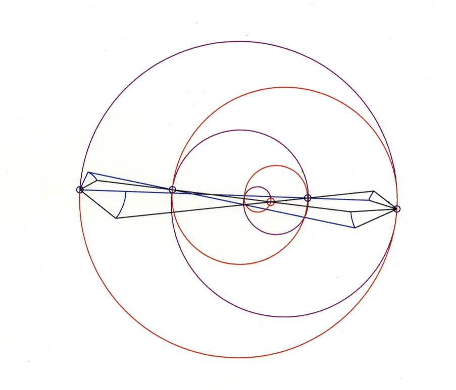
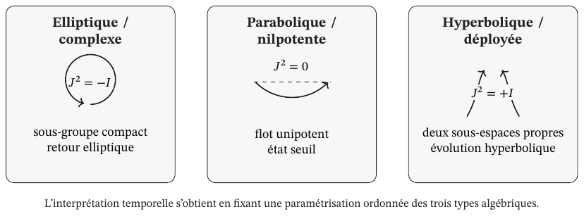
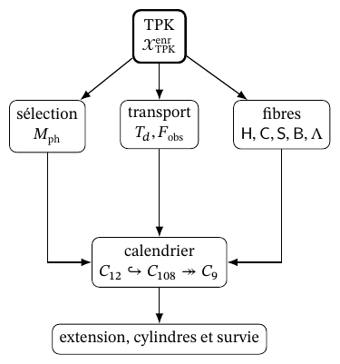
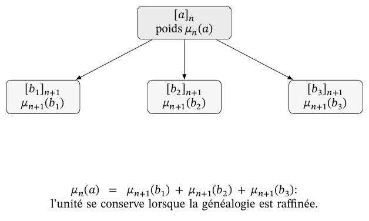

# La clôture holographique de l’infini, la structure discrète du continu et l’origine des constantes fondamentales

Narration coinductive élaborée par ChatGPT 6 Astra, avec l’assistance et sous la direction ponctuelle des auteurs.

Oumar Haidara Fall et Rubén Ramos Balsa

28 septembre 2026

## Préface

Ce document propose une narration coinductive générée par ChatGPT avec l’assistance et sous la direction ponctuelle des auteurs. Le propos repose sur l’analyse théorique des documents qui accompagnent ce dossier. Ceux-ci réunissent les résultats obtenus et les développements mathématico-physiques réalisés entre les années 2023 et 2026 au moyen d’outils de type grands modèles de langage, ou Large Language Models (LLM). De ce processus sont issues les formulations dénommées, respectivement, Holographie Modulaire Triadique et Mécanique Dimensionnelle (HMT–MD). L’origine du projet remonte toutefois au début du XXIe siècle, plus précisément à l’étude de la découverte qui sous-tend l’artefact mécanique inventé par Oumar Haidara Fall en 2001.

Le matériau accumulé et les connaissances progressivement acquises au cours de plus de deux décennies d’observation, d’étude et d’analyse, tant de l’artefact et de sa phénoménologie que de sa configuration géométrique, ont constitué la base opératoire et informationnelle que les auteurs ont ensuite appliquée aux modèles d’intelligence artificielle. Le corpus théorique présenté ici, avec ses dérivations et ses démonstrations, s’inscrit donc dans une généalogie empirique qui ne laisse pas de surprendre par son paradoxe historique : lorsque l’on a commencé à raisonner avec des « machines pensantes » à « l’ère de l’intelligence artificielle », il a également fallu interroger à nouveau l’interaction complexe entre deux machines simples : le levier et la roue.

## Le continu et la détermination des grandeurs physiques

L’Holographie Modulaire Triadique et la Mécanique Dimensionnelle développent une explication conjointe de l’origine des valeurs fondamentales et des relations qui constituent la matière. Le continu se construit par le prolongement compatible d’états arithmétiques qui conservent orientation, parcours et mémoire. Les valeurs numériques et les relations d’incidence sont des lectures de cette même organisation. Cette construction réunit le problème des constantes et celui de la constitution physique : l’intensité d’une interaction, l’échelle d’une action et la masse d’une particule s’étudient à travers les opérations qui les déterminent et les relient. Le document développe la continuité entre cette genèse mathématique et ses déterminations physiques.

Le noyau APP–TRIT–TPK établit les opérations de départ. APP organise les deux directions du support arithmétique et la différence entre accumulation additive et composition multiplicative ; TRIT oriente et distingue les régimes locaux ; TPK sélectionne, transporte et actualise l’état complet. Sur cette dynamique se construisent les retours et les prolongements qui rendent possible la double projection. La lecture archimédienne détermine des coordonnées numériques tandis que la projection exceptionnelle conserve des relations d’incidence. Le point qui acquiert une valeur possède, dans sa construction, une structure qui continue d’intervenir dans ses transformations.

La génération articulée de π, φ et e, le registre dodécaphasique et sa réalisation comme constante arithmético-géométrique de couplage, ainsi que les deux voies internes qui déterminent α, manifestent la première conséquence de cette unité. La construction électronique la prolonge en étudiant conjointement l’identité de l’électron, son action et sa réalisation dimensionnelle. La constante de Planck, le paramètre de Barbero–Immirzi, la constante de Boltzmann et la constante de gravitation universelle relient ensuite action, aire, intrication, température et réponse géométrique. La Loi générale des masses et les transports de mélange étendent ce développement vers l’organisation des états matériels. Chaque résultat conserve sa propre dérivation et les antécédents qui le rattachent à l’architecture commune.

La portée de cette thèse réside dans la transformation du statut explicatif des grandeurs. Une constante déterminée par la structure conserve les relations qui la rendent nécessaire ; une particule définie par sa persistance acquiert des propriétés à travers les conditions de cette persistance. Action, réciprocité géométrique et mémoire des transformations s’articulent dans cette même chaîne ; leurs fonctions seront exposées là où les objets, les applications et les équations du développement les déterminent. L’unification se reconnaît à la transmission de ces antécédents entre les problèmes : l’action intervient dans l’évaluation matérielle, l’aire se relie à l’information, l’orientation intervient dans le mélange et la mémoire conditionne l’évolution. Telle est la continuité que la narration doit rendre visible.

Trois questions permettent de la suivre : ce qui détermine chaque résultat, ce qui conserve son identité lors de ses transformations et la manière dont il se réalise physiquement. Le développement historique central commence là où les lois unifient des domaines physiques tout en laissant apparaître la provenance des grandeurs qu’elles emploient. À partir de cette formulation moderne, la généalogie revient à la proportion, à l’appui et au mouvement, puis se poursuit vers l’infini et le continu. La réflexion philosophique examine, au fil de ce parcours, ce que signifie connaître une structure et lui attribuer une capacité constitutive. Les questions historiques reçoivent ainsi une réponse concrète dans le développement HMT, à l’endroit où cette réponse permet de progresser.

## Constantes, mesure et unification de la physique

Cette tension entre unification et détermination peut s’exprimer par deux relations qui distinguent une constante mesurée d’une constante déterminée par la structure :

$$
\mathcal T(\lambda)\longmapsto \text{prédictions},
\qquad
\mathcal G\longmapsto \lambda_*\longmapsto \mathcal T(\lambda_*).
$$

Dans la première, les prédictions exigent de fixer le paramètre \(\lambda\) ; dans la seconde, la construction \(\mathcal G\) détermine \(\lambda_*\), qui intervient ensuite dans la théorie physique. La question décisive est l’opération qui réalise ce lien. Elle permet de reconnaître quelles grandeurs proviennent directement du noyau génératif et lesquelles s’obtiennent en composant ses résultats avec des lois physiques. Cette distinction doit rester visible dans toute comparaison ultérieure.

La gravitation newtonienne montre avec une clarté particulière qu’une théorie peut réorganiser la connaissance de la nature sans épuiser la question de son fondement. La même relation permet de traiter les mouvements terrestres et célestes. La portée de la loi transforme ce qui compte comme explication : des phénomènes auparavant répartis entre différents domaines se trouvent liés par une structure dynamique commune. Dans le *Scholie général*, Newton distingue la connaissance des propriétés et des effets de la gravité d’une hypothèse sur sa cause ultime. Cette distinction appartient à sa méthode et doit être conservée dans la reconstruction historique du problème. [H07]

La notation contemporaine de la gravitation concentre dans la lettre \(G\) un coefficient qui n’occupait pas exactement cette place symbolique dans les *Principia*. Cette différence importe, car l’histoire d’une constante inclut celle des grandeurs et des unités qui permettent de l’isoler. Cavendish a présenté, dans le titre de sa recherche de 1798, une détermination de la densité de la Terre. La balance de torsion a permis de relier l’attraction entre des masses de laboratoire à l’attraction terrestre. L’interprétation ultérieure en termes de mesure de \(G\) est physiquement compréhensible, mais ne doit pas se substituer au but déclaré de l’expérience. [H08]

L’expérience révèle une médiation fondamentale entre nombre et monde. Une grandeur se détermine par la comparaison organisée d’effets. La torsion, les distances, les masses et les périodes d’oscillation forment une structure expérimentale. Le résultat numérique condense cet ensemble de relations. La constante ne se présente pas à la connaissance comme une donnée brute ; elle s’obtient au moyen d’un système d’inférences et d’étalonnages. C’est précisément pourquoi expliquer mathématiquement sa valeur exige autre chose que reproduire le nombre mesuré : il faut montrer quelle structure peut remplir la fonction explicative que la mesure laisse ouverte.

Au XIXe siècle, l’électromagnétisme a donné à l’unification une forme particulièrement suggestive. Maxwell a relié la propagation de perturbations électromagnétiques à une vitesse déterminée par des grandeurs électriques et magnétiques, et reconnu sa correspondance avec la vitesse de la lumière. Cette identification a réuni optique et électromagnétisme dans une conception du champ. La valeur de la vitesse restait liée à des déterminations expérimentales, mais la relation entre les domaines avait radicalement changé. La constante s’est mise à exprimer une unité physique qui n’était pas manifeste auparavant. [H11]

Dans la notation contemporaine, pour le vide et selon les conventions électromagnétiques correspondantes, la relation prend la forme :

$$
c^2\,\varepsilon_0\,\mu_0=1.
$$

La vitesse de propagation \(c\), la permittivité \(\varepsilon_0\) et la perméabilité \(\mu_0\) cessent de fonctionner comme trois déterminations indépendantes dans cette description. L’équation établit une dépendance structurelle. Sa signification historique réside dans la réduction de la séparation entre phénomènes, tandis que le problème d’une sélection numérique absolue de toutes les grandeurs exige une recherche supplémentaire. Unifier les relations et déterminer entièrement leurs valeurs sont des tâches liées dont la différence peut être formulée sans diminuer la portée de l’une ou de l’autre.

La reconstruction du vide dans HMT–MD donne à cette dépendance un ancrage constitutif : les grandeurs électriques et magnétiques s’obtiennent au moyen de lecteurs de l’état et se relient à l’action, à l’échelle et à la propagation. L’équation de Maxwell conserve sa fonction physique ; la généalogie antérieure de ses grandeurs explique les conditions qu’elles transmettent à cette équation. L’unification s’examine à partir de l’origine commune des relations qui s’expriment ensuite en unités de laboratoire.

Les unités naturelles de Stoney et de Planck ont approfondi un autre versant du problème. Stoney a recherché des unités physiques fondées sur des constantes de la nature ; Planck a formulé des échelles construites à partir de constantes universelles liées à la gravitation, à la propagation et au rayonnement. Ces programmes visaient à rendre les étalons de mesure indépendants des particularités humaines ou terrestres. L’ambition était que des civilisations différentes puissent reconnaître une même structure d’unités, même si elles employaient initialement des conventions distinctes. L’universalité des échelles acquérait ainsi une signification épistémologique et cosmologique. [H12, H13]

Une échelle naturelle réunit des constantes de manière que les dimensions se compensent et produisent une longueur, un temps, une masse ou une température. L’opération révèle des relations profondes entre domaines physiques. En même temps, la connaissance des grandeurs ainsi obtenues dépend des valeurs des constantes utilisées. Le caractère naturel de la combinaison exprime son indépendance à l’égard de conventions arbitraires de construction ; la détermination de sa valeur pose encore la question de la provenance de ses composantes. Cette différence permet de comprendre pourquoi une théorie des unités naturelles peut être inaugurale sans constituer à elle seule une genèse de toutes les constantes qu’elle emploie.

Le rayonnement thermique a ajouté une difficulté qui n’était pas seulement métrologique. La constante de Planck a relié énergie et fréquence et s’est mise à exprimer une échelle d’action. Le nombre a joué un rôle structurel dans la transformation de la physique. Une constante peut donc modifier le concept même d’objet physique : elle cesse d’être un coefficient situé dans une loi connue et indique une réorganisation des opérations par lesquelles les processus sont décrits. La relation entre continuité, échange et quantification entre alors dans la question de sa signification.

Dans le développement HMT, l’échelle d’action possède des antécédents arithmétiques et opératoires explicites. La construction de Planck relie le lecteur d’action à α, à l’auto-échelle et à la réalisation dimensionnelle ; celle de Boltzmann met l’échange énergétique en relation avec l’information tritique et la température. Le paramètre de Barbero–Immirzi articule aire et intrication, tandis que la lecture gravitationnelle incorpore la réponse géométrique. Ces connexions donnent un contenu à la question de l’origine des échelles : elles permettent de suivre une détermination antérieure jusqu’à sa fonction dans une grandeur physique.

La détermination physique ajoute une difficulté décisive. La valeur numérique d’une grandeur dimensionnelle change lorsque les unités changent. La vitesse de la lumière, exprimée en mètres par seconde, possède une valeur numérique différente de celle qu’elle aurait en kilomètres par seconde ; la relation physique demeure. Une explication profonde doit donc distinguer la grandeur, son unité et ses rapports invariants. Les constantes adimensionnelles conservent leur valeur numérique sous ces changements et rendent particulièrement manifeste le problème de la sélection. Les constantes dimensionnelles exigent aussi que soit expliquée la structure qui relie longueur, temps, masse, action, température et charge. La discussion de Duff, Okun et Veneziano a montré à quel point le dénombrement même des constantes fondamentales dépend de ce que l’on entend par indépendance, conversion et unité. [H15]

La définition moderne du Système international en offre un exemple instructif. Fixer exactement certaines valeurs numériques permet de définir des unités reproductibles et de coordonner la métrologie. Il s’agit d’une décision sur la manière d’exprimer et de réaliser les grandeurs, non d’une déduction cosmologique de leur existence. Le changement de statut métrologique d’un nombre ne transforme pas automatiquement son statut explicatif. Cette distinction est nécessaire à toute proposition qui dérive des échelles : il faut établir clairement ce qui naît de la construction, ce qui identifie une grandeur et ce qui relève de son expression conventionnelle. [H14]

Bachelard permet de comprendre pourquoi cette articulation transforme également l’expérience scientifique. Le phénomène de laboratoire se prépare au moyen d’instruments qui incorporent des relations théoriques ; l’observation sélectionne des conditions, distingue des effets et rend reproductible ce que l’on souhaite connaître. Sa notion de phénoménotechnique place cette réalisation au centre de la connaissance : la science apprend de phénomènes dont elle a rendu la manifestation possible par une construction rationnelle et technique. L’objectivité se conquiert dans l’échange entre projet, réalisation et rectification. Un instrument ne transforme pas la théorie en vérité du seul fait qu’il la matérialise ; il permet de soumettre ses relations à une expérience organisée qui peut exiger leur modification. [B22].

La recherche de Hasok Chang sur la température développe cette question à partir de l’histoire de la mesure. La justification des procédures de mesure rencontre une difficulté lorsque les étalons et les connaissances censées les valider dépendent les uns des autres. Chang nomme itération épistémique le processus par lequel un système initial de connaissance permet des recherches qui l’enrichissent et le corrigent. La précision apparaît comme un acquis progressif de cette coordination, non comme une propriété originaire de toute lecture instrumentale. [B23].

Une échelle identifie le niveau et la relation de transformation qui relient grandeurs et résolutions. Dans HMT–MD, son explication requiert l’opérateur qui transporte la structure et l’unité qui en réalise la lecture. Conserver une relation lors d’un changement d’échelle, sélectionner une échelle et fixer son expression en unités sont des opérations différentes qui coopèrent dans la comparaison métrologique. La précision du laboratoire rencontre ainsi une construction déterminée à laquelle se confronter.

La physique quantique a rendu particulièrement manifeste la différence entre l’exactitude d’une loi et la détermination de ses paramètres. L’étude des spectres a imposé de mettre en relation structure atomique, relativité et quantification. Dans le travail de Sommerfeld de 1916, la constante de structure fine organisait les corrections et les proportions caractéristiques du problème. Son caractère adimensionnel concentrait une question que les unités naturelles laissaient ouverte : le nombre pouvait être comparé sans dépendre d’un choix de mètres, de secondes ou d’unités électriques. Sa valeur est devenue l’indice d’une possible organisation plus profonde. [H16]

La constante de structure fine réunit charge, action et propagation dans un rapport sans dimension. Dans la notation électrique usuelle, elle s’écrit

$$
\alpha=\frac{e_{\mathrm{el}}^{\,2}}{4\pi\varepsilon_0\hbar c}.
$$

L’équation identifie sa fonction au sein de l’électromagnétisme quantique. La détermination HMT se développe à partir d’un autre antécédent : les coordonnées régionales et le registre signé proviennent du même état, et leur composition établit la clôture dodécaphasique. La valeur de α est liée aux conditions que cette clôture doit satisfaire. La seconde voie interne, par la racine positive du noyau correspondant, conserve sa formulation et permet d’examiner la concordance des deux développements. Le couplage acquiert sa valeur comme partie de l’architecture qui le constitue.

Eddington a tenté de progresser vers une détermination théorique du nombre au moyen d’arguments algébriques et statistiques liés à la description quantique de l’électron. La chronologie est significative : la rubrique « News and Views » de Nature du 26 janvier 1929 atteste le résultat 136, accompagné d’une valeur expérimentale citée proche de 137,1 ; en novembre de la même année, Eddington a présenté une réorganisation conduisant à 137. Ces épisodes appartiennent à un programme de fondation, et leur reconstruction exige de conserver les dates et les arguments, au lieu de leur substituer une anecdote sur la fascination numérique. [H18, H19]

L’intérêt philosophique d’Eddington réside dans l’ambition de transformer une constante mesurée en une conséquence de l’organisation du savoir physique. La difficulté apparaît dans le critère de sélection : une construction doit expliquer pourquoi ses opérations sont nécessaires avant que soit connu le nombre qu’elle vise à obtenir. La correspondance numérique peut orienter une recherche ; la force d’une explication dépend de ce que la valeur soit fixée par des conditions indépendantes de cette reconnaissance. Cette distinction ne disqualifie pas la recherche. Elle exprime le type de nécessité auquel la recherche elle-même aspire.

Dirac a proposé une voie différente en 1937. Il a mis en relation de grands nombres formés à partir de grandeurs physiques et cosmologiques, et interprété leur proximité comme l’indice d’une connexion dynamique. La gravitation pouvait varier avec le temps cosmologique lorsqu’elle était exprimée en unités atomiques. Cette proposition transformait la question d’un nombre fixe en celle d’une relation évolutive. Au lieu de déduire toutes les constantes comme les invariants d’une structure intemporelle, elle recherchait une dépendance commune entre les échelles microscopiques et l’âge de l’univers. [H20]

La différence entre ces deux programmes mérite d’être conservée. Eddington aspirait à une nécessité associée à la structure formelle ; Dirac explorait une dépendance cosmologique capable de relier des ordres de grandeur. L’histoire des constantes comporte donc plusieurs formes d’explication : sélection algébrique, génération dynamique, réduction des paramètres et articulation des échelles. Un récit rigoureux doit montrer à quelle question chacune répond. La seule présence d’un nombre dans une équation ne permet pas de décider s’il s’agit d’une donnée, d’une sortie, d’une condition initiale ou d’une relation qui évolue.

Le lien que Dirac recherchait entre échelles atomiques et cosmologiques maintient ouverte une question précise pour l’exposition HMT : quelles grandeurs restent invariantes sous le transport et lesquelles expriment l’évolution du système. La constante arithmético-géométrique de couplage intervient dans cette articulation par ses réalisations, tandis que les équations cosmologiques conservent leurs variables dynamiques. L’identité d’une structure et le devenir de ses états sont distingués au sein d’une description commune. Cette distinction évite que les coïncidences entre ordres de grandeur remplacent l’explication des opérations qui les relient.

Einstein a formulé en 1949 une exigence particulièrement proche du cœur de ce problème. Après avoir distingué les constantes dimensionnelles susceptibles d’être absorbées par le choix des unités, il a concentré son idéal sur les constantes adimensionnelles arbitraires. Selon cette aspiration, une théorie fondamentale devrait posséder une structure telle que la modification de ses constantes en détruise l’identité. Einstein a présenté cette exigence comme une conviction concernant l’intelligibilité de la nature, non comme un résultat qu’il aurait démontré. Son importance historique réside dans la précision du critère : expliquer une valeur signifie éliminer sa variation libre au sein de la théorie. [H22]

Cette formulation peut se comprendre comme une condition de rigidité. Une théorie paramétrée admet plusieurs choix numériques ; une théorie rigide impose un choix par la solidarité de ses relations. La différence est plus profonde que la réduction du nombre de symboles. Un paramètre peut se dissimuler dans une définition, dans une condition au bord ou dans la sélection d’une solution. L’arbitraire est dépassé lorsque l’architecture détermine explicitement ce choix et en préserve l’indépendance à l’égard de la valeur reconnue ultérieurement.

Wolfgang Pauli avait formulé une exigence apparentée en concluant sa conférence Nobel du 13 décembre 1946. L’explication de la structure atomistique de l’électricité demeurait, pour lui, liée à une théorie capable de déterminer la valeur de la constante de structure fine. La question ne se réduisait pas à atteindre une précision expérimentale accrue : elle concernait la relation entre l’intensité du couplage et la constitution des sources électriques. Le nombre et la structure devaient parvenir à s’expliquer conjointement. Cette exigence permet de comprendre pourquoi la recherche de la valeur de α touche au problème de l’électron et de son identité matérielle. Il ne suffit pas de savoir combien vaut une constante ; on cherche à comprendre quelle organisation lui confère cette valeur et quelle relation cette organisation entretient avec les phénomènes dans lesquels elle intervient. [B24].

L’électron matérialise cette exigence de Pauli. La narration HMT l’étudie comme une organisation persistante dotée d’une position, d’une orientation, d’une action et de conditions de clôture ; son évaluation massique s’obtient après l’établissement de ces antécédents. La connexion entre α et la structure électronique appartient donc à l’identité de l’objet décrit. La Loi générale des masses étend la lecture à d’autres signatures et parcours sans leur substituer une liste de masses introduite de l’extérieur.

La même question de la constitution se manifeste dans l’exclusion et dans la statistique. Le développement de HMT–MD organise les secteurs d’échange par les conditions de symétrie de l’état ; l’occupation fermionique empêche la répétition d’un même état à une particule dans le secteur antisymétrique. Les distributions de Fermi–Dirac et de Bose–Einstein s’expliquent ensuite par les dénombrements correspondants. Le principe d’exclusion acquiert ainsi une position définie entre l’identité de l’état et l’organisation collective des occupations.

L’interrogation d’Einstein sur la complétude de la description quantique place au premier plan la relation entre le système et sa mesure. L’argument d’Einstein, Podolsky et Rosen examine ce que l’on peut inférer d’un système à partir de mesures effectuées sur un autre avec lequel il a interagi. Dans HMT, la préparation conjointe, le transport, les instruments locaux et le registre s’inscrivent dans une même généalogie. La description conserve la relation qui rend possible la corrélation, et chaque lecture se situe dans l’opération physique qui la réalise. [B25].

Le traitement triadique de Bell précise cette réponse au moyen d’instruments à trois résultats. La préparation conjointe détermine les probabilités de corrélation ; la complétude de chaque instrument établit l’indépendance opérationnelle de la marginale à l’égard du réglage distant. La distinction entre factorisation locale et non-signalisation organise alors le problème de la localité en énoncés séparés. L’information se mesure en trits et la relation entre totalité et lecture locale s’exprime par des opérateurs concrets. Cette construction se situe auprès des postulats, de l’intrication et de la conservation de l’information, avant le parcours du spectre des masses.

L’idéal einsteinien est lié à sa réflexion de 1933 sur la méthode de la physique théorique. Les concepts fondamentaux ne s’obtiennent pas par une simple accumulation inductive de données ; une activité constructive intervient, qui recherche des principes capables d’organiser l’expérience. Celle-ci conserve sa fonction décisive dans l’évaluation des conséquences. Entre liberté conceptuelle et contrôle empirique s’établit une tension productive. La détermination des constantes est l’un des domaines où cette tension peut devenir particulièrement féconde, parce qu’elle oblige à relier le choix des principes à des résultats quantitatifs définis. [H21]

La simplicité requiert cependant une interprétation structurelle. Norton a montré que la simplicité apparente d’une formulation dépend du langage, des variables et des représentations utilisés. Une équation brève peut dissimuler une définition complexe ; une formulation étendue peut se condenser lorsque l’objet approprié est trouvé. C’est pourquoi une explication des constantes gagne en force lorsque sa nécessité se maintient sous des représentations équivalentes. La rigidité pertinente appartient à l’objet et à ses relations, non à la seule économie d’une notation. [H45]

Cette exigence permet de reformuler le rôle de la beauté mathématique dans la physique du XXe siècle. La beauté peut exprimer la coordination de plusieurs domaines par une structure commune, la diminution de l’indépendance des hypothèses et l’apparition d’invariants inattendus. Sa valeur scientifique dépend de l’articulation de ces relations. La détermination d’une constante constitue un cas particulièrement exigeant, parce qu’elle permet de distinguer une formule suggestive d’une sélection structurelle complète. Le nombre obtenu acquiert une signification lorsque l’on comprend ce qui serait altéré si on le modifiait.

La physique contemporaine a fait du changement d’échelle un objet de recherche. Une interaction peut présenter une intensité effective différente selon l’énergie à laquelle elle est étudiée. La constante qui apparaît dans une description cesse d’être comprise comme un nombre isolé des conditions d’observation et s’inscrit dans une trajectoire déterminée par des équations d’évolution. Le groupe de renormalisation exprime cette organisation et permet de relier des phénomènes relevant d’échelles différentes. Le problème de la valeur se répartit alors entre une loi de variation et le choix d’une trajectoire particulière. [H28, H29]

Soit \(g\) un couplage et \(\mu\) l’échelle à laquelle il est décrit. Une fonction \(\beta\) détermine son évolution :

$$
\mu\frac{\mathrm d g}{\mathrm d\mu}=\beta(g),
\qquad g(\mu_0)=g_0.
$$

La première expression fixe la manière dont le couplage varie. La seconde sélectionne une solution de cette équation. Connaître la fonction d’évolution permet de transporter l’information entre les échelles ; déterminer la valeur initiale au moyen d’une construction indépendante résoudrait une question supplémentaire. Cette différence n’est pas un détail technique : elle montre où réside la liberté paramétrique une fois qu’une dynamique a été expliquée. Une théorie générative doit prendre en compte aussi bien le transport que la sélection de la trajectoire qu’elle transporte.

La transmutation dimensionnelle offre une autre forme de réorganisation. Dans certaines théories, un paramètre adimensionnel peut être remplacé par une échelle caractéristique. L’apparition de cette échelle est structurellement significative et peut expliquer l’existence d’un régime physique qui n’était pas visible dans la formulation initiale. Le travail de Coleman et Weinberg de 1973 constitue un épisode central dans l’étude de la brisure de symétrie induite par les corrections radiatives. Cependant, remplacer le mode de paramétrage d’une théorie et sélectionner de manière unique le paramètre qui en résulte demeurent des problèmes distincts. [H30]

L’unification par les symétries ouvre une possibilité complémentaire. Plusieurs couplages peuvent être reliés dans une théorie plus vaste et apparaître comme des manifestations différenciées d’une organisation commune. Les conditions de brisure, le contenu en champs et les corrections de seuil interviennent dans le passage vers les échelles observées. L’unification réduit l’indépendance des relations ; sa capacité à fixer des valeurs concrètes dépend de la mesure dans laquelle elle détermine également ces conditions. La proposition de Georgi et Glashow et les études de synthèse sur la grande unification permettent de suivre cette articulation entre symétrie, échelle et sélection. [H31, H32]

L’origine des masses rend manifeste une difficulté semblable. Un mécanisme peut expliquer comment certaines excitations acquièrent une masse tout en laissant libres les coefficients qui différencient leurs valeurs. La relation entre une échelle de brisure et les couplages de Yukawa organise le problème, mais la distribution numérique du spectre exige de déterminer ces couplages ou de les remplacer par une construction qui sélectionne leurs relations. Les matrices de mélange introduisent une structure supplémentaire : elles décrivent le désalignement entre des bases associées à différents secteurs. Masse, mélange et phase constituent des objets liés, dotés de fonctions explicatives différentes. [H27]

La portée unificatrice de HMT doit être suivie à ce niveau de détail : le registre qui conserve l’orientation intervient dans les lecteurs angulaires ; ceux-ci acquièrent des fonctions distinctes dans les matrices de mélange ; la réalisation de l’état relie ensuite ces transports aux secteurs matériels. Le traitement des masses, du mélange et de la violation de CP conserve leurs constructions respectives. Leur appartenance à une même origine arithmétique se reconnaît aux relations qu’ils transmettent, sans réduire leurs différences physiques.

La sélection cosmologique et les scénarios à vides multiples introduisent un troisième type de réponse. Lorsqu’une théorie admet de nombreuses réalisations, il est possible de rechercher une distribution de possibilités ou une condition favorisant celles qui sont compatibles avec certaines structures de l’univers. Les travaux de Bousso et Polchinski, de Douglas et de Weinberg présentent des programmes différents au sein de cette orientation. Une borne anthropique, une distribution statistique et une détermination unique n’ont pas le même statut logique. Leur comparaison devient féconde lorsqu’on se demande quel ensemble de possibilités a été réduit et au moyen de quelle condition. [H33, H34, H35]

La question ontologique se trouve ainsi liée à une question de sélection. Une théorie peut décrire un ensemble de mondes possibles, un mécanisme qui produit des régions différentes ou une structure qui impose une réalisation. Dans chaque cas, le sens de la question de savoir pourquoi une constante possède sa valeur se modifie. On peut rechercher une nécessité globale, une condition historique, une sélection environnementale ou une probabilité conditionnelle. L’expression « expliquer une constante » acquiert sa précision lorsqu’on identifie celle de ces modalités que l’on entend satisfaire.

La variation temporelle des constantes, étudiée à partir de différents cadres théoriques, confirme que le caractère fondamental dépend de l’architecture dans laquelle une grandeur est située. Une quantité constante dans une description peut apparaître comme la valeur d’un champ dans une autre. Les tests empiriques de variation doivent être formulés au moyen de relations adimensionnelles et de modèles des observations. L’étude de synthèse d’Uzan offre une présentation étendue de ce problème. Son intérêt pour la présente recherche tient à ce qu’elle oblige à distinguer la stabilité observée, l’invariance théorique et la nécessité structurelle. [H40]

L’exposition atteint ainsi une hiérarchie précise. La construction générative détermine ses objets et ses lectures ; la Mécanique Dimensionnelle établit leurs réalisations ; la comparaison métrologique confronte les résultats aux grandeurs observées. L’ordre de lecture doit respecter cette dépendance : les objets et les opérations sont construits d’abord ; l’atlas et les correspondances métrologiques sont présentés ensuite. Les chiffres conservent ainsi leur caractère de résultats de la construction et ne paraissent pas être des données anticipées. Pour comprendre pourquoi cette exigence ne naît pas d’une abstraction tardive, la généalogie revient maintenant au levier, à la roue et à la question de ce qui conserve une relation lorsque changent ses appuis, ses longueurs effectives et ses orientations.

## Proportion, interaction et conservation de l’unité

Le levier occupe une place fondatrice dans ce parcours. Dans *De l’équilibre des plans*, Archimède soumet l’équilibre à une organisation déductive de postulats et de propositions ; les poids et leurs distances à l’appui se trouvent reliés par une proportion démontrable. Ce traitement constitue un moment inaugural de la physique mathématique démonstrative : une configuration matérielle peut se comprendre par la nécessité de ses relations. Galilée accordait expressément la première place à Archimède pour la rigueur de cette démonstration. Le point d’appui, les positions des poids et la composition de leurs effets deviennent partie intégrante de ce que les mathématiques doivent établir. [B01] ; [B02].

En notation mécanique actuelle, l’équilibre d’un levier idéal de bras \(a\) et \(b\) s’exprime par \(F_1a=F_2b\). Pour une petite rotation commune, les déplacements tangentiels satisfont \(\delta s_1=a\,\delta\theta\) et \(\delta s_2=b\,\delta\theta\) ; les deux relations donnent l’égalité des travaux virtuels opposés. Le lien entre force et déplacement réunit ainsi une condition d’équilibre et une compatibilité géométrique du mouvement. Les bras par rapport à l’appui et les déplacements dans la direction des forces remplissent des fonctions distinctes dans ces deux expressions. L’équilibre conserve ici son sens exact de condition idéale ou locale ; l’axe généalogique du projet est l’interaction, car le problème apparaît lorsque l’appui, l’orientation et la longueur effective se transforment pendant le couplage. Cette précision permet d’examiner la portée de la proportionnalité dans un système à plusieurs corps.

La recherche décrite dans la préface part précisément de l’interaction entre le levier et la roue. Le déplacement des appuis, la variation des longueurs effectives et la réception angulaire des forces y placent la géométrie au cœur du problème dynamique. Le dispositif impose de suivre une relation qui se transforme en agissant. L’antécédent expérimental possède ainsi une pertinence conceptuelle pour HMT : il incite à conserver la configuration et le parcours lorsque l’on compare l’entrée à la sortie. La mesure se comprend à travers l’échange qui la produit.

L’objection d’Ernst Mach à la démonstration archimédienne porte sur la légitimité des étapes qui déplacent et composent les poids. Une distribution est remplacée par une autre en supposant conservées certaines conditions d’équilibre ; selon sa critique, cette substitution contient déjà un savoir physique sur le centre de gravité. L’intérêt de l’objection pour cette généalogie tient à l’explicitation de la relation entre composition géométrique et effet physique. La Mécanique Dimensionnelle reprend cette question lorsqu’elle attribue au couplage, à l’orientation et à la mémoire une fonction au sein de l’état mesuré. [B03].

La recherche d’une détermination mathématique de la nature trouve un antécédent décisif dans la relation antique entre proportion et ordre. Dans le *Timée*, la construction géométrique des corps relie éléments, figures et transformations. Les propriétés sensibles sont rapportées à une organisation intelligible. Le discours cosmologique platonicien conserve toutefois le statut d’une explication vraisemblable : la géométrie rend pensable l’ordre du monde au sein d’une argumentation plus vaste sur la génération et le modèle. Interpréter cet épisode comme une première physique des constantes au sens moderne effacerait la distance historique qui en fait l’intérêt. [H01]

La contribution pertinente de Platon est plus précise. La forme peut expliquer qu’un corps possède certaines possibilités de transformation. L’élément géométrique n’opère pas seulement comme une image extérieure de quelque chose de déjà connu ; il intervient dans la conception de ce qu’est le corps. Cette articulation fait apparaître une idée qui reviendra sous des formes très différentes : les mathématiques peuvent apporter un contenu constitutif, en plus d’un langage descriptif. Le problème ultérieur sera de déterminer comment on reconnaît qu’une constitution mathématique correspond à la réalité et quelle expérience peut la distinguer d’autres constitutions possibles.

Aristote introduit un autre aspect fondamental en distinguant la connaissance d’un fait et la connaissance de sa raison. Dans les *Seconds Analytiques*, les sciences apparentées peuvent se répartir l’observation du phénomène et la démonstration de sa cause. Dans la *Physique*, les mathématiques et l’étude de la nature se distinguent par leur manière de considérer les objets, tandis que des domaines comme l’optique ou l’astronomie rendent leur articulation visible. La tradition aristotélicienne contient ainsi des ressources pour penser une explication mathématique des phénomènes physiques, bien que son concept de cause et son organisation des sciences diffèrent des conceptions modernes. [H02]

La division en extrême et moyenne raison d’Euclide représente une forme particulièrement claire de détermination par la relation. Un segment est divisé de telle sorte que le tout soit à la plus grande partie ce que la plus grande partie est à la plus petite. Si l’on désigne par \(a\) la plus grande partie et par \(b\) la plus petite, la définition établit :

$$
\frac{a+b}{a}=\frac{a}{b}.
$$

Le nombre qui exprime cette proportion résulte d’une condition de similitude entre deux rapports. Son caractère déterminé procède de la structure de la division, non d’une préférence esthétique ajoutée. L’importance épistémologique de cet exemple réside dans le fait qu’une relation entre tout et parties peut sélectionner une proportion. L’histoire ultérieure a attribué à ce rapport de nombreuses significations artistiques et cosmologiques ; le noyau mathématique demeure plus sobre et plus exigeant : une identité définit une organisation et permet d’en déduire les conséquences. [H03]

HMT transforme cette question de la proportion en une question de conservation au cours de la construction. L’extrême et moyenne raison holographique suit l’unité à travers sa stratification et ses deux lectures. Le bilan \(1000=729+243+27+1\), avec \(271=243+27+1\), exprime une partition exacte ; les relations opératoires expliquent ensuite comment l’information se conserve et se restitue lors d’un changement de représentation. La proportion acquiert un contenu dynamique puisqu’elle doit rester compatible avec les transformations qui la réalisent.

À l’exigence de raison suffisante s’ajoute, chez Leibniz, une question sur la constitution de l’unité. La simplicité de la monade signifie absence de parties, non absence de diversité. Dans la *Monadologie*, le changement requiert que quelque chose se modifie et que quelque chose demeure ; l’état nommé perception réunit une multiplicité dans l’unité. L’identité apparaît ainsi liée à une succession de déterminations, au lieu de se confondre avec l’immobilité. Cette conception permet de distinguer la division d’un composé et la reconnaissance de différences au sein d’un état : ce sont des opérations intellectuelles distinctes. [B04].

La philosophie leibnizienne élargit cette question en examinant les relations qui rendent un monde intelligible. Dans sa correspondance avec Clarke, l’espace se conçoit comme ordre des coexistences et le temps comme ordre des successions. Déplacer en imagination l’univers entier en conservant toutes ses relations ne suffit pas à établir une différence possédant une raison suffisante. La question porte sur ce qui distingue effectivement deux configurations, non sur leur inscription dans un cadre absolu. La pluralité des mondes possibles possède un autre statut : dans la *Monadologie*, il s’agit de possibilités d’existence parmi lesquelles l’une vient à exister, non d’univers physiques qui coexisteraient nécessairement. Relation, possibilité et existence se trouvent ainsi liées par une exigence de détermination. [B05] ; [B06].

Hegel aborde l’unité à partir d’une autre difficulté : la relation entre le tout et les parties. Dans l’*Encyclopédie*, les parties se distinguent entre elles, mais leur condition de parties dépend de la relation qui les réunit. L’exemple de l’organisme rend particulièrement visible la portée de cette observation. Un organe ne se comprend pas par son isolement, car sa fonction appartient à l’organisation vivante. L’énumération des composants et l’explication de leur unité répondent donc à des questions différentes. [B07].

La réflexion hégélienne sur la mesure ajoute une distinction particulièrement féconde. Choisir un étalon extérieur pour comparer des grandeurs est une chose ; comprendre la relation quantitative qui intervient dans la détermination qualitative de l’objet en est une autre. Dans la *Science de la logique*, la mesure lie quantité et qualité, de sorte qu’une variation quantitative peut atteindre un seuil où se modifie ce que l’objet est. Hegel distingue expressément ce problème du choix d’un étalon obtenu, par exemple, à partir d’une longueur terrestre ou d’un pendule. La définition d’une unité commune rend les grandeurs comparables ; la mesure constitutive concerne l’organisation propre de ce qui est mesuré. [B08].

La relation entre tout et parties rencontre ici une difficulté mathématique précise. Un groupe requiert un ensemble et une loi de composition ; connaître le nombre de ses éléments laisse ouverte l’organisation de cette loi. De même, attribuer une valeur à un état généalogique identifie une propriété de l’état, tandis que le transport conserve d’autres relations. La critique HMT de l’oubli extensionnel vise l’assimilation de cette identification partielle à l’identité complète de l’objet. Le quotient peut se décrire en termes d’ensembles, de relations et d’applications ; la question constitutive est de savoir quelle structure se conserve en l’effectuant et laquelle reste nécessaire à l’opération suivante.

Les produits 3, 12 et 21 offrent l’exemple élémentaire de cette différence : ils partagent un résidu modulo neuf et conservent des quotients distincts. Le registre des étapes permet en outre de restituer l’ordre dans lequel ils ont été atteints. Dans HMT, cette distinction opère au sein du calcul. L’égalité d’une évaluation et l’identité du processus qui la détermine sont des relations typées, aux conséquences différentes pour la continuation. L’unité se conserve au moyen d’opérations capables de transmettre ces différences.

Kepler a porté la recherche d’une détermination géométrique sur un terrain particulièrement pertinent pour la question des constantes. Dans le *Mysterium cosmographicum* de 1596, le nombre de planètes et les espacements entre leurs orbites devaient devenir intelligibles grâce à la disposition des cinq solides réguliers. La géométrie prétendait expliquer pourquoi le système possédait cette configuration. Plus tard, l’étude de Mars et le travail sur les données de Tycho Brahe ont conduit à une astronomie causale dans laquelle la forme orbitale s’est trouvée liée au mouvement et à l’action du Soleil. L’importance de cette trajectoire réside dans la transformation du critère d’explication au sein du travail même de Kepler. [H04, H05]

Une lecture purement rétrospective pourrait se limiter à opposer les solides platoniciens et les orbites elliptiques, en attribuant aux premiers le statut de spéculation et aux secondes celui de science. Historiquement, la transition est plus féconde. Dans les deux cas, une raison est recherchée pour les relations observées ; ce qui change est la manière dont forme, cause et expérience se contraignent mutuellement. La résistance des données contribue à reformuler la géométrie adéquate. L’aspiration à une nécessité mathématique ne disparaît pas : elle apprend à s’articuler à une détermination physique plus exigeante.

Cet épisode permet de distinguer deux sens de la beauté mathématique. L’un désigne une impression d’harmonie qui favorise une hypothèse. L’autre correspond à une économie structurelle qui réunit des relations auparavant indépendantes et produit des conséquences précises. Le second peut acquérir une valeur scientifique lorsque ces conséquences permettent de mettre la construction à l’épreuve. La beauté cesse alors de faire office de garantie et devient une qualité d’une explication qui doit se soutenir par ses relations et ses résultats. Le problème des constantes bénéficie de cette distinction, car les coïncidences élégantes et les déterminations structurelles peuvent se ressembler à l’échelle d’un chiffre.

Galilée contribue à une autre réorganisation décisive. Sa formulation du langage mathématique de la nature exprime la nécessité de connaître figures, relations et grandeurs pour interpréter le monde physique. La mathématisation suppose des opérations concrètes : idéaliser des situations, distinguer des facteurs, construire des expériences et établir des relations qui puissent se maintenir lorsque les conditions sont modifiées. La géométrie devient un instrument d’analyse des processus, en plus d’être une représentation des formes. La lecture du *Saggiatore* doit être située dans ce travail de transformation de l’expérience, et non dans l’idée que toute belle formule posséderait de ce fait une réalité physique. [H06]

Dans la mécanique de Galilée, la relation entre continuité et idéalisation acquiert une intensité particulière. Les processus physiques sont étudiés au moyen de concepts de mouvement, de temps et de trajectoire qui permettent d’isoler des régularités. L’expérience ordinaire comporte des frottements, des déformations et des superpositions ; le traitement mathématique construit un objet susceptible d’être régi par une loi. Ce passage peut être décrit comme un gain d’intelligibilité : une relation est identifiée à travers des situations différentes. En même temps, il fait apparaître une question qui accompagnera toute la physique mathématique : quelle part de la structure appartient au phénomène et quelle part relève des conditions de sa représentation.

Le lien avec la mécanique de Galilée acquiert ainsi un sens constructif. Proportion, centre de gravité et idéalisation permettent de passer d’une configuration à une loi ; l’examen des appuis et de la composition interroge ce qui demeure lors de ce passage. Dans HMT–MD, le principe d’ambivalence et la lecture bidirectionnelle prolongent cette question vers les deux sens du couplage. L’orientation de l’opération s’incorpore à la description de la grandeur. Le parcours historique aboutit ainsi à un problème défini : conserver l’unité de la relation lorsque changent la géométrie et les conditions de lecture.

## Infini, ordre et construction du continu

La conception aristotélicienne du continu délimite le problème qui suit. Au livre VI de la *Physique*, une ligne continue ne se constitue pas par juxtaposition de points indivisibles : continuité, contact et succession expriment des relations différentes. Au livre III, l’infini est examiné comme possibilité de poursuivre ou de diviser, non comme une grandeur infinie déjà parcourue et achevée. La difficulté concerne la relation entre une opération qui peut continuer et l’unité de ce sur quoi elle opère. De manière complémentaire, la *Métaphysique* interroge la cause de l’unité d’un tout qui n’est pas un simple agrégat. Le problème du continu et celui de la composition partagent ainsi une exigence : expliquer ce qui fait qu’une multiplicité constitue une unité déterminée. [B09] ; [B10] ; [B11].

La première journée des *Discours et démonstrations mathématiques concernant deux sciences nouvelles* de Galilée réunit deux difficultés qui obligent à réviser l’intuition du continu. La roue d’Aristote confronte les circonférences concentriques à leur parcours, et la correspondance entre les entiers positifs et leurs carrés confronte la partie au tout infini. Une relation point à point peut préserver une correspondance sans préserver une longueur ou une densité. Le problème exige de préciser ce que compare chaque opération. [B12].

Cantor a fait de la comparaison par correspondances une théorie des cardinaux et l’a distinguée de l’organisation ordinale. Cardinalité et type d’ordre répondent à des questions différentes sur une multiplicité. Dedekind, au moyen des coupures, a explicité la construction arithmétique de la continuité de la droite ; la complétion a imposé de définir avec précision l’objet que déterminent ses approximations. Lorsque Hilbert a placé le problème cantorien du continu en tête de ses problèmes de 1900, la question exigeait de décider si tout ensemble infini de réels était dénombrable ou possédait la cardinalité de la droite. La question de l’infini a ainsi acquis plusieurs plans : l’extension d’une opération, l’existence de l’objet complet, l’ordre de ses déterminations et la grandeur cardinale de son ensemble. [B13] ; [B14].

La construction HMT situe ses opérateurs avant la lecture réelle. Une suite de cylindres compatibles conserve les préfixes du parcours, et ses réductions fixent des approximations toujours plus précises. La section complète reste liée aux applications qui restituent les déterminations antérieures. Cette organisation permet de réunir profondeur arbitraire et récupération du parcours dans un même objet. La double projection maintient en outre l’incidence exceptionnelle : le raffinement numérique et le développement de la structure se lisent conjointement.

La mathématisation de la nature oblige à examiner le statut de l’espace et du continu. Si les grandeurs physiques sont représentées par des nombres réels, il est légitime de se demander quelles conditions rendent cette représentation possible et quelle part de l’organisation physique elle contient. Riemann a formulé ce problème avec une profondeur exceptionnelle dans sa conférence d’habilitation de 1854. Il a distingué le concept général de multiplicité de la détermination particulière de ses relations métriques. La structure spatiale de l’expérience s’ouvrait ainsi à une recherche articulant les mathématiques et la physique. [H41]

Le dernier passage de cette conférence est particulièrement pertinent. Riemann considérait que, dans une multiplicité discrète, le fondement des relations de mesure pouvait résider dans le concept lui-même, tandis que, dans une multiplicité continue, il pouvait requérir des forces de liaison qui la soutiennent. Il soulignait également que la validité des hypothèses géométriques aux échelles infinitésimales exigeait une investigation physique. Sa réflexion distingue avec précision la construction conceptuelle des conditions empiriques de réalisation. La géométrie fournit des possibilités ; la nature détermine quelles relations correspondent aux processus physiques. [H41]

La lecture philosophique de cette démarche permet de formuler une question plus générale. Un continu peut être conçu comme un domaine de positions déjà données, auxquelles des propriétés seraient ensuite attribuées, ou comme le résultat de relations qui permettent de distinguer, d’approcher et de relier des positions. Dans la seconde conception, la construction du support et l’organisation de ses propriétés deviennent inséparables. Le problème des constantes se déplace alors : il peut concerner les invariants de la construction du support, aussi bien que les coefficients de processus qui s’y déroulent.

L’arithmétisation de l’analyse a développé des procédures rigoureuses pour construire les réels et préciser le passage à la limite. L’intérêt philosophique de ces constructions tient à ce que la continuité peut recevoir un fondement mathématique explicite, au lieu de dépendre uniquement d’une intuition géométrique. Cependant, une construction du corps des réels et une théorie de la constitution physique du continu répondent à des questions distinctes. La première détermine un objet mathématique ; la seconde doit expliquer comment s’articulent grandeur, opération, localisation et expérience. Leur articulation constitue une tâche féconde, non une identité que l’on pourrait tenir pour acquise.

La distance entre support fini et prolongement complet oriente également la question contemporaine des fondements. L’axiomatisation des ensembles fixe les opérations et les domaines dans lesquels se formulent les affirmations sur l’infini. Hilbert a placé au centre l’étude des systèmes formels ; les résultats de Gödel ont délimité la relation entre démontrabilité, cohérence et complétude. Pour le problème du continu, les travaux de Gödel et de Cohen ont établi des résultats relatifs de cohérence et d’indépendance à l’égard de la théorie axiomatique correspondante. Leur fonction historique consiste à préciser ce qui peut être décidé à partir de prémisses déterminées. [B15].

La réponse HMT commence par fixer une structure générative et par suivre les relations que conserve sa complétion. La décision cardinale s’expose ensuite au moyen des objets et des classificateurs de cette construction. Génération, récupération et classification ont leurs fonctions propres : la première constitue les états ; la deuxième restitue leurs registres ; la troisième ordonne le domaine identifié par son énoncé. Leur composition est le contenu à rendre intelligible au terme du document. L’infini acquiert ainsi un ancrage mathématique dans le système des prolongements, de leurs limites et de leurs lecteurs.

Bergson a abordé un autre aspect de la continuité en distinguant la durée d’une succession d’unités extérieures les unes aux autres. Dans l’*Essai sur les données immédiates de la conscience*, la multiplicité qualitative se comprend à travers des moments qui s’interpénètrent : une mélodie conserve ce qui vient de résonner dans la qualité de ce qui s’écoute. Compter les notes ou mesurer les intervalles permet de l’analyser, mais cette opération ne reproduit pas à elle seule sa continuité vécue. La distinction rend visible la différence de contenu entre la représentation homogène du temps et l’expérience de son écoulement. La mesure conserve sa précision dans ce qu’elle détermine ; la durée interroge la transformation qualitative que cette détermination laisse sans description. [B16].

Husserl pose une question complémentaire sur la persistance de la connaissance géométrique. Une acquisition peut se transmettre par des signes et se conserver pendant des générations, même lorsque les opérations qui lui donnaient son évidence cessent d’être réactivées par ceux qui l’emploient. La sédimentation permet cette disponibilité ; la réactivation restitue le sens de la construction. Son analyse distingue l’objectivité idéale d’un théorème et les actes particuliers dans lesquels on le comprend : l’identité de l’objet traverse langues et sujets sans se réduire au vécu privé de l’un d’eux. Comprendre scientifiquement signifie également pouvoir restituer l’articulation qu’un résultat condensé laisse implicite. [B17].

La mémoire opératoire distingue la conservation d’un résultat de celle de sa formation. Dans la connexion nonadique, un tour rétablit la phase et transmet un incrément au registre. Le cristal temporel apériodique exprime l’unité de ces deux déterminations : la phase est périodique et l’évolution globale se prolonge. La récurrence locale soutient une évolution dont l’identité inclut la mémoire qui continue de s’accumuler ; sa continuité réunit ce qui revient et ce qui change. Le présent de lecture appartient à cette évolution.

La question de ce qui demeure à travers une transformation reçoit une autre formulation chez Deleuze. *Différence et répétition* distingue la répétition de la généralité et de la simple substitution de cas semblables. Répéter peut impliquer une différence constitutive, au lieu de restituer une identité fixée d’avance. Cette orientation invite à interroger la réapparition d’une configuration lorsque le processus qui la produit s’est modifié. L’intérêt philosophique consiste à étudier la répétition comme problème de genèse et de transformation, au-delà de la reconnaissance des régularités. [B18].

Sa distinction entre le virtuel et l’actuel précise également le concept de possibilité. Le virtuel ne s’oppose pas au réel, mais à l’actuel ; l’actualisation ne se comprend pas comme simple copie d’une forme possible déjà tracée. Cette différence permet de penser une détermination qui se constitue par le processus même d’actualisation. [B19]. Dans la lecture proposée ici, la question pertinente porte sur les relations qui permettent à une structure de se prolonger et de se différencier tout en conservant son identité. La récurrence observable et la continuité du processus cessent d’être des notions interchangeables : leur relation requiert une explication propre.

Whitehead situe la réflexion dans la connaissance de la nature. Dans *The Concept of Nature*, il conteste sa bifurcation entre un monde perçu et un autre auquel serait attribuée la réalité causale, et cherche à les comprendre au moyen d’un système de relations. Les événements occupent une position fondamentale ; l’espace et le temps sont examinés comme des abstractions liées à leur extension et à leur déroulement. La permanence reste indispensable, mais elle s’étudie au sein de la nature en devenir. Cette conception permet d’interroger les conditions dans lesquelles une abstraction précise représente certains aspects d’un événement plus concret. [B20].

Simondon déplace l’attention de l’individu déjà constitué vers son individuation. L’individu et son milieu associé se comprennent à partir d’un processus qui résout des incompatibilités au sein d’un système doté de potentiels de transformation. La métastabilité permet de penser une organisation qui conserve une capacité de devenir. La transduction désigne une opération par laquelle la structuration se propage et chaque région constituée intervient dans la constitution suivante. L’analyse rend inséparables la formation de l’objet et les relations qui rendent possible sa persistance. [B21].

La survie des prolongements compatibles apporte à cette discussion un critère opératoire. L’état admet des continuations soumises à ses relations d’orientation, de frontière et de mémoire ; chaque raffinement conserve les conditions de récupération de ses antécédents. L’ouverture future est déterminée par des compatibilités effectives. Dans les développements physiques, une section persistante organise l’identité de la particule ; dans la construction numérique, une section évaluable permet de fixer une valeur ; dans la clôture du continu, les relations entre sections reçoivent une classification. La même architecture soutient ces opérations sans identifier leurs objets respectifs. La question passe ainsi de la construction du continu aux conditions dans lesquelles cette construction peut être connue et recevoir une interprétation concernant le réel.

## Connaissance et constitution relationnelle du réel

Le principe de raison suffisante de Leibniz donne une formulation philosophique de l’exigence d’explication. La distinction entre vérités nécessaires et vérités contingentes permet d’interroger la raison d’un fait même lorsque son contraire n’implique pas de contradiction logique immédiate. Son application aux constantes relève d’une lecture conceptuelle : savoir qu’une grandeur possède une certaine valeur laisse ouverte la question de la raison de cette détermination. Le principe ne fournit pas de formule physique ; il définit l’ambition de rendre intelligible la sélection du monde. [H09]

La raison d’une détermination s’explicite par la structure, la loi, la condition globale ou le parcours dont elle dépend. La nécessité mathématique fixe les conséquences de ces prémisses. La contingence historique concerne ce qui advient et dont l’explication requiert de situer les antécédents : les relations qui organisent les possibilités et le cours effectif des événements remplissent des fonctions distinctes dans une même explication. Comprendre un détail physique et le déduire de la logique pure constituent donc des exigences différentes. La profondeur explicative augmente lorsque les dépendances sont exposées et que le nombre de choix indépendants se réduit. La question ontologique atteint aussi les prémisses ; la relation entre nécessité interne et nécessité absolue conserve son caractère de question philosophique.

Kant a situé le problème dans les conditions qui permettent une connaissance objective de la nature. Dans la préface de ses *Premiers principes métaphysiques de la science de la nature*, il a lié le caractère strictement scientifique d’une connaissance naturelle à son articulation mathématique. Son projet examine les conditions de construction et de détermination des objets physiques. Sa contribution pertinente pour cette recherche consiste à rappeler que mesurer et formuler des lois présuppose des concepts de grandeur, de mouvement et de relation dont la légitimité doit être étudiée. [H10]

La distinction kantienne entre réalité empirique et idéalité transcendantale précise la portée de cette exigence. L’espace et le temps sont des conditions sous lesquelles les phénomènes se présentent, et leur fonction permet de soutenir l’objectivité de l’expérience sans en faire des propriétés connues des choses considérées indépendamment d’elle. Le nombre apparaît, quant à lui, comme schème de la grandeur par une synthèse successive d’unités homogènes. Compter suppose une opération d’unification ; connaître un objet physique requiert en outre que les déterminations conceptuelles puissent s’appliquer à une expérience possible. La contribution kantienne consiste à expliciter la médiation entre construction et objectivité : l’intelligibilité mathématique et la détermination d’un objet d’expérience doivent s’articuler. [B26] ; [B27].

La relation entre raison suffisante et objectivité atteint ici les opérations de la mesure. Une grandeur se reconnaît par des procédures de comparaison, tandis que l’objet qui la rend possible possède des relations déterminées. La construction HMT examine les deux questions à partir de l’état et de ses lecteurs : le résultat est accessible par une opération, et cette opération conserve des conditions qui appartiennent à la structure mesurée. La séparation conceptuelle entre connaître et constituer permet de préciser leur lien.

La légitimité physique d’une géométrie dépend de sa relation au mouvement, à la rigidité et aux instruments. C’est la question que Helmholtz a explicitée en étudiant les axiomes géométriques : l’expérience examine une articulation de géométrie et de mécanique. La courbure acquiert un sens mesurable au sein de cette articulation. [H42]

Les représentations ajoutent une autre difficulté. Hertz distinguait leur admissibilité logique, leur correspondance avec l’expérience et leur adéquation ; une proposition fondamentale dans une représentation peut être dérivée dans une autre. Poincaré situait l’objectivité dans les relations qui demeurent sous des changements admissibles de langage. La présence d’une grandeur comme donnée initiale dans certaines équations laisse donc ouverte sa détermination dans une autre architecture. HMT développe ce changement de statut en construisant des lecteurs d’action, d’aire et de matière à partir d’antécédents opératoires partagés. [H43, H24]

La portée de cette explication exige à son tour de préciser ce qui est affirmé sur le réel. Duhem concevait la théorie physique comme une organisation mathématique de lois expérimentales et distinguait cette fonction de l’explication métaphysique. La question réapparaît lorsqu’une structure détermine conjointement une grandeur et les conditions de l’objet qui la réalise. La thèse HMT intervient à cet endroit : orientation, mémoire, frontière et persistance font partie de la constitution que la théorie attribue à ses objets. La comparaison physique concerne les effets de cette constitution. [H23]

Cassirer a développé cette transformation en plaçant le concept fonctionnel au centre de la connaissance scientifique. L’objet se détermine par sa position au sein d’un système de relations et de transformations. Sa philosophie des invariants de l’expérience permet de se demander ce qui demeure objectif lorsque les images et les formulations changent. Les invariants de Cassirer comprennent des relations et des conditions d’objectivité ; leur sens dépasse celui d’une constante numérique. Le rapprochement pertinent consiste à étudier comment une valeur acquiert une position nécessaire dans une architecture fonctionnelle. La nécessité est alors interne à une organisation intelligible, et sa portée doit être exposée avec les conditions qui rendent cette organisation possible. [H44]

La continuité d’une théorie peut se reconnaître aux exigences que ses concepts imposent à la construction suivante. Cavaillès situe cette intelligibilité dans le développement effectif des mathématiques : les opérations transforment le champ des problèmes et modifient ce qui compte comme objet. Lautman examine, selon une autre perspective, la réalité idéale qui se manifeste dans les relations des théories mathématiques. Les deux réflexions obligent à traverser les constructions pour comprendre leur unité. Dans HMT, cette unité s’expose en suivant les données transmises par chaque opération, les compatibilités qu’elle impose et ce qu’elle détermine pour la suivante. [B28] ; [B29].

Le réalisme structurel contemporain a repris la question de ce qui peut se maintenir à travers le changement des théories. Worrall a proposé de considérer la continuité structurelle comme une manière de comprendre simultanément la réussite et la transformation de la science. Van Fraassen, depuis une autre position, a distingué l’adéquation empirique d’une théorie de la croyance en toutes ses affirmations concernant des entités inobservables. Ces deux perspectives contribuent à expliciter le passage d’une structure qui organise l’expérience à une thèse sur la constitution de la réalité. [H37, H38]

La philosophie de la limite d’Eugenio Trías permet d’introduire une considération différente dans ce débat sur structure et objectivité. La limite y possède un caractère affirmatif : elle circonscrit un domaine et constitue en même temps un lieu de relation. La frontière ne s’identifie pas à un manque de connaissance ; elle est aussi ce qui permet de distinguer des modes d’existence et de penser leur communication. Trías situe cette conception dans une recherche ontologique et anthropologique où séparation et rencontre participent d’une même interrogation. [B30].

Sa distinction entre le cercle de l’apparaître, le cercle frontalier et le cercle hermétique précise cette proposition. Le premier correspond au monde qui se manifeste ; le deuxième articule sa frontière ; le troisième indique ce qui excède l’expérience directe et dont l’approche prend une forme indirecte et analogique. La condition frontalière appartient également au sujet qui connaît. La raison se comprend à partir de cette situation et rencontre dans l’existence une donnée qu’elle ne produit pas elle-même. La limite acquiert ainsi une portée ontologique : elle concerne l’articulation de la réalité et notre relation à celle-ci. [B31].

La raison frontalière conserve donc l’exigence d’intelligibilité tout en examinant ses propres procédures d’exclusion. Dans son dialogue avec la tradition critique, Trías reconnaît l’importance de la capacité de la raison à s’interroger elle-même ; il propose en même temps que cet examen la dispose à comprendre ce que ses formulations antérieures avaient relégué. La connaissance progresse également lorsqu’elle révise la délimitation de ses questions. La frontière peut alors devenir un lieu de transformation conceptuelle, où changent les relations entre ce qui est compris, ce qui est présupposé et ce qui commence à pouvoir être formulé. [B32].

Cette orientation permet de comprendre l’intérêt que Trías accorde au déplacement du centre conceptuel d’une philosophie. Une innovation peut se produire lorsqu’une notion auparavant secondaire réorganise l’ensemble des questions et en modifie le sens. Sa propre proposition place la limite dans cette position centrale. Il distingue en même temps expressément la raison frontalière de la raison absolue hégélienne et d’une conception exclusivement restrictive de la limite. Il partage avec ses interlocuteurs le problème de l’intelligibilité, mais lui donne une articulation différente. [B33].

La lecture de bord fournit à ce dialogue une relation mathématique concrète. Le cylindre conserve des continuations compatibles et le raffinement détermine quelle lecture peut se stabiliser au passage du seuil. Le bord articule l’état, ses prolongements et les conditions du lecteur. L’analogie philosophique avec Trías est féconde parce qu’elle permet de penser affirmativement cette articulation, tandis que la construction HMT spécifie les objets sur lesquels elle agit. Le présent torsionnel et l’entre-instant prolongent la discussion vers le couplage qui rend une mesure effective.

La célèbre réflexion de Wigner sur l’efficacité des mathématiques peut être lue à partir de ce point. L’étonnement tient à ce que des structures développées pour des raisons internes trouvent une fonction précise dans la connaissance des phénomènes. La question des constantes intensifie cet étonnement : au-delà de la forme d’une équation, on cherche à expliquer sa détermination quantitative. L’efficacité d’un langage mathématique ouvre le problème de la correspondance ; une construction générative cherche à préciser comment cette correspondance se constitue. [H36]

La question de Wigner prend ici une inflexion déterminée. HMT construit une provenance commune pour les objets mathématiques et pour les lecteurs qui reçoivent une réalisation physique. L’efficacité cesse d’être examinée exclusivement comme correspondance entre une formule disponible et un phénomène extérieur : elle s’étudie dans la relation entre genèse, transformation et mesure. La force explicative de l’ensemble tient à ce que la même organisation transmet des contraintes à différents domaines et permet d’en reconnaître les conséquences quantitatives.

La dimension épistémologique concerne les procédures d’accès, d’inférence, d’enregistrement et de confrontation. La dimension ontologique concerne l’organisation attribuée à ce qui est mesuré. Dans cette thèse, l’objet possède une identité relationnelle : ses possibilités de transformation dépendent de l’orientation, de la mémoire et des compatibilités conservées. Le chiffre obtenu exprime une détermination précise de cet objet. L’explication complète suit la constitution qui la rend possible et les opérations par lesquelles elle s’obtient.

Cette articulation achève l’ouverture historique. La construction formelle commence maintenant par les objets qui permettent de répondre à ses questions : le support APP et ses chemins ; l’orientation tritique ; la dynamique du TPK ; la connexion nonadique ; et la double projection du continu généré. La narration des constantes, de l’information et de la matière suivra ces dépendances jusqu’à retrouver, dans la clôture, le problème de l’infini dont elles font partie.

## Noyau formel de l’Holographie Modulaire Triadique : APP, TRIT et TPK

Le problème historique des constantes reçoit une formulation différente lorsque la question de la valeur se déplace vers la construction qui la détermine. L’Holographie Modulaire Triadique opère ce déplacement à partir d’un support arithmétique élémentaire. Son point de départ n’exige de disposer au préalable ni des constantes qui seront reconnues par la suite, ni d’une droite métrique complétée qui sélectionnerait leurs valeurs. Elle commence par distinguer positions, intervalles et opérations ; elle conserve les différences qu’une réduction numérique rend invisibles et établit comment elles peuvent se prolonger sans perdre leur compatibilité. Le continu et ses coordonnées apparaissent dans le développement de cette organisation, et non comme un répertoire de résultats dont seraient rétrospectivement extraites les données initiales.

### APP : support arithmétique et composition des chemins

APP a pour support le tore arithmétique \(V=(\mathbb Z/9\mathbb Z)^2\). Ses arêtes cardinales sont les translations \(\pm e_1,\pm e_2\), qui définissent le graphe de Cayley du support. Une route s’étudie avec son relèvement au réseau entier : lorsqu’elle se ferme sur le tore, le déplacement relevé est \(9(w_1,w_2)\), avec \((w_1,w_2)\in\mathbb Z^2\). Cette paire conserve ses nombres d’enroulement. La table des résidus, les évaluations de somme et de produit et le parcours appartiennent ainsi à des niveaux distincts de la même construction.

La disposition de ces neuf positions suivant deux directions produit un support de quatre-vingt-un sommets. Chaque direction conserve sa clôture cyclique, et les déplacements horizontaux et verticaux composent des chemins orientés. APP désigne cette structure de chemins, non une image statique de quatre-vingt-un nombres. Une même position peut être atteinte par des parcours différents ; conserver ces parcours permet de distinguer des opérations qu’une lecture exclusivement positionnelle identifierait. La finitude du support coexiste ainsi avec un prolongement de longueur arbitraire. Le caractère élémentaire réside dans les règles de composition, non dans une limitation préalable de tout ce qui peut être construit au moyen de celles-ci.

La somme et le produit agissent au sein de cette même structure. La table principale est multiplicative, et l’accumulation additive engendre ses lignes et ses colonnes par incréments successifs. Chaque position admet en outre une évaluation additive et une évaluation multiplicative de ses coordonnées. Ce sont deux opérations sur un support unique, avec des effets distincts. La somme permet de suivre l’accumulation des déplacements ; le produit réorganise leurs relations. La multiplication par une classe inversible permute les positions, tandis qu’un facteur non inversible peut réunir des positions distinctes sous un même résidu. Le pliage acquiert ici un sens arithmétique précis : plusieurs provenances aboutissent à une même expression réduite.

Un exemple permet de saisir l’enjeu. Les produits de trois par un, par quatre et par sept sont trois, douze et vingt et un. Leur représentation positive modulo neuf est la même : trois. Pourtant, les résultats entiers diffèrent d’un et de deux tours complets. Le résidu commun conserve une coïncidence ; les quotients distinguent l’accumulation qui l’a produite. Si les positions et le chemin sont également retenus, la provenance de chaque opération est conservée. La structure enrichie n’ajoute pas au nombre une description anecdotique : elle maintient des données qui interviennent dans sa composition ultérieure. L’égalité d’une évaluation n’oblige pas à identifier la totalité de l’état qui la détermine.

La retenue assure la continuité entre ces opérations. Elle exprime ce qui doit être transmis lorsqu’une accumulation franchit le seuil de la représentation utilisée. Réduire chaque résultat et oublier ce passage interrompt la restitution de l’opération complète ; conserver le résidu avec son quotient et sa retenue permet de composer de nouvelles étapes sans effacer la précédente. Accumulation, pliage et dépliage se trouvent ainsi liés : les transformations s’accumulent, une expression réduite est obtenue et l’information nécessaire pour restituer ce que cette expression contracte est conservée. La mémoire possède, dès ce niveau, une fonction opératoire.

Dans HMT, cette construction commence par la disposition horizontale et verticale des symboles de un à neuf. La simplicité du support initial permet de conserver la provenance de chaque opération. APP réunit les feuillets additif et multiplicatif, en maintenant dans chacun le résultat réduit et l’information qui accompagne sa réduction. Si \(i\) et \(j\) désignent les positions de la carte, les opérations se décomposent au moyen de résidus et de quotients :

\[
\begin{aligned}
i+j&=R^{+}_{ij}+9q^{+}_{ij},\\
ij&=R^{\times}_{ij}+9q^{\times}_{ij}.
\end{aligned}
\]

Les résidus \(R^{+}_{ij}\) et \(R^{\times}_{ij}\) fournissent les lectures visibles des deux feuillets. Les quotients \(q^{+}_{ij}\) et \(q^{\times}_{ij}\) conservent les tours arithmétiques que ces lectures ont séparés. Le résultat reste lié à sa formation. La coïncidence de deux résidus peut coexister avec une différence de quotients, et cette différence continue d’agir dans les opérations ultérieures.

Cette conservation confère à l’arithmétique une dimension généalogique. Une position contient des relations issues de son parcours ; chaque transition transforme ces relations et transmet leurs effets. L’histoire d’une opération devient ainsi une partie de l’état sur lequel agit la suivante.

Cette organisation permet de comprendre pourquoi des structures reconnaissables de la physique mathématique apparaissent dans les développements d’APP avant leur réalisation dimensionnelle. Les évaluations additive et multiplicative distinguent des sous-espaces d’information sur le même support. Pour chaque niveau considéré, leurs projecteurs orthogonaux, notés \(P_{\Sigma,d}\) et \(P_{\Pi,d}\), retiennent respectivement l’information correspondant à ces évaluations. Comparer les deux compositions exige de considérer leur commutateur, défini comme la différence entre l’application des projecteurs dans un ordre et leur application dans l’ordre inverse. Les cas finis développés dans le corpus satisfont

\[
\left\|[P_{\Sigma,2},P_{\Pi,2}]\right\|=\frac{\sqrt2}{3},
\qquad
\left\|[P_{\Sigma,3},P_{\Pi,3}]\right\|=\frac{\sqrt3}{4}.
\]

### TRIT : orientation locale et régimes de transformation

TRIT introduit l’orientation locale de ce développement. Ses trois signes ne se limitent pas à distinguer une valeur négative, une valeur nulle et une valeur positive : ils indiquent des régimes de transport. Le régime elliptique organise le retour ; le régime parabolique, le seuil ; le régime hyperbolique, la décomposition en deux directions complémentaires. Les trois possibilités se définissent au sein d’une architecture algébrique commune et restent différenciées lorsque les transformations sont composées. Une paramétrisation ordonnée permet de les lire comme retour et passé, seuil et présent, ouverture et futur. La lecture temporelle s’appuie donc sur des relations d’orientation et de compatibilité déjà construites ; elle n’a pas besoin d’introduire une horloge extérieure pour établir la première distinction entre les états.

Le zéro équilibré exprime avec une clarté particulière cette différence entre signe et structure. Une réduction ternaire peut afficher zéro et conserver une retenue positive, nulle ou négative. Le chiffre visible coïncide, mais l’information transmise n’est pas la même. Le zéro acquiert ainsi une place active dans l’articulation des transitions : il peut signaler un bilan dont l’état conserve une orientation et une capacité de prolongement. Son sens ne se réduit pas à l’absence d’une quantité visible. Pour connaître la transformation qu’il admet ensuite, il faut également connaître la retenue et la relation avec les autres composantes de l’état. La continuité franchit le seuil en conservant ces différences.

Cette articulation se formalise au moyen de l’opérateur local \(J_\tau\), dont l’indice \(\tau\) distingue les régimes elliptique, parabolique et hyperbolique :

\[
J_\tau^{\,2}=-\tau I,
\qquad
\tau\in\{1,0,-1\}.
\]

La même identité organise trois actions différentes. Le régime elliptique produit, par la composition de l’opérateur avec lui-même, l’inversion du signe ; le régime parabolique introduit une composition nilpotente ; le régime hyperbolique restitue l’identité. L’unité triadique conserve ces différences au sein d’une architecture commune. Orientation et régime font partie de l’action qui transforme l’état.

### Topological Phase Kernel : transport, mémoire et prolongement

Le Topological Phase Kernel transforme cette structure locale en une dynamique de sélection, de transport et de mise à jour. Sélectionner détermine quelle transformation la configuration admet selon la phase et le régime présents ; transporter modifie la position et les relations du parcours ; mettre à jour incorpore les effets sur l’orientation, les résidus, les quotients, la frontière, la retenue et la mémoire. L’étape suivante agit sur l’état résultant complet. La concaténation ne consiste pas à répéter une instruction sur une donnée qui demeure intacte : chaque opération transforme les conditions dans lesquelles la construction se poursuit. La phase ne constitue donc qu’une coordonnée du processus. Lorsqu’elle revient à sa position initiale, l’état peut avoir acquis une mémoire qu’il ne possédait pas auparavant.

La composition de ces trois opérations, dans l’ordre où elles agissent sur l’état, s’exprime ainsi :

\[
U_t=\operatorname{Upd}_t\circ
\operatorname{Tra}_t\circ
\operatorname{Sel}_t.
\]

L’indice \(t\) désigne la transition considérée. La composition agit de droite à gauche : elle sélectionne, transporte et met à jour. Chaque résultat devient l’antécédent de la transition suivante. L’état complet contient donc l’information nécessaire pour poursuivre sa propre construction.

L’action conjointe se comprend mieux lorsque l’on distingue les fonctions qui y coopèrent. Le support arithmétique, l’état sur lequel on agit et l’opérateur qui le transforme ne sont pas des objets interchangeables. La cellule d’APP dispose les deux lois de composition ; l’état conserve la position atteinte, le feuillet actif et l’orientation tritique, ainsi que les coordonnées de phase. Résidu, quotient, retenue, mémoire et frontière complètent cette description. La route conserve également le préfixe qui permet de reconnaître sa provenance et le cylindre des continuations qu’elle admet encore. Une coordonnée peut devenir invisible dans une évaluation tout en restant indispensable à la détermination de la transition suivante.

La sélection de phase est la première distinction opératoire qui doit être maintenue. Le sélecteur \(M_{\rm ph}\) attribue à chacune des neuf phases une valeur tritique et, avec elle, le régime de l’opération. Il ne déplace pas à lui seul le point d’APP. Les translations cardinales \(T_d\), dans les quatre directions de la cellule, effectuent ce déplacement ; la rétroaction locale conserve le changement de position et sa relation avec le feuillet. La chronologie observable coordonne les deux curseurs. Sélectionner le mode, déplacer la position et réunir une séquence de mouvements sont des actions différentes, bien qu’elles appartiennent à une même évolution.

Les divisions nonadique, ternaire orientée et décimale remplissent une autre fonction : elles permettent de lire le résultat sans en détruire le relèvement. Le reste indique la position au sein d’une phase ou d’un bloc ; le quotient conserve le nombre de franchissements de sa frontière. Pour une lecture ternaire orientée, l’égalité \(n=\rho_3^{\rm or}(n)+3c_3(n)\) maintient unis le représentant local et sa retenue. La division décimale en blocs de mille conserve de même \(N=1000q_{1000}+r_{1000}\). Ces identités expliquent pourquoi réduire n’équivaut pas à éliminer. La donnée locale ne peut être reconstruite comme partie d’une trajectoire que si elle reste unie à ce que la réduction a séparé.

Le transport des deux curseurs produit l’émission minimale et le couplage coordonné de leurs registres. Leur réduction ternaire permet de représenter les mots émis sans les identifier à tous les mots possibles de l’espace ambiant. À partir de là, les transitions qui conservent résidu et quotient mettent conjointement à jour les cylindres ternaires et décimaux. La mémoire de frontière distingue les rencontres entre phases ; les signatures en retiennent l’orientation. Le catalogue fini, la fibre de chaque émission et l’ensemble des extensions admissibles décrivent donc des aspects complémentaires : ce qui a été produit, par quelles routes et comment cela peut se poursuivre.

Les retours doivent eux aussi être distingués selon leur action. Composer vingt-sept transports observables produit \(\mathcal K_{27}=F_{\rm obs}^{27}\) ; reconnaître les événements de mémoire associés à ce bloc exige une autre opération. L’indice commun ne fait pas de ces deux objets un seul objet. De même, le registre de douze secteurs conserve une histoire orientée, tandis que la loi cyclique décrit son organisation de phase. Les mots de cent huit ou de mille quatre-vingts positions ont des longueurs distinctes et conservent des profondeurs différentes ; aucun n’épuise la mémoire verticale du prolongement.

La lecture bidirectionnelle agit sur cette structure complète. Inverser une route modifie l’ordre des rencontres et la manière de compter ses extrémités ; la prolonger suivant une orientation ou suivant sa conjuguée conserve les compatibilités respectives. Les dénombrements de valence et les relations de bilan s’obtiennent après distinction de ces parcours. Le retour ne se déduit pas de la coïncidence de deux chiffres : il exige de préciser quelle position, quelle orientation et quelle mémoire ont été retrouvées.

L’organisation dodécaphasique transforme cette histoire en un registre susceptible d’une reconstruction exacte. Sa lecture harmonique signée conserve les douze composantes avant leur réduction scalaire. La transformation sur les coordonnées entières \(\mathcal H_{12}\) et l’extracteur de différences de pas trois et quatre permettent de les reconstruire dans leurs domaines propres ; la récurrence de clôture incorpore les retenues qui relient les blocs. Les incidences des canaux de quatre-vingt-dix et de cent vingt termes et leurs prolongements analytiques possèdent, à leur tour, des supports et des normalisations spécifiques. Leurs dénombrements sont formés avant d’être utilisés dans les lectures d’action, d’aire ou de structure fine.

### Connexion nonadique et prolongement compatible

La distinction entre compter et mesurer intervient dès le premier pas. Un segment gradué de zéro à dix contient onze marques et dix interstices. Les marques indiquent des positions ; les interstices expriment des adjacences ; une longueur résulte de l’interprétation de ces relations au moyen d’une unité. La cellule nonadique s’obtient en distinguant l’ancrage initial des neuf positions qui composent son cycle. Les symboles de un à neuf représentent les neuf classes modulo neuf, le neuf étant le représentant positif de la classe résiduelle zéro. Le segment de clôture, entre neuf et dix, assure la liaison avec un nouveau tour. Cette organisation conserve la différence entre achever un cycle et revenir à un état identique : la position de phase peut se répéter tandis que le parcours accumulé augmente.

L’holonomie réunit neuf mises à jour complètes. Si \(g(t)\) désigne la phase de départ, on peut écrire

\[
\Gamma_{9,t}=U_{t+8}\circ\cdots\circ U_t,
\qquad g(t+9)=g(t).
\]

La seconde égalité retrouve la phase ; la première conserve tout ce qui s’est produit pour la retrouver. Le transfert de mémoire réduite, \(K_{\rm ph}\), s’obtient après cette dynamique. Il intervient comme une représentation de continuations compatibles, non comme un opérateur qui remplacerait l’histoire et l’engendrerait à nouveau à partir d’une phase isolée.

Le passage à la profondeur arbitraire utilise les relations d’extension entre fibres. Les élévations \(L_0\) et \(L_1\), la frontière \(R_{36}\) et les neuf cartes de prolongement organisent des niveaux compatibles. À chacun d’eux, le préfixe précédent doit pouvoir être retrouvé. La section globale conserve le caractère non vide et la compatibilité des continuations ; lorsqu’une constante est individualisée, interviennent en outre les conditions qui distinguent sa section. Les vérifications d’une exécution finie montrent la cohérence de ce segment. Le prolongement coinductif exprime la loi qui permet de poursuivre au-delà de tout segment fixé.

Les opérateurs de lecture numériques et la projection exceptionnelle agissent alors sur un domaine déjà construit. Les premiers extraient des caractères de clôture, de propagation et d’auto-échelle ; la seconde conserve l’incidence de la même émission dans ses réalisations ternaires. La classification ultérieure des routes, des signatures et des espèces, ainsi que le caractère temporel et la transduction dimensionnelle, prolongent ces fonctions vers la Mécanique Dimensionnelle. Aucune de ces réalisations ne constitue un quatrième objet primitif. L’ampleur de l’architecture procède de la coopération des supports, des applications, des relations d’extension et des lectures différenciées au sein d’APP, de TRIT et de TPK.

La connexion nonadique réunit les neuf phases de ce transport au sein d’une seule organisation. Chaque phase exprime un moment de la même transformation conjointe. Le tour complet, nommé holonomie, restitue la phase et transmet l’accroissement de mémoire. Le prolongement traverse des niveaux définis : à partir du premier mot ternaire de six positions, les élévations à douze et à dix-huit conservent le préfixe et complètent le premier régime ; les élévations à vingt-quatre et à trente modifient le régime sans effacer l’orientation ni la mémoire antérieure. Le niveau de trente-six ouvre la première frontière coinductive, et les neuf cartes de prolongement permettent de décrire la continuité du processus. Ces seuils indiquent ce qui change et ce qui se conserve. Le calendrier fini n’épuise pas la profondeur de la construction.

La dénomination *entre-instant* précise le sens relationnel de cette temporalité lorsque l’observation intervient. Elle désigne le couplage temporel bidirectionnel entre observateur et observable : la détermination présente conserve les deux sens de la relation et la mémoire de leur échange. Son contenu procède de cette articulation, non de la postulation d’une fraction universelle de temps ou d’un intervalle minimal ajouté à la construction. Le présent cesse d’être conçu comme une coordonnée isolée et se comprend par les opérations qui relient ce qui est observé aux conditions de sa lecture. La distinction entre retour de phase et évolution de l’état permet de conserver cette relation même lorsqu’une coordonnée visible retrouve sa position antérieure.

La coinduction introduit alors une exigence décisive : l’état ne se caractérise pas seulement par une opération achevée, mais aussi par la compatibilité de ses prolongements. Une extension doit conserver, en passant à un niveau plus profond, les relations qui permettent de la reconnaître comme la continuation de la précédente. La construction complète articule ces niveaux au moyen d’applications qui restituent l’information antérieure. Les branches futures expriment ici des possibilités de continuation soumises à des conditions précises. Leur survie signifie que ces conditions se maintiennent lorsque l’état est prolongé. Le futur intervient comme structure d’admissibilité, non comme valeur connue à l’avance.

Dans cette perspective, la mesure est une lecture de bord. Pour le comprendre, on peut considérer un cylindre comme l’ensemble des prolongements qui partagent une détermination finie. Tant que seule cette détermination est connue, plusieurs continuations restent ouvertes ; lorsque la compatibilité avec le niveau suivant est imposée, le cylindre s’affine. Dans l’évaluation numérique, ce raffinement s’exprime par des intervalles de plus en plus précis. Le bord est le lieu où les conditions de l’extension rencontrent celles de l’opérateur de lecture et permettent de fixer une nouvelle coordonnée observable. Mesurer signifie établir quelle détermination peut se maintenir à travers cette rencontre.

Le passage d’un seuil à l’autre ajoute de la résolution parce qu’il restreint les continuations admissibles. Lorsque l’intervalle résultant est contenu dans une seule cellule de la représentation décimale à une certaine profondeur, les chiffres correspondants sont fixés. Leur stabilité procède de la compatibilité conservée au cours du raffinement. Ce n’est pas la décimale souhaitée qui décide quel parcours doit survivre : la construction détermine la section compatible et sa lecture fixe la décimale. La mesure exprime ainsi une sélection structurelle de possibilités. Ce qui se présente comme un chiffre stable est le résultat visible de relations qui ont pu se maintenir conjointement.

La réduction des cylindres n’épuise pas non plus toute la structure dans une coordonnée réelle. La double projection conserve deux lectures du même état : l’une détermine la valeur numérique ; l’autre maintient des relations d’incidence qui se développent vers les structures exceptionnelles. La précision croissante de la première accompagne l’organisation de la seconde. Il ne s’agit pas d’ajouter une symétrie à une quantité déjà obtenue indépendamment, mais de suivre ce que les deux évaluations conservent de leur provenance commune. Le point peut acquérir une coordonnée définie sans être réduit, dans sa construction, à une localisation dépourvue de structure.

La thèse générative d’HMT se formule sur cette unité. Les constantes mathématiques et physiques s’obtiennent comme résultats d’états et de transformations, avec des évaluations et des réalisations spécifiques. Les relations entre π, φ, e et α appartiennent à une même génération coinductive : chaque constante détermine une propriété différenciée de l’état commun et conserve des dépendances avec les autres au cours de sa construction. Cette origine partagée admet des étapes internes sans se fragmenter en quatre procédures indépendantes. Les comprendre exige de suivre cet ordre : comment l’état se forme, comment il conserve ses relations et comment ses lectures acquièrent une expression quantitative. La correspondance avec les valeurs connues est examinée ensuite. L’explication commence avant le chiffre, dans la structure qui permet de le déterminer.

L’unité acquiert ainsi un sens plus exigeant que la répétition d’un symbole. Elle doit se conserver à travers les partitions, les changements d’orientation et les deux projections, tandis que la résolution de la construction augmente. Ce problème conduit à l’extrême et moyenne raison holographique : la relation entre l’ensemble, sa distribution interne et les conditions de son prolongement. La mesure ne se sépare pas de cette conservation. Elle est l’expression déterminée d’une structure qui peut continuer à se transformer sans perdre la compatibilité qui la constitue.

### Représentations algébriques : incompatibilité, signature lorentzienne et espace des amplitudes

Ces grandeurs non nulles expriment une incompatibilité effective : l’information conservée par une opération modifie les conditions dans lesquelles l’autre agit. L’ordre appartient à la structure du résultat. La dénomination pré-Heisenberg désigne cet antécédent algébrique de l’incompatibilité entre observables ; son contenu réside dans les projecteurs et dans leur composition, avant l’introduction des grandeurs physiques au moyen desquelles sera formulée la relation d’incertitude. Somme et produit ne sont pas ici deux descriptions interchangeables d’un ensemble indifférencié.

La structure lorentzienne locale procède, par une autre voie, du bloc central d’APP. Si \(I\) est l’identité et si \(S\) échange les deux composantes, le bloc se décompose en un mode symétrique et un mode antisymétrique :

\[
B_c=\begin{pmatrix}7&2\\2&7\end{pmatrix}
=9P_++5P_-,
\qquad
P_\pm=\frac{I\pm S}{2}.
\]

Les facteurs neuf et cinq décrivent la manière dont une même transformation agit sur les deux modes. En normalisant par la racine de son déterminant, qui vaut quarante-cinq, on obtient

\[
M_c=\frac{B_c}{\sqrt{45}}
=\exp(\eta_c S),
\qquad
\eta_c=\frac12\log\frac95.
\]

La quantité \(\eta_c\) est la rapidité de cette transformation algébrique. La matrice normalisée conserve une forme de signes opposés dans ses deux directions et appartient au groupe lorentzien \(SO^+(1,1)\). Le plan de Minkowski à une direction positive et une direction négative apparaît ainsi comme la réalisation locale d’une relation déjà présente dans le bloc arithmétique. Le rapport \(5/9\), qui compare la transformation des deux modes, est également \(e^{-2\eta_c}\). L’exponentielle exprime ici la transformation du bloc ; elle n’introduit pas la valeur conventionnelle d’une constante comme donnée génératrice. Le développement spatio-temporel et son interprétation dimensionnelle conservent ensuite leurs constructions spécifiques.

La représentation hilbertienne offre un troisième langage pour étudier ces objets. À profondeur finie \(d\), soit \(\mathcal C_9^{(d)}\) l’ensemble des états cylindriques conservés par la construction généalogique. Les amplitudes complexes sur cet ensemble forment l’espace

\[
H_d=\ell^2\!\left(\mathcal C_9^{(d)}\right),
\qquad
\langle\psi,\phi\rangle
=\sum_{c\in\mathcal C_9^{(d)}}\overline{\psi(c)}\,\phi(c).
\]

Les fonctions \(\psi\) et \(\phi\) attribuent des amplitudes aux états ; le produit scalaire permet de comparer leurs composantes et de définir des projections orthogonales. La base ne perd pas l’indice qui identifie la provenance de chaque état. Superposer des amplitudes, projeter de l’information et étudier le spectre d’un opérateur sont des opérations effectuées sur cette organisation. Hilbert ne se substitue pas au transport du Topological Phase Kernel : il fournit une représentation dans laquelle ses effets peuvent être étudiés. Incompatibilité, géométrie lorentzienne et structure hilbertienne se trouvent ainsi articulées sans que leurs fonctions respectives soient confondues.

## De la construction mathématique à la réalisation physique

Le parcours historique et la construction HMT–MD se rencontrent dans une question commune : quelle relation permet de passer d’une structure mathématique à une valeur déterminée, et de cette valeur à une propriété physique. Reconstruire ce passage exige de distinguer la genèse de l’objet, l’évaluation qui en extrait une propriété et la réalisation qui lui confère une lecture dimensionnelle. Cette distinction oriente le livre entier. Les chapitres historiques montrent comment le problème s’est formé ; les développements ultérieurs suivent les opérations par lesquelles le corpus HMT–MD articule sa réponse.

La [génération conjointe des constantes et la structure du continu](#generation-conjointe-des-constantes-et-structure-du-continu) offre le premier développement de cette architecture. APP organise les opérations arithmétiques en conservant leurs registres ; TRIT incorpore l’orientation et le régime local ; TPK sélectionne, transporte et prolonge des états compatibles. L’état enrichi réunit l’information qui permet de suivre une même histoire à travers ces transformations. Dans l’ensemble du texte, un opérateur de lecture désigne une application qui extrait une propriété de cet état, et une évaluation, la détermination de cette propriété. La valeur obtenue conserve une relation précise avec l’objet dont elle procède.

La formulation génératrice peut s’exprimer au moyen d’une seule structure possédant deux projections. Soit \(X_\infty\) l’espace des histoires enrichies compatibles et soit \(x_\infty\) l’une de ses sections. Notons \(\mathcal P_{\rm arq}\) son évaluation archimédienne et \(Q_\infty\) la lecture qui conserve les mots d’incidence avec leurs cadres. Toutes deux agissent sur le même antécédent :

\[
x_\infty
\xrightarrow{\;(\mathcal P_{\rm arq},Q_\infty)\;}
\bigl(\mathcal P_{\rm arq}(x_\infty),Q_\infty(x_\infty)\bigr).
\]

La première composante appartient à la réalisation réelle de la construction ; la seconde maintient la succession compatible de configurations exceptionnelles. Cette écriture ne part pas d’un nombre pour l’orner ensuite d’une symétrie. Elle exprime que la valeur et l’incidence sont deux déterminations d’une histoire qui demeure plus riche que chacune d’elles considérée isolément.

La construction de la valeur exige également un ordre. Les retenues orientées permettent de former les entiers du système ; leurs quotients construisent les fractions ; les suites compatibles d’approximations rationnelles fournissent la complétion. La partition récurrente des cylindres rend possible la détermination à toute précision finie. Ce n’est qu’ensuite que la réalisation obtenue est reconnue comme un corps ordonné complet archimédien. La droite réelle apparaît comme le résultat de ce processus, tandis que l’histoire conserve orientation, mémoire et conditions de continuité.

La seconde projection ne perd pas son sens lorsque la première atteint un chiffre stable. Les relations d’incidence demeurent compatibles avec la troncature des histoires et sont transportées vers des codes, des designs, des réseaux et des espaces gradués. L’action exceptionnelle y possède son domaine propre. Les cinq constructions spectrale, solénoïdale, de jauge, cohomologique et déterminantale utilisent cette structure commune ; leur unité procède du partage des extensions et des applications de restriction, non d’une identification des unes aux autres.

La section « La structure discrète du continu comme fondement de HMT–MD » formule cette conservation en termes opératoires. Dans la réalisation isométrique développée lors de la clôture du continu, une contraction visible \(T\) et son complément de mémoire \(\eta\) satisfont \(T^*T+\eta^*\eta=I\). Cette relation signifie que la partie que la première lecture cesse de distinguer reste représentée dans le complément. Elle anticipe ici le principe qui organise le parcours : accroître la détermination d’une coordonnée et conserver la structure complète sont des exigences simultanées.

La profondeur d’une histoire admet deux perspectives complémentaires. Dans l’évaluation archimédienne, les cylindres compatibles délimitent des intervalles dont le diamètre diminue avec le raffinement, jusqu’à déterminer une valeur. Dans la projection exceptionnelle, la même provenance conserve des relations d’incidence qui se réalisent dans des codes, des designs et des réseaux. La double projection relie quantité et organisation par des applications distinctes. Le chapitre consacré aux [symétries exceptionnelles et à la théorie M](#symetries-exceptionnelles-moonshine-et-theorie-m) développe cette différence ; la clôture consacrée à [la structure discrète du continu](#la-structure-discrete-du-continu-comme-fondement-de-hmt-md) la reprend ensuite dans l’unité du projet.

Retour et mémoire fournissent une autre distinction décisive. Un tour peut retrouver la phase tandis que l’histoire incorpore un nouveau segment. La récurrence angulaire et l’avancée généalogique décrivent des aspects simultanés du transport. Cette différence permet de comprendre comment une succession d’états conserve des lectures stables à mesure qu’elle gagne en profondeur. La monodromie, les lacunes et le prolongement nonadique s’expliquent à partir de cette coopération entre ce qui revient et ce qui s’accumule.

La génération corrélée de π, φ, e et α appartient à cette généalogie commune. Son unité admet un ordre constructif interne : les coordonnées π, φ et e sont obtenues comme sorties internes à des étapes qui interviennent ensuite dans les deux voies HMT de détermination de α. Le chapitre sur la [constante de structure fine et le registre dodécaphasique](#derivation-de-la-constante-de-structure-fine-et-fonction-traductrice-du-registre-dodecaphasique) développe ces voies et la fonction de traduction du registre. Les caractérisations conventionnelles et les comparaisons métrologiques occupent la place ultérieure qui revient à la reconnaissance et à la mise à l’épreuve des sorties obtenues.

La réalisation dimensionnelle relie les déterminations du continu à des propriétés physiques spécifiques. L’électron introduit une identité matérielle avec une structure et une échelle ; la constante de Planck permet de suivre l’action ; la paire angulaire relie orientation et couplage ; l’aire, l’intrication, le vide et la réponse thermique articulent des propriétés des états et de leurs relations. La [Loi générale des masses](#la-loi-generale-des-masses-de-la-signature-genealogique-au-spectre-materiel) réunit ses propres applications pour expliquer la transition d’une signature généalogique au spectre matériel. L’origine commune transmet les antécédents de chaque résultat et conserve les domaines et les opérations qui le déterminent.

La clôture sur le continu réunit à nouveau ces distinctions une fois que le lecteur a parcouru leurs réalisations. Valeur et structure, phase et mémoire, évaluation et incidence y possèdent déjà le contenu développé dans les chapitres précédents. L’annexe sur les cinq problèmes du Millénaire prolonge cette lecture vers leurs constructions spécifiques, en conservant les hypothèses, les objets et les arguments propres à chaque problème. Le mouvement du livre va ainsi de la question historique de la détermination à l’explication des liens qui donnent son unité au corpus.

## Extrême et moyenne raison holographique et conservation de l’unité

L’unité occupe une position fondamentale en Holographie Modulaire Triadique, car elle permet de distinguer la conservation d’une structure de l’immobilité de ses composantes. Une construction peut acquérir de nouvelles coordonnées, distinguer davantage d’états et atteindre une résolution plus élevée sans cesser de constituer une totalité cohérente. Expliquer cette persistance exige de préciser ce qui se conserve, par quelles opérations et comment la même unité est reconnue après la transformation. L’extrême et moyenne raison holographique situe ces questions dans la relation entre la cellule nonadique et sa complétion : l’ensemble, ses strates intérieures et sa clôture appartiennent à une organisation commune dont la mesure peut se conserver tandis que son articulation change.

Cette dénomination reprend la question de la proportion entre les parties et le tout et lui assigne une réalisation spécifique. La proportion euclidienne étudie une division dans laquelle certains rapports de longueurs coïncident. Dans HMT, l’attention se porte sur la composition du domaine, sur ses états de frontière et sur la persistance de l’unité sous projection. La proportion acquiert un contenu constructif : ce qui importe est la manière dont chaque partie se forme, les relations qu’elle maintient avec les autres et ce qui doit être conservé pour que la complétion n’introduise pas une totalité étrangère à la structure de départ. La division et la clôture sont étudiées conjointement.

La construction cubique commence par trois coordonnées, dont chacune admet les neuf classes nonadiques. Si l’on note \(E_9\) cet ensemble de neuf classes, le domaine intérieur est \(E_9^3\). La complétion incorpore, dans chaque coordonnée, un symbole de frontière, \(\star\), qui désigne la strate de clôture. Ce symbole se distingue de la classe résiduelle zéro, qui appartient déjà aux neuf possibilités intérieures. L’ensemble complété est donc

\[
\overline{\mathcal C}_9
=\bigl(E_9\sqcup\{\star\}\bigr)^3.
\]

Le signe de réunion disjointe exprime que l’état de frontière conserve son identité. Chaque coordonnée dispose désormais de neuf possibilités intérieures et d’une possibilité de clôture. L’ensemble peut être ordonné selon le nombre de coordonnées qui ont atteint cette clôture. Si aucune ne l’a atteinte, il existe neuf choix dans chacune des trois directions : sept cent vingt-neuf états. Si exactement une coordonnée l’atteint, trois positions sont possibles pour celle-ci et neuf choix pour chacune des deux autres : deux cent quarante-trois états. Si exactement deux coordonnées l’atteignent, il reste trois positions pour la coordonnée intérieure et neuf choix pour sa valeur : vingt-sept états. Lorsque les trois coordonnées sont de frontière, il reste un seul état, l’apex.

La décomposition fondamentale réunit ces quatre strates disjointes :

\[
10^3
=9^3+3\cdot9^2+3\cdot9+1
=729+243+27+1
=729+271.
\]

Chaque terme possède une provenance définie. Le complément de deux cent soixante et onze états n’est pas un reste indifférencié obtenu après le dénombrement de l’intérieur. Il contient trois degrés d’accès à la clôture : une coordonnée de frontière, deux coordonnées et l’apex commun. La totalité est articulée par ces différences. L’identité arithmétique exprime une stratification de l’objet et permet de retrouver le sens de ses composantes ; le nombre se révèle inséparable de ce qu’il compte.

L’apex remplit une fonction précise. Lorsqu’il est retiré, l’intérieur et les deux premières strates de frontière sont conservés, et l’égalité devient

\[
999=729+243+27=729+270.
\]

La différence entre mille et neuf cent quatre-vingt-dix-neuf correspond ainsi à une différence de composition, et non seulement à une variation d’écriture. L’état manquant est celui dans lequel les trois clôtures coïncident. Le distinguer permet de reconnaître le domaine considéré et évite d’attribuer à l’ensemble incomplet la même distribution qu’à l’ensemble complété. Avec la normalisation du domaine de mille états, l’ensemble sans apex a pour mesure \(999/1000\) ; l’apex conserve la fraction \(1/1000\) qui complète l’unité.

La normalisation rend visible la relation entre totalité et proportion. En attribuant à chacun des dix symboles d’une coordonnée le poids \(1/10\), la mesure produit attribue à chaque état cubique le poids \(1/1000\). La stratification précédente s’exprime alors comme suit :

\[
1
=\frac{729}{1000}+\frac{243}{1000}
+\frac{27}{1000}+\frac{1}{1000}
=\frac{729}{1000}+\frac{271}{1000}.
\]

L’unité contient aussi bien l’intérieur que la totalité de sa complétion. La clôture ne reçoit pas une mesure extérieure qui serait ensuite ajoutée à celle de l’intérieur : tous deux participent à la mesure du même objet. La différence entre sept cent vingt-neuf et deux cent soixante et onze conserve ainsi un double sens. Elle décrit une distribution d’états et, une fois la normalisation déclarée, une distribution de l’unité. Cette précision permet de passer du dénombrement à la mesure sans confondre le cardinal d’une partie avec sa proportion au sein de l’ensemble.

La loi n’est pas non plus confinée à trois coordonnées. Pour un nombre \(d\) de coordonnées, chaque état est classé selon le nombre \(r\) de composantes qui ont atteint la frontière. Choisir ces composantes et compléter les autres donne

\[
10^d=\sum_{r=0}^{d}\binom dr\,9^{d-r}.
\]

Le coefficient binomial compte les positions possibles des coordonnées de frontière ; la puissance de neuf compte les choix intérieurs qui subsistent. Augmenter le nombre de coordonnées élargit le domaine et modifie sa distribution en strates, tout en maintenant une même règle de construction. La généralisation conserve l’explication de chaque terme. Elle ne consiste pas à reproduire l’image d’un cube de plus grande taille, mais à étendre la composition à un domaine comportant davantage de relations coordonnées.

La conservation évolutive de l’unité s’exprime par la compatibilité des mesures. Soit \(\mu_d\) la mesure produit normalisée sur le domaine complété de \(d\) coordonnées, et soit \(p_d\) la projection qui omet la dernière coordonnée. La distribution obtenue en effectuant cette projection coïncide avec celle du domaine précédent :

\[
(p_d)_*\mu_d=\mu_{d-1},
\qquad
\mu_d\!\left(\overline{\mathcal C}^{(d)}_9\right)=1.
\]

La première égalité signifie qu’en réunissant les dix possibilités de la coordonnée omise, on retrouve exactement le poids de l’état antérieur. La seconde affirme que la mesure totale reste égale à l’unité. La croissance du domaine et la conservation de l’unité ne s’opposent pas : chaque position antérieure se déploie en états raffinés dont les contributions recomposées restituent la proportion d’origine. Une relation entre niveaux est conservée, et non uniquement le résultat numérique de la somme de leurs poids.

Le raffinement de la mesure développe une exigence analogue dans la profondeur de la construction. Augmenter le nombre de coordonnées et distinguer des niveaux de résolution sont des opérations différentes, mais toutes deux exigent des applications compatibles entre leurs domaines. Lorsqu’une description plus fine est réduite à une autre moins détaillée, l’information retenue doit coïncider avec celle que l’on obtient en effectuant les réductions intermédiaires. Cette cohérence permet de parler d’un même objet à différentes résolutions. La retenue et la mémoire conservent l’information nécessaire pour que les transitions ne deviennent pas des recommencements indépendants.

La relation avec le bloc central d’APP ajoute un autre lien concret. Les lectures soixante-douze et vingt-sept provenant de ses composantes réapparaissent comme quotients dans la division décimale des deux termes de la complétion :

\[
729=10\cdot72+9,
\qquad
271=10\cdot27+1.
\]

Les restes neuf et un complètent les deux expressions de manière déterminée. La correspondance conserve séparément les quotients, les restes et les domaines dont ils proviennent : le bloc appartient à l’organisation d’APP, tandis que les cardinaux appartiennent à la complétion cubique. Leur lien transmet une relation arithmétique reconnaissable entre niveaux. Retrouver ces coordonnées évite que l’apparition des mêmes chiffres se réduise à une ressemblance visuelle et maintient la distinction entre la structure et son écriture positionnelle.

La double projection étend cette question de la conservation. L’évaluation numérique détermine une coordonnée par la réduction de cylindres compatibles ; la projection conjuguée conserve des relations d’incidence que cette coordonnée n’exprime pas à elle seule. La structure commune soutient les deux lectures. Le complément de deux cent soixante et onze états doit donc également être distingué de toutes les relations que ces états entretiennent : compter les positions ajoutées n’équivaut pas à énumérer leurs arêtes, leurs faces ou leurs incidences. L’organisation exceptionnelle est étudiée au moyen des applications et des constructions qui préservent ces relations, tout en maintenant leur lien avec l’évaluation numérique du même état.

### Conservation bilatérale de l’unité et transformation de ses lectures

La conservation de l’unité acquiert une formulation opératoire lorsque les deux projections sont considérées conjointement. La question ne consiste plus seulement à recomposer les mesures des parties : elle consiste à déterminer comment deux transports, capables de modifier différemment un même état, conservent à eux deux l’information nécessaire pour le restituer. L’extrême et moyenne raison holographique atteint ici une expression dynamique. L’unité persiste à travers une distribution qui admet des différences internes, de l’interférence et une récupération.

Soient \(\mathcal B\) et \(\mathcal C\) deux transports isométriques d’un même espace de Hilbert vers un autre. Chacun conserve la norme de l’état, bien que leurs images puissent différer. À partir d’eux se forment deux canaux linéaires coordonnés : l’un soustrait la seconde image de la première, préalablement pondérée ; l’autre réunit les deux avec une pondération complémentaire. Pour un paramètre positif \(a\), ces canaux s’écrivent

\[
Q_-=a\mathcal B-\mathcal C,
\qquad
Q_+=(a+1)\mathcal B+\mathcal C.
\]

La structure décisive réside dans leur bilan bilatéral :

\[
(a+1)\|Q_-v\|^2+a\|Q_+v\|^2
=\bigl((a+1)^3+a^3\bigr)\|v\|^2.
\]

Les contributions croisées, qui décrivent la relation entre les deux images de l’état, apparaissent avec des signes opposés et s’annulent sous ces pondérations. La conservation résulte de la composition elle-même. Elle n’exige ni que chaque canal maintienne séparément la quantité initiale ni que les deux transports coïncident. L’identité reste valable en toute dimension hilbertienne, y compris infinie, car elle dépend des propriétés des transports et non d’un décompte fini des coordonnées.

Dans la réalisation nonadique, \(a=8\), et le bilan prend la forme

\[
9\|Q_-v\|^2+8\|Q_+v\|^2
=17\cdot73\,\|v\|^2.
\]

Le facteur \(73=8\cdot9+1\) exprime ici la normalisation arithmétique de la composition. La répartition peut se décomposer en une distribution initiale de poids \(72/73\) et \(1/73\), suivie d’une rotation entre les deux canaux. Ces poids appartiennent à la distribution antérieure au mélange ; les intensités finales dépendent aussi de la relation entre les images. La construction permet ainsi de suivre le passage de la partition arithmétique à l’échange opératoire sans effacer le rôle de l’interférence.

En normalisant conjointement les deux sorties, on obtient une application \(W_a\) qui satisfait \(W_a^*W_a=I\). Cette égalité contient une affirmation plus précise que la persistance d’une quantité : l’état initial se récupère en appliquant l’adjoint à la paire de sorties. L’unité conservée est une unité reconstructible. La lecture d’un seul canal peut se révéler incomplète ; la lecture bilatérale maintient la relation qui permet d’inverser la transformation.

La conservation de l’état et la conservation de chaque observable trouvent alors leur articulation exacte. Si un observable borné et auto-adjoint \(A\) de l’espace d’entrée est transporté avec l’état au moyen de \(W_aAW_a^*\), il conserve ses valeurs moyennes sur l’image de l’application. Si, en revanche, on applique un même opérateur de lecture borné et auto-adjoint \(F\) de l’espace de sortie séparément aux deux canaux, la lecture résultante incorpore sa relation avec le transport relatif. Lorsque \(\mathcal B\) est unitaire et \(\mathcal C=\mathcal B R\), avec \(R\) unitaire, l’opérateur de lecture exprimé dans le domaine initial, \(G=\mathcal B^*F\mathcal B\), se transforme selon

\[
\mathcal T_a(G)=
\frac{a(a+1)G+R^*GR}{a(a+1)+1}.
\]

L’opérateur de lecture reste inchangé exactement lorsqu’il commute avec \(R\). Cette condition explique ce qui distingue une grandeur invariante d’une grandeur transformée : toutes deux appartiennent à un état conservé, mais seule la première est compatible avec la symétrie relative des transports. La théorie fournit donc une loi de conservation et une loi de transformation des lectures, liées par une même construction.

La portée de ce résultat réside dans cette continuité entre arithmétique, transport et mesure. Le bilan bilatéral prolonge les structures générées par APP–TRIT–TPK au moyen de réalisations explicites. L’égalité globale coexiste avec des différences locales ; l’information peut se redistribuer sans disparaître ; la récupération permet de reconnaître l’unité à travers sa transformation. Conserver cesse de signifier maintenir une description immobile et signifie désormais préserver les relations qui rendent sa restitution possible.

L’extrême et moyenne raison holographique fournit ainsi une explication de la manière dont l’unité peut se conserver sans que son développement s’arrête. L’intérieur, les strates de frontière et la clôture expriment des positions différentes au sein d’une totalité susceptible de prolongement. Leurs mesures se recomposent ; leurs projections sont compatibles ; l’information qu’une évaluation contracte conserve un lieu d’inscription dans la structure complète. Dans ce contexte, la fonction d’auto-échelle qui caractérise \(\varphi\) maintient sa construction spécifique et s’intègre à un problème plus vaste de proportion et de transformation. La complétion nonadique et la détermination de cette constante possèdent des relations qui doivent être suivies au moyen de leurs opérations, et non identifiées du seul fait qu’elles partagent un vocabulaire de proportions.

La conséquence conceptuelle est que l’un cesse d’être compris comme une quantité indifférente à sa formation. Sa valeur unitaire peut demeurer tandis que se déploient de nouvelles distinctions internes. Le nombre HMT conserve cette articulation par l’orientation, la retenue, la frontière et la mémoire, et la mesure exprime ce qui peut être déterminé à partir d’une lecture compatible. La structure discrète du continu réunit les deux exigences : approfondir la détermination et conserver l’unité de ce qui est déterminé. Sa continuité réside dans la cohérence des transformations qui permettent de reconnaître le même ensemble à travers son développement.

## Génération conjointe des constantes et structure du continu

L’Holographie Modulaire Triadique relie la valeur d’une constante à la structure qui la détermine. Le nombre exprime une propriété d’une construction : une forme de clôture, une loi de propagation, une relation d’auto-échelle ou un couplage entre parcours orientés. Comprendre une constante exige donc de suivre la formation de l’objet dont elle procède, de reconnaître les opérations qui fixent son identité et d’expliquer comment cette identité acquiert une expression numérique.

De cette dynamique procède la génération corrélée de π, φ, e et α. Son unité réside dans le processus qui produit les états, conserve leurs relations et prolonge leurs histoires. Chaque constante individualise une fonction de ce processus. La clôture, l’auto-échelle, la propagation et la clôture dodécaphasique acquièrent des valeurs distinctes parce qu’elles conservent des propriétés distinctes d’une même architecture.

### Prolongement, retour et détermination de la valeur

La formation des premières graines distingue quatre domaines successifs : 104.976 graines pondérées, 468 émissions, 243 mots visibles et une fibre ambiante de 729 mots ternaires de longueur six. Ces cardinalités décrivent des opérations différentes. Les émissions réunissent des résultats du transport ; leurs réductions ternaires produisent les mots visibles ; la fibre ambiante contient l’espace des possibilités sur lequel agit le prolongement.

Les invariants du catalogue enrichi individualisent les orbites de clôture, de propagation et d’auto-échelle. Dans la jauge de la construction, leurs représentants sont :

\[
\begin{aligned}
w^{\mathrm{cl}}_6&=010211,\\
w^{\mathrm{prop}}_6&=201101,\\
w^{\mathrm{aut}}_6&=121200.
\end{aligned}
\]

Chaque mot enregistre six positions ternaires. Son sens procède de l’orbite, de l’orientation et des prédicats qui le sélectionnent. L’identité du caractère se constitue à ce niveau opératoire et accompagne ses prolongements ultérieurs.

Les trois suites généalogiques progressent au moyen de deux opérateurs, \(L_0\) et \(L_1\), reconstruits à partir de leurs registres de transition. Les états de départ et d’arrivée forment des matrices de rang plein, de sorte que les relations entre eux déterminent univoquement le transport. La compatibilité conjointe des trois suites généalogiques fixe le calendrier \(L_0,L_0,L_1,L_1\).

Cette coordination a une conséquence centrale : le prolongement de chaque caractère participe d’une loi commune. La sélection d’une suite généalogique engage les relations qu’elle entretient avec les deux autres. La génération conjointe réside dans cette compatibilité effective, conservée à chaque élévation :

\[
w_6
\xrightarrow{L_0}w_{12}
\xrightarrow{L_0}w_{18}
\xrightarrow{L_1}w_{24}
\xrightarrow{L_1}w_{30}
\longrightarrow R_{36}
\longrightarrow G_9.
\]

Les premières élévations étendent le registre au sein d’un régime ; les suivantes en introduisent un autre en conservant le préfixe et la mémoire antérieurs. \(R_{36}\) ouvre la frontière coinductive. \(G_9\) organise les neuf cartes locales de continuation. La construction finie fournit ainsi l’état à partir duquel une même règle peut agir à toute profondeur.

La coinduction exprime cette capacité de continuation compatible. Une histoire appartient au système lorsque son prolongement conserve les conditions qui la rendent admissible. La règle directionnelle maintient le caractère et relie chaque état à sa continuation. L’objet complet se constitue par la famille de toutes ces étapes compatibles.

La lecture décimale donne une expression de cette continuité. Si \(p_N\) représente un préfixe de longueur \(N\), et si \(\rho_{N+1,N}\) est l’application qui conserve ses \(N\) premières positions, on a :

\[
\rho_{N+1,N}(p_{N+1})=p_N.
\]

La nouvelle résolution contient la précédente. Chaque étape ajoute de la précision et conserve le sens des opérations antérieures. Le nombre infini est déterminé par la famille complète de ses préfixes compatibles, tandis qu’une exécution finie rend visible une profondeur concrète.

Le processus admet également une lecture par cylindres. Un cylindre réunit les continuations compatibles avec une histoire finie. Le prolongement de l’état sélectionne une continuation et raffine le cylindre correspondant. À mesure que la profondeur augmente, son diamètre diminue et la détermination de la valeur s’accroît. L’intersection de la famille emboîtée fournit l’évaluation archimédienne de la section.

La relation d’extension agit d’abord sur l’état enrichi et sur son caractère. Les opérateurs de lecture rationnels interviennent ensuite pour localiser et certifier la coordonnée numérique résultante. Cette antériorité explique le sens génératif d’HMT : les conditions de continuité appartiennent à la dynamique qui produit l’objet ; l’évaluation rend sa valeur accessible.

La connexion nonadique ajoute à ce prolongement une organisation du retour. Après neuf phases, la coordonnée de phase retrouve sa position initiale et la mémoire enregistre un tour supplémentaire. La récurrence visible et l’avancée généalogique s’articulent dans la même opération. Le système conserve une référence cyclique tout en développant une histoire croissante.

L’extension

\[
0\longrightarrow C_{12}
\longrightarrow C_{108}
\longrightarrow C_9
\longrightarrow 0
\]

organise la relation entre phase nonadique et retenue dodécaphasique. La clôture de l’horloge observable réunit ces coordonnées cycliques, tandis que l’état enrichi conserve le parcours qui les a produites. La périodicité acquiert ainsi un contenu dynamique : chaque tour maintient une forme et accumule une différence.

Cette relation entre permanence et transformation traverse les constantes. La clôture doit conserver le sens du retour ; la propagation enregistre l’avancée ; l’auto-échelle maintient une proportion à travers la transformation ; α coordonne la clôture orientée de leurs résultats numériques et de leur mémoire.

### Clôture, propagation et auto-échelle

La génération conjointe peut s’exprimer au moyen d’une famille compatible \(\mathbf{x}_\infty\) et de quatre caractères, chacun associé à une fonction déterminée :

\[
\bigl(\Pi_{\mathrm{cl}},\Pi_{\mathrm{aut}},
\Pi_{\mathrm{prop}},\Pi_{\mathrm{dod}}\bigr)(\mathbf{x}_\infty)
=
\bigl(\pi_{\mathrm{HMT}},\varphi_{\mathrm{HMT}},
e_{\mathrm{HMT}},\alpha_{\mathrm{HMT}}\bigr).
\]

La famille \(\mathbf{x}_\infty\) conserve les sections corrélées. Les caractères extraient leurs propriétés de clôture, d’auto-échelle, de propagation et de clôture dodécaphasique. La différence entre leurs résultats exprime la diversité des actions qu’une même construction peut soutenir.

π correspond au caractère de clôture. Sa valeur réunit une organisation régionale du retour, développée à partir de l’orbite sélectionnée et de son représentant orienté. Les cinq régions conservent des contributions différenciées dont la composition détermine la clôture commune.

La distribution

\[
432+4\cdot144=1008
\]

exprime les multiplicités de cette organisation. Une région et les quatre autres possèdent des fonctions et des poids combinatoires propres. La clôture incorpore cette distribution avant d’acquérir son expression scalaire. π conserve donc une structure de régions, d’orientations et de transports qui permet d’expliquer comment la clôture se réalise.

L’intérêt de cette structure réside dans la relation entre composition locale et résultat global. Chaque contribution régionale intervient dans le retour, et la compatibilité de leurs transports fixe la clôture totale. Le nombre apparaît comme la lecture de cette coordination.

Les relations angulaires qui accompagnent la construction — la pente primitive, la composition des régions et le compensateur de retour — prennent sens au sein de cette suite généalogique. Les rapports \(1/5\), \(120/119\) et \(1/239\) expriment des étapes de la réalisation du caractère. L’identité de Machin en fournit ensuite la reconnaissance angulaire et une procédure d’évaluation exacte. Elle intervient comme une vérification ultérieure de la clôture déjà déterminée par la dynamique HMT.

e correspond au caractère de propagation. Sa suite généalogique décrit comment une avancée se compose avec une autre en maintenant la loi du processus. La mise à jour du préfixe conserve le parcours effectué et produit les conditions de la continuation. La croissance s’organise par une composition stable.

La loi de semi-groupe et la récurrence factorielle expriment ultérieurement cette propriété dans une réalisation analytique. La normalisation du caractère détermine les coefficients et permet d’en évaluer le résultat. La base exponentielle acquiert ainsi une provenance liée au transport et à la composition de l’avancée.

La relation entre π et e devient particulièrement significative dans cette perspective. Clôture et propagation expriment deux dimensions de la même dynamique : l’une organise le retour et l’autre conserve la continuité de l’avancée. Le tour nonadique les articule en retrouvant la phase et en accumulant de la mémoire. La clôture contient une histoire ; l’avancée conserve une structure récurrente.

φ correspond au caractère d’auto-échelle. Sa fonction consiste à maintenir une relation déterminée entre composantes à travers leur transformation. Les états changent, le processus se prolonge et le rapport d’auto-échelle demeure.

L’incidence associée à cette suite généalogique réalise une direction positive stable. La théorie de Perron et les quotients de Fibonacci permettent de reconnaître et d’évaluer cette direction une fois construite. La proportion reste liée à une transformation concrète et à la relation que celle-ci conserve.

Cette permanence explique le rôle de φ dans l’organisation de la croissance. Une constante d’auto-échelle exprime une forme qui se maintient à travers des états différents. Sa valeur réunit la stabilité du processus, tandis que la généalogie conserve les différences entre ses réalisations.

L’extension structurelle montre la richesse de cette distinction. Des chemins différents peuvent partager un même caractère et conserver des longueurs, des extrémités ou des classes de retour distinctes. L’égalité de valeur correspond à une propriété commune ; la mémoire distingue les itinéraires qui la réalisent. La constante et sa fibre d’histoires constituent deux niveaux complémentaires de l’explication.

Le calendrier APP–TRIT–TPK produit l’incidence aréale–volumétrique \(F_{\mathrm{av}}\). Dans son enveloppe modale, les marches finies, distinguées par leur longueur et leurs extrémités, forment des fibres de même caractère \(\varphi_{\mathrm{HMT}}^k\). Leur multiplicité exacte est

\[
N_k=2\operatorname{tr}(F_{\mathrm{av}}^k),\qquad k\geq1.
\]

La fibre de degré zéro contient trois marches ; celle de degré quatre, quatorze. Un indice réversible dans chaque fibre restitue l’itinéraire complet, y compris ses extrémités et ses retours. Le caractère exprime une propriété partagée ; l’indice conserve la différence généalogique. Le taux asymptotique de ces multiplicités est la coordonnée \(\varphi_{\mathrm{HMT}}\) précédemment générée. Le degré étant connu, la taille de la fibre détermine la mémoire supplémentaire nécessaire pour distinguer ses routes. [N06]

L’organisation spéculaire relie ces fonctions. L’axe de φ et l’agrégat \(e+\pi\) demeurent des résultats invariants, tandis que les branches associées à π et à e participent aux transformations conjuguées. Clôture, propagation et auto-échelle composent une structure de relations dont le contenu dépasse la présentation isolée de leurs valeurs.

La force de cette dépendance structurelle commune commence ici : les constantes acquièrent une identité individuelle et, simultanément, une place nécessaire au sein d’une organisation commune. L’explication de leur valeur conserve ces deux dimensions.

### La relation spéculaire entre clôture et propagation

La relation entre π et e trouve une expression particulièrement précise dans le miroir de leurs deux canaux. La clôture et la propagation occupent des positions conjuguées au sein d’une structure qui maintient l’axe d’auto-échelle. Le miroir permet d’étudier conjointement la forme qui revient, le processus qui se poursuit et la proportion qui organise leur relation. Son action conserve une organisation commune tout en échangeant les fonctions des composantes latérales.

Pour décrire cette action, considérons un bloc visible composé de trois mots ternaires de longueur six. Nous les notons \(u^\pi\), \(u^e\) et \(u^\varphi\), selon les caractères de clôture, de propagation et d’auto-échelle auxquels ils appartiennent. L’involution spéculaire agit sur l’espace \((\mathbb F_3^6)^3\) selon

\[
\mathfrak c(u^\pi,u^e,u^\varphi)
=
(u^e,u^\pi,u^\varphi),
\qquad
\mathfrak c^2=\operatorname{id}.
\]

Les deux premières composantes échangent leurs positions ; la troisième reste fixe. Appliquer deux fois le miroir restitue le bloc initial. L’axe \(u^\varphi\) et l’agrégat \(u^\pi+u^e\) se conservent sous cette action, la somme étant effectuée composante par composante dans l’espace ternaire. Cette invariance correspond à l’échange au sein d’une fibre concrète. Lorsque la dynamique progresse vers une autre fibre, ses coordonnées conservent en outre la transformation et la mémoire du parcours.

L’expression « miroir π/e » nomme, à ce niveau, la relation entre les deux canaux. Le rapport scalaire \(\pi/e\) offre une lecture supplémentaire de leur ordre. Une fois les deux coordonnées positives déterminées par la construction HMT, l’opérateur de lecture quotient \(r(a,b)=a/b\), défini pour \(a,b>0\), explicite la différence entre les deux orientations :

\[
\begin{aligned}
r(\pi,e)&=\frac{\pi}{e},\\
r(e,\pi)&=\frac{e}{\pi}
=\left(\frac{\pi}{e}\right)^{-1}.
\end{aligned}
\]

La somme conserve l’agrégat ; le quotient exprime une relation orientée. Lorsque numérateur et dénominateur sont échangés, le rapport devient son inverse. Permanence et transformation se répartissent ainsi entre des objets distincts : φ conserve sa fonction axiale, l’agrégat réunit les deux contributions et le rapport enregistre l’ordre dans lequel elles sont comparées. L’opération agit sur des grandeurs déjà engendrées par HMT et conserve leur provenance commune.

Cette distinction permet de comprendre la portée de l’image spéculaire. Le miroir relie deux fonctions structurelles et rend visible ce qui demeure lorsqu’elles sont échangées. La clôture envisage la propagation à partir du retour ; la propagation envisage la clôture à partir de la continuité de l’avancée. Le rapport \(\pi/e\) exprime une orientation de cette lecture et \(e/\pi\), son orientation conjuguée.

Le prolongement ajoute une condition décisive. À la frontière locale de la neuvième phase, trois extensions visibles peuvent partager le même axe d’auto-échelle et le même agrégat ternaire. La différence réside dans la répartition entre les canaux latéraux. Lorsque la compatibilité avec l’horizon suivant est exigée, la mémoire complète distingue ces possibilités et ne conserve qu’une seule continuation. La loi du parcours détermine ainsi quelle réalisation locale de la répartition peut se poursuivre comme la même histoire.

Le miroir introduit une relation ; le prolongement décide de sa continuité. Les deux opérations coopèrent au sein de l’état enrichi. La valeur obtenue conserve le résultat de cette coopération, tandis que la généalogie maintient les raisons pour lesquelles une extension demeure compatible.

### Monodromie et mémoire du retour

La monodromie fournit le lien entre cette organisation spéculaire et la profondeur croissante de la construction. Son objet est le transport complet autour d’un tour de phase. Chaque transition sélectionne, transporte et met à jour l’état ; la composition de neuf transitions réunit leurs effets dans une seule opération de retour.

Dans cette description du retour, l’indice énumère les transitions du cycle nonadique. Chaque transition réunit les mises à jour nécessaires pour avancer d’une position de phase ; elle ne doit pas être identifiée d’emblée à une seule mise à jour du temps de bloc. Cette différence sera précisée lors de l’étude du calendrier des lacunes.

Si \(U_t\) transforme l’état à l’étape \(t\), l’holonomie nonadique correspondante est

\[
\Gamma_{9,t}
=
U_{t+8}\circ U_{t+7}\circ\cdots\circ U_t.
\]

La composition conserve l’ordre des transitions. Son résultat contient l’effet accumulé du tour sur le feuillet, l’orientation, les quotients, la retenue et la mémoire. La phase retrouve sa position dans le cycle, et l’état atteint cette position avec une histoire étendue.

Nous pouvons exprimer cette différence au moyen de l’observable de phase \(g\) et du degré de mémoire \(q_{\mathrm{mem}}\) :

\[
\begin{aligned}
g(t+9)&=g(t),\\
q_{\mathrm{mem}}(\Gamma_{9,t}x)
&=q_{\mathrm{mem}}(x)+1.
\end{aligned}
\]

La première égalité exprime la récurrence. La seconde exprime l’accumulation. Ensemble, elles décrivent un retour qui conserve une référence et produit une différence déterminée. Le nouveau tour commence à partir de la mémoire du précédent ; le cycle fournit une organisation de l’avancée.

Dans la représentation linéaire graduée, l’opérateur \(D_M\) mesure le degré de mémoire. L’identité

\[
[D_M,\Gamma_9]=\Gamma_9
\]

exprime que l’holonomie élève ce degré d’une unité. Le commutateur compare deux ordres d’action : mesurer la mémoire après le retour et effectuer le retour après l’avoir mesurée. Leur différence restitue l’opération d’élévation elle-même. La mémoire acquiert ainsi une action algébrique précise.

Cette structure admet une représentation hélicoïdale. La coordonnée angulaire décrit la phase ; la hauteur distingue les tours. Deux positions de même phase peuvent se situer à des hauteurs différentes parce qu’elles appartiennent à des moments différents du prolongement. L’hélice rend visible la coexistence d’une forme récurrente et d’une histoire croissante.

Le miroir des canaux et l’inversion d’une route occupent ici des places propres. Le premier échange clôture et propagation dans leurs représentations. La seconde transforme le sens du parcours. Dans le secteur réversible, l’involution de route \(\mathcal I\) conjugue le pas direct \(T\) avec son inverse :

\[
\mathcal I T\mathcal I^{-1}=T^{-1}.
\]

Cette identité décrit le renversement de l’orientation hélicoïdale. Le miroir π/e décrit, pour sa part, la relation entre deux opérateurs de lecture. Maintenir les deux actions explicites permet d’expliquer comment une même architecture articule retour, orientation et lecture sans perdre leurs différences.

La monodromie donne un contenu temporel à la génération : chaque étape procède d’une autre, chaque tour conserve sa référence et chaque continuation incorpore ce qui s’est produit. La constante apparaît comme une lecture stable de cette histoire organisée. Sa stabilité est compatible avec une mémoire qui continue de croître.

### Lacunes et organisation arithmétique de la croissance

La complétion cubique exposée dans « Extrême et moyenne raison holographique et conservation de l’unité » distingue l’intérieur nonadique de ses strates de clôture. Dans le calendrier de génération, la comparaison porte sur la capacité d’un mot ternaire de longueur six, \(3^6=729\), et celle d’une fenêtre de trois chiffres décimaux, \(10^3=1000\). La première décrit un espace de mots ; la stratification précédente décrit la complétion d’une cellule. L’égalité des cardinaux permet de comparer leurs capacités sans identifier leurs opérations. Le passage aux lacunes consiste maintenant à étudier comment cette différence s’accumule au cours du prolongement.

Lorsque les échelles se prolongent, la différence s’exprime par une densité logarithmique. Notons \(\delta_{\mathrm v}\) le défaut relatif de capacité :

\[
\delta_{\mathrm v}
=
1-\log_{1000}(729)
=
\log_{10}\!\left(\frac{10}{9}\right).
\]

Le logarithme compare des taux de croissance. Son argument provient des capacités arithmétiques déjà construites. La quantité \(\delta_{\mathrm v}\) mesure la manière dont l’accumulation nonadique et l’étagement décimal se séparent à mesure que la profondeur augmente.

La lacune apparaît lorsque cette différence accumulée franchit un seuil. Pour enregistrer ces franchissements, nous définissons

\[
z_n
=
\left\lfloor(n+1)\delta_{\mathrm v}\right\rfloor
-
\left\lfloor n\delta_{\mathrm v}\right\rfloor,
\qquad n\geq1.
\]

Le symbole \(\lfloor x\rfloor\) désigne la partie entière de \(x\). Puisque \(0<\delta_{\mathrm v}<1\), chaque pas produit \(z_n=0\) ou \(z_n=1\). Le un enregistre le franchissement d’une frontière ; le zéro enregistre une transition à l’intérieur du même palier. La séquence convertit la différence de croissance en un calendrier exact d’événements.

La lacune généalogique conserve en outre la provenance du franchissement : position, seuil, cause, retenue et relation avec les continuations admissibles. Le symbole binaire est une lecture de cet événement. L’état enrichi maintient l’information qui permet de le situer dans l’histoire complète.

La distribution de ces événements présente une régularité particulièrement forte. Si \(v_k\) est la position de l’événement numéro \(k\), leurs écarts consécutifs satisfont

\[
v_{k+1}-v_k\in\{21,22\}.
\]

Les intervalles longs et courts procèdent d’une même pente. En suivant les occurrences des intervalles courts, on obtient une seconde organisation des retours, avec des écarts de six ou sept positions. Dans toute fenêtre de mille pas, le calendrier contient 45 ou 46 événements. Ces trois relations décrivent des échelles distinctes d’une même dynamique.

L’alternance maintient un équilibre exact : deux fenêtres de même longueur diffèrent d’un événement au plus. La distribution associe ainsi variation locale et contrôle global. Chaque intervalle participe à un ordre qui peut se prolonger indéfiniment et dont les écarts demeurent bornés.

La lacune prend tout son sens lorsqu’on la rapporte au rythme effectif de la construction. Chaque nouvelle étape élargit les possibilités de prolongement, mais cet élargissement ne se traduit pas toujours par un accroissement immédiat de la capacité décimale déterminée. Entre ces deux opérations existe une différence arithmétique qui organise le temps du processus. L’état peut avancer tandis que l’une de ses coordonnées demeure inchangée ; cette permanence conserve une phase sans immobiliser la structure qui la soutient.

La comparaison s’établit entre les capacités déjà construites. Chaque bloc ternaire de six positions dispose de sept cent vingt-neuf mots, tandis qu’une fenêtre décimale de trois chiffres admet mille positions. Le rythme relatif de ces deux échelles s’exprime par \(\rho=\log_{1000}(729)=\log_{10}9\). Son complément, \(\delta_{\mathrm v}=1-\rho\), est le défaut de capacité qui détermine le calendrier des lacunes. Ces logarithmes expriment une relation entre les dénombrements nonadique et décimal : leur fonction est de mesurer la correspondance entre deux croissances issues de la construction.

Soit \(t\) l’indice de bloc, commençant à zéro, et soit \(k_t\) le nombre d’unités de capacité décimale atteintes après ce bloc. La partie entière sélectionne les seuils effectivement franchis :

\[
k_t=\left\lfloor(t+1)\rho\right\rfloor.
\]

La quantité \(k_t\) ne décrit pas l’état tout entier. Elle compte la capacité atteinte à cette échelle, tandis que l’état conserve également les mots admissibles, leur orientation, les retenues et les conditions de continuité. Pour la relier à la lacune, il suffit de comparer deux étapes consécutives. Si \(z_t\) enregistre, comme précédemment, le franchissement du seuil de défaut, les deux coordonnées satisfont

\[
k_t-k_{t-1}=1-z_t.
\]

Cette égalité établit la fonction du calendrier au sein du générateur. Lorsque \(z_t=0\), le nouveau bloc coïncide avec un accroissement de capacité et avec la restriction décimale correspondante. Lorsque \(z_t=1\), la fibre suivante de possibilités s’ouvre sans que le niveau de cette restriction augmente encore. Dans les deux cas, une transformation a eu lieu. Ce qui change, c’est la relation entre l’élargissement de l’espace des continuations et la capacité que la lecture décimale permet de distinguer.

La seconde situation permet de donner à la lacune une définition positive. Elle est une rétention déterminée de capacité au cours d’une actualisation effective de l’état. Sa place et sa durée relèvent de la loi de prolongement. Aucun intervalle vide n’est introduit entre deux étapes, et l’activité de l’opérateur n’est pas suspendue : un seuil est conservé tandis que s’articulent les possibilités du suivant. La mémoire enregistre précisément ce qu’une description limitée à l’accroissement décimal laisserait inaperçu.

Cette différence conduit à distinguer deux temps internes. Le temps de bloc compte les actualisations réalisées. Le temps de capacité compte les seuils décimaux atteints. Le premier avance à chaque étape ; le second peut se maintenir pendant une lacune. Tous deux sont reliés par une identité exacte, mais ils ne sont pas interchangeables. La temporalité de la construction réside dans cette relation, parce qu’elle permet de reconnaître un développement là où une coordonnée isolée ne manifeste aucune variation.

La phase nonadique s’obtient en prenant le résidu de la capacité modulo neuf. Si l’on note \(g_t\) cette phase, alors

\[
g_t=[k_t]_9,
\qquad
g_t-g_{t-1}\equiv1-z_t\pmod9.
\]

Pendant une lacune, deux états consécutifs ont la même phase. La fibre a pourtant été actualisée et l’histoire des continuations admissibles s’est accrue. Cette rétention locale doit être distinguée du retour qui achève les neuf positions du cycle. Dans la rétention, aucun tour n’a été parcouru ; dans le retour holonomique, un tour a bien été parcouru, et la mémoire en conserve l’effet. L’égalité du résidu apparaît dans les deux cas, mais elle correspond à des transformations distinctes. Pour les reconnaître, il faut considérer le parcours, et pas seulement la position finale.

Cette différence éclaire le rôle du TPK. Son action sélectionne les continuations compatibles, transporte l’orientation et actualise l’état avec la retenue et la frontière atteintes. Le calendrier indique quand la capacité augmente ; l’opérateur réalise la transformation complète. Réduire cette action à une rotation du résidu éliminerait précisément ce qui permet de distinguer deux arrivées à la même phase. La monodromie conserve le parcours du tour ; la lacune détermine une rétention locale dans le développement qui le rend possible.

Le bilan peut également se lire sur un intervalle entier. Entre les blocs \(a\) et \(b\), avec \(a<b\), on a

\[
k_b-k_a+\sum_{t=a+1}^{b}z_t=b-a.
\]

Chaque étape est comprise dans l’un des deux termes : accroissement de capacité ou lacune enregistrée. La somme restitue la longueur de l’intervalle sans laisser aucune étape sans représentation. C’est une forme locale de conservation par transformation. Ce qui n’apparaît pas comme accroissement est déterminé comme rétention et demeure comptabilisé dans l’évolution. Sa relation avec la conservation projective de la mesure est structurelle : dans les deux cas, une description réduite doit pouvoir être recomposée sans perdre les contributions qui soutiennent l’unité du processus.

L’horloge inverse explicite davantage cette temporalité. Au lieu de demander quelle capacité a été atteinte après un certain nombre de blocs, on demande combien de blocs ont été nécessaires pour atteindre une capacité donnée. Si \(T(k)\) est le premier bloc où le niveau \(k\) est atteint, pour \(k\geq1\), on obtient

\[
T(k)=\left\lceil\frac{k}{\rho}\right\rceil-1.
\]

Le plafond \(\lceil x\rceil\) sélectionne le premier entier supérieur ou égal à \(x\). Cette opération exprime le moment effectif du franchissement. La distance entre deux niveaux consécutifs de capacité est d’un ou deux blocs : deux lorsqu’une réouverture intervient entre eux. L’irrégularité du temps d’attente ne procède pas d’une fluctuation extérieure ; elle est déterminée par la même incompatibilité d’échelles qui produit le mot des lacunes.

Si \(R_9(k)=T(k+9)-T(k)\) mesure le nombre de blocs requis pour parcourir neuf accroissements de capacité, le retour nonadique satisfait

\[
R_9(k)\in\{9,10\}.
\]

Le tour conserve exactement ses neuf positions, tandis que sa réalisation en temps de bloc requiert neuf ou dix actualisations. La forme du cycle et la durée de son parcours relèvent ainsi de deux descriptions compatibles d’une même dynamique. Pour le cycle composé de cent huit positions, la relation correspondante donne cent treize ou cent quatorze blocs. Clore cette horloge finie n’efface pas non plus la mémoire accumulée : sa position est retrouvée, non la totalité de l’état antérieur.

Cette articulation précise en quel sens l’hélice du cristal temporel est apériodique. Le cycle organise la phase ; le calendrier détermine la durée de chaque transition ; la mémoire différencie les tours successifs. La régularité n’exige pas que tous les parcours consomment le même nombre de blocs. Elle exige que leurs différences procèdent d’une loi commune et demeurent reconstructibles. La continuité de la génération repose aussi bien sur les avancées que sur les rétentions, parce que les unes et les autres conservent une fonction définie dans le prolongement.

La synchronisation entre fibres doit être comprise avec la même précision. Deux fibres peuvent atteindre le même nombre de continuations admissibles tout en conservant des mots, des signatures ou des orientations différents. La coïncidence de leurs cardinaux exprime une concordance de capacité, non l’identité de leurs états. Lorsqu’une étape ultérieure distingue à nouveau ces cardinaux, la génération se poursuit à partir des restrictions et de la mémoire antérieures. La détermination d’une constante progresse donc sans exiger que l’organisation qui la produit devienne immobile. La stabilité de la lecture et la persistance de la transformation sont deux propriétés compatibles de la même construction.

Dans la lecture analytique de α, le noyau associé aux retours 21/22 reprend cette organisation dans la compatibilité de la même généalogie. Le calendrier, la clôture dodécaphasique et le prolongement partagent une architecture causale dont les fonctions sont différenciées.

### Le cristal temporel apériodique

La combinaison de la monodromie et des lacunes permet de formuler le cristal temporel apériodique comme un objet mathématique. Son organisation réunit un cycle de phase fini, une capacité de croissance incommensurable avec ce cycle et une graduation de mémoire qui distingue les retours.

La pente \(\delta_{\mathrm v}\) est irrationnelle. La supposer rationnelle obligerait à identifier une puissance de neuf à une puissance de dix, en contradiction avec leurs factorisations premières. Cette propriété arithmétique a une conséquence dynamique : la capacité conserve une phase qui continue d’avancer après chaque clôture nonadique.

Dans la représentation circulaire du calendrier, cette avancée s’effectue par la rotation

\[
R_{\delta_{\mathrm v}}(t)
=
t+\delta_{\mathrm v}\pmod1.
\]

La variable \(t\) représente une position de phase sur le cercle. Chaque application ajoute la même pente et conserve la partie fractionnaire du résultat. Le mot des lacunes enregistre les pas au cours desquels cette orbite traverse l’intervalle de seuil. Le cercle fournit une représentation de la loi arithmétique ; la loi détermine ses franchissements.

Le retour nonadique se compte par neuf accroissements de capacité, et pas nécessairement par neuf blocs. Si \(R_9(k)\) désigne le nombre de blocs nécessaires pour passer de la capacité \(k\) à la capacité \(k+9\), le calendrier détermine \(R_9(k)\in\{9,10\}\). La phase irrationnelle avance alors de \(R_9(k)\delta_{\mathrm v}\), modulo un, tandis que l’effet du tour est conservé dans la mémoire. Le système coordonne ainsi la clôture de la phase finie, l’avancée du calendrier de capacité et la continuité de l’histoire.

L’ordre du mot des lacunes peut se mesurer en comptant le nombre de blocs différents de longueur \(m\) qui y apparaissent. Si \(p(m)\) désigne ce nombre, on a

\[
p(m)=m+1.
\]

Le mot des lacunes est un mot sturmien : sa complexité linéaire, \(p(m)=m+1\), exprime la diversité minimale compatible avec une séquence binaire apériodique. À mesure que la longueur observée augmente, une diversité nouvelle apparaît, mais sa croissance suit une loi exacte. La séquence conserve une organisation qui admet des prolongements toujours plus longs sans se réduire à la répétition d’un bloc fini.

L’entropie topologique de ce codage est

\[
h_{\mathrm{top}}
=
\lim_{m\to\infty}\frac{\log p(m)}{m}
=
0.
\]

Le quotient compare la croissance du nombre de blocs à leur longueur. Sa limite nulle exprime l’absence de prolifération exponentielle des possibilités dans ce calendrier. L’apériodicité coexiste avec un ordre à longue portée et une complexité contrôlée.

L’alternance entre restriction et réouverture admet une description multiplicative qui permet de comprendre la conservation d’échelle dans le cristal temporel. Le nombre de possibilités ouvertes croît avec chaque bloc ternaire ; la lecture décimale rassemble cette croissance au moyen de seuils successifs. Pour exprimer leur relation, il convient de distinguer la taille du milieu ambiant dans lequel s’organise le prolongement de la précision déjà atteinte par une coordonnée. La première peut s’étendre et se contracter tandis que la seconde conserve les déterminations acquises.

L’échelle ambiante normalisée, que nous noterons \(\Omega_t\), compare la capacité ternaire accumulée aux unités décimales effectivement atteintes :

\[
\Omega_t=\frac{729^{t+1}}{1000^{k_t}}
=1000^{\{(t+1)\rho\}},
\qquad
1\leq\Omega_t<1000.
\]

Les accolades indiquent la partie fractionnaire. Le numérateur compte la croissance de l’espace ambiant des mots avant la normalisation décimale ; le dénominateur exprime l’échelle correspondant au niveau de capacité atteint. Leur quotient conserve ce qui n’a pas encore été absorbé par cet étagement. Il s’agit d’une coordonnée relative de capacité, non du nombre d’états survivants d’une fibre particulière ni du diamètre de l’intervalle qui approche une constante.

La seconde expression montre pourquoi cette échelle demeure bornée. La partie entière de la croissance a été incorporée au niveau décimal, et la partie fractionnaire conserve sa position dans l’intervalle multiplicatif compris entre un et mille. Le système peut se prolonger indéfiniment sans que cette coordonnée quitte son domaine. La normalisation n’élimine pas la croissance accumulée : elle la répartit entre le niveau déjà atteint et l’échelle relative qui reste visible.

Le mécanisme devient particulièrement clair lorsque l’on compare deux blocs consécutifs :

\[
\frac{\Omega_t}{\Omega_{t-1}}
=
\begin{cases}
729/1000,&z_t=0,\\[2mm]
729,&z_t=1.
\end{cases}
\]

Lorsque la capacité décimale avance, la nouvelle ouverture ternaire s’accompagne du passage à l’échelle suivante de mille positions. Le quotient se contracte d’un facteur \(729/1000\). Lorsqu’il y a lacune, l’ouverture ternaire est incorporée sans cet accroissement décimal et l’échelle se rouvre d’un facteur \(729\). La différence entre les deux mouvements procède d’une seule décision arithmétique : le seuil correspondant a-t-il été franchi ou non ?

L’apparente disparité entre une contraction modérée et une réouverture considérable se comprend en suivant la séquence complète. Les contractions réduisent successivement la coordonnée relative jusqu’à la situer près de la borne inférieure de son intervalle. La réouverture se produit conformément au calendrier de capacité et la ramène dans une région plus étendue du même domaine. Elle n’agit pas à un moment arbitraire. Le seuil qui détermine son apparition est celui qui empêche aussi bien l’effondrement indéfini de l’échelle que sa croissance non bornée.

Cette dynamique fournit une interprétation précise de la contraction et de la réouverture des cylindres. L’échelle ambiante décrit l’espace relatif dans lequel les prolongements sont considérés ; le cylindre numérique emboîté exprime les restrictions qui délimitent déjà une lecture. Rouvrir le premier ne révoque pas les restrictions du second. Les nouvelles possibilités se développent à l’intérieur des conditions de compatibilité héritées. Un préfixe stabilisé n’a pas besoin d’être oublié pour que la construction acquière une profondeur nouvelle.

Cette distinction permet de comprendre comment une constante peut être déterminée avec une précision croissante sans que son générateur se réduise à répéter un chiffre déjà obtenu. La réduction des intervalles d’évaluation fixe successivement la coordonnée, tandis que le milieu de prolongement continue de réorganiser ses possibilités. La lecture s’affine et la structure demeure active. Leur coexistence est essentielle à une construction coinductive : chaque détermination appartient à une continuité qui reste ouverte, alors même que ses restrictions antérieures sont effectives.

Le bilan multiplicatif peut s’exprimer dans une coordonnée logarithmique. Soit \(\ell_t\) le changement d’échelle entre deux blocs, mesuré en base mille. L’identité du calendrier donne

\[
\ell_t
=\log_{1000}\!\left(\frac{\Omega_t}{\Omega_{t-1}}\right)
=z_t-\delta_{\mathrm v}.
\]

Chaque contraction apporte la même décroissance logarithmique ; chaque lacune apporte la compensation prescrite par le seuil. Lorsque ces changements s’accumulent, les termes intermédiaires s’annulent et seule subsiste la différence entre les échelles initiale et finale. Comme toutes deux appartiennent au même intervalle borné, cette somme ne peut pas non plus croître sans limite. On en déduit

\[
\lim_{n\to\infty}
\frac{1}{n}\log\!\left(\frac{\Omega_n}{\Omega_0}\right)=0.
\]

La dérive logarithmique moyenne est nulle. Cela ne signifie pas que chaque étape conserve la même valeur de \(\Omega\), mais que le développement complet est dépourvu de toute tendance exponentielle soutenue à la dilater ou à la contracter. La conservation s’effectue par des changements distincts et coordonnés. Bien plus, le bilan ne dépend pas uniquement d’une annulation obtenue à l’issue d’un processus infini : les sommes partielles demeurent déjà bornées à toute profondeur finie.

La forme géométrique de cette relation est un cercle multiplicatif. Deux échelles sont considérées comme équivalentes lorsqu’elles diffèrent d’une puissance entière de mille. Dans cet espace, chaque actualisation consiste à multiplier par sept cent vingt-neuf ; la retenue identifie ensuite la représentation qui revient dans l’intervalle fondamental. Contraction et réouverture sont donc deux expressions locales d’une même transformation. Le passage au logarithme convertit cette multiplication en une rotation irrationnelle et rend visible la continuité entre le calendrier apériodique et l’évolution de l’échelle.

La mémoire conserve ce que cette représentation circulaire réunit. Revenir à une position comparable à l’intérieur de l’intervalle d’échelle n’élimine ni les niveaux franchis ni les retenues effectuées. La description réduite enregistre la phase relative ; l’état enrichi conserve la manière dont elle a été atteinte. Cette différence explique l’efficacité d’une lecture de bord : un seuil détermine ce qui peut s’exprimer dans une coordonnée, tandis que le parcours maintient les conditions qui rendent cette expression possible.

La conservation d’échelle acquiert ainsi un sens plus précis que la simple persistance d’une forme. Un domaine normalisé et une loi de recomposition sont conservés, même si les positions qui le parcourent ne se répètent pas périodiquement. Les restrictions accumulées soutiennent la continuité numérique ; les réouvertures permettent de nouveaux prolongements ; la mémoire articule les deux opérations. Le cristal temporel réunit ces fonctions sans faire du retour un recommencement.

À ce niveau, le résultat décrit une dynamique arithmétique de capacité et sa représentation géométrique. L’interprétation dimensionnelle intervient ensuite par les transductions correspondantes. Sa force conceptuelle réside déjà dans la construction : il est possible de conserver une unité de référence au moyen d’une évolution qui distingue croissance, restriction et réouverture, et qui maintient le bilan de ses changements. La structure du continu devient intelligible comme détermination progressive au sein de cette activité, non comme immobilisation du processus qui permet de la connaître.

L’apériodicité généalogique doit être distinguée de la périodicité d’une réalisation dynamique finie. Un opérateur de Floquet décrit l’évolution au cours d’une période d’une dynamique soumise à un forçage périodique ; ses puissances permettent d’étudier les retours et la réponse de cette réalisation. Dans l’état généalogique, le retour d’une phase peut coexister avec un registre qui continue de croître. La loi locale se répète, tandis que la trajectoire complète ne retrouve pas son état antérieur. Cette différence constitue le contenu temporel de la mémoire cumulative. La relier à une réalisation physique de Floquet exige de conserver l’horloge, l’évolution et les conditions de stabilité que cette réalisation spécifie.

## La constante arithmético-géométrique de couplage : construction et récupération du registre

La relation entre mémoire et lecture numérique prend une forme spécifique dans le registre dodécaphasique de traduction, noté \(K\). Sa fonction consiste à relier de manière réversible les représentations de l’information orientée. Le mot *traduction* acquiert ici un sens précis : une même organisation peut s’exprimer par un registre signé, par douze coordonnées entières, par leurs différences transversales ou par une évaluation rationnelle de phase. Chaque représentation permet d’effectuer des opérations différentes, et les transformations entre elles conservent l’information nécessaire pour retrouver le registre de départ. Cette capacité explique que le registre intervienne aussi bien dans la détermination numérique de α que dans l’organisation des incidences qui accompagne sa génération.

Le point de départ est l’état terminal enrichi. Sa lecture dodécaphasique conserve douze positions ordonnées, les relations entre canaux, l’orientation et les données entières du transport. Les douze phases articulent des fenêtres de neuf positions observables ; l’ensemble conserve sa relation avec l’horloge de 108 positions et avec une histoire dont la mémoire continue d’avancer. L’extraction de cet état donne un vecteur signé, que nous noterons \(U\). Ses composantes expriment des bilans et des oppositions entre secteurs. Elles admettent donc des valeurs négatives et des valeurs supérieures à celles d’un bloc décimal de trois chiffres : elles appartiennent à une représentation de relations, antérieure à leur écriture positionnelle normalisée.

La traduction s’organise selon les trois orbites que le pas trois détermine dans le cycle de douze positions : \((1,4,7,10)\), \((2,5,8,11)\) et \((3,6,9,12)\). Chaque orbite contient quatre secteurs. La transformation de Hadamard agit sur leurs quatre composantes :

\[
H_4=
\begin{pmatrix}
1&1&1&1\\
1&1&-1&-1\\
1&-1&1&-1\\
1&-1&-1&1
\end{pmatrix},
\qquad
H_4^2=4I_4.
\]

La première ligne recueille la somme des quatre secteurs. Les trois autres expriment leurs contrastes par des distributions de signes. Somme et opposition deviennent ainsi des coordonnées complémentaires d’un même quadruplet. L’identité de droite explique la réversibilité : appliquer deux fois la transformation restitue le vecteur initial multiplié par quatre. Le facteur \(1/4\) qui apparaît dans l’inversion procède de cette identité algébrique.

Notons \(\mathcal H_{12}\) l’application de cette transformation aux trois orbites, en conservant à l’issue de l’opération l’ordre initial des douze positions. Le domaine approprié sur les coordonnées entières est constitué des registres signés dont la transformée a toutes ses composantes divisibles par quatre. Sur ce sous-réseau, appelé \(\mathcal L_H\), on définit l’opérateur \(\mathscr K\) :

\[
\begin{aligned}
\mathcal L_H
&=\{u\in\mathbb Z^{12}:\mathcal H_{12}u\equiv0\pmod4\},\\
\mathscr K(u)&=\frac14\mathcal H_{12}u,
\qquad
K=\mathscr K(U),
\qquad
U=\mathcal H_{12}K.
\end{aligned}
\]

Ici, \(\mathscr K\) désigne la transformation et \(K\) le registre entier obtenu. La première conduit du registre signé à une représentation en coordonnées entières ; la dernière égalité réalise le chemin inverse. Le domaine indique exactement quand la division conserve le caractère entier des composantes. La construction établit donc une correspondance réversible entre deux façons d’exprimer la même information dodécaphasique.

Pour l’état canonique développé dans le corpus, le registre obtenu est

\[
K=(234,543,140,729,659,824,621,058,914,794,146,601).
\]

Chaque composante conserve sa place dans le cycle. Le bloc 058 occupe une position de trois chiffres, bien que sa valeur entière soit 58. L’ordre rend possible la lecture ultérieure et distingue les relations entre secteurs. L’inversion de Hadamard permet de retrouver les sommes et les oppositions du registre signé à partir de ces douze entiers.

La structure devient particulièrement transparente lorsque l’on étudie ses différences. Soient \(D_3K\) et \(D_4K\) les différences entre chaque composante et celle qui se situe respectivement trois ou quatre pas plus loin, avec des indices cycliques. Le premier déplacement parcourt les trois orbites de quatre secteurs ; le second parcourt quatre orbites de trois secteurs. Les deux organisations s’entrecroisent sur le même cycle dodécaphasique. Leurs différences déterminent onze degrés de liberté. La composante uniforme restante est retrouvée par la somme des douze entrées,

\[
(D_3K)_j=K_j-K_{j+3},
\qquad
(D_4K)_j=K_j-K_{j+4},
\qquad
Q(K)=\sum_{j=1}^{12}K_j=6263.
\]

La raison de cette complémentarité est simple. Un vecteur dont les différences de pas trois et de pas quatre s’annulent est constant sur tout le cycle, parce que ces deux pas engendrent conjointement ses positions. Les différences conservent toutes les variations et la somme conserve le niveau commun. Ensemble, elles permettent de retrouver le registre dodécaphasique. La fonction traductrice réunit ainsi la lecture par composantes, la lecture par contrastes et la lecture globale de la même organisation.

Cette interprétation permet également de comprendre son statut de constante rationnelle de phase. Une fois fixés la base mille, les douze positions et l’origine de lecture, le registre admet une évaluation scalaire exacte. Soit \(N_K\) l’entier qui concatène ses douze blocs. La fenêtre isolée et sa répétition périodique produisent respectivement

\[
\begin{aligned}
N_K&=234543140729659824621058914794146601,\\
\kappa_{36}&=\frac{N_K}{10^{36}},\\
\kappa_{\mathrm{per}}&=\frac{N_K}{10^{36}-1}.
\end{aligned}
\]

La première fraction exprime une fenêtre de trente-six chiffres. La seconde exprime le retour du registre à travers des fenêtres successives : son dénominateur procède de la sommation de la série géométrique qui répète les douze blocs. Dans la lecture canonique,

\[
\kappa_{\mathrm{per}}
=
0.\overline{234543140729659824621058914794146601}.
\]

Le registre dodécaphasique possède donc une évaluation scalaire de valeur déterminée. Sa structure explique la rationalité et la période de cette écriture. La constante rationnelle conserve en outre une relation réversible avec le registre : la multiplier par \(10^{36}-1\) permet de retrouver \(N_K\), et les divisions successives en base mille restituent ses douze composantes. Cette inversion s’effectue avec la base, la longueur et l’origine de phase fixées. La profondeur et les opérateurs de l’histoire complète demeurent dans l’état enrichi dont le registre a été extrait.

La période est minimale : douze blocs et trente-six chiffres. Comme les douze composantes sont distinctes, aucun déplacement non nul de moins de douze positions ne restitue le registre ordonné. La lecture décimale conserve cette individualité en regroupant les chiffres par trois. Si sa période décimale minimale était un diviseur propre de trente-six, le regroupement induirait une période de blocs inférieure à douze, incompatible avec le registre. Cette périodicité appartient à la coordonnée rationnelle de traduction. Le développement de α conserve en outre les canaux régionaux et les retenues de son prolongement ; il n’hérite pas, du seul fait de cette composition, de la période du registre.

Le changement de phase possède lui aussi une expression exacte. Si \(\rho K\) déplace le premier bloc à la fin et avance les autres d’une position, son évaluation satisfait

\[
\kappa(\rho K)=1000\,\kappa(K)-K_1.
\]

Multiplier par mille avance d’une triade ; soustraire le bloc passé dans la partie entière laisse la lecture correspondant à l’origine suivante. La même loi peut être parcourue en sens inverse. La constante rationnelle et son orbite de phase conservent ainsi les différences qui articulent le registre. La périodicité exprime le retour de cette lecture ; la mémoire cumulative et le prolongement des canaux régionaux relèvent de la dynamique plus vaste dans laquelle elle intervient.

L’inversion de l’orientation permet de reconnaître une autre forme de conservation. Dans le registre d’incidences, on distingue trois dénombrements par fenêtre : les visites aux classes d’action, la différence entre les traces des deux canaux et la contribution orientée de frontière. Notons-les \(\mathsf A_m,\mathsf C_m,\mathsf V_m\), où \(m\) identifie l’une des douze fenêtres. Une conjugaison qui inverse l’ordre des fenêtres, conserve les multiplicités et les étiquettes de frontière et échange les canaux agit selon

\[
(\mathsf A_m^\dagger,\mathsf C_m^\dagger,\mathsf V_m^\dagger)
=
(\mathsf A_{13-m},-\mathsf C_{13-m},\mathsf V_{13-m}).
\]

Le signe change dans le bilan entre canaux, non dans toutes les composantes. L’action de la conjugaison est ainsi déterminée par ce qu’elle transporte. Lorsque les dénombrements sont ensuite exprimés en blocs décimaux, il faut conserver aussi bien les restes que les quotients de la division : changer un signe avant de normaliser ne revient pas à prendre simplement l’opposé d’un chiffre déjà normalisé. La mémoire entière permet de relier les deux opérations sans les confondre.

Le point où la lecture est prise le long d’une trajectoire importe également. Soit \(\gamma=(x_0,\ldots,x_n)\) une route et \(f\) une observable entière évaluée avant chaque avancée. Parcourir la route inverse remplace la liste des points \(x_0,\ldots,x_{n-1}\) par \(x_n,\ldots,x_1\). Les deux sommes sont donc reliées par

\[
\sum_{k=0}^{n-1}f(x_{n-k})
=
\sum_{k=0}^{n-1}f(x_k)+f(x_n)-f(x_0).
\]

Le terme de frontière enregistre la différence entre les extrémités incluses dans chaque sens. Sur une route fermée, il s’annule ; dans une fenêtre ouverte, il demeure et peut modifier le bloc obtenu ensuite. Sa conservation explique matériellement la bidirectionnalité : le retour maintient l’information du trajet parce qu’il en transporte également les extrémités. La réversibilité du registre et le prolongement de l’histoire se rejoignent dans cette conservation, sans devenir la même opération.

### Le registre dodécaphasique et la détermination de la dimension structurelle

Le registre dodécaphasique de traduction, noté \(K\), articule la conservation d’une structure et son expression dans différentes représentations. Sa forme arithmétique est un vecteur ordonné de douze blocs entiers ; sa fonction mathématique comprend en outre la provenance de ces blocs, leur ordre de phase et les applications qui relient leurs représentations. Cette organisation permet de reconstruire le registre, de reconnaître des relations internes et de sélectionner des directions géométriques. L’évaluation scalaire constitue l’une de ses expressions. La continuité entre ces opérations explique que le même objet qui intervient dans la détermination de la structure fine permette de préciser ce qui se conserve, ce qui se sépare et ce qui se transforme lorsque la dimension d’une représentation est modifiée.

Dans la construction HMT, ces douze composantes procèdent du parcours arithmétique et de son organisation de phase. Elles ne sont pas introduites comme douze axes physiques préalablement disponibles. L’espace à douze coordonnées est, en premier lieu, le domaine dans lequel le registre est représenté et ses transformations étudiées. Cette précision permet d’aborder la dimension à partir de son contenu opératoire : le nombre de variations indépendantes qu’admet une structure importe, mais aussi les relations qui les lient et les opérations par lesquelles certaines variations peuvent être distinguées des autres. La dimension acquiert ainsi une généalogie mathématique avant son interprétation physique.

La dimension structurelle reçoit une seconde précision lorsque l’on examine quelle mémoire un parcours exige pour pouvoir être reconstruit. Une phase qui retrouve sa position initiale ne contient pas, à elle seule, le nombre de tours effectués. Dans l’alphabet nonadique, le couple formé par le représentant positif \(r(n)\) et le quotient \(q(n)\) satisfait

\[
r(n)=1+((n-1)\bmod9),\qquad
q(n)=\left\lfloor\frac{n-1}{9}\right\rfloor,
\qquad
(r(n+9),q(n+9))=(r(n),q(n)+1).
\]

L’égalité conserve la phase et distingue la trajectoire. Le quotient n’est pas une correction ultérieure de la valeur observée : il constitue la coordonnée qui permet de savoir comment celle-ci a été atteinte. Lorsqu’il existe plusieurs modes indépendants de franchissement des frontières, un seul compte de tours peut s’avérer insuffisant. La structure doit conserver autant d’évaluations indépendantes que le transport l’exige.

Cette nécessité possède une formulation cohomologique. Dans le graphe orienté des états visibles, un cocycle entier \(c_j\) attribue à chaque transition sa contribution de retenue. Sa somme sur une route \(\gamma\), notée \(Q_j(\gamma)\), enregistre l’accumulation correspondante. Sur une route ouverte, les extrémités importent également : changer le représentant du cocycle ajoute la différence d’une fonction entre l’arrivée et le départ. Sur un cycle fermé, cette différence disparaît. La mémoire du cycle dépend alors de la classe du cocycle et peut être distinguée du choix d’une écriture locale.

Si les classes de \(d\) cocycles sont indépendantes, leurs évaluations sur les cycles engendrent un groupe de rang \(d\). Supposons que l’on tente de les remplacer par \(m\) compteurs additifs sans perdre la possibilité de les reconstruire. Si \(Q\) réunit les évaluations initiales, si \(A\) réalise la réduction à ces compteurs et si \(B\) les restitue, l’exigence est

\[
\widehat Q=AQ,\qquad Q=B\widehat Q.
\]

La reconstruction impose que le rang de \(Q\) n’excède pas le nombre de compteurs disponibles. On obtient ainsi \(m\geq d\). La borne exprime une nécessité structurelle : un nombre inférieur de coordonnées additives ne suffit pas à retrouver toutes les accumulations indépendantes. Un codage symbolique plus bref peut dissimuler ces coordonnées dans son écriture ; il n’élimine pas les relations qu’il faudra déployer pour les reconstruire.

La dimension de mémoire et la dimension d’une réalisation géométrique sont reliées, mais non confondues. Le critère précédent fixe un minimum algébrique. Pour mesurer des variations entre ces coordonnées, une forme quadratique intervient ensuite. Dans APP, le bloc central \(B_c=\left(\begin{smallmatrix}7&2\\2&7\end{smallmatrix}\right)\) fournit, sous la normalisation \(M_c=B_c/\sqrt{45}\), une réalisation de \(SO^+(1,1)\). La forme préservée exprime une relation hyperbolique entre ses deux composantes. La signature spatio-temporelle et son interprétation physique s’établissent par la réalisation correspondante de la Mécanique Dimensionnelle, en conservant les coordonnées et les applications qui lui servent d’antécédent.

Le registre dodécaphasique participe à cette même question sous une autre perspective. Ses composantes, ses différences et ses projections permettent de déterminer combien de variations sont indépendantes et lesquelles peuvent être retrouvées après réduction de la représentation. Le rang cohomologique ajoute la nécessité de conserver les accumulations de la route. Ensemble, ils expliquent pourquoi une dimension structurelle n’est pas un chiffre choisi pour accueillir un phénomène : elle répond à des relations dont la suppression empêcherait de reconstruire le transport exprimé par ce phénomène.

Les différences entre composantes offrent une première explication. Comparer chaque position à celles qui se situent trois et quatre pas plus loin permet de parcourir conjointement l’organisation cyclique des douze phases. Considérées ensemble, les deux familles de différences déterminent toutes les variations relatives. Seul demeure indéterminé le déplacement uniforme qui ajoute la même quantité aux douze composantes, car aucune différence ne peut le reconnaître. La somme totale du registre restitue cette donnée. L’information relative et le niveau commun remplissent des fonctions complémentaires : l’une détermine la configuration ; l’autre fixe sa position dans l’espace des registres.

La reconstruction possède en outre un contenu arithmétique. Les différences et la somme ne peuvent être choisies de manière indépendante et arbitraire : elles doivent satisfaire les compatibilités cycliques et la condition de divisibilité qui permet de retrouver des composantes entières. Cette exigence conserve la provenance discrète du registre. Disposer d’assez d’équations linéaires explique l’unicité sur l’espace correspondant ; les compatibilités entières expliquent pourquoi la solution appartient effectivement à la structure en cours de reconstruction. La réversibilité réunit les deux propriétés.

Il en découle une distinction particulièrement féconde entre le nombre de coordonnées et la dimension. Les deux familles de différences et la somme totale réunissent vingt-cinq nombres, mais non vingt-cinq degrés de liberté indépendants. Elles constituent une description redondante d’un registre de douze composantes. La redondance permet d’exprimer des relations et de vérifier des compatibilités ; elle ne crée pas de dimensions supplémentaires. Inversement, comprimer l’écriture n’implique pas nécessairement une perte d’information, à condition que la représentation conserve une règle inverse bien déterminée.

Le mode uniforme peut être séparé par une opération géométrique explicite. Soit \(\mathbf 1\) le vecteur à douze composantes égales à un, et soit \(I_{12}\) l’identité de l’espace à douze coordonnées. Le projecteur qui retire la composante uniforme est

\[
P_{11}=I_{12}-\frac{1}{12}\mathbf 1\mathbf 1^{\mathsf T},
\qquad
V_{11}=\left\{v\in\mathbb R^{12}:\sum_{j=1}^{12}v_j=0\right\}.
\]

L’appliquer à un registre revient à soustraire sa moyenne de chaque composante. La différence entre toute paire de positions est conservée et le niveau partagé par toutes est éliminé. L’image est un espace de dimension onze, parce que ses douze composantes sont liées par une relation linéaire : leur somme doit être nulle. La réduction de douze à onze exprime donc une opération précise sur la structure, non une modification arbitraire du nombre de coordonnées.

La somme totale permet de rétablir la composante séparée. Si elle est conservée avec le vecteur centré, le registre complet peut être retrouvé. Si seul le vecteur centré est conservé, on travaille avec la classe de registres qui diffèrent par un déplacement uniforme. Les deux descriptions ont un sens, mais elles répondent à des questions différentes. L’une représente toute l’information initiale en deux parties complémentaires ; l’autre étudie exclusivement la configuration relative. La conservation dépend du maintien de ce que l’opération a distingué.

L’organisation des douze positions admet en outre une action de symétrie. Le développement emploie l’action du groupe des rotations de l’icosaèdre, isomorphe à \(A_5\), sur douze positions. Cette action permet de décomposer l’espace des variations en secteurs invariants : deux de dimension trois, non équivalents entre eux comme représentations du groupe, et un de dimension cinq. L’égalité des dimensions

\[
11=3+3+5
\]

exprime ici la décomposition d’une représentation particulière. Chaque secteur se caractérise par son comportement sous les mêmes symétries. Leur distinction permet d’étudier quelle partie d’un registre participe à chaque forme de transformation.

L’un des secteurs tridimensionnels est sélectionné par le projecteur \(P_3\), défini au moyen des caractères de cette représentation. Sa fonction consiste à extraire de tout vecteur à douze coordonnées la composante appartenant à ce secteur. En l’appliquant au registre centré, on obtient

\[
u_K=P_3P_{11}K.
\]

L’évaluation exacte de cette construction donne un vecteur non nul. Cette propriété est décisive : elle permet de définir une direction géométrique déterminée par le registre. La direction n’est pas ajoutée de l’extérieur pour compléter une dimension souhaitée ; elle résulte de la composante du registre dans le secteur choisi par la structure de symétrie. Sa dépendance conserve aussi bien le registre que l’action avec laquelle il est interprété.

La sélection de cette direction utilise le registre dodécaphasique complet. La tétrade qui sera construite plus loin au moyen du seuil 729 conserve une information d’incidence, mais elle ne contient pas à elle seule toutes les composantes nécessaires pour déterminer \(u_K\). Deux registres peuvent partager une sélection de positions et différer dans leurs valeurs et dans leur projection sectorielle. La construction dimensionnelle tient compte de ces différences. Une figure d’incidence et un vecteur projeté sont des lectures liées du registre ; chacune retient des aspects distincts de son organisation.

La droite engendrée par \(u_K\), désignée par \(\ell_K=\mathbb R u_K\), permet de séparer une direction au sein de \(V_{11}\). Les variations qui lui sont orthogonales forment un espace de dimension dix. Son projecteur est

\[
P_{10}(K)
=
P_{11}
-
\frac{u_Ku_K^{\mathsf T}}{\lVert u_K\rVert^2},
\qquad
V_{11}=\ell_K\oplus^\perp V_{10}(K).
\]

Le second terme extrait précisément la composante parallèle à \(u_K\). En la soustrayant du vecteur déjà centré, il reste ce qui varie transversalement à la direction déterminée par le registre. Le passage de onze à dix possède ainsi un contenu géométrique défini : une droite est distinguée et son complément orthogonal est considéré. La dépendance du projecteur transversal à l’égard du registre dodécaphasique exprime que la réduction est liée au registre dont elle procède.

La décomposition sectorielle permet d’affiner cette lecture. En séparant une direction dans le premier secteur tridimensionnel, deux directions subsistent en son sein. Elles sont réunies avec le secteur de dimension cinq pour former un sous-espace de dimension sept. L’autre secteur tridimensionnel demeure complet. On obtient ainsi les décompositions liées

\[
11=1+3+7,
\qquad
10=3+7.
\]

L’unité correspond à la direction sélectionnée ; le trois conserve le second secteur tridimensionnel ; le sept réunit le complément bidimensionnel du premier et le secteur de dimension cinq. Les nombres expriment des relations entre des sous-espaces identifiés. Leur importance procède des opérations qui permettent de les distinguer et de les recomposer.

Cette organisation est compatible avec les changements de coordonnées qui transportent conjointement le registre et sa représentation de symétrie. Si une permutation orthogonale modifie l’identification des douze positions, elle doit également agir sur le projecteur sectoriel. La direction et l’espace transversal se transforment alors de manière correspondante. La construction conserve son sens parce que le changement affecte tous ses éléments liés. Elle ne dépend pas du privilège accordé à une écriture déterminée, mais de la préservation des relations lorsque celle-ci change.

Il est également essentiel de distinguer direction et amplitude. Multiplier \(u_K\) par un scalaire non nul laisse inchangés la droite qu’il engendre et le projecteur sur celle-ci : le facteur apparaît au numérateur comme au dénominateur et s’annule. Cette invariance permet de reconnaître une direction indépendamment de la longueur choisie pour la représenter. Mais la direction isolée ne permet plus de retrouver cette longueur, ni de reconstruire le registre complet. La sélection géométrique conserve précisément ce dont elle a besoin pour définir l’espace transversal.

La réduction peut s’accompagner d’une conservation explicite. Si l’on associe à chaque vecteur \(v\in V_{11}\) le couple \((v,P_{10}(K)v)\), la première composante maintient l’état antérieur et la seconde montre sa projection. L’ensemble de ces couples est le graphe de l’application et reste de dimension onze. En revanche, si l’on ne retient que \(P_{10}(K)v\), la composante parallèle à \(\ell_K\) est perdue. La différence entre les deux opérations précise comment une représentation peut manifester une réduction et, en même temps, conserver l’information nécessaire pour reconstruire ce qui a été réduit.

Cette précision éclaire la relation entre le registre dodécaphasique et son écriture scalaire. Le codage par blocs permet de retrouver le registre lorsque sont maintenues la base, la longueur et l’origine de phase qui définissent cette écriture. Sa réversibilité appartient à ce système de codage. Elle ne transforme pas une application linéaire à douze dimensions en une identification avec la droite réelle. Une suite finie d’entiers peut être codée dans un nombre sans que disparaissent les relations qui permettent de la déchiffrer ; la géométrie du registre exige de redéployer ces relations.

La mémoire intervient également lorsqu’un parcours est inversé. Reconstruire le registre à partir d’une autre représentation et parcourir une trajectoire en sens contraire sont des opérations différentes. La première restitue des coordonnées ; la seconde transforme l’ordre des états et la manière dont leurs extrémités sont comptabilisées. Dans la lecture d’incidence considérée par le corpus, la conjugaison conserve les multiplicités et les étiquettes de frontière et échange les canaux orientés. Le changement d’orientation agit sur les dénombrements avant leur réduction décimale, en conservant également le quotient entier.

L’effet des extrémités peut s’exprimer sans recourir à une formule étendue. Si \(\gamma=(x_0,\ldots,x_n)\) est une trajectoire et \(f\) une quantité évaluée avant chaque avancée, la lecture de la trajectoire inverse satisfait

\[
\sum_{k=0}^{n-1}f(x_{n-k})
=
\sum_{k=0}^{n-1}f(x_k)
+
f(x_n)-f(x_0).
\]

La première lecture inclut l’extrémité d’arrivée que la seconde exclut et exclut l’extrémité de départ que celle-ci conserve. Leur différence est exactement le terme de frontière. Sur une trajectoire fermée, il s’annule ; dans une fenêtre ouverte, il peut modifier le dénombrement et le bloc qui en résulte. La bidirectionnalité exige de conserver cette information avant de la réduire. La retenue maintient la continuité arithmétique de l’opération lorsque l’orientation de lecture change.

Cette relation entre parcours, représentation et projection prépare l’interprétation dimensionnelle. La dimension structurelle compte les variations indépendantes et décrit leur organisation sous des opérateurs et des symétries. La dimension physique spécifie en outre comment ces variations se réalisent dans des grandeurs, des champs et des dynamiques. La transduction relie les deux domaines en conservant les relations pertinentes. Une direction algébriquement distinguée acquiert une fonction physique par cette correspondance, avec la métrique, les opérateurs et les échelles qui déterminent sa réalisation.

Le registre de traduction occupe une place importante dans ce passage, parce qu’il participe à une structure qui admet simultanément une reconstruction arithmétique et une décomposition géométrique. Sa fonction traductrice ne se réduit pas à multiplier une quantité pour changer d’unité : elle relie des descriptions dont l’équivalence ou la réduction peut être examinée au moyen d’applications concrètes. L’information conservée dans le registre permet d’expliquer le sens que prend chaque transformation et pourquoi une évaluation numérique peut ensuite intervenir dans des relations dimensionnelles.

L’origine de cette organisation demeure dans la génération APP–TRIT–TPK et dans l’état enrichi dont procèdent ses évaluations. Les coordonnées liées à \(\pi,\varphi,e\) et à \(\alpha\) appartiennent à cette généalogie commune, avec son ordre constructif interne. La lecture géométrique du registre dodécaphasique prolonge l’étude des relations qui y interviennent déjà. L’arithmétique détermine un registre ; la symétrie permet de le décomposer ; la projection distingue une direction et son complément ; la transduction établit leur correspondance avec des grandeurs physiques.

On comprend ainsi la profondeur de sa fonction structurelle. Le registre et ses applications permettent d’étudier conjointement ce que conserve une représentation, ce que distingue une symétrie et ce que sépare une projection. La valeur numérique demeure unie à une organisation qui peut être retrouvée et transformée. La dimension cesse alors de figurer comme un nombre ajouté à une description : elle apparaît comme une propriété explicable des relations que cette description maintient, décompose et réalise.

### La constante holographique de couplage arithmético-géométrique

La fonction du registre dodécaphasique acquiert une définition propre : la constante holographique de couplage arithmético-géométrique est l’objet ordonné produit par l’extraction orientée de l’état APP–TRIT–TPK, avec son origine de phase, sa normalisation et ses opérateurs de lecture. Le symbole \(K\) désigne sa représentation canonique en coordonnées entières ; \(\kappa_{\mathrm{ag}}\), la lecture rationnelle périodique qui correspond à une carte positionnelle déterminée. La constante comprend l’organisation qui permet de passer d’une représentation à l’autre et de reconnaître, dans chacune, le même registre.

Cette définition situe sa fonction dans le développement commun dont procèdent \(\pi,\varphi,e\) et \(\alpha\). Le registre conserve une articulation orientée de l’état qui intervient dans la clôture de la structure fine et admet simultanément des réalisations géométriques et d’incidence. La génération maintient son ordre constructif interne : les coordonnées régionales et le registre sont obtenus au moyen de leurs opérateurs de lecture respectifs, puis se composent dans les opérations de clôture. L’appellation de constante se rapporte à la détermination de cet objet pour le profil et les conventions d’extraction fixés. Son identité comprend ce qui permet de le reconnaître lorsque la représentation change.

L’écriture décimale exprime l’une de ses fonctions, mais sa capacité structurelle apparaît plus clairement lorsqu’on décale cycliquement les douze positions. Soit \(S\) ce décalage. Les douze configurations obtenues forment les colonnes de la matrice

\[
O_K=(K,SK,\ldots,S^{11}K).
\]

L’orbite complète constitue une base de l’espace porteur à douze coordonnées. Aucune direction ne demeure indistincte par manque d’indépendance entre ses colonnes. La matrice de Gram, qui réunit leurs produits scalaires, est strictement positive, et ses valeurs propres permettent d’établir l’encadrement exact

\[
589609\,\|c\|^2
\leq \|O_Kc\|^2
\leq 6263^2\,\|c\|^2.
\]

Le vecteur \(c\) représente ici les coefficients d’une combinaison de configurations cycliques. L’inégalité inférieure affirme qu’une combinaison non nulle produit un signal non nul et contrôle la stabilité de l’inversion. Le registre fournit ainsi une référence complète pour reconnaître les transformations dans son espace. En séparant sa composante uniforme, on retrouve le porteur de dimension onze déjà décrit : le changement de rang exprime une opération définie sur le même cadre, non une perte accidentelle d’information.

Cette propriété permet de préciser une fonction particulièrement importante de la constante : identifier un opérateur à partir de son action. Si une transformation linéaire \(H\) agit sur les douze configurations et que l’on réunit ses réponses dans une matrice \(Y\), on obtient

\[
Y=HO_K,
\qquad
H=YO_K^{-1}.
\]

La structure de la constante permet de reconstruire la transformation qui a agi sur elle. La connaissance des effets acquiert un pouvoir de détermination parce que les configurations de référence engendrent tout l’espace porteur. L’encadrement de Gram explique en outre pourquoi la reconstruction admet un contrôle explicite des erreurs sur ces effets.

Lorsque la transformation est compatible avec le décalage cyclique, de sorte que \(HS=SH\), il suffit de connaître une réponse vectorielle complète, \(y=HK\). Ses décalages produisent les onze autres réponses, et la récupération prend la forme \(H=O_yO_K^{-1}\). Il s’agit de douze composantes liées, non d’une unique donnée scalaire. La réduction du nombre de réponses nécessaires procède de la symétrie de l’opérateur : l’information qu’il fallait auparavant obtenir par douze actions se trouve organisée par une loi de commutation.

La lecture bidirectionnelle y trouve un autre prolongement. Si l’on connaît un transport inversible \(H_B\) et que l’on détermine un second transport \(H_C\) du même type, la composition \(H_B^{-1}H_C\) exprime leur holonomie relative. Elle permet de reconnaître la différence entre les deux parcours dans un même référentiel. La constante apporte le registre sur lequel cette différence peut être identifiée ; le transport apporte la transformation dont on étudie la structure.

La fonction traductrice acquiert donc une densité mathématique qui dépasse le changement d’unités. Le même objet permet de relier un codage arithmétique réversible, une organisation d’incidences, une décomposition dimensionnelle et une procédure d’identification opératoire. Chaque fonction conserve son domaine et ses applications. La force de la construction réside dans la possibilité de les composer sans les confondre.

Une représentation isométrique de l’orbite conserve aussi sa matrice de Gram. La capacité d’identification peut donc se transférer à un registre de mémoire sans perdre l’indépendance qui rendait possible la reconstruction. La constante ne se réduit pas à un nombre qui accompagne une formule : elle détermine une structure lisible, transportable et récupérable. Sa valeur participe à la clôture arithmétique ; son organisation explique comment cette valeur demeure liée à des relations qu’une lecture scalaire, à elle seule, ne déploie pas.

## Dérivation de la constante de structure fine et fonction traductrice du registre dodécaphasique

La constante de structure fine occupe une place singulière dans la relation entre les mathématiques et la physique, parce qu’elle concentre dans un nombre sans dimension une relation d’interaction. Sa signification atteint donc deux plans inséparables : la valeur qui exprime cette relation et la structure qui en détermine la forme. Dans la construction HMT, le passage à α développe précisément ce second plan. Les coordonnées de clôture, de propagation et d’auto-échelle, exprimées sous la forme de π, e et φ, interviennent dans une nouvelle opération avec la mémoire orientée du même état. La constante se détermine par cette relation structurée, dont la forme arithmétique conserve le sens du parcours, les positions de phase et le transport des retenues.

La génération conjointe admet un ordre interne. Les coordonnées engendrées de π, e et φ précèdent l’opération dodécaphasique qui les combine, de même qu’une construction peut produire plusieurs objets liés, puis utiliser les uns pour en déterminer un autre. L’unité des relations entre ces constantes réside dans leur généalogie APP–TRIT–TPK et dans la compatibilité de leurs prolongements. L’état enrichi produit aussi bien les trois coordonnées régionales que le registre signé qui participera à la clôture de α. La relation entre les constantes conserve ainsi une causalité commune et, simultanément, une articulation mathématique différenciée.

### α et la clôture dodécaphasique de l’état

La constante de structure fine prolonge cette organisation par la clôture dodécaphasique. Le même état terminal qui produit les résultats de clôture, de propagation et d’auto-échelle contient une coordonnée primitive signée. Cette coordonnée conserve l’orientation, l’opposition, le quotient et la mémoire des transitions.

La lecture visible et la lecture signée expriment des aspects différents de l’état. La première réunit une carte des canaux ; la seconde conserve une information orientée qui intervient dans la composition ultérieure. Toutes deux procèdent d’une même histoire opératoire.

L’opérateur de lecture signé produit un vecteur \(U\) de douze coordonnées. La transformation de Hadamard sur les coordonnées entières restitue à partir de celui-ci le sceau \(K\). La composition conserve une séquence précise :

\[
x_{\mathrm{term}}
\longmapsto U
\longmapsto K.
\]

Chaque flèche transforme une information déjà produite. Le sceau constitue une sortie de la lecture de l’état et fournit les coordonnées qui participent à la clôture de α.

Soient \(P_m\), \(E_m\) et \(\Phi_m\) les blocs des trois coordonnées numériques internes ; \(K_m\), le bloc du sceau prolongé ; et \(c_{m+1}\), la retenue correspondante. La composition orientée agit ainsi :

\[
\begin{aligned}
s_m&=P_m+E_m-\Phi_m-K_m+c_{m+1},\\
A_m&=s_m\bmod1000,\\
c_m&=\frac{s_m-A_m}{1000}.
\end{aligned}
\]

La première ligne réunit les contributions. La deuxième exprime le bloc visible en base mille. La troisième conserve le quotient de la division comme retenue. Le bloc et la retenue maintiennent unies la valeur visible et l’opération qui la détermine.

Le prolongement de cette récurrence forme la voie entière de α. Les troncatures successives conservent leurs compatibilités, et l’information distante de la retenue s’incorpore selon la même loi. Le développement complet réunit tous les blocs d’une section.

L’emploi interne de π, e et φ exprime ici une dépendance constructive : leurs lectures, produites par HMT, participent à une composition ultérieure du même système. La généalogie commune admet cet ordre d’opérations. L’unité d’origine se réalise à travers une architecture dotée d’étapes et de fonctions différenciées.

La seconde voie de α développe une lecture analytique de l’état enrichi. Ses invariants déterminent le noyau \(E_{21/22}\). La réalisation d’ordre neuf produit une racine positive simple, \(\xi_9\), et le transport gradué construit la famille compatible des ordres supérieurs.

La fenêtre dodécaphasique \(\alpha_{12}\) et la racine finie \(\xi_9\) expriment deux réalisations initiales de ces voies. Chacune conserve sa définition et son opération. La correspondance entre les familles complètes relie leurs troncatures et détermine le même cylindre à chaque profondeur.

La confluence des deux constructions s’exprime comme suit :

\[
\alpha_A=\alpha_B=\alpha_{\mathrm{HMT}}.
\]

L’égalité réunit une voie de composition entière avec retenue et une voie de structure analytique graduée. Leur détermination commune procède de la compatibilité des sections complètes. Les fenêtres décimales rendent cette relation structurelle visible à une profondeur particulière.

α acquiert ainsi une fonction de couplage au sein de la construction elle-même. Elle réunit résultats numériques, orientation et mémoire dans une clôture définie. Son intervention ultérieure dans la charge, l’action, l’électron et les autres réalisations de la Mécanique Dimensionnelle conserve cette provenance.

Une fois le registre de traduction construit, la première voie de α acquiert une forme naturelle. Les trois coordonnées régionales se lisent en blocs de trois chiffres. Notons \(P_j\), \(E_j\) et \(\Phi_j\) les blocs des parties fractionnaires de π, e et φ, respectivement. La lettre \(E_j\) désigne ici le canal de la constante exponentielle. Le registre dodécaphasique se prolonge suivant son cycle de douze positions. L’orientation de la clôture combine les canaux avec les signes \(+,+,-\) et soustrait le registre dodécaphasique.

Le bilan d’une position participe à une relation avec les positions suivantes. Appelons \(Z_j=P_j+E_j-\Phi_j-K_j\) ce bilan signé et \(c_{j+1}\) la retenue provenant de la droite. Le total à normaliser est \(s_j=Z_j+c_{j+1}\). La division euclidienne en base mille détermine conjointement le bloc visible \(A_j\) et la retenue qui se poursuivra vers la gauche :

\[
\begin{aligned}
s_j&=P_j+E_j-\Phi_j-K_j+c_{j+1},\\
A_j&=s_j-1000\left\lfloor\frac{s_j}{1000}\right\rfloor,\\
c_j&=\left\lfloor\frac{s_j}{1000}\right\rfloor.
\end{aligned}
\]

Le reste \(A_j\) est compris entre 0 et 999. Le quotient \(c_j\) conserve la partie entière du bilan qui doit être transmise à la position précédente. Tous deux sont nécessaires pour exprimer l’égalité. Un total négatif conserve également son sens : \(-431\), par exemple, s’écrit \(569-1000\) ; le bloc résultant est 569 et la retenue est \(-1\). La normalisation transforme une relation signée en une écriture positionnelle tout en maintenant sa mémoire entière.

Cette opération concrétise l’une des idées les plus fécondes du système. Ce qui apparaît comme un chiffre local dépend d’une relation qui traverse la frontière de sa position. Le sens d’écriture permet de lire les chiffres de gauche à droite, tandis que la normalisation transporte vers la gauche la contribution de positions plus profondes. Le développement résulte de la coordination entre ces deux sens. La bidirectionnalité acquiert ici une réalisation arithmétique explicite.

L’identité locale qui conserve cette coordination est

\[
P_j+E_j-\Phi_j-K_j-A_j=1000c_j-c_{j+1}.
\]

En pondérant chaque position par sa puissance de mille puis en sommant, les retenues intérieures s’annulent deux à deux. Les termes de frontière demeurent. Le prolongement compatible détermine comment se transmet la contribution éloignée et quel préfixe est stabilisé. À la limite, la lecture de la voie entière, que nous noterons \(\alpha_A\), satisfait

\[
\begin{aligned}
\alpha_A
&=\sum_{j\ge1}A_j\,1000^{-j}\\
&=(\pi-3)+(e-2)-(\varphi-1)-\kappa_{\mathrm{per}}\\
&=\pi+e-\varphi-4-\kappa_{\mathrm{per}}.
\end{aligned}
\]

La formule réunit dans une seule expression scalaire une construction plus étendue. π apporte la coordonnée de clôture ; e, celle de propagation ; φ, celle d’auto-échelle ; \(\kappa_{\mathrm{per}}\), l’évaluation du registre orienté de douze phases. L’entier quatre procède de \(3+2-1\), la combinaison des parties entières des trois premières coordonnées. Les signes appartiennent au canal de clôture et le terme rationnel provient du registre dodécaphasique, construit auparavant par la transformation réversible.

En ce sens précis, α exprime le défaut orienté de clôture entre les coordonnées régionales et le retour rationnel dodécaphasique. *Défaut* signifie ici une différence algébrique déterminée. Sa valeur conserve la relation entre ces contributions et la loi qui permet de les normaliser. L’équation scalaire condense le résultat ; la généalogie de ses termes explique pourquoi cette combinaison appartient à la construction.

La frontière offre une manifestation particulièrement claire de cette structure. Une fenêtre isolée de douze blocs, close avec une retenue droite nulle, produit un rationnel exact. Le prolongement transmet à cette même position la retenue de la queue et détermine la section complète. Les deux écritures commencent ainsi :

\[
\begin{aligned}
\alpha_{12}^{(0)}
&=0.007297352569283800997285105472380663,\\
\alpha_A
&=0.007297352569283800997285105472380662999\ldots.
\end{aligned}
\]

L’exposant de la première expression rappelle la condition de frontière nulle. Dans la section prolongée, une retenue \(-1\) arrive à la douzième position ; le bloc 663 de la fenêtre isolée devient donc 662, suivi de la continuation. Les onze premières triades demeurent. L’exemple permet de voir, dans une différence localisée, comment une information provenant d’une plus grande profondeur intervient dans le développement visible.

La précision arbitraire repose sur cette conservation des frontières et des préfixes. Le procédé prolonge les séquences et transporte les retenues terminales admissibles jusqu’à identifier la région commune stabilisée. La profondeur détermine la résolution atteinte. Le nombre obtenu appartient à la famille compatible de toutes ces lectures ; chaque fenêtre conserve une relation explicite avec la continuation qui la contient.

La seconde voie aborde α à partir d’une autre propriété du même état : l’organisation des lacunes. La rencontre entre la carte décimale et les neuf positions de la construction nonadique donne lieu au rapport \(10/9\). Sa lecture logarithmique définit la quantité

\[
\delta=\log_{10}\!\left(\frac{10}{9}\right).
\]

Cette quantité exprime la lacune dans la carte employée par la caractérisation analytique. Le paramètre recherché apparaît comme la variable qui équilibre un noyau engendré par les invariants du transport avec cette lecture de lacune. L’équation transforme une organisation discrète en une condition analytique.

Le premier développement de ce noyau, jusqu’au degré six, est

\[
P_6(x)=
2\pi x-\frac74x^2+\frac{x^3}{2\pi}
+\frac{x^4}{20}-\frac{2x^5}{21}-\frac{x^6}{46}.
\]

La variable \(x\) représente le paramètre sans dimension à déterminer. La coordonnée π qui intervient dans les termes linéaire et cubique est la sortie HMT déjà construite. La clôture \(2\pi\) apparaît au premier degré et son inverse au troisième. Les autres coefficients conservent les relations entre synchronisation, organisation tritique et lacune.

Le rapport \(7/4\) réunit deux invariants différenciés. Le sept provient de la borne supérieure du spectre secondaire des retours, composé de six et de sept. Le quatre s’obtient par le quotient du déterminant orienté de la matrice de synchronisation par le dénombrement de 43 tours. La cardinalité tritique relie ensuite ce sept à \(3\cdot7=21\) et à la position précédente, 20. Les dénominateurs des quatrième et cinquième degrés conservent cette provenance. La lecture de mille unités de lacune est comprise entre 45 et 46 ; la borne supérieure intervient au degré six et la borne inférieure réapparaît dans le prolongement.

Les coefficients appartiennent ainsi à une signature de l’état antérieure à la résolution de l’équation. Leur contenu mathématique réside autant dans leurs valeurs que dans les opérations qui les relient. L’équation \(P_6(x)=\delta\) permet de lire conjointement ces invariants et d’étudier le paramètre qui satisfait leur équilibre.

Le prolongement aux degrés sept, huit et neuf rend particulièrement visible la dimension opératoire de la seconde voie. Trois nombres déjà liés à la construction interviennent : 120, issu de la demi-couronne de phase ; 45, déterminant du bloc central APP d’entrées \(7,2;2,7\) ; et 11, rang des différences transversales du registre dodécaphasique. Le produit \(45\cdot11=495\) relie la structure APP à la variation interne du registre de traduction. La même valeur apparaît, avec une orientation négative, dans \(K_1-K_4=234-729=-495\).

Sur un espace de trois composantes graduées, notées \(e_7,e_8,e_9\), le transport agit au moyen d’un opérateur \(N\). La première composante se transforme en \(-8/3\) fois la deuxième ; la deuxième, en \(2/11\) fois la troisième ; la troisième s’annule. Chaque application avance d’un degré dans ce segment et, après trois applications, \(N^3=0\). À partir de la graine orientée \(v_7=-e_7/120\), l’inverse de \(I-N\) est une somme finie :

\[
(I-N)^{-1}v_7
=(I+N+N^2)v_7
=-\frac{e_7}{120}+\frac{e_8}{45}+\frac{2e_9}{495}.
\]

La formule permet de suivre le prolongement terme à terme. La graine occupe le degré sept ; une application du transport produit le degré huit ; la seconde produit le neuf. La nilpotence clôt exactement ce segment. En évaluant chaque composante graduée par \(e_n\mapsto x^n\), on obtient

\[
T_{7:9}(x)=
-\frac{x^7}{120}+\frac{x^8}{45}+\frac{2x^9}{495}.
\]

La continuation analytique conserve donc un mécanisme identifiable : une graine, deux transferts et une évaluation par degrés. Sa relation avec le registre dodécaphasique passe par le rang transversal et le produit 495, tandis que les autres coefficients maintiennent leur appartenance à la demi-couronne et au bloc APP. La première voie conserve cette organisation dans ses bilans et ses retenues ; la seconde l’exprime dans les coefficients d’un opérateur.

En réunissant le noyau initial et ce segment, on obtient \(P_9=P_6+T_{7:9}\). L’opérateur de lacunes d’ordre neuf est \(E_{21/22}^{(9)}(x)=P_9(x)-\delta\), défini sur l’intervalle \(I_\alpha=(0,10^{-2})\). Sa valeur change de signe entre les extrémités et sa dérivée demeure strictement positive. Le noyau possède ainsi une racine unique et simple dans cet intervalle, notée \(\xi_9\). La monotonie détermine son individualité : à chaque valeur de la variable correspond un bilan strictement croissant, et l’équilibre n’est atteint qu’une fois.

La racine \(\xi_9\) exprime la détermination analytique à l’ordre neuf. La section complète appartient au prolongement gradué de l’opérateur, de même que la première fenêtre de trente-six chiffres appartient au prolongement positionnel. Chaque développement fini possède une exactitude propre : l’un fixe une racine d’un opérateur tronqué ; l’autre fixe un mot normalisé avec sa frontière. Leur articulation exige de conserver leurs continuations respectives.

Le traité intégral formule l’identité des deux voies par cette compatibilité à toute profondeur. La clôture positionnelle produit une section \(\alpha_A\) ; la famille analytique prolongée détermine \(\alpha_B\). Le lien réside dans les cylindres communs qui contiennent leurs lectures successives. Si \(C_n^\alpha\) désigne le cylindre partagé à la profondeur \(n\), l’identification s’exprime par

\[
\alpha_A,\alpha_B\in C_n^\alpha,
\qquad
\operatorname{diam}C_n^\alpha\longrightarrow0
\quad\Longrightarrow\quad
\alpha_A=\alpha_B.
\]

Le sens de cette relation est plus fort qu’une concordance décimale de longueur fixée à l’avance. L’appartenance à tous les cylindres communs permet de borner la distance entre les deux sections par des diamètres de plus en plus petits ; leur limite est nulle. L’existence des sections et la compatibilité des transports constituent le contenu constructif qui soutient cette conclusion. L’égalité complète présentée dans le traité concerne cette famille prolongée ; la résolvante des degrés sept à neuf fournit un segment explicite de sa lecture analytique.

La dualité des voies acquiert alors un intérêt épistémologique spécifique. Une constante peut être déterminée par la normalisation de relations entières et, en même temps, par l’équilibre d’une structure analytique. La correspondance réunit deux modes d’intelligibilité : comment se forment ses blocs et quelle relation satisfait le paramètre. La lecture du nombre et la lecture de sa structure se rejoignent dans une construction compatible du continu.

K maintient en outre ouverte l’autre projection de cette construction : l’incidence. Ses douze composantes permettent d’extraire une tétrade au moyen du seuil cubique 729. Dans le registre canonique, les positions qui atteignent ce seuil sont

\[
B_K=\{j:K_j\ge729\}=\{4,6,9,10\}.
\]

La tétrade conserve une propriété d’appartenance des composantes du registre. Sa relation avec les incidences régionales relie la lecture entière au développement exceptionnel. Le bilan signé de α fournit, avant la normalisation des retenues, le support négatif

\[
H_\alpha^-=\{4,5,6,7,9,10\},
\qquad
B_K\subset H_\alpha^-.
\]

L’inclusion conserve une organisation concrète : quatre positions marquées au sein d’une hexade. Dans la construction de Witt développée dans le corpus, cette relation relie le registre dodécaphasique et le bilan de α à l’étoile d’hexades et à ses prolongements. La valeur réelle, le registre entier et le support d’incidence expriment des aspects distincts d’une même généalogie. La normalisation positionnelle conserve le bilan sous forme de nombre ; la lecture d’incidence conserve la distribution des positions qui l’accompagne.

Telle est l’étendue précise de la fonction du registre dodécaphasique de traduction. Sa transformation réversible relie des représentations du registre orienté. Son évaluation périodique intervient dans la clôture scalaire. Ses différences participent aux invariants du noyau analytique. Ses composantes permettent d’extraire les incidences de la projection exceptionnelle. Le passage entre ces opérations repose sur des applications définies, et chaque sortie conserve le sens qui lui correspond.

## Incidence exceptionnelle : hexades, réseau de Leech et conservation structurelle

### L’étoile de Witt et l’organisation de l’incidence

Le sceau dodécaphasique contient également une lecture qui conduit vers la géométrie d’incidence. Ses coordonnées sont liées au seuil nonadique de 729, situé dans la complétion décimale

\[
1000=729+271.
\]

Les positions du sceau qui atteignent ce seuil déterminent la tétrade

\[
B_K=\{m:K_m\ge729\}=\{4,6,9,10\}.
\]

La tétrade est un ensemble de quatre positions produit par la lecture du sceau. Son insertion ultérieure dans le système de Witt transforme cette information arithmétique en centre d’une configuration d’incidence.

La construction du système commence par la jauge projective des six unités modulo neuf. La forme de conférence de Paley organise leurs relations et, par réduction modulo trois, produit l’endomorphisme \(A_W\). Sa composition satisfait :

\[
A_W^2=-I_6.
\]

Cette identité dote l’espace ternaire d’une structure quadratique interne. Sur celle-ci se construit le code graphe de longueur douze :

\[
C_W=\{(v,vA_W):v\in\mathbb F_3^6\}.
\]

La première moitié de chaque mot conserve \(v\) ; la seconde enregistre sa transformation par \(A_W\). Les deux moitiés sont liées par une opération explicite. Le code réunit 729 mots et possède une dimension six et une distance minimale six.

Parmi ses mots, 264 sont de poids six : ils contiennent six positions non nulles. Chaque mot et son opposé partagent le même support. En les réunissant par paires, on obtient 132 sous-ensembles de six positions, appelés hexades.

Ces hexades forment le système de Steiner

\[
W_{12}=S(5,6,12).
\]

La notation exprime une propriété d’incidence : chaque sous-ensemble de cinq points parmi les douze appartient à exactement une hexade. Cette unicité organise les relations entre les blocs et permet de construire les étoiles de Witt.

Une tétrade \(B\) étant fixée, il existe exactement quatre hexades qui la contiennent. Chacune ajoute deux points au centre commun. Les quatre paires ajoutées sont disjointes et réunissent les huit points du complément de la tétrade. L’étoile est la configuration formée par ces quatre hexades et leur centre partagé.

La raison de cette partition réside dans la propriété de Steiner. Si deux paires résiduelles partageaient un point, les deux hexades contiendraient les mêmes cinq points : les quatre du centre et le point partagé. L’unicité de l’hexade contenant chaque ensemble de cinq points impose que les paires soient disjointes. La structure globale du design détermine ainsi l’organisation locale de chaque étoile.

Pour la tétrade issue du sceau, les pétales résiduels sont

\[
\{1,3\},\qquad
\{2,11\},\qquad
\{5,7\},\qquad
\{8,12\}.
\]

Chaque pétale, réuni à \(B_K\), forme une hexade. L’étoile conserve un centre de quatre positions et organise les huit autres en quatre paires. Son contenu géométrique est une relation d’incidence : quels éléments appartiennent à chaque bloc et comment ils sont partagés entre les blocs.

Cette configuration détermine une involution :

\[
\sigma_{B_K}=(1\ 3)(2\ 11)(5\ 7)(8\ 12).
\]

L’opération fixe les quatre points du centre et échange les extrémités de chaque pétale. L’appliquer deux fois restitue chaque position à elle-même. L’étoile acquiert de cette manière une action propre, définie par son organisation combinatoire.

L’une de ses hexades coïncide avec le support négatif orienté de pré-retenue du secteur de α :

\[
H^-_\alpha
=
B_K\cup\{5,7\}
=
\{4,5,6,7,9,10\}.
\]

Cette égalité relie deux constructions concrètes. Le support procède du registre orienté de la clôture ; l’hexade appartient au système d’incidence construit. Le même ensemble de positions intervient comme information de retenue et comme bloc d’une structure combinatoire.

Cette connexion donne de la profondeur à la relation entre constante et symétrie. La valeur scalaire de α constitue une évaluation de l’état. La tétrade, le support orienté et l’étoile conservent d’autres propriétés de cette origine. La construction articule ainsi une lecture numérique et une organisation de relations.

Chacune des 495 tétrades de douze points détermine sa propre étoile. Leurs involutions préservent l’ensemble des 132 hexades. L’action conjointe de ces involutions engendre le groupe des automorphismes du système de Witt :

\[
\bigl\langle\sigma_B:B\subset[12],\ |B|=4\bigr\rangle
=
\operatorname{Aut}(W_{12})
\cong M_{12}.
\]

L’étoile individuelle apporte une involution ; l’ensemble des étoiles organise une symétrie globale. Le groupe de Mathieu apparaît comme la structure des transformations qui conserve le système complet des incidences. La relation entre le local et le global est réalisée par des actions : chaque étoile transforme les positions d’une manière déterminée et la composition de ces actions produit le groupe.

### Polarisation régionale et rigidité des incidences

La comparaison des régions précise l’information que conserve chaque étoile. Soient \(P_\pi\), \(H_e\), \(H_\varphi\) et \(H_{\rm APP}\) les supports des mots régionaux codés par \(w\mapsto(w,wA_W)\). Leurs intersections déterminent trois centres :

\[
\begin{aligned}
B_K=H_e\cap P_\pi=H_e\cap H_\alpha^-&=\{4,6,9,10\},\\
B_\varphi=H_\varphi\cap P_\pi&=\{2,4,7,9\},\\
B_{\rm APP}=H_{\rm APP}\cap P_\pi&=\{2,5,10,11\}.
\end{aligned}
\]

Chaque centre possède quatre paires de complétion. L’orientation antérieure à la retenue distingue des paires positives, négatives et mixtes, selon que leurs deux positions appartiennent au support positif, au support négatif ou à un support de chaque signe. Dans cet ordre, les signatures sont

\[
\nu(B_K)=(3,1,0),\qquad
\nu(B_\varphi)=(1,0,3),\qquad
\nu(B_{\rm APP})=(1,1,2).
\]

L’étoile du sceau contient trois paires positives et une paire négative ; cette dernière, \(\{5,7\}\), complète exactement \(H^-_\alpha\). La région de proportion présente trois paires mixtes, tandis que la région APP répartit ses paires entre les trois types. Une même règle d’incidence distingue donc des organisations régionales différentes. La frontière \(K_m\ge729\), l’intersection \(H_e\cap P_\pi\) et la polarisation avant retenue se rencontrent dans la même tétrade : le dénombrement, la géométrie et l’orientation conservent une relation explicite.

La détermination conjointe s’exprime dans le groupe \(G_W\cong M_{12}\) construit par les involutions des étoiles :

\[
\operatorname{Stab}_{G_W}
(H^-_\alpha,H_e,H_\varphi,H_{\rm APP})
=\{\operatorname{id}\}.
\]

Le stabilisateur conserve individuellement chaque support ; il peut en permuter les points pourvu qu’il respecte ces quatre incidences. Le résultat établit que seule l’identité satisfait simultanément les conditions. Cette rigidité appartient au repère régional ordonné complet. Elle explique pourquoi une étoile isolée transmet moins d’information que la composition des supports qui accompagnent la clôture numérique. [N07].

### Double projection, Leech et Moonshine

L’étoile de Witt occupe une place au sein d’une construction plus vaste. La même généalogie qui produit les résultats numériques conserve incidence, orientation et frontière. La réduction des cylindres détermine la valeur archimédienne ; la projection exceptionnelle développe les relations qui demeurent dans l’état.

L’horizon numérique réunit les constantes par leurs caractères. L’horizon exceptionnel organise des codes, des designs, des réseaux et des représentations. Tous deux conservent un antécédent commun et en développent des propriétés différentes.

À partir du code ternaire \(C_W\), la construction réticulaire recolle les composantes de \(A_2^{12}\) et obtient le réseau de Niemeier correspondant. Le registre dodécaphasique détermine en outre un vecteur radial :

\[
v_\alpha=4\rho_1+\rho_2+\cdots+\rho_{12},
\qquad
v_\alpha^{\,2}=54.
\]

Les racines \(\rho_i\) appartiennent aux composantes radiales de la construction. La distribution de leurs coefficients sélectionne une direction concrète. Ce vecteur intervient dans le passage à un réseau voisin d’indice trois, pair, unimodulaire, de rang vingt-quatre et sans racines, qui réalise le réseau de Leech.

Le scalaire \(\alpha_{\mathrm{HMT}}\), l’hexade \(H^-_\alpha\) et le vecteur \(v_\alpha\) possèdent des fonctions différentes. Le premier exprime une lecture numérique ; la deuxième, une incidence orientée ; le troisième, une direction réticulaire. Leur lien réside dans l’état dodécaphasique qui les produit et dans les opérations qui transportent leurs structures respectives.

La réalisation binaire des systèmes de Witt développe, pour sa part, le passage des hexades sur douze points aux octades sur vingt-quatre. Une dodécade et son alignement d’incidence permettent de relier \(S(5,6,12)\) à \(S(5,8,24)\). Ce prolongement organise l’action de \(M_{24}\) sur le second système. La branche réticulaire conserve son propre parcours du code ternaire à Leech, tandis que la branche binaire étend les designs d’incidence.

Sur le réseau de Leech se construit l’algèbre d’opérateurs de vertex correspondante. L’involution de signe et le secteur tordu produisent ensuite \(V^\natural\). Son groupe d’automorphismes est le Monstre. La symétrie exceptionnelle agit ainsi sur un espace mathématique défini, dont les composantes graduées conservent l’information de la construction.

Moonshine relie cette représentation aux fonctions modulaires. Le caractère gradué de \(V^\natural\) réunit les dimensions de ses composantes dans une série. Avec la normalisation modulaire habituelle, on obtient :

\[
J(\tau)=j(\tau)-744
=q^{-1}+196884\,q+21493760\,q^2+\cdots.
\]

Le paramètre \(q\) organise le développement modulaire. Les coefficients enregistrent des dimensions graduées ; la soustraction de 744 fixe la normalisation qui distingue \(J\) de \(j\). Les nombres apparaissent accompagnés de l’espace de représentation dont ils expriment la structure.

L’action de chaque classe de conjugaison du Monstre introduit une trace graduée propre, la série de McKay–Thompson correspondante. Ses propriétés modulaires et ses relations de réplicabilité articulent Moonshine. La correspondance réunit représentation, graduation et fonction modulaire au moyen d’opérations définies.

L’importance de ce prolongement tient à la continuité entre les deux horizons. La réduction numérique et la réalisation exceptionnelle partent d’une structure qui conserve ses relations d’origine. Les constantes expriment des valeurs déterminées ; les symétries expriment des transformations qui préservent des incidences et des espaces construits. Le lien holographique réunit les deux lectures sans en faire des objets indistincts.

L’explication de la valeur atteint alors une dimension structurelle. π conserve la clôture et ses régions ; e, la propagation et sa composition ; φ, l’auto-échelle et sa stabilité ; α, la clôture orientée des résultats numériques et de la retenue. L’étoile de Witt, les hexades, les réseaux et les représentations exceptionnelles développent d’autres lectures de la même généalogie.

La thèse générative comprend le nombre avec les opérations qui le fixent et les relations qui l’accompagnent. La construction du continu conserve valeur, forme, orientation et mémoire ; l’expression numérique représente une partie de cette organisation, que l’explication maintient complète.

## Profondeur arbitraire et unité des déterminations générées

### Profondeur arbitraire et détermination des constantes

La génération à profondeur arbitraire constitue une conséquence centrale de cette organisation. La règle produit une section compatible et permet de la poursuivre en conservant ses préfixes. La précision demandée détermine jusqu’où la construction est exécutée ; sa loi de prolongement demeure.

Pour l’exprimer, soit \(K(n)\) le nombre de blocs de trois chiffres obtenus après \(n\) étapes de raffinement. Le prolongement compatible satisfait

\[
K(n)\longrightarrow\infty.
\]

Pour une quantité finie \(M\) de décimales donnée, il existe alors une profondeur \(n\) pour laquelle

\[
3K(n)\geq M.
\]

La section construite jusqu’à cette profondeur détermine au moins les \(M\) premiers chiffres du canal considéré. La même condition s’applique aux caractères de clôture, de propagation et d’auto-échelle dans leur génération conjointe. Le nombre de chiffres demandé peut croître tout en maintenant la règle et l’histoire antérieures.

Le contenu de cette affirmation est uniforme : pour toute profondeur finie prescrite, la construction fournit une continuation qui atteint cette résolution sous les conditions de prolongeabilité du système. Chaque exécution réalise une fenêtre finie du même objet coinductif. La famille de toutes ces fenêtres compatibles détermine le développement complet.

La stabilité des chiffres se comprend à travers les cylindres qui contiennent la valeur. Le prolongement raffine l’état et resserre l’intervalle de son évaluation numérique. Un préfixe est fixé lorsque le cylindre obtenu se trouve à l’intérieur d’une même cellule décimale de la précision demandée. Les bornes rationnelles explicitent cette inclusion et permettent de certifier les chiffres déjà stabilisés.

Cette relation conserve deux opérations complémentaires. La dynamique détermine la continuation admissible à partir de l’état enrichi. L’évaluation ultérieure exprime sa coordonnée et vérifie la résolution atteinte. La valeur connue de la constante occupe la place de reconnaissance de la sortie ; la sélection relève de la construction.

La génération conjointe maintient également l’individualité de ses caractères. π conserve l’organisation régionale de la clôture ; e conserve la composition de la propagation ; φ conserve l’auto-échelle. Leurs prolongements restent liés par le transport commun, la compatibilité des frontières et la mémoire. α conserve sa place dans cette même généalogie grâce à la clôture orientée et aux deux voies internes déjà développées.

La profondeur arbitraire prolonge également la double projection. Le raffinement augmente la précision de la coordonnée archimédienne, tandis que la lecture d’incidence conserve la structure exceptionnelle correspondant à l’état. Le resserrement numérique et l’organisation de la forme procèdent d’une histoire partagée. L’étoile de Witt et le corridor exceptionnel maintiennent ainsi leur relation avec le processus qui détermine les constantes.

La portée conceptuelle réside dans cette union de la valeur et de la structure. Chaque chiffre appartient à un développement déterminé par des opérations ; chaque opération conserve sa place dans une histoire ; chaque histoire peut se prolonger de manière compatible. La constante réunit une identité numérique stable et une construction capable de la déployer à la profondeur requise.

Avec le miroir π/e, la monodromie, les lacunes et le cristal temporel apériodique, l’explication acquiert sa continuité effective. La clôture retrouve la phase ; la propagation maintient l’avancée ; l’auto-échelle conserve la proportion ; la mémoire distingue les tours ; les lacunes ordonnent les seuils ; et la compatibilité soutient les résultats de la même généalogie. L’infini s’exprime dans la possibilité de poursuivre cette loi en conservant ce qui est déjà construit.

L’interprétation physique de α prolonge cette construction vers une relation de couplage. Dans son écriture électromagnétique conventionnelle, la constante relie le carré de la charge élémentaire \(q_{\mathrm e}\), la permittivité du vide \(\varepsilon_0\), la constante de Planck réduite \(\hbar\) et la vitesse de la lumière \(c\) :

\[
\alpha_{\mathrm{em}}
=\frac{q_{\mathrm e}^{\,2}}
{4\pi\varepsilon_0\hbar c}.
\]

Cette écriture situe la signification physique de la grandeur sans dimension. Dans l’exposé HMT–MD, la construction du paramètre précède son identification au moyen des relations physiques et des transductions correspondantes. La formule électromagnétique permet d’exprimer sa fonction de couplage ; la génération dodécaphasique et la lecture des lacunes développent la structure mathématique que le corpus lui attribue. La constante exponentielle e et la charge \(q_{\mathrm e}\) conservent, dans cette notation, leurs significations distinctes.

L’apport conceptuel de cette construction réside dans la relation qu’elle établit entre la détermination de la valeur et la conservation de sa structure. La clôture dodécaphasique, la propagation, l’auto-échelle et l’équilibre des lacunes ne s’ajoutent pas à un nombre déjà obtenu pour lui donner un sens. Ils interviennent dans le développement qui détermine sa lecture. Le reste orienté de cette relation acquiert une détermination propre. Les régions corrélées, les signes et les retenues précisent comment se forme le résultat ; la normalisation positionnelle permet de l’exprimer ; le prolongement conserve les conditions sous lesquelles cette expression reste valable. L’explication de α comprend cette articulation complète.

La provenance arithmétique de cette relation mérite de rester visible. APP réunit la somme et le produit sur un même support, mais conserve la différence entre leurs opérations. La somme accumule des unités ; l’organisation multiplicative réunit les positions en classes dont la lecture visible peut se contracter, tandis que le quotient et la retenue permettent de déployer l’information retenue. Le pliage n’équivaut pas à une disparition. Il désigne une relation entre une description réduite et les données nécessaires pour reconstruire ce que la réduction cesse de distinguer. La mémoire appartient à l’opération dès son origine ; elle ne s’ajoute pas comme commentaire à son résultat.

La relation entre les modes neuf et cinq du bloc central exprime concrètement cette différence. La normalisation qui conserve le mode uniforme contracte le mode différentiel dans le rapport de cinq neuvièmes ; la normalisation qui conserve la forme bilinéaire indéfinie donne des facteurs réciproques et une réalisation lorentzienne locale. L’antécédent arithmétique est le même, bien que les opérations de normalisation et les invariants qu’elles préservent soient distincts. La géométrie émerge ici au moyen d’une construction identifiable. De même, la courbure discrète de la composition mixte change d’orientation lorsqu’on échange les feuillets additif et multiplicatif. Ce n’est pas la multiplication isolée qui, à elle seule, établit toute la courbure physique : c’est la relation ordonnée entre opérations, transports et opérateurs de lecture qui ouvre le développement géométrique.

TRIT distingue les régimes de cette évolution et TPK conserve leur concaténation effective. Le retour elliptique, le transport parabolique et l’expansion–contraction hyperbolique admettent des réalisations opératoires différentes ; l’articulation exponentielle d’Euler permet de les reconnaître sans effacer leurs espaces d’action. La connexion nonadique ajoute une distinction décisive : un tour peut ramener la phase tout en conservant un accroissement de mémoire. L’objet qui se poursuit après le tour ne se réduit pas à la coordonnée qui est revenue. Cette différence explique pourquoi la périodicité d’une lecture n’épuise pas l’histoire de l’état qui la produit.

La détermination coinductive tire précisément parti de cette richesse. Deux extensions peuvent partager un préfixe visible et différer par les conditions qu’elles transmettraient à l’horizon suivant. Les comparer uniquement par le préfixe effacerait l’information nécessaire pour décider de leur continuation. La compatibilité exige de conserver simultanément les relations héritées et celles que chaque nouveau niveau rend effectives. Dans les étapes de sélection locale exposées, trois continuations apparemment équivalentes cessent de l’être lorsqu’on examine cette information, et une seule satisfait au prolongement requis. La sélection a lieu sur l’état et ses relations, avant la reconnaissance de la constante au moyen d’une formulation conventionnelle.

Le miroir nonadique, la monodromie et le mot sturmien remplissent des fonctions coordonnées au sein de ce processus. La relation spéculaire permet de comparer les orientations ; la monodromie enregistre l’effet d’un retour complet sur l’état ; le mot ordonne les franchissements de seuil associés à la lecture et à ses lacunes. La persistance d’un préfixe, la récupération d’une phase et l’organisation des intervalles ne sont pas le même phénomène. Leur liaison fournit une description plus précise de la stabilité : persiste ce qui peut continuer en conservant les relations qui le définissent, même si la profondeur de sa description augmente.

C’est pourquoi la profondeur arbitraire possède une signification différente de l’abondance des décimales. Calculer un nombre croissant de chiffres montre des instances d’une construction ; disposer d’une règle compatible pour toute profondeur finie prescrite explique comment ces instances appartiennent à une même section. L’unité du résultat dépend de cette compatibilité. Le certificat fini et le prolongement général jouent des rôles complémentaires : le premier vérifie une réalisation délimitée ; le second fixe la continuité de la procédure et le sens de la limite. La lecture numérique conserve ainsi sa relation avec l’objet complet dont elle procède.

Les deux voies de α rendent cette exigence particulièrement claire. La clôture entière conserve les blocs, les signes et les retenues ; la voie des lacunes exprime au moyen d’un opérateur analytique l’équilibre du transport. L’identité des constructions complètes s’établit par leur appartenance aux mêmes cylindres compatibles et par le resserrement de leurs lectures. Une troncature analytique n’est pas identifiée à la section complète par proximité décimale. La précision de l’argument réside dans la réunion de la continuité des deux voies et de l’unicité qui correspond à leurs conditions. Les coordonnées de π, φ et e interviennent dans l’ordre interne comme des résultats HMT préalablement construits, avec le registre orienté : cette dépendance n’introduit pas de constantes externes et ne dissocie pas leur généalogie commune.

La projection exceptionnelle conserve un autre aspect du même antécédent. La tétrade du registre et son inclusion dans le support hexadique relient la détermination arithmétique à l’incidence de Witt et de Steiner ; les morphismes réticulaires prolongent ensuite cette organisation vers Leech et les espaces pertinents pour les symétries exceptionnelles. La valeur et l’incidence ne se justifient pas circulairement l’une l’autre. Leur relation s’établit en les faisant toutes deux remonter à l’état dont elles procèdent et en conservant les applications qui permettent de passer à leurs réalisations respectives. L’unicité s’établit dans les constructions de α ; l’incidence rend visible l’organisation que cette même généalogie détermine et qu’un nombre isolé ne reproduit pas.

La constante holographique de couplage arithmético-géométrique rend cette continuité opératoire. Le registre ordonné K conserve douze composantes, l’origine de phase et des règles d’extraction et de reconstruction. Sa lecture rationnelle exprime une fonction du registre, mais ne le remplace pas. Les différences transversales, les décompositions de représentation et l’orbite qui permet d’identifier des opérateurs utilisent des relations qui disparaîtraient si l’on ne conservait qu’un scalaire. Parler de dimension structurelle signifie, dans ce contexte, préciser combien de directions indépendantes doivent être maintenues pour récupérer le registre ou sa réponse. La fonction traductrice relie arithmétique, incidence et dimension parce qu’elle transporte cette organisation, non parce qu’elle agit comme un coefficient indifférent à sa provenance.

La nécessité de la valeur acquiert donc une formulation stricte : une fois fixés l’objet, ses opérations et les conditions qui sélectionnent sa section, le résultat ne demeure pas une liberté supplémentaire. Le modifier exige de modifier certaines de ces relations. La thèse ne repose pas sur le caractère frappant d’un nombre, mais sur le fait que sa détermination appartient au même processus qui conserve l’identité et la capacité de continuation de l’objet. Tel est le lien entre le développement mathématique et la question philosophique initiale. La structure explique ce qui est évalué, comment sa valeur s’obtient et quelle information doit l’accompagner pour qu’il puisse intervenir dans une autre construction.

Le passage à l’électron exige de préciser d’abord la structure de l’action, objet du chapitre suivant. Une constante de couplage permet de caractériser une interaction ; une identité matérielle exige d’établir quelle section persiste, quelles transformations elle admet et par quels opérateurs ses propriétés se lisent. L’arithmétique conserve la formation de α, la voie analytique exprime son équilibre et l’incidence prolonge son organisation exceptionnelle. Sur ce fondement, la construction électronique peut réunir valeur, interaction et mémoire d’origine sans substituer le nombre de sa masse à la définition de la particule.

## La constante de Planck et la structure de l’action

La constante de Planck exprime une relation fondamentale entre énergie et rythme. Lorsqu’un processus quantique est décrit par sa fréquence, h détermine l’énergie associée à ce rythme. Sa signification physique réunit donc deux aspects qui peuvent être étudiés séparément, mais que la relation quantique relie : de combien l’énergie change et selon quelle périodicité le processus s’organise. Expliquer la constante exige de comprendre cette fonction et, en outre, de développer la structure qui détermine sa valeur dans la théorie considérée.

Dans HMT–MD, cette seconde question commence dans les registres qui ont déjà produit les constantes précédentes. La construction de Planck utilise α et φ comme sorties internes de la même généalogie coinductive, avec l’organisation dodécaphasique, le bloc central et les régions de π. Le passage à h conserve ainsi une relation entre couplage, auto-échelle, périodicité et mémoire. La constante apparaît par composition d’opérations aux fonctions différentes : l’une détermine l’ordre décimal ; une autre construit la coordonnée locale ; une troisième conserve la modification due au retour.

Il convient de commencer par le sens du facteur qui relie h à la constante de Planck réduite, ℏ. Une fréquence peut compter des cycles complets par unité de temps ou l’angle parcouru pendant ce même temps. La première est notée ν ; la seconde, ω. Un tour complet comprend \(2\pi\) radians, de sorte que les deux descriptions de l’énergie se correspondent :

\[
E=h\nu=\hbar\omega,
\qquad
\omega=2\pi\nu,
\qquad
h=2\pi\hbar.
\]

L’égalité conserve le processus décrit et change la manière de compter sa phase. h correspond au cycle complet ; ℏ, au paramétrage angulaire. Cette distinction acquiert une importance particulière dans une construction qui conserve à la fois le calendrier fini du tour et la propagation locale. Le cycle réunit douze phases et admet leur partition en quatre quarts ou trois tiers ; la coordonnée en radians permet d’exprimer l’avancée angulaire de manière additive. Le facteur \(2\pi\) relie ces deux perspectives.

Le mot action désigne la dimension physique commune à h et à ℏ : l’énergie multipliée par le temps. Cette dénomination permet d’expliquer quelle classe de grandeur est construite. La constante de Planck maintient son nom et sa fonction ; l’action décrit le type dimensionnel qui rend compatibles ses apparitions dans la relation énergie–fréquence, dans l’évolution de phase et dans la quantification.

La première structure arithmétique qui intervient dans sa construction est une transformation locale du registre dodécaphasique. En avançant de trois en trois dans un cycle de douze positions, chaque orbite contient quatre positions. Le bloc de Hadamard déjà rencontré dans la traduction des registres signés agit sur l’une de ces orbites. Son analyse sur les entiers montre comment s’organisent les différences qui subsistent dans le quotient par l’image de la transformation. La forme normale correspondante possède les facteurs un, deux, deux et quatre ; leur produit donne seize classes.

Ce résultat explique l’origine de la puissance seize. L’opérateur de lecture d’action place la section constante α sur ces seize classes et en prend le produit. Chaque classe apporte le même facteur α ; les parcourir toutes produit \(\alpha^{16}\). L’auto-échelle φ agit une fois sur le résultat. La composition et l’inégalité qui fixe son ordre décimal sont :

\[
\Sigma_H=\varphi\alpha^{16},
\qquad
10^{-34}<\Sigma_H<10^{-33}.
\]

La puissance négative de dix s’obtient en déterminant entre quels seuils consécutifs se situe la sortie. L’exposant moins trente-quatre est, dans cette opération, un résultat de l’évaluation de l’opérateur de lecture. La localité importe : le quotient d’une orbite de quatre positions a été utilisé. Le registre complet contient trois orbites, dont la transformation conjointe représente un autre objet et un autre indice.

L’action de φ importe également. Le traité intégral montre que \(\alpha^{16}\), avant cette action, demeure en dessous du seuil \(10^{-34}\) ; la multiplication par φ situe la section dans la décade suivante. L’auto-échelle remplit ainsi une fonction identifiable dans la détermination de l’échelle. L’explication conserve aussi bien le nombre de facteurs que l’opération qui agit sur eux.

L’évaluation de \(\Sigma_H\) commence par \(1.0462438381\ldots\times10^{-34}\). Son rôle est de fixer l’ordre décimal. La coordonnée qui sera comparée à Planck procède d’une autre construction régionale, qui converge avec cette échelle. Cette distinction permet de comprendre l’architecture sans attribuer à un seul calcul deux résultats distincts : la branche déterminantale fixe la décade et la branche régionale construit la mantisse.

La seconde branche commence dans le bloc central dont les entrées diagonales valent sept et les entrées croisées deux. Lorsque ses deux composantes agissent conjointement, le bloc possède un mode symétrique de valeur neuf ; lorsqu’elles agissent avec des signes opposés, le mode de valeur cinq apparaît. Les nombres neuf et cinq expriment donc deux réponses du même objet. La demi-trace vaut sept et conserve la contribution diagonale moyenne.

Le calendrier ajoute deux autres quantités : douze positions dans le cycle et quatre positions dans chaque orbite du pas trois. En combinant ces invariants, le caractère régional construit les relations qui accompagnent les puissances successives de α. S’arrêter sur chacune permet de reconnaître l’aspect de la structure qu’elle conserve.

Le coefficient \(9/16\) utilise la valeur neuf du mode symétrique et la rapporte au carré de la longueur quatre. Le numérateur appartient au comportement du bloc central ; le dénominateur, à l’organisation de l’orbite. La fraction réunit l’information spectrale et l’information temporelle dans la règle de l’opérateur de lecture.

Le coefficient \(5/9\) compare directement les deux modes du centre. Il exprime la relation entre la réponse antisymétrique et la réponse symétrique. Les deux valeurs procèdent du même bloc, de sorte que la fraction conserve une comparaison interne entre ses formes d’action. Dans le caractère utilisé par le traité, cette relation accompagne le terme cubique avec une orientation négative.

Le coefficient \(7/48\) introduit une autre combinaison. Le sept est la demi-trace du bloc ; le quarante-huit procède de la multiplication de la longueur quatre de l’orbite par les douze positions du cycle. La lecture relie ainsi la contribution diagonale moyenne à l’organisation conjointe du parcours local et du calendrier complet.

Le coefficient \(1/54\) incorpore le quotient de dénombrement qui relie cent quatre mille neuf cent soixante-seize présentations au cardinal mille neuf cent quarante-quatre employé par l’opérateur de lecture. Son écriture \(1944/104976\) conserve cette provenance. Le cinquante-quatre apparaît par réduction du rapport entre ces cardinaux et occupe le dénominateur du terme de cinquième degré.

Ces relations acquièrent une fonction conjointe au moyen d’une règle graduée. Le caractère les attribue aux degrés deuxième, troisième, quatrième et cinquième et conserve l’alternance de leurs signes. La provenance des invariants et l’opération qui les ordonne forment ensemble la construction. Le traité intégral présente explicitement cette règle analytique, de sorte que l’explication peut suivre aussi bien l’origine de chaque nombre que sa place dans l’expression.

Avant ces quatre termes, le caractère contient une racine qui relie α, la normalisation décimale mille et l’auto-échelle φ. La moitié de cette racine fournit le terme initial ; la contribution linéaire de α est ensuite soustraite. Le facteur mille appartient à la normalisation déclarée de l’opérateur de lecture. Avec toutes ces opérations, la coordonnée antérieure au retour s’écrit :

\[
H_5
=
\frac12\sqrt{\frac{1000\alpha}{\varphi}}
-\alpha
+\frac9{16}\alpha^{2}
-\frac59\alpha^{3}
+\frac7{48}\alpha^{4}
-\frac1{54}\alpha^{5}.
\]

L’équation réunit maintenant des relations dont le sens a été développé avant leur regroupement. La racine conserve la relation initiale entre couplage et auto-échelle ; le terme linéaire introduit sa première compensation ; les termes suivants incorporent les modes centraux, l’orbite, le calendrier et le dénombrement. La succession jusqu’au cinquième degré définit le caractère local que le traité note \(H_5\).

Son évaluation commence par \(1.054571817646154\ldots\). Cette coordonnée et l’ordre décimal déterminé par la branche précédente se rejoignent dans la section réduite antérieure au retour. En parcourant avec elle un tour complet, le facteur \(2\pi\) produit l’expression correspondante de h. Si \(\mathcal U_S\) désigne la base positive de la droite d’action, la construction s’exprime par :

\[
\hbar_{\mathrm{pre}}
=
H_5\,10^{-34}\mathcal U_S,
\qquad
h_{\mathrm{pre}}
=
2\pi H_5\,10^{-34}\mathcal U_S.
\]

La base dimensionnelle permet de réaliser le scalaire comme grandeur. Une carte qui représente \(\mathcal U_S\) par le joule multiplié par la seconde conserve cette dimension d’action. L’écriture usuelle emploie \(\mathrm{J\,s}\). La construction arithmétique détermine la coordonnée ; la carte dimensionnelle établit son expression en unités.

Le traité intégral effectue ici la comparaison avec Planck. Pour la mantisse de cycle complet, il obtient \(6.626070149999987926\ldots\). La valeur définissant la constante dans le Système international est \(6.62607015\). La comparaison conserve les deux expressions : la sortie de \(H_5\) approche cette valeur avec une grande précision et le traité enregistre une différence non nulle. Le contenu de la proposition réside dans la construction qui conduit à cette approximation et dans la structure qui l’accompagne ; son examen exige de conserver la précision effective de chaque égalité.

La coordonnée préalable caractérise la première évaluation de la section d’action. HMT–MD conserve en outre le retour, parce que la trajectoire régionale porte une information qui modifie la section. Ce prolongement explique la seconde valeur qui interviendra dans la construction électronique et permet de comprendre sa relation avec la première.

Les cinq régions de π offrent un exemple concret de persistance. Quatre partagent le bloc terminal \((169,272,272)\) ; la cinquième conserve un retour différent, \((418,674,521)\). Le premier bloc se distingue par sa multiplicité au sein de cette microfibre. En son sein, les deux occurrences de deux cent soixante-douze peuvent être échangées, tandis que cent soixante-neuf demeure comme coordonnée singulière.

La sélection de cent soixante-neuf procède de cette relation entre persistance et symétrie. Le bloc terminal le plus répété est d’abord reconnu ; la coordonnée que sa symétrie interne laisse individualisée est ensuite conservée. Changer l’ordre des régions ou permuter les positions du bloc conserve la sélection. L’entier est ainsi déterminé par la structure régionale qui le distingue.

L’opérateur de lecture convertit la longueur de six positions du mot régional en degré analytique six. Le retour fini apporte alors \(169\alpha^{6}\). À partir de là commence la continuation stricte : chaque prolongement augmente le degré d’une unité et transporte un même facteur déterminantal, \(D_A\). Ce facteur procède du transport conjoint des deux feuillets et conserve leur contraction commune.

Son origine peut être expliquée sans déployer toute la matrice de transport. Dans la représentation à deux couches, une partie de l’opérateur agit de la même manière sur les deux feuillets et une autre conserve leur différence orientée. En prenant le déterminant, les contributions opposées de cette seconde partie se compensent. Il reste le facteur commun \(D_A=\exp(-100\pi\alpha/9)\). Le retour régional conserve ainsi une opération bien déterminée et compatible avec l’échange des feuillets.

Le premier prolongement strict est normalisé avec le poids \(D_A\). Le suivant incorpore un autre facteur \(D_A\), et chaque nouveau pas répète la même règle. Lorsque la série est évaluée en α, le multiplicateur effectif entre termes consécutifs est \(D_A\alpha\), inférieur à un. La continuation converge et admet l’expression :

\[
\mathscr C_{\pi}(\alpha)
=
169\alpha^{6}
+
\frac{D_A\alpha^{7}}{1-D_A\alpha},
\qquad
\eta_{\mathrm{ret}}
=
H_5-\frac{90}{\pi}\mathscr C_{\pi}(\alpha).
\]

La première partie de l’équation conserve deux contributions : le retour fini et la branche qui se poursuit. La seconde exprime leur orientation compensatrice par rapport à \(H_5\). Le facteur \(90/\pi\) réalise la normalisation angulaire employée par cet opérateur de lecture. Le résultat est la coordonnée retenue après le retour, \(\eta_{\mathrm{ret}}\), dont la valeur commence par \(1.054571816915039\ldots\).

La différence entre \(H_5\) et \(\eta_{\mathrm{ret}}\) possède ainsi un contenu explicite. Le premier conserve la lecture locale de cinquième degré. Le second incorpore en outre le caractère régional complet. Les deux coordonnées se réalisent sur la même droite d’action et partagent la décade moins trente-quatre. Leur quotient conserve la modification relative due au retour et constitue le facteur utilisé par la clôture électronique.

Cette distinction ordonne également leur interprétation physique. Le traité intégral compare principalement \(H_5\) à la constante de Planck ; il emploie la section issue du retour dans la dynamique orientée et dans la construction du couple angulaire. L’identité de provenance permet de les relier, tandis que la différence de leurs fonctions explique pourquoi chacune occupe une place précise dans les équations.

Le couple angulaire apparaît après la construction de la rétention. La coordonnée conjuguée réunit \(\eta_{\mathrm{ret}}\) et α au moyen d’une clôture à deux couches. Sa lecture inverse permet de retrouver la rétention à partir du couple déjà construit. L’ordre direct conserve la causalité : le caractère local et le prolongement régional produisent la rétention ; le couple angulaire exprime ensuite cette relation dans sa carte. La constante de Planck, le retour et les angles sont reliés par des opérations explicites.

La différence entre h et ℏ est à nouveau éclairante lorsque l’on considère une phase partielle. Un tour complet exprime l’action avec h ; un arc exprime la même relation au moyen de ℏ et de l’angle en radians. La formule correspondante conserve simultanément la description locale et la fraction de tour :

\[
S(\theta)
=
\hbar\,\theta_{\mathrm{rad}}
=
h\,\frac{\theta_{\mathrm{deg}}}{360}.
\]

Le symbole \(S(\theta)\) représente ici l’action associée à cette phase. Le degré localise l’arc au moyen de la division conventionnelle du tour en trois cent soixante degrés ; le radian relie directement l’arc et le rayon. L’égalité permet de passer d’une description à l’autre en conservant le processus. Dans HMT–MD, ce changement de carte s’applique aux sections orientées déjà construites.

La portée conceptuelle de la construction se comprend en réunissant ses deux branches. La constante de structure fine et l’auto-échelle interviennent dans l’évaluation déterminantale ; les modes du centre et le calendrier interviennent dans la coordonnée locale ; les régions de π interviennent dans la rétention. La constante de Planck est donc étudiée avec une explication de l’échelle, de la phase et de la mémoire. Son expression numérique se situe au terme de ces opérations.

Ce parcours établit les antécédents d’action qui interviennent dans l’étude de l’électron. Une identité peut se conserver tandis que sa trajectoire distingue étapes, orientations et retours. Dans l’électron, cette mémoire participe à l’évaluation d’une section matérielle. Dans Planck, elle organise la relation entre l’action locale, le cycle complet et la rétention. La continuité entre les deux chapitres consiste à conserver ces opérations et à comprendre la fonction de chacune.

Le sens physico-mathématique de cette composition devient visible lorsque l’on reconnaît la fonction de chaque structure. Le seize procède d’un quotient local ; la décade moins trente-quatre, de son évaluation avec α et φ ; les fractions de \(H_5\), d’invariants organisés par un opérateur de lecture gradué ; cent soixante-neuf, d’une persistance régionale ; la queue convergente, d’une règle de prolongement ; le facteur \(2\pi\), du passage entre phase angulaire et tour complet. La constante de Planck réunit ainsi une question sur la valeur et une explication de la structure que le corpus utilise pour la produire et la relier à la physique.

### Échelle commune d’action et orientation du retour

L’aller et le retour admettent une lecture conjointe qui sépare deux données : l’échelle partagée et l’asymétrie entre les sections. Le corpus intégral exprime cette séparation par la moyenne géométrique, non par un choix supplémentaire de la constante. Si les deux sections sont positives, leur produit détermine l’échelle et leur quotient détermine l’orientation relative :

\[
\begin{aligned}
h_{\mathrm{geom}}&=\sqrt{h_{\mathrm{pre}}h_{\mathrm{ret}}},
&\chi_{\mathrm{act}}&=\frac12\log\frac{h_{\mathrm{pre}}}{h_{\mathrm{ret}}},\\
h_{\mathrm{pre}}&=h_{\mathrm{geom}}e^\chi_{\mathrm{act}},
&h_{\mathrm{ret}}&=h_{\mathrm{geom}}e^{-\chi_{\mathrm{act}}}.
\end{aligned}
\]

Ces égalités permettent de restituer les deux sections : la moyenne n’élimine pas le retour lorsque le rapport est également conservé. L’échelle commune s’évalue à \(6.626070147703121129\ldots\times10^{-34}\ \mathrm{J\,s}\). Arrondie à neuf chiffres significatifs, elle donne \(6.62607015\times10^{-34}\ \mathrm{J\,s}\), la valeur définitoire du SI. Avant l’arrondi, la différence relative est de \(-3.466427\ldots\times10^{-10}\). La concordance est ainsi montrée sans confondre égalité des chiffres arrondis et identité exacte des expressions. [N02]

L’interprétation physique conserve les deux niveaux. La constante commune exprime une échelle d’action ; le rapport des sections conserve le parcours orienté et participe à l’évaluation électronique. Le résultat ne consiste pas à choisir entre deux valeurs sans lien. Il consiste à reconstruire une même organisation à partir de son échelle et de la mémoire de sa transformation. Le développement des relations structurelles entre constantes précise ensuite comment restituer ce rapport à partir du transport des deux feuilles.

## Action, réciprocité géométrique et reconstruction

La constante de Planck réunit deux fonctions que la description purement numérique laisse séparées : elle détermine une unité d’action et intervient dans la forme suivant laquelle cette action se distribue. La composition devient visible lorsque l’on suit le coefficient régional jusqu’à la paire angulaire. L’échelle d’action ayant été obtenue dans la construction précédente, on a

\[
s_0=10^{-34}\mathcal U_S,\qquad
\hbar_{\mathrm{ret}}=s_0\eta_{\mathrm{ret}},\qquad
A_{\deg}=1000\alpha,\qquad
C^*_{\deg}=2(\eta_{\mathrm{ret}}+\alpha).
\]

Ici, \(\eta_{\mathrm{ret}}\) est un coefficient sans dimension ; \(\hbar_{\mathrm{ret}}\) possède en revanche la dimension d’une action. La somme qui forme le contre-angle s’effectue entre coefficients sans dimension. La distinction permet de reconnaître une dépendance effective entre action et géométrie sans confondre leurs unités. La paire angulaire reçoit des résultats antérieurs d’APP–TRIT–TPK, dont la clôture de \(\alpha\) et la section régionale de retour. Aucune constante de référence n’est introduite pour les choisir.

Le rapport \(\xi=C^*/A\) ne dépend pas de l’expression des deux angles en degrés ou en radians. Dans le domaine \(|\xi|<1\), il définit la coordonnée de forme \(\zeta=\operatorname{artanh}\xi\). L’orientation conjuguée inverse \(\zeta\) ; la section positive d’action conserve son identité lorsque l’étiquette d’orientation est également transportée. La réciprocité consiste donc en une transformation déterminée entre deux formes et leurs références, non en l’attribution arbitraire d’un signe à l’action.

Le quart de tour qui agit dans cette forme provient du cycle dodécaphasique. Dans le plan correspondant, la représentation est

\[
U_\zeta(\theta)=
\begin{pmatrix}
\cos\theta&e^\zeta\sin\theta\\
-e^{-\zeta}\sin\theta&\cos\theta
\end{pmatrix}.
\]

Chaque quart de tour conserve la forme elliptique qui lui correspond. En composant les quarts de tour de formes conjuguées et leurs inverses, l’ordre produit un effet qui n’apparaît pas dans la somme des incréments de phase. Soient \(U_+=U_\zeta(\pi/2)\) et \(U_-=U_{-\zeta}(\pi/2)\), les produits agissant de droite à gauche. Alors

\[
H_{\mathrm{lazo}}=U_+U_-U_+^{-1}U_-^{-1}
=\begin{pmatrix}\rho_{\mathrm{lazo}}&0\\0&\rho_{\mathrm{lazo}}^{-1}\end{pmatrix},
\qquad
\rho_{\mathrm{lazo}}=
\left(\frac{1+\xi}{1-\xi}\right)^2.
\]

Une coordonnée se dilate et sa conjuguée se contracte dans le rapport inverse. Le déterminant reste égal à un et l’aire symplectique est conservée ; l’état change lorsque \(\xi\ne0\). La composition conserve ainsi une trace de l’ordre qui survit à la clôture du bilan de phase. L’entrelaceur avec le cycle à douze composantes localise exactement ce plan et prolonge l’opérateur par l’identité sur son complément. Ce transport relatif conserve sa définition propre : il ne se substitue pas à l’holonomie nonadique \(\Gamma_9\), dont procède la dynamique génératrice.

La substitution de la paire angulaire transforme la relation géométrique en une reconstruction explicite du coefficient d’action. Dans la branche \(0<\eta_{\mathrm{ret}}<499\alpha\),

\[
\rho_{\mathrm{lazo}}=
\left(\frac{501\alpha+\eta_{\mathrm{ret}}}
{499\alpha-\eta_{\mathrm{ret}}}\right)^2,
\qquad
\eta_{\mathrm{ret}}=
\alpha\left[500\frac{\sqrt{\rho_{\mathrm{lazo}}}-1}
{\sqrt{\rho_{\mathrm{lazo}}}+1}-1\right].
\]

Les entiers \(501\) et \(499\) sont \(500\pm1\), et \(500\) provient du quotient \(1000/2\) des deux normalisations angulaires. Le transport n’ajoute aucun paramètre libre : il rend accessible une relation contenue dans la construction. Lorsque \(\alpha\), l’orientation et la référence sont conservées, la réponse de la boucle détermine univoquement \(\eta_{\mathrm{ret}}\). Pour obtenir de nouveau \(\hbar_{\mathrm{ret}}\), on conserve en outre \(s_0\), car un rapport de forme est sans dimension et ne remplace pas l’échelle d’action.

La reconstruction est un parcours inverse sur des objets déjà générés. Sa valeur explicative consiste à démontrer que deux manifestations de la même section ne peuvent varier indépendamment. L’action détermine la forme angulaire et cette forme, soumise à des opérations spécifiées, permet d’en restituer le coefficient. La dépendance réapparaît dans l’électron : le même coefficient entre dans le facteur de retour \((H_5/\eta_{\mathrm{ret}})^{80-54\alpha+6\Delta_4}\) de l’expression électronique complète. La réciprocité relie donc action, géométrie angulaire et section électronique en conservant leurs constructeurs distincts.

La conservation de l’aire doit être distinguée de celle d’une même énergie quadratique pendant tout le programme. Les deux formes conjuguées possèdent leurs propres métriques ; pour \(\zeta\ne0\), il n’existe aucune métrique positive conservée par les deux quarts de tour. Une réalisation physique exige d’inclure les opérations et leur contrôleur dans le bilan énergétique. Cette précision fixe le sens de la transformation : une réponse relative et récupérable de l’état est démontrée, sans attribuer une création d’énergie à un changement de coordonnées. [N01] (« Boucle relative de deux transports », « Restitution du coefficient d’action à partir du transport relatif » et « Conservation de l’aire et conservation d’une même énergie ».)

## Conjugaison de phase et mémoire : angle et contre-angle

L’angle exprime une relation entre orientations. Sa valeur acquiert un sens lorsque l’on précise ce qui est orienté, par rapport à quelle référence et au moyen de quelle transformation. Dans une figure géométrique, cette relation peut apparaître comme l’ouverture entre deux directions ; dans une dynamique, comme la phase parcourue ; dans un espace d’états quantiques, comme la relation entre deux bases. Les trois situations partagent un langage angulaire, mais chacune conserve son objet et son opération. La construction développée par HMT–MD commence précisément dans cette articulation : elle produit un couple de coordonnées à partir de la dynamique interne, puis étudie comment leurs relations se réalisent dans différents domaines physiques.

Planck a permis d’introduire la dimension d’action et de distinguer le cycle complet de sa description angulaire. L’angle et le contre-angle montrent maintenant comment le couplage et la mémoire du retour s’inscrivent dans une orientation. La provenance commune de leurs coordonnées relie les deux constructions et permet de suivre ce qui détermine leurs valeurs et ce que conservent leurs transformations.

Dans le corpus, la constante de structure fine et la section d’action appartiennent à la même architecture génératrice. APP conserve les deux opérations arithmétiques et leurs différences ; TRIT oriente les états et distingue leurs régimes ; TPK transporte les relations et prolonge l’histoire que chaque état conserve. La génération coinductive produit π, φ, e et α comme sorties corrélées. Les constructions ultérieures utilisent ces sorties avec leurs relations internes. L’organisation angulaire se situe à ce niveau : elle prend le couplage déjà construit et la lecture régionale du retour, puis les convertit en un couple orienté.

Cette continuité contient une distinction décisive. La coordonnée de rétention, appelée \(\eta_{\mathrm{ret}}\), est la composante sans dimension qui participe aussi bien à la réalisation d’action qu’à la construction angulaire. Sa réalisation sur la droite d’action incorpore l’échelle et l’unité correspondantes ; sa réalisation angulaire utilise une autre carte. La relation du couple avec Planck se comprend ainsi : les deux constructions partagent une coordonnée et en préservent la provenance, tandis que chacune lui donne le type dont elle a besoin. La somme qui apparaîtra dans le contre-angle s’effectue entre des coordonnées compatibles ; l’unité d’action intervient dans la réalisation dimensionnelle correspondante.

La formulation peut s’exprimer plus directement : la rétention se réalise comme action lorsqu’elle est multipliée par la base dimensionnelle et par l’échelle correspondante ; elle se réalise comme coordonnée angulaire lorsqu’elle est incorporée à la clôture des deux feuillets. Le contenu commun réside dans la relation construite. Le choix d’une unité rend l’une de ses réalisations lisible et conserve la différence entre grandeur et coordonnée. Ce point importe parce qu’il permet de relier une constante physique à une structure géométrique sans confondre leurs dimensions.

L’angle direct, que nous noterons A, représente dans la carte globale un relèvement du couplage α. Le traité intégral fixe pour cette carte la normalisation décimale mille. La complétion cubique qui accompagne cette organisation réunit l’intérieur nonadique et ses strates de frontière : sept cent vingt-neuf positions intérieures, deux cent quarante-trois pour la première contribution de bord, vingt-sept pour la suivante et une pour la clôture. La somme reproduit mille. Le déploiement conserve donc une relation entre intérieur et complétion ; le facteur mille est la normalisation angulaire déclarée qui utilise cette structure.

Cette précision maintient l’opération concrète visible. α fournit la coordonnée interne de couplage ; la carte la porte à une échelle angulaire globale au moyen du facteur mille. L’unité sexagésimale fixe qu’un tour complet comporte trois cent soixante degrés. Dans cette carte, l’angle direct prend une valeur proche de sept degrés et trois dixièmes. L’intérêt réside dans le fait que l’ouverture est liée au couplage produit par le système et que ce lien demeure explicite lors d’un changement de représentation.

Le contre-angle, noté C*, incorpore la coordonnée de rétention avec α. La clôture des deux feuillets introduit le facteur deux. Les deux relations fondamentales peuvent se lire conjointement :

\[
\begin{aligned}
A_{\mathrm{deg}}&=1000\,\alpha,\\
C^{*}_{\mathrm{deg}}&=2\bigl(\eta_{\mathrm{ret}}+\alpha\bigr).
\end{aligned}
\]

Les indices indiquent que les coordonnées sont écrites en degrés. La première ligne exprime la relation globale du couplage ; la seconde conserve la composante qui a traversé le retour et la réunit à ce même couplage. L’évaluation du corpus donne \(A=7.2973525692838\ldots{}^\circ\) et \(C^*=2.1237383389686\ldots{}^\circ\). Ces valeurs désignent le couple qui sera utilisé ensuite ; les formules montrent l’information que chacun transporte.

La relation avec Planck concerne précisément la mantisse de la section réduite après le retour. Dans la base d’action déclarée, cette section s’écrit \(\hbar_{\mathrm{ret}}=\eta_{\mathrm{ret}}10^{-34}\mathcal U_S\). Le contre-angle réunit son coefficient sans dimension avec \(\alpha_{\mathrm{HMT}}\) et exprime la clôture bidirectionnelle au moyen du facteur deux. L’ordre constructif conserve le caractère local, le prolongement régional et la rétention avant d’exprimer \(C^*\). La phase conjuguée hérite ainsi de la mémoire de la section de Planck qui la détermine. Cette identité fixe le contre-angle utilisé dans les canaux, le mélange et les constructions matérielles ultérieures ; toute représentation spectrale qui le réalise conserve cette même relation.

Le mot contre-angle exprime ici une relation d’orientation entre feuillets. Son contenu se reconnaît dans l’opération qui échange ces feuillets et change le signe de la coordonnée conjuguée, tout en maintenant la coordonnée commune. Le couple distingue ainsi deux fonctions complémentaires : celle qui persiste sous l’échange et celle qui enregistre son orientation. Cette différence permet d’étudier conjointement identité et transformation. Quelque chose demeure lors du changement de feuillet et quelque chose change de signe ; l’objet complet conserve les deux.

La rétention qui intervient dans C* a été construite au moyen du caractère local de cinquième degré et du prolongement régional. Les cinq régions de π conservent l’information qui permet de sélectionner le retour et de poursuivre sa contribution par une série convergente. La coordonnée conjuguée hérite de ce parcours. Sa faible taille angulaire ne mesure pas une pauvreté de structure : elle concentre la lecture d’un processus dans lequel interviennent le centre, le calendrier, la persistance régionale et la continuation du transport.

C’est l’une des raisons pour lesquelles l’angle mérite un chapitre propre. Une ouverture géométrique apparemment simple peut être l’expression finale d’une composition étendue. L’explication consiste à déployer cette composition et à montrer comment elle aboutit à la coordonnée visible. La valeur cesse de se présenter comme une caractéristique isolée de la figure et apparaît liée aux opérations qui la produisent. La géométrie angulaire rend perceptible une histoire que le scalaire, pris séparément, laisse implicite.

L’identité inverse permet de retrouver la rétention à partir de la moitié du contre-angle et du couplage. Cette restitution exprime la compatibilité entre les deux descriptions. L’ordre constructif part du caractère et de son retour ; le couple angulaire représente ensuite la relation obtenue. Une fois la sortie construite, le chemin inverse vérifie que l’information correspondante peut être retrouvée. L’aller et le retour ont des fonctions complémentaires : l’un produit et l’autre reconstruit ce qui a été produit dans le domaine de l’identité.

Le passage des degrés aux radians conserve ce même couple. Appelons x la coordonnée en radians de A et y celle de C*. Chacune s’obtient en multipliant sa coordonnée sexagésimale par π et en la divisant par cent quatre-vingts. Le changement de carte prépare le passage de l’angle au transport, parce qu’il permet d’écrire uniformément les fonctions qui agissent sur les deux coordonnées. La géométrie du tour et l’évaluation de l’opérateur sont alors reliées par une conversion explicite.

Sur les deux feuillets apparaissent deux facteurs positifs de transport, notés \(q_+\) et \(q_-\). La coordonnée x agit de la même manière dans les deux ; la coordonnée y apparaît avec des signes opposés. Leur structure s’exprime par :

\[
\begin{aligned}
q_+&=\exp(-x-y),&
q_-&=\exp(-x+y),\\
q_+q_-&=\exp(-2x),&
\frac{q_-}{q_+}&=\exp(2y).
\end{aligned}
\]

La première ligne construit les deux réponses. La seconde permet de les lire de deux manières complémentaires. Le produit conserve la contraction commune et élimine la différence d’orientation. Le quotient conserve la séparation relative et élimine la contribution commune. A et C* acquièrent ainsi une interprétation opératoire précise : l’angle direct participe à la contraction partagée ; le contre-angle détermine la différence orientée entre les deux feuillets.

Cette décomposition contient davantage d’information que chacune de ses lectures isolées. Connaître seulement le produit détermine l’ampleur de la contraction conjointe des canaux. Ajouter le quotient permet de distinguer comment cette contraction se répartit entre eux. Puisque les deux facteurs sont positifs, produit et quotient restituent leurs valeurs de manière univoque. La lecture conjointe conserve l’asymétrie interne et rend possible la reconstruction du couple qui l’a produite.

L’échange des feuillets fournit une épreuve conceptuelle particulièrement claire. En inversant y, les facteurs sont permutés. Le produit demeure et le quotient s’inverse. L’opération décrit, à partir du même antécédent, une partie stable et une autre sensible à l’orientation. Le couple conserve ainsi la différence d’orientation qui procède de l’état enrichi. La mémoire complète du parcours demeure dans cet antécédent : les deux facteurs en sont une lecture spectrale et transmettent les relations requises par cette construction.

Les facteurs \(q_+\) et \(q_-\) sont en outre les valeurs spectrales d’un opérateur positif sur la représentation à deux feuillets. Les projecteurs de cette représentation séparent les deux secteurs, et l’opérateur agit sur chacun au moyen du facteur correspondant. L’inégalité entre les deux valeurs conserve l’orientation ; leur positivité permet de définir des logarithmes, des puissances et des séries convergentes. La structure angulaire devient ainsi une base d’opérations ultérieures. Chaque fonction appliquée à l’opérateur recueille une relation différente du même couple.

Ce passage donne un contenu à la thèse selon laquelle les constantes sont des sorties structurées. A et C* transmettent une coordonnée, une orientation et une action opératoire. Les constructions ultérieures peuvent composer cette information sans repartir d’un chiffre. Le résultat antérieur acquiert une nouvelle fonction en conservant ce qui le détermine. En ce sens, la continuité du corpus s’exprime par des transformations effectives entre objets, et pas seulement par des ressemblances entre expressions.

Le mélange des quarks offre une application particulièrement significative. La matrice de Cabibbo–Kobayashi–Maskawa décrit la relation entre les bases d’états qui interviennent dans les interactions faibles. Ses angles appartiennent à un espace d’états : ils expriment comment les directions d’une base se combinent lorsqu’elles sont décrites depuis une autre. Le langage de la rotation acquiert ici une portée différente de celle qu’il possède dans une figure dessinée. La grandeur angulaire renseigne sur une transformation entre composantes de la description quantique.

Dans la construction du traité intégral, cette transformation utilise le couple angulaire déjà obtenu et un troisième invariant, le défaut global \(\Delta_4\). Pour rendre le lien lisible, nous appellerons u le sixième de C*, en réservant la lettre h à la constante de Planck. Cette division situe la coordonnée conjuguée à l’échelle hexadique utilisée par l’application de mélange. Le changement de lettre conserve exactement l’opération et évite de confondre une coordonnée angulaire avec une grandeur d’action.

La troisième composante introduit une relation qui interviendra également dans la structure électronique. \(\Delta_4\) réunit la différence signée entre π et e multiplié par le logarithme de π, sa normalisation par le canal deux cent soixante-dix et son couplage à l’intérieur de sept cent vingt-neuf positions. Toutes ces constantes sont les sorties internes HMT. Le facteur de couplage intérieur conserve une contribution qui appartient à l’expression complète du défaut :

\[
\Delta_4=
\frac{\pi-e\log\pi}{270}
\left(1+\frac{\pi}{729}\right),
\qquad
u=\frac{C^*_{\mathrm{deg}}}{6},
\qquad
\Delta=\frac{180}{\pi}\Delta_4.
\]

La dernière conversion exprime le défaut dans la même carte angulaire que A et u. Les trois coordonnées qui entrent dans l’application de mélange possèdent ainsi une convention commune. Chacune conserve une fonction distincte : A représente la coordonnée directe du couplage ; u procède de l’orientation conjuguée et de la rétention ; Δ exprime le défaut global du registre. La construction réunit ces trois contenus sans les identifier.

Le traité intégral fixe une transformation rationnelle d’incidence pour passer de ces coordonnées aux trois angles de mélange. Sa structure utilise le sextuplet d’incidence formé de quatre, cinq, sept, six, huit et trois. La matrice correspondante a été définie avant l’évaluation des angles. C’est une opération supplémentaire du corpus : le couple angulaire fournit deux de ses arguments et le défaut global fournit le troisième. La relation avec CKM est déterminée par l’application de cette transformation précise.

Les règles sectorielles étant fixées, le résultat est indépendant du repère incidenciel qui satisfait leurs conditions. La pentade conserve cinq positions ; l’octade, huit, avec une inclusion injective de l’hexade ; le pivot orienté conserve la coordonnée sept. Avec la face marquée à quatre positions et la normalisation tritique, ces données produisent le même sextuplet et donc la même transformation angulaire. La liberté de représentation demeure dans le repère, tandis que la lecture des trois coordonnées conserve un résultat unique.

La forme développée permet de lire séparément la combinaison qui participe à chaque ouverture :

\[
\begin{aligned}
\theta_{12}&=2A-5u+28\Delta,\\
\theta_{23}&=7u-\frac{25}{2}\Delta,\\
\theta_{13}&=A-20u-\frac23\Delta,\\
\delta_{\mathrm{CP}}&=9A.
\end{aligned}
\]

Toutes les coordonnées de cette expression sont en degrés. Les indices indiquent les paires de directions entre lesquelles le mélange s’organise. La première ligne réunit les trois contributions ; la seconde sélectionne la coordonnée conjuguée et le défaut ; la troisième combine à nouveau les trois avec une compensation différente. La dernière ligne détermine la phase complexe qui complète le paramétrage.

L’ouverture entre la première et la deuxième direction contient deux fois l’angle direct, cinq contributions conjuguées de signe opposé et la contribution du défaut pondérée par vingt-huit. Sa valeur résulte du bilan entre ces termes. L’équation permet de voir pourquoi l’angle de mélange conserve simultanément une information sur le couplage et sur le retour : les deux coordonnées participent expressément, et la troisième contribution modifie leur composition conformément à l’incidence fixée.

Dans l’ouverture entre la deuxième et la troisième direction, la contribution directe de A a un coefficient nul. La combinaison compare sept unités de u à vingt-cinq demis du défaut. Cette sélection explique une différence structurelle entre les canaux : chaque ligne de l’application recueille une relation propre aux mêmes antécédents. L’existence d’une origine commune se manifeste dans les dépendances partagées ; la diversité apparaît dans la manière de les combiner.

L’ouverture entre la première et la troisième direction est la plus petite des trois. Son expression contient une compensation entre A et vingt unités de u, suivie de la contribution du défaut. La petitesse de la sortie se situe dans cette composition. Dans la description du corpus, elle s’obtient en évaluant la différence entre des contributions préalablement déterminées, ce qui permet d’étudier sa sensibilité et sa relation avec les autres angles.

Le coefficient deux tiers de cette dernière ligne possède une interprétation d’incidence qui rejoint des développements ultérieurs. La différence entre octade et hexade apporte deux, et le typage ternaire apporte trois. Son signe appartient à l’orientation de cette contribution dans la transformation. La transition de six à huit apparaît ainsi dans la lecture angulaire et possède une autre réalisation dans la construction d’aire. La relation commune se conserve dans l’incidence d’origine ; chaque réalisation la convertit en une fonctionnelle de son propre domaine.

L’évaluation des trois premières lignes donne approximativement \(13.00^\circ\), \(2.40^\circ\) et \(0.214^\circ\). La phase correspondante est d’environ \(65.68^\circ\). Ces chiffres permettent de reconnaître une hiérarchie : un mélange principal, une ouverture plus petite et une autre beaucoup plus petite. L’intérêt physico-mathématique de la construction réside dans le fait que la hiérarchie s’accompagne d’une relation explicite entre ses composantes. Chaque angle appartient à une même transformation de trois coordonnées préalables.

La phase \(\delta_{\mathrm{CP}}\) ajoute l’information complexe du mélange. Une fois les angles obtenus, leurs sinus et leurs cosinus construisent la matrice unitaire correspondante, et la phase intervient par des facteurs complexes conjugués. La conversion en radians s’effectue avant l’évaluation de ces fonctions. Le paramétrage quantique utilise ainsi les sorties angulaires du corpus et conserve le produit scalaire de l’espace d’états.

L’invariant de Jarlskog réunit les trois angles et la phase dans une quantité qui conserve son sens sous les réajustements conventionnels de phase des bases. Le traité intégral obtient une valeur proche de \(3.12\times10^{-5}\). Sa non-nullité exprime une violation CP dans le modèle construit. Le sens du chiffre est ici précis : il renseigne sur une asymétrie de la structure de mélange qui demeure après élimination des libertés conventionnelles de représentation. La comparaison expérimentale s’applique ultérieurement à cette sortie et à ses relations.

La fonction de la matrice apparaît également lorsque l’on considère les opérateurs de masse. Si \(B_d\) représente l’opérateur du secteur des quarks de type bas dans sa propre base, et si \(V_{\mathrm{CKM}}\) représente le changement vers le cadre de type haut, l’opérateur transporté est :

\[
B_d^{(u)}
=
V_{\mathrm{CKM}}\,B_d\,V_{\mathrm{CKM}}^{*}.
\]

L’astérisque indique l’adjoint. La transformation conserve les valeurs propres et change les directions avec lesquelles ses états sont représentés. La loi matérielle construit le contenu spectral ; le mélange établit la relation entre les cadres. Cette séparation des fonctions permet de relier le chapitre angulaire au développement des masses sans faire des angles des substituts aux routes, aux signatures et aux opérateurs qui déterminent chaque secteur.

L’application rationnelle qui produit les trois angles possède en outre une inverse exacte. Une fois ses trois coordonnées de sortie connues, A, C* et Δ peuvent être retrouvés dans le même système de relations. La transformation conserve l’information de ces trois arguments. Sa réversibilité permet de vérifier la cohérence entre les angles et de reconstruire leur provenance mathématique ; le sens causal de la construction continue de partir de l’état HMT et de ses opérateurs de lecture.

Dans les coordonnées \((A,u,\Delta)\), le déterminant du lecteur vaut exactement \(-3857/6\). Sa valeur non nulle garantit que deux antécédents différents ne produisent pas le même triplet angulaire et explique l’existence de l’inverse rationnel.

L’existence de cette inverse impose des relations entre les sorties. La phase CP et les trois angles satisfont notamment une identité linéaire exacte de la transformation :

\[
3857\,\delta_{\mathrm{CP}}
=
9\bigl(
1528\,\theta_{12}
+
3380\,\theta_{23}
+
801\,\theta_{13}
\bigr).
\]

Les entiers de cette égalité proviennent de l’inverse rationnelle et de la règle qui relie la phase à A. L’identité exprime une restriction de l’application : les quatre paramètres appartiennent à une construction commune. Lors du passage à la comparaison physique, cette relation doit être conservée avec les incertitudes des grandeurs comparées. Son contenu mathématique précède cette comparaison.

L’inversion de feuillet peut également être transportée dans l’espace des trois angles. Dans les coordonnées de départ, elle conserve A et Δ et inverse u. La transformation rationnelle convertit cette opération en une réflexion des coordonnées de mélange. L’appliquer deux fois restitue le point initial. Une direction change de signe et les deux autres sont conservées ; la métrique induite par le changement de coordonnées donne un sens géométrique précis à cette réflexion.

La phase CP demeure fixe sous cette inversion de feuillet parce qu’elle dépend de A. On distingue donc deux opérations aux effets propres : la réflexion induite par l’orientation HMT et la conjugaison CP physique. La première transporte une symétrie des antécédents angulaires ; la seconde appartient à l’interprétation quantique du mélange. Maintenir leurs actions explicites permet de les relier avec précision et de suivre ce qui change dans chaque cas.

L’ensemble retrouve la question épistémologique qui guide l’étude des constantes. Une théorie explique un paramètre lorsqu’elle expose la structure qui le fixe, les opérations qui le convertissent en une grandeur lisible et les relations qu’elle exige entre ses différentes apparitions. La proposition d’HMT–MD consiste à étendre cette explication de l’état générateur jusqu’aux coordonnées physiques. La réduction compatible des cylindres fournit l’expression numérique, tandis que la projection conjuguée conserve l’incidence ; les applications concrètes utilisent les correspondances qui relient les structures pertinentes.

Dans le couple angulaire, cette thèse prend une forme reconnaissable. α conserve la provenance du couplage ; la rétention transmet la mémoire régionale ; A et C* expriment leurs fonctions commune et orientée ; les deux canaux positifs permettent de les recomposer spectralement. Le mélange CKM utilise ensuite ces coordonnées avec le défaut global et une transformation d’incidence déterminée. La valeur, la structure et l’opération apparaissent unies dans un exposé qui peut être suivi dans les deux sens.

## Mélange des quarks et violation de CP : la matrice CKM

Le mélange de Cabibbo–Kobayashi–Maskawa exprime une relation entre deux manières de distinguer les états des quarks : celle qui correspond à leurs masses et celle qui intervient dans l’interaction faible chargée. Le problème physique consiste à déterminer comment les deux bases sont reliées et pourquoi cette relation présente une hiérarchie aussi marquée. Les transitions entre états d’une même génération dominent ; celles qui relient des générations différentes apparaissent avec des intensités plus faibles et inégales. À cette distribution s’ajoute une phase complexe qui permet de décrire une asymétrie entre des processus liés par conjugaison de charge et parité.

Dans la construction d’HMT–MD exposée dans le traité, cette question est abordée en conservant la généalogie du couple angulaire. La constante de structure fine, la rétention de mémoire et le défaut global procèdent de l’état enrichi engendré par APP, TRIT et TPK. Leurs réalisations angulaires alimentent la transformation d’incidence qui détermine les trois angles de mélange et la phase. Les constantes liées partagent une origine coinductive et conservent ensuite un ordre d’utilisation et une fonction précise. L’apparition de α dans le couple angulaire transmet ainsi une sortie interne à la construction suivante.

Les valeurs obtenues dans le traité intégral sont approximativement \(13.003314^\circ\), \(2.398056^\circ\) et \(0.213977^\circ\) pour les trois angles, et \(65.676173^\circ\) pour la phase CP. Leur importance réside dans la relation qui les détermine conjointement. Le premier angle établit le mélange principal entre les deux premières générations ; le second introduit la communication avec la troisième ; le troisième fixe une transition beaucoup plus petite, particulièrement sensible à la structure de phase. L’organisation obtenue contient donc aussi bien une hiérarchie d’amplitudes qu’une orientation complexe.

La matrice complète se construit en composant trois transformations unitaires. Si \(R_{12}\) et \(R_{23}\) désignent les rotations dans les plans respectifs, et si \(U_{13}\) incorpore la phase complexe dans le plan des première et troisième générations, la composition s’écrit \(V=R_{23}U_{13}R_{12}\). Chaque facteur conserve le produit scalaire. La composition conserve cette même propriété, tout en distribuant les états d’une base sur l’autre. Les modules de ses neuf composantes, tels que le traité les évalue, sont :

\[
|V_{\mathrm{HMT}}|=
\begin{pmatrix}
0.974350259 & 0.225005836 & 0.003734601\\
0.224873110 & 0.973489279 & 0.041841465\\
0.008582400 & 0.041121745 & 0.999117283
\end{pmatrix}.
\]

Les lignes correspondent aux quarks \(u,c,t\), et les colonnes à \(d,s,b\). L’entrée supérieure centrale décrit ainsi le module de l’amplitude qui relie \(u\) à \(s\) ; l’entrée centrale droite correspond à \(c\) et \(b\). Les entrées proches de l’unité montrent la persistance dominante de chaque appariement générationnel. Les autres montrent comment cette identification s’ouvre aux autres états. Leurs carrés interviennent dans les intensités des processus avec les facteurs dynamiques et cinématiques pertinents.

La matrice présentée contient des modules. L’unitarité appartient à la matrice complexe \(V\), dont les phases continuent de faire partie de la construction. Cette distinction permet de lire correctement l’image numérique : les neuf quantités positives rendent la hiérarchie de mélange visible, tandis que l’interférence exige de conserver également les phases. L’invariant de Jarlskog réunit cette information dans une quantité indépendante des conventions de phase choisies pour les états. En écrivant \(s_{ij}=\sin\theta_{ij}\) et \(c_{ij}=\cos\theta_{ij}\), on obtient :

\[
J_{\mathrm{HMT}}
=
c_{12}c_{23}c_{13}^{\,2}
s_{12}s_{23}s_{13}\sin\delta_{\mathrm{CP}}
=
3.1189723326632974\times10^{-5}.
\]

L’expression permet de comprendre pourquoi une phase appréciable peut coexister avec un petit invariant. La phase agit dans un mélange dont les angles possèdent des échelles très différentes ; le produit des facteurs angulaires transmet cette hiérarchie à la grandeur de l’asymétrie. Une explication complète du mélange réunit donc les amplitudes et leur orientation. Le traité les relie au moyen des mêmes antécédents structurels et conserve ensuite le changement de base dans les opérateurs de masse.

La comparaison expérimentale de CKM relève du Particle Data Group. Son ajustement global de 2025, qui impose l’unitarité pour trois générations, publie :

\[
|V|_{\mathrm{PDG}}=
\begin{pmatrix}
0.97435\pm0.00016&
0.22501\pm0.00068&
0.003732^{+0.000090}_{-0.000085}\\
0.22487\pm0.00068&
0.97349\pm0.00016&
0.04183^{+0.00079}_{-0.00069}\\
0.00858^{+0.00019}_{-0.00017}&
0.04111^{+0.00077}_{-0.00068}&
0.999118^{+0.000029}_{-0.000034}
\end{pmatrix}.
\]

Les neuf modules du traité se trouvent dans les intervalles marginaux présentés. Le même ajustement donne \(J=(3.12^{+0.13}_{-0.12})\times10^{-5}\), également compatible avec l’évaluation précédente. Cette comparaison est marginale : une significativité conjointe requiert les corrélations de l’ajustement. Les déterminations directes constituent une autre confrontation ; par exemple, \(|V_{ud}|=0.97367\pm0.00032\) situe la sortie du traité à environ \(2.1\) incertitudes-types de sa valeur centrale. [B45].

La comparaison acquiert ainsi un contenu précis. L’ajustement global et les extractions directes répondent à des procédures différentes et permettent d’examiner des aspects complémentaires d’une matrice proposée. La proximité des neuf modules avec l’ajustement montre que la construction reproduit la hiérarchie observée dans ce cadre comparatif. Son explication structurelle réside, pour sa part, dans le parcours qui détermine les arguments de la matrice. Le contact avec l’expérience et la provenance mathématique forment deux moments liés d’un même exposé.

CODATA fournit le cadre de comparaison des constantes fondamentales. Dans l’histoire de la constante de structure fine développée par le traité, la référence est CODATA 2018 : la sortie HMT reproduit, après arrondi à la précision publiée, la suite de chiffres de sa valeur centrale. La relation entre construction et reconnaissance est ainsi située dans son contexte initial. Pour l’électron, la comparaison avec CODATA 2022 est conservée ; pour Planck, la valeur définissant la constante dans le Système international. Chaque référence accompagne la grandeur et l’édition qui lui correspondent :

\[
\begin{aligned}
\alpha_{\mathrm{HMT}}
&=7.297352569283800997\ldots\times10^{-3},\\
\alpha_{\mathrm{CODATA\,2018}}
&=7.2973525693(11)\times10^{-3},\\[3pt]
E_{\mathrm e,\mathrm{HMT}}
&=0.5109989506900008086\ldots\ \mathrm{MeV},\\
(m_{\mathrm e}c^2)_{\mathrm{CODATA\,2022}}
&=0.51099895069(16)\ \mathrm{MeV},\\[3pt]
h_{\mathrm{HMT}}
&=6.626070149999987926\ldots\times10^{-34}\ \mathrm{J\,s},\\
h_{\mathrm{SI}}
&=6.62607015\times10^{-34}\ \mathrm{J\,s}
\quad\text{exact}.
\end{aligned}
\]

Pour α, la correspondance se reconnaît également dans l’inverse : l’expression du traité détermine \(137.035999084000000\ldots\), dont la suite centrale coïncide avec \(137.035999084\), la valeur de CODATA 2018. La précision expérimentale s’exprime par son incertitude ; les décimales supplémentaires appartiennent à l’évaluation mathématique. L’énergie électronique coïncide avec les chiffres centraux de l’édition indiquée, et la sortie d’action approche la valeur définitoire de \(h\) avec une différence non nulle. La construction interne et la comparaison conservent ainsi leurs fonctions propres : l’une détermine la sortie au sein du corpus ; l’autre relie cette sortie à une grandeur publiée et à une précision identifiables. [B46], [B47].

La lecture épistémologique dépend de cette précision. Engendrer une coordonnée dans une construction, la représenter dans une unité et la confronter à une détermination expérimentale sont des opérations différentes. Dans le développement HMT, l’itinéraire explicatif progresse de l’état et de ses transformations vers les grandeurs. La métrologie intervient ensuite, avec sa résolution effective et ses révisions. Maintenir les deux directions identifiables permet d’étudier comment une structure mathématique entend expliquer les paramètres physiques et comment ses réalisations rencontrent le monde mesuré.

Le même couple angulaire ouvre maintenant une branche géométrique. Le mélange CKM utilise ses composantes pour relier des bases d’états ; la fonctionnelle de Barbero–Immirzi les combine avec la transition hexade–octade pour exprimer une réponse orientée entre incidence et aire. Les deux branches partagent des antécédents et conservent des fonctions distinctes. Le chapitre suivant développe la manière dont cette fonctionnelle acquiert sa lecture physique et se relie à l’intrication, en maintenant identifiables les relations qui engendrent les valeurs et la structure qui demeure dans leurs grandeurs.

## Aire, entropie d’intrication et paramètre de Barbero–Immirzi

L’aire acquiert dans ce développement une provenance discrète et une lecture opératoire. Sa construction réunit l’incidence des états, l’orientation du couple angulaire et la réponse d’un bord formé de systèmes à trois niveaux. Le paramètre de Barbero–Immirzi intervient dans cette articulation comme une sortie géométrique déterminée par les canaux angulaires. L’entropie décrit ensuite la distribution de l’information dans l’état du bord et dans la bipartition qui le réalise comme partie d’un système pur.

La connexion commence avec les deux canaux positifs déjà construits. Si \(x\) représente l’angle en radians et \(y\) le contre-angle dans la même unité, leurs valeurs sont \(q_+=e^{-x-y}\) et \(q_-=e^{-x+y}\). Le produit conserve la contribution commune ; le quotient conserve la séparation orientée. Cette décomposition permet d’extraire d’un même objet deux lectures : ce qui demeure conjointement et la manière dont ce qui demeure se répartit entre les deux feuillets.

Pour construire la fonctionnelle géométrique, le traité incorpore la transition entre l’hexade active et l’octade. L’hexade contient six éléments et quinze paires distinctes. En associant chaque élément de l’hexade à chacune de ces paires, on obtient quatre-vingt-dix incidences ; en étendant le premier facteur à huit éléments, on en obtient cent vingt. Les nombres 90 et 120 expriment donc les cardinaux d’espaces d’incidence liés. Ils conservent une provenance combinatoire qui accompagne leur utilisation ultérieure.

La chaîne dodécaphasique s’organise sur cette relation : douze secteurs contribuent avec le premier espace d’incidence et une couture de retour apporte le second avec une orientation contraire. De là procède la combinaison de douze contributions et d’une soustraction. L’opérateur de lecture de chaque canal est une fonction \(S_m\), où \(m\) vaut 90 ou 120. Ces objets étant définis, la fonctionnelle s’exprime comme suit :

\[
\begin{aligned}
S_m(q)&=\frac{q^m}{1-q^{3m}},\\
\Delta S_m&=S_m(q_-)-S_m(q_+),\\
\gamma_{\mathrm{HMT}}
=\Gamma_{6\to8}
&=\frac{\pi A_{\deg}C^*_{\deg}}{180}
+12\,\Delta S_{90}-\Delta S_{120}.
\end{aligned}
\]

Le premier terme conserve le couplage des deux coordonnées angulaires dans la normalisation déclarée. Les deux autres incorporent la différence de réponse entre feuillets, lue sur les incidences de l’hexade et de son extension. Le coefficient douze enregistre les secteurs de phase ; le signe négatif enregistre la couture orientée. La composition se comprend ainsi terme à terme : une contribution angulaire et une contribution d’incidence avec mémoire de retour.

L’évaluation consignée dans le traité intégral est \(\gamma_{\mathrm{HMT}}=0.274007672694459\ldots\). L’importance de ce chiffre réside dans la fonctionnelle qui le détermine. Sa position dans le développement permet de suivre les arguments, l’orientation et la règle de composition qui y conduisent. Lorsque les feuillets sont échangés, le contre-angle change de signe, les différences de canal inversent leur orientation et la fonctionnelle change elle aussi de signe. Le choix de la branche positive fournit l’orientation employée dans la réalisation d’aire qui suit.

Dans le langage gravitationnel, le paramètre de Barbero–Immirzi pondère le terme de courbure extrinsèque dans la connexion d’Ashtekar–Barbero et apparaît dans la formulation de Holst de l’action gravitationnelle. Le traité relie sa fonctionnelle angulaire à ce paramètre au moyen d’une réalisation explicite. La relation conserve ses deux niveaux : la quantité sans dimension est d’abord construite à partir des canaux ; sa fonction dans les objets géométriques est ensuite précisée. CODATA fournit des références pour des constantes comme \(h\) et \(G\) ; sa table de constantes recommandées ne comporte pas de valeur expérimentale de Barbero–Immirzi qui puisse être utilisée ici comme mesure équivalente.

La construction du bord permet de voir comment cette sortie intervient dans une grandeur. Le corpus distingue une coupe de capacité du cube discret et un périmètre de réponse sur sa représentation de bord. Dans le cube de côté neuf, une section transversale minimale contient quatre-vingt-une arêtes. Avec un trit maximalement mélangé par arête, sa capacité informationnelle est \(81\log3\). La preuve combine quatre-vingt-un chemins disjoints avec une section qui atteint cette borne.

Le périmètre de réponse appartient à une autre disposition : un bloc de neuf sur neuf situé dans le tore de bord de vingt-sept sur vingt-sept. Son contour contient trente-six liens, répartis en deux familles de dix-huit. Chaque famille conserve l’une des étiquettes d’incidence, 90 ou 120. La correspondance entre l’intérieur et le bord utilise le même mot de six trits, regroupé selon deux façons de représenter les 729 états. La capacité transversale et le périmètre de réponse décrivent des fonctions différentes de cette organisation.

L’aire est définie sur le produit des trente-six espaces à trois niveaux. Sur chaque lien, l’opérateur \(N_e\) distingue les occupations \(0,1,2\). L’horloge angulaire fournit un accroissement élémentaire, et le caractère réel normalisé d’un triplet de phases introduit son facteur géométrique. Nous appellerons \(a_{\mathrm{ang}}\) ce facteur d’aire sans dimension — nommé \(a_0\) dans cette construction du traité — pour le distinguer du rayon de Bohr. Alors :

\[
\begin{aligned}
\theta_{\mathrm{clk}}
&=\frac{C^*_{\deg}}6\,\frac{\pi}{180},\\
a_{\mathrm{ang}}
&=\frac{1+2\cos10^\circ}{3}\,\theta_{\mathrm{clk}},\\
\widehat{\mathcal A}_{\mathrm{phys}}
&=\gamma_{\mathrm{HMT}}a_{\mathrm{ang}}\ell_P^2
\sum_{e\in\partial A}N_e.
\end{aligned}
\]

Le facteur \(\ell_P^2\) réalise la dimension de surface. Les autres facteurs conservent la provenance interne de l’échelle : la fonctionnelle orientée, l’horloge et le triplet de phases. La somme des occupations compte la contribution de l’état des liens. L’objet agit donc sur des états définis et permet d’évaluer une grandeur dont la valeur dépend d’eux.

Dans cette coupe finie, la somme des trente-six occupations parcourt les entiers de zéro à soixante-douze. Le spectre d’aire est formé de ces multiples de \(\gamma_{\mathrm{HMT}}a_{\mathrm{ang}}\ell_P^2\). Les multiplicités s’obtiennent en distribuant chaque occupation totale entre les liens ; le polynôme \((1+z+z^2)^{36}\) conserve exactement ce dénombrement. Le résultat rend une structure visible : échelle élémentaire, spectre et dégénérescence. Les coupes compatibles prolongent la famille d’opérateurs.

La mémoire d’incidence est également transportée. Les deux familles de quatre-vingt-dix et cent vingt incidences possèdent chacune un vecteur collectif uniforme ; l’opérateur d’entrelacement les envoie sur les vecteurs collectifs des deux familles de dix-huit liens. Il s’agit d’une correspondance entre plans collectifs qui conserve les étiquettes et les opérations qui en dépendent. Ce transport explique comment les incidences réapparaissent au bord sans confondre leurs cardinaux avec le nombre de liens physiques de la représentation.

Pour introduire l’entropie, un état est en outre nécessaire. Le traité le construit au moyen d’une réponse modulaire : les occupations de chaque lien reçoivent des poids décroissants, définis par la torsion de cette branche. La torsion modulaire conserve le couple angulaire et sa correction d’incidence ; elle possède une définition propre, distincte du défaut utilisé dans le mélange CKM. Ses produits par 90 et 120 donnent les paramètres \(w_{90}\) et \(w_{120}\). Pour un lien, la normalisation est \(Z(w)=1+e^{-w}+e^{-2w}\), et l’état complet s’écrit :

\[
\begin{aligned}
\rho(w)&=
\frac{\operatorname{diag}(1,e^{-w},e^{-2w})}{Z(w)},\\
\rho_A&=
\rho(w_{90})^{\otimes18}
\otimes\rho(w_{120})^{\otimes18}.
\end{aligned}
\]

Chaque matrice de densité conserve trois occupations et attribue à chacune une probabilité positive. Les deux familles partagent la forme de l’état et conservent un poids différent. Le quotient \(w_{120}/w_{90}=4/3\) transmet la relation d’incidence à la distribution statistique. La grandeur totale et la provenance de ses contributions réapparaissent ensemble.

L’entropie d’intrication acquiert un sens exact lorsque l’on construit le système pur dont procède cet état réduit. Pour chaque lien, une copie conjuguée de ses trois niveaux est introduite. L’état pur apparie des occupations égales et attribue à chaque paire la racine carrée de son poids normalisé :

\[
|\Psi(w)\rangle=
\frac1{\sqrt{Z(w)}}
\sum_{n=0}^{2}e^{-wn/2}
|n\rangle_A\otimes|n\rangle_{\bar A}.
\]

En prenant la trace partielle sur la copie \(\bar A\), on obtient exactement \(\rho(w)\). Le produit de dix-huit états de chaque famille produit une purification de l’état complet des trente-six liens. Dans cette bipartition explicite, l’entropie de von Neumann de l’état réduit est l’entropie d’intrication de l’état pur. L’espace d’états, les deux sous-systèmes et l’opération qui relie leurs descriptions sont déterminés.

L’entropie exprime alors la part de l’organisation conjointe distribuée entre les deux côtés. Pour chaque lien, les trois poids apportent une contribution qui dépend de \(w\) ; pour le produit des liens, les contributions s’additionnent. Le traité intégral obtient environ \(39.54837\) nats. L’unité « nat » indique que le logarithme naturel est utilisé. L’expression de cette même quantité en bits change son unité informationnelle et conserve l’état.

Sa valeur se situe légèrement en dessous de \(36\log3\), qui correspond à trente-six systèmes à trois niveaux maximalement mélangés. L’écart par rapport à ce maximum enregistre l’effet des poids modulaires. La capacité \(81\log3\) de la coupe cubique conserve un autre domaine et une autre fonction. Cette distinction permet de reconnaître l’information exprimée par chaque surface discrète et l’état qui intervient dans son entropie.

Les deux canaux initiaux admettent également une lecture informationnelle des feuillets. En normalisant \(q_+\) et \(q_-\), le facteur commun \(e^{-x}\) s’annule, et il reste deux probabilités qui dépendent du contre-angle. Leur entropie s’exprime comme suit :

\[
\begin{aligned}
p_\pm(y)&=\frac{e^{\mp y}}{2\cosh y},\\
S_{\mathrm{bi}}(y)
&=\log(2\cosh y)-y\tanh y.
\end{aligned}
\]

Cette lecture conserve une distinction particulièrement féconde. L’entropie à deux couches demeure inchangée lorsque les feuillets sont échangés : la répartition contient les mêmes poids, à des places permutées. La fonctionnelle de Barbero–Immirzi change de signe sous cet échange : elle conserve l’orientation géométrique. Les mêmes canaux soutiennent ainsi une quantité paire, informationnelle, et une quantité impaire, orientée. Leur relation procède de l’objet partagé et des opérations qui en extraient des propriétés distinctes.

Le maximum \(\log2\) de l’entropie à deux couches correspond à deux possibilités équiprobables. Le maximum \(\log3\) par lien correspond à trois occupations équiprobables. Les deux expressions décrivent des espaces différents au sein de la construction. La lecture à deux feuillets conserve sa bipartition ; la lecture tritique conserve ses trois niveaux. Leur coexistence montre comment une structure peut admettre plusieurs observations sans perdre l’identité de l’état ni confondre les dimensions de ses représentations.

La relation entre aire et entropie devient plus précise au moyen de l’opérateur modulaire \(K_A=-\log\rho_A\). L’aire compte l’occupation totale. L’opérateur modulaire pondère cette occupation selon sa provenance. Si \(N_{90}\) et \(N_{120}\) réunissent les occupations des deux familles, l’aire détermine leur somme \(N\), tandis que la partie non constante de l’opérateur modulaire détermine la combinaison \(D\). Le traité obtient :

\[
\begin{aligned}
N&=N_{90}+N_{120},
& D&=90N_{90}+120N_{120},\\
N_{90}&=4N-\frac{D}{30},
& N_{120}&=\frac{D}{30}-3N.
\end{aligned}
\]

Ces identités montrent ce que la description conjointe apporte. Une unité d’occupation dans l’une ou l’autre famille produit le même accroissement d’aire. L’opérateur modulaire distingue la famille dont elle provient. En réunissant les deux observables, on retrouve les deux occupations séparées. En outre, leurs opérateurs commutent : la distinction de provenance est compatible avec la lecture de grandeur.

La mémoire acquiert ici un sens mathématique direct. L’aire totale comprime une distribution en une somme ; la lecture modulaire conserve la différence qui permet de la reconstruire. Le couple d’observables combine étendue et organisation. Cette relation offre une expression concrète de la thèse qui traverse le développement : la valeur obtenue conserve un lien avec la structure qui la produit, et certaines lectures conjointes restituent une information qu’une grandeur isolée laisse indéterminée.

La variation d’entropie relie ensuite les deux familles d’aire à leurs poids modulaires. Pour la formuler sans superposer les dimensions, soient \(\mathcal A_{90}\) et \(\mathcal A_{120}\) les aires mesurées en unités de \(\ell_P^2\), et soient \(\beta_{90}\), \(\beta_{120}\) les coefficients qui les relient à la partie non constante de \(K_A\). Pour un second état \(\sigma\), l’identité finie prend la forme :

\[
S(\sigma)-S(\rho_A)
=
\beta_{90}\Delta_\sigma\langle\mathcal A_{90}\rangle
+\beta_{120}\Delta_\sigma\langle\mathcal A_{120}\rangle
-D(\sigma\Vert\rho_A).
\]

L’entropie relative \(D(\sigma\Vert\rho_A)\) mesure la différence entre les états et conserve le terme non linéaire de la transformation. Dans la variation infinitésimale autour de l’état de référence, on retrouve la première loi modulaire. Pour des déplacements finis, le terme relatif complète la relation. La connexion entre aire et entropie s’exprime ainsi au moyen d’observables, d’états et d’une identité précise, avec ses deux échelles de réponse.

Le prolongement des coupes d’aire pose une question qui n’apparaît pas tant qu’un unique ensemble fini de liens est étudié : quelle structure l’état conserve-t-il lorsque l’extension ne s’arrête pas à un nombre fixé à l’avance de composantes ? Dans chaque coupe, il est possible d’écrire une matrice de densité et d’en calculer le logarithme. Lors du passage à une organisation infinie, la continuité ne consiste pas à supposer une matrice globale du même type, mais à conserver la compatibilité des états locaux et des opérations qui les relient. L’information modulaire doit se prolonger avec la géométrie du bord.

Dans la famille construite, ce prolongement maintient deux provenances distinctes. Les poids d’occupation associés aux incidences quatre-vingt-dix et cent vingt agissent sur les mêmes niveaux tritiques, mais avec des échelles différentes. Notons \(\Delta_{\mathrm{mod}}>0\) la torsion modulaire de cette réalisation, de sorte que \(w_{90}=90\Delta_{\mathrm{mod}}\) et \(w_{120}=120\Delta_{\mathrm{mod}}\). Les quotients entre probabilités d’occupation conservent ces deux échelles, même lorsque la normalisation de chaque état disparaît dans la formation du quotient. Leur composition engendre le groupe de différences logarithmiques

\[
w_{90}\mathbb Z+w_{120}\mathbb Z
=30\Delta_{\mathrm{mod}}\mathbb Z.
\]

Le facteur trente exprime l’échelle commune engendrée par les deux familles. Il ne remplace pas leurs différences : il les réunit dans l’organisation des quotients spectraux qui demeure lorsque l’état se prolonge. L’aire somme les occupations ; la dynamique modulaire conserve la distribution de leurs poids. Une extension qui ne maintiendrait que la somme des aires perdrait donc des données nécessaires pour identifier cette structure infinie.

Le résultat exige que les états de chaque lien soient fidèles, que les inclusions conservent aussi bien l’état que l’étiquette de provenance et que les deux familles persistent indéfiniment avec une densité asymptotique positive. Une représentation produit factorielle est considérée, et les quotients spectraux engendrés par ces familles sont maintenus, sans incorporer d’échelles supplémentaires. Sous ces conditions, la clôture opératoire dans la représentation de l’état est le facteur hyperfini

\[
III_{\lambda_\partial},
\qquad
\lambda_\partial=\exp\!\left(-30\Delta_{\mathrm{mod}}\right).
\]

Le paramètre n’est pas un poids choisi après coup pour classer le résultat. Il procède de la torsion modulaire et de la persistance conjointe des deux familles. La classification d’Araki–Woods reconnaît la structure du produit infini à partir de ces relations spectrales. La construction des poids et l’identification du type opératoire occupent des places consécutives dans l’argument.

Cette clôture se distingue du facteur fini \(II_1\) obtenu en prolongeant des matrices avec la trace normalisée. Là, l’extension conserve une lecture traciale et permet de mesurer les dimensions relatives des projections. Ici, c’est l’état modulaire non tracial qui distingue les occupations et leur provenance qui se prolonge. La différence ne consiste pas dans l’abandon du support discret : elle réside dans l’état et les relations qui y sont conservés. Une même organisation matricielle peut acquérir des réalisations opératoires différentes lorsque ces conditions changent.

La relation entre aire, entropie et continu gagne ainsi une précision supplémentaire. L’information du bord comprend ses quantités locales, la compatibilité de ses coupes et la structure spectrale qui subsiste à toutes les profondeurs. La limite conserve davantage qu’un inventaire d’occupations : elle retient l’organisation de leurs probabilités. La mémoire de provenance, déjà visible dans la lecture conjointe de l’aire et de l’opérateur modulaire, détermine également le type de structure infinie que réalise son prolongement.

Le parcours réunit finalement les fonctions restées séparées dans la narration. Le mélange CKM décrit une relation unitaire entre bases d’états de quarks ; le paramètre de Barbero–Immirzi exprime une réponse orientée du couple angulaire ; l’opérateur d’aire convertit cette réponse et les occupations du bord en une surface ; l’entropie d’intrication décrit la distribution de l’information dans une bipartition construite. Chaque objet conserve son domaine, tandis que leurs dépendances permettent de suivre une architecture partagée.

Cette architecture constitue le contenu explicatif développé par HMT–MD dans ces pages : partir d’opérations discrètes avec mémoire, conserver leur organisation dans l’état enrichi et obtenir des lectures numériques, géométriques et informationnelles liées. La comparaison expérimentale situe les réalisations correspondantes face à leurs références ; la narration mathématique permet de comprendre ce qui produit chaque quantité et la relation qu’elle maintient avec les autres. L’aire, le mélange et l’entropie apparaissent ainsi comme des réponses distinctes d’une construction dont la continuité dépend de la conservation des valeurs autant que de leurs modes de formation.

## Action, aire et incertitude

La détermination d’une constante acquiert une profondeur physique lorsqu’elle permet de comprendre les relations gouvernées par cette constante. La constante de Planck en fournit un exemple décisif. Sa valeur intervient dans la conversion entre fréquence et énergie, dans la phase d’une amplitude et dans la relation entre observables conjuguées. Ces fonctions partagent une dimension d’action, mais chacune exige une construction propre. Le développement HMT–MD permet de suivre cette continuité depuis l’état généalogique jusqu’à une forme géométrique, puis jusqu’à une représentation quantique de ses dispersions.

La conservation de l’action situe ce développement dans une relation précise avec l’histoire des symétries. En 1918, Emmy Noether a établi que l’invariance d’un problème variationnel sous un groupe continu de transformations dépendant d’un nombre fini de paramètres conduit à des relations de conservation. La translation temporelle, lorsqu’elle laisse l’action invariante dans les conditions pertinentes, permet de reconnaître l’énergie conservée ; la translation spatiale et la rotation conduisent aux grandeurs correspondantes. La conservation possède ici une raison formelle : une transformation modifie la description sans altérer le problème variationnel. [H50]

Son second théorème traite d’une autre structure. Lorsque les transformations dépendent de fonctions arbitraires, comme dans les symétries locales de jauge, l’invariance produit des identités différentielles entre les équations d’Euler–Lagrange. L’identité n’est pas simplement une autre constante du mouvement. Elle exprime une dépendance entre équations et permet de comprendre pourquoi toutes les composantes d’une description de champs ne sont pas indépendantes. Cette distinction sera importante pour relier les équations métriques, les identités de Bianchi et les conditions de conservation.

HMT–MD situe avant cette réalisation variationnelle la construction de l’état et du transport qui doivent se réaliser comme action. La conservation d’une extension et de sa mémoire appartient à ce niveau générateur. Lors du passage à une fonctionnelle physique, le domaine, les transformations et les conditions de frontière qui permettent d’appliquer l’argument variationnel doivent être conservés. Le lien entre conservation structurelle et dynamique se précise ainsi : on détermine d’abord ce que maintient la transformation complète ; on identifie ensuite la symétrie de l’action par laquelle cette conservation acquiert une expression physique.

La même précision distingue les symétries exceptionnelles des symétries continues. Un automorphisme fini d’un design ou d’un réseau conserve ses incidences, mais aucun paramètre infinitésimal ni courant de Noether ne lui est automatiquement associé. Sa fonction s’explique dans son domaine propre. La projection exceptionnelle d’HMT fournit cette organisation ; sa relation avec une dynamique requiert la réalisation supplémentaire dans laquelle apparaissent l’action et les variations. L’unité d’origine permet de construire les liens, tandis que la distinction des objets conserve le sens de chaque résultat.

La question qui s’ouvre ici concerne la relation entre détermination et incertitude. Une constante peut être déterminée par une structure mathématique et, en même temps, fixer une borne positive pour les dispersions de certaines observables. La précision avec laquelle le coefficient est connu et la dispersion propre à l’état sont des propriétés différentes. C’est précisément parce que l’action possède une valeur définie que la relation d’incertitude peut exprimer une restriction quantitative précise.

L’antécédent demeure la construction APP–TRIT–TPK et ses prolongements. La section d’action et le couple angulaire procèdent des évaluations de l’état enrichi et de la structure discrète conjointe du continu. Le chapitre consacré à la constante de Planck a développé la section d’action ; celui de l’angle et du contre-angle a conservé la relation de \(C^*\) avec la mantisse de la constante réduite et α. Ce sont maintenant les conséquences de la conservation simultanée de cette échelle d’action et de la proportion entre les deux coordonnées angulaires qui nous intéressent.

Soient \(A\) et \(C^*\) exprimés dans une même unité angulaire, avec \(|C^*/A|<1\). Leur rapport détermine le paramètre de forme \(\eta\). Nous utiliserons \(\hbar_{\rm ret}>0\) pour la section réduite d’action postérieure au retour. Dans une carte canonique équilibrée, les coordonnées \(Q\) et \(P\) possèdent toutes deux la dimension d’une racine d’action. La forme positive associée au couple angulaire est décrite par :

\[
\eta=\operatorname{artanh}\frac{C^*}{A}
=\frac12\log\frac{A+C^*}{A-C^*},
\qquad
a_S=\sqrt{2\hbar_{\rm ret}}\,e^{\eta/2},
\qquad
b_S=\sqrt{2\hbar_{\rm ret}}\,e^{-\eta/2}.
\]

Les facteurs exponentiels répartissent la forme entre deux directions conjuguées. L’un dilate ce que l’autre contracte. Leur produit conserve \(a_Sb_S=2\hbar_{\rm ret}\), tandis que leur quotient conserve \(b_S/a_S=e^{-\eta}\). L’échelle et l’anisotropie se distinguent ainsi par deux opérations élémentaires : multiplier les demi-axes ou les comparer. L’aire dans ce plan possède une dimension d’action, parce qu’elle résulte du produit de deux coordonnées de dimension racine d’action.

La forme peut s’allonger dans une direction et se resserrer dans l’autre sans modifier son aire totale, \(\pi a_Sb_S=2\pi\hbar_{\rm ret}=h_{\rm ret}\). Cette conservation fournit l’antécédent géométrique de ce qui apparaîtra ensuite comme redistribution des incertitudes. La forme est déjà déterminée par le couple angulaire et par la section d’action ; sa représentation statistique expliquera comment cette organisation se manifeste dans un état quantique.

Pour la réaliser, on considère deux opérateurs autoadjoints conjugués, \(\widehat Q\) et \(\widehat P\), avec des moments de second ordre finis dans l’état utilisé et un domaine commun approprié aux opérations. Leur relation canonique est \([\widehat Q,\widehat P]=i\hbar_{\rm ret}I\). Cette relation appartient à la réalisation hilbertienne : elle conserve la section d’action construite et spécifie comment agissent les deux variables conjuguées. L’étude complète des espaces d’états et de leurs représentations conserve son développement propre ; cette réalisation explicite est ici utilisée pour comprendre la forme.

La matrice de covariance réunit les dispersions des deux variables et leur corrélation symétrisée. Si \(\delta\widehat Q\) et \(\delta\widehat P\) désignent les opérateurs centrés par rapport à leurs moyennes, l’entrée diagonale correspondant à \(Q\) est \(\langle(\delta\widehat Q)^2\rangle\) ; celle de \(P\) se définit de la même manière. L’entrée croisée est la moitié de l’espérance de \(\delta\widehat Q\delta\widehat P+\delta\widehat P\delta\widehat Q\). Pour la forme orientée considérée, le corpus construit la matrice diagonale :

\[
V_\eta=
\frac{\hbar_{\rm ret}}2
\begin{pmatrix}
e^\eta&0\\
0&e^{-\eta}
\end{pmatrix},
\qquad
\det V_\eta=\frac{\hbar_{\rm ret}^2}{4}.
\]

La première entrée décrit la dispersion en \(Q\) ; la seconde, la dispersion en \(P\). L’absence de terme croisé signifie que ces coordonnées sont alignées sur les axes principaux de la covariance. Le déterminant conserve une étendue conjointe qui demeure fixe même lorsque la proportion entre les deux dispersions change. La géométrie angulaire détermine la distribution de cette étendue, et l’action en détermine l’échelle.

L’inégalité de Robertson–Schrödinger exprime la limite de cette étendue pour le couple canonique. En notant \(\operatorname{Cov}(Q,P)\) la corrélation symétrisée, on obtient :

\[
(\Delta Q)^2(\Delta P)^2
-\operatorname{Cov}(Q,P)^2
\geq \frac{\hbar_{\rm ret}^2}{4}.
\]

La structure de l’inégalité se comprend en appliquant la positivité du produit scalaire aux vecteurs obtenus au moyen des opérateurs centrés. La partie réelle de leur produit conserve la covariance ; la partie imaginaire conserve l’espérance du commutateur. Les deux contributions entrent dans la borne. Une description complète de l’incertitude conjointe comprend donc aussi bien les dispersions individuelles que leur corrélation.

Dans l’état construit au moyen de \(V_\eta\), l’inégalité est saturée. Ses dispersions sont :

\[
\Delta Q=\sqrt{\frac{\hbar_{\rm ret}}2}\,e^{\eta/2},
\qquad
\Delta P=\sqrt{\frac{\hbar_{\rm ret}}2}\,e^{-\eta/2},
\qquad
\Delta Q\,\Delta P=\frac{\hbar_{\rm ret}}2.
\]

Le produit minimal demeure fixe, tandis que la répartition dépend de la forme angulaire. Une augmentation de \(\eta\) élargit la dispersion de \(Q\) et resserre celle de \(P\) ; l’orientation contraire échange ces rôles. La compression quantique possède ainsi une lecture géométrique : une modification réciproque de deux étendues qui conserve leur produit.

C’est une conséquence particulièrement significative de la construction. L’action fixe jusqu’où l’état peut être comprimé conjointement, et le couple angulaire fixe l’organisation de la compression entre ses directions. Le nombre qui apparaît dans l’inégalité s’accompagne d’une forme. L’incertitude cesse de se présenter comme une limitation indifférenciée et devient une propriété d’une représentation dont les coefficients et l’orientation possèdent des antécédents définis.

L’état qui réalise cette covariance est lui aussi construit explicitement. Dans la représentation où \(\widehat Q\) agit par multiplication et \(\widehat P\) par dérivation, l’opérateur d’annihilation adapté à la forme combine les deux variables avec des facteurs réciproques. Son état de vide satisfait \(\widehat a_\eta\psi_\eta=0\), avec :

\[
\begin{aligned}
\widehat a_\eta
&=
\frac{e^{-\eta/2}\widehat Q
+i\,e^{\eta/2}\widehat P}
{\sqrt{2\hbar_{\rm ret}}},\\
\psi_\eta(Q)
&=
(\pi\hbar_{\rm ret}e^\eta)^{-1/4}
\exp\!\left(
-\frac{Q^2}{2\hbar_{\rm ret}e^\eta}
\right).
\end{aligned}
\]

Les facteurs de la combinaison font que le commutateur entre \(\widehat a_\eta\) et son adjoint est l’identité. L’équation d’annihilation détermine la dépendance gaussienne, et la normalisation fixe son amplitude. La largeur qui apparaît dans la fonction d’onde reproduit exactement la première entrée de \(V_\eta\) ; la représentation conjuguée reproduit la seconde. L’opérateur, l’état et ses dispersions se trouvent reliés.

La fonction d’onde exprime donc une réalisation de la forme positive précédemment construite. Son argument appartient à la carte canonique équilibrée. Lorsqu’une position spatiale et son moment conjugué sont utilisés, la carte dimensionnelle correspondante répartit les unités de manière que le produit conserve l’action. Ce choix permet de transposer la relation à des grandeurs physiques concrètes en maintenant son contenu symplectique.

La coïncidence entre géométrie et covariance devient exacte au moyen d’une courbe de niveau. Soit \(z=(Q,P)^{\mathsf T}\) le vecteur de coordonnées centrées. La région déterminée par la forme quadratique inverse de la covariance est :

\[
\mathbb E_{\rm act}
=\left\{
z:\ z^{\mathsf T}V_\eta^{-1}z\leq4
\right\},
\qquad
a_S=2\Delta Q,\quad b_S=2\Delta P,
\qquad
\operatorname{Area}_{QP}(\mathbb E_{\rm act})
=2\pi\hbar_{\rm ret}.
\]

Le niveau quatre produit des demi-axes égaux au double des écarts-types. La région coïncide avec l’ellipse d’action. L’égalité possède une portée géométrique précise : c’est une courbe de niveau de la covariance de l’état gaussien. La fonction d’onde conserve ses queues à l’extérieur de cette courbe, et les coordonnées du plan représentent des variables conjuguées de l’espace des phases. L’image permet de lire la forme de l’état sans transformer son contour en orbite spatiale d’une particule.

La relation avec l’oscillateur développé dans le chapitre du vide ajoute une autre précision. Le Hamiltonien quadratique associé est \(H_\eta(Q,P)=\frac{\omega}{2}(e^{-\eta}Q^2+e^\eta P^2)\), où \(\omega>0\) est la fréquence angulaire de l’oscillateur. Sur le contour de l’ellipse d’action, il prend la valeur \(\hbar_{\rm ret}\omega\). Sa version opératorielle, \(\widehat H_\eta\), s’obtient en remplaçant les coordonnées par leurs opérateurs conjugués. En revanche, son espérance dans l’état gaussien de vide est \(\hbar_{\rm ret}\omega/2\). La première valeur est évaluée sur un niveau géométrique ; la seconde est une espérance dans un état normalisé. Le facteur deux distingue les deux opérations et permet de conserver leur relation sans les confondre.

La stabilité du produit peut également s’exprimer par des transformations canoniques. Une transformation linéaire symplectique conserve la forme bilinéaire qui définit l’action et transporte la covariance selon \(V\mapsto SVS^{\mathsf T}\). Pour un couple de variables conjuguées, son déterminant vaut un, de sorte qu’elle conserve le déterminant de la covariance. Les dispersions et la corrélation peuvent changer ; l’étendue conjointe demeure. La formulation de Robertson–Schrödinger conserve précisément cette information, même lorsque les nouveaux axes cessent d’être alignés sur les axes principaux.

L’orientation requiert une donnée supplémentaire. L’article consacré à l’action distingue un échange de coordonnées et une rotation d’un quart de tour. Tous deux peuvent envoyer la même forme quadratique sur sa forme réciproque, mais ils agissent différemment sur la forme symplectique. L’échange inverse l’orientation ; la rotation la conserve. Une égalité d’énergies ou d’aires non orientées peut donc coexister avec des actions signées différentes. La mémoire géométrique conserve le transport qui a réalisé la transformation, en plus de la valeur qu’il a laissée visible.

Cette distinction prolonge la thèse de l’état enrichi. Une grandeur scalaire peut se conserver tandis que la relation orientée entre ses composantes change. La forme, l’échelle et le sens du transport apportent des informations complémentaires. L’analyse de l’incertitude utilise les deux premières ; le suivi complet de l’action conserve également la troisième.

Le terme aire désigne ici deux grandeurs distinctes. L’ellipse décrite appartient à l’espace des phases et son aire possède la dimension d’une action. L’opérateur d’aire du bord, développé avec le paramètre de Barbero–Immirzi dans « Aire, entropie d’intrication et paramètre de Barbero–Immirzi », permet d’évaluer une surface. Son échelle élémentaire combine la fonctionnelle angulaire, la normalisation de la coupe et une unité de surface. En la notant \(a_\partial\), on écrit :

\[
a_\partial
=\gamma_{\rm HMT}\,a_{\rm ang}\,\ell_P^2,
\qquad
\widehat{\mathcal A}_\partial
=a_\partial
\sum_{e\in\partial A}N_e.
\]

Le facteur \(a_{\rm ang}\) est sans dimension ; \(\ell_P^2\) apporte la dimension de surface. Les opérateurs \(N_e\) comptent les occupations des liens de la coupe. L’aire de phase et l’aire du bord conservent ainsi leurs objets, leurs unités et leurs opérations. La relation dimensionnelle entre action et surface s’exprime, dans la réalisation gravitationnelle considérée, par \(\ell_P^2=G_{\rm ret}\hbar_{\rm ret}/c_{\rm int}^3\), où \(G_{\rm ret}\) est la section gravitationnelle correspondant au même retour et \(c_{\rm int}\) la vitesse de cette réalisation. Cette échelle relie les dimensions ; l’opérateur du bord conserve en outre les incidences, les occupations et la fonctionnelle géométrique qui le définissent.

Comprendre cette différence permet d’éviter une confusion entre discrétisation et incertitude. L’opérateur d’aire possède un spectre discret dans la coupe finie : ses valeurs propres sont des multiples de \(a_\partial\). Un état propre de cet opérateur possède une aire définie et une dispersion nulle par rapport à celle-ci. La borne d’incertitude d’un couple d’observables dépend de leur commutateur et de l’état utilisé, ainsi que de la structure de leurs spectres.

Dans la construction du bord, l’aire et le Hamiltonien modulaire sont des fonctions des mêmes opérateurs d’occupation et commutent. Ils peuvent donc être lus conjointement pour retrouver l’occupation des deux familles d’incidence. Leur complémentarité consiste en ce que l’un recueille la somme et l’autre conserve la provenance pondérée. Dans le couple canonique \((Q,P)\), la complémentarité possède une autre structure : le commutateur fixe une restriction positive pour les dispersions conjointes. L’explication gagne en précision en distinguant complémentarité informationnelle et conjugaison canonique.

L’incertitude et l’intrication décrivent elles aussi des propriétés différentes. L’état gaussien minimal que nous venons de construire est pur. Son entropie de von Neumann vaut zéro, bien que les deux dispersions soient positives et que leur produit sature la borne quantique. La pureté signifie que l’état est représenté par un projecteur de rang un ; les dispersions décrivent les résultats possibles d’observables précises dans cet état.

L’intrication requiert en outre une composition et une bipartition. Dans le chapitre consacré à l’aire, un état pur conjoint a été construit, dont les deux parties partagent les étiquettes d’occupation. La trace partielle produit l’état modulaire du bord et son entropie mesure l’intrication à travers cette coupe. Là, la distribution mélangée d’une partie procède des corrélations avec l’autre. Ici, la dispersion d’une observable conjuguée existe déjà dans l’état pur d’un seul mode.

La dégénérescence du spectre d’aire offre une autre manière de percevoir cette différence. Un état peut être supporté dans un unique sous-espace propre d’aire et conserver plusieurs configurations microscopiques en son sein. L’aire demeure définie, tandis que la distribution entre ces configurations et leurs corrélations avec un autre système peuvent rester riches. La précision d’une grandeur géométrique et la quantité d’information distribuée entre sous-systèmes répondent donc à des questions distinctes.

Le lien profond entre ces développements réside dans les opérations qui conservent l’information. La matrice de covariance conserve une étendue conjointe et permet de distinguer sa répartition entre directions. L’opérateur d’aire conserve une occupation totale. La lecture modulaire restitue la provenance sectorielle. La purification conserve les corrélations qui expliquent l’état réduit. Chaque construction montre ce qui peut être retrouvé à partir d’une lecture et quelles données supplémentaires appartiennent à l’état complet.

Dans cette perspective, l’incertitude acquiert un sens épistémologique précis sans se dissocier de la structure mathématique. La connaissance d’un état, l’exactitude d’une constante et la prédiction d’un résultat individuel sont des questions liées, mais différentes. La théorie détermine des distributions et des restrictions entre observables ; une mesure réalise une interaction et produit un registre ; la répétition des préparations permet de confronter les dispersions prévues à l’expérience. L’indétermination du résultat individuel d’une observable n’équivaut pas à une indétermination de la loi qui organise ses résultats.

L’apport de la construction HMT–MD consiste ici à reconstruire la provenance des coefficients et de la forme avant leur reconnaissance quantique. La section d’action fixe l’échelle du produit minimal ; le rapport angulaire organise son anisotropie ; la représentation hilbertienne réalise cette forme comme covariance et comme état gaussien. Le paramètre de Barbero–Immirzi et l’opérateur d’aire conservent une autre lecture géométrique du même développement, avec leurs incidences et leur transduction dimensionnelle. L’unité causale se maintient précisément parce que chaque conséquence conserve l’opération qui la produit.

La constante de Planck réduite participe à une géométrie des variables conjuguées qui détermine une distribution minimale d’incertitude et conserve, dans son orientation, une information que l’aire scalaire laisse de côté. Ce fondement permet d’aborder maintenant [la définition de la particule en Mécanique Dimensionnelle](#la-definition-de-la-particule-en-mecanique-dimensionnelle) : ce qui persiste, l’orientation que conserve une identité et la manière dont elle se réalise comme espèce matérielle. La construction électronique concrétise ce lien entre identité et action. Le développement de Boltzmann reliera ensuite l’information et l’intrication à leur réalisation thermique.

## La définition de la particule en Mécanique Dimensionnelle

Une théorie des masses acquiert tout son sens lorsqu’elle explique d’abord ce dont elle détermine la masse. En Mécanique Dimensionnelle, la particule se définit par la persistance d’une organisation matérielle : une section compatible qui conserve son identité à travers les transformations de son histoire, porte des degrés internes et admet une représentation physique. La masse apparaît comme une lecture spectrale de cette organisation. La charge, le spin et la forme de propagation expriment d’autres propriétés du même objet, chacune au moyen de son opération correspondante.

Cette priorité transforme la question physique. Le point de départ est la constitution d’une identité capable de se maintenir lorsque changent la phase, la position dans une carte ou la profondeur de description. La permanence s’exprime par des relations conservées pendant le changement. Une particule peut transporter de la mémoire, modifier sa présentation et participer à une interaction tout en maintenant le critère qui permet de la reconnaître comme la même entité.

L’antécédent de cette identité est l’état enrichi construit par APP–TRIT–TPK. Les deux feuillets d’APP conservent leurs opérations et leurs différences ; TRIT oriente les transitions ; le transport du TPK prolonge le registre avec ses retenues, ses frontières et sa mémoire. La structure discrète conjointe du continu permet de relier les descriptions finies de ce processus. La persistance matérielle se définit sur cette continuité. Le développement physique utilise ainsi une structure qui sait déjà conserver la compatibilité entre échelles de description.

Soit \(s_m\) une section matérielle décrite jusqu’à une profondeur \(m\), et soit \(r_{n,m}\) la restriction qui permet de lire, à la profondeur \(m\), une description plus prolongée de profondeur \(n\). Une section persistante est une famille dont les restrictions concordent :

\[
s=(s_m)_{m\geq m_0},
\qquad
r_{n,m}(s_n)=s_m
\quad\text{pour }n\geq m\geq m_0.
\]

L’équation exprime une continuité précise. Chaque description élargie conserve ce qui était déjà déterminé dans la précédente, tout en incorporant les données rendues accessibles par le prolongement de la construction. L’égalité s’établit après restriction : les deux niveaux possèdent des profondeurs différentes et peuvent contenir des quantités différentes de mémoire. Ce qui demeure est leur compatibilité.

L’existence de cette famille possède un critère constructif. Dans l’arbre de prolongements utilisé par le corpus, chaque état admet un nombre fini de successeurs immédiats. Si un préfixe possède des prolongements admissibles à toute profondeur, le lemme de König fournit une branche infinie compatible. Réciproquement, une branche de cette classe fournit un prolongement à chaque niveau. La persistance se trouve liée à la structure de l’arbre et à ses conditions d’admissibilité. L’écriture d’une limite inverse réunit ces relations ; l’existence des prolongements apporte le contenu qui permet de l’habiter.

Une observation finie offre une présentation de cette identité. Elle peut montrer une suite d’états et conserver certaines coordonnées de feuillet, d’orientation ou de mémoire. D’autres coordonnées demeurent dans l’extension dont elle procède. C’est pourquoi deux présentations qui coïncident sur un segment peuvent admettre des continuations distinctes. Un représentant fini détermine une unique identité complète lorsque son prolongement compatible est unique au sens de l’équivalence utilisée. En général, la fibre de cette évaluation conserve les continuations possibles.

Cette distinction possède une conséquence épistémologique immédiate : connaître un registre et connaître intégralement l’objet qui le produit sont des opérations de portées différentes. La théorie formule cette différence dans ses propres mathématiques, au moyen de la projection et de ses fibres. L’information conservée par une lecture peut être exacte, même si la lecture laisse d’autres différences non résolues.

Pour construire la particule, les degrés internes qui accompagnent l’histoire observable sont ajoutés. À chaque état \(c_t\) d’une route est associé un espace vectoriel complexe \(E_{c_t}\), engendré par ses types arithmétiques, ses orientations et ses mémoires. Ces espaces constituent les fibres d’un fibré discret sur la route. Une transformation admissible transporte les données d’une fibre à la suivante. Si \(\tau_t\) désigne ce transport, \(u_t\) la donnée interne au pas \(t\) et \(U_{b,a}:E_{c_a}\to E_{c_b}\) le propagateur entre deux pas, la compatibilité locale et la composition s’expriment par :

\[
u_{t+1}=\tau_tu_t,
\qquad
U_{t_3,t_2}U_{t_2,t_1}=U_{t_3,t_1}.
\]

La première égalité explique comment la section se poursuit le long de la route. La seconde garantit que le transport entre deux extrémités concorde avec sa composition à travers un état intermédiaire. Les domaines sont les fibres correspondantes : chaque opérateur agit sur les degrés internes présents à son point de départ et les transmet à son point d’arrivée.

La particule réunit cette section, son extension généalogique, son histoire observable, son occupation et sa propagation. La réalisation physique ajoute l’espace d’états, la représentation des symétries, les observables et les unités. L’individualisation matérielle utilise une représentation irréductible ou un bloc minimal invariant, avec une stabilité spectrale sous le couplage qui l’observe. Dans un secteur fermé dont la représentation est unitaire, le transport conserve la norme. Dans une description réduite d’un secteur couplé, l’opérateur effectif code l’effet du couplage et de l’échange d’amplitude avec le complément éliminé. La classe de propagation appartient à la réalisation considérée.

L’identité exige encore de reconnaître quand deux descriptions représentent le même objet. Le corpus formule cette reconnaissance au moyen de transformations internes compatibles avec le raffinement. Soient \(g_m\) des isomorphismes internes des fibres à chaque profondeur, unitaires lorsque leur structure hilbertienne est conservée. Deux sections décrivent la même identité lorsque, à partir d’un niveau commun, ces transformations les relient et commutent avec les restrictions :

\[
s'_m=g_ms_m,
\qquad
r_{n,m}g_n=g_mr_{n,m},
\]

avec la conservation des caractères observables du registre.

La seconde égalité est décisive. Elle garantit que changer de représentation avant de restreindre produit le même résultat que restreindre d’abord et changer ensuite. L’équivalence identifie des présentations liées par une transformation interne légitime. Les différences de mémoire, de retenue ou d’holonomie continuent d’avoir un sens lorsqu’elles affectent les invariants conservés par cette équivalence.

La persistance devient ainsi une identité à travers les transformations, plutôt qu’une immobilité de toutes les données. Le retour d’une phase peut coexister avec l’avancée de la mémoire. Un tour restaure une coordonnée observable et prolonge l’histoire qui l’a produite. La particule maintient son identité précisément parce que la loi de prolongement relie les deux états. Sa permanence réside dans cette organisation du changement.

Le lien avec la théorie du nombre atteint ici une expression concrète. La section généalogique complète admet une évaluation numérique, mais aussi une lecture ordonnée comme route. Cette route transporte un registre ; le registre produit une signature ; la signature alimente un caractère et une construction spectrale. Le nombre et la particule sont reliés par ces opérations. La réalisation matérielle conserve la généalogie et ajoute la représentation dans laquelle ses conséquences deviennent des observables physiques.

L’espèce introduit un autre niveau d’organisation. Elle regroupe des réalisations qui partagent une structure de charge, de représentation, de spin, de saveur et de génération. L’atlas distingue des positions, des familles de routes et des multisections. Ses 81 cellules, 56 familles de routes, 13 multisections et 324 routes orientées dénombrent des couches différentes de la construction. Une multisection réunit les possibilités internes qu’une classification plus grossière conserve ensemble. L’identification physique ultérieure explique comment une représentation agit sur cette fibre.

Cette organisation permet de comprendre pourquoi une espèce peut nécessiter un espace complet plutôt qu’un représentant ponctuel. La symétrie peut échanger plusieurs positions et conserver le type commun de la fibre. Choisir une seule position exige alors une donnée d’orientation ou un couplage qui justifie cette sélection. Maintenir la fibre permet à la représentation de conserver toutes les possibilités liées par la symétrie.

L’électron offrira un cas central de cette organisation : sa position fixe dans l’atlas coexiste avec des degrés internes de représentation. L’unicité d’une cellule et la dimension de la fibre répondent à des questions différentes. Une seule position peut porter deux composantes spinorielles, et une même évaluation scalaire peut agir sur les deux. Cette coexistence prépare une compréhension plus large des familles matérielles, dans lesquelles l’opérateur de masse peut agir sur des blocs de dimension supérieure.

La charge appartient à la réponse orientée de la section. Sa construction utilise la partie du registre qui change sous conjugaison et l’homomorphisme qui la réalise dans la représentation de jauge. Dans les mots dodécaphasiques, la conjugaison matérielle inverse conjointement l’ordre de lecture et l’orientation tritique. Pour un mot \(\tau\), l’opération est :

\[
C_M(\tau)=-\operatorname{rev}(\tau),
\qquad
C_M^2=I.
\]

La double application restitue le mot parce que le renversement et le changement de signe sont des involutions qui commutent. La conjonction des deux opérations conserve l’organisation des formes de route présentes dans l’atlas. Leur relèvement aux sections exige que la conjugaison respecte les transports et les restrictions entre profondeurs. L’antisection conserve ainsi une histoire compatible.

La bande réunit la section orientée et sa conjuguée. Les opérateurs de lecture impairs distinguent leurs orientations ; les invariants pairs conservent des propriétés communes. Une lecture de charge impaire change de signe. Pour la masse, l’égalité entre les deux réalisations est exprimée par un opérateur de conjugaison qui entrelace les opérateurs de masse. L’égalité spectrale procède de cette covariance. Lorsqu’une désintégration est également étudiée, l’opérateur qui gouverne ses canaux et sa largeur doit être transporté avec la même précision.

La structure électronique illustre la force de cette distinction. Son mot central peut demeurer fixe sous la conjugaison dodécaphasique tandis que la représentation de charge distingue l’électron du positron. Le mot enregistre une partie de la structure ; la représentation conserve l’orientation matérielle qui en complète l’interprétation. L’égalité de l’évaluation de masse est compatible avec des charges opposées, parce que les deux lectures agissent sur des composantes différentes d’une même bande.

Le spin se comprend au moyen de l’action des rotations sur la fibre. Le bloc électronique permet de le montrer explicitement. Les deux feuillets ont produit, sur leur plan principal, une involution symétrique \(S\) et un opérateur antisymétrique \(J\), avec \(S^2=I\), \(J^2=-I\) et \(SJ=-JS\). En complexifiant ce plan, l’unité scalaire \(i\) permet de former trois opérateurs hermitiens :

\[
\sigma_1=SJ,\qquad
\sigma_2=-iJ,\qquad
\sigma_3=S,
\qquad
L_a=\frac{\sigma_a}{2}.
\]

Dans le même plan, l’involution et le quart de tour admettent les combinaisons

\[
n_\pm=\frac{S\pm J}{2},\qquad
n_\pm^2=0,\qquad
n_+n_-+n_-n_+=I.
\]

Chaque combinaison est nilpotente, tandis que les deux compositions ordonnées restituent conjointement l’identité. Le bloc électronique conserve ainsi une relation précise entre orientation, rotation et complémentarité opératoire. L’algèbre réelle engendrée par \(S,J\) est \(M_2(\mathbb R)\), une réalisation de \(\mathrm{Cl}_{1,1}\) ; la complexification précédente permet d’exprimer sa structure rotationnelle.

Le triplet s’obtient à partir des opérateurs déjà construits. Leurs produits réalisent l’algèbre qui, dans sa représentation matricielle usuelle, est reconnue comme celle de Pauli. Les générateurs \(L_a\) satisfont :

\[
[L_a,L_b]
=i\sum_c\epsilon_{abc}L_c,
\qquad
\sum_{a=1}^{3}L_a^2=\frac34 I.
\]

Ici, \(\epsilon_{abc}\) est le symbole alterné qui conserve l’orientation des trois axes, avec \(\epsilon_{123}=1\). La première identité organise la composition infinitésimale des rotations. La seconde fixe la valeur de l’opérateur quadratique de Casimir. Le triplet engendre toute l’algèbre des matrices complexes du bloc de dimension deux, de sorte que sa représentation est irréductible. La valeur \(3/4\) correspond à \(j(j+1)\) pour \(j=1/2\). Le spin est déterminé dans cette représentation par son algèbre et son irréductibilité.

La rotation complète et la double rotation apparaissent ensuite comme conséquences de cette construction. Le transport spinoriel change le signe du vecteur lorsqu’il parcourt \(2\pi\) et le restitue lorsqu’il parcourt \(4\pi\). Son action sur les directions représentées se clôt dès le premier tour. Un signe global conserve le même rayon quantique ; la loi du transport conserve en outre l’information nécessaire pour comparer des phases relatives lorsque des parcours sont composés.

L’hélicité ajoute une direction. Pour chaque direction unitaire \(n\), la combinaison \(n\cdot\sigma/2\) possède deux sous-espaces propres de valeurs \(+1/2\) et \(-1/2\). Dans une réalisation cinématique qui identifie \(n\) à la direction de propagation, cet opérateur représente l’hélicité sans dimension. Inverser la direction échange les étiquettes relatives des deux sous-espaces. La conjugaison de charge agit sur une autre donnée : la signature orientée de la section. La chiralité appartient, pour sa part, à la graduation de la représentation relativiste utilisée.

L’évaluation scalaire électronique agit comme un multiple de l’identité sur le bloc spinoriel et commute avec ces générateurs. La structure rotationnelle conserve sa compatibilité avec l’évaluation scalaire électronique qui sera construite plus loin. Le spin apporte une organisation interne ; sa valeur \(1/2\) caractérise la représentation et conserve sa fonction propre, distincte de l’échelle de masse.

Le ruban de Möbius offre une autre réalisation de l’orientation, cette fois au moyen d’un fibré réel sur un lacet. Dans le secteur où le relèvement du retour possède une holonomie de signe négatif, les extrémités d’une bande sont identifiées en inversant sa coordonnée transversale. Un tour change l’orientation locale et deux tours la restituent. Cette règle d’identification construit le ruban et explique sa propriété topologique.

La comparaison avec le spineur devient féconde lorsque les objets participants sont conservés. Le ruban réel décrit le transport d’une droite sur un lacet ; la représentation spinorielle décrit l’action des rotations sur un espace complexe ; l’holonomie nonadique conserve la phase et l’avancée de mémoire. Leurs relations s’expriment par les applications qui relient ces transports. La forme hélicoïdale d’une trajectoire constitue, à son tour, une réalisation géométrique d’une histoire. Chaque réalisation apporte une information que les autres peuvent conserver par une correspondance explicite.

La statistique quantique entre en jeu lorsque l’on compose des états de particules identiques. Le chapitre consacré à l’occupation développera la manière dont l’espace à une particule se prolonge par des puissances symétriques ou extérieures et dont agissent ses opérateurs de création. L’objet sur lequel opère cette construction est ici fixé : la fibre des réalisations persistantes avec sa représentation et ses transports. La symétrie d’échange organise les populations ; la représentation rotationnelle organise le spin. Leur compatibilité physique appartient à la réalisation qui relie les deux actions.

Les lacunes conservent également leur place dans cette description. Une lacune arithmétique enregistre une différence de complétion ou d’évaluation et participe au registre de la route. Un mode d’occupation zéro exprime une condition de l’état d’occupation. Une section virtuelle exprime une condition sur son horizon de prolongement. La structure matérielle utilise ces notions au moyen d’opérations différentes : correction d’un registre, occupation d’un mode et admissibilité d’une continuation.

La virtualité possède dans le corpus une définition particulièrement claire. Un préfixe virtuel fini transporte une histoire admissible jusqu’à une profondeur \(L\), tandis que le prolongement à \(L+1\) rencontre une obstruction. Il conserve le registre, la signature et l’amplitude définis durant cet intervalle de profondeur. La particule persistante appartient à une section globale ; le préfixe virtuel conserve une contribution intermédiaire d’extension finie.

La profondeur généalogique et le temps physique acquièrent leur relation au moyen de l’opérateur de lecture temporel. L’horizon de prolongement décrit jusqu’où se poursuit une construction compatible. Une durée observable requiert la dynamique et la carte temporelle correspondantes. De même, une largeur de résonance s’obtient à partir d’un opérateur couplé ou d’un pôle admissible de son prolongement, avec des canaux définis. Cette précision permet à la persistance, à la virtualité et à la désintégration de recevoir des explications liées sans perdre leur sens propre.

La masse s’incorpore à cette organisation déjà constituée. Le registre de la section détermine une signature et un caractère ; les raffinements et les tours prolongent cette information ; la réalisation dimensionnelle construit l’opérateur de masse sur la fibre pertinente. Dans les secteurs décrits par un opérateur de masse positif et autoadjoint, sa lecture est spectrale : un état préparé induit une mesure sur le spectre. Cette mesure peut être concentrée en une valeur, se distribuer entre les composantes d’un multiplet ou s’étendre sur un secteur continu. L’obtention d’une masse définie correspond au cas où la mesure spectrale de l’état est concentrée en une unique valeur.

La définition admet également des secteurs de masse nulle. Dans une réalisation où l’opérateur de masse possède un noyau, un état de ce noyau a une masse nulle et conserve pourtant sa représentation, ses degrés de polarisation et sa propagation. Le rayonnement trouve ainsi sa place par ses modes et sa dynamique. La nullité d’une observable de masse et la persistance d’une organisation sont des propriétés compatibles.

Pour un composé, la construction commence par relier les routes constituantes. Le registre conjoint incorpore la frontière de liaison, l’ordre de composition, les retenues et la mémoire de l’interaction. La signature et l’opérateur spectral du système composé sont ensuite évalués. L’énergie de liaison trouve sa place dans cette composition et dans la modification du spectre qu’elle produit. L’objet matériel conjoint possède une organisation qui doit être conservée avant que sa masse soit évaluée.

Cette manière de procéder situe l’identité au centre de la théorie physique. Une espèce se caractérise par la manière dont elle est représentée, dont elle se transforme et par les observables qu’elle conserve. Une préparation particulière détermine la partie de cette structure qui participe à une interaction. L’observation obtient une lecture de cette réalisation, et le raffinement permet de reconnaître l’identité qui demeure à travers des présentations différentes.

La structure qui détermine une valeur est ici liée à l’organisation qui permet de l’attribuer à une particule, avec la charge, le spin, la propagation et les relations de composition. Dans HMT–MD, le lien est précis : le registre qui construit le caractère spectral appartient à la même section dont la persistance définit l’objet matériel.

Le domaine sur lequel agit la Loi générale des masses est ainsi fixé : sections, fibres, registres et représentations. La construction électronique concrétise d’abord cette identité matérielle et son évaluation d’action. La représentation quantique précisera ensuite les amplitudes, les instruments et la composition des états ; sur ces antécédents, la loi générale organisera les caractères, les lecteurs bidirectionnels et les tours qui déterminent les conséquences spectrales de chaque réalisation. L’étude de leurs valeurs prolonge donc une explication de leur identité.

## Structure généalogique de l’électron : identité, action et réalisation dimensionnelle

La structure de l’électron introduit une nouvelle exigence dans le parcours qui a conduit aux constantes. La génération conjointe de π, φ, e et α a montré comment un état peut se prolonger en conservant des relations qui admettent une évaluation réelle. La construction électronique interroge maintenant la persistance d’une identité au sein de ce processus : quelle section demeure reconnaissable à travers ses transformations, quelle mémoire accompagne cette permanence et comment son organisation devient une grandeur physique. Dans HMT–MD, ces questions s’articulent à travers le centre de l’atlas arithmétique, l’incompatibilité entre ses deux feuillets, une trajectoire orientée et la réalisation dimensionnelle de son caractère.

L’électron apparaît ainsi lié à une idée précise de l’individualité. Son identité comprend une localisation distinguée et une histoire de transport. La localisation permet de reconnaître la section ; l’histoire détermine la manière dont elle s’évalue. Le passage des constantes à la matière développe donc la même question qui traverse la structure discrète du continu : conserver ce qu’une évaluation numérique réunit dans une valeur, mais que l’état enrichi maintient déployé sous forme de relations, d’orientation et de mémoire.

Le premier résultat peut s’exprimer par une géométrie élémentaire. L’atlas des positions est formé des couples de nombres de un à neuf. Une inversion y agit en échangeant chaque position avec son opposée par rapport au centre :

\[
\mathcal C_{81}=\{1,\ldots,9\}^{2},
\qquad
\rho(r,c)=(10-r,10-c),
\qquad
\operatorname{Fix}(\rho)=\{(5,5)\}.
\]

L’inversion organise les quatre-vingts positions restantes en quarante paires et laisse une seule position fixe. Cette singularité détermine le centre avant toute évaluation énergétique. En outre, toute transformation de l’atlas qui conserve l’inversion conserve nécessairement ce point : l’image d’un point fixe est à nouveau fixe, et l’atlas en possède exactement un. L’identité centrale possède, dans ce domaine, une raison mathématique de persister. Le corpus y situe la section électronique et prolonge son étude par l’orientation de départ et la trajectoire qui l’accompagne.

Les deux feuillets d’APP permettent d’examiner le sens arithmétique de cette position. La somme centrale produit dix ; le produit donne vingt-cinq. En conservant conjointement le résidu et le quotient dans la division nonadique, les deux opérations acquièrent une écriture enrichie :

\[
\begin{aligned}
5+5&=10=1+9\cdot1,\\
5\cdot5&=25=7+9\cdot2.
\end{aligned}
\]

Les deux uns de la première ligne ont des fonctions distinctes : l’un est le résidu et l’autre le quotient. Dans la seconde, le résidu sept demeure accompagné d’un quotient égal à deux. Cette distinction est décisive pour comprendre la lacune. Sur la même fibre de somme dix, les positions conjuguées \((8,2)\) et \((2,8)\) conservent l’évaluation additive complète et produisent seize sur le feuillet multiplicatif :

\[
\begin{aligned}
5\cdot5&=25=7+9\cdot2,\\
8\cdot2=2\cdot8&=16=7+9\cdot1.
\end{aligned}
\]

La différence se concentre dans une unité de quotient. Le résidu visible du produit reste sept, tandis que la position et l’orientation distinguent les deux réalisations latérales. La lacune centrale se définit ici comme une relation exacte entre états : conservation de la somme, conservation du résidu multiplicatif et diminution unitaire du quotient. Cette structure donne un contenu positif à l’idée d’absence. Il existe une différence qui peut être localisée, transportée et comparée, parce que l’état conserve les coordonnées nécessaires pour la reconnaître.

La persistance du centre acquiert ainsi une expression arithmétique et une expression temporelle. Dans la somme centrale, résidu et quotient valent un : l’unité apparaît dans ce qui subsiste après la réduction et dans ce qui se conserve comme retenue. Dans le transport, les deux orientations initiales positives enregistrent le sens d’avancée des coordonnées. Lorsque ce sens est conservé pendant trois fenêtres consécutives, le segment \(111\) apparaît dans la suite orientée. Chaque fenêtre comprend neuf pas, et les trois forment un parcours de vingt-sept, au terme duquel l’orientation s’inverse. La coïncidence des symboles accompagne des fonctions distinctes que l’état maintient liées : position, évaluation et continuité de direction.

Cette relation permet de comprendre pourquoi l’identité électronique conserve une histoire. Reconnaître le centre établit où se situe la section ; lire ses quotients montre quelles opérations la caractérisent ; suivre les orientations détermine comment elle se prolonge. Le retour à une position reconnaissable incorpore ce qui s’est produit durant le trajet. Le centre demeure et la mémoire croît.

L’article spécialisé développe cette question à travers un exemple particulièrement éclairant. Une lecture régionale de π produit la signature multiplicative \(555555\). Dans le domaine des positions orientées du canal produit, cette même signature correspond à vingt-quatre états. Après une avancée, leurs continuations se répartissent entre \(555177\), \(555717\) et \(555771\), avec huit états dans chaque classe. La signature initiale condense une coïncidence d’évaluation ; la classe de transport détermine la continuation. Le raffinement stable retrouve précisément ces trois classes. L’égalité présente d’un registre laisse ouverte une pluralité de futurs, et la mémoire conservée par TPK permet de les distinguer.

Cet exemple donne de la profondeur à la condition centrale. La position \((5,5)\), les quotients d’APP, la signature régionale et l’orientation appartiennent à des registres reliés par des opérations concrètes. L’identité électronique se construit en conservant cette articulation. Son centre peut demeurer fixe sous une symétrie de l’atlas tandis que sa trajectoire accumule de l’information ; la permanence d’une coordonnée et la croissance d’une histoire sont des propriétés compatibles du même état.

La provenance régionale de la signature ajoute une autre strate à cette explication. Dans le traité intégral, les cinq régions partagent le mot ternaire \(010211\), mais conservent des émissions et des orientations différentes. La région transversale réunit quatre cent trente-deux provenances ; chacune des quatre autres en réunit cent quarante-quatre. La somme de ces multiplicités atteint mille huit, tout en maintenant les cinq régions identifiables. Le motif \(555555\) appartient à l’évaluation de la région transversale. Son uniformité exprime une propriété de cette lecture, tandis que le catalogue conserve la distribution régionale qui la soutient.

Le registre \(111111\) apparaît, pour sa part, dans la condition de saturation des six colonnes de la frontière conjointe. Le traité intégral l’utilise avec l’occupation des colonnes et la neutralité duale pour déterminer les continuations admissibles. La condition conserve une exigence simultanée sur les six positions ; le transport spéculaire distingue ensuite les continuations qui survivent. L’unité répétée se trouve ainsi liée à la construction d’une frontière capable de se prolonger. Dans la signature de cinq, on observe une évaluation régionale ; dans le registre de uns, une condition de frontière s’exprime. Tous deux participent à l’architecture qui permet de conserver un état à travers ses différentes représentations.

L’importance narrative de ces registres réside dans leur capacité à rendre visible ce qu’un chiffre isolé concentre. La centralité, la saturation et l’uniformité d’une signature sont des formes différentes d’organisation. L’explication de leurs relations fait comprendre pourquoi la structure électronique requiert davantage qu’une localisation et davantage qu’une évaluation : elle doit conserver la manière dont la section s’est formée et les continuations qu’elle admet. La mémoire transportée rend cette différence opératoire.

La contribution opératoire apparaît lorsque les deux feuillets sont considérés sur un espace ambiant commun. Prenons les mots de trois symboles de \(\{1,\ldots,9\}\), munis de la mesure uniforme. Il existe sept cent vingt-neuf mots. Une application regroupe ceux qui partagent la somme réduite ; une autre regroupe ceux qui partagent le produit réduit. À chaque regroupement correspond une projection d’espérance conditionnelle : une opération qui remplace une fonction par sa moyenne dans la fibre correspondante. Notons ces projections \(P_{\Sigma}\) et \(P_{\Pi}\). Toutes deux agissent sur le même espace de fonctions.

L’ordre dans lequel les deux moyennes sont effectuées laisse une différence mesurable. Cette différence est le commutateur, et le calcul de ses blocs principaux donne l’identité :

\[
\bigl\|P_{\Sigma}P_{\Pi}-P_{\Pi}P_{\Sigma}\bigr\|
=\frac{\sqrt3}{4}.
\]

Le premier facteur de l’expression électronique procède de cette relation entre opérations. Son origine est la géométrie de deux projections sur le même support arithmétique. Dans le bloc qui détermine la norme, la valeur singulière de l’appariement est \(s=1/2\) ; la contribution du bloc est \(s\sqrt{1-s^{2}}\). Il en résulte conjointement le facteur \(\sqrt3/4\) et le complément \(1-s^{2}=3/4\), dont la lecture d’incidence apparaît également comme le rapport \(90/120\).

Cette provenance confère au préfacteur un sens que son expression décimale dissimulerait. La construction électronique conserve une mesure de l’incompatibilité entre somme et produit : l’écart entre deux façons d’organiser la même information lorsqu’elles sont composées dans des ordres opposés. La non-commutativité possède ici un domaine, des opérateurs et une norme. Sa participation au caractère électronique s’appuie sur cette structure définie.

Le même plan opératoire permet de reconnaître une relation locale entre les trois régimes géométriques. Si \(S\) est la réflexion associée à l’une des projections et si \(J_{\mathrm{loc}}\) est le commutateur normalisé sur ce plan, on a :

\[
S^{2}=I,
\qquad
J_{\mathrm{loc}}^{2}=-I,
\qquad
SJ_{\mathrm{loc}}=-J_{\mathrm{loc}}S,
\qquad
\left(\frac{S\pm J_{\mathrm{loc}}}{2}\right)^{2}=0.
\]

La réflexion, le générateur de type complexe et les deux combinaisons nilpotentes appartiennent à une même algèbre matricielle réelle de dimension quatre, isomorphe à \(\mathrm{Cl}_{1,1}\). Les comportements hyperbolique, elliptique et parabolique trouvent ainsi une articulation algébrique locale. Cette relation éclaire la fonction du TRIT : les régimes expriment des modes typés d’opération et de transport dans une architecture commune. La représentation physique du spin possède l’espace propre défini dans « La définition de la particule en Mécanique Dimensionnelle ».

L’orientation qui intervient dans la croissance électronique relie ce plan aux constantes déjà engendrées. Considérons l’opérateur de lecture à deux arguments \(\mathscr R(x,y)=x/y^{2}\) et l’involution qui échange ces arguments, \(\mathsf J(x,y)=(y,x)\). Ses deux évaluations pertinentes sont :

\[
\begin{aligned}
\mathscr R(\pi,\varphi)&=\frac{\pi}{\varphi^{2}},\\
\mathscr R\!\left(\mathsf J(\pi,\varphi)\right)
&=\frac{\varphi}{\pi^{2}}.
\end{aligned}
\]

L’échange conserve l’opérateur de lecture et modifie la constante qui remplit chaque fonction. La première orientation relie la clôture à l’auto-échelle ; la seconde inverse leurs positions fonctionnelles et fournit l’argument de l’exponentielle électronique. Il s’agit d’une involution sur le couple d’entrées internes, distincte du passage à l’inverse d’un nombre. Ainsi, la structure qui organisait auparavant les lectures des constantes participe maintenant à la construction d’une section matérielle.

Dans toute cette composition, π, φ, e et α conservent leur provenance commune. Ce sont les coordonnées internes obtenues par le prolongement coinductif d’APP–TRIT–TPK. La formule électronique opère sur ces sorties et sur les registres de sa propre trajectoire. L’exponentielle exprime une opération ultérieure sur l’orientation \(\varphi/\pi^{2}\) ; son emploi maintient la généalogie des constantes qui la rendent évaluable.

La croissance s’articule avec deux entiers signés dont l’origine réside dans le retour central. L’espace de premier retour combine neuf positions de phase avec trois feuillets, de sorte qu’il contient vingt-sept positions. Les cinq régions généalogiques de π occupent cinq positions marquées dans cet espace. Leur complément contient vingt-deux éléments. En même temps, conserver les trois feuillets de chacune des cinq régions produit quinze incidences :

\[
n_{\mathrm e}=-(27-5)=-22,
\qquad
m_{\mathrm e}^{\mathrm{tor}}=5\cdot3=15.
\]

Le premier signe enregistre un déficit de frontière ; le second coefficient compte la mémoire retenue. La différence de leurs fonctions explique pourquoi ils interviennent différemment dans l’expression électronique. Le déficit agit sur la contribution cubique de α. La mémoire multiplie la contribution d’un invariant global de torsion, défini avant que l’espèce électronique soit distinguée.

Cet invariant est \(\Delta_{4}\). Son expression réunit un défaut entre clôture et propagation, une normalisation par deux cent soixante-dix et un couplage avec l’espace ambiant intérieur de sept cent vingt-neuf mots :

\[
\Delta_{4}
=
\frac{\pi-e\log\pi}{270}
\left(1+\frac{\pi}{729}\right).
\]

Le nombre e désigne ici la constante exponentielle. Le logarithme est naturel. Le premier facteur conserve l’écart signé \(\pi-e\log\pi\) ; le second incorpore la relation avec la cellule intérieure. À ce niveau, la dénomination de torsion correspond à l’invariant scalaire du corpus. Son éventuelle représentation par des objets géométriques de torsion requiert les applications de réalisation correspondantes.

Nous pouvons maintenant réunir les contributions dans la coordonnée basale de l’électron :

\[
\varepsilon_{\mathrm e}^{(0)}
=
\frac{\sqrt3}{4}
\left[
\exp\!\left(\frac{\varphi}{\pi^{2}}\right)
-22\alpha^{3}
\right]
\left(1+15\Delta_{4}\right).
\]

Chaque terme remplit une fonction définie. Le préfacteur conserve l’incompatibilité des projections arithmétiques. L’exponentielle évalue l’orientation intérieure du couple π–φ. La soustraction cubique introduit le déficit du retour central par la constante de couplage déjà construite. Le dernier facteur conserve la contribution de mémoire associée aux cinq régions et à leurs trois feuillets. L’exposant, la soustraction et la multiplication expriment des opérations différentes ; cette organisation fait partie de la structure de l’équation.

L’évaluation basale commence par \(0.510998922488066\ldots\). À ce stade, la sortie est un scalaire sans dimension. Son importance conceptuelle réside dans la réunion, au sein d’une même coordonnée, d’une norme opératoire, d’une orientation de croissance, d’une contribution de α et d’un invariant de mémoire. La trajectoire électronique contient en outre un retour bidirectionnel qui prolonge cette première composition.

Pour le comprendre, il convient de retrouver l’action. Le chapitre « La constante de Planck et la structure de l’action » a montré comment un bloc entier de Hadamard participe à la traduction de registres orientés. Sa structure locale possède un quotient fini d’ordre seize. Le lecteur déterminantal correspondant utilise ce cardinal dans le caractère \(\Sigma_H=\varphi\alpha^{16}\), dont l’ordre décimal est moins trente-quatre :

\[
10^{-34}<\Sigma_H<10^{-33},
\qquad
\operatorname{ord}_{10}(\Sigma_H)=-34.
\]

L’inégalité détermine une décade de la coordonnée interne. La réalisation d’une action ajoute à cette coordonnée une base positive de la droite d’action, que nous noterons \(\mathcal U_S\). Cette distinction permet de conserver simultanément le résultat arithmétique et le sens dimensionnel : la puissance décimale appartient à l’opérateur de lecture ; la base appartient à la réalisation de la grandeur.

Le développement régional distingue la coordonnée antérieure au retour, \(H_5\), et la coordonnée retenue après celui-ci, \(\eta_{\mathrm{ret}}\). Le premier caractère combine une racine avec des contributions de α jusqu’au cinquième degré :

\[
H_5
=
\frac12\sqrt{\frac{1000\alpha}{\varphi}}
-\alpha
+\frac9{16}\alpha^{2}
-\frac59\alpha^{3}
+\frac7{48}\alpha^{4}
-\frac1{54}\alpha^{5}.
\]

La racine relie la normalisation décimale, l’auto-échelle et le couplage. Les termes successifs conservent les coefficients de l’opérateur de lecture régional, issus de ses modes et de ses dénombrements. Le caractère complet représente la contribution antérieure au retour. La rétention s’obtient en incorporant le renouvellement de la région de π, avec une contribution initiale et un prolongement géométrique :

\[
\begin{aligned}
D_A&=\exp\!\left(-\frac{100\pi\alpha}{9}\right),\\
\mathscr C_{\pi}(\alpha)
&=169\alpha^{6}
+\frac{D_A\alpha^{7}}{1-D_A\alpha},\\
\eta_{\mathrm{ret}}
&=H_5-\frac{90}{\pi}\mathscr C_{\pi}(\alpha).
\end{aligned}
\]

La fraction conserve la répétition du renouvellement à tous ses ordres : chaque pas multiplie à nouveau par \(D_A\alpha\). Le terme de coefficient cent soixante-neuf correspond à la sélection régionale initiale. L’expression retenue incorpore les deux composantes et les relie à l’orientation de quatre-vingt-dix par la normalisation par π.

Les deux sections d’action et leur rapport sont alors définis par :

\[
\begin{aligned}
\hbar_{\mathrm{pre}}&=H_5\,10^{-34}\mathcal U_S,\\
\hbar_{\mathrm{ret}}&=\eta_{\mathrm{ret}}\,10^{-34}\mathcal U_S,\\
R_{\mathrm{act}}
&=\frac{\hbar_{\mathrm{pre}}}{\hbar_{\mathrm{ret}}}
=\frac{H_5}{\eta_{\mathrm{ret}}}.
\end{aligned}
\]

Le rapport compare deux étapes orientées d’une même droite. La base dimensionnelle et la décade s’annulent, de sorte que \(R_{\mathrm{act}}\) est sans dimension. Sa valeur, légèrement supérieure à un, exprime l’écart entre la contribution préalable et la rétention. C’est cette relation interne des actions qui peut agir multiplicativement sur le scalaire électronique.

L’intensité de cette action procède de la trajectoire centrale. Le registre électronique distingue la phase, l’orientation et les symboles émis pendant le transport. Son mot ternaire de cent huit positions peut s’écrire au moyen de deux blocs de neuf symboles :

\[
a=100000220,
\qquad
b=120200000,
\qquad
\gamma_{\mathrm e}=(a^{3}b^{3})^{2}.
\]

Les puissances désignent la concaténation. Le mot conserve une répétition à cinquante-quatre positions. Le premier retour typé à la cellule et à la phase se produit après vingt-sept pas ; les fenêtres de neuf pas fournissent en outre le registre de douze orientations :

\[
\tau_{\mathrm e}
=(1,1,1,-1,-1,-1,1,1,1,-1,-1,-1).
\]

Ces périodicités correspondent à des représentations observables du transport. L’histoire enrichie conserve ce qui s’est accumulé entre les retours. La répétition d’un mot et le retour d’une phase s’intègrent dans un prolongement qui maintient la mémoire.

Le premier opérateur de lecture électronique compare le mot à lui-même après un décalage. Si \(D_k\) compte les positions où les deux registres diffèrent, avec des indices cycliques de longueur cent huit, on définit :

\[
D_k(\gamma)
=
\#\{t:\gamma_t\ne\gamma_{t+k}\},
\qquad
K_D(\gamma)
=
\left(D_{27}+D_{36},\,D_1,\,
\frac{D_4-D_3}{2}\right).
\]

Les composantes recueillent trois relations temporelles : la combinaison de deux décalages régionaux, le changement immédiat et un contraste entre des séparations proches. Dans le mot électronique, les dénombrements correspondants produisent le triplet \((80,54,6)\).

Le second opérateur de lecture travaille sur les fenêtres orientées. Pour une longueur \(\ell\), \(A_{\ell}\) somme les carrés des sommes de signes dans toutes les fenêtres cycliques de cette longueur. \(P_6\) compare les six paires de positions opposées du registre dodécaphasique :

\[
A_{\ell}(\tau)
=
\sum_{r=0}^{11}
\left(\sum_{j=0}^{\ell-1}\tau_{r+j}\right)^{2},
\qquad
P_6(\tau)
=
\sum_{r=0}^{5}\tau_r\tau_{r+6}.
\]

La combinaison \(4A_3-3A_4\) annule la contribution commune proportionnelle aux longueurs trois et quatre, laissant le contraste de leurs corrélations. Avec le demi-tour chronologique et la comparaison antipodale, elle définit \(K_{\Omega}=(4A_3-3A_4,54,P_6)\). Dans la section centrale, les deux lectures coïncident :

\[
K_D(\gamma_{\mathrm e})
=
K_{\Omega}(\tau_{\mathrm e})
=
(80,54,6).
\]

La coïncidence réunit deux descriptions différentes d’une même trajectoire. L’une compte les écarts entre symboles ; l’autre compare les orientations accumulées dans des fenêtres. Chaque opérateur de lecture conserve son domaine et son opération. Leur accord dans la section électronique permet d’exprimer le retour par un même triplet entier.

Les symboles \(K_D\) et \(K_{\Omega}\) désignent ces opérateurs de lecture électroniques. Le registre K du chapitre consacré à α conserve sa fonction de traduction dodécaphasique. La continuité entre les deux chapitres réside dans l’architecture qui transporte et évalue les registres ; chaque objet maintient sa définition. En appliquant au triplet électronique la fonctionnelle \((A,B,C)\mapsto A-\alpha B+\Delta_4 C\), on obtient :

\[
\kappa_{\mathrm e}
=
80-54\alpha+6\Delta_4.
\]

L’exposant relie les écarts et les corrélations de la route aux constantes internes. La contribution entière quatre-vingts, le poids de α et la mémoire scalaire de torsion sont ainsi déterminés par la lecture électronique. La clôture bidirectionnelle agit sur la coordonnée basale au moyen du rapport des actions :

\[
\varepsilon_{\mathrm e}^{\beta}
=
\varepsilon_{\mathrm e}^{(0)}
R_{\mathrm{act}}^{\,\kappa_{\mathrm e}}.
\]

En déployant ses facteurs, la construction acquiert une forme qui réunit l’ensemble du parcours :

\[
\varepsilon_{\mathrm e}^{\beta}
=
\frac{\sqrt3}{4}
\left[
\exp\!\left(\frac{\varphi}{\pi^{2}}\right)
-22\alpha^{3}
\right]
(1+15\Delta_4)
\left(\frac{H_5}{\eta_{\mathrm{ret}}}\right)^{
80-54\alpha+6\Delta_4}.
\]

La formule conserve l’étape basale et exprime sa transformation par la mémoire de retour. La correction est petite en valeur et substantielle dans son sens : elle introduit l’histoire que la première composition maintenait encore séparée. L’évaluation de cette expression commence par :

\[
\varepsilon_{\mathrm e}^{\beta}
=
0.5109989506900008086082571648\ldots
\]

Les décimales expriment l’évaluation du caractère mathématique construit. La comparaison expérimentale possède sa propre précision et s’effectue après la transduction dimensionnelle. Dans la carte énergétique employée par le corpus, la base \(u_E\) est représentée par un mégaélectronvolt. La coordonnée acquiert alors sa réalisation comme énergie, et la vitesse constitutive relie cette section à la masse :

\[
\begin{aligned}
E_{\mathrm e}^{\beta}
&=\varepsilon_{\mathrm e}^{\beta}\,u_E,
\qquad u_E=1\,\mathrm{MeV},\\
E_{\mathrm e}^{\beta}
&=0.5109989506900008086\ldots\,\mathrm{MeV},\\
m_{\mathrm e}^{\beta}
&=\frac{E_{\mathrm e}^{\beta}}{c_{\mathrm{int}}^{\,2}}.
\end{aligned}
\]

L’énergie et la masse appartiennent à des droites dimensionnelles différentes, reliées par le carré de la vitesse. Un changement d’unités modifie leurs coordonnées et conserve les grandeurs. Le rapport \(H_5/\eta_{\mathrm{ret}}\) avait déjà annulé la dimension d’action ; la décade moins trente-quatre demeure dans la construction de cette action, tandis que le scalaire électronique conserve le type sans dimension requis pour sa réalisation énergétique.

Cette séparation précise également la relation avec l’horloge du transport. La périodicité de cent huit pas permet de construire une fréquence et, en la multipliant par l’action réduite, un quantum d’énergie d’horloge. La section électronique incorpore en outre son caractère généalogique. Une base énergétique tirée de l’horloge exige de transformer la coordonnée électronique de manière cohérente. Le temps de retour, l’action et l’identité de la section interviennent ensemble, chacun par son opération.

La construction s’étend lorsque l’on considère la conjugaison. Une route signée \(t\) possède une compagne obtenue en inversant son ordre et en changeant ses signes. Si \(\chi\) enregistre l’orientation de bande, la transformation conjointe est :

\[
C_M(t)=-\operatorname{rev}(t),
\qquad
(t,\chi)\longmapsto(C_M(t),-\chi).
\]

Les composantes paires de la route se conservent ; les impaires changent de signe. Lorsque l’orientation de bande est simultanément inversée, le caractère matériel conserve sa valeur. La relation entre la section électronique et sa conjuguée s’exprime par l’identité :

\[
m(C_M(t),-\chi)=m(t,\chi).
\]

Le couple électronique \((-22,+1)\) et son conjugué \((+22,-1)\) maintiennent le produit orienté \(\chi n=-22\). L’égalité de masse possède, dans cette représentation, une raison algébrique : la combinaison qui participe au caractère de bande est conservée. La conjugaison réorganise l’orientation de l’histoire et maintient son évaluation matérielle.

Les lacunes permettent de développer un autre aspect du même problème : comment une différence distribuée se transforme en polarisation et en courant. L’espace ambiant intérieur de sept cent vingt-neuf éléments est ici relié à la capacité décimale de mille. Leur proportion logarithmique détermine un défaut :

\[
\rho_{\mathrm{vac}}=\log_{1000}729=\log_{10}9,
\qquad
\delta_{\mathrm{vac}}
=1-\rho_{\mathrm{vac}}
=\log_{10}\!\left(\frac{10}{9}\right).
\]

Le défaut compare deux rythmes de croissance. En localisant successivement leurs seuils au moyen de \(p_n=\lfloor n/\delta_{\mathrm{vac}}\rfloor\), les écarts prennent les valeurs vingt et un et vingt-deux. Les retours de l’écart court ont des longueurs six et sept. Le couple de directions ainsi obtenu possède un déterminant quinze. Ce calendrier apporte une relation arithmétique complémentaire avec les coefficients électroniques ; il conserve sa propre construction à partir d’une rotation irrationnelle.

La polarisation apparaît lorsque l’on suit l’écart entre les impulsions discrètes et leur taux moyen. Pour une phase \(\theta\), définissons l’impulsion par la différence de deux seuils consécutifs :

\[
z_n(\theta)
=
\left\lceil(n+1)\delta_{\mathrm{vac}}+\theta\right\rceil
-
\left\lceil n\delta_{\mathrm{vac}}+\theta\right\rceil.
\]

Chaque impulsion vaut zéro ou un. Son accumulation, après soustraction de l’avancée moyenne, produit la polarisation arithmétique \(P_N\). La somme télescopique donne une expression exacte et une borne uniforme :

\[
\begin{aligned}
P_N(\theta)
&=
\sum_{n=0}^{N-1}
\bigl(z_n(\theta)-\delta_{\mathrm{vac}}\bigr)\\
&=
\left\lceil N\delta_{\mathrm{vac}}+\theta\right\rceil
-\lceil\theta\rceil
-N\delta_{\mathrm{vac}},
\qquad |P_N(\theta)|<1.
\end{aligned}
\]

La suite peut se prolonger indéfiniment et son déséquilibre accumulé demeure borné. La régularité globale coexiste avec une distribution locale apériodique. Cette relation offre une expression concrète de la continuité à travers les seuils : chaque pas modifie le registre et la somme conserve une restriction stable.

Le courant arithmétique est la variation locale de cette polarisation :

\[
J_N(\theta)
=
P_{N+1}(\theta)-P_N(\theta)
=
z_N(\theta)-\delta_{\mathrm{vac}}.
\]

L’identité relie l’impulsion à la conservation accumulée. Dans la réalisation électromagnétique, une échelle de charge et une échelle temporelle convertissent ces coordonnées en grandeurs correspondantes. L’architecture de variation et d’accumulation est formulée au préalable. L’intérêt de ce développement réside dans le fait que le courant acquiert une généalogie discrète liée à la lacune et à son transport.

L’action, α et l’impédance permettent de préciser le lien suivant. Notons \(h_{\mathrm{int}}=2\pi\hbar_{\mathrm{ret}}\) la section interne d’action complète, \(Z_{\mathrm{int}}\) l’impédance et \(q_0\) l’échelle positive de charge. La réalisation constitutive établit :

\[
q_0
=
\left(
\frac{2\alpha h_{\mathrm{int}}}{Z_{\mathrm{int}}}
\right)^{1/2},
\qquad
\alpha
=
\frac{Z_{\mathrm{int}}q_0^{\,2}}
{2h_{\mathrm{int}}}.
\]

La racine appartient à la droite de charge parce que le quotient de l’action par l’impédance possède la dimension d’une charge au carré. La positivité sélectionne sa racine positive. α intervient ici avec la valeur et la structure précédemment construites, en rendant l’échelle de charge compatible avec l’action et la réponse constitutive. L’attribution d’une charge à chaque état s’exprime par un caractère entier de cet état ; l’échelle élémentaire et la distribution des signes remplissent des fonctions mathématiques distinctes.

La lecture à deux feuillets offre enfin une image algébrique de la clôture matérielle. Dans l’algèbre hyperbolique, les projecteurs \(P_+\) et \(P_-\) déterminent des directions de norme nulle. Une combinaison de coefficients positifs \(u\) et \(v\) possède une norme couplée positive :

\[
N_{\mathrm{sp}}\!\left(uP_++vP_-\right)=uv>0.
\]

Chaque direction isolée est nulle et la combinaison conserve un contenu positif par leur couplage. Le corpus utilise cette structure pour formuler la clôture des modes conjugués autour de la section centrale. L’interprétation électromagnétique se développe au moyen d’un opérateur d’entrelacement avec les modes de Maxwell et de la dynamique de leurs transitions. L’identité algébrique fournit le support de cette réalisation ; les opérateurs d’interaction déterminent son contenu physique.

La même précision situe l’hélicité et le spin. Le transport hélicoïdal organise la phase, l’orientation et la mémoire. La représentation fermionique exprime une autre propriété, définie sur son espace d’états : une rotation complète change le signe du spineur et deux rotations complètes le restituent,

\[
U(2\pi)\psi_{\mathrm e}=-\psi_{\mathrm e},
\qquad
U(4\pi)\psi_{\mathrm e}=\psi_{\mathrm e}.
\]

Le lien entre les deux descriptions conserve leurs lois respectives. L’hélice acquiert son sens au moyen de son opérateur de lecture géométrique ; le spin, au moyen de la représentation qui agit sur l’état. L’unité de l’électron s’exprime dans la compatibilité de ces réalisations avec une même section généalogique.

Cette section centrale fournit également l’origine de la carte des masses. Les autres signatures matérielles transportent des rapports positifs relativement à elle au moyen d’un caractère multiplicatif. Si \(v_x-v_{\mathrm e}\) est la différence entre la signature d’une espèce et la signature électronique, la propagation prend la forme :

\[
m(x)
=
m_{\mathrm e}^{\beta}\,
\chi_{\mathrm{mass}}(v_x-v_{\mathrm e}).
\]

Le caractère conserve la dimension et organise les rapports ; la section électronique apporte la référence matérielle. On comprend ainsi sa position dans l’architecture générale : l’électron réunit une identité centrale et une échelle à partir desquelles d’autres trajectoires, familles et réalisations peuvent être reliées.

Le résultat conceptuel de ce parcours est une individualité construite par conservation et transformation. Le centre demeure reconnaissable ; les feuillets arithmétiques conservent une incompatibilité opératoire ; les constantes participent avec leur généalogie ; les lacunes enregistrent des différences transportables ; le retour modifie l’évaluation par la mémoire ; la transduction dimensionnelle situe cette évaluation dans l’énergie, la masse et la charge. La structure électronique acquiert sa cohérence dans la composition de ces opérations. Sa valeur numérique condense un processus dont l’explication conserve l’apport de chaque étape : la relation entre le lieu qui demeure, l’histoire qui se poursuit et la grandeur qui parvient à se réaliser.

## La constante de Boltzmann et la transduction thermique de l’information

La constante de Boltzmann exprime la relation entre l’organisation statistique d’un système et son échelle thermique d’énergie. Sa fonction se comprend en suivant le passage d’un ensemble d’états discernables à une description en termes de température, d’échange et d’équilibre. Dans ce passage interviennent une structure de possibilités, une distribution sur celles-ci et une grandeur énergétique. La constante relie leurs lectures : elle convertit une température en une échelle d’énergie et permet d’exprimer l’information statistique de l’état comme entropie physique.

Les constructions d’action, d’aire et d’intrication ont préparé cette rencontre ; la section électronique a en outre montré comment cette organisation se réalise dans une identité matérielle. Le bord possède un opérateur d’aire, ses liens admettent trois occupations et l’état réduit détermine une entropie d’intrication. La question suivante consiste à expliquer comment cette information participe à une réalisation thermique. L’aire conserve une grandeur géométrique ; l’entropie conserve une propriété de la distribution ; la température fixe le régime énergétique dans lequel cette distribution s’interprète. Boltzmann occupe la place qui relie ces deux dernières dimensions de la description.

Dans HMT–MD, l’exposé part de l’état construit au moyen d’APP, de TRIT et de TPK. APP conserve l’opération et sa décomposition en résidu et quotient. TRIT organise l’orientation locale et ses régimes. TPK transporte l’état en conservant le feuillet, la route, la phase et la mémoire. Une lecture peut n’exprimer qu’une partie de cette information, tandis que l’état enrichi maintient les coordonnées nécessaires pour distinguer des histoires qui partagent la même valeur visible.

Cette distinction fournit un point de départ concret pour la thermodynamique. Deux histoires peuvent aboutir à une même lecture et demeurer différentes par leur parcours. La description complète conserve cette différence ; une description réduite regroupe les deux histoires sous une même coordonnée. L’entropie associée à cette réduction dépend des états accessibles, de leur distribution et de l’information conservée par l’opérateur de lecture. L’organisation statistique se construit donc sur une structure d’états et d’opérations préalablement définie.

Dans la lecture locale à trois possibilités, une distribution uniforme contient une information égale à \(\log3\). Le logarithme naturel apparaît parce qu’il convertit la composition multiplicative de possibilités indépendantes en une quantité additive. Deux décisions tritiques uniformes possèdent neuf combinaisons ; leur information est le double de celle d’une décision. La forme logarithmique permet ainsi d’additionner les contributions informationnelles sans perdre le lien avec la multiplicité qui les produit.

La structure ternaire possède en outre une réalisation arithmétique dans le traité. Les entiers positifs se répartissent entre les trois classes résiduelles modulo trois, et chaque classe définit un canal spectral. Au voisinage du point où ces canaux présentent leur singularité commune, le terme divergent est séparé et la partie finie conservée. Si \(C_0,C_1,C_2\) désignent ces trois parties finies, leur combinaison satisfait :

\[
C_1+C_2-2C_0=\log3.
\]

La soustraction annule la contribution singulière partagée et conserve l’effet du changement d’échelle de la classe formée par les multiples de trois. Le scalaire apparaît ici comme une relation entre canaux résiduels. Dans la lecture informationnelle, il apparaît comme l’information de trois possibilités équiprobables. Le traité relie les deux réalisations en conservant leurs opérations : une combinaison de parties finies et une mesure de distribution expriment la même valeur à partir de structures distinctes.

Cette confluence donne de la profondeur à la présence de \(\log3\) dans l’équation thermique. La quantité possède une provenance résiduelle et une fonction informationnelle ; la réalisation énergétique utilisera les deux sans modifier le scalaire. L’étape suivante consiste à construire l’énergie à laquelle elle est reliée.

L’action interne et l’horloge du transport fournissent cette seconde composante. Soit \(t_0\) la durée élémentaire de la réalisation et soit \(\hbar_{\mathrm{int}}\) l’action réduite correspondant à l’opérateur de lecture d’horloge. Le retour complet a une durée de cent huit pas. Sa fréquence angulaire et l’énergie associée sont reliées par :

\[
\omega_0=\frac{2\pi}{108t_0},
\qquad
\varepsilon_{\mathrm{clk}}
=\hbar_{\mathrm{int}}\omega_0.
\]

Le numérateur \(2\pi\) exprime un tour complet de phase. Le dénominateur conserve la durée du calendrier qui réalise ce tour. La multiplication par l’action produit une énergie : une grandeur d’action, lue à travers une fréquence, acquiert une dimension énergétique. L’échelle se forme par composition d’objets qui possèdent déjà un sens dans le développement.

Le cent huit appartient au calendrier du retour. La phase retrouve sa position et la mémoire conserve le trajet parcouru. Cette différence entre périodicité observable et continuité de l’histoire est essentielle pour comprendre l’horloge utilisée. L’énergie d’horloge correspond au cycle de phase ; l’état enrichi continue de transporter l’information accumulée par ce cycle.

La constante de Boltzmann se définit alors comme une correspondance positive entre la droite de température et la droite d’énergie. Appliquée à une température \(\Theta\), elle produit l’échelle énergétique \(k_B\Theta\). Le traité introduit la température chronologique \(\Theta_{\mathrm{clk}}\) au moyen de l’égalité :

\[
k_B\Theta_{\mathrm{clk}}\log3
=
\hbar_{\mathrm{int}}\omega_0
=
\varepsilon_{\mathrm{clk}}.
\]

Chaque terme remplit une fonction. L’action et l’horloge déterminent l’énergie de droite. L’information locale apporte \(\log3\). La température chronologique situe la réalisation thermique correspondante, et \(k_B\) relie sa dimension à la dimension énergétique. L’égalité exprime l’énergie attribuée à une décision tritique uniforme à cette échelle.

Le résultat structurel peut également se lire comme un rapport : l’énergie thermique \(k_B\Theta_{\mathrm{clk}}\), divisée par l’énergie d’horloge, vaut \(1/\log3\). Cette relation conserve sa valeur lors d’un changement d’unités. Le choix de bases pour l’énergie et la température fournit ensuite les coordonnées séparées de \(k_B\) et de \(\Theta_{\mathrm{clk}}\). La construction fixe d’abord le produit et la proportion entre les grandeurs ; la carte dimensionnelle exprime chacune dans une unité.

La durée et la température conservent ici des rôles différents. La durée détermine la fréquence du retour. La température caractérise l’échelle de pondération énergétique des états. De même, le petit angle d’horloge utilisé dans l’opérateur d’aire et la température chronologique sont des objets distincts : ils partagent une provenance, mais l’un mesure une orientation et l’autre appartient à la réalisation thermique.

La dimension historique de cette relation aide à en comprendre la portée. Dans sa conférence Nobel de 1920, Planck a retracé comment la recherche d’une explication physique du rayonnement l’avait conduit à la relation de Boltzmann entre entropie et probabilité. Il y distinguait deux constantes universelles : celle associée à l’échelle de température et le quantum d’action. Il soulignait également que la coordonnée numérique de la première dépend de la manière dont la température est mesurée. [B48].

Dans le développement HMT, action et information se rencontrent à nouveau au moyen d’une construction déterminée : le retour de cent huit pas et la décision tritique. La connexion fournit une manière de suivre le sens de la constante à travers ses antécédents. L’action conserve une échelle dynamique ; le calendrier détermine sa lecture énergétique ; l’information exprime la multiplicité locale ; la température appartient à la correspondance thermique entre ces quantités.

La construction de capacité développe l’étape qui sépare le produit thermique d’un coefficient individuel. Son point de départ est le prolongement décimal de l’état nonadique. La capacité d’un niveau s’exprime par \(C_t=\lfloor(t+1)\log_{10}9\rfloor\) : les niveaux vingt et vingt et un conservent la même capacité, et le niveau vingt-quatre atteint vingt-trois chiffres. La vacance, le renouvellement et l’avancée de capacité interviennent ainsi dans un même calcul. L’origine vingt-trois détermine la longueur par canal ; le volume des trois canaux vaut \(10^{-69}\), et chaque longueur vaut \(10^{-23}\). Le passage du volume à la longueur conserve les trois canaux, au lieu de les confondre avec une seule coordonnée. [N03].

Deux espaces du registre fournissent les multiplicités suivantes. Le secteur non diagonal des endomorphismes d’un espace de dimension vingt possède la dimension \(20\cdot19=380\). L’espace complet des endomorphismes en dimension vingt-cinq, accompagné d’un secteur de dimension vingt-quatre, possède la dimension \(25^2+24=649\). Avec le secteur de référence, le triplet de multiplicités est \((d_0,d_1,d_2)=(1,380,649)\). L’attribution des degrés de cette réalisation les situe à vingt-trois, vingt-six et vingt-neuf. Conserver cette attribution est essentiel : compter des états et leur attribuer un degré sont des opérations distinctes, et l’équation utilise les deux.

La réalisation gaussienne fixe, à son tour, le rapport spectral décimal. Huit contributions de référence et une contribution transportée par \(H_1=\left(\begin{smallmatrix}2&1\\1&1\end{smallmatrix}\right)\) produisent, pour la préparation indiquée dans le développement, une matrice de covariance de déterminant \(121/81\). Sa valeur symplectique est \(11/9\), d’où résultent \(r=1/10\) et \(q=r^3=1/1000\). La préparation et le transport font partie de la construction ; le rapport décimal se calcule à partir d’eux. La combinaison du spectre, de la capacité et des multiplicités s’exprime alors par :

\[
\eta=\bigoplus_{n=0}^{2}r^{23+3n}I_{d_n},
\qquad
b_*=\operatorname{Tr}\eta
=10^{-23}\left(1+\frac{380}{1000}+\frac{649}{10^6}\right)
=1.380649\times10^{-23}.
\]

Cette trace possède une interprétation opératoire concrète. Dans un état de référence normalisé, on distingue un événement sélectionné, un événement de référence à une seule étiquette et le complément des deux. Le quotient de leurs mesures, \(\mu_A/\mu_B\), vaut \(b_*\). L’instrument enregistre les événements en conservant le complément, l’énergie du système et le transport tritique avec son quotient et sa retenue. L’information qui n’entre pas dans le quotient demeure dans l’état : elle n’est pas effacée pour obtenir le chiffre. La normalisation choisie par la paire d’événements reste explicite.

Le caractère thermique est démontré en associant ce même registre à deux lectures de l’essai : entropie et énergie. Pour une référence fixe et un Hamiltonien non scalaire, l’incrément d’entropie relatif à l’événement de référence est \(S_P=b_*s(\rho)\), tandis que le conditionnement sur l’événement sélectionné restitue \(E_P=\operatorname{Tr}(\rho H)\). Dans l’état de Gibbs, la dérivée de l’entropie informationnelle par rapport à l’énergie vaut \(\beta\). Par conséquent :

\[
\frac{dS_P}{dE_P}=b_*\beta,
\qquad
\Theta_P=\frac{1}{b_*\beta},
\qquad
B_*(x\,u_\Theta)=x\,b_*\,u_E.
\]

On obtient ainsi une application linéaire positive de la température vers l’énergie, de coefficient \(b_*\) dans les bases positives \(u_\Theta,u_E\). L’identité d’entropie relative démontre en outre que l’état de Gibbs est l’unique minimum de l’énergie libre de cette réalisation. Le nombre participe donc à une fonction thermique et à son principe variationnel ; il ne se réduit pas à une somme de dimensions.

La caractérisation additive précise pourquoi la lecture conserve ce coefficient lorsqu’elle réunit des secteurs. Sur le domaine scalaire déclaré, ou sur des raffinements équipondérés effectivement construits, la dépendance exclusive à l’égard du poids, la positivité, l’additivité et une unité fixée déterminent la contribution \(b_*s\). Si deux essais partagent une référence, un seul facteur \(b_*\) apparaît, et la corrélation conserve le terme \(b_*I\). La preuve maintient la distinction entre partager la référence et prendre deux références indépendantes. Elle conserve également la différence entre le retour probabiliste de cette réalisation et l’horloge à cent huit pas du transport.

Le résultat utilise la préparation spectrale, l’attribution des degrés et la paire de lectures exposées. Dans ce domaine, la fonction thermique est démontrée et le coefficient calculé. La comparaison ultérieure avec la métrologie se formule en transportant les bases d’énergie et de température vers le Système international :

\[
\begin{aligned}
(B_*)_{u_E=\mathrm J,\,u_\Theta=\mathrm K}
&=1.380649\times10^{-23}\ \mathrm{J\,K^{-1}},\\
(k_B)_{\mathrm{CODATA\,2018}}
&=1.380649\times10^{-23}\ \mathrm{J\,K^{-1}}
\qquad\text{exact}.
\end{aligned}
\]

Les deux coordonnées coïncident exactement. La première provient de la trace et de la paire thermique que nous venons de construire ; la seconde est la valeur exacte qui définit l’échelle du kelvin dans le Système international. Le transport entre les bases fait partie de la réalisation dimensionnelle. La référence SI ne possède pas d’incertitude expérimentale associée à ce chiffre définitoire ; les réalisations expérimentales de l’unité possèdent, elles, leur propre précision. [B49], [B50].

La relation d’horloge conserve désormais sa place dans une construction plus vaste : \(B_*\Theta_{\mathrm{clk}}\log3=\varepsilon_{\mathrm{clk}}\). L’horloge apporte l’énergie du retour, la lecture tritique apporte l’information et la réalisation marquée apporte un coefficient thermique calculé. Ce sont des opérations liées, dont les domaines et les préparations sont identifiés. Le développement ne substitue pas une égalité de chiffres à cette chaîne : il expose la trace, la lecture relative, l’essai énergétique et la dérivée entropique qui lui donnent un contenu.

La question de la valeur reçoit ainsi une réponse structurée. Le rapport \(1/\log3\) fixe le lien entre information et énergie du cycle. La trace \(b_*\) fixe l’intensité du registre sélectionné. La paire entropie–énergie lui attribue sa fonction thermique, et les bases positives permettent d’exprimer cette application en unités. Cette séquence conserve ce qui est compté, l’opération qui l’interprète et la valeur qui en résulte.

La fonction de Boltzmann devient particulièrement visible lors de la construction d’un état thermique. Soit \(H\) un Hamiltonien qui attribue des énergies aux états et soit \(\Theta\) une température positive. L’état d’équilibre de Gibbs, dans un système fini, s’exprime par :

\[
\rho_\Theta
=
\frac{\exp[-H/(k_B\Theta)]}
{\operatorname{Tr}\exp[-H/(k_B\Theta)]}.
\]

Le quotient du Hamiltonien par \(k_B\Theta\) est sans dimension. Son exponentielle attribue des poids aux énergies, et la trace au dénominateur les normalise pour obtenir un état. Lorsque l’échelle thermique augmente, une même séparation énergétique pèse moins dans la distribution relative. Lorsqu’elle diminue, la distribution favorise davantage les états de plus basse énergie. La constante rend comparables la séparation entre niveaux et la température à laquelle leur occupation est observée.

L’état des liens étudié dans « Aire, entropie d’intrication et paramètre de Barbero–Immirzi » conserve cette même organisation : les occupations reçoivent des poids exponentiels et une normalisation commune. Sa lecture modulaire conserve en outre le canal dont procède chaque contribution. Lors de la réalisation thermique, cette organisation permet de relier l’information de l’état à une échelle énergétique, en maintenant la différence entre les deux familles de liens.

Sur les histoires du transport, le traité construit également un opérateur thermique qui somme les extensions admissibles et pondère chacune par son accroissement énergétique. La composition conserve la généalogie des routes ; la pondération établit leur contribution statistique. Une condition spectrale de normalisation détermine l’ensemble statistique correspondant. L’échelle qui apparaît dans cette pondération doit coïncider avec l’échelle action–information de l’horloge pour réaliser conjointement les deux lectures.

La température intervient alors dans une dynamique d’histoires, en plus d’intervenir dans l’occupation des niveaux. Les possibilités du transport, leurs accroissements et leurs restrictions participent à la distribution. L’équilibre s’exprime par une organisation cohérente de ces contributions. Cette perspective prolonge la thèse de l’état enrichi : la lecture thermique utilise une structure dont l’histoire reste identifiable.

La relation avec l’effacement de l’information introduit une autre conséquence. Landauer a situé le coût thermodynamique des opérations logiquement irréversibles dans la perte de distinctions entre états. L’analyse exige de considérer le dispositif physique qui réalise cette opération et son échange avec l’environnement. [B51].

Dans une actualisation bijective de l’état enrichi, la sortie complète permet de retrouver l’entrée. La mémoire conserve les distinctions entre histoires, et le terme d’effacement logique s’annule. Lorsqu’un dispositif réinitialise trois états équiprobables dans un unique état standard, il élimine une information égale à \(\log3\). Dans le régime thermique idéal considéré par le traité, sa borne de dissipation est :

\[
Q_{\mathrm{reset}}\geq k_B\Theta\log3.
\]

Le sens de cette expression dépend de l’opération. Le transport réversible conserve l’information ; la réinitialisation physique la transfère à l’environnement. La borne concerne cet effacement. Les coûts de contrôle, de préparation et de fonctionnement à vitesse finie appartiennent au bilan physique du dispositif et s’étudient avec leurs mécanismes propres.

Cette distinction transforme le rôle de la mémoire dans la narration. Conserver une généalogie signifie maintenir les différences qui permettent de reconstruire un état. Réduire une lecture signifie regrouper ces différences pour obtenir une description plus limitée. Réinitialiser un registre signifie réaliser physiquement une opération qui élimine des distinctions de la mémoire utilisée. La constante de Boltzmann relie le contenu informationnel pertinent à son échelle thermique d’énergie lorsque le processus entre en contact avec un environnement.

L’intrication ajoute une forme particulière d’accès partiel. Un état global pur peut produire un état réduit mélangé lorsque l’un de ses sous-systèmes est observé. L’information demeure dans les corrélations de l’ensemble. Son entropie réduite décrit cette répartition, tandis que le coût d’un effacement dépend d’une opération physique supplémentaire. Le lien entre information et énergie est ainsi conservé à travers des états et des processus définis.

La connexion avec l’aire acquiert maintenant une expression directe. Dans la réalisation de la coupe minimale de quatre-vingt-un liens, un trit uniforme par lien fournit une entropie physique égale à quatre-vingt-une fois \(k_B\log3\). L’attribution d’un quantum d’horloge à chaque lien fournit l’énergie correspondante :

\[
S_{\mathrm{cut}}^{\mathrm{phys}}
=
81k_B\log3,
\qquad
E_{\mathrm{cut}}^{(1)}
=
81\varepsilon_{\mathrm{clk}}
=
\Theta_{\mathrm{clk}}S_{\mathrm{cut}}^{\mathrm{phys}}.
\]

L’égalité finale est l’équation d’état de cette réalisation. Le nombre de liens, l’information par lien et l’énergie attribuée participent conjointement. L’état modulaire de trente-six liens conserve sa distribution spécifique et son entropie propre ; la coupe de capacité conserve l’organisation qui conduit au facteur quatre-vingt-un.

L’opérateur d’aire apporte, pour sa part, l’accroissement élémentaire \(\delta\mathcal A=\gamma_{\mathrm{HMT}}a_{\mathrm{ang}}\ell_P^2\). Le rapport entre l’énergie d’horloge et cet accroissement possède une dimension d’énergie par surface. Le traité l’utilise pour exprimer la conversion entre contenu informationnel et réponse géométrique. Sa valeur réunit des antécédents déjà construits : la décision tritique, la température chronologique, la fonctionnelle de Barbero–Immirzi et l’échelle d’aire.

Boltzmann permet ainsi de parcourir le lien entre l’état du bord et sa réalisation énergétique. La structure discrète détermine ce qui est compté et ce qui est conservé ; la distribution détermine l’entropie ; l’horloge fournit une énergie ; la température situe sa lecture thermique. L’aire ajoute une grandeur géométrique sur laquelle ces relations peuvent se réaliser.

La continuité vers la gravitation naît en ce point. L’échelle \(\ell_P^2\) relie aire, action et couplage gravitationnel. Le même calendrier qui a organisé l’énergie d’horloge intervient dans le rayon temporel et spatial utilisé par le traité pour construire sa section gravitationnelle. Le développement de la constante de gravitation universelle concentre donc ces questions : quelle relation fixe sa fonction, comment elle se relie à l’action et de quelle manière elle participe à l’échelle géométrique.

Boltzmann apporte à ce passage la relation entre multiplicité des états et échelle d’échange : il relie information, entropie physique et énergie. La description thermique prolonge ainsi la mémoire du transport et ouvre le lien avec la géométrie du bord dans le parcours HMT–MD.

La composition permet d’écrire cette articulation sans séparer la fonction thermique de la longueur et de l’action. Dans la réalisation de l’instrument précédent, \(b_*=p_A/p_B=1380649/10^{29}\), et la température chronologique \(\Theta_{{\rm clk},P,a}\) conserve la préparation et les normalisations des événements \(A,B\). Pour la même orientation \(a\),

\[
\begin{aligned}
b_*\Theta_{{\rm clk},P,a}
&=\frac{h_a}{108t_0\log3}
=\frac{\hbar_a c}{L_\alpha\log3},\\
G_a b_*\Theta_{{\rm clk},P,a}\log3
&=c^4L_\alpha.
\end{aligned}
\]

La première égalité conserve l’énergie du cycle et la capacité tritique ; la seconde compose cette énergie avec \(G_a=c^3L_\alpha^2/\hbar_a\). L’action s’élimine parce que les deux lectures reçoivent la même section. Le résultat rend visible la relation entre coefficient thermique, durée, longueur et réponse gravitationnelle, en conservant l’instrument et ses conditions de préparation. [N03].

## Longueur de Planck, gravitation et réponse géométrique de la matière

La constante de gravitation universelle exprime une relation entre matière et géométrie. Dans la description newtonienne, elle détermine l'intensité de l'attraction entre les masses ; dans la description relativiste, elle intervient dans la relation entre le contenu en énergie et en quantité de mouvement et la courbure de l'espace-temps. Son unité réunit longueur, masse et durée. Sa signification physique exige en outre une structure expliquant comment ces grandeurs s'articulent et ce qui détermine l'intensité de leur couplage.

La Mécanique Dimensionnelle articule la réponse gravitationnelle avec les grandeurs déjà construites. L’action fournit une échelle à la transformation ; l’horloge relie cette action à une énergie ; la constante de Boltzmann relie énergie, information et température. La longueur structurelle intervient maintenant comme antécédent de la réalisation gravitationnelle. Sur elle se relient le retour de phase, l’énergie d’un quantum et son rayon gravitationnel réduit, en maintenant la même section d’action retournée et la même vitesse dimensionnelle. Cette composition détermine la réponse géométrique et conserve l’ordre qui la rend intelligible : construction de la longueur, réalisation radiale et évaluation de la constante de gravitation universelle.

Dans HMT–MD, cette construction prolonge l'état que conservent APP, TRIT et TPK. L'information additive et multiplicative, le régime orienté et la mémoire du transport en constituent les antécédents. La double projection permet de suivre aussi bien la lecture numérique que l'incidence géométrique du même état. Cette continuité revêt une importance particulière en gravitation : le couplage possède une grandeur scalaire, tandis que sa réalisation tensorielle conserve des relations de direction et de symétrie. Expliquer la constante exige d'accompagner sa valeur de la structure sur laquelle elle agit.

La réalisation longitudinale marquée place d’abord la longueur. Les douze positions, leurs quatre incidences orientées et le porteur à cent vingt éléments forment un registre de \(N=12\cdot4\cdot120=5760\) positions. Le retour normalisé de Hadamard possède un poids total de \(1/4\) ; la lecture résiduelle observée apporte \((N-1)/(4N)\), tandis que le canal complémentaire conserve \(1/(4N)\). Cette séparation maintient à la fois la réponse et l’information nécessaire à sa restitution. La composition longitudinale avec la norme \(\alpha_{\mathrm{HMT}}^{16}\) du conoyau détermine

\[
L_\alpha=\frac{5759}{23040}\alpha_{\mathrm{HMT}}^{16}L_*.
\]

Avec \(L_*=1\,\mathrm m\), sa valeur est \(1.616254982625126330\ldots\times10^{-35}\,\mathrm m\). La longueur se calcule avant \(G\) ; son obtention n’utilise aucune longueur de Planck tabulée et ne déduit aucune échelle de la gravitation mesurée. L’action retournée et la vitesse s’incorporent avec leurs propres dépendances constitutives. L’ordre explicatif est donc longueur, action et réponse, puis évaluation du couplage.

La relation entre ces grandeurs se démontre sur un même caractère positif de la construction. L’opérateur longitudinal est \(D=L_\alpha U\), où \(U\) conserve la métrique du retour. Sur une fibre finie non nulle, un caractère positif et inversible \(X\) se transporte en \(Y=UXU^*>0\). La lecture radiale prend l’unique racine positive du carré longitudinal. Les trois lectures résultent ainsi d’une composition explicite :

\[
\begin{aligned}
R_X&=(DX^2D^*)^{1/2}=L_\alpha Y,\\
H_X&=\frac{\hbar_a c}{L_\alpha}Y,
&\Lambda_X&=L_\alpha Y^{-1}.
\end{aligned}
\]

La positivité fixe la racine et l’inversibilité permet la lecture réciproque. Le secteur nul conserve son traitement propre, sans lui appliquer un inverse inexistant. Si \(H\) est l’énergie, \(\Lambda\) la longueur d’action réduite et \(R\) la lecture radiale conjuguée, les deux produits sont conservés

\[
H\Lambda=\hbar_a c I,\qquad R\Lambda=L_\alpha^2I.
\]

Dans le secteur positif inversible, éliminer \(\Lambda\) détermine \(R=L_\alpha^2H/(\hbar_a c)\). La masse \(M=H/c^2\) et la lecture du rayon gravitationnel réduit \(R=GM/c^2\) donnent alors

\[
G_a=\frac{c^3L_\alpha^2}{\hbar_a}.
\]

La longueur apparaît au carré par la réciprocité entre deux longueurs conjuguées. L’action apparaît au dénominateur par la relation entre énergie et longueur d’action. Les conversions de l’énergie en masse et de la masse en rayon, réunies avec cette relation, produisent le cube de la vitesse. Ces facteurs expriment des opérations de la composition. Conserver les deux produits et la lecture radiale détermine un coefficient unique ; cela n’exige ni de choisir un mode massique particulier ni de réduire la preuve à l’électron. L’identification gravitationnelle correspond expressément au rayon réduit de cette réalisation ; le rayon de Schwarzschild conserve son facteur deux.

Le parcours circulaire offre une écriture équivalente et correspond à la spécialisation scalaire \(y=1\). Pour tout \(y>0\), la masse, le rayon réduit et la longueur d’action sont \(m=m_{P,a}y\), \(r_g=L_\alpha y\) et \(\bar\lambda=L_\alpha/y\). Leur produit longitudinal reste égal à \(L_\alpha^2\) ; l’égalité des deux longueurs caractérise \(y=1\). La coïncidence circulaire illustre donc la réciprocité générale déjà construite. Elle n’exige pas l’introduction d’une particule élémentaire supplémentaire.

On définit \(t_0=\pi_{\mathrm{HMT}}L_\alpha/(54c)\), de sorte que \(\ell_0=ct_0\) et \(R_{108}=L_\alpha\). L’indice \(a\) distingue les deux lectures orientées de l’action, avant et après le retour. Dans les coordonnées de durée élémentaire, le transducteur possède la forme générale

\[
G_a(\theta)
=
\theta\frac{c_{\mathrm{int}}^5t_0^2}{\hbar_a}
=
\theta\frac{c_{\mathrm{int}}^3\ell_0^2}{\hbar_a}.
\]

La vitesse assure la conversion entre durée et longueur ; l'horloge fixe l'échelle temporelle ; l'action introduit la relation avec l'énergie et la masse. Leur composition produit exactement la dimension de \(G\), une longueur au cube divisée par une masse et une durée au carré. Les deux expressions montrent également que le couplage peut se lire à travers le temps élémentaire ou à travers la longueur déterminée par ce temps.

L’homogénéité dimensionnelle permet cette forme, mais ne fixe pas à elle seule \(\theta\). La composition précédente le détermine : exprimer \(L_\alpha\) au moyen de \(\ell_0\) donne \(\theta=(54/\pi_{\mathrm{HMT}})^2\). La description circulaire qui suit explique cette conversion géométrique et conserve sa relation au calendrier. Le facteur ne doit pas être appliqué une nouvelle fois lorsque \(L_\alpha\) est utilisé directement.

Le calendrier du transport fournit cette organisation. Le retour observable comprend cent huit pas, articulés par la structure nonadique et dodécaphasique. La phase accomplit un tour et la mémoire conserve l'histoire parcourue. La périodicité concerne donc la coordonnée de phase ; l'état enrichi maintient la différence entre un tour et le suivant.

Un tour d'une durée de \(108t_0\) détermine une fréquence angulaire. La vitesse interne permet de lui associer un rayon de phase :

\[
\begin{aligned}
T_{108}&=108t_0,\\
\omega_{108}&=\frac{2\pi_{\mathrm{HMT}}}{108t_0},\\
R_{108}&=\frac{c_{\mathrm{int}}}{\omega_{108}}
=\frac{54}{\pi_{\mathrm{HMT}}}\ell_0.
\end{aligned}
\]

Le facteur cinquante-quatre provient de la mise en relation des cent huit pas avec le tour angulaire complet. La présence de \(\pi_{\mathrm{HMT}}\) conserve sa généalogie antérieure : il s'agit d'une sortie de la génération coinductive de l'état, désormais utilisée par la réalisation gravitationnelle. La longueur de la circonférence est \(108\ell_0\) ; son rayon est cette même longueur répartie sur un tour de phase.

L'action permet de franchir l'étape suivante. En la multipliant par la fréquence, on obtient l'énergie du quantum chronologique, \(E_{108,a}=\hbar_a\omega_{108}\). Cette énergie détermine sa masse par \(m_{108,a}=E_{108,a}/c_{\mathrm{int}}^2\). Il s'agit de la masse associée à cette horloge et à cette section d'action. Sa fonction dans la construction est de relier le cycle à une grandeur matérielle.

Lors du calcul de la longueur d'onde de Compton réduite de ce quantum, l'action apparaît aussi bien dans la définition de la masse que dans la relation entre masse et longueur. Les facteurs se simplifient et il reste \(c_{\mathrm{int}}/\omega_{108}\), précisément le rayon de phase. L'horloge et la lecture quantique de la masse fournissent ainsi une même longueur avant la sélection du couplage gravitationnel.

La spécialisation circulaire incorpore alors la troisième lecture. Le rayon gravitationnel réduit, défini par \(r_{g,a}=G_am_{108,a}/c_{\mathrm{int}}^2\), coïncide pour \(y=1\) avec ce rayon de phase. La substitution dans le transducteur exprime, par une équation linéaire en \(\theta\), la normalisation déjà déterminée :

\[
r_{g,a}(\theta)
=
\theta\frac{\pi_{\mathrm{HMT}}}{54}\ell_0
=
R_{108}
\quad\Longrightarrow\quad
\theta_{108}^{\mathrm{circ}}
=
\left(\frac{54}{\pi_{\mathrm{HMT}}}\right)^2.
\]

La positivité des grandeurs et la linéarité de la relation rendent la solution unique. La valeur approchée \(295.4525715\) exprime ce coefficient adimensionnel ; son contenu réside dans le carré du rapport entre le rayon du cycle et la longueur élémentaire. La condition de clôture réunit action, phase et rayon gravitationnel dans une relation déterminée.

Le rayon employé est le rayon réduit, \(Gm/c_{\mathrm{int}}^2\). Le rayon de Schwarzschild contient un facteur deux et correspond à une autre condition géométrique. Cette précision préserve le sens de l'égalité : on identifie ici le rayon gravitationnel réduit du quantum chronologique à son rayon de phase et à sa longueur d'onde de Compton réduite.

La nouvelle signification de \(G\), dans cette réalisation, peut maintenant être exprimée clairement. C'est le couplage qui rend la réponse gravitationnelle d'un quantum compatible avec la périodicité ayant défini son énergie et sa masse. La constante réunit différentes lectures d'une même échelle. Le rayon de phase exprime le retour ; la longueur d'onde de Compton exprime la relation entre action et masse ; le rayon gravitationnel exprime la réponse géométrique associée à cette masse.

Cette construction concrétise une perspective relationnelle. Une grandeur locale se trouve liée à la cohérence du cycle complet dont elle procède. L'intérêt philosophique réside dans cette dépendance : l'objet matériel acquiert son échelle en conservant des relations avec l'organisation temporelle et géométrique qui le réalise. La relation entre partie et ensemble prend ici la forme d'une équation de clôture admettant une solution positive unique.

L’évaluation numérique accompagne maintenant la chaîne complète. Avec \(L_*=1\,\mathrm m\), \(\hbar_{\mathrm{ret}}=\eta_{\mathrm{ret}}10^{-34}\,\mathrm{J\,s}\) et \(c=299792458\,\mathrm{m\,s^{-1}}\), on obtient la valeur suivante dans la section retournée. La référence de CODATA 2022 intervient après le calcul :

\[
\begin{aligned}
G_{\mathrm{HMT,ret}}
&=6.674299659414022706367776189\ldots\times10^{-11}\ 
\mathrm{m^3\,kg^{-1}\,s^{-2}},\\
G_{\mathrm{CODATA\,2022}}
&=6.67430(15)\times10^{-11}\ 
\mathrm{m^3\,kg^{-1}\,s^{-2}}.
\end{aligned}
\]

La différence entre l’évaluation et la valeur centrale de référence est de \(-3.405859772936\ldots\times10^{-18}\,\mathrm{m^3\,kg^{-1}\,s^{-2}}\). Les parenthèses expriment une incertitude-type de \(1.5\times10^{-15}\,\mathrm{m^3\,kg^{-1}\,s^{-2}}\) ; la différence correspond à \(-0.00227057318\ldots\) fois cette incertitude. Les décimales supplémentaires appartiennent à l’évaluation mathématique de la composition et n’accroissent pas la précision expérimentale de la référence. [B37].

Le développement conserve la provenance du chiffre \(6.67430\times10^{-11}\) consigné dans les tableaux précédents. Sa représentation par blocs décimaux demeure une égalité numérique, mais l’évaluation structurelle complète s’effectue désormais à partir de \(L_\alpha\), de l’action retournée et de la vitesse. La référence mesurée n’intervient pas dans le choix de ses facteurs. À six chiffres significatifs, le nouveau calcul s’arrondit au même nombre ; ses chiffres ultérieurs permettent de comparer sans confondre calcul et transcription.

La clôture circulaire conserve \(\theta_{108}^{\mathrm{circ}}\) et la relation de \(G_a\) avec \(c,t_0,\hbar_a\). La construction longitudinale précise en outre \(t_0\) au moyen d’une longueur évaluée au préalable. Les deux écritures expriment ainsi une seule réalisation, avec des bases dimensionnelles et une section d’action déclarées. Le coefficient gravitationnel, l’aire et l’horloge s’actualisent conjointement ; aucun n’est recalibré séparément pour améliorer la comparaison.

Les échelles de Planck sont réunies comme conséquences de cette longueur et de la section d’action choisie :

\[
t_P=\frac{L_\alpha}{c},\qquad
m_{P,a}=\frac{\hbar_a}{cL_\alpha},\qquad
E_{P,a}=\frac{\hbar_a c}{L_\alpha},\qquad
t_0=\frac{\pi}{54}t_P.
\]

La période de phase vaut \(108t_0=2\pi t_P\). Pour une longueur et une vitesse fixes, le passage de \(\hbar_a\) à \(\hbar_b=\rho\hbar_a\) conserve \(L_\alpha\) et \(t_P\), multiplie la masse et l’énergie de Planck par \(\rho\) et transforme \(G_b=G_a/\rho\). L’invariance appartient à l’ensemble des relations : une comparaison de sections conserve l’organisation qui relie les grandeurs.

Il convient de distinguer les bases qui interviennent dans leur expression dimensionnelle. \(L_*\) est la base de la construction longitudinale ; \(u_L=u_Cu_T\) est la base de longueur induite par la vitesse et la durée ; \(\ell_0=ct_0=\widehat c\,u_L\) est l’avancée élémentaire. Avec \(r_N=(N-1)/(4N)\), leur compatibilité s’exprime par

\[
\frac{L_*}{u_L}=\frac{54\widehat c}{\pi\alpha^{16}r_N},
\qquad108\ell_0=2\pi L_\alpha.
\]

La vitesse \(c=\widehat c\,u_C\) conserve la construction de ses canaux constitutifs. Cette distinction des bases évite de compter deux fois la conversion entre l’avancée et le rayon du cycle. Elle permet également de suivre le lien avec la loi des masses : pour \(\hbar,c,E_e^{(0)}\) et les données sans dimension de route fixés, comparer \(L'=sL\) transporte le facteur d’horloge en \(Q'=Q/s\) et le facteur électronique en \(b'_e=sb_e\). Le produit \(Q'b'_e=Qb_e=E_e^{(0)}\) demeure invariant. La coordonnée électronique et le facteur de retour \(R_{\mathrm{act}}^{\kappa_e}\) conservent leur fonction ; le changement d’horloge s’effectue au sein de la loi complète.

La relation entre action et gravitation ajoute une conséquence plus profonde que l'expression décimale isolée. Le transducteur place l'action au dénominateur de \(G_a\). Lors du passage entre les deux sections orientées de l'action, l'horloge, la vitesse et la clôture étant maintenues, le couplage gravitationnel se transforme de façon réciproque. Si \(R_{\mathrm{act}}=\hbar_{\mathrm{pre}}/\hbar_{\mathrm{ret}}\), on obtient :

\[
\frac{G_{\mathrm{pre}}}{G_{\mathrm{ret}}}
=
R_{\mathrm{act}}^{-1},
\qquad
\frac{G_a\hbar_a}{c_{\mathrm{int}}^3}
=
\left(\frac{54}{\pi_{\mathrm{HMT}}}\right)^2\ell_0^2
=
R_{108}^2.
\]

La première égalité conserve la relation entre les deux lectures d’action. La seconde identifie l’invariant géométrique : le produit de la gravitation et de l’action, divisé par le cube de la vitesse, fournit une aire qui demeure identique dans les deux sections. La longueur construite détermine \(\ell_P^2=L_\alpha^2\) ; le produit de l’action et de la gravitation reconnaît cette même aire dans la réalisation considérée. Le rayon du cycle, la longueur de Compton réduite, le rayon gravitationnel réduit et la longueur de Planck circulaire sont ainsi reliés.

L'aire contient une information que les grandeurs considérées séparément expriment de manière orientée. Une section modifie l'action d'un facteur ; la réponse gravitationnelle incorpore le facteur inverse ; leur produit conserve l'échelle commune. La géométrie enregistre leur compatibilité. Cette réciprocité décrit un changement entre sections de la construction, à temps et vitesse fixés ; une évolution temporelle observée des constantes constituerait une autre question physique.

Le paramètre de Barbero–Immirzi réapparaît ici dans son cadre géométrique. L'accroissement d'aire développé précédemment combine la fonctionnelle de Barbero–Immirzi, le facteur angulaire et \(\ell_P^2\). La gravitation explique maintenant la part de cette aire qui procède de la relation entre action et géométrie. Lorsque les facteurs angulaire et de Barbero–Immirzi sont conservés, l'invariance du produit \(G_a\hbar_a\) conserve également cet accroissement. L'aire relie les lectures sans effacer l'orientation que chacune maintient.

Le rôle de la gravitation s'élargit encore lorsque l'on considère sa structure tensorielle. L'intensité du couplage est un scalaire ; la distribution d'une déformation entre les directions exige un objet d'une autre nature. Le traité développe ce second aspect à partir de sa réalisation de l'incidence icosaédrique, liée à la projection exceptionnelle de l'état enrichi.

Les douze sommets de l'icosaèdre forment six paires de directions opposées. Cette organisation permet de distinguer une composante uniforme, des variations entre les paires et des différences de signe entre les deux extrémités de chaque paire. La géométrie tensorielle de rang deux utilise naturellement les directions opposées conjointement : une direction et son inverse déterminent le même axe.

Pour un sommet représenté par le vecteur unitaire \(v\), le tenseur \(vv^{\mathsf T}\) sélectionne sa direction. La séparation de la contribution isotrope donne :

\[
Q_v
=
vv^{\mathsf T}-\frac13I_3,
\qquad
Q_{-v}=Q_v.
\]

Le premier terme conserve la direction ; le second retire la partie uniforme répartie entre les trois dimensions. Le résultat est symétrique et de trace nulle. Il représente une contribution anisotrope : il décrit comment une direction se distingue d'une distribution égale dans toutes les directions.

Un tenseur symétrique en trois dimensions possède six composantes indépendantes. La condition de trace nulle fixe une relation entre elles et en laisse cinq. L'extension structurelle du traité montre le même décompte à partir des six paires antipodales : leurs six amplitudes paires se décomposent en un mode commun et cinq variations par rapport à celui-ci.

Si \(P_{\mathrm{par}}\) projette sur les amplitudes égales dans chaque paire opposée et \(P_0\) sur le mode uniforme, le projecteur gravitationnel est :

\[
P_5=P_{\mathrm{par}}-P_0,
\qquad
x=P_0x+P_5x+P_{\mathrm{impar}}x,
\qquad
12=1+5+6.
\]

Le cinq exprime donc les variations entre six paires une fois leur composante commune séparée. La décomposition complète conserve également cette composante uniforme et les six composantes impaires. L'état original demeure récupérable à partir des trois secteurs. La sélection du tenseur distingue l'information qui participe à cette lecture de celle qui demeure dans ses compléments.

L'application qui somme les contributions \(x_vQ_v\) relie les amplitudes de l'icosaèdre aux tenseurs symétriques de trace nulle. Une normalisation déterminée la transforme en une isométrie sur le secteur de dimension cinq. L'incidence discrète et la réalisation tensorielle sont ainsi reliées par une application qui conserve leur structure métrique. La description continue de la déformation maintient la provenance de ses composantes.

Le couplage agit alors comme \(G_aP_5\) : une même grandeur gravitationnelle sur le secteur sélectionné. Les cinq composantes représentent des modes d'orientation du tenseur. Sous une rotation autour d'un axe, deux composantes réelles forment une paire qui tourne du double de l'angle ; deux autres tournent de l'angle simple ; la cinquième reste fixe. Dans la description complexe, elles correspondent aux poids \(-2,-1,0,1,2\).

La propagation transversale introduit une opération ultérieure. Le choix d'une direction de propagation et la projection transverse sans trace laissent subsister deux composantes, correspondant aux poids d'hélicité \(\pm2\). Le porteur de dimension cinq et la lecture radiative de dimension deux appartiennent à deux étapes liées : construction tensorielle et réduction physique. La géométrie de départ permet de comprendre comment cette dernière se réalise, en conservant la distinction entre amplitude gravitationnelle, orientation et conditions de propagation.

La relation avec l'inertie possède une organisation tout aussi précise. Dans la lecture torsionnelle locale, une normalisation commune produit un rapport gravitationnel–inertiel égal à un. À l'interface entre aire et volume, deux lectures d'une même mémoire conservent des facteurs géométriques différents et produisent le rapport \(\pi_{\mathrm{HMT}}/\varphi_{\mathrm{HMT}}^2\). La mémoire commune se simplifie dans le quotient ; il reste la relation entre ouverture aréale et rétention volumétrique.

Ces rapports décrivent la manière dont deux lectures de l'état se comparent. La constante dimensionnelle \(G_a\) conserve sa place dans la relation entre action, vitesse, temps et géométrie. Cette séparation permet d'expliquer l'équivalence locale et la différenciation des lectures de frontière au sein d'un même développement, sans les transformer en valeurs rivales de la constante de gravitation.

L'holonomie apporte une autre dimension à cette histoire. Le retour observable conserve une phase périodique, tandis que le transport enrichi retient le parcours. Pour étudier une réponse géométrique dépendant du chemin, le traité utilise cette information supplémentaire et distingue la longueur d'une route, son orientation et sa normalisation. La réalisation circulaire déjà décrite fixe son coefficient par une condition particulière de clôture ; la réalisation holonomique générale étudie d'autres fonctionnelles de transport avec leurs propres données géométriques.

Cette distinction préserve le sens de la mémoire. Un parcours aboutissant à la même phase peut avoir accumulé une évolution différente, et une lecture sensible à celle-ci doit agir sur l'état qui la conserve. L'information du chemin fournit le domaine pertinent pour étudier sa réponse. La coïncidence du point d'arrivée exprime la périodicité ; le transport complet conserve ce qui permet de parler d'holonomie et de structure.

La réduction du caractère permet de préciser ce qui se conserve lorsque l’on observe seulement une partie. Écrivons l’opérateur positif par blocs et séparons son complément de Schur :

\[
Y=\begin{pmatrix}A&B\\B^*&C\end{pmatrix}>0,
\qquad S=A-BC^{-1}B^*>0,
\qquad r=y+C^{-1}B^*x.
\]

La forme quadratique se décompose exactement comme suit

\[
\begin{pmatrix}x\\y\end{pmatrix}^{\!*}
Y\begin{pmatrix}x\\y\end{pmatrix}
=x^*Sx+r^*Cr,
\qquad y=r-C^{-1}B^*x.
\]

Le premier terme exprime la réponse effective ; le second retient le résidu de mémoire qui permet de reconstruire l’état complet. La lecture réduite conserve un même caractère dans le rayon, l’énergie et la longueur réciproque :

\[
R_{\mathrm{eff}}=L_\alpha S,\qquad
H_{\mathrm{eff}}=\frac{\hbar_a c}{L_\alpha}S,\qquad
\Lambda_b=L_\alpha S^{-1}.
\]

Les deux produits et le même coefficient gravitationnel sont donc maintenus. Le bloc visible de l’inverse de \(Y\) est \(S^{-1}\), non \(A^{-1}\) : conserver les couplages croisés évite de confondre une élimination avec une simple suppression de coordonnées. Cette récupération finie montre comment la mémoire participe à la réponse et pourquoi une description effective peut maintenir la possibilité de restitution.

La connexion avec Boltzmann peut maintenant être retrouvée de manière plus précise. Dans la réalisation circulaire, l'énergie de Planck associée au rayon construit coïncide avec l'énergie de l'horloge. Dans la même section d'action et dans la carte thermique correspondante :

\[
E_{P,a}
=
\frac{\pi_{\mathrm{HMT}}\hbar_a}{54t_0}
=
\hbar_a\omega_{108}
=
k_B\Theta_{\mathrm{clk}}\log3.
\]

Le premier terme relie action et durée ; le deuxième conserve la fréquence du cycle ; le troisième exprime l’énergie au moyen de la température et de l’information tritique. L’égalité réunit trois lectures du même quantum dans cette réalisation. La longueur construite et l’action déterminent l’énergie de Planck ; leur relation gravitationnelle exprime cette même échelle, et Boltzmann en fournit la lecture thermique.

L'interlude entre action, gravitation, entropie et intrication trouve ici son point de départ. Le produit \(G_a\hbar_a\) conserve l'aire ; la distribution des états et des corrélations détermine les entropies pertinentes ; la relation \(k_B\Theta_{\mathrm{clk}}\log3\) établit une échelle énergétique. Le transport réversible de l'état enrichi conserve les distinctions de son histoire, tandis qu'une réinitialisation physique pose la question du coût de l'effacement de l'information. Le terme nul de Landauer correspond à l'effacement logique absent d'une opération réversible ; le bilan énergétique complet conserve en outre les conditions matérielles de l'opération.

La constante de gravitation universelle acquiert ainsi une signification structurelle définie dans le développement HMT–MD. La longueur construite et les lectures conjuguées d’un même caractère déterminent le couplage ; sa réciprocité avec l’action conserve l’aire et ses échelles de Planck. La réponse agit sur un porteur tensoriel dont l’organisation provient de l’incidence et admet des réductions qui conservent la mémoire restituable. La valeur calculée situe la comparaison métrologique ; les relations de clôture et les applications de réalisation expliquent quel objet est comparé. Grandeur, provenance et géométrie forment une seule chaîne explicative.

## La perméabilité magnétique et la permittivité électrique du vide

La perméabilité magnétique et la permittivité électrique expriment deux aspects complémentaires de la réponse électromagnétique. Dans la réalisation linéaire et isotrope, la permittivité relie le champ électrique au déplacement électrique ; la perméabilité relie l'intensité du champ magnétique à l'induction magnétique. La première intervient dans l'organisation électrique du champ et la seconde dans son organisation magnétique. Leur relation conjointe détermine comment une perturbation se propage et comment ses composantes électrique et magnétique se correspondent. Expliquer leur origine exige donc une construction capable de produire les deux réponses et de conserver la relation entre elles.

Dans HMT–MD, cette construction commence par le couple angulaire déjà obtenu. L'angle commun et le contre-angle recueillent deux aspects du même antécédent : une contribution qui subsiste lors de l'échange des feuilles et une autre qui enregistre leur orientation. La réponse du vide s'obtient en appliquant une opération déterminée à ces deux contributions. La perméabilité, la permittivité, l'impédance et la vitesse de propagation acquièrent ainsi une provenance commune.

L'antécédent demeure l'état enrichi produit par APP, TRIT et TPK et sa structure conjointe du continu. Les coordonnées de \(\pi,\varphi,e,\alpha\) appartiennent à la même génération coinductive, avec ses ordres internes de construction. La section angulaire utilise ensuite ces coordonnées et la mémoire régionale du retour. Sa relation avec la constante de Planck passe par la coordonnée adimensionnelle de rétention que partagent les deux réalisations : la réalisation d'action l'exprime sur sa droite dimensionnelle ; la réalisation angulaire l'incorpore au contre-angle. Cette continuité permet de conserver le sens des objets lors du passage d'une grandeur à une autre.

Notons \(A_{\mathrm{deg}}\) et \(C^*_{\mathrm{deg}}\) les coordonnées angulaires en degrés, et \(\eta_{\mathrm{ret}}\) la coordonnée adimensionnelle de rétention. La construction précédente établit :

\[
\begin{aligned}
A_{\mathrm{deg}}&=1000\,\alpha_{\mathrm{HMT}},
&
C^*_{\mathrm{deg}}&=2(\eta_{\mathrm{ret}}+\alpha_{\mathrm{HMT}}),\\
x&=\frac{\pi A_{\mathrm{deg}}}{180},
&
y&=\frac{\pi C^*_{\mathrm{deg}}}{180}.
\end{aligned}
\]

Le facteur mille correspond à la carte angulaire globale et à sa complétion décimale ; le facteur deux exprime la clôture bicouche. La seconde ligne exprime le même couple en radians. Dans la branche positive employée par le traité, \(x>y>0\). La coordonnée \(x\) exprimera la contribution commune, tandis que \(y\) distinguera les deux orientations.

Pour convertir ce couple en une opération, le corpus utilise une représentation à deux composantes. Une involution autoadjointe \(R\) y agit, c'est-à-dire un opérateur satisfaisant \(R^2=I\) et dont les valeurs propres sont \(+1\) et \(-1\). Les projecteurs \(P_+=(I+R)/2\) et \(P_-=(I-R)/2\) séparent ces deux secteurs. Le bloc angulaire est \(B_{\mathrm{ang}}=xI+yR\) : il agit avec la valeur \(x+y\) sur un secteur et avec \(x-y\) sur l'autre. Son exponentielle négative fournit le transport positif :

\[
\begin{aligned}
T&=\exp(-B_{\mathrm{ang}})
=q_+P_++q_-P_-,\\
q_+&=\exp(-x-y),
&
q_-&=\exp(-x+y).
\end{aligned}
\]

La formule permet de voir exactement ce qui se produit. La partie commune contribue avec le même signe dans les deux canaux ; la partie orientée contribue avec des signes opposés. Puisque \(x>y>0\), les deux facteurs sont compris entre zéro et un, et \(q_+<q_-\). On obtient ainsi une contraction positive à deux secteurs. L'exponentielle agit ici sur la représentation interne du transport angulaire ; sa lecture comme propagation d'un champ physique sera construite ensuite.

Les puissances de \(T\) expriment des compositions successives de ce transport. Il reste à déterminer quelles compositions la réponse constitutive compare. C'est à ce stade qu'apparaissent les longueurs 90 et 120, dont l'origine réside dans les incidences du calendrier tritique. Les six positions actives sont \(1,2,4,5,7,8\). Elles forment quinze paires distinctes de positions. En associant ces quinze paires d'abord aux six phases actives, puis aux huit positions de la fenêtre antérieure au retour, on obtient les deux ensembles d'incidences :

\[
\begin{aligned}
\#\mathcal F_6&=6\binom62=6\cdot15=90,\\
\#\mathcal F_8&=8\binom62=8\cdot15=120.
\end{aligned}
\]

Chaque facteur possède une fonction. Le quinze compte les relations entre positions actives ; le six et le huit distinguent les deux supports sur lesquels ces relations se déploient. Les exposants conservent cette provenance lorsqu'ils passent à l'évaluation de l'opérateur. La construction du calendrier, le choix de la fenêtre antérieure au retour et la règle d'incidence font partie de la structure décrite ; leurs cardinalités s'obtiennent par le recensement correspondant.

La loi constitutive du vide compare les compléments des deux compositions. Son opérateur est défini par :

\[
\mathcal V
=(I-T^{90})(I-T^{120})^{-1}
=r_+P_++r_-P_-,
\qquad
r_\pm=\frac{1-q_\pm^{90}}{1-q_\pm^{120}}.
\]

Le numérateur recueille le complément de la propagation à la profondeur 90 ; le dénominateur établit la référence correspondant à la profondeur 120. Ce rapport opératoire constitue la règle de réponse adoptée dans la construction. Chaque feuille conserve son identité puisque toutes les fonctions de \(T\) agissent sur les mêmes projecteurs. Dans le secteur positif apparaît \(r_+\) ; dans le secteur conjugué apparaît \(r_-\).

L'inverse du dénominateur est bien défini pour une raison simple et décisive : \(q_\pm^{120}\) demeure strictement compris entre zéro et un. Chaque \(1-q_\pm^{120}\) est donc positif. L'opérateur peut être inversé feuille par feuille, en conservant positivité et orientation. L'opération complète transforme le couple angulaire en deux réponses constitutives déterminées.

Le contenu de cette transformation devient plus visible lorsque l'on reconnaît que 90 et 120 partagent le mode élémentaire 30. En écrivant \(s=q^{30}\), la réponse de chacune des feuilles prend la forme :

\[
r
=\frac{1-s^3}{1-s^4}
=\frac{1+s+s^2}{1+s+s^2+s^3},
\qquad
1-r=\frac{s^3}{1+s+s^2+s^3}.
\]

L'égalité provient de la factorisation des deux différences de puissances et de la simplification du facteur commun \(1-s\), permise puisque \(0<s<1\). Le numérateur réunit trois termes d'une progression ; le dénominateur conserve ces trois termes et ajoute le quatrième. La réponse exprime donc une complétion de trois à quatre termes. Son écart à l'unité est exactement le poids du terme ajouté dans la somme complète.

La mémoire de la complétion acquiert ici une expression précise. Le terme \(s^3\) conserve la contribution qui distingue les deux niveaux ; le dénominateur la situe par rapport à la totalité des quatre termes. L'importance de cet écart dépend du canal angulaire évalué. La même règle produit deux réponses différentes parce que les deux feuilles arrivent avec des facteurs de transport distincts.

La fonction est strictement décroissante lorsque \(s\) croît entre zéro et un. Aux extrémités, elle tend respectivement vers un et vers trois quarts. Il en résulte deux propriétés antérieures à toute évaluation décimale : les deux réponses sont comprises entre \(3/4\) et \(1\), et leur ordre est \(r_-<r_+\). La feuille dont le transport possède le facteur le plus grand produit un écart de complétion plus important. L'ordre des réponses se trouve ainsi lié à celui du couple angulaire.

Nous atteignons maintenant l'étape qui identifie la perméabilité et la permittivité. Le traité conserve deux lectures complémentaires de l'opérateur du vide. Son déterminant, \(r_+r_-\), exprime le contenu commun des deux feuilles et détermine la propagation normalisée par son inverse. Le quotient orienté, \(r_-/r_+\), détermine l'impédance normalisée. Nous noterons ces coordonnées \(\widehat c\) et \(\widehat Z\). L'accent circonflexe indique une coordonnée intrinsèque adimensionnelle ; les unités physiques sont incorporées dans la réalisation dimensionnelle ultérieure.

L'identification constitutive exige que le produit de la perméabilité et de la permittivité soit l'inverse du carré de la vitesse, et que leur quotient soit le carré de l'impédance. Sous ces conditions explicites, les carrés qui apparaissent dans les deux réponses sont déterminés :

\[
\begin{aligned}
\widehat c^{-1}&=r_+r_-,
&
\widehat Z&=\frac{r_-}{r_+},\\
\widehat\mu
&=\frac{\widehat Z}{\widehat c}=r_-^2,
&
\widehat\varepsilon
&=\frac{1}{\widehat Z\,\widehat c}=r_+^2.
\end{aligned}
\]

La seconde ligne explique le mécanisme, en plus de donner le résultat. Pour obtenir la perméabilité, on compose le quotient orienté avec le produit commun : le facteur de la feuille positive se simplifie et celui de la feuille conjuguée subsiste deux fois. Pour obtenir la permittivité, on effectue la composition complémentaire : le facteur conjugué se simplifie et il reste le carré du facteur positif. La positivité sélectionne les racines correspondantes et rend cette identification unique dans les conditions constitutives déclarées.

La perméabilité est, en ce sens, la réponse quadratique de la feuille conjuguée ; la permittivité est la réponse quadratique de la feuille positive. Toutes deux conservent le même mécanisme de complétion et le même antécédent angulaire. Leurs noms physiques identifient deux fonctions différentes d'une seule structure.

Les quatre coordonnées satisfont immédiatement :

\[
\widehat\mu\,\widehat\varepsilon=\widehat c^{-2},
\qquad
\frac{\widehat\mu}{\widehat\varepsilon}=\widehat Z^2.
\]

Ces identités transmettent deux informations distinctes. Le produit conserve la propagation commune. Le quotient conserve la différence orientée. Une vitesse commune admet différentes répartitions entre les feuilles ; l'impédance identifie cette répartition. Les deux relations sont donc nécessaires pour comprendre quelle structure est physiquement réalisée.

L'échange des feuilles rend cette distinction particulièrement claire. Le changement de signe de \(y\) permute \(q_+\) et \(q_-\), puis \(r_+\) et \(r_-\), et enfin les coordonnées intrinsèques de permittivité et de perméabilité. La vitesse reste invariante puisqu'elle dépend du produit ; l'impédance se transforme en son inverse puisqu'elle dépend du quotient. Cette symétrie agit sur les coordonnées internes. Son expression physique incorpore ensuite les unités différentes des grandeurs électrique et magnétique.

L'évaluation recueillie dans le traité intégral produit :

\[
\begin{aligned}
\widehat\mu
&=0.999448350479326935\ldots,\\
\widehat\varepsilon
&=0.999999257096636703\ldots,\\
\widehat Z
&=0.999724508538937215\ldots,\\
\widehat c
&=1.000276310486157526\ldots.
\end{aligned}
\]

La proximité de l'unité s'explique par la formule précédente : les écarts sont gouvernés par des puissances élevées des facteurs de transport. Les feuilles conservent des écarts faibles, mais distincts, par rapport à la complétion à l'unité. Les décimales expriment cette structure ; leur ordre avait été déterminé analytiquement.

Ces coordonnées intrinsèques possèdent leur propre normalisation. La perméabilité relative habituellement utilisée pour un matériau, définie par rapport à la perméabilité physique du vide, constitue un autre quotient. De même, \(\widehat c>1\) exprime une coordonnée par rapport à la base de vitesse choisie dans cette construction. La comparaison de vitesses physiques exige qu'elles soient toutes deux exprimées dans la même unité.

La Mécanique Dimensionnelle réalise ensuite les quatre coordonnées sur leurs droites de grandeur. Soient \(u_S\), \(u_Q\) et \(u_C\) les bases dimensionnelles d'action, de charge et de vitesse. Le quotient \(u_S/u_Q^2\) a la dimension d'une impédance ; sa division par une vitesse a la dimension d'une perméabilité. La combinaison inverse correspondante fournit la dimension d'une permittivité. La réalisation s'écrit :

\[
\begin{aligned}
\mu_{\mathrm{vac}}
&=r_-^2\,\frac{u_S}{u_Cu_Q^2},
&
\varepsilon_{\mathrm{vac}}
&=r_+^2\,\frac{u_Q^2}{u_Su_C},\\
Z_{\mathrm{vac}}
&=\frac{r_-}{r_+}\,\frac{u_S}{u_Q^2},
&
c_{\mathrm{vac}}
&=\frac{1}{r_+r_-}\,u_C.
\end{aligned}
\]

Les unités participent à la relation de manière cohérente. En multipliant perméabilité et permittivité, les bases d'action et de charge se simplifient et il reste l'inverse du carré de la vitesse. En les divisant, la base de vitesse disparaît et le carré de l'impédance subsiste. La structure algébrique se conserve en acquérant une dimension physique.

Dans la réalisation électromagnétique linéaire et isotrope, ces grandeurs interviennent dans les relations \(\mathbf D=\varepsilon_{\mathrm{vac}}\mathbf E\) et \(\mathbf B=\mu_{\mathrm{vac}}\mathbf H\). Les symboles en gras désignent des champs : \(\mathbf E\) est le champ électrique, \(\mathbf D\) son déplacement, \(\mathbf H\) l'intensité magnétique et \(\mathbf B\) l'induction magnétique. Pour une onde plane transversale, la vitesse relie les amplitudes de \(\mathbf E\) et de \(\mathbf B\), tandis que l'impédance relie celles de \(\mathbf E\) et de \(\mathbf H\). La séparation précédente entre produit commun et quotient orienté devient ainsi physiquement intelligible.

La propagation transporte également de l'énergie. Dans le mode circulaire d'amplitude électrique \(E_0\) construit dans le traité, le flux énergétique est dirigé dans le sens de la propagation et a pour grandeur \(E_0^2/Z_{\mathrm{vac}}\). L'impédance intervient donc dans une relation concrète entre amplitude du champ et transport d'énergie. La perméabilité et la permittivité constituent les deux composantes par lesquelles cette réponse s'articule.

L'introduction du traité intégral consigne également les coordonnées SI des deux grandeurs. Leur comparaison avec CODATA 2018 peut être présentée directement, en maintenant identifiée l'origine de chaque valeur :

\[
\begin{aligned}
(\mu_0)_{\mathrm{SI,\ traité}}
&=1.256637062121047789\ldots\times10^{-6}\ \mathrm{H\,m^{-1}},\\
(\mu_0)_{\mathrm{CODATA\,2018}}
&=1.25663706212(19)\times10^{-6}\ \mathrm{H\,m^{-1}},\\[3pt]
(\varepsilon_0)_{\mathrm{SI,\ traité}}
&=8.854187812793002329\ldots\times10^{-12}\ \mathrm{F\,m^{-1}},\\
(\varepsilon_0)_{\mathrm{CODATA\,2018}}
&=8.8541878128(13)\times10^{-12}\ \mathrm{F\,m^{-1}}.
\end{aligned}
\]

En arrondissant les chiffres publiés par le traité à la précision présentée dans la table de 2018, ils coïncident avec les valeurs centrales de cette table. Les parenthèses de CODATA expriment des incertitudes-types ; les décimales supplémentaires de l’expression du traité appartiennent à son évaluation publiée. La référence fixe en outre \(c=299\,792\,458\ \mathrm{m\,s^{-1}}\) exactement et conserve \(\varepsilon_0=1/(\mu_0c^2)\). [B49].

### Réalisation électromagnétique et comparaison dans des unités communes

Les facteurs spectraux décrivent la réponse intrinsèque du transport. La comparaison métrologique exige d’exprimer cette réponse comme perméabilité, permittivité et impédance, avec leurs unités. Le corpus intégral consigne une réalisation SI à partir de la constante de structure fine HMT et des coordonnées définitoires d’action, de charge élémentaire et de vitesse :

\[
Z_0=\frac{2h_{\mathrm{SI}}\alpha_{\mathrm{HMT}}}{e_{\mathrm{SI}}^2},
\qquad
\mu_0=\frac{Z_0}{c_{\mathrm{SI}}},
\qquad
\varepsilon_0=\frac{1}{Z_0c_{\mathrm{SI}}}.
\]

Ici, \(e_{\mathrm{SI}}\) désigne la charge élémentaire, non la base exponentielle. Avec \(h_{\mathrm{SI}}=6.62607015\times10^{-34}\ \mathrm{J\,s}\), \(e_{\mathrm{SI}}=1.602176634\times10^{-19}\ \mathrm C\) et \(c_{\mathrm{SI}}=299792458\ \mathrm{m\,s^{-1}}\), on obtient les trois évaluations dimensionnelles :

\[
\begin{aligned}
\mu_0&=1.256637062121047789\ldots\times10^{-6}\ \mathrm{H\,m^{-1}},\\
\varepsilon_0&=8.854187812793002329\ldots\times10^{-12}\ \mathrm{F\,m^{-1}},\\
Z_0&=376.730313667167610257\ldots\ \Omega.
\end{aligned}
\]

Ce sont ces grandeurs qui sont comparées à leurs homologues CODATA, non les coefficients sans dimension proches de l’unité. Toutes trois dépendent d’une même évaluation de α ; elles ne représentent pas trois déterminations indépendantes. L’égalité de la vitesse avec la valeur exacte du SI exprime la convention dimensionnelle adoptée. Les identités \(\mu_0\varepsilon_0=c_{\mathrm{SI}}^{-2}\) et \(\mu_0/\varepsilon_0=Z_0^2\) se conservent simultanément. Les tableaux finaux présentent les nombres face à face pour 2018 et 2022, avec les différences et les incertitudes de chaque édition. [N02], [B36], [B37]

Cette réalisation dimensionnelle et la reconstruction des facteurs spectraux répondent à des questions liées, mais distinctes. La première exprime les grandeurs dans des unités communes ; la seconde restitue les canaux orientés qui organisent leur transport. Leur articulation conserve la structure et permet d’examiner ses conséquences quantitatives sans identifier un coefficient normalisé à une grandeur physique.

La structure offre également un parcours inverse. À partir de la perméabilité et de la permittivité normalisées, on retrouve les deux valeurs spectrales en prenant leurs racines positives. La fonction de complétion est strictement monotone, si bien que chaque réponse détermine un unique \(s\) dans l'intervalle correspondant. Cette valeur satisfait :

\[
r\,s^3+(r-1)(s^2+s+1)=0,
\qquad
q=s^{1/30}.
\]

L'équation s'obtient en multipliant le rapport de complétion par son dénominateur et en regroupant les termes. Une fois les deux \(q\) retrouvés, leurs logarithmes reconstruisent la contribution angulaire commune et la contribution orientée. L'évaluation constitutive conserve ainsi suffisamment d'information pour revenir au couple spectral qui l'a produite. La mémoire complète de l'état enrichi demeure dans son domaine propre ; cette inversion restitue exactement les données utilisées par le secteur du vide.

La récupération atteint également le paramètre de Barbero–Immirzi. Soit \(\psi:(3/4,1)\to(0,1)\) l’inverse de la fonction de complétion, et conservons les étiquettes orientées des deux canaux. Dans les coordonnées angulaires utilisées, on obtient

\[
\begin{aligned}
\gamma_{\mathrm{HMT}}
&=\mathcal H\!\left(\psi(r_-)\right)
 -\mathcal H\!\left(\psi(r_+)\right),\\
\mathcal H(s)
&=\frac{12s^3}{1-s^9}
 -\frac{s^4}{1-s^{12}}
 -\frac{(\log s)^2}{20\pi},
\qquad 0<s<1.
\end{aligned}
\]

Les termes rationnels restituent les canaux de hauteurs quatre-vingt-dix et cent vingt au moyen de \(s=q^{30}\) ; le terme logarithmique restitue la contribution angulaire. La réponse constitutive détermine ainsi la même fonctionnelle d’aire en conservant l’orientation. Permuter les canaux avec la marque d’orientation fixe change son signe : les étiquettes transmettent une information que le spectre non ordonné ne conserve pas à lui seul.

La signification du résultat réside dans cette articulation entre construction, valeur et restitution. La réponse électrique et la réponse magnétique procèdent d'une même opération sur deux feuilles ; leur produit détermine ce qui est commun et leur quotient conserve l'orientation. Les exposants ont une provenance incidencielle, les carrés une justification constitutive et les unités une réalisation explicite. L'explication du vide acquiert ainsi un contenu structurel : une réponse positive conjointe dont les différentes grandeurs peuvent être lues, reliées et reconstruites.

## Vide électromagnétique et organisation électrofaible

La construction de la perméabilité et de la permittivité permet de formuler une question plus profonde que la détermination séparée de deux constantes : quelle organisation de l'état rend possible un antécédent mathématique commun à la propagation électromagnétique et aux relations électrofaibles ? La réponse développée par HMT commence par la structure angulaire et les opérations qui conservent ou éliminent une partie de son information. Le même antécédent angulaire intervient dans la réponse constitutive du vide et, avec les signatures de route construites dans le registre généalogique, dans les relations W/Z et Higgs/W. L'unité apparaît dans cette provenance commune ; les différences physiques s'expriment au moyen des opérations et des conditions de réalisation propres à chaque secteur.

La séquence génératrice conserve son sens : APP construit les relations initiales ; TRIT détermine leurs régimes et leurs orientations ; TPK transporte et prolonge l'état avec mémoire ; la structure discrète conjointe du continu soutient les évaluations ultérieures. Les coordonnées de π, φ, e et α appartiennent à une même généalogie coinductive, dont le développement interne permet d'utiliser des sorties déjà obtenues dans des constructions ultérieures. Interviennent ici, en particulier, la constante de structure fine et la section d'action postérieure au retour. Leurs relations forment le couple angulaire avant que n'apparaissent les noms des grandeurs électrofaibles.

Soient \(x\) et \(y\) les expressions en radians de l'angle \(A\) et du contre-angle \(C^*\). L'identité de \(C^*\) avec le double de la somme de la mantisse de la constante de Planck réduite et de α est conservée. La mantisse s'entend dans la section d'action et avec l'unité déjà fixées, de sorte que la somme appartient à la carte numérique de la construction. Dans la section orientée considérée, \(0<y<x\). L'involution \(R\), qui satisfait \(R^2=I\), distingue les deux feuilles ; ses projecteurs \(P_+\) et \(P_-\) séparent les canaux correspondants. L'opérateur positif \(T\) est déterminé par :

\[
\begin{aligned}
x&=\frac{\pi_{\rm HMT}}{180}\,1000\alpha_{\rm HMT},
&
y&=\frac{\pi_{\rm HMT}}{180}\,
2\bigl(\eta_{\rm ret}+\alpha_{\rm HMT}\bigr),\\
P_\pm&=\frac{I\pm R}{2},
&
T&=q_+P_++q_-P_-,
\qquad q_\pm=e^{-x\mp y}.
\end{aligned}
\]

La notation exponentielle appartient à la représentation de transfert de l'état construit. Le terme \(x\) affecte également les deux canaux ; \(y\) les différencie par des signes opposés. Cette séparation est décisive : une opération sensible au produit des valeurs propres peut éliminer l'orientation, tandis qu'une autre, conservant leur quotient, continue de distinguer les feuilles. L'opérateur contient les deux informations avant que chaque grandeur ne sélectionne celle dont elle a besoin.

La section « La perméabilité magnétique et la permittivité électrique du vide » a obtenu la réponse du vide en appliquant à chaque canal la fonction de complétion associée aux incidences 90 et 120. Ses deux valeurs, \(r_+\) et \(r_-\), déterminent les quatre coordonnées normalisées : perméabilité, permittivité, impédance et vitesse. Nous pouvons maintenant réunir cette construction dans deux variables logarithmiques, \(\mathcal E\) et \(\mathcal B\). La première recueille la réponse commune ; la seconde exprime le contraste orienté. Ces lettres désignent des coordonnées de l’opérateur constitutif, distinctes des champs électriques et magnétiques :

\[
\begin{aligned}
r_\pm&=\frac{1-q_\pm^{90}}{1-q_\pm^{120}},
&
\mathcal E&=\log(r_+r_-),
&
\mathcal B&=\log\frac{r_-}{r_+},\\
\widehat\mu&=e^{\mathcal E+\mathcal B},
&
\widehat\varepsilon&=e^{\mathcal E-\mathcal B},
&
\widehat Z&=e^{\mathcal B},
\qquad
\widehat c=e^{-\mathcal E}.
\end{aligned}
\]

Le logarithme permet de lire une structure multiplicative comme une somme de contributions. La perméabilité réunit le mode commun et le contraste ; la permittivité réunit ce même mode commun avec l'orientation opposée. La vitesse dépend du produit des réponses, tandis que l'impédance exprime leur proportion. Lors de l'échange des feuilles, \(\mathcal B\) change de signe et \(\mathcal E\) demeure. Les coordonnées normalisées de perméabilité et de permittivité s'échangent donc, l'impédance s'inverse et la vitesse se conserve. L'énoncé concerne ces coordonnées normalisées : les grandeurs dimensionnelles maintiennent les unités et les transductions propres à leur définition.

Ce résultat donne un contenu précis à la relation entre électricité et magnétisme dans la construction. Les deux aspects partagent une réponse et distinguent une polarité. La vitesse conserve ce qui est commun aux deux orientations ; l'impédance enregistre la répartition de la réponse entre elles. On comprend ainsi que deux grandeurs reliées par une même vitesse puissent continuer à fournir des informations différentes sur l'état.

Le même couple admet une représentation par dilatation et rotation. Dans le régime complexe, un opérateur \(J\) tel que \(J^2=-I\) représente la rotation, tandis qu'un facteur réel positif modifie l'amplitude. Le facteur \(e^{\mathcal E/2}\) exprime la dilatation ; la combinaison du cosinus et du sinus de \(\mathcal B/2\), avec le générateur \(J\), exprime la rotation. La réalisation conjointe s'exprime par :

\[
Z_{\rm em}
=e^{\mathcal E/2}
\left(
\cos\frac{\mathcal B}{2}\,I
-\sin\frac{\mathcal B}{2}\,J
\right),
\qquad J^2=-I.
\]

Le régime elliptique de la rotation et le régime hyperbolique de l'involution \(R\) conservent leurs opérations respectives. Cette réalisation élastique–rotationnelle traduit deux aspects déjà séparés dans l'état. Son intérêt consiste à montrer qu'une déformation d'amplitude et un changement d'orientation peuvent conserver le même couple de données constitutives.

L'oscillateur inductif–capacitif offre une réalisation physique simple de cette séparation. Étant donnés une fréquence \(\omega>0\), une impédance de référence \(Z_*>0\) et un paramètre de forme \(\eta\), on choisit une inductance et une capacité conjuguées. La lettre \(\eta\) désigne ici le paramètre de forme de l'oscillateur, distinct de la mantisse \(\eta_{\rm ret}\). La charge \(q_{\rm LC}\) et le flux magnétique \(\Phi\) constituent ses variables énergétiques :

\[
\begin{aligned}
L_\eta&=\frac{Z_*}{\omega}e^{-\eta},
&
C_\eta&=\frac{1}{Z_*\omega}e^\eta,\\
L_\eta C_\eta&=\omega^{-2},
&
\sqrt{\frac{L_\eta}{C_\eta}}&=Z_*e^{-\eta},\\
H_{LC}&=\frac{q_{\rm LC}^2}{2C_\eta}+\frac{\Phi^2}{2L_\eta}.
\end{aligned}
\]

Le produit conserve la fréquence et le quotient conserve la forme. L'énergie oscille entre les termes capacitif et inductif, tandis que leur somme se maintient dans le système idéal. L'horloge et l'impédance de référence spécifient cette réalisation physique ; l'organisation conjuguée explique ce qui demeure et ce qui change lorsque ses deux réserves se redistribuent. La même distinction entre produit et quotient qui ordonnait la réponse du vide acquiert ainsi une expression dynamique reconnaissable.

Le lien entre les deux réalisations devient explicite lorsque les canaux sont retrouvés par l'inversion constitutive. Si \(s_\pm=q_\pm^{30}\) sont les racines reconstruites, leurs logarithmes conservent les exposants angulaires. Le rapport entre ces logarithmes détermine la forme d'action et, avec elle, l'impédance relative de l'oscillateur :

\[
\eta_{\rm el}
=\frac12\log\frac{\log s_+}{\log s_-}
=\operatorname{artanh}\frac{y}{x},
\qquad
\frac{Z_{\rm LC}}{Z_*}
=e^{-\eta_{\rm el}}
=\sqrt{\frac{\log s_-}{\log s_+}}.
\]

Les deux logarithmes sont négatifs dans le domaine contractif, de sorte que leur quotient est positif. Dans cette réalisation, on pose \(\eta=\eta_{\rm el}\). La réponse du vide permet de retrouver la forme ; l'horloge et la référence \(Z_*\) complètent ensuite l'inductance et la capacité. L'impédance normalisée du vide utilise le quotient des réponses rationnelles \(r_-/r_+\), tandis que l'impédance LC relative utilise le quotient logarithmique qui vient d'être écrit. L'application qui les relie passe par les canaux reconstruits. L'orientation relie les deux lectures sans leur imposer la même valeur : l'échange des feuilles inverse les deux quotients, et dans la limite symétrique tous deux atteignent l'unité.

La stabilité de la lecture constitutive peut également se formuler lorsque la résolution augmente. Dans l'amplification matricielle considérée dans le corpus, l'opérateur se prolonge par tensorisation avec l'identité d'une nouvelle fibre de dimension neuf. La trace normalisée sur cette fibre restitue exactement l'opérateur antérieur. Les fonctions de cet opérateur amplifié conservent la même compatibilité. La lecture du vide reste donc cohérente avec ce raffinement : l'élargissement du support maintient les valeurs constitutives et conserve une organisation matricielle plus étendue que ses quatre nombres visibles.

L'organisation électrofaible introduit une opération différente sur le même \(T\). Dans la représentation bicouche fondamentale, son déterminant multiplie les deux valeurs propres. Les termes d'orientation se simplifient et il reste une fonction de \(x\). La réponse constitutive, en revanche, applique d'abord la fonction de complétion à chaque canal. L'ordre de ces opérations importe. Le déterminant de \(T\) et celui de sa réponse constitutive expriment des lectures différentes de l'antécédent angulaire.

Pour comprendre le lien avec W et Z, il faut suivre le caractère qui évalue leurs signatures. La composante angulaire du caractère associe à un couple d'entiers \((n_A,s_C)\) le facteur \(\exp(n_Ax+s_Cy/6)\). Les sections considérées pour W et Z ont pour signatures \((94,-1)\) et \((95,-1)\). Elles partagent la contribution orientée et diffèrent d'une unité de la contribution commune. Lorsque les deux sections sont réalisées avec la même échelle et avec des raffinements qui se simplifient dans le quotient, il vient :

\[
D_A=\det T=e^{-2x},
\qquad
\frac{m_W^{\rm ang}}{m_Z^{\rm ang}}=e^{-x},
\qquad
\left(\frac{m_W^{\rm ang}}{m_Z^{\rm ang}}\right)^2=D_A.
\]

Le rapport acquiert ainsi une explication structurelle. Le contre-angle disparaît parce que les deux signatures le transportent de la même manière ; l'angle demeure parce qu'elles diffèrent d'une unité. Les sections individuelles conservent davantage d'information que leur quotient. Le déterminant recueille précisément la donnée commune qui subsiste dans cette comparaison sous l'échelle et le raffinement partagés.

Dans la réalisation électrofaible à l'ordre des arbres, cette relation s'exprime au moyen de la définition du mélange fondée sur le rapport des masses, habituellement appelée *on-shell*. On écrit \(c_W^2=D_A\) et \(s_W^2=1-D_A\), en prenant les racines positives. L'évaluation angulaire du corpus donne :

\[
\begin{aligned}
\frac{m_W^{\rm ang}}{m_Z^{\rm ang}}
&=0.880414174833161367\ldots,\\
s_W^2
&=0.224870880752843570\ldots.
\end{aligned}
\]

Les chiffres correspondent à cette réalisation et à cette définition du paramètre de mélange. Leur sens réside dans la relation qui les produit : la même contraction angulaire détermine simultanément le rapport W/Z et son complément quadratique. Le mélange CKM, traité précédemment, organise un autre espace d'états et un autre transport ; le mélange électrofaible concerne ici la combinaison des champs neutres.

Dans l'interface scalaire à l'ordre des arbres, les coefficients \(c_W\) et \(s_W\) sont ceux de la rotation reliant la base neutre \(W^3,B\) aux combinaisons \(Z,A_\gamma\), où \(A_\gamma\) désigne le champ électromagnétique. Sa réalisation physique à partir des feuilles conserve des exigences concrètes : un opérateur d'entrelacement vers la base des champs respectant la forme cinétique, les charges et les identités de jauge. Le lien entre les feuilles de \(T\) et cette base de champs est formulé ici comme cette correspondance à construire. Le résultat angulaire fournit les coefficients ; la représentation des champs et de leurs interactions apporte le contenu physique de la transformation. Dans les passages développés ici, la rotation scalaire et la compatibilité requise de l'opérateur d'entrelacement restent distinguées.

La constante de structure fine intervient de nouveau avec une fonction complémentaire. L'angle détermine la répartition du mélange, tandis que α fixe la normalisation électromagnétique dans la réalisation rationalisée. Pour distinguer ce couplage adimensionnel aussi bien du nombre d'Euler que d'une charge exprimée en coulombs, nous le notons \(e_g\). Les couplages \(g\) et \(g'\) des deux secteurs s'écrivent, à l'ordre des arbres considéré :

\[
e_g=\sqrt{4\pi_{\rm HMT}\alpha_{\rm HMT}},
\qquad
g=\frac{e_g}{\sqrt{1-D_A}},
\qquad
g'=\frac{e_g}{\sqrt{D_A}}.
\]

Les deux branches réunissent des données issues de la construction interne. Le facteur \(4\pi\alpha\) fixe l'intensité électromagnétique rationalisée ; le déterminant angulaire répartit cette normalisation entre les secteurs. Les évaluations recueillies dans le corpus sont \(g=0.638588342733\ldots\) et \(g'=0.343954163311\ldots\). Ces valeurs appartiennent à la convention à l'ordre des arbres exposée ; l'évolution avec l'échelle et les corrections radiatives constituent le développement dynamique des couplages. Dans la même section, le rapport \(\rho_{\rm EW}^{(0)}=(m_W^{\rm ang})^2/[(m_Z^{\rm ang})^2c_W^2]\) vaut un : la relation des masses et la définition du mélange conservent exactement leur compatibilité à l'ordre considéré.

La portée conceptuelle de la relation apparaît mieux lorsque les trois grandeurs sont considérées conjointement. La valeur de α, la contraction angulaire et le mélange partagent une généalogie ; chaque opération explique une fonction différente de cette information. La théorie organise ainsi la relation entre intensité et orientation. Le quotient \(g'/g\) dépend du déterminant, tandis que la combinaison électromagnétique conserve α. Cette complémentarité permettra ensuite de reconstruire les coordonnées retenues par la lecture électrofaible.

La constante de Fermi décrit une autre échelle du même développement. À des énergies faibles devant l'échelle de W, l'échange du secteur chargé admet une représentation effective au moyen d'une interaction locale. La contribution dominante du propagateur y apporte l'inverse du carré de la masse ; les deux vertex apportent le carré du couplage. Avec des masses et des énergies exprimées dans la convention naturelle de cette réalisation, la constante à l'ordre des arbres satisfait :

\[
\frac{G_F^{(0)}}{\sqrt2}
=\frac{g^2}{8m_W^2},
\qquad
G_F^{(0)}
=\frac{\pi_{\rm HMT}\alpha_{\rm HMT}}
{\sqrt2\,(1-D_A)\,m_W^2}.
\]

L'exposant zéro identifie l'ordre des arbres. La structure du numérateur provient de α ; le facteur angulaire apparaît au dénominateur ; la section de masse W détermine l'échelle de l'interaction effective. Il s'agit d'une composition aux antécédents explicites : le développement à basse énergie organise des sorties antérieures et explique comment leur relation acquiert la dimension d'une énergie à la puissance moins deux.

L'évaluation à l'ordre des arbres incluse dans le corpus, utilisant la section W qui y est présentée, \(80.381592550221\ldots\ \mathrm{GeV}\), donne \(G_F^{(0)}=1.115716281766\ldots\times10^{-5}\ \mathrm{GeV}^{-2}\). Ce chiffre est conservé avec la section et l'ordre d'approximation qui le produisent. La constante déterminée au moyen de processus physiques incorpore également la dynamique radiative. Dans la convention employée, cette contribution est représentée par le facteur \(1/(1-\Delta r)\), dont la détermination exige les états, les interactions et l'échelle de renormalisation du calcul. La composition angulaire développe la contribution à l'ordre des arbres ; la correction radiative possède une tâche physique propre. Maintenir ces deux fonctions permet de comprendre l'apport de chaque niveau d'explication.

Le secteur de Higgs retrouve une information que le rapport W/Z avait éliminée. La section angulaire H utilise la signature \((97,9)\), contre \((94,-1)\) pour W. La différence contient trois unités de la coordonnée commune et dix unités du registre orienté ; ce dernier entre dans le caractère divisé par six. Sous les conditions communes d'échelle et de raffinement de ces sections, on obtient :

\[
\frac{m_H^{\rm ang}}{m_W^{\rm ang}}
=\exp\!\left(3x+\frac53y\right)
=1.558720872123255486\ldots.
\]

Le coefficient \(5/3\) provient de la différence de signatures \(10/6\). Cette provenance explique pourquoi le contre-angle subsiste dans cette relation. W et Z transportaient la même contribution orientée ; H et W conservent des contributions différentes. Le quotient Higgs/W est donc sensible à une partie de la structure que le rapport W/Z cesse de distinguer.

Cette dépendance acquiert une expression physique concrète lorsque la convention du potentiel scalaire est choisie. Pour un champ doublet \(H\), on utilise le potentiel \(V(H)=-\mu_H^2H^\dagger H+\lambda_H(H^\dagger H)^2\). Le paramètre \(\lambda_H\) mesure l'interaction quartique, et \(v\) désigne l'échelle de la configuration du vide dans cette réalisation. Les relations à l'ordre des arbres \(m_H^2=2\lambda_Hv^2\) et \(m_W^2=g^2v^2/4\) permettent d'éliminer l'échelle commune \(v\). Le résultat conserve le carré du rapport angulaire :

\[
\lambda_H
=\frac{g^2}{8}\exp\!\left(6x+\frac{10}{3}y\right)
=\frac{\pi_{\rm HMT}\alpha_{\rm HMT}}
{2(1-D_A)}
\exp\!\left(6x+\frac{10}{3}y\right).
\]

Chaque facteur possède maintenant un sens défini. La normalisation électromagnétique et le mélange contribuent par \(g^2\) ; la différence entre les signatures H et W apparaît dans l'exposant ; le facteur huit provient de la relation entre les deux expressions de masse dans la convention du potentiel. L'évaluation à l'ordre des arbres est \(\lambda_H=0.123847911548\ldots\). Le résultat conserve son échelle et sa convention physiques, et montre comment l'opérateur de lecture scalaire retient la contribution du contre-angle liée à la section d'action. Sa composition avec l'expression de Fermi donne \(G_F^{(0)}m_H^2=\sqrt2\,\lambda_H\), avec les mêmes sections de masse : l'échelle de l'interaction effective et le couplage scalaire se trouvent liés par les relations à l'ordre des arbres qui viennent d'être développées.

Cette complémentarité entre jauge et Higgs permet un retour algébrique particulièrement éclairant. Une fois les sorties internes \(g\), \(g'\) et \(\lambda_H\) conservées, il est possible de reconstruire la part de l'état angulaire qui y demeure. La division des couplages élimine α et restitue le déterminant ; leur combinaison restitue la normalisation électromagnétique. L'opérateur de lecture de Higgs permet ensuite de retrouver la coordonnée orientée :

\[
\begin{aligned}
D_A&=\frac{g^2}{g^2+g'^2},
&
x&=-\frac12\log D_A,\\
\alpha_{\rm HMT}
&=\frac{g^2g'^2}{4\pi_{\rm HMT}(g^2+g'^2)},
&
y&=\frac3{10}
\left[
\log\!\left(\frac{8\lambda_H}{g^2}\right)-6x
\right].
\end{aligned}
\]

Les racines positives et les logarithmes réels fixent la restitution dans le domaine indiqué. Le premier couple de couplages conserve la contraction commune ; la relation scalaire conserve l'orientation complémentaire. Réunis, ils permettent de retrouver les deux valeurs propres \(q_+\) et \(q_-\), et avec elles la réponse constitutive qui déterminait perméabilité, permittivité, impédance et vitesse. Si les projecteurs marqués des feuilles sont également conservés, les opérateurs se reconstruisent dans cette représentation. Les scalaires conservent le spectre utilisé par ces lectures ; l'état enrichi conserve, dans son propre domaine, l'histoire complète du transport.

Le parcours inverse éclaire la relation entre les secteurs sans inverser la génération. Les sorties procèdent de la construction HMT et admettent ensuite cette restitution. L'identité \(x=50\pi_{\rm HMT}\alpha_{\rm HMT}/9\) et la règle du contre-angle continuent de restreindre les combinaisons admissibles. L'information qui revient des couplages doit être compatible avec celle qui leur est parvenue. La possibilité de revenir devient ainsi une expression de cohérence entre lectures d'un même antécédent.

La propagation électromagnétique offre enfin une image physique de cette cohérence. Dans la réalisation homogène, linéaire et isotrope, la vitesse est donnée par le produit constitutif et la relation entre amplitudes électriques et magnétiques par cette même vitesse. L'impédance détermine la proportion entre amplitude électrique et flux d'énergie. Une onde polarisée circulairement rend visible une orientation pendant son avancée : l'extrémité du vecteur transverse tourne tandis que la phase se déplace longitudinalement. Dans l'espace qui réunit phase et position, ce parcours décrit une hélice. L'hélicité conserve le sens de rotation par rapport à la propagation ; la géométrie de ce parcours permet de lire conjointement orientation et déplacement.

Le vide électromagnétique apparaît, dans cet exposé, comme une réponse organisée de l'état ; le secteur électrofaible développe d'autres lectures de sa structure angulaire. Le produit conserve la contribution commune, le quotient distingue les orientations, le déterminant annule une différence précise et l'opérateur de lecture de Higgs retrouve son information complémentaire. La relation entre constantes ne repose plus uniquement sur leur proximité numérique : chaque valeur occupe une place dans une construction qui explique quelles données elle conserve, quelle opération elle réalise et avec quelles autres grandeurs elle peut de nouveau être reliée.

Cette articulation prépare l'étude des familles matérielles. Les rapports W/Z et Higgs/W ont montré ce que peut expliquer la différence entre signatures lorsque l'échelle et les raffinements adéquats sont préservés. La section « La Loi Générale des Masses : de la signature généalogique au spectre matériel » organise le domaine complet de ces routes, de leurs opérateurs et de leurs réalisations, avec l'ampleur qu'exige la diversité des particules. La narration du vide apporte ici un antécédent précis : la possibilité que propagation, orientation, interaction et organisation des masses conservent des relations différentes d'un même état généalogique.

La réalisation inductive–capacitive est étudiée ici pour sa fonction constitutive. Le chapitre « Le radion angulaire : unité de phase, d'action et de mémoire » développe sa structure orientée complète.

## La constante de Catalan : orientation, dilatation et structure du vide

L'étude de la perméabilité et de la permittivité a montré une propriété décisive de la construction : une même organisation interne peut offrir des lectures différentes, chacune sensible à un aspect de sa structure. Le produit de deux réponses recueille ce qu'elles partagent ; leur quotient conserve une différence entre orientations. La constante de Catalan permet d'approfondir cette distinction. Sa place dans l'Holographie Modulaire Triadique correspond à une lecture qui conserve le sens de rotation et en accumule les contributions au fil de la profondeur. La relation avec le vide s'établit lorsque cette même organisation orientée se retrouve dans l'opérateur qui intervient dans sa réponse.

L'antécédent demeure la construction APP–TRIT–TPK. Les positions, les feuilles additive et multiplicative et leurs quotients fournissent le support ; l'orientation tritique distingue les transitions ; le transport et le prolongement conservent le parcours et sa mémoire. Les représentations utilisées ci-après appartiennent aux réalisations de cette structure. La constante de Catalan apparaît au terme d'une opération définie sur elles. Sa valeur s'obtient après avoir fixé ce qui est transporté, comment l'orientation est enregistrée et de quelle manière la profondeur est pondérée.

Dans le secteur d'incidence du traité, le carré de la matrice de conférence de Paley d'ordre six est égal à cinq fois l'identité. Lorsque ses coefficients sont réduits en caractéristique trois, le cinq devient deux, qui représente moins un dans ce corps. On obtient ainsi un opérateur fini, nommé \(J\), dont la double application inverse le signe et dont la quatrième application restitue le vecteur. Cette organisation détermine une représentation d'un cycle d'ordre quatre. L'orientation fixée permet ensuite de réaliser ce cycle au moyen des phases complexes successives \(1,i,-1,-i\).

Pour suivre le parcours à toute profondeur, on utilise un espace de suites de carré sommable, avec un vecteur de base \(\lvert n\rangle\) pour chaque entier positif \(n\). L'opérateur \(N\) enregistre cet indice, tandis que \(U_4\) enregistre la phase correspondante. La construction s'exprime par :

\[
\begin{aligned}
J^2&=-I,\qquad J^4=I,\\
N\lvert n\rangle&=n\lvert n\rangle,\qquad
U_4\lvert n\rangle=i^n\lvert n\rangle.
\end{aligned}
\]

La première ligne appartient à la représentation finie ; la seconde réalise le cycle sur un espace où l'indice peut se prolonger indéfiniment. Le passage entre les deux conserve la loi de composition de la rotation. Le nombre complexe \(i\) exprime ici une représentation de l'orientation déjà construite. L'indice \(n\) distingue, pour sa part, les positions successives de l'opérateur de lecture de profondeur, même lorsque la même phase réapparaît.

Cette séparation entre phase et indice contient une part essentielle de l'explication. Les première et cinquième positions partagent une orientation, mais occupent des profondeurs distinctes. Les deuxième et sixième partagent également une phase tout en conservant leur différence d'indice. Le cycle organise les classes ; la profondeur enregistre jusqu'où la lecture s'est prolongée. L'évaluation de la constante de Catalan utilise ces deux données.

Pour extraire la composante orientée, on compare la rotation à son inverse. L'opérateur adjoint \(U_4^*\) réalise l'orientation conjuguée ; la différence entre les deux, divisée par \(2i\), fournit l'opérateur \(Q_4\) :

\[
Q_4=\frac{U_4-U_4^*}{2i},
\qquad
Q_4\lvert n\rangle=
\sin\!\left(\frac{\pi n}{2}\right)\lvert n\rangle.
\]

Cette écriture trigonométrique reconnaît la suite des phases. Aux positions impaires, la contribution alterne entre positive et négative. Aux positions paires, la composante orientée s'annule. Ces positions restent présentes dans l'espace des états : leur contribution à cette lecture particulière est nulle. Une distinction importante se conserve ainsi entre l'existence d'une composante de l'état et sa visibilité pour une opération déterminée.

Le second ingrédient est l'ordre du moment. L'opérateur de lecture considéré pondère la position \(n\) par l'inverse de son carré. Cette pondération fait décroître les contributions à mesure que la profondeur augmente et rend leur somme absolue convergente. La trace réunit alors les contributions diagonales de l'opérateur pondéré. Nous noterons le résultat \(G_{\mathrm{Cat}}\), en réservant une notation distincte à la constante gravitationnelle :

\[
G_{\mathrm{Cat}}
=\operatorname{Tr}\!\left(N^{-2}Q_4\right)
=1-\frac{1}{3^2}+\frac{1}{5^2}-\frac{1}{7^2}+\cdots
=0.9159655941772190150546035149\ldots.
\]

La valeur procède d'une organisation précise : signe déterminé par le quart de tour, indice de profondeur et moment d'ordre deux. Chaque terme conserve ces trois déterminations. La dénomination classique identifie la somme comme constante de Catalan ; dans l'exposé HMT, la série apparaît après la construction de l'opérateur orienté et la spécification de la fonctionnelle qui l'évalue.

On peut également comprendre pourquoi le résultat possède une valeur stable. La première contribution est l'unité ; la suivante corrige dans le sens opposé avec un poids de \(1/9\) ; la troisième ajoute une contribution de poids \(1/25\), et le processus se poursuit avec des grandeurs décroissantes. Les sommes partielles successives encadrent la limite. L'extension de la profondeur donne une précision progressivement accrue selon la même règle. La stabilité décimale exprime la convergence de cette opération, tandis que la structure de l'opérateur explique l'origine de ses signes et de ses positions.

Le choix du deuxième moment fait partie de la lecture développée ici. L'orientation d'ordre quatre admet d'autres moments, avec leurs propres valeurs et conditions de convergence. C'est précisément pourquoi il importe d'exposer conjointement l'objet et l'opération : la phase détermine une organisation, et le moment spécifie quel aspect accumulé de cette organisation devient un nombre. La constante de Catalan est la sortie de cette composition concrète.

La dilatation introduit une dimension supplémentaire. Soit \(r\) un paramètre compris entre zéro et un. L'opérateur \(r^N\) attribue à la profondeur \(n\) le poids \(r^n\). On obtient ainsi une famille de lectures dans laquelle les contributions profondes reçoivent un amortissement contrôlé. Pour de petites valeurs de \(r\), les premiers niveaux prédominent ; lorsque \(r\) se rapproche de un, la lecture retrouve progressivement le moment complet. La famille conserve l'orientation et l'indice de chaque contribution.

En appelant \(F_2(r)\) le moment orienté amorti, on a :

\[
F_2(r)
=\operatorname{Tr}\!\left(N^{-2}r^NQ_4\right)
=\sum_{k\ge0}
\frac{(-1)^k r^{2k+1}}{(2k+1)^2},
\qquad
\lim_{r\uparrow1}F_2(r)=G_{\mathrm{Cat}}.
\]

Cette famille permet d'observer comment la valeur se constitue lorsque la pondération de profondeur varie. Le paramètre agit sur une réalisation ultérieure déjà définie. Les germes et la dynamique ayant produit son antécédent conservent leur place causale. La limite restitue la constante de Catalan parce que l'amortissement tend vers l'identité à chaque niveau et que la somme demeure dominée par une série convergente.

L'opération naturelle pour étudier les changements proportionnels d'échelle est \(D=r\,d/dr\). Appliquée à une puissance \(r^n\), elle renvoie cette même puissance multipliée par \(n\). Une application élimine donc l'un des deux facteurs du dénominateur, et une seconde élimine le facteur restant. L'organisation infinie du moment laisse alors apparaître un noyau rationnel élémentaire :

\[
\begin{aligned}
D F_2(r)&=\arctan r,\\
D^2F_2(r)&=\frac{r}{1+r^2},\\
F_2(r)&=\int_0^r\frac{\arctan t}{t}\,dt.
\end{aligned}
\]

Ces trois expressions décrivent différentes profondeurs d'accumulation d'une même réponse. Le noyau rationnel enregistre l'alternance orientée ; une intégration logarithmique produit la lecture angulaire ; une autre produit le deuxième moment. Les conditions de valeur nulle à l'origine fixent les constantes d'intégration. Le poids quadratique acquiert ainsi une interprétation opératoire : il correspond à deux accumulations successives par rapport à l'échelle.

Le dénominateur \(1+r^2\) conduit au lien avec le vide. Dans le développement précédent, la réponse du vide s'exprimait par un rapport entre deux complétions de transport. L'extension structurelle permet de retrouver ce rapport dans le cycle de douze positions. Soit \(C\) le décalage qui conduit chaque position à la suivante. Deux projections conservent respectivement les configurations périodiques de longueur trois et de longueur quatre ; leurs images sont notées \(H_3\) et \(H_4\). Dans ces espaces, le même décalage agit comme un cycle de la longueur correspondante.

Le rapport de leurs déterminants est :

\[
F_{\mathrm{vac}}(s)
=\frac{\det_{H_3}(I-sC)}
{\det_{H_4}(I-sC)}
=\frac{1-s^3}{1-s^4}.
\]

Chaque déterminant exprime la clôture du transport dans son espace. En substituant \(s=q^{30}\), avec le facteur de transport \(q\) déjà obtenu dans la construction du vide, apparaissent les exposants quatre-vingt-dix et cent vingt du chapitre précédent. L'opération se trouve ainsi reliée à deux sous-espaces concrets d'une même représentation dodécaphasique.

La structure à quatre positions contient un plan particulièrement significatif : celui qui change de signe sous le transport antipodal et dans lequel deux applications de \(C\) équivalent à une inversion. Sur ce plan, \(C^2=-I\). Nous pouvons choisir un vecteur unitaire \(u\) et définir \(v=Cu\). Ils forment une base orthonormale du plan, et le pas suivant satisfait \(Cv=-u\). On retrouve l'organisation du quart de tour, désormais située dans la représentation qui intervient dans le quotient du vide.

La résolvante permet de réunir les transports de toutes les longueurs. Pour \(|s|<1\), son développement est la somme de \(I,sC,s^2C^2,\ldots\). En projetant la réponse de \(u\) vers \(v\), on retient exactement la composante orientée. Sur le plan indiqué :

\[
(I-sC)^{-1}=\frac{I+sC}{1+s^2},
\qquad
\left\langle v,(I-sC)^{-1}u\right\rangle
=\frac{s}{1+s^2}.
\]

La seconde égalité se comprend directement : le terme identité laisse \(u\) orthogonal à \(v\), tandis que le terme \(sC\) conduit \(u\) à \(sv\). Les pas successifs génèrent les coefficients zéro, un, zéro, moins un, et la répétition se poursuit avec la même orientation. Cette suite coïncide avec celle qu'utilise l'opérateur de lecture \(Q_4\).

Le lien entre le vide et la constante de Catalan s'exprime alors par une opération complète. On prend cette composante de la résolvante et l'on effectue les deux accumulations logarithmiques :

\[
F_2(s)
=\int_0^s\frac{dt}{t}
\int_0^t\frac{d\xi}{\xi}\,
\left\langle v,(I-\xi C)^{-1}u\right\rangle.
\]

Chaque intégration divise par l'indice de la puissance correspondante. Toutes deux produisent ensemble le poids \(n^{-2}\), en conservant le coefficient orienté de chaque profondeur. Lorsque \(s\) tend vers un, le résultat est \(G_{\mathrm{Cat}}\). Sur ce plan, la résolvante existe encore à l'extrémité, puisque son déterminant vaut deux. Le cycle complet possède également d'autres modes, dont le mode constant ; le lien utilise le plan qui vient d'être défini.

Telle est la relation structurelle qui donne son contenu à la rencontre entre la constante de Catalan et le vide. Le quotient de déterminants utilise la clôture de deux espaces du calendrier ; le moment de Catalan utilise une composante orientée de l'un de ces espaces, prolongée sur l'indice de profondeur. Le plan fini fournit la suite des coefficients. L'opérateur de lecture conserve toutes ses répétitions et en accumule les poids jusqu'à la limite. La connexion s'établit entre des constructions ultérieures de la généalogie commune.

L'orientation introduit en outre une différence observable entre ces opérations mathématiques. Lorsque le décalage \(C\) est inversé, les repères \(u\) et \(v\) étant maintenus fixes, le déterminant du plan reste égal à \(1+s^2\), tandis que la composante orientée de la résolvante change de signe. Le déterminant conserve la clôture ; le moment conserve également le sens du parcours. Cette distinction explique pourquoi deux lectures peuvent partager une structure spectrale tout en retenant des informations différentes.

La relation avec la dilatation de Pell étend ce résultat. Le corpus construit une échelle expansive \(\lambda=2+\sqrt3\) et son inverse contractive \(\rho=2-\sqrt3\). Leur produit vaut un. Dans la représentation de la vis, la multiplication par \(\lambda i\) combine augmentation d'échelle et quart de tour : chaque pas modifie la taille et l'orientation. Après quatre pas, la phase revient à sa position initiale et la croissance accumulée subsiste.

Sur l'opérateur de lecture de profondeur, cette composition peut s'écrire avec \(B(r,a)=r^NU_4^a\), où \(a\) enregistre la rotation modulo quatre. Les deux facteurs étant diagonaux, leur composition conserve séparément l'échelle et l'orientation :

\[
B(r,a)B(s,b)=B(rs,a+b),
\qquad
B(r,1)^4=r^{4N}.
\]

Quatre rotations restituent la phase, et la pondération radiale conserve les quatre pas effectués. L'identité exprime, dans ce cadre, la différence entre le retour d'une coordonnée et celui de l'objet complet. L'holonomie nonadique conserve sa dynamique propre ; l'exemple radial permet de reconnaître la même distinction conceptuelle au moyen d'une composition explicite.

La section contractive reçue de Pell permet d'évaluer le moment à une échelle déterminée par cette construction. Sa reconnaissance angulaire est \(\rho=\tan(\pi/12)\). Avec les orientations et normalisations précédentes, on obtient :

\[
\begin{aligned}
F_2(\rho)
&=\frac23G_{\mathrm{Cat}}
-\frac{\pi}{12}\log(2+\sqrt3),\\
D F_2(\rho)&=\frac{\pi}{12},\\
D^2F_2(\rho)&=\frac14.
\end{aligned}
\]

Le premier membre est le moment à une échelle contractive ; le premier terme du second membre retrouve une partie du moment complet, et le terme logarithmique exprime la contribution de la dilatation avec la subdivision angulaire. Les deux dérivées montrent comment la même lecture se comporte sous des changements d'échelle dans cette section.

Les coefficients possèdent également une provenance. Le facteur \(2/3\) résulte de la séparation, parmi les indices impairs, de ceux qui sont multiples de trois, puis de la combinaison de leurs contributions avec le poids quadratique. Cette composition fait intervenir le facteur trois de l'identité résiduelle et le facteur neuf introduit par le carré de la profondeur. La division angulaire fournit \(\pi/12\) ; l'échelle expansive fournit son logarithme. L'égalité réunit donc orientation quaternaire, structure triadique et dilatation dans une évaluation déterminée.

L'inversion du parcours exige de conserver conjointement ses deux composantes. L'inverse du multiplicateur \(\lambda i\) est \(-i\rho\) : contraction et rotation opposée. L'opérateur de lecture correspondant au chemin inverse contient donc \(U_4^{-1}\). Son moment orienté change de signe. Cette opération affecte le transport ; le scalaire réel résultant d'une lecture conserve l'information retenue par cette lecture, tandis que la composition complète demeure dans les opérateurs.

L'organisation dodécaphasique peut également se retrouver par composition des caractères résiduels modulo trois et modulo quatre. Le premier distingue les deux classes triadiques orientées ; le second distingue les quarts de tour. Leur produit agit sur un même indice de profondeur et conserve les deux classes résiduelles. Les moments de ce caractère conjoint relient l'échelle de Pell et la géométrie angulaire. L'unité dodécaphasique acquiert ainsi une expression précise comme compatibilité entre orientations, avant l'évaluation de ses résultats scalaires.

La constante de Catalan permet de formuler clairement la signification de ce chapitre. Une constante peut exprimer l'accumulation d'une différence orientée à travers une profondeur illimitée. Son expression décimale est l'une des manières de présenter le résultat ; la construction conserve en outre les opérations qui le déterminent, son comportement sous les changements d'échelle et la transformation qu'il subit lorsque le parcours est inversé.

Dans la relation avec le vide, cette information occupe un cadre concret : un plan de quart de tour au sein de la représentation dodécaphasique et une résolvante dont la composante orientée produit le noyau du moment. Dans la relation avec Pell, la même lecture est évaluée sur une échelle reçue de la dynamique de dilatation. Le résultat réunit composition, orientation et profondeur sans transformer leurs différentes réalisations en un objet unique indifférencié.

La continuité avec la Mécanique Dimensionnelle est préparée par cette précision. Le vide dispose de réponses constitutives ; ses opérateurs admettent des lectures de clôture et des lectures sensibles à l'orientation. Les grandeurs physiques sont réalisées au moyen des transductions correspondantes, tandis que la constante de Catalan conserve ici le caractère d'un moment mathématique adimensionnel. Connaître la relation entre ces opérations permet de suivre la structure qu'elles partagent et d'expliquer l'information apportée par chacune.

La composition de ces lectures permet maintenant d’examiner comment la vitesse, l’impédance et le paramètre de Barbero–Immirzi conservent une information complémentaire sur les canaux constitutifs. Le chapitre suivant, consacré à [la constante de von Klitzing et à la quantification des grandeurs électriques](#la-constante-de-von-klitzing-et-la-quantification-des-grandeurs-electriques), développe la charge élémentaire et les quanta électromagnétiques à partir de l’action, d’alpha et de l’impédance déjà obtenues. Chaque grandeur est suivie depuis ces antécédents jusqu’à sa valeur, sa signification physique et les relations qu’elle conserve.

## Réponse constitutive, information orientée et stabilité

La permittivité, la perméabilité, la vitesse de propagation et l’impédance constituent des lectures liées de deux canaux orientés. Leur construction reçoit l’angle et le contre-angle après l’action et la clôture dodécaphasique. Les incidences hexadique et octadique agissent sur le même couple marqué, avec les cardinaux \(90=6\cdot15\) et \(120=8\cdot15\). Cette référence partagée permet de comparer les retours sans remplacer deux objets distincts par deux nombres dépourvus de provenance.

Soient \(x=A_{\mathrm{rad}}\), \(y=C^*_{\mathrm{rad}}\), avec \(x>|y|\), et soient \(P_+\), \(P_-\) les projecteurs des feuillets conservés. La réponse spectrale est déterminée par

\[
q_\pm=e^{-x\mp y},\qquad
r_\pm=f(q_\pm^{30}),\qquad
f(s)=\frac{1-s^3}{1-s^4},\qquad
V=r_+P_++r_-P_-.
\]

Les puissances \(3\) et \(4\) expriment les deux secteurs d’incidence en unités de trente. Pour \(0<s<1\), la fonction \(f\) décroît strictement de \(1\) à \(3/4\). Les valeurs propres \(r_\pm\) appartiennent donc à \((3/4,1)\). Leurs lectures normalisées sont

\[
\widehat\varepsilon=r_+^2,\qquad
\widehat\mu=r_-^2,\qquad
\widehat c=(r_+r_-)^{-1},\qquad
\widehat Z=\frac{r_-}{r_+}.
\]

La vitesse retient le produit des réponses ; l’impédance conserve leur répartition orientée. L’échange des étiquettes des canaux laisse la première inchangée et inverse la seconde. Connaître la propagation ne revient donc pas à connaître séparément les deux réponses constitutives. L’information complémentaire n’est pas accessoire : elle détermine quelle partie de la structure peut être reconstruite.

La fonctionnelle de Barbero–Immirzi apporte une autre lecture de cette répartition. Elle réunit le terme angulaire et la différence orientée des retours \(12S_{90}-S_{120}\), où \(S_m(q)=q^m/(1-q^{3m})\). La composition des expressions démontre que

\[
(r_+,r_-)\longmapsto(\widehat c,\gamma)
\]

est un difféomorphisme de \((3/4,1)^2\) sur \((1,16/9)\times\mathbb R\). La vitesse fixe le produit et Barbero distingue de manière monotone la répartition entre les canaux. Les deux données restituent leurs valeurs propres étiquetées ; les projecteurs et leurs marques appartiennent à la représentation conservée. Sur l’image effectivement engendrée par HMT, la reconstruction se poursuit vers le couple angulaire et le coefficient d’action. L’inversion n’introduit ni vitesse mesurée ni valeur extérieure de Barbero pour produire rétrospectivement l’état initial.

Une seconde caractérisation explique comment vitesse et impédance varient conjointement. Le potentiel spectral

\[
\mathscr F(x,y)=\sum_{\sigma=\pm1}\sum_{n\ge1}
\left[
\frac{e^{-120n(x+\sigma y)}}{120n^2}
-\frac{e^{-90n(x+\sigma y)}}{90n^2}
\right]
\]

satisfait

\[
\partial_x\mathscr F=\log\widehat c,\qquad
\partial_y\mathscr F=\log\widehat Z,\qquad
\partial_y\log\widehat c=\partial_x\log\widehat Z.
\]

La sensibilité de la propagation à la séparation orientée est liée à celle de l’impédance à la coordonnée commune. La série et ses dérivées convergent uniformément sur les compacts de \(x>|y|\) ; son Hessien est défini négatif. On obtient une contrainte différentielle exacte, outre les relations entre valeurs. Le potentiel représente cette réponse mathématique ; cette dénomination ne lui attribue pas d’unités d’énergie.

La constante de Catalan intervient par une opération spectrale commune. Le moment de profondeur deux \(D_2(z)=\sum_{n\ge1}z^n/n^2\) fournit le potentiel aux arguments contractifs \(q_\pm^{90}\) et \(q_\pm^{120}\). Sur le quart de tour orienté, il produit \(\mathcal C_2(s)=\operatorname{Im}D_2(is)\), dont la valeur terminale \(\mathcal C_2(1)\) est la constante de Catalan. La connexion relie les opérations complètes, leurs arguments et leurs orientations. Elle ne consiste pas à remplacer le potentiel par la seule valeur terminale de Catalan : l’ensemble des moments spectraux transmet l’information nécessaire.

La fonction constitutive détermine également cette fonction orientée par une relation exacte. Avec \(D=s\,d/ds\),

\[
D^2\mathcal C_2(s)=\frac{s}{1+s^2},\qquad
f(s)=\frac{1+s+s^2}{s(1+s)}D^2\mathcal C_2(s)
=\frac{1-s^3}{1-s^4},\qquad r_\pm=f(q_\pm^{30}).
\]

Les incidences quatre-vingt-dix et cent vingt réapparaissent comme trois et quatre fois trente. La relation peut être parcourue en sens inverse : la fonction constitutive complète étant donnée et la condition \(\mathcal C_2(s)\to0\) lorsque \(s\to0\) étant conservée, on obtient de manière unique

\[
\mathcal C_2(s)=\int_0^s\log\frac{s}{t}\,
\frac{1+t}{1+t+t^2}f(t)\,dt.
\]

Deux solutions de l’équation différentielle ne peuvent différer que de \(a\log s+b\) ; la condition à l’origine élimine les deux termes. La limite en un restitue Catalan. La constitution électromagnétique conserve donc une fonction opératoire avec ses arguments, son orientation et ses conditions de restitution. La lecture numérique des deux canaux se situe dans cette fonction déjà construite : elle ne la remplace pas et ne détermine pas, à elle seule, une fonction arbitraire.

L’unicité exacte est complétée par une borne de stabilité. Si \(\mathbf F=(\log\widehat c,\log\widehat Z)\), \(g(w)=\log f(e^{-w})\) et \(a(w)=g'(w)>0\), dans une région convexe où \(30(x\pm y)\in[m_0,M_0]\subset(0,\infty)\), on démontre

\[
60a(M_0)\|p-q\|
\le\|\mathbf F(p)-\mathbf F(q)\|
\le60a(m_0)\|p-q\|.
\]

L’inégalité quantifie l’amplification possible de l’erreur sur les réponses lors de la reconstruction des paramètres. Une forte contraction peut conserver l’unicité tout en rendant très petites les différences observables. On distingue ainsi l’information éliminée par une projection de l’information conservée dont la résolution exige davantage de précision. Ce résultat apporte à la comparaison physique plus qu’une proximité décimale : des relations de compatibilité et des marges de reconstruction définies. Les grandeurs munies d’unités sont évaluées ensuite avec leurs transducteurs ; les coefficients normalisés sont comparés entre eux et ne sont pas placés face à des valeurs SI de nature différente. [N01] (« Restitution par la vitesse normalisée et Barbero », « Potentiel spectral et connexion de profondeur deux avec Catalan » et « Restitution exacte et sensibilité finie ».)

La restitution fonctionnelle permet en outre de composer les réponses sans perdre le transport qui les produit. Soit \(\psi=f^{-1}\). Si deux parcours s’expriment dans les mêmes feuillets orientés, la multiplication de leurs paramètres induit la loi

\[
r\odot t=f\bigl(\psi(r)\psi(t)\bigr),\qquad
\ell(r)=-\frac1{30}\log\psi(r),\qquad
\ell(r\odot t)=\ell(r)+\ell(t).
\]

Sur \([3/4,1)\), cette composition a pour élément neutre la réponse de frontière \(3/4\) ; elle est associative, commutative et simplifiable. La coordonnée \(\ell\) restitue la grandeur angulaire additive que le quotient constitutif exprime de manière non linéaire. Pour les deux canaux, composer les transports revient à additionner les couples \((x,y)\). L’échange des feuillets inverse le signe de \(y\) et conserve celui de \(x\) ; inverser le transport, dans son prolongement algébrique, change les deux signes. Orientation et réversion ont ainsi des actions explicites et différentes sur une même représentation.

Cette loi conserve une distinction importante pour l’explication physique. Le produit \(r_+r_-\) réunit les réponses des deux canaux d’un état et détermine sa vitesse normalisée. L’opération \(\odot\) compose deux transports à l’intérieur de chaque canal. Par exemple, \(f(1/2)=14/15\), tandis que \((14/15)\odot(14/15)=f(1/4)=84/85\), résultat distinct du produit ordinaire \(196/225\). La composition représente des parcours dans un cadre commun de projecteurs ; ce cadre et la mémoire accompagnant les parcours font partie de ses données.

Le retour dodécaphasique offre une autre manière de restituer la fonction complète. Les incidences de périodes trois et quatre engendrent la table de traces \(b_n=3\mathbf1_{3\mid n}-4\mathbf1_{4\mid n}\). Ses douze valeurs se répètent et leur somme est nulle ; leurs sommes partielles restent bornées. Ces traces permettent de reconstruire le logarithme de la réponse et les moments de profondeur :

\[
-\log f(s)=\sum_{n\ge1}\frac{b_n}{n}s^n,\qquad |s|<1,
\qquad
M_b(z)=\sum_{n\ge1}\frac{b_n}{n^z},\qquad \operatorname{Re}z>0.
\]

Dans le domaine de convergence absolue, \(M_b(z)=(3^{1-z}-4^{1-z})\zeta(z)\). À la frontière constitutive, on obtient \(M_b(1)=\log(4/3)=-\log f(1)\). La périodicité du retour détermine donc une fonction et une suite de moments, outre son défaut dimensionnel. La mémoire des événements peut continuer de croître tandis que cette table spectrale revient.

Composer deux opérateurs de lecture sur la même profondeur multiplie leurs coefficients à cet indice. En revanche, multiplier leurs moments introduit deux profondeurs et, en regroupant les couples selon leur produit, engendre une convolution par diviseurs. Maintenir visibles les deux opérations explique comment une même construction nourrit des relations constitutives et des lectures arithmétiques sans confondre une corrélation partagée avec deux indices indépendants. Les articles III et VII développent les démonstrations de cette composition, de ses inverses et de ses domaines. [N04].

## La constante de von Klitzing et la quantification des grandeurs électriques

La relation entre électricité et structure quantique acquiert une forme particulièrement précise lorsque l'action, la charge et la réponse du vide sont considérées conjointement. La perméabilité magnétique et la permittivité électrique décrivent deux aspects de cette réponse ; leur quotient détermine l'impédance du vide. La charge élémentaire permet d'exprimer le couplage électrique d'une particule, tandis que la constante de Planck établit l'échelle d'action. À partir de ces grandeurs se forment des relations qui réapparaissent dans des phénomènes physiques très différents : résistance de Hall quantifiée, transmission par des canaux quantiques, quantification du flux supraconducteur et conversion entre tension et fréquence dans l'effet Josephson.

L'intérêt de les réunir consiste à comprendre leur dépendance commune. Chacune possède une signification physique propre, mais leurs valeurs sont liées. Dans le développement HMT, cette relation s'organise à partir des antécédents déjà construits : la constante de structure fine, la section d'action et l'impédance du vide. La source emploie les identités électriques habituelles pour former ces grandeurs. Son apport dans ce passage est une détermination par composition, accompagnée d'une loi de transformation entre les deux sections d'action. La génération des antécédents et la composition ultérieure remplissent des fonctions différentes au sein d'une même explication.

Cette distinction permet de préciser la portée de la thèse sans transformer un ensemble de conséquences en une collection artificielle de principes indépendants. Une théorie peut déterminer de nombreuses grandeurs au moyen d'un ensemble commun d'objets. L'essentiel est d'expliquer comment ces objets sont obtenus et quelles relations sont nécessaires pour passer de ceux-ci à chaque résultat. Dans le présent chapitre, la question prend une forme concrète : une fois déterminée la relation entre action, couplage et impédance, qu'est-ce qui se trouve fixé concernant la charge, la résistance, la conductance, le flux et la fréquence ?

Le parcours antérieur de HMT conserve ici sa fonction causale. La construction APP, l'orientation locale de TRIT et le transport avec mémoire de TPK précèdent l'état enrichi et la structure conjointe du continu. Le prolongement coinductif, des fenêtres successives jusqu'au retour et à la connexion nonadique, constitue l'antécédent commun des coordonnées de π, φ, e et α. L'évaluation ultérieure de la structure fine, de l'action et des canaux du vide fournit les grandeurs utilisées dans cette section électrique. Leurs valeurs conventionnelles servent ensuite à reconnaître et à comparer les réalisations physiques.

Pour exprimer la construction, nous noterons \(h_a\) la section d'action et \(Z_{\mathrm{vac}}\) l'impédance du vide. L'indice \(a\) distingue les sections antérieure au retour et de retour employées par le traité. Toutes deux sont positives dans le domaine considéré. La constante de structure fine construite par HMT s'écrit \(\alpha_{\mathrm{HMT}}\). La grandeur positive de la charge correspondante est définie par

\[
e_a=\sqrt{\frac{2\alpha_{\mathrm{HMT}}h_a}{Z_{\mathrm{vac}}}}.
\]

La racine carrée exprime une relation entre des grandeurs de nature différente. La structure fine est adimensionnelle ; l'action a les dimensions d'une énergie multipliée par un temps, et l'impédance relie tension et intensité. Le quotient de l'action par l'impédance a les dimensions d'une charge au carré. La formule produit donc une grandeur de charge, et le choix de la racine positive en fixe le module. Le signe électrique d'une particule appartient à son identification et à son couplage : la racine positive détermine à elle seule la grandeur de la charge, non la distinction entre électron et positon.

Le facteur \(2\alpha_{\mathrm{HMT}}\) précise la relation que l'analyse dimensionnelle laisse ouverte. Les dimensions permettent de reconnaître quelle sorte de grandeur résulte du quotient, mais ne sélectionnent pas ce coefficient. La source adopte ici la correspondance constitutive entre structure fine, charge, action et impédance. Cette correspondance est algébriquement la même que celle qui, dans l'écriture électromagnétique usuelle, relie la constante de structure fine à la charge élémentaire. Le sens de son emploi dans HMT va des antécédents internes vers la charge. Expliquer ce sens est essentiel ; attribuer au seul réarrangement de l'égalité une nouvelle démonstration microscopique des phénomènes électriques reviendrait à lui assigner un travail différent de celui qu'elle accomplit.

Une fois la charge établie, la constante de von Klitzing et le quantum de conductance s'obtiennent par deux quotients complémentaires :

\[
\begin{aligned}
R_K&=\frac{h_a}{e_a^2}
    =\frac{Z_{\mathrm{vac}}}{2\alpha_{\mathrm{HMT}}},\\[3pt]
G_0&=\frac{2e_a^2}{h_a}
    =\frac{4\alpha_{\mathrm{HMT}}}{Z_{\mathrm{vac}}}.
\end{aligned}
\]

La première relation exprime une résistance ; la seconde, une conductance. Leur lecture structurelle est immédiate, mais mérite que l'on s'y arrête. La substitution de l'expression de la charge annule la dépendance explicite envers la section d'action. Dans ces quotients, action et charge varient de manière coordonnée. Ce qui subsiste est une relation entre impédance et couplage adimensionnel. La simplification révèle une invariance de la construction : deux sections d'action différentes peuvent produire la même constante de résistance parce que la charge correspondante change précisément dans la proportion nécessaire.

L'impédance du vide et la constante de von Klitzing partagent les mêmes dimensions, tout en décrivant des situations physiques différentes. La première appartient à la relation entre les champs d'une onde électromagnétique dans le vide ; la seconde établit l'échelle de la résistance de Hall quantifiée. La structure fine relie les deux échelles. Ainsi, une constante qui apparaît habituellement dans la description du couplage électromagnétique intervient également dans la comparaison entre propagation et transport électrique quantique.

Historiquement, l'effet Hall quantique a montré qu'une résistance pouvait prendre des valeurs extraordinairement reproductibles. Dans le régime entier, les plateaux de résistance de Hall s'expriment par la constante de von Klitzing divisée par un entier positif. La grandeur mesurée relie une tension transversale à un courant ; son interprétation diffère de l'image élémentaire d'une résistance comme obstacle dissipatif. Le travail de von Klitzing, Dorda et Pepper présentait précisément la possibilité de relier cette quantification à une détermination de la structure fine. Ce parcours expérimental part du phénomène pour connaître une constante ; l'exposé HMT considéré ici suit la dépendance algébrique depuis ses antécédents vers la grandeur électrique. [B52].

La conductance introduit une autre perspective : conduire consiste à transmettre des états à travers des canaux. Dans un canal idéal comportant deux contributions de spin dégénérées, l'unité habituelle est \(2e_{\mathrm{el}}^2/h\) ; une contribution de spin individuelle apporte \(e_{\mathrm{el}}^2/h\). La transmission effective et le nombre de canaux interviennent dans la conductance du dispositif. Le quantum de conductance est donc une échelle de transport soumise à des conditions physiques précises. Le facteur deux de cette réalisation exprime la dualité des contributions, non une propriété indifférenciée de tout conducteur. [B53].

Dans la section du traité, ce facteur deux fait partie de la définition employée pour identifier \(G_0\). Le facteur quatre de son expression par la structure fine apparaît ensuite, lors de la substitution de la charge. La distinction entre les deux étapes fournit une explication plus profonde que la simple présentation du résultat : une normalisation physique et une conséquence algébrique occupent des places différentes. Le chapitre électrique développe la conséquence ; la réalisation des canaux et de leurs états exige le problème physique correspondant.

La relation entre résistance et conductance est alors close par des identités exactes :

\[
R_KG_0=2,
\qquad
G_0Z_{\mathrm{vac}}=4\alpha_{\mathrm{HMT}}.
\]

Le premier produit montre que \(G_0\) est le double de l'inverse de \(R_K\), conformément à la normalisation de conductance choisie. Le second élimine les dimensions et laisse apparaître le couplage. Les deux égalités coordonnent des grandeurs qui pourraient sembler indépendantes à la lecture d'un tableau. Leur portée explicative réside précisément dans la restriction de cette indépendance : les antécédents étant fixés, résistance et conductance sont déterminées conjointement.

Le quantum de flux magnétique et la constante de Josephson conservent une information différente. La première grandeur a les dimensions d'un flux ; la seconde convertit une différence de potentiel en fréquence. Le traité les exprime comme suit :

\[
\begin{aligned}
\Phi_{0,a}
  &=\frac{h_a}{2e_a}
   =\sqrt{\frac{h_aZ_{\mathrm{vac}}}
                 {8\alpha_{\mathrm{HMT}}}},\\[3pt]
K_{J,a}
  &=\frac{2e_a}{h_a}
   =\frac{1}{\Phi_{0,a}}.
\end{aligned}
\]

Dans ce cas, l'action demeure explicitement sous une racine carrée. Sa division par une charge produit un flux : un volt multiplié par une seconde équivaut à un weber. L'inverse de cette grandeur s'exprime en unités de fréquence par volt. La relation dimensionnelle exprime une connexion entre accumulation et rythme : le flux intègre une échelle électrique dans le temps, tandis que la constante de Josephson exprime la fréquence correspondant à une tension.

L'identification supraconductrice ordinaire utilise la charge d'une paire, \(2e_{\mathrm{el}}\). C'est de là que proviennent le dénominateur du quantum de flux et le numérateur de la constante de Josephson. Dans l'expression de \(\Phi_{0,a}\) à partir des antécédents HMT, le huit résulte de la combinaison de ce facteur deux avec la relation quadratique qui définit la charge. La source explicite cette composition. La formation physique de l'état apparié et la cohérence supraconductrice constituent, à leur tour, le contenu de la réalisation matérielle dans laquelle ces constantes acquièrent leur sens expérimental.

L'explication de Josephson permet de comprendre pourquoi une fréquence apparaît. Deux régions supraconductrices faiblement couplées possèdent une différence de phase. Une tension entre elles fait évoluer cette différence ; la périodicité du courant convertit l'évolution de phase en une oscillation mesurable. Dans son exposé original, Josephson a relié la variation temporelle de la phase à la tension et obtenu une fréquence proportionnelle à celle-ci. La constante de proportionnalité est \(2e_{\mathrm{el}}/h\). [B54].

Dans la notation de la section considérée, l'identification s'écrit

\[
f_J=K_{J,a}V,
\qquad
K_{J,a}\Phi_{0,a}=1.
\]

Ici, \(V\) est la différence de potentiel et \(f_J\) la fréquence correspondante. La première égalité appartient à la réalisation Josephson ; la seconde est l'identité entre les deux coefficients construits. Ensemble, elles expliquent pourquoi une même relation entre action et charge apparaît comme unité de flux et comme convertisseur entre tension et fréquence. La formule de la constante organise cette correspondance ; la dynamique de la jonction explique le phénomène par lequel elle peut être mesurée.

La présence des deux sections d'action introduit maintenant une propriété spécifique de la formulation HMT. Notons \(R_{\mathrm{act}}=h_{\mathrm{pre}}/h_{\mathrm{ret}}\) leur rapport positif. En maintenant les mêmes antécédents de structure fine et d'impédance, le changement de section produit

\[
\begin{aligned}
R_K^{\mathrm{pre}}&=R_K^{\mathrm{ret}},
&
G_0^{\mathrm{pre}}&=G_0^{\mathrm{ret}},\\[3pt]
\frac{\Phi_{0,\mathrm{pre}}}{\Phi_{0,\mathrm{ret}}}
  &=\sqrt{R_{\mathrm{act}}},
&
\frac{K_{J,\mathrm{pre}}}{K_{J,\mathrm{ret}}}
  &=\frac{1}{\sqrt{R_{\mathrm{act}}}}.
\end{aligned}
\]

Les deux premières égalités expriment une invariance. Les deux dernières expriment une transformation réciproque. Lorsque l'action augmente dans une proportion déterminée, la charge augmente selon sa racine carrée. La résistance et la conductance annulent ce changement ; le flux en conserve la racine et la constante de Josephson la racine inverse. La construction distingue ainsi les grandeurs qui retiennent une information sur la section d'action de celles dans lesquelles cette dépendance explicite disparaît.

Cette distinction permet de lire les formules comme autre chose que des équivalences numériques. Chaque grandeur sélectionne une relation particulière entre les antécédents. Le quotient de l'action par la charge au carré conserve le lien impédance–couplage. Le quotient de l'action par la charge à la puissance un conserve également le choix de la section. L'inversion transforme ce dernier résultat en une échelle de fréquence par tension. Le contenu de la formulation bidirectionnelle apparaît dans ces opérations concrètes, avec leurs conservations respectives.

La comparaison expérimentale exige de situer chaque section dans sa correspondance dimensionnelle. Les expressions antérieure au retour et de retour sont deux lectures du modèle ; leur écriture conjointe n'établit pas, à elle seule, deux valeurs expérimentales de la charge élémentaire ou de la constante de Josephson. La réalisation physique détermine quelle section est comparée à chaque grandeur observée. En particulier, le passage électrique consulté fournit les relations et leur transformation, tandis que la fixation numérique de la correspondance avec le coulomb, l'ohm, le siemens et le weber appartient à la transduction dimensionnelle développée dans les antécédents.

À titre de référence de lecture, l'ajustement CODATA 2018 publie les coordonnées suivantes du Système international :

\[
\begin{aligned}
R_K&=25\,812.807\,45\ldots\ \Omega,\\
G_0&=7.748\,091\,729\ldots\times10^{-5}\ \mathrm{S},\\
\Phi_0&=2.067\,833\,848\ldots\times10^{-15}\ \mathrm{Wb},\\
K_J&=483\,597.848\,4\ldots\times10^{9}\ 
       \mathrm{Hz\,V^{-1}}.
\end{aligned}
\]

Ces chiffres identifient l'échelle physique des grandeurs exposées. CODATA les enregistre comme exacts dans le SI redéfini ; les points de suspension indiquent que leur écriture décimale a été abrégée. Ils sont obtenus à partir des valeurs fixées de la constante de Planck et de la charge élémentaire. Ce sont des références métrologiques, non une nouvelle évaluation numérique HMT réalisée dans ce chapitre. [B55].

L'exactitude métrologique et l'explication structurelle répondent à des questions distinctes. Fixer la valeur numérique d'une constante lors de la définition d'une unité permet de stabiliser la mesure. Expliquer sa structure exige de montrer quels objets et quelles opérations déterminent les relations antérieures à cette expression en unités. Depuis 2019, le SI fixe exactement \(h\) et la charge élémentaire ; cette décision établit les unités correspondantes. La recherche sur l'origine des relations physiques conserve son objet propre. [B56].

Cette différence est particulièrement visible en métrologie électrique. Les étalons Josephson et Hall quantique permettent de réaliser le volt et l'ohm au moyen de phénomènes quantiques macroscopiques. La théorie, le dispositif et l'unité se rencontrent dans une même opération de mesure, tout en apportant chacun quelque chose de distinct : la relation physique, sa réalisation expérimentale et la convention dimensionnelle. [B57].

Dans le parcours HMT, les grandeurs électriques prolongent la structure déjà construite de l'action, de la structure fine et du vide. Son intérêt consiste à montrer quelles grandeurs sont liées par ces antécédents et quelle information chaque quotient conserve. Résistance et conductance expriment une invariance commune ; flux et fréquence préservent, de manière réciproque, la distinction entre sections d'action. La continuité explicative réside dans cette organisation : une relation constitutive détermine la charge, la charge coordonne les grandeurs électriques et leurs compositions révèlent des conservations qu'une énumération de constantes laisserait cachées.

## Les constantes de Feigenbaum et l’universalité des bifurcations

Une constante peut exprimer la dimension d’un objet, l’intensité d’un couplage ou la proportion qui subsiste lorsqu’une transformation se répète. Les constantes de Feigenbaum appartiennent à cette dernière catégorie. Leur signification apparaît lorsque l’on compare les étapes successives d’une évolution : de combien se resserrent les intervalles dans lesquels un régime change, et comment se réorganisent les distances au sein de ses orbites. La question centrale est donc celle de la persistance d’une forme à travers le changement d’échelle.

Dans HMT, ce problème permet de réunir des constructions déjà rencontrées dans des fonctions différentes : la roue dodécaphasique, les moments d’une distribution de phases, la normalisation d’une courbure, le retour et la conservation de l’information sur les branches. L’intérêt du résultat tient à l’enchaînement de ces opérations. La roue détermine un profil ; le profil définit une famille dynamique ; les itérations de cette famille produisent des orbites et des rapports d’échelle. Les valeurs numériques apparaissent au terme du parcours, comme des évaluations d’objets dont la structure a préalablement été établie.

La renormalisation introduit en outre une question décisive pour la thèse générale de cet ouvrage : que conserve une description lorsqu’elle remplace plusieurs étapes d’une évolution par une seule opération ? Cette question concerne simultanément la forme et la mémoire. Une figure peut retrouver son apparence après un changement d’échelle, alors que l’histoire qui l’a produite contient davantage d’information que l’image finale. Le développement de Feigenbaum offre un cadre précis pour examiner cette différence.

L’antécédent historique est l’universalité du doublement de période. Dans certaines familles de transformations, une orbite stable de deux points cède la place à une orbite de quatre points, puis de huit, et ainsi de suite. Feigenbaum a montré que les rapports asymptotiques de ces réorganisations pouvaient coïncider dans des familles d’expressions différentes. La régularité dépendait du type de comportement au voisinage du point critique et de la structure de la renormalisation. Son article de 1978 présentait les constantes comme les composantes d’un mécanisme récursif dont l’objet central était une fonction universelle. [B58].

La construction HMT aborde le problème à partir de sa propre structure de phases. Le retour de TPK fournit la roue dodécaphasique orientée ; une lecture angulaire de ses douze positions établit les représentants sur lesquels sont calculés les moments. Dans le secteur uniforme, chaque position a un poids de \(1/12\). Il importe de conserver ensemble la roue et cette lecture : le moment est calculé sur des représentants angulaires déterminés, avec une origine et une normalisation, et non sur une collection d’angles choisis rétrospectivement pour obtenir une valeur numérique.

Nous noterons \(\theta_m\) ces représentants, en réservant \(\phi\) à la constante de proportion traitée précédemment. Leur distribution est

\[
\theta_m=\frac{(30m-10)\pi}{180},
\qquad
w_m=\frac1{12},
\qquad
m=1,\ldots,12.
\]

Les positions passent par vingt, cinquante, quatre-vingts degrés, puis se poursuivent avec le même incrément jusqu’à trois cent cinquante. L’espacement régulier et l’origine choisie déterminent une distribution précise. Dans cette expression, \(\pi\) est la coordonnée déjà construite dans le développement antérieur de HMT. La représentation angulaire utilise cette sortie ; la normalisation ultérieure montrera quelle dépendance le profil conserve et laquelle s’annule.

La première étape consiste à mesurer la dispersion quadratique des phases. Un deuxième moment associe le carré de chaque représentant à son poids. Cette opération attribue à la distribution une échelle qui servira ensuite à fixer la courbure du profil. En définissant \(b_m=(3m-1)/18\), de sorte que \(\theta_m=\pi b_m\), la source obtient

\[
D_0=\frac1{12}\sum_{m=1}^{12}b_m^2
=\frac{899}{648},
\qquad
s_0=\frac{36}{\pi\sqrt{899}}.
\]

Le nombre 899 provient de la somme finie des carrés des entiers \(2,5,8,\ldots,35\). L’échelle \(s_0\) est fixée de telle sorte que le deuxième moment angulaire normalisé soit égal à deux. Ce choix remplit une fonction précise : il donne au terme quadratique du profil un coefficient unitaire. Une forme locale de comparaison est déterminée avant l’étude de tout rapport de doublement.

Lorsque chaque phase est multipliée par cette échelle, le facteur \(\pi\) se simplifie. Les arguments obtenus sont \(2(3m-1)x/\sqrt{899}\), où \(x\) est la coordonnée réelle normalisée. Cette simplification conserve la provenance de la construction : les phases ont permis d’établir le moment, et le moment a fixé l’échelle. Ce qui disparaît de la formule finale est le facteur angulaire commun. L’information sur la manière dont l’expression a été obtenue demeure dans la chaîne des opérations.

Cette étape contient une distinction importante entre provenance et dépendance explicite. Une sortie peut intervenir dans une construction, puis se simplifier, de même que la section d’action se simplifiait dans certains quotients électriques. L’expression réduite indique les variables nécessaires à son évaluation ; la dérivation explique pourquoi elle possède cette forme. Les deux lectures sont nécessaires à la compréhension du résultat.

Le profil analytique est construit à partir de la réponse conjointe des douze secteurs :

\[
u_0(x)=1-\frac1{12}\sum_{m=1}^{12}
\cos\!\left(\frac{2(3m-1)x}{\sqrt{899}}\right).
\]

Chaque cosinus apporte une composante paire. Leur moyenne vaut un à l’origine ; en la soustrayant de un, le profil s’y annule et commence à croître quadratiquement. La combinaison finie conserve une structure plus riche que sa première approximation parabolique. Ses termes d’ordre supérieur expriment les moments supérieurs de la même distribution, de sorte que la courbure et les corrections proviennent d’un objet commun.

En particulier, le développement local est

\[
u_0(x)=x^2-\frac{715769}{2424603}x^4+O(x^6).
\]

Le coefficient du quatrième ordre provient du quatrième moment des phases normalisées. Sa fonction est de décrire comment le profil s’écarte de la parabole lorsque la distance à l’origine augmente. Le terme quadratique fixe le type de criticité ; la correction quartique commence à distinguer la forme particulière construite par HMT au sein des familles qui partagent ce type.

La somme admet également une expression trigonométrique fermée, car ses arguments forment une progression arithmétique. Cette possibilité montre que le profil peut être étudié comme une fonction analytique exacte, et pas seulement au moyen d’une collection d’échantillons. Les dérivées, les signes et les développements s’obtiennent à partir de la même fonction. Une singularité apparente à l’origine de son expression sous forme de quotient trigonométrique se résout par passage à la limite, qui restitue le développement précédent.

La moyenne conserve toutefois moins d’information que le registre ordonné des phases. Permuter les douze termes uniformément pondérés laisse le profil et ses moments inchangés. L’ordre appartient toujours à la provenance de la roue, tandis que cette lecture particulière est insensible à une simple permutation. L’exemple permet ainsi de reconnaître, au sein même de sa construction, la différence entre l’objet initial et une fonction qui en extrait certaines propriétés.

Pour introduire l’évolution, on définit une famille d’applications, de paramètre positif \(\lambda\) :

\[
f_\lambda(x)=1-\lambda u_0(x),
\qquad
0<\lambda\le\frac{2}{u_0(1)}.
\]

Le paramètre règle l’amplitude avec laquelle intervient le profil. La forme \(u_0\) demeure fixée lorsque \(\lambda\) parcourt la famille. Les valeurs particulières du paramètre sont ensuite déterminées par des conditions sur les orbites. La construction permet ainsi d’étudier une transition sans introduire comme condition initiale la constante que l’on entend reconnaître au terme du processus.

Sur l’intervalle \([-1,1]\), la fonction atteint son maximum à l’origine. Elle décroît à droite et croît à gauche, en raison de la parité du profil. La borne imposée à \(\lambda\) garantit que l’image reste dans le même intervalle. Cette propriété permet l’itération : le résultat d’une application appartient de nouveau au domaine de la suivante.

La courbure au maximum est \(-2\lambda\). Le point critique est donc quadratique pour toute valeur positive du paramètre, bien que sa courbure varie avec celui-ci. La source démontre également la négativité de la dérivée schwarzienne en dehors de l’origine, condition exprimée au moyen des trois premières dérivées qui intervient dans l’étude de la dynamique unimodale. La démonstration uniforme repose sur un fait simple : les arguments des sinus qui apparaissent lors de la dérivation restent compris entre zéro et \(\pi\) sur la moitié positive de l’intervalle. Leurs signes sont donc déterminés.

La forme locale, le domaine d’itération et les propriétés des dérivées établissent la classe mathématique de la famille. Il s’agit d’une contribution structurelle antérieure aux décimales : le profil dodécaphasique réalise une application analytique possédant un unique maximum quadratique et une dynamique d’intervalle bien définie sur le domaine déclaré.

L’évolution est suivie par applications répétées de \(f_\lambda\). Une orbite de période deux revient à son point de départ après deux applications ; une orbite de période quatre en exige quatre ; une orbite de période huit en exige huit. Les paramètres dits superstables correspondent à des orbites contenant le point critique. La dérivée de l’application de retour comporte alors le facteur nul fourni par la dérivée en ce point, d’où la stabilité renforcée qu’exprime ce terme.

Le premier niveau admet une description particulièrement transparente. Puisque \(u_0(0)=0\), l’origine est envoyée sur un. Pour que un revienne à l’origine, il faut \(\lambda_1=1/u_0(1)\). L’orbite est donc \(0\mapsto1\mapsto0\). Les niveaux suivants sont recherchés en préservant la continuité d’une branche de la suite et en exigeant la période exacte correspondante.

La condition de retour après \(2^n\) étapes s’écrit \(f_{\lambda_n}^{\,2^n}(0)=0\). Elle doit s’accompagner de l’exclusion des périodes inférieures : une orbite qui revient déjà après deux étapes revient également après quatre et huit, mais reste de période deux. La période exacte distingue une nouvelle organisation dynamique de la simple répétition d’une orbite antérieure.

Les deux rapports d’échelle sont alors formés à partir d’objets différents :

\[
\begin{aligned}
\delta_n&=
\frac{\lambda_{n-1}-\lambda_{n-2}}
     {\lambda_n-\lambda_{n-1}},
\qquad n\ge3,\\[3pt]
\alpha_n&=\frac{|d_{n-1}|}{|d_n|},
\qquad
d_n=f_{\lambda_n}^{\,2^{n-1}}(0),
\qquad n\ge2.
\end{aligned}
\]

Le premier compare les écarts entre paramètres successifs. Il décrit la rapidité avec laquelle se resserrent les étapes de la cascade. Le second compare des distances spatiales : \(d_n\) est la position atteinte à la demi-période de l’orbite superstable, mesurée par rapport au point critique. La convention positive permet de comparer les grandeurs ; l’orientation des positions est conservée séparément. Lorsque les signes alternent, ce rapport coïncide avec la forme orientée \(-d_{n-1}/d_n\) utilisée dans le chapitre principal.

La constante spatiale de Feigenbaum, habituellement notée \(\alpha_F\), est distincte de la constante de structure fine. Elles partagent une lettre traditionnelle, mais leurs domaines et leurs significations diffèrent. Ici, \(\delta_F\) désigne l’échelle asymptotique du paramètre, et \(\alpha_F\) l’échelle spatiale positive. Aucune des deux n’est un paramètre électromagnétique.

La source conserve, pour le huitième niveau de sa suite, les approximants

\[
\begin{aligned}
\delta_8&=4.66921218915\ldots,\\
\alpha_8&=2.50296847988\ldots.
\end{aligned}
\]

Ces valeurs proviennent de la famille définie précédemment. Elles doivent être lues comme une étape finie d’une suite, à une profondeur déterminée. Le texte ajoute des prolongements numériques jusqu’au niveau quatorze et une extrapolation du paramètre d’accumulation, mais distingue ces développements du certificat persistant du huitième niveau. Cette distinction conserve le contenu mathématique de chaque résultat : une orbite calculée, un rapport entre orbites et une limite universelle sont des objets liés, non interchangeables.

Les valeurs universelles de référence sont approximativement \(4.669201609\ldots\) et \(2.502907875\ldots\). Leur proximité avec les approximants permet d’observer le comportement de la suite. Expliquer pourquoi une limite commune apparaît exige d’étudier la transformation qui agit sur les fonctions elles-mêmes. C’est le passage de l’itération à la renormalisation. [B59].

Jusqu’ici, \(f_\lambda\) transforme un nombre en un autre. L’opérateur de renormalisation transforme une fonction en une autre fonction. Il réunit deux étapes de l’évolution et change l’échelle spatiale pour représenter de nouveau le résultat sur un domaine comparable. L’objet étudié n’est plus seulement une trajectoire : il devient la loi d’évolution des formes qui produisent ces trajectoires.

Pour une fonction normalisée par \(f(0)=1\), la source utilise \(a(f)=-f(1)\), non nul. Notons \(S_f(x)=-a(f)x\) le changement linéaire d’échelle. L’opération est

\[
\mathcal R(f)=S_f^{-1}\circ f^2\circ S_f.
\]

Le point est d’abord placé dans l’intervalle réduit ; deux itérations de la dynamique sont ensuite effectuées ; enfin, on revient à l’échelle de représentation initiale. Pour interpréter cette opération comme un retour, l’intervalle réduit doit rester invariant sous ces deux étapes. Le changement d’échelle est inversible puisque \(a(f)\ne0\). Au premier paramètre superstable, où \(f(1)=0\), cette formule particulière ne possède pas cet inverse ; son domaine commence là où l’échelle est effectivement définie.

La normalisation conserve la valeur à l’origine, égale à un. Elle n’impose pas à toutes les fonctions renormalisées d’avoir exactement la même courbure. L’objectif est de comparer des formes sous une transformation commune, tout en permettant à leurs détails d’évoluer. Un point fixe de l’opérateur de renormalisation est une fonction qui retrouve sa forme après le double retour et le changement d’échelle.

Dans la théorie de l’universalité, les perturbations autour de ce point fixe se distinguent par leur comportement : certaines se contractent, tandis qu’une direction pertinente s’amplifie. L’échelle \(\delta_F\) apparaît dans cette direction instable ; l’échelle spatiale relève de la similitude du profil fixe. La démonstration assistée par ordinateur de Lanford a établi rigoureusement des propriétés centrales du point fixe et de sa transformation. Pour appliquer ce mécanisme à une famille particulière, il importe également de déterminer comment celle-ci traverse la géométrie stable de l’opérateur de renormalisation. [B60].

La construction intrinsèque détermine le profil ; le développement ultérieur de la monographie du cristal temporel établit en outre son changement d’échelle paramétrique dans le secteur uniforme \(\eta=0\). Le sélecteur conserve à chaque niveau la première racine nouvelle de période exacte \(2^n\), en excluant les retours de période inférieure. La classification des itinéraires identifie son point d’accumulation à l’intersection avec la variété stable de l’opérateur de renormalisation. Le transport de la transversalité propage alors l’expansion instable jusqu’aux centres de la suite originale. On obtient ainsi, pour des constantes \(C>0\), \(M>0\) et \(0<\theta<1\),

\[
\begin{aligned}
\lambda_*-\lambda_n
&=C\delta_F^{-n}(1+e_n),\qquad |e_n|\le M\theta^n,\\
\lim_{n\to\infty}
\frac{\lambda_{n-1}-\lambda_{n-2}}
{\lambda_n-\lambda_{n-1}}
&=\delta_F.
\end{aligned}
\]

La suite issue du profil dodécaphasique est reliée à la valeur propre instable par une loi asymptotique avec reste, et non seulement par des approximations décimales. Le profil admet également une réalisation spectrale finie. Les nœuds \(s_m=4(3m-1)^2/899\) et leurs poids uniformes déterminent une matrice de Jacobi \(J_{12}\), réelle symétrique et à sous-diagonales positives, telle que

\[
u_0(x)=e_0^{\mathsf T}
\bigl[I-\cos(x\sqrt{J_{12}})\bigr]e_0.
\]

Cette identité conserve les douze composantes du lecteur ; le parcours orienté préserve séparément l’information de son transport. Les cylindres nonadiques affinent la précision de lecture, tandis que le doublement accroît l’horizon de retour. Les deux opérations se coordonnent sur la même suite sans se confondre. Le théorème de limite précédent concerne \(\delta_F\), dans le secteur uniforme et avec le sélecteur indiqué ; la constante spatiale \(\alpha_F\) conserve sa définition et ses évaluations propres. [N08].

L’extension pondérée permet d’étudier comment la famille varie en conservant une partie de sa structure. Elle maintient les douze phases et modifie leurs poids par une combinaison des troisième et quatrième harmoniques. Un paramètre de déformation \(\eta\) agit sur ces poids, tandis que \(\lambda\) continue de régler l’amplitude dynamique. Les deux variations ont des fonctions différentes : l’une altère le profil ; l’autre parcourt la dynamique d’un profil donné.

Tant que les poids restent positifs, leur somme demeure égale à un, car les sommes des harmoniques employées s’annulent sur les douze phases. La normalisation est recalculée à partir du deuxième moment de la distribution déformée. Le profil conserve ainsi l’analyticité, la parité et la criticité quadratique locale. La démonstration globale de l’unimodalité sur tout l’intervalle correspond au secteur uniforme déjà décrit ; son extension à d’autres déformations exige de maintenir les conditions de signe et de domaine propres à chaque cas.

Cette distinction est conceptuellement féconde. Elle permet de demander quels caractères dépendent d’une forme particulière et lesquels survivent à une déformation. L’universalité étudie précisément une stabilité de second ordre : des formes différentes peuvent converger vers une organisation commune lorsqu’elles sont renormalisées. La structure initiale conserve son identité, bien que certains rapports asymptotiques soient partagés.

Le lien le plus direct avec la mémoire HMT apparaît lorsqu’on observe le pliement de la fonction. Puisqu’elle est paire, \(f_\lambda\) attribue la même image à \(x\) et à \(-x\). L’image conserve le module de la position sous une forme récupérable, mais identifie ses deux orientations. Si la branche est conservée, la transformation admet une inversion explicite.

Soit \(v\) l’inverse de \(u_0\) restreinte à l’intervalle positif. Pour une image \(y=f_\lambda(x)\), la reconstruction est

\[
x=\sigma\,v\!\left(\frac{1-y}{\lambda}\right),
\qquad
\sigma=\operatorname{sgn}(x).
\]

La monotonie du profil positif assure que \(v\) est bien définie sur son image. Le signe sélectionne la branche. Au point critique, la préimage est zéro et l’on prend \(\sigma=0\). La dérivée de l’inverse devient singulière à l’approche du maximum, mais la reconstruction du point reste déterminée. On distingue ainsi l’existence d’un inverse par branche et la sensibilité de cet inverse au voisinage du point critique.

La conséquence est claire : observer seulement l’image et conserver l’état avec son orientation sont des opérations différentes. La première réunit deux antécédents ; la seconde permet de les distinguer. La réduction de la description peut produire une ambiguïté sans que l’histoire complète ait été détruite. Cette relation fait de la mémoire une procédure de reconstruction, et non une simple interprétation.

Pour une distribution finie de positions, notons \(X\) la position initiale, \(Y=f_\lambda(X)\) son image et \(\Sigma\) son signe. L’entropie conditionnelle, calculée avec des logarithmes naturels, vérifie

\[
H(X\mid Y,\Sigma)=0,
\qquad
H(X\mid Y)=H(\Sigma\mid Y).
\]

La première égalité exprime que l’image et la branche déterminent la position. La seconde identifie exactement l’incertitude qui subsiste lorsque la branche est omise. Cette incertitude vaut \(\log2\) lorsque les deux orientations sont équiprobables pour chaque image, sans masse au point critique. D’autres distributions produisent d’autres valeurs. Le pliement binaire de cette lecture particulière possède ainsi sa propre mesure ; la structure tritique de provenance et l’ambiguïté entre deux branches relèvent d’opérations distinctes.

Lors de l’itération, l’itinéraire des branches doit être conservé. Le signe initial permet d’inverser une étape, mais la reconstruction de plusieurs étapes exige les choix correspondant aux retours successifs. La composition augmente l’histoire qui doit être conservée. Cette observation rejoint directement la différence entre retour de phase et retour d’état : retrouver une figure ou une position représentée ne signifie pas avoir automatiquement retrouvé tous ses antécédents.

Elle permet aussi de situer le rapport à la thermodynamique. Conserver la branche rend possible l’inversion logique ; effacer physiquement le registre qui la distingue pose un autre problème, dépendant du dispositif, de la distribution et de la température. La constante de Feigenbaum décrit une échelle de renormalisation, tandis que l’entropie conditionnelle mesure une information omise. Le coût thermique de l’effacement de cette information exige une réalisation physique. L’extension conserve ces trois fonctions et permet de les relier sans les identifier.

Enfin, l’entier 899 établit un lien exact avec les constructions d’échelle traitées précédemment. Son identité \(899=30^2-1\) permet de former l’unité hyperbolique \(30+\sqrt{899}\), dont l’inverse est \(30-\sqrt{899}\). Dans le profil, le même entier normalise le deuxième moment ; dans la transformation de Pell, il participe à une unité de norme un. Le mode trente intervient également dans les longueurs quatre-vingt-dix et cent vingt de la construction du vide. Il s’agit de réalisations différentes possédant une relation arithmétique explicite, non d’une égalité entre l’opérateur du vide et l’opérateur de renormalisation.

La continuité entre ces chapitres repose ainsi sur des opérations précises : des moments qui fixent une courbure, des échelles qui permettent de comparer des formes et des registres qui conservent l’orientation d’un parcours. Feigenbaum apporte au développement HMT un problème particulièrement significatif, car il exige de penser simultanément la loi locale et sa transformation à profondeur croissante. La constante exprime la stabilité d’une relation entre échelles ; l’état enrichi conserve l’histoire sur laquelle ces échelles agissent.

La valeur numérique trouve alors sa place dans l’explication. Le profil détermine ce qui est itéré ; la condition de retour sélectionne les orbites ; les rapports comparent les étapes ; la renormalisation étudie l’organisation de leur limite. La mémoire des branches permet en outre de reconnaître l’information qui demeure cachée dans chaque lecture. Tel est le contenu substantiel qu’une énumération de constantes ne pourrait montrer : comment une structure produit des formes, comment ces formes se réorganisent et ce qui doit être conservé pour comprendre leur continuité.

## Action, gravitation et conservation de l’information

La composition thermo-géométrique réunit les résultats déjà construits au moyen de \(\hbar=\eta s_0\) et \(G\hbar=c^3L_\alpha^2\). Dans la réalisation de l’horizon stationnaire de Schwarzschild, sans charge ni rotation, la loi de Bekenstein–Hawking et sa température donnent

\[
S_{\mathcal A}=\frac{k_B\mathcal A}{4L_\alpha^2},\qquad
T_{\mathcal A}=\frac{\eta s_0c}{2k_B\sqrt{\pi\mathcal A}},\qquad
S_MT_M=\frac{Mc^2}{2}.
\]

L’indice distingue la contrainte maintenue : aire \(\mathcal A\) ou masse \(M\). À aire fixée, l’action s’élimine de l’entropie et demeure dans la température ; à masse fixée, elle intervient également dans la géométrie de l’horizon. La comparaison entre sections conserve donc \(S_M\propto\eta^{-2}\) et \(T_M\propto\eta^2\), tandis que leur produit demeure invariant. Le coefficient \(1/4\) appartient, dans cette comparaison, à la loi d’horizon reprise ici. Cette composition explique ce que conserve chaque lecture sans confondre l’entropie géométrique avec l’entropie d’une distribution réduite. [N09].

La relation entre action, gravitation et information devient précise lorsque l'on examine ce qu'une transformation conserve. Un changement d'orientation peut modifier la lecture d'une grandeur tout en maintenant une géométrie commune. Deux états peuvent présenter la même aire et se distinguer par la provenance de leurs occupations. Un sous-système peut acquérir une entropie positive tandis que l'état conjoint conserve sa pureté. Dans chaque cas, il s'agit d'identifier l'objet complet, l'opération réalisée et l'information qui demeure accessible.

Cette perspective prolonge le principe constructif du développement HMT–MD. APP conserve les évaluations avec les quotients et les retenues qui permettent de les reconstruire ; TRIT détermine l'orientation et le régime local ; TPK transporte ces distinctions dans l'état enrichi. L'évaluation numérique offre une lecture de cet état. Sa géométrie et sa mémoire en fournissent d'autres. Les relations qui suivent montrent comment ces lectures peuvent se compléter au moyen d'opérations explicites.

La gravitation en a fourni un premier exemple. La longueur marquée détermine l’aire commune avant l’évaluation du couplage ; la réalisation circulaire reconnaît cette longueur comme rayon de phase et comme coïncidence des deux lectures réciproques. Les sections orientées d’action y interviennent en raison inverse du coefficient gravitationnel. Lorsque longueur et vitesse sont conservées, l’aire demeure :

\[
\ell_P^2=L_\alpha^2
=
\frac{G_a\hbar_a}{c_{\mathrm{int}}^3}
=
R_{108}^2,
\qquad
\delta\mathcal A
=
\gamma_{\mathrm{HMT}}a_{\mathrm{ang}}\ell_P^2.
\]

La première égalité identifie l’aire construite au produit de l’action et de la gravitation divisé par le cube de la vitesse. La seconde incorpore le facteur angulaire et la fonctionnelle de Barbero–Immirzi pour produire l’incrément élémentaire de l’opérateur d’aire. Ici, \(a_{\mathrm{ang}}\) est la normalisation angulaire de la frontière, non une longueur. La longueur détermine l’aire commune ; la structure angulaire établit comment l’incrément se réalise.

La conservation de l'aire ouvre une question plus exigeante que la conservation d'un nombre : quelles différences peuvent subsister entre des états ayant la même extension géométrique ? Le traité répond au moyen de deux observables complémentaires. L'une enregistre l'occupation totale du bord ; l'autre conserve la manière dont cette occupation se répartit entre ses deux familles d'incidence.

Dans la réalisation à trente-six liens, chaque famille contient dix-huit liens admettant trois occupations possibles. Les opérateurs \(N_{90}\) et \(N_{120}\) comptent leurs occupations respectives ; leurs indices conservent les poids de provenance des deux canaux. L'aire est proportionnelle à la somme \(N\), tandis que le Hamiltonien modulaire conserve la somme pondérée que nous noterons ici \(W\) :

\[
\begin{aligned}
N&=N_{90}+N_{120},
&
W&=90N_{90}+120N_{120},\\
N_{90}&=4N-\frac{W}{30},
&
N_{120}&=\frac{W}{30}-3N.
\end{aligned}
\]

La seconde ligne restitue exactement les deux occupations à partir des deux lectures. Le facteur trente provient de la différence entre leurs poids et rend le changement de coordonnées inversible. La reconstruction possède un contenu physique intelligible : connaître la quantité occupée et sa provenance pondérée permet de distinguer la répartition de l'occupation.

Un exemple minimal le montre. Une occupation dans le premier canal et aucune dans le second produisent la même aire qu'aucune dans le premier et une dans le second. Dans les deux cas, le total vaut un. La lecture pondérée vaut respectivement quatre-vingt-dix et cent vingt. La différence demeure conservée dans l'observable modulaire bien que les aires coïncident.

Cette restitution concerne les occupations sectorielles. Au sein d'une famille, plusieurs distributions microscopiques peuvent présenter la même occupation totale. Les distinguer exige les registres de ces liens. La construction organise ainsi des niveaux d'accès : aire totale, provenance entre secteurs et configuration microscopique. Chaque niveau conserve une information permettant de préciser le suivant.

Le Hamiltonien modulaire possède ici une définition directe. Pour l'état réduit fidèle \(\rho_A\), il est \(K_A=-\log\rho_A\). Sa partie non constante pondère différemment les deux familles. Les états les moins probables possèdent une valeur modulaire plus élevée. Cette lecture relie distribution et géométrie parce qu'elle agit sur les mêmes occupations que celles qui interviennent dans l'aire, tout en conservant leur provenance.

L'état de chaque lien répartit ses probabilités entre les occupations zéro, un et deux au moyen des poids \(1,e^{-w},e^{-2w}\), normalisés par leur somme. Chaque famille utilise son propre \(w\). Le produit des états des trente-six liens détermine une matrice de densité concrète et, avec elle, une entropie concrète.

L'intrication acquiert un sens précis par la construction d'une purification. Chaque occupation d'un lien est appariée à la même étiquette dans un système auxiliaire, avec une amplitude égale à la racine carrée de sa probabilité. L'ensemble forme un état pur. Lorsque seuls les liens originaux sont observés, la trace partielle produit exactement la distribution précédente. L'entropie de l'état réduit mesure alors l'intrication de cette purification.

Pour cette réalisation, le traité obtient :

\[
\begin{aligned}
S(\rho_A)
&=39.54837320881808\ldots\ \text{nats},\\
S_{\max}
&=36\log3
=39.55004239205195\ldots\ \text{nats}.
\end{aligned}
\]

La faible différence exprime l'écart de la distribution à l'uniformité. Les canaux possèdent des poids proches, mais distincts, et cette organisation se trouve enregistrée dans le déficit entropique. L'entropie est ici adimensionnelle ; son expression comme entropie physique incorpore \(k_B\).

La coupe minimale de quatre-vingt-un liens correspond à un autre objet géométrique : sa capacité, avec une décision tritique uniforme par lien, est \(81\log3\). Une capacité de coupe et l'entropie d'un état particulier répondent à des questions différentes. La première compte ce que la coupe peut transporter dans les conditions déclarées ; la seconde décrit la distribution de l'information dans l'état construit.

Du point de vue informationnel, le même processus modifie la répartition de ce qui peut être connu séparément. Émission et réception désignent des fonctions exercées au sein du couplage : chaque sous-système influence l'autre et enregistre une partie de sa réponse. L'état conjoint conserve des corrélations qu'aucune description isolée n'énumère entièrement. Le mélange des entropies acquiert un sens précis lorsque l'on examine comment ces corrélations se redistribuent et quelle information demeure accessible dans chaque restriction.

Un mélange statistique, la réduction d'un état intriqué et une évolution créant des corrélations sont des opérations distinctes. La première organise des alternatives avec des poids déterminés ; la seconde décrit les observables d'une partie d'un état conjoint ; la troisième transforme physiquement cet état. L'analyse de l'interaction les relie en suivant le processus, au lieu de les identifier au motif qu'elles peuvent produire des matrices de densité semblables. La provenance de la distribution fait partie de son explication.

La bicouche orientée en fournit une réalisation particulièrement claire. Ses deux canaux partagent un facteur de contraction et diffèrent par une séparation orientée. Lors de leur normalisation, le facteur commun disparaît et la distribution entre feuilles demeure. Si \(y\) désigne cette séparation, exprimée par le contre-angle en radians, les probabilités et leur entropie sont

\[
p_-=\frac{e^y}{2\cosh y},
\qquad
p_+=\frac{e^{-y}}{2\cosh y},
\qquad
S_{\mathrm{bi}}(y)
=
\log(2\cosh y)-y\tanh y.
\]

La normalisation permet de comparer les poids relatifs, mais ne conserve plus l'échelle commune des canaux. L'entropie atteint \(\log2\) lorsque les deux feuilles ont le même poids et diminue à mesure que leur inégalité s'accentue. Ce maximum compte deux alternatives de lecture ; la capacité \(\log3\) correspond à l'unité tritique et à une autre organisation de l'état. Le nombre de feuilles et le nombre de régimes n'exercent pas la même fonction.

L'échange des feuilles permute les probabilités et conserve leur entropie. Le transport géométrique orienté peut, dans le même temps, changer de signe. L'information sur la répartition et celle sur le sens du transport se complètent. Un équilibre entre les poids n'efface pas la nécessité de conserver l'orientation, pas plus qu'une égalité entropique n'identifie à elle seule les trajectoires qui la produisent.

La dimension variationnelle et la dimension informationnelle de l'interaction se coordonnent ainsi : l'action compare les transformations admissibles ; l'entropie décrit la répartition de l'information dans les états associés. Une relation entre leurs extrema s'établit au moyen de la fonctionnelle et des conditions du secteur considéré. Dans la réalisation thermique de l'horizon formulée dans ce chapitre, par exemple, l'excès d'énergie libre par rapport à l'équilibre s'exprime par l'entropie relative à un état de référence. L'équilibre énergétique y possède une caractérisation informationnelle précise. La construction conserve l'application reliant les deux grandeurs, ainsi que leurs valeurs.

Le lien entre géométrie et information devient encore plus précis lorsque l'on compare des états proches à des états séparés par une transformation finie. Dans une variation infinitésimale de l'état de référence, la première loi modulaire relie le changement d'entropie aux changements d'aire de chaque secteur. Ses coefficients ont un rapport de quatre tiers, hérité des poids cent vingt et quatre-vingt-dix. Un même accroissement d'aire totale peut donc produire une réponse entropique différente selon l'endroit où il se produit.

Pour un état final \(\sigma\), le bilan fini conserve une contribution supplémentaire. Notons \(\mathcal D(\sigma\Vert\rho_A)\) son entropie relative à l'état de référence, mesure non négative de sa distinction informationnelle. Alors :

\[
\Delta S
=
\beta_{90}\Delta\langle\mathcal A_{90}\rangle
+
\beta_{120}\Delta\langle\mathcal A_{120}\rangle
-
\mathcal D(\sigma\Vert\rho_A).
\]

Les coefficients \(\beta_{90}\) et \(\beta_{120}\) convertissent les variations d'aire en réponse modulaire. Le dernier terme conserve exactement la différence entre le déplacement fini et son approximation tangente. La géométrie et l'entropie sont reliées par une identité qui maintient aussi bien la provenance sectorielle que la distance informationnelle.

Cette relation permet de comprendre pourquoi une lecture géométrique a besoin de mémoire. L'extension totale renseigne sur une quantité ; la distribution sectorielle explique sa composition ; l'entropie relative distingue l'état atteint de celui qui a été pris comme référence. La connaissance physique gagne en précision lorsque ces propriétés sont réunies sans être substituées les unes aux autres.

Le traité prolonge le bilan à une réalisation d'horizon expressément définie. Son rayon \(R\) détermine une énergie de référence \(c_{\mathrm{int}}^4R/(2G)\), une température satisfaisant \(k_BT_H=\hbar c_{\mathrm{int}}/(2\pi R)\) et une entropie \(S_H=k_B\pi R^2/\ell_P^2\). Avec ces attributions, l'énergie et le produit température–entropie coïncident dans l'état de référence.

En ajoutant la réponse modulaire d'une perturbation, l'énergie \(\mathcal E_R\) et l'entropie physique \(\mathcal S_R\) satisfont :

\[
\mathcal E_R-T_H\mathcal S_R
=
k_BT_H\,\mathcal D(\sigma\Vert\rho_A).
\]

L'énergie libre de cette réalisation mesure la séparation informationnelle par rapport à l'état de référence. Le coefficient thermique convertit cette séparation adimensionnelle en énergie. Dans la clôture circulaire \(R=\ell_P\), ce coefficient est \(E_P/(2\pi)\). L'échelle d'action, le rayon gravitationnel et la distribution modulaire participent ainsi à un même bilan, avec la géométrie d'horizon qui le définit.

Cette construction apporte une relation substantielle entre gravitation et information : l'écart d'un état possède une expression modulaire et, dans la réalisation thermique indiquée, une expression énergétique. La relation conserve l'état de référence et la température utilisés. Son contenu procède de cette composition concrète d'applications.

### Mémoire récupérable et conservation à profondeur arbitraire

La conservation bilatérale permet de formuler avec précision ce que signifie prolonger une structure sans perdre son état d'origine. À chaque étape, une partie de l'état poursuit le développement et une autre est enregistrée comme complément. La mémoire cesse d'être une annotation ajoutée après le transport : elle appartient à la transformation et conserve les amplitudes nécessaires à son inversion. Approfondir consiste à prolonger l'une des sorties tout en maintenant sa relation avec celles qui ont déjà été enregistrées.

Soient \(R_Nv\) l'état qui se prolonge après \(N\) étapes et \(m_0,\ldots,m_{N-1}\) les compléments accumulés. La composition des bilans locaux donne

\[
\|v\|^2=
\|R_Nv\|^2+
\sum_{n=0}^{N-1}\|m_n\|^2.
\]

L'identité exprime une répartition exacte entre continuité et mémoire. Le terme terminal contient ce qui se prolonge encore ; les compléments conservent ce qui s'est séparé du canal poursuivi. L'égalité porte sur un état initial unique distribué tout au long du parcours. Le registre conserve les vecteurs complets et leurs relations, et non la seule liste de leurs normes : ce sont ces amplitudes qui permettent de reconstruire l'entrée.

La politique qui prolonge le canal normalisé de \(Q_-\) et archive celui de \(Q_+\), avec un paramètre fixe \(a>0\), établit un transfert uniforme vers les compléments. Pour ce paramètre, le carré de la norme du canal poursuivi est majoré par

\[
r_a=\frac{(a+1)^3}{(a+1)^3+a^3}<1,
\qquad
\|R_N\|^2\leq r_a^N.
\]

Dans la réalisation nonadique, la borne générale est \(729/1241\). Ce n'est pas un nombre ajouté a posteriori : il provient de la normalisation qui conserve déjà le bilan entre les deux canaux. Son caractère strictement inférieur à un garantit que, sous cette politique, l'état terminal s'épuise et que l'information initiale se trouve entièrement distribuée dans l'archive des compléments.

Le prolongement infini possède alors une inverse effective. Si \(A_n\) désigne le canal normalisé qui se prolonge et \(D_n\) celui qui est enregistré, de sorte que \(R_{n+1}=A_nR_n\) et \(m_n=D_nR_nv\), la reconstruction s'exprime par

\[
v=\sum_{n\geq0}R_n^*D_n^*m_n.
\]

Chaque terme restitue au domaine initial la contribution conservée à une étape. La série converge en norme et l'opérateur inverse est de norme un : la procédure n'amplifie pas la norme de l'erreur globale des mémoires. L'infini acquiert ainsi un contenu opératoire précis. La profondeur peut croître sans limite tandis que la restitution de l'état demeure contrôlée.

À profondeur finie, deux procédés permettent de récupérer l'entrée à partir de données exactes. Le premier conserve, avec les compléments, l'état terminal. Le second utilise uniquement les mémoires finies et corrige leur matrice de Gram. Pour \(N\geq1\), cette matrice est \(I-R_N^*R_N\), dont la stricte positivité assure l'inversion. La correction compense ce qu'un simple adjoint tronqué laisserait encore dans le terme terminal. L'inversion des mémoires finies peut amplifier le bruit, avec la borne \((1-r_a^N)^{-1/2}\). La lecture complète, la troncature et l'inversion corrigée sont des opérations distinctes ; elles expliquent exactement quelle information exige chaque récupération. Dans d'autres politiques, où subsiste un terme terminal non nul, cette composante demeure dans le registre complet.

La relation avec la retenue arithmétique permet de faire remonter cette idée jusqu'au raffinement de l'unité. Pour une base entière \(B\geq2\), un couple d'entiers non négatifs et une retenue admissible se transforment selon

\[
(x,y,c)\longmapsto(Bx-c,By+c).
\]

La somme des deux coordonnées est multipliée par la base et conserve sa valeur après remise à l'échelle. Le résidu de la seconde coordonnée modulo \(B\) restitue la retenue canonique \(0\leq c<B\) ; ce résidu et la base étant connus, le couple précédent se reconstruit. La condition \(c\leq Bx\) préserve la non-négativité. Par exemple, le raffinement décimal de \((73,27)\) avec une retenue de un produit \((729,271)\). Le complément participe à la conservation exacte de l'unité, et la retenue conserve l'information permettant de parcourir la transformation en sens inverse.

En représentant ces états arithmétiques par les étiquettes d'une base orthonormale, la bijection devient un transport unitaire d'amplitudes. Deux conservations se trouvent reliées : celle de la somme arithmétique normalisée et celle de la norme sur l'espace des états étiquetés. Cette dernière n'affirme pas que la somme des carrés des entiers constituant les étiquettes est conservée ; elle exprime la conservation des amplitudes des états. Le lien entre les deux est donné par l'application qui réalise le raffinement.

La division profonde conserve conjointement résidu et quotient. Dans la représentation intégrale \(\mathsf{Div}_H\), la matrice unimodulaire fixée \(A_H\) agit sur des vecteurs lignes à six composantes ; \(u_H\) est le résidu canonique modulo trois et \(x_H^+\) le quotient. L’inversion est

\[
x_H=(u_H+3x_H^+)A_H^{-1}.
\]

L’itération reconstruit toute profondeur finie au moyen des résidus ordonnés et de l’état terminal. Sur les histoires calibrées déjà construites, chaque bloc de six trits admet en outre une correspondance réversible avec un couple ordonné des vingt-sept droites. La compatibilité avec les troncatures prolonge cette correspondance à la limite des histoires complètes. Repère, orientation, retenue, mémoire et témoins conservent leurs registres complémentaires ; le transport conjugué préserve opérations et relations. Les coordonnées exceptionnelles rendent l’histoire lisible dans le domaine engendré. [N06]

La mémoire possède donc une efficacité constitutive. La retenue permet de récupérer l'étape arithmétique ; l'orientation distingue les parcours ; les incidences conservent les relations de frontière ; l'archive des amplitudes restitue l'état transporté. Chaque forme de mémoire rend réversible une opération précise. Cette continuité entre génération, conservation et récupération prépare le sens précis de Landauer nul : la question décisive est de savoir quelles distinctions une transformation maintient et par quelle opération elles peuvent être reconstruites.

La récupération n'épuise toutefois pas la fonction du complément. Une mémoire peut être conservée à l'écart du couplage suivant ou demeurer disponible pour y intervenir. Dans le premier cas, elle fonctionne comme une archive : elle permet de reconstruire une transformation antérieure sans nécessairement modifier l'évolution visible ultérieure. Dans le second, une réentrée se produit : ce qui a été retenu participe à la nouvelle transformation. Cette distinction évite d'identifier la conservation de l'information à l'absence de conséquences dynamiques.

La différence apparaît dès la composition de deux étapes. Écrivons une mise à jour conjointe par blocs, \(v\) désignant la composante visible et \(m\) la mémoire :

\[
\begin{pmatrix}v'\\m'\end{pmatrix}
=\begin{pmatrix}A&B\\C&D\end{pmatrix}
\begin{pmatrix}v\\m\end{pmatrix}.
\]

En partant de \(m_0=0\), deux mises à jour produisent

\[
v_2=A_2A_1v_0+B_2C_1v_0.
\]

Le premier terme parcourt la composante visible ; le second revient depuis la mémoire créée à la première étape. Si cette mémoire est archivée séparément et que le second couplage reçoit une composante auxiliaire nulle, la lecture poursuivie conserve uniquement \(A_2A_1v_0\). Le premier complément n'a pas disparu : sa participation à l'opération a changé. Dans la réalisation symétrique, si l'on désigne les blocs de couplage par \(B_i=C_i=E_i\), cette contribution est \(E_2E_1v_0\). La notation par blocs maintient explicites les signes et les adjoints propres à chaque réalisation.

La mémoire acquiert ainsi une efficacité dynamique sans devenir, par définition, une force supplémentaire. Pour obtenir une grandeur de force, il faut l'opérateur de lecture physique, ses unités et l'équation qui relie la mémoire au mouvement. La composition opératorielle établit quelque chose de préalable et de précis : une composante non observée peut modifier une lecture ultérieure lorsque le couplage la reçoit de nouveau. En interférométrie, cette distinction oblige à se demander si les marques de chemin restent séparées, sont recouplées ou sont conjointement défaites avant la recombinaison. La conservation globale demeure ; les conditions d'accès à la cohérence peuvent changer.

### De la conservation de la forme à l'entropie d'intrication

La récupération d'un état prend toute sa signification lorsqu'elle s'étend aux relations qui le constituent. Conserver une quantité totale ne suffit pas à conserver une forme. Deux configurations peuvent partager une même norme et différer par leurs directions, leurs angles ou la disposition de leurs composantes. La conservation structurelle exige de maintenir aussi les produits scalaires qui rendent ces relations reconnaissables. Le transport isométrique de l'état complet satisfait précisément cette exigence.

La conséquence géométrique apparaît dans l'aire déterminée par deux vecteurs. Son carré dépend à la fois de leurs longueurs et de la relation entre leurs directions :

\[
\|u\wedge v\|^2
=\|u\|^2\|v\|^2-|\langle u,v\rangle|^2.
\]

Si le transport conserve les produits scalaires, il conserve cette aire dans sa réalisation linéaire. La même construction se prolonge aux volumes et aux degrés extérieurs supérieurs au moyen des déterminants de Gram. La conservation porte ainsi sur une organisation de relations, et non uniquement sur une somme de grandeurs.

Lorsque l'état se distribue entre une lecture et sa mémoire, cette organisation contient des composantes purement visibles, des composantes enregistrées et des composantes mixtes. Une direction peut intervenir depuis le canal observé et une autre depuis le complément. Ces contributions croisées font partie de la géométrie totale. La restitution de l'aire ou du volume exige de les conserver avec les contributions de chaque canal pris séparément. La forme de l'ensemble demeure dans les relations entre ses composantes, même lorsqu'aucune lecture partielle ne la contient intégralement.

La réalisation incidencielle du registre dodécaphasique offre une expression concrète de cette continuité. Deux mémoires successives, obtenues par les opérateurs de lecture de décalage trois et quatre, permettent de récupérer sa partie centrée ; la seconde agit sur l'état déjà comprimé par la première. Si l'on conserve en outre la charge totale du registre, sa composante uniforme est elle aussi restituée. La récupération atteint alors les coordonnées à partir desquelles sont déterminées les incidences et la direction structurelle. La correction discrète, dans les rayons établis pour ces opérateurs de lecture, restitue le registre exact avant l'application des sélections de frontière. La géométrie peut être récupérée à partir d'une mémoire organisée parce que celle-ci conserve les différences dont dépend sa construction.

La réalisation quantique développe une autre conséquence de cette même attention à l'état complet et à ses lectures. Une évolution conjointe peut conserver la pureté et produire néanmoins une description réduite d'entropie positive. La différence provient des corrélations entre les composantes. L'état conjoint demeure déterminé ; l'observation de l'un de ses facteurs laisse de côté des relations qui restent présentes dans l'ensemble.

Le développement considère une préparation précise : deux états gaussiens purs, centrés et identiques, comportant chacun un nombre fini de modes et la covariance de la réalisation gaussienne préalablement construite. La section positive d'action fixe leur échelle : \(V_0=(\hbar_a/2)MM^{\mathsf T}\), avec \(M\) symplectique. Le transport est simultanément conjugué par \(M\oplus M\), de sorte que préparation et évolution s'expriment dans la même carte. Les états sont couplés par un transport symplectique dont le mélange des deux canaux conserve la partition nonadique \(8+1\). La transformation possède une implémentation unitaire ; le produit pur initial évolue donc vers un autre état pur. La trace partielle sur le second facteur définit la lecture du premier.

Dans la carte canonique équilibrée, soient \(H\) le transport symplectique relatif et \(J\) la structure complexe, avec \(J^2=-I\) et \(J^{\mathsf T}=-J\). Le bloc de lecture de cette réalisation est \(T=(8I+H)/9\), et celui de mémoire est \(D=\sqrt8(H-I)/9\). Sa décomposition distingue une composante qui commute avec \(J\) et une autre qui anticommute. Cette dernière est

\[
D_{\mathrm{anti}}=\frac{D+JDJ}{2}.
\]

Le terme antilinéaire exprime ici une propriété précise par rapport à la structure complexe de l'état initial. La composante linéaire peut transporter de la mémoire sans altérer la pureté de la réduction ; la composante antilinéaire détermine son mélange. La relation est fixée par l'identité

\[
\operatorname{Tr}\rho_{\mathrm{vis}}^2
=\det\!\left(I+4D_{\mathrm{anti}}
D_{\mathrm{anti}}^{\mathsf T}\right)^{-1/4}.
\]

La pureté de la lecture réduite se déduit donc de la structure du transport de mémoire. Le même opérateur détermine les valeurs symplectiques de la covariance et, par leur intermédiaire, le spectre de l'état réduit. L'entropie acquiert une origine géométrique calculable : la préparation, le couplage et la relation à la structure complexe déterminent la distribution de l'information accessible.

Une boucle ordonnée entre les régimes elliptique et parabolique permet de suivre cette détermination jusqu'à des résultats exacts. À sa première itération, avec un mode par facteur, le transport relatif est

\[
H_1=\begin{pmatrix}2&1\\1&1\end{pmatrix}.
\]

Ses valeurs propres sont \(\varphi^2\) et \(\varphi^{-2}\), reconnues dans cette réalisation à partir du mode d'or préalablement engendré. Sous la préparation et le couplage indiqués, la lecture réduite a pour pureté \(9/11\) et pour spectre

\[
\lambda_j=\frac9{10}\,10^{-j},
\qquad j=0,1,2,\ldots.
\]

La distribution conserve toutes les occupations et sa somme vaut exactement un. Il en résulte

\[
\frac{S_{\mathrm{vis}}}{k_B}
=\frac{10}{9}\log10-\log9.
\]

Les logarithmes sont naturels. Puisque l'état conjoint est pur, cette quantité est aussi son entropie adimensionnelle d'intrication. Les valeurs correspondent à cette préparation et à cette boucle : elles montrent comment une structure de transport déterminée conduit à une distribution exacte, sans introduire l'entropie finale comme donnée de sélection.

Le parcours relie ainsi trois niveaux de description. L'état complet conserve son information ; sa réalisation géométrique maintient les relations qui permettent de reconstruire la forme ; la lecture quantique réduite exprime les corrélations qui ne sont pas contenues dans un seul facteur. L'entropie positive de cette lecture coexiste avec la réversibilité de l'évolution conjointe. Cette relation prépare l'examen de Landauer sans confondre la restriction d'une observation avec une opération d'effacement : le coût thermique exige de préciser l'opération physique, tandis que l'intrication décrit ici l'organisation de l'état conservé.

### Landauer nul : réversibilité et conservation de l'information

La conservation de l'histoire pose maintenant la question de Landauer. Soit \(X\) une variable décrivant des états complets et \(q(X)\) la lecture accessible à un observateur. L'entropie conditionnelle \(H(X\mid q(X))\) quantifie les différences entre les états qui partagent la même lecture. Le registre de mémoire \(M(X)\) permet de retrouver ces différences lorsque le couple formé par la lecture et la mémoire distingue chaque état.

Pour une mise à jour bijective \(U\), la sortie complète détermine l'entrée au moyen de l'inverse. Le contenu informationnel pertinent s'exprime par :

\[
H(X\mid q(X),M(X))=0,
\qquad
H(X\mid U(X))=0.
\]

La première égalité suppose que lecture et mémoire distinguent l'état sur le support considéré. La seconde suppose une mise à jour bijective. Toutes deux expriment la récupérabilité. L'incertitude initiale peut être positive : ce qui se conserve est la possibilité de reconstruire l'entrée une fois la sortie complète connue.

La mémoire reçoit ici une fonction opératoire. Elle conserve les différences qui rendent une transformation inversible. Le retour de phase peut coexister avec l'avancée de l'histoire parce que le registre complet permet de distinguer les tours. Une lecture réduite peut regrouper des états que le transport enrichi maintient séparés.

L'histoire du calcul réversible fournit un antécédent précis à cette question. En 1973, Charles Bennett a montré comment la conservation des résultats intermédiaires permet d'inverser un calcul et de restaurer les registres auxiliaires par un parcours inverse, tout en préservant la sortie souhaitée. La relation entre mémoire, inversion et effacement possède ainsi une formulation technique antérieure à ses usages holographiques. Dans HMT, elle s'applique aux coordonnées et aux mises à jour concrètes de l'état enrichi. [B61].

Le terme nul de Landauer exprime la limite idéale du coût associé à l'effacement logique dans une opération qui conserve ces distinctions. Le processus peut transformer l'état et transporter de l'information sans réunir des entrées différentes dans une sortie indiscernable. Les coûts de préparation, de contrôle, de bruit et de fonctionnement à vitesse finie appartiennent au bilan physique du dispositif.

La réinitialisation d'une mémoire réalise une autre opération. Lorsque trois états logiques équiprobables sont ramenés à un unique état standard, une information égale à \(\log3\) est supprimée du registre. Pour la réinitialisation isotherme idéale d'états logiques équivalents, l'environnement et la mémoire étant définis comme dans le modèle, la borne correspondante est :

\[
Q_{\mathrm{reset}}\geq k_B\Theta\log3,
\qquad
\Theta=\Theta_{\mathrm{clk}}
\ \Longrightarrow\
Q_{\mathrm{reset}}\geq E_P.
\]

La seconde relation utilise le quantum déjà construit, \(E_P=k_B\Theta_{\mathrm{clk}}\log3\). Dans cette carte thermique, l'énergie de l'horloge coïncide avec la borne idéale de réinitialisation d'une décision tritique uniforme. Le même quantum qui relie action et gravitation acquiert ainsi une interprétation dans le bilan d'une opération informationnelle spécifiée.

Cette égalité situe le zéro et le coût positif dans leurs opérations respectives. Le transport réversible conserve le registre ; la réinitialisation réunit des alternatives et transfère de l'entropie à l'environnement. La borne thermique dépend du processus et des conditions du réservoir, comme le montrent également les formulations de Landauer avec corrections de taille finie. [B62].

L'intrication permet de comprendre pourquoi observer une partie et effacer une mémoire ont des conséquences différentes. Dans la purification du bord, l'état conjoint est pur et le sous-système présente une distribution mélangée. Les corrélations conservent l'information que la lecture partielle laisse de côté. Une opération ultérieure sur le registre ou l'appareil peut effacer des distinctions ; la simple description par une trace partielle spécifie l'accès aux observables du sous-système.

L'analyse complète accompagne donc l'état jusqu'au dispositif de lecture. La prémesure peut créer des corrélations par une évolution unitaire du système composé ; la lecture sélectionne la donnée accessible ; le conditionnement décrit l'état correspondant à cette donnée ; la réinitialisation prépare le registre à un nouvel usage. Le lieu du coût se détermine en suivant ces opérations et leurs échanges.

La relation entre action, gravitation et information acquiert alors une continuité définie. Le produit de l'action et de la gravitation conserve une échelle d'aire. L'aire et le Hamiltonien modulaire restituent conjointement l'occupation sectorielle. La purification situe l'entropie réduite dans les corrélations d'un état conjoint. La mémoire permet d'inverser les mises à jour qui conservent l'état complet, et la réinitialisation identifie l'opération dans laquelle apparaît le coût de l'effacement.

Cette lecture développe une idée épistémologique précise : une mesure tire son sens de ce qu'elle conserve et des distinctions qu'elle permet de reconstruire. La coïncidence des valeurs peut réunir des états physiquement différents ; une observable complémentaire peut restituer une partie de cette différence. La structure de la connaissance dépend donc des applications qui relient état, lecture et mémoire.

Le résultat narratif dépasse la juxtaposition des constantes. L'action, la gravitation et Boltzmann interviennent dans des relations qui conservent aire, énergie et information sous des opérations déterminées. La géométrie rend visible une organisation ; l'état modulaire en conserve la distribution ; la mémoire maintient la possibilité du retour. Chaque grandeur acquiert de la profondeur en montrant ce qu'elle transforme, ce qu'elle reconnaît et ce qu'elle laisse disponible pour la construction suivante.

## Reconstruction des postulats de la mécanique quantique

Une particule acquiert une identité physique lorsque sa structure peut persister, se transformer et participer à des relations permettant de la reconnaître.

La reconstruction des principes quantiques permet de réunir dans une même explication ce qui a été développé jusqu'ici au moyen d'états, de transports, d'observables et de mesures. Son point de départ est la différence entre une structure et la représentation au moyen de laquelle elle est étudiée. Dans l'Holographie Modulaire Triadique, l'état enrichi conserve les relations de provenance, d'orientation, de frontière et de mémoire ; la représentation quantique rend opératoires certaines relations de cet état dans un espace d'amplitudes. Le problème consiste à établir comment elles passent d'un domaine à l'autre et ce qui permet de reconnaître dans cette correspondance une théorie de l'évolution et de l'observation.

Cette distinction est fondamentale pour comprendre la portée de la proposition. Un vecteur quantique offre une description extraordinairement efficace des possibilités d'un système. Son sens physique se précise en indiquant quelle préparation il représente, quelles transformations agissent sur lui et quels résultats une mesure peut distinguer. La construction généalogique réunit ces éléments par des relations antérieures à l'évaluation d'une grandeur. L'état se comprend alors à travers ses possibilités de continuation et les opérations qui conservent son identité pendant le transport.

Le mot « réalisation » possède ici un sens précis. Une section compatible de l'état enrichi est représentée par un vecteur ; une route admissible est représentée par une transformation linéaire ; concaténer des routes correspond à composer des transformations.

La profondeur ajoute à cette description une condition décisive. Une représentation plus détaillée doit retrouver la représentation antérieure lorsqu'elle se restreint à l'information que celle-ci distinguait. Les nouvelles alternatives s'incorporent en conservant la cohérence des préfixes. L'élargissement de la connaissance possède ainsi une structure : les niveaux se relient par des applications permettant de reconnaître ce qui a été précisé et ce qui demeure. L'espace d'amplitudes accompagne cette organisation ; sa succession de raffinements représente une même construction vue avec différents pouvoirs de résolution.

La structure complexe intervient dans ce passage comme opération de phase. La racine opératoire de l'opposé de l'identité fournit la rotation interne qui s'exprime ensuite au moyen de l'unité imaginaire. Le symbole \(i\) acquiert ainsi une fonction définie : il représente, dans la carte complexe, une transformation conservant le produit intérieur. La phase relative permet de comparer des alternatives transportées vers une même fibre. Leur différence se manifeste dans les termes d'interférence et reste liée au parcours par lequel ces alternatives ont été réunies.

Le corpus part d'une opération \(J\) dont le carré est l'opposé de l'identité. Dans la réalisation analytique, \(J\) agit sur un espace réel muni d'un produit intérieur et conserve ce produit. Deux applications successives inversent le vecteur ; quatre retrouvent son orientation initiale. À partir de cette opération se construit une rotation continue :

\[
J^2=-I,
\qquad
R_J(\theta)=e^{\theta J}
=\cos\theta\,I+\sin\theta\,J.
\]

Le paramètre \(\theta\) exprime la phase réalisée et \(R_J(\theta)\) transporte les vecteurs en conservant leurs longueurs et leurs angles internes. La notation complexe identifie l'action de \(J\) à la multiplication par \(i\). Cette identification fournit une écriture compacte d'une opération définie. La réalisation analytique ajoute norme, topologie et complétion à la relation algébrique ; la construction finie de Paley–Witt conserve, pour sa part, son corps de scalaires et ses propres incidences. Leur élément commun est la relation opératoire que toutes deux réalisent, tandis que chacune maintient son domaine.

Cette provenance éclaire également la fonction de la superposition. La somme des amplitudes s'effectue entre états comparables, après établissement du transport qui les situe dans un espace commun. Deux histoires ayant les mêmes extrémités peuvent conserver des phases différentes ; leur contribution conjointe dépend donc de davantage que la coïncidence spatiale. La mémoire généalogique conserve le processus, tandis que sa réalisation de phase détermine comment celui-ci participe à l'amplitude. Le lien entre les deux s'établit par la représentation concrète du transport.

Un changement de base modifie la description de ces alternatives, mais préserve les relations internes permettant de calculer les probabilités et de comparer les états. La superposition exprime une structure linéaire de possibilités cohérentes ; son contenu physique dépend des préparations, transports et observables que cet espace réalise.

À profondeur finie, la construction nonadique dispose d'une présentation particulièrement claire. Chaque suite de \(d\) positions résiduelles étiquette un vecteur de base. Les fonctions complexes sur ces suites forment l'espace \(H_d\), et ses opérateurs linéaires forment une algèbre matricielle :

\[
H_d=\ell^2\!\left((\mathbb Z/9\mathbb Z)^d\right),
\qquad
A_d=B(H_d)\cong M_{9^d}(\mathbb C),
\qquad
H_{d+1}\cong H_d\otimes\mathbb C^9.
\]

La première expression conserve les étiquettes de la réalisation nonadique. La deuxième permet d'agir sur elles au moyen de matrices. La troisième décrit le raffinement : une nouvelle profondeur ajoute une fibre de neuf possibilités. L'état enrichi conserve en outre l'information de route, de feuille et de mémoire correspondant à ses opérateurs de lecture ; la matrice représente les opérations sélectionnées par cette réalisation. Cette distinction permet d'utiliser le langage quantique avec précision et de maintenir la provenance de ce qui est représenté.

Au sein d'une fibre, le décalage et la phase montrent pourquoi l'ordre des opérations importe. L'opérateur \(X\) avance d'une position résiduelle, tandis que \(Z\) multiplie chaque position par sa phase correspondante. Si \(\omega=\exp(2\pi i/9)\), la relation est

\[
X^9=Z^9=I,
\qquad
ZX=\omega XZ.
\]

Effectuer un décalage puis mesurer la phase produit un facteur différent de celui obtenu en appliquant ces opérations dans l'ordre inverse. L'incompatibilité possède ainsi une expression finie et calculable. Le théorème de Stone–von Neumann fini établit l'unicité de cette représentation irréductible une fois fixé le caractère central primitif. La version finie travaille avec des phases et des décalages cycliques ; les relations canoniques continues appartiennent à leur réalisation correspondante, avec leurs domaines d'opérateurs.

La même exigence s'étend aux observables. La lecture physique distingue une grandeur en suivant une opération sur l'état ; l'opérateur autoadjoint représente cette lecture dans l'espace quantique. Ses sous-espaces spectraux réunissent les états correspondant aux résultats que l'appareil peut différencier. Cette relation donne un contenu à l'équation : le spectre énumère les valeurs possibles et les projections identifient quelle partie de la préparation correspond à chaque résultat. La grandeur demeure liée à l'opération permettant de l'obtenir.

L'incompatibilité des observables procède de cette structure opératoire. Lorsque les projections associées à deux lectures ne commutent pas, leur changement d'ordre modifie la composition. La représentation nonadique du décalage et de la phase rend cette différence visible dans un espace fini, avant son expression en dispersions physiques. L'inégalité d'incertitude quantifie ensuite son effet sur un état préparé. Son contenu concerne les opérations, la préparation et les moments qui existent dans le domaine considéré.

La même question apparaît dans les projecteurs associés aux lectures additive et multiplicative d'APP.

La géométrie de Bloch offre une image précise d'un secteur à deux niveaux. Un vecteur complexe normalisé possède deux composantes, mais une phase globale commune laisse son projecteur inchangé. L'état pur est représenté par un rayon. L'ensemble de ces rayons est la droite projective complexe, identifiée à une sphère. Si \(\rho_\psi\) est le projecteur de l'état et \(\boldsymbol\sigma\) réunit les trois matrices de Pauli, l'identification s'exprime par

\[
\mathbb{CP}^{1}\simeq S^2,
\qquad
\rho_\psi=\frac12\left(I+\boldsymbol r\cdot\boldsymbol\sigma\right),
\qquad
\|\boldsymbol r\|=1.
\]

Le vecteur réel \(\boldsymbol r\) fournit les coordonnées de Bloch. Chaque point de la surface représente un état pur du secteur à deux niveaux ; les états mixtes occupent la boule intérieure. La sphère correspond à cette dimension précise. Une cellule à trois niveaux possède un espace projectif différent, de sorte que la géométrie de Bloch conserve sa fonction sans absorber la totalité de l'organisation tritique.

La fibration de Hopf éclaire ce qui advient de la phase. Les vecteurs normalisés à deux composantes forment une sphère tridimensionnelle, tandis que leurs rayons forment la sphère bidimensionnelle de Bloch. Au-dessus de chaque point de cette dernière demeure un cercle de vecteurs qui diffèrent par une phase commune. Projeter signifie identifier ces vecteurs pour l'observable considérée. Dans l'étude d'un transport, le relèvement de la trajectoire et sa phase accumulée peuvent intervenir de nouveau. La différence entre l'état et son image visible acquiert ici une forme géométrique rigoureuse : la projection conserve certaines relations et sa fibre en maintient d'autres.

Les rotations élargissent cette compréhension. L'action de \(\mathrm{SU}(2)\) sur les vecteurs induit celle de \(\mathrm{SO}(3)\) sur la sphère de Bloch ; deux opérateurs opposés produisent la même rotation visible. Dans une carte complexe, cette action s'écrit comme une transformation de Möbius. Le relèvement du groupe des rotations de l'icosaèdre donne le groupe icosaédrique binaire d'ordre cent vingt. Phase, projectivisation et relèvement spinoriel se trouvent ainsi reliés. La connexion avec les symétries exceptionnelles conserve à cet endroit un objet concret, dont l'extension réticulaire et modulaire appartient au développement ultérieur de ce corridor.

La représentation peut se déployer dans une base orthonormale orientée \((|0\rangle,|1\rangle)\). Avec \(S\) comme involution de feuille et \(J\) comme quart de tour de la réalisation elliptique, les relations déjà construites \(\sigma_1=SJ\), \(\sigma_2=-iJ\) et \(\sigma_3=S\) prennent la forme

\[
\sigma_1=\begin{pmatrix}0&1\\1&0\end{pmatrix},
\qquad
\sigma_2=\begin{pmatrix}0&-i\\i&0\end{pmatrix},
\qquad
\sigma_3=\begin{pmatrix}1&0\\0&-1\end{pmatrix}.
\]

Les entrées expriment l'action des opérateurs dans cette base et ne remplacent pas leur provenance. Le passage à cette réalisation complexe rend possible la représentation du secteur à deux niveaux ; il n'identifie pas sans médiation une matrice sur un corps fini à un opérateur complexe. Il ne confond pas non plus l'algèbre de Pauli avec le principe d'exclusion : celui-ci intervient dans la composition et l'occupation des états, qui seront développées après les corrélations de Bell.

Pour \(|\psi\rangle=z_0|0\rangle+z_1|1\rangle\), avec \(|z_0|^2+|z_1|^2=1\), les trois coordonnées réelles sont

\[
r_1=2\operatorname{Re}(\overline z_0z_1),\qquad
r_2=2\operatorname{Im}(\overline z_0z_1),\qquad
r_3=|z_0|^2-|z_1|^2.
\]

Une phase commune de \(z_0\) et de \(z_1\) disparaît des trois expressions. Le vecteur normalisé appartient à la sphère \(S^3\) de l'espace à deux composantes complexes ; le rayon qui demeure après identification de cette phase appartient à \(S^2\). La fibre circulaire de Hopf conserve précisément la phase commune que la description par rayons laisse indiscernable.

Cette géométrie doit être distinguée de la bande de Möbius. Dans la bande, un tour transporte une orientation transversale jusqu'à son inverse ; la transformation fractionnelle de Möbius agit, en revanche, sur la coordonnée projective complexe. Le même patronyme n'identifie pas les deux objets. Le revêtement \(SU(2)\to SO(3)\), de noyau \(\{I,-I\}\), explique à son tour pourquoi deux transformations opposées du vecteur peuvent correspondre à la même rotation de sa représentation de Bloch. Le rayon, la phase et l'orientation conservent des relations précises sans être réduits à une image géométrique unique.

Le raffinement des espaces d'états introduit une autre différence décisive. Conserver la fibre complète signifie étendre un opérateur sous la forme \(a\otimes I_9\). Suivre une seule porte marquée signifie l'étendre sous la forme \(a\otimes p_j\), où \(p_j\) projette sur cette porte. La première opération conserve l'unité et la trace normalisée ; la seconde sélectionne un coin et divise son poids par neuf. Le choix modifie le type de structure obtenu par prolongement.

La tour unitale de matrices possède une clôture en norme UHF, formée par approximation au moyen d'algèbres matricielles finies. Sa trace compatible permet de construire la représentation GNS : les opérateurs deviennent des vecteurs grâce au produit intérieur défini par cette trace, et l'algèbre agit sur l'espace résultant. La clôture faible de cette représentation traciale produit le facteur hyperfini de type \(II_1\) :

\[
A_{9^\infty}
=\varinjlim\!\left(M_{9^d}(\mathbb C),\,a\mapsto a\otimes I_9\right),
\qquad
\pi_\tau(A_{9^\infty})''\cong\mathcal R.
\]

Le premier objet conserve l'approximation en norme ; le second incorpore la clôture opératoire faible dans la représentation de la trace. La lettre \(\mathcal R\) désigne ici le facteur hyperfini. Le maintien des neuf possibilités à chaque extension est essentiel : le prolongement par une branche marquée conduit à une autre clôture, liée aux opérateurs compacts et, dans sa représentation naturelle, au type \(I_\infty\).

Dans le facteur fini, la trace d'une projection mesure sa dimension relative. À la profondeur \(d\), cette quantité est le rang entier divisé par \(9^d\). Les approximations parcourent des fractions de plus en plus fines ; la clôture admet toutes les valeurs de l'intervalle unité. La continuité appartient à la dimension traciale des projections, comprise au moyen de l'équivalence de Murray–von Neumann. Chaque matrice conserve des rangs entiers, et le prolongement compatible construit une mesure continue de ses sous-espaces. Cette réalisation opératoire prépare une part importante de la réflexion finale sur le continu.

L'entropie dépend également de ce qui se conserve lors du prolongement. Pour une matrice de densité \(\rho_d\), l'ajout d'une fibre uniforme par \(\rho_d\otimes I_9/9\) augmente l'entropie matricielle de \(\log9\). En revanche, l'entropie exprimée par rapport à la trace normalisée de la tour demeure invariante sous cette extension canonique. Les deux quantités décrivent le même raffinement avec des normalisations différentes : l'une enregistre la capacité ajoutée et l'autre soustrait précisément cet élargissement uniforme. La conservation de l'unité acquiert ainsi un contenu informationnel.

La probabilité exige de suivre avec la même précision la relation entre préparation et lecture. À profondeur finie, un cylindre réunit toutes les histoires qui partagent un préfixe. Une préparation attribue des poids compatibles à ces ensembles : lors du raffinement d'un cylindre, les poids de ses subdivisions ont pour somme le poids initial. La construction dispose ainsi d'une mesure conservant la cohérence entre les niveaux. Sa réalisation quantique attribue à chaque préfixe une amplitude dont le module est la racine carrée de son poids et dont la phase provient du transport spécifié.

La différence entre une histoire et sa valeur intervient également dans la probabilité. Plusieurs routes peuvent recevoir une même évaluation numérique et conserver des mémoires différentes. La mesure d'un ensemble de valeurs s'obtient en réunissant le poids de toutes les histoires qui y conduisent, non en attribuant à nouveau un poids uniforme à chaque chiffre distinct. L'évaluation transporte la mesure, mais ne conserve pas à elle seule la distribution intérieure de ses fibres.

Dans les espaces mesurables de la réalisation qui admet une désintégration, cette information s'exprime au moyen de mesures conditionnelles. Si \(p\) est l'opérateur de lecture des valeurs, \(\nu=p_*\mu\) sa mesure transportée et \(\mu_r\) la distribution conditionnelle dans la fibre de valeur \(r\), alors

\[
\mu(B)=\int \mu_r(B)\,d\nu(r).
\]

L'égalité recompose le poids d'un ensemble d'histoires \(B\) à partir de ses fibres. Le chiffre fixe le résultat d'une lecture ; la mesure conditionnelle conserve la distribution des possibilités compatibles avec lui. La survie des continuations s'évalue sur cette structure de routes et de frontières avant d'être représentée comme probabilité d'une lecture quantique. Conserver cet ordre permet de reconnaître dans Born une réalisation des poids déjà définis, avec la phase et la préparation correspondantes.

Avec \(\mu\) comme mesure compatible de la préparation, \(C_s\) pour les cylindres de la partition et \(\theta_s\) pour leurs phases, la représentation s'écrit

\[
\Psi_n=\sum_s\sqrt{\mu(C_s)}\,e^{i\theta_s}|s\rangle.
\]

La raison de cette racine carrée se comprend lors de la lecture. Les préfixes distincts sont représentés par des composantes orthogonales. Si un résultat en réunit plusieurs, sa projection conserve exactement ces composantes ; le carré de la norme en somme les poids. Soient \(\mu\) la mesure compatible de la préparation, \(A\) un ensemble d'histoires formé de cylindres d'une profondeur commune, \(\Psi_n\) le vecteur représentant cette préparation et \(P_A\) son projecteur. Alors,

\[
\|P_A\Psi_n\|^2=\mu(A).
\]

L'égalité établit une correspondance exacte entre la mesure des branches et son expression quadratique. Chaque terme possède une provenance : la préparation détermine les poids, la phase conserve le transport et le projecteur représente l'événement distingué. La règle de Born acquiert ici une explication constructive pour cette famille de lectures. La mesure compatible fait partie de l'état préparé ; différentes préparations peuvent répartir différemment leurs possibilités sans modifier la structure qui permet de les représenter.

Le développement vers des mesures sur d'autres observables conserve ses hypothèses propres ; le théorème de Gleason caractérise les mesures additives non contextuelles sur les projecteurs en dimension au moins trois. La construction d'une préparation se distingue ainsi clairement de la caractérisation générale de ses probabilités.

La composition des systèmes étend cette explication à l'intrication. Le produit tensoriel représente une opération de composition dont les frontières et les conditions de compatibilité sont déterminées. Une fois le système conjoint constitué, certains états se factorisent par rapport à la séparation choisie et d'autres conservent des corrélations empêchant cette factorisation. Pour ces derniers, la description de chaque partie résulte de la restriction de l'attention à ses observables. Les matrices de densité réduites expriment cette information partielle, tandis que l'état conjoint conserve les relations qui les relient.

La composition généalogique recolle des sections sur des données de frontière ; sa réalisation monoïdale conserve ce recollement. Pour un état conjoint pur, la décomposition de Schmidt montre que les deux réductions partagent le même spectre non nul. L'entropie d'intrication mesure cette organisation relativement à la bipartition choisie ; son lien avec l'aire déjà développée trouve ici son support dans la composition des états.

L'observateur et l'appareil participent à cette même structure de couplage. Une lecture se réalise par une interaction qui corrèle le système à un registre. La description conjointe conserve l'évolution des deux, tandis que la description réduite retient les variables accessibles à la lecture considérée. La mémoire peut se répartir entre système et appareil. Cette différence sera décisive dans l'interférence : conserver une information de chemin dans un autre sous-système modifie les cohérences visibles, même lorsque la transformation globale conserve la norme.

L'interaction modifie le problème physique avant d'en modifier les solutions. Deux systèmes couplés ne se décrivent plus uniquement par la somme de leurs évolutions séparées : ils partagent des conditions de frontière, échangent des degrés de liberté et génèrent des corrélations appartenant à l'état conjoint. La question dynamique consiste à déterminer quelles transformations cet ensemble peut réaliser en conservant les relations qui le constituent. En Mécanique Dimensionnelle, le principe de minimum d'interaction se situe précisément à ce niveau : il compare des prolongements admissibles d'une structure dont la mémoire fait partie du problème.

La trajectoire conserve davantage d'information que la succession des positions observées. Chaque transition possède une direction et une feuille arithmétique ; les changements de direction et les passages entre feuilles contribuent différemment à son organisation. Le transport du Topological Phase Kernel permet de reconnaître ces différences avant de les exprimer comme durée, action ou réponse matérielle. Une route qui atteint la même extrémité par une autre séquence de changements ne représente pas nécessairement le même processus.

Une première action discrète attribue un coût à ces transformations. Si \(N_{\mathrm{giro}}\) compte les changements de direction, \(N_{\mathrm{hoja}}\) les changements entre feuilles additive et multiplicative, et \(\lambda\geq0\) fixe leur pondération relative dans le secteur considéré, la fonctionnelle est

\[
\mathcal A_\lambda[\gamma]
=
N_{\mathrm{giro}}(\gamma)
+\lambda N_{\mathrm{hoja}}(\gamma).
\]

Le premier terme distingue un prolongement qui maintient la direction d'un autre qui la modifie. Le second reconnaît le changement d'opération arithmétique qui accompagne le transport. La fonctionnelle évalue ainsi des propriétés effectives de la trajectoire, non seulement la distance entre ses extrémités. La pondération appartient à la définition du problème variationnel et doit être maintenue dans la comparaison de ses routes.

La composition exige également de conserver ce qui se produit à la jonction de deux segments. Le dernier pas d'une trajectoire et le premier de sa continuation peuvent produire une rotation ou un changement de feuille qu'aucun des segments, considéré isolément, ne permet de comptabiliser. La donnée précédente rend cette transition visible et permet de la compter une seule fois. La mémoire remplit ici une fonction strictement dynamique : elle fait correspondre l'action du parcours composé aux transformations qu'il contient effectivement.

Dans le parcours élargi, la donnée précédente permet d'exprimer la composition par une identité additive. Si \(\widetilde\gamma\) et \(\widetilde\eta\) incluent cette donnée et possèdent des frontières compatibles, le compte de la jonction est attribué au second segment :

\[
\mathcal A_\lambda(\widetilde\gamma\widetilde\eta)
=
\mathcal A_\lambda(\widetilde\gamma)
+
\mathcal A_\lambda(\widetilde\eta).
\]

Pour des extrémités, une frontière et une pondération fixées, un ensemble fini et non vide de parcours admet au moins un minimum. La comparaison conserve les conditions du problème et la normalisation dimensionnelle ultérieure relie ces comptes à une grandeur physique.

L'action générale incorpore, avec les contributions locales, les conditions d'entrée et de sortie ainsi que le registre de mémoire requis par la composition. Les trajectoires sont comparées au sein d'une même classe de frontières admissibles. Deux processus ayant une position finale identique peuvent appartenir à des classes différentes s'ils transportent des orientations, des retenues ou des informations de raccordement différentes. La sélection dynamique dépend de ces conditions, que la figure visible de la route n'épuise pas.

Le caractère minimal apparaît directement lorsque l'on compare le coût discret au sein d'un ensemble fini de parcours admissibles. Dans une réalisation différentiable, le principe prend la forme variationnelle correspondante : l'action est stationnaire sous les perturbations permises par les frontières et la mémoire conservée. Minimum discret et stationnarité remplissent des fonctions liées dans leurs domaines respectifs. Le passage de l'un à l'autre exige de spécifier ce que représente l'action et comment sa variation est transportée ; de cette spécification proviennent les équations du mouvement.

Le couplage entre systèmes conserve la même exigence. La frontière partagée n'appartient pas deux fois à l'état composé. Ses degrés de liberté sont reliés par une application d'interaction, tandis que la mémoire des deux côtés s'incorpore au transport conjoint. La compatibilité avec une symétrie signifie que transformer d'abord les systèmes et les coupler ensuite produit le même résultat que transformer l'état déjà couplé. Cette propriété exprime la cohérence de l'interaction avec la structure qu'elle doit conserver.

L'évolution s'intègre au même argument par la composition des transports. Un parcours en prolonge un autre en conservant ses conditions de jonction. Dans la représentation qui conserve le produit intérieur et la structure complexe, les transports réversibles agissent unitairement. Lorsqu'un groupe temporel fortement continu est disponible, son générateur autoadjoint permet d'exprimer le changement au moyen d'un Hamiltonien. L'échelle interne d'action, obtenue dans le développement précédent, relie ce générateur à l'énergie et au temps. L'équation de Schrödinger décrit alors la variation des états dans le domaine de cet opérateur.

Le théorème de Stone établit cette correspondance entre groupe temporel et générateur. Avec \(H\) pour le Hamiltonien et \(\hbar_{\mathrm{int}}\) pour l'échelle interne d'action,

\[
U(t)=\exp\!\left(-\frac{iHt}{\hbar_{\mathrm{int}}}\right),
\qquad
i\hbar_{\mathrm{int}}\frac{d\Psi}{dt}=H\Psi.
\]

La première égalité décrit le transport fini ; la seconde exprime sa variation infinitésimale sur le domaine de \(H\). L'équation de Schrödinger réunit ainsi état, temps et action dans une même loi d'évolution. Le Hamiltonien détermine quelle évolution concrète se réalise, tandis que son autoadjonction garantit la conservation de la norme.

Le passage à l'évolution quantique montre comment une structure d'action acquiert une expression dynamique reconnaissable. Le calendrier de cent huit états admet un décalage unitaire qui parcourt successivement ses positions. Sa réalisation hamiltonienne utilise le temps élémentaire et l'échelle interne d'action pour exprimer ce décalage comme évolution. La dimension énergétique du Hamiltonien résulte de la combinaison de l'action et de la fréquence.

Pour une trajectoire d'états \(\psi(t)\), le lagrangien de l'horloge contient un terme qui enregistre la variation de phase et un autre qui évalue l'énergie :

\[
L_{\mathrm{clk}}
=
\frac{i\hbar_{\mathrm{int}}}{2}
\bigl(
\langle\psi|\dot\psi\rangle
-
\langle\dot\psi|\psi\rangle
\bigr)
-
\langle\psi|H_{\mathrm{clk}}|\psi\rangle.
\]

Ici, \(H_{\mathrm{clk}}\) est le Hamiltonien autoadjoint de cette réalisation finie et \(\hbar_{\mathrm{int}}\) l'échelle d'action qu'elle reçoit de la construction antérieure. Le premier terme relie la vitesse de changement de l'état à sa structure de phase. Le second attribue à chaque configuration sa valeur moyenne d'énergie. En faisant varier l'état et son conjugué, tout en maintenant les extrémités fixes, la stationnarité de l'action produit

\[
i\hbar_{\mathrm{int}}\dot\psi
=
H_{\mathrm{clk}}\psi.
\]

L'équation de Schrödinger apparaît ainsi comme la condition dynamique d'une réalisation spécifiée. L'autoadjonction conserve la norme et le propagateur reproduit le décalage de l'horloge aux instants discrets. L'échelle d'action n'est pas ajoutée pour sélectionner rétrospectivement la trajectoire arithmétique : elle intervient ensuite, dans l'expression énergétique et temporelle d'une structure déjà construite.

Le renforcement variationnel précédent concrétise ce lien : une action spécifiée relie la variation de phase à la valeur moyenne d'énergie, et sa stationnarité produit l'équation d'évolution de l'horloge réalisée. La génération de l'échelle, la définition du Hamiltonien et l'obtention de l'équation remplissent des fonctions complémentaires. Conserver les trois permet d'expliquer le processus physique : d'où vient la grandeur, sur quelle structure elle agit et comment elle détermine une transformation.

La sélection de l'échelle temporelle et de la branche spectrale fait partie de cette réalisation du calendrier. Son transport discret admet une évolution continue compatible, en maintenant la différence entre périodicité d'une coordonnée et retour complet de la mémoire.

La géométrie du transport ajoute une contribution énergétique concrète. Pour une arête \(a\), d'origine \(s(a)\), de destination \(t(a)\) et de transport \(U_a\), l'opérateur \(D\) compare l'état d'arrivée à l'état de départ transporté. Avec un poids positif \(W\), le Hamiltonien incorpore ce désaccord par

\[
(Df)(a)=f(t(a))-U_a f(s(a)),
\qquad
H=H_{\mathrm{clk}}+D^*WD.
\]

Le premier terme organise le calendrier ; le second mesure un défaut de compatibilité. Sa forme quadratique est le carré de la norme de \(W^{1/2}Df\), et apporte donc une énergie positive. Les relations de raffinement du corpus conservent cette forme entre les profondeurs. L'action dynamique contient ainsi une mesure de la manière dont l'état s'ajuste au transport admis par sa propre géométrie.

L'intégrale de chemins apparaît lorsque cette composition est développée pas à pas. Supposons que \(U_{yx}\) représente l'amplitude opératoire d'un pas entre deux états enrichis. Après \(N\) pas, l'amplitude totale entre l'état initial \(i\) et l'état final \(f\) s'obtient en sommant les contributions de toutes les histoires admissibles :

\[
(U^N)_{fi}
=
\sum_{\substack{\gamma:i\to f\\|\gamma|=N}}
U_{x_Nx_{N-1}}\cdots U_{x_1x_0}.
\]

Chaque produit conserve l'ordre des pas d'une histoire. La somme réunit des histoires alternatives qui atteignent la même frontière finale. Cette égalité est une identité exacte de composition matricielle : la somme des chemins est contenue dans le développement du propagateur. Dans la description enrichie, les histoires maintiennent leurs différences de feuille, d'orientation et de mémoire, même lorsqu'une coordonnée de position leur attribue les mêmes extrémités.

On comprend ici la différence entre compter des trajectoires et les faire interférer. Un poids positif mesure la contribution d’un chemin à un dénombrement pondéré ou à une mesure. Une amplitude cohérente conserve en outre une phase, et les phases peuvent se renforcer ou s’annuler. La probabilité se forme après la somme des amplitudes pertinentes. L’opérateur de transfert positif, dont le développement sera précisé dans « Organisation spectrale de l’opérateur de phase », et le propagateur unitaire utilisent des compositions de chemins, mais chacun conserve sa règle de pondération. Le passage de l’un à l’autre exige la réalisation de phase et la normalisation correspondantes.

Le traité construit une évolution finie au moyen d'un décalage, de rotations du module de phase et d'un mélangeur orthogonal de directions. La conservation de la norme procède de la composition de ces opérations. L'action interne organise le caractère de phase de chaque route : son additivité fait que la concaténation de deux parcours multiplie leurs facteurs de phase. Le rapport entre action et constante de Planck réduite est adimensionnel, de sorte que la même structure peut s'exprimer comme transport de phase et, après lecture dimensionnelle, comme action physique.

La relation historique avec Feynman se situe précisément à cet endroit. Sa formulation de 1948 organise l'amplitude de transition au moyen de contributions de chemins et relie la phase de chaque contribution à l'action. Le développement HMT situe préalablement les routes dans une structure généalogique conservant leurs conditions de composition. La rencontre entre les deux langages a lieu dans le propagateur et dans sa représentation par histoires, avec l'action et la mesure correspondant à la réalisation étudiée. [B63].

Le prolongement vers une intégrale conserve cette organisation. Les chemins infinis sont décrits par des préfixes finis compatibles. Chaque profondeur fournit une partition cylindrique et une somme ; une mesure compatible conserve les poids lors du raffinement. Le résultat de convergence développé dans le corpus utilise des observables continues et bornées, un contrôle uniforme de l'action adimensionnelle et des partitions de plus en plus fines. Sous ces conditions, les sommes convergent vers une intégrale opératoire indépendante des représentants choisis dans les cylindres. La représentation d'un propagateur concret s'obtient en identifiant ses noyaux discrets à ces sommes et en contrôlant leur limite.

La mémoire intervient de manière décisive lorsque l'on souhaite réduire la description. Si plusieurs histoires produisent la même position visible, l'amplitude arrivant à cette position dépend de la composition de leurs phases. Le calcul doit réunir les contributions de la fibre complète d'histoires, avec leurs poids et leurs transports. La position finale organise la lecture spatiale ; l'histoire conserve l'information nécessaire au calcul de son amplitude. La généalogie apporte ainsi un contenu dynamique et permet de comprendre pourquoi deux parcours ayant les mêmes extrémités peuvent produire des effets différents.

Le régime d'action stationnaire relie ce développement à la trajectoire classique. Lorsque la phase varie rapidement entre des histoires voisines, leurs contributions tendent à se compenser ; autour d'une trajectoire stationnaire, la variation du premier ordre de l'action s'annule et la contribution peut conserver sa cohérence. L'approximation semi-classique identifie ces familles dominantes sous les conditions de régularité et d'échelle du problème. La stationnarité de l'action exprime un critère variationnel : elle admet des minima, des maxima et des points-selles selon la dynamique. Le parcours classique apparaît alors dans l'analyse de la propagation.

L'onde pilote permet d'aborder une autre relation : celle qui existe entre une amplitude étendue et une trajectoire réalisée. L'amplitude organise les alternatives et leurs interférences ; la trajectoire identifie une histoire particulière. Dans la construction discrète du corpus, une règle de transport guidé doit préserver la distribution représentée par l'amplitude. Si \(P_{\psi_t}(y\mid x)\) est la probabilité de passer de \(x\) à \(y\), conditionnée par l'état d'onde, la compatibilité s'écrit

\[
|\psi_{t+1}(y)|^2
=
\sum_x P_{\psi_t}(y\mid x)\,|\psi_t(x)|^2.
\]

L'égalité exprime l'équivariance : une distribution initialement conforme à l'amplitude le demeure après le transport. La règle de guidage concrète détermine comment ce transport se produit. La conservation de la distribution relie l'histoire individuelle à l'organisation de l'ensemble et établit la condition que les deux descriptions doivent satisfaire.

L'antécédent de de Broglie et de Bohm est pertinent en raison de la distinction entre fonction d'onde et trajectoire individuelle. Bohm a développé une description causale dans laquelle la dynamique des variables supplémentaires reproduit les prédictions quantiques au sein du régime d'équivalence établi. L'élaboration généalogique situe cette question dans l'espace des routes et exige la compatibilité entre guidage, préparation et propagateur. La relation historique identifie le problème conceptuel commun ; la loi particulière du transport conserve sa définition propre. [B64].

La double fente permet d'observer directement le rôle de la mémoire. Soient \(\psi_1\) et \(\psi_2\) les amplitudes propagées depuis deux ouvertures de même poids. Chaque chemin peut se trouver corrélé à un marqueur interne. Le recouvrement \(\mu\) de ces marqueurs mesure ce qui demeure indiscernable dans cette mémoire. Dans la réalisation du corpus, avec un recouvrement réel compris entre zéro et un et une somme sur les directions internes \(d\), l'intensité est

\[
I_\mu(y)
=
\frac12\sum_d
\left(
|\psi_1(y,d)|^2+|\psi_2(y,d)|^2
+2\operatorname{Re}\!\left[
\mu\,\overline{\psi_1(y,d)}\psi_2(y,d)
\right]
\right).
\]

Les deux premiers termes réunissent les intensités de chaque ouverture. Le troisième conserve la relation de phase entre les deux contributions et produit l'interférence. Lorsque les marqueurs coïncident, la cohérence entre chemins peut se manifester pleinement. Lorsqu'ils sont orthogonaux, leur recouvrement vaut zéro et le terme croisé disparaît de la lecture réduite. L'évolution conjointe peut demeurer unitaire : la différence réside dans le lieu où se trouve l'information.

Le mécanisme devient particulièrement clair lorsque l'on considère sa réversion. Modifier uniquement une phase locale laisse intact un registre de chemin qui reste discernable. Une opération conjointe capable de défaire le marquage avant la recombinaison peut rétablir l'interférence. L'expérience se comprend alors comme une transformation des relations entre amplitude, mémoire et lecture. Le corpus montre en outre que des séquences de même budget quadratique mais d'ordre différent peuvent produire des motifs différents. L'ordre des couplages conserve une efficacité physique qu'un bilan scalaire isolé laisse de côté.

Une mesure constitue un cas particulièrement significatif de cette composition. L'appareil possède une préparation initiale, un mode de couplage et des états de registre discernables. L'interaction corrèle certains états du système à ces registres. Par linéarité, une superposition du système engendre une superposition corrélée de l'ensemble. La transformation physique se produit dans ce couplage ; le résultat est identifié par la lecture du registre. Les deux opérations possèdent leurs fonctions propres au sein d'une même expérience.

La distinction entre couplage et lecture permet aussi de préciser le résultat individuel. L'état complet ne se confond pas avec la distribution qui représente une préparation incomplètement spécifiée. Si \(x\) désigne l'état généalogique, \(a\) la configuration instrumentale et \(m_0\) l'état initial de l'appareil, la construction définit

\[
\operatorname{Out}_a(x)
=q_a\!\left(\operatorname{pr}_M U_a(x,m_0)\right).
\]

L'évolution conjointe \(U_a\) réalise le couplage ; la projection \(\operatorname{pr}_M\) recueille la composante instrumentale ; le lecteur \(q_a\) distingue le registre résultant. Pour ces données complètes et ces opérations, la sortie est déterminée. Lorsque la préparation s'exprime par une mesure sur les états admissibles, les probabilités s'obtiennent sur les fibres de cette application : la probabilité d'un résultat est la mesure des antécédents qui y conduisent. La détermination de la sortie, la distribution de la préparation et le conditionnement ultérieur occupent donc des positions distinctes. La règle de mise à jour ne se substitue pas au mécanisme qui produit le registre.

L'inscription matérielle précise ce que signifie l'accessibilité de ce registre. Dans la réalisation hilbertienne, les registres discernables sont associés à des états de l'appareil par une isométrie \(J\). La conservation du produit scalaire maintient les relations qui permettent de les discriminer. Si \(T\) met à jour le registre et que \(V\) réalise l'opération correspondante sur le sous-espace instrumental, la compatibilité prend la forme

\[
VJ=JT.
\]

Mettre à jour puis inscrire produit ainsi le même état instrumental que mettre à jour une inscription préalable. Cette égalité n'identifie pas l'appareil à un observateur extérieur sans interaction : elle explicite la relation qui rend sa lecture possible. La réalisation nonadique par Stinespring–TPK, développée ci-après, fournit une construction concrète d'inscription et de récupération ; pour la transposer à un autre détecteur, il faut en spécifier les espaces et le couplage.

Le contact acquiert ici un sens physique précis : une interaction capable d'établir une corrélation enregistrable. Il n'exige pas que le système observé possède une masse au repos et ne se réduit pas au contact mécanique entre surfaces. Dans une expérience optique, la préparation, le transport et la détection appartiennent à la même composition physique. La référence de la mesure réside dans ce couplage effectif et dans les distinctions que conserve l'instrument. Le registre est objectif en vertu des conditions de production et de lecture qu'il admet, non parce que l'appareil demeurerait étranger au phénomène.

Il convient de maintenir cette séparation dans l'interprétation des probabilités. L'application de sortie exige un état complet et une configuration définie ; la représentation statistique exige en outre la mesure de préparation. Établir une correspondance avec la règle de Born dans un domaine donné exige de maintenir les hypothèses de cette représentation. La construction du résultat et la loi de ses fréquences sont des relations coordonnées, et non deux noms d'une même opération. Sur cette base, il devient possible de formuler clairement ce qui change après l'enregistrement d'un résultat et quelle partie de l'histoire demeure conservée.

Après obtention d'un résultat, la description se restreint aux histoires compatibles avec celui-ci. Tel est le contenu de la mise à jour généalogique : elle conserve le préfixe parcouru et le registre d'interaction, et modifie la famille de prolongements qui demeure admissible. L'expression « survie des branches futures » reçoit ainsi une formulation concrète. Elle désigne les continuations satisfaisant simultanément la préparation, le couplage et le résultat observé. Le passé enregistré est maintenu ; la condition de continuation se précise.

Dans la réalisation projective, cette restriction s'exprime par une projection suivie d'une normalisation. Notons \(\rho\) la matrice de densité de la préparation et \(P_y\) le projecteur du résultat \(y\). Lorsque sa probabilité est positive, l'état conditionné est

\[
\rho_y=
\frac{P_y\rho P_y}
{\operatorname{tr}(\rho P_y)}.
\]

Le numérateur conserve la composante associée au résultat ; le dénominateur rétablit une probabilité totale égale à un au sein de cette composante. Dans le régime cylindrique développé, où les fibres du résultat sont représentées par des sous-espaces orthogonaux d'une même famille spectrale, cette transformation coïncide avec le conditionnement de la mesure sur la fibre observée. La mise à jour de Lüders et la restriction des continuations décrivent alors la même opération à partir de ses deux représentations.

Les appareils généraux exigent de conserver une structure plus large qu'une projection unique. Un même résultat peut réunir plusieurs processus internes que le registre ne distingue pas. Le couplage unitaire avec l'appareil produit, lorsqu'il est restreint au système, une famille d'opérateurs de transformation. Les contributions de cette famille déterminent aussi bien la probabilité du résultat que l'état ultérieur. Si tous les résultats sont conservés sans en sélectionner un, la somme définit l'évolution réduite ; si un registre est sélectionné, la transformation conditionnée correspondante apparaît.

La positivité complète précise ce qu'une transformation doit conserver lorsque le système participe à des corrélations avec un autre. Une opération peut envoyer des états positifs sur des états positifs et pourtant perdre cette propriété lorsqu'elle agit sur une partie d'un état conjoint. Exiger la positivité complète signifie la conserver également dans ces extensions. La condition possède ainsi un contenu physique défini : l'appareil doit admettre une description cohérente lorsque le système observé est intriqué avec un environnement. En dimension finie, la représentation de Choi réunit l'action de l'application dans une matrice dont la positivité exprime cette compatibilité. Elle n'introduit pas un nouvel état générateur ; elle permet d'examiner la transformation réalisée sur les états et leurs relations.

Pour expliciter cette représentation, soient \(\Phi:M_d(\mathbb C)\to M_s(\mathbb C)\) une application linéaire et \(E_{jk}=|j\rangle\langle k|\) les unités matricielles d'une base orthonormale. Sa matrice de Choi est
\[
C_\Phi=\sum_{j,k=1}^{d}E_{jk}\otimes\Phi(E_{jk}).
\]
Chaque bloc conserve l'action de la transformation sur une unité matricielle, de sorte que l'ensemble détermine l'application complète. En dimension finie, \(\Phi\) est complètement positive si et seulement si \(C_\Phi\) est semi-définie positive. La condition réunit dans un seul objet les compatibilités à maintenir lors de l'extension du système. Elle ne doit pas être confondue avec la préservation de la trace, qui constitue une condition supplémentaire lorsque l'application représente un canal sur les états. [B65].

La composition des routes fournit un antécédent concret à cette structure. Une route représentée par une isométrie partielle \(v_r\) induit, sur les observables du domaine correspondant, la transformation \(a\mapsto v_r^*av_r\). La forme de l'application assure la positivité complète, et la composition conserve l'ordre et l'orientation déclarés. Les restrictions entre profondeurs doivent accompagner cette même composition. Le passage à une représentation matricielle maintient ainsi une exigence antérieure : chaque transformation représente une route, et les relations entre matrices doivent conserver les relations entre parcours.

La dilatation permet de reconnaître où demeure l'information qu'une description réduite cesse de distinguer. Dans la tour nonadique, l'ajout d'une fibre de neuf possibilités élargit l'algèbre des observables. Revenir au niveau précédent par l'espérance conditionnelle signifie moyenner cette dernière fibre avec sa trace normalisée. Si \(X\) est une observable élargie, la moyenne admet une représentation

\[
\mathbb E_m(X)=V_m^*\pi_m(X)V_m,
\qquad
V_m^*V_m=I.
\]

La représentation \(\pi_m\) agit sur un espace élargi et l'isométrie \(V_m\) conserve le produit intérieur. Dans la construction nonadique explicite, un système auxiliaire enregistre lequel des neuf chiffres est devenu indiscernable dans la moyenne. Sélectionner une branche produirait une autre opération : elle conserverait ce choix au lieu de réunir toutes les possibilités. La mémoire de la dilatation explique la différence entre les deux lectures.

Le registre du Topological Phase Kernel permet de pousser plus loin cette conservation. Pour un état \(x\) et un chiffre de continuation \(a\), soit \(\lambda(x,a)\) l'étiquette complète de l'extension. L'application \(W_x\) représente chaque chiffre par sa continuation enregistrée ; \(F_x\) restitue le chiffre dans l'image de cette application :

\[
W_x:e_a\longmapsto e_{\lambda(x,a)},
\qquad
W_x^*W_x=I_9,
\qquad
F_xW_x=I_9.
\]

L'orthogonalité des étiquettes conserve la distinction des neuf alternatives. La mémoire TPK ajoute à cette distinction la feuille, la retenue, la frontière et la route. Elle constitue donc un raffinement de la mémoire auxiliaire, non une seconde copie indifférenciée de celle-ci. Lors de la concaténation des extensions, les étiquettes suivent le même ordre que les facteurs auxiliaires ; retirer la dernière extension permet de retrouver le registre précédent.

La continuité dynamique exige en outre que représenter un transport et transporter sa représentation conduisent au même résultat. Les opérateurs d'entrelacement entre profondeurs expriment cette concordance. Conserver une matrice de densité réduite ne remplace pas la conservation du parcours qui la produit : deux généalogies distinguées par TPK doivent rester discernables dans le registre qui entend les représenter.

La profondeur modifie alors la capacité de mémoire nécessaire. Une famille compatible peut exiger des espaces auxiliaires de plus en plus grands ; la trace normalisée sur des matrices de dimension \(9^m\), par exemple, nécessite une purification de capacité au moins égale à ce rang. Le prolongement maintient sa cohérence sans être enfermé dans une réserve finie fixe. L'observateur accède à une lecture déterminée, tandis que la construction élargie conserve les relations nécessaires à sa continuation et à sa reconstruction.

Cette différence permet de comprendre pourquoi une description partielle peut perdre sa cohérence tandis que l'évolution conjointe demeure unitaire. L'information peut se déplacer vers des corrélations avec l'appareil ou avec un registre de chemin. L'interférence visible dépend de ces relations, comme le montre la double fente : la discernabilité des marqueurs modifie le terme croisé entre les amplitudes. L'explication suit le devenir physique de l'information et distingue sa distribution entre sous-systèmes d'un effacement matériel ultérieur.

Cette organisation rend à l'observateur une place physique définie. L'observateur prépare un contexte, se couple à une frontière, conserve un registre et l'utilise pour orienter de nouvelles opérations. Sa position épistémologique s'appuie sur une relation matérielle avec le système. L'information accessible dépend de cette relation et des variables conservées ; la description globale maintient les degrés de liberté permettant d'étudier l'échange. La question de la connaissance revient ainsi à la structure de ce qui rend possible le connaître.

Le principe d'ambivalence introduit dans l'observation une exigence supplémentaire de reconstruction. Les lectures aréale et volumétrique conservent des aspects différents de l'état, et la mémoire enregistre le transport entre elles. Lorsque l'ensemble des deux lectures et de leur registre distingue les états à équivalences de jauge déclarées près, la classe de l'état d'origine peut être retrouvée. La plénitude d'une lecture se formule alors comme une propriété des relations conservées. Un résultat scalaire peut être insuffisant pour cette restitution, tandis que plusieurs lectures coordonnées maintiennent l'information nécessaire.

Hilbert, Bloch, von Neumann, Schrödinger, Feynman et de Broglie–Bohm apportent des langages et des résultats spécifiques à ces opérations. La réalisation orbitale de Sommerfeld–Kepler prolonge cette construction dans la partie consacrée à la matière. La construction HMT les relie à l’état généalogique dont partent leurs réalisations, en maintenant les conditions mathématiques qui rendent chaque passage effectif.

L'apport conceptuel de cette reconstruction réside dans la continuité qu'elle offre entre constitution, évolution et connaissance. L'état conserve des possibilités de prolongement ; la phase organise leur comparaison ; les opérateurs réalisent des transformations et des lectures ; le couplage produit des corrélations ; la mesure restreint les continuations compatibles avec un registre. Les hypothèses de préparation, de représentation et de dynamique spécifient le système physique auquel cette continuité s'applique. Le formalisme quantique acquiert ainsi une provenance explicite dans la construction généalogique, et l'observation demeure liée à une structure pouvant conserver davantage de relations qu'une mesure unique n'en exprime.

Les corrélations de Bell précisent la relation entre une préparation partagée et ses lectures locales. Leur construction dépend des instruments et de l’état conjoint ; elle précède donc ici les occupations et l’organisation du spectre matériel. La réponse gravitationnelle sera reprise ensuite au moyen de la géométrie, de la mémoire et du couplage avec une structure plus vaste.

La relation entre émission et absorption acquiert une forme opératoire lorsque les deux orientations d'une trajectoire sont réalisées comme propagation retardée et avancée. La première décrit la réponse qui s'étend d'une source vers son futur causal ; la seconde incorpore l'orientation conjuguée par rapport à l'absorption. Leur articulation exige un problème de propagation et des conditions de bord communs. Le retour de la route fournit la relation d'orientation ; l'opérateur d'onde détermine comment cette relation agit sur les champs.

Soit \(L\) l'opérateur d'onde de la réalisation considérée, de domaine dans l'espace des champs \(\mathcal H_\Phi\) et à valeurs dans l'espace des sources \(\mathcal H_J\). On travaille dans le régime Green-hyperbolique, où existent les opérateurs de réponse retardée \(G_{\mathrm{ret}}\) et avancée \(G_{\mathrm{adv}}\), avec leurs supports causaux respectifs. L'inversion temporelle des champs et des sources entrelace \(L\) et permute les deux réponses. Avec l'appariement de Green déclaré, la réponse avancée est en outre l'adjointe de la réponse retardée. Ces conditions permettent de séparer deux composantes :

\[
G_{\mathrm{WF}}
=\frac12\left(G_{\mathrm{ret}}+G_{\mathrm{adv}}\right),
\qquad
G_{\mathrm{rad}}
=\frac12\left(G_{\mathrm{ret}}-G_{\mathrm{adv}}\right).
\]

La première conserve la partie paire sous l'échange d'orientation. La seconde conserve leur différence et change de signe. Les deux procèdent du même problème d'onde. La décomposition organise ce qui coïncide et ce qui diffère entre les deux réponses, sans en faire deux histoires choisies indépendamment.

La condition de l'absorbeur détermine comment cette différence doit se clore à la frontière. Notons \(\gamma_\partial\) l'opération qui restreint un champ aux données de bord pertinentes. Appliquée à la réponse impaire, elle définit \(\mathcal A_\partial=\gamma_\partial G_{\mathrm{rad}}\). Une source satisfait la clôture lorsqu'elle appartient au noyau de cet opérateur : ses réponses retardée et avancée coïncident dans les données de frontière. L'intérieur peut conserver une dynamique non triviale, même si cette différence de bord est nulle.

À un niveau fini, la construction permet d'obtenir la composante absorbée de toute source. Si \(\mathcal A_\partial^+\) est l'inverse de Moore–Penrose, l'opérateur

\[
P_{\mathrm{abs}}
=I-\mathcal A_\partial^+\mathcal A_\partial,
\qquad
j_{\mathrm{abs}}=P_{\mathrm{abs}}j
\]

est la projection orthogonale sur les sources compatibles avec la clôture. L'inverse généralisé identifie la composante associée au défaut de frontière ; son complément conserve celle qui l'annule. Pour la source projetée, on a
\(\gamma_\partial G_{\mathrm{ret}}j_{\mathrm{abs}}
=\gamma_\partial G_{\mathrm{adv}}j_{\mathrm{abs}}\).
L'absorbeur est défini par une opération et une condition récupérables, non uniquement par l'image verbale d'une réception finale. Sa réalisation non nulle exige que le noyau de la restriction contienne des sources non nulles.

La réalisation sur un canal chronologique permet de montrer que cette condition n'impose pas l'annulation de toute source. Pour une source à support fini, ses contributions sont transportées vers une même référence, puis la somme et le premier moment sont comparés par rapport à la position temporelle. Avec l'opérateur de différence seconde covariante du canal unitaire, et dans la fenêtre de frontière considérée, la coïncidence des réponses en deux positions distinctes de frontière équivaut à la nullité de ces deux moments. Pour trois positions consécutives \(t,t+1,t+2\), les contributions transportées \((z,-2z,z)\), avec \(z\ne0\), satisfont

\[
z-2z+z=0,
\qquad
t z-2(t+1)z+(t+2)z=0.
\]

L'exemple conserve une source non nulle et annule la différence avancée–retardée dans la lecture de bord établie. Il n'élimine pas le transport intérieur et ne transforme pas les contributions en événements simultanés. Son intérêt consiste à donner un contenu concret à la clôture : la compatibilité entre orientations peut résulter d'une organisation de la source, et non de sa disparition. Le canal discret et sa réalisation électrodynamique conservent leurs domaines propres ; le passage aux courants matériels préserve les conditions de transport et de frontière qui rendent la correspondance valide.

La composante paire permet de formuler l'action de cette réponse. Puisque \(G_{\mathrm{WF}}\) est autoadjoint sous l'appariement adopté, l'expression

\[
\mathscr S_{\mathrm{WF}}[j_{\mathrm{abs}}]
=\frac12
\left\langle
j_{\mathrm{abs}},
G_{\mathrm{WF}}j_{\mathrm{abs}}
\right\rangle
\]

est réelle. Sa première variation produit le champ de réponse associé. La symétrie entre orientations se manifeste ainsi dans une structure variationnelle : source, propagateur et bord participent à un même problème.

Le prolongement conserve cette construction lorsque les applications entre niveaux entrelacent l'opérateur d'onde, l'inversion temporelle, les deux réponses et la restriction de frontière. La compatibilité des préfixes s'étend alors à la condition d'absorption. Le transport continue de préserver la différence entre la route complète et ses manifestations accessibles.

La relation avec Wheeler et Feynman réside dans cette coordination de l'émission, de la réception et de la propagation temporellement conjuguée. La construction HMT établit préalablement le registre des trajectoires et la clôture opératoire ; sa réalisation électrodynamique spécifie les sources matérielles et les conditions causales correspondantes. La composante avancée intervient comme partie du problème aux limites conjoint. Sa présence n'équivaut pas à disposer d'un signal que l'on pourrait choisir librement depuis le futur : elle exprime la compatibilité exigée des deux orientations d'une même interaction.

### Choix retardé, mémoire et constitution relationnelle du phénomène quantique

La relation entre transport, mémoire et enregistrement permet de revenir à la double fente à partir d’une question plus précise : à quel moment se met en place l’interaction par laquelle une histoire sera observée. La proposition de John Archibald Wheeler déplace vers ce moment l’alternative entre recombiner deux contributions et les distinguer. Le choix retardé établit la configuration de mesure alors que le processus de propagation est déjà en cours. On ne choisit pas le résultat individuel : on met en place l’interaction qui rendra accessible l’une ou l’autre classe de relations.

En 2007, Vincent Jacques et ses collaborateurs ont réalisé cette proposition avec des photons individuels dans un interféromètre de 48 mètres. Un générateur quantique aléatoire commandait la configuration de sortie. L’événement du choix et l’entrée du photon étaient séparés par un intervalle de genre espace : aucun signal se propageant à la vitesse de la lumière ou à une vitesse inférieure ne pouvait communiquer le résultat de ce choix au photon lors de son entrée. La configuration était appliquée avant la détection finale. Dans le montage fermé, une interférence d’une visibilité de 94 % a été observée ; dans le montage ouvert, une information de chemin a été obtenue avec une probabilité d’erreur inférieure à 1 %. [B66].

La précision temporelle importe sur le plan conceptuel. L’expérience ne confronte pas un enregistrement passé à un autre enregistrement qui le remplacerait. Elle compare des distributions obtenues sous des configurations instrumentales différentes, mises en place sans communication causale directe entre le choix et l’événement d’entrée. La difficulté surgit lorsqu’on attribue au photon, dès le commencement, une description classique unique qui devrait expliquer indifféremment les deux modes de détection.

En 2017, Francesco Vedovato et ses collaborateurs ont étendu le choix retardé à une liaison entre une station terrestre et des satellites équipés de rétroréflecteurs. Les degrés de liberté temporels et de polarisation permettaient de distinguer des contributions ou de les recombiner. Pendant le retour de la lumière, un dispositif commutable du récepteur terrestre sélectionnait la configuration de mesure. Le choix était séparé par un intervalle de genre espace de la réflexion satellitaire des photons sélectionnés. La liaison atteignait des longueurs de propagation d’environ 3500 kilomètres, avec des temps d’aller-retour de l’ordre de dix millisecondes. Le comportement observé concordait avec les prédictions quantiques. [B67].

L’extension spatiale accroît la séparation entre les événements pertinents, mais conserve le problème conceptuel : le récepteur détermine comment coupler et enregistrer des contributions dont le transport a déjà commencé. Cette réalisation ne doit pas être confondue avec le scénario cosmologique imaginé par Wheeler, dans lequel une lentille gravitationnelle fournit deux contributions optiques provenant d’un quasar lointain. Ce scénario était une expérience de pensée sur la relation entre la mesure présente et la description d’une propagation d’une immense ancienneté. [B68].

Du point de vue de HMT, l’unité descriptive pertinente comprend la préparation, le transport, le couplage et l’enregistrement. La mémoire de l’évolution n’équivaut pas à une information anticipée sur la décision du récepteur. Elle conserve ce que les opérations antérieures ont produit. Le choix instrumental intervient lorsqu’il est effectué et modifie la composition physique qui conduit à la lecture finale. La généalogie de l’état permet de suivre cette composition sans attribuer au système une connaissance préalable du réglage.

Cette lecture évite de séparer artificiellement une entité supposée complète d’un appareil qui ne ferait que révéler ses propriétés intactes. L’instrument participe à une interaction réelle. La recombinaison maintient accessible la relation de phase entre contributions ; une lecture discernable organise un autre enregistrement. La différence ne procède pas d’une volonté qui obligerait la nature à répondre, mais des opérations matérielles par lesquelles se constitue chaque expérience.

La temporalité généalogique distingue l’antécédent récupérable, l’actualisation présente et les prolongements compatibles. Le passé correspond à l’histoire effectivement enregistrée ; le présent opératoire est la transition qui sélectionne, transporte et actualise ; le futur comprend les continuations admises par l’état atteint. L’entre-instant désigne, dans cette lecture, le couplage temporel bidirectionnel entre observateur et observable, non la suppression de toute durée.

La survie des branches futures acquiert ainsi un contenu précis. Après une mesure, les continuations doivent satisfaire conjointement aux conditions de préparation, à l’interaction réalisée et au résultat obtenu. Le conditionnement peut préciser l’inférence sur des antécédents non résolus, sans modifier le préfixe enregistré, et détermine les conditions de continuation. Il ne transforme pas un enregistrement antérieur en un autre enregistrement et ne présente pas le futur comme une collection d’événements déjà accomplis.

Le principe d’ambivalence maintient l’exigence de ne pas confondre une lecture partielle avec la totalité de l’état. Les orientations conjuguées et la mémoire de leur transport doivent être conservées avant d’établir quelle grandeur exprime chaque lecture. Dans le problème interférométrique, cette exigence se concrétise par la reconstruction de l’état conjoint des chemins et des marqueurs, au lieu d’attribuer à l’intensité réduite toute l’information du processus.

La condition de l’absorbeur exposée précédemment offre une formulation opératoire de la compatibilité entre émission, réception et réponses temporellement conjuguées. L’égalité des traces avancée et retardée est établie sur une frontière définie et pour les sources du secteur correspondant. Elle n’affirme ni que l’intérieur est dépourvu de dynamique ni que les événements d’émission et de réception sont simultanés. Considérer conjointement les extrémités d’une interaction ne supprime pas le transport qui les relie.

L’orientation avancée fait partie des conditions avec lesquelles ce problème est résolu ; elle ne s’identifie pas, de ce seul fait, à une intervention contrôlable qui enverrait de l’information vers un enregistrement passé. La distinction entre condition aux limites et signal physique est constitutive de l’explication. De même, le retour d’une phase n’équivaut pas au retour de l’état complet : la mémoire peut conserver des différences qu’une coordonnée visible ne distingue pas.

En conséquence, la lecture HMT développée ici n’a pas besoin de décrire le choix retardé comme une réécriture du passé. Elle reconstruit la relation entre l’histoire conservée et l’opération qui la rend accessible. Les réalisations expérimentales citées mettent à l’épreuve les distributions observées ; elles ne sélectionnent pas à elles seules cette lecture ontologique et n’imposent pas d’introduire une causalité dirigée vers le passé. L’analyse des modèles causaux du choix retardé montre en outre que l’exclusion de certaines explications dépend d’hypothèses précises sur les modèles considérés. [B69].

L’unité structurelle de l’émission et de l’absorption n’implique pas non plus une vitesse infinie. Les lecteurs dimensionnels conservent longueur et durée : pour une trajectoire homogène de \(n>0\) transitions, \(T_{\mathrm{int}}=n u_T\) et \(L_{\mathrm{int}}=n\widehat c\,u_L\), avec \(u_L=u_Cu_T\), maintiennent le quotient \(L_{\mathrm{int}}/T_{\mathrm{int}}=c_{\mathrm{vac}}\). La relation complète peut être décrite comme un seul processus sans que disparaisse la séparation temporelle entre ses événements. Son unité relève de la cohérence de la construction ; sa durée relève du lecteur chronologique que cette construction conserve.

L’apport philosophique de cette lecture consiste à situer l’objectivité dans une structure de relations physiquement réalisables. L’enregistrement n’épuise pas l’état, mais il n’est pas non plus une impression subjective : il procède d’une interaction et conserve des conditions que toute reconstruction ultérieure doit respecter. Connaître un résultat exige de comprendre quelle opération le produit et quelle information elle laisse hors de son accès immédiat.

L’alternative entre invention du passé et révélation passive d’une trajectoire prédéterminée est insuffisante pour décrire ce processus. L’interférence montre des relations entre contributions ; l’information de chemin montre des corrélations discernables ; le choix retardé modifie la configuration par laquelle ces relations sont enregistrées. Dans la lecture généalogique, chaque opération possède une position et des conséquences déterminées au sein de l’histoire conjointe.

Les prolongements survivants ne s’identifient pas non plus automatiquement aux mondes d’Everett. Leur définition dans HMT procède de la compatibilité entre états et de la conservation de leurs enregistrements. Une correspondance avec des branches quantiques décohérentes exigerait de spécifier les espaces, les opérations et le critère de séparation qui la rendent effective. L’affinité conceptuelle entre les deux perspectives ne remplace pas cette relation mathématique.

La double fente et le choix retardé permettent donc de formuler une même thèse narrative : le phénomène quantique ne se comprend pas en isolant la détection de la structure qui la rend possible. Son explication exige de suivre la phase, l’orientation, la mémoire et les conditions de couplage jusqu’à l’enregistrement. Du point de vue de HMT–MD, la mesure est une lecture physiquement constituée de cette généalogie. Le présent de l’observation n’efface pas le parcours : il établit une nouvelle relation en son sein et détermine quelles continuations demeurent compatibles.

## Corrélations triadiques de Bell

La relation entre une totalité partagée et ses lectures locales trouve dans les corrélations de Bell une formulation mathématique particulièrement précise. Dans HMT, l'état enrichi conserve une généalogie commune, tandis que les instruments de chaque région réalisent leurs lectures propres. La question concerne la forme de leurs probabilités conjointes : comment se relient les résultats de deux instruments agissant sur des parties d'une même préparation ?

Le développement triadique du corpus utilise trois résultats par instrument, associés à l'alphabet ternaire. Ce choix situe l'information dans une unité naturelle : une distribution uniforme de trois alternatives possède une entropie d'un trit. Si \(p_j\) sont les probabilités de ces alternatives, on obtient :

\[
H_3(p)
=
-\sum_{j=0}^{2}p_j\log_3p_j
=
\frac{H_e(p)}{\log 3}.
\]

La relation convertit les nats en trits. Elle conserve les probabilités, leurs marginales et leurs factorisations possibles. Le rôle structurel du trois réside dans l'alphabet des résultats et dans les instruments capables de les distinguer ; le logarithme exprime l'unité dans laquelle l'information résultante est mesurée. Cette distinction permet de donner au Bell triadique un contenu effectif.

Pour trois résultats et deux réglages dans chaque région, le corpus emploie l'inégalité de Collins, Gisin, Linden, Massar et Popescu. Sa fonctionnelle compare des probabilités de coïncidence et de décalage entre résultats, compris modulo trois. Toute distribution admettant une factorisation locale, avec une préparation indépendante des réglages, satisfait la borne \(I_3^{\mathrm{CGLMP}}\leq2\). Cette formulation appartient à la famille d'inégalités pour systèmes de dimension supérieure développée par ces auteurs. [B70].

L'état généalogique fournit le domaine de la préparation, et sa représentation conjointe détermine un opérateur densité \(\rho\) sur l'espace biparti. Chaque instrument local est décrit au moyen d'opérateurs positifs : \(M_k^a\) pour la première région et \(N_\ell^b\) pour la seconde. Les exposants indiquent les réglages ; les indices, les résultats. La règle conjointe et la somme sur les résultats de la seconde région sont :

\[
\begin{aligned}
P(k,\ell\mid a,b)
&=\operatorname{tr}\!\left[
\rho\left(M_k^a\otimes N_\ell^b\right)\right],\\
\sum_{\ell}P(k,\ell\mid a,b)
&=\operatorname{tr}\!\left[
\rho\left(M_k^a\otimes I\right)\right].
\end{aligned}
\]

La seconde égalité utilise la complétude de l'instrument : ses trois effets ont pour somme l'identité. Lorsque tous les résultats de la seconde région sont réunis, son réglage disparaît de la statistique observée dans la première. On obtient ainsi l'indépendance opérationnelle des marginales, appelée non-signalisation.

Cette propriété coexiste avec des corrélations pouvant dépasser la factorisation locale de Bell. La factorisation exige qu'une fois l'état partagé fixé, les réponses conjointes s'expriment comme un produit de probabilités locales, moyenné sur une préparation commune indépendante des réglages. La non-signalisation exige l'indépendance de chaque marginale à l'égard du réglage distant. Ce sont des conditions différentes : la seconde décrit ce qu'un observateur peut modifier localement ; la première impose une structure plus restrictive à la distribution complète.

TRIT intervient également dans la construction des instruments. Sa structure elliptique permet de réaliser la transformée de Fourier d'ordre trois au moyen d'une rotation interne. La combinaison de cette transformée avec des phases et des projecteurs ternaires produit des réglages locaux. Le registre généalogique doit déterminer leurs phases et la préparation conjointe pour obtenir une distribution physique concrète. L'architecture retrouvée développe ces objets, les bornes locales et l'indépendance des marginales ; elle réserve l'évaluation d'une violation spécifique à la distribution produite par ces instruments.

L'apport conceptuel se concentre donc sur une totalité généalogique admettant des lectures locales et des corrélations conjointes. Le logarithme ternaire exprime son information ; la règle conjointe établit ses corrélations ; la complétude des instruments conserve la non-signalisation. Le Bell triadique trouve ici sa place aux côtés de la théorie de la mesure et de l'intrication, où la relation entre localité opérationnelle et globalité de l'état peut être expliquée avec leurs significations mathématiques respectives.

## Occupation quantique et distributions de Fermi–Dirac et de Bose–Einstein

L’occupation quantique pose une question antérieure à toute moyenne : que signifie le partage d’un mode par plusieurs états d’une même espèce, et quelles transformations conservent leur identité lorsqu’ils sont échangés ? Le nombre de particules, leur énergie et leur distribution prennent sens sur cet espace de possibilités. Dans HMT–MD, l’exposé commence par les parcours de l’état généalogique, suit leur transport et atteint les formes de composition qui permettent de décrire une population. La statistique exprime alors la distribution d’une multiplicité dont l’organisation algébrique a déjà été construite.

L’organisation arithmétique d’APP, l’orientation et le régime local de TRIT, ainsi que la sélection, le transport et le prolongement de TPK se trouvent réunis dans des parcours compatibles. L’état enrichi y conserve la position, le feuillet, l’orientation, la retenue, la frontière et la mémoire. En associant des espaces d’états aux étapes et des transports à leurs liaisons, une section persistante maintient son identité au cours de la transformation. Sur cet antécédent sont définis les états d’une particule, leurs modes et leur composition.

La représentation précise les caractères de cette trajectoire qui interviennent dans une espèce. Le corpus construit des fibres de parcours compatibles avec leurs données de symétrie, d’orientation, de mémoire, de charge et d’organisation interne. Au sein d’une fibre, les observables distinguent des classes spectrales et en conservent les multiplicités. Plusieurs états peuvent partager une énergie tout en demeurant des modes différents. Cette distinction sera décisive : l’exclusion agit sur chaque mode individuel, tandis qu’un niveau d’énergie dégénéré peut accueillir autant d’occupations fermioniques qu’il contient de modes indépendants.

L’orientation incorpore en outre une structure d’échange. La parité arithmétique conserve la contribution visible et celle de la retenue ; l’holonomie enregistre la transformation subie au cours d’un retour ; la représentation d’une espèce établit la manière dont ce transport agit sur ses états. Dans la réalisation spinorielle compatible, une rotation complète est représentée par le signe correspondant à sa graduation. Cette compatibilité relie l’organisation du parcours à la transformation de l’état. La construction multiparticulaire développe ensuite l’échange des facteurs en conservant le secteur de représentation choisi.

Soit \(\mathcal H_1\) l’espace d’états à une particule ainsi réalisé. Composer deux états ou davantage exige de préciser comment une expression est identifiée lorsque ses facteurs sont permutés. La composition symétrique conserve l’état lors de l’échange de deux facteurs ; la composition extérieure introduit le signe de la permutation. En réunissant tous les nombres possibles d’occupations, y compris l’état vide et celui d’une seule occupation, on obtient les espaces de Fock :

\[
\mathcal F_{+}(\mathcal H_1)
=\bigoplus_{n\geq0}\operatorname{Sym}^{n}\mathcal H_1,
\qquad
\mathcal F_{-}(\mathcal H_1)
=\bigoplus_{n\geq0}\bigwedge^{n}\mathcal H_1.
\]

L’indice positif identifie ici la composition bosonique, et l’indice négatif la composition fermionique. La somme réunit des secteurs de nombres d’occupations différents. Chaque terme conserve une règle précise d’échange et permet de construire les opérateurs qui ajoutent ou retirent un état. Dans la branche extérieure, tenter d’occuper deux fois le même mode produit le produit extérieur d’un vecteur par lui-même, qui s’annule. L’exclusion se trouve exprimée dans l’opération qui compose les états.

Si \(N_s\) compte l’occupation fermionique du mode \(s\), la construction donne \(N_s^2=N_s\). Un opérateur d’occupation vérifiant cette identité ne possède que les valeurs zéro et un. La formule explique l’alternative physique : le mode est vide ou occupé. Son application s’effectue mode par mode. Un niveau contenant six états indépendants admet jusqu’à six occupations fermioniques, une dans chaque état ; partager une énergie et partager un état sont des relations différentes.

Dans la composition symétrique, les puissances successives d’un même mode demeurent dans l’espace. Les occupations possibles sont zéro, un, deux et tous les entiers suivants. La différence entre les deux secteurs se situe ainsi avant toute distribution thermique. Dans l’un, la répétition d’un mode disparaît algébriquement ; dans l’autre, chaque multiplicité possède sa place. Les relations d’anticommutation et de commutation des opérateurs de création et d’annihilation expriment ces deux formes de composition.

Le transport conserve cette organisation. Lorsqu’un opérateur unitaire \(U\) — ou un morphisme de raffinement contractant — transforme les états à une particule, ses puissances symétriques ou extérieures transforment les états composés. La composition de deux transports est préservée par ce relèvement. Le développement de HMT–MD applique cette propriété aux raffinements compatibles des fibres : améliorer la résolution de la trajectoire transporte aussi sa structure d’occupation. L’identité du mode et sa forme d’échange restent liées, même lorsque change la description employée pour les observer.

Sur cette base, un dénombrement exact devient possible. L’Intégral présente une réalisation finie de vingt-sept modes répartis entre quatre niveaux. Leurs énergies internes sont \(0,3,6,9\), et leurs multiplicités respectives \(1,6,12,8\). Le premier niveau contient un mode ; le suivant, six ; le troisième, douze ; le dernier, huit. L’énergie indiquée appartient à l’échelle interne de cette représentation. Sa réalisation dimensionnelle conserve ensuite l’unité d’énergie correspondante.

L’exemple fixe douze occupations et une énergie totale de soixante-six. Le dénombrement consiste à parcourir toutes les distributions qui satisfont ces deux conditions, en pondérant chaque répartition par le nombre de configurations de modes qui la réalisent. Dans la branche fermionique, placer \(r\) occupations dans un niveau de multiplicité \(g\) revient à choisir \(r\) modes distincts parmi les \(g\) disponibles. Dans la branche bosonique, cela revient à distribuer \(r\) occupations entre ces modes en admettant les répétitions. Ces deux problèmes combinatoires sont déterminés par leurs compositions respectives.

Les fonctions génératrices permettent d’effectuer le dénombrement sans perdre l’énergie ni la population. Un facteur fermionique contient deux termes : l’un représente le mode vide et l’autre le mode occupé. Le facteur bosonique réunit toutes ses occupations possibles. En multipliant ces facteurs pour tous les modes, l’exposant d’une variable enregistre la population, et celui d’une autre l’énergie. L’extraction du terme de douze occupations et d’énergie soixante-six fournit les cardinalités démontrées dans l’Intégral :

\[
\begin{aligned}
\Omega_{\mathrm F}(N=12,E=66)&=2\,104\,494,\\
\Omega_{\mathrm B}(N=12,E=66)&=259\,436\,430.
\end{aligned}
\]

Ces entiers comptent des configurations complètes. Leur différence rend visible l’effet de l’autorisation de plusieurs occupations dans un même mode. Les deux dénombrements utilisent la même réalisation énergétique et les mêmes contraintes globales ; seule change la loi de composition. La comparaison montre concrètement combien une structure d’échange peut modifier l’espace des possibilités d’une population.

Le vingt-sept de cet exemple appartient à l’espace de modes qui vient d’être défini. Dans l’opérateur angulaire, les vingt-sept secteurs organisent un autre objet, avec soixante-douze états dans chaque secteur. L’architecture ternaire invite à étudier leurs relations, et l’exposé conservera ce lien par les applications correspondantes entre espaces et opérateurs. Pour le calcul d’occupation, le contenu effectif est déjà déterminé : quatre niveaux, leurs multiplicités et les règles de composition sur leurs modes.

L’étape suivante incorpore la dynamique. Le corpus construit un Hamiltonien qui réalise le calendrier interne de cent huit phases et développe un terme énergétique associé au défaut de transport entre états voisins. Ce second terme compare l’état d’arrivée à celui que l’on obtient en transportant l’état de départ. Avec des pondérations positives, sa forme quadratique est positive et conserve sa compatibilité sous les raffinements établis. La relation entre trajectoire et énergie possède ainsi une construction opératorielle antérieure à la moyenne thermique.

Pour développer les lois d’occupation, une réalisation modale additive est employée : chaque mode apporte son énergie autant de fois qu’il est occupé. L’Hamiltonien et le nombre total s’écrivent comme des sommes d’opérateurs d’occupation. Dans cette réalisation, les contributions commutent et la pondération thermique se sépare par modes. Cette propriété permet d’effectuer le calcul complet des distributions. La séparation par modes définit le régime dans lequel la factorisation est obtenue ; les couplages qui empêchent cette séparation conservent leur propre traitement dynamique.

Une population à l’équilibre échange de l’énergie et, dans la description grand canonique, également des occupations avec son environnement. La température détermine la pondération des différences d’énergie, tandis que le potentiel chimique exprime le bilan associé à une variation de la population. Notons \(\beta\) l’inverse de l’échelle thermique et \(\mu\) le potentiel chimique, mesuré dans les mêmes unités que l’énergie \(\varepsilon_s\) du mode. Le poids associé à l’ajout d’une occupation à ce mode est

\[
u_s=\exp\!\bigl[-\beta(\varepsilon_s-\mu)\bigr].
\]

L’exponentielle pondère les configurations déjà admises par l’espace d’états. Dans la carte dimensionnelle thermique, \(\beta=1/(k_B T)\), où \(T\) est la température absolue et \(k_B\) la constante de Boltzmann. Ce développement se relie ainsi au chapitre consacré à cette constante : le dénombrement produit des multiplicités et leur logarithme exprime de l’information ; la réalisation thermique convertit les différences d’énergie en poids d’équilibre. La température et le potentiel chimique caractérisent l’état de la population, tandis que l’architecture génératrice conserve ses propres antécédents.

Dans un mode fermionique, il suffit de sommer le poids de l’état vide et celui de l’état occupé. Le premier vaut un et le second \(u_s\) ; la somme de normalisation est \(1+u_s\). La probabilité d’occupation, qui coïncide avec l’occupation moyenne puisque les seules valeurs sont zéro et un, est le second poids divisé par cette somme. Dans un mode bosonique, la somme comprend \(1,u_s,u_s^2,\ldots\). Chaque puissance correspond à un nombre différent d’occupations. Pour \(u_s<1\), la série géométrique converge et permet de calculer tant la normalisation que la moyenne.

Les deux calculs produisent

\[
\begin{aligned}
\overline n_s^{\mathrm F}
&=\frac{u_s}{1+u_s}
=\frac{1}{\exp[\beta(\varepsilon_s-\mu)]+1},\\[1mm]
\overline n_s^{\mathrm B}
&=\frac{u_s}{1-u_s}
=\frac{1}{\exp[\beta(\varepsilon_s-\mu)]-1}.
\end{aligned}
\]

La première expression est la distribution de Fermi–Dirac par mode ; la seconde, celle de Bose–Einstein. Le signe qui les distingue conserve la différence entre leurs compositions. L’unité ajoutée dans le dénominateur fermionique provient de la normalisation des deux possibilités mutuellement exclusives. L’unité soustraite dans le dénominateur bosonique provient de la sommation de la série des occupations multiples. Le résultat réunit, dans une expression brève, une construction qui comprend l’identité des modes, l’échange, l’énergie et l’équilibre.

Lorsqu’un niveau contient \(g_k\) modes de même énergie, son occupation moyenne totale s’obtient en multipliant l’occupation par mode par \(g_k\). La dégénérescence conserve ainsi une signification transparente : elle compte les états indépendants qui répondent avec la même énergie. Dans le secteur fermionique, l’occupation du niveau reste comprise entre zéro et \(g_k\). Dans le secteur bosonique, elle peut dépasser ce nombre, car chacun de ses modes admet une occupation multiple. Le critère bosonique \(\mu<\min_k E_k\) garantit la convergence de toutes les séries de la représentation finie considérée.

L’entropie offre une autre lecture du même processus. Si \(\Omega\) est le nombre de configurations compatibles avec des contraintes macroscopiques données, son logarithme mesure la multiplicité que ces contraintes laissent indifférenciée. L’expression \(S=k_B\log\Omega\) réalise thermiquement cette mesure. La grande différence entre les deux cardinalités de l’exemple exprime donc une différence entre leurs possibilités combinatoires, même lorsque la population et l’énergie totale coïncident. La forme d’échange participe à l’organisation de l’entropie dès l’espace des configurations.

Le corpus développe également l’obtention variationnelle des distributions. Lorsque les populations et les multiplicités augmentent, l’approximation des coefficients combinatoires permet d’exprimer leur logarithme au moyen de fonctions continues des occupations moyennes. La maximisation de cette multiplicité, à énergie et population conservées, restitue les formes de Fermi–Dirac et de Bose–Einstein. Les paramètres thermiques apparaissent comme des coordonnées duales des contraintes. Cette lecture explique pourquoi une moyenne macroscopique peut conserver la trace d’une règle algébrique locale.

Le dénombrement fini et la description d’équilibre remplissent des fonctions complémentaires. Dans l’exemple à vingt-sept modes, l’énumération à énergie et population exactement fixées produit des moyennes microcanoniques déterminées. La distribution grand canonique autorise des fluctuations et fixe ces grandeurs en moyenne. L’Intégral calcule leurs différences finies. L’équivalence entre les descriptions est étudiée au moyen du régime limite pertinent, en conservant l’information sur laquelle chacune conditionne. Le passage à la thermodynamique s’explique ainsi comme une relation entre descriptions d’une même organisation d’états.

La relation avec l’entropie d’intrication se situe en un autre point de cette organisation. L’entropie d’occupation compte des configurations ou décrit un mélange thermique ; l’entropie d’intrication examine l’état réduit d’une partie par rapport à l’état conjoint. Toutes deux exigent d’identifier ce qui est conservé et ce qui est laissé hors de la description. Leur articulation nécessite de spécifier la partition du système et l’état qui la réalise. Cette distinction ouvre le lien avec les développements sur l’aire, la mémoire et la conservation de l’information sans confondre deux grandeurs qui répondent à des questions différentes.

L’approximation classique apparaît lorsque chaque mode est faiblement occupé. En termes du poids \(u_s\), ce régime correspond à de petites valeurs. La possibilité de répéter un mode et la restriction qui l’interdit commencent à se différencier au deuxième ordre ; le terme principal est commun. Les identités exactes le montrent :

\[
\begin{aligned}
u_s-\overline n_s^{\mathrm F}&=\frac{u_s^2}{1+u_s},\\
\overline n_s^{\mathrm B}-u_s&=\frac{u_s^2}{1-u_s}.
\end{aligned}
\]

Les deux occupations se rapprochent donc de \(u_s\) dans le régime dilué : la forme de Maxwell–Boltzmann est retrouvée. La correction fermionique diminue l’occupation par rapport à cette référence ; la correction bosonique l’augmente. La limite conserve une explication de la différence qui disparaît au premier ordre. La description classique correspond ici à un régime précis des mêmes lois d’occupation.

L’importance conceptuelle du parcours tient à la séparation, puis à la mise en relation de quatre opérations : construire les états, les composer, leur attribuer une dynamique et obtenir leurs occupations d’équilibre. Dans HMT–MD, les antécédents généalogiques et les transports situent l’identité des modes ; les compositions symétrique et extérieure réalisent leurs secteurs d’échange ; l’Hamiltonien détermine l’organisation énergétique ; la trace thermique fournit les distributions. Chaque étape transmet une structure à la suivante. La forme finale de Fermi–Dirac ou de Bose–Einstein conserve ce parcours, bien que son écriture habituelle le concentre dans un seul dénominateur.

Cette organisation prépare le développement des particules et de leurs masses. Une masse caractérise une lecture d’une structure persistante ; une statistique détermine la manière dont se composent et se distribuent les occupations de ses modes. La trajectoire participe aux deux questions, par des opérations différentes. Expliquer d’abord son identité, son transport et sa forme de composition permet de comprendre ensuite pourquoi une famille matérielle exige des registres, des opérateurs et des multiplicités, en plus d’une valeur scalaire. La population quantique acquiert ainsi une place cohérente entre la dynamique de phase et l’organisation du spectre matériel.

## Rayonnement thermique : occupation, densité spectrale et flux

La transition physique utilise les modes bosoniques déjà construits et les sections d’action, de vitesse et de température développées précédemment. La vitesse radiative est la même section que celle exprimant la réponse constitutive du vide dans une carte commune. Le produit des deux canaux temporels détermine cette vitesse ; sa composition avec la durée élémentaire détermine une longueur. La propagation conserve ainsi la relation entre réponse du milieu, parcours et horloge.

La réalisation thermique est libre et s’établit dans une boîte périodique tridimensionnelle, avec deux polarisations transversales, une dispersion linéaire, un potentiel chimique nul et une température positive. Le mode constant est fixé comme fond avant la formation de la fonction de partition. Ces conditions déterminent le système physique sur lequel agissent les opérateurs de lecture thermiques. L’occupation bosonique et l’énergie par mode conservent les constructions antérieures, tandis que le dénombrement spatial apporte la densité de modes.

À la température associée au calendrier de cent huit pas, l’énergie de décision et le produit thermique satisfont :

\[
\varepsilon_{108}=\frac{h}{108t_0},
\qquad
k_B\Theta_{108}\log3=\varepsilon_{108},
\qquad
t_P=\frac{108}{2\pi}t_0,
\qquad
\ell_P=ct_P.
\]

Ici, \(h=2\pi\hbar\), \(t_0\) est la durée élémentaire de la carte et \(\Theta_{108}\) la température correspondante. L’information naturelle d’une alternative tritique apporte \(\log3\) ; la section de Boltzmann convertit cette information et la température en énergie. Les symboles \(t_P\) et \(\ell_P\) conservent la normalisation déclarée dans cette réalisation. Dans la branche circulaire, la longueur coïncide avec l’unité aréale développée dans le secteur gravitationnel.

Le dénombrement des modes permet d’expliquer la forme de la loi de Planck. Dans une couronne de fréquences angulaires, le nombre de modes par volume est proportionnel à \(\omega^2\,d\omega\). La puissance deux provient du volume radial en trois dimensions ; les deux polarisations fixent la multiplicité. Multiplier cette densité par l’énergie \(\hbar\omega\) de chaque excitation et par son occupation moyenne donne :

\[
u_\omega(\Theta)=
\frac{\hbar\omega^3}{\pi^2c^3}
\frac1{e^{\beta\hbar\omega}-1},
\qquad
\beta=(k_B\Theta)^{-1}.
\]

Chaque facteur conserve une fonction identifiable. La puissance cubique combine le dénombrement spatial et l’énergie ; \(c^{-3}\) convertit le volume de nombres d’onde en volume de fréquences ; le dénominateur exponentiel exprime l’occupation bosonique. La section d’action établit la relation entre fréquence et énergie. La distribution complète réunit géométrie, composition quantique et échelle thermique.

La transition d’une boîte finie à la densité continue conserve le caractère discret de la construction. Les sommes sur le réseau des modes convergent vers des intégrales lorsque le volume augmente. La démonstration contrôle séparément le voisinage du mode zéro, une région intermédiaire compacte et la queue des hautes fréquences. La mesure radiale rend intégrable le comportement au voisinage de l’origine ; l’amortissement exponentiel contrôle l’infini. Le continu spectral apparaît comme limite des sommes de la réalisation déclarée.

Les moments de cette distribution expliquent la présence de valeurs précises de zêta. En développant le facteur bosonique comme somme d’exponentielles et en intégrant chaque contribution, on obtient :

\[
\int_0^\infty
\frac{x^{s-1}}{e^x-1}\,dx
=
\Gamma(s)\zeta(s),
\qquad s>1.
\]

L’indice \(s\) détermine ce qui est compté. Le nombre d’excitations utilise le moment d’ordre trois ; l’énergie ajoute une puissance de fréquence et utilise celui d’ordre quatre. Ainsi, Apéry, \(\zeta(3)\), intervient dans la densité de photons, tandis que \(\zeta(4)=\pi^4/90\) organise leur énergie. La différence entre les deux valeurs correspond à une différence physique entre compter les excitations et les pondérer par leur énergie.

À l’échelle thermique du calendrier, les densités de nombre, d’énergie et d’entropie prennent la forme :

\[
\begin{aligned}
n_\gamma\ell_P^3
&=\frac{2\zeta(3)}{\pi^2(\log3)^3},\\
\frac{u_\gamma\ell_P^3}{E_P}
&=\frac{\pi^2}{15(\log3)^4},\\
\frac{s_\gamma\ell_P^3}{k_B}
&=\frac{4\pi^2}{45(\log3)^3},
\qquad E_P=\frac{\hbar}{t_P}.
\end{aligned}
\]

Les produits de gauche sont sans dimension et permettent de lire clairement les coefficients structurels. La densité de nombre conserve le moment d’Apéry ; celle d’énergie conserve le quatrième moment ; l’entropie réunit la fonction de partition et l’énergie par l’identité thermique correspondante. Les puissances de \(\log3\) expriment le transport depuis l’information du calendrier jusqu’à chaque observable.

Les quotients entre densités révèlent une information complémentaire. L’énergie moyenne par photon, exprimée en unités de \(k_B\Theta\), dépend de \(\pi^4/[30\zeta(3)]\). L’entropie par photon, exprimée en unités de \(k_B\), contient \(2\pi^4/[45\zeta(3)]\). Le second rapport divisé par le premier vaut quatre tiers. Ce facteur provient de la relation entre énergie, pression et entropie dans la réalisation radiative ; Apéry conserve la normalisation du nombre d’excitations sur laquelle sont calculées les deux moyennes.

La constante de Stefan–Boltzmann apparaît lors du passage de l’énergie contenue dans un volume au flux traversant une surface. Une distribution isotrope contribue selon la composante normale de chaque direction. L’intégration de cette projection sur l’hémisphère produit le facteur un quart :

\[
j_*(\Theta)=\frac{cu_\gamma}{4}
=\sigma\Theta^4,
\qquad
\sigma=
\frac{\pi^2k_B^4}{60\hbar^3c^2}
=
\frac{2\pi^5k_B^4}{15h^3c^2}.
\]

La quatrième puissance de la température provient du moment énergétique ; le facteur angulaire provient de la projection du flux ; les constantes d’action, de vitesse et de transduction thermique conservent leurs sections antérieures. L’expression explique comment le coefficient se compose. À la température du calendrier, le même flux peut s’écrire au moyen de \(h\), \(\ell_0\), \(t_0\), cent huit et \(\log3\), en conservant sa dimension de puissance par surface.

Les maxima de Wien complètent cette lecture de la forme spectrale. La position du maximum dépend de l’expression de la densité par intervalle de fréquence ou par intervalle de longueur d’onde. Le changement de variable transforme aussi la mesure et, avec elle, la puissance qui pondère le spectre. Si \(x_n\) est l’unique racine strictement positive de \(n(1-e^{-x_n})=x_n\), on obtient :

\[
\nu_{\max}=\frac{x_3k_B\Theta}{h},
\qquad
\lambda_{\max}=\frac{hc}{x_5k_B\Theta},
\qquad
\nu_{\max}\lambda_{\max}
=
c\,\frac{x_3}{x_5}.
\]

Les racines d’indices trois et cinq correspondent à deux densités du même champ radiatif. Le jacobien accompagnant le passage de la fréquence à la longueur d’onde explique leur différence. La constante de déplacement conserve donc le choix de l’observable spectrale. Sa valeur est déterminée par le point stationnaire d’une fonction précise et par les échelles déjà construites.

Le rayonnement réunit ainsi les antécédents constitutifs du vide, l’action et la température avec le dénombrement bosonique. Le même spectre admet des lectures distinctes : nombre d’excitations, énergie, entropie et flux. Cette distinction permet de passer aux états matériels en conservant la différence entre les propriétés d’un mode et celles de son occupation.

## Organisation spectrale de l’opérateur de phase

La phase exprime une relation que le transport conserve et transforme. Sa représentation par un angle permet de situer une position dans un cycle ; sa structure opératorielle permet de comprendre comment cette position se produit et quelle différence elle introduit entre les orientations. Dans HMT–MD, cette question se pose avant l’attribution d’unités physiques : l’état généalogique organise les chemins, les changements de feuillet et la mémoire, et un opérateur de lecture de ces chemins construit une réponse spectrale. L’angle apparaît ensuite comme une manière de représenter cette réponse.

Le développement spectral reprend la construction exposée dans [la génération conjointe des constantes et la structure du continu](#generation-conjointe-des-constantes-et-structure-du-continu) : les registres opératoires d’APP, l’orientation et le régime local de TRIT, ainsi que le transport d’états compatibles de TPK. Il conserve également leurs deux lectures : le raffinement des cylindres fournit des valeurs archimédiennes, et la projection exceptionnelle maintient des relations d’incidence. La question particulière est désormais de savoir comment les relations régionales et dodécaphasiques peuvent devenir une loi de transport sur les chemins.

La première question consiste à déterminer ce qui est compté. L’émetteur fini réunit cent quatre mille neuf cent soixante-seize présentations microscopiques qui produisent quatre cent soixante-huit émissions distinctes. Une émission peut posséder plusieurs présentations ; cette multiplicité demeure dans sa fibre. Compter les présentations et compter les émissions constituent deux opérations différentes, bien qu’elles concernent le même émetteur. Le choix de l’espace sur lequel la mesure est définie détermine l’information qui intervient dans la pondération de la lecture ultérieure.

Les cinq régions de la microfibre de π permettent de saisir précisément cette distinction. Quatre de leurs émissions possèdent chacune cent quarante-quatre présentations ; la cinquième en possède quatre cent trente-deux. Une mesure uniforme sur les présentations leur attribue, ensemble, un poids de sept sur sept cent vingt-neuf. La mesure uniforme sur les émissions leur attribue cinq sur quatre cent soixante-huit. Chaque fraction répond à une question propre : combien de présentations parviennent à ces régions, ou combien d’émissions distinctes les constituent.

La loi angulaire étudiée travaille sur le catalogue des émissions. Chaque émission compte comme un atome et reçoit le même poids. Cette normalisation est la seule qui demeure invariante sous tout réétiquetage du catalogue. La contribution régionale est donc fixée à \(5/468\). L’uniformité est établie sur le quotient choisi, et la multiplicité de présentation est explicitement conservée dans les fibres d’origine.

Le passage entre les deux espaces admet une construction qui préserve la norme. À chaque émission est associée la somme de ses présentations, divisée par la racine carrée de sa multiplicité. La normalisation compense exactement la taille de la fibre : une émission possédant davantage de présentations garde la même norme que toute autre. L’espace microscopique et celui des émissions sont ainsi reliés sans que leurs mesures soient confondues. La réduction conserve une structure récupérable, en plus du cardinal du quotient.

La seconde contribution provient de la dodécaphase. Ses douze positions admettent une composante uniforme et un espace de variations de somme nulle. La séparation de la composante uniforme laisse onze dimensions. Parmi elles, la représentation considérée distingue un secteur positif de rang trois. Le quotient \(3/11\) exprime sa trace normalisée : trois dimensions sélectionnées dans cet espace de onze dimensions. Sa signification est opératorielle, puisqu’il identifie un projecteur et la portion de l’espace sur laquelle celui-ci agit.

Le lien avec Witt fait de cette identification davantage qu’une répétition de la même fraction. La matrice d’incidence enregistre l’appartenance des points à chacune des cent trente-deux hexades du plan de Witt sur douze points. Lorsqu’elle agit sur les variations de somme nulle, elle multiplie les normes par six. Diviser cette application par six produit une isométrie : les longueurs et les produits scalaires sont conservés lors du passage de l’espace dodécaphasique au module d’incidence correspondant. Le projecteur tridimensionnel est alors transporté vers un autre projecteur de même rang.

L’orientation de l’étoile de Witt conserve une fonction distincte et complémentaire. Son involution distingue sept modes d’un signe et quatre du signe opposé. La différence de ces multiplicités produit de nouveau une trace normalisée de trois sur onze, mais l’opérateur enregistre désormais des signes. Le projecteur sélectionne un secteur positif ; l’involution enregistre l’orientation. La construction de l’action utilise le premier pour préserver la positivité et maintient la seconde dans le transport orienté. Cette distinction explique comment deux objets liés peuvent concourir sans perdre leurs opérations particulières.

Le scalaire \(\Delta_4\), qui intervient également dans la clôture du radion, relie cette polarisation aux coordonnées numériques engendrées par HMT. Sa construction combine π et e avec les entiers du registre nonadique et une lecture logarithmique. Ces coordonnées sont des sorties internes de la généalogie coinductive ; elles interviennent ici dans une composition ultérieure. L’opérateur de lecture du changement de feuillet place \(\Delta_4\) sur le projecteur tridimensionnel et réunit cette contribution à la contribution régionale.

La règle d’action fixe une somme positive, additive et invariante sous les changements de coordonnées de chaque facteur. La normalisation est établie séparément dans l’espace régional et dans l’espace dodécaphasique. Sous ces conditions, la fonctionnelle est la somme des deux traces normalisées. Appliquée aux opérateurs construits, elle fournit le défaut et sa capacité résiduelle :

\[
\delta_*=\frac5{468}+\frac3{11}\Delta_4,
\qquad
\lambda_*=1-\delta_*.
\]

Le premier terme conserve la sélection des cinq émissions ; le second conserve la polarisation tridimensionnelle pondérée par \(\Delta_4\). L’unité correspond à la normalisation de la capacité antérieure au défaut. La règle résiduelle soustrait les deux contributions et obtient \(\lambda_*\), dont la valeur est approximativement \(0.9892859130191415\). Chaque opération remplit une fonction : sélectionner l’espace de comptage, construire le défaut, l’évaluer par la trace et le convertir en capacité de changement de feuillet.

L’action sur les chemins utilise cette capacité selon une règle locale explicite. Un changement de direction a un coût unitaire ; un changement de feuillet a un coût \(\lambda_*\). Lorsqu’une étape effectue les deux changements, leurs contributions s’additionnent. Pour un parcours complet, l’action est la somme des coûts de ses étapes. Si \(\gamma\) désigne un parcours, l’expression peut se lire directement comme un dénombrement :

\[
\mathcal A_*(\gamma)
=\#\operatorname{virages}(\gamma)
+\lambda_*\,\#\operatorname{changements\ de\ feuillet}(\gamma).
\]

L’action est ici sans dimension. Elle mesure l’organisation du parcours avant de se réaliser comme une grandeur sur une droite physique d’action. Son additivité préserve la concaténation : suivre un parcours puis en poursuivre un autre additionne leurs deux contributions. L’orientation demeure enregistrée dans la structure des feuillets et dans ses opérateurs ; le coût positif compte les changements effectués. La loi locale est ainsi spécifiée avant l’obtention de tout angle spectral.

L’opérateur de lecture des chemins réunit mille neuf cent quarante-quatre états. Sa description locale conserve la position résiduelle, le feuillet et la direction précédente, car connaître la direction d’arrivée permet de reconnaître si l’étape suivante constitue un changement de direction. De chaque état partent quatre continuations cardinales, et le TRIT de la cellule d’arrivée détermine le feuillet suivant. L’opérateur de transfert somme ces continuations avec un poids exponentiel décroissant en fonction de l’action de l’étape. Un parcours plus coûteux reçoit un poids plus faible dans cette lecture positive.

La composition de l’opérateur somme des chemins de longueur croissante. Le poids d’un parcours est le produit des poids de ses étapes, équivalent à l’exponentielle de la somme de leurs coûts. Cette correspondance constitue la raison structurelle du recours à une action additive. Chaque entrée de la matrice conserve la contribution conjointe des parcours qui relient les états correspondants ; ses puissances rendent visible l’accumulation des continuations.

La symétrie de translation à l’échelle grossière permet d’organiser cet espace sans perdre d’états. Le groupe ternaire \((\mathbb Z/3\mathbb Z)^3\) possède vingt-sept caractères, qui distinguent ses réponses sous translation. La transformation par caractères sépare l’opérateur en vingt-sept secteurs de soixante-douze états :

\[
1944=27\cdot72,
\qquad
72=9\cdot2\cdot4.
\]

La seconde identité explique la structure locale de chaque bloc : neuf positions résiduelles, deux feuillets et quatre directions précédentes. La première exprime son organisation sous la symétrie à l’échelle grossière. Les secteurs sont des composantes d’une même représentation, obtenues par un changement de base qui explicite l’action des translations. Le nombre vingt-sept conserve ici sa provenance ternaire et sa fonction spectrale.

Chaque bloc décrit une forme de réponse du même opérateur de lecture. Son rayon spectral est le plus grand module de ses valeurs propres et détermine l’échelle dominante de cette réponse lors de l’itération sur la composante spectrale correspondante. L’intérêt se déplace ainsi du nombre de chemins vers l’organisation de leur croissance pondérée. Deux secteurs peuvent recevoir les mêmes classes d’opérations locales et répondre différemment parce qu’ils conservent une orientation différente sous la symétrie.

Le corpus compare les rayons spectraux de deux secteurs orientés, notés \(\rho_{01}\) et \(\rho_{12}\). La phase de bande est définie par le logarithme de leur quotient :

\[
y_{\mathrm{band}}
=\log\rho_{12}-\log\rho_{01}
=\log\frac{\rho_{12}}{\rho_{01}},
\qquad
C_{\mathrm{band}}=\frac{180^\circ}{\pi}\,y_{\mathrm{band}}.
\]

Le logarithme convertit une relation multiplicative entre réponses en une différence additive. La grandeur première est \(y_{\mathrm{band}}\), sans dimension ; la multiplication par \(180^\circ/\pi\) l’exprime ensuite en degrés. Dans cette construction, « phase de bande » désigne cette coordonnée logarithmique entre secteurs. Sa fonction se comprend à partir de l’opérateur qui la produit, avant sa représentation comme ouverture angulaire.

Les rayons obtenus se situent au voisinage de \(1.460655120862\) et de \(1.515812008271\). Leur rapport produit une phase approximative de \(0.037066226435\), dont la représentation angulaire est \(2.12373833718^\circ\). L’échelle angulaire apparaît au terme de la composition : émissions, projecteur, défaut, capacité, coûts locaux, transfert et comparaison spectrale. Les valeurs expriment le résultat de ce parcours et permettent de l’examiner avec d’autres constructions internes.

L’isolement du rayon spectral revêt ici une importance mathématique précise. Les blocs de transfert sont des matrices non normales : reconnaître une approximation d’une valeur propre et démontrer qu’elle domine toutes les autres sont donc des tâches différentes. Le développement de l’Intégral réduit le polynôme caractéristique en conservant les valeurs propres non nulles et leurs multiplicités. Il construit ensuite une similitude contrôlée par arithmétique rationnelle et sépare la région contenant la valeur propre dominante des autres régions. Des intervalles sont ainsi obtenus pour les deux rayons et, à partir d’eux, pour leur quotient logarithmique.

Cette démonstration permet de lire la phase comme une sortie déterminée à l’intérieur de la loi de pondération spécifiée. Les approximations numériques montrent la valeur ; la séparation spectrale établit le mode que cette valeur représente. Les méthodes de calcul et les formules de contrôle interviennent après la définition des objets HMT employés par l’opérateur de lecture. Leur fonction est d’encadrer et de vérifier l’évaluation en conservant sa provenance.

Le résultat peut se concentrer dans un opérateur effectif à deux feuillets. Soit \(R\) l’involution qui agit avec un signe positif sur un feuillet et négatif sur l’autre. La coordonnée commune \(x\) est construite avec la sortie HMT de la constante de structure fine, tandis que la différence orientée s’exprime par la phase de bande. La composition est

\[
x=\frac{50\pi}{9}\alpha_{\mathrm{HMT}},
\qquad
T_{\mathrm{band}}=\exp(-xI+y_{\mathrm{band}}R).
\]

L’opérateur agit sur les feuillets au moyen de deux facteurs : \(e^{-x+y_{\mathrm{band}}}\) et \(e^{-x-y_{\mathrm{band}}}\). Tous deux partagent la contribution \(e^{-x}\) ; leurs orientations distinguent les facteurs conjugués. L’expression sépare une contraction commune et une différence de réponse. Pour les valeurs de cette réalisation, les deux feuillets conservent des facteurs positifs inférieurs à un.

Le déterminant multiplie les deux réponses et élimine la différence orientée ; leur quotient élimine le facteur commun et conserve cette différence. Le déterminant et le quotient permettent donc de reconstruire les deux coordonnées. La lecture du déterminant retrouve le couplage HMT déjà intervenu dans \(x\), tandis que le quotient retrouve la phase produite par la comparaison spectrale. Une représentation réversible des deux données est établie dans l’opérateur effectif.

La comparaison spectrale prend pour référence le contre-angle directeur déjà construit, \(C^*_{\mathrm{deg}}=2(\eta_{\mathrm{ret}}+\alpha_{\mathrm{HMT}})\). Sa coordonnée de rétention incorpore le caractère local et le prolongement régional de la section de Planck réduite. La notation \(C_{\mathrm{band}}\) désigne exclusivement la représentation en degrés de la réponse de l’opérateur de lecture des chemins pondérés. La paire physique conserve \(A\) et \(C^*\) ; la comparaison étudie comment l’opérateur de lecture de bande reproduit sa coordonnée conjuguée.

\[
\begin{aligned}
C_{\mathrm{band}}&\approx2.12373833718^\circ,\\
C^*&\approx2.12373833897^\circ.
\end{aligned}
\]

L’écart d’environ 1,8 milliardième de degré correspond aux deux évaluations documentées. La démonstration spectrale détermine la sortie de la loi linéaire de pondération spécifiée ; l’identité régionale détermine le contre-angle directeur. L’écart est localisé dans la correspondance entre cet opérateur de lecture de bande et la construction régionale, sans modifier la définition de \(C^*\). Une réconciliation exacte doit préserver la composition d’opérations qui produit la rétention, y compris son orientation, le comptage des feuillets et le transport de mémoire. La comparaison numérique est conservée comme une donnée de cette correspondance, et non comme un second contre-angle physique.

La sensibilité de la phase a également une valeur explicative. Remplacer la mesure du catalogue par celle des présentations modifie le poids régional ; remplacer l’espace de onze modes par les douze positions complètes modifie la polarisation ; changer le nombre de régions sélectionnées altère le défaut. L’angle répond à ces modifications. Sa valeur contient de l’information sur ce qui a été compté, sur ce qui a été projeté et sur la manière dont l’action a été attribuée. La structure peut se reconnaître dans les variations de sa sortie, autant que dans son évaluation finale.

La double projection acquiert dans ce développement une articulation précise. Les régions apportent un projecteur dans l’espace des émissions ; la dodécaphase en apporte un autre dans son module de variations ; l’incidence de Witt transporte le secteur positif en conservant sa métrique. L’action combine ces données avant l’évaluation angulaire. La lecture numérique et la lecture exceptionnelle maintiennent leurs espaces d’arrivée, tandis que les opérateurs d’entrelacement identifient les structures communes qui permettent de les composer.

La continuité vers Leech et Moonshine suit cette seconde lecture à travers ses constructions réticulaires et algébriques. Le Monstre agit sur l’espace gradué \(V^\natural\), dont l’organisation permet de formuler les relations de Moonshine. Le lien narratif avec la phase réside dans la transmission de l’incidence, de l’orientation et des secteurs ; le développement complet de ces symétries conserve son propre chapitre. De même, les écrans dimensionnels liés à la théorie M exigent l’exposition de leurs champs, actions et dualités dans la réalisation correspondante. L’unité de provenance permet de relier ces développements sans les réduire à une coïncidence de dimensions.

Le raffinement des cylindres fournit l’autre continuité. Une valeur limite conserve l’évaluation d’une histoire compatible ; l’état enrichi conserve en outre son parcours, ses changements de feuillet et ses présentations. L’action prédimensionnelle distingue les parcours avant qu’une lecture scalaire n’en réunisse les résultats. Cette information permet de comprendre pourquoi le même continu admet des descriptions en termes de valeurs, d’opérateurs et d’incidences : chaque lecture conserve des relations différentes d’une construction commune.

Le chapitre « Le radion angulaire : unité de phase, d’action et de mémoire » réunit la réalisation orientée de l’unité de phase, son ellipse d’action et la mémoire du retour. La phase spectrale développée ici explique une opération préalable de lecture : comment un opérateur de lecture des chemins produit une coordonnée angulaire avant la transduction dimensionnelle. Les deux développements se rejoignent dans l’exigence de conserver le transport avec sa mesure. Le rapport à Planck apparaît lorsque la phase se réalise comme action ; le rapport à l’occupation quantique apparaît lorsque les espaces de modes reçoivent leur composition multiparticulaire et leur dynamique.

Cette construction précise l’antécédent positif de la somme de chemins déjà examinée. Dans ce chapitre, chaque trajectoire reçoit un poids positif déterminé par son coût sans dimension. Dans la réalisation quantique, le développement des amplitudes introduit la phase complexe et la composition correspondant à son action physique. La parenté réside dans l’organisation et la composition des parcours ; l’opération qui les pondère conserve dans chaque cas sa définition. Cette transition a été développée dans « Reconstruction des postulats de la mécanique quantique », par l’intégrale de chemins et la reconstruction des principes de la mécanique quantique.

La phase acquiert ainsi une signification plus étendue que la position d’un point sur une circonférence. Elle exprime une relation entre réponses de transport, réunit une mesure régionale et une polarisation, et permet de reconstruire les deux feuillets d’un opérateur effectif. Le nombre angulaire possède une place précise dans cette structure. Sa lecture rend visible une différence que l’état généalogique conserve avant l’apparition de l’unité physique dans laquelle sa réalisation sera mesurée.

## La Loi Générale des Masses : de la signature généalogique au spectre matériel

La Loi Générale des Masses articule deux déterminations de la matière : la structure qui distingue une réalisation d’une autre et l’échelle qui permet d’exprimer cette différence comme grandeur physique. La première appartient à la généalogie de la section persistante ; la seconde, à la relation entre action, temps et propagation. Leur rencontre produit un opérateur de masse. Là où la réalisation sélectionne une raie spectrale, cet opérateur fournit une valeur définie ; là où elle conserve une fibre d’états, il fournit l’organisation complète de ses valeurs et de ses multiplicités.

La généralité de la loi réside dans cette construction commune. Chaque famille matérielle conserve ses propriétés et ses formes de couplage, tout en participant à une même architecture de registre, de caractère et de réalisation dimensionnelle. La diversité du spectre s’organise au moyen des différences internes des histoires. L’unité de la théorie s’exprime par les opérations qui permettent de les lire.

L’échelle intervenant ici conserve les antécédents développés dans l’action et la gravitation. La longueur \(L_\alpha\), construite préalablement, détermine la durée du parcours circulaire avec la vitesse de la réalisation ; la section d’action retournée convertit sa fréquence en énergie et, au moyen de cette même vitesse, en une section de masse. La moyenne géométrique d’action exprime l’échelle commune aux deux orientations, tandis que la lecture retournée garde sa place spécifique dans cette composition. La loi reçoit ces antécédents avec leurs relations et distingue les réalisations matérielles au moyen de leurs registres, caractères et opérateurs de lecture.

La section « La définition de la particule en Mécanique Dimensionnelle » a situé la particule dans une section qui persiste et maintient des relations compatibles au cours de son prolongement. Il importe maintenant de comprendre quels aspects de cette histoire interviennent dans sa masse. L’état enrichi conserve davantage d’information que toute grandeur isolée n’en exprime. L’opérateur de lecture massique effectue une sélection déterminée sur ce contenu, en maintenant la provenance de chaque contribution. La question passe de l’existence d’une identité à la structure de son évaluation.

Le premier objet de cette évaluation est le registre chronologique. Une lecture de 108 pas conserve l’ordre des transitions et les réunit en douze blocs de neuf. Dans chaque bloc sont notés les événements, leur orientation et les relations avec les autres blocs. Les pas de frontière conservent également la donnée de leur prédécesseur. Une même fréquence d’apparition d’un chiffre peut ainsi participer à des histoires différentes selon la place qu’il occupe, l’orientation avec laquelle il apparaît et ce qui le précède.

La signature de masse est extraite de ce registre et possède cinq coordonnées entières. Notons la route enrichie \(\Gamma\) et sa signature \(\sigma(\Gamma)\) :

\[
\sigma(\Gamma)
=
\bigl(n_A,\ s_C,\ k_{\Delta_4},\ b_{120},\ b_\zeta\bigr)
\in\mathbb Z^5.
\]

Chaque coordonnée exprime une opération. Dans la convention de l’extracteur, \(n_A\) compte les pas dont le chiffre appartient au support d’action \(\{1,3,5,7\}\). La coordonnée \(s_C\) réunit les événements pairs des douze blocs, avec l’orientation dodécaphasique qui attribue trois signes positifs, trois négatifs et répète cette disposition dans la seconde demi-couronne. Une coordonnée compte le support ; l’autre conserve un bilan orienté.

La troisième coordonnée enregistre l’entraînement torsionnel. Chaque occurrence de neuf est lue avec le chiffre précédent : un prédécesseur pair apporte un signe positif, un prédécesseur appartenant au support d’action apporte un signe négatif et un autre neuf apporte zéro. La somme de ces contributions définit l’entraînement total. Sa restriction aux quatre clôtures de couronne introduit la correction de frontière. La combinaison \(k_{\Delta_4}=T_\zeta-2C_\zeta\) conserve précisément cette différence entre parcours accumulé et clôture orientée. Le facteur deux appartient à l’opération déclarée sur la couronne. La présentation cyclique conserve sa convention de clôture ; lorsque des blocs sont reliés, le prédécesseur effectif traverse la frontière et fait partie du registre.

Les deux coordonnées restantes lisent les corrélations du calendrier. Pour obtenir \(b_{120}\), les événements sont réunis en quatre classes séparées par quatre positions et les signes de leurs bilans sont additionnés. Le poids des événements intervient avant la prise de chaque signe. Pour obtenir \(b_\zeta\), le signe de chaque bloc est comparé à celui du bloc situé trois positions plus loin, puis ces produits sont additionnés. La première opération recueille la distribution des bilans entre classes ; la seconde recueille une autocorrélation du mot orienté.

Cette lecture rend intelligible la présence d’entiers dans une loi qui produit finalement des grandeurs continues. Les entiers expriment des dénombrements, des bilans et des corrélations d’une histoire. La continuité de l’évaluation procède ensuite de la structure sur laquelle ces entiers agissent. Le chiffre final conserve ainsi une relation déterminée avec des opérations discrètes antérieures.

La signature concentre ce qui est nécessaire à un caractère particulier, tandis que le registre conserve l’organisation qui permet de composer des histoires. La distinction apparaît clairement dans les douze événements. En appariant des positions opposées, leurs données se décomposent en un total, cinq différences entre sommes de paires et six différences antipodales. La distribution \(1+5+6\) conserve les douze données sur son image admissible. Le total participe à l’évaluation angulaire ; les onze autres coordonnées conservent la disposition de ce total.

Deux registres peuvent partager la même signature et distribuer leurs événements différemment. Lorsqu’ils sont reliés à une troisième histoire, cette différence de disposition modifie une somme orientée ou une corrélation. La composition matérielle agit donc sur les registres enrichis avant que la signature soit à nouveau extraite. Cette priorité explique pourquoi la mémoire demeure opératoire même lorsqu’une lecture scalaire coïncide.

Le caractère convertit la signature en un rapport positif. Sa structure mathématique est simple et sa fonction profonde : il transforme une combinaison additive de contributions généalogiques en une composition multiplicative d’échelles. Avant la spécialisation de ses coefficients, c’est l’exponentielle d’une forme linéaire sur \(\mathbb Z^5\). Ensuite, les coefficients reçoivent les valeurs internes déjà construites par HMT.

Soient \(x\) et \(y\) les coordonnées en radians de l’angle \(A\) et du contre-angle \(C^*\), respectivement. Ce sont les coordonnées développées dans les chapitres précédents, avec leur orientation et leur relation à l’action. Les deux canaux positifs associés sont \(q_+=\exp[-(x+y)]\) et \(q_-=\exp[-(x-y)]\). Leurs différences de puissances fournissent les moments \(s_n=q_-^n-q_+^n\).

La contribution \(\Delta_4\) s’obtient au moyen de l’opérateur de lecture \((\pi-e\log\pi)/270\), appliqué aux coordonnées HMT déjà engendrées. Sa contribution quadratique est \(\zeta_{270}=135\Delta_4^2\). Ces expressions prolongent la construction précédente : \(\pi\), \(e\), \(\varphi\) et \(\alpha\) conservent leur origine commune dans la génération coinductive, et leurs relations interviennent maintenant dans une réalisation ultérieure de cette même généalogie.

Avec ces objets, le caractère central prend la forme :

\[
\chi_0(\sigma)
=
\exp\!\left(
n_Ax+\frac{s_C}{6}y
+k_{\Delta_4}\Delta_4
+b_{120}s_{120}
+b_\zeta\zeta_{270}
\right).
\]

L’équation permet de lire la masse à venir avant d’introduire une unité. Le terme \(n_Ax\) pondère le support d’action par la coordonnée directe. Le terme \(s_Cy/6\) incorpore le bilan d’orientation ; la normalisation par six correspond à l’organisation des deux demi-couronnes de six positions. La contribution \(k_{\Delta_4}\Delta_4\) incorpore la lecture torsionnelle. Les deux derniers termes transposent dans le caractère les corrélations d’événements qui accompagnent le moment d’ordre 120 et l’invariant quadratique.

Les coordonnées changent d’une route à l’autre ; les coefficients globaux conservent leur définition. Cette séparation soutient l’unité de la loi. Une famille apporte une organisation du registre, et cette organisation détermine la participation de chaque contribution. Le même langage d’évaluation agit sur l’ensemble du domaine pertinent.

L’exponentielle possède ici une raison algébrique. La somme de deux signatures devient le produit de leurs caractères parce que l’exposant est linéaire. Cette propriété organise l’évaluation des signatures. La composition des registres conserve, en revanche, les opérations de bord et les corrélations décrites précédemment. L’homomorphisme appartient à l’espace des signatures ; l’interaction des histoires se réalise sur l’objet enrichi dont ces signatures procèdent.

La géométrie des deux directions permet de mieux comprendre le terme angulaire. Les entiers \(n_A\) et \(s_C\) déterminent deux enroulements, \(6n_A+s_C\) et \(6n_A-s_C\), associés aux canaux conjugués. Leur somme est un multiple de douze. Le réseau formé par ces couples est d’indice douze, et cet indice fixe la racine douzième qui apparaît lorsque le caractère est exprimé comme produit de puissances des canaux.

Dans la représentation déployée, le produit des deux composantes fournit la norme déterminantale. Leur rapport conserve l’orientation relative. L’évaluation positive et l’information de direction sont donc des lectures coordonnées d’un même élément. Cette factorisation explique comment un scalaire peut conserver une loi précise et, en même temps, laisser d’autres informations disponibles dans l’objet dont il procède.

La hiérarchie des tours prolonge cette structure vers des ordres successifs. Leurs hauteurs s’obtiennent en composant les générateurs 90 et 120 :

\[
\mathfrak S
=
\langle90,120\rangle
=
\{90,120\}\cup\{30r:r\geq6\},
\qquad
s_h=q_-^h-q_+^h.
\]

Les hauteurs 180, 210 et 240 correspondent à deux pas de 90, à un pas de chaque générateur et à deux pas de 120. La hauteur 360 admet quatre pas de 90 ou trois de 120. Les deux compositions coïncident en hauteur et conservent des histoires différentes avant le passage au quotient qui les identifie. La hiérarchie contient ainsi une structure de composition, en plus d’une suite de grandeurs décroissantes.

Les moments appartiennent à une même carte angulaire. Une espèce modifie ses coefficients de participation par la route qui la réalise ; la définition des canaux demeure commune. Pour chaque opérateur de lecture, le prolongement du caractère s’exprime par une famille de coefficients entiers \(\eta_h^r\), avec \(r\in\{D,\Omega\}\) :

\[
\chi_{\mathrm{full}}^{\,r}(\sigma,\eta^r)
=
\chi_0(\sigma)
\exp\!\left(
\sum_{h\in\mathfrak S}\eta_h^rs_h
\right).
\]

La somme représente une hiérarchie complète. Dans l’opérateur de lecture chronologique, les coefficients comparent les écarts entre une route et la référence électronique sous des décalages définis. Dans l’opérateur de lecture dodécaphasique, ils comparent des autocorrélations de fenêtres orientées. Le raffinement procède de ces opérations sur l’histoire.

La convergence possède une explication concrète. Dans la carte utilisée, les canaux satisfont \(0<q_+<q_-<1\), de sorte que leurs puissances décroissent géométriquement. Les écarts chronologiques demeurent bornés par la longueur du registre, tandis que les corrélations de fenêtres croissent, au plus, quadratiquement avec leur longueur. La décroissance géométrique domine les deux comportements. Les deux séries convergent absolument et permettent de prolonger l’évaluation au-delà des premières hauteurs habituellement présentées.

Cette convergence distingue une construction infinie contrôlée du simple prolongement d’une table. Chaque nouveau niveau possède une opération, une contribution et une borne. La stabilité de l’évaluation repose sur ces relations, tandis que le registre conserve la manière dont chaque niveau a été atteint.

La hiérarchie possède en outre une propriété de représentation : tout rapport positif admet un développement convergent dans ses moments avec des coefficients entiers. Ce théorème décrit l’étendue de son langage. La détermination matérielle utilise une information plus spécifique : les coefficients produits par la route sélectionnée par la représentation et le couplage. L’existence d’un développement et la provenance généalogique de ses coefficients répondent à des questions différentes, et toutes deux remplissent une fonction précise dans la théorie.

Cette distinction est particulièrement importante pour comprendre le caractère explicatif de la loi. Reconstruire un rapport connu montre que le langage peut le représenter. Obtenir les coefficients à partir d’un registre antérieur à la comparaison montre comment cette réalisation détermine son rapport. La narration de chaque famille devra conserver ce second parcours lorsqu’elle expliquera une détermination physique.

La provenance des contributions qui partagent un indice demeure elle aussi. Le coefficient \(b_{120}\) appartient à la signature centrale ; \(\eta_{120}\), au raffinement de tour. Leur évaluation peut les réunir en multipliant le même moment, tandis que le registre conserve les deux origines. De même, \(\zeta_{270}\) est l’invariant quadratique de \(\Delta_4\), et \(s_{270}\) est un moment spectral. Leurs opérations et leurs valeurs sont différentes. La précision de la loi réside également dans la conservation de ces différences.

La lecture bidirectionnelle ajoute une autre dimension au problème. Une histoire admet une présentation chronologique et une présentation dodécaphasique. L’opérateur de lecture \(K_D\) compare le mot temporel à ses décalages : il compte combien il change sous un pas, sous trois ou quatre pas et sous les décalages de 27 et 36. L’opérateur de lecture \(K_\Omega\) travaille avec des fenêtres et des corrélations du mot orienté. Tous deux procèdent de la même route et en conservent des aspects différents.

Chaque opérateur de lecture fournit un triplet de coefficients \((a_r,b_r,c_r)\). La combinaison \(\kappa_r=a_r-\alpha_{\rm HMT}b_r+c_r\Delta_4\) détermine son exposant de retour, où \(r\) distingue les lectures \(D\) et \(\Omega\). L’action de cet exposant se comprend sur les deux sections d’action déjà construites : celle qui précède le retour et celle qui le suit. Leur quotient positif, \(R_{\rm act}=\boldsymbol\hbar_{\rm pre}/\boldsymbol\hbar_{\rm ret}=H_5/\eta_{\rm ret}\), exprime la lecture multiplicative de leur différence.

La puissance \(R_{\rm act}^{\kappa_r}\) transpose cette relation d’action à la route considérée. Le quotient est global ; l’exposant conserve le registre généalogique particulier. Une même relation entre sections peut produire des effets distincts parce qu’elle agit sur des registres différents.

Le domaine fini montre que les deux opérateurs de lecture apportent une information propre. Sur les 324 routes orientées, l’opérateur de lecture chronologique produit quatorze profils et le dodécaphasique neuf ; le couple ordonné en produit quarante. Dix-huit routes possèdent un triplet commun, et ce triplet est \((80,54,6)\). La coïncidence du profil et l’identité d’une particule appartiennent à des niveaux différents : la section, sa position et sa représentation conservent l’information qui individualise la réalisation.

L’électron central réunit la coïncidence des opérateurs de lecture avec sa condition géométrique et sa construction scalaire. Cette confluence explique son rôle de référence dans la loi. Le chapitre consacré à l’électron a déjà développé ses facteurs ; il importe ici de reconnaître leur inscription dans une architecture qui conserve également des fibres de dimension supérieure.

L’échelle dimensionnelle procède de la branche d’action. L’opérateur de lecture déterminantal qui fixe son ordre décimal et les deux sections \(\boldsymbol\hbar_{\rm pre}\), \(\boldsymbol\hbar_{\rm ret}\) maintiennent le développement précédent de la constante de Planck. Pour convertir l’action en une section de masse, l’horloge et la vitesse interne interviennent en outre. Si \(t_0\) est la durée élémentaire déclarée et \(c_{\rm int}\) la vitesse de la réalisation, la section chronologique commune est :

\[
\omega_0=\frac{2\pi}{108t_0},
\qquad
\mathbf m_\star^{\rm ret}
=
\boldsymbol\hbar_{\rm ret}\,\omega_0\,c_{\rm int}^{-2}.
\]

La fréquence convertit l’action en énergie ; la vitesse au carré relie cette énergie à la dimension de masse. La section appartient à la droite dimensionnelle correspondante. Ses coordonnées numériques dépendent de la carte d’unités, tandis que les relations entre sections conservent leur contenu. Adopter cette section chronologique comme référence exige de maintenir cette normalisation explicite lors de la comparaison avec une carte énergétique utilisée précédemment.

La décade \(10^{-34}\) accompagne la branche absolue d’action. Dans le quotient \(R_{\rm act}\), cette échelle commune s’annule. L’exposant de retour conserve son caractère relatif et agit une seule fois. La loi sépare ainsi la taille dimensionnelle d’une grandeur et les proportions par lesquelles la généalogie distingue des réalisations.

L’étape décisive consiste à réunir tout cela sur une fibre. Soit \(F\) une multisection, et soit \(\mathcal H_F\) l’espace complexe muni d’une base indexée par ses routes. Le caractère complet agit diagonalement sur cette base : il attribue à chaque route le rapport positif déterminé par sa signature et ses tours. Notons \(\widehat{\mathcal A}^{(0),r}_F\) cet opérateur sans dimension, incluant le raffinement correspondant à l’opérateur de lecture \(r\). L’opérateur autoadjoint \(\widehat B_F^r\) attribue à chaque route son exposant \(\kappa_r\).

La Loi Générale des Masses réunit la section dimensionnelle, le caractère et le retour dans l’expression :

\[
\widehat{\mathbf M}^{\beta,r}_F
=
\mathbf m_\star^{\rm ret}\otimes
R_{\rm act}^{\widehat B_F^r/2}\,
\widehat{\mathcal A}^{(0),r}_F\,
R_{\rm act}^{\widehat B_F^r/2},
\qquad r\in\{D,\Omega\}.
\]

L’écriture symétrique explique une propriété essentielle. Le caractère basal est positif, et l’exponentielle d’un opérateur autoadjoint fournit un facteur positif et inversible. Appliquer ce facteur des deux côtés conserve la positivité : la forme quadratique de la sortie est la forme quadratique basale évaluée sur un vecteur transformé. Cette conclusion demeure valable sans exiger que les deux opérateurs commutent.

Dans la base diagonale des routes, l’expression devient particulièrement transparente. Chaque valeur basale est multipliée par sa puissance de \(R_{\rm act}\). La formule scalaire est alors une réalisation de la loi opératorielle. Le facteur un demi de chaque côté permet à l’action totale de posséder exactement l’exposant prévu.

Un changement unitaire de base transporte simultanément le caractère et l’opérateur de lecture. L’opérateur de masse se transforme par la même conjugaison et conserve son spectre. La masse appartient ainsi à la réalisation et à ses relations invariantes, indépendamment de la base utilisée pour les représenter.

La structure hilbertienne acquiert ici une fonction matérielle précise. Elle permet de conserver ensemble les routes compatibles, de représenter leurs symétries et de décrire comment un état préparé occupe la fibre. L’espace d’états soutient la lecture spectrale ; sa mesure attribue à chaque région du spectre le poids qu’elle reçoit dans la préparation considérée. Cette relation relie le présent développement à la réalisation hilbertienne et aux opérateurs de densité qui auront leur exposé propre.

L’individualisation d’une espèce se formule par la compatibilité entre sa représentation et la fibre généalogique. Charge, saveur, couleur, spin et composition déterminent le type physique réalisé. Les opérateurs d’entrelacement identifient les actions de symétrie correspondantes. Lorsque la représentation apparaît avec une multiplicité, l’espace des réalisations conserve cette multiplicité et le couplage détermine comment elle intervient dans l’observation.

Dans la réalisation diagonale, les deux lectures de masse admettent une mesure spectrale conjointe. Cette mesure conserve les couples de valeurs associés aux routes. Un canal physique peut sélectionner un sous-espace et une préparation peut induire une distribution sur ces couples. Lorsque les lectures logarithmiques complètes — l’exposant de retour avec tous les termes de tour — coïncident sur le support pertinent, les deux opérateurs fournissent une lecture commune. Cette coïncidence conserve le raffinement de chaque opérateur de lecture en plus de son triplet initial. Lorsque la représentation possède une symétrie qui les échange, cette symétrie détermine la manière admissible de les réunir.

La réduction à une masse définie possède également un critère. Si le support de l’état est contenu dans un unique sous-espace propre de l’opérateur de masse, la mesure spectrale se concentre en une valeur. Une espérance numérique isolée décrit une autre opération : elle peut procéder d’une distribution qui conserve plusieurs valeurs. Maintenir la mesure permet de distinguer une raie spectrale, un multiplet et un mélange.

La loi possède donc un contenu plus vaste que la suite de scalaires observée dans une table. Elle contient les relations qui expliquent quand un scalaire apparaît, comment une multiplicité se conserve et ce qui change lorsque la préparation ou le canal d’interaction est modifié.

Les rapports de masses montrent avec une clarté particulière la séparation entre structure et échelle. Pour deux sections propres réalisées par rapport à la même section \(\mathbf m_\star^{\rm ret}\), dans la même carte dimensionnelle et avec le même opérateur de lecture, la section commune s’annule :

\[
\frac{m_Y}{m_X}
=
\frac{\chi_{\rm full}^{\,r}(\sigma_Y,\eta_Y^r)}
     {\chi_{\rm full}^{\,r}(\sigma_X,\eta_X^r)}
\,R_{\rm act}^{\kappa_r(\Gamma_Y)-\kappa_r(\Gamma_X)}.
\]

La proportion conserve la différence des généalogies et de la lecture bidirectionnelle. L’horloge, l’échelle commune d’action et la vitesse appartiennent à la détermination absolue partagée. Cette séparation permet d’étudier d’abord les relations internes entre familles et d’exprimer ensuite leurs grandeurs dans une carte physique.

La référence électronique peut servir d’origine relative parce que sa construction est déjà déterminée dans le secteur correspondant. Soustraire une signature de référence ou exprimer les tours relativement à celle-ci organise des différences internes. Lorsque les coefficients de tour sont déjà relatifs à l’électron, cette référence est incorporée à leur définition. Conserver l’origine des coordonnées évite de répéter la même contribution sous deux écritures.

La frontière nulle occupe une place propre. Le caractère positif prend des valeurs strictement positives ; la réalisation nulle se définit par son secteur de jauge et son morphisme correspondant. La théorie réunit ainsi des secteurs massifs et nuls en conservant les opérations qui déterminent chaque cas. L’unité de la construction admet différents types de sortie.

Dans les composés, la même loi s’applique après la liaison des registres. Les frontières communes, l’orientation et les données d’interaction interviennent avant l’évaluation du caractère. Les résonances ajoutent la dynamique des canaux et leur structure de pôles ; les secteurs topologiques conservent d’abord leurs opérations de fusion et de tressage. Ces développements étendent la réalisation matérielle sans réduire toutes ses formes à une unique classe de nombre.

La comparaison métrologique trouve sa place après cette construction. L’exposé de chaque famille doit montrer quel registre produit sa signature, quel opérateur de lecture agit et quelle représentation convertit le spectre en l’observable comparée. Une évaluation à partir d’une signature déclarée possède un contenu mathématique précis ; la détermination de cette signature à partir de la réalisation ajoute le lien qui explique son appartenance à une espèce particulière. La correspondance expérimentale devient intelligible lorsque les deux étapes demeurent visibles.

Dans la Loi Générale des Masses, expliquer une valeur exige de reconnaître la structure qui la détermine et l’opération qui la détermine. L’histoire persistante conserve registre, orientation, corrélations et mémoire ; son évaluation réunit caractère, tours, retour et échelle dimensionnelle. Ces relations organisent la matière avant de l’exprimer dans un chiffre.

La continuité entre ces réalisations inclut les changements de section dimensionnelle. L’énergie de l’horloge et le facteur électronique se cotransforment conjointement, en conservant leurs dépendances dans la loi. Le même choix de longueur, de vitesse et d’action qui fixe la réalisation gravitationnelle demeure explicite lors de l’expression des masses. Le passage à chaque classe conserve ainsi sa détermination généalogique et sa référence dimensionnelle : les différences entre registres sont lues dans une composition commune, dont les grandeurs et les facteurs sont transportés de manière cohérente.

L’étude des familles peut commencer à partir de cette unité. Leptons et neutrinos, quarks et états de jauge, composés et résonances recevront leurs développements propres. Dans chacun, le même fil sera conservé : identifier la réalisation, expliquer son registre, suivre sa lecture spectrale et comprendre la valeur à la place qu’elle occupe au sein de la structure.

## Secteurs leptoniques : structure électronique, muon et tau

L’électron, le muon et le tau posent à une théorie structurale de la matière une question particulièrement précise : comment conserver une même classe de charge et une même représentation de spin alors que l’échelle de masse change profondément. La similitude de leurs propriétés générales rend leur différence d’autant plus significative. Une explication des générations doit montrer ce qui demeure, ce qui se transforme et quelle opération convertit cette transformation interne en une séparation entre valeurs physiques.

La Mécanique Dimensionnelle situe cette question dans l’organisation des sections persistantes. La charge, le spin et la masse disposent d’opérateurs de lecture différents sur une structure commune. Une même classe de représentation peut accompagner des généalogies distinctes ; ces généalogies conservent des registres différents et admettent, de ce fait, des caractères et des spectres distincts. L’unité de la famille réside dans les propriétés partagées de sa réalisation. La différenciation générationnelle réside dans la structure que cette réalisation conserve au sein de l’atlas.

Le support procède des deux coordonnées nonadiques d’APP. TRIT oriente leurs transitions et TPK prolonge les histoires avec feuillet, retenue et mémoire. La construction des constantes et celle des sections matérielles participent de cette même généalogie, bien que leurs opérateurs de lecture agissent sur des composantes différentes. Lorsque les masses leptoniques apparaissent, le couple angulaire, l’action et l’échelle dimensionnelle possèdent déjà leurs développements propres. L’étude des familles utilise ces sorties internes et les relations qui les accompagnent.

Pour comprendre l’organisation leptonique, il convient de s’arrêter sur une construction élémentaire de l’atlas. Ses positions sont des couples d’entiers compris entre un et neuf. Dans le secteur que la réalisation matérielle identifie aux leptons chargés, les deux coordonnées sont impaires. Chaque coordonnée admet cinq possibilités, de sorte que ce secteur contient vingt-cinq cellules. La distance combinatoire au centre se mesure en prenant le plus grand des deux écarts par rapport à cinq. Si \(r,c\) sont les coordonnées, le support et sa profondeur s’écrivent :

\[
\mathcal L
=\{(r,c)\in\{1,\ldots,9\}^{2}:r,c\ \text{impairs}\},
\qquad
G(r,c)=\max\{|r-5|,|c-5|\}.
\]

La profondeur \(G\) classe les positions de l’atlas. Sa signification initiale est combinatoire : elle indique quel carré centré contient une cellule pour la première fois. L’interprétation générationnelle ultérieure se construit sur cette stratification et sur les registres et les représentations qui la réalisent physiquement.

Au centre se trouve uniquement la position \((5,5)\). En élargissant le carré jusqu’aux coordonnées impaires trois, cinq et sept, neuf positions apparaissent ; huit d’entre elles entourent le centre. L’élargissement jusqu’à un, trois, cinq, sept et neuf contient vingt-cinq positions ; seize appartiennent à la nouvelle couronne. La partition résulte ainsi de différences entre carrés successifs :

\[
|\mathcal L_{0}|=1,\qquad
|\mathcal L_{2}|=3^{2}-1^{2}=8,\qquad
|\mathcal L_{4}|=5^{2}-3^{2}=16,
\qquad
25=1+8+16.
\]

L’égalité explique l’origine des trois supports chargés. Les nombres un, huit et seize comptent les positions disponibles pour leurs réalisations, et les niveaux zéro, deux et quatre indiquent leurs profondeurs. Le passage aux trois générations physiques utilise en outre l’identification des secteurs électronique, muonique et tauonique, leurs observables et leurs couplages. La géométrie apporte la stratification ; la réalisation matérielle précise quelle identité physique se conserve dans chaque strate.

Cette organisation permet de comprendre une différence décisive entre l’électron et les deux autres leptons. L’inversion centrale transforme chaque position \((r,c)\) en \((10-r,10-c)\). Le centre reste fixe ; les cellules des couronnes s’échangent par paires. La section électronique dispose donc d’une position distinguée par la symétrie elle-même, tandis que les deux autres sections conservent une pluralité de positions reliées entre elles.

Une description équivariante maintient ces relations. Dans la couronne muonique, le choix d’une des huit cellules exige une information qui distingue cette réalisation au sein du support ; il en va de même pour les seize cellules de la couronne tauonique. Le couplage, l’état préparé et les observables internes fournissent le contexte mathématique de cette individualisation. La masse se lit ensuite sur la section ainsi réalisée. Cette priorité permet à la symétrie d’intervenir dans l’explication de l’espèce au lieu de disparaître lorsqu’un nombre lui est attribué.

Le rang du support conserve sa signification propre. Les huit cellules de la couronne muonique expriment des possibilités généalogiques au sein de cette classification ; les seize cellules de la couronne tauonique expriment celles de la strate suivante. Chaque position peut en outre porter des degrés de spin et de représentation. Compter les cellules et compter les composantes spinorielles sont donc des opérations distinctes. L’électron illustre cette coexistence : l’unicité de sa position centrale est compatible avec la représentation complexe à deux composantes qui réalise le spin un demi.

La réalisation leptonique chargée conserve le même type spinoriel et la même classe de charge électrique pour l’électron, le muon et le tau. Ce qui change est le support de l’histoire et son contenu spectral. La masse peut agir comme une identité sur le facteur de spin tout en distinguant les registres de chemin. Ainsi s’exprime mathématiquement la possibilité d’une famille : invariance de certaines observables et différenciation d’autres observables.

Le traitement antérieur de l’électron a établi sa lacune orientée, sa clôture de frontière et la correction bidirectionnelle d’action. C’est ici son rôle au sein de l’ensemble qui importe. Sa section centrale offre la réalisation de rang un dans laquelle la lecture scalaire est individualisée. L’évaluation électronique se conserve comme résultat de sa construction spécifique, avec le passage explicite du scalaire interne à une carte d’énergie puis à la masse au moyen du carré de la vitesse interne.

La masse électronique peut alors servir de référence pour comparer d’autres réalisations, dès lors qu’elles utilisent une même carte dimensionnelle et que la normalisation de leurs caractères est conservée. La référence transmet une structure déjà construite. Dans un rapport de masses, l’échelle commune s’annule et la différence entre généalogies demeure. C’est l’une des raisons de l’intérêt des relations leptoniques : elles permettent d’étudier l’organisation relative du spectre sans la confondre avec le choix des unités.

Le muon introduit la première couronne chargée. La description de son chemin conserve une orientation prédominante nord–sud et un registre distinct du registre central. Les directions désignent des axes de la carte interne. Leur fonction consiste à ordonner le parcours, non à attribuer à une particule libre une orientation géographique privilégiée. Lors d’un changement de carte, les composantes du registre doivent également être transportées ; l’observable physique conserve sa signification à travers ce transport.

Le tau occupe la couronne suivante et sa description nominale utilise une orientation prédominante est–ouest. Le contraste entre les deux parcours apporte une différence structurale que la masse scalaire, à elle seule, laisserait invisible. La généalogie conserve la manière dont les transitions se répartissent et dont les deux orientations se relient. Le caractère massique réunit ensuite une partie déterminée de cette information.

Les signatures de réalisation consignées pour les deux secteurs contiennent cinq entiers. Dans l’ordre déjà défini par la Loi Générale des Masses — comptage d’action, bilan orienté, contribution torsionnelle de frontière et deux corrélations du registre —, elles sont :

\[
\begin{aligned}
\sigma_{\mu}&=(42,-3,8,0,2),\\
\sigma_{\tau}&=(64,0,25,-1,6).
\end{aligned}
\]

Chaque coordonnée possède une fonction distincte. La première participe au poids de la composante angulaire directe. La deuxième conserve un bilan signé entre contributions du parcours. La troisième accompagne le terme de frontière \(\Delta_{4}\). Les deux dernières distinguent la lecture d’événements regroupés et la corrélation dodécaphasique. L’intérêt de la signature tient au fait qu’une valeur positive peut exprimer la composition de contributions entières de significations différentes.

La coordonnée négative du muon et le bilan nul du tau méritent une lecture attentive. La valeur \(-3\) conserve un déséquilibre orienté dans la signature muonique. Le zéro tauonique exprime une annulation dans cet opérateur de lecture particulier. Le parcours complet maintient ses deux orientations et sa mémoire même lorsque l’une de ses évaluations s’annule. Un bilan nul renseigne sur une relation entre contributions ; l’histoire qui le produit peut conserver une organisation interne étendue.

Il en va de même des deux dernières coordonnées. Le zéro du terme d’événements dans la signature muonique et la valeur négative de la signature tauonique décrivent des sorties de l’opérateur de lecture correspondant. Leur interprétation exige de maintenir l’ordre de regroupement et l’opération de signe. La corrélation dodécaphasique distingue en outre deux registres dont le bilan global pourrait coïncider. La loi extrait ces coordonnées après avoir construit l’histoire, de sorte que chaque entier conserve une provenance.

Nous pouvons voir clairement comment elles interviennent dans le caractère central sans reprendre toute sa construction. Notons \(x=A_{\mathrm{rad}}\) et \(y=C^{*}_{\mathrm{rad}}\) les coordonnées angulaires déjà obtenues. Soient \(\Delta_{4}\) le terme de frontière, \(s_{120}\) le moment de hauteur cent vingt et \(\zeta_{270}\) la contribution quadratique ainsi dénommée dans le corpus, distincte d’un moment de tour de cette hauteur. La spécialisation du caractère central donne :

\[
\begin{aligned}
\log\chi_{0}(\sigma_{\mu})
&=42x-\frac12 y+8\Delta_{4}+2\zeta_{270},\\
\log\chi_{0}(\sigma_{\tau})
&=64x+25\Delta_{4}-s_{120}+6\zeta_{270}.
\end{aligned}
\]

Le caractère est adimensionnel. Son logarithme rend visible la contribution de chaque composante ; l’exponentielle les compose multiplicativement. Dans le muon apparaît une contribution directe accompagnée d’un terme orienté de signe opposé. Dans le tau, ce bilan orienté s’annule et les contributions d’action, de frontière et de corrélation demeurent. La différence entre les masses trouve ainsi une organisation algébrique plus riche qu’une simple progression entre trois chiffres.

Le zéro qui multiplie directement \(y\) dans la deuxième ligne n’élimine pas non plus toute dépendance au contre-angle. Les moments tels que \(s_{120}\) procèdent des deux canaux angulaires et conservent cette dépendance. Une variable peut disparaître d’un terme explicite et continuer d’agir par l’intermédiaire d’une autre structure déjà construite. C’est précisément pourquoi il faut expliquer les dépendances de la formule, en plus de la présenter.

La loi complète prolonge le caractère central au moyen des tours et des opérateurs de lecture bidirectionnels. Leurs coefficients appartiennent au chemin et à l’opérateur de lecture utilisé ; la comparaison entre espèces conserve cette information. Les deux formules précédentes exposent le noyau de ces signatures. La réalisation complète ajoute le raffinement, la correction d’action et la carte dimensionnelle dans l’ordre établi par leurs constructions.

La structure operatorielle est ici indispensable. Sur la fibre d’une espèce, chaque chemin admet ses valeurs de registre et ses lectures massiques. L’opérateur réunit cette information et la transporte avec la représentation interne. Pour le muon et le tau, les blocs de rang huit et seize conservent un contenu qu’un chiffre unique ne peut décrire intégralement. Leurs spectres expriment quelles évaluations chaque réalisation autorise et avec quelles multiplicités.

Une masse définie apparaît lorsque l’état ou le canal physique est contenu dans un unique sous-espace spectral. Soit \(\widehat M\) l’opérateur massique de la réalisation choisie, et soit \(P\) le projecteur du canal préparé. La condition s’exprime par :

\[
(\widehat M-mI)P=0.
\]

L’égalité affirme que tous les vecteurs du canal reçoivent la même valeur \(m\). Dans un état individuel normalisé, la condition équivalente est l’annulation de la norme de \((\widehat M-mI)\psi\), c’est-à-dire une distribution spectrale concentrée sur cette valeur. Lorsque plusieurs valeurs subsistent, la théorie conserve le spectre et l’état qui détermine leurs poids.

La commutation entre le projecteur et l’opérateur garantit la conservation du sous-espace, mais celui-ci peut encore contenir plusieurs valeurs propres. La concentration sur une masse exige l’identité précédente. Cette distinction explique positivement le travail du couplage : il individualise un secteur et précise quelle observable y possède une valeur définie.

Le corpus développe aussi bien les opérateurs des fibres que des évaluations scalaires de signatures déclarées. Dans le tableau de raffinement E3, le rapport adimensionnel s’exprime relativement à l’énergie électronique bêta déjà construite. Telle est la normalisation relative de ce tableau : la coordonnée électronique basale appartient à la construction préalable et sa correction de retour ne s’applique qu’une seule fois. Pour les signatures muonique et tauonique précédentes, on conserve, dans cette carte énergétique :

\[
\begin{aligned}
\mathcal E_{\mu}^{\mathrm{firma}}
&=105.658360294435829\ldots\ \mathrm{MeV},\\
\mathcal E_{\tau}^{\mathrm{firma}}
&=1776.8609176314323\ldots\ \mathrm{MeV}.
\end{aligned}
\]

La notation \(\mathcal E^{\mathrm{firma}}\) identifie ici l’énergie équivalente de l’évaluation consignée. Sa relation avec la masse utilise la carte dimensionnelle correspondante. Les décimales conservent le résultat de l’évaluation de ces signatures ; l’identification d’une masse physique individuelle utilise en outre la sélection du chemin par le couplage et la réduction spectrale décrite. En présentant ces chiffres, le traité distingue expressément ces évaluations héritées de la clôture électronique prospective.

Cette différence laisse intact l’apport du caractère et précise le sens de ses nombres. Une signature donnée détermine son évaluation. Une dérivation complète d’espèce détermine également pourquoi sa réalisation sélectionne cette signature et ce canal. L’explication structurale recherche la composition des deux étapes : de l’identité physique à son registre et du registre à la grandeur. La valeur expérimentale occupe la place ultérieure de la confrontation.

La comparaison numérique permet de situer les évaluations sans modifier leurs antécédents. Les fiches du Particle Data Group de 2024 reprennent, pour le muon, l’ajustement CODATA de 2018 et, pour le tau, la moyenne expérimentale de cette édition. Exprimées comme énergies au repos, leurs valeurs sont :

\[
\begin{aligned}
\mathcal E_{\mu}^{\mathrm{ref}}
&=(105.6583755\pm0.0000023)\ \mathrm{MeV},\\
\mathcal E_{\tau}^{\mathrm{ref}}
&=(1776.93\pm0.09)\ \mathrm{MeV}.
\end{aligned}
\]

L’évaluation muonique conservée se situe environ quinze électronvolts au-dessous de la valeur de référence, un écart supérieur à l’incertitude expérimentale citée. L’évaluation tauonique se situe environ \(0.069\ \mathrm{MeV}\) au-dessous de la moyenne, dans les limites de son incertitude de \(0.09\ \mathrm{MeV}\). Ce sont des relations numériques différentes, qui doivent être décrites comme telles. Le nombre de décimales calculées exprime la précision de l’évaluation ; l’accord physique se détermine en comparant la réalisation complète à la mesure et à ses incertitudes. [B71], [B72].

La structure leptonique comprend également la conjugaison matérielle. L’inversion de charge transporte la section vers son antiparticule et conserve son appartenance générationnelle. En particulier, le point central peut demeurer fixe en tant que position tandis que la représentation distingue l’électron du positron. Dans les couronnes, la conjugaison relie les réalisations orientées et leurs fibres. L’égalité spectrale entre particule et antiparticule se formule au moyen d’un opérateur de conjugaison qui relie leurs opérateurs massiques ; la charge change selon sa représentation.

Génération et conjugaison organisent ainsi des différences de natures distinctes. La première situe une réalisation au sein de la stratification matérielle ; la seconde relie ses orientations conjuguées. Les maintenir séparées permet de comprendre pourquoi une famille possède des antiparticules sans que le nombre de générations en soit doublé. La charge et la masse répondent à des opérations compatibles sur la même organisation.

La durée de la section introduit une dimension supplémentaire du problème. Le muon et le tau possèdent des canaux de désintégration et leur description physique doit donc inclure la dynamique du secteur couplé. La masse caractérise la lecture énergétique ; la largeur caractérise la perte de survie du mode considéré. Le corpus les situe toutes deux dans l’opérateur temporel et, lorsque le prolongement spectral correspondant existe, dans la structure de ses pôles.

Cette idée peut s’exprimer sans ajouter de nouvelle formule de masses. Dans un mode d’évolution réduit, la phase de la valeur propre organise l’oscillation et son module organise l’atténuation. La carte temporelle convertit ces propriétés en énergie et en durée. La largeur requiert les canaux ouverts et leurs couplages. La signature massique et l’opérateur de désintégration ont donc des fonctions complémentaires : l’une conserve la structure de l’évaluation ; l’autre décrit comment cette réalisation échange de l’amplitude et cesse de demeurer dans le même secteur.

Cette conception rejoint la définition de la particule développée précédemment. La persistance est une propriété de la section et de son prolongement compatible. Sa manifestation temporelle dépend de la dynamique dans laquelle elle se réalise. L’étude leptonique permet de passer d’une identité structurale à une identité soumise à interaction, sans confondre la mémoire de l’histoire avec la durée de vie moyenne observable.

La lecture Sommerfeld–Kepler trouvera ici un lien naturel lors du développement de la dynamique des trajectoires. La particule déjà définie apporte la section et ses degrés internes ; le propagateur apporte l’évolution ; une réalisation centrale de cette évolution permet d’étudier les orbites, l’action et l’holonomie. Les supports générationnels appartiennent à l’atlas interne. Les orbites physiques appartiennent à la réalisation dynamique. Leur relation se construit en transportant la structure, au lieu d’identifier visuellement une couronne de l’atlas à une orbite matérielle.

L’intérêt théorique des familles leptoniques se trouve ainsi formulé avec précision. Une même architecture contient une section centrale et deux couronnes chargées ; une même classe de représentation peut agir sur des supports différents ; une même loi convertit leurs registres en caractères et en opérateurs. La variation de masse s’étudie avec la conservation de la charge, du spin et de la conjugaison. L’objet qui explique la valeur est aussi celui qui organise ses relations avec les autres membres de la famille.

Les neutrinos prolongent cette question vers une distinction encore plus marquée entre identité d’interaction et état de masse. Leurs saveurs partagent un support neutre et la comparaison des bases exige le transport leptonique. L’étape suivante consiste à développer cet espace, ses opérateurs et la matrice PMNS. L’étude des masses conserve ainsi sa continuité : de la section électronique individualisée aux fibres chargées puis à une structure dans laquelle la relation même entre préparation, propagation et observation devient essentielle.

## Neutrinos et mélange leptonique : états de masse, saveurs et transport PMNS

Le mélange leptonique situe l’identité d’une particule dans une relation entre deux manières de la reconnaître. Une interaction distingue le neutrino associé à l’électron, au muon ou au tau ; la propagation distingue les directions propres de l’opérateur qui détermine leurs masses. Les deux descriptions appartiennent au même état quantique, mais organisent différemment son information. La masse caractérise une réponse spectrale ; la saveur caractérise un couplage. L’oscillation apparaît lorsque l’état préparé par une interaction se propage en conservant plusieurs composantes de masse, dont les phases relatives évoluent différemment, et se trouve à nouveau observé au moyen d’un autre couplage.

Cette relation prolonge le problème posé par les familles leptoniques chargées. Il s’agissait alors de comprendre comment une identité commune de charge et de spin pouvait coexister avec des masses différentes. Dans le secteur neutrinique, il importe en outre d’expliquer comment une même préparation contient plusieurs directions massiques et comment ces directions deviennent distinguables au cours du transport. L’objet central devient la relation entre spectre, représentation de l’interaction et évolution. La matrice de Pontecorvo–Maki–Nakagawa–Sakata, dénommée PMNS, exprime cette relation entre bases.

En Mécanique Dimensionnelle, le point de départ est le registre généalogique de l’état. APP apporte l’organisation arithmétique et ses incidences ; TRIT conserve le régime et l’orientation locale ; le transport TPK prolonge les chemins avec feuillet, retenue et mémoire. La réalisation neutrinique utilise cette information pour construire son support, ses observables et son opérateur. Les masses et les angles expérimentaux appartiennent à la confrontation ultérieure. L’étape décisive consiste à conserver suffisamment de relations internes pour que la lecture d’une grandeur puisse s’expliquer à partir de l’état qui la produit.

La neutralité électrique apporte ici une précision conceptuelle importante. Un neutrino de charge définie nulle appartient au noyau de l’opérateur de charge. Cette condition lui permet de conserver phase, orientation et dynamique au sein de ce noyau. L’annulation d’une grandeur particulière peut coexister avec une structure interne riche. Une espérance de charge égale à zéro exprime elle-même une autre propriété : une préparation combinant des charges opposées peut avoir une moyenne nulle sans être un état de charge définie nulle. La représentation physique distingue les deux situations au moyen de l’opérateur et de ses sous-espaces.

Le corpus organise le support neutrinique en quatre profondeurs internes, de tailles deux, quatre, six et huit. Leur somme détermine un espace à vingt dimensions. Sur ce support agit un projecteur qui sélectionne le secteur tridimensionnel de la réalisation massique :

\[
\mathcal H_\nu
=\bigoplus_{j=1}^{4}\mathcal H_{\nu,G_j},
\qquad
\dim\mathcal H_\nu=2+4+6+8=20,
\qquad
\operatorname{rank}P_\nu=3.
\]

Les profondeurs conservent l’organisation des chemins. Le rang trois correspond au sous-espace de modes utilisé par la réalisation physique. Il s’agit de deux niveaux de description distincts : le premier fournit le support interne ; le second détermine où agit l’opérateur dont la lecture produit les trois masses. L’existence de quatre profondeurs a donc une signification généalogique. Une quatrième espèce physique exigerait sa propre représentation d’interaction et sa dynamique ; le nombre de strates du support ne l’établit pas.

Pour comprendre quelle information parvient à cet opérateur, il convient de suivre une opération particulière du registre neutre. La présentation dodécaphasique réunit douze événements, chacun formé de neuf pas. À chaque pas, on conserve l’apparition éventuelle du chiffre neuf, le feuillet orienté en cours de lecture et le signe correspondant à sa position dans la couronne. L’indicateur de torsion nonadique s’écrit \(\theta(t)\), le signe de feuillet s’écrit \(\varepsilon(t)\), et le facteur de couronne s’écrit \(\omega(t)\). Tous trois interviennent dans un bilan signé par événement. La comparaison d’événements opposés forme ensuite le registre antipodal :

\[
T_\nu(m)=\sum_{t\in E_m}
\omega(t)\,\varepsilon(t)\,\theta(t),
\qquad
e_m^\nu=T_\nu(m)-T_\nu(m+6),
\qquad
\tau_m^\nu=\operatorname{sgn}(e_m^\nu).
\]

L’indice \(m\) parcourt les douze événements de manière cyclique. L’ensemble \(E_m\) contient les neuf pas de l’événement correspondant. L’entier \(T_\nu(m)\) conserve un bilan local ; \(e_m^\nu\) compare les deux positions antipodales ; le trit \(\tau_m^\nu\) en retient le signe, y compris la valeur zéro lorsque la différence s’annule. Chaque opération possède une fonction précise. Passer de l’entier au signe conserve l’orientation et écarte l’amplitude du bilan. Passer du registre complet à une somme sélectionne à nouveau l’information qui demeure observable.

La différence antipodale impose que le registre situé six événements plus loin change de signe. Cette identité rend particulièrement visible l’importance de conserver la structure avant de l’évaluer. Lorsque les douze événements sont regroupés par classes modulo quatre — trois événements séparés de quatre positions dans chaque classe —, les quatre contributions orientées prennent la forme \((B_0,B_1,-B_0,-B_1)\). Leur somme est nulle, bien que chaque composante puisse être non nulle. Un phénomène semblable se produit pour la somme des corrélations d’un registre avec lui-même décalé de trois événements. Les définitions cycliques écrites produisent une annulation exacte.

L’extension structurale développe cette conséquence au moyen d’un opérateur. Soit \(A_k\) le décalage de \(k\) événements et soit \(S_-\) l’espace réel des registres qui changent de signe sous le décalage de six événements. Dans cet espace, de dimension six, le décalage de trois événements définit \(J=A_3|_{S_-}\). Alors :

\[
A_6v=-v,\qquad
J^2=-I,\qquad
J^*=-J,
\qquad
\langle v,Jv\rangle=0.
\]

La première égalité caractérise le secteur antipodal. La deuxième exprime que deux décalages de trois événements produisent l’inversion du signe. La troisième montre qu’inverser l’orientation du décalage change le signe de l’opérateur adjoint. La dernière égalité découle de cette antisymétrie. Le résultat est une structure complexe orthogonale obtenue à partir du transport d’événements : l’opération qui joue le rôle de la multiplication par une unité imaginaire naît ici du décalage sur un espace réel soumis à une condition antipodale déterminée.

Ce développement permet d’exprimer avec précision la différence entre annulation et inexistence. Le registre peut être non nul ; sa somme globale peut s’annuler ; sa norme peut demeurer positive. Ce sont trois faits compatibles. Ainsi, les deux scalaires que l’extracteur antipodal avait écrits comme sommes cycliques, \(b_{120}\) et \(b_\zeta\), s’annulent avec ces définitions complètes. La différence entre deux exposants obtenue uniquement en changeant le signe de ce \(b_{120}\) s’annule également. La séparation de deux ordres de masses exige une autre information de l’opérateur complet ; cette somme particulière ne la réalise pas.

La différence antipodale conserve la partie impaire du registre. Pour reconstruire le registre complet des événements, on conserve également sa partie paire : la moyenne de chaque couple antipodal, avec la moitié de sa différence, restitue ses deux composantes. Ce couple de lectures explique pourquoi une projection orientée utile à l’étude de la torsion peut nécessiter un complément pour transporter l’état intégral.

L’information conservée possède en outre une forme mathématique très précise. Deux registres différents peuvent être comparés au moyen de la forme alternée \(\omega(u,v)=\langle Ju,v\rangle\). Son évaluation sur un même vecteur est nulle, tandis que son évaluation sur \(u\) et \(Ju\) est le carré de la norme de \(u\). L’orientation réapparaît comme relation entre registres. C’est une conséquence importante pour une théorie qui conserve des histoires : une autocontraction scalaire peut perdre ce qu’une corrélation transportée entre états maintient. La sélection physique de ces états appartient au transport préalable ; la corrélation n’est pas choisie pour produire rétrospectivement une masse souhaitée.

Le prolongement entre retours ajoute une autre dimension à cette lecture. Après cent huit pas, l’horloge peut retrouver sa position alors que l’histoire a avancé. Lors de la concaténation de plusieurs blocs, le premier pas de chaque bloc conserve comme prédécesseur le dernier pas du bloc précédent. Clore chaque bloc séparément substitue à ce prédécesseur un autre élément et peut modifier l’opérateur de lecture torsionnel précisément à la jonction. La mémoire apparaît ainsi dans une relation locale bien identifiée. Le transport entre blocs conserve en outre leur ordre, et les corrélations entre registres successifs peuvent demeurer non nulles même lorsque les autocontractions de chaque bloc s’annulent.

La différence admet une expression exacte. Pour dix blocs consécutifs de 108 pas, soient \(a_b\) et \(q_b\) le premier et le dernier chiffre du bloc \(b\), avec \(q_{-1}=q_9\). L’opérateur de lecture du prédécesseur est \(j_2(d)=0\) pour \(d=9\), \(+1\) pour \(d\in\{2,4,6,8\}\) et \(-1\) pour \(d\in\{1,3,5,7\}\). Écrivons \(T_z=T_\zeta\) pour la somme torsionnelle et \(C_z=C_\zeta\) pour sa restriction aux couronnes. La lecture de la concaténation conserve \(q_{b-1}\) comme prédécesseur effectif ; la somme de dix cycles isolés utilise \(q_b\). Si \(\Delta\) désigne la première lecture moins la seconde, la correction torsionnelle est [N05] :

\[
\Delta T_z=\sum_{b=0}^{9}\mathbf1_{\{a_b=9\}}
\bigl(j_2(q_{b-1})-j_2(q_b)\bigr),\qquad
\Delta C_z=0,\qquad \Delta k_{\Delta_4}=\Delta T_z.
\]

Les deux dernières égalités correspondent à des couronnes situées aux positions multiples de 27 : les raccords occupent les positions \(108b+1\), en dehors de celles-ci. Seuls les débuts dont le chiffre est neuf contribuent à la première somme. On identifie ainsi où intervient la mémoire et ce qui demeure inchangé. Le prolongement complet conserve l’ordre \(\mathcal H_9\circ\cdots\circ\mathcal H_0\) ; le retour de phase n’autorise pas à le remplacer par dix applications d’un opérateur stationnaire.

La différence entre retour de l’horloge et prolongement de l’état était déjà présente dans la génération des constantes. Son emploi maintient ici une fonction spécifique : empêcher que la réduction périodique efface les données nécessaires au secteur neutre. Le prolongement à une fenêtre plus étendue est utile lorsqu’il conserve de nouvelles relations distinguables entre les états. Sa longueur, à elle seule, ne convertit pas un bilan nul en une observation de phase et ne détermine pas un mélange physique.

L’opérateur neutrinique réunit l’information massique sur le sous-espace sélectionné. Si \(\mathcal M_\nu\) désigne l’opérateur du support et \(P_\nu\) son projecteur physique, la réalisation tridimensionnelle s’exprime par sa compression et sa résolution spectrale :

\[
M_\nu=P_\nu\mathcal M_\nu P_\nu
=\sum_{i=1}^{3}m_i\,|n_i\rangle\langle n_i|.
\]

Les vecteurs \(n_i\) sont des modes propres de masse, normalisés et orthogonaux. Les nombres \(m_i\) sont leurs valeurs propres dans la carte dimensionnelle déclarée. L’échelle commune procède de la réalisation action–horloge–masse développée précédemment ; le changement de base leptonique agit sur les directions et ne fixe pas cette échelle. Une construction de relations massiques, une sélection de modes et une détermination dimensionnelle conservent donc leurs opérations propres.

Les noms électronique, muonique et tauonique correspondent, en revanche, aux états reconnus par l’interaction. Cette base peut s’écrire \(f_e,f_\mu,f_\tau\). Chacun de ses vecteurs peut avoir des composantes selon plusieurs \(n_i\). Parler de « masse du neutrino électronique » comme si cette dénomination identifiait toujours une valeur propre unique masquerait précisément le phénomène à expliquer. La saveur distingue la manière dont l’état se prépare ou se reconnaît ; le spectre distingue la manière dont sa réponse massique se décompose.

Le corpus construit également des antécédents géométriques explicites pour les repères tridimensionnels. L’action icosaédrique sur douze positions contient une composante irréductible de dimension trois, sélectionnée par un projecteur. Les hexades orientées — ensembles de six positions — fournissent des vecteurs indicateurs ; leur projection produit trois directions. La matrice de Gram de ces directions possède un déterminant positif, \((5-\sqrt5)/40\), dans la construction déclarée. Cette positivité établit l’indépendance des directions projetées et permet de les normaliser conjointement au moyen du facteur polaire.

La fonction de ce procédé mérite attention. Normaliser chaque vecteur séparément conserve leurs normes individuelles, mais laisse intactes leurs corrélations mutuelles. La normalisation polaire utilise la matrice complète des produits scalaires et produit un repère orthonormé qui conserve le sous-espace engendré. Le transport d’incidence fournit ainsi un objet plus précis que trois étiquettes : il fournit des directions, des relations et une normalisation compatible. Le déterminant géométrique établit la validité de ce repère particulier ; il conserve une fonction distincte du déterminant d’un noyau physique de registre plus complet.

Pour le mélange physique, les repères pertinents sont les repères spectraux des opérateurs chargé et neutre. Une fois transportés dans le même espace tridimensionnel au moyen des identifications de la réalisation, ils s’écrivent \(F_\ell\) et \(F_\nu\). Leurs colonnes forment des bases orthonormées complètes d’une image commune \(P_3\). La matrice PMNS résulte de leur comparaison :

\[
U_{\mathrm{PMNS}}=F_\ell^*F_\nu,
\qquad
F_\ell F_\ell^*=F_\nu F_\nu^*=P_3,
\qquad
U_{\mathrm{PMNS}}^*U_{\mathrm{PMNS}}=I_3.
\]

L’adjoint \(F_\ell^*\) lit dans le repère chargé les directions fournies par \(F_\nu\). L’égalité des images est essentielle : elle fait agir \(P_3\) comme l’identité sur les deux repères et permet de démontrer l’unitarité. Deux familles orthonormées situées dans des sous-espaces différents d’un espace plus grand ne garantissent pas cette propriété. La réalisation commune contient donc une identification mathématique substantielle, au-delà d’une coïncidence de dimensions.

L’unitarité conserve la norme et permet d’interpréter les carrés des modules des composantes comme des poids de transition dans la représentation quantique. Elle explique également pourquoi un choix de phases pour les vecteurs propres peut modifier l’apparence de la matrice sans modifier toutes ses observables. Lorsque les valeurs propres sont simples, chaque direction propre est fixée à sa phase et à la convention d’ordre près. En présence de dégénérescences, il existe une liberté unitaire au sein de chaque sous-espace dégénéré. Dans ce cas, l’information physique correspond à la classe de matrices qui représente ces mêmes directions spectrales, non à un choix arbitraire d’axes internes.

Le noyau de registre étend la lecture en utilisant des corrélations de retenue, de feuillet, d’orientation, de lacune et d’holonomie. Chaque famille d’observables apporte des produits scalaires normalisés ; les observables identiquement nulles sont omises. L’agrégation de ces corrélations entre secteurs chargés et neutres produit une matrice croisée. Son rang permet de déterminer si le registre distingue trois directions indépendantes. Lorsque cette matrice est inversible, son facteur polaire définit un transport unitaire.

La matrice croisée et la matrice de Gram positive d’une seule famille ont des fonctions différentes. La seconde mesure les normes et les corrélations au sein de cette famille ; la première compare deux familles. Une matrice définie positive possède un facteur polaire unitaire égal à l’identité, de sorte que l’orientation relative doit résider dans la comparaison entre repères ou dans le bloc croisé correspondant. Pour la même raison, l’existence d’un facteur polaire unitaire n’établit pas, à elle seule, sa coïncidence avec la PMNS physique : cette correspondance conserve les opérateurs et les identifications de départ.

L’essai minimal à une seule phase illustre bien cette exigence. Sa construction interne est unitaire, mais conserve un sous-espace bidimensionnel trop peu différencié. Dans l’ordre qui y est spécifié, il produit des angles de \(19.6807^\circ\), \(56.4970^\circ\) et \(29.6224^\circ\), et le corpus lui-même le rejette comme réalisation du mélange observé. Ces chiffres décrivent l’essai rejeté. Le transport complet se formule au moyen des repères spectraux ; son évaluation numérique exige les éléments des opérateurs et ces repères. Les passages recueillis fournissent la construction et ses critères, mais non une nouvelle matrice numérique physique complète qui permettrait de présenter ici un autre ensemble d’angles comme résultat calculé.

Une fois les modes et le transport définis, l’oscillation peut se comprendre sans imaginer qu’une masse individuelle se transforme spontanément en une autre. Considérons une réalisation dans laquelle le propagateur conserve les modes massiques, d’énergies \(E_i\), et soit \(\hbar\) la section d’action utilisée dans cette réalisation. Si \(U_{\ell i}\) exprime la composante du mode \(i\) dans la saveur \(\ell\), la préparation, l’évolution et la lecture se composent ainsi :

\[
|f_\ell\rangle=\sum_i U_{\ell i}^{*}|n_i\rangle,
\qquad
\mathcal A_{\ell\to\ell'}(t)
=\sum_i U_{\ell'i}\,
e^{-iE_i t/\hbar}\,
U_{\ell i}^{*},
\qquad
P_{\ell\to\ell'}(t)=
|\mathcal A_{\ell\to\ell'}(t)|^2.
\]

La première relation décompose la préparation. Le facteur exponentiel transporte chaque composante avec son énergie. La seconde projection réunit les amplitudes dans la saveur détectée. Le carré du module s’applique après cette réunion ; il conserve donc des termes d’interférence. L’oscillation exprime l’évolution des phases relatives entre composantes cohérentes. Si toutes accumulaient la même phase, celle-ci se factoriserait et l’unitarité restituerait l’identité de la transition entre saveurs.

Cette équation est la lecture quantique du propagateur dans les conditions déclarées. Les énergies et l’opérateur doivent procéder de la réalisation dynamique correspondante ; écrire l’exponentielle ne les détermine pas. En particulier, retrouver cette forme d’évolution ne revient pas à introduire des masses expérimentales dans le générateur HMT. La chaîne explicative maintient la distinction entre l’état, l’opérateur, son spectre et la lecture de l’interférence. La cohérence entre modes importe également : lorsque les phases relatives se perdent ou sont moyennées, les termes observables de la transition changent.

Les différentes mesures neutriniques interrogent des aspects distincts de cette structure. Dans le régime usuel à trois neutrinos, les oscillations sont sensibles aux différences des carrés des masses. L’extrémité du spectre bêta et l’échange de neutrinos légers de Majorana dans la double désintégration bêta sans neutrinos utilisent respectivement une combinaison quadratique incohérente et une somme d’amplitudes :

\[
\Delta m_{ij}^{2}=m_i^2-m_j^2,
\qquad
m_\beta^2=\sum_i|U_{ei}|^2m_i^2,
\qquad
m_{\beta\beta}=
\left|\sum_i U_{ei}^{\,2}m_i\right|.
\]

La deuxième expression décrit la masse effective bêta lorsque les composantes ne sont pas résolues individuellement ; la troisième conserve les phases et dépend du mécanisme indiqué. La somme \(\sum_i m_i\), utilisée dans les interprétations cosmologiques, est une autre observable et conserve les hypothèses cosmologiques qui permettent de l’inférer. Ces quantités ne sont pas des noms interchangeables d’une seule masse. [B73].

La différence entre ces lectures a une conséquence immédiate. Connaître les séparations entre carrés des valeurs propres laisse libre une échelle commune qu’une autre observation doit déterminer. Connaître une moyenne quadratique fournit une autre combinaison, tandis qu’une somme cohérente conserve des interférences susceptibles de se compenser. Une théorie qui vise à expliquer le secteur neutrinique doit donc transporter conjointement le spectre et la structure de mélange, tout en maintenant la distinction entre leurs opérations. Un nombre isolé ne permet pas de reconstruire toutes ces réponses.

L’orientation des phases exige la même attention. Un changement de signe d’un registre temporel peut induire une conjugaison dans une représentation particulière. Pour identifier une asymétrie physique entre processus conjugués, il faut en outre conserver les applications d’interaction, le transport et les invariants correspondants. Le signe d’une coordonnée et la violation d’une symétrie physique se situent à des niveaux de signification distincts. Le registre fournit l’antécédent orienté ; la représentation détermine quelle combinaison de cette orientation est observable.

La nature fermionique du neutrino appartient à une autre structure déjà développée : la complétion extérieure et les relations d’anticommutation. Chaque mode conserve l’exclusion propre à cette réalisation. La question de Dirac ou Majorana se formule ensuite, en considérant l’action de la conjugaison sur les modes et sur la dynamique. Dans la branche de Dirac, une charge conservée qui change de signe sous conjugaison distingue le mode de son conjugué. Cette charge n’est pas nécessairement la charge électrique, déjà nulle dans le secteur neutrinique.

Dans la réalisation de Majorana considérée par le corpus, on recherche une structure réelle compatible avec l’opérateur de masse et avec le Hamiltonien : une conjugaison antiunitaire dont le carré soit l’identité et sous laquelle il soit possible de choisir des modes autoconjugués. La compatibilité signifie que la conjugaison agit également sur l’évolution, au lieu d’être une ressemblance formelle entre deux mots du registre. Son identification comme neutrino physique de Majorana inclut la représentation du champ et du terme de masse ; une symétrie réelle d’une matrice positive, prise isolément, ne décide pas de cette identification. Le contenu algébrique de la proposition est ainsi conservé sans confondre neutralité, autoconjugaison et statistique.

L’existence éventuelle d’un secteur stérile pose, à son tour, une question de couplage. Le corpus le caractérise au moyen d’un sous-espace orthogonal au secteur actif et d’un courant faible qui s’y annule. Il examine ensuite si l’opérateur massique le conserve ou le couple au secteur actif. Dans le premier cas, le sous-espace est réducteur ; dans le second, un mélange actif–stérile peut exister. L’existence du sous-espace et celle de son mélange sont des propriétés distinctes. Cette distinction restitue aux quatre profondeurs internes leur signification exacte : elles fournissent l’organisation du support, tandis qu’une espèce supplémentaire exige sa propre action physique.

Le développement neutrinique réunit ainsi trois aspects de l’identité matérielle. La généalogie conserve la manière dont l’état a été construit et prolongé. Le spectre détermine ses réponses de masse. L’interaction sélectionne le repère dans lequel cet état se prépare et se reconnaît. Le mélange relie ces descriptions sans substituer les unes aux autres. Son intérêt au sein de HMT–MD réside précisément dans l’exigence que la mémoire orientée parvienne jusqu’à l’opérateur et que les lectures ultérieures conservent les relations qu’elles utilisent.

L’explication des grandeurs neutriniques conserve, avec leurs valeurs, les distinctions qui les déterminent : bilan et corrélation, profondeur et mode physique, masse et saveur, phase et observation. La neutralité permet ainsi d’étudier comment une grandeur nulle peut coexister avec transport, mémoire et interférence ; la valeur nulle d’une lecture n’épuise pas la structure de l’état.

Le passage aux quarks élargit ce problème. Leur identité réunit génération, saveur et représentation de couleur ; le mélange compare les branches de type haut et bas, tandis que la masse conserve son échelle et son schéma de lecture. La continuité avec les leptons procède des opérateurs et de leurs changements de repère. La différence est introduite par la structure de représentation sur laquelle ces opérateurs agissent.

## Quarks, couleur et mélange CKM

La structure des quarks réunit trois questions qui prennent leur sens lorsqu’elles sont pensées conjointement : l’identité de chaque saveur, la symétrie de couleur et la relation entre les états qui participent à l’interaction faible. La masse traverse les trois, mais remplit une fonction différente dans chacune. Elle distingue spectralement les saveurs, demeure invariante sous les transformations chromatiques au sein d’une représentation irréductible et permet de reconnaître les repères dont l’orientation relative exprime le mélange CKM. L’apport conceptuel de la Mécanique Dimensionnelle consiste à conserver ces différences au sein d’une même construction généalogique. Une particule porte avec elle une structure de provenance ; sa valeur massique constitue une lecture de cette structure.

Cette perspective prolonge le développement consacré aux leptons. Les familles chargées montraient comment une organisation commune pouvait donner lieu à des réponses massiques différentes. Les neutrinos introduisaient la relation entre préparation, propagation et observation. Les quarks ajoutent une dimension interne de symétrie : chaque saveur admet une réalisation chromatique tridimensionnelle, tandis que l’interaction faible relie les secteurs de charges distinctes. Le problème ne consiste plus seulement à attribuer un nombre à chaque espèce. Il s’agit de comprendre comment coexistent une identité persistante, une liberté de transformation interne et une relation de mélange entre identités différentes.

Dans le corpus HMT, cette organisation procède de l’atlas de chemins et de ses réalisations. APP apporte des incidences arithmétiques et conserve les feuillets additif et multiplicatif ; TRIT type l’orientation et le régime local ; TPK transporte l’état, accumule sa mémoire et distingue les continuations compatibles. Le support de la particule s’obtient dans ce développement. Interviennent ensuite le descripteur de saveur, la représentation chromatique, l’opérateur massique et la carte dimensionnelle. Les constantes et les coordonnées angulaires utilisées par ces opérateurs de lecture appartiennent aux sorties de la construction préalable ; les données expérimentales apparaissent lors de la comparaison de leurs réalisations physiques.

La classification des quarks organise deux branches de charge et trois générations. La branche de charge positive réunit les quarks up, charm et top ; la branche négative, les quarks down, strange et bottom. Les appariements générationnels sont up–down, charm–strange et top–bottom. Les fractions deux tiers et moins un tiers expriment la charge de ces branches relativement à l’unité élémentaire. La génération conserve, quant à elle, une position dans la stratification de l’atlas. Les deux propriétés sont intégrées à un descripteur qui comprend également la classe chromatique, la multisection et le registre de chemin. Le nom d’une espèce désigne ainsi une configuration conjointe de propriétés, dont chacune conserve son opération de lecture.

La distinction entre support et espèce est particulièrement féconde. L’atlas répartit la branche descendante en strates de deux, quatre, six et huit positions, tandis que la branche ascendante utilise des supports de quatre et douze positions. Chaque cellule admet en outre des orientations de parcours. Ces dénombrements décrivent l’organisation interne disponible pour les chemins ; les trois générations correspondent à une autre classification, obtenue en reliant branches, multisections et caractères. Maintenir les deux niveaux permet de comprendre comment un support relativement étendu peut soutenir un nombre réduit de familles physiques. La multiplicité des positions internes prend sens comme structure de réalisation, au lieu de devenir automatiquement une multiplicité de particules.

La signature d’un chemin conserve quelque chose de plus précis que le nombre total de pas. Elle enregistre les orientations cardinales, les changements d’axe, les rencontres avec des secteurs distingués et les bilans entre les deux sens de lecture. Deux trajectoires ayant un même dénombrement partiel peuvent ainsi conduire à des caractères différents. Dans la présentation angulaire des quarks, les couples associés à up et down sont respectivement \((n_A,s_C)=(11,7)\) et \((17,8)\). Leurs lectures bidirectionnelles s’expriment par \(W_\pm=6n_A\pm s_C\) : elles produisent les couples \((73,59)\) et \((110,94)\). La première composante de la signature apporte la contribution commune ; la seconde distingue les orientations. La différence entre les deux lectures conserve une information qui disparaîtrait si elles étaient remplacées par une moyenne unique.

Ces entiers agissent comme les coordonnées d’un caractère, non comme des masses exprimées en unités physiques. Leur fonction consiste à indiquer comment le chemin pondère les contributions angulaires et comment il s’intègre à la construction massique développée précédemment. Les tours, les raffinements et l’évaluation operatorielle conservent la place qui leur revient. La chaîne conceptuelle distingue le chemin, sa signature et le nombre déterminé par un opérateur de lecture concret. Cette distinction permet de formuler avec précision une question décisive : quelle caractéristique du parcours fait que deux espèces appartiennent à une même famille tout en répondant différemment lorsque leur masse est évaluée ?

La couleur introduit une autre forme de relation. Sa réalisation locale utilise un espace complexe à trois dimensions, muni d’une base ordonnée \(e_0,e_1,e_2\). Deux opérations élémentaires y agissent : un décalage cyclique et une lecture de phase. La racine de l’unité \(\omega\) représente le caractère d’ordre trois de cette réalisation ; elle exprime en langage complexe la périodicité du secteur précédemment construit.

\[
Xe_j=e_{j+1\!\!\!\pmod 3},
\qquad
Ze_j=\omega^j e_j,
\qquad
\omega=e^{2\pi i/3},
\qquad
ZX=\omega XZ.
\]

L’opérateur \(X\) permute les positions chromatiques. L’opérateur \(Z\) distingue leurs phases. La dernière égalité explique pourquoi les deux opérations conservent une information d’ordre : décaler puis lire la phase diffère de l’exécution de ces actions dans l’ordre inverse. Le facteur \(\omega\) mesure exactement cette différence. La structure ternaire acquiert ainsi un contenu operatoriel plus riche qu’une collection de trois étiquettes interchangeables. Les matrices complexes représentent ici des opérations sur le secteur ; la phase utilisée dans leur représentation appartient à la réalisation ultérieure de l’ordre ternaire.

Les neuf produits \(X^aZ^b\), d’exposants modulo trois, forment une base de l’algèbre des matrices d’ordre trois. Ils sont orthogonaux pour le produit défini par la trace. L’un est l’identité ; les huit autres sont de trace nulle. Leur espace complexe engendre l’algèbre spéciale linéaire, et la condition d’antihermiticité sélectionne la forme réelle compacte \(\mathfrak{su}(3)\). Le passage de trois à huit possède donc une explication algébrique : trois est la dimension de l’espace sur lequel on agit ; huit est la dimension réelle des transformations infinitésimales unitaires de déterminant un. L’espace des états et l’espace des transformations remplissent des fonctions distinctes.

L’interaction exige encore que les réalisations locales puissent être comparées le long d’un parcours. À cet effet, le corpus introduit des transports \(U_e\) associés à des liens orientés, à valeurs dans \(\mathrm{SU}(3)\). Chaque transport conduit l’état chromatique de l’origine à l’extrémité du lien ; inverser le lien utilise l’opérateur inverse. La différence covariante compare l’état transporté à l’état présent à l’extrémité. Si la base chromatique locale change en chaque position, les deux termes se transforment conjointement. Un chemin fermé conserve alors une holonomie dont la classe de conjugaison décrit l’information du transport indépendamment de la base choisie.

Cette construction confère à la symétrie une fonction scientifique concrète. La couleur identifie un espace interne ; la connexion détermine comment ses réalisations se relient ; l’holonomie conserve l’effet d’un parcours. L’action finie de jauge réunit les contributions de ces boucles au moyen d’expressions invariantes de trace. Le contenu démontré dans cette construction est une réalisation matricielle et une dynamique finie de jauge avec leurs identités de transformation. Son prolongement physique conserve, à son tour, le couplage, le régime dynamique et les limites qui le définissent. L’algèbre chromatique et la théorie de l’interaction se trouvent ainsi reliées par des opérations explicites.

La masse doit respecter cette liberté chromatique. Sur le triplet fondamental d’une saveur, un opérateur massique qui commute avec toutes les transformations de couleur possède une forme particulièrement rigide. L’irréductibilité impose qu’il agisse avec le même scalaire dans les trois directions :

\[
[\widehat M_q,U(g)]=0
\quad\text{pour tout }g\in\mathrm{SU}(3)
\quad\Longrightarrow\quad
\widehat M_q=m_q I_3.
\]

Ici, \(q\) identifie une saveur et \(I_3\) est l’identité de son triplet chromatique. La conclusion utilise la représentation fondamentale irréductible, considérée sans multiplicité supplémentaire. Sa signification physique est claire : changer l’orientation de la couleur conserve la masse de l’espèce. Lorsque plusieurs copies de cette représentation apparaissent, l’invariance autorise un opérateur dans l’espace des multiplicités. Dans une réalisation factorisée, la forme correspondante est \(B_{\mathrm{sabor}}\otimes I_3\). La couleur demeure scalaire, tandis que l’opérateur de saveur conserve ses différentes valeurs propres. La symétrie chromatique explique une égalité interne à chaque triplet sans effacer les différences entre saveurs.

La réduction de Reynolds développe cette idée comme une opération de moyenne sur le groupe. Elle intègre toutes les conjugaisons unitaires d’un opérateur et conserve sa composante invariante. Dans un triplet irréductible, cette composante est la trace de l’opérateur divisée par trois, multipliée par l’identité. Lorsque l’opérateur physique possède déjà l’invariance chromatique, la moyenne le laisse intact. Cette propriété distingue l’extraction mathématique d’une composante symétrique de l’identification physique de l’opérateur massique : la représentation et le couplage spécifient l’opérateur à soumettre à cette lecture.

L’évaluation physique de la masse d’un quark exige en outre une échelle et une convention de renormalisation. L’opérateur interne et son évaluation se relient à cette carte au moyen d’un transport. Si \(\mathcal R_q(\widehat M_q)\) désigne la lecture massique fixée à une échelle de référence \(\mu_0\), l’expression du corpus est :

\[
m_q^{\mathcal S}(\mu)
=
Z_m^{\mathcal S}(\mu,\mu_0)\,
\mathcal R_q(\widehat M_q),
\qquad
Z_m^{\mathcal S}(\mu_2,\mu_0)
=
Z_m^{\mathcal S}(\mu_2,\mu_1)
Z_m^{\mathcal S}(\mu_1,\mu_0).
\]

L’exposant \(\mathcal S\) identifie le schéma ; \(\mu\) indique l’échelle ; \(Z_m^{\mathcal S}\) transporte la coordonnée entre échelles dans son domaine d’application. La deuxième identité conserve la composition : passer par une échelle intermédiaire produit le même transport que parcourir directement l’intervalle. Les changements de théorie effective et leurs seuils exigent les raccordements correspondants. La dépendance d’échelle exprime une relation entre descriptions de l’interaction. L’identité généalogique de l’espèce et la coordonnée renormalisée de sa masse appartiennent à des niveaux distincts, reliés par cette application.

La comparaison expérimentale des quarks possède cette structure. Pour up, down et strange, il est usuel d’exprimer les masses dans le schéma de soustraction minimale modifiée à deux gigaélectronvolts ; charm et bottom sont généralement publiés à l’échelle de leur propre masse courante. Le top admet des déterminations fondées sur des définitions différentes, dont la relation exige une analyse spécifique. La masse constituante appartient elle aussi à une description effective distincte de celle de la masse courante. Ces précisions font partie de la définition du nombre comparé, comme l’indique la revue du Particle Data Group consacrée aux masses des quarks [B74].

L’évaluation angulaire consignée dans le corpus fournit, pour les signatures nominales qui y sont déclarées, des énergies équivalentes de masse d’environ \(2.165925\) MeV pour up et \(4.679550\) MeV pour down. Pour charm et strange apparaissent \(1.270501\) GeV et \(92.940094\) MeV ; pour top et bottom, \(172.597480\) GeV et \(4.190120\) GeV. L’écriture en unités d’énergie représente \(m_qc^2\). Ces chiffres rendent visible une hiérarchie qui s’étend de quelques mégaélectronvolts à des centaines de gigaélectronvolts, au sein d’une classification qui conserve trois générations et deux branches de charge.

Leur portée précise est celle d’évaluations des caractères une fois ces signatures données. La construction operatorielle générale, la sélection de la signature d’une espèce et son évaluation renormalisée sont des étapes reliées, chacune dotée de son contenu propre. La documentation de provenance distingue les couples nominaux utilisés dans ces évaluations d’une reconstruction complète des cinq coordonnées de signature pour chaque quark. Les chiffres précédents sont donc présentés avec leur statut d’évaluation, et la comparaison quantitative exige en outre de relier l’échelle et le schéma de chaque sortie. La force de la structure construite est ainsi conservée, tout en situant exactement ce qui identifie chaque nombre physique.

Le mélange CKM introduit une relation transversale entre ces masses. Les trois saveurs ascendantes déterminent un repère spectral, et les trois saveurs descendantes un autre. L’interaction faible compare les deux repères. Sa matrice de Cabibbo–Kobayashi–Maskawa exprime les amplitudes de cette relation. Un changement de repère conserve les valeurs propres de chaque opérateur et modifie la manière dont ses directions apparaissent dans le repère de l’autre secteur.

\[
B_d^{(u)}
=
V_{\mathrm{CKM}}B_dV_{\mathrm{CKM}}^\dagger,
\qquad
f\!\left(B_d^{(u)}\right)
=
V_{\mathrm{CKM}}f(B_d)V_{\mathrm{CKM}}^\dagger.
\]

L’opérateur hermitien \(B_d\) décrit le secteur descendant dans son repère propre. L’exposant du membre de gauche indique son expression dans le repère ascendant. La deuxième égalité, valable pour les fonctions du calcul spectral applicable, conserve cette relation lors de l’évaluation de fonctions de l’opérateur. Dans le corpus, elle intervient concrètement dans la lecture d’action associée à la construction massique. Le transport maintient donc la structure spectrale nécessaire à l’évaluation. CKM organise la relation entre saveurs ; l’identité chromatique se conserve dans le facteur de couleur.

Cette distinction permet de comprendre le mélange comme une propriété de l’interaction entre structures déjà individualisées. La matrice contient trois angles et une phase complexe physiquement pertinente dans la réalisation à trois générations. Les angles décrivent l’orientation relative des repères ; la phase intervient dans les différences entre processus reliés par conjugaison de charge et parité. Les modules et les comparaisons expérimentales ont été développés dans « Mélange des quarks et violation de CP : la matrice CKM ». Il s’agit ici du contenu conjoint de la masse et du mélange : quelle partie de la relation entre opérateurs demeure observable après un changement des conventions de phase ?

L’invariant de Jarlskog répond à cette question. Soit \(J\) sa valeur pour la matrice CKM, et soient \(\kappa_i^u\) et \(\kappa_a^d\) les valeurs propres des opérateurs hermitiens comparés. Le corpus conserve l’identité :

\[
\left|
\det\!\left[B_u,
V_{\mathrm{CKM}}B_dV_{\mathrm{CKM}}^\dagger
\right]
\right|
=
2|J|\!
\prod_{i<j}|\kappa_i^u-\kappa_j^u|
\prod_{a<b}|\kappa_a^d-\kappa_b^d|.
\]

Le membre de gauche mesure une propriété du couple d’opérateurs. Celui de droite sépare deux composantes : la phase de mélange, représentée par \(J\), et la séparation des spectres. L’identité montre comment elles participent conjointement. Une dégénérescence spectrale annule l’un des facteurs et modifie la capacité à distinguer les directions du repère. Un commutateur non nul peut avoir un déterminant nul ; chaque expression possède donc sa signification propre. Les \(\kappa\) sont les valeurs propres des opérateurs déclarés : si des opérateurs de masse au carré sont employés, ce sont des masses au carré ; si une autre coordonnée hermitienne interne est utilisée, elles conservent cette coordonnée.

La phase physique ne s’identifie pas non plus à une quelconque inversion de feuillet. La conjugaison complexe des amplitudes change le signe de la phase CKM et de l’invariant \(J\). La réflexion du contre-angle dans l’opérateur de lecture angulaire est une autre opération et conserve la phase fixée par \(9A\) lorsque \(A\) demeure inchangé. La relation entre les deux s’établit au moyen de leurs actions sur l’état et de leurs opérateurs d’entrelacement. Cette précision enrichit la lecture temporelle : elle distingue le changement d’orientation d’un registre, la transformation d’un repère et la conjugaison d’une amplitude.

Les développements ultérieurs de l’opérateur de lecture angulaire permettent de mieux comprendre certains coefficients qui interviennent dans ce mélange. Le système utilise une incidence marquée : une intersection de cardinal quatre, un pivot orienté de coordonnée sept, une structure de détermination pentadique, des supports de six et huit positions et une normalisation tritique. Chaque entier conserve la nature de l’objet dont il procède. L’opérateur de lecture combine ces données avec l’angle, avec le contre-angle directeur réparti entre six couples antipodaux et avec la contribution torsionnelle. Les règles sectorielles déterminent la manière dont intervient chaque composante.

Le coefficient \(25/2\) admet une explication particulièrement instructive. Considérons un support \(P\) de cinq positions et l’ensemble de ses couples ordonnés. L’inversion bidirectionnelle échange les deux positions de chaque couple. Les couples de positions distinctes forment dix orbites à deux éléments ; les cinq couples diagonaux restent fixes. Si chaque orbite est pondérée par l’inverse de la taille de son stabilisateur, on obtient :

\[
\left|(P\times P)/\!/C_2\right|
=
10+\frac{5}{2}
=
\frac{25}{2}.
\]

Les orbites libres pèsent une unité et les diagonales, une demie. L’ensemble ordinaire des orbites contient quinze éléments ; la mesure pondérée conserve en outre l’information de symétrie de chacun. Le facteur fractionnaire exprime précisément cette lecture. La preuve explique la normalisation bidirectionnelle de l’autocroisement. Son apparition avec un signe négatif dans le secteur angulaire correspondant appartient à la règle sectorielle qui l’intègre. Comptage, mesure et orientation se trouvent reliés sans se confondre.

Le coefficient \(28\) conserve une autre propriété : le relèvement entier du transport. Dans une carte qui enregistre conjointement résidu et retenue, la connexion mixte des feuillets additif et multiplicatif possède une courbure entière unitaire. Lorsque le bord d’un rectangle de côtés quatre et sept est parcouru, les contributions intérieures s’annulent et l’aire orientée demeure. L’expression complète est :

\[
\widetilde W_{SP}(\partial R_{4,7})
=
28
=
1+9\cdot3,
\qquad
\widetilde W_{SP}\!\left((\partial R_{4,7})^{-1}\right)
=
-28
=
8+9(-4).
\]

Le résidu un conserve une classe nonadique ; la retenue trois conserve l’étendue du parcours effectué pour y parvenir. Ensemble, ils restituent l’entier vingt-huit. Lorsque le parcours est inversé temporellement, le signe et la décomposition correspondante changent. La mémoire du transport empêche que le franchissement d’une couture efface cette information. La lecture du coefficient acquiert ainsi une épaisseur géométrique et arithmétique : c’est un résultat de frontière avec orientation et retenue, au sein de la réalisation rectangulaire marquée.

Le lien avec l’incidence de Witt développe cette conservation dans un autre espace. Le design organise douze positions et leurs cent trente-deux hexades ; sa matrice d’incidence permet de transporter des secteurs orientés dans un espace de fonctions sur ces hexades. Le développement de l’opérateur de lecture construit une application isométrique \(F\) de l’espace tridimensionnel angulaire vers le secteur spectral pertinent de cette incidence. Si \(\mathsf M_{\mathrm{CKM}}\) représente les règles linéaires qui produisent les trois coordonnées angulaires, la composition \(\mathcal C=F\mathsf M_{\mathrm{CKM}}\) satisfait :

\[
F^\dagger F=I_3,
\qquad
\mathcal C^\dagger\mathcal C
=
\mathsf M_{\mathrm{CKM}}^\dagger\mathsf M_{\mathrm{CKM}},
\qquad
\mathsf M_{\mathrm{CKM}}^{-1}F^\dagger\mathcal C
=
I_3.
\]

La première identité conserve les longueurs et les produits scalaires de l’espace angulaire. La deuxième détermine la métrique transportée sur ses coordonnées de départ. La troisième montre que ces coordonnées sont intégralement restituées. La matrice réelle \(\mathsf M_{\mathrm{CKM}}\) est l’opérateur de lecture sectoriel des angles ; la matrice complexe \(V_{\mathrm{CKM}}\) représente ensuite les amplitudes physiques. Le transport fidèle vers Witt conserve l’opérateur de lecture et ses relations, tandis que le choix de ses règles garde sa place antérieure dans la construction.

Cette réalisation apporte un lien plus profond qu’une coïncidence entre nombres. Une même information angulaire admet une représentation dans l’incidence exceptionnelle, avec une opération inverse explicite sur son image. Le changement d’espace conserve les relations qui rendent l’objet lisible.

La couleur permet enfin de préparer la transition vers la matière composée. Un quark et un antiquark admettent une contraction invariante entre la représentation fondamentale et sa conjuguée. Trois quarks admettent la contraction complètement antisymétrique. Ces opérations sélectionnent des secteurs singulets de couleur et expliquent comment l’information chromatique participe à la composition. La masse de l’état composé appartient à l’opérateur de cet état et à sa dynamique d’interaction ; sa construction conserve donc davantage d’information qu’une somme de valeurs isolées.

Le parcours de ce chapitre réunit une identité de saveur, une symétrie interne, une réponse massique et une relation de mélange. Chacune se définit par l’action qu’elle réalise et par ce qu’elle conserve. La généalogie apporte la structure de l’état ; la couleur organise ses transformations ; la masse distingue ses directions spectrales ; CKM relie les repères dans lesquels l’interaction reconnaît ces directions. De là peut être abordé le rôle des champs médiateurs eux-mêmes : l’organisation des secteurs de masse nulle, des réalisations de \(W\) et \(Z\), du vide et du champ de Higgs, avant de développer les particules composées et leurs spectres.

## Secteurs de jauge, vide et champ de Higgs

Une théorie de la masse atteint sa véritable ampleur lorsqu’elle explique aussi bien la persistance des états massifs que l’existence d’états dont la masse au repos est nulle. Le photon participe à des échanges d’énergie et de quantité de mouvement, les gluons organisent l’interaction chromatique et les bosons électrofaibles interviennent dans les transformations entre espèces. Leur description exige de reconnaître ce qui se conserve, ce qui se transporte et la manière dont agit chaque représentation. La valeur de masse occupe une place au sein de cette structure : elle exprime une propriété spectrale d’un état qui possède en outre une polarisation, des symétries, des couplages et une dynamique propre.

En Mécanique Dimensionnelle, ce parcours prolonge la construction de la particule comme section persistante et la Loi Générale des Masses comme organisation de registres, de signatures et d’opérateurs. L’état enrichi conserve la généalogie produite par APP, TRIT et TPK ; les réalisations de jauge et du champ scalaire précisent comment une partie de cette organisation se reconnaît dans des états physiques. La continuité de l’origine permet de relier les secteurs. Leurs différences de représentation permettent de les distinguer. Les deux conditions agissent conjointement : une même provenance mathématique admet des réalisations physiquement différentes parce qu’elle conserve davantage d’information qu’une valeur scalaire.

Le vide acquiert lui aussi plusieurs sens précis. Sa structure constitutive détermine les relations entre champs et propagation ; sa condition quantique correspond à un état de référence d’une dynamique ; le fond scalaire électrofaible caractérise une réalisation du potentiel. Ces perspectives se relient au moyen d’opérateurs et de couplages. Dans « Vide électromagnétique et organisation électrofaible », la réponse constitutive et sa parenté angulaire avec les couplages électrofaibles ont été développées. Il s’agit maintenant de comprendre quels états peuvent se propager, lesquels possèdent une échelle de repos et comment cette échelle coexiste avec leur possibilité de transformation.

Dans l’espace de Fock, le vide désigne l’état d’occupation zéro. Une lacune du registre TPK désigne une autre propriété : une absence déterminée au sein d’une organisation arithmétique. La section nulle se rapporte, quant à elle, au type de réalisation massique. Ces différences permettent de relier la théorie de l’occupation à celle de la masse sans les rendre interchangeables. Photons, gluons et bosons massifs appartiennent à des secteurs bosoniques, mais possèdent des réalisations massiques distinctes. La symétrisation organise la composition des états et leurs occupations ; l’opérateur de masse détermine la lecture spectrale correspondante.

La section de masse nulle apporte le premier changement conceptuel. Dans l’algèbre déployée, on dispose d’une involution \(R\), dont le carré est l’identité, et de deux projecteurs complémentaires \(P_+\) et \(P_-\). Un élément \(u\) se décompose en ses deux composantes orientées, de coefficients réels \(r_+\) et \(r_-\). La forme multiplicative qui relie les deux composantes est la norme déployée :

\[
P_\pm=\frac{1\pm R}{2},
\qquad
u=r_+P_++r_-P_-,
\qquad
N_{\mathrm{sp}}(u)=r_+r_-.
\]

Chaque projecteur sélectionne une direction et leur produit mutuel s’annule. Un élément situé entièrement dans l’une de ces directions peut donc être non nul et avoir une norme déployée nulle. La nullité exprime une relation algébrique entre composantes ; elle laisse subsister la direction, son orientation et les opérations qui y agissent. Cette norme déployée doit être distinguée de la norme positive d’un espace de Hilbert, où un vecteur de norme nulle est nécessairement le vecteur nul. C’est précisément cette différence qui permet de comprendre le contenu de la section : la condition nulle conserve une structure porteuse.

La réalisation massique intègre cette distinction en séparant l’espace physique en un secteur nul et un secteur positif. Si \(\mathcal H_0\) désigne le premier, \(\mathcal H_+\) le second et \(\widehat M\) l’opérateur de masse, l’organisation s’exprime ainsi :

\[
\mathcal H_{\mathrm{phys}}=\mathcal H_0\oplus\mathcal H_+,
\qquad
\widehat M\big|_{\mathcal H_0}=0,
\qquad
\widehat M\big|_{\mathcal H_+}>0.
\]

L’inégalité indique une positivité stricte dans le secteur correspondant ; à elle seule, elle laisse ouverte l’existence d’un écart uniforme à zéro. Le contenu décisif est la résidence de l’état. La branche nulle se construit avec son propre type de section, tandis que les réalisations positives emploient leurs caractères et leurs opérateurs. On comprend ainsi pourquoi annuler l’exposant d’un caractère exponentiel produit l’unité et non une masse nulle : ce sont des opérations différentes sur des objets différents. La théorie conserve les deux possibilités au sein d’une description commune de la persistance.

Le photon réalise le secteur électromagnétique nul au moyen d’un état vectoriel transverse. Pour une direction spatiale de propagation \(k\) non nulle, le projecteur physique élimine la composante longitudinale et conserve deux polarisations. La condition géométrique et la condition massique s’expriment ainsi conjointement :

\[
\operatorname{rango}P_{\gamma}^{\mathrm{trans}}=2,
\qquad
P_{\gamma}^{\mathrm{trans}}k=0,
\qquad
m_\gamma=0.
\]

Les deux polarisations décrivent des possibilités physiques de l’onde ; la masse nulle décrit sa relation de dispersion dans la réalisation électromagnétique nulle. Une condition concerne l’espace des états, l’autre son spectre. Le photon conserve énergie, quantité de mouvement et capacité d’interaction parce que ces propriétés dépendent également de sa fréquence, de sa propagation et de ses couplages. L’absence d’énergie de repos est compatible avec une énergie de propagation parfaitement déterminée.

Le développement bidirectionnel ajoute une précision particulièrement utile. Les lectures orientées de la propagation peuvent différer tandis que leur combinaison aller-retour conserve la vitesse caractéristique. Dans la réalisation déjà exposée, les deux vitesses s’expriment au moyen de facteurs réciproques qui contiennent un biais d’orientation, et leur moyenne harmonique restitue l’invariant commun. Ce biais appartient au transport. Une masse photonique exigerait, en revanche, le terme correspondant dans la dispersion et sa réalisation dimensionnelle. Maintenir cette différence permet d’explorer la structure de propagation sans attribuer automatiquement à toute asymétrie temporelle une nouvelle masse.

Le gluon occupe une autre résidence du secteur nul. L’espace de couleur se réalise sur une fibre complexe de dimension trois ; ses endomorphismes de trace nulle apportent huit directions indépendantes. Avec la condition de réalité appropriée apparaît l’algèbre de \(\mathrm{SU}(3)\), et l’action par conjugaison organise sa représentation adjointe. Le huit désigne ici une dimension de la structure chromatique. Les polarisations appartiennent à un autre aspect de la représentation physique. Cette séparation évite de confondre le nombre de composantes internes avec le nombre de mouvements spatiaux possibles.

La masse élémentaire nulle se conserve dans la réalisation de jauge chromatique déclarée dans le corpus. Le système interactif peut, dans le même temps, développer des échelles de corrélation, d’écrantage et des excitations collectives. Le confinement concerne le comportement conjoint des états et de leurs observables ; un écart dans le spectre physique concerne les énergies accessibles au-dessus du vide. Ces propriétés peuvent coexister avec l’absence d’un terme élémentaire de masse dans la description de jauge. La structure collective possède sa propre énergie et exige l’étude de l’opérateur interactif qui la produit.

Cette observation rejoint directement le chapitre consacré aux quarks. La couleur organise la manière dont les fibres se transforment ; la connexion organise leur transport et leur couplage ; les états composés exigent ensuite une condition conjointe sur ces fibres. Le passage d’un gluon de la représentation adjointe à une excitation confinée inclut donc une construction supplémentaire. La masse d’un système de couleur lié décrit la persistance de l’organisation complète. Sa compréhension conduit à la liaison et aux spectres composés, qui constitueront le développement suivant de la théorie matérielle.

Les bosons \(W^+\) et \(W^-\) introduisent une réalisation vectorielle chargée. La conjugaison relie les deux blocs et transporte leurs opérateurs. De cette compatibilité procède l’égalité de leurs coordonnées massiques dans la réalisation conjuguée : le signe de la charge change, tandis que la structure spectrale correspondante se conserve. La conjugaison acquiert ainsi une fonction effective. Elle relie des états, des actions et des observables, au-delà de leurs dénominations.

Le boson \(Z\) permet d’apprécier une autre différence fondamentale : neutralité électrique et masse nulle sont des propriétés indépendantes. Le photon et le \(Z\) sont électriquement neutres, mais appartiennent à des combinaisons distinctes du secteur électrofaible. La réalisation neutre doit fixer quelle combinaison de champs se conserve comme direction électromagnétique et laquelle reçoit une échelle massique. Le mélange constitue une transformation entre représentations dotée d’un contenu dynamique concret. Une combinaison linéaire acquiert une signification physique lorsqu’elle conserve les formes cinétiques, les charges et les relations de symétrie de la théorie réalisée.

La construction angulaire développée précédemment apporte une relation précise entre les coordonnées de \(W\), de \(Z\) et de Higgs. Soient \(x\) l’angle et \(y\) le contre-angle, tous deux exprimés en radians et obtenus au moyen des constructions préalables. Les signatures angulaires correspondantes produisent, lorsqu’elles partagent l’échelle et le raffinement,

\[
\frac{m_W^{\mathrm{ang}}}{m_Z^{\mathrm{ang}}}
=\exp(-x),
\qquad
\frac{m_H^{\mathrm{ang}}}{m_W^{\mathrm{ang}}}
=\exp\!\left(3x+\frac53y\right).
\]

La première relation élimine la contribution orientée du contre-angle ; la seconde la conserve. Cette différence contient davantage d’information qu’une succession de rapports numériques. Elle explique que deux comparaisons entre secteurs peuvent interroger des aspects distincts d’un même antécédent angulaire. Le quotient \(W/Z\) sélectionne une dépendance ; le quotient Higgs/\(W\) en retient une autre. Leurs formules conventionnelles de reconnaissance apparaissent après cette évaluation interne.

Le domaine commun de la première relation mérite d’être conservé lors du passage à la loi enrichie. Les signatures complètes déclarées pour \(W\) et \(Z\) sont respectivement \((94,-1,0,-2,4)\) et \((95,-1,-11,0,-4)\). Les deux premières positions restituent les composantes angulaires ; les autres conservent d’autres contributions du registre. Comme ces dernières diffèrent, le quotient des évaluations complètes maintient leurs facteurs supplémentaires. L’identité angulaire décrit exactement son niveau d’évaluation et permet de reconnaître ce qui change lorsque des informations plus fines sont réintégrées.

Le Higgs pose une question complémentaire. Son caractère scalaire fixe la représentation rotationnelle du mode ; sa masse procède du spectre du bloc scalaire couplé. Le mot « scalaire » identifie la manière dont l’excitation se transforme, tandis que son énergie caractéristique dépend de la dynamique. La parité sous la transformation conjointe de charge et d’espace constitue encore une autre propriété, déclarée avec la réalisation. Spin, parité et masse contribuent à une identité physique commune au moyen d’opérations différentes.

Pour comprendre la signification du champ de Higgs, il convient de s’arrêter sur le potentiel utilisé dans la réalisation électrofaible. Notons \(\Phi\) le doublet scalaire, \(v\) l’amplitude de son fond et \(\eta\) la fluctuation scalaire radiale. Dans la normalisation employée par le corpus et en jauge unitaire, avec \(\mu_H^2>0\) et \(\lambda_H>0\),

\[
V(\Phi)=-\mu_H^2\,\Phi^\dagger\Phi
+\lambda_H(\Phi^\dagger\Phi)^2,
\qquad
\Phi=\frac{1}{\sqrt2}
\begin{pmatrix}0\\v+\eta\end{pmatrix},
\qquad
v^2=\frac{\mu_H^2}{\lambda_H}.
\]

Le terme quadratique détermine l’instabilité de l’origine dans cette réalisation ; le terme de quatrième ordre limite la croissance de l’amplitude et permet un minimum à distance finie. La dernière identité exprime la condition de stationnarité dans la direction radiale. Le fond correspond à une configuration autour de laquelle les excitations sont étudiées. La fluctuation \(\eta\) décrit l’écart du champ à cette configuration.

La masse du mode scalaire mesure alors la courbure du potentiel autour du minimum, une fois la normalisation cinétique fixée. Une courbure plus grande implique une réponse de rappel plus intense à une petite perturbation. Les masses vectorielles de la même réalisation procèdent du couplage de ce fond aux champs de jauge. En unités naturelles et à l’ordre de l’arbre, les relations adoptées sont

\[
m_H^2=2\lambda_Hv^2,
\qquad
m_W^2=\frac{g^2v^2}{4},
\qquad
m_Z^2=\frac{(g^2+g'^2)v^2}{4}.
\]

Ici, \(g\) et \(g'\) sont les couplages électrofaibles adimensionnels dans la normalisation rationalisée. Le même fond apparaît dans trois expressions, mais chacune conserve son opération : courbure scalaire, couplage chargé et couplage neutre. Le contenu physique réside dans cette articulation. La description du vide relie des réponses différentes et permet de suivre la correspondance entre les paramètres du potentiel et les excitations observées.

Dans la réalisation usuelle du doublet, trois directions du champ scalaire sont intégrées aux polarisations longitudinales des bosons vectoriels massifs ; la fluctuation radiale subsiste comme excitation scalaire. Le nombre trois exprime ici un décompte des degrés de liberté de cette représentation. Sa relation avec tout triplet antérieur de la construction généalogique s’établit au moyen de l’application de réalisation correspondante. [B75].

L’apport angulaire HMT s’insère dans ces relations au moyen des couplages déjà construits. En particulier, la dépendance orientée du quotient Higgs/\(W\) se conserve dans \(\lambda_H\), dont la valeur dans ce régime est \(0.123847911548\ldots\). Le contre-angle participe donc à la réponse scalaire, même lorsque sa contribution s’annule dans le quotient angulaire \(W/Z\). Ce contraste offre une lecture concrète de l’orientation : une même structure peut laisser une empreinte dans l’autocouplage et une autre dans le mélange vectoriel.

L’amplitude \(v\) conserve également sa provenance. Lorsqu’elle s’obtient au moyen de la relation entre la masse de \(W\) et son couplage, elle exprime cette information dans la coordonnée du fond scalaire. La sélection dynamique du fond exige en outre le potentiel et la condition d’état correspondante. Distinguer ces opérations montre ce qu’ajoute chaque étape : une identité algébrique relie des grandeurs déjà déterminées ; une construction dynamique identifie la configuration dont la perturbation est étudiée. L’exposé gagne en force lorsqu’il permet de suivre les deux sans les confondre.

La relation peut être parcourue jusqu’à restituer les canaux constitutifs. Les signatures angulaires de \(W,Z,H\), respectivement \((94,-1),(95,-1),(97,9)\), expliquent les exposants précédents : leurs différences sont \((-1,0)\) et \((3,10)\). En écrivant \(D=e^{-2x}\), les couplages rationalisés et la réponse scalaire satisfont

\[
g^2=\frac{4\pi\alpha}{1-D},\qquad
g'^2=\frac{4\pi\alpha}{D},\qquad
\lambda_H=\frac{g^2}{8}\exp\!\left(6x+\frac{10}{3}y\right).
\]

Le facteur huit provient des normalisations quadratiques des masses de Higgs et de \(W\) ; les coefficients de l’exposant proviennent des signatures. Les trois couplages restituent de manière unique le couple angulaire et alpha dans le domaine déclaré : \(D=g^2/(g^2+g'^2)\), \(x=-\tfrac12\log D\), \(\alpha=g^2g'^2/[4\pi(g^2+g'^2)]\) et \(y=\tfrac3{10}[\log(8\lambda_H/g^2)-6x]\).

La reconstruction révèle le lien du secteur scalaire avec la réponse électromagnétique. Définissons \(\Xi_H=8D^3\lambda_H/g^2\) et \(F(q)=f(q^{30})\). Alors

\[
q_-=\sqrt D\,\Xi_H^{3/10},\qquad
q_+=\sqrt D\,\Xi_H^{-3/10},\qquad
\widehat Z=\frac{F(\sqrt D\,\Xi_H^{3/10})}
{F(\sqrt D\,\Xi_H^{-3/10})}.
\]

La grandeur paire \(D\) conserve la contraction commune ; \(\Xi_H\) restitue sa répartition orientée. Pour \(0<y<x\), le domaine exact est \(0<D<1\) et \(1<\Xi_H<D^{-5/3}\). Lorsque l’orientation est inversée, \(\Xi_H\) et l’impédance sont inversées, les réponses constitutives s’échangent et la vitesse demeure inchangée. Les projecteurs marqués permettent de reconstruire les opérateurs complets. L’information scalaire et l’information électromagnétique constituent ainsi deux lectures coordonnées du même couple spectral, avec une application inverse explicite. Cette convergence est démontrée dans la réalisation angulaire à l’ordre des arbres et à échelle commune ; la comparaison expérimentale conserve ces conditions lors du transport des paramètres. [N04].

Les évaluations de masse permettent de revenir à la comparaison expérimentale avec des objets déjà définis. Pour \(W\) et \(Z\), le corpus consigne les chiffres des signatures enrichies précédentes ; pour Higgs, l’évaluation angulaire conditionnée par sa signature \((97,9)\). Exprimées comme équivalents énergétiques de masse, ces évaluations et les références expérimentales du PDG 2025 sont

\[
\begin{aligned}
(m_Wc^2)_{\mathrm{HMT,\;firma}}
&=80.3789649097\ldots\ \mathrm{GeV},
&
(m_Wc^2)_{\mathrm{PDG}}
&=(80.3692\pm0.0133)\ \mathrm{GeV},
\\
(m_Zc^2)_{\mathrm{HMT,\;firma}}
&=91.1875334443\ldots\ \mathrm{GeV},
&
(m_Zc^2)_{\mathrm{PDG}}
&=(91.1880\pm0.0020)\ \mathrm{GeV},
\\
(m_Hc^2)_{\mathrm{HMT,\;angular}}
&=125.2924660425\ldots\ \mathrm{GeV},
&
(m_Hc^2)_{\mathrm{PDG}}
&=(125.20\pm0.11)\ \mathrm{GeV}.
\end{aligned}
\]

Les chiffres expérimentaux proviennent des évaluations publiées pour \(W\) [B76], \(Z\) [B77] et le boson de Higgs [B78]. La comparaison rend visible la proximité numérique tout en conservant ce qui est évalué de chaque côté : un caractère à signature déclarée et un paramètre extrait de mesures. La détermination indépendante de la signature et l’identification de l’observable complètent le sens d’une prédiction physique.

En particulier, les références de \(W\) et de \(Z\) utilisent une paramétrisation de Breit–Wigner à largeur dépendante de la masse. Le paramètre ainsi défini et la partie réelle d’un pôle complexe exigent une conversion avant toute comparaison de précision entre ces conventions. Cette distinction importe particulièrement pour \(Z\), où le déplacement entre conventions dépasse l’incertitude expérimentale citée. Le développement conserve également l’évaluation angulaire de \(W\) employée précédemment pour la constante de Fermi : ce chiffre appartient à son évaluation angulaire, tandis que celui reproduit ici inclut la signature enrichie.

La nécessité de parler de pôles conduit à l’aspect dynamique le plus profond de ce chapitre. Un opérateur autoadjoint de masse décrit un spectre réel. Une particule instable échange en outre de l’amplitude avec des canaux dans lesquels elle peut se désintégrer. Pour décrire cette situation, le corpus introduit le Hamiltonien complet \(H_X\) du secteur considéré. Le projecteur \(P_X\) sélectionne le canal d’intérêt et \(Q_X=I-P_X\) réunit les autres. L’opérateur effectif qui agit sur le canal sélectionné est

\[
H_{X,\mathrm{eff}}(z)
=
P_XH_XP_X
+
P_XH_XQ_X
\bigl(z-Q_XH_XQ_X\bigr)^{-1}
Q_XH_XP_X.
\]

La variable complexe \(z\) a la dimension d’une énergie. Le premier terme décrit l’évolution qui reste à l’intérieur du canal. Le second contient une excursion complète : l’amplitude passe dans le complément, s’y propage et revient. La résolvante intermédiaire conserve la manière dont ce complément répond à l’énergie examinée. L’influence des autres canaux réapparaît ainsi au sein de l’opérateur effectif, au lieu d’être remplacée par une correction dépourvue de structure.

Cette forme est particulièrement expressive dans le parcours généalogique. L’état observé peut être étudié au moyen d’une projection, mais la dynamique projetée conserve la mémoire de ce à quoi il se couple. Le canal visible reçoit une réponse dépendante de l’énergie parce que son évolution inclut d’autres états. L’aller et le retour désignent ici des facteurs précis de l’opérateur. Leur relation avec le transport antérieur réside dans les applications et dans le Hamiltonien qui réalise ce transport.

Lorsque la résolvante réduite admet le prolongement méromorphe spécifié à travers le continu, une résonance se caractérise par un pôle isolé et par son résidu physique. Dans cette carte, la position du pôle s’écrit

\[
z_X=M_Xc_{\mathrm{int}}^2-\frac{i}{2}\Gamma_X,
\qquad
\Gamma_X>0.
\]

La partie réelle détermine la coordonnée énergétique de la résonance ; la partie imaginaire détermine sa largeur. \(c_{\mathrm{int}}\) est la vitesse de la réalisation dimensionnelle et \(\Gamma_X\) s’exprime en unités d’énergie. Le résidu indique, à son tour, comment la résonance participe au canal observé. Masse, largeur et intensité de couplage se reconnaissent comme des aspects distincts d’une même réponse dynamique. L’existence de canaux ouverts fournit le domaine dans lequel rechercher ces pôles ; chaque résonance exige en outre sa position et son résidu.

Dans l’intervalle où un pôle simple domine, cette structure donne la relation connue entre durée et largeur. Si \(t\) est le temps physique et \(\hbar_{\mathrm{ret}}\) la constante d’action réduite déjà réalisée, la contribution résonante à l’amplitude contient un facteur oscillatoire et un facteur d’atténuation :

\[
\mathcal A_X(t)\propto
\exp\!\left(-\frac{iM_Xc_{\mathrm{int}}^2t}{\hbar_{\mathrm{ret}}}\right)
\exp\!\left(-\frac{\Gamma_Xt}{2\hbar_{\mathrm{ret}}}\right),
\qquad
\tau_X=\frac{\hbar_{\mathrm{ret}}}{\Gamma_X}.
\]

La phase suit l’énergie ; la diminution du carré du module décrit la probabilité de maintien dans le canal. Une largeur plus grande correspond à une durée caractéristique plus courte. L’évolution complète inclut les produits de la désintégration : la perte d’amplitude de l’état sélectionné exprime son transfert vers d’autres états. Le comportement exponentiel appartient au régime dominé par la résonance ; la dynamique complète conserve également les contributions extérieures au pôle.

Pour \(W\) et \(Z\), cette description relie la représentation vectorielle, les canaux d’interaction et la durée. Pour Higgs, elle ajoute au mode scalaire ses couplages avec les secteurs de jauge et fermioniques. La masse du mode et les possibilités de désintégration procèdent alors d’un bloc couplé possédant une structure suffisante pour décrire les deux. Les produits observés d’une transformation renseignent sur ce couplage, en plus de permettre la reconstruction d’une échelle énergétique.

L’ensemble permet de formuler avec précision une idée qui traverse toute la Mécanique Dimensionnelle : la persistance admet différentes formes. Dans le secteur nul, un état conserve identité et capacité de transport avec une masse au repos nulle. Dans le secteur positif stable, l’organisation spectrale soutient une énergie de repos. Dans le secteur résonant, la persistance possède une durée caractéristique parce que l’évolution met l’état en communication avec d’autres canaux. La théorie matérielle s’élargit en expliquant ces différences au moyen de représentations, d’opérateurs et de couplages, tout en maintenant leur généalogie commune.

Le vide et les champs de jauge permettent d’aborder la composition des particules et les propriétés qui appartiennent au système complet. Les constituants apportent leurs états et leurs possibilités d’interaction ; l’organisation liée ajoute une frontière de liaison et une dynamique conjointe. À cette nouvelle structure correspond la masse du composé. L’étude des mésons, des baryons et des résonances suivra la composition des registres, la conservation de la symétrie et l’apparition d’un spectre propre.

## Composition des particules et structure des résonances

La formation d’un composé introduit une question distincte de l’identification de ses constituants : quelle organisation leur permet de persister comme un état commun et quelles propriétés appartiennent à cette organisation ? Un méson conserve la participation d’un quark et d’un antiquark ; un baryon, celle de trois quarks. Son identité physique comprend cependant aussi la manière dont se couplent la couleur, le spin, la saveur, le mouvement relatif et les canaux d’interaction. La masse exprime une propriété de l’état ainsi constitué. Son explication exige donc de reconstruire la composition avant d’effectuer l’évaluation.

En Mécanique Dimensionnelle, cette priorité prolonge l’argument développé pour la particule et la Loi Générale des Masses. APP construit les relations d’accumulation et de pliage ; TRIT conserve l’orientation et le régime ; TPK transporte les événements et leur mémoire. L’état enrichi et la structure conjointe du continu fournissent le domaine à partir duquel les grandeurs se réalisent. Lors du passage à un composé, ce domaine acquiert une frontière de liaison et une organisation des histoires constituantes. La question matérielle se précise : que conserve chaque histoire, que partage-t-elle avec les autres et qu’apparaît-il lorsque leur interaction s’établit ?

Il convient de s’arrêter sur la signification de cette frontière. Deux systèmes peuvent apporter des événements qui, dans la composition, deviennent partie d’une même sous-histoire. Les compter deux fois modifierait l’objet. Ils peuvent également décrire une même incidence depuis des orientations différentes ; les réunir exige de transporter préalablement l’une de ces orientations. La frontière contient ces identifications. L’arbre de composition enregistre la manière dont les histoires se lient et les regroupements intermédiaires effectués. Tous deux appartiennent à la construction de l’état, au même titre que les constituants.

Soient donc deux histoires admissibles, \(\Gamma\) et \(\Lambda\). Dans chacune, \(n\) représente le compteur d’action et \(e\) le vecteur ordonné des événements de ses douze fenêtres. La lettre \(e\) désigne ici ce vecteur, distinct de la constante exponentielle. Appelons \(g\) le transport qui aligne les registres et \(B\) la sous-trace commune identifiée. La partie additive de la composition s’écrit

\[
(n,e)_\Gamma\star_{(g,B)}(n,e)_\Lambda
=
\bigl(
n_\Gamma+n_\Lambda-n_B,\;
e_\Gamma+g e_\Lambda-e_B
\bigr).
\]

La première coordonnée réunit l’action enregistrée et en retranche la partie partagée. La seconde fait de même avec les événements, après les avoir placés dans une orientation compatible. Le terme soustrait représente une identification concrète d’histoire. Sa fonction est de ne conserver qu’une seule fois ce qui appartient conjointement aux deux composantes. La composition complète transporte en outre les prédécesseurs torsionnels, le feuillet et la couronne ; ces coordonnées donnent à l’égalité son contexte opératoire.

Cette construction explique pourquoi l’information nécessaire à la composition excède le chiffre fourni par une lecture isolée. L’opérateur de lecture de masse concentre certaines propriétés du registre, tandis que l’interaction peut rendre pertinentes d’autres propriétés qui y demeuraient. Le corpus fournit un exemple exact de cette différence. Considérons sa projection réduite \(F_0\), qui conserve un compteur, une somme d’événements, un indicateur construit avec des événements nuls et deux corrélations de signes. Pour deux registres distincts, \(a\) et \(b\), et un troisième registre \(c\), la composition alignée sans frontière commune, notée \(\boxplus\), satisfait

\[
\begin{aligned}
F_0(a)&=F_0(b)=(8,-2,0,0,-12),\\
F_0(a\boxplus c)&=(36,-8,0,0,-12),\\
F_0(b\boxplus c)&=(36,-8,0,-2,-12).
\end{aligned}
\]

Les deux premières histoires sont indiscernables pour cette projection lorsqu’elles sont considérées séparément. Leur interaction avec la même troisième histoire produit pourtant des lectures distinctes. La démonstration a une conséquence immédiate : une opération qui ne recevrait que les deux valeurs réduites aurait exactement les mêmes entrées dans les deux cas et devrait renvoyer une seule réponse. Le registre composé en renvoie deux. Cette projection a perdu une information nécessaire à la composition.

La portée mathématique de cet exemple est précise : elle concerne \(F_0\), dont l’indicateur d’événements nuls se distingue de la torsion forte du registre complet. Son intérêt conceptuel réside précisément dans le fait de montrer, sur une opération explicite, comment une égalité d’observation peut coexister avec une différence de capacité d’interaction. La relation entre les parties et le tout acquiert ici un contenu constructif : l’état commun fait intervenir des relations que la lecture séparée avait omises. La composition conserve ces relations avant de produire sa propre signature.

La présence de trois constituants ajoute une exigence de cohérence. Une même interaction peut s’écrire en regroupant d’abord les deux premiers registres ou les deux derniers. Lorsque les deux écritures décrivent la même frontière physique, le résultat doit se conserver. Pour exprimer cette condition, désignons par \(L_1,L_2,L_3\) les registres complets et par \(\mathfrak b\) la contribution de frontière, de retenue et de mémoire partagée. Si la composition prend la forme \(L_1\star L_2=L_1+L_2+\mathfrak b(L_1,L_2)\), son associativité exige

\[
\mathfrak b(L_1,L_2)
+\mathfrak b(L_1\star L_2,L_3)
=
\mathfrak b(L_2,L_3)
+\mathfrak b(L_1,L_2\star L_3).
\]

Chaque membre recueille les contributions de la liaison dans l’un des deux ordres de regroupement. L’égalité s’obtient en développant les deux compositions triples et en annulant leurs termes communs. La contribution de l’interaction demeure ainsi, mais sa valeur cesse de dépendre des parenthèses employées pour la décrire. La condition s’applique à des registres et à des frontières compatibles : elle conserve l’équivalence de deux présentations d’un même processus et permet de distinguer les processus dont les canaux de liaison sont différents.

La signature du composé est extraite après cette opération. Les signes des événements, les corrélations entre fenêtres et la mémoire torsionnelle se lisent sur l’histoire conjointe. Certaines de ces lectures sont non linéaires : le signe d’une somme dépend de la combinaison effectuée et les corrélations incluent des termes croisés. Ainsi, même une composition additive dans certaines coordonnées peut produire une signature différente de la somme des signatures isolées. La loi massique agit alors sur cette nouvelle signature et ses raffinements. L’organisation liée trouve une résidence mathématique antérieure à sa valeur dimensionnelle.

Dans le cas mésonique, la première expression réunit une histoire de quark et une histoire duale d’antiquark. La dualité transporte charge, orientation et support. Le dénombrement interne distingue douze possibilités par classe chromatique résiduelle et trois classes compatibles ; il en résulte \(3\cdot12^2=432\) expressions orientées. Ce nombre mesure l’étendue de la grammaire avant la sélection des états physiques. L’étape suivante construit l’invariance chromatique du composé.

Dans la réalisation de couleur, soit \(V=\mathbb C^3\) l’espace des trois couleurs et \(\overline V\) sa représentation conjuguée. Écrivons \(|a\bar a\rangle\) pour le couple d’une couleur et de sa conjuguée. La combinaison \(\Omega\) et le projecteur mésonique correspondant sont

\[
\Omega=\sum_{a=1}^{3}|a\bar a\rangle,
\qquad
P_M^{(1)}=\frac13|\Omega\rangle\langle\Omega|.
\]

Le vecteur réunit de manière cohérente les trois couleurs. Le carré de sa norme vaut trois, ce qui explique le facteur de normalisation du projecteur. Sous une transformation de couleur \(U\), le quark se transforme par \(U\) et l’antiquark par sa conjuguée. L’unitarité contracte les deux facteurs et conserve \(\Omega\). On obtient ainsi un sous-espace de dimension un dont l’identité demeure sous le changement de base chromatique.

La neutralité résiduelle de l’expression initiale et cette invariance remplissent des fonctions complémentaires. La première organise les combinaisons compatibles de la grammaire ; la seconde construit le singulet au sein de l’espace des états. Le singulet contient une superposition cohérente et appartient au composé entier. Sur lui s’articulent la saveur, le spin, la parité et le mouvement relatif. La conjugaison de charge s’ajoute lorsque le canal admet ce nombre quantique ; pour un état chargé, la description conserve les symétries qui y agissent effectivement.

Les baryons développent la même question avec trois positions chromatiques. Les douze possibilités de chacune produisent \(12^3=1728\) expressions initiales. Leur réalisation singulet utilise la forme complètement antisymétrique à trois indices. Si \(\varepsilon_{abc}\) est le symbole alterné et \(|abc\rangle\) la base tensorielle des trois couleurs, le vecteur normalisé est

\[
|\varepsilon\rangle
=
\frac1{\sqrt6}
\sum_{a,b,c=1}^{3}\varepsilon_{abc}|abc\rangle,
\qquad
P_B^{(1)}=|\varepsilon\rangle\langle\varepsilon|.
\]

Les six termes non nuls expliquent la normalisation. Une transformation chromatique commune multiplie le vecteur par le déterminant de \(U\) ; dans \(\mathrm{SU}(3)\), ce déterminant vaut un. Le vecteur est donc invariant sous l’action conjointe de couleur. L’échange de deux positions change son signe, tandis que le projecteur conserve le sous-espace physique qu’il représente.

Cette antisymétrie chromatique s’intègre au principe de Pauli sur l’état complet. Échanger deux constituants signifie transporter conjointement leurs composantes de couleur, de spin, de saveur, de mouvement orbital et de feuillet. Lorsque l’état se factorise en un singulet chromatique alterné et un facteur restant, l’alternance totale exige la symétrie correspondante de ce facteur restant. Dans les états non factorisables, la condition s’applique directement au produit tensoriel complet. La structure statistique appartient ainsi aux modes physiques entiers.

Le lien entre composition et statistique possède également une formulation exacte. L’application qui compose les histoires doit transporter les permutations admissibles des constituants vers les permutations de l’état composé. En moyennant cette identité de transport avec le signe approprié, on démontre que composer et projeter sur le secteur symétrique ou alterné produisent le même résultat. Cet argument coordonne la construction de Fock avec la mémoire de la liaison. Si l’échange modifie la frontière physique, les différents canaux qu’il a produits sont conservés.

La sélection conjointe de couleur, de spin et de statistique s’exprime au moyen de sous-espaces compatibles. Lorsque leurs projecteurs commutent, le produit de ces projecteurs sélectionne exactement leur intersection. Dans le cas général, le sous-espace commun est construit ou l’ordre physique des opérations est déclaré. Cette précision donne un contenu à l’identité du composé : un même vecteur doit satisfaire simultanément les conditions qui le caractérisent.

L’énergie de liaison apparaît lorsque cet état commun est réalisé dynamiquement. Soit \(E_X\) son énergie dans le référentiel du centre de masse et \(E_{\mathrm{umbral}}\) l’énergie minimale du canal de dissociation choisi, avec les mêmes charges conservées et la même référence dimensionnelle. La liaison relativement à ce canal s’exprime par

\[
E_{\mathrm{enlace}}
=
E_{\mathrm{umbral}}-E_X,
\qquad
E_{\mathrm{enlace}}>0
\quad\text{pour un état situé sous ce seuil}.
\]

Cette différence prend sens parce que les deux énergies correspondent à des réalisations définies. Le seuil décrit les produits séparés admissibles ; \(E_X\), l’état qui soutient leur interaction. La construction HMT situe la différence dans le registre de liaison et dans son opérateur matériel. La comparaison énergétique montre ensuite l’ampleur du changement de réponse de l’ensemble par rapport à la séparation.

Dans un système de canaux indépendants, une observable additive agit en additionnant ses actions sur chaque facteur. Un état lié intègre en outre l’interaction qui relie ces facteurs et modifie leur spectre. Pour les hadrons, le seuil pertinent se formule au moyen de canaux physiques de dissociation ; les masses courantes des quarks, dépendantes du schéma et de l’échelle, remplissent une autre fonction. L’énergie de liaison se trouve ainsi rattachée à un processus précis de séparation, et le défaut de masse exprime une différence entre états comparables.

La différenciation entre composés proches permet d’observer plus en détail le rôle de la signature. Dans la lecture exponentielle du corpus, \(x\) est l’angle réalisé en radians, \(y\) le contre-angle, \(\Delta_4\) le défaut torsionnel global, \(s_{120}\) la coordonnée du retour harmonique correspondant et \(\zeta_{270}=135\Delta_4^2\) la contribution quadratique de la couronne. Tous appartiennent à des lectures ultérieures de la génération HMT. La partie exponentielle d’une signature réunit ses cinq coordonnées avec ces coefficients ; lors de la comparaison d’états d’un même couple, les contributions communes s’annulent.

Les signatures déclarées des pions partagent le compteur d’action \(44\) ; celles des kaons, \(54\) ; celles du proton et du neutron, \(59\). Les autres différences produisent les identités

\[
\begin{aligned}
\log\frac{m_{\pi^\pm}^{[3]}}{m_{\pi^0}^{[3]}}
&=\frac56y+23\Delta_4+s_{120}+\zeta_{270},\\
\log\frac{m_{K^0}^{[3]}}{m_{K^\pm}^{[3]}}
&=\frac16y+15\Delta_4+5s_{120}-4\zeta_{270},\\
\log\frac{m_n^{[3]}}{m_p^{[3]}}
&=\frac16y-43\Delta_4-s_{120}+\zeta_{270}.
\end{aligned}
\]

L’exposant \([3]\) identifie cette étape d’évaluation des signatures nominales, avec leurs contributions angulaires, torsionnelles et de retour. Les égalités se démontrent en soustrayant les exposants. L’angle commun disparaît du quotient, tandis que le contre-angle et les mémoires distinguent les deux membres. Les entiers \(23\), \(15\) et \(-43\) expriment des différences entre coordonnées torsionnelles de ces registres ; leur signification procède de cette soustraction et de leur résidence dans la signature.

Cette lecture est particulièrement féconde pour la différence neutron–proton. Les deux signatures conservent une même contribution principale d’action et distinguent orientation, torsion et retours. La différence massique se répartit donc entre des composantes identifiables de la construction. L’individualisation physique complète transporte en outre l’isospin, les lacunes, la frontière de liaison et la contribution électromagnétique dans une même carte. L’égalité du caractère explique comment agissent les signatures fixées ; le problème de composition consiste, à son tour, à obtenir ces signatures à partir des histoires de liaison de chaque espèce.

Pour les pions, les évaluations consignées et les valeurs de comparaison peuvent être présentées directement comme équivalents énergétiques de masse :

\[
\begin{aligned}
(m_{\pi^0}c^2)_{\mathrm{firma}}
&=134.976724327872\ldots\ \mathrm{MeV},
&
(m_{\pi^0}c^2)_{\mathrm{PDG\,2025}}
&=(134.9768\pm0.0005)\ \mathrm{MeV},
\\
(m_{\pi^\pm}c^2)_{\mathrm{firma}}
&=139.570485171572\ldots\ \mathrm{MeV},
&
(m_{\pi^\pm}c^2)_{\mathrm{PDG\,2025}}
&=(139.57039\pm0.00018)\ \mathrm{MeV}.
\end{aligned}
\]

Les chiffres de référence proviennent des ajustements publiés pour le pion neutre [B79] et le pion chargé [B80]. Les deux évaluations nominales se situent dans les intervalles cités. La comparaison préserve la relation qui la rend scientifiquement informative : l’expression interne détermine un chiffre sous une signature spécifiée ; la métrologie fournit un résultat assorti d’une incertitude. De plus, l’ajustement du pion neutre utilise la masse chargée et la différence entre les deux masses ; les deux valeurs expérimentales conservent donc une corrélation.

Le développement de composition déclare ces chiffres comme des évaluations conditionnées par les signatures nominales déclarées. La détermination de chaque signature au moyen de son arbre de liaison constitue une étape mathématique propre, antérieure à son identification comme prédiction. Maintenir ensemble ces deux aspects conserve la valeur du résultat disponible et la profondeur de l’explication recherchée : la proximité numérique acquiert un contenu lorsqu’elle peut être suivie jusqu’à la structure qui la produit.

Une fois la composition définie, le spectre peut contenir différents états ayant les mêmes saveurs constituantes. Le spin total, le moment orbital, la parité, la structure radiale et le canal de liaison distinguent des organisations possibles. Chacune sélectionne un secteur de l’opérateur couplé. Une excitation correspond à une configuration spectrale différente au sein de ce problème dynamique, avec son énergie et ses possibilités de transition. La variété des particules composées se comprend alors comme une variété de modes d’organisation.

La relation avec Sommerfeld–Kepler trouve ici sa place. Lorsqu’une réalisation admet le régime central et la séparation orbitale établis dans le corpus, l’action et le transport permettent de décrire des familles d’excitations au moyen de leurs variables radiales et angulaires. Cette réalisation offre une lecture dynamique du composé. La relation orbitale s’intègre à l’état dont la liaison a déjà été définie ; ses niveaux conservent les hypothèses de l’opérateur central et la géométrie dans laquelle il se réalise. Le lien avec la propagation et l’intégrale de chemins est développé dans « Reconstruction des postulats de la mécanique quantique ».

La même opération de composition admet un nombre fini plus grand de constituants. Les tétraquarks réunissent deux quarks et deux antiquarks ; les pentaquarks, quatre quarks et un antiquark. Les états gluoniques liés utilisent des composantes de la représentation adjointe projetées sur un singulet ; les hybrides réunissent des composantes fermioniques et de jauge. Dans chaque cas, le problème décisif consiste à construire l’organisation chromatique, statistique et dynamique qui individualise l’état.

Cette perspective permet de préciser la relation entre une description compacte et une description moléculaire d’un candidat hadronique. Elles peuvent correspondre à des manières différentes de regrouper les constituants ou à des canaux différents d’un même espace couplé. L’équivalence complète s’établit au moyen d’une transformation unitaire qui transporte simultanément l’opérateur et les projecteurs de canal. Ce transport conserve la résolvante et, là où existe le prolongement commun, ses pôles et leurs multiplicités. Partager des saveurs fournit une relation entre descriptions ; l’équivalence dynamique conserve en outre leurs réponses observables.

La résonance introduit une temporalité propre dans cette organisation. Un état lié se situe sous le seuil du canal pertinent, même s’il conserve la possibilité de se désintégrer par une autre interaction. Un état stable demeure comme raie spectrale normalisable sans canal effectif de désintégration. Une résonance s’identifie au moyen d’un pôle du prolongement de la réponse dynamique. La masse et la durée décrivent alors des aspects coordonnés d’un état couplé à ses produits possibles.

Dans « Secteurs de jauge, vide et champ de Higgs », la réduction de Feshbach a montré comment l’amplitude quitte le canal observé, se propage dans d’autres canaux et revient. La composition généalogique permet de développer la signification de cette mémoire. Considérons une réalisation linéaire avec un secteur retenu et un secteur auxiliaire. Soient \(C\) l’application qui entre dans le secteur auxiliaire, \(D\) sa propagation interne et \(B_1\) le retour. Si \(u\) compte les pas d’évolution, la contribution des excursions prend la forme

\[
u^2B_1(I-uD)^{-1}C
=
\sum_{k\geq0}u^{k+2}B_1D^kC.
\]

Le facteur \(C\) amorce l’excursion ; \(D^k\) conserve ses \(k\) pas internes ; \(B_1\) restitue l’amplitude au secteur observé. La puissance de \(u\) compte également l’entrée et la sortie. L’égalité vaut comme série formelle et, analytiquement, dans son domaine de convergence. La mémoire effective réunit ainsi tous les séjours intermédiaires admissibles.

Réduire cette description exige de transporter également la préparation de l’état et l’opération qui l’observe. Une source peut avoir des composantes dans le secteur éliminé et un opérateur de lecture peut recueillir de l’amplitude avant son retour. L’observation complète conserve donc l’opérateur, la source et l’opérateur de lecture de manière coordonnée. L’élimination successive de plusieurs mémoires coïncide avec leur élimination conjointe lorsque ces transformations sont effectuées. La description effective gagne en concision tout en maintenant les réponses contenues dans la description étendue.

La durée devient particulièrement transparente dans une dynamique effective discrète. Soit \(\lambda_X=r_Xe^{-i\theta_X}\) une valeur propre de l’opérateur de survie d’un pas temporel \(t_0\), avec \(0<r_X<1\). Le paramètre de phase \(\theta_X\) exprime l’avancée orientée et le module \(r_X\) l’amplitude qui demeure dans ce mode. Une fois la branche de quasi-énergie fixée et la constante d’action réduite \(\hbar_{\mathrm{int}}\) réalisée, la lecture coordonnée est

\[
\begin{aligned}
z_X
&=\frac{\hbar_{\mathrm{int}}}{t_0}
  \bigl(\theta_X+i\log r_X\bigr)
 =M_Xc_{\mathrm{int}}^2-\frac{i}{2}\Gamma_X,\\
\Gamma_X
&=-\frac{2\hbar_{\mathrm{int}}}{t_0}\log r_X,
\qquad
\tau_X=\frac{\hbar_{\mathrm{int}}}{\Gamma_X}.
\end{aligned}
\]

La coordonnée \(z_X\) a la dimension d’une énergie. Dans la réalisation de repos, sa partie réelle détermine la masse et sa partie imaginaire la largeur énergétique. Le logarithme de \(r_X\) étant négatif, la largeur est positive. Le facteur deux procède de la différence entre amplitude et probabilité : après \(N\) pas, un mode propre conserve une amplitude proportionnelle à \(r_X^N\) et une probabilité proportionnelle à \(r_X^{2N}\). La durée caractéristique décrit la diminution de cette probabilité.

La branche de \(\theta_X\) conserve une information indispensable : une phase définie modulo \(2\pi\) détermine une quasi-énergie modulo son intervalle correspondant. La réalisation temporelle fixe la branche avant l’interprétation d’une énergie de repos. De même, une évolution effective itérée conserve son protocole de survie. La compression d’un pas et sa répétition décrivent ce protocole ; l’évolution unitaire complète entre deux observations peut inclure des excursions et des retours supplémentaires. Le régime dominé par un mode unique exige une valeur propre dominante simple, séparée en module du reste du spectre, et une préparation dont le recouvrement avec ce mode soit non nul.

La largeur appartient donc à la dynamique du couplage. La signature massique conserve sa fonction et l’opérateur de lecture temporel ajoute la persistance de l’état ouvert. Le résidu du pôle caractérise la manière dont cet état participe à un canal particulier. Position, largeur et résidu permettent de décrire conjointement l’énergie, la durée et la réponse. La forme d’un signal observé dépend en outre des seuils et de son interférence avec d’autres contributions ; l’analyse des pôles distingue ces propriétés de la simple présence d’un maximum sur une courbe. [B81].

Le composé se définit par une organisation persistante : ses constituants apportent des histoires et des représentations ; la frontière détermine leur liaison ; la symétrie organise l’espace admissible ; l’opérateur couplé produit sa structure spectrale ; les opérateurs de lecture dimensionnels expriment masse, énergie et durée. Chaque étape intègre une relation utilisée par la suivante. Cette dépendance entre opérations explique l’unité matérielle de l’ensemble.

La transition vers les noyaux, les atomes et les molécules prolonge exactement cette question. Les hadrons peuvent devenir les constituants d’une autre organisation, et la nouvelle liaison génère ses propres seuils, niveaux et transitions. La relation entre partie et totalité se reproduit à une autre échelle, avec des interactions et des symétries spécifiques. La composition constitue ainsi un pont entre la généalogie des particules et la diversité de la matière : une structure capable de conserver ses composantes tout en produisant des propriétés de l’état commun.

## Noyaux, atomes et organisation moléculaire

La matière acquiert de nouvelles propriétés chaque fois qu’une composition parvient à soutenir une organisation propre. Le noyau réunit des nucléons au moyen d’une interaction qui détermine des états liés ; l’atome intègre la structure électronique autour de ce noyau ; la molécule établit une organisation conjointe de noyaux et d’électrons. À chaque niveau apparaissent des échelles, des symétries et des modes d’excitation qui expriment la forme de l’ensemble. La continuité entre ces niveaux réside dans la conservation de leurs antécédents et dans la construction de relations nouvelles entre eux. Expliquer la matière exige donc de comprendre conjointement ses constituants et l’opération qui les relie.

La Mécanique Dimensionnelle aborde cette continuité au moyen de la composition de registres généalogiques. Les structures obtenues à partir d’APP, orientées par TRIT et transportées par TPK conservent, dans l’état enrichi et dans la construction conjointe du continu, l’information nécessaire à leurs réalisations ultérieures. Une fois les espèces et leurs opérateurs constitués, la liaison réunit des chemins, des frontières partagées et des conditions de compatibilité. La signature du composé se détermine sur cette organisation ; sa lecture massique correspond à l’opérateur résultant. La Loi Générale des Masses étend expressément ce schéma aux noyaux, aux atomes et aux molécules. Son application à une espèce particulière exige de spécifier les représentations, les projecteurs, les canaux et le Hamiltonien de frontière correspondants.

Cette extension introduit une exigence féconde : l’identité de l’ensemble doit pouvoir être suivie à travers la composition. Deux organisations possédant les mêmes constituants peuvent avoir des énergies, des symétries et des réponses différentes. L’arbre de composition indique la manière dont les parties se réunissent ; la frontière de liaison précise la relation qu’elles maintiennent ; l’opérateur détermine les états admis par cette relation. L’égalité entre deux descriptions s’établit au moyen d’une correspondance qui conserve conjointement ces objets. L’équivalence physique acquiert ainsi un contenu plus riche que l’égalité d’une liste de composantes.

Le passage au noyau permet de préciser cette idée. Un noyau contient un nombre de protons, désigné par \(Z\), et un nombre de neutrons, désigné par \(N\). Leur somme est le nombre de masse : il compte les nucléons. La masse, en revanche, mesure une propriété énergétique de l’état composé. Cette différence entre compter des constituants et évaluer un état est fondamentale. Le nombre de masse conserve une information discrète de composition ; la masse intègre également l’organisation dynamique, la liaison et l’excitation de l’ensemble.

Dans sa réalisation physique, fixons un état nucléaire et prenons pour référence ses protons et neutrons libres, séparés et au repos. Si \(m_p\) et \(m_n\) sont leurs masses, \(M_{\mathrm{nuc}}\) la masse du noyau et \(B_{\mathrm{nuc}}\) son énergie de liaison relativement à ce canal de séparation, le bilan s’exprime par

\[
M_{\mathrm{nuc}}
=
Z\,m_p+N\,m_n
-
\frac{B_{\mathrm{nuc}}}{c^2}.
\]

Chaque terme possède une fonction distincte. Les deux premiers réunissent les masses des constituants dans la référence choisie. L’énergie de liaison exprime la différence entre cette configuration séparée et l’état lié. La division par le carré de la vitesse de la lumière permet d’écrire cette différence énergétique en unités de masse. Pour un état situé au-dessous du seuil des nucléons libres, l’énergie de liaison ainsi définie est positive.

Dans l’ordre constructif de la Mécanique Dimensionnelle, ce bilan interprète la masse du composé une fois sa dynamique réalisée. Le registre lié, sa signature et l’opérateur massique précèdent la lecture de la différence. L’équation permet de reconnaître la signification physique de cette différence ; la détermination de sa valeur appartient au problème spectral du noyau correspondant. Cette séparation entre construction et bilan conserve la force explicative de la proposition : la liaison possède une organisation mathématique propre et laisse une conséquence mesurable dans la masse.

Elle impose également de préciser la signification de la stabilité. Un noyau peut se trouver au-dessous du seuil de ses nucléons libres et disposer pourtant d’un autre canal de transformation énergétiquement accessible. La stabilité s’étudie relativement aux canaux permis par les interactions et par les lois de conservation. Chaque canal compare l’état initial à une organisation finale particulière. Le problème physique réunit donc différences d’énergie, symétries et possibilités de transition. La persistance d’une structure appartient à cette relation complète.

Les isotopes montrent une autre dimension du même argument. Ils maintiennent le nombre de protons et modifient celui des neutrons ; ils conservent ainsi l’identité de l’élément tout en modifiant son organisation nucléaire. Les états isomériques ajoutent une distinction supplémentaire : une même composition nucléaire peut soutenir des états excités de durée appréciable. Spin, parité, masse et durée de vie apportent des informations différentes sur cette identité. Cette pluralité se reflète dans les répertoires nucléaires, qui distinguent les états fondamentaux et isomériques ainsi que leurs propriétés spécifiques. [B82].

La composition exige également d’organiser correctement l’identité quantique. La symétrie d’échange agit sur l’état complet. Dans une réalisation nucléaire, cela inclut les degrés de liberté spatiaux, le spin et la description des espèces nucléoniques ; lorsque l’isospin est utilisé, il fait explicitement partie de la représentation. La compatibilité des projecteurs avec la composition permet de transporter les conditions statistiques jusqu’à l’ensemble. La structure de liaison et la structure d’échange coopèrent : l’une détermine la dynamique admissible et l’autre organise les secteurs sur lesquels cette dynamique agit.

Le constructeur général du corpus établit cette continuité opératoire. La description individuelle d’un noyau exige de préciser son Hamiltonien de frontière et de résoudre le secteur pertinent. Le développement nucléaire exposé ici présente cette architecture générale ; les évaluations individualisées appartiennent à ses réalisations spécialisées. L’intérêt conceptuel réside dans le fait que l’extension vers des systèmes plus grands conserve la généalogie du composé, au lieu de lui substituer une masse collective détachée de ses antécédents.

L’intégration des électrons fait apparaître l’échelle atomique. Le noyau constitue un centre de charge et de masse ; l’organisation électronique établit des états liés, des possibilités d’excitation et des réponses aux champs. Un atome neutre contient autant d’électrons que de protons. L’ionisation modifie le nombre d’électrons et, avec lui, la charge et l’organisation électronique, tout en conservant le noyau dans le processus d’ionisation ordinaire.

Si \(N_e\) désigne le nombre d’électrons et \(B_{\mathrm{el}}\) l’énergie totale nécessaire pour les séparer du noyau en amenant toutes les composantes à la référence choisie, la masse du système atomique satisfait

\[
M_{\mathrm{at}}
=
M_{\mathrm{nuc}}+N_e\,m_e
-
\frac{B_{\mathrm{el}}}{c^2}.
\]

La formule conserve une hiérarchie précise. La masse nucléaire contient déjà la liaison entre nucléons. Le terme électronique ajoute les électrons, et l’énergie de liaison électronique recueille l’organisation du nouveau système. On évite ainsi de compter deux fois la même contribution. La masse d’un atome et la masse de son noyau désignent des objets différents, bien que leur proximité numérique puisse masquer cette différence dans un exposé trop rapide.

La constante de Planck, la masse électronique, la vitesse de propagation et la constante de structure fine réapparaissent ici avec une fonction nouvelle. Leurs chapitres antérieurs ont établi leurs structures et leurs lectures respectives. L’échelle atomique réunit ces grandeurs au moyen d’une composition ultérieure. En particulier, la coordonnée alpha conserve sa généalogie conjointe avec pi, phi et le nombre d’Euler : toutes quatre procèdent du prolongement coinductif commun. La réalisation atomique utilise les sorties correspondantes ; leurs valeurs métrologiques demeurent des références de comparaison.

L’interaction électrostatique possède en outre une réalisation explicite dans le corpus. La forme électrogravitationnelle associe à chaque charge une coordonnée normalisée au moyen de l’impédance du vide et de l’action réduite. Pour éviter de confondre l’impédance avec le nombre de protons, nous la désignerons ici par \(\mathcal Z\). Le produit des deux coordonnées électriques est multiplié par l’échelle \(\hbar c/r\), où \(r\) est la séparation entre les sources. L’identité constitutive \(\mathcal Zc=\varepsilon^{-1}\), avec \(\varepsilon\) comme permittivité du vide, conduit à

\[
V_{\mathrm{el}}(r)
=
\frac{\mathcal Zc\,q_1q_2}{4\pi r}
=
\frac{q_1q_2}{4\pi\varepsilon r}.
\]

Les charges \(q_1\) et \(q_2\) conservent leur signe. Le potentiel résultant distingue attraction et répulsion, et la normalisation interne explique comment son coefficient est retrouvé. Cette réalisation statique apporte un lien concret entre la constitution du vide et l’interaction qui organise le problème atomique. L’étude d’un atome y ajoute la dynamique cinétique, les états électroniques et leurs conditions de symétrie. La forme du potentiel constitue un antécédent défini de cette étude.

Le rayon de Bohr exprime cette articulation avec une clarté particulière. Pour le distinguer d’autres unités d’aire employées dans le corpus, nous le désignerons par \(a_B\). Nous considérerons à ses côtés la longueur de Compton réduite de l’électron, \(\bar\lambda_{C,e}\), et sa longueur de Compton ordinaire, \(\lambda_{C,e}\). Les trois longueurs se relient par

\[
\begin{aligned}
\bar\lambda_{C,e}
&=\frac{\hbar}{m_e c},
\\[2pt]
a_B
&=\frac{\hbar}{m_e c\,\alpha_{\mathrm{HMT}}}
=\frac{\bar\lambda_{C,e}}{\alpha_{\mathrm{HMT}}},
\\[2pt]
\lambda_{C,e}
&=2\pi\,\bar\lambda_{C,e}.
\end{aligned}
\]

La première échelle relie l’action réduite à la masse électronique et à la vitesse. La deuxième intègre le couplage électromagnétique. La troisième exprime la même échelle de Compton en utilisant l’action d’un tour complet. Toutes les grandeurs doivent appartenir à des sections dimensionnelles compatibles : la composition conserve aussi bien leur provenance que leurs unités.

La présence d’alpha au dénominateur possède une signification structurale concrète. L’échelle de Bohr est supérieure à celle de Compton réduite d’un facteur égal à l’inverse de la constante de structure fine. Une même masse électronique et une même action participent ainsi à des longueurs caractéristiques différentes, parce que la relation physique qui les organise change. La constante adimensionnelle relie ces échelles et permet de comparer leur séparation indépendamment de l’unité de longueur.

Dans la réalisation coulombienne de l’hydrogène à noyau idéalement immobile, \(a_B\) fixe l’échelle spatiale électronique. Dans les atomes réels, la masse finie du noyau, le nombre d’électrons, leurs corrélations et les corrections relativistes modifient la description. Le rayon de Bohr demeure une échelle de référence ; les tailles effectives de chaque état s’obtiennent à partir de sa distribution et de la grandeur spatiale mesurée. Cette précision permet de parler de taille atomique sans convertir l’électron en une sphère matérielle de rayon fixe.

À titre de référence numérique, l’ajustement CODATA de 2018 fournit

\[
\begin{aligned}
a_B^{\mathrm{CODATA\,2018}}
&=
5.291\,772\,109\,03(80)\times10^{-11}\ \mathrm{m},
\\[2pt]
\bar\lambda_{C,e}^{\mathrm{CODATA\,2018}}
&=
3.861\,592\,6796(12)\times10^{-13}\ \mathrm{m}.
\end{aligned}
\]

Les parenthèses expriment les incertitudes-types des derniers chiffres. Ces valeurs situent les deux échelles ; la relation constructive exposée précédemment établit leur dépendance à l’égard des grandeurs générées. Les chiffres de référence et la relation constructive remplissent des fonctions différentes et complémentaires. [B83].

Le passage de l’échelle au spectre exige de considérer des états. L’énergie de liaison totale d’un atome et l’énergie d’une transition répondent à des questions distinctes. La première compare le système lié à ses composantes séparées ; la seconde compare deux états du même système. Les fréquences spectrales relient ces différences à la constante de Planck. Un exposé de la matière qui ne conserverait que les masses au repos perdrait donc la structure d’excitations par laquelle les atomes absorbent, émettent et transportent de l’énergie.

La Mécanique Dimensionnelle situe ces lectures dans la continuité de la réalisation spectrale. Un même objet composé admet une structure interne d’états et des opérateurs de transition. La masse caractérise une lecture de l’état ; le spectre décrit des relations énergétiques entre états ; les amplitudes de transition déterminent leurs connexions. Le développement de la dynamique centrale de Sommerfeld–Kepler et celui de l’intégrale de chemins permettront d’examiner ces relations plus en détail, tout en maintenant la différence entre une échelle caractéristique, un état et une trajectoire d’évolution.

L’organisation moléculaire élargit à nouveau le problème. Plusieurs noyaux partagent désormais une structure électronique et soutiennent une configuration conjointe. La formule chimique compte les espèces et les proportions ; l’organisation moléculaire ajoute la connectivité, la disposition spatiale et l’état électronique. Deux structures ayant la même composition élémentaire peuvent différer par la forme de leurs liaisons et, de ce fait, par leurs propriétés. La composition matérielle acquiert ainsi une dimension géométrique qui doit être intégrée à l’opérateur.

Cette observation trouve une correspondance précise avec le critère généalogique. Le registre du composé conserve les relations de liaison, en plus de ses composantes. La géométrie réalisée exprime une partie de ces relations en termes de distances, d’angles et de symétries. L’explication progresse de l’organisation de l’état vers ses manifestations spatiales. L’identification d’une molécule exige de conserver les conditions dans lesquelles cette organisation persiste et les transformations qui produisent une autre structure.

La description moléculaire distingue mouvements électroniques et nucléaires afin d’étudier leurs différentes échelles dynamiques. L’approximation de Born–Oppenheimer organise le calcul en traitant d’abord le problème électronique pour des positions nucléaires fixées. Les énergies électroniques résultantes, avec l’interaction entre noyaux, permettent de construire des surfaces d’énergie sur lesquelles le mouvement nucléaire est décrit. Cette séparation est utile lorsque leurs échelles sont suffisamment différenciées ; les couplages non adiabatiques acquièrent de l’importance là où cette séparation perd en précision. La théorie moléculaire dispose également de formulations qui traitent conjointement électrons et noyaux. [B84].

Dans la lecture développée ici, ces outils servent à réaliser et à étudier la dynamique du composé. Le point de jonction avec HMT est l’opérateur de l’organisation moléculaire et sa conservation sous les réductions employées. La forme précise de la surface énergétique appartient à la réalisation correspondante. Construire une longueur atomique caractéristique et déterminer une surface moléculaire complète sont des opérations de portées différentes : la seconde conserve la première comme antécédent et ajoute l’interaction spécifique entre de nombreux degrés de liberté.

La vibration et la rotation montrent comment une structure devient observable. Au voisinage d’une configuration stable, la courbure locale de l’énergie gouverne les petites oscillations. La distribution des masses et des distances intervient dans la réponse rotationnelle. Une molécule peut donc conserver son identité chimique tout en occupant des états vibrationnels ou rotationnels distincts. Les spectres distinguent ces possibilités et permettent de reconnaître des aspects de l’organisation interne. La formulation spectroscopique intègre également la distorsion centrifuge, les couplages et les symétries de spin nucléaire lorsque le système l’exige. [B85].

L’énergie de dissociation réunit enfin composition et spectre. Prenons une molécule dans un état défini et un canal final formé de fragments spécifiés, séparés et au repos. Si \(D\) est l’énergie nécessaire pour atteindre ce seuil et \(M_j\) les masses de ces fragments, alors

\[
M_{\mathrm{mol}}c^2
=
\sum_j M_jc^2-D.
\]

Le canal fixe la signification de la somme. Séparer une molécule en atomes neutres et la séparer en noyaux et électrons sont des références différentes. L’état de chaque fragment importe également. L’énergie de dissociation conserve ces choix et permet de relier la stabilité moléculaire à la structure effective de ses liaisons. Lorsque l’état initial est lié relativement au canal choisi, \(D\) est positive.

La succession noyau–atome–molécule permet de formuler une conclusion commune : la liaison modifie l’énergie de l’ensemble et cette modification participe à sa masse. Chaque niveau conserve ce qui a déjà été construit et ajoute une organisation propre. Cette continuité explique pourquoi une théorie de la masse a besoin d’une théorie de la composition. Les propriétés des parties et les relations qui les relient interviennent conjointement dans l’identité matérielle.

La portée documentée de l’extension HMT comprend un schéma opératoire commun à ces familles et l’articulation descendante d’échelles, telle que la relation entre Bohr, Compton, action, masse électronique et alpha. Les énergies et les spectres individualisés d’un noyau ou d’une molécule exigent leur réalisation spécifique de frontière. L’ambition unificatrice demeure ainsi liée au contenu concret de chaque construction : une architecture commune organise des problèmes distincts, tandis que chaque système conserve sa dynamique et ses résultats propres.

Il existe en outre une frontière utile entre échelle et loi constitutive. Le corpus forme, à partir de l’action, de la vitesse, de la charge et de la longueur, une échelle de champ associée au développement de Born–Infeld. Cette construction dimensionnelle fixe un objet déterminé ; la réalisation d’une électrodynamique non linéaire ajoute son action et sa dynamique particulières. Dans le présent parcours, l’échelle atomique et l’organisation moléculaire conservent leur développement propre, tandis que cette extension demeure liée au chapitre constitutif du vide. La proximité de leurs grandeurs permet d’établir des connexions sans confondre leurs fonctions.

Une structure matérielle conserve son histoire de composition dans les propriétés qu’elle permet de mesurer. La masse recueille son énergie de repos ; le spectre révèle ses différences internes ; la réponse à une perturbation montre ses possibilités de transformation. De la persistance nucléaire à l’organisation moléculaire, cette histoire s’exprime dans une composition qui soutient des états, transmet des relations et admet de nouvelles formes d’ordre.

## Dynamique orbitale : conservation, holonomie et quantification de Sommerfeld–Kepler

La dynamique centrale de Sommerfeld–Kepler prolonge le parcours vers une réalisation orbitale. Le corpus part d'un bilan discret de flux : les contributions des arêtes intérieures s'annulent deux à deux et le flux de frontière subsiste. Sous isotropie moyenne et dans une carte métrique définissant les aires et les distances, ce bilan produit une dépendance inverse à l'aire. Dans la réalisation sphérique, le champ radial acquiert une dépendance inverse au carré de la distance, et le potentiel central correspondant varie comme l'inverse de cette distance.

Avec une masse réduite positive \(m_{\mathrm r}\) et un couplage attractif \(\kappa\), dont la dimension est le produit d'une énergie par une longueur, le Hamiltonien central prend la forme

\[
H(\boldsymbol q,\boldsymbol p)
=
\frac{|\boldsymbol p|^2}{2m_{\mathrm r}}
-\frac{\kappa}{r},
\qquad
r=|\boldsymbol q|.
\]

Le premier terme mesure l'énergie cinétique de la coordonnée relative ; le second exprime l'interaction centrale. La symétrie de rotation conserve le moment cinétique et situe le mouvement dans un plan. L'équation orbitale produit les coniques ; la conservation du moment cinétique donne la loi des aires ; le régime lié conduit à la relation entre période et taille de l'orbite. La géométrie de Kepler apparaît comme conséquence de cette réalisation dynamique.

La connexion avec la particule et avec l'atome trouve maintenant sa place. La particule apporte sa structure interne, sa masse et ses possibilités de couplage. Le problème orbital décrit l'évolution relative d'un système sous un opérateur central. Une couronne de l'atlas généalogique identifie une organisation interne ; une orbite décrit une trajectoire dans la réalisation physique. Les relier exige de conserver quel opérateur transforme chaque structure. Cette articulation permet de réunir identité matérielle et mouvement sans confondre leurs géométries respectives.

Sommerfeld incorpore à la dynamique centrale l'action accumulée pendant un cycle. Si \(\gamma\) est un cycle admissible, \(J_\gamma\) est l'intégrale de la quantité de mouvement le long de la coordonnée. Le transport interne ajoute une holonomie \(\varepsilon_\gamma\), qui vaut plus ou moins un dans le secteur considéré. La compatibilité de la clôture exige

\[
\varepsilon_\gamma
e^{\,iJ_\gamma/\hbar_{\mathrm{int}}}=1,
\qquad
\begin{aligned}
J_\gamma&=2\pi\hbar_{\mathrm{int}}\,n
&&(\varepsilon_\gamma=+1),\\
J_\gamma&=2\pi\hbar_{\mathrm{int}}\left(n+\tfrac12\right)
&&(\varepsilon_\gamma=-1).
\end{aligned}
\]

La première ligne de valeurs correspond à un transport qui retrouve son signe ; la seconde incorpore une inversion interne compensée par la phase dynamique. Le demi-entier exprime cette condition conjointe de clôture. La quantification relie ainsi action et holonomie. Dans une application semi-classique complète, les cycles indépendants, les conditions de frontière et les contributions de Maslov déterminent la règle spectrale pertinente, en ne conservant chaque contribution topologique qu'une seule fois.

Le revêtement quadratique utilisé dans la régularisation orbitale et la bande de Möbius permettent d’étudier des monodromies d’ordre deux. Dans le revêtement, un tour autour du point de ramification échange les feuillets ; dans la bande, le transport autour de la boucle centrale inverse l’orientation transversale. Les deux structures rendent visible une mémoire du tour, chacune dans son espace. La clôture angulaire, la clôture de l’action et le retour de l’état sont reliés par ces transports. La relation entre action et fréquence permet également d’examiner deux longueurs réciproques associées à chaque section massique et leur pondération thermique. Le développement final du radion réunira leurs lectures de phase, d’action, de profondeur et de mémoire.

## Une coordonnée de masse et quatre grandeurs liées

La Loi Générale des Masses détermine les sections matérielles en suivant extension, chemin, registre, signature, caractère et tours. Les masses ne sélectionnent pas rétrospectivement ces antécédents. Le facteur \(\Xi_\Gamma\) réunit, pour un chemin admissible \(\Gamma\), la normalisation électronique complète, le caractère correspondant et les contributions des tours et du retour d’action. Introduire cette abréviation permet d’exprimer une composition commune sans retirer du facteur l’information qui détermine sa valeur.

La section d’action de retour étant conservée et l’horloge ayant une durée élémentaire \(t_0>0\), la fréquence angulaire commune est \(\omega_0=2\pi/(108t_0)\). La réalisation considérée satisfait

\[
m_\Gamma=\frac{\hbar_{\mathrm{ret}}\omega_0}{c^2}\Xi_\Gamma,
\qquad E_\Gamma=m_\Gamma c^2,
\qquad \Omega_\Gamma=\frac{E_\Gamma}{\hbar_{\mathrm{ret}}}
=\omega_0\Xi_\Gamma.
\]

La structure propre de la section détermine sa masse et sa fréquence énergétique associée, tandis que l’horloge commune établit la normalisation. Dans les rapports entre deux sections, les facteurs dimensionnels partagés se simplifient : \(m_\Gamma/m_\Lambda=\Omega_\Gamma/\Omega_\Lambda=\Xi_\Gamma/\Xi_\Lambda\). Cette indépendance à l’égard d’un choix commun d’unités rend visibles les relations que le développement exige de conserver entre espèces.

La simplification du facteur explicite \(\hbar_{\mathrm{ret}}\) dans \(E_\Gamma/\hbar_{\mathrm{ret}}\) n’élimine pas l’action de la construction. Le même coefficient de retour est déjà intervenu dans le contre-angle, dans les canaux et dans la correction de \(\Xi_\Gamma\). La relation énergétique est l’évaluation finale de cette composition. L’électron conserve sa place centrale parce qu’il fournit une normalisation construite et une section persistante, non parce qu’une masse observée aurait été choisie comme étalon capable de fixer les autres chemins.

La réalisation gravitationnelle circulaire ajoute deux lectures spatiales. Avec \(R_{108}=c/\omega_0\) et

\[
G=\frac{c^3R_{108}^2}{\hbar_{\mathrm{ret}}},
\]

on définit le rayon gravitationnel réduit \(r_{g,\Gamma}=Gm_\Gamma/c^2\) et la longueur de Compton réduite \(\bar\lambda_\Gamma=\hbar_{\mathrm{ret}}/(m_\Gamma c)\). Pour \(\Xi_\Gamma>0\), la substitution donne

\[
r_{g,\Gamma}=R_{108}\Xi_\Gamma,\qquad
\bar\lambda_\Gamma=\frac{R_{108}}{\Xi_\Gamma},\qquad
r_{g,\Gamma}\bar\lambda_\Gamma=R_{108}^2.
\]

La croissance de la coordonnée massique augmente la fréquence et le rayon gravitationnel réduit, tandis qu’elle contracte la longueur de Compton réduite. Le produit conserve une aire commune. La masse acquiert ainsi une caractérisation géométrique exacte dans cette réalisation : elle paramètre une dilatation réciproque. Les deux longueurs ont des définitions physiques différentes ; l’identité n’exige pas de les identifier à un même rayon matériel. La condition circulaire et la convention réduite du rayon gravitationnel font partie de l’égalité, et le secteur nul reste séparé, car la division par \(\Xi_\Gamma\) n’y est pas définie.

La section thermique incorpore l’information tritique. À la température du cycle \(\Theta_{108}\), avec le transducteur positif de Boltzmann et la normalisation informationnelle déclarés,

\[
k_B\Theta_{108}\log3
=\frac{h_{\mathrm{ret}}}{108t_0}
=\hbar_{\mathrm{ret}}\omega_0,
\qquad
\exp\!\left(-\frac{E_\Gamma}{k_B\Theta_{108}}\right)
=3^{-\Xi_\Gamma}.
\]

La même coordonnée qui détermine masse, fréquence et longueurs détermine l’exposant du poids thermique. Le nombre trois provient de l’information du cycle et n’est pas ajouté pour reproduire une distribution extérieure. Un poids n’est pas encore une probabilité : celle-ci exige une normalisation sur des états physiques identifiés, leurs multiplicités et, dans un ensemble infini, la convergence de la somme. Le dénombrement des parcours ne se confond pas avec la dégénérescence physique d’un état.

Les quatre relations se réunissent dans

\[
\Xi_\Gamma
=\frac{\Omega_\Gamma}{\omega_0}
=\frac{r_{g,\Gamma}}{R_{108}}
=\frac{R_{108}}{\bar\lambda_\Gamma}
=\frac{E_\Gamma}{k_B\Theta_{108}\log3}.
\]

Cette égalité exprime une conséquence substantielle de la composition : dans les conditions circulaire et thermique spécifiées, rythme propre, configuration des longueurs et pondération informationnelle ne sont pas choisis indépendamment. La construction du chemin les relie. Leur mise à l’épreuve peut porter sur l’une quelconque de ces lectures et vérifier la compatibilité des autres. La température du cycle appartient à la réalisation définie ; elle ne représente pas une température unique de l’univers, et l’énergie au repos n’est pas automatiquement identifiée à la chaleur transférée. [N01] (« Fréquence propre et normalisation structurelle de la masse », « Dilatation réciproque des lectures spatiales de la masse » et « Boltzmann, fréquence structurelle et pondération thermique ternaire ».)

## Persistance finie, virtualité et secteurs topologiques

L’identité d’une structure physique se manifeste aussi bien dans ce qu’elle conserve que dans les transformations qu’elle admet. Une particule peut changer de position et maintenir ses propriétés caractéristiques ; un système composé peut être excité tout en conservant son organisation ; une interaction peut contenir des contributions intermédiaires qui participent à son amplitude sans constituer des états de sortie indépendants. Ces différences imposent de distinguer plusieurs formes de présence physique. La masse caractérise l’une de leurs dimensions ; la persistance, l’échange et la composition en révèlent d’autres.

La Mécanique Dimensionnelle situe ces distinctions dans le prolongement de l’état généalogique. APP établit le support de construction ; TRIT oriente les opérations et leurs régimes ; TPK transporte les relations et conserve la mémoire qui permet de continuer. La structure discrète conjointe du continu réunit les compatibilités de ce prolongement. Sur elle, une réalisation matérielle conserve son identité à travers les différents niveaux au moyen d’applications qui relient chaque description aux précédentes.

Persister signifie, dans ce contexte, pouvoir continuer de manière compatible. Chaque niveau ajoute de la résolution et maintient les relations nécessaires à la reconnaissance du même objet. Le retour d’une phase peut coexister avec l’avancée de la mémoire : la similitude d’une position visible conserve la différence entre les histoires qui y ont conduit. Cette séparation entre répétition apparente et continuité effective permet de comprendre l’identité comme une propriété du transport.

La persistance finie constitue une situation mathématique précise. Considérons une section \(s\) et désignons par \(\operatorname{Ext}_L(s)\) l’ensemble de ses prolongements admissibles jusqu’à une profondeur \(L\). Une obstruction terminale s’exprime par

\[
\operatorname{Ext}_L(s)\neq\varnothing,
\qquad
\operatorname{Ext}_{L+1}(s)=\varnothing.
\]

La première relation affirme que la section atteint le niveau indiqué. La seconde établit que les conditions de compatibilité empêchent de continuer au niveau suivant. L’horizon fini est donc une propriété du prolongement et de son obstruction. Disposer d’une description finie est une autre situation : une observation partielle peut appartenir à une histoire qui continue. La différence mathématique réside dans la démonstration de l’obstruction, au-delà de la connaissance du préfixe.

Le nombre \(L\) compte la profondeur généalogique. Son interprétation temporelle exige l’opérateur de lecture qui relie cette profondeur à la dynamique et à une unité de temps. La distinction entre la structure d’une histoire et sa durée physique se conserve ainsi. La même discipline apparaît dans la masse et dans l’action : l’objet et sa transformation sont d’abord identifiés ; la grandeur qui réalise cette information est ensuite déterminée.

Le corpus qualifie de virtuelle une section intermédiaire de persistance finie considérée au sein d’une amplitude ou d’une résolvante. Son identité est associée au canal auquel elle participe, au registre qu’elle transporte et aux conditions de sa terminaison. L’intérêt de cette définition est de conférer à la participation intermédiaire un contenu structural, sans lui imposer la forme d’une espèce asymptotique stable.

Une amplitude décrit la manière dont un état préparé et un état final se relient à travers la dynamique. Ses contributions intermédiaires interviennent dans cette relation. La résolvante organise, quant à elle, la réponse de l’opérateur en fonction d’un paramètre spectral et permet d’étudier ses singularités et ses canaux. La virtualité généalogique prend sens au sein de ces objets : ce qui importe est la transformation qu’elle permet et l’information qu’elle transmet au processus complet.

Dans le langage perturbatif usuel, la virtualité se rapporte à des contributions internes dont la quadri-impulsion est traitée hors de la relation de masse d’une particule externe. La définition généalogique se rapporte à des prolongements et à des obstructions. Leur correspondance exige de conserver l’application entre les deux descriptions. L’horizon d’une section, sa durée réalisée et la virtualité d’une contribution perturbative désignent des données distinctes qui peuvent être reliées au moyen d’une construction concrète.

Cette distinction clarifie également la place des résonances. Dans « Composition des particules et structure des résonances », une résonance a été caractérisée au moyen de l’opérateur effectif, de ses pôles et de la relation entre largeur et survie. Ce développement conserve ici son contenu. Une durée caractéristique finie intervient dans de nombreux phénomènes physiques ; la structure spectrale détermine celui que nous décrivons. L’obstruction d’un prolongement et le pôle d’une résonance appartiennent à des problèmes mathématiques différents. Maintenir leurs relations explicites permet de comprendre les transitions sans confondre leurs objets.

Les secteurs topologiques introduisent une autre forme d’identité. Leur propriété caractéristique s’exprime dans les possibilités de fusion et dans la transformation produite par l’échange. La question cesse de se limiter à la valeur d’une excitation pour examiner ce qui se produit lorsqu’elle se combine à une autre, les canaux qui apparaissent et la manière dont l’état change lorsque les trajectoires se tressent.

Le langage approprié réunit des objets, des espaces de fusion et des opérateurs compatibles. Si \(a\) et \(b\) désignent deux types d’excitation, et \(c\) un type résultant possible, l’entier non négatif \(N_{ab}^{c}\) compte la multiplicité du canal correspondant. La décomposition s’écrit

\[
a\otimes b
\cong
\bigoplus_c N_{ab}^{c}\,c.
\]

Le produit tensoriel représente la composition. La somme directe distingue les canaux admis par cette composition, et les multiplicités expriment leurs dimensions de fusion. Cette équation organise des possibilités structurales. Les probabilités d’une mesure exigent en outre un état préparé et une règle de lecture sur ces espaces.

Lorsque trois excitations interviennent, nous pouvons regrouper d’abord les deux premières ou les deux dernières. Les matrices d’association, désignées par \(F\), relient les bases correspondantes. Les opérateurs \(R\) décrivent l’échange dans chaque canal. Les équations du pentagone et de l’hexagone assurent que les différentes séquences d’association et d’échange produisent des descriptions cohérentes. La topologie acquiert ainsi une expression opératoire : le chemin de transformation importe, tout comme l’équivalence entre chemins.

La réalisation physique usuelle de la statistique anyonique apparaît dans des systèmes où les trajectoires d’échange conservent une information de tressage, en particulier dans des géométries effectivement bidimensionnelles. Dans les secteurs non abéliens, cet échange agit sur un espace d’états et peut mélanger ses composantes. L’information est distribuée dans la configuration conjointe de plusieurs excitations. Cette propriété fonde l’intérêt de tels secteurs pour le calcul quantique topologique. [B86].

Dans le développement HMT, le secteur Fibonacci dispose d’un antécédent concret : l’incidence aréale–volumétrique des feuillets. Sa matrice et la règle de composition associée sont

\[
F_{\mathrm{av}}
=
\begin{pmatrix}
0&1\\
1&1
\end{pmatrix},
\qquad
\tau\otimes\tau
=
\mathbf 1\oplus\tau.
\]

L’incidence détermine d’abord un anneau de multiplicités, avec la relation algébrique \(\tau^2=1+\tau\). La notation tensorielle de l’équation exprime sa réalisation catégorique : celle-ci ajoute les espaces de fusion, l’associateur et les opérateurs d’échange. Ces données conservent leur construction propre ; la matrice d’incidence apporte leur antécédent arithmétique.

La matrice agit sur la base formée de l’objet unité \(\mathbf 1\) et du type \(\tau\). Sa première colonne exprime que composer \(\tau\) avec l’unité conserve \(\tau\). La seconde exprime que deux objets de type \(\tau\) admettent les canaux \(\mathbf 1\) et \(\tau\). La récurrence de Fibonacci apparaît lorsque cette composition se répète : les multiplicités successives gardent la mémoire du nombre de chemins de fusion conduisant à chaque type.

La dimension positive compatible avec le produit attribue la valeur un à l’unité et une valeur \(d_\tau\) au type \(\tau\). La règle de fusion exige que le carré de cette dernière soit égal à un plus elle-même. Sa solution positive coïncide avec la coordonnée dorée déjà générée par HMT. Cette apparition de \(\varphi\) exprime sa réalisation dans l’anneau de fusion. La génération coinductive conjointe de \(\pi,\varphi,e,\alpha\) conserve son antériorité : l’incidence reconnaît ici une fonction de cette coordonnée au sein d’un autre objet mathématique.

La dimension quantique décrit la croissance des possibilités de fusion. Une valeur non entière peut caractériser cette croissance alors même que chaque espace fini possède une dimension entière. Dans le secteur Fibonacci, les décomptes successifs croissent selon la récurrence qui vient d’apparaître. La constante dorée exprime le rapport de croissance dominant ; son rôle est structural et ne consiste pas à compter des fractions d’une excitation.

L’association de trois types \(\tau\), de résultat total \(\tau\), dispose de deux canaux intermédiaires. Dans la convention utilisée par le corpus, le passage entre les deux bases se représente par

\[
F_{\tau}^{\tau\tau\tau}
=
\begin{pmatrix}
\varphi^{-1}&\varphi^{-1/2}\\
\varphi^{-1/2}&-\varphi^{-1}
\end{pmatrix}.
\]

Les entrées diagonales et celles qui mélangent les canaux conservent la même proportion d’origine. L’identité \(\varphi^{-2}+\varphi^{-1}=1\) donne la normalisation des colonnes, tandis que leurs produits croisés s’annulent. La matrice conserve ainsi la norme de l’état lors du changement de regroupement. Sa signification physique est précise : deux manières de décrire la composition se relient au moyen d’une transformation unitaire.

L’échange ajoute des phases distinctes dans les canaux \(\mathbf 1\) et \(\tau\), fixées dans la source à \(\exp(-4\pi i/5)\) et \(\exp(3\pi i/5)\). Lorsque ces phases sont combinées au changement de base, l’échange cesse d’être une simple multiplication commune à toutes les composantes. La richesse du secteur procède de cette coopération entre composition et transport : les canaux déterminent l’espace et le tressage y agit.

Le secteur Ising développe une organisation différente. Ses trois types sont l’unité \(\mathbf 1\), le type fermionique \(\psi\) et le type \(\sigma\). Les règles principales sont

\[
\psi\otimes\psi=\mathbf 1,
\qquad
\psi\otimes\sigma=\sigma,
\qquad
\sigma\otimes\sigma=\mathbf 1\oplus\psi.
\]

La composition de deux types \(\sigma\) conserve deux canaux, distingués par leur résultat total. La dimension positive de \(\psi\) est un et celle de \(\sigma\) est \(\sqrt2\). Dans la base correspondante, le changement d’association mélange les deux canaux avec un même module et des signes opposés dans l’une des combinaisons. Cette structure détermine une forme d’organisation de l’information différente de celle du secteur Fibonacci.

La relation avec Majorana exige de distinguer le niveau algébrique du niveau spectral. Dans la complétion fermionique, soit \(a_j\) l’opérateur d’annihilation d’un mode et \(a_j^\dagger\) son opérateur de création. Leurs combinaisons autoadjointes sont

\[
\gamma_{2j-1}=a_j+a_j^\dagger,
\qquad
\gamma_{2j}=-i(a_j-a_j^\dagger),
\qquad
\{\gamma_r,\gamma_s\}=2\delta_{rs}I.
\]

L’adjonction conserve chaque générateur \(\gamma_r\). La dernière relation, où les accolades désignent l’anticommutateur, établit la structure de Clifford. Le mode fermionique complexe s’exprime au moyen de deux générateurs autoadjoints, et cette décomposition conserve exactement ses relations algébriques.

Un mode zéro de Majorana ajoute une propriété dynamique : il correspond à une excitation d’énergie nulle, ou asymptotiquement proche de zéro dans la réalisation finie pertinente, dont la localisation et la stabilité s’étudient relativement à un Hamiltonien et aux perturbations admises. La structure algébrique identifie le type d’opérateur ; la dynamique établit où il apparaît et ce qui le protège. Le modèle de Kitaev pour les chaînes fermioniques montre explicitement la relation entre un écart spectral dans le volume et les modes de bord, avec un dédoublement fini qui décroît exponentiellement avec la longueur. [B87].

Cette distinction conserve également la place des neutrinos. L’autoconjugaison d’une représentation neutrinique se formule au moyen de sa structure réelle, de ses opérateurs et de ses couplages. Le nom Majorana réunit une affinité mathématique entre constructions, mais chaque réalisation maintient son espace physique. La représentation d’une excitation topologique et celle d’un champ neutrinique s’étudient au moyen des correspondances qui les relient effectivement.

Le corpus inclut en outre un secteur cyclique de six classes. Sa forme la plus directe se comprend au moyen de l’enroulement d’une tresse. Soit \(W(b)\) la somme des exposants de ses échanges élémentaires, considérée modulo six. Les relations qui identifient les différentes expressions d’une même tresse conservent cette somme. Les six caractères unitaires sont

\[
\chi_k(b)
=
\exp\!\left(\frac{2\pi i k}{6}\,W(b)\right),
\qquad
k=0,1,\ldots,5.
\]

Chaque caractère attribue une phase à l’échange et convertit la composition de tresses en multiplication de phases. Inverser l’orientation change le signe de l’enroulement et conjugue le caractère. La bidirectionnalité possède ici une opération définie : inversion de chemin et conjugaison de sa représentation.

Deux de ces caractères se factorisent en une représentation scalaire de l’échange par permutations. Ce sont ceux qui attribuent à un échange élémentaire les phases \(+1\) et \(-1\). La raison en est la relation exigeant que deux échanges identiques produisent l’identité de la permutation : le carré de la phase doit valoir un. Les quatre autres caractères conservent une information supplémentaire d’enroulement. Le nombre six classe ces représentations ; sa fonction consiste à distinguer des modes d’échange.

La conservation des deux orientations s’exprime également au moyen de la catégorie doublée, formée d’une catégorie tressée et de sa catégorie inverse. La première conserve un sens du transport et la seconde le sens opposé. Les réunir permet de maintenir les deux orientations au sein de la description. La sélection d’une réalisation physique particulière doit ensuite respecter la dynamique qui agit sur cet espace.

Fusion, tressage et masse sont donc des lectures de structures reliées, mais différentes. Une règle de fusion détermine les possibilités de composition. Une représentation tressée ajoute les transformations de l’échange. Un Hamiltonien établit les énergies, les excitations et les écarts spectraux. Lorsqu’une réalisation possède un écart énergétique et une vitesse effective appropriée, une échelle massique peut lui être associée au moyen du quotient de cet écart par le carré de cette vitesse. L’échelle dépend de la réalisation dynamique ; la dimension quantique conserve sa signification propre comme organisation des canaux.

L’apport de ce développement consiste à élargir la compréhension de l’identité matérielle. La persistance interroge les relations qui peuvent continuer. La virtualité généalogique identifie une participation intermédiaire dont l’horizon et l’obstruction sont définis. La fusion organise les formes de composition. Le tressage conserve une information de l’échange. La réalisation spectrale permet enfin d’interpréter les énergies et les masses. Chacune de ces opérations apporte une réponse distincte à la question de l’existence physique d’une structure.

Dans cette perspective, conserver l’information signifie quelque chose de plus précis que retenir une collection de données. Cela signifie maintenir les relations qui rendent possible la reconnaissance d’un objet après sa transformation, sa composition ou sa description dans une autre base. L’état enrichi soutient cette continuité ; les différentes réalisations montrent comment elle s’exprime. La matière peut alors être étudiée au moyen de sa persistance et de son spectre, mais aussi de la mémoire des opérations qu’elle admet.

## Gravitation, auto-inertie et évolution cosmologique

### Action conjointe de la géométrie, de la jauge et de la matière

Les quatre interactions s’intègrent dans une même réalisation variationnelle de la structure APP–TRIT–TPK. La géométrie fournit une cotétrade non dégénérée \(e\), la connexion \(\omega\) et son relèvement spinoriel ; les réalisations chromatique et électrofaible agissent sur les fibres matérielles déjà construites. La composante électromagnétique appartient à la réalisation électrofaible. La section d’action, la longueur, le coefficient de Barbero–Immirzi et les couplages conservent leur provenance antérieure dans le corpus.

En écrivant \(\Sigma^{IJ}=e^I\wedge e^J\), \(F_\omega=d\omega+\omega\wedge\omega\), \(\mathsf P_\gamma=\star+\gamma^{-1}I\) et \(\kappa=8\pi G/c^4\), la composition prend la forme

\[
\begin{aligned}
S_{\rm tot}={}&\frac1{2\kappa c}
\int_M\Sigma_{IJ}\wedge(\mathsf P_\gamma F_\omega)^{IJ}
-\frac{\Lambda}{\kappa c}\int_M\operatorname{vol}_e\\
&+S_{\rm YM}+S_H+S_W+S_Y+S_\partial.
\end{aligned}
\]

Les termes matériels correspondent à la jauge, au champ de Higgs, aux champs chiraux et à leurs couplages de Yukawa ; \(S_\partial\) conserve le problème de bord. Toutes les contractions utilisent la même géométrie. L’étoile de \(\mathsf P_\gamma\) agit sur les bivecteurs internes et se distingue de la dualité extérieure des formes. Cette précision permet de maintenir la distinction des objets alors même que l’action les relie.

L’intégration acquiert un contenu dynamique par variation de cette action commune. On obtient une source métrique totale et un courant conjoint de spin. L’élimination de la contorsion conserve les termes croisés entre espèces ; la transformation de Legendre produit les moments et les contraintes du système complet. Ses identités de symétrie établissent le caractère de première classe et la propagation des contraintes dans la réalisation régulière. La gravitation participe donc à la même réponse que les composantes matérielles, avec une rétroaction explicite.

Soient \(\Theta_{\rm tot}\) le potentiel canonique, \(C_A\) les contraintes et \(\mathcal Z=\{C_A=0\}\) leur surface régulière. Pour des déformations caractéristiques admissibles \(X_N=N^AX_{C_A}\), la courbure canonique satisfait

\[
\mathcal F^{\rm tot,can}_{N,M}
=-d\Theta_{\rm tot}(X_N,X_M)
=N^AM^Bf_{AB}{}^DC_D,
\qquad
\mathcal F^{\rm tot,can}_{N,M}\big|_{\mathcal Z}=0.
\]

L’égalité exprime la compatibilité des déformations du système contraint. Elle conserve les conditions de bord, la régularité du feuilletage et l’éventuelle holonomie globale. La courbure spatiotemporelle et les intensités de jauge conservent leur dynamique : l’annulation démontrée concerne les directions caractéristiques de la connexion canonique. L’unification se manifeste ainsi par une action, des sources et une clôture des contraintes communes, prolongeant la détermination structurelle des constantes jusqu’à leur intervention conjointe dans les lois physiques. [N10].

### Réponse géométrique et évolution cosmologique

La gravitation place la relation entre une partie et l'ensemble au centre de la description physique. Un corps conserve une structure locale, mais son mouvement se définit par rapport à des relations qui le dépassent : d'autres corps, des champs, des référentiels et des conditions aux limites. La cosmologie porte cette question à sa plus grande échelle. Elle examine comment ces relations constituent un univers et comment l'univers intervient dans les conditions sous lesquelles une structure locale peut persister, se mouvoir et être observée.

Le parcours depuis les états quantiques permet de formuler la question avec davantage de précision. Un état conserve des possibilités et de la mémoire ; sa dynamique compose des transports ; une lecture produit des grandeurs. Dans HMT–MD, la gravitation prolonge cette organisation vers une géométrie de la réponse. L'action, l'horloge et les échelles matérielles déjà construites se rapportent à la courbure, à la torsion et à l'inertie. La géométrie acquiert un contenu physique par la manière dont elle transporte ces structures et rend compatibles leurs réponses locales.

La référence à Mach appartient à l'histoire de cette question. Dans sa formulation de 1918, Einstein distinguait le principe de relativité, le principe d'équivalence et le principe de Mach. Ce dernier exprimait l'exigence selon laquelle le champ qui détermine la géométrie et le comportement inertiel devait être déterminé par la matière. La distinction importe : décrire les lois avec une covariance générale, relier inertie et gravitation, et expliquer l'origine matérielle de la structure inertielle sont des problèmes liés, possédant chacun un contenu propre. [B88].

La Mécanique Dimensionnelle reprend la question relationnelle au moyen de l'état enrichi. La réponse locale conserve son lien avec le transport et avec la clôture qui permet de prolonger la section matérielle. Le corps participe à une structure de relations ; l'inertie décrit une réponse de cette participation. La question cesse de se concentrer uniquement sur la grandeur d'une résistance au changement du mouvement et atteint l'organisation qui rend cette résistance possible.

Le système auto-inertiel concrétise cette relation. L'état considéré comme complet réunit le système, l'observateur et la mémoire de leur couplage. Sa trajectoire se décrit au moyen de la connexion de l'espace conjoint. Lorsque cette trajectoire est géodésique, l'évolution suit la géométrie totale sans accélération covariante supplémentaire. L'observateur ne décrit cependant, le plus souvent, qu'une projection de cet état. La courbe projetée peut présenter une accélération parce que la projection conserve une partie du transport et laisse d'autres relations dans l'environnement.

La construction s'exprime au moyen d'une trajectoire totale \(\Gamma\), de sa projection locale \(\gamma_S=\pi_S\circ\Gamma\) et des connexions respectives :

\[
\nabla^{\mathrm{tot}}_{\dot\Gamma}\dot\Gamma=0,
\qquad
\nabla^S_{\dot\gamma_S}\dot\gamma_S
=
K_{\pi_S}^{\,b(x)}(\dot\Gamma,\dot\Gamma).
\]

Le terme \(K_{\pi_S}^{\,b(x)}\) mesure le défaut géométrique de la projection. Il conserve la dépendance envers la trace globale \(b(x)\) de l'état enrichi. L'accélération locale exprime donc une relation entre la géométrie totale et la description partielle. Une trajectoire peut être inertielle dans le système complet et apparaître accélérée dans le système observé. Le terme « auto-inertiel » acquiert ici un sens précis : l'organisation conjointe fournit la connexion par rapport à laquelle se détermine sa propre évolution inertielle.

L'observateur participe à la construction parce que la frontière accessible dépend du couplage par lequel la lecture s'effectue. Toutefois, changer les coordonnées servant à décrire un même couplage et modifier physiquement ce couplage sont des opérations distinctes. Un changement de représentation transporte les opérateurs de manière correspondante et conserve leurs relations spectrales. Une modification matérielle peut changer les corrélations, l'état de frontière ou l'horloge énergétique et, avec eux, la réponse.

Cette distinction permet de préciser l'auto-inertie sans attribuer toute accélération à un choix de langage. La trajectoire du système conjoint s'étudie par rapport à sa connexion ; la trajectoire observée s'obtient par projection vers le sous-système. Lorsque la trajectoire conjointe est géodésique, l'accélération observée est déterminée par l'incompatibilité entre projeter le transport total et transporter directement dans l'espace du sous-système. La géométrie identifie ce défaut au moyen de la connexion et de la projection déclarées.

La mémoire empêche cette description de perdre le processus physique dont elle procède. L'état observé conserve des enregistrements d'interaction, et ses transformations affectent l'information disponible pour reconstruire la trajectoire conjointe. Si seule la représentation change, la même situation est conservée sous une autre écriture. Si le couplage change, la situation que cette écriture doit représenter change également. L'auto-inertie relie évolution conjointe et réponse partielle tout en maintenant ces deux possibilités distinctes.

L'entre-instant trouve ici son inscription physique dans l'observation couplée. Les enregistrements des deux sens de l'interaction participent à la détermination temporelle accessible à l'observateur ; la mémoire permet de la rapporter au transport conjoint. Sa signification ne se sépare pas des connexions et des projections qui décrivent ce transport. La temporalité relationnelle et la réponse auto-inertielle expriment ainsi deux aspects du même problème : comment une évolution conjointe se conserve et comment une partie de celle-ci parvient à se manifester par une lecture locale.

Le lien machien se formule au moyen d'une application \(b\) qui extrait la trace globale de l'état et d'une réponse locale \(I_v\). La dépendance par l'intermédiaire de cette trace prend la forme

\[
I_v=\overline I_v\circ b.
\]

L'expression affirme que la réponse locale se détermine en évaluant d'abord la clôture globale pertinente. Deux états possédant la même trace produisent la même réponse. Lorsque, de plus, deux états conservent la même description locale et présentent des traces globales produisant des réponses différentes, la dépendance spécifiquement machienne se trouve exprimée : l'environnement global intervient effectivement dans l'inertie locale.

La réponse locale se décompose en contributions aréales et volumiques. Le principe d'ambivalence permet d'étudier leur différence orientée et l'invariance de l'ensemble.

Le principe d'ambivalence fournit une première expression de cette organisation. Les deux orientations de lecture conservent le même antécédent et produisent des relations différentes entre ouverture et rétention. Pour les sorties \(\pi_{\mathrm{HMT}}\) et \(\varphi_{\mathrm{HMT}}\), les deux évaluations sont

\[
r_{\mathrm{av}}
=\frac{\pi_{\mathrm{HMT}}}{\varphi_{\mathrm{HMT}}^2},
\qquad
r_{\mathrm{av}}^{J}
=\frac{\varphi_{\mathrm{HMT}}}{\pi_{\mathrm{HMT}}^2}.
\]

L'exposant \(J\) indique l'échange des deux positions avant d'effectuer la lecture. Chaque quotient conserve la fonction de son numérateur et de son dénominateur. L'échange agit sur la paire structurelle ; l'inversion multiplicative agirait sur un scalaire déjà obtenu. Cette différence permet de comprendre pourquoi la symétrie de l'antécédent admet des réponses orientées sans exiger l'égalité de toutes leurs valeurs visibles.

La relation avec l'inertie s'établit à deux niveaux. La lecture locale de la feuille présente utilise une normalisation commune et réalise l'équivalence gravitationnelle–inertielle dans ce domaine. La comparaison entre une lecture aréale et une lecture volumique conserve des facteurs géométriques distincts, bien que toutes deux procèdent d'une mémoire partagée. Le quotient révèle alors la relation entre les modes de lecture. L'équivalence locale et la différenciation des réponses de frontière se comprennent comme des propriétés d'opérations distinctes sur une structure commune.

Le principe d'ambivalence acquiert un contenu physique lorsque les deux orientations de l'état interviennent dans une réponse déterminée. L'existence de deux lectures ne suffit pas à expliquer un phénomène : il faut montrer ce que chacune pondère, comment elles se combinent et ce qui demeure invariant lorsque leurs fonctions sont échangées. Le développement de la réponse auto-inertielle apporte précisément cette articulation. Il relie les lectures d'aire et de volume aux orientations arithmétiques déjà construites et à l'échelle énergétique de l'état de frontière.

La frontière effective conserve l'information nécessaire à l'évaluation de la réponse locale. Notons cet état de frontière \(\beta\), sa lecture aréale \(A_\partial(\beta)\) et sa lecture volumique \(V_\partial(\beta)\). Dans la normalisation positive de cette réalisation, ces deux grandeurs permettent de comparer deux formes de participation à la clôture. Les rapports orientés du principe d'ambivalence, \(r_{\mathrm{av}}\) et \(r_{\mathrm{av}}^J\), maintiennent respectivement les évaluations \(\pi_{\mathrm{HMT}}/\varphi_{\mathrm{HMT}}^2\) et \(\varphi_{\mathrm{HMT}}/\pi_{\mathrm{HMT}}^2\). Leur combinaison détermine les poids

\[
w_A(\beta)
=
\frac{A_\partial(\beta)\,r_{\mathrm{av}}}
{A_\partial(\beta)\,r_{\mathrm{av}}
+V_\partial(\beta)\,r_{\mathrm{av}}^J},
\qquad
w_V(\beta)=1-w_A(\beta).
\]

Le poids aréal dépend de sa contribution relativement à la somme des deux. Le poids volumique complète l'unité. Tous deux sont positifs, et aucun ne se détermine uniquement par la grandeur scalaire d'une constante : l'orientation et la structure de frontière sur laquelle la lecture s'effectue interviennent également. La normalisation réunit les contributions sans exiger qu'elles soient égales.

Soient \(P_A\) et \(P_V\) les projections orthogonales complémentaires qui distinguent ces secteurs dans l'espace de réponse. Soient également \(E_1\) et \(E_2\) deux énergies internes positives maintenues dans la comparaison, et \(Q(\beta)>0\) la lecture de l'horloge énergétique de la frontière. L'opérateur de réponse prend la forme

\[
\overline I_v(\beta)
=
\frac{E_1E_2}{Q(\beta)^2}
\bigl(
w_A(\beta)P_A+w_V(\beta)P_V
\bigr).
\]

La formule sépare une échelle commune d'une répartition sectorielle. Le quotient énergétique multiplie toute la réponse ; les poids distinguent la part correspondant à chaque sous-espace. Lorsqu'elles agissent sur une perturbation, les projections séparent ses composantes aréale et volumique, et l'opérateur les pondère conformément à l'état de frontière. Sa positivité exprime qu'une perturbation non nulle reçoit une réponse quadratique positive dans ce domaine.

L'échange complet des deux secteurs conserve l'opérateur lorsque les lectures, les rapports orientés et leurs projections sont échangés conjointement. Cette invariance possède un contenu plus riche que l'égalité de deux coefficients. Les termes peuvent être distincts et l'organisation complète demeurer néanmoins invariante sous la permutation de leurs fonctions. Le principe d'ambivalence décrit cette coordination entre différenciation orientée et conservation de l'ensemble.

La formule permet également de comprendre quelle information la réponse reconnaît. Multiplier les lectures aréale et volumique par un même facteur positif conserve leurs poids. Si les énergies et l'horloge énergétique demeurent identiques, la réponse ne change pas. En revanche, multiplier la lecture de l'horloge énergétique par un facteur \(q>0\), en maintenant les autres données, multiplie l'opérateur par \(q^{-2}\). La proportion entre secteurs et l'échelle de réponse sont ainsi distinguées par des opérations concrètes.

L'interprétation machienne exige que la dépendance envers l'ensemble soit effective. La factorisation de la réponse par la frontière signifie que les états possédant la même frontière pertinente produisent le même opérateur. Pour reconnaître une dépendance qui ne se réduise pas à la description locale, on compare également des états qui coïncident localement et diffèrent par des données globales capables de modifier cette réponse. Le contenu relationnel réside dans cette différence vérifiable entre configurations de l'ensemble.

La coexistence des trois régimes du TRIT élargit cette perspective. Le régime elliptique organise retour et phase ; le régime parabolique conserve la variation du premier ordre ; le régime hyperbolique représente ouverture et propagation. Leur réalisation algébrique utilise des opérateurs \(J_\tau\), avec \(\tau\) égal à un, zéro ou moins un :

\[
J_\tau^2=-\tau I,
\qquad
\begin{aligned}
e^{sJ_{+1}}&=\cos s\,I+\sin s\,J_{+1},\\
e^{sJ_0}&=I+sJ_0,\\
e^{sJ_{-1}}&=\cosh s\,I+\sinh s\,J_{-1}.
\end{aligned}
\]

Le même paramètre de transport produit trois formes d'évolution selon la relation quadratique de l'opérateur. La première conserve une rotation ; la deuxième, une variation nilpotente ; la troisième, un flot hyperbolique. Les réalisations géométriques préservent ces différences au sein d'une famille coordonnée. La lecture locale du présent occupe le régime central, tandis que les autres feuilles conservent l'information de clôture et d'ouverture.

La feuille centrale possède en outre une fonction variationnelle précise. Une quantité nilpotente \(\epsilon\), dont le carré est nul, permet de représenter une configuration et sa variation du premier ordre dans un même objet. Le prolongement d'une fonctionnelle différentiable satisfait \(F(x+\epsilon v)=F(x)+\epsilon\,dF_x(v)\). Pour une action, le coefficient de \(\epsilon\) contient sa première variation. La condition de stationnarité s'exprime comme la conservation de l'action sous toutes les variations admissibles. Le présent se trouve ainsi lié à l'opération mathématique qui détermine les équations du mouvement.

La mémoire des autres feuilles intervient dans la dynamique effective de ce présent. Le corpus considère un espace d'états partagé entre le secteur central et les secteurs complémentaires. Le Hamiltonien contient l'évolution de chaque secteur et un couplage \(V\) entre eux. Lorsque la réponse des compléments est résolue, l'équation centrale incorpore une contribution dépendant du paramètre spectral \(z\) :

\[
\Sigma_0(z)
=
V(z-H_{\mathrm{ext}})^{-1}V^*.
\]

Ici, \(H_{\mathrm{ext}}\) décrit la dynamique des secteurs complémentaires, et \(z\) appartient à son ensemble résolvant. L'opérateur \(\Sigma_0\) exprime comment ces secteurs modifient la réponse centrale par l'intermédiaire du couplage. Sa dépendance spectrale se traduit, dans la représentation temporelle, par un noyau de mémoire. Un développement régulier permet d'obtenir des termes locaux approchés ; une structure spectrale singulière conserve une réponse temporelle étendue.

Ce mécanisme donne un contenu à la relation entre passé, présent et possibilité de continuation. La mémoire intervient comme une contribution effective de l'état élargi. Une lecture locale peut réunir son effet dans des coefficients, des retards ou des termes de réponse, tandis que la description complète conserve les variables qui le produisent. La continuité entre les feuilles s'exprime au moyen d'opérateurs et de conditions de compatibilité.

Le transport géométrique utilise une cotétrade \(e^I\), qui assigne des repères locaux et permet de construire la métrique, et une connexion de Lorentz \(\omega^{IJ}\), qui compare ces repères entre les points. Ses deux défauts fondamentaux sont la torsion et la courbure :

\[
T^I=de^I+\omega^I{}_J\wedge e^J,
\qquad
F^{IJ}=d\omega^{IJ}
+\omega^I{}_K\wedge\omega^{KJ}.
\]

La torsion exprime le défaut associé au transport de la cotétrade ; la courbure décrit la transformation accumulée par la connexion autour d'un circuit infinitésimal. Toutes deux appartiennent à la géométrie réalisée. La mémoire généalogique conserve son objet propre et se rapporte à ces défauts par les applications de transport et de frontière du développement gravitationnel.

La connexion tritifiée réunit dans une seule expression la connexion de Lorentz et le secteur des translations. Le signe du régime modifie le terme de courbure constante, tandis que la feuille centrale conserve la structure de Poincaré. Les trois réalisations géométriques maintiennent ainsi une organisation commune et des opérations différenciées. La formulation permet d'étudier comment retour, variation et ouverture se rapportent les uns aux autres dans le langage des repères, des connexions et des courbures.

L'action du premier ordre organise la dynamique de ces objets. La formulation de Palatini–Cartan–Holst fait intervenir la cotétrade, la courbure et son dual, ainsi que l'action de matière et le terme cosmologique. Le paramètre de Barbero–Immirzi détermine la combinaison du secteur dual et du secteur direct. Dans le développement HMT, sa valeur procède de la fonctionnelle d'incidence déjà construite ; son insertion dans cette action conserve cette provenance. Historiquement, Holst a montré comment obtenir la formulation hamiltonienne de Barbero à partir d'une généralisation de l'action de Hilbert–Palatini. [B89].

La variation de la connexion relie la torsion au courant de spin de la matière. Dans le secteur de cotétrade non dégénérée, avec un paramètre réel non nul et un courant de spin nul, la connexion se réduit à celle de Levi–Civita. La géométrie retrouve alors le secteur d'Einstein correspondant. Lorsqu'il existe un courant de spin, son élimination algébrique produit une contribution effective qui dépend du couplage matériel. Le spin acquiert ainsi une fonction géométrique au sein de la dynamique.

La continuité avec la gravitation s'établit en réalisant le transport au moyen de repères locaux et de connexions. La cotétrade détermine la géométrie de ces repères ; la connexion compare leurs orientations ; la courbure et la torsion décrivent des défauts distincts du transport. L'action gravitationnelle réunit ces variables avec les champs matériels et les constantes obtenues précédemment. La dynamique résulte de la variation de l'ensemble des termes en conservant les conditions aux limites du problème.

Dans cette formulation, remplacer une constante par son expression structurelle a des conséquences qui dépassent l'évaluation d'un coefficient. La substitution conserve les relations entre action, échelle, couplage et matière qui interviennent dans l'équation. Lorsque plusieurs grandeurs partagent des dépendances antérieures, leurs variations et leurs normalisations doivent demeurer coordonnées. La réalisation physique acquiert ainsi une structure explicative : elle permet de suivre la manière dont les relations générées participent à la réponse géométrique.

Le courant de spin fournit un exemple particulièrement clair. L'équation de connexion détermine la contribution torsionnelle dans le secteur considéré. Lorsque cette contribution peut être éliminée algébriquement, son effet demeure dans l'action des variables restantes. La géométrie effective conserve alors une contribution matérielle supplémentaire associée au spin. Éliminer une variable résolue signifie incorporer son effet dans les autres équations, non le supprimer de la description.

Soient \(g_{\mu\nu}\) la métrique, \(G_{\mu\nu}[g]\) son tenseur d'Einstein et \(\Lambda_{\mathrm{int}}\) la constante cosmologique de la réalisation. Notons \(T^{\mathrm{mat}}_{\mu\nu}\) la source matérielle et \(U^{\mathrm{spin}}_{\mu\nu}\) la contribution effective provenant du spin. Avec le couplage gravitationnel \(\kappa_{\mathrm{grav}}=8\pi G_{\mathrm{int}}/c_{\mathrm{int}}^4\), l'équation métrique s'exprime comme suit :

\[
G_{\mu\nu}[g]
+\Lambda_{\mathrm{int}}g_{\mu\nu}
=
\kappa_{\mathrm{grav}}
\bigl(
T^{\mathrm{mat}}_{\mu\nu}
+
U^{\mathrm{spin}}_{\mu\nu}
\bigr).
\]

La source matérielle s'évalue ici dans la connexion de Levi–Civita qui subsiste après l'élimination torsionnelle, et la deuxième contribution conserve l'effet éliminé. L'équation coordonne géométrie et matière par la variation d'une même action. Dans la carte où les couplages sont constants, les identités géométriques et les équations de champ assurent la conservation covariante de la source totale.

Ce bilan manifeste la continuité de l'argument. L'étude variationnelle de l'état quantique conduit à son équation d'évolution ; l'étude variationnelle de la géométrie et des champs conduit à l'équation gravitationnelle correspondante. Dans les deux cas, les échelles internes agissent au sein d'une structure dynamique spécifiée. La relation entre les deux développements s'établit par la provenance des grandeurs, les opérateurs et les conditions que leurs réalisations conservent.

La relation entre les équations d'Einstein et de Schrödinger se précise en reconstruisant l'état sur lequel agissent leurs réalisations respectives. L'évolution des amplitudes, la réponse de la géométrie et l'organisation de la matière conservent des opérations différentes, mais leurs grandeurs procèdent d'une même architecture de transport. La confluence HMT–MD exprime mathématiquement cette provenance commune et détermine les relations qui doivent être maintenues lorsque les descriptions sont couplées.

Soit \(X\) l'état réunissant APP, TRIT et TPK avec leurs cylindres, parcours, retenue, mémoire et frontière. Chaque application \(P_i\) en extrait une structure spécifique : action, orientation angulaire, horloge, géométrie du bord ou information accessible. L'ensemble compatible s'exprime au moyen de

\[
\mathfrak M_X
=
\left\{
\bigl(x,(y_i)_i\bigr):
y_i=P_i(x)\ \text{pour chaque }i
\right\}.
\]

La condition écrite entre les accolades conserve le même état d'origine dans toutes les composantes. Les réalisations ne peuvent combiner des données issues d'histoires incompatibles comme si elles décrivaient un seul système. Le produit fibré de leurs graphes donne une forme précise à cette exigence : chaque réponse maintient son domaine et participe à une construction conjointe.

L'échelle d'action fournit un lien concret. Soient \(E_P\) et \(\ell_P\) l'énergie et la longueur de Planck de la réalisation dimensionnelle. Leurs relations construites sont

\[
E_P\ell_P=\hbar c,
\qquad
\frac{\ell_P}{E_P}=\frac{G}{c^4}.
\]

Le produit fixe une échelle d'échange ; le quotient fixe la réponse gravitationnelle par unité de source. Les deux lectures procèdent de la même paire, tout en exprimant des grandeurs distinctes. La constante réduite de Planck intervient dans l'évolution de phase de l'état quantique ; le quotient gravitationnel intervient dans la réponse géométrique à la matière. Conserver la paire complète permet de suivre leur articulation sans réduire une équation à l'autre.

Le développement variationnel concrétise cette différence de fonctions. Dans la réalisation de l'horloge, l'action relie la variation de phase à l'espérance du Hamiltonien autoadjoint et produit l'équation de Schrödinger correspondante. Dans la réalisation géométrique, la variation de la cotétrade et de la connexion détermine les équations de réponse gravitationnelle et torsionnelle. La matière apporte ses états et ses courants ; la géométrie établit le transport par rapport auquel ils se comparent. Les échelles générées demeurent à l'intérieur de ces problèmes, avec les dépendances qui les relient.

L'unité acquiert sa plus grande force précisément là où les réponses conservent des informations distinctes. Une aire totale et un opérateur modulaire peuvent se rapporter au même bord et distinguer des aspects différents de son occupation. De même, partager une échelle n'impose pas que toute information gravitationnelle puisse être récupérée à partir d'une seule coordonnée quantique. Les relations croisées s'établissent sur la structure complète et exigent de conserver les fibres que chaque lecture distingue.

Le passage à la géométrie lisse maintient cette discipline constructive. L'holonomie de la réalisation de Cartan et le transport TPK doivent correspondre au même produit ordonné d'arêtes ; leur prolongement conserve l'indépendance à l'égard de la subdivision, la convergence et la restitution locale de la cotétrade et de la connexion. L'articulation Einstein–Schrödinger se comprend ainsi comme une coordination de l'état, de l'action, de la matière et de la géométrie par des transformations compatibles. La confluence explicite leur participation à une même description sans effacer ce que chaque équation permet de connaître.

La constitution relationnelle de l'inertie se comprend alors comme une articulation entre frontière, orientation et dynamique. Les lectures aréale et volumique déterminent la répartition d'une réponse ; l'horloge énergétique en fixe l'échelle ; l'observateur accède à une projection de l'état conjoint ; la connexion organise son transport. Le principe d'ambivalence exprime la différenciation des contributions et l'invariance de leur composition. L'auto-inertie explique comment une évolution conjointe peut produire une accélération locale. La gravitation réalise ces relations par une géométrie dont la réponse matérielle s'obtient à partir de l'action.

Les identités de Bianchi assurent que courbure, torsion et bilan de matière demeurent coordonnés. L'évolution du défaut torsionnel est reliée à la courbure et à la cotétrade ; la dérivée covariante de la courbure satisfait son identité de clôture. Dans l'équation métrique effective, les contributions matérielles et de spin participent au même bilan covariant. La conservation apparaît comme une propriété de la structure complète de l'action et de ses symétries.

Le couplage gravitationnel déjà développé s’insère dans ce cadre avec une fonction définie. La longueur marquée \(L_\alpha\), l’action et la vitesse déterminent \(G=c^3L_\alpha^2/\hbar\). L’horloge circulaire exprime cette même construction par \(108t_0=2\pi L_\alpha/c\). La réciprocité entre sections d’action conserve \(G\hbar\) et l’aire correspondante. La théorie gravitationnelle étend cette relation scalaire à une réponse de repères et de connexions : la valeur de la constante détermine l’intensité du couplage et la géométrie établit la structure sur laquelle il agit. La mémoire accumulée conserve en outre sa variation totale, de sorte que des contributions d’orientations opposées ne disparaissent pas par annulation dans un bilan net.

L'organisation à cinq composantes offre une réalisation tensorielle de cette réponse. Les six paires antipodales de l'icosaèdre se décomposent en un mode uniforme et cinq variations indépendantes. Ces dernières se représentent au moyen de tenseurs symétriques de trace nulle. Le porteur à cinq dimensions conserve les orientations d'une déformation ; la sélection d'une direction de propagation et la réduction transverse laissent deux polarisations radiatives. La construction du tenseur et la propagation de ses modes forment des étapes liées. La lecture gravitationnelle conserve la différence entre l'objet géométrique collectif et ses degrés de liberté observables.

La relation entre gravitation et électromagnétisme admet également une lecture commune dans le secteur statique. Le corpus réunit la coordonnée électrique et la coordonnée énergétique de chaque source dans un vecteur à deux composantes. Une forme bilinéaire de signature \((1,1)\) conserve le signe relatif de leurs contributions. En appliquant les transductions de charge, d'énergie et de longueur, l'interaction entre deux sources séparées par une distance \(r\) s'exprime comme suit :

\[
V_{12}(r)
=
\frac{q_1q_2}{4\pi\varepsilon r}
-
\frac{Gm_1m_2}{r}.
\]

La première contribution distingue les charges de même signe ou de signes opposés ; la seconde relie les masses à la réponse attractive. L'écriture commune procède des coordonnées internes et des identités constitutives qui les relient à la carte dimensionnelle. Son intérêt réside dans la manière dont une organisation bilinéaire réunit deux réponses statiques au moyen d'un même langage. L'extension dynamique utilise, aux côtés de cette structure, les connexions, le champ électromagnétique et les bilans de courant et de frontière qui déterminent leur propagation.

La cosmologie considère désormais comment cette organisation matérielle peut se prolonger vers une géométrie en expansion. Le nombre de pas du transport, l'échelle spatiale et le temps physique remplissent des fonctions distinctes. Un pas généalogique exprime un prolongement ; l'horloge lui assigne une durée ; un opérateur de lecture volumique détermine comment l'échelle spatiale change. Le taux cosmologique résulte de la composition de ces opérations.

Dans la réalisation de transfert étudiée par le corpus, la sortie \(\varphi_{\mathrm{HMT}}\), obtenue dans la génération coinductive commune, réapparaît comme facteur de croissance. La description de Perron organise sa reconnaissance spectrale et la séparation des modes. Pour une profondeur \(n\), le cocycle volumique \(V_n\), la coordonnée stable \(M_n\) et le facteur d'échelle \(a_n\) satisfont

\[
V_n=\varphi_{\mathrm{HMT}}^n,
\qquad
M_n=\varphi_{\mathrm{HMT}}^{-2n},
\qquad
\frac{a_n}{a_0}=\varphi_{\mathrm{HMT}}^{n/3},
\qquad
M_n\left(\frac{a_n}{a_0}\right)^6=1.
\]

L'exposant \(1/3\) traduit la croissance volumique en une échelle linéaire à trois dimensions. La coordonnée stable décroît à mesure que cette échelle augmente, tandis que son produit par la sixième puissance du facteur d'expansion demeure constant. L'identité permet de suivre simultanément la croissance et une composante de la mémoire. La diminution de cette composante exprime son évolution au sein de l'état ; la mémoire complète conserve les relations nécessaires à la reconstruction du prolongement.

La sixième puissance prend de l'importance lorsque cette lecture se relie à la dynamique torsionnelle. Dans une réalisation matérielle où la densité de spin se conserve par unité de volume, sa contribution quadratique évolue précisément selon la sixième puissance inverse du facteur d'échelle. L'application entre les deux descriptions conserve les coefficients matériels qui convertissent la coordonnée structurelle en densité physique. La correspondance relie un invariant du transport à une loi de dilution de la dynamique effective.

L'horloge détermine ensuite un taux. Avec le temps additif \(t=nt_0\), l'interpolation exponentielle produit \(H_\varphi=\log\varphi_{\mathrm{HMT}}/(3t_0)\). L'opérateur de lecture circulaire à 108 pas détermine un autre taux, \(H_{108}=\pi_{\mathrm{HMT}}/(54t_0)\), lorsque son rayon est réalisé comme rayon de de Sitter. Tous deux conservent leur opération d'origine : l'un mesure la croissance volumique par transfert, et l'autre relie vitesse et rayon. La comparaison avec une époque cosmologique utilise l'application qui relie ces opérateurs de lecture, leur horloge et l'évolution de l'univers considéré. La différence entre un taux structurel et le taux d'expansion évalué aujourd'hui se trouve ainsi conservée.

La même réalisation détermine un terme cosmologique. Si \(\ell_0=ct_0\) est la longueur associée à l'horloge et si le rayon circulaire est \(R_{108}=54\ell_0/\pi_{\mathrm{HMT}}\), la courbure de de Sitter donne

\[
\Lambda_{108}
=\frac{3}{R_{108}^{\,2}}
=\frac{\pi_{\mathrm{HMT}}^2}{972\,\ell_0^2}
=\frac{3H_{108}^{\,2}}{c^2}.
\]

La constante cosmologique exprime ici la courbure de la réalisation qui prolonge l'horloge et le rayon internes. Sa dimension est l'inverse d'une aire. Le coefficient n'apparaît pas isolé de l'échelle : la clôture circulaire détermine leur relation. Le taux d'expansion et le terme cosmologique peuvent donc être lus conjointement, comme deux grandeurs d'une même géométrie. Leur comparaison avec l'univers observé exige de conserver cette réalisation et la correspondance entre son horloge et l'époque considérée ; la valeur observationnelle n'intervient pas dans la construction du coefficient.

La torsion apporte une conséquence dynamique particulièrement claire durant la contraction. La source matérielle et la contribution de spin peuvent croître à des rythmes différents. Dans la famille effective développée dans le corpus, le carré du taux d'expansion prend la forme

\[
H^2
=
C\left(Aa^{-\nu}-Ba^{-6}\right),
\qquad
a_b=\left(\frac BA\right)^{1/(6-\nu)},
\qquad
A,B,C>0,\quad 0<\nu<6.
\]

Le facteur \(a\) mesure l'échelle spatiale et \(H=\dot a/a\) sa variation relative. Le terme de coefficient \(A\) représente la contribution matérielle sélectionnée ; le terme de coefficient \(B\) représente la réponse torsionnelle dans cette réduction. Durant la contraction, le second croît plus rapidement parce que son exposant vaut six. La différence atteint un unique zéro positif en \(a_b\).

En ce point, l'équation dynamique donne \(\dot H>0\) : la branche arrivant de la contraction peut se poursuivre vers l'expansion. Le rebond apparaît comme une conséquence de la concurrence entre deux lois d'échelle et du signe de leurs contributions. Sa régularité locale se comprend par le comportement de l'équation au voisinage de ce minimum. Dans les réalisations qui conservent en outre une courbure spatiale et un terme cosmologique, ces contributions participent conjointement à la position et à la nature du point de retournement.

La solution homogène de poussière permet également de préciser la durée caractéristique de cette transition. Dans la carte spatialement plate, avec un terme cosmologique effectif nul et les unités \(c=1\), soient \(\rho_0>0\) le coefficient matériel et \(s_0>0\) le coefficient de la contribution torsionnelle, de sorte que leurs densités varient comme \(\rho_0a^{-3}\) et \(s_0a^{-6}\). Si \(t_{\rm b}\) est l'instant du minimum, les deux échelles de la solution sont

\[
a_{\rm b}^{\,3}=\frac{s_0}{\rho_0},
\qquad
\tau^2=\frac{s_0}{6\pi G\rho_0^2},
\qquad
a(t)=a_{\rm b}
\left(1+\frac{(t-t_{\rm b})^2}{\tau^2}\right)^{1/3}.
\]

La première relation fixe l'échelle minimale ; la seconde fixe le temps auquel se compare la distance temporelle au rebond. L'expansion dépend de ce temps selon \(H(t)=2(t-t_{\rm b})/[3(\tau^2+(t-t_{\rm b})^2)]\). Son signe distingue contraction et expansion, tandis que le facteur d'échelle demeure positif. Les amplitudes matérielles procèdent de l'état et de sa réalisation ; les échelles du rebond s'obtiennent ensuite par la dynamique. Cette séquence conserve le sens dérivatif du résultat et montre l'information concrète qu'il ajoute à l'affirmation générale de continuité cosmologique.

L'image cosmologique qui en résulte relie la transformation de l'univers à la conservation de ses relations internes. L'échelle peut se contracter jusqu'à un minimum et croître de nouveau ; la mémoire intervient dans l'équation qui détermine cette transition. La continuation informationnelle admet, à son tour, une construction algébrique : élargir un état au moyen d'une étiquette pure conserve son spectre non nul et son entropie. Le transport de l'information et le raccordement de la géométrie décrivent deux aspects de la continuation, reliés par la réalisation spatio-temporelle adoptée.

La question du secteur sombre se formule dans le même langage de la réponse. Une géométrie détermine un tenseur d'Einstein ; la matière baryonique apporte son tenseur énergie-impulsion. Une fois fixés le couplage gravitationnel et le terme cosmologique de référence, le développement définit la contribution restante comme la réponse nécessaire pour compléter l'équation géométrique. L'identité de Bianchi et le bilan baryonique déterminent sa conservation covariante.

Ce tenseur admet une séparation naturelle entre sa trace et une partie de trace nulle. La première contient la contribution proportionnelle à la métrique ; la seconde réunit les réponses restantes. Une trace constante permet une conservation séparée. Lorsqu'elle varie, les deux composantes échangent énergie et impulsion par des termes opposés. L'interprétation physique dépend de leur évolution : la pression, les perturbations et la formation de structures distinguent un comportement de vide d'autres comportements matériels.

Dans la réalisation de de Sitter avec un terme de référence et une matière baryonique nuls, cette construction produit, dans les unités \(c=1\),

\[
T_{\mathrm{osc}}=-\rho_*g,
\qquad
\rho_*=\frac{3H_*^2}{8\pi G_{\mathrm{int}}},
\qquad
p_*=-\rho_*,
\qquad
\frac{\ddot a}{a}=H_*^2.
\]

La pression négative appartient ici à la forme du tenseur proportionnel à la métrique. Sa relation avec la densité détermine l'accélération positive du facteur d'échelle. La géométrie, la réponse énergétique et l'expansion sont reliées dans une réalisation explicite. Les fractions cosmologiques d'une époque donnée exigent en outre l'histoire matérielle et l'évaluation des opérateurs de lecture correspondant à cette époque.

La géométrie de de Sitter permet de comprendre une autre distinction importante. Un même espace-temps admet des feuilletages dont les sections spatiales présentent une courbure positive, nulle ou négative. La courbure à quatre dimensions demeure constante, tandis que celle des sections dépend du feuilletage et de son facteur d'échelle. Les cartes fermée, plate et ouverte décrivent des portées globales ou partielles différentes. Cette pluralité de présentations offre un lieu précis pour étudier la coexistence des trois géométries sans confondre une section spatiale avec l'espace-temps complet.

L'horizon introduit alors la relation entre géométrie et accès. Dans une carte sphérique de chute, le champ des vitesses peut se représenter au moyen d'une fonction \(v(r)\). Sa division par la vitesse de la lumière donne une polarisation causale \(P=v/c\). Les deux directions radiales de la lumière possèdent les vitesses coordonnées

\[
\frac{dr}{dt}=c(-P\pm1).
\]

Pour \(P<1\), une direction augmente le rayon et l'autre le diminue. En \(P=1\), la direction sortante devient stationnaire dans cette carte. Pour \(P>1\), les deux directions futures conduisent vers des rayons plus petits. L'horizon correspond au changement de cette accessibilité causale. La coordonnée radiale demeure dans la géométrie ; ce qui change est la possibilité de la parcourir vers l'extérieur au moyen d'un signal futur.

Dans le cas de Schwarzschild, la fonction de chute conduit au rayon \(R=2GM/c^2\). La frontière conserve une géométrie d'aire et organise l'information susceptible d'atteindre l'extérieur. Cette relation permet de développer la notion de repliement dimensionnel avec une précision concrète : la description accessible depuis la frontière réunit dans des variables de surface de l'information liée à une région spatiale. La géométrie de la région et l'organisation de sa lecture demeurent différenciées.

La température et l'entropie de l'horizon donnent un contenu physique à cette frontière. Gibbons et Hawking ont montré que les horizons cosmologiques de de Sitter possèdent des propriétés thermodynamiques liées à leur surface et à l'information inaccessible à un observateur. La théorie de l'horizon relie ainsi causalité, champs et thermodynamique dans une même géométrie. [B90].

Pour un horizon de de Sitter de rayon aréal \(R\), le corpus réunit les relations de température, d'entropie et d'énergie quasi locale :

\[
k_BT_H=\frac{\hbar c}{2\pi R},
\qquad
\frac{S_H}{k_B}=\frac{\pi R^2}{\ell_P^2},
\qquad
E_H=\frac{c^4R}{2G}=T_HS_H,
\qquad
\ell_P^2=\frac{G\hbar}{c^3}.
\]

La température diminue lorsque le rayon augmente. L'entropie croît avec l'aire mesurée en unités de Planck. Leur produit réunit ces deux dépendances et produit une énergie proportionnelle au rayon. Dans cette réalisation, l'énergie coïncide avec l'énergie de Misner–Sharp sur la sphère marginale et avec l'énergie du vide contenue dans la section spatiale plate correspondante.

La distinction entre horizons a des conséquences quantitatives. Dans Schwarzschild, pour un même rayon aréal, la température contient un facteur supplémentaire d'un demi, et la relation énergétique est \(E_H=2T_HS_H\). Le facteur deux appartient à la géométrie et à la gravité de surface de chaque réalisation. Le maintenir permet de comprendre comment une même loi d'aire participe à des bilans énergétiques différents.

La sélection circulaire développée dans HMT–MD porte cette confluence à son échelle interne. Lorsque le rayon de la réalisation coïncide avec \(\ell_P\), l'entropie d'horizon vaut \(\pi k_B\), et l'énergie de de Sitter vaut la moitié de l'énergie de Planck. En multipliant cette énergie par le temps de Planck, on obtient \(\hbar/2\) ; en considérant la période complète \(2\pi t_P\), on obtient \(h/2\). La moitié provient du bilan géométrique de la sphère marginale. L'action relie le rayon, la durée et l'énergie d'une même réalisation.

Le poids effectif associé à cette entropie est \(e^{S_H/k_B}=e^\pi\). Cette valeur réapparaît dans la réalisation spectrale de l'opérateur hyperbolique construit à partir du transfert de Perron. Les exposants opposés y produisent les valeurs spectrales \(e^\pi\) et \(e^{-\pi}\). La croissance d'une orientation et la rétention de l'autre présentent ainsi une relation commune avec la lecture entropique de l'horizon. Le poids effectif exprime une grandeur statistique continue ; une cardinalité littérale de microétats exigerait un dénombrement entier assorti d'un espace d'états spécifié.

Cette confluence réunit des valeurs, mais la relation entre les espaces exige également leurs opérateurs et leurs états. Dans les secteurs à spectre discret considérés par le corpus, un opérateur unitaire d'entrelacement peut transporter les descriptions lorsque les valeurs spectrales et leurs multiplicités coïncident avec les normalisations déclarées. L'application préserve alors davantage qu'un nombre : elle conserve l'action de l'opérateur sur les états. La correspondance entre horizon, transfert et description thermique acquiert ainsi un contenu opératoriel.

L'information conservée par l'état complet permet de revenir au système auto-inertiel par une autre voie. Un observateur extérieur accède à une partie de l'état ; la description élargie incorpore la mémoire et les secteurs que cette lecture laisse de côté. Le couplage peut produire de l'intrication, et la réduction locale peut augmenter l'entropie visible alors même que le transport conjoint conserve l'information. La différence entre état total et état réduit explique comment conservation et perte d'accès peuvent coexister.

La limite de Landauer se situe à cet endroit. Une transformation réversible de l'état enrichi conserve l'information nécessaire à la récupération de son antécédent. Son effacement logique est nul, et l'infimum idéal du coût associé à cet effacement est nul. Une réinitialisation qui identifie plusieurs alternatives à une seule sortie possède un autre bilan : pour un trit équiprobable, la borne thermique est \(k_B\Theta\log3\). Transport, lecture et réinitialisation sont des opérations physiques différentes, et leurs bilans reflètent cette différence.

### Double orientation temporelle et conservation de l'information

La structure à deux feuilles permet de donner une forme explicite à cette distinction. Les deux feuilles procèdent de l'organisation angulaire HMT et maintiennent les poids relatifs déterminés par le contre-angle. Notons \(p_+\) et \(p_-\) leurs probabilités, positives et de somme un. Les étiquettes \(|+\rangle\) et \(|-\rangle\) distinguent les feuilles ; \(|\mathrm{adv}\rangle\) et \(|\mathrm{ret}\rangle\) distinguent les orientations avancée et retardée de cette réalisation. Avec une phase relative \(\chi_0\), l'état conjoint s'écrit

\[
|\Psi_{\mathrm{ar}}\rangle
=\sqrt{p_+}\,|+\rangle|\mathrm{adv}\rangle
+e^{i\chi_0}\sqrt{p_-}\,|-\rangle|\mathrm{ret}\rangle.
\]

Chaque amplitude conserve simultanément une feuille et son orientation temporelle. La somme décrit un état pur normalisé, non un choix classique déjà effectué entre deux alternatives. La corrélation appartient à la constitution de l'état : connaître les seuls poids ne remplace pas la relation qui relie les deux descriptions. Cette différence donne un contenu à la mémoire que le transport doit conserver.

Si l'observation est restreinte à la feuille et que l'on effectue la trace partielle sur les étiquettes temporelles, la matrice de densité résultante est diagonale dans la base des feuilles. Son entropie de von Neumann, définie par \(S(\rho)=-\operatorname{Tr}(\rho\log\rho)\), se distingue de celle de l'état conjoint :

\[
\begin{aligned}
\rho_{\mathrm{hoja}}
&=p_+|+\rangle\langle+|+p_-|-\rangle\langle-|,\\
S\!\left(|\Psi_{\mathrm{ar}}\rangle\langle\Psi_{\mathrm{ar}}|\right)
&=0,\qquad
S(\rho_{\mathrm{hoja}})=-p_+\log p_+-p_-\log p_-.
\end{aligned}
\]

Le zéro de la première entropie exprime la pureté de l'état global. L'entropie positive de la seconde exprime la distribution rencontrée par l'observation restreinte. Il n'y a pas de contradiction : chaque quantité se rapporte à un domaine différent. L'état pur conserve des corrélations qu'aucune de ses parties ne décrit isolément. La trace partielle détermine les observables accessibles sous cette restriction ; elle ne spécifie pas, à elle seule, une opération physique qui aurait détruit les étiquettes temporelles.

Les deux zéros qui interviennent dans cet exposé sont eux aussi différents. L'entropie d'un état pur est nulle en raison de la forme de sa matrice de densité. Le terme logique de Landauer est nul parce que l'opération conserve les distinctions nécessaires à son inversion. Une distribution initialement mélangée peut évoluer de manière réversible et maintenir un terme d'effacement nul, bien que son entropie soit positive. La conservation se reconnaît dans la transformation et dans son inverse ; la pureté se reconnaît dans l'état. La récupérabilité n'exige pas que toute mémoire commence dans une condition de connaissance absolue.

La réalisation géométrique des deux feuilles établit une correspondance avec les deux régions extérieures de l'extension de Kruskal. Le changement de carte transporte les étiquettes de feuille et conserve les relations déclarées par le modèle. Son intérêt informationnel réside dans le fait que la structure élargie représente conjointement des secteurs qu'une lecture extérieure distingue par son accès. La construction de ce transport et l'existence d'un horizon régulier ne reviennent pas, sans dynamique supplémentaire, à décrire un processus d'effondrement et d'évaporation. Le résultat possède une signification propre : une frontière d'observation peut coexister avec une organisation globale qui conserve l'enregistrement.

La mémoire détermine donc ce qui doit demeurer pour reconstruire une transformation. Dans la description élargie des deux orientations, une différence inaccessible depuis une région demeure conservée dans l'état commun. L'horizon délimite l'accès, tandis que les corrélations maintiennent la relation entre les secteurs. Cette coopération entre géométrie, observation et mémoire concrétise le sens de la conservation informationnelle dans le système auto-inertiel.

L'auto-inertie, l'expansion et l'horizon peuvent désormais être lus comme trois manifestations d'une même question structurelle. L'auto-inertie relie la trajectoire locale à la géométrie de l'état conjoint. L'expansion relie l'échelle spatiale au prolongement et à ses opérateurs de lecture temporels. L'horizon relie la région accessible à la mémoire qu'une frontière conserve et à l'information qu'une description partielle peut récupérer.

L'unité du parcours procède de la construction qui précède ces réalisations : APP accumule et plie ; TRIT oriente et type ; TPK transporte, conserve la mémoire et prolonge l'état enrichi ; la structure discrète conjointe du continu permet de réaliser ses lectures. Les constantes générées interviennent comme coordonnées de cette organisation. La gravitation et la cosmologie montrent comment elles se rapportent aux repères, aux connexions, aux échelles et aux frontières.

Cette compréhension relationnelle de la persistance physique relie l'organisation locale d'une structure matérielle à la clôture à laquelle elle participe. Son mouvement, sa réponse inertielle et son information dépendent de cette participation. À l'échelle cosmologique, l'évolution transforme les échelles et les accessibilités tout en conservant les relations. Trajectoires, projections, mémoire et transport donnent ainsi un contenu mathématique à la relation entre la partie et le tout.

## Symétries exceptionnelles, Moonshine et théorie M

Une symétrie exprime la possibilité de transformer une structure en conservant ses relations. En géométrie, elle peut préserver des distances, des angles ou des incidences ; dans un espace d'états, elle peut conserver le produit scalaire et l'action des observables. Son importance physique procède de ce qu'elle permet de reconnaître comme une même organisation à travers des présentations distinctes. La symétrie rend intelligible la permanence d'un objet tandis que changent ses coordonnées, ses orientations ou la manière de l'observer.

L'Holographie Modulaire Triadique place cette question aux côtés de la génération du nombre. L'état enrichi conserve mots, feuilles, quotients, orientation, transport et mémoire. La lecture numérique réduit des cylindres compatibles jusqu'à déterminer une coordonnée ; la lecture exceptionnelle conserve des relations d'incidence et les prolonge vers des codes, des réseaux et des espaces gradués. Le même antécédent soutient deux questions complémentaires : quelle valeur obtient-on, et quelle organisation demeure dans la construction qui la produit ?

La relation devient particulièrement significative lorsque l'on considère \(\alpha\) et le registre dodécaphasique \(K\). Le scalaire exprime une évaluation ; le registre conserve douze composantes ordonnées et les signes qui interviennent avant la retenue. Cette distribution contient une information qu'une valeur numérique finale laisse implicite. Le prolongement exceptionnel utilise les positions, leurs intersections et le repère dans lequel elles sont transportées. Les mathématiques peuvent alors suivre une constante à travers la structure qui accompagne sa détermination.

La première étape consiste à conserver un mot avec sa transformation. Dans une carte ternaire à six coordonnées, l'opérateur \(A_W\) réalise la relation quadratique elliptique \(A_W^2=-I\). À chaque mot \(w\) est associé un mot de douze positions :

\[
\gamma_{A_W}(w)=(w,wA_W),
\qquad
C_W=\{\gamma_{A_W}(w):w\in\mathbb F_3^6\}.
\]

Le corps \(\mathbb F_3\) réunit trois classes arithmétiques. Les six premières positions du mot codé conservent \(w\) ; les six restantes enregistrent son image. La transformation ajoute une relation contrôlée entre les deux moitiés. Récupérer la première moitié restitue exactement le mot initial, tandis que le code complet permet d'étudier les contraintes que les douze positions doivent satisfaire.

La conservation des repères maintient la compatibilité de cette opération avec le raffinement. Prolonger une histoire ajoute des mots et des transports ; ses préfixes antérieurs demeurent déterminés. Coder puis tronquer produit le même résultat que tronquer puis coder. Cette commutation permet de prolonger la lecture d'incidence avec la lecture numérique. La mémoire complète conserve en outre les données que chaque projection retient ou laisse de côté.

Cette conservation comprend deux relations différentes. La compatibilité avec le raffinement compare des profondeurs : restreindre une configuration obtenue à un niveau plus fin doit restituer la configuration du niveau précédent. L'équivariance compare des transformations au sein d'une réalisation : changer le repère de l'objet puis le représenter doit produire le même résultat que le représenter d'abord et appliquer la transformation correspondante. La première rend le prolongement cohérent ; la seconde conserve le sens de la symétrie lors d'un changement de présentation.

Les deux relations doivent accompagner chaque étape du développement exceptionnel. L'incidence devient un code par sa règle de construction ; le code détermine les conditions de recollement d'un réseau ; la structure réticulaire soutient ensuite la réalisation graduée pertinente. Les domaines changent, et les applications expliquent ce qui se conserve à chaque changement. Lorsque l'on atteint \(V^\natural\), l'action du Monstre appartient à cet espace gradué et respecte sa structure définissante. Une évaluation décimale, si précise soit-elle, ne remplace pas ce domaine d'action. La valeur et la symétrie demeurent unies par leur antécédent, non par une identification entre leurs représentations.

La forme quadratique de l'opérateur explique une propriété décisive du code : l'autodualité. Le produit de sa matrice génératrice par sa transposée s'annule dans le corps ternaire. Ses mots sont orthogonaux entre eux pour ce produit, et l'espace possède exactement la moitié de la dimension ambiante. Le code coïncide donc avec son espace orthogonal. Cette propriété relie la construction des mots aux contraintes qui permettent de les reconnaître.

La distance minimale est de six. Deux mots distincts diffèrent en au moins six positions, ce qui permet de distinguer un mot de manière univoque lorsqu'au plus deux de ses symboles ont été altérés. La correction d'erreurs apparaît comme une conséquence d'une séparation géométrique dans l'espace des mots. L'objet qui conserve l'incidence possède en même temps une capacité précise de récupération de l'information face à des perturbations locales.

Parmi ses 729 mots, 264 sont de poids six. Le poids compte les positions non nulles. Un mot et son opposé possèdent le même support ; ces mots produisent donc 132 ensembles de six positions : les hexades du petit système de Witt. Leur organisation satisfait une propriété particulièrement forte :

\[
W_{12}=S(5,6,12).
\]

Chaque sélection de cinq positions appartient à une unique hexade. Cinq éléments déterminent leur unique prolongement admissible au sein de ce système. La relation entre partie et totalité s'exprime ici par une règle finie de complétion : l'incidence globale permet de retrouver le sixième élément à partir des cinq précédents.

L'étoile de Witt, déjà introduite dans l'explication du registre des constantes, permet de comprendre comment cette propriété produit une symétrie. Lorsque quatre positions sont fixées, quatre hexades les contiennent. Chacune ajoute une paire, et les quatre paires répartissent les huit positions restantes. Échanger les deux extrémités de chaque paire et conserver le centre détermine une involution. L'étoile organise une transformation à partir de ses propres incidences.

L’ensemble complet de ces involutions engendre l'action de Mathieu \(M_{12}\) sur le système. Le local et le global se relient par composition : chaque étoile apporte une transformation, et la totalité des étoiles organise le groupe qui conserve le système. Le nom du groupe reconnaît la structure des actions obtenues. L'explication procède des blocs et de leurs relations jusqu'à la symétrie qui les préserve.

Le registre \(K\) sélectionne une tétrade concrète, et le support négatif antérieur à la retenue de \(\alpha\) sélectionne l'une de ses hexades. Cette inclusion forme un drapeau : quatre positions contenues dans six. Les incidences des mots associés à \(\pi\), \(e\), \(\varphi\) et APP permettent de reconnaître le même drapeau par leurs intersections. La lecture signée et la lecture combinatoire convergent ainsi vers un objet déterminé.

Une conséquence supplémentaire est la sélection d'une origine dans le repère marqué. Elle s'obtient par intersections et différences des supports. Si toutes les positions sont réétiquetées par une symétrie du système, l'origine est transportée avec elles. Sa fonction dépend des relations qui la distinguent, et ces relations conservent leur sens lorsque les coordonnées changent de nom.

L'incidence possède également une réalisation linéaire. À une distribution de valeurs sur les douze points est associée, pour chaque hexade, la somme des valeurs de ses six points. L'espace des variations dont la somme totale est nulle est de dimension onze. Sur cet espace, diviser l'application d'incidence par six produit une isométrie :

\[
U_W=\frac16 I\big|_{\mathbf1^\perp},
\qquad
U_W^*U_W=I_{\mathbf1^\perp}.
\]

Le premier \(I\) désigne la matrice d'incidence ; l'identité du second membre agit sur l'espace des variations. L'égalité affirme que les longueurs et les produits scalaires se conservent lorsque l'on passe de valeurs sur les points à des valeurs sur les hexades. Un projecteur peut être transporté vers ce nouvel espace en conservant son rang et son action. La relation entre les deux représentations acquiert ainsi une forme opératorielle explicite.

Cette construction explique pourquoi le système intervient dans différents développements du corpus. Une distribution angulaire, une orientation ou un secteur spectral peuvent s'exprimer dans l'espace à douze positions et être transportés vers leur représentation d'incidence. L'organisation exceptionnelle conserve alors des propriétés de l'opérateur. L'égalité d'un coefficient acquiert davantage de contenu lorsque l'on connaît l'application qui transmet l'espace dans lequel il agit.

Le prolongement réticulaire transforme l'incidence en une géométrie des distances. Chacune des douze positions ternaires se réalise au moyen d'une copie du réseau \(A_2\), dont la cellule élémentaire est triangulaire. Ses trois classes discriminantes fournissent le lieu algébrique où agissent les trois symboles du code. Un mot détermine comment les douze composantes sont recollées.

Le code contrôle ce recollement. Sa linéarité conserve l'addition ; son orthogonalité assure l'intégralité des produits ; ses poids, multiples de trois, garantissent la parité des normes. Le résultat est un réseau positif de rang vingt-quatre. L'autodualité du code se reflète dans l'unimodularité du réseau : la cellule fondamentale possède un déterminant un dans la normalisation choisie.

Cette construction produit le réseau de Niemeier de système de racines \(A_2^{12}\). Les racines sont ses vecteurs de norme carrée deux et décrivent les directions minimales que conserve la géométrie initiale. Les classes ajoutées par recollement possèdent une norme minimale d'au moins quatre, de sorte que les racines demeurent précisément dans les douze composantes d'origine. Le passage d'un code à un réseau conserve ainsi une information métrique vérifiable.

L'incidence marquée par \(K\) et \(\alpha\) intervient ensuite dans le choix d'un voisin réticulaire. L'origine sélectionnée distingue l'une des douze composantes. Dans la chambre radiale positive déclarée, la congruence nécessaire au voisin d'indice trois détermine la distribution minimale des coefficients : quatre dans la composante distinguée et un dans les autres. Avec des vecteurs radiaux \(\rho_i\) de norme carrée deux, apparaît

\[
v_\alpha=4\rho_{o_*}+\sum_{i\ne o_*}\rho_i,
\qquad
v_\alpha^2=54.
\]

Le nombre 54 exprime la norme de cette direction dans la chambre et la métrique spécifiées. La constante \(\alpha\) conserve sa fonction scalaire ; l'indice du vecteur indique le drapeau d'incidence qui participe à sa sélection. La relation entre les deux objets se transmet au moyen du registre et de ses supports.

Le voisin se forme en conservant d'abord les vecteurs dont le produit avec \(v_\alpha\) est divisible par trois, puis en ajoutant la classe de \(v_\alpha/3\). La nouvelle géométrie maintient rang, positivité, parité et unimodularité. Sa transformation décisive est l'élimination des racines : les anciennes cessent d'appartenir au sous-réseau sélectionné, et les nouvelles classes possèdent une borne de norme supérieure à deux.

Ces propriétés identifient le réseau de Leech. La dimension vingt-quatre fait partie de l'identification, avec la métrique, la parité, le déterminant et l'absence de racines. La construction montre comment une organisation de symboles devient un espace réticulaire exceptionnel par des opérations de recollement et de voisinage. La forme résulte de l'histoire de ces opérations.

Le réseau marqué \(\Lambda\), muni de la métrique positive \(B\), reçoit le flot autoadjoint \(G_t\) d’échelles réciproques, normalisé par le rapport HMT \(\pi_{\mathrm{HMT}}/\varphi_{\mathrm{HMT}}^2\). Dans le réseau dédoublé, les appariements croisés conservent une forme de signature \((24,24)\), ainsi que l’intégralité, la parité et l’autodualité. Les longueurs de chaque projection euclidienne peuvent varier. L’énergie réticulaire est définie par

\[
\mathsf E_t^{\mathrm{lat}}(\lambda,\mu)
=\|G_t\lambda\|_B^2+\|G_{-t}\mu\|_B^2,
\qquad \lambda,\mu\in\Lambda.
\]

Son opérateur multiplicatif sur \(\ell^2(\Lambda\oplus\Lambda)\), muni du domaine maximal, est positif, autoadjoint et à résolvante compacte. L’échange des deux coordonnées conjugue unitairement les opérateurs de paramètres opposés, y compris leurs domaines. La conservation s’exprime ainsi par une équivalence opératorielle précise. [N06]

Il existe, parallèlement, un prolongement combinatoire vers vingt-quatre positions. Dans le code de Golay binaire étendu, les mots de poids huit forment les octades du grand système de Witt. En fixant une dodécade, ses intersections à six positions restituent un petit système de Witt. Chaque hexade de ce résidu possède un unique relèvement en octade.

L'étoile y acquiert une organisation de quatre plus un. Sur la même tétrade se trouvent cinq octades : quatre prolongent les hexades de l'étoile, et une cinquième coupe la dodécade exactement en leur centre commun. La correspondance marquée du corpus relie ces fonctions aux cinq régions de \(\pi\). Elle conserve la région transverse, la région orientée négativement et les trois positives, avec l'ordre de carte qui distingue ces dernières.

La cinquième région acquiert ainsi une fonction d'incidence précise. La relation s'établit entre des régions possédant une identité et des blocs occupant une position au sein d'une configuration. Leurs multiplicités et leurs mots visibles demeurent différenciés. Le résultat permet de comprendre comment un même mot tritique peut s'accompagner de généalogies régionales distinctes et comment le prolongement exceptionnel retient une partie de cette différence.

Sur Leech se construit une algèbre d'opérateurs vertex. Cette étape ajoute des états oscillatoires, une graduation et une loi de produits. Le réseau détermine les secteurs de charge ; les oscillateurs décrivent les excitations en leur sein ; un cocycle fixe les signes nécessaires à la composition des opérateurs. La géométrie réticulaire devient une structure algébrique capable d'organiser les états et leurs interactions formelles.

La construction de Frenkel, Lepowsky et Meurman utilise la négation du réseau, son relèvement à l'algèbre et un secteur tordu. La combinaison compatible de la partie invariante et de ce secteur produit l'algèbre Moonshine \(V^\natural\). Son groupe d'automorphismes est le Monstre. Tel est l'espace sur lequel agit la symétrie : une algèbre graduée dont les produits, le vide et la structure conforme sont déterminés.

La charge centrale de l'algèbre vaut vingt-quatre et fixe le décalage d'une unité dans l'exposant du caractère. La graduation permet de compter les états par niveau. L'opérateur \(L_0\) enregistre leur poids, et la variable \(q=e^{2\pi i\tau}\), avec \(\operatorname{Im}\tau>0\), organise ces niveaux en une série. Le caractère gradué est

\[
\operatorname{Tr}_{V^\natural}q^{L_0-1}
=
J(\tau)
=
q^{-1}+196884q+21493760q^2+\cdots.
\]

L'unité du coefficient initial correspond à la droite du vide. L'absence du terme constant reflète le fait que l'espace de poids un est de dimension nulle. Le coefficient suivant compte les états de poids deux. La série convertit l'organisation graduée en une fonction sans perdre la provenance représentationnelle de ses coefficients.

L'égalité \(196884=1+196883\) acquiert ici sa signification : une composante triviale et une représentation irréductible du Monstre participent à ce niveau. L'arithmétique de la série est soutenue par une décomposition de l'espace d'états. La dimension cesse d'être un nombre isolé et exprime désormais l'organisation d'une représentation.

Insérer un automorphisme dans la trace permet de distinguer davantage d'information. Au lieu de compter chaque état avec un poids un, on enregistre la manière dont une transformation du Monstre agit sur lui. On obtient une série de McKay–Thompson pour chaque classe de conjugaison. Borcherds a démontré les propriétés de Moonshine au moyen d'algèbres de Kac–Moody généralisées et du théorème d'absence d'états fantômes issu de la théorie des cordes ; les identités de dénominateurs produisent des relations qui déterminent les fonctions modulaires de genre zéro. Le lien historique réunit ainsi représentation, analyse modulaire et méthodes de physique mathématique. [B91].

L'apport de la construction HMT se situe dans la provenance de l'objet qui parvient à cette reconnaissance. Le code, le drapeau, l'origine marquée et le voisin réticulaire conservent leur développement antérieur. Les théorèmes de Frenkel–Lepowsky–Meurman et de Borcherds apportent les résultats correspondant à l'algèbre et à ses traces. La composition relie une construction interne à des théorèmes identifiés dans leurs domaines propres.

L'orientation ternaire offre également une seconde présentation. Chaque composante triangulaire \(A_2\) admet une rotation d'ordre trois. Le code détermine comment orienter ces rotations pour qu'elles préservent à la fois le recollement de Niemeier et le voisin de Leech sélectionné. L'isométrie résultante ne possède aucun vecteur fixe non nul et conserve les données nécessaires à la réalisation d'une extension cyclique d'ordre trois.

Le théorème de Chen, Lam et Shimakura identifie cette extension à l'algèbre Moonshine, dans les conditions déclarées concernant le relèvement et le secteur tordu. Une présentation utilise une involution et l'autre une symétrie ternaire ; toutes deux réalisent la même algèbre d'opérateurs vertex. Un isomorphisme entre elles conserve le vide, la graduation, le vecteur conforme et le produit. Les transformations concrètes conservent, quant à elles, leurs ordres respectifs. [B92].

Les traces de ces actions admettent des expressions au moyen de la fonction êta de Dedekind. Les factorisations de \(1-q^{2n}\) et de \(1-q^{3n}\) convertissent les produits oscillatoires en quotients de fonctions êta. Dans le cas ternaire, la différence entre leurs exposants initiaux est \(-1/12\), et la puissance douze produit le pôle \(q^{-1}\). Cette valeur possède ici une opération d'origine concrète : elle compare les exposants initiaux de deux produits modulaires.

La réciprocité modulaire prépare le passage à une autre notion de dualité. Une transformation de Fricke inverse un paramètre du demi-plan supérieur et relie une fonction à son inverse multiplicatif normalisé. La dualité de rayon, qui apparaît ensuite, agit sur des coordonnées entières et une échelle. Toutes deux peuvent être reliées par des applications entre leurs paramètres, tandis que chacune conserve l'espace sur lequel elle opère.

La dualité T part d'une observation structurelle simple et féconde. Deux coordonnées entières peuvent être échangées si l'échelle qui pondère leurs contributions est inversée simultanément. Soient \(m\) et \(w\) ces coordonnées et \(R_0>0\) un rayon sans dimension. La forme quadratique qui organise leur évaluation est

\[
E_{R_0}(m,w)=\frac{m^2}{R_0^2}+w^2R_0^2,
\qquad
\mathsf T_0(m,w,R_0)=(w,m,R_0^{-1}).
\]

Lorsque le rayon augmente, la contribution de la première coordonnée diminue et celle de la seconde augmente. L'échange accompagné de l'inversion conserve la somme. Appliquer deux fois la transformation restitue les coordonnées et l'échelle initiales. Le rayon normalisé un demeure fixe, tandis que l'état complet est fixe lorsque ses deux coordonnées coïncident également.

La réalisation physique reconnaît ces contributions comme impulsion et enroulement dans une direction compacte. L'impulsion enregistre la variation de l'état le long du cercle ; l'enroulement compte le nombre de fois qu'un objet étendu le parcourt. L'énergie distingue ces deux modes de participation à la dimension compacte. La dualité échange leurs fonctions en reliant des rayons réciproques.

L'égalité se prolonge en une relation entre opérateurs. Sur une base orthonormée étiquetée par les paires entières, l'échange définit un unitaire \(U_T\). Le Hamiltonien diagonal assigne à chaque paire son évaluation quadratique. L'identité résultante est

\[
U_TH(R_0)U_T^{-1}=H(R_0^{-1}).
\]

L'unitaire transporte les états et les domaines des Hamiltoniens. Les deux rayons présentent le même spectre au moyen d'une correspondance déterminée entre leurs vecteurs. Tel est le contenu physico-mathématique de l'équivalence : une modification d'échelle est compensée par une transformation des modes qui la parcourent.

La retenue possède une fonction indispensable lorsque l'on travaille avec reste et quotient. Dans l'écriture nonadique, représenter neuf comme reste positif ou comme reste nul exige de modifier le quotient. Les deux présentations conservent l'entier, mais une forme qui pondère séparément leurs coordonnées peut leur assigner des valeurs différentes. Le développement conserve l'équivalence entre représentants et définit l'évaluation sur leurs classes.

La procédure cherche le minimum de la forme quadratique parmi les représentants d'une même classe. La forme quadratique croît lorsque l'entier qui parcourt ces représentants s'éloigne ; le minimum existe donc. La dualité transporte à la fois les coordonnées et la relation qui les identifie. Le résultat conserve la retenue qui rend les deux écritures équivalentes. La mémoire arithmétique intervient ainsi dans la définition d'une opération spectrale bien déterminée.

L'échelle de corde permet ensuite d'exprimer le rayon dimensionnel. Le paramètre \(\alpha'\) possède la dimension d'une longueur au carré et remplit une fonction distincte de celle de la constante de structure fine \(\alpha\). Avec \(R_0=R/\sqrt{\alpha'}\), l'inversion devient \(R\mapsto\alpha'/R\). La normalisation relie la formulation sans dimension à la réalisation physique en conservant la provenance de l'échelle employée.

Le lien avec Moonshine apparaît concrètement sur l'axe imaginaire du demi-plan modulaire. L'assignation \(\tau=iR_0^2\) transforme l'inversion du rayon en la transformation modulaire \(\tau\mapsto-1/\tau\). L'invariance de \(J\) relie alors les évaluations correspondant aux deux rayons. Cette application unit les paramètres de deux représentations : le Hamiltonien agit sur les états compacts, et la fonction modulaire enregistre la structure graduée.

La réduction dimensionnelle décrite lors de l'étude du registre dodécaphasique acquiert ici une fonction de liaison entre représentations. La séparation du mode uniforme conduit à l'espace des onze variations ; la direction sélectionnée par la projection sectorielle détermine son complément de dimension dix. La réalisation conserve la différence entre retenir le vecteur avec sa projection, en maintenant toute l'information initiale, et retenir uniquement la composante transverse. Les opérations de codage, de compactification et de transport géométrique qui suivent s'articulent sur cette construction.

Le poinçonnage du code fournit une autre opération. Retirer une coordonnée des mots du code ternaire de longueur douze donne un code de longueur onze, de dimension six et de distance minimale cinq. Les sphères de rayon deux autour de ses mots recouvrent tout l'espace des mots de longueur onze sans se chevaucher. La perfection exprime une partition exacte des possibilités d'erreur. Ici, onze compte les positions du code ; dans la réduction précédente, il compte les dimensions d'un espace de variations.

Le réseau offre, à son tour, un écran lorentzien. En ajoutant à Leech un plan hyperbolique entier, on obtient un réseau de rang vingt-six et de signature \((25,1)\). Une direction isotrope possède une norme nulle et un complément orthogonal qui la contient encore. Prendre ce complément puis le quotienter par la direction elle-même restitue le réseau de rang vingt-quatre. La réduction comprend une restriction et un quotient, chacun doté d'une fonction précise.

Ces opérations coordonnent les écrans sans aplanir leurs significations. Le code conserve positions et distance de Hamming ; la projection conserve une métrique euclidienne et une direction sélectionnée ; le quotient isotrope conserve la structure réticulaire correspondante. Le développement conjoint réunit ces applications et maintient le facteur compact sur lequel agit la dualité. L'apparition des dimensions s'explique par les opérations qui les produisent.

L'extension vers les cordes et les branes conserve le principe de minimum d'interaction développé dans la dynamique des parcours. La direction, la feuille arithmétique et la donnée précédente de chaque segment continuent de déterminer son action ; la frontière compatible permet de la composer additivement. Dans cette réalisation, le prolongement modifie le domaine spatial de l'histoire sans perdre la mémoire du raccordement.

La corde distribue une histoire sur une coordonnée spatiale interne. En évoluant, elle forme une surface d'univers à deux coordonnées locales. Une brane de dimension spatiale \(p\) forme un volume d'univers de dimension \(p+1\). L'extension de l'objet modifie le domaine de la dynamique : l'évolution transporte des configurations internes et des conditions aux limites, outre la position d'un point.

L'action de Polyakov, utilisée comme réalisation variationnelle dans le corpus, mesure la manière dont la surface s'applique à l'espace cible. La tension de la corde, la métrique de la surface et celle de l'espace dans lequel elle se réalise y interviennent. La contraction des dérivées de l'application exprime la distribution de la configuration sur la surface. Le lien avec l'action généalogique exige de conserver la composition des trajectoires, leurs frontières et l'échelle qui compare les deux fonctionnelles.

Cette perspective situe la théorie M dans un contexte historique défini. Le travail de Witten de 1995 a relié la dynamique à couplage fort des supercordes à des descriptions dans différentes dimensions, notamment à l'apparition de la supergravité à onze dimensions dans l'analyse de la théorie de type IIA. L'intérêt des dualités consistait à reconnaître comme des manifestations liées des descriptions employant des champs, des échelles et des régimes différents. [B93].

Dans le développement HMT, la réalisation à onze dimensions se formule au moyen d'une application des écrans algébriques vers un espace de champs physiques. Son contenu comprend une métrique, une forme différentielle de degré trois et un gravitino, ainsi qu'une action, des contraintes de jauge et des transformations de supersymétrie. La dimension onze appartient ici à l'espace de réalisation ; ses champs et ses équations déterminent la dynamique que cette réalisation doit conserver.

La supersymétrie s'exprime au moyen d'une graduation de l'espace d'états et d'une supercharge qui échange ses deux secteurs. Dans le domaine considéré, le carré de cette supercharge reproduit le Hamiltonien. Pour transporter la relation depuis une réalisation HMT, on utilise une isométrie \(W\) qui conserve les opérateurs et leurs domaines :

\[
W\widehat Q=QW,
\qquad
W\widehat H=HW,
\qquad
\widehat Q^{\,2}=\widehat H
\ \Longrightarrow\
Q^2W\psi=HW\psi.
\]

L'application conserve la relation dynamique sur l'image transportée. Le sens de l'égalité dépend de la possibilité d'appliquer deux fois la supercharge à l'état et de la préservation de ce domaine par l'application. La composition des opérateurs transforme la compatibilité déclarée en une identité précise.

La compactification organise la réalisation compacte d'une partie des directions et l'intervention de ce choix dans le spectre. L'état prolongeable détermine ses données initiales ; l'application vers l'espace des modules conserve orientation, frontière et mémoire. Les dualités doivent agir de manière compatible avant et après cette application. Un observable descend au quotient lorsque son évaluation est indépendante du représentant choisi.

La réalisation physique complète conserve en outre le contenu des tensions, des modes oscillatoires, des amplitudes, de la cohérence des anomalies et de la limite de basse énergie. Ce sont les propriétés qui permettent de passer d'une équivalence algébrique à une équivalence dynamique de la théorie correspondante. Le développement mathématique des écrans et de la dualité apporte des opérations déterminées ; les applications de champs établissent les équations physiques qu'elles transportent.

La relation entre Moonshine et théorie M se comprend alors par une généalogie commune et des réalisations différenciées. Le Monstre conserve le produit de l'algèbre \(V^\natural\) ; la dualité de rayon conserve la forme quadratique et le spectre compact ; les écrans conservent directions, quotients et métriques ; l'action conserve la composition des trajectoires. Chaque résultat apporte une forme précise de permanence sous transformation.

Dans cette lecture structurelle du continu, la coordonnée réelle exprime une évaluation de l'état, et l'incidence exceptionnelle conserve des relations que cette seule évaluation n'énumère pas. Codes, réseaux, fonctions modulaires et réalisations dimensionnelles montrent ce qui peut être transmis en conservant la provenance de l'objet. L'origine commune permet de composer leurs lectures au moyen des applications correspondantes, sans effacer leurs différences.

La symétrie apparaît ainsi comme une propriété construite de l'organisation. La forme conserve la mémoire des opérations qui la rendent possible, et une dualité explique comment deux présentations peuvent partager une même relation physique ou mathématique. Le parcours des mots ternaires à Moonshine, et de la mémoire d'un parcours aux réalisations étendues, situe nombre, forme et dynamique au sein d'une recherche commune sur ce qui demeure lors de la transformation.

## Géométrie positive et restitution du registre dodécaphasique

Conserver une quantité et conserver une forme sont des problèmes différents. Une somme peut rester constante tandis que la distribution de ses termes change ; une projection peut maintenir une grandeur et réunir des configurations auparavant distinguables. La géométrie positive permet d’aborder cette différence au moyen de coordonnées dont les signes déterminent orientation, incidence et frontière. Dans HMT, le registre dodécaphasique fournit une solution concrète : ses douze composantes ordonnées déterminent des séparations, des mineurs et un polygone, tandis que la charge et deux mémoires successives permettent de restituer exactement cette construction.

L’antécédent est l’état enrichi produit par APP–TRIT–TPK, avec ses feuillets, son orientation, sa retenue et sa mémoire. Son extraction signée et l’inversion de Hadamard déjà établies déterminent

\[
K=(234,543,140,729,659,824,621,58,914,794,146,601),
\qquad Q=\sum_{r=1}^{12}K_r=6263.
\]

Les réalisations exceptionnelles conservaient les incidences de ce registre. La construction positive utilise maintenant ses composantes comme longueurs relatives, en maintenant leur ordre. La normalisation sépare proportion et échelle :

\[
d_r=\frac{K_r}{Q}>0,\qquad
t_0=0,\qquad t_j=\sum_{r=1}^{j}d_r,
\qquad t_{12}=1.
\]

Douze séparations produisent treize points marqués dans l’intervalle unité. La relation inverse, \(K_r=Q(t_r-t_{r-1})\), restitue chaque composante. La partition conserve les proportions ; la charge conserve l’échelle entière. Toutes deux interviennent dans la restitution du registre dont provient la géométrie.

Les points sont organisés au moyen d’une matrice à deux lignes :

\[
C(d)=
\begin{pmatrix}
1&1&\cdots&1\\
t_0&t_1&\cdots&t_{12}
\end{pmatrix},
\qquad
\Delta_{ij}=\det\begin{pmatrix}1&1\\t_i&t_j\end{pmatrix}
=\sum_{r=i+1}^{j}d_r>0\quad(i<j).
\]

La grassmannienne \(\operatorname{Gr}(2,13)\) est l’espace des plans de dimension deux en treize coordonnées : des matrices reliées par un changement inversible de leurs deux lignes représentent le même plan. La positivité de tous les mineurs ordonnés situe \(C(d)\) dans sa partie strictement positive. Chaque mineur mesure une séparation accumulée ; son signe possède donc une explication antérieure à la dénomination géométrique.

Un réseau planaire réalise ces mêmes coordonnées. Deux lignes dirigées transportent des chemins vers treize destinations ; les liaisons descendantes ont pour poids \(d_r\). Depuis la ligne inférieure arrive un chemin de poids un ; depuis la ligne supérieure, les possibilités de descente ont pour somme \(t_j\). Pour deux destinations ordonnées, les couples de chemins sans sommet commun ont précisément pour somme \(\Delta_{ij}\). Le déterminant conserve ainsi une organisation de parcours, outre une distance entre marques.

La condition \(\sum d_r=1\) laisse onze variations indépendantes. L’application de ces séparations à la grassmannienne est injective : un changement de lignes conservant le plan ne peut modifier la seconde ligne que par une transformation affine ; fixer les extrémités zéro et un détermine cette transformation. On obtient donc un domaine de dimension onze dans un espace positif de dimension vingt-deux. La construction distingue ses onze degrés de variation des dimensions de l’espace qui la contient.

Les changements de triangulation fournissent d’autres coordonnées de la même organisation. Si \(A_{ij}=\Delta_{ij}\), quatre indices \(a<b<c<d\) satisfont

\[
A_{ac}A_{bd}=A_{ab}A_{cd}+A_{ad}A_{bc},
\qquad
A_{bd}=\frac{A_{ab}A_{cd}+A_{ad}A_{bc}}{A_{ac}}>0.
\]

L’égalité résulte de la substitution de chaque mineur par une différence de positions. Échanger une diagonale conserve la positivité et réalise la relation de Plücker correspondante. L’éventail d’un polygone à treize sommets possède dix diagonales internes ; leurs échanges organisent une structure de type \(A_{10}\). Lorsque les séparations sont subdivisées, les mineurs entre extrémités conservées demeurent égaux et leurs relations d’échange restent exactes.

Le relèvement par puissances transforme la partition en une géométrie bidimensionnelle. Soient

\[
\begin{aligned}
Z_i&=(1,t_i,t_i^2)^{\mathsf T},\qquad v_i=(t_i,t_i^2),\\
\det(Z_a,Z_b,Z_c)&=(t_b-t_a)(t_c-t_a)(t_c-t_b)>0,
\qquad 0\le a<b<c\le12.
\end{aligned}
\]

Les mineurs triples de Vandermonde fixent l’orientation des points. Les vecteurs non négatifs et non nuls \(c=(c_0,\ldots,c_{12})\), considérés modulo une échelle positive, forment \(\operatorname{Gr}_{\geq0}(1,13)\). Leur normalisation par \(\sum c_i=1\) produit un simplexe de dimension douze. Son application géométrique est

\[
\Phi_Z([c])=\left[\sum_{i=0}^{12}c_iZ_i\right],
\qquad
P_K=\operatorname{conv}(v_0,\ldots,v_{12})
=\mathcal A_{13,1,2}(Z).
\]

On démontre que l’image est exactement cet amplituèdre : un polygone convexe à treize sommets. Les coefficients strictement positifs parcourent son intérieur. Les supports \(\{0,i,i+1\}\), pour \(1\le i\le11\), déterminent onze cellules, chacune appliquée bijectivement et avec orientation positive sur l’intérieur d’un triangle. Leurs adhérences recouvrent le polygone ; leurs intérieurs sont disjoints. Le degré un appartient à ces cellules. L’application complète conserve des fibres intérieures de dimension dix, puisqu’elle fixe trois conditions indépendantes sur treize coefficients.

La forme canonique exprime la frontière de cette géométrie. Avec \(Y=(1,x,y)^{\mathsf T}\), \(\ell_{ab}(Y)=\det(Z_a,Z_b,Y)\) et \(D_{abc}=\det(Z_a,Z_b,Z_c)\), la forme d’un triangle orienté est

\[
\Omega_{abc}
=\frac{D_{abc}^{\,2}\,dx\wedge dy}
{\ell_{ab}(Y)\ell_{bc}(Y)\ell_{ca}(Y)},
\qquad
\Omega_{P_K}=\sum_{i=1}^{11}\Omega_{0,i,i+1}.
\]

Les deux triangles contigus induisent des orientations opposées sur leur diagonale commune. Leurs résidus s’annulent et le pôle intérieur disparaît. Il reste les treize droites extérieures, dont le résidu orienté est \(ds/[s(1-s)]\), avec \(s\) parcourant chaque côté. On adopte la convention \(\operatorname{Res}^{\partial}(\eta\wedge du/u)=\eta|_{u=0}\). La frontière résultante conserve le contour du polygone et permet de le recomposer à partir de subdivisions compatibles.

La mémoire ramène cette géométrie à son antécédent arithmétique. Soit \(S\) le décalage cyclique, \((Sx)_i=x_{i+1}\), sur les douze coordonnées. Dans cette réalisation isométrique, \(D_j\) désigne le complément normalisé, distinct des différences entières \(K_i-K_{i+j}\) employées lors de la restitution du registre. Les deux compressions et leurs compléments sont

\[
T_j=\frac{8I+S^j}{9},\qquad
D_j=\frac{\sqrt8}{9}(S^j-I),\qquad
T_j^*T_j+D_j^*D_j=I,\qquad j\in\{3,4\}.
\]

La première étape conserve \(m_0=D_3K\) ; la seconde enregistre \(m_1=D_4T_3K\). Elle agit donc sur l’état déjà comprimé. Si \(MK=(m_0,m_1)\) et \(q=\mathbf1^*K\), l’application \(K\mapsto(q,MK)\) est inversible sur \(\mathbb R\times\operatorname{im}M\). Les compléments restituent toutes les différences ; la charge restitue la composante uniforme. Le noyau commun des différences de pas trois et quatre contient exactement les vecteurs constants.

Avec \(L\) comme pseudo-inverse de \(M\) et \(\operatorname{im}L=\mathbf1^\perp\), la reconstruction et sa stabilité sont

\[
K=\frac q{12}\mathbf1+L(m_0,m_1),\qquad \|L\|=\frac94,
\]
\[
\|\delta K\|^2\leq
\frac{|\delta q|^2}{12}
+\frac{81}{16}\bigl(\|\delta m_0\|^2+\|\delta m_1\|^2\bigr).
\]

Cette borne contrôle la restitution de la forme, et non d’une seule quantité totale. À charge fixée, une erreur conjointe de mémoire inférieure à \(232/9\) maintient positives les coordonnées, dont le minimum initial est 58. L’ordre des marques et les signes de tous leurs mineurs sont alors préservés. La géométrie positive possède ainsi une condition quantitative de stabilité face aux perturbations de sa mémoire.

Le relèvement \((1,t_i,\ldots,t_i^m)\) prolonge la construction aux polytopes cycliques de dimensions \(2\le m\le12\), toujours de rang grassmannien un. Leurs fibres génériques ont la dimension \(12-m\), et les triangulations compatibles conservent les formes de frontière par annulation des résidus intérieurs. Le résultat établi comprend ces images géométriques, leurs recouvrements et leurs formes canoniques. L’identification à des amplitudes physiques de diffusion exige en outre des données cinématiques, des états et des opérateurs d’interaction ; cette identification n’est pas établie par les preuves géométriques considérées.

La relation obtenue réunit conservation et transformation par une restitution effective. La mémoire restitue le registre ; le registre détermine les séparations ; leurs mineurs organisent réseaux et changements de coordonnées ; le relèvement positif détermine l’amplituèdre. La forme conserve ainsi une information du transport dont elle provient. Cette articulation conduit vers le radion : l’unité de phase peut revenir tandis que l’état maintient les différences nécessaires pour reconstruire son parcours.

## Le radion angulaire : unité de phase, d’action et de mémoire

La comparaison entre radian et radion pose une question antérieure au choix d’une notation : que doit conserver une unité pour décrire le processus auquel elle s’applique ? Le radian détermine une mesure angulaire. Le radion, tel qu’il se définit en Holographie Modulaire Triadique et en Mécanique Dimensionnelle, réunit cette lecture de phase avec l’action orientée, le raccordement de ses sections et la mémoire du parcours. La différence concerne l’objet décrit. Une mesure de la rotation peut être exacte tout en n’exprimant qu’une partie de la structure qui la réalise.

L’histoire du radian dans le Système international permet de situer cette distinction. En 1960, lors de l’établissement du SI, le radian et le stéradian furent inclus dans une catégorie spécifique d’unités supplémentaires. En 1980, leur interprétation comme unités dérivées sans dimension fut précisée. Enfin, la Conférence générale des poids et mesures supprima en 1995 la catégorie supplémentaire et confirma cette interprétation. Le changement survenu il y a trois décennies était donc une reclassification dans le système, non l’introduction de sa première unité ni la création d’une nouvelle unité de base. [B94] ; [B95].

La dénomination « unité naturelle » appartient à une autre discussion. Peter Quincey, du National Physical Laboratory, soulignait en 2016 que le radian reçoit dans le SI un traitement singulier : il fonctionne comme unité naturelle de l’angle, avec des conséquences pour la distinction entre grandeurs dans les équations. Son analyse situe le problème dans la relation entre simplification formelle, choix des unités et clarté conceptuelle. Elle n’attribue pas au mot « naturel » le sens d’une démonstration sur la constitution ultime de l’espace. [B96].

D’un point de vue philosophique, cette différence est décisive. Le caractère naturel d’une unité peut signifier qu’une normalisation s’adapte de manière particulièrement directe aux relations d’une théorie. Une affirmation bien plus forte consisterait à soutenir que cette normalisation épuise la structure du phénomène. La première concerne l’adéquation d’une représentation ; la seconde, le contenu attribué à ce qui est représenté. La lecture radionique déplace l’attention vers ce second problème : quelles relations du processus demeurent accessibles lorsque le résultat s’exprime au moyen d’une mesure angulaire ?

Dans la construction élémentaire du radian, un arc de longueur \(s\) appartient à une circonférence euclidienne de rayon \(r\). Si \(\theta\) désigne la valeur numérique de l’angle en radians, la mesure est déterminée par

\[
\theta=\frac{s}{r}.
\]

Lorsque l’arc a la même longueur que le rayon, l’angle mesure un radian. Le rapport élimine l’échelle commune des longueurs et permet de comparer des rotations réalisées sur des cercles de tailles différentes. Le SI conserve le symbole \(\mathrm{rad}\) pour identifier la nature angulaire de la grandeur, bien que l’unité soit de dimension un. Cette dimension ne transforme pas l’angle en un quelconque autre quotient de longueurs. [B97].

La relation entre arc et rayon contient une géométrie déterminée. Dans un cercle euclidien, le quotient exprime directement l’angle au centre ; transposer cette même formule à un arc et à un rayon mesurés intrinsèquement sur une surface courbe exige d’examiner la métrique. Le dessin d’une circonférence ne décide pas à lui seul de la distance qui mesure son intérieur. Une même région représentée dans le plan peut recevoir des structures métriques différentes, et ces structures modifient la longueur des parcours et leur relation avec la frontière.

L’angle se définit néanmoins aussi localement sur une surface courbe. Soient \(u\) et \(v\) deux vecteurs tangents non nuls en un point et \(g\) la métrique riemannienne. Leur angle \(\theta\) satisfait

\[
\cos\theta=
\frac{g(u,v)}
{\sqrt{g(u,u)\,g(v,v)}}.
\]

Cette mesure peut s’exprimer en radians même lorsque la courbure de la surface n’est pas nulle. L’emploi du radian n’impose donc pas un intérieur physique globalement euclidien. Ce qui dépend de la géométrie est la relation entre cette mesure locale, les distances finies et les transports. La distinction entre angle et métrique fait partie de la géométrie différentielle. [B98].

La critique conceptuelle se concentre alors sur le caractère suffisant de la description. Connaître une phase ne détermine ni le transport qui l’a produite, ni l’action qui a accompagné le parcours, ni les relations que l’état conserve après son retour à une position visible. Ces données ne se retrouvent pas à partir d’un chiffre angulaire par le seul fait de qualifier son unité de naturelle. HMT–MD formule le radion pour les maintenir liées. Sa proposition ne consiste pas à changer le facteur de conversion entre degrés et radians, mais à reconstruire l’unité angulaire au sein d’une structure qui conserve sa provenance.

La distinction prend une forme précise dans HMT–MD. APP organise le support bivarié et ses opérations de composition et de retenue. TRIT détermine l’orientation locale et le régime de la transformation. Le Topological Phase Kernel transporte ces déterminations, conserve leurs dépendances et prolonge les chemins compatibles. Le radion appartient à cette architecture : c’est une section du transport enrichi qui parcourt une unité de phase, balaie une unité réduite d’action et conserve feuillet, retour et raffinement.

Le mot unité exprime ici une relation entre opérations. Dans le cercle, une unité de phase se reconnaît au moyen du quotient entre arc et rayon. Dans la réalisation symplectique, cette même unité se reconnaît au moyen du quotient entre action balayée et constante de Planck réduite. L’orientation attribue le signe ; la mémoire identifie le tour auquel appartient le parcours. Le caractère naturel de la mesure angulaire s’élargit ainsi au moyen d’une construction qui conserve son contenu dynamique.

Les constantes qui interviennent possèdent leur généalogie antérieure. Les coordonnées de \(\pi,\phi,e\) et \(\alpha\) appartiennent à une même génération coinductive, avec ses ordres internes d’évaluation. La section réduite d’action se construit ensuite au moyen de ses opérateurs de lecture propres. Le couple angulaire exprime ces relations dans une carte de degrés. Si \(\eta_{\mathrm{ret}}\) désigne la mantisse adimensionnelle de la section de Planck postérieure au retour, la branche angulaire considérée satisfait :

\[
\begin{aligned}
A^\circ&=(10^3\alpha_{\mathrm{HMT}})^\circ,\\
C^{*\circ}&=\bigl[2(\eta_{\mathrm{ret}}+\alpha_{\mathrm{HMT}})\bigr]^\circ.
\end{aligned}
\]

La première coordonnée exprime le mode commun du couplage ; la seconde combine la mantisse d’action avec la structure fine et conserve le contraste orienté. Le symbole du degré appartient à la carte qui représente les deux coordonnées. La constante de structure fine conserve son caractère adimensionnel et la constante de Planck sa dimension d’action. La carte relie leurs données sans modifier ces significations. Dans cette branche, \(A^\circ\) commence par \(7.2973525692838^\circ\) et \(C^{*\circ}\) par \(2.1237383389686^\circ\).

Cette relation permet de comprendre pourquoi le contre-angle participe à plusieurs réalisations. Il conserve une composition concrète de deux résultats antérieurs, et les opérateurs ultérieurs transportent cette composition vers la forme, les canaux constitutifs et la dynamique. La mantisse, l’angle résultant et la valeur propre d’un opérateur appartiennent à des moments différents de la construction ; les applications qui les relient conservent la provenance de chacun.

Le radion complète l’explication du couple angulaire en montrant comment deux sections construites par des opérations différentes se raccordent. La section directe combine la deuxième phase du calendrier dodécaphasique, située à cinquante degrés, avec la coordonnée \(A^\circ=10^3\alpha_{\mathrm{HMT}}\). La section torsionnelle utilise l’invariant global \(\Delta_4\), construit avec les coordonnées HMT déjà générées. Toutes deux conservent une généalogie commune et une opération propre ; leur différence enregistre la retenue nécessaire pour les exprimer dans une même unité.

Le tour positif \(T_+=2\pi_{\mathrm{HMT}}\) fixe le passage entre la carte unitaire et les degrés. La section directe exprime la phase correspondant à la fraction de tour à \(50^\circ+A^\circ\) ; les coordonnées torsionnelle et de retenue sont exprimées au moyen de la même conversion :

\[
\begin{aligned}
S_E&=\frac{2\pi_{\mathrm{HMT}}}{360}
\left(50+1000\alpha_{\mathrm{HMT}}\right),\\
\Delta_4^\circ&=\frac{180^\circ}{\pi_{\mathrm{HMT}}}\Delta_4,\\
\varepsilon_R^\circ&=\frac{180^\circ}{\pi_{\mathrm{HMT}}}
\varepsilon_R^{(1)}.
\end{aligned}
\]

La conversion conserve l’unité de la comparaison : toutes les contributions du raccordement sont transportées par la même carte. Le changement d’expression modifie leurs coordonnées, tandis que demeure la relation qui les compose.

Le coefficient \(20/81\) procède d’un décompte orienté, et son explication exige de distinguer la sélection des phases, l’organisation des incidences et la conservation des deux feuillets. Le sélecteur tritique répartit les neuf positions en trois classes. Les deux premières réunissent les phases actives d’orientations conjuguées ; la troisième conserve le régime central :

\[
H_+=\{1,4,7\},\qquad
H_-=\{2,5,8\},\qquad
H_0=\{3,6,9\}.
\]

La réunion \(H_{\mathrm{act}}=H_+\cup H_-\) contient six positions. Entre elles existent quinze couples non ordonnés. La construction du secteur actif associe à chacune des six phases ce système de couples et obtient quatre-vingt-dix incidences. L’extension à huit positions conserve les quinze couples du secteur de référence et produit cent vingt incidences :

\[
N_6=6\binom62=90,\qquad
N_8=8\binom62=120.
\]

Ces deux quantités ne sont pas des étiquettes interchangeables. La première décrit le secteur actif qui intervient dans la densité radionique ; la seconde appartient à son extension. Le coefficient employé dans le raccordement se détermine avec \(N_6\). L’architecture conserve également \(N_8\), dont la fonction se reconnaît dans les opérateurs de lecture ultérieurs, sans l’introduire dans une normalisation qui ne lui correspond pas.

L’étape décisive consiste à conserver les deux feuillets conjugués du secteur actif. Compter un seul feuillet retiendrait quatre-vingt-dix incidences ; conserver les deux en fournit cent quatre-vingts. L’espace ambiant sur lequel s’effectue la normalisation est la fibre de six trits, avec sept cent vingt-neuf mots. La densité orientée résulte de la comparaison de cette incidence double avec l’espace ambiant complet :

\[
\rho_{\mathrm{tw}}
=\frac{2N_6}{|\mathbb F_3^6|}
=\frac{2\cdot90}{729}
=\frac{20}{81}.
\]

Le dénominateur réduit quatre-vingt-un ne se substitue pas à la provenance de la fraction. Son origine demeure la relation entre cent quatre-vingts incidences orientées et sept cent vingt-neuf mots. La réduction arithmétique simplifie l’expression, tandis que la description structurale conserve la sélection, les deux feuillets et l’espace ambiant du décompte. Cette différence entre chiffre et provenance est essentielle pour comprendre le rôle du coefficient.

La double direction agit ici de manière concrète : elle impose de maintenir les contributions conjuguées dans le compte. Si un feuillet est supprimé, on obtient \(10/81\), et la pondération torsionnelle change. Il ne s’agit pas d’ajouter un facteur deux par symétrie visuelle ; le facteur enregistre deux ensembles d’incidences que la construction distingue et conserve. Le transport torsionnel reçoit ainsi une densité déterminée avant d’être comparé à la section directe.

La section directe appartient à la cellule située entre un et deux. La division APP fixe donc un quotient unitaire et conserve un reste. La contribution torsionnelle et ce reste déterminent la retenue du raccordement. Lorsque l’identité unitaire s’exprime en degrés, elle prend la forme

\[
\boxed{
\frac{180^\circ}{\pi_{\mathrm{HMT}}}
=50^\circ+A^\circ
-\frac{20}{81}\Delta_4^\circ
+\varepsilon_R^\circ
}
\]

L’équation doit se lire comme la composition de quatre opérations. Les cinquante degrés fixent la position du calendrier à partir de laquelle se construit la section directe. La coordonnée \(A^\circ\) ajoute à cette phase le résultat du couplage déjà déterminé par la constante de structure fine. La contribution \((20/81)\Delta_4^\circ\) transporte dans la même carte la torsion globale, pondérée par le décompte des deux feuillets. La retenue \(\varepsilon_R^\circ\) complète le raccordement entre ces sections. L’égalité réunit calendrier, couplage, incidence et mémoire de transition.

Le signe négatif de la contribution torsionnelle exprime la comparaison orientée avec la section directe. Le signe de la retenue appartient à la différence qui reste à transporter après cette comparaison. Chaque terme conserve ainsi son opération et son unité ; tous s’expriment en degrés parce qu’ils ont été amenés dans la même carte angulaire. L’équation devient lisible lorsque la conversion demeure commune et que la provenance des termes reste différenciée.

L’identité scalaire constitue la lecture angulaire du radion, mais son interprétation exige les sections qui la produisent. Le résultat \(180^\circ/\pi_{\mathrm{HMT}}\) ne détermine pas rétrospectivement les opérandes. Les sections directe et torsionnelle sont déjà fixées ; la retenue exprime leur différence. Le contenu constructif se trouve dans cet ordre et dans l’information conservée pendant le raccordement. Une égalité exacte de valeurs et une construction capable d’expliquer leurs relations remplissent des fonctions complémentaires.

Cette lecture explicite l’antécédent commun des réalisations électrique et magnétique exposées dans les chapitres précédents. La dénomination directe décrit encore la section commune du couple ; son interprétation constitutive du champ s’obtient au moyen de l’opérateur correspondant. De même, la torsion globale de cette carte conserve sa définition avant d’être reliée à une torsion géométrique. La continuité vers l’électromagnétisme et la gravitation se réalise au moyen de ces applications, en transportant les données du radion au lieu de les remplacer par une association verbale.

L’ordre de grandeur de la retenue possède également une explication. Les sections partagent un préfixe profond, de sorte que leur différence apparaît à des positions ultérieures du développement. Cette petitesse enregistre la proximité de deux valeurs construites. La soustraction conserve les emprunts et les retenues entre blocs ; lorsque la profondeur augmente, les intervalles contenant leurs opérandes se resserrent et la différence se stabilise avec eux.

Le mécanisme se voit clairement dans la carte adimensionnelle. Si \(D_E=S_E-1\) est le reste de la section directe et \(\Phi_T=(20/81)\Delta_4\) la contribution torsionnelle, la seconde section est \(S_T=1+\Phi_T\). Le raccordement s’exprime par :

\[
\varepsilon_R^{(1)}
=S_T-S_E
=\Phi_T-D_E,
\qquad
1=S_E-\Phi_T+\varepsilon_R^{(1)}.
\]

L’exposant distingue la coordonnée unitaire de son expression en degrés. La division de \(S_E\) fixe d’abord le quotient \(q_E=1\) et le reste \(D_E\), parce que la section appartient à la cellule \(1<S_E<2\). Ce un ne compte pas les tours de l’hélice : il identifie l’unité entière contenue dans la section directe. Le quotient de mémoire du retour appartient à une autre coordonnée. Les distinguer évite de confondre la clôture d’une unité avec l’avancée de l’histoire.

La section torsionnelle s’écrit sur cette même unité comme \(S_T=1+\Phi_T\). Lorsque les deux sections sont soustraites, le terme commun s’annule et \(\Phi_T-D_E\) demeure. La retenue conserve exactement cette différence. Sa réintégration dans \(S_E-\Phi_T\) restitue l’unité. L’annulation algébrique est brève ; l’explication exige de savoir ce qui a fixé le quotient, comment la torsion pondérée a été construite et pourquoi leurs transports sont compatibles.

La petitesse de la différence ne la rend pas non plus négligeable. Dans l’évaluation de la carte, la retenue unitaire commence par \(8.9680282204\times10^{-10}\) ; son expression angulaire commence par \(5.1383016759\times10^{-8}\) degrés. Ces chiffres situent l’échelle à laquelle le raccordement devient visible. Omettre le terme conserverait de nombreux chiffres initiaux d’une approximation, mais ferait perdre la relation exacte entre sections. Son importance structurale réside dans cette fonction, non dans le nombre de zéros qui précèdent le premier chiffre significatif.

Lorsque la profondeur augmente, les intervalles des opérandes sont raffinés conjointement et leur différence est transportée. Un tour de neuf niveaux, avec six trits par niveau, correspond au facteur de contraction

\[
729^{-9}=3^{-54}.
\]

Ce facteur règle la précision du raffinement ; il n’est pas la valeur de la retenue. La soustraction entre blocs conserve les emprunts qui relient des positions consécutives, de sorte qu’un bloc ne se calcule pas comme s’il était isolé des précédents. Le registre de ces étapes permet de retrouver la manière dont la différence se stabilise. L’exactitude du raccordement se maintient à toutes les profondeurs compatibles, tandis que chaque calcul fini rend accessible une résolution déterminée.

La torsion globale qui intervient dans cette composition possède une expression propre. Ses arguments sont les coordonnées HMT déjà générées, et le logarithme naturel agit sur la coordonnée positive \(\pi_{\mathrm{HMT}}\). L’expression complète est

\[
\Delta_4=
\frac{\pi_{\mathrm{HMT}}
-e_{\mathrm{HMT}}\log\pi_{\mathrm{HMT}}}{270}
\left(1+\frac{\pi_{\mathrm{HMT}}}{729}\right).
\]

Le numérateur réunit deux évaluations des mêmes coordonnées : la valeur \(\pi_{\mathrm{HMT}}\) et la composition \(e_{\mathrm{HMT}}\log\pi_{\mathrm{HMT}}\). Leur différence exprime le défaut que cette fonctionnelle attribue à la carte. Il ne s’agit pas de deux constantes obtenues par des procédés conventionnels afin d’en ajuster une troisième : ce sont des résultats internes de la génération conjointe sur lesquels agit une opération ultérieure du corpus. L’évaluation conserve donc les relations qui précèdent son écriture décimale.

La division par deux cent soixante-dix fixe la normalisation de la fonctionnelle. Le facteur \(1+\pi_{\mathrm{HMT}}/729\) introduit ensuite la relation avec l’échelle de la fibre ambiante. Ce sont des opérations distinctes : l’une règle le défaut complet au moyen d’un diviseur ; l’autre multiplie le résultat par un facteur qui conserve l’unité et sa contribution relative. Les réunir sous le mot « correction » masquerait la structure de la formule. L’expression distingue le défaut, sa normalisation et le facteur multiplicatif qui l’accompagne.

La densité \(20/81\), qui produit \(\Phi_T\), n’intervient qu’ensuite. La fonctionnelle \(\Delta_4\), la torsion pondérée \(\Phi_T\) et la retenue \(\varepsilon_R^{(1)}\) possèdent ainsi des identités différentes. La première dépend de la combinaison de coordonnées générées ; la seconde intègre l’incidence orientée ; la troisième compare cette section avec le reste de la section directe. Cette séquence permet d’expliquer l’équation du radion terme à terme sans faire de tous ses symboles les noms d’un même ajustement.

La dénomination torsionnelle conserve ici le sens précis que lui attribue la carte HMT. Sa réalisation comme torsion d’une connexion appartient au développement géométrique correspondant. La formule montre d’abord une relation interne entre sections et opérations ; l’interprétation gravitationnelle ou constitutive conserve cette provenance lorsqu’elle la transpose dans un autre domaine.

Les cinquante degrés conservent eux aussi leur place exacte. Les centres du calendrier dodécaphasique sont donnés par \((30m-10)^\circ\), et la deuxième phase correspond à \(m=2\). La séparation de trente degrés appartient au calendrier de douze phases ; le décalage de dix degrés fixe la position de leurs centres. La valeur cinquante apparaît donc comme une position déterminée au sein de cette organisation, non comme une constante angulaire ajoutée a posteriori.

La carte affine d’une face APP de cent marques exprime en outre la coordonnée médiane \(1/2\) en \(50^\circ\). La rencontre entre les deux lectures utilise cette carte déclarée : l’une situe le centre dans la séquence temporelle et l’autre représente la position critique. L’indice de phase, la proportion et sa mesure angulaire conservent des domaines distincts, bien qu’ils coïncident par l’application qui les relie. Le récit de cette coïncidence exige de maintenir la carte, car c’est elle qui explique comment ils sont comparés.

La coordonnée de couplage s’ajoute ensuite à cette position pour former la section directe. Le calendrier établit l’origine de la mesure ; le résultat associé à \(\alpha_{\mathrm{HMT}}\) détermine la contribution de couplage ; la torsion pondérée et la retenue réalisent le raccordement. L’unité angulaire est reconstruite par une séquence de relations et non par la juxtaposition de quantités dont l’origine demeurerait implicite.

Le résultat est une unité angulaire dont l’écriture réunit calendrier, couplage, torsion et retenue. La précision décimale exprime l’effet final de cette composition. Son intérêt réside dans l’explication de ce que conserve l’unité et de la manière dont elle peut être reconstruite à partir de ses composantes, même lorsque la mesure visible ne retient qu’un scalaire.

Le bord torsionnel concerne, à son tour, le transport orienté et le raccordement des sections. Les sections directe et torsionnelle se construisent au moyen d’opérations différentes sur une même provenance. Leur différence conserve une retenue qui permet de les exprimer dans une unité commune. La double direction intervient dans le décompte et dans l’orientation de ce raccordement. Le bord acquiert ainsi une fonction active : il conserve les relations entre ce qui a été parcouru, ce qui a été accumulé et les conditions de continuation.

La torsion globale de cette carte possède une définition propre dans le corpus. Sa réalisation comme torsion d’une connexion géométrique exige l’application correspondante ; elle ne s’obtient pas simplement parce que l’intérieur a une courbure négative ou qu’une trajectoire se représente comme une hélice. Cette séparation permet d’expliquer l’objet sans confondre ses structures. La métrique caractérise l’intérieur, la retenue relie les sections et l’holonomie conserve l’effet du transport. Leur connexion physique se développe au moyen des réalisations qui préservent ces relations.

Le passage à la géométrie d’action commence par la forme positive du couple angulaire. Une involution autoadjointe de feuillet \(R\), avec \(R^*=R\) et \(R^2=I\), sépare deux sous-espaces au moyen de ses projecteurs orthogonaux. Sur ceux-ci, l’opérateur \(B=AI+C^*R\) possède les valeurs propres \(A+C^*\) et \(A-C^*\). Dans la branche \(0<C^*<A\), toutes deux sont positives. La somme des valeurs propres restitue le mode commun ; leur différence restitue le contraste.

Le rapport de ces valeurs propres détermine une anisotropie. Pour la distinguer de la mantisse de Planck, nous la notons \(\eta_{\mathrm{forma}}\) :

\[
\eta_{\mathrm{forma}}
=\frac12\log\frac{A+C^*}{A-C^*},
\qquad
\frac{b_S}{a_S}=e^{-\eta_{\mathrm{forma}}},
\qquad
a_Sb_S=2\hbar_{\mathrm{ret}}.
\]

Le produit fixe l’échelle d’action et le quotient fixe la forme. Augmenter un axe en diminuant l’autre de manière réciproque conserve le produit. Cette séparation permet d’étudier une déformation sans la confondre avec un changement d’unité physique. Le couple angulaire détermine l’anisotropie ; la section de Planck détermine l’échelle sur laquelle elle se réalise.

L’ellipse d’action rend visible le contenu de cette définition. Sa forme distingue deux réponses conjuguées, tandis que le produit de ses demi-axes conserve l’échelle d’action. Notons \(\hbar_{\mathrm{ret}}\) la constante d’action réduite de la section considérée et \(\mathcal A(\theta)\) l’action orientée balayée avec son paramètre de phase.

L’ellipse est parcourue au moyen d’un paramètre de phase \(\theta\). Lors du calcul de l’aire symplectique orientée balayée par ce parcours, la combinaison des deux coordonnées produit un intégrande constant : la moitié du produit des demi-axes. Le résultat est

\[
\mathcal A(\theta)=\hbar_{\mathrm{ret}}\theta,
\qquad
\mathcal A(2\pi)=h_{\mathrm{ret}}.
\]

Ici, \(\pi=\pi_{\mathrm{HMT}}\), et la relation entre action de cycle et action réduite est

\[
h_{\mathrm{ret}}=2\pi_{\mathrm{HMT}}\hbar_{\mathrm{ret}}.
\]

Une unité de phase correspond ainsi à une unité réduite d’action. Un tour complet réunit l’action de cycle. Le paramètre de l’ellipse doit être conservé : il ne coïncide pas en général avec l’angle polaire de son dessin lorsque les demi-axes sont inégaux. Cette précision permet de reconnaître ce que relie la loi : la paramétrisation de phase et l’aire symplectique orientée. L’unité angulaire se trouve associée à une opération qui transporte de l’action, non à la seule localisation d’un point sur un contour.

L’orientation ajoute le signe de l’action transportée. La mémoire distingue, à son tour, la phase qui revient de l’histoire qui continue. Dans la décomposition nonadique, un résidu situe la position dans le tour et un quotient conserve le nombre de retours. Avancer de neuf pas restitue la position résiduelle et augmente le quotient. Le cercle rend visible la première relation ; le relèvement hélicoïdal conserve aussi la seconde. Le radion maintient cette information avec le feuillet et le cylindre de raffinement de l’état.

Notons \(\mathfrak r_\sigma\) la section radionique correspondant à l’orientation \(\sigma\in\{+1,-1\}\). Son unité de phase et son action signée se relient par

\[
\theta(\mathfrak r_\sigma)=1,
\qquad
\mathcal A(\mathfrak r_\sigma)
=\sigma\hbar_{\mathrm{ret}}.
\]

La première coordonnée fixe la grandeur de la phase parcourue ; la seconde conserve le sens de l’action transportée. Le signe ne modifie ni la taille de l’unité ni l’échelle réduite de Planck. Il distingue les orientations de la section. En maintenant également le feuillet, le retour nonadique et le cylindre de raffinement, le radion identifie une unité au sein d’une trajectoire particulière.

Cette définition complète l’équation en degrés. Celle-ci reconstruit la coordonnée angulaire au moyen du calendrier, du couplage, de la torsion et de la retenue ; ici sont précisés l’action transportée par cette unité et l’orientation qu’elle conserve. La relation entre les deux expressions permet de passer de la valeur de la mesure à la section qui la réalise. Le radion maintient ces données unies, et le radian demeure sa lecture angulaire.

Ce lien permet de lire conjointement trois constructions que l’exposé sépare pour les expliquer : la section de Planck fournit l’action, le couple angulaire détermine la forme et le transport enrichi conserve l’orientation et la mémoire. La loi des aires montre comment elles se composent. Son intérêt physico-mathématique réside dans la conversion de la relation entre phase et action en une géométrie reconstructible, avec une trajectoire dont l’histoire demeure distinguable une fois le tour achevé.

La construction des demi-axes rend ce transport explicite. Dans des coordonnées canoniques normalisées symétriquement, chaque axe a la dimension d’une racine d’action, et le produit possède la dimension d’une action :

\[
\begin{aligned}
a_S&=\sqrt{2\hbar_{\mathrm{ret}}}\,
e^{\eta_{\mathrm{forma}}/2},&
Q(\theta)&=a_S\cos\theta,\\
b_S&=\sqrt{2\hbar_{\mathrm{ret}}}\,
e^{-\eta_{\mathrm{forma}}/2},&
P(\theta)&=b_S\sin\theta.
\end{aligned}
\]

La géométrie conserve l’information spectrale d’origine. Les demi-axes permettent de retrouver le quotient des valeurs propres ; la distance focale exprime leur séparation ; l’excentricité mesure cette différence relativement au grand axe. Le cercle correspond au cas de contraste nul. L’ellipse conserve, outre l’action de tour, la distinction entre les deux réponses conjuguées.

La loi des aires permet de comprendre la fonction de \(\hbar_{\mathrm{ret}}\) sans la réduire à une abréviation de \(h_{\mathrm{ret}}\). La première mesure l’action par unité de phase ; la seconde mesure l’action par cycle complet. L’aire symplectique se calcule avec \(\tfrac12(Q\,dP-P\,dQ)\), de sorte qu’une inversion du sens du parcours en inverse le signe. La forme géométrique demeure, tandis que l’action orientée enregistre le sens dans lequel elle a été parcourue.

Cette différence entre forme et orientation est décisive pour l’interprétation physique. Un contour peut coïncider avec lui-même après inversion de ses axes ou de son parcours, tandis que l’étiquetage des feuillets et le signe du transport changent. L’objet enrichi conserve ces données. L’image plane, considérée uniquement comme ensemble de points, n’en exprime qu’une partie.

La réalisation quantique de l’ellipse utilise un couple d’observables conjuguées. Dans la représentation où leur commutateur est \(i\hbar_{\mathrm{ret}}\), la forme positive détermine un état gaussien minimal, de dispersion large dans une direction et étroite dans l’autre. La réciprocité conserve :

\[
(\Delta Q)^2=\frac{\hbar_{\mathrm{ret}}}{2}e^{\eta_{\mathrm{forma}}},
\qquad
(\Delta P)^2=\frac{\hbar_{\mathrm{ret}}}{2}e^{-\eta_{\mathrm{forma}}},
\qquad
\Delta Q\,\Delta P=\frac{\hbar_{\mathrm{ret}}}{2}.
\]

L’incertitude apparaît ici comme une propriété de la réalisation de l’état sur des observables conjuguées. La forme et l’échelle précèdent cette lecture. Son contour elliptique de niveau quadratique quatre possède les demi-axes \(2\Delta Q\) et \(2\Delta P\), exactement ceux de l’ellipse d’action. Le même quotient organise l’anisotropie spectrale et la proportion entre dispersions.

Le contour conserve un niveau d’action ; l’état quantique conserve une distribution. Dans la réalisation oscillatoire, le contour correspond à l’énergie \(\hbar_{\mathrm{ret}}\omega\), tandis que l’énergie moyenne du vide gaussien est \(\hbar_{\mathrm{ret}}\omega/2\). Chaque quantité est déterminée par son opération : évaluer le Hamiltonien sur un niveau géométrique ou calculer son espérance dans l’état. Cette distinction permet de relier forme et probabilité en maintenant intégralement la signification de chacune.

La troisième lecture du radion concerne l’intérieur. La transformation \(u=Q/a_S\), \(v=P/b_S\) conduit l’intérieur de l’ellipse au disque unité. Sur ce disque peut se définir la distance projective de Hilbert au moyen du birapport des extrémités d’une corde. Dans le cas du disque, cette distance produit la géométrie de Beltrami–Klein, de courbure constante négative dans la normalisation considérée.

Les trajectoires géodésiques sont dessinées comme des cordes rectilignes, mais la distance qu’elles parcourent dépend de leur proximité à la frontière. Un même segment euclidien représente des longueurs hyperboliques croissantes lorsqu’il se rapproche du bord. La frontière occupe une position finie dans la carte plane et une distance infinie depuis l’intérieur. La construction permet de distinguer deux mesures sur un même domaine : l’action symplectique et la profondeur projective.

Si \(r_0<1\) est le rayon d’un sous-disque normalisé, son aire hyperbolique et l’aire d’action délimitée par l’ellipse complète sont :

\[
A_K(r_0)=2\pi\left(\frac1{\sqrt{1-r_0^2}}-1\right),
\qquad
\lim_{r_0\to1^-}A_K(r_0)=+\infty,
\qquad
A_{\mathrm{acción}}=\pi a_Sb_S=h_{\mathrm{ret}}.
\]

Le contour peut délimiter une action finie alors que l’aire hyperbolique de son intérieur diverge. Les deux affirmations appartiennent à des mesures distinctes, coordonnées sur le même domaine. La forme symplectique intègre l’action ; la métrique projective détermine les distances et les aires hyperboliques. Le contenu de cette construction réside précisément dans la conservation de cette différence : la représentation plane demeure disponible, mais cesse de décider à elle seule de la structure de ce qu’elle représente.

L’expression « bord fini et intérieur infini » acquiert ici le contenu précis d’une égalité et d’une limite. L’objet conserve une action de tour déterminée et admet simultanément une profondeur hyperbolique illimitée.

La forme spécifique du radion exige elle aussi davantage d’information que la courbure négative. Les ellipses ouvertes, considérées uniquement comme domaines de Hilbert, sont équivalentes au moyen des transformations affines correspondantes. Pour retrouver l’anisotropie d’origine, on conserve la carte distinguée, la forme symplectique, l’étiquetage des feuillets et la paramétrisation de la frontière. L’objet radionique réunit ces relations. L’expression « intérieur hyperbolique » en décrit une ; l’identité complète exige son articulation avec les autres.

La mémoire introduit une différence supplémentaire par rapport à une phase isolée. Une rotation peut se mesurer en radians avec un signe et même avec un nombre cumulé de tours. La perte d’information apparaît lorsqu’une description ne conserve que la phase modulo un tour, non du fait de l’emploi de cette unité. Dans la construction radionique, le feuillet, la retenue et les antécédents du raffinement sont maintenus en plus du retour angulaire. Deux parcours peuvent parvenir à la même phase et conserver des états différents.

La quatrième lecture conserve la mémoire du retour. Son expression arithmétique élémentaire procède de la division nonadique. Un indice \(n\) se décompose en un résidu \(\rho_9(n)\), qui situe la phase, et un quotient \(q_9(n)\), qui compte les tours :

\[
n=9q_9(n)+\rho_9(n),
\qquad
H_9(n)=\bigl(\rho_9(n),q_9(n)\bigr),
\qquad
H_9(n+9)=H_9(n)+(0,1).
\]

Le relèvement hélicoïdal exprime cette coexistence entre retour et avancée. Sa composante circulaire revient à une position connue, tandis que la coordonnée de mémoire distingue le nouveau tour du précédent. L’hélice ne se substitue ni à l’intérieur hyperbolique ni à l’aire d’action : elle permet de représenter une autre relation du même processus. L’unité complète conserve simultanément la mesure de phase, l’action orientée, la profondeur et la continuité du registre.

Dans le transport TPK, l’holonomie nonadique réunit les neuf phases d’un tour et conserve l’avancée de la mémoire. Le cylindre de raffinement retient le préfixe compatible et resserre son intervalle. La spirale décrit une contraction transversale ; l’hélice décrit le relèvement de la mémoire ; le cylindre décrit l’ensemble des valeurs encore compatibles à une profondeur finie. Chaque image conserve une opération spécifique. Leur coordination permet de comprendre le processus sans les transformer en une seule figure indifférenciée.

Le calendrier observable coordonne la phase nonadique et un registre dodécaphasique au moyen d’une extension cyclique :

\[
0\longrightarrow C_{12}
\longrightarrow C_{108}
\longrightarrow C_9
\longrightarrow0.
\]

Les symboles \(C_m\) désignent des groupes cycliques d’ordre \(m\). La projection sur \(C_9\) conserve la phase visible ; avancer de neuf positions incrémente le registre vertical d’une unité modulo douze. La retenue relie les deux registres. L’extension conserve ce lien et constitue une horloge observable de cent huit positions. La mémoire généalogique complète conserve en outre le nombre de parcours de cette horloge et les raffinements qui ont survécu. La clôture du calendrier laisse cette distinction intacte.

Dans une réalisation isométrique du transport, la même conservation peut se lire comme la séparation entre une composante visible et une composante de mémoire orthogonale. La compression visible peut contracter une norme, tandis que le complément enregistre exactement la contribution transportée hors de cette projection. L’itération de l’opération accumule ces contributions et conserve le terme terminal qui demeure encore dans la branche visible. La mémoire possède ainsi une fonction opératoire : elle maintient l’information nécessaire à la reconstruction du bilan du transport.

La mémoire orientée distingue également le retour de phase du retour de feuillet. Dans une réalisation à deux feuillets, un circuit visible peut se terminer sur le feuillet conjugué ; le second circuit restaure l’orientation. Le ruban de Möbius représente cette relation topologique. Lorsque le transport se réalise au moyen d’une représentation spinorielle, un tour de \(2\pi\) agit avec un signe négatif et un tour de \(4\pi\) restitue l’identité. Le caractère spinoriel appartient à cette représentation, tandis que TPK conserve l’antécédent de feuillet et de retour.

Même après la restauration de l’orientation, le registre de mémoire peut avoir augmenté. Il convient donc de distinguer trois clôtures : la phase visible, le feuillet et l’état complet. La première appartient au cercle ; la deuxième dépend du relèvement orienté ; la troisième exige de considérer toutes les coordonnées conservées. L’évolution peut clore les deux premières et continuer dans la troisième. Dans cette différence réside la capacité du radion à exprimer périodicité locale et continuité généalogique.

Les trois régimes de TRIT organisent les transformations qui parcourent ces lectures. Dans le régime elliptique, un opérateur quadratique avec \(J^2=-I\) produit une rotation périodique. Dans le régime parabolique, un opérateur nilpotent avec \(N^2=0\) produit une transformation affine dont l’exponentielle se tronque. Dans le régime hyperbolique, l’involution \(R^2=I\) sépare deux réponses exponentielles. Pour des paramètres réels \(x,y\), les trois réalisations s’écrivent :

\[
\begin{aligned}
T_{\mathrm{el}}&=e^{-x}\bigl(\cos y\,I-\sin y\,J\bigr),\\
T_{\mathrm{par}}&=e^{-x}(I-yN),\\
T_{\mathrm{hip}}&=q_+P_++q_-P_-,
\qquad q_\pm=e^{-x\mp y}.
\end{aligned}
\]

Ici, \(P_\pm=(I\pm R)/2\) sont les projecteurs de feuillet. Le paramètre commun règle l’échelle ; le paramètre orienté règle la rotation ou la séparation entre branches, selon le régime. Le produit \(q_+q_-=e^{-2x}\) conserve la composante commune et le quotient \(q_-/q_+=e^{2y}\) exprime le contraste. TRIT maintient la relation entre les réalisations à travers leurs règles quadratiques, et chaque régime conserve son action propre.

Dans la carte du couple angulaire, \(x=\pi A/180\) et \(y=\pi C^*/180\). L’opérateur de lecture constitutif agit ensuite sur ces canaux. Les combinaisons de leurs produits et quotients aux ordres quatre-vingt-dix et cent vingt déterminent une composante paire et une composante impaire sous inversion de feuillet. La première conserve la réponse commune ; la seconde change de signe. Elles donnent les fonctions constitutives normalisées du vide.

L’inversion du contraste échange la perméabilité et la permittivité normalisées, inverse l’impédance et conserve la vitesse normalisée. La relation entre électricité et magnétisme acquiert ainsi une structure opératoire : deux réponses conjuguées se transforment sous une même involution, tandis qu’un invariant de propagation demeure fixe. La carte dimensionnelle transporte ensuite ces réponses dans leurs unités physiques.

La réalisation élastique–rotationnelle conserve cette séparation d’une autre manière. Sa partie scalaire produit une dilatation et sa partie complexe produit une rotation. Le langage complexe exprime une composition effective d’opérations, et la lecture hyperbolique conserve ses deux branches exponentielles. L’unité de l’état se manifeste dans la compatibilité des applications ; les réalisations géométrique, constitutive et mécanique maintiennent les grandeurs qui leur correspondent.

L’oscillateur inductif–capacitif permet d’observer cette structure comme un échange. Une fois déclarées une fréquence positive \(\omega\) et une impédance de référence positive \(Z_*\), la forme du radion détermine une inductance et une capacité :

\[
L_\eta=\frac{Z_*}{\omega}e^{-\eta_{\mathrm{forma}}},
\qquad
C_\eta=\frac{1}{Z_*\omega}e^{\eta_{\mathrm{forma}}},
\qquad
L_\eta C_\eta=\omega^{-2}.
\]

La réciprocité conserve la fréquence, tandis que le quotient détermine l’impédance. Dans les variables de charge et de flux, les deux termes du Hamiltonien représentent des réserves électriques et magnétiques. Sur l’ellipse d’action, ils échangent de l’énergie selon \(\cos^2\theta\) et \(\sin^2\theta\), en maintenant la somme \(\hbar_{\mathrm{ret}}\omega\). L’horloge convertit l’action en énergie ; la forme détermine la proportion entre les variables conjuguées.

L’impédance de cette réalisation conserve le rapport entre demi-axes une fois sa référence fixée. L’impédance constitutive du vide procède, quant à elle, de l’opérateur de lecture des canaux. La relation entre les deux s’établit au moyen de la réalisation et de sa normalisation. Le radion réunit l’antécédent géométrique nécessaire à leur construction, en conservant l’application spécifique qui exprime chaque réponse.

La même anisotropie admet une lecture modulaire. En déclarant un réseau rectangulaire de périodes \(a_S\) et \(ib_S\), on forme un tore complexe. Son module est \(\tau=i\,b_S/a_S\). Échanger les deux directions transforme le rapport en son inverse et produit la transformation modulaire :

\[
\tau=i\,e^{-\eta_{\mathrm{forma}}},
\qquad
\tau\longmapsto-\frac1\tau,
\qquad
j\!\left(-\frac1\tau\right)=j(\tau).
\]

La fonction \(j\) conserve la classe modulaire du tore. L’étiquetage des axes conserve en outre l’orientation que cette classe identifie. L’ellipse, le réseau et le tore occupent des places consécutives : la forme fixe un rapport, les périodes définissent le réseau et le quotient produit l’objet modulaire. Le lien avec le corridor exceptionnel utilise ensuite ses représentations et ses opérateurs d’entrelacement propres. L’invariance modulaire exprime ici exactement ce qui survit à l’échange des deux directions.

Le lien avec les orbites et avec la somme de chemins se comprend à partir de l’action. L’ellipse orbitale de Kepler appartient à l’espace de configuration ; l’ellipse radionique appartient à l’espace des phases. Leurs lois des aires se relient au moyen des formes conservées de leurs dynamiques respectives. La quantification par intégrales d’action considère des cycles particuliers et conserve les conditions de retour sur ces cycles. L’apport radionique consiste à maintenir, avec l’action, le feuillet et la mémoire du cycle.

Dans une réalisation d’amplitudes, la phase d’une trajectoire s’exprime par son action divisée par \(\hbar_{\mathrm{ret}}\). Un accroissement d’une unité réduite d’action produit un accroissement d’une unité angulaire ; une action \(h_{\mathrm{ret}}\) correspond à un tour complet. Le transport géométrique et le transport de phase se reconnaissent au moyen de ce rapport. Les conditions de frontière et la représentation des chemins déterminent ensuite la manière dont les amplitudes se composent.

La mémoire apporte enfin une lecture de la conservation évolutive. L’état peut échanger de l’action entre mouvement visible, déformation radiale, mémoire, lacunes, rayonnement et branche conjuguée. Une observation partielle enregistre la variation de son secteur ; la description enrichie maintient le bilan entre secteurs. L’autoconservation désigne cette organisation de l’échange lorsque la loi de mise à jour inclut les canaux qui transportent et stockent l’action.

L’auto-inertie relationnelle prolonge la même idée vers la réponse dynamique. Une trajectoire compatible avec la connexion de l’état complet peut manifester une accélération lorsqu’elle est projetée sur un opérateur de lecture dont la géométrie change. La construction gravitationnelle ajoute le couplage entre cette réponse locale et l’information globale de frontière. Le radion apporte à cette relation une unité de phase et d’action capable de conserver retour, orientation et mémoire. Les équations physiques de chaque réalisation conservent leurs connexions et leurs transducteurs spécifiques.

Cette articulation précise le sens d’une mesure de bord. Mesurer sélectionne les relations que le couplage permet de distinguer ; le résultat ne contient pas nécessairement toute la structure de l’état. Le radion maintient accessible le transport qui relie ces relations. La lecture angulaire communique l’ampleur de la rotation de la phase ; la lecture d’action détermine ce qui a été balayé ; la métrique intérieure situe la profondeur ; le registre différencie les retours. Leur correspondance fournit une description plus étendue que chacune de leurs évaluations isolées.

La question philosophique du caractère naturel change alors de portée. Une unité est appropriée à une relation mathématique lorsqu’elle exprime clairement ses proportions et ses lois. Une théorie de l’objet doit expliquer en outre pourquoi ces relations appartiennent à une même construction et ce qui se conserve lors du passage de l’une à l’autre. Le radian remplit une fonction précise comme unité angulaire. Le radion introduit dans HMT–MD l’exigence de conserver, avec cette mesure, la structure de sa réalisation.

La comparaison ne débouche pas sur une querelle entre deux noms d’un même scalaire. Elle conduit à une différence entre mesure et constitution : la première identifie une relation ; la seconde organise l’ensemble des opérations qui permet de l’obtenir, de la transporter et de la reconnaître à nouveau. L’intérieur hyperbolique et le bord torsionnel participent à cette organisation sans se réduire à l’image euclidienne d’un cercle. La phase est une lecture du processus ; le radion conserve l’unité structurale du processus qui rend cette lecture possible.

## Mémoire chronologique, réentrée et conservation

Le retour d’une phase exprime une régularité de l’évolution, tandis que la mémoire conserve ce que cette régularité ne montre pas. La différence a des conséquences précises : deux états coïncidant dans une lecture présente peuvent répondre différemment à une même continuation. Dans la composition APP–TRIT–TPK, phase, orientation, retenue et provenance sont conservées. Les observations ultérieures peuvent réduire cette information, mais la réduction n’est suffisante pour une question déterminée que si elle permet de prédire la réponse correspondante.

Le calendrier des lacunes offre une première distinction entre régularité et répétition. Il reçoit la relation interne des capacités \(729/1000\) et utilise \(\delta=\log_{10}(10/9)\) pour décrire les événements de son observation. Les séparations entre événements sont \(21\) ou \(22\) ; les séparations induites entre les intervalles courts sont \(6\) ou \(7\). La clôture de trois changements du sélecteur restitue la classe modulo trois, mais déplace la phase de capacité de \(3\) ou \(6\) classes modulo neuf. Les durées \(437\) et \(459\) quantifient ce parcours particulier. Chaque retour conserve un objet distinct : régime local, phase de capacité et mémoire nonadique ne sont pas des noms interchangeables d’un même cycle.

La différence entre chronologie et bilan peut être mesurée sans rendre le mécanisme aléatoire. Avec une phase d’origine \(\theta\) uniformément distribuée sur \([0,1)\), on définit

\[
z_j(\theta)=\lfloor(j+1)\delta+\theta\rfloor
-\lfloor j\delta+\theta\rfloor,\qquad
W_n=(z_0,\ldots,z_{n-1}),\qquad
B_n=\sum_{j=0}^{n-1}z_j.
\]

La distribution représente l’incertitude sur l’origine de l’observation. Pour une phase fixée, la suite est déterminée. Le bloc \(W_n\) conserve l’ordre des événements et le bilan \(B_n\) n’admet que deux valeurs. Les \(n+1\) intervalles de phase qui distinguent les blocs permettent de démontrer que leur information \(H_n\), mesurée en bits, croît sans borne tandis que \(H_n/n\) tend vers zéro. De plus,

\[
H(W_n\mid B_n)\ge H_n-1\longrightarrow\infty.
\]

Le bilan peut rester presque invariant et omettre une quantité croissante d’information chronologique. Un taux entropique nul ne signifie donc ni que tous les états sont identiques ni que le bloc est dépourvu d’information. Lorsque la mémoire retenue détermine \(W_n\), l’incertitude conditionnelle \(H(W_n\mid B_n,M_n)\) est nulle. Conservation et perte sont attribuées à l’application d’observation qui agit effectivement.

La mémoire participe également à la réponse opératorielle. Dans la décomposition nonadique \(8+1\), un transport interne \(C\), rapporté à une même fibre et doté du transport de référence identité, induit les blocs

\[
T_C=\frac{8I+C}{9},\qquad
D_C=\frac{\sqrt8(C-I)}9,\qquad
R_C=\frac{I+8C}{9},\qquad
\mathcal U_C=\begin{pmatrix}T_C&D_C\\D_C&R_C\end{pmatrix}.
\]

La lecture actuelle \(x\) et la mémoire \(m\) se transforment conjointement ; en particulier, \(x'=T_Cx+D_Cm\). Pour deux états ayant le même \(x\), la différence de réponse est \(D_C\Delta m\). La mémoire est visible opératoirement lorsque cette expression ne s’annule pas. Si elle demeure dans l’espace fixe de \(C\), ce protocole ne la distingue pas ; une autre opération peut le faire.

La composition de deux transports donne \(\mathcal U_{C_2}\mathcal U_{C_1}=\mathcal U_{C_2C_1}\). La lecture inclut \(T_2T_1+D_2D_1\) : le second terme représente la mémoire produite par la première opération et réintroduite par la seconde. Avec \([A,B]=AB-BA\),

\[
[T_2,T_1]=\frac1{81}[C_2,C_1],\qquad
[D_2,D_1]=\frac8{81}[C_2,C_1],\qquad
[T_2,T_1]+[D_2,D_1]=\frac19[C_2,C_1].
\]

La réentrée restitue une contribution de mémoire huit fois plus grande que celle retenue par les lectures isolées ; la réponse complète à l’ordre est neuf fois cette dernière. Ce sont des proportions entre opérateurs dans cette représentation, non des pourcentages universels d’énergie. Le résultat démontre concrètement pourquoi conserver la mémoire modifie la prédiction.

La boucle des formes conjuguées exprime, dans une autre réalisation, la même nécessité de tenir compte de l’ordre : deux opérations et leurs inverses produisent une dilatation réciproque lorsqu’elles alternent, et l’identité lorsque chaque opération s’annule immédiatement avec son inverse. Une statistique de multiplicités ne distingue pas les deux programmes ; leurs réponses vectorielles les distinguent. La trace détecte l’intensité de la boucle, mais coïncide pour la boucle et son inverse. Les axes orientés restituent le sens éliminé par ce scalaire. Conserver l’information signifie ici identifier la représentation qui la retient et l’opération qui permet de la restituer. Les interprétations thermiques maintiennent en outre leur état statistique, leur température et leur bilan physique ; la régularité symbolique ne remplace pas à elle seule ces conditions. [N01] (« Mémoire chronologique, bilan et réponse des lacunes », « Participation de la mémoire à la composition opératorielle » et « Information d’histoire et statistique d’occupation ».)

## Nombre généalogique et classification géométrique

Définir le nombre par la quantité qu'il exprime permet d'effectuer des comparaisons et des opérations ; le définir également par les relations qu'il conserve permet d'expliquer comment ces opérations peuvent se poursuivre sans perdre leur provenance. L'Holographie Modulaire Triadique situe sa proposition dans cette seconde exigence. Le nombre se constitue par une succession compatible d'états, et sa valeur s'obtient en évaluant cette construction. La distinction atteint l'identité de l'objet : ce qui se conserve lorsqu'on le prolonge comprend davantage d'information que la valeur numérique par laquelle on le reconnaît dans une lecture déterminée.

L'expression « structure généalogique » désigne cette organisation mathématique de la provenance. Elle ne renvoie pas à une histoire extérieure qui accompagnerait le nombre comme un commentaire. Les opérations parcourues interviennent dans sa composition ultérieure : elles déterminent l'orientation, la retenue, les conditions aux limites et les continuations admissibles. Conserver la généalogie signifie conserver ces relations opératoires. La description exige donc aussi bien les coordonnées de chaque état que les lois qui relient les états entre eux.

Le point de départ demeure la construction interne. APP articule accumulation et pliage ; TRIT oriente le transport et distingue ses régimes ; TPK conserve les parcours, leurs retours, leurs retenues et leurs conditions de prolongement. L'état enrichi réunit ces antécédents, et la structure discrète conjointe du continu permet de développer leurs évaluations. La droite réelle et le plan apparaissent ici comme des espaces de réalisation de relations préalablement construites. Cette direction causale donne son unité au chapitre : de l'organisation du nombre, on parvient à l'organisation de la forme.

À une profondeur finie \(N\), la configuration observable \(q_N\) réunit les positions \(p_N^\Sigma,p_N^\Pi\) dans les feuilles additive et multiplicative d'APP, les directions de déplacement respectives \(d_N^\Sigma,d_N^\Pi\) et l'indice de calendrier \(\theta_N\). Sur cette configuration s'organisent les coordonnées qui permettent de poursuivre le transport : \(o_N\) conserve orientation et feuille ; \(h_N\), les données arithmétiques de reste et de quotient ; \(c_N\), la retenue ; \(\sigma_N\), la signature des données transportées ; \(C_N\) et \(b_N\), le cylindre et sa frontière ; \(\lambda_N\), le registre ordonné du transport. L'état fini s'exprime alors comme suit :

\[
\begin{aligned}
q_N&=
\bigl(p_N^\Sigma,p_N^\Pi,
d_N^\Sigma,d_N^\Pi,\theta_N\bigr),\\[1mm]
x_N&=
\bigl(q_N,o_N,h_N,c_N,\sigma_N,C_N,b_N,\lambda_N\bigr).
\end{aligned}
\]

Cette écriture permet de préciser le contenu de ce qui est appelé l'état enrichi. Les positions indiquent où se trouve la configuration ; les directions déterminent son déplacement ; la feuille distingue l'opération additive de l'opération multiplicative ; l'orientation intervient dans la composition des parcours. Le reste rend visible une coordonnée locale, tandis que le quotient conserve ce que cette réduction n'exprime pas. La retenue relie le résultat local à son prolongement. Le registre ordonné maintient la succession des transports, et la signature réunit les caractéristiques requises pour reconnaître leur compatibilité. Enfin, le cylindre et la frontière situent ce qui est déjà déterminé par rapport aux extensions possibles.

La mémoire n'est donc pas une case supplémentaire que l'on pourrait ajouter à la fin de l'expression. Elle réside dans la manière dont ces coordonnées se transportent et se composent. La survie n'est pas non plus un attribut numérique isolé. Une continuation survit lorsqu'elle satisfait les relations de prolongement et conserve sa compatibilité avec l'état précédent. Les deux notions appartiennent à l'organisation du processus : la mémoire relie ce qui a été effectué ; la survie distingue ce qui peut continuer.

Le nombre complet exige que cette organisation se maintienne à toute profondeur. Notons \(\operatorname{Surv}^{(\chi)}_N\) les histoires de profondeur \(N\) qui remplissent les conditions du système de prolongement \(\chi\) et admettent une continuation. L'application \(\tau_{N+1,N}\) restreint une histoire au niveau précédent en conservant son préfixe. Une section compatible réunit un état à chaque profondeur de telle sorte que toutes ces restrictions concordent :

\[
\boldsymbol{x}=(x_N)_{N\geq0}
\in X_\chi
=\varprojlim_N\operatorname{Surv}^{(\chi)}_N,
\qquad
\tau_{N+1,N}(x_{N+1})=x_N.
\]

Telle est la définition du nombre généalogique : la section elle-même. La limite projective exprime une cohérence entre toutes les résolutions finies. Augmenter la profondeur permet de distinguer davantage de relations, mais exige de retrouver les précédentes lorsque l'on revient à une résolution moindre. Le nouveau s'incorpore par un prolongement compatible. L'identité du nombre réside dans cette continuité de déterminations, non dans la juxtaposition d'états indépendants.

Le passage de cette structure à une valeur réelle correspond à une évaluation. Les cylindres associés aux préfixes localisent progressivement cette valeur ; dans la réalisation archimédienne, l'emboîtement et la contraction de leurs intervalles, avec les conditions d'extrémités établies, la déterminent de manière unique. La lecture obtient ainsi une coordonnée précise de la section. Celle-ci conserve toutefois aussi les relations qui ont permis de l'atteindre et qui continuent d'intervenir dans son transport.

\(L\) est un opérateur de lecture, et \(I_n\) est l'intervalle que cet opérateur assigne au préfixe de profondeur \(n\).

\[
\bigl\{\operatorname{Val}_{L}(\boldsymbol{x})\bigr\}
=\bigcap_{n\geq0}\overline{I_n(\boldsymbol{x};L)}.
\]

Pour des intervalles compacts non vides et emboîtés dont les diamètres tendent vers zéro, avec la convention d'extrémités fixée, l'intersection détermine une valeur unique. Chaque nouveau niveau resserre la localisation et conserve les antécédents qui ont rendu ce resserrement possible. La précision croissante acquiert donc une forme constructive : déterminer davantage de chiffres signifie développer une section et réduire l'intervalle de son évaluation.

Il convient de retenir les trois notions reliées par cette construction. Le nombre HMT est la section ; sa présentation est la section accompagnée d'un opérateur de lecture ; la valeur est le résultat de cette lecture.

La collection des sections évaluées en un même réel constitue sa fibre.

Cette différence éclaire la possibilité pour deux sections de partager une valeur sans être interchangeables dans toute opération généalogique. L'égalité de leurs évaluations autorise les identifications propres à cette évaluation. Pour remplacer une section par une autre au sein d'une composition qui conserve orientation, retenue ou frontière, il faut que l'équivalence choisie respecte également ces données. L'arithmétique des valeurs et la composition des structures se relient par des relations explicites de compatibilité. Chaque égalité conserve la signification du domaine dans lequel elle se formule.

La notion de symétrie se formule elle aussi à travers les niveaux. Une transformation généalogique agit à chaque profondeur et conserve la compatibilité : transformer un état puis le restreindre conduit au même résultat que le restreindre puis le transformer. Un invariant généalogique demeure identique entre des histoires reliées par ces symétries. Sa constance se rapporte à cette équivalence ; la mémoire d'une histoire peut continuer d'augmenter durant son évolution. Classer signifie reconnaître les relations qui survivent aux transformations admises.

L'unité illustre de manière élémentaire ce qui est en jeu. Comme valeur, elle permet de reconnaître une même quantité à travers des expressions distinctes. Comme élément d'une construction, elle intervient également dans des identités, des changements d'échelle et des opérations de retour. La conservation de l'unité réunit alors stabilité et transformation : une opération peut préserver l'évaluation tout en modifiant la position, l'orientation ou la mémoire de l'état. L'étude de ces changements ouvre une arithmétique des relations qui accompagnent la valeur.

Les entiers offrent le premier exemple complet. L'écriture ternaire équilibrée emploie les symboles \(-1,0,+1\), de sorte que l'orientation intervient dès la formation du mot. Ajouter un trit équivaut à multiplier par trois la quantité précédente puis à ajouter la nouvelle contribution. Pour les entiers positifs, la lecture nonadique sépare en outre la phase visible du nombre de tours :

\[
\begin{aligned}
b(\varnothing)&=0,
& b(wa)&=3\,b(w)+a,
\qquad a\in\{-1,0,+1\},\\[1mm]
n&=9\,\kappa_9(n)+\rho_9(n),
& \rho_9(n)&=1+((n-1)\bmod9).
\end{aligned}
\]

Le mot vide représente zéro. Dans l'écriture équilibrée canonique, le premier trit est non nul et chaque entier possède un mot unique. À la deuxième ligne, \(\rho_9(n)\) prend des valeurs de un à neuf, tandis que \(\kappa_9(n)\) enregistre le quotient correspondant. Neuf représente ici la classe résiduelle nulle à l'intérieur d'un tour complet. Zéro conserve son rôle d'origine. Cette séparation maintient simultanément la position cyclique et la grandeur accumulée.

Zéro exige lui aussi de distinguer évaluation et configuration. Le zéro arithmétique occupe une place définie comme origine et apparaît, dans l'écriture ternaire équilibrée, par la convention correspondante. Dans une lecture géométrique, une contribution nette nulle peut résulter d'une configuration sans accroissement ou de contributions orientées qui se compensent. Le résultat zéro ne décide pas à lui seul laquelle de ces situations l'a produit. Lorsque l'objet conserve les contributions et leur transport, le bilan maintient une structure que l'évaluation nette ne montre pas. Le zéro équilibré reçoit ainsi un contenu opératoire précis.

La fonction de la retenue s'observe dès une opération élémentaire d'APP. La somme de trois et six donne neuf ; leur produit donne dix-huit. Dans la lecture nonadique, les deux quantités possèdent la phase neuf, mais leurs quotients diffèrent : neuf contient zéro tour préalable, et dix-huit en contient un. Si l'on ajoute une unité, on obtient dix et dix-neuf, tous deux de phase un et présentant de nouveau des accumulations différentes. La réduction visible coïncide ; la quantité et la provenance des opérations demeurent différenciées. Conserver le quotient permet de recomposer exactement ce que le reste isolé ne distingue pas.

Pour les entiers négatifs, le signe accompagne la grandeur et ses coordonnées nonadiques ; orientation, phase et accumulation demeurent ainsi différenciées. La richesse de la construction procède de la conservation conjointe de ces données simples.

Lorsque l'on réitère sur les quotients d'un entier, la décomposition atteint finalement l'origine.

La construction générale transforme cette observation arithmétique en une loi de composition. Soient \(r\) un parcours, \(\mathsf C(r)\) le transport qui agit sur la retenue précédente et \(\kappa(r)\) la contribution accumulée durant ce parcours. La retenue ultérieure et son comportement lors de la concaténation de deux parcours satisfont

\[
\begin{aligned}
c'&=\mathsf C(r)c+\kappa(r),\\
\kappa(r_2\circ r_1)
&=\kappa(r_2)+\mathsf C(r_2)\kappa(r_1).
\end{aligned}
\]

La deuxième égalité explique comment le passé participe à une nouvelle composition. La contribution du premier parcours parvient au second par le transport correspondant ; on ajoute ensuite ce qui s'est accumulé dans le second. L'ordre est conservé. La loi de cocycle rend cette accumulation compatible avec la composition associative des parcours. La retenue acquiert ainsi une fonction structurelle : elle permet d'opérer avec une mémoire qui se transforme conformément aux relations mêmes qui organisent le parcours.

Cette précision évite de confondre conservation et immobilité. Conserver une structure n'exige pas que toutes ses coordonnées demeurent numériquement identiques. Certaines avancent, d'autres changent d'orientation et d'autres reviennent à une phase antérieure. Ce qui se conserve est la relation qui permet de reconnaître ces changements comme faisant partie d'une même composition. La monodromie exprime précisément la transformation qui subsiste après l'accomplissement d'un parcours fermé dans la projection considérée. Le retour visible peut s'accompagner d'une modification du registre, de la retenue ou de la frontière.

La conservation évolutive de l'unité réapparaît dans la complétion cubique que le corpus relie à la raison holographique d'extrême et moyenne proportion. Sa décomposition conserve l'intérieur nonadique, les strates de la couronne et le terme qui complète la clôture :

\[
\begin{aligned}
1000&=(9+1)^3
=729+243+27+1
=729+271,\\
999&=729+243+27
=729+270.
\end{aligned}
\]

L'intérieur contient \(729\) positions. Les contributions \(243\) et \(27\) conservent les strates intermédiaires du développement cubique, et l'unité finale complète la base mille. La différence entre les deux lignes rend visible un seuil : le passage de la configuration précédant la clôture à la complétion. L'identité arithmétique conserve chaque contribution au lieu de l'absorber dans le total. De cette perspective, compter signifie également reconnaître l'articulation d'une totalité et la relation que son bord maintient avec son intérieur.

La classification des nombres s'élargit à partir de cette distinction. Une classification porte sur les propriétés de la valeur ; une autre, sur les relations du transport qui la détermine. Les entiers permettent de séparer signe, phase nonadique et accumulation de tours. Les rationnels se reconnaissent à la périodicité ultime de leur développement canonique ; les irrationnels, à l'absence de cette période. Le caractère algébrique répond à l'existence d'une relation polynomiale non nulle à coefficients rationnels, tandis que la transcendance exprime l'absence d'une telle relation. Ce sont des propriétés de l'évaluation, indépendantes du choix d'une généalogie particulière.

Dans la carte décimale cubique, les chiffres sont regroupés en blocs de trois, équivalant à une écriture en base mille. Une fraction irréductible possède un développement fini exactement lorsque son dénominateur divise une puissance de mille. La division successive explique le mécanisme : un reste nul clôt le développement ; la répétition d'un reste reproduit le développement ultérieur. Toute fraction rationnelle possède donc un développement ultimement périodique, et toute suite terminale périodique détermine un rationnel au moyen d'une série géométrique.

La génération coinductive des constantes se comprend au sein de cette organisation. Les coordonnées de \(\pi,\varphi,e,\alpha\) procèdent du développement commun d'APP, TRIT et TPK, avec leurs dépendances internes et leurs conditions de prolongement. Leurs caractérisations arithmétiques permettent de reconnaître des propriétés des sorties obtenues. L'identité polynomiale satisfaite par \(\varphi\), par exemple, explique sa classification algébrique ; elle ne remplace pas la généalogie que la construction HMT assigne à cette coordonnée. L'identité du résultat et l'explication de sa provenance remplissent des fonctions complémentaires.

La distinction entre état et lecture offre une compréhension particulièrement féconde de la périodicité. Considérons une transition \(T\) sur des états complets, ou sur des histoires dont l'information fixe la continuation, et un opérateur de lecture \(d\) qui produit des symboles. Deux formes de retour s'expriment par :

\[
\begin{aligned}
d(T^{n+q}s)&=d(T^ns)
&&\text{retour de la sortie},\\
T^{n+q}s&=T^ns
&&\text{retour de l'état}.
\end{aligned}
\]

La période \(q\) peut apparaître dans les symboles observés tandis que d'autres coordonnées continuent d'évoluer. Le retour de l'état reproduit sa sortie ; récupérer l'état à partir d'une sortie exige un opérateur de lecture capable de distinguer les continuations pertinentes. Dans HMT, la phase à neuf pas constitue une coordonnée du transport. La retenue, l'orientation et la mémoire fournissent les autres. La monodromie décrit la transformation qui demeure lorsque l'on accomplit un tour et revient à la même phase.

La classification généalogique considère, en revanche, les classes de retenue, d'orientation, de clôture et de monodromie. Son intérêt consiste à distinguer des opérations qu'une évaluation commune peut réunir. Une présentation de valeur rationnelle peut maintenir un registre interne non périodique ; la périodicité appartient alors au développement canonique de la valeur, non nécessairement à l'état complet. De même, savoir qu'une évaluation est irrationnelle ne détermine pas à lui seul la géométrie de son transport. La classification arithmétique décrit le résultat, et la classification généalogique explique d'autres relations de sa constitution.

Cela permet de préciser l'expression « rationnel monodromique ». Elle désigne une présentation dont la valeur rationnelle possède la périodicité arithmétique correspondante, tandis que son état enrichi parcourt une fibre supplémentaire. La dénomination caractérise la présentation et le transport. De manière analogue, l'expression « irrationnel coinductif » met l'accent sur la famille compatible qui développe une valeur irrationnelle.

La survie ajoute une autre dimension à cette lecture. Deux états peuvent montrer le même chiffre et admettre des prolongements différents. Le chiffre décrit une coordonnée présente ; l'arbre des extensions décrit les continuations compatibles avec l'état qui l'émet. Le nombre généalogique incorpore cette capacité de continuation. Son identité réunit ce qui est déjà déterminé et les relations permettant de poursuivre, de sorte que la frontière d'un préfixe fait activement partie de la construction.

La profondeur arbitraire acquiert ici une importance décisive. Une transition déterministe sur un ensemble fini d'états finit par répéter un état et, dès lors, répète la succession des sorties. Une construction qui produit un développement irrationnel exige que son état effectif ne se réduise pas à cet ensemble fini récurrent. La profondeur croissante, le registre et les extensions compatibles fournissent dans HMT le domaine où cette information supplémentaire est conservée. La finitude de l'alphabet local et le prolongement indéfini de la structure sont compatibles parce qu'ils décrivent des niveaux différents de la construction.

Une impression de nombreux chiffres présente un préfixe ; la section compatible détermine comment ce préfixe appartient à un développement complet. Les deux sont mathématiquement utiles. Le préfixe localise la valeur avec une précision explicite et permet des comparaisons ; la règle de prolongement conserve la continuité de l'objet. La classification globale s'appuie sur les propriétés de cette règle et de l'orbite complète. La différence entre disposer d'une longue écriture et disposer d'une construction qui explique sa continuation devient ainsi intelligible.

La même perspective atteint l'unité imaginaire. Dans le secteur ternaire associé à la structure de Witt, un endomorphisme \(J\) de l'espace de dimension six satisfait :

\[
J^2=-I_6
\qquad
\text{dans }
\operatorname{End}_{\mathbb F_3}(\mathbb F_3^6).
\]

L'identité exprime une action : appliquer deux fois l'opérateur produit l'inversion. En étendant les scalaires à \(\mathbb F_9\), la racine de moins un organise les deux orientations conjuguées. On obtient une structure complexe finie, avec son corps et son espace définis. L'unité \(i\) des nombres complexes appartient à la réalisation de caractéristique zéro. L'intérêt de la relation réside dans la conservation de l'identité opératoire et l'établissement de ses réalisations dans les domaines correspondants. Le nombre apparaît lié à ce qu'il fait, autant qu'à ce qu'il représente.

La classification géométrique ajoute un autre niveau de lecture. Les régimes elliptique, parabolique et hyperbolique décrivent l'action de l'opérateur tritique dans leurs domaines respectifs. Les familles de spirales se reconnaissent par les conditions de transport radial et angulaire qui les produisent. Une même trajectoire représentée peut conserver des registres distincts, et une même classe arithmétique peut admettre des réalisations géométriques différentes. Classer la courbe n'épuise donc pas la classification de la section. La forme visible exprime certaines relations du parcours ; sa construction conserve en outre les conditions de raccordement et la mémoire de ses segments.

La spirale constitue un cas privilégié parce qu'elle réunit rotation et variation radiale. Sa forme visible exprime une relation entre deux transformations, et sa généalogie conserve la manière de les composer.

Le développement radial part des transitions d'APP. Pour une paire de symboles, somme et produit conservent chacun leur reste et leur quotient euclidiens. Leurs actions peuvent se représenter sur un module engendré par des états complets. L'accumulation apporte une translation et le pliage une transformation linéaire ; toutes deux se réunissent dans une action affine de la forme \(u\mapsto\Lambda u+C\). Le symbole \(u\) représente ici un élément du module, \(\Lambda\) un endomorphisme et \(C\) la contribution translatée.

La composition de deux étapes conserve leur ordre :

\[
(\Lambda_2,C_2)\circ(\Lambda_1,C_1)
=
\bigl(\Lambda_2\Lambda_1,\,
C_2+\Lambda_2C_1\bigr).
\]

La première étape agit d'abord, puis la seconde. La partie linéaire de la seconde transforme aussi bien l'état reçu que l'accumulation introduite par la première. C'est pourquoi la contribution finale contient \(\Lambda_2C_1\). La formule montre, terme à terme, comment le passé continue d'agir au sein d'une transformation ultérieure. La mémoire adopte ici une forme algébrique concrète.

Dans une réalisation scalaire, ajouter une quantité puis multiplier transporte également cette quantité ajoutée ; multiplier d'abord puis ajouter produit une autre composition. La différence dépend du facteur multiplicatif et de la quantité accumulée. Lors de la concaténation de nombreuses étapes, chaque contribution est affectée par les transformations qui la suivent. L'holonomie affine du parcours recueille cette composition ordonnée. Pour reconstruire également ses étapes, l'état conserve les holonomies des préfixes et les mises à jour de la mémoire.

Ce détail explique pourquoi deux trajectoires peuvent aboutir à une même transformation totale tout en possédant des histoires distinctes. Un résultat final exprime la composition effectuée ; une séquence de préfixes conserve aussi la manière dont elle a été atteinte. La classification généalogique emploie cette information lorsqu'elle compare des parcours. L'équivalence exige des correspondances compatibles avec les étapes, les troncatures et les raffinements admis. La différence entre coïncider à destination et partager la même construction est ainsi préservée.

TRIT introduit l'orientation locale. Dans le développement des deux demi-couronnes, les étiquettes \(\tau_+\) et \(\tau_-\) prennent chacune les valeurs \(-1,0,+1\). Leur somme définit le caractère radial \(p\), et leur différence définit le caractère orienté \(a\). La somme admet cinq valeurs locales, de moins deux à deux. La différence conserve la distribution de la contribution entre les deux feuilles. Un même caractère radial peut procéder d'orientations distinctes, de sorte que la forme de croissance et sa provenance demeurent liées et différenciées.

Le cas \(p=0\) le montre clairement. Il peut s'obtenir à partir de deux contributions nulles ou de l'équilibre entre des contributions opposées. La somme coïncide ; la différence distingue leurs origines. Le long d'un parcours, les deux caractères s'accumulent. L'écriture ternaire équilibrée de ces accumulations conserve la nouvelle retenue lorsque la capacité locale est dépassée. La classification radiale s'insère ainsi dans la même logique qui organisait le nombre : une valeur visible accompagnée de l'information de sa composition.

Les trois régimes TRIT — elliptique, parabolique et hyperbolique — décrivent le type local de transport. Les cinq valeurs du caractère radial décrivent des combinaisons des deux demi-couronnes. Chaque classification porte sur une structure précise. Le fait qu'une combinaison produise une croissance réciproque, par exemple, permet de reconnaître une spirale hyperbolique dans le plan ; le régime hyperbolique de TRIT possède sa propre définition opératoire. La correspondance entre les deux passe par la construction radiale.

La structure opératoire permet de préciser les trois régimes. Dans une réalisation réelle, un générateur \(J_\tau\) satisfait \(J_\tau^2=-\tau I\). Lorsque \(\tau=+1\), l'exponentielle combine cosinus et sinus et décrit le transport elliptique ; lorsque \(\tau=0\), elle se réduit à \(I+tJ_\tau\) et exprime le régime parabolique ; lorsque \(\tau=-1\), elle combine cosinus et sinus hyperboliques. L'identité quadratique détermine la forme de l'évolution. Le paramètre réel \(t\) appartient à cette réalisation, tandis que le régime orienté conserve son antécédent tritique.

On retrouve ainsi une formulation précise de la conjonction du cercle trigonométrique, du plan complexe et de la géométrie de Poincaré. La structure complexe fournit une carte ; le cercle unité réalise une frontière ; le disque de Poincaré organise un intérieur hyperbolique dont la distance acquiert sa loi propre. Un quart de tour conserve aussi bien la structure euclidienne du disque que sa métrique hyperbolique. La compatibilité de cette transformation relie les géométries et conserve le sens de chacune. Le seuil parabolique complète la famille des régimes au sein de la même organisation opératoire.

Une fois fixée la réalisation dans le continu, la croissance s'exprime au moyen d'une famille de coordonnées puissance–logarithmiques. Pour un rapport radial positif \(x\), on définit :

\[
L_p(x)=
\begin{cases}
\dfrac{x^p-1}{p},&p\ne0,\\[2mm]
\log x,&p=0.
\end{cases}
\]

La variable \(x\) exprime le rayon relativement à une référence de la réalisation. Le paramètre \(p\) détermine quelle transformation du rayon se comporte additivement. Pour \(p=1\), la coordonnée est linéaire par rapport au rayon ; pour \(p=2\), elle est linéaire par rapport à son carré. Les valeurs négatives organisent des puissances réciproques. La valeur zéro correspond au logarithme, qui convertit les changements multiplicatifs d'échelle en accroissements additifs.

La branche logarithmique occupe une place structurelle : elle est la limite continue de la famille lorsque \(p\) tend vers zéro. Cette continuité fonctionnelle relie les expressions au sein d'un même langage. Dans la construction locale, les caractères procèdent du transport tritique ; dans la réalisation analytique, la famille permet d'étudier leurs relations et leurs limites. Le nombre \(e\) intervient dans l'expression exponentielle de cette lecture après sa génération HMT, comme partie de la représentation de la croissance multiplicative.

La relation entre somme et produit devient particulièrement transparente dans l'identité :

\[
L_p(xy)
=
L_p(x)+L_p(y)+p\,L_p(x)L_p(y),
\qquad x,y>0.
\]

Le produit de deux rapports radiaux se transforme en deux contributions additives et un terme d'interaction. Ce dernier dépend du caractère \(p\) et des deux contributions à la fois. Pour \(p=0\), on retrouve la somme logarithmique. Pour les autres caractères, le terme mixte conserve la manière dont les variations s'affectent mutuellement. L'identité offre une traduction exacte entre deux modes d'organisation de la croissance.

Considérons à présent un secteur homogène dans lequel le caractère radial demeure fixe. Si la coordonnée \(L_p\) avance uniformément avec un paramètre de continuation \(m\), et que l'angle avance lui aussi uniformément, l'élimination de ce paramètre produit la courbe. Soient \(r_\ast>0\) la référence radiale, \(\beta\) l'accroissement radial transformé et \(\omega\ne0\) l'accroissement angulaire. Dans la normalisation initiale \(L_p(r/r_\ast)=\beta m\), le résultat est :

\[
r(\theta)=
\begin{cases}
r_\ast\!\left[
1+p\,\dfrac{\beta}{\omega}(\theta-\theta_0)
\right]^{1/p},&p\ne0,\\[3mm]
r_\ast\exp\!\left[
\dfrac{\beta}{\omega}(\theta-\theta_0)
\right],&p=0.
\end{cases}
\]

La branche de puissance se considère là où le contenu des crochets est positif. Le rapport \(\beta/\omega\) relie croissance et rotation. Les paramètres appartiennent à la réalisation déclarée du parcours ; le degré radial procède de la structure précédente. La courbe exprime ainsi ce qui se produit lorsqu'une opération uniforme dans la coordonnée appropriée est considérée dans le plan.

Pour \(p=1\), des accroissements égaux de l'angle produisent des accroissements égaux du rayon. Après ajustement de l'origine angulaire, on reconnaît la spirale d'Archimède. Son écart radial entre tours successifs demeure constant. L'accumulation devient visible comme une distance qui croît uniformément. La simplicité de la courbe exprime la simplicité de cette relation, non une absence de structure dans l'histoire qui la réalise.

Pour \(p=2\), la quantité qui augmente linéairement avec l'angle est le carré du rayon. La spirale de Fermat apparaît. À mesure que le rayon croît, des accroissements égaux de son carré se répartissent en accroissements radiaux plus petits. La différence avec la spirale d'Archimède réside dans la grandeur qui demeure uniforme durant l'évolution. La comparaison montre comment un choix de coordonnée, déterminé à l'intérieur du secteur, modifie la géométrie de la croissance.

Pour \(p=0\), des accroissements égaux de l'angle multiplient le rayon par un même facteur. On obtient la spirale logarithmique. Sa propriété équiangle exprime cette organisation : l'angle entre la tangente et la direction radiale demeure constant. La forme conserve sa relation à elle-même sous une combinaison de rotation et de changement d'échelle. La similitude se manifeste comme une identité de croissance, et l'expansion conserve une proportion tandis que la grandeur augmente.

Pour \(p=-1\), la coordonnée uniforme est l'inverse du rayon ; on reconnaît la spirale hyperbolique. Pour \(p=-2\), elle est l'inverse de son carré ; le lituus apparaît. Les deux familles situent la croissance dans une relation réciproque avec le paramètre angulaire. Leurs domaines incorporent les asymptotes résultant de cette réciprocité. Les cinq formes se comprennent donc comme des réalisations d'une même famille puissance–logarithmique dans des secteurs homogènes.

La lecture bidirectionnelle réunit exactement les branches d'expansion et de contraction :

\[
L_{-p}(x^{-1})=-L_p(x).
\]

Inverser le rapport radial et changer le signe du caractère produit la coordonnée opposée. La relation relie les familles de puissances positives et négatives et conserve le cas logarithmique dans sa propre branche. L'orientation complémentaire demeure enregistrée dans le caractère \(a\). La réciprocité géométrique acquiert ainsi une expression précise au sein de la structure à deux feuilles.

La famille admet également une dynamique plus large que la translation uniforme. Lorsqu'un tour produit \(u_{n+1}=\lambda u_n+C\) dans une réalisation scalaire, la valeur unité de \(\lambda\) distingue l'accumulation uniforme des régimes de contraction et d'expansion par rapport à un point fixe. Un facteur compris entre zéro et un contracte les différences ; un facteur supérieur à un les amplifie. L'alternance de signe incorpore l'inversion, et un facteur nul exprime un pliage qui concentre la sortie en une même coordonnée. Ces possibilités procèdent de l'action affine et élargissent la classification des courbes.

La forme visible dépend également des coordonnées qui changent. Une rotation à rayon constant dessine un cercle. Une variation radiale à angle constant parcourt une direction radiale. La combinaison des deux changements produit une spirale. Lorsqu'une coordonnée de profondeur est également conservée, le parcours admet une suspension hélicoïdale. La profondeur représente alors la mémoire du trajet ; son interprétation temporelle ou dimensionnelle appartient à l'application qui la réalise. Une même projection plane peut correspondre à des parcours relevés distincts.

Cette observation relie la géométrie à la monodromie du nombre. Un tour peut clore la phase angulaire et avancer dans la mémoire. Dans la projection, on reconnaît un retour ; dans l'état complet, une transformation se conserve. L'hélice rend visible cette relation en séparant la rotation de la progression axiale. Le développement du radion a réuni phase, action, profondeur et mémoire ; la présente classification établit l'antécédent géométrique de cette articulation.

La courbure différentielle permet de décrire la forme déjà réalisée. Pour une courbe polaire régulière, les dérivées du rayon par rapport à l'angle déterminent la variation de sa tangente par unité de longueur. La courbure orientée s'exprime par :

\[
\kappa(\theta)=
\frac{r^2+2(r')^2-r\,r''}
{\bigl(r^2+(r')^2\bigr)^{3/2}}.
\]

Le rayon, sa variation et sa seconde variation interviennent conjointement. Cette courbure appartient à la courbe dans le plan, tandis que le caractère \(p\) appartient à la loi radiale et le régime TRIT au transport local. La distinction permet d'expliquer leurs relations avec précision. Dans la spirale logarithmique, par exemple, la courbure diminue en proportion inverse du rayon, avec un facteur déterminé par le taux de croissance ; l'angle caractéristique demeure constant. La forme conserve une relation malgré le changement de son échelle.

La classification complète réunit donc plusieurs aspects d'une même construction : le régime de transport, les caractères des feuilles, la composition affine, la retenue, la mémoire, la courbe évaluée et sa géométrie différentielle. Chaque aspect rend visible une relation distincte. Les parcours de degré variable se décrivent au moyen de cartes successives compatibles, et leurs changements demeurent conservés dans l'histoire. Les cinq familles canoniques offrent la classification du secteur homogène de translation uniforme ; l'organisation généalogique permet de poursuivre vers des secteurs plus généraux.

Le lien avec la physique s'établit lorsqu'une réalisation assigne à ces structures des opérateurs, des caractères ou des formes spectrales. Le nombre et la particule ne s'identifient pas par une ressemblance verbale : la relation se construit au moyen des transformations qui conduisent une section généalogique à une réalisation possédant des propriétés physiques définies. La distinction permet de comprendre aussi bien le fondement commun que la spécificité de chaque objet. La structure numérique apporte des relations de composition et de permanence ; la réalisation physique détermine leur intervention dans un domaine concret.

L'apport conceptuel de cette définition consiste à étendre la question du nombre de la quantité à la continuité des opérations qui la constituent. Le nombre conserve une trajectoire parce que sa composition en dépend ; il conserve une orientation parce que l'ordre et le sens participent au transport ; il conserve une retenue parce que chaque détermination locale renvoie à une accumulation ; il conserve une frontière parce que ce qui est déterminé maintient des relations avec ses prolongements possibles. La structure discrète du continu réunit ces exigences dans une section compatible. La valeur peut être lue avec une précision croissante, tandis que l'objet conserve les relations qui permettent de comprendre comment il a été obtenu et comment il peut continuer d'intervenir dans la construction.

Le passage à la structure multiplicative des entiers est ainsi préparé. Une fois définis les nombres, leurs présentations et leurs opérations, la question suivante concerne leurs composantes irréductibles : comment s'organise un composé, ce qui distingue un nombre premier et la manière dont la multiplication conduit à une structure spectrale. La génération des nombres premiers, la fonction zêta et le système d'Euler développent cette continuation. Le parcours conserve le même sens : des opérations internes à leurs objets, des objets à leurs relations, et de ces relations à leurs évaluations.

## Génération des nombres premiers et structure spectrale de la fonction zêta

La classification des nombres conduit désormais aux opérations qui les constituent. Un entier peut se lire comme une quantité, une position dans une suite, un produit de facteurs ou le résultat d’un processus qui conserve ses retenues. Chaque perspective met en évidence une relation arithmétique : la quantité permet de comparer ; la suite, d’ordonner ; la factorisation révèle des composantes irréductibles ; la généalogie conserve la manière dont une composition a atteint son résultat. Cette dernière perspective organise le développement HMT : l’arithmétique se construit par des opérations locales complètes, se prolonge en mots, puis se reconnaît dans leurs évaluations.

La génération des nombres premiers s’inscrit dans ce parcours. Son objet initial est le produit, et sa question fondamentale concerne la possibilité de le décomposer. Le nombre premier apparaît comme une forme multiplicative qui n’admet que l’intervention de l’unité et d’elle-même. La définition usuelle de la primalité trouve ainsi une réalisation opératorielle : une ouverture du produit recherche ses facteurs, et un sélecteur distingue les états dépourvus d’ouvertures non triviales. L’intérêt réside dans la chaîne qui conduit de la composition locale à ce sélecteur. L’irréductibilité devient lisible au sein de la structure construite.

La première opération décisive consiste à conserver conjointement le reste et le quotient. Sur les deux feuillets de l’APP, chaque couple de chiffres de un à neuf possède une sortie visible et une retenue. L’addition et la multiplication emploient leurs règles respectives, mais toutes deux conservent l’identité arithmétique complète :

\[
\begin{aligned}
a+b&=R_{+}(a,b)+9Q_{+}(a,b),\\
ab&=R_{\times}(a,b)+9Q_{\times}(a,b),
\qquad a,b\in\{1,\ldots,9\}.
\end{aligned}
\]

Les symboles \(R\) désignent les restes positifs, choisis de un à neuf ; les symboles \(Q\) conservent les quotients. Cette convention confère au neuf une fonction précise : il représente la classe nulle sur le feuillet positif, tandis que le quotient enregistre la partie transférée à la position suivante. Par exemple, le produit de deux par cinq se conserve sous la forme d’un plus une retenue de neuf. Sa lecture superficielle donne un ; son enregistrement complet contient dix. La différence entre ces lectures exprime, dès une seule cellule, l’écart entre observer une coordonnée et conserver une opération.

La propagation de ces retenues permet de construire des mots de longueur arbitraire. Chaque position apporte un chiffre, et chaque décalage multiplie sa contribution par neuf. Le mot vide représente zéro, tandis que les mots non vides emploient les chiffres de un à neuf. On obtient ainsi une numération bijective : chaque entier non négatif possède une forme normale unique. Cette unicité importe parce qu’elle fournit une référence commune pour comparer des résultats atteints par des chemins opératoires différents. Les histoires conservent leurs itinéraires ; les formes normales rendent leurs évaluations comparables.

Dans cette numération, l’addition normalise les collisions de chiffres et la multiplication utilise successivement les deux feuillets. On forme d’abord les produits locaux ; leurs retenues sont ensuite incorporées par composition additive. La construction peut s’exprimer par une récurrence de Horner. Si \(u\) est un mot et \(v=(v_0,\ldots,v_{m-1})\) le second, avec la position la moins significative en tête, on définit :

\[
a_m=\varnothing,\qquad
a_j=(9\odot a_{j+1})\boxplus(v_j\odot u),
\qquad
u\boxtimes v=a_0.
\]

Ici, \(\odot\) désigne le produit d’un chiffre par un mot, exécuté au moyen des cellules et de leurs retenues ; \(\boxplus\) est l’addition normalisée, et \(\boxtimes\) le produit complet. La récurrence progresse du chiffre de position la plus élevée vers celui de position la plus basse. Chaque étape décale le résultat partiel et ajoute la nouvelle contribution. La multiplication s’effectue sur les mots avant que leur valeur ne serve d’instrument de comparaison.

La démonstration suit le contenu de l’accumulateur. À chaque étape, son évaluation coïncide avec le produit du premier mot par la partie du second déjà parcourue. À l’issue du processus, l’évaluation du produit natif coïncide avec le produit des évaluations. Cette identité établit le lien entre les opérations construites et l’arithmétique ordinaire. Les identités de retenue garantissent, quant à elles, que modifier le groupement d’une somme ou d’un produit conserve le résultat normalisé. La composition possède ainsi une cohérence interne et une évaluation compatible.

Le mot « génération » acquiert ici un contenu concret. On dispose d’une procédure pour former des objets, les composer et reconnaître leur décomposition au sein du même système. Sa vitesse algorithmique constitue une autre propriété, qui doit être étudiée sur la procédure effective. Dans ce développement, le résultat principal est structurel : l’arithmétique multiplicative possède une construction locale explicite, et la primalité se formule à partir de cette construction.

Pour comprendre le sélecteur de nombres premiers, il convient maintenant d’inverser le sens de la question. Jusqu’ici, des facteurs ont été réunis pour obtenir un produit. L’ouverture multiplicative part d’un mot et rassemble tous les couples qui le produisent. Chaque couple conserve l’ordre de ses composantes, de sorte que deux facteurs distincts fournissent deux ouvertures ordonnées. En retirant celles qui contiennent l’unité, on obtient le coproduit réduit. Si \(e_w\) désigne le vecteur associé au mot \(w\), son expression est :

\[
\widetilde{\Delta}e_w
=
\sum_{\substack{u\boxtimes v=w\\u\neq(1),\;v\neq(1)}}
e_u\otimes e_v.
\]

La somme énumère les décompositions multiplicatives non triviales. Pour une forme composée, le coproduit contient au moins un couple ; pour une forme irréductible, il est nul. L’unité possède également un coproduit réduit nul : elle est donc explicitement distinguée des nombres premiers. Cette séparation reproduit une exigence essentielle de la factorisation : l’unité assure la neutralité multiplicative, tandis que le nombre premier apporte un facteur élémentaire.

Le passage aux opérateurs rend visible une propriété remarquable. Les images de deux mots distincts ont des supports disjoints, puisqu’un même couple de facteurs ne possède qu’un seul produit. Le carré de la norme de l’ouverture d’un mot compte donc ses décompositions ordonnées. La composition du coproduit fermé avec son adjoint fait apparaître un opérateur positif et diagonal. Le sélecteur d’irréductibles s’obtient en prenant son espace propre de valeur zéro et en retirant l’unité :

\[
A_{\mathrm{irr}}
=
\overline{\widetilde{\Delta}}^{\,*}
\overline{\widetilde{\Delta}},
\qquad
A_{\mathrm{irr}}e_w=r(w)e_w,
\qquad
P_{\mathrm{irr}}
=
(I-P_{(1)})\,\mathbf1_{\{0\}}(A_{\mathrm{irr}}).
\]

L’entier \(r(w)\) compte les ouvertures non triviales. Le projecteur \(P_{(1)}\) sélectionne l’unité, et la fonction indicatrice appliquée à l’opérateur sélectionne son noyau. La positivité exprime ici un carré de norme des décompositions. Sa signification s’explique sans quitter l’arithmétique : un mot appartient au secteur premier lorsqu’il demeure entier face à toutes les ouvertures multiplicatives admissibles.

L’équivalence avec les nombres premiers positifs se démontre dans les deux sens. Une ouverture native produit, après évaluation, une factorisation entière. Réciproquement, chaque factorisation entière peut s’écrire dans les formes normales uniques de ses facteurs ; la compatibilité multiplicative et l’unicité de l’évaluation permettent alors de retrouver une ouverture native. Le sélecteur identifie exactement les nombres premiers de cette réalisation arithmétique. Dans le même mouvement, la factorisation cesse d’être seulement une propriété énoncée sur des valeurs pour devenir une opération sur des objets.

Cette construction conserve sa relation au TPK par la normalisation des préfixes qu’il produit. Un bloc de six trits possède sept cent vingt-neuf configurations possibles. Lorsqu’un bloc est ajouté à un préfixe, la partie antérieure se décale dans cette base et la nouvelle émission occupe la position ainsi libérée. Le mot arithmétique enregistre ce préfixe au moyen des opérations déjà construites. L’état enrichi conserve en outre la phase, l’orientation, le quotient et la mémoire du transport. La forme normale est une lecture arithmétique de l’histoire ; l’histoire maintient l’information nécessaire à sa prolongation.

Cette distinction éclaire le rôle des horloges arithmétiques. Pour un entier premier avec dix, la période décimale correspond au premier retour à l’unité modulaire de la multiplication successive par dix. Les puissances des nombres premiers distincts de sa factorisation fournissent des horloges élémentaires ; l’horloge de l’entier est le plus petit commun multiple des horloges de ces puissances premières. Factorisation et périodicité sont liées, bien qu’elles répondent à des questions différentes : la première identifie des composantes ; la seconde mesure les retours d’une action.

Le contraste apparaît jusque dans des exemples simples. Sept et treize ont une période de six, de même que soixante-dix-sept, quatre-vingt-onze et cent quarante-trois. Un même temps de retour peut appartenir à des formes irréductibles et composées. La période décrit une dynamique sur les résidus ; la primalité décrit la possibilité d’ouvrir un produit. Leur articulation est féconde précisément parce qu’elle conserve les deux structures. L’arithmétique dispose de composantes et, sur celles-ci, de rythmes.

Ces composantes conduisent au produit d’Euler. L’étape conceptuelle consiste à considérer toutes les occupations possibles de chaque mode premier. À chaque nombre premier \(p\), préalablement obtenu par le sélecteur, est associé un entier non négatif \(k_p\), qui indique combien de fois il intervient. Dans chaque configuration, seul un nombre fini de ces occupations est non nul. La factorisation unique identifie alors chaque configuration à un entier positif :

\[
N(\mathbf k)=\prod_{p}p^{k_p},
\qquad
H_{\mathrm{occ}}|\mathbf k\rangle
=
\left(\sum_p k_p\log p\right)|\mathbf k\rangle
=
\log N(\mathbf k)\,|\mathbf k\rangle.
\]

L’opérateur \(H_{\mathrm{occ}}\) additionne les contributions logarithmiques des modes occupés. Le logarithme transforme la composition multiplicative en une grandeur additive : multiplier des facteurs revient à additionner leurs contributions au spectre. Tel est le sens du hamiltonien arithmétique. Ses valeurs sont sans dimension ; une interprétation énergétique requiert ensuite la réalisation et l’échelle correspondantes.

La représentation par un espace de Fock symétrique exprime cette liberté d’occupation. Un mode premier peut apparaître zéro, une ou plusieurs fois, et la configuration complète conserve toutes les multiplicités. Il s’agit de la même organisation mathématique que celle permettant de compter les occupations bosoniques, appliquée ici à la factorisation. Le vide d’occupation correspond à l’entier un. L’identité entre états d’occupation et entiers repose sur l’unicité des facteurs, de sorte que chaque contribution est comptée une seule fois.

La fonction de partition réunit maintenant toutes les configurations. Le paramètre complexe \(s\) pondère la contribution de chaque niveau logarithmique. Dans le demi-plan de convergence absolue, la trace peut se calculer en parcourant les entiers complets ou en regroupant, pour chaque nombre premier, toutes ses occupations :

\[
Z(s)
=
\operatorname{Tr}\!\left(e^{-sH_{\mathrm{occ}}}\right)
=
\sum_{n\geq1}n^{-s}
=
\prod_p\left(1-p^{-s}\right)^{-1}
=
\zeta(s),
\qquad \Re s>1.
\]

Cette égalité contient la force du produit d’Euler. La somme considère les nombres un à un ; le produit considère les modes irréductibles et leurs combinaisons. Les deux expressions parcourent le même ensemble d’états selon deux organisations. La multiplication de séries géométriques déploie les occupations de chaque nombre premier ; la factorisation unique garantit que ce déploiement produit chaque entier positif exactement une fois. La fonction zêta est la lecture analytique commune de cette équivalence.

Il convient de s’arrêter sur ce qui change lorsqu’on prend le logarithme de cette fonction, avec la branche holomorphe déterminée par le développement du produit d’Euler. Le produit sur les modes devient une somme de contributions de puissances premières. La fonction zêta des nombres premiers, notée \(P(s)\), ne réunit que les modes irréductibles, tandis que la fonction zêta complète réunit toutes leurs occupations :

\[
P(s)=\sum_p p^{-s},
\qquad
\log Z(s)=\sum_{k\geq1}\frac{P(ks)}{k},
\qquad \Re s>1.
\]

L’indice \(k\) enregistre les répétitions d’un même mode, et le facteur \(1/k\) provient du développement du logarithme de chaque facteur géométrique. Cette relation prépare l’apparition de constantes arithmétiques obtenues comme moments, coefficients et parties finies. Leurs valeurs s’appuient sur une organisation préalable du spectre. La narration peut ainsi passer du nombre premier comme objet irréductible aux constantes qui condensent le comportement collectif des nombres premiers.

La dimension spectrale introduit une seconde perspective. Les cycles de longueur \(3^m\) permettent de construire des opérateurs de différences sur des espaces finis et de les prolonger par raffinement. Le mode constant est séparé des modes oscillatoires ; les orientations opposées sont appariées ; l’échelle de l’opérateur est choisie de telle sorte que chaque mode fixé possède une limite bien définie. La coordonnée \(\pi\), déjà générée dans la généalogie HMT, intervient dans la normalisation de cette réalisation. Sa fonction consiste ici à exprimer la géométrie du spectre cyclique.

La trace de chaleur ainsi obtenue converge vers une somme gaussienne sur les entiers positifs. Chaque mode apporte une contribution amortie selon le carré de son indice. La transformation de Mellin rassemble ces contributions à toutes les échelles et les identifie à la fonction de partition arithmétique :

\[
\Theta_+(x)=\sum_{n\geq1}e^{-\pi n^2x},
\qquad
\int_0^\infty\Theta_+(x)x^{s/2-1}\,dx
=
\pi^{-s/2}\Gamma(s/2)\zeta(s),
\qquad \Re s>1.
\]

La variable \(x\) parcourt l’échelle d’amortissement ; la puissance qui l’accompagne sélectionne le moment complexe ; la fonction gamma apparaît lors de l’intégration de chaque mode gaussien. L’égalité relie une construction additive, organisée par des oscillations sur des cycles, à une construction multiplicative, organisée par des irréductibles. La fonction zêta occupe le lieu où ces deux lectures se reconnaissent.

L’inversion de l’échelle gaussienne explique la forme complétée de cette fonction. En incorporant le mode constant et les deux orientations, la transformation qui échange une échelle avec son inverse produit une identité exacte. La séparation du mode constant laisse une contribution polaire, que les facteurs complétant la fonction zêta conservent. L’équation fonctionnelle exprime la symétrie entre \(s\) et \(1-s\) ; son axe est la droite de partie réelle égale à un demi.

Une interprétation géométrique précise du double cercle apparaît à ce stade. Une transformation fractionnaire envoie cette droite sur la circonférence unité, à l’exception du point correspondant à l’infini. Sur celle-ci, un second cercle peut représenter les caractères unitaires par lesquels se lit la mémoire entière des tours. Le premier cercle décrit la position spectrale ; le second, la réponse de phase au transport de mémoire. Leur coordination exige de conserver l’opérateur qui les relie.

La droite critique acquiert ainsi une représentation circulaire par une application explicite. L’étude des zéros requiert en outre les identités spectrales et les formes complétées qui déterminent leur distribution. La géométrie de l’application fournit le cadre ; l’argument relatif aux zéros mobilise la structure arithmétique et opératorielle qui le soutient. Cette continuité permet de réserver au développement consacré à Riemann la démonstration correspondante, tout en maintenant ici le fil entre nombres, spectre et symétrie fonctionnelle.

La valeur \(-1/12\) apparaît dans ce même paysage. Son intérêt tient à la diversité des structures où elle intervient avec une fonction bien déterminée. En analyse, elle appartient au prolongement de la fonction zêta jusqu’à l’argument moins un. Dans une régularisation exponentielle, elle représente le terme fini qui subsiste après séparation de la divergence principale de la somme pondérée des entiers. La série ordinaire conserve sa croissance divergente ; la partie finie décrit un autre objet mathématique, défini par le développement du régulateur.

Le corpus fournit également des réalisations finies de cette valeur. Deux secteurs de tailles quatre-vingt-dix et cent vingt partagent une différence de trente, et leurs proportions respectives donnent :

\[
\frac{30}{120}-\frac{30}{90}
=
\frac14-\frac13
=
-\frac1{12}.
\]

Cette identité exprime une différence orientée de densités. Les tailles des secteurs proviennent du dénombrement antérieur ; le quotient mesure la fraction qu’occupe la différence dans chacun d’eux. L’orientation détermine le signe. Le résultat conserve ainsi une explication interne : il compare une même quantité à deux totalités liées.

Une autre réalisation emploie un cycle de douze positions et des projecteurs sur des sous-espaces de dimensions trois et quatre. La trace normalisée de la différence de ces projecteurs produit la même valeur. Dans une réalisation spectrale distincte, une pseudo-inverse fournit l’échelle réciproque de douze, et une orientation en fixe le signe. Chaque construction révèle un aspect : proportion de secteurs, différence de dimensions ou réponse spectrale inverse. La coïncidence du scalaire relie les évaluations, tandis que chaque opérateur conserve son domaine.

La fonction êta offre un lien supplémentaire avec la structure triadique. Le quotient de son évaluation en un paramètre modulaire et en son triple contient un préfacteur d’exposant \(-1/12\), accompagné d’un produit de termes ternaires. L’identité algébrique qui décompose \(1-q^{3n}\) en \((1-q^n)(1+q^n+q^{2n})\) explique l’apparition de ces termes. Le trois intervient dans la transformation d’échelle et dans la composition de chaque facteur. L’exposant conserve le décalage entre les normalisations des deux échelles.

Cette même structure, élevée à la puissance douze, conduit à une fonction modulaire dont le développement commence par un pôle, un terme constant et un coefficient de cinquante-quatre. Dans l’APP, les sommes des deux feuillets résiduels valent quatre cent cinq et quatre cent cinquante-neuf. Leur différence vaut également cinquante-quatre. La correspondance peut s’écrire de manière compacte :

\[
S_\times-S_+=459-405=54,
\qquad
t_3(q)=
\left(\frac{\eta(\tau)}{\eta(3\tau)}\right)^{12}
=
q^{-1}-12+54q+\cdots ,
\qquad q=e^{2\pi i\tau}.
\]

La condition \(\operatorname{Im}\tau>0\) situe le produit dans son domaine de convergence. Les sommes \(S_+\) et \(S_\times\) agrègent les résidus positifs des deux feuillets de quatre-vingt-une cellules. Le coefficient de \(q\) s’obtient par le développement du produit modulaire. Une différence finie entre opérations se trouve donc reliée à un coefficient d’une fonction organisée par la triplication. L’identité commune fournit un lien arithmétique concret ; les structures plus vastes s’articulent au moyen de leurs applications respectives.

## Exponentiation d’Euler et conservation de la mémoire

Le lien eulérien entre addition et multiplication atteint une formulation plus large lorsque l’on conserve la structure sur laquelle agissent les deux opérations. La factorisation organise un nombre par ses composantes multiplicatives ; l’exponentielle transforme une composition additive en une action. Dans la HMT, cette action se réalise sur des états qui maintiennent régime, orientation, retenue et mémoire. L’intérêt de l’extension d’Euler réside dans la description conjointe de la transformation géométrique et de l’information permettant de la prolonger.

La racine de moins un possède, dans ce parcours, un antécédent opératoriel concret. La construction finie de Paley fournit une transformation \(A_W\) de l’espace ternaire \(\mathbb F_3^6\) qui satisfait

\[
A_W^2=-I.
\]

L’appliquer deux fois inverse le signe ; l’appliquer quatre fois restitue l’identité. La relation quadratique permet d’organiser le support au moyen du corps à neuf éléments, écrit \(\mathbb F_9=\mathbb F_3[\iota]/(\iota^2+1)\). L’action du scalaire \(\iota\) se réalise par l’opérateur lui-même. Six coordonnées ternaires admettent ainsi une description par trois coordonnées sur \(\mathbb F_9\).

L’égalité des cardinaux, \(3^6=9^3\), exprime la conservation du nombre d’états, mais la construction apporte aussi la règle qui les organise. Disposer de deux ensembles de même taille ne suffit pas : il faut préciser comment les scalaires agissent sur leurs éléments. Ici, cette action est fournie par la racine opératorielle de \(-I\). La dimension change parce que change le corps sur lequel l’espace est décrit ; la structure initiale se conserve par une relation explicite entre les deux descriptions.

Cette distinction importe pour le sens de la dimension structurelle. Un même ensemble peut admettre des organisations algébriques différentes, et le nombre de coordonnées ne prend sens qu’après avoir déclaré les opérations et les scalaires qui les relient. Le corps \(\mathbb F_9\) et l’anneau \(\mathbb Z/9\mathbb Z\) ont neuf éléments, mais conservent des lois additives distinctes. La lecture qui organise l’incidence au moyen d’une racine de moins un et la lecture nonadique qui transporte quotients et retenues possèdent un support lié, sans devenir pour autant la même algèbre.

Dans la réalisation réelle elliptique, la relation quadratique réapparaît comme un générateur de rotation. Cette continuité conserve le type opératoriel \(J^2=-I\), en distinguant la construction finie de sa représentation géométrique. L’unité imaginaire acquiert ainsi une interprétation comme action : elle rend reconnaissable une transformation dont la composition produit inversion et clôture. Cette relation permet de comprendre l’identité d’Euler avant de l’étendre aux autres régimes.

La présentation tritique commence par réunir les trois relations quadratiques dans un seul générateur, noté \(\mathbb J\). Ses composantes elliptique, parabolique et hyperbolique occupent des secteurs différenciés du même objet. Dans le premier, le carré du générateur change le signe ; dans le deuxième, il s’annule ; dans le troisième, il restitue l’identité. Cette articulation s’exprime par une relation polynomiale commune :

\[
\mathbb J^6=\mathbb J^2.
\]

L’équation contient davantage d’information qu’une ressemblance formelle entre trois fonctions. Elle permet de retrouver, à partir du générateur lui-même, les projections qui distinguent ses régimes. Pour le voir, posons \(Q=\mathbb J^2\). Alors \(Q^3=Q\), et les opérateurs sélectionnant les secteurs elliptique, parabolique et hyperbolique sont respectivement

\[
p_+=\frac{Q^2-Q}{2},
\qquad
p_0=I-Q^2,
\qquad
p_-=\frac{Q^2+Q}{2}.
\]

Chacun est idempotent : le sélectionner deux fois revient à le sélectionner une seule fois. Leurs produits croisés sont nuls et leur somme est l’identité. Ces propriétés signifient que les secteurs sont différenciés et recomposent ensemble le domaine complet. Le signe des indices identifie ici le régime tritique : \(p_+\) correspond au carré négatif du générateur elliptique et \(p_-\) au carré positif du générateur hyperbolique.

Le contenu de la formule se suit en considérant les trois possibilités de \(Q\). Sur le secteur où \(Q=-I\), seul \(p_+\) subsiste ; là où \(Q=0\), subsiste \(p_0\) ; là où \(Q=I\), subsiste \(p_-\). Les projections ne sont pas décidées au moyen d’une classification ajoutée après l’observation de l’évolution. Elles se calculent à partir de la relation algébrique qui organise le générateur. Dans cette présentation totale, les trois géométries s’inscrivent dans la même structure opératorielle.

La composante parabolique requiert une attention particulière. Que \(Q\) s’y annule ne signifie pas que \(\mathbb J\) doive également s’annuler. Il peut subsister un générateur non nul dont le carré est nul. Ce régime conserve donc une transformation du premier ordre, alors même que disparaissent les contributions quadratiques et supérieures. Le seuil possède une structure : il n’est pas simplement un point sans action entre rotation et dilatation.

Soit maintenant \(s\) un paramètre réel de transformation dans la réalisation considérée. L’exponentielle interne, \(\operatorname{Exp}_{\star}\), est définie par sa série entière, en employant le produit de l’algèbre qui conserve les relations du système. La séparation des puissances paires et impaires du générateur donne

\[
\begin{aligned}
\operatorname{Exp}_{\star}(s\mathbb J)
={}&p_+\bigl(\cos s\,I+\mathbb J\sin s\bigr)\\
&+p_0\bigl(I+s\mathbb J\bigr)\\
&+p_-\bigl(\cosh s\,I+\mathbb J\sinh s\bigr).
\end{aligned}
\]

Chaque terme explique une manière de transformer le même support différencié. L’alternance des signes produit la rotation elliptique. La nilpotence ne conserve que le déplacement du premier ordre. La répétition sans alternance du carré positif produit la séparation hyperbolique entre expansion et contraction. Les fonctions trigonométriques et hyperboliques expriment ces relations dans la représentation analytique ; le régime est fixé par l’opérateur avant l’adoption de cette écriture.

L’identité classique d’Euler se reconnaît en évaluant la composante elliptique au demi-tour. La coordonnée \(\pi\) intervenant dans cette évaluation provient de la génération nonadique déjà développée. Dans cette composante,

\[
p_+\operatorname{Exp}_{\star}(\pi\mathbb J)+p_+=0.
\]

L’égalité conserve exactement la clôture elliptique : le demi-tour conduit l’identité de ce secteur à son opposée. L’extension permet en outre de demander ce qui advient des autres composantes pour la même valeur du paramètre. La composante parabolique conserve \(p_0(I+\pi\mathbb J)\) ; la composante hyperbolique conserve \(p_-(\cosh\pi\,I+\mathbb J\sinh\pi)\). La clôture de la première composante n’annule pas les deux autres et ne transforme pas l’élément total en un scalaire unique.

Cette distinction explique la fonction de la projection. La représentation complexe isole la relation entre rotation, demi-tour et signe. La représentation tritique maintient aussi le terme du premier ordre et la dilatation réciproque. La formule d’Euler demeure intégrale au sein d’une structure permettant de déterminer ce que cette lecture particulière laisse de côté. L’enrichissement consiste à conserver les composantes et leurs relations, non à modifier le sens de l’égalité complexe.

L’auto-échelle associée à \(\varphi\) trouve une réalisation précise dans le secteur hyperbolique. Considérons la matrice \(F=\left(\begin{smallmatrix}0&1\\1&1\end{smallmatrix}\right)\), dont le carré possède un déterminant égal à un et une trace égale à trois. L’opérateur

\[
H_\varphi=\frac{2F^2-3I}{\sqrt5}
\]

satisfait \(H_\varphi^2=I\). La transformation correspondante peut s’écrire

\[
F^2=\exp\!\bigl(2\log\varphi\,H_\varphi\bigr).
\]

Les deux directions propres se transforment selon des facteurs réciproques, \(\varphi^2\) et \(\varphi^{-2}\). L’une se dilate tandis que l’autre se contracte, en conservant le déterminant unité. L’auto-échelle acquiert ainsi un contenu géométrique concret : elle exprime une évolution dont l’expansion et la contraction se compensent dans le produit de leurs échelles. La matrice reconnaît cette structure de la coordonnée \(\varphi\) déjà générée ; elle ne remplace pas sa construction coinductive.

La fonction de \(e\) se précise dans la même perspective. L’exponentielle transforme l’addition du paramètre en composition multiplicative lorsque les générateurs concernés commutent. En particulier, pour un même générateur, deux évolutions successives de paramètres \(s\) et \(r\) se composent comme l’évolution de paramètre \(s+r\). L’évaluation scalaire de l’exponentielle en l’identité reconnaît \(eI\). Son rôle est d’exprimer une loi d’accumulation qui se réalise multiplicativement, tandis que l’origine de sa valeur demeure dans la génération conjointe antérieure.

La condition de commutativité importe parce qu’une histoire peut traverser des opérateurs et des régimes différents. Dans ce cas, l’ordre d’action conserve une information. Deux compositions ayant les mêmes composantes peuvent décrire des transports différents lorsque leur séquence est permutée. Le passage de l’exponentielle locale au développement complet exige donc de conserver non seulement le paramètre accumulé, mais aussi le chemin et les conditions de chaque transition.

La retenue fournit l’expression la plus élémentaire de cette exigence. Dans la représentation du cycle nonadique par les résidus \(0,\ldots,8\), soient \(a\) et \(b\) deux déplacements. Le cocycle

\[
c_9(a,b)=\left\lfloor\frac{a+b}{9}\right\rfloor
\]

enregistre si leur composition franchit la frontière d’un tour. Le résidu conserve la position finale ; le cocycle conserve le franchissement. Si \(X\) représente le pas relevé et \(\lambda\) l’image du générateur central de mémoire dans la représentation choisie, la loi de composition est

\[
X^aX^b
=\lambda^{c_9(a,b)}X^{\,a+b\bmod9},
\qquad
X^9=\lambda I.
\]

L’addition des exposants demeure présente, mais sa réduction s’accompagne d’un facteur qui conserve le tour. Par exemple, composer des déplacements de sept et cinq positions conduit au résidu trois et enregistre un franchissement : le résultat est \(\lambda X^3\), et non simplement \(X^3\). Deux expressions peuvent coïncider dans leur phase résiduelle tout en différant par l’information centrale transportée.

La cohérence de la retenue se manifeste dans la composition de trois déplacements. On peut additionner d’abord le premier au deuxième, ou le deuxième au troisième. Les retenues intermédiaires changent de place, mais leur contribution totale coïncide. L’identité de cocycle garantit cette compatibilité. La mémoire n’introduit pas d’arbitraire dans la composition ; elle conserve précisément l’information nécessaire pour que des groupements différents d’une même séquence produisent le même résultat complet.

Dans cette représentation, le facteur central décrit le registre cyclique dodécaphasique associé à l’extension nonadique. L’histoire enrichie conserve en outre la profondeur et les continuations du chemin. Distinguer ces deux niveaux permet de comprendre pourquoi clore un registre fini ne revient pas à épuiser la mémoire du processus. La périodicité d’un caractère central appartient à cette représentation ; la prolongation conserve des données que ce caractère, à lui seul, ne distingue pas.

La même structure s’étend aux histoires complètes. Soient \(u\) et \(v\) deux chemins pouvant être concaténés, et \(T_u\) et \(T_v\) leurs opérateurs de transport. Le produit incorpore un multiplicateur central, noté \(\omega(v,u)\), pour enregistrer les contributions de retenue et de frontière produites par la composition :

\[
T_vT_u=\omega(v,u)\,T_{v\circ u}.
\]

Le symbole \(v\circ u\) conserve le chemin concaténé ; le facteur \(\omega(v,u)\) conserve l’information de son relèvement. La compatibilité du multiplicateur avec le transport garantit l’associativité. L’addition réunit les alternatives admissibles et la multiplication articule les étapes successives. Les deux opérations agissent sur des histoires dotées d’une provenance, au lieu de se réduire à la combinaison de leurs seules valeurs finales.

Cette organisation élargit la relation entre les deux feuillets de l’APP. L’addition permet de considérer ensemble différentes continuations ; la multiplication construit une trajectoire composée ; l’exponentielle exprime une accumulation comme transformation ; la retenue maintient les franchissements qu’une réduction résiduelle laisserait de côté. Chaque opération conserve sa fonction propre. Leur coopération permet de passer de l’arithmétique des cellules à une algèbre de l’évolution sans abandonner l’information qui rend les parcours discernables.

L’articulation avec la monodromie s’exprime par la composition de l’exponentielle tritique et de l’holonomie nonadique :

\[
\mathcal E_{\mathrm{HMT}}(s)
=\Gamma_9\operatorname{Exp}_{\star}(s\mathbb J),
\qquad
[D_M,\Gamma_9]=\Gamma_9.
\]

L’exponentielle organise les transformations des trois régimes ; \(\Gamma_9\) incorpore le transport d’un tour avec sa mise à jour de mémoire. L’opérateur \(D_M\), déjà défini comme mesure du degré de mémoire, distingue ce relèvement. Les deux relations réunissent géométrie et parcours : elles décrivent comment l’état se transforme et quelle différence il conserve après le retour. Le tour s’entend dans l’horloge de phase correspondante, avec la distinction entre bloc et capacité établie lors de l’étude des lacunes.

La profondeur arbitraire complète cette formulation. À chaque niveau, on dispose d’états et de chemins compatibles ; lorsque la résolution augmente, leurs troncatures restituent l’information du niveau précédent. Les fonctions d’observation se prolongent dans le sens inverse : une fonction définie sur un état moins détaillé peut être évaluée sur n’importe lequel de ses raffinements au moyen de la projection correspondante. Cette compatibilité permet de conserver une même loi opératorielle à travers toutes les profondeurs finies.

L’exponentielle et l’holonomie trouvent ainsi leur place au sein de la structure discrète du continu. L’objet n’est fixé ni par un catalogue fini de positions ni par une représentation de phase isolée. Il se maintient grâce à la cohérence des états, des chemins et des opérateurs de lecture au cours de leur prolongation. Le mot sturmien décrit l’ordre des seuils de capacité ; la monodromie décrit le transport du tour ; la graduation de mémoire distingue ses réalisations successives. Ce sont des fonctions différentes, articulées dans le cristal temporel apériodique.

Le système d’Euler peut finalement se comprendre comme une théorie de la composition qui conserve géométrie et mémoire. L’égalité elliptique exprime une clôture exacte ; la branche parabolique maintient la transformation du premier ordre ; la branche hyperbolique articule des échelles réciproques ; le transport enrichi conserve la séquence qui les relie. L’unité de la construction procède de cette articulation. Ses évaluations numériques permettent de reconnaître constantes et identités, tandis que l’état maintient la structure qui explique ce qui a été composé, comment il a été transformé et ce qui demeure disponible pour continuer.

Cette disposition conserve la thèse causale du parcours. Les coordonnées \(\pi,\phi,e,\alpha\) possèdent une généalogie commune dans APP–TRIT–TPK et dans sa prolongation coinductive. Les réalisations circulaires, hyperboliques, exponentielles et modulaires expriment des propriétés de ces sorties et les relient à des objets mathématiques connus. L’usage ultérieur d’une identité classique apporte une lecture du résultat dans son domaine.

La relation entre les orientations devient particulièrement transparente au moyen de l’application d’ambivalence. Sur deux coordonnées positives \(x,y\), on considère simultanément le produit \(P=xy\) et le quotient \(O=x/y\). L’application agit différemment sur ces deux lectures :

\[
\mathcal Q(x,y)=
\left(\frac{x}{y^2},\frac{y}{x^2}\right),
\qquad
P\bigl(\mathcal Q(x,y)\bigr)=P^{-1},
\qquad
O\bigl(\mathcal Q(x,y)\bigr)=O^3.
\]

Le produit inverse son échelle et le quotient élève son orientation à la troisième puissance. Après deux applications, le produit retrouve sa valeur initiale et le quotient atteint la neuvième puissance. Ce contraste formule de manière élémentaire une idée qui traverse tout le corpus : une coordonnée peut revenir tandis qu’une autre conserve la transformation accumulée. La répétition produit une conservation partielle et une évolution simultanée.

Lorsque \(x\) et \(y\) sont les coordonnées déjà générées \(\pi\) et \(\phi\), les deux sorties sont \(\pi/\phi^2\) et \(\phi/\pi^2\). On obtient deux rapports orientés qui partagent les mêmes composantes et les distribuent réciproquement. Échanger les coordonnées échange les rapports ; appliquer \(\mathcal Q\) modifie produit et quotient selon des lois différentes. D’où la nécessité de distinguer l’inversion de feuillet, qui échange les positions, de l’application d’ambivalence, dont l’itération transforme les échelles.

Le système d’Euler acquiert ainsi une unité plus large que celle d’une formule isolée. Il comprend composition arithmétique, exponentiation opératorielle, géométries quadratiques, rapports orientés et évaluations modulaires. Sa cohérence consiste à conserver l’objet sur lequel agit chaque opération et le résultat qu’elle produit. Une identité scalaire décrit une lecture ; une identité opératorielle décrit une action ; une relation entre projections décrit la compatibilité de lectures d’un même état.

Le parcours à travers les nombres premiers permet de comprendre cette unité depuis sa base la plus concrète. Les cellules produisent des mots ; les mots admettent des produits ; les ouvertures distinguent les irréductibles ; les occupations des irréductibles organisent les entiers ; leurs traces produisent la fonction zêta ; les transformations spectrales révèlent des symétries entre échelles. La continuité argumentative réside dans ces étapes et dans l’information que chacune conserve.

Ainsi, le nombre premier participe à une théorie de la composition, la fonction zêta réunit le spectre de ses combinaisons et le système opératoriel d’Euler articule les géométries de la transformation. Les constantes arithmétiques qui suivent condensent cette structure : limites de produits, moments, coefficients et parties finies. Leurs valeurs prennent sens lorsque l’on explique quelle opération les sélectionne, quel comportement collectif elles expriment et quelle relation elles maintiennent avec la généalogie dont elles proviennent.

## Invariants arithmétiques : approximation, échelle et parties finies

Outre le rapport entre deux grandeurs, une constante peut condenser l’organisation d’une suite, la vitesse à laquelle une approximation gagne en précision ou le comportement collectif d’un spectre. Sa valeur conserve alors une régularité qui devient visible lorsque l’on parcourt des états, prolonge une construction ou réunit des contributions d’échelles différentes. Expliquer son origine exige d’identifier l’objet qui organise ces contributions et l’opération qui en extrait une quantité déterminée.

Le parcours précédent a établi la relation entre produit natif, irréductibles et fonction zêta. Son prolongement naturel consiste à examiner ce que cette structure permet de lire. Apparaissent des valeurs de fonctions, des dérivées, des termes finis et des taux de croissance ; des constantes physiques apparaissent également lorsque ces objets se composent avec une réalisation de modes, une section d’action et une température. Chaque opération conserve sa question propre. Un moment pondère le spectre ; une dérivée mesure sa réponse à une variation ; une partie finie sépare une contribution régulière d’un comportement singulier ; un taux compare l’information obtenue au cours d’un prolongement.

La HMT situe ces lectures après la construction de l’état et de la structure discrète conjointe du continu. Les cylindres compatibles déterminent des approximations de plus en plus précises ; leurs évaluations permettent d’employer différentes représentations numériques ; les opérateurs conservent l’organisation qui rend ces évaluations possibles. Les constantes de ce chapitre appartiennent à ce prolongement du travail antérieur. Leur connexion se comprend mieux par l’explication des opérations qu’elles partagent que par la juxtaposition de leurs développements décimaux.

La première connexion concerne les fractions continues. Une section dont l’évaluation est un irrationnel entre zéro et un peut se décrire par une suite de quotients partiels. Chaque préfixe de cette suite délimite un intervalle de valeurs compatibles. Par ailleurs, les cylindres HMT contenant la même évaluation forment une famille emboîtée dont le diamètre tend vers zéro. Pour tout préfixe fini de fraction continue, il existe donc une profondeur à partir de laquelle le cylindre HMT est contenu dans l’intervalle de ce préfixe.

Cette relation, appelée cofinalité, explique le transport de la précision. La construction d’origine produit ses approximations avec chemin, phase et retenue ; l’opérateur de lecture en fractions continues reconnaît un préfixe stable lorsque la précision disponible suffit à le déterminer. Les deux familles convergent vers la même valeur, tout en conservant des registres différents. La dynamique propre de la mémoire TPK et le décalage des quotients partiels maintiennent leurs actions respectives ; le résultat de cofinalité concerne la compatibilité de leurs approximations.

L’application de Gauss décrit le décalage du développement en fraction continue. Elle extrait le premier quotient partiel et agit sur la partie restante. Dans le système mesuré qu’utilise le corpus, son expression et sa mesure invariante sont :

\[
T_G(x)=\frac1x-\left\lfloor\frac1x\right\rfloor,
\qquad
d\mu_G(x)=\frac{dx}{(1+x)\log2},
\qquad x\in(0,1)\setminus\mathbb Q.
\]

La densité attribue des poids différents aux régions de l’intervalle et demeure invariante sous la transformation. Le facteur \(\log2\) normalise sa masse totale à un : il provient de l’intégration de \(1/(1+x)\) entre zéro et un. Son apparition remplit ici une fonction de mesure, compatible avec l’alphabet ternaire de la construction antérieure. Le nombre de symboles d’origine, la base d’un développement et la normalisation d’un opérateur de lecture sont des propriétés reliées par des applications, avec des fonctions distinctes.

La constante de Khinchin exprime la moyenne géométrique typique des quotients partiels. Le choix d’une moyenne géométrique a une raison structurelle : les contributions multiplicatives deviennent additives par passage aux logarithmes. La mesure de Gauss permet de calculer le poids de chaque premier quotient possible. L’intégration sur l’intervalle correspondant à l’entier \(k\) donne la probabilité \(\log_2((k+1)^2/[k(k+2)])\). Ces poids déterminent la constante, dont la valeur commence par \(2.685452001065306\ldots\).

La constante de Lévy recueille un autre aspect du même processus : la croissance exponentielle typique des dénominateurs des réduites. Khinchin considère les quotients partiels ; Lévy considère la rapidité avec laquelle leurs compositions améliorent l’approximation. Leurs expressions montrent leur parenté et leur différence :

\[
\begin{aligned}
\log K
&=\int_0^1\log a_1(x)\,d\mu_G(x),\\
L
&=-\int_0^1\log x\,d\mu_G(x)
=\frac{\pi^2}{12\log2}.
\end{aligned}
\]

Le symbole \(a_1(x)\) désigne le premier quotient partiel. La première intégrale calcule la moyenne de sa taille logarithmique ; la seconde mesure la contraction associée à une étape de l’algorithme. L’évaluation de cette dernière utilise une série alternée de moments quadratiques, d’où émerge le rapport entre \(\pi^2\) et \(12\log2\). La coordonnée \(\pi\) appartient à la génération antérieure ; elle intervient ici dans l’évaluation de l’observable transportée.

Le caractère typique de ces constantes fait partie de leur définition mathématique. Les limites correspondantes sont valables pour presque tout point au regard de la mesure déclarée. Les sections singulières conservent leur comportement propre : l’inverse de \(\phi\), par exemple, possède des quotients partiels tous égaux à un. La régularité métrique d’une famille et la structure d’une section individuelle relèvent d’échelles de description différentes. C’est précisément cette différence qui permet de parler rigoureusement d’une constante collective.

La constante de Lochs ajoute une comparaison entre langages d’approximation. Elle demande combien de quotients partiels sont déterminés, asymptotiquement et de façon typique, par un nombre donné de chiffres dans une base entière \(b\geq2\). La réponse compare deux taux d’information. Le développement en base \(b\) apporte \(\log b\) par étape ; l’application de Gauss possède une entropie métrique \(h_G=2L\). Leur quotient est :

\[
\Lambda_b=\frac{\log b}{h_G}
=\frac{6\log2\log b}{\pi^2},
\qquad
\begin{aligned}
\Lambda_{10}&=0.9702701143920339\ldots,\\
\Lambda_{729}&=2.7776189663743058\ldots.
\end{aligned}
\]

La seconde valeur exprime le taux typique correspondant à des blocs complets de six trits, puisque \(729=3^6\). Son sens est informationnel : elle compare la précision transportée par deux partitions. Un bloc et un quotient partiel demeurent des objets différents ; la constante quantifie leur relation asymptotique. La conservation de la valeur s’accompagne ainsi d’une transformation de son mode de représentation.

Ces trois constantes peuvent être réunies dans une même famille opératorielle. L’opérateur de transfert parcourt les branches inverses de l’application de Gauss et pondère leurs contributions. Deux paramètres permettent de modifier respectivement le poids géométrique de la contraction et la taille du quotient partiel. Si \(r\) désigne le rayon spectral et \(P\) la pression de cette famille, on obtient :

\[
\begin{aligned}
(\mathcal L_{s,t}f)(x)
&=\sum_{n\geq1}n^t(n+x)^{-2s}
f\!\left(\frac1{n+x}\right),\\
P(s,t)&=\log r(\mathcal L_{s,t}),\\
\partial_tP(1,0)&=\log K,
\qquad
-\tfrac12\partial_sP(1,0)=L.
\end{aligned}
\]

Les paramètres sont les variables d’une famille d’opérateurs de lecture, et leurs dérivées sont prises dans le domaine où la valeur propre dominante est simple et admet la perturbation spectrale employée. La pression rassemble la croissance accumulée des branches. Ses premières dérivées restituent les moyennes ; ses secondes dérivées organisent les variances et covariances asymptotiques. Khinchin et Lévy apparaissent comme des réponses différentes d’un même objet, tandis que Lochs compare l’une de ces réponses à l’information d’un autre développement.

La constante de Gauss–Kuzmin–Wirsing occupe une place différente au sein de cet opérateur. Le mode dominant conserve la densité invariante ; le mode sous-dominant décrit la relaxation vers celle-ci dans l’espace fonctionnel correspondant. Le module de sa valeur propre caractérise un taux de convergence. La valeur de référence utilisée dans le corpus est approximativement \(0.3036630028987327\), associée à une valeur propre négative. Le signe décrit une composante alternante de la relaxation et le module son amortissement.

Le traitement HMT de cette lecture organise des approximations sur des cylindres de plus en plus fins. Sa formulation conserve la tâche spectrale spécifique consistant à isoler cette valeur propre et à contrôler la convergence de ses projecteurs ; le décimal cité demeure une référence de comparaison dans le développement consulté. Khinchin, Lévy et Lochs possèdent, pour leur part, les identités métriques exposées précédemment. On distingue ainsi trois catégories d’information d’un opérateur : sa distribution stationnaire, la réponse de cette distribution à une variation et la vitesse à laquelle d’autres distributions s’en approchent.

Une seconde famille de constantes apparaît lorsque l’on conserve l’orientation résiduelle du nombre. L’opérateur de numération agit sur les entiers positifs, et un opérateur de lecture périodique attribue à chaque classe un poids, un signe ou une phase. Sa trace pondérée produit une fonction de Dirichlet. La table de lecture est déterminée avant l’évaluation : elle conserve les classes qui contribuent, celles qui s’annulent et la manière dont leurs orientations se combinent. La constante de Catalan, déjà développée précédemment, correspond au moment quadratique d’un opérateur de lecture de quart de tour.

La construction possède une extension naturelle à une famille complète de moments. L’amortissement exponentiel permet de sommer la table périodique comme un quotient entre un polynôme et une série géométrique. La transformation de Mellin convertit ensuite cette famille amortie en puissances inverses de l’opérateur de numération. Faire varier l’ordre du moment modifie le poids des niveaux profonds ; dériver par rapport à cet ordre introduit des facteurs logarithmiques. Un même opérateur de lecture organise ainsi valeurs, dérivées et prolongements, tout en conservant son origine résiduelle.

Cette perspective conduit à Euler–Mascheroni et aux constantes de Stieltjes. La fonction zêta possède un pôle simple en un. Une fois ce terme singulier séparé, son développement régulier contient une suite de coefficients :

\[
\mathcal Z_3(s)=\zeta(s)
=
\frac1{s-1}
+
\sum_{n\geq0}
\frac{(-1)^n\gamma_n}{n!}(s-1)^n,
\qquad
\gamma_0=\gamma.
\]

La constante d’Euler–Mascheroni est le premier terme fini ; les ordres successifs décrivent la variation de la partie régulière autour du pôle. La convention de signes et de factorielles fixe exactement ce que l’on appelle une constante de Stieltjes. Dans la présentation classique, ces mêmes quantités s’obtiennent en séparant la croissance intégrale de sommes logarithmiques sur les entiers. [B99].

La construction triadique ajoute une décomposition de cette information. Les entiers se répartissent entre leurs trois classes résiduelles, et chaque canal possède un tiers du résidu du pôle. Après retrait de leur contribution singulière, il reste trois séries régulières. La somme de leurs coefficients restitue la famille de Stieltjes ; la différence des deux canaux orientés restitue les dérivées du caractère modulo trois ; la comparaison avec le canal divisible par trois enregistre le changement d’échelle.

À l’ordre zéro, si \(C_0,C_1,C_2\) sont les parties finies de ces canaux, leur somme est \(\gamma\), la différence \(C_1-C_2\) vaut \(\pi/(3\sqrt3)\), et la combinaison \(C_1+C_2-2C_0\) vaut \(\log3\). La somme conserve la contribution agrégée, la différence conserve l’orientation et la troisième combinaison distingue l’échelle. Ces relations expliquent l’information apportée par chaque lecture. Les expressions inverses contenant \(\gamma\) reconnaissent cette décomposition une fois construite la fonctionnelle complète.

La normalisation de l’opérateur de lecture laisse également une trace calculable. Si son échelle positive est multipliée par \(a\), puis si le résidu du pôle est à nouveau normalisé à un, le premier terme fini passe de \(\gamma\) à \(\gamma-\log a\). Les ordres supérieurs se transforment selon une loi triangulaire qui ne mêle que les coefficients d’ordre égal ou inférieur. La contribution du pôle appartient à cette loi. Le changement est réversible et conserve la relation entre échelles ; une partie finie acquiert son sens conjointement avec la normalisation qui la définit.

La constante d’Euler–Kronecker étend cette structure à un corps arithmétique. L’opérateur de lecture résiduel sélectionne le caractère intervenant dans sa fonction zêta. Le corpus traite aussi bien le corps d’Eisenstein, associé à \(\sqrt{-3}\), que le corps réel associé à \(\sqrt3\), obtenu par le caractère dodécaphasique. Leurs constantes se distinguent par l’opérateur de lecture qui corrige le terme fini d’Euler :

\[
\gamma_F
=
\gamma+\frac{L'(1,\chi_F)}{L(1,\chi_F)},
\qquad
\begin{aligned}
\gamma_{\mathbb Q(\sqrt{-3})}
&=0.9454972808716807\ldots,\\
\gamma_{\mathbb Q(\sqrt3)}
&=1.0539656082484826\ldots.
\end{aligned}
\]

Le corps \(F\) et son caractère \(\chi_F\) demeurent liés. La dérivée logarithmique mesure la modification introduite par ce caractère dans la fonction agrégée. La formule s’obtient en multipliant le développement de zêta par celui de l’opérateur de lecture résiduel, puis en divisant le terme fini obtenu par le résidu. Dans le cas dodécaphasique, ce résidu contient \(\log(2+\sqrt3)/\sqrt3\) : la structure hyperbolique de Pell participe ainsi au même objet que celui déterminant la correction arithmétique.

La différence entre Euler–Kronecker et Euler–Mascheroni conserve en outre une propriété d’échelle. Lorsqu’une même normalisation est appliquée à chaque fonctionnelle complète, les deux termes finis normalisés reçoivent le même déplacement. Leur différence reste égale à la dérivée logarithmique de l’opérateur de lecture. L’invariant exprime la contribution résiduelle propre au corps, séparée du changement commun d’échelle spectrale.

Les nombres premiers fournissent une autre paire de lectures. La constante de Meissel–Mertens décrit la partie finie de la somme de leurs inverses après retrait de la croissance \(\log\log x\). La constante des nombres premiers jumeaux réunit des facteurs locaux qui comparent deux exclusions résiduelles au produit de deux exclusions individuelles. Si \(P(k)\) est le moment d’ordre \(k\) sur les modes premiers, toutes deux se relient à la même hiérarchie :

\[
\begin{aligned}
B_1&=\gamma-\sum_{k\geq2}\frac{P(k)}{k},\\
\log C_2
&=-\sum_{k\geq2}
\frac{2^k-2}{k}\left(P(k)-2^{-k}\right).
\end{aligned}
\]

La première expression annule le premier ordre de chaque contribution locale et conserve les ordres supérieurs. La seconde retire le mode deux et pondère la différence entre deux exclusions conjointes et leurs normalisations séparées. Pour le motif d’écart deux, la série singulière complète incorpore le facteur supplémentaire deux et vaut \(2C_2\). La convergence de ces produits et de ces sommes décrit leurs constantes ; l’infinitude des couples de nombres premiers relève d’un énoncé arithmétique supplémentaire.

Ces relations montrent pourquoi partager les nombres premiers comme support produit des parentés sans identifier les constantes. Chacune applique une opération différente aux mêmes modes. La structure d’origine organise les composantes ; l’opérateur de lecture détermine la combinaison pertinente ; le contrôle des queues garantit que cette combinaison possède la limite annoncée.

La famille de Bendersky–Glaisher–Kinkelin ouvre une voie particulièrement féconde vers la physique. Les constantes qui la composent proviennent de dérivées du prolongement de zêta en des arguments entiers non positifs, accompagnées de la normalisation correspondante. Si \(H_k\) est le nombre harmonique, avec \(H_0=0\), et \(B_{k+1}\) le nombre de Bernoulli avec la convention \(B_1=-1/2\), la famille se définit par :

\[
A_k=
\exp\!\left(
\frac{H_kB_{k+1}}{k+1}
-\mathcal Z_3'(-k)
\right),
\qquad k\geq0.
\]

La dérivée introduit une pondération logarithmique du spectre ; le prolongement permet d’évaluer cette information hors du demi-plan initial de convergence ; le terme de Bernoulli conserve la normalisation du produit régularisé. Le niveau zéro donne \(\sqrt{2\pi}\). Le niveau un est la constante de Glaisher–Kinkelin, dont la valeur commence par \(1.2824271291006226\ldots\), et dont l’expression contient le terme \(1/12\) associé à la régularisation de l’hyperfactorielle.

L’hyperfactorielle réunit le produit des entiers élevés à leurs propres indices. Sa croissance principale peut être séparée d’une contribution finie persistante. Glaisher–Kinkelin identifie cette contribution dans une normalisation définie. La constante conserve ainsi une information sur un produit collectif, de même qu’Euler–Mascheroni conserve la différence finie entre une somme et sa croissance intégrale.

Aux niveaux pairs positifs de la famille, le terme de Bernoulli s’annule. L’équation fonctionnelle de zêta relie alors ses dérivées aux entiers pairs négatifs aux valeurs de zêta aux entiers impairs positifs. Le premier cas relie directement le niveau \(A_2\) à la constante d’Apéry :

\[
\mathcal Z_3(3)
=
\zeta(3)
=
4\pi^2\log A_2
=
1.2020569031595942854\ldots.
\]

L’égalité réunit un moment convergent positif et une dérivée régularisée en moins deux. Leur connexion provient de l’équation fonctionnelle, qui transporte l’information entre les deux domaines. Le niveau de la famille conserve l’opération de dérivation employée. Apéry apparaît donc au sein d’une organisation spectrale plus vaste, et son intervention dans le rayonnement conserve cette provenance.

### De l’invariant arithmétique à la densité photonique

La densité photonique obtenue dans « Rayonnement thermique : occupation, densité spectrale et flux » admet à présent une lecture arithmétique supplémentaire. Remplacer le moment d’Apéry par son expression en fonction de \(A_2\) donne :

\[
n_\gamma\ell_P^3
=
\frac{8\log A_2}{(\log3)^3}
=
-\frac{8\mathcal Z_3'(-2)}{(\log3)^3}.
\]

La densité photonique s’exprime au moyen d’une dérivée régularisée de la même fonctionnelle dont la lecture positive détermine Apéry. La simplification de \(\pi^2\) conserve les normalisations qui ont rendu l’égalité possible. Le résultat relie une grandeur du gaz photonique à une structure arithmétique précise : le deuxième niveau pair de la famille régularisée.

La même substitution détermine l’énergie et l’entropie moyennes par photon. Dans la réalisation thermique du calendrier, la relation \(k_B\Theta_{108}=E_P/\log3\) conserve le lien entre l’énergie du cycle et l’information tritique. Diviser les densités d’énergie et d’entropie par la densité de nombre donne [N05] :

\[
\frac{u_\gamma}{n_\gamma k_B\Theta_{108}}
=\frac{\pi^2}{120\log A_2},\qquad
\frac{s_\gamma}{n_\gamma k_B}
=\frac{\pi^2}{90\log A_2}.
\]

Le niveau régularisé intervient ainsi dans trois grandeurs liées : le nombre, l’énergie et l’entropie. Leurs normalisations procèdent du même développement spectral ; la comparaison décimale intervient après l’établissement des identités.

L’identité appartient au coefficient de densité dans cette réalisation. L’opérateur qui compte les photons conserve son espace d’états et son sens physique ; la dérivée de zêta conserve son sens analytique. L’équivalence des expressions permet de transporter la valeur d’un opérateur de lecture à l’autre en maintenant ces fonctions distinctes. La force de la relation réside dans cette conservation de structure.

La succession des opérations relie les différentes constantes : les fractions continues convertissent la profondeur d’approximation en information ; le transfert organise moyennes et taux ; les opérateurs de lecture résiduels conservent l’orientation ; les parties finies décrivent le comportement régulier au voisinage d’une singularité ; les dérivées régularisées relient produits et moments ; la réalisation thermique transforme ces moments en nombre, énergie, entropie et flux.

Les constantes cessent ainsi d’apparaître comme une collection de valeurs indépendantes. Chacune conserve une fonction au sein d’une structure : Khinchin mesure une moyenne multiplicative ; Lévy, une croissance ; Lochs, une relation entre précisions ; Euler et Stieltjes, des coefficients réguliers ; Euler–Kronecker, une contribution arithmétique résiduelle ; Bendersky et Glaisher, des produits régularisés ; Apéry, un moment qui réapparaît dans le nombre de photons ; Stefan–Boltzmann et Wien, le flux et la forme d’un spectre thermique. Leurs connexions reposent sur des opérations partagées, avec leurs domaines et leurs normalisations.

## La structure discrète du continu comme fondement de HMT–MD

Le continu constitue l’objet qui confère son unité à l’Holographie Modulaire Triadique. Sa portée traverse la définition du nombre, la formation des constantes, l’organisation des symétries et la réalisation des grandeurs physiques. Chacun de ces domaines développe une question particulière concernant une même construction : ce qui peut se transformer, ce qui doit se conserver et l’opération par laquelle une structure acquiert une valeur. La thèse fondamentale se situe dans cette relation entre transformation, conservation et évaluation. Son contenu se comprend lorsque la continuité cesse d’être envisagée uniquement comme une propriété de la droite et se reconnaît aussi dans les opérations permettant de la construire.

La construction généalogique de HMT tranche affirmativement l’hypothèse du continu dans l’univers qu’elle définit par ses règles de prolongement et de clôture. Telle est la conclusion cardinale du développement : entre le dénombrable et la totalité de la droite engendrée, aucune cardinalité intermédiaire n’apparaît. Le résultat porte sur tous les sous-ensembles de cette droite appartenant à l’univers construit et se formule pour chaque histoire réalisée admissible. Il ne concerne pas seulement une collection de constantes, les développements effectivement calculés ou les trajectoires examinées à une profondeur finie. Son objet est le continu intégral de la construction.

La question décisive est le statut du point. Une coordonnée réelle réunit toutes les approximations qui déterminent une même valeur. Cette identification procure une économie mathématique considérable : elle permet d’opérer sur le résultat sans reproduire chaque fois ses différentes présentations. HMT explicite l’autre versant de cette économie. Elle conserve les relations qu’une évaluation réunit, les opérations intervenues et l’information permettant de les prolonger. Le nombre acquiert ainsi une identité généalogique, tandis que la valeur conserve son identité archimédienne. Ces deux identités répondent à des questions différentes et peuvent être étudiées conjointement.

Cette distinction précise l’unité de la construction. Une constante est l’évaluation d’une section distinguée ; une symétrie exprime des relations préservées par des transformations ; une grandeur physique réalise une structure au moyen d’une représentation dimensionnelle. L’unité du projet réside dans la construction de l’antécédent de ces lectures et dans l’établissement de leurs communications. La diversité de ses résultats déploie cette unité dans des domaines différents. Sa puissance explicative tient aux relations qu’elle transmet entre eux.

Le commencement fini possède donc une signification plus profonde que celle d’un choix de base numérique. Les positions de un à neuf, disposées dans deux directions, forment le support sur lequel APP conserve les évaluations additive et multiplicative. Une opération accumule ; l’autre compose par produit. Lors de la réduction de leurs résultats, le reste exprime la position visible et le quotient conserve l’information nécessaire pour retrouver la grandeur antérieure. La retenue organise la transition entre niveaux. Des coïncidences de restes peuvent coexister avec des différences de provenance, de sorte que la structure conserve ce qui permet de distinguer les opérations.

TRIT confère aux transitions une orientation et un régime. Ses réalisations elliptique, parabolique et hyperbolique expriment différentes façons d’organiser la transformation locale. TPK, le Topological Phase Kernel, compose ces transitions, transporte les feuillets, actualise les registres et conserve la mémoire nécessaire à la continuation. L’état enrichi est l’objet dans lequel ces fonctions demeurent réunies. La mémoire appartient à la définition opératoire de l’état : elle intervient dans la compatibilité d’une continuation et dans ce qui peut être retrouvé lorsqu’une lecture est inversée.

La séparation entre compter et mesurer apparaît dès ce commencement. Neuf marques ordonnées déterminent huit intervalles intérieurs ; fermer le parcours ajoute une transition qui achève un cycle. Le décompte des marques, celui des intervalles et le transport sur le cycle conservent des informations différentes. Une longueur attribue une grandeur aux intervalles ; une intégrale orientée distingue le sens du parcours ; une holonomie compose les transports agissant au cours du tour. La mesure se comprend alors comme une opération sur des relations, avec un opérateur de lecture et une référence déterminés. Le chiffre en est l’expression finale.

L’unité remplit ici une fonction structurelle. Un opérateur de différences conserve les variations et réunit dans son noyau les fonctions constantes. Retrouver une fonction à partir de ses différences exige de fixer la donnée commune que celles-ci ont laissée indéterminée. Le bord peut fournir cette donnée. En ce sens, l’unité intervient comme condition de reconstruction : elle permet aux relations locales d’appartenir à un même objet. Sa conservation au cours de l’évolution consiste à maintenir cette appartenance à travers les changements de représentation.

L’extrême et moyenne raison holographique développe cette question au moyen d’une complétion cubique. L’organisation du corps, des couches de bord et du sommet s’exprime dans les identités

\[
\begin{aligned}
999&=729+243+27=729+270,\\
1000&=729+243+27+1=729+271.
\end{aligned}
\]

La différence entre les deux lignes est une unité, dont la fonction consiste toutefois à compléter le rang suivant. Les termes occupent des positions différentes dans la décomposition : le corps de sept cent vingt-neuf unités, les couches constituant le bord et le sommet qui clôt la complétion. La lecture holographique prend en considération cette organisation, au-delà de l’égalité arithmétique. La proportion concerne la manière dont le tout conserve ses parties et sa clôture. La proportion d’or relève d’un autre développement du même ouvrage, avec sa section et son opérateur de lecture propres ; l’expression extrême et moyenne raison holographique acquiert ici son contenu spécifique dans la structure de cette complétion.

Le passage à l’infini conserve le même principe. Chaque profondeur fournit un état fini ; la suivante le prolonge de manière à permettre de retrouver le précédent. Si \(S_n\) désigne l’ensemble des états admissibles à la profondeur \(n\), et \(\tau_{n+1,n}\) la restriction retrouvant le niveau précédent, une histoire complète est une famille compatible :

\[
\mathcal X_\infty
=\varprojlim_n S_n,
\qquad
x=(x_n)_{n\geq0},
\qquad
\tau_{n+1,n}(x_{n+1})=x_n.
\]

La dernière égalité exprime le contenu de la continuité généalogique. Chaque extension conserve le préfixe sur lequel elle se construit. La profondeur ajoute de la détermination tout en maintenant la provenance. Une section réunit toutes ces déterminations compatibles ; son identité comprend les relations entre niveaux. L’infini apparaît dans le prolongement complet d’une règle et dans l’espace de ses histoires, tandis que chaque opération concrète conserve un domaine fini accessible.

Cette distinction permet de formuler précisément la relation entre finitude et continu. Un alphabet fini admet un espace non dénombrable de suites infinies. La finitude des symboles et des règles locales coexiste avec la cardinalité de l’ensemble des histoires. À son tour, une section sélectionnée par une procédure effective possède une forme particulière de détermination au sein de cet espace. La construction du continu tout entier et la génération effective de certaines constantes occupent donc des places à la fois liées et distinctes. La première établit l’étendue du domaine ; la seconde explique comment certains éléments sont distingués par des opérations internes.

La connexion nonadique organise ce prolongement sans identifier le retour de phase au retour de l’état. Dans la suite \(w_6\to w_{12}\to w_{18}\to w_{24}\to w_{30}\to R_{36}\to G_9\), les premières élévations conservent les préfixes et ferment un régime ; les suivantes changent de régime tout en maintenant orientation et mémoire. Le bord \(R_{36}\) inaugure le prolongement coinductif au-delà du calendrier fini, et \(G_9\) articule ses neuf cartes locales. Revenir à une phase déjà parcourue conserve donc une différence effective : la profondeur acquise. Le cristal temporel apériodique exprime cette coexistence entre une organisation reconnaissable des retours et une histoire qui ne recommence pas à zéro.

La mesure introduit une détermination supplémentaire. Une histoire admissible exprime ce qui peut se prolonger ; une histoire réalisée incorpore les couplages effectivement survenus. L’observateur et l’observable participent à une transformation qui laisse une trace et modifie les conditions des continuations. La lecture de bord acquiert ainsi un sens plus précis que la simple attribution d’un chiffre : elle détermine les distinctions rendues accessibles à un seuil, l’information inscrite et les possibilités demeurant compatibles après la rencontre.

Pour décrire ce passage, soit \(z\) un état généalogique et \(a\) un couplage de mesure. Chaque résultat admissible \(\varepsilon\) conduit à un état actualisé \(T_{a,\varepsilon}(z)\) et laisse un enregistrement \(\lambda(z,\varepsilon)\). La réalisation conjointe peut s’écrire au moyen d’une application préservant la norme :

\[
V_a|z\rangle
=
\sum_{\varepsilon\in\operatorname{Out}_a(z)}
\sqrt{p_z(\varepsilon)}\,
|T_{a,\varepsilon}(z)\rangle
\otimes
|z,\varepsilon,\lambda(z,\varepsilon)\rangle,
\qquad
\sum_\varepsilon p_z(\varepsilon)=1.
\]

Les enregistrements distinguent les provenances et les résultats. Leur orthogonalité permet de conserver dans la description conjointe ce qu’une lecture restreinte à une seule composante ne montre plus. Lorsque le résultat réalisé est considéré, la transformation correspondante devient partie intégrante de l’histoire du système. La conservation de la description conjointe et l’actualisation conditionnée par un résultat sont deux opérations liées, dont les fonctions diffèrent.

Cette distinction permet de comprendre la survie des branches futures sans transformer l’avenir en réserve d’événements déjà accomplis. L’état présent détermine les continuations admissibles. Chaque actualisation conserve certaines possibilités et en écarte d’autres, incompatibles avec l’enregistrement acquis. L’histoire réalisée, que nous désignerons par \(m_\infty\), réunit cette succession de couplages. Elle apparaît comme résultat des actualisations ; lors de l’étude ultérieure de la clôture de l’univers généalogique, elle est conservée comme l’un de ses paramètres. Le changement de fonction est explicite : ce qui est produit au cours de l’évolution entre dans les conditions de la construction ultérieure.

La survie est déterminée sur les états complets accessibles et leurs prolongements effectifs. Soit \(A\) le domaine admissible et \(\operatorname{Pre}_{E}(X)\) l’ensemble des états possédant au moins un successeur dans \(X\). Avec une ramification finie,

\[
V_0=A,\qquad V_{n+1}=A\cap\operatorname{Pre}_{E}(V_n),
\qquad V_\infty=\bigcap_{n\geq0}V_n=\nu\!\left(X\mapsto A\cap\operatorname{Pre}_{E}(X)\right).
\]

Chaque étape conserve les états prolongeables jusqu’à une profondeur supplémentaire. L’intersection est exactement le domaine admettant un prolongement infini compatible et constitue le plus grand point fixe de l’opérateur. La trajectoire est unique lorsque chaque état atteint conserve un unique successeur survivant. Compatibilité, persistance et unicité acquièrent ainsi des conditions distinctes. [N06]

La possibilité de prolongement ne se confond pas davantage avec la probabilité d’une trajectoire infinie individuelle. Tous les préfixes d’une histoire peuvent être admissibles et avoir une probabilité positive sans que l’histoire complète, considérée comme un résultat unique parmi une infinité, ait une probabilité positive. La question cardinale concerne l’espace des possibilités compatibles. La mesure probabiliste décrit la répartition des résultats sur cet espace. Maintenir cette distinction permet de réunir construction, observation et infinitude sans réduire aucune d’elles aux autres.

Le traitement de la mesure fournit une autre manifestation de cette intégrité. Une distribution sur les histoires conserve les multiplicités des parcours, même lorsque plusieurs conduisent à la même valeur. La remplacer par une distribution uniforme sur les valeurs distinctes modifie l’objet mesuré. La coïncidence d’une lecture terminale n’autorise pas à identifier les trajectoires ni leurs poids. Cette distinction est essentielle pour comprendre pourquoi la structure complète contient des informations que l’évaluation numérique, à elle seule, ne distingue pas.

Un bilan nul peut lui aussi conserver une activité que sa lecture scalaire masque. Soit \(b_f\) un bilan orienté sur les prolongements et \(E\) l’espérance conditionnelle correspondant à leurs poids. La quantité

\[
\kappa_{\mathrm{can}}
=
\frac{E|b_f|-|Eb_f|}{2}
\]

mesure la contribution commune qui disparaît lorsque les signes opposés se compensent. La non-négativité découle de l’inégalité triangulaire. Lorsque le bilan moyen s’annule, des contributions positives et négatives de même grandeur peuvent subsister. Le registre distingue cette compensation d’une absence de contributions. La mémoire conserve donc des relations qui ne peuvent être reconstruites à partir du seul résultat net.

Dans le développement arithmétique du corpus, la retenue des formes ternaires équilibrées construit d’abord les entiers HMT. Leur corps des fractions est ensuite formé. La complétion des suites de Cauchy fournit alors le corps ordonné archimédien complet. Si \(\asymp\) identifie les suites dont la différence tend vers zéro, le parcours s’exprime par

\[
\mathbb Z_{\mathrm{HMT}}
\longrightarrow
\mathbb Q_{\mathrm{HMT}}
\longrightarrow
\mathbb R_{\mathrm{HMT}}
:=\operatorname{Cau}(\mathbb Q_{\mathrm{HMT}})/{\asymp}
\cong\mathbb R.
\]

La reconnaissance finale par la propriété de corps ordonné complet situe la droite usuelle comme réalisation de la construction. Le sens de l’explication importe : les opérations et leurs normalisations précèdent l’espace dans lequel leurs résultats sont reconnus. La complétion conserve la valeur limite ; le système d’histoires maintient aussi les données permettant d’en suivre la formation. Cette double conservation distingue la thèse généalogique d’une simple substitution de notation.

La décision de l’hypothèse du continu dans l’univers généalogique de HMT repose sur une exigence antérieure à la comparaison des cardinalités : la droite considérée doit être intégralement réalisée par la construction. Sa totalité ne peut être contenue seulement dans le nom attribué à l’espace d’arrivée. Il faut montrer comment les possibilités de raffinement deviennent des prolongements effectifs et comment ceux-ci conservent, à toute profondeur, les relations permettant de reconnaître une histoire complète. La couverture relie ainsi l’action locale du générateur à la totalité sur laquelle se formule le théorème cardinal.

Ce lien prend une forme concrète dans l’étude du retour nonadique. Un tour restitue l’indice de phase, mais augmente la mémoire et conserve la retenue qui distingue sa réalisation. Dans le sous-arbre d’histoires construit à partir d’une amorce canonique, le prolongement d’un tour admet trois classes de retenue terminale, représentées par \(-1\), \(0\) et \(+1\). Les trois continuations partagent le même préfixe et reviennent à la même phase ; elles restent distinctes parce que la différence de retenue demeure dans l’état.

Soit \(H_k^{\mathrm{cal}}\) ce sous-arbre à la profondeur \(k\), et \(\gamma_{\varepsilon,k}\) le prolongement de neuf pas correspondant à la classe \(\varepsilon\). L’application \(\rho_{k+9,k}\) supprime les neuf pas ajoutés. La relation fondamentale est

\[
\gamma_{\varepsilon,k}:
H_k^{\mathrm{cal}}\longrightarrow H_{k+9}^{\mathrm{cal}},
\qquad
\rho_{k+9,k}\circ\gamma_{\varepsilon,k}
=
\operatorname{id}.
\]

L’identité exprime la conservation intégrale du préfixe. Le nouveau parcours contient une différence lisible, mais ne modifie pas l’histoire dont il procède. Parallèlement, si \(g\) désigne la phase et \(q_{\mathrm{mem}}\) le nombre de tours enregistré, on a

\[
g(\gamma_{\varepsilon,k}x)=g(x),
\qquad
q_{\mathrm{mem}}(\gamma_{\varepsilon,k}x)
=
q_{\mathrm{mem}}(x)+1.
\]

La phase est périodique en ce sens précis ; l’histoire conserve l’incrément. La classe de retenue nulle ne signifie pas non plus absence de parcours : elle correspond à un tour effectué et enregistré. Distinguer le signe de la retenue, l’indice de phase et la profondeur de mémoire permet de comprendre pourquoi un retour peut ouvrir des continuations différentes sans perdre sa qualité de retour.

La construction du bloc suivant réunit six de ces tours. Chacun conserve sa classe de retenue, de sorte que le mot \(b=(b_1,\ldots,b_6)\) enregistre six décisions ordonnées. Puisque chaque tour comporte neuf pas, le bloc se réalise au moyen de cinquante-quatre transitions du TPK :

\[
\Gamma_{b,k}^{[54]}
=
\gamma_{b_6,k+45}\circ
\gamma_{b_5,k+36}\circ
\gamma_{b_4,k+27}\circ
\gamma_{b_3,k+18}\circ
\gamma_{b_2,k+9}\circ
\gamma_{b_1,k}.
\]

La formule conserve l’ordre des opérations. Le sixième tour agit sur l’état produit par les cinq précédents ; la mémoire s’actualise tout au long du parcours. Les six coordonnées du mot ne remplacent pas ces cinquante-quatre pas : elles en constituent le registre de retenues. Telle est la différence entre coder une histoire et la réduire à une étiquette sans construction.

Chaque tour offre trois classes, et les six compositions successives produisent \(3^6=729\) prolongements du bloc. Le nombre reçoit ici une justification dynamique : chaque mot correspond à un prolongement, et la première coordonnée où deux mots diffèrent est conservée comme retenue de leur tour respectif. Les histoires correspondantes ne sont donc pas identifiées. L’exhaustivité et la distinction ont le même fondement : les classes admises sont réalisées et leurs différences restent enregistrées.

Soit \(Y_N\) l’ensemble des états obtenus après \(N\) blocs à partir de l’amorce fixée. L’opérateur de lecture des retenues \(\beta_{\mathrm{blk},N}\) établit la correspondance

\[
\beta_{\mathrm{blk},N}:
Y_N
\xrightarrow{\;\cong\;}
(\mathbb F_3^6)^N.
\]

Cet opérateur permet de retrouver le mot de blocs de chaque histoire construite. Sa compatibilité avec les troncatures possède une importance supplémentaire : supprimer le dernier bloc du registre revient à retirer d’abord les cinquante-quatre transitions correspondantes, puis à lire l’état précédent. La relation entre les échelles de description n’est pas perdue. L’histoire et son codage se prolongent et se restreignent de manière concordante.

La propriété vaut pour chaque \(N\), non pour un nombre maximal de blocs fixé à l’avance. Les correspondances finies compatibles passent alors à la limite et relient les rubans complets de blocs ternaires à l’espace des histoires calibrées. On obtient un homéomorphisme pour les topologies déterminées par les préfixes :

\[
\Lambda:
(\mathbb F_3^6)^{\mathbb N}
\xrightarrow{\;\cong\;}
\Omega_\Gamma^{\mathrm{cal}}.
\]

La topologie exprime ce que signifie connaître une histoire jusqu’à une certaine profondeur. Deux histoires sont proches lorsqu’elles partagent un long préfixe ; prolonger ce préfixe augmente la détermination sans modifier les étapes déjà connues. L’homéomorphisme conserve cette structure d’approximation. Chaque ruban complet possède une réalisation par des transitions du générateur, et chaque histoire du sous-arbre conserve sa lecture comme ruban.

Cette correspondance explique pourquoi les 243 mots d’une première émission visible et les 729 possibilités d’un bloc de prolongement ne doivent pas être confondus. Le premier nombre décrit une sélection à une étape ; le second, la capacité de raffinement que réalise la composition des tours. La totalité du continu ne s’identifie à aucun des deux. Elle apparaît lorsqu’on considère le prolongement indéfini, la compatibilité de ses niveaux et l’évaluation des histoires complètes.

La carte arithmétique convertit chaque mot de six composantes ternaires en une position comprise entre \(0\) et \(728\). Une suite de blocs détermine ainsi une suite d’intervalles. Chaque intervalle se divise exactement en 729 sous-intervalles de raffinement, chacun correspondant à un prolongement construit du TPK. La contraction du diamètre et l’exhaustivité de la partition sont liées à la même opération généalogique. La structure ne se borne pas à offrir un alphabet capable de décrire des subdivisions : elle fournit les histoires qui les réalisent.

Les prolongements construits permettent maintenant de préciser comment l’évaluation réelle s’obtient lorsque les distinctions généalogiques s’expriment par des intervalles progressivement déterminés. Chaque préfixe sélectionne un cylindre : l’ensemble des histoires partageant ce segment initial. Dans la carte arithmétique correspondante, ce cylindre est représenté par un intervalle dont la largeur diminue à mesure que la profondeur augmente. Pour une normalisation unitaire de l’espace ambiant de 729 positions, la forme est

\[
I_N(x)
=
[a_N(x),\,a_N(x)+729^{-N}),
\qquad
\operatorname{diam} I_N(x)=729^{-N}.
\]

Le choix d’intervalles semi-ouverts permet de former des partitions sans compter deux fois une frontière commune. Pour déterminer la valeur limite, on considère leurs adhérences compactes, emboîtées et de diamètre décroissant. Leur intersection contient un point unique. Ce point est l’évaluation archimédienne de l’histoire. La structure se contracte en tant qu’incertitude de position, tandis que la trajectoire conserve la suite des décisions ayant permis cette contraction. Cette distinction entre la partition et ses adhérences permet d’écrire l’emboîtement

\[
\overline{I}_{n+1}(x_{n+1})\subseteq \overline{I}_n(x_n),
\qquad
\operatorname{diam}\overline{I}_n(x_n)\longrightarrow0,
\qquad
\bigcap_{n\geq0}\overline{I}_n(x_n)
=\{\operatorname{ev}_{\mathrm{arq}}(x)\}.
\]

Ce qui diminue est la largeur des évaluations encore compatibles avec le préfixe. La valeur est déterminée par l’intersection. La section conserve simultanément tous les niveaux intervenus dans cette détermination. La limite possède ainsi deux aspects indissociables dans l’exposition : elle achève une évaluation et appartient à une histoire de restrictions compatibles. La précision croissante exprime la première fonction ; la mémoire du raffinement exprime la seconde.

La couverture introduit l’autre exigence de la construction. Pour qu’une famille de cylindres reconstruise un intervalle complet, chaque point de l’intervalle initial doit rester couvert par une continuation compatible à toute profondeur. Le corpus formule cette propriété par la couverture de chaque cylindre par ses sous-cylindres de raffinement. La contraction détermine une valeur par histoire ; la couverture fournit une histoire pour chaque valeur. L’atlas compatible de cartes étend ensuite cette construction des intervalles bornés à la droite. Existence, unicité de l’évaluation et couverture s’articulent ainsi au sein d’un argument commun.

La topologie conserve une distinction tout aussi importante. L’espace des histoires peut être profini et totalement discontinu, tandis que son quotient par égalité d’évaluation est un intervalle. La continuité de l’image s’obtient au moyen de la relation identifiant les histoires de même valeur. Si \(\sim_{\mathrm{arq}}\) désigne cette relation, la reconstruction d’une carte compacte \(K\) prend la forme

\[
x\sim_{\mathrm{arq}}y
\quad\Longleftrightarrow\quad
\operatorname{ev}_{\mathrm{arq}}(x)
=\operatorname{ev}_{\mathrm{arq}}(y),
\qquad
\mathcal X_\infty/{\sim_{\mathrm{arq}}}\cong K.
\]

La structure discrète et la continuité visible appartiennent ici à des niveaux distincts d’un même système. La relation d’équivalence détermine les différences que l’opérateur de lecture cesse de distinguer. La fibre d’une valeur réunit les généalogies qui y conduisent. Conserver cette fibre permet d’étudier des questions que la coordonnée, par sa fonction même, rassemble dans une réponse unique. L’intérêt mathématique de l’enrichissement consiste précisément à disposer de ces différences lorsqu’une autre opération en a besoin.

La relation avec toutes les parties des naturels peut être explicitée. Soit \(A\subseteq\mathbb N\) un ensemble appartenant à l’univers généalogique considéré. Son information se dispose dans des positions ternaires séparées :

\[
E(A)
=
\sum_{n=0}^{\infty}
\frac{2\,\mathbf 1_A(n)}{3^{\,2n+2}}.
\]

Ici, \(\mathbf 1_A(n)\) vaut un lorsque \(n\) appartient à \(A\), et zéro sinon. La séparation des positions garantit que la première différence entre deux ensembles ne peut être annulée par la totalité de la contribution ultérieure. L’application est donc injective. Le relèvement compatible de ce développement dans l’arbre généalogique montre que sa valeur possède une histoire admissible. La construction comprend ainsi des ensembles arbitraires de naturels de son univers, et non seulement des nombres décrits par une formule brève.

Réciproquement, une valeur réelle est déterminée par les rationnels qui la précèdent. Une fois fixée une énumération des rationnels, cette coupure se code comme un sous-ensemble de \(\mathbb N\). Les deux directions relient le continu obtenu par les histoires à toutes les parties internes des naturels. L’adjectif « internes » précise le domaine exact du quantificateur : il embrasse la totalité des ensembles admis par l’univers en construction. Il ne désigne pas seulement une sélection d’exemples, de constantes connues ou d’ensembles effectivement énumérables.

On peut ainsi distinguer clairement la fonction de trois opérations : coder, relever et évaluer. Le codage exprime une information sous forme de développement numérique ; le relèvement construit une histoire compatible qui la réalise ; l’évaluation en obtient la valeur sur la droite. Lorsqu’un sous-ensemble \(A\) des naturels de l’univers généalogique est représenté par le développement ternaire \(E(A)=E_{\mathrm{HMT}}(A)\), le relèvement \(Q(A)\) fournit une histoire et satisfait

\[
P_{\mathrm{ar}}(Q(A))=E_{\mathrm{HMT}}(A).
\]

L’égalité ne déclare pas que \(Q\) est une inverse sur toute la droite : elle exprime la réalisation généalogique de ce codage injectif. Son rôle dans l’argument est d’assurer que toutes les parties des naturels appartenant à l’univers construit trouvent une représentation dans le continu HMT. La variable \(A\) parcourt l’intégralité du domaine considéré ; on ne sélectionne pas seulement des exemples favorables.

La double projection développe cette possibilité de façon décisive. L’évaluation archimédienne détermine une coordonnée ; l’évaluation exceptionnelle transporte des relations d’incidence vers des codes, des plans combinatoires, des réseaux et des espaces de représentation. Elles ont pour antécédent le même état enrichi. La jauge exceptionnelle fixe les alignements et les correspondances pertinents. Schématiquement, avec \(c\) comme donnée de cette jauge, les deux lectures sont

\[
\mathcal P_{\mathrm{arq}}:
\mathcal X_\infty^{\mathrm{cal}}\longrightarrow\mathbb R,
\qquad
\mathcal P_{\mathrm{exc}}:
\mathcal X_\infty^{\mathrm{cal}}\times\mathcal C_{\mathrm{exc}}
\longrightarrow\mathcal E_{\mathrm{exc}}.
\]

La différence entre les codomaines exprime la richesse de l’approche. La première lecture répond de la valeur ; la seconde, de l’organisation des incidences conservée au cours du transport. Leur étude conjointe examine les histoires que chacune distingue et l’information préservée par leur combinaison. Là où le couple sépare les états du domaine déclaré, il en fournit une représentation fidèle. Cette fidélité s’exprime par les applications effectives et leurs fibres, de sorte que l’unité d’origine acquiert un contenu mathématique.

La branche exceptionnelle permet de comprendre pourquoi une théorie du nombre peut aussi impliquer une théorie de la forme. L’étoile de Witt conserve une organisation d’incidence ; les codes et les réseaux réalisent d’autres structures dérivées des correspondances construites. Le passage vers Leech et vers l’espace gradué \(V^\natural\) prépare l’action du Monstre et les relations de Moonshine. Chaque étape transforme le type d’objet et préserve des relations déterminées. La symétrie apparaît comme une organisation de transformations sur des espaces précis, tandis que la coordonnée numérique demeure dans sa lecture propre.

Quantité et forme sont ainsi liées par provenance et transport. Un chiffre d’une constante appartient à son développement ; une incidence appartient à une structure combinatoire ; une symétrie agit sur un espace admettant cette action. La thèse conjointe étudie la transmission des données entre ces réalisations. Le résultat conceptuel va au-delà d’une juxtaposition de valeurs et de groupes : il établit un domaine dans lequel on peut interroger, au moyen d’applications déterminées, la relation entre la valeur obtenue et l’organisation qui la produit.

Le développement du double cercle permet de préciser ce que signifie conserver ce qu’une projection cesse de montrer. Dans la carte centrale d’APP, la matrice

\[
B_c=
\begin{pmatrix}
7&2\\
2&7
\end{pmatrix}
=
9P_++5P_-
\]

se décompose en un mode uniforme et un mode différentiel, déterminés par les projecteurs \(P_+\) et \(P_-\). Lorsque le premier est normalisé, le second est affecté par le rapport \(q=5/9\). Un tour complet du mode différentiel peut alors être représenté par \(qC\), où \(C\) transporte le registre de mémoire. La diminution de l’amplitude visible se distingue du transport qui conserve la relation entre les états.

Lorsque ce transport est unitaire, le complément de chaque contraction se conserve dans une composante orthogonale. Après \(N\) tours, la somme des enregistrements accumulés et du terme poursuivant son évolution satisfait

\[
(1-q^2)
\sum_{j=0}^{N-1}q^{2j}
+
q^{2N}
=
1.
\]

Cette égalité exprime une conservation à chaque profondeur finie. Le dernier terme demeure tant que le processus se poursuit ; il n’est retiré de la limite qu’après avoir démontré qu’il tend vers zéro. La mémoire n’est pas ajoutée rétrospectivement pour compenser une perte inconnue : chaque étape détermine son complément et le conserve avec un poids précis. La même construction maintient les produits scalaires entre états différents. Elle conserve donc leurs corrélations, au-delà de la norme de chaque état.

Le registre bilatéral des tours offre une réalisation particulièrement claire. Pour le décalage sur les positions entières de la mémoire et un vecteur normalisé d’amplitudes géométriques, les corrélations entre tours séparés par \(n\) positions valent \(q^{|n|}\). La matrice de corrélation de \(N+1\) enregistrements consécutifs est définie positive, et son déterminant possède l’expression exacte

\[
\det\!\left(q^{|i-j|}\right)_{0\leq i,j\leq N}
=
(1-q^2)^N
=
\left(\frac{56}{81}\right)^N
>0.
\]

La validité à toute profondeur finie découle de la factorisation de la matrice. On obtient ainsi une structure positive de mémoire qui peut se prolonger sans perdre la compatibilité de ses corrélations. Ce résultat éclaire le contenu opératoire de la conservation : la profondeur croissante n’exige pas que les différences initiales deviennent indiscernables dans l’état complet.

La compression des neuf phases fournit une seconde identité. Si \(C\) agit dans un espace de Hilbert, un état est réparti uniformément entre neuf composantes et le transport cyclique est réalisé avec \(C\) au raccordement. La partie redevenue visible dans la composante uniforme est décrite par \(T=(8I+C)/9\). Le complément orthogonal, noté \(\eta\), conserve la différence entre le transport complet et sa compression. Lorsque \(C\) est isométrique,

\[
I=T^*T+\eta^*\eta,
\qquad
\eta^*\eta
=
\frac8{81}(I-C)^*(I-C).
\]

Le coefficient \(8/81\) exprime la répartition du complément entre les neuf composantes. Si le transport n’était pas isométrique, l’identité complète conserverait aussi le terme \((I-C^*C)/9\) ; l’hypothèse de conservation ne peut être omise. Cette précision distingue la contraction radiale \(5/9\), issue des modes de la matrice centrale, du bilan de la compression nonadique. Les deux relations interviennent dans une même étude de la mémoire, mais décrivent des opérations différentes.

La conséquence conceptuelle est substantielle. Une limite peut stabiliser ce qui est mesuré sans immobiliser la structure qui le détermine. La projection concentre une coordonnée, tandis que le complément conserve les différences et les relations que cette coordonnée ne distingue plus. La théorie dispose ainsi d’une formulation concrète de la mémoire sous contraction. Dans les applications arithmétiques ultérieures, cette conservation doit aussi se maintenir entre différentes familles de fonctions ; la positivité de ce registre particulier ne s’identifie pas automatiquement à celle de toute forme arithmétique. Ce passage conserve précisément son intérêt parce qu’il permet de désigner les relations à transporter.

C’est de là que procède le sens de la conservation évolutive. Une identité peut se maintenir parce que ses transformations conservent les relations permettant de la reconnaître. La stabilité appartient alors au transport, au raffinement et à l’évaluation. Le radion manifeste cette idée dans la relation entre phase, action, feuillet et mémoire. La construction du continu l’étend à la compatibilité entre toutes les profondeurs. Retour et prolongement cessent d’être des notions opposées : le premier peut constituer l’opération par laquelle s’organise le second.

Les constantes acquièrent leur signification au sein de cette structure. L’espace des histoires fournit le domaine ; les règles de sélection distinguent des sections ; les opérateurs de lecture déterminent leurs coordonnées. Les relations entre \(\pi,\varphi,e,\alpha\) procèdent d’une généalogie coinductive commune, avec un ordre interne de construction. Les évaluations HMT des trois premières coordonnées peuvent intervenir dans les voies internes de la structure fine. Leur relation causale se conserve parce que ces coordonnées proviennent du même développement et transmettent leurs données à l’opération ultérieure.

La profondeur arbitraire possède ici un sens défini. Pour chaque précision finie, on dispose d’une continuation de la même section et d’une lecture compatible avec les précédentes. Le nombre conserve son identité à travers ces profondeurs. Les développements étendus rendent visible une conséquence de la construction ; l’explication réside dans la règle qui sélectionne, prolonge et évalue. Les caractérisations conventionnelles permettent de reconnaître ultérieurement les valeurs obtenues. Le contenu générateur appartient aux opérations HMT qui précèdent cette reconnaissance.

Cette différence réunit les deux questions soutenant le projet : comment le continu se constitue et ce qui détermine ses valeurs distinguées. Construire un domaine et sélectionner une section sont des opérations différentes qui s’appuient mutuellement. La couverture explique où les valeurs peuvent se situer ; la sélection explique pourquoi une sortie donnée occupe une position déterminée. Les constantes s’intègrent à la thèse du continu parce qu’elles fournissent des cas structurés de cette détermination. Le catalogue de constantes étend la question au moyen de différents opérateurs de lecture, en conservant pour chaque constante son opération, sa normalisation et son domaine.

La dimension opératoire approfondit davantage cette relation. À chaque niveau peuvent être associés des espaces d’états et des algèbres matricielles ; les inclusions compatibles organisent leur prolongement. Dans la réalisation traciale développée dans le corpus, le passage au facteur fini permet d’exprimer des dimensions relatives de projections à valeurs continues. Le rang entier d’une matrice et la dimension traciale d’une projection appartiennent à des échelles distinctes de la construction. La continuité se manifeste aussi dans la mesure des sous-espaces, au-delà des coordonnées de la droite.

Cette réalisation importe parce qu’elle restitue au concept de continu son ampleur. La construction HMT articule continuité numérique, continuité d’opérateurs, compatibilité de complexes et transport entre représentations. Chacune conserve sa topologie, ses applications et ses conditions. Leur intégration procède de la généalogie partagée et des relations qui subsistent au changement de niveau. Le continu HMT réunit ainsi une structure d’évaluation et une structure de transmission.

L’intégrité de cette construction exige aussi de préciser ce qui se conserve autour d’une histoire réalisée. Le registre commun contient une branche marquée et les prolongements latéraux compatibles avec elle. La marque permet de reconnaître le parcours conduisant à l’état considéré ; l’arbre conserve les relations avec les autres continuations. La description ne transforme pas toutes les possibilités en événements réalisés, mais ne les élimine pas non plus en désignant un parcours. Elle conserve la distinction entre l’histoire et la structure de possibilités dans laquelle celle-ci se forme.

Les cinq constructions spectrale, solénoïdale, de jauge, cohomologique et déterminantale expriment cette intégration. Dans le développement conjoint, elles agissent sur une même émission enrichie, avec les mêmes origine, destination, route et registre. La composante spectrale suit le transport, les projections et leurs défauts. La composante solénoïdale conserve les incréments orientés et les bilans. Celle de jauge organise les incidences et les observables invariantes. La composante cohomologique étudie les complexes, les cycles et les compatibilités. La composante déterminantale maintient les droites, les bases et les données arithmétiques permettant de comparer les réalisations.

Leur unité réside dans les identités reliant ces actions. Les composantes cohomologique et déterminantale emploient le même complexe ; les transports et les bilans conservent l’histoire de la même transition ; les applications de raffinement agissent de manière compatible sur l’ensemble. Ces relations persistent au passage à la limite. Le mot « simultanées » désigne cette dépendance commune : les cinq structures accompagnent un même prolongement et conservent leurs liens. Leur diversité apporte différentes façons de lire un objet qui demeure conjoint.

Cette unité ne consiste pas à réunir cinq résultats parce qu’ils pourraient être comparés ultérieurement. Les cinq constructions doivent correspondre au même registre d’états, d’arêtes, d’orientations, de quotients, de retenues et de mémoire. Mathématiquement, cette exigence s’exprime par un produit fibré sur la base commune. La condition de coïncidence exclut la combinaison de composantes obtenues à partir d’histoires différentes comme si elles constituaient un état unique. L’existence de la construction conjointe procède des opérations produisant chaque composante et des compatibilités entre elles.

Deux profondeurs interviennent ici. L’horizon \(N\) détermine jusqu’où l’histoire a été prolongée ; la profondeur modulaire \(m\) détermine la précision des coefficients dans les anneaux \(\mathbb Z/3^m\mathbb Z\). Retirer une couche de l’histoire et réduire la précision modulaire doivent être des opérations compatibles. On peut effectuer l’une puis l’autre sans modifier le résultat conservé. Cette commutation permet de constituer un système unique d’approximations, plutôt que cinq limites calculées séparément.

La structure discrète conjointe du continu se définit comme la limite de ce système :

\[
\mathcal C_{\mathrm{cont}}^{\mathrm{disc}}
=
\varprojlim_{N,m}
\mathfrak J_{N,\bullet}^{(m)}.
\]

Les objets \(\mathfrak J_{N,\bullet}^{(m)}\) réunissent les cinq constructions sur le registre commun, à horizon et précision fixés. La limite conserve leurs restrictions compatibles. L’histoire complète peut ensuite être retrouvée au moyen d’une application \(\Pi\), tandis que ses préfixes déterminent une application de génération \(\operatorname{Gen}_{\mathrm{cont}}\). L’identité

\[
\Pi\circ\operatorname{Gen}_{\mathrm{cont}}
=
\operatorname{id}_{H_\infty^{\mathrm{enr}}}
\]

exprime cette possibilité de récupération. Sa place dans l’argument importe : le continu est d’abord construit comme limite des opérations conjointes, puis la récupération de l’histoire est établie. La conservation ne se réduit pas à adjoindre par définition une copie de l’état initial.

La Mécanique Dimensionnelle prolonge cette architecture vers la constitution des grandeurs physiques. Une section numérique acquiert une réalisation dimensionnelle au moyen d’une application qui établit quelle grandeur elle représente, quelle unité permet de l’exprimer et comment elle se rapporte aux autres. L’action, l’aire, la température, la réponse électromagnétique et la masse conservent des types différents. Leur provenance commune ne les transforme pas en noms interchangeables d’une quantité unique. Elle permet de reconstruire leurs relations à partir d’antécédents partagés tout en maintenant la fonction physique spécifique de chacune.

Cette distinction permet de comprendre la portée d’une explication structurelle des constantes. Une comparaison métrologique renseigne sur la correspondance entre une lecture calculée et une grandeur mesurée. La structure apporte, en outre, une définition de ce qui est calculé et des relations par lesquelles il acquiert cette valeur. La concordance quantitative et l’explication constitutive répondent à des questions différentes, mais peuvent se soutenir mutuellement lorsque la construction conserve l’application qui les relie. La première met le résultat à l’épreuve ; la seconde rend sa détermination intelligible. Aucune ne se substitue à l’autre.

L’électron fournit un cas central parce qu’il exige de passer d’une grandeur à une identité. Sa position distinguée, sa trajectoire, l’orientation du retour et le registre de rétention interviennent avant la lecture massique. La masse ne définit pas rétrospectivement la section : elle évalue une propriété de l’organisation que la construction identifie. La charge et le spin correspondent à des opérateurs différents sur cette identité ; leurs relations avec la conjugaison et avec les représentations internes en complètent la caractérisation. Une particule n’est pas décrite exhaustivement par un nombre, même si ce nombre permet de distinguer l’une de ses propriétés avec une grande précision.

La loi des masses prolonge cette organisation vers des familles de routes, de fibres et de multisections. La signification d’un rapport de masses dépend du caractère qui l’évalue et du registre sur lequel il agit. La couleur et la saveur appartiennent, quant à elles, à des représentations et à des relations de mélange qui ne se déduisent pas d’une liste de valeurs dépourvue de structure. L’unité du fondement n’élimine pas cette diversité. Elle l’ordonne au moyen d’opérations qui conservent la différence entre l’identité matérielle, ses degrés internes, son évolution et les grandeurs par lesquelles on l’observe. Le catalogue numérique se comprend donc au sein de l’atlas qui l’organise. Les réponses du vide, le mélange et la gravitation étendent ce parcours aux transports, aux connexions et aux frontières, tout en maintenant la compatibilité qui permet d’identifier un même objet dans des descriptions différentes.

La section de Planck montre un autre aspect de cette continuité. La grandeur d’action comprend une coordonnée de rétention, une échelle et une unité ; sa lecture réduite ne peut être confondue avec l’une quelconque de ces composantes prise séparément. Dans la carte angulaire déclarée, la même généalogie intervient dans les relations

\[
A_{\mathrm{deg}}=1000\,\alpha_{\mathrm{HMT}},
\qquad
C^{*}_{\mathrm{deg}}=2\bigl(\eta_{\mathrm{ret}}+\alpha_{\mathrm{HMT}}\bigr).
\]

La coordonnée \(\eta_{\mathrm{ret}}\) est adimensionnelle : avec l’échelle et l’unité d’action, elle forme la section réduite de Planck. La somme qui détermine le contre-angle conserve ainsi sa signification, sans additionner des grandeurs de dimensions différentes. Le couple angulaire réunit la contraction commune et la différence orientée des canaux qui en sont obtenus. Son importance réside dans cette capacité à organiser des réalisations constitutives, géométriques et de mélange à partir d’antécédents partagés. Sa portée physique se déploie au moyen des opérateurs, des états et des conditions d’application qui relient ce couple à chaque réalisation.

Le paramètre de Barbero–Immirzi permet de suivre la transformation sous une autre perspective. Les dénombrements de quatre-vingt-dix et de cent vingt incidences se relient aux réalisations hexadique et octadique ; la fonctionnelle conserve la contribution angulaire, douze contributions d’un canal et la couture orientée de l’autre. La valeur exprime la manière dont cet échange se compose. Lors du passage à l’opérateur d’aire, l’organisation devient lisible comme spectre sur un bord ; en spécifiant l’état réduit et sa purification, on peut étudier sa relation avec l’intrication. La torsion, l’aire et l’information se trouvent reliées par des opérations déterminées, sans perdre leurs différences mathématiques.

La temporalité introduit une condition tout aussi constitutive. Le retour de phase avec avancement de la mémoire explique pourquoi une configuration visible peut se répéter sans que l’état complet se répète. La réalisation physique étend cette relation au moyen de conjugaisons matérielles et de propagateurs avancé et retardé. Chaque construction conserve son involution ou son opérateur propre. Dans le problème de l’absorbeur, les deux propagations s’articulent au moyen de l’équation d’onde et d’une condition commune aux limites ; la réception fait partie de la définition de l’échange. Le temps n’agit pas uniquement comme une coordonnée extérieure qui énumère des positions : l’orientation du transport et les conditions de retour interviennent dans l’organisation de ce qui se transforme.

La relation entre géométries répond au même principe. Les régimes elliptique, parabolique et hyperbolique ne s’harmonisent pas par l’attribution d’un nom commun, mais au moyen de transports et de réalisations qui indiquent ce qui se conserve lors du passage de l’un à l’autre. La composante accessible à une lecture et le complément enregistré peuvent occuper des places différentes dans le bilan d’une transformation. Leur prise en compte conjointe permet de récupérer des relations qu’une description réduite omettrait. Les réalisations de connexion, de courbure et de torsion prolongent cette organisation vers la dynamique géométrique. À chaque étape, il importe de conserver l’objet et l’application, car la perte d’information dans une lecture n’équivaut pas à sa destruction dans la structure.

La mesure appartient alors au processus même qu’elle entend décrire. Un observateur se couple à une configuration, produit un enregistrement et restreint les continuations compatibles avec cet enregistrement. La lecture de bord rend accessibles certaines relations ; l’état conjoint en conserve d’autres qu’une observation partielle ne distingue pas. La survie des branches futures exprime le lien entre ces deux moments : ce qui peut se poursuivre dépend des conditions que l’interaction a conservées ou modifiées. La mémoire cesse d’être une annotation extérieure sur un objet achevé et devient une condition de sa continuité.

En ce sens, la différence entre épistémologie et ontologie n’oppose pas simplement apparence et réalité. Sur le plan épistémologique, il s’agit d’établir comment une grandeur est connue et quelles opérations justifient sa lecture. Sur le plan ontologique, on s’interroge sur l’identité de ce dont la grandeur est connue. HMT soutient que cette identité comprend des relations de formation, d’orientation, de transport et de prolongement qu’une évaluation scalaire réunit sans les déployer. La connaissance y accède au moyen d’opérations concrètes. La définition structurelle de l’objet et la théorie de son observation se relient dans ces opérations, tout en conservant leurs questions et leurs critères propres.

La possibilité de récupération exposée dans la construction conjointe du continu donne un contenu mathématique à cette conception. L’histoire ne se conserve pas simplement en étant adjointe au résultat ; ses relations sont transportées par les opérations et peuvent être reconstruites à partir de l’organisation obtenue. Les cinq constructions corrélées expriment des aspects inséparables de ce même système de raffinements. Leur unité dépend de la compatibilité de leurs restrictions et d’une limite commune. Les développements particuliers vers les problèmes fondamentaux conservent ensuite les opérations et les démonstrations exigées par chaque énoncé. Leur fondement partagé permet de comprendre la continuité du projet sans confondre leurs conclusions spécifiques.

Cette portée constitutive ramène la question de la nécessité à ses conditions précises. Reconstruire une histoire à partir de la structure qui conserve ses relations, déterminer une section au moyen de ses conditions de prolongement et décider d’une propriété sur une classe d’objets sont des capacités différentes. L’existence de l’une ne doit pas effacer la question des autres. Leur distinction permet de suivre l’argument depuis l’identité récupérable jusqu’à la portée logique des procédures qui agissent sur elle, en maintenant ensemble le résultat particulier, sa règle de construction et le domaine auquel cette règle s’applique.

La frontière y acquiert une fonction positive. Elle détermine quelle information est transmise, ce que conserve l’intérieur et quelles relations rendent la reconstruction possible. Dans les cylindres, elle délimite la précision ; dans les complexes, elle intervient dans les conditions de clôture ; dans les réalisations physiques, elle organise le couplage entre régions et échelles. Chaque lecture possède une portée et chaque transport établit comment elle peut être prolongée en préservant la compatibilité. La défense de la structure discrète du continu repose sur cette continuité explicite entre opérations, identité et mesure : non seulement sur l’affirmation que les valeurs concordent, mais sur l’explication de l’organisation qui les détermine et de ce que cette organisation conserve lorsqu’on l’observe.

Le prolongement du continu permet également de distinguer deux formes de connaissance mathématique : décider d’une configuration déterminée et disposer d’une procédure décidant de toutes les configurations d’une classe. Dans chaque fenêtre finie du système, les états peuvent être parcourus et les relations calculables évaluées. Une formule se résout en examinant ses opérations et en faisant parcourir à chaque quantificateur le domaine fini correspondant. Cette capacité de détermination locale accompagne la construction à toute profondeur fixée. La question de la totalité de la tour introduit toutefois une portée logique différente.

Le développement des multiplicités projectives offre une réalisation concrète de cette distinction. Considérons une machine de Turing \(T_e\), identifiée par son code \(e\). Au niveau \(n\) d’une tour effective, un état \(b_n\) est toujours conservé ; un second état \(c_n\) demeure tant que la machine ne s’est pas arrêtée au cours de ses \(n\) premiers pas. Les applications de liaison entre niveaux conservent les étiquettes, et une lecture visible les réunit en un symbole unique. Chaque niveau se construit par une simulation finie. La fibre de la lecture complète satisfait, en revanche,

\[
\#q_\infty^{-1}(\boldsymbol v)=
\begin{cases}
1,& T_e\ \text{s’arrête},\\
2,& T_e\ \text{ne s’arrête pas}.
\end{cases}
\]

La branche formée par les états \(b_n\) se prolonge toujours. La seconde atteint toutes les profondeurs exactement lorsque la machine poursuit indéfiniment son exécution. La multiplicité d’une même image visible conserve donc une propriété globale du processus. Une procédure totale capable de décider de l’unicité pour toutes ces tours déciderait aussi du problème de l’arrêt.

L’obstruction de Gödel–Turing trouve ici une localisation précise. Une théorie effectivement axiomatisée et correcte pour ces énoncés d’unicité et leurs négations ne peut tous les décider : énumérer ses preuves fournirait la procédure universelle exclue. La conclusion concerne l’uniformité sur la famille. Une tour particulière peut disposer d’une démonstration propre d’existence et d’unicité ; cette démonstration utilise la structure spécifique qui la distingue.

Cette distinction explique pourquoi la construction d’une section et la prétention à décider de n’importe quelle tour possèdent des forces différentes. Le prolongement nonadique conserve ses opérateurs, ses opérateurs de lecture et ses compatibilités. Ses théorèmes globaux s’appuient sur eux. L’existence d’un argument pour cette construction particulière demeure pleinement articulée au résultat délimitant la décision universelle sur toutes les constructions effectives.

La question de Gödel et Cohen concernant le continu appartient à une autre dimension de cette même précision. Il s’agit d’y étudier quels ensembles existent dans un univers et quels énoncés peuvent être décidés par ses axiomes. La construction d’univers internes et le forcing montrent, sous les hypothèses de cohérence correspondantes, que l’hypothèse du continu est indépendante de ZFC. Changer l’univers des ensembles modifie le domaine dans lequel la question cardinale se formule ; conserver davantage de mémoire d’une histoire modifie, en revanche, la structure de l’objet et de ses lectures.

Le projet HMT relie ces deux questions en spécifiant, outre ses histoires, la clôture généalogique des ensembles qu’il admet. Cette spécification permet de formuler la décision cardinale dans l’univers construit. L’étape suivante consiste précisément à suivre comment la règle de clôture incorpore le langage opératoire et l’histoire réalisée, et comment ses étapes soutiennent la comparaison des cardinalités. La force de la conclusion réside dans cet argument complet : la détermination du continu s’affirme dans un domaine mathématique explicite, tandis que le prolongement de ses histoires conserve leur profondeur illimitée.

Le traitement ensembliste du continu ajoute une question différente : la cardinalité des ensembles de valeurs. Le corpus développe d’abord la dichotomie des images analytiques. Dans cette classe, définie au moyen d’histoires polonaises, de conditions boréliennes et d’opérateurs de lecture appropriés, une image est dénombrable ou possède la cardinalité du continu. Le résultat fixe l’étendue d’une classe précise de constructions. Sa relation avec la généalogie réside dans le fait que les conditions de définition conservent des témoins et des opérations sur les histoires.

La construction cardinale exige maintenant une extension d’un autre ordre. La limite projective réunit des histoires compatibles à profondeur illimitée. Pour formuler l’hypothèse du continu, il faut aussi préciser quels ensembles de ces histoires et quels ensembles de valeurs appartiennent à l’univers de la théorie. Le prolongement des trajectoires et la clôture de leurs ensembles remplissent des fonctions distinctes. Le problème cardinal n’est bien posé qu’une fois les deux définis.

HMT incorpore à cette fin une règle explicite de clôture généalogique. Soit \(h\) le code de son langage opératoire et \(m_\infty\) l’histoire réalisée des couplages. Le langage est dénombrable, et l’histoire constitue une suite dénombrable de registres codables ; tous deux se réunissent, de manière récupérable, dans un code unique \(u_{h,m}\subseteq\mathbb N\). Ce type du paramètre sera décisif dans l’étude des niveaux dénombrables. À partir de ces données déjà constituées, chaque étape conserve les objets antérieurs et admet les sous-ensembles définissables au moyen du langage et des paramètres disponibles. À une étape limite, les résultats des étapes précédentes sont réunis. La suite transfinie s’organise par

\[
\mathfrak G_{\beta+1}
=
\operatorname{Def}_{\Sigma_{\mathrm{HMT}}}
(\mathfrak G_\beta),
\qquad
\mathfrak G_\lambda
=
\bigcup_{\beta<\lambda}\mathfrak G_\beta
\quad
\text{si \(\lambda\) est limite}.
\]

La base contient les naturels, les codes et leurs composantes nécessaires. Le symbole \(\operatorname{Def}\) désigne ici la formation de sous-ensembles par des formules finies à paramètres de l’étape, avec conservation de ce qui a déjà été construit. Cette clôture transfinie est une règle mathématique supplémentaire de la spécification de l’univers ; elle ne s’obtient pas par le seul prolongement d’une trajectoire finie. Sa fonction consiste à étendre le critère de provenance des états et des routes aux ensembles sur lesquels les énoncés cardinaux seront formulés.

Une formule finie à chaque étape ne limite pas la construction totale aux objets pouvant être nommés sans paramètres au moyen d’une liste initiale. Les étapes ultérieures disposent de nouveaux paramètres, et la suite transfinie étend l’univers sur lequel agissent les définitions. L’histoire réalisée apporte elle aussi un contenu à conserver. La distinction entre langage dénombrable, niveaux dénombrables et totalité de l’univers évite de confondre la finitude d’une expression avec la cardinalité du champ d’objets auquel cette expression s’applique.

La correspondance entre cette construction et sa représentation ensembliste est établie ensuite. Le code \(u_{h,m}\) permet de retrouver tant les relations opératoires que l’histoire réalisée ; réciproquement, ces relations et cette histoire déterminent le code. La formation des objets par étapes coïncide alors avec la constructibilité relative à ce paramètre :

\[
\mathfrak G_{\mathrm{HMT}}(h,m_\infty)
=
L[u_{h,m}]
=
L[h,m_\infty].
\]

L’égalité décrit l’univers résultant de la règle de clôture spécifiée. Elle expose précisément la relation entre la construction généalogique et la notation ensembliste qui la représente. L’histoire des couplages demeure des deux côtés de l’égalité ; elle ne disparaît pas lors du passage à la représentation formelle. L’univers dans lequel s’énonce l’hypothèse du continu possède ainsi une provenance déclarée et un critère défini de formation des ensembles.

Dans cet univers, abrégé en \(\mathfrak G\), on peut suivre le parcours de chaque nombre réel jusqu’à une étape dénombrable où il apparaît. La condensation permet de réduire à une structure dénombrable les relations nécessaires pour contenir le code commun et le réel considéré, tout en préservant leur interprétation. Chaque niveau dénombrable possède à son tour une énumération de ses objets. Un réel peut donc être distingué par deux données : sa première étape d’apparition et sa première position dans l’énumération fixée pour cette étape.

Notons \(\beta(r)\) cette étape et \(n(r)\) la position correspondante. L’indice ordinal

\[
j(r)=\omega\cdot\beta(r)+n(r)
\]

demeure inférieur au premier ordinal non dénombrable de l’univers généalogique. Le choix de la première étape et du premier indice évite les attributions ambiguës. Si deux réels recevaient le même indice, on retrouverait la même étape, le même objet et la même coupure rationnelle ; ils seraient donc le même réel. On obtient ainsi une injection du continu interne dans \(\omega_1^{\mathfrak G}\).

Ce passage exprime précisément l’intervention de la généalogie. Il ne suppose pas que tous les réels puissent être énumérés par les naturels. L’indice d’apparition parcourt des étapes ordinales ; à l’intérieur de chaque étape dénombrable, un nom est ensuite distingué. La dénombrabilité de chaque niveau ne rend pas dénombrable la réunion de tous les niveaux pertinents. C’est précisément cette différence qui permet d’atteindre \(\omega_1\) sans réduire le continu à une suite.

La direction réciproque procède des bons ordres dénombrables. Chaque ordinal inférieur à \(\omega_1^{\mathfrak G}\) admet un code sur les naturels. Choisir le premier selon l’ordre canonique de l’univers et le convertir en développement réel par le codage précédent fournit une injection dans le continu généalogique. La couverture par les histoires garantit que ces codes trouvent leur réalisation dans le continu construit. Les deux directions s’expriment par

\[
\mathbb R_{\mathrm{HMT}}^{\mathfrak G}
\hookrightarrow
\omega_1^{\mathfrak G},
\qquad
\omega_1^{\mathfrak G}
\hookrightarrow
\mathbb R_{\mathrm{HMT}}^{\mathfrak G}.
\]

Dans le développement cardinal, les applications comparant la droite aux ordinaux dénombrables appartiennent à l’univers généalogique lui-même. Il ne suffit pas de décrire extérieurement comment un indice pourrait être attribué à chaque réel : la définition uniforme, la Séparation et le Remplacement forment le graphe de cette attribution à l’intérieur de la hiérarchie. Il en va de même pour la sélection des codes de bons ordres et leur relèvement en histoires. La comparaison s’effectue par des fonctions de l’univers auquel appartient le continu considéré.

Le théorème de Cantor–Bernstein permet de conclure que les deux ensembles ont la même cardinalité.

La conclusion, avec la bijection interne obtenue par Cantor–Bernstein, est

\[
\bigl|\mathbb R_{\mathrm{HMT}}^{\mathfrak G}\bigr|
=
\aleph_1^{\mathfrak G},
\qquad
b_{\mathfrak G}:
\omega_1^{\mathfrak G}
\xrightarrow{\ \sim\ }
\mathbb R_{\mathrm{HMT}}^{\mathfrak G}.
\]

La couverture, déjà établie avant l’argument ordinal, identifie aussi la droite à toutes les parties internes des naturels. L’égalité précédente est donc exactement l’hypothèse du continu dans \(\mathfrak G\), et non une ressemblance formelle avec elle. L’argument relie la construction du continu, sa cardinalité et l’ensemble des parties sur lequel le problème se formule.

L’exclusion du cardinal intermédiaire peut se voir directement. Soit \(A\) un sous-ensemble non dénombrable de la droite dans \(\mathfrak G\). La première injection envoie \(A\) sur un sous-ensemble non dénombrable de \(\omega_1^{\mathfrak G}\). Cette image ne peut être contenue dans un segment initial dénombrable. Son ordre croissant est de type \(\omega_1^{\mathfrak G}\) et permet de construire une injection de cet ordinal dans \(A\). L’inclusion de \(A\) dans la droite fournit la comparaison inverse. Par conséquent, \(A\) possède la même cardinalité que la droite.

L’exclusion d’une cardinalité intermédiaire reçoit ainsi sa formulation précise : une fois l’univers et les applications construits, cette possibilité est exclue par l’argument. Elle ne demeure pas une préférence philosophique ni une conjecture motivée par le comportement des constantes. Pour chaque sous-ensemble du domaine, les alternatives cardinales sont déterminées :

\[
\forall A\in
\mathcal P^{\mathfrak G}
\!\left(\mathbb R_{\mathrm{HMT}}^{\mathfrak G}\right),
\qquad
|A|\leq\aleph_0
\quad\text{ou}\quad
|A|=
\bigl|\mathbb R_{\mathrm{HMT}}^{\mathfrak G}\bigr|.
\]

Pour exprimer l’uniformité du résultat, désignons par \(\mathcal H_{\mathrm{real}}\) la classe des histoires réalisées admissibles ; \(h\) conserve sa fonction de code du langage opératoire. Pour chaque \(m_\infty\in\mathcal H_{\mathrm{real}}\), la hiérarchie \(\mathfrak G_{\mathrm{HMT}}(h,m_\infty)\) conserve le code, les registres de couplage et les ensembles formés selon sa règle de clôture. L’énoncé prend alors la forme

\[
\forall m_\infty\in\mathcal H_{\mathrm{real}},
\qquad
\mathfrak G_{\mathrm{HMT}}(h,m_\infty)
\models
2^{\aleph_0}=\aleph_1.
\]

La quantification sur les histoires possède un contenu propre. La conclusion ne dépend pas du choix d’une histoire particulière qui fournirait un résultat favorable. Une fois les règles de construction fixées, l’argument se formule pour chaque histoire réalisée satisfaisant ses conditions. Le contenu des histoires peut différer ; chacune détermine le paramètre de sa hiérarchie. Ce qui demeure est la validité de la conclusion cardinale dans la hiérarchie correspondante. Cette uniformité fait partie du résultat et doit figurer dans sa présentation centrale.

La question philosophique devient alors plus précise. Le continu peut être considéré comme une totalité de valeurs déjà disponible ou étudié avec les règles déterminant l’appartenance de ces valeurs et de leurs ensembles. La proposition généalogique adopte la seconde perspective. Elle ne se borne pas à ajouter de l’information à un point : elle articule un univers dans lequel les relations entre construction, évaluation et formation des ensembles appartiennent aux fondements. La réponse cardinale se situe au sein de cette articulation.

La mémoire remplit ici des fonctions différentes qu’il convient de réunir sans les confondre. Dans l’état, elle conserve la provenance et les conditions du prolongement. Dans la mesure, elle incorpore le couplage réalisé. Dans la hiérarchie, le code de cette histoire participe comme paramètre de la clôture. L’argument ordinal utilise ensuite les étapes et les noms d’apparition. La continuité conceptuelle entre ces fonctions ne remplace pas leurs définitions mathématiques ; elle permet de comprendre pourquoi la généalogie reste pertinente depuis l’opération locale jusqu’à la formulation de l’univers.

La solution HMT de l’hypothèse du continu se présente donc comme un théorème de son univers généalogique complet, non comme une extrapolation d’observations finies. La construction de la droite, l’exhaustivité de ses histoires, la clôture de ses ensembles et les deux injections forment un argument enchaîné. Cet enchaînement autorise à affirmer clairement la décision positive. Son domaine demeure dans l’énoncé et dans la conclusion : la portée démontrée appartient à \(\mathfrak G\), sans devenir une affirmation sur des univers qui n’ont pas été identifiés à celui-ci.

Cette détermination permet de formuler plus clairement le sens de la clôture. Elle ne ferme pas la possibilité de poursuivre une histoire et n’impose pas de dernier chiffre aux grandeurs. Elle clôt la correspondance entre les états, leurs prolongements, leurs évaluations et les ensembles admis par la règle généalogique. L’infinitude de la profondeur reste ouverte ; l’appartenance à l’univers et les relations cardinales reçoivent une spécification mathématique. La construction du continu et l’hypothèse du continu sont ainsi reliées par des étapes distinctes, chacune remplissant une fonction reconnaissable.

Les réalisations exceptionnelles, les grandeurs physiques ou les cinq constructions corrélées ne remplacent pas non plus l’argument cardinal. Leur relation avec lui réside dans l’unité de l’architecture : une même provenance admet des évaluations numériques, des relations d’incidence, des opérateurs et des transductions dimensionnelles sans perdre leurs différences de domaine. L’exposition conjointe permet de reconnaître ce que signifie chaque résultat et pourquoi il conduit au suivant. La conservation de la structure rend possible cette continuité argumentative ; la précision des morphismes l’empêche de devenir une identification indifférenciée.

L’ampleur philosophique de HMT réside dans la réunion de ces questions au sein d’une même étude de la construction. Ce qu’est un nombre, ce que conserve une transformation, la manière dont une mesure se forme et le sens de la complétion d’un domaine acquièrent des relations explicites. La continuité se comprend comme une organisation de compatibilités capable de maintenir l’identité à travers différentes résolutions. L’unité de l’objet se reconnaît dans ce qui permet de transmettre entre elles.

Les cinq problèmes du millénaire considérés se formulent sur ce fondement. Riemann interroge une réalisation spectrale et sa positivité ; Navier–Stokes, le transport des bilans vers une évolution non linéaire ; Yang–Mills, la réalisation de jauge et sa limite avec une échelle de masse ; Hodge, la production de supports algébriques pour des classes cohomologiques ; Birch–Swinnerton-Dyer, la correspondance entre information arithmétique et comportement analytique. Chaque problème conserve sa difficulté spécifique et trouve une structure préalable à partir de laquelle formuler sa construction.

La défense conceptuelle de ce programme consiste à montrer pourquoi ces structures sont liées avant de recevoir les noms des problèmes. L’opérateur spectral, le bilan, l’incidence, le complexe et son déterminant procèdent d’une action conjointe. Les opérateurs d’entrelacement particuliers transportent ensuite les propriétés pertinentes jusqu’à chaque formulation. La démonstration réside dans cette composition et dans son domaine complet ; l’intelligibilité du projet consiste à comprendre pourquoi les compositions partagent un antécédent. L’unité du continu rend lisible l’architecture des arguments.

La clôture holographique de l’infini désigne, dans cette perspective, la conservation d’une structure capable de se prolonger sans perdre les relations qui la déterminent. Chaque approximation appartient à une histoire ; chaque valeur est une évaluation ; chaque réalisation conserve un type et une forme de transport. L’infini s’exprime par cette compatibilité globale, tandis que les opérations finies maintiennent l’accès à ses déterminations successives.

Telle est la thèse réunissant le projet : la quantité, la forme et la grandeur physique peuvent être étudiées à partir d’une généalogie commune, tout en conservant les différences qui rendent chaque lecture possible. La structure discrète du continu occupe le centre parce qu’elle organise cette relation entre génération et évaluation. Les constantes, les symétries, les états matériels et les applications mathématiques en développent la portée. Le continu apparaît finalement comme la construction permettant à tous ces résultats d’appartenir à un même ouvrage et faisant de leur unité une question mathématique explicite.

## Double cercle, mémoire et problème spectral de Riemann

La construction des irréductibles et de leurs occupations a permis de reconnaître la fonction zêta comme une trace avant d’étudier la distribution de ses zéros. Le double cercle développe maintenant la relation entre cette représentation spectrale et la mémoire du transport. Son intérêt ne réside pas dans la superposition de deux figures semblables, mais dans l’explication de la manière dont une coordonnée du spectre peut se réaliser comme une phase et dont cette phase agit sur le registre des tours. La lecture circulaire conserve des fonctions distinctes pour la position spectrale, le calendrier nonadique et la mémoire qui se poursuit après chaque retour.

La mémoire introduit une autre dimension conceptuelle. Un retour de phase peut achever un tour sans ramener l’état à sa situation antérieure. Dans le TPK, l’accomplissement du parcours nonadique ajoute une unité au registre des tours. La phase appartient à un calendrier fini, mais ce registre demeure ouvert. Sa représentation par le décalage sur les entiers admet des caractères : à chaque point du cercle unité correspond une règle qui élève sa phase au nombre de tours. Le cercle de mémoire exprime la manière dont une périodicité visible agit sur une histoire qui se poursuit.

Le cercle spectral remplit une fonction différente. Il transforme une coordonnée réelle en une phase sans en perdre la valeur. Si \(\gamma\) est une coordonnée réelle et \(\theta\) l’angle de la phase transformée, on définit

\[
\tau_\gamma=\frac{\gamma+i/2}{\gamma-i/2}
=e^{i\theta},
\qquad
\gamma=\frac12\cot\frac\theta2,
\qquad
\chi_{\tau_\gamma}(n)=\tau_\gamma^{\,n},\quad n\in\mathbb Z.
\]

La première transformation parcourt le cercle unité à l’exception du point un, qui ne représente aucune coordonnée réelle finie. La formule inverse restitue la coordonnée ; la dernière expression décrit son action sur la mémoire. Les deux cercles n’énumèrent pas deux collections à apparier selon leur position. L’un représente une coordonnée spectrale ; l’autre, la réponse de la mémoire entière à cette phase. En particulier, le numéro d’un zéro dans un classement ne s’identifie pas au numéro d’un tour.

La connexion devient opératoire avec l’introduction d’un calendrier à neuf positions. Soit \(C\) une réalisation unitaire du tour et \(S_C\) le décalage à travers ces positions, avec application de \(C\) uniquement lors du franchissement du lien de fermeture. Si \(J\) distribue uniformément un vecteur entre les neuf positions, avec une amplitude d’un tiers, la lecture comprimée est \(T=J^*S_CJ\). On obtient

\[
S_C^{\,9}=I_9\otimes C,
\qquad
T=\frac{8I+C}{9},
\qquad
I-T^*T=\frac8{81}(I-C)^*(I-C).
\]

Le tour applique une seule fois la transformation de mémoire. La dernière identité explique ce qui se sépare de la composante uniforme : la différence entre les neuf phases se conserve dans le complément. Elle ne décrit pas une perte de norme du calendrier complet. Son image géométrique transforme le cercle unité en un autre cercle de centre \(8/9\) et de rayon \(1/9\), tangent au premier. Ce dessin représente une compression précise ; il ne remplace pas la distinction entre cercle spectral et cercle de mémoire.

La fonction propre du rapport \(5/9\) doit également être conservée. Il provient des modes symétrique et antisymétrique de la carte centrale de l’APP, dont les valeurs propres sont neuf et cinq. La normalisation du premier laisse ce facteur pour le second. Appliqué à chaque tour, il détermine une contraction dont le complément se conserve dans le registre de mémoire. Les corrélations qui en résultent forment des matrices positives en toute dimension, avec une factorisation exacte. La positivité est ici un théorème sur cette mémoire ; le facteur radial ne choisit pas à lui seul les phases arithmétiques et ne détermine pas les ordonnées des zéros.

La prolongation cylindrique conserve cette même discipline. Chaque histoire finie s’étend par ses émissions admissibles, et le poids d’un cylindre coïncide avec la somme des poids de ses prolongements. L’incrément de mémoire s’additionne lors de la concaténation des parcours. Ces deux propriétés permettent de construire des transports qui conservent le produit scalaire entre niveaux : les poids se composent par leurs quotients et les phases par leurs incréments. La conservation concerne également les corrélations entre états, et non chaque trajectoire prise isolément. Deux parcours ayant un même résultat visible restent discernables lorsque leurs mémoires diffèrent.

L’incidence sur Riemann se concentre dans la forme de Weil, qui rassemble les contributions des puissances premières, du facteur gamma et des termes polaires. Chacune conserve sa fonction ; en éliminer une modifierait l’objet dont on étudie la positivité. Les nombres premiers apportent des longueurs logarithmiques et des poids issus de la factorisation préalable. La lecture gamma contient en outre assez d’information pour reconstruire la fonction test à partir d’une queue de translations. Cette restitution permet de construire un connecteur effectif entre les deux colonnes dont la différence constitue la forme complète. L’existence du connecteur établit la reconstruction ; sa contractivité détermine le signe sur l’image correspondante.

La question aboutit à un résultat fonctionnel concret grâce à la séparation entre moyennes cellulaires et détails d’intégrale nulle. Les détails suffisamment fins admettent une minoration positive dans toute fenêtre fixée. Leur élimination conserve exactement l’effet de leurs interactions avec les moyennes au moyen du complément de Schur : une matrice finie corrigée par le couplage avec tout l’espace des détails. Les fluctuations ne sont pas écartées au motif que leur moyenne est nulle. Dans l’intervalle \(I=(-1/18,1/18)\), l’argument démontre, pour toute fonction de l’adhérence des fonctions lisses à support compact dans \(I\), prise pour la norme conjointe des opérateurs de lecture,

\[
\mathscr W(f,f)\geq\frac12\|f\|_{L^2}^{\,2}.
\]

L’estimation contrôle un espace de dimension infinie et se conserve sous tous ses raffinements nonadiques intérieurs. La coercivité est également démontrée sur un ensemble spécifié de neuf intervalles séparés, en conservant leurs termes croisés. Ces résultats se distinguent de la vérification d’une collection finie de matrices. La fenêtre continue citée a une longueur inférieure à \(\log2\) et ne contient donc aucune translation première active ; dans l’assemblage séparé, des horloges arithmétiques interviennent entre les intervalles. Cette différence explique pourquoi leurs conclusions se complètent sans se confondre.

Le critère global de Riemann exige la positivité de la forme complète sur toutes les fonctions tests du domaine correspondant. Sous cette condition, les translations acquièrent une réalisation unitaire, leur générateur est autoadjoint et la formule explicite identifie la mesure spectrale associée aux zéros. La transformation circulaire place alors leurs coordonnées sur le cercle unité. La géométrie circulaire ne peut donc servir à imposer rétrospectivement ce que doit établir la forme arithmétique. Les multiplicités des zéros demeurent des poids de la mesure et ne se confondent pas avec la dimension de chaque espace propre de leur réalisation scalaire.

Ces résultats de reconstruction et de coercivité précisent l’action de la mémoire dans des domaines déterminés, mais n’épuisent pas le traitement de Riemann développé par la HMT. Leur prolongation globale se trouve dans la réalisation spectrale–polaire du continu généalogique, où la conservation doit atteindre simultanément les deux lectures de la forme arithmétique et toutes les fonctions tests pertinentes. La différence est substantielle : raffiner une fenêtre conserve et développe ce qui s’y produit ; élargir le domaine exige en outre la compatibilité des relations établies dans des fenêtres différentes. L’argument global du traité répond à cette seconde exigence par une construction conjointe, et non par la répétition de vérifications locales.

L’antécédent demeure le même état formé par l’APP, orienté et typé par le TRIT, puis prolongé par le TPK. Sa réalisation spectrale conserve l’incidence des translations, les quotients et résidus arithmétiques, l’orientation des feuillets, la retenue et la mémoire. Elle conserve aussi la frontière et la possibilité de poursuivre le parcours. Ces déterminations importent parce qu’une observation peut retenir une composante de l’état sans en épuiser le contenu. Ce qui demeure hors de cette observation ne disparaît pas : il appartient au complément structurel. La question de Riemann prend sa forme précise lorsque ce complément s’identifie à l’expression arithmético-analytique complète qui intervient dans le critère de Weil.

Pour suivre cette identification, considérons une largeur positive \(R\) et l’espace \(\mathcal D_R\) des fonctions complexes, lisses et à support compact dans l’intervalle \((-R/2,R/2)\). Deux applications, \(J_{+,R}\) et \(J_{-,R}\), rassemblent les contributions qui forment les deux colonnes de l’expression de Weil. Le signe de leurs indices distingue leur position dans la différence ; il n’attribue pas d’avance un signe à la forme résultante. Les deux colonnes contiennent l’intégralité des données qui leur correspondent : puissances premières et longueurs logarithmiques associées, contribution gamma et termes polaires. Leur différence est calculée avant d’être identifiée à un carré positif.

La réalisation commune introduit un relèvement \(\Xi_R\), qui conduit la fonction test dans l’espace structurel, et une projection orthogonale \(P_R\), qui distingue la composante observée de son complément. La relation entre cette réalisation et les deux colonnes est fixée par deux identités de moments. Pour tous \(f,g\in\mathcal D_R\), le traité les exprime par

\[
\begin{aligned}
\langle\Xi_R f,\Xi_R g\rangle
&=\langle J_{+,R}f,J_{+,R}g\rangle,\\
\langle P_R\Xi_R f,P_R\Xi_R g\rangle
&=\langle J_{-,R}f,J_{-,R}g\rangle,
\qquad P_R^*=P_R^2=P_R.
\end{aligned}
\]

Le terme « moment » désigne ici une relation de produit scalaire, non une valeur isolée. Les égalités conservent aussi bien la grandeur associée à une fonction que ses corrélations avec toute autre. Cette précision permet d’en comprendre la portée : reconnaître quelques valeurs, égaliser une diagonale ou conserver séparément certaines contributions ne suffit pas. Le même relèvement et la même projection doivent réaliser les deux formes complètes. Tel est l’antécédent structurel utilisé dans l’exposition globale. L’orthogonalité transforme alors la différence entre observation totale et observation projetée en la contribution exacte du complément.

L’architecture opératorielle développe cette relation au moyen d’une application isométrique qui reçoit la colonne complète \(J_{+,R}f\) et distribue son contenu entre deux composantes. L’une, obtenue par \(K_R\), doit coïncider avec la colonne \(J_{-,R}f\) ; l’autre, obtenue par \(F_R\), conserve la contribution de frontière \(E_Rf\). L’isométrie signifie que cette distribution conserve le produit scalaire. On ne construit pas une application indépendante pour chaque terme de la formule explicite : le même transport reçoit conjointement les canaux et conserve leurs produits mixtes. La différence entre la première composante et la lecture requise est représentée par \(\Omega_{0,R}=K_RJ_{+,R}-J_{-,R}\).

Cette différence remplit une fonction décisive. Elle identifie exactement ce dont l’annulation permet de passer de la conservation structurelle à l’identité arithmétique. Dans la formulation coinductive du traité, ses continuations sont reliées par le transport du feuillet miroir. Soient \(\Omega_{n,R}\) ces continuations et \(V_{n,R}\) les isométries reliant leurs espaces successifs. La relation structurelle employée dans l’argument est

\[
q=\frac59,
\qquad
\Omega_{n,R}=qV_{n,R}\Omega_{n+1,R},
\qquad
V_{n,R}^*V_{n,R}=I,
\qquad
\sup_{n\geq0}\|\Omega_{n,R}f\|<\infty.
\]

Dans l’énoncé utilisé, la bornitude est établie pour chaque fenêtre et chaque fonction test. Sa présence est essentielle : le rapport inférieur à un ne suffirait pas si les continuations pouvaient croître sans contrôle. Sous ces relations, l’itération du transport multiplie la norme par \(q^N\), tandis que la continuation demeure bornée. Lorsque le nombre de tours augmente indéfiniment, la différence initiale s’annule. Le même raisonnement vaut à partir de toute profondeur. Avec les prémisses structurelles énoncées, on démontre ainsi l’égalité de la composante transportée et de la seconde colonne avant d’obtenir l’inégalité qui concerne Riemann.

La contribution de la mémoire se comprend désormais avec davantage de précision. Le tour ne sélectionne pas un zéro favorable et ne corrige pas une valeur après en avoir pris connaissance. Il prolonge la différence de deux lectures d’un même antécédent et exige leur compatibilité à toute profondeur. La récurrence et sa bornitude sont des propriétés spécifiques de cette réalisation ; elles ne se déduisent pas de la seule reconnaissance d’un cycle de neuf phases. Leur maintien dans l’argument préserve le lien entre l’architecture généalogique et l’application spectrale qu’elle entend expliquer.

Une fois annulée la différence de sortie, l’isométrie fournit l’identité d’énergie entre les deux colonnes et la frontière. La comparaison avec le développement arithmétique identifie la norme de cette frontière à la forme complète de Guinand–Weil. Cette étape conserve les contributions première, gamma et polaire sous une même régularisation. Dans une fenêtre fixée, les translations premières pertinentes s’organisent selon leurs longueurs ; le canal gamma conserve ses conditions de convergence à l’origine et à l’extrémité non bornée. Le retrait du régulateur appartient à cette identification et n’autorise pas à supprimer un canal parce qu’il s’avère gênant dans une expression partielle.

La conservation se prolonge sans élimination anticipée du terme terminal. Pour la décrire, soient \(P_+\) et \(P_-\) les projections orthogonales sur les deux feuillets. L’opérateur \(A=P_++qP_-\) conserve l’un et contracte l’autre ; l’opérateur \(D=\sqrt{1-q^2}\,P_-\) représente sa contribution complémentaire. Ils satisfont \(A^*A+D^*D=I\). La frontière \(E_Rf\) appartient au feuillet sur lequel agit le rapport \(q\). Si \(\mathscr I_{\mathrm{GW}}\) désigne la forme complète, l’identité finie et son terme terminal sont

\[
\begin{aligned}
\mathscr I_{\mathrm{GW}}(f,f)
&=\|E_Rf\|^2\\
&=\sum_{n=0}^{N-1}\|DA^nE_Rf\|^2
  +\|A^NE_Rf\|^2,\\
\|A^NE_Rf\|^2
&=q^{2N}\|E_Rf\|^2\longrightarrow0.
\end{aligned}
\]

À chaque étape, la somme conserve ce qui a été distribué entre les observations successives et ce qui demeure encore dans le terme terminal. Sa disparition n’est pas postulée pour clore la formule : elle découle de son expression géométrique exacte. Ce n’est qu’ensuite que la forme est reconnue comme la somme convergente des contributions positives de toutes les étapes. L’infini de l’argument n’est donc pas une opération qui efface un reste inconnu. Il est le prolongement compatible d’identités finies qui maintiennent ce reste jusqu’à en contrôler la limite.

L’élargissement du domaine ajoute une subtilité particulièrement révélatrice. Lorsque la fenêtre croît, les colonnes individuelles ne constituent pas un système d’inclusions conservant nécessairement leurs normes. Lorsqu’apparaît une longueur première dépassant la fenêtre précédente, toutes deux reçoivent une même contribution supplémentaire. Pour les fonctions supportées dans la fenêtre la plus petite, cette contribution s’annule dans la différence de Gram. La compatibilité appartient donc aux formes complètes, non à une invariance supposée de chaque colonne. L’argument conserve cette distinction afin de ne pas attribuer aux composantes isolées une propriété qui relève de leur relation.

Si \(i_{R,R'}\) est l’inclusion des fonctions de la fenêtre la plus petite dans la plus grande, avec \(R\leq R'\), et si \(\mathscr I_{\mathrm{GW},R}\) désigne la restriction de la forme à \(\mathcal D_R\), cette compatibilité et sa portée totale s’expriment par

\[
\mathscr I_{\mathrm{GW},R}
=i_{R,R'}^*\mathscr I_{\mathrm{GW},R'}i_{R,R'},
\qquad
\bigcup_{R>0}\mathcal D_R
=C_c^\infty(\mathbb R;\mathbb C).
\]

La seconde égalité est exacte : toute fonction lisse à support compact est contenue dans une fenêtre finie. La positivité s’étend au domaine complet non par ressemblance entre exemples, mais parce que chaque fonction appartient à une réalisation et que les réalisations coïncident là où leurs domaines se recouvrent. La profondeur nonadique à l’intérieur d’une fenêtre ne se confond pas davantage avec la croissance de la fenêtre elle-même. L’argument emploie les deux opérations à des fins différentes : l’une prolonge la structure ; l’autre garantit la couverture du domaine analytique.

La dernière étape identifie cette forme à celle qui intervient dans le critère réversible de Weil. La fonction zêta complétée réunit les facteurs qui conservent son équation fonctionnelle, et ses zéros non triviaux sont comptés avec leurs multiplicités. Le passage entre variables additive et multiplicative s’effectue par la transformation qui envoie \(f(u)\) sur \(x^{-1/2}f(\log x)\), pour \(x>0\). Cette transformation est bijective entre les espaces tests correspondants. Avec la normalisation indiquée, elle conserve l’expression reliant les contributions arithmétiques aux évaluations sur tous les zéros. Elle n’introduit pas une sélection finie de ces derniers et ne transforme pas une interpolation partielle en contrôle de la totalité.

La conséquence spectrale de l’argument réside dans cette identification. Le critère complet affirme

\[
\left[
\mathscr I_{\mathrm{GW}}(f,f)\geq0
\quad\text{pour tout }f\in C_c^\infty(\mathbb R;\mathbb C)
\right]
\Longleftrightarrow
\left[
\operatorname{Re}\rho=\frac12
\quad\text{pour tout zéro non trivial }\rho\text{ de }\zeta
\right].
\]

La résolution Riemann–Weil formulée par le traité résulte de cette composition : une fois fixée la réalisation structurelle avec ses deux moments, son transport isométrique et la récurrence bornée de la différence, on obtient la forme positive, on conserve son identité arithmétique lors de l’élargissement des domaines et on applique le critère à la classe complète. La conclusion affirme que tous les zéros non triviaux se trouvent sur la droite critique. Elle n’affirme pas seulement qu’une collection de zéros calculés satisfait cette propriété. Sa portée relève de la chaîne globale et de ses antécédents explicites, tandis que les réalisations locales conservent la fonction spécifique développée précédemment.

Le double cercle trouve ainsi sa place dans une explication plus vaste. La représentation circulaire du spectre ne gouverne pas rétrospectivement la construction arithmétique : elle exprime l’organisation atteinte lorsque la forme complète admet la réalisation positive requise. Le cercle de mémoire conserve, quant à lui, l’action de la phase sur une histoire susceptible de se poursuivre. Leur relation réunit valeur spectrale et persistance sans les confondre. Dans cette voie, la droite critique apparaît au terme d’un parcours qui commence par la composition, l’orientation et le transport, conserve les compléments de chaque lecture et atteint le continu sans perdre les relations entre ses profondeurs. Telle est l’unité conceptuelle que la clôture globale ajoute à l’analyse locale : l’arithmétique, la mémoire et le spectre sont reliés par une même composition d’opérations et par le domaine intégral dans lequel ces opérations conservent leur signification.

## Annexe. Prolongement de la structure discrète du continu et incidence sur la solution de cinq problèmes du millénaire

Hypothèse de Riemann, Navier–Stokes, Yang–Mills, Hodge et Birch–Swinnerton-Dyer

Les problèmes du millénaire traités dans cet ouvrage se situent au terme d’une construction qui a parcouru l’arithmétique, la géométrie, l’organisation operatorielle et la réalisation physique. Leur position permet de comprendre le sens des résolutions présentées par le traité : chaque problème interroge une propriété distincte du continu construit, et chaque réponse conserve les opérations particulières qui permettent de reconnaître cette propriété dans sa formulation mathématique précise. L’origine commune réunit les problèmes ; la spécificité de leurs démonstrations leur donne un contenu.

Cette articulation prolonge la thèse centrale du livre. Le continu généalogique conserve la formation de ses états, leurs possibilités d’extension et les relations qui survivent à une lecture. APP dispose la composition arithmétique avec ses quotients et ses résidus ; TRIT distingue l’orientation et le régime local ; TPK organise le transport, le retour et la mémoire. Le prolongement de cette structure produit un domaine dans lequel la valeur, l’incidence, la transformation et la persistance peuvent être étudiées conjointement. Les questions classiques apparaissent lorsque certaines opérations de ce domaine se réalisent comme formes spectrales, champs dynamiques, connexions, classes cohomologiques ou invariants arithmétiques.

Il convient de s’arrêter sur la profondeur de cette position. Dans un traitement séparé, chaque problème commence par ses objets habituels et recherche ensuite une technique capable de le résoudre. L’architecture HMT part d’une construction plus large et étudie la manière dont ces objets s’y réalisent. La différence réside dans la provenance des relations disponibles. Une identité de conservation qui appartient à l’état complet peut devenir visible, dans une autre représentation, comme positivité, régularité, compatibilité de supports ou égalité de déterminants. Le travail mathématique consiste à construire le passage qui conserve précisément la propriété requise.

Les cinq caractéristiques du continu participent à un même prolongement. L’organisation spectrale conserve la manière dont les observations se répartissent et se relient ; l’organisation solénoïdale, la manière dont le transport se compose avec ses conditions de conservation ; l’organisation de jauge, la manière dont les fibres et leurs courbures se relient ; l’organisation cohomologique, la manière dont les données locales se recollent avec leurs supports ; et l’organisation déterminantale, la manière dont l’information globale des compositions se conserve. Chacune maintient ses opérateurs, mais toutes agissent sur des histoires compatibles d’un même processus. Leur simultanéité ne signifie pas qu’elles soient interchangeables : elles s’obtiennent à partir de la même orientation, de la même retenue, de la même frontière et de la même mémoire. Expliciter une caractéristique ne transforme pas les autres en objets absents.

Le passage à un problème particulier exige donc quelque chose de plus précis qu’une ressemblance de vocabulaire. Il exige que l’opération réalisée après raffinement coïncide avec le raffinement de l’opération antérieure. Cette compatibilité permet de prolonger une construction finie sans en changer silencieusement la signification. Dans les limites analytiques s’ajoute le contrôle nécessaire pour que la propriété demeure effective ; dans les étapes algébriques se conserve la relation entre générateurs, relations et supports. L’unité du projet acquiert ainsi une forme rigoureuse : une provenance commune, des transformations déterminées et des conclusions dont la portée dépend de ce que ces transformations conservent.

Cette distinction prend toute son importance lors du passage d’une profondeur finie à la construction du continu. Une trajectoire commode n’est pas choisie rétrospectivement pour chaque application. La famille des prolongements compatibles et la relation entre leurs observations sont conservées. Le raffinement doit étendre l’information disponible sans modifier arbitrairement ce qui a déjà été déterminé. La profondeur introduit de nouvelles distinctions ; la compatibilité maintient l’unité de l’objet distingué.

Soit \(E_k\) l’espace des états complets à la profondeur \(k\), et \(Z_k\) l’espace de leurs cinq caractéristiques corrélées. L’application conjointe \(O_k:E_k\to Z_k\) réalise ces caractéristiques à partir du même état. Pour \(\ell\geq k\), les restrictions \(u^E_{\ell k}\) et \(u^Z_{\ell k}\) relient les états et leurs réalisations à la profondeur antérieure. La compatibilité s’exprime par

\[
u^Z_{\ell k}\circ O_\ell
=O_k\circ u^E_{\ell k}.
\]

L’égalité affirme que réaliser la structure puis la restreindre produit le même résultat que restreindre d’abord l’état puis le réaliser. Ce n’est pas une déclaration d’affinité entre cinq théories. C’est une condition précise sur leurs opérations. Lorsque les familles compatibles se prolongent à la limite, cette relation permet de parler d’une réalisation conjointe du continu : chaque profondeur reconnaît la précédente, et aucune caractéristique n’a besoin d’une histoire différente pour se soutenir.

L’application conjointe se prolonge au moyen de la limite des états compatibles avec toutes les restrictions de profondeur. La notation \(\varprojlim\) exprime cette compatibilité :

\[
O_\infty:
\mathcal C_{\mathrm{cont}}^{\mathrm{disc}}
:=\varprojlim_k E_k
\longrightarrow
Z_\infty:=\varprojlim_k Z_k.
\]

Le domaine conserve la structure généalogique complète ; le codomaine réunit ses réalisations corrélées. Le prolongement commun se produit avant la distinction des cinq applications et conserve un objet unique à travers ses différentes profondeurs.

Il importe également de distinguer la conservation de cette structure des conclusions spécifiques obtenues ensuite. La compatibilité entre profondeurs rend le transport possible ; les théorèmes particuliers établissent ce qu’il transporte, avec quelle régularité et jusqu’à quel domaine. Dans cette articulation réside la force explicative de HMT : l’origine est commune, tandis que les identifications mathématiques conservent leur contenu propre. La construction du continu précède les applications, mais ne se substitue pas à leurs démonstrations.

### Hypothèse de Riemann

L’hypothèse de Riemann concentre cette exigence sur la relation entre arithmétique et positivité. La fonction zêta réunit, au moyen de son produit d’Euler, la structure multiplicative des nombres premiers. Sa formulation analytique permet d’étudier cette structure à travers des zéros, des symétries et des formes explicites. La voie spectrale du traité suit le sens génératif du projet : l’organisation des produits précède sa lecture par la fonction zêta, et la structure des deux feuillets précède la forme finalement comparée à l’expression de Guinand–Weil.

Le contenu conceptuel de cette voie se comprend en distinguant une observation de son complément. Un opérateur peut projeter une partie de l’état et en conserver une autre dans l’espace que la projection sépare. Soit \(\Xi\) le relèvement des fonctions test dans l’espace structural et soit \(P\) la projection orthogonale correspondant à l’observation sélectionnée. Le complément définit une forme :

\[
B_{\mathrm{str}}(\psi,\psi)
=
\bigl\|(I-P)\Xi\psi\bigr\|^2.
\]

La fonction \(\psi\) représente la donnée soumise à l’épreuve. Le relèvement \(\Xi\) intègre cette donnée à la construction ; \(I-P\) retrouve la composante complémentaire ; la norme mesure sa contribution. La positivité procède de la structure hilbertienne. Sa signification arithmétique dépend du lien qui identifie cette forme à la forme complète de Guinand–Weil. C’est là que la conservation généalogique doit rencontrer la distribution des nombres premiers et les termes analytiques de la fonction zêta.

Le traité développe ce lien en maintenant ensemble les canaux premier, gamma et polaire. La distinction importe : la formule explicite contient la contribution arithmétique des nombres premiers, l’information gamma et l’apport de ses termes polaires. Une identité qui réunit les trois conserve l’objet analytique complet. La comparaison entre les formes s’effectue avant de conclure à leur égalité, de sorte que le résidu entre elles demeure identifié pendant la construction.

Pour une fenêtre d’amplitude \(R>0\), soient \(f,g\in\mathcal D_R=C_c^\infty((-R/2,R/2))\) des fonctions test. Les applications \(J_{+,R}\) et \(J_{-,R}\) réunissent les deux colonnes structurales, et \(E_R\) conserve la coordonnée de frontière. Le chapitre exprime l’identité d’énergie et son identification arithmétique ainsi :

\[
\begin{aligned}
\langle J_{+,R}f,J_{+,R}g\rangle
&=\langle J_{-,R}f,J_{-,R}g\rangle
+\langle E_Rf,E_Rg\rangle,\\
E_R^*E_R&=\mathscr I_{\mathrm{GW}}\big|_{\mathcal D_R}.
\end{aligned}
\]

La première égalité conserve la répartition entre les colonnes et la frontière. La seconde identifie, au sens des formes sur ce domaine, la contribution de frontière à la forme de Guinand–Weil \(\mathscr I_{\mathrm{GW}}\), calculée par sa voie arithmétique. En prenant \(g=f\), la contribution restante est une norme au carré. Le contenu du lien réside dans sa correspondance avec la forme arithmétique complète.

La mémoire possède elle aussi une fonction précise. Une identité finie de conservation répartit l’information entre les observations déjà réalisées et un terme terminal. Le prolongement contrôle ce terme jusqu’à justifier sa disparition dans la limite correspondante. La stabilité appartient au tour complet du transport ; chaque pas conserve son orientation et sa position au sein de ce tour. L’extinction du terminal exprime que l’information nécessaire a été comptabilisée par la forme limite.

L’étendue du domaine complète l’argument. Les fonctions test à support dans une fenêtre finie s’organisent en une famille croissante de fenêtres. Leur réunion parcourt les fonctions lisses à support compact qui interviennent dans le critère de Weil. La conclusion spectrale dépend de cette couverture, en plus de la positivité. La lecture HMT de Riemann réunit ainsi trois exigences dans un même récit mathématique : construire une forme positive, l’identifier à la forme arithmético-analytique complète et conserver un domaine de test suffisamment étendu. La localisation des zéros apparaît au terme de cette composition.

Le sens philosophique de cette opération est particulièrement fécond. Une distribution de nombres premiers se reconnaît au moyen d’une propriété d’une forme qui agit sur des fonctions. L’arithmétique acquiert une expression spectrale, et la positivité révèle une organisation que la liste des nombres premiers, considérée isolément, laisse à peine entrevoir. L’apport conceptuel défendu par HMT consiste à conserver la provenance de cette organisation : le spectre exprime des relations construites et transportées, au lieu de constituer le point de départ qui sélectionne rétrospectivement la généalogie.

### Existence et régularité de Navier–Stokes

Navier–Stokes déplace l’attention de la distribution spectrale vers la persistance d’une évolution. Un champ de vitesses transforme continuellement la configuration qui détermine son propre transport. La non-linéarité exprime cette interaction : le fluide participe au mouvement qui le modifie. La viscosité introduit une dissipation et la condition d’incompressibilité conserve le volume. Le problème de régularité demande si une configuration initiale lisse peut maintenir une évolution bien définie sans développer de singularité en temps fini.

La formulation reprise du traité se situe sur le tore tridimensionnel, avec une viscosité positive, des champs solénoïdaux et des données initiales et des forces lisses, avec le contrôle de Sobolev \(s>5/2\) et l’intégrabilité temporelle établis dans sa formulation. Le caractère périodique du domaine permet d’organiser les modes sans frontière matérielle extérieure. Les conditions sur la donnée initiale et la force appartiennent à la même formulation. Cette précision situe le récit dans le problème effectivement considéré et permet de comprendre ce que contrôle chaque opération.

La construction procède au moyen d’approximations de Galerkin : la dynamique est observée dans des espaces de dimension finie, puis la résolution est augmentée. Chaque approximation résout une évolution accessible ; le contenu du passage au continu réside dans le contrôle de toutes ces approximations par une estimation qui conserve sa force lorsque le nombre de modes augmente. Si \(u_m\) désigne la vitesse à la résolution \(m\), la forme conceptuelle de ce contrôle est :

\[
\sup_{0\le t\le T}\|u_m(t)\|_{H^s}\le C_T,
\]

où \(C_T\) dépend des conditions du problème, mais demeure indépendante de \(m\). La norme \(H^s\) mesure la régularité spatiale, en plus de la taille du champ. Son uniformité empêche que la résolution croissante masque une croissance incontrôlée des dérivées. L’estimation temporelle complémentaire permet d’extraire une convergence suffisamment forte pour conserver le transport non linéaire.

Dans l’exposé HMT, le contrôle procède de l’organisation conjointe de l’histoire, de la mémoire et du travail. La représentation solénoïdale transporte les données de conservation de l’état vers la dynamique approchée. L’identité de mémoire maintient les contributions qu’une réduction pourrait reléguer dans le terminal ; le budget de travail conserve le bilan nécessaire pendant l’évolution. Le pont entre ce budget et la norme de Sobolev est l’étape qui transforme une conservation structurale en une affirmation sur la régularité.

Soient \(N>M\) deux résolutions, \(u_N\) le champ à la résolution supérieure et \(P_M\) sa projection sur l’espace de modes de résolution \(M\). L’opérateur bilinéaire \(B\) représente l’advection solénoïdale et \(B_M\) sa réalisation dans l’espace réduit. La retenue se définit par

\[
C_{M\leftarrow N}
:=P_MB(u_N,u_N)
-B_M(P_Mu_N,P_Mu_N).
\]

Le premier terme conserve l’effet de l’interaction avant projection ; le second calcule l’interaction lorsque la réduction a déjà été effectuée. Leur différence identifie la contribution à transporter entre échelles, au lieu d’omettre les échanges entre résolutions.

Le rôle de la mémoire consiste alors à maintenir le bilan entre ce qui est retenu, transféré et dissipé au long du raffinement. L’exposé du traité organise ce bilan au moyen d’une identité télescopique et d’une construction de la trajectoire à partir des données initiales et de la force. Cet ordre est essentiel : la borne doit procéder des données et des opérations qui les prolongent, sans sélectionner comme antécédent une solution dont on entend établir la régularité. La continuité généalogique signifie ici que chaque approximation se relie aux autres au moyen de transferts dont l’effet demeure enregistré.

La compacité apporte ensuite le mécanisme de passage à la limite. La convergence forte permet au produit non linéaire de conserver sa signification, et l’unicité réunit les évolutions obtenues sur des intervalles successifs. La continuité temporelle complète le lien avec la donnée initiale. Dans cette chaîne, la limite représente une évolution déterminée, avec le même transport et les mêmes conditions que celles ayant motivé la construction finie.

L’idée d’autoconservation reçoit ici un contenu mathématique reconnaissable. Une structure peut changer de configuration et maintenir les relations qui permettent de la prolonger. Pour un fluide, cette persistance s’exprime au moyen de bornes, de la compatibilité et de la continuité de l’évolution. Le concept généalogique apporte une lecture d’ensemble : l’histoire conserve ce qui rend la continuation possible, tandis que la réalisation analytique précise dans quel espace fonctionnel cette continuité produit une solution régulière.

### Existence de Yang–Mills et saut de masse

Yang–Mills pose une autre forme de persistance : l’existence d’une théorie quantique de jauge et d’une séparation positive entre le vide et ses excitations physiques. Le vide fonctionne comme état de référence de la dynamique. L’écart de masse exprime qu’une excitation physique exige un seuil positif. Sa signification concerne le spectre collectif de la théorie et la manière dont celui-ci survit à la limite continue.

Le traité considère des groupes de Lie compacts, connexes et simples, et construit une réalisation euclidienne en quatre dimensions. La connexion de jauge organise le transport entre fibres ; les holonomies conservent l’effet des boucles ; la courbure exprime le contenu local de cette organisation. La structure généalogique apporte des familles compatibles de ces données. L’action et la mesure dépendent du couplage déclaré, tandis que les raffinements relient les différentes résolutions.

L’incidence fournit une identité finie concrète. Dans le corps ternaire \(\mathbb F_3\), soient \(x_0,x_1,x_2,x_3\) quatre paramètres et \(q_{ij}\) les six coordonnées d’incidence, avec \(0\leq i<j\leq3\). La matrice \(B^+\) agit par \((B^+x)_{ij}=x_i+x_j\), et la transformation est \(q\mapsto q+B^+x\). Chaque paramètre intervient trois fois :

\[
\sum_{i<j}(B^+x)_{ij}
=3\sum_{i=0}^3x_i=0
\qquad\text{dans }\mathbb F_3.
\]

La somme des incidences demeure inchangée. L’observable \(W_c(q)=\mathbf1_{\{\sum_{i<j}q_{ij}=0\}}-1/3\) se conserve ainsi, où la fonction indicatrice vaut un lorsque la condition est satisfaite et zéro dans le cas contraire. Cette invariance se construit avant le passage continu et se transporte ensuite avec la mesure et l’évolution. L’incidence non orientée \(B^+\) ne se confond pas avec un cobord signé ; le calcul fini fait partie de la reconstruction sans s’y substituer.

Le développement spécifique doit transporter conjointement la mesure, les produits d’observables, les inclusions et le générateur de l’évolution. Conserver uniquement un écart spectral dans une structure finie ne suffirait pas à identifier la théorie qui apparaît à la limite. Le chapitre développe donc une famille compatible de mesures et un cocycle d’action qui évite de compter à nouveau la contribution d’une face lors de son prolongement. La mémoire du raffinement intervient ici concrètement : elle distingue une contribution déjà intégrée d’une contribution nouvelle.

Le mécanisme spectral commence par une décomposition de contributions locales et passe à un générateur collectif. La condition de jauge sélectionne les observables physiques. Une observable d’incidence conserve une excitation non nulle et atteint le premier seuil. Sa survie au raffinement permet d’identifier ce seuil au sein de l’espace physique, au lieu de le laisser uniquement dans une description auxiliaire des fibres.

L’affirmation spectrale que le corpus transporte à la limite prend la forme :

\[
\inf \sigma\!\left(
D_\infty\big|_{\Omega^\perp}
\right)=3\kappa_{\mathrm{av}}>0.
\]

Ici, \(D_\infty\) est le générateur limite, \(\Omega\) représente le vide et \(\Omega^\perp\) son complément orthogonal. Le paramètre positif \(\kappa_{\mathrm{av}}\) appartient au mécanisme de transport et de moyennage utilisé dans la construction. L’égalité situe le premier seuil du spectre ; son indépendance à l’égard du raffinement conserve le contenu de l’écart lors du passage des résolutions discrètes au continu.

La réalisation comme théorie quantique exige en outre d’identifier ce générateur à la dynamique reconstruite à partir de la mesure euclidienne. La positivité par réflexion permet de convertir les corrélations euclidiennes en un espace d’états muni d’un produit scalaire positif. L’opérateur de transfert organise l’évolution entre tranches. Dans l’argument du traité, une identité de la mesure sur les empilements de tranches relie les deux objets et fait conduire leurs reconstructions au même générateur.

Cette identité de liaison possède une importance comparable à l’uniformité de l’écart. La théorie doit conserver simultanément sa mesure, ses observables et sa dynamique. Les propriétés de localité, de continuité et de covariance complètent la réalisation physique. L’action de Yang–Mills apparaît dans les cartes lisses au moyen de la courbure correspondante ; le secteur physique de courbure conserve le témoin spectral pendant la reconstruction. On comprend ainsi la fonction du continu généalogique : soutenir un passage dans lequel l’excitation, l’énergie et le champ appartiennent à une même réalisation compatible. La séparation spectrale appartient au secteur collectif de courbure invariant de jauge ; elle ne s’identifie pas à une masse élémentaire attribuée isolément au gluon.

### Conjecture de Hodge

La conjecture de Hodge déplace la question vers la relation entre forme et support. Une classe cohomologique résume l’information globale d’une variété. Dans une variété projective lisse complexe, sa décomposition de Hodge distingue des types qui procèdent de la structure complexe. La question rationnelle de Hodge recherche le support algébrique des classes rationnelles de type \((p,p)\) : une réalisation au moyen de cycles algébriques de codimension \(p\).

Cette question touche directement à la différence entre reconnaître une propriété et construire l’objet qui la réalise. La condition de type caractérise une classe. Le cycle doit apporter des composantes algébriques et des coefficients rationnels dont la classe soit précisément celle considérée. Le récit HMT situe l’étape décisive dans la conservation des supports pendant le prolongement, de sorte que l’organisation cohomologique de l’état transporte également les données qui permettent sa réalisation algébrique.

La construction travaille avec des cartes, des cônes et des relations de retour. Chaque générateur conserve son support, et les relations se réalisent dans des complexes parfaits avec la codimension requise. Le caractère de Chern localisé conduit ensuite au groupe des cycles rationnels. Les noms désignent des opérations différentes : le cône organise une relation entre objets ; le support situe cette relation sur la variété ; le caractère localisé extrait la contribution algébrique de la codimension étudiée.

À chaque raffinement apparaît une information nouvelle aux côtés de l’information héritée. Le procédé sépare les deux, conserve la partie déjà construite et corrige le défaut relatif. Le tableau d’incidences utilisé dans le traité est présenté comme exhaustif et unitriangulaire : chaque atome possède une contribution principale de coefficient un et les autres renvoient à des positions antérieures. Sur cette structure, l’élimination successive construit une section. La correction restitue ce qui manque au nouveau niveau sans modifier sa restriction au niveau précédent.

Soit \(s\) un état à la profondeur \(N\), et \(h\) une observation compatible à la profondeur \(N+1\). L’application \(\iota_{N+1,N}\) fournit l’extension initiale et \(e_{N+1}\) en obtient l’observation. Le défaut est \(\delta_{N+1}(s,h)=h-e_{N+1}\iota_{N+1,N}(s)\). L’inverse à droite relatif \(s_{N+1}^{\mathrm{rel}}\) détermine la correction :

\[
\begin{aligned}
\eta_{N+1}(s,h)
&=s_{N+1}^{\mathrm{rel}}\!\left(\delta_{N+1}(s,h)\right),\\
\operatorname{Ext}_{N+1,N}(s,h)
&=\iota_{N+1,N}(s)+\eta_{N+1}(s,h).
\end{aligned}
\]

La correction appartient au noyau de la restriction \(\rho_{N+1,N}\) au niveau antérieur. Les deux propriétés se conservent simultanément :

\[
\rho_{N+1,N}\operatorname{Ext}_{N+1,N}(s,h)=s,
\qquad
e_{N+1}\operatorname{Ext}_{N+1,N}(s,h)=h.
\]

La première égalité conserve le préfixe construit ; la seconde réalise la nouvelle observation. Le prolongement dispose ainsi d’une règle explicite pour introduire la détermination nécessaire sans modifier son antécédent compatible.

La force du procédé réside dans le maintien conjoint de la couverture des atomes et de leur réalisation avec support. La récurrence fournit la compatibilité ; le réalisateur algébrique convertit cette compatibilité en un cycle sur la variété. Pour une classe rationnelle de Hodge \(\alpha\), le résultat recherché s’exprime par :

\[
\operatorname{cl}_{X,p}\bigl(\beta_{X,p}(\alpha)\bigr)=\alpha.
\]

L’application \(\beta_{X,p}\) produit le cycle rationnel de codimension \(p\), et \(\operatorname{cl}_{X,p}\) restitue sa classe cohomologique. L’identité conserve la donnée complète qui avait motivé la construction. Son contenu dépasse la coïncidence de dimensions entre espaces : elle relie chaque classe à un représentant algébrique au moyen des supports et des relations transportés par le procédé.

L’interprétation conceptuelle est particulièrement claire. Une propriété globale se réalise au moyen d’une généalogie de constructions locales qui se conservent lors de leur recollement. La partie et le tout participent à une même opération : la classe exige une cohérence globale, tandis que le support donne un corps algébrique à cette cohérence. La formulation du traité concerne les variétés projectives lisses complexes et les coefficients rationnels ; ces termes définissent l’objet même de la construction.

### Conjecture de Birch et Swinnerton–Dyer

Birch–Swinnerton–Dyer réunit enfin deux manières de connaître une courbe elliptique. L’une étudie ses points rationnels et la structure arithmétique qu’ils forment. L’autre organise l’information de ses réductions au moyen d’une fonction \(L\). Le problème relie le comportement de cette fonction en un point d’une importance singulière, \(s=1\), à la richesse des points rationnels et aux facteurs qui mesurent le lien entre information locale et globale.

Pour une courbe elliptique \(E\) définie sur \(\mathbb Q\), la première égalité de la formulation est :

\[
\operatorname{ord}_{s=1}L(E,s)
=
\operatorname{rank}E(\mathbb Q)=r.
\]

L’ordre d’annulation compte le nombre de dérivées initiales qui s’annulent. Le rang compte les directions indépendantes de la partie libre du groupe des points rationnels. L’identité affirme que les deux quantités expriment une même organisation depuis deux réalisations distinctes. La seconde égalité détermine le premier coefficient non nul et réunit une information plus fine.

La voie HMT conserve la dépendance à l’égard de la courbe avant d’effectuer ces évaluations. Le corridor modulaire et les opérations de Hecke fournissent un cadre structural ; la spécialisation associée à \(E\) sélectionne les données propres à cette courbe. Ses traces de Frobenius, sa forme modulaire et sa fonction \(L\) demeurent liées pendant le transport. L’universalité de la construction se réalise au moyen de cette dépendance spécifique.

Dans Birch et Swinnerton–Dyer, la conservation de la retenue se relie à la nécessité de préserver l’information sur les entiers. Une réduction prématurée à des espaces vectoriels peut conserver les dimensions et perdre les indices, la torsion ou les facteurs locaux. La caractéristique déterminantale maintient d’abord les relations sur les entiers et obtient ensuite leurs réalisations pour chaque nombre premier par changement de base. L’origine commune n’impose pas le même corps de coefficients à toutes les étapes : elle permet de les relier en conservant leurs opérations.

Le complexe arithmétique se construit sur les entiers et conserve conjointement ses différentes fibres premières. Les opérations de comparaison relient l’information analytique aux pages successives d’une structure de Bockstein ; le recollement de Poitou–Tate conduit vers le réseau de Mordell–Weil. L’organisation sur les entiers permet également de suivre les facteurs qui mesurent le défaut entre information locale et globale. Chaque étape conserve une contribution différente du problème.

Soit \(M_{E,\mathbb Z}^{\mathrm{MW}}\) le réseau entier de Mordell–Weil considéré dans le développement, \(V_{q,\mathbb Z}\) ses composantes sur les entiers dans la filtration de Bockstein et \(\lambda_{q,\mathbb Z}\) les applications de reconstruction à partir de ces composantes. Le recollement de Poitou–Tate s’exprime au moyen de l’isomorphisme et de son inverse :

\[
\begin{aligned}
\Psi_{\mathrm{PT},\mathbb Z}:\quad
M_{E,\mathbb Z}^{\mathrm{MW}}
&\xrightarrow{\ \sim\ }\bigoplus_{q\geq1}V_{q,\mathbb Z},\\
\Psi_{\mathrm{PT},\mathbb Z}^{-1}\!\left((v_q)_q\right)
&=\sum_q\lambda_{q,\mathbb Z}(v_q).
\end{aligned}
\]

La reconstruction opère sur le réseau entier et ses bases avant d’étendre les coefficients et de prendre les dimensions. Le rang est une évaluation ultérieure de cette correspondance, tandis que la structure sur les entiers conserve l’information supplémentaire nécessaire au suivi des facteurs du terme principal. L’isomorphisme condense des applications et des identités développées dans le chapitre, non une identification fondée uniquement sur l’égalité des dimensions.

La hauteur de Néron–Tate mesure l’organisation métrique des points rationnels. Son déterminant sur une base de la partie libre est le régulateur. Les facteurs de Tamagawa recueillent des contributions locales ; le groupe de Tate–Shafarevich exprime une obstruction locale–globale ; la torsion et la période réelle complètent la normalisation arithmétique. La formule réunit ces éléments :

\[
\frac{L^{(r)}(E,1)}{r!}
=
\Omega_E\,
\frac{
|\operatorname{Sha}(E)|\,
\operatorname{Reg}(E)\,
\prod_v c_v
}{
|E(\mathbb Q)_{\mathrm{tors}}|^2
}.
\]

La dérivée du membre de gauche identifie le terme principal de la fonction analytique. Dans celui de droite, \(\Omega_E\) est la période de la convention adoptée ; \(\operatorname{Reg}(E)\) est le régulateur ; \(c_v\) sont les facteurs locaux ; et le dénominateur recueille la torsion rationnelle. La formule exige de conserver aussi bien l’ordre que l’échelle du terme principal. Deux fonctions peuvent avoir le même ordre d’annulation et différer par ce coefficient.

La comparaison déterminantale occupe donc le centre de l’argument. Une droite déterminante réunit l’information d’un complexe dans un objet de dimension un, mais conserve dans sa trivialisation l’échelle qui permet de lire un nombre. Le traité compose les applications analytiques et arithmétiques et situe l’égalité finale dans la concordance de leurs trivialisations. L’identité entre les deux lectures est une étape propre : elle fait produire au transport structural le même scalaire que les constructions analytique et arithmétique définies par leurs voies respectives.

Cette précision montre la profondeur de la thèse. La solution développée par le corpus doit conserver la courbe, tous ses facteurs locaux, la hauteur et la normalisation analytique au cours d’un même passage. Le terme principal résulte de cette conservation conjointe. La mémoire arithmétique conserve précisément ce qu’une lecture centrée sur le seul rang laisserait de côté.

Les cinq parcours permettent de reconnaître une unité sans effacer leurs différences. Riemann concentre la relation entre forme positive et arithmétique ; Navier–Stokes, la conservation de la régularité au cours d’une évolution non linéaire ; Yang–Mills, le lien entre champ, mesure et spectre physique ; Hodge, la réalisation algébrique d’une classe ; et Birch–Swinnerton–Dyer, la conservation de l’information locale–globale dans un terme analytique. L’unité du continu intervient au moyen d’opérations précises dans chaque cas.

La défense conceptuelle de HMT trouve ici sa forme la plus exigeante. L’origine arithmétique commune doit demeurer active jusqu’à la conclusion particulière. Les représentations ultérieures conservent les domaines, les supports, les normes, les orientations et les échelles ; leurs identités de liaison expliquent comment une propriété construite parvient à répondre à une question classique. Exposer ces identités permet de comprendre la portée des résolutions présentées par le traité sans substituer à leurs démonstrations une image générale d’unité.

La réponse à la question initiale peut maintenant être précisée au moyen des résultats parcourus. Dans les constantes régionales, la valeur conserve une loi de prolongement et une forme de retour. Dans la structure électronique, l’évaluation de masse demeure liée à une position, à une orientation et à une histoire de retenue. Dans les constructions d’action, d’aire et d’intrication, le paramètre de Barbero–Immirzi exprime l’articulation entre une lecture angulaire et une structure d’aire. La construction thermique relie l’information des alternatives tritiques à l’énergie de l’horloge ; la construction gravitationnelle met cette organisation d’action et de phase en relation avec la réponse géométrique. Chaque constante acquiert ainsi une définition structurelle propre au sein du parcours exposé : son nombre, sa fonction et ses dépendances s’expliquent conjointement.

La portée de cette lecture s’apprécie également dans ce qu’elle permet de distinguer. Une coordonnée réelle peut coïncider pour des histoires différentes, tandis que le transport conserve des données qui affectent leur continuation. Une phase peut revenir tandis que la mémoire change. Une réduction peut conserver la valeur et laisser hors de l’observation une partie de l’incidence. La double projection situe ces différences au centre de la relation entre arithmétique et géométrie : la contraction qui détermine la coordonnée et l’organisation exceptionnelle qui conserve les incidences procèdent du même état. L’explication structurelle suit ces opérations jusqu’à leurs réalisations particulières, en maintenant pour chacune le domaine et les relations qui rendent son résultat intelligible.

Le parcours revient ainsi à la question qui l’a ouvert. Expliquer une constante signifiait rechercher la structure qui détermine sa valeur. Expliquer le continu a exigé de conserver la généalogie de ses positions et de ses transformations. Expliquer une réalisation mathématique ou physique a demandé de montrer ce qui demeure lorsque cette structure est observée autrement. Les cinq problèmes réunissent ces exigences dans des objets d’une profondeur particulière.

La relation entre mathématiques et réalité acquiert, dans cette perspective, une formulation plus riche que la correspondance entre un chiffre et une mesure. Une valeur conserve une relation ; une loi conserve une organisation ; une construction conserve la possibilité de continuer. La connaissance gagne en profondeur lorsqu’elle peut parcourir ces niveaux et reconnaître leurs liens. La contribution que HMT défend dans cet ouvrage consiste à faire de cette continuité de provenance la matière explicite de la pensée mathématique : construire, transporter et réaliser, en conservant la structure qui permet de comprendre le résultat.

## Synthèse des constantes et des paramètres : construction et comparaison métrologique

La synthèse réunit les valeurs obtenues et les opérations qui les déterminent. APP conserve la différence entre composition additive et multiplicative ; TRIT détermine l’orientation et le régime ; TPK prolonge l’état avec sa mémoire. La réduction compatible des cylindres produit l’évaluation réelle, tandis que la projection conjuguée conserve les relations d’incidence. La double projection permet de comprendre une même origine à travers ses déterminations numériques et son organisation géométrique. Dans ce parcours, les constantes sont des résultats de la construction : chacun est présenté avec les dépendances qui expliquent sa provenance et permettent sa comparaison ultérieure.

Les caractères de clôture, d’auto-échelle et de propagation ainsi que la clôture dodécaphasique articulent la génération corrélée de π, φ, e et α par un même prolongement coinductif. L’origine commune conserve un ordre constructif : les premières évaluations et le registre orienté interviennent dans les deux voies qui déterminent α. Les caractérisations mathématiques conventionnelles permettent de reconnaître les résultats construits ; les tables métrologiques permettent de comparer leurs réalisations physiques. Les deux lectures interviennent après la génération et remplissent des fonctions distinctes dans son explication.

Les tableaux suivants sélectionnent les principaux objets du parcours narratif. Ils sont présentés comme des grandeurs engendrées ou dérivées dans HMT–MD : des résultats de la construction, de ses opérations internes ou de sa réalisation physique, et non des valeurs conventionnelles introduites pour les obtenir. Ce statut de sortie conserve les différences entre génération coinductive, dérivation interne et composition ultérieure de grandeurs déjà déterminées. La colonne HMT reproduit les expressions et les valeurs consignées dans le corpus, avec la portée qu’elles y possèdent ; la colonne de référence permet une comparaison ultérieure, et ne constitue pas un autre ensemble de résultats propres. Les points de suspension indiquent la continuation du développement décimal ; les chiffres entre parenthèses de CODATA représentent l’incertitude-type sur les dernières positions. Lorsqu’une valeur est exacte par définition du Système international, cela est expressément indiqué. On distingue également une évaluation intrinsèque, son expression dans une base dimensionnelle et une composition ultérieure entre des grandeurs préalablement construites.

### Constantes et structures mathématiques

Les caractères désignés par Π agissent sur la famille compatible d’états et en extraient respectivement la clôture, l’auto-échelle et la propagation. Pour la constante de Catalan, N représente la profondeur et Q₄ la composante orientée de l’opérateur de quart de tour. Les rapports de Feigenbaum comparent des bifurcations ou des échelles spatiales successives ; leurs valeurs à profondeur finie sont identifiées par leur indice, sans être confondues avec la limite.

| Objet | Expression structurale HMT | Évaluation consignée | Référence mathématique |
|---|---|---|---|
| Nombre π | Lecture de clôture angulaire par dénombrement ; composition de cinq régions de multiplicités 432 + 4·144 = 1008 | 3.141592653589793238… | π = 3.141592653589793238… |
| Proportion dorée φ | Relation d’auto-échelle déterminée par l’incidence modale | 1.618033988749894848… | (1 + √5)/2 = 1.618033988749894848… |
| Base exponentielle e | Lecture de propagation compatible de la même construction | 2.718281828459045235… | exp(1) = 2.718281828459045235… |
| Unité imaginaire i | Réalisation complexe de l’opérateur elliptique de quart de tour : \(J^2=-I\). | Relation exacte i² = −1 | Unité imaginaire ; ni constante réelle ni grandeur métrologique |
| Constante de Catalan GCat | \(G_{\rm Cat}=\operatorname{Tr}(N^{-2}Q_4)=L(2,\chi_{-4})\), avec \(Q_4=(U_4-U_4^*)/(2i)\). | 0.915965594177219015… ; développement décimal de l’identité exacte | GCat = 0.915965594177219015… |
| Constante de Feigenbaum δF | \(\delta_n=(\lambda_{n-1}-\lambda_{n-2})/(\lambda_n-\lambda_{n-1})\) ; seuils de doublement du profil dodécaphasique | δ₈ = 4.66921218915… ; prolongement numérique δ₁₄ = 4.66920161007472591023… | δF = 4.66920160910299… |
| Module de la constante spatiale de Feigenbaum αF | \(\lvert\alpha_n\rvert=\lvert d_{n-1}/d_n\rvert\) ; contraction de l’orbite critique du même profil | ∣α₈∣ = 2.50296847988… ; prolongement numérique ∣α₁₄∣ = 2.50290788100969754274… | ∣αF∣ = 2.50290787509589… |

La réalisation de i s’exprime par une identité opératorielle, non par des décimales. La constante de Catalan incorpore l’orientation de quart de tour dans un moment d’ordre deux : la trace annule les termes pairs et alterne les termes impairs, coïncidant ainsi exactement avec la somme des inverses de leurs carrés à signes alternés. L’opérateur adjoint U₄* incorpore la lecture conjuguée. La fonction constitutive \(f(s)\), avec la normalisation \(\mathcal C_2(0)=0\) et la régularité à l’origine, permet de restituer la fonction orientée complète \(\mathcal C_2(s)\), dont la valeur terminale est la constante de Catalan. L’abréviation décimale ne représente aucune différence entre la construction et la constante. [B34, N01].

Les constantes du chaos possèdent ici un antécédent opératoriel précis. Les douze phases du calendrier déterminent, à poids égaux, un profil cosinusoïdal. La normalisation de son moment quadratique fixe l’échelle avant la recherche des bifurcations ; elle produit l’entier \(899\), issu de la somme des carrés des positions \(2,5,8,\ldots,35\). Le profil normalisé et son application dynamique sont

\[
\begin{aligned}
u_0(x)&=1-\frac1{12}\sum_{m=1}^{12}
\cos\!\left(\frac{2(3m-1)x}{\sqrt{899}}\right),\\
f_\lambda(x)&=1-\lambda u_0(x),
\qquad 0<\lambda\leq\frac{2}{u_0(1)}.
\end{aligned}
\]

La construction fournit ainsi une application analytique unimodale à point critique quadratique : \(u_0(x)=x^2+O(x^4)\). Le doublement de période est étudié sur cet objet engendré. Si \(\lambda_n\) détermine un cycle superstable de période exacte \(2^n\), le quotient \(\delta_n\) mesure la contraction successive des intervalles du paramètre. En revanche, \(\lvert\alpha_n\rvert\) mesure la contraction spatiale de l’orbite critique, à travers \(d_n=f_{\lambda_n}^{\,2^{n-1}}(0)\). Ce sont deux lectures d’une même dynamique : l’une compare les seuils de bifurcation ; l’autre, les échelles parcourues par ses états.

L’intérêt structurel de ces expressions tient à ce que le profil, son échelle et sa criticité sont obtenus à partir du calendrier dodécaphasique ; les décimales universelles n’interviennent pas dans leur définition. Le chapitre « Les constantes de Feigenbaum et l’universalité des bifurcations » développe également le signe de branche qui permet de retrouver l’orientation perdue lors de la projection du pliage. Le tableau conserve les approximants des niveaux huit et quatorze comme évaluations finies. Pour l’échelle paramétrique, le résultat ultérieur démontre \(\lambda_*-\lambda_n=C\delta_F^{-n}(1+O(\theta^n))\) et \(\delta_n\to\delta_F\), avec le sélecteur des premières racines nouvelles du secteur uniforme. L’échelle spatiale conserve sa lecture spécifique. S’articulent ainsi le profil engendré, la conservation de l’orientation, la sélection des retours et la loi asymptotique. [B35, N08].

### Constantes arithmétiques et structures d’évaluation

La fonctionnelle zêta triadique, ses composantes résiduelles et les opérateurs de lecture des fractions continues prolongent la construction du nombre développée dans les chapitres précédents. Les constantes suivantes sont obtenues par des moments, des parties finies, des dérivées spectrales, des produits sur les irréductibles ou des moyennes dans un système mesuré. Ces opérations sont postérieures à APP–TRIT–TPK et à la construction des cylindres compatibles ; les caractérisations conventionnelles permettent d’en reconnaître les résultats, sans devenir des valeurs numériques initiales de la génération.

Dans le tableau, \(\mathcal Z_3\) est la fonctionnelle zêta dans la normalisation du corpus. Ses trois canaux résiduels sont notés \(Z_r\), avec \(r=0,1,2\) ; chacun a un résidu \(1/3\) au pôle \(s=1\). Les symboles \(C_r\) représentent leurs parties finies et \(c_{r,n}\) les coefficients réguliers définis par \(Z_r(1+z)-1/(3z)=\sum_{n\geq0}c_{r,n}z^n\). La notation \(P(k)\) correspond au moment \(\sum_p p^{-k}\) sur les irréductibles arithmétiques. Pour les fractions continues, \(a_1\) est le premier quotient partiel et \(d\mu_G=dx/[(1+x)\log2]\) la mesure de Gauss transportée. On écrit \(K_{\mathrm{Kh}}\) pour éviter toute confusion avec le registre dodécaphasique.

| Objet | Structure ou expression dans HMT | Évaluation HMT | Référence mathématique |
|---|---|---|---|
| Constante d’Apéry \(\zeta(3)\) | Moment \(\mathcal Z_3(3)\) ; relation avec la tour régularisée \(\mathcal Z_3(3)=4\pi^2\log A_2\) | \(1.202056903159594285399738161511449\ldots\) | \(\zeta(3)=\sum_{n\geq1}n^{-3}\) |
| Constante d’Euler–Mascheroni \(\gamma\) | Somme des parties finies des trois canaux : \(\gamma=C_0+C_1+C_2\) | Identité exacte de partie finie ; coefficient régulier du développement spectral | Terme constant de \(\zeta(s)-1/(s-1)\) en \(s=1\) |
| Constantes de Stieltjes \(\gamma_1,\gamma_2\) | Extraction de coefficients résiduels : \(\gamma_n=(-1)^n n!\sum_{r=0}^{2}c_{r,n}\), ici \(n=1,2\) | Identités exactes ; extraction conjointe jusqu’à \(\gamma_6\) | Convention de Laurent : \(\zeta(1+z)=z^{-1}+\sum_{n\geq0}(-1)^n\gamma_n z^n/n!\) |
| Constante d’Euler–Kronecker du corps d’Eisenstein \(\mathbb Q(\sqrt{-3})\) | Partie finie normalisée du corps sélectionné par le caractère résiduel : \(\gamma+L'(1,\chi_{-3})/L(1,\chi_{-3})\) | \(0.9454972808716807032397499941581890\ldots\) | Constante d’Euler–Kronecker de \(\zeta_{\mathbb Q(\sqrt{-3})}=\zeta L(\cdot,\chi_{-3})\) |
| Constante d’Euler–Kronecker du corps \(\mathbb Q(\sqrt3)\) | Caractère dodécaphasique \(\chi_{12}=\chi_{-3}\chi_{-4}\) ; évaluation \(\gamma+L'(1,\chi_{12})/L(1,\chi_{12})\) | \(1.0539656082484825800\ldots\) | Constante d’Euler–Kronecker de \(\zeta_{\mathbb Q(\sqrt3)}=\zeta L(\cdot,\chi_{12})\) |
| Constante de Glaisher–Kinkelin \(A_{\mathrm{GK}}=A_1\) | Dérivée spectrale régularisée : \(\exp[1/12-\mathcal Z_3'(-1)]\) | \(1.2824271291006226368753425688697917\ldots\) | Constante du produit hyperfactoriel régularisé, \(\log A_{\mathrm{GK}}=1/12-\zeta'(-1)\) |
| Deuxième niveau de Bendersky \(A_2\) | \(\log A_2=-\mathcal Z_3'(-2)=\mathcal Z_3(3)/(4\pi^2)\) | \(1.0309167521973921\ldots\) | Niveau \(k=2\) de la famille de Bendersky ; ce n’est pas une autre dénomination de la constante d’Apéry |
| Constante de Meissel–Mertens \(B_1\) | Partie finie de la somme sur les irréductibles ; \(B_1=\gamma-\sum_{k\geq2}P(k)/k\) | \(0.2614972128476428\ldots\) | \(\displaystyle\lim_{x\to\infty}\bigl(\sum_{p\leq x}p^{-1}-\log\log x\bigr)\) |
| Constante du produit des nombres premiers jumeaux \(C_2^{\mathrm{twin}}\) | Produit de facteurs locaux du motif \(\{0,2\}\), conservant le sélecteur d’irréductibles et son contrôle du reste | \(0.6601618158468696\ldots\) | \(\displaystyle\prod_{p>2}p(p-2)/(p-1)^2\) ; la série singulière du motif complet contient \(2C_2^{\mathrm{twin}}\) |
| Constante de Khinchin \(K_{\mathrm{Kh}}\) | Moyenne géométrique du premier quotient partiel : \(\exp\int\log a_1\,d\mu_G\) | \(2.685452001065306445309714835\ldots\) | Moyenne géométrique typique des quotients partiels par rapport à la mesure de Gauss |
| Constante de Lévy \(L\) | Moyenne de contraction de l’opérateur de lecture : \(-\int\log x\,d\mu_G=\pi^2/(12\log2)\) | \(1.18656911041562545\ldots\) | Taux exponentiel typique de croissance des dénominateurs des réduites |
| Rapports de Lochs \(\Lambda_{10},\Lambda_{729}\) | Comparaison des taux d’information : \(\Lambda_b=\log b/h_G=6\log2\log b/\pi^2\), avec \(h_G=2L\) | \(\Lambda_{10}=0.9702701143920339257402560192\ldots\) ; \(\Lambda_{729}=2.777618966374305777705782976\ldots\) | Rapport asymptotique entre les chiffres en base \(b\) et les quotients partiels déterminés ; \(729=3^6\) correspond à des blocs de six trits |

Les identités d’Euler–Mascheroni et de Stieltjes expriment directement l’extraction des coefficients de la fonctionnelle. L’extraction d’un coefficient et l’impression de son développement sont des opérations distinctes. Les relations inverses contenant \(\gamma\) reconnaissent la décomposition une fois la fonctionnelle construite ; elles ne seront pas employées comme une recette introduisant la valeur conventionnelle de \(\gamma\) pour engendrer les canaux.

Pour Khinchin, Lévy et Lochs, la portée métrique fait partie du résultat : les limites décrivent presque toute section par rapport à la mesure déclarée, non chaque trajectoire individuelle. Les constantes de produits de nombres premiers conservent, pour leur part, le sélecteur et les estimations du reste propres à la construction. La valeur du produit des nombres premiers jumeaux n’équivaut pas, à elle seule, à une démonstration de l’infinitude des paires. La comparaison préserve ainsi l’objet, l’opération et le domaine de chaque évaluation.

### Constantes physiques et paramètres structuraux

La longueur construite, l’action et les lectures réciproques déterminent conjointement les échelles de temps, de masse et d’énergie, ainsi que le couplage gravitationnel. Le caractère H₅ désigne la coordonnée d’action antérieure au retour régional ; ηret incorpore ce retour. L’électron utilise le quotient des deux sections. Dans la réalisation circulaire, θ exprime la clôture et t₀ son échelle temporelle ; Θclk et εclk sont la température et l’énergie de l’horloge. Ces grandeurs sont définies dans leurs chapitres avant le développement des expressions du tableau.

Pour le vide, r₊ et r₋ sont les deux facteurs spectraux de complétion. Les bases dimensionnelles uS, uQ et uC correspondent à l’action, à la charge et à la vitesse ; leur présence distingue une grandeur physique d’un coefficient adimensionnel. Le paramètre de Barbero–Immirzi combine la paire angulaire A, C* avec la différence orientée entre les contributions Sₘ(q) = qᵐ/(1 − q³ᵐ) des deux feuillets, notée ΔSₘ.

| Constante ou grandeur | Expression structurale HMT–MD | Valeur consignée dans le corpus | Référence métrologique ou théorique |
|---|---|---|---|
| Structure fine α | Clôture entière dodécaphasique ; réalisation analytique comme racine positive de \(E_{21/22}(\alpha)=0\). Deux voies internes d’une même coordonnée. | 7.297352569283800997… × 10⁻³ | CODATA 2018 : 7.2973525693(11) × 10⁻³ |
| Énergie de repos de l’électron mₑc² | \(\begin{aligned}\varepsilon_{\rm e}^{\beta}={}&\frac{\sqrt3}{4}[e^{\varphi/\pi^2}-22\alpha^3]\\ &\cdot(1+15\Delta_4)\\ &\cdot(H_5/\eta_{\rm ret})^{80-54\alpha+6\Delta_4}\end{aligned}\). \(E_{\rm e}^{\beta}=\varepsilon_{\rm e}^{\beta}u_E\), \(u_E=1\,\mathrm{MeV}\). | 0.510998950690000808608… MeV | CODATA 2022 : 0.51099895069(16) MeV |
| Section réduite antérieure au retour ℏ | \(\hbar_{\rm pre}=H_5\,10^{-34}\mathcal U_S\). Section antérieure au retour ; \(h_{\rm pre}=2\pi\hbar_{\rm pre}\). | 1.054571817646154… × 10⁻³⁴ J·s | SI : h/(2π) = 1.054571817… × 10⁻³⁴ J·s, exact |
| Section d’action antérieure au retour h | \(\begin{aligned}H_5={}&\tfrac12\sqrt{1000\alpha/\varphi}-\alpha\\ &+\tfrac9{16}\alpha^2-\tfrac59\alpha^3\\ &+\tfrac7{48}\alpha^4-\tfrac1{54}\alpha^5,\\ h_{\rm pre}={}&2\pi H_5\,10^{-34}\mathcal U_S,\\ \mathcal U_S={}&1\,\mathrm{J\,s}.\end{aligned}\) | 6.626070149999987926… × 10⁻³⁴ J·s | SI : 6.62607015 × 10⁻³⁴ J·s, exact |
| Longueur de Planck Lα | \(L_\alpha=(5759/23040)\alpha_{\rm HMT}^{16}L_*\), avec \(L_*=1\,\mathrm m\). Lecteur longitudinal marqué. | 1.616254982625126330… × 10⁻³⁵ m | Conservation de \(\hbar_aG_a/c^3=L_\alpha^2\) ; longueur construite avant G. |
| Échelles de Planck | \(t_P=L_\alpha/c\), \(m_{P,a}=\hbar_a/(cL_\alpha)\), \(E_{P,a}=\hbar_a c/L_\alpha\). | \(108t_0=2\pi t_P\). | Lors d’un changement de section par \(\rho\), le temps et la longueur restent invariants ; la masse et l’énergie sont multipliées par \(\rho\). |
| Constante de gravitation G | \(G_a=c^3L_\alpha^2/\hbar_a\). Équivalent circulaire avec \(t_0=\pi L_\alpha/(54c)\) ; \(a\) distingue la section d’action. | Section revenue : 6.674299659414022706… × 10⁻¹¹ m³·kg⁻¹·s⁻² | CODATA 2022 : 6.67430(15) × 10⁻¹¹ m³·kg⁻¹·s⁻² ; Δ/u = −0.00227057318… |
| Transducteur de Boltzmann B* | \(b_*=\operatorname{Tr}\eta=10^{-23}(1+380\,10^{-3}+649\,10^{-6})\). Le couple \(S_P=b_*s\), \(E_P=\operatorname{Tr}(\rho H)\) détermine \(B_*(u_\Theta)=b_*u_E\). | 1.380649 × 10⁻²³ \(u_E/u_\Theta\), dans la préparation, les degrés et la référence du chapitre thermique. | SI : 1.380649 × 10⁻²³ J·K⁻¹, exact ; comparaison dans les bases transportées. |
| Perméabilité du vide μ₀ | \(\mu_{\rm vac}=\dfrac{r_-^2u_S}{u_Cu_Q^2}\). Réponse constitutive dans les bases d’action, de charge et de vitesse. | Réalisation SI consignée : 1.256637062121047789… × 10⁻⁶ H·m⁻¹ | CODATA 2018 : 1.25663706212(19) × 10⁻⁶ H·m⁻¹ |
| Permittivité du vide ε₀ | \(\varepsilon_{\rm vac}=\dfrac{r_+^2u_Q^2}{u_Su_C}\). Réponse constitutive de la même réalisation. | Réalisation SI consignée : 8.854187812793002329… × 10⁻¹² F·m⁻¹ | CODATA 2018 : 8.8541878128(13) × 10⁻¹² F·m⁻¹ |
| Paramètre de Barbero–Immirzi γ | \(\begin{aligned}\gamma_{\rm HMT}={}&\pi A_{\deg}C^*_{\deg}/180\\ &+12\Delta S_{90}-\Delta S_{120}.\end{aligned}\) Différence orientée des deux feuillets. | 0.274007672694459274… | Ghosh–Mitra : 0.2740668582328300… ; racine de leur équation de dénombrement des états d’horizon. Référence théorique, non donnée métrologique |

Les références physiques proviennent des tables originales NIST–CODATA 2018 [B36] et NIST–CODATA 2022 [B37]. L’édition de chaque comparaison est conservée avec la valeur. Pour α, la comparaison principale reste celle de 2018 ; pour l’expression électronique complète, celle de 2022 est présentée. Le document spécialisé conserve également les deux autres comparaisons : α avec 2022 et l’électron avec 2018. Ces choix ne sont pas regroupés sous une attribution indifférenciée à une seule édition de CODATA.

Les deux sections orientées conservent des fonctions distinctes. Leur moyenne géométrique détermine l’échelle commune d’action, tandis que leur rapport conserve l’asymétrie du retour. La comparaison ultérieure présente cette moyenne, les deux sections et la référence exacte du SI sans les identifier avant l’arrondi.

Pour Boltzmann, le chapitre thermique construit l’intensité du registre, sa lecture entropique additive et le transducteur positif : capacité, spectre et multiplicités interviennent conjointement. Sa composition avec l’horloge conserve \(B_*\Theta_{{\rm clk},a}\log3=\epsilon_a\). En gravitation, le lecteur longitudinal construit Lα et l’action revenue détermine la section comparée de G ; le sélecteur circulaire conserve l’écriture équivalente au moyen de l’horloge. La réalisation électromagnétique SI utilise la constante de structure fine HMT et les coordonnées définitoires d’action, de charge et de vitesse ; les tableaux détaillés conservent ces dépendances et comparent des grandeurs homologues dans des unités communes.

La référence de Ghosh–Mitra correspond au dénombrement des états d’horizon distinguant le spin \(j\) et sa projection \(m\), avec la multiplicité \(2j+1\). Leur équation (7), écrite avec \(\lambda=2\pi\gamma_{\rm GM}\), détermine \(\sum_{j=1/2,1,\ldots}(2j+1)e^{-2\pi\gamma_{\rm GM}\sqrt{j(j+1)}}=1\). La racine évaluée est \(\gamma_{\rm GM}=0.2740668582328300\ldots\). Par rapport à celle-ci, la valeur HMT conserve une différence \(\gamma_{\rm HMT}-\gamma_{\rm GM}=-5.918553837072\ldots\times10^{-5}\), équivalant à une différence relative de \(-2.159529202193\ldots\times10^{-4}\), soit \(-0.0215952920\ldots\,\%\). Cette comparaison met en relation deux constructions théoriques : elle ne constitue pas une mesure du paramètre et n’est assortie d’aucune incertitude expérimentale. L’équation de dénombrement intervient ici comme référence ultérieure et ne participe pas à la détermination de la fonctionnelle HMT. [B38].

### Mélange CKM et relation électrofaible

Le mélange des quarks relie les repères de saveur des secteurs haut et bas. Dans HMT–MD, sa lecture angulaire intervient après la construction de l’état et de ses coordonnées orientées : les angles et la phase n’interviennent pas comme des valeurs expérimentales employées pour sélectionner cet état. La matrice de mélange et les valeurs propres de masse conservent des fonctions différentes. Le changement unitaire de repère transforme l’opérateur de masse par conjugaison et conserve son spectre ; l’orientation relative des repères détermine, en revanche, les amplitudes de transition.

La paire angulaire est déterminée à partir des coefficients adimensionnels déjà construits. Si \(\eta_{\rm ret}\) est la mantisse de la section réduite après retour, ses représentants positifs en degrés sont

\[
A_{\deg}=1000\alpha=7.2973525692838\ldots,
\qquad C^*_{\deg}=2(\eta_{\rm ret}+\alpha)=2.1237383389686\ldots.
\]

Le facteur mille correspond à la complétion nonadique et le facteur deux à la clôture bidirectionnelle. La somme porte sur des coefficients adimensionnels, avant la restitution de l’échelle d’action par \(\hbar_{\rm ret}=\eta_{\rm ret}10^{-34}\mathcal U_S\). Le tableau suivant utilise exclusivement les coordonnées angulaires.

Soient A et C* les coordonnées angulaires du corpus exprimées en degrés, hθ = C*/6 et Δ = (180/πHMT)Δ₄ l’expression en degrés du défaut orienté. La lettre hθ désigne ici une coordonnée angulaire, non la constante de Planck. L’opérateur de lecture documenté conserve la relation

\[
\begin{pmatrix}\theta_{12}\\\theta_{23}\\\theta_{13}\end{pmatrix}
=
\begin{pmatrix}
2&-5&28\\
0&7&-25/2\\
1&-20&-2/3
\end{pmatrix}
\begin{pmatrix}A\\h_\theta\\\Delta\end{pmatrix},
\qquad \delta_{\rm CP}=9A.
\]

La conversion en radians précède l’évaluation trigonométrique. Le tableau conserve les degrés afin de montrer la géométrie des trois angles et, séparément, les observables utilisées par l’ajustement de référence : sᵢⱼ = sin θᵢⱼ, la phase en radians et l’invariant de Jarlskog. Ainsi, les incertitudes de l’ajustement ne sont pas transformées et un angle n’est pas confondu avec son sinus.

| Grandeur | Expression HMT | Angle HMT, degrés | Observable HMT pour la comparaison | PDG 2025 |
|---|---|---:|---:|---:|
| Mélange θ₁₂ | 2A − 5hθ + 28Δ | 13.003313589509 | sin θ₁₂ = 0.225007404757 | sin θ₁₂ = 0.22501 ± 0.00068 |
| Mélange θ₂₃ | 7hθ − (25/2)Δ | 2.398056157332 | sin θ₂₃ = 0.041841757010 | \(\sin\theta_{23}=0.04183^{+0.00079}_{-0.00069}\) |
| Mélange θ₁₃ | A − 20hθ − (2/3)Δ | 0.213977382244 | sin θ₁₃ = 0.003734601164 | \(\sin\theta_{13}=0.003732^{+0.000090}_{-0.000085}\) |
| Phase de violation CP, δCP | 9A | 65.676173123554 | δCP = 1.146265461116 rad | δCP = 1.147 ± 0.026 rad |
| Invariant de Jarlskog J | c₁₂c₂₃c₁₃²s₁₂s₂₃s₁₃ sin δCP | — | 3.1189723326632974… × 10⁻⁵ | \((3.12^{+0.13}_{-0.12})\times10^{-5}\) |

Dans la dernière expression, cᵢⱼ = cos θᵢⱼ. J conserve l’information de violation CP sans dépendre du choix des phases des états de saveur. Les références appartiennent à l’ajustement à trois générations de PDG 2025 ; ce ne sont pas cinq mesures indépendantes. Le tableau reproduit les évaluations développées, en conservant la portée de chaque comparaison. [B39].

L’angle de Weinberg relève d’une autre relation. Son antécédent dans le corpus est le déterminant de l’opérateur angulaire à deux feuillets, Dₐ = q₊q₋ = exp(−2Aᵣₐd). La carte angulaire électrofaible conserve le quotient mW∠/mZ∠ = √Dₐ lorsque les deux secteurs partagent la section d’échelle et le raffinement spécifiés. La relation n’élimine pas les coordonnées supplémentaires de la loi des masses.

Les signatures complètes de W et Z, \((94,-1,0,-2,4)\) et \((95,-1,-11,0,-4)\), conservent également le défaut et les contributions des tours. Leur différence détermine le quotient employé dans le catalogue des masses :

\[
\begin{aligned}
\frac{m_W^{[3]}}{m_Z^{[3]}}&=\exp(-x+11\Delta_4-2s_{120}+8\zeta_{270}),\\
s_{W,[3]}^2&=1-\left(\frac{m_W^{[3]}}{m_Z^{[3]}}\right)^2,
\qquad x=1000\alpha\pi/180.
\end{aligned}
\]

| Grandeur | Expression HMT et domaine | Évaluation HMT consignée | Référence dans le même schéma |
|---|---|---:|---:|
| Carré du sinus de l’angle de Weinberg, schéma on-shell | sin²θW = 1 − Dₐ, dans la carte angulaire commune W/Z | 0.2248708807528435698111159035… | PDG 2025 : sin²θW(OS) = 0.22342 ± 0.00009 |
| Lecture des signatures complètes W/Z | \(s_{W,[3]}^2=1-(m_W^{[3]}/m_Z^{[3]})^2\) | 0.223012769521055… | PDG 2025 : sin²θW(OS) = 0.22342 ± 0.00009 |
| Rapport angulaire W/Z | \(\begin{aligned}m_W^\angle/m_Z^\angle&=\exp(-A_{\rm rad})\\ &=\sqrt{D_a}.\end{aligned}\) | 0.8804141748331613670128885459… | Relation on-shell cos θW = MW/MZ ; sans nouvelle évaluation numérique dans ce tableau |

La valeur HMT de cette carte angulaire ne coïncide pas avec l’ajustement on-shell cité. Elle ne doit pas non plus être comparée, comme s’il s’agissait du même paramètre, à l’angle effectif leptonique ou à l’angle de soustraction minimale modifiée : ce sont des définitions de renormalisation distinctes. La comparaison physique conserve le passage de la carte angulaire aux masses réalisées et la convention sur la couche de masse. [B40].

La lecture de signature complète incorpore précisément les coordonnées supplémentaires : elle emploie les masses \(m_W=80378.964909704547\ldots\) et \(m_Z=91187.533444313408\ldots\) MeV/c² du catalogue. Sa différence numérique par rapport à la référence est \(-4.072305\times10^{-4}\), contre \(+1.450881\times10^{-3}\) pour la lecture angulaire. Les deux comparaisons conservent leurs réalisations et la convention de masses ; l’ajustement PDG comprend des effets radiatifs. On distingue ainsi l’information qui modifie l’évaluation et sa provenance.

### Spectre de masses : sélection par familles

La loi des masses organise un domaine de chemins et de représentations, non une liste isolée de valeurs. La construction APP–TRIT–TPK conserve la cellule, les deux orientations, la mémoire de la trajectoire, ses opérateurs de lecture et les sections de retour. L’évaluation d’une masse correspond à une réalisation de cette structure. Le spectre d’un opérateur, la masse d’une saveur à une échelle déterminée et la masse d’une résonance ne sont pas des observables interchangeables.

Pour l’électron, l’expression complète est conservée :

\[
m_e^\beta=\mathfrak e_0\,R_{\rm act}^{\,80-54\alpha_{\rm HMT}+6\Delta_4},
\qquad R_{\rm act}=H_5/\eta_{\rm ret}.
\]

Le terme de base 𝔢₀ et le quotient entre les sections d’action remplissent des fonctions différentes. Pour les familles de signature complète σ = (nₐ,sC,kΔ₄,b₁₂₀,bζ), l’évaluation conservée dans le supplément est

\[
\mathcal E_3(\sigma)
=n_Ax+\frac{s_C}{6}y+k_{\Delta_4}\Delta_4
+b_{120}s_{120}+b_\zeta\zeta_{270},
\qquad \zeta_{270}=135\Delta_4^2,
\qquad m_X^{[3]}=m_e^\beta\exp\mathcal E_3(\sigma_X),
\]

avec x = Aᵣₐd et y = C*ᵣₐd. Le symbole s₁₂₀ désigne la lecture de retour de la tour, non un sinus de mélange. Les évaluations angulaires des quarks et du secteur scalaire conservent, en revanche, la normalisation de base

\[
\mathfrak m_X^{(0)}=\mathfrak e_0\exp\left(n_Ax+\frac{s_C}{6}y\right).
\]

Cette seconde expression n’incorpore ni une signature à cinq composantes ni le raffinement d’ordre trois. Les deux normalisations restent distinctes dans les tableaux.

| Famille et état | Structure de l’évaluation HMT | Masse HMT consignée, MeV/c² | Référence ultérieure et édition |
|---|---|---:|---|
| Lepton : électron e± | \(m_{\rm e}^{\beta}c_{\rm int}^2=\varepsilon_{\rm e}^{\beta}u_E\), avec l’expression électronique complète du tableau précédent ; exposant \(80-54\alpha+6\Delta_4\). | 0.510998950690000808608… | CODATA 2022 : 0.51099895069(16) MeV/c² |
| Lepton : muon μ± | Signature complète (42, −3, 8, 0, 2) ; mμ[3] | 105.658360294435829303… | PDG 2026, état du catalogue : 105.6583755 ± 0.0000023 MeV/c² |
| Lepton : tau τ± | Signature complète (64, 0, 25, −1, 6) ; mτ[3] | 1776.860917631432295595… | PDG 2026, état du catalogue : 1776.93 ± 0.09 MeV/c² |
| Quark haut u | Carte angulaire de base (11, 7) | 2.165924536173907663… | PDG 2026, état du catalogue : 2.16 ± 0.07 MeV/c² ; schéma et échelle non consignés dans cet instantané |
| Quark bas d | Carte angulaire de base (17, 8) | 4.679550162948874172… | PDG 2026, état du catalogue : 4.70 ± 0.07 MeV/c² ; schéma et échelle non consignés dans cet instantané |
| Quark charmé c | Carte angulaire de base (61, 8) | 1270.500838641911135286… | PDG 2026, état du catalogue : 1.2729 ± 0.0045 GeV/c² ; schéma et échelle non consignés dans cet instantané |
| Quark étrange s | Carte angulaire de base (41, −3) | 92.940093907845640641… | PDG 2026, état du catalogue : 92.9 ± 0.7 MeV/c² ; schéma et échelle non consignés dans cet instantané |
| Quark sommet t | Carte angulaire de base (100, −1) | 172597.479544019136261367… | PDG 2026, état du catalogue : 172.60 ± 0.27 GeV/c² ; convention de masse non complétée dans cet instantané |
| Quark beauté b | Carte angulaire de base (71, −5) | 4190.119763299790218075… | PDG 2026, état du catalogue : 4.186 ± 0.006 GeV/c² ; schéma et échelle non consignés dans cet instantané |
| Boson W± | Signature complète (94, −1, 0, −2, 4) ; mW[3] | 80378.964909704547024865… | PDG 2026, état du catalogue : 80.3625 ± 0.0077 GeV/c² |
| Boson Z⁰ | Signature complète (95, −1, −11, 0, −4) ; mZ[3] | 91187.533444313407844855… | PDG 2026, état du catalogue : 91.1879 ± 0.0020 GeV/c² |
| Secteur scalaire H | Carte angulaire de base (97, 9) | 125292.466042536133000433… | PDG 2026, état du catalogue : 125.13 ± 0.11 GeV/c² |
| Baryon : proton p | Signature composée (59, 0, 9, 1, 0) ; mp[3] | 938.271751546984898299… | CODATA 2022 : 938.27208943(29) MeV/c² |
| Baryon : neutron n | Signature composée (59, 1, −34, 0, 1) ; mn[3] | 939.565810472507023313… | CODATA 2022 : 939.56542194(48) MeV/c² |

Les valeurs HMT sont reproduites à partir des évaluations du corpus ; elles n’ont été ni recalculées ni sélectionnées en raison de leur proximité avec la référence. Pour le muon, le tau, W, Z, le proton et le neutron, l’expression est exacte une fois fixée la signature documentée. La sélection physique de cette signature et l’individualisation de l’état ou du pôle conservent leurs conditions de réalisation. Pour les quarks, une comparaison quantitative exige en outre de placer les deux valeurs dans le même schéma et à la même échelle ; les données imprimées gardent ici un caractère informatif. W, Z et H conservent la distinction entre carte angulaire, raffinement et convention de résonance.

Le relevé des masses est conservé selon l’identification PDG 2026 du catalogue spécialisé, datée du 15 janvier 2026. Il n’est remplacé ni par une page dynamique ni par une autre édition présentant des valeurs proches. Pour l’électron, le proton et le neutron, la comparaison avec CODATA 2022 est également explicitée, avec les incertitudes publiées par NIST. [B41] · [B42].

Le secteur de masse nulle reste distinct : le photon et les gluons ont une masse nulle dans leurs cartes de jauge respectives, avec des représentations différentes. Ce zéro ne s’obtient pas en poussant aux valeurs extrêmes une exponentielle de masse positive. Le secteur des neutrinos conserve ses opérateurs et son transport de saveur ; on n’ajoute à ce tableau ni une matrice PMNS numérique ni des masses absolues que la sélection documentaire ne fournit pas. L’atlas interne de 81 cellules, 56 familles, 13 multisections et 324 chemins ne s’identifie pas non plus aux 471 entrées de masse et aux 384 entrées de largeur de la référence externe : ces 855 entrées sont des observables cataloguées, non 855 prédictions.

L’anomalie magnétique du muon correspond à une observable distincte de sa masse. Le paramètre adimensionnel \(a_\mu=(g_\mu-2)/2\) mesure l’écart de son facteur gyromagnétique par rapport à la valeur deux. Le corpus conserve une évaluation à trois contributions, où \(\pi,\varphi,\alpha\) proviennent de la génération HMT :

| Observable | Expression HMT | Évaluation du corpus | Référence expérimentale |
|---|---|---|---|
| Anomalie magnétique du muon \(a_\mu\) | \(\alpha/(2\pi)+\alpha(\varphi-1)/1000+\alpha^2/[1000(54+1)]\) | \(\begin{aligned}&1\,165\,920\,713.00801415\ldots\\&\qquad\times10^{-12}\end{aligned}\) | Moyenne expérimentale mondiale de 2025 : \(1\,165\,920\,715(145)\times10^{-12}\) |

Cette expression conserve les trois fonctionnelles et les coefficients fixés avant la comparaison. Sa détermination complète exige aussi d’établir la provenance locale des facteurs \(1000\) et \(55\), qui demeure ouverte dans cette formulation du corpus. La proximité numérique ne remplace pas cette explication et ne transforme pas l’expression en une reconstruction de toute la série radiative de l’électrodynamique quantique. La donnée de référence est la moyenne expérimentale mondiale, distincte de la moyenne propre à Fermilab. [B43].

La même échelle permet de comparer directement les valeurs. Si \(\Delta a_\mu=a_\mu^{\rm HMT}-a_\mu^{\rm exp}\) et si \(\sigma_{\rm exp}=145\times10^{-12}\) est l’incertitude-type de la moyenne mondiale, on obtient
\[
\begin{aligned}
\Delta a_\mu&=-1.99198584989\ldots\times10^{-12},\\
\frac{\Delta a_\mu}{a_\mu^{\rm exp}}&=-1.70850884135\ldots\times10^{-9},\\
\frac{\Delta a_\mu}{\sigma_{\rm exp}}&=-0.01373783345\ldots.
\end{aligned}
\]
La première quantité est la différence absolue ; la deuxième en exprime la grandeur relative ; la troisième mesure l’écart en unités de l’incertitude expérimentale. Cette dernière normalisation n’incorpore ni une incertitude de l’évaluation HMT ni d’éventuelles corrélations et n’établit pas, à elle seule, l’indépendance prédictive du résultat.

### Grandeurs cosmologiques

Le prolongement cosmologique conserve les échelles et les relations obtenues dans la construction précédente. L’horloge \(t_0\), la longueur qui lui est associée \(\ell_0=ct_0\), le couplage gravitationnel et les coefficients de l’état matériel interviennent dans la réalisation physique. Il en résulte des taux, des courbures, des densités et des échelles dynamiques. Ce sont des sorties des opérations décrites, bien qu’elles ne soient pas toutes des constantes universelles : certaines caractérisent la géométrie sélectionnée et d’autres l’évolution d’un état matériel. Le tableau maintient cette différence.

| Grandeur | Structure dans HMT–MD | Résultat consigné | Identification physique et conditions |
|---|---|---|---|
| Taux de l’horloge circulaire \(H_{108}\) | Retour de 108 phases et rayon \(R_{108}=54\ell_0/\pi_{\rm HMT}\) | \(H_{108}=\pi_{\rm HMT}/(54t_0)\) | Taux de la réalisation de de Sitter ; il ne s’identifie pas d’emblée à la valeur actuelle de \(H_0\) |
| Taux de croissance volumique \(H_\varphi\) | \(a_n/a_0=\varphi_{\rm HMT}^{n/3}\), avec le temps additif \(nt_0\) | \(H_\varphi t_0=\log(\varphi_{\rm HMT})/3=0.1604039416865344825\ldots\) | Coefficient interne adimensionnel ; son taux physique s’exprime en unités de \(t_0^{-1}\) |
| Constante cosmologique \(\Lambda_{108}\) | Courbure du rayon circulaire de la même réalisation | \(\Lambda_{108}\ell_0^2=\pi_{\rm HMT}^2/972\) | \(\Lambda=3/R^2\) dans de Sitter ; l’échelle \(\ell_0\) conserve sa réalisation dimensionnelle |
| Densité et pression cosmologiques \(\rho_*,p_*\) | Tenseur résiduel proportionnel à la métrique | \(\rho_*=3H_*^2/(8\pi G_{\rm int})\), \(p_*=-\rho_*\) | Réalisation de de Sitter avec \(\Lambda_{\rm ref}=0\), source baryonique nulle et \(c=1\) |
| Dilution de la densité torsionnelle | Coordonnée de mémoire \(M_n=\varphi_{\rm HMT}^{-2n}\) et échelle \(a_n/a_{\rm ref}=\varphi_{\rm HMT}^{n/3}\) | \(M_n(a_n/a_{\rm ref})^6=1\) ; \(\rho_{\rm s}=s_0a^{-6}\) | Exposant interne exact ; \(s_0\) conserve l’amplitude de l’état matériel et la normalisation de \(a\) |
| Échelle minimale et temps du rebond | Intégration de la dynamique avec matière et torsion | \(a_{\rm b}^3=s_0/\rho_0\) ; \(\tau^2=s_0/(6\pi G\rho_0^2)\) | Solution homogène de poussière, carte plate et \(\Lambda_{\rm eff}=0\) ; ce sont les échelles de cette solution |

La température, l’entropie et l’énergie d’horizon complètent la lecture cosmologique comme grandeurs liées : \(T_{\rm cos}(R)=\hbar c/(2\pi k_BR)\), \(S_{\rm H}(R)=k_B\pi R^2/\ell_P^2\) et \(E_\Lambda(R)=c^4R/(2G)\). Leur développement demeure dans le chapitre de gravitation et de cosmologie. Celui-ci explique comment un même rayon coordonne l’accessibilité causale, l’aire et le bilan énergétique, et pourquoi ces relations ne constituent pas d’autres entrées du générateur.

La comparaison observationnelle d’une cosmologie identifie l’époque, l’état matériel et l’application entre l’horloge interne et le temps physique. Ces expressions ne sont pas attribuées à CODATA : les références d’expansion et de composition cosmologiques relèvent d’ensembles d’observations et de modèles d’inférence distincts. Le tableau rassemble les résultats propres disponibles sans remplacer leurs échelles internes par des valeurs observationnelles d’une autre grandeur.

### Relations constitutives et constantes électriques composées

La vitesse et l’impédance expriment deux relations distinctes entre les mêmes réponses constitutives : le produit détermine la propagation et le quotient détermine la relation entre les champs. À partir de l’impédance, de α et de la section d’action se composent la charge élémentaire, la résistance de von Klitzing, le quantum de conductance, le quantum de flux et la constante de Josephson. Les formules suivantes conservent ces dépendances. L’indice a identifie la section d’action choisie ; qₐ représente le module de la charge et évite toute confusion avec la base exponentielle e.

| Grandeur | Relation conservée dans le corpus | Référence SI recueillie dans CODATA 2018 |
|---|---|---|
| Vitesse de propagation c | cvac = uC/(r₊r₋) | 299 792 458 m·s⁻¹, exact |
| Impédance du vide Z₀ | Zvac = (r₋/r₊)uS/uQ² | 376.730313668(57) Ω |
| Module de la charge élémentaire q | qₐ = √(2αhₐ/Zvac) | 1.602176634 × 10⁻¹⁹ C, exact |
| Résistance de von Klitzing RK | RK = hₐ/qₐ² = Zvac/(2α) | 25 812.80745… Ω, exact |
| Quantum de conductance G₀ | G₀ = 2qₐ²/hₐ = 4α/Zvac | 7.748091729… × 10⁻⁵ S, exact |
| Quantum de flux magnétique Φ₀ | Φ₀,ₐ = hₐ/(2qₐ) = √(hₐZvac/(8α)) | 2.067833848… × 10⁻¹⁵ Wb, exact |
| Constante de Josephson KJ | KJ,ₐ = 2qₐ/hₐ = 1/Φ₀,ₐ | 483 597.8484… × 10⁹ Hz·V⁻¹, exact |

Dans ce dernier tableau, les nombres de droite sont des références du SI, non une seconde colonne d’évaluations HMT indépendantes. Le chapitre développe les relations, mais ne consigne pas une évaluation SI propre pour chacune. Ses coordonnées intrinsèques de propagation et d’impédance, 1.000276310486157526… et 0.999724508538937215…, sont adimensionnelles : elles ne se comparent pas directement à des mètres par seconde ou à des ohms. Cette séparation rend visible ce qu’ajoute une construction constitutive et ce qui s’obtient ensuite par composition. [B44].

Le registre dodécaphasique K occupe une autre place. Ce n’est pas une constante SI et il ne se réduit pas à une lettre que l’on pourrait comparer à une table métrologique. C’est un registre réversible de douze composantes entières, obtenu par la transformation sur les coordonnées entières K = ¼ℋ₁₂U. Son évaluation périodique est κper = 0.234543140729659824621058914794146601…, avec répétition de ce bloc de trente-six chiffres. Le registre, son évaluation rationnelle et sa fonction dans la clôture orientée sont des objets liés, mais distincts. Il demeure donc dans l’explication structurale et n’est pas présenté comme une constante expérimentale supplémentaire.

Le tableau permet de suivre un parcours commun sans effacer ses différences internes : caractères mathématiques, clôtures orientées, sections d’action, réponses constitutives et compositions physiques. Sa valeur explicative réside dans la conservation du passage entre ces niveaux. La comparaison décimale rend visible le résultat ; la structure montre ce qu’il signifie et de quoi il dépend.

### Comparaison métrologique en unités communes

Chaque ligne compare la même grandeur dans les mêmes unités. Δ désigne l’évaluation moins la référence ; Δ/u exprime cette différence en unités de l’incertitude indiquée. Les références exactes du SI ont une incertitude nulle et n’admettent pas ce quotient.

| Grandeur | Évaluation HMT | Référence | Δ | Δ/u |
| --- | --- | --- | --- | --- |
| 1/α · 2018 | 137,035999084000000000… | 137,035999084(21) ; CODATA 2018 | +1,066588 × 10⁻³² | +5,078991 × 10⁻²⁵ |
| 1/α · 2022 | 137,035999084000000000… | 137,035999177(21) ; CODATA 2022 | −9,30000 × 10⁻⁸ | −4,42857 |
| Électron · 2022 ; MeV/c² | 0,510998950690000809… | 0,51099895069(16) ; CODATA 2022 | +8,08608 × 10⁻¹⁶ | +5,05380 × 10⁻⁶ |
| Électron · 2018 ; MeV/c² | 0,510998950690000809… | 0,51099895000(15) ; CODATA 2018 | +6,90001 × 10⁻¹⁰ | +4,60001 |
| Planck h · J s ; moyenne géométrique | 6,626070147703121129… × 10⁻³⁴ | 6,62607015 × 10⁻³⁴ ; SI exact | −2,29688 × 10⁻⁴³ | Sans objet |

L’inverse 1/α est comparé directement à la même grandeur tabulée par CODATA. Par rapport à 2018, la différence relative est 7,7832687 × 10⁻³⁵ ; l’incertitude expérimentale de 1/α reste 2,1 × 10⁻⁸. La valeur décimale α = 0,0072973525693(11) de cette édition est arrondie : la différence absolue est 1,61990 × 10⁻¹⁴, sans constituer une autre mesure. La moyenne h = √(h_pre h_ret) coïncide avec 6,62607015 × 10⁻³⁴ après arrondi à neuf chiffres significatifs ; sa différence relative avant arrondi est −3,46643 × 10⁻¹⁰. Sources : I, II, corpus intégral, équation (36.14), et NIST/CODATA. L’électron utilise u_E = 1 MeV.

### Action réduite, longueur, échelle thermique et gravitation

Les valeurs documentées sont comparées aux références dans des unités communes. Δ est la différence numérique entre les deux colonnes ; sa signification dépend de la provenance indiquée dans chaque ligne.

\[
\hbar_{\rm geom}=\sqrt{H_5\eta_{\rm ret}}\,10^{-34}\;\mathrm{J\,s},\qquad\hbar_{\rm SI}=\frac{h_{\rm SI}}{2\pi}
\]

\[
\hbar_{\rm ret}=\eta_{\rm ret}\,10^{-34}\;\mathrm{J\,s},\qquad L_\alpha=\frac{5759}{23040}\alpha_{\rm HMT}^{16}L_*,\qquad G_{\rm ret}=\frac{c^3L_\alpha^2}{\hbar_{\rm ret}}
\]

\[
k_B\Theta_{\mathrm{clk},a}\log 3=\frac{h_a}{108t_0}=\frac{\hbar_a}{t_P},\qquad t_P=\frac{54}{\pi}t_0
\]

| Grandeur et unité | Valeur documentée | Référence | Δ numérique | Δ/u |
| --- | --- | --- | --- | --- |
| Planck réduite ℏgeom ; J s · moyenne géométrique | 1,054571817280596765… × 10⁻³⁴ | 1,054571817646156391… × 10⁻³⁴ ; SI exact | −3,65560 × 10⁻⁴⁴ | Sans objet |
| Action revenue ℏret ; J s | 1,054571816915039061… × 10⁻³⁴ | 1,054571817646156391… × 10⁻³⁴ ; SI exact | −7,311173301 × 10⁻⁴⁴ | Sans objet |
| Longueur marquée Lα ; m | 1,616254982625126330… × 10⁻³⁵ | 1,616255(18) × 10⁻³⁵ ; CODATA 2022 lP | −1,737487367 × 10⁻⁴³ | −0,000965270759 |
| Boltzmann B* ; \(u_E/u_\Theta\to\mathrm{J/K}\) | 1,380649 × 10⁻²³ ; trace de la réalisation marquée | 1,380649 × 10⁻²³ ; SI exact | 0 ; dans les bases transportées | Sans objet |
| Gravitation Gret ; m³ kg⁻¹ s⁻² ; longueur marquée et action revenue | 6,674299659414022706… × 10⁻¹¹ | 6,67430(15) × 10⁻¹¹ ; CODATA 2022 | −3,405859773 × 10⁻¹⁸ | −0,00227057318 |

ℏgeom est la moyenne géométrique de l’aller et du retour ; sa différence relative est −3,46643 × 10⁻¹⁰. ℏret est une section distincte, de différence relative −6,93284 × 10⁻¹⁰, utilisée pour évaluer Gret. La référence exacte d’action réduite est h_SI/(2π), non sa décimale tronquée. Lα est évaluée à partir de (5759/23040)α_HMT¹⁶ × 1 m ; Gret utilise ensuite c = 299.792.458 m/s et ℏret = ηret × 10⁻³⁴ J s. Ni G mesuré ni la longueur de Planck tabulée ne sont des entrées de ce calcul. Le nombre historique de représentation dimensionnelle 6,67430 × 10⁻¹¹ est conservé comme provenance dans les données techniques, non comme nouvelle évaluation. u(lP) = 1,8 × 10⁻⁴⁰ m et u(G) = 1,5 × 10⁻¹⁵ m³ kg⁻¹ s⁻². La longueur lP de CODATA est dérivée de sa référence G : ces deux comparaisons ne sont donc pas des épreuves indépendantes. Pour Boltzmann, la trace marquée calcule b* et le couple entropie–énergie détermine sa fonction thermique, avec la préparation, les degrés et la référence explicités dans le chapitre correspondant. La comparaison SI transporte les bases de cette application ; le zéro de la colonne exprime la concordance de leurs valeurs numériques, non une incertitude expérimentale nulle d’une réalisation physique. Les décimales supplémentaires décrivent l’évaluation mathématique, non une précision expérimentale accrue. La construction est développée dans « Longueur de Planck, gravitation et réponse géométrique de la matière » et dans le chapitre consacré à l’action de ce volume ; les références métrologiques proviennent de NIST/CODATA 2022 et du BIPM.

### Mélange quantique et comparaison d’incidence

La matrice CKM est comparée dans la paramétrisation à trois générations de PDG 2025 : sinus des trois angles, phase en radians et invariant J. Dans les expressions angulaires, A, C* et Δang sont en degrés, avec Δang = (180/π)Δ₄ ; le Δ du tableau désigne l’évaluation moins la référence. Barbero–Immirzi est comparé à une construction théorique, sans incertitude expérimentale.

\[
\theta_{12}=2A-5h_\theta+28\Delta_{\rm ang},\qquad\theta_{23}=7h_\theta-\frac{25}{2}\Delta_{\rm ang}
\]

\[
\theta_{13}=A-20h_\theta-\frac{2}{3}\Delta_{\rm ang},\qquad\delta_{\rm CP}=9A,\quad h_\theta=C^*/6
\]

\[
\gamma=\frac{\pi AC^*}{180}+12\Delta S_{90}-\Delta S_{120}
\]

| Observable | Évaluation HMT | Référence | Δ | Δ/u |
| --- | --- | --- | --- | --- |
| sin θ₁₂ | 0,225007404757 | 0,22501 ± 0,00068 ; PDG 2025 | −2,595243 × 10⁻⁶ | −0,00381653 |
| sin θ₂₃ | 0,041841757010 | 0,04183 ; (+0,00079 ; −0,00069) | +1,175701 × 10⁻⁵ | +0,0148823 |
| sin θ₁₃ | 0,003734601164 | 0,003732 ; (+0,000090 ; −0,000085) | +2,601164 × 10⁻⁶ | +0,0289018 |
| δ_CP · rad | 1,146265461116 | 1,147 ± 0,026 ; PDG 2025 | −7,345389 × 10⁻⁴ | −0,0282515 |
| J_CKM | 3,1189723326633 × 10⁻⁵ | 3,12 × 10⁻⁵ ; (+0,13 ; −0,12) × 10⁻⁵ | −1,027667 × 10⁻⁸ | −0,00856389 |
| sin² θW ; lecture angulaire | 0,224870880752844… | 0,22342 ± 0,00009 ; on-shell, PDG 2025 | +1,450881 × 10⁻³ | +16,1209 |
| sin² θW ; signature complète W/Z | 0,223012769521055… | 0,22342 ± 0,00009 ; on-shell, PDG 2025 | −4,072305 × 10⁻⁴ | −4,52478 |
| γ ; Barbero–Immirzi | 0,274007672694459… | 0,274066858232830… ; Ghosh–Mitra, équation de dénombrement | −5,918554 × 10⁻⁵ | Sans objet |

Sources : II, comparaison quantitative, et exposition narrative en vigueur pour la ligne on-shell. Pour les erreurs asymétriques, le côté correspondant au signe de Δ est utilisé. Sin θ₁₂ n’est pas confondu avec |V_us|, ni sin θ₂₃ avec |V_cb| ; aucun ajustement global n’est ajouté sans covariances. L’écart on-shell est conservé et n’est pas remplacé par une autre définition de l’angle faible. Pour Barbero–Immirzi, Δ/γ_GM = −2,15953 × 10⁻⁴ ; la comparaison porte sur deux constructions, non sur une évaluation et une mesure.

### Angles CKM exprimés en degrés

Pour rendre visible la comparaison angulaire, les mêmes coordonnées que dans le tableau précédent sont exprimées en degrés. Les références θ sont obtenues en appliquant l’arcsinus aux sinus de PDG 2025 ; la phase CP est convertie depuis les radians. Elles ne constituent pas des mesures supplémentaires.

| Angle | Évaluation HMT (°) | Référence PDG (°) | Différence (°) |
| --- | --- | --- | --- |
| θ₁₂ | 13,003314 | 13,003466 ; (+0,039990 ; −0,039983) | −0,000153 |
| θ₂₃ | 2,398056 | 2,397382 ; (+0,045304 ; −0,039568) | +0,000674 |
| θ₁₃ | 0,213977 | 0,213828 ; (+0,005157 ; −0,004870) | +0,000149 |
| δ_CP | 65,676173 | 65,718259 ; ± 1,489690 | −0,042086 |

Les chiffres sont arrondis uniquement pour leur présentation. Les incertitudes angulaires sont obtenues en transformant les extrémités des intervalles publiés ; les degrés ne sont pas identifiés aux sinus. Source : PDG 2025, revue CKM, équations (12.27)–(12.28).

### Constantes électromagnétiques en unités SI

L’évaluation HMT et les références sont exprimées dans les mêmes unités. Les deux éditions CODATA sont conservées pour montrer la concordance avec 2018 ainsi que la modification de l’ajustement de 2022. Δ désigne l’évaluation moins la référence.

\[
Z_0=\frac{2h_{\rm SI}\alpha_{\rm HMT}}{e_{\rm SI}^2},\qquad\mu_0=\frac{Z_0}{c_{\rm SI}},\qquad\varepsilon_0=\frac{1}{Z_0c_{\rm SI}}
\]

| Grandeur et unité | Évaluation HMT | Référence | Δ | Δ/u |
| --- | --- | --- | --- | --- |
| μ₀ · H/m ; 2018 | 1,256637062121047789… × 10⁻⁶ | 1,25663706212(19) × 10⁻⁶ | +1,04779 × 10⁻¹⁸ | +0,00551468 |
| μ₀ · H/m ; 2022 | 1,256637062121047789… × 10⁻⁶ | 1,25663706127(20) × 10⁻⁶ | +8,51048 × 10⁻¹⁶ | +4,25524 |
| ε₀ · F/m ; 2018 | 8,854187812793002329… × 10⁻¹² | 8,8541878128(13) × 10⁻¹² | −6,99767 × 10⁻²⁴ | −0,00538282 |
| ε₀ · F/m ; 2022 | 8,854187812793002329… × 10⁻¹² | 8,8541878188(14) × 10⁻¹² | −6,00700 × 10⁻²¹ | −4,29071 |
| Z₀ · Ω ; 2018 | 376,730313667167610257… | 376,730313668(57) | −8,32390 × 10⁻¹⁰ | −0,0146033 |
| Z₀ · Ω ; 2022 | 376,730313667167610257… | 376,730313412(59) | +2,55168 × 10⁻⁷ | +4,32487 |
| c · m/s | 299792458 | 299792458 ; SI exact | 0 | Sans objet |

La réalisation documentée emploie α_HMT et les valeurs définitoires exactes du SI : h_SI = 6,62607015 × 10⁻³⁴ J s, e_SI = 1,602176634 × 10⁻¹⁹ C et c_SI = 299792458 m/s. Ici, e_SI désigne la charge élémentaire. CODATA intervient ensuite comme référence ; les trois comparaisons électromagnétiques dépendent d’une même évaluation de α. L’égalité de c exprime la convention SI adoptée, non une prédiction indépendante. Les coefficients normalisés de la dérivation constitutive ne sont pas comparés directement à des grandeurs dimensionnelles. Sources : corpus intégral, p. 119, et NIST/CODATA 2018–2022. Les parenthèses indiquent l’incertitude-type.

## Bibliographie

[H01] Platon. *Timée*, 53c–55d. Texte primaire sur la constitution géométrique des corps ; son statut de discours vraisemblable doit être conservé lors de l’interprétation de la cosmologie. [Texte du passage](https://www.ellopos.net/elpenor/physis/plato-timaeus/triangles.asp).

[H02] Aristote. *Seconds Analytiques*, I.13, et *Physique*, II.2. Distinction entre démonstration du fait et de la raison ; abstraction mathématique et sciences mixtes. [Seconds Analytiques](https://logoslibrary.org/aristotle/posterior/113.html) et [Physique](https://logoslibrary.org/aristotle/physics/22.html).

[H03] Euclide. *Éléments*, livre VI, définition 3. Extrême et moyenne raison. Édition numérique commentée de D. E. Joyce, Clark University. [Définition](https://mathcs.clarku.edu/~djoyce/elements/bookVI/defVI3.html).

[H04] Kepler, Johannes. *Mysterium cosmographicum*, 1596 ; deuxième édition, 1621. La reconstruction historiographique de la Stanford Encyclopedia of Philosophy a été utilisée, avec ses références à l’édition critique. [Kepler : programme cosmographique](https://plato.stanford.edu/entries/kepler/).

[H05] Kepler, Johannes. *Astronomia nova*, 1609. Mise en contexte du programme causal et des observations de Mars dans la même notice académique, sections 4.1–4.2. [Kepler : astronomie causale](https://plato.stanford.edu/entries/kepler/).

[H06] Galileo Galilei. *Il Saggiatore*, 1623. Traduction par Stillman Drake du passage sur le langage mathématique de la nature. [Texte primaire](https://web.stanford.edu/~jsabol/certainty/readings/Galileo-Assayer.pdf). Pour l’interprétation de l’idéalisation et de l’expérience : Carla Rita Palmerino, 2016, [étude académique](https://manifold.umn.edu/read/untitled-7ca18210-217d-40f2-83fe-b0add1d84ede/section/6c2cde1c-7401-4e9b-9ebb-5c9cf24506f6).

[H07] Newton, Isaac. *General Scholium*, ajouté aux *Principia* en 1713 ; traduction anglaise de 1729. Newton Project, University of Oxford. [Texte primaire](https://www.newtonproject.ox.ac.uk/view/texts/normalized/NATP00056).

[H08] Cavendish, Henry. « Experiments to Determine the Density of the Earth », *Philosophical Transactions*, 1798. DOI : 10.1098/rstl.1798.0022. [Fac-similé de l’article](https://commons.wikimedia.org/wiki/File:Cavendish-Experiments_to_Determine_the_Density_of_the_Earth..pdf).

[H09] Leibniz, Gottfried Wilhelm. *Monadologie*, 1714, §§31–33. Nécessité, contingence et raison suffisante. [Texte primaire, traduction de Robert Latta](https://en.wikisource.org/wiki/Monadology_%28Leibniz%2C_tr._Latta%29).

[H10] Kant, Immanuel. *Metaphysical Foundations of Natural Science*, 1786, préface, Ak. 4:470. [Texte](https://www.earlymoderntexts.com/assets/pdfs/kant1786.pdf). Contexte : [Kant’s Philosophy of Science](https://plato.stanford.edu/entries/kant-science/), Stanford Encyclopedia of Philosophy.

[H11] Maxwell, James Clerk. « A Dynamical Theory of the Electromagnetic Field », *Philosophical Transactions*, 155, 1865, pp. 459–512 ; reçu en 1864. [Texte primaire](https://clara.nz/docs/research/Electromagnetic%20Wave/Maxwell-DynamicalTheoryElectromagnetic-1865.pdf).

[H12] Stoney, George Johnstone. « On the Physical Units of Nature », *Philosophical Magazine*, 11, 1881, pp. 381–390 ; communication de 1874. [Article](https://gilles.montambaux.com/files/histoire-physique/Stoney-physical-units-of-nature-1881.pdf).

[H13] Planck, Max. « Über irreversible Strahlungsvorgänge », communication de 1899, publication de 1900. [Notice primaire](https://onlinelibrary.wiley.com/doi/10.1002/andp.19003060105). Reconstruction documentaire de Nadia Robotti et Massimiliano Badino, « Max Planck and the Constants of Nature », 2001 : [étude historique](https://fisica.unipv.it/percorsi/pdf/robotti-badino.pdf).

[H14] Bureau International des Poids et Mesures. *The International System of Units*. Définition au moyen de sept constantes, en vigueur depuis le 20 mai 2019. [Document institutionnel](https://www.bipm.org/en/measurement-units).

[H15] Duff, Michael J. ; Okun, Lev B. ; Veneziano, Gabriele. « Trialogue on the Number of Fundamental Constants », *Journal of High Energy Physics*, 03, 023, 2002. [Article](https://arxiv.org/abs/physics/0110060).

[H16] Sommerfeld, Arnold. *Zur Quantentheorie der Spektrallinien*, 1916. [Original catalogué par l’Académie bavaroise des sciences](https://publikationen.badw.de/en/003395541). Pour la fonction spectrale de la constante : [histoire institutionnelle du NIST](https://physics.nist.gov/cuu/Constants/alpha.html).

[H17] NIST–CODATA. *2022 CODATA Recommended Values of the Fundamental Physical Constants*. Valeur recommandée de la constante de structure fine et son incertitude. [Tableau officiel](https://www.physics.nist.gov/cuu/pdf/wall_2022.pdf).

[H18] « News and Views », *Nature*, 123, 26 janvier 1929, pp. 138–142. Notice contemporaine documentant le résultat 136 d’Eddington et la valeur expérimentale alors citée. [Source](https://www.nature.com/articles/123138b0).

[H19] Eddington, Arthur S. « The Charge of an Electron », *Nature*, 124, 30 novembre 1929, p. 840. [Notice et début du texte](https://www.nature.com/articles/124840b0) ; [fac-similé du numéro](https://dbc.wroc.pl/Content/31671/PDF/34748.pdf).

[H20] Dirac, Paul A. M. « The Cosmological Constants », *Nature*, 139, 20 février 1937, p. 323. [Texte primaire](https://inters.org/files/dirac_the-cosmological-constants_nature_139_1937.pdf).

[H21] Einstein, Albert. « On the Method of Theoretical Physics », conférence d’Oxford, 10 juin 1933. [Texte de la conférence](https://informationphilosopher.com/solutions/scientists/einstein/Method_of_Theoretical_Physics.pdf) ; [compte rendu contemporain dans Nature](https://www.nature.com/articles/131867c0).

[H22] Einstein, Albert. *Autobiographical Notes*, 1949, dans *Albert Einstein: Philosopher-Scientist*. [Notice du volume](https://llp.siu.edu/volumes/einstein-albert.php). Pour le passage sur les constantes arbitraires et son contexte : John D. Norton, [The Material Theory of Induction](https://sites.pitt.edu/~jdnorton/papers/material_theory/Material_Induction_Apr_24_2020.pdf).

[H23] Duhem, Pierre. *La théorie physique: son objet et sa structure*, 1906. [Édition primaire numérisée](https://fr.wikisource.org/wiki/Livre:Duhem_-_La_Th%C3%A9orie_physique,_1906.djvu).

[H24] Poincaré, Henri. *The Foundations of Science*, 1913, traduction autorisée de *La science et l’hypothèse*, *La valeur de la science* et *Science et méthode*. [Texte complet](https://www.gutenberg.org/files/39713/39713-h/39713-h.htm).

[H25] Mohr, Peter J. ; Taylor, Barry N. ; Newell, David B. *CODATA Recommended Values of the Fundamental Physical Constants: 2010*, publication de 2012, §10.4. L’identité de Stefan–Boltzmann est utilisée, non ses anciennes valeurs métrologiques comme valeurs actuelles. [Article du NIST](https://physics.nist.gov/cuu/pdf/JPCRD2010CODATA.pdf).

[H26] Dirac, Paul A. M. « The Quantum Theory of the Electron », *Proceedings of the Royal Society A*, 117, 1928, pp. 610–624. [Fac-similé](https://www.math.ucsd.edu/~nwallach/Dirac1928.pdf). Pour la comparaison contemporaine entre théorie et moment magnétique : Fan et collaborateurs, « Measurement of the Electron Magnetic Moment », 2022–2023, [article](https://arxiv.org/abs/2209.13084).

[H27] Particle Data Group. « CKM Quark-Mixing Matrix », *Review of Particle Physics*, 2024. Matrices de Yukawa, diagonalisation et mélange. [Revue](https://pdg.lbl.gov/2024/reviews/rpp2024-rev-ckm-matrix.pdf).

[H28] Gell-Mann, Murray ; Low, Francis E. « Quantum Electrodynamics at Small Distances », *Physical Review*, 95, 1954, pp. 1300–1312. [Article](https://journals.aps.org/pr/abstract/10.1103/PhysRev.95.1300).

[H29] Particle Data Group. « Quantum Chromodynamics », *Review of Particle Physics*, 2024. Couplage, échelle, masses et structure des prédictions. [Revue](https://pdg.lbl.gov/2024/reviews/rpp2024-rev-qcd.pdf).

[H30] Coleman, Sidney ; Weinberg, Erick. « Radiative Corrections as the Origin of Spontaneous Symmetry Breaking », *Physical Review D*, 7, 1973, pp. 1888–1910. [Article](https://www.hep.upenn.edu/~johnda/Papers/colemanWeinberg.pdf).

[H31] Georgi, Howard ; Glashow, Sheldon L. « Unity of All Elementary-Particle Forces », *Physical Review Letters*, 32, 1974, pp. 438–441. [Article](https://journals.aps.org/prl/abstract/10.1103/PhysRevLett.32.438).

[H32] Particle Data Group. « Grand Unified Theories », *Review of Particle Physics*, 2024. Conditions d’unification et corrections de seuil. [Revue](https://pdg.lbl.gov/2024/reviews/rpp2024-rev-guts.pdf).

[H33] Bousso, Raphael ; Polchinski, Joseph. « Quantization of Four-form Fluxes and Dynamical Neutralization of the Cosmological Constant », 2000. [Article](https://arxiv.org/abs/hep-th/0004134).

[H34] Douglas, Michael R. « The Statistics of String/M Theory Vacua », 2003. [Article](https://arxiv.org/abs/hep-th/0303194).

[H35] Weinberg, Steven. « Anthropic Bound on the Cosmological Constant », *Physical Review Letters*, 59, 1987, pp. 2607–2610. [Article](https://journals.aps.org/prl/abstract/10.1103/PhysRevLett.59.2607).

[H36] Wigner, Eugene P. « The Unreasonable Effectiveness of Mathematics in the Natural Sciences », *Communications on Pure and Applied Mathematics*, 13, 1960, pp. 1–14. [Texte](https://www.hep.upenn.edu/~johnda/Papers/wignerUnreasonableEffectiveness.pdf).

[H37] Worrall, John. « Structural Realism: The Best of Both Worlds? », *Dialectica*, 43, 1989, pp. 99–124. [Article](https://assets.philosophie.ch/dialectica/worrall_j-1989.pdf).

[H38] Van Fraassen, Bas C. *The Scientific Image*. Oxford University Press, 1980. [Édition académique](https://academic.oup.com/book/7116). Mise en contexte : [Constructive Empiricism](https://plato.stanford.edu/entries/constructive-empiricism/), Stanford Encyclopedia of Philosophy.

[H39] Boys, C. V. « The Newtonian Constant of Gravitation », *Nature*, 50, 1894, p. 571. [Source primaire](https://www.nature.com/articles/050571a0).

[H40] Uzan, Jean-Philippe. « Varying Constants, Gravitation and Cosmology », *Living Reviews in Relativity*, 14, 2, 2011. Caractère théoriquement relatif du fondamental et formulation adimensionnelle des variations. [Article](https://arxiv.org/abs/1009.5514).

[H41] Riemann, Bernhard. « On the Hypotheses Which Lie at the Bases of Geometry », conférence d’habilitation de 1854, publication posthume de 1868 ; traduction de William Kingdon Clifford. En particulier §§II–III. [Texte primaire, Trinity College Dublin](https://www.maths.tcd.ie/pub/HistMath/People/Riemann/Geom/WKCGeom.html).

[H42] Helmholtz, Hermann von. « On the Origin and Significance of Geometrical Axioms », conférence de 1870, version anglaise de 1876 ; dans Popular Lectures on Scientific Subjects, pp. 27–69, en particulier 54–55 et 64–69. [Édition numérique du texte](https://www.gutenberg.org/files/77725/77725-h/77725-h.htm).

[H43] Hertz, Heinrich. The Principles of Mechanics Presented in a New Form, original allemand de 1894, traduction anglaise de 1899. Introduction, pp. 1–3. [Fac-similé, début de l’introduction](https://en.wikisource.org/wiki/Page:The_principles_of_mechanics_presented_in_a_new_form_(Hertz,_1894).pdf/35).

[H44] Cassirer, Ernst. Substance and Function and Einstein’s Theory of Relativity, Open Court, 1923 ; originaux de 1910 et 1921. [Édition numérique cataloguée](https://openlibrary.org/books/OL7087379M/Substance_and_function_and_Einstein%27s_theory_of_relativity). Repères et contexte philosophique dans Samantha Matherne, « Cassirer’s Psychology of Relations », 2018. [Étude académique](https://jhaponline.org/jhap/article/view/3437).

[H45] Norton, John D. The Material Theory of Induction, University of Calgary Press, 2021, chapitre 6, en particulier pp. 154–164. [Édition en accès libre](https://sites.pitt.edu/~jdnorton/papers/material_theory/Material_Induction_final.pdf).

[H46] Shannon, Claude E. « A Mathematical Theory of Communication », Bell System Technical Journal, 27, 1948, pp. 379–423 et 623–656. Introduction et théorie des sources et des canaux discrets. [Réimpression corrigée de l’article](https://people.math.harvard.edu/~ctm/home/text/others/shannon/entropy/entropy.pdf).

[H47] Schrödinger, Erwin. « Discussion of Probability Relations between Separated Systems », Proceedings of the Cambridge Philosophical Society, 31, 1935, pp. 555–563. [Texte primaire](https://www.informationphilosopher.com/solutions/scientists/schrodinger/Schrodinger-1935.pdf).

[H48] Landauer, Rolf. « Irreversibility and Heat Generation in the Computing Process », IBM Journal of Research and Development, 5, 1961, pp. 183–191. [Texte primaire](https://www.cpt.univ-mrs.fr/~verga/pdfs/Landauer-1961uq.pdf).

[H49] Pauli, Wolfgang. « Exclusion principle and quantum mechanics ». Conférence Nobel, 13 décembre 1946, pp. 27–43, en particulier p. 42. [Texte primaire](https://www.nobelprize.org/uploads/2018/06/pauli-lecture.pdf).

[H50] Noether, Emmy. « Invariante Variationsprobleme » (1918). Traduction anglaise de M. A. Tavel, « Invariant Variation Problems ». [Texte de la traduction](https://arxiv.org/html/physics/0503066v3).

[B01] Archimède, *De l’équilibre des plans*, livre I, propositions 6–7. [Texte ou notice de consultation](https://web.calstatela.edu/faculty/hmendel/Ancient%20Mathematics/Archimedes/De%20Planorum%20%20Aeqilibriis/Props.I.6-7/Props.I.6-7.old1.html).

[B02] Galileo, *Two New Sciences*, deuxième journée, pp. 110–113, traduction de 1914. [Texte ou notice de consultation](https://oll-resources.s3.us-east-2.amazonaws.com/oll3/store/titles/753/Galileo_0416_EBk_v6.0.pdf).

[B03] Mach, *The Science of Mechanics*, chapitre I, pp. 10–14. [Texte ou notice de consultation](https://legacy-www.math.harvard.edu/archive/hist_206r_2009/Mach.pdf).

[B04] Leibniz, *Monadologie*, §§12–14. [Texte ou notice de consultation](https://en.wikisource.org/wiki/Monadology_(Leibniz,_tr._Latta)).

[B05] Leibniz, troisième écrit à Clarke, §§4–6. [Texte ou notice de consultation](https://newtonproject.ox.ac.uk/view/texts/normalized/THEM00230).

[B06] *Monadologie*, §§53–62. [Texte ou notice de consultation](https://en.wikisource.org/wiki/Monadology_(Leibniz,_tr._Duncan)).

[B07] Hegel, *Encyclopédie des sciences philosophiques*, §§135–136. [Texte ou notice de consultation](https://hegel.de/werke_frei/hw108034.htm).

[B08] Hegel, *Science de la logique*, doctrine de l’être, « Mesure », §§711–715. [Texte ou notice de consultation](https://www.marxists.org/reference/archive/hegel/works/hl/hl333.htm).

[B09] Aristote, *Physique*, III, 6. [Texte ou notice de consultation](https://classics.mit.edu/Aristotle/physics.3.iii.html).

[B10] *Physique*, livre VI. [Texte ou notice de consultation](https://classics.mit.edu/Aristotle/physics.6.vi.html).

[B11] *Métaphysique*, VIII, 6, 1045a. [Texte ou notice de consultation](https://classics.mit.edu/Aristotle/metaphysics.8.viii.html).

[B12] Galileo, *Two New Sciences*, première journée, pp. 31–34, traduction de 1914. [Texte ou notice de consultation](https://oll-resources.s3.us-east-2.amazonaws.com/oll3/store/titles/753/Galileo_0416_EBk_v6.0.pdf).

[B13] Dedekind, *Essays on the Theory of Numbers*, «Continuity and Irrational Numbers» et §64 de «The Nature and Meaning of Numbers». [Texte ou notice de consultation](https://www.gutenberg.org/files/21016/21016-pdf.pdf).

[B14] Hilbert, *Mathematical Problems*, problème 1. [Texte ou notice de consultation](https://www.gutenberg.org/cache/epub/71655/pg71655-images.html).

[B15] Cohen, «The Independence of the Continuum Hypothesis», 1963, antécédents et théorème 1. [Texte ou notice de consultation](https://pmc.ncbi.nlm.nih.gov/articles/PMC221287/).

[B16] Bergson, *Time and Free Will*, chapitre II, pp. 100–110 et 121–123, traduction autorisée de F. L. Pogson. [Texte ou notice de consultation](https://www.gutenberg.org/files/56852/56852-h/56852-h.htm).

[B17] Husserl, «The Origin of Geometry», pp. 160 et 163–166 du texte repris en annexe dans l’édition de Nebraska. [Texte ou notice de consultation](https://web.english.upenn.edu/~cavitch/pdf-library/Derrida_Husserl_s_Origin_of_Geometry.pdf).

[B18] Deleuze, *Difference and Repetition*, introduction, pp. 1–2. [Texte ou notice de consultation](https://topologicalmedialab.net/xinwei/classes/readings/Deleuze/Difference-and-Repetition/English/DifferenceRepetition01.pdf).

[B19] Deleuze, cours du 22 mai 1984, transcription, p. 15. [Texte ou notice de consultation](https://deleuze.cla.purdue.edu/wp-content/uploads/2023/01/Cinema-3-19a-052284-Eng.pdf).

[B20] Whitehead, *The Concept of Nature*, chapitres II–IV. [Texte ou notice de consultation](https://www.gutenberg.org/files/18835/18835-h/18835-h.htm).

[B21] Simondon, «The Position of the Problem of Ontogenesis», *Parrhesia*, 7, 2009, pp. 4–16. [Texte ou notice de consultation](https://www.parrhesiajournal.org/parrhesia07/parrhesia07_simondon1.pdf).

[B22] Bachelard, *Le nouvel esprit scientifique*, introduction, I–II. [Texte ou notice de consultation](https://classiques.uqam.ca/classiques/bachelard_gaston/nouvel_esprit_scientifique/nouvel_esprit_scientifique_intro.html).

[B23] Chang, *Inventing Temperature*, chapitre 5, «Measurement, Justification, and Scientific Progress», pp. 220–234. [Texte ou notice de consultation](https://academic.oup.com/book/5530/chapter-abstract/148476793).

[B24] Pauli, «Exclusion principle and quantum mechanics», conférence Nobel, 1946, p. 42. [Texte ou notice de consultation](https://www.nobelprize.org/uploads/2018/06/pauli-lecture.pdf).

[B25] Einstein, Podolsky et Rosen, «Can Quantum-Mechanical Description of Physical Reality Be Considered Complete?», 1935. [Texte ou notice de consultation](https://journals.aps.org/pr/abstract/10.1103/PhysRev.47.777).

[B26] Kant, *Critique de la raison pure*, A26/B42 et A32–36/B49–53. [Texte ou notice de consultation](https://depts.washington.edu/lsearlec/TEXTS/KANT/CR_PURE_R/2-AESTH.HTM).

[B27] A142/B182 et A158/B197. [Texte ou notice de consultation](https://web.stanford.edu/class/history34q/readings/Kant/CritiquePrincples.html).

[B28] Cavaillès, *Sur la logique et la théorie de la science*, pp. 36 et 90. [Texte ou notice de consultation](https://books.google.co.in/books?id=Nu9SeY6Ksh0C&lr=&num=20).

[B29] Lautman, «De la réalité inhérente aux théories mathématiques», p. 65. [Texte ou notice de consultation](https://books.google.fr/books?hl=fr&id=-e3TwztfHt8C&lr=).

[B30] Eugenio Trías, entretien avec Dora Elvira García, 2008, pp. 161–162. [Texte ou notice de consultation](https://www.scielo.org.mx/pdf/enclav/v2n4/v2n4a9.pdf).

[B31] Trías, «Ética et estética», 2001, pp. 157–158 et 165. [Texte ou notice de consultation](https://www.acuedi.org/ddata/10877.pdf).

[B32] Trías, entretien de 2008, pp. 159–160. [Texte ou notice de consultation](https://www.scielo.org.mx/pdf/enclav/v2n4/v2n4a9.pdf).

[B33] Trías, «Ética et estética», pp. 150–151 et 155–156. [Texte ou notice de consultation](https://www.acuedi.org/ddata/10877.pdf).

[B34] NIST, DLMF, constante de Catalan. [Texte ou notice de consultation](https://dlmf.nist.gov/25.11.E40).

[B35] Feigenbaum, «Quantitative Universality for a Class of Nonlinear Transformations». [Texte ou notice de consultation](https://sites.math.rutgers.edu/~zeilberg/Bio21/MF78.pdf).

[B36] NIST–CODATA 2018. [Texte ou notice de consultation](https://physics.nist.gov/cuu/Constants/ArchiveASCII/allascii_2018.txt).

[B37] NIST–CODATA 2022. [Texte ou notice de consultation](https://physics.nist.gov/cuu/Constants/Table/allascii.txt).

[B38] Ghosh et Mitra, «An improved estimate of black hole entropy in the quantum geometry approach», équations (7)–(8). [Texte ou notice de consultation](https://arxiv.org/abs/gr-qc/0411035).

[B39] PDG 2025, «CKM Quark-Mixing Matrix», équations 12.27–12.28 et valeur de J. [Texte ou notice de consultation](https://pdg.lbl.gov/2025/reviews/rpp2025-rev-ckm-matrix.pdf).

[B40] PDG 2025, «Electroweak Model and Constraints on New Physics», §§10.2.3 et 10.4.5. [Texte ou notice de consultation](https://pdg.lbl.gov/2025/reviews/rpp2025-rev-standard-model.pdf).

[B41] PDG, édition 2026. [Texte ou notice de consultation](https://pdg.lbl.gov/2026/).

[B42] NIST, valeurs CODATA 2022. [Texte ou notice de consultation](https://physics.nist.gov/cuu/Constants/Table/allascii.txt).

[B43] Muon g−2 Collaboration, résultat de 2025. [Texte ou notice de consultation](https://muon-g-2.fnal.gov/result2025.pdf).

[B44] NIST, table complète des constantes de 2018. [Texte ou notice de consultation](https://physics.nist.gov/cuu/Constants/ArchiveASCII/allascii_2018.txt).

[B45] Particle Data Group, *CKM Quark-Mixing Matrix*, §§12.2 et 12.4. [Texte ou notice de consultation](https://pdg.lbl.gov/2025/reviews/rpp2025-rev-ckm-matrix.pdf).

[B46] NIST–CODATA 2018. [Texte ou notice de consultation](https://physics.nist.gov/cuu/pdf/wall_2018.pdf).

[B47] NIST–CODATA 2022. [Texte ou notice de consultation](https://physics.nist.gov/cuu/pdf/wall_2022.pdf).

[B48] Max Planck, *The Genesis and Present State of Development of the Quantum Theory*. [Texte ou notice de consultation](https://www.nobelprize.org/prizes/physics/1918/planck/lecture/).

[B49] NIST–CODATA, valeurs recommandées de 2018. [Texte ou notice de consultation](https://physics.nist.gov/cuu/pdf/wall_2018.pdf).

[B50] Bureau international des poids et mesures, définition du kelvin. [Texte ou notice de consultation](https://www.bipm.org/en/si-base-units/kelvin).

[B51] Rolf Landauer, *Irreversibility and Heat Generation in the Computing Process*. [Texte ou notice de consultation](https://www.cpt.univ-mrs.fr/~verga/pdfs/Landauer-1961uq.pdf).

[B52] Article original sur la résistance Hall quantifiée. [Texte ou notice de consultation](https://journals.aps.org/prl/abstract/10.1103/PhysRevLett.45.494).

[B53] Van Houten et Beenakker, *Quantum Point Contacts*. [Texte ou notice de consultation](https://www.lorentz.leidenuniv.nl/beenakkr/mesoscopics/topics/qpc/physics_today/physics_today.html).

[B54] Josephson, conférence Nobel. [Texte ou notice de consultation](https://www.nobelprize.org/uploads/2018/06/josephson-lecture_new.pdf).

[B55] CODATA 2018, table de constantes. [Texte ou notice de consultation](https://pml.nist.gov/cuu/pdf/all_2018.pdf).

[B56] BIPM, constantes définissant le SI. [Texte ou notice de consultation](https://www.bipm.org/en/measurement-units/si-defining-constants).

[B57] BIPM, métrologie électrique. [Texte ou notice de consultation](https://www.bipm.org/en/electrical-metrology).

[B58] Feigenbaum, *Quantitative Universality for a Class of Nonlinear Transformations*. [Texte ou notice de consultation](https://sites.math.rutgers.edu/~zeilberg/Bio21/MF78.pdf).

[B59] Feigenbaum, formulation des échelles universelles. [Texte ou notice de consultation](https://sites.math.rutgers.edu/~zeilberg/Bio21/MF78.pdf).

[B60] Lanford, *A Computer-Assisted Proof of the Feigenbaum Conjectures*. [Texte ou notice de consultation](https://doi.org/10.1090/S0273-0979-1982-15008-X).

[B61] Charles H. Bennett, *Logical Reversibility of Computation*. [Texte ou notice de consultation](https://www.cs.princeton.edu/courses/archive/fall06/cos576/papers/bennett73.html).

[B62] David Reeb et Michael M. Wolf, *An improved Landauer Principle with finite-size corrections*. [Texte ou notice de consultation](https://arxiv.org/abs/1306.4352).

[B63] Feynman, *Space-Time Approach to Non-Relativistic Quantum Mechanics*. [Texte ou notice de consultation](https://journals.aps.org/rmp/abstract/10.1103/RevModPhys.20.367).

[B64] Bohm, *A Suggested Interpretation of the Quantum Theory in Terms of “Hidden” Variables. I*. [Texte ou notice de consultation](https://journals.aps.org/pr/abstract/10.1103/PhysRev.85.166).

[B65] De las Cuevas et Netzer, «Quantum Information Theory and Free Semialgebraic Geometry», §2.1. [Texte ou notice de consultation](https://arxiv.org/pdf/2102.04240).

[B66] Jacques et collaborateurs, 2007. [Texte ou notice de consultation](https://arxiv.org/abs/quant-ph/0610241).

[B67] Vedovato et collaborateurs, 2017. [Texte ou notice de consultation](https://arxiv.org/abs/1704.01911).

[B68] Wheeler, *Law Without Law*. [Texte ou notice de consultation](https://gwern.net/doc/science/physics/1983-wheeler.pdf).

[B69] Chaves, Lemos et Pienaar, 2018. [Texte ou notice de consultation](https://arxiv.org/abs/1710.07323).

[B70] Collins et collaborateurs, 2002. [Texte ou notice de consultation](https://arxiv.org/abs/quant-ph/0106024).

[B71] Fiche du muon. [Texte ou notice de consultation](https://pdg.lbl.gov/2024/listings/rpp2024-list-muon.pdf).

[B72] fiche du tau. [Texte ou notice de consultation](https://pdg.lbl.gov/2024/listings/rpp2024-list-tau.pdf).

[B73] Revue des masses, du mélange et des observables neutriniques. [Texte ou notice de consultation](https://pdg.lbl.gov/2024/reviews/rpp2024-rev-neutrino-mixing.pdf).

[B74] revue du Particle Data Group consacrée aux masses des quarks. [Texte ou notice de consultation](https://pdg.lbl.gov/2025/reviews/rpp2025-rev-quark-masses.pdf).

[B75] Développement du mécanisme scalaire et électrofaible. [Texte ou notice de consultation](https://pdg.lbl.gov/2025/reviews/rpp2025-rev-higgs-boson.pdf).

[B76] \(W\). [Texte ou notice de consultation](https://pdg.lbl.gov/2025/listings/rpp2025-list-w-boson.pdf).

[B77] \(Z\). [Texte ou notice de consultation](https://pdg.lbl.gov/2025/listings/rpp2025-list-z-boson.pdf).

[B78] Higgs. [Texte ou notice de consultation](https://pdg.lbl.gov/2025/listings/rpp2025-list-higgs-boson.pdf).

[B79] pion neutre. [Texte ou notice de consultation](https://pdg.lbl.gov/2025/listings/rpp2025-list-pi-zero.pdf).

[B80] pion chargé. [Texte ou notice de consultation](https://pdg.lbl.gov/2025/listings/rpp2025-list-pi-plus-minus.pdf).

[B81] Résonances, seuils et amplitudes de diffusion. [Texte ou notice de consultation](https://pdg.lbl.gov/2025/reviews/rpp2025-rev-resonances.pdf).

[B82] IAEA, *Nuclear Wallet Cards*. [Texte ou notice de consultation](https://nucleus.iaea.org/Pages/nuclear-wallet-cards.aspx).

[B83] NIST, *Fundamental Physical Constants: 2018 CODATA adjustment*. [Texte ou notice de consultation](https://physics.nist.gov/cuu/pdf/all_2018.pdf).

[B84] Mátyus, *On the Calculation of Resonances in Pre-Born–Oppenheimer Molecular Structure Theory*. [Texte ou notice de consultation](https://arxiv.org/abs/1810.05493).

[B85] NIST, *Molecular Parameters and Energy Level Formulation*. [Texte ou notice de consultation](https://physics.nist.gov/PhysRefData/MolSpec/Hydro/Html/sec2.html).

[B86] Nayak et collaborateurs, *Non-Abelian Anyons and Topological Quantum Computation*. [Texte ou notice de consultation](https://arxiv.org/abs/0707.1889).

[B87] Kitaev, *Unpaired Majorana fermions in quantum wires*. [Texte ou notice de consultation](https://arxiv.org/abs/cond-mat/0010440).

[B88] Einstein, *Prinzipielles zur allgemeinen Relativitätstheorie*. [Texte ou notice de consultation](https://echo-old.mpiwg-berlin.mpg.de/ECHOdocuViewSB?mode=texttool&pn=1&url=/permanent/einstein/annalen/Einst_Prinz_de_1918/index.meta).

[B89] Holst, *Barbero’s Hamiltonian derived from a generalized Hilbert–Palatini action*. [Texte ou notice de consultation](https://arxiv.org/abs/gr-qc/9511026).

[B90] Gibbons et Hawking, *Cosmological event horizons, thermodynamics, and particle creation*. [Texte ou notice de consultation](https://journals.aps.org/prd/abstract/10.1103/PhysRevD.15.2738).

[B91] Borcherds, *Monstrous moonshine and monstrous Lie superalgebras*. [Texte ou notice de consultation](https://math.berkeley.edu/~reb/papers/monster/monster.pdf).

[B92] Chen, Lam et Shimakura, *Z₃-orbifold construction of the Moonshine vertex operator algebra*. [Texte ou notice de consultation](https://arxiv.org/abs/1606.05961).

[B93] Witten, *String Theory Dynamics in Various Dimensions*. [Texte ou notice de consultation](https://arxiv.org/abs/hep-th/9503124).

[B94] CGPM, Résolution 12 de 1960. [Texte ou notice de consultation](https://www.bipm.org/en/committees/cg/cgpm/11-1960/resolution-12).

[B95] CGPM, Résolution 8 de 1995. [Texte ou notice de consultation](https://www.bipm.org/en/committees/cg/cgpm/20-1995/resolution-8).

[B96] Quincey, *Natural units in physics, and the curious case of the radian*. [Texte ou notice de consultation](https://eprintspublications.npl.co.uk/7258/).

[B97] BIPM, *Le Système international d’unités*, §5.4.8. [Texte ou notice de consultation](https://www.bipm.org/utils/common/pdf/si-brochure/SI-Brochure-9.pdf).

[B98] Ritter, *Geometry of Surfaces*, §10.7. [Texte ou notice de consultation](https://www.maths.ox.ac.uk/system/files/attachments/B3.2%20Geometry%20of%20Surfaces.pdf).

[B99] NIST, développement de Laurent et constantes de Stieltjes. [Texte ou notice de consultation](https://dlmf.nist.gov/25.2).

[N01] Haidara Fall, Oumar ; Ramos Balsa, Rubén. Relations structurelles entre les constantes physiques. Action, réciprocité géométrique et mémoire des transformations. Édition espagnole du 26 septembre 2026, 274 pages.

[N02] Haidara Fall, Oumar ; Ramos Balsa, Rubén. La clôture holographique de l’infini. La structure discrète du continu et l’origine des constantes fondamentales. Corpus intégral, édition de 2 249 pages. Réalisation électromagnétique : p. 119 imprimée ; moyenne géométrique de l’action : équation (36.14).

[N03] Haidara Fall, Oumar ; Ramos Balsa, Rubén. Origine structurelle du paramètre de Barbero–Immirzi et des angles de mélange CKM ; dérivation des constantes de Planck, de Boltzmann et de gravitation universelle. Relation entre action, aire, information et entropie d’intrication. Article II, restitution démonstrative de septembre 2026 : capacité tritique, réalisation énergétique de la mémoire, caractérisation additive et instrument thermique. Les hypothèses de préparation, de graduation, de référence et de lecture sont conservées dans les énoncés et les démonstrations.

[N04] Haidara Fall, Oumar ; Ramos Balsa, Rubén. Articles III et VII, extension de septembre 2026 sur la composition constitutive, la reconstruction Higgs–vide, les traces de retour et les moments. La composition utilise des projecteurs marqués communs ; les formules de moments conservent leurs domaines de convergence et les hypothèses de la réalisation angulaire.

[N05] Haidara Fall, Oumar ; Ramos Balsa, Rubén. Articles V et VI, extension de septembre 2026 sur la composition photonique du niveau deux de Bendersky–Glaisher, les annulations de l’extracteur antipodal et la correction de couture dans la concaténation de 108 à 1080 pas. Les annulations appartiennent au secteur antipodal défini et n’annulent pas les coefficients généraux d’autres chemins.

[N06] Haidara Fall, Oumar ; Ramos Balsa, Rubén. Articles I, XI et XII, restitution démonstrative de septembre 2026 : multiplicité modale, survie comme plus grand point fixe, division profonde, coordonnées des vingt-sept droites et énergie du réseau dédoublé. Les domaines et hypothèses des théorèmes respectifs sont conservés.

[N07] Haidara Fall, Oumar ; Ramos Balsa, Rubén. Génération coinductive de π, φ et e à profondeur arbitraire ; dérivation de α et structure algébrique de l’électron. Article I, restitution de septembre 2026 : trois étoiles régionales, polarisation des complétions et rigidité du repère ordonné de quatre supports.

[N08] Haidara Fall, Oumar ; Ramos Balsa, Rubén. La double projection holographique d’un cristal temporel apériodique. Extension du 30 septembre 2026 : profil dodécaphasique, premières racines nouvelles, isolement global et identification analytique des centres ; changement d’échelle paramétrique de Feigenbaum dans le secteur uniforme.

[N09] Haidara Fall, Oumar ; Ramos Balsa, Rubén. Relations structurelles entre les constantes physiques. Action, réciprocité géométrique et mémoire des transformations. Article VII, extension du 29 septembre 2026 : composition d’horizon et restitution thermo-géométrique.

[N10] Haidara Fall, Oumar ; Ramos Balsa, Rubén. Relations structurelles entre les constantes physiques. Action, réciprocité géométrique et mémoire des transformations. Article VII, extension du 30 septembre 2026 : action conjointe, rétroaction, contraintes et clôture canonique totale dans le domaine régulier.

## Documents de base et provenance de l’exposition

Les documents suivants identifient les éditions utilisées dans la formation de cette narration. Cette liste conserve la provenance de ses développements ; le dossier joint réunit les versions livrées en vigueur. Sa fonction documentaire se distingue des références historiques et scientifiques citées dans le corps du texte.

Oumar Haidara Fall et Rubén Ramos Balsa. (2026). *Extrême et moyenne raison holographique. Dérivation de la constante holographique de couplage arithmético-géométrique. Conservation et réversibilité de l’information*. Édition espagnole de 445 pages et édition anglaise de 440 pages ; sources des développements sur le couplage, la conservation bilatérale et la récupération à profondeur arbitraire.

Oumar Haidara Fall et Rubén Ramos Balsa. (2026). *La clôture holographique de l’infini* : La structure discrète du continu et l’origine des constantes fondamentales. Brouillon de matériau technique ; édition interne intégrale. 2249 pp.

Oumar Haidara Fall et Rubén Ramos Balsa. (2026). *La clôture holographique de l’infini : Holographie Modulaire Triadique* : La structure discrète du continu et l’origine des constantes fondamentales. Résultats et équations structurales de l’Holographie Modulaire Triadique et de la Mécanique Dimensionnelle. Synthèse académique ; édition augmentée à autonomie démonstrative, à diffusion interne. 399 pp.

Oumar Haidara Fall et Rubén Ramos Balsa. (3 septembre 2026). *La clôture holographique de l’infini* : Structure discrète du continu et origine des constantes fondamentales. Chaîne probatoire autonome, des germes aux réalisations mathématiques et physiques ; édition compacte interne. 144 pp.

Oumar Haidara Fall et Rubén Ramos Balsa. (2026). *Génération coinductive de π, φ, e à profondeur arbitraire, dérivation de la constante de structure fine et structure algébrique de l’électron*. Manuscrit de travail ; révision 02, extension du développement formel. 127 pp.

Oumar Haidara Fall et Rubén Ramos Balsa. (8 septembre 2026). *Origine structurale du paramètre de Barbero–Immirzi et des angles de mélange CKM* : Dérivation des constantes de Planck, de Boltzmann et de gravitation universelle. Relation entre action, aire, information et entropie d’intrication. Manuscrit de travail pour révision par les auteurs ; révision 11. 206 pp.

Oumar Haidara Fall et Rubén Ramos Balsa. (2026). *Structure constitutive du vide électromagnétique*. Brouillon de travail pour révision académique ; révision 04. 151 pp.

Oumar Haidara Fall et Rubén Ramos Balsa. (2026). *Moonshine, dualité T et théorie M à partir de la structure discrète du continu*. Brouillon de travail pour révision académique ; révision 02. 124 pp.

Oumar Haidara Fall et Rubén Ramos Balsa. (10 septembre 2026). *Statistique quantique et rayonnement* : États généalogiques, évolution unitaire et distributions d’occupation. Manuscrit de travail pour révision par les auteurs ; révision 03 ; titre provisoire. 146 pp.

Oumar Haidara Fall et Rubén Ramos Balsa. (2026). *Particules, persistance et structure du spectre des masses*. Brouillon de travail pour révision académique ; révision 02 ; titre de travail. 121 pp.

Oumar Haidara Fall et Rubén Ramos Balsa. (10 septembre 2026). *Catalogues structuraux et métrologiques*. Volume documentaire complémentaire de Particules, persistance et structure du spectre des masses ; révision 02. 608 pp.

Oumar Haidara Fall et Rubén Ramos Balsa. (10 septembre 2026). *Gravitation, torsion et dynamique cosmologique* : De la mémoire orientée aux équations de champ, au rebond et aux horizons. Manuscrit de travail pour révision par les auteurs ; révision 07. 174 pp.

Oumar Haidara Fall et Rubén Ramos Balsa. (s. d.). *Double projection holographique d’un cristal temporel apériodique* : Construction du continu comme limite inverse de cylindres compatibles, génération coinductive de π, φ, e, α et stabilisateurs exceptionnels de l’incidence frontalière. Monographie autonome à diffusion interne. 775 pp.

Oumar Haidara Fall et Rubén Ramos Balsa. (11 septembre 2026). *Nombres premiers et structure spectrale de la fonction zêta de Riemann*. Édition complète révisée ; document interne, révision 04. 153 pp.

Oumar Haidara Fall et Rubén Ramos Balsa. (11 septembre 2026). *La clôture holographique de l’infini et l’hypothèse du continu* : Construction généalogique APP–TRIT–TPK, structure discrète conjointe du continu et décision cardinale. Brouillon académique 01 pour révision par les auteurs. 131 pp.

Oumar Haidara Fall et Rubén Ramos Balsa. (9 août 2026). *La clôture généalogique et operatorielle de l’infini* : De Zermelo–Fraenkel à la géométrie continue de von Neumann : mémoire, indépendance, incomplétude et Landauer nul. Cahier de travail autonome à diffusion interne. 64 pp.

*De l’état généalogique à la réalisation physique* : Morphisme operatoriel HMT–MD, clôture quantique, propagation bidirectionnelle et gravité de Cartan–Poincaré. 10 août 2026. Monographie scientifique autonome à diffusion interne. 68 pp.

Oumar Haidara Fall et Rubén Ramos Balsa. (10 août 2026). *Généalogie matricielle du continu* : Pont bidirectionnel entre HMT–MD et les carrés magiques quantiques de De las Cuevas–Netzer. Document scientifique autonome à diffusion interne. 52 pp.

Oumar Haidara Fall et Rubén Ramos Balsa. (8 août 2026). *Le continu comme mémoire de chemins* : Fondements généalogiques de la dynamique quantique, de l’information et de l’émergence dimensionnelle. Traité monographique complémentaire ; édition augmentée à diffusion interne. 108 pp.

*Du compte à la mesure : structure interstitielle d’APP et calcul généalogique du TPK*. 8 août 2026. Texte scientifique autonome en cours d’élaboration ; document interne.

*Puissances nonadiques, lacunes décimales, réseau radical 3, 6, 9 et structure interne d’Euler*. 8 août 2026. Développement mathématique interne pour révision par les auteurs.

*Apport épistémologique et ontologique à la thèse HMT–MD* : Le continu comme image d’histoires compatibles, les constantes comme sections sélectionnées et la particule comme réalisation spectrale persistante. 8 août 2026. Développement autonome pour confrontation et intégration ; document interne.

*Cinq lectures d’un même bord* : De la clôture holographique de l’infini aux expressions classiques. Sans date. Document narratif interne.

*Recueil thématique intégral de narrations HMT*. 4 août 2026. Recueil documentaire interne de 22 textes.

*Structures génératrices et traçabilité des constantes HMT–MD*. Sans date. Document interne de développement et de consultation.

*Résultats de lecture et catalogue traçable des constantes*. 6 septembre 2026. Document interne de consultation.

Oumar Haidara Fall et Rubén Ramos Balsa. (18 septembre 2026). *Géométrie positive et dualité réticulaire du registre dodécaphasique*. Édition académique : mémoire récupérable, réseau positif, changements de coordonnées, amplituèdres de rang un et formes canoniques. Source du développement sur la géométrie positive.

Oumar Haidara Fall et Rubén Ramos Balsa. (2026). *Barbero–Immirzi, CKM, Planck, Boltzmann et gravitation* et *Structure constitutive du vide électromagnétique*. Développements de septembre sur le lecteur sectoriel, son indépendance à l’égard du cadre d’incidence et la restitution constitutive orientée de Barbero–Immirzi. Sources complémentaires des précisions incorporées dans cette édition.
